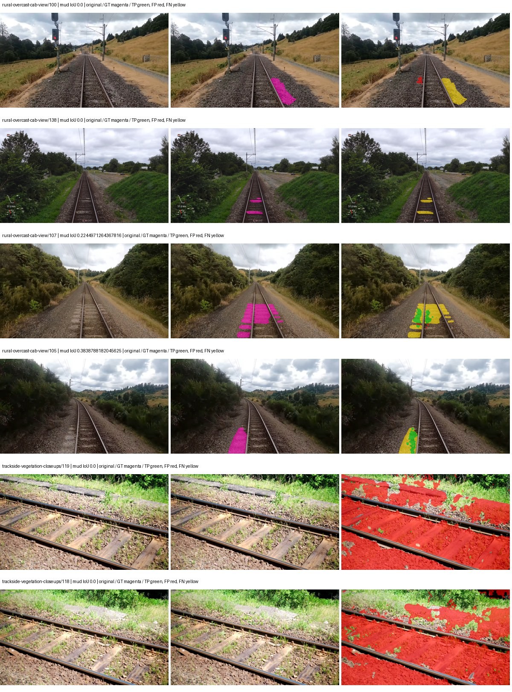
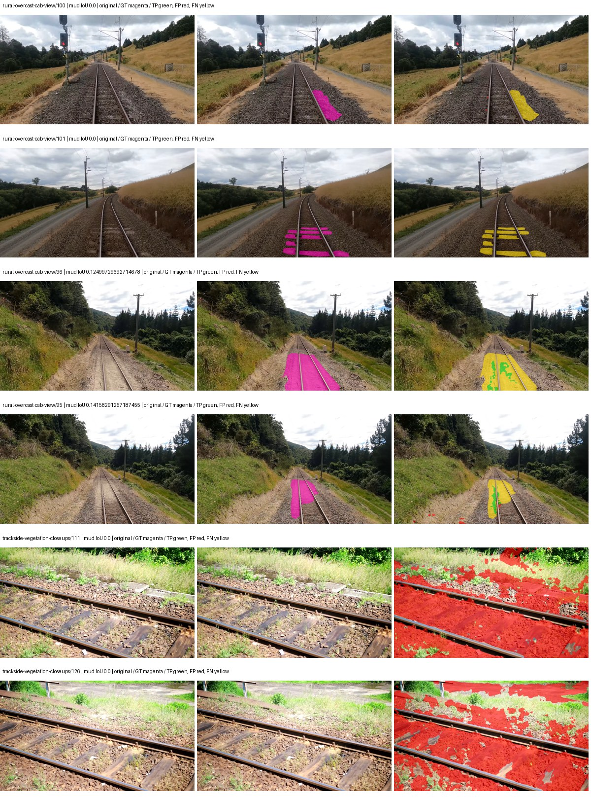
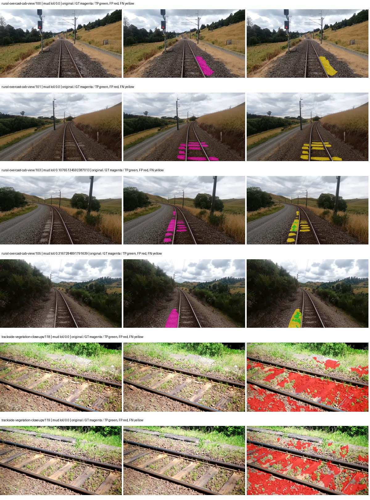

# native_resnet18_fpn_fcn — paul-test-rtis_v2

[RTIS comparison](../../README.md) · [Full model records](record.json)

Primary selection and early stopping: **mud-pumping validation IoU**. A job is complete only after full statistics and isolated profiling are verified.

| Model | Initialization path | Seed | Status | Steps | Best step | Mud IoU (%) | Mud precision (%) | Mud recall (%) | Final mud IoU (trainer val, %) | mIoU (%) | Fixed GT-class mIoU (%) |
| --- | --- | --- | --- | --- | --- | --- | --- | --- | --- | --- | --- |
| native_resnet18_fpn_fcn | rtis_only | 0 | completed | 2549 | 1274 | 1.17 | 1.30 | 10.32 | 0.16 | 21.56 | 25.15 |
| native_resnet18_fpn_fcn | cityscapes_to_rtis | 0 | completed | 1784 | 509 | 0.84 | 0.96 | 6.35 | 0.18 | 20.83 | 24.30 |
| native_resnet18_fpn_fcn | railsem19_to_rtis | 0 | completed | 2294 | 1019 | 1.16 | 1.48 | 5.02 | 0.12 | 37.68 | 41.86 |
| native_resnet18_fpn_fcn | cityscapes_to_railsem19_to_rtis | 0 | training | 1784 | — | — | — | — | — | — | — |

Training: 205 images. Validation: 37 images. Test: 50 held out. Seeds: [0]. Seed variation measures optimization variability, not independent-recording uncertainty. Historical source checkpoints stay fixed across adaptation seeds.

Training code: `066afb2626398b7be59d4d19f5a0e4644fd59adc`. Split SHA-256: `18a84c0163a65ded46508bcc904c374e5f33ad8a09b8879e3c8add606e86aa9f`.

## rtis_only — seed 0

Status: **completed**. Started: 2026-09-09T22:57:05.112996+00:00. Finished: 2026-09-09T23:24:48.291184+00:00.

Recipe pretrained initializer: `{"arch": "native", "backbone_path": null, "batch_norm_momentum": null, "checkpoint": null, "classifier_path": null, "drop_path": null, "encoder_name": null, "encoder_weights": null, "head": "unified_head", "head_paths": [], "inactive_parameter_paths": [], "local_files_only": false, "lora_alpha": 32, "lora_dropout": 0.05, "lora_r": 16, "lora_targets": [], "native": {"auxiliary_heads": [], "backbone": {"in_channels": 3, "kind": "timm", "name": "resnet18.a1_in1k", "out_indices": [1, 2, 3, 4], "weights": "pretrained"}, "head": {"activation": "relu", "channels": 128, "dilation": 1, "dropout": 0.1, "in_indices": [0, 1, 2, 3], "kernel_size": 3, "kind": "fcn", "norm": "group", "num_convs": 2}, "neck": {"activation": "relu", "kind": "fpn", "norm": "group", "num_outputs": 4, "out_channels": 128}, "task": "multiclass"}, "revision": null, "smp_arch": null, "subfolder": null, "trust_remote_code": false, "tuning": "full"}`.

`rtis_only` uses the recipe initializer, which may include pretrained segmentation components. Transfer paths load the exact historical source checkpoint below and reset the classifier; they do not reset all query/decoder features.

Source checkpoint: `Recipe pretrained initialization`.

Config SHA-256: `c4f78118c233c6606d640c00090a3246f312999d3e1caed1edcabb4b8f21813f`. Weights used for validation: `raw`.

### Mud-pumping and aggregate quality

| Metric | Selected checkpoint | Final training validation |
| --- | --- | --- |
| Mud IoU | 1.17 | 0.16 |
| Mud precision | 1.30 | 0.24 |
| Mud recall | 10.32 | 0.46 |
| Mud Dice/F1 | 2.31 | 0.31 |
| mIoU | 21.56 | 23.34 |
| Mean accuracy | 33.78 | 36.19 |
| Mean precision | 41.24 | 46.46 |
| Mean Dice | 27.44 | 30.21 |
| Mean specificity | 98.61 | 98.76 |
| Pixel accuracy | 75.41 | 78.57 |
| Frequency-weighted IoU | 68.27 | 69.44 |
| Fixed GT-present class mIoU | 25.15 | 27.23 |
| Boundary F1 | 25.71 | 29.16 |

The selected checkpoint has independent evaluation evidence. Final values are the trainer's final validation record, not a new independent evaluation. mIoU averages classes with nonzero union, so false positives on absent classes can change its denominator. The fixed GT-class mean is supplementary and excludes absent classes; their false positives remain in the confusion matrix.

### Resource usage and timing

| Measurement | Value |
| --- | --- |
| Peak training VRAM, retained training invocation (GiB) | 7.34 |
| Peak evaluation VRAM (GiB) | 7.04 |
| Retained training invocation wall time (seconds) | 1542.96 |
| Retained training invocation GPU-hours (one GPU) | 0.43 |
| Evaluation wall time (seconds) | 11.02 |
| Full evaluation pipeline images/second | 3.36 |
| Best full-state checkpoint (MiB) | 192.99 |
| Final full-state checkpoint (MiB) | 192.98 |
| Verified periodic checkpoints removed (GiB) | 0.94 |

VRAM uses the recorded allocator high-water mark; it is not total device usage including CUDA context. Resumed jobs' retained training invocation times and peaks are **not whole-campaign totals**. Earlier invocation resource records are not reconstructed here. Evaluation throughput includes loader, sliding-window inference and metrics; it is not model-only latency/FPS. Missing measurements are shown as —, never inferred from another dataset's run.

### Standardized inference performance

Dedicated model-only profiling waits for an idle worker-locked L40S: BF16, batch 1, 1024x1024, 20 warmup and 100 CUDA-event-timed public forwards. It excludes loading, preprocessing, tiling and metrics.

| Status | Parameters | Weight MiB | FPS | p50 ms | p95 ms | Peak reserved GiB |
| --- | --- | --- | --- | --- | --- | --- |
| complete | 12631253 | 48.18 | 222.60 | 4.42 | 4.80 | 0.64 |

```json
{
  "schema_version": 1,
  "model_id": "native_resnet18_fpn_fcn",
  "measured_at": "2026-09-09T23:24:45+00:00",
  "status": "complete",
  "benchmark_scope": "rtis_selected_checkpoint_model_only",
  "applies_to": [
    "native_resnet18_fpn_fcn--rtis_only--seed-0"
  ],
  "source": {
    "campaign_git_sha": "066afb2626398b7be59d4d19f5a0e4644fd59adc",
    "git_dirty": false,
    "config_hash": "7744fedf685b",
    "resolved_config": "/data/izadia1/projects/segmentary-runs/paul-test-rtis_v2/seed0-20260909/configs/native_resnet18_fpn_fcn--rtis_only--seed-0.yaml",
    "config_sha256": "c4f78118c233c6606d640c00090a3246f312999d3e1caed1edcabb4b8f21813f",
    "checkpoint_sha256": "c98c838fefdfde85dd93c116e20787d65c414a0055ed83f66b30166898a7b6af",
    "checkpoint_global_step": 1274,
    "checkpoint_bytes": 202363673,
    "checkpoint_kind": "resume checkpoint with optimizer and EMA state",
    "weights": "raw",
    "measured_checkpoint_job_id": "native_resnet18_fpn_fcn--rtis_only--seed-0",
    "result_sha256": "5d0d02e4b32ff5641fb2c0b259c6ecb5c20512152f40e55b99eeb22c14c7663e",
    "result_git_sha": "066afb2626398b7be59d4d19f5a0e4644fd59adc",
    "result_stage": "eval:paul-test-rtis:val",
    "result_seed": 0
  },
  "hardware": {
    "gpu_name": "NVIDIA L40S",
    "gpu_uuid": "GPU-fc5dde96-210d-0afa-ac74-7f88477d622b",
    "logical_device": "cuda:0",
    "physical_visibility_token": "4",
    "compute_capability": [
      8,
      9
    ],
    "total_memory_bytes": 47677177856
  },
  "model": {
    "parameter_count": 12631253,
    "trainable_parameter_count": 12631253,
    "resident_parameter_bytes": 50525012,
    "parameter_dtype_counts": {
      "float32": 12631253
    }
  },
  "contract": {
    "backend": "pytorch",
    "precision": "bf16_autocast",
    "batch_size": 1,
    "input_shape_nchw": [
      1,
      3,
      1024,
      1024
    ],
    "warmup_iterations": 20,
    "measured_iterations": 100,
    "timing": "per-forward CUDA events with end-event synchronization",
    "includes_preprocessing": false,
    "includes_data_loader": false,
    "includes_sliding_window": false,
    "input_resident_on_gpu": true,
    "model_only": true,
    "entrypoint": "public model(image) dense-logits forward"
  },
  "measurements": {
    "latency": {
      "p50_ms": 4.42468786239624,
      "p95_ms": 4.797382426261902,
      "mean_ms": 4.492403516769409,
      "minimum_ms": 4.379648208618164,
      "maximum_ms": 5.147647857666016,
      "fps": 222.59799153552507,
      "raw_ms": [
        4.585472106933594,
        4.627456188201904,
        4.421631813049316,
        4.388864040374756,
        4.449183940887451,
        4.952064037322998,
        4.44927978515625,
        4.399104118347168,
        4.4113922119140625,
        4.40115213394165,
        4.389887809753418,
        4.428800106048584,
        4.404223918914795,
        4.4759039878845215,
        4.773888111114502,
        4.412415981292725,
        4.5404157638549805,
        4.40831995010376,
        4.71449613571167,
        4.411456108093262,
        4.419583797454834,
        4.442111968994141,
        4.420608043670654,
        4.40012788772583,
        4.412415981292725,
        4.3919358253479,
        4.379648208618164,
        4.386816024780273,
        4.440063953399658,
        4.40934419631958,
        4.496384143829346,
        4.425727844238281,
        4.385791778564453,
        4.3878397941589355,
        4.399040222167969,
        4.404223918914795,
        5.111807823181152,
        4.433919906616211,
        4.711423873901367,
        4.76364803314209,
        4.396031856536865,
        4.432896137237549,
        4.40934419631958,
        4.406271934509277,
        4.410304069519043,
        4.498432159423828,
        4.527103900909424,
        4.655104160308838,
        4.733952045440674,
        4.686848163604736,
        4.446239948272705,
        4.464640140533447,
        4.44927978515625,
        4.399072170257568,
        4.388864040374756,
        4.3816962242126465,
        4.425695896148682,
        4.427775859832764,
        4.386816024780273,
        4.405248165130615,
        4.775807857513428,
        4.642816066741943,
        4.716544151306152,
        4.407167911529541,
        4.390848159790039,
        4.442111968994141,
        4.447231769561768,
        4.429823875427246,
        4.418496131896973,
        4.386816024780273,
        4.385791778564453,
        4.403200149536133,
        4.428800106048584,
        4.577184200286865,
        4.465663909912109,
        4.730879783630371,
        4.421631813049316,
        4.410367965698242,
        4.436992168426514,
        4.391039848327637,
        4.432896137237549,
        4.930560111999512,
        4.504576206207275,
        4.795392036437988,
        4.432896137237549,
        4.383743762969971,
        4.420639991760254,
        4.4615678787231445,
        4.4021759033203125,
        4.406271934509277,
        4.407296180725098,
        4.40115213394165,
        4.398079872131348,
        5.147647857666016,
        4.467711925506592,
        4.40831995010376,
        4.40934419631958,
        4.423679828643799,
        4.462495803833008,
        4.83519983291626
      ],
      "percentile_method": "numpy linear interpolation"
    },
    "peak_reserved_bytes": 685768704,
    "memory_kind": "pytorch_cuda_allocator_peak_reserved_excluding_context",
    "benchmark_wall_clock_s": 8.471506331115961
  },
  "started_at": "2026-09-09T23:24:37+00:00",
  "finished_at": "2026-09-09T23:24:45+00:00",
  "environment": {
    "hostname": "hdrfs-app-001",
    "python": "3.11.15",
    "platform": "Linux-5.15.0-139-generic-x86_64-with-glibc2.35",
    "torch": "2.11.0+cu128",
    "torch_cuda": "12.8",
    "cudnn": 91900,
    "driver_version": "570.133.20",
    "cuda_available": true,
    "gpu_count": 1,
    "gpu_names": [
      "NVIDIA L40S"
    ],
    "cuda_visible_devices": "4",
    "packages": {
      "segmentary": "0.1.0",
      "torch": "2.11.0+cu128",
      "torchvision": "0.26.0+cu128",
      "transformers": "5.15.0",
      "timm": "1.0.28",
      "segmentation-models-pytorch": "0.5.0",
      "albumentations": "2.0.8",
      "lightning": "2.6.5",
      "numpy": "2.4.4"
    }
  }
}
```

### Per-class validation results

| Class | GT pixels | IoU (%) | Precision (%) | Recall (%) | Dice (%) | Boundary F1 (%) |
| --- | --- | --- | --- | --- | --- | --- |
| car | 29664 | 0.00 | 0.00 | 0.00 | 0.00 | 0.00 |
| construction | 311585 | 14.00 | 14.60 | 77.44 | 24.57 | 21.18 |
| fence | 265137 | 10.06 | 56.51 | 10.90 | 18.28 | 23.41 |
| mud-pumping | 1226250 | 1.17 | 1.30 | 10.32 | 2.31 | 4.01 |
| on-rails | 0 | 0.00 | 0.00 | — | 0.00 | 0.00 |
| person | 0 | 0.00 | 0.00 | — | 0.00 | 0.00 |
| pole | 628038 | 56.08 | 67.76 | 76.49 | 71.86 | 83.40 |
| rail-embedded | 16799 | 0.00 | 0.00 | 0.00 | 0.00 | 0.37 |
| rail-raised | 2969797 | 71.04 | 80.28 | 86.05 | 83.07 | 87.28 |
| rail-track | 6323197 | 31.11 | 68.46 | 36.31 | 47.45 | 40.82 |
| road | 1048831 | 1.55 | 17.97 | 1.67 | 3.06 | 9.26 |
| sidewalk | 1297367 | 22.37 | 98.19 | 22.46 | 36.56 | 9.39 |
| sky | 19121606 | 96.97 | 98.89 | 98.03 | 98.46 | 89.69 |
| standing-water | 95802 | 1.39 | 1.47 | 18.92 | 2.74 | 6.84 |
| terrain | 39239306 | 81.72 | 89.09 | 90.81 | 89.94 | 47.45 |
| trackbed | 10643081 | 47.51 | 69.27 | 60.19 | 64.42 | 45.67 |
| traffic-light | 19510 | 4.08 | 75.75 | 4.13 | 7.84 | 25.60 |
| traffic-sign | 13285 | 6.66 | 51.75 | 7.11 | 12.50 | 20.56 |
| tram-track | 56179 | 0.00 | 0.00 | 0.00 | 0.00 | 0.00 |
| truck | 0 | 0.00 | 0.00 | — | 0.00 | 0.00 |
| vegetation-overgrowth | 5901821 | 7.08 | 74.81 | 7.25 | 13.22 | 24.95 |

### Full-run accounting

| Measurement | Value |
| --- | --- |
| Full GPU-reserved wall seconds, all recorded worker attempts | 1663.18 |
| Full reserved GPU-hours | 0.46 |
| Whole-run timing complete | True |

| Phase | Wall seconds including failed attempts |
| --- | --- |
| training | 1549.65 |
| diagnostics | 78.70 |
| performance | 15.27 |

GPU-reserved time includes model loading, training, validation, collection, profiling, checkpoint I/O and orchestration while the worker owns one GPU. It is not GPU kernel-active time. Phase timings and sampled device memory/power/utilization are retained separately; sampled device memory is not the allocator high-water mark.

### Train/validation and raw/EMA diagnostics

| Checkpoint / weights / split | Images | Mud IoU (%) | Mud precision (%) | Mud recall (%) |
| --- | --- | --- | --- | --- |
| best-auto-train / raw | 205 | 88.43 | 91.77 | 96.04 |
| best-auto-val / raw | 37 | 1.17 | 1.30 | 10.32 |
| best-alternate-val / ema | 37 | 0.28 | 0.35 | 1.47 |
| final-auto-val / raw | 37 | 0.16 | 0.24 | 0.46 |

Train uses the evaluation transform without augmentation. Compare mud train/validation metrics for the same selected weights. Alternate EMA on running-stat BatchNorm is explicitly uncalibrated and is diagnostic only. Score-threshold curves use uncalibrated normalized scores and are pixel-level diagnostics, not event detection rates or a selected deployment operating point.

### Downloadable evidence

- best-auto-train: [per-image.csv](rtis_only--seed-0/best-auto-train/per-image.csv) · [per-image-confusion.json.gz](rtis_only--seed-0/best-auto-train/per-image-confusion.json.gz) · [groups.json](rtis_only--seed-0/best-auto-train/groups.json) · [mud-score-curves.json](rtis_only--seed-0/best-auto-train/mud-score-curves.json)
- best-auto-val: [per-image.csv](rtis_only--seed-0/best-auto-val/per-image.csv) · [per-image-confusion.json.gz](rtis_only--seed-0/best-auto-val/per-image-confusion.json.gz) · [groups.json](rtis_only--seed-0/best-auto-val/groups.json) · [mud-score-curves.json](rtis_only--seed-0/best-auto-val/mud-score-curves.json) · [examples.jpg](rtis_only--seed-0/best-auto-val/examples.jpg)
- best-alternate-val: [per-image.csv](rtis_only--seed-0/best-alternate-val/per-image.csv) · [per-image-confusion.json.gz](rtis_only--seed-0/best-alternate-val/per-image-confusion.json.gz) · [groups.json](rtis_only--seed-0/best-alternate-val/groups.json) · [mud-score-curves.json](rtis_only--seed-0/best-alternate-val/mud-score-curves.json)
- final-auto-val: [per-image.csv](rtis_only--seed-0/final-auto-val/per-image.csv) · [per-image-confusion.json.gz](rtis_only--seed-0/final-auto-val/per-image-confusion.json.gz) · [groups.json](rtis_only--seed-0/final-auto-val/groups.json) · [mud-score-curves.json](rtis_only--seed-0/final-auto-val/mud-score-curves.json)
- resources: [telemetry.csv](rtis_only--seed-0/resources/telemetry.csv)



Examples are two lowest and two highest mud-IoU positive images, plus up to two negative images with the most false-positive mud pixels. They are targeted diagnostic examples, not random samples. Green: true positive; red: false positive; yellow: false negative. Full predictions remain on HDRFS.

### Validation tracking

| Logged step | Overall mIoU (%) | Mud IoU (%) |
| --- | --- | --- |
| 254 | 19.06 | 0.37 |
| 509 | 20.14 | 0.50 |
| 764 | 22.04 | 0.17 |
| 1019 | 21.59 | 0.19 |
| 1274 | 21.57 | 1.17 |
| 1529 | 24.56 | 0.24 |
| 1784 | 25.86 | 0.19 |
| 2038 | 25.21 | 0.40 |
| 2293 | 26.91 | 0.21 |
| 2548 | 23.34 | 0.16 |

All retained scalar curves, including training loss and per-class IoU, are in record.json. Observed best mud on a curve is not necessarily a retained checkpoint: the pilot saved its selection-metric-best and final checkpoints. Step logging and checkpoint global_step may differ by one.

### Stopping and checkpoint provenance

```json
{
  "stopping": {
    "actual_steps": 2549,
    "maximum_steps": 4000,
    "min_delta": 0.001,
    "monitor": "val_iou/mud-pumping",
    "patience": 5,
    "reason": "validation_plateau"
  },
  "checkpoints": {
    "best": {
      "path": "/data/izadia1/projects/segmentary-runs/paul-test-rtis_v2/seed0-20260909/future-runs/native_resnet18_fpn_fcn--rtis_only--seed-0_seed0/rtis/best.ckpt",
      "sha256": "c98c838fefdfde85dd93c116e20787d65c414a0055ed83f66b30166898a7b6af",
      "global_step": 1274,
      "bytes": 202363673
    },
    "final": {
      "path": "/data/izadia1/projects/segmentary-runs/paul-test-rtis_v2/seed0-20260909/future-runs/native_resnet18_fpn_fcn--rtis_only--seed-0_seed0/rtis/last.ckpt",
      "sha256": "8851190772ade7a21b3761095510043a29e10116183bd20681f8486914c23ac3",
      "global_step": 2549,
      "bytes": 202358553
    }
  },
  "cleanup_error": null
}
```

### Resolved training, initialization and evaluation settings

The optimizer block is the base configuration. Stage LR scales are applied at runtime, and stage warmup is capped at min(base warmup, floor(stage budget / 10), stage budget - 1): 400 steps for this 4,000-step pilot. Model-internal native input grids may differ from augmentation crops (EoMT uses its 640 grid).

```json
{
  "name": "native_resnet18_fpn_fcn--rtis_only--seed-0",
  "model": {
    "arch": "native",
    "checkpoint": null,
    "tuning": "full",
    "head": "unified_head",
    "lora_r": 16,
    "lora_alpha": 32,
    "lora_dropout": 0.05,
    "lora_targets": [],
    "drop_path": null,
    "revision": null,
    "subfolder": null,
    "local_files_only": false,
    "trust_remote_code": false,
    "backbone_path": null,
    "head_paths": [],
    "classifier_path": null,
    "inactive_parameter_paths": [],
    "smp_arch": null,
    "encoder_name": null,
    "encoder_weights": null,
    "native": {
      "task": "multiclass",
      "backbone": {
        "kind": "timm",
        "name": "resnet18.a1_in1k",
        "weights": "pretrained",
        "out_indices": [
          1,
          2,
          3,
          4
        ],
        "in_channels": 3
      },
      "neck": {
        "kind": "fpn",
        "out_channels": 128,
        "num_outputs": 4,
        "norm": "group",
        "activation": "relu"
      },
      "head": {
        "kind": "fcn",
        "in_indices": [
          0,
          1,
          2,
          3
        ],
        "channels": 128,
        "num_convs": 2,
        "kernel_size": 3,
        "dilation": 1,
        "dropout": 0.1,
        "norm": "group",
        "activation": "relu"
      },
      "auxiliary_heads": []
    },
    "batch_norm_momentum": null
  },
  "space": "paul-test-rtis",
  "taxonomy_root": "/data/izadia1/projects/segmentary-rtis-fullstats-066afb2/taxonomy",
  "output_root": "/data/izadia1/projects/segmentary-runs/paul-test-rtis_v2/seed0-20260909/future-runs",
  "optim": {
    "backbone_lr": 0.0001,
    "head_lr_mult": 10.0,
    "weight_decay": 0.05,
    "llrd": 1.0,
    "warmup_iters": 1500,
    "warmup_ratio": 1e-06,
    "poly_power": 0.9,
    "min_lr_ratio": 0.0,
    "betas": [
      0.9,
      0.999
    ],
    "grad_clip": 1.0
  },
  "train": {
    "iters": 4000,
    "batch_size": 2,
    "accum": 8,
    "num_workers": 2,
    "precision": "bf16-mixed",
    "ema_decay": 0.9998,
    "val_every": 250,
    "ckpt_every": 500,
    "selection_metric": "val_iou/mud-pumping",
    "early_stopping_patience": 5,
    "early_stopping_min_delta": 0.001,
    "seed": 0,
    "devices": 1
  },
  "eval": {
    "sliding_window": true,
    "window": [
      1024,
      1024
    ],
    "stride": [
      768,
      768
    ],
    "batch_size": 1,
    "num_workers": 2,
    "tta_scales": [],
    "tta_flip": false,
    "threshold": 0.5,
    "boundary_tolerance_frac": 0.0075,
    "save_confusion": true
  },
  "loss": {
    "task": "multiclass",
    "activation": "auto",
    "terms": [],
    "aux": "none",
    "aux_weight": 0.0,
    "ce_weight": 1.0,
    "label_smoothing": 0.0,
    "class_weights": null,
    "query": null
  },
  "aug": {
    "crop": [
      1024,
      1024
    ],
    "scale_min": 0.5,
    "scale_max": 2.0,
    "hflip_p": 0.5,
    "color_jitter_p": 0.5,
    "brightness": 0.25,
    "contrast": 0.25,
    "saturation": 0.25,
    "hue": 0.05
  },
  "stages": [
    {
      "name": "rtis",
      "data": [
        {
          "name": "paul-test-rtis",
          "root": "/data/izadia1/datasets/paul-test-rtis_v2",
          "variant": null,
          "split_file": "splits.json",
          "train_split": "train",
          "val_split": "val",
          "limit": null,
          "loader": "folder",
          "mapping": "paul-test-rtis",
          "loader_options": {
            "require_groups": true
          }
        }
      ],
      "iters": null,
      "lr_scale": 1.0,
      "head_group_lr_scale": 1.0,
      "init_from": "pretrained",
      "reset_head": false,
      "freeze": null,
      "sample_weights": null
    }
  ]
}
```

### Hardware and software provenance

```json
{
  "training": {
    "cuda_available": true,
    "cuda_visible_devices": "4",
    "cudnn": 91900,
    "driver_version": "570.133.20",
    "gpu_count": 1,
    "gpu_names": [
      "NVIDIA L40S"
    ],
    "hostname": "hdrfs-app-001",
    "input_normalization": {
      "channel_order": "rgb",
      "mean": [
        0.485,
        0.456,
        0.406
      ],
      "source": "timm_pretrained_cfg",
      "std": [
        0.229,
        0.224,
        0.225
      ]
    },
    "model_origins": [
      {
        "hf_commit": null,
        "hf_name_or_path": null,
        "module": "backbone",
        "timm_pretrained": {
          "architecture": "resnet18",
          "hf_hub_id": "timm/resnet18.a1_in1k",
          "tag": "a1_in1k",
          "url": "https://github.com/huggingface/pytorch-image-models/releases/download/v0.1-rsb-weights/resnet18_a1_0-d63eafa0.pth"
        }
      },
      {
        "hf_commit": null,
        "hf_name_or_path": null,
        "module": "backbone.model",
        "timm_pretrained": {
          "architecture": "resnet18",
          "hf_hub_id": "timm/resnet18.a1_in1k",
          "tag": "a1_in1k",
          "url": "https://github.com/huggingface/pytorch-image-models/releases/download/v0.1-rsb-weights/resnet18_a1_0-d63eafa0.pth"
        }
      }
    ],
    "model_parameter_count": 12631253,
    "packages": {
      "albumentations": "2.0.8",
      "lightning": "2.6.5",
      "numpy": "2.4.4",
      "segmentary": "0.1.0",
      "segmentation-models-pytorch": "0.5.0",
      "timm": "1.0.28",
      "torch": "2.11.0+cu128",
      "torchvision": "0.26.0+cu128",
      "transformers": "5.15.0"
    },
    "platform": "Linux-5.15.0-139-generic-x86_64-with-glibc2.35",
    "python": "3.11.15",
    "torch": "2.11.0+cu128",
    "torch_cuda": "12.8",
    "trainable_parameter_count": 12631253,
    "training_stop": {
      "actual_steps": 2549,
      "maximum_steps": 4000,
      "min_delta": 0.001,
      "monitor": "val_iou/mud-pumping",
      "patience": 5,
      "reason": "validation_plateau"
    },
    "validation_weights": "raw"
  },
  "evaluation": {
    "cuda_available": true,
    "cuda_visible_devices": "4",
    "cudnn": 91900,
    "driver_version": "570.133.20",
    "gpu_count": 1,
    "gpu_names": [
      "NVIDIA L40S"
    ],
    "hostname": "hdrfs-app-001",
    "input_normalization": {
      "channel_order": "rgb",
      "mean": [
        0.485,
        0.456,
        0.406
      ],
      "source": "timm_pretrained_cfg",
      "std": [
        0.229,
        0.224,
        0.225
      ]
    },
    "packages": {
      "albumentations": "2.0.8",
      "lightning": "2.6.5",
      "numpy": "2.4.4",
      "segmentary": "0.1.0",
      "segmentation-models-pytorch": "0.5.0",
      "timm": "1.0.28",
      "torch": "2.11.0+cu128",
      "torchvision": "0.26.0+cu128",
      "transformers": "5.15.0"
    },
    "platform": "Linux-5.15.0-139-generic-x86_64-with-glibc2.35",
    "python": "3.11.15",
    "torch": "2.11.0+cu128",
    "torch_cuda": "12.8"
  }
}
```

## cityscapes_to_rtis — seed 0

Status: **completed**. Started: 2026-09-09T22:59:23.632694+00:00. Finished: 2026-09-09T23:19:41.088534+00:00.

Recipe pretrained initializer: `{"arch": "native", "backbone_path": null, "batch_norm_momentum": null, "checkpoint": null, "classifier_path": null, "drop_path": null, "encoder_name": null, "encoder_weights": null, "head": "unified_head", "head_paths": [], "inactive_parameter_paths": [], "local_files_only": false, "lora_alpha": 32, "lora_dropout": 0.05, "lora_r": 16, "lora_targets": [], "native": {"auxiliary_heads": [], "backbone": {"in_channels": 3, "kind": "timm", "name": "resnet18.a1_in1k", "out_indices": [1, 2, 3, 4], "weights": "pretrained"}, "head": {"activation": "relu", "channels": 128, "dilation": 1, "dropout": 0.1, "in_indices": [0, 1, 2, 3], "kernel_size": 3, "kind": "fcn", "norm": "group", "num_convs": 2}, "neck": {"activation": "relu", "kind": "fpn", "norm": "group", "num_outputs": 4, "out_channels": 128}, "task": "multiclass"}, "revision": null, "smp_arch": null, "subfolder": null, "trust_remote_code": false, "tuning": "full"}`.

`rtis_only` uses the recipe initializer, which may include pretrained segmentation components. Transfer paths load the exact historical source checkpoint below and reset the classifier; they do not reset all query/decoder features.

Source checkpoint: `{'name': 'native_resnet18_fpn_fcn--cityscapes--seed-0', 'model': 'native_resnet18_fpn_fcn', 'protocol': 'cityscapes', 'config': '/data/izadia1/projects/segmentary-runs/all-model-city-rail-seed0-rail20-b9eb3e1/jobs/native_resnet18_fpn_fcn--cityscapes--seed-0/attempt-001/resolved-config.yaml', 'checkpoint': '/data/izadia1/projects/segmentary-runs/all-model-city-rail-seed0-rail20-b9eb3e1/jobs/native_resnet18_fpn_fcn--cityscapes--seed-0/attempt-001/train/native_resnet18_fpn_fcn--cityscapes_seed0/cityscapes/last.ckpt', 'recorded_sha256': 'b3474fcb1341e0ce32beb83d56dedf1c206220837067b54bb10aa16999baf1eb', 'exists': True}`.

Config SHA-256: `c73c23267612072947f9d8aa69fd95fd8a9a191e412bd1b9f970e4f7c5f6a4ef`. Weights used for validation: `raw`.

### Mud-pumping and aggregate quality

| Metric | Selected checkpoint | Final training validation |
| --- | --- | --- |
| Mud IoU | 0.84 | 0.18 |
| Mud precision | 0.96 | 0.22 |
| Mud recall | 6.35 | 0.83 |
| Mud Dice/F1 | 1.67 | 0.35 |
| mIoU | 20.83 | 24.62 |
| Mean accuracy | 29.90 | 36.93 |
| Mean precision | 34.39 | 43.27 |
| Mean Dice | 25.71 | 32.05 |
| Mean specificity | 98.67 | 98.68 |
| Pixel accuracy | 77.41 | 77.45 |
| Frequency-weighted IoU | 69.19 | 69.05 |
| Fixed GT-present class mIoU | 24.30 | 28.72 |
| Boundary F1 | 24.21 | 31.66 |

The selected checkpoint has independent evaluation evidence. Final values are the trainer's final validation record, not a new independent evaluation. mIoU averages classes with nonzero union, so false positives on absent classes can change its denominator. The fixed GT-class mean is supplementary and excludes absent classes; their false positives remain in the confusion matrix.

### Resource usage and timing

| Measurement | Value |
| --- | --- |
| Peak training VRAM, retained training invocation (GiB) | 7.34 |
| Peak evaluation VRAM (GiB) | 7.04 |
| Retained training invocation wall time (seconds) | 1095.01 |
| Retained training invocation GPU-hours (one GPU) | 0.30 |
| Evaluation wall time (seconds) | 11.49 |
| Full evaluation pipeline images/second | 3.22 |
| Best full-state checkpoint (MiB) | 192.99 |
| Final full-state checkpoint (MiB) | 192.98 |
| Verified periodic checkpoints removed (GiB) | 0.57 |

VRAM uses the recorded allocator high-water mark; it is not total device usage including CUDA context. Resumed jobs' retained training invocation times and peaks are **not whole-campaign totals**. Earlier invocation resource records are not reconstructed here. Evaluation throughput includes loader, sliding-window inference and metrics; it is not model-only latency/FPS. Missing measurements are shown as —, never inferred from another dataset's run.

### Standardized inference performance

Dedicated model-only profiling waits for an idle worker-locked L40S: BF16, batch 1, 1024x1024, 20 warmup and 100 CUDA-event-timed public forwards. It excludes loading, preprocessing, tiling and metrics.

| Status | Parameters | Weight MiB | FPS | p50 ms | p95 ms | Peak reserved GiB |
| --- | --- | --- | --- | --- | --- | --- |
| complete | 12631253 | 48.18 | 227.13 | 4.37 | 4.64 | 0.64 |

```json
{
  "schema_version": 1,
  "model_id": "native_resnet18_fpn_fcn",
  "measured_at": "2026-09-09T23:19:38+00:00",
  "status": "complete",
  "benchmark_scope": "rtis_selected_checkpoint_model_only",
  "applies_to": [
    "native_resnet18_fpn_fcn--cityscapes_to_rtis--seed-0"
  ],
  "source": {
    "campaign_git_sha": "066afb2626398b7be59d4d19f5a0e4644fd59adc",
    "git_dirty": false,
    "config_hash": "b9b78b76eef7",
    "resolved_config": "/data/izadia1/projects/segmentary-runs/paul-test-rtis_v2/seed0-20260909/configs/native_resnet18_fpn_fcn--cityscapes_to_rtis--seed-0.yaml",
    "config_sha256": "c73c23267612072947f9d8aa69fd95fd8a9a191e412bd1b9f970e4f7c5f6a4ef",
    "checkpoint_sha256": "2ff966d88b31ef8b71b285a46b0d5f7ba663675ab8e058e5eebeab4b2ec13677",
    "checkpoint_global_step": 509,
    "checkpoint_bytes": 202363673,
    "checkpoint_kind": "resume checkpoint with optimizer and EMA state",
    "weights": "raw",
    "measured_checkpoint_job_id": "native_resnet18_fpn_fcn--cityscapes_to_rtis--seed-0",
    "result_sha256": "a214c86383c55a62307e58f8044ccd265b09f2b6e7c247a2318eb4c4319a3490",
    "result_git_sha": "066afb2626398b7be59d4d19f5a0e4644fd59adc",
    "result_stage": "eval:paul-test-rtis:val",
    "result_seed": 0
  },
  "hardware": {
    "gpu_name": "NVIDIA L40S",
    "gpu_uuid": "GPU-c76642eb-64c1-b0ac-b051-d2efd47b32c4",
    "logical_device": "cuda:0",
    "physical_visibility_token": "9",
    "compute_capability": [
      8,
      9
    ],
    "total_memory_bytes": 47677177856
  },
  "model": {
    "parameter_count": 12631253,
    "trainable_parameter_count": 12631253,
    "resident_parameter_bytes": 50525012,
    "parameter_dtype_counts": {
      "float32": 12631253
    }
  },
  "contract": {
    "backend": "pytorch",
    "precision": "bf16_autocast",
    "batch_size": 1,
    "input_shape_nchw": [
      1,
      3,
      1024,
      1024
    ],
    "warmup_iterations": 20,
    "measured_iterations": 100,
    "timing": "per-forward CUDA events with end-event synchronization",
    "includes_preprocessing": false,
    "includes_data_loader": false,
    "includes_sliding_window": false,
    "input_resident_on_gpu": true,
    "model_only": true,
    "entrypoint": "public model(image) dense-logits forward"
  },
  "measurements": {
    "latency": {
      "p50_ms": 4.374527931213379,
      "p95_ms": 4.6429184675216675,
      "mean_ms": 4.402686681747436,
      "minimum_ms": 4.343808174133301,
      "maximum_ms": 4.899839878082275,
      "fps": 227.13403707462956,
      "raw_ms": [
        4.799488067626953,
        4.385791778564453,
        4.410367965698242,
        4.422656059265137,
        4.371424198150635,
        4.353024005889893,
        4.428800106048584,
        4.362239837646484,
        4.355072021484375,
        4.435967922210693,
        4.374527931213379,
        4.364287853240967,
        4.423711776733398,
        4.356095790863037,
        4.360159873962402,
        4.361216068267822,
        4.649983882904053,
        4.383743762969971,
        4.363264083862305,
        4.363264083862305,
        4.376543998718262,
        4.393983840942383,
        4.3673601150512695,
        4.380671977996826,
        4.343808174133301,
        4.384768009185791,
        4.385791778564453,
        4.355072021484375,
        4.3970561027526855,
        4.355072021484375,
        4.361184120178223,
        4.642816066741943,
        4.459519863128662,
        4.357120037078857,
        4.3581438064575195,
        4.374527931213379,
        4.364287853240967,
        4.3919358253479,
        4.376575946807861,
        4.365312099456787,
        4.35097599029541,
        4.393983840942383,
        4.380671977996826,
        4.423679828643799,
        4.386816024780273,
        4.361216068267822,
        4.360191822052002,
        4.364287853240967,
        4.364287853240967,
        4.383743762969971,
        4.369408130645752,
        4.35916805267334,
        4.395008087158203,
        4.368383884429932,
        4.362239837646484,
        4.385791778564453,
        4.390912055969238,
        4.35916805267334,
        4.4318718910217285,
        4.396031856536865,
        4.386816024780273,
        4.40934419631958,
        4.393983840942383,
        4.368383884429932,
        4.384768009185791,
        4.5352959632873535,
        4.356095790863037,
        4.355072021484375,
        4.383743762969971,
        4.375552177429199,
        4.354047775268555,
        4.383743762969971,
        4.371456146240234,
        4.365312099456787,
        4.899839878082275,
        4.644864082336426,
        4.4462080001831055,
        4.423679828643799,
        4.667391777038574,
        4.388864040374756,
        4.35916805267334,
        4.353024005889893,
        4.365312099456787,
        4.362239837646484,
        4.368383884429932,
        4.348927974700928,
        4.3724799156188965,
        4.380671977996826,
        4.388864040374756,
        4.373504161834717,
        4.428800106048584,
        4.362239837646484,
        4.380671977996826,
        4.362207889556885,
        4.345856189727783,
        4.362239837646484,
        4.365312099456787,
        4.363264083862305,
        4.417535781860352,
        4.6090240478515625
      ],
      "percentile_method": "numpy linear interpolation"
    },
    "peak_reserved_bytes": 685768704,
    "memory_kind": "pytorch_cuda_allocator_peak_reserved_excluding_context",
    "benchmark_wall_clock_s": 8.351041190326214
  },
  "started_at": "2026-09-09T23:19:30+00:00",
  "finished_at": "2026-09-09T23:19:38+00:00",
  "environment": {
    "hostname": "hdrfs-app-001",
    "python": "3.11.15",
    "platform": "Linux-5.15.0-139-generic-x86_64-with-glibc2.35",
    "torch": "2.11.0+cu128",
    "torch_cuda": "12.8",
    "cudnn": 91900,
    "driver_version": "570.133.20",
    "cuda_available": true,
    "gpu_count": 1,
    "gpu_names": [
      "NVIDIA L40S"
    ],
    "cuda_visible_devices": "9",
    "packages": {
      "segmentary": "0.1.0",
      "torch": "2.11.0+cu128",
      "torchvision": "0.26.0+cu128",
      "transformers": "5.15.0",
      "timm": "1.0.28",
      "segmentation-models-pytorch": "0.5.0",
      "albumentations": "2.0.8",
      "lightning": "2.6.5",
      "numpy": "2.4.4"
    }
  }
}
```

### Per-class validation results

| Class | GT pixels | IoU (%) | Precision (%) | Recall (%) | Dice (%) | Boundary F1 (%) |
| --- | --- | --- | --- | --- | --- | --- |
| car | 29664 | 0.00 | 0.00 | 0.00 | 0.00 | 0.00 |
| construction | 311585 | 34.09 | 46.17 | 56.58 | 50.85 | 39.15 |
| fence | 265137 | 4.56 | 12.68 | 6.64 | 8.72 | 15.06 |
| mud-pumping | 1226250 | 0.84 | 0.96 | 6.35 | 1.67 | 3.42 |
| on-rails | 0 | 0.00 | 0.00 | — | 0.00 | 0.00 |
| person | 0 | 0.00 | 0.00 | — | 0.00 | 0.00 |
| pole | 628038 | 60.15 | 69.15 | 82.20 | 75.11 | 82.77 |
| rail-embedded | 16799 | 0.00 | 0.00 | 0.00 | 0.00 | 0.00 |
| rail-raised | 2969797 | 66.29 | 79.55 | 79.90 | 79.73 | 86.01 |
| rail-track | 6323197 | 22.23 | 71.16 | 24.43 | 36.38 | 41.65 |
| road | 1048831 | 7.02 | 22.83 | 9.21 | 13.13 | 15.44 |
| sidewalk | 1297367 | 2.04 | 86.74 | 2.05 | 4.00 | 8.02 |
| sky | 19121606 | 96.01 | 99.47 | 96.50 | 97.96 | 84.26 |
| standing-water | 95802 | 0.08 | 0.09 | 0.79 | 0.16 | 0.71 |
| terrain | 39239306 | 85.04 | 87.80 | 96.45 | 91.92 | 51.61 |
| trackbed | 10643081 | 53.32 | 67.90 | 71.30 | 69.56 | 53.81 |
| traffic-light | 19510 | 0.00 | 0.00 | 0.00 | 0.00 | 0.00 |
| traffic-sign | 13285 | 0.00 | 0.00 | 0.00 | 0.00 | 0.00 |
| tram-track | 56179 | 0.00 | 0.00 | 0.00 | 0.00 | 0.00 |
| truck | 0 | 0.00 | 0.00 | — | 0.00 | 0.00 |
| vegetation-overgrowth | 5901821 | 5.72 | 77.60 | 5.82 | 10.82 | 26.45 |

### Full-run accounting

| Measurement | Value |
| --- | --- |
| Full GPU-reserved wall seconds, all recorded worker attempts | 1217.63 |
| Full reserved GPU-hours | 0.34 |
| Whole-run timing complete | True |

| Phase | Wall seconds including failed attempts |
| --- | --- |
| training | 1101.92 |
| diagnostics | 80.72 |
| performance | 15.20 |

GPU-reserved time includes model loading, training, validation, collection, profiling, checkpoint I/O and orchestration while the worker owns one GPU. It is not GPU kernel-active time. Phase timings and sampled device memory/power/utilization are retained separately; sampled device memory is not the allocator high-water mark.

### Train/validation and raw/EMA diagnostics

| Checkpoint / weights / split | Images | Mud IoU (%) | Mud precision (%) | Mud recall (%) |
| --- | --- | --- | --- | --- |
| best-auto-train / raw | 205 | 84.11 | 89.47 | 93.35 |
| best-auto-val / raw | 37 | 0.84 | 0.96 | 6.35 |
| best-alternate-val / ema | 37 | 0.23 | 0.29 | 1.24 |
| final-auto-val / raw | 37 | 0.17 | 0.22 | 0.83 |

Train uses the evaluation transform without augmentation. Compare mud train/validation metrics for the same selected weights. Alternate EMA on running-stat BatchNorm is explicitly uncalibrated and is diagnostic only. Score-threshold curves use uncalibrated normalized scores and are pixel-level diagnostics, not event detection rates or a selected deployment operating point.

### Downloadable evidence

- best-auto-train: [per-image.csv](cityscapes_to_rtis--seed-0/best-auto-train/per-image.csv) · [per-image-confusion.json.gz](cityscapes_to_rtis--seed-0/best-auto-train/per-image-confusion.json.gz) · [groups.json](cityscapes_to_rtis--seed-0/best-auto-train/groups.json) · [mud-score-curves.json](cityscapes_to_rtis--seed-0/best-auto-train/mud-score-curves.json)
- best-auto-val: [per-image.csv](cityscapes_to_rtis--seed-0/best-auto-val/per-image.csv) · [per-image-confusion.json.gz](cityscapes_to_rtis--seed-0/best-auto-val/per-image-confusion.json.gz) · [groups.json](cityscapes_to_rtis--seed-0/best-auto-val/groups.json) · [mud-score-curves.json](cityscapes_to_rtis--seed-0/best-auto-val/mud-score-curves.json) · [examples.jpg](cityscapes_to_rtis--seed-0/best-auto-val/examples.jpg)
- best-alternate-val: [per-image.csv](cityscapes_to_rtis--seed-0/best-alternate-val/per-image.csv) · [per-image-confusion.json.gz](cityscapes_to_rtis--seed-0/best-alternate-val/per-image-confusion.json.gz) · [groups.json](cityscapes_to_rtis--seed-0/best-alternate-val/groups.json) · [mud-score-curves.json](cityscapes_to_rtis--seed-0/best-alternate-val/mud-score-curves.json)
- final-auto-val: [per-image.csv](cityscapes_to_rtis--seed-0/final-auto-val/per-image.csv) · [per-image-confusion.json.gz](cityscapes_to_rtis--seed-0/final-auto-val/per-image-confusion.json.gz) · [groups.json](cityscapes_to_rtis--seed-0/final-auto-val/groups.json) · [mud-score-curves.json](cityscapes_to_rtis--seed-0/final-auto-val/mud-score-curves.json)
- resources: [telemetry.csv](cityscapes_to_rtis--seed-0/resources/telemetry.csv)



Examples are two lowest and two highest mud-IoU positive images, plus up to two negative images with the most false-positive mud pixels. They are targeted diagnostic examples, not random samples. Green: true positive; red: false positive; yellow: false negative. Full predictions remain on HDRFS.

### Validation tracking

| Logged step | Overall mIoU (%) | Mud IoU (%) |
| --- | --- | --- |
| 254 | 19.22 | 0.46 |
| 509 | 20.83 | 0.84 |
| 764 | 20.08 | 0.29 |
| 1019 | 24.83 | 0.65 |
| 1274 | 23.98 | 0.72 |
| 1529 | 23.05 | 0.20 |
| 1784 | 24.62 | 0.18 |

All retained scalar curves, including training loss and per-class IoU, are in record.json. Observed best mud on a curve is not necessarily a retained checkpoint: the pilot saved its selection-metric-best and final checkpoints. Step logging and checkpoint global_step may differ by one.

### Stopping and checkpoint provenance

```json
{
  "stopping": {
    "actual_steps": 1784,
    "maximum_steps": 4000,
    "min_delta": 0.001,
    "monitor": "val_iou/mud-pumping",
    "patience": 5,
    "reason": "validation_plateau"
  },
  "checkpoints": {
    "best": {
      "path": "/data/izadia1/projects/segmentary-runs/paul-test-rtis_v2/seed0-20260909/future-runs/native_resnet18_fpn_fcn--cityscapes_to_rtis--seed-0_seed0/rtis/best.ckpt",
      "sha256": "2ff966d88b31ef8b71b285a46b0d5f7ba663675ab8e058e5eebeab4b2ec13677",
      "global_step": 509,
      "bytes": 202363673
    },
    "final": {
      "path": "/data/izadia1/projects/segmentary-runs/paul-test-rtis_v2/seed0-20260909/future-runs/native_resnet18_fpn_fcn--cityscapes_to_rtis--seed-0_seed0/rtis/last.ckpt",
      "sha256": "71fdbc5e5942397120efcb1f806fd4208176b5457c0403a030e181956c9df1e1",
      "global_step": 1784,
      "bytes": 202358553
    }
  },
  "cleanup_error": null
}
```

### Resolved training, initialization and evaluation settings

The optimizer block is the base configuration. Stage LR scales are applied at runtime, and stage warmup is capped at min(base warmup, floor(stage budget / 10), stage budget - 1): 400 steps for this 4,000-step pilot. Model-internal native input grids may differ from augmentation crops (EoMT uses its 640 grid).

```json
{
  "name": "native_resnet18_fpn_fcn--cityscapes_to_rtis--seed-0",
  "model": {
    "arch": "native",
    "checkpoint": null,
    "tuning": "full",
    "head": "unified_head",
    "lora_r": 16,
    "lora_alpha": 32,
    "lora_dropout": 0.05,
    "lora_targets": [],
    "drop_path": null,
    "revision": null,
    "subfolder": null,
    "local_files_only": false,
    "trust_remote_code": false,
    "backbone_path": null,
    "head_paths": [],
    "classifier_path": null,
    "inactive_parameter_paths": [],
    "smp_arch": null,
    "encoder_name": null,
    "encoder_weights": null,
    "native": {
      "task": "multiclass",
      "backbone": {
        "kind": "timm",
        "name": "resnet18.a1_in1k",
        "weights": "pretrained",
        "out_indices": [
          1,
          2,
          3,
          4
        ],
        "in_channels": 3
      },
      "neck": {
        "kind": "fpn",
        "out_channels": 128,
        "num_outputs": 4,
        "norm": "group",
        "activation": "relu"
      },
      "head": {
        "kind": "fcn",
        "in_indices": [
          0,
          1,
          2,
          3
        ],
        "channels": 128,
        "num_convs": 2,
        "kernel_size": 3,
        "dilation": 1,
        "dropout": 0.1,
        "norm": "group",
        "activation": "relu"
      },
      "auxiliary_heads": []
    },
    "batch_norm_momentum": null
  },
  "space": "paul-test-rtis",
  "taxonomy_root": "/data/izadia1/projects/segmentary-rtis-fullstats-066afb2/taxonomy",
  "output_root": "/data/izadia1/projects/segmentary-runs/paul-test-rtis_v2/seed0-20260909/future-runs",
  "optim": {
    "backbone_lr": 0.0001,
    "head_lr_mult": 10.0,
    "weight_decay": 0.05,
    "llrd": 1.0,
    "warmup_iters": 1500,
    "warmup_ratio": 1e-06,
    "poly_power": 0.9,
    "min_lr_ratio": 0.0,
    "betas": [
      0.9,
      0.999
    ],
    "grad_clip": 1.0
  },
  "train": {
    "iters": 4000,
    "batch_size": 2,
    "accum": 8,
    "num_workers": 2,
    "precision": "bf16-mixed",
    "ema_decay": 0.9998,
    "val_every": 250,
    "ckpt_every": 500,
    "selection_metric": "val_iou/mud-pumping",
    "early_stopping_patience": 5,
    "early_stopping_min_delta": 0.001,
    "seed": 0,
    "devices": 1
  },
  "eval": {
    "sliding_window": true,
    "window": [
      1024,
      1024
    ],
    "stride": [
      768,
      768
    ],
    "batch_size": 1,
    "num_workers": 2,
    "tta_scales": [],
    "tta_flip": false,
    "threshold": 0.5,
    "boundary_tolerance_frac": 0.0075,
    "save_confusion": true
  },
  "loss": {
    "task": "multiclass",
    "activation": "auto",
    "terms": [],
    "aux": "none",
    "aux_weight": 0.0,
    "ce_weight": 1.0,
    "label_smoothing": 0.0,
    "class_weights": null,
    "query": null
  },
  "aug": {
    "crop": [
      1024,
      1024
    ],
    "scale_min": 0.5,
    "scale_max": 2.0,
    "hflip_p": 0.5,
    "color_jitter_p": 0.5,
    "brightness": 0.25,
    "contrast": 0.25,
    "saturation": 0.25,
    "hue": 0.05
  },
  "stages": [
    {
      "name": "rtis",
      "data": [
        {
          "name": "paul-test-rtis",
          "root": "/data/izadia1/datasets/paul-test-rtis_v2",
          "variant": null,
          "split_file": "splits.json",
          "train_split": "train",
          "val_split": "val",
          "limit": null,
          "loader": "folder",
          "mapping": "paul-test-rtis",
          "loader_options": {
            "require_groups": true
          }
        }
      ],
      "iters": null,
      "lr_scale": 0.1,
      "head_group_lr_scale": 1.0,
      "init_from": "/data/izadia1/projects/segmentary-runs/all-model-city-rail-seed0-rail20-b9eb3e1/jobs/native_resnet18_fpn_fcn--cityscapes--seed-0/attempt-001/train/native_resnet18_fpn_fcn--cityscapes_seed0/cityscapes/last.ckpt",
      "reset_head": true,
      "freeze": null,
      "sample_weights": null
    }
  ]
}
```

### Hardware and software provenance

```json
{
  "training": {
    "cuda_available": true,
    "cuda_visible_devices": "9",
    "cudnn": 91900,
    "driver_version": "570.133.20",
    "gpu_count": 1,
    "gpu_names": [
      "NVIDIA L40S"
    ],
    "hostname": "hdrfs-app-001",
    "input_normalization": {
      "channel_order": "rgb",
      "mean": [
        0.485,
        0.456,
        0.406
      ],
      "source": "timm_pretrained_cfg",
      "std": [
        0.229,
        0.224,
        0.225
      ]
    },
    "model_origins": [
      {
        "hf_commit": null,
        "hf_name_or_path": null,
        "module": "backbone",
        "timm_pretrained": {
          "architecture": "resnet18",
          "hf_hub_id": "timm/resnet18.a1_in1k",
          "tag": "a1_in1k",
          "url": "https://github.com/huggingface/pytorch-image-models/releases/download/v0.1-rsb-weights/resnet18_a1_0-d63eafa0.pth"
        }
      },
      {
        "hf_commit": null,
        "hf_name_or_path": null,
        "module": "backbone.model",
        "timm_pretrained": {
          "architecture": "resnet18",
          "hf_hub_id": "timm/resnet18.a1_in1k",
          "tag": "a1_in1k",
          "url": "https://github.com/huggingface/pytorch-image-models/releases/download/v0.1-rsb-weights/resnet18_a1_0-d63eafa0.pth"
        }
      }
    ],
    "model_parameter_count": 12631253,
    "packages": {
      "albumentations": "2.0.8",
      "lightning": "2.6.5",
      "numpy": "2.4.4",
      "segmentary": "0.1.0",
      "segmentation-models-pytorch": "0.5.0",
      "timm": "1.0.28",
      "torch": "2.11.0+cu128",
      "torchvision": "0.26.0+cu128",
      "transformers": "5.15.0"
    },
    "platform": "Linux-5.15.0-139-generic-x86_64-with-glibc2.35",
    "python": "3.11.15",
    "torch": "2.11.0+cu128",
    "torch_cuda": "12.8",
    "trainable_parameter_count": 12631253,
    "training_stop": {
      "actual_steps": 1784,
      "maximum_steps": 4000,
      "min_delta": 0.001,
      "monitor": "val_iou/mud-pumping",
      "patience": 5,
      "reason": "validation_plateau"
    },
    "validation_weights": "raw"
  },
  "evaluation": {
    "cuda_available": true,
    "cuda_visible_devices": "9",
    "cudnn": 91900,
    "driver_version": "570.133.20",
    "gpu_count": 1,
    "gpu_names": [
      "NVIDIA L40S"
    ],
    "hostname": "hdrfs-app-001",
    "input_normalization": {
      "channel_order": "rgb",
      "mean": [
        0.485,
        0.456,
        0.406
      ],
      "source": "timm_pretrained_cfg",
      "std": [
        0.229,
        0.224,
        0.225
      ]
    },
    "packages": {
      "albumentations": "2.0.8",
      "lightning": "2.6.5",
      "numpy": "2.4.4",
      "segmentary": "0.1.0",
      "segmentation-models-pytorch": "0.5.0",
      "timm": "1.0.28",
      "torch": "2.11.0+cu128",
      "torchvision": "0.26.0+cu128",
      "transformers": "5.15.0"
    },
    "platform": "Linux-5.15.0-139-generic-x86_64-with-glibc2.35",
    "python": "3.11.15",
    "torch": "2.11.0+cu128",
    "torch_cuda": "12.8"
  }
}
```

## railsem19_to_rtis — seed 0

Status: **completed**. Started: 2026-09-09T23:00:10.296165+00:00. Finished: 2026-09-09T23:25:22.799168+00:00.

Recipe pretrained initializer: `{"arch": "native", "backbone_path": null, "batch_norm_momentum": null, "checkpoint": null, "classifier_path": null, "drop_path": null, "encoder_name": null, "encoder_weights": null, "head": "unified_head", "head_paths": [], "inactive_parameter_paths": [], "local_files_only": false, "lora_alpha": 32, "lora_dropout": 0.05, "lora_r": 16, "lora_targets": [], "native": {"auxiliary_heads": [], "backbone": {"in_channels": 3, "kind": "timm", "name": "resnet18.a1_in1k", "out_indices": [1, 2, 3, 4], "weights": "pretrained"}, "head": {"activation": "relu", "channels": 128, "dilation": 1, "dropout": 0.1, "in_indices": [0, 1, 2, 3], "kernel_size": 3, "kind": "fcn", "norm": "group", "num_convs": 2}, "neck": {"activation": "relu", "kind": "fpn", "norm": "group", "num_outputs": 4, "out_channels": 128}, "task": "multiclass"}, "revision": null, "smp_arch": null, "subfolder": null, "trust_remote_code": false, "tuning": "full"}`.

`rtis_only` uses the recipe initializer, which may include pretrained segmentation components. Transfer paths load the exact historical source checkpoint below and reset the classifier; they do not reset all query/decoder features.

Source checkpoint: `{'name': 'native_resnet18_fpn_fcn--railsem19--seed-0', 'model': 'native_resnet18_fpn_fcn', 'protocol': 'railsem19', 'config': '/data/izadia1/projects/segmentary-runs/all-model-city-rail-seed0-rail20-b9eb3e1/jobs/native_resnet18_fpn_fcn--railsem19--seed-0/attempt-001/resolved-config.yaml', 'checkpoint': '/data/izadia1/projects/segmentary-runs/all-model-city-rail-seed0-rail20-b9eb3e1/jobs/native_resnet18_fpn_fcn--railsem19--seed-0/attempt-001/train/native_resnet18_fpn_fcn--railsem19_seed0/railsem19/last.ckpt', 'recorded_sha256': 'f5f018e5a96a9facdec15939fb08195f8b528b7507a345c269dfb119d136b343', 'exists': True}`.

Config SHA-256: `6ac3c8d32e5d03e5c8f557fd28062de2423e10e88b4708a537e1b3287a6c3f69`. Weights used for validation: `raw`.

### Mud-pumping and aggregate quality

| Metric | Selected checkpoint | Final training validation |
| --- | --- | --- |
| Mud IoU | 1.16 | 0.12 |
| Mud precision | 1.48 | 0.15 |
| Mud recall | 5.02 | 0.55 |
| Mud Dice/F1 | 2.29 | 0.24 |
| mIoU | 37.68 | 36.08 |
| Mean accuracy | 49.39 | 49.75 |
| Mean precision | 59.63 | 57.12 |
| Mean Dice | 48.33 | 46.16 |
| Mean specificity | 98.96 | 98.94 |
| Pixel accuracy | 82.72 | 82.83 |
| Frequency-weighted IoU | 74.62 | 74.48 |
| Fixed GT-present class mIoU | 41.86 | 42.10 |
| Boundary F1 | 45.05 | 42.92 |

The selected checkpoint has independent evaluation evidence. Final values are the trainer's final validation record, not a new independent evaluation. mIoU averages classes with nonzero union, so false positives on absent classes can change its denominator. The fixed GT-class mean is supplementary and excludes absent classes; their false positives remain in the confusion matrix.

### Resource usage and timing

| Measurement | Value |
| --- | --- |
| Peak training VRAM, retained training invocation (GiB) | 7.34 |
| Peak evaluation VRAM (GiB) | 7.04 |
| Retained training invocation wall time (seconds) | 1391.66 |
| Retained training invocation GPU-hours (one GPU) | 0.39 |
| Evaluation wall time (seconds) | 11.11 |
| Full evaluation pipeline images/second | 3.33 |
| Best full-state checkpoint (MiB) | 192.99 |
| Final full-state checkpoint (MiB) | 192.98 |
| Verified periodic checkpoints removed (GiB) | 0.75 |

VRAM uses the recorded allocator high-water mark; it is not total device usage including CUDA context. Resumed jobs' retained training invocation times and peaks are **not whole-campaign totals**. Earlier invocation resource records are not reconstructed here. Evaluation throughput includes loader, sliding-window inference and metrics; it is not model-only latency/FPS. Missing measurements are shown as —, never inferred from another dataset's run.

### Standardized inference performance

Dedicated model-only profiling waits for an idle worker-locked L40S: BF16, batch 1, 1024x1024, 20 warmup and 100 CUDA-event-timed public forwards. It excludes loading, preprocessing, tiling and metrics.

| Status | Parameters | Weight MiB | FPS | p50 ms | p95 ms | Peak reserved GiB |
| --- | --- | --- | --- | --- | --- | --- |
| complete | 12631253 | 48.18 | 221.50 | 4.42 | 4.89 | 0.64 |

```json
{
  "schema_version": 1,
  "model_id": "native_resnet18_fpn_fcn",
  "measured_at": "2026-09-09T23:25:20+00:00",
  "status": "complete",
  "benchmark_scope": "rtis_selected_checkpoint_model_only",
  "applies_to": [
    "native_resnet18_fpn_fcn--railsem19_to_rtis--seed-0"
  ],
  "source": {
    "campaign_git_sha": "066afb2626398b7be59d4d19f5a0e4644fd59adc",
    "git_dirty": false,
    "config_hash": "2369dad9a542",
    "resolved_config": "/data/izadia1/projects/segmentary-runs/paul-test-rtis_v2/seed0-20260909/configs/native_resnet18_fpn_fcn--railsem19_to_rtis--seed-0.yaml",
    "config_sha256": "6ac3c8d32e5d03e5c8f557fd28062de2423e10e88b4708a537e1b3287a6c3f69",
    "checkpoint_sha256": "2275c36d9953c8829f57ab015eef402866e5726e31d1e84476a2cd68475c6531",
    "checkpoint_global_step": 1019,
    "checkpoint_bytes": 202363673,
    "checkpoint_kind": "resume checkpoint with optimizer and EMA state",
    "weights": "raw",
    "measured_checkpoint_job_id": "native_resnet18_fpn_fcn--railsem19_to_rtis--seed-0",
    "result_sha256": "8689c76d4637936974c0e0f82b76057611ad54a00a9f2854d226d2c57af017d1",
    "result_git_sha": "066afb2626398b7be59d4d19f5a0e4644fd59adc",
    "result_stage": "eval:paul-test-rtis:val",
    "result_seed": 0
  },
  "hardware": {
    "gpu_name": "NVIDIA L40S",
    "gpu_uuid": "GPU-a5ad49e5-0536-5229-ba8a-f8a902808f53",
    "logical_device": "cuda:0",
    "physical_visibility_token": "7",
    "compute_capability": [
      8,
      9
    ],
    "total_memory_bytes": 47677177856
  },
  "model": {
    "parameter_count": 12631253,
    "trainable_parameter_count": 12631253,
    "resident_parameter_bytes": 50525012,
    "parameter_dtype_counts": {
      "float32": 12631253
    }
  },
  "contract": {
    "backend": "pytorch",
    "precision": "bf16_autocast",
    "batch_size": 1,
    "input_shape_nchw": [
      1,
      3,
      1024,
      1024
    ],
    "warmup_iterations": 20,
    "measured_iterations": 100,
    "timing": "per-forward CUDA events with end-event synchronization",
    "includes_preprocessing": false,
    "includes_data_loader": false,
    "includes_sliding_window": false,
    "input_resident_on_gpu": true,
    "model_only": true,
    "entrypoint": "public model(image) dense-logits forward"
  },
  "measurements": {
    "latency": {
      "p50_ms": 4.421119928359985,
      "p95_ms": 4.891801428794861,
      "mean_ms": 4.514681615829468,
      "minimum_ms": 4.3816962242126465,
      "maximum_ms": 5.157887935638428,
      "fps": 221.49956189463722,
      "raw_ms": [
        4.554751873016357,
        4.404223918914795,
        4.389887809753418,
        4.389887809753418,
        4.393983840942383,
        4.752384185791016,
        4.428800106048584,
        4.390912055969238,
        4.524032115936279,
        4.445184230804443,
        4.419583797454834,
        4.418560028076172,
        4.40012788772583,
        4.568064212799072,
        4.97049617767334,
        4.593632221221924,
        4.404223918914795,
        4.388864040374756,
        4.40012788772583,
        4.406271934509277,
        4.399104118347168,
        4.453375816345215,
        4.407296180725098,
        4.393983840942383,
        4.40934419631958,
        4.396031856536865,
        4.3816962242126465,
        4.403200149536133,
        4.393983840942383,
        4.395008087158203,
        4.591616153717041,
        4.406271934509277,
        4.40934419631958,
        4.474880218505859,
        4.81279993057251,
        4.526048183441162,
        4.460544109344482,
        4.46668815612793,
        4.442111968994141,
        4.421631813049316,
        4.390912055969238,
        4.388864040374756,
        4.435967922210693,
        4.889599800109863,
        4.637695789337158,
        4.423679828643799,
        4.412415981292725,
        4.71449613571167,
        4.891647815704346,
        4.414463996887207,
        4.40012788772583,
        4.888576030731201,
        5.157887935638428,
        4.422656059265137,
        4.596735954284668,
        4.3970561027526855,
        4.432896137237549,
        4.86195182800293,
        4.905983924865723,
        4.413440227508545,
        4.403200149536133,
        4.4021759033203125,
        4.392960071563721,
        4.420608043670654,
        4.4165120124816895,
        4.468736171722412,
        4.404223918914795,
        4.405248165130615,
        4.842495918273926,
        4.438015937805176,
        4.896768093109131,
        4.7226881980896,
        4.464640140533447,
        4.396031856536865,
        4.389887809753418,
        4.4113922119140625,
        4.385824203491211,
        4.3919358253479,
        4.398079872131348,
        4.415487766265869,
        4.410367965698242,
        4.477952003479004,
        4.70630407333374,
        4.873216152191162,
        4.604928016662598,
        4.842495918273926,
        4.894720077514648,
        4.4410881996154785,
        4.423679828643799,
        4.395008087158203,
        4.395008087158203,
        4.386816024780273,
        4.7124481201171875,
        4.581376075744629,
        4.432896137237549,
        4.419551849365234,
        4.702208042144775,
        4.699135780334473,
        4.42464017868042,
        4.4113922119140625
      ],
      "percentile_method": "numpy linear interpolation"
    },
    "peak_reserved_bytes": 685768704,
    "memory_kind": "pytorch_cuda_allocator_peak_reserved_excluding_context",
    "benchmark_wall_clock_s": 8.344395529478788
  },
  "started_at": "2026-09-09T23:25:11+00:00",
  "finished_at": "2026-09-09T23:25:20+00:00",
  "environment": {
    "hostname": "hdrfs-app-001",
    "python": "3.11.15",
    "platform": "Linux-5.15.0-139-generic-x86_64-with-glibc2.35",
    "torch": "2.11.0+cu128",
    "torch_cuda": "12.8",
    "cudnn": 91900,
    "driver_version": "570.133.20",
    "cuda_available": true,
    "gpu_count": 1,
    "gpu_names": [
      "NVIDIA L40S"
    ],
    "cuda_visible_devices": "7",
    "packages": {
      "segmentary": "0.1.0",
      "torch": "2.11.0+cu128",
      "torchvision": "0.26.0+cu128",
      "transformers": "5.15.0",
      "timm": "1.0.28",
      "segmentation-models-pytorch": "0.5.0",
      "albumentations": "2.0.8",
      "lightning": "2.6.5",
      "numpy": "2.4.4"
    }
  }
}
```

### Per-class validation results

| Class | GT pixels | IoU (%) | Precision (%) | Recall (%) | Dice (%) | Boundary F1 (%) |
| --- | --- | --- | --- | --- | --- | --- |
| car | 29664 | 37.54 | 74.51 | 43.07 | 54.59 | 46.91 |
| construction | 311585 | 51.27 | 62.29 | 74.34 | 67.78 | 54.63 |
| fence | 265137 | 17.04 | 45.03 | 21.52 | 29.12 | 39.15 |
| mud-pumping | 1226250 | 1.16 | 1.48 | 5.02 | 2.29 | 2.55 |
| on-rails | 0 | — | — | — | — | — |
| person | 0 | 0.00 | 0.00 | — | 0.00 | 0.00 |
| pole | 628038 | 68.25 | 88.29 | 75.04 | 81.13 | 89.45 |
| rail-embedded | 16799 | 22.92 | 88.78 | 23.60 | 37.29 | 42.18 |
| rail-raised | 2969797 | 71.48 | 78.14 | 89.35 | 83.37 | 85.92 |
| rail-track | 6323197 | 37.23 | 62.34 | 48.04 | 54.26 | 46.03 |
| road | 1048831 | 15.35 | 47.49 | 18.48 | 26.61 | 36.15 |
| sidewalk | 1297367 | 40.72 | 89.80 | 42.69 | 57.87 | 12.55 |
| sky | 19121606 | 98.44 | 99.27 | 99.16 | 99.22 | 95.68 |
| standing-water | 95802 | 6.04 | 9.63 | 13.97 | 11.40 | 15.03 |
| terrain | 39239306 | 88.33 | 89.94 | 98.00 | 93.80 | 63.32 |
| trackbed | 10643081 | 54.64 | 70.42 | 70.92 | 70.67 | 50.61 |
| traffic-light | 19510 | 47.93 | 70.80 | 59.74 | 64.80 | 59.67 |
| traffic-sign | 13285 | 9.81 | 52.69 | 10.76 | 17.87 | 48.04 |
| tram-track | 56179 | 61.90 | 83.93 | 70.22 | 76.46 | 61.88 |
| truck | 0 | 0.00 | 0.00 | — | 0.00 | 0.00 |
| vegetation-overgrowth | 5901821 | 23.49 | 77.77 | 25.18 | 38.04 | 51.29 |

### Full-run accounting

| Measurement | Value |
| --- | --- |
| Full GPU-reserved wall seconds, all recorded worker attempts | 1512.81 |
| Full reserved GPU-hours | 0.42 |
| Whole-run timing complete | True |

| Phase | Wall seconds including failed attempts |
| --- | --- |
| training | 1398.45 |
| diagnostics | 79.27 |
| performance | 15.10 |

GPU-reserved time includes model loading, training, validation, collection, profiling, checkpoint I/O and orchestration while the worker owns one GPU. It is not GPU kernel-active time. Phase timings and sampled device memory/power/utilization are retained separately; sampled device memory is not the allocator high-water mark.

### Train/validation and raw/EMA diagnostics

| Checkpoint / weights / split | Images | Mud IoU (%) | Mud precision (%) | Mud recall (%) |
| --- | --- | --- | --- | --- |
| best-auto-train / raw | 205 | 85.84 | 95.86 | 89.14 |
| best-auto-val / raw | 37 | 1.16 | 1.48 | 5.02 |
| best-alternate-val / ema | 37 | 0.13 | 0.15 | 0.66 |
| final-auto-val / raw | 37 | 0.12 | 0.15 | 0.55 |

Train uses the evaluation transform without augmentation. Compare mud train/validation metrics for the same selected weights. Alternate EMA on running-stat BatchNorm is explicitly uncalibrated and is diagnostic only. Score-threshold curves use uncalibrated normalized scores and are pixel-level diagnostics, not event detection rates or a selected deployment operating point.

### Downloadable evidence

- best-auto-train: [per-image.csv](railsem19_to_rtis--seed-0/best-auto-train/per-image.csv) · [per-image-confusion.json.gz](railsem19_to_rtis--seed-0/best-auto-train/per-image-confusion.json.gz) · [groups.json](railsem19_to_rtis--seed-0/best-auto-train/groups.json) · [mud-score-curves.json](railsem19_to_rtis--seed-0/best-auto-train/mud-score-curves.json)
- best-auto-val: [per-image.csv](railsem19_to_rtis--seed-0/best-auto-val/per-image.csv) · [per-image-confusion.json.gz](railsem19_to_rtis--seed-0/best-auto-val/per-image-confusion.json.gz) · [groups.json](railsem19_to_rtis--seed-0/best-auto-val/groups.json) · [mud-score-curves.json](railsem19_to_rtis--seed-0/best-auto-val/mud-score-curves.json) · [examples.jpg](railsem19_to_rtis--seed-0/best-auto-val/examples.jpg)
- best-alternate-val: [per-image.csv](railsem19_to_rtis--seed-0/best-alternate-val/per-image.csv) · [per-image-confusion.json.gz](railsem19_to_rtis--seed-0/best-alternate-val/per-image-confusion.json.gz) · [groups.json](railsem19_to_rtis--seed-0/best-alternate-val/groups.json) · [mud-score-curves.json](railsem19_to_rtis--seed-0/best-alternate-val/mud-score-curves.json)
- final-auto-val: [per-image.csv](railsem19_to_rtis--seed-0/final-auto-val/per-image.csv) · [per-image-confusion.json.gz](railsem19_to_rtis--seed-0/final-auto-val/per-image-confusion.json.gz) · [groups.json](railsem19_to_rtis--seed-0/final-auto-val/groups.json) · [mud-score-curves.json](railsem19_to_rtis--seed-0/final-auto-val/mud-score-curves.json)
- resources: [telemetry.csv](railsem19_to_rtis--seed-0/resources/telemetry.csv)



Examples are two lowest and two highest mud-IoU positive images, plus up to two negative images with the most false-positive mud pixels. They are targeted diagnostic examples, not random samples. Green: true positive; red: false positive; yellow: false negative. Full predictions remain on HDRFS.

### Validation tracking

| Logged step | Overall mIoU (%) | Mud IoU (%) |
| --- | --- | --- |
| 254 | 26.80 | 0.31 |
| 509 | 30.16 | 0.14 |
| 764 | 31.18 | 0.11 |
| 1019 | 37.67 | 1.16 |
| 1274 | 34.51 | 0.74 |
| 1529 | 34.90 | 0.57 |
| 1784 | 37.41 | 0.16 |
| 2038 | 38.01 | 0.10 |
| 2293 | 36.08 | 0.12 |

All retained scalar curves, including training loss and per-class IoU, are in record.json. Observed best mud on a curve is not necessarily a retained checkpoint: the pilot saved its selection-metric-best and final checkpoints. Step logging and checkpoint global_step may differ by one.

### Stopping and checkpoint provenance

```json
{
  "stopping": {
    "actual_steps": 2294,
    "maximum_steps": 4000,
    "min_delta": 0.001,
    "monitor": "val_iou/mud-pumping",
    "patience": 5,
    "reason": "validation_plateau"
  },
  "checkpoints": {
    "best": {
      "path": "/data/izadia1/projects/segmentary-runs/paul-test-rtis_v2/seed0-20260909/future-runs/native_resnet18_fpn_fcn--railsem19_to_rtis--seed-0_seed0/rtis/best.ckpt",
      "sha256": "2275c36d9953c8829f57ab015eef402866e5726e31d1e84476a2cd68475c6531",
      "global_step": 1019,
      "bytes": 202363673
    },
    "final": {
      "path": "/data/izadia1/projects/segmentary-runs/paul-test-rtis_v2/seed0-20260909/future-runs/native_resnet18_fpn_fcn--railsem19_to_rtis--seed-0_seed0/rtis/last.ckpt",
      "sha256": "b082413ef32d416bcb1e5ec164f58b3266430d2f5d56b5cb399c500cf623a71e",
      "global_step": 2294,
      "bytes": 202358553
    }
  },
  "cleanup_error": null
}
```

### Resolved training, initialization and evaluation settings

The optimizer block is the base configuration. Stage LR scales are applied at runtime, and stage warmup is capped at min(base warmup, floor(stage budget / 10), stage budget - 1): 400 steps for this 4,000-step pilot. Model-internal native input grids may differ from augmentation crops (EoMT uses its 640 grid).

```json
{
  "name": "native_resnet18_fpn_fcn--railsem19_to_rtis--seed-0",
  "model": {
    "arch": "native",
    "checkpoint": null,
    "tuning": "full",
    "head": "unified_head",
    "lora_r": 16,
    "lora_alpha": 32,
    "lora_dropout": 0.05,
    "lora_targets": [],
    "drop_path": null,
    "revision": null,
    "subfolder": null,
    "local_files_only": false,
    "trust_remote_code": false,
    "backbone_path": null,
    "head_paths": [],
    "classifier_path": null,
    "inactive_parameter_paths": [],
    "smp_arch": null,
    "encoder_name": null,
    "encoder_weights": null,
    "native": {
      "task": "multiclass",
      "backbone": {
        "kind": "timm",
        "name": "resnet18.a1_in1k",
        "weights": "pretrained",
        "out_indices": [
          1,
          2,
          3,
          4
        ],
        "in_channels": 3
      },
      "neck": {
        "kind": "fpn",
        "out_channels": 128,
        "num_outputs": 4,
        "norm": "group",
        "activation": "relu"
      },
      "head": {
        "kind": "fcn",
        "in_indices": [
          0,
          1,
          2,
          3
        ],
        "channels": 128,
        "num_convs": 2,
        "kernel_size": 3,
        "dilation": 1,
        "dropout": 0.1,
        "norm": "group",
        "activation": "relu"
      },
      "auxiliary_heads": []
    },
    "batch_norm_momentum": null
  },
  "space": "paul-test-rtis",
  "taxonomy_root": "/data/izadia1/projects/segmentary-rtis-fullstats-066afb2/taxonomy",
  "output_root": "/data/izadia1/projects/segmentary-runs/paul-test-rtis_v2/seed0-20260909/future-runs",
  "optim": {
    "backbone_lr": 0.0001,
    "head_lr_mult": 10.0,
    "weight_decay": 0.05,
    "llrd": 1.0,
    "warmup_iters": 1500,
    "warmup_ratio": 1e-06,
    "poly_power": 0.9,
    "min_lr_ratio": 0.0,
    "betas": [
      0.9,
      0.999
    ],
    "grad_clip": 1.0
  },
  "train": {
    "iters": 4000,
    "batch_size": 2,
    "accum": 8,
    "num_workers": 2,
    "precision": "bf16-mixed",
    "ema_decay": 0.9998,
    "val_every": 250,
    "ckpt_every": 500,
    "selection_metric": "val_iou/mud-pumping",
    "early_stopping_patience": 5,
    "early_stopping_min_delta": 0.001,
    "seed": 0,
    "devices": 1
  },
  "eval": {
    "sliding_window": true,
    "window": [
      1024,
      1024
    ],
    "stride": [
      768,
      768
    ],
    "batch_size": 1,
    "num_workers": 2,
    "tta_scales": [],
    "tta_flip": false,
    "threshold": 0.5,
    "boundary_tolerance_frac": 0.0075,
    "save_confusion": true
  },
  "loss": {
    "task": "multiclass",
    "activation": "auto",
    "terms": [],
    "aux": "none",
    "aux_weight": 0.0,
    "ce_weight": 1.0,
    "label_smoothing": 0.0,
    "class_weights": null,
    "query": null
  },
  "aug": {
    "crop": [
      1024,
      1024
    ],
    "scale_min": 0.5,
    "scale_max": 2.0,
    "hflip_p": 0.5,
    "color_jitter_p": 0.5,
    "brightness": 0.25,
    "contrast": 0.25,
    "saturation": 0.25,
    "hue": 0.05
  },
  "stages": [
    {
      "name": "rtis",
      "data": [
        {
          "name": "paul-test-rtis",
          "root": "/data/izadia1/datasets/paul-test-rtis_v2",
          "variant": null,
          "split_file": "splits.json",
          "train_split": "train",
          "val_split": "val",
          "limit": null,
          "loader": "folder",
          "mapping": "paul-test-rtis",
          "loader_options": {
            "require_groups": true
          }
        }
      ],
      "iters": null,
      "lr_scale": 0.1,
      "head_group_lr_scale": 1.0,
      "init_from": "/data/izadia1/projects/segmentary-runs/all-model-city-rail-seed0-rail20-b9eb3e1/jobs/native_resnet18_fpn_fcn--railsem19--seed-0/attempt-001/train/native_resnet18_fpn_fcn--railsem19_seed0/railsem19/last.ckpt",
      "reset_head": true,
      "freeze": null,
      "sample_weights": null
    }
  ]
}
```

### Hardware and software provenance

```json
{
  "training": {
    "cuda_available": true,
    "cuda_visible_devices": "7",
    "cudnn": 91900,
    "driver_version": "570.133.20",
    "gpu_count": 1,
    "gpu_names": [
      "NVIDIA L40S"
    ],
    "hostname": "hdrfs-app-001",
    "input_normalization": {
      "channel_order": "rgb",
      "mean": [
        0.485,
        0.456,
        0.406
      ],
      "source": "timm_pretrained_cfg",
      "std": [
        0.229,
        0.224,
        0.225
      ]
    },
    "model_origins": [
      {
        "hf_commit": null,
        "hf_name_or_path": null,
        "module": "backbone",
        "timm_pretrained": {
          "architecture": "resnet18",
          "hf_hub_id": "timm/resnet18.a1_in1k",
          "tag": "a1_in1k",
          "url": "https://github.com/huggingface/pytorch-image-models/releases/download/v0.1-rsb-weights/resnet18_a1_0-d63eafa0.pth"
        }
      },
      {
        "hf_commit": null,
        "hf_name_or_path": null,
        "module": "backbone.model",
        "timm_pretrained": {
          "architecture": "resnet18",
          "hf_hub_id": "timm/resnet18.a1_in1k",
          "tag": "a1_in1k",
          "url": "https://github.com/huggingface/pytorch-image-models/releases/download/v0.1-rsb-weights/resnet18_a1_0-d63eafa0.pth"
        }
      }
    ],
    "model_parameter_count": 12631253,
    "packages": {
      "albumentations": "2.0.8",
      "lightning": "2.6.5",
      "numpy": "2.4.4",
      "segmentary": "0.1.0",
      "segmentation-models-pytorch": "0.5.0",
      "timm": "1.0.28",
      "torch": "2.11.0+cu128",
      "torchvision": "0.26.0+cu128",
      "transformers": "5.15.0"
    },
    "platform": "Linux-5.15.0-139-generic-x86_64-with-glibc2.35",
    "python": "3.11.15",
    "torch": "2.11.0+cu128",
    "torch_cuda": "12.8",
    "trainable_parameter_count": 12631253,
    "training_stop": {
      "actual_steps": 2294,
      "maximum_steps": 4000,
      "min_delta": 0.001,
      "monitor": "val_iou/mud-pumping",
      "patience": 5,
      "reason": "validation_plateau"
    },
    "validation_weights": "raw"
  },
  "evaluation": {
    "cuda_available": true,
    "cuda_visible_devices": "7",
    "cudnn": 91900,
    "driver_version": "570.133.20",
    "gpu_count": 1,
    "gpu_names": [
      "NVIDIA L40S"
    ],
    "hostname": "hdrfs-app-001",
    "input_normalization": {
      "channel_order": "rgb",
      "mean": [
        0.485,
        0.456,
        0.406
      ],
      "source": "timm_pretrained_cfg",
      "std": [
        0.229,
        0.224,
        0.225
      ]
    },
    "packages": {
      "albumentations": "2.0.8",
      "lightning": "2.6.5",
      "numpy": "2.4.4",
      "segmentary": "0.1.0",
      "segmentation-models-pytorch": "0.5.0",
      "timm": "1.0.28",
      "torch": "2.11.0+cu128",
      "torchvision": "0.26.0+cu128",
      "transformers": "5.15.0"
    },
    "platform": "Linux-5.15.0-139-generic-x86_64-with-glibc2.35",
    "python": "3.11.15",
    "torch": "2.11.0+cu128",
    "torch_cuda": "12.8"
  }
}
```

## cityscapes_to_railsem19_to_rtis — seed 0

Status: **training**. Started: 2026-09-09T23:07:55.900994+00:00. Finished: —.

Recipe pretrained initializer: `{"arch": "native", "backbone_path": null, "batch_norm_momentum": null, "checkpoint": null, "classifier_path": null, "drop_path": null, "encoder_name": null, "encoder_weights": null, "head": "unified_head", "head_paths": [], "inactive_parameter_paths": [], "local_files_only": false, "lora_alpha": 32, "lora_dropout": 0.05, "lora_r": 16, "lora_targets": [], "native": {"auxiliary_heads": [], "backbone": {"in_channels": 3, "kind": "timm", "name": "resnet18.a1_in1k", "out_indices": [1, 2, 3, 4], "weights": "pretrained"}, "head": {"activation": "relu", "channels": 128, "dilation": 1, "dropout": 0.1, "in_indices": [0, 1, 2, 3], "kernel_size": 3, "kind": "fcn", "norm": "group", "num_convs": 2}, "neck": {"activation": "relu", "kind": "fpn", "norm": "group", "num_outputs": 4, "out_channels": 128}, "task": "multiclass"}, "revision": null, "smp_arch": null, "subfolder": null, "trust_remote_code": false, "tuning": "full"}`.

`rtis_only` uses the recipe initializer, which may include pretrained segmentation components. Transfer paths load the exact historical source checkpoint below and reset the classifier; they do not reset all query/decoder features.

Source checkpoint: `{'name': 'native_resnet18_fpn_fcn--cityscapes_to_railsem19--seed-0', 'model': 'native_resnet18_fpn_fcn', 'protocol': 'cityscapes_to_railsem19', 'config': '/data/izadia1/projects/segmentary-runs/all-model-city-rail-seed0-rail20-b9eb3e1/jobs/native_resnet18_fpn_fcn--cityscapes_to_railsem19--seed-0/attempt-001/resolved-config.yaml', 'checkpoint': '/data/izadia1/projects/segmentary-runs/all-model-city-rail-seed0-rail20-b9eb3e1/jobs/native_resnet18_fpn_fcn--cityscapes_to_railsem19--seed-0/attempt-001/train/native_resnet18_fpn_fcn--cityscapes_to_railsem19_seed0/railsem19/last.ckpt', 'recorded_sha256': '5c2f1f6c550820e3baaaa681cfa6819571231f326c8dd9e50abed95b0380e548', 'exists': True}`.

Config SHA-256: `ec51dc91233f210e5333eee47e6255f32127906c0686d7230b6690e898b08564`. Weights used for validation: `—`.

### Mud-pumping and aggregate quality

| Metric | Selected checkpoint | Final training validation |
| --- | --- | --- |
| Mud IoU | — | — |
| Mud precision | — | — |
| Mud recall | — | — |
| Mud Dice/F1 | — | — |
| mIoU | — | — |
| Mean accuracy | — | — |
| Mean precision | — | — |
| Mean Dice | — | — |
| Mean specificity | — | — |
| Pixel accuracy | — | — |
| Frequency-weighted IoU | — | — |
| Fixed GT-present class mIoU | — | — |
| Boundary F1 | — | — |

The selected checkpoint has independent evaluation evidence. Final values are the trainer's final validation record, not a new independent evaluation. mIoU averages classes with nonzero union, so false positives on absent classes can change its denominator. The fixed GT-class mean is supplementary and excludes absent classes; their false positives remain in the confusion matrix.

### Resource usage and timing

| Measurement | Value |
| --- | --- |
| Peak training VRAM, retained training invocation (GiB) | — |
| Peak evaluation VRAM (GiB) | — |
| Retained training invocation wall time (seconds) | — |
| Retained training invocation GPU-hours (one GPU) | — |
| Evaluation wall time (seconds) | — |
| Full evaluation pipeline images/second | — |
| Best full-state checkpoint (MiB) | — |
| Final full-state checkpoint (MiB) | — |
| Verified periodic checkpoints removed (GiB) | — |

VRAM uses the recorded allocator high-water mark; it is not total device usage including CUDA context. Resumed jobs' retained training invocation times and peaks are **not whole-campaign totals**. Earlier invocation resource records are not reconstructed here. Evaluation throughput includes loader, sliding-window inference and metrics; it is not model-only latency/FPS. Missing measurements are shown as —, never inferred from another dataset's run.

### Standardized inference performance

Dedicated model-only profiling waits for an idle worker-locked L40S: BF16, batch 1, 1024x1024, 20 warmup and 100 CUDA-event-timed public forwards. It excludes loading, preprocessing, tiling and metrics.

| Status | Parameters | Weight MiB | FPS | p50 ms | p95 ms | Peak reserved GiB |
| --- | --- | --- | --- | --- | --- | --- |
| waiting_for_idle_gpu | — | — | — | — | — | — |

```json
{
  "status": "waiting_for_idle_gpu",
  "contract": "L40S; batch 1; 1024x1024; BF16; 20 warmup; 100 timed forwards"
}
```

### Per-class validation results

| Class | GT pixels | IoU (%) | Precision (%) | Recall (%) | Dice (%) | Boundary F1 (%) |
| --- | --- | --- | --- | --- | --- | --- |

### Validation tracking

| Logged step | Overall mIoU (%) | Mud IoU (%) |
| --- | --- | --- |
| 254 | 25.48 | 2.13 |
| 509 | 26.80 | 10.02 |
| 764 | 27.97 | 3.00 |
| 1019 | 31.67 | 11.20 |
| 1274 | 29.92 | 8.37 |
| 1529 | 30.05 | 4.13 |
| 1784 | 29.94 | 3.14 |

All retained scalar curves, including training loss and per-class IoU, are in record.json. Observed best mud on a curve is not necessarily a retained checkpoint: the pilot saved its selection-metric-best and final checkpoints. Step logging and checkpoint global_step may differ by one.

### Stopping and checkpoint provenance

```json
{
  "stopping": null,
  "checkpoints": null,
  "cleanup_error": null
}
```

### Resolved training, initialization and evaluation settings

The optimizer block is the base configuration. Stage LR scales are applied at runtime, and stage warmup is capped at min(base warmup, floor(stage budget / 10), stage budget - 1): 400 steps for this 4,000-step pilot. Model-internal native input grids may differ from augmentation crops (EoMT uses its 640 grid).

```json
{
  "name": "native_resnet18_fpn_fcn--cityscapes_to_railsem19_to_rtis--seed-0",
  "model": {
    "arch": "native",
    "checkpoint": null,
    "tuning": "full",
    "head": "unified_head",
    "lora_r": 16,
    "lora_alpha": 32,
    "lora_dropout": 0.05,
    "lora_targets": [],
    "drop_path": null,
    "revision": null,
    "subfolder": null,
    "local_files_only": false,
    "trust_remote_code": false,
    "backbone_path": null,
    "head_paths": [],
    "classifier_path": null,
    "inactive_parameter_paths": [],
    "smp_arch": null,
    "encoder_name": null,
    "encoder_weights": null,
    "native": {
      "task": "multiclass",
      "backbone": {
        "kind": "timm",
        "name": "resnet18.a1_in1k",
        "weights": "pretrained",
        "out_indices": [
          1,
          2,
          3,
          4
        ],
        "in_channels": 3
      },
      "neck": {
        "kind": "fpn",
        "out_channels": 128,
        "num_outputs": 4,
        "norm": "group",
        "activation": "relu"
      },
      "head": {
        "kind": "fcn",
        "in_indices": [
          0,
          1,
          2,
          3
        ],
        "channels": 128,
        "num_convs": 2,
        "kernel_size": 3,
        "dilation": 1,
        "dropout": 0.1,
        "norm": "group",
        "activation": "relu"
      },
      "auxiliary_heads": []
    },
    "batch_norm_momentum": null
  },
  "space": "paul-test-rtis",
  "taxonomy_root": "/data/izadia1/projects/segmentary-rtis-fullstats-066afb2/taxonomy",
  "output_root": "/data/izadia1/projects/segmentary-runs/paul-test-rtis_v2/seed0-20260909/future-runs",
  "optim": {
    "backbone_lr": 0.0001,
    "head_lr_mult": 10.0,
    "weight_decay": 0.05,
    "llrd": 1.0,
    "warmup_iters": 1500,
    "warmup_ratio": 1e-06,
    "poly_power": 0.9,
    "min_lr_ratio": 0.0,
    "betas": [
      0.9,
      0.999
    ],
    "grad_clip": 1.0
  },
  "train": {
    "iters": 4000,
    "batch_size": 2,
    "accum": 8,
    "num_workers": 2,
    "precision": "bf16-mixed",
    "ema_decay": 0.9998,
    "val_every": 250,
    "ckpt_every": 500,
    "selection_metric": "val_iou/mud-pumping",
    "early_stopping_patience": 5,
    "early_stopping_min_delta": 0.001,
    "seed": 0,
    "devices": 1
  },
  "eval": {
    "sliding_window": true,
    "window": [
      1024,
      1024
    ],
    "stride": [
      768,
      768
    ],
    "batch_size": 1,
    "num_workers": 2,
    "tta_scales": [],
    "tta_flip": false,
    "threshold": 0.5,
    "boundary_tolerance_frac": 0.0075,
    "save_confusion": true
  },
  "loss": {
    "task": "multiclass",
    "activation": "auto",
    "terms": [],
    "aux": "none",
    "aux_weight": 0.0,
    "ce_weight": 1.0,
    "label_smoothing": 0.0,
    "class_weights": null,
    "query": null
  },
  "aug": {
    "crop": [
      1024,
      1024
    ],
    "scale_min": 0.5,
    "scale_max": 2.0,
    "hflip_p": 0.5,
    "color_jitter_p": 0.5,
    "brightness": 0.25,
    "contrast": 0.25,
    "saturation": 0.25,
    "hue": 0.05
  },
  "stages": [
    {
      "name": "rtis",
      "data": [
        {
          "name": "paul-test-rtis",
          "root": "/data/izadia1/datasets/paul-test-rtis_v2",
          "variant": null,
          "split_file": "splits.json",
          "train_split": "train",
          "val_split": "val",
          "limit": null,
          "loader": "folder",
          "mapping": "paul-test-rtis",
          "loader_options": {
            "require_groups": true
          }
        }
      ],
      "iters": null,
      "lr_scale": 0.1,
      "head_group_lr_scale": 1.0,
      "init_from": "/data/izadia1/projects/segmentary-runs/all-model-city-rail-seed0-rail20-b9eb3e1/jobs/native_resnet18_fpn_fcn--cityscapes_to_railsem19--seed-0/attempt-001/train/native_resnet18_fpn_fcn--cityscapes_to_railsem19_seed0/railsem19/last.ckpt",
      "reset_head": true,
      "freeze": null,
      "sample_weights": null
    }
  ]
}
```

### Hardware and software provenance

```json
{
  "training": null,
  "evaluation": null
}
```
