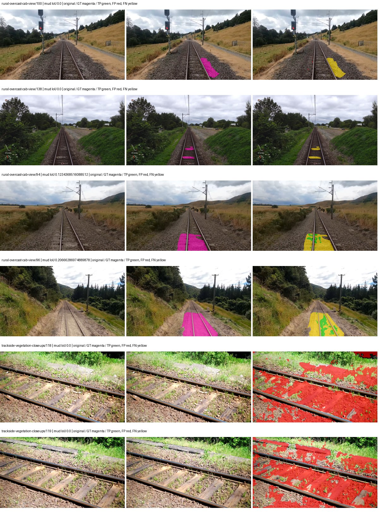
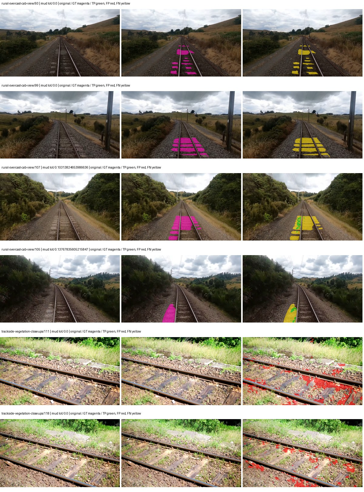
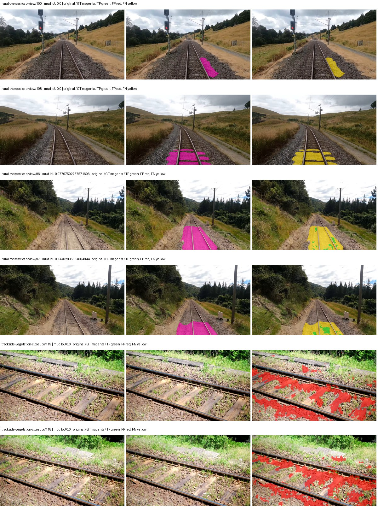
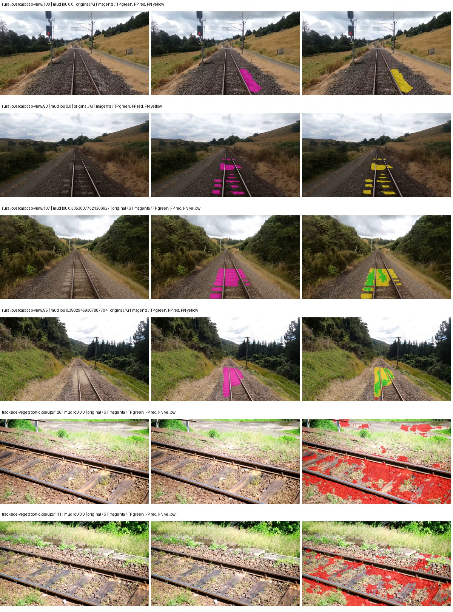

# native_resnet18_fpn_segformer_aux — paul-test-rtis_v2

[RTIS comparison](../../README.md) · [Full model records](record.json)

Primary selection and early stopping: **mud-pumping validation IoU**. A job is complete only after full statistics and isolated profiling are verified.

| Model | Initialization path | Seed | Status | Steps | Best step | Mud IoU (%) | Mud precision (%) | Mud recall (%) | Final mud IoU (trainer val, %) | mIoU (%) | Fixed GT-class mIoU (%) |
| --- | --- | --- | --- | --- | --- | --- | --- | --- | --- | --- | --- |
| native_resnet18_fpn_segformer_aux | rtis_only | 0 | completed | 2549 | 1274 | 1.34 | 1.60 | 7.63 | 0.10 | 24.88 | 29.03 |
| native_resnet18_fpn_segformer_aux | cityscapes_to_rtis | 0 | completed | 4000 | 3313 | 2.47 | 6.54 | 3.82 | 1.20 | 29.66 | 34.60 |
| native_resnet18_fpn_segformer_aux | railsem19_to_rtis | 0 | completed | 3823 | 2549 | 1.24 | 1.69 | 4.47 | 0.54 | 35.34 | 41.23 |
| native_resnet18_fpn_segformer_aux | cityscapes_to_railsem19_to_rtis | 0 | completed | 2549 | 1274 | 3.78 | 5.12 | 12.70 | 1.46 | 32.02 | 37.36 |

Training: 205 images. Validation: 37 images. Test: 50 held out. Seeds: [0]. Seed variation measures optimization variability, not independent-recording uncertainty. Historical source checkpoints stay fixed across adaptation seeds.

Training code: `066afb2626398b7be59d4d19f5a0e4644fd59adc`. Split SHA-256: `18a84c0163a65ded46508bcc904c374e5f33ad8a09b8879e3c8add606e86aa9f`.

## rtis_only — seed 0

Status: **completed**. Started: 2026-09-09T23:11:57.573297+00:00. Finished: 2026-09-09T23:40:30.827543+00:00.

Recipe pretrained initializer: `{"arch": "native", "backbone_path": null, "batch_norm_momentum": null, "checkpoint": null, "classifier_path": null, "drop_path": null, "encoder_name": null, "encoder_weights": null, "head": "unified_head", "head_paths": [], "inactive_parameter_paths": [], "local_files_only": false, "lora_alpha": 32, "lora_dropout": 0.05, "lora_r": 16, "lora_targets": [], "native": {"auxiliary_heads": [{"head": {"activation": "relu", "channels": 64, "dilation": 1, "dropout": 0.1, "in_indices": [2], "kernel_size": 3, "kind": "fcn", "norm": "group", "num_convs": 1}, "loss_weight": 0.4, "name": "aux_s16"}], "backbone": {"in_channels": 3, "kind": "timm", "name": "resnet18.a1_in1k", "out_indices": [1, 2, 3, 4], "weights": "pretrained"}, "head": {"activation": "relu", "channels": 128, "dropout": 0.1, "in_indices": [0, 1, 2, 3], "kind": "segformer", "norm": "group"}, "neck": {"activation": "relu", "kind": "fpn", "norm": "group", "num_outputs": 4, "out_channels": 128}, "task": "multiclass"}, "revision": null, "smp_arch": null, "subfolder": null, "trust_remote_code": false, "tuning": "full"}`.

`rtis_only` uses the recipe initializer, which may include pretrained segmentation components. Transfer paths load the exact historical source checkpoint below and reset the classifier; they do not reset all query/decoder features.

Source checkpoint: `Recipe pretrained initialization`.

Config SHA-256: `cf44734bbd6be08b6c603928d895dbadf56162680cfda5607e93f7bd004224b1`. Weights used for validation: `raw`.

### Mud-pumping and aggregate quality

| Metric | Selected checkpoint | Final training validation |
| --- | --- | --- |
| Mud IoU | 1.34 | 0.10 |
| Mud precision | 1.60 | 0.58 |
| Mud recall | 7.63 | 0.12 |
| Mud Dice/F1 | 2.65 | 0.19 |
| mIoU | 24.88 | 27.91 |
| Mean accuracy | 36.57 | 40.86 |
| Mean precision | 42.38 | 46.02 |
| Mean Dice | 32.20 | 37.06 |
| Mean specificity | 98.87 | 98.78 |
| Pixel accuracy | 80.31 | 80.36 |
| Frequency-weighted IoU | 72.46 | 70.14 |
| Fixed GT-present class mIoU | 29.03 | 32.56 |
| Boundary F1 | 29.48 | 32.57 |

The selected checkpoint has independent evaluation evidence. Final values are the trainer's final validation record, not a new independent evaluation. mIoU averages classes with nonzero union, so false positives on absent classes can change its denominator. The fixed GT-class mean is supplementary and excludes absent classes; their false positives remain in the confusion matrix.

### Resource usage and timing

| Measurement | Value |
| --- | --- |
| Peak training VRAM, retained training invocation (GiB) | 7.76 |
| Peak evaluation VRAM (GiB) | 6.87 |
| Retained training invocation wall time (seconds) | 1582.60 |
| Retained training invocation GPU-hours (one GPU) | 0.44 |
| Evaluation wall time (seconds) | 11.48 |
| Full evaluation pipeline images/second | 3.22 |
| Best full-state checkpoint (MiB) | 184.91 |
| Final full-state checkpoint (MiB) | 184.90 |
| Verified periodic checkpoints removed (GiB) | 0.90 |

VRAM uses the recorded allocator high-water mark; it is not total device usage including CUDA context. Resumed jobs' retained training invocation times and peaks are **not whole-campaign totals**. Earlier invocation resource records are not reconstructed here. Evaluation throughput includes loader, sliding-window inference and metrics; it is not model-only latency/FPS. Missing measurements are shown as —, never inferred from another dataset's run.

### Standardized inference performance

Dedicated model-only profiling waits for an idle worker-locked L40S: BF16, batch 1, 1024x1024, 20 warmup and 100 CUDA-event-timed public forwards. It excludes loading, preprocessing, tiling and metrics.

| Status | Parameters | Weight MiB | FPS | p50 ms | p95 ms | Peak reserved GiB |
| --- | --- | --- | --- | --- | --- | --- |
| complete | 12100522 | 46.16 | 254.74 | 3.85 | 4.26 | 0.61 |

```json
{
  "schema_version": 1,
  "model_id": "native_resnet18_fpn_segformer_aux",
  "measured_at": "2026-09-09T23:40:28+00:00",
  "status": "complete",
  "benchmark_scope": "rtis_selected_checkpoint_model_only",
  "applies_to": [
    "native_resnet18_fpn_segformer_aux--rtis_only--seed-0"
  ],
  "source": {
    "campaign_git_sha": "066afb2626398b7be59d4d19f5a0e4644fd59adc",
    "git_dirty": false,
    "config_hash": "93a7cd8e542d",
    "resolved_config": "/data/izadia1/projects/segmentary-runs/paul-test-rtis_v2/seed0-20260909/configs/native_resnet18_fpn_segformer_aux--rtis_only--seed-0.yaml",
    "config_sha256": "cf44734bbd6be08b6c603928d895dbadf56162680cfda5607e93f7bd004224b1",
    "checkpoint_sha256": "8071e1cc58b41ed65966da20f2e0a8d59a9d01b042d271b475cf15fc0a486727",
    "checkpoint_global_step": 1274,
    "checkpoint_bytes": 193887733,
    "checkpoint_kind": "resume checkpoint with optimizer and EMA state",
    "weights": "raw",
    "measured_checkpoint_job_id": "native_resnet18_fpn_segformer_aux--rtis_only--seed-0",
    "result_sha256": "996b4a8a7c36f8d65262f2f0e510f87901720249941dceb688dbdebe30a7a2ec",
    "result_git_sha": "066afb2626398b7be59d4d19f5a0e4644fd59adc",
    "result_stage": "eval:paul-test-rtis:val",
    "result_seed": 0
  },
  "hardware": {
    "gpu_name": "NVIDIA L40S",
    "gpu_uuid": "GPU-804aea8b-5f62-423e-72c6-49e1ed15c4e4",
    "logical_device": "cuda:0",
    "physical_visibility_token": "6",
    "compute_capability": [
      8,
      9
    ],
    "total_memory_bytes": 47677177856
  },
  "model": {
    "parameter_count": 12100522,
    "trainable_parameter_count": 12100522,
    "resident_parameter_bytes": 48402088,
    "parameter_dtype_counts": {
      "float32": 12100522
    }
  },
  "contract": {
    "backend": "pytorch",
    "precision": "bf16_autocast",
    "batch_size": 1,
    "input_shape_nchw": [
      1,
      3,
      1024,
      1024
    ],
    "warmup_iterations": 20,
    "measured_iterations": 100,
    "timing": "per-forward CUDA events with end-event synchronization",
    "includes_preprocessing": false,
    "includes_data_loader": false,
    "includes_sliding_window": false,
    "input_resident_on_gpu": true,
    "model_only": true,
    "entrypoint": "public model(image) dense-logits forward"
  },
  "measurements": {
    "latency": {
      "p50_ms": 3.853824019432068,
      "p95_ms": 4.257997012138366,
      "mean_ms": 3.9255126237869264,
      "minimum_ms": 3.832832098007202,
      "maximum_ms": 4.518911838531494,
      "fps": 254.74379930417953,
      "raw_ms": [
        4.460544109344482,
        3.930111885070801,
        3.856384038925171,
        3.837951898574829,
        3.8440639972686768,
        3.8533120155334473,
        3.896320104598999,
        3.8635520935058594,
        3.842047929763794,
        4.136960029602051,
        4.4318718910217285,
        4.156383991241455,
        3.867647886276245,
        3.846143960952759,
        3.832832098007202,
        3.8410239219665527,
        3.842047929763794,
        3.837951898574829,
        3.9126720428466797,
        3.837951898574829,
        3.836927890777588,
        3.8430399894714355,
        3.8451199531555176,
        3.848191976547241,
        3.8451199531555176,
        3.876863956451416,
        3.8451199531555176,
        3.8451199531555176,
        3.994623899459839,
        3.95468807220459,
        3.932159900665283,
        3.848191976547241,
        3.8696959018707275,
        3.901439905166626,
        3.8451199531555176,
        4.127744197845459,
        3.8492159843444824,
        3.8502399921417236,
        3.832832098007202,
        3.837951898574829,
        3.903455972671509,
        3.872767925262451,
        3.926016092300415,
        4.122623920440674,
        4.518911838531494,
        4.20249605178833,
        3.8594560623168945,
        3.843071937561035,
        3.832832098007202,
        3.8410239219665527,
        3.8338239192962646,
        3.843071937561035,
        3.8399999141693115,
        3.842047929763794,
        3.8389759063720703,
        3.8440959453582764,
        3.846143960952759,
        3.8389759063720703,
        4.256768226623535,
        3.842047929763794,
        3.8389759063720703,
        3.926016092300415,
        3.9137279987335205,
        3.8737919330596924,
        3.836927890777588,
        3.843071937561035,
        3.846143960952759,
        3.8492159843444824,
        3.8451199531555176,
        3.8338561058044434,
        3.8338561058044434,
        4.357120037078857,
        3.9720959663391113,
        3.8799359798431396,
        4.048895835876465,
        4.015103816986084,
        4.100096225738525,
        3.8584320545196533,
        3.837951898574829,
        3.836927890777588,
        3.8338561058044434,
        3.8399999141693115,
        3.8348801136016846,
        3.8830080032348633,
        4.206592082977295,
        3.848191976547241,
        3.857408046722412,
        3.8543360233306885,
        3.843071937561035,
        4.281343936920166,
        4.005887985229492,
        3.873823881149292,
        3.9915521144866943,
        3.930111885070801,
        3.940351963043213,
        3.9372799396514893,
        4.087808132171631,
        4.034560203552246,
        3.9485440254211426,
        3.865600109100342
      ],
      "percentile_method": "numpy linear interpolation"
    },
    "peak_reserved_bytes": 656408576,
    "memory_kind": "pytorch_cuda_allocator_peak_reserved_excluding_context",
    "benchmark_wall_clock_s": 10.499535482376814
  },
  "started_at": "2026-09-09T23:40:17+00:00",
  "finished_at": "2026-09-09T23:40:28+00:00",
  "environment": {
    "hostname": "hdrfs-app-001",
    "python": "3.11.15",
    "platform": "Linux-5.15.0-139-generic-x86_64-with-glibc2.35",
    "torch": "2.11.0+cu128",
    "torch_cuda": "12.8",
    "cudnn": 91900,
    "driver_version": "570.133.20",
    "cuda_available": true,
    "gpu_count": 1,
    "gpu_names": [
      "NVIDIA L40S"
    ],
    "cuda_visible_devices": "6",
    "packages": {
      "segmentary": "0.1.0",
      "torch": "2.11.0+cu128",
      "torchvision": "0.26.0+cu128",
      "transformers": "5.15.0",
      "timm": "1.0.28",
      "segmentation-models-pytorch": "0.5.0",
      "albumentations": "2.0.8",
      "lightning": "2.6.5",
      "numpy": "2.4.4"
    }
  }
}
```

### Per-class validation results

| Class | GT pixels | IoU (%) | Precision (%) | Recall (%) | Dice (%) | Boundary F1 (%) |
| --- | --- | --- | --- | --- | --- | --- |
| car | 29664 | 5.73 | 99.59 | 5.73 | 10.83 | 17.90 |
| construction | 311585 | 32.84 | 44.27 | 56.00 | 49.45 | 46.20 |
| fence | 265137 | 15.82 | 25.84 | 28.97 | 27.32 | 25.66 |
| mud-pumping | 1226250 | 1.34 | 1.60 | 7.63 | 2.65 | 4.55 |
| on-rails | 0 | 0.00 | 0.00 | — | 0.00 | 0.00 |
| person | 0 | 0.00 | 0.00 | — | 0.00 | 0.00 |
| pole | 628038 | 55.14 | 65.38 | 77.87 | 71.08 | 82.79 |
| rail-embedded | 16799 | 0.00 | 0.00 | 0.00 | 0.00 | 0.00 |
| rail-raised | 2969797 | 64.20 | 67.24 | 93.42 | 78.20 | 81.77 |
| rail-track | 6323197 | 31.51 | 64.05 | 38.28 | 47.92 | 44.12 |
| road | 1048831 | 8.17 | 40.34 | 9.30 | 15.11 | 22.45 |
| sidewalk | 1297367 | 33.20 | 92.03 | 34.19 | 49.85 | 6.68 |
| sky | 19121606 | 97.01 | 98.97 | 98.00 | 98.48 | 87.69 |
| standing-water | 95802 | 1.09 | 3.29 | 1.60 | 2.15 | 8.65 |
| terrain | 39239306 | 86.36 | 91.27 | 94.13 | 92.68 | 55.99 |
| trackbed | 10643081 | 55.61 | 69.65 | 73.40 | 71.48 | 48.51 |
| traffic-light | 19510 | 4.41 | 19.19 | 5.42 | 8.46 | 16.00 |
| traffic-sign | 13285 | 7.01 | 44.41 | 7.69 | 13.10 | 23.92 |
| tram-track | 56179 | 0.00 | 0.00 | 0.00 | 0.00 | 0.00 |
| truck | 0 | 0.00 | 0.00 | — | 0.00 | 0.00 |
| vegetation-overgrowth | 5901821 | 23.05 | 62.87 | 26.68 | 37.47 | 46.22 |

### Full-run accounting

| Measurement | Value |
| --- | --- |
| Full GPU-reserved wall seconds, all recorded worker attempts | 1713.26 |
| Full reserved GPU-hours | 0.48 |
| Whole-run timing complete | True |

| Phase | Wall seconds including failed attempts |
| --- | --- |
| training | 1590.03 |
| diagnostics | 85.34 |
| performance | 17.42 |

GPU-reserved time includes model loading, training, validation, collection, profiling, checkpoint I/O and orchestration while the worker owns one GPU. It is not GPU kernel-active time. Phase timings and sampled device memory/power/utilization are retained separately; sampled device memory is not the allocator high-water mark.

### Train/validation and raw/EMA diagnostics

| Checkpoint / weights / split | Images | Mud IoU (%) | Mud precision (%) | Mud recall (%) |
| --- | --- | --- | --- | --- |
| best-auto-train / raw | 205 | 87.46 | 90.94 | 95.81 |
| best-auto-val / raw | 37 | 1.34 | 1.60 | 7.63 |
| best-alternate-val / ema | 37 | 0.03 | 0.05 | 0.11 |
| final-auto-val / raw | 37 | 0.10 | 0.58 | 0.12 |

Train uses the evaluation transform without augmentation. Compare mud train/validation metrics for the same selected weights. Alternate EMA on running-stat BatchNorm is explicitly uncalibrated and is diagnostic only. Score-threshold curves use uncalibrated normalized scores and are pixel-level diagnostics, not event detection rates or a selected deployment operating point.

### Downloadable evidence

- best-auto-train: [per-image.csv](rtis_only--seed-0/best-auto-train/per-image.csv) · [per-image-confusion.json.gz](rtis_only--seed-0/best-auto-train/per-image-confusion.json.gz) · [groups.json](rtis_only--seed-0/best-auto-train/groups.json) · [mud-score-curves.json](rtis_only--seed-0/best-auto-train/mud-score-curves.json)
- best-auto-val: [per-image.csv](rtis_only--seed-0/best-auto-val/per-image.csv) · [per-image-confusion.json.gz](rtis_only--seed-0/best-auto-val/per-image-confusion.json.gz) · [groups.json](rtis_only--seed-0/best-auto-val/groups.json) · [mud-score-curves.json](rtis_only--seed-0/best-auto-val/mud-score-curves.json) · [examples.jpg](rtis_only--seed-0/best-auto-val/examples.jpg)
- best-alternate-val: [per-image.csv](rtis_only--seed-0/best-alternate-val/per-image.csv) · [per-image-confusion.json.gz](rtis_only--seed-0/best-alternate-val/per-image-confusion.json.gz) · [groups.json](rtis_only--seed-0/best-alternate-val/groups.json) · [mud-score-curves.json](rtis_only--seed-0/best-alternate-val/mud-score-curves.json)
- final-auto-val: [per-image.csv](rtis_only--seed-0/final-auto-val/per-image.csv) · [per-image-confusion.json.gz](rtis_only--seed-0/final-auto-val/per-image-confusion.json.gz) · [groups.json](rtis_only--seed-0/final-auto-val/groups.json) · [mud-score-curves.json](rtis_only--seed-0/final-auto-val/mud-score-curves.json)
- resources: [telemetry.csv](rtis_only--seed-0/resources/telemetry.csv)



Examples are two lowest and two highest mud-IoU positive images, plus up to two negative images with the most false-positive mud pixels. They are targeted diagnostic examples, not random samples. Green: true positive; red: false positive; yellow: false negative. Full predictions remain on HDRFS.

### Validation tracking

| Logged step | Overall mIoU (%) | Mud IoU (%) |
| --- | --- | --- |
| 254 | 17.39 | 0.60 |
| 509 | 18.55 | 0.37 |
| 764 | 20.95 | 0.31 |
| 1019 | 21.09 | 0.07 |
| 1274 | 24.87 | 1.34 |
| 1529 | 22.87 | 0.03 |
| 1784 | 24.30 | 0.29 |
| 2038 | 23.89 | 0.22 |
| 2293 | 26.85 | 0.31 |
| 2548 | 27.91 | 0.10 |

All retained scalar curves, including training loss and per-class IoU, are in record.json. Observed best mud on a curve is not necessarily a retained checkpoint: the pilot saved its selection-metric-best and final checkpoints. Step logging and checkpoint global_step may differ by one.

### Stopping and checkpoint provenance

```json
{
  "stopping": {
    "actual_steps": 2549,
    "maximum_steps": 4000,
    "min_delta": 0.001,
    "monitor": "val_iou/mud-pumping",
    "patience": 5,
    "reason": "validation_plateau"
  },
  "checkpoints": {
    "best": {
      "path": "/data/izadia1/projects/segmentary-runs/paul-test-rtis_v2/seed0-20260909/future-runs/native_resnet18_fpn_segformer_aux--rtis_only--seed-0_seed0/rtis/best.ckpt",
      "sha256": "8071e1cc58b41ed65966da20f2e0a8d59a9d01b042d271b475cf15fc0a486727",
      "global_step": 1274,
      "bytes": 193887733
    },
    "final": {
      "path": "/data/izadia1/projects/segmentary-runs/paul-test-rtis_v2/seed0-20260909/future-runs/native_resnet18_fpn_segformer_aux--rtis_only--seed-0_seed0/rtis/last.ckpt",
      "sha256": "01dafad183cf448dc2a4b611364c4adafb1c00156a85c44802f9a57ee284a149",
      "global_step": 2549,
      "bytes": 193882165
    }
  },
  "cleanup_error": null
}
```

### Resolved training, initialization and evaluation settings

The optimizer block is the base configuration. Stage LR scales are applied at runtime, and stage warmup is capped at min(base warmup, floor(stage budget / 10), stage budget - 1): 400 steps for this 4,000-step pilot. Model-internal native input grids may differ from augmentation crops (EoMT uses its 640 grid).

```json
{
  "name": "native_resnet18_fpn_segformer_aux--rtis_only--seed-0",
  "model": {
    "arch": "native",
    "checkpoint": null,
    "tuning": "full",
    "head": "unified_head",
    "lora_r": 16,
    "lora_alpha": 32,
    "lora_dropout": 0.05,
    "lora_targets": [],
    "drop_path": null,
    "revision": null,
    "subfolder": null,
    "local_files_only": false,
    "trust_remote_code": false,
    "backbone_path": null,
    "head_paths": [],
    "classifier_path": null,
    "inactive_parameter_paths": [],
    "smp_arch": null,
    "encoder_name": null,
    "encoder_weights": null,
    "native": {
      "task": "multiclass",
      "backbone": {
        "kind": "timm",
        "name": "resnet18.a1_in1k",
        "weights": "pretrained",
        "out_indices": [
          1,
          2,
          3,
          4
        ],
        "in_channels": 3
      },
      "neck": {
        "kind": "fpn",
        "out_channels": 128,
        "num_outputs": 4,
        "norm": "group",
        "activation": "relu"
      },
      "head": {
        "kind": "segformer",
        "in_indices": [
          0,
          1,
          2,
          3
        ],
        "channels": 128,
        "dropout": 0.1,
        "norm": "group",
        "activation": "relu"
      },
      "auxiliary_heads": [
        {
          "name": "aux_s16",
          "loss_weight": 0.4,
          "head": {
            "kind": "fcn",
            "in_indices": [
              2
            ],
            "channels": 64,
            "num_convs": 1,
            "kernel_size": 3,
            "dilation": 1,
            "dropout": 0.1,
            "norm": "group",
            "activation": "relu"
          }
        }
      ]
    },
    "batch_norm_momentum": null
  },
  "space": "paul-test-rtis",
  "taxonomy_root": "/data/izadia1/projects/segmentary-rtis-fullstats-066afb2/taxonomy",
  "output_root": "/data/izadia1/projects/segmentary-runs/paul-test-rtis_v2/seed0-20260909/future-runs",
  "optim": {
    "backbone_lr": 0.0001,
    "head_lr_mult": 10.0,
    "weight_decay": 0.05,
    "llrd": 1.0,
    "warmup_iters": 1500,
    "warmup_ratio": 1e-06,
    "poly_power": 0.9,
    "min_lr_ratio": 0.0,
    "betas": [
      0.9,
      0.999
    ],
    "grad_clip": 1.0
  },
  "train": {
    "iters": 4000,
    "batch_size": 2,
    "accum": 8,
    "num_workers": 2,
    "precision": "bf16-mixed",
    "ema_decay": 0.9998,
    "val_every": 250,
    "ckpt_every": 500,
    "selection_metric": "val_iou/mud-pumping",
    "early_stopping_patience": 5,
    "early_stopping_min_delta": 0.001,
    "seed": 0,
    "devices": 1
  },
  "eval": {
    "sliding_window": true,
    "window": [
      1024,
      1024
    ],
    "stride": [
      768,
      768
    ],
    "batch_size": 1,
    "num_workers": 2,
    "tta_scales": [],
    "tta_flip": false,
    "threshold": 0.5,
    "boundary_tolerance_frac": 0.0075,
    "save_confusion": true
  },
  "loss": {
    "task": "multiclass",
    "activation": "auto",
    "terms": [],
    "aux": "none",
    "aux_weight": 0.0,
    "ce_weight": 1.0,
    "label_smoothing": 0.0,
    "class_weights": null,
    "query": null
  },
  "aug": {
    "crop": [
      1024,
      1024
    ],
    "scale_min": 0.5,
    "scale_max": 2.0,
    "hflip_p": 0.5,
    "color_jitter_p": 0.5,
    "brightness": 0.25,
    "contrast": 0.25,
    "saturation": 0.25,
    "hue": 0.05
  },
  "stages": [
    {
      "name": "rtis",
      "data": [
        {
          "name": "paul-test-rtis",
          "root": "/data/izadia1/datasets/paul-test-rtis_v2",
          "variant": null,
          "split_file": "splits.json",
          "train_split": "train",
          "val_split": "val",
          "limit": null,
          "loader": "folder",
          "mapping": "paul-test-rtis",
          "loader_options": {
            "require_groups": true
          }
        }
      ],
      "iters": null,
      "lr_scale": 1.0,
      "head_group_lr_scale": 1.0,
      "init_from": "pretrained",
      "reset_head": false,
      "freeze": null,
      "sample_weights": null
    }
  ]
}
```

### Hardware and software provenance

```json
{
  "training": {
    "cuda_available": true,
    "cuda_visible_devices": "6",
    "cudnn": 91900,
    "driver_version": "570.133.20",
    "gpu_count": 1,
    "gpu_names": [
      "NVIDIA L40S"
    ],
    "hostname": "hdrfs-app-001",
    "input_normalization": {
      "channel_order": "rgb",
      "mean": [
        0.485,
        0.456,
        0.406
      ],
      "source": "timm_pretrained_cfg",
      "std": [
        0.229,
        0.224,
        0.225
      ]
    },
    "model_origins": [
      {
        "hf_commit": null,
        "hf_name_or_path": null,
        "module": "backbone",
        "timm_pretrained": {
          "architecture": "resnet18",
          "hf_hub_id": "timm/resnet18.a1_in1k",
          "tag": "a1_in1k",
          "url": "https://github.com/huggingface/pytorch-image-models/releases/download/v0.1-rsb-weights/resnet18_a1_0-d63eafa0.pth"
        }
      },
      {
        "hf_commit": null,
        "hf_name_or_path": null,
        "module": "backbone.model",
        "timm_pretrained": {
          "architecture": "resnet18",
          "hf_hub_id": "timm/resnet18.a1_in1k",
          "tag": "a1_in1k",
          "url": "https://github.com/huggingface/pytorch-image-models/releases/download/v0.1-rsb-weights/resnet18_a1_0-d63eafa0.pth"
        }
      }
    ],
    "model_parameter_count": 12100522,
    "packages": {
      "albumentations": "2.0.8",
      "lightning": "2.6.5",
      "numpy": "2.4.4",
      "segmentary": "0.1.0",
      "segmentation-models-pytorch": "0.5.0",
      "timm": "1.0.28",
      "torch": "2.11.0+cu128",
      "torchvision": "0.26.0+cu128",
      "transformers": "5.15.0"
    },
    "platform": "Linux-5.15.0-139-generic-x86_64-with-glibc2.35",
    "python": "3.11.15",
    "torch": "2.11.0+cu128",
    "torch_cuda": "12.8",
    "trainable_parameter_count": 12100522,
    "training_stop": {
      "actual_steps": 2549,
      "maximum_steps": 4000,
      "min_delta": 0.001,
      "monitor": "val_iou/mud-pumping",
      "patience": 5,
      "reason": "validation_plateau"
    },
    "validation_weights": "raw"
  },
  "evaluation": {
    "cuda_available": true,
    "cuda_visible_devices": "6",
    "cudnn": 91900,
    "driver_version": "570.133.20",
    "gpu_count": 1,
    "gpu_names": [
      "NVIDIA L40S"
    ],
    "hostname": "hdrfs-app-001",
    "input_normalization": {
      "channel_order": "rgb",
      "mean": [
        0.485,
        0.456,
        0.406
      ],
      "source": "timm_pretrained_cfg",
      "std": [
        0.229,
        0.224,
        0.225
      ]
    },
    "packages": {
      "albumentations": "2.0.8",
      "lightning": "2.6.5",
      "numpy": "2.4.4",
      "segmentary": "0.1.0",
      "segmentation-models-pytorch": "0.5.0",
      "timm": "1.0.28",
      "torch": "2.11.0+cu128",
      "torchvision": "0.26.0+cu128",
      "transformers": "5.15.0"
    },
    "platform": "Linux-5.15.0-139-generic-x86_64-with-glibc2.35",
    "python": "3.11.15",
    "torch": "2.11.0+cu128",
    "torch_cuda": "12.8"
  }
}
```

## cityscapes_to_rtis — seed 0

Status: **completed**. Started: 2026-09-09T23:15:03.729752+00:00. Finished: 2026-09-09T23:57:56.265405+00:00.

Recipe pretrained initializer: `{"arch": "native", "backbone_path": null, "batch_norm_momentum": null, "checkpoint": null, "classifier_path": null, "drop_path": null, "encoder_name": null, "encoder_weights": null, "head": "unified_head", "head_paths": [], "inactive_parameter_paths": [], "local_files_only": false, "lora_alpha": 32, "lora_dropout": 0.05, "lora_r": 16, "lora_targets": [], "native": {"auxiliary_heads": [{"head": {"activation": "relu", "channels": 64, "dilation": 1, "dropout": 0.1, "in_indices": [2], "kernel_size": 3, "kind": "fcn", "norm": "group", "num_convs": 1}, "loss_weight": 0.4, "name": "aux_s16"}], "backbone": {"in_channels": 3, "kind": "timm", "name": "resnet18.a1_in1k", "out_indices": [1, 2, 3, 4], "weights": "pretrained"}, "head": {"activation": "relu", "channels": 128, "dropout": 0.1, "in_indices": [0, 1, 2, 3], "kind": "segformer", "norm": "group"}, "neck": {"activation": "relu", "kind": "fpn", "norm": "group", "num_outputs": 4, "out_channels": 128}, "task": "multiclass"}, "revision": null, "smp_arch": null, "subfolder": null, "trust_remote_code": false, "tuning": "full"}`.

`rtis_only` uses the recipe initializer, which may include pretrained segmentation components. Transfer paths load the exact historical source checkpoint below and reset the classifier; they do not reset all query/decoder features.

Source checkpoint: `{'name': 'native_resnet18_fpn_segformer_aux--cityscapes--seed-0', 'model': 'native_resnet18_fpn_segformer_aux', 'protocol': 'cityscapes', 'config': '/data/izadia1/projects/segmentary-runs/all-model-city-rail-seed0-rail20-b9eb3e1/jobs/native_resnet18_fpn_segformer_aux--cityscapes--seed-0/attempt-001/resolved-config.yaml', 'checkpoint': '/data/izadia1/projects/segmentary-runs/all-model-city-rail-seed0-rail20-b9eb3e1/jobs/native_resnet18_fpn_segformer_aux--cityscapes--seed-0/attempt-001/train/native_resnet18_fpn_segformer_aux--cityscapes_seed0/cityscapes/last.ckpt', 'recorded_sha256': '805a02915710313f53e77271b3b98d37b7ff1e6edab8d2f12a4c5410b2bb953c', 'exists': True}`.

Config SHA-256: `d00ab2c092e809b6311d608a9cb8ded40ad0132be06416d486ee0773671c0c82`. Weights used for validation: `raw`.

### Mud-pumping and aggregate quality

| Metric | Selected checkpoint | Final training validation |
| --- | --- | --- |
| Mud IoU | 2.47 | 1.20 |
| Mud precision | 6.54 | 2.60 |
| Mud recall | 3.82 | 2.18 |
| Mud Dice/F1 | 4.82 | 2.37 |
| mIoU | 29.66 | 29.45 |
| Mean accuracy | 44.77 | 44.63 |
| Mean precision | 46.11 | 44.13 |
| Mean Dice | 38.72 | 38.17 |
| Mean specificity | 98.84 | 98.82 |
| Pixel accuracy | 81.80 | 81.29 |
| Frequency-weighted IoU | 71.50 | 71.01 |
| Fixed GT-present class mIoU | 34.60 | 34.35 |
| Boundary F1 | 34.60 | 33.81 |

The selected checkpoint has independent evaluation evidence. Final values are the trainer's final validation record, not a new independent evaluation. mIoU averages classes with nonzero union, so false positives on absent classes can change its denominator. The fixed GT-class mean is supplementary and excludes absent classes; their false positives remain in the confusion matrix.

### Resource usage and timing

| Measurement | Value |
| --- | --- |
| Peak training VRAM, retained training invocation (GiB) | 7.76 |
| Peak evaluation VRAM (GiB) | 6.87 |
| Retained training invocation wall time (seconds) | 2439.26 |
| Retained training invocation GPU-hours (one GPU) | 0.68 |
| Evaluation wall time (seconds) | 12.65 |
| Full evaluation pipeline images/second | 2.93 |
| Best full-state checkpoint (MiB) | 184.91 |
| Final full-state checkpoint (MiB) | 184.90 |
| Verified periodic checkpoints removed (GiB) | 1.44 |

VRAM uses the recorded allocator high-water mark; it is not total device usage including CUDA context. Resumed jobs' retained training invocation times and peaks are **not whole-campaign totals**. Earlier invocation resource records are not reconstructed here. Evaluation throughput includes loader, sliding-window inference and metrics; it is not model-only latency/FPS. Missing measurements are shown as —, never inferred from another dataset's run.

### Standardized inference performance

Dedicated model-only profiling waits for an idle worker-locked L40S: BF16, batch 1, 1024x1024, 20 warmup and 100 CUDA-event-timed public forwards. It excludes loading, preprocessing, tiling and metrics.

| Status | Parameters | Weight MiB | FPS | p50 ms | p95 ms | Peak reserved GiB |
| --- | --- | --- | --- | --- | --- | --- |
| complete | 12100522 | 46.16 | 247.91 | 3.97 | 4.35 | 0.61 |

```json
{
  "schema_version": 1,
  "model_id": "native_resnet18_fpn_segformer_aux",
  "measured_at": "2026-09-09T23:57:52+00:00",
  "status": "complete",
  "benchmark_scope": "rtis_selected_checkpoint_model_only",
  "applies_to": [
    "native_resnet18_fpn_segformer_aux--cityscapes_to_rtis--seed-0"
  ],
  "source": {
    "campaign_git_sha": "066afb2626398b7be59d4d19f5a0e4644fd59adc",
    "git_dirty": false,
    "config_hash": "f4ef51e5c61a",
    "resolved_config": "/data/izadia1/projects/segmentary-runs/paul-test-rtis_v2/seed0-20260909/configs/native_resnet18_fpn_segformer_aux--cityscapes_to_rtis--seed-0.yaml",
    "config_sha256": "d00ab2c092e809b6311d608a9cb8ded40ad0132be06416d486ee0773671c0c82",
    "checkpoint_sha256": "8d541d26b62fae0cd8162947d3fbfae35f6f139350413fd49b209789731d9070",
    "checkpoint_global_step": 3313,
    "checkpoint_bytes": 193887797,
    "checkpoint_kind": "resume checkpoint with optimizer and EMA state",
    "weights": "raw",
    "measured_checkpoint_job_id": "native_resnet18_fpn_segformer_aux--cityscapes_to_rtis--seed-0",
    "result_sha256": "0d144a44ba407361ed92196c7b40ba708d3b912d0f45364781045104f699d531",
    "result_git_sha": "066afb2626398b7be59d4d19f5a0e4644fd59adc",
    "result_stage": "eval:paul-test-rtis:val",
    "result_seed": 0
  },
  "hardware": {
    "gpu_name": "NVIDIA L40S",
    "gpu_uuid": "GPU-84f5ca4d-68db-ae98-d056-40654d859dd9",
    "logical_device": "cuda:0",
    "physical_visibility_token": "0",
    "compute_capability": [
      8,
      9
    ],
    "total_memory_bytes": 47677177856
  },
  "model": {
    "parameter_count": 12100522,
    "trainable_parameter_count": 12100522,
    "resident_parameter_bytes": 48402088,
    "parameter_dtype_counts": {
      "float32": 12100522
    }
  },
  "contract": {
    "backend": "pytorch",
    "precision": "bf16_autocast",
    "batch_size": 1,
    "input_shape_nchw": [
      1,
      3,
      1024,
      1024
    ],
    "warmup_iterations": 20,
    "measured_iterations": 100,
    "timing": "per-forward CUDA events with end-event synchronization",
    "includes_preprocessing": false,
    "includes_data_loader": false,
    "includes_sliding_window": false,
    "input_resident_on_gpu": true,
    "model_only": true,
    "entrypoint": "public model(image) dense-logits forward"
  },
  "measurements": {
    "latency": {
      "p50_ms": 3.966480016708374,
      "p95_ms": 4.349849796295166,
      "mean_ms": 4.033681597709656,
      "minimum_ms": 3.865600109100342,
      "maximum_ms": 4.848639965057373,
      "fps": 247.91247791293318,
      "raw_ms": [
        4.642816066741943,
        4.048799991607666,
        3.993664026260376,
        3.9218881130218506,
        3.9270401000976562,
        3.865600109100342,
        4.075520038604736,
        4.529151916503906,
        3.9147520065307617,
        3.886080026626587,
        3.92192006111145,
        3.9302399158477783,
        4.1656317710876465,
        4.080639839172363,
        4.848639965057373,
        4.386816024780273,
        4.043776035308838,
        4.046847820281982,
        4.088831901550293,
        4.257791996002197,
        4.025216102600098,
        3.9966719150543213,
        3.961855888366699,
        3.940351963043213,
        4.262911796569824,
        3.9198720455169678,
        3.9434239864349365,
        3.9415040016174316,
        4.10316801071167,
        4.142079830169678,
        3.984384059906006,
        3.9331839084625244,
        3.928096055984497,
        3.9434239864349365,
        4.046847820281982,
        4.290559768676758,
        3.9485440254211426,
        3.9280641078948975,
        3.9987199306488037,
        3.8881280422210693,
        3.8789119720458984,
        3.91264009475708,
        3.8839359283447266,
        3.9505279064178467,
        3.951616048812866,
        3.9270401000976562,
        3.915776014328003,
        3.9720959663391113,
        3.9372479915618896,
        3.9771840572357178,
        3.95468807220459,
        3.9475200176239014,
        3.9045119285583496,
        3.9136319160461426,
        4.038496017456055,
        4.288512229919434,
        4.1943039894104,
        4.133887767791748,
        3.9772160053253174,
        3.9792640209198,
        3.9567360877990723,
        3.945472002029419,
        3.9567360877990723,
        4.119552135467529,
        3.9884800910949707,
        3.949471950531006,
        4.347904205322266,
        4.0120320320129395,
        3.964927911758423,
        3.9270401000976562,
        3.9188480377197266,
        3.8973441123962402,
        4.651008129119873,
        4.064256191253662,
        4.257791996002197,
        3.9639039039611816,
        3.957632064819336,
        3.906559944152832,
        3.9444479942321777,
        3.944511890411377,
        3.94649600982666,
        4.008959770202637,
        3.9915521144866943,
        3.9383039474487305,
        4.04582405090332,
        4.151167869567871,
        3.9781439304351807,
        4.046847820281982,
        3.935231924057007,
        4.055039882659912,
        3.985408067703247,
        4.141056060791016,
        4.2782721519470215,
        4.047872066497803,
        3.9659841060638428,
        3.950592041015625,
        3.931135892868042,
        4.026368141174316,
        3.9669759273529053,
        3.959808111190796
      ],
      "percentile_method": "numpy linear interpolation"
    },
    "peak_reserved_bytes": 656408576,
    "memory_kind": "pytorch_cuda_allocator_peak_reserved_excluding_context",
    "benchmark_wall_clock_s": 10.779942221939564
  },
  "started_at": "2026-09-09T23:57:42+00:00",
  "finished_at": "2026-09-09T23:57:52+00:00",
  "environment": {
    "hostname": "hdrfs-app-001",
    "python": "3.11.15",
    "platform": "Linux-5.15.0-139-generic-x86_64-with-glibc2.35",
    "torch": "2.11.0+cu128",
    "torch_cuda": "12.8",
    "cudnn": 91900,
    "driver_version": "570.133.20",
    "cuda_available": true,
    "gpu_count": 1,
    "gpu_names": [
      "NVIDIA L40S"
    ],
    "cuda_visible_devices": "0",
    "packages": {
      "segmentary": "0.1.0",
      "torch": "2.11.0+cu128",
      "torchvision": "0.26.0+cu128",
      "transformers": "5.15.0",
      "timm": "1.0.28",
      "segmentation-models-pytorch": "0.5.0",
      "albumentations": "2.0.8",
      "lightning": "2.6.5",
      "numpy": "2.4.4"
    }
  }
}
```

### Per-class validation results

| Class | GT pixels | IoU (%) | Precision (%) | Recall (%) | Dice (%) | Boundary F1 (%) |
| --- | --- | --- | --- | --- | --- | --- |
| car | 29664 | 39.61 | 69.91 | 47.75 | 56.74 | 33.26 |
| construction | 311585 | 29.42 | 33.20 | 72.11 | 45.47 | 28.24 |
| fence | 265137 | 8.55 | 15.22 | 16.32 | 15.75 | 13.59 |
| mud-pumping | 1226250 | 2.47 | 6.54 | 3.82 | 4.82 | 7.79 |
| on-rails | 0 | 0.00 | 0.00 | — | 0.00 | 0.00 |
| person | 0 | 0.00 | 0.00 | — | 0.00 | 0.00 |
| pole | 628038 | 65.71 | 79.48 | 79.14 | 79.31 | 85.66 |
| rail-embedded | 16799 | 8.11 | 18.92 | 12.42 | 15.00 | 22.58 |
| rail-raised | 2969797 | 67.25 | 79.11 | 81.77 | 80.42 | 84.85 |
| rail-track | 6323197 | 33.79 | 65.40 | 41.15 | 50.51 | 44.69 |
| road | 1048831 | 16.25 | 28.65 | 27.29 | 27.95 | 19.56 |
| sidewalk | 1297367 | 7.48 | 65.65 | 7.79 | 13.92 | 7.05 |
| sky | 19121606 | 97.23 | 99.28 | 97.92 | 98.59 | 87.50 |
| standing-water | 95802 | 0.72 | 0.86 | 4.31 | 1.43 | 3.67 |
| terrain | 39239306 | 84.45 | 86.57 | 97.18 | 91.57 | 48.82 |
| trackbed | 10643081 | 54.26 | 63.04 | 79.56 | 70.34 | 48.62 |
| traffic-light | 19510 | 52.45 | 84.01 | 58.27 | 68.81 | 67.03 |
| traffic-sign | 13285 | 21.41 | 76.47 | 22.92 | 35.27 | 53.95 |
| tram-track | 56179 | 11.91 | 15.69 | 33.05 | 21.28 | 12.44 |
| truck | 0 | 0.00 | 0.00 | — | 0.00 | 0.00 |
| vegetation-overgrowth | 5901821 | 21.82 | 80.29 | 23.05 | 35.82 | 57.40 |

### Full-run accounting

| Measurement | Value |
| --- | --- |
| Full GPU-reserved wall seconds, all recorded worker attempts | 2572.76 |
| Full reserved GPU-hours | 0.71 |
| Whole-run timing complete | True |

| Phase | Wall seconds including failed attempts |
| --- | --- |
| training | 2446.56 |
| diagnostics | 85.47 |
| performance | 18.10 |

GPU-reserved time includes model loading, training, validation, collection, profiling, checkpoint I/O and orchestration while the worker owns one GPU. It is not GPU kernel-active time. Phase timings and sampled device memory/power/utilization are retained separately; sampled device memory is not the allocator high-water mark.

### Train/validation and raw/EMA diagnostics

| Checkpoint / weights / split | Images | Mud IoU (%) | Mud precision (%) | Mud recall (%) |
| --- | --- | --- | --- | --- |
| best-auto-train / raw | 205 | 90.06 | 96.78 | 92.84 |
| best-auto-val / raw | 37 | 2.47 | 6.54 | 3.82 |
| best-alternate-val / ema | 37 | 0.42 | 0.52 | 2.21 |
| final-auto-val / raw | 37 | 1.20 | 2.59 | 2.18 |

Train uses the evaluation transform without augmentation. Compare mud train/validation metrics for the same selected weights. Alternate EMA on running-stat BatchNorm is explicitly uncalibrated and is diagnostic only. Score-threshold curves use uncalibrated normalized scores and are pixel-level diagnostics, not event detection rates or a selected deployment operating point.

### Downloadable evidence

- best-auto-train: [per-image.csv](cityscapes_to_rtis--seed-0/best-auto-train/per-image.csv) · [per-image-confusion.json.gz](cityscapes_to_rtis--seed-0/best-auto-train/per-image-confusion.json.gz) · [groups.json](cityscapes_to_rtis--seed-0/best-auto-train/groups.json) · [mud-score-curves.json](cityscapes_to_rtis--seed-0/best-auto-train/mud-score-curves.json)
- best-auto-val: [per-image.csv](cityscapes_to_rtis--seed-0/best-auto-val/per-image.csv) · [per-image-confusion.json.gz](cityscapes_to_rtis--seed-0/best-auto-val/per-image-confusion.json.gz) · [groups.json](cityscapes_to_rtis--seed-0/best-auto-val/groups.json) · [mud-score-curves.json](cityscapes_to_rtis--seed-0/best-auto-val/mud-score-curves.json) · [examples.jpg](cityscapes_to_rtis--seed-0/best-auto-val/examples.jpg)
- best-alternate-val: [per-image.csv](cityscapes_to_rtis--seed-0/best-alternate-val/per-image.csv) · [per-image-confusion.json.gz](cityscapes_to_rtis--seed-0/best-alternate-val/per-image-confusion.json.gz) · [groups.json](cityscapes_to_rtis--seed-0/best-alternate-val/groups.json) · [mud-score-curves.json](cityscapes_to_rtis--seed-0/best-alternate-val/mud-score-curves.json)
- final-auto-val: [per-image.csv](cityscapes_to_rtis--seed-0/final-auto-val/per-image.csv) · [per-image-confusion.json.gz](cityscapes_to_rtis--seed-0/final-auto-val/per-image-confusion.json.gz) · [groups.json](cityscapes_to_rtis--seed-0/final-auto-val/groups.json) · [mud-score-curves.json](cityscapes_to_rtis--seed-0/final-auto-val/mud-score-curves.json)
- resources: [telemetry.csv](cityscapes_to_rtis--seed-0/resources/telemetry.csv)



Examples are two lowest and two highest mud-IoU positive images, plus up to two negative images with the most false-positive mud pixels. They are targeted diagnostic examples, not random samples. Green: true positive; red: false positive; yellow: false negative. Full predictions remain on HDRFS.

### Validation tracking

| Logged step | Overall mIoU (%) | Mud IoU (%) |
| --- | --- | --- |
| 254 | 18.52 | 0.26 |
| 509 | 21.95 | 0.19 |
| 764 | 21.49 | 0.24 |
| 1019 | 23.67 | 0.45 |
| 1274 | 25.92 | 0.66 |
| 1529 | 23.95 | 1.04 |
| 1784 | 27.55 | 0.56 |
| 2038 | 27.34 | 0.97 |
| 2293 | 28.49 | 1.37 |
| 2548 | 31.18 | 1.25 |
| 2803 | 30.14 | 1.15 |
| 3058 | 30.01 | 0.99 |
| 3313 | 29.66 | 2.47 |
| 3568 | 30.76 | 1.11 |
| 3823 | 30.10 | 0.88 |
| 4000 | 29.45 | 1.20 |

All retained scalar curves, including training loss and per-class IoU, are in record.json. Observed best mud on a curve is not necessarily a retained checkpoint: the pilot saved its selection-metric-best and final checkpoints. Step logging and checkpoint global_step may differ by one.

### Stopping and checkpoint provenance

```json
{
  "stopping": {
    "actual_steps": 4000,
    "maximum_steps": 4000,
    "min_delta": 0.001,
    "monitor": "val_iou/mud-pumping",
    "patience": 5,
    "reason": "budget_complete"
  },
  "checkpoints": {
    "best": {
      "path": "/data/izadia1/projects/segmentary-runs/paul-test-rtis_v2/seed0-20260909/future-runs/native_resnet18_fpn_segformer_aux--cityscapes_to_rtis--seed-0_seed0/rtis/best.ckpt",
      "sha256": "8d541d26b62fae0cd8162947d3fbfae35f6f139350413fd49b209789731d9070",
      "global_step": 3313,
      "bytes": 193887797
    },
    "final": {
      "path": "/data/izadia1/projects/segmentary-runs/paul-test-rtis_v2/seed0-20260909/future-runs/native_resnet18_fpn_segformer_aux--cityscapes_to_rtis--seed-0_seed0/rtis/last.ckpt",
      "sha256": "6a2588ac96af19d7204b86a6c6707531786186ef8a3bf9fe243750298c67ead8",
      "global_step": 4000,
      "bytes": 193882101
    }
  },
  "cleanup_error": null
}
```

### Resolved training, initialization and evaluation settings

The optimizer block is the base configuration. Stage LR scales are applied at runtime, and stage warmup is capped at min(base warmup, floor(stage budget / 10), stage budget - 1): 400 steps for this 4,000-step pilot. Model-internal native input grids may differ from augmentation crops (EoMT uses its 640 grid).

```json
{
  "name": "native_resnet18_fpn_segformer_aux--cityscapes_to_rtis--seed-0",
  "model": {
    "arch": "native",
    "checkpoint": null,
    "tuning": "full",
    "head": "unified_head",
    "lora_r": 16,
    "lora_alpha": 32,
    "lora_dropout": 0.05,
    "lora_targets": [],
    "drop_path": null,
    "revision": null,
    "subfolder": null,
    "local_files_only": false,
    "trust_remote_code": false,
    "backbone_path": null,
    "head_paths": [],
    "classifier_path": null,
    "inactive_parameter_paths": [],
    "smp_arch": null,
    "encoder_name": null,
    "encoder_weights": null,
    "native": {
      "task": "multiclass",
      "backbone": {
        "kind": "timm",
        "name": "resnet18.a1_in1k",
        "weights": "pretrained",
        "out_indices": [
          1,
          2,
          3,
          4
        ],
        "in_channels": 3
      },
      "neck": {
        "kind": "fpn",
        "out_channels": 128,
        "num_outputs": 4,
        "norm": "group",
        "activation": "relu"
      },
      "head": {
        "kind": "segformer",
        "in_indices": [
          0,
          1,
          2,
          3
        ],
        "channels": 128,
        "dropout": 0.1,
        "norm": "group",
        "activation": "relu"
      },
      "auxiliary_heads": [
        {
          "name": "aux_s16",
          "loss_weight": 0.4,
          "head": {
            "kind": "fcn",
            "in_indices": [
              2
            ],
            "channels": 64,
            "num_convs": 1,
            "kernel_size": 3,
            "dilation": 1,
            "dropout": 0.1,
            "norm": "group",
            "activation": "relu"
          }
        }
      ]
    },
    "batch_norm_momentum": null
  },
  "space": "paul-test-rtis",
  "taxonomy_root": "/data/izadia1/projects/segmentary-rtis-fullstats-066afb2/taxonomy",
  "output_root": "/data/izadia1/projects/segmentary-runs/paul-test-rtis_v2/seed0-20260909/future-runs",
  "optim": {
    "backbone_lr": 0.0001,
    "head_lr_mult": 10.0,
    "weight_decay": 0.05,
    "llrd": 1.0,
    "warmup_iters": 1500,
    "warmup_ratio": 1e-06,
    "poly_power": 0.9,
    "min_lr_ratio": 0.0,
    "betas": [
      0.9,
      0.999
    ],
    "grad_clip": 1.0
  },
  "train": {
    "iters": 4000,
    "batch_size": 2,
    "accum": 8,
    "num_workers": 2,
    "precision": "bf16-mixed",
    "ema_decay": 0.9998,
    "val_every": 250,
    "ckpt_every": 500,
    "selection_metric": "val_iou/mud-pumping",
    "early_stopping_patience": 5,
    "early_stopping_min_delta": 0.001,
    "seed": 0,
    "devices": 1
  },
  "eval": {
    "sliding_window": true,
    "window": [
      1024,
      1024
    ],
    "stride": [
      768,
      768
    ],
    "batch_size": 1,
    "num_workers": 2,
    "tta_scales": [],
    "tta_flip": false,
    "threshold": 0.5,
    "boundary_tolerance_frac": 0.0075,
    "save_confusion": true
  },
  "loss": {
    "task": "multiclass",
    "activation": "auto",
    "terms": [],
    "aux": "none",
    "aux_weight": 0.0,
    "ce_weight": 1.0,
    "label_smoothing": 0.0,
    "class_weights": null,
    "query": null
  },
  "aug": {
    "crop": [
      1024,
      1024
    ],
    "scale_min": 0.5,
    "scale_max": 2.0,
    "hflip_p": 0.5,
    "color_jitter_p": 0.5,
    "brightness": 0.25,
    "contrast": 0.25,
    "saturation": 0.25,
    "hue": 0.05
  },
  "stages": [
    {
      "name": "rtis",
      "data": [
        {
          "name": "paul-test-rtis",
          "root": "/data/izadia1/datasets/paul-test-rtis_v2",
          "variant": null,
          "split_file": "splits.json",
          "train_split": "train",
          "val_split": "val",
          "limit": null,
          "loader": "folder",
          "mapping": "paul-test-rtis",
          "loader_options": {
            "require_groups": true
          }
        }
      ],
      "iters": null,
      "lr_scale": 0.1,
      "head_group_lr_scale": 1.0,
      "init_from": "/data/izadia1/projects/segmentary-runs/all-model-city-rail-seed0-rail20-b9eb3e1/jobs/native_resnet18_fpn_segformer_aux--cityscapes--seed-0/attempt-001/train/native_resnet18_fpn_segformer_aux--cityscapes_seed0/cityscapes/last.ckpt",
      "reset_head": true,
      "freeze": null,
      "sample_weights": null
    }
  ]
}
```

### Hardware and software provenance

```json
{
  "training": {
    "cuda_available": true,
    "cuda_visible_devices": "0",
    "cudnn": 91900,
    "driver_version": "570.133.20",
    "gpu_count": 1,
    "gpu_names": [
      "NVIDIA L40S"
    ],
    "hostname": "hdrfs-app-001",
    "input_normalization": {
      "channel_order": "rgb",
      "mean": [
        0.485,
        0.456,
        0.406
      ],
      "source": "timm_pretrained_cfg",
      "std": [
        0.229,
        0.224,
        0.225
      ]
    },
    "model_origins": [
      {
        "hf_commit": null,
        "hf_name_or_path": null,
        "module": "backbone",
        "timm_pretrained": {
          "architecture": "resnet18",
          "hf_hub_id": "timm/resnet18.a1_in1k",
          "tag": "a1_in1k",
          "url": "https://github.com/huggingface/pytorch-image-models/releases/download/v0.1-rsb-weights/resnet18_a1_0-d63eafa0.pth"
        }
      },
      {
        "hf_commit": null,
        "hf_name_or_path": null,
        "module": "backbone.model",
        "timm_pretrained": {
          "architecture": "resnet18",
          "hf_hub_id": "timm/resnet18.a1_in1k",
          "tag": "a1_in1k",
          "url": "https://github.com/huggingface/pytorch-image-models/releases/download/v0.1-rsb-weights/resnet18_a1_0-d63eafa0.pth"
        }
      }
    ],
    "model_parameter_count": 12100522,
    "packages": {
      "albumentations": "2.0.8",
      "lightning": "2.6.5",
      "numpy": "2.4.4",
      "segmentary": "0.1.0",
      "segmentation-models-pytorch": "0.5.0",
      "timm": "1.0.28",
      "torch": "2.11.0+cu128",
      "torchvision": "0.26.0+cu128",
      "transformers": "5.15.0"
    },
    "platform": "Linux-5.15.0-139-generic-x86_64-with-glibc2.35",
    "python": "3.11.15",
    "torch": "2.11.0+cu128",
    "torch_cuda": "12.8",
    "trainable_parameter_count": 12100522,
    "training_stop": {
      "actual_steps": 4000,
      "maximum_steps": 4000,
      "min_delta": 0.001,
      "monitor": "val_iou/mud-pumping",
      "patience": 5,
      "reason": "budget_complete"
    },
    "validation_weights": "raw"
  },
  "evaluation": {
    "cuda_available": true,
    "cuda_visible_devices": "0",
    "cudnn": 91900,
    "driver_version": "570.133.20",
    "gpu_count": 1,
    "gpu_names": [
      "NVIDIA L40S"
    ],
    "hostname": "hdrfs-app-001",
    "input_normalization": {
      "channel_order": "rgb",
      "mean": [
        0.485,
        0.456,
        0.406
      ],
      "source": "timm_pretrained_cfg",
      "std": [
        0.229,
        0.224,
        0.225
      ]
    },
    "packages": {
      "albumentations": "2.0.8",
      "lightning": "2.6.5",
      "numpy": "2.4.4",
      "segmentary": "0.1.0",
      "segmentation-models-pytorch": "0.5.0",
      "timm": "1.0.28",
      "torch": "2.11.0+cu128",
      "torchvision": "0.26.0+cu128",
      "transformers": "5.15.0"
    },
    "platform": "Linux-5.15.0-139-generic-x86_64-with-glibc2.35",
    "python": "3.11.15",
    "torch": "2.11.0+cu128",
    "torch_cuda": "12.8"
  }
}
```

## railsem19_to_rtis — seed 0

Status: **completed**. Started: 2026-09-09T23:19:49.080120+00:00. Finished: 2026-09-10T00:01:34.419753+00:00.

Recipe pretrained initializer: `{"arch": "native", "backbone_path": null, "batch_norm_momentum": null, "checkpoint": null, "classifier_path": null, "drop_path": null, "encoder_name": null, "encoder_weights": null, "head": "unified_head", "head_paths": [], "inactive_parameter_paths": [], "local_files_only": false, "lora_alpha": 32, "lora_dropout": 0.05, "lora_r": 16, "lora_targets": [], "native": {"auxiliary_heads": [{"head": {"activation": "relu", "channels": 64, "dilation": 1, "dropout": 0.1, "in_indices": [2], "kernel_size": 3, "kind": "fcn", "norm": "group", "num_convs": 1}, "loss_weight": 0.4, "name": "aux_s16"}], "backbone": {"in_channels": 3, "kind": "timm", "name": "resnet18.a1_in1k", "out_indices": [1, 2, 3, 4], "weights": "pretrained"}, "head": {"activation": "relu", "channels": 128, "dropout": 0.1, "in_indices": [0, 1, 2, 3], "kind": "segformer", "norm": "group"}, "neck": {"activation": "relu", "kind": "fpn", "norm": "group", "num_outputs": 4, "out_channels": 128}, "task": "multiclass"}, "revision": null, "smp_arch": null, "subfolder": null, "trust_remote_code": false, "tuning": "full"}`.

`rtis_only` uses the recipe initializer, which may include pretrained segmentation components. Transfer paths load the exact historical source checkpoint below and reset the classifier; they do not reset all query/decoder features.

Source checkpoint: `{'name': 'native_resnet18_fpn_segformer_aux--railsem19--seed-0', 'model': 'native_resnet18_fpn_segformer_aux', 'protocol': 'railsem19', 'config': '/data/izadia1/projects/segmentary-runs/all-model-city-rail-seed0-rail20-b9eb3e1/jobs/native_resnet18_fpn_segformer_aux--railsem19--seed-0/attempt-001/resolved-config.yaml', 'checkpoint': '/data/izadia1/projects/segmentary-runs/all-model-city-rail-seed0-rail20-b9eb3e1/jobs/native_resnet18_fpn_segformer_aux--railsem19--seed-0/attempt-001/train/native_resnet18_fpn_segformer_aux--railsem19_seed0/railsem19/last.ckpt', 'recorded_sha256': '84d0c9c26e004608afa024992b6f89b2ba97d24ea78d57a2c7a5f74719805c41', 'exists': True}`.

Config SHA-256: `534275aff024d05390a6af05534d00002c43a7260af31d1bf61505efac5cda22`. Weights used for validation: `raw`.

### Mud-pumping and aggregate quality

| Metric | Selected checkpoint | Final training validation |
| --- | --- | --- |
| Mud IoU | 1.24 | 0.54 |
| Mud precision | 1.69 | 1.07 |
| Mud recall | 4.47 | 1.09 |
| Mud Dice/F1 | 2.45 | 1.08 |
| mIoU | 35.34 | 36.02 |
| Mean accuracy | 49.78 | 50.80 |
| Mean precision | 54.23 | 53.79 |
| Mean Dice | 44.20 | 45.23 |
| Mean specificity | 98.96 | 99.04 |
| Pixel accuracy | 83.16 | 84.28 |
| Frequency-weighted IoU | 74.36 | 75.46 |
| Fixed GT-present class mIoU | 41.23 | 42.02 |
| Boundary F1 | 39.10 | 40.51 |

The selected checkpoint has independent evaluation evidence. Final values are the trainer's final validation record, not a new independent evaluation. mIoU averages classes with nonzero union, so false positives on absent classes can change its denominator. The fixed GT-class mean is supplementary and excludes absent classes; their false positives remain in the confusion matrix.

### Resource usage and timing

| Measurement | Value |
| --- | --- |
| Peak training VRAM, retained training invocation (GiB) | 7.76 |
| Peak evaluation VRAM (GiB) | 6.87 |
| Retained training invocation wall time (seconds) | 2373.95 |
| Retained training invocation GPU-hours (one GPU) | 0.66 |
| Evaluation wall time (seconds) | 11.47 |
| Full evaluation pipeline images/second | 3.23 |
| Best full-state checkpoint (MiB) | 184.91 |
| Final full-state checkpoint (MiB) | 184.90 |
| Verified periodic checkpoints removed (GiB) | 1.26 |

VRAM uses the recorded allocator high-water mark; it is not total device usage including CUDA context. Resumed jobs' retained training invocation times and peaks are **not whole-campaign totals**. Earlier invocation resource records are not reconstructed here. Evaluation throughput includes loader, sliding-window inference and metrics; it is not model-only latency/FPS. Missing measurements are shown as —, never inferred from another dataset's run.

### Standardized inference performance

Dedicated model-only profiling waits for an idle worker-locked L40S: BF16, batch 1, 1024x1024, 20 warmup and 100 CUDA-event-timed public forwards. It excludes loading, preprocessing, tiling and metrics.

| Status | Parameters | Weight MiB | FPS | p50 ms | p95 ms | Peak reserved GiB |
| --- | --- | --- | --- | --- | --- | --- |
| complete | 12100522 | 46.16 | 256.95 | 3.83 | 4.25 | 0.61 |

```json
{
  "schema_version": 1,
  "model_id": "native_resnet18_fpn_segformer_aux",
  "measured_at": "2026-09-10T00:01:31+00:00",
  "status": "complete",
  "benchmark_scope": "rtis_selected_checkpoint_model_only",
  "applies_to": [
    "native_resnet18_fpn_segformer_aux--railsem19_to_rtis--seed-0"
  ],
  "source": {
    "campaign_git_sha": "066afb2626398b7be59d4d19f5a0e4644fd59adc",
    "git_dirty": false,
    "config_hash": "1dd0f5f80615",
    "resolved_config": "/data/izadia1/projects/segmentary-runs/paul-test-rtis_v2/seed0-20260909/configs/native_resnet18_fpn_segformer_aux--railsem19_to_rtis--seed-0.yaml",
    "config_sha256": "534275aff024d05390a6af05534d00002c43a7260af31d1bf61505efac5cda22",
    "checkpoint_sha256": "a417703cc562f6c8c8d25d7b0548dd52c5356063b7ee38ec5d902a499d72e83e",
    "checkpoint_global_step": 2549,
    "checkpoint_bytes": 193887797,
    "checkpoint_kind": "resume checkpoint with optimizer and EMA state",
    "weights": "raw",
    "measured_checkpoint_job_id": "native_resnet18_fpn_segformer_aux--railsem19_to_rtis--seed-0",
    "result_sha256": "8896b3c1d39af5039b0a6c163abc60be7445133beaeae380b558e172726a8a8d",
    "result_git_sha": "066afb2626398b7be59d4d19f5a0e4644fd59adc",
    "result_stage": "eval:paul-test-rtis:val",
    "result_seed": 0
  },
  "hardware": {
    "gpu_name": "NVIDIA L40S",
    "gpu_uuid": "GPU-c76642eb-64c1-b0ac-b051-d2efd47b32c4",
    "logical_device": "cuda:0",
    "physical_visibility_token": "9",
    "compute_capability": [
      8,
      9
    ],
    "total_memory_bytes": 47677177856
  },
  "model": {
    "parameter_count": 12100522,
    "trainable_parameter_count": 12100522,
    "resident_parameter_bytes": 48402088,
    "parameter_dtype_counts": {
      "float32": 12100522
    }
  },
  "contract": {
    "backend": "pytorch",
    "precision": "bf16_autocast",
    "batch_size": 1,
    "input_shape_nchw": [
      1,
      3,
      1024,
      1024
    ],
    "warmup_iterations": 20,
    "measured_iterations": 100,
    "timing": "per-forward CUDA events with end-event synchronization",
    "includes_preprocessing": false,
    "includes_data_loader": false,
    "includes_sliding_window": false,
    "input_resident_on_gpu": true,
    "model_only": true,
    "entrypoint": "public model(image) dense-logits forward"
  },
  "measurements": {
    "latency": {
      "p50_ms": 3.826688051223755,
      "p95_ms": 4.245913505554199,
      "mean_ms": 3.891773121356964,
      "minimum_ms": 3.808255910873413,
      "maximum_ms": 4.655104160308838,
      "fps": 256.952285967617,
      "raw_ms": [
        4.655104160308838,
        4.282368183135986,
        3.8246400356292725,
        3.818495988845825,
        4.184063911437988,
        4.303872108459473,
        4.271103858947754,
        3.852288007736206,
        3.8942720890045166,
        3.817471981048584,
        3.817471981048584,
        3.8154239654541016,
        3.826688051223755,
        3.8205440044403076,
        3.870687961578369,
        3.8307840824127197,
        3.8410239219665527,
        3.832832098007202,
        4.16153621673584,
        3.848191976547241,
        3.8338561058044434,
        3.8256640434265137,
        3.8553600311279297,
        3.846143960952759,
        3.808255910873413,
        4.168704032897949,
        4.253695964813232,
        3.9925758838653564,
        3.818495988845825,
        3.821568012237549,
        3.8164479732513428,
        3.8205440044403076,
        3.821568012237549,
        3.8287360668182373,
        3.8143999576568604,
        3.817471981048584,
        3.8195199966430664,
        3.82259202003479,
        3.8205440044403076,
        3.8236160278320312,
        3.842047929763794,
        3.8236160278320312,
        4.019199848175049,
        3.821568012237549,
        3.8195199966430664,
        3.8164799213409424,
        3.8287360668182373,
        3.817471981048584,
        3.818495988845825,
        3.887104034423828,
        3.84716796875,
        3.9290881156921387,
        4.050943851470947,
        3.8266561031341553,
        3.8154239654541016,
        3.832832098007202,
        3.9526400566101074,
        3.8164479732513428,
        3.82259202003479,
        3.8492159843444824,
        3.8707199096679688,
        3.82259202003479,
        3.813375949859619,
        3.848191976547241,
        4.245503902435303,
        4.106207847595215,
        3.8164479732513428,
        3.827712059020996,
        3.8195199966430664,
        4.16153621673584,
        4.0069122314453125,
        3.8205440044403076,
        3.8287360668182373,
        3.8246400356292725,
        3.821568012237549,
        3.8205440044403076,
        3.8236160278320312,
        3.8195199966430664,
        3.911679983139038,
        3.812351942062378,
        3.8533120155334473,
        3.82259202003479,
        3.8215999603271484,
        3.8236160278320312,
        3.8533120155334473,
        3.8236160278320312,
        3.8696959018707275,
        3.84716796875,
        3.8451199531555176,
        3.8256640434265137,
        3.8103039264678955,
        3.8236160278320312,
        3.826688051223755,
        3.87174391746521,
        3.848191976547241,
        3.902463912963867,
        3.8799359798431396,
        3.812351942062378,
        3.8205440044403076,
        4.137983798980713
      ],
      "percentile_method": "numpy linear interpolation"
    },
    "peak_reserved_bytes": 656408576,
    "memory_kind": "pytorch_cuda_allocator_peak_reserved_excluding_context",
    "benchmark_wall_clock_s": 10.565382156521082
  },
  "started_at": "2026-09-10T00:01:20+00:00",
  "finished_at": "2026-09-10T00:01:31+00:00",
  "environment": {
    "hostname": "hdrfs-app-001",
    "python": "3.11.15",
    "platform": "Linux-5.15.0-139-generic-x86_64-with-glibc2.35",
    "torch": "2.11.0+cu128",
    "torch_cuda": "12.8",
    "cudnn": 91900,
    "driver_version": "570.133.20",
    "cuda_available": true,
    "gpu_count": 1,
    "gpu_names": [
      "NVIDIA L40S"
    ],
    "cuda_visible_devices": "9",
    "packages": {
      "segmentary": "0.1.0",
      "torch": "2.11.0+cu128",
      "torchvision": "0.26.0+cu128",
      "transformers": "5.15.0",
      "timm": "1.0.28",
      "segmentation-models-pytorch": "0.5.0",
      "albumentations": "2.0.8",
      "lightning": "2.6.5",
      "numpy": "2.4.4"
    }
  }
}
```

### Per-class validation results

| Class | GT pixels | IoU (%) | Precision (%) | Recall (%) | Dice (%) | Boundary F1 (%) |
| --- | --- | --- | --- | --- | --- | --- |
| car | 29664 | 63.24 | 76.33 | 78.66 | 77.48 | 59.48 |
| construction | 311585 | 48.15 | 56.29 | 76.91 | 65.00 | 44.48 |
| fence | 265137 | 14.03 | 24.54 | 24.69 | 24.61 | 26.04 |
| mud-pumping | 1226250 | 1.24 | 1.69 | 4.47 | 2.45 | 2.74 |
| on-rails | 0 | 0.00 | 0.00 | — | 0.00 | 0.00 |
| person | 0 | 0.00 | 0.00 | — | 0.00 | 0.00 |
| pole | 628038 | 71.83 | 87.69 | 79.89 | 83.61 | 90.55 |
| rail-embedded | 16799 | 2.34 | 89.55 | 2.35 | 4.57 | 8.27 |
| rail-raised | 2969797 | 71.83 | 78.50 | 89.42 | 83.60 | 86.37 |
| rail-track | 6323197 | 35.03 | 75.79 | 39.45 | 51.89 | 46.03 |
| road | 1048831 | 16.34 | 51.47 | 19.32 | 28.09 | 27.95 |
| sidewalk | 1297367 | 43.51 | 86.55 | 46.67 | 60.64 | 13.05 |
| sky | 19121606 | 98.55 | 99.39 | 99.15 | 99.27 | 95.87 |
| standing-water | 95802 | 7.10 | 14.09 | 12.51 | 13.26 | 20.50 |
| terrain | 39239306 | 88.14 | 89.19 | 98.68 | 93.70 | 59.74 |
| trackbed | 10643081 | 54.81 | 64.84 | 77.98 | 70.81 | 47.84 |
| traffic-light | 19510 | 71.09 | 85.52 | 80.82 | 83.11 | 75.05 |
| traffic-sign | 13285 | 32.43 | 58.75 | 41.99 | 48.97 | 51.32 |
| tram-track | 56179 | 0.69 | 9.59 | 0.74 | 1.37 | 13.58 |
| truck | 0 | 0.00 | 0.00 | — | 0.00 | 0.00 |
| vegetation-overgrowth | 5901821 | 21.81 | 89.01 | 22.42 | 35.82 | 52.13 |

### Full-run accounting

| Measurement | Value |
| --- | --- |
| Full GPU-reserved wall seconds, all recorded worker attempts | 2505.75 |
| Full reserved GPU-hours | 0.70 |
| Whole-run timing complete | True |

| Phase | Wall seconds including failed attempts |
| --- | --- |
| training | 2381.45 |
| diagnostics | 85.55 |
| performance | 17.59 |

GPU-reserved time includes model loading, training, validation, collection, profiling, checkpoint I/O and orchestration while the worker owns one GPU. It is not GPU kernel-active time. Phase timings and sampled device memory/power/utilization are retained separately; sampled device memory is not the allocator high-water mark.

### Train/validation and raw/EMA diagnostics

| Checkpoint / weights / split | Images | Mud IoU (%) | Mud precision (%) | Mud recall (%) |
| --- | --- | --- | --- | --- |
| best-auto-train / raw | 205 | 92.23 | 96.77 | 95.16 |
| best-auto-val / raw | 37 | 1.24 | 1.69 | 4.47 |
| best-alternate-val / ema | 37 | 0.26 | 0.37 | 0.93 |
| final-auto-val / raw | 37 | 0.54 | 1.07 | 1.08 |

Train uses the evaluation transform without augmentation. Compare mud train/validation metrics for the same selected weights. Alternate EMA on running-stat BatchNorm is explicitly uncalibrated and is diagnostic only. Score-threshold curves use uncalibrated normalized scores and are pixel-level diagnostics, not event detection rates or a selected deployment operating point.

### Downloadable evidence

- best-auto-train: [per-image.csv](railsem19_to_rtis--seed-0/best-auto-train/per-image.csv) · [per-image-confusion.json.gz](railsem19_to_rtis--seed-0/best-auto-train/per-image-confusion.json.gz) · [groups.json](railsem19_to_rtis--seed-0/best-auto-train/groups.json) · [mud-score-curves.json](railsem19_to_rtis--seed-0/best-auto-train/mud-score-curves.json)
- best-auto-val: [per-image.csv](railsem19_to_rtis--seed-0/best-auto-val/per-image.csv) · [per-image-confusion.json.gz](railsem19_to_rtis--seed-0/best-auto-val/per-image-confusion.json.gz) · [groups.json](railsem19_to_rtis--seed-0/best-auto-val/groups.json) · [mud-score-curves.json](railsem19_to_rtis--seed-0/best-auto-val/mud-score-curves.json) · [examples.jpg](railsem19_to_rtis--seed-0/best-auto-val/examples.jpg)
- best-alternate-val: [per-image.csv](railsem19_to_rtis--seed-0/best-alternate-val/per-image.csv) · [per-image-confusion.json.gz](railsem19_to_rtis--seed-0/best-alternate-val/per-image-confusion.json.gz) · [groups.json](railsem19_to_rtis--seed-0/best-alternate-val/groups.json) · [mud-score-curves.json](railsem19_to_rtis--seed-0/best-alternate-val/mud-score-curves.json)
- final-auto-val: [per-image.csv](railsem19_to_rtis--seed-0/final-auto-val/per-image.csv) · [per-image-confusion.json.gz](railsem19_to_rtis--seed-0/final-auto-val/per-image-confusion.json.gz) · [groups.json](railsem19_to_rtis--seed-0/final-auto-val/groups.json) · [mud-score-curves.json](railsem19_to_rtis--seed-0/final-auto-val/mud-score-curves.json)
- resources: [telemetry.csv](railsem19_to_rtis--seed-0/resources/telemetry.csv)



Examples are two lowest and two highest mud-IoU positive images, plus up to two negative images with the most false-positive mud pixels. They are targeted diagnostic examples, not random samples. Green: true positive; red: false positive; yellow: false negative. Full predictions remain on HDRFS.

### Validation tracking

| Logged step | Overall mIoU (%) | Mud IoU (%) |
| --- | --- | --- |
| 254 | 26.21 | 0.03 |
| 509 | 27.58 | 0.19 |
| 764 | 33.37 | 0.21 |
| 1019 | 35.29 | 0.12 |
| 1274 | 34.71 | 1.10 |
| 1529 | 33.58 | 0.12 |
| 1784 | 36.11 | 0.21 |
| 2038 | 35.88 | 0.32 |
| 2293 | 35.94 | 0.22 |
| 2548 | 35.35 | 1.24 |
| 2803 | 36.51 | 0.91 |
| 3058 | 36.83 | 0.78 |
| 3313 | 34.83 | 1.06 |
| 3568 | 36.56 | 0.69 |
| 3823 | 36.02 | 0.54 |

All retained scalar curves, including training loss and per-class IoU, are in record.json. Observed best mud on a curve is not necessarily a retained checkpoint: the pilot saved its selection-metric-best and final checkpoints. Step logging and checkpoint global_step may differ by one.

### Stopping and checkpoint provenance

```json
{
  "stopping": {
    "actual_steps": 3823,
    "maximum_steps": 4000,
    "min_delta": 0.001,
    "monitor": "val_iou/mud-pumping",
    "patience": 5,
    "reason": "validation_plateau"
  },
  "checkpoints": {
    "best": {
      "path": "/data/izadia1/projects/segmentary-runs/paul-test-rtis_v2/seed0-20260909/future-runs/native_resnet18_fpn_segformer_aux--railsem19_to_rtis--seed-0_seed0/rtis/best.ckpt",
      "sha256": "a417703cc562f6c8c8d25d7b0548dd52c5356063b7ee38ec5d902a499d72e83e",
      "global_step": 2549,
      "bytes": 193887797
    },
    "final": {
      "path": "/data/izadia1/projects/segmentary-runs/paul-test-rtis_v2/seed0-20260909/future-runs/native_resnet18_fpn_segformer_aux--railsem19_to_rtis--seed-0_seed0/rtis/last.ckpt",
      "sha256": "a0c439128375cf858d33a03f7aa2a68826defe0eee1791b5693e282947312a7e",
      "global_step": 3823,
      "bytes": 193882229
    }
  },
  "cleanup_error": null
}
```

### Resolved training, initialization and evaluation settings

The optimizer block is the base configuration. Stage LR scales are applied at runtime, and stage warmup is capped at min(base warmup, floor(stage budget / 10), stage budget - 1): 400 steps for this 4,000-step pilot. Model-internal native input grids may differ from augmentation crops (EoMT uses its 640 grid).

```json
{
  "name": "native_resnet18_fpn_segformer_aux--railsem19_to_rtis--seed-0",
  "model": {
    "arch": "native",
    "checkpoint": null,
    "tuning": "full",
    "head": "unified_head",
    "lora_r": 16,
    "lora_alpha": 32,
    "lora_dropout": 0.05,
    "lora_targets": [],
    "drop_path": null,
    "revision": null,
    "subfolder": null,
    "local_files_only": false,
    "trust_remote_code": false,
    "backbone_path": null,
    "head_paths": [],
    "classifier_path": null,
    "inactive_parameter_paths": [],
    "smp_arch": null,
    "encoder_name": null,
    "encoder_weights": null,
    "native": {
      "task": "multiclass",
      "backbone": {
        "kind": "timm",
        "name": "resnet18.a1_in1k",
        "weights": "pretrained",
        "out_indices": [
          1,
          2,
          3,
          4
        ],
        "in_channels": 3
      },
      "neck": {
        "kind": "fpn",
        "out_channels": 128,
        "num_outputs": 4,
        "norm": "group",
        "activation": "relu"
      },
      "head": {
        "kind": "segformer",
        "in_indices": [
          0,
          1,
          2,
          3
        ],
        "channels": 128,
        "dropout": 0.1,
        "norm": "group",
        "activation": "relu"
      },
      "auxiliary_heads": [
        {
          "name": "aux_s16",
          "loss_weight": 0.4,
          "head": {
            "kind": "fcn",
            "in_indices": [
              2
            ],
            "channels": 64,
            "num_convs": 1,
            "kernel_size": 3,
            "dilation": 1,
            "dropout": 0.1,
            "norm": "group",
            "activation": "relu"
          }
        }
      ]
    },
    "batch_norm_momentum": null
  },
  "space": "paul-test-rtis",
  "taxonomy_root": "/data/izadia1/projects/segmentary-rtis-fullstats-066afb2/taxonomy",
  "output_root": "/data/izadia1/projects/segmentary-runs/paul-test-rtis_v2/seed0-20260909/future-runs",
  "optim": {
    "backbone_lr": 0.0001,
    "head_lr_mult": 10.0,
    "weight_decay": 0.05,
    "llrd": 1.0,
    "warmup_iters": 1500,
    "warmup_ratio": 1e-06,
    "poly_power": 0.9,
    "min_lr_ratio": 0.0,
    "betas": [
      0.9,
      0.999
    ],
    "grad_clip": 1.0
  },
  "train": {
    "iters": 4000,
    "batch_size": 2,
    "accum": 8,
    "num_workers": 2,
    "precision": "bf16-mixed",
    "ema_decay": 0.9998,
    "val_every": 250,
    "ckpt_every": 500,
    "selection_metric": "val_iou/mud-pumping",
    "early_stopping_patience": 5,
    "early_stopping_min_delta": 0.001,
    "seed": 0,
    "devices": 1
  },
  "eval": {
    "sliding_window": true,
    "window": [
      1024,
      1024
    ],
    "stride": [
      768,
      768
    ],
    "batch_size": 1,
    "num_workers": 2,
    "tta_scales": [],
    "tta_flip": false,
    "threshold": 0.5,
    "boundary_tolerance_frac": 0.0075,
    "save_confusion": true
  },
  "loss": {
    "task": "multiclass",
    "activation": "auto",
    "terms": [],
    "aux": "none",
    "aux_weight": 0.0,
    "ce_weight": 1.0,
    "label_smoothing": 0.0,
    "class_weights": null,
    "query": null
  },
  "aug": {
    "crop": [
      1024,
      1024
    ],
    "scale_min": 0.5,
    "scale_max": 2.0,
    "hflip_p": 0.5,
    "color_jitter_p": 0.5,
    "brightness": 0.25,
    "contrast": 0.25,
    "saturation": 0.25,
    "hue": 0.05
  },
  "stages": [
    {
      "name": "rtis",
      "data": [
        {
          "name": "paul-test-rtis",
          "root": "/data/izadia1/datasets/paul-test-rtis_v2",
          "variant": null,
          "split_file": "splits.json",
          "train_split": "train",
          "val_split": "val",
          "limit": null,
          "loader": "folder",
          "mapping": "paul-test-rtis",
          "loader_options": {
            "require_groups": true
          }
        }
      ],
      "iters": null,
      "lr_scale": 0.1,
      "head_group_lr_scale": 1.0,
      "init_from": "/data/izadia1/projects/segmentary-runs/all-model-city-rail-seed0-rail20-b9eb3e1/jobs/native_resnet18_fpn_segformer_aux--railsem19--seed-0/attempt-001/train/native_resnet18_fpn_segformer_aux--railsem19_seed0/railsem19/last.ckpt",
      "reset_head": true,
      "freeze": null,
      "sample_weights": null
    }
  ]
}
```

### Hardware and software provenance

```json
{
  "training": {
    "cuda_available": true,
    "cuda_visible_devices": "9",
    "cudnn": 91900,
    "driver_version": "570.133.20",
    "gpu_count": 1,
    "gpu_names": [
      "NVIDIA L40S"
    ],
    "hostname": "hdrfs-app-001",
    "input_normalization": {
      "channel_order": "rgb",
      "mean": [
        0.485,
        0.456,
        0.406
      ],
      "source": "timm_pretrained_cfg",
      "std": [
        0.229,
        0.224,
        0.225
      ]
    },
    "model_origins": [
      {
        "hf_commit": null,
        "hf_name_or_path": null,
        "module": "backbone",
        "timm_pretrained": {
          "architecture": "resnet18",
          "hf_hub_id": "timm/resnet18.a1_in1k",
          "tag": "a1_in1k",
          "url": "https://github.com/huggingface/pytorch-image-models/releases/download/v0.1-rsb-weights/resnet18_a1_0-d63eafa0.pth"
        }
      },
      {
        "hf_commit": null,
        "hf_name_or_path": null,
        "module": "backbone.model",
        "timm_pretrained": {
          "architecture": "resnet18",
          "hf_hub_id": "timm/resnet18.a1_in1k",
          "tag": "a1_in1k",
          "url": "https://github.com/huggingface/pytorch-image-models/releases/download/v0.1-rsb-weights/resnet18_a1_0-d63eafa0.pth"
        }
      }
    ],
    "model_parameter_count": 12100522,
    "packages": {
      "albumentations": "2.0.8",
      "lightning": "2.6.5",
      "numpy": "2.4.4",
      "segmentary": "0.1.0",
      "segmentation-models-pytorch": "0.5.0",
      "timm": "1.0.28",
      "torch": "2.11.0+cu128",
      "torchvision": "0.26.0+cu128",
      "transformers": "5.15.0"
    },
    "platform": "Linux-5.15.0-139-generic-x86_64-with-glibc2.35",
    "python": "3.11.15",
    "torch": "2.11.0+cu128",
    "torch_cuda": "12.8",
    "trainable_parameter_count": 12100522,
    "training_stop": {
      "actual_steps": 3823,
      "maximum_steps": 4000,
      "min_delta": 0.001,
      "monitor": "val_iou/mud-pumping",
      "patience": 5,
      "reason": "validation_plateau"
    },
    "validation_weights": "raw"
  },
  "evaluation": {
    "cuda_available": true,
    "cuda_visible_devices": "9",
    "cudnn": 91900,
    "driver_version": "570.133.20",
    "gpu_count": 1,
    "gpu_names": [
      "NVIDIA L40S"
    ],
    "hostname": "hdrfs-app-001",
    "input_normalization": {
      "channel_order": "rgb",
      "mean": [
        0.485,
        0.456,
        0.406
      ],
      "source": "timm_pretrained_cfg",
      "std": [
        0.229,
        0.224,
        0.225
      ]
    },
    "packages": {
      "albumentations": "2.0.8",
      "lightning": "2.6.5",
      "numpy": "2.4.4",
      "segmentary": "0.1.0",
      "segmentation-models-pytorch": "0.5.0",
      "timm": "1.0.28",
      "torch": "2.11.0+cu128",
      "torchvision": "0.26.0+cu128",
      "transformers": "5.15.0"
    },
    "platform": "Linux-5.15.0-139-generic-x86_64-with-glibc2.35",
    "python": "3.11.15",
    "torch": "2.11.0+cu128",
    "torch_cuda": "12.8"
  }
}
```

## cityscapes_to_railsem19_to_rtis — seed 0

Status: **completed**. Started: 2026-09-09T23:24:56.201984+00:00. Finished: 2026-09-09T23:53:40.191423+00:00.

Recipe pretrained initializer: `{"arch": "native", "backbone_path": null, "batch_norm_momentum": null, "checkpoint": null, "classifier_path": null, "drop_path": null, "encoder_name": null, "encoder_weights": null, "head": "unified_head", "head_paths": [], "inactive_parameter_paths": [], "local_files_only": false, "lora_alpha": 32, "lora_dropout": 0.05, "lora_r": 16, "lora_targets": [], "native": {"auxiliary_heads": [{"head": {"activation": "relu", "channels": 64, "dilation": 1, "dropout": 0.1, "in_indices": [2], "kernel_size": 3, "kind": "fcn", "norm": "group", "num_convs": 1}, "loss_weight": 0.4, "name": "aux_s16"}], "backbone": {"in_channels": 3, "kind": "timm", "name": "resnet18.a1_in1k", "out_indices": [1, 2, 3, 4], "weights": "pretrained"}, "head": {"activation": "relu", "channels": 128, "dropout": 0.1, "in_indices": [0, 1, 2, 3], "kind": "segformer", "norm": "group"}, "neck": {"activation": "relu", "kind": "fpn", "norm": "group", "num_outputs": 4, "out_channels": 128}, "task": "multiclass"}, "revision": null, "smp_arch": null, "subfolder": null, "trust_remote_code": false, "tuning": "full"}`.

`rtis_only` uses the recipe initializer, which may include pretrained segmentation components. Transfer paths load the exact historical source checkpoint below and reset the classifier; they do not reset all query/decoder features.

Source checkpoint: `{'name': 'native_resnet18_fpn_segformer_aux--cityscapes_to_railsem19--seed-0', 'model': 'native_resnet18_fpn_segformer_aux', 'protocol': 'cityscapes_to_railsem19', 'config': '/data/izadia1/projects/segmentary-runs/all-model-city-rail-seed0-rail20-b9eb3e1/jobs/native_resnet18_fpn_segformer_aux--cityscapes_to_railsem19--seed-0/attempt-001/resolved-config.yaml', 'checkpoint': '/data/izadia1/projects/segmentary-runs/all-model-city-rail-seed0-rail20-b9eb3e1/jobs/native_resnet18_fpn_segformer_aux--cityscapes_to_railsem19--seed-0/attempt-001/train/native_resnet18_fpn_segformer_aux--cityscapes_to_railsem19_seed0/railsem19/last.ckpt', 'recorded_sha256': '651ffe6eee1346f78b375a2c79674c38a2e21120b7eb2f12796cc7bc73d0487a', 'exists': True}`.

Config SHA-256: `399fb9d4977d798f1968407d8f6fbd9e6cef3363b10499e800490abfffa1e789`. Weights used for validation: `raw`.

### Mud-pumping and aggregate quality

| Metric | Selected checkpoint | Final training validation |
| --- | --- | --- |
| Mud IoU | 3.78 | 1.46 |
| Mud precision | 5.12 | 2.19 |
| Mud recall | 12.70 | 4.19 |
| Mud Dice/F1 | 7.29 | 2.88 |
| mIoU | 32.02 | 32.68 |
| Mean accuracy | 46.93 | 50.22 |
| Mean precision | 49.38 | 47.58 |
| Mean Dice | 41.18 | 42.14 |
| Mean specificity | 98.92 | 98.84 |
| Pixel accuracy | 82.15 | 81.21 |
| Frequency-weighted IoU | 73.20 | 71.48 |
| Fixed GT-present class mIoU | 37.36 | 38.13 |
| Boundary F1 | 36.56 | 36.57 |

The selected checkpoint has independent evaluation evidence. Final values are the trainer's final validation record, not a new independent evaluation. mIoU averages classes with nonzero union, so false positives on absent classes can change its denominator. The fixed GT-class mean is supplementary and excludes absent classes; their false positives remain in the confusion matrix.

### Resource usage and timing

| Measurement | Value |
| --- | --- |
| Peak training VRAM, retained training invocation (GiB) | 7.76 |
| Peak evaluation VRAM (GiB) | 6.87 |
| Retained training invocation wall time (seconds) | 1594.29 |
| Retained training invocation GPU-hours (one GPU) | 0.44 |
| Evaluation wall time (seconds) | 11.69 |
| Full evaluation pipeline images/second | 3.17 |
| Best full-state checkpoint (MiB) | 184.91 |
| Final full-state checkpoint (MiB) | 184.90 |
| Verified periodic checkpoints removed (GiB) | 0.90 |

VRAM uses the recorded allocator high-water mark; it is not total device usage including CUDA context. Resumed jobs' retained training invocation times and peaks are **not whole-campaign totals**. Earlier invocation resource records are not reconstructed here. Evaluation throughput includes loader, sliding-window inference and metrics; it is not model-only latency/FPS. Missing measurements are shown as —, never inferred from another dataset's run.

### Standardized inference performance

Dedicated model-only profiling waits for an idle worker-locked L40S: BF16, batch 1, 1024x1024, 20 warmup and 100 CUDA-event-timed public forwards. It excludes loading, preprocessing, tiling and metrics.

| Status | Parameters | Weight MiB | FPS | p50 ms | p95 ms | Peak reserved GiB |
| --- | --- | --- | --- | --- | --- | --- |
| complete | 12100522 | 46.16 | 248.86 | 3.94 | 4.35 | 0.61 |

```json
{
  "schema_version": 1,
  "model_id": "native_resnet18_fpn_segformer_aux",
  "measured_at": "2026-09-09T23:53:37+00:00",
  "status": "complete",
  "benchmark_scope": "rtis_selected_checkpoint_model_only",
  "applies_to": [
    "native_resnet18_fpn_segformer_aux--cityscapes_to_railsem19_to_rtis--seed-0"
  ],
  "source": {
    "campaign_git_sha": "066afb2626398b7be59d4d19f5a0e4644fd59adc",
    "git_dirty": false,
    "config_hash": "20bcba316820",
    "resolved_config": "/data/izadia1/projects/segmentary-runs/paul-test-rtis_v2/seed0-20260909/configs/native_resnet18_fpn_segformer_aux--cityscapes_to_railsem19_to_rtis--seed-0.yaml",
    "config_sha256": "399fb9d4977d798f1968407d8f6fbd9e6cef3363b10499e800490abfffa1e789",
    "checkpoint_sha256": "ac380e1a80e8523d7c27024a15489ff85c424127682418f48889cdb0e5eed27c",
    "checkpoint_global_step": 1274,
    "checkpoint_bytes": 193887861,
    "checkpoint_kind": "resume checkpoint with optimizer and EMA state",
    "weights": "raw",
    "measured_checkpoint_job_id": "native_resnet18_fpn_segformer_aux--cityscapes_to_railsem19_to_rtis--seed-0",
    "result_sha256": "e633c0d3ecfe217ffd0d345eca31bbad4a0245c7d1075c8e8d6fb613f3439954",
    "result_git_sha": "066afb2626398b7be59d4d19f5a0e4644fd59adc",
    "result_stage": "eval:paul-test-rtis:val",
    "result_seed": 0
  },
  "hardware": {
    "gpu_name": "NVIDIA L40S",
    "gpu_uuid": "GPU-fc5dde96-210d-0afa-ac74-7f88477d622b",
    "logical_device": "cuda:0",
    "physical_visibility_token": "4",
    "compute_capability": [
      8,
      9
    ],
    "total_memory_bytes": 47677177856
  },
  "model": {
    "parameter_count": 12100522,
    "trainable_parameter_count": 12100522,
    "resident_parameter_bytes": 48402088,
    "parameter_dtype_counts": {
      "float32": 12100522
    }
  },
  "contract": {
    "backend": "pytorch",
    "precision": "bf16_autocast",
    "batch_size": 1,
    "input_shape_nchw": [
      1,
      3,
      1024,
      1024
    ],
    "warmup_iterations": 20,
    "measured_iterations": 100,
    "timing": "per-forward CUDA events with end-event synchronization",
    "includes_preprocessing": false,
    "includes_data_loader": false,
    "includes_sliding_window": false,
    "input_resident_on_gpu": true,
    "model_only": true,
    "entrypoint": "public model(image) dense-logits forward"
  },
  "measurements": {
    "latency": {
      "p50_ms": 3.9372799396514893,
      "p95_ms": 4.347187161445618,
      "mean_ms": 4.018242888450622,
      "minimum_ms": 3.84716796875,
      "maximum_ms": 4.560895919799805,
      "fps": 248.86499591008692,
      "raw_ms": [
        4.0960001945495605,
        4.073472023010254,
        4.560895919799805,
        4.503551959991455,
        3.9823360443115234,
        3.8901760578155518,
        3.8789119720458984,
        3.862528085708618,
        3.8716158866882324,
        3.887104034423828,
        3.87990403175354,
        3.872767925262451,
        3.872767925262451,
        3.84716796875,
        4.25164794921875,
        4.216832160949707,
        3.865600109100342,
        3.8686718940734863,
        3.877919912338257,
        4.346879959106445,
        4.270080089569092,
        3.9034879207611084,
        3.8737919330596924,
        3.875744104385376,
        4.236224174499512,
        3.9372799396514893,
        3.9353280067443848,
        3.926016092300415,
        3.9004158973693848,
        4.051968097686768,
        4.288512229919434,
        4.2936320304870605,
        3.887104034423828,
        3.8553600311279297,
        3.8850560188293457,
        3.8594560623168945,
        3.8799359798431396,
        3.861504077911377,
        4.15334415435791,
        4.35916805267334,
        3.8748159408569336,
        3.895296096801758,
        4.193280220031738,
        3.8942720890045166,
        4.311039924621582,
        3.924992084503174,
        3.910655975341797,
        3.881056070327759,
        4.00486421585083,
        3.8727359771728516,
        4.311967849731445,
        3.926016092300415,
        3.9648640155792236,
        3.9567360877990723,
        3.9731199741363525,
        3.9107840061187744,
        3.9086079597473145,
        3.9147520065307617,
        3.8901760578155518,
        3.941375970840454,
        3.9536640644073486,
        3.910655975341797,
        3.990528106689453,
        4.014080047607422,
        4.030464172363281,
        3.975167989730835,
        4.20147180557251,
        4.302783966064453,
        3.9270401000976562,
        4.025343894958496,
        4.20249605178833,
        4.304895877838135,
        4.007936000823975,
        3.9137279987335205,
        4.064256191253662,
        4.2987518310546875,
        4.405151844024658,
        4.128767967224121,
        3.9813120365142822,
        3.935231924057007,
        3.9372799396514893,
        3.8737919330596924,
        3.9731199741363525,
        3.8840320110321045,
        3.916703939437866,
        4.245471954345703,
        4.217855930328369,
        4.195295810699463,
        3.97107195854187,
        3.9086079597473145,
        3.9342079162597656,
        3.8707199096679688,
        3.9004158973693848,
        3.8850560188293457,
        3.9526400566101074,
        3.950592041015625,
        3.9331839084625244,
        4.353024005889893,
        4.189184188842773,
        3.9567360877990723
      ],
      "percentile_method": "numpy linear interpolation"
    },
    "peak_reserved_bytes": 656408576,
    "memory_kind": "pytorch_cuda_allocator_peak_reserved_excluding_context",
    "benchmark_wall_clock_s": 10.58511883765459
  },
  "started_at": "2026-09-09T23:53:27+00:00",
  "finished_at": "2026-09-09T23:53:37+00:00",
  "environment": {
    "hostname": "hdrfs-app-001",
    "python": "3.11.15",
    "platform": "Linux-5.15.0-139-generic-x86_64-with-glibc2.35",
    "torch": "2.11.0+cu128",
    "torch_cuda": "12.8",
    "cudnn": 91900,
    "driver_version": "570.133.20",
    "cuda_available": true,
    "gpu_count": 1,
    "gpu_names": [
      "NVIDIA L40S"
    ],
    "cuda_visible_devices": "4",
    "packages": {
      "segmentary": "0.1.0",
      "torch": "2.11.0+cu128",
      "torchvision": "0.26.0+cu128",
      "transformers": "5.15.0",
      "timm": "1.0.28",
      "segmentation-models-pytorch": "0.5.0",
      "albumentations": "2.0.8",
      "lightning": "2.6.5",
      "numpy": "2.4.4"
    }
  }
}
```

### Per-class validation results

| Class | GT pixels | IoU (%) | Precision (%) | Recall (%) | Dice (%) | Boundary F1 (%) |
| --- | --- | --- | --- | --- | --- | --- |
| car | 29664 | 34.14 | 71.49 | 39.52 | 50.90 | 45.93 |
| construction | 311585 | 37.26 | 41.58 | 78.21 | 54.29 | 34.46 |
| fence | 265137 | 7.02 | 20.19 | 9.72 | 13.12 | 19.20 |
| mud-pumping | 1226250 | 3.78 | 5.12 | 12.70 | 7.29 | 8.99 |
| on-rails | 0 | 0.00 | 0.00 | — | 0.00 | 0.00 |
| person | 0 | 0.00 | 0.00 | — | 0.00 | 0.00 |
| pole | 628038 | 68.43 | 85.35 | 77.54 | 81.26 | 88.41 |
| rail-embedded | 16799 | 1.44 | 26.84 | 1.49 | 2.83 | 7.43 |
| rail-raised | 2969797 | 64.83 | 71.47 | 87.46 | 78.66 | 81.19 |
| rail-track | 6323197 | 36.03 | 76.45 | 40.53 | 52.98 | 52.19 |
| road | 1048831 | 19.24 | 54.88 | 22.86 | 32.27 | 26.54 |
| sidewalk | 1297367 | 36.42 | 80.21 | 40.02 | 53.39 | 12.30 |
| sky | 19121606 | 97.28 | 99.31 | 97.95 | 98.62 | 90.26 |
| standing-water | 95802 | 1.37 | 1.62 | 8.02 | 2.70 | 7.31 |
| terrain | 39239306 | 87.11 | 89.58 | 96.93 | 93.11 | 55.90 |
| trackbed | 10643081 | 51.96 | 62.27 | 75.83 | 68.38 | 46.07 |
| traffic-light | 19510 | 63.64 | 69.10 | 88.95 | 77.78 | 56.36 |
| traffic-sign | 13285 | 34.32 | 84.47 | 36.64 | 51.11 | 61.66 |
| tram-track | 56179 | 3.22 | 17.40 | 3.80 | 6.24 | 21.36 |
| truck | 0 | 0.00 | 0.00 | — | 0.00 | 0.00 |
| vegetation-overgrowth | 5901821 | 24.94 | 79.61 | 26.64 | 39.92 | 52.26 |

### Full-run accounting

| Measurement | Value |
| --- | --- |
| Full GPU-reserved wall seconds, all recorded worker attempts | 1724.53 |
| Full reserved GPU-hours | 0.48 |
| Whole-run timing complete | True |

| Phase | Wall seconds including failed attempts |
| --- | --- |
| training | 1600.73 |
| diagnostics | 85.39 |
| performance | 17.17 |

GPU-reserved time includes model loading, training, validation, collection, profiling, checkpoint I/O and orchestration while the worker owns one GPU. It is not GPU kernel-active time. Phase timings and sampled device memory/power/utilization are retained separately; sampled device memory is not the allocator high-water mark.

### Train/validation and raw/EMA diagnostics

| Checkpoint / weights / split | Images | Mud IoU (%) | Mud precision (%) | Mud recall (%) |
| --- | --- | --- | --- | --- |
| best-auto-train / raw | 205 | 89.53 | 93.56 | 95.41 |
| best-auto-val / raw | 37 | 3.78 | 5.12 | 12.70 |
| best-alternate-val / ema | 37 | 1.41 | 2.22 | 3.74 |
| final-auto-val / raw | 37 | 1.46 | 2.19 | 4.19 |

Train uses the evaluation transform without augmentation. Compare mud train/validation metrics for the same selected weights. Alternate EMA on running-stat BatchNorm is explicitly uncalibrated and is diagnostic only. Score-threshold curves use uncalibrated normalized scores and are pixel-level diagnostics, not event detection rates or a selected deployment operating point.

### Downloadable evidence

- best-auto-train: [per-image.csv](cityscapes_to_railsem19_to_rtis--seed-0/best-auto-train/per-image.csv) · [per-image-confusion.json.gz](cityscapes_to_railsem19_to_rtis--seed-0/best-auto-train/per-image-confusion.json.gz) · [groups.json](cityscapes_to_railsem19_to_rtis--seed-0/best-auto-train/groups.json) · [mud-score-curves.json](cityscapes_to_railsem19_to_rtis--seed-0/best-auto-train/mud-score-curves.json)
- best-auto-val: [per-image.csv](cityscapes_to_railsem19_to_rtis--seed-0/best-auto-val/per-image.csv) · [per-image-confusion.json.gz](cityscapes_to_railsem19_to_rtis--seed-0/best-auto-val/per-image-confusion.json.gz) · [groups.json](cityscapes_to_railsem19_to_rtis--seed-0/best-auto-val/groups.json) · [mud-score-curves.json](cityscapes_to_railsem19_to_rtis--seed-0/best-auto-val/mud-score-curves.json) · [examples.jpg](cityscapes_to_railsem19_to_rtis--seed-0/best-auto-val/examples.jpg)
- best-alternate-val: [per-image.csv](cityscapes_to_railsem19_to_rtis--seed-0/best-alternate-val/per-image.csv) · [per-image-confusion.json.gz](cityscapes_to_railsem19_to_rtis--seed-0/best-alternate-val/per-image-confusion.json.gz) · [groups.json](cityscapes_to_railsem19_to_rtis--seed-0/best-alternate-val/groups.json) · [mud-score-curves.json](cityscapes_to_railsem19_to_rtis--seed-0/best-alternate-val/mud-score-curves.json)
- final-auto-val: [per-image.csv](cityscapes_to_railsem19_to_rtis--seed-0/final-auto-val/per-image.csv) · [per-image-confusion.json.gz](cityscapes_to_railsem19_to_rtis--seed-0/final-auto-val/per-image-confusion.json.gz) · [groups.json](cityscapes_to_railsem19_to_rtis--seed-0/final-auto-val/groups.json) · [mud-score-curves.json](cityscapes_to_railsem19_to_rtis--seed-0/final-auto-val/mud-score-curves.json)
- resources: [telemetry.csv](cityscapes_to_railsem19_to_rtis--seed-0/resources/telemetry.csv)



Examples are two lowest and two highest mud-IoU positive images, plus up to two negative images with the most false-positive mud pixels. They are targeted diagnostic examples, not random samples. Green: true positive; red: false positive; yellow: false negative. Full predictions remain on HDRFS.

### Validation tracking

| Logged step | Overall mIoU (%) | Mud IoU (%) |
| --- | --- | --- |
| 254 | 26.36 | 0.13 |
| 509 | 26.74 | 0.71 |
| 764 | 28.68 | 0.36 |
| 1019 | 33.18 | 1.36 |
| 1274 | 32.00 | 3.79 |
| 1529 | 29.73 | 0.69 |
| 1784 | 33.14 | 0.57 |
| 2038 | 33.14 | 1.91 |
| 2293 | 31.53 | 0.46 |
| 2548 | 32.68 | 1.46 |

All retained scalar curves, including training loss and per-class IoU, are in record.json. Observed best mud on a curve is not necessarily a retained checkpoint: the pilot saved its selection-metric-best and final checkpoints. Step logging and checkpoint global_step may differ by one.

### Stopping and checkpoint provenance

```json
{
  "stopping": {
    "actual_steps": 2549,
    "maximum_steps": 4000,
    "min_delta": 0.001,
    "monitor": "val_iou/mud-pumping",
    "patience": 5,
    "reason": "validation_plateau"
  },
  "checkpoints": {
    "best": {
      "path": "/data/izadia1/projects/segmentary-runs/paul-test-rtis_v2/seed0-20260909/future-runs/native_resnet18_fpn_segformer_aux--cityscapes_to_railsem19_to_rtis--seed-0_seed0/rtis/best.ckpt",
      "sha256": "ac380e1a80e8523d7c27024a15489ff85c424127682418f48889cdb0e5eed27c",
      "global_step": 1274,
      "bytes": 193887861
    },
    "final": {
      "path": "/data/izadia1/projects/segmentary-runs/paul-test-rtis_v2/seed0-20260909/future-runs/native_resnet18_fpn_segformer_aux--cityscapes_to_railsem19_to_rtis--seed-0_seed0/rtis/last.ckpt",
      "sha256": "e7aae4c2e17d9378bfe91a22c5ef580673163e1d757609c408a5eada43f64d8e",
      "global_step": 2549,
      "bytes": 193882229
    }
  },
  "cleanup_error": null
}
```

### Resolved training, initialization and evaluation settings

The optimizer block is the base configuration. Stage LR scales are applied at runtime, and stage warmup is capped at min(base warmup, floor(stage budget / 10), stage budget - 1): 400 steps for this 4,000-step pilot. Model-internal native input grids may differ from augmentation crops (EoMT uses its 640 grid).

```json
{
  "name": "native_resnet18_fpn_segformer_aux--cityscapes_to_railsem19_to_rtis--seed-0",
  "model": {
    "arch": "native",
    "checkpoint": null,
    "tuning": "full",
    "head": "unified_head",
    "lora_r": 16,
    "lora_alpha": 32,
    "lora_dropout": 0.05,
    "lora_targets": [],
    "drop_path": null,
    "revision": null,
    "subfolder": null,
    "local_files_only": false,
    "trust_remote_code": false,
    "backbone_path": null,
    "head_paths": [],
    "classifier_path": null,
    "inactive_parameter_paths": [],
    "smp_arch": null,
    "encoder_name": null,
    "encoder_weights": null,
    "native": {
      "task": "multiclass",
      "backbone": {
        "kind": "timm",
        "name": "resnet18.a1_in1k",
        "weights": "pretrained",
        "out_indices": [
          1,
          2,
          3,
          4
        ],
        "in_channels": 3
      },
      "neck": {
        "kind": "fpn",
        "out_channels": 128,
        "num_outputs": 4,
        "norm": "group",
        "activation": "relu"
      },
      "head": {
        "kind": "segformer",
        "in_indices": [
          0,
          1,
          2,
          3
        ],
        "channels": 128,
        "dropout": 0.1,
        "norm": "group",
        "activation": "relu"
      },
      "auxiliary_heads": [
        {
          "name": "aux_s16",
          "loss_weight": 0.4,
          "head": {
            "kind": "fcn",
            "in_indices": [
              2
            ],
            "channels": 64,
            "num_convs": 1,
            "kernel_size": 3,
            "dilation": 1,
            "dropout": 0.1,
            "norm": "group",
            "activation": "relu"
          }
        }
      ]
    },
    "batch_norm_momentum": null
  },
  "space": "paul-test-rtis",
  "taxonomy_root": "/data/izadia1/projects/segmentary-rtis-fullstats-066afb2/taxonomy",
  "output_root": "/data/izadia1/projects/segmentary-runs/paul-test-rtis_v2/seed0-20260909/future-runs",
  "optim": {
    "backbone_lr": 0.0001,
    "head_lr_mult": 10.0,
    "weight_decay": 0.05,
    "llrd": 1.0,
    "warmup_iters": 1500,
    "warmup_ratio": 1e-06,
    "poly_power": 0.9,
    "min_lr_ratio": 0.0,
    "betas": [
      0.9,
      0.999
    ],
    "grad_clip": 1.0
  },
  "train": {
    "iters": 4000,
    "batch_size": 2,
    "accum": 8,
    "num_workers": 2,
    "precision": "bf16-mixed",
    "ema_decay": 0.9998,
    "val_every": 250,
    "ckpt_every": 500,
    "selection_metric": "val_iou/mud-pumping",
    "early_stopping_patience": 5,
    "early_stopping_min_delta": 0.001,
    "seed": 0,
    "devices": 1
  },
  "eval": {
    "sliding_window": true,
    "window": [
      1024,
      1024
    ],
    "stride": [
      768,
      768
    ],
    "batch_size": 1,
    "num_workers": 2,
    "tta_scales": [],
    "tta_flip": false,
    "threshold": 0.5,
    "boundary_tolerance_frac": 0.0075,
    "save_confusion": true
  },
  "loss": {
    "task": "multiclass",
    "activation": "auto",
    "terms": [],
    "aux": "none",
    "aux_weight": 0.0,
    "ce_weight": 1.0,
    "label_smoothing": 0.0,
    "class_weights": null,
    "query": null
  },
  "aug": {
    "crop": [
      1024,
      1024
    ],
    "scale_min": 0.5,
    "scale_max": 2.0,
    "hflip_p": 0.5,
    "color_jitter_p": 0.5,
    "brightness": 0.25,
    "contrast": 0.25,
    "saturation": 0.25,
    "hue": 0.05
  },
  "stages": [
    {
      "name": "rtis",
      "data": [
        {
          "name": "paul-test-rtis",
          "root": "/data/izadia1/datasets/paul-test-rtis_v2",
          "variant": null,
          "split_file": "splits.json",
          "train_split": "train",
          "val_split": "val",
          "limit": null,
          "loader": "folder",
          "mapping": "paul-test-rtis",
          "loader_options": {
            "require_groups": true
          }
        }
      ],
      "iters": null,
      "lr_scale": 0.1,
      "head_group_lr_scale": 1.0,
      "init_from": "/data/izadia1/projects/segmentary-runs/all-model-city-rail-seed0-rail20-b9eb3e1/jobs/native_resnet18_fpn_segformer_aux--cityscapes_to_railsem19--seed-0/attempt-001/train/native_resnet18_fpn_segformer_aux--cityscapes_to_railsem19_seed0/railsem19/last.ckpt",
      "reset_head": true,
      "freeze": null,
      "sample_weights": null
    }
  ]
}
```

### Hardware and software provenance

```json
{
  "training": {
    "cuda_available": true,
    "cuda_visible_devices": "4",
    "cudnn": 91900,
    "driver_version": "570.133.20",
    "gpu_count": 1,
    "gpu_names": [
      "NVIDIA L40S"
    ],
    "hostname": "hdrfs-app-001",
    "input_normalization": {
      "channel_order": "rgb",
      "mean": [
        0.485,
        0.456,
        0.406
      ],
      "source": "timm_pretrained_cfg",
      "std": [
        0.229,
        0.224,
        0.225
      ]
    },
    "model_origins": [
      {
        "hf_commit": null,
        "hf_name_or_path": null,
        "module": "backbone",
        "timm_pretrained": {
          "architecture": "resnet18",
          "hf_hub_id": "timm/resnet18.a1_in1k",
          "tag": "a1_in1k",
          "url": "https://github.com/huggingface/pytorch-image-models/releases/download/v0.1-rsb-weights/resnet18_a1_0-d63eafa0.pth"
        }
      },
      {
        "hf_commit": null,
        "hf_name_or_path": null,
        "module": "backbone.model",
        "timm_pretrained": {
          "architecture": "resnet18",
          "hf_hub_id": "timm/resnet18.a1_in1k",
          "tag": "a1_in1k",
          "url": "https://github.com/huggingface/pytorch-image-models/releases/download/v0.1-rsb-weights/resnet18_a1_0-d63eafa0.pth"
        }
      }
    ],
    "model_parameter_count": 12100522,
    "packages": {
      "albumentations": "2.0.8",
      "lightning": "2.6.5",
      "numpy": "2.4.4",
      "segmentary": "0.1.0",
      "segmentation-models-pytorch": "0.5.0",
      "timm": "1.0.28",
      "torch": "2.11.0+cu128",
      "torchvision": "0.26.0+cu128",
      "transformers": "5.15.0"
    },
    "platform": "Linux-5.15.0-139-generic-x86_64-with-glibc2.35",
    "python": "3.11.15",
    "torch": "2.11.0+cu128",
    "torch_cuda": "12.8",
    "trainable_parameter_count": 12100522,
    "training_stop": {
      "actual_steps": 2549,
      "maximum_steps": 4000,
      "min_delta": 0.001,
      "monitor": "val_iou/mud-pumping",
      "patience": 5,
      "reason": "validation_plateau"
    },
    "validation_weights": "raw"
  },
  "evaluation": {
    "cuda_available": true,
    "cuda_visible_devices": "4",
    "cudnn": 91900,
    "driver_version": "570.133.20",
    "gpu_count": 1,
    "gpu_names": [
      "NVIDIA L40S"
    ],
    "hostname": "hdrfs-app-001",
    "input_normalization": {
      "channel_order": "rgb",
      "mean": [
        0.485,
        0.456,
        0.406
      ],
      "source": "timm_pretrained_cfg",
      "std": [
        0.229,
        0.224,
        0.225
      ]
    },
    "packages": {
      "albumentations": "2.0.8",
      "lightning": "2.6.5",
      "numpy": "2.4.4",
      "segmentary": "0.1.0",
      "segmentation-models-pytorch": "0.5.0",
      "timm": "1.0.28",
      "torch": "2.11.0+cu128",
      "torchvision": "0.26.0+cu128",
      "transformers": "5.15.0"
    },
    "platform": "Linux-5.15.0-139-generic-x86_64-with-glibc2.35",
    "python": "3.11.15",
    "torch": "2.11.0+cu128",
    "torch_cuda": "12.8"
  }
}
```
