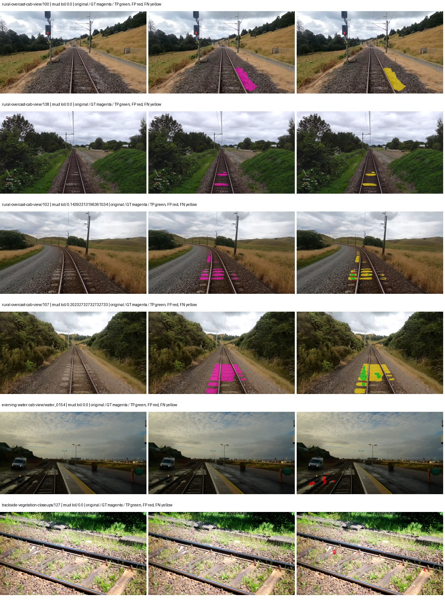
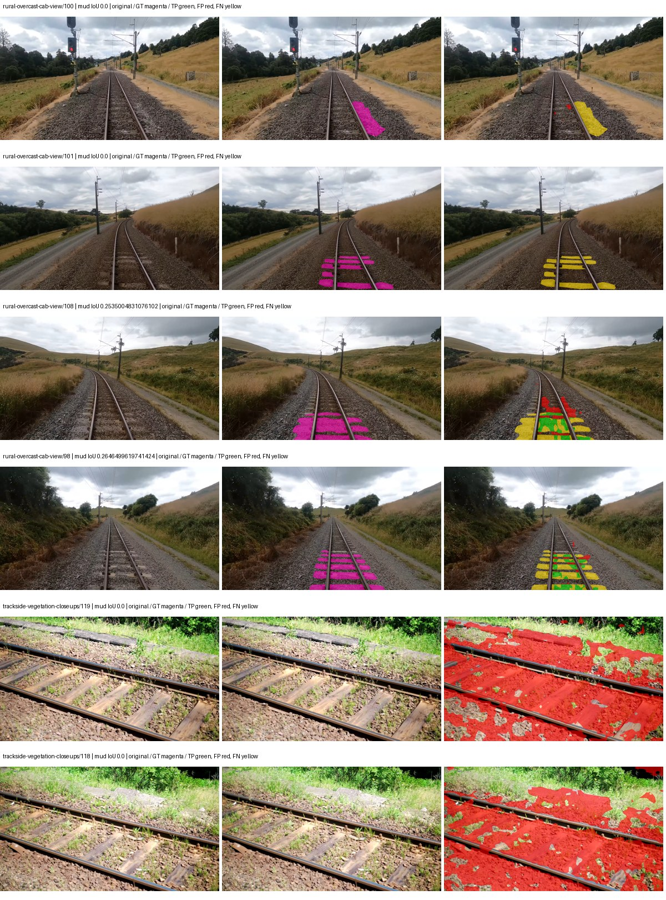
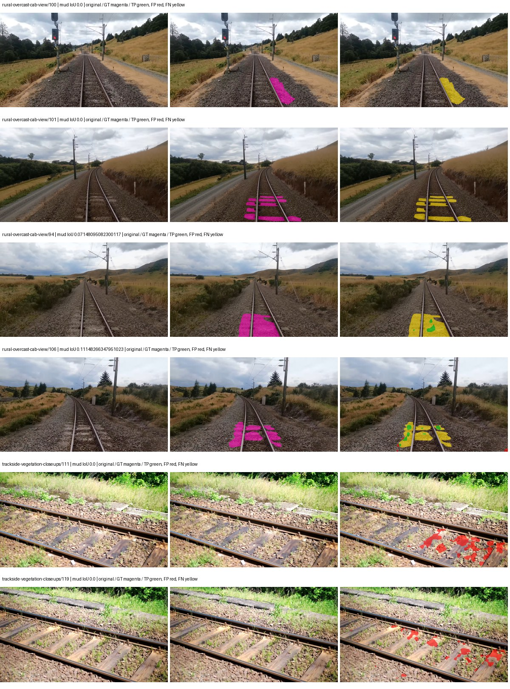
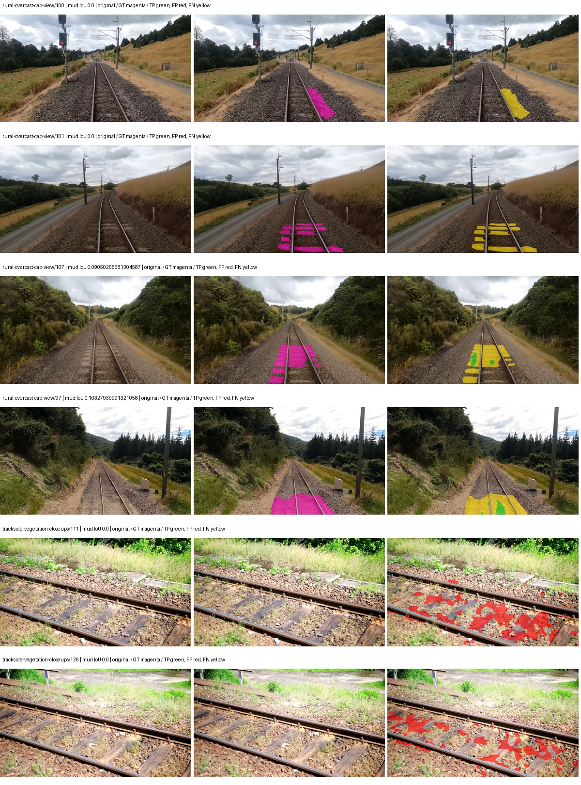

# native_resnet50_aspp — paul-test-rtis_v2

[RTIS comparison](../../README.md) · [Full model records](record.json)

Primary selection and early stopping: **mud-pumping validation IoU**. A job is complete only after full statistics and isolated profiling are verified.

| Model | Initialization path | Seed | Status | Steps | Best step | Mud IoU (%) | Mud precision (%) | Mud recall (%) | Final mud IoU (trainer val, %) | mIoU (%) | Fixed GT-class mIoU (%) |
| --- | --- | --- | --- | --- | --- | --- | --- | --- | --- | --- | --- |
| native_resnet50_aspp | rtis_only | 0 | completed | 2803 | 1529 | 4.32 | 69.27 | 4.40 | 2.50 | 28.81 | 33.61 |
| native_resnet50_aspp | cityscapes_to_rtis | 0 | completed | 1784 | 509 | 1.24 | 1.40 | 9.75 | 0.88 | 22.91 | 26.72 |
| native_resnet50_aspp | railsem19_to_rtis | 0 | completed | 3058 | 1784 | 2.67 | 12.36 | 3.30 | 1.38 | 33.90 | 39.55 |
| native_resnet50_aspp | cityscapes_to_railsem19_to_rtis | 0 | completed | 3058 | 1784 | 1.73 | 3.80 | 3.08 | 0.65 | 31.03 | 36.20 |

Training: 205 images. Validation: 37 images. Test: 50 held out. Seeds: [0]. Seed variation measures optimization variability, not independent-recording uncertainty. Historical source checkpoints stay fixed across adaptation seeds.

Training code: `066afb2626398b7be59d4d19f5a0e4644fd59adc`. Split SHA-256: `18a84c0163a65ded46508bcc904c374e5f33ad8a09b8879e3c8add606e86aa9f`.

## rtis_only — seed 0

Status: **completed**. Started: 2026-09-09T23:25:30.223331+00:00. Finished: 2026-09-10T00:03:46.838003+00:00.

Recipe pretrained initializer: `{"arch": "native", "backbone_path": null, "batch_norm_momentum": null, "checkpoint": null, "classifier_path": null, "drop_path": null, "encoder_name": null, "encoder_weights": null, "head": "unified_head", "head_paths": [], "inactive_parameter_paths": [], "local_files_only": false, "lora_alpha": 32, "lora_dropout": 0.05, "lora_r": 16, "lora_targets": [], "native": {"auxiliary_heads": [], "backbone": {"in_channels": 3, "kind": "timm", "name": "resnet50.a1_in1k", "out_indices": [1, 2, 3, 4], "weights": "pretrained"}, "head": {"activation": "relu", "channels": 256, "dilation_rates": [6, 12, 18], "dropout": 0.1, "in_index": 3, "kind": "aspp", "norm": "group"}, "neck": {"kind": "identity"}, "task": "multiclass"}, "revision": null, "smp_arch": null, "subfolder": null, "trust_remote_code": false, "tuning": "full"}`.

`rtis_only` uses the recipe initializer, which may include pretrained segmentation components. Transfer paths load the exact historical source checkpoint below and reset the classifier; they do not reset all query/decoder features.

Source checkpoint: `Recipe pretrained initialization`.

Config SHA-256: `bad354141f223a90ade1b25b180c00ab6ccb5de2dc608176ab99b686b4d770e9`. Weights used for validation: `raw`.

### Mud-pumping and aggregate quality

| Metric | Selected checkpoint | Final training validation |
| --- | --- | --- |
| Mud IoU | 4.32 | 2.50 |
| Mud precision | 69.27 | 15.43 |
| Mud recall | 4.40 | 2.90 |
| Mud Dice/F1 | 8.28 | 4.89 |
| mIoU | 28.81 | 27.49 |
| Mean accuracy | 44.55 | 39.86 |
| Mean precision | 45.08 | 46.08 |
| Mean Dice | 38.29 | 35.99 |
| Mean specificity | 98.84 | 98.79 |
| Pixel accuracy | 80.52 | 81.78 |
| Frequency-weighted IoU | 70.80 | 70.53 |
| Fixed GT-present class mIoU | 33.61 | 32.07 |
| Boundary F1 | 35.23 | 33.10 |

The selected checkpoint has independent evaluation evidence. Final values are the trainer's final validation record, not a new independent evaluation. mIoU averages classes with nonzero union, so false positives on absent classes can change its denominator. The fixed GT-class mean is supplementary and excludes absent classes; their false positives remain in the confusion matrix.

### Resource usage and timing

| Measurement | Value |
| --- | --- |
| Peak training VRAM, retained training invocation (GiB) | 8.27 |
| Peak evaluation VRAM (GiB) | 6.75 |
| Retained training invocation wall time (seconds) | 2172.91 |
| Retained training invocation GPU-hours (one GPU) | 0.60 |
| Evaluation wall time (seconds) | 10.41 |
| Full evaluation pipeline images/second | 3.55 |
| Best full-state checkpoint (MiB) | 596.61 |
| Final full-state checkpoint (MiB) | 596.60 |
| Verified periodic checkpoints removed (GiB) | 2.91 |

VRAM uses the recorded allocator high-water mark; it is not total device usage including CUDA context. Resumed jobs' retained training invocation times and peaks are **not whole-campaign totals**. Earlier invocation resource records are not reconstructed here. Evaluation throughput includes loader, sliding-window inference and metrics; it is not model-only latency/FPS. Missing measurements are shown as —, never inferred from another dataset's run.

### Standardized inference performance

Dedicated model-only profiling waits for an idle worker-locked L40S: BF16, batch 1, 1024x1024, 20 warmup and 100 CUDA-event-timed public forwards. It excludes loading, preprocessing, tiling and metrics.

| Status | Parameters | Weight MiB | FPS | p50 ms | p95 ms | Peak reserved GiB |
| --- | --- | --- | --- | --- | --- | --- |
| complete | 39048277 | 148.96 | 226.25 | 4.31 | 4.94 | 0.53 |

```json
{
  "schema_version": 1,
  "model_id": "native_resnet50_aspp",
  "measured_at": "2026-09-10T00:03:41+00:00",
  "status": "complete",
  "benchmark_scope": "rtis_selected_checkpoint_model_only",
  "applies_to": [
    "native_resnet50_aspp--rtis_only--seed-0"
  ],
  "source": {
    "campaign_git_sha": "066afb2626398b7be59d4d19f5a0e4644fd59adc",
    "git_dirty": false,
    "config_hash": "d16709700b7f",
    "resolved_config": "/data/izadia1/projects/segmentary-runs/paul-test-rtis_v2/seed0-20260909/configs/native_resnet50_aspp--rtis_only--seed-0.yaml",
    "config_sha256": "bad354141f223a90ade1b25b180c00ab6ccb5de2dc608176ab99b686b4d770e9",
    "checkpoint_sha256": "ab5d1508005d63b7cef28dddf8a3e8883fffd53b8d7d9d4b57ce1c00c8e8e177",
    "checkpoint_global_step": 1529,
    "checkpoint_bytes": 625594844,
    "checkpoint_kind": "resume checkpoint with optimizer and EMA state",
    "weights": "raw",
    "measured_checkpoint_job_id": "native_resnet50_aspp--rtis_only--seed-0",
    "result_sha256": "d85b5d20739b90f99b4ebcaea34e3c9d1d75b3ae7faf184414f510f90eb3c0ce",
    "result_git_sha": "066afb2626398b7be59d4d19f5a0e4644fd59adc",
    "result_stage": "eval:paul-test-rtis:val",
    "result_seed": 0
  },
  "hardware": {
    "gpu_name": "NVIDIA L40S",
    "gpu_uuid": "GPU-a5ad49e5-0536-5229-ba8a-f8a902808f53",
    "logical_device": "cuda:0",
    "physical_visibility_token": "7",
    "compute_capability": [
      8,
      9
    ],
    "total_memory_bytes": 47677177856
  },
  "model": {
    "parameter_count": 39048277,
    "trainable_parameter_count": 39048277,
    "resident_parameter_bytes": 156193108,
    "parameter_dtype_counts": {
      "float32": 39048277
    }
  },
  "contract": {
    "backend": "pytorch",
    "precision": "bf16_autocast",
    "batch_size": 1,
    "input_shape_nchw": [
      1,
      3,
      1024,
      1024
    ],
    "warmup_iterations": 20,
    "measured_iterations": 100,
    "timing": "per-forward CUDA events with end-event synchronization",
    "includes_preprocessing": false,
    "includes_data_loader": false,
    "includes_sliding_window": false,
    "input_resident_on_gpu": true,
    "model_only": true,
    "entrypoint": "public model(image) dense-logits forward"
  },
  "measurements": {
    "latency": {
      "p50_ms": 4.306432008743286,
      "p95_ms": 4.940544152259826,
      "mean_ms": 4.4199228811264035,
      "minimum_ms": 4.2782721519470215,
      "maximum_ms": 6.795263767242432,
      "fps": 226.24829140574352,
      "raw_ms": [
        4.471807956695557,
        4.289535999298096,
        4.30079984664917,
        4.288512229919434,
        4.304895877838135,
        4.30182409286499,
        4.285439968109131,
        4.2782721519470215,
        4.707327842712402,
        4.305920124053955,
        4.306943893432617,
        4.291584014892578,
        4.284416198730469,
        4.325376033782959,
        4.354015827178955,
        4.312064170837402,
        4.296703815460205,
        4.286464214324951,
        4.2782721519470215,
        4.291584014892578,
        4.281343936920166,
        4.284416198730469,
        4.3130879402160645,
        4.304895877838135,
        4.625408172607422,
        4.345856189727783,
        4.573184013366699,
        4.357120037078857,
        6.795263767242432,
        4.481023788452148,
        4.280288219451904,
        4.284416198730469,
        4.302847862243652,
        4.30182409286499,
        4.286464214324951,
        4.286464214324951,
        4.2936320304870605,
        4.290592193603516,
        4.336639881134033,
        4.364287853240967,
        4.294655799865723,
        5.015552043914795,
        4.751359939575195,
        4.481023788452148,
        4.29366397857666,
        4.602880001068115,
        4.365312099456787,
        4.280320167541504,
        4.286464214324951,
        4.279295921325684,
        4.286464214324951,
        4.2936320304870605,
        4.295680046081543,
        4.29260778427124,
        4.3089919090271,
        4.355072021484375,
        4.362239837646484,
        4.319231986999512,
        4.288512229919434,
        4.329472064971924,
        4.302847862243652,
        4.419583797454834,
        5.1814398765563965,
        4.547584056854248,
        4.330495834350586,
        4.335616111755371,
        4.299776077270508,
        4.295680046081543,
        4.29260778427124,
        4.324351787567139,
        4.626431941986084,
        4.3581438064575195,
        4.312064170837402,
        4.288512229919434,
        4.287487983703613,
        4.299744129180908,
        4.30079984664917,
        4.635647773742676,
        4.282368183135986,
        5.047296047210693,
        4.715583801269531,
        4.302847862243652,
        4.324351787567139,
        4.3130879402160645,
        4.936704158782959,
        4.376575946807861,
        4.407296180725098,
        4.383743762969971,
        4.288512229919434,
        4.658175945281982,
        4.651008129119873,
        4.410367965698242,
        4.290559768676758,
        4.341824054718018,
        4.284416198730469,
        4.296703815460205,
        4.288512229919434,
        4.3130879402160645,
        4.893695831298828,
        5.0135040283203125
      ],
      "percentile_method": "numpy linear interpolation"
    },
    "peak_reserved_bytes": 570425344,
    "memory_kind": "pytorch_cuda_allocator_peak_reserved_excluding_context",
    "benchmark_wall_clock_s": 11.647970698773861
  },
  "started_at": "2026-09-10T00:03:29+00:00",
  "finished_at": "2026-09-10T00:03:41+00:00",
  "environment": {
    "hostname": "hdrfs-app-001",
    "python": "3.11.15",
    "platform": "Linux-5.15.0-139-generic-x86_64-with-glibc2.35",
    "torch": "2.11.0+cu128",
    "torch_cuda": "12.8",
    "cudnn": 91900,
    "driver_version": "570.133.20",
    "cuda_available": true,
    "gpu_count": 1,
    "gpu_names": [
      "NVIDIA L40S"
    ],
    "cuda_visible_devices": "7",
    "packages": {
      "segmentary": "0.1.0",
      "torch": "2.11.0+cu128",
      "torchvision": "0.26.0+cu128",
      "transformers": "5.15.0",
      "timm": "1.0.28",
      "segmentation-models-pytorch": "0.5.0",
      "albumentations": "2.0.8",
      "lightning": "2.6.5",
      "numpy": "2.4.4"
    }
  }
}
```

### Per-class validation results

| Class | GT pixels | IoU (%) | Precision (%) | Recall (%) | Dice (%) | Boundary F1 (%) |
| --- | --- | --- | --- | --- | --- | --- |
| car | 29664 | 14.44 | 36.45 | 19.30 | 25.24 | 33.18 |
| construction | 311585 | 29.60 | 34.05 | 69.38 | 45.68 | 36.01 |
| fence | 265137 | 11.70 | 24.51 | 18.29 | 20.94 | 28.63 |
| mud-pumping | 1226250 | 4.32 | 69.27 | 4.40 | 8.28 | 14.13 |
| on-rails | 0 | 0.00 | 0.00 | — | 0.00 | 0.00 |
| person | 0 | 0.00 | 0.00 | — | 0.00 | 0.00 |
| pole | 628038 | 52.75 | 70.20 | 67.97 | 69.07 | 74.07 |
| rail-embedded | 16799 | 12.99 | 47.44 | 15.17 | 22.99 | 27.33 |
| rail-raised | 2969797 | 63.15 | 69.35 | 87.60 | 77.41 | 81.75 |
| rail-track | 6323197 | 41.86 | 65.19 | 53.92 | 59.02 | 52.06 |
| road | 1048831 | 13.18 | 31.06 | 18.63 | 23.29 | 15.03 |
| sidewalk | 1297367 | 29.34 | 61.37 | 35.99 | 45.37 | 10.42 |
| sky | 19121606 | 95.41 | 97.81 | 97.49 | 97.65 | 82.38 |
| standing-water | 95802 | 1.21 | 1.26 | 22.55 | 2.39 | 5.08 |
| terrain | 39239306 | 81.74 | 89.27 | 90.65 | 89.95 | 51.82 |
| trackbed | 10643081 | 50.89 | 63.30 | 72.18 | 67.45 | 49.88 |
| traffic-light | 19510 | 52.58 | 80.53 | 60.24 | 68.92 | 70.63 |
| traffic-sign | 13285 | 15.47 | 44.82 | 19.10 | 26.79 | 46.31 |
| tram-track | 56179 | 3.02 | 4.94 | 7.22 | 5.87 | 9.69 |
| truck | 0 | 0.00 | 0.00 | — | 0.00 | 0.00 |
| vegetation-overgrowth | 5901821 | 31.43 | 55.88 | 41.81 | 47.83 | 51.39 |

### Full-run accounting

| Measurement | Value |
| --- | --- |
| Full GPU-reserved wall seconds, all recorded worker attempts | 2296.62 |
| Full reserved GPU-hours | 0.64 |
| Whole-run timing complete | True |

| Phase | Wall seconds including failed attempts |
| --- | --- |
| training | 2179.31 |
| diagnostics | 75.77 |
| performance | 19.05 |

GPU-reserved time includes model loading, training, validation, collection, profiling, checkpoint I/O and orchestration while the worker owns one GPU. It is not GPU kernel-active time. Phase timings and sampled device memory/power/utilization are retained separately; sampled device memory is not the allocator high-water mark.

### Train/validation and raw/EMA diagnostics

| Checkpoint / weights / split | Images | Mud IoU (%) | Mud precision (%) | Mud recall (%) |
| --- | --- | --- | --- | --- |
| best-auto-train / raw | 205 | 91.67 | 95.83 | 95.47 |
| best-auto-val / raw | 37 | 4.32 | 69.27 | 4.40 |
| best-alternate-val / ema | 37 | 3.02 | 54.72 | 3.10 |
| final-auto-val / raw | 37 | 2.50 | 15.38 | 2.90 |

Train uses the evaluation transform without augmentation. Compare mud train/validation metrics for the same selected weights. Alternate EMA on running-stat BatchNorm is explicitly uncalibrated and is diagnostic only. Score-threshold curves use uncalibrated normalized scores and are pixel-level diagnostics, not event detection rates or a selected deployment operating point.

### Downloadable evidence

- best-auto-train: [per-image.csv](rtis_only--seed-0/best-auto-train/per-image.csv) · [per-image-confusion.json.gz](rtis_only--seed-0/best-auto-train/per-image-confusion.json.gz) · [groups.json](rtis_only--seed-0/best-auto-train/groups.json) · [mud-score-curves.json](rtis_only--seed-0/best-auto-train/mud-score-curves.json)
- best-auto-val: [per-image.csv](rtis_only--seed-0/best-auto-val/per-image.csv) · [per-image-confusion.json.gz](rtis_only--seed-0/best-auto-val/per-image-confusion.json.gz) · [groups.json](rtis_only--seed-0/best-auto-val/groups.json) · [mud-score-curves.json](rtis_only--seed-0/best-auto-val/mud-score-curves.json) · [examples.jpg](rtis_only--seed-0/best-auto-val/examples.jpg)
- best-alternate-val: [per-image.csv](rtis_only--seed-0/best-alternate-val/per-image.csv) · [per-image-confusion.json.gz](rtis_only--seed-0/best-alternate-val/per-image-confusion.json.gz) · [groups.json](rtis_only--seed-0/best-alternate-val/groups.json) · [mud-score-curves.json](rtis_only--seed-0/best-alternate-val/mud-score-curves.json)
- final-auto-val: [per-image.csv](rtis_only--seed-0/final-auto-val/per-image.csv) · [per-image-confusion.json.gz](rtis_only--seed-0/final-auto-val/per-image-confusion.json.gz) · [groups.json](rtis_only--seed-0/final-auto-val/groups.json) · [mud-score-curves.json](rtis_only--seed-0/final-auto-val/mud-score-curves.json)
- resources: [telemetry.csv](rtis_only--seed-0/resources/telemetry.csv)



Examples are two lowest and two highest mud-IoU positive images, plus up to two negative images with the most false-positive mud pixels. They are targeted diagnostic examples, not random samples. Green: true positive; red: false positive; yellow: false negative. Full predictions remain on HDRFS.

### Validation tracking

| Logged step | Overall mIoU (%) | Mud IoU (%) |
| --- | --- | --- |
| 254 | 18.42 | 0.29 |
| 509 | 20.45 | 0.44 |
| 764 | 23.38 | 0.32 |
| 1019 | 24.94 | 4.02 |
| 1274 | 27.17 | 0.96 |
| 1529 | 28.80 | 4.30 |
| 1784 | 26.70 | 0.56 |
| 2038 | 29.34 | 1.36 |
| 2293 | 28.37 | 1.86 |
| 2548 | 28.14 | 1.77 |
| 2803 | 27.49 | 2.50 |

All retained scalar curves, including training loss and per-class IoU, are in record.json. Observed best mud on a curve is not necessarily a retained checkpoint: the pilot saved its selection-metric-best and final checkpoints. Step logging and checkpoint global_step may differ by one.

### Stopping and checkpoint provenance

```json
{
  "stopping": {
    "actual_steps": 2803,
    "maximum_steps": 4000,
    "min_delta": 0.001,
    "monitor": "val_iou/mud-pumping",
    "patience": 5,
    "reason": "validation_plateau"
  },
  "checkpoints": {
    "best": {
      "path": "/data/izadia1/projects/segmentary-runs/paul-test-rtis_v2/seed0-20260909/future-runs/native_resnet50_aspp--rtis_only--seed-0_seed0/rtis/best.ckpt",
      "sha256": "ab5d1508005d63b7cef28dddf8a3e8883fffd53b8d7d9d4b57ce1c00c8e8e177",
      "global_step": 1529,
      "bytes": 625594844
    },
    "final": {
      "path": "/data/izadia1/projects/segmentary-runs/paul-test-rtis_v2/seed0-20260909/future-runs/native_resnet50_aspp--rtis_only--seed-0_seed0/rtis/last.ckpt",
      "sha256": "589baa006e75f9977ffc90ac8a196087c3a5af0e4e7e4c582ff49394698370f6",
      "global_step": 2803,
      "bytes": 625583772
    }
  },
  "cleanup_error": null
}
```

### Resolved training, initialization and evaluation settings

The optimizer block is the base configuration. Stage LR scales are applied at runtime, and stage warmup is capped at min(base warmup, floor(stage budget / 10), stage budget - 1): 400 steps for this 4,000-step pilot. Model-internal native input grids may differ from augmentation crops (EoMT uses its 640 grid).

```json
{
  "name": "native_resnet50_aspp--rtis_only--seed-0",
  "model": {
    "arch": "native",
    "checkpoint": null,
    "tuning": "full",
    "head": "unified_head",
    "lora_r": 16,
    "lora_alpha": 32,
    "lora_dropout": 0.05,
    "lora_targets": [],
    "drop_path": null,
    "revision": null,
    "subfolder": null,
    "local_files_only": false,
    "trust_remote_code": false,
    "backbone_path": null,
    "head_paths": [],
    "classifier_path": null,
    "inactive_parameter_paths": [],
    "smp_arch": null,
    "encoder_name": null,
    "encoder_weights": null,
    "native": {
      "task": "multiclass",
      "backbone": {
        "kind": "timm",
        "name": "resnet50.a1_in1k",
        "weights": "pretrained",
        "out_indices": [
          1,
          2,
          3,
          4
        ],
        "in_channels": 3
      },
      "neck": {
        "kind": "identity"
      },
      "head": {
        "kind": "aspp",
        "in_index": 3,
        "channels": 256,
        "dilation_rates": [
          6,
          12,
          18
        ],
        "dropout": 0.1,
        "norm": "group",
        "activation": "relu"
      },
      "auxiliary_heads": []
    },
    "batch_norm_momentum": null
  },
  "space": "paul-test-rtis",
  "taxonomy_root": "/data/izadia1/projects/segmentary-rtis-fullstats-066afb2/taxonomy",
  "output_root": "/data/izadia1/projects/segmentary-runs/paul-test-rtis_v2/seed0-20260909/future-runs",
  "optim": {
    "backbone_lr": 0.0001,
    "head_lr_mult": 10.0,
    "weight_decay": 0.05,
    "llrd": 1.0,
    "warmup_iters": 1500,
    "warmup_ratio": 1e-06,
    "poly_power": 0.9,
    "min_lr_ratio": 0.0,
    "betas": [
      0.9,
      0.999
    ],
    "grad_clip": 1.0
  },
  "train": {
    "iters": 4000,
    "batch_size": 2,
    "accum": 8,
    "num_workers": 2,
    "precision": "bf16-mixed",
    "ema_decay": 0.9998,
    "val_every": 250,
    "ckpt_every": 500,
    "selection_metric": "val_iou/mud-pumping",
    "early_stopping_patience": 5,
    "early_stopping_min_delta": 0.001,
    "seed": 0,
    "devices": 1
  },
  "eval": {
    "sliding_window": true,
    "window": [
      1024,
      1024
    ],
    "stride": [
      768,
      768
    ],
    "batch_size": 1,
    "num_workers": 2,
    "tta_scales": [],
    "tta_flip": false,
    "threshold": 0.5,
    "boundary_tolerance_frac": 0.0075,
    "save_confusion": true
  },
  "loss": {
    "task": "multiclass",
    "activation": "auto",
    "terms": [],
    "aux": "none",
    "aux_weight": 0.0,
    "ce_weight": 1.0,
    "label_smoothing": 0.0,
    "class_weights": null,
    "query": null
  },
  "aug": {
    "crop": [
      1024,
      1024
    ],
    "scale_min": 0.5,
    "scale_max": 2.0,
    "hflip_p": 0.5,
    "color_jitter_p": 0.5,
    "brightness": 0.25,
    "contrast": 0.25,
    "saturation": 0.25,
    "hue": 0.05
  },
  "stages": [
    {
      "name": "rtis",
      "data": [
        {
          "name": "paul-test-rtis",
          "root": "/data/izadia1/datasets/paul-test-rtis_v2",
          "variant": null,
          "split_file": "splits.json",
          "train_split": "train",
          "val_split": "val",
          "limit": null,
          "loader": "folder",
          "mapping": "paul-test-rtis",
          "loader_options": {
            "require_groups": true
          }
        }
      ],
      "iters": null,
      "lr_scale": 1.0,
      "head_group_lr_scale": 1.0,
      "init_from": "pretrained",
      "reset_head": false,
      "freeze": null,
      "sample_weights": null
    }
  ]
}
```

### Hardware and software provenance

```json
{
  "training": {
    "cuda_available": true,
    "cuda_visible_devices": "7",
    "cudnn": 91900,
    "driver_version": "570.133.20",
    "gpu_count": 1,
    "gpu_names": [
      "NVIDIA L40S"
    ],
    "hostname": "hdrfs-app-001",
    "input_normalization": {
      "channel_order": "rgb",
      "mean": [
        0.485,
        0.456,
        0.406
      ],
      "source": "timm_pretrained_cfg",
      "std": [
        0.229,
        0.224,
        0.225
      ]
    },
    "model_origins": [
      {
        "hf_commit": null,
        "hf_name_or_path": null,
        "module": "backbone",
        "timm_pretrained": {
          "architecture": "resnet50",
          "hf_hub_id": "timm/resnet50.a1_in1k",
          "tag": "a1_in1k",
          "url": "https://github.com/rwightman/pytorch-image-models/releases/download/v0.1-rsb-weights/resnet50_a1_0-14fe96d1.pth"
        }
      },
      {
        "hf_commit": null,
        "hf_name_or_path": null,
        "module": "backbone.model",
        "timm_pretrained": {
          "architecture": "resnet50",
          "hf_hub_id": "timm/resnet50.a1_in1k",
          "tag": "a1_in1k",
          "url": "https://github.com/rwightman/pytorch-image-models/releases/download/v0.1-rsb-weights/resnet50_a1_0-14fe96d1.pth"
        }
      }
    ],
    "model_parameter_count": 39048277,
    "packages": {
      "albumentations": "2.0.8",
      "lightning": "2.6.5",
      "numpy": "2.4.4",
      "segmentary": "0.1.0",
      "segmentation-models-pytorch": "0.5.0",
      "timm": "1.0.28",
      "torch": "2.11.0+cu128",
      "torchvision": "0.26.0+cu128",
      "transformers": "5.15.0"
    },
    "platform": "Linux-5.15.0-139-generic-x86_64-with-glibc2.35",
    "python": "3.11.15",
    "torch": "2.11.0+cu128",
    "torch_cuda": "12.8",
    "trainable_parameter_count": 39048277,
    "training_stop": {
      "actual_steps": 2803,
      "maximum_steps": 4000,
      "min_delta": 0.001,
      "monitor": "val_iou/mud-pumping",
      "patience": 5,
      "reason": "validation_plateau"
    },
    "validation_weights": "raw"
  },
  "evaluation": {
    "cuda_available": true,
    "cuda_visible_devices": "7",
    "cudnn": 91900,
    "driver_version": "570.133.20",
    "gpu_count": 1,
    "gpu_names": [
      "NVIDIA L40S"
    ],
    "hostname": "hdrfs-app-001",
    "input_normalization": {
      "channel_order": "rgb",
      "mean": [
        0.485,
        0.456,
        0.406
      ],
      "source": "timm_pretrained_cfg",
      "std": [
        0.229,
        0.224,
        0.225
      ]
    },
    "packages": {
      "albumentations": "2.0.8",
      "lightning": "2.6.5",
      "numpy": "2.4.4",
      "segmentary": "0.1.0",
      "segmentation-models-pytorch": "0.5.0",
      "timm": "1.0.28",
      "torch": "2.11.0+cu128",
      "torchvision": "0.26.0+cu128",
      "transformers": "5.15.0"
    },
    "platform": "Linux-5.15.0-139-generic-x86_64-with-glibc2.35",
    "python": "3.11.15",
    "torch": "2.11.0+cu128",
    "torch_cuda": "12.8"
  }
}
```

## cityscapes_to_rtis — seed 0

Status: **completed**. Started: 2026-09-09T23:26:21.683107+00:00. Finished: 2026-09-09T23:51:42.279394+00:00.

Recipe pretrained initializer: `{"arch": "native", "backbone_path": null, "batch_norm_momentum": null, "checkpoint": null, "classifier_path": null, "drop_path": null, "encoder_name": null, "encoder_weights": null, "head": "unified_head", "head_paths": [], "inactive_parameter_paths": [], "local_files_only": false, "lora_alpha": 32, "lora_dropout": 0.05, "lora_r": 16, "lora_targets": [], "native": {"auxiliary_heads": [], "backbone": {"in_channels": 3, "kind": "timm", "name": "resnet50.a1_in1k", "out_indices": [1, 2, 3, 4], "weights": "pretrained"}, "head": {"activation": "relu", "channels": 256, "dilation_rates": [6, 12, 18], "dropout": 0.1, "in_index": 3, "kind": "aspp", "norm": "group"}, "neck": {"kind": "identity"}, "task": "multiclass"}, "revision": null, "smp_arch": null, "subfolder": null, "trust_remote_code": false, "tuning": "full"}`.

`rtis_only` uses the recipe initializer, which may include pretrained segmentation components. Transfer paths load the exact historical source checkpoint below and reset the classifier; they do not reset all query/decoder features.

Source checkpoint: `{'name': 'native_resnet50_aspp--cityscapes--seed-0', 'model': 'native_resnet50_aspp', 'protocol': 'cityscapes', 'config': '/data/izadia1/projects/segmentary-runs/all-model-city-rail-seed0-rail20-b9eb3e1/accepted/native_resnet50_aspp--cityscapes--seed-0/resolved-config.yaml', 'checkpoint': '/data/izadia1/projects/segmentary-runs/all-model-city-rail-seed0-a7c0b67/jobs/native_resnet50_aspp--cityscapes--seed-0/attempt-001/train/native_resnet50_aspp--cityscapes_seed0/cityscapes/last.ckpt', 'recorded_sha256': '2bb9db7fa588bb8889c2ba8894d5320005d9e94afe00406d7d133de08e0a16ac', 'exists': True}`.

Config SHA-256: `ea2ac02517bc883a2b00c9bb9a5d03bc6abe7ec6b91e3921cca8c921c8d75617`. Weights used for validation: `raw`.

### Mud-pumping and aggregate quality

| Metric | Selected checkpoint | Final training validation |
| --- | --- | --- |
| Mud IoU | 1.24 | 0.88 |
| Mud precision | 1.40 | 1.19 |
| Mud recall | 9.75 | 3.27 |
| Mud Dice/F1 | 2.45 | 1.75 |
| mIoU | 22.91 | 29.78 |
| Mean accuracy | 34.48 | 43.19 |
| Mean precision | 42.68 | 53.50 |
| Mean Dice | 30.05 | 39.20 |
| Mean specificity | 98.52 | 98.72 |
| Pixel accuracy | 74.65 | 79.92 |
| Frequency-weighted IoU | 67.06 | 70.15 |
| Fixed GT-present class mIoU | 26.72 | 34.74 |
| Boundary F1 | 27.37 | 34.46 |

The selected checkpoint has independent evaluation evidence. Final values are the trainer's final validation record, not a new independent evaluation. mIoU averages classes with nonzero union, so false positives on absent classes can change its denominator. The fixed GT-class mean is supplementary and excludes absent classes; their false positives remain in the confusion matrix.

### Resource usage and timing

| Measurement | Value |
| --- | --- |
| Peak training VRAM, retained training invocation (GiB) | 8.27 |
| Peak evaluation VRAM (GiB) | 6.75 |
| Retained training invocation wall time (seconds) | 1393.41 |
| Retained training invocation GPU-hours (one GPU) | 0.39 |
| Evaluation wall time (seconds) | 11.21 |
| Full evaluation pipeline images/second | 3.30 |
| Best full-state checkpoint (MiB) | 596.61 |
| Final full-state checkpoint (MiB) | 596.60 |
| Verified periodic checkpoints removed (GiB) | 1.75 |

VRAM uses the recorded allocator high-water mark; it is not total device usage including CUDA context. Resumed jobs' retained training invocation times and peaks are **not whole-campaign totals**. Earlier invocation resource records are not reconstructed here. Evaluation throughput includes loader, sliding-window inference and metrics; it is not model-only latency/FPS. Missing measurements are shown as —, never inferred from another dataset's run.

### Standardized inference performance

Dedicated model-only profiling waits for an idle worker-locked L40S: BF16, batch 1, 1024x1024, 20 warmup and 100 CUDA-event-timed public forwards. It excludes loading, preprocessing, tiling and metrics.

| Status | Parameters | Weight MiB | FPS | p50 ms | p95 ms | Peak reserved GiB |
| --- | --- | --- | --- | --- | --- | --- |
| complete | 39048277 | 148.96 | 215.85 | 4.43 | 5.53 | 0.53 |

```json
{
  "schema_version": 1,
  "model_id": "native_resnet50_aspp",
  "measured_at": "2026-09-09T23:51:38+00:00",
  "status": "complete",
  "benchmark_scope": "rtis_selected_checkpoint_model_only",
  "applies_to": [
    "native_resnet50_aspp--cityscapes_to_rtis--seed-0"
  ],
  "source": {
    "campaign_git_sha": "066afb2626398b7be59d4d19f5a0e4644fd59adc",
    "git_dirty": false,
    "config_hash": "5926a439d826",
    "resolved_config": "/data/izadia1/projects/segmentary-runs/paul-test-rtis_v2/seed0-20260909/configs/native_resnet50_aspp--cityscapes_to_rtis--seed-0.yaml",
    "config_sha256": "ea2ac02517bc883a2b00c9bb9a5d03bc6abe7ec6b91e3921cca8c921c8d75617",
    "checkpoint_sha256": "0c2f7bddd81290fb7c9376764c82508e2b6d2591e625027e7ec34a5851064022",
    "checkpoint_global_step": 509,
    "checkpoint_bytes": 625594908,
    "checkpoint_kind": "resume checkpoint with optimizer and EMA state",
    "weights": "raw",
    "measured_checkpoint_job_id": "native_resnet50_aspp--cityscapes_to_rtis--seed-0",
    "result_sha256": "36b00ce4604b297379e91c259aac0b55f25d202df25d61e65daef735a9ec50ee",
    "result_git_sha": "066afb2626398b7be59d4d19f5a0e4644fd59adc",
    "result_stage": "eval:paul-test-rtis:val",
    "result_seed": 0
  },
  "hardware": {
    "gpu_name": "NVIDIA L40S",
    "gpu_uuid": "GPU-1c9b612f-e0b5-fbbc-150f-8c2ef13453c9",
    "logical_device": "cuda:0",
    "physical_visibility_token": "5",
    "compute_capability": [
      8,
      9
    ],
    "total_memory_bytes": 47677177856
  },
  "model": {
    "parameter_count": 39048277,
    "trainable_parameter_count": 39048277,
    "resident_parameter_bytes": 156193108,
    "parameter_dtype_counts": {
      "float32": 39048277
    }
  },
  "contract": {
    "backend": "pytorch",
    "precision": "bf16_autocast",
    "batch_size": 1,
    "input_shape_nchw": [
      1,
      3,
      1024,
      1024
    ],
    "warmup_iterations": 20,
    "measured_iterations": 100,
    "timing": "per-forward CUDA events with end-event synchronization",
    "includes_preprocessing": false,
    "includes_data_loader": false,
    "includes_sliding_window": false,
    "input_resident_on_gpu": true,
    "model_only": true,
    "entrypoint": "public model(image) dense-logits forward"
  },
  "measurements": {
    "latency": {
      "p50_ms": 4.432896137237549,
      "p95_ms": 5.532211279869079,
      "mean_ms": 4.632809896469116,
      "minimum_ms": 4.40934419631958,
      "maximum_ms": 6.610943794250488,
      "fps": 215.85172332716425,
      "raw_ms": [
        4.779007911682129,
        4.428800106048584,
        4.425727844238281,
        4.414463996887207,
        4.419583797454834,
        4.423679828643799,
        4.902912139892578,
        4.465663909912109,
        4.423679828643799,
        4.422656059265137,
        4.40934419631958,
        4.425727844238281,
        4.423679828643799,
        4.424704074859619,
        4.426752090454102,
        4.419583797454834,
        4.430848121643066,
        4.4819841384887695,
        4.419583797454834,
        4.4165120124816895,
        4.422656059265137,
        4.420608043670654,
        4.91315221786499,
        4.560895919799805,
        4.415487766265869,
        4.427775859832764,
        4.477952003479004,
        4.8957438468933105,
        4.452352046966553,
        4.434944152832031,
        4.424704074859619,
        4.427775859832764,
        4.427775859832764,
        4.481023788452148,
        5.006336212158203,
        4.918272018432617,
        4.428800106048584,
        4.439040184020996,
        4.419583797454834,
        4.417535781860352,
        4.421631813049316,
        4.425695896148682,
        4.421631813049316,
        4.421631813049316,
        4.434944152832031,
        4.423679828643799,
        5.5214080810546875,
        4.882431983947754,
        4.823040008544922,
        4.477952003479004,
        4.424704074859619,
        4.429823875427246,
        4.430848121643066,
        4.426752090454102,
        4.432896137237549,
        4.429823875427246,
        4.498432159423828,
        4.492288112640381,
        4.506624221801758,
        4.432896137237549,
        4.427775859832764,
        4.472799777984619,
        4.425727844238281,
        4.601856231689453,
        4.484096050262451,
        4.860928058624268,
        5.31660795211792,
        4.785151958465576,
        4.592639923095703,
        4.469759941101074,
        4.426752090454102,
        4.427775859832764,
        4.422656059265137,
        4.7861762046813965,
        4.433919906616211,
        4.429823875427246,
        4.530176162719727,
        5.080063819885254,
        4.75545597076416,
        5.737472057342529,
        5.774335861206055,
        4.590591907501221,
        4.430848121643066,
        4.423679828643799,
        4.420608043670654,
        4.419583797454834,
        4.424704074859619,
        4.428800106048584,
        4.422656059265137,
        6.610943794250488,
        5.454815864562988,
        5.282815933227539,
        4.891647815704346,
        6.067200183868408,
        5.862400054931641,
        5.0032639503479,
        4.781055927276611,
        4.554751873016357,
        4.495359897613525,
        4.516863822937012
      ],
      "percentile_method": "numpy linear interpolation"
    },
    "peak_reserved_bytes": 570425344,
    "memory_kind": "pytorch_cuda_allocator_peak_reserved_excluding_context",
    "benchmark_wall_clock_s": 12.35071774944663
  },
  "started_at": "2026-09-09T23:51:25+00:00",
  "finished_at": "2026-09-09T23:51:38+00:00",
  "environment": {
    "hostname": "hdrfs-app-001",
    "python": "3.11.15",
    "platform": "Linux-5.15.0-139-generic-x86_64-with-glibc2.35",
    "torch": "2.11.0+cu128",
    "torch_cuda": "12.8",
    "cudnn": 91900,
    "driver_version": "570.133.20",
    "cuda_available": true,
    "gpu_count": 1,
    "gpu_names": [
      "NVIDIA L40S"
    ],
    "cuda_visible_devices": "5",
    "packages": {
      "segmentary": "0.1.0",
      "torch": "2.11.0+cu128",
      "torchvision": "0.26.0+cu128",
      "transformers": "5.15.0",
      "timm": "1.0.28",
      "segmentation-models-pytorch": "0.5.0",
      "albumentations": "2.0.8",
      "lightning": "2.6.5",
      "numpy": "2.4.4"
    }
  }
}
```

### Per-class validation results

| Class | GT pixels | IoU (%) | Precision (%) | Recall (%) | Dice (%) | Boundary F1 (%) |
| --- | --- | --- | --- | --- | --- | --- |
| car | 29664 | 0.00 | 0.00 | 0.00 | 0.00 | 0.00 |
| construction | 311585 | 13.86 | 14.80 | 68.65 | 24.35 | 25.30 |
| fence | 265137 | 33.37 | 77.10 | 37.04 | 50.04 | 55.60 |
| mud-pumping | 1226250 | 1.24 | 1.40 | 9.75 | 2.45 | 4.64 |
| on-rails | 0 | 0.00 | 0.00 | — | 0.00 | 0.00 |
| person | 0 | 0.00 | 0.00 | — | 0.00 | 0.00 |
| pole | 628038 | 46.32 | 84.60 | 50.59 | 63.32 | 64.72 |
| rail-embedded | 16799 | 0.00 | 0.00 | 0.00 | 0.00 | 0.00 |
| rail-raised | 2969797 | 63.27 | 77.21 | 77.79 | 77.50 | 83.69 |
| rail-track | 6323197 | 29.06 | 75.10 | 32.16 | 45.03 | 39.96 |
| road | 1048831 | 8.42 | 20.58 | 12.47 | 15.53 | 16.58 |
| sidewalk | 1297367 | 20.73 | 89.15 | 21.27 | 34.34 | 8.38 |
| sky | 19121606 | 96.93 | 98.71 | 98.18 | 98.44 | 86.40 |
| standing-water | 95802 | 0.71 | 0.73 | 22.42 | 1.42 | 2.48 |
| terrain | 39239306 | 80.16 | 85.83 | 92.38 | 88.99 | 48.99 |
| trackbed | 10643081 | 45.94 | 78.30 | 52.65 | 62.96 | 50.94 |
| traffic-light | 19510 | 30.23 | 72.60 | 34.12 | 46.42 | 39.64 |
| traffic-sign | 13285 | 0.00 | 0.00 | 0.00 | 0.00 | 0.00 |
| tram-track | 56179 | 3.66 | 51.49 | 3.79 | 7.05 | 24.42 |
| truck | 0 | 0.00 | 0.00 | — | 0.00 | 0.00 |
| vegetation-overgrowth | 5901821 | 7.12 | 68.63 | 7.36 | 13.29 | 23.10 |

### Full-run accounting

| Measurement | Value |
| --- | --- |
| Full GPU-reserved wall seconds, all recorded worker attempts | 1521.12 |
| Full reserved GPU-hours | 0.42 |
| Whole-run timing complete | True |

| Phase | Wall seconds including failed attempts |
| --- | --- |
| training | 1400.98 |
| diagnostics | 76.61 |
| performance | 20.11 |

GPU-reserved time includes model loading, training, validation, collection, profiling, checkpoint I/O and orchestration while the worker owns one GPU. It is not GPU kernel-active time. Phase timings and sampled device memory/power/utilization are retained separately; sampled device memory is not the allocator high-water mark.

### Train/validation and raw/EMA diagnostics

| Checkpoint / weights / split | Images | Mud IoU (%) | Mud precision (%) | Mud recall (%) |
| --- | --- | --- | --- | --- |
| best-auto-train / raw | 205 | 85.20 | 88.38 | 95.96 |
| best-auto-val / raw | 37 | 1.24 | 1.40 | 9.75 |
| best-alternate-val / ema | 37 | 1.69 | 2.37 | 5.54 |
| final-auto-val / raw | 37 | 0.88 | 1.19 | 3.26 |

Train uses the evaluation transform without augmentation. Compare mud train/validation metrics for the same selected weights. Alternate EMA on running-stat BatchNorm is explicitly uncalibrated and is diagnostic only. Score-threshold curves use uncalibrated normalized scores and are pixel-level diagnostics, not event detection rates or a selected deployment operating point.

### Downloadable evidence

- best-auto-train: [per-image.csv](cityscapes_to_rtis--seed-0/best-auto-train/per-image.csv) · [per-image-confusion.json.gz](cityscapes_to_rtis--seed-0/best-auto-train/per-image-confusion.json.gz) · [groups.json](cityscapes_to_rtis--seed-0/best-auto-train/groups.json) · [mud-score-curves.json](cityscapes_to_rtis--seed-0/best-auto-train/mud-score-curves.json)
- best-auto-val: [per-image.csv](cityscapes_to_rtis--seed-0/best-auto-val/per-image.csv) · [per-image-confusion.json.gz](cityscapes_to_rtis--seed-0/best-auto-val/per-image-confusion.json.gz) · [groups.json](cityscapes_to_rtis--seed-0/best-auto-val/groups.json) · [mud-score-curves.json](cityscapes_to_rtis--seed-0/best-auto-val/mud-score-curves.json) · [examples.jpg](cityscapes_to_rtis--seed-0/best-auto-val/examples.jpg)
- best-alternate-val: [per-image.csv](cityscapes_to_rtis--seed-0/best-alternate-val/per-image.csv) · [per-image-confusion.json.gz](cityscapes_to_rtis--seed-0/best-alternate-val/per-image-confusion.json.gz) · [groups.json](cityscapes_to_rtis--seed-0/best-alternate-val/groups.json) · [mud-score-curves.json](cityscapes_to_rtis--seed-0/best-alternate-val/mud-score-curves.json)
- final-auto-val: [per-image.csv](cityscapes_to_rtis--seed-0/final-auto-val/per-image.csv) · [per-image-confusion.json.gz](cityscapes_to_rtis--seed-0/final-auto-val/per-image-confusion.json.gz) · [groups.json](cityscapes_to_rtis--seed-0/final-auto-val/groups.json) · [mud-score-curves.json](cityscapes_to_rtis--seed-0/final-auto-val/mud-score-curves.json)
- resources: [telemetry.csv](cityscapes_to_rtis--seed-0/resources/telemetry.csv)



Examples are two lowest and two highest mud-IoU positive images, plus up to two negative images with the most false-positive mud pixels. They are targeted diagnostic examples, not random samples. Green: true positive; red: false positive; yellow: false negative. Full predictions remain on HDRFS.

### Validation tracking

| Logged step | Overall mIoU (%) | Mud IoU (%) |
| --- | --- | --- |
| 254 | 19.30 | 0.22 |
| 509 | 22.90 | 1.24 |
| 764 | 27.42 | 0.14 |
| 1019 | 28.80 | 0.85 |
| 1274 | 29.66 | 0.23 |
| 1529 | 29.63 | 0.92 |
| 1784 | 29.78 | 0.88 |

All retained scalar curves, including training loss and per-class IoU, are in record.json. Observed best mud on a curve is not necessarily a retained checkpoint: the pilot saved its selection-metric-best and final checkpoints. Step logging and checkpoint global_step may differ by one.

### Stopping and checkpoint provenance

```json
{
  "stopping": {
    "actual_steps": 1784,
    "maximum_steps": 4000,
    "min_delta": 0.001,
    "monitor": "val_iou/mud-pumping",
    "patience": 5,
    "reason": "validation_plateau"
  },
  "checkpoints": {
    "best": {
      "path": "/data/izadia1/projects/segmentary-runs/paul-test-rtis_v2/seed0-20260909/future-runs/native_resnet50_aspp--cityscapes_to_rtis--seed-0_seed0/rtis/best.ckpt",
      "sha256": "0c2f7bddd81290fb7c9376764c82508e2b6d2591e625027e7ec34a5851064022",
      "global_step": 509,
      "bytes": 625594908
    },
    "final": {
      "path": "/data/izadia1/projects/segmentary-runs/paul-test-rtis_v2/seed0-20260909/future-runs/native_resnet50_aspp--cityscapes_to_rtis--seed-0_seed0/rtis/last.ckpt",
      "sha256": "db952f2da7962382056272fcf08f5c22c920b51c03097e8636ab0f525a03ad32",
      "global_step": 1784,
      "bytes": 625583772
    }
  },
  "cleanup_error": null
}
```

### Resolved training, initialization and evaluation settings

The optimizer block is the base configuration. Stage LR scales are applied at runtime, and stage warmup is capped at min(base warmup, floor(stage budget / 10), stage budget - 1): 400 steps for this 4,000-step pilot. Model-internal native input grids may differ from augmentation crops (EoMT uses its 640 grid).

```json
{
  "name": "native_resnet50_aspp--cityscapes_to_rtis--seed-0",
  "model": {
    "arch": "native",
    "checkpoint": null,
    "tuning": "full",
    "head": "unified_head",
    "lora_r": 16,
    "lora_alpha": 32,
    "lora_dropout": 0.05,
    "lora_targets": [],
    "drop_path": null,
    "revision": null,
    "subfolder": null,
    "local_files_only": false,
    "trust_remote_code": false,
    "backbone_path": null,
    "head_paths": [],
    "classifier_path": null,
    "inactive_parameter_paths": [],
    "smp_arch": null,
    "encoder_name": null,
    "encoder_weights": null,
    "native": {
      "task": "multiclass",
      "backbone": {
        "kind": "timm",
        "name": "resnet50.a1_in1k",
        "weights": "pretrained",
        "out_indices": [
          1,
          2,
          3,
          4
        ],
        "in_channels": 3
      },
      "neck": {
        "kind": "identity"
      },
      "head": {
        "kind": "aspp",
        "in_index": 3,
        "channels": 256,
        "dilation_rates": [
          6,
          12,
          18
        ],
        "dropout": 0.1,
        "norm": "group",
        "activation": "relu"
      },
      "auxiliary_heads": []
    },
    "batch_norm_momentum": null
  },
  "space": "paul-test-rtis",
  "taxonomy_root": "/data/izadia1/projects/segmentary-rtis-fullstats-066afb2/taxonomy",
  "output_root": "/data/izadia1/projects/segmentary-runs/paul-test-rtis_v2/seed0-20260909/future-runs",
  "optim": {
    "backbone_lr": 0.0001,
    "head_lr_mult": 10.0,
    "weight_decay": 0.05,
    "llrd": 1.0,
    "warmup_iters": 1500,
    "warmup_ratio": 1e-06,
    "poly_power": 0.9,
    "min_lr_ratio": 0.0,
    "betas": [
      0.9,
      0.999
    ],
    "grad_clip": 1.0
  },
  "train": {
    "iters": 4000,
    "batch_size": 2,
    "accum": 8,
    "num_workers": 2,
    "precision": "bf16-mixed",
    "ema_decay": 0.9998,
    "val_every": 250,
    "ckpt_every": 500,
    "selection_metric": "val_iou/mud-pumping",
    "early_stopping_patience": 5,
    "early_stopping_min_delta": 0.001,
    "seed": 0,
    "devices": 1
  },
  "eval": {
    "sliding_window": true,
    "window": [
      1024,
      1024
    ],
    "stride": [
      768,
      768
    ],
    "batch_size": 1,
    "num_workers": 2,
    "tta_scales": [],
    "tta_flip": false,
    "threshold": 0.5,
    "boundary_tolerance_frac": 0.0075,
    "save_confusion": true
  },
  "loss": {
    "task": "multiclass",
    "activation": "auto",
    "terms": [],
    "aux": "none",
    "aux_weight": 0.0,
    "ce_weight": 1.0,
    "label_smoothing": 0.0,
    "class_weights": null,
    "query": null
  },
  "aug": {
    "crop": [
      1024,
      1024
    ],
    "scale_min": 0.5,
    "scale_max": 2.0,
    "hflip_p": 0.5,
    "color_jitter_p": 0.5,
    "brightness": 0.25,
    "contrast": 0.25,
    "saturation": 0.25,
    "hue": 0.05
  },
  "stages": [
    {
      "name": "rtis",
      "data": [
        {
          "name": "paul-test-rtis",
          "root": "/data/izadia1/datasets/paul-test-rtis_v2",
          "variant": null,
          "split_file": "splits.json",
          "train_split": "train",
          "val_split": "val",
          "limit": null,
          "loader": "folder",
          "mapping": "paul-test-rtis",
          "loader_options": {
            "require_groups": true
          }
        }
      ],
      "iters": null,
      "lr_scale": 0.1,
      "head_group_lr_scale": 1.0,
      "init_from": "/data/izadia1/projects/segmentary-runs/all-model-city-rail-seed0-a7c0b67/jobs/native_resnet50_aspp--cityscapes--seed-0/attempt-001/train/native_resnet50_aspp--cityscapes_seed0/cityscapes/last.ckpt",
      "reset_head": true,
      "freeze": null,
      "sample_weights": null
    }
  ]
}
```

### Hardware and software provenance

```json
{
  "training": {
    "cuda_available": true,
    "cuda_visible_devices": "5",
    "cudnn": 91900,
    "driver_version": "570.133.20",
    "gpu_count": 1,
    "gpu_names": [
      "NVIDIA L40S"
    ],
    "hostname": "hdrfs-app-001",
    "input_normalization": {
      "channel_order": "rgb",
      "mean": [
        0.485,
        0.456,
        0.406
      ],
      "source": "timm_pretrained_cfg",
      "std": [
        0.229,
        0.224,
        0.225
      ]
    },
    "model_origins": [
      {
        "hf_commit": null,
        "hf_name_or_path": null,
        "module": "backbone",
        "timm_pretrained": {
          "architecture": "resnet50",
          "hf_hub_id": "timm/resnet50.a1_in1k",
          "tag": "a1_in1k",
          "url": "https://github.com/rwightman/pytorch-image-models/releases/download/v0.1-rsb-weights/resnet50_a1_0-14fe96d1.pth"
        }
      },
      {
        "hf_commit": null,
        "hf_name_or_path": null,
        "module": "backbone.model",
        "timm_pretrained": {
          "architecture": "resnet50",
          "hf_hub_id": "timm/resnet50.a1_in1k",
          "tag": "a1_in1k",
          "url": "https://github.com/rwightman/pytorch-image-models/releases/download/v0.1-rsb-weights/resnet50_a1_0-14fe96d1.pth"
        }
      }
    ],
    "model_parameter_count": 39048277,
    "packages": {
      "albumentations": "2.0.8",
      "lightning": "2.6.5",
      "numpy": "2.4.4",
      "segmentary": "0.1.0",
      "segmentation-models-pytorch": "0.5.0",
      "timm": "1.0.28",
      "torch": "2.11.0+cu128",
      "torchvision": "0.26.0+cu128",
      "transformers": "5.15.0"
    },
    "platform": "Linux-5.15.0-139-generic-x86_64-with-glibc2.35",
    "python": "3.11.15",
    "torch": "2.11.0+cu128",
    "torch_cuda": "12.8",
    "trainable_parameter_count": 39048277,
    "training_stop": {
      "actual_steps": 1784,
      "maximum_steps": 4000,
      "min_delta": 0.001,
      "monitor": "val_iou/mud-pumping",
      "patience": 5,
      "reason": "validation_plateau"
    },
    "validation_weights": "raw"
  },
  "evaluation": {
    "cuda_available": true,
    "cuda_visible_devices": "5",
    "cudnn": 91900,
    "driver_version": "570.133.20",
    "gpu_count": 1,
    "gpu_names": [
      "NVIDIA L40S"
    ],
    "hostname": "hdrfs-app-001",
    "input_normalization": {
      "channel_order": "rgb",
      "mean": [
        0.485,
        0.456,
        0.406
      ],
      "source": "timm_pretrained_cfg",
      "std": [
        0.229,
        0.224,
        0.225
      ]
    },
    "packages": {
      "albumentations": "2.0.8",
      "lightning": "2.6.5",
      "numpy": "2.4.4",
      "segmentary": "0.1.0",
      "segmentation-models-pytorch": "0.5.0",
      "timm": "1.0.28",
      "torch": "2.11.0+cu128",
      "torchvision": "0.26.0+cu128",
      "transformers": "5.15.0"
    },
    "platform": "Linux-5.15.0-139-generic-x86_64-with-glibc2.35",
    "python": "3.11.15",
    "torch": "2.11.0+cu128",
    "torch_cuda": "12.8"
  }
}
```

## railsem19_to_rtis — seed 0

Status: **completed**. Started: 2026-09-09T23:29:29.759561+00:00. Finished: 2026-09-10T00:11:27.125797+00:00.

Recipe pretrained initializer: `{"arch": "native", "backbone_path": null, "batch_norm_momentum": null, "checkpoint": null, "classifier_path": null, "drop_path": null, "encoder_name": null, "encoder_weights": null, "head": "unified_head", "head_paths": [], "inactive_parameter_paths": [], "local_files_only": false, "lora_alpha": 32, "lora_dropout": 0.05, "lora_r": 16, "lora_targets": [], "native": {"auxiliary_heads": [], "backbone": {"in_channels": 3, "kind": "timm", "name": "resnet50.a1_in1k", "out_indices": [1, 2, 3, 4], "weights": "pretrained"}, "head": {"activation": "relu", "channels": 256, "dilation_rates": [6, 12, 18], "dropout": 0.1, "in_index": 3, "kind": "aspp", "norm": "group"}, "neck": {"kind": "identity"}, "task": "multiclass"}, "revision": null, "smp_arch": null, "subfolder": null, "trust_remote_code": false, "tuning": "full"}`.

`rtis_only` uses the recipe initializer, which may include pretrained segmentation components. Transfer paths load the exact historical source checkpoint below and reset the classifier; they do not reset all query/decoder features.

Source checkpoint: `{'name': 'native_resnet50_aspp--railsem19--seed-0', 'model': 'native_resnet50_aspp', 'protocol': 'railsem19', 'config': '/data/izadia1/projects/segmentary-runs/all-model-city-rail-seed0-rail20-b9eb3e1/jobs/native_resnet50_aspp--railsem19--seed-0/attempt-001/resolved-config.yaml', 'checkpoint': '/data/izadia1/projects/segmentary-runs/all-model-city-rail-seed0-rail20-b9eb3e1/jobs/native_resnet50_aspp--railsem19--seed-0/attempt-001/train/native_resnet50_aspp--railsem19_seed0/railsem19/last.ckpt', 'recorded_sha256': 'f58bec4c4d854bf973143d5f23a040180b39ab511ac2e716e6c8d35527dfe485', 'exists': True}`.

Config SHA-256: `54777fe725da6b26b6851426f9e4bf7a5b01d94c7246a217f5add99c1eadda77`. Weights used for validation: `raw`.

### Mud-pumping and aggregate quality

| Metric | Selected checkpoint | Final training validation |
| --- | --- | --- |
| Mud IoU | 2.67 | 1.38 |
| Mud precision | 12.36 | 2.93 |
| Mud recall | 3.30 | 2.53 |
| Mud Dice/F1 | 5.20 | 2.72 |
| mIoU | 33.90 | 35.23 |
| Mean accuracy | 47.11 | 48.86 |
| Mean precision | 54.39 | 53.89 |
| Mean Dice | 43.60 | 44.95 |
| Mean specificity | 98.86 | 99.03 |
| Pixel accuracy | 82.33 | 84.30 |
| Frequency-weighted IoU | 72.75 | 75.19 |
| Fixed GT-present class mIoU | 39.55 | 41.10 |
| Boundary F1 | 41.23 | 44.46 |

The selected checkpoint has independent evaluation evidence. Final values are the trainer's final validation record, not a new independent evaluation. mIoU averages classes with nonzero union, so false positives on absent classes can change its denominator. The fixed GT-class mean is supplementary and excludes absent classes; their false positives remain in the confusion matrix.

### Resource usage and timing

| Measurement | Value |
| --- | --- |
| Peak training VRAM, retained training invocation (GiB) | 8.27 |
| Peak evaluation VRAM (GiB) | 6.75 |
| Retained training invocation wall time (seconds) | 2391.92 |
| Retained training invocation GPU-hours (one GPU) | 0.66 |
| Evaluation wall time (seconds) | 10.32 |
| Full evaluation pipeline images/second | 3.59 |
| Best full-state checkpoint (MiB) | 596.61 |
| Final full-state checkpoint (MiB) | 596.60 |
| Verified periodic checkpoints removed (GiB) | 3.50 |

VRAM uses the recorded allocator high-water mark; it is not total device usage including CUDA context. Resumed jobs' retained training invocation times and peaks are **not whole-campaign totals**. Earlier invocation resource records are not reconstructed here. Evaluation throughput includes loader, sliding-window inference and metrics; it is not model-only latency/FPS. Missing measurements are shown as —, never inferred from another dataset's run.

### Standardized inference performance

Dedicated model-only profiling waits for an idle worker-locked L40S: BF16, batch 1, 1024x1024, 20 warmup and 100 CUDA-event-timed public forwards. It excludes loading, preprocessing, tiling and metrics.

| Status | Parameters | Weight MiB | FPS | p50 ms | p95 ms | Peak reserved GiB |
| --- | --- | --- | --- | --- | --- | --- |
| complete | 39048277 | 148.96 | 214.95 | 4.51 | 5.62 | 0.53 |

```json
{
  "schema_version": 1,
  "model_id": "native_resnet50_aspp",
  "measured_at": "2026-09-10T00:11:21+00:00",
  "status": "complete",
  "benchmark_scope": "rtis_selected_checkpoint_model_only",
  "applies_to": [
    "native_resnet50_aspp--railsem19_to_rtis--seed-0"
  ],
  "source": {
    "campaign_git_sha": "066afb2626398b7be59d4d19f5a0e4644fd59adc",
    "git_dirty": false,
    "config_hash": "17c3dc75a99d",
    "resolved_config": "/data/izadia1/projects/segmentary-runs/paul-test-rtis_v2/seed0-20260909/configs/native_resnet50_aspp--railsem19_to_rtis--seed-0.yaml",
    "config_sha256": "54777fe725da6b26b6851426f9e4bf7a5b01d94c7246a217f5add99c1eadda77",
    "checkpoint_sha256": "842b385df4bc9a3b035c876b61cf37dd99162302c4da699d983ade071c9e2305",
    "checkpoint_global_step": 1784,
    "checkpoint_bytes": 625594908,
    "checkpoint_kind": "resume checkpoint with optimizer and EMA state",
    "weights": "raw",
    "measured_checkpoint_job_id": "native_resnet50_aspp--railsem19_to_rtis--seed-0",
    "result_sha256": "29863aff78adaf98a5554a49e15a6da769aace84b15777a6ba323903d4d6fca4",
    "result_git_sha": "066afb2626398b7be59d4d19f5a0e4644fd59adc",
    "result_stage": "eval:paul-test-rtis:val",
    "result_seed": 0
  },
  "hardware": {
    "gpu_name": "NVIDIA L40S",
    "gpu_uuid": "GPU-2f8008a1-9b67-11f6-987b-b393a672322c",
    "logical_device": "cuda:0",
    "physical_visibility_token": "3",
    "compute_capability": [
      8,
      9
    ],
    "total_memory_bytes": 47677177856
  },
  "model": {
    "parameter_count": 39048277,
    "trainable_parameter_count": 39048277,
    "resident_parameter_bytes": 156193108,
    "parameter_dtype_counts": {
      "float32": 39048277
    }
  },
  "contract": {
    "backend": "pytorch",
    "precision": "bf16_autocast",
    "batch_size": 1,
    "input_shape_nchw": [
      1,
      3,
      1024,
      1024
    ],
    "warmup_iterations": 20,
    "measured_iterations": 100,
    "timing": "per-forward CUDA events with end-event synchronization",
    "includes_preprocessing": false,
    "includes_data_loader": false,
    "includes_sliding_window": false,
    "input_resident_on_gpu": true,
    "model_only": true,
    "entrypoint": "public model(image) dense-logits forward"
  },
  "measurements": {
    "latency": {
      "p50_ms": 4.508143901824951,
      "p95_ms": 5.617612862586975,
      "mean_ms": 4.652202224731445,
      "minimum_ms": 4.3919358253479,
      "maximum_ms": 7.605247974395752,
      "fps": 214.9519628970399,
      "raw_ms": [
        4.509696006774902,
        4.444159984588623,
        4.415487766265869,
        4.628479957580566,
        4.417407989501953,
        4.444159984588623,
        4.718495845794678,
        4.6735358238220215,
        5.419007778167725,
        6.2126078605651855,
        5.6145920753479,
        5.6750078201293945,
        5.077951908111572,
        4.640768051147461,
        4.45747184753418,
        4.405248165130615,
        4.4021759033203125,
        4.405248165130615,
        4.4165120124816895,
        4.40934419631958,
        4.970592021942139,
        4.525055885314941,
        4.3970561027526855,
        4.652031898498535,
        4.404223918914795,
        4.404223918914795,
        4.399104118347168,
        4.407296180725098,
        4.474880218505859,
        4.772863864898682,
        4.691967964172363,
        4.3919358253479,
        4.40115213394165,
        4.40012788772583,
        4.393983840942383,
        4.403200149536133,
        4.398079872131348,
        4.405248165130615,
        4.403200149536133,
        4.407296180725098,
        4.40934419631958,
        4.404223918914795,
        4.426752090454102,
        4.414463996887207,
        4.916224002838135,
        5.400576114654541,
        5.1374077796936035,
        5.15993595123291,
        4.797440052032471,
        4.666368007659912,
        4.573184013366699,
        4.645887851715088,
        4.7124481201171875,
        4.634624004364014,
        4.585472106933594,
        4.583424091339111,
        4.610144138336182,
        4.684800148010254,
        7.605247974395752,
        5.7876482009887695,
        4.59878396987915,
        4.535200119018555,
        4.494336128234863,
        4.532224178314209,
        4.506591796875,
        4.532224178314209,
        4.527103900909424,
        4.523935794830322,
        4.482048034667969,
        4.519807815551758,
        4.539391994476318,
        4.533247947692871,
        4.69708776473999,
        4.764671802520752,
        4.419583797454834,
        4.6387200355529785,
        4.415487766265869,
        4.417535781860352,
        4.40831995010376,
        4.404191970825195,
        4.40831995010376,
        5.924831867218018,
        4.511744022369385,
        4.442111968994141,
        4.5107197761535645,
        4.5352959632873535,
        4.427775859832764,
        5.015552043914795,
        4.69209623336792,
        4.493311882019043,
        4.467711925506592,
        4.419583797454834,
        4.814847946166992,
        4.406271934509277,
        4.40012788772583,
        4.3970561027526855,
        4.406271934509277,
        4.405248165130615,
        4.403200149536133,
        4.40115213394165
      ],
      "percentile_method": "numpy linear interpolation"
    },
    "peak_reserved_bytes": 570425344,
    "memory_kind": "pytorch_cuda_allocator_peak_reserved_excluding_context",
    "benchmark_wall_clock_s": 12.117101795971394
  },
  "started_at": "2026-09-10T00:11:09+00:00",
  "finished_at": "2026-09-10T00:11:21+00:00",
  "environment": {
    "hostname": "hdrfs-app-001",
    "python": "3.11.15",
    "platform": "Linux-5.15.0-139-generic-x86_64-with-glibc2.35",
    "torch": "2.11.0+cu128",
    "torch_cuda": "12.8",
    "cudnn": 91900,
    "driver_version": "570.133.20",
    "cuda_available": true,
    "gpu_count": 1,
    "gpu_names": [
      "NVIDIA L40S"
    ],
    "cuda_visible_devices": "3",
    "packages": {
      "segmentary": "0.1.0",
      "torch": "2.11.0+cu128",
      "torchvision": "0.26.0+cu128",
      "transformers": "5.15.0",
      "timm": "1.0.28",
      "segmentation-models-pytorch": "0.5.0",
      "albumentations": "2.0.8",
      "lightning": "2.6.5",
      "numpy": "2.4.4"
    }
  }
}
```

### Per-class validation results

| Class | GT pixels | IoU (%) | Precision (%) | Recall (%) | Dice (%) | Boundary F1 (%) |
| --- | --- | --- | --- | --- | --- | --- |
| car | 29664 | 29.60 | 61.31 | 36.40 | 45.68 | 48.79 |
| construction | 311585 | 42.48 | 47.29 | 80.66 | 59.63 | 49.18 |
| fence | 265137 | 20.64 | 51.77 | 25.56 | 34.22 | 37.91 |
| mud-pumping | 1226250 | 2.67 | 12.36 | 3.30 | 5.20 | 6.44 |
| on-rails | 0 | 0.00 | 0.00 | — | 0.00 | 0.00 |
| person | 0 | 0.00 | 0.00 | — | 0.00 | 0.00 |
| pole | 628038 | 57.88 | 82.33 | 66.08 | 73.32 | 78.42 |
| rail-embedded | 16799 | 12.28 | 84.37 | 12.57 | 21.87 | 39.08 |
| rail-raised | 2969797 | 70.13 | 77.92 | 87.53 | 82.44 | 88.49 |
| rail-track | 6323197 | 35.00 | 72.50 | 40.36 | 51.85 | 43.94 |
| road | 1048831 | 25.17 | 58.66 | 30.60 | 40.22 | 31.02 |
| sidewalk | 1297367 | 47.43 | 87.73 | 50.80 | 64.35 | 16.40 |
| sky | 19121606 | 97.83 | 98.65 | 99.16 | 98.90 | 93.02 |
| standing-water | 95802 | 0.00 | 0.00 | 0.00 | 0.00 | 0.00 |
| terrain | 39239306 | 84.62 | 86.12 | 97.99 | 91.67 | 61.19 |
| trackbed | 10643081 | 53.48 | 69.77 | 69.61 | 69.69 | 53.87 |
| traffic-light | 19510 | 75.30 | 89.60 | 82.52 | 85.91 | 87.69 |
| traffic-sign | 13285 | 29.73 | 70.31 | 34.00 | 45.84 | 57.13 |
| tram-track | 56179 | 2.09 | 20.47 | 2.27 | 4.09 | 20.82 |
| truck | 0 | 0.00 | 0.00 | — | 0.00 | 0.00 |
| vegetation-overgrowth | 5901821 | 25.57 | 70.96 | 28.56 | 40.73 | 52.48 |

### Full-run accounting

| Measurement | Value |
| --- | --- |
| Full GPU-reserved wall seconds, all recorded worker attempts | 2517.84 |
| Full reserved GPU-hours | 0.70 |
| Whole-run timing complete | True |

| Phase | Wall seconds including failed attempts |
| --- | --- |
| training | 2398.97 |
| diagnostics | 75.66 |
| performance | 19.98 |

GPU-reserved time includes model loading, training, validation, collection, profiling, checkpoint I/O and orchestration while the worker owns one GPU. It is not GPU kernel-active time. Phase timings and sampled device memory/power/utilization are retained separately; sampled device memory is not the allocator high-water mark.

### Train/validation and raw/EMA diagnostics

| Checkpoint / weights / split | Images | Mud IoU (%) | Mud precision (%) | Mud recall (%) |
| --- | --- | --- | --- | --- |
| best-auto-train / raw | 205 | 91.62 | 98.28 | 93.12 |
| best-auto-val / raw | 37 | 2.67 | 12.36 | 3.30 |
| best-alternate-val / ema | 37 | 1.34 | 5.21 | 1.78 |
| final-auto-val / raw | 37 | 1.38 | 2.94 | 2.55 |

Train uses the evaluation transform without augmentation. Compare mud train/validation metrics for the same selected weights. Alternate EMA on running-stat BatchNorm is explicitly uncalibrated and is diagnostic only. Score-threshold curves use uncalibrated normalized scores and are pixel-level diagnostics, not event detection rates or a selected deployment operating point.

### Downloadable evidence

- best-auto-train: [per-image.csv](railsem19_to_rtis--seed-0/best-auto-train/per-image.csv) · [per-image-confusion.json.gz](railsem19_to_rtis--seed-0/best-auto-train/per-image-confusion.json.gz) · [groups.json](railsem19_to_rtis--seed-0/best-auto-train/groups.json) · [mud-score-curves.json](railsem19_to_rtis--seed-0/best-auto-train/mud-score-curves.json)
- best-auto-val: [per-image.csv](railsem19_to_rtis--seed-0/best-auto-val/per-image.csv) · [per-image-confusion.json.gz](railsem19_to_rtis--seed-0/best-auto-val/per-image-confusion.json.gz) · [groups.json](railsem19_to_rtis--seed-0/best-auto-val/groups.json) · [mud-score-curves.json](railsem19_to_rtis--seed-0/best-auto-val/mud-score-curves.json) · [examples.jpg](railsem19_to_rtis--seed-0/best-auto-val/examples.jpg)
- best-alternate-val: [per-image.csv](railsem19_to_rtis--seed-0/best-alternate-val/per-image.csv) · [per-image-confusion.json.gz](railsem19_to_rtis--seed-0/best-alternate-val/per-image-confusion.json.gz) · [groups.json](railsem19_to_rtis--seed-0/best-alternate-val/groups.json) · [mud-score-curves.json](railsem19_to_rtis--seed-0/best-alternate-val/mud-score-curves.json)
- final-auto-val: [per-image.csv](railsem19_to_rtis--seed-0/final-auto-val/per-image.csv) · [per-image-confusion.json.gz](railsem19_to_rtis--seed-0/final-auto-val/per-image-confusion.json.gz) · [groups.json](railsem19_to_rtis--seed-0/final-auto-val/groups.json) · [mud-score-curves.json](railsem19_to_rtis--seed-0/final-auto-val/mud-score-curves.json)
- resources: [telemetry.csv](railsem19_to_rtis--seed-0/resources/telemetry.csv)



Examples are two lowest and two highest mud-IoU positive images, plus up to two negative images with the most false-positive mud pixels. They are targeted diagnostic examples, not random samples. Green: true positive; red: false positive; yellow: false negative. Full predictions remain on HDRFS.

### Validation tracking

| Logged step | Overall mIoU (%) | Mud IoU (%) |
| --- | --- | --- |
| 254 | 26.33 | 0.00 |
| 509 | 31.96 | 0.59 |
| 764 | 35.22 | 1.84 |
| 1019 | 35.06 | 2.06 |
| 1274 | 34.81 | 0.62 |
| 1529 | 33.83 | 1.04 |
| 1784 | 33.90 | 2.66 |
| 2038 | 34.88 | 1.15 |
| 2293 | 33.96 | 0.81 |
| 2548 | 33.82 | 0.84 |
| 2803 | 33.53 | 2.37 |
| 3058 | 35.23 | 1.38 |

All retained scalar curves, including training loss and per-class IoU, are in record.json. Observed best mud on a curve is not necessarily a retained checkpoint: the pilot saved its selection-metric-best and final checkpoints. Step logging and checkpoint global_step may differ by one.

### Stopping and checkpoint provenance

```json
{
  "stopping": {
    "actual_steps": 3058,
    "maximum_steps": 4000,
    "min_delta": 0.001,
    "monitor": "val_iou/mud-pumping",
    "patience": 5,
    "reason": "validation_plateau"
  },
  "checkpoints": {
    "best": {
      "path": "/data/izadia1/projects/segmentary-runs/paul-test-rtis_v2/seed0-20260909/future-runs/native_resnet50_aspp--railsem19_to_rtis--seed-0_seed0/rtis/best.ckpt",
      "sha256": "842b385df4bc9a3b035c876b61cf37dd99162302c4da699d983ade071c9e2305",
      "global_step": 1784,
      "bytes": 625594908
    },
    "final": {
      "path": "/data/izadia1/projects/segmentary-runs/paul-test-rtis_v2/seed0-20260909/future-runs/native_resnet50_aspp--railsem19_to_rtis--seed-0_seed0/rtis/last.ckpt",
      "sha256": "5fa6e603756892ea2fa10d25976a975fbffc29b8835ff94860a16ce0aabde398",
      "global_step": 3058,
      "bytes": 625583772
    }
  },
  "cleanup_error": null
}
```

### Resolved training, initialization and evaluation settings

The optimizer block is the base configuration. Stage LR scales are applied at runtime, and stage warmup is capped at min(base warmup, floor(stage budget / 10), stage budget - 1): 400 steps for this 4,000-step pilot. Model-internal native input grids may differ from augmentation crops (EoMT uses its 640 grid).

```json
{
  "name": "native_resnet50_aspp--railsem19_to_rtis--seed-0",
  "model": {
    "arch": "native",
    "checkpoint": null,
    "tuning": "full",
    "head": "unified_head",
    "lora_r": 16,
    "lora_alpha": 32,
    "lora_dropout": 0.05,
    "lora_targets": [],
    "drop_path": null,
    "revision": null,
    "subfolder": null,
    "local_files_only": false,
    "trust_remote_code": false,
    "backbone_path": null,
    "head_paths": [],
    "classifier_path": null,
    "inactive_parameter_paths": [],
    "smp_arch": null,
    "encoder_name": null,
    "encoder_weights": null,
    "native": {
      "task": "multiclass",
      "backbone": {
        "kind": "timm",
        "name": "resnet50.a1_in1k",
        "weights": "pretrained",
        "out_indices": [
          1,
          2,
          3,
          4
        ],
        "in_channels": 3
      },
      "neck": {
        "kind": "identity"
      },
      "head": {
        "kind": "aspp",
        "in_index": 3,
        "channels": 256,
        "dilation_rates": [
          6,
          12,
          18
        ],
        "dropout": 0.1,
        "norm": "group",
        "activation": "relu"
      },
      "auxiliary_heads": []
    },
    "batch_norm_momentum": null
  },
  "space": "paul-test-rtis",
  "taxonomy_root": "/data/izadia1/projects/segmentary-rtis-fullstats-066afb2/taxonomy",
  "output_root": "/data/izadia1/projects/segmentary-runs/paul-test-rtis_v2/seed0-20260909/future-runs",
  "optim": {
    "backbone_lr": 0.0001,
    "head_lr_mult": 10.0,
    "weight_decay": 0.05,
    "llrd": 1.0,
    "warmup_iters": 1500,
    "warmup_ratio": 1e-06,
    "poly_power": 0.9,
    "min_lr_ratio": 0.0,
    "betas": [
      0.9,
      0.999
    ],
    "grad_clip": 1.0
  },
  "train": {
    "iters": 4000,
    "batch_size": 2,
    "accum": 8,
    "num_workers": 2,
    "precision": "bf16-mixed",
    "ema_decay": 0.9998,
    "val_every": 250,
    "ckpt_every": 500,
    "selection_metric": "val_iou/mud-pumping",
    "early_stopping_patience": 5,
    "early_stopping_min_delta": 0.001,
    "seed": 0,
    "devices": 1
  },
  "eval": {
    "sliding_window": true,
    "window": [
      1024,
      1024
    ],
    "stride": [
      768,
      768
    ],
    "batch_size": 1,
    "num_workers": 2,
    "tta_scales": [],
    "tta_flip": false,
    "threshold": 0.5,
    "boundary_tolerance_frac": 0.0075,
    "save_confusion": true
  },
  "loss": {
    "task": "multiclass",
    "activation": "auto",
    "terms": [],
    "aux": "none",
    "aux_weight": 0.0,
    "ce_weight": 1.0,
    "label_smoothing": 0.0,
    "class_weights": null,
    "query": null
  },
  "aug": {
    "crop": [
      1024,
      1024
    ],
    "scale_min": 0.5,
    "scale_max": 2.0,
    "hflip_p": 0.5,
    "color_jitter_p": 0.5,
    "brightness": 0.25,
    "contrast": 0.25,
    "saturation": 0.25,
    "hue": 0.05
  },
  "stages": [
    {
      "name": "rtis",
      "data": [
        {
          "name": "paul-test-rtis",
          "root": "/data/izadia1/datasets/paul-test-rtis_v2",
          "variant": null,
          "split_file": "splits.json",
          "train_split": "train",
          "val_split": "val",
          "limit": null,
          "loader": "folder",
          "mapping": "paul-test-rtis",
          "loader_options": {
            "require_groups": true
          }
        }
      ],
      "iters": null,
      "lr_scale": 0.1,
      "head_group_lr_scale": 1.0,
      "init_from": "/data/izadia1/projects/segmentary-runs/all-model-city-rail-seed0-rail20-b9eb3e1/jobs/native_resnet50_aspp--railsem19--seed-0/attempt-001/train/native_resnet50_aspp--railsem19_seed0/railsem19/last.ckpt",
      "reset_head": true,
      "freeze": null,
      "sample_weights": null
    }
  ]
}
```

### Hardware and software provenance

```json
{
  "training": {
    "cuda_available": true,
    "cuda_visible_devices": "3",
    "cudnn": 91900,
    "driver_version": "570.133.20",
    "gpu_count": 1,
    "gpu_names": [
      "NVIDIA L40S"
    ],
    "hostname": "hdrfs-app-001",
    "input_normalization": {
      "channel_order": "rgb",
      "mean": [
        0.485,
        0.456,
        0.406
      ],
      "source": "timm_pretrained_cfg",
      "std": [
        0.229,
        0.224,
        0.225
      ]
    },
    "model_origins": [
      {
        "hf_commit": null,
        "hf_name_or_path": null,
        "module": "backbone",
        "timm_pretrained": {
          "architecture": "resnet50",
          "hf_hub_id": "timm/resnet50.a1_in1k",
          "tag": "a1_in1k",
          "url": "https://github.com/rwightman/pytorch-image-models/releases/download/v0.1-rsb-weights/resnet50_a1_0-14fe96d1.pth"
        }
      },
      {
        "hf_commit": null,
        "hf_name_or_path": null,
        "module": "backbone.model",
        "timm_pretrained": {
          "architecture": "resnet50",
          "hf_hub_id": "timm/resnet50.a1_in1k",
          "tag": "a1_in1k",
          "url": "https://github.com/rwightman/pytorch-image-models/releases/download/v0.1-rsb-weights/resnet50_a1_0-14fe96d1.pth"
        }
      }
    ],
    "model_parameter_count": 39048277,
    "packages": {
      "albumentations": "2.0.8",
      "lightning": "2.6.5",
      "numpy": "2.4.4",
      "segmentary": "0.1.0",
      "segmentation-models-pytorch": "0.5.0",
      "timm": "1.0.28",
      "torch": "2.11.0+cu128",
      "torchvision": "0.26.0+cu128",
      "transformers": "5.15.0"
    },
    "platform": "Linux-5.15.0-139-generic-x86_64-with-glibc2.35",
    "python": "3.11.15",
    "torch": "2.11.0+cu128",
    "torch_cuda": "12.8",
    "trainable_parameter_count": 39048277,
    "training_stop": {
      "actual_steps": 3058,
      "maximum_steps": 4000,
      "min_delta": 0.001,
      "monitor": "val_iou/mud-pumping",
      "patience": 5,
      "reason": "validation_plateau"
    },
    "validation_weights": "raw"
  },
  "evaluation": {
    "cuda_available": true,
    "cuda_visible_devices": "3",
    "cudnn": 91900,
    "driver_version": "570.133.20",
    "gpu_count": 1,
    "gpu_names": [
      "NVIDIA L40S"
    ],
    "hostname": "hdrfs-app-001",
    "input_normalization": {
      "channel_order": "rgb",
      "mean": [
        0.485,
        0.456,
        0.406
      ],
      "source": "timm_pretrained_cfg",
      "std": [
        0.229,
        0.224,
        0.225
      ]
    },
    "packages": {
      "albumentations": "2.0.8",
      "lightning": "2.6.5",
      "numpy": "2.4.4",
      "segmentary": "0.1.0",
      "segmentation-models-pytorch": "0.5.0",
      "timm": "1.0.28",
      "torch": "2.11.0+cu128",
      "torchvision": "0.26.0+cu128",
      "transformers": "5.15.0"
    },
    "platform": "Linux-5.15.0-139-generic-x86_64-with-glibc2.35",
    "python": "3.11.15",
    "torch": "2.11.0+cu128",
    "torch_cuda": "12.8"
  }
}
```

## cityscapes_to_railsem19_to_rtis — seed 0

Status: **completed**. Started: 2026-09-09T23:33:25.406849+00:00. Finished: 2026-09-10T00:15:20.582553+00:00.

Recipe pretrained initializer: `{"arch": "native", "backbone_path": null, "batch_norm_momentum": null, "checkpoint": null, "classifier_path": null, "drop_path": null, "encoder_name": null, "encoder_weights": null, "head": "unified_head", "head_paths": [], "inactive_parameter_paths": [], "local_files_only": false, "lora_alpha": 32, "lora_dropout": 0.05, "lora_r": 16, "lora_targets": [], "native": {"auxiliary_heads": [], "backbone": {"in_channels": 3, "kind": "timm", "name": "resnet50.a1_in1k", "out_indices": [1, 2, 3, 4], "weights": "pretrained"}, "head": {"activation": "relu", "channels": 256, "dilation_rates": [6, 12, 18], "dropout": 0.1, "in_index": 3, "kind": "aspp", "norm": "group"}, "neck": {"kind": "identity"}, "task": "multiclass"}, "revision": null, "smp_arch": null, "subfolder": null, "trust_remote_code": false, "tuning": "full"}`.

`rtis_only` uses the recipe initializer, which may include pretrained segmentation components. Transfer paths load the exact historical source checkpoint below and reset the classifier; they do not reset all query/decoder features.

Source checkpoint: `{'name': 'native_resnet50_aspp--cityscapes_to_railsem19--seed-0', 'model': 'native_resnet50_aspp', 'protocol': 'cityscapes_to_railsem19', 'config': '/data/izadia1/projects/segmentary-runs/all-model-city-rail-seed0-rail20-b9eb3e1/jobs/native_resnet50_aspp--cityscapes_to_railsem19--seed-0/attempt-001/resolved-config.yaml', 'checkpoint': '/data/izadia1/projects/segmentary-runs/all-model-city-rail-seed0-rail20-b9eb3e1/jobs/native_resnet50_aspp--cityscapes_to_railsem19--seed-0/attempt-001/train/native_resnet50_aspp--cityscapes_to_railsem19_seed0/railsem19/last.ckpt', 'recorded_sha256': 'f4bd749d8d31300a4ef73df6dfab392bcda23cf4b677facd54965c950f078c7a', 'exists': True}`.

Config SHA-256: `48a7a5b3fe3c92d4db74ca29caf17aed6dbcdd847262cde88d24893919dac44c`. Weights used for validation: `raw`.

### Mud-pumping and aggregate quality

| Metric | Selected checkpoint | Final training validation |
| --- | --- | --- |
| Mud IoU | 1.73 | 0.65 |
| Mud precision | 3.80 | 1.01 |
| Mud recall | 3.08 | 1.80 |
| Mud Dice/F1 | 3.40 | 1.29 |
| mIoU | 31.03 | 31.70 |
| Mean accuracy | 43.46 | 43.99 |
| Mean precision | 56.40 | 55.58 |
| Mean Dice | 40.77 | 41.71 |
| Mean specificity | 98.86 | 98.88 |
| Pixel accuracy | 82.96 | 82.64 |
| Frequency-weighted IoU | 72.54 | 72.78 |
| Fixed GT-present class mIoU | 36.20 | 36.98 |
| Boundary F1 | 37.54 | 38.33 |

The selected checkpoint has independent evaluation evidence. Final values are the trainer's final validation record, not a new independent evaluation. mIoU averages classes with nonzero union, so false positives on absent classes can change its denominator. The fixed GT-class mean is supplementary and excludes absent classes; their false positives remain in the confusion matrix.

### Resource usage and timing

| Measurement | Value |
| --- | --- |
| Peak training VRAM, retained training invocation (GiB) | 8.27 |
| Peak evaluation VRAM (GiB) | 6.75 |
| Retained training invocation wall time (seconds) | 2388.11 |
| Retained training invocation GPU-hours (one GPU) | 0.66 |
| Evaluation wall time (seconds) | 10.56 |
| Full evaluation pipeline images/second | 3.50 |
| Best full-state checkpoint (MiB) | 596.61 |
| Final full-state checkpoint (MiB) | 596.60 |
| Verified periodic checkpoints removed (GiB) | 3.50 |

VRAM uses the recorded allocator high-water mark; it is not total device usage including CUDA context. Resumed jobs' retained training invocation times and peaks are **not whole-campaign totals**. Earlier invocation resource records are not reconstructed here. Evaluation throughput includes loader, sliding-window inference and metrics; it is not model-only latency/FPS. Missing measurements are shown as —, never inferred from another dataset's run.

### Standardized inference performance

Dedicated model-only profiling waits for an idle worker-locked L40S: BF16, batch 1, 1024x1024, 20 warmup and 100 CUDA-event-timed public forwards. It excludes loading, preprocessing, tiling and metrics.

| Status | Parameters | Weight MiB | FPS | p50 ms | p95 ms | Peak reserved GiB |
| --- | --- | --- | --- | --- | --- | --- |
| complete | 39048277 | 148.96 | 222.24 | 4.39 | 5.01 | 0.53 |

```json
{
  "schema_version": 1,
  "model_id": "native_resnet50_aspp",
  "measured_at": "2026-09-10T00:15:14+00:00",
  "status": "complete",
  "benchmark_scope": "rtis_selected_checkpoint_model_only",
  "applies_to": [
    "native_resnet50_aspp--cityscapes_to_railsem19_to_rtis--seed-0"
  ],
  "source": {
    "campaign_git_sha": "066afb2626398b7be59d4d19f5a0e4644fd59adc",
    "git_dirty": false,
    "config_hash": "b7718bba4801",
    "resolved_config": "/data/izadia1/projects/segmentary-runs/paul-test-rtis_v2/seed0-20260909/configs/native_resnet50_aspp--cityscapes_to_railsem19_to_rtis--seed-0.yaml",
    "config_sha256": "48a7a5b3fe3c92d4db74ca29caf17aed6dbcdd847262cde88d24893919dac44c",
    "checkpoint_sha256": "8588e918fc729604adff325b57b5f5ecffc74010bdfb16bc0c1c58eab79f9abb",
    "checkpoint_global_step": 1784,
    "checkpoint_bytes": 625594972,
    "checkpoint_kind": "resume checkpoint with optimizer and EMA state",
    "weights": "raw",
    "measured_checkpoint_job_id": "native_resnet50_aspp--cityscapes_to_railsem19_to_rtis--seed-0",
    "result_sha256": "9b2d58effc437d784e1c2ef91ec7b53e985fbb4e2eb2760fb582ec9c6817f613",
    "result_git_sha": "066afb2626398b7be59d4d19f5a0e4644fd59adc",
    "result_stage": "eval:paul-test-rtis:val",
    "result_seed": 0
  },
  "hardware": {
    "gpu_name": "NVIDIA L40S",
    "gpu_uuid": "GPU-d411d86a-6d1d-1967-55e7-9f9ec85d13f5",
    "logical_device": "cuda:0",
    "physical_visibility_token": "1",
    "compute_capability": [
      8,
      9
    ],
    "total_memory_bytes": 47677177856
  },
  "model": {
    "parameter_count": 39048277,
    "trainable_parameter_count": 39048277,
    "resident_parameter_bytes": 156193108,
    "parameter_dtype_counts": {
      "float32": 39048277
    }
  },
  "contract": {
    "backend": "pytorch",
    "precision": "bf16_autocast",
    "batch_size": 1,
    "input_shape_nchw": [
      1,
      3,
      1024,
      1024
    ],
    "warmup_iterations": 20,
    "measured_iterations": 100,
    "timing": "per-forward CUDA events with end-event synchronization",
    "includes_preprocessing": false,
    "includes_data_loader": false,
    "includes_sliding_window": false,
    "input_resident_on_gpu": true,
    "model_only": true,
    "entrypoint": "public model(image) dense-logits forward"
  },
  "measurements": {
    "latency": {
      "p50_ms": 4.392960071563721,
      "p95_ms": 5.00971519947052,
      "mean_ms": 4.499687070846558,
      "minimum_ms": 4.342656135559082,
      "maximum_ms": 5.406720161437988,
      "fps": 222.23767658844395,
      "raw_ms": [
        4.444159984588623,
        4.427840232849121,
        4.3908162117004395,
        4.856832027435303,
        4.40115213394165,
        4.405248165130615,
        4.36624002456665,
        4.373504161834717,
        4.370431900024414,
        4.393087863922119,
        4.390912055969238,
        4.6530561447143555,
        4.392960071563721,
        4.36729621887207,
        4.414463996887207,
        4.399040222167969,
        4.371391773223877,
        4.35916805267334,
        4.3520002365112305,
        4.396031856536865,
        4.392960071563721,
        4.3919358253479,
        4.3816962242126465,
        5.015552043914795,
        4.363327980041504,
        4.358272075653076,
        4.3816962242126465,
        4.380671977996826,
        4.407296180725098,
        4.426752090454102,
        4.4145917892456055,
        4.368383884429932,
        4.375552177429199,
        4.646912097930908,
        4.444159984588623,
        4.713344097137451,
        4.832255840301514,
        4.398079872131348,
        4.3897600173950195,
        4.365312099456787,
        4.347904205322266,
        4.379648208618164,
        4.415487766265869,
        4.371456146240234,
        4.455423831939697,
        4.40934419631958,
        4.345856189727783,
        4.417503833770752,
        4.396031856536865,
        4.707200050354004,
        4.889599800109863,
        5.009407997131348,
        4.374527931213379,
        4.398176193237305,
        4.35916805267334,
        4.679679870605469,
        4.427775859832764,
        4.356095790863037,
        4.373600006103516,
        4.761600017547607,
        4.380671977996826,
        4.361216068267822,
        4.383743762969971,
        4.412415981292725,
        4.654079914093018,
        4.727807998657227,
        5.130335807800293,
        4.981760025024414,
        4.392960071563721,
        4.366335868835449,
        5.125120162963867,
        5.406720161437988,
        4.376575946807861,
        4.395008087158203,
        4.362112045288086,
        4.342656135559082,
        4.370336055755615,
        4.3816962242126465,
        4.3673601150512695,
        4.3919358253479,
        4.765696048736572,
        4.757503986358643,
        4.887551784515381,
        5.367807865142822,
        4.40115213394165,
        4.8015360832214355,
        4.777984142303467,
        4.388864040374756,
        4.375552177429199,
        4.353024005889893,
        4.368383884429932,
        4.369408130645752,
        4.5496320724487305,
        4.4022722244262695,
        4.380544185638428,
        4.369408130645752,
        4.380608081817627,
        4.388864040374756,
        4.374527931213379,
        4.347904205322266
      ],
      "percentile_method": "numpy linear interpolation"
    },
    "peak_reserved_bytes": 570425344,
    "memory_kind": "pytorch_cuda_allocator_peak_reserved_excluding_context",
    "benchmark_wall_clock_s": 11.63521334901452
  },
  "started_at": "2026-09-10T00:15:02+00:00",
  "finished_at": "2026-09-10T00:15:14+00:00",
  "environment": {
    "hostname": "hdrfs-app-001",
    "python": "3.11.15",
    "platform": "Linux-5.15.0-139-generic-x86_64-with-glibc2.35",
    "torch": "2.11.0+cu128",
    "torch_cuda": "12.8",
    "cudnn": 91900,
    "driver_version": "570.133.20",
    "cuda_available": true,
    "gpu_count": 1,
    "gpu_names": [
      "NVIDIA L40S"
    ],
    "cuda_visible_devices": "1",
    "packages": {
      "segmentary": "0.1.0",
      "torch": "2.11.0+cu128",
      "torchvision": "0.26.0+cu128",
      "transformers": "5.15.0",
      "timm": "1.0.28",
      "segmentation-models-pytorch": "0.5.0",
      "albumentations": "2.0.8",
      "lightning": "2.6.5",
      "numpy": "2.4.4"
    }
  }
}
```

### Per-class validation results

| Class | GT pixels | IoU (%) | Precision (%) | Recall (%) | Dice (%) | Boundary F1 (%) |
| --- | --- | --- | --- | --- | --- | --- |
| car | 29664 | 34.93 | 66.73 | 42.30 | 51.78 | 45.02 |
| construction | 311585 | 39.35 | 45.95 | 73.25 | 56.47 | 44.61 |
| fence | 265137 | 21.49 | 67.27 | 24.00 | 35.38 | 43.58 |
| mud-pumping | 1226250 | 1.73 | 3.80 | 3.08 | 3.40 | 2.40 |
| on-rails | 0 | 0.00 | 0.00 | — | 0.00 | 0.00 |
| person | 0 | 0.00 | 0.00 | — | 0.00 | 0.00 |
| pole | 628038 | 57.46 | 79.78 | 67.26 | 72.99 | 77.80 |
| rail-embedded | 16799 | 3.99 | 75.22 | 4.05 | 7.68 | 9.81 |
| rail-raised | 2969797 | 70.18 | 78.81 | 86.51 | 82.48 | 87.96 |
| rail-track | 6323197 | 34.17 | 76.53 | 38.17 | 50.94 | 43.47 |
| road | 1048831 | 19.46 | 58.43 | 22.58 | 32.58 | 25.60 |
| sidewalk | 1297367 | 43.65 | 85.19 | 47.23 | 60.77 | 13.74 |
| sky | 19121606 | 97.68 | 98.83 | 98.82 | 98.83 | 92.25 |
| standing-water | 95802 | 0.50 | 0.61 | 2.65 | 0.99 | 2.11 |
| terrain | 39239306 | 83.96 | 84.89 | 98.71 | 91.28 | 57.01 |
| trackbed | 10643081 | 53.67 | 67.21 | 72.71 | 69.86 | 53.07 |
| traffic-light | 19510 | 22.59 | 78.83 | 24.04 | 36.85 | 46.52 |
| traffic-sign | 13285 | 31.88 | 67.12 | 37.78 | 48.35 | 56.11 |
| tram-track | 56179 | 4.85 | 77.67 | 4.92 | 9.25 | 28.02 |
| truck | 0 | 0.00 | 0.00 | — | 0.00 | 0.00 |
| vegetation-overgrowth | 5901821 | 30.13 | 71.46 | 34.25 | 46.30 | 59.34 |

### Full-run accounting

| Measurement | Value |
| --- | --- |
| Full GPU-reserved wall seconds, all recorded worker attempts | 2515.71 |
| Full reserved GPU-hours | 0.70 |
| Whole-run timing complete | True |

| Phase | Wall seconds including failed attempts |
| --- | --- |
| training | 2395.48 |
| diagnostics | 76.11 |
| performance | 19.45 |

GPU-reserved time includes model loading, training, validation, collection, profiling, checkpoint I/O and orchestration while the worker owns one GPU. It is not GPU kernel-active time. Phase timings and sampled device memory/power/utilization are retained separately; sampled device memory is not the allocator high-water mark.

### Train/validation and raw/EMA diagnostics

| Checkpoint / weights / split | Images | Mud IoU (%) | Mud precision (%) | Mud recall (%) |
| --- | --- | --- | --- | --- |
| best-auto-train / raw | 205 | 91.77 | 97.40 | 94.07 |
| best-auto-val / raw | 37 | 1.73 | 3.80 | 3.08 |
| best-alternate-val / ema | 37 | 0.87 | 2.92 | 1.22 |
| final-auto-val / raw | 37 | 0.64 | 0.99 | 1.77 |

Train uses the evaluation transform without augmentation. Compare mud train/validation metrics for the same selected weights. Alternate EMA on running-stat BatchNorm is explicitly uncalibrated and is diagnostic only. Score-threshold curves use uncalibrated normalized scores and are pixel-level diagnostics, not event detection rates or a selected deployment operating point.

### Downloadable evidence

- best-auto-train: [per-image.csv](cityscapes_to_railsem19_to_rtis--seed-0/best-auto-train/per-image.csv) · [per-image-confusion.json.gz](cityscapes_to_railsem19_to_rtis--seed-0/best-auto-train/per-image-confusion.json.gz) · [groups.json](cityscapes_to_railsem19_to_rtis--seed-0/best-auto-train/groups.json) · [mud-score-curves.json](cityscapes_to_railsem19_to_rtis--seed-0/best-auto-train/mud-score-curves.json)
- best-auto-val: [per-image.csv](cityscapes_to_railsem19_to_rtis--seed-0/best-auto-val/per-image.csv) · [per-image-confusion.json.gz](cityscapes_to_railsem19_to_rtis--seed-0/best-auto-val/per-image-confusion.json.gz) · [groups.json](cityscapes_to_railsem19_to_rtis--seed-0/best-auto-val/groups.json) · [mud-score-curves.json](cityscapes_to_railsem19_to_rtis--seed-0/best-auto-val/mud-score-curves.json) · [examples.jpg](cityscapes_to_railsem19_to_rtis--seed-0/best-auto-val/examples.jpg)
- best-alternate-val: [per-image.csv](cityscapes_to_railsem19_to_rtis--seed-0/best-alternate-val/per-image.csv) · [per-image-confusion.json.gz](cityscapes_to_railsem19_to_rtis--seed-0/best-alternate-val/per-image-confusion.json.gz) · [groups.json](cityscapes_to_railsem19_to_rtis--seed-0/best-alternate-val/groups.json) · [mud-score-curves.json](cityscapes_to_railsem19_to_rtis--seed-0/best-alternate-val/mud-score-curves.json)
- final-auto-val: [per-image.csv](cityscapes_to_railsem19_to_rtis--seed-0/final-auto-val/per-image.csv) · [per-image-confusion.json.gz](cityscapes_to_railsem19_to_rtis--seed-0/final-auto-val/per-image-confusion.json.gz) · [groups.json](cityscapes_to_railsem19_to_rtis--seed-0/final-auto-val/groups.json) · [mud-score-curves.json](cityscapes_to_railsem19_to_rtis--seed-0/final-auto-val/mud-score-curves.json)
- resources: [telemetry.csv](cityscapes_to_railsem19_to_rtis--seed-0/resources/telemetry.csv)



Examples are two lowest and two highest mud-IoU positive images, plus up to two negative images with the most false-positive mud pixels. They are targeted diagnostic examples, not random samples. Green: true positive; red: false positive; yellow: false negative. Full predictions remain on HDRFS.

### Validation tracking

| Logged step | Overall mIoU (%) | Mud IoU (%) |
| --- | --- | --- |
| 254 | 24.32 | 0.21 |
| 509 | 35.11 | 0.56 |
| 764 | 31.81 | 0.20 |
| 1019 | 30.69 | 0.90 |
| 1274 | 31.82 | 0.55 |
| 1529 | 31.93 | 0.96 |
| 1784 | 31.04 | 1.73 |
| 2038 | 32.10 | 0.78 |
| 2293 | 32.19 | 0.56 |
| 2548 | 32.29 | 1.33 |
| 2803 | 31.25 | 1.03 |
| 3058 | 31.70 | 0.65 |

All retained scalar curves, including training loss and per-class IoU, are in record.json. Observed best mud on a curve is not necessarily a retained checkpoint: the pilot saved its selection-metric-best and final checkpoints. Step logging and checkpoint global_step may differ by one.

### Stopping and checkpoint provenance

```json
{
  "stopping": {
    "actual_steps": 3058,
    "maximum_steps": 4000,
    "min_delta": 0.001,
    "monitor": "val_iou/mud-pumping",
    "patience": 5,
    "reason": "validation_plateau"
  },
  "checkpoints": {
    "best": {
      "path": "/data/izadia1/projects/segmentary-runs/paul-test-rtis_v2/seed0-20260909/future-runs/native_resnet50_aspp--cityscapes_to_railsem19_to_rtis--seed-0_seed0/rtis/best.ckpt",
      "sha256": "8588e918fc729604adff325b57b5f5ecffc74010bdfb16bc0c1c58eab79f9abb",
      "global_step": 1784,
      "bytes": 625594972
    },
    "final": {
      "path": "/data/izadia1/projects/segmentary-runs/paul-test-rtis_v2/seed0-20260909/future-runs/native_resnet50_aspp--cityscapes_to_railsem19_to_rtis--seed-0_seed0/rtis/last.ckpt",
      "sha256": "d5d868c6ccc4485c08d124231a5fe50e4f4b282ef7db1bcff77e2d92d58d81b0",
      "global_step": 3058,
      "bytes": 625583836
    }
  },
  "cleanup_error": null
}
```

### Resolved training, initialization and evaluation settings

The optimizer block is the base configuration. Stage LR scales are applied at runtime, and stage warmup is capped at min(base warmup, floor(stage budget / 10), stage budget - 1): 400 steps for this 4,000-step pilot. Model-internal native input grids may differ from augmentation crops (EoMT uses its 640 grid).

```json
{
  "name": "native_resnet50_aspp--cityscapes_to_railsem19_to_rtis--seed-0",
  "model": {
    "arch": "native",
    "checkpoint": null,
    "tuning": "full",
    "head": "unified_head",
    "lora_r": 16,
    "lora_alpha": 32,
    "lora_dropout": 0.05,
    "lora_targets": [],
    "drop_path": null,
    "revision": null,
    "subfolder": null,
    "local_files_only": false,
    "trust_remote_code": false,
    "backbone_path": null,
    "head_paths": [],
    "classifier_path": null,
    "inactive_parameter_paths": [],
    "smp_arch": null,
    "encoder_name": null,
    "encoder_weights": null,
    "native": {
      "task": "multiclass",
      "backbone": {
        "kind": "timm",
        "name": "resnet50.a1_in1k",
        "weights": "pretrained",
        "out_indices": [
          1,
          2,
          3,
          4
        ],
        "in_channels": 3
      },
      "neck": {
        "kind": "identity"
      },
      "head": {
        "kind": "aspp",
        "in_index": 3,
        "channels": 256,
        "dilation_rates": [
          6,
          12,
          18
        ],
        "dropout": 0.1,
        "norm": "group",
        "activation": "relu"
      },
      "auxiliary_heads": []
    },
    "batch_norm_momentum": null
  },
  "space": "paul-test-rtis",
  "taxonomy_root": "/data/izadia1/projects/segmentary-rtis-fullstats-066afb2/taxonomy",
  "output_root": "/data/izadia1/projects/segmentary-runs/paul-test-rtis_v2/seed0-20260909/future-runs",
  "optim": {
    "backbone_lr": 0.0001,
    "head_lr_mult": 10.0,
    "weight_decay": 0.05,
    "llrd": 1.0,
    "warmup_iters": 1500,
    "warmup_ratio": 1e-06,
    "poly_power": 0.9,
    "min_lr_ratio": 0.0,
    "betas": [
      0.9,
      0.999
    ],
    "grad_clip": 1.0
  },
  "train": {
    "iters": 4000,
    "batch_size": 2,
    "accum": 8,
    "num_workers": 2,
    "precision": "bf16-mixed",
    "ema_decay": 0.9998,
    "val_every": 250,
    "ckpt_every": 500,
    "selection_metric": "val_iou/mud-pumping",
    "early_stopping_patience": 5,
    "early_stopping_min_delta": 0.001,
    "seed": 0,
    "devices": 1
  },
  "eval": {
    "sliding_window": true,
    "window": [
      1024,
      1024
    ],
    "stride": [
      768,
      768
    ],
    "batch_size": 1,
    "num_workers": 2,
    "tta_scales": [],
    "tta_flip": false,
    "threshold": 0.5,
    "boundary_tolerance_frac": 0.0075,
    "save_confusion": true
  },
  "loss": {
    "task": "multiclass",
    "activation": "auto",
    "terms": [],
    "aux": "none",
    "aux_weight": 0.0,
    "ce_weight": 1.0,
    "label_smoothing": 0.0,
    "class_weights": null,
    "query": null
  },
  "aug": {
    "crop": [
      1024,
      1024
    ],
    "scale_min": 0.5,
    "scale_max": 2.0,
    "hflip_p": 0.5,
    "color_jitter_p": 0.5,
    "brightness": 0.25,
    "contrast": 0.25,
    "saturation": 0.25,
    "hue": 0.05
  },
  "stages": [
    {
      "name": "rtis",
      "data": [
        {
          "name": "paul-test-rtis",
          "root": "/data/izadia1/datasets/paul-test-rtis_v2",
          "variant": null,
          "split_file": "splits.json",
          "train_split": "train",
          "val_split": "val",
          "limit": null,
          "loader": "folder",
          "mapping": "paul-test-rtis",
          "loader_options": {
            "require_groups": true
          }
        }
      ],
      "iters": null,
      "lr_scale": 0.1,
      "head_group_lr_scale": 1.0,
      "init_from": "/data/izadia1/projects/segmentary-runs/all-model-city-rail-seed0-rail20-b9eb3e1/jobs/native_resnet50_aspp--cityscapes_to_railsem19--seed-0/attempt-001/train/native_resnet50_aspp--cityscapes_to_railsem19_seed0/railsem19/last.ckpt",
      "reset_head": true,
      "freeze": null,
      "sample_weights": null
    }
  ]
}
```

### Hardware and software provenance

```json
{
  "training": {
    "cuda_available": true,
    "cuda_visible_devices": "1",
    "cudnn": 91900,
    "driver_version": "570.133.20",
    "gpu_count": 1,
    "gpu_names": [
      "NVIDIA L40S"
    ],
    "hostname": "hdrfs-app-001",
    "input_normalization": {
      "channel_order": "rgb",
      "mean": [
        0.485,
        0.456,
        0.406
      ],
      "source": "timm_pretrained_cfg",
      "std": [
        0.229,
        0.224,
        0.225
      ]
    },
    "model_origins": [
      {
        "hf_commit": null,
        "hf_name_or_path": null,
        "module": "backbone",
        "timm_pretrained": {
          "architecture": "resnet50",
          "hf_hub_id": "timm/resnet50.a1_in1k",
          "tag": "a1_in1k",
          "url": "https://github.com/rwightman/pytorch-image-models/releases/download/v0.1-rsb-weights/resnet50_a1_0-14fe96d1.pth"
        }
      },
      {
        "hf_commit": null,
        "hf_name_or_path": null,
        "module": "backbone.model",
        "timm_pretrained": {
          "architecture": "resnet50",
          "hf_hub_id": "timm/resnet50.a1_in1k",
          "tag": "a1_in1k",
          "url": "https://github.com/rwightman/pytorch-image-models/releases/download/v0.1-rsb-weights/resnet50_a1_0-14fe96d1.pth"
        }
      }
    ],
    "model_parameter_count": 39048277,
    "packages": {
      "albumentations": "2.0.8",
      "lightning": "2.6.5",
      "numpy": "2.4.4",
      "segmentary": "0.1.0",
      "segmentation-models-pytorch": "0.5.0",
      "timm": "1.0.28",
      "torch": "2.11.0+cu128",
      "torchvision": "0.26.0+cu128",
      "transformers": "5.15.0"
    },
    "platform": "Linux-5.15.0-139-generic-x86_64-with-glibc2.35",
    "python": "3.11.15",
    "torch": "2.11.0+cu128",
    "torch_cuda": "12.8",
    "trainable_parameter_count": 39048277,
    "training_stop": {
      "actual_steps": 3058,
      "maximum_steps": 4000,
      "min_delta": 0.001,
      "monitor": "val_iou/mud-pumping",
      "patience": 5,
      "reason": "validation_plateau"
    },
    "validation_weights": "raw"
  },
  "evaluation": {
    "cuda_available": true,
    "cuda_visible_devices": "1",
    "cudnn": 91900,
    "driver_version": "570.133.20",
    "gpu_count": 1,
    "gpu_names": [
      "NVIDIA L40S"
    ],
    "hostname": "hdrfs-app-001",
    "input_normalization": {
      "channel_order": "rgb",
      "mean": [
        0.485,
        0.456,
        0.406
      ],
      "source": "timm_pretrained_cfg",
      "std": [
        0.229,
        0.224,
        0.225
      ]
    },
    "packages": {
      "albumentations": "2.0.8",
      "lightning": "2.6.5",
      "numpy": "2.4.4",
      "segmentary": "0.1.0",
      "segmentation-models-pytorch": "0.5.0",
      "timm": "1.0.28",
      "torch": "2.11.0+cu128",
      "torchvision": "0.26.0+cu128",
      "transformers": "5.15.0"
    },
    "platform": "Linux-5.15.0-139-generic-x86_64-with-glibc2.35",
    "python": "3.11.15",
    "torch": "2.11.0+cu128",
    "torch_cuda": "12.8"
  }
}
```
