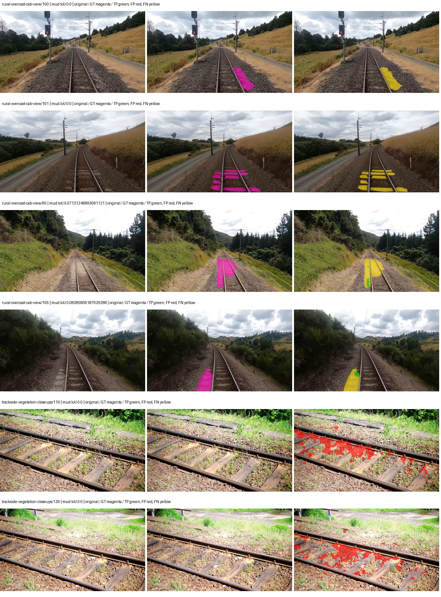
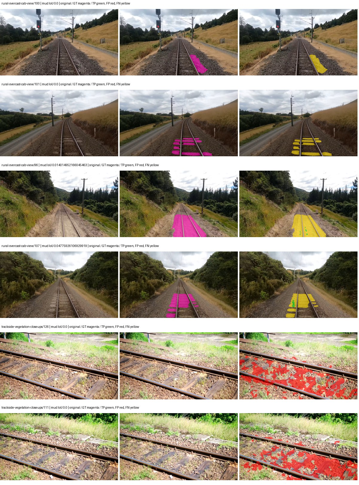
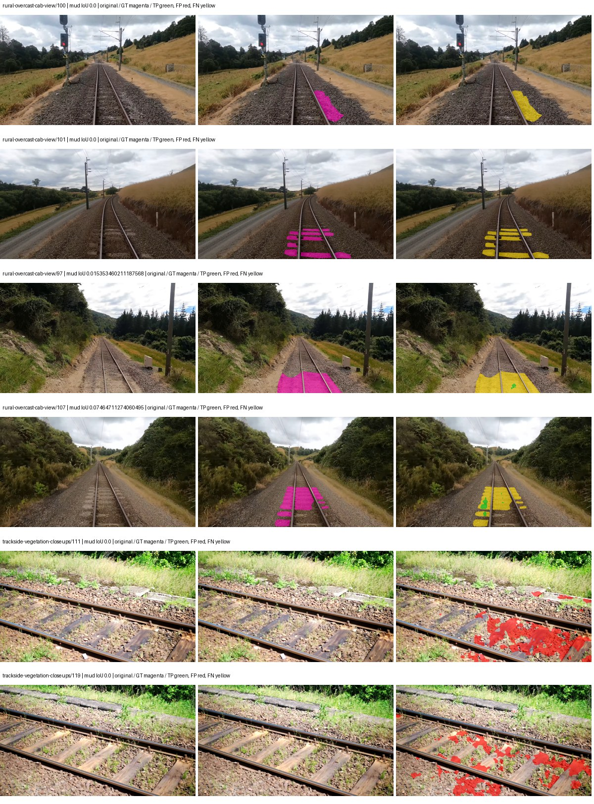
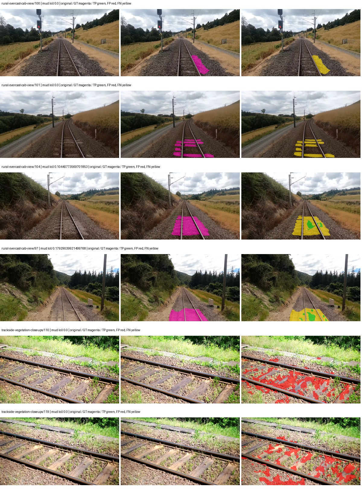

# native_resnet50_deeplabv3plus — paul-test-rtis_v2

[RTIS comparison](../../README.md) · [Full model records](record.json)

Primary selection and early stopping: **mud-pumping validation IoU**. A job is complete only after full statistics and isolated profiling are verified.

| Model | Initialization path | Seed | Status | Steps | Best step | Mud IoU (%) | Mud precision (%) | Mud recall (%) | Final mud IoU (trainer val, %) | mIoU (%) | Fixed GT-class mIoU (%) |
| --- | --- | --- | --- | --- | --- | --- | --- | --- | --- | --- | --- |
| native_resnet50_deeplabv3plus | rtis_only | 0 | completed | 2039 | 764 | 1.79 | 3.88 | 3.20 | 0.82 | 21.35 | 24.91 |
| native_resnet50_deeplabv3plus | cityscapes_to_rtis | 0 | completed | 1529 | 1274 | 0.44 | 0.71 | 1.15 | 0.03 | 26.48 | 30.90 |
| native_resnet50_deeplabv3plus | railsem19_to_rtis | 0 | completed | 2294 | 1019 | 0.51 | 1.07 | 0.96 | 0.20 | 36.69 | 42.81 |
| native_resnet50_deeplabv3plus | cityscapes_to_railsem19_to_rtis | 0 | completed | 2294 | 1019 | 1.95 | 3.23 | 4.67 | 0.69 | 33.69 | 39.30 |

Training: 205 images. Validation: 37 images. Test: 50 held out. Seeds: [0]. Seed variation measures optimization variability, not independent-recording uncertainty. Historical source checkpoints stay fixed across adaptation seeds.

Training code: `066afb2626398b7be59d4d19f5a0e4644fd59adc`. Split SHA-256: `18a84c0163a65ded46508bcc904c374e5f33ad8a09b8879e3c8add606e86aa9f`.

## rtis_only — seed 0

Status: **completed**. Started: 2026-09-09T23:40:38.242922+00:00. Finished: 2026-09-10T00:05:17.162621+00:00.

Recipe pretrained initializer: `{"arch": "native", "backbone_path": null, "batch_norm_momentum": null, "checkpoint": null, "classifier_path": null, "drop_path": null, "encoder_name": null, "encoder_weights": null, "head": "unified_head", "head_paths": [], "inactive_parameter_paths": [], "local_files_only": false, "lora_alpha": 32, "lora_dropout": 0.05, "lora_r": 16, "lora_targets": [], "native": {"auxiliary_heads": [], "backbone": {"in_channels": 3, "kind": "timm", "name": "resnet50.a1_in1k", "out_indices": [1, 2, 3, 4], "weights": "pretrained"}, "head": {"activation": "relu", "channels": 256, "dilation_rates": [6, 12, 18], "dropout": 0.1, "high_index": 3, "kind": "deeplabv3plus", "low_channels": 48, "low_index": 0, "norm": "group"}, "neck": {"kind": "identity"}, "task": "multiclass"}, "revision": null, "smp_arch": null, "subfolder": null, "trust_remote_code": false, "tuning": "full"}`.

`rtis_only` uses the recipe initializer, which may include pretrained segmentation components. Transfer paths load the exact historical source checkpoint below and reset the classifier; they do not reset all query/decoder features.

Source checkpoint: `Recipe pretrained initialization`.

Config SHA-256: `7e2db6c77f237e18f68bc10095d92240a03264a6a416cf0de5db6f818028b5c3`. Weights used for validation: `raw`.

### Mud-pumping and aggregate quality

| Metric | Selected checkpoint | Final training validation |
| --- | --- | --- |
| Mud IoU | 1.79 | 0.82 |
| Mud precision | 3.88 | 1.22 |
| Mud recall | 3.20 | 2.41 |
| Mud Dice/F1 | 3.51 | 1.62 |
| mIoU | 21.35 | 28.09 |
| Mean accuracy | 31.95 | 40.22 |
| Mean precision | 41.75 | 44.93 |
| Mean Dice | 27.24 | 36.12 |
| Mean specificity | 98.63 | 98.88 |
| Pixel accuracy | 79.03 | 81.75 |
| Frequency-weighted IoU | 67.85 | 72.47 |
| Fixed GT-present class mIoU | 24.91 | 32.77 |
| Boundary F1 | 25.30 | 34.77 |

The selected checkpoint has independent evaluation evidence. Final values are the trainer's final validation record, not a new independent evaluation. mIoU averages classes with nonzero union, so false positives on absent classes can change its denominator. The fixed GT-class mean is supplementary and excludes absent classes; their false positives remain in the confusion matrix.

### Resource usage and timing

| Measurement | Value |
| --- | --- |
| Peak training VRAM, retained training invocation (GiB) | 9.36 |
| Peak evaluation VRAM (GiB) | 7.25 |
| Retained training invocation wall time (seconds) | 1337.83 |
| Retained training invocation GPU-hours (one GPU) | 0.37 |
| Evaluation wall time (seconds) | 12.13 |
| Full evaluation pipeline images/second | 3.05 |
| Best full-state checkpoint (MiB) | 616.52 |
| Final full-state checkpoint (MiB) | 616.51 |
| Verified periodic checkpoints removed (GiB) | 2.41 |

VRAM uses the recorded allocator high-water mark; it is not total device usage including CUDA context. Resumed jobs' retained training invocation times and peaks are **not whole-campaign totals**. Earlier invocation resource records are not reconstructed here. Evaluation throughput includes loader, sliding-window inference and metrics; it is not model-only latency/FPS. Missing measurements are shown as —, never inferred from another dataset's run.

### Standardized inference performance

Dedicated model-only profiling waits for an idle worker-locked L40S: BF16, batch 1, 1024x1024, 20 warmup and 100 CUDA-event-timed public forwards. It excludes loading, preprocessing, tiling and metrics.

| Status | Parameters | Weight MiB | FPS | p50 ms | p95 ms | Peak reserved GiB |
| --- | --- | --- | --- | --- | --- | --- |
| complete | 40351925 | 153.93 | 134.40 | 7.28 | 8.03 | 0.78 |

```json
{
  "schema_version": 1,
  "model_id": "native_resnet50_deeplabv3plus",
  "measured_at": "2026-09-10T00:05:11+00:00",
  "status": "complete",
  "benchmark_scope": "rtis_selected_checkpoint_model_only",
  "applies_to": [
    "native_resnet50_deeplabv3plus--rtis_only--seed-0"
  ],
  "source": {
    "campaign_git_sha": "066afb2626398b7be59d4d19f5a0e4644fd59adc",
    "git_dirty": false,
    "config_hash": "edb4e607e342",
    "resolved_config": "/data/izadia1/projects/segmentary-runs/paul-test-rtis_v2/seed0-20260909/configs/native_resnet50_deeplabv3plus--rtis_only--seed-0.yaml",
    "config_sha256": "7e2db6c77f237e18f68bc10095d92240a03264a6a416cf0de5db6f818028b5c3",
    "checkpoint_sha256": "f50d728718dc569b358892ac6099c03a173b05ff07410404361d0099ac0d0f8d",
    "checkpoint_global_step": 764,
    "checkpoint_bytes": 646467567,
    "checkpoint_kind": "resume checkpoint with optimizer and EMA state",
    "weights": "raw",
    "measured_checkpoint_job_id": "native_resnet50_deeplabv3plus--rtis_only--seed-0",
    "result_sha256": "1e2206b33614dfa81aa255f2a90b42d99e6a133dce36a97a49386525462d8e80",
    "result_git_sha": "066afb2626398b7be59d4d19f5a0e4644fd59adc",
    "result_stage": "eval:paul-test-rtis:val",
    "result_seed": 0
  },
  "hardware": {
    "gpu_name": "NVIDIA L40S",
    "gpu_uuid": "GPU-804aea8b-5f62-423e-72c6-49e1ed15c4e4",
    "logical_device": "cuda:0",
    "physical_visibility_token": "6",
    "compute_capability": [
      8,
      9
    ],
    "total_memory_bytes": 47677177856
  },
  "model": {
    "parameter_count": 40351925,
    "trainable_parameter_count": 40351925,
    "resident_parameter_bytes": 161407700,
    "parameter_dtype_counts": {
      "float32": 40351925
    }
  },
  "contract": {
    "backend": "pytorch",
    "precision": "bf16_autocast",
    "batch_size": 1,
    "input_shape_nchw": [
      1,
      3,
      1024,
      1024
    ],
    "warmup_iterations": 20,
    "measured_iterations": 100,
    "timing": "per-forward CUDA events with end-event synchronization",
    "includes_preprocessing": false,
    "includes_data_loader": false,
    "includes_sliding_window": false,
    "input_resident_on_gpu": true,
    "model_only": true,
    "entrypoint": "public model(image) dense-logits forward"
  },
  "measurements": {
    "latency": {
      "p50_ms": 7.283200025558472,
      "p95_ms": 8.025190687179565,
      "mean_ms": 7.4407417726516725,
      "minimum_ms": 7.234560012817383,
      "maximum_ms": 8.582143783569336,
      "fps": 134.3952028647848,
      "raw_ms": [
        7.296000003814697,
        7.2427520751953125,
        7.268352031707764,
        7.271423816680908,
        7.266272068023682,
        8.027135848999023,
        7.254015922546387,
        7.254015922546387,
        7.262207984924316,
        7.262207984924316,
        7.350272178649902,
        7.268352031707764,
        7.264256000518799,
        7.299071788787842,
        8.032256126403809,
        8.582143783569336,
        7.275519847869873,
        7.742464065551758,
        7.241727828979492,
        7.252992153167725,
        7.234560012817383,
        7.283711910247803,
        7.585792064666748,
        7.960576057434082,
        7.556096076965332,
        7.275519847869873,
        7.255040168762207,
        7.276544094085693,
        7.275519847869873,
        7.819263935089111,
        7.382016181945801,
        7.317503929138184,
        7.817215919494629,
        7.320576190948486,
        7.344128131866455,
        7.329792022705078,
        7.716864109039307,
        7.275519847869873,
        7.24889612197876,
        7.245823860168457,
        7.2570881843566895,
        8.1080322265625,
        7.715839862823486,
        7.342080116271973,
        7.701504230499268,
        7.276544094085693,
        7.2724480628967285,
        8.354816436767578,
        7.384064197540283,
        7.590911865234375,
        8.0250883102417,
        7.59603214263916,
        7.282688140869141,
        8.014847755432129,
        7.6769280433654785,
        7.259136199951172,
        7.268352031707764,
        7.251967906951904,
        7.255040168762207,
        7.469056129455566,
        7.685120105743408,
        7.451648235321045,
        7.249919891357422,
        7.33081579208374,
        7.580671787261963,
        7.274496078491211,
        7.269375801086426,
        7.252992153167725,
        7.263232231140137,
        7.266304016113281,
        7.964672088623047,
        7.2775678634643555,
        7.79366397857666,
        7.664639949798584,
        7.252992153167725,
        7.264256000518799,
        7.244800090789795,
        7.305215835571289,
        7.255040168762207,
        7.415808200836182,
        7.896063804626465,
        7.251967906951904,
        7.597055912017822,
        7.654399871826172,
        7.591904163360596,
        7.270400047302246,
        7.271423816680908,
        7.273471832275391,
        7.2611517906188965,
        7.2570881843566895,
        7.425024032592773,
        7.485439777374268,
        7.363584041595459,
        7.311359882354736,
        7.254015922546387,
        7.386112213134766,
        7.345151901245117,
        7.265279769897461,
        7.253024101257324,
        7.260159969329834
      ],
      "percentile_method": "numpy linear interpolation"
    },
    "peak_reserved_bytes": 838860800,
    "memory_kind": "pytorch_cuda_allocator_peak_reserved_excluding_context",
    "benchmark_wall_clock_s": 13.416327960789204
  },
  "started_at": "2026-09-10T00:04:58+00:00",
  "finished_at": "2026-09-10T00:05:11+00:00",
  "environment": {
    "hostname": "hdrfs-app-001",
    "python": "3.11.15",
    "platform": "Linux-5.15.0-139-generic-x86_64-with-glibc2.35",
    "torch": "2.11.0+cu128",
    "torch_cuda": "12.8",
    "cudnn": 91900,
    "driver_version": "570.133.20",
    "cuda_available": true,
    "gpu_count": 1,
    "gpu_names": [
      "NVIDIA L40S"
    ],
    "cuda_visible_devices": "6",
    "packages": {
      "segmentary": "0.1.0",
      "torch": "2.11.0+cu128",
      "torchvision": "0.26.0+cu128",
      "transformers": "5.15.0",
      "timm": "1.0.28",
      "segmentation-models-pytorch": "0.5.0",
      "albumentations": "2.0.8",
      "lightning": "2.6.5",
      "numpy": "2.4.4"
    }
  }
}
```

### Per-class validation results

| Class | GT pixels | IoU (%) | Precision (%) | Recall (%) | Dice (%) | Boundary F1 (%) |
| --- | --- | --- | --- | --- | --- | --- |
| car | 29664 | 0.00 | 0.00 | 0.00 | 0.00 | 0.00 |
| construction | 311585 | 24.74 | 28.04 | 67.78 | 39.67 | 24.71 |
| fence | 265137 | 4.32 | 32.88 | 4.74 | 8.29 | 19.18 |
| mud-pumping | 1226250 | 1.79 | 3.88 | 3.20 | 3.51 | 3.77 |
| on-rails | 0 | 0.00 | 0.00 | — | 0.00 | 0.00 |
| person | 0 | 0.00 | 0.00 | — | 0.00 | 0.00 |
| pole | 628038 | 53.74 | 68.12 | 71.80 | 69.91 | 84.95 |
| rail-embedded | 16799 | 3.87 | 84.52 | 3.90 | 7.45 | 8.59 |
| rail-raised | 2969797 | 65.89 | 77.69 | 81.28 | 79.44 | 86.75 |
| rail-track | 6323197 | 35.09 | 62.37 | 44.51 | 51.95 | 45.56 |
| road | 1048831 | 0.87 | 3.97 | 1.10 | 1.72 | 3.50 |
| sidewalk | 1297367 | 10.71 | 96.07 | 10.76 | 19.35 | 14.64 |
| sky | 19121606 | 96.90 | 98.77 | 98.08 | 98.43 | 89.14 |
| standing-water | 95802 | 0.04 | 0.04 | 0.73 | 0.07 | 0.14 |
| terrain | 39239306 | 80.10 | 82.87 | 96.00 | 88.95 | 45.14 |
| trackbed | 10643081 | 50.14 | 63.31 | 70.67 | 66.79 | 47.85 |
| traffic-light | 19510 | 12.45 | 83.45 | 12.77 | 22.15 | 26.37 |
| traffic-sign | 13285 | 0.00 | 0.00 | 0.00 | 0.00 | 0.00 |
| tram-track | 56179 | 0.00 | 0.00 | 0.00 | 0.00 | 0.00 |
| truck | 0 | 0.00 | 0.00 | — | 0.00 | 0.00 |
| vegetation-overgrowth | 5901821 | 7.75 | 90.72 | 7.82 | 14.39 | 31.01 |

### Full-run accounting

| Measurement | Value |
| --- | --- |
| Full GPU-reserved wall seconds, all recorded worker attempts | 1478.93 |
| Full reserved GPU-hours | 0.41 |
| Whole-run timing complete | True |

| Phase | Wall seconds including failed attempts |
| --- | --- |
| training | 1344.77 |
| diagnostics | 87.60 |
| performance | 21.71 |

GPU-reserved time includes model loading, training, validation, collection, profiling, checkpoint I/O and orchestration while the worker owns one GPU. It is not GPU kernel-active time. Phase timings and sampled device memory/power/utilization are retained separately; sampled device memory is not the allocator high-water mark.

### Train/validation and raw/EMA diagnostics

| Checkpoint / weights / split | Images | Mud IoU (%) | Mud precision (%) | Mud recall (%) |
| --- | --- | --- | --- | --- |
| best-auto-train / raw | 205 | 88.62 | 92.65 | 95.32 |
| best-auto-val / raw | 37 | 1.79 | 3.88 | 3.20 |
| best-alternate-val / ema | 37 | 0.29 | 0.57 | 0.60 |
| final-auto-val / raw | 37 | 0.82 | 1.22 | 2.42 |

Train uses the evaluation transform without augmentation. Compare mud train/validation metrics for the same selected weights. Alternate EMA on running-stat BatchNorm is explicitly uncalibrated and is diagnostic only. Score-threshold curves use uncalibrated normalized scores and are pixel-level diagnostics, not event detection rates or a selected deployment operating point.

### Downloadable evidence

- best-auto-train: [per-image.csv](rtis_only--seed-0/best-auto-train/per-image.csv) · [per-image-confusion.json.gz](rtis_only--seed-0/best-auto-train/per-image-confusion.json.gz) · [groups.json](rtis_only--seed-0/best-auto-train/groups.json) · [mud-score-curves.json](rtis_only--seed-0/best-auto-train/mud-score-curves.json)
- best-auto-val: [per-image.csv](rtis_only--seed-0/best-auto-val/per-image.csv) · [per-image-confusion.json.gz](rtis_only--seed-0/best-auto-val/per-image-confusion.json.gz) · [groups.json](rtis_only--seed-0/best-auto-val/groups.json) · [mud-score-curves.json](rtis_only--seed-0/best-auto-val/mud-score-curves.json) · [examples.jpg](rtis_only--seed-0/best-auto-val/examples.jpg)
- best-alternate-val: [per-image.csv](rtis_only--seed-0/best-alternate-val/per-image.csv) · [per-image-confusion.json.gz](rtis_only--seed-0/best-alternate-val/per-image-confusion.json.gz) · [groups.json](rtis_only--seed-0/best-alternate-val/groups.json) · [mud-score-curves.json](rtis_only--seed-0/best-alternate-val/mud-score-curves.json)
- final-auto-val: [per-image.csv](rtis_only--seed-0/final-auto-val/per-image.csv) · [per-image-confusion.json.gz](rtis_only--seed-0/final-auto-val/per-image-confusion.json.gz) · [groups.json](rtis_only--seed-0/final-auto-val/groups.json) · [mud-score-curves.json](rtis_only--seed-0/final-auto-val/mud-score-curves.json)
- resources: [telemetry.csv](rtis_only--seed-0/resources/telemetry.csv)



Examples are two lowest and two highest mud-IoU positive images, plus up to two negative images with the most false-positive mud pixels. They are targeted diagnostic examples, not random samples. Green: true positive; red: false positive; yellow: false negative. Full predictions remain on HDRFS.

### Validation tracking

| Logged step | Overall mIoU (%) | Mud IoU (%) |
| --- | --- | --- |
| 254 | 16.06 | 0.01 |
| 509 | 21.78 | 0.34 |
| 764 | 21.36 | 1.79 |
| 1019 | 25.52 | 1.58 |
| 1274 | 28.03 | 0.72 |
| 1529 | 27.44 | 0.67 |
| 1784 | 27.95 | 0.24 |
| 2038 | 28.09 | 0.82 |

All retained scalar curves, including training loss and per-class IoU, are in record.json. Observed best mud on a curve is not necessarily a retained checkpoint: the pilot saved its selection-metric-best and final checkpoints. Step logging and checkpoint global_step may differ by one.

### Stopping and checkpoint provenance

```json
{
  "stopping": {
    "actual_steps": 2039,
    "maximum_steps": 4000,
    "min_delta": 0.001,
    "monitor": "val_iou/mud-pumping",
    "patience": 5,
    "reason": "validation_plateau"
  },
  "checkpoints": {
    "best": {
      "path": "/data/izadia1/projects/segmentary-runs/paul-test-rtis_v2/seed0-20260909/future-runs/native_resnet50_deeplabv3plus--rtis_only--seed-0_seed0/rtis/best.ckpt",
      "sha256": "f50d728718dc569b358892ac6099c03a173b05ff07410404361d0099ac0d0f8d",
      "global_step": 764,
      "bytes": 646467567
    },
    "final": {
      "path": "/data/izadia1/projects/segmentary-runs/paul-test-rtis_v2/seed0-20260909/future-runs/native_resnet50_deeplabv3plus--rtis_only--seed-0_seed0/rtis/last.ckpt",
      "sha256": "b87382ce42c5014996a8f498d661fca57271d155f13eb111a92f03f068ec6e6d",
      "global_step": 2039,
      "bytes": 646455983
    }
  },
  "cleanup_error": null
}
```

### Resolved training, initialization and evaluation settings

The optimizer block is the base configuration. Stage LR scales are applied at runtime, and stage warmup is capped at min(base warmup, floor(stage budget / 10), stage budget - 1): 400 steps for this 4,000-step pilot. Model-internal native input grids may differ from augmentation crops (EoMT uses its 640 grid).

```json
{
  "name": "native_resnet50_deeplabv3plus--rtis_only--seed-0",
  "model": {
    "arch": "native",
    "checkpoint": null,
    "tuning": "full",
    "head": "unified_head",
    "lora_r": 16,
    "lora_alpha": 32,
    "lora_dropout": 0.05,
    "lora_targets": [],
    "drop_path": null,
    "revision": null,
    "subfolder": null,
    "local_files_only": false,
    "trust_remote_code": false,
    "backbone_path": null,
    "head_paths": [],
    "classifier_path": null,
    "inactive_parameter_paths": [],
    "smp_arch": null,
    "encoder_name": null,
    "encoder_weights": null,
    "native": {
      "task": "multiclass",
      "backbone": {
        "kind": "timm",
        "name": "resnet50.a1_in1k",
        "weights": "pretrained",
        "out_indices": [
          1,
          2,
          3,
          4
        ],
        "in_channels": 3
      },
      "neck": {
        "kind": "identity"
      },
      "head": {
        "kind": "deeplabv3plus",
        "low_index": 0,
        "high_index": 3,
        "channels": 256,
        "low_channels": 48,
        "dilation_rates": [
          6,
          12,
          18
        ],
        "dropout": 0.1,
        "norm": "group",
        "activation": "relu"
      },
      "auxiliary_heads": []
    },
    "batch_norm_momentum": null
  },
  "space": "paul-test-rtis",
  "taxonomy_root": "/data/izadia1/projects/segmentary-rtis-fullstats-066afb2/taxonomy",
  "output_root": "/data/izadia1/projects/segmentary-runs/paul-test-rtis_v2/seed0-20260909/future-runs",
  "optim": {
    "backbone_lr": 0.0001,
    "head_lr_mult": 10.0,
    "weight_decay": 0.05,
    "llrd": 1.0,
    "warmup_iters": 1500,
    "warmup_ratio": 1e-06,
    "poly_power": 0.9,
    "min_lr_ratio": 0.0,
    "betas": [
      0.9,
      0.999
    ],
    "grad_clip": 1.0
  },
  "train": {
    "iters": 4000,
    "batch_size": 2,
    "accum": 8,
    "num_workers": 2,
    "precision": "bf16-mixed",
    "ema_decay": 0.9998,
    "val_every": 250,
    "ckpt_every": 500,
    "selection_metric": "val_iou/mud-pumping",
    "early_stopping_patience": 5,
    "early_stopping_min_delta": 0.001,
    "seed": 0,
    "devices": 1
  },
  "eval": {
    "sliding_window": true,
    "window": [
      1024,
      1024
    ],
    "stride": [
      768,
      768
    ],
    "batch_size": 1,
    "num_workers": 2,
    "tta_scales": [],
    "tta_flip": false,
    "threshold": 0.5,
    "boundary_tolerance_frac": 0.0075,
    "save_confusion": true
  },
  "loss": {
    "task": "multiclass",
    "activation": "auto",
    "terms": [],
    "aux": "none",
    "aux_weight": 0.0,
    "ce_weight": 1.0,
    "label_smoothing": 0.0,
    "class_weights": null,
    "query": null
  },
  "aug": {
    "crop": [
      1024,
      1024
    ],
    "scale_min": 0.5,
    "scale_max": 2.0,
    "hflip_p": 0.5,
    "color_jitter_p": 0.5,
    "brightness": 0.25,
    "contrast": 0.25,
    "saturation": 0.25,
    "hue": 0.05
  },
  "stages": [
    {
      "name": "rtis",
      "data": [
        {
          "name": "paul-test-rtis",
          "root": "/data/izadia1/datasets/paul-test-rtis_v2",
          "variant": null,
          "split_file": "splits.json",
          "train_split": "train",
          "val_split": "val",
          "limit": null,
          "loader": "folder",
          "mapping": "paul-test-rtis",
          "loader_options": {
            "require_groups": true
          }
        }
      ],
      "iters": null,
      "lr_scale": 1.0,
      "head_group_lr_scale": 1.0,
      "init_from": "pretrained",
      "reset_head": false,
      "freeze": null,
      "sample_weights": null
    }
  ]
}
```

### Hardware and software provenance

```json
{
  "training": {
    "cuda_available": true,
    "cuda_visible_devices": "6",
    "cudnn": 91900,
    "driver_version": "570.133.20",
    "gpu_count": 1,
    "gpu_names": [
      "NVIDIA L40S"
    ],
    "hostname": "hdrfs-app-001",
    "input_normalization": {
      "channel_order": "rgb",
      "mean": [
        0.485,
        0.456,
        0.406
      ],
      "source": "timm_pretrained_cfg",
      "std": [
        0.229,
        0.224,
        0.225
      ]
    },
    "model_origins": [
      {
        "hf_commit": null,
        "hf_name_or_path": null,
        "module": "backbone",
        "timm_pretrained": {
          "architecture": "resnet50",
          "hf_hub_id": "timm/resnet50.a1_in1k",
          "tag": "a1_in1k",
          "url": "https://github.com/rwightman/pytorch-image-models/releases/download/v0.1-rsb-weights/resnet50_a1_0-14fe96d1.pth"
        }
      },
      {
        "hf_commit": null,
        "hf_name_or_path": null,
        "module": "backbone.model",
        "timm_pretrained": {
          "architecture": "resnet50",
          "hf_hub_id": "timm/resnet50.a1_in1k",
          "tag": "a1_in1k",
          "url": "https://github.com/rwightman/pytorch-image-models/releases/download/v0.1-rsb-weights/resnet50_a1_0-14fe96d1.pth"
        }
      }
    ],
    "model_parameter_count": 40351925,
    "packages": {
      "albumentations": "2.0.8",
      "lightning": "2.6.5",
      "numpy": "2.4.4",
      "segmentary": "0.1.0",
      "segmentation-models-pytorch": "0.5.0",
      "timm": "1.0.28",
      "torch": "2.11.0+cu128",
      "torchvision": "0.26.0+cu128",
      "transformers": "5.15.0"
    },
    "platform": "Linux-5.15.0-139-generic-x86_64-with-glibc2.35",
    "python": "3.11.15",
    "torch": "2.11.0+cu128",
    "torch_cuda": "12.8",
    "trainable_parameter_count": 40351925,
    "training_stop": {
      "actual_steps": 2039,
      "maximum_steps": 4000,
      "min_delta": 0.001,
      "monitor": "val_iou/mud-pumping",
      "patience": 5,
      "reason": "validation_plateau"
    },
    "validation_weights": "raw"
  },
  "evaluation": {
    "cuda_available": true,
    "cuda_visible_devices": "6",
    "cudnn": 91900,
    "driver_version": "570.133.20",
    "gpu_count": 1,
    "gpu_names": [
      "NVIDIA L40S"
    ],
    "hostname": "hdrfs-app-001",
    "input_normalization": {
      "channel_order": "rgb",
      "mean": [
        0.485,
        0.456,
        0.406
      ],
      "source": "timm_pretrained_cfg",
      "std": [
        0.229,
        0.224,
        0.225
      ]
    },
    "packages": {
      "albumentations": "2.0.8",
      "lightning": "2.6.5",
      "numpy": "2.4.4",
      "segmentary": "0.1.0",
      "segmentation-models-pytorch": "0.5.0",
      "timm": "1.0.28",
      "torch": "2.11.0+cu128",
      "torchvision": "0.26.0+cu128",
      "transformers": "5.15.0"
    },
    "platform": "Linux-5.15.0-139-generic-x86_64-with-glibc2.35",
    "python": "3.11.15",
    "torch": "2.11.0+cu128",
    "torch_cuda": "12.8"
  }
}
```

## cityscapes_to_rtis — seed 0

Status: **completed**. Started: 2026-09-09T23:41:27.115109+00:00. Finished: 2026-09-10T00:00:45.999859+00:00.

Recipe pretrained initializer: `{"arch": "native", "backbone_path": null, "batch_norm_momentum": null, "checkpoint": null, "classifier_path": null, "drop_path": null, "encoder_name": null, "encoder_weights": null, "head": "unified_head", "head_paths": [], "inactive_parameter_paths": [], "local_files_only": false, "lora_alpha": 32, "lora_dropout": 0.05, "lora_r": 16, "lora_targets": [], "native": {"auxiliary_heads": [], "backbone": {"in_channels": 3, "kind": "timm", "name": "resnet50.a1_in1k", "out_indices": [1, 2, 3, 4], "weights": "pretrained"}, "head": {"activation": "relu", "channels": 256, "dilation_rates": [6, 12, 18], "dropout": 0.1, "high_index": 3, "kind": "deeplabv3plus", "low_channels": 48, "low_index": 0, "norm": "group"}, "neck": {"kind": "identity"}, "task": "multiclass"}, "revision": null, "smp_arch": null, "subfolder": null, "trust_remote_code": false, "tuning": "full"}`.

`rtis_only` uses the recipe initializer, which may include pretrained segmentation components. Transfer paths load the exact historical source checkpoint below and reset the classifier; they do not reset all query/decoder features.

Source checkpoint: `{'name': 'native_resnet50_deeplabv3plus--cityscapes--seed-0', 'model': 'native_resnet50_deeplabv3plus', 'protocol': 'cityscapes', 'config': '/data/izadia1/projects/segmentary-runs/all-model-city-rail-seed0-rail20-b9eb3e1/accepted/native_resnet50_deeplabv3plus--cityscapes--seed-0/resolved-config.yaml', 'checkpoint': '/data/izadia1/projects/segmentary-runs/current-main-fill-v2/jobs/native_resnet50_deeplabv3plus--cityscapes--seed-0/train/native_resnet50_deeplabv3plus--cityscapes_seed0/cityscapes/last.ckpt', 'recorded_sha256': 'fe67b933a9c445f846ca354ebb8e702c4982922b3c8e161233418537297fa36f', 'exists': True}`.

Config SHA-256: `55292f6cc1191a8b83b106f51f29e8dfa4f1a043e7ff9113312c9a938faf311e`. Weights used for validation: `raw`.

### Mud-pumping and aggregate quality

| Metric | Selected checkpoint | Final training validation |
| --- | --- | --- |
| Mud IoU | 0.44 | 0.03 |
| Mud precision | 0.71 | 0.14 |
| Mud recall | 1.15 | 0.04 |
| Mud Dice/F1 | 0.88 | 0.06 |
| mIoU | 26.48 | 30.77 |
| Mean accuracy | 37.96 | 43.51 |
| Mean precision | 47.10 | 50.90 |
| Mean Dice | 34.84 | 40.02 |
| Mean specificity | 98.64 | 98.88 |
| Pixel accuracy | 79.64 | 82.53 |
| Frequency-weighted IoU | 68.99 | 72.45 |
| Fixed GT-present class mIoU | 30.90 | 35.90 |
| Boundary F1 | 34.04 | 37.59 |

The selected checkpoint has independent evaluation evidence. Final values are the trainer's final validation record, not a new independent evaluation. mIoU averages classes with nonzero union, so false positives on absent classes can change its denominator. The fixed GT-class mean is supplementary and excludes absent classes; their false positives remain in the confusion matrix.

### Resource usage and timing

| Measurement | Value |
| --- | --- |
| Peak training VRAM, retained training invocation (GiB) | 9.36 |
| Peak evaluation VRAM (GiB) | 7.25 |
| Retained training invocation wall time (seconds) | 1017.77 |
| Retained training invocation GPU-hours (one GPU) | 0.28 |
| Evaluation wall time (seconds) | 11.70 |
| Full evaluation pipeline images/second | 3.16 |
| Best full-state checkpoint (MiB) | 616.52 |
| Final full-state checkpoint (MiB) | 616.51 |
| Verified periodic checkpoints removed (GiB) | 1.81 |

VRAM uses the recorded allocator high-water mark; it is not total device usage including CUDA context. Resumed jobs' retained training invocation times and peaks are **not whole-campaign totals**. Earlier invocation resource records are not reconstructed here. Evaluation throughput includes loader, sliding-window inference and metrics; it is not model-only latency/FPS. Missing measurements are shown as —, never inferred from another dataset's run.

### Standardized inference performance

Dedicated model-only profiling waits for an idle worker-locked L40S: BF16, batch 1, 1024x1024, 20 warmup and 100 CUDA-event-timed public forwards. It excludes loading, preprocessing, tiling and metrics.

| Status | Parameters | Weight MiB | FPS | p50 ms | p95 ms | Peak reserved GiB |
| --- | --- | --- | --- | --- | --- | --- |
| complete | 40351925 | 153.93 | 133.82 | 7.40 | 7.85 | 0.82 |

```json
{
  "schema_version": 1,
  "model_id": "native_resnet50_deeplabv3plus",
  "measured_at": "2026-09-10T00:00:41+00:00",
  "status": "complete",
  "benchmark_scope": "rtis_selected_checkpoint_model_only",
  "applies_to": [
    "native_resnet50_deeplabv3plus--cityscapes_to_rtis--seed-0"
  ],
  "source": {
    "campaign_git_sha": "066afb2626398b7be59d4d19f5a0e4644fd59adc",
    "git_dirty": false,
    "config_hash": "8da8b52699de",
    "resolved_config": "/data/izadia1/projects/segmentary-runs/paul-test-rtis_v2/seed0-20260909/configs/native_resnet50_deeplabv3plus--cityscapes_to_rtis--seed-0.yaml",
    "config_sha256": "55292f6cc1191a8b83b106f51f29e8dfa4f1a043e7ff9113312c9a938faf311e",
    "checkpoint_sha256": "549f6cdf707b4defa46286a7dc4e0dbbff7d6c3b1e76c580d89a4406bee656bb",
    "checkpoint_global_step": 1274,
    "checkpoint_bytes": 646467567,
    "checkpoint_kind": "resume checkpoint with optimizer and EMA state",
    "weights": "raw",
    "measured_checkpoint_job_id": "native_resnet50_deeplabv3plus--cityscapes_to_rtis--seed-0",
    "result_sha256": "d9101cb8e762a6abf889dd617ae68df8532a279415447f1f77eced1db8a24df6",
    "result_git_sha": "066afb2626398b7be59d4d19f5a0e4644fd59adc",
    "result_stage": "eval:paul-test-rtis:val",
    "result_seed": 0
  },
  "hardware": {
    "gpu_name": "NVIDIA L40S",
    "gpu_uuid": "GPU-931d0911-fc78-1638-e3d7-1ba868cbd286",
    "logical_device": "cuda:0",
    "physical_visibility_token": "2",
    "compute_capability": [
      8,
      9
    ],
    "total_memory_bytes": 47677177856
  },
  "model": {
    "parameter_count": 40351925,
    "trainable_parameter_count": 40351925,
    "resident_parameter_bytes": 161407700,
    "parameter_dtype_counts": {
      "float32": 40351925
    }
  },
  "contract": {
    "backend": "pytorch",
    "precision": "bf16_autocast",
    "batch_size": 1,
    "input_shape_nchw": [
      1,
      3,
      1024,
      1024
    ],
    "warmup_iterations": 20,
    "measured_iterations": 100,
    "timing": "per-forward CUDA events with end-event synchronization",
    "includes_preprocessing": false,
    "includes_data_loader": false,
    "includes_sliding_window": false,
    "input_resident_on_gpu": true,
    "model_only": true,
    "entrypoint": "public model(image) dense-logits forward"
  },
  "measurements": {
    "latency": {
      "p50_ms": 7.403007984161377,
      "p95_ms": 7.854540753364563,
      "mean_ms": 7.472749767303466,
      "minimum_ms": 7.269375801086426,
      "maximum_ms": 8.203328132629395,
      "fps": 133.81954851150448,
      "raw_ms": [
        7.83462381362915,
        7.429120063781738,
        7.3809919357299805,
        7.431168079376221,
        7.624703884124756,
        7.390207767486572,
        7.707647800445557,
        7.432223796844482,
        7.726079940795898,
        7.597055912017822,
        8.044544219970703,
        7.609344005584717,
        7.4945597648620605,
        7.4330878257751465,
        7.477248191833496,
        7.469056129455566,
        7.502848148345947,
        8.049663543701172,
        7.497727870941162,
        7.270400047302246,
        7.269375801086426,
        7.2867841720581055,
        7.456704139709473,
        7.29088020324707,
        7.2775678634643555,
        7.278592109680176,
        7.274496078491211,
        7.2867841720581055,
        7.296000003814697,
        7.29088020324707,
        7.278592109680176,
        7.8243842124938965,
        7.8448638916015625,
        7.299071788787842,
        7.50489616394043,
        7.382016181945801,
        7.557119846343994,
        7.3809919357299805,
        7.335936069488525,
        7.404543876647949,
        7.838719844818115,
        7.355391979217529,
        7.442431926727295,
        7.740416049957275,
        7.34822416305542,
        7.388160228729248,
        7.379968166351318,
        7.921664237976074,
        7.5316162109375,
        7.3461761474609375,
        7.418879985809326,
        7.574528217315674,
        7.365632057189941,
        7.392255783081055,
        7.3512959480285645,
        7.4106879234313965,
        7.305215835571289,
        7.296000003814697,
        7.85100793838501,
        7.314432144165039,
        7.531519889831543,
        7.285759925842285,
        7.598080158233643,
        7.291903972625732,
        7.557119846343994,
        7.9543681144714355,
        7.511040210723877,
        7.730175971984863,
        7.284736156463623,
        7.820288181304932,
        7.28985595703125,
        7.283775806427002,
        7.44652795791626,
        7.75167989730835,
        8.203328132629395,
        7.323647975921631,
        7.278592109680176,
        7.294976234436035,
        7.28166389465332,
        7.329792022705078,
        7.360511779785156,
        7.414783954620361,
        7.357439994812012,
        7.445536136627197,
        7.574528217315674,
        7.355391979217529,
        7.43833589553833,
        7.382944107055664,
        7.402495861053467,
        7.370751857757568,
        7.390207767486572,
        7.403520107269287,
        7.362559795379639,
        7.43936014175415,
        7.46284818649292,
        7.8100481033325195,
        7.350272178649902,
        7.382016181945801,
        7.376895904541016,
        7.350207805633545
      ],
      "percentile_method": "numpy linear interpolation"
    },
    "peak_reserved_bytes": 878706688,
    "memory_kind": "pytorch_cuda_allocator_peak_reserved_excluding_context",
    "benchmark_wall_clock_s": 13.641709242016077
  },
  "started_at": "2026-09-10T00:00:27+00:00",
  "finished_at": "2026-09-10T00:00:41+00:00",
  "environment": {
    "hostname": "hdrfs-app-001",
    "python": "3.11.15",
    "platform": "Linux-5.15.0-139-generic-x86_64-with-glibc2.35",
    "torch": "2.11.0+cu128",
    "torch_cuda": "12.8",
    "cudnn": 91900,
    "driver_version": "570.133.20",
    "cuda_available": true,
    "gpu_count": 1,
    "gpu_names": [
      "NVIDIA L40S"
    ],
    "cuda_visible_devices": "2",
    "packages": {
      "segmentary": "0.1.0",
      "torch": "2.11.0+cu128",
      "torchvision": "0.26.0+cu128",
      "transformers": "5.15.0",
      "timm": "1.0.28",
      "segmentation-models-pytorch": "0.5.0",
      "albumentations": "2.0.8",
      "lightning": "2.6.5",
      "numpy": "2.4.4"
    }
  }
}
```

### Per-class validation results

| Class | GT pixels | IoU (%) | Precision (%) | Recall (%) | Dice (%) | Boundary F1 (%) |
| --- | --- | --- | --- | --- | --- | --- |
| car | 29664 | 10.50 | 47.61 | 11.87 | 19.00 | 25.95 |
| construction | 311585 | 12.42 | 13.33 | 64.60 | 22.10 | 16.95 |
| fence | 265137 | 22.25 | 67.49 | 24.92 | 36.40 | 47.21 |
| mud-pumping | 1226250 | 0.44 | 0.71 | 1.15 | 0.88 | 1.68 |
| on-rails | 0 | 0.00 | 0.00 | — | 0.00 | 0.00 |
| person | 0 | 0.00 | 0.00 | — | 0.00 | 0.00 |
| pole | 628038 | 66.93 | 85.58 | 75.44 | 80.19 | 91.08 |
| rail-embedded | 16799 | 10.69 | 42.73 | 12.48 | 19.31 | 13.93 |
| rail-raised | 2969797 | 62.09 | 81.47 | 72.30 | 76.61 | 86.95 |
| rail-track | 6323197 | 33.26 | 65.91 | 40.17 | 49.92 | 43.22 |
| road | 1048831 | 2.21 | 9.51 | 2.80 | 4.33 | 5.98 |
| sidewalk | 1297367 | 15.78 | 93.92 | 15.94 | 27.26 | 4.16 |
| sky | 19121606 | 97.63 | 99.37 | 98.24 | 98.80 | 91.68 |
| standing-water | 95802 | 0.12 | 0.16 | 0.42 | 0.24 | 1.38 |
| terrain | 39239306 | 79.41 | 81.47 | 96.91 | 88.52 | 43.95 |
| trackbed | 10643081 | 50.63 | 72.08 | 62.98 | 67.23 | 50.42 |
| traffic-light | 19510 | 42.36 | 85.32 | 45.69 | 59.51 | 63.84 |
| traffic-sign | 13285 | 18.25 | 52.95 | 21.78 | 30.87 | 49.60 |
| tram-track | 56179 | 3.85 | 19.34 | 4.59 | 7.42 | 16.08 |
| truck | 0 | 0.00 | 0.00 | — | 0.00 | 0.00 |
| vegetation-overgrowth | 5901821 | 27.37 | 70.07 | 30.99 | 42.98 | 60.72 |

### Full-run accounting

| Measurement | Value |
| --- | --- |
| Full GPU-reserved wall seconds, all recorded worker attempts | 1159.44 |
| Full reserved GPU-hours | 0.32 |
| Whole-run timing complete | True |

| Phase | Wall seconds including failed attempts |
| --- | --- |
| training | 1025.38 |
| diagnostics | 88.68 |
| performance | 21.85 |

GPU-reserved time includes model loading, training, validation, collection, profiling, checkpoint I/O and orchestration while the worker owns one GPU. It is not GPU kernel-active time. Phase timings and sampled device memory/power/utilization are retained separately; sampled device memory is not the allocator high-water mark.

### Train/validation and raw/EMA diagnostics

| Checkpoint / weights / split | Images | Mud IoU (%) | Mud precision (%) | Mud recall (%) |
| --- | --- | --- | --- | --- |
| best-auto-train / raw | 205 | 91.06 | 96.22 | 94.44 |
| best-auto-val / raw | 37 | 0.44 | 0.71 | 1.15 |
| best-alternate-val / ema | 37 | 0.28 | 0.57 | 0.55 |
| final-auto-val / raw | 37 | 0.03 | 0.15 | 0.04 |

Train uses the evaluation transform without augmentation. Compare mud train/validation metrics for the same selected weights. Alternate EMA on running-stat BatchNorm is explicitly uncalibrated and is diagnostic only. Score-threshold curves use uncalibrated normalized scores and are pixel-level diagnostics, not event detection rates or a selected deployment operating point.

### Downloadable evidence

- best-auto-train: [per-image.csv](cityscapes_to_rtis--seed-0/best-auto-train/per-image.csv) · [per-image-confusion.json.gz](cityscapes_to_rtis--seed-0/best-auto-train/per-image-confusion.json.gz) · [groups.json](cityscapes_to_rtis--seed-0/best-auto-train/groups.json) · [mud-score-curves.json](cityscapes_to_rtis--seed-0/best-auto-train/mud-score-curves.json)
- best-auto-val: [per-image.csv](cityscapes_to_rtis--seed-0/best-auto-val/per-image.csv) · [per-image-confusion.json.gz](cityscapes_to_rtis--seed-0/best-auto-val/per-image-confusion.json.gz) · [groups.json](cityscapes_to_rtis--seed-0/best-auto-val/groups.json) · [mud-score-curves.json](cityscapes_to_rtis--seed-0/best-auto-val/mud-score-curves.json) · [examples.jpg](cityscapes_to_rtis--seed-0/best-auto-val/examples.jpg)
- best-alternate-val: [per-image.csv](cityscapes_to_rtis--seed-0/best-alternate-val/per-image.csv) · [per-image-confusion.json.gz](cityscapes_to_rtis--seed-0/best-alternate-val/per-image-confusion.json.gz) · [groups.json](cityscapes_to_rtis--seed-0/best-alternate-val/groups.json) · [mud-score-curves.json](cityscapes_to_rtis--seed-0/best-alternate-val/mud-score-curves.json)
- final-auto-val: [per-image.csv](cityscapes_to_rtis--seed-0/final-auto-val/per-image.csv) · [per-image-confusion.json.gz](cityscapes_to_rtis--seed-0/final-auto-val/per-image-confusion.json.gz) · [groups.json](cityscapes_to_rtis--seed-0/final-auto-val/groups.json) · [mud-score-curves.json](cityscapes_to_rtis--seed-0/final-auto-val/mud-score-curves.json)
- resources: [telemetry.csv](cityscapes_to_rtis--seed-0/resources/telemetry.csv)



Examples are two lowest and two highest mud-IoU positive images, plus up to two negative images with the most false-positive mud pixels. They are targeted diagnostic examples, not random samples. Green: true positive; red: false positive; yellow: false negative. Full predictions remain on HDRFS.

### Validation tracking

| Logged step | Overall mIoU (%) | Mud IoU (%) |
| --- | --- | --- |
| 254 | 20.61 | 0.43 |
| 509 | 22.61 | 0.08 |
| 764 | 27.67 | 0.11 |
| 1019 | 27.34 | 0.26 |
| 1274 | 26.49 | 0.44 |
| 1529 | 30.77 | 0.03 |

All retained scalar curves, including training loss and per-class IoU, are in record.json. Observed best mud on a curve is not necessarily a retained checkpoint: the pilot saved its selection-metric-best and final checkpoints. Step logging and checkpoint global_step may differ by one.

### Stopping and checkpoint provenance

```json
{
  "stopping": {
    "actual_steps": 1529,
    "maximum_steps": 4000,
    "min_delta": 0.001,
    "monitor": "val_iou/mud-pumping",
    "patience": 5,
    "reason": "validation_plateau"
  },
  "checkpoints": {
    "best": {
      "path": "/data/izadia1/projects/segmentary-runs/paul-test-rtis_v2/seed0-20260909/future-runs/native_resnet50_deeplabv3plus--cityscapes_to_rtis--seed-0_seed0/rtis/best.ckpt",
      "sha256": "549f6cdf707b4defa46286a7dc4e0dbbff7d6c3b1e76c580d89a4406bee656bb",
      "global_step": 1274,
      "bytes": 646467567
    },
    "final": {
      "path": "/data/izadia1/projects/segmentary-runs/paul-test-rtis_v2/seed0-20260909/future-runs/native_resnet50_deeplabv3plus--cityscapes_to_rtis--seed-0_seed0/rtis/last.ckpt",
      "sha256": "53c133fc480a86e2f1159ecf8781bcfe4ddf6bd06a39eae10195fe0a802cbe50",
      "global_step": 1529,
      "bytes": 646456047
    }
  },
  "cleanup_error": null
}
```

### Resolved training, initialization and evaluation settings

The optimizer block is the base configuration. Stage LR scales are applied at runtime, and stage warmup is capped at min(base warmup, floor(stage budget / 10), stage budget - 1): 400 steps for this 4,000-step pilot. Model-internal native input grids may differ from augmentation crops (EoMT uses its 640 grid).

```json
{
  "name": "native_resnet50_deeplabv3plus--cityscapes_to_rtis--seed-0",
  "model": {
    "arch": "native",
    "checkpoint": null,
    "tuning": "full",
    "head": "unified_head",
    "lora_r": 16,
    "lora_alpha": 32,
    "lora_dropout": 0.05,
    "lora_targets": [],
    "drop_path": null,
    "revision": null,
    "subfolder": null,
    "local_files_only": false,
    "trust_remote_code": false,
    "backbone_path": null,
    "head_paths": [],
    "classifier_path": null,
    "inactive_parameter_paths": [],
    "smp_arch": null,
    "encoder_name": null,
    "encoder_weights": null,
    "native": {
      "task": "multiclass",
      "backbone": {
        "kind": "timm",
        "name": "resnet50.a1_in1k",
        "weights": "pretrained",
        "out_indices": [
          1,
          2,
          3,
          4
        ],
        "in_channels": 3
      },
      "neck": {
        "kind": "identity"
      },
      "head": {
        "kind": "deeplabv3plus",
        "low_index": 0,
        "high_index": 3,
        "channels": 256,
        "low_channels": 48,
        "dilation_rates": [
          6,
          12,
          18
        ],
        "dropout": 0.1,
        "norm": "group",
        "activation": "relu"
      },
      "auxiliary_heads": []
    },
    "batch_norm_momentum": null
  },
  "space": "paul-test-rtis",
  "taxonomy_root": "/data/izadia1/projects/segmentary-rtis-fullstats-066afb2/taxonomy",
  "output_root": "/data/izadia1/projects/segmentary-runs/paul-test-rtis_v2/seed0-20260909/future-runs",
  "optim": {
    "backbone_lr": 0.0001,
    "head_lr_mult": 10.0,
    "weight_decay": 0.05,
    "llrd": 1.0,
    "warmup_iters": 1500,
    "warmup_ratio": 1e-06,
    "poly_power": 0.9,
    "min_lr_ratio": 0.0,
    "betas": [
      0.9,
      0.999
    ],
    "grad_clip": 1.0
  },
  "train": {
    "iters": 4000,
    "batch_size": 2,
    "accum": 8,
    "num_workers": 2,
    "precision": "bf16-mixed",
    "ema_decay": 0.9998,
    "val_every": 250,
    "ckpt_every": 500,
    "selection_metric": "val_iou/mud-pumping",
    "early_stopping_patience": 5,
    "early_stopping_min_delta": 0.001,
    "seed": 0,
    "devices": 1
  },
  "eval": {
    "sliding_window": true,
    "window": [
      1024,
      1024
    ],
    "stride": [
      768,
      768
    ],
    "batch_size": 1,
    "num_workers": 2,
    "tta_scales": [],
    "tta_flip": false,
    "threshold": 0.5,
    "boundary_tolerance_frac": 0.0075,
    "save_confusion": true
  },
  "loss": {
    "task": "multiclass",
    "activation": "auto",
    "terms": [],
    "aux": "none",
    "aux_weight": 0.0,
    "ce_weight": 1.0,
    "label_smoothing": 0.0,
    "class_weights": null,
    "query": null
  },
  "aug": {
    "crop": [
      1024,
      1024
    ],
    "scale_min": 0.5,
    "scale_max": 2.0,
    "hflip_p": 0.5,
    "color_jitter_p": 0.5,
    "brightness": 0.25,
    "contrast": 0.25,
    "saturation": 0.25,
    "hue": 0.05
  },
  "stages": [
    {
      "name": "rtis",
      "data": [
        {
          "name": "paul-test-rtis",
          "root": "/data/izadia1/datasets/paul-test-rtis_v2",
          "variant": null,
          "split_file": "splits.json",
          "train_split": "train",
          "val_split": "val",
          "limit": null,
          "loader": "folder",
          "mapping": "paul-test-rtis",
          "loader_options": {
            "require_groups": true
          }
        }
      ],
      "iters": null,
      "lr_scale": 0.1,
      "head_group_lr_scale": 1.0,
      "init_from": "/data/izadia1/projects/segmentary-runs/current-main-fill-v2/jobs/native_resnet50_deeplabv3plus--cityscapes--seed-0/train/native_resnet50_deeplabv3plus--cityscapes_seed0/cityscapes/last.ckpt",
      "reset_head": true,
      "freeze": null,
      "sample_weights": null
    }
  ]
}
```

### Hardware and software provenance

```json
{
  "training": {
    "cuda_available": true,
    "cuda_visible_devices": "2",
    "cudnn": 91900,
    "driver_version": "570.133.20",
    "gpu_count": 1,
    "gpu_names": [
      "NVIDIA L40S"
    ],
    "hostname": "hdrfs-app-001",
    "input_normalization": {
      "channel_order": "rgb",
      "mean": [
        0.485,
        0.456,
        0.406
      ],
      "source": "timm_pretrained_cfg",
      "std": [
        0.229,
        0.224,
        0.225
      ]
    },
    "model_origins": [
      {
        "hf_commit": null,
        "hf_name_or_path": null,
        "module": "backbone",
        "timm_pretrained": {
          "architecture": "resnet50",
          "hf_hub_id": "timm/resnet50.a1_in1k",
          "tag": "a1_in1k",
          "url": "https://github.com/rwightman/pytorch-image-models/releases/download/v0.1-rsb-weights/resnet50_a1_0-14fe96d1.pth"
        }
      },
      {
        "hf_commit": null,
        "hf_name_or_path": null,
        "module": "backbone.model",
        "timm_pretrained": {
          "architecture": "resnet50",
          "hf_hub_id": "timm/resnet50.a1_in1k",
          "tag": "a1_in1k",
          "url": "https://github.com/rwightman/pytorch-image-models/releases/download/v0.1-rsb-weights/resnet50_a1_0-14fe96d1.pth"
        }
      }
    ],
    "model_parameter_count": 40351925,
    "packages": {
      "albumentations": "2.0.8",
      "lightning": "2.6.5",
      "numpy": "2.4.4",
      "segmentary": "0.1.0",
      "segmentation-models-pytorch": "0.5.0",
      "timm": "1.0.28",
      "torch": "2.11.0+cu128",
      "torchvision": "0.26.0+cu128",
      "transformers": "5.15.0"
    },
    "platform": "Linux-5.15.0-139-generic-x86_64-with-glibc2.35",
    "python": "3.11.15",
    "torch": "2.11.0+cu128",
    "torch_cuda": "12.8",
    "trainable_parameter_count": 40351925,
    "training_stop": {
      "actual_steps": 1529,
      "maximum_steps": 4000,
      "min_delta": 0.001,
      "monitor": "val_iou/mud-pumping",
      "patience": 5,
      "reason": "validation_plateau"
    },
    "validation_weights": "raw"
  },
  "evaluation": {
    "cuda_available": true,
    "cuda_visible_devices": "2",
    "cudnn": 91900,
    "driver_version": "570.133.20",
    "gpu_count": 1,
    "gpu_names": [
      "NVIDIA L40S"
    ],
    "hostname": "hdrfs-app-001",
    "input_normalization": {
      "channel_order": "rgb",
      "mean": [
        0.485,
        0.456,
        0.406
      ],
      "source": "timm_pretrained_cfg",
      "std": [
        0.229,
        0.224,
        0.225
      ]
    },
    "packages": {
      "albumentations": "2.0.8",
      "lightning": "2.6.5",
      "numpy": "2.4.4",
      "segmentary": "0.1.0",
      "segmentation-models-pytorch": "0.5.0",
      "timm": "1.0.28",
      "torch": "2.11.0+cu128",
      "torchvision": "0.26.0+cu128",
      "transformers": "5.15.0"
    },
    "platform": "Linux-5.15.0-139-generic-x86_64-with-glibc2.35",
    "python": "3.11.15",
    "torch": "2.11.0+cu128",
    "torch_cuda": "12.8"
  }
}
```

## railsem19_to_rtis — seed 0

Status: **completed**. Started: 2026-09-09T23:41:47.135169+00:00. Finished: 2026-09-10T00:09:09.959446+00:00.

Recipe pretrained initializer: `{"arch": "native", "backbone_path": null, "batch_norm_momentum": null, "checkpoint": null, "classifier_path": null, "drop_path": null, "encoder_name": null, "encoder_weights": null, "head": "unified_head", "head_paths": [], "inactive_parameter_paths": [], "local_files_only": false, "lora_alpha": 32, "lora_dropout": 0.05, "lora_r": 16, "lora_targets": [], "native": {"auxiliary_heads": [], "backbone": {"in_channels": 3, "kind": "timm", "name": "resnet50.a1_in1k", "out_indices": [1, 2, 3, 4], "weights": "pretrained"}, "head": {"activation": "relu", "channels": 256, "dilation_rates": [6, 12, 18], "dropout": 0.1, "high_index": 3, "kind": "deeplabv3plus", "low_channels": 48, "low_index": 0, "norm": "group"}, "neck": {"kind": "identity"}, "task": "multiclass"}, "revision": null, "smp_arch": null, "subfolder": null, "trust_remote_code": false, "tuning": "full"}`.

`rtis_only` uses the recipe initializer, which may include pretrained segmentation components. Transfer paths load the exact historical source checkpoint below and reset the classifier; they do not reset all query/decoder features.

Source checkpoint: `{'name': 'native_resnet50_deeplabv3plus--railsem19--seed-0', 'model': 'native_resnet50_deeplabv3plus', 'protocol': 'railsem19', 'config': '/data/izadia1/projects/segmentary-runs/all-model-city-rail-seed0-rail20-b9eb3e1/accepted/native_resnet50_deeplabv3plus--railsem19--seed-0/resolved-config.yaml', 'checkpoint': '/data/izadia1/projects/segmentary-runs/all-model-city-rail-seed0-a7c0b67/jobs/native_resnet50_deeplabv3plus--railsem19--seed-0/attempt-001/train/native_resnet50_deeplabv3plus--railsem19_seed0/railsem19/last.ckpt', 'recorded_sha256': 'e5cba336d47eefa437c7b0dfd6391c82bccdb83e927d1f70b9032d8e6cd608f3', 'exists': True}`.

Config SHA-256: `cafec65ea2f26e9ea96bdda372d9cebe87476f4374b283133197cf3c20cd9cc3`. Weights used for validation: `raw`.

### Mud-pumping and aggregate quality

| Metric | Selected checkpoint | Final training validation |
| --- | --- | --- |
| Mud IoU | 0.51 | 0.20 |
| Mud precision | 1.07 | 0.47 |
| Mud recall | 0.96 | 0.34 |
| Mud Dice/F1 | 1.01 | 0.40 |
| mIoU | 36.69 | 36.05 |
| Mean accuracy | 49.64 | 49.46 |
| Mean precision | 55.36 | 56.23 |
| Mean Dice | 46.67 | 46.39 |
| Mean specificity | 98.99 | 99.03 |
| Pixel accuracy | 83.38 | 84.48 |
| Frequency-weighted IoU | 75.48 | 75.82 |
| Fixed GT-present class mIoU | 42.81 | 42.06 |
| Boundary F1 | 46.95 | 46.01 |

The selected checkpoint has independent evaluation evidence. Final values are the trainer's final validation record, not a new independent evaluation. mIoU averages classes with nonzero union, so false positives on absent classes can change its denominator. The fixed GT-class mean is supplementary and excludes absent classes; their false positives remain in the confusion matrix.

### Resource usage and timing

| Measurement | Value |
| --- | --- |
| Peak training VRAM, retained training invocation (GiB) | 9.36 |
| Peak evaluation VRAM (GiB) | 7.25 |
| Retained training invocation wall time (seconds) | 1499.81 |
| Retained training invocation GPU-hours (one GPU) | 0.42 |
| Evaluation wall time (seconds) | 12.45 |
| Full evaluation pipeline images/second | 2.97 |
| Best full-state checkpoint (MiB) | 616.52 |
| Final full-state checkpoint (MiB) | 616.51 |
| Verified periodic checkpoints removed (GiB) | 2.41 |

VRAM uses the recorded allocator high-water mark; it is not total device usage including CUDA context. Resumed jobs' retained training invocation times and peaks are **not whole-campaign totals**. Earlier invocation resource records are not reconstructed here. Evaluation throughput includes loader, sliding-window inference and metrics; it is not model-only latency/FPS. Missing measurements are shown as —, never inferred from another dataset's run.

### Standardized inference performance

Dedicated model-only profiling waits for an idle worker-locked L40S: BF16, batch 1, 1024x1024, 20 warmup and 100 CUDA-event-timed public forwards. It excludes loading, preprocessing, tiling and metrics.

| Status | Parameters | Weight MiB | FPS | p50 ms | p95 ms | Peak reserved GiB |
| --- | --- | --- | --- | --- | --- | --- |
| complete | 40351925 | 153.93 | 139.20 | 7.09 | 7.71 | 0.82 |

```json
{
  "schema_version": 1,
  "model_id": "native_resnet50_deeplabv3plus",
  "measured_at": "2026-09-10T00:09:04+00:00",
  "status": "complete",
  "benchmark_scope": "rtis_selected_checkpoint_model_only",
  "applies_to": [
    "native_resnet50_deeplabv3plus--railsem19_to_rtis--seed-0"
  ],
  "source": {
    "campaign_git_sha": "066afb2626398b7be59d4d19f5a0e4644fd59adc",
    "git_dirty": false,
    "config_hash": "6fc8b02eba87",
    "resolved_config": "/data/izadia1/projects/segmentary-runs/paul-test-rtis_v2/seed0-20260909/configs/native_resnet50_deeplabv3plus--railsem19_to_rtis--seed-0.yaml",
    "config_sha256": "cafec65ea2f26e9ea96bdda372d9cebe87476f4374b283133197cf3c20cd9cc3",
    "checkpoint_sha256": "8003084818b8c5127dd07877b59ce9629d1963f981adc6e930be15a3397002a0",
    "checkpoint_global_step": 1019,
    "checkpoint_bytes": 646467567,
    "checkpoint_kind": "resume checkpoint with optimizer and EMA state",
    "weights": "raw",
    "measured_checkpoint_job_id": "native_resnet50_deeplabv3plus--railsem19_to_rtis--seed-0",
    "result_sha256": "7998e1daa31a6553f6a927f8ab315d59ebfa0db248f05807050dc07dbe443e50",
    "result_git_sha": "066afb2626398b7be59d4d19f5a0e4644fd59adc",
    "result_stage": "eval:paul-test-rtis:val",
    "result_seed": 0
  },
  "hardware": {
    "gpu_name": "NVIDIA L40S",
    "gpu_uuid": "GPU-e2e96741-aec9-e90b-5c46-d0d58be90a56",
    "logical_device": "cuda:0",
    "physical_visibility_token": "8",
    "compute_capability": [
      8,
      9
    ],
    "total_memory_bytes": 47677177856
  },
  "model": {
    "parameter_count": 40351925,
    "trainable_parameter_count": 40351925,
    "resident_parameter_bytes": 161407700,
    "parameter_dtype_counts": {
      "float32": 40351925
    }
  },
  "contract": {
    "backend": "pytorch",
    "precision": "bf16_autocast",
    "batch_size": 1,
    "input_shape_nchw": [
      1,
      3,
      1024,
      1024
    ],
    "warmup_iterations": 20,
    "measured_iterations": 100,
    "timing": "per-forward CUDA events with end-event synchronization",
    "includes_preprocessing": false,
    "includes_data_loader": false,
    "includes_sliding_window": false,
    "input_resident_on_gpu": true,
    "model_only": true,
    "entrypoint": "public model(image) dense-logits forward"
  },
  "measurements": {
    "latency": {
      "p50_ms": 7.091775894165039,
      "p95_ms": 7.707238435745239,
      "mean_ms": 7.184107837677002,
      "minimum_ms": 7.045119762420654,
      "maximum_ms": 8.065024375915527,
      "fps": 139.19612881581583,
      "raw_ms": [
        7.622655868530273,
        7.106560230255127,
        7.071743965148926,
        7.0748162269592285,
        7.08403205871582,
        7.096320152282715,
        7.107583999633789,
        7.0830078125,
        7.087103843688965,
        7.076863765716553,
        7.516160011291504,
        7.097343921661377,
        7.086080074310303,
        7.0788798332214355,
        7.0952959060668945,
        7.078911781311035,
        7.363584041595459,
        7.1045122146606445,
        7.0799360275268555,
        7.101439952850342,
        7.066624164581299,
        7.6523518562316895,
        7.592959880828857,
        7.160831928253174,
        7.718912124633789,
        7.282688140869141,
        7.211008071899414,
        7.165952205657959,
        7.756800174713135,
        7.329792022705078,
        7.29088020324707,
        7.091263771057129,
        7.103551864624023,
        7.072768211364746,
        7.0748162269592285,
        7.0655999183654785,
        7.078911781311035,
        7.0829758644104,
        7.068672180175781,
        7.329792022705078,
        7.081984043121338,
        7.0799360275268555,
        7.087168216705322,
        7.080895900726318,
        7.080959796905518,
        7.088128089904785,
        7.075839996337891,
        8.065024375915527,
        7.078911781311035,
        7.076863765716553,
        7.077888011932373,
        7.088128089904785,
        7.077824115753174,
        7.092288017272949,
        7.0830078125,
        7.078911781311035,
        7.85916805267334,
        7.130112171173096,
        7.7066240310668945,
        7.1690239906311035,
        7.085055828094482,
        7.188479900360107,
        7.118847846984863,
        7.10041618347168,
        7.077888011932373,
        7.090176105499268,
        7.069695949554443,
        7.086080074310303,
        7.562240123748779,
        7.078911781311035,
        7.09119987487793,
        7.107583999633789,
        7.110655784606934,
        7.069695949554443,
        7.073791980743408,
        7.045119762420654,
        7.1361918449401855,
        7.077888011932373,
        7.163904190063477,
        7.093247890472412,
        7.107583999633789,
        7.0952959060668945,
        7.072768211364746,
        7.413760185241699,
        7.0799360275268555,
        7.105535984039307,
        7.086143970489502,
        7.093247890472412,
        7.08403205871582,
        7.250944137573242,
        7.078911781311035,
        7.097343921661377,
        7.292928218841553,
        7.100351810455322,
        7.119872093200684,
        7.094272136688232,
        7.078911781311035,
        7.090240001678467,
        7.972864151000977,
        7.300096035003662
      ],
      "percentile_method": "numpy linear interpolation"
    },
    "peak_reserved_bytes": 878706688,
    "memory_kind": "pytorch_cuda_allocator_peak_reserved_excluding_context",
    "benchmark_wall_clock_s": 13.51610504835844
  },
  "started_at": "2026-09-10T00:08:51+00:00",
  "finished_at": "2026-09-10T00:09:04+00:00",
  "environment": {
    "hostname": "hdrfs-app-001",
    "python": "3.11.15",
    "platform": "Linux-5.15.0-139-generic-x86_64-with-glibc2.35",
    "torch": "2.11.0+cu128",
    "torch_cuda": "12.8",
    "cudnn": 91900,
    "driver_version": "570.133.20",
    "cuda_available": true,
    "gpu_count": 1,
    "gpu_names": [
      "NVIDIA L40S"
    ],
    "cuda_visible_devices": "8",
    "packages": {
      "segmentary": "0.1.0",
      "torch": "2.11.0+cu128",
      "torchvision": "0.26.0+cu128",
      "transformers": "5.15.0",
      "timm": "1.0.28",
      "segmentation-models-pytorch": "0.5.0",
      "albumentations": "2.0.8",
      "lightning": "2.6.5",
      "numpy": "2.4.4"
    }
  }
}
```

### Per-class validation results

| Class | GT pixels | IoU (%) | Precision (%) | Recall (%) | Dice (%) | Boundary F1 (%) |
| --- | --- | --- | --- | --- | --- | --- |
| car | 29664 | 30.19 | 65.39 | 35.94 | 46.38 | 52.80 |
| construction | 311585 | 58.81 | 69.12 | 79.76 | 74.06 | 64.21 |
| fence | 265137 | 26.45 | 60.91 | 31.86 | 41.83 | 47.79 |
| mud-pumping | 1226250 | 0.51 | 1.07 | 0.96 | 1.01 | 1.40 |
| on-rails | 0 | 0.00 | 0.00 | — | 0.00 | 0.00 |
| person | 0 | 0.00 | 0.00 | — | 0.00 | 0.00 |
| pole | 628038 | 72.34 | 88.45 | 79.88 | 83.95 | 92.04 |
| rail-embedded | 16799 | 25.12 | 71.07 | 27.98 | 40.15 | 69.83 |
| rail-raised | 2969797 | 69.93 | 75.13 | 90.99 | 82.31 | 85.94 |
| rail-track | 6323197 | 39.84 | 73.30 | 46.60 | 56.98 | 54.75 |
| road | 1048831 | 17.17 | 47.57 | 21.17 | 29.30 | 29.56 |
| sidewalk | 1297367 | 45.34 | 76.43 | 52.71 | 62.39 | 22.35 |
| sky | 19121606 | 98.55 | 99.27 | 99.27 | 99.27 | 95.82 |
| standing-water | 95802 | 0.00 | 0.00 | 0.00 | 0.00 | 0.00 |
| terrain | 39239306 | 86.88 | 89.08 | 97.23 | 92.98 | 63.64 |
| trackbed | 10643081 | 60.94 | 78.44 | 73.20 | 75.73 | 59.75 |
| traffic-light | 19510 | 59.79 | 90.57 | 63.76 | 74.83 | 74.25 |
| traffic-sign | 13285 | 40.25 | 70.23 | 48.53 | 57.40 | 65.78 |
| tram-track | 56179 | 7.99 | 32.60 | 9.57 | 14.79 | 43.61 |
| truck | 0 | 0.00 | 0.00 | — | 0.00 | 0.00 |
| vegetation-overgrowth | 5901821 | 30.48 | 73.88 | 34.17 | 46.73 | 62.40 |

### Full-run accounting

| Measurement | Value |
| --- | --- |
| Full GPU-reserved wall seconds, all recorded worker attempts | 1643.37 |
| Full reserved GPU-hours | 0.46 |
| Whole-run timing complete | True |

| Phase | Wall seconds including failed attempts |
| --- | --- |
| training | 1507.53 |
| diagnostics | 88.47 |
| performance | 21.81 |

GPU-reserved time includes model loading, training, validation, collection, profiling, checkpoint I/O and orchestration while the worker owns one GPU. It is not GPU kernel-active time. Phase timings and sampled device memory/power/utilization are retained separately; sampled device memory is not the allocator high-water mark.

### Train/validation and raw/EMA diagnostics

| Checkpoint / weights / split | Images | Mud IoU (%) | Mud precision (%) | Mud recall (%) |
| --- | --- | --- | --- | --- |
| best-auto-train / raw | 205 | 92.32 | 97.50 | 94.55 |
| best-auto-val / raw | 37 | 0.51 | 1.07 | 0.96 |
| best-alternate-val / ema | 37 | 0.26 | 0.99 | 0.36 |
| final-auto-val / raw | 37 | 0.20 | 0.47 | 0.35 |

Train uses the evaluation transform without augmentation. Compare mud train/validation metrics for the same selected weights. Alternate EMA on running-stat BatchNorm is explicitly uncalibrated and is diagnostic only. Score-threshold curves use uncalibrated normalized scores and are pixel-level diagnostics, not event detection rates or a selected deployment operating point.

### Downloadable evidence

- best-auto-train: [per-image.csv](railsem19_to_rtis--seed-0/best-auto-train/per-image.csv) · [per-image-confusion.json.gz](railsem19_to_rtis--seed-0/best-auto-train/per-image-confusion.json.gz) · [groups.json](railsem19_to_rtis--seed-0/best-auto-train/groups.json) · [mud-score-curves.json](railsem19_to_rtis--seed-0/best-auto-train/mud-score-curves.json)
- best-auto-val: [per-image.csv](railsem19_to_rtis--seed-0/best-auto-val/per-image.csv) · [per-image-confusion.json.gz](railsem19_to_rtis--seed-0/best-auto-val/per-image-confusion.json.gz) · [groups.json](railsem19_to_rtis--seed-0/best-auto-val/groups.json) · [mud-score-curves.json](railsem19_to_rtis--seed-0/best-auto-val/mud-score-curves.json) · [examples.jpg](railsem19_to_rtis--seed-0/best-auto-val/examples.jpg)
- best-alternate-val: [per-image.csv](railsem19_to_rtis--seed-0/best-alternate-val/per-image.csv) · [per-image-confusion.json.gz](railsem19_to_rtis--seed-0/best-alternate-val/per-image-confusion.json.gz) · [groups.json](railsem19_to_rtis--seed-0/best-alternate-val/groups.json) · [mud-score-curves.json](railsem19_to_rtis--seed-0/best-alternate-val/mud-score-curves.json)
- final-auto-val: [per-image.csv](railsem19_to_rtis--seed-0/final-auto-val/per-image.csv) · [per-image-confusion.json.gz](railsem19_to_rtis--seed-0/final-auto-val/per-image-confusion.json.gz) · [groups.json](railsem19_to_rtis--seed-0/final-auto-val/groups.json) · [mud-score-curves.json](railsem19_to_rtis--seed-0/final-auto-val/mud-score-curves.json)
- resources: [telemetry.csv](railsem19_to_rtis--seed-0/resources/telemetry.csv)



Examples are two lowest and two highest mud-IoU positive images, plus up to two negative images with the most false-positive mud pixels. They are targeted diagnostic examples, not random samples. Green: true positive; red: false positive; yellow: false negative. Full predictions remain on HDRFS.

### Validation tracking

| Logged step | Overall mIoU (%) | Mud IoU (%) |
| --- | --- | --- |
| 254 | 27.98 | 0.18 |
| 509 | 30.87 | 0.00 |
| 764 | 36.78 | 0.35 |
| 1019 | 36.70 | 0.51 |
| 1274 | 36.97 | 0.47 |
| 1529 | 37.52 | 0.05 |
| 1784 | 35.44 | 0.42 |
| 2038 | 37.06 | 0.28 |
| 2293 | 36.05 | 0.20 |

All retained scalar curves, including training loss and per-class IoU, are in record.json. Observed best mud on a curve is not necessarily a retained checkpoint: the pilot saved its selection-metric-best and final checkpoints. Step logging and checkpoint global_step may differ by one.

### Stopping and checkpoint provenance

```json
{
  "stopping": {
    "actual_steps": 2294,
    "maximum_steps": 4000,
    "min_delta": 0.001,
    "monitor": "val_iou/mud-pumping",
    "patience": 5,
    "reason": "validation_plateau"
  },
  "checkpoints": {
    "best": {
      "path": "/data/izadia1/projects/segmentary-runs/paul-test-rtis_v2/seed0-20260909/future-runs/native_resnet50_deeplabv3plus--railsem19_to_rtis--seed-0_seed0/rtis/best.ckpt",
      "sha256": "8003084818b8c5127dd07877b59ce9629d1963f981adc6e930be15a3397002a0",
      "global_step": 1019,
      "bytes": 646467567
    },
    "final": {
      "path": "/data/izadia1/projects/segmentary-runs/paul-test-rtis_v2/seed0-20260909/future-runs/native_resnet50_deeplabv3plus--railsem19_to_rtis--seed-0_seed0/rtis/last.ckpt",
      "sha256": "5549a42799cebafd8e91d58d718507099b14c7bfbae3ffd13b03b88e46614735",
      "global_step": 2294,
      "bytes": 646456047
    }
  },
  "cleanup_error": null
}
```

### Resolved training, initialization and evaluation settings

The optimizer block is the base configuration. Stage LR scales are applied at runtime, and stage warmup is capped at min(base warmup, floor(stage budget / 10), stage budget - 1): 400 steps for this 4,000-step pilot. Model-internal native input grids may differ from augmentation crops (EoMT uses its 640 grid).

```json
{
  "name": "native_resnet50_deeplabv3plus--railsem19_to_rtis--seed-0",
  "model": {
    "arch": "native",
    "checkpoint": null,
    "tuning": "full",
    "head": "unified_head",
    "lora_r": 16,
    "lora_alpha": 32,
    "lora_dropout": 0.05,
    "lora_targets": [],
    "drop_path": null,
    "revision": null,
    "subfolder": null,
    "local_files_only": false,
    "trust_remote_code": false,
    "backbone_path": null,
    "head_paths": [],
    "classifier_path": null,
    "inactive_parameter_paths": [],
    "smp_arch": null,
    "encoder_name": null,
    "encoder_weights": null,
    "native": {
      "task": "multiclass",
      "backbone": {
        "kind": "timm",
        "name": "resnet50.a1_in1k",
        "weights": "pretrained",
        "out_indices": [
          1,
          2,
          3,
          4
        ],
        "in_channels": 3
      },
      "neck": {
        "kind": "identity"
      },
      "head": {
        "kind": "deeplabv3plus",
        "low_index": 0,
        "high_index": 3,
        "channels": 256,
        "low_channels": 48,
        "dilation_rates": [
          6,
          12,
          18
        ],
        "dropout": 0.1,
        "norm": "group",
        "activation": "relu"
      },
      "auxiliary_heads": []
    },
    "batch_norm_momentum": null
  },
  "space": "paul-test-rtis",
  "taxonomy_root": "/data/izadia1/projects/segmentary-rtis-fullstats-066afb2/taxonomy",
  "output_root": "/data/izadia1/projects/segmentary-runs/paul-test-rtis_v2/seed0-20260909/future-runs",
  "optim": {
    "backbone_lr": 0.0001,
    "head_lr_mult": 10.0,
    "weight_decay": 0.05,
    "llrd": 1.0,
    "warmup_iters": 1500,
    "warmup_ratio": 1e-06,
    "poly_power": 0.9,
    "min_lr_ratio": 0.0,
    "betas": [
      0.9,
      0.999
    ],
    "grad_clip": 1.0
  },
  "train": {
    "iters": 4000,
    "batch_size": 2,
    "accum": 8,
    "num_workers": 2,
    "precision": "bf16-mixed",
    "ema_decay": 0.9998,
    "val_every": 250,
    "ckpt_every": 500,
    "selection_metric": "val_iou/mud-pumping",
    "early_stopping_patience": 5,
    "early_stopping_min_delta": 0.001,
    "seed": 0,
    "devices": 1
  },
  "eval": {
    "sliding_window": true,
    "window": [
      1024,
      1024
    ],
    "stride": [
      768,
      768
    ],
    "batch_size": 1,
    "num_workers": 2,
    "tta_scales": [],
    "tta_flip": false,
    "threshold": 0.5,
    "boundary_tolerance_frac": 0.0075,
    "save_confusion": true
  },
  "loss": {
    "task": "multiclass",
    "activation": "auto",
    "terms": [],
    "aux": "none",
    "aux_weight": 0.0,
    "ce_weight": 1.0,
    "label_smoothing": 0.0,
    "class_weights": null,
    "query": null
  },
  "aug": {
    "crop": [
      1024,
      1024
    ],
    "scale_min": 0.5,
    "scale_max": 2.0,
    "hflip_p": 0.5,
    "color_jitter_p": 0.5,
    "brightness": 0.25,
    "contrast": 0.25,
    "saturation": 0.25,
    "hue": 0.05
  },
  "stages": [
    {
      "name": "rtis",
      "data": [
        {
          "name": "paul-test-rtis",
          "root": "/data/izadia1/datasets/paul-test-rtis_v2",
          "variant": null,
          "split_file": "splits.json",
          "train_split": "train",
          "val_split": "val",
          "limit": null,
          "loader": "folder",
          "mapping": "paul-test-rtis",
          "loader_options": {
            "require_groups": true
          }
        }
      ],
      "iters": null,
      "lr_scale": 0.1,
      "head_group_lr_scale": 1.0,
      "init_from": "/data/izadia1/projects/segmentary-runs/all-model-city-rail-seed0-a7c0b67/jobs/native_resnet50_deeplabv3plus--railsem19--seed-0/attempt-001/train/native_resnet50_deeplabv3plus--railsem19_seed0/railsem19/last.ckpt",
      "reset_head": true,
      "freeze": null,
      "sample_weights": null
    }
  ]
}
```

### Hardware and software provenance

```json
{
  "training": {
    "cuda_available": true,
    "cuda_visible_devices": "8",
    "cudnn": 91900,
    "driver_version": "570.133.20",
    "gpu_count": 1,
    "gpu_names": [
      "NVIDIA L40S"
    ],
    "hostname": "hdrfs-app-001",
    "input_normalization": {
      "channel_order": "rgb",
      "mean": [
        0.485,
        0.456,
        0.406
      ],
      "source": "timm_pretrained_cfg",
      "std": [
        0.229,
        0.224,
        0.225
      ]
    },
    "model_origins": [
      {
        "hf_commit": null,
        "hf_name_or_path": null,
        "module": "backbone",
        "timm_pretrained": {
          "architecture": "resnet50",
          "hf_hub_id": "timm/resnet50.a1_in1k",
          "tag": "a1_in1k",
          "url": "https://github.com/rwightman/pytorch-image-models/releases/download/v0.1-rsb-weights/resnet50_a1_0-14fe96d1.pth"
        }
      },
      {
        "hf_commit": null,
        "hf_name_or_path": null,
        "module": "backbone.model",
        "timm_pretrained": {
          "architecture": "resnet50",
          "hf_hub_id": "timm/resnet50.a1_in1k",
          "tag": "a1_in1k",
          "url": "https://github.com/rwightman/pytorch-image-models/releases/download/v0.1-rsb-weights/resnet50_a1_0-14fe96d1.pth"
        }
      }
    ],
    "model_parameter_count": 40351925,
    "packages": {
      "albumentations": "2.0.8",
      "lightning": "2.6.5",
      "numpy": "2.4.4",
      "segmentary": "0.1.0",
      "segmentation-models-pytorch": "0.5.0",
      "timm": "1.0.28",
      "torch": "2.11.0+cu128",
      "torchvision": "0.26.0+cu128",
      "transformers": "5.15.0"
    },
    "platform": "Linux-5.15.0-139-generic-x86_64-with-glibc2.35",
    "python": "3.11.15",
    "torch": "2.11.0+cu128",
    "torch_cuda": "12.8",
    "trainable_parameter_count": 40351925,
    "training_stop": {
      "actual_steps": 2294,
      "maximum_steps": 4000,
      "min_delta": 0.001,
      "monitor": "val_iou/mud-pumping",
      "patience": 5,
      "reason": "validation_plateau"
    },
    "validation_weights": "raw"
  },
  "evaluation": {
    "cuda_available": true,
    "cuda_visible_devices": "8",
    "cudnn": 91900,
    "driver_version": "570.133.20",
    "gpu_count": 1,
    "gpu_names": [
      "NVIDIA L40S"
    ],
    "hostname": "hdrfs-app-001",
    "input_normalization": {
      "channel_order": "rgb",
      "mean": [
        0.485,
        0.456,
        0.406
      ],
      "source": "timm_pretrained_cfg",
      "std": [
        0.229,
        0.224,
        0.225
      ]
    },
    "packages": {
      "albumentations": "2.0.8",
      "lightning": "2.6.5",
      "numpy": "2.4.4",
      "segmentary": "0.1.0",
      "segmentation-models-pytorch": "0.5.0",
      "timm": "1.0.28",
      "torch": "2.11.0+cu128",
      "torchvision": "0.26.0+cu128",
      "transformers": "5.15.0"
    },
    "platform": "Linux-5.15.0-139-generic-x86_64-with-glibc2.35",
    "python": "3.11.15",
    "torch": "2.11.0+cu128",
    "torch_cuda": "12.8"
  }
}
```

## cityscapes_to_railsem19_to_rtis — seed 0

Status: **completed**. Started: 2026-09-09T23:51:50.289937+00:00. Finished: 2026-09-10T00:19:05.969877+00:00.

Recipe pretrained initializer: `{"arch": "native", "backbone_path": null, "batch_norm_momentum": null, "checkpoint": null, "classifier_path": null, "drop_path": null, "encoder_name": null, "encoder_weights": null, "head": "unified_head", "head_paths": [], "inactive_parameter_paths": [], "local_files_only": false, "lora_alpha": 32, "lora_dropout": 0.05, "lora_r": 16, "lora_targets": [], "native": {"auxiliary_heads": [], "backbone": {"in_channels": 3, "kind": "timm", "name": "resnet50.a1_in1k", "out_indices": [1, 2, 3, 4], "weights": "pretrained"}, "head": {"activation": "relu", "channels": 256, "dilation_rates": [6, 12, 18], "dropout": 0.1, "high_index": 3, "kind": "deeplabv3plus", "low_channels": 48, "low_index": 0, "norm": "group"}, "neck": {"kind": "identity"}, "task": "multiclass"}, "revision": null, "smp_arch": null, "subfolder": null, "trust_remote_code": false, "tuning": "full"}`.

`rtis_only` uses the recipe initializer, which may include pretrained segmentation components. Transfer paths load the exact historical source checkpoint below and reset the classifier; they do not reset all query/decoder features.

Source checkpoint: `{'name': 'native_resnet50_deeplabv3plus--cityscapes_to_railsem19--seed-0', 'model': 'native_resnet50_deeplabv3plus', 'protocol': 'cityscapes_to_railsem19', 'config': '/data/izadia1/projects/segmentary-runs/all-model-city-rail-seed0-rail20-b9eb3e1/jobs/native_resnet50_deeplabv3plus--cityscapes_to_railsem19--seed-0/attempt-001/resolved-config.yaml', 'checkpoint': '/data/izadia1/projects/segmentary-runs/all-model-city-rail-seed0-rail20-b9eb3e1/jobs/native_resnet50_deeplabv3plus--cityscapes_to_railsem19--seed-0/attempt-001/train/native_resnet50_deeplabv3plus--cityscapes_to_railsem19_seed0/railsem19/last.ckpt', 'recorded_sha256': '3d0ecc36e2b4172fbfe64f818bb4efeda834e3b1c3629c5f1f3ca923ace5efc9', 'exists': True}`.

Config SHA-256: `92e3cec717aef38a8aa863c98acc9e59cfd5f984de906b18b7c3249bc872ac73`. Weights used for validation: `raw`.

### Mud-pumping and aggregate quality

| Metric | Selected checkpoint | Final training validation |
| --- | --- | --- |
| Mud IoU | 1.95 | 0.69 |
| Mud precision | 3.23 | 1.62 |
| Mud recall | 4.67 | 1.19 |
| Mud Dice/F1 | 3.82 | 1.37 |
| mIoU | 33.69 | 32.83 |
| Mean accuracy | 47.16 | 45.75 |
| Mean precision | 58.85 | 58.40 |
| Mean Dice | 43.44 | 42.45 |
| Mean specificity | 98.94 | 99.01 |
| Pixel accuracy | 82.61 | 84.06 |
| Frequency-weighted IoU | 74.23 | 75.05 |
| Fixed GT-present class mIoU | 39.30 | 38.30 |
| Boundary F1 | 40.17 | 39.49 |

The selected checkpoint has independent evaluation evidence. Final values are the trainer's final validation record, not a new independent evaluation. mIoU averages classes with nonzero union, so false positives on absent classes can change its denominator. The fixed GT-class mean is supplementary and excludes absent classes; their false positives remain in the confusion matrix.

### Resource usage and timing

| Measurement | Value |
| --- | --- |
| Peak training VRAM, retained training invocation (GiB) | 9.36 |
| Peak evaluation VRAM (GiB) | 7.25 |
| Retained training invocation wall time (seconds) | 1492.37 |
| Retained training invocation GPU-hours (one GPU) | 0.41 |
| Evaluation wall time (seconds) | 11.67 |
| Full evaluation pipeline images/second | 3.17 |
| Best full-state checkpoint (MiB) | 616.52 |
| Final full-state checkpoint (MiB) | 616.51 |
| Verified periodic checkpoints removed (GiB) | 2.41 |

VRAM uses the recorded allocator high-water mark; it is not total device usage including CUDA context. Resumed jobs' retained training invocation times and peaks are **not whole-campaign totals**. Earlier invocation resource records are not reconstructed here. Evaluation throughput includes loader, sliding-window inference and metrics; it is not model-only latency/FPS. Missing measurements are shown as —, never inferred from another dataset's run.

### Standardized inference performance

Dedicated model-only profiling waits for an idle worker-locked L40S: BF16, batch 1, 1024x1024, 20 warmup and 100 CUDA-event-timed public forwards. It excludes loading, preprocessing, tiling and metrics.

| Status | Parameters | Weight MiB | FPS | p50 ms | p95 ms | Peak reserved GiB |
| --- | --- | --- | --- | --- | --- | --- |
| complete | 40351925 | 153.93 | 138.67 | 7.13 | 7.55 | 0.78 |

```json
{
  "schema_version": 1,
  "model_id": "native_resnet50_deeplabv3plus",
  "measured_at": "2026-09-10T00:19:00+00:00",
  "status": "complete",
  "benchmark_scope": "rtis_selected_checkpoint_model_only",
  "applies_to": [
    "native_resnet50_deeplabv3plus--cityscapes_to_railsem19_to_rtis--seed-0"
  ],
  "source": {
    "campaign_git_sha": "066afb2626398b7be59d4d19f5a0e4644fd59adc",
    "git_dirty": false,
    "config_hash": "6fb5a333a0fc",
    "resolved_config": "/data/izadia1/projects/segmentary-runs/paul-test-rtis_v2/seed0-20260909/configs/native_resnet50_deeplabv3plus--cityscapes_to_railsem19_to_rtis--seed-0.yaml",
    "config_sha256": "92e3cec717aef38a8aa863c98acc9e59cfd5f984de906b18b7c3249bc872ac73",
    "checkpoint_sha256": "f668a11e4774f038d1ede79d529dd19cb8494a37454598972789cec529d70105",
    "checkpoint_global_step": 1019,
    "checkpoint_bytes": 646467631,
    "checkpoint_kind": "resume checkpoint with optimizer and EMA state",
    "weights": "raw",
    "measured_checkpoint_job_id": "native_resnet50_deeplabv3plus--cityscapes_to_railsem19_to_rtis--seed-0",
    "result_sha256": "d6af18da212af4d27a511f50182c42f15abf48a4b8e9a27c338a2528a546a92b",
    "result_git_sha": "066afb2626398b7be59d4d19f5a0e4644fd59adc",
    "result_stage": "eval:paul-test-rtis:val",
    "result_seed": 0
  },
  "hardware": {
    "gpu_name": "NVIDIA L40S",
    "gpu_uuid": "GPU-1c9b612f-e0b5-fbbc-150f-8c2ef13453c9",
    "logical_device": "cuda:0",
    "physical_visibility_token": "5",
    "compute_capability": [
      8,
      9
    ],
    "total_memory_bytes": 47677177856
  },
  "model": {
    "parameter_count": 40351925,
    "trainable_parameter_count": 40351925,
    "resident_parameter_bytes": 161407700,
    "parameter_dtype_counts": {
      "float32": 40351925
    }
  },
  "contract": {
    "backend": "pytorch",
    "precision": "bf16_autocast",
    "batch_size": 1,
    "input_shape_nchw": [
      1,
      3,
      1024,
      1024
    ],
    "warmup_iterations": 20,
    "measured_iterations": 100,
    "timing": "per-forward CUDA events with end-event synchronization",
    "includes_preprocessing": false,
    "includes_data_loader": false,
    "includes_sliding_window": false,
    "input_resident_on_gpu": true,
    "model_only": true,
    "entrypoint": "public model(image) dense-logits forward"
  },
  "measurements": {
    "latency": {
      "p50_ms": 7.134720087051392,
      "p95_ms": 7.553403067588806,
      "mean_ms": 7.211396832466125,
      "minimum_ms": 7.107583999633789,
      "maximum_ms": 8.30463981628418,
      "fps": 138.66939002690052,
      "raw_ms": [
        7.185408115386963,
        7.1096320152282715,
        7.115776062011719,
        7.112703800201416,
        7.132160186767578,
        7.118847846984863,
        7.136256217956543,
        7.138304233551025,
        7.531519889831543,
        7.227392196655273,
        7.192575931549072,
        7.121920108795166,
        7.14137601852417,
        7.143424034118652,
        7.142399787902832,
        7.1342082023620605,
        7.118847846984863,
        7.127039909362793,
        7.127039909362793,
        7.131135940551758,
        7.128064155578613,
        7.126016139984131,
        7.476223945617676,
        7.111680030822754,
        7.1342082023620605,
        7.127071857452393,
        7.107583999633789,
        7.122943878173828,
        7.13424015045166,
        7.112703800201416,
        7.131135940551758,
        7.129087924957275,
        7.1393280029296875,
        7.137279987335205,
        7.4331841468811035,
        7.122943878173828,
        7.373824119567871,
        7.128064155578613,
        7.123968124389648,
        7.117824077606201,
        7.1741437911987305,
        7.14035177230835,
        7.385087966918945,
        7.132160186767578,
        7.132160186767578,
        7.147520065307617,
        7.138304233551025,
        7.13318395614624,
        7.1536641120910645,
        7.122943878173828,
        7.121920108795166,
        7.135200023651123,
        7.135231971740723,
        7.311359882354736,
        7.137279987335205,
        7.1444478034973145,
        7.114751815795898,
        7.161856174468994,
        7.816192150115967,
        7.218175888061523,
        7.132160186767578,
        7.1249918937683105,
        7.130112171173096,
        7.132160186767578,
        7.131135940551758,
        7.136256217956543,
        7.1096320152282715,
        7.359488010406494,
        7.132160186767578,
        7.128064155578613,
        7.135231971740723,
        7.119872093200684,
        7.127039909362793,
        7.130112171173096,
        7.33900785446167,
        7.130112171173096,
        7.14035177230835,
        7.342080116271973,
        7.500800132751465,
        7.244800090789795,
        7.326720237731934,
        7.192575931549072,
        7.154687881469727,
        8.30463981628418,
        7.48851203918457,
        7.138304233551025,
        7.132160186767578,
        7.132160186767578,
        7.600128173828125,
        7.4496002197265625,
        7.136256217956543,
        7.18233585357666,
        7.128064155578613,
        7.550943851470947,
        7.786496162414551,
        7.132160186767578,
        7.115776062011719,
        7.127039909362793,
        7.629824161529541,
        7.1444478034973145
      ],
      "percentile_method": "numpy linear interpolation"
    },
    "peak_reserved_bytes": 838860800,
    "memory_kind": "pytorch_cuda_allocator_peak_reserved_excluding_context",
    "benchmark_wall_clock_s": 13.683257047086954
  },
  "started_at": "2026-09-10T00:18:46+00:00",
  "finished_at": "2026-09-10T00:19:00+00:00",
  "environment": {
    "hostname": "hdrfs-app-001",
    "python": "3.11.15",
    "platform": "Linux-5.15.0-139-generic-x86_64-with-glibc2.35",
    "torch": "2.11.0+cu128",
    "torch_cuda": "12.8",
    "cudnn": 91900,
    "driver_version": "570.133.20",
    "cuda_available": true,
    "gpu_count": 1,
    "gpu_names": [
      "NVIDIA L40S"
    ],
    "cuda_visible_devices": "5",
    "packages": {
      "segmentary": "0.1.0",
      "torch": "2.11.0+cu128",
      "torchvision": "0.26.0+cu128",
      "transformers": "5.15.0",
      "timm": "1.0.28",
      "segmentation-models-pytorch": "0.5.0",
      "albumentations": "2.0.8",
      "lightning": "2.6.5",
      "numpy": "2.4.4"
    }
  }
}
```

### Per-class validation results

| Class | GT pixels | IoU (%) | Precision (%) | Recall (%) | Dice (%) | Boundary F1 (%) |
| --- | --- | --- | --- | --- | --- | --- |
| car | 29664 | 29.08 | 64.54 | 34.60 | 45.05 | 42.03 |
| construction | 311585 | 48.59 | 55.65 | 79.29 | 65.40 | 53.46 |
| fence | 265137 | 30.03 | 70.85 | 34.27 | 46.19 | 48.99 |
| mud-pumping | 1226250 | 1.95 | 3.23 | 4.67 | 3.82 | 2.85 |
| on-rails | 0 | 0.00 | 0.00 | — | 0.00 | 0.00 |
| person | 0 | 0.00 | 0.00 | — | 0.00 | 0.00 |
| pole | 628038 | 71.44 | 85.76 | 81.06 | 83.34 | 91.69 |
| rail-embedded | 16799 | 9.90 | 92.20 | 9.99 | 18.02 | 15.19 |
| rail-raised | 2969797 | 71.08 | 75.67 | 92.14 | 83.09 | 86.49 |
| rail-track | 6323197 | 35.72 | 69.57 | 42.33 | 52.64 | 46.09 |
| road | 1048831 | 16.18 | 46.25 | 19.93 | 27.86 | 23.44 |
| sidewalk | 1297367 | 44.78 | 83.68 | 49.06 | 61.86 | 25.27 |
| sky | 19121606 | 98.47 | 99.35 | 99.10 | 99.23 | 95.21 |
| standing-water | 95802 | 0.31 | 0.32 | 8.46 | 0.62 | 1.26 |
| terrain | 39239306 | 86.62 | 89.27 | 96.68 | 92.83 | 61.11 |
| trackbed | 10643081 | 56.92 | 69.88 | 75.42 | 72.55 | 51.84 |
| traffic-light | 19510 | 37.39 | 84.93 | 40.05 | 54.43 | 55.75 |
| traffic-sign | 13285 | 39.38 | 63.85 | 50.69 | 56.51 | 62.97 |
| tram-track | 56179 | 4.36 | 99.19 | 4.36 | 8.35 | 20.03 |
| truck | 0 | 0.00 | 0.00 | — | 0.00 | 0.00 |
| vegetation-overgrowth | 5901821 | 25.27 | 81.69 | 26.79 | 40.35 | 59.78 |

### Full-run accounting

| Measurement | Value |
| --- | --- |
| Full GPU-reserved wall seconds, all recorded worker attempts | 1636.24 |
| Full reserved GPU-hours | 0.45 |
| Whole-run timing complete | True |

| Phase | Wall seconds including failed attempts |
| --- | --- |
| training | 1500.28 |
| diagnostics | 89.24 |
| performance | 21.69 |

GPU-reserved time includes model loading, training, validation, collection, profiling, checkpoint I/O and orchestration while the worker owns one GPU. It is not GPU kernel-active time. Phase timings and sampled device memory/power/utilization are retained separately; sampled device memory is not the allocator high-water mark.

### Train/validation and raw/EMA diagnostics

| Checkpoint / weights / split | Images | Mud IoU (%) | Mud precision (%) | Mud recall (%) |
| --- | --- | --- | --- | --- |
| best-auto-train / raw | 205 | 90.65 | 97.27 | 93.02 |
| best-auto-val / raw | 37 | 1.95 | 3.23 | 4.67 |
| best-alternate-val / ema | 37 | 0.20 | 0.59 | 0.30 |
| final-auto-val / raw | 37 | 0.69 | 1.61 | 1.19 |

Train uses the evaluation transform without augmentation. Compare mud train/validation metrics for the same selected weights. Alternate EMA on running-stat BatchNorm is explicitly uncalibrated and is diagnostic only. Score-threshold curves use uncalibrated normalized scores and are pixel-level diagnostics, not event detection rates or a selected deployment operating point.

### Downloadable evidence

- best-auto-train: [per-image.csv](cityscapes_to_railsem19_to_rtis--seed-0/best-auto-train/per-image.csv) · [per-image-confusion.json.gz](cityscapes_to_railsem19_to_rtis--seed-0/best-auto-train/per-image-confusion.json.gz) · [groups.json](cityscapes_to_railsem19_to_rtis--seed-0/best-auto-train/groups.json) · [mud-score-curves.json](cityscapes_to_railsem19_to_rtis--seed-0/best-auto-train/mud-score-curves.json)
- best-auto-val: [per-image.csv](cityscapes_to_railsem19_to_rtis--seed-0/best-auto-val/per-image.csv) · [per-image-confusion.json.gz](cityscapes_to_railsem19_to_rtis--seed-0/best-auto-val/per-image-confusion.json.gz) · [groups.json](cityscapes_to_railsem19_to_rtis--seed-0/best-auto-val/groups.json) · [mud-score-curves.json](cityscapes_to_railsem19_to_rtis--seed-0/best-auto-val/mud-score-curves.json) · [examples.jpg](cityscapes_to_railsem19_to_rtis--seed-0/best-auto-val/examples.jpg)
- best-alternate-val: [per-image.csv](cityscapes_to_railsem19_to_rtis--seed-0/best-alternate-val/per-image.csv) · [per-image-confusion.json.gz](cityscapes_to_railsem19_to_rtis--seed-0/best-alternate-val/per-image-confusion.json.gz) · [groups.json](cityscapes_to_railsem19_to_rtis--seed-0/best-alternate-val/groups.json) · [mud-score-curves.json](cityscapes_to_railsem19_to_rtis--seed-0/best-alternate-val/mud-score-curves.json)
- final-auto-val: [per-image.csv](cityscapes_to_railsem19_to_rtis--seed-0/final-auto-val/per-image.csv) · [per-image-confusion.json.gz](cityscapes_to_railsem19_to_rtis--seed-0/final-auto-val/per-image-confusion.json.gz) · [groups.json](cityscapes_to_railsem19_to_rtis--seed-0/final-auto-val/groups.json) · [mud-score-curves.json](cityscapes_to_railsem19_to_rtis--seed-0/final-auto-val/mud-score-curves.json)
- resources: [telemetry.csv](cityscapes_to_railsem19_to_rtis--seed-0/resources/telemetry.csv)



Examples are two lowest and two highest mud-IoU positive images, plus up to two negative images with the most false-positive mud pixels. They are targeted diagnostic examples, not random samples. Green: true positive; red: false positive; yellow: false negative. Full predictions remain on HDRFS.

### Validation tracking

| Logged step | Overall mIoU (%) | Mud IoU (%) |
| --- | --- | --- |
| 254 | 27.78 | 0.25 |
| 509 | 35.43 | 0.19 |
| 764 | 34.50 | 0.28 |
| 1019 | 33.68 | 1.94 |
| 1274 | 34.80 | 0.64 |
| 1529 | 35.00 | 0.29 |
| 1784 | 32.32 | 1.04 |
| 2038 | 33.87 | 1.05 |
| 2293 | 32.83 | 0.69 |

All retained scalar curves, including training loss and per-class IoU, are in record.json. Observed best mud on a curve is not necessarily a retained checkpoint: the pilot saved its selection-metric-best and final checkpoints. Step logging and checkpoint global_step may differ by one.

### Stopping and checkpoint provenance

```json
{
  "stopping": {
    "actual_steps": 2294,
    "maximum_steps": 4000,
    "min_delta": 0.001,
    "monitor": "val_iou/mud-pumping",
    "patience": 5,
    "reason": "validation_plateau"
  },
  "checkpoints": {
    "best": {
      "path": "/data/izadia1/projects/segmentary-runs/paul-test-rtis_v2/seed0-20260909/future-runs/native_resnet50_deeplabv3plus--cityscapes_to_railsem19_to_rtis--seed-0_seed0/rtis/best.ckpt",
      "sha256": "f668a11e4774f038d1ede79d529dd19cb8494a37454598972789cec529d70105",
      "global_step": 1019,
      "bytes": 646467631
    },
    "final": {
      "path": "/data/izadia1/projects/segmentary-runs/paul-test-rtis_v2/seed0-20260909/future-runs/native_resnet50_deeplabv3plus--cityscapes_to_railsem19_to_rtis--seed-0_seed0/rtis/last.ckpt",
      "sha256": "add254bd58962d79236bc691430153ecb27d89d5944b6aed22085fef2623757a",
      "global_step": 2294,
      "bytes": 646456111
    }
  },
  "cleanup_error": null
}
```

### Resolved training, initialization and evaluation settings

The optimizer block is the base configuration. Stage LR scales are applied at runtime, and stage warmup is capped at min(base warmup, floor(stage budget / 10), stage budget - 1): 400 steps for this 4,000-step pilot. Model-internal native input grids may differ from augmentation crops (EoMT uses its 640 grid).

```json
{
  "name": "native_resnet50_deeplabv3plus--cityscapes_to_railsem19_to_rtis--seed-0",
  "model": {
    "arch": "native",
    "checkpoint": null,
    "tuning": "full",
    "head": "unified_head",
    "lora_r": 16,
    "lora_alpha": 32,
    "lora_dropout": 0.05,
    "lora_targets": [],
    "drop_path": null,
    "revision": null,
    "subfolder": null,
    "local_files_only": false,
    "trust_remote_code": false,
    "backbone_path": null,
    "head_paths": [],
    "classifier_path": null,
    "inactive_parameter_paths": [],
    "smp_arch": null,
    "encoder_name": null,
    "encoder_weights": null,
    "native": {
      "task": "multiclass",
      "backbone": {
        "kind": "timm",
        "name": "resnet50.a1_in1k",
        "weights": "pretrained",
        "out_indices": [
          1,
          2,
          3,
          4
        ],
        "in_channels": 3
      },
      "neck": {
        "kind": "identity"
      },
      "head": {
        "kind": "deeplabv3plus",
        "low_index": 0,
        "high_index": 3,
        "channels": 256,
        "low_channels": 48,
        "dilation_rates": [
          6,
          12,
          18
        ],
        "dropout": 0.1,
        "norm": "group",
        "activation": "relu"
      },
      "auxiliary_heads": []
    },
    "batch_norm_momentum": null
  },
  "space": "paul-test-rtis",
  "taxonomy_root": "/data/izadia1/projects/segmentary-rtis-fullstats-066afb2/taxonomy",
  "output_root": "/data/izadia1/projects/segmentary-runs/paul-test-rtis_v2/seed0-20260909/future-runs",
  "optim": {
    "backbone_lr": 0.0001,
    "head_lr_mult": 10.0,
    "weight_decay": 0.05,
    "llrd": 1.0,
    "warmup_iters": 1500,
    "warmup_ratio": 1e-06,
    "poly_power": 0.9,
    "min_lr_ratio": 0.0,
    "betas": [
      0.9,
      0.999
    ],
    "grad_clip": 1.0
  },
  "train": {
    "iters": 4000,
    "batch_size": 2,
    "accum": 8,
    "num_workers": 2,
    "precision": "bf16-mixed",
    "ema_decay": 0.9998,
    "val_every": 250,
    "ckpt_every": 500,
    "selection_metric": "val_iou/mud-pumping",
    "early_stopping_patience": 5,
    "early_stopping_min_delta": 0.001,
    "seed": 0,
    "devices": 1
  },
  "eval": {
    "sliding_window": true,
    "window": [
      1024,
      1024
    ],
    "stride": [
      768,
      768
    ],
    "batch_size": 1,
    "num_workers": 2,
    "tta_scales": [],
    "tta_flip": false,
    "threshold": 0.5,
    "boundary_tolerance_frac": 0.0075,
    "save_confusion": true
  },
  "loss": {
    "task": "multiclass",
    "activation": "auto",
    "terms": [],
    "aux": "none",
    "aux_weight": 0.0,
    "ce_weight": 1.0,
    "label_smoothing": 0.0,
    "class_weights": null,
    "query": null
  },
  "aug": {
    "crop": [
      1024,
      1024
    ],
    "scale_min": 0.5,
    "scale_max": 2.0,
    "hflip_p": 0.5,
    "color_jitter_p": 0.5,
    "brightness": 0.25,
    "contrast": 0.25,
    "saturation": 0.25,
    "hue": 0.05
  },
  "stages": [
    {
      "name": "rtis",
      "data": [
        {
          "name": "paul-test-rtis",
          "root": "/data/izadia1/datasets/paul-test-rtis_v2",
          "variant": null,
          "split_file": "splits.json",
          "train_split": "train",
          "val_split": "val",
          "limit": null,
          "loader": "folder",
          "mapping": "paul-test-rtis",
          "loader_options": {
            "require_groups": true
          }
        }
      ],
      "iters": null,
      "lr_scale": 0.1,
      "head_group_lr_scale": 1.0,
      "init_from": "/data/izadia1/projects/segmentary-runs/all-model-city-rail-seed0-rail20-b9eb3e1/jobs/native_resnet50_deeplabv3plus--cityscapes_to_railsem19--seed-0/attempt-001/train/native_resnet50_deeplabv3plus--cityscapes_to_railsem19_seed0/railsem19/last.ckpt",
      "reset_head": true,
      "freeze": null,
      "sample_weights": null
    }
  ]
}
```

### Hardware and software provenance

```json
{
  "training": {
    "cuda_available": true,
    "cuda_visible_devices": "5",
    "cudnn": 91900,
    "driver_version": "570.133.20",
    "gpu_count": 1,
    "gpu_names": [
      "NVIDIA L40S"
    ],
    "hostname": "hdrfs-app-001",
    "input_normalization": {
      "channel_order": "rgb",
      "mean": [
        0.485,
        0.456,
        0.406
      ],
      "source": "timm_pretrained_cfg",
      "std": [
        0.229,
        0.224,
        0.225
      ]
    },
    "model_origins": [
      {
        "hf_commit": null,
        "hf_name_or_path": null,
        "module": "backbone",
        "timm_pretrained": {
          "architecture": "resnet50",
          "hf_hub_id": "timm/resnet50.a1_in1k",
          "tag": "a1_in1k",
          "url": "https://github.com/rwightman/pytorch-image-models/releases/download/v0.1-rsb-weights/resnet50_a1_0-14fe96d1.pth"
        }
      },
      {
        "hf_commit": null,
        "hf_name_or_path": null,
        "module": "backbone.model",
        "timm_pretrained": {
          "architecture": "resnet50",
          "hf_hub_id": "timm/resnet50.a1_in1k",
          "tag": "a1_in1k",
          "url": "https://github.com/rwightman/pytorch-image-models/releases/download/v0.1-rsb-weights/resnet50_a1_0-14fe96d1.pth"
        }
      }
    ],
    "model_parameter_count": 40351925,
    "packages": {
      "albumentations": "2.0.8",
      "lightning": "2.6.5",
      "numpy": "2.4.4",
      "segmentary": "0.1.0",
      "segmentation-models-pytorch": "0.5.0",
      "timm": "1.0.28",
      "torch": "2.11.0+cu128",
      "torchvision": "0.26.0+cu128",
      "transformers": "5.15.0"
    },
    "platform": "Linux-5.15.0-139-generic-x86_64-with-glibc2.35",
    "python": "3.11.15",
    "torch": "2.11.0+cu128",
    "torch_cuda": "12.8",
    "trainable_parameter_count": 40351925,
    "training_stop": {
      "actual_steps": 2294,
      "maximum_steps": 4000,
      "min_delta": 0.001,
      "monitor": "val_iou/mud-pumping",
      "patience": 5,
      "reason": "validation_plateau"
    },
    "validation_weights": "raw"
  },
  "evaluation": {
    "cuda_available": true,
    "cuda_visible_devices": "5",
    "cudnn": 91900,
    "driver_version": "570.133.20",
    "gpu_count": 1,
    "gpu_names": [
      "NVIDIA L40S"
    ],
    "hostname": "hdrfs-app-001",
    "input_normalization": {
      "channel_order": "rgb",
      "mean": [
        0.485,
        0.456,
        0.406
      ],
      "source": "timm_pretrained_cfg",
      "std": [
        0.229,
        0.224,
        0.225
      ]
    },
    "packages": {
      "albumentations": "2.0.8",
      "lightning": "2.6.5",
      "numpy": "2.4.4",
      "segmentary": "0.1.0",
      "segmentation-models-pytorch": "0.5.0",
      "timm": "1.0.28",
      "torch": "2.11.0+cu128",
      "torchvision": "0.26.0+cu128",
      "transformers": "5.15.0"
    },
    "platform": "Linux-5.15.0-139-generic-x86_64-with-glibc2.35",
    "python": "3.11.15",
    "torch": "2.11.0+cu128",
    "torch_cuda": "12.8"
  }
}
```
