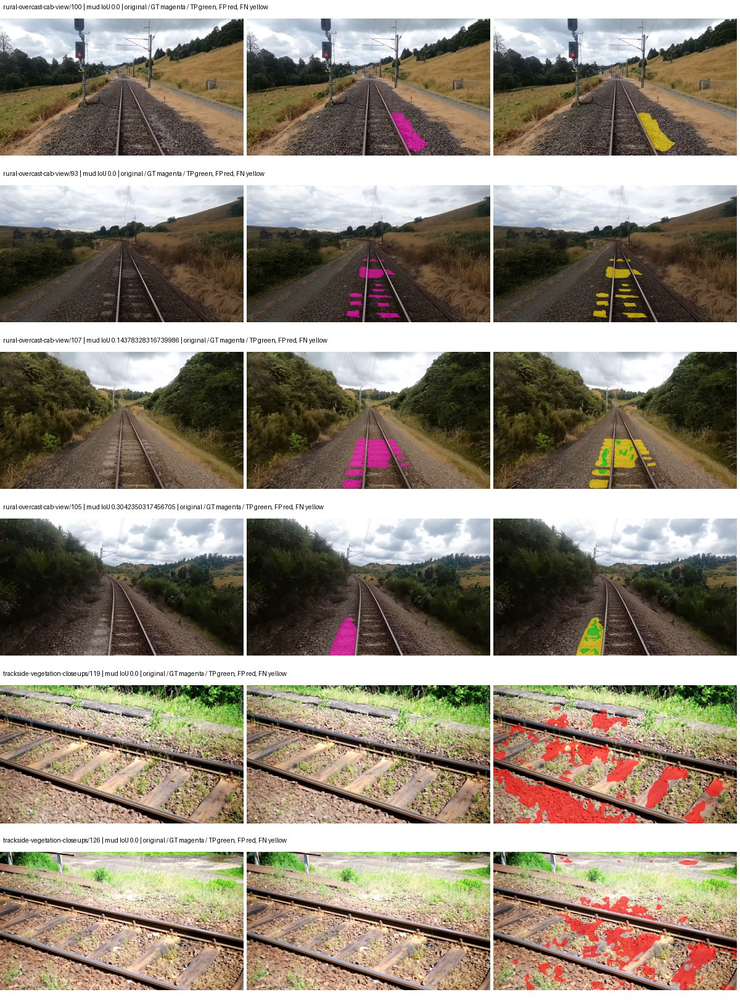
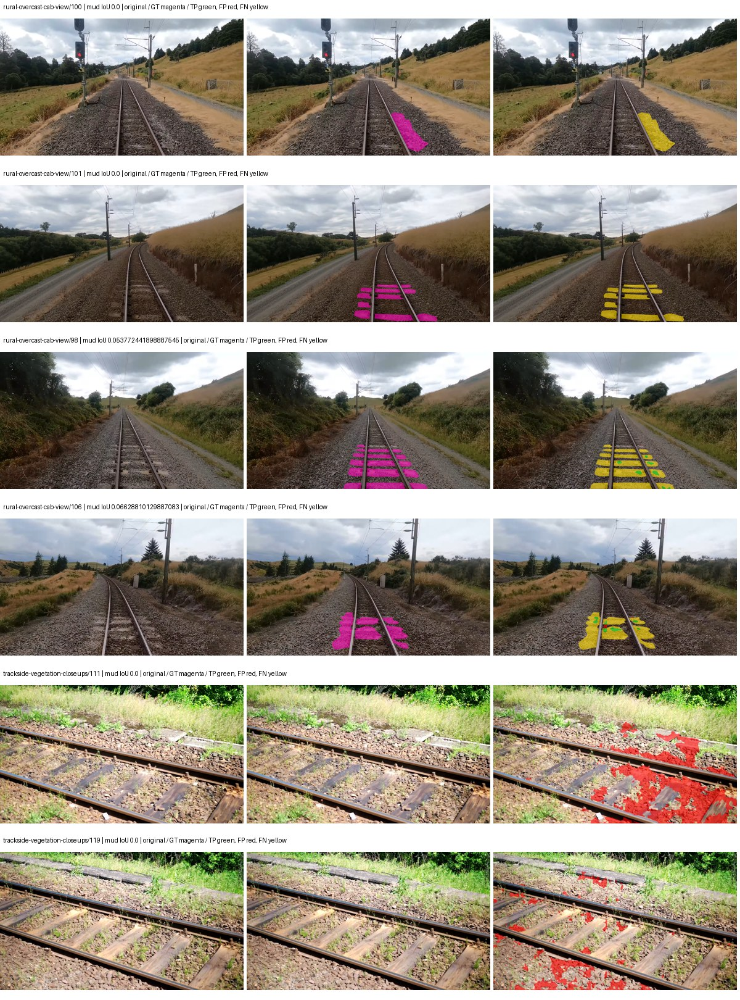
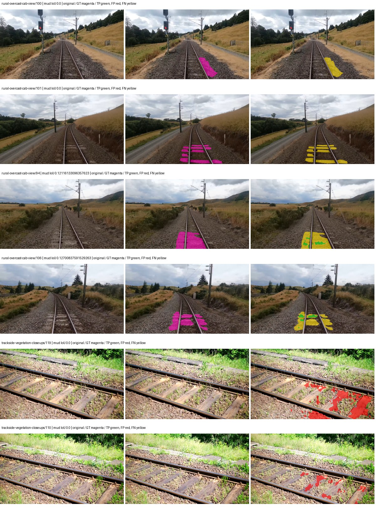
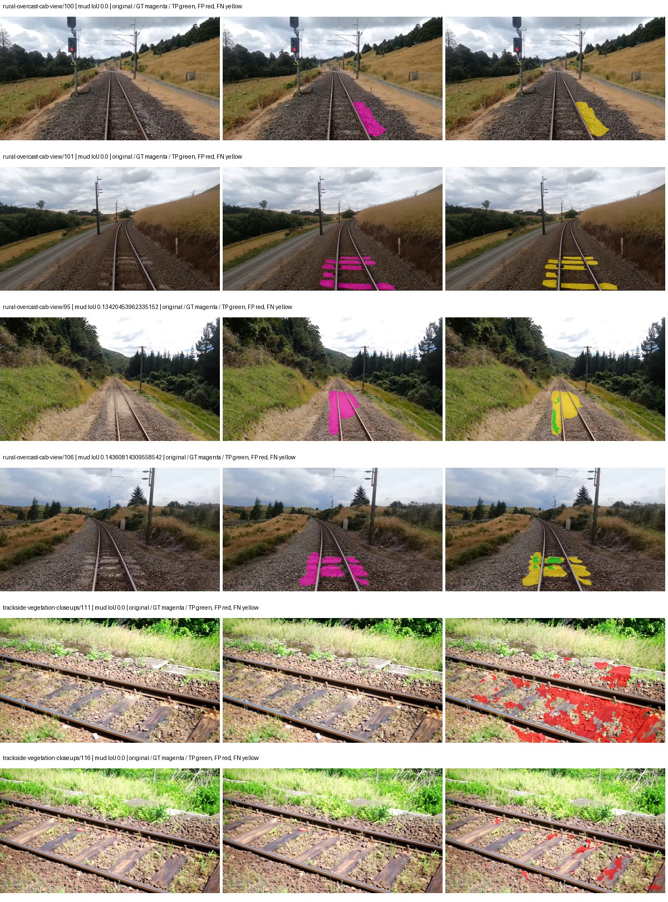

# native_resnet50_fpn_ocr — paul-test-rtis_v2

[RTIS comparison](../../README.md) · [Full model records](record.json)

Primary selection and early stopping: **mud-pumping validation IoU**. A job is complete only after full statistics and isolated profiling are verified.

| Model | Initialization path | Seed | Status | Steps | Best step | Mud IoU (%) | Mud precision (%) | Mud recall (%) | Final mud IoU (trainer val, %) | mIoU (%) | Fixed GT-class mIoU (%) |
| --- | --- | --- | --- | --- | --- | --- | --- | --- | --- | --- | --- |
| native_resnet50_fpn_ocr | rtis_only | 0 | completed | 3058 | 1784 | 2.84 | 5.82 | 5.27 | 0.81 | 28.97 | 33.79 |
| native_resnet50_fpn_ocr | cityscapes_to_rtis | 0 | completed | 1529 | 254 | 0.79 | 2.16 | 1.23 | 0.05 | 18.30 | 18.30 |
| native_resnet50_fpn_ocr | railsem19_to_rtis | 0 | completed | 2549 | 1274 | 3.46 | 15.54 | 4.26 | 1.02 | 39.77 | 46.40 |
| native_resnet50_fpn_ocr | cityscapes_to_railsem19_to_rtis | 0 | completed | 2294 | 1019 | 2.53 | 6.66 | 3.93 | 2.29 | 37.65 | 43.93 |

Training: 205 images. Validation: 37 images. Test: 50 held out. Seeds: [0]. Seed variation measures optimization variability, not independent-recording uncertainty. Historical source checkpoints stay fixed across adaptation seeds.

Training code: `066afb2626398b7be59d4d19f5a0e4644fd59adc`. Split SHA-256: `18a84c0163a65ded46508bcc904c374e5f33ad8a09b8879e3c8add606e86aa9f`.

## rtis_only — seed 0

Status: **completed**. Started: 2026-09-09T23:53:47.710861+00:00. Finished: 2026-09-10T01:02:02.700361+00:00.

Recipe pretrained initializer: `{"arch": "native", "backbone_path": null, "batch_norm_momentum": null, "checkpoint": null, "classifier_path": null, "drop_path": null, "encoder_name": null, "encoder_weights": null, "head": "unified_head", "head_paths": [], "inactive_parameter_paths": [], "local_files_only": false, "lora_alpha": 32, "lora_dropout": 0.05, "lora_r": 16, "lora_targets": [], "native": {"auxiliary_heads": [], "backbone": {"in_channels": 3, "kind": "timm", "name": "resnet50.a1_in1k", "out_indices": [1, 2, 3, 4], "weights": "pretrained"}, "head": {"activation": "relu", "attention_scale": 1, "channels": 512, "coarse_loss_weight": 0.4, "dropout": 0.05, "in_indices": [0, 1, 2, 3], "key_channels": 256, "kind": "ocr", "norm": "group"}, "neck": {"activation": "relu", "kind": "fpn", "norm": "group", "num_outputs": 4, "out_channels": 256}, "task": "multiclass"}, "revision": null, "smp_arch": null, "subfolder": null, "trust_remote_code": false, "tuning": "full"}`.

`rtis_only` uses the recipe initializer, which may include pretrained segmentation components. Transfer paths load the exact historical source checkpoint below and reset the classifier; they do not reset all query/decoder features.

Source checkpoint: `Recipe pretrained initialization`.

Config SHA-256: `e915a9787699d423d49865d9f9538d3ad5644e789ae990b700739e2f3ba980fb`. Weights used for validation: `raw`.

### Mud-pumping and aggregate quality

| Metric | Selected checkpoint | Final training validation |
| --- | --- | --- |
| Mud IoU | 2.84 | 0.81 |
| Mud precision | 5.82 | 4.33 |
| Mud recall | 5.27 | 0.99 |
| Mud Dice/F1 | 5.53 | 1.61 |
| mIoU | 28.97 | 28.45 |
| Mean accuracy | 41.71 | 42.76 |
| Mean precision | 46.22 | 44.65 |
| Mean Dice | 37.84 | 36.33 |
| Mean specificity | 98.64 | 98.85 |
| Pixel accuracy | 79.14 | 81.51 |
| Frequency-weighted IoU | 67.74 | 71.40 |
| Fixed GT-present class mIoU | 33.79 | 33.19 |
| Boundary F1 | 34.09 | 33.95 |

The selected checkpoint has independent evaluation evidence. Final values are the trainer's final validation record, not a new independent evaluation. mIoU averages classes with nonzero union, so false positives on absent classes can change its denominator. The fixed GT-class mean is supplementary and excludes absent classes; their false positives remain in the confusion matrix.

### Resource usage and timing

| Measurement | Value |
| --- | --- |
| Peak training VRAM, retained training invocation (GiB) | 11.64 |
| Peak evaluation VRAM (GiB) | 7.02 |
| Retained training invocation wall time (seconds) | 3902.33 |
| Retained training invocation GPU-hours (one GPU) | 1.08 |
| Evaluation wall time (seconds) | 16.89 |
| Full evaluation pipeline images/second | 2.19 |
| Best full-state checkpoint (MiB) | 498.97 |
| Final full-state checkpoint (MiB) | 498.96 |
| Verified periodic checkpoints removed (GiB) | 2.92 |

VRAM uses the recorded allocator high-water mark; it is not total device usage including CUDA context. Resumed jobs' retained training invocation times and peaks are **not whole-campaign totals**. Earlier invocation resource records are not reconstructed here. Evaluation throughput includes loader, sliding-window inference and metrics; it is not model-only latency/FPS. Missing measurements are shown as —, never inferred from another dataset's run.

### Standardized inference performance

Dedicated model-only profiling waits for an idle worker-locked L40S: BF16, batch 1, 1024x1024, 20 warmup and 100 CUDA-event-timed public forwards. It excludes loading, preprocessing, tiling and metrics.

| Status | Parameters | Weight MiB | FPS | p50 ms | p95 ms | Peak reserved GiB |
| --- | --- | --- | --- | --- | --- | --- |
| complete | 32646762 | 124.54 | 46.87 | 21.08 | 22.64 | 1.46 |

```json
{
  "schema_version": 1,
  "model_id": "native_resnet50_fpn_ocr",
  "measured_at": "2026-09-10T01:01:57+00:00",
  "status": "complete",
  "benchmark_scope": "rtis_selected_checkpoint_model_only",
  "applies_to": [
    "native_resnet50_fpn_ocr--rtis_only--seed-0"
  ],
  "source": {
    "campaign_git_sha": "066afb2626398b7be59d4d19f5a0e4644fd59adc",
    "git_dirty": false,
    "config_hash": "ec75b048fd88",
    "resolved_config": "/data/izadia1/projects/segmentary-runs/paul-test-rtis_v2/seed0-20260909/configs/native_resnet50_fpn_ocr--rtis_only--seed-0.yaml",
    "config_sha256": "e915a9787699d423d49865d9f9538d3ad5644e789ae990b700739e2f3ba980fb",
    "checkpoint_sha256": "dc159c445ce12aa15883c493da0b556e94fd276d617a135821ee136c65140a11",
    "checkpoint_global_step": 1784,
    "checkpoint_bytes": 523207273,
    "checkpoint_kind": "resume checkpoint with optimizer and EMA state",
    "weights": "raw",
    "measured_checkpoint_job_id": "native_resnet50_fpn_ocr--rtis_only--seed-0",
    "result_sha256": "8a448a472665151bc2151aaeb2afb5b79f032a69606b0f686a9d01f7bc2d49af",
    "result_git_sha": "066afb2626398b7be59d4d19f5a0e4644fd59adc",
    "result_stage": "eval:paul-test-rtis:val",
    "result_seed": 0
  },
  "hardware": {
    "gpu_name": "NVIDIA L40S",
    "gpu_uuid": "GPU-fc5dde96-210d-0afa-ac74-7f88477d622b",
    "logical_device": "cuda:0",
    "physical_visibility_token": "4",
    "compute_capability": [
      8,
      9
    ],
    "total_memory_bytes": 47677177856
  },
  "model": {
    "parameter_count": 32646762,
    "trainable_parameter_count": 32646762,
    "resident_parameter_bytes": 130587048,
    "parameter_dtype_counts": {
      "float32": 32646762
    }
  },
  "contract": {
    "backend": "pytorch",
    "precision": "bf16_autocast",
    "batch_size": 1,
    "input_shape_nchw": [
      1,
      3,
      1024,
      1024
    ],
    "warmup_iterations": 20,
    "measured_iterations": 100,
    "timing": "per-forward CUDA events with end-event synchronization",
    "includes_preprocessing": false,
    "includes_data_loader": false,
    "includes_sliding_window": false,
    "input_resident_on_gpu": true,
    "model_only": true,
    "entrypoint": "public model(image) dense-logits forward"
  },
  "measurements": {
    "latency": {
      "p50_ms": 21.075952529907227,
      "p95_ms": 22.64319953918457,
      "mean_ms": 21.33431900024414,
      "minimum_ms": 20.710399627685547,
      "maximum_ms": 23.743488311767578,
      "fps": 46.87283432804002,
      "raw_ms": [
        23.241727828979492,
        22.201343536376953,
        21.06060791015625,
        21.344255447387695,
        21.403648376464844,
        21.83782386779785,
        22.750207901000977,
        21.90540885925293,
        20.774911880493164,
        21.05241584777832,
        20.814847946166992,
        20.764799118041992,
        21.68524742126465,
        20.87833595275879,
        20.755456924438477,
        22.353919982910156,
        22.6375675201416,
        21.439552307128906,
        20.766719818115234,
        21.177343368530273,
        20.773887634277344,
        20.752384185791016,
        22.177791595458984,
        23.743488311767578,
        23.550975799560547,
        21.726207733154297,
        21.47737693786621,
        20.87936019897461,
        20.804607391357422,
        20.84454345703125,
        21.003263473510742,
        21.23366355895996,
        21.46816062927246,
        22.154239654541016,
        20.911008834838867,
        21.289888381958008,
        21.319679260253906,
        20.923391342163086,
        20.772863388061523,
        20.724735260009766,
        20.87936019897461,
        20.818944931030273,
        20.971391677856445,
        20.934656143188477,
        21.87366485595703,
        20.985855102539062,
        20.756479263305664,
        20.741119384765625,
        21.67398452758789,
        21.26233673095703,
        21.06265640258789,
        20.931583404541016,
        20.750335693359375,
        20.710399627685547,
        20.84864044189453,
        20.8353271484375,
        20.806655883789062,
        21.538816452026367,
        20.794368743896484,
        21.194751739501953,
        20.809728622436523,
        20.8404483795166,
        21.089248657226562,
        20.87936019897461,
        21.974016189575195,
        20.961280822753906,
        20.775936126708984,
        20.89574432373047,
        22.07846450805664,
        21.05548858642578,
        20.729856491088867,
        22.25868797302246,
        21.618688583374023,
        20.968448638916016,
        21.200895309448242,
        21.86444854736328,
        20.87116813659668,
        20.81177520751953,
        21.812223434448242,
        21.153791427612305,
        21.67807960510254,
        21.237760543823242,
        21.4466552734375,
        20.916223526000977,
        20.787168502807617,
        20.805631637573242,
        21.108736038208008,
        21.848064422607422,
        21.172224044799805,
        20.82099151611328,
        23.334911346435547,
        22.424575805664062,
        22.598527908325195,
        21.262239456176758,
        21.820415496826172,
        21.394432067871094,
        20.834304809570312,
        20.773887634277344,
        21.288959503173828,
        21.47942352294922
      ],
      "percentile_method": "numpy linear interpolation"
    },
    "peak_reserved_bytes": 1562378240,
    "memory_kind": "pytorch_cuda_allocator_peak_reserved_excluding_context",
    "benchmark_wall_clock_s": 15.69639202952385
  },
  "started_at": "2026-09-10T01:01:41+00:00",
  "finished_at": "2026-09-10T01:01:57+00:00",
  "environment": {
    "hostname": "hdrfs-app-001",
    "python": "3.11.15",
    "platform": "Linux-5.15.0-139-generic-x86_64-with-glibc2.35",
    "torch": "2.11.0+cu128",
    "torch_cuda": "12.8",
    "cudnn": 91900,
    "driver_version": "570.133.20",
    "cuda_available": true,
    "gpu_count": 1,
    "gpu_names": [
      "NVIDIA L40S"
    ],
    "cuda_visible_devices": "4",
    "packages": {
      "segmentary": "0.1.0",
      "torch": "2.11.0+cu128",
      "torchvision": "0.26.0+cu128",
      "transformers": "5.15.0",
      "timm": "1.0.28",
      "segmentation-models-pytorch": "0.5.0",
      "albumentations": "2.0.8",
      "lightning": "2.6.5",
      "numpy": "2.4.4"
    }
  }
}
```

### Per-class validation results

| Class | GT pixels | IoU (%) | Precision (%) | Recall (%) | Dice (%) | Boundary F1 (%) |
| --- | --- | --- | --- | --- | --- | --- |
| car | 29664 | 48.25 | 65.86 | 64.35 | 65.10 | 41.54 |
| construction | 311585 | 45.95 | 65.19 | 60.88 | 62.96 | 57.92 |
| fence | 265137 | 3.59 | 53.86 | 3.71 | 6.94 | 15.60 |
| mud-pumping | 1226250 | 2.84 | 5.82 | 5.27 | 5.53 | 6.35 |
| on-rails | 0 | 0.00 | 0.00 | — | 0.00 | 0.00 |
| person | 0 | 0.00 | 0.00 | — | 0.00 | 0.00 |
| pole | 628038 | 61.58 | 72.59 | 80.23 | 76.22 | 84.37 |
| rail-embedded | 16799 | 5.54 | 29.17 | 6.40 | 10.50 | 12.45 |
| rail-raised | 2969797 | 71.02 | 86.79 | 79.62 | 83.05 | 90.08 |
| rail-track | 6323197 | 32.82 | 55.31 | 44.67 | 49.43 | 49.25 |
| road | 1048831 | 14.74 | 23.88 | 27.79 | 25.69 | 18.94 |
| sidewalk | 1297367 | 16.53 | 57.35 | 18.85 | 28.38 | 15.50 |
| sky | 19121606 | 87.07 | 99.25 | 87.65 | 93.09 | 75.48 |
| standing-water | 95802 | 0.09 | 0.13 | 0.27 | 0.18 | 4.84 |
| terrain | 39239306 | 82.69 | 83.90 | 98.29 | 90.53 | 52.76 |
| trackbed | 10643081 | 45.57 | 57.12 | 69.27 | 62.61 | 47.04 |
| traffic-light | 19510 | 47.33 | 77.29 | 54.97 | 64.25 | 54.14 |
| traffic-sign | 13285 | 20.15 | 49.56 | 25.35 | 33.54 | 32.82 |
| tram-track | 56179 | 0.02 | 0.11 | 0.03 | 0.04 | 1.10 |
| truck | 0 | 0.00 | 0.00 | — | 0.00 | 0.00 |
| vegetation-overgrowth | 5901821 | 22.47 | 87.31 | 23.22 | 36.69 | 55.68 |

### Full-run accounting

| Measurement | Value |
| --- | --- |
| Full GPU-reserved wall seconds, all recorded worker attempts | 4094.99 |
| Full reserved GPU-hours | 1.14 |
| Whole-run timing complete | True |

| Phase | Wall seconds including failed attempts |
| --- | --- |
| training | 3909.18 |
| diagnostics | 133.78 |
| performance | 23.38 |

GPU-reserved time includes model loading, training, validation, collection, profiling, checkpoint I/O and orchestration while the worker owns one GPU. It is not GPU kernel-active time. Phase timings and sampled device memory/power/utilization are retained separately; sampled device memory is not the allocator high-water mark.

### Train/validation and raw/EMA diagnostics

| Checkpoint / weights / split | Images | Mud IoU (%) | Mud precision (%) | Mud recall (%) |
| --- | --- | --- | --- | --- |
| best-auto-train / raw | 205 | 91.56 | 94.31 | 96.91 |
| best-auto-val / raw | 37 | 2.84 | 5.82 | 5.27 |
| best-alternate-val / ema | 37 | 0.46 | 0.78 | 1.11 |
| final-auto-val / raw | 37 | 0.81 | 4.35 | 0.98 |

Train uses the evaluation transform without augmentation. Compare mud train/validation metrics for the same selected weights. Alternate EMA on running-stat BatchNorm is explicitly uncalibrated and is diagnostic only. Score-threshold curves use uncalibrated normalized scores and are pixel-level diagnostics, not event detection rates or a selected deployment operating point.

### Downloadable evidence

- best-auto-train: [per-image.csv](rtis_only--seed-0/best-auto-train/per-image.csv) · [per-image-confusion.json.gz](rtis_only--seed-0/best-auto-train/per-image-confusion.json.gz) · [groups.json](rtis_only--seed-0/best-auto-train/groups.json) · [mud-score-curves.json](rtis_only--seed-0/best-auto-train/mud-score-curves.json)
- best-auto-val: [per-image.csv](rtis_only--seed-0/best-auto-val/per-image.csv) · [per-image-confusion.json.gz](rtis_only--seed-0/best-auto-val/per-image-confusion.json.gz) · [groups.json](rtis_only--seed-0/best-auto-val/groups.json) · [mud-score-curves.json](rtis_only--seed-0/best-auto-val/mud-score-curves.json) · [examples.jpg](rtis_only--seed-0/best-auto-val/examples.jpg)
- best-alternate-val: [per-image.csv](rtis_only--seed-0/best-alternate-val/per-image.csv) · [per-image-confusion.json.gz](rtis_only--seed-0/best-alternate-val/per-image-confusion.json.gz) · [groups.json](rtis_only--seed-0/best-alternate-val/groups.json) · [mud-score-curves.json](rtis_only--seed-0/best-alternate-val/mud-score-curves.json)
- final-auto-val: [per-image.csv](rtis_only--seed-0/final-auto-val/per-image.csv) · [per-image-confusion.json.gz](rtis_only--seed-0/final-auto-val/per-image-confusion.json.gz) · [groups.json](rtis_only--seed-0/final-auto-val/groups.json) · [mud-score-curves.json](rtis_only--seed-0/final-auto-val/mud-score-curves.json)
- resources: [telemetry.csv](rtis_only--seed-0/resources/telemetry.csv)



Examples are two lowest and two highest mud-IoU positive images, plus up to two negative images with the most false-positive mud pixels. They are targeted diagnostic examples, not random samples. Green: true positive; red: false positive; yellow: false negative. Full predictions remain on HDRFS.

### Validation tracking

| Logged step | Overall mIoU (%) | Mud IoU (%) |
| --- | --- | --- |
| 254 | 17.87 | 0.35 |
| 509 | 18.74 | 2.03 |
| 764 | 22.51 | 0.31 |
| 1019 | 25.35 | 0.43 |
| 1274 | 23.52 | 0.24 |
| 1529 | 25.03 | 0.24 |
| 1784 | 28.97 | 2.85 |
| 2038 | 26.37 | 0.52 |
| 2293 | 27.95 | 1.00 |
| 2548 | 31.66 | 1.17 |
| 2803 | 29.83 | 1.67 |
| 3058 | 28.45 | 0.81 |

All retained scalar curves, including training loss and per-class IoU, are in record.json. Observed best mud on a curve is not necessarily a retained checkpoint: the pilot saved its selection-metric-best and final checkpoints. Step logging and checkpoint global_step may differ by one.

### Stopping and checkpoint provenance

```json
{
  "stopping": {
    "actual_steps": 3058,
    "maximum_steps": 4000,
    "min_delta": 0.001,
    "monitor": "val_iou/mud-pumping",
    "patience": 5,
    "reason": "validation_plateau"
  },
  "checkpoints": {
    "best": {
      "path": "/data/izadia1/projects/segmentary-runs/paul-test-rtis_v2/seed0-20260909/future-runs/native_resnet50_fpn_ocr--rtis_only--seed-0_seed0/rtis/best.ckpt",
      "sha256": "dc159c445ce12aa15883c493da0b556e94fd276d617a135821ee136c65140a11",
      "global_step": 1784,
      "bytes": 523207273
    },
    "final": {
      "path": "/data/izadia1/projects/segmentary-runs/paul-test-rtis_v2/seed0-20260909/future-runs/native_resnet50_fpn_ocr--rtis_only--seed-0_seed0/rtis/last.ckpt",
      "sha256": "3add1545f78e8edffa43ace11b4feb9441eae6ad77aed283f56359a01079cc45",
      "global_step": 3058,
      "bytes": 523195049
    }
  },
  "cleanup_error": null
}
```

### Resolved training, initialization and evaluation settings

The optimizer block is the base configuration. Stage LR scales are applied at runtime, and stage warmup is capped at min(base warmup, floor(stage budget / 10), stage budget - 1): 400 steps for this 4,000-step pilot. Model-internal native input grids may differ from augmentation crops (EoMT uses its 640 grid).

```json
{
  "name": "native_resnet50_fpn_ocr--rtis_only--seed-0",
  "model": {
    "arch": "native",
    "checkpoint": null,
    "tuning": "full",
    "head": "unified_head",
    "lora_r": 16,
    "lora_alpha": 32,
    "lora_dropout": 0.05,
    "lora_targets": [],
    "drop_path": null,
    "revision": null,
    "subfolder": null,
    "local_files_only": false,
    "trust_remote_code": false,
    "backbone_path": null,
    "head_paths": [],
    "classifier_path": null,
    "inactive_parameter_paths": [],
    "smp_arch": null,
    "encoder_name": null,
    "encoder_weights": null,
    "native": {
      "task": "multiclass",
      "backbone": {
        "kind": "timm",
        "name": "resnet50.a1_in1k",
        "weights": "pretrained",
        "out_indices": [
          1,
          2,
          3,
          4
        ],
        "in_channels": 3
      },
      "neck": {
        "kind": "fpn",
        "out_channels": 256,
        "num_outputs": 4,
        "norm": "group",
        "activation": "relu"
      },
      "head": {
        "kind": "ocr",
        "in_indices": [
          0,
          1,
          2,
          3
        ],
        "channels": 512,
        "key_channels": 256,
        "attention_scale": 1,
        "dropout": 0.05,
        "coarse_loss_weight": 0.4,
        "norm": "group",
        "activation": "relu"
      },
      "auxiliary_heads": []
    },
    "batch_norm_momentum": null
  },
  "space": "paul-test-rtis",
  "taxonomy_root": "/data/izadia1/projects/segmentary-rtis-fullstats-066afb2/taxonomy",
  "output_root": "/data/izadia1/projects/segmentary-runs/paul-test-rtis_v2/seed0-20260909/future-runs",
  "optim": {
    "backbone_lr": 0.0001,
    "head_lr_mult": 10.0,
    "weight_decay": 0.05,
    "llrd": 1.0,
    "warmup_iters": 1500,
    "warmup_ratio": 1e-06,
    "poly_power": 0.9,
    "min_lr_ratio": 0.0,
    "betas": [
      0.9,
      0.999
    ],
    "grad_clip": 1.0
  },
  "train": {
    "iters": 4000,
    "batch_size": 2,
    "accum": 8,
    "num_workers": 2,
    "precision": "bf16-mixed",
    "ema_decay": 0.9998,
    "val_every": 250,
    "ckpt_every": 500,
    "selection_metric": "val_iou/mud-pumping",
    "early_stopping_patience": 5,
    "early_stopping_min_delta": 0.001,
    "seed": 0,
    "devices": 1
  },
  "eval": {
    "sliding_window": true,
    "window": [
      1024,
      1024
    ],
    "stride": [
      768,
      768
    ],
    "batch_size": 1,
    "num_workers": 2,
    "tta_scales": [],
    "tta_flip": false,
    "threshold": 0.5,
    "boundary_tolerance_frac": 0.0075,
    "save_confusion": true
  },
  "loss": {
    "task": "multiclass",
    "activation": "auto",
    "terms": [],
    "aux": "none",
    "aux_weight": 0.0,
    "ce_weight": 1.0,
    "label_smoothing": 0.0,
    "class_weights": null,
    "query": null
  },
  "aug": {
    "crop": [
      1024,
      1024
    ],
    "scale_min": 0.5,
    "scale_max": 2.0,
    "hflip_p": 0.5,
    "color_jitter_p": 0.5,
    "brightness": 0.25,
    "contrast": 0.25,
    "saturation": 0.25,
    "hue": 0.05
  },
  "stages": [
    {
      "name": "rtis",
      "data": [
        {
          "name": "paul-test-rtis",
          "root": "/data/izadia1/datasets/paul-test-rtis_v2",
          "variant": null,
          "split_file": "splits.json",
          "train_split": "train",
          "val_split": "val",
          "limit": null,
          "loader": "folder",
          "mapping": "paul-test-rtis",
          "loader_options": {
            "require_groups": true
          }
        }
      ],
      "iters": null,
      "lr_scale": 1.0,
      "head_group_lr_scale": 1.0,
      "init_from": "pretrained",
      "reset_head": false,
      "freeze": null,
      "sample_weights": null
    }
  ]
}
```

### Hardware and software provenance

```json
{
  "training": {
    "cuda_available": true,
    "cuda_visible_devices": "4",
    "cudnn": 91900,
    "driver_version": "570.133.20",
    "gpu_count": 1,
    "gpu_names": [
      "NVIDIA L40S"
    ],
    "hostname": "hdrfs-app-001",
    "input_normalization": {
      "channel_order": "rgb",
      "mean": [
        0.485,
        0.456,
        0.406
      ],
      "source": "timm_pretrained_cfg",
      "std": [
        0.229,
        0.224,
        0.225
      ]
    },
    "model_origins": [
      {
        "hf_commit": null,
        "hf_name_or_path": null,
        "module": "backbone",
        "timm_pretrained": {
          "architecture": "resnet50",
          "hf_hub_id": "timm/resnet50.a1_in1k",
          "tag": "a1_in1k",
          "url": "https://github.com/rwightman/pytorch-image-models/releases/download/v0.1-rsb-weights/resnet50_a1_0-14fe96d1.pth"
        }
      },
      {
        "hf_commit": null,
        "hf_name_or_path": null,
        "module": "backbone.model",
        "timm_pretrained": {
          "architecture": "resnet50",
          "hf_hub_id": "timm/resnet50.a1_in1k",
          "tag": "a1_in1k",
          "url": "https://github.com/rwightman/pytorch-image-models/releases/download/v0.1-rsb-weights/resnet50_a1_0-14fe96d1.pth"
        }
      }
    ],
    "model_parameter_count": 32646762,
    "packages": {
      "albumentations": "2.0.8",
      "lightning": "2.6.5",
      "numpy": "2.4.4",
      "segmentary": "0.1.0",
      "segmentation-models-pytorch": "0.5.0",
      "timm": "1.0.28",
      "torch": "2.11.0+cu128",
      "torchvision": "0.26.0+cu128",
      "transformers": "5.15.0"
    },
    "platform": "Linux-5.15.0-139-generic-x86_64-with-glibc2.35",
    "python": "3.11.15",
    "torch": "2.11.0+cu128",
    "torch_cuda": "12.8",
    "trainable_parameter_count": 32646762,
    "training_stop": {
      "actual_steps": 3058,
      "maximum_steps": 4000,
      "min_delta": 0.001,
      "monitor": "val_iou/mud-pumping",
      "patience": 5,
      "reason": "validation_plateau"
    },
    "validation_weights": "raw"
  },
  "evaluation": {
    "cuda_available": true,
    "cuda_visible_devices": "4",
    "cudnn": 91900,
    "driver_version": "570.133.20",
    "gpu_count": 1,
    "gpu_names": [
      "NVIDIA L40S"
    ],
    "hostname": "hdrfs-app-001",
    "input_normalization": {
      "channel_order": "rgb",
      "mean": [
        0.485,
        0.456,
        0.406
      ],
      "source": "timm_pretrained_cfg",
      "std": [
        0.229,
        0.224,
        0.225
      ]
    },
    "packages": {
      "albumentations": "2.0.8",
      "lightning": "2.6.5",
      "numpy": "2.4.4",
      "segmentary": "0.1.0",
      "segmentation-models-pytorch": "0.5.0",
      "timm": "1.0.28",
      "torch": "2.11.0+cu128",
      "torchvision": "0.26.0+cu128",
      "transformers": "5.15.0"
    },
    "platform": "Linux-5.15.0-139-generic-x86_64-with-glibc2.35",
    "python": "3.11.15",
    "torch": "2.11.0+cu128",
    "torch_cuda": "12.8"
  }
}
```

## cityscapes_to_rtis — seed 0

Status: **completed**. Started: 2026-09-09T23:58:04.488549+00:00. Finished: 2026-09-10T00:34:06.565047+00:00.

Recipe pretrained initializer: `{"arch": "native", "backbone_path": null, "batch_norm_momentum": null, "checkpoint": null, "classifier_path": null, "drop_path": null, "encoder_name": null, "encoder_weights": null, "head": "unified_head", "head_paths": [], "inactive_parameter_paths": [], "local_files_only": false, "lora_alpha": 32, "lora_dropout": 0.05, "lora_r": 16, "lora_targets": [], "native": {"auxiliary_heads": [], "backbone": {"in_channels": 3, "kind": "timm", "name": "resnet50.a1_in1k", "out_indices": [1, 2, 3, 4], "weights": "pretrained"}, "head": {"activation": "relu", "attention_scale": 1, "channels": 512, "coarse_loss_weight": 0.4, "dropout": 0.05, "in_indices": [0, 1, 2, 3], "key_channels": 256, "kind": "ocr", "norm": "group"}, "neck": {"activation": "relu", "kind": "fpn", "norm": "group", "num_outputs": 4, "out_channels": 256}, "task": "multiclass"}, "revision": null, "smp_arch": null, "subfolder": null, "trust_remote_code": false, "tuning": "full"}`.

`rtis_only` uses the recipe initializer, which may include pretrained segmentation components. Transfer paths load the exact historical source checkpoint below and reset the classifier; they do not reset all query/decoder features.

Source checkpoint: `{'name': 'native_resnet50_fpn_ocr--cityscapes--seed-0', 'model': 'native_resnet50_fpn_ocr', 'protocol': 'cityscapes', 'config': '/data/izadia1/projects/segmentary-runs/all-model-city-rail-seed0-rail20-b9eb3e1/accepted/native_resnet50_fpn_ocr--cityscapes--seed-0/resolved-config.yaml', 'checkpoint': '/data/izadia1/projects/segmentary-runs/all-model-city-rail-seed0-a7c0b67/jobs/native_resnet50_fpn_ocr--cityscapes--seed-0/attempt-001/train/native_resnet50_fpn_ocr--cityscapes_seed0/cityscapes/last.ckpt', 'recorded_sha256': 'b83bf800493df55699f2f3c17f3d1c8c0acfeab2e1929da870d845b8805a0244', 'exists': True}`.

Config SHA-256: `e0a8d02d3af032904aebe5053ea8b58d0110ede27d45717f66ab6552ff842546`. Weights used for validation: `raw`.

### Mud-pumping and aggregate quality

| Metric | Selected checkpoint | Final training validation |
| --- | --- | --- |
| Mud IoU | 0.79 | 0.05 |
| Mud precision | 2.16 | 0.36 |
| Mud recall | 1.23 | 0.05 |
| Mud Dice/F1 | 1.57 | 0.10 |
| mIoU | 18.30 | 30.96 |
| Mean accuracy | 25.16 | 43.13 |
| Mean precision | 31.58 | 47.45 |
| Mean Dice | 22.97 | 39.48 |
| Mean specificity | 97.74 | 98.78 |
| Pixel accuracy | 67.82 | 82.01 |
| Frequency-weighted IoU | 54.86 | 70.79 |
| Fixed GT-present class mIoU | 18.30 | 36.12 |
| Boundary F1 | 21.32 | 37.38 |

The selected checkpoint has independent evaluation evidence. Final values are the trainer's final validation record, not a new independent evaluation. mIoU averages classes with nonzero union, so false positives on absent classes can change its denominator. The fixed GT-class mean is supplementary and excludes absent classes; their false positives remain in the confusion matrix.

### Resource usage and timing

| Measurement | Value |
| --- | --- |
| Peak training VRAM, retained training invocation (GiB) | 11.64 |
| Peak evaluation VRAM (GiB) | 7.02 |
| Retained training invocation wall time (seconds) | 1968.06 |
| Retained training invocation GPU-hours (one GPU) | 0.55 |
| Evaluation wall time (seconds) | 17.76 |
| Full evaluation pipeline images/second | 2.08 |
| Best full-state checkpoint (MiB) | 498.97 |
| Final full-state checkpoint (MiB) | 498.96 |
| Verified periodic checkpoints removed (GiB) | 1.46 |

VRAM uses the recorded allocator high-water mark; it is not total device usage including CUDA context. Resumed jobs' retained training invocation times and peaks are **not whole-campaign totals**. Earlier invocation resource records are not reconstructed here. Evaluation throughput includes loader, sliding-window inference and metrics; it is not model-only latency/FPS. Missing measurements are shown as —, never inferred from another dataset's run.

### Standardized inference performance

Dedicated model-only profiling waits for an idle worker-locked L40S: BF16, batch 1, 1024x1024, 20 warmup and 100 CUDA-event-timed public forwards. It excludes loading, preprocessing, tiling and metrics.

| Status | Parameters | Weight MiB | FPS | p50 ms | p95 ms | Peak reserved GiB |
| --- | --- | --- | --- | --- | --- | --- |
| complete | 32646762 | 124.54 | 47.44 | 20.95 | 21.99 | 1.46 |

```json
{
  "schema_version": 1,
  "model_id": "native_resnet50_fpn_ocr",
  "measured_at": "2026-09-10T00:34:02+00:00",
  "status": "complete",
  "benchmark_scope": "rtis_selected_checkpoint_model_only",
  "applies_to": [
    "native_resnet50_fpn_ocr--cityscapes_to_rtis--seed-0"
  ],
  "source": {
    "campaign_git_sha": "066afb2626398b7be59d4d19f5a0e4644fd59adc",
    "git_dirty": false,
    "config_hash": "0b103cfe56a6",
    "resolved_config": "/data/izadia1/projects/segmentary-runs/paul-test-rtis_v2/seed0-20260909/configs/native_resnet50_fpn_ocr--cityscapes_to_rtis--seed-0.yaml",
    "config_sha256": "e0a8d02d3af032904aebe5053ea8b58d0110ede27d45717f66ab6552ff842546",
    "checkpoint_sha256": "cee56be56e6a30ebd99918c4afd1fe054428734da9ad904890d397aab4ec0d26",
    "checkpoint_global_step": 254,
    "checkpoint_bytes": 523207145,
    "checkpoint_kind": "resume checkpoint with optimizer and EMA state",
    "weights": "raw",
    "measured_checkpoint_job_id": "native_resnet50_fpn_ocr--cityscapes_to_rtis--seed-0",
    "result_sha256": "9270c56ee551ee9d6c33dcbb3694e1e3af0201bd330f34fc5e65da42f3767f75",
    "result_git_sha": "066afb2626398b7be59d4d19f5a0e4644fd59adc",
    "result_stage": "eval:paul-test-rtis:val",
    "result_seed": 0
  },
  "hardware": {
    "gpu_name": "NVIDIA L40S",
    "gpu_uuid": "GPU-84f5ca4d-68db-ae98-d056-40654d859dd9",
    "logical_device": "cuda:0",
    "physical_visibility_token": "0",
    "compute_capability": [
      8,
      9
    ],
    "total_memory_bytes": 47677177856
  },
  "model": {
    "parameter_count": 32646762,
    "trainable_parameter_count": 32646762,
    "resident_parameter_bytes": 130587048,
    "parameter_dtype_counts": {
      "float32": 32646762
    }
  },
  "contract": {
    "backend": "pytorch",
    "precision": "bf16_autocast",
    "batch_size": 1,
    "input_shape_nchw": [
      1,
      3,
      1024,
      1024
    ],
    "warmup_iterations": 20,
    "measured_iterations": 100,
    "timing": "per-forward CUDA events with end-event synchronization",
    "includes_preprocessing": false,
    "includes_data_loader": false,
    "includes_sliding_window": false,
    "input_resident_on_gpu": true,
    "model_only": true,
    "entrypoint": "public model(image) dense-logits forward"
  },
  "measurements": {
    "latency": {
      "p50_ms": 20.954623222351074,
      "p95_ms": 21.994699954986572,
      "mean_ms": 21.077683181762694,
      "minimum_ms": 20.71334457397461,
      "maximum_ms": 22.602752685546875,
      "fps": 47.44354450043364,
      "raw_ms": [
        21.345279693603516,
        20.773887634277344,
        21.320703506469727,
        21.010400772094727,
        22.173696517944336,
        21.434368133544922,
        21.031936645507812,
        21.008384704589844,
        21.325824737548828,
        21.06777572631836,
        22.602752685546875,
        20.898815155029297,
        21.006336212158203,
        21.6125431060791,
        21.63814353942871,
        20.899871826171875,
        20.798463821411133,
        21.624832153320312,
        20.81279945373535,
        20.780031204223633,
        20.76268768310547,
        20.745216369628906,
        21.089279174804688,
        20.802431106567383,
        21.185535430908203,
        20.767744064331055,
        20.744192123413086,
        20.82815933227539,
        20.730880737304688,
        20.744192123413086,
        21.1015682220459,
        22.29849624633789,
        20.890623092651367,
        21.342208862304688,
        21.137407302856445,
        20.890623092651367,
        21.20806312561035,
        20.801536560058594,
        20.784128189086914,
        21.28486442565918,
        21.161983489990234,
        20.81782341003418,
        20.794368743896484,
        20.749439239501953,
        21.65555191040039,
        20.90496063232422,
        21.10361671447754,
        20.760576248168945,
        20.764575958251953,
        20.773887634277344,
        20.81177520751953,
        20.71334457397461,
        20.786176681518555,
        21.196800231933594,
        20.799488067626953,
        20.728832244873047,
        21.27667236328125,
        21.0831356048584,
        21.985279083251953,
        20.961280822753906,
        21.20185661315918,
        21.746688842773438,
        20.816896438598633,
        20.789247512817383,
        20.783199310302734,
        21.0513916015625,
        21.169151306152344,
        20.954111099243164,
        20.91315269470215,
        20.772768020629883,
        20.953088760375977,
        20.937728881835938,
        20.732927322387695,
        21.0196475982666,
        20.808704376220703,
        21.180416107177734,
        20.781055450439453,
        20.742143630981445,
        22.39187240600586,
        21.165056228637695,
        20.982784271240234,
        21.541887283325195,
        21.437440872192383,
        20.987903594970703,
        20.896671295166016,
        21.535743713378906,
        21.6760311126709,
        20.97148895263672,
        20.767744064331055,
        20.784128189086914,
        20.88140869140625,
        20.966400146484375,
        20.955135345458984,
        20.765695571899414,
        20.770816802978516,
        20.773887634277344,
        20.775936126708984,
        21.024768829345703,
        22.2607364654541,
        20.964351654052734
      ],
      "percentile_method": "numpy linear interpolation"
    },
    "peak_reserved_bytes": 1562378240,
    "memory_kind": "pytorch_cuda_allocator_peak_reserved_excluding_context",
    "benchmark_wall_clock_s": 15.850114103406668
  },
  "started_at": "2026-09-10T00:33:46+00:00",
  "finished_at": "2026-09-10T00:34:02+00:00",
  "environment": {
    "hostname": "hdrfs-app-001",
    "python": "3.11.15",
    "platform": "Linux-5.15.0-139-generic-x86_64-with-glibc2.35",
    "torch": "2.11.0+cu128",
    "torch_cuda": "12.8",
    "cudnn": 91900,
    "driver_version": "570.133.20",
    "cuda_available": true,
    "gpu_count": 1,
    "gpu_names": [
      "NVIDIA L40S"
    ],
    "cuda_visible_devices": "0",
    "packages": {
      "segmentary": "0.1.0",
      "torch": "2.11.0+cu128",
      "torchvision": "0.26.0+cu128",
      "transformers": "5.15.0",
      "timm": "1.0.28",
      "segmentation-models-pytorch": "0.5.0",
      "albumentations": "2.0.8",
      "lightning": "2.6.5",
      "numpy": "2.4.4"
    }
  }
}
```

### Per-class validation results

| Class | GT pixels | IoU (%) | Precision (%) | Recall (%) | Dice (%) | Boundary F1 (%) |
| --- | --- | --- | --- | --- | --- | --- |
| car | 29664 | 0.00 | 0.00 | 0.00 | 0.00 | 0.00 |
| construction | 311585 | 3.38 | 3.42 | 74.18 | 6.54 | 8.65 |
| fence | 265137 | 0.01 | 0.63 | 0.01 | 0.03 | 1.95 |
| mud-pumping | 1226250 | 0.79 | 2.16 | 1.23 | 1.57 | 2.91 |
| on-rails | 0 | — | — | — | — | — |
| person | 0 | — | — | — | — | — |
| pole | 628038 | 59.77 | 79.38 | 70.76 | 74.82 | 79.86 |
| rail-embedded | 16799 | 0.00 | 0.00 | 0.00 | 0.00 | 0.00 |
| rail-raised | 2969797 | 55.97 | 86.15 | 61.50 | 71.77 | 84.16 |
| rail-track | 6323197 | 15.45 | 67.31 | 16.70 | 26.77 | 32.26 |
| road | 1048831 | 4.25 | 11.72 | 6.24 | 8.14 | 10.83 |
| sidewalk | 1297367 | 1.23 | 81.36 | 1.23 | 2.43 | 5.17 |
| sky | 19121606 | 96.27 | 99.18 | 97.04 | 98.10 | 83.29 |
| standing-water | 95802 | 0.04 | 0.04 | 0.67 | 0.08 | 0.18 |
| terrain | 39239306 | 61.59 | 67.25 | 87.97 | 76.23 | 32.47 |
| trackbed | 10643081 | 30.72 | 69.91 | 35.40 | 47.00 | 41.97 |
| traffic-light | 19510 | 0.00 | 0.00 | 0.00 | 0.00 | 0.00 |
| traffic-sign | 13285 | 0.00 | 0.00 | 0.00 | 0.00 | 0.00 |
| tram-track | 56179 | 0.00 | 0.00 | 0.00 | 0.00 | 0.00 |
| truck | 0 | — | — | — | — | — |
| vegetation-overgrowth | 5901821 | 0.00 | 0.00 | 0.00 | 0.00 | 0.00 |

### Full-run accounting

| Measurement | Value |
| --- | --- |
| Full GPU-reserved wall seconds, all recorded worker attempts | 2162.67 |
| Full reserved GPU-hours | 0.60 |
| Whole-run timing complete | True |

| Phase | Wall seconds including failed attempts |
| --- | --- |
| training | 1975.28 |
| diagnostics | 134.77 |
| performance | 23.69 |

GPU-reserved time includes model loading, training, validation, collection, profiling, checkpoint I/O and orchestration while the worker owns one GPU. It is not GPU kernel-active time. Phase timings and sampled device memory/power/utilization are retained separately; sampled device memory is not the allocator high-water mark.

### Train/validation and raw/EMA diagnostics

| Checkpoint / weights / split | Images | Mud IoU (%) | Mud precision (%) | Mud recall (%) |
| --- | --- | --- | --- | --- |
| best-auto-train / raw | 205 | 75.91 | 79.34 | 94.60 |
| best-auto-val / raw | 37 | 0.79 | 2.16 | 1.23 |
| best-alternate-val / ema | 37 | 0.20 | 0.59 | 0.30 |
| final-auto-val / raw | 37 | 0.05 | 0.35 | 0.05 |

Train uses the evaluation transform without augmentation. Compare mud train/validation metrics for the same selected weights. Alternate EMA on running-stat BatchNorm is explicitly uncalibrated and is diagnostic only. Score-threshold curves use uncalibrated normalized scores and are pixel-level diagnostics, not event detection rates or a selected deployment operating point.

### Downloadable evidence

- best-auto-train: [per-image.csv](cityscapes_to_rtis--seed-0/best-auto-train/per-image.csv) · [per-image-confusion.json.gz](cityscapes_to_rtis--seed-0/best-auto-train/per-image-confusion.json.gz) · [groups.json](cityscapes_to_rtis--seed-0/best-auto-train/groups.json) · [mud-score-curves.json](cityscapes_to_rtis--seed-0/best-auto-train/mud-score-curves.json)
- best-auto-val: [per-image.csv](cityscapes_to_rtis--seed-0/best-auto-val/per-image.csv) · [per-image-confusion.json.gz](cityscapes_to_rtis--seed-0/best-auto-val/per-image-confusion.json.gz) · [groups.json](cityscapes_to_rtis--seed-0/best-auto-val/groups.json) · [mud-score-curves.json](cityscapes_to_rtis--seed-0/best-auto-val/mud-score-curves.json) · [examples.jpg](cityscapes_to_rtis--seed-0/best-auto-val/examples.jpg)
- best-alternate-val: [per-image.csv](cityscapes_to_rtis--seed-0/best-alternate-val/per-image.csv) · [per-image-confusion.json.gz](cityscapes_to_rtis--seed-0/best-alternate-val/per-image-confusion.json.gz) · [groups.json](cityscapes_to_rtis--seed-0/best-alternate-val/groups.json) · [mud-score-curves.json](cityscapes_to_rtis--seed-0/best-alternate-val/mud-score-curves.json)
- final-auto-val: [per-image.csv](cityscapes_to_rtis--seed-0/final-auto-val/per-image.csv) · [per-image-confusion.json.gz](cityscapes_to_rtis--seed-0/final-auto-val/per-image-confusion.json.gz) · [groups.json](cityscapes_to_rtis--seed-0/final-auto-val/groups.json) · [mud-score-curves.json](cityscapes_to_rtis--seed-0/final-auto-val/mud-score-curves.json)
- resources: [telemetry.csv](cityscapes_to_rtis--seed-0/resources/telemetry.csv)



Examples are two lowest and two highest mud-IoU positive images, plus up to two negative images with the most false-positive mud pixels. They are targeted diagnostic examples, not random samples. Green: true positive; red: false positive; yellow: false negative. Full predictions remain on HDRFS.

### Validation tracking

| Logged step | Overall mIoU (%) | Mud IoU (%) |
| --- | --- | --- |
| 254 | 18.31 | 0.79 |
| 509 | 25.31 | 0.47 |
| 764 | 29.02 | 0.37 |
| 1019 | 28.65 | 0.13 |
| 1274 | 33.01 | 0.24 |
| 1529 | 30.96 | 0.05 |

All retained scalar curves, including training loss and per-class IoU, are in record.json. Observed best mud on a curve is not necessarily a retained checkpoint: the pilot saved its selection-metric-best and final checkpoints. Step logging and checkpoint global_step may differ by one.

### Stopping and checkpoint provenance

```json
{
  "stopping": {
    "actual_steps": 1529,
    "maximum_steps": 4000,
    "min_delta": 0.001,
    "monitor": "val_iou/mud-pumping",
    "patience": 5,
    "reason": "validation_plateau"
  },
  "checkpoints": {
    "best": {
      "path": "/data/izadia1/projects/segmentary-runs/paul-test-rtis_v2/seed0-20260909/future-runs/native_resnet50_fpn_ocr--cityscapes_to_rtis--seed-0_seed0/rtis/best.ckpt",
      "sha256": "cee56be56e6a30ebd99918c4afd1fe054428734da9ad904890d397aab4ec0d26",
      "global_step": 254,
      "bytes": 523207145
    },
    "final": {
      "path": "/data/izadia1/projects/segmentary-runs/paul-test-rtis_v2/seed0-20260909/future-runs/native_resnet50_fpn_ocr--cityscapes_to_rtis--seed-0_seed0/rtis/last.ckpt",
      "sha256": "26252c651a4afde7f61fb97b37c3613f98def658cdf42dbdd0b18e86db72e401",
      "global_step": 1529,
      "bytes": 523195113
    }
  },
  "cleanup_error": null
}
```

### Resolved training, initialization and evaluation settings

The optimizer block is the base configuration. Stage LR scales are applied at runtime, and stage warmup is capped at min(base warmup, floor(stage budget / 10), stage budget - 1): 400 steps for this 4,000-step pilot. Model-internal native input grids may differ from augmentation crops (EoMT uses its 640 grid).

```json
{
  "name": "native_resnet50_fpn_ocr--cityscapes_to_rtis--seed-0",
  "model": {
    "arch": "native",
    "checkpoint": null,
    "tuning": "full",
    "head": "unified_head",
    "lora_r": 16,
    "lora_alpha": 32,
    "lora_dropout": 0.05,
    "lora_targets": [],
    "drop_path": null,
    "revision": null,
    "subfolder": null,
    "local_files_only": false,
    "trust_remote_code": false,
    "backbone_path": null,
    "head_paths": [],
    "classifier_path": null,
    "inactive_parameter_paths": [],
    "smp_arch": null,
    "encoder_name": null,
    "encoder_weights": null,
    "native": {
      "task": "multiclass",
      "backbone": {
        "kind": "timm",
        "name": "resnet50.a1_in1k",
        "weights": "pretrained",
        "out_indices": [
          1,
          2,
          3,
          4
        ],
        "in_channels": 3
      },
      "neck": {
        "kind": "fpn",
        "out_channels": 256,
        "num_outputs": 4,
        "norm": "group",
        "activation": "relu"
      },
      "head": {
        "kind": "ocr",
        "in_indices": [
          0,
          1,
          2,
          3
        ],
        "channels": 512,
        "key_channels": 256,
        "attention_scale": 1,
        "dropout": 0.05,
        "coarse_loss_weight": 0.4,
        "norm": "group",
        "activation": "relu"
      },
      "auxiliary_heads": []
    },
    "batch_norm_momentum": null
  },
  "space": "paul-test-rtis",
  "taxonomy_root": "/data/izadia1/projects/segmentary-rtis-fullstats-066afb2/taxonomy",
  "output_root": "/data/izadia1/projects/segmentary-runs/paul-test-rtis_v2/seed0-20260909/future-runs",
  "optim": {
    "backbone_lr": 0.0001,
    "head_lr_mult": 10.0,
    "weight_decay": 0.05,
    "llrd": 1.0,
    "warmup_iters": 1500,
    "warmup_ratio": 1e-06,
    "poly_power": 0.9,
    "min_lr_ratio": 0.0,
    "betas": [
      0.9,
      0.999
    ],
    "grad_clip": 1.0
  },
  "train": {
    "iters": 4000,
    "batch_size": 2,
    "accum": 8,
    "num_workers": 2,
    "precision": "bf16-mixed",
    "ema_decay": 0.9998,
    "val_every": 250,
    "ckpt_every": 500,
    "selection_metric": "val_iou/mud-pumping",
    "early_stopping_patience": 5,
    "early_stopping_min_delta": 0.001,
    "seed": 0,
    "devices": 1
  },
  "eval": {
    "sliding_window": true,
    "window": [
      1024,
      1024
    ],
    "stride": [
      768,
      768
    ],
    "batch_size": 1,
    "num_workers": 2,
    "tta_scales": [],
    "tta_flip": false,
    "threshold": 0.5,
    "boundary_tolerance_frac": 0.0075,
    "save_confusion": true
  },
  "loss": {
    "task": "multiclass",
    "activation": "auto",
    "terms": [],
    "aux": "none",
    "aux_weight": 0.0,
    "ce_weight": 1.0,
    "label_smoothing": 0.0,
    "class_weights": null,
    "query": null
  },
  "aug": {
    "crop": [
      1024,
      1024
    ],
    "scale_min": 0.5,
    "scale_max": 2.0,
    "hflip_p": 0.5,
    "color_jitter_p": 0.5,
    "brightness": 0.25,
    "contrast": 0.25,
    "saturation": 0.25,
    "hue": 0.05
  },
  "stages": [
    {
      "name": "rtis",
      "data": [
        {
          "name": "paul-test-rtis",
          "root": "/data/izadia1/datasets/paul-test-rtis_v2",
          "variant": null,
          "split_file": "splits.json",
          "train_split": "train",
          "val_split": "val",
          "limit": null,
          "loader": "folder",
          "mapping": "paul-test-rtis",
          "loader_options": {
            "require_groups": true
          }
        }
      ],
      "iters": null,
      "lr_scale": 0.1,
      "head_group_lr_scale": 1.0,
      "init_from": "/data/izadia1/projects/segmentary-runs/all-model-city-rail-seed0-a7c0b67/jobs/native_resnet50_fpn_ocr--cityscapes--seed-0/attempt-001/train/native_resnet50_fpn_ocr--cityscapes_seed0/cityscapes/last.ckpt",
      "reset_head": true,
      "freeze": null,
      "sample_weights": null
    }
  ]
}
```

### Hardware and software provenance

```json
{
  "training": {
    "cuda_available": true,
    "cuda_visible_devices": "0",
    "cudnn": 91900,
    "driver_version": "570.133.20",
    "gpu_count": 1,
    "gpu_names": [
      "NVIDIA L40S"
    ],
    "hostname": "hdrfs-app-001",
    "input_normalization": {
      "channel_order": "rgb",
      "mean": [
        0.485,
        0.456,
        0.406
      ],
      "source": "timm_pretrained_cfg",
      "std": [
        0.229,
        0.224,
        0.225
      ]
    },
    "model_origins": [
      {
        "hf_commit": null,
        "hf_name_or_path": null,
        "module": "backbone",
        "timm_pretrained": {
          "architecture": "resnet50",
          "hf_hub_id": "timm/resnet50.a1_in1k",
          "tag": "a1_in1k",
          "url": "https://github.com/rwightman/pytorch-image-models/releases/download/v0.1-rsb-weights/resnet50_a1_0-14fe96d1.pth"
        }
      },
      {
        "hf_commit": null,
        "hf_name_or_path": null,
        "module": "backbone.model",
        "timm_pretrained": {
          "architecture": "resnet50",
          "hf_hub_id": "timm/resnet50.a1_in1k",
          "tag": "a1_in1k",
          "url": "https://github.com/rwightman/pytorch-image-models/releases/download/v0.1-rsb-weights/resnet50_a1_0-14fe96d1.pth"
        }
      }
    ],
    "model_parameter_count": 32646762,
    "packages": {
      "albumentations": "2.0.8",
      "lightning": "2.6.5",
      "numpy": "2.4.4",
      "segmentary": "0.1.0",
      "segmentation-models-pytorch": "0.5.0",
      "timm": "1.0.28",
      "torch": "2.11.0+cu128",
      "torchvision": "0.26.0+cu128",
      "transformers": "5.15.0"
    },
    "platform": "Linux-5.15.0-139-generic-x86_64-with-glibc2.35",
    "python": "3.11.15",
    "torch": "2.11.0+cu128",
    "torch_cuda": "12.8",
    "trainable_parameter_count": 32646762,
    "training_stop": {
      "actual_steps": 1529,
      "maximum_steps": 4000,
      "min_delta": 0.001,
      "monitor": "val_iou/mud-pumping",
      "patience": 5,
      "reason": "validation_plateau"
    },
    "validation_weights": "raw"
  },
  "evaluation": {
    "cuda_available": true,
    "cuda_visible_devices": "0",
    "cudnn": 91900,
    "driver_version": "570.133.20",
    "gpu_count": 1,
    "gpu_names": [
      "NVIDIA L40S"
    ],
    "hostname": "hdrfs-app-001",
    "input_normalization": {
      "channel_order": "rgb",
      "mean": [
        0.485,
        0.456,
        0.406
      ],
      "source": "timm_pretrained_cfg",
      "std": [
        0.229,
        0.224,
        0.225
      ]
    },
    "packages": {
      "albumentations": "2.0.8",
      "lightning": "2.6.5",
      "numpy": "2.4.4",
      "segmentary": "0.1.0",
      "segmentation-models-pytorch": "0.5.0",
      "timm": "1.0.28",
      "torch": "2.11.0+cu128",
      "torchvision": "0.26.0+cu128",
      "transformers": "5.15.0"
    },
    "platform": "Linux-5.15.0-139-generic-x86_64-with-glibc2.35",
    "python": "3.11.15",
    "torch": "2.11.0+cu128",
    "torch_cuda": "12.8"
  }
}
```

## railsem19_to_rtis — seed 0

Status: **completed**. Started: 2026-09-10T00:00:53.783776+00:00. Finished: 2026-09-10T00:58:04.994465+00:00.

Recipe pretrained initializer: `{"arch": "native", "backbone_path": null, "batch_norm_momentum": null, "checkpoint": null, "classifier_path": null, "drop_path": null, "encoder_name": null, "encoder_weights": null, "head": "unified_head", "head_paths": [], "inactive_parameter_paths": [], "local_files_only": false, "lora_alpha": 32, "lora_dropout": 0.05, "lora_r": 16, "lora_targets": [], "native": {"auxiliary_heads": [], "backbone": {"in_channels": 3, "kind": "timm", "name": "resnet50.a1_in1k", "out_indices": [1, 2, 3, 4], "weights": "pretrained"}, "head": {"activation": "relu", "attention_scale": 1, "channels": 512, "coarse_loss_weight": 0.4, "dropout": 0.05, "in_indices": [0, 1, 2, 3], "key_channels": 256, "kind": "ocr", "norm": "group"}, "neck": {"activation": "relu", "kind": "fpn", "norm": "group", "num_outputs": 4, "out_channels": 256}, "task": "multiclass"}, "revision": null, "smp_arch": null, "subfolder": null, "trust_remote_code": false, "tuning": "full"}`.

`rtis_only` uses the recipe initializer, which may include pretrained segmentation components. Transfer paths load the exact historical source checkpoint below and reset the classifier; they do not reset all query/decoder features.

Source checkpoint: `{'name': 'native_resnet50_fpn_ocr--railsem19--seed-0', 'model': 'native_resnet50_fpn_ocr', 'protocol': 'railsem19', 'config': '/data/izadia1/projects/segmentary-runs/all-model-city-rail-seed0-rail20-b9eb3e1/jobs/native_resnet50_fpn_ocr--railsem19--seed-0/attempt-001/resolved-config.yaml', 'checkpoint': '/data/izadia1/projects/segmentary-runs/all-model-city-rail-seed0-rail20-b9eb3e1/jobs/native_resnet50_fpn_ocr--railsem19--seed-0/attempt-001/train/native_resnet50_fpn_ocr--railsem19_seed0/railsem19/last.ckpt', 'recorded_sha256': '6f3149650f92b0be1c47a6088e97523b3f420290f33aa5abaebce39e1f153ffd', 'exists': True}`.

Config SHA-256: `15f450faf363c20389472dbadf393d46d25a973169fde62b711547b9ae6f2312`. Weights used for validation: `raw`.

### Mud-pumping and aggregate quality

| Metric | Selected checkpoint | Final training validation |
| --- | --- | --- |
| Mud IoU | 3.46 | 1.02 |
| Mud precision | 15.54 | 3.20 |
| Mud recall | 4.26 | 1.48 |
| Mud Dice/F1 | 6.69 | 2.02 |
| mIoU | 39.77 | 38.19 |
| Mean accuracy | 58.77 | 52.53 |
| Mean precision | 54.41 | 57.86 |
| Mean Dice | 49.97 | 48.34 |
| Mean specificity | 99.07 | 99.03 |
| Pixel accuracy | 84.98 | 84.95 |
| Frequency-weighted IoU | 75.95 | 75.45 |
| Fixed GT-present class mIoU | 46.40 | 44.55 |
| Boundary F1 | 46.39 | 44.67 |

The selected checkpoint has independent evaluation evidence. Final values are the trainer's final validation record, not a new independent evaluation. mIoU averages classes with nonzero union, so false positives on absent classes can change its denominator. The fixed GT-class mean is supplementary and excludes absent classes; their false positives remain in the confusion matrix.

### Resource usage and timing

| Measurement | Value |
| --- | --- |
| Peak training VRAM, retained training invocation (GiB) | 11.64 |
| Peak evaluation VRAM (GiB) | 7.02 |
| Retained training invocation wall time (seconds) | 3238.18 |
| Retained training invocation GPU-hours (one GPU) | 0.90 |
| Evaluation wall time (seconds) | 17.19 |
| Full evaluation pipeline images/second | 2.15 |
| Best full-state checkpoint (MiB) | 498.97 |
| Final full-state checkpoint (MiB) | 498.96 |
| Verified periodic checkpoints removed (GiB) | 2.44 |

VRAM uses the recorded allocator high-water mark; it is not total device usage including CUDA context. Resumed jobs' retained training invocation times and peaks are **not whole-campaign totals**. Earlier invocation resource records are not reconstructed here. Evaluation throughput includes loader, sliding-window inference and metrics; it is not model-only latency/FPS. Missing measurements are shown as —, never inferred from another dataset's run.

### Standardized inference performance

Dedicated model-only profiling waits for an idle worker-locked L40S: BF16, batch 1, 1024x1024, 20 warmup and 100 CUDA-event-timed public forwards. It excludes loading, preprocessing, tiling and metrics.

| Status | Parameters | Weight MiB | FPS | p50 ms | p95 ms | Peak reserved GiB |
| --- | --- | --- | --- | --- | --- | --- |
| complete | 32646762 | 124.54 | 47.91 | 20.73 | 21.53 | 1.46 |

```json
{
  "schema_version": 1,
  "model_id": "native_resnet50_fpn_ocr",
  "measured_at": "2026-09-10T00:58:00+00:00",
  "status": "complete",
  "benchmark_scope": "rtis_selected_checkpoint_model_only",
  "applies_to": [
    "native_resnet50_fpn_ocr--railsem19_to_rtis--seed-0"
  ],
  "source": {
    "campaign_git_sha": "066afb2626398b7be59d4d19f5a0e4644fd59adc",
    "git_dirty": false,
    "config_hash": "8add5b66a17f",
    "resolved_config": "/data/izadia1/projects/segmentary-runs/paul-test-rtis_v2/seed0-20260909/configs/native_resnet50_fpn_ocr--railsem19_to_rtis--seed-0.yaml",
    "config_sha256": "15f450faf363c20389472dbadf393d46d25a973169fde62b711547b9ae6f2312",
    "checkpoint_sha256": "389eceb2b6daed44ad262a038440da801df9eb0dc9027540ea8ddc1a49c0ef86",
    "checkpoint_global_step": 1274,
    "checkpoint_bytes": 523207337,
    "checkpoint_kind": "resume checkpoint with optimizer and EMA state",
    "weights": "raw",
    "measured_checkpoint_job_id": "native_resnet50_fpn_ocr--railsem19_to_rtis--seed-0",
    "result_sha256": "88b60681eab58dc9f505114db0a1d8cd2e45cf547da22231d3ea1a3b1cc0ab05",
    "result_git_sha": "066afb2626398b7be59d4d19f5a0e4644fd59adc",
    "result_stage": "eval:paul-test-rtis:val",
    "result_seed": 0
  },
  "hardware": {
    "gpu_name": "NVIDIA L40S",
    "gpu_uuid": "GPU-931d0911-fc78-1638-e3d7-1ba868cbd286",
    "logical_device": "cuda:0",
    "physical_visibility_token": "2",
    "compute_capability": [
      8,
      9
    ],
    "total_memory_bytes": 47677177856
  },
  "model": {
    "parameter_count": 32646762,
    "trainable_parameter_count": 32646762,
    "resident_parameter_bytes": 130587048,
    "parameter_dtype_counts": {
      "float32": 32646762
    }
  },
  "contract": {
    "backend": "pytorch",
    "precision": "bf16_autocast",
    "batch_size": 1,
    "input_shape_nchw": [
      1,
      3,
      1024,
      1024
    ],
    "warmup_iterations": 20,
    "measured_iterations": 100,
    "timing": "per-forward CUDA events with end-event synchronization",
    "includes_preprocessing": false,
    "includes_data_loader": false,
    "includes_sliding_window": false,
    "input_resident_on_gpu": true,
    "model_only": true,
    "entrypoint": "public model(image) dense-logits forward"
  },
  "measurements": {
    "latency": {
      "p50_ms": 20.725248336791992,
      "p95_ms": 21.534258460998537,
      "mean_ms": 20.87207612991333,
      "minimum_ms": 20.533248901367188,
      "maximum_ms": 23.249919891357422,
      "fps": 47.91090228761792,
      "raw_ms": [
        20.911136627197266,
        21.146623611450195,
        20.87116813659668,
        20.85990333557129,
        21.04217529296875,
        20.66022491455078,
        20.602880477905273,
        20.60492706298828,
        21.399551391601562,
        20.795391082763672,
        20.848575592041016,
        20.790176391601562,
        21.28384017944336,
        21.358591079711914,
        21.692415237426758,
        20.86195182800293,
        20.573183059692383,
        20.556800842285156,
        20.63871955871582,
        20.694015502929688,
        20.86809539794922,
        20.705280303955078,
        21.20806312561035,
        23.249919891357422,
        21.022720336914062,
        21.2674560546875,
        20.572160720825195,
        20.611072540283203,
        21.138431549072266,
        20.625408172607422,
        20.58438491821289,
        20.921344757080078,
        20.568063735961914,
        20.587520599365234,
        20.582399368286133,
        20.6243839263916,
        20.548608779907227,
        20.634687423706055,
        20.628448486328125,
        20.64486312866211,
        20.65920066833496,
        20.544511795043945,
        20.546560287475586,
        20.616191864013672,
        20.533248901367188,
        20.617216110229492,
        20.59769630432129,
        20.560895919799805,
        20.550655364990234,
        20.591615676879883,
        20.616191864013672,
        20.588544845581055,
        20.556800842285156,
        20.560895919799805,
        20.761600494384766,
        20.606975555419922,
        20.65817642211914,
        20.598848342895508,
        20.586368560791016,
        21.28486442565918,
        21.06470489501953,
        21.544960021972656,
        21.23161506652832,
        20.631488800048828,
        20.581375122070312,
        20.975616455078125,
        20.756479263305664,
        21.26335906982422,
        21.016576766967773,
        20.67148780822754,
        20.64179229736328,
        20.796415328979492,
        20.823999404907227,
        21.211135864257812,
        20.796415328979492,
        20.71552085876465,
        20.603904724121094,
        20.941823959350586,
        20.68377685546875,
        20.726783752441406,
        20.758527755737305,
        21.03398323059082,
        20.758527755737305,
        21.130239486694336,
        21.88697624206543,
        20.66124725341797,
        21.16092872619629,
        21.24185562133789,
        21.533695220947266,
        22.0262393951416,
        20.932607650756836,
        20.62131118774414,
        20.723712921142578,
        21.161983489990234,
        21.206016540527344,
        20.801664352416992,
        20.61311912536621,
        20.6243839263916,
        21.031936645507812,
        21.196800231933594
      ],
      "percentile_method": "numpy linear interpolation"
    },
    "peak_reserved_bytes": 1562378240,
    "memory_kind": "pytorch_cuda_allocator_peak_reserved_excluding_context",
    "benchmark_wall_clock_s": 15.64513947442174
  },
  "started_at": "2026-09-10T00:57:44+00:00",
  "finished_at": "2026-09-10T00:58:00+00:00",
  "environment": {
    "hostname": "hdrfs-app-001",
    "python": "3.11.15",
    "platform": "Linux-5.15.0-139-generic-x86_64-with-glibc2.35",
    "torch": "2.11.0+cu128",
    "torch_cuda": "12.8",
    "cudnn": 91900,
    "driver_version": "570.133.20",
    "cuda_available": true,
    "gpu_count": 1,
    "gpu_names": [
      "NVIDIA L40S"
    ],
    "cuda_visible_devices": "2",
    "packages": {
      "segmentary": "0.1.0",
      "torch": "2.11.0+cu128",
      "torchvision": "0.26.0+cu128",
      "transformers": "5.15.0",
      "timm": "1.0.28",
      "segmentation-models-pytorch": "0.5.0",
      "albumentations": "2.0.8",
      "lightning": "2.6.5",
      "numpy": "2.4.4"
    }
  }
}
```

### Per-class validation results

| Class | GT pixels | IoU (%) | Precision (%) | Recall (%) | Dice (%) | Boundary F1 (%) |
| --- | --- | --- | --- | --- | --- | --- |
| car | 29664 | 58.72 | 68.82 | 80.00 | 73.99 | 53.80 |
| construction | 311585 | 57.84 | 70.35 | 76.48 | 73.29 | 70.50 |
| fence | 265137 | 25.18 | 69.74 | 28.27 | 40.23 | 47.44 |
| mud-pumping | 1226250 | 3.46 | 15.54 | 4.26 | 6.69 | 12.39 |
| on-rails | 0 | 0.00 | 0.00 | — | 0.00 | 0.00 |
| person | 0 | 0.00 | 0.00 | — | 0.00 | 0.00 |
| pole | 628038 | 73.04 | 87.32 | 81.70 | 84.42 | 91.45 |
| rail-embedded | 16799 | 32.61 | 68.87 | 38.25 | 49.18 | 75.32 |
| rail-raised | 2969797 | 75.33 | 80.34 | 92.35 | 85.93 | 88.53 |
| rail-track | 6323197 | 40.03 | 67.99 | 49.33 | 57.17 | 51.94 |
| road | 1048831 | 23.85 | 51.71 | 30.69 | 38.52 | 30.07 |
| sidewalk | 1297367 | 38.14 | 64.39 | 48.34 | 55.22 | 12.60 |
| sky | 19121606 | 98.62 | 99.46 | 99.15 | 99.31 | 95.70 |
| standing-water | 95802 | 1.93 | 2.16 | 15.45 | 3.79 | 8.25 |
| terrain | 39239306 | 88.93 | 90.39 | 98.22 | 94.14 | 64.49 |
| trackbed | 10643081 | 57.82 | 65.18 | 83.65 | 73.27 | 53.33 |
| traffic-light | 19510 | 77.64 | 81.88 | 93.74 | 87.41 | 79.49 |
| traffic-sign | 13285 | 38.44 | 54.79 | 56.29 | 55.53 | 58.25 |
| tram-track | 56179 | 17.74 | 20.86 | 54.22 | 30.13 | 20.44 |
| truck | 0 | 0.00 | 0.00 | — | 0.00 | 0.00 |
| vegetation-overgrowth | 5901821 | 25.94 | 82.86 | 27.41 | 41.19 | 60.23 |

### Full-run accounting

| Measurement | Value |
| --- | --- |
| Full GPU-reserved wall seconds, all recorded worker attempts | 3431.62 |
| Full reserved GPU-hours | 0.95 |
| Whole-run timing complete | True |

| Phase | Wall seconds including failed attempts |
| --- | --- |
| training | 3245.40 |
| diagnostics | 133.67 |
| performance | 23.15 |

GPU-reserved time includes model loading, training, validation, collection, profiling, checkpoint I/O and orchestration while the worker owns one GPU. It is not GPU kernel-active time. Phase timings and sampled device memory/power/utilization are retained separately; sampled device memory is not the allocator high-water mark.

### Train/validation and raw/EMA diagnostics

| Checkpoint / weights / split | Images | Mud IoU (%) | Mud precision (%) | Mud recall (%) |
| --- | --- | --- | --- | --- |
| best-auto-train / raw | 205 | 94.38 | 97.55 | 96.67 |
| best-auto-val / raw | 37 | 3.46 | 15.54 | 4.26 |
| best-alternate-val / ema | 37 | 1.59 | 25.60 | 1.67 |
| final-auto-val / raw | 37 | 1.02 | 3.19 | 1.47 |

Train uses the evaluation transform without augmentation. Compare mud train/validation metrics for the same selected weights. Alternate EMA on running-stat BatchNorm is explicitly uncalibrated and is diagnostic only. Score-threshold curves use uncalibrated normalized scores and are pixel-level diagnostics, not event detection rates or a selected deployment operating point.

### Downloadable evidence

- best-auto-train: [per-image.csv](railsem19_to_rtis--seed-0/best-auto-train/per-image.csv) · [per-image-confusion.json.gz](railsem19_to_rtis--seed-0/best-auto-train/per-image-confusion.json.gz) · [groups.json](railsem19_to_rtis--seed-0/best-auto-train/groups.json) · [mud-score-curves.json](railsem19_to_rtis--seed-0/best-auto-train/mud-score-curves.json)
- best-auto-val: [per-image.csv](railsem19_to_rtis--seed-0/best-auto-val/per-image.csv) · [per-image-confusion.json.gz](railsem19_to_rtis--seed-0/best-auto-val/per-image-confusion.json.gz) · [groups.json](railsem19_to_rtis--seed-0/best-auto-val/groups.json) · [mud-score-curves.json](railsem19_to_rtis--seed-0/best-auto-val/mud-score-curves.json) · [examples.jpg](railsem19_to_rtis--seed-0/best-auto-val/examples.jpg)
- best-alternate-val: [per-image.csv](railsem19_to_rtis--seed-0/best-alternate-val/per-image.csv) · [per-image-confusion.json.gz](railsem19_to_rtis--seed-0/best-alternate-val/per-image-confusion.json.gz) · [groups.json](railsem19_to_rtis--seed-0/best-alternate-val/groups.json) · [mud-score-curves.json](railsem19_to_rtis--seed-0/best-alternate-val/mud-score-curves.json)
- final-auto-val: [per-image.csv](railsem19_to_rtis--seed-0/final-auto-val/per-image.csv) · [per-image-confusion.json.gz](railsem19_to_rtis--seed-0/final-auto-val/per-image-confusion.json.gz) · [groups.json](railsem19_to_rtis--seed-0/final-auto-val/groups.json) · [mud-score-curves.json](railsem19_to_rtis--seed-0/final-auto-val/mud-score-curves.json)
- resources: [telemetry.csv](railsem19_to_rtis--seed-0/resources/telemetry.csv)



Examples are two lowest and two highest mud-IoU positive images, plus up to two negative images with the most false-positive mud pixels. They are targeted diagnostic examples, not random samples. Green: true positive; red: false positive; yellow: false negative. Full predictions remain on HDRFS.

### Validation tracking

| Logged step | Overall mIoU (%) | Mud IoU (%) |
| --- | --- | --- |
| 254 | 28.36 | 0.10 |
| 509 | 40.98 | 0.07 |
| 764 | 39.66 | 0.08 |
| 1019 | 37.64 | 1.20 |
| 1274 | 39.77 | 3.46 |
| 1529 | 38.87 | 1.89 |
| 1784 | 38.29 | 1.28 |
| 2038 | 39.23 | 2.61 |
| 2293 | 38.71 | 2.24 |
| 2548 | 38.19 | 1.02 |

All retained scalar curves, including training loss and per-class IoU, are in record.json. Observed best mud on a curve is not necessarily a retained checkpoint: the pilot saved its selection-metric-best and final checkpoints. Step logging and checkpoint global_step may differ by one.

### Stopping and checkpoint provenance

```json
{
  "stopping": {
    "actual_steps": 2549,
    "maximum_steps": 4000,
    "min_delta": 0.001,
    "monitor": "val_iou/mud-pumping",
    "patience": 5,
    "reason": "validation_plateau"
  },
  "checkpoints": {
    "best": {
      "path": "/data/izadia1/projects/segmentary-runs/paul-test-rtis_v2/seed0-20260909/future-runs/native_resnet50_fpn_ocr--railsem19_to_rtis--seed-0_seed0/rtis/best.ckpt",
      "sha256": "389eceb2b6daed44ad262a038440da801df9eb0dc9027540ea8ddc1a49c0ef86",
      "global_step": 1274,
      "bytes": 523207337
    },
    "final": {
      "path": "/data/izadia1/projects/segmentary-runs/paul-test-rtis_v2/seed0-20260909/future-runs/native_resnet50_fpn_ocr--railsem19_to_rtis--seed-0_seed0/rtis/last.ckpt",
      "sha256": "da6a3b92e32c8491f4f2124c16e6d37020b70b39cdf947d48a28c2f54c8872a5",
      "global_step": 2549,
      "bytes": 523195113
    }
  },
  "cleanup_error": null
}
```

### Resolved training, initialization and evaluation settings

The optimizer block is the base configuration. Stage LR scales are applied at runtime, and stage warmup is capped at min(base warmup, floor(stage budget / 10), stage budget - 1): 400 steps for this 4,000-step pilot. Model-internal native input grids may differ from augmentation crops (EoMT uses its 640 grid).

```json
{
  "name": "native_resnet50_fpn_ocr--railsem19_to_rtis--seed-0",
  "model": {
    "arch": "native",
    "checkpoint": null,
    "tuning": "full",
    "head": "unified_head",
    "lora_r": 16,
    "lora_alpha": 32,
    "lora_dropout": 0.05,
    "lora_targets": [],
    "drop_path": null,
    "revision": null,
    "subfolder": null,
    "local_files_only": false,
    "trust_remote_code": false,
    "backbone_path": null,
    "head_paths": [],
    "classifier_path": null,
    "inactive_parameter_paths": [],
    "smp_arch": null,
    "encoder_name": null,
    "encoder_weights": null,
    "native": {
      "task": "multiclass",
      "backbone": {
        "kind": "timm",
        "name": "resnet50.a1_in1k",
        "weights": "pretrained",
        "out_indices": [
          1,
          2,
          3,
          4
        ],
        "in_channels": 3
      },
      "neck": {
        "kind": "fpn",
        "out_channels": 256,
        "num_outputs": 4,
        "norm": "group",
        "activation": "relu"
      },
      "head": {
        "kind": "ocr",
        "in_indices": [
          0,
          1,
          2,
          3
        ],
        "channels": 512,
        "key_channels": 256,
        "attention_scale": 1,
        "dropout": 0.05,
        "coarse_loss_weight": 0.4,
        "norm": "group",
        "activation": "relu"
      },
      "auxiliary_heads": []
    },
    "batch_norm_momentum": null
  },
  "space": "paul-test-rtis",
  "taxonomy_root": "/data/izadia1/projects/segmentary-rtis-fullstats-066afb2/taxonomy",
  "output_root": "/data/izadia1/projects/segmentary-runs/paul-test-rtis_v2/seed0-20260909/future-runs",
  "optim": {
    "backbone_lr": 0.0001,
    "head_lr_mult": 10.0,
    "weight_decay": 0.05,
    "llrd": 1.0,
    "warmup_iters": 1500,
    "warmup_ratio": 1e-06,
    "poly_power": 0.9,
    "min_lr_ratio": 0.0,
    "betas": [
      0.9,
      0.999
    ],
    "grad_clip": 1.0
  },
  "train": {
    "iters": 4000,
    "batch_size": 2,
    "accum": 8,
    "num_workers": 2,
    "precision": "bf16-mixed",
    "ema_decay": 0.9998,
    "val_every": 250,
    "ckpt_every": 500,
    "selection_metric": "val_iou/mud-pumping",
    "early_stopping_patience": 5,
    "early_stopping_min_delta": 0.001,
    "seed": 0,
    "devices": 1
  },
  "eval": {
    "sliding_window": true,
    "window": [
      1024,
      1024
    ],
    "stride": [
      768,
      768
    ],
    "batch_size": 1,
    "num_workers": 2,
    "tta_scales": [],
    "tta_flip": false,
    "threshold": 0.5,
    "boundary_tolerance_frac": 0.0075,
    "save_confusion": true
  },
  "loss": {
    "task": "multiclass",
    "activation": "auto",
    "terms": [],
    "aux": "none",
    "aux_weight": 0.0,
    "ce_weight": 1.0,
    "label_smoothing": 0.0,
    "class_weights": null,
    "query": null
  },
  "aug": {
    "crop": [
      1024,
      1024
    ],
    "scale_min": 0.5,
    "scale_max": 2.0,
    "hflip_p": 0.5,
    "color_jitter_p": 0.5,
    "brightness": 0.25,
    "contrast": 0.25,
    "saturation": 0.25,
    "hue": 0.05
  },
  "stages": [
    {
      "name": "rtis",
      "data": [
        {
          "name": "paul-test-rtis",
          "root": "/data/izadia1/datasets/paul-test-rtis_v2",
          "variant": null,
          "split_file": "splits.json",
          "train_split": "train",
          "val_split": "val",
          "limit": null,
          "loader": "folder",
          "mapping": "paul-test-rtis",
          "loader_options": {
            "require_groups": true
          }
        }
      ],
      "iters": null,
      "lr_scale": 0.1,
      "head_group_lr_scale": 1.0,
      "init_from": "/data/izadia1/projects/segmentary-runs/all-model-city-rail-seed0-rail20-b9eb3e1/jobs/native_resnet50_fpn_ocr--railsem19--seed-0/attempt-001/train/native_resnet50_fpn_ocr--railsem19_seed0/railsem19/last.ckpt",
      "reset_head": true,
      "freeze": null,
      "sample_weights": null
    }
  ]
}
```

### Hardware and software provenance

```json
{
  "training": {
    "cuda_available": true,
    "cuda_visible_devices": "2",
    "cudnn": 91900,
    "driver_version": "570.133.20",
    "gpu_count": 1,
    "gpu_names": [
      "NVIDIA L40S"
    ],
    "hostname": "hdrfs-app-001",
    "input_normalization": {
      "channel_order": "rgb",
      "mean": [
        0.485,
        0.456,
        0.406
      ],
      "source": "timm_pretrained_cfg",
      "std": [
        0.229,
        0.224,
        0.225
      ]
    },
    "model_origins": [
      {
        "hf_commit": null,
        "hf_name_or_path": null,
        "module": "backbone",
        "timm_pretrained": {
          "architecture": "resnet50",
          "hf_hub_id": "timm/resnet50.a1_in1k",
          "tag": "a1_in1k",
          "url": "https://github.com/rwightman/pytorch-image-models/releases/download/v0.1-rsb-weights/resnet50_a1_0-14fe96d1.pth"
        }
      },
      {
        "hf_commit": null,
        "hf_name_or_path": null,
        "module": "backbone.model",
        "timm_pretrained": {
          "architecture": "resnet50",
          "hf_hub_id": "timm/resnet50.a1_in1k",
          "tag": "a1_in1k",
          "url": "https://github.com/rwightman/pytorch-image-models/releases/download/v0.1-rsb-weights/resnet50_a1_0-14fe96d1.pth"
        }
      }
    ],
    "model_parameter_count": 32646762,
    "packages": {
      "albumentations": "2.0.8",
      "lightning": "2.6.5",
      "numpy": "2.4.4",
      "segmentary": "0.1.0",
      "segmentation-models-pytorch": "0.5.0",
      "timm": "1.0.28",
      "torch": "2.11.0+cu128",
      "torchvision": "0.26.0+cu128",
      "transformers": "5.15.0"
    },
    "platform": "Linux-5.15.0-139-generic-x86_64-with-glibc2.35",
    "python": "3.11.15",
    "torch": "2.11.0+cu128",
    "torch_cuda": "12.8",
    "trainable_parameter_count": 32646762,
    "training_stop": {
      "actual_steps": 2549,
      "maximum_steps": 4000,
      "min_delta": 0.001,
      "monitor": "val_iou/mud-pumping",
      "patience": 5,
      "reason": "validation_plateau"
    },
    "validation_weights": "raw"
  },
  "evaluation": {
    "cuda_available": true,
    "cuda_visible_devices": "2",
    "cudnn": 91900,
    "driver_version": "570.133.20",
    "gpu_count": 1,
    "gpu_names": [
      "NVIDIA L40S"
    ],
    "hostname": "hdrfs-app-001",
    "input_normalization": {
      "channel_order": "rgb",
      "mean": [
        0.485,
        0.456,
        0.406
      ],
      "source": "timm_pretrained_cfg",
      "std": [
        0.229,
        0.224,
        0.225
      ]
    },
    "packages": {
      "albumentations": "2.0.8",
      "lightning": "2.6.5",
      "numpy": "2.4.4",
      "segmentary": "0.1.0",
      "segmentation-models-pytorch": "0.5.0",
      "timm": "1.0.28",
      "torch": "2.11.0+cu128",
      "torchvision": "0.26.0+cu128",
      "transformers": "5.15.0"
    },
    "platform": "Linux-5.15.0-139-generic-x86_64-with-glibc2.35",
    "python": "3.11.15",
    "torch": "2.11.0+cu128",
    "torch_cuda": "12.8"
  }
}
```

## cityscapes_to_railsem19_to_rtis — seed 0

Status: **completed**. Started: 2026-09-10T00:01:42.211235+00:00. Finished: 2026-09-10T00:53:51.581662+00:00.

Recipe pretrained initializer: `{"arch": "native", "backbone_path": null, "batch_norm_momentum": null, "checkpoint": null, "classifier_path": null, "drop_path": null, "encoder_name": null, "encoder_weights": null, "head": "unified_head", "head_paths": [], "inactive_parameter_paths": [], "local_files_only": false, "lora_alpha": 32, "lora_dropout": 0.05, "lora_r": 16, "lora_targets": [], "native": {"auxiliary_heads": [], "backbone": {"in_channels": 3, "kind": "timm", "name": "resnet50.a1_in1k", "out_indices": [1, 2, 3, 4], "weights": "pretrained"}, "head": {"activation": "relu", "attention_scale": 1, "channels": 512, "coarse_loss_weight": 0.4, "dropout": 0.05, "in_indices": [0, 1, 2, 3], "key_channels": 256, "kind": "ocr", "norm": "group"}, "neck": {"activation": "relu", "kind": "fpn", "norm": "group", "num_outputs": 4, "out_channels": 256}, "task": "multiclass"}, "revision": null, "smp_arch": null, "subfolder": null, "trust_remote_code": false, "tuning": "full"}`.

`rtis_only` uses the recipe initializer, which may include pretrained segmentation components. Transfer paths load the exact historical source checkpoint below and reset the classifier; they do not reset all query/decoder features.

Source checkpoint: `{'name': 'native_resnet50_fpn_ocr--cityscapes_to_railsem19--seed-0', 'model': 'native_resnet50_fpn_ocr', 'protocol': 'cityscapes_to_railsem19', 'config': '/data/izadia1/projects/segmentary-runs/all-model-city-rail-seed0-rail20-b9eb3e1/jobs/native_resnet50_fpn_ocr--cityscapes_to_railsem19--seed-0/attempt-001/resolved-config.yaml', 'checkpoint': '/data/izadia1/projects/segmentary-runs/all-model-city-rail-seed0-rail20-b9eb3e1/jobs/native_resnet50_fpn_ocr--cityscapes_to_railsem19--seed-0/attempt-001/train/native_resnet50_fpn_ocr--cityscapes_to_railsem19_seed0/railsem19/last.ckpt', 'recorded_sha256': '8a22d35bfda749fb510151c03beab601d87777946583408ad718a5212cfcbaa2', 'exists': True}`.

Config SHA-256: `222cfe847b9bda8ddbfe28a41eded5415596c82cd69295bd35bc28c98a0e0f6c`. Weights used for validation: `raw`.

### Mud-pumping and aggregate quality

| Metric | Selected checkpoint | Final training validation |
| --- | --- | --- |
| Mud IoU | 2.53 | 2.29 |
| Mud precision | 6.66 | 12.56 |
| Mud recall | 3.93 | 2.73 |
| Mud Dice/F1 | 4.94 | 4.48 |
| mIoU | 37.65 | 38.79 |
| Mean accuracy | 49.97 | 52.77 |
| Mean precision | 58.28 | 57.53 |
| Mean Dice | 46.95 | 48.78 |
| Mean specificity | 99.02 | 99.09 |
| Pixel accuracy | 84.56 | 85.22 |
| Frequency-weighted IoU | 75.45 | 76.18 |
| Fixed GT-present class mIoU | 43.93 | 45.26 |
| Boundary F1 | 47.18 | 46.48 |

The selected checkpoint has independent evaluation evidence. Final values are the trainer's final validation record, not a new independent evaluation. mIoU averages classes with nonzero union, so false positives on absent classes can change its denominator. The fixed GT-class mean is supplementary and excludes absent classes; their false positives remain in the confusion matrix.

### Resource usage and timing

| Measurement | Value |
| --- | --- |
| Peak training VRAM, retained training invocation (GiB) | 11.64 |
| Peak evaluation VRAM (GiB) | 7.02 |
| Retained training invocation wall time (seconds) | 2933.48 |
| Retained training invocation GPU-hours (one GPU) | 0.81 |
| Evaluation wall time (seconds) | 16.97 |
| Full evaluation pipeline images/second | 2.18 |
| Best full-state checkpoint (MiB) | 498.97 |
| Final full-state checkpoint (MiB) | 498.96 |
| Verified periodic checkpoints removed (GiB) | 1.95 |

VRAM uses the recorded allocator high-water mark; it is not total device usage including CUDA context. Resumed jobs' retained training invocation times and peaks are **not whole-campaign totals**. Earlier invocation resource records are not reconstructed here. Evaluation throughput includes loader, sliding-window inference and metrics; it is not model-only latency/FPS. Missing measurements are shown as —, never inferred from another dataset's run.

### Standardized inference performance

Dedicated model-only profiling waits for an idle worker-locked L40S: BF16, batch 1, 1024x1024, 20 warmup and 100 CUDA-event-timed public forwards. It excludes loading, preprocessing, tiling and metrics.

| Status | Parameters | Weight MiB | FPS | p50 ms | p95 ms | Peak reserved GiB |
| --- | --- | --- | --- | --- | --- | --- |
| complete | 32646762 | 124.54 | 48.08 | 20.66 | 21.30 | 1.46 |

```json
{
  "schema_version": 1,
  "model_id": "native_resnet50_fpn_ocr",
  "measured_at": "2026-09-10T00:53:46+00:00",
  "status": "complete",
  "benchmark_scope": "rtis_selected_checkpoint_model_only",
  "applies_to": [
    "native_resnet50_fpn_ocr--cityscapes_to_railsem19_to_rtis--seed-0"
  ],
  "source": {
    "campaign_git_sha": "066afb2626398b7be59d4d19f5a0e4644fd59adc",
    "git_dirty": false,
    "config_hash": "aefcbe0e7cd8",
    "resolved_config": "/data/izadia1/projects/segmentary-runs/paul-test-rtis_v2/seed0-20260909/configs/native_resnet50_fpn_ocr--cityscapes_to_railsem19_to_rtis--seed-0.yaml",
    "config_sha256": "222cfe847b9bda8ddbfe28a41eded5415596c82cd69295bd35bc28c98a0e0f6c",
    "checkpoint_sha256": "91a1f7fd3fd9aff96826b8f6801626d3c7261a44c707b5ff0d37b2e9f393aef1",
    "checkpoint_global_step": 1019,
    "checkpoint_bytes": 523207401,
    "checkpoint_kind": "resume checkpoint with optimizer and EMA state",
    "weights": "raw",
    "measured_checkpoint_job_id": "native_resnet50_fpn_ocr--cityscapes_to_railsem19_to_rtis--seed-0",
    "result_sha256": "f5f801ab316384ba993463e282011e40cc061c153f03ad7a28deefbb83405f6d",
    "result_git_sha": "066afb2626398b7be59d4d19f5a0e4644fd59adc",
    "result_stage": "eval:paul-test-rtis:val",
    "result_seed": 0
  },
  "hardware": {
    "gpu_name": "NVIDIA L40S",
    "gpu_uuid": "GPU-c76642eb-64c1-b0ac-b051-d2efd47b32c4",
    "logical_device": "cuda:0",
    "physical_visibility_token": "9",
    "compute_capability": [
      8,
      9
    ],
    "total_memory_bytes": 47677177856
  },
  "model": {
    "parameter_count": 32646762,
    "trainable_parameter_count": 32646762,
    "resident_parameter_bytes": 130587048,
    "parameter_dtype_counts": {
      "float32": 32646762
    }
  },
  "contract": {
    "backend": "pytorch",
    "precision": "bf16_autocast",
    "batch_size": 1,
    "input_shape_nchw": [
      1,
      3,
      1024,
      1024
    ],
    "warmup_iterations": 20,
    "measured_iterations": 100,
    "timing": "per-forward CUDA events with end-event synchronization",
    "includes_preprocessing": false,
    "includes_data_loader": false,
    "includes_sliding_window": false,
    "input_resident_on_gpu": true,
    "model_only": true,
    "entrypoint": "public model(image) dense-logits forward"
  },
  "measurements": {
    "latency": {
      "p50_ms": 20.664287567138672,
      "p95_ms": 21.295410346984863,
      "mean_ms": 20.79793020248413,
      "minimum_ms": 20.589632034301758,
      "maximum_ms": 22.46553611755371,
      "fps": 48.081707663417326,
      "raw_ms": [
        21.21833610534668,
        21.171199798583984,
        20.933631896972656,
        20.627456665039062,
        20.81177520751953,
        20.66227149963379,
        21.108736038208008,
        20.619264602661133,
        20.67046356201172,
        20.948991775512695,
        20.972543716430664,
        20.603839874267578,
        21.295103073120117,
        20.601856231689453,
        20.63974380493164,
        20.634624481201172,
        20.87833595275879,
        20.749311447143555,
        20.63360023498535,
        20.989952087402344,
        20.598783493041992,
        21.24390411376953,
        20.65100860595703,
        21.08518409729004,
        20.64793586730957,
        20.619264602661133,
        20.60492706298828,
        20.66534423828125,
        20.63257598876953,
        20.64998435974121,
        20.627456665039062,
        20.616191864013672,
        20.65305519104004,
        20.618240356445312,
        20.616191864013672,
        20.65305519104004,
        20.599807739257812,
        20.718591690063477,
        20.66739273071289,
        20.65407943725586,
        21.07494354248047,
        20.67353630065918,
        20.607999801635742,
        20.728832244873047,
        20.695039749145508,
        20.625408172607422,
        20.607999801635742,
        20.625408172607422,
        20.968448638916016,
        20.64588737487793,
        20.628480911254883,
        21.167104721069336,
        20.62335968017578,
        20.66739273071289,
        20.645856857299805,
        20.67148780822754,
        20.65510368347168,
        20.64486312866211,
        20.64691162109375,
        20.966400146484375,
        20.70732879638672,
        20.589632034301758,
        20.66124725341797,
        22.46553611755371,
        20.68070411682129,
        20.685823440551758,
        20.606975555419922,
        21.223424911499023,
        20.66431999206543,
        20.64076805114746,
        20.677631378173828,
        20.6376953125,
        20.600831985473633,
        20.95408058166504,
        20.676607131958008,
        21.388288497924805,
        20.664255142211914,
        20.66636848449707,
        20.6243839263916,
        21.328895568847656,
        20.67967987060547,
        20.87833595275879,
        21.173248291015625,
        20.65407943725586,
        20.6376953125,
        20.618240356445312,
        22.33340835571289,
        20.71552085876465,
        20.62131118774414,
        20.704256057739258,
        20.978687286376953,
        20.626432418823242,
        20.617216110229492,
        20.67558479309082,
        20.600831985473633,
        20.63052749633789,
        21.090303421020508,
        20.809728622436523,
        21.137407302856445,
        21.30124855041504
      ],
      "percentile_method": "numpy linear interpolation"
    },
    "peak_reserved_bytes": 1562378240,
    "memory_kind": "pytorch_cuda_allocator_peak_reserved_excluding_context",
    "benchmark_wall_clock_s": 16.194839309901
  },
  "started_at": "2026-09-10T00:53:30+00:00",
  "finished_at": "2026-09-10T00:53:46+00:00",
  "environment": {
    "hostname": "hdrfs-app-001",
    "python": "3.11.15",
    "platform": "Linux-5.15.0-139-generic-x86_64-with-glibc2.35",
    "torch": "2.11.0+cu128",
    "torch_cuda": "12.8",
    "cudnn": 91900,
    "driver_version": "570.133.20",
    "cuda_available": true,
    "gpu_count": 1,
    "gpu_names": [
      "NVIDIA L40S"
    ],
    "cuda_visible_devices": "9",
    "packages": {
      "segmentary": "0.1.0",
      "torch": "2.11.0+cu128",
      "torchvision": "0.26.0+cu128",
      "transformers": "5.15.0",
      "timm": "1.0.28",
      "segmentation-models-pytorch": "0.5.0",
      "albumentations": "2.0.8",
      "lightning": "2.6.5",
      "numpy": "2.4.4"
    }
  }
}
```

### Per-class validation results

| Class | GT pixels | IoU (%) | Precision (%) | Recall (%) | Dice (%) | Boundary F1 (%) |
| --- | --- | --- | --- | --- | --- | --- |
| car | 29664 | 5.83 | 30.97 | 6.69 | 11.01 | 47.91 |
| construction | 311585 | 60.79 | 73.92 | 77.38 | 75.61 | 69.35 |
| fence | 265137 | 10.52 | 77.45 | 10.85 | 19.04 | 28.48 |
| mud-pumping | 1226250 | 2.53 | 6.66 | 3.93 | 4.94 | 6.89 |
| on-rails | 0 | 0.00 | 0.00 | — | 0.00 | 0.00 |
| person | 0 | 0.00 | 0.00 | — | 0.00 | 0.00 |
| pole | 628038 | 73.80 | 88.20 | 81.89 | 84.93 | 90.57 |
| rail-embedded | 16799 | 30.77 | 89.29 | 31.95 | 47.07 | 63.29 |
| rail-raised | 2969797 | 72.04 | 84.50 | 83.02 | 83.75 | 88.99 |
| rail-track | 6323197 | 36.52 | 66.57 | 44.72 | 53.50 | 52.01 |
| road | 1048831 | 12.15 | 35.27 | 15.63 | 21.67 | 21.56 |
| sidewalk | 1297367 | 40.58 | 65.23 | 51.78 | 57.73 | 12.89 |
| sky | 19121606 | 98.42 | 99.10 | 99.30 | 99.20 | 94.58 |
| standing-water | 95802 | 0.10 | 0.11 | 0.99 | 0.20 | 1.77 |
| terrain | 39239306 | 87.36 | 88.66 | 98.35 | 93.25 | 60.88 |
| trackbed | 10643081 | 59.61 | 68.91 | 81.54 | 74.69 | 52.57 |
| traffic-light | 19510 | 79.47 | 96.18 | 82.07 | 88.56 | 94.55 |
| traffic-sign | 13285 | 48.72 | 91.37 | 51.07 | 65.52 | 70.95 |
| tram-track | 56179 | 37.65 | 79.90 | 41.59 | 54.70 | 62.52 |
| truck | 0 | 0.00 | 0.00 | — | 0.00 | 0.00 |
| vegetation-overgrowth | 5901821 | 33.82 | 81.48 | 36.64 | 50.55 | 71.08 |

### Full-run accounting

| Measurement | Value |
| --- | --- |
| Full GPU-reserved wall seconds, all recorded worker attempts | 3129.76 |
| Full reserved GPU-hours | 0.87 |
| Whole-run timing complete | True |

| Phase | Wall seconds including failed attempts |
| --- | --- |
| training | 2941.55 |
| diagnostics | 134.74 |
| performance | 23.89 |

GPU-reserved time includes model loading, training, validation, collection, profiling, checkpoint I/O and orchestration while the worker owns one GPU. It is not GPU kernel-active time. Phase timings and sampled device memory/power/utilization are retained separately; sampled device memory is not the allocator high-water mark.

### Train/validation and raw/EMA diagnostics

| Checkpoint / weights / split | Images | Mud IoU (%) | Mud precision (%) | Mud recall (%) |
| --- | --- | --- | --- | --- |
| best-auto-train / raw | 205 | 93.61 | 96.73 | 96.67 |
| best-auto-val / raw | 37 | 2.53 | 6.66 | 3.93 |
| best-alternate-val / ema | 37 | 1.48 | 4.86 | 2.08 |
| final-auto-val / raw | 37 | 2.30 | 12.63 | 2.74 |

Train uses the evaluation transform without augmentation. Compare mud train/validation metrics for the same selected weights. Alternate EMA on running-stat BatchNorm is explicitly uncalibrated and is diagnostic only. Score-threshold curves use uncalibrated normalized scores and are pixel-level diagnostics, not event detection rates or a selected deployment operating point.

### Downloadable evidence

- best-auto-train: [per-image.csv](cityscapes_to_railsem19_to_rtis--seed-0/best-auto-train/per-image.csv) · [per-image-confusion.json.gz](cityscapes_to_railsem19_to_rtis--seed-0/best-auto-train/per-image-confusion.json.gz) · [groups.json](cityscapes_to_railsem19_to_rtis--seed-0/best-auto-train/groups.json) · [mud-score-curves.json](cityscapes_to_railsem19_to_rtis--seed-0/best-auto-train/mud-score-curves.json)
- best-auto-val: [per-image.csv](cityscapes_to_railsem19_to_rtis--seed-0/best-auto-val/per-image.csv) · [per-image-confusion.json.gz](cityscapes_to_railsem19_to_rtis--seed-0/best-auto-val/per-image-confusion.json.gz) · [groups.json](cityscapes_to_railsem19_to_rtis--seed-0/best-auto-val/groups.json) · [mud-score-curves.json](cityscapes_to_railsem19_to_rtis--seed-0/best-auto-val/mud-score-curves.json) · [examples.jpg](cityscapes_to_railsem19_to_rtis--seed-0/best-auto-val/examples.jpg)
- best-alternate-val: [per-image.csv](cityscapes_to_railsem19_to_rtis--seed-0/best-alternate-val/per-image.csv) · [per-image-confusion.json.gz](cityscapes_to_railsem19_to_rtis--seed-0/best-alternate-val/per-image-confusion.json.gz) · [groups.json](cityscapes_to_railsem19_to_rtis--seed-0/best-alternate-val/groups.json) · [mud-score-curves.json](cityscapes_to_railsem19_to_rtis--seed-0/best-alternate-val/mud-score-curves.json)
- final-auto-val: [per-image.csv](cityscapes_to_railsem19_to_rtis--seed-0/final-auto-val/per-image.csv) · [per-image-confusion.json.gz](cityscapes_to_railsem19_to_rtis--seed-0/final-auto-val/per-image-confusion.json.gz) · [groups.json](cityscapes_to_railsem19_to_rtis--seed-0/final-auto-val/groups.json) · [mud-score-curves.json](cityscapes_to_railsem19_to_rtis--seed-0/final-auto-val/mud-score-curves.json)
- resources: [telemetry.csv](cityscapes_to_railsem19_to_rtis--seed-0/resources/telemetry.csv)



Examples are two lowest and two highest mud-IoU positive images, plus up to two negative images with the most false-positive mud pixels. They are targeted diagnostic examples, not random samples. Green: true positive; red: false positive; yellow: false negative. Full predictions remain on HDRFS.

### Validation tracking

| Logged step | Overall mIoU (%) | Mud IoU (%) |
| --- | --- | --- |
| 254 | 29.39 | 0.29 |
| 509 | 41.39 | 1.29 |
| 764 | 39.30 | 1.09 |
| 1019 | 37.65 | 2.54 |
| 1274 | 40.27 | 2.20 |
| 1529 | 38.96 | 1.60 |
| 1784 | 38.99 | 1.33 |
| 2038 | 39.21 | 1.58 |
| 2293 | 38.79 | 2.29 |

All retained scalar curves, including training loss and per-class IoU, are in record.json. Observed best mud on a curve is not necessarily a retained checkpoint: the pilot saved its selection-metric-best and final checkpoints. Step logging and checkpoint global_step may differ by one.

### Stopping and checkpoint provenance

```json
{
  "stopping": {
    "actual_steps": 2294,
    "maximum_steps": 4000,
    "min_delta": 0.001,
    "monitor": "val_iou/mud-pumping",
    "patience": 5,
    "reason": "validation_plateau"
  },
  "checkpoints": {
    "best": {
      "path": "/data/izadia1/projects/segmentary-runs/paul-test-rtis_v2/seed0-20260909/future-runs/native_resnet50_fpn_ocr--cityscapes_to_railsem19_to_rtis--seed-0_seed0/rtis/best.ckpt",
      "sha256": "91a1f7fd3fd9aff96826b8f6801626d3c7261a44c707b5ff0d37b2e9f393aef1",
      "global_step": 1019,
      "bytes": 523207401
    },
    "final": {
      "path": "/data/izadia1/projects/segmentary-runs/paul-test-rtis_v2/seed0-20260909/future-runs/native_resnet50_fpn_ocr--cityscapes_to_railsem19_to_rtis--seed-0_seed0/rtis/last.ckpt",
      "sha256": "23106c55ecd8a8f6c039acd30b61e7287679e33909b3a0ff83f88c23400dff3e",
      "global_step": 2294,
      "bytes": 523195177
    }
  },
  "cleanup_error": null
}
```

### Resolved training, initialization and evaluation settings

The optimizer block is the base configuration. Stage LR scales are applied at runtime, and stage warmup is capped at min(base warmup, floor(stage budget / 10), stage budget - 1): 400 steps for this 4,000-step pilot. Model-internal native input grids may differ from augmentation crops (EoMT uses its 640 grid).

```json
{
  "name": "native_resnet50_fpn_ocr--cityscapes_to_railsem19_to_rtis--seed-0",
  "model": {
    "arch": "native",
    "checkpoint": null,
    "tuning": "full",
    "head": "unified_head",
    "lora_r": 16,
    "lora_alpha": 32,
    "lora_dropout": 0.05,
    "lora_targets": [],
    "drop_path": null,
    "revision": null,
    "subfolder": null,
    "local_files_only": false,
    "trust_remote_code": false,
    "backbone_path": null,
    "head_paths": [],
    "classifier_path": null,
    "inactive_parameter_paths": [],
    "smp_arch": null,
    "encoder_name": null,
    "encoder_weights": null,
    "native": {
      "task": "multiclass",
      "backbone": {
        "kind": "timm",
        "name": "resnet50.a1_in1k",
        "weights": "pretrained",
        "out_indices": [
          1,
          2,
          3,
          4
        ],
        "in_channels": 3
      },
      "neck": {
        "kind": "fpn",
        "out_channels": 256,
        "num_outputs": 4,
        "norm": "group",
        "activation": "relu"
      },
      "head": {
        "kind": "ocr",
        "in_indices": [
          0,
          1,
          2,
          3
        ],
        "channels": 512,
        "key_channels": 256,
        "attention_scale": 1,
        "dropout": 0.05,
        "coarse_loss_weight": 0.4,
        "norm": "group",
        "activation": "relu"
      },
      "auxiliary_heads": []
    },
    "batch_norm_momentum": null
  },
  "space": "paul-test-rtis",
  "taxonomy_root": "/data/izadia1/projects/segmentary-rtis-fullstats-066afb2/taxonomy",
  "output_root": "/data/izadia1/projects/segmentary-runs/paul-test-rtis_v2/seed0-20260909/future-runs",
  "optim": {
    "backbone_lr": 0.0001,
    "head_lr_mult": 10.0,
    "weight_decay": 0.05,
    "llrd": 1.0,
    "warmup_iters": 1500,
    "warmup_ratio": 1e-06,
    "poly_power": 0.9,
    "min_lr_ratio": 0.0,
    "betas": [
      0.9,
      0.999
    ],
    "grad_clip": 1.0
  },
  "train": {
    "iters": 4000,
    "batch_size": 2,
    "accum": 8,
    "num_workers": 2,
    "precision": "bf16-mixed",
    "ema_decay": 0.9998,
    "val_every": 250,
    "ckpt_every": 500,
    "selection_metric": "val_iou/mud-pumping",
    "early_stopping_patience": 5,
    "early_stopping_min_delta": 0.001,
    "seed": 0,
    "devices": 1
  },
  "eval": {
    "sliding_window": true,
    "window": [
      1024,
      1024
    ],
    "stride": [
      768,
      768
    ],
    "batch_size": 1,
    "num_workers": 2,
    "tta_scales": [],
    "tta_flip": false,
    "threshold": 0.5,
    "boundary_tolerance_frac": 0.0075,
    "save_confusion": true
  },
  "loss": {
    "task": "multiclass",
    "activation": "auto",
    "terms": [],
    "aux": "none",
    "aux_weight": 0.0,
    "ce_weight": 1.0,
    "label_smoothing": 0.0,
    "class_weights": null,
    "query": null
  },
  "aug": {
    "crop": [
      1024,
      1024
    ],
    "scale_min": 0.5,
    "scale_max": 2.0,
    "hflip_p": 0.5,
    "color_jitter_p": 0.5,
    "brightness": 0.25,
    "contrast": 0.25,
    "saturation": 0.25,
    "hue": 0.05
  },
  "stages": [
    {
      "name": "rtis",
      "data": [
        {
          "name": "paul-test-rtis",
          "root": "/data/izadia1/datasets/paul-test-rtis_v2",
          "variant": null,
          "split_file": "splits.json",
          "train_split": "train",
          "val_split": "val",
          "limit": null,
          "loader": "folder",
          "mapping": "paul-test-rtis",
          "loader_options": {
            "require_groups": true
          }
        }
      ],
      "iters": null,
      "lr_scale": 0.1,
      "head_group_lr_scale": 1.0,
      "init_from": "/data/izadia1/projects/segmentary-runs/all-model-city-rail-seed0-rail20-b9eb3e1/jobs/native_resnet50_fpn_ocr--cityscapes_to_railsem19--seed-0/attempt-001/train/native_resnet50_fpn_ocr--cityscapes_to_railsem19_seed0/railsem19/last.ckpt",
      "reset_head": true,
      "freeze": null,
      "sample_weights": null
    }
  ]
}
```

### Hardware and software provenance

```json
{
  "training": {
    "cuda_available": true,
    "cuda_visible_devices": "9",
    "cudnn": 91900,
    "driver_version": "570.133.20",
    "gpu_count": 1,
    "gpu_names": [
      "NVIDIA L40S"
    ],
    "hostname": "hdrfs-app-001",
    "input_normalization": {
      "channel_order": "rgb",
      "mean": [
        0.485,
        0.456,
        0.406
      ],
      "source": "timm_pretrained_cfg",
      "std": [
        0.229,
        0.224,
        0.225
      ]
    },
    "model_origins": [
      {
        "hf_commit": null,
        "hf_name_or_path": null,
        "module": "backbone",
        "timm_pretrained": {
          "architecture": "resnet50",
          "hf_hub_id": "timm/resnet50.a1_in1k",
          "tag": "a1_in1k",
          "url": "https://github.com/rwightman/pytorch-image-models/releases/download/v0.1-rsb-weights/resnet50_a1_0-14fe96d1.pth"
        }
      },
      {
        "hf_commit": null,
        "hf_name_or_path": null,
        "module": "backbone.model",
        "timm_pretrained": {
          "architecture": "resnet50",
          "hf_hub_id": "timm/resnet50.a1_in1k",
          "tag": "a1_in1k",
          "url": "https://github.com/rwightman/pytorch-image-models/releases/download/v0.1-rsb-weights/resnet50_a1_0-14fe96d1.pth"
        }
      }
    ],
    "model_parameter_count": 32646762,
    "packages": {
      "albumentations": "2.0.8",
      "lightning": "2.6.5",
      "numpy": "2.4.4",
      "segmentary": "0.1.0",
      "segmentation-models-pytorch": "0.5.0",
      "timm": "1.0.28",
      "torch": "2.11.0+cu128",
      "torchvision": "0.26.0+cu128",
      "transformers": "5.15.0"
    },
    "platform": "Linux-5.15.0-139-generic-x86_64-with-glibc2.35",
    "python": "3.11.15",
    "torch": "2.11.0+cu128",
    "torch_cuda": "12.8",
    "trainable_parameter_count": 32646762,
    "training_stop": {
      "actual_steps": 2294,
      "maximum_steps": 4000,
      "min_delta": 0.001,
      "monitor": "val_iou/mud-pumping",
      "patience": 5,
      "reason": "validation_plateau"
    },
    "validation_weights": "raw"
  },
  "evaluation": {
    "cuda_available": true,
    "cuda_visible_devices": "9",
    "cudnn": 91900,
    "driver_version": "570.133.20",
    "gpu_count": 1,
    "gpu_names": [
      "NVIDIA L40S"
    ],
    "hostname": "hdrfs-app-001",
    "input_normalization": {
      "channel_order": "rgb",
      "mean": [
        0.485,
        0.456,
        0.406
      ],
      "source": "timm_pretrained_cfg",
      "std": [
        0.229,
        0.224,
        0.225
      ]
    },
    "packages": {
      "albumentations": "2.0.8",
      "lightning": "2.6.5",
      "numpy": "2.4.4",
      "segmentary": "0.1.0",
      "segmentation-models-pytorch": "0.5.0",
      "timm": "1.0.28",
      "torch": "2.11.0+cu128",
      "torchvision": "0.26.0+cu128",
      "transformers": "5.15.0"
    },
    "platform": "Linux-5.15.0-139-generic-x86_64-with-glibc2.35",
    "python": "3.11.15",
    "torch": "2.11.0+cu128",
    "torch_cuda": "12.8"
  }
}
```
