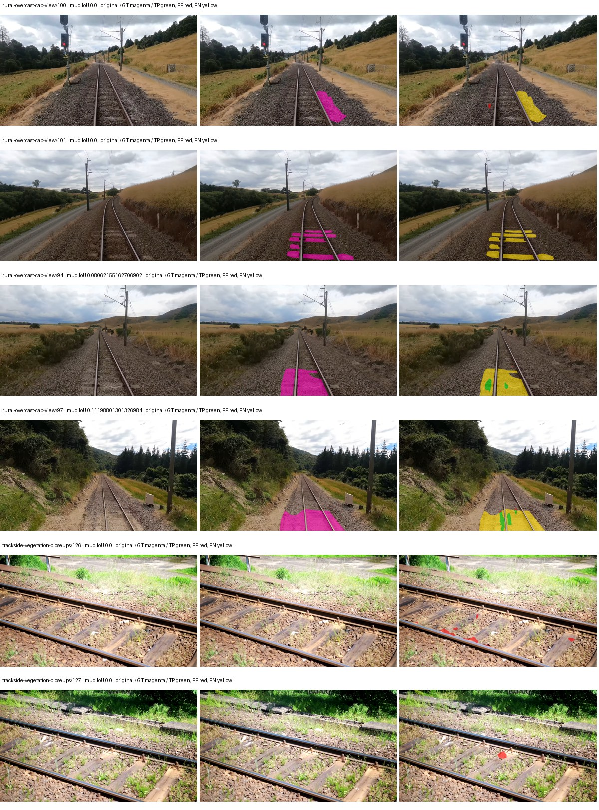
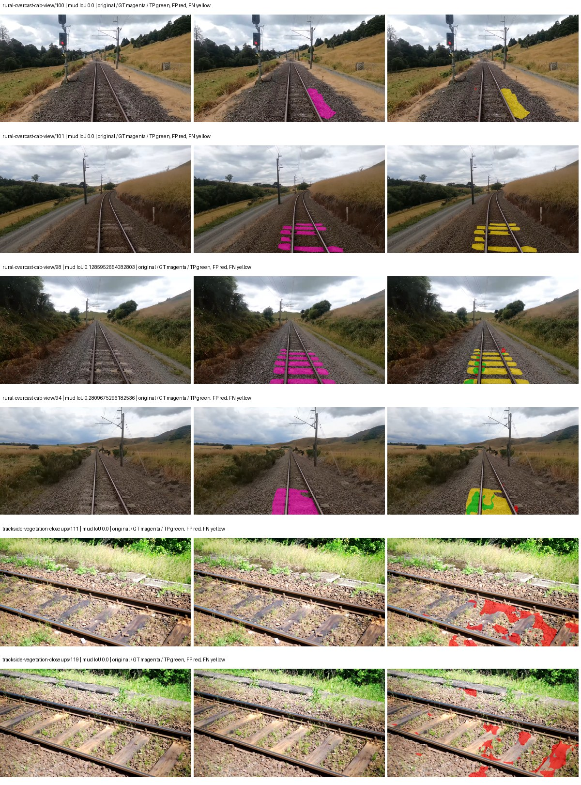
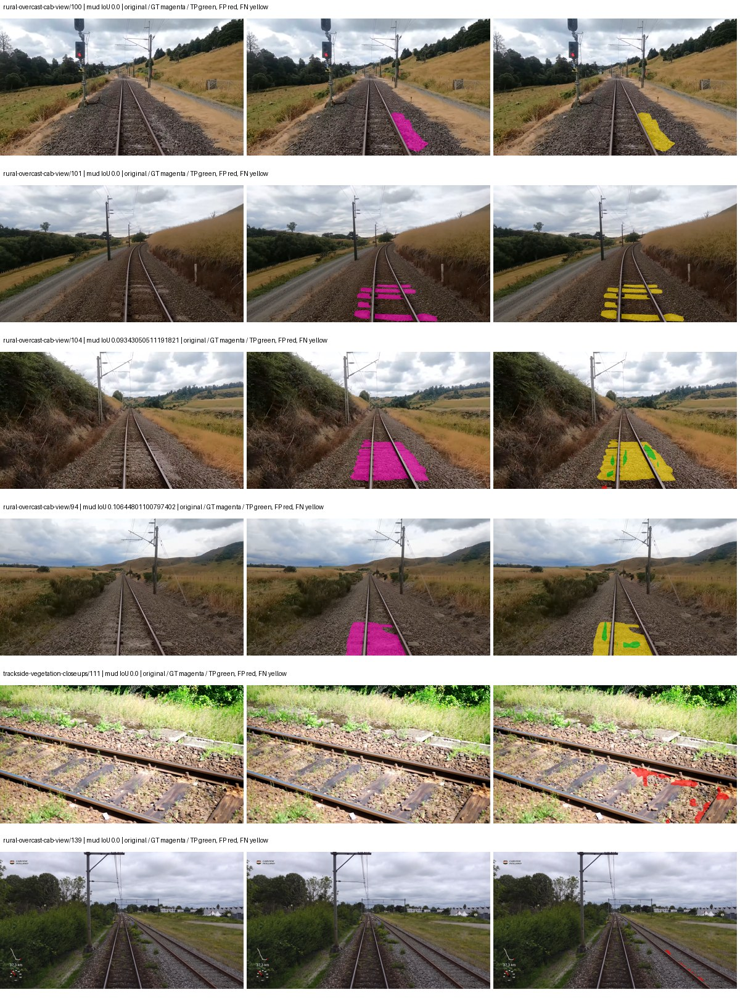
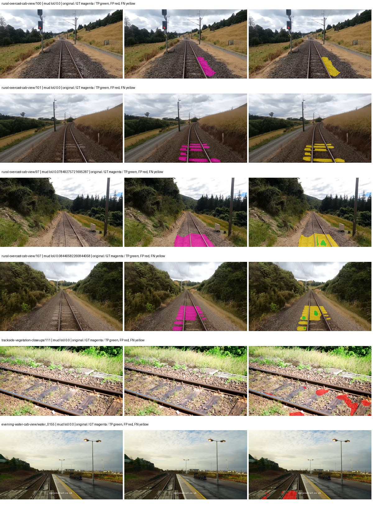

# native_resnet50_psp — paul-test-rtis_v2

[RTIS comparison](../../README.md) · [Full model records](record.json)

Primary selection and early stopping: **mud-pumping validation IoU**. A job is complete only after full statistics and isolated profiling are verified.

| Model | Initialization path | Seed | Status | Steps | Best step | Mud IoU (%) | Mud precision (%) | Mud recall (%) | Final mud IoU (trainer val, %) | mIoU (%) | Fixed GT-class mIoU (%) |
| --- | --- | --- | --- | --- | --- | --- | --- | --- | --- | --- | --- |
| native_resnet50_psp | rtis_only | 0 | completed | 2294 | 1019 | 2.19 | 37.66 | 2.27 | 0.42 | 27.52 | 30.57 |
| native_resnet50_psp | cityscapes_to_rtis | 0 | completed | 2294 | 1019 | 3.00 | 11.03 | 3.96 | 0.14 | 28.75 | 31.94 |
| native_resnet50_psp | railsem19_to_rtis | 0 | completed | 2803 | 1529 | 2.33 | 24.69 | 2.51 | 0.32 | 32.81 | 38.28 |
| native_resnet50_psp | cityscapes_to_railsem19_to_rtis | 0 | completed | 2294 | 1019 | 1.78 | 11.65 | 2.06 | 0.43 | 29.36 | 34.25 |

Training: 205 images. Validation: 37 images. Test: 50 held out. Seeds: [0]. Seed variation measures optimization variability, not independent-recording uncertainty. Historical source checkpoints stay fixed across adaptation seeds.

Training code: `066afb2626398b7be59d4d19f5a0e4644fd59adc`. Split SHA-256: `18a84c0163a65ded46508bcc904c374e5f33ad8a09b8879e3c8add606e86aa9f`.

## rtis_only — seed 0

Status: **completed**. Started: 2026-09-10T00:03:54.015291+00:00. Finished: 2026-09-10T00:36:10.614508+00:00.

Recipe pretrained initializer: `{"arch": "native", "backbone_path": null, "batch_norm_momentum": null, "checkpoint": null, "classifier_path": null, "drop_path": null, "encoder_name": null, "encoder_weights": null, "head": "unified_head", "head_paths": [], "inactive_parameter_paths": [], "local_files_only": false, "lora_alpha": 32, "lora_dropout": 0.05, "lora_r": 16, "lora_targets": [], "native": {"auxiliary_heads": [], "backbone": {"in_channels": 3, "kind": "timm", "name": "resnet50.a1_in1k", "out_indices": [1, 2, 3, 4], "weights": "pretrained"}, "head": {"activation": "relu", "channels": 256, "dropout": 0.1, "in_index": 3, "kind": "psp", "norm": "group", "pool_bins": [1, 2, 3, 6]}, "neck": {"kind": "identity"}, "task": "multiclass"}, "revision": null, "smp_arch": null, "subfolder": null, "trust_remote_code": false, "tuning": "full"}`.

`rtis_only` uses the recipe initializer, which may include pretrained segmentation components. Transfer paths load the exact historical source checkpoint below and reset the classifier; they do not reset all query/decoder features.

Source checkpoint: `Recipe pretrained initialization`.

Config SHA-256: `4805cf423104bb67ae389d68bfe83bd74130868ad08198d1e3b0320c9786c9c6`. Weights used for validation: `raw`.

### Mud-pumping and aggregate quality

| Metric | Selected checkpoint | Final training validation |
| --- | --- | --- |
| Mud IoU | 2.19 | 0.42 |
| Mud precision | 37.66 | 6.22 |
| Mud recall | 2.27 | 0.45 |
| Mud Dice/F1 | 4.29 | 0.85 |
| mIoU | 27.52 | 28.29 |
| Mean accuracy | 41.62 | 41.81 |
| Mean precision | 51.44 | 48.11 |
| Mean Dice | 36.40 | 38.25 |
| Mean specificity | 98.60 | 98.66 |
| Pixel accuracy | 75.91 | 80.05 |
| Frequency-weighted IoU | 66.83 | 68.49 |
| Fixed GT-present class mIoU | 30.57 | 31.43 |
| Boundary F1 | 34.72 | 36.08 |

The selected checkpoint has independent evaluation evidence. Final values are the trainer's final validation record, not a new independent evaluation. mIoU averages classes with nonzero union, so false positives on absent classes can change its denominator. The fixed GT-class mean is supplementary and excludes absent classes; their false positives remain in the confusion matrix.

### Resource usage and timing

| Measurement | Value |
| --- | --- |
| Peak training VRAM, retained training invocation (GiB) | 8.29 |
| Peak evaluation VRAM (GiB) | 6.75 |
| Retained training invocation wall time (seconds) | 1812.63 |
| Retained training invocation GPU-hours (one GPU) | 0.50 |
| Evaluation wall time (seconds) | 10.33 |
| Full evaluation pipeline images/second | 3.58 |
| Best full-state checkpoint (MiB) | 567.64 |
| Final full-state checkpoint (MiB) | 567.63 |
| Verified periodic checkpoints removed (GiB) | 2.22 |

VRAM uses the recorded allocator high-water mark; it is not total device usage including CUDA context. Resumed jobs' retained training invocation times and peaks are **not whole-campaign totals**. Earlier invocation resource records are not reconstructed here. Evaluation throughput includes loader, sliding-window inference and metrics; it is not model-only latency/FPS. Missing measurements are shown as —, never inferred from another dataset's run.

### Standardized inference performance

Dedicated model-only profiling waits for an idle worker-locked L40S: BF16, batch 1, 1024x1024, 20 warmup and 100 CUDA-event-timed public forwards. It excludes loading, preprocessing, tiling and metrics.

| Status | Parameters | Weight MiB | FPS | p50 ms | p95 ms | Peak reserved GiB |
| --- | --- | --- | --- | --- | --- | --- |
| complete | 37149525 | 141.71 | 211.12 | 4.50 | 6.43 | 0.52 |

```json
{
  "schema_version": 1,
  "model_id": "native_resnet50_psp",
  "measured_at": "2026-09-10T00:36:05+00:00",
  "status": "complete",
  "benchmark_scope": "rtis_selected_checkpoint_model_only",
  "applies_to": [
    "native_resnet50_psp--rtis_only--seed-0"
  ],
  "source": {
    "campaign_git_sha": "066afb2626398b7be59d4d19f5a0e4644fd59adc",
    "git_dirty": false,
    "config_hash": "c13f24ead113",
    "resolved_config": "/data/izadia1/projects/segmentary-runs/paul-test-rtis_v2/seed0-20260909/configs/native_resnet50_psp--rtis_only--seed-0.yaml",
    "config_sha256": "4805cf423104bb67ae389d68bfe83bd74130868ad08198d1e3b0320c9786c9c6",
    "checkpoint_sha256": "7b589489dce443bd7dedb99524dcb3d295d1d5d8fdfad833b01b7a3cc3b5ecf6",
    "checkpoint_global_step": 1019,
    "checkpoint_bytes": 595211622,
    "checkpoint_kind": "resume checkpoint with optimizer and EMA state",
    "weights": "raw",
    "measured_checkpoint_job_id": "native_resnet50_psp--rtis_only--seed-0",
    "result_sha256": "bb541ee1f8c7320b5b3f73ed0384e1320a3f333741517254961dd6d17c8b6edf",
    "result_git_sha": "066afb2626398b7be59d4d19f5a0e4644fd59adc",
    "result_stage": "eval:paul-test-rtis:val",
    "result_seed": 0
  },
  "hardware": {
    "gpu_name": "NVIDIA L40S",
    "gpu_uuid": "GPU-a5ad49e5-0536-5229-ba8a-f8a902808f53",
    "logical_device": "cuda:0",
    "physical_visibility_token": "7",
    "compute_capability": [
      8,
      9
    ],
    "total_memory_bytes": 47677177856
  },
  "model": {
    "parameter_count": 37149525,
    "trainable_parameter_count": 37149525,
    "resident_parameter_bytes": 148598100,
    "parameter_dtype_counts": {
      "float32": 37149525
    }
  },
  "contract": {
    "backend": "pytorch",
    "precision": "bf16_autocast",
    "batch_size": 1,
    "input_shape_nchw": [
      1,
      3,
      1024,
      1024
    ],
    "warmup_iterations": 20,
    "measured_iterations": 100,
    "timing": "per-forward CUDA events with end-event synchronization",
    "includes_preprocessing": false,
    "includes_data_loader": false,
    "includes_sliding_window": false,
    "input_resident_on_gpu": true,
    "model_only": true,
    "entrypoint": "public model(image) dense-logits forward"
  },
  "measurements": {
    "latency": {
      "p50_ms": 4.503040075302124,
      "p95_ms": 6.432409453392029,
      "mean_ms": 4.736542077064514,
      "minimum_ms": 4.477952003479004,
      "maximum_ms": 6.748159885406494,
      "fps": 211.12448358523883,
      "raw_ms": [
        4.536287784576416,
        4.494368076324463,
        4.487167835235596,
        4.523007869720459,
        4.490240097045898,
        4.4912638664245605,
        4.501503944396973,
        4.494336128234863,
        4.477952003479004,
        4.490240097045898,
        4.497407913208008,
        4.536320209503174,
        4.493311882019043,
        4.487167835235596,
        4.493311882019043,
        4.497407913208008,
        4.506624221801758,
        4.497407913208008,
        4.489215850830078,
        4.49945592880249,
        4.489215850830078,
        4.5004801750183105,
        4.493311882019043,
        4.496384143829346,
        4.493311882019043,
        4.494336128234863,
        4.493311882019043,
        4.503551959991455,
        4.501503944396973,
        4.4912638664245605,
        4.496352195739746,
        4.644864082336426,
        5.340159893035889,
        4.952064037322998,
        4.50764799118042,
        4.494336128234863,
        4.492288112640381,
        4.492288112640381,
        4.492288112640381,
        4.80460786819458,
        4.5055999755859375,
        4.513792037963867,
        4.497407913208008,
        4.493311882019043,
        4.497407913208008,
        4.497407913208008,
        4.696063995361328,
        5.148672103881836,
        5.015552043914795,
        4.511744022369385,
        4.497344017028809,
        4.503551959991455,
        4.495359897613525,
        4.498432159423828,
        4.501503944396973,
        4.661248207092285,
        4.581376075744629,
        4.538368225097656,
        4.49945592880249,
        4.50764799118042,
        4.5055999755859375,
        4.897791862487793,
        4.506624221801758,
        4.828159809112549,
        5.111807823181152,
        4.909056186676025,
        4.877312183380127,
        5.3094401359558105,
        4.828159809112549,
        4.501503944396973,
        4.503551959991455,
        4.49945592880249,
        4.494336128234863,
        4.49945592880249,
        4.498432159423828,
        4.495359897613525,
        4.496384143829346,
        4.51584005355835,
        4.5004801750183105,
        4.5004801750183105,
        4.497407913208008,
        4.814847946166992,
        5.496831893920898,
        6.43071985244751,
        6.464511871337891,
        6.4931840896606445,
        6.509568214416504,
        6.547455787658691,
        6.748159885406494,
        5.414912223815918,
        4.803584098815918,
        4.857855796813965,
        4.791296005249023,
        4.6387200355529785,
        4.825088024139404,
        4.5055999755859375,
        4.502528190612793,
        4.554751873016357,
        5.083168029785156,
        5.075967788696289
      ],
      "percentile_method": "numpy linear interpolation"
    },
    "peak_reserved_bytes": 557842432,
    "memory_kind": "pytorch_cuda_allocator_peak_reserved_excluding_context",
    "benchmark_wall_clock_s": 11.626205671578646
  },
  "started_at": "2026-09-10T00:35:54+00:00",
  "finished_at": "2026-09-10T00:36:05+00:00",
  "environment": {
    "hostname": "hdrfs-app-001",
    "python": "3.11.15",
    "platform": "Linux-5.15.0-139-generic-x86_64-with-glibc2.35",
    "torch": "2.11.0+cu128",
    "torch_cuda": "12.8",
    "cudnn": 91900,
    "driver_version": "570.133.20",
    "cuda_available": true,
    "gpu_count": 1,
    "gpu_names": [
      "NVIDIA L40S"
    ],
    "cuda_visible_devices": "7",
    "packages": {
      "segmentary": "0.1.0",
      "torch": "2.11.0+cu128",
      "torchvision": "0.26.0+cu128",
      "transformers": "5.15.0",
      "timm": "1.0.28",
      "segmentation-models-pytorch": "0.5.0",
      "albumentations": "2.0.8",
      "lightning": "2.6.5",
      "numpy": "2.4.4"
    }
  }
}
```

### Per-class validation results

| Class | GT pixels | IoU (%) | Precision (%) | Recall (%) | Dice (%) | Boundary F1 (%) |
| --- | --- | --- | --- | --- | --- | --- |
| car | 29664 | 3.38 | 17.19 | 4.04 | 6.54 | 11.18 |
| construction | 311585 | 12.60 | 13.30 | 70.37 | 22.38 | 35.99 |
| fence | 265137 | 9.48 | 50.76 | 10.44 | 17.31 | 24.78 |
| mud-pumping | 1226250 | 2.19 | 37.66 | 2.27 | 4.29 | 5.98 |
| on-rails | 0 | 0.00 | 0.00 | — | 0.00 | 0.00 |
| person | 0 | — | — | — | — | — |
| pole | 628038 | 41.96 | 80.26 | 46.79 | 59.12 | 60.12 |
| rail-embedded | 16799 | 3.80 | 74.42 | 3.85 | 7.31 | 14.04 |
| rail-raised | 2969797 | 64.86 | 70.25 | 89.41 | 78.68 | 85.79 |
| rail-track | 6323197 | 36.83 | 67.74 | 44.66 | 53.83 | 51.08 |
| road | 1048831 | 16.29 | 22.39 | 37.41 | 28.02 | 15.73 |
| sidewalk | 1297367 | 15.71 | 81.60 | 16.29 | 27.16 | 21.77 |
| sky | 19121606 | 93.01 | 98.52 | 94.33 | 96.38 | 84.78 |
| standing-water | 95802 | 0.55 | 0.56 | 30.42 | 1.10 | 4.75 |
| terrain | 39239306 | 75.75 | 87.60 | 84.85 | 86.20 | 56.47 |
| trackbed | 10643081 | 46.13 | 60.38 | 66.15 | 63.13 | 49.50 |
| traffic-light | 19510 | 66.74 | 84.51 | 76.03 | 80.05 | 77.22 |
| traffic-sign | 13285 | 15.36 | 51.03 | 18.02 | 26.64 | 31.14 |
| tram-track | 56179 | 8.58 | 62.00 | 9.06 | 15.80 | 13.30 |
| truck | 0 | 0.00 | 0.00 | — | 0.00 | 0.00 |
| vegetation-overgrowth | 5901821 | 37.12 | 68.60 | 44.73 | 54.15 | 50.75 |

### Full-run accounting

| Measurement | Value |
| --- | --- |
| Full GPU-reserved wall seconds, all recorded worker attempts | 1936.61 |
| Full reserved GPU-hours | 0.54 |
| Whole-run timing complete | True |

| Phase | Wall seconds including failed attempts |
| --- | --- |
| training | 1818.97 |
| diagnostics | 75.98 |
| performance | 19.64 |

GPU-reserved time includes model loading, training, validation, collection, profiling, checkpoint I/O and orchestration while the worker owns one GPU. It is not GPU kernel-active time. Phase timings and sampled device memory/power/utilization are retained separately; sampled device memory is not the allocator high-water mark.

### Train/validation and raw/EMA diagnostics

| Checkpoint / weights / split | Images | Mud IoU (%) | Mud precision (%) | Mud recall (%) |
| --- | --- | --- | --- | --- |
| best-auto-train / raw | 205 | 90.01 | 95.70 | 93.81 |
| best-auto-val / raw | 37 | 2.19 | 37.66 | 2.27 |
| best-alternate-val / ema | 37 | 1.87 | 41.02 | 1.92 |
| final-auto-val / raw | 37 | 0.43 | 6.26 | 0.46 |

Train uses the evaluation transform without augmentation. Compare mud train/validation metrics for the same selected weights. Alternate EMA on running-stat BatchNorm is explicitly uncalibrated and is diagnostic only. Score-threshold curves use uncalibrated normalized scores and are pixel-level diagnostics, not event detection rates or a selected deployment operating point.

### Downloadable evidence

- best-auto-train: [per-image.csv](rtis_only--seed-0/best-auto-train/per-image.csv) · [per-image-confusion.json.gz](rtis_only--seed-0/best-auto-train/per-image-confusion.json.gz) · [groups.json](rtis_only--seed-0/best-auto-train/groups.json) · [mud-score-curves.json](rtis_only--seed-0/best-auto-train/mud-score-curves.json)
- best-auto-val: [per-image.csv](rtis_only--seed-0/best-auto-val/per-image.csv) · [per-image-confusion.json.gz](rtis_only--seed-0/best-auto-val/per-image-confusion.json.gz) · [groups.json](rtis_only--seed-0/best-auto-val/groups.json) · [mud-score-curves.json](rtis_only--seed-0/best-auto-val/mud-score-curves.json) · [examples.jpg](rtis_only--seed-0/best-auto-val/examples.jpg)
- best-alternate-val: [per-image.csv](rtis_only--seed-0/best-alternate-val/per-image.csv) · [per-image-confusion.json.gz](rtis_only--seed-0/best-alternate-val/per-image-confusion.json.gz) · [groups.json](rtis_only--seed-0/best-alternate-val/groups.json) · [mud-score-curves.json](rtis_only--seed-0/best-alternate-val/mud-score-curves.json)
- final-auto-val: [per-image.csv](rtis_only--seed-0/final-auto-val/per-image.csv) · [per-image-confusion.json.gz](rtis_only--seed-0/final-auto-val/per-image-confusion.json.gz) · [groups.json](rtis_only--seed-0/final-auto-val/groups.json) · [mud-score-curves.json](rtis_only--seed-0/final-auto-val/mud-score-curves.json)
- resources: [telemetry.csv](rtis_only--seed-0/resources/telemetry.csv)



Examples are two lowest and two highest mud-IoU positive images, plus up to two negative images with the most false-positive mud pixels. They are targeted diagnostic examples, not random samples. Green: true positive; red: false positive; yellow: false negative. Full predictions remain on HDRFS.

### Validation tracking

| Logged step | Overall mIoU (%) | Mud IoU (%) |
| --- | --- | --- |
| 254 | 16.28 | 0.20 |
| 509 | 19.76 | 0.00 |
| 764 | 26.36 | 0.01 |
| 1019 | 27.53 | 2.19 |
| 1274 | 29.25 | 0.55 |
| 1529 | 26.66 | 0.46 |
| 1784 | 27.82 | 0.34 |
| 2038 | 27.29 | 0.89 |
| 2293 | 28.29 | 0.42 |

All retained scalar curves, including training loss and per-class IoU, are in record.json. Observed best mud on a curve is not necessarily a retained checkpoint: the pilot saved its selection-metric-best and final checkpoints. Step logging and checkpoint global_step may differ by one.

### Stopping and checkpoint provenance

```json
{
  "stopping": {
    "actual_steps": 2294,
    "maximum_steps": 4000,
    "min_delta": 0.001,
    "monitor": "val_iou/mud-pumping",
    "patience": 5,
    "reason": "validation_plateau"
  },
  "checkpoints": {
    "best": {
      "path": "/data/izadia1/projects/segmentary-runs/paul-test-rtis_v2/seed0-20260909/future-runs/native_resnet50_psp--rtis_only--seed-0_seed0/rtis/best.ckpt",
      "sha256": "7b589489dce443bd7dedb99524dcb3d295d1d5d8fdfad833b01b7a3cc3b5ecf6",
      "global_step": 1019,
      "bytes": 595211622
    },
    "final": {
      "path": "/data/izadia1/projects/segmentary-runs/paul-test-rtis_v2/seed0-20260909/future-runs/native_resnet50_psp--rtis_only--seed-0_seed0/rtis/last.ckpt",
      "sha256": "da18f72546e7ff6809a423e9fc282e4f7bd15e41257f6d834e27097b2ae270ef",
      "global_step": 2294,
      "bytes": 595200614
    }
  },
  "cleanup_error": null
}
```

### Resolved training, initialization and evaluation settings

The optimizer block is the base configuration. Stage LR scales are applied at runtime, and stage warmup is capped at min(base warmup, floor(stage budget / 10), stage budget - 1): 400 steps for this 4,000-step pilot. Model-internal native input grids may differ from augmentation crops (EoMT uses its 640 grid).

```json
{
  "name": "native_resnet50_psp--rtis_only--seed-0",
  "model": {
    "arch": "native",
    "checkpoint": null,
    "tuning": "full",
    "head": "unified_head",
    "lora_r": 16,
    "lora_alpha": 32,
    "lora_dropout": 0.05,
    "lora_targets": [],
    "drop_path": null,
    "revision": null,
    "subfolder": null,
    "local_files_only": false,
    "trust_remote_code": false,
    "backbone_path": null,
    "head_paths": [],
    "classifier_path": null,
    "inactive_parameter_paths": [],
    "smp_arch": null,
    "encoder_name": null,
    "encoder_weights": null,
    "native": {
      "task": "multiclass",
      "backbone": {
        "kind": "timm",
        "name": "resnet50.a1_in1k",
        "weights": "pretrained",
        "out_indices": [
          1,
          2,
          3,
          4
        ],
        "in_channels": 3
      },
      "neck": {
        "kind": "identity"
      },
      "head": {
        "kind": "psp",
        "in_index": 3,
        "channels": 256,
        "pool_bins": [
          1,
          2,
          3,
          6
        ],
        "dropout": 0.1,
        "norm": "group",
        "activation": "relu"
      },
      "auxiliary_heads": []
    },
    "batch_norm_momentum": null
  },
  "space": "paul-test-rtis",
  "taxonomy_root": "/data/izadia1/projects/segmentary-rtis-fullstats-066afb2/taxonomy",
  "output_root": "/data/izadia1/projects/segmentary-runs/paul-test-rtis_v2/seed0-20260909/future-runs",
  "optim": {
    "backbone_lr": 0.0001,
    "head_lr_mult": 10.0,
    "weight_decay": 0.05,
    "llrd": 1.0,
    "warmup_iters": 1500,
    "warmup_ratio": 1e-06,
    "poly_power": 0.9,
    "min_lr_ratio": 0.0,
    "betas": [
      0.9,
      0.999
    ],
    "grad_clip": 1.0
  },
  "train": {
    "iters": 4000,
    "batch_size": 2,
    "accum": 8,
    "num_workers": 2,
    "precision": "bf16-mixed",
    "ema_decay": 0.9998,
    "val_every": 250,
    "ckpt_every": 500,
    "selection_metric": "val_iou/mud-pumping",
    "early_stopping_patience": 5,
    "early_stopping_min_delta": 0.001,
    "seed": 0,
    "devices": 1
  },
  "eval": {
    "sliding_window": true,
    "window": [
      1024,
      1024
    ],
    "stride": [
      768,
      768
    ],
    "batch_size": 1,
    "num_workers": 2,
    "tta_scales": [],
    "tta_flip": false,
    "threshold": 0.5,
    "boundary_tolerance_frac": 0.0075,
    "save_confusion": true
  },
  "loss": {
    "task": "multiclass",
    "activation": "auto",
    "terms": [],
    "aux": "none",
    "aux_weight": 0.0,
    "ce_weight": 1.0,
    "label_smoothing": 0.0,
    "class_weights": null,
    "query": null
  },
  "aug": {
    "crop": [
      1024,
      1024
    ],
    "scale_min": 0.5,
    "scale_max": 2.0,
    "hflip_p": 0.5,
    "color_jitter_p": 0.5,
    "brightness": 0.25,
    "contrast": 0.25,
    "saturation": 0.25,
    "hue": 0.05
  },
  "stages": [
    {
      "name": "rtis",
      "data": [
        {
          "name": "paul-test-rtis",
          "root": "/data/izadia1/datasets/paul-test-rtis_v2",
          "variant": null,
          "split_file": "splits.json",
          "train_split": "train",
          "val_split": "val",
          "limit": null,
          "loader": "folder",
          "mapping": "paul-test-rtis",
          "loader_options": {
            "require_groups": true
          }
        }
      ],
      "iters": null,
      "lr_scale": 1.0,
      "head_group_lr_scale": 1.0,
      "init_from": "pretrained",
      "reset_head": false,
      "freeze": null,
      "sample_weights": null
    }
  ]
}
```

### Hardware and software provenance

```json
{
  "training": {
    "cuda_available": true,
    "cuda_visible_devices": "7",
    "cudnn": 91900,
    "driver_version": "570.133.20",
    "gpu_count": 1,
    "gpu_names": [
      "NVIDIA L40S"
    ],
    "hostname": "hdrfs-app-001",
    "input_normalization": {
      "channel_order": "rgb",
      "mean": [
        0.485,
        0.456,
        0.406
      ],
      "source": "timm_pretrained_cfg",
      "std": [
        0.229,
        0.224,
        0.225
      ]
    },
    "model_origins": [
      {
        "hf_commit": null,
        "hf_name_or_path": null,
        "module": "backbone",
        "timm_pretrained": {
          "architecture": "resnet50",
          "hf_hub_id": "timm/resnet50.a1_in1k",
          "tag": "a1_in1k",
          "url": "https://github.com/rwightman/pytorch-image-models/releases/download/v0.1-rsb-weights/resnet50_a1_0-14fe96d1.pth"
        }
      },
      {
        "hf_commit": null,
        "hf_name_or_path": null,
        "module": "backbone.model",
        "timm_pretrained": {
          "architecture": "resnet50",
          "hf_hub_id": "timm/resnet50.a1_in1k",
          "tag": "a1_in1k",
          "url": "https://github.com/rwightman/pytorch-image-models/releases/download/v0.1-rsb-weights/resnet50_a1_0-14fe96d1.pth"
        }
      }
    ],
    "model_parameter_count": 37149525,
    "packages": {
      "albumentations": "2.0.8",
      "lightning": "2.6.5",
      "numpy": "2.4.4",
      "segmentary": "0.1.0",
      "segmentation-models-pytorch": "0.5.0",
      "timm": "1.0.28",
      "torch": "2.11.0+cu128",
      "torchvision": "0.26.0+cu128",
      "transformers": "5.15.0"
    },
    "platform": "Linux-5.15.0-139-generic-x86_64-with-glibc2.35",
    "python": "3.11.15",
    "torch": "2.11.0+cu128",
    "torch_cuda": "12.8",
    "trainable_parameter_count": 37149525,
    "training_stop": {
      "actual_steps": 2294,
      "maximum_steps": 4000,
      "min_delta": 0.001,
      "monitor": "val_iou/mud-pumping",
      "patience": 5,
      "reason": "validation_plateau"
    },
    "validation_weights": "raw"
  },
  "evaluation": {
    "cuda_available": true,
    "cuda_visible_devices": "7",
    "cudnn": 91900,
    "driver_version": "570.133.20",
    "gpu_count": 1,
    "gpu_names": [
      "NVIDIA L40S"
    ],
    "hostname": "hdrfs-app-001",
    "input_normalization": {
      "channel_order": "rgb",
      "mean": [
        0.485,
        0.456,
        0.406
      ],
      "source": "timm_pretrained_cfg",
      "std": [
        0.229,
        0.224,
        0.225
      ]
    },
    "packages": {
      "albumentations": "2.0.8",
      "lightning": "2.6.5",
      "numpy": "2.4.4",
      "segmentary": "0.1.0",
      "segmentation-models-pytorch": "0.5.0",
      "timm": "1.0.28",
      "torch": "2.11.0+cu128",
      "torchvision": "0.26.0+cu128",
      "transformers": "5.15.0"
    },
    "platform": "Linux-5.15.0-139-generic-x86_64-with-glibc2.35",
    "python": "3.11.15",
    "torch": "2.11.0+cu128",
    "torch_cuda": "12.8"
  }
}
```

## cityscapes_to_rtis — seed 0

Status: **completed**. Started: 2026-09-10T00:05:24.993894+00:00. Finished: 2026-09-10T00:38:01.840457+00:00.

Recipe pretrained initializer: `{"arch": "native", "backbone_path": null, "batch_norm_momentum": null, "checkpoint": null, "classifier_path": null, "drop_path": null, "encoder_name": null, "encoder_weights": null, "head": "unified_head", "head_paths": [], "inactive_parameter_paths": [], "local_files_only": false, "lora_alpha": 32, "lora_dropout": 0.05, "lora_r": 16, "lora_targets": [], "native": {"auxiliary_heads": [], "backbone": {"in_channels": 3, "kind": "timm", "name": "resnet50.a1_in1k", "out_indices": [1, 2, 3, 4], "weights": "pretrained"}, "head": {"activation": "relu", "channels": 256, "dropout": 0.1, "in_index": 3, "kind": "psp", "norm": "group", "pool_bins": [1, 2, 3, 6]}, "neck": {"kind": "identity"}, "task": "multiclass"}, "revision": null, "smp_arch": null, "subfolder": null, "trust_remote_code": false, "tuning": "full"}`.

`rtis_only` uses the recipe initializer, which may include pretrained segmentation components. Transfer paths load the exact historical source checkpoint below and reset the classifier; they do not reset all query/decoder features.

Source checkpoint: `{'name': 'native_resnet50_psp--cityscapes--seed-0', 'model': 'native_resnet50_psp', 'protocol': 'cityscapes', 'config': '/data/izadia1/projects/segmentary-runs/all-model-city-rail-seed0-rail20-b9eb3e1/accepted/native_resnet50_psp--cityscapes--seed-0/resolved-config.yaml', 'checkpoint': '/data/izadia1/projects/segmentary-runs/current-main-fill-v2/jobs/native_resnet50_psp--cityscapes--seed-0/train/native_resnet50_psp--cityscapes_seed0/cityscapes/last.ckpt', 'recorded_sha256': '6665b49eff29d8d237a96290622adf375a75c2b114302bead67307bfd988fef5', 'exists': True}`.

Config SHA-256: `d2a97e695950efbd146ae221f221091ccba2f5a6a58d17e8bceb507890a74ae5`. Weights used for validation: `raw`.

### Mud-pumping and aggregate quality

| Metric | Selected checkpoint | Final training validation |
| --- | --- | --- |
| Mud IoU | 3.00 | 0.14 |
| Mud precision | 11.03 | 0.42 |
| Mud recall | 3.96 | 0.21 |
| Mud Dice/F1 | 5.83 | 0.28 |
| mIoU | 28.75 | 28.69 |
| Mean accuracy | 40.96 | 41.11 |
| Mean precision | 50.07 | 55.52 |
| Mean Dice | 37.60 | 38.16 |
| Mean specificity | 98.48 | 98.52 |
| Pixel accuracy | 77.18 | 78.28 |
| Frequency-weighted IoU | 65.41 | 65.81 |
| Fixed GT-present class mIoU | 31.94 | 33.48 |
| Boundary F1 | 34.41 | 35.49 |

The selected checkpoint has independent evaluation evidence. Final values are the trainer's final validation record, not a new independent evaluation. mIoU averages classes with nonzero union, so false positives on absent classes can change its denominator. The fixed GT-class mean is supplementary and excludes absent classes; their false positives remain in the confusion matrix.

### Resource usage and timing

| Measurement | Value |
| --- | --- |
| Peak training VRAM, retained training invocation (GiB) | 8.29 |
| Peak evaluation VRAM (GiB) | 6.75 |
| Retained training invocation wall time (seconds) | 1829.82 |
| Retained training invocation GPU-hours (one GPU) | 0.51 |
| Evaluation wall time (seconds) | 10.53 |
| Full evaluation pipeline images/second | 3.52 |
| Best full-state checkpoint (MiB) | 567.64 |
| Final full-state checkpoint (MiB) | 567.63 |
| Verified periodic checkpoints removed (GiB) | 2.22 |

VRAM uses the recorded allocator high-water mark; it is not total device usage including CUDA context. Resumed jobs' retained training invocation times and peaks are **not whole-campaign totals**. Earlier invocation resource records are not reconstructed here. Evaluation throughput includes loader, sliding-window inference and metrics; it is not model-only latency/FPS. Missing measurements are shown as —, never inferred from another dataset's run.

### Standardized inference performance

Dedicated model-only profiling waits for an idle worker-locked L40S: BF16, batch 1, 1024x1024, 20 warmup and 100 CUDA-event-timed public forwards. It excludes loading, preprocessing, tiling and metrics.

| Status | Parameters | Weight MiB | FPS | p50 ms | p95 ms | Peak reserved GiB |
| --- | --- | --- | --- | --- | --- | --- |
| complete | 37149525 | 141.71 | 212.54 | 4.66 | 4.92 | 0.52 |

```json
{
  "schema_version": 1,
  "model_id": "native_resnet50_psp",
  "measured_at": "2026-09-10T00:37:56+00:00",
  "status": "complete",
  "benchmark_scope": "rtis_selected_checkpoint_model_only",
  "applies_to": [
    "native_resnet50_psp--cityscapes_to_rtis--seed-0"
  ],
  "source": {
    "campaign_git_sha": "066afb2626398b7be59d4d19f5a0e4644fd59adc",
    "git_dirty": false,
    "config_hash": "6208e961708b",
    "resolved_config": "/data/izadia1/projects/segmentary-runs/paul-test-rtis_v2/seed0-20260909/configs/native_resnet50_psp--cityscapes_to_rtis--seed-0.yaml",
    "config_sha256": "d2a97e695950efbd146ae221f221091ccba2f5a6a58d17e8bceb507890a74ae5",
    "checkpoint_sha256": "b5ee3607ce243951546d149936f3ca73039f82bf805bdbfb833847632dd78619",
    "checkpoint_global_step": 1019,
    "checkpoint_bytes": 595211686,
    "checkpoint_kind": "resume checkpoint with optimizer and EMA state",
    "weights": "raw",
    "measured_checkpoint_job_id": "native_resnet50_psp--cityscapes_to_rtis--seed-0",
    "result_sha256": "d8c05bd2aba3482abfe1787b22a6cba096264aaa618b66053f00785fd97f4852",
    "result_git_sha": "066afb2626398b7be59d4d19f5a0e4644fd59adc",
    "result_stage": "eval:paul-test-rtis:val",
    "result_seed": 0
  },
  "hardware": {
    "gpu_name": "NVIDIA L40S",
    "gpu_uuid": "GPU-804aea8b-5f62-423e-72c6-49e1ed15c4e4",
    "logical_device": "cuda:0",
    "physical_visibility_token": "6",
    "compute_capability": [
      8,
      9
    ],
    "total_memory_bytes": 47677177856
  },
  "model": {
    "parameter_count": 37149525,
    "trainable_parameter_count": 37149525,
    "resident_parameter_bytes": 148598100,
    "parameter_dtype_counts": {
      "float32": 37149525
    }
  },
  "contract": {
    "backend": "pytorch",
    "precision": "bf16_autocast",
    "batch_size": 1,
    "input_shape_nchw": [
      1,
      3,
      1024,
      1024
    ],
    "warmup_iterations": 20,
    "measured_iterations": 100,
    "timing": "per-forward CUDA events with end-event synchronization",
    "includes_preprocessing": false,
    "includes_data_loader": false,
    "includes_sliding_window": false,
    "input_resident_on_gpu": true,
    "model_only": true,
    "entrypoint": "public model(image) dense-logits forward"
  },
  "measurements": {
    "latency": {
      "p50_ms": 4.66431999206543,
      "p95_ms": 4.915507411956787,
      "mean_ms": 4.7050342893600465,
      "minimum_ms": 4.651008129119873,
      "maximum_ms": 5.178368091583252,
      "fps": 212.53830227367263,
      "raw_ms": [
        4.857855796813965,
        4.892672061920166,
        4.66534423828125,
        4.659200191497803,
        4.659200191497803,
        4.655104160308838,
        4.670464038848877,
        4.662271976470947,
        4.660223960876465,
        5.11897611618042,
        4.670464038848877,
        4.651008129119873,
        4.684800148010254,
        4.915200233459473,
        4.660223960876465,
        4.65718412399292,
        4.658175945281982,
        4.658175945281982,
        4.666368007659912,
        4.6561279296875,
        4.666368007659912,
        4.6561279296875,
        4.66431999206543,
        4.658175945281982,
        4.66534423828125,
        4.662271976470947,
        4.6684160232543945,
        4.652031898498535,
        4.660223960876465,
        4.654047966003418,
        4.663296222686768,
        4.729856014251709,
        4.6561279296875,
        4.659200191497803,
        4.683775901794434,
        4.6684160232543945,
        4.666368007659912,
        4.658175945281982,
        5.136384010314941,
        4.828159809112549,
        4.670464038848877,
        4.80460786819458,
        5.178368091583252,
        4.659200191497803,
        4.663296222686768,
        4.674560070037842,
        4.663296222686768,
        4.661248207092285,
        4.659200191497803,
        4.6561279296875,
        4.799488067626953,
        4.66431999206543,
        4.666368007659912,
        4.758528232574463,
        4.660223960876465,
        4.9264960289001465,
        4.658175945281982,
        4.659200191497803,
        4.659200191497803,
        4.662271976470947,
        4.66534423828125,
        4.65715217590332,
        4.663296222686768,
        4.678656101226807,
        4.921343803405762,
        4.659200191497803,
        4.661248207092285,
        4.783103942871094,
        4.661248207092285,
        4.659200191497803,
        4.816895961761475,
        4.660223960876465,
        4.662271976470947,
        4.66534423828125,
        4.659200191497803,
        4.6684160232543945,
        4.666368007659912,
        4.663296222686768,
        4.671487808227539,
        4.666368007659912,
        4.704256057739258,
        4.816895961761475,
        4.6684160232543945,
        4.685823917388916,
        4.822015762329102,
        4.66326379776001,
        4.659200191497803,
        4.663296222686768,
        4.6684160232543945,
        4.66534423828125,
        4.666368007659912,
        4.667391777038574,
        4.6561279296875,
        4.7267842292785645,
        4.79641580581665,
        4.65715217590332,
        4.662271976470947,
        4.66534423828125,
        4.777984142303467,
        4.660223960876465
      ],
      "percentile_method": "numpy linear interpolation"
    },
    "peak_reserved_bytes": 557842432,
    "memory_kind": "pytorch_cuda_allocator_peak_reserved_excluding_context",
    "benchmark_wall_clock_s": 12.045467294752598
  },
  "started_at": "2026-09-10T00:37:44+00:00",
  "finished_at": "2026-09-10T00:37:56+00:00",
  "environment": {
    "hostname": "hdrfs-app-001",
    "python": "3.11.15",
    "platform": "Linux-5.15.0-139-generic-x86_64-with-glibc2.35",
    "torch": "2.11.0+cu128",
    "torch_cuda": "12.8",
    "cudnn": 91900,
    "driver_version": "570.133.20",
    "cuda_available": true,
    "gpu_count": 1,
    "gpu_names": [
      "NVIDIA L40S"
    ],
    "cuda_visible_devices": "6",
    "packages": {
      "segmentary": "0.1.0",
      "torch": "2.11.0+cu128",
      "torchvision": "0.26.0+cu128",
      "transformers": "5.15.0",
      "timm": "1.0.28",
      "segmentation-models-pytorch": "0.5.0",
      "albumentations": "2.0.8",
      "lightning": "2.6.5",
      "numpy": "2.4.4"
    }
  }
}
```

### Per-class validation results

| Class | GT pixels | IoU (%) | Precision (%) | Recall (%) | Dice (%) | Boundary F1 (%) |
| --- | --- | --- | --- | --- | --- | --- |
| car | 29664 | 56.54 | 84.22 | 63.23 | 72.23 | 56.78 |
| construction | 311585 | 9.70 | 10.16 | 68.14 | 17.68 | 16.07 |
| fence | 265137 | 18.62 | 49.06 | 23.08 | 31.39 | 35.41 |
| mud-pumping | 1226250 | 3.00 | 11.03 | 3.96 | 5.83 | 8.92 |
| on-rails | 0 | 0.00 | 0.00 | — | 0.00 | 0.00 |
| person | 0 | — | — | — | — | — |
| pole | 628038 | 48.23 | 77.86 | 55.90 | 65.07 | 73.81 |
| rail-embedded | 16799 | 1.06 | 84.36 | 1.06 | 2.09 | 3.49 |
| rail-raised | 2969797 | 58.00 | 68.50 | 79.09 | 73.42 | 81.25 |
| rail-track | 6323197 | 31.29 | 59.92 | 39.57 | 47.66 | 41.41 |
| road | 1048831 | 3.43 | 14.52 | 4.30 | 6.64 | 8.29 |
| sidewalk | 1297367 | 25.70 | 68.69 | 29.11 | 40.89 | 8.29 |
| sky | 19121606 | 94.42 | 98.86 | 95.46 | 97.13 | 86.01 |
| standing-water | 95802 | 0.36 | 0.39 | 5.93 | 0.73 | 4.03 |
| terrain | 39239306 | 75.95 | 79.82 | 94.01 | 86.33 | 50.63 |
| trackbed | 10643081 | 50.24 | 67.31 | 66.46 | 66.88 | 53.13 |
| traffic-light | 19510 | 58.97 | 90.44 | 62.89 | 74.19 | 71.49 |
| traffic-sign | 13285 | 28.84 | 65.33 | 34.05 | 44.77 | 50.18 |
| tram-track | 56179 | 0.00 | 0.00 | 0.00 | 0.00 | 0.00 |
| truck | 0 | 0.00 | 0.00 | — | 0.00 | 0.00 |
| vegetation-overgrowth | 5901821 | 10.56 | 70.94 | 11.04 | 19.10 | 38.99 |

### Full-run accounting

| Measurement | Value |
| --- | --- |
| Full GPU-reserved wall seconds, all recorded worker attempts | 1957.28 |
| Full reserved GPU-hours | 0.54 |
| Whole-run timing complete | True |

| Phase | Wall seconds including failed attempts |
| --- | --- |
| training | 1837.41 |
| diagnostics | 77.06 |
| performance | 19.76 |

GPU-reserved time includes model loading, training, validation, collection, profiling, checkpoint I/O and orchestration while the worker owns one GPU. It is not GPU kernel-active time. Phase timings and sampled device memory/power/utilization are retained separately; sampled device memory is not the allocator high-water mark.

### Train/validation and raw/EMA diagnostics

| Checkpoint / weights / split | Images | Mud IoU (%) | Mud precision (%) | Mud recall (%) |
| --- | --- | --- | --- | --- |
| best-auto-train / raw | 205 | 90.61 | 96.80 | 93.41 |
| best-auto-val / raw | 37 | 3.00 | 11.03 | 3.96 |
| best-alternate-val / ema | 37 | 0.47 | 0.98 | 0.91 |
| final-auto-val / raw | 37 | 0.14 | 0.42 | 0.21 |

Train uses the evaluation transform without augmentation. Compare mud train/validation metrics for the same selected weights. Alternate EMA on running-stat BatchNorm is explicitly uncalibrated and is diagnostic only. Score-threshold curves use uncalibrated normalized scores and are pixel-level diagnostics, not event detection rates or a selected deployment operating point.

### Downloadable evidence

- best-auto-train: [per-image.csv](cityscapes_to_rtis--seed-0/best-auto-train/per-image.csv) · [per-image-confusion.json.gz](cityscapes_to_rtis--seed-0/best-auto-train/per-image-confusion.json.gz) · [groups.json](cityscapes_to_rtis--seed-0/best-auto-train/groups.json) · [mud-score-curves.json](cityscapes_to_rtis--seed-0/best-auto-train/mud-score-curves.json)
- best-auto-val: [per-image.csv](cityscapes_to_rtis--seed-0/best-auto-val/per-image.csv) · [per-image-confusion.json.gz](cityscapes_to_rtis--seed-0/best-auto-val/per-image-confusion.json.gz) · [groups.json](cityscapes_to_rtis--seed-0/best-auto-val/groups.json) · [mud-score-curves.json](cityscapes_to_rtis--seed-0/best-auto-val/mud-score-curves.json) · [examples.jpg](cityscapes_to_rtis--seed-0/best-auto-val/examples.jpg)
- best-alternate-val: [per-image.csv](cityscapes_to_rtis--seed-0/best-alternate-val/per-image.csv) · [per-image-confusion.json.gz](cityscapes_to_rtis--seed-0/best-alternate-val/per-image-confusion.json.gz) · [groups.json](cityscapes_to_rtis--seed-0/best-alternate-val/groups.json) · [mud-score-curves.json](cityscapes_to_rtis--seed-0/best-alternate-val/mud-score-curves.json)
- final-auto-val: [per-image.csv](cityscapes_to_rtis--seed-0/final-auto-val/per-image.csv) · [per-image-confusion.json.gz](cityscapes_to_rtis--seed-0/final-auto-val/per-image-confusion.json.gz) · [groups.json](cityscapes_to_rtis--seed-0/final-auto-val/groups.json) · [mud-score-curves.json](cityscapes_to_rtis--seed-0/final-auto-val/mud-score-curves.json)
- resources: [telemetry.csv](cityscapes_to_rtis--seed-0/resources/telemetry.csv)



Examples are two lowest and two highest mud-IoU positive images, plus up to two negative images with the most false-positive mud pixels. They are targeted diagnostic examples, not random samples. Green: true positive; red: false positive; yellow: false negative. Full predictions remain on HDRFS.

### Validation tracking

| Logged step | Overall mIoU (%) | Mud IoU (%) |
| --- | --- | --- |
| 254 | 20.33 | 1.15 |
| 509 | 25.60 | 0.39 |
| 764 | 28.24 | 0.04 |
| 1019 | 28.75 | 3.01 |
| 1274 | 31.77 | 0.19 |
| 1529 | 28.50 | 0.20 |
| 1784 | 29.54 | 0.12 |
| 2038 | 31.34 | 0.54 |
| 2293 | 28.69 | 0.14 |

All retained scalar curves, including training loss and per-class IoU, are in record.json. Observed best mud on a curve is not necessarily a retained checkpoint: the pilot saved its selection-metric-best and final checkpoints. Step logging and checkpoint global_step may differ by one.

### Stopping and checkpoint provenance

```json
{
  "stopping": {
    "actual_steps": 2294,
    "maximum_steps": 4000,
    "min_delta": 0.001,
    "monitor": "val_iou/mud-pumping",
    "patience": 5,
    "reason": "validation_plateau"
  },
  "checkpoints": {
    "best": {
      "path": "/data/izadia1/projects/segmentary-runs/paul-test-rtis_v2/seed0-20260909/future-runs/native_resnet50_psp--cityscapes_to_rtis--seed-0_seed0/rtis/best.ckpt",
      "sha256": "b5ee3607ce243951546d149936f3ca73039f82bf805bdbfb833847632dd78619",
      "global_step": 1019,
      "bytes": 595211686
    },
    "final": {
      "path": "/data/izadia1/projects/segmentary-runs/paul-test-rtis_v2/seed0-20260909/future-runs/native_resnet50_psp--cityscapes_to_rtis--seed-0_seed0/rtis/last.ckpt",
      "sha256": "7f3c74da8db8917645bd3e3c9178c073933d57cb8a8b72a3f8ab4b9201e887c3",
      "global_step": 2294,
      "bytes": 595200614
    }
  },
  "cleanup_error": null
}
```

### Resolved training, initialization and evaluation settings

The optimizer block is the base configuration. Stage LR scales are applied at runtime, and stage warmup is capped at min(base warmup, floor(stage budget / 10), stage budget - 1): 400 steps for this 4,000-step pilot. Model-internal native input grids may differ from augmentation crops (EoMT uses its 640 grid).

```json
{
  "name": "native_resnet50_psp--cityscapes_to_rtis--seed-0",
  "model": {
    "arch": "native",
    "checkpoint": null,
    "tuning": "full",
    "head": "unified_head",
    "lora_r": 16,
    "lora_alpha": 32,
    "lora_dropout": 0.05,
    "lora_targets": [],
    "drop_path": null,
    "revision": null,
    "subfolder": null,
    "local_files_only": false,
    "trust_remote_code": false,
    "backbone_path": null,
    "head_paths": [],
    "classifier_path": null,
    "inactive_parameter_paths": [],
    "smp_arch": null,
    "encoder_name": null,
    "encoder_weights": null,
    "native": {
      "task": "multiclass",
      "backbone": {
        "kind": "timm",
        "name": "resnet50.a1_in1k",
        "weights": "pretrained",
        "out_indices": [
          1,
          2,
          3,
          4
        ],
        "in_channels": 3
      },
      "neck": {
        "kind": "identity"
      },
      "head": {
        "kind": "psp",
        "in_index": 3,
        "channels": 256,
        "pool_bins": [
          1,
          2,
          3,
          6
        ],
        "dropout": 0.1,
        "norm": "group",
        "activation": "relu"
      },
      "auxiliary_heads": []
    },
    "batch_norm_momentum": null
  },
  "space": "paul-test-rtis",
  "taxonomy_root": "/data/izadia1/projects/segmentary-rtis-fullstats-066afb2/taxonomy",
  "output_root": "/data/izadia1/projects/segmentary-runs/paul-test-rtis_v2/seed0-20260909/future-runs",
  "optim": {
    "backbone_lr": 0.0001,
    "head_lr_mult": 10.0,
    "weight_decay": 0.05,
    "llrd": 1.0,
    "warmup_iters": 1500,
    "warmup_ratio": 1e-06,
    "poly_power": 0.9,
    "min_lr_ratio": 0.0,
    "betas": [
      0.9,
      0.999
    ],
    "grad_clip": 1.0
  },
  "train": {
    "iters": 4000,
    "batch_size": 2,
    "accum": 8,
    "num_workers": 2,
    "precision": "bf16-mixed",
    "ema_decay": 0.9998,
    "val_every": 250,
    "ckpt_every": 500,
    "selection_metric": "val_iou/mud-pumping",
    "early_stopping_patience": 5,
    "early_stopping_min_delta": 0.001,
    "seed": 0,
    "devices": 1
  },
  "eval": {
    "sliding_window": true,
    "window": [
      1024,
      1024
    ],
    "stride": [
      768,
      768
    ],
    "batch_size": 1,
    "num_workers": 2,
    "tta_scales": [],
    "tta_flip": false,
    "threshold": 0.5,
    "boundary_tolerance_frac": 0.0075,
    "save_confusion": true
  },
  "loss": {
    "task": "multiclass",
    "activation": "auto",
    "terms": [],
    "aux": "none",
    "aux_weight": 0.0,
    "ce_weight": 1.0,
    "label_smoothing": 0.0,
    "class_weights": null,
    "query": null
  },
  "aug": {
    "crop": [
      1024,
      1024
    ],
    "scale_min": 0.5,
    "scale_max": 2.0,
    "hflip_p": 0.5,
    "color_jitter_p": 0.5,
    "brightness": 0.25,
    "contrast": 0.25,
    "saturation": 0.25,
    "hue": 0.05
  },
  "stages": [
    {
      "name": "rtis",
      "data": [
        {
          "name": "paul-test-rtis",
          "root": "/data/izadia1/datasets/paul-test-rtis_v2",
          "variant": null,
          "split_file": "splits.json",
          "train_split": "train",
          "val_split": "val",
          "limit": null,
          "loader": "folder",
          "mapping": "paul-test-rtis",
          "loader_options": {
            "require_groups": true
          }
        }
      ],
      "iters": null,
      "lr_scale": 0.1,
      "head_group_lr_scale": 1.0,
      "init_from": "/data/izadia1/projects/segmentary-runs/current-main-fill-v2/jobs/native_resnet50_psp--cityscapes--seed-0/train/native_resnet50_psp--cityscapes_seed0/cityscapes/last.ckpt",
      "reset_head": true,
      "freeze": null,
      "sample_weights": null
    }
  ]
}
```

### Hardware and software provenance

```json
{
  "training": {
    "cuda_available": true,
    "cuda_visible_devices": "6",
    "cudnn": 91900,
    "driver_version": "570.133.20",
    "gpu_count": 1,
    "gpu_names": [
      "NVIDIA L40S"
    ],
    "hostname": "hdrfs-app-001",
    "input_normalization": {
      "channel_order": "rgb",
      "mean": [
        0.485,
        0.456,
        0.406
      ],
      "source": "timm_pretrained_cfg",
      "std": [
        0.229,
        0.224,
        0.225
      ]
    },
    "model_origins": [
      {
        "hf_commit": null,
        "hf_name_or_path": null,
        "module": "backbone",
        "timm_pretrained": {
          "architecture": "resnet50",
          "hf_hub_id": "timm/resnet50.a1_in1k",
          "tag": "a1_in1k",
          "url": "https://github.com/rwightman/pytorch-image-models/releases/download/v0.1-rsb-weights/resnet50_a1_0-14fe96d1.pth"
        }
      },
      {
        "hf_commit": null,
        "hf_name_or_path": null,
        "module": "backbone.model",
        "timm_pretrained": {
          "architecture": "resnet50",
          "hf_hub_id": "timm/resnet50.a1_in1k",
          "tag": "a1_in1k",
          "url": "https://github.com/rwightman/pytorch-image-models/releases/download/v0.1-rsb-weights/resnet50_a1_0-14fe96d1.pth"
        }
      }
    ],
    "model_parameter_count": 37149525,
    "packages": {
      "albumentations": "2.0.8",
      "lightning": "2.6.5",
      "numpy": "2.4.4",
      "segmentary": "0.1.0",
      "segmentation-models-pytorch": "0.5.0",
      "timm": "1.0.28",
      "torch": "2.11.0+cu128",
      "torchvision": "0.26.0+cu128",
      "transformers": "5.15.0"
    },
    "platform": "Linux-5.15.0-139-generic-x86_64-with-glibc2.35",
    "python": "3.11.15",
    "torch": "2.11.0+cu128",
    "torch_cuda": "12.8",
    "trainable_parameter_count": 37149525,
    "training_stop": {
      "actual_steps": 2294,
      "maximum_steps": 4000,
      "min_delta": 0.001,
      "monitor": "val_iou/mud-pumping",
      "patience": 5,
      "reason": "validation_plateau"
    },
    "validation_weights": "raw"
  },
  "evaluation": {
    "cuda_available": true,
    "cuda_visible_devices": "6",
    "cudnn": 91900,
    "driver_version": "570.133.20",
    "gpu_count": 1,
    "gpu_names": [
      "NVIDIA L40S"
    ],
    "hostname": "hdrfs-app-001",
    "input_normalization": {
      "channel_order": "rgb",
      "mean": [
        0.485,
        0.456,
        0.406
      ],
      "source": "timm_pretrained_cfg",
      "std": [
        0.229,
        0.224,
        0.225
      ]
    },
    "packages": {
      "albumentations": "2.0.8",
      "lightning": "2.6.5",
      "numpy": "2.4.4",
      "segmentary": "0.1.0",
      "segmentation-models-pytorch": "0.5.0",
      "timm": "1.0.28",
      "torch": "2.11.0+cu128",
      "torchvision": "0.26.0+cu128",
      "transformers": "5.15.0"
    },
    "platform": "Linux-5.15.0-139-generic-x86_64-with-glibc2.35",
    "python": "3.11.15",
    "torch": "2.11.0+cu128",
    "torch_cuda": "12.8"
  }
}
```

## railsem19_to_rtis — seed 0

Status: **completed**. Started: 2026-09-10T00:09:17.802094+00:00. Finished: 2026-09-10T00:48:32.267345+00:00.

Recipe pretrained initializer: `{"arch": "native", "backbone_path": null, "batch_norm_momentum": null, "checkpoint": null, "classifier_path": null, "drop_path": null, "encoder_name": null, "encoder_weights": null, "head": "unified_head", "head_paths": [], "inactive_parameter_paths": [], "local_files_only": false, "lora_alpha": 32, "lora_dropout": 0.05, "lora_r": 16, "lora_targets": [], "native": {"auxiliary_heads": [], "backbone": {"in_channels": 3, "kind": "timm", "name": "resnet50.a1_in1k", "out_indices": [1, 2, 3, 4], "weights": "pretrained"}, "head": {"activation": "relu", "channels": 256, "dropout": 0.1, "in_index": 3, "kind": "psp", "norm": "group", "pool_bins": [1, 2, 3, 6]}, "neck": {"kind": "identity"}, "task": "multiclass"}, "revision": null, "smp_arch": null, "subfolder": null, "trust_remote_code": false, "tuning": "full"}`.

`rtis_only` uses the recipe initializer, which may include pretrained segmentation components. Transfer paths load the exact historical source checkpoint below and reset the classifier; they do not reset all query/decoder features.

Source checkpoint: `{'name': 'native_resnet50_psp--railsem19--seed-0', 'model': 'native_resnet50_psp', 'protocol': 'railsem19', 'config': '/data/izadia1/projects/segmentary-runs/all-model-city-rail-seed0-rail20-b9eb3e1/jobs/native_resnet50_psp--railsem19--seed-0/attempt-001/resolved-config.yaml', 'checkpoint': '/data/izadia1/projects/segmentary-runs/all-model-city-rail-seed0-rail20-b9eb3e1/jobs/native_resnet50_psp--railsem19--seed-0/attempt-001/train/native_resnet50_psp--railsem19_seed0/railsem19/last.ckpt', 'recorded_sha256': '8d3082cdb12ed9ba54481157deeab5c01981b2cb82b78435cf3b46a8099cf01e', 'exists': True}`.

Config SHA-256: `4a4950486162a44a3a5d842d4f188d2df2cb9d54b0d3878ed2261e0f9b8ac3de`. Weights used for validation: `raw`.

### Mud-pumping and aggregate quality

| Metric | Selected checkpoint | Final training validation |
| --- | --- | --- |
| Mud IoU | 2.33 | 0.32 |
| Mud precision | 24.69 | 2.33 |
| Mud recall | 2.51 | 0.37 |
| Mud Dice/F1 | 4.56 | 0.64 |
| mIoU | 32.81 | 36.36 |
| Mean accuracy | 46.68 | 50.53 |
| Mean precision | 54.50 | 56.50 |
| Mean Dice | 43.42 | 47.17 |
| Mean specificity | 98.76 | 99.01 |
| Pixel accuracy | 81.86 | 84.70 |
| Frequency-weighted IoU | 70.71 | 75.20 |
| Fixed GT-present class mIoU | 38.28 | 42.42 |
| Boundary F1 | 40.15 | 43.87 |

The selected checkpoint has independent evaluation evidence. Final values are the trainer's final validation record, not a new independent evaluation. mIoU averages classes with nonzero union, so false positives on absent classes can change its denominator. The fixed GT-class mean is supplementary and excludes absent classes; their false positives remain in the confusion matrix.

### Resource usage and timing

| Measurement | Value |
| --- | --- |
| Peak training VRAM, retained training invocation (GiB) | 8.29 |
| Peak evaluation VRAM (GiB) | 6.75 |
| Retained training invocation wall time (seconds) | 2228.79 |
| Retained training invocation GPU-hours (one GPU) | 0.62 |
| Evaluation wall time (seconds) | 10.47 |
| Full evaluation pipeline images/second | 3.53 |
| Best full-state checkpoint (MiB) | 567.64 |
| Final full-state checkpoint (MiB) | 567.63 |
| Verified periodic checkpoints removed (GiB) | 2.77 |

VRAM uses the recorded allocator high-water mark; it is not total device usage including CUDA context. Resumed jobs' retained training invocation times and peaks are **not whole-campaign totals**. Earlier invocation resource records are not reconstructed here. Evaluation throughput includes loader, sliding-window inference and metrics; it is not model-only latency/FPS. Missing measurements are shown as —, never inferred from another dataset's run.

### Standardized inference performance

Dedicated model-only profiling waits for an idle worker-locked L40S: BF16, batch 1, 1024x1024, 20 warmup and 100 CUDA-event-timed public forwards. It excludes loading, preprocessing, tiling and metrics.

| Status | Parameters | Weight MiB | FPS | p50 ms | p95 ms | Peak reserved GiB |
| --- | --- | --- | --- | --- | --- | --- |
| complete | 37149525 | 141.71 | 215.04 | 4.53 | 5.22 | 0.52 |

```json
{
  "schema_version": 1,
  "model_id": "native_resnet50_psp",
  "measured_at": "2026-09-10T00:48:26+00:00",
  "status": "complete",
  "benchmark_scope": "rtis_selected_checkpoint_model_only",
  "applies_to": [
    "native_resnet50_psp--railsem19_to_rtis--seed-0"
  ],
  "source": {
    "campaign_git_sha": "066afb2626398b7be59d4d19f5a0e4644fd59adc",
    "git_dirty": false,
    "config_hash": "1aaef0e7eb33",
    "resolved_config": "/data/izadia1/projects/segmentary-runs/paul-test-rtis_v2/seed0-20260909/configs/native_resnet50_psp--railsem19_to_rtis--seed-0.yaml",
    "config_sha256": "4a4950486162a44a3a5d842d4f188d2df2cb9d54b0d3878ed2261e0f9b8ac3de",
    "checkpoint_sha256": "9a0418d0105f738a2283fc4c56a90857b2ca54fe39b340120ded2bf2687cd022",
    "checkpoint_global_step": 1529,
    "checkpoint_bytes": 595211622,
    "checkpoint_kind": "resume checkpoint with optimizer and EMA state",
    "weights": "raw",
    "measured_checkpoint_job_id": "native_resnet50_psp--railsem19_to_rtis--seed-0",
    "result_sha256": "d08956158bb6880602f59520c55ff9179dcf9b751adc4a76137dd64b8b2150b4",
    "result_git_sha": "066afb2626398b7be59d4d19f5a0e4644fd59adc",
    "result_stage": "eval:paul-test-rtis:val",
    "result_seed": 0
  },
  "hardware": {
    "gpu_name": "NVIDIA L40S",
    "gpu_uuid": "GPU-e2e96741-aec9-e90b-5c46-d0d58be90a56",
    "logical_device": "cuda:0",
    "physical_visibility_token": "8",
    "compute_capability": [
      8,
      9
    ],
    "total_memory_bytes": 47677177856
  },
  "model": {
    "parameter_count": 37149525,
    "trainable_parameter_count": 37149525,
    "resident_parameter_bytes": 148598100,
    "parameter_dtype_counts": {
      "float32": 37149525
    }
  },
  "contract": {
    "backend": "pytorch",
    "precision": "bf16_autocast",
    "batch_size": 1,
    "input_shape_nchw": [
      1,
      3,
      1024,
      1024
    ],
    "warmup_iterations": 20,
    "measured_iterations": 100,
    "timing": "per-forward CUDA events with end-event synchronization",
    "includes_preprocessing": false,
    "includes_data_loader": false,
    "includes_sliding_window": false,
    "input_resident_on_gpu": true,
    "model_only": true,
    "entrypoint": "public model(image) dense-logits forward"
  },
  "measurements": {
    "latency": {
      "p50_ms": 4.53219199180603,
      "p95_ms": 5.224908995628357,
      "mean_ms": 4.650370864868164,
      "minimum_ms": 4.497407913208008,
      "maximum_ms": 5.4527997970581055,
      "fps": 215.0366130053478,
      "raw_ms": [
        4.619264125823975,
        4.583424091339111,
        5.233664035797119,
        4.639743804931641,
        4.632575988769531,
        4.60595178604126,
        5.224448204040527,
        4.619264125823975,
        4.55679988861084,
        4.559872150421143,
        4.599808216094971,
        4.572159767150879,
        4.60697603225708,
        4.7923197746276855,
        4.729824066162109,
        5.4527997970581055,
        4.601856231689453,
        4.50867223739624,
        4.610047817230225,
        5.093376159667969,
        5.046271800994873,
        4.5107197761535645,
        4.509696006774902,
        4.503551959991455,
        4.504576206207275,
        4.509696006774902,
        4.5107197761535645,
        4.528128147125244,
        4.826111793518066,
        4.997119903564453,
        4.50764799118042,
        4.589568138122559,
        4.529151916503906,
        4.509664058685303,
        4.7124481201171875,
        4.72163200378418,
        4.534272193908691,
        4.5107197761535645,
        4.645887851715088,
        4.50867223739624,
        4.503551959991455,
        4.534272193908691,
        4.624383926391602,
        4.513792037963867,
        4.497407913208008,
        4.516863822937012,
        4.501503944396973,
        4.50764799118042,
        4.905983924865723,
        4.50764799118042,
        4.512767791748047,
        4.501503944396973,
        4.520959854125977,
        4.612095832824707,
        4.64793586730957,
        4.611072063446045,
        4.542463779449463,
        4.509696006774902,
        4.50764799118042,
        4.50764799118042,
        4.502528190612793,
        4.511744022369385,
        4.563968181610107,
        4.86195182800293,
        5.280767917633057,
        4.702208042144775,
        4.662271976470947,
        5.451776027679443,
        4.899839878082275,
        4.514815807342529,
        4.506688117980957,
        4.509664058685303,
        4.509696006774902,
        5.351424217224121,
        4.51584005355835,
        4.517888069152832,
        4.502528190612793,
        4.512767791748047,
        5.216256141662598,
        5.193727970123291,
        4.530111789703369,
        4.7329277992248535,
        4.546559810638428,
        4.503551959991455,
        4.522975921630859,
        4.513792037963867,
        4.513792037963867,
        4.514815807342529,
        4.511712074279785,
        4.66534423828125,
        4.5055999755859375,
        4.509696006774902,
        4.521984100341797,
        5.0135040283203125,
        4.501503944396973,
        4.511744022369385,
        4.8957438468933105,
        4.552703857421875,
        4.514815807342529,
        4.519904136657715
      ],
      "percentile_method": "numpy linear interpolation"
    },
    "peak_reserved_bytes": 557842432,
    "memory_kind": "pytorch_cuda_allocator_peak_reserved_excluding_context",
    "benchmark_wall_clock_s": 11.910069435834885
  },
  "started_at": "2026-09-10T00:48:15+00:00",
  "finished_at": "2026-09-10T00:48:26+00:00",
  "environment": {
    "hostname": "hdrfs-app-001",
    "python": "3.11.15",
    "platform": "Linux-5.15.0-139-generic-x86_64-with-glibc2.35",
    "torch": "2.11.0+cu128",
    "torch_cuda": "12.8",
    "cudnn": 91900,
    "driver_version": "570.133.20",
    "cuda_available": true,
    "gpu_count": 1,
    "gpu_names": [
      "NVIDIA L40S"
    ],
    "cuda_visible_devices": "8",
    "packages": {
      "segmentary": "0.1.0",
      "torch": "2.11.0+cu128",
      "torchvision": "0.26.0+cu128",
      "transformers": "5.15.0",
      "timm": "1.0.28",
      "segmentation-models-pytorch": "0.5.0",
      "albumentations": "2.0.8",
      "lightning": "2.6.5",
      "numpy": "2.4.4"
    }
  }
}
```

### Per-class validation results

| Class | GT pixels | IoU (%) | Precision (%) | Recall (%) | Dice (%) | Boundary F1 (%) |
| --- | --- | --- | --- | --- | --- | --- |
| car | 29664 | 34.32 | 71.68 | 39.70 | 51.10 | 52.20 |
| construction | 311585 | 49.09 | 54.56 | 83.03 | 65.85 | 53.85 |
| fence | 265137 | 16.64 | 39.34 | 22.38 | 28.53 | 36.22 |
| mud-pumping | 1226250 | 2.33 | 24.69 | 2.51 | 4.56 | 3.73 |
| on-rails | 0 | 0.00 | 0.00 | — | 0.00 | 0.00 |
| person | 0 | 0.00 | 0.00 | — | 0.00 | 0.00 |
| pole | 628038 | 55.18 | 80.57 | 63.64 | 71.11 | 74.26 |
| rail-embedded | 16799 | 23.88 | 75.14 | 25.93 | 38.56 | 54.91 |
| rail-raised | 2969797 | 70.81 | 78.05 | 88.42 | 82.91 | 87.42 |
| rail-track | 6323197 | 36.74 | 60.69 | 48.22 | 53.74 | 49.50 |
| road | 1048831 | 19.12 | 41.30 | 26.26 | 32.11 | 27.22 |
| sidewalk | 1297367 | 37.68 | 76.02 | 42.77 | 54.74 | 9.92 |
| sky | 19121606 | 97.69 | 98.71 | 98.96 | 98.83 | 91.14 |
| standing-water | 95802 | 0.00 | 0.00 | 0.00 | 0.00 | 0.00 |
| terrain | 39239306 | 81.42 | 82.43 | 98.51 | 89.76 | 57.54 |
| trackbed | 10643081 | 54.61 | 73.97 | 67.60 | 70.64 | 56.44 |
| traffic-light | 19510 | 24.74 | 89.14 | 25.50 | 39.66 | 47.06 |
| traffic-sign | 13285 | 35.31 | 55.30 | 49.41 | 52.19 | 64.34 |
| tram-track | 56179 | 34.16 | 66.51 | 41.26 | 50.93 | 34.27 |
| truck | 0 | 0.00 | 0.00 | — | 0.00 | 0.00 |
| vegetation-overgrowth | 5901821 | 15.33 | 76.44 | 16.09 | 26.58 | 43.12 |

### Full-run accounting

| Measurement | Value |
| --- | --- |
| Full GPU-reserved wall seconds, all recorded worker attempts | 2355.00 |
| Full reserved GPU-hours | 0.65 |
| Whole-run timing complete | True |

| Phase | Wall seconds including failed attempts |
| --- | --- |
| training | 2235.74 |
| diagnostics | 76.40 |
| performance | 19.62 |

GPU-reserved time includes model loading, training, validation, collection, profiling, checkpoint I/O and orchestration while the worker owns one GPU. It is not GPU kernel-active time. Phase timings and sampled device memory/power/utilization are retained separately; sampled device memory is not the allocator high-water mark.

### Train/validation and raw/EMA diagnostics

| Checkpoint / weights / split | Images | Mud IoU (%) | Mud precision (%) | Mud recall (%) |
| --- | --- | --- | --- | --- |
| best-auto-train / raw | 205 | 92.74 | 97.84 | 94.68 |
| best-auto-val / raw | 37 | 2.33 | 24.69 | 2.51 |
| best-alternate-val / ema | 37 | 0.14 | 3.56 | 0.15 |
| final-auto-val / raw | 37 | 0.32 | 2.34 | 0.37 |

Train uses the evaluation transform without augmentation. Compare mud train/validation metrics for the same selected weights. Alternate EMA on running-stat BatchNorm is explicitly uncalibrated and is diagnostic only. Score-threshold curves use uncalibrated normalized scores and are pixel-level diagnostics, not event detection rates or a selected deployment operating point.

### Downloadable evidence

- best-auto-train: [per-image.csv](railsem19_to_rtis--seed-0/best-auto-train/per-image.csv) · [per-image-confusion.json.gz](railsem19_to_rtis--seed-0/best-auto-train/per-image-confusion.json.gz) · [groups.json](railsem19_to_rtis--seed-0/best-auto-train/groups.json) · [mud-score-curves.json](railsem19_to_rtis--seed-0/best-auto-train/mud-score-curves.json)
- best-auto-val: [per-image.csv](railsem19_to_rtis--seed-0/best-auto-val/per-image.csv) · [per-image-confusion.json.gz](railsem19_to_rtis--seed-0/best-auto-val/per-image-confusion.json.gz) · [groups.json](railsem19_to_rtis--seed-0/best-auto-val/groups.json) · [mud-score-curves.json](railsem19_to_rtis--seed-0/best-auto-val/mud-score-curves.json) · [examples.jpg](railsem19_to_rtis--seed-0/best-auto-val/examples.jpg)
- best-alternate-val: [per-image.csv](railsem19_to_rtis--seed-0/best-alternate-val/per-image.csv) · [per-image-confusion.json.gz](railsem19_to_rtis--seed-0/best-alternate-val/per-image-confusion.json.gz) · [groups.json](railsem19_to_rtis--seed-0/best-alternate-val/groups.json) · [mud-score-curves.json](railsem19_to_rtis--seed-0/best-alternate-val/mud-score-curves.json)
- final-auto-val: [per-image.csv](railsem19_to_rtis--seed-0/final-auto-val/per-image.csv) · [per-image-confusion.json.gz](railsem19_to_rtis--seed-0/final-auto-val/per-image-confusion.json.gz) · [groups.json](railsem19_to_rtis--seed-0/final-auto-val/groups.json) · [mud-score-curves.json](railsem19_to_rtis--seed-0/final-auto-val/mud-score-curves.json)
- resources: [telemetry.csv](railsem19_to_rtis--seed-0/resources/telemetry.csv)



Examples are two lowest and two highest mud-IoU positive images, plus up to two negative images with the most false-positive mud pixels. They are targeted diagnostic examples, not random samples. Green: true positive; red: false positive; yellow: false negative. Full predictions remain on HDRFS.

### Validation tracking

| Logged step | Overall mIoU (%) | Mud IoU (%) |
| --- | --- | --- |
| 254 | 27.00 | 0.06 |
| 509 | 35.36 | 0.37 |
| 764 | 33.14 | 0.11 |
| 1019 | 33.97 | 0.50 |
| 1274 | 34.35 | 0.12 |
| 1529 | 32.80 | 2.36 |
| 1784 | 36.24 | 0.33 |
| 2038 | 34.57 | 0.35 |
| 2293 | 33.90 | 0.07 |
| 2548 | 34.50 | 0.54 |
| 2803 | 36.36 | 0.32 |

All retained scalar curves, including training loss and per-class IoU, are in record.json. Observed best mud on a curve is not necessarily a retained checkpoint: the pilot saved its selection-metric-best and final checkpoints. Step logging and checkpoint global_step may differ by one.

### Stopping and checkpoint provenance

```json
{
  "stopping": {
    "actual_steps": 2803,
    "maximum_steps": 4000,
    "min_delta": 0.001,
    "monitor": "val_iou/mud-pumping",
    "patience": 5,
    "reason": "validation_plateau"
  },
  "checkpoints": {
    "best": {
      "path": "/data/izadia1/projects/segmentary-runs/paul-test-rtis_v2/seed0-20260909/future-runs/native_resnet50_psp--railsem19_to_rtis--seed-0_seed0/rtis/best.ckpt",
      "sha256": "9a0418d0105f738a2283fc4c56a90857b2ca54fe39b340120ded2bf2687cd022",
      "global_step": 1529,
      "bytes": 595211622
    },
    "final": {
      "path": "/data/izadia1/projects/segmentary-runs/paul-test-rtis_v2/seed0-20260909/future-runs/native_resnet50_psp--railsem19_to_rtis--seed-0_seed0/rtis/last.ckpt",
      "sha256": "14e14701cf30d7d194a43ed042c666b2df9134bbf07d890dbef9863115116201",
      "global_step": 2803,
      "bytes": 595200614
    }
  },
  "cleanup_error": null
}
```

### Resolved training, initialization and evaluation settings

The optimizer block is the base configuration. Stage LR scales are applied at runtime, and stage warmup is capped at min(base warmup, floor(stage budget / 10), stage budget - 1): 400 steps for this 4,000-step pilot. Model-internal native input grids may differ from augmentation crops (EoMT uses its 640 grid).

```json
{
  "name": "native_resnet50_psp--railsem19_to_rtis--seed-0",
  "model": {
    "arch": "native",
    "checkpoint": null,
    "tuning": "full",
    "head": "unified_head",
    "lora_r": 16,
    "lora_alpha": 32,
    "lora_dropout": 0.05,
    "lora_targets": [],
    "drop_path": null,
    "revision": null,
    "subfolder": null,
    "local_files_only": false,
    "trust_remote_code": false,
    "backbone_path": null,
    "head_paths": [],
    "classifier_path": null,
    "inactive_parameter_paths": [],
    "smp_arch": null,
    "encoder_name": null,
    "encoder_weights": null,
    "native": {
      "task": "multiclass",
      "backbone": {
        "kind": "timm",
        "name": "resnet50.a1_in1k",
        "weights": "pretrained",
        "out_indices": [
          1,
          2,
          3,
          4
        ],
        "in_channels": 3
      },
      "neck": {
        "kind": "identity"
      },
      "head": {
        "kind": "psp",
        "in_index": 3,
        "channels": 256,
        "pool_bins": [
          1,
          2,
          3,
          6
        ],
        "dropout": 0.1,
        "norm": "group",
        "activation": "relu"
      },
      "auxiliary_heads": []
    },
    "batch_norm_momentum": null
  },
  "space": "paul-test-rtis",
  "taxonomy_root": "/data/izadia1/projects/segmentary-rtis-fullstats-066afb2/taxonomy",
  "output_root": "/data/izadia1/projects/segmentary-runs/paul-test-rtis_v2/seed0-20260909/future-runs",
  "optim": {
    "backbone_lr": 0.0001,
    "head_lr_mult": 10.0,
    "weight_decay": 0.05,
    "llrd": 1.0,
    "warmup_iters": 1500,
    "warmup_ratio": 1e-06,
    "poly_power": 0.9,
    "min_lr_ratio": 0.0,
    "betas": [
      0.9,
      0.999
    ],
    "grad_clip": 1.0
  },
  "train": {
    "iters": 4000,
    "batch_size": 2,
    "accum": 8,
    "num_workers": 2,
    "precision": "bf16-mixed",
    "ema_decay": 0.9998,
    "val_every": 250,
    "ckpt_every": 500,
    "selection_metric": "val_iou/mud-pumping",
    "early_stopping_patience": 5,
    "early_stopping_min_delta": 0.001,
    "seed": 0,
    "devices": 1
  },
  "eval": {
    "sliding_window": true,
    "window": [
      1024,
      1024
    ],
    "stride": [
      768,
      768
    ],
    "batch_size": 1,
    "num_workers": 2,
    "tta_scales": [],
    "tta_flip": false,
    "threshold": 0.5,
    "boundary_tolerance_frac": 0.0075,
    "save_confusion": true
  },
  "loss": {
    "task": "multiclass",
    "activation": "auto",
    "terms": [],
    "aux": "none",
    "aux_weight": 0.0,
    "ce_weight": 1.0,
    "label_smoothing": 0.0,
    "class_weights": null,
    "query": null
  },
  "aug": {
    "crop": [
      1024,
      1024
    ],
    "scale_min": 0.5,
    "scale_max": 2.0,
    "hflip_p": 0.5,
    "color_jitter_p": 0.5,
    "brightness": 0.25,
    "contrast": 0.25,
    "saturation": 0.25,
    "hue": 0.05
  },
  "stages": [
    {
      "name": "rtis",
      "data": [
        {
          "name": "paul-test-rtis",
          "root": "/data/izadia1/datasets/paul-test-rtis_v2",
          "variant": null,
          "split_file": "splits.json",
          "train_split": "train",
          "val_split": "val",
          "limit": null,
          "loader": "folder",
          "mapping": "paul-test-rtis",
          "loader_options": {
            "require_groups": true
          }
        }
      ],
      "iters": null,
      "lr_scale": 0.1,
      "head_group_lr_scale": 1.0,
      "init_from": "/data/izadia1/projects/segmentary-runs/all-model-city-rail-seed0-rail20-b9eb3e1/jobs/native_resnet50_psp--railsem19--seed-0/attempt-001/train/native_resnet50_psp--railsem19_seed0/railsem19/last.ckpt",
      "reset_head": true,
      "freeze": null,
      "sample_weights": null
    }
  ]
}
```

### Hardware and software provenance

```json
{
  "training": {
    "cuda_available": true,
    "cuda_visible_devices": "8",
    "cudnn": 91900,
    "driver_version": "570.133.20",
    "gpu_count": 1,
    "gpu_names": [
      "NVIDIA L40S"
    ],
    "hostname": "hdrfs-app-001",
    "input_normalization": {
      "channel_order": "rgb",
      "mean": [
        0.485,
        0.456,
        0.406
      ],
      "source": "timm_pretrained_cfg",
      "std": [
        0.229,
        0.224,
        0.225
      ]
    },
    "model_origins": [
      {
        "hf_commit": null,
        "hf_name_or_path": null,
        "module": "backbone",
        "timm_pretrained": {
          "architecture": "resnet50",
          "hf_hub_id": "timm/resnet50.a1_in1k",
          "tag": "a1_in1k",
          "url": "https://github.com/rwightman/pytorch-image-models/releases/download/v0.1-rsb-weights/resnet50_a1_0-14fe96d1.pth"
        }
      },
      {
        "hf_commit": null,
        "hf_name_or_path": null,
        "module": "backbone.model",
        "timm_pretrained": {
          "architecture": "resnet50",
          "hf_hub_id": "timm/resnet50.a1_in1k",
          "tag": "a1_in1k",
          "url": "https://github.com/rwightman/pytorch-image-models/releases/download/v0.1-rsb-weights/resnet50_a1_0-14fe96d1.pth"
        }
      }
    ],
    "model_parameter_count": 37149525,
    "packages": {
      "albumentations": "2.0.8",
      "lightning": "2.6.5",
      "numpy": "2.4.4",
      "segmentary": "0.1.0",
      "segmentation-models-pytorch": "0.5.0",
      "timm": "1.0.28",
      "torch": "2.11.0+cu128",
      "torchvision": "0.26.0+cu128",
      "transformers": "5.15.0"
    },
    "platform": "Linux-5.15.0-139-generic-x86_64-with-glibc2.35",
    "python": "3.11.15",
    "torch": "2.11.0+cu128",
    "torch_cuda": "12.8",
    "trainable_parameter_count": 37149525,
    "training_stop": {
      "actual_steps": 2803,
      "maximum_steps": 4000,
      "min_delta": 0.001,
      "monitor": "val_iou/mud-pumping",
      "patience": 5,
      "reason": "validation_plateau"
    },
    "validation_weights": "raw"
  },
  "evaluation": {
    "cuda_available": true,
    "cuda_visible_devices": "8",
    "cudnn": 91900,
    "driver_version": "570.133.20",
    "gpu_count": 1,
    "gpu_names": [
      "NVIDIA L40S"
    ],
    "hostname": "hdrfs-app-001",
    "input_normalization": {
      "channel_order": "rgb",
      "mean": [
        0.485,
        0.456,
        0.406
      ],
      "source": "timm_pretrained_cfg",
      "std": [
        0.229,
        0.224,
        0.225
      ]
    },
    "packages": {
      "albumentations": "2.0.8",
      "lightning": "2.6.5",
      "numpy": "2.4.4",
      "segmentary": "0.1.0",
      "segmentation-models-pytorch": "0.5.0",
      "timm": "1.0.28",
      "torch": "2.11.0+cu128",
      "torchvision": "0.26.0+cu128",
      "transformers": "5.15.0"
    },
    "platform": "Linux-5.15.0-139-generic-x86_64-with-glibc2.35",
    "python": "3.11.15",
    "torch": "2.11.0+cu128",
    "torch_cuda": "12.8"
  }
}
```

## cityscapes_to_railsem19_to_rtis — seed 0

Status: **completed**. Started: 2026-09-10T00:11:35.116262+00:00. Finished: 2026-09-10T00:44:10.395716+00:00.

Recipe pretrained initializer: `{"arch": "native", "backbone_path": null, "batch_norm_momentum": null, "checkpoint": null, "classifier_path": null, "drop_path": null, "encoder_name": null, "encoder_weights": null, "head": "unified_head", "head_paths": [], "inactive_parameter_paths": [], "local_files_only": false, "lora_alpha": 32, "lora_dropout": 0.05, "lora_r": 16, "lora_targets": [], "native": {"auxiliary_heads": [], "backbone": {"in_channels": 3, "kind": "timm", "name": "resnet50.a1_in1k", "out_indices": [1, 2, 3, 4], "weights": "pretrained"}, "head": {"activation": "relu", "channels": 256, "dropout": 0.1, "in_index": 3, "kind": "psp", "norm": "group", "pool_bins": [1, 2, 3, 6]}, "neck": {"kind": "identity"}, "task": "multiclass"}, "revision": null, "smp_arch": null, "subfolder": null, "trust_remote_code": false, "tuning": "full"}`.

`rtis_only` uses the recipe initializer, which may include pretrained segmentation components. Transfer paths load the exact historical source checkpoint below and reset the classifier; they do not reset all query/decoder features.

Source checkpoint: `{'name': 'native_resnet50_psp--cityscapes_to_railsem19--seed-0', 'model': 'native_resnet50_psp', 'protocol': 'cityscapes_to_railsem19', 'config': '/data/izadia1/projects/segmentary-runs/all-model-city-rail-seed0-rail20-b9eb3e1/jobs/native_resnet50_psp--cityscapes_to_railsem19--seed-0/attempt-001/resolved-config.yaml', 'checkpoint': '/data/izadia1/projects/segmentary-runs/all-model-city-rail-seed0-rail20-b9eb3e1/jobs/native_resnet50_psp--cityscapes_to_railsem19--seed-0/attempt-001/train/native_resnet50_psp--cityscapes_to_railsem19_seed0/railsem19/last.ckpt', 'recorded_sha256': '6e4773eeec522b2508c0a276d113f2e5886dd2d0ebff8ff039859a6aa0e0760c', 'exists': True}`.

Config SHA-256: `4843e276c5b4541289d9f4234cc69fd18919938c39fdbd30e37362ec98455f81`. Weights used for validation: `raw`.

### Mud-pumping and aggregate quality

| Metric | Selected checkpoint | Final training validation |
| --- | --- | --- |
| Mud IoU | 1.78 | 0.43 |
| Mud precision | 11.65 | 2.43 |
| Mud recall | 2.06 | 0.52 |
| Mud Dice/F1 | 3.50 | 0.86 |
| mIoU | 29.36 | 33.85 |
| Mean accuracy | 41.82 | 46.49 |
| Mean precision | 52.52 | 58.22 |
| Mean Dice | 38.32 | 44.37 |
| Mean specificity | 98.69 | 98.82 |
| Pixel accuracy | 81.52 | 82.97 |
| Frequency-weighted IoU | 69.24 | 71.67 |
| Fixed GT-present class mIoU | 34.25 | 39.49 |
| Boundary F1 | 34.81 | 40.45 |

The selected checkpoint has independent evaluation evidence. Final values are the trainer's final validation record, not a new independent evaluation. mIoU averages classes with nonzero union, so false positives on absent classes can change its denominator. The fixed GT-class mean is supplementary and excludes absent classes; their false positives remain in the confusion matrix.

### Resource usage and timing

| Measurement | Value |
| --- | --- |
| Peak training VRAM, retained training invocation (GiB) | 8.29 |
| Peak evaluation VRAM (GiB) | 6.75 |
| Retained training invocation wall time (seconds) | 1827.40 |
| Retained training invocation GPU-hours (one GPU) | 0.51 |
| Evaluation wall time (seconds) | 10.89 |
| Full evaluation pipeline images/second | 3.40 |
| Best full-state checkpoint (MiB) | 567.64 |
| Final full-state checkpoint (MiB) | 567.63 |
| Verified periodic checkpoints removed (GiB) | 2.22 |

VRAM uses the recorded allocator high-water mark; it is not total device usage including CUDA context. Resumed jobs' retained training invocation times and peaks are **not whole-campaign totals**. Earlier invocation resource records are not reconstructed here. Evaluation throughput includes loader, sliding-window inference and metrics; it is not model-only latency/FPS. Missing measurements are shown as —, never inferred from another dataset's run.

### Standardized inference performance

Dedicated model-only profiling waits for an idle worker-locked L40S: BF16, batch 1, 1024x1024, 20 warmup and 100 CUDA-event-timed public forwards. It excludes loading, preprocessing, tiling and metrics.

| Status | Parameters | Weight MiB | FPS | p50 ms | p95 ms | Peak reserved GiB |
| --- | --- | --- | --- | --- | --- | --- |
| complete | 37149525 | 141.71 | 199.37 | 4.75 | 6.61 | 0.52 |

```json
{
  "schema_version": 1,
  "model_id": "native_resnet50_psp",
  "measured_at": "2026-09-10T00:44:05+00:00",
  "status": "complete",
  "benchmark_scope": "rtis_selected_checkpoint_model_only",
  "applies_to": [
    "native_resnet50_psp--cityscapes_to_railsem19_to_rtis--seed-0"
  ],
  "source": {
    "campaign_git_sha": "066afb2626398b7be59d4d19f5a0e4644fd59adc",
    "git_dirty": false,
    "config_hash": "8c9713a247ac",
    "resolved_config": "/data/izadia1/projects/segmentary-runs/paul-test-rtis_v2/seed0-20260909/configs/native_resnet50_psp--cityscapes_to_railsem19_to_rtis--seed-0.yaml",
    "config_sha256": "4843e276c5b4541289d9f4234cc69fd18919938c39fdbd30e37362ec98455f81",
    "checkpoint_sha256": "ed66856b021e0969398b1d00edf08fe240ae5c02d2f4ce08d2b47b886f20b266",
    "checkpoint_global_step": 1019,
    "checkpoint_bytes": 595211686,
    "checkpoint_kind": "resume checkpoint with optimizer and EMA state",
    "weights": "raw",
    "measured_checkpoint_job_id": "native_resnet50_psp--cityscapes_to_railsem19_to_rtis--seed-0",
    "result_sha256": "79f6aa9dbfd02a066cb7c2f6ef49de8cc187ad3ba81d6ad41e92d0aa8c0d6773",
    "result_git_sha": "066afb2626398b7be59d4d19f5a0e4644fd59adc",
    "result_stage": "eval:paul-test-rtis:val",
    "result_seed": 0
  },
  "hardware": {
    "gpu_name": "NVIDIA L40S",
    "gpu_uuid": "GPU-2f8008a1-9b67-11f6-987b-b393a672322c",
    "logical_device": "cuda:0",
    "physical_visibility_token": "3",
    "compute_capability": [
      8,
      9
    ],
    "total_memory_bytes": 47677177856
  },
  "model": {
    "parameter_count": 37149525,
    "trainable_parameter_count": 37149525,
    "resident_parameter_bytes": 148598100,
    "parameter_dtype_counts": {
      "float32": 37149525
    }
  },
  "contract": {
    "backend": "pytorch",
    "precision": "bf16_autocast",
    "batch_size": 1,
    "input_shape_nchw": [
      1,
      3,
      1024,
      1024
    ],
    "warmup_iterations": 20,
    "measured_iterations": 100,
    "timing": "per-forward CUDA events with end-event synchronization",
    "includes_preprocessing": false,
    "includes_data_loader": false,
    "includes_sliding_window": false,
    "input_resident_on_gpu": true,
    "model_only": true,
    "entrypoint": "public model(image) dense-logits forward"
  },
  "measurements": {
    "latency": {
      "p50_ms": 4.7472639083862305,
      "p95_ms": 6.6068480014801025,
      "mean_ms": 5.015795516967773,
      "minimum_ms": 4.514815807342529,
      "maximum_ms": 9.371647834777832,
      "fps": 199.37016902246756,
      "raw_ms": [
        5.252096176147461,
        4.751359939575195,
        4.6981120109558105,
        4.749311923980713,
        4.701183795928955,
        4.724736213684082,
        4.7093119621276855,
        4.691967964172363,
        4.723711967468262,
        4.716544151306152,
        4.745215892791748,
        4.68284797668457,
        4.900864124298096,
        4.7226881980896,
        4.75651216506958,
        4.670464038848877,
        4.699135780334473,
        4.693984031677246,
        4.667391777038574,
        5.121024131774902,
        5.094399929046631,
        6.6263041496276855,
        6.4910078048706055,
        6.544384002685547,
        6.605823993682861,
        6.788095951080322,
        6.684671878814697,
        5.188608169555664,
        5.237855911254883,
        5.017600059509277,
        4.843520164489746,
        4.802559852600098,
        4.671487808227539,
        4.577280044555664,
        4.526080131530762,
        4.532224178314209,
        4.555776119232178,
        4.516863822937012,
        4.666368007659912,
        4.55679988861084,
        4.775936126708984,
        4.893695831298828,
        4.698048114776611,
        4.725759983062744,
        4.70527982711792,
        4.71343994140625,
        4.576255798339844,
        5.076992034912109,
        4.810751914978027,
        4.87116813659668,
        4.9244160652160645,
        4.725759983062744,
        4.70527982711792,
        5.044223785400391,
        4.785151958465576,
        4.720640182495117,
        4.727807998657227,
        4.846591949462891,
        4.839424133300781,
        5.001376152038574,
        4.986879825592041,
        4.779935836791992,
        4.730879783630371,
        4.688896179199219,
        4.758528232574463,
        4.703135967254639,
        4.9244160652160645,
        4.7769598960876465,
        5.359615802764893,
        4.81279993057251,
        5.457920074462891,
        6.440959930419922,
        6.500351905822754,
        6.573056221008301,
        9.371647834777832,
        6.644735813140869,
        5.5214080810546875,
        4.940800189971924,
        4.754432201385498,
        4.695040225982666,
        4.674560070037842,
        4.740096092224121,
        5.21830415725708,
        4.71449613571167,
        4.696063995361328,
        4.823040008544922,
        4.704256057739258,
        4.584447860717773,
        4.565951824188232,
        4.51584005355835,
        4.516863822937012,
        4.862880229949951,
        4.59984016418457,
        4.525055885314941,
        4.8015360832214355,
        4.645887851715088,
        4.713503837585449,
        4.576255798339844,
        4.514815807342529,
        5.089280128479004
      ],
      "percentile_method": "numpy linear interpolation"
    },
    "peak_reserved_bytes": 557842432,
    "memory_kind": "pytorch_cuda_allocator_peak_reserved_excluding_context",
    "benchmark_wall_clock_s": 12.41828441619873
  },
  "started_at": "2026-09-10T00:43:53+00:00",
  "finished_at": "2026-09-10T00:44:05+00:00",
  "environment": {
    "hostname": "hdrfs-app-001",
    "python": "3.11.15",
    "platform": "Linux-5.15.0-139-generic-x86_64-with-glibc2.35",
    "torch": "2.11.0+cu128",
    "torch_cuda": "12.8",
    "cudnn": 91900,
    "driver_version": "570.133.20",
    "cuda_available": true,
    "gpu_count": 1,
    "gpu_names": [
      "NVIDIA L40S"
    ],
    "cuda_visible_devices": "3",
    "packages": {
      "segmentary": "0.1.0",
      "torch": "2.11.0+cu128",
      "torchvision": "0.26.0+cu128",
      "transformers": "5.15.0",
      "timm": "1.0.28",
      "segmentation-models-pytorch": "0.5.0",
      "albumentations": "2.0.8",
      "lightning": "2.6.5",
      "numpy": "2.4.4"
    }
  }
}
```

### Per-class validation results

| Class | GT pixels | IoU (%) | Precision (%) | Recall (%) | Dice (%) | Boundary F1 (%) |
| --- | --- | --- | --- | --- | --- | --- |
| car | 29664 | 45.62 | 70.60 | 56.32 | 62.65 | 45.45 |
| construction | 311585 | 41.23 | 48.32 | 73.76 | 58.39 | 45.20 |
| fence | 265137 | 14.24 | 53.25 | 16.27 | 24.93 | 35.39 |
| mud-pumping | 1226250 | 1.78 | 11.65 | 2.06 | 3.50 | 4.45 |
| on-rails | 0 | 0.00 | 0.00 | — | 0.00 | 0.00 |
| person | 0 | 0.00 | 0.00 | — | 0.00 | 0.00 |
| pole | 628038 | 52.78 | 78.96 | 61.42 | 69.10 | 74.85 |
| rail-embedded | 16799 | 2.20 | 87.29 | 2.21 | 4.31 | 6.43 |
| rail-raised | 2969797 | 63.02 | 68.89 | 88.09 | 77.32 | 84.11 |
| rail-track | 6323197 | 34.31 | 74.13 | 38.97 | 51.09 | 43.35 |
| road | 1048831 | 3.07 | 23.77 | 3.40 | 5.95 | 12.43 |
| sidewalk | 1297367 | 40.54 | 78.40 | 45.63 | 57.69 | 11.31 |
| sky | 19121606 | 97.26 | 98.48 | 98.74 | 98.61 | 91.68 |
| standing-water | 95802 | 0.00 | 0.00 | 0.00 | 0.00 | 0.00 |
| terrain | 39239306 | 79.86 | 80.57 | 98.92 | 88.81 | 59.09 |
| trackbed | 10643081 | 53.56 | 68.63 | 70.91 | 69.75 | 54.11 |
| traffic-light | 19510 | 37.36 | 88.45 | 39.28 | 54.40 | 58.43 |
| traffic-sign | 13285 | 32.84 | 68.31 | 38.74 | 49.44 | 58.80 |
| tram-track | 56179 | 0.08 | 30.07 | 0.08 | 0.15 | 5.00 |
| truck | 0 | 0.00 | 0.00 | — | 0.00 | 0.00 |
| vegetation-overgrowth | 5901821 | 16.78 | 73.08 | 17.88 | 28.73 | 40.93 |

### Full-run accounting

| Measurement | Value |
| --- | --- |
| Full GPU-reserved wall seconds, all recorded worker attempts | 1955.73 |
| Full reserved GPU-hours | 0.54 |
| Whole-run timing complete | True |

| Phase | Wall seconds including failed attempts |
| --- | --- |
| training | 1835.15 |
| diagnostics | 76.56 |
| performance | 20.17 |

GPU-reserved time includes model loading, training, validation, collection, profiling, checkpoint I/O and orchestration while the worker owns one GPU. It is not GPU kernel-active time. Phase timings and sampled device memory/power/utilization are retained separately; sampled device memory is not the allocator high-water mark.

### Train/validation and raw/EMA diagnostics

| Checkpoint / weights / split | Images | Mud IoU (%) | Mud precision (%) | Mud recall (%) |
| --- | --- | --- | --- | --- |
| best-auto-train / raw | 205 | 91.94 | 97.73 | 93.94 |
| best-auto-val / raw | 37 | 1.78 | 11.65 | 2.06 |
| best-alternate-val / ema | 37 | 0.27 | 1.00 | 0.37 |
| final-auto-val / raw | 37 | 0.43 | 2.42 | 0.52 |

Train uses the evaluation transform without augmentation. Compare mud train/validation metrics for the same selected weights. Alternate EMA on running-stat BatchNorm is explicitly uncalibrated and is diagnostic only. Score-threshold curves use uncalibrated normalized scores and are pixel-level diagnostics, not event detection rates or a selected deployment operating point.

### Downloadable evidence

- best-auto-train: [per-image.csv](cityscapes_to_railsem19_to_rtis--seed-0/best-auto-train/per-image.csv) · [per-image-confusion.json.gz](cityscapes_to_railsem19_to_rtis--seed-0/best-auto-train/per-image-confusion.json.gz) · [groups.json](cityscapes_to_railsem19_to_rtis--seed-0/best-auto-train/groups.json) · [mud-score-curves.json](cityscapes_to_railsem19_to_rtis--seed-0/best-auto-train/mud-score-curves.json)
- best-auto-val: [per-image.csv](cityscapes_to_railsem19_to_rtis--seed-0/best-auto-val/per-image.csv) · [per-image-confusion.json.gz](cityscapes_to_railsem19_to_rtis--seed-0/best-auto-val/per-image-confusion.json.gz) · [groups.json](cityscapes_to_railsem19_to_rtis--seed-0/best-auto-val/groups.json) · [mud-score-curves.json](cityscapes_to_railsem19_to_rtis--seed-0/best-auto-val/mud-score-curves.json) · [examples.jpg](cityscapes_to_railsem19_to_rtis--seed-0/best-auto-val/examples.jpg)
- best-alternate-val: [per-image.csv](cityscapes_to_railsem19_to_rtis--seed-0/best-alternate-val/per-image.csv) · [per-image-confusion.json.gz](cityscapes_to_railsem19_to_rtis--seed-0/best-alternate-val/per-image-confusion.json.gz) · [groups.json](cityscapes_to_railsem19_to_rtis--seed-0/best-alternate-val/groups.json) · [mud-score-curves.json](cityscapes_to_railsem19_to_rtis--seed-0/best-alternate-val/mud-score-curves.json)
- final-auto-val: [per-image.csv](cityscapes_to_railsem19_to_rtis--seed-0/final-auto-val/per-image.csv) · [per-image-confusion.json.gz](cityscapes_to_railsem19_to_rtis--seed-0/final-auto-val/per-image-confusion.json.gz) · [groups.json](cityscapes_to_railsem19_to_rtis--seed-0/final-auto-val/groups.json) · [mud-score-curves.json](cityscapes_to_railsem19_to_rtis--seed-0/final-auto-val/mud-score-curves.json)
- resources: [telemetry.csv](cityscapes_to_railsem19_to_rtis--seed-0/resources/telemetry.csv)



Examples are two lowest and two highest mud-IoU positive images, plus up to two negative images with the most false-positive mud pixels. They are targeted diagnostic examples, not random samples. Green: true positive; red: false positive; yellow: false negative. Full predictions remain on HDRFS.

### Validation tracking

| Logged step | Overall mIoU (%) | Mud IoU (%) |
| --- | --- | --- |
| 254 | 23.95 | 0.05 |
| 509 | 31.27 | 0.38 |
| 764 | 32.69 | 0.10 |
| 1019 | 29.35 | 1.78 |
| 1274 | 33.22 | 0.07 |
| 1529 | 32.03 | 0.40 |
| 1784 | 33.00 | 0.77 |
| 2038 | 35.21 | 0.65 |
| 2293 | 33.85 | 0.43 |

All retained scalar curves, including training loss and per-class IoU, are in record.json. Observed best mud on a curve is not necessarily a retained checkpoint: the pilot saved its selection-metric-best and final checkpoints. Step logging and checkpoint global_step may differ by one.

### Stopping and checkpoint provenance

```json
{
  "stopping": {
    "actual_steps": 2294,
    "maximum_steps": 4000,
    "min_delta": 0.001,
    "monitor": "val_iou/mud-pumping",
    "patience": 5,
    "reason": "validation_plateau"
  },
  "checkpoints": {
    "best": {
      "path": "/data/izadia1/projects/segmentary-runs/paul-test-rtis_v2/seed0-20260909/future-runs/native_resnet50_psp--cityscapes_to_railsem19_to_rtis--seed-0_seed0/rtis/best.ckpt",
      "sha256": "ed66856b021e0969398b1d00edf08fe240ae5c02d2f4ce08d2b47b886f20b266",
      "global_step": 1019,
      "bytes": 595211686
    },
    "final": {
      "path": "/data/izadia1/projects/segmentary-runs/paul-test-rtis_v2/seed0-20260909/future-runs/native_resnet50_psp--cityscapes_to_railsem19_to_rtis--seed-0_seed0/rtis/last.ckpt",
      "sha256": "c94cc7b99a2b0c5d492d85de6b61be6f040c2b00a5d79fb47562cd52bd025ed3",
      "global_step": 2294,
      "bytes": 595200678
    }
  },
  "cleanup_error": null
}
```

### Resolved training, initialization and evaluation settings

The optimizer block is the base configuration. Stage LR scales are applied at runtime, and stage warmup is capped at min(base warmup, floor(stage budget / 10), stage budget - 1): 400 steps for this 4,000-step pilot. Model-internal native input grids may differ from augmentation crops (EoMT uses its 640 grid).

```json
{
  "name": "native_resnet50_psp--cityscapes_to_railsem19_to_rtis--seed-0",
  "model": {
    "arch": "native",
    "checkpoint": null,
    "tuning": "full",
    "head": "unified_head",
    "lora_r": 16,
    "lora_alpha": 32,
    "lora_dropout": 0.05,
    "lora_targets": [],
    "drop_path": null,
    "revision": null,
    "subfolder": null,
    "local_files_only": false,
    "trust_remote_code": false,
    "backbone_path": null,
    "head_paths": [],
    "classifier_path": null,
    "inactive_parameter_paths": [],
    "smp_arch": null,
    "encoder_name": null,
    "encoder_weights": null,
    "native": {
      "task": "multiclass",
      "backbone": {
        "kind": "timm",
        "name": "resnet50.a1_in1k",
        "weights": "pretrained",
        "out_indices": [
          1,
          2,
          3,
          4
        ],
        "in_channels": 3
      },
      "neck": {
        "kind": "identity"
      },
      "head": {
        "kind": "psp",
        "in_index": 3,
        "channels": 256,
        "pool_bins": [
          1,
          2,
          3,
          6
        ],
        "dropout": 0.1,
        "norm": "group",
        "activation": "relu"
      },
      "auxiliary_heads": []
    },
    "batch_norm_momentum": null
  },
  "space": "paul-test-rtis",
  "taxonomy_root": "/data/izadia1/projects/segmentary-rtis-fullstats-066afb2/taxonomy",
  "output_root": "/data/izadia1/projects/segmentary-runs/paul-test-rtis_v2/seed0-20260909/future-runs",
  "optim": {
    "backbone_lr": 0.0001,
    "head_lr_mult": 10.0,
    "weight_decay": 0.05,
    "llrd": 1.0,
    "warmup_iters": 1500,
    "warmup_ratio": 1e-06,
    "poly_power": 0.9,
    "min_lr_ratio": 0.0,
    "betas": [
      0.9,
      0.999
    ],
    "grad_clip": 1.0
  },
  "train": {
    "iters": 4000,
    "batch_size": 2,
    "accum": 8,
    "num_workers": 2,
    "precision": "bf16-mixed",
    "ema_decay": 0.9998,
    "val_every": 250,
    "ckpt_every": 500,
    "selection_metric": "val_iou/mud-pumping",
    "early_stopping_patience": 5,
    "early_stopping_min_delta": 0.001,
    "seed": 0,
    "devices": 1
  },
  "eval": {
    "sliding_window": true,
    "window": [
      1024,
      1024
    ],
    "stride": [
      768,
      768
    ],
    "batch_size": 1,
    "num_workers": 2,
    "tta_scales": [],
    "tta_flip": false,
    "threshold": 0.5,
    "boundary_tolerance_frac": 0.0075,
    "save_confusion": true
  },
  "loss": {
    "task": "multiclass",
    "activation": "auto",
    "terms": [],
    "aux": "none",
    "aux_weight": 0.0,
    "ce_weight": 1.0,
    "label_smoothing": 0.0,
    "class_weights": null,
    "query": null
  },
  "aug": {
    "crop": [
      1024,
      1024
    ],
    "scale_min": 0.5,
    "scale_max": 2.0,
    "hflip_p": 0.5,
    "color_jitter_p": 0.5,
    "brightness": 0.25,
    "contrast": 0.25,
    "saturation": 0.25,
    "hue": 0.05
  },
  "stages": [
    {
      "name": "rtis",
      "data": [
        {
          "name": "paul-test-rtis",
          "root": "/data/izadia1/datasets/paul-test-rtis_v2",
          "variant": null,
          "split_file": "splits.json",
          "train_split": "train",
          "val_split": "val",
          "limit": null,
          "loader": "folder",
          "mapping": "paul-test-rtis",
          "loader_options": {
            "require_groups": true
          }
        }
      ],
      "iters": null,
      "lr_scale": 0.1,
      "head_group_lr_scale": 1.0,
      "init_from": "/data/izadia1/projects/segmentary-runs/all-model-city-rail-seed0-rail20-b9eb3e1/jobs/native_resnet50_psp--cityscapes_to_railsem19--seed-0/attempt-001/train/native_resnet50_psp--cityscapes_to_railsem19_seed0/railsem19/last.ckpt",
      "reset_head": true,
      "freeze": null,
      "sample_weights": null
    }
  ]
}
```

### Hardware and software provenance

```json
{
  "training": {
    "cuda_available": true,
    "cuda_visible_devices": "3",
    "cudnn": 91900,
    "driver_version": "570.133.20",
    "gpu_count": 1,
    "gpu_names": [
      "NVIDIA L40S"
    ],
    "hostname": "hdrfs-app-001",
    "input_normalization": {
      "channel_order": "rgb",
      "mean": [
        0.485,
        0.456,
        0.406
      ],
      "source": "timm_pretrained_cfg",
      "std": [
        0.229,
        0.224,
        0.225
      ]
    },
    "model_origins": [
      {
        "hf_commit": null,
        "hf_name_or_path": null,
        "module": "backbone",
        "timm_pretrained": {
          "architecture": "resnet50",
          "hf_hub_id": "timm/resnet50.a1_in1k",
          "tag": "a1_in1k",
          "url": "https://github.com/rwightman/pytorch-image-models/releases/download/v0.1-rsb-weights/resnet50_a1_0-14fe96d1.pth"
        }
      },
      {
        "hf_commit": null,
        "hf_name_or_path": null,
        "module": "backbone.model",
        "timm_pretrained": {
          "architecture": "resnet50",
          "hf_hub_id": "timm/resnet50.a1_in1k",
          "tag": "a1_in1k",
          "url": "https://github.com/rwightman/pytorch-image-models/releases/download/v0.1-rsb-weights/resnet50_a1_0-14fe96d1.pth"
        }
      }
    ],
    "model_parameter_count": 37149525,
    "packages": {
      "albumentations": "2.0.8",
      "lightning": "2.6.5",
      "numpy": "2.4.4",
      "segmentary": "0.1.0",
      "segmentation-models-pytorch": "0.5.0",
      "timm": "1.0.28",
      "torch": "2.11.0+cu128",
      "torchvision": "0.26.0+cu128",
      "transformers": "5.15.0"
    },
    "platform": "Linux-5.15.0-139-generic-x86_64-with-glibc2.35",
    "python": "3.11.15",
    "torch": "2.11.0+cu128",
    "torch_cuda": "12.8",
    "trainable_parameter_count": 37149525,
    "training_stop": {
      "actual_steps": 2294,
      "maximum_steps": 4000,
      "min_delta": 0.001,
      "monitor": "val_iou/mud-pumping",
      "patience": 5,
      "reason": "validation_plateau"
    },
    "validation_weights": "raw"
  },
  "evaluation": {
    "cuda_available": true,
    "cuda_visible_devices": "3",
    "cudnn": 91900,
    "driver_version": "570.133.20",
    "gpu_count": 1,
    "gpu_names": [
      "NVIDIA L40S"
    ],
    "hostname": "hdrfs-app-001",
    "input_normalization": {
      "channel_order": "rgb",
      "mean": [
        0.485,
        0.456,
        0.406
      ],
      "source": "timm_pretrained_cfg",
      "std": [
        0.229,
        0.224,
        0.225
      ]
    },
    "packages": {
      "albumentations": "2.0.8",
      "lightning": "2.6.5",
      "numpy": "2.4.4",
      "segmentary": "0.1.0",
      "segmentation-models-pytorch": "0.5.0",
      "timm": "1.0.28",
      "torch": "2.11.0+cu128",
      "torchvision": "0.26.0+cu128",
      "transformers": "5.15.0"
    },
    "platform": "Linux-5.15.0-139-generic-x86_64-with-glibc2.35",
    "python": "3.11.15",
    "torch": "2.11.0+cu128",
    "torch_cuda": "12.8"
  }
}
```
