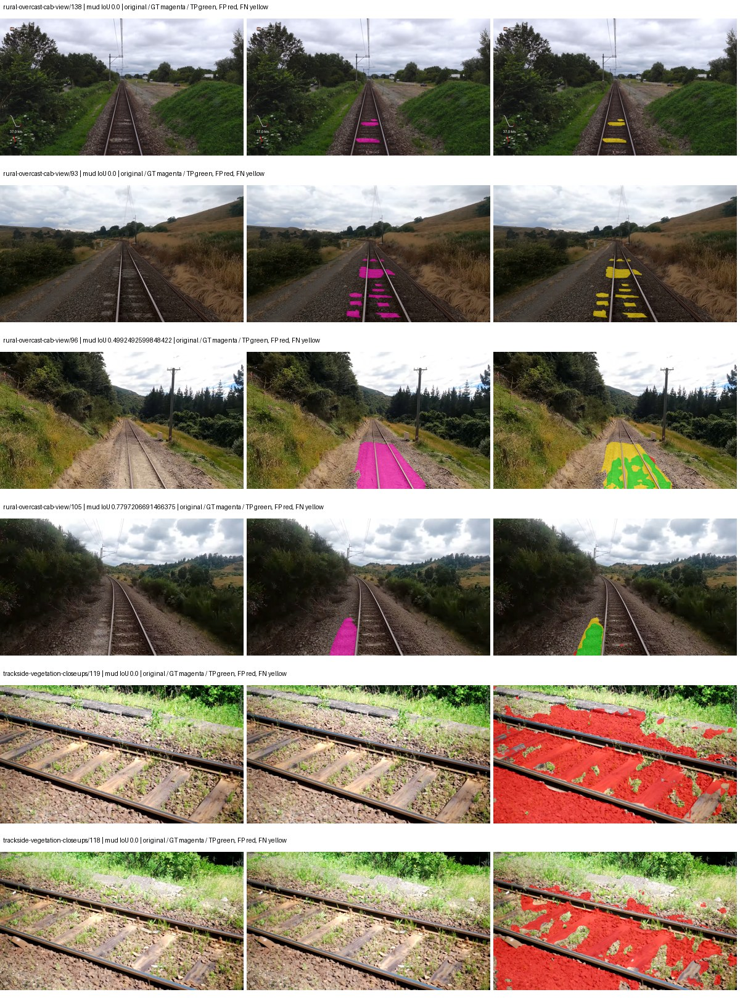
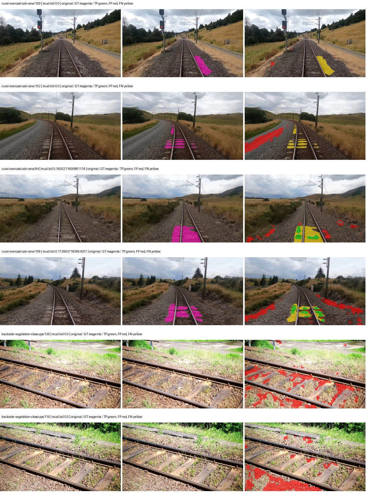
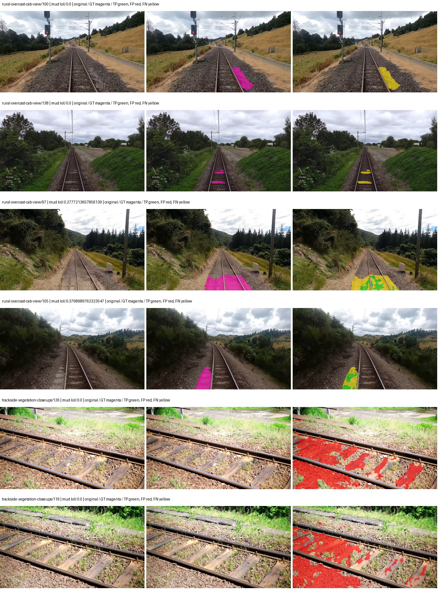
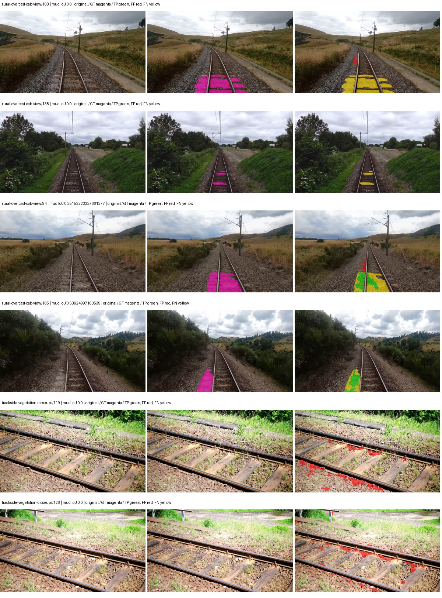

# segformer_b0 — paul-test-rtis_v2

[RTIS comparison](../../README.md) · [Full model records](record.json)

Primary selection and early stopping: **mud-pumping validation IoU**. A job is complete only after full statistics and isolated profiling are verified.

| Model | Initialization path | Seed | Status | Steps | Best step | Mud IoU (%) | Mud precision (%) | Mud recall (%) | Final mud IoU (trainer val, %) | mIoU (%) | Fixed GT-class mIoU (%) |
| --- | --- | --- | --- | --- | --- | --- | --- | --- | --- | --- | --- |
| segformer_b0 | rtis_only | 0 | completed | 3823 | 2549 | 5.72 | 7.24 | 21.38 | 3.02 | 33.13 | 38.66 |
| segformer_b0 | cityscapes_to_rtis | 0 | completed | 1529 | 254 | 2.20 | 3.35 | 6.05 | 1.04 | 17.88 | 17.88 |
| segformer_b0 | railsem19_to_rtis | 0 | completed | 2549 | 1274 | 5.20 | 8.70 | 11.44 | 2.81 | 36.07 | 42.08 |
| segformer_b0 | cityscapes_to_railsem19_to_rtis | 0 | completed | 3058 | 1784 | 8.01 | 22.32 | 11.12 | 6.93 | 31.23 | 36.43 |

Training: 205 images. Validation: 37 images. Test: 50 held out. Seeds: [0]. Seed variation measures optimization variability, not independent-recording uncertainty. Historical source checkpoints stay fixed across adaptation seeds.

Training code: `066afb2626398b7be59d4d19f5a0e4644fd59adc`. Split SHA-256: `18a84c0163a65ded46508bcc904c374e5f33ad8a09b8879e3c8add606e86aa9f`.

## rtis_only — seed 0

Status: **completed**. Started: 2026-09-10T00:15:27.942863+00:00. Finished: 2026-09-10T00:56:01.234884+00:00.

Recipe pretrained initializer: `nvidia/mit-b0`.

`rtis_only` uses the recipe initializer, which may include pretrained segmentation components. Transfer paths load the exact historical source checkpoint below and reset the classifier; they do not reset all query/decoder features.

Source checkpoint: `Recipe pretrained initialization`.

Config SHA-256: `ae7bf8f5622b428dfd927945d3509218fa8136efaf5ada76fed95ccd0e9b0660`. Weights used for validation: `raw`.

### Mud-pumping and aggregate quality

| Metric | Selected checkpoint | Final training validation |
| --- | --- | --- |
| Mud IoU | 5.72 | 3.02 |
| Mud precision | 7.24 | 3.60 |
| Mud recall | 21.38 | 15.89 |
| Mud Dice/F1 | 10.81 | 5.87 |
| mIoU | 33.13 | 32.82 |
| Mean accuracy | 46.81 | 45.57 |
| Mean precision | 54.45 | 54.08 |
| Mean Dice | 42.62 | 41.78 |
| Mean specificity | 98.97 | 98.94 |
| Pixel accuracy | 82.42 | 82.25 |
| Frequency-weighted IoU | 74.26 | 74.60 |
| Fixed GT-present class mIoU | 38.66 | 38.29 |
| Boundary F1 | 38.68 | 38.95 |

The selected checkpoint has independent evaluation evidence. Final values are the trainer's final validation record, not a new independent evaluation. mIoU averages classes with nonzero union, so false positives on absent classes can change its denominator. The fixed GT-class mean is supplementary and excludes absent classes; their false positives remain in the confusion matrix.

### Resource usage and timing

| Measurement | Value |
| --- | --- |
| Peak training VRAM, retained training invocation (GiB) | 7.79 |
| Peak evaluation VRAM (GiB) | 7.03 |
| Retained training invocation wall time (seconds) | 2295.25 |
| Retained training invocation GPU-hours (one GPU) | 0.64 |
| Evaluation wall time (seconds) | 12.92 |
| Full evaluation pipeline images/second | 2.86 |
| Best full-state checkpoint (MiB) | 57.10 |
| Final full-state checkpoint (MiB) | 57.09 |
| Verified periodic checkpoints removed (GiB) | 0.39 |

VRAM uses the recorded allocator high-water mark; it is not total device usage including CUDA context. Resumed jobs' retained training invocation times and peaks are **not whole-campaign totals**. Earlier invocation resource records are not reconstructed here. Evaluation throughput includes loader, sliding-window inference and metrics; it is not model-only latency/FPS. Missing measurements are shown as —, never inferred from another dataset's run.

### Standardized inference performance

Dedicated model-only profiling waits for an idle worker-locked L40S: BF16, batch 1, 1024x1024, 20 warmup and 100 CUDA-event-timed public forwards. It excludes loading, preprocessing, tiling and metrics.

| Status | Parameters | Weight MiB | FPS | p50 ms | p95 ms | Peak reserved GiB |
| --- | --- | --- | --- | --- | --- | --- |
| complete | 3719541 | 14.19 | 129.99 | 7.43 | 9.45 | 0.89 |

```json
{
  "schema_version": 1,
  "model_id": "segformer_b0",
  "measured_at": "2026-09-10T00:55:59+00:00",
  "status": "complete",
  "benchmark_scope": "rtis_selected_checkpoint_model_only",
  "applies_to": [
    "segformer_b0--rtis_only--seed-0"
  ],
  "source": {
    "campaign_git_sha": "066afb2626398b7be59d4d19f5a0e4644fd59adc",
    "git_dirty": false,
    "config_hash": "5deab7c56812",
    "resolved_config": "/data/izadia1/projects/segmentary-runs/paul-test-rtis_v2/seed0-20260909/configs/segformer_b0--rtis_only--seed-0.yaml",
    "config_sha256": "ae7bf8f5622b428dfd927945d3509218fa8136efaf5ada76fed95ccd0e9b0660",
    "checkpoint_sha256": "fd3cc221e1a88ec4a272b885698fb48a1a8cfd4ea348b2f227a85d3bb2f251c1",
    "checkpoint_global_step": 2549,
    "checkpoint_bytes": 59870029,
    "checkpoint_kind": "resume checkpoint with optimizer and EMA state",
    "weights": "raw",
    "measured_checkpoint_job_id": "segformer_b0--rtis_only--seed-0",
    "result_sha256": "b2df1ac001ee23b151ec7a74baaac8869e5adf767aeb4e96a69a35ab51cd6cf0",
    "result_git_sha": "066afb2626398b7be59d4d19f5a0e4644fd59adc",
    "result_stage": "eval:paul-test-rtis:val",
    "result_seed": 0
  },
  "hardware": {
    "gpu_name": "NVIDIA L40S",
    "gpu_uuid": "GPU-d411d86a-6d1d-1967-55e7-9f9ec85d13f5",
    "logical_device": "cuda:0",
    "physical_visibility_token": "1",
    "compute_capability": [
      8,
      9
    ],
    "total_memory_bytes": 47677177856
  },
  "model": {
    "parameter_count": 3719541,
    "trainable_parameter_count": 3719541,
    "resident_parameter_bytes": 14878164,
    "parameter_dtype_counts": {
      "float32": 3719541
    }
  },
  "contract": {
    "backend": "pytorch",
    "precision": "bf16_autocast",
    "batch_size": 1,
    "input_shape_nchw": [
      1,
      3,
      1024,
      1024
    ],
    "warmup_iterations": 20,
    "measured_iterations": 100,
    "timing": "per-forward CUDA events with end-event synchronization",
    "includes_preprocessing": false,
    "includes_data_loader": false,
    "includes_sliding_window": false,
    "input_resident_on_gpu": true,
    "model_only": true,
    "entrypoint": "public model(image) dense-logits forward"
  },
  "measurements": {
    "latency": {
      "p50_ms": 7.426016092300415,
      "p95_ms": 9.451008415222168,
      "mean_ms": 7.693145923614502,
      "minimum_ms": 7.301119804382324,
      "maximum_ms": 9.683967590332031,
      "fps": 129.98583543442862,
      "raw_ms": [
        9.683967590332031,
        8.08140754699707,
        7.818240165710449,
        7.811999797821045,
        7.526336193084717,
        7.468031883239746,
        7.458816051483154,
        7.453824043273926,
        7.395328044891357,
        7.422912120819092,
        7.43833589553833,
        7.434239864349365,
        7.385087966918945,
        7.631872177124023,
        7.503871917724609,
        7.500800132751465,
        7.386112213134766,
        7.416831970214844,
        7.353343963623047,
        7.377920150756836,
        7.387040138244629,
        7.376895904541016,
        7.391232013702393,
        7.386112213134766,
        7.3851518630981445,
        7.393280029296875,
        7.451776027679443,
        7.358399868011475,
        7.367648124694824,
        7.408639907836914,
        7.401472091674805,
        8.644607543945312,
        7.523327827453613,
        9.327615737915039,
        9.507840156555176,
        9.499648094177246,
        9.513983726501465,
        8.451168060302734,
        8.360960006713867,
        7.6472320556640625,
        7.451648235321045,
        7.429120063781738,
        8.253439903259277,
        7.473152160644531,
        7.412735939025879,
        7.459839820861816,
        7.38918399810791,
        7.369728088378906,
        7.602176189422607,
        7.3461761474609375,
        7.388160228729248,
        7.416831970214844,
        7.390207767486572,
        7.392127990722656,
        7.409664154052734,
        7.38918399810791,
        7.349247932434082,
        7.363584041595459,
        7.382016181945801,
        7.998464107513428,
        7.417759895324707,
        7.3809919357299805,
        7.366559982299805,
        7.370880126953125,
        7.3461761474609375,
        7.8397440910339355,
        7.389311790466309,
        7.408639907836914,
        7.444479942321777,
        7.658495903015137,
        9.370623588562012,
        9.449472427368164,
        9.480192184448242,
        9.411487579345703,
        8.075263977050781,
        7.564288139343262,
        7.672832012176514,
        7.516160011291504,
        7.589888095855713,
        7.437312126159668,
        7.3471999168396,
        7.4700798988342285,
        7.38812780380249,
        7.358463764190674,
        7.973887920379639,
        7.388160228729248,
        7.50489616394043,
        7.378943920135498,
        7.663584232330322,
        7.748608112335205,
        7.344128131866455,
        7.326720237731934,
        7.301119804382324,
        7.4352641105651855,
        7.415808200836182,
        7.579648017883301,
        7.387135982513428,
        7.391232013702393,
        7.364607810974121,
        7.35641622543335
      ],
      "percentile_method": "numpy linear interpolation"
    },
    "peak_reserved_bytes": 960495616,
    "memory_kind": "pytorch_cuda_allocator_peak_reserved_excluding_context",
    "benchmark_wall_clock_s": 4.592940263450146
  },
  "started_at": "2026-09-10T00:55:54+00:00",
  "finished_at": "2026-09-10T00:55:59+00:00",
  "environment": {
    "hostname": "hdrfs-app-001",
    "python": "3.11.15",
    "platform": "Linux-5.15.0-139-generic-x86_64-with-glibc2.35",
    "torch": "2.11.0+cu128",
    "torch_cuda": "12.8",
    "cudnn": 91900,
    "driver_version": "570.133.20",
    "cuda_available": true,
    "gpu_count": 1,
    "gpu_names": [
      "NVIDIA L40S"
    ],
    "cuda_visible_devices": "1",
    "packages": {
      "segmentary": "0.1.0",
      "torch": "2.11.0+cu128",
      "torchvision": "0.26.0+cu128",
      "transformers": "5.15.0",
      "timm": "1.0.28",
      "segmentation-models-pytorch": "0.5.0",
      "albumentations": "2.0.8",
      "lightning": "2.6.5",
      "numpy": "2.4.4"
    }
  }
}
```

### Per-class validation results

| Class | GT pixels | IoU (%) | Precision (%) | Recall (%) | Dice (%) | Boundary F1 (%) |
| --- | --- | --- | --- | --- | --- | --- |
| car | 29664 | 0.59 | 21.62 | 0.60 | 1.17 | 27.46 |
| construction | 311585 | 36.84 | 49.88 | 58.50 | 53.85 | 51.69 |
| fence | 265137 | 20.34 | 56.50 | 24.12 | 33.81 | 39.14 |
| mud-pumping | 1226250 | 5.72 | 7.24 | 21.38 | 10.81 | 12.24 |
| on-rails | 0 | 0.00 | 0.00 | — | 0.00 | 0.00 |
| person | 0 | 0.00 | 0.00 | — | 0.00 | 0.00 |
| pole | 628038 | 63.84 | 80.98 | 75.10 | 77.93 | 87.64 |
| rail-embedded | 16799 | 9.57 | 91.48 | 9.66 | 17.47 | 12.62 |
| rail-raised | 2969797 | 69.70 | 79.06 | 85.49 | 82.15 | 87.95 |
| rail-track | 6323197 | 31.19 | 66.32 | 37.06 | 47.55 | 45.66 |
| road | 1048831 | 39.90 | 80.63 | 44.13 | 57.04 | 40.49 |
| sidewalk | 1297367 | 47.07 | 78.40 | 54.09 | 64.01 | 24.11 |
| sky | 19121606 | 98.23 | 99.21 | 99.01 | 99.11 | 95.21 |
| standing-water | 95802 | 2.29 | 3.43 | 6.40 | 4.47 | 6.60 |
| terrain | 39239306 | 86.76 | 91.34 | 94.54 | 92.91 | 62.00 |
| trackbed | 10643081 | 49.13 | 65.04 | 66.77 | 65.89 | 51.52 |
| traffic-light | 19510 | 64.64 | 81.22 | 76.00 | 78.52 | 73.94 |
| traffic-sign | 13285 | 17.16 | 44.79 | 21.77 | 29.30 | 29.30 |
| tram-track | 56179 | 11.29 | 85.26 | 11.51 | 20.28 | 7.59 |
| truck | 0 | 0.00 | 0.00 | — | 0.00 | 0.00 |
| vegetation-overgrowth | 5901821 | 41.52 | 61.13 | 56.41 | 58.67 | 57.16 |

### Full-run accounting

| Measurement | Value |
| --- | --- |
| Full GPU-reserved wall seconds, all recorded worker attempts | 2433.30 |
| Full reserved GPU-hours | 0.68 |
| Whole-run timing complete | True |

| Phase | Wall seconds including failed attempts |
| --- | --- |
| training | 2302.53 |
| diagnostics | 98.66 |
| performance | 11.14 |

GPU-reserved time includes model loading, training, validation, collection, profiling, checkpoint I/O and orchestration while the worker owns one GPU. It is not GPU kernel-active time. Phase timings and sampled device memory/power/utilization are retained separately; sampled device memory is not the allocator high-water mark.

### Train/validation and raw/EMA diagnostics

| Checkpoint / weights / split | Images | Mud IoU (%) | Mud precision (%) | Mud recall (%) |
| --- | --- | --- | --- | --- |
| best-auto-train / raw | 205 | 92.80 | 98.21 | 94.40 |
| best-auto-val / raw | 37 | 5.72 | 7.24 | 21.38 |
| best-alternate-val / ema | 37 | 2.25 | 2.62 | 13.71 |
| final-auto-val / raw | 37 | 3.02 | 3.60 | 15.90 |

Train uses the evaluation transform without augmentation. Compare mud train/validation metrics for the same selected weights. Alternate EMA on running-stat BatchNorm is explicitly uncalibrated and is diagnostic only. Score-threshold curves use uncalibrated normalized scores and are pixel-level diagnostics, not event detection rates or a selected deployment operating point.

### Downloadable evidence

- best-auto-train: [per-image.csv](rtis_only--seed-0/best-auto-train/per-image.csv) · [per-image-confusion.json.gz](rtis_only--seed-0/best-auto-train/per-image-confusion.json.gz) · [groups.json](rtis_only--seed-0/best-auto-train/groups.json) · [mud-score-curves.json](rtis_only--seed-0/best-auto-train/mud-score-curves.json)
- best-auto-val: [per-image.csv](rtis_only--seed-0/best-auto-val/per-image.csv) · [per-image-confusion.json.gz](rtis_only--seed-0/best-auto-val/per-image-confusion.json.gz) · [groups.json](rtis_only--seed-0/best-auto-val/groups.json) · [mud-score-curves.json](rtis_only--seed-0/best-auto-val/mud-score-curves.json) · [examples.jpg](rtis_only--seed-0/best-auto-val/examples.jpg)
- best-alternate-val: [per-image.csv](rtis_only--seed-0/best-alternate-val/per-image.csv) · [per-image-confusion.json.gz](rtis_only--seed-0/best-alternate-val/per-image-confusion.json.gz) · [groups.json](rtis_only--seed-0/best-alternate-val/groups.json) · [mud-score-curves.json](rtis_only--seed-0/best-alternate-val/mud-score-curves.json)
- final-auto-val: [per-image.csv](rtis_only--seed-0/final-auto-val/per-image.csv) · [per-image-confusion.json.gz](rtis_only--seed-0/final-auto-val/per-image-confusion.json.gz) · [groups.json](rtis_only--seed-0/final-auto-val/groups.json) · [mud-score-curves.json](rtis_only--seed-0/final-auto-val/mud-score-curves.json)
- resources: [telemetry.csv](rtis_only--seed-0/resources/telemetry.csv)



Examples are two lowest and two highest mud-IoU positive images, plus up to two negative images with the most false-positive mud pixels. They are targeted diagnostic examples, not random samples. Green: true positive; red: false positive; yellow: false negative. Full predictions remain on HDRFS.

### Validation tracking

| Logged step | Overall mIoU (%) | Mud IoU (%) |
| --- | --- | --- |
| 254 | 20.52 | 0.12 |
| 509 | 25.28 | 0.13 |
| 764 | 22.73 | 1.02 |
| 1019 | 24.60 | 1.98 |
| 1274 | 27.98 | 2.84 |
| 1529 | 30.31 | 1.90 |
| 1784 | 30.46 | 2.48 |
| 2038 | 31.52 | 2.14 |
| 2293 | 30.96 | 4.52 |
| 2548 | 33.12 | 5.72 |
| 2803 | 32.09 | 5.23 |
| 3058 | 32.47 | 3.01 |
| 3313 | 31.57 | 2.75 |
| 3568 | 32.80 | 3.18 |
| 3823 | 32.82 | 3.02 |

All retained scalar curves, including training loss and per-class IoU, are in record.json. Observed best mud on a curve is not necessarily a retained checkpoint: the pilot saved its selection-metric-best and final checkpoints. Step logging and checkpoint global_step may differ by one.

### Stopping and checkpoint provenance

```json
{
  "stopping": {
    "actual_steps": 3823,
    "maximum_steps": 4000,
    "min_delta": 0.001,
    "monitor": "val_iou/mud-pumping",
    "patience": 5,
    "reason": "validation_plateau"
  },
  "checkpoints": {
    "best": {
      "path": "/data/izadia1/projects/segmentary-runs/paul-test-rtis_v2/seed0-20260909/future-runs/segformer_b0--rtis_only--seed-0_seed0/rtis/best.ckpt",
      "sha256": "fd3cc221e1a88ec4a272b885698fb48a1a8cfd4ea348b2f227a85d3bb2f251c1",
      "global_step": 2549,
      "bytes": 59870029
    },
    "final": {
      "path": "/data/izadia1/projects/segmentary-runs/paul-test-rtis_v2/seed0-20260909/future-runs/segformer_b0--rtis_only--seed-0_seed0/rtis/last.ckpt",
      "sha256": "16db29f08987cd33f246d74ed9fa69cd18a262bab6afd6c3f00e80a44e2b5ca4",
      "global_step": 3823,
      "bytes": 59860237
    }
  },
  "cleanup_error": null
}
```

### Resolved training, initialization and evaluation settings

The optimizer block is the base configuration. Stage LR scales are applied at runtime, and stage warmup is capped at min(base warmup, floor(stage budget / 10), stage budget - 1): 400 steps for this 4,000-step pilot. Model-internal native input grids may differ from augmentation crops (EoMT uses its 640 grid).

```json
{
  "name": "segformer_b0--rtis_only--seed-0",
  "model": {
    "arch": "segformer_b0",
    "checkpoint": "nvidia/mit-b0",
    "tuning": "full",
    "head": "unified_head",
    "lora_r": 16,
    "lora_alpha": 32,
    "lora_dropout": 0.05,
    "lora_targets": [],
    "drop_path": null,
    "revision": null,
    "subfolder": null,
    "local_files_only": false,
    "trust_remote_code": false,
    "backbone_path": null,
    "head_paths": [],
    "classifier_path": null,
    "inactive_parameter_paths": [],
    "smp_arch": null,
    "encoder_name": null,
    "encoder_weights": null,
    "native": null,
    "batch_norm_momentum": null
  },
  "space": "paul-test-rtis",
  "taxonomy_root": "/data/izadia1/projects/segmentary-rtis-fullstats-066afb2/taxonomy",
  "output_root": "/data/izadia1/projects/segmentary-runs/paul-test-rtis_v2/seed0-20260909/future-runs",
  "optim": {
    "backbone_lr": 6e-05,
    "head_lr_mult": 10.0,
    "weight_decay": 0.05,
    "llrd": 1.0,
    "warmup_iters": 1500,
    "warmup_ratio": 1e-06,
    "poly_power": 0.9,
    "min_lr_ratio": 0.0,
    "betas": [
      0.9,
      0.999
    ],
    "grad_clip": 1.0
  },
  "train": {
    "iters": 4000,
    "batch_size": 2,
    "accum": 8,
    "num_workers": 2,
    "precision": "bf16-mixed",
    "ema_decay": 0.9998,
    "val_every": 250,
    "ckpt_every": 500,
    "selection_metric": "val_iou/mud-pumping",
    "early_stopping_patience": 5,
    "early_stopping_min_delta": 0.001,
    "seed": 0,
    "devices": 1
  },
  "eval": {
    "sliding_window": true,
    "window": [
      1024,
      1024
    ],
    "stride": [
      768,
      768
    ],
    "batch_size": 1,
    "num_workers": 2,
    "tta_scales": [],
    "tta_flip": false,
    "threshold": 0.5,
    "boundary_tolerance_frac": 0.0075,
    "save_confusion": true
  },
  "loss": {
    "task": "multiclass",
    "activation": "auto",
    "terms": [],
    "aux": "none",
    "aux_weight": 0.0,
    "ce_weight": 1.0,
    "label_smoothing": 0.0,
    "class_weights": null,
    "query": null
  },
  "aug": {
    "crop": [
      1024,
      1024
    ],
    "scale_min": 0.5,
    "scale_max": 2.0,
    "hflip_p": 0.5,
    "color_jitter_p": 0.5,
    "brightness": 0.25,
    "contrast": 0.25,
    "saturation": 0.25,
    "hue": 0.05
  },
  "stages": [
    {
      "name": "rtis",
      "data": [
        {
          "name": "paul-test-rtis",
          "root": "/data/izadia1/datasets/paul-test-rtis_v2",
          "variant": null,
          "split_file": "splits.json",
          "train_split": "train",
          "val_split": "val",
          "limit": null,
          "loader": "folder",
          "mapping": "paul-test-rtis",
          "loader_options": {
            "require_groups": true
          }
        }
      ],
      "iters": null,
      "lr_scale": 1.0,
      "head_group_lr_scale": 1.0,
      "init_from": "pretrained",
      "reset_head": false,
      "freeze": null,
      "sample_weights": null
    }
  ]
}
```

### Hardware and software provenance

```json
{
  "training": {
    "cuda_available": true,
    "cuda_visible_devices": "1",
    "cudnn": 91900,
    "driver_version": "570.133.20",
    "gpu_count": 1,
    "gpu_names": [
      "NVIDIA L40S"
    ],
    "hostname": "hdrfs-app-001",
    "input_normalization": {
      "channel_order": "rgb",
      "mean": [
        0.485,
        0.456,
        0.406
      ],
      "source": "imagenet",
      "std": [
        0.229,
        0.224,
        0.225
      ]
    },
    "model_origins": [
      {
        "hf_commit": "80983a413c30d36a39c20203974ae7807835e2b4",
        "hf_name_or_path": "nvidia/mit-b0",
        "module": "model",
        "timm_pretrained": {}
      },
      {
        "hf_commit": "80983a413c30d36a39c20203974ae7807835e2b4",
        "hf_name_or_path": "nvidia/mit-b0",
        "module": "model.segformer",
        "timm_pretrained": {}
      },
      {
        "hf_commit": "80983a413c30d36a39c20203974ae7807835e2b4",
        "hf_name_or_path": "nvidia/mit-b0",
        "module": "model.segformer.stages.0.blocks.0.attention",
        "timm_pretrained": {}
      },
      {
        "hf_commit": "80983a413c30d36a39c20203974ae7807835e2b4",
        "hf_name_or_path": "nvidia/mit-b0",
        "module": "model.segformer.stages.0.blocks.1.attention",
        "timm_pretrained": {}
      },
      {
        "hf_commit": "80983a413c30d36a39c20203974ae7807835e2b4",
        "hf_name_or_path": "nvidia/mit-b0",
        "module": "model.segformer.stages.1.blocks.0.attention",
        "timm_pretrained": {}
      },
      {
        "hf_commit": "80983a413c30d36a39c20203974ae7807835e2b4",
        "hf_name_or_path": "nvidia/mit-b0",
        "module": "model.segformer.stages.1.blocks.1.attention",
        "timm_pretrained": {}
      },
      {
        "hf_commit": "80983a413c30d36a39c20203974ae7807835e2b4",
        "hf_name_or_path": "nvidia/mit-b0",
        "module": "model.segformer.stages.2.blocks.0.attention",
        "timm_pretrained": {}
      },
      {
        "hf_commit": "80983a413c30d36a39c20203974ae7807835e2b4",
        "hf_name_or_path": "nvidia/mit-b0",
        "module": "model.segformer.stages.2.blocks.1.attention",
        "timm_pretrained": {}
      },
      {
        "hf_commit": "80983a413c30d36a39c20203974ae7807835e2b4",
        "hf_name_or_path": "nvidia/mit-b0",
        "module": "model.segformer.stages.3.blocks.0.attention",
        "timm_pretrained": {}
      },
      {
        "hf_commit": "80983a413c30d36a39c20203974ae7807835e2b4",
        "hf_name_or_path": "nvidia/mit-b0",
        "module": "model.segformer.stages.3.blocks.1.attention",
        "timm_pretrained": {}
      },
      {
        "hf_commit": "80983a413c30d36a39c20203974ae7807835e2b4",
        "hf_name_or_path": "nvidia/mit-b0",
        "module": "model.decode_head",
        "timm_pretrained": {}
      }
    ],
    "model_parameter_count": 3719541,
    "packages": {
      "albumentations": "2.0.8",
      "lightning": "2.6.5",
      "numpy": "2.4.4",
      "segmentary": "0.1.0",
      "segmentation-models-pytorch": "0.5.0",
      "timm": "1.0.28",
      "torch": "2.11.0+cu128",
      "torchvision": "0.26.0+cu128",
      "transformers": "5.15.0"
    },
    "platform": "Linux-5.15.0-139-generic-x86_64-with-glibc2.35",
    "python": "3.11.15",
    "torch": "2.11.0+cu128",
    "torch_cuda": "12.8",
    "trainable_parameter_count": 3719541,
    "training_stop": {
      "actual_steps": 3823,
      "maximum_steps": 4000,
      "min_delta": 0.001,
      "monitor": "val_iou/mud-pumping",
      "patience": 5,
      "reason": "validation_plateau"
    },
    "validation_weights": "raw"
  },
  "evaluation": {
    "cuda_available": true,
    "cuda_visible_devices": "1",
    "cudnn": 91900,
    "driver_version": "570.133.20",
    "gpu_count": 1,
    "gpu_names": [
      "NVIDIA L40S"
    ],
    "hostname": "hdrfs-app-001",
    "input_normalization": {
      "channel_order": "rgb",
      "mean": [
        0.485,
        0.456,
        0.406
      ],
      "source": "imagenet",
      "std": [
        0.229,
        0.224,
        0.225
      ]
    },
    "packages": {
      "albumentations": "2.0.8",
      "lightning": "2.6.5",
      "numpy": "2.4.4",
      "segmentary": "0.1.0",
      "segmentation-models-pytorch": "0.5.0",
      "timm": "1.0.28",
      "torch": "2.11.0+cu128",
      "torchvision": "0.26.0+cu128",
      "transformers": "5.15.0"
    },
    "platform": "Linux-5.15.0-139-generic-x86_64-with-glibc2.35",
    "python": "3.11.15",
    "torch": "2.11.0+cu128",
    "torch_cuda": "12.8"
  }
}
```

## cityscapes_to_rtis — seed 0

Status: **completed**. Started: 2026-09-10T00:19:13.286636+00:00. Finished: 2026-09-10T00:37:21.193526+00:00.

Recipe pretrained initializer: `nvidia/mit-b0`.

`rtis_only` uses the recipe initializer, which may include pretrained segmentation components. Transfer paths load the exact historical source checkpoint below and reset the classifier; they do not reset all query/decoder features.

Source checkpoint: `{'name': 'segformer_b0--cityscapes--seed-0', 'model': 'segformer_b0', 'protocol': 'cityscapes', 'config': '/data/izadia1/projects/segmentary-runs/all-model-city-rail-seed0-rail20-b9eb3e1/accepted/segformer_b0--cityscapes--seed-0/resolved-config.yaml', 'checkpoint': '/data/izadia1/projects/segmentary-runs/current-main-fill-v2/jobs/segformer_b0--cityscapes--seed-0/train/segformer_b0--cityscapes_seed0/cityscapes/last.ckpt', 'recorded_sha256': '47048ef71b774dfe61882fdac1cf32d638d8d41a094b3f91a14900021015ac59', 'exists': True}`.

Config SHA-256: `5ed1319887e89b099d7c7fa8f9f433101f27b6dbb3a369935b97e8250573eaae`. Weights used for validation: `raw`.

### Mud-pumping and aggregate quality

| Metric | Selected checkpoint | Final training validation |
| --- | --- | --- |
| Mud IoU | 2.20 | 1.04 |
| Mud precision | 3.35 | 1.40 |
| Mud recall | 6.05 | 3.90 |
| Mud Dice/F1 | 4.31 | 2.07 |
| mIoU | 17.88 | 23.77 |
| Mean accuracy | 23.33 | 33.71 |
| Mean precision | 26.02 | 37.53 |
| Mean Dice | 22.43 | 29.57 |
| Mean specificity | 98.21 | 98.81 |
| Pixel accuracy | 75.15 | 80.57 |
| Frequency-weighted IoU | 60.71 | 71.99 |
| Fixed GT-present class mIoU | 17.88 | 27.73 |
| Boundary F1 | 20.57 | 28.03 |

The selected checkpoint has independent evaluation evidence. Final values are the trainer's final validation record, not a new independent evaluation. mIoU averages classes with nonzero union, so false positives on absent classes can change its denominator. The fixed GT-class mean is supplementary and excludes absent classes; their false positives remain in the confusion matrix.

### Resource usage and timing

| Measurement | Value |
| --- | --- |
| Peak training VRAM, retained training invocation (GiB) | 7.79 |
| Peak evaluation VRAM (GiB) | 7.03 |
| Retained training invocation wall time (seconds) | 949.91 |
| Retained training invocation GPU-hours (one GPU) | 0.26 |
| Evaluation wall time (seconds) | 13.73 |
| Full evaluation pipeline images/second | 2.70 |
| Best full-state checkpoint (MiB) | 57.10 |
| Final full-state checkpoint (MiB) | 57.09 |
| Verified periodic checkpoints removed (GiB) | 0.17 |

VRAM uses the recorded allocator high-water mark; it is not total device usage including CUDA context. Resumed jobs' retained training invocation times and peaks are **not whole-campaign totals**. Earlier invocation resource records are not reconstructed here. Evaluation throughput includes loader, sliding-window inference and metrics; it is not model-only latency/FPS. Missing measurements are shown as —, never inferred from another dataset's run.

### Standardized inference performance

Dedicated model-only profiling waits for an idle worker-locked L40S: BF16, batch 1, 1024x1024, 20 warmup and 100 CUDA-event-timed public forwards. It excludes loading, preprocessing, tiling and metrics.

| Status | Parameters | Weight MiB | FPS | p50 ms | p95 ms | Peak reserved GiB |
| --- | --- | --- | --- | --- | --- | --- |
| complete | 3719541 | 14.19 | 127.72 | 7.48 | 10.10 | 0.89 |

```json
{
  "schema_version": 1,
  "model_id": "segformer_b0",
  "measured_at": "2026-09-10T00:37:19+00:00",
  "status": "complete",
  "benchmark_scope": "rtis_selected_checkpoint_model_only",
  "applies_to": [
    "segformer_b0--cityscapes_to_rtis--seed-0"
  ],
  "source": {
    "campaign_git_sha": "066afb2626398b7be59d4d19f5a0e4644fd59adc",
    "git_dirty": false,
    "config_hash": "44e3406ff2ee",
    "resolved_config": "/data/izadia1/projects/segmentary-runs/paul-test-rtis_v2/seed0-20260909/configs/segformer_b0--cityscapes_to_rtis--seed-0.yaml",
    "config_sha256": "5ed1319887e89b099d7c7fa8f9f433101f27b6dbb3a369935b97e8250573eaae",
    "checkpoint_sha256": "25a9202961e094ae3b107c39613c57a7732518385268818d8eae302e834c9551",
    "checkpoint_global_step": 254,
    "checkpoint_bytes": 59869901,
    "checkpoint_kind": "resume checkpoint with optimizer and EMA state",
    "weights": "raw",
    "measured_checkpoint_job_id": "segformer_b0--cityscapes_to_rtis--seed-0",
    "result_sha256": "29e398aab0672da7493193396a8a999696fb272aae69b4c5066b455d7d036a11",
    "result_git_sha": "066afb2626398b7be59d4d19f5a0e4644fd59adc",
    "result_stage": "eval:paul-test-rtis:val",
    "result_seed": 0
  },
  "hardware": {
    "gpu_name": "NVIDIA L40S",
    "gpu_uuid": "GPU-1c9b612f-e0b5-fbbc-150f-8c2ef13453c9",
    "logical_device": "cuda:0",
    "physical_visibility_token": "5",
    "compute_capability": [
      8,
      9
    ],
    "total_memory_bytes": 47677177856
  },
  "model": {
    "parameter_count": 3719541,
    "trainable_parameter_count": 3719541,
    "resident_parameter_bytes": 14878164,
    "parameter_dtype_counts": {
      "float32": 3719541
    }
  },
  "contract": {
    "backend": "pytorch",
    "precision": "bf16_autocast",
    "batch_size": 1,
    "input_shape_nchw": [
      1,
      3,
      1024,
      1024
    ],
    "warmup_iterations": 20,
    "measured_iterations": 100,
    "timing": "per-forward CUDA events with end-event synchronization",
    "includes_preprocessing": false,
    "includes_data_loader": false,
    "includes_sliding_window": false,
    "input_resident_on_gpu": true,
    "model_only": true,
    "entrypoint": "public model(image) dense-logits forward"
  },
  "measurements": {
    "latency": {
      "p50_ms": 7.476223945617676,
      "p95_ms": 10.097920227050777,
      "mean_ms": 7.829851832389831,
      "minimum_ms": 7.161856174468994,
      "maximum_ms": 11.889663696289062,
      "fps": 127.71633760211009,
      "raw_ms": [
        8.507391929626465,
        7.480319976806641,
        7.574528217315674,
        7.472127914428711,
        7.533567905426025,
        8.500224113464355,
        7.89299201965332,
        7.463935852050781,
        7.639039993286133,
        7.19052791595459,
        7.229440212249756,
        7.235583782196045,
        7.789567947387695,
        7.3461761474609375,
        7.498752117156982,
        8.380415916442871,
        7.924736022949219,
        11.779104232788086,
        8.864768028259277,
        7.219200134277344,
        7.2325119972229,
        7.2038397789001465,
        7.211008071899414,
        8.064000129699707,
        7.287807941436768,
        7.847904205322266,
        7.23967981338501,
        7.1987199783325195,
        7.162879943847656,
        7.161856174468994,
        7.791615962982178,
        7.220223903656006,
        7.905280113220215,
        8.179712295532227,
        7.255040168762207,
        8.680447578430176,
        11.828224182128906,
        7.835648059844971,
        7.459839820861816,
        7.663616180419922,
        7.601151943206787,
        7.387135982513428,
        7.376895904541016,
        7.544832229614258,
        8.292351722717285,
        7.2570881843566895,
        7.1690239906311035,
        7.259136199951172,
        7.422976016998291,
        8.678400039672852,
        7.719935894012451,
        7.6472320556640625,
        7.372799873352051,
        7.283711910247803,
        11.83027172088623,
        8.665087699890137,
        7.395328044891357,
        7.719935894012451,
        7.374847888946533,
        7.622655868530273,
        7.600128173828125,
        7.3369598388671875,
        7.772160053253174,
        7.323647975921631,
        7.29088020324707,
        7.55401611328125,
        7.363584041595459,
        7.250944137573242,
        7.390207767486572,
        8.316927909851074,
        7.469056129455566,
        7.55404806137085,
        7.885824203491211,
        11.889663696289062,
        8.239104270935059,
        7.223296165466309,
        7.615488052368164,
        8.766464233398438,
        7.265279769897461,
        7.212031841278076,
        7.219200134277344,
        7.305215835571289,
        7.3512959480285645,
        7.328767776489258,
        7.334911823272705,
        7.492608070373535,
        7.675903797149658,
        7.515135765075684,
        7.468031883239746,
        7.452672004699707,
        7.805952072143555,
        7.431168079376221,
        11.581439971923828,
        10.019840240478516,
        8.034303665161133,
        7.243775844573975,
        7.423999786376953,
        7.44755220413208,
        7.398399829864502,
        7.562240123748779
      ],
      "percentile_method": "numpy linear interpolation"
    },
    "peak_reserved_bytes": 960495616,
    "memory_kind": "pytorch_cuda_allocator_peak_reserved_excluding_context",
    "benchmark_wall_clock_s": 4.649404510855675
  },
  "started_at": "2026-09-10T00:37:14+00:00",
  "finished_at": "2026-09-10T00:37:19+00:00",
  "environment": {
    "hostname": "hdrfs-app-001",
    "python": "3.11.15",
    "platform": "Linux-5.15.0-139-generic-x86_64-with-glibc2.35",
    "torch": "2.11.0+cu128",
    "torch_cuda": "12.8",
    "cudnn": 91900,
    "driver_version": "570.133.20",
    "cuda_available": true,
    "gpu_count": 1,
    "gpu_names": [
      "NVIDIA L40S"
    ],
    "cuda_visible_devices": "5",
    "packages": {
      "segmentary": "0.1.0",
      "torch": "2.11.0+cu128",
      "torchvision": "0.26.0+cu128",
      "transformers": "5.15.0",
      "timm": "1.0.28",
      "segmentation-models-pytorch": "0.5.0",
      "albumentations": "2.0.8",
      "lightning": "2.6.5",
      "numpy": "2.4.4"
    }
  }
}
```

### Per-class validation results

| Class | GT pixels | IoU (%) | Precision (%) | Recall (%) | Dice (%) | Boundary F1 (%) |
| --- | --- | --- | --- | --- | --- | --- |
| car | 29664 | 0.00 | 0.00 | 0.00 | 0.00 | 0.00 |
| construction | 311585 | 24.48 | 29.94 | 57.28 | 39.33 | 33.70 |
| fence | 265137 | 0.00 | 0.00 | 0.00 | 0.00 | 0.00 |
| mud-pumping | 1226250 | 2.20 | 3.35 | 6.05 | 4.31 | 4.45 |
| on-rails | 0 | — | — | — | — | — |
| person | 0 | — | — | — | — | — |
| pole | 628038 | 21.15 | 87.20 | 21.83 | 34.92 | 51.41 |
| rail-embedded | 16799 | 0.00 | 0.00 | 0.00 | 0.00 | 0.00 |
| rail-raised | 2969797 | 52.53 | 72.78 | 65.37 | 68.88 | 78.81 |
| rail-track | 6323197 | 4.97 | 41.85 | 5.34 | 9.47 | 26.97 |
| road | 1048831 | 0.00 | 0.00 | 0.00 | 0.00 | 0.00 |
| sidewalk | 1297367 | 0.00 | 0.00 | 0.00 | 0.00 | 0.00 |
| sky | 19121606 | 95.91 | 98.14 | 97.68 | 97.91 | 81.01 |
| standing-water | 95802 | 0.00 | 0.00 | 0.00 | 0.00 | 0.00 |
| terrain | 39239306 | 72.99 | 74.21 | 97.81 | 84.39 | 42.61 |
| trackbed | 10643081 | 47.63 | 60.86 | 68.66 | 64.52 | 51.38 |
| traffic-light | 19510 | 0.00 | 0.00 | 0.00 | 0.00 | 0.00 |
| traffic-sign | 13285 | 0.00 | 0.00 | 0.00 | 0.00 | 0.00 |
| tram-track | 56179 | 0.00 | 0.00 | 0.00 | 0.00 | 0.00 |
| truck | 0 | — | — | — | — | — |
| vegetation-overgrowth | 5901821 | 0.00 | 0.00 | 0.00 | 0.00 | 0.00 |

### Full-run accounting

| Measurement | Value |
| --- | --- |
| Full GPU-reserved wall seconds, all recorded worker attempts | 1087.96 |
| Full reserved GPU-hours | 0.30 |
| Whole-run timing complete | True |

| Phase | Wall seconds including failed attempts |
| --- | --- |
| training | 956.74 |
| diagnostics | 98.24 |
| performance | 11.51 |

GPU-reserved time includes model loading, training, validation, collection, profiling, checkpoint I/O and orchestration while the worker owns one GPU. It is not GPU kernel-active time. Phase timings and sampled device memory/power/utilization are retained separately; sampled device memory is not the allocator high-water mark.

### Train/validation and raw/EMA diagnostics

| Checkpoint / weights / split | Images | Mud IoU (%) | Mud precision (%) | Mud recall (%) |
| --- | --- | --- | --- | --- |
| best-auto-train / raw | 205 | 69.87 | 74.48 | 91.86 |
| best-auto-val / raw | 37 | 2.20 | 3.35 | 6.05 |
| best-alternate-val / ema | 37 | 3.80 | 4.30 | 24.49 |
| final-auto-val / raw | 37 | 1.05 | 1.41 | 3.92 |

Train uses the evaluation transform without augmentation. Compare mud train/validation metrics for the same selected weights. Alternate EMA on running-stat BatchNorm is explicitly uncalibrated and is diagnostic only. Score-threshold curves use uncalibrated normalized scores and are pixel-level diagnostics, not event detection rates or a selected deployment operating point.

### Downloadable evidence

- best-auto-train: [per-image.csv](cityscapes_to_rtis--seed-0/best-auto-train/per-image.csv) · [per-image-confusion.json.gz](cityscapes_to_rtis--seed-0/best-auto-train/per-image-confusion.json.gz) · [groups.json](cityscapes_to_rtis--seed-0/best-auto-train/groups.json) · [mud-score-curves.json](cityscapes_to_rtis--seed-0/best-auto-train/mud-score-curves.json)
- best-auto-val: [per-image.csv](cityscapes_to_rtis--seed-0/best-auto-val/per-image.csv) · [per-image-confusion.json.gz](cityscapes_to_rtis--seed-0/best-auto-val/per-image-confusion.json.gz) · [groups.json](cityscapes_to_rtis--seed-0/best-auto-val/groups.json) · [mud-score-curves.json](cityscapes_to_rtis--seed-0/best-auto-val/mud-score-curves.json) · [examples.jpg](cityscapes_to_rtis--seed-0/best-auto-val/examples.jpg)
- best-alternate-val: [per-image.csv](cityscapes_to_rtis--seed-0/best-alternate-val/per-image.csv) · [per-image-confusion.json.gz](cityscapes_to_rtis--seed-0/best-alternate-val/per-image-confusion.json.gz) · [groups.json](cityscapes_to_rtis--seed-0/best-alternate-val/groups.json) · [mud-score-curves.json](cityscapes_to_rtis--seed-0/best-alternate-val/mud-score-curves.json)
- final-auto-val: [per-image.csv](cityscapes_to_rtis--seed-0/final-auto-val/per-image.csv) · [per-image-confusion.json.gz](cityscapes_to_rtis--seed-0/final-auto-val/per-image-confusion.json.gz) · [groups.json](cityscapes_to_rtis--seed-0/final-auto-val/groups.json) · [mud-score-curves.json](cityscapes_to_rtis--seed-0/final-auto-val/mud-score-curves.json)
- resources: [telemetry.csv](cityscapes_to_rtis--seed-0/resources/telemetry.csv)



Examples are two lowest and two highest mud-IoU positive images, plus up to two negative images with the most false-positive mud pixels. They are targeted diagnostic examples, not random samples. Green: true positive; red: false positive; yellow: false negative. Full predictions remain on HDRFS.

### Validation tracking

| Logged step | Overall mIoU (%) | Mud IoU (%) |
| --- | --- | --- |
| 254 | 17.88 | 2.20 |
| 509 | 22.69 | 1.17 |
| 764 | 22.40 | 1.97 |
| 1019 | 22.90 | 1.33 |
| 1274 | 22.49 | 1.50 |
| 1529 | 23.77 | 1.04 |

All retained scalar curves, including training loss and per-class IoU, are in record.json. Observed best mud on a curve is not necessarily a retained checkpoint: the pilot saved its selection-metric-best and final checkpoints. Step logging and checkpoint global_step may differ by one.

### Stopping and checkpoint provenance

```json
{
  "stopping": {
    "actual_steps": 1529,
    "maximum_steps": 4000,
    "min_delta": 0.001,
    "monitor": "val_iou/mud-pumping",
    "patience": 5,
    "reason": "validation_plateau"
  },
  "checkpoints": {
    "best": {
      "path": "/data/izadia1/projects/segmentary-runs/paul-test-rtis_v2/seed0-20260909/future-runs/segformer_b0--cityscapes_to_rtis--seed-0_seed0/rtis/best.ckpt",
      "sha256": "25a9202961e094ae3b107c39613c57a7732518385268818d8eae302e834c9551",
      "global_step": 254,
      "bytes": 59869901
    },
    "final": {
      "path": "/data/izadia1/projects/segmentary-runs/paul-test-rtis_v2/seed0-20260909/future-runs/segformer_b0--cityscapes_to_rtis--seed-0_seed0/rtis/last.ckpt",
      "sha256": "fa04f251fa3c03c576bc6ddf64112cc594ab0f0ce51bc4f143b1fe483e381ecd",
      "global_step": 1529,
      "bytes": 59860301
    }
  },
  "cleanup_error": null
}
```

### Resolved training, initialization and evaluation settings

The optimizer block is the base configuration. Stage LR scales are applied at runtime, and stage warmup is capped at min(base warmup, floor(stage budget / 10), stage budget - 1): 400 steps for this 4,000-step pilot. Model-internal native input grids may differ from augmentation crops (EoMT uses its 640 grid).

```json
{
  "name": "segformer_b0--cityscapes_to_rtis--seed-0",
  "model": {
    "arch": "segformer_b0",
    "checkpoint": "nvidia/mit-b0",
    "tuning": "full",
    "head": "unified_head",
    "lora_r": 16,
    "lora_alpha": 32,
    "lora_dropout": 0.05,
    "lora_targets": [],
    "drop_path": null,
    "revision": null,
    "subfolder": null,
    "local_files_only": false,
    "trust_remote_code": false,
    "backbone_path": null,
    "head_paths": [],
    "classifier_path": null,
    "inactive_parameter_paths": [],
    "smp_arch": null,
    "encoder_name": null,
    "encoder_weights": null,
    "native": null,
    "batch_norm_momentum": null
  },
  "space": "paul-test-rtis",
  "taxonomy_root": "/data/izadia1/projects/segmentary-rtis-fullstats-066afb2/taxonomy",
  "output_root": "/data/izadia1/projects/segmentary-runs/paul-test-rtis_v2/seed0-20260909/future-runs",
  "optim": {
    "backbone_lr": 6e-05,
    "head_lr_mult": 10.0,
    "weight_decay": 0.05,
    "llrd": 1.0,
    "warmup_iters": 1500,
    "warmup_ratio": 1e-06,
    "poly_power": 0.9,
    "min_lr_ratio": 0.0,
    "betas": [
      0.9,
      0.999
    ],
    "grad_clip": 1.0
  },
  "train": {
    "iters": 4000,
    "batch_size": 2,
    "accum": 8,
    "num_workers": 2,
    "precision": "bf16-mixed",
    "ema_decay": 0.9998,
    "val_every": 250,
    "ckpt_every": 500,
    "selection_metric": "val_iou/mud-pumping",
    "early_stopping_patience": 5,
    "early_stopping_min_delta": 0.001,
    "seed": 0,
    "devices": 1
  },
  "eval": {
    "sliding_window": true,
    "window": [
      1024,
      1024
    ],
    "stride": [
      768,
      768
    ],
    "batch_size": 1,
    "num_workers": 2,
    "tta_scales": [],
    "tta_flip": false,
    "threshold": 0.5,
    "boundary_tolerance_frac": 0.0075,
    "save_confusion": true
  },
  "loss": {
    "task": "multiclass",
    "activation": "auto",
    "terms": [],
    "aux": "none",
    "aux_weight": 0.0,
    "ce_weight": 1.0,
    "label_smoothing": 0.0,
    "class_weights": null,
    "query": null
  },
  "aug": {
    "crop": [
      1024,
      1024
    ],
    "scale_min": 0.5,
    "scale_max": 2.0,
    "hflip_p": 0.5,
    "color_jitter_p": 0.5,
    "brightness": 0.25,
    "contrast": 0.25,
    "saturation": 0.25,
    "hue": 0.05
  },
  "stages": [
    {
      "name": "rtis",
      "data": [
        {
          "name": "paul-test-rtis",
          "root": "/data/izadia1/datasets/paul-test-rtis_v2",
          "variant": null,
          "split_file": "splits.json",
          "train_split": "train",
          "val_split": "val",
          "limit": null,
          "loader": "folder",
          "mapping": "paul-test-rtis",
          "loader_options": {
            "require_groups": true
          }
        }
      ],
      "iters": null,
      "lr_scale": 0.1,
      "head_group_lr_scale": 1.0,
      "init_from": "/data/izadia1/projects/segmentary-runs/current-main-fill-v2/jobs/segformer_b0--cityscapes--seed-0/train/segformer_b0--cityscapes_seed0/cityscapes/last.ckpt",
      "reset_head": true,
      "freeze": null,
      "sample_weights": null
    }
  ]
}
```

### Hardware and software provenance

```json
{
  "training": {
    "cuda_available": true,
    "cuda_visible_devices": "5",
    "cudnn": 91900,
    "driver_version": "570.133.20",
    "gpu_count": 1,
    "gpu_names": [
      "NVIDIA L40S"
    ],
    "hostname": "hdrfs-app-001",
    "input_normalization": {
      "channel_order": "rgb",
      "mean": [
        0.485,
        0.456,
        0.406
      ],
      "source": "imagenet",
      "std": [
        0.229,
        0.224,
        0.225
      ]
    },
    "model_origins": [
      {
        "hf_commit": "80983a413c30d36a39c20203974ae7807835e2b4",
        "hf_name_or_path": "nvidia/mit-b0",
        "module": "model",
        "timm_pretrained": {}
      },
      {
        "hf_commit": "80983a413c30d36a39c20203974ae7807835e2b4",
        "hf_name_or_path": "nvidia/mit-b0",
        "module": "model.segformer",
        "timm_pretrained": {}
      },
      {
        "hf_commit": "80983a413c30d36a39c20203974ae7807835e2b4",
        "hf_name_or_path": "nvidia/mit-b0",
        "module": "model.segformer.stages.0.blocks.0.attention",
        "timm_pretrained": {}
      },
      {
        "hf_commit": "80983a413c30d36a39c20203974ae7807835e2b4",
        "hf_name_or_path": "nvidia/mit-b0",
        "module": "model.segformer.stages.0.blocks.1.attention",
        "timm_pretrained": {}
      },
      {
        "hf_commit": "80983a413c30d36a39c20203974ae7807835e2b4",
        "hf_name_or_path": "nvidia/mit-b0",
        "module": "model.segformer.stages.1.blocks.0.attention",
        "timm_pretrained": {}
      },
      {
        "hf_commit": "80983a413c30d36a39c20203974ae7807835e2b4",
        "hf_name_or_path": "nvidia/mit-b0",
        "module": "model.segformer.stages.1.blocks.1.attention",
        "timm_pretrained": {}
      },
      {
        "hf_commit": "80983a413c30d36a39c20203974ae7807835e2b4",
        "hf_name_or_path": "nvidia/mit-b0",
        "module": "model.segformer.stages.2.blocks.0.attention",
        "timm_pretrained": {}
      },
      {
        "hf_commit": "80983a413c30d36a39c20203974ae7807835e2b4",
        "hf_name_or_path": "nvidia/mit-b0",
        "module": "model.segformer.stages.2.blocks.1.attention",
        "timm_pretrained": {}
      },
      {
        "hf_commit": "80983a413c30d36a39c20203974ae7807835e2b4",
        "hf_name_or_path": "nvidia/mit-b0",
        "module": "model.segformer.stages.3.blocks.0.attention",
        "timm_pretrained": {}
      },
      {
        "hf_commit": "80983a413c30d36a39c20203974ae7807835e2b4",
        "hf_name_or_path": "nvidia/mit-b0",
        "module": "model.segformer.stages.3.blocks.1.attention",
        "timm_pretrained": {}
      },
      {
        "hf_commit": "80983a413c30d36a39c20203974ae7807835e2b4",
        "hf_name_or_path": "nvidia/mit-b0",
        "module": "model.decode_head",
        "timm_pretrained": {}
      }
    ],
    "model_parameter_count": 3719541,
    "packages": {
      "albumentations": "2.0.8",
      "lightning": "2.6.5",
      "numpy": "2.4.4",
      "segmentary": "0.1.0",
      "segmentation-models-pytorch": "0.5.0",
      "timm": "1.0.28",
      "torch": "2.11.0+cu128",
      "torchvision": "0.26.0+cu128",
      "transformers": "5.15.0"
    },
    "platform": "Linux-5.15.0-139-generic-x86_64-with-glibc2.35",
    "python": "3.11.15",
    "torch": "2.11.0+cu128",
    "torch_cuda": "12.8",
    "trainable_parameter_count": 3719541,
    "training_stop": {
      "actual_steps": 1529,
      "maximum_steps": 4000,
      "min_delta": 0.001,
      "monitor": "val_iou/mud-pumping",
      "patience": 5,
      "reason": "validation_plateau"
    },
    "validation_weights": "raw"
  },
  "evaluation": {
    "cuda_available": true,
    "cuda_visible_devices": "5",
    "cudnn": 91900,
    "driver_version": "570.133.20",
    "gpu_count": 1,
    "gpu_names": [
      "NVIDIA L40S"
    ],
    "hostname": "hdrfs-app-001",
    "input_normalization": {
      "channel_order": "rgb",
      "mean": [
        0.485,
        0.456,
        0.406
      ],
      "source": "imagenet",
      "std": [
        0.229,
        0.224,
        0.225
      ]
    },
    "packages": {
      "albumentations": "2.0.8",
      "lightning": "2.6.5",
      "numpy": "2.4.4",
      "segmentary": "0.1.0",
      "segmentation-models-pytorch": "0.5.0",
      "timm": "1.0.28",
      "torch": "2.11.0+cu128",
      "torchvision": "0.26.0+cu128",
      "transformers": "5.15.0"
    },
    "platform": "Linux-5.15.0-139-generic-x86_64-with-glibc2.35",
    "python": "3.11.15",
    "torch": "2.11.0+cu128",
    "torch_cuda": "12.8"
  }
}
```

## railsem19_to_rtis — seed 0

Status: **completed**. Started: 2026-09-10T00:34:14.073281+00:00. Finished: 2026-09-10T01:02:26.036551+00:00.

Recipe pretrained initializer: `nvidia/mit-b0`.

`rtis_only` uses the recipe initializer, which may include pretrained segmentation components. Transfer paths load the exact historical source checkpoint below and reset the classifier; they do not reset all query/decoder features.

Source checkpoint: `{'name': 'segformer_b0--railsem19--seed-0', 'model': 'segformer_b0', 'protocol': 'railsem19', 'config': '/data/izadia1/projects/segmentary-runs/all-model-city-rail-seed0-rail20-b9eb3e1/jobs/segformer_b0--railsem19--seed-0/attempt-001/resolved-config.yaml', 'checkpoint': '/data/izadia1/projects/segmentary-runs/all-model-city-rail-seed0-rail20-b9eb3e1/jobs/segformer_b0--railsem19--seed-0/attempt-001/train/segformer_b0--railsem19_seed0/railsem19/last.ckpt', 'recorded_sha256': '99a63225aae891655a2f0545ee95481dfd1a1a62cca8bc01d3edaf6f13bf4dbe', 'exists': True}`.

Config SHA-256: `0996fd8cb2ff5cd60caec1e2a4419a1af4e0ee4d6662fb0822c0c15d814d2130`. Weights used for validation: `raw`.

### Mud-pumping and aggregate quality

| Metric | Selected checkpoint | Final training validation |
| --- | --- | --- |
| Mud IoU | 5.20 | 2.81 |
| Mud precision | 8.70 | 4.38 |
| Mud recall | 11.44 | 7.30 |
| Mud Dice/F1 | 9.88 | 5.47 |
| mIoU | 36.07 | 41.34 |
| Mean accuracy | 51.19 | 56.69 |
| Mean precision | 53.22 | 57.53 |
| Mean Dice | 45.49 | 51.35 |
| Mean specificity | 99.09 | 99.10 |
| Pixel accuracy | 84.77 | 84.85 |
| Frequency-weighted IoU | 77.14 | 77.25 |
| Fixed GT-present class mIoU | 42.08 | 48.23 |
| Boundary F1 | 42.22 | 47.77 |

The selected checkpoint has independent evaluation evidence. Final values are the trainer's final validation record, not a new independent evaluation. mIoU averages classes with nonzero union, so false positives on absent classes can change its denominator. The fixed GT-class mean is supplementary and excludes absent classes; their false positives remain in the confusion matrix.

### Resource usage and timing

| Measurement | Value |
| --- | --- |
| Peak training VRAM, retained training invocation (GiB) | 7.79 |
| Peak evaluation VRAM (GiB) | 7.03 |
| Retained training invocation wall time (seconds) | 1553.57 |
| Retained training invocation GPU-hours (one GPU) | 0.43 |
| Evaluation wall time (seconds) | 13.58 |
| Full evaluation pipeline images/second | 2.72 |
| Best full-state checkpoint (MiB) | 57.10 |
| Final full-state checkpoint (MiB) | 57.09 |
| Verified periodic checkpoints removed (GiB) | 0.28 |

VRAM uses the recorded allocator high-water mark; it is not total device usage including CUDA context. Resumed jobs' retained training invocation times and peaks are **not whole-campaign totals**. Earlier invocation resource records are not reconstructed here. Evaluation throughput includes loader, sliding-window inference and metrics; it is not model-only latency/FPS. Missing measurements are shown as —, never inferred from another dataset's run.

### Standardized inference performance

Dedicated model-only profiling waits for an idle worker-locked L40S: BF16, batch 1, 1024x1024, 20 warmup and 100 CUDA-event-timed public forwards. It excludes loading, preprocessing, tiling and metrics.

| Status | Parameters | Weight MiB | FPS | p50 ms | p95 ms | Peak reserved GiB |
| --- | --- | --- | --- | --- | --- | --- |
| complete | 3719541 | 14.19 | 131.42 | 7.35 | 9.13 | 0.89 |

```json
{
  "schema_version": 1,
  "model_id": "segformer_b0",
  "measured_at": "2026-09-10T01:02:24+00:00",
  "status": "complete",
  "benchmark_scope": "rtis_selected_checkpoint_model_only",
  "applies_to": [
    "segformer_b0--railsem19_to_rtis--seed-0"
  ],
  "source": {
    "campaign_git_sha": "066afb2626398b7be59d4d19f5a0e4644fd59adc",
    "git_dirty": false,
    "config_hash": "bc96e9d97dd1",
    "resolved_config": "/data/izadia1/projects/segmentary-runs/paul-test-rtis_v2/seed0-20260909/configs/segformer_b0--railsem19_to_rtis--seed-0.yaml",
    "config_sha256": "0996fd8cb2ff5cd60caec1e2a4419a1af4e0ee4d6662fb0822c0c15d814d2130",
    "checkpoint_sha256": "878ae6030121a0742094084a47df9c28d922bdf35309d1f9a9afcae7b46f6796",
    "checkpoint_global_step": 1274,
    "checkpoint_bytes": 59870029,
    "checkpoint_kind": "resume checkpoint with optimizer and EMA state",
    "weights": "raw",
    "measured_checkpoint_job_id": "segformer_b0--railsem19_to_rtis--seed-0",
    "result_sha256": "17b8bf5afc45bf11f2408e67a23cdb9677ce80b70535b076db7b0035f5b5b5fa",
    "result_git_sha": "066afb2626398b7be59d4d19f5a0e4644fd59adc",
    "result_stage": "eval:paul-test-rtis:val",
    "result_seed": 0
  },
  "hardware": {
    "gpu_name": "NVIDIA L40S",
    "gpu_uuid": "GPU-84f5ca4d-68db-ae98-d056-40654d859dd9",
    "logical_device": "cuda:0",
    "physical_visibility_token": "0",
    "compute_capability": [
      8,
      9
    ],
    "total_memory_bytes": 47677177856
  },
  "model": {
    "parameter_count": 3719541,
    "trainable_parameter_count": 3719541,
    "resident_parameter_bytes": 14878164,
    "parameter_dtype_counts": {
      "float32": 3719541
    }
  },
  "contract": {
    "backend": "pytorch",
    "precision": "bf16_autocast",
    "batch_size": 1,
    "input_shape_nchw": [
      1,
      3,
      1024,
      1024
    ],
    "warmup_iterations": 20,
    "measured_iterations": 100,
    "timing": "per-forward CUDA events with end-event synchronization",
    "includes_preprocessing": false,
    "includes_data_loader": false,
    "includes_sliding_window": false,
    "input_resident_on_gpu": true,
    "model_only": true,
    "entrypoint": "public model(image) dense-logits forward"
  },
  "measurements": {
    "latency": {
      "p50_ms": 7.3512959480285645,
      "p95_ms": 9.130854082107543,
      "mean_ms": 7.60895938873291,
      "minimum_ms": 7.239583969116211,
      "maximum_ms": 11.086848258972168,
      "fps": 131.42401594109782,
      "raw_ms": [
        7.472127914428711,
        7.270400047302246,
        7.636960029602051,
        7.469056129455566,
        7.279520034790039,
        7.297023773193359,
        7.966720104217529,
        7.441408157348633,
        7.2458882331848145,
        7.249919891357422,
        7.331776142120361,
        7.591936111450195,
        7.292928218841553,
        7.274496078491211,
        7.256063938140869,
        7.350143909454346,
        8.095744132995605,
        11.086848258972168,
        10.058752059936523,
        9.128959655761719,
        9.166848182678223,
        9.272319793701172,
        10.567680358886719,
        7.301119804382324,
        7.269375801086426,
        7.3471999168396,
        7.360447883605957,
        7.354368209838867,
        7.279615879058838,
        7.962560176849365,
        7.276544094085693,
        7.309311866760254,
        7.622655868530273,
        7.9133758544921875,
        7.657472133636475,
        7.354368209838867,
        9.070591926574707,
        7.411712169647217,
        7.64518404006958,
        8.935423851013184,
        7.518208026885986,
        7.645247936248779,
        7.608320236206055,
        7.314432144165039,
        7.327744007110596,
        7.3512959480285645,
        7.388160228729248,
        7.308288097381592,
        7.376895904541016,
        7.3072638511657715,
        7.274496078491211,
        7.24070405960083,
        7.250944137573242,
        7.254015922546387,
        7.373824119567871,
        7.502816200256348,
        8.075263977050781,
        7.308288097381592,
        7.3512959480285645,
        7.333888053894043,
        7.285759925842285,
        7.746560096740723,
        7.845888137817383,
        7.372799873352051,
        7.68614387512207,
        7.327744007110596,
        7.384096145629883,
        7.681024074554443,
        7.814112186431885,
        7.327807903289795,
        7.329792022705078,
        7.600128173828125,
        7.412735939025879,
        7.266304016113281,
        7.2775678634643555,
        7.2867841720581055,
        7.369728088378906,
        7.324672222137451,
        7.28166389465332,
        7.322624206542969,
        7.283711910247803,
        7.239583969116211,
        7.264256000518799,
        7.252992153167725,
        8.040448188781738,
        7.263232231140137,
        7.39737606048584,
        8.19814395904541,
        7.3512959480285645,
        7.262207984924316,
        7.267327785491943,
        7.345151901245117,
        7.358463764190674,
        7.564288139343262,
        7.477248191833496,
        7.293951988220215,
        7.280640125274658,
        7.291808128356934,
        7.265279769897461,
        7.268352031707764
      ],
      "percentile_method": "numpy linear interpolation"
    },
    "peak_reserved_bytes": 960495616,
    "memory_kind": "pytorch_cuda_allocator_peak_reserved_excluding_context",
    "benchmark_wall_clock_s": 4.46444396674633
  },
  "started_at": "2026-09-10T01:02:19+00:00",
  "finished_at": "2026-09-10T01:02:24+00:00",
  "environment": {
    "hostname": "hdrfs-app-001",
    "python": "3.11.15",
    "platform": "Linux-5.15.0-139-generic-x86_64-with-glibc2.35",
    "torch": "2.11.0+cu128",
    "torch_cuda": "12.8",
    "cudnn": 91900,
    "driver_version": "570.133.20",
    "cuda_available": true,
    "gpu_count": 1,
    "gpu_names": [
      "NVIDIA L40S"
    ],
    "cuda_visible_devices": "0",
    "packages": {
      "segmentary": "0.1.0",
      "torch": "2.11.0+cu128",
      "torchvision": "0.26.0+cu128",
      "transformers": "5.15.0",
      "timm": "1.0.28",
      "segmentation-models-pytorch": "0.5.0",
      "albumentations": "2.0.8",
      "lightning": "2.6.5",
      "numpy": "2.4.4"
    }
  }
}
```

### Per-class validation results

| Class | GT pixels | IoU (%) | Precision (%) | Recall (%) | Dice (%) | Boundary F1 (%) |
| --- | --- | --- | --- | --- | --- | --- |
| car | 29664 | 0.00 | 0.00 | 0.00 | 0.00 | 0.00 |
| construction | 311585 | 59.96 | 77.26 | 72.81 | 74.97 | 71.58 |
| fence | 265137 | 12.93 | 49.95 | 14.86 | 22.90 | 31.03 |
| mud-pumping | 1226250 | 5.20 | 8.70 | 11.44 | 9.88 | 15.10 |
| on-rails | 0 | 0.00 | 0.00 | — | 0.00 | 0.00 |
| person | 0 | 0.00 | 0.00 | — | 0.00 | 0.00 |
| pole | 628038 | 69.75 | 85.63 | 79.00 | 82.18 | 90.31 |
| rail-embedded | 16799 | 46.59 | 69.27 | 58.72 | 63.56 | 78.61 |
| rail-raised | 2969797 | 73.74 | 85.49 | 84.29 | 84.89 | 91.92 |
| rail-track | 6323197 | 36.55 | 78.60 | 40.59 | 53.54 | 49.87 |
| road | 1048831 | 22.21 | 63.82 | 25.40 | 36.34 | 28.38 |
| sidewalk | 1297367 | 48.55 | 85.04 | 53.09 | 65.37 | 16.11 |
| sky | 19121606 | 98.58 | 99.19 | 99.38 | 99.28 | 96.90 |
| standing-water | 95802 | 0.30 | 0.31 | 7.33 | 0.60 | 1.30 |
| terrain | 39239306 | 89.18 | 91.49 | 97.24 | 94.28 | 67.96 |
| trackbed | 10643081 | 60.91 | 69.44 | 83.20 | 75.70 | 56.76 |
| traffic-light | 19510 | 44.19 | 94.96 | 45.25 | 61.29 | 53.77 |
| traffic-sign | 13285 | 8.96 | 35.86 | 10.67 | 16.44 | 33.66 |
| tram-track | 56179 | 39.79 | 40.81 | 94.11 | 56.93 | 37.12 |
| truck | 0 | 0.00 | 0.00 | — | 0.00 | 0.00 |
| vegetation-overgrowth | 5901821 | 40.06 | 81.70 | 44.01 | 57.21 | 66.26 |

### Full-run accounting

| Measurement | Value |
| --- | --- |
| Full GPU-reserved wall seconds, all recorded worker attempts | 1692.02 |
| Full reserved GPU-hours | 0.47 |
| Whole-run timing complete | True |

| Phase | Wall seconds including failed attempts |
| --- | --- |
| training | 1561.05 |
| diagnostics | 98.49 |
| performance | 10.96 |

GPU-reserved time includes model loading, training, validation, collection, profiling, checkpoint I/O and orchestration while the worker owns one GPU. It is not GPU kernel-active time. Phase timings and sampled device memory/power/utilization are retained separately; sampled device memory is not the allocator high-water mark.

### Train/validation and raw/EMA diagnostics

| Checkpoint / weights / split | Images | Mud IoU (%) | Mud precision (%) | Mud recall (%) |
| --- | --- | --- | --- | --- |
| best-auto-train / raw | 205 | 90.01 | 93.72 | 95.79 |
| best-auto-val / raw | 37 | 5.20 | 8.70 | 11.44 |
| best-alternate-val / ema | 37 | 2.73 | 5.40 | 5.22 |
| final-auto-val / raw | 37 | 2.82 | 4.38 | 7.32 |

Train uses the evaluation transform without augmentation. Compare mud train/validation metrics for the same selected weights. Alternate EMA on running-stat BatchNorm is explicitly uncalibrated and is diagnostic only. Score-threshold curves use uncalibrated normalized scores and are pixel-level diagnostics, not event detection rates or a selected deployment operating point.

### Downloadable evidence

- best-auto-train: [per-image.csv](railsem19_to_rtis--seed-0/best-auto-train/per-image.csv) · [per-image-confusion.json.gz](railsem19_to_rtis--seed-0/best-auto-train/per-image-confusion.json.gz) · [groups.json](railsem19_to_rtis--seed-0/best-auto-train/groups.json) · [mud-score-curves.json](railsem19_to_rtis--seed-0/best-auto-train/mud-score-curves.json)
- best-auto-val: [per-image.csv](railsem19_to_rtis--seed-0/best-auto-val/per-image.csv) · [per-image-confusion.json.gz](railsem19_to_rtis--seed-0/best-auto-val/per-image-confusion.json.gz) · [groups.json](railsem19_to_rtis--seed-0/best-auto-val/groups.json) · [mud-score-curves.json](railsem19_to_rtis--seed-0/best-auto-val/mud-score-curves.json) · [examples.jpg](railsem19_to_rtis--seed-0/best-auto-val/examples.jpg)
- best-alternate-val: [per-image.csv](railsem19_to_rtis--seed-0/best-alternate-val/per-image.csv) · [per-image-confusion.json.gz](railsem19_to_rtis--seed-0/best-alternate-val/per-image-confusion.json.gz) · [groups.json](railsem19_to_rtis--seed-0/best-alternate-val/groups.json) · [mud-score-curves.json](railsem19_to_rtis--seed-0/best-alternate-val/mud-score-curves.json)
- final-auto-val: [per-image.csv](railsem19_to_rtis--seed-0/final-auto-val/per-image.csv) · [per-image-confusion.json.gz](railsem19_to_rtis--seed-0/final-auto-val/per-image-confusion.json.gz) · [groups.json](railsem19_to_rtis--seed-0/final-auto-val/groups.json) · [mud-score-curves.json](railsem19_to_rtis--seed-0/final-auto-val/mud-score-curves.json)
- resources: [telemetry.csv](railsem19_to_rtis--seed-0/resources/telemetry.csv)



Examples are two lowest and two highest mud-IoU positive images, plus up to two negative images with the most false-positive mud pixels. They are targeted diagnostic examples, not random samples. Green: true positive; red: false positive; yellow: false negative. Full predictions remain on HDRFS.

### Validation tracking

| Logged step | Overall mIoU (%) | Mud IoU (%) |
| --- | --- | --- |
| 254 | 26.79 | 0.09 |
| 509 | 33.43 | 0.22 |
| 764 | 30.00 | 0.58 |
| 1019 | 31.71 | 2.49 |
| 1274 | 36.08 | 5.20 |
| 1529 | 38.32 | 2.89 |
| 1784 | 38.15 | 5.11 |
| 2038 | 39.24 | 2.36 |
| 2293 | 39.45 | 4.60 |
| 2548 | 41.34 | 2.81 |

All retained scalar curves, including training loss and per-class IoU, are in record.json. Observed best mud on a curve is not necessarily a retained checkpoint: the pilot saved its selection-metric-best and final checkpoints. Step logging and checkpoint global_step may differ by one.

### Stopping and checkpoint provenance

```json
{
  "stopping": {
    "actual_steps": 2549,
    "maximum_steps": 4000,
    "min_delta": 0.001,
    "monitor": "val_iou/mud-pumping",
    "patience": 5,
    "reason": "validation_plateau"
  },
  "checkpoints": {
    "best": {
      "path": "/data/izadia1/projects/segmentary-runs/paul-test-rtis_v2/seed0-20260909/future-runs/segformer_b0--railsem19_to_rtis--seed-0_seed0/rtis/best.ckpt",
      "sha256": "878ae6030121a0742094084a47df9c28d922bdf35309d1f9a9afcae7b46f6796",
      "global_step": 1274,
      "bytes": 59870029
    },
    "final": {
      "path": "/data/izadia1/projects/segmentary-runs/paul-test-rtis_v2/seed0-20260909/future-runs/segformer_b0--railsem19_to_rtis--seed-0_seed0/rtis/last.ckpt",
      "sha256": "92d871b557c6f0e3a9987491892a09fec25256f03dd305b334729f03bf2445bc",
      "global_step": 2549,
      "bytes": 59860301
    }
  },
  "cleanup_error": null
}
```

### Resolved training, initialization and evaluation settings

The optimizer block is the base configuration. Stage LR scales are applied at runtime, and stage warmup is capped at min(base warmup, floor(stage budget / 10), stage budget - 1): 400 steps for this 4,000-step pilot. Model-internal native input grids may differ from augmentation crops (EoMT uses its 640 grid).

```json
{
  "name": "segformer_b0--railsem19_to_rtis--seed-0",
  "model": {
    "arch": "segformer_b0",
    "checkpoint": "nvidia/mit-b0",
    "tuning": "full",
    "head": "unified_head",
    "lora_r": 16,
    "lora_alpha": 32,
    "lora_dropout": 0.05,
    "lora_targets": [],
    "drop_path": null,
    "revision": null,
    "subfolder": null,
    "local_files_only": false,
    "trust_remote_code": false,
    "backbone_path": null,
    "head_paths": [],
    "classifier_path": null,
    "inactive_parameter_paths": [],
    "smp_arch": null,
    "encoder_name": null,
    "encoder_weights": null,
    "native": null,
    "batch_norm_momentum": null
  },
  "space": "paul-test-rtis",
  "taxonomy_root": "/data/izadia1/projects/segmentary-rtis-fullstats-066afb2/taxonomy",
  "output_root": "/data/izadia1/projects/segmentary-runs/paul-test-rtis_v2/seed0-20260909/future-runs",
  "optim": {
    "backbone_lr": 6e-05,
    "head_lr_mult": 10.0,
    "weight_decay": 0.05,
    "llrd": 1.0,
    "warmup_iters": 1500,
    "warmup_ratio": 1e-06,
    "poly_power": 0.9,
    "min_lr_ratio": 0.0,
    "betas": [
      0.9,
      0.999
    ],
    "grad_clip": 1.0
  },
  "train": {
    "iters": 4000,
    "batch_size": 2,
    "accum": 8,
    "num_workers": 2,
    "precision": "bf16-mixed",
    "ema_decay": 0.9998,
    "val_every": 250,
    "ckpt_every": 500,
    "selection_metric": "val_iou/mud-pumping",
    "early_stopping_patience": 5,
    "early_stopping_min_delta": 0.001,
    "seed": 0,
    "devices": 1
  },
  "eval": {
    "sliding_window": true,
    "window": [
      1024,
      1024
    ],
    "stride": [
      768,
      768
    ],
    "batch_size": 1,
    "num_workers": 2,
    "tta_scales": [],
    "tta_flip": false,
    "threshold": 0.5,
    "boundary_tolerance_frac": 0.0075,
    "save_confusion": true
  },
  "loss": {
    "task": "multiclass",
    "activation": "auto",
    "terms": [],
    "aux": "none",
    "aux_weight": 0.0,
    "ce_weight": 1.0,
    "label_smoothing": 0.0,
    "class_weights": null,
    "query": null
  },
  "aug": {
    "crop": [
      1024,
      1024
    ],
    "scale_min": 0.5,
    "scale_max": 2.0,
    "hflip_p": 0.5,
    "color_jitter_p": 0.5,
    "brightness": 0.25,
    "contrast": 0.25,
    "saturation": 0.25,
    "hue": 0.05
  },
  "stages": [
    {
      "name": "rtis",
      "data": [
        {
          "name": "paul-test-rtis",
          "root": "/data/izadia1/datasets/paul-test-rtis_v2",
          "variant": null,
          "split_file": "splits.json",
          "train_split": "train",
          "val_split": "val",
          "limit": null,
          "loader": "folder",
          "mapping": "paul-test-rtis",
          "loader_options": {
            "require_groups": true
          }
        }
      ],
      "iters": null,
      "lr_scale": 0.1,
      "head_group_lr_scale": 1.0,
      "init_from": "/data/izadia1/projects/segmentary-runs/all-model-city-rail-seed0-rail20-b9eb3e1/jobs/segformer_b0--railsem19--seed-0/attempt-001/train/segformer_b0--railsem19_seed0/railsem19/last.ckpt",
      "reset_head": true,
      "freeze": null,
      "sample_weights": null
    }
  ]
}
```

### Hardware and software provenance

```json
{
  "training": {
    "cuda_available": true,
    "cuda_visible_devices": "0",
    "cudnn": 91900,
    "driver_version": "570.133.20",
    "gpu_count": 1,
    "gpu_names": [
      "NVIDIA L40S"
    ],
    "hostname": "hdrfs-app-001",
    "input_normalization": {
      "channel_order": "rgb",
      "mean": [
        0.485,
        0.456,
        0.406
      ],
      "source": "imagenet",
      "std": [
        0.229,
        0.224,
        0.225
      ]
    },
    "model_origins": [
      {
        "hf_commit": "80983a413c30d36a39c20203974ae7807835e2b4",
        "hf_name_or_path": "nvidia/mit-b0",
        "module": "model",
        "timm_pretrained": {}
      },
      {
        "hf_commit": "80983a413c30d36a39c20203974ae7807835e2b4",
        "hf_name_or_path": "nvidia/mit-b0",
        "module": "model.segformer",
        "timm_pretrained": {}
      },
      {
        "hf_commit": "80983a413c30d36a39c20203974ae7807835e2b4",
        "hf_name_or_path": "nvidia/mit-b0",
        "module": "model.segformer.stages.0.blocks.0.attention",
        "timm_pretrained": {}
      },
      {
        "hf_commit": "80983a413c30d36a39c20203974ae7807835e2b4",
        "hf_name_or_path": "nvidia/mit-b0",
        "module": "model.segformer.stages.0.blocks.1.attention",
        "timm_pretrained": {}
      },
      {
        "hf_commit": "80983a413c30d36a39c20203974ae7807835e2b4",
        "hf_name_or_path": "nvidia/mit-b0",
        "module": "model.segformer.stages.1.blocks.0.attention",
        "timm_pretrained": {}
      },
      {
        "hf_commit": "80983a413c30d36a39c20203974ae7807835e2b4",
        "hf_name_or_path": "nvidia/mit-b0",
        "module": "model.segformer.stages.1.blocks.1.attention",
        "timm_pretrained": {}
      },
      {
        "hf_commit": "80983a413c30d36a39c20203974ae7807835e2b4",
        "hf_name_or_path": "nvidia/mit-b0",
        "module": "model.segformer.stages.2.blocks.0.attention",
        "timm_pretrained": {}
      },
      {
        "hf_commit": "80983a413c30d36a39c20203974ae7807835e2b4",
        "hf_name_or_path": "nvidia/mit-b0",
        "module": "model.segformer.stages.2.blocks.1.attention",
        "timm_pretrained": {}
      },
      {
        "hf_commit": "80983a413c30d36a39c20203974ae7807835e2b4",
        "hf_name_or_path": "nvidia/mit-b0",
        "module": "model.segformer.stages.3.blocks.0.attention",
        "timm_pretrained": {}
      },
      {
        "hf_commit": "80983a413c30d36a39c20203974ae7807835e2b4",
        "hf_name_or_path": "nvidia/mit-b0",
        "module": "model.segformer.stages.3.blocks.1.attention",
        "timm_pretrained": {}
      },
      {
        "hf_commit": "80983a413c30d36a39c20203974ae7807835e2b4",
        "hf_name_or_path": "nvidia/mit-b0",
        "module": "model.decode_head",
        "timm_pretrained": {}
      }
    ],
    "model_parameter_count": 3719541,
    "packages": {
      "albumentations": "2.0.8",
      "lightning": "2.6.5",
      "numpy": "2.4.4",
      "segmentary": "0.1.0",
      "segmentation-models-pytorch": "0.5.0",
      "timm": "1.0.28",
      "torch": "2.11.0+cu128",
      "torchvision": "0.26.0+cu128",
      "transformers": "5.15.0"
    },
    "platform": "Linux-5.15.0-139-generic-x86_64-with-glibc2.35",
    "python": "3.11.15",
    "torch": "2.11.0+cu128",
    "torch_cuda": "12.8",
    "trainable_parameter_count": 3719541,
    "training_stop": {
      "actual_steps": 2549,
      "maximum_steps": 4000,
      "min_delta": 0.001,
      "monitor": "val_iou/mud-pumping",
      "patience": 5,
      "reason": "validation_plateau"
    },
    "validation_weights": "raw"
  },
  "evaluation": {
    "cuda_available": true,
    "cuda_visible_devices": "0",
    "cudnn": 91900,
    "driver_version": "570.133.20",
    "gpu_count": 1,
    "gpu_names": [
      "NVIDIA L40S"
    ],
    "hostname": "hdrfs-app-001",
    "input_normalization": {
      "channel_order": "rgb",
      "mean": [
        0.485,
        0.456,
        0.406
      ],
      "source": "imagenet",
      "std": [
        0.229,
        0.224,
        0.225
      ]
    },
    "packages": {
      "albumentations": "2.0.8",
      "lightning": "2.6.5",
      "numpy": "2.4.4",
      "segmentary": "0.1.0",
      "segmentation-models-pytorch": "0.5.0",
      "timm": "1.0.28",
      "torch": "2.11.0+cu128",
      "torchvision": "0.26.0+cu128",
      "transformers": "5.15.0"
    },
    "platform": "Linux-5.15.0-139-generic-x86_64-with-glibc2.35",
    "python": "3.11.15",
    "torch": "2.11.0+cu128",
    "torch_cuda": "12.8"
  }
}
```

## cityscapes_to_railsem19_to_rtis — seed 0

Status: **completed**. Started: 2026-09-10T00:36:17.990881+00:00. Finished: 2026-09-10T01:08:41.793020+00:00.

Recipe pretrained initializer: `nvidia/mit-b0`.

`rtis_only` uses the recipe initializer, which may include pretrained segmentation components. Transfer paths load the exact historical source checkpoint below and reset the classifier; they do not reset all query/decoder features.

Source checkpoint: `{'name': 'segformer_b0--cityscapes_to_railsem19--seed-0', 'model': 'segformer_b0', 'protocol': 'cityscapes_to_railsem19', 'config': '/data/izadia1/projects/segmentary-runs/all-model-city-rail-seed0-rail20-b9eb3e1/jobs/segformer_b0--cityscapes_to_railsem19--seed-0/attempt-001/resolved-config.yaml', 'checkpoint': '/data/izadia1/projects/segmentary-runs/all-model-city-rail-seed0-rail20-b9eb3e1/jobs/segformer_b0--cityscapes_to_railsem19--seed-0/attempt-001/train/segformer_b0--cityscapes_to_railsem19_seed0/railsem19/last.ckpt', 'recorded_sha256': '340e4b0d1d2955eb059be0c3e48ad99cf0fb9ae3729a014bf16a0f1d2f3c110f', 'exists': True}`.

Config SHA-256: `9bd19c4005e1513e5decaefce15be8e08e70ec9a751bf12ff53c41cdcc6ac272`. Weights used for validation: `raw`.

### Mud-pumping and aggregate quality

| Metric | Selected checkpoint | Final training validation |
| --- | --- | --- |
| Mud IoU | 8.01 | 6.93 |
| Mud precision | 22.32 | 24.58 |
| Mud recall | 11.12 | 8.80 |
| Mud Dice/F1 | 14.84 | 12.96 |
| mIoU | 31.23 | 34.58 |
| Mean accuracy | 42.54 | 47.33 |
| Mean precision | 51.23 | 51.33 |
| Mean Dice | 39.35 | 42.91 |
| Mean specificity | 98.88 | 99.00 |
| Pixel accuracy | 82.81 | 83.71 |
| Frequency-weighted IoU | 73.51 | 75.31 |
| Fixed GT-present class mIoU | 36.43 | 40.34 |
| Boundary F1 | 39.47 | 40.15 |

The selected checkpoint has independent evaluation evidence. Final values are the trainer's final validation record, not a new independent evaluation. mIoU averages classes with nonzero union, so false positives on absent classes can change its denominator. The fixed GT-class mean is supplementary and excludes absent classes; their false positives remain in the confusion matrix.

### Resource usage and timing

| Measurement | Value |
| --- | --- |
| Peak training VRAM, retained training invocation (GiB) | 7.79 |
| Peak evaluation VRAM (GiB) | 7.03 |
| Retained training invocation wall time (seconds) | 1808.67 |
| Retained training invocation GPU-hours (one GPU) | 0.50 |
| Evaluation wall time (seconds) | 13.03 |
| Full evaluation pipeline images/second | 2.84 |
| Best full-state checkpoint (MiB) | 57.10 |
| Final full-state checkpoint (MiB) | 57.09 |
| Verified periodic checkpoints removed (GiB) | 0.33 |

VRAM uses the recorded allocator high-water mark; it is not total device usage including CUDA context. Resumed jobs' retained training invocation times and peaks are **not whole-campaign totals**. Earlier invocation resource records are not reconstructed here. Evaluation throughput includes loader, sliding-window inference and metrics; it is not model-only latency/FPS. Missing measurements are shown as —, never inferred from another dataset's run.

### Standardized inference performance

Dedicated model-only profiling waits for an idle worker-locked L40S: BF16, batch 1, 1024x1024, 20 warmup and 100 CUDA-event-timed public forwards. It excludes loading, preprocessing, tiling and metrics.

| Status | Parameters | Weight MiB | FPS | p50 ms | p95 ms | Peak reserved GiB |
| --- | --- | --- | --- | --- | --- | --- |
| complete | 3719541 | 14.19 | 132.33 | 7.34 | 8.86 | 0.89 |

```json
{
  "schema_version": 1,
  "model_id": "segformer_b0",
  "measured_at": "2026-09-10T01:08:39+00:00",
  "status": "complete",
  "benchmark_scope": "rtis_selected_checkpoint_model_only",
  "applies_to": [
    "segformer_b0--cityscapes_to_railsem19_to_rtis--seed-0"
  ],
  "source": {
    "campaign_git_sha": "066afb2626398b7be59d4d19f5a0e4644fd59adc",
    "git_dirty": false,
    "config_hash": "43db8c505832",
    "resolved_config": "/data/izadia1/projects/segmentary-runs/paul-test-rtis_v2/seed0-20260909/configs/segformer_b0--cityscapes_to_railsem19_to_rtis--seed-0.yaml",
    "config_sha256": "9bd19c4005e1513e5decaefce15be8e08e70ec9a751bf12ff53c41cdcc6ac272",
    "checkpoint_sha256": "f8e8dd62bcd6262b6483eb603311036374701618d2f43fa5646c3e3dd1f63763",
    "checkpoint_global_step": 1784,
    "checkpoint_bytes": 59870093,
    "checkpoint_kind": "resume checkpoint with optimizer and EMA state",
    "weights": "raw",
    "measured_checkpoint_job_id": "segformer_b0--cityscapes_to_railsem19_to_rtis--seed-0",
    "result_sha256": "721786bc3abd17f8f56f0d864f00dd8e1662b61eaa015e0a36379ee06e8e8a0c",
    "result_git_sha": "066afb2626398b7be59d4d19f5a0e4644fd59adc",
    "result_stage": "eval:paul-test-rtis:val",
    "result_seed": 0
  },
  "hardware": {
    "gpu_name": "NVIDIA L40S",
    "gpu_uuid": "GPU-a5ad49e5-0536-5229-ba8a-f8a902808f53",
    "logical_device": "cuda:0",
    "physical_visibility_token": "7",
    "compute_capability": [
      8,
      9
    ],
    "total_memory_bytes": 47677177856
  },
  "model": {
    "parameter_count": 3719541,
    "trainable_parameter_count": 3719541,
    "resident_parameter_bytes": 14878164,
    "parameter_dtype_counts": {
      "float32": 3719541
    }
  },
  "contract": {
    "backend": "pytorch",
    "precision": "bf16_autocast",
    "batch_size": 1,
    "input_shape_nchw": [
      1,
      3,
      1024,
      1024
    ],
    "warmup_iterations": 20,
    "measured_iterations": 100,
    "timing": "per-forward CUDA events with end-event synchronization",
    "includes_preprocessing": false,
    "includes_data_loader": false,
    "includes_sliding_window": false,
    "input_resident_on_gpu": true,
    "model_only": true,
    "entrypoint": "public model(image) dense-logits forward"
  },
  "measurements": {
    "latency": {
      "p50_ms": 7.33951997756958,
      "p95_ms": 8.863438272476195,
      "mean_ms": 7.55710880279541,
      "minimum_ms": 7.266304016113281,
      "maximum_ms": 9.83142375946045,
      "fps": 132.32573806931234,
      "raw_ms": [
        8.162303924560547,
        7.383039951324463,
        7.29804801940918,
        7.7854719161987305,
        7.841792106628418,
        7.388160228729248,
        7.3809919357299805,
        7.304192066192627,
        7.284736156463623,
        7.621632099151611,
        7.753727912902832,
        7.423999786376953,
        7.359488010406494,
        7.575551986694336,
        7.85100793838501,
        7.341055870056152,
        7.451648235321045,
        7.519231796264648,
        7.344128131866455,
        7.293951988220215,
        7.293951988220215,
        7.33900785446167,
        7.28166389465332,
        7.3471999168396,
        7.3369598388671875,
        7.646207809448242,
        7.383039951324463,
        7.292928218841553,
        7.317503929138184,
        7.300096035003662,
        8.656895637512207,
        9.83142375946045,
        9.374719619750977,
        9.227295875549316,
        9.247743606567383,
        9.727999687194824,
        7.628799915313721,
        7.501823902130127,
        7.43936014175415,
        8.358912467956543,
        7.640063762664795,
        7.377920150756836,
        7.353343963623047,
        8.844287872314453,
        7.475200176239014,
        7.281631946563721,
        7.282688140869141,
        7.475200176239014,
        7.34003210067749,
        7.275519847869873,
        7.320576190948486,
        7.297023773193359,
        7.329792022705078,
        7.3758721351623535,
        7.318528175354004,
        7.3369598388671875,
        7.276544094085693,
        7.317503929138184,
        7.354368209838867,
        7.314432144165039,
        7.266304016113281,
        7.301119804382324,
        7.866367816925049,
        7.292928218841553,
        7.314432144165039,
        7.282688140869141,
        7.28166389465332,
        7.326720237731934,
        7.345151901245117,
        7.299071788787842,
        7.329792022705078,
        7.29804801940918,
        7.28985595703125,
        7.585760116577148,
        7.301119804382324,
        7.321599960327148,
        8.286208152770996,
        7.312352180480957,
        7.29804801940918,
        7.3461761474609375,
        7.331808090209961,
        7.317503929138184,
        7.29088020324707,
        7.288832187652588,
        7.273471832275391,
        7.730175971984863,
        7.556096076965332,
        7.304192066192627,
        7.3164801597595215,
        7.314432144165039,
        7.3369598388671875,
        7.28985595703125,
        7.352320194244385,
        7.384064197540283,
        8.230912208557129,
        7.638016223907471,
        7.320576190948486,
        7.376895904541016,
        7.315455913543701,
        7.311359882354736
      ],
      "percentile_method": "numpy linear interpolation"
    },
    "peak_reserved_bytes": 960495616,
    "memory_kind": "pytorch_cuda_allocator_peak_reserved_excluding_context",
    "benchmark_wall_clock_s": 4.439101610332727
  },
  "started_at": "2026-09-10T01:08:35+00:00",
  "finished_at": "2026-09-10T01:08:39+00:00",
  "environment": {
    "hostname": "hdrfs-app-001",
    "python": "3.11.15",
    "platform": "Linux-5.15.0-139-generic-x86_64-with-glibc2.35",
    "torch": "2.11.0+cu128",
    "torch_cuda": "12.8",
    "cudnn": 91900,
    "driver_version": "570.133.20",
    "cuda_available": true,
    "gpu_count": 1,
    "gpu_names": [
      "NVIDIA L40S"
    ],
    "cuda_visible_devices": "7",
    "packages": {
      "segmentary": "0.1.0",
      "torch": "2.11.0+cu128",
      "torchvision": "0.26.0+cu128",
      "transformers": "5.15.0",
      "timm": "1.0.28",
      "segmentation-models-pytorch": "0.5.0",
      "albumentations": "2.0.8",
      "lightning": "2.6.5",
      "numpy": "2.4.4"
    }
  }
}
```

### Per-class validation results

| Class | GT pixels | IoU (%) | Precision (%) | Recall (%) | Dice (%) | Boundary F1 (%) |
| --- | --- | --- | --- | --- | --- | --- |
| car | 29664 | 8.86 | 56.39 | 9.52 | 16.28 | 45.26 |
| construction | 311585 | 53.35 | 67.72 | 71.54 | 69.58 | 57.39 |
| fence | 265137 | 2.77 | 4.38 | 7.04 | 5.40 | 5.45 |
| mud-pumping | 1226250 | 8.01 | 22.32 | 11.12 | 14.84 | 14.98 |
| on-rails | 0 | 0.00 | 0.00 | — | 0.00 | 0.00 |
| person | 0 | 0.00 | 0.00 | — | 0.00 | 0.00 |
| pole | 628038 | 68.49 | 83.86 | 78.89 | 81.30 | 89.46 |
| rail-embedded | 16799 | 10.75 | 84.92 | 10.96 | 19.41 | 20.05 |
| rail-raised | 2969797 | 71.47 | 84.11 | 82.62 | 83.36 | 89.98 |
| rail-track | 6323197 | 32.95 | 72.42 | 37.68 | 49.57 | 41.51 |
| road | 1048831 | 14.69 | 24.60 | 26.71 | 25.61 | 30.21 |
| sidewalk | 1297367 | 8.16 | 51.87 | 8.82 | 15.08 | 15.77 |
| sky | 19121606 | 98.44 | 99.38 | 99.05 | 99.22 | 96.44 |
| standing-water | 95802 | 0.27 | 0.28 | 5.87 | 0.54 | 2.36 |
| terrain | 39239306 | 83.99 | 85.26 | 98.26 | 91.30 | 46.76 |
| trackbed | 10643081 | 57.38 | 77.17 | 69.12 | 72.92 | 51.33 |
| traffic-light | 19510 | 70.02 | 93.00 | 73.92 | 82.37 | 87.08 |
| traffic-sign | 13285 | 21.49 | 83.55 | 22.44 | 35.38 | 54.73 |
| tram-track | 56179 | 2.44 | 8.79 | 3.26 | 4.76 | 8.32 |
| truck | 0 | 0.00 | 0.00 | — | 0.00 | 0.00 |
| vegetation-overgrowth | 5901821 | 42.26 | 75.82 | 48.84 | 59.41 | 71.73 |

### Full-run accounting

| Measurement | Value |
| --- | --- |
| Full GPU-reserved wall seconds, all recorded worker attempts | 1943.86 |
| Full reserved GPU-hours | 0.54 |
| Whole-run timing complete | True |

| Phase | Wall seconds including failed attempts |
| --- | --- |
| training | 1814.95 |
| diagnostics | 96.80 |
| performance | 11.22 |

GPU-reserved time includes model loading, training, validation, collection, profiling, checkpoint I/O and orchestration while the worker owns one GPU. It is not GPU kernel-active time. Phase timings and sampled device memory/power/utilization are retained separately; sampled device memory is not the allocator high-water mark.

### Train/validation and raw/EMA diagnostics

| Checkpoint / weights / split | Images | Mud IoU (%) | Mud precision (%) | Mud recall (%) |
| --- | --- | --- | --- | --- |
| best-auto-train / raw | 205 | 89.86 | 94.10 | 95.22 |
| best-auto-val / raw | 37 | 8.01 | 22.32 | 11.12 |
| best-alternate-val / ema | 37 | 5.73 | 16.03 | 8.19 |
| final-auto-val / raw | 37 | 6.94 | 24.59 | 8.82 |

Train uses the evaluation transform without augmentation. Compare mud train/validation metrics for the same selected weights. Alternate EMA on running-stat BatchNorm is explicitly uncalibrated and is diagnostic only. Score-threshold curves use uncalibrated normalized scores and are pixel-level diagnostics, not event detection rates or a selected deployment operating point.

### Downloadable evidence

- best-auto-train: [per-image.csv](cityscapes_to_railsem19_to_rtis--seed-0/best-auto-train/per-image.csv) · [per-image-confusion.json.gz](cityscapes_to_railsem19_to_rtis--seed-0/best-auto-train/per-image-confusion.json.gz) · [groups.json](cityscapes_to_railsem19_to_rtis--seed-0/best-auto-train/groups.json) · [mud-score-curves.json](cityscapes_to_railsem19_to_rtis--seed-0/best-auto-train/mud-score-curves.json)
- best-auto-val: [per-image.csv](cityscapes_to_railsem19_to_rtis--seed-0/best-auto-val/per-image.csv) · [per-image-confusion.json.gz](cityscapes_to_railsem19_to_rtis--seed-0/best-auto-val/per-image-confusion.json.gz) · [groups.json](cityscapes_to_railsem19_to_rtis--seed-0/best-auto-val/groups.json) · [mud-score-curves.json](cityscapes_to_railsem19_to_rtis--seed-0/best-auto-val/mud-score-curves.json) · [examples.jpg](cityscapes_to_railsem19_to_rtis--seed-0/best-auto-val/examples.jpg)
- best-alternate-val: [per-image.csv](cityscapes_to_railsem19_to_rtis--seed-0/best-alternate-val/per-image.csv) · [per-image-confusion.json.gz](cityscapes_to_railsem19_to_rtis--seed-0/best-alternate-val/per-image-confusion.json.gz) · [groups.json](cityscapes_to_railsem19_to_rtis--seed-0/best-alternate-val/groups.json) · [mud-score-curves.json](cityscapes_to_railsem19_to_rtis--seed-0/best-alternate-val/mud-score-curves.json)
- final-auto-val: [per-image.csv](cityscapes_to_railsem19_to_rtis--seed-0/final-auto-val/per-image.csv) · [per-image-confusion.json.gz](cityscapes_to_railsem19_to_rtis--seed-0/final-auto-val/per-image-confusion.json.gz) · [groups.json](cityscapes_to_railsem19_to_rtis--seed-0/final-auto-val/groups.json) · [mud-score-curves.json](cityscapes_to_railsem19_to_rtis--seed-0/final-auto-val/mud-score-curves.json)
- resources: [telemetry.csv](cityscapes_to_railsem19_to_rtis--seed-0/resources/telemetry.csv)



Examples are two lowest and two highest mud-IoU positive images, plus up to two negative images with the most false-positive mud pixels. They are targeted diagnostic examples, not random samples. Green: true positive; red: false positive; yellow: false negative. Full predictions remain on HDRFS.

### Validation tracking

| Logged step | Overall mIoU (%) | Mud IoU (%) |
| --- | --- | --- |
| 254 | 25.02 | 0.04 |
| 509 | 25.93 | 0.25 |
| 764 | 24.54 | 3.62 |
| 1019 | 25.94 | 1.56 |
| 1274 | 29.97 | 4.99 |
| 1529 | 30.99 | 7.39 |
| 1784 | 31.23 | 8.01 |
| 2038 | 31.45 | 3.92 |
| 2293 | 32.72 | 6.64 |
| 2548 | 34.45 | 5.81 |
| 2803 | 34.45 | 5.61 |
| 3058 | 34.58 | 6.93 |

All retained scalar curves, including training loss and per-class IoU, are in record.json. Observed best mud on a curve is not necessarily a retained checkpoint: the pilot saved its selection-metric-best and final checkpoints. Step logging and checkpoint global_step may differ by one.

### Stopping and checkpoint provenance

```json
{
  "stopping": {
    "actual_steps": 3058,
    "maximum_steps": 4000,
    "min_delta": 0.001,
    "monitor": "val_iou/mud-pumping",
    "patience": 5,
    "reason": "validation_plateau"
  },
  "checkpoints": {
    "best": {
      "path": "/data/izadia1/projects/segmentary-runs/paul-test-rtis_v2/seed0-20260909/future-runs/segformer_b0--cityscapes_to_railsem19_to_rtis--seed-0_seed0/rtis/best.ckpt",
      "sha256": "f8e8dd62bcd6262b6483eb603311036374701618d2f43fa5646c3e3dd1f63763",
      "global_step": 1784,
      "bytes": 59870093
    },
    "final": {
      "path": "/data/izadia1/projects/segmentary-runs/paul-test-rtis_v2/seed0-20260909/future-runs/segformer_b0--cityscapes_to_railsem19_to_rtis--seed-0_seed0/rtis/last.ckpt",
      "sha256": "c5a71daf8367c39e4d4239cf2d905434d56b1fdb7b7c954929a012fa788032dc",
      "global_step": 3058,
      "bytes": 59860365
    }
  },
  "cleanup_error": null
}
```

### Resolved training, initialization and evaluation settings

The optimizer block is the base configuration. Stage LR scales are applied at runtime, and stage warmup is capped at min(base warmup, floor(stage budget / 10), stage budget - 1): 400 steps for this 4,000-step pilot. Model-internal native input grids may differ from augmentation crops (EoMT uses its 640 grid).

```json
{
  "name": "segformer_b0--cityscapes_to_railsem19_to_rtis--seed-0",
  "model": {
    "arch": "segformer_b0",
    "checkpoint": "nvidia/mit-b0",
    "tuning": "full",
    "head": "unified_head",
    "lora_r": 16,
    "lora_alpha": 32,
    "lora_dropout": 0.05,
    "lora_targets": [],
    "drop_path": null,
    "revision": null,
    "subfolder": null,
    "local_files_only": false,
    "trust_remote_code": false,
    "backbone_path": null,
    "head_paths": [],
    "classifier_path": null,
    "inactive_parameter_paths": [],
    "smp_arch": null,
    "encoder_name": null,
    "encoder_weights": null,
    "native": null,
    "batch_norm_momentum": null
  },
  "space": "paul-test-rtis",
  "taxonomy_root": "/data/izadia1/projects/segmentary-rtis-fullstats-066afb2/taxonomy",
  "output_root": "/data/izadia1/projects/segmentary-runs/paul-test-rtis_v2/seed0-20260909/future-runs",
  "optim": {
    "backbone_lr": 6e-05,
    "head_lr_mult": 10.0,
    "weight_decay": 0.05,
    "llrd": 1.0,
    "warmup_iters": 1500,
    "warmup_ratio": 1e-06,
    "poly_power": 0.9,
    "min_lr_ratio": 0.0,
    "betas": [
      0.9,
      0.999
    ],
    "grad_clip": 1.0
  },
  "train": {
    "iters": 4000,
    "batch_size": 2,
    "accum": 8,
    "num_workers": 2,
    "precision": "bf16-mixed",
    "ema_decay": 0.9998,
    "val_every": 250,
    "ckpt_every": 500,
    "selection_metric": "val_iou/mud-pumping",
    "early_stopping_patience": 5,
    "early_stopping_min_delta": 0.001,
    "seed": 0,
    "devices": 1
  },
  "eval": {
    "sliding_window": true,
    "window": [
      1024,
      1024
    ],
    "stride": [
      768,
      768
    ],
    "batch_size": 1,
    "num_workers": 2,
    "tta_scales": [],
    "tta_flip": false,
    "threshold": 0.5,
    "boundary_tolerance_frac": 0.0075,
    "save_confusion": true
  },
  "loss": {
    "task": "multiclass",
    "activation": "auto",
    "terms": [],
    "aux": "none",
    "aux_weight": 0.0,
    "ce_weight": 1.0,
    "label_smoothing": 0.0,
    "class_weights": null,
    "query": null
  },
  "aug": {
    "crop": [
      1024,
      1024
    ],
    "scale_min": 0.5,
    "scale_max": 2.0,
    "hflip_p": 0.5,
    "color_jitter_p": 0.5,
    "brightness": 0.25,
    "contrast": 0.25,
    "saturation": 0.25,
    "hue": 0.05
  },
  "stages": [
    {
      "name": "rtis",
      "data": [
        {
          "name": "paul-test-rtis",
          "root": "/data/izadia1/datasets/paul-test-rtis_v2",
          "variant": null,
          "split_file": "splits.json",
          "train_split": "train",
          "val_split": "val",
          "limit": null,
          "loader": "folder",
          "mapping": "paul-test-rtis",
          "loader_options": {
            "require_groups": true
          }
        }
      ],
      "iters": null,
      "lr_scale": 0.1,
      "head_group_lr_scale": 1.0,
      "init_from": "/data/izadia1/projects/segmentary-runs/all-model-city-rail-seed0-rail20-b9eb3e1/jobs/segformer_b0--cityscapes_to_railsem19--seed-0/attempt-001/train/segformer_b0--cityscapes_to_railsem19_seed0/railsem19/last.ckpt",
      "reset_head": true,
      "freeze": null,
      "sample_weights": null
    }
  ]
}
```

### Hardware and software provenance

```json
{
  "training": {
    "cuda_available": true,
    "cuda_visible_devices": "7",
    "cudnn": 91900,
    "driver_version": "570.133.20",
    "gpu_count": 1,
    "gpu_names": [
      "NVIDIA L40S"
    ],
    "hostname": "hdrfs-app-001",
    "input_normalization": {
      "channel_order": "rgb",
      "mean": [
        0.485,
        0.456,
        0.406
      ],
      "source": "imagenet",
      "std": [
        0.229,
        0.224,
        0.225
      ]
    },
    "model_origins": [
      {
        "hf_commit": "80983a413c30d36a39c20203974ae7807835e2b4",
        "hf_name_or_path": "nvidia/mit-b0",
        "module": "model",
        "timm_pretrained": {}
      },
      {
        "hf_commit": "80983a413c30d36a39c20203974ae7807835e2b4",
        "hf_name_or_path": "nvidia/mit-b0",
        "module": "model.segformer",
        "timm_pretrained": {}
      },
      {
        "hf_commit": "80983a413c30d36a39c20203974ae7807835e2b4",
        "hf_name_or_path": "nvidia/mit-b0",
        "module": "model.segformer.stages.0.blocks.0.attention",
        "timm_pretrained": {}
      },
      {
        "hf_commit": "80983a413c30d36a39c20203974ae7807835e2b4",
        "hf_name_or_path": "nvidia/mit-b0",
        "module": "model.segformer.stages.0.blocks.1.attention",
        "timm_pretrained": {}
      },
      {
        "hf_commit": "80983a413c30d36a39c20203974ae7807835e2b4",
        "hf_name_or_path": "nvidia/mit-b0",
        "module": "model.segformer.stages.1.blocks.0.attention",
        "timm_pretrained": {}
      },
      {
        "hf_commit": "80983a413c30d36a39c20203974ae7807835e2b4",
        "hf_name_or_path": "nvidia/mit-b0",
        "module": "model.segformer.stages.1.blocks.1.attention",
        "timm_pretrained": {}
      },
      {
        "hf_commit": "80983a413c30d36a39c20203974ae7807835e2b4",
        "hf_name_or_path": "nvidia/mit-b0",
        "module": "model.segformer.stages.2.blocks.0.attention",
        "timm_pretrained": {}
      },
      {
        "hf_commit": "80983a413c30d36a39c20203974ae7807835e2b4",
        "hf_name_or_path": "nvidia/mit-b0",
        "module": "model.segformer.stages.2.blocks.1.attention",
        "timm_pretrained": {}
      },
      {
        "hf_commit": "80983a413c30d36a39c20203974ae7807835e2b4",
        "hf_name_or_path": "nvidia/mit-b0",
        "module": "model.segformer.stages.3.blocks.0.attention",
        "timm_pretrained": {}
      },
      {
        "hf_commit": "80983a413c30d36a39c20203974ae7807835e2b4",
        "hf_name_or_path": "nvidia/mit-b0",
        "module": "model.segformer.stages.3.blocks.1.attention",
        "timm_pretrained": {}
      },
      {
        "hf_commit": "80983a413c30d36a39c20203974ae7807835e2b4",
        "hf_name_or_path": "nvidia/mit-b0",
        "module": "model.decode_head",
        "timm_pretrained": {}
      }
    ],
    "model_parameter_count": 3719541,
    "packages": {
      "albumentations": "2.0.8",
      "lightning": "2.6.5",
      "numpy": "2.4.4",
      "segmentary": "0.1.0",
      "segmentation-models-pytorch": "0.5.0",
      "timm": "1.0.28",
      "torch": "2.11.0+cu128",
      "torchvision": "0.26.0+cu128",
      "transformers": "5.15.0"
    },
    "platform": "Linux-5.15.0-139-generic-x86_64-with-glibc2.35",
    "python": "3.11.15",
    "torch": "2.11.0+cu128",
    "torch_cuda": "12.8",
    "trainable_parameter_count": 3719541,
    "training_stop": {
      "actual_steps": 3058,
      "maximum_steps": 4000,
      "min_delta": 0.001,
      "monitor": "val_iou/mud-pumping",
      "patience": 5,
      "reason": "validation_plateau"
    },
    "validation_weights": "raw"
  },
  "evaluation": {
    "cuda_available": true,
    "cuda_visible_devices": "7",
    "cudnn": 91900,
    "driver_version": "570.133.20",
    "gpu_count": 1,
    "gpu_names": [
      "NVIDIA L40S"
    ],
    "hostname": "hdrfs-app-001",
    "input_normalization": {
      "channel_order": "rgb",
      "mean": [
        0.485,
        0.456,
        0.406
      ],
      "source": "imagenet",
      "std": [
        0.229,
        0.224,
        0.225
      ]
    },
    "packages": {
      "albumentations": "2.0.8",
      "lightning": "2.6.5",
      "numpy": "2.4.4",
      "segmentary": "0.1.0",
      "segmentation-models-pytorch": "0.5.0",
      "timm": "1.0.28",
      "torch": "2.11.0+cu128",
      "torchvision": "0.26.0+cu128",
      "transformers": "5.15.0"
    },
    "platform": "Linux-5.15.0-139-generic-x86_64-with-glibc2.35",
    "python": "3.11.15",
    "torch": "2.11.0+cu128",
    "torch_cuda": "12.8"
  }
}
```
