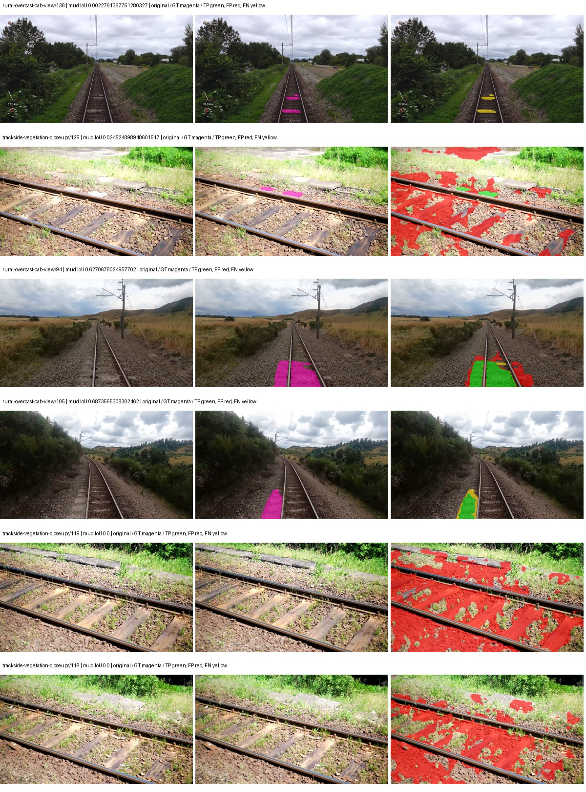
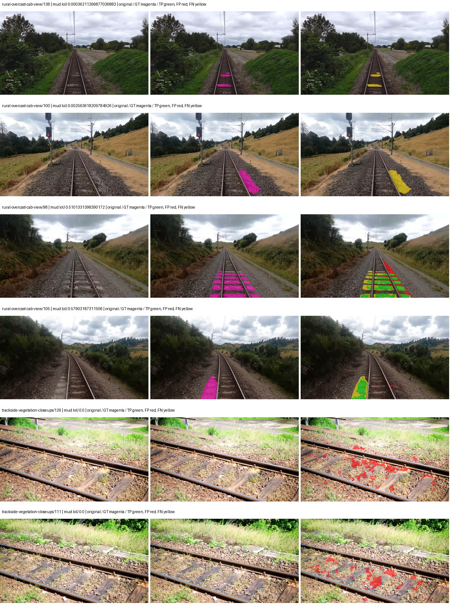
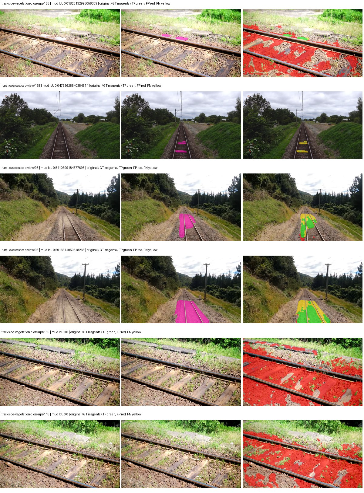
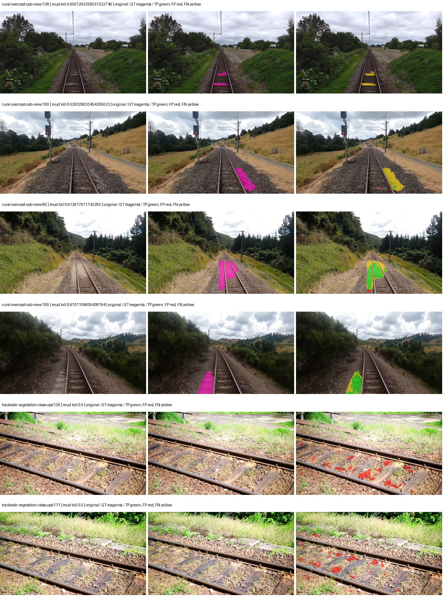

# segformer_b2 — paul-test-rtis_v2

[RTIS comparison](../../README.md) · [Full model records](record.json)

Primary selection and early stopping: **mud-pumping validation IoU**. A job is complete only after full statistics and isolated profiling are verified.

| Model | Initialization path | Seed | Status | Steps | Best step | Mud IoU (%) | Mud precision (%) | Mud recall (%) | Final mud IoU (trainer val, %) | mIoU (%) | Fixed GT-class mIoU (%) |
| --- | --- | --- | --- | --- | --- | --- | --- | --- | --- | --- | --- |
| segformer_b2 | rtis_only | 0 | completed | 3823 | 2549 | 8.63 | 10.10 | 37.18 | 6.31 | 36.52 | 42.61 |
| segformer_b2 | cityscapes_to_rtis | 0 | completed | 3568 | 2294 | 22.63 | 43.30 | 32.16 | 21.81 | 39.40 | 45.97 |
| segformer_b2 | railsem19_to_rtis | 0 | completed | 2803 | 1529 | 7.57 | 8.63 | 38.17 | 4.42 | 45.60 | 53.20 |
| segformer_b2 | cityscapes_to_railsem19_to_rtis | 0 | completed | 2803 | 1529 | 28.58 | 60.13 | 35.26 | 10.89 | 44.95 | 47.45 |

Training: 205 images. Validation: 37 images. Test: 50 held out. Seeds: [0]. Seed variation measures optimization variability, not independent-recording uncertainty. Historical source checkpoints stay fixed across adaptation seeds.

Training code: `066afb2626398b7be59d4d19f5a0e4644fd59adc`. Split SHA-256: `18a84c0163a65ded46508bcc904c374e5f33ad8a09b8879e3c8add606e86aa9f`.

## rtis_only — seed 0

Status: **completed**. Started: 2026-09-10T00:37:28.511512+00:00. Finished: 2026-09-10T01:42:42.629084+00:00.

Recipe pretrained initializer: `nvidia/mit-b2`.

`rtis_only` uses the recipe initializer, which may include pretrained segmentation components. Transfer paths load the exact historical source checkpoint below and reset the classifier; they do not reset all query/decoder features.

Source checkpoint: `Recipe pretrained initialization`.

Config SHA-256: `c54054610c4a935ed5aecae15ee8686fcd0d95e353903b7f2dae82f27fa6ed4d`. Weights used for validation: `raw`.

### Mud-pumping and aggregate quality

| Metric | Selected checkpoint | Final training validation |
| --- | --- | --- |
| Mud IoU | 8.63 | 6.31 |
| Mud precision | 10.10 | 7.34 |
| Mud recall | 37.18 | 30.95 |
| Mud Dice/F1 | 15.89 | 11.87 |
| mIoU | 36.52 | 36.46 |
| Mean accuracy | 54.18 | 52.24 |
| Mean precision | 56.66 | 57.74 |
| Mean Dice | 47.17 | 46.96 |
| Mean specificity | 99.07 | 99.08 |
| Pixel accuracy | 83.73 | 84.19 |
| Frequency-weighted IoU | 76.52 | 77.14 |
| Fixed GT-present class mIoU | 42.61 | 42.54 |
| Boundary F1 | 45.84 | 44.13 |

The selected checkpoint has independent evaluation evidence. Final values are the trainer's final validation record, not a new independent evaluation. mIoU averages classes with nonzero union, so false positives on absent classes can change its denominator. The fixed GT-class mean is supplementary and excludes absent classes; their false positives remain in the confusion matrix.

### Resource usage and timing

| Measurement | Value |
| --- | --- |
| Peak training VRAM, retained training invocation (GiB) | 11.73 |
| Peak evaluation VRAM (GiB) | 7.46 |
| Retained training invocation wall time (seconds) | 3683.73 |
| Retained training invocation GPU-hours (one GPU) | 1.02 |
| Evaluation wall time (seconds) | 22.33 |
| Full evaluation pipeline images/second | 1.66 |
| Best full-state checkpoint (MiB) | 418.15 |
| Final full-state checkpoint (MiB) | 418.13 |
| Verified periodic checkpoints removed (GiB) | 2.86 |

VRAM uses the recorded allocator high-water mark; it is not total device usage including CUDA context. Resumed jobs' retained training invocation times and peaks are **not whole-campaign totals**. Earlier invocation resource records are not reconstructed here. Evaluation throughput includes loader, sliding-window inference and metrics; it is not model-only latency/FPS. Missing measurements are shown as —, never inferred from another dataset's run.

### Standardized inference performance

Dedicated model-only profiling waits for an idle worker-locked L40S: BF16, batch 1, 1024x1024, 20 warmup and 100 CUDA-event-timed public forwards. It excludes loading, preprocessing, tiling and metrics.

| Status | Parameters | Weight MiB | FPS | p50 ms | p95 ms | Peak reserved GiB |
| --- | --- | --- | --- | --- | --- | --- |
| complete | 27362773 | 104.38 | 53.21 | 18.62 | 19.45 | 2.25 |

```json
{
  "schema_version": 1,
  "model_id": "segformer_b2",
  "measured_at": "2026-09-10T01:42:37+00:00",
  "status": "complete",
  "benchmark_scope": "rtis_selected_checkpoint_model_only",
  "applies_to": [
    "segformer_b2--rtis_only--seed-0"
  ],
  "source": {
    "campaign_git_sha": "066afb2626398b7be59d4d19f5a0e4644fd59adc",
    "git_dirty": false,
    "config_hash": "9aae1d85bc28",
    "resolved_config": "/data/izadia1/projects/segmentary-runs/paul-test-rtis_v2/seed0-20260909/configs/segformer_b2--rtis_only--seed-0.yaml",
    "config_sha256": "c54054610c4a935ed5aecae15ee8686fcd0d95e353903b7f2dae82f27fa6ed4d",
    "checkpoint_sha256": "20b465b8a94b9da8108e33a4ce884968753e92114425434f460630a8c98db357",
    "checkpoint_global_step": 2549,
    "checkpoint_bytes": 438463729,
    "checkpoint_kind": "resume checkpoint with optimizer and EMA state",
    "weights": "raw",
    "measured_checkpoint_job_id": "segformer_b2--rtis_only--seed-0",
    "result_sha256": "8454a81c5752ebdd4bd116b4719b221ee5bdd3822cb23b1453679bc69e808ee9",
    "result_git_sha": "066afb2626398b7be59d4d19f5a0e4644fd59adc",
    "result_stage": "eval:paul-test-rtis:val",
    "result_seed": 0
  },
  "hardware": {
    "gpu_name": "NVIDIA L40S",
    "gpu_uuid": "GPU-1c9b612f-e0b5-fbbc-150f-8c2ef13453c9",
    "logical_device": "cuda:0",
    "physical_visibility_token": "5",
    "compute_capability": [
      8,
      9
    ],
    "total_memory_bytes": 47677177856
  },
  "model": {
    "parameter_count": 27362773,
    "trainable_parameter_count": 27362773,
    "resident_parameter_bytes": 109451092,
    "parameter_dtype_counts": {
      "float32": 27362773
    }
  },
  "contract": {
    "backend": "pytorch",
    "precision": "bf16_autocast",
    "batch_size": 1,
    "input_shape_nchw": [
      1,
      3,
      1024,
      1024
    ],
    "warmup_iterations": 20,
    "measured_iterations": 100,
    "timing": "per-forward CUDA events with end-event synchronization",
    "includes_preprocessing": false,
    "includes_data_loader": false,
    "includes_sliding_window": false,
    "input_resident_on_gpu": true,
    "model_only": true,
    "entrypoint": "public model(image) dense-logits forward"
  },
  "measurements": {
    "latency": {
      "p50_ms": 18.61734390258789,
      "p95_ms": 19.449189949035645,
      "mean_ms": 18.794392280578613,
      "minimum_ms": 18.3767032623291,
      "maximum_ms": 21.512191772460938,
      "fps": 53.20736020995798,
      "raw_ms": [
        19.159040451049805,
        18.42585563659668,
        18.543615341186523,
        18.501632690429688,
        18.43199920654297,
        18.43199920654297,
        18.585599899291992,
        18.501632690429688,
        18.79859161376953,
        18.8538875579834,
        18.783231735229492,
        18.719743728637695,
        18.479103088378906,
        18.481151580810547,
        18.916351318359375,
        18.473983764648438,
        19.03718376159668,
        19.1856632232666,
        18.533376693725586,
        19.23686408996582,
        18.41152000427246,
        18.3767032623291,
        18.43814468383789,
        18.493440628051758,
        18.43199920654297,
        18.43507194519043,
        18.550783157348633,
        18.552831649780273,
        18.46169662475586,
        18.41049575805664,
        19.019775390625,
        19.02387237548828,
        18.537471771240234,
        18.407424926757812,
        18.528255462646484,
        18.6296329498291,
        18.589696884155273,
        18.708480834960938,
        19.44883155822754,
        18.551807403564453,
        18.466815948486328,
        18.750463485717773,
        18.721759796142578,
        18.45145606994629,
        18.530303955078125,
        18.46784019470215,
        18.44428825378418,
        19.394559860229492,
        18.476032257080078,
        18.728960037231445,
        19.01363182067871,
        18.585567474365234,
        18.60710334777832,
        19.274751663208008,
        18.586624145507812,
        18.45452880859375,
        18.971647262573242,
        18.541568756103516,
        18.570207595825195,
        18.5927677154541,
        18.546655654907227,
        19.45599937438965,
        18.964479446411133,
        18.587648391723633,
        18.585599899291992,
        18.550783157348633,
        18.785280227661133,
        18.60304069519043,
        19.23174476623535,
        19.505151748657227,
        18.65011215209961,
        18.693119049072266,
        18.86720085144043,
        18.62860870361328,
        19.320831298828125,
        19.302400588989258,
        18.780160903930664,
        19.339263916015625,
        19.02079963684082,
        18.930688858032227,
        18.60710334777832,
        19.88915252685547,
        18.60915184020996,
        18.892799377441406,
        18.63680076599121,
        19.307519912719727,
        18.721792221069336,
        19.310592651367188,
        19.223552703857422,
        18.596864700317383,
        21.512191772460938,
        18.62553596496582,
        19.08019256591797,
        18.495487213134766,
        19.4150390625,
        19.544063568115234,
        18.932735443115234,
        18.996192932128906,
        18.527231216430664,
        18.44633674621582
      ],
      "percentile_method": "numpy linear interpolation"
    },
    "peak_reserved_bytes": 2420113408,
    "memory_kind": "pytorch_cuda_allocator_peak_reserved_excluding_context",
    "benchmark_wall_clock_s": 5.7637930400669575
  },
  "started_at": "2026-09-10T01:42:31+00:00",
  "finished_at": "2026-09-10T01:42:37+00:00",
  "environment": {
    "hostname": "hdrfs-app-001",
    "python": "3.11.15",
    "platform": "Linux-5.15.0-139-generic-x86_64-with-glibc2.35",
    "torch": "2.11.0+cu128",
    "torch_cuda": "12.8",
    "cudnn": 91900,
    "driver_version": "570.133.20",
    "cuda_available": true,
    "gpu_count": 1,
    "gpu_names": [
      "NVIDIA L40S"
    ],
    "cuda_visible_devices": "5",
    "packages": {
      "segmentary": "0.1.0",
      "torch": "2.11.0+cu128",
      "torchvision": "0.26.0+cu128",
      "transformers": "5.15.0",
      "timm": "1.0.28",
      "segmentation-models-pytorch": "0.5.0",
      "albumentations": "2.0.8",
      "lightning": "2.6.5",
      "numpy": "2.4.4"
    }
  }
}
```

### Per-class validation results

| Class | GT pixels | IoU (%) | Precision (%) | Recall (%) | Dice (%) | Boundary F1 (%) |
| --- | --- | --- | --- | --- | --- | --- |
| car | 29664 | 46.83 | 62.39 | 65.26 | 63.79 | 45.98 |
| construction | 311585 | 23.22 | 24.64 | 80.14 | 37.69 | 40.65 |
| fence | 265137 | 12.47 | 68.79 | 13.22 | 22.18 | 41.89 |
| mud-pumping | 1226250 | 8.63 | 10.10 | 37.18 | 15.89 | 12.33 |
| on-rails | 0 | 0.00 | 0.00 | — | 0.00 | 0.00 |
| person | 0 | 0.00 | 0.00 | — | 0.00 | 0.00 |
| pole | 628038 | 70.46 | 78.10 | 87.80 | 82.67 | 88.53 |
| rail-embedded | 16799 | 36.25 | 87.80 | 38.17 | 53.21 | 62.06 |
| rail-raised | 2969797 | 75.08 | 85.91 | 85.62 | 85.77 | 92.45 |
| rail-track | 6323197 | 39.60 | 69.46 | 47.95 | 56.74 | 54.73 |
| road | 1048831 | 13.14 | 69.78 | 13.93 | 23.22 | 23.05 |
| sidewalk | 1297367 | 46.61 | 77.40 | 53.95 | 63.58 | 23.42 |
| sky | 19121606 | 98.61 | 99.43 | 99.17 | 99.30 | 96.19 |
| standing-water | 95802 | 3.12 | 4.43 | 9.51 | 6.05 | 11.44 |
| terrain | 39239306 | 87.48 | 93.12 | 93.52 | 93.32 | 69.89 |
| trackbed | 10643081 | 57.51 | 74.87 | 71.27 | 73.02 | 56.96 |
| traffic-light | 19510 | 31.65 | 83.81 | 33.72 | 48.09 | 58.60 |
| traffic-sign | 13285 | 41.45 | 75.26 | 47.99 | 58.60 | 64.99 |
| tram-track | 56179 | 27.84 | 58.68 | 34.63 | 43.55 | 51.69 |
| truck | 0 | 0.00 | 0.00 | — | 0.00 | 0.00 |
| vegetation-overgrowth | 5901821 | 47.06 | 65.94 | 62.17 | 64.00 | 67.87 |

### Full-run accounting

| Measurement | Value |
| --- | --- |
| Full GPU-reserved wall seconds, all recorded worker attempts | 3914.12 |
| Full reserved GPU-hours | 1.09 |
| Whole-run timing complete | True |

| Phase | Wall seconds including failed attempts |
| --- | --- |
| training | 3690.35 |
| diagnostics | 176.94 |
| performance | 12.91 |

GPU-reserved time includes model loading, training, validation, collection, profiling, checkpoint I/O and orchestration while the worker owns one GPU. It is not GPU kernel-active time. Phase timings and sampled device memory/power/utilization are retained separately; sampled device memory is not the allocator high-water mark.

### Train/validation and raw/EMA diagnostics

| Checkpoint / weights / split | Images | Mud IoU (%) | Mud precision (%) | Mud recall (%) |
| --- | --- | --- | --- | --- |
| best-auto-train / raw | 205 | 96.76 | 98.09 | 98.61 |
| best-auto-val / raw | 37 | 8.63 | 10.10 | 37.18 |
| best-alternate-val / ema | 37 | 7.55 | 9.20 | 29.54 |
| final-auto-val / raw | 37 | 6.31 | 7.35 | 30.98 |

Train uses the evaluation transform without augmentation. Compare mud train/validation metrics for the same selected weights. Alternate EMA on running-stat BatchNorm is explicitly uncalibrated and is diagnostic only. Score-threshold curves use uncalibrated normalized scores and are pixel-level diagnostics, not event detection rates or a selected deployment operating point.

### Downloadable evidence

- best-auto-train: [per-image.csv](rtis_only--seed-0/best-auto-train/per-image.csv) · [per-image-confusion.json.gz](rtis_only--seed-0/best-auto-train/per-image-confusion.json.gz) · [groups.json](rtis_only--seed-0/best-auto-train/groups.json) · [mud-score-curves.json](rtis_only--seed-0/best-auto-train/mud-score-curves.json)
- best-auto-val: [per-image.csv](rtis_only--seed-0/best-auto-val/per-image.csv) · [per-image-confusion.json.gz](rtis_only--seed-0/best-auto-val/per-image-confusion.json.gz) · [groups.json](rtis_only--seed-0/best-auto-val/groups.json) · [mud-score-curves.json](rtis_only--seed-0/best-auto-val/mud-score-curves.json) · [examples.jpg](rtis_only--seed-0/best-auto-val/examples.jpg)
- best-alternate-val: [per-image.csv](rtis_only--seed-0/best-alternate-val/per-image.csv) · [per-image-confusion.json.gz](rtis_only--seed-0/best-alternate-val/per-image-confusion.json.gz) · [groups.json](rtis_only--seed-0/best-alternate-val/groups.json) · [mud-score-curves.json](rtis_only--seed-0/best-alternate-val/mud-score-curves.json)
- final-auto-val: [per-image.csv](rtis_only--seed-0/final-auto-val/per-image.csv) · [per-image-confusion.json.gz](rtis_only--seed-0/final-auto-val/per-image-confusion.json.gz) · [groups.json](rtis_only--seed-0/final-auto-val/groups.json) · [mud-score-curves.json](rtis_only--seed-0/final-auto-val/mud-score-curves.json)
- resources: [telemetry.csv](rtis_only--seed-0/resources/telemetry.csv)



Examples are two lowest and two highest mud-IoU positive images, plus up to two negative images with the most false-positive mud pixels. They are targeted diagnostic examples, not random samples. Green: true positive; red: false positive; yellow: false negative. Full predictions remain on HDRFS.

### Validation tracking

| Logged step | Overall mIoU (%) | Mud IoU (%) |
| --- | --- | --- |
| 254 | 23.91 | 0.72 |
| 509 | 28.88 | 1.14 |
| 764 | 36.93 | 3.88 |
| 1019 | 37.14 | 4.80 |
| 1274 | 31.07 | 5.28 |
| 1529 | 37.38 | 4.11 |
| 1784 | 34.82 | 6.51 |
| 2038 | 36.08 | 6.67 |
| 2293 | 35.17 | 5.56 |
| 2548 | 36.52 | 8.63 |
| 2803 | 36.43 | 7.66 |
| 3058 | 35.81 | 5.22 |
| 3313 | 36.80 | 6.04 |
| 3568 | 35.33 | 5.36 |
| 3823 | 36.46 | 6.31 |

All retained scalar curves, including training loss and per-class IoU, are in record.json. Observed best mud on a curve is not necessarily a retained checkpoint: the pilot saved its selection-metric-best and final checkpoints. Step logging and checkpoint global_step may differ by one.

### Stopping and checkpoint provenance

```json
{
  "stopping": {
    "actual_steps": 3823,
    "maximum_steps": 4000,
    "min_delta": 0.001,
    "monitor": "val_iou/mud-pumping",
    "patience": 5,
    "reason": "validation_plateau"
  },
  "checkpoints": {
    "best": {
      "path": "/data/izadia1/projects/segmentary-runs/paul-test-rtis_v2/seed0-20260909/future-runs/segformer_b2--rtis_only--seed-0_seed0/rtis/best.ckpt",
      "sha256": "20b465b8a94b9da8108e33a4ce884968753e92114425434f460630a8c98db357",
      "global_step": 2549,
      "bytes": 438463729
    },
    "final": {
      "path": "/data/izadia1/projects/segmentary-runs/paul-test-rtis_v2/seed0-20260909/future-runs/segformer_b2--rtis_only--seed-0_seed0/rtis/last.ckpt",
      "sha256": "1782e714cf230b9e491d4eb025e948b6b75bdcbb4deda399c3f00506a8056326",
      "global_step": 3823,
      "bytes": 438445681
    }
  },
  "cleanup_error": null
}
```

### Resolved training, initialization and evaluation settings

The optimizer block is the base configuration. Stage LR scales are applied at runtime, and stage warmup is capped at min(base warmup, floor(stage budget / 10), stage budget - 1): 400 steps for this 4,000-step pilot. Model-internal native input grids may differ from augmentation crops (EoMT uses its 640 grid).

```json
{
  "name": "segformer_b2--rtis_only--seed-0",
  "model": {
    "arch": "segformer_b2",
    "checkpoint": "nvidia/mit-b2",
    "tuning": "full",
    "head": "unified_head",
    "lora_r": 16,
    "lora_alpha": 32,
    "lora_dropout": 0.05,
    "lora_targets": [],
    "drop_path": null,
    "revision": null,
    "subfolder": null,
    "local_files_only": false,
    "trust_remote_code": false,
    "backbone_path": null,
    "head_paths": [],
    "classifier_path": null,
    "inactive_parameter_paths": [],
    "smp_arch": null,
    "encoder_name": null,
    "encoder_weights": null,
    "native": null,
    "batch_norm_momentum": null
  },
  "space": "paul-test-rtis",
  "taxonomy_root": "/data/izadia1/projects/segmentary-rtis-fullstats-066afb2/taxonomy",
  "output_root": "/data/izadia1/projects/segmentary-runs/paul-test-rtis_v2/seed0-20260909/future-runs",
  "optim": {
    "backbone_lr": 6e-05,
    "head_lr_mult": 10.0,
    "weight_decay": 0.05,
    "llrd": 1.0,
    "warmup_iters": 1500,
    "warmup_ratio": 1e-06,
    "poly_power": 0.9,
    "min_lr_ratio": 0.0,
    "betas": [
      0.9,
      0.999
    ],
    "grad_clip": 1.0
  },
  "train": {
    "iters": 4000,
    "batch_size": 2,
    "accum": 8,
    "num_workers": 2,
    "precision": "bf16-mixed",
    "ema_decay": 0.9998,
    "val_every": 250,
    "ckpt_every": 500,
    "selection_metric": "val_iou/mud-pumping",
    "early_stopping_patience": 5,
    "early_stopping_min_delta": 0.001,
    "seed": 0,
    "devices": 1
  },
  "eval": {
    "sliding_window": true,
    "window": [
      1024,
      1024
    ],
    "stride": [
      768,
      768
    ],
    "batch_size": 1,
    "num_workers": 2,
    "tta_scales": [],
    "tta_flip": false,
    "threshold": 0.5,
    "boundary_tolerance_frac": 0.0075,
    "save_confusion": true
  },
  "loss": {
    "task": "multiclass",
    "activation": "auto",
    "terms": [],
    "aux": "none",
    "aux_weight": 0.0,
    "ce_weight": 1.0,
    "label_smoothing": 0.0,
    "class_weights": null,
    "query": null
  },
  "aug": {
    "crop": [
      1024,
      1024
    ],
    "scale_min": 0.5,
    "scale_max": 2.0,
    "hflip_p": 0.5,
    "color_jitter_p": 0.5,
    "brightness": 0.25,
    "contrast": 0.25,
    "saturation": 0.25,
    "hue": 0.05
  },
  "stages": [
    {
      "name": "rtis",
      "data": [
        {
          "name": "paul-test-rtis",
          "root": "/data/izadia1/datasets/paul-test-rtis_v2",
          "variant": null,
          "split_file": "splits.json",
          "train_split": "train",
          "val_split": "val",
          "limit": null,
          "loader": "folder",
          "mapping": "paul-test-rtis",
          "loader_options": {
            "require_groups": true
          }
        }
      ],
      "iters": null,
      "lr_scale": 1.0,
      "head_group_lr_scale": 1.0,
      "init_from": "pretrained",
      "reset_head": false,
      "freeze": null,
      "sample_weights": null
    }
  ]
}
```

### Hardware and software provenance

```json
{
  "training": {
    "cuda_available": true,
    "cuda_visible_devices": "5",
    "cudnn": 91900,
    "driver_version": "570.133.20",
    "gpu_count": 1,
    "gpu_names": [
      "NVIDIA L40S"
    ],
    "hostname": "hdrfs-app-001",
    "input_normalization": {
      "channel_order": "rgb",
      "mean": [
        0.485,
        0.456,
        0.406
      ],
      "source": "imagenet",
      "std": [
        0.229,
        0.224,
        0.225
      ]
    },
    "model_origins": [
      {
        "hf_commit": "3bb39e8739149c3777d0325349b2a6c32c6413db",
        "hf_name_or_path": "nvidia/mit-b2",
        "module": "model",
        "timm_pretrained": {}
      },
      {
        "hf_commit": "3bb39e8739149c3777d0325349b2a6c32c6413db",
        "hf_name_or_path": "nvidia/mit-b2",
        "module": "model.segformer",
        "timm_pretrained": {}
      },
      {
        "hf_commit": "3bb39e8739149c3777d0325349b2a6c32c6413db",
        "hf_name_or_path": "nvidia/mit-b2",
        "module": "model.segformer.stages.0.blocks.0.attention",
        "timm_pretrained": {}
      },
      {
        "hf_commit": "3bb39e8739149c3777d0325349b2a6c32c6413db",
        "hf_name_or_path": "nvidia/mit-b2",
        "module": "model.segformer.stages.0.blocks.1.attention",
        "timm_pretrained": {}
      },
      {
        "hf_commit": "3bb39e8739149c3777d0325349b2a6c32c6413db",
        "hf_name_or_path": "nvidia/mit-b2",
        "module": "model.segformer.stages.0.blocks.2.attention",
        "timm_pretrained": {}
      },
      {
        "hf_commit": "3bb39e8739149c3777d0325349b2a6c32c6413db",
        "hf_name_or_path": "nvidia/mit-b2",
        "module": "model.segformer.stages.1.blocks.0.attention",
        "timm_pretrained": {}
      },
      {
        "hf_commit": "3bb39e8739149c3777d0325349b2a6c32c6413db",
        "hf_name_or_path": "nvidia/mit-b2",
        "module": "model.segformer.stages.1.blocks.1.attention",
        "timm_pretrained": {}
      },
      {
        "hf_commit": "3bb39e8739149c3777d0325349b2a6c32c6413db",
        "hf_name_or_path": "nvidia/mit-b2",
        "module": "model.segformer.stages.1.blocks.2.attention",
        "timm_pretrained": {}
      },
      {
        "hf_commit": "3bb39e8739149c3777d0325349b2a6c32c6413db",
        "hf_name_or_path": "nvidia/mit-b2",
        "module": "model.segformer.stages.1.blocks.3.attention",
        "timm_pretrained": {}
      },
      {
        "hf_commit": "3bb39e8739149c3777d0325349b2a6c32c6413db",
        "hf_name_or_path": "nvidia/mit-b2",
        "module": "model.segformer.stages.2.blocks.0.attention",
        "timm_pretrained": {}
      },
      {
        "hf_commit": "3bb39e8739149c3777d0325349b2a6c32c6413db",
        "hf_name_or_path": "nvidia/mit-b2",
        "module": "model.segformer.stages.2.blocks.1.attention",
        "timm_pretrained": {}
      },
      {
        "hf_commit": "3bb39e8739149c3777d0325349b2a6c32c6413db",
        "hf_name_or_path": "nvidia/mit-b2",
        "module": "model.segformer.stages.2.blocks.2.attention",
        "timm_pretrained": {}
      },
      {
        "hf_commit": "3bb39e8739149c3777d0325349b2a6c32c6413db",
        "hf_name_or_path": "nvidia/mit-b2",
        "module": "model.segformer.stages.2.blocks.3.attention",
        "timm_pretrained": {}
      },
      {
        "hf_commit": "3bb39e8739149c3777d0325349b2a6c32c6413db",
        "hf_name_or_path": "nvidia/mit-b2",
        "module": "model.segformer.stages.2.blocks.4.attention",
        "timm_pretrained": {}
      },
      {
        "hf_commit": "3bb39e8739149c3777d0325349b2a6c32c6413db",
        "hf_name_or_path": "nvidia/mit-b2",
        "module": "model.segformer.stages.2.blocks.5.attention",
        "timm_pretrained": {}
      },
      {
        "hf_commit": "3bb39e8739149c3777d0325349b2a6c32c6413db",
        "hf_name_or_path": "nvidia/mit-b2",
        "module": "model.segformer.stages.3.blocks.0.attention",
        "timm_pretrained": {}
      },
      {
        "hf_commit": "3bb39e8739149c3777d0325349b2a6c32c6413db",
        "hf_name_or_path": "nvidia/mit-b2",
        "module": "model.segformer.stages.3.blocks.1.attention",
        "timm_pretrained": {}
      },
      {
        "hf_commit": "3bb39e8739149c3777d0325349b2a6c32c6413db",
        "hf_name_or_path": "nvidia/mit-b2",
        "module": "model.segformer.stages.3.blocks.2.attention",
        "timm_pretrained": {}
      },
      {
        "hf_commit": "3bb39e8739149c3777d0325349b2a6c32c6413db",
        "hf_name_or_path": "nvidia/mit-b2",
        "module": "model.decode_head",
        "timm_pretrained": {}
      }
    ],
    "model_parameter_count": 27362773,
    "packages": {
      "albumentations": "2.0.8",
      "lightning": "2.6.5",
      "numpy": "2.4.4",
      "segmentary": "0.1.0",
      "segmentation-models-pytorch": "0.5.0",
      "timm": "1.0.28",
      "torch": "2.11.0+cu128",
      "torchvision": "0.26.0+cu128",
      "transformers": "5.15.0"
    },
    "platform": "Linux-5.15.0-139-generic-x86_64-with-glibc2.35",
    "python": "3.11.15",
    "torch": "2.11.0+cu128",
    "torch_cuda": "12.8",
    "trainable_parameter_count": 27362773,
    "training_stop": {
      "actual_steps": 3823,
      "maximum_steps": 4000,
      "min_delta": 0.001,
      "monitor": "val_iou/mud-pumping",
      "patience": 5,
      "reason": "validation_plateau"
    },
    "validation_weights": "raw"
  },
  "evaluation": {
    "cuda_available": true,
    "cuda_visible_devices": "5",
    "cudnn": 91900,
    "driver_version": "570.133.20",
    "gpu_count": 1,
    "gpu_names": [
      "NVIDIA L40S"
    ],
    "hostname": "hdrfs-app-001",
    "input_normalization": {
      "channel_order": "rgb",
      "mean": [
        0.485,
        0.456,
        0.406
      ],
      "source": "imagenet",
      "std": [
        0.229,
        0.224,
        0.225
      ]
    },
    "packages": {
      "albumentations": "2.0.8",
      "lightning": "2.6.5",
      "numpy": "2.4.4",
      "segmentary": "0.1.0",
      "segmentation-models-pytorch": "0.5.0",
      "timm": "1.0.28",
      "torch": "2.11.0+cu128",
      "torchvision": "0.26.0+cu128",
      "transformers": "5.15.0"
    },
    "platform": "Linux-5.15.0-139-generic-x86_64-with-glibc2.35",
    "python": "3.11.15",
    "torch": "2.11.0+cu128",
    "torch_cuda": "12.8"
  }
}
```

## cityscapes_to_rtis — seed 0

Status: **completed**. Started: 2026-09-10T00:38:09.790026+00:00. Finished: 2026-09-10T01:40:02.885334+00:00.

Recipe pretrained initializer: `nvidia/mit-b2`.

`rtis_only` uses the recipe initializer, which may include pretrained segmentation components. Transfer paths load the exact historical source checkpoint below and reset the classifier; they do not reset all query/decoder features.

Source checkpoint: `{'name': 'segformer_b2--cityscapes--seed-0', 'model': 'segformer_b2', 'protocol': 'cityscapes', 'config': '/data/izadia1/projects/segmentary-runs/all-model-city-rail-seed0-rail20-b9eb3e1/accepted/segformer_b2--cityscapes--seed-0/resolved-config.yaml', 'checkpoint': '/data/izadia1/projects/segmentary-runs/all-model-city-rail-seed0-a7c0b67/jobs/segformer_b2--cityscapes--seed-0/attempt-001/train/segformer_b2--cityscapes_seed0/cityscapes/last.ckpt', 'recorded_sha256': 'd0f4f619c4d1200c143ff218ddb7e8693decd082345af09049cc50b8f8c42977', 'exists': True}`.

Config SHA-256: `1f132b4c0ef1ceba8cadd92b75d8b1560fa15bb13bbb8720bc8f74049c16ca7e`. Weights used for validation: `raw`.

### Mud-pumping and aggregate quality

| Metric | Selected checkpoint | Final training validation |
| --- | --- | --- |
| Mud IoU | 22.63 | 21.81 |
| Mud precision | 43.30 | 33.04 |
| Mud recall | 32.16 | 39.09 |
| Mud Dice/F1 | 36.91 | 35.81 |
| mIoU | 39.40 | 39.90 |
| Mean accuracy | 55.21 | 56.34 |
| Mean precision | 55.43 | 54.51 |
| Mean Dice | 49.34 | 49.68 |
| Mean specificity | 99.17 | 99.16 |
| Pixel accuracy | 86.02 | 85.65 |
| Frequency-weighted IoU | 78.07 | 77.88 |
| Fixed GT-present class mIoU | 45.97 | 46.55 |
| Boundary F1 | 45.78 | 45.83 |

The selected checkpoint has independent evaluation evidence. Final values are the trainer's final validation record, not a new independent evaluation. mIoU averages classes with nonzero union, so false positives on absent classes can change its denominator. The fixed GT-class mean is supplementary and excludes absent classes; their false positives remain in the confusion matrix.

### Resource usage and timing

| Measurement | Value |
| --- | --- |
| Peak training VRAM, retained training invocation (GiB) | 11.73 |
| Peak evaluation VRAM (GiB) | 7.46 |
| Retained training invocation wall time (seconds) | 3480.92 |
| Retained training invocation GPU-hours (one GPU) | 0.97 |
| Evaluation wall time (seconds) | 22.69 |
| Full evaluation pipeline images/second | 1.63 |
| Best full-state checkpoint (MiB) | 418.15 |
| Final full-state checkpoint (MiB) | 418.13 |
| Verified periodic checkpoints removed (GiB) | 2.86 |

VRAM uses the recorded allocator high-water mark; it is not total device usage including CUDA context. Resumed jobs' retained training invocation times and peaks are **not whole-campaign totals**. Earlier invocation resource records are not reconstructed here. Evaluation throughput includes loader, sliding-window inference and metrics; it is not model-only latency/FPS. Missing measurements are shown as —, never inferred from another dataset's run.

### Standardized inference performance

Dedicated model-only profiling waits for an idle worker-locked L40S: BF16, batch 1, 1024x1024, 20 warmup and 100 CUDA-event-timed public forwards. It excludes loading, preprocessing, tiling and metrics.

| Status | Parameters | Weight MiB | FPS | p50 ms | p95 ms | Peak reserved GiB |
| --- | --- | --- | --- | --- | --- | --- |
| complete | 27362773 | 104.38 | 51.73 | 19.22 | 20.09 | 2.25 |

```json
{
  "schema_version": 1,
  "model_id": "segformer_b2",
  "measured_at": "2026-09-10T01:39:57+00:00",
  "status": "complete",
  "benchmark_scope": "rtis_selected_checkpoint_model_only",
  "applies_to": [
    "segformer_b2--cityscapes_to_rtis--seed-0"
  ],
  "source": {
    "campaign_git_sha": "066afb2626398b7be59d4d19f5a0e4644fd59adc",
    "git_dirty": false,
    "config_hash": "8434d74fcc2d",
    "resolved_config": "/data/izadia1/projects/segmentary-runs/paul-test-rtis_v2/seed0-20260909/configs/segformer_b2--cityscapes_to_rtis--seed-0.yaml",
    "config_sha256": "1f132b4c0ef1ceba8cadd92b75d8b1560fa15bb13bbb8720bc8f74049c16ca7e",
    "checkpoint_sha256": "3db7019193c787f7fd19b489f95969d9cbb3c2cb19551950b48ea333441cdd26",
    "checkpoint_global_step": 2294,
    "checkpoint_bytes": 438463729,
    "checkpoint_kind": "resume checkpoint with optimizer and EMA state",
    "weights": "raw",
    "measured_checkpoint_job_id": "segformer_b2--cityscapes_to_rtis--seed-0",
    "result_sha256": "42dbe81e23f4516802972a5ddce3968fc7507f328ab4324862c5152d262c60c0",
    "result_git_sha": "066afb2626398b7be59d4d19f5a0e4644fd59adc",
    "result_stage": "eval:paul-test-rtis:val",
    "result_seed": 0
  },
  "hardware": {
    "gpu_name": "NVIDIA L40S",
    "gpu_uuid": "GPU-804aea8b-5f62-423e-72c6-49e1ed15c4e4",
    "logical_device": "cuda:0",
    "physical_visibility_token": "6",
    "compute_capability": [
      8,
      9
    ],
    "total_memory_bytes": 47677177856
  },
  "model": {
    "parameter_count": 27362773,
    "trainable_parameter_count": 27362773,
    "resident_parameter_bytes": 109451092,
    "parameter_dtype_counts": {
      "float32": 27362773
    }
  },
  "contract": {
    "backend": "pytorch",
    "precision": "bf16_autocast",
    "batch_size": 1,
    "input_shape_nchw": [
      1,
      3,
      1024,
      1024
    ],
    "warmup_iterations": 20,
    "measured_iterations": 100,
    "timing": "per-forward CUDA events with end-event synchronization",
    "includes_preprocessing": false,
    "includes_data_loader": false,
    "includes_sliding_window": false,
    "input_resident_on_gpu": true,
    "model_only": true,
    "entrypoint": "public model(image) dense-logits forward"
  },
  "measurements": {
    "latency": {
      "p50_ms": 19.21894359588623,
      "p95_ms": 20.089446640014646,
      "mean_ms": 19.330303649902344,
      "minimum_ms": 18.6746883392334,
      "maximum_ms": 23.010303497314453,
      "fps": 51.73224477542296,
      "raw_ms": [
        19.561471939086914,
        18.86515235900879,
        18.727935791015625,
        18.803712844848633,
        19.23379135131836,
        19.41606330871582,
        18.708480834960938,
        18.870271682739258,
        19.84409523010254,
        18.81702423095703,
        19.124223709106445,
        19.629056930541992,
        19.00441551208496,
        19.4201602935791,
        19.86150360107422,
        19.22662353515625,
        19.825664520263672,
        20.81279945373535,
        19.162111282348633,
        18.6746883392334,
        18.716672897338867,
        19.04640007019043,
        19.729408264160156,
        19.47443199157715,
        18.951168060302734,
        19.734560012817383,
        18.870271682739258,
        19.26041603088379,
        19.23174476623535,
        18.746335983276367,
        19.611648559570312,
        19.304447174072266,
        19.123199462890625,
        19.317760467529297,
        18.800640106201172,
        19.692575454711914,
        19.729408264160156,
        18.734079360961914,
        18.81497573852539,
        20.45132827758789,
        18.81395149230957,
        19.84511947631836,
        19.473407745361328,
        19.008512496948242,
        19.65260887145996,
        18.84774398803711,
        19.44166374206543,
        19.45702362060547,
        18.82111930847168,
        19.102720260620117,
        20.05913543701172,
        19.356672286987305,
        18.83443260192871,
        19.348480224609375,
        19.62598419189453,
        18.998271942138672,
        18.967552185058594,
        18.766847610473633,
        18.753536224365234,
        18.985984802246094,
        19.808256149291992,
        19.074047088623047,
        19.825664520263672,
        19.757055282592773,
        19.191808700561523,
        18.795520782470703,
        18.84160041809082,
        19.076095581054688,
        18.84467124938965,
        18.717695236206055,
        18.772991180419922,
        18.84979248046875,
        19.516416549682617,
        19.24198341369629,
        19.772415161132812,
        19.0382080078125,
        18.757631301879883,
        19.330047607421875,
        19.81337547302246,
        19.26246452331543,
        19.175392150878906,
        19.430400848388672,
        18.81804847717285,
        19.939327239990234,
        19.326976776123047,
        19.21126365661621,
        18.717695236206055,
        18.749439239501953,
        18.735103607177734,
        23.010303497314453,
        22.638591766357422,
        21.015552520751953,
        19.46623992919922,
        18.982912063598633,
        19.430400848388672,
        18.720735549926758,
        20.07040023803711,
        19.529727935791016,
        18.721792221069336,
        19.960832595825195
      ],
      "percentile_method": "numpy linear interpolation"
    },
    "peak_reserved_bytes": 2420113408,
    "memory_kind": "pytorch_cuda_allocator_peak_reserved_excluding_context",
    "benchmark_wall_clock_s": 5.817478179931641
  },
  "started_at": "2026-09-10T01:39:51+00:00",
  "finished_at": "2026-09-10T01:39:57+00:00",
  "environment": {
    "hostname": "hdrfs-app-001",
    "python": "3.11.15",
    "platform": "Linux-5.15.0-139-generic-x86_64-with-glibc2.35",
    "torch": "2.11.0+cu128",
    "torch_cuda": "12.8",
    "cudnn": 91900,
    "driver_version": "570.133.20",
    "cuda_available": true,
    "gpu_count": 1,
    "gpu_names": [
      "NVIDIA L40S"
    ],
    "cuda_visible_devices": "6",
    "packages": {
      "segmentary": "0.1.0",
      "torch": "2.11.0+cu128",
      "torchvision": "0.26.0+cu128",
      "transformers": "5.15.0",
      "timm": "1.0.28",
      "segmentation-models-pytorch": "0.5.0",
      "albumentations": "2.0.8",
      "lightning": "2.6.5",
      "numpy": "2.4.4"
    }
  }
}
```

### Per-class validation results

| Class | GT pixels | IoU (%) | Precision (%) | Recall (%) | Dice (%) | Boundary F1 (%) |
| --- | --- | --- | --- | --- | --- | --- |
| car | 29664 | 63.23 | 70.21 | 86.41 | 77.48 | 52.19 |
| construction | 311585 | 61.02 | 84.63 | 68.62 | 75.79 | 71.94 |
| fence | 265137 | 22.80 | 57.86 | 27.33 | 37.13 | 36.03 |
| mud-pumping | 1226250 | 22.63 | 43.30 | 32.16 | 36.91 | 31.19 |
| on-rails | 0 | 0.00 | 0.00 | — | 0.00 | 0.00 |
| person | 0 | 0.00 | 0.00 | — | 0.00 | 0.00 |
| pole | 628038 | 72.53 | 82.79 | 85.41 | 84.07 | 90.32 |
| rail-embedded | 16799 | 14.86 | 91.86 | 15.05 | 25.87 | 38.35 |
| rail-raised | 2969797 | 72.22 | 87.59 | 80.46 | 83.87 | 89.78 |
| rail-track | 6323197 | 46.46 | 62.26 | 64.67 | 63.44 | 57.86 |
| road | 1048831 | 7.89 | 16.99 | 12.85 | 14.63 | 13.71 |
| sidewalk | 1297367 | 18.27 | 50.36 | 22.29 | 30.90 | 23.30 |
| sky | 19121606 | 98.56 | 99.25 | 99.30 | 99.28 | 95.64 |
| standing-water | 95802 | 0.66 | 1.16 | 1.53 | 1.32 | 4.26 |
| terrain | 39239306 | 89.58 | 93.04 | 96.02 | 94.50 | 68.24 |
| trackbed | 10643081 | 58.42 | 73.77 | 73.74 | 73.75 | 55.30 |
| traffic-light | 19510 | 69.25 | 86.54 | 77.61 | 81.83 | 88.15 |
| traffic-sign | 13285 | 40.34 | 59.73 | 55.41 | 57.49 | 57.92 |
| tram-track | 56179 | 18.12 | 36.50 | 26.46 | 30.68 | 19.50 |
| truck | 0 | 0.00 | 0.00 | — | 0.00 | 0.00 |
| vegetation-overgrowth | 5901821 | 50.64 | 66.13 | 68.38 | 67.24 | 67.71 |

### Full-run accounting

| Measurement | Value |
| --- | --- |
| Full GPU-reserved wall seconds, all recorded worker attempts | 3713.53 |
| Full reserved GPU-hours | 1.03 |
| Whole-run timing complete | True |

| Phase | Wall seconds including failed attempts |
| --- | --- |
| training | 3488.55 |
| diagnostics | 176.93 |
| performance | 13.32 |

GPU-reserved time includes model loading, training, validation, collection, profiling, checkpoint I/O and orchestration while the worker owns one GPU. It is not GPU kernel-active time. Phase timings and sampled device memory/power/utilization are retained separately; sampled device memory is not the allocator high-water mark.

### Train/validation and raw/EMA diagnostics

| Checkpoint / weights / split | Images | Mud IoU (%) | Mud precision (%) | Mud recall (%) |
| --- | --- | --- | --- | --- |
| best-auto-train / raw | 205 | 94.06 | 96.61 | 97.27 |
| best-auto-val / raw | 37 | 22.63 | 43.30 | 32.16 |
| best-alternate-val / ema | 37 | 14.41 | 31.22 | 21.11 |
| final-auto-val / raw | 37 | 21.82 | 33.06 | 39.10 |

Train uses the evaluation transform without augmentation. Compare mud train/validation metrics for the same selected weights. Alternate EMA on running-stat BatchNorm is explicitly uncalibrated and is diagnostic only. Score-threshold curves use uncalibrated normalized scores and are pixel-level diagnostics, not event detection rates or a selected deployment operating point.

### Downloadable evidence

- best-auto-train: [per-image.csv](cityscapes_to_rtis--seed-0/best-auto-train/per-image.csv) · [per-image-confusion.json.gz](cityscapes_to_rtis--seed-0/best-auto-train/per-image-confusion.json.gz) · [groups.json](cityscapes_to_rtis--seed-0/best-auto-train/groups.json) · [mud-score-curves.json](cityscapes_to_rtis--seed-0/best-auto-train/mud-score-curves.json)
- best-auto-val: [per-image.csv](cityscapes_to_rtis--seed-0/best-auto-val/per-image.csv) · [per-image-confusion.json.gz](cityscapes_to_rtis--seed-0/best-auto-val/per-image-confusion.json.gz) · [groups.json](cityscapes_to_rtis--seed-0/best-auto-val/groups.json) · [mud-score-curves.json](cityscapes_to_rtis--seed-0/best-auto-val/mud-score-curves.json) · [examples.jpg](cityscapes_to_rtis--seed-0/best-auto-val/examples.jpg)
- best-alternate-val: [per-image.csv](cityscapes_to_rtis--seed-0/best-alternate-val/per-image.csv) · [per-image-confusion.json.gz](cityscapes_to_rtis--seed-0/best-alternate-val/per-image-confusion.json.gz) · [groups.json](cityscapes_to_rtis--seed-0/best-alternate-val/groups.json) · [mud-score-curves.json](cityscapes_to_rtis--seed-0/best-alternate-val/mud-score-curves.json)
- final-auto-val: [per-image.csv](cityscapes_to_rtis--seed-0/final-auto-val/per-image.csv) · [per-image-confusion.json.gz](cityscapes_to_rtis--seed-0/final-auto-val/per-image-confusion.json.gz) · [groups.json](cityscapes_to_rtis--seed-0/final-auto-val/groups.json) · [mud-score-curves.json](cityscapes_to_rtis--seed-0/final-auto-val/mud-score-curves.json)
- resources: [telemetry.csv](cityscapes_to_rtis--seed-0/resources/telemetry.csv)



Examples are two lowest and two highest mud-IoU positive images, plus up to two negative images with the most false-positive mud pixels. They are targeted diagnostic examples, not random samples. Green: true positive; red: false positive; yellow: false negative. Full predictions remain on HDRFS.

### Validation tracking

| Logged step | Overall mIoU (%) | Mud IoU (%) |
| --- | --- | --- |
| 254 | 24.17 | 0.49 |
| 509 | 28.21 | 3.58 |
| 764 | 35.74 | 3.16 |
| 1019 | 39.46 | 13.56 |
| 1274 | 36.81 | 6.34 |
| 1529 | 38.63 | 17.85 |
| 1784 | 41.09 | 8.65 |
| 2038 | 38.66 | 20.43 |
| 2293 | 39.41 | 22.61 |
| 2548 | 38.77 | 15.78 |
| 2803 | 41.03 | 16.93 |
| 3058 | 40.56 | 16.02 |
| 3313 | 40.58 | 13.85 |
| 3568 | 39.90 | 21.81 |

All retained scalar curves, including training loss and per-class IoU, are in record.json. Observed best mud on a curve is not necessarily a retained checkpoint: the pilot saved its selection-metric-best and final checkpoints. Step logging and checkpoint global_step may differ by one.

### Stopping and checkpoint provenance

```json
{
  "stopping": {
    "actual_steps": 3568,
    "maximum_steps": 4000,
    "min_delta": 0.001,
    "monitor": "val_iou/mud-pumping",
    "patience": 5,
    "reason": "validation_plateau"
  },
  "checkpoints": {
    "best": {
      "path": "/data/izadia1/projects/segmentary-runs/paul-test-rtis_v2/seed0-20260909/future-runs/segformer_b2--cityscapes_to_rtis--seed-0_seed0/rtis/best.ckpt",
      "sha256": "3db7019193c787f7fd19b489f95969d9cbb3c2cb19551950b48ea333441cdd26",
      "global_step": 2294,
      "bytes": 438463729
    },
    "final": {
      "path": "/data/izadia1/projects/segmentary-runs/paul-test-rtis_v2/seed0-20260909/future-runs/segformer_b2--cityscapes_to_rtis--seed-0_seed0/rtis/last.ckpt",
      "sha256": "d7a969059783c4610c48c85f789b756de0257abb677a0fd1e1bc149ec4343cf5",
      "global_step": 3568,
      "bytes": 438445745
    }
  },
  "cleanup_error": null
}
```

### Resolved training, initialization and evaluation settings

The optimizer block is the base configuration. Stage LR scales are applied at runtime, and stage warmup is capped at min(base warmup, floor(stage budget / 10), stage budget - 1): 400 steps for this 4,000-step pilot. Model-internal native input grids may differ from augmentation crops (EoMT uses its 640 grid).

```json
{
  "name": "segformer_b2--cityscapes_to_rtis--seed-0",
  "model": {
    "arch": "segformer_b2",
    "checkpoint": "nvidia/mit-b2",
    "tuning": "full",
    "head": "unified_head",
    "lora_r": 16,
    "lora_alpha": 32,
    "lora_dropout": 0.05,
    "lora_targets": [],
    "drop_path": null,
    "revision": null,
    "subfolder": null,
    "local_files_only": false,
    "trust_remote_code": false,
    "backbone_path": null,
    "head_paths": [],
    "classifier_path": null,
    "inactive_parameter_paths": [],
    "smp_arch": null,
    "encoder_name": null,
    "encoder_weights": null,
    "native": null,
    "batch_norm_momentum": null
  },
  "space": "paul-test-rtis",
  "taxonomy_root": "/data/izadia1/projects/segmentary-rtis-fullstats-066afb2/taxonomy",
  "output_root": "/data/izadia1/projects/segmentary-runs/paul-test-rtis_v2/seed0-20260909/future-runs",
  "optim": {
    "backbone_lr": 6e-05,
    "head_lr_mult": 10.0,
    "weight_decay": 0.05,
    "llrd": 1.0,
    "warmup_iters": 1500,
    "warmup_ratio": 1e-06,
    "poly_power": 0.9,
    "min_lr_ratio": 0.0,
    "betas": [
      0.9,
      0.999
    ],
    "grad_clip": 1.0
  },
  "train": {
    "iters": 4000,
    "batch_size": 2,
    "accum": 8,
    "num_workers": 2,
    "precision": "bf16-mixed",
    "ema_decay": 0.9998,
    "val_every": 250,
    "ckpt_every": 500,
    "selection_metric": "val_iou/mud-pumping",
    "early_stopping_patience": 5,
    "early_stopping_min_delta": 0.001,
    "seed": 0,
    "devices": 1
  },
  "eval": {
    "sliding_window": true,
    "window": [
      1024,
      1024
    ],
    "stride": [
      768,
      768
    ],
    "batch_size": 1,
    "num_workers": 2,
    "tta_scales": [],
    "tta_flip": false,
    "threshold": 0.5,
    "boundary_tolerance_frac": 0.0075,
    "save_confusion": true
  },
  "loss": {
    "task": "multiclass",
    "activation": "auto",
    "terms": [],
    "aux": "none",
    "aux_weight": 0.0,
    "ce_weight": 1.0,
    "label_smoothing": 0.0,
    "class_weights": null,
    "query": null
  },
  "aug": {
    "crop": [
      1024,
      1024
    ],
    "scale_min": 0.5,
    "scale_max": 2.0,
    "hflip_p": 0.5,
    "color_jitter_p": 0.5,
    "brightness": 0.25,
    "contrast": 0.25,
    "saturation": 0.25,
    "hue": 0.05
  },
  "stages": [
    {
      "name": "rtis",
      "data": [
        {
          "name": "paul-test-rtis",
          "root": "/data/izadia1/datasets/paul-test-rtis_v2",
          "variant": null,
          "split_file": "splits.json",
          "train_split": "train",
          "val_split": "val",
          "limit": null,
          "loader": "folder",
          "mapping": "paul-test-rtis",
          "loader_options": {
            "require_groups": true
          }
        }
      ],
      "iters": null,
      "lr_scale": 0.1,
      "head_group_lr_scale": 1.0,
      "init_from": "/data/izadia1/projects/segmentary-runs/all-model-city-rail-seed0-a7c0b67/jobs/segformer_b2--cityscapes--seed-0/attempt-001/train/segformer_b2--cityscapes_seed0/cityscapes/last.ckpt",
      "reset_head": true,
      "freeze": null,
      "sample_weights": null
    }
  ]
}
```

### Hardware and software provenance

```json
{
  "training": {
    "cuda_available": true,
    "cuda_visible_devices": "6",
    "cudnn": 91900,
    "driver_version": "570.133.20",
    "gpu_count": 1,
    "gpu_names": [
      "NVIDIA L40S"
    ],
    "hostname": "hdrfs-app-001",
    "input_normalization": {
      "channel_order": "rgb",
      "mean": [
        0.485,
        0.456,
        0.406
      ],
      "source": "imagenet",
      "std": [
        0.229,
        0.224,
        0.225
      ]
    },
    "model_origins": [
      {
        "hf_commit": "3bb39e8739149c3777d0325349b2a6c32c6413db",
        "hf_name_or_path": "nvidia/mit-b2",
        "module": "model",
        "timm_pretrained": {}
      },
      {
        "hf_commit": "3bb39e8739149c3777d0325349b2a6c32c6413db",
        "hf_name_or_path": "nvidia/mit-b2",
        "module": "model.segformer",
        "timm_pretrained": {}
      },
      {
        "hf_commit": "3bb39e8739149c3777d0325349b2a6c32c6413db",
        "hf_name_or_path": "nvidia/mit-b2",
        "module": "model.segformer.stages.0.blocks.0.attention",
        "timm_pretrained": {}
      },
      {
        "hf_commit": "3bb39e8739149c3777d0325349b2a6c32c6413db",
        "hf_name_or_path": "nvidia/mit-b2",
        "module": "model.segformer.stages.0.blocks.1.attention",
        "timm_pretrained": {}
      },
      {
        "hf_commit": "3bb39e8739149c3777d0325349b2a6c32c6413db",
        "hf_name_or_path": "nvidia/mit-b2",
        "module": "model.segformer.stages.0.blocks.2.attention",
        "timm_pretrained": {}
      },
      {
        "hf_commit": "3bb39e8739149c3777d0325349b2a6c32c6413db",
        "hf_name_or_path": "nvidia/mit-b2",
        "module": "model.segformer.stages.1.blocks.0.attention",
        "timm_pretrained": {}
      },
      {
        "hf_commit": "3bb39e8739149c3777d0325349b2a6c32c6413db",
        "hf_name_or_path": "nvidia/mit-b2",
        "module": "model.segformer.stages.1.blocks.1.attention",
        "timm_pretrained": {}
      },
      {
        "hf_commit": "3bb39e8739149c3777d0325349b2a6c32c6413db",
        "hf_name_or_path": "nvidia/mit-b2",
        "module": "model.segformer.stages.1.blocks.2.attention",
        "timm_pretrained": {}
      },
      {
        "hf_commit": "3bb39e8739149c3777d0325349b2a6c32c6413db",
        "hf_name_or_path": "nvidia/mit-b2",
        "module": "model.segformer.stages.1.blocks.3.attention",
        "timm_pretrained": {}
      },
      {
        "hf_commit": "3bb39e8739149c3777d0325349b2a6c32c6413db",
        "hf_name_or_path": "nvidia/mit-b2",
        "module": "model.segformer.stages.2.blocks.0.attention",
        "timm_pretrained": {}
      },
      {
        "hf_commit": "3bb39e8739149c3777d0325349b2a6c32c6413db",
        "hf_name_or_path": "nvidia/mit-b2",
        "module": "model.segformer.stages.2.blocks.1.attention",
        "timm_pretrained": {}
      },
      {
        "hf_commit": "3bb39e8739149c3777d0325349b2a6c32c6413db",
        "hf_name_or_path": "nvidia/mit-b2",
        "module": "model.segformer.stages.2.blocks.2.attention",
        "timm_pretrained": {}
      },
      {
        "hf_commit": "3bb39e8739149c3777d0325349b2a6c32c6413db",
        "hf_name_or_path": "nvidia/mit-b2",
        "module": "model.segformer.stages.2.blocks.3.attention",
        "timm_pretrained": {}
      },
      {
        "hf_commit": "3bb39e8739149c3777d0325349b2a6c32c6413db",
        "hf_name_or_path": "nvidia/mit-b2",
        "module": "model.segformer.stages.2.blocks.4.attention",
        "timm_pretrained": {}
      },
      {
        "hf_commit": "3bb39e8739149c3777d0325349b2a6c32c6413db",
        "hf_name_or_path": "nvidia/mit-b2",
        "module": "model.segformer.stages.2.blocks.5.attention",
        "timm_pretrained": {}
      },
      {
        "hf_commit": "3bb39e8739149c3777d0325349b2a6c32c6413db",
        "hf_name_or_path": "nvidia/mit-b2",
        "module": "model.segformer.stages.3.blocks.0.attention",
        "timm_pretrained": {}
      },
      {
        "hf_commit": "3bb39e8739149c3777d0325349b2a6c32c6413db",
        "hf_name_or_path": "nvidia/mit-b2",
        "module": "model.segformer.stages.3.blocks.1.attention",
        "timm_pretrained": {}
      },
      {
        "hf_commit": "3bb39e8739149c3777d0325349b2a6c32c6413db",
        "hf_name_or_path": "nvidia/mit-b2",
        "module": "model.segformer.stages.3.blocks.2.attention",
        "timm_pretrained": {}
      },
      {
        "hf_commit": "3bb39e8739149c3777d0325349b2a6c32c6413db",
        "hf_name_or_path": "nvidia/mit-b2",
        "module": "model.decode_head",
        "timm_pretrained": {}
      }
    ],
    "model_parameter_count": 27362773,
    "packages": {
      "albumentations": "2.0.8",
      "lightning": "2.6.5",
      "numpy": "2.4.4",
      "segmentary": "0.1.0",
      "segmentation-models-pytorch": "0.5.0",
      "timm": "1.0.28",
      "torch": "2.11.0+cu128",
      "torchvision": "0.26.0+cu128",
      "transformers": "5.15.0"
    },
    "platform": "Linux-5.15.0-139-generic-x86_64-with-glibc2.35",
    "python": "3.11.15",
    "torch": "2.11.0+cu128",
    "torch_cuda": "12.8",
    "trainable_parameter_count": 27362773,
    "training_stop": {
      "actual_steps": 3568,
      "maximum_steps": 4000,
      "min_delta": 0.001,
      "monitor": "val_iou/mud-pumping",
      "patience": 5,
      "reason": "validation_plateau"
    },
    "validation_weights": "raw"
  },
  "evaluation": {
    "cuda_available": true,
    "cuda_visible_devices": "6",
    "cudnn": 91900,
    "driver_version": "570.133.20",
    "gpu_count": 1,
    "gpu_names": [
      "NVIDIA L40S"
    ],
    "hostname": "hdrfs-app-001",
    "input_normalization": {
      "channel_order": "rgb",
      "mean": [
        0.485,
        0.456,
        0.406
      ],
      "source": "imagenet",
      "std": [
        0.229,
        0.224,
        0.225
      ]
    },
    "packages": {
      "albumentations": "2.0.8",
      "lightning": "2.6.5",
      "numpy": "2.4.4",
      "segmentary": "0.1.0",
      "segmentation-models-pytorch": "0.5.0",
      "timm": "1.0.28",
      "torch": "2.11.0+cu128",
      "torchvision": "0.26.0+cu128",
      "transformers": "5.15.0"
    },
    "platform": "Linux-5.15.0-139-generic-x86_64-with-glibc2.35",
    "python": "3.11.15",
    "torch": "2.11.0+cu128",
    "torch_cuda": "12.8"
  }
}
```

## railsem19_to_rtis — seed 0

Status: **completed**. Started: 2026-09-10T00:44:18.149647+00:00. Finished: 2026-09-10T01:33:25.605068+00:00.

Recipe pretrained initializer: `nvidia/mit-b2`.

`rtis_only` uses the recipe initializer, which may include pretrained segmentation components. Transfer paths load the exact historical source checkpoint below and reset the classifier; they do not reset all query/decoder features.

Source checkpoint: `{'name': 'segformer_b2--railsem19--seed-0', 'model': 'segformer_b2', 'protocol': 'railsem19', 'config': '/data/izadia1/projects/segmentary-runs/all-model-city-rail-seed0-rail20-b9eb3e1/accepted/segformer_b2--railsem19--seed-0/resolved-config.yaml', 'checkpoint': '/data/izadia1/projects/segmentary-runs/all-model-city-rail-seed0-a7c0b67/jobs/segformer_b2--railsem19--seed-0/attempt-001/train/segformer_b2--railsem19_seed0/railsem19/last.ckpt', 'recorded_sha256': 'a017480f6fc66e45651f83f3103f582591fa2f5f82b7dc048429508393ccfc20', 'exists': True}`.

Config SHA-256: `fd29b688ab7482ea675579d0390c1cc1dc05b3b6368c4412970f212df17f2ec0`. Weights used for validation: `raw`.

### Mud-pumping and aggregate quality

| Metric | Selected checkpoint | Final training validation |
| --- | --- | --- |
| Mud IoU | 7.57 | 4.42 |
| Mud precision | 8.63 | 5.53 |
| Mud recall | 38.17 | 18.14 |
| Mud Dice/F1 | 14.08 | 8.47 |
| mIoU | 45.60 | 46.45 |
| Mean accuracy | 63.66 | 64.23 |
| Mean precision | 60.45 | 59.57 |
| Mean Dice | 55.47 | 56.10 |
| Mean specificity | 98.98 | 99.06 |
| Pixel accuracy | 83.64 | 84.53 |
| Frequency-weighted IoU | 75.61 | 76.85 |
| Fixed GT-present class mIoU | 53.20 | 54.19 |
| Boundary F1 | 51.44 | 51.51 |

The selected checkpoint has independent evaluation evidence. Final values are the trainer's final validation record, not a new independent evaluation. mIoU averages classes with nonzero union, so false positives on absent classes can change its denominator. The fixed GT-class mean is supplementary and excludes absent classes; their false positives remain in the confusion matrix.

### Resource usage and timing

| Measurement | Value |
| --- | --- |
| Peak training VRAM, retained training invocation (GiB) | 11.73 |
| Peak evaluation VRAM (GiB) | 7.46 |
| Retained training invocation wall time (seconds) | 2713.93 |
| Retained training invocation GPU-hours (one GPU) | 0.75 |
| Evaluation wall time (seconds) | 22.29 |
| Full evaluation pipeline images/second | 1.66 |
| Best full-state checkpoint (MiB) | 418.15 |
| Final full-state checkpoint (MiB) | 418.13 |
| Verified periodic checkpoints removed (GiB) | 2.04 |

VRAM uses the recorded allocator high-water mark; it is not total device usage including CUDA context. Resumed jobs' retained training invocation times and peaks are **not whole-campaign totals**. Earlier invocation resource records are not reconstructed here. Evaluation throughput includes loader, sliding-window inference and metrics; it is not model-only latency/FPS. Missing measurements are shown as —, never inferred from another dataset's run.

### Standardized inference performance

Dedicated model-only profiling waits for an idle worker-locked L40S: BF16, batch 1, 1024x1024, 20 warmup and 100 CUDA-event-timed public forwards. It excludes loading, preprocessing, tiling and metrics.

| Status | Parameters | Weight MiB | FPS | p50 ms | p95 ms | Peak reserved GiB |
| --- | --- | --- | --- | --- | --- | --- |
| complete | 27362773 | 104.38 | 51.17 | 19.03 | 22.23 | 2.25 |

```json
{
  "schema_version": 1,
  "model_id": "segformer_b2",
  "measured_at": "2026-09-10T01:33:21+00:00",
  "status": "complete",
  "benchmark_scope": "rtis_selected_checkpoint_model_only",
  "applies_to": [
    "segformer_b2--railsem19_to_rtis--seed-0"
  ],
  "source": {
    "campaign_git_sha": "066afb2626398b7be59d4d19f5a0e4644fd59adc",
    "git_dirty": false,
    "config_hash": "2b17f8739a2e",
    "resolved_config": "/data/izadia1/projects/segmentary-runs/paul-test-rtis_v2/seed0-20260909/configs/segformer_b2--railsem19_to_rtis--seed-0.yaml",
    "config_sha256": "fd29b688ab7482ea675579d0390c1cc1dc05b3b6368c4412970f212df17f2ec0",
    "checkpoint_sha256": "dab56b565eebb70618b8154e5ce05a2cf2df39a61b4c64a35352a457afd18cfd",
    "checkpoint_global_step": 1529,
    "checkpoint_bytes": 438463729,
    "checkpoint_kind": "resume checkpoint with optimizer and EMA state",
    "weights": "raw",
    "measured_checkpoint_job_id": "segformer_b2--railsem19_to_rtis--seed-0",
    "result_sha256": "cd12650ba952d08f9783ca0bc9bc2870aefcb164fe4f780b7c3598495da7cf47",
    "result_git_sha": "066afb2626398b7be59d4d19f5a0e4644fd59adc",
    "result_stage": "eval:paul-test-rtis:val",
    "result_seed": 0
  },
  "hardware": {
    "gpu_name": "NVIDIA L40S",
    "gpu_uuid": "GPU-2f8008a1-9b67-11f6-987b-b393a672322c",
    "logical_device": "cuda:0",
    "physical_visibility_token": "3",
    "compute_capability": [
      8,
      9
    ],
    "total_memory_bytes": 47677177856
  },
  "model": {
    "parameter_count": 27362773,
    "trainable_parameter_count": 27362773,
    "resident_parameter_bytes": 109451092,
    "parameter_dtype_counts": {
      "float32": 27362773
    }
  },
  "contract": {
    "backend": "pytorch",
    "precision": "bf16_autocast",
    "batch_size": 1,
    "input_shape_nchw": [
      1,
      3,
      1024,
      1024
    ],
    "warmup_iterations": 20,
    "measured_iterations": 100,
    "timing": "per-forward CUDA events with end-event synchronization",
    "includes_preprocessing": false,
    "includes_data_loader": false,
    "includes_sliding_window": false,
    "input_resident_on_gpu": true,
    "model_only": true,
    "entrypoint": "public model(image) dense-logits forward"
  },
  "measurements": {
    "latency": {
      "p50_ms": 19.02950382232666,
      "p95_ms": 22.226073741912842,
      "mean_ms": 19.54215805053711,
      "minimum_ms": 18.6378231048584,
      "maximum_ms": 26.029056549072266,
      "fps": 51.17142116105827,
      "raw_ms": [
        19.782655715942383,
        18.942975997924805,
        20.185087203979492,
        20.135007858276367,
        19.732479095458984,
        19.102720260620117,
        19.25529670715332,
        26.029056549072266,
        22.345727920532227,
        18.923519134521484,
        19.44576072692871,
        19.123199462890625,
        18.915327072143555,
        22.164480209350586,
        22.06105613708496,
        22.219776153564453,
        19.317792892456055,
        19.506175994873047,
        19.02284812927246,
        23.93600082397461,
        21.95462417602539,
        19.83283233642578,
        22.822912216186523,
        22.895584106445312,
        19.922943115234375,
        19.03615951538086,
        19.42323112487793,
        19.150848388671875,
        19.41606330871582,
        22.152191162109375,
        19.01158332824707,
        18.793472290039062,
        18.83228874206543,
        18.717695236206055,
        20.549631118774414,
        18.941951751708984,
        18.679807662963867,
        18.80780792236328,
        18.84671974182129,
        18.722816467285156,
        20.08780860900879,
        18.728960037231445,
        18.737152099609375,
        18.82419204711914,
        18.68390464782715,
        18.697216033935547,
        19.975168228149414,
        19.742719650268555,
        18.85696029663086,
        19.077119827270508,
        20.025344848632812,
        18.953216552734375,
        18.738176345825195,
        18.748416900634766,
        18.694143295288086,
        18.740224838256836,
        18.68390464782715,
        18.747392654418945,
        19.19183921813965,
        18.694143295288086,
        18.973695755004883,
        18.687999725341797,
        18.6378231048584,
        18.739200592041016,
        18.79859161376953,
        18.689023971557617,
        18.993024826049805,
        19.588096618652344,
        18.868223190307617,
        19.178495407104492,
        19.65875244140625,
        18.765823364257812,
        18.739200592041016,
        18.715648651123047,
        18.64192008972168,
        19.00441551208496,
        20.987903594970703,
        19.4467830657959,
        19.163135528564453,
        19.505151748657227,
        20.081663131713867,
        19.0699520111084,
        18.764799118041992,
        18.913280487060547,
        19.742719650268555,
        20.075519561767578,
        19.762176513671875,
        20.45235252380371,
        19.826688766479492,
        18.81804847717285,
        18.770944595336914,
        18.701311111450195,
        19.01251220703125,
        18.787328720092773,
        19.101696014404297,
        19.600383758544922,
        18.695199966430664,
        18.997215270996094,
        18.888704299926758,
        19.084287643432617
      ],
      "percentile_method": "numpy linear interpolation"
    },
    "peak_reserved_bytes": 2420113408,
    "memory_kind": "pytorch_cuda_allocator_peak_reserved_excluding_context",
    "benchmark_wall_clock_s": 5.851343102753162
  },
  "started_at": "2026-09-10T01:33:15+00:00",
  "finished_at": "2026-09-10T01:33:21+00:00",
  "environment": {
    "hostname": "hdrfs-app-001",
    "python": "3.11.15",
    "platform": "Linux-5.15.0-139-generic-x86_64-with-glibc2.35",
    "torch": "2.11.0+cu128",
    "torch_cuda": "12.8",
    "cudnn": 91900,
    "driver_version": "570.133.20",
    "cuda_available": true,
    "gpu_count": 1,
    "gpu_names": [
      "NVIDIA L40S"
    ],
    "cuda_visible_devices": "3",
    "packages": {
      "segmentary": "0.1.0",
      "torch": "2.11.0+cu128",
      "torchvision": "0.26.0+cu128",
      "transformers": "5.15.0",
      "timm": "1.0.28",
      "segmentation-models-pytorch": "0.5.0",
      "albumentations": "2.0.8",
      "lightning": "2.6.5",
      "numpy": "2.4.4"
    }
  }
}
```

### Per-class validation results

| Class | GT pixels | IoU (%) | Precision (%) | Recall (%) | Dice (%) | Boundary F1 (%) |
| --- | --- | --- | --- | --- | --- | --- |
| car | 29664 | 74.96 | 81.08 | 90.85 | 85.69 | 72.18 |
| construction | 311585 | 59.47 | 68.68 | 81.59 | 74.58 | 63.20 |
| fence | 265137 | 41.22 | 68.35 | 50.94 | 58.37 | 52.46 |
| mud-pumping | 1226250 | 7.57 | 8.63 | 38.17 | 14.08 | 13.79 |
| on-rails | 0 | 0.00 | 0.00 | — | 0.00 | 0.00 |
| person | 0 | 0.00 | 0.00 | — | 0.00 | 0.00 |
| pole | 628038 | 76.89 | 90.05 | 84.03 | 86.93 | 93.92 |
| rail-embedded | 16799 | 54.49 | 79.58 | 63.35 | 70.54 | 88.62 |
| rail-raised | 2969797 | 75.78 | 84.75 | 87.74 | 86.22 | 92.68 |
| rail-track | 6323197 | 37.39 | 80.53 | 41.10 | 54.43 | 52.57 |
| road | 1048831 | 14.19 | 33.09 | 19.91 | 24.86 | 30.81 |
| sidewalk | 1297367 | 44.28 | 79.77 | 49.88 | 61.38 | 13.96 |
| sky | 19121606 | 98.89 | 99.50 | 99.38 | 99.44 | 97.94 |
| standing-water | 95802 | 0.59 | 1.09 | 1.28 | 1.18 | 5.04 |
| terrain | 39239306 | 86.99 | 88.24 | 98.40 | 93.04 | 67.47 |
| trackbed | 10643081 | 60.58 | 78.90 | 72.29 | 75.45 | 58.32 |
| traffic-light | 19510 | 84.08 | 93.96 | 88.88 | 91.35 | 96.88 |
| traffic-sign | 13285 | 51.28 | 82.03 | 57.76 | 67.79 | 69.38 |
| tram-track | 56179 | 60.80 | 64.80 | 90.79 | 75.62 | 52.40 |
| truck | 0 | 0.00 | 0.00 | — | 0.00 | 0.00 |
| vegetation-overgrowth | 5901821 | 28.21 | 86.51 | 29.51 | 44.01 | 58.66 |

### Full-run accounting

| Measurement | Value |
| --- | --- |
| Full GPU-reserved wall seconds, all recorded worker attempts | 2947.82 |
| Full reserved GPU-hours | 0.82 |
| Whole-run timing complete | True |

| Phase | Wall seconds including failed attempts |
| --- | --- |
| training | 2721.19 |
| diagnostics | 180.24 |
| performance | 13.10 |

GPU-reserved time includes model loading, training, validation, collection, profiling, checkpoint I/O and orchestration while the worker owns one GPU. It is not GPU kernel-active time. Phase timings and sampled device memory/power/utilization are retained separately; sampled device memory is not the allocator high-water mark.

### Train/validation and raw/EMA diagnostics

| Checkpoint / weights / split | Images | Mud IoU (%) | Mud precision (%) | Mud recall (%) |
| --- | --- | --- | --- | --- |
| best-auto-train / raw | 205 | 94.00 | 96.46 | 97.36 |
| best-auto-val / raw | 37 | 7.57 | 8.63 | 38.17 |
| best-alternate-val / ema | 37 | 4.46 | 5.34 | 21.24 |
| final-auto-val / raw | 37 | 4.43 | 5.53 | 18.15 |

Train uses the evaluation transform without augmentation. Compare mud train/validation metrics for the same selected weights. Alternate EMA on running-stat BatchNorm is explicitly uncalibrated and is diagnostic only. Score-threshold curves use uncalibrated normalized scores and are pixel-level diagnostics, not event detection rates or a selected deployment operating point.

### Downloadable evidence

- best-auto-train: [per-image.csv](railsem19_to_rtis--seed-0/best-auto-train/per-image.csv) · [per-image-confusion.json.gz](railsem19_to_rtis--seed-0/best-auto-train/per-image-confusion.json.gz) · [groups.json](railsem19_to_rtis--seed-0/best-auto-train/groups.json) · [mud-score-curves.json](railsem19_to_rtis--seed-0/best-auto-train/mud-score-curves.json)
- best-auto-val: [per-image.csv](railsem19_to_rtis--seed-0/best-auto-val/per-image.csv) · [per-image-confusion.json.gz](railsem19_to_rtis--seed-0/best-auto-val/per-image-confusion.json.gz) · [groups.json](railsem19_to_rtis--seed-0/best-auto-val/groups.json) · [mud-score-curves.json](railsem19_to_rtis--seed-0/best-auto-val/mud-score-curves.json) · [examples.jpg](railsem19_to_rtis--seed-0/best-auto-val/examples.jpg)
- best-alternate-val: [per-image.csv](railsem19_to_rtis--seed-0/best-alternate-val/per-image.csv) · [per-image-confusion.json.gz](railsem19_to_rtis--seed-0/best-alternate-val/per-image-confusion.json.gz) · [groups.json](railsem19_to_rtis--seed-0/best-alternate-val/groups.json) · [mud-score-curves.json](railsem19_to_rtis--seed-0/best-alternate-val/mud-score-curves.json)
- final-auto-val: [per-image.csv](railsem19_to_rtis--seed-0/final-auto-val/per-image.csv) · [per-image-confusion.json.gz](railsem19_to_rtis--seed-0/final-auto-val/per-image-confusion.json.gz) · [groups.json](railsem19_to_rtis--seed-0/final-auto-val/groups.json) · [mud-score-curves.json](railsem19_to_rtis--seed-0/final-auto-val/mud-score-curves.json)
- resources: [telemetry.csv](railsem19_to_rtis--seed-0/resources/telemetry.csv)



Examples are two lowest and two highest mud-IoU positive images, plus up to two negative images with the most false-positive mud pixels. They are targeted diagnostic examples, not random samples. Green: true positive; red: false positive; yellow: false negative. Full predictions remain on HDRFS.

### Validation tracking

| Logged step | Overall mIoU (%) | Mud IoU (%) |
| --- | --- | --- |
| 254 | 32.59 | 0.14 |
| 509 | 41.46 | 1.94 |
| 764 | 44.30 | 2.29 |
| 1019 | 47.10 | 2.87 |
| 1274 | 47.49 | 4.62 |
| 1529 | 45.61 | 7.57 |
| 1784 | 45.90 | 5.16 |
| 2038 | 46.75 | 5.43 |
| 2293 | 46.01 | 6.86 |
| 2548 | 45.47 | 7.31 |
| 2803 | 46.45 | 4.42 |

All retained scalar curves, including training loss and per-class IoU, are in record.json. Observed best mud on a curve is not necessarily a retained checkpoint: the pilot saved its selection-metric-best and final checkpoints. Step logging and checkpoint global_step may differ by one.

### Stopping and checkpoint provenance

```json
{
  "stopping": {
    "actual_steps": 2803,
    "maximum_steps": 4000,
    "min_delta": 0.001,
    "monitor": "val_iou/mud-pumping",
    "patience": 5,
    "reason": "validation_plateau"
  },
  "checkpoints": {
    "best": {
      "path": "/data/izadia1/projects/segmentary-runs/paul-test-rtis_v2/seed0-20260909/future-runs/segformer_b2--railsem19_to_rtis--seed-0_seed0/rtis/best.ckpt",
      "sha256": "dab56b565eebb70618b8154e5ce05a2cf2df39a61b4c64a35352a457afd18cfd",
      "global_step": 1529,
      "bytes": 438463729
    },
    "final": {
      "path": "/data/izadia1/projects/segmentary-runs/paul-test-rtis_v2/seed0-20260909/future-runs/segformer_b2--railsem19_to_rtis--seed-0_seed0/rtis/last.ckpt",
      "sha256": "b369d398200bc116034c8d01178b10d3389b5cf7736ba8eb50ac13b7427d4ade",
      "global_step": 2803,
      "bytes": 438445745
    }
  },
  "cleanup_error": null
}
```

### Resolved training, initialization and evaluation settings

The optimizer block is the base configuration. Stage LR scales are applied at runtime, and stage warmup is capped at min(base warmup, floor(stage budget / 10), stage budget - 1): 400 steps for this 4,000-step pilot. Model-internal native input grids may differ from augmentation crops (EoMT uses its 640 grid).

```json
{
  "name": "segformer_b2--railsem19_to_rtis--seed-0",
  "model": {
    "arch": "segformer_b2",
    "checkpoint": "nvidia/mit-b2",
    "tuning": "full",
    "head": "unified_head",
    "lora_r": 16,
    "lora_alpha": 32,
    "lora_dropout": 0.05,
    "lora_targets": [],
    "drop_path": null,
    "revision": null,
    "subfolder": null,
    "local_files_only": false,
    "trust_remote_code": false,
    "backbone_path": null,
    "head_paths": [],
    "classifier_path": null,
    "inactive_parameter_paths": [],
    "smp_arch": null,
    "encoder_name": null,
    "encoder_weights": null,
    "native": null,
    "batch_norm_momentum": null
  },
  "space": "paul-test-rtis",
  "taxonomy_root": "/data/izadia1/projects/segmentary-rtis-fullstats-066afb2/taxonomy",
  "output_root": "/data/izadia1/projects/segmentary-runs/paul-test-rtis_v2/seed0-20260909/future-runs",
  "optim": {
    "backbone_lr": 6e-05,
    "head_lr_mult": 10.0,
    "weight_decay": 0.05,
    "llrd": 1.0,
    "warmup_iters": 1500,
    "warmup_ratio": 1e-06,
    "poly_power": 0.9,
    "min_lr_ratio": 0.0,
    "betas": [
      0.9,
      0.999
    ],
    "grad_clip": 1.0
  },
  "train": {
    "iters": 4000,
    "batch_size": 2,
    "accum": 8,
    "num_workers": 2,
    "precision": "bf16-mixed",
    "ema_decay": 0.9998,
    "val_every": 250,
    "ckpt_every": 500,
    "selection_metric": "val_iou/mud-pumping",
    "early_stopping_patience": 5,
    "early_stopping_min_delta": 0.001,
    "seed": 0,
    "devices": 1
  },
  "eval": {
    "sliding_window": true,
    "window": [
      1024,
      1024
    ],
    "stride": [
      768,
      768
    ],
    "batch_size": 1,
    "num_workers": 2,
    "tta_scales": [],
    "tta_flip": false,
    "threshold": 0.5,
    "boundary_tolerance_frac": 0.0075,
    "save_confusion": true
  },
  "loss": {
    "task": "multiclass",
    "activation": "auto",
    "terms": [],
    "aux": "none",
    "aux_weight": 0.0,
    "ce_weight": 1.0,
    "label_smoothing": 0.0,
    "class_weights": null,
    "query": null
  },
  "aug": {
    "crop": [
      1024,
      1024
    ],
    "scale_min": 0.5,
    "scale_max": 2.0,
    "hflip_p": 0.5,
    "color_jitter_p": 0.5,
    "brightness": 0.25,
    "contrast": 0.25,
    "saturation": 0.25,
    "hue": 0.05
  },
  "stages": [
    {
      "name": "rtis",
      "data": [
        {
          "name": "paul-test-rtis",
          "root": "/data/izadia1/datasets/paul-test-rtis_v2",
          "variant": null,
          "split_file": "splits.json",
          "train_split": "train",
          "val_split": "val",
          "limit": null,
          "loader": "folder",
          "mapping": "paul-test-rtis",
          "loader_options": {
            "require_groups": true
          }
        }
      ],
      "iters": null,
      "lr_scale": 0.1,
      "head_group_lr_scale": 1.0,
      "init_from": "/data/izadia1/projects/segmentary-runs/all-model-city-rail-seed0-a7c0b67/jobs/segformer_b2--railsem19--seed-0/attempt-001/train/segformer_b2--railsem19_seed0/railsem19/last.ckpt",
      "reset_head": true,
      "freeze": null,
      "sample_weights": null
    }
  ]
}
```

### Hardware and software provenance

```json
{
  "training": {
    "cuda_available": true,
    "cuda_visible_devices": "3",
    "cudnn": 91900,
    "driver_version": "570.133.20",
    "gpu_count": 1,
    "gpu_names": [
      "NVIDIA L40S"
    ],
    "hostname": "hdrfs-app-001",
    "input_normalization": {
      "channel_order": "rgb",
      "mean": [
        0.485,
        0.456,
        0.406
      ],
      "source": "imagenet",
      "std": [
        0.229,
        0.224,
        0.225
      ]
    },
    "model_origins": [
      {
        "hf_commit": "3bb39e8739149c3777d0325349b2a6c32c6413db",
        "hf_name_or_path": "nvidia/mit-b2",
        "module": "model",
        "timm_pretrained": {}
      },
      {
        "hf_commit": "3bb39e8739149c3777d0325349b2a6c32c6413db",
        "hf_name_or_path": "nvidia/mit-b2",
        "module": "model.segformer",
        "timm_pretrained": {}
      },
      {
        "hf_commit": "3bb39e8739149c3777d0325349b2a6c32c6413db",
        "hf_name_or_path": "nvidia/mit-b2",
        "module": "model.segformer.stages.0.blocks.0.attention",
        "timm_pretrained": {}
      },
      {
        "hf_commit": "3bb39e8739149c3777d0325349b2a6c32c6413db",
        "hf_name_or_path": "nvidia/mit-b2",
        "module": "model.segformer.stages.0.blocks.1.attention",
        "timm_pretrained": {}
      },
      {
        "hf_commit": "3bb39e8739149c3777d0325349b2a6c32c6413db",
        "hf_name_or_path": "nvidia/mit-b2",
        "module": "model.segformer.stages.0.blocks.2.attention",
        "timm_pretrained": {}
      },
      {
        "hf_commit": "3bb39e8739149c3777d0325349b2a6c32c6413db",
        "hf_name_or_path": "nvidia/mit-b2",
        "module": "model.segformer.stages.1.blocks.0.attention",
        "timm_pretrained": {}
      },
      {
        "hf_commit": "3bb39e8739149c3777d0325349b2a6c32c6413db",
        "hf_name_or_path": "nvidia/mit-b2",
        "module": "model.segformer.stages.1.blocks.1.attention",
        "timm_pretrained": {}
      },
      {
        "hf_commit": "3bb39e8739149c3777d0325349b2a6c32c6413db",
        "hf_name_or_path": "nvidia/mit-b2",
        "module": "model.segformer.stages.1.blocks.2.attention",
        "timm_pretrained": {}
      },
      {
        "hf_commit": "3bb39e8739149c3777d0325349b2a6c32c6413db",
        "hf_name_or_path": "nvidia/mit-b2",
        "module": "model.segformer.stages.1.blocks.3.attention",
        "timm_pretrained": {}
      },
      {
        "hf_commit": "3bb39e8739149c3777d0325349b2a6c32c6413db",
        "hf_name_or_path": "nvidia/mit-b2",
        "module": "model.segformer.stages.2.blocks.0.attention",
        "timm_pretrained": {}
      },
      {
        "hf_commit": "3bb39e8739149c3777d0325349b2a6c32c6413db",
        "hf_name_or_path": "nvidia/mit-b2",
        "module": "model.segformer.stages.2.blocks.1.attention",
        "timm_pretrained": {}
      },
      {
        "hf_commit": "3bb39e8739149c3777d0325349b2a6c32c6413db",
        "hf_name_or_path": "nvidia/mit-b2",
        "module": "model.segformer.stages.2.blocks.2.attention",
        "timm_pretrained": {}
      },
      {
        "hf_commit": "3bb39e8739149c3777d0325349b2a6c32c6413db",
        "hf_name_or_path": "nvidia/mit-b2",
        "module": "model.segformer.stages.2.blocks.3.attention",
        "timm_pretrained": {}
      },
      {
        "hf_commit": "3bb39e8739149c3777d0325349b2a6c32c6413db",
        "hf_name_or_path": "nvidia/mit-b2",
        "module": "model.segformer.stages.2.blocks.4.attention",
        "timm_pretrained": {}
      },
      {
        "hf_commit": "3bb39e8739149c3777d0325349b2a6c32c6413db",
        "hf_name_or_path": "nvidia/mit-b2",
        "module": "model.segformer.stages.2.blocks.5.attention",
        "timm_pretrained": {}
      },
      {
        "hf_commit": "3bb39e8739149c3777d0325349b2a6c32c6413db",
        "hf_name_or_path": "nvidia/mit-b2",
        "module": "model.segformer.stages.3.blocks.0.attention",
        "timm_pretrained": {}
      },
      {
        "hf_commit": "3bb39e8739149c3777d0325349b2a6c32c6413db",
        "hf_name_or_path": "nvidia/mit-b2",
        "module": "model.segformer.stages.3.blocks.1.attention",
        "timm_pretrained": {}
      },
      {
        "hf_commit": "3bb39e8739149c3777d0325349b2a6c32c6413db",
        "hf_name_or_path": "nvidia/mit-b2",
        "module": "model.segformer.stages.3.blocks.2.attention",
        "timm_pretrained": {}
      },
      {
        "hf_commit": "3bb39e8739149c3777d0325349b2a6c32c6413db",
        "hf_name_or_path": "nvidia/mit-b2",
        "module": "model.decode_head",
        "timm_pretrained": {}
      }
    ],
    "model_parameter_count": 27362773,
    "packages": {
      "albumentations": "2.0.8",
      "lightning": "2.6.5",
      "numpy": "2.4.4",
      "segmentary": "0.1.0",
      "segmentation-models-pytorch": "0.5.0",
      "timm": "1.0.28",
      "torch": "2.11.0+cu128",
      "torchvision": "0.26.0+cu128",
      "transformers": "5.15.0"
    },
    "platform": "Linux-5.15.0-139-generic-x86_64-with-glibc2.35",
    "python": "3.11.15",
    "torch": "2.11.0+cu128",
    "torch_cuda": "12.8",
    "trainable_parameter_count": 27362773,
    "training_stop": {
      "actual_steps": 2803,
      "maximum_steps": 4000,
      "min_delta": 0.001,
      "monitor": "val_iou/mud-pumping",
      "patience": 5,
      "reason": "validation_plateau"
    },
    "validation_weights": "raw"
  },
  "evaluation": {
    "cuda_available": true,
    "cuda_visible_devices": "3",
    "cudnn": 91900,
    "driver_version": "570.133.20",
    "gpu_count": 1,
    "gpu_names": [
      "NVIDIA L40S"
    ],
    "hostname": "hdrfs-app-001",
    "input_normalization": {
      "channel_order": "rgb",
      "mean": [
        0.485,
        0.456,
        0.406
      ],
      "source": "imagenet",
      "std": [
        0.229,
        0.224,
        0.225
      ]
    },
    "packages": {
      "albumentations": "2.0.8",
      "lightning": "2.6.5",
      "numpy": "2.4.4",
      "segmentary": "0.1.0",
      "segmentation-models-pytorch": "0.5.0",
      "timm": "1.0.28",
      "torch": "2.11.0+cu128",
      "torchvision": "0.26.0+cu128",
      "transformers": "5.15.0"
    },
    "platform": "Linux-5.15.0-139-generic-x86_64-with-glibc2.35",
    "python": "3.11.15",
    "torch": "2.11.0+cu128",
    "torch_cuda": "12.8"
  }
}
```

## cityscapes_to_railsem19_to_rtis — seed 0

Status: **completed**. Started: 2026-09-10T00:48:39.897906+00:00. Finished: 2026-09-10T01:37:37.885044+00:00.

Recipe pretrained initializer: `nvidia/mit-b2`.

`rtis_only` uses the recipe initializer, which may include pretrained segmentation components. Transfer paths load the exact historical source checkpoint below and reset the classifier; they do not reset all query/decoder features.

Source checkpoint: `{'name': 'segformer_b2--cityscapes_to_railsem19--seed-0', 'model': 'segformer_b2', 'protocol': 'cityscapes_to_railsem19', 'config': '/data/izadia1/projects/segmentary-runs/all-model-city-rail-seed0-rail20-b9eb3e1/jobs/segformer_b2--cityscapes_to_railsem19--seed-0/attempt-001/resolved-config.yaml', 'checkpoint': '/data/izadia1/projects/segmentary-runs/all-model-city-rail-seed0-rail20-b9eb3e1/jobs/segformer_b2--cityscapes_to_railsem19--seed-0/attempt-001/train/segformer_b2--cityscapes_to_railsem19_seed0/railsem19/last.ckpt', 'recorded_sha256': '2917e287b856d7b272db0d1edd93bd31e4d79e045ff37648653c6cdcf0929bd7', 'exists': True}`.

Config SHA-256: `5e339fbd2e6bf4ac62c5134beb3fa4b63931e36a57eb109c83e3bb49cef17a45`. Weights used for validation: `raw`.

### Mud-pumping and aggregate quality

| Metric | Selected checkpoint | Final training validation |
| --- | --- | --- |
| Mud IoU | 28.58 | 10.89 |
| Mud precision | 60.13 | 23.60 |
| Mud recall | 35.26 | 16.82 |
| Mud Dice/F1 | 44.45 | 19.64 |
| mIoU | 44.95 | 44.94 |
| Mean accuracy | 57.27 | 57.31 |
| Mean precision | 61.86 | 59.96 |
| Mean Dice | 55.97 | 55.52 |
| Mean specificity | 99.11 | 99.16 |
| Pixel accuracy | 85.81 | 85.91 |
| Frequency-weighted IoU | 77.45 | 78.24 |
| Fixed GT-present class mIoU | 47.45 | 47.44 |
| Boundary F1 | 50.61 | 50.46 |

The selected checkpoint has independent evaluation evidence. Final values are the trainer's final validation record, not a new independent evaluation. mIoU averages classes with nonzero union, so false positives on absent classes can change its denominator. The fixed GT-class mean is supplementary and excludes absent classes; their false positives remain in the confusion matrix.

### Resource usage and timing

| Measurement | Value |
| --- | --- |
| Peak training VRAM, retained training invocation (GiB) | 11.73 |
| Peak evaluation VRAM (GiB) | 7.46 |
| Retained training invocation wall time (seconds) | 2706.17 |
| Retained training invocation GPU-hours (one GPU) | 0.75 |
| Evaluation wall time (seconds) | 22.32 |
| Full evaluation pipeline images/second | 1.66 |
| Best full-state checkpoint (MiB) | 418.15 |
| Final full-state checkpoint (MiB) | 418.13 |
| Verified periodic checkpoints removed (GiB) | 2.04 |

VRAM uses the recorded allocator high-water mark; it is not total device usage including CUDA context. Resumed jobs' retained training invocation times and peaks are **not whole-campaign totals**. Earlier invocation resource records are not reconstructed here. Evaluation throughput includes loader, sliding-window inference and metrics; it is not model-only latency/FPS. Missing measurements are shown as —, never inferred from another dataset's run.

### Standardized inference performance

Dedicated model-only profiling waits for an idle worker-locked L40S: BF16, batch 1, 1024x1024, 20 warmup and 100 CUDA-event-timed public forwards. It excludes loading, preprocessing, tiling and metrics.

| Status | Parameters | Weight MiB | FPS | p50 ms | p95 ms | Peak reserved GiB |
| --- | --- | --- | --- | --- | --- | --- |
| complete | 27362773 | 104.38 | 53.08 | 18.58 | 19.64 | 2.25 |

```json
{
  "schema_version": 1,
  "model_id": "segformer_b2",
  "measured_at": "2026-09-10T01:37:33+00:00",
  "status": "complete",
  "benchmark_scope": "rtis_selected_checkpoint_model_only",
  "applies_to": [
    "segformer_b2--cityscapes_to_railsem19_to_rtis--seed-0"
  ],
  "source": {
    "campaign_git_sha": "066afb2626398b7be59d4d19f5a0e4644fd59adc",
    "git_dirty": false,
    "config_hash": "5a6c8e59aad0",
    "resolved_config": "/data/izadia1/projects/segmentary-runs/paul-test-rtis_v2/seed0-20260909/configs/segformer_b2--cityscapes_to_railsem19_to_rtis--seed-0.yaml",
    "config_sha256": "5e339fbd2e6bf4ac62c5134beb3fa4b63931e36a57eb109c83e3bb49cef17a45",
    "checkpoint_sha256": "83782bfb1561e80389329f9a8a17c0fa5c82de3eecff27b689ea9af20591ca37",
    "checkpoint_global_step": 1529,
    "checkpoint_bytes": 438463793,
    "checkpoint_kind": "resume checkpoint with optimizer and EMA state",
    "weights": "raw",
    "measured_checkpoint_job_id": "segformer_b2--cityscapes_to_railsem19_to_rtis--seed-0",
    "result_sha256": "aa8da5fb8b2500df80c192981b5e7c79b03531c32351d233d8acc6163e2ddae2",
    "result_git_sha": "066afb2626398b7be59d4d19f5a0e4644fd59adc",
    "result_stage": "eval:paul-test-rtis:val",
    "result_seed": 0
  },
  "hardware": {
    "gpu_name": "NVIDIA L40S",
    "gpu_uuid": "GPU-e2e96741-aec9-e90b-5c46-d0d58be90a56",
    "logical_device": "cuda:0",
    "physical_visibility_token": "8",
    "compute_capability": [
      8,
      9
    ],
    "total_memory_bytes": 47677177856
  },
  "model": {
    "parameter_count": 27362773,
    "trainable_parameter_count": 27362773,
    "resident_parameter_bytes": 109451092,
    "parameter_dtype_counts": {
      "float32": 27362773
    }
  },
  "contract": {
    "backend": "pytorch",
    "precision": "bf16_autocast",
    "batch_size": 1,
    "input_shape_nchw": [
      1,
      3,
      1024,
      1024
    ],
    "warmup_iterations": 20,
    "measured_iterations": 100,
    "timing": "per-forward CUDA events with end-event synchronization",
    "includes_preprocessing": false,
    "includes_data_loader": false,
    "includes_sliding_window": false,
    "input_resident_on_gpu": true,
    "model_only": true,
    "entrypoint": "public model(image) dense-logits forward"
  },
  "measurements": {
    "latency": {
      "p50_ms": 18.576895713806152,
      "p95_ms": 19.64149770736694,
      "mean_ms": 18.83777048110962,
      "minimum_ms": 18.338815689086914,
      "maximum_ms": 22.49932861328125,
      "fps": 53.08483830412908,
      "raw_ms": [
        19.257343292236328,
        18.78835105895996,
        18.772991180419922,
        19.332096099853516,
        18.352127075195312,
        18.770944595336914,
        18.399200439453125,
        19.6177921295166,
        18.980863571166992,
        18.39308738708496,
        19.02387237548828,
        18.540544509887695,
        18.604095458984375,
        18.558975219726562,
        19.103744506835938,
        18.767871856689453,
        18.39206314086914,
        18.45248031616211,
        18.408447265625,
        18.670591354370117,
        18.671615600585938,
        18.86720085144043,
        18.4135684967041,
        18.533376693725586,
        18.512895584106445,
        18.483200073242188,
        18.456575393676758,
        18.465791702270508,
        18.3767032623291,
        18.473983764648438,
        18.343936920166016,
        18.358272552490234,
        18.43507194519043,
        18.567167282104492,
        18.472959518432617,
        18.375680923461914,
        18.774015426635742,
        18.553855895996094,
        18.534400939941406,
        18.499584197998047,
        18.40332794189453,
        18.552831649780273,
        18.455551147460938,
        18.6429443359375,
        18.370559692382812,
        18.42995262145996,
        18.492416381835938,
        18.501632690429688,
        18.338815689086914,
        18.448383331298828,
        18.46988868713379,
        18.349056243896484,
        18.38489532470703,
        22.49932861328125,
        22.47782325744629,
        22.42969512939453,
        19.02079963684082,
        18.570240020751953,
        19.26041603088379,
        18.725887298583984,
        18.595840454101562,
        18.42278480529785,
        18.795520782470703,
        18.44428825378418,
        18.46169662475586,
        18.549760818481445,
        19.387392044067383,
        19.058687210083008,
        19.39967918395996,
        19.398656845092773,
        18.79654312133789,
        18.511871337890625,
        18.41766357421875,
        18.6378231048584,
        18.45350456237793,
        18.41766357421875,
        18.558975219726562,
        19.44473648071289,
        19.078144073486328,
        19.472383499145508,
        21.207040786743164,
        20.091903686523438,
        18.915327072143555,
        18.500608444213867,
        18.46784019470215,
        18.475008010864258,
        19.301376342773438,
        19.21945571899414,
        18.728960037231445,
        19.120128631591797,
        18.82419204711914,
        18.84467124938965,
        18.811904907226562,
        18.736127853393555,
        18.686975479125977,
        18.58355140686035,
        18.65216064453125,
        18.726911544799805,
        18.764799118041992,
        18.63270378112793
      ],
      "percentile_method": "numpy linear interpolation"
    },
    "peak_reserved_bytes": 2420113408,
    "memory_kind": "pytorch_cuda_allocator_peak_reserved_excluding_context",
    "benchmark_wall_clock_s": 5.653288118541241
  },
  "started_at": "2026-09-10T01:37:27+00:00",
  "finished_at": "2026-09-10T01:37:33+00:00",
  "environment": {
    "hostname": "hdrfs-app-001",
    "python": "3.11.15",
    "platform": "Linux-5.15.0-139-generic-x86_64-with-glibc2.35",
    "torch": "2.11.0+cu128",
    "torch_cuda": "12.8",
    "cudnn": 91900,
    "driver_version": "570.133.20",
    "cuda_available": true,
    "gpu_count": 1,
    "gpu_names": [
      "NVIDIA L40S"
    ],
    "cuda_visible_devices": "8",
    "packages": {
      "segmentary": "0.1.0",
      "torch": "2.11.0+cu128",
      "torchvision": "0.26.0+cu128",
      "transformers": "5.15.0",
      "timm": "1.0.28",
      "segmentation-models-pytorch": "0.5.0",
      "albumentations": "2.0.8",
      "lightning": "2.6.5",
      "numpy": "2.4.4"
    }
  }
}
```

### Per-class validation results

| Class | GT pixels | IoU (%) | Precision (%) | Recall (%) | Dice (%) | Boundary F1 (%) |
| --- | --- | --- | --- | --- | --- | --- |
| car | 29664 | 72.86 | 79.03 | 90.31 | 84.30 | 66.06 |
| construction | 311585 | 42.22 | 47.68 | 78.65 | 59.37 | 38.34 |
| fence | 265137 | 21.42 | 47.77 | 27.96 | 35.28 | 35.27 |
| mud-pumping | 1226250 | 28.58 | 60.13 | 35.26 | 44.45 | 36.98 |
| on-rails | 0 | — | — | — | — | — |
| person | 0 | 0.00 | 0.00 | — | 0.00 | 0.00 |
| pole | 628038 | 75.22 | 87.97 | 83.85 | 85.86 | 92.82 |
| rail-embedded | 16799 | 22.35 | 93.12 | 22.73 | 36.54 | 47.96 |
| rail-raised | 2969797 | 77.39 | 88.62 | 85.92 | 87.25 | 93.30 |
| rail-track | 6323197 | 38.14 | 77.05 | 43.02 | 55.21 | 47.05 |
| road | 1048831 | 12.05 | 24.47 | 19.17 | 21.50 | 23.74 |
| sidewalk | 1297367 | 14.23 | 24.11 | 25.77 | 24.91 | 8.84 |
| sky | 19121606 | 98.76 | 99.51 | 99.24 | 99.37 | 97.31 |
| standing-water | 95802 | 0.04 | 0.05 | 0.17 | 0.08 | 0.79 |
| terrain | 39239306 | 88.65 | 89.97 | 98.38 | 93.99 | 64.85 |
| trackbed | 10643081 | 60.90 | 73.84 | 77.65 | 75.70 | 54.58 |
| traffic-light | 19510 | 76.24 | 86.04 | 87.00 | 86.52 | 78.76 |
| traffic-sign | 13285 | 52.32 | 83.78 | 58.22 | 68.70 | 76.48 |
| tram-track | 56179 | 24.48 | 41.30 | 37.53 | 39.33 | 26.47 |
| truck | 0 | — | — | — | — | — |
| vegetation-overgrowth | 5901821 | 48.21 | 70.92 | 60.09 | 65.06 | 72.00 |

### Full-run accounting

| Measurement | Value |
| --- | --- |
| Full GPU-reserved wall seconds, all recorded worker attempts | 2938.31 |
| Full reserved GPU-hours | 0.82 |
| Whole-run timing complete | True |

| Phase | Wall seconds including failed attempts |
| --- | --- |
| training | 2713.43 |
| diagnostics | 178.08 |
| performance | 13.14 |

GPU-reserved time includes model loading, training, validation, collection, profiling, checkpoint I/O and orchestration while the worker owns one GPU. It is not GPU kernel-active time. Phase timings and sampled device memory/power/utilization are retained separately; sampled device memory is not the allocator high-water mark.

### Train/validation and raw/EMA diagnostics

| Checkpoint / weights / split | Images | Mud IoU (%) | Mud precision (%) | Mud recall (%) |
| --- | --- | --- | --- | --- |
| best-auto-train / raw | 205 | 93.36 | 95.63 | 97.52 |
| best-auto-val / raw | 37 | 28.58 | 60.13 | 35.26 |
| best-alternate-val / ema | 37 | 12.26 | 47.51 | 14.19 |
| final-auto-val / raw | 37 | 10.91 | 23.63 | 16.84 |

Train uses the evaluation transform without augmentation. Compare mud train/validation metrics for the same selected weights. Alternate EMA on running-stat BatchNorm is explicitly uncalibrated and is diagnostic only. Score-threshold curves use uncalibrated normalized scores and are pixel-level diagnostics, not event detection rates or a selected deployment operating point.

### Downloadable evidence

- best-auto-train: [per-image.csv](cityscapes_to_railsem19_to_rtis--seed-0/best-auto-train/per-image.csv) · [per-image-confusion.json.gz](cityscapes_to_railsem19_to_rtis--seed-0/best-auto-train/per-image-confusion.json.gz) · [groups.json](cityscapes_to_railsem19_to_rtis--seed-0/best-auto-train/groups.json) · [mud-score-curves.json](cityscapes_to_railsem19_to_rtis--seed-0/best-auto-train/mud-score-curves.json)
- best-auto-val: [per-image.csv](cityscapes_to_railsem19_to_rtis--seed-0/best-auto-val/per-image.csv) · [per-image-confusion.json.gz](cityscapes_to_railsem19_to_rtis--seed-0/best-auto-val/per-image-confusion.json.gz) · [groups.json](cityscapes_to_railsem19_to_rtis--seed-0/best-auto-val/groups.json) · [mud-score-curves.json](cityscapes_to_railsem19_to_rtis--seed-0/best-auto-val/mud-score-curves.json) · [examples.jpg](cityscapes_to_railsem19_to_rtis--seed-0/best-auto-val/examples.jpg)
- best-alternate-val: [per-image.csv](cityscapes_to_railsem19_to_rtis--seed-0/best-alternate-val/per-image.csv) · [per-image-confusion.json.gz](cityscapes_to_railsem19_to_rtis--seed-0/best-alternate-val/per-image-confusion.json.gz) · [groups.json](cityscapes_to_railsem19_to_rtis--seed-0/best-alternate-val/groups.json) · [mud-score-curves.json](cityscapes_to_railsem19_to_rtis--seed-0/best-alternate-val/mud-score-curves.json)
- final-auto-val: [per-image.csv](cityscapes_to_railsem19_to_rtis--seed-0/final-auto-val/per-image.csv) · [per-image-confusion.json.gz](cityscapes_to_railsem19_to_rtis--seed-0/final-auto-val/per-image-confusion.json.gz) · [groups.json](cityscapes_to_railsem19_to_rtis--seed-0/final-auto-val/groups.json) · [mud-score-curves.json](cityscapes_to_railsem19_to_rtis--seed-0/final-auto-val/mud-score-curves.json)
- resources: [telemetry.csv](cityscapes_to_railsem19_to_rtis--seed-0/resources/telemetry.csv)



Examples are two lowest and two highest mud-IoU positive images, plus up to two negative images with the most false-positive mud pixels. They are targeted diagnostic examples, not random samples. Green: true positive; red: false positive; yellow: false negative. Full predictions remain on HDRFS.

### Validation tracking

| Logged step | Overall mIoU (%) | Mud IoU (%) |
| --- | --- | --- |
| 254 | 27.51 | 0.23 |
| 509 | 38.86 | 8.02 |
| 764 | 41.52 | 5.94 |
| 1019 | 41.84 | 20.73 |
| 1274 | 40.94 | 14.09 |
| 1529 | 44.95 | 28.59 |
| 1784 | 46.00 | 11.39 |
| 2038 | 41.07 | 19.28 |
| 2293 | 44.89 | 16.98 |
| 2548 | 42.73 | 19.16 |
| 2803 | 44.94 | 10.89 |

All retained scalar curves, including training loss and per-class IoU, are in record.json. Observed best mud on a curve is not necessarily a retained checkpoint: the pilot saved its selection-metric-best and final checkpoints. Step logging and checkpoint global_step may differ by one.

### Stopping and checkpoint provenance

```json
{
  "stopping": {
    "actual_steps": 2803,
    "maximum_steps": 4000,
    "min_delta": 0.001,
    "monitor": "val_iou/mud-pumping",
    "patience": 5,
    "reason": "validation_plateau"
  },
  "checkpoints": {
    "best": {
      "path": "/data/izadia1/projects/segmentary-runs/paul-test-rtis_v2/seed0-20260909/future-runs/segformer_b2--cityscapes_to_railsem19_to_rtis--seed-0_seed0/rtis/best.ckpt",
      "sha256": "83782bfb1561e80389329f9a8a17c0fa5c82de3eecff27b689ea9af20591ca37",
      "global_step": 1529,
      "bytes": 438463793
    },
    "final": {
      "path": "/data/izadia1/projects/segmentary-runs/paul-test-rtis_v2/seed0-20260909/future-runs/segformer_b2--cityscapes_to_railsem19_to_rtis--seed-0_seed0/rtis/last.ckpt",
      "sha256": "00d28035cd3583486dd60ef6c77d243de260039116e7be6b2599c726be3e2b12",
      "global_step": 2803,
      "bytes": 438445745
    }
  },
  "cleanup_error": null
}
```

### Resolved training, initialization and evaluation settings

The optimizer block is the base configuration. Stage LR scales are applied at runtime, and stage warmup is capped at min(base warmup, floor(stage budget / 10), stage budget - 1): 400 steps for this 4,000-step pilot. Model-internal native input grids may differ from augmentation crops (EoMT uses its 640 grid).

```json
{
  "name": "segformer_b2--cityscapes_to_railsem19_to_rtis--seed-0",
  "model": {
    "arch": "segformer_b2",
    "checkpoint": "nvidia/mit-b2",
    "tuning": "full",
    "head": "unified_head",
    "lora_r": 16,
    "lora_alpha": 32,
    "lora_dropout": 0.05,
    "lora_targets": [],
    "drop_path": null,
    "revision": null,
    "subfolder": null,
    "local_files_only": false,
    "trust_remote_code": false,
    "backbone_path": null,
    "head_paths": [],
    "classifier_path": null,
    "inactive_parameter_paths": [],
    "smp_arch": null,
    "encoder_name": null,
    "encoder_weights": null,
    "native": null,
    "batch_norm_momentum": null
  },
  "space": "paul-test-rtis",
  "taxonomy_root": "/data/izadia1/projects/segmentary-rtis-fullstats-066afb2/taxonomy",
  "output_root": "/data/izadia1/projects/segmentary-runs/paul-test-rtis_v2/seed0-20260909/future-runs",
  "optim": {
    "backbone_lr": 6e-05,
    "head_lr_mult": 10.0,
    "weight_decay": 0.05,
    "llrd": 1.0,
    "warmup_iters": 1500,
    "warmup_ratio": 1e-06,
    "poly_power": 0.9,
    "min_lr_ratio": 0.0,
    "betas": [
      0.9,
      0.999
    ],
    "grad_clip": 1.0
  },
  "train": {
    "iters": 4000,
    "batch_size": 2,
    "accum": 8,
    "num_workers": 2,
    "precision": "bf16-mixed",
    "ema_decay": 0.9998,
    "val_every": 250,
    "ckpt_every": 500,
    "selection_metric": "val_iou/mud-pumping",
    "early_stopping_patience": 5,
    "early_stopping_min_delta": 0.001,
    "seed": 0,
    "devices": 1
  },
  "eval": {
    "sliding_window": true,
    "window": [
      1024,
      1024
    ],
    "stride": [
      768,
      768
    ],
    "batch_size": 1,
    "num_workers": 2,
    "tta_scales": [],
    "tta_flip": false,
    "threshold": 0.5,
    "boundary_tolerance_frac": 0.0075,
    "save_confusion": true
  },
  "loss": {
    "task": "multiclass",
    "activation": "auto",
    "terms": [],
    "aux": "none",
    "aux_weight": 0.0,
    "ce_weight": 1.0,
    "label_smoothing": 0.0,
    "class_weights": null,
    "query": null
  },
  "aug": {
    "crop": [
      1024,
      1024
    ],
    "scale_min": 0.5,
    "scale_max": 2.0,
    "hflip_p": 0.5,
    "color_jitter_p": 0.5,
    "brightness": 0.25,
    "contrast": 0.25,
    "saturation": 0.25,
    "hue": 0.05
  },
  "stages": [
    {
      "name": "rtis",
      "data": [
        {
          "name": "paul-test-rtis",
          "root": "/data/izadia1/datasets/paul-test-rtis_v2",
          "variant": null,
          "split_file": "splits.json",
          "train_split": "train",
          "val_split": "val",
          "limit": null,
          "loader": "folder",
          "mapping": "paul-test-rtis",
          "loader_options": {
            "require_groups": true
          }
        }
      ],
      "iters": null,
      "lr_scale": 0.1,
      "head_group_lr_scale": 1.0,
      "init_from": "/data/izadia1/projects/segmentary-runs/all-model-city-rail-seed0-rail20-b9eb3e1/jobs/segformer_b2--cityscapes_to_railsem19--seed-0/attempt-001/train/segformer_b2--cityscapes_to_railsem19_seed0/railsem19/last.ckpt",
      "reset_head": true,
      "freeze": null,
      "sample_weights": null
    }
  ]
}
```

### Hardware and software provenance

```json
{
  "training": {
    "cuda_available": true,
    "cuda_visible_devices": "8",
    "cudnn": 91900,
    "driver_version": "570.133.20",
    "gpu_count": 1,
    "gpu_names": [
      "NVIDIA L40S"
    ],
    "hostname": "hdrfs-app-001",
    "input_normalization": {
      "channel_order": "rgb",
      "mean": [
        0.485,
        0.456,
        0.406
      ],
      "source": "imagenet",
      "std": [
        0.229,
        0.224,
        0.225
      ]
    },
    "model_origins": [
      {
        "hf_commit": "3bb39e8739149c3777d0325349b2a6c32c6413db",
        "hf_name_or_path": "nvidia/mit-b2",
        "module": "model",
        "timm_pretrained": {}
      },
      {
        "hf_commit": "3bb39e8739149c3777d0325349b2a6c32c6413db",
        "hf_name_or_path": "nvidia/mit-b2",
        "module": "model.segformer",
        "timm_pretrained": {}
      },
      {
        "hf_commit": "3bb39e8739149c3777d0325349b2a6c32c6413db",
        "hf_name_or_path": "nvidia/mit-b2",
        "module": "model.segformer.stages.0.blocks.0.attention",
        "timm_pretrained": {}
      },
      {
        "hf_commit": "3bb39e8739149c3777d0325349b2a6c32c6413db",
        "hf_name_or_path": "nvidia/mit-b2",
        "module": "model.segformer.stages.0.blocks.1.attention",
        "timm_pretrained": {}
      },
      {
        "hf_commit": "3bb39e8739149c3777d0325349b2a6c32c6413db",
        "hf_name_or_path": "nvidia/mit-b2",
        "module": "model.segformer.stages.0.blocks.2.attention",
        "timm_pretrained": {}
      },
      {
        "hf_commit": "3bb39e8739149c3777d0325349b2a6c32c6413db",
        "hf_name_or_path": "nvidia/mit-b2",
        "module": "model.segformer.stages.1.blocks.0.attention",
        "timm_pretrained": {}
      },
      {
        "hf_commit": "3bb39e8739149c3777d0325349b2a6c32c6413db",
        "hf_name_or_path": "nvidia/mit-b2",
        "module": "model.segformer.stages.1.blocks.1.attention",
        "timm_pretrained": {}
      },
      {
        "hf_commit": "3bb39e8739149c3777d0325349b2a6c32c6413db",
        "hf_name_or_path": "nvidia/mit-b2",
        "module": "model.segformer.stages.1.blocks.2.attention",
        "timm_pretrained": {}
      },
      {
        "hf_commit": "3bb39e8739149c3777d0325349b2a6c32c6413db",
        "hf_name_or_path": "nvidia/mit-b2",
        "module": "model.segformer.stages.1.blocks.3.attention",
        "timm_pretrained": {}
      },
      {
        "hf_commit": "3bb39e8739149c3777d0325349b2a6c32c6413db",
        "hf_name_or_path": "nvidia/mit-b2",
        "module": "model.segformer.stages.2.blocks.0.attention",
        "timm_pretrained": {}
      },
      {
        "hf_commit": "3bb39e8739149c3777d0325349b2a6c32c6413db",
        "hf_name_or_path": "nvidia/mit-b2",
        "module": "model.segformer.stages.2.blocks.1.attention",
        "timm_pretrained": {}
      },
      {
        "hf_commit": "3bb39e8739149c3777d0325349b2a6c32c6413db",
        "hf_name_or_path": "nvidia/mit-b2",
        "module": "model.segformer.stages.2.blocks.2.attention",
        "timm_pretrained": {}
      },
      {
        "hf_commit": "3bb39e8739149c3777d0325349b2a6c32c6413db",
        "hf_name_or_path": "nvidia/mit-b2",
        "module": "model.segformer.stages.2.blocks.3.attention",
        "timm_pretrained": {}
      },
      {
        "hf_commit": "3bb39e8739149c3777d0325349b2a6c32c6413db",
        "hf_name_or_path": "nvidia/mit-b2",
        "module": "model.segformer.stages.2.blocks.4.attention",
        "timm_pretrained": {}
      },
      {
        "hf_commit": "3bb39e8739149c3777d0325349b2a6c32c6413db",
        "hf_name_or_path": "nvidia/mit-b2",
        "module": "model.segformer.stages.2.blocks.5.attention",
        "timm_pretrained": {}
      },
      {
        "hf_commit": "3bb39e8739149c3777d0325349b2a6c32c6413db",
        "hf_name_or_path": "nvidia/mit-b2",
        "module": "model.segformer.stages.3.blocks.0.attention",
        "timm_pretrained": {}
      },
      {
        "hf_commit": "3bb39e8739149c3777d0325349b2a6c32c6413db",
        "hf_name_or_path": "nvidia/mit-b2",
        "module": "model.segformer.stages.3.blocks.1.attention",
        "timm_pretrained": {}
      },
      {
        "hf_commit": "3bb39e8739149c3777d0325349b2a6c32c6413db",
        "hf_name_or_path": "nvidia/mit-b2",
        "module": "model.segformer.stages.3.blocks.2.attention",
        "timm_pretrained": {}
      },
      {
        "hf_commit": "3bb39e8739149c3777d0325349b2a6c32c6413db",
        "hf_name_or_path": "nvidia/mit-b2",
        "module": "model.decode_head",
        "timm_pretrained": {}
      }
    ],
    "model_parameter_count": 27362773,
    "packages": {
      "albumentations": "2.0.8",
      "lightning": "2.6.5",
      "numpy": "2.4.4",
      "segmentary": "0.1.0",
      "segmentation-models-pytorch": "0.5.0",
      "timm": "1.0.28",
      "torch": "2.11.0+cu128",
      "torchvision": "0.26.0+cu128",
      "transformers": "5.15.0"
    },
    "platform": "Linux-5.15.0-139-generic-x86_64-with-glibc2.35",
    "python": "3.11.15",
    "torch": "2.11.0+cu128",
    "torch_cuda": "12.8",
    "trainable_parameter_count": 27362773,
    "training_stop": {
      "actual_steps": 2803,
      "maximum_steps": 4000,
      "min_delta": 0.001,
      "monitor": "val_iou/mud-pumping",
      "patience": 5,
      "reason": "validation_plateau"
    },
    "validation_weights": "raw"
  },
  "evaluation": {
    "cuda_available": true,
    "cuda_visible_devices": "8",
    "cudnn": 91900,
    "driver_version": "570.133.20",
    "gpu_count": 1,
    "gpu_names": [
      "NVIDIA L40S"
    ],
    "hostname": "hdrfs-app-001",
    "input_normalization": {
      "channel_order": "rgb",
      "mean": [
        0.485,
        0.456,
        0.406
      ],
      "source": "imagenet",
      "std": [
        0.229,
        0.224,
        0.225
      ]
    },
    "packages": {
      "albumentations": "2.0.8",
      "lightning": "2.6.5",
      "numpy": "2.4.4",
      "segmentary": "0.1.0",
      "segmentation-models-pytorch": "0.5.0",
      "timm": "1.0.28",
      "torch": "2.11.0+cu128",
      "torchvision": "0.26.0+cu128",
      "transformers": "5.15.0"
    },
    "platform": "Linux-5.15.0-139-generic-x86_64-with-glibc2.35",
    "python": "3.11.15",
    "torch": "2.11.0+cu128",
    "torch_cuda": "12.8"
  }
}
```
