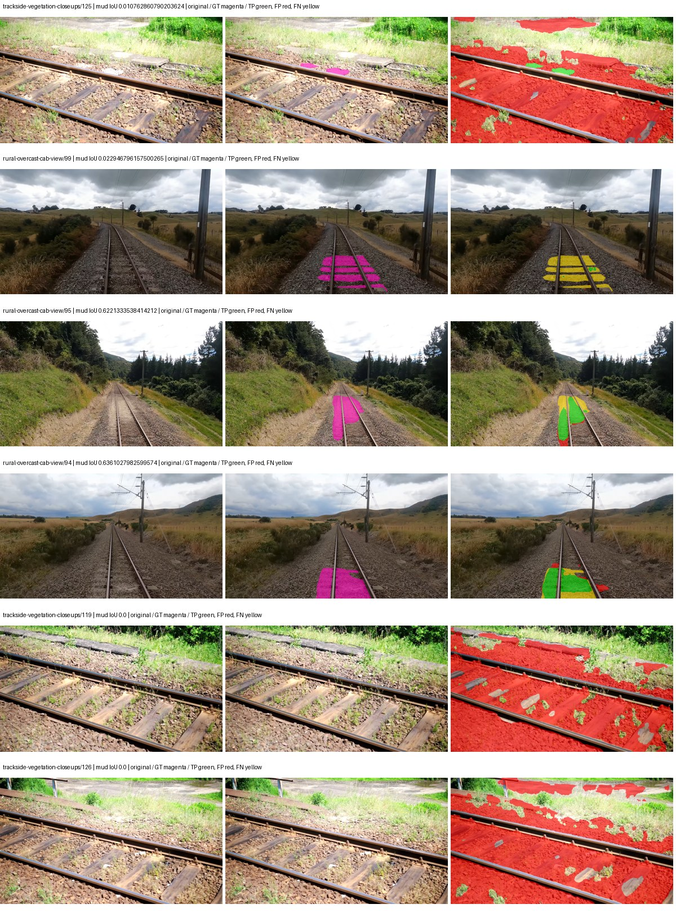

# segformer_b5 — paul-test-rtis_v2

[RTIS comparison](../../README.md) · [Full model records](record.json)

Primary selection and early stopping: **mud-pumping validation IoU**. A job is complete only after full statistics and isolated profiling are verified.

| Model | Initialization path | Seed | Status | Steps | Best step | Mud IoU (%) | Mud precision (%) | Mud recall (%) | Final mud IoU (trainer val, %) | mIoU (%) | Fixed GT-class mIoU (%) |
| --- | --- | --- | --- | --- | --- | --- | --- | --- | --- | --- | --- |
| segformer_b5 | rtis_only | 0 | completed | 1784 | 509 | 4.06 | 4.43 | 32.88 | 3.65 | 31.29 | 34.77 |
| segformer_b5 | cityscapes_to_rtis | 0 | training | 2249 | — | — | — | — | — | — | — |
| segformer_b5 | railsem19_to_rtis | 0 | training | 2149 | — | — | — | — | — | — | — |
| segformer_b5 | cityscapes_to_railsem19_to_rtis | 0 | training | 1999 | — | — | — | — | — | — | — |

Training: 205 images. Validation: 37 images. Test: 50 held out. Seeds: [0]. Seed variation measures optimization variability, not independent-recording uncertainty. Historical source checkpoints stay fixed across adaptation seeds.

Training code: `066afb2626398b7be59d4d19f5a0e4644fd59adc`. Split SHA-256: `18a84c0163a65ded46508bcc904c374e5f33ad8a09b8879e3c8add606e86aa9f`.

## rtis_only — seed 0

Status: **completed**. Started: 2026-09-10T00:53:58.956145+00:00. Finished: 2026-09-10T01:47:13.847811+00:00.

Recipe pretrained initializer: `nvidia/mit-b5`.

`rtis_only` uses the recipe initializer, which may include pretrained segmentation components. Transfer paths load the exact historical source checkpoint below and reset the classifier; they do not reset all query/decoder features.

Source checkpoint: `Recipe pretrained initialization`.

Config SHA-256: `5dc9849480141859248943aff69d75adcb7bf3a2cc84f774f0490cbe40cf5df0`. Weights used for validation: `raw`.

### Mud-pumping and aggregate quality

| Metric | Selected checkpoint | Final training validation |
| --- | --- | --- |
| Mud IoU | 4.06 | 3.65 |
| Mud precision | 4.43 | 4.60 |
| Mud recall | 32.88 | 14.89 |
| Mud Dice/F1 | 7.81 | 7.03 |
| mIoU | 31.29 | 34.79 |
| Mean accuracy | 43.00 | 51.05 |
| Mean precision | 53.30 | 50.25 |
| Mean Dice | 40.58 | 44.54 |
| Mean specificity | 98.91 | 99.11 |
| Pixel accuracy | 80.77 | 84.80 |
| Frequency-weighted IoU | 74.53 | 77.88 |
| Fixed GT-present class mIoU | 34.77 | 40.59 |
| Boundary F1 | 41.67 | 42.26 |

The selected checkpoint has independent evaluation evidence. Final values are the trainer's final validation record, not a new independent evaluation. mIoU averages classes with nonzero union, so false positives on absent classes can change its denominator. The fixed GT-class mean is supplementary and excludes absent classes; their false positives remain in the confusion matrix.

### Resource usage and timing

| Measurement | Value |
| --- | --- |
| Peak training VRAM, retained training invocation (GiB) | 16.31 |
| Peak evaluation VRAM (GiB) | 7.78 |
| Retained training invocation wall time (seconds) | 2889.51 |
| Retained training invocation GPU-hours (one GPU) | 0.80 |
| Evaluation wall time (seconds) | 29.38 |
| Full evaluation pipeline images/second | 1.26 |
| Best full-state checkpoint (MiB) | 1292.96 |
| Final full-state checkpoint (MiB) | 1292.91 |
| Verified periodic checkpoints removed (GiB) | 3.79 |

VRAM uses the recorded allocator high-water mark; it is not total device usage including CUDA context. Resumed jobs' retained training invocation times and peaks are **not whole-campaign totals**. Earlier invocation resource records are not reconstructed here. Evaluation throughput includes loader, sliding-window inference and metrics; it is not model-only latency/FPS. Missing measurements are shown as —, never inferred from another dataset's run.

### Standardized inference performance

Dedicated model-only profiling waits for an idle worker-locked L40S: BF16, batch 1, 1024x1024, 20 warmup and 100 CUDA-event-timed public forwards. It excludes loading, preprocessing, tiling and metrics.

| Status | Parameters | Weight MiB | FPS | p50 ms | p95 ms | Peak reserved GiB |
| --- | --- | --- | --- | --- | --- | --- |
| complete | 84609493 | 322.76 | 26.92 | 36.79 | 38.75 | 2.57 |

```json
{
  "schema_version": 1,
  "model_id": "segformer_b5",
  "measured_at": "2026-09-10T01:47:05+00:00",
  "status": "complete",
  "benchmark_scope": "rtis_selected_checkpoint_model_only",
  "applies_to": [
    "segformer_b5--rtis_only--seed-0"
  ],
  "source": {
    "campaign_git_sha": "066afb2626398b7be59d4d19f5a0e4644fd59adc",
    "git_dirty": false,
    "config_hash": "d7ef7f39583e",
    "resolved_config": "/data/izadia1/projects/segmentary-runs/paul-test-rtis_v2/seed0-20260909/configs/segformer_b5--rtis_only--seed-0.yaml",
    "config_sha256": "5dc9849480141859248943aff69d75adcb7bf3a2cc84f774f0490cbe40cf5df0",
    "checkpoint_sha256": "4814ae9254959fdc4566be922f43f52ac583ed8d85389753fa253e8d4ad4d7f6",
    "checkpoint_global_step": 509,
    "checkpoint_bytes": 1355767929,
    "checkpoint_kind": "resume checkpoint with optimizer and EMA state",
    "weights": "raw",
    "measured_checkpoint_job_id": "segformer_b5--rtis_only--seed-0",
    "result_sha256": "57df1f208e25a46fbac2bf587c0ae41dd96574f09523bbcb6ba4fece03aa4733",
    "result_git_sha": "066afb2626398b7be59d4d19f5a0e4644fd59adc",
    "result_stage": "eval:paul-test-rtis:val",
    "result_seed": 0
  },
  "hardware": {
    "gpu_name": "NVIDIA L40S",
    "gpu_uuid": "GPU-c76642eb-64c1-b0ac-b051-d2efd47b32c4",
    "logical_device": "cuda:0",
    "physical_visibility_token": "9",
    "compute_capability": [
      8,
      9
    ],
    "total_memory_bytes": 47677177856
  },
  "model": {
    "parameter_count": 84609493,
    "trainable_parameter_count": 84609493,
    "resident_parameter_bytes": 338437972,
    "parameter_dtype_counts": {
      "float32": 84609493
    }
  },
  "contract": {
    "backend": "pytorch",
    "precision": "bf16_autocast",
    "batch_size": 1,
    "input_shape_nchw": [
      1,
      3,
      1024,
      1024
    ],
    "warmup_iterations": 20,
    "measured_iterations": 100,
    "timing": "per-forward CUDA events with end-event synchronization",
    "includes_preprocessing": false,
    "includes_data_loader": false,
    "includes_sliding_window": false,
    "input_resident_on_gpu": true,
    "model_only": true,
    "entrypoint": "public model(image) dense-logits forward"
  },
  "measurements": {
    "latency": {
      "p50_ms": 36.78924751281738,
      "p95_ms": 38.74790363311767,
      "mean_ms": 37.14060279846191,
      "minimum_ms": 36.173824310302734,
      "maximum_ms": 40.70703887939453,
      "fps": 26.924711088464417,
      "raw_ms": [
        36.88243103027344,
        36.78105545043945,
        36.508670806884766,
        36.79743957519531,
        36.61721420288086,
        36.2874870300293,
        36.71244812011719,
        38.70003128051758,
        36.301822662353516,
        38.66828918457031,
        36.805633544921875,
        39.77318572998047,
        36.70934295654297,
        37.854209899902344,
        40.05171203613281,
        36.92339324951172,
        37.23161697387695,
        36.332542419433594,
        39.034881591796875,
        36.84454345703125,
        36.96537780761719,
        37.614593505859375,
        36.58649444580078,
        36.8988151550293,
        37.742591857910156,
        36.84454345703125,
        36.46566390991211,
        36.52608108520508,
        36.4666862487793,
        37.5470085144043,
        36.483070373535156,
        37.25312042236328,
        36.559871673583984,
        36.913150787353516,
        36.39807891845703,
        36.913150787353516,
        36.338687896728516,
        38.7327995300293,
        36.33049774169922,
        36.594688415527344,
        36.733951568603516,
        36.19532775878906,
        37.63404846191406,
        36.57727813720703,
        38.58124923706055,
        37.012481689453125,
        36.318206787109375,
        36.51481628417969,
        36.61619186401367,
        38.356990814208984,
        36.320255279541016,
        36.18611145019531,
        37.017601013183594,
        36.71244812011719,
        36.33766555786133,
        36.26700973510742,
        36.60902404785156,
        36.54246520996094,
        37.173248291015625,
        36.30796813964844,
        37.94841766357422,
        38.307838439941406,
        37.49478530883789,
        40.70703887939453,
        38.10201644897461,
        37.59001541137695,
        36.393985748291016,
        37.48863983154297,
        36.21171188354492,
        36.73708724975586,
        36.308990478515625,
        36.62131118774414,
        36.69094467163086,
        36.44108963012695,
        36.74931335449219,
        37.12819290161133,
        38.51161575317383,
        37.92998504638672,
        36.37452697753906,
        38.317054748535156,
        36.580352783203125,
        37.44358444213867,
        36.173824310302734,
        38.29248046875,
        38.26073455810547,
        37.03807830810547,
        38.728702545166016,
        36.82099151611328,
        39.38713455200195,
        36.68377685546875,
        37.06163024902344,
        36.24038314819336,
        37.62790298461914,
        36.27724838256836,
        36.26393508911133,
        37.6893424987793,
        38.117374420166016,
        36.74726486206055,
        36.30694580078125,
        36.25676727294922
      ],
      "percentile_method": "numpy linear interpolation"
    },
    "peak_reserved_bytes": 2755657728,
    "memory_kind": "pytorch_cuda_allocator_peak_reserved_excluding_context",
    "benchmark_wall_clock_s": 7.6972056441009045
  },
  "started_at": "2026-09-10T01:46:57+00:00",
  "finished_at": "2026-09-10T01:47:05+00:00",
  "environment": {
    "hostname": "hdrfs-app-001",
    "python": "3.11.15",
    "platform": "Linux-5.15.0-139-generic-x86_64-with-glibc2.35",
    "torch": "2.11.0+cu128",
    "torch_cuda": "12.8",
    "cudnn": 91900,
    "driver_version": "570.133.20",
    "cuda_available": true,
    "gpu_count": 1,
    "gpu_names": [
      "NVIDIA L40S"
    ],
    "cuda_visible_devices": "9",
    "packages": {
      "segmentary": "0.1.0",
      "torch": "2.11.0+cu128",
      "torchvision": "0.26.0+cu128",
      "transformers": "5.15.0",
      "timm": "1.0.28",
      "segmentation-models-pytorch": "0.5.0",
      "albumentations": "2.0.8",
      "lightning": "2.6.5",
      "numpy": "2.4.4"
    }
  }
}
```

### Per-class validation results

| Class | GT pixels | IoU (%) | Precision (%) | Recall (%) | Dice (%) | Boundary F1 (%) |
| --- | --- | --- | --- | --- | --- | --- |
| car | 29664 | 9.30 | 48.24 | 10.33 | 17.02 | 47.31 |
| construction | 311585 | 18.26 | 19.96 | 68.12 | 30.88 | 37.22 |
| fence | 265137 | 22.21 | 60.20 | 26.04 | 36.35 | 43.32 |
| mud-pumping | 1226250 | 4.06 | 4.43 | 32.88 | 7.81 | 10.40 |
| on-rails | 0 | — | — | — | — | — |
| person | 0 | 0.00 | 0.00 | — | 0.00 | 0.00 |
| pole | 628038 | 67.94 | 79.34 | 82.54 | 80.91 | 89.48 |
| rail-embedded | 16799 | 18.38 | 71.80 | 19.80 | 31.05 | 30.33 |
| rail-raised | 2969797 | 71.21 | 80.79 | 85.73 | 83.18 | 88.32 |
| rail-track | 6323197 | 31.32 | 72.22 | 35.61 | 47.70 | 44.52 |
| road | 1048831 | 5.71 | 37.06 | 6.32 | 10.80 | 19.01 |
| sidewalk | 1297367 | 48.06 | 85.31 | 52.40 | 64.92 | 18.28 |
| sky | 19121606 | 98.48 | 99.36 | 99.11 | 99.24 | 96.56 |
| standing-water | 95802 | 0.09 | 0.29 | 0.12 | 0.17 | 3.31 |
| terrain | 39239306 | 87.78 | 91.26 | 95.84 | 93.49 | 63.65 |
| trackbed | 10643081 | 52.11 | 83.40 | 58.14 | 68.52 | 57.05 |
| traffic-light | 19510 | 26.81 | 84.54 | 28.19 | 42.28 | 64.53 |
| traffic-sign | 13285 | 24.38 | 65.40 | 27.99 | 39.20 | 54.62 |
| tram-track | 56179 | 1.13 | 3.38 | 1.67 | 2.23 | 8.85 |
| truck | 0 | 0.00 | 0.00 | — | 0.00 | 0.00 |
| vegetation-overgrowth | 5901821 | 38.67 | 79.06 | 43.08 | 55.77 | 56.62 |

### Full-run accounting

| Measurement | Value |
| --- | --- |
| Full GPU-reserved wall seconds, all recorded worker attempts | 3194.89 |
| Full reserved GPU-hours | 0.89 |
| Whole-run timing complete | True |

| Phase | Wall seconds including failed attempts |
| --- | --- |
| training | 2897.23 |
| diagnostics | 233.06 |
| performance | 17.67 |

GPU-reserved time includes model loading, training, validation, collection, profiling, checkpoint I/O and orchestration while the worker owns one GPU. It is not GPU kernel-active time. Phase timings and sampled device memory/power/utilization are retained separately; sampled device memory is not the allocator high-water mark.

### Train/validation and raw/EMA diagnostics

| Checkpoint / weights / split | Images | Mud IoU (%) | Mud precision (%) | Mud recall (%) |
| --- | --- | --- | --- | --- |
| best-auto-train / raw | 205 | 93.23 | 95.31 | 97.71 |
| best-auto-val / raw | 37 | 4.06 | 4.43 | 32.88 |
| best-alternate-val / ema | 37 | 3.00 | 3.43 | 19.37 |
| final-auto-val / raw | 37 | 3.65 | 4.60 | 14.89 |

Train uses the evaluation transform without augmentation. Compare mud train/validation metrics for the same selected weights. Alternate EMA on running-stat BatchNorm is explicitly uncalibrated and is diagnostic only. Score-threshold curves use uncalibrated normalized scores and are pixel-level diagnostics, not event detection rates or a selected deployment operating point.

### Downloadable evidence

- best-auto-train: [per-image.csv](rtis_only--seed-0/best-auto-train/per-image.csv) · [per-image-confusion.json.gz](rtis_only--seed-0/best-auto-train/per-image-confusion.json.gz) · [groups.json](rtis_only--seed-0/best-auto-train/groups.json) · [mud-score-curves.json](rtis_only--seed-0/best-auto-train/mud-score-curves.json)
- best-auto-val: [per-image.csv](rtis_only--seed-0/best-auto-val/per-image.csv) · [per-image-confusion.json.gz](rtis_only--seed-0/best-auto-val/per-image-confusion.json.gz) · [groups.json](rtis_only--seed-0/best-auto-val/groups.json) · [mud-score-curves.json](rtis_only--seed-0/best-auto-val/mud-score-curves.json) · [examples.jpg](rtis_only--seed-0/best-auto-val/examples.jpg)
- best-alternate-val: [per-image.csv](rtis_only--seed-0/best-alternate-val/per-image.csv) · [per-image-confusion.json.gz](rtis_only--seed-0/best-alternate-val/per-image-confusion.json.gz) · [groups.json](rtis_only--seed-0/best-alternate-val/groups.json) · [mud-score-curves.json](rtis_only--seed-0/best-alternate-val/mud-score-curves.json)
- final-auto-val: [per-image.csv](rtis_only--seed-0/final-auto-val/per-image.csv) · [per-image-confusion.json.gz](rtis_only--seed-0/final-auto-val/per-image-confusion.json.gz) · [groups.json](rtis_only--seed-0/final-auto-val/groups.json) · [mud-score-curves.json](rtis_only--seed-0/final-auto-val/mud-score-curves.json)
- resources: [telemetry.csv](rtis_only--seed-0/resources/telemetry.csv)



Examples are two lowest and two highest mud-IoU positive images, plus up to two negative images with the most false-positive mud pixels. They are targeted diagnostic examples, not random samples. Green: true positive; red: false positive; yellow: false negative. Full predictions remain on HDRFS.

### Validation tracking

| Logged step | Overall mIoU (%) | Mud IoU (%) |
| --- | --- | --- |
| 254 | 28.17 | 1.96 |
| 509 | 31.30 | 4.07 |
| 764 | 38.66 | 1.88 |
| 1019 | 34.47 | 2.82 |
| 1274 | 34.17 | 3.93 |
| 1529 | 35.74 | 4.02 |
| 1784 | 34.79 | 3.65 |

All retained scalar curves, including training loss and per-class IoU, are in record.json. Observed best mud on a curve is not necessarily a retained checkpoint: the pilot saved its selection-metric-best and final checkpoints. Step logging and checkpoint global_step may differ by one.

### Stopping and checkpoint provenance

```json
{
  "stopping": {
    "actual_steps": 1784,
    "maximum_steps": 4000,
    "min_delta": 0.001,
    "monitor": "val_iou/mud-pumping",
    "patience": 5,
    "reason": "validation_plateau"
  },
  "checkpoints": {
    "best": {
      "path": "/data/izadia1/projects/segmentary-runs/paul-test-rtis_v2/seed0-20260909/future-runs/segformer_b5--rtis_only--seed-0_seed0/rtis/best.ckpt",
      "sha256": "4814ae9254959fdc4566be922f43f52ac583ed8d85389753fa253e8d4ad4d7f6",
      "global_step": 509,
      "bytes": 1355767929
    },
    "final": {
      "path": "/data/izadia1/projects/segmentary-runs/paul-test-rtis_v2/seed0-20260909/future-runs/segformer_b5--rtis_only--seed-0_seed0/rtis/last.ckpt",
      "sha256": "701a62ddcf8299acc89511c28ec3940d094d7c08c89f59a752c846d9d0e21a83",
      "global_step": 1784,
      "bytes": 1355711865
    }
  },
  "cleanup_error": null
}
```

### Resolved training, initialization and evaluation settings

The optimizer block is the base configuration. Stage LR scales are applied at runtime, and stage warmup is capped at min(base warmup, floor(stage budget / 10), stage budget - 1): 400 steps for this 4,000-step pilot. Model-internal native input grids may differ from augmentation crops (EoMT uses its 640 grid).

```json
{
  "name": "segformer_b5--rtis_only--seed-0",
  "model": {
    "arch": "segformer_b5",
    "checkpoint": "nvidia/mit-b5",
    "tuning": "full",
    "head": "unified_head",
    "lora_r": 16,
    "lora_alpha": 32,
    "lora_dropout": 0.05,
    "lora_targets": [],
    "drop_path": null,
    "revision": null,
    "subfolder": null,
    "local_files_only": false,
    "trust_remote_code": false,
    "backbone_path": null,
    "head_paths": [],
    "classifier_path": null,
    "inactive_parameter_paths": [],
    "smp_arch": null,
    "encoder_name": null,
    "encoder_weights": null,
    "native": null,
    "batch_norm_momentum": null
  },
  "space": "paul-test-rtis",
  "taxonomy_root": "/data/izadia1/projects/segmentary-rtis-fullstats-066afb2/taxonomy",
  "output_root": "/data/izadia1/projects/segmentary-runs/paul-test-rtis_v2/seed0-20260909/future-runs",
  "optim": {
    "backbone_lr": 6e-05,
    "head_lr_mult": 10.0,
    "weight_decay": 0.05,
    "llrd": 1.0,
    "warmup_iters": 1500,
    "warmup_ratio": 1e-06,
    "poly_power": 0.9,
    "min_lr_ratio": 0.0,
    "betas": [
      0.9,
      0.999
    ],
    "grad_clip": 1.0
  },
  "train": {
    "iters": 4000,
    "batch_size": 2,
    "accum": 8,
    "num_workers": 2,
    "precision": "bf16-mixed",
    "ema_decay": 0.9998,
    "val_every": 250,
    "ckpt_every": 500,
    "selection_metric": "val_iou/mud-pumping",
    "early_stopping_patience": 5,
    "early_stopping_min_delta": 0.001,
    "seed": 0,
    "devices": 1
  },
  "eval": {
    "sliding_window": true,
    "window": [
      1024,
      1024
    ],
    "stride": [
      768,
      768
    ],
    "batch_size": 1,
    "num_workers": 2,
    "tta_scales": [],
    "tta_flip": false,
    "threshold": 0.5,
    "boundary_tolerance_frac": 0.0075,
    "save_confusion": true
  },
  "loss": {
    "task": "multiclass",
    "activation": "auto",
    "terms": [],
    "aux": "none",
    "aux_weight": 0.0,
    "ce_weight": 1.0,
    "label_smoothing": 0.0,
    "class_weights": null,
    "query": null
  },
  "aug": {
    "crop": [
      1024,
      1024
    ],
    "scale_min": 0.5,
    "scale_max": 2.0,
    "hflip_p": 0.5,
    "color_jitter_p": 0.5,
    "brightness": 0.25,
    "contrast": 0.25,
    "saturation": 0.25,
    "hue": 0.05
  },
  "stages": [
    {
      "name": "rtis",
      "data": [
        {
          "name": "paul-test-rtis",
          "root": "/data/izadia1/datasets/paul-test-rtis_v2",
          "variant": null,
          "split_file": "splits.json",
          "train_split": "train",
          "val_split": "val",
          "limit": null,
          "loader": "folder",
          "mapping": "paul-test-rtis",
          "loader_options": {
            "require_groups": true
          }
        }
      ],
      "iters": null,
      "lr_scale": 1.0,
      "head_group_lr_scale": 1.0,
      "init_from": "pretrained",
      "reset_head": false,
      "freeze": null,
      "sample_weights": null
    }
  ]
}
```

### Hardware and software provenance

```json
{
  "training": {
    "cuda_available": true,
    "cuda_visible_devices": "9",
    "cudnn": 91900,
    "driver_version": "570.133.20",
    "gpu_count": 1,
    "gpu_names": [
      "NVIDIA L40S"
    ],
    "hostname": "hdrfs-app-001",
    "input_normalization": {
      "channel_order": "rgb",
      "mean": [
        0.485,
        0.456,
        0.406
      ],
      "source": "imagenet",
      "std": [
        0.229,
        0.224,
        0.225
      ]
    },
    "model_origins": [
      {
        "hf_commit": "40357155205b036cf11b61f132d53d2f8861f170",
        "hf_name_or_path": "nvidia/mit-b5",
        "module": "model",
        "timm_pretrained": {}
      },
      {
        "hf_commit": "40357155205b036cf11b61f132d53d2f8861f170",
        "hf_name_or_path": "nvidia/mit-b5",
        "module": "model.segformer",
        "timm_pretrained": {}
      },
      {
        "hf_commit": "40357155205b036cf11b61f132d53d2f8861f170",
        "hf_name_or_path": "nvidia/mit-b5",
        "module": "model.segformer.stages.0.blocks.0.attention",
        "timm_pretrained": {}
      },
      {
        "hf_commit": "40357155205b036cf11b61f132d53d2f8861f170",
        "hf_name_or_path": "nvidia/mit-b5",
        "module": "model.segformer.stages.0.blocks.1.attention",
        "timm_pretrained": {}
      },
      {
        "hf_commit": "40357155205b036cf11b61f132d53d2f8861f170",
        "hf_name_or_path": "nvidia/mit-b5",
        "module": "model.segformer.stages.0.blocks.2.attention",
        "timm_pretrained": {}
      },
      {
        "hf_commit": "40357155205b036cf11b61f132d53d2f8861f170",
        "hf_name_or_path": "nvidia/mit-b5",
        "module": "model.segformer.stages.1.blocks.0.attention",
        "timm_pretrained": {}
      },
      {
        "hf_commit": "40357155205b036cf11b61f132d53d2f8861f170",
        "hf_name_or_path": "nvidia/mit-b5",
        "module": "model.segformer.stages.1.blocks.1.attention",
        "timm_pretrained": {}
      },
      {
        "hf_commit": "40357155205b036cf11b61f132d53d2f8861f170",
        "hf_name_or_path": "nvidia/mit-b5",
        "module": "model.segformer.stages.1.blocks.2.attention",
        "timm_pretrained": {}
      },
      {
        "hf_commit": "40357155205b036cf11b61f132d53d2f8861f170",
        "hf_name_or_path": "nvidia/mit-b5",
        "module": "model.segformer.stages.1.blocks.3.attention",
        "timm_pretrained": {}
      },
      {
        "hf_commit": "40357155205b036cf11b61f132d53d2f8861f170",
        "hf_name_or_path": "nvidia/mit-b5",
        "module": "model.segformer.stages.1.blocks.4.attention",
        "timm_pretrained": {}
      },
      {
        "hf_commit": "40357155205b036cf11b61f132d53d2f8861f170",
        "hf_name_or_path": "nvidia/mit-b5",
        "module": "model.segformer.stages.1.blocks.5.attention",
        "timm_pretrained": {}
      },
      {
        "hf_commit": "40357155205b036cf11b61f132d53d2f8861f170",
        "hf_name_or_path": "nvidia/mit-b5",
        "module": "model.segformer.stages.2.blocks.0.attention",
        "timm_pretrained": {}
      },
      {
        "hf_commit": "40357155205b036cf11b61f132d53d2f8861f170",
        "hf_name_or_path": "nvidia/mit-b5",
        "module": "model.segformer.stages.2.blocks.1.attention",
        "timm_pretrained": {}
      },
      {
        "hf_commit": "40357155205b036cf11b61f132d53d2f8861f170",
        "hf_name_or_path": "nvidia/mit-b5",
        "module": "model.segformer.stages.2.blocks.2.attention",
        "timm_pretrained": {}
      },
      {
        "hf_commit": "40357155205b036cf11b61f132d53d2f8861f170",
        "hf_name_or_path": "nvidia/mit-b5",
        "module": "model.segformer.stages.2.blocks.3.attention",
        "timm_pretrained": {}
      },
      {
        "hf_commit": "40357155205b036cf11b61f132d53d2f8861f170",
        "hf_name_or_path": "nvidia/mit-b5",
        "module": "model.segformer.stages.2.blocks.4.attention",
        "timm_pretrained": {}
      },
      {
        "hf_commit": "40357155205b036cf11b61f132d53d2f8861f170",
        "hf_name_or_path": "nvidia/mit-b5",
        "module": "model.segformer.stages.2.blocks.5.attention",
        "timm_pretrained": {}
      },
      {
        "hf_commit": "40357155205b036cf11b61f132d53d2f8861f170",
        "hf_name_or_path": "nvidia/mit-b5",
        "module": "model.segformer.stages.2.blocks.6.attention",
        "timm_pretrained": {}
      },
      {
        "hf_commit": "40357155205b036cf11b61f132d53d2f8861f170",
        "hf_name_or_path": "nvidia/mit-b5",
        "module": "model.segformer.stages.2.blocks.7.attention",
        "timm_pretrained": {}
      },
      {
        "hf_commit": "40357155205b036cf11b61f132d53d2f8861f170",
        "hf_name_or_path": "nvidia/mit-b5",
        "module": "model.segformer.stages.2.blocks.8.attention",
        "timm_pretrained": {}
      },
      {
        "hf_commit": "40357155205b036cf11b61f132d53d2f8861f170",
        "hf_name_or_path": "nvidia/mit-b5",
        "module": "model.segformer.stages.2.blocks.9.attention",
        "timm_pretrained": {}
      },
      {
        "hf_commit": "40357155205b036cf11b61f132d53d2f8861f170",
        "hf_name_or_path": "nvidia/mit-b5",
        "module": "model.segformer.stages.2.blocks.10.attention",
        "timm_pretrained": {}
      },
      {
        "hf_commit": "40357155205b036cf11b61f132d53d2f8861f170",
        "hf_name_or_path": "nvidia/mit-b5",
        "module": "model.segformer.stages.2.blocks.11.attention",
        "timm_pretrained": {}
      },
      {
        "hf_commit": "40357155205b036cf11b61f132d53d2f8861f170",
        "hf_name_or_path": "nvidia/mit-b5",
        "module": "model.segformer.stages.2.blocks.12.attention",
        "timm_pretrained": {}
      },
      {
        "hf_commit": "40357155205b036cf11b61f132d53d2f8861f170",
        "hf_name_or_path": "nvidia/mit-b5",
        "module": "model.segformer.stages.2.blocks.13.attention",
        "timm_pretrained": {}
      },
      {
        "hf_commit": "40357155205b036cf11b61f132d53d2f8861f170",
        "hf_name_or_path": "nvidia/mit-b5",
        "module": "model.segformer.stages.2.blocks.14.attention",
        "timm_pretrained": {}
      },
      {
        "hf_commit": "40357155205b036cf11b61f132d53d2f8861f170",
        "hf_name_or_path": "nvidia/mit-b5",
        "module": "model.segformer.stages.2.blocks.15.attention",
        "timm_pretrained": {}
      },
      {
        "hf_commit": "40357155205b036cf11b61f132d53d2f8861f170",
        "hf_name_or_path": "nvidia/mit-b5",
        "module": "model.segformer.stages.2.blocks.16.attention",
        "timm_pretrained": {}
      },
      {
        "hf_commit": "40357155205b036cf11b61f132d53d2f8861f170",
        "hf_name_or_path": "nvidia/mit-b5",
        "module": "model.segformer.stages.2.blocks.17.attention",
        "timm_pretrained": {}
      },
      {
        "hf_commit": "40357155205b036cf11b61f132d53d2f8861f170",
        "hf_name_or_path": "nvidia/mit-b5",
        "module": "model.segformer.stages.2.blocks.18.attention",
        "timm_pretrained": {}
      },
      {
        "hf_commit": "40357155205b036cf11b61f132d53d2f8861f170",
        "hf_name_or_path": "nvidia/mit-b5",
        "module": "model.segformer.stages.2.blocks.19.attention",
        "timm_pretrained": {}
      },
      {
        "hf_commit": "40357155205b036cf11b61f132d53d2f8861f170",
        "hf_name_or_path": "nvidia/mit-b5",
        "module": "model.segformer.stages.2.blocks.20.attention",
        "timm_pretrained": {}
      },
      {
        "hf_commit": "40357155205b036cf11b61f132d53d2f8861f170",
        "hf_name_or_path": "nvidia/mit-b5",
        "module": "model.segformer.stages.2.blocks.21.attention",
        "timm_pretrained": {}
      },
      {
        "hf_commit": "40357155205b036cf11b61f132d53d2f8861f170",
        "hf_name_or_path": "nvidia/mit-b5",
        "module": "model.segformer.stages.2.blocks.22.attention",
        "timm_pretrained": {}
      },
      {
        "hf_commit": "40357155205b036cf11b61f132d53d2f8861f170",
        "hf_name_or_path": "nvidia/mit-b5",
        "module": "model.segformer.stages.2.blocks.23.attention",
        "timm_pretrained": {}
      },
      {
        "hf_commit": "40357155205b036cf11b61f132d53d2f8861f170",
        "hf_name_or_path": "nvidia/mit-b5",
        "module": "model.segformer.stages.2.blocks.24.attention",
        "timm_pretrained": {}
      },
      {
        "hf_commit": "40357155205b036cf11b61f132d53d2f8861f170",
        "hf_name_or_path": "nvidia/mit-b5",
        "module": "model.segformer.stages.2.blocks.25.attention",
        "timm_pretrained": {}
      },
      {
        "hf_commit": "40357155205b036cf11b61f132d53d2f8861f170",
        "hf_name_or_path": "nvidia/mit-b5",
        "module": "model.segformer.stages.2.blocks.26.attention",
        "timm_pretrained": {}
      },
      {
        "hf_commit": "40357155205b036cf11b61f132d53d2f8861f170",
        "hf_name_or_path": "nvidia/mit-b5",
        "module": "model.segformer.stages.2.blocks.27.attention",
        "timm_pretrained": {}
      },
      {
        "hf_commit": "40357155205b036cf11b61f132d53d2f8861f170",
        "hf_name_or_path": "nvidia/mit-b5",
        "module": "model.segformer.stages.2.blocks.28.attention",
        "timm_pretrained": {}
      },
      {
        "hf_commit": "40357155205b036cf11b61f132d53d2f8861f170",
        "hf_name_or_path": "nvidia/mit-b5",
        "module": "model.segformer.stages.2.blocks.29.attention",
        "timm_pretrained": {}
      },
      {
        "hf_commit": "40357155205b036cf11b61f132d53d2f8861f170",
        "hf_name_or_path": "nvidia/mit-b5",
        "module": "model.segformer.stages.2.blocks.30.attention",
        "timm_pretrained": {}
      },
      {
        "hf_commit": "40357155205b036cf11b61f132d53d2f8861f170",
        "hf_name_or_path": "nvidia/mit-b5",
        "module": "model.segformer.stages.2.blocks.31.attention",
        "timm_pretrained": {}
      },
      {
        "hf_commit": "40357155205b036cf11b61f132d53d2f8861f170",
        "hf_name_or_path": "nvidia/mit-b5",
        "module": "model.segformer.stages.2.blocks.32.attention",
        "timm_pretrained": {}
      },
      {
        "hf_commit": "40357155205b036cf11b61f132d53d2f8861f170",
        "hf_name_or_path": "nvidia/mit-b5",
        "module": "model.segformer.stages.2.blocks.33.attention",
        "timm_pretrained": {}
      },
      {
        "hf_commit": "40357155205b036cf11b61f132d53d2f8861f170",
        "hf_name_or_path": "nvidia/mit-b5",
        "module": "model.segformer.stages.2.blocks.34.attention",
        "timm_pretrained": {}
      },
      {
        "hf_commit": "40357155205b036cf11b61f132d53d2f8861f170",
        "hf_name_or_path": "nvidia/mit-b5",
        "module": "model.segformer.stages.2.blocks.35.attention",
        "timm_pretrained": {}
      },
      {
        "hf_commit": "40357155205b036cf11b61f132d53d2f8861f170",
        "hf_name_or_path": "nvidia/mit-b5",
        "module": "model.segformer.stages.2.blocks.36.attention",
        "timm_pretrained": {}
      },
      {
        "hf_commit": "40357155205b036cf11b61f132d53d2f8861f170",
        "hf_name_or_path": "nvidia/mit-b5",
        "module": "model.segformer.stages.2.blocks.37.attention",
        "timm_pretrained": {}
      },
      {
        "hf_commit": "40357155205b036cf11b61f132d53d2f8861f170",
        "hf_name_or_path": "nvidia/mit-b5",
        "module": "model.segformer.stages.2.blocks.38.attention",
        "timm_pretrained": {}
      },
      {
        "hf_commit": "40357155205b036cf11b61f132d53d2f8861f170",
        "hf_name_or_path": "nvidia/mit-b5",
        "module": "model.segformer.stages.2.blocks.39.attention",
        "timm_pretrained": {}
      },
      {
        "hf_commit": "40357155205b036cf11b61f132d53d2f8861f170",
        "hf_name_or_path": "nvidia/mit-b5",
        "module": "model.segformer.stages.3.blocks.0.attention",
        "timm_pretrained": {}
      },
      {
        "hf_commit": "40357155205b036cf11b61f132d53d2f8861f170",
        "hf_name_or_path": "nvidia/mit-b5",
        "module": "model.segformer.stages.3.blocks.1.attention",
        "timm_pretrained": {}
      },
      {
        "hf_commit": "40357155205b036cf11b61f132d53d2f8861f170",
        "hf_name_or_path": "nvidia/mit-b5",
        "module": "model.segformer.stages.3.blocks.2.attention",
        "timm_pretrained": {}
      },
      {
        "hf_commit": "40357155205b036cf11b61f132d53d2f8861f170",
        "hf_name_or_path": "nvidia/mit-b5",
        "module": "model.decode_head",
        "timm_pretrained": {}
      }
    ],
    "model_parameter_count": 84609493,
    "packages": {
      "albumentations": "2.0.8",
      "lightning": "2.6.5",
      "numpy": "2.4.4",
      "segmentary": "0.1.0",
      "segmentation-models-pytorch": "0.5.0",
      "timm": "1.0.28",
      "torch": "2.11.0+cu128",
      "torchvision": "0.26.0+cu128",
      "transformers": "5.15.0"
    },
    "platform": "Linux-5.15.0-139-generic-x86_64-with-glibc2.35",
    "python": "3.11.15",
    "torch": "2.11.0+cu128",
    "torch_cuda": "12.8",
    "trainable_parameter_count": 84609493,
    "training_stop": {
      "actual_steps": 1784,
      "maximum_steps": 4000,
      "min_delta": 0.001,
      "monitor": "val_iou/mud-pumping",
      "patience": 5,
      "reason": "validation_plateau"
    },
    "validation_weights": "raw"
  },
  "evaluation": {
    "cuda_available": true,
    "cuda_visible_devices": "9",
    "cudnn": 91900,
    "driver_version": "570.133.20",
    "gpu_count": 1,
    "gpu_names": [
      "NVIDIA L40S"
    ],
    "hostname": "hdrfs-app-001",
    "input_normalization": {
      "channel_order": "rgb",
      "mean": [
        0.485,
        0.456,
        0.406
      ],
      "source": "imagenet",
      "std": [
        0.229,
        0.224,
        0.225
      ]
    },
    "packages": {
      "albumentations": "2.0.8",
      "lightning": "2.6.5",
      "numpy": "2.4.4",
      "segmentary": "0.1.0",
      "segmentation-models-pytorch": "0.5.0",
      "timm": "1.0.28",
      "torch": "2.11.0+cu128",
      "torchvision": "0.26.0+cu128",
      "transformers": "5.15.0"
    },
    "platform": "Linux-5.15.0-139-generic-x86_64-with-glibc2.35",
    "python": "3.11.15",
    "torch": "2.11.0+cu128",
    "torch_cuda": "12.8"
  }
}
```

## cityscapes_to_rtis — seed 0

Status: **training**. Started: 2026-09-10T00:56:09.607685+00:00. Finished: —.

Recipe pretrained initializer: `nvidia/mit-b5`.

`rtis_only` uses the recipe initializer, which may include pretrained segmentation components. Transfer paths load the exact historical source checkpoint below and reset the classifier; they do not reset all query/decoder features.

Source checkpoint: `{'name': 'segformer_b5--cityscapes--seed-0', 'model': 'segformer_b5', 'protocol': 'cityscapes', 'config': '/data/izadia1/projects/segmentary-runs/all-model-city-rail-seed0-rail20-b9eb3e1/accepted/segformer_b5--cityscapes--seed-0/resolved-config.yaml', 'checkpoint': '/data/izadia1/projects/segmentary-runs/all-model-city-rail-seed0-a7c0b67/jobs/segformer_b5--cityscapes--seed-0/attempt-001/train/segformer_b5--cityscapes_seed0/cityscapes/last.ckpt', 'recorded_sha256': '303e1dd639de11fd66defadcba0eea5a2179ca0b1a8d768c1dde8f8e1f135b85', 'exists': True}`.

Config SHA-256: `5a2c38875c45c2d23f1deb7398afc26622cd97e581f63a8df8919dd5ee135b5d`. Weights used for validation: `—`.

### Mud-pumping and aggregate quality

| Metric | Selected checkpoint | Final training validation |
| --- | --- | --- |
| Mud IoU | — | — |
| Mud precision | — | — |
| Mud recall | — | — |
| Mud Dice/F1 | — | — |
| mIoU | — | — |
| Mean accuracy | — | — |
| Mean precision | — | — |
| Mean Dice | — | — |
| Mean specificity | — | — |
| Pixel accuracy | — | — |
| Frequency-weighted IoU | — | — |
| Fixed GT-present class mIoU | — | — |
| Boundary F1 | — | — |

The selected checkpoint has independent evaluation evidence. Final values are the trainer's final validation record, not a new independent evaluation. mIoU averages classes with nonzero union, so false positives on absent classes can change its denominator. The fixed GT-class mean is supplementary and excludes absent classes; their false positives remain in the confusion matrix.

### Resource usage and timing

| Measurement | Value |
| --- | --- |
| Peak training VRAM, retained training invocation (GiB) | — |
| Peak evaluation VRAM (GiB) | — |
| Retained training invocation wall time (seconds) | — |
| Retained training invocation GPU-hours (one GPU) | — |
| Evaluation wall time (seconds) | — |
| Full evaluation pipeline images/second | — |
| Best full-state checkpoint (MiB) | — |
| Final full-state checkpoint (MiB) | — |
| Verified periodic checkpoints removed (GiB) | — |

VRAM uses the recorded allocator high-water mark; it is not total device usage including CUDA context. Resumed jobs' retained training invocation times and peaks are **not whole-campaign totals**. Earlier invocation resource records are not reconstructed here. Evaluation throughput includes loader, sliding-window inference and metrics; it is not model-only latency/FPS. Missing measurements are shown as —, never inferred from another dataset's run.

### Standardized inference performance

Dedicated model-only profiling waits for an idle worker-locked L40S: BF16, batch 1, 1024x1024, 20 warmup and 100 CUDA-event-timed public forwards. It excludes loading, preprocessing, tiling and metrics.

| Status | Parameters | Weight MiB | FPS | p50 ms | p95 ms | Peak reserved GiB |
| --- | --- | --- | --- | --- | --- | --- |
| waiting_for_idle_gpu | — | — | — | — | — | — |

```json
{
  "status": "waiting_for_idle_gpu",
  "contract": "L40S; batch 1; 1024x1024; BF16; 20 warmup; 100 timed forwards"
}
```

### Per-class validation results

| Class | GT pixels | IoU (%) | Precision (%) | Recall (%) | Dice (%) | Boundary F1 (%) |
| --- | --- | --- | --- | --- | --- | --- |

### Validation tracking

| Logged step | Overall mIoU (%) | Mud IoU (%) |
| --- | --- | --- |
| 254 | 23.24 | 0.10 |
| 509 | 26.01 | 1.57 |
| 764 | 35.85 | 1.00 |
| 1019 | 35.78 | 2.04 |
| 1274 | 38.54 | 3.75 |
| 1529 | 36.90 | 3.61 |
| 1784 | 37.78 | 3.08 |
| 2038 | 33.57 | 3.97 |

All retained scalar curves, including training loss and per-class IoU, are in record.json. Observed best mud on a curve is not necessarily a retained checkpoint: the pilot saved its selection-metric-best and final checkpoints. Step logging and checkpoint global_step may differ by one.

### Stopping and checkpoint provenance

```json
{
  "stopping": null,
  "checkpoints": null,
  "cleanup_error": null
}
```

### Resolved training, initialization and evaluation settings

The optimizer block is the base configuration. Stage LR scales are applied at runtime, and stage warmup is capped at min(base warmup, floor(stage budget / 10), stage budget - 1): 400 steps for this 4,000-step pilot. Model-internal native input grids may differ from augmentation crops (EoMT uses its 640 grid).

```json
{
  "name": "segformer_b5--cityscapes_to_rtis--seed-0",
  "model": {
    "arch": "segformer_b5",
    "checkpoint": "nvidia/mit-b5",
    "tuning": "full",
    "head": "unified_head",
    "lora_r": 16,
    "lora_alpha": 32,
    "lora_dropout": 0.05,
    "lora_targets": [],
    "drop_path": null,
    "revision": null,
    "subfolder": null,
    "local_files_only": false,
    "trust_remote_code": false,
    "backbone_path": null,
    "head_paths": [],
    "classifier_path": null,
    "inactive_parameter_paths": [],
    "smp_arch": null,
    "encoder_name": null,
    "encoder_weights": null,
    "native": null,
    "batch_norm_momentum": null
  },
  "space": "paul-test-rtis",
  "taxonomy_root": "/data/izadia1/projects/segmentary-rtis-fullstats-066afb2/taxonomy",
  "output_root": "/data/izadia1/projects/segmentary-runs/paul-test-rtis_v2/seed0-20260909/future-runs",
  "optim": {
    "backbone_lr": 6e-05,
    "head_lr_mult": 10.0,
    "weight_decay": 0.05,
    "llrd": 1.0,
    "warmup_iters": 1500,
    "warmup_ratio": 1e-06,
    "poly_power": 0.9,
    "min_lr_ratio": 0.0,
    "betas": [
      0.9,
      0.999
    ],
    "grad_clip": 1.0
  },
  "train": {
    "iters": 4000,
    "batch_size": 2,
    "accum": 8,
    "num_workers": 2,
    "precision": "bf16-mixed",
    "ema_decay": 0.9998,
    "val_every": 250,
    "ckpt_every": 500,
    "selection_metric": "val_iou/mud-pumping",
    "early_stopping_patience": 5,
    "early_stopping_min_delta": 0.001,
    "seed": 0,
    "devices": 1
  },
  "eval": {
    "sliding_window": true,
    "window": [
      1024,
      1024
    ],
    "stride": [
      768,
      768
    ],
    "batch_size": 1,
    "num_workers": 2,
    "tta_scales": [],
    "tta_flip": false,
    "threshold": 0.5,
    "boundary_tolerance_frac": 0.0075,
    "save_confusion": true
  },
  "loss": {
    "task": "multiclass",
    "activation": "auto",
    "terms": [],
    "aux": "none",
    "aux_weight": 0.0,
    "ce_weight": 1.0,
    "label_smoothing": 0.0,
    "class_weights": null,
    "query": null
  },
  "aug": {
    "crop": [
      1024,
      1024
    ],
    "scale_min": 0.5,
    "scale_max": 2.0,
    "hflip_p": 0.5,
    "color_jitter_p": 0.5,
    "brightness": 0.25,
    "contrast": 0.25,
    "saturation": 0.25,
    "hue": 0.05
  },
  "stages": [
    {
      "name": "rtis",
      "data": [
        {
          "name": "paul-test-rtis",
          "root": "/data/izadia1/datasets/paul-test-rtis_v2",
          "variant": null,
          "split_file": "splits.json",
          "train_split": "train",
          "val_split": "val",
          "limit": null,
          "loader": "folder",
          "mapping": "paul-test-rtis",
          "loader_options": {
            "require_groups": true
          }
        }
      ],
      "iters": null,
      "lr_scale": 0.1,
      "head_group_lr_scale": 1.0,
      "init_from": "/data/izadia1/projects/segmentary-runs/all-model-city-rail-seed0-a7c0b67/jobs/segformer_b5--cityscapes--seed-0/attempt-001/train/segformer_b5--cityscapes_seed0/cityscapes/last.ckpt",
      "reset_head": true,
      "freeze": null,
      "sample_weights": null
    }
  ]
}
```

### Hardware and software provenance

```json
{
  "training": null,
  "evaluation": null
}
```

## railsem19_to_rtis — seed 0

Status: **training**. Started: 2026-09-10T00:58:13.773654+00:00. Finished: —.

Recipe pretrained initializer: `nvidia/mit-b5`.

`rtis_only` uses the recipe initializer, which may include pretrained segmentation components. Transfer paths load the exact historical source checkpoint below and reset the classifier; they do not reset all query/decoder features.

Source checkpoint: `{'name': 'segformer_b5--railsem19--seed-0', 'model': 'segformer_b5', 'protocol': 'railsem19', 'config': '/data/izadia1/projects/segmentary-runs/all-model-city-rail-seed0-rail20-b9eb3e1/accepted/segformer_b5--railsem19--seed-0/resolved-config.yaml', 'checkpoint': '/data/izadia1/projects/segmentary-runs/all-model-city-rail-seed0-a7c0b67/jobs/segformer_b5--railsem19--seed-0/attempt-001/train/segformer_b5--railsem19_seed0/railsem19/last.ckpt', 'recorded_sha256': '7ecee01e5337241e3e2d864a36e5ad717ac57365a8fa50747fd19ff25d7debe1', 'exists': True}`.

Config SHA-256: `8575d7e493f1fe58694e6d8ecaeacd30d81645e7010d254f7c48e6f6b0f905fb`. Weights used for validation: `—`.

### Mud-pumping and aggregate quality

| Metric | Selected checkpoint | Final training validation |
| --- | --- | --- |
| Mud IoU | — | — |
| Mud precision | — | — |
| Mud recall | — | — |
| Mud Dice/F1 | — | — |
| mIoU | — | — |
| Mean accuracy | — | — |
| Mean precision | — | — |
| Mean Dice | — | — |
| Mean specificity | — | — |
| Pixel accuracy | — | — |
| Frequency-weighted IoU | — | — |
| Fixed GT-present class mIoU | — | — |
| Boundary F1 | — | — |

The selected checkpoint has independent evaluation evidence. Final values are the trainer's final validation record, not a new independent evaluation. mIoU averages classes with nonzero union, so false positives on absent classes can change its denominator. The fixed GT-class mean is supplementary and excludes absent classes; their false positives remain in the confusion matrix.

### Resource usage and timing

| Measurement | Value |
| --- | --- |
| Peak training VRAM, retained training invocation (GiB) | — |
| Peak evaluation VRAM (GiB) | — |
| Retained training invocation wall time (seconds) | — |
| Retained training invocation GPU-hours (one GPU) | — |
| Evaluation wall time (seconds) | — |
| Full evaluation pipeline images/second | — |
| Best full-state checkpoint (MiB) | — |
| Final full-state checkpoint (MiB) | — |
| Verified periodic checkpoints removed (GiB) | — |

VRAM uses the recorded allocator high-water mark; it is not total device usage including CUDA context. Resumed jobs' retained training invocation times and peaks are **not whole-campaign totals**. Earlier invocation resource records are not reconstructed here. Evaluation throughput includes loader, sliding-window inference and metrics; it is not model-only latency/FPS. Missing measurements are shown as —, never inferred from another dataset's run.

### Standardized inference performance

Dedicated model-only profiling waits for an idle worker-locked L40S: BF16, batch 1, 1024x1024, 20 warmup and 100 CUDA-event-timed public forwards. It excludes loading, preprocessing, tiling and metrics.

| Status | Parameters | Weight MiB | FPS | p50 ms | p95 ms | Peak reserved GiB |
| --- | --- | --- | --- | --- | --- | --- |
| waiting_for_idle_gpu | — | — | — | — | — | — |

```json
{
  "status": "waiting_for_idle_gpu",
  "contract": "L40S; batch 1; 1024x1024; BF16; 20 warmup; 100 timed forwards"
}
```

### Per-class validation results

| Class | GT pixels | IoU (%) | Precision (%) | Recall (%) | Dice (%) | Boundary F1 (%) |
| --- | --- | --- | --- | --- | --- | --- |

### Validation tracking

| Logged step | Overall mIoU (%) | Mud IoU (%) |
| --- | --- | --- |
| 254 | 33.79 | 0.00 |
| 509 | 44.26 | 0.67 |
| 764 | 45.19 | 0.28 |
| 1019 | 46.41 | 1.54 |
| 1274 | 47.60 | 4.07 |
| 1529 | 47.98 | 4.10 |
| 1784 | 48.27 | 2.79 |
| 2038 | 44.67 | 3.98 |

All retained scalar curves, including training loss and per-class IoU, are in record.json. Observed best mud on a curve is not necessarily a retained checkpoint: the pilot saved its selection-metric-best and final checkpoints. Step logging and checkpoint global_step may differ by one.

### Stopping and checkpoint provenance

```json
{
  "stopping": null,
  "checkpoints": null,
  "cleanup_error": null
}
```

### Resolved training, initialization and evaluation settings

The optimizer block is the base configuration. Stage LR scales are applied at runtime, and stage warmup is capped at min(base warmup, floor(stage budget / 10), stage budget - 1): 400 steps for this 4,000-step pilot. Model-internal native input grids may differ from augmentation crops (EoMT uses its 640 grid).

```json
{
  "name": "segformer_b5--railsem19_to_rtis--seed-0",
  "model": {
    "arch": "segformer_b5",
    "checkpoint": "nvidia/mit-b5",
    "tuning": "full",
    "head": "unified_head",
    "lora_r": 16,
    "lora_alpha": 32,
    "lora_dropout": 0.05,
    "lora_targets": [],
    "drop_path": null,
    "revision": null,
    "subfolder": null,
    "local_files_only": false,
    "trust_remote_code": false,
    "backbone_path": null,
    "head_paths": [],
    "classifier_path": null,
    "inactive_parameter_paths": [],
    "smp_arch": null,
    "encoder_name": null,
    "encoder_weights": null,
    "native": null,
    "batch_norm_momentum": null
  },
  "space": "paul-test-rtis",
  "taxonomy_root": "/data/izadia1/projects/segmentary-rtis-fullstats-066afb2/taxonomy",
  "output_root": "/data/izadia1/projects/segmentary-runs/paul-test-rtis_v2/seed0-20260909/future-runs",
  "optim": {
    "backbone_lr": 6e-05,
    "head_lr_mult": 10.0,
    "weight_decay": 0.05,
    "llrd": 1.0,
    "warmup_iters": 1500,
    "warmup_ratio": 1e-06,
    "poly_power": 0.9,
    "min_lr_ratio": 0.0,
    "betas": [
      0.9,
      0.999
    ],
    "grad_clip": 1.0
  },
  "train": {
    "iters": 4000,
    "batch_size": 2,
    "accum": 8,
    "num_workers": 2,
    "precision": "bf16-mixed",
    "ema_decay": 0.9998,
    "val_every": 250,
    "ckpt_every": 500,
    "selection_metric": "val_iou/mud-pumping",
    "early_stopping_patience": 5,
    "early_stopping_min_delta": 0.001,
    "seed": 0,
    "devices": 1
  },
  "eval": {
    "sliding_window": true,
    "window": [
      1024,
      1024
    ],
    "stride": [
      768,
      768
    ],
    "batch_size": 1,
    "num_workers": 2,
    "tta_scales": [],
    "tta_flip": false,
    "threshold": 0.5,
    "boundary_tolerance_frac": 0.0075,
    "save_confusion": true
  },
  "loss": {
    "task": "multiclass",
    "activation": "auto",
    "terms": [],
    "aux": "none",
    "aux_weight": 0.0,
    "ce_weight": 1.0,
    "label_smoothing": 0.0,
    "class_weights": null,
    "query": null
  },
  "aug": {
    "crop": [
      1024,
      1024
    ],
    "scale_min": 0.5,
    "scale_max": 2.0,
    "hflip_p": 0.5,
    "color_jitter_p": 0.5,
    "brightness": 0.25,
    "contrast": 0.25,
    "saturation": 0.25,
    "hue": 0.05
  },
  "stages": [
    {
      "name": "rtis",
      "data": [
        {
          "name": "paul-test-rtis",
          "root": "/data/izadia1/datasets/paul-test-rtis_v2",
          "variant": null,
          "split_file": "splits.json",
          "train_split": "train",
          "val_split": "val",
          "limit": null,
          "loader": "folder",
          "mapping": "paul-test-rtis",
          "loader_options": {
            "require_groups": true
          }
        }
      ],
      "iters": null,
      "lr_scale": 0.1,
      "head_group_lr_scale": 1.0,
      "init_from": "/data/izadia1/projects/segmentary-runs/all-model-city-rail-seed0-a7c0b67/jobs/segformer_b5--railsem19--seed-0/attempt-001/train/segformer_b5--railsem19_seed0/railsem19/last.ckpt",
      "reset_head": true,
      "freeze": null,
      "sample_weights": null
    }
  ]
}
```

### Hardware and software provenance

```json
{
  "training": null,
  "evaluation": null
}
```

## cityscapes_to_railsem19_to_rtis — seed 0

Status: **training**. Started: 2026-09-10T01:02:11.088407+00:00. Finished: —.

Recipe pretrained initializer: `nvidia/mit-b5`.

`rtis_only` uses the recipe initializer, which may include pretrained segmentation components. Transfer paths load the exact historical source checkpoint below and reset the classifier; they do not reset all query/decoder features.

Source checkpoint: `{'name': 'segformer_b5--cityscapes_to_railsem19--seed-0', 'model': 'segformer_b5', 'protocol': 'cityscapes_to_railsem19', 'config': '/data/izadia1/projects/segmentary-runs/all-model-city-rail-seed0-rail20-b9eb3e1/jobs/segformer_b5--cityscapes_to_railsem19--seed-0/attempt-001/resolved-config.yaml', 'checkpoint': '/data/izadia1/projects/segmentary-runs/all-model-city-rail-seed0-rail20-b9eb3e1/jobs/segformer_b5--cityscapes_to_railsem19--seed-0/attempt-001/train/segformer_b5--cityscapes_to_railsem19_seed0/railsem19/last.ckpt', 'recorded_sha256': '1a5f4c144fb89fea0250bbd390739f7e210be0bbb899acc2b64b6c0b2885051b', 'exists': True}`.

Config SHA-256: `aca105593a6c9c96be06a2042caae9415718f08a8c84748e0395cf61bd0ecc81`. Weights used for validation: `—`.

### Mud-pumping and aggregate quality

| Metric | Selected checkpoint | Final training validation |
| --- | --- | --- |
| Mud IoU | — | — |
| Mud precision | — | — |
| Mud recall | — | — |
| Mud Dice/F1 | — | — |
| mIoU | — | — |
| Mean accuracy | — | — |
| Mean precision | — | — |
| Mean Dice | — | — |
| Mean specificity | — | — |
| Pixel accuracy | — | — |
| Frequency-weighted IoU | — | — |
| Fixed GT-present class mIoU | — | — |
| Boundary F1 | — | — |

The selected checkpoint has independent evaluation evidence. Final values are the trainer's final validation record, not a new independent evaluation. mIoU averages classes with nonzero union, so false positives on absent classes can change its denominator. The fixed GT-class mean is supplementary and excludes absent classes; their false positives remain in the confusion matrix.

### Resource usage and timing

| Measurement | Value |
| --- | --- |
| Peak training VRAM, retained training invocation (GiB) | — |
| Peak evaluation VRAM (GiB) | — |
| Retained training invocation wall time (seconds) | — |
| Retained training invocation GPU-hours (one GPU) | — |
| Evaluation wall time (seconds) | — |
| Full evaluation pipeline images/second | — |
| Best full-state checkpoint (MiB) | — |
| Final full-state checkpoint (MiB) | — |
| Verified periodic checkpoints removed (GiB) | — |

VRAM uses the recorded allocator high-water mark; it is not total device usage including CUDA context. Resumed jobs' retained training invocation times and peaks are **not whole-campaign totals**. Earlier invocation resource records are not reconstructed here. Evaluation throughput includes loader, sliding-window inference and metrics; it is not model-only latency/FPS. Missing measurements are shown as —, never inferred from another dataset's run.

### Standardized inference performance

Dedicated model-only profiling waits for an idle worker-locked L40S: BF16, batch 1, 1024x1024, 20 warmup and 100 CUDA-event-timed public forwards. It excludes loading, preprocessing, tiling and metrics.

| Status | Parameters | Weight MiB | FPS | p50 ms | p95 ms | Peak reserved GiB |
| --- | --- | --- | --- | --- | --- | --- |
| waiting_for_idle_gpu | — | — | — | — | — | — |

```json
{
  "status": "waiting_for_idle_gpu",
  "contract": "L40S; batch 1; 1024x1024; BF16; 20 warmup; 100 timed forwards"
}
```

### Per-class validation results

| Class | GT pixels | IoU (%) | Precision (%) | Recall (%) | Dice (%) | Boundary F1 (%) |
| --- | --- | --- | --- | --- | --- | --- |

### Validation tracking

| Logged step | Overall mIoU (%) | Mud IoU (%) |
| --- | --- | --- |
| 254 | 29.43 | 0.13 |
| 509 | 44.06 | 0.72 |
| 764 | 44.36 | 0.57 |
| 1019 | 47.23 | 1.66 |
| 1274 | 46.95 | 2.59 |
| 1529 | 45.49 | 4.21 |
| 1784 | 46.93 | 2.09 |

All retained scalar curves, including training loss and per-class IoU, are in record.json. Observed best mud on a curve is not necessarily a retained checkpoint: the pilot saved its selection-metric-best and final checkpoints. Step logging and checkpoint global_step may differ by one.

### Stopping and checkpoint provenance

```json
{
  "stopping": null,
  "checkpoints": null,
  "cleanup_error": null
}
```

### Resolved training, initialization and evaluation settings

The optimizer block is the base configuration. Stage LR scales are applied at runtime, and stage warmup is capped at min(base warmup, floor(stage budget / 10), stage budget - 1): 400 steps for this 4,000-step pilot. Model-internal native input grids may differ from augmentation crops (EoMT uses its 640 grid).

```json
{
  "name": "segformer_b5--cityscapes_to_railsem19_to_rtis--seed-0",
  "model": {
    "arch": "segformer_b5",
    "checkpoint": "nvidia/mit-b5",
    "tuning": "full",
    "head": "unified_head",
    "lora_r": 16,
    "lora_alpha": 32,
    "lora_dropout": 0.05,
    "lora_targets": [],
    "drop_path": null,
    "revision": null,
    "subfolder": null,
    "local_files_only": false,
    "trust_remote_code": false,
    "backbone_path": null,
    "head_paths": [],
    "classifier_path": null,
    "inactive_parameter_paths": [],
    "smp_arch": null,
    "encoder_name": null,
    "encoder_weights": null,
    "native": null,
    "batch_norm_momentum": null
  },
  "space": "paul-test-rtis",
  "taxonomy_root": "/data/izadia1/projects/segmentary-rtis-fullstats-066afb2/taxonomy",
  "output_root": "/data/izadia1/projects/segmentary-runs/paul-test-rtis_v2/seed0-20260909/future-runs",
  "optim": {
    "backbone_lr": 6e-05,
    "head_lr_mult": 10.0,
    "weight_decay": 0.05,
    "llrd": 1.0,
    "warmup_iters": 1500,
    "warmup_ratio": 1e-06,
    "poly_power": 0.9,
    "min_lr_ratio": 0.0,
    "betas": [
      0.9,
      0.999
    ],
    "grad_clip": 1.0
  },
  "train": {
    "iters": 4000,
    "batch_size": 2,
    "accum": 8,
    "num_workers": 2,
    "precision": "bf16-mixed",
    "ema_decay": 0.9998,
    "val_every": 250,
    "ckpt_every": 500,
    "selection_metric": "val_iou/mud-pumping",
    "early_stopping_patience": 5,
    "early_stopping_min_delta": 0.001,
    "seed": 0,
    "devices": 1
  },
  "eval": {
    "sliding_window": true,
    "window": [
      1024,
      1024
    ],
    "stride": [
      768,
      768
    ],
    "batch_size": 1,
    "num_workers": 2,
    "tta_scales": [],
    "tta_flip": false,
    "threshold": 0.5,
    "boundary_tolerance_frac": 0.0075,
    "save_confusion": true
  },
  "loss": {
    "task": "multiclass",
    "activation": "auto",
    "terms": [],
    "aux": "none",
    "aux_weight": 0.0,
    "ce_weight": 1.0,
    "label_smoothing": 0.0,
    "class_weights": null,
    "query": null
  },
  "aug": {
    "crop": [
      1024,
      1024
    ],
    "scale_min": 0.5,
    "scale_max": 2.0,
    "hflip_p": 0.5,
    "color_jitter_p": 0.5,
    "brightness": 0.25,
    "contrast": 0.25,
    "saturation": 0.25,
    "hue": 0.05
  },
  "stages": [
    {
      "name": "rtis",
      "data": [
        {
          "name": "paul-test-rtis",
          "root": "/data/izadia1/datasets/paul-test-rtis_v2",
          "variant": null,
          "split_file": "splits.json",
          "train_split": "train",
          "val_split": "val",
          "limit": null,
          "loader": "folder",
          "mapping": "paul-test-rtis",
          "loader_options": {
            "require_groups": true
          }
        }
      ],
      "iters": null,
      "lr_scale": 0.1,
      "head_group_lr_scale": 1.0,
      "init_from": "/data/izadia1/projects/segmentary-runs/all-model-city-rail-seed0-rail20-b9eb3e1/jobs/segformer_b5--cityscapes_to_railsem19--seed-0/attempt-001/train/segformer_b5--cityscapes_to_railsem19_seed0/railsem19/last.ckpt",
      "reset_head": true,
      "freeze": null,
      "sample_weights": null
    }
  ]
}
```

### Hardware and software provenance

```json
{
  "training": null,
  "evaluation": null
}
```
