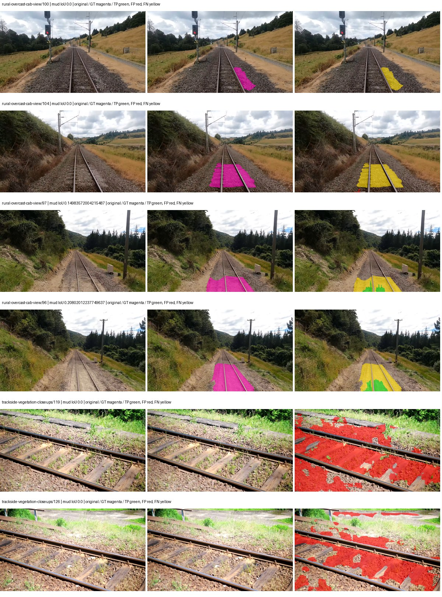
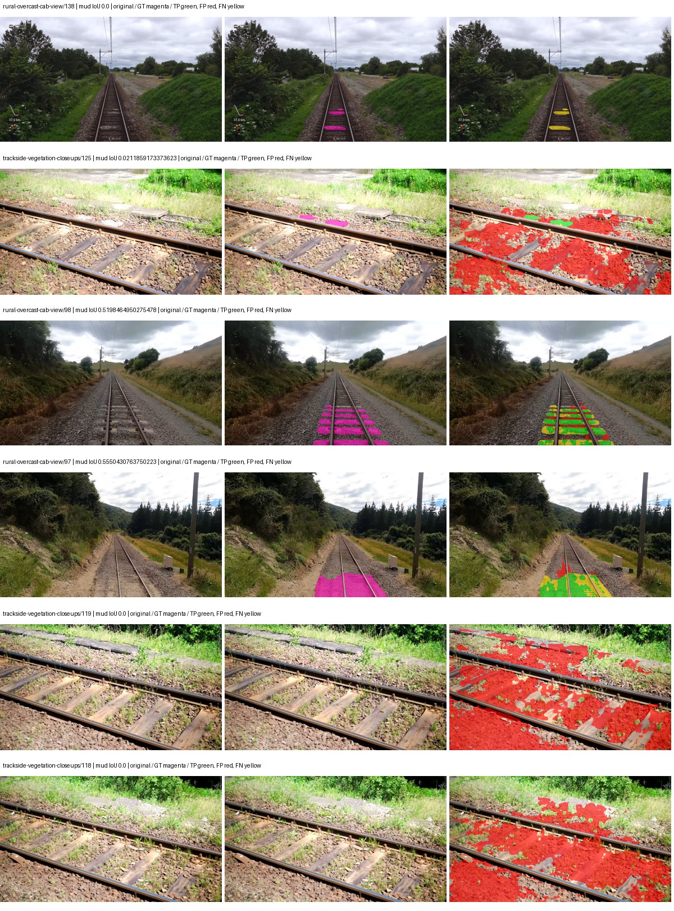
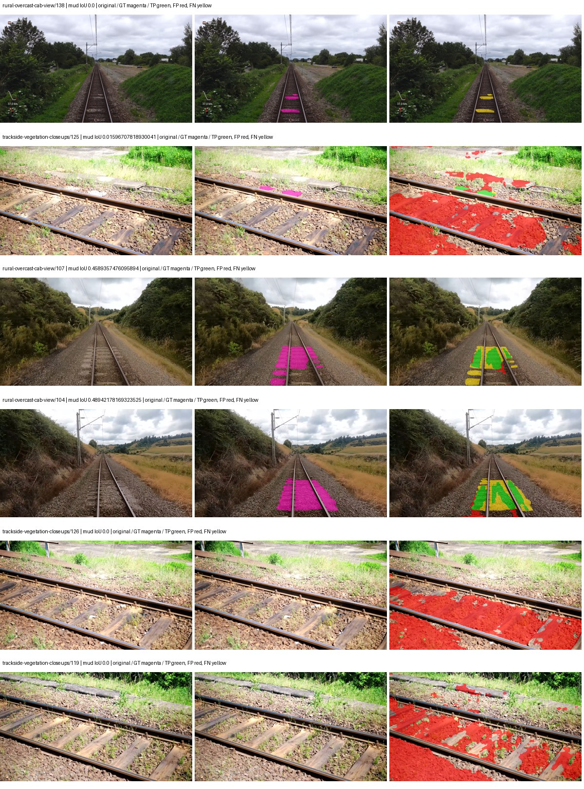
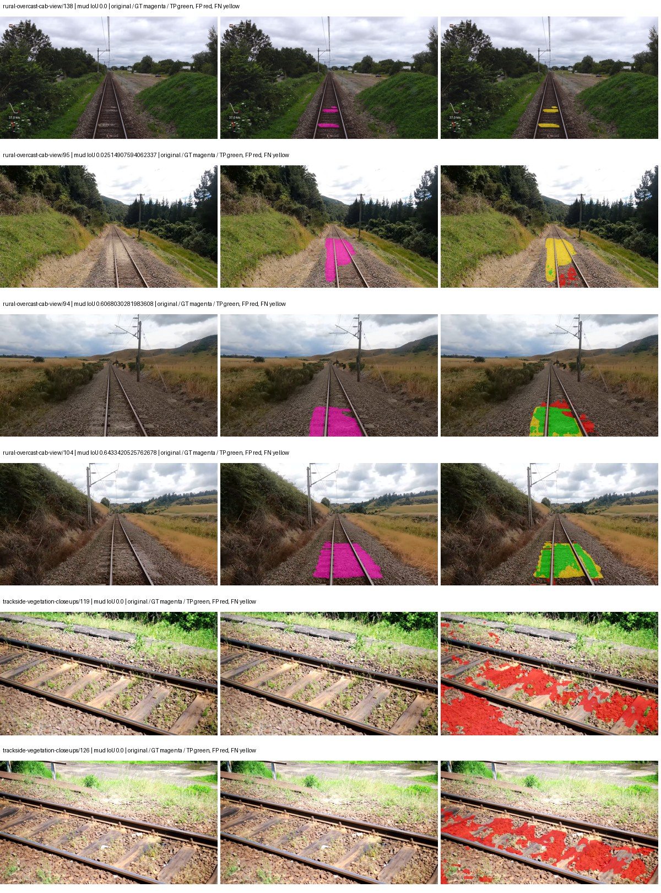

# smp_deeplabv3_resnet50 — paul-test-rtis_v2

[RTIS comparison](../../README.md) · [Full model records](record.json)

Primary selection and early stopping: **mud-pumping validation IoU**. A job is complete only after full statistics and isolated profiling are verified.

| Model | Initialization path | Seed | Status | Steps | Best step | Mud IoU (%) | Mud precision (%) | Mud recall (%) | Final mud IoU (trainer val, %) | mIoU (%) | Fixed GT-class mIoU (%) |
| --- | --- | --- | --- | --- | --- | --- | --- | --- | --- | --- | --- |
| smp_deeplabv3_resnet50 | rtis_only | 0 | completed | 1784 | 509 | 1.14 | 1.43 | 5.33 | 0.28 | 23.60 | 27.53 |
| smp_deeplabv3_resnet50 | cityscapes_to_rtis | 0 | completed | 1784 | 509 | 7.16 | 8.16 | 36.81 | 0.54 | 20.74 | 24.20 |
| smp_deeplabv3_resnet50 | railsem19_to_rtis | 0 | completed | 1784 | 509 | 8.16 | 9.30 | 39.88 | 1.44 | 32.14 | 37.49 |
| smp_deeplabv3_resnet50 | cityscapes_to_railsem19_to_rtis | 0 | completed | 1784 | 509 | 15.19 | 19.24 | 41.91 | 0.67 | 33.07 | 38.58 |

Training: 205 images. Validation: 37 images. Test: 50 held out. Seeds: [0]. Seed variation measures optimization variability, not independent-recording uncertainty. Historical source checkpoints stay fixed across adaptation seeds.

Training code: `066afb2626398b7be59d4d19f5a0e4644fd59adc`. Split SHA-256: `18a84c0163a65ded46508bcc904c374e5f33ad8a09b8879e3c8add606e86aa9f`.

## rtis_only — seed 0

Status: **completed**. Started: 2026-09-10T01:02:33.306639+00:00. Finished: 2026-09-10T01:43:38.370251+00:00.

Recipe pretrained initializer: `{"arch": "smp", "backbone_path": null, "batch_norm_momentum": null, "checkpoint": null, "classifier_path": null, "drop_path": null, "encoder_name": "resnet50", "encoder_weights": "imagenet", "head": "unified_head", "head_paths": [], "inactive_parameter_paths": [], "local_files_only": false, "lora_alpha": 32, "lora_dropout": 0.05, "lora_r": 16, "lora_targets": [], "native": null, "revision": null, "smp_arch": "DeepLabV3", "subfolder": null, "trust_remote_code": false, "tuning": "full"}`.

`rtis_only` uses the recipe initializer, which may include pretrained segmentation components. Transfer paths load the exact historical source checkpoint below and reset the classifier; they do not reset all query/decoder features.

Source checkpoint: `Recipe pretrained initialization`.

Config SHA-256: `d95014988ff35481589a1155a3e530a380465f091f4d8586238af141f748365b`. Weights used for validation: `raw`.

### Mud-pumping and aggregate quality

| Metric | Selected checkpoint | Final training validation |
| --- | --- | --- |
| Mud IoU | 1.14 | 0.28 |
| Mud precision | 1.43 | 0.39 |
| Mud recall | 5.33 | 0.93 |
| Mud Dice/F1 | 2.25 | 0.55 |
| mIoU | 23.60 | 29.23 |
| Mean accuracy | 33.73 | 42.98 |
| Mean precision | 43.37 | 42.51 |
| Mean Dice | 30.38 | 37.24 |
| Mean specificity | 98.53 | 98.87 |
| Pixel accuracy | 77.06 | 81.39 |
| Frequency-weighted IoU | 66.94 | 72.38 |
| Fixed GT-present class mIoU | 27.53 | 34.10 |
| Boundary F1 | 26.64 | 33.13 |

The selected checkpoint has independent evaluation evidence. Final values are the trainer's final validation record, not a new independent evaluation. mIoU averages classes with nonzero union, so false positives on absent classes can change its denominator. The fixed GT-class mean is supplementary and excludes absent classes; their false positives remain in the confusion matrix.

### Resource usage and timing

| Measurement | Value |
| --- | --- |
| Peak training VRAM, retained training invocation (GiB) | 10.76 |
| Peak evaluation VRAM (GiB) | 6.97 |
| Retained training invocation wall time (seconds) | 2323.82 |
| Retained training invocation GPU-hours (one GPU) | 0.65 |
| Evaluation wall time (seconds) | 11.99 |
| Full evaluation pipeline images/second | 3.09 |
| Best full-state checkpoint (MiB) | 605.67 |
| Final full-state checkpoint (MiB) | 605.66 |
| Verified periodic checkpoints removed (GiB) | 1.77 |

VRAM uses the recorded allocator high-water mark; it is not total device usage including CUDA context. Resumed jobs' retained training invocation times and peaks are **not whole-campaign totals**. Earlier invocation resource records are not reconstructed here. Evaluation throughput includes loader, sliding-window inference and metrics; it is not model-only latency/FPS. Missing measurements are shown as —, never inferred from another dataset's run.

### Standardized inference performance

Dedicated model-only profiling waits for an idle worker-locked L40S: BF16, batch 1, 1024x1024, 20 warmup and 100 CUDA-event-timed public forwards. It excludes loading, preprocessing, tiling and metrics.

| Status | Parameters | Weight MiB | FPS | p50 ms | p95 ms | Peak reserved GiB |
| --- | --- | --- | --- | --- | --- | --- |
| complete | 39638869 | 151.21 | 77.35 | 12.87 | 12.93 | 0.84 |

```json
{
  "schema_version": 1,
  "model_id": "smp_deeplabv3_resnet50",
  "measured_at": "2026-09-10T01:43:34+00:00",
  "status": "complete",
  "benchmark_scope": "rtis_selected_checkpoint_model_only",
  "applies_to": [
    "smp_deeplabv3_resnet50--rtis_only--seed-0"
  ],
  "source": {
    "campaign_git_sha": "066afb2626398b7be59d4d19f5a0e4644fd59adc",
    "git_dirty": false,
    "config_hash": "cd4bb69d940b",
    "resolved_config": "/data/izadia1/projects/segmentary-runs/paul-test-rtis_v2/seed0-20260909/configs/smp_deeplabv3_resnet50--rtis_only--seed-0.yaml",
    "config_sha256": "d95014988ff35481589a1155a3e530a380465f091f4d8586238af141f748365b",
    "checkpoint_sha256": "3d08c1ea313455db8140d268cb8327954ebe3a257c0e5199d57ec5d81b4e1b29",
    "checkpoint_global_step": 509,
    "checkpoint_bytes": 635089054,
    "checkpoint_kind": "resume checkpoint with optimizer and EMA state",
    "weights": "raw",
    "measured_checkpoint_job_id": "smp_deeplabv3_resnet50--rtis_only--seed-0",
    "result_sha256": "b570c2a485b441e0a51e60f6b6686095fdf8f8e403efd6c6681bb0abfb119708",
    "result_git_sha": "066afb2626398b7be59d4d19f5a0e4644fd59adc",
    "result_stage": "eval:paul-test-rtis:val",
    "result_seed": 0
  },
  "hardware": {
    "gpu_name": "NVIDIA L40S",
    "gpu_uuid": "GPU-84f5ca4d-68db-ae98-d056-40654d859dd9",
    "logical_device": "cuda:0",
    "physical_visibility_token": "0",
    "compute_capability": [
      8,
      9
    ],
    "total_memory_bytes": 47677177856
  },
  "model": {
    "parameter_count": 39638869,
    "trainable_parameter_count": 39638869,
    "resident_parameter_bytes": 158555476,
    "parameter_dtype_counts": {
      "float32": 39638869
    }
  },
  "contract": {
    "backend": "pytorch",
    "precision": "bf16_autocast",
    "batch_size": 1,
    "input_shape_nchw": [
      1,
      3,
      1024,
      1024
    ],
    "warmup_iterations": 20,
    "measured_iterations": 100,
    "timing": "per-forward CUDA events with end-event synchronization",
    "includes_preprocessing": false,
    "includes_data_loader": false,
    "includes_sliding_window": false,
    "input_resident_on_gpu": true,
    "model_only": true,
    "entrypoint": "public model(image) dense-logits forward"
  },
  "measurements": {
    "latency": {
      "p50_ms": 12.868608474731445,
      "p95_ms": 12.932402753829956,
      "mean_ms": 12.927493743896484,
      "minimum_ms": 12.827648162841797,
      "maximum_ms": 14.68620777130127,
      "fps": 77.3545143251092,
      "raw_ms": [
        12.932095527648926,
        12.85427188873291,
        12.87168025970459,
        12.868608474731445,
        12.884991645812988,
        12.829695701599121,
        12.827648162841797,
        12.840959548950195,
        12.827648162841797,
        12.891136169433594,
        12.872703552246094,
        12.908639907836914,
        12.839936256408691,
        12.828672409057617,
        12.839967727661133,
        12.839936256408691,
        12.859264373779297,
        12.841983795166016,
        12.86451244354248,
        12.851200103759766,
        12.849151611328125,
        12.849151611328125,
        12.863455772399902,
        12.877823829650879,
        12.86451244354248,
        12.86451244354248,
        12.891136169433594,
        12.889087677001953,
        12.87987232208252,
        14.28377628326416,
        12.896256446838379,
        12.895232200622559,
        12.893183708190918,
        12.932095527648926,
        14.68620777130127,
        13.895551681518555,
        12.8788480758667,
        12.840959548950195,
        12.838912010192871,
        12.86246395111084,
        14.336000442504883,
        12.89417552947998,
        12.878911972045898,
        12.865535736083984,
        12.835968017578125,
        12.866559982299805,
        12.858431816101074,
        12.884991645812988,
        12.859392166137695,
        12.881792068481445,
        12.845088005065918,
        12.860320091247559,
        12.87065601348877,
        12.874815940856934,
        12.865535736083984,
        12.859295845031738,
        12.844032287597656,
        12.841888427734375,
        12.8788480758667,
        12.83788776397705,
        12.859392166137695,
        12.8788480758667,
        12.926976203918457,
        12.894207954406738,
        12.883968353271484,
        12.859392166137695,
        12.84607982635498,
        12.866559982299805,
        12.87065601348877,
        12.891136169433594,
        12.938240051269531,
        12.922752380371094,
        12.84505558013916,
        12.873727798461914,
        12.849151611328125,
        12.86137580871582,
        12.83788776397705,
        12.867584228515625,
        12.913663864135742,
        12.901344299316406,
        12.892160415649414,
        12.860416412353516,
        12.909567832946777,
        12.906496047973633,
        12.872703552246094,
        12.875776290893555,
        12.858367919921875,
        12.85324764251709,
        12.85324764251709,
        12.849151611328125,
        12.886015892028809,
        12.887104034423828,
        12.868608474731445,
        12.8951997756958,
        12.893183708190918,
        12.887040138244629,
        12.884991645812988,
        12.86348819732666,
        12.84607982635498,
        12.87065601348877
      ],
      "percentile_method": "numpy linear interpolation"
    },
    "peak_reserved_bytes": 899678208,
    "memory_kind": "pytorch_cuda_allocator_peak_reserved_excluding_context",
    "benchmark_wall_clock_s": 12.437717031687498
  },
  "started_at": "2026-09-10T01:43:21+00:00",
  "finished_at": "2026-09-10T01:43:34+00:00",
  "environment": {
    "hostname": "hdrfs-app-001",
    "python": "3.11.15",
    "platform": "Linux-5.15.0-139-generic-x86_64-with-glibc2.35",
    "torch": "2.11.0+cu128",
    "torch_cuda": "12.8",
    "cudnn": 91900,
    "driver_version": "570.133.20",
    "cuda_available": true,
    "gpu_count": 1,
    "gpu_names": [
      "NVIDIA L40S"
    ],
    "cuda_visible_devices": "0",
    "packages": {
      "segmentary": "0.1.0",
      "torch": "2.11.0+cu128",
      "torchvision": "0.26.0+cu128",
      "transformers": "5.15.0",
      "timm": "1.0.28",
      "segmentation-models-pytorch": "0.5.0",
      "albumentations": "2.0.8",
      "lightning": "2.6.5",
      "numpy": "2.4.4"
    }
  }
}
```

### Per-class validation results

| Class | GT pixels | IoU (%) | Precision (%) | Recall (%) | Dice (%) | Boundary F1 (%) |
| --- | --- | --- | --- | --- | --- | --- |
| car | 29664 | 0.00 | 0.00 | 0.00 | 0.00 | 0.00 |
| construction | 311585 | 46.59 | 56.91 | 71.98 | 63.56 | 59.92 |
| fence | 265137 | 6.49 | 33.41 | 7.45 | 12.19 | 23.69 |
| mud-pumping | 1226250 | 1.14 | 1.43 | 5.33 | 2.25 | 2.77 |
| on-rails | 0 | 0.00 | 0.00 | — | 0.00 | 0.00 |
| person | 0 | 0.00 | 0.00 | — | 0.00 | 0.00 |
| pole | 628038 | 57.97 | 81.58 | 66.70 | 73.40 | 81.29 |
| rail-embedded | 16799 | 0.83 | 100.00 | 0.83 | 1.65 | 8.00 |
| rail-raised | 2969797 | 61.71 | 69.89 | 84.06 | 76.32 | 78.37 |
| rail-track | 6323197 | 29.28 | 68.95 | 33.73 | 45.30 | 40.72 |
| road | 1048831 | 1.77 | 13.88 | 1.99 | 3.48 | 9.55 |
| sidewalk | 1297367 | 25.57 | 71.80 | 28.42 | 40.72 | 13.75 |
| sky | 19121606 | 94.78 | 98.85 | 95.84 | 97.32 | 83.54 |
| standing-water | 95802 | 0.59 | 0.61 | 13.41 | 1.18 | 3.67 |
| terrain | 39239306 | 78.75 | 82.05 | 95.14 | 88.11 | 45.20 |
| trackbed | 10643081 | 49.76 | 73.91 | 60.36 | 66.45 | 50.44 |
| traffic-light | 19510 | 0.00 | 0.00 | 0.00 | 0.00 | 0.00 |
| traffic-sign | 13285 | 0.00 | 0.00 | 0.00 | 0.00 | 0.00 |
| tram-track | 56179 | 26.58 | 97.22 | 26.78 | 42.00 | 25.72 |
| truck | 0 | 0.00 | 0.00 | — | 0.00 | 0.00 |
| vegetation-overgrowth | 5901821 | 13.69 | 60.36 | 15.05 | 24.09 | 32.74 |

### Full-run accounting

| Measurement | Value |
| --- | --- |
| Full GPU-reserved wall seconds, all recorded worker attempts | 2465.07 |
| Full reserved GPU-hours | 0.68 |
| Whole-run timing complete | True |

| Phase | Wall seconds including failed attempts |
| --- | --- |
| training | 2330.28 |
| diagnostics | 91.56 |
| performance | 20.08 |

GPU-reserved time includes model loading, training, validation, collection, profiling, checkpoint I/O and orchestration while the worker owns one GPU. It is not GPU kernel-active time. Phase timings and sampled device memory/power/utilization are retained separately; sampled device memory is not the allocator high-water mark.

### Train/validation and raw/EMA diagnostics

| Checkpoint / weights / split | Images | Mud IoU (%) | Mud precision (%) | Mud recall (%) |
| --- | --- | --- | --- | --- |
| best-auto-train / raw | 205 | 88.46 | 96.53 | 91.37 |
| best-auto-val / raw | 37 | 1.14 | 1.43 | 5.33 |
| best-alternate-val / ema | 37 | 0.05 | 0.24 | 0.07 |
| final-auto-val / raw | 37 | 0.28 | 0.39 | 0.93 |

Train uses the evaluation transform without augmentation. Compare mud train/validation metrics for the same selected weights. Alternate EMA on running-stat BatchNorm is explicitly uncalibrated and is diagnostic only. Score-threshold curves use uncalibrated normalized scores and are pixel-level diagnostics, not event detection rates or a selected deployment operating point.

### Downloadable evidence

- best-auto-train: [per-image.csv](rtis_only--seed-0/best-auto-train/per-image.csv) · [per-image-confusion.json.gz](rtis_only--seed-0/best-auto-train/per-image-confusion.json.gz) · [groups.json](rtis_only--seed-0/best-auto-train/groups.json) · [mud-score-curves.json](rtis_only--seed-0/best-auto-train/mud-score-curves.json)
- best-auto-val: [per-image.csv](rtis_only--seed-0/best-auto-val/per-image.csv) · [per-image-confusion.json.gz](rtis_only--seed-0/best-auto-val/per-image-confusion.json.gz) · [groups.json](rtis_only--seed-0/best-auto-val/groups.json) · [mud-score-curves.json](rtis_only--seed-0/best-auto-val/mud-score-curves.json) · [examples.jpg](rtis_only--seed-0/best-auto-val/examples.jpg)
- best-alternate-val: [per-image.csv](rtis_only--seed-0/best-alternate-val/per-image.csv) · [per-image-confusion.json.gz](rtis_only--seed-0/best-alternate-val/per-image-confusion.json.gz) · [groups.json](rtis_only--seed-0/best-alternate-val/groups.json) · [mud-score-curves.json](rtis_only--seed-0/best-alternate-val/mud-score-curves.json)
- final-auto-val: [per-image.csv](rtis_only--seed-0/final-auto-val/per-image.csv) · [per-image-confusion.json.gz](rtis_only--seed-0/final-auto-val/per-image-confusion.json.gz) · [groups.json](rtis_only--seed-0/final-auto-val/groups.json) · [mud-score-curves.json](rtis_only--seed-0/final-auto-val/mud-score-curves.json)
- resources: [telemetry.csv](rtis_only--seed-0/resources/telemetry.csv)



Examples are two lowest and two highest mud-IoU positive images, plus up to two negative images with the most false-positive mud pixels. They are targeted diagnostic examples, not random samples. Green: true positive; red: false positive; yellow: false negative. Full predictions remain on HDRFS.

### Validation tracking

| Logged step | Overall mIoU (%) | Mud IoU (%) |
| --- | --- | --- |
| 254 | 22.83 | 0.17 |
| 509 | 23.59 | 1.14 |
| 764 | 23.30 | 0.33 |
| 1019 | 23.57 | 0.67 |
| 1274 | 28.02 | 0.19 |
| 1529 | 26.93 | 0.57 |
| 1784 | 29.23 | 0.28 |

All retained scalar curves, including training loss and per-class IoU, are in record.json. Observed best mud on a curve is not necessarily a retained checkpoint: the pilot saved its selection-metric-best and final checkpoints. Step logging and checkpoint global_step may differ by one.

### Stopping and checkpoint provenance

```json
{
  "stopping": {
    "actual_steps": 1784,
    "maximum_steps": 4000,
    "min_delta": 0.001,
    "monitor": "val_iou/mud-pumping",
    "patience": 5,
    "reason": "validation_plateau"
  },
  "checkpoints": {
    "best": {
      "path": "/data/izadia1/projects/segmentary-runs/paul-test-rtis_v2/seed0-20260909/future-runs/smp_deeplabv3_resnet50--rtis_only--seed-0_seed0/rtis/best.ckpt",
      "sha256": "3d08c1ea313455db8140d268cb8327954ebe3a257c0e5199d57ec5d81b4e1b29",
      "global_step": 509,
      "bytes": 635089054
    },
    "final": {
      "path": "/data/izadia1/projects/segmentary-runs/paul-test-rtis_v2/seed0-20260909/future-runs/smp_deeplabv3_resnet50--rtis_only--seed-0_seed0/rtis/last.ckpt",
      "sha256": "c892e14c0837673ee8ebb956357b3917d52188e337f2ff5c4dc682374a4a0905",
      "global_step": 1784,
      "bytes": 635077342
    }
  },
  "cleanup_error": null
}
```

### Resolved training, initialization and evaluation settings

The optimizer block is the base configuration. Stage LR scales are applied at runtime, and stage warmup is capped at min(base warmup, floor(stage budget / 10), stage budget - 1): 400 steps for this 4,000-step pilot. Model-internal native input grids may differ from augmentation crops (EoMT uses its 640 grid).

```json
{
  "name": "smp_deeplabv3_resnet50--rtis_only--seed-0",
  "model": {
    "arch": "smp",
    "checkpoint": null,
    "tuning": "full",
    "head": "unified_head",
    "lora_r": 16,
    "lora_alpha": 32,
    "lora_dropout": 0.05,
    "lora_targets": [],
    "drop_path": null,
    "revision": null,
    "subfolder": null,
    "local_files_only": false,
    "trust_remote_code": false,
    "backbone_path": null,
    "head_paths": [],
    "classifier_path": null,
    "inactive_parameter_paths": [],
    "smp_arch": "DeepLabV3",
    "encoder_name": "resnet50",
    "encoder_weights": "imagenet",
    "native": null,
    "batch_norm_momentum": null
  },
  "space": "paul-test-rtis",
  "taxonomy_root": "/data/izadia1/projects/segmentary-rtis-fullstats-066afb2/taxonomy",
  "output_root": "/data/izadia1/projects/segmentary-runs/paul-test-rtis_v2/seed0-20260909/future-runs",
  "optim": {
    "backbone_lr": 0.0001,
    "head_lr_mult": 10.0,
    "weight_decay": 0.05,
    "llrd": 1.0,
    "warmup_iters": 1500,
    "warmup_ratio": 1e-06,
    "poly_power": 0.9,
    "min_lr_ratio": 0.0,
    "betas": [
      0.9,
      0.999
    ],
    "grad_clip": 1.0
  },
  "train": {
    "iters": 4000,
    "batch_size": 2,
    "accum": 8,
    "num_workers": 2,
    "precision": "bf16-mixed",
    "ema_decay": 0.9998,
    "val_every": 250,
    "ckpt_every": 500,
    "selection_metric": "val_iou/mud-pumping",
    "early_stopping_patience": 5,
    "early_stopping_min_delta": 0.001,
    "seed": 0,
    "devices": 1
  },
  "eval": {
    "sliding_window": true,
    "window": [
      1024,
      1024
    ],
    "stride": [
      768,
      768
    ],
    "batch_size": 1,
    "num_workers": 2,
    "tta_scales": [],
    "tta_flip": false,
    "threshold": 0.5,
    "boundary_tolerance_frac": 0.0075,
    "save_confusion": true
  },
  "loss": {
    "task": "multiclass",
    "activation": "auto",
    "terms": [],
    "aux": "none",
    "aux_weight": 0.0,
    "ce_weight": 1.0,
    "label_smoothing": 0.0,
    "class_weights": null,
    "query": null
  },
  "aug": {
    "crop": [
      1024,
      1024
    ],
    "scale_min": 0.5,
    "scale_max": 2.0,
    "hflip_p": 0.5,
    "color_jitter_p": 0.5,
    "brightness": 0.25,
    "contrast": 0.25,
    "saturation": 0.25,
    "hue": 0.05
  },
  "stages": [
    {
      "name": "rtis",
      "data": [
        {
          "name": "paul-test-rtis",
          "root": "/data/izadia1/datasets/paul-test-rtis_v2",
          "variant": null,
          "split_file": "splits.json",
          "train_split": "train",
          "val_split": "val",
          "limit": null,
          "loader": "folder",
          "mapping": "paul-test-rtis",
          "loader_options": {
            "require_groups": true
          }
        }
      ],
      "iters": null,
      "lr_scale": 1.0,
      "head_group_lr_scale": 1.0,
      "init_from": "pretrained",
      "reset_head": false,
      "freeze": null,
      "sample_weights": null
    }
  ]
}
```

### Hardware and software provenance

```json
{
  "training": {
    "cuda_available": true,
    "cuda_visible_devices": "0",
    "cudnn": 91900,
    "driver_version": "570.133.20",
    "gpu_count": 1,
    "gpu_names": [
      "NVIDIA L40S"
    ],
    "hostname": "hdrfs-app-001",
    "input_normalization": {
      "channel_order": "rgb",
      "mean": [
        0.485,
        0.456,
        0.406
      ],
      "source": "smp_encoder_settings",
      "std": [
        0.229,
        0.224,
        0.225
      ]
    },
    "model_origins": [
      {
        "hf_commit": null,
        "hf_name_or_path": null,
        "module": "model",
        "timm_pretrained": {}
      }
    ],
    "model_parameter_count": 39638869,
    "packages": {
      "albumentations": "2.0.8",
      "lightning": "2.6.5",
      "numpy": "2.4.4",
      "segmentary": "0.1.0",
      "segmentation-models-pytorch": "0.5.0",
      "timm": "1.0.28",
      "torch": "2.11.0+cu128",
      "torchvision": "0.26.0+cu128",
      "transformers": "5.15.0"
    },
    "platform": "Linux-5.15.0-139-generic-x86_64-with-glibc2.35",
    "python": "3.11.15",
    "torch": "2.11.0+cu128",
    "torch_cuda": "12.8",
    "trainable_parameter_count": 39638869,
    "training_stop": {
      "actual_steps": 1784,
      "maximum_steps": 4000,
      "min_delta": 0.001,
      "monitor": "val_iou/mud-pumping",
      "patience": 5,
      "reason": "validation_plateau"
    },
    "validation_weights": "raw"
  },
  "evaluation": {
    "cuda_available": true,
    "cuda_visible_devices": "0",
    "cudnn": 91900,
    "driver_version": "570.133.20",
    "gpu_count": 1,
    "gpu_names": [
      "NVIDIA L40S"
    ],
    "hostname": "hdrfs-app-001",
    "input_normalization": {
      "channel_order": "rgb",
      "mean": [
        0.485,
        0.456,
        0.406
      ],
      "source": "smp_encoder_settings",
      "std": [
        0.229,
        0.224,
        0.225
      ]
    },
    "packages": {
      "albumentations": "2.0.8",
      "lightning": "2.6.5",
      "numpy": "2.4.4",
      "segmentary": "0.1.0",
      "segmentation-models-pytorch": "0.5.0",
      "timm": "1.0.28",
      "torch": "2.11.0+cu128",
      "torchvision": "0.26.0+cu128",
      "transformers": "5.15.0"
    },
    "platform": "Linux-5.15.0-139-generic-x86_64-with-glibc2.35",
    "python": "3.11.15",
    "torch": "2.11.0+cu128",
    "torch_cuda": "12.8"
  }
}
```

## cityscapes_to_rtis — seed 0

Status: **completed**. Started: 2026-09-10T01:08:49.618934+00:00. Finished: 2026-09-10T01:49:29.217932+00:00.

Recipe pretrained initializer: `{"arch": "smp", "backbone_path": null, "batch_norm_momentum": null, "checkpoint": null, "classifier_path": null, "drop_path": null, "encoder_name": "resnet50", "encoder_weights": "imagenet", "head": "unified_head", "head_paths": [], "inactive_parameter_paths": [], "local_files_only": false, "lora_alpha": 32, "lora_dropout": 0.05, "lora_r": 16, "lora_targets": [], "native": null, "revision": null, "smp_arch": "DeepLabV3", "subfolder": null, "trust_remote_code": false, "tuning": "full"}`.

`rtis_only` uses the recipe initializer, which may include pretrained segmentation components. Transfer paths load the exact historical source checkpoint below and reset the classifier; they do not reset all query/decoder features.

Source checkpoint: `{'name': 'smp_deeplabv3_resnet50--cityscapes--seed-0', 'model': 'smp_deeplabv3_resnet50', 'protocol': 'cityscapes', 'config': '/data/izadia1/projects/segmentary-runs/all-model-city-rail-seed0-rail20-b9eb3e1/jobs/smp_deeplabv3_resnet50--cityscapes--seed-0/attempt-001/resolved-config.yaml', 'checkpoint': '/data/izadia1/projects/segmentary-runs/all-model-city-rail-seed0-rail20-b9eb3e1/jobs/smp_deeplabv3_resnet50--cityscapes--seed-0/attempt-001/train/smp_deeplabv3_resnet50--cityscapes_seed0/cityscapes/last.ckpt', 'recorded_sha256': 'f8d278fd853bb1003957b26e29428cc8c6c4a6596aad963f2db4b2f152f86384', 'exists': True}`.

Config SHA-256: `f1b7c235670217ed56fad775a3375755f000bd634cf359d58d16845575b71285`. Weights used for validation: `raw`.

### Mud-pumping and aggregate quality

| Metric | Selected checkpoint | Final training validation |
| --- | --- | --- |
| Mud IoU | 7.16 | 0.54 |
| Mud precision | 8.16 | 0.72 |
| Mud recall | 36.81 | 2.13 |
| Mud Dice/F1 | 13.36 | 1.07 |
| mIoU | 20.74 | 28.16 |
| Mean accuracy | 32.44 | 43.85 |
| Mean precision | 36.62 | 47.95 |
| Mean Dice | 26.75 | 36.57 |
| Mean specificity | 98.45 | 98.34 |
| Pixel accuracy | 74.55 | 71.76 |
| Frequency-weighted IoU | 65.52 | 63.37 |
| Fixed GT-present class mIoU | 24.20 | 32.86 |
| Boundary F1 | 24.17 | 33.93 |

The selected checkpoint has independent evaluation evidence. Final values are the trainer's final validation record, not a new independent evaluation. mIoU averages classes with nonzero union, so false positives on absent classes can change its denominator. The fixed GT-class mean is supplementary and excludes absent classes; their false positives remain in the confusion matrix.

### Resource usage and timing

| Measurement | Value |
| --- | --- |
| Peak training VRAM, retained training invocation (GiB) | 10.76 |
| Peak evaluation VRAM (GiB) | 6.97 |
| Retained training invocation wall time (seconds) | 2297.10 |
| Retained training invocation GPU-hours (one GPU) | 0.64 |
| Evaluation wall time (seconds) | 12.04 |
| Full evaluation pipeline images/second | 3.07 |
| Best full-state checkpoint (MiB) | 605.67 |
| Final full-state checkpoint (MiB) | 605.66 |
| Verified periodic checkpoints removed (GiB) | 1.77 |

VRAM uses the recorded allocator high-water mark; it is not total device usage including CUDA context. Resumed jobs' retained training invocation times and peaks are **not whole-campaign totals**. Earlier invocation resource records are not reconstructed here. Evaluation throughput includes loader, sliding-window inference and metrics; it is not model-only latency/FPS. Missing measurements are shown as —, never inferred from another dataset's run.

### Standardized inference performance

Dedicated model-only profiling waits for an idle worker-locked L40S: BF16, batch 1, 1024x1024, 20 warmup and 100 CUDA-event-timed public forwards. It excludes loading, preprocessing, tiling and metrics.

| Status | Parameters | Weight MiB | FPS | p50 ms | p95 ms | Peak reserved GiB |
| --- | --- | --- | --- | --- | --- | --- |
| complete | 39638869 | 151.21 | 79.12 | 12.62 | 12.69 | 0.67 |

```json
{
  "schema_version": 1,
  "model_id": "smp_deeplabv3_resnet50",
  "measured_at": "2026-09-10T01:49:24+00:00",
  "status": "complete",
  "benchmark_scope": "rtis_selected_checkpoint_model_only",
  "applies_to": [
    "smp_deeplabv3_resnet50--cityscapes_to_rtis--seed-0"
  ],
  "source": {
    "campaign_git_sha": "066afb2626398b7be59d4d19f5a0e4644fd59adc",
    "git_dirty": false,
    "config_hash": "6f32784aaf45",
    "resolved_config": "/data/izadia1/projects/segmentary-runs/paul-test-rtis_v2/seed0-20260909/configs/smp_deeplabv3_resnet50--cityscapes_to_rtis--seed-0.yaml",
    "config_sha256": "f1b7c235670217ed56fad775a3375755f000bd634cf359d58d16845575b71285",
    "checkpoint_sha256": "7542843d80dd2f41760816aa1bfae875b94f2e3a2f8556790a7a4eec1749a808",
    "checkpoint_global_step": 509,
    "checkpoint_bytes": 635089054,
    "checkpoint_kind": "resume checkpoint with optimizer and EMA state",
    "weights": "raw",
    "measured_checkpoint_job_id": "smp_deeplabv3_resnet50--cityscapes_to_rtis--seed-0",
    "result_sha256": "2c742776e6c2814f9946c940643d87e8053ac4f07c337986d8cad2531f1ff41b",
    "result_git_sha": "066afb2626398b7be59d4d19f5a0e4644fd59adc",
    "result_stage": "eval:paul-test-rtis:val",
    "result_seed": 0
  },
  "hardware": {
    "gpu_name": "NVIDIA L40S",
    "gpu_uuid": "GPU-a5ad49e5-0536-5229-ba8a-f8a902808f53",
    "logical_device": "cuda:0",
    "physical_visibility_token": "7",
    "compute_capability": [
      8,
      9
    ],
    "total_memory_bytes": 47677177856
  },
  "model": {
    "parameter_count": 39638869,
    "trainable_parameter_count": 39638869,
    "resident_parameter_bytes": 158555476,
    "parameter_dtype_counts": {
      "float32": 39638869
    }
  },
  "contract": {
    "backend": "pytorch",
    "precision": "bf16_autocast",
    "batch_size": 1,
    "input_shape_nchw": [
      1,
      3,
      1024,
      1024
    ],
    "warmup_iterations": 20,
    "measured_iterations": 100,
    "timing": "per-forward CUDA events with end-event synchronization",
    "includes_preprocessing": false,
    "includes_data_loader": false,
    "includes_sliding_window": false,
    "input_resident_on_gpu": true,
    "model_only": true,
    "entrypoint": "public model(image) dense-logits forward"
  },
  "measurements": {
    "latency": {
      "p50_ms": 12.616703987121582,
      "p95_ms": 12.6874107837677,
      "mean_ms": 12.638687353134156,
      "minimum_ms": 12.572671890258789,
      "maximum_ms": 14.166015625,
      "fps": 79.12214077769863,
      "raw_ms": [
        12.657631874084473,
        12.572671890258789,
        12.645376205444336,
        12.65459156036377,
        12.594176292419434,
        12.611583709716797,
        12.590047836303711,
        12.6310396194458,
        12.5829439163208,
        12.618751525878906,
        12.64025592803955,
        12.608511924743652,
        12.628992080688477,
        12.590080261230469,
        12.594176292419434,
        12.608511924743652,
        12.587008476257324,
        12.626943588256836,
        12.622847557067871,
        12.630016326904297,
        12.618751525878906,
        12.617728233337402,
        12.603391647338867,
        12.585920333862305,
        12.584959983825684,
        12.632063865661621,
        12.601344108581543,
        12.595199584960938,
        12.591103553771973,
        12.611583709716797,
        12.583935737609863,
        12.595199584960938,
        12.583935737609863,
        12.598272323608398,
        12.618751525878906,
        12.625920295715332,
        12.616703987121582,
        12.617728233337402,
        12.621824264526367,
        12.637184143066406,
        12.625920295715332,
        12.589056015014648,
        12.612607955932617,
        12.86143970489502,
        14.166015625,
        12.616703987121582,
        12.686335563659668,
        12.628992080688477,
        12.641280174255371,
        12.630016326904297,
        12.660736083984375,
        12.707839965820312,
        12.602304458618164,
        12.614656448364258,
        12.585984230041504,
        12.613632202148438,
        12.628992080688477,
        12.606464385986328,
        12.626943588256836,
        12.614656448364258,
        12.638208389282227,
        12.653568267822266,
        12.619775772094727,
        12.612640380859375,
        12.611583709716797,
        12.607487678527832,
        12.591103553771973,
        12.609536170959473,
        12.626943588256836,
        12.596223831176758,
        12.615679740905762,
        12.589056015014648,
        12.6494722366333,
        12.6146240234375,
        12.618720054626465,
        12.614656448364258,
        12.605440139770508,
        12.613632202148438,
        12.607487678527832,
        12.598272323608398,
        12.607487678527832,
        12.610560417175293,
        12.626943588256836,
        12.630016326904297,
        12.64025592803955,
        12.578816413879395,
        12.622847557067871,
        12.57472038269043,
        12.606464385986328,
        12.637184143066406,
        12.609536170959473,
        12.742624282836914,
        12.623871803283691,
        12.8788480758667,
        12.638239860534668,
        12.64844799041748,
        12.626943588256836,
        12.675071716308594,
        12.619775772094727,
        12.617728233337402
      ],
      "percentile_method": "numpy linear interpolation"
    },
    "peak_reserved_bytes": 717225984,
    "memory_kind": "pytorch_cuda_allocator_peak_reserved_excluding_context",
    "benchmark_wall_clock_s": 12.420680176466703
  },
  "started_at": "2026-09-10T01:49:12+00:00",
  "finished_at": "2026-09-10T01:49:24+00:00",
  "environment": {
    "hostname": "hdrfs-app-001",
    "python": "3.11.15",
    "platform": "Linux-5.15.0-139-generic-x86_64-with-glibc2.35",
    "torch": "2.11.0+cu128",
    "torch_cuda": "12.8",
    "cudnn": 91900,
    "driver_version": "570.133.20",
    "cuda_available": true,
    "gpu_count": 1,
    "gpu_names": [
      "NVIDIA L40S"
    ],
    "cuda_visible_devices": "7",
    "packages": {
      "segmentary": "0.1.0",
      "torch": "2.11.0+cu128",
      "torchvision": "0.26.0+cu128",
      "transformers": "5.15.0",
      "timm": "1.0.28",
      "segmentation-models-pytorch": "0.5.0",
      "albumentations": "2.0.8",
      "lightning": "2.6.5",
      "numpy": "2.4.4"
    }
  }
}
```

### Per-class validation results

| Class | GT pixels | IoU (%) | Precision (%) | Recall (%) | Dice (%) | Boundary F1 (%) |
| --- | --- | --- | --- | --- | --- | --- |
| car | 29664 | 0.00 | 0.00 | 0.00 | 0.00 | 0.00 |
| construction | 311585 | 3.68 | 3.74 | 69.08 | 7.09 | 6.71 |
| fence | 265137 | 26.92 | 74.25 | 29.69 | 42.42 | 44.70 |
| mud-pumping | 1226250 | 7.16 | 8.16 | 36.81 | 13.36 | 14.21 |
| on-rails | 0 | 0.00 | 0.00 | — | 0.00 | 0.00 |
| person | 0 | 0.00 | 0.00 | — | 0.00 | 0.00 |
| pole | 628038 | 64.47 | 86.20 | 71.88 | 78.39 | 88.68 |
| rail-embedded | 16799 | 0.00 | 0.00 | 0.00 | 0.00 | 0.00 |
| rail-raised | 2969797 | 49.12 | 74.97 | 58.76 | 65.88 | 79.87 |
| rail-track | 6323197 | 29.62 | 64.94 | 35.26 | 45.70 | 36.38 |
| road | 1048831 | 3.01 | 12.17 | 3.85 | 5.85 | 9.86 |
| sidewalk | 1297367 | 19.92 | 71.43 | 21.65 | 33.22 | 7.45 |
| sky | 19121606 | 94.07 | 99.54 | 94.47 | 96.94 | 78.28 |
| standing-water | 95802 | 0.31 | 0.40 | 1.30 | 0.61 | 2.22 |
| terrain | 39239306 | 78.03 | 83.18 | 92.65 | 87.66 | 48.88 |
| trackbed | 10643081 | 49.98 | 76.93 | 58.79 | 66.65 | 52.95 |
| traffic-light | 19510 | 0.00 | 0.00 | 0.00 | 0.00 | 0.00 |
| traffic-sign | 13285 | 0.00 | 0.00 | 0.00 | 0.00 | 0.00 |
| tram-track | 56179 | 3.86 | 37.42 | 4.12 | 7.43 | 10.82 |
| truck | 0 | 0.00 | 0.00 | — | 0.00 | 0.00 |
| vegetation-overgrowth | 5901821 | 5.51 | 75.59 | 5.61 | 10.45 | 26.66 |

### Full-run accounting

| Measurement | Value |
| --- | --- |
| Full GPU-reserved wall seconds, all recorded worker attempts | 2440.08 |
| Full reserved GPU-hours | 0.68 |
| Whole-run timing complete | True |

| Phase | Wall seconds including failed attempts |
| --- | --- |
| training | 2303.85 |
| diagnostics | 92.95 |
| performance | 19.88 |

GPU-reserved time includes model loading, training, validation, collection, profiling, checkpoint I/O and orchestration while the worker owns one GPU. It is not GPU kernel-active time. Phase timings and sampled device memory/power/utilization are retained separately; sampled device memory is not the allocator high-water mark.

### Train/validation and raw/EMA diagnostics

| Checkpoint / weights / split | Images | Mud IoU (%) | Mud precision (%) | Mud recall (%) |
| --- | --- | --- | --- | --- |
| best-auto-train / raw | 205 | 88.62 | 94.22 | 93.71 |
| best-auto-val / raw | 37 | 7.16 | 8.16 | 36.81 |
| best-alternate-val / ema | 37 | 2.20 | 2.73 | 10.27 |
| final-auto-val / raw | 37 | 0.54 | 0.72 | 2.13 |

Train uses the evaluation transform without augmentation. Compare mud train/validation metrics for the same selected weights. Alternate EMA on running-stat BatchNorm is explicitly uncalibrated and is diagnostic only. Score-threshold curves use uncalibrated normalized scores and are pixel-level diagnostics, not event detection rates or a selected deployment operating point.

### Downloadable evidence

- best-auto-train: [per-image.csv](cityscapes_to_rtis--seed-0/best-auto-train/per-image.csv) · [per-image-confusion.json.gz](cityscapes_to_rtis--seed-0/best-auto-train/per-image-confusion.json.gz) · [groups.json](cityscapes_to_rtis--seed-0/best-auto-train/groups.json) · [mud-score-curves.json](cityscapes_to_rtis--seed-0/best-auto-train/mud-score-curves.json)
- best-auto-val: [per-image.csv](cityscapes_to_rtis--seed-0/best-auto-val/per-image.csv) · [per-image-confusion.json.gz](cityscapes_to_rtis--seed-0/best-auto-val/per-image-confusion.json.gz) · [groups.json](cityscapes_to_rtis--seed-0/best-auto-val/groups.json) · [mud-score-curves.json](cityscapes_to_rtis--seed-0/best-auto-val/mud-score-curves.json) · [examples.jpg](cityscapes_to_rtis--seed-0/best-auto-val/examples.jpg)
- best-alternate-val: [per-image.csv](cityscapes_to_rtis--seed-0/best-alternate-val/per-image.csv) · [per-image-confusion.json.gz](cityscapes_to_rtis--seed-0/best-alternate-val/per-image-confusion.json.gz) · [groups.json](cityscapes_to_rtis--seed-0/best-alternate-val/groups.json) · [mud-score-curves.json](cityscapes_to_rtis--seed-0/best-alternate-val/mud-score-curves.json)
- final-auto-val: [per-image.csv](cityscapes_to_rtis--seed-0/final-auto-val/per-image.csv) · [per-image-confusion.json.gz](cityscapes_to_rtis--seed-0/final-auto-val/per-image-confusion.json.gz) · [groups.json](cityscapes_to_rtis--seed-0/final-auto-val/groups.json) · [mud-score-curves.json](cityscapes_to_rtis--seed-0/final-auto-val/mud-score-curves.json)
- resources: [telemetry.csv](cityscapes_to_rtis--seed-0/resources/telemetry.csv)



Examples are two lowest and two highest mud-IoU positive images, plus up to two negative images with the most false-positive mud pixels. They are targeted diagnostic examples, not random samples. Green: true positive; red: false positive; yellow: false negative. Full predictions remain on HDRFS.

### Validation tracking

| Logged step | Overall mIoU (%) | Mud IoU (%) |
| --- | --- | --- |
| 254 | 22.54 | 3.39 |
| 509 | 20.74 | 7.16 |
| 764 | 24.11 | 2.01 |
| 1019 | 26.67 | 0.71 |
| 1274 | 28.17 | 0.64 |
| 1529 | 28.98 | 1.09 |
| 1784 | 28.16 | 0.54 |

All retained scalar curves, including training loss and per-class IoU, are in record.json. Observed best mud on a curve is not necessarily a retained checkpoint: the pilot saved its selection-metric-best and final checkpoints. Step logging and checkpoint global_step may differ by one.

### Stopping and checkpoint provenance

```json
{
  "stopping": {
    "actual_steps": 1784,
    "maximum_steps": 4000,
    "min_delta": 0.001,
    "monitor": "val_iou/mud-pumping",
    "patience": 5,
    "reason": "validation_plateau"
  },
  "checkpoints": {
    "best": {
      "path": "/data/izadia1/projects/segmentary-runs/paul-test-rtis_v2/seed0-20260909/future-runs/smp_deeplabv3_resnet50--cityscapes_to_rtis--seed-0_seed0/rtis/best.ckpt",
      "sha256": "7542843d80dd2f41760816aa1bfae875b94f2e3a2f8556790a7a4eec1749a808",
      "global_step": 509,
      "bytes": 635089054
    },
    "final": {
      "path": "/data/izadia1/projects/segmentary-runs/paul-test-rtis_v2/seed0-20260909/future-runs/smp_deeplabv3_resnet50--cityscapes_to_rtis--seed-0_seed0/rtis/last.ckpt",
      "sha256": "0ae43e7da4c724d279d41d1714593a5dace5b43e23734d1ce805d4c6d476172f",
      "global_step": 1784,
      "bytes": 635077406
    }
  },
  "cleanup_error": null
}
```

### Resolved training, initialization and evaluation settings

The optimizer block is the base configuration. Stage LR scales are applied at runtime, and stage warmup is capped at min(base warmup, floor(stage budget / 10), stage budget - 1): 400 steps for this 4,000-step pilot. Model-internal native input grids may differ from augmentation crops (EoMT uses its 640 grid).

```json
{
  "name": "smp_deeplabv3_resnet50--cityscapes_to_rtis--seed-0",
  "model": {
    "arch": "smp",
    "checkpoint": null,
    "tuning": "full",
    "head": "unified_head",
    "lora_r": 16,
    "lora_alpha": 32,
    "lora_dropout": 0.05,
    "lora_targets": [],
    "drop_path": null,
    "revision": null,
    "subfolder": null,
    "local_files_only": false,
    "trust_remote_code": false,
    "backbone_path": null,
    "head_paths": [],
    "classifier_path": null,
    "inactive_parameter_paths": [],
    "smp_arch": "DeepLabV3",
    "encoder_name": "resnet50",
    "encoder_weights": "imagenet",
    "native": null,
    "batch_norm_momentum": null
  },
  "space": "paul-test-rtis",
  "taxonomy_root": "/data/izadia1/projects/segmentary-rtis-fullstats-066afb2/taxonomy",
  "output_root": "/data/izadia1/projects/segmentary-runs/paul-test-rtis_v2/seed0-20260909/future-runs",
  "optim": {
    "backbone_lr": 0.0001,
    "head_lr_mult": 10.0,
    "weight_decay": 0.05,
    "llrd": 1.0,
    "warmup_iters": 1500,
    "warmup_ratio": 1e-06,
    "poly_power": 0.9,
    "min_lr_ratio": 0.0,
    "betas": [
      0.9,
      0.999
    ],
    "grad_clip": 1.0
  },
  "train": {
    "iters": 4000,
    "batch_size": 2,
    "accum": 8,
    "num_workers": 2,
    "precision": "bf16-mixed",
    "ema_decay": 0.9998,
    "val_every": 250,
    "ckpt_every": 500,
    "selection_metric": "val_iou/mud-pumping",
    "early_stopping_patience": 5,
    "early_stopping_min_delta": 0.001,
    "seed": 0,
    "devices": 1
  },
  "eval": {
    "sliding_window": true,
    "window": [
      1024,
      1024
    ],
    "stride": [
      768,
      768
    ],
    "batch_size": 1,
    "num_workers": 2,
    "tta_scales": [],
    "tta_flip": false,
    "threshold": 0.5,
    "boundary_tolerance_frac": 0.0075,
    "save_confusion": true
  },
  "loss": {
    "task": "multiclass",
    "activation": "auto",
    "terms": [],
    "aux": "none",
    "aux_weight": 0.0,
    "ce_weight": 1.0,
    "label_smoothing": 0.0,
    "class_weights": null,
    "query": null
  },
  "aug": {
    "crop": [
      1024,
      1024
    ],
    "scale_min": 0.5,
    "scale_max": 2.0,
    "hflip_p": 0.5,
    "color_jitter_p": 0.5,
    "brightness": 0.25,
    "contrast": 0.25,
    "saturation": 0.25,
    "hue": 0.05
  },
  "stages": [
    {
      "name": "rtis",
      "data": [
        {
          "name": "paul-test-rtis",
          "root": "/data/izadia1/datasets/paul-test-rtis_v2",
          "variant": null,
          "split_file": "splits.json",
          "train_split": "train",
          "val_split": "val",
          "limit": null,
          "loader": "folder",
          "mapping": "paul-test-rtis",
          "loader_options": {
            "require_groups": true
          }
        }
      ],
      "iters": null,
      "lr_scale": 0.1,
      "head_group_lr_scale": 1.0,
      "init_from": "/data/izadia1/projects/segmentary-runs/all-model-city-rail-seed0-rail20-b9eb3e1/jobs/smp_deeplabv3_resnet50--cityscapes--seed-0/attempt-001/train/smp_deeplabv3_resnet50--cityscapes_seed0/cityscapes/last.ckpt",
      "reset_head": true,
      "freeze": null,
      "sample_weights": null
    }
  ]
}
```

### Hardware and software provenance

```json
{
  "training": {
    "cuda_available": true,
    "cuda_visible_devices": "7",
    "cudnn": 91900,
    "driver_version": "570.133.20",
    "gpu_count": 1,
    "gpu_names": [
      "NVIDIA L40S"
    ],
    "hostname": "hdrfs-app-001",
    "input_normalization": {
      "channel_order": "rgb",
      "mean": [
        0.485,
        0.456,
        0.406
      ],
      "source": "smp_encoder_settings",
      "std": [
        0.229,
        0.224,
        0.225
      ]
    },
    "model_origins": [
      {
        "hf_commit": null,
        "hf_name_or_path": null,
        "module": "model",
        "timm_pretrained": {}
      }
    ],
    "model_parameter_count": 39638869,
    "packages": {
      "albumentations": "2.0.8",
      "lightning": "2.6.5",
      "numpy": "2.4.4",
      "segmentary": "0.1.0",
      "segmentation-models-pytorch": "0.5.0",
      "timm": "1.0.28",
      "torch": "2.11.0+cu128",
      "torchvision": "0.26.0+cu128",
      "transformers": "5.15.0"
    },
    "platform": "Linux-5.15.0-139-generic-x86_64-with-glibc2.35",
    "python": "3.11.15",
    "torch": "2.11.0+cu128",
    "torch_cuda": "12.8",
    "trainable_parameter_count": 39638869,
    "training_stop": {
      "actual_steps": 1784,
      "maximum_steps": 4000,
      "min_delta": 0.001,
      "monitor": "val_iou/mud-pumping",
      "patience": 5,
      "reason": "validation_plateau"
    },
    "validation_weights": "raw"
  },
  "evaluation": {
    "cuda_available": true,
    "cuda_visible_devices": "7",
    "cudnn": 91900,
    "driver_version": "570.133.20",
    "gpu_count": 1,
    "gpu_names": [
      "NVIDIA L40S"
    ],
    "hostname": "hdrfs-app-001",
    "input_normalization": {
      "channel_order": "rgb",
      "mean": [
        0.485,
        0.456,
        0.406
      ],
      "source": "smp_encoder_settings",
      "std": [
        0.229,
        0.224,
        0.225
      ]
    },
    "packages": {
      "albumentations": "2.0.8",
      "lightning": "2.6.5",
      "numpy": "2.4.4",
      "segmentary": "0.1.0",
      "segmentation-models-pytorch": "0.5.0",
      "timm": "1.0.28",
      "torch": "2.11.0+cu128",
      "torchvision": "0.26.0+cu128",
      "transformers": "5.15.0"
    },
    "platform": "Linux-5.15.0-139-generic-x86_64-with-glibc2.35",
    "python": "3.11.15",
    "torch": "2.11.0+cu128",
    "torch_cuda": "12.8"
  }
}
```

## railsem19_to_rtis — seed 0

Status: **completed**. Started: 2026-09-10T01:33:33.480363+00:00. Finished: 2026-09-10T02:14:24.887684+00:00.

Recipe pretrained initializer: `{"arch": "smp", "backbone_path": null, "batch_norm_momentum": null, "checkpoint": null, "classifier_path": null, "drop_path": null, "encoder_name": "resnet50", "encoder_weights": "imagenet", "head": "unified_head", "head_paths": [], "inactive_parameter_paths": [], "local_files_only": false, "lora_alpha": 32, "lora_dropout": 0.05, "lora_r": 16, "lora_targets": [], "native": null, "revision": null, "smp_arch": "DeepLabV3", "subfolder": null, "trust_remote_code": false, "tuning": "full"}`.

`rtis_only` uses the recipe initializer, which may include pretrained segmentation components. Transfer paths load the exact historical source checkpoint below and reset the classifier; they do not reset all query/decoder features.

Source checkpoint: `{'name': 'smp_deeplabv3_resnet50--railsem19--seed-0', 'model': 'smp_deeplabv3_resnet50', 'protocol': 'railsem19', 'config': '/data/izadia1/projects/segmentary-runs/all-model-city-rail-seed0-rail20-b9eb3e1/accepted/smp_deeplabv3_resnet50--railsem19--seed-0/resolved-config.yaml', 'checkpoint': '/data/izadia1/projects/segmentary-runs/all-model-city-rail-seed0-a7c0b67/jobs/smp_deeplabv3_resnet50--railsem19--seed-0/attempt-001/train/smp_deeplabv3_resnet50--railsem19_seed0/railsem19/last.ckpt', 'recorded_sha256': 'cefa227df6e071d44dd577150d70444288975834c436c3298cf1db587e8a968f', 'exists': True}`.

Config SHA-256: `dd79e3783b2736c96e312395451ceae0904cc0966cc2dd9b3a66dff331a22447`. Weights used for validation: `raw`.

### Mud-pumping and aggregate quality

| Metric | Selected checkpoint | Final training validation |
| --- | --- | --- |
| Mud IoU | 8.16 | 1.44 |
| Mud precision | 9.30 | 1.95 |
| Mud recall | 39.88 | 5.23 |
| Mud Dice/F1 | 15.09 | 2.84 |
| mIoU | 32.14 | 40.15 |
| Mean accuracy | 49.97 | 57.29 |
| Mean precision | 48.42 | 57.89 |
| Mean Dice | 40.57 | 50.57 |
| Mean specificity | 98.82 | 98.87 |
| Pixel accuracy | 81.10 | 82.35 |
| Frequency-weighted IoU | 72.35 | 73.15 |
| Fixed GT-present class mIoU | 37.49 | 46.84 |
| Boundary F1 | 38.92 | 47.66 |

The selected checkpoint has independent evaluation evidence. Final values are the trainer's final validation record, not a new independent evaluation. mIoU averages classes with nonzero union, so false positives on absent classes can change its denominator. The fixed GT-class mean is supplementary and excludes absent classes; their false positives remain in the confusion matrix.

### Resource usage and timing

| Measurement | Value |
| --- | --- |
| Peak training VRAM, retained training invocation (GiB) | 10.76 |
| Peak evaluation VRAM (GiB) | 6.97 |
| Retained training invocation wall time (seconds) | 2306.46 |
| Retained training invocation GPU-hours (one GPU) | 0.64 |
| Evaluation wall time (seconds) | 12.06 |
| Full evaluation pipeline images/second | 3.07 |
| Best full-state checkpoint (MiB) | 605.67 |
| Final full-state checkpoint (MiB) | 605.66 |
| Verified periodic checkpoints removed (GiB) | 1.77 |

VRAM uses the recorded allocator high-water mark; it is not total device usage including CUDA context. Resumed jobs' retained training invocation times and peaks are **not whole-campaign totals**. Earlier invocation resource records are not reconstructed here. Evaluation throughput includes loader, sliding-window inference and metrics; it is not model-only latency/FPS. Missing measurements are shown as —, never inferred from another dataset's run.

### Standardized inference performance

Dedicated model-only profiling waits for an idle worker-locked L40S: BF16, batch 1, 1024x1024, 20 warmup and 100 CUDA-event-timed public forwards. It excludes loading, preprocessing, tiling and metrics.

| Status | Parameters | Weight MiB | FPS | p50 ms | p95 ms | Peak reserved GiB |
| --- | --- | --- | --- | --- | --- | --- |
| complete | 39638869 | 151.21 | 77.77 | 12.81 | 12.98 | 0.67 |

```json
{
  "schema_version": 1,
  "model_id": "smp_deeplabv3_resnet50",
  "measured_at": "2026-09-10T02:14:20+00:00",
  "status": "complete",
  "benchmark_scope": "rtis_selected_checkpoint_model_only",
  "applies_to": [
    "smp_deeplabv3_resnet50--railsem19_to_rtis--seed-0"
  ],
  "source": {
    "campaign_git_sha": "066afb2626398b7be59d4d19f5a0e4644fd59adc",
    "git_dirty": false,
    "config_hash": "3580daed7519",
    "resolved_config": "/data/izadia1/projects/segmentary-runs/paul-test-rtis_v2/seed0-20260909/configs/smp_deeplabv3_resnet50--railsem19_to_rtis--seed-0.yaml",
    "config_sha256": "dd79e3783b2736c96e312395451ceae0904cc0966cc2dd9b3a66dff331a22447",
    "checkpoint_sha256": "f1f5ad6dc7a8d7d6cf4c2a7af1af18bdf60a64361e9156a5350bad5950cf4684",
    "checkpoint_global_step": 509,
    "checkpoint_bytes": 635089054,
    "checkpoint_kind": "resume checkpoint with optimizer and EMA state",
    "weights": "raw",
    "measured_checkpoint_job_id": "smp_deeplabv3_resnet50--railsem19_to_rtis--seed-0",
    "result_sha256": "17c24bc464f12b7b1d290ae896e5ed71fc45dfa536361d1708df8a9e5f41cf87",
    "result_git_sha": "066afb2626398b7be59d4d19f5a0e4644fd59adc",
    "result_stage": "eval:paul-test-rtis:val",
    "result_seed": 0
  },
  "hardware": {
    "gpu_name": "NVIDIA L40S",
    "gpu_uuid": "GPU-2f8008a1-9b67-11f6-987b-b393a672322c",
    "logical_device": "cuda:0",
    "physical_visibility_token": "3",
    "compute_capability": [
      8,
      9
    ],
    "total_memory_bytes": 47677177856
  },
  "model": {
    "parameter_count": 39638869,
    "trainable_parameter_count": 39638869,
    "resident_parameter_bytes": 158555476,
    "parameter_dtype_counts": {
      "float32": 39638869
    }
  },
  "contract": {
    "backend": "pytorch",
    "precision": "bf16_autocast",
    "batch_size": 1,
    "input_shape_nchw": [
      1,
      3,
      1024,
      1024
    ],
    "warmup_iterations": 20,
    "measured_iterations": 100,
    "timing": "per-forward CUDA events with end-event synchronization",
    "includes_preprocessing": false,
    "includes_data_loader": false,
    "includes_sliding_window": false,
    "input_resident_on_gpu": true,
    "model_only": true,
    "entrypoint": "public model(image) dense-logits forward"
  },
  "measurements": {
    "latency": {
      "p50_ms": 12.807168006896973,
      "p95_ms": 12.983244705200196,
      "mean_ms": 12.857966384887696,
      "minimum_ms": 12.740608215332031,
      "maximum_ms": 14.610431671142578,
      "fps": 77.77279626234878,
      "raw_ms": [
        12.87987232208252,
        12.815360069274902,
        12.77235221862793,
        13.021183967590332,
        12.776448249816895,
        12.784640312194824,
        12.820575714111328,
        12.769280433654785,
        12.859392166137695,
        12.790783882141113,
        12.787712097167969,
        12.805120468139648,
        12.85427188873291,
        12.77132797241211,
        12.775424003601074,
        12.778495788574219,
        12.768256187438965,
        12.807168006896973,
        12.880895614624023,
        12.817407608032227,
        12.814335823059082,
        12.77337646484375,
        12.813311576843262,
        12.798975944519043,
        12.848128318786621,
        12.806143760681152,
        12.810239791870117,
        12.769280433654785,
        12.832768440246582,
        12.829695701599121,
        12.852224349975586,
        12.895232200622559,
        12.77235221862793,
        12.788736343383789,
        12.779520034790039,
        12.774399757385254,
        12.805120468139648,
        12.758015632629395,
        12.946432113647461,
        12.840959548950195,
        12.784640312194824,
        12.802047729492188,
        12.85324764251709,
        12.77132797241211,
        12.800000190734863,
        12.788736343383789,
        12.777471542358398,
        12.77132797241211,
        12.77228832244873,
        12.740608215332031,
        12.77132797241211,
        12.803071975708008,
        12.769280433654785,
        12.826623916625977,
        12.797951698303223,
        12.803071975708008,
        12.75391960144043,
        12.785663604736328,
        12.807168006896973,
        12.804096221923828,
        12.805120468139648,
        12.812255859375,
        12.817407608032227,
        12.800000190734863,
        12.806143760681152,
        12.904447555541992,
        12.812288284301758,
        12.794879913330078,
        13.037568092346191,
        14.610431671142578,
        12.981247901916504,
        12.95257568359375,
        14.164992332458496,
        12.836864471435547,
        12.817407608032227,
        12.835840225219727,
        12.7774076461792,
        12.881919860839844,
        12.807168006896973,
        12.819456100463867,
        12.797951698303223,
        12.787712097167969,
        13.622271537780762,
        12.812288284301758,
        12.817407608032227,
        12.820351600646973,
        12.85427188873291,
        12.812288284301758,
        12.814335823059082,
        12.882847785949707,
        12.880895614624023,
        12.834783554077148,
        12.829695701599121,
        12.807168006896973,
        12.786784172058105,
        12.923904418945312,
        12.794879913330078,
        12.829695701599121,
        12.788736343383789,
        12.793855667114258
      ],
      "percentile_method": "numpy linear interpolation"
    },
    "peak_reserved_bytes": 717225984,
    "memory_kind": "pytorch_cuda_allocator_peak_reserved_excluding_context",
    "benchmark_wall_clock_s": 13.025013092905283
  },
  "started_at": "2026-09-10T02:14:07+00:00",
  "finished_at": "2026-09-10T02:14:20+00:00",
  "environment": {
    "hostname": "hdrfs-app-001",
    "python": "3.11.15",
    "platform": "Linux-5.15.0-139-generic-x86_64-with-glibc2.35",
    "torch": "2.11.0+cu128",
    "torch_cuda": "12.8",
    "cudnn": 91900,
    "driver_version": "570.133.20",
    "cuda_available": true,
    "gpu_count": 1,
    "gpu_names": [
      "NVIDIA L40S"
    ],
    "cuda_visible_devices": "3",
    "packages": {
      "segmentary": "0.1.0",
      "torch": "2.11.0+cu128",
      "torchvision": "0.26.0+cu128",
      "transformers": "5.15.0",
      "timm": "1.0.28",
      "segmentation-models-pytorch": "0.5.0",
      "albumentations": "2.0.8",
      "lightning": "2.6.5",
      "numpy": "2.4.4"
    }
  }
}
```

### Per-class validation results

| Class | GT pixels | IoU (%) | Precision (%) | Recall (%) | Dice (%) | Boundary F1 (%) |
| --- | --- | --- | --- | --- | --- | --- |
| car | 29664 | 0.00 | 0.00 | 0.00 | 0.00 | 0.00 |
| construction | 311585 | 12.67 | 13.03 | 82.03 | 22.48 | 17.48 |
| fence | 265137 | 34.54 | 71.06 | 40.19 | 51.34 | 57.62 |
| mud-pumping | 1226250 | 8.16 | 9.30 | 39.88 | 15.09 | 18.92 |
| on-rails | 0 | 0.00 | 0.00 | — | 0.00 | 0.00 |
| person | 0 | 0.00 | 0.00 | — | 0.00 | 0.00 |
| pole | 628038 | 71.30 | 90.32 | 77.20 | 83.25 | 91.38 |
| rail-embedded | 16799 | 13.42 | 89.73 | 13.63 | 23.66 | 74.46 |
| rail-raised | 2969797 | 67.82 | 73.25 | 90.15 | 80.82 | 88.67 |
| rail-track | 6323197 | 40.88 | 83.04 | 44.60 | 58.03 | 54.14 |
| road | 1048831 | 7.07 | 20.87 | 9.65 | 13.20 | 19.06 |
| sidewalk | 1297367 | 44.88 | 94.75 | 46.02 | 61.96 | 15.41 |
| sky | 19121606 | 98.35 | 99.36 | 98.97 | 99.17 | 95.12 |
| standing-water | 95802 | 0.00 | 0.00 | 0.00 | 0.00 | 1.00 |
| terrain | 39239306 | 83.53 | 86.15 | 96.49 | 91.03 | 56.10 |
| trackbed | 10643081 | 54.61 | 80.01 | 63.24 | 70.64 | 58.05 |
| traffic-light | 19510 | 59.82 | 63.61 | 90.94 | 74.86 | 61.35 |
| traffic-sign | 13285 | 0.00 | 0.00 | 0.00 | 0.00 | 0.00 |
| tram-track | 56179 | 58.14 | 64.39 | 85.68 | 73.53 | 65.34 |
| truck | 0 | 0.00 | 0.00 | — | 0.00 | 0.00 |
| vegetation-overgrowth | 5901821 | 19.70 | 77.91 | 20.87 | 32.92 | 43.30 |

### Full-run accounting

| Measurement | Value |
| --- | --- |
| Full GPU-reserved wall seconds, all recorded worker attempts | 2451.90 |
| Full reserved GPU-hours | 0.68 |
| Whole-run timing complete | True |

| Phase | Wall seconds including failed attempts |
| --- | --- |
| training | 2313.51 |
| diagnostics | 93.03 |
| performance | 20.89 |

GPU-reserved time includes model loading, training, validation, collection, profiling, checkpoint I/O and orchestration while the worker owns one GPU. It is not GPU kernel-active time. Phase timings and sampled device memory/power/utilization are retained separately; sampled device memory is not the allocator high-water mark.

### Train/validation and raw/EMA diagnostics

| Checkpoint / weights / split | Images | Mud IoU (%) | Mud precision (%) | Mud recall (%) |
| --- | --- | --- | --- | --- |
| best-auto-train / raw | 205 | 90.00 | 95.38 | 94.09 |
| best-auto-val / raw | 37 | 8.16 | 9.30 | 39.88 |
| best-alternate-val / ema | 37 | 3.41 | 4.23 | 15.07 |
| final-auto-val / raw | 37 | 1.44 | 1.94 | 5.23 |

Train uses the evaluation transform without augmentation. Compare mud train/validation metrics for the same selected weights. Alternate EMA on running-stat BatchNorm is explicitly uncalibrated and is diagnostic only. Score-threshold curves use uncalibrated normalized scores and are pixel-level diagnostics, not event detection rates or a selected deployment operating point.

### Downloadable evidence

- best-auto-train: [per-image.csv](railsem19_to_rtis--seed-0/best-auto-train/per-image.csv) · [per-image-confusion.json.gz](railsem19_to_rtis--seed-0/best-auto-train/per-image-confusion.json.gz) · [groups.json](railsem19_to_rtis--seed-0/best-auto-train/groups.json) · [mud-score-curves.json](railsem19_to_rtis--seed-0/best-auto-train/mud-score-curves.json)
- best-auto-val: [per-image.csv](railsem19_to_rtis--seed-0/best-auto-val/per-image.csv) · [per-image-confusion.json.gz](railsem19_to_rtis--seed-0/best-auto-val/per-image-confusion.json.gz) · [groups.json](railsem19_to_rtis--seed-0/best-auto-val/groups.json) · [mud-score-curves.json](railsem19_to_rtis--seed-0/best-auto-val/mud-score-curves.json) · [examples.jpg](railsem19_to_rtis--seed-0/best-auto-val/examples.jpg)
- best-alternate-val: [per-image.csv](railsem19_to_rtis--seed-0/best-alternate-val/per-image.csv) · [per-image-confusion.json.gz](railsem19_to_rtis--seed-0/best-alternate-val/per-image-confusion.json.gz) · [groups.json](railsem19_to_rtis--seed-0/best-alternate-val/groups.json) · [mud-score-curves.json](railsem19_to_rtis--seed-0/best-alternate-val/mud-score-curves.json)
- final-auto-val: [per-image.csv](railsem19_to_rtis--seed-0/final-auto-val/per-image.csv) · [per-image-confusion.json.gz](railsem19_to_rtis--seed-0/final-auto-val/per-image-confusion.json.gz) · [groups.json](railsem19_to_rtis--seed-0/final-auto-val/groups.json) · [mud-score-curves.json](railsem19_to_rtis--seed-0/final-auto-val/mud-score-curves.json)
- resources: [telemetry.csv](railsem19_to_rtis--seed-0/resources/telemetry.csv)



Examples are two lowest and two highest mud-IoU positive images, plus up to two negative images with the most false-positive mud pixels. They are targeted diagnostic examples, not random samples. Green: true positive; red: false positive; yellow: false negative. Full predictions remain on HDRFS.

### Validation tracking

| Logged step | Overall mIoU (%) | Mud IoU (%) |
| --- | --- | --- |
| 254 | 27.14 | 0.08 |
| 509 | 32.14 | 8.16 |
| 764 | 41.87 | 2.65 |
| 1019 | 41.88 | 4.19 |
| 1274 | 40.50 | 1.51 |
| 1529 | 41.61 | 5.14 |
| 1784 | 40.15 | 1.44 |

All retained scalar curves, including training loss and per-class IoU, are in record.json. Observed best mud on a curve is not necessarily a retained checkpoint: the pilot saved its selection-metric-best and final checkpoints. Step logging and checkpoint global_step may differ by one.

### Stopping and checkpoint provenance

```json
{
  "stopping": {
    "actual_steps": 1784,
    "maximum_steps": 4000,
    "min_delta": 0.001,
    "monitor": "val_iou/mud-pumping",
    "patience": 5,
    "reason": "validation_plateau"
  },
  "checkpoints": {
    "best": {
      "path": "/data/izadia1/projects/segmentary-runs/paul-test-rtis_v2/seed0-20260909/future-runs/smp_deeplabv3_resnet50--railsem19_to_rtis--seed-0_seed0/rtis/best.ckpt",
      "sha256": "f1f5ad6dc7a8d7d6cf4c2a7af1af18bdf60a64361e9156a5350bad5950cf4684",
      "global_step": 509,
      "bytes": 635089054
    },
    "final": {
      "path": "/data/izadia1/projects/segmentary-runs/paul-test-rtis_v2/seed0-20260909/future-runs/smp_deeplabv3_resnet50--railsem19_to_rtis--seed-0_seed0/rtis/last.ckpt",
      "sha256": "37c6a5786309e258d814c224f8f0c2aac39935d96cac277f5d84de84a0ba2a29",
      "global_step": 1784,
      "bytes": 635077406
    }
  },
  "cleanup_error": null
}
```

### Resolved training, initialization and evaluation settings

The optimizer block is the base configuration. Stage LR scales are applied at runtime, and stage warmup is capped at min(base warmup, floor(stage budget / 10), stage budget - 1): 400 steps for this 4,000-step pilot. Model-internal native input grids may differ from augmentation crops (EoMT uses its 640 grid).

```json
{
  "name": "smp_deeplabv3_resnet50--railsem19_to_rtis--seed-0",
  "model": {
    "arch": "smp",
    "checkpoint": null,
    "tuning": "full",
    "head": "unified_head",
    "lora_r": 16,
    "lora_alpha": 32,
    "lora_dropout": 0.05,
    "lora_targets": [],
    "drop_path": null,
    "revision": null,
    "subfolder": null,
    "local_files_only": false,
    "trust_remote_code": false,
    "backbone_path": null,
    "head_paths": [],
    "classifier_path": null,
    "inactive_parameter_paths": [],
    "smp_arch": "DeepLabV3",
    "encoder_name": "resnet50",
    "encoder_weights": "imagenet",
    "native": null,
    "batch_norm_momentum": null
  },
  "space": "paul-test-rtis",
  "taxonomy_root": "/data/izadia1/projects/segmentary-rtis-fullstats-066afb2/taxonomy",
  "output_root": "/data/izadia1/projects/segmentary-runs/paul-test-rtis_v2/seed0-20260909/future-runs",
  "optim": {
    "backbone_lr": 0.0001,
    "head_lr_mult": 10.0,
    "weight_decay": 0.05,
    "llrd": 1.0,
    "warmup_iters": 1500,
    "warmup_ratio": 1e-06,
    "poly_power": 0.9,
    "min_lr_ratio": 0.0,
    "betas": [
      0.9,
      0.999
    ],
    "grad_clip": 1.0
  },
  "train": {
    "iters": 4000,
    "batch_size": 2,
    "accum": 8,
    "num_workers": 2,
    "precision": "bf16-mixed",
    "ema_decay": 0.9998,
    "val_every": 250,
    "ckpt_every": 500,
    "selection_metric": "val_iou/mud-pumping",
    "early_stopping_patience": 5,
    "early_stopping_min_delta": 0.001,
    "seed": 0,
    "devices": 1
  },
  "eval": {
    "sliding_window": true,
    "window": [
      1024,
      1024
    ],
    "stride": [
      768,
      768
    ],
    "batch_size": 1,
    "num_workers": 2,
    "tta_scales": [],
    "tta_flip": false,
    "threshold": 0.5,
    "boundary_tolerance_frac": 0.0075,
    "save_confusion": true
  },
  "loss": {
    "task": "multiclass",
    "activation": "auto",
    "terms": [],
    "aux": "none",
    "aux_weight": 0.0,
    "ce_weight": 1.0,
    "label_smoothing": 0.0,
    "class_weights": null,
    "query": null
  },
  "aug": {
    "crop": [
      1024,
      1024
    ],
    "scale_min": 0.5,
    "scale_max": 2.0,
    "hflip_p": 0.5,
    "color_jitter_p": 0.5,
    "brightness": 0.25,
    "contrast": 0.25,
    "saturation": 0.25,
    "hue": 0.05
  },
  "stages": [
    {
      "name": "rtis",
      "data": [
        {
          "name": "paul-test-rtis",
          "root": "/data/izadia1/datasets/paul-test-rtis_v2",
          "variant": null,
          "split_file": "splits.json",
          "train_split": "train",
          "val_split": "val",
          "limit": null,
          "loader": "folder",
          "mapping": "paul-test-rtis",
          "loader_options": {
            "require_groups": true
          }
        }
      ],
      "iters": null,
      "lr_scale": 0.1,
      "head_group_lr_scale": 1.0,
      "init_from": "/data/izadia1/projects/segmentary-runs/all-model-city-rail-seed0-a7c0b67/jobs/smp_deeplabv3_resnet50--railsem19--seed-0/attempt-001/train/smp_deeplabv3_resnet50--railsem19_seed0/railsem19/last.ckpt",
      "reset_head": true,
      "freeze": null,
      "sample_weights": null
    }
  ]
}
```

### Hardware and software provenance

```json
{
  "training": {
    "cuda_available": true,
    "cuda_visible_devices": "3",
    "cudnn": 91900,
    "driver_version": "570.133.20",
    "gpu_count": 1,
    "gpu_names": [
      "NVIDIA L40S"
    ],
    "hostname": "hdrfs-app-001",
    "input_normalization": {
      "channel_order": "rgb",
      "mean": [
        0.485,
        0.456,
        0.406
      ],
      "source": "smp_encoder_settings",
      "std": [
        0.229,
        0.224,
        0.225
      ]
    },
    "model_origins": [
      {
        "hf_commit": null,
        "hf_name_or_path": null,
        "module": "model",
        "timm_pretrained": {}
      }
    ],
    "model_parameter_count": 39638869,
    "packages": {
      "albumentations": "2.0.8",
      "lightning": "2.6.5",
      "numpy": "2.4.4",
      "segmentary": "0.1.0",
      "segmentation-models-pytorch": "0.5.0",
      "timm": "1.0.28",
      "torch": "2.11.0+cu128",
      "torchvision": "0.26.0+cu128",
      "transformers": "5.15.0"
    },
    "platform": "Linux-5.15.0-139-generic-x86_64-with-glibc2.35",
    "python": "3.11.15",
    "torch": "2.11.0+cu128",
    "torch_cuda": "12.8",
    "trainable_parameter_count": 39638869,
    "training_stop": {
      "actual_steps": 1784,
      "maximum_steps": 4000,
      "min_delta": 0.001,
      "monitor": "val_iou/mud-pumping",
      "patience": 5,
      "reason": "validation_plateau"
    },
    "validation_weights": "raw"
  },
  "evaluation": {
    "cuda_available": true,
    "cuda_visible_devices": "3",
    "cudnn": 91900,
    "driver_version": "570.133.20",
    "gpu_count": 1,
    "gpu_names": [
      "NVIDIA L40S"
    ],
    "hostname": "hdrfs-app-001",
    "input_normalization": {
      "channel_order": "rgb",
      "mean": [
        0.485,
        0.456,
        0.406
      ],
      "source": "smp_encoder_settings",
      "std": [
        0.229,
        0.224,
        0.225
      ]
    },
    "packages": {
      "albumentations": "2.0.8",
      "lightning": "2.6.5",
      "numpy": "2.4.4",
      "segmentary": "0.1.0",
      "segmentation-models-pytorch": "0.5.0",
      "timm": "1.0.28",
      "torch": "2.11.0+cu128",
      "torchvision": "0.26.0+cu128",
      "transformers": "5.15.0"
    },
    "platform": "Linux-5.15.0-139-generic-x86_64-with-glibc2.35",
    "python": "3.11.15",
    "torch": "2.11.0+cu128",
    "torch_cuda": "12.8"
  }
}
```

## cityscapes_to_railsem19_to_rtis — seed 0

Status: **completed**. Started: 2026-09-10T01:37:45.644878+00:00. Finished: 2026-09-10T02:18:41.508582+00:00.

Recipe pretrained initializer: `{"arch": "smp", "backbone_path": null, "batch_norm_momentum": null, "checkpoint": null, "classifier_path": null, "drop_path": null, "encoder_name": "resnet50", "encoder_weights": "imagenet", "head": "unified_head", "head_paths": [], "inactive_parameter_paths": [], "local_files_only": false, "lora_alpha": 32, "lora_dropout": 0.05, "lora_r": 16, "lora_targets": [], "native": null, "revision": null, "smp_arch": "DeepLabV3", "subfolder": null, "trust_remote_code": false, "tuning": "full"}`.

`rtis_only` uses the recipe initializer, which may include pretrained segmentation components. Transfer paths load the exact historical source checkpoint below and reset the classifier; they do not reset all query/decoder features.

Source checkpoint: `{'name': 'smp_deeplabv3_resnet50--cityscapes_to_railsem19--seed-0', 'model': 'smp_deeplabv3_resnet50', 'protocol': 'cityscapes_to_railsem19', 'config': '/data/izadia1/projects/segmentary-runs/all-model-city-rail-seed0-rail20-b9eb3e1/jobs/smp_deeplabv3_resnet50--cityscapes_to_railsem19--seed-0/attempt-001/resolved-config.yaml', 'checkpoint': '/data/izadia1/projects/segmentary-runs/all-model-city-rail-seed0-rail20-b9eb3e1/jobs/smp_deeplabv3_resnet50--cityscapes_to_railsem19--seed-0/attempt-001/train/smp_deeplabv3_resnet50--cityscapes_to_railsem19_seed0/railsem19/last.ckpt', 'recorded_sha256': '4d5dea8ee48ecd010f2905a02d589c010a164530cc3ac079fa47649a2678888e', 'exists': True}`.

Config SHA-256: `b1efc959687f66f62cad6af25445c08925b103ff99d7cd079eec285c3c3ce3da`. Weights used for validation: `raw`.

### Mud-pumping and aggregate quality

| Metric | Selected checkpoint | Final training validation |
| --- | --- | --- |
| Mud IoU | 15.19 | 0.67 |
| Mud precision | 19.24 | 1.08 |
| Mud recall | 41.91 | 1.75 |
| Mud Dice/F1 | 26.37 | 1.33 |
| mIoU | 33.07 | 34.45 |
| Mean accuracy | 50.20 | 48.36 |
| Mean precision | 51.57 | 55.19 |
| Mean Dice | 42.00 | 43.75 |
| Mean specificity | 98.79 | 98.93 |
| Pixel accuracy | 80.23 | 82.93 |
| Frequency-weighted IoU | 70.64 | 73.79 |
| Fixed GT-present class mIoU | 38.58 | 40.19 |
| Boundary F1 | 40.27 | 40.13 |

The selected checkpoint has independent evaluation evidence. Final values are the trainer's final validation record, not a new independent evaluation. mIoU averages classes with nonzero union, so false positives on absent classes can change its denominator. The fixed GT-class mean is supplementary and excludes absent classes; their false positives remain in the confusion matrix.

### Resource usage and timing

| Measurement | Value |
| --- | --- |
| Peak training VRAM, retained training invocation (GiB) | 10.76 |
| Peak evaluation VRAM (GiB) | 6.97 |
| Retained training invocation wall time (seconds) | 2311.28 |
| Retained training invocation GPU-hours (one GPU) | 0.64 |
| Evaluation wall time (seconds) | 12.13 |
| Full evaluation pipeline images/second | 3.05 |
| Best full-state checkpoint (MiB) | 605.67 |
| Final full-state checkpoint (MiB) | 605.66 |
| Verified periodic checkpoints removed (GiB) | 1.77 |

VRAM uses the recorded allocator high-water mark; it is not total device usage including CUDA context. Resumed jobs' retained training invocation times and peaks are **not whole-campaign totals**. Earlier invocation resource records are not reconstructed here. Evaluation throughput includes loader, sliding-window inference and metrics; it is not model-only latency/FPS. Missing measurements are shown as —, never inferred from another dataset's run.

### Standardized inference performance

Dedicated model-only profiling waits for an idle worker-locked L40S: BF16, batch 1, 1024x1024, 20 warmup and 100 CUDA-event-timed public forwards. It excludes loading, preprocessing, tiling and metrics.

| Status | Parameters | Weight MiB | FPS | p50 ms | p95 ms | Peak reserved GiB |
| --- | --- | --- | --- | --- | --- | --- |
| complete | 39638869 | 151.21 | 78.89 | 12.67 | 12.72 | 0.67 |

```json
{
  "schema_version": 1,
  "model_id": "smp_deeplabv3_resnet50",
  "measured_at": "2026-09-10T02:18:37+00:00",
  "status": "complete",
  "benchmark_scope": "rtis_selected_checkpoint_model_only",
  "applies_to": [
    "smp_deeplabv3_resnet50--cityscapes_to_railsem19_to_rtis--seed-0"
  ],
  "source": {
    "campaign_git_sha": "066afb2626398b7be59d4d19f5a0e4644fd59adc",
    "git_dirty": false,
    "config_hash": "a565b48a7cbb",
    "resolved_config": "/data/izadia1/projects/segmentary-runs/paul-test-rtis_v2/seed0-20260909/configs/smp_deeplabv3_resnet50--cityscapes_to_railsem19_to_rtis--seed-0.yaml",
    "config_sha256": "b1efc959687f66f62cad6af25445c08925b103ff99d7cd079eec285c3c3ce3da",
    "checkpoint_sha256": "9889eeb3f93e3b9a9baf7b32b1f4117554cbfe7339e8ea849d4f4931c9d659b8",
    "checkpoint_global_step": 509,
    "checkpoint_bytes": 635089118,
    "checkpoint_kind": "resume checkpoint with optimizer and EMA state",
    "weights": "raw",
    "measured_checkpoint_job_id": "smp_deeplabv3_resnet50--cityscapes_to_railsem19_to_rtis--seed-0",
    "result_sha256": "414eca25b376614e3d0b2bb0a70895a783b8f2d526e7b021573f12e08b767370",
    "result_git_sha": "066afb2626398b7be59d4d19f5a0e4644fd59adc",
    "result_stage": "eval:paul-test-rtis:val",
    "result_seed": 0
  },
  "hardware": {
    "gpu_name": "NVIDIA L40S",
    "gpu_uuid": "GPU-e2e96741-aec9-e90b-5c46-d0d58be90a56",
    "logical_device": "cuda:0",
    "physical_visibility_token": "8",
    "compute_capability": [
      8,
      9
    ],
    "total_memory_bytes": 47677177856
  },
  "model": {
    "parameter_count": 39638869,
    "trainable_parameter_count": 39638869,
    "resident_parameter_bytes": 158555476,
    "parameter_dtype_counts": {
      "float32": 39638869
    }
  },
  "contract": {
    "backend": "pytorch",
    "precision": "bf16_autocast",
    "batch_size": 1,
    "input_shape_nchw": [
      1,
      3,
      1024,
      1024
    ],
    "warmup_iterations": 20,
    "measured_iterations": 100,
    "timing": "per-forward CUDA events with end-event synchronization",
    "includes_preprocessing": false,
    "includes_data_loader": false,
    "includes_sliding_window": false,
    "input_resident_on_gpu": true,
    "model_only": true,
    "entrypoint": "public model(image) dense-logits forward"
  },
  "measurements": {
    "latency": {
      "p50_ms": 12.669952392578125,
      "p95_ms": 12.723916673660279,
      "mean_ms": 12.675798082351685,
      "minimum_ms": 12.607487678527832,
      "maximum_ms": 13.014016151428223,
      "fps": 78.89049616467813,
      "raw_ms": [
        13.014016151428223,
        12.6494722366333,
        12.685312271118164,
        12.614656448364258,
        12.622847557067871,
        12.607487678527832,
        12.641280174255371,
        12.612607955932617,
        12.624896049499512,
        12.65459156036377,
        12.630016326904297,
        12.651519775390625,
        12.65664005279541,
        12.661760330200195,
        12.723199844360352,
        12.6627836227417,
        12.626943588256836,
        12.6627836227417,
        12.658687591552734,
        12.628992080688477,
        12.678144454956055,
        12.67404842376709,
        12.677120208740234,
        12.684288024902344,
        12.676095962524414,
        12.679167747497559,
        12.64844799041748,
        12.695551872253418,
        12.66483211517334,
        12.679167747497559,
        12.686335563659668,
        12.670975685119629,
        12.651519775390625,
        12.643327713012695,
        12.680191993713379,
        12.641280174255371,
        12.637184143066406,
        12.63923168182373,
        12.645376205444336,
        12.696576118469238,
        12.650495529174805,
        12.64742374420166,
        12.636159896850586,
        12.650495529174805,
        12.652544021606445,
        12.675071716308594,
        12.635135650634766,
        12.67404842376709,
        12.634112358093262,
        12.667903900146484,
        12.97920036315918,
        12.659711837768555,
        12.676095962524414,
        12.667903900146484,
        12.66585636138916,
        12.761088371276855,
        12.691391944885254,
        12.65766429901123,
        12.661760330200195,
        12.67404842376709,
        12.677120208740234,
        12.67302417755127,
        12.679167747497559,
        12.676095962524414,
        12.699647903442383,
        12.66483211517334,
        12.718079566955566,
        12.670975685119629,
        12.66585636138916,
        12.687359809875488,
        12.682208061218262,
        12.669952392578125,
        12.669952392578125,
        12.686335563659668,
        12.687359809875488,
        12.67302417755127,
        12.627967834472656,
        12.737536430358887,
        12.646400451660156,
        12.688384056091309,
        12.667903900146484,
        12.669952392578125,
        12.658687591552734,
        12.669952392578125,
        12.661760330200195,
        12.644351959228516,
        12.697600364685059,
        12.689408302307129,
        12.873727798461914,
        12.679167747497559,
        12.679167747497559,
        12.667903900146484,
        12.683263778686523,
        12.712960243225098,
        12.669952392578125,
        12.690431594848633,
        12.682239532470703,
        12.677120208740234,
        12.680191993713379,
        12.685312271118164
      ],
      "percentile_method": "numpy linear interpolation"
    },
    "peak_reserved_bytes": 717225984,
    "memory_kind": "pytorch_cuda_allocator_peak_reserved_excluding_context",
    "benchmark_wall_clock_s": 12.776516199111938
  },
  "started_at": "2026-09-10T02:18:24+00:00",
  "finished_at": "2026-09-10T02:18:37+00:00",
  "environment": {
    "hostname": "hdrfs-app-001",
    "python": "3.11.15",
    "platform": "Linux-5.15.0-139-generic-x86_64-with-glibc2.35",
    "torch": "2.11.0+cu128",
    "torch_cuda": "12.8",
    "cudnn": 91900,
    "driver_version": "570.133.20",
    "cuda_available": true,
    "gpu_count": 1,
    "gpu_names": [
      "NVIDIA L40S"
    ],
    "cuda_visible_devices": "8",
    "packages": {
      "segmentary": "0.1.0",
      "torch": "2.11.0+cu128",
      "torchvision": "0.26.0+cu128",
      "transformers": "5.15.0",
      "timm": "1.0.28",
      "segmentation-models-pytorch": "0.5.0",
      "albumentations": "2.0.8",
      "lightning": "2.6.5",
      "numpy": "2.4.4"
    }
  }
}
```

### Per-class validation results

| Class | GT pixels | IoU (%) | Precision (%) | Recall (%) | Dice (%) | Boundary F1 (%) |
| --- | --- | --- | --- | --- | --- | --- |
| car | 29664 | 0.00 | 0.00 | 0.00 | 0.00 | 0.00 |
| construction | 311585 | 11.25 | 11.48 | 84.96 | 20.22 | 20.18 |
| fence | 265137 | 26.15 | 58.93 | 31.99 | 41.46 | 44.16 |
| mud-pumping | 1226250 | 15.19 | 19.24 | 41.91 | 26.37 | 26.43 |
| on-rails | 0 | 0.00 | 0.00 | — | 0.00 | 0.00 |
| person | 0 | 0.00 | 0.00 | — | 0.00 | 0.00 |
| pole | 628038 | 68.99 | 88.01 | 76.14 | 81.65 | 89.01 |
| rail-embedded | 16799 | 7.70 | 71.06 | 7.95 | 14.30 | 49.20 |
| rail-raised | 2969797 | 72.36 | 81.35 | 86.75 | 83.96 | 90.49 |
| rail-track | 6323197 | 32.07 | 59.20 | 41.17 | 48.57 | 47.76 |
| road | 1048831 | 26.42 | 43.15 | 40.52 | 41.79 | 19.32 |
| sidewalk | 1297367 | 39.64 | 80.56 | 43.84 | 56.78 | 12.19 |
| sky | 19121606 | 97.45 | 99.46 | 97.96 | 98.71 | 89.51 |
| standing-water | 95802 | 0.00 | 0.00 | 0.00 | 0.00 | 0.43 |
| terrain | 39239306 | 83.23 | 87.53 | 94.42 | 90.85 | 55.16 |
| trackbed | 10643081 | 49.78 | 62.73 | 70.68 | 66.47 | 51.28 |
| traffic-light | 19510 | 83.86 | 90.14 | 92.34 | 91.22 | 89.88 |
| traffic-sign | 13285 | 48.53 | 72.89 | 59.22 | 65.35 | 73.54 |
| tram-track | 56179 | 19.92 | 70.92 | 21.69 | 33.22 | 44.69 |
| truck | 0 | 0.00 | 0.00 | — | 0.00 | 0.00 |
| vegetation-overgrowth | 5901821 | 11.84 | 86.32 | 12.07 | 21.17 | 42.40 |

### Full-run accounting

| Measurement | Value |
| --- | --- |
| Full GPU-reserved wall seconds, all recorded worker attempts | 2456.39 |
| Full reserved GPU-hours | 0.68 |
| Whole-run timing complete | True |

| Phase | Wall seconds including failed attempts |
| --- | --- |
| training | 2319.04 |
| diagnostics | 92.44 |
| performance | 20.55 |

GPU-reserved time includes model loading, training, validation, collection, profiling, checkpoint I/O and orchestration while the worker owns one GPU. It is not GPU kernel-active time. Phase timings and sampled device memory/power/utilization are retained separately; sampled device memory is not the allocator high-water mark.

### Train/validation and raw/EMA diagnostics

| Checkpoint / weights / split | Images | Mud IoU (%) | Mud precision (%) | Mud recall (%) |
| --- | --- | --- | --- | --- |
| best-auto-train / raw | 205 | 88.16 | 91.42 | 96.11 |
| best-auto-val / raw | 37 | 15.19 | 19.24 | 41.91 |
| best-alternate-val / ema | 37 | 3.30 | 5.40 | 7.85 |
| final-auto-val / raw | 37 | 0.67 | 1.08 | 1.75 |

Train uses the evaluation transform without augmentation. Compare mud train/validation metrics for the same selected weights. Alternate EMA on running-stat BatchNorm is explicitly uncalibrated and is diagnostic only. Score-threshold curves use uncalibrated normalized scores and are pixel-level diagnostics, not event detection rates or a selected deployment operating point.

### Downloadable evidence

- best-auto-train: [per-image.csv](cityscapes_to_railsem19_to_rtis--seed-0/best-auto-train/per-image.csv) · [per-image-confusion.json.gz](cityscapes_to_railsem19_to_rtis--seed-0/best-auto-train/per-image-confusion.json.gz) · [groups.json](cityscapes_to_railsem19_to_rtis--seed-0/best-auto-train/groups.json) · [mud-score-curves.json](cityscapes_to_railsem19_to_rtis--seed-0/best-auto-train/mud-score-curves.json)
- best-auto-val: [per-image.csv](cityscapes_to_railsem19_to_rtis--seed-0/best-auto-val/per-image.csv) · [per-image-confusion.json.gz](cityscapes_to_railsem19_to_rtis--seed-0/best-auto-val/per-image-confusion.json.gz) · [groups.json](cityscapes_to_railsem19_to_rtis--seed-0/best-auto-val/groups.json) · [mud-score-curves.json](cityscapes_to_railsem19_to_rtis--seed-0/best-auto-val/mud-score-curves.json) · [examples.jpg](cityscapes_to_railsem19_to_rtis--seed-0/best-auto-val/examples.jpg)
- best-alternate-val: [per-image.csv](cityscapes_to_railsem19_to_rtis--seed-0/best-alternate-val/per-image.csv) · [per-image-confusion.json.gz](cityscapes_to_railsem19_to_rtis--seed-0/best-alternate-val/per-image-confusion.json.gz) · [groups.json](cityscapes_to_railsem19_to_rtis--seed-0/best-alternate-val/groups.json) · [mud-score-curves.json](cityscapes_to_railsem19_to_rtis--seed-0/best-alternate-val/mud-score-curves.json)
- final-auto-val: [per-image.csv](cityscapes_to_railsem19_to_rtis--seed-0/final-auto-val/per-image.csv) · [per-image-confusion.json.gz](cityscapes_to_railsem19_to_rtis--seed-0/final-auto-val/per-image-confusion.json.gz) · [groups.json](cityscapes_to_railsem19_to_rtis--seed-0/final-auto-val/groups.json) · [mud-score-curves.json](cityscapes_to_railsem19_to_rtis--seed-0/final-auto-val/mud-score-curves.json)
- resources: [telemetry.csv](cityscapes_to_railsem19_to_rtis--seed-0/resources/telemetry.csv)



Examples are two lowest and two highest mud-IoU positive images, plus up to two negative images with the most false-positive mud pixels. They are targeted diagnostic examples, not random samples. Green: true positive; red: false positive; yellow: false negative. Full predictions remain on HDRFS.

### Validation tracking

| Logged step | Overall mIoU (%) | Mud IoU (%) |
| --- | --- | --- |
| 254 | 26.01 | 0.69 |
| 509 | 33.07 | 15.19 |
| 764 | 34.34 | 2.09 |
| 1019 | 34.42 | 0.45 |
| 1274 | 33.41 | 1.21 |
| 1529 | 32.79 | 0.97 |
| 1784 | 34.45 | 0.67 |

All retained scalar curves, including training loss and per-class IoU, are in record.json. Observed best mud on a curve is not necessarily a retained checkpoint: the pilot saved its selection-metric-best and final checkpoints. Step logging and checkpoint global_step may differ by one.

### Stopping and checkpoint provenance

```json
{
  "stopping": {
    "actual_steps": 1784,
    "maximum_steps": 4000,
    "min_delta": 0.001,
    "monitor": "val_iou/mud-pumping",
    "patience": 5,
    "reason": "validation_plateau"
  },
  "checkpoints": {
    "best": {
      "path": "/data/izadia1/projects/segmentary-runs/paul-test-rtis_v2/seed0-20260909/future-runs/smp_deeplabv3_resnet50--cityscapes_to_railsem19_to_rtis--seed-0_seed0/rtis/best.ckpt",
      "sha256": "9889eeb3f93e3b9a9baf7b32b1f4117554cbfe7339e8ea849d4f4931c9d659b8",
      "global_step": 509,
      "bytes": 635089118
    },
    "final": {
      "path": "/data/izadia1/projects/segmentary-runs/paul-test-rtis_v2/seed0-20260909/future-runs/smp_deeplabv3_resnet50--cityscapes_to_railsem19_to_rtis--seed-0_seed0/rtis/last.ckpt",
      "sha256": "d547250a0589c20e16b1f2431dd6e8669349fb8739fda775d3cbd250bd5fa093",
      "global_step": 1784,
      "bytes": 635077470
    }
  },
  "cleanup_error": null
}
```

### Resolved training, initialization and evaluation settings

The optimizer block is the base configuration. Stage LR scales are applied at runtime, and stage warmup is capped at min(base warmup, floor(stage budget / 10), stage budget - 1): 400 steps for this 4,000-step pilot. Model-internal native input grids may differ from augmentation crops (EoMT uses its 640 grid).

```json
{
  "name": "smp_deeplabv3_resnet50--cityscapes_to_railsem19_to_rtis--seed-0",
  "model": {
    "arch": "smp",
    "checkpoint": null,
    "tuning": "full",
    "head": "unified_head",
    "lora_r": 16,
    "lora_alpha": 32,
    "lora_dropout": 0.05,
    "lora_targets": [],
    "drop_path": null,
    "revision": null,
    "subfolder": null,
    "local_files_only": false,
    "trust_remote_code": false,
    "backbone_path": null,
    "head_paths": [],
    "classifier_path": null,
    "inactive_parameter_paths": [],
    "smp_arch": "DeepLabV3",
    "encoder_name": "resnet50",
    "encoder_weights": "imagenet",
    "native": null,
    "batch_norm_momentum": null
  },
  "space": "paul-test-rtis",
  "taxonomy_root": "/data/izadia1/projects/segmentary-rtis-fullstats-066afb2/taxonomy",
  "output_root": "/data/izadia1/projects/segmentary-runs/paul-test-rtis_v2/seed0-20260909/future-runs",
  "optim": {
    "backbone_lr": 0.0001,
    "head_lr_mult": 10.0,
    "weight_decay": 0.05,
    "llrd": 1.0,
    "warmup_iters": 1500,
    "warmup_ratio": 1e-06,
    "poly_power": 0.9,
    "min_lr_ratio": 0.0,
    "betas": [
      0.9,
      0.999
    ],
    "grad_clip": 1.0
  },
  "train": {
    "iters": 4000,
    "batch_size": 2,
    "accum": 8,
    "num_workers": 2,
    "precision": "bf16-mixed",
    "ema_decay": 0.9998,
    "val_every": 250,
    "ckpt_every": 500,
    "selection_metric": "val_iou/mud-pumping",
    "early_stopping_patience": 5,
    "early_stopping_min_delta": 0.001,
    "seed": 0,
    "devices": 1
  },
  "eval": {
    "sliding_window": true,
    "window": [
      1024,
      1024
    ],
    "stride": [
      768,
      768
    ],
    "batch_size": 1,
    "num_workers": 2,
    "tta_scales": [],
    "tta_flip": false,
    "threshold": 0.5,
    "boundary_tolerance_frac": 0.0075,
    "save_confusion": true
  },
  "loss": {
    "task": "multiclass",
    "activation": "auto",
    "terms": [],
    "aux": "none",
    "aux_weight": 0.0,
    "ce_weight": 1.0,
    "label_smoothing": 0.0,
    "class_weights": null,
    "query": null
  },
  "aug": {
    "crop": [
      1024,
      1024
    ],
    "scale_min": 0.5,
    "scale_max": 2.0,
    "hflip_p": 0.5,
    "color_jitter_p": 0.5,
    "brightness": 0.25,
    "contrast": 0.25,
    "saturation": 0.25,
    "hue": 0.05
  },
  "stages": [
    {
      "name": "rtis",
      "data": [
        {
          "name": "paul-test-rtis",
          "root": "/data/izadia1/datasets/paul-test-rtis_v2",
          "variant": null,
          "split_file": "splits.json",
          "train_split": "train",
          "val_split": "val",
          "limit": null,
          "loader": "folder",
          "mapping": "paul-test-rtis",
          "loader_options": {
            "require_groups": true
          }
        }
      ],
      "iters": null,
      "lr_scale": 0.1,
      "head_group_lr_scale": 1.0,
      "init_from": "/data/izadia1/projects/segmentary-runs/all-model-city-rail-seed0-rail20-b9eb3e1/jobs/smp_deeplabv3_resnet50--cityscapes_to_railsem19--seed-0/attempt-001/train/smp_deeplabv3_resnet50--cityscapes_to_railsem19_seed0/railsem19/last.ckpt",
      "reset_head": true,
      "freeze": null,
      "sample_weights": null
    }
  ]
}
```

### Hardware and software provenance

```json
{
  "training": {
    "cuda_available": true,
    "cuda_visible_devices": "8",
    "cudnn": 91900,
    "driver_version": "570.133.20",
    "gpu_count": 1,
    "gpu_names": [
      "NVIDIA L40S"
    ],
    "hostname": "hdrfs-app-001",
    "input_normalization": {
      "channel_order": "rgb",
      "mean": [
        0.485,
        0.456,
        0.406
      ],
      "source": "smp_encoder_settings",
      "std": [
        0.229,
        0.224,
        0.225
      ]
    },
    "model_origins": [
      {
        "hf_commit": null,
        "hf_name_or_path": null,
        "module": "model",
        "timm_pretrained": {}
      }
    ],
    "model_parameter_count": 39638869,
    "packages": {
      "albumentations": "2.0.8",
      "lightning": "2.6.5",
      "numpy": "2.4.4",
      "segmentary": "0.1.0",
      "segmentation-models-pytorch": "0.5.0",
      "timm": "1.0.28",
      "torch": "2.11.0+cu128",
      "torchvision": "0.26.0+cu128",
      "transformers": "5.15.0"
    },
    "platform": "Linux-5.15.0-139-generic-x86_64-with-glibc2.35",
    "python": "3.11.15",
    "torch": "2.11.0+cu128",
    "torch_cuda": "12.8",
    "trainable_parameter_count": 39638869,
    "training_stop": {
      "actual_steps": 1784,
      "maximum_steps": 4000,
      "min_delta": 0.001,
      "monitor": "val_iou/mud-pumping",
      "patience": 5,
      "reason": "validation_plateau"
    },
    "validation_weights": "raw"
  },
  "evaluation": {
    "cuda_available": true,
    "cuda_visible_devices": "8",
    "cudnn": 91900,
    "driver_version": "570.133.20",
    "gpu_count": 1,
    "gpu_names": [
      "NVIDIA L40S"
    ],
    "hostname": "hdrfs-app-001",
    "input_normalization": {
      "channel_order": "rgb",
      "mean": [
        0.485,
        0.456,
        0.406
      ],
      "source": "smp_encoder_settings",
      "std": [
        0.229,
        0.224,
        0.225
      ]
    },
    "packages": {
      "albumentations": "2.0.8",
      "lightning": "2.6.5",
      "numpy": "2.4.4",
      "segmentary": "0.1.0",
      "segmentation-models-pytorch": "0.5.0",
      "timm": "1.0.28",
      "torch": "2.11.0+cu128",
      "torchvision": "0.26.0+cu128",
      "transformers": "5.15.0"
    },
    "platform": "Linux-5.15.0-139-generic-x86_64-with-glibc2.35",
    "python": "3.11.15",
    "torch": "2.11.0+cu128",
    "torch_cuda": "12.8"
  }
}
```
