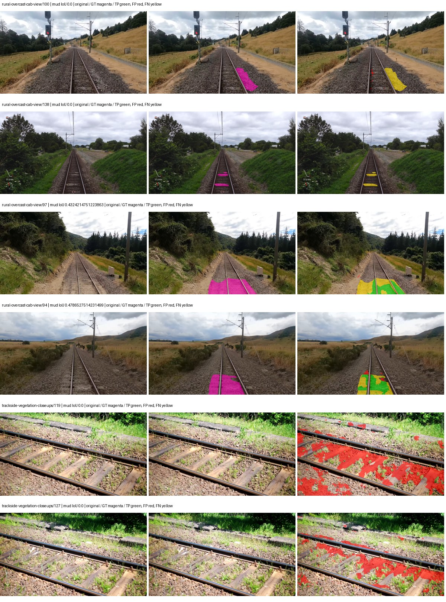
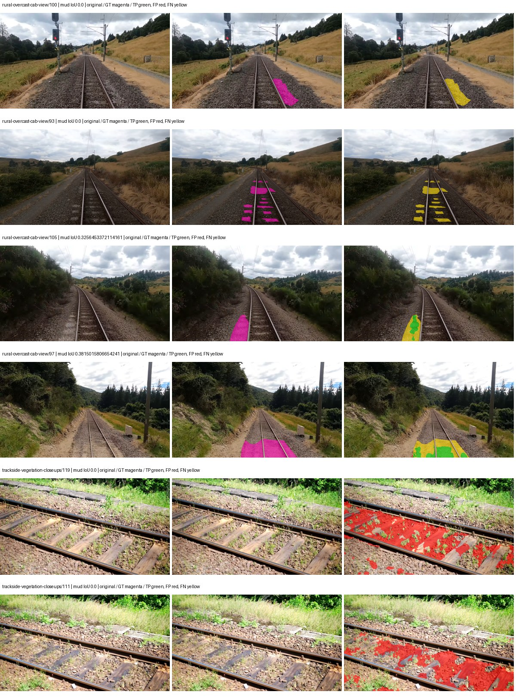
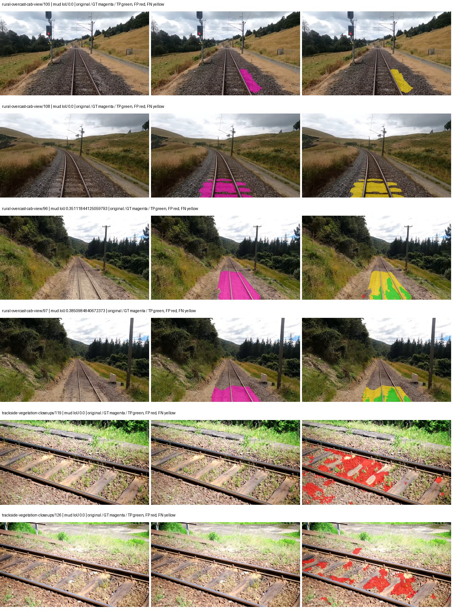

# smp_deeplabv3plus_resnet101 — paul-test-rtis_v2

[RTIS comparison](../../README.md) · [Full model records](record.json)

Primary selection and early stopping: **mud-pumping validation IoU**. A job is complete only after full statistics and isolated profiling are verified.

| Model | Initialization path | Seed | Status | Steps | Best step | Mud IoU (%) | Mud precision (%) | Mud recall (%) | Final mud IoU (trainer val, %) | mIoU (%) | Fixed GT-class mIoU (%) |
| --- | --- | --- | --- | --- | --- | --- | --- | --- | --- | --- | --- |
| smp_deeplabv3plus_resnet101 | rtis_only | 0 | completed | 4000 | 2803 | 11.31 | 16.19 | 27.26 | 3.18 | 33.59 | 39.19 |
| smp_deeplabv3plus_resnet101 | cityscapes_to_rtis | 0 | completed | 2803 | 1529 | 3.84 | 7.33 | 7.45 | 0.87 | 28.41 | 33.15 |
| smp_deeplabv3plus_resnet101 | railsem19_to_rtis | 0 | completed | 3568 | 2294 | 3.39 | 4.73 | 10.64 | 1.95 | 44.07 | 51.41 |
| smp_deeplabv3plus_resnet101 | cityscapes_to_railsem19_to_rtis | 0 | completed | 3568 | 2294 | 9.07 | 16.04 | 17.27 | 2.43 | 38.14 | 44.50 |

Training: 205 images. Validation: 37 images. Test: 50 held out. Seeds: [0]. Seed variation measures optimization variability, not independent-recording uncertainty. Historical source checkpoints stay fixed across adaptation seeds.

Training code: `066afb2626398b7be59d4d19f5a0e4644fd59adc`. Split SHA-256: `18a84c0163a65ded46508bcc904c374e5f33ad8a09b8879e3c8add606e86aa9f`.

## rtis_only — seed 0

Status: **completed**. Started: 2026-09-10T01:40:10.141402+00:00. Finished: 2026-09-10T02:31:24.287870+00:00.

Recipe pretrained initializer: `{"arch": "smp", "backbone_path": null, "batch_norm_momentum": null, "checkpoint": null, "classifier_path": null, "drop_path": null, "encoder_name": "resnet101", "encoder_weights": "imagenet", "head": "unified_head", "head_paths": [], "inactive_parameter_paths": [], "local_files_only": false, "lora_alpha": 32, "lora_dropout": 0.05, "lora_r": 16, "lora_targets": [], "native": null, "revision": null, "smp_arch": "DeepLabV3Plus", "subfolder": null, "trust_remote_code": false, "tuning": "full"}`.

`rtis_only` uses the recipe initializer, which may include pretrained segmentation components. Transfer paths load the exact historical source checkpoint below and reset the classifier; they do not reset all query/decoder features.

Source checkpoint: `Recipe pretrained initialization`.

Config SHA-256: `622008dccac680e5f1690ac9914b0f8381c7f7ed203132b7c6fd30fdc313ddd4`. Weights used for validation: `raw`.

### Mud-pumping and aggregate quality

| Metric | Selected checkpoint | Final training validation |
| --- | --- | --- |
| Mud IoU | 11.31 | 3.18 |
| Mud precision | 16.19 | 4.60 |
| Mud recall | 27.26 | 9.29 |
| Mud Dice/F1 | 20.32 | 6.15 |
| mIoU | 33.59 | 36.48 |
| Mean accuracy | 47.70 | 50.28 |
| Mean precision | 49.65 | 55.44 |
| Mean Dice | 42.32 | 46.26 |
| Mean specificity | 99.03 | 99.03 |
| Pixel accuracy | 83.96 | 84.18 |
| Frequency-weighted IoU | 75.87 | 76.06 |
| Fixed GT-present class mIoU | 39.19 | 42.56 |
| Boundary F1 | 39.49 | 42.02 |

The selected checkpoint has independent evaluation evidence. Final values are the trainer's final validation record, not a new independent evaluation. mIoU averages classes with nonzero union, so false positives on absent classes can change its denominator. The fixed GT-class mean is supplementary and excludes absent classes; their false positives remain in the confusion matrix.

### Resource usage and timing

| Measurement | Value |
| --- | --- |
| Peak training VRAM, retained training invocation (GiB) | 10.08 |
| Peak evaluation VRAM (GiB) | 7.19 |
| Retained training invocation wall time (seconds) | 2926.53 |
| Retained training invocation GPU-hours (one GPU) | 0.81 |
| Evaluation wall time (seconds) | 12.25 |
| Full evaluation pipeline images/second | 3.02 |
| Best full-state checkpoint (MiB) | 698.52 |
| Final full-state checkpoint (MiB) | 698.50 |
| Verified periodic checkpoints removed (GiB) | 5.46 |

VRAM uses the recorded allocator high-water mark; it is not total device usage including CUDA context. Resumed jobs' retained training invocation times and peaks are **not whole-campaign totals**. Earlier invocation resource records are not reconstructed here. Evaluation throughput includes loader, sliding-window inference and metrics; it is not model-only latency/FPS. Missing measurements are shown as —, never inferred from another dataset's run.

### Standardized inference performance

Dedicated model-only profiling waits for an idle worker-locked L40S: BF16, batch 1, 1024x1024, 20 warmup and 100 CUDA-event-timed public forwards. It excludes loading, preprocessing, tiling and metrics.

| Status | Parameters | Weight MiB | FPS | p50 ms | p95 ms | Peak reserved GiB |
| --- | --- | --- | --- | --- | --- | --- |
| complete | 45674853 | 174.24 | 118.19 | 8.36 | 8.90 | 0.71 |

```json
{
  "schema_version": 1,
  "model_id": "smp_deeplabv3plus_resnet101",
  "measured_at": "2026-09-10T02:31:16+00:00",
  "status": "complete",
  "benchmark_scope": "rtis_selected_checkpoint_model_only",
  "applies_to": [
    "smp_deeplabv3plus_resnet101--rtis_only--seed-0"
  ],
  "source": {
    "campaign_git_sha": "066afb2626398b7be59d4d19f5a0e4644fd59adc",
    "git_dirty": false,
    "config_hash": "b96c93059c66",
    "resolved_config": "/data/izadia1/projects/segmentary-runs/paul-test-rtis_v2/seed0-20260909/configs/smp_deeplabv3plus_resnet101--rtis_only--seed-0.yaml",
    "config_sha256": "622008dccac680e5f1690ac9914b0f8381c7f7ed203132b7c6fd30fdc313ddd4",
    "checkpoint_sha256": "7c3e28dfff0c0bafa9955558a71bf85404775634fd1a9ddc9d8a9991d92bd6f4",
    "checkpoint_global_step": 2803,
    "checkpoint_bytes": 732454060,
    "checkpoint_kind": "resume checkpoint with optimizer and EMA state",
    "weights": "raw",
    "measured_checkpoint_job_id": "smp_deeplabv3plus_resnet101--rtis_only--seed-0",
    "result_sha256": "02c56754760dd78e5ab02f207fe184b25efea54800fe24db1d87bde5290d4640",
    "result_git_sha": "066afb2626398b7be59d4d19f5a0e4644fd59adc",
    "result_stage": "eval:paul-test-rtis:val",
    "result_seed": 0
  },
  "hardware": {
    "gpu_name": "NVIDIA L40S",
    "gpu_uuid": "GPU-804aea8b-5f62-423e-72c6-49e1ed15c4e4",
    "logical_device": "cuda:0",
    "physical_visibility_token": "6",
    "compute_capability": [
      8,
      9
    ],
    "total_memory_bytes": 47677177856
  },
  "model": {
    "parameter_count": 45674853,
    "trainable_parameter_count": 45674853,
    "resident_parameter_bytes": 182699412,
    "parameter_dtype_counts": {
      "float32": 45674853
    }
  },
  "contract": {
    "backend": "pytorch",
    "precision": "bf16_autocast",
    "batch_size": 1,
    "input_shape_nchw": [
      1,
      3,
      1024,
      1024
    ],
    "warmup_iterations": 20,
    "measured_iterations": 100,
    "timing": "per-forward CUDA events with end-event synchronization",
    "includes_preprocessing": false,
    "includes_data_loader": false,
    "includes_sliding_window": false,
    "input_resident_on_gpu": true,
    "model_only": true,
    "entrypoint": "public model(image) dense-logits forward"
  },
  "measurements": {
    "latency": {
      "p50_ms": 8.35532808303833,
      "p95_ms": 8.90424304008484,
      "mean_ms": 8.461208953857422,
      "minimum_ms": 8.20531177520752,
      "maximum_ms": 9.905152320861816,
      "fps": 118.18642057576241,
      "raw_ms": [
        8.407039642333984,
        8.28006362915039,
        8.346624374389648,
        8.355839729309082,
        8.325119972229004,
        8.493056297302246,
        8.903679847717285,
        8.487936019897461,
        8.40499210357666,
        8.286208152770996,
        8.7193603515625,
        8.316927909851074,
        8.651776313781738,
        8.282112121582031,
        8.336383819580078,
        8.330240249633789,
        8.664064407348633,
        8.363007545471191,
        8.657919883728027,
        8.332287788391113,
        8.340448379516602,
        8.329216003417969,
        8.341504096984863,
        8.365056037902832,
        8.264703750610352,
        8.529919624328613,
        8.350720405578613,
        8.275967597961426,
        8.245247840881348,
        8.3056640625,
        8.436736106872559,
        8.266752243041992,
        8.30463981628418,
        8.267775535583496,
        8.319999694824219,
        8.476672172546387,
        8.80128002166748,
        8.300543785095215,
        8.357888221740723,
        8.239104270935059,
        8.276991844177246,
        8.446975708007812,
        8.315872192382812,
        8.295424461364746,
        8.31283187866211,
        8.269824028015137,
        8.400896072387695,
        8.302592277526855,
        8.28927993774414,
        8.20531177520752,
        8.242176055908203,
        8.279040336608887,
        9.035776138305664,
        9.081855773925781,
        8.51148796081543,
        8.261631965637207,
        8.292351722717285,
        8.290304183959961,
        8.4203519821167,
        8.685567855834961,
        8.282112121582031,
        8.61900806427002,
        8.341504096984863,
        8.269824028015137,
        8.324095726013184,
        8.326144218444824,
        8.450048446655273,
        8.811519622802734,
        8.343551635742188,
        8.340479850769043,
        8.784895896911621,
        8.28006362915039,
        8.278016090393066,
        8.316927909851074,
        8.902655601501465,
        8.465408325195312,
        8.508416175842285,
        8.635392189025879,
        8.61900806427002,
        8.473600387573242,
        8.39680004119873,
        8.365056037902832,
        9.905152320861816,
        8.91494369506836,
        8.850432395935059,
        8.659968376159668,
        8.551424026489258,
        8.407039642333984,
        8.438783645629883,
        8.357888221740723,
        8.354816436767578,
        8.82483196258545,
        8.656895637512207,
        8.324095726013184,
        8.578047752380371,
        8.369152069091797,
        8.712191581726074,
        8.332287788391113,
        8.31488037109375,
        9.152511596679688
      ],
      "percentile_method": "numpy linear interpolation"
    },
    "peak_reserved_bytes": 763363328,
    "memory_kind": "pytorch_cuda_allocator_peak_reserved_excluding_context",
    "benchmark_wall_clock_s": 12.258583173155785
  },
  "started_at": "2026-09-10T02:31:03+00:00",
  "finished_at": "2026-09-10T02:31:16+00:00",
  "environment": {
    "hostname": "hdrfs-app-001",
    "python": "3.11.15",
    "platform": "Linux-5.15.0-139-generic-x86_64-with-glibc2.35",
    "torch": "2.11.0+cu128",
    "torch_cuda": "12.8",
    "cudnn": 91900,
    "driver_version": "570.133.20",
    "cuda_available": true,
    "gpu_count": 1,
    "gpu_names": [
      "NVIDIA L40S"
    ],
    "cuda_visible_devices": "6",
    "packages": {
      "segmentary": "0.1.0",
      "torch": "2.11.0+cu128",
      "torchvision": "0.26.0+cu128",
      "transformers": "5.15.0",
      "timm": "1.0.28",
      "segmentation-models-pytorch": "0.5.0",
      "albumentations": "2.0.8",
      "lightning": "2.6.5",
      "numpy": "2.4.4"
    }
  }
}
```

### Per-class validation results

| Class | GT pixels | IoU (%) | Precision (%) | Recall (%) | Dice (%) | Boundary F1 (%) |
| --- | --- | --- | --- | --- | --- | --- |
| car | 29664 | 28.64 | 74.14 | 31.82 | 44.53 | 44.02 |
| construction | 311585 | 35.39 | 41.75 | 69.92 | 52.28 | 40.93 |
| fence | 265137 | 13.33 | 37.58 | 17.13 | 23.53 | 25.77 |
| mud-pumping | 1226250 | 11.31 | 16.19 | 27.26 | 20.32 | 16.22 |
| on-rails | 0 | 0.00 | 0.00 | — | 0.00 | 0.00 |
| person | 0 | 0.00 | 0.00 | — | 0.00 | 0.00 |
| pole | 628038 | 70.63 | 83.72 | 81.88 | 82.79 | 90.58 |
| rail-embedded | 16799 | 1.55 | 38.31 | 1.59 | 3.05 | 8.85 |
| rail-raised | 2969797 | 75.75 | 84.46 | 88.02 | 86.20 | 92.17 |
| rail-track | 6323197 | 38.18 | 63.86 | 48.70 | 55.26 | 51.65 |
| road | 1048831 | 12.53 | 25.14 | 20.00 | 22.27 | 14.22 |
| sidewalk | 1297367 | 28.83 | 51.15 | 39.79 | 44.76 | 24.02 |
| sky | 19121606 | 96.72 | 99.33 | 97.36 | 98.33 | 88.66 |
| standing-water | 95802 | 0.02 | 0.02 | 0.27 | 0.03 | 0.43 |
| terrain | 39239306 | 88.55 | 90.51 | 97.62 | 93.93 | 65.76 |
| trackbed | 10643081 | 64.18 | 75.51 | 81.05 | 78.18 | 60.82 |
| traffic-light | 19510 | 77.16 | 84.10 | 90.33 | 87.10 | 82.42 |
| traffic-sign | 13285 | 33.16 | 89.97 | 34.43 | 49.80 | 55.19 |
| tram-track | 56179 | 0.94 | 3.68 | 1.25 | 1.87 | 6.20 |
| truck | 0 | 0.00 | 0.00 | — | 0.00 | 0.00 |
| vegetation-overgrowth | 5901821 | 28.52 | 83.34 | 30.24 | 44.38 | 61.47 |

### Full-run accounting

| Measurement | Value |
| --- | --- |
| Full GPU-reserved wall seconds, all recorded worker attempts | 3074.15 |
| Full reserved GPU-hours | 0.85 |
| Whole-run timing complete | True |

| Phase | Wall seconds including failed attempts |
| --- | --- |
| training | 2933.89 |
| diagnostics | 90.87 |
| performance | 20.43 |

GPU-reserved time includes model loading, training, validation, collection, profiling, checkpoint I/O and orchestration while the worker owns one GPU. It is not GPU kernel-active time. Phase timings and sampled device memory/power/utilization are retained separately; sampled device memory is not the allocator high-water mark.

### Train/validation and raw/EMA diagnostics

| Checkpoint / weights / split | Images | Mud IoU (%) | Mud precision (%) | Mud recall (%) |
| --- | --- | --- | --- | --- |
| best-auto-train / raw | 205 | 96.24 | 97.98 | 98.19 |
| best-auto-val / raw | 37 | 11.31 | 16.19 | 27.26 |
| best-alternate-val / ema | 37 | 4.68 | 11.47 | 7.32 |
| final-auto-val / raw | 37 | 3.17 | 4.60 | 9.28 |

Train uses the evaluation transform without augmentation. Compare mud train/validation metrics for the same selected weights. Alternate EMA on running-stat BatchNorm is explicitly uncalibrated and is diagnostic only. Score-threshold curves use uncalibrated normalized scores and are pixel-level diagnostics, not event detection rates or a selected deployment operating point.

### Downloadable evidence

- best-auto-train: [per-image.csv](rtis_only--seed-0/best-auto-train/per-image.csv) · [per-image-confusion.json.gz](rtis_only--seed-0/best-auto-train/per-image-confusion.json.gz) · [groups.json](rtis_only--seed-0/best-auto-train/groups.json) · [mud-score-curves.json](rtis_only--seed-0/best-auto-train/mud-score-curves.json)
- best-auto-val: [per-image.csv](rtis_only--seed-0/best-auto-val/per-image.csv) · [per-image-confusion.json.gz](rtis_only--seed-0/best-auto-val/per-image-confusion.json.gz) · [groups.json](rtis_only--seed-0/best-auto-val/groups.json) · [mud-score-curves.json](rtis_only--seed-0/best-auto-val/mud-score-curves.json) · [examples.jpg](rtis_only--seed-0/best-auto-val/examples.jpg)
- best-alternate-val: [per-image.csv](rtis_only--seed-0/best-alternate-val/per-image.csv) · [per-image-confusion.json.gz](rtis_only--seed-0/best-alternate-val/per-image-confusion.json.gz) · [groups.json](rtis_only--seed-0/best-alternate-val/groups.json) · [mud-score-curves.json](rtis_only--seed-0/best-alternate-val/mud-score-curves.json)
- final-auto-val: [per-image.csv](rtis_only--seed-0/final-auto-val/per-image.csv) · [per-image-confusion.json.gz](rtis_only--seed-0/final-auto-val/per-image-confusion.json.gz) · [groups.json](rtis_only--seed-0/final-auto-val/groups.json) · [mud-score-curves.json](rtis_only--seed-0/final-auto-val/mud-score-curves.json)
- resources: [telemetry.csv](rtis_only--seed-0/resources/telemetry.csv)



Examples are two lowest and two highest mud-IoU positive images, plus up to two negative images with the most false-positive mud pixels. They are targeted diagnostic examples, not random samples. Green: true positive; red: false positive; yellow: false negative. Full predictions remain on HDRFS.

### Validation tracking

| Logged step | Overall mIoU (%) | Mud IoU (%) |
| --- | --- | --- |
| 254 | 22.09 | 0.01 |
| 509 | 21.66 | 0.30 |
| 764 | 23.99 | 2.49 |
| 1019 | 27.24 | 4.11 |
| 1274 | 25.98 | 4.58 |
| 1529 | 27.38 | 1.83 |
| 1784 | 27.44 | 1.32 |
| 2038 | 32.45 | 3.19 |
| 2293 | 30.35 | 8.89 |
| 2548 | 29.10 | 5.70 |
| 2803 | 33.59 | 11.31 |
| 3058 | 31.79 | 4.06 |
| 3313 | 34.40 | 4.44 |
| 3568 | 35.70 | 3.24 |
| 3823 | 35.14 | 4.47 |
| 4000 | 36.48 | 3.18 |

All retained scalar curves, including training loss and per-class IoU, are in record.json. Observed best mud on a curve is not necessarily a retained checkpoint: the pilot saved its selection-metric-best and final checkpoints. Step logging and checkpoint global_step may differ by one.

### Stopping and checkpoint provenance

```json
{
  "stopping": {
    "actual_steps": 4000,
    "maximum_steps": 4000,
    "min_delta": 0.001,
    "monitor": "val_iou/mud-pumping",
    "patience": 5,
    "reason": "budget_complete"
  },
  "checkpoints": {
    "best": {
      "path": "/data/izadia1/projects/segmentary-runs/paul-test-rtis_v2/seed0-20260909/future-runs/smp_deeplabv3plus_resnet101--rtis_only--seed-0_seed0/rtis/best.ckpt",
      "sha256": "7c3e28dfff0c0bafa9955558a71bf85404775634fd1a9ddc9d8a9991d92bd6f4",
      "global_step": 2803,
      "bytes": 732454060
    },
    "final": {
      "path": "/data/izadia1/projects/segmentary-runs/paul-test-rtis_v2/seed0-20260909/future-runs/smp_deeplabv3plus_resnet101--rtis_only--seed-0_seed0/rtis/last.ckpt",
      "sha256": "b81d4806b368deaaa43ec8590b3475ebb340ed471830e52286a04d3fe1d672cc",
      "global_step": 4000,
      "bytes": 732431724
    }
  },
  "cleanup_error": null
}
```

### Resolved training, initialization and evaluation settings

The optimizer block is the base configuration. Stage LR scales are applied at runtime, and stage warmup is capped at min(base warmup, floor(stage budget / 10), stage budget - 1): 400 steps for this 4,000-step pilot. Model-internal native input grids may differ from augmentation crops (EoMT uses its 640 grid).

```json
{
  "name": "smp_deeplabv3plus_resnet101--rtis_only--seed-0",
  "model": {
    "arch": "smp",
    "checkpoint": null,
    "tuning": "full",
    "head": "unified_head",
    "lora_r": 16,
    "lora_alpha": 32,
    "lora_dropout": 0.05,
    "lora_targets": [],
    "drop_path": null,
    "revision": null,
    "subfolder": null,
    "local_files_only": false,
    "trust_remote_code": false,
    "backbone_path": null,
    "head_paths": [],
    "classifier_path": null,
    "inactive_parameter_paths": [],
    "smp_arch": "DeepLabV3Plus",
    "encoder_name": "resnet101",
    "encoder_weights": "imagenet",
    "native": null,
    "batch_norm_momentum": null
  },
  "space": "paul-test-rtis",
  "taxonomy_root": "/data/izadia1/projects/segmentary-rtis-fullstats-066afb2/taxonomy",
  "output_root": "/data/izadia1/projects/segmentary-runs/paul-test-rtis_v2/seed0-20260909/future-runs",
  "optim": {
    "backbone_lr": 0.0001,
    "head_lr_mult": 10.0,
    "weight_decay": 0.05,
    "llrd": 1.0,
    "warmup_iters": 1500,
    "warmup_ratio": 1e-06,
    "poly_power": 0.9,
    "min_lr_ratio": 0.0,
    "betas": [
      0.9,
      0.999
    ],
    "grad_clip": 1.0
  },
  "train": {
    "iters": 4000,
    "batch_size": 2,
    "accum": 8,
    "num_workers": 2,
    "precision": "bf16-mixed",
    "ema_decay": 0.9998,
    "val_every": 250,
    "ckpt_every": 500,
    "selection_metric": "val_iou/mud-pumping",
    "early_stopping_patience": 5,
    "early_stopping_min_delta": 0.001,
    "seed": 0,
    "devices": 1
  },
  "eval": {
    "sliding_window": true,
    "window": [
      1024,
      1024
    ],
    "stride": [
      768,
      768
    ],
    "batch_size": 1,
    "num_workers": 2,
    "tta_scales": [],
    "tta_flip": false,
    "threshold": 0.5,
    "boundary_tolerance_frac": 0.0075,
    "save_confusion": true
  },
  "loss": {
    "task": "multiclass",
    "activation": "auto",
    "terms": [],
    "aux": "none",
    "aux_weight": 0.0,
    "ce_weight": 1.0,
    "label_smoothing": 0.0,
    "class_weights": null,
    "query": null
  },
  "aug": {
    "crop": [
      1024,
      1024
    ],
    "scale_min": 0.5,
    "scale_max": 2.0,
    "hflip_p": 0.5,
    "color_jitter_p": 0.5,
    "brightness": 0.25,
    "contrast": 0.25,
    "saturation": 0.25,
    "hue": 0.05
  },
  "stages": [
    {
      "name": "rtis",
      "data": [
        {
          "name": "paul-test-rtis",
          "root": "/data/izadia1/datasets/paul-test-rtis_v2",
          "variant": null,
          "split_file": "splits.json",
          "train_split": "train",
          "val_split": "val",
          "limit": null,
          "loader": "folder",
          "mapping": "paul-test-rtis",
          "loader_options": {
            "require_groups": true
          }
        }
      ],
      "iters": null,
      "lr_scale": 1.0,
      "head_group_lr_scale": 1.0,
      "init_from": "pretrained",
      "reset_head": false,
      "freeze": null,
      "sample_weights": null
    }
  ]
}
```

### Hardware and software provenance

```json
{
  "training": {
    "cuda_available": true,
    "cuda_visible_devices": "6",
    "cudnn": 91900,
    "driver_version": "570.133.20",
    "gpu_count": 1,
    "gpu_names": [
      "NVIDIA L40S"
    ],
    "hostname": "hdrfs-app-001",
    "input_normalization": {
      "channel_order": "rgb",
      "mean": [
        0.485,
        0.456,
        0.406
      ],
      "source": "smp_encoder_settings",
      "std": [
        0.229,
        0.224,
        0.225
      ]
    },
    "model_origins": [
      {
        "hf_commit": null,
        "hf_name_or_path": null,
        "module": "model",
        "timm_pretrained": {}
      }
    ],
    "model_parameter_count": 45674853,
    "packages": {
      "albumentations": "2.0.8",
      "lightning": "2.6.5",
      "numpy": "2.4.4",
      "segmentary": "0.1.0",
      "segmentation-models-pytorch": "0.5.0",
      "timm": "1.0.28",
      "torch": "2.11.0+cu128",
      "torchvision": "0.26.0+cu128",
      "transformers": "5.15.0"
    },
    "platform": "Linux-5.15.0-139-generic-x86_64-with-glibc2.35",
    "python": "3.11.15",
    "torch": "2.11.0+cu128",
    "torch_cuda": "12.8",
    "trainable_parameter_count": 45674853,
    "training_stop": {
      "actual_steps": 4000,
      "maximum_steps": 4000,
      "min_delta": 0.001,
      "monitor": "val_iou/mud-pumping",
      "patience": 5,
      "reason": "budget_complete"
    },
    "validation_weights": "raw"
  },
  "evaluation": {
    "cuda_available": true,
    "cuda_visible_devices": "6",
    "cudnn": 91900,
    "driver_version": "570.133.20",
    "gpu_count": 1,
    "gpu_names": [
      "NVIDIA L40S"
    ],
    "hostname": "hdrfs-app-001",
    "input_normalization": {
      "channel_order": "rgb",
      "mean": [
        0.485,
        0.456,
        0.406
      ],
      "source": "smp_encoder_settings",
      "std": [
        0.229,
        0.224,
        0.225
      ]
    },
    "packages": {
      "albumentations": "2.0.8",
      "lightning": "2.6.5",
      "numpy": "2.4.4",
      "segmentary": "0.1.0",
      "segmentation-models-pytorch": "0.5.0",
      "timm": "1.0.28",
      "torch": "2.11.0+cu128",
      "torchvision": "0.26.0+cu128",
      "transformers": "5.15.0"
    },
    "platform": "Linux-5.15.0-139-generic-x86_64-with-glibc2.35",
    "python": "3.11.15",
    "torch": "2.11.0+cu128",
    "torch_cuda": "12.8"
  }
}
```

## cityscapes_to_rtis — seed 0

Status: **completed**. Started: 2026-09-10T01:42:50.372803+00:00. Finished: 2026-09-10T02:19:04.974777+00:00.

Recipe pretrained initializer: `{"arch": "smp", "backbone_path": null, "batch_norm_momentum": null, "checkpoint": null, "classifier_path": null, "drop_path": null, "encoder_name": "resnet101", "encoder_weights": "imagenet", "head": "unified_head", "head_paths": [], "inactive_parameter_paths": [], "local_files_only": false, "lora_alpha": 32, "lora_dropout": 0.05, "lora_r": 16, "lora_targets": [], "native": null, "revision": null, "smp_arch": "DeepLabV3Plus", "subfolder": null, "trust_remote_code": false, "tuning": "full"}`.

`rtis_only` uses the recipe initializer, which may include pretrained segmentation components. Transfer paths load the exact historical source checkpoint below and reset the classifier; they do not reset all query/decoder features.

Source checkpoint: `{'name': 'smp_deeplabv3plus_resnet101--cityscapes--seed-0', 'model': 'smp_deeplabv3plus_resnet101', 'protocol': 'cityscapes', 'config': '/data/izadia1/projects/segmentary-runs/all-model-city-rail-seed0-rail20-b9eb3e1/accepted/smp_deeplabv3plus_resnet101--cityscapes--seed-0/resolved-config.yaml', 'checkpoint': '/data/izadia1/projects/segmentary-runs/current-main-fill-v2/jobs/smp_deeplabv3plus_resnet101--cityscapes--seed-0/train/smp_deeplabv3plus_resnet101--cityscapes_seed0/cityscapes/last.ckpt', 'recorded_sha256': '01074c9ac3f2b84d122c8a23d07d26a31d2ff58d5d23740b077bdc998d70363b', 'exists': True}`.

Config SHA-256: `eee4dc64af0ff32270675dab0502a7b38d82eda84284829c2a7861df1db2e6ba`. Weights used for validation: `raw`.

### Mud-pumping and aggregate quality

| Metric | Selected checkpoint | Final training validation |
| --- | --- | --- |
| Mud IoU | 3.84 | 0.87 |
| Mud precision | 7.33 | 1.17 |
| Mud recall | 7.45 | 3.23 |
| Mud Dice/F1 | 7.39 | 1.72 |
| mIoU | 28.41 | 30.55 |
| Mean accuracy | 44.62 | 46.69 |
| Mean precision | 40.16 | 40.62 |
| Mean Dice | 35.74 | 37.97 |
| Mean specificity | 98.66 | 98.78 |
| Pixel accuracy | 77.94 | 79.71 |
| Frequency-weighted IoU | 68.33 | 70.91 |
| Fixed GT-present class mIoU | 33.15 | 35.65 |
| Boundary F1 | 32.21 | 34.59 |

The selected checkpoint has independent evaluation evidence. Final values are the trainer's final validation record, not a new independent evaluation. mIoU averages classes with nonzero union, so false positives on absent classes can change its denominator. The fixed GT-class mean is supplementary and excludes absent classes; their false positives remain in the confusion matrix.

### Resource usage and timing

| Measurement | Value |
| --- | --- |
| Peak training VRAM, retained training invocation (GiB) | 10.08 |
| Peak evaluation VRAM (GiB) | 7.19 |
| Retained training invocation wall time (seconds) | 2031.44 |
| Retained training invocation GPU-hours (one GPU) | 0.56 |
| Evaluation wall time (seconds) | 11.87 |
| Full evaluation pipeline images/second | 3.12 |
| Best full-state checkpoint (MiB) | 698.52 |
| Final full-state checkpoint (MiB) | 698.50 |
| Verified periodic checkpoints removed (GiB) | 3.41 |

VRAM uses the recorded allocator high-water mark; it is not total device usage including CUDA context. Resumed jobs' retained training invocation times and peaks are **not whole-campaign totals**. Earlier invocation resource records are not reconstructed here. Evaluation throughput includes loader, sliding-window inference and metrics; it is not model-only latency/FPS. Missing measurements are shown as —, never inferred from another dataset's run.

### Standardized inference performance

Dedicated model-only profiling waits for an idle worker-locked L40S: BF16, batch 1, 1024x1024, 20 warmup and 100 CUDA-event-timed public forwards. It excludes loading, preprocessing, tiling and metrics.

| Status | Parameters | Weight MiB | FPS | p50 ms | p95 ms | Peak reserved GiB |
| --- | --- | --- | --- | --- | --- | --- |
| complete | 45674853 | 174.24 | 115.72 | 8.47 | 9.34 | 0.71 |

```json
{
  "schema_version": 1,
  "model_id": "smp_deeplabv3plus_resnet101",
  "measured_at": "2026-09-10T02:18:58+00:00",
  "status": "complete",
  "benchmark_scope": "rtis_selected_checkpoint_model_only",
  "applies_to": [
    "smp_deeplabv3plus_resnet101--cityscapes_to_rtis--seed-0"
  ],
  "source": {
    "campaign_git_sha": "066afb2626398b7be59d4d19f5a0e4644fd59adc",
    "git_dirty": false,
    "config_hash": "1f4b571389a6",
    "resolved_config": "/data/izadia1/projects/segmentary-runs/paul-test-rtis_v2/seed0-20260909/configs/smp_deeplabv3plus_resnet101--cityscapes_to_rtis--seed-0.yaml",
    "config_sha256": "eee4dc64af0ff32270675dab0502a7b38d82eda84284829c2a7861df1db2e6ba",
    "checkpoint_sha256": "20d2674d3bec5ebf99b6269ee65995d2ea7f0bf12440ec4dfa9519093e8ca098",
    "checkpoint_global_step": 1529,
    "checkpoint_bytes": 732454124,
    "checkpoint_kind": "resume checkpoint with optimizer and EMA state",
    "weights": "raw",
    "measured_checkpoint_job_id": "smp_deeplabv3plus_resnet101--cityscapes_to_rtis--seed-0",
    "result_sha256": "70547b425ea4f95a2a8ff6d88d4603e14e5dbe5a23eb6f8b5383613a8569584d",
    "result_git_sha": "066afb2626398b7be59d4d19f5a0e4644fd59adc",
    "result_stage": "eval:paul-test-rtis:val",
    "result_seed": 0
  },
  "hardware": {
    "gpu_name": "NVIDIA L40S",
    "gpu_uuid": "GPU-1c9b612f-e0b5-fbbc-150f-8c2ef13453c9",
    "logical_device": "cuda:0",
    "physical_visibility_token": "5",
    "compute_capability": [
      8,
      9
    ],
    "total_memory_bytes": 47677177856
  },
  "model": {
    "parameter_count": 45674853,
    "trainable_parameter_count": 45674853,
    "resident_parameter_bytes": 182699412,
    "parameter_dtype_counts": {
      "float32": 45674853
    }
  },
  "contract": {
    "backend": "pytorch",
    "precision": "bf16_autocast",
    "batch_size": 1,
    "input_shape_nchw": [
      1,
      3,
      1024,
      1024
    ],
    "warmup_iterations": 20,
    "measured_iterations": 100,
    "timing": "per-forward CUDA events with end-event synchronization",
    "includes_preprocessing": false,
    "includes_data_loader": false,
    "includes_sliding_window": false,
    "input_resident_on_gpu": true,
    "model_only": true,
    "entrypoint": "public model(image) dense-logits forward"
  },
  "measurements": {
    "latency": {
      "p50_ms": 8.473600387573242,
      "p95_ms": 9.336627197265624,
      "mean_ms": 8.641513919830322,
      "minimum_ms": 8.257535934448242,
      "maximum_ms": 9.614336013793945,
      "fps": 115.7204639461641,
      "raw_ms": [
        8.690688133239746,
        8.79206371307373,
        8.41318416595459,
        8.39680004119873,
        8.39577579498291,
        8.758272171020508,
        9.290752410888672,
        9.538559913635254,
        8.608768463134766,
        8.650752067565918,
        9.033727645874023,
        8.694784164428711,
        8.796159744262695,
        8.953856468200684,
        8.473600387573242,
        8.41215991973877,
        8.327168464660645,
        8.328191757202148,
        8.333312034606934,
        8.31283187866211,
        9.275391578674316,
        8.840191841125488,
        8.493023872375488,
        8.356863975524902,
        8.30361557006836,
        8.564672470092773,
        9.20473575592041,
        9.32147216796875,
        8.964096069335938,
        8.447999954223633,
        8.428544044494629,
        8.351776123046875,
        8.876031875610352,
        8.798175811767578,
        8.375295639038086,
        8.371199607849121,
        8.338432312011719,
        9.312255859375,
        8.332287788391113,
        8.266752243041992,
        8.32307243347168,
        8.423423767089844,
        8.368127822875977,
        8.40601634979248,
        8.474623680114746,
        8.50227165222168,
        8.380415916442871,
        8.342528343200684,
        9.165823936462402,
        8.739839553833008,
        8.641535758972168,
        8.374272346496582,
        8.324095726013184,
        8.932352066040039,
        8.30668830871582,
        8.324095726013184,
        9.020383834838867,
        9.074687957763672,
        8.890368461608887,
        8.337408065795898,
        8.257535934448242,
        8.69273567199707,
        8.407039642333984,
        8.459263801574707,
        8.556544303894043,
        8.764415740966797,
        8.946687698364258,
        8.785920143127441,
        8.481792449951172,
        8.365056037902832,
        8.453120231628418,
        8.4203519821167,
        8.352767944335938,
        8.463359832763672,
        8.776703834533691,
        9.010175704956055,
        9.332736015319824,
        9.297920227050781,
        8.535039901733398,
        9.152511596679688,
        8.40601634979248,
        8.364031791687012,
        8.473600387573242,
        8.42956829071045,
        8.381440162658691,
        8.445952415466309,
        8.357888221740723,
        8.425472259521484,
        8.633343696594238,
        8.341504096984863,
        8.358912467956543,
        9.614336013793945,
        9.454591751098633,
        9.41055965423584,
        8.385536193847656,
        8.385536193847656,
        9.454591751098633,
        8.547327995300293,
        8.648672103881836,
        8.344575881958008
      ],
      "percentile_method": "numpy linear interpolation"
    },
    "peak_reserved_bytes": 763363328,
    "memory_kind": "pytorch_cuda_allocator_peak_reserved_excluding_context",
    "benchmark_wall_clock_s": 11.805796321481466
  },
  "started_at": "2026-09-10T02:18:46+00:00",
  "finished_at": "2026-09-10T02:18:58+00:00",
  "environment": {
    "hostname": "hdrfs-app-001",
    "python": "3.11.15",
    "platform": "Linux-5.15.0-139-generic-x86_64-with-glibc2.35",
    "torch": "2.11.0+cu128",
    "torch_cuda": "12.8",
    "cudnn": 91900,
    "driver_version": "570.133.20",
    "cuda_available": true,
    "gpu_count": 1,
    "gpu_names": [
      "NVIDIA L40S"
    ],
    "cuda_visible_devices": "5",
    "packages": {
      "segmentary": "0.1.0",
      "torch": "2.11.0+cu128",
      "torchvision": "0.26.0+cu128",
      "transformers": "5.15.0",
      "timm": "1.0.28",
      "segmentation-models-pytorch": "0.5.0",
      "albumentations": "2.0.8",
      "lightning": "2.6.5",
      "numpy": "2.4.4"
    }
  }
}
```

### Per-class validation results

| Class | GT pixels | IoU (%) | Precision (%) | Recall (%) | Dice (%) | Boundary F1 (%) |
| --- | --- | --- | --- | --- | --- | --- |
| car | 29664 | 35.23 | 74.17 | 40.15 | 52.10 | 32.57 |
| construction | 311585 | 7.94 | 8.17 | 74.05 | 14.72 | 9.03 |
| fence | 265137 | 9.77 | 12.57 | 30.55 | 17.81 | 12.10 |
| mud-pumping | 1226250 | 3.84 | 7.33 | 7.45 | 7.39 | 3.86 |
| on-rails | 0 | 0.00 | 0.00 | — | 0.00 | 0.00 |
| person | 0 | 0.00 | 0.00 | — | 0.00 | 0.00 |
| pole | 628038 | 71.29 | 84.22 | 82.28 | 83.24 | 91.46 |
| rail-embedded | 16799 | 0.00 | 0.00 | 0.00 | 0.00 | 0.00 |
| rail-raised | 2969797 | 62.45 | 73.10 | 81.09 | 76.89 | 82.20 |
| rail-track | 6323197 | 31.16 | 60.39 | 39.17 | 47.51 | 39.13 |
| road | 1048831 | 2.16 | 6.95 | 3.04 | 4.23 | 7.03 |
| sidewalk | 1297367 | 7.52 | 22.15 | 10.22 | 13.98 | 11.68 |
| sky | 19121606 | 93.12 | 99.46 | 93.59 | 96.44 | 73.27 |
| standing-water | 95802 | 1.64 | 1.71 | 27.77 | 3.23 | 6.27 |
| terrain | 39239306 | 79.56 | 85.64 | 91.81 | 88.62 | 48.54 |
| trackbed | 10643081 | 58.18 | 69.55 | 78.06 | 73.56 | 53.08 |
| traffic-light | 19510 | 81.59 | 97.95 | 83.01 | 89.86 | 96.59 |
| traffic-sign | 13285 | 30.65 | 58.13 | 39.33 | 46.92 | 56.20 |
| tram-track | 56179 | 0.02 | 0.17 | 0.02 | 0.04 | 1.86 |
| truck | 0 | 0.00 | 0.00 | — | 0.00 | 0.00 |
| vegetation-overgrowth | 5901821 | 20.54 | 81.60 | 21.54 | 34.08 | 51.48 |

### Full-run accounting

| Measurement | Value |
| --- | --- |
| Full GPU-reserved wall seconds, all recorded worker attempts | 2175.12 |
| Full reserved GPU-hours | 0.60 |
| Whole-run timing complete | True |

| Phase | Wall seconds including failed attempts |
| --- | --- |
| training | 2038.56 |
| diagnostics | 90.63 |
| performance | 19.65 |

GPU-reserved time includes model loading, training, validation, collection, profiling, checkpoint I/O and orchestration while the worker owns one GPU. It is not GPU kernel-active time. Phase timings and sampled device memory/power/utilization are retained separately; sampled device memory is not the allocator high-water mark.

### Train/validation and raw/EMA diagnostics

| Checkpoint / weights / split | Images | Mud IoU (%) | Mud precision (%) | Mud recall (%) |
| --- | --- | --- | --- | --- |
| best-auto-train / raw | 205 | 91.52 | 97.13 | 94.07 |
| best-auto-val / raw | 37 | 3.84 | 7.33 | 7.45 |
| best-alternate-val / ema | 37 | 0.94 | 2.35 | 1.54 |
| final-auto-val / raw | 37 | 0.87 | 1.17 | 3.23 |

Train uses the evaluation transform without augmentation. Compare mud train/validation metrics for the same selected weights. Alternate EMA on running-stat BatchNorm is explicitly uncalibrated and is diagnostic only. Score-threshold curves use uncalibrated normalized scores and are pixel-level diagnostics, not event detection rates or a selected deployment operating point.

### Downloadable evidence

- best-auto-train: [per-image.csv](cityscapes_to_rtis--seed-0/best-auto-train/per-image.csv) · [per-image-confusion.json.gz](cityscapes_to_rtis--seed-0/best-auto-train/per-image-confusion.json.gz) · [groups.json](cityscapes_to_rtis--seed-0/best-auto-train/groups.json) · [mud-score-curves.json](cityscapes_to_rtis--seed-0/best-auto-train/mud-score-curves.json)
- best-auto-val: [per-image.csv](cityscapes_to_rtis--seed-0/best-auto-val/per-image.csv) · [per-image-confusion.json.gz](cityscapes_to_rtis--seed-0/best-auto-val/per-image-confusion.json.gz) · [groups.json](cityscapes_to_rtis--seed-0/best-auto-val/groups.json) · [mud-score-curves.json](cityscapes_to_rtis--seed-0/best-auto-val/mud-score-curves.json) · [examples.jpg](cityscapes_to_rtis--seed-0/best-auto-val/examples.jpg)
- best-alternate-val: [per-image.csv](cityscapes_to_rtis--seed-0/best-alternate-val/per-image.csv) · [per-image-confusion.json.gz](cityscapes_to_rtis--seed-0/best-alternate-val/per-image-confusion.json.gz) · [groups.json](cityscapes_to_rtis--seed-0/best-alternate-val/groups.json) · [mud-score-curves.json](cityscapes_to_rtis--seed-0/best-alternate-val/mud-score-curves.json)
- final-auto-val: [per-image.csv](cityscapes_to_rtis--seed-0/final-auto-val/per-image.csv) · [per-image-confusion.json.gz](cityscapes_to_rtis--seed-0/final-auto-val/per-image-confusion.json.gz) · [groups.json](cityscapes_to_rtis--seed-0/final-auto-val/groups.json) · [mud-score-curves.json](cityscapes_to_rtis--seed-0/final-auto-val/mud-score-curves.json)
- resources: [telemetry.csv](cityscapes_to_rtis--seed-0/resources/telemetry.csv)


Examples are two lowest and two highest mud-IoU positive images, plus up to two negative images with the most false-positive mud pixels. They are targeted diagnostic examples, not random samples. Green: true positive; red: false positive; yellow: false negative. Full predictions remain on HDRFS.

### Validation tracking

| Logged step | Overall mIoU (%) | Mud IoU (%) |
| --- | --- | --- |
| 254 | 21.36 | 1.33 |
| 509 | 20.78 | 0.46 |
| 764 | 23.59 | 0.32 |
| 1019 | 27.10 | 1.15 |
| 1274 | 30.27 | 0.62 |
| 1529 | 28.41 | 3.83 |
| 1784 | 29.04 | 0.60 |
| 2038 | 30.05 | 0.31 |
| 2293 | 31.70 | 2.41 |
| 2548 | 30.40 | 1.14 |
| 2803 | 30.55 | 0.87 |

All retained scalar curves, including training loss and per-class IoU, are in record.json. Observed best mud on a curve is not necessarily a retained checkpoint: the pilot saved its selection-metric-best and final checkpoints. Step logging and checkpoint global_step may differ by one.

### Stopping and checkpoint provenance

```json
{
  "stopping": {
    "actual_steps": 2803,
    "maximum_steps": 4000,
    "min_delta": 0.001,
    "monitor": "val_iou/mud-pumping",
    "patience": 5,
    "reason": "validation_plateau"
  },
  "checkpoints": {
    "best": {
      "path": "/data/izadia1/projects/segmentary-runs/paul-test-rtis_v2/seed0-20260909/future-runs/smp_deeplabv3plus_resnet101--cityscapes_to_rtis--seed-0_seed0/rtis/best.ckpt",
      "sha256": "20d2674d3bec5ebf99b6269ee65995d2ea7f0bf12440ec4dfa9519093e8ca098",
      "global_step": 1529,
      "bytes": 732454124
    },
    "final": {
      "path": "/data/izadia1/projects/segmentary-runs/paul-test-rtis_v2/seed0-20260909/future-runs/smp_deeplabv3plus_resnet101--cityscapes_to_rtis--seed-0_seed0/rtis/last.ckpt",
      "sha256": "89af3f28e27a7ab33ce5d452616a08af538bd58e8d53f0733ec64ad195df18f7",
      "global_step": 2803,
      "bytes": 732431852
    }
  },
  "cleanup_error": null
}
```

### Resolved training, initialization and evaluation settings

The optimizer block is the base configuration. Stage LR scales are applied at runtime, and stage warmup is capped at min(base warmup, floor(stage budget / 10), stage budget - 1): 400 steps for this 4,000-step pilot. Model-internal native input grids may differ from augmentation crops (EoMT uses its 640 grid).

```json
{
  "name": "smp_deeplabv3plus_resnet101--cityscapes_to_rtis--seed-0",
  "model": {
    "arch": "smp",
    "checkpoint": null,
    "tuning": "full",
    "head": "unified_head",
    "lora_r": 16,
    "lora_alpha": 32,
    "lora_dropout": 0.05,
    "lora_targets": [],
    "drop_path": null,
    "revision": null,
    "subfolder": null,
    "local_files_only": false,
    "trust_remote_code": false,
    "backbone_path": null,
    "head_paths": [],
    "classifier_path": null,
    "inactive_parameter_paths": [],
    "smp_arch": "DeepLabV3Plus",
    "encoder_name": "resnet101",
    "encoder_weights": "imagenet",
    "native": null,
    "batch_norm_momentum": null
  },
  "space": "paul-test-rtis",
  "taxonomy_root": "/data/izadia1/projects/segmentary-rtis-fullstats-066afb2/taxonomy",
  "output_root": "/data/izadia1/projects/segmentary-runs/paul-test-rtis_v2/seed0-20260909/future-runs",
  "optim": {
    "backbone_lr": 0.0001,
    "head_lr_mult": 10.0,
    "weight_decay": 0.05,
    "llrd": 1.0,
    "warmup_iters": 1500,
    "warmup_ratio": 1e-06,
    "poly_power": 0.9,
    "min_lr_ratio": 0.0,
    "betas": [
      0.9,
      0.999
    ],
    "grad_clip": 1.0
  },
  "train": {
    "iters": 4000,
    "batch_size": 2,
    "accum": 8,
    "num_workers": 2,
    "precision": "bf16-mixed",
    "ema_decay": 0.9998,
    "val_every": 250,
    "ckpt_every": 500,
    "selection_metric": "val_iou/mud-pumping",
    "early_stopping_patience": 5,
    "early_stopping_min_delta": 0.001,
    "seed": 0,
    "devices": 1
  },
  "eval": {
    "sliding_window": true,
    "window": [
      1024,
      1024
    ],
    "stride": [
      768,
      768
    ],
    "batch_size": 1,
    "num_workers": 2,
    "tta_scales": [],
    "tta_flip": false,
    "threshold": 0.5,
    "boundary_tolerance_frac": 0.0075,
    "save_confusion": true
  },
  "loss": {
    "task": "multiclass",
    "activation": "auto",
    "terms": [],
    "aux": "none",
    "aux_weight": 0.0,
    "ce_weight": 1.0,
    "label_smoothing": 0.0,
    "class_weights": null,
    "query": null
  },
  "aug": {
    "crop": [
      1024,
      1024
    ],
    "scale_min": 0.5,
    "scale_max": 2.0,
    "hflip_p": 0.5,
    "color_jitter_p": 0.5,
    "brightness": 0.25,
    "contrast": 0.25,
    "saturation": 0.25,
    "hue": 0.05
  },
  "stages": [
    {
      "name": "rtis",
      "data": [
        {
          "name": "paul-test-rtis",
          "root": "/data/izadia1/datasets/paul-test-rtis_v2",
          "variant": null,
          "split_file": "splits.json",
          "train_split": "train",
          "val_split": "val",
          "limit": null,
          "loader": "folder",
          "mapping": "paul-test-rtis",
          "loader_options": {
            "require_groups": true
          }
        }
      ],
      "iters": null,
      "lr_scale": 0.1,
      "head_group_lr_scale": 1.0,
      "init_from": "/data/izadia1/projects/segmentary-runs/current-main-fill-v2/jobs/smp_deeplabv3plus_resnet101--cityscapes--seed-0/train/smp_deeplabv3plus_resnet101--cityscapes_seed0/cityscapes/last.ckpt",
      "reset_head": true,
      "freeze": null,
      "sample_weights": null
    }
  ]
}
```

### Hardware and software provenance

```json
{
  "training": {
    "cuda_available": true,
    "cuda_visible_devices": "5",
    "cudnn": 91900,
    "driver_version": "570.133.20",
    "gpu_count": 1,
    "gpu_names": [
      "NVIDIA L40S"
    ],
    "hostname": "hdrfs-app-001",
    "input_normalization": {
      "channel_order": "rgb",
      "mean": [
        0.485,
        0.456,
        0.406
      ],
      "source": "smp_encoder_settings",
      "std": [
        0.229,
        0.224,
        0.225
      ]
    },
    "model_origins": [
      {
        "hf_commit": null,
        "hf_name_or_path": null,
        "module": "model",
        "timm_pretrained": {}
      }
    ],
    "model_parameter_count": 45674853,
    "packages": {
      "albumentations": "2.0.8",
      "lightning": "2.6.5",
      "numpy": "2.4.4",
      "segmentary": "0.1.0",
      "segmentation-models-pytorch": "0.5.0",
      "timm": "1.0.28",
      "torch": "2.11.0+cu128",
      "torchvision": "0.26.0+cu128",
      "transformers": "5.15.0"
    },
    "platform": "Linux-5.15.0-139-generic-x86_64-with-glibc2.35",
    "python": "3.11.15",
    "torch": "2.11.0+cu128",
    "torch_cuda": "12.8",
    "trainable_parameter_count": 45674853,
    "training_stop": {
      "actual_steps": 2803,
      "maximum_steps": 4000,
      "min_delta": 0.001,
      "monitor": "val_iou/mud-pumping",
      "patience": 5,
      "reason": "validation_plateau"
    },
    "validation_weights": "raw"
  },
  "evaluation": {
    "cuda_available": true,
    "cuda_visible_devices": "5",
    "cudnn": 91900,
    "driver_version": "570.133.20",
    "gpu_count": 1,
    "gpu_names": [
      "NVIDIA L40S"
    ],
    "hostname": "hdrfs-app-001",
    "input_normalization": {
      "channel_order": "rgb",
      "mean": [
        0.485,
        0.456,
        0.406
      ],
      "source": "smp_encoder_settings",
      "std": [
        0.229,
        0.224,
        0.225
      ]
    },
    "packages": {
      "albumentations": "2.0.8",
      "lightning": "2.6.5",
      "numpy": "2.4.4",
      "segmentary": "0.1.0",
      "segmentation-models-pytorch": "0.5.0",
      "timm": "1.0.28",
      "torch": "2.11.0+cu128",
      "torchvision": "0.26.0+cu128",
      "transformers": "5.15.0"
    },
    "platform": "Linux-5.15.0-139-generic-x86_64-with-glibc2.35",
    "python": "3.11.15",
    "torch": "2.11.0+cu128",
    "torch_cuda": "12.8"
  }
}
```

## railsem19_to_rtis — seed 0

Status: **completed**. Started: 2026-09-10T01:43:46.149253+00:00. Finished: 2026-09-10T02:29:41.630718+00:00.

Recipe pretrained initializer: `{"arch": "smp", "backbone_path": null, "batch_norm_momentum": null, "checkpoint": null, "classifier_path": null, "drop_path": null, "encoder_name": "resnet101", "encoder_weights": "imagenet", "head": "unified_head", "head_paths": [], "inactive_parameter_paths": [], "local_files_only": false, "lora_alpha": 32, "lora_dropout": 0.05, "lora_r": 16, "lora_targets": [], "native": null, "revision": null, "smp_arch": "DeepLabV3Plus", "subfolder": null, "trust_remote_code": false, "tuning": "full"}`.

`rtis_only` uses the recipe initializer, which may include pretrained segmentation components. Transfer paths load the exact historical source checkpoint below and reset the classifier; they do not reset all query/decoder features.

Source checkpoint: `{'name': 'smp_deeplabv3plus_resnet101--railsem19--seed-0', 'model': 'smp_deeplabv3plus_resnet101', 'protocol': 'railsem19', 'config': '/data/izadia1/projects/segmentary-runs/all-model-city-rail-seed0-rail20-b9eb3e1/jobs/smp_deeplabv3plus_resnet101--railsem19--seed-0/attempt-001/resolved-config.yaml', 'checkpoint': '/data/izadia1/projects/segmentary-runs/all-model-city-rail-seed0-rail20-b9eb3e1/jobs/smp_deeplabv3plus_resnet101--railsem19--seed-0/attempt-001/train/smp_deeplabv3plus_resnet101--railsem19_seed0/railsem19/last.ckpt', 'recorded_sha256': '0984e2ea375e4355ac7def36d6d5d344a28807e3c0f9bd46a724214d69db0c31', 'exists': True}`.

Config SHA-256: `b8ece4db41657f37cbce61e782efadb6c811ab69699e661176e9509d8660a345`. Weights used for validation: `raw`.

### Mud-pumping and aggregate quality

| Metric | Selected checkpoint | Final training validation |
| --- | --- | --- |
| Mud IoU | 3.39 | 1.95 |
| Mud precision | 4.73 | 3.31 |
| Mud recall | 10.64 | 4.52 |
| Mud Dice/F1 | 6.55 | 3.82 |
| mIoU | 44.07 | 44.80 |
| Mean accuracy | 62.10 | 62.29 |
| Mean precision | 58.01 | 59.12 |
| Mean Dice | 53.76 | 54.48 |
| Mean specificity | 99.03 | 99.07 |
| Pixel accuracy | 84.70 | 85.45 |
| Frequency-weighted IoU | 76.09 | 76.71 |
| Fixed GT-present class mIoU | 51.41 | 52.26 |
| Boundary F1 | 50.76 | 51.17 |

The selected checkpoint has independent evaluation evidence. Final values are the trainer's final validation record, not a new independent evaluation. mIoU averages classes with nonzero union, so false positives on absent classes can change its denominator. The fixed GT-class mean is supplementary and excludes absent classes; their false positives remain in the confusion matrix.

### Resource usage and timing

| Measurement | Value |
| --- | --- |
| Peak training VRAM, retained training invocation (GiB) | 10.08 |
| Peak evaluation VRAM (GiB) | 7.19 |
| Retained training invocation wall time (seconds) | 2608.68 |
| Retained training invocation GPU-hours (one GPU) | 0.72 |
| Evaluation wall time (seconds) | 12.17 |
| Full evaluation pipeline images/second | 3.04 |
| Best full-state checkpoint (MiB) | 698.52 |
| Final full-state checkpoint (MiB) | 698.50 |
| Verified periodic checkpoints removed (GiB) | 4.78 |

VRAM uses the recorded allocator high-water mark; it is not total device usage including CUDA context. Resumed jobs' retained training invocation times and peaks are **not whole-campaign totals**. Earlier invocation resource records are not reconstructed here. Evaluation throughput includes loader, sliding-window inference and metrics; it is not model-only latency/FPS. Missing measurements are shown as —, never inferred from another dataset's run.

### Standardized inference performance

Dedicated model-only profiling waits for an idle worker-locked L40S: BF16, batch 1, 1024x1024, 20 warmup and 100 CUDA-event-timed public forwards. It excludes loading, preprocessing, tiling and metrics.

| Status | Parameters | Weight MiB | FPS | p50 ms | p95 ms | Peak reserved GiB |
| --- | --- | --- | --- | --- | --- | --- |
| complete | 45674853 | 174.24 | 112.02 | 8.75 | 9.72 | 0.66 |

```json
{
  "schema_version": 1,
  "model_id": "smp_deeplabv3plus_resnet101",
  "measured_at": "2026-09-10T02:29:33+00:00",
  "status": "complete",
  "benchmark_scope": "rtis_selected_checkpoint_model_only",
  "applies_to": [
    "smp_deeplabv3plus_resnet101--railsem19_to_rtis--seed-0"
  ],
  "source": {
    "campaign_git_sha": "066afb2626398b7be59d4d19f5a0e4644fd59adc",
    "git_dirty": false,
    "config_hash": "7badbace4072",
    "resolved_config": "/data/izadia1/projects/segmentary-runs/paul-test-rtis_v2/seed0-20260909/configs/smp_deeplabv3plus_resnet101--railsem19_to_rtis--seed-0.yaml",
    "config_sha256": "b8ece4db41657f37cbce61e782efadb6c811ab69699e661176e9509d8660a345",
    "checkpoint_sha256": "fb46bddec12c69c31cf947c8dd5e86dedfaf46986e08d402f857c6c74718389e",
    "checkpoint_global_step": 2294,
    "checkpoint_bytes": 732454124,
    "checkpoint_kind": "resume checkpoint with optimizer and EMA state",
    "weights": "raw",
    "measured_checkpoint_job_id": "smp_deeplabv3plus_resnet101--railsem19_to_rtis--seed-0",
    "result_sha256": "ca5b6e707d83b632a05602a4ca63e867fd72ddab62f3b6cb50572417d4be3ff0",
    "result_git_sha": "066afb2626398b7be59d4d19f5a0e4644fd59adc",
    "result_stage": "eval:paul-test-rtis:val",
    "result_seed": 0
  },
  "hardware": {
    "gpu_name": "NVIDIA L40S",
    "gpu_uuid": "GPU-84f5ca4d-68db-ae98-d056-40654d859dd9",
    "logical_device": "cuda:0",
    "physical_visibility_token": "0",
    "compute_capability": [
      8,
      9
    ],
    "total_memory_bytes": 47677177856
  },
  "model": {
    "parameter_count": 45674853,
    "trainable_parameter_count": 45674853,
    "resident_parameter_bytes": 182699412,
    "parameter_dtype_counts": {
      "float32": 45674853
    }
  },
  "contract": {
    "backend": "pytorch",
    "precision": "bf16_autocast",
    "batch_size": 1,
    "input_shape_nchw": [
      1,
      3,
      1024,
      1024
    ],
    "warmup_iterations": 20,
    "measured_iterations": 100,
    "timing": "per-forward CUDA events with end-event synchronization",
    "includes_preprocessing": false,
    "includes_data_loader": false,
    "includes_sliding_window": false,
    "input_resident_on_gpu": true,
    "model_only": true,
    "entrypoint": "public model(image) dense-logits forward"
  },
  "measurements": {
    "latency": {
      "p50_ms": 8.747007846832275,
      "p95_ms": 9.715961456298826,
      "mean_ms": 8.926700487136841,
      "minimum_ms": 8.508447647094727,
      "maximum_ms": 10.54207992553711,
      "fps": 112.02347400822686,
      "raw_ms": [
        9.684991836547852,
        9.384960174560547,
        8.9169921875,
        9.030655860900879,
        8.589311599731445,
        8.741888046264648,
        8.796128273010254,
        8.6179838180542,
        8.553471565246582,
        8.514559745788574,
        9.067520141601562,
        9.00812816619873,
        8.664064407348633,
        8.827903747558594,
        8.839167594909668,
        8.51353645324707,
        8.624128341674805,
        9.5283203125,
        8.576288223266602,
        8.554495811462402,
        8.748031616210938,
        8.70297622680664,
        8.516608238220215,
        8.52889633178711,
        9.166848182678223,
        9.315296173095703,
        8.79206371307373,
        8.50937557220459,
        9.207807540893555,
        8.699904441833496,
        8.631296157836914,
        8.912896156311035,
        8.617024421691895,
        9.142239570617676,
        8.572928428649902,
        8.61081600189209,
        8.647711753845215,
        8.626079559326172,
        8.782848358154297,
        8.559616088867188,
        9.478143692016602,
        9.340928077697754,
        8.658944129943848,
        8.911808013916016,
        8.745984077453613,
        8.750080108642578,
        8.556639671325684,
        8.59340763092041,
        9.283583641052246,
        9.263232231140137,
        8.770560264587402,
        8.970239639282227,
        9.536447525024414,
        10.304384231567383,
        9.037823677062988,
        9.00211238861084,
        8.70083236694336,
        8.563712120056152,
        8.545280456542969,
        8.588288307189941,
        8.583168029785156,
        8.668255805969238,
        8.669183731079102,
        8.608768463134766,
        8.630271911621094,
        8.60262393951416,
        8.564736366271973,
        8.662015914916992,
        10.54207992553711,
        9.642080307006836,
        9.038751602172852,
        8.69375991821289,
        8.772607803344727,
        8.81049633026123,
        9.542655944824219,
        8.948736190795898,
        8.683520317077637,
        8.737664222717285,
        9.294912338256836,
        8.713215827941895,
        9.133055686950684,
        9.324607849121094,
        8.578047752380371,
        8.733695983886719,
        8.953856468200684,
        8.508447647094727,
        8.578047752380371,
        8.696831703186035,
        9.258879661560059,
        10.411040306091309,
        10.414079666137695,
        9.146368026733398,
        8.654848098754883,
        8.779647827148438,
        10.522624015808105,
        9.32044792175293,
        8.777791976928711,
        8.582143783569336,
        8.624128341674805,
        9.333760261535645
      ],
      "percentile_method": "numpy linear interpolation"
    },
    "peak_reserved_bytes": 704643072,
    "memory_kind": "pytorch_cuda_allocator_peak_reserved_excluding_context",
    "benchmark_wall_clock_s": 12.323487740010023
  },
  "started_at": "2026-09-10T02:29:21+00:00",
  "finished_at": "2026-09-10T02:29:33+00:00",
  "environment": {
    "hostname": "hdrfs-app-001",
    "python": "3.11.15",
    "platform": "Linux-5.15.0-139-generic-x86_64-with-glibc2.35",
    "torch": "2.11.0+cu128",
    "torch_cuda": "12.8",
    "cudnn": 91900,
    "driver_version": "570.133.20",
    "cuda_available": true,
    "gpu_count": 1,
    "gpu_names": [
      "NVIDIA L40S"
    ],
    "cuda_visible_devices": "0",
    "packages": {
      "segmentary": "0.1.0",
      "torch": "2.11.0+cu128",
      "torchvision": "0.26.0+cu128",
      "transformers": "5.15.0",
      "timm": "1.0.28",
      "segmentation-models-pytorch": "0.5.0",
      "albumentations": "2.0.8",
      "lightning": "2.6.5",
      "numpy": "2.4.4"
    }
  }
}
```

### Per-class validation results

| Class | GT pixels | IoU (%) | Precision (%) | Recall (%) | Dice (%) | Boundary F1 (%) |
| --- | --- | --- | --- | --- | --- | --- |
| car | 29664 | 44.11 | 73.31 | 52.55 | 61.22 | 56.75 |
| construction | 311585 | 40.26 | 42.74 | 87.40 | 57.41 | 53.04 |
| fence | 265137 | 32.96 | 59.94 | 42.27 | 49.58 | 51.73 |
| mud-pumping | 1226250 | 3.39 | 4.73 | 10.64 | 6.55 | 3.75 |
| on-rails | 0 | 0.00 | 0.00 | — | 0.00 | 0.00 |
| person | 0 | 0.00 | 0.00 | — | 0.00 | 0.00 |
| pole | 628038 | 77.07 | 87.66 | 86.45 | 87.05 | 93.70 |
| rail-embedded | 16799 | 62.88 | 83.72 | 71.64 | 77.21 | 98.10 |
| rail-raised | 2969797 | 72.11 | 77.09 | 91.77 | 83.79 | 88.60 |
| rail-track | 6323197 | 41.40 | 76.95 | 47.26 | 58.56 | 55.50 |
| road | 1048831 | 6.29 | 25.39 | 7.71 | 11.83 | 18.86 |
| sidewalk | 1297367 | 46.06 | 86.51 | 49.63 | 63.07 | 19.04 |
| sky | 19121606 | 98.47 | 99.17 | 99.29 | 99.23 | 94.92 |
| standing-water | 95802 | 2.31 | 3.48 | 6.41 | 4.51 | 6.04 |
| terrain | 39239306 | 86.56 | 88.59 | 97.42 | 92.80 | 65.26 |
| trackbed | 10643081 | 63.98 | 75.74 | 80.47 | 78.03 | 58.50 |
| traffic-light | 19510 | 84.94 | 91.41 | 92.31 | 91.86 | 93.33 |
| traffic-sign | 13285 | 52.76 | 80.82 | 60.32 | 69.08 | 72.94 |
| tram-track | 56179 | 75.60 | 77.04 | 97.58 | 86.10 | 70.58 |
| truck | 0 | 0.00 | 0.00 | — | 0.00 | 0.00 |
| vegetation-overgrowth | 5901821 | 34.31 | 83.90 | 36.73 | 51.09 | 65.24 |

### Full-run accounting

| Measurement | Value |
| --- | --- |
| Full GPU-reserved wall seconds, all recorded worker attempts | 2756.06 |
| Full reserved GPU-hours | 0.77 |
| Whole-run timing complete | True |

| Phase | Wall seconds including failed attempts |
| --- | --- |
| training | 2616.02 |
| diagnostics | 90.81 |
| performance | 20.48 |

GPU-reserved time includes model loading, training, validation, collection, profiling, checkpoint I/O and orchestration while the worker owns one GPU. It is not GPU kernel-active time. Phase timings and sampled device memory/power/utilization are retained separately; sampled device memory is not the allocator high-water mark.

### Train/validation and raw/EMA diagnostics

| Checkpoint / weights / split | Images | Mud IoU (%) | Mud precision (%) | Mud recall (%) |
| --- | --- | --- | --- | --- |
| best-auto-train / raw | 205 | 94.69 | 97.93 | 96.63 |
| best-auto-val / raw | 37 | 3.39 | 4.73 | 10.64 |
| best-alternate-val / ema | 37 | 2.78 | 4.08 | 8.03 |
| final-auto-val / raw | 37 | 1.95 | 3.31 | 4.52 |

Train uses the evaluation transform without augmentation. Compare mud train/validation metrics for the same selected weights. Alternate EMA on running-stat BatchNorm is explicitly uncalibrated and is diagnostic only. Score-threshold curves use uncalibrated normalized scores and are pixel-level diagnostics, not event detection rates or a selected deployment operating point.

### Downloadable evidence

- best-auto-train: [per-image.csv](railsem19_to_rtis--seed-0/best-auto-train/per-image.csv) · [per-image-confusion.json.gz](railsem19_to_rtis--seed-0/best-auto-train/per-image-confusion.json.gz) · [groups.json](railsem19_to_rtis--seed-0/best-auto-train/groups.json) · [mud-score-curves.json](railsem19_to_rtis--seed-0/best-auto-train/mud-score-curves.json)
- best-auto-val: [per-image.csv](railsem19_to_rtis--seed-0/best-auto-val/per-image.csv) · [per-image-confusion.json.gz](railsem19_to_rtis--seed-0/best-auto-val/per-image-confusion.json.gz) · [groups.json](railsem19_to_rtis--seed-0/best-auto-val/groups.json) · [mud-score-curves.json](railsem19_to_rtis--seed-0/best-auto-val/mud-score-curves.json) · [examples.jpg](railsem19_to_rtis--seed-0/best-auto-val/examples.jpg)
- best-alternate-val: [per-image.csv](railsem19_to_rtis--seed-0/best-alternate-val/per-image.csv) · [per-image-confusion.json.gz](railsem19_to_rtis--seed-0/best-alternate-val/per-image-confusion.json.gz) · [groups.json](railsem19_to_rtis--seed-0/best-alternate-val/groups.json) · [mud-score-curves.json](railsem19_to_rtis--seed-0/best-alternate-val/mud-score-curves.json)
- final-auto-val: [per-image.csv](railsem19_to_rtis--seed-0/final-auto-val/per-image.csv) · [per-image-confusion.json.gz](railsem19_to_rtis--seed-0/final-auto-val/per-image-confusion.json.gz) · [groups.json](railsem19_to_rtis--seed-0/final-auto-val/groups.json) · [mud-score-curves.json](railsem19_to_rtis--seed-0/final-auto-val/mud-score-curves.json)
- resources: [telemetry.csv](railsem19_to_rtis--seed-0/resources/telemetry.csv)



Examples are two lowest and two highest mud-IoU positive images, plus up to two negative images with the most false-positive mud pixels. They are targeted diagnostic examples, not random samples. Green: true positive; red: false positive; yellow: false negative. Full predictions remain on HDRFS.

### Validation tracking

| Logged step | Overall mIoU (%) | Mud IoU (%) |
| --- | --- | --- |
| 254 | 31.62 | 0.45 |
| 509 | 35.88 | 0.57 |
| 764 | 44.19 | 0.94 |
| 1019 | 43.48 | 1.59 |
| 1274 | 44.44 | 1.91 |
| 1529 | 44.02 | 2.34 |
| 1784 | 44.04 | 2.01 |
| 2038 | 42.76 | 0.83 |
| 2293 | 44.08 | 3.39 |
| 2548 | 43.87 | 1.31 |
| 2803 | 43.93 | 1.16 |
| 3058 | 44.11 | 1.94 |
| 3313 | 43.24 | 1.72 |
| 3568 | 44.80 | 1.95 |

All retained scalar curves, including training loss and per-class IoU, are in record.json. Observed best mud on a curve is not necessarily a retained checkpoint: the pilot saved its selection-metric-best and final checkpoints. Step logging and checkpoint global_step may differ by one.

### Stopping and checkpoint provenance

```json
{
  "stopping": {
    "actual_steps": 3568,
    "maximum_steps": 4000,
    "min_delta": 0.001,
    "monitor": "val_iou/mud-pumping",
    "patience": 5,
    "reason": "validation_plateau"
  },
  "checkpoints": {
    "best": {
      "path": "/data/izadia1/projects/segmentary-runs/paul-test-rtis_v2/seed0-20260909/future-runs/smp_deeplabv3plus_resnet101--railsem19_to_rtis--seed-0_seed0/rtis/best.ckpt",
      "sha256": "fb46bddec12c69c31cf947c8dd5e86dedfaf46986e08d402f857c6c74718389e",
      "global_step": 2294,
      "bytes": 732454124
    },
    "final": {
      "path": "/data/izadia1/projects/segmentary-runs/paul-test-rtis_v2/seed0-20260909/future-runs/smp_deeplabv3plus_resnet101--railsem19_to_rtis--seed-0_seed0/rtis/last.ckpt",
      "sha256": "ba601e43a0ba1ff3879056f0429050ebd0f74f0668ca9b74f718a28385f0fc4b",
      "global_step": 3568,
      "bytes": 732431852
    }
  },
  "cleanup_error": null
}
```

### Resolved training, initialization and evaluation settings

The optimizer block is the base configuration. Stage LR scales are applied at runtime, and stage warmup is capped at min(base warmup, floor(stage budget / 10), stage budget - 1): 400 steps for this 4,000-step pilot. Model-internal native input grids may differ from augmentation crops (EoMT uses its 640 grid).

```json
{
  "name": "smp_deeplabv3plus_resnet101--railsem19_to_rtis--seed-0",
  "model": {
    "arch": "smp",
    "checkpoint": null,
    "tuning": "full",
    "head": "unified_head",
    "lora_r": 16,
    "lora_alpha": 32,
    "lora_dropout": 0.05,
    "lora_targets": [],
    "drop_path": null,
    "revision": null,
    "subfolder": null,
    "local_files_only": false,
    "trust_remote_code": false,
    "backbone_path": null,
    "head_paths": [],
    "classifier_path": null,
    "inactive_parameter_paths": [],
    "smp_arch": "DeepLabV3Plus",
    "encoder_name": "resnet101",
    "encoder_weights": "imagenet",
    "native": null,
    "batch_norm_momentum": null
  },
  "space": "paul-test-rtis",
  "taxonomy_root": "/data/izadia1/projects/segmentary-rtis-fullstats-066afb2/taxonomy",
  "output_root": "/data/izadia1/projects/segmentary-runs/paul-test-rtis_v2/seed0-20260909/future-runs",
  "optim": {
    "backbone_lr": 0.0001,
    "head_lr_mult": 10.0,
    "weight_decay": 0.05,
    "llrd": 1.0,
    "warmup_iters": 1500,
    "warmup_ratio": 1e-06,
    "poly_power": 0.9,
    "min_lr_ratio": 0.0,
    "betas": [
      0.9,
      0.999
    ],
    "grad_clip": 1.0
  },
  "train": {
    "iters": 4000,
    "batch_size": 2,
    "accum": 8,
    "num_workers": 2,
    "precision": "bf16-mixed",
    "ema_decay": 0.9998,
    "val_every": 250,
    "ckpt_every": 500,
    "selection_metric": "val_iou/mud-pumping",
    "early_stopping_patience": 5,
    "early_stopping_min_delta": 0.001,
    "seed": 0,
    "devices": 1
  },
  "eval": {
    "sliding_window": true,
    "window": [
      1024,
      1024
    ],
    "stride": [
      768,
      768
    ],
    "batch_size": 1,
    "num_workers": 2,
    "tta_scales": [],
    "tta_flip": false,
    "threshold": 0.5,
    "boundary_tolerance_frac": 0.0075,
    "save_confusion": true
  },
  "loss": {
    "task": "multiclass",
    "activation": "auto",
    "terms": [],
    "aux": "none",
    "aux_weight": 0.0,
    "ce_weight": 1.0,
    "label_smoothing": 0.0,
    "class_weights": null,
    "query": null
  },
  "aug": {
    "crop": [
      1024,
      1024
    ],
    "scale_min": 0.5,
    "scale_max": 2.0,
    "hflip_p": 0.5,
    "color_jitter_p": 0.5,
    "brightness": 0.25,
    "contrast": 0.25,
    "saturation": 0.25,
    "hue": 0.05
  },
  "stages": [
    {
      "name": "rtis",
      "data": [
        {
          "name": "paul-test-rtis",
          "root": "/data/izadia1/datasets/paul-test-rtis_v2",
          "variant": null,
          "split_file": "splits.json",
          "train_split": "train",
          "val_split": "val",
          "limit": null,
          "loader": "folder",
          "mapping": "paul-test-rtis",
          "loader_options": {
            "require_groups": true
          }
        }
      ],
      "iters": null,
      "lr_scale": 0.1,
      "head_group_lr_scale": 1.0,
      "init_from": "/data/izadia1/projects/segmentary-runs/all-model-city-rail-seed0-rail20-b9eb3e1/jobs/smp_deeplabv3plus_resnet101--railsem19--seed-0/attempt-001/train/smp_deeplabv3plus_resnet101--railsem19_seed0/railsem19/last.ckpt",
      "reset_head": true,
      "freeze": null,
      "sample_weights": null
    }
  ]
}
```

### Hardware and software provenance

```json
{
  "training": {
    "cuda_available": true,
    "cuda_visible_devices": "0",
    "cudnn": 91900,
    "driver_version": "570.133.20",
    "gpu_count": 1,
    "gpu_names": [
      "NVIDIA L40S"
    ],
    "hostname": "hdrfs-app-001",
    "input_normalization": {
      "channel_order": "rgb",
      "mean": [
        0.485,
        0.456,
        0.406
      ],
      "source": "smp_encoder_settings",
      "std": [
        0.229,
        0.224,
        0.225
      ]
    },
    "model_origins": [
      {
        "hf_commit": null,
        "hf_name_or_path": null,
        "module": "model",
        "timm_pretrained": {}
      }
    ],
    "model_parameter_count": 45674853,
    "packages": {
      "albumentations": "2.0.8",
      "lightning": "2.6.5",
      "numpy": "2.4.4",
      "segmentary": "0.1.0",
      "segmentation-models-pytorch": "0.5.0",
      "timm": "1.0.28",
      "torch": "2.11.0+cu128",
      "torchvision": "0.26.0+cu128",
      "transformers": "5.15.0"
    },
    "platform": "Linux-5.15.0-139-generic-x86_64-with-glibc2.35",
    "python": "3.11.15",
    "torch": "2.11.0+cu128",
    "torch_cuda": "12.8",
    "trainable_parameter_count": 45674853,
    "training_stop": {
      "actual_steps": 3568,
      "maximum_steps": 4000,
      "min_delta": 0.001,
      "monitor": "val_iou/mud-pumping",
      "patience": 5,
      "reason": "validation_plateau"
    },
    "validation_weights": "raw"
  },
  "evaluation": {
    "cuda_available": true,
    "cuda_visible_devices": "0",
    "cudnn": 91900,
    "driver_version": "570.133.20",
    "gpu_count": 1,
    "gpu_names": [
      "NVIDIA L40S"
    ],
    "hostname": "hdrfs-app-001",
    "input_normalization": {
      "channel_order": "rgb",
      "mean": [
        0.485,
        0.456,
        0.406
      ],
      "source": "smp_encoder_settings",
      "std": [
        0.229,
        0.224,
        0.225
      ]
    },
    "packages": {
      "albumentations": "2.0.8",
      "lightning": "2.6.5",
      "numpy": "2.4.4",
      "segmentary": "0.1.0",
      "segmentation-models-pytorch": "0.5.0",
      "timm": "1.0.28",
      "torch": "2.11.0+cu128",
      "torchvision": "0.26.0+cu128",
      "transformers": "5.15.0"
    },
    "platform": "Linux-5.15.0-139-generic-x86_64-with-glibc2.35",
    "python": "3.11.15",
    "torch": "2.11.0+cu128",
    "torch_cuda": "12.8"
  }
}
```

## cityscapes_to_railsem19_to_rtis — seed 0

Status: **completed**. Started: 2026-09-10T01:47:21.604534+00:00. Finished: 2026-09-10T02:32:37.957585+00:00.

Recipe pretrained initializer: `{"arch": "smp", "backbone_path": null, "batch_norm_momentum": null, "checkpoint": null, "classifier_path": null, "drop_path": null, "encoder_name": "resnet101", "encoder_weights": "imagenet", "head": "unified_head", "head_paths": [], "inactive_parameter_paths": [], "local_files_only": false, "lora_alpha": 32, "lora_dropout": 0.05, "lora_r": 16, "lora_targets": [], "native": null, "revision": null, "smp_arch": "DeepLabV3Plus", "subfolder": null, "trust_remote_code": false, "tuning": "full"}`.

`rtis_only` uses the recipe initializer, which may include pretrained segmentation components. Transfer paths load the exact historical source checkpoint below and reset the classifier; they do not reset all query/decoder features.

Source checkpoint: `{'name': 'smp_deeplabv3plus_resnet101--cityscapes_to_railsem19--seed-0', 'model': 'smp_deeplabv3plus_resnet101', 'protocol': 'cityscapes_to_railsem19', 'config': '/data/izadia1/projects/segmentary-runs/all-model-city-rail-seed0-rail20-b9eb3e1/jobs/smp_deeplabv3plus_resnet101--cityscapes_to_railsem19--seed-0/attempt-001/resolved-config.yaml', 'checkpoint': '/data/izadia1/projects/segmentary-runs/all-model-city-rail-seed0-rail20-b9eb3e1/jobs/smp_deeplabv3plus_resnet101--cityscapes_to_railsem19--seed-0/attempt-001/train/smp_deeplabv3plus_resnet101--cityscapes_to_railsem19_seed0/railsem19/last.ckpt', 'recorded_sha256': 'd7620fd163c6aecb70b2243b119a888adc02a33dc123dc454a41395f235e9654', 'exists': True}`.

Config SHA-256: `e70178b8045abee6482c4b2bdbd5b581d75c735460a164002a3628e8459a1eff`. Weights used for validation: `raw`.

### Mud-pumping and aggregate quality

| Metric | Selected checkpoint | Final training validation |
| --- | --- | --- |
| Mud IoU | 9.07 | 2.43 |
| Mud precision | 16.04 | 5.49 |
| Mud recall | 17.27 | 4.18 |
| Mud Dice/F1 | 16.63 | 4.75 |
| mIoU | 38.14 | 39.62 |
| Mean accuracy | 55.05 | 53.80 |
| Mean precision | 55.09 | 58.93 |
| Mean Dice | 48.61 | 50.08 |
| Mean specificity | 98.99 | 99.04 |
| Pixel accuracy | 83.92 | 84.45 |
| Frequency-weighted IoU | 74.51 | 75.55 |
| Fixed GT-present class mIoU | 44.50 | 44.02 |
| Boundary F1 | 44.30 | 47.02 |

The selected checkpoint has independent evaluation evidence. Final values are the trainer's final validation record, not a new independent evaluation. mIoU averages classes with nonzero union, so false positives on absent classes can change its denominator. The fixed GT-class mean is supplementary and excludes absent classes; their false positives remain in the confusion matrix.

### Resource usage and timing

| Measurement | Value |
| --- | --- |
| Peak training VRAM, retained training invocation (GiB) | 10.08 |
| Peak evaluation VRAM (GiB) | 7.19 |
| Retained training invocation wall time (seconds) | 2573.94 |
| Retained training invocation GPU-hours (one GPU) | 0.71 |
| Evaluation wall time (seconds) | 11.61 |
| Full evaluation pipeline images/second | 3.19 |
| Best full-state checkpoint (MiB) | 698.52 |
| Final full-state checkpoint (MiB) | 698.50 |
| Verified periodic checkpoints removed (GiB) | 4.78 |

VRAM uses the recorded allocator high-water mark; it is not total device usage including CUDA context. Resumed jobs' retained training invocation times and peaks are **not whole-campaign totals**. Earlier invocation resource records are not reconstructed here. Evaluation throughput includes loader, sliding-window inference and metrics; it is not model-only latency/FPS. Missing measurements are shown as —, never inferred from another dataset's run.

### Standardized inference performance

Dedicated model-only profiling waits for an idle worker-locked L40S: BF16, batch 1, 1024x1024, 20 warmup and 100 CUDA-event-timed public forwards. It excludes loading, preprocessing, tiling and metrics.

| Status | Parameters | Weight MiB | FPS | p50 ms | p95 ms | Peak reserved GiB |
| --- | --- | --- | --- | --- | --- | --- |
| complete | 45674853 | 174.24 | 107.65 | 8.72 | 12.32 | 0.66 |

```json
{
  "schema_version": 1,
  "model_id": "smp_deeplabv3plus_resnet101",
  "measured_at": "2026-09-10T02:32:30+00:00",
  "status": "complete",
  "benchmark_scope": "rtis_selected_checkpoint_model_only",
  "applies_to": [
    "smp_deeplabv3plus_resnet101--cityscapes_to_railsem19_to_rtis--seed-0"
  ],
  "source": {
    "campaign_git_sha": "066afb2626398b7be59d4d19f5a0e4644fd59adc",
    "git_dirty": false,
    "config_hash": "dd7294b7be8a",
    "resolved_config": "/data/izadia1/projects/segmentary-runs/paul-test-rtis_v2/seed0-20260909/configs/smp_deeplabv3plus_resnet101--cityscapes_to_railsem19_to_rtis--seed-0.yaml",
    "config_sha256": "e70178b8045abee6482c4b2bdbd5b581d75c735460a164002a3628e8459a1eff",
    "checkpoint_sha256": "3d8811af0faa3aeea3c80781900663e4ac8fc538f14b9500799aedf472faad38",
    "checkpoint_global_step": 2294,
    "checkpoint_bytes": 732454124,
    "checkpoint_kind": "resume checkpoint with optimizer and EMA state",
    "weights": "raw",
    "measured_checkpoint_job_id": "smp_deeplabv3plus_resnet101--cityscapes_to_railsem19_to_rtis--seed-0",
    "result_sha256": "82e086d1891266dbb5f0def7d763e872e638e878e67b06d4030d9a5dc71a95ce",
    "result_git_sha": "066afb2626398b7be59d4d19f5a0e4644fd59adc",
    "result_stage": "eval:paul-test-rtis:val",
    "result_seed": 0
  },
  "hardware": {
    "gpu_name": "NVIDIA L40S",
    "gpu_uuid": "GPU-c76642eb-64c1-b0ac-b051-d2efd47b32c4",
    "logical_device": "cuda:0",
    "physical_visibility_token": "9",
    "compute_capability": [
      8,
      9
    ],
    "total_memory_bytes": 47677177856
  },
  "model": {
    "parameter_count": 45674853,
    "trainable_parameter_count": 45674853,
    "resident_parameter_bytes": 182699412,
    "parameter_dtype_counts": {
      "float32": 45674853
    }
  },
  "contract": {
    "backend": "pytorch",
    "precision": "bf16_autocast",
    "batch_size": 1,
    "input_shape_nchw": [
      1,
      3,
      1024,
      1024
    ],
    "warmup_iterations": 20,
    "measured_iterations": 100,
    "timing": "per-forward CUDA events with end-event synchronization",
    "includes_preprocessing": false,
    "includes_data_loader": false,
    "includes_sliding_window": false,
    "input_resident_on_gpu": true,
    "model_only": true,
    "entrypoint": "public model(image) dense-logits forward"
  },
  "measurements": {
    "latency": {
      "p50_ms": 8.723968029022217,
      "p95_ms": 12.321126556396479,
      "mean_ms": 9.289686059951782,
      "minimum_ms": 8.371199607849121,
      "maximum_ms": 16.39936065673828,
      "fps": 107.64626420596075,
      "raw_ms": [
        8.563712120056152,
        8.441856384277344,
        8.37939167022705,
        8.371199607849121,
        8.751104354858398,
        9.93177604675293,
        9.103360176086426,
        8.655872344970703,
        8.480768203735352,
        8.401920318603516,
        8.41113567352295,
        8.459263801574707,
        8.469504356384277,
        8.606719970703125,
        14.287872314453125,
        8.532992362976074,
        8.439807891845703,
        8.544256210327148,
        9.63481616973877,
        9.129983901977539,
        8.706048011779785,
        8.615936279296875,
        8.61081600189209,
        8.6179838180542,
        8.48588752746582,
        8.516608238220215,
        8.68454360961914,
        10.188799858093262,
        8.969216346740723,
        8.733695983886719,
        8.677375793457031,
        8.579071998596191,
        8.824799537658691,
        9.462783813476562,
        9.05628776550293,
        8.80128002166748,
        8.812543869018555,
        8.564736366271973,
        8.49407958984375,
        8.516608238220215,
        8.562687873840332,
        9.139200210571289,
        9.504768371582031,
        8.948736190795898,
        8.676351547241211,
        8.714240074157715,
        10.74073600769043,
        9.049087524414062,
        9.541631698608398,
        8.654848098754883,
        8.938495635986328,
        8.516608238220215,
        8.433664321899414,
        8.482815742492676,
        8.465408325195312,
        8.904704093933105,
        9.08902359008789,
        9.32966423034668,
        8.90675163269043,
        8.442879676818848,
        10.085375785827637,
        9.448448181152344,
        9.004032135009766,
        8.942591667175293,
        8.679424285888672,
        9.341952323913574,
        8.576000213623047,
        8.49510383605957,
        8.463359832763672,
        8.52070426940918,
        8.70809555053711,
        8.451071739196777,
        10.825663566589355,
        15.00057601928711,
        16.39936065673828,
        14.001152038574219,
        8.89958381652832,
        11.358207702636719,
        12.232704162597656,
        15.824895858764648,
        10.307583808898926,
        8.859647750854492,
        8.624128341674805,
        8.506367683410645,
        8.713215827941895,
        8.605695724487305,
        8.632320404052734,
        8.823807716369629,
        9.8088960647583,
        9.336832046508789,
        9.384960174560547,
        8.554495811462402,
        9.830400466918945,
        8.849408149719238,
        9.605119705200195,
        8.623071670532227,
        8.48588752746582,
        10.4335355758667,
        9.883647918701172,
        9.282560348510742
      ],
      "percentile_method": "numpy linear interpolation"
    },
    "peak_reserved_bytes": 704643072,
    "memory_kind": "pytorch_cuda_allocator_peak_reserved_excluding_context",
    "benchmark_wall_clock_s": 11.941725924611092
  },
  "started_at": "2026-09-10T02:32:18+00:00",
  "finished_at": "2026-09-10T02:32:30+00:00",
  "environment": {
    "hostname": "hdrfs-app-001",
    "python": "3.11.15",
    "platform": "Linux-5.15.0-139-generic-x86_64-with-glibc2.35",
    "torch": "2.11.0+cu128",
    "torch_cuda": "12.8",
    "cudnn": 91900,
    "driver_version": "570.133.20",
    "cuda_available": true,
    "gpu_count": 1,
    "gpu_names": [
      "NVIDIA L40S"
    ],
    "cuda_visible_devices": "9",
    "packages": {
      "segmentary": "0.1.0",
      "torch": "2.11.0+cu128",
      "torchvision": "0.26.0+cu128",
      "transformers": "5.15.0",
      "timm": "1.0.28",
      "segmentation-models-pytorch": "0.5.0",
      "albumentations": "2.0.8",
      "lightning": "2.6.5",
      "numpy": "2.4.4"
    }
  }
}
```

### Per-class validation results

| Class | GT pixels | IoU (%) | Precision (%) | Recall (%) | Dice (%) | Boundary F1 (%) |
| --- | --- | --- | --- | --- | --- | --- |
| car | 29664 | 57.43 | 76.87 | 69.42 | 72.96 | 60.64 |
| construction | 311585 | 35.82 | 38.23 | 85.02 | 52.74 | 38.95 |
| fence | 265137 | 23.24 | 34.46 | 41.64 | 37.71 | 28.14 |
| mud-pumping | 1226250 | 9.07 | 16.04 | 17.27 | 16.63 | 12.51 |
| on-rails | 0 | 0.00 | 0.00 | — | 0.00 | 0.00 |
| person | 0 | 0.00 | 0.00 | — | 0.00 | 0.00 |
| pole | 628038 | 75.36 | 87.75 | 84.22 | 85.95 | 92.64 |
| rail-embedded | 16799 | 25.12 | 68.68 | 28.36 | 40.15 | 60.77 |
| rail-raised | 2969797 | 73.00 | 84.44 | 84.35 | 84.40 | 91.23 |
| rail-track | 6323197 | 33.23 | 66.51 | 39.91 | 49.88 | 42.47 |
| road | 1048831 | 16.22 | 40.99 | 21.17 | 27.92 | 23.95 |
| sidewalk | 1297367 | 34.23 | 68.63 | 40.57 | 51.00 | 9.39 |
| sky | 19121606 | 98.56 | 99.11 | 99.44 | 99.27 | 94.85 |
| standing-water | 95802 | 0.00 | 0.00 | 0.00 | 0.00 | 0.00 |
| terrain | 39239306 | 87.61 | 89.12 | 98.10 | 93.40 | 63.84 |
| trackbed | 10643081 | 55.74 | 63.60 | 81.87 | 71.58 | 51.16 |
| traffic-light | 19510 | 70.14 | 86.47 | 78.79 | 82.45 | 75.15 |
| traffic-sign | 13285 | 48.94 | 73.93 | 59.16 | 65.72 | 66.51 |
| tram-track | 56179 | 30.04 | 76.55 | 33.08 | 46.20 | 53.03 |
| truck | 0 | 0.00 | 0.00 | — | 0.00 | 0.00 |
| vegetation-overgrowth | 5901821 | 27.24 | 85.59 | 28.55 | 42.82 | 65.03 |

### Full-run accounting

| Measurement | Value |
| --- | --- |
| Full GPU-reserved wall seconds, all recorded worker attempts | 2716.93 |
| Full reserved GPU-hours | 0.75 |
| Whole-run timing complete | True |

| Phase | Wall seconds including failed attempts |
| --- | --- |
| training | 2580.73 |
| diagnostics | 89.49 |
| performance | 20.11 |

GPU-reserved time includes model loading, training, validation, collection, profiling, checkpoint I/O and orchestration while the worker owns one GPU. It is not GPU kernel-active time. Phase timings and sampled device memory/power/utilization are retained separately; sampled device memory is not the allocator high-water mark.

### Train/validation and raw/EMA diagnostics

| Checkpoint / weights / split | Images | Mud IoU (%) | Mud precision (%) | Mud recall (%) |
| --- | --- | --- | --- | --- |
| best-auto-train / raw | 205 | 91.94 | 94.95 | 96.67 |
| best-auto-val / raw | 37 | 9.07 | 16.04 | 17.27 |
| best-alternate-val / ema | 37 | 3.80 | 6.10 | 9.15 |
| final-auto-val / raw | 37 | 2.43 | 5.48 | 4.18 |

Train uses the evaluation transform without augmentation. Compare mud train/validation metrics for the same selected weights. Alternate EMA on running-stat BatchNorm is explicitly uncalibrated and is diagnostic only. Score-threshold curves use uncalibrated normalized scores and are pixel-level diagnostics, not event detection rates or a selected deployment operating point.

### Downloadable evidence

- best-auto-train: [per-image.csv](cityscapes_to_railsem19_to_rtis--seed-0/best-auto-train/per-image.csv) · [per-image-confusion.json.gz](cityscapes_to_railsem19_to_rtis--seed-0/best-auto-train/per-image-confusion.json.gz) · [groups.json](cityscapes_to_railsem19_to_rtis--seed-0/best-auto-train/groups.json) · [mud-score-curves.json](cityscapes_to_railsem19_to_rtis--seed-0/best-auto-train/mud-score-curves.json)
- best-auto-val: [per-image.csv](cityscapes_to_railsem19_to_rtis--seed-0/best-auto-val/per-image.csv) · [per-image-confusion.json.gz](cityscapes_to_railsem19_to_rtis--seed-0/best-auto-val/per-image-confusion.json.gz) · [groups.json](cityscapes_to_railsem19_to_rtis--seed-0/best-auto-val/groups.json) · [mud-score-curves.json](cityscapes_to_railsem19_to_rtis--seed-0/best-auto-val/mud-score-curves.json) · [examples.jpg](cityscapes_to_railsem19_to_rtis--seed-0/best-auto-val/examples.jpg)
- best-alternate-val: [per-image.csv](cityscapes_to_railsem19_to_rtis--seed-0/best-alternate-val/per-image.csv) · [per-image-confusion.json.gz](cityscapes_to_railsem19_to_rtis--seed-0/best-alternate-val/per-image-confusion.json.gz) · [groups.json](cityscapes_to_railsem19_to_rtis--seed-0/best-alternate-val/groups.json) · [mud-score-curves.json](cityscapes_to_railsem19_to_rtis--seed-0/best-alternate-val/mud-score-curves.json)
- final-auto-val: [per-image.csv](cityscapes_to_railsem19_to_rtis--seed-0/final-auto-val/per-image.csv) · [per-image-confusion.json.gz](cityscapes_to_railsem19_to_rtis--seed-0/final-auto-val/per-image-confusion.json.gz) · [groups.json](cityscapes_to_railsem19_to_rtis--seed-0/final-auto-val/groups.json) · [mud-score-curves.json](cityscapes_to_railsem19_to_rtis--seed-0/final-auto-val/mud-score-curves.json)
- resources: [telemetry.csv](cityscapes_to_railsem19_to_rtis--seed-0/resources/telemetry.csv)



Examples are two lowest and two highest mud-IoU positive images, plus up to two negative images with the most false-positive mud pixels. They are targeted diagnostic examples, not random samples. Green: true positive; red: false positive; yellow: false negative. Full predictions remain on HDRFS.

### Validation tracking

| Logged step | Overall mIoU (%) | Mud IoU (%) |
| --- | --- | --- |
| 254 | 27.55 | 3.40 |
| 509 | 31.06 | 0.84 |
| 764 | 38.84 | 0.79 |
| 1019 | 39.52 | 3.99 |
| 1274 | 34.97 | 1.88 |
| 1529 | 34.30 | 6.96 |
| 1784 | 37.18 | 3.33 |
| 2038 | 35.90 | 0.48 |
| 2293 | 38.17 | 9.07 |
| 2548 | 36.55 | 3.62 |
| 2803 | 36.07 | 4.48 |
| 3058 | 36.65 | 4.52 |
| 3313 | 37.98 | 3.90 |
| 3568 | 39.62 | 2.43 |

All retained scalar curves, including training loss and per-class IoU, are in record.json. Observed best mud on a curve is not necessarily a retained checkpoint: the pilot saved its selection-metric-best and final checkpoints. Step logging and checkpoint global_step may differ by one.

### Stopping and checkpoint provenance

```json
{
  "stopping": {
    "actual_steps": 3568,
    "maximum_steps": 4000,
    "min_delta": 0.001,
    "monitor": "val_iou/mud-pumping",
    "patience": 5,
    "reason": "validation_plateau"
  },
  "checkpoints": {
    "best": {
      "path": "/data/izadia1/projects/segmentary-runs/paul-test-rtis_v2/seed0-20260909/future-runs/smp_deeplabv3plus_resnet101--cityscapes_to_railsem19_to_rtis--seed-0_seed0/rtis/best.ckpt",
      "sha256": "3d8811af0faa3aeea3c80781900663e4ac8fc538f14b9500799aedf472faad38",
      "global_step": 2294,
      "bytes": 732454124
    },
    "final": {
      "path": "/data/izadia1/projects/segmentary-runs/paul-test-rtis_v2/seed0-20260909/future-runs/smp_deeplabv3plus_resnet101--cityscapes_to_railsem19_to_rtis--seed-0_seed0/rtis/last.ckpt",
      "sha256": "b08b1b60cf169edfbc62cd6139aa77a280c2a8ae80685d36a78be8619c25fe29",
      "global_step": 3568,
      "bytes": 732431916
    }
  },
  "cleanup_error": null
}
```

### Resolved training, initialization and evaluation settings

The optimizer block is the base configuration. Stage LR scales are applied at runtime, and stage warmup is capped at min(base warmup, floor(stage budget / 10), stage budget - 1): 400 steps for this 4,000-step pilot. Model-internal native input grids may differ from augmentation crops (EoMT uses its 640 grid).

```json
{
  "name": "smp_deeplabv3plus_resnet101--cityscapes_to_railsem19_to_rtis--seed-0",
  "model": {
    "arch": "smp",
    "checkpoint": null,
    "tuning": "full",
    "head": "unified_head",
    "lora_r": 16,
    "lora_alpha": 32,
    "lora_dropout": 0.05,
    "lora_targets": [],
    "drop_path": null,
    "revision": null,
    "subfolder": null,
    "local_files_only": false,
    "trust_remote_code": false,
    "backbone_path": null,
    "head_paths": [],
    "classifier_path": null,
    "inactive_parameter_paths": [],
    "smp_arch": "DeepLabV3Plus",
    "encoder_name": "resnet101",
    "encoder_weights": "imagenet",
    "native": null,
    "batch_norm_momentum": null
  },
  "space": "paul-test-rtis",
  "taxonomy_root": "/data/izadia1/projects/segmentary-rtis-fullstats-066afb2/taxonomy",
  "output_root": "/data/izadia1/projects/segmentary-runs/paul-test-rtis_v2/seed0-20260909/future-runs",
  "optim": {
    "backbone_lr": 0.0001,
    "head_lr_mult": 10.0,
    "weight_decay": 0.05,
    "llrd": 1.0,
    "warmup_iters": 1500,
    "warmup_ratio": 1e-06,
    "poly_power": 0.9,
    "min_lr_ratio": 0.0,
    "betas": [
      0.9,
      0.999
    ],
    "grad_clip": 1.0
  },
  "train": {
    "iters": 4000,
    "batch_size": 2,
    "accum": 8,
    "num_workers": 2,
    "precision": "bf16-mixed",
    "ema_decay": 0.9998,
    "val_every": 250,
    "ckpt_every": 500,
    "selection_metric": "val_iou/mud-pumping",
    "early_stopping_patience": 5,
    "early_stopping_min_delta": 0.001,
    "seed": 0,
    "devices": 1
  },
  "eval": {
    "sliding_window": true,
    "window": [
      1024,
      1024
    ],
    "stride": [
      768,
      768
    ],
    "batch_size": 1,
    "num_workers": 2,
    "tta_scales": [],
    "tta_flip": false,
    "threshold": 0.5,
    "boundary_tolerance_frac": 0.0075,
    "save_confusion": true
  },
  "loss": {
    "task": "multiclass",
    "activation": "auto",
    "terms": [],
    "aux": "none",
    "aux_weight": 0.0,
    "ce_weight": 1.0,
    "label_smoothing": 0.0,
    "class_weights": null,
    "query": null
  },
  "aug": {
    "crop": [
      1024,
      1024
    ],
    "scale_min": 0.5,
    "scale_max": 2.0,
    "hflip_p": 0.5,
    "color_jitter_p": 0.5,
    "brightness": 0.25,
    "contrast": 0.25,
    "saturation": 0.25,
    "hue": 0.05
  },
  "stages": [
    {
      "name": "rtis",
      "data": [
        {
          "name": "paul-test-rtis",
          "root": "/data/izadia1/datasets/paul-test-rtis_v2",
          "variant": null,
          "split_file": "splits.json",
          "train_split": "train",
          "val_split": "val",
          "limit": null,
          "loader": "folder",
          "mapping": "paul-test-rtis",
          "loader_options": {
            "require_groups": true
          }
        }
      ],
      "iters": null,
      "lr_scale": 0.1,
      "head_group_lr_scale": 1.0,
      "init_from": "/data/izadia1/projects/segmentary-runs/all-model-city-rail-seed0-rail20-b9eb3e1/jobs/smp_deeplabv3plus_resnet101--cityscapes_to_railsem19--seed-0/attempt-001/train/smp_deeplabv3plus_resnet101--cityscapes_to_railsem19_seed0/railsem19/last.ckpt",
      "reset_head": true,
      "freeze": null,
      "sample_weights": null
    }
  ]
}
```

### Hardware and software provenance

```json
{
  "training": {
    "cuda_available": true,
    "cuda_visible_devices": "9",
    "cudnn": 91900,
    "driver_version": "570.133.20",
    "gpu_count": 1,
    "gpu_names": [
      "NVIDIA L40S"
    ],
    "hostname": "hdrfs-app-001",
    "input_normalization": {
      "channel_order": "rgb",
      "mean": [
        0.485,
        0.456,
        0.406
      ],
      "source": "smp_encoder_settings",
      "std": [
        0.229,
        0.224,
        0.225
      ]
    },
    "model_origins": [
      {
        "hf_commit": null,
        "hf_name_or_path": null,
        "module": "model",
        "timm_pretrained": {}
      }
    ],
    "model_parameter_count": 45674853,
    "packages": {
      "albumentations": "2.0.8",
      "lightning": "2.6.5",
      "numpy": "2.4.4",
      "segmentary": "0.1.0",
      "segmentation-models-pytorch": "0.5.0",
      "timm": "1.0.28",
      "torch": "2.11.0+cu128",
      "torchvision": "0.26.0+cu128",
      "transformers": "5.15.0"
    },
    "platform": "Linux-5.15.0-139-generic-x86_64-with-glibc2.35",
    "python": "3.11.15",
    "torch": "2.11.0+cu128",
    "torch_cuda": "12.8",
    "trainable_parameter_count": 45674853,
    "training_stop": {
      "actual_steps": 3568,
      "maximum_steps": 4000,
      "min_delta": 0.001,
      "monitor": "val_iou/mud-pumping",
      "patience": 5,
      "reason": "validation_plateau"
    },
    "validation_weights": "raw"
  },
  "evaluation": {
    "cuda_available": true,
    "cuda_visible_devices": "9",
    "cudnn": 91900,
    "driver_version": "570.133.20",
    "gpu_count": 1,
    "gpu_names": [
      "NVIDIA L40S"
    ],
    "hostname": "hdrfs-app-001",
    "input_normalization": {
      "channel_order": "rgb",
      "mean": [
        0.485,
        0.456,
        0.406
      ],
      "source": "smp_encoder_settings",
      "std": [
        0.229,
        0.224,
        0.225
      ]
    },
    "packages": {
      "albumentations": "2.0.8",
      "lightning": "2.6.5",
      "numpy": "2.4.4",
      "segmentary": "0.1.0",
      "segmentation-models-pytorch": "0.5.0",
      "timm": "1.0.28",
      "torch": "2.11.0+cu128",
      "torchvision": "0.26.0+cu128",
      "transformers": "5.15.0"
    },
    "platform": "Linux-5.15.0-139-generic-x86_64-with-glibc2.35",
    "python": "3.11.15",
    "torch": "2.11.0+cu128",
    "torch_cuda": "12.8"
  }
}
```
