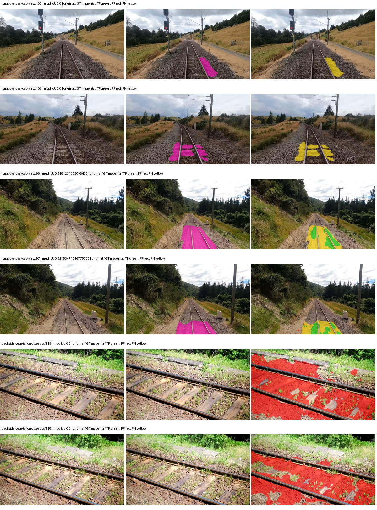
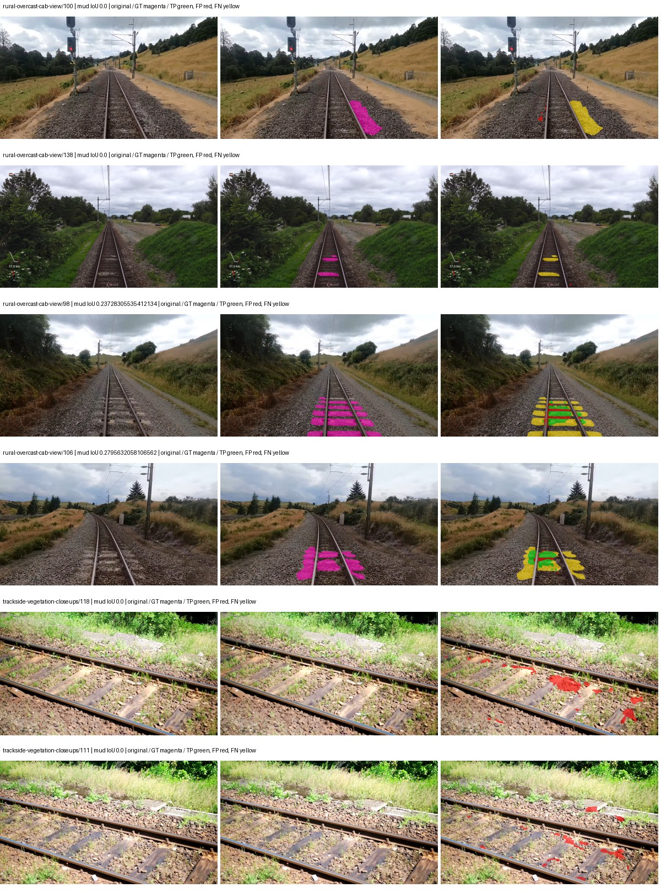
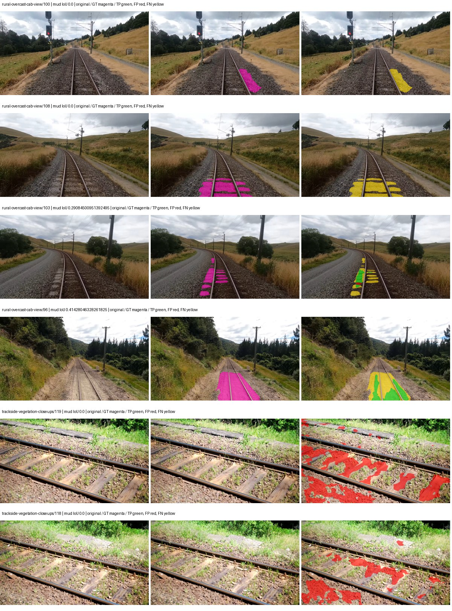
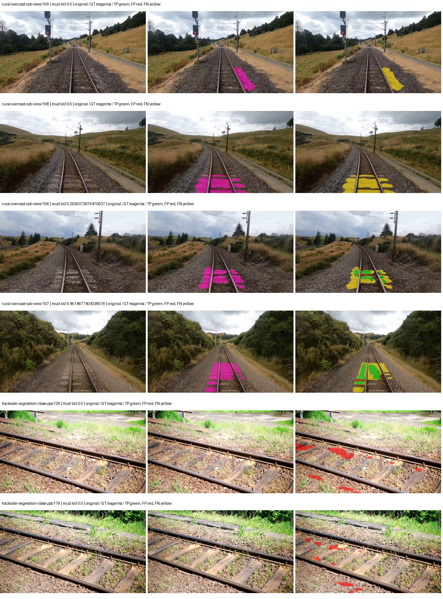

# smp_fpn_resnet50 — paul-test-rtis_v2

[RTIS comparison](../../README.md) · [Full model records](record.json)

Primary selection and early stopping: **mud-pumping validation IoU**. A job is complete only after full statistics and isolated profiling are verified.

| Model | Initialization path | Seed | Status | Steps | Best step | Mud IoU (%) | Mud precision (%) | Mud recall (%) | Final mud IoU (trainer val, %) | mIoU (%) | Fixed GT-class mIoU (%) |
| --- | --- | --- | --- | --- | --- | --- | --- | --- | --- | --- | --- |
| smp_fpn_resnet50 | rtis_only | 0 | completed | 4000 | 2803 | 2.08 | 2.54 | 10.30 | 1.20 | 27.73 | 32.35 |
| smp_fpn_resnet50 | cityscapes_to_rtis | 0 | completed | 2549 | 1274 | 10.95 | 38.41 | 13.29 | 8.96 | 29.76 | 33.07 |
| smp_fpn_resnet50 | railsem19_to_rtis | 0 | completed | 2549 | 1274 | 7.69 | 12.20 | 17.21 | 3.85 | 43.48 | 48.31 |
| smp_fpn_resnet50 | cityscapes_to_railsem19_to_rtis | 0 | completed | 1784 | 509 | 12.13 | 45.54 | 14.19 | 5.41 | 30.29 | 33.65 |

Training: 205 images. Validation: 37 images. Test: 50 held out. Seeds: [0]. Seed variation measures optimization variability, not independent-recording uncertainty. Historical source checkpoints stay fixed across adaptation seeds.

Training code: `066afb2626398b7be59d4d19f5a0e4644fd59adc`. Split SHA-256: `18a84c0163a65ded46508bcc904c374e5f33ad8a09b8879e3c8add606e86aa9f`.

## rtis_only — seed 0

Status: **completed**. Started: 2026-09-10T01:49:36.485008+00:00. Finished: 2026-09-10T02:32:10.614819+00:00.

Recipe pretrained initializer: `{"arch": "smp", "backbone_path": null, "batch_norm_momentum": null, "checkpoint": null, "classifier_path": null, "drop_path": null, "encoder_name": "resnet50", "encoder_weights": "imagenet", "head": "unified_head", "head_paths": [], "inactive_parameter_paths": [], "local_files_only": false, "lora_alpha": 32, "lora_dropout": 0.05, "lora_r": 16, "lora_targets": [], "native": null, "revision": null, "smp_arch": "FPN", "subfolder": null, "trust_remote_code": false, "tuning": "full"}`.

`rtis_only` uses the recipe initializer, which may include pretrained segmentation components. Transfer paths load the exact historical source checkpoint below and reset the classifier; they do not reset all query/decoder features.

Source checkpoint: `Recipe pretrained initialization`.

Config SHA-256: `03da720a06019561976eabb888a1a72d59398705e763079ebc8a1458e8e46fe5`. Weights used for validation: `raw`.

### Mud-pumping and aggregate quality

| Metric | Selected checkpoint | Final training validation |
| --- | --- | --- |
| Mud IoU | 2.08 | 1.20 |
| Mud precision | 2.54 | 1.45 |
| Mud recall | 10.30 | 6.66 |
| Mud Dice/F1 | 4.07 | 2.38 |
| mIoU | 27.73 | 27.68 |
| Mean accuracy | 42.96 | 39.65 |
| Mean precision | 48.70 | 45.98 |
| Mean Dice | 36.19 | 35.64 |
| Mean specificity | 98.74 | 98.78 |
| Pixel accuracy | 78.08 | 80.26 |
| Frequency-weighted IoU | 70.76 | 71.80 |
| Fixed GT-present class mIoU | 32.35 | 32.29 |
| Boundary F1 | 36.41 | 34.88 |

The selected checkpoint has independent evaluation evidence. Final values are the trainer's final validation record, not a new independent evaluation. mIoU averages classes with nonzero union, so false positives on absent classes can change its denominator. The fixed GT-class mean is supplementary and excludes absent classes; their false positives remain in the confusion matrix.

### Resource usage and timing

| Measurement | Value |
| --- | --- |
| Peak training VRAM, retained training invocation (GiB) | 8.69 |
| Peak evaluation VRAM (GiB) | 7.01 |
| Retained training invocation wall time (seconds) | 2417.26 |
| Retained training invocation GPU-hours (one GPU) | 0.67 |
| Evaluation wall time (seconds) | 11.74 |
| Full evaluation pipeline images/second | 3.15 |
| Best full-state checkpoint (MiB) | 399.34 |
| Final full-state checkpoint (MiB) | 399.33 |
| Verified periodic checkpoints removed (GiB) | 3.12 |

VRAM uses the recorded allocator high-water mark; it is not total device usage including CUDA context. Resumed jobs' retained training invocation times and peaks are **not whole-campaign totals**. Earlier invocation resource records are not reconstructed here. Evaluation throughput includes loader, sliding-window inference and metrics; it is not model-only latency/FPS. Missing measurements are shown as —, never inferred from another dataset's run.

### Standardized inference performance

Dedicated model-only profiling waits for an idle worker-locked L40S: BF16, batch 1, 1024x1024, 20 warmup and 100 CUDA-event-timed public forwards. It excludes loading, preprocessing, tiling and metrics.

| Status | Parameters | Weight MiB | FPS | p50 ms | p95 ms | Peak reserved GiB |
| --- | --- | --- | --- | --- | --- | --- |
| complete | 26118613 | 99.63 | 153.96 | 6.38 | 7.08 | 0.73 |

```json
{
  "schema_version": 1,
  "model_id": "smp_fpn_resnet50",
  "measured_at": "2026-09-10T02:32:05+00:00",
  "status": "complete",
  "benchmark_scope": "rtis_selected_checkpoint_model_only",
  "applies_to": [
    "smp_fpn_resnet50--rtis_only--seed-0"
  ],
  "source": {
    "campaign_git_sha": "066afb2626398b7be59d4d19f5a0e4644fd59adc",
    "git_dirty": false,
    "config_hash": "69caf3015050",
    "resolved_config": "/data/izadia1/projects/segmentary-runs/paul-test-rtis_v2/seed0-20260909/configs/smp_fpn_resnet50--rtis_only--seed-0.yaml",
    "config_sha256": "03da720a06019561976eabb888a1a72d59398705e763079ebc8a1458e8e46fe5",
    "checkpoint_sha256": "d63bc12d11083e493d4782dd42fa8e553125ccb2977ff7ac78fd716e5a54077a",
    "checkpoint_global_step": 2803,
    "checkpoint_bytes": 418737568,
    "checkpoint_kind": "resume checkpoint with optimizer and EMA state",
    "weights": "raw",
    "measured_checkpoint_job_id": "smp_fpn_resnet50--rtis_only--seed-0",
    "result_sha256": "0de0fee1aa8609d9ee671ffe5ca241e5512aab48340a4eca578de3895c6baa39",
    "result_git_sha": "066afb2626398b7be59d4d19f5a0e4644fd59adc",
    "result_stage": "eval:paul-test-rtis:val",
    "result_seed": 0
  },
  "hardware": {
    "gpu_name": "NVIDIA L40S",
    "gpu_uuid": "GPU-a5ad49e5-0536-5229-ba8a-f8a902808f53",
    "logical_device": "cuda:0",
    "physical_visibility_token": "7",
    "compute_capability": [
      8,
      9
    ],
    "total_memory_bytes": 47677177856
  },
  "model": {
    "parameter_count": 26118613,
    "trainable_parameter_count": 26118613,
    "resident_parameter_bytes": 104474452,
    "parameter_dtype_counts": {
      "float32": 26118613
    }
  },
  "contract": {
    "backend": "pytorch",
    "precision": "bf16_autocast",
    "batch_size": 1,
    "input_shape_nchw": [
      1,
      3,
      1024,
      1024
    ],
    "warmup_iterations": 20,
    "measured_iterations": 100,
    "timing": "per-forward CUDA events with end-event synchronization",
    "includes_preprocessing": false,
    "includes_data_loader": false,
    "includes_sliding_window": false,
    "input_resident_on_gpu": true,
    "model_only": true,
    "entrypoint": "public model(image) dense-logits forward"
  },
  "measurements": {
    "latency": {
      "p50_ms": 6.3795201778411865,
      "p95_ms": 7.075737810134887,
      "mean_ms": 6.495129642486572,
      "minimum_ms": 6.244319915771484,
      "maximum_ms": 8.250368118286133,
      "fps": 153.96151501868462,
      "raw_ms": [
        7.0194878578186035,
        6.338528156280518,
        6.362112045288086,
        6.292479991912842,
        6.42252779006958,
        6.285312175750732,
        6.268928050994873,
        6.262784004211426,
        6.255616188049316,
        6.253568172454834,
        6.26585578918457,
        7.011328220367432,
        6.782976150512695,
        6.444032192230225,
        6.388735771179199,
        6.349823951721191,
        6.244319915771484,
        6.257664203643799,
        6.261760234832764,
        6.29145622253418,
        6.278143882751465,
        6.4194560050964355,
        6.4778242111206055,
        7.024640083312988,
        6.38259220123291,
        6.385663986206055,
        6.263807773590088,
        6.266880035400391,
        6.245376110076904,
        6.816768169403076,
        8.056832313537598,
        8.250368118286133,
        7.327744007110596,
        7.9134721755981445,
        6.945856094360352,
        6.514688014984131,
        6.432767868041992,
        6.378496170043945,
        7.093247890472412,
        6.455296039581299,
        6.748159885406494,
        6.499328136444092,
        6.264832019805908,
        6.276095867156982,
        6.26585578918457,
        6.262784004211426,
        6.257664203643799,
        6.2494401931762695,
        6.253568172454834,
        6.380544185638428,
        6.4040961265563965,
        6.9120001792907715,
        7.0748162269592285,
        6.682623863220215,
        6.509568214416504,
        6.385663986206055,
        6.376448154449463,
        6.755328178405762,
        6.446080207824707,
        6.638591766357422,
        6.461440086364746,
        6.905856132507324,
        6.369279861450195,
        6.252543926239014,
        6.504447937011719,
        6.247424125671387,
        6.262784004211426,
        6.249472141265869,
        6.245376110076904,
        6.525951862335205,
        6.640704154968262,
        6.5873918533325195,
        6.259712219238281,
        6.290431976318359,
        6.42252779006958,
        6.519807815551758,
        6.445055961608887,
        6.500351905822754,
        6.986752033233643,
        6.529024124145508,
        6.449151992797852,
        6.377471923828125,
        6.2709760665893555,
        6.264832019805908,
        6.253568172454834,
        6.266880035400391,
        6.246399879455566,
        6.255616188049316,
        6.251520156860352,
        6.260735988616943,
        6.246399879455566,
        6.252543926239014,
        6.264832019805908,
        6.258687973022461,
        6.277120113372803,
        6.281216144561768,
        6.494207859039307,
        6.501376152038574,
        6.509568214416504,
        6.6908159255981445
      ],
      "percentile_method": "numpy linear interpolation"
    },
    "peak_reserved_bytes": 782237696,
    "memory_kind": "pytorch_cuda_allocator_peak_reserved_excluding_context",
    "benchmark_wall_clock_s": 13.769434355199337
  },
  "started_at": "2026-09-10T02:31:51+00:00",
  "finished_at": "2026-09-10T02:32:05+00:00",
  "environment": {
    "hostname": "hdrfs-app-001",
    "python": "3.11.15",
    "platform": "Linux-5.15.0-139-generic-x86_64-with-glibc2.35",
    "torch": "2.11.0+cu128",
    "torch_cuda": "12.8",
    "cudnn": 91900,
    "driver_version": "570.133.20",
    "cuda_available": true,
    "gpu_count": 1,
    "gpu_names": [
      "NVIDIA L40S"
    ],
    "cuda_visible_devices": "7",
    "packages": {
      "segmentary": "0.1.0",
      "torch": "2.11.0+cu128",
      "torchvision": "0.26.0+cu128",
      "transformers": "5.15.0",
      "timm": "1.0.28",
      "segmentation-models-pytorch": "0.5.0",
      "albumentations": "2.0.8",
      "lightning": "2.6.5",
      "numpy": "2.4.4"
    }
  }
}
```

### Per-class validation results

| Class | GT pixels | IoU (%) | Precision (%) | Recall (%) | Dice (%) | Boundary F1 (%) |
| --- | --- | --- | --- | --- | --- | --- |
| car | 29664 | 19.77 | 63.24 | 22.34 | 33.02 | 43.53 |
| construction | 311585 | 9.71 | 10.02 | 75.96 | 17.71 | 18.53 |
| fence | 265137 | 7.93 | 17.31 | 12.77 | 14.69 | 20.96 |
| mud-pumping | 1226250 | 2.08 | 2.54 | 10.30 | 4.07 | 4.57 |
| on-rails | 0 | 0.00 | 0.00 | — | 0.00 | 0.00 |
| person | 0 | 0.00 | 0.00 | — | 0.00 | 0.00 |
| pole | 628038 | 62.75 | 81.22 | 73.40 | 77.11 | 88.22 |
| rail-embedded | 16799 | 9.38 | 73.47 | 9.71 | 17.15 | 27.41 |
| rail-raised | 2969797 | 73.91 | 83.73 | 86.30 | 85.00 | 90.55 |
| rail-track | 6323197 | 36.15 | 72.74 | 41.81 | 53.10 | 48.39 |
| road | 1048831 | 14.54 | 27.60 | 23.50 | 25.39 | 17.04 |
| sidewalk | 1297367 | 15.70 | 42.11 | 20.02 | 27.14 | 14.14 |
| sky | 19121606 | 97.89 | 99.14 | 98.73 | 98.93 | 92.72 |
| standing-water | 95802 | 1.16 | 1.19 | 33.31 | 2.30 | 3.92 |
| terrain | 39239306 | 80.38 | 88.56 | 89.69 | 89.12 | 58.95 |
| trackbed | 10643081 | 64.39 | 79.17 | 77.52 | 78.34 | 63.73 |
| traffic-light | 19510 | 38.90 | 70.08 | 46.65 | 56.02 | 53.25 |
| traffic-sign | 13285 | 24.78 | 85.91 | 25.83 | 39.72 | 48.43 |
| tram-track | 56179 | 11.38 | 40.92 | 13.61 | 20.43 | 28.82 |
| truck | 0 | 0.00 | 0.00 | — | 0.00 | 0.00 |
| vegetation-overgrowth | 5901821 | 11.54 | 83.71 | 11.81 | 20.70 | 41.48 |

### Full-run accounting

| Measurement | Value |
| --- | --- |
| Full GPU-reserved wall seconds, all recorded worker attempts | 2554.13 |
| Full reserved GPU-hours | 0.71 |
| Whole-run timing complete | True |

| Phase | Wall seconds including failed attempts |
| --- | --- |
| training | 2423.74 |
| diagnostics | 85.62 |
| performance | 21.03 |

GPU-reserved time includes model loading, training, validation, collection, profiling, checkpoint I/O and orchestration while the worker owns one GPU. It is not GPU kernel-active time. Phase timings and sampled device memory/power/utilization are retained separately; sampled device memory is not the allocator high-water mark.

### Train/validation and raw/EMA diagnostics

| Checkpoint / weights / split | Images | Mud IoU (%) | Mud precision (%) | Mud recall (%) |
| --- | --- | --- | --- | --- |
| best-auto-train / raw | 205 | 95.30 | 98.11 | 97.08 |
| best-auto-val / raw | 37 | 2.08 | 2.54 | 10.30 |
| best-alternate-val / ema | 37 | 0.90 | 1.13 | 4.26 |
| final-auto-val / raw | 37 | 1.21 | 1.45 | 6.68 |

Train uses the evaluation transform without augmentation. Compare mud train/validation metrics for the same selected weights. Alternate EMA on running-stat BatchNorm is explicitly uncalibrated and is diagnostic only. Score-threshold curves use uncalibrated normalized scores and are pixel-level diagnostics, not event detection rates or a selected deployment operating point.

### Downloadable evidence

- best-auto-train: [per-image.csv](rtis_only--seed-0/best-auto-train/per-image.csv) · [per-image-confusion.json.gz](rtis_only--seed-0/best-auto-train/per-image-confusion.json.gz) · [groups.json](rtis_only--seed-0/best-auto-train/groups.json) · [mud-score-curves.json](rtis_only--seed-0/best-auto-train/mud-score-curves.json)
- best-auto-val: [per-image.csv](rtis_only--seed-0/best-auto-val/per-image.csv) · [per-image-confusion.json.gz](rtis_only--seed-0/best-auto-val/per-image-confusion.json.gz) · [groups.json](rtis_only--seed-0/best-auto-val/groups.json) · [mud-score-curves.json](rtis_only--seed-0/best-auto-val/mud-score-curves.json) · [examples.jpg](rtis_only--seed-0/best-auto-val/examples.jpg)
- best-alternate-val: [per-image.csv](rtis_only--seed-0/best-alternate-val/per-image.csv) · [per-image-confusion.json.gz](rtis_only--seed-0/best-alternate-val/per-image-confusion.json.gz) · [groups.json](rtis_only--seed-0/best-alternate-val/groups.json) · [mud-score-curves.json](rtis_only--seed-0/best-alternate-val/mud-score-curves.json)
- final-auto-val: [per-image.csv](rtis_only--seed-0/final-auto-val/per-image.csv) · [per-image-confusion.json.gz](rtis_only--seed-0/final-auto-val/per-image-confusion.json.gz) · [groups.json](rtis_only--seed-0/final-auto-val/groups.json) · [mud-score-curves.json](rtis_only--seed-0/final-auto-val/mud-score-curves.json)
- resources: [telemetry.csv](rtis_only--seed-0/resources/telemetry.csv)



Examples are two lowest and two highest mud-IoU positive images, plus up to two negative images with the most false-positive mud pixels. They are targeted diagnostic examples, not random samples. Green: true positive; red: false positive; yellow: false negative. Full predictions remain on HDRFS.

### Validation tracking

| Logged step | Overall mIoU (%) | Mud IoU (%) |
| --- | --- | --- |
| 254 | 20.00 | 0.88 |
| 509 | 22.37 | 0.07 |
| 764 | 25.35 | 0.34 |
| 1019 | 23.63 | 0.64 |
| 1274 | 25.46 | 0.69 |
| 1529 | 25.11 | 0.99 |
| 1784 | 25.33 | 0.81 |
| 2038 | 29.17 | 1.24 |
| 2293 | 28.63 | 1.27 |
| 2548 | 28.74 | 0.79 |
| 2803 | 27.73 | 2.07 |
| 3058 | 27.17 | 0.50 |
| 3313 | 28.82 | 0.36 |
| 3568 | 27.03 | 0.92 |
| 3823 | 27.81 | 0.75 |
| 4000 | 27.68 | 1.20 |

All retained scalar curves, including training loss and per-class IoU, are in record.json. Observed best mud on a curve is not necessarily a retained checkpoint: the pilot saved its selection-metric-best and final checkpoints. Step logging and checkpoint global_step may differ by one.

### Stopping and checkpoint provenance

```json
{
  "stopping": {
    "actual_steps": 4000,
    "maximum_steps": 4000,
    "min_delta": 0.001,
    "monitor": "val_iou/mud-pumping",
    "patience": 5,
    "reason": "budget_complete"
  },
  "checkpoints": {
    "best": {
      "path": "/data/izadia1/projects/segmentary-runs/paul-test-rtis_v2/seed0-20260909/future-runs/smp_fpn_resnet50--rtis_only--seed-0_seed0/rtis/best.ckpt",
      "sha256": "d63bc12d11083e493d4782dd42fa8e553125ccb2977ff7ac78fd716e5a54077a",
      "global_step": 2803,
      "bytes": 418737568
    },
    "final": {
      "path": "/data/izadia1/projects/segmentary-runs/paul-test-rtis_v2/seed0-20260909/future-runs/smp_fpn_resnet50--rtis_only--seed-0_seed0/rtis/last.ckpt",
      "sha256": "54eb1468c6e5b8b3e0f7e132bf7e86a244fd68ef8245e9cacdde9554e5e117dd",
      "global_step": 4000,
      "bytes": 418725728
    }
  },
  "cleanup_error": null
}
```

### Resolved training, initialization and evaluation settings

The optimizer block is the base configuration. Stage LR scales are applied at runtime, and stage warmup is capped at min(base warmup, floor(stage budget / 10), stage budget - 1): 400 steps for this 4,000-step pilot. Model-internal native input grids may differ from augmentation crops (EoMT uses its 640 grid).

```json
{
  "name": "smp_fpn_resnet50--rtis_only--seed-0",
  "model": {
    "arch": "smp",
    "checkpoint": null,
    "tuning": "full",
    "head": "unified_head",
    "lora_r": 16,
    "lora_alpha": 32,
    "lora_dropout": 0.05,
    "lora_targets": [],
    "drop_path": null,
    "revision": null,
    "subfolder": null,
    "local_files_only": false,
    "trust_remote_code": false,
    "backbone_path": null,
    "head_paths": [],
    "classifier_path": null,
    "inactive_parameter_paths": [],
    "smp_arch": "FPN",
    "encoder_name": "resnet50",
    "encoder_weights": "imagenet",
    "native": null,
    "batch_norm_momentum": null
  },
  "space": "paul-test-rtis",
  "taxonomy_root": "/data/izadia1/projects/segmentary-rtis-fullstats-066afb2/taxonomy",
  "output_root": "/data/izadia1/projects/segmentary-runs/paul-test-rtis_v2/seed0-20260909/future-runs",
  "optim": {
    "backbone_lr": 0.0001,
    "head_lr_mult": 10.0,
    "weight_decay": 0.05,
    "llrd": 1.0,
    "warmup_iters": 1500,
    "warmup_ratio": 1e-06,
    "poly_power": 0.9,
    "min_lr_ratio": 0.0,
    "betas": [
      0.9,
      0.999
    ],
    "grad_clip": 1.0
  },
  "train": {
    "iters": 4000,
    "batch_size": 2,
    "accum": 8,
    "num_workers": 2,
    "precision": "bf16-mixed",
    "ema_decay": 0.9998,
    "val_every": 250,
    "ckpt_every": 500,
    "selection_metric": "val_iou/mud-pumping",
    "early_stopping_patience": 5,
    "early_stopping_min_delta": 0.001,
    "seed": 0,
    "devices": 1
  },
  "eval": {
    "sliding_window": true,
    "window": [
      1024,
      1024
    ],
    "stride": [
      768,
      768
    ],
    "batch_size": 1,
    "num_workers": 2,
    "tta_scales": [],
    "tta_flip": false,
    "threshold": 0.5,
    "boundary_tolerance_frac": 0.0075,
    "save_confusion": true
  },
  "loss": {
    "task": "multiclass",
    "activation": "auto",
    "terms": [],
    "aux": "none",
    "aux_weight": 0.0,
    "ce_weight": 1.0,
    "label_smoothing": 0.0,
    "class_weights": null,
    "query": null
  },
  "aug": {
    "crop": [
      1024,
      1024
    ],
    "scale_min": 0.5,
    "scale_max": 2.0,
    "hflip_p": 0.5,
    "color_jitter_p": 0.5,
    "brightness": 0.25,
    "contrast": 0.25,
    "saturation": 0.25,
    "hue": 0.05
  },
  "stages": [
    {
      "name": "rtis",
      "data": [
        {
          "name": "paul-test-rtis",
          "root": "/data/izadia1/datasets/paul-test-rtis_v2",
          "variant": null,
          "split_file": "splits.json",
          "train_split": "train",
          "val_split": "val",
          "limit": null,
          "loader": "folder",
          "mapping": "paul-test-rtis",
          "loader_options": {
            "require_groups": true
          }
        }
      ],
      "iters": null,
      "lr_scale": 1.0,
      "head_group_lr_scale": 1.0,
      "init_from": "pretrained",
      "reset_head": false,
      "freeze": null,
      "sample_weights": null
    }
  ]
}
```

### Hardware and software provenance

```json
{
  "training": {
    "cuda_available": true,
    "cuda_visible_devices": "7",
    "cudnn": 91900,
    "driver_version": "570.133.20",
    "gpu_count": 1,
    "gpu_names": [
      "NVIDIA L40S"
    ],
    "hostname": "hdrfs-app-001",
    "input_normalization": {
      "channel_order": "rgb",
      "mean": [
        0.485,
        0.456,
        0.406
      ],
      "source": "smp_encoder_settings",
      "std": [
        0.229,
        0.224,
        0.225
      ]
    },
    "model_origins": [
      {
        "hf_commit": null,
        "hf_name_or_path": null,
        "module": "model",
        "timm_pretrained": {}
      }
    ],
    "model_parameter_count": 26118613,
    "packages": {
      "albumentations": "2.0.8",
      "lightning": "2.6.5",
      "numpy": "2.4.4",
      "segmentary": "0.1.0",
      "segmentation-models-pytorch": "0.5.0",
      "timm": "1.0.28",
      "torch": "2.11.0+cu128",
      "torchvision": "0.26.0+cu128",
      "transformers": "5.15.0"
    },
    "platform": "Linux-5.15.0-139-generic-x86_64-with-glibc2.35",
    "python": "3.11.15",
    "torch": "2.11.0+cu128",
    "torch_cuda": "12.8",
    "trainable_parameter_count": 26118613,
    "training_stop": {
      "actual_steps": 4000,
      "maximum_steps": 4000,
      "min_delta": 0.001,
      "monitor": "val_iou/mud-pumping",
      "patience": 5,
      "reason": "budget_complete"
    },
    "validation_weights": "raw"
  },
  "evaluation": {
    "cuda_available": true,
    "cuda_visible_devices": "7",
    "cudnn": 91900,
    "driver_version": "570.133.20",
    "gpu_count": 1,
    "gpu_names": [
      "NVIDIA L40S"
    ],
    "hostname": "hdrfs-app-001",
    "input_normalization": {
      "channel_order": "rgb",
      "mean": [
        0.485,
        0.456,
        0.406
      ],
      "source": "smp_encoder_settings",
      "std": [
        0.229,
        0.224,
        0.225
      ]
    },
    "packages": {
      "albumentations": "2.0.8",
      "lightning": "2.6.5",
      "numpy": "2.4.4",
      "segmentary": "0.1.0",
      "segmentation-models-pytorch": "0.5.0",
      "timm": "1.0.28",
      "torch": "2.11.0+cu128",
      "torchvision": "0.26.0+cu128",
      "transformers": "5.15.0"
    },
    "platform": "Linux-5.15.0-139-generic-x86_64-with-glibc2.35",
    "python": "3.11.15",
    "torch": "2.11.0+cu128",
    "torch_cuda": "12.8"
  }
}
```

## cityscapes_to_rtis — seed 0

Status: **completed**. Started: 2026-09-10T02:12:33.794546+00:00. Finished: 2026-09-10T02:41:30.241790+00:00.

Recipe pretrained initializer: `{"arch": "smp", "backbone_path": null, "batch_norm_momentum": null, "checkpoint": null, "classifier_path": null, "drop_path": null, "encoder_name": "resnet50", "encoder_weights": "imagenet", "head": "unified_head", "head_paths": [], "inactive_parameter_paths": [], "local_files_only": false, "lora_alpha": 32, "lora_dropout": 0.05, "lora_r": 16, "lora_targets": [], "native": null, "revision": null, "smp_arch": "FPN", "subfolder": null, "trust_remote_code": false, "tuning": "full"}`.

`rtis_only` uses the recipe initializer, which may include pretrained segmentation components. Transfer paths load the exact historical source checkpoint below and reset the classifier; they do not reset all query/decoder features.

Source checkpoint: `{'name': 'smp_fpn_resnet50--cityscapes--seed-0', 'model': 'smp_fpn_resnet50', 'protocol': 'cityscapes', 'config': '/data/izadia1/projects/segmentary-runs/all-model-city-rail-seed0-rail20-b9eb3e1/accepted/smp_fpn_resnet50--cityscapes--seed-0/resolved-config.yaml', 'checkpoint': '/data/izadia1/projects/segmentary-runs/current-main-fill-v2/jobs/smp_fpn_resnet50--cityscapes--seed-0/train/smp_fpn_resnet50--cityscapes_seed0/cityscapes/last.ckpt', 'recorded_sha256': '556c5d27ea6d8d034aa1d6c86a7defd74bcdd36b3e3962cc39034d22d32628d6', 'exists': True}`.

Config SHA-256: `e4271fa6292553931da1590e87b4c4921f467405e537406dba19b02f5dcc008b`. Weights used for validation: `raw`.

### Mud-pumping and aggregate quality

| Metric | Selected checkpoint | Final training validation |
| --- | --- | --- |
| Mud IoU | 10.95 | 8.96 |
| Mud precision | 38.41 | 38.49 |
| Mud recall | 13.29 | 10.45 |
| Mud Dice/F1 | 19.74 | 16.44 |
| mIoU | 29.76 | 31.18 |
| Mean accuracy | 41.02 | 46.04 |
| Mean precision | 44.43 | 45.22 |
| Mean Dice | 38.24 | 40.16 |
| Mean specificity | 98.84 | 98.83 |
| Pixel accuracy | 81.71 | 81.60 |
| Frequency-weighted IoU | 72.05 | 71.58 |
| Fixed GT-present class mIoU | 33.07 | 36.37 |
| Boundary F1 | 36.04 | 38.23 |

The selected checkpoint has independent evaluation evidence. Final values are the trainer's final validation record, not a new independent evaluation. mIoU averages classes with nonzero union, so false positives on absent classes can change its denominator. The fixed GT-class mean is supplementary and excludes absent classes; their false positives remain in the confusion matrix.

### Resource usage and timing

| Measurement | Value |
| --- | --- |
| Peak training VRAM, retained training invocation (GiB) | 8.69 |
| Peak evaluation VRAM (GiB) | 7.01 |
| Retained training invocation wall time (seconds) | 1600.53 |
| Retained training invocation GPU-hours (one GPU) | 0.44 |
| Evaluation wall time (seconds) | 11.82 |
| Full evaluation pipeline images/second | 3.13 |
| Best full-state checkpoint (MiB) | 399.34 |
| Final full-state checkpoint (MiB) | 399.33 |
| Verified periodic checkpoints removed (GiB) | 1.95 |

VRAM uses the recorded allocator high-water mark; it is not total device usage including CUDA context. Resumed jobs' retained training invocation times and peaks are **not whole-campaign totals**. Earlier invocation resource records are not reconstructed here. Evaluation throughput includes loader, sliding-window inference and metrics; it is not model-only latency/FPS. Missing measurements are shown as —, never inferred from another dataset's run.

### Standardized inference performance

Dedicated model-only profiling waits for an idle worker-locked L40S: BF16, batch 1, 1024x1024, 20 warmup and 100 CUDA-event-timed public forwards. It excludes loading, preprocessing, tiling and metrics.

| Status | Parameters | Weight MiB | FPS | p50 ms | p95 ms | Peak reserved GiB |
| --- | --- | --- | --- | --- | --- | --- |
| complete | 26118613 | 99.63 | 146.55 | 6.48 | 8.23 | 0.73 |

```json
{
  "schema_version": 1,
  "model_id": "smp_fpn_resnet50",
  "measured_at": "2026-09-10T02:41:26+00:00",
  "status": "complete",
  "benchmark_scope": "rtis_selected_checkpoint_model_only",
  "applies_to": [
    "smp_fpn_resnet50--cityscapes_to_rtis--seed-0"
  ],
  "source": {
    "campaign_git_sha": "066afb2626398b7be59d4d19f5a0e4644fd59adc",
    "git_dirty": false,
    "config_hash": "6bb6c044731e",
    "resolved_config": "/data/izadia1/projects/segmentary-runs/paul-test-rtis_v2/seed0-20260909/configs/smp_fpn_resnet50--cityscapes_to_rtis--seed-0.yaml",
    "config_sha256": "e4271fa6292553931da1590e87b4c4921f467405e537406dba19b02f5dcc008b",
    "checkpoint_sha256": "01fa78f7b4d82dab3690c6fcfd99f5f81c5534a66939e52c659059bcdb470bbf",
    "checkpoint_global_step": 1274,
    "checkpoint_bytes": 418737568,
    "checkpoint_kind": "resume checkpoint with optimizer and EMA state",
    "weights": "raw",
    "measured_checkpoint_job_id": "smp_fpn_resnet50--cityscapes_to_rtis--seed-0",
    "result_sha256": "09f173b27d216be4e0ec3372120dc7987be99bf66ff213d1573046eb13dc6918",
    "result_git_sha": "066afb2626398b7be59d4d19f5a0e4644fd59adc",
    "result_stage": "eval:paul-test-rtis:val",
    "result_seed": 0
  },
  "hardware": {
    "gpu_name": "NVIDIA L40S",
    "gpu_uuid": "GPU-931d0911-fc78-1638-e3d7-1ba868cbd286",
    "logical_device": "cuda:0",
    "physical_visibility_token": "2",
    "compute_capability": [
      8,
      9
    ],
    "total_memory_bytes": 47677177856
  },
  "model": {
    "parameter_count": 26118613,
    "trainable_parameter_count": 26118613,
    "resident_parameter_bytes": 104474452,
    "parameter_dtype_counts": {
      "float32": 26118613
    }
  },
  "contract": {
    "backend": "pytorch",
    "precision": "bf16_autocast",
    "batch_size": 1,
    "input_shape_nchw": [
      1,
      3,
      1024,
      1024
    ],
    "warmup_iterations": 20,
    "measured_iterations": 100,
    "timing": "per-forward CUDA events with end-event synchronization",
    "includes_preprocessing": false,
    "includes_data_loader": false,
    "includes_sliding_window": false,
    "input_resident_on_gpu": true,
    "model_only": true,
    "entrypoint": "public model(image) dense-logits forward"
  },
  "measurements": {
    "latency": {
      "p50_ms": 6.481920003890991,
      "p95_ms": 8.22835168838501,
      "mean_ms": 6.823537268638611,
      "minimum_ms": 6.299615859985352,
      "maximum_ms": 11.763711929321289,
      "fps": 146.55155539284007,
      "raw_ms": [
        6.771711826324463,
        7.196671962738037,
        6.322175979614258,
        6.323200225830078,
        6.573056221008301,
        6.311840057373047,
        6.321152210235596,
        6.316959857940674,
        7.428095817565918,
        6.482944011688232,
        6.353856086730957,
        6.307839870452881,
        6.310912132263184,
        6.3118720054626465,
        6.7348480224609375,
        6.555520057678223,
        7.165952205657959,
        6.92633581161499,
        6.816768169403076,
        6.4778242111206055,
        6.605823993682861,
        6.743040084838867,
        7.458816051483154,
        6.375423908233643,
        6.331424236297607,
        7.164927959442139,
        6.315008163452148,
        6.723487854003906,
        6.329343795776367,
        6.3160319328308105,
        6.299615859985352,
        6.320127964019775,
        6.612991809844971,
        6.889472007751465,
        6.476736068725586,
        6.330272197723389,
        6.323200225830078,
        6.3160319328308105,
        6.313983917236328,
        6.392831802368164,
        7.797760009765625,
        9.062399864196777,
        11.763711929321289,
        8.374272346496582,
        6.989855766296387,
        6.326272010803223,
        6.796288013458252,
        7.532544136047363,
        6.987775802612305,
        6.315008163452148,
        6.3282880783081055,
        6.363135814666748,
        6.663167953491211,
        6.451200008392334,
        6.397952079772949,
        7.543712139129639,
        11.456512451171875,
        8.114175796508789,
        8.220671653747559,
        6.48089599609375,
        6.9621758460998535,
        7.673855781555176,
        9.513983726501465,
        6.307839870452881,
        6.327295780181885,
        6.301695823669434,
        6.437888145446777,
        6.309887886047363,
        6.364160060882568,
        6.428671836853027,
        6.338560104370117,
        6.301727771759033,
        7.500800132751465,
        6.325247764587402,
        6.7788801193237305,
        6.325247764587402,
        6.600704193115234,
        7.020415782928467,
        7.020544052124023,
        6.623231887817383,
        6.967296123504639,
        6.620160102844238,
        6.549503803253174,
        6.441984176635742,
        6.324096202850342,
        6.356927871704102,
        6.32316780090332,
        6.6611199378967285,
        6.604800224304199,
        6.77785587310791,
        6.315008163452148,
        6.304895877838135,
        6.310912132263184,
        6.328320026397705,
        6.316991806030273,
        7.320672035217285,
        7.372799873352051,
        6.612991809844971,
        6.699007987976074,
        7.068672180175781
      ],
      "percentile_method": "numpy linear interpolation"
    },
    "peak_reserved_bytes": 782237696,
    "memory_kind": "pytorch_cuda_allocator_peak_reserved_excluding_context",
    "benchmark_wall_clock_s": 13.151757754385471
  },
  "started_at": "2026-09-10T02:41:12+00:00",
  "finished_at": "2026-09-10T02:41:26+00:00",
  "environment": {
    "hostname": "hdrfs-app-001",
    "python": "3.11.15",
    "platform": "Linux-5.15.0-139-generic-x86_64-with-glibc2.35",
    "torch": "2.11.0+cu128",
    "torch_cuda": "12.8",
    "cudnn": 91900,
    "driver_version": "570.133.20",
    "cuda_available": true,
    "gpu_count": 1,
    "gpu_names": [
      "NVIDIA L40S"
    ],
    "cuda_visible_devices": "2",
    "packages": {
      "segmentary": "0.1.0",
      "torch": "2.11.0+cu128",
      "torchvision": "0.26.0+cu128",
      "transformers": "5.15.0",
      "timm": "1.0.28",
      "segmentation-models-pytorch": "0.5.0",
      "albumentations": "2.0.8",
      "lightning": "2.6.5",
      "numpy": "2.4.4"
    }
  }
}
```

### Per-class validation results

| Class | GT pixels | IoU (%) | Precision (%) | Recall (%) | Dice (%) | Boundary F1 (%) |
| --- | --- | --- | --- | --- | --- | --- |
| car | 29664 | 5.48 | 29.54 | 6.31 | 10.40 | 34.03 |
| construction | 311585 | 39.18 | 44.96 | 75.31 | 56.30 | 40.64 |
| fence | 265137 | 12.76 | 31.20 | 17.75 | 22.63 | 25.43 |
| mud-pumping | 1226250 | 10.95 | 38.41 | 13.29 | 19.74 | 20.54 |
| on-rails | 0 | 0.00 | 0.00 | — | 0.00 | 0.00 |
| person | 0 | — | — | — | — | — |
| pole | 628038 | 65.34 | 82.66 | 75.72 | 79.04 | 87.79 |
| rail-embedded | 16799 | 0.00 | 0.00 | 0.00 | 0.00 | 0.00 |
| rail-raised | 2969797 | 67.78 | 73.34 | 89.94 | 80.79 | 84.59 |
| rail-track | 6323197 | 37.84 | 66.66 | 46.67 | 54.90 | 49.41 |
| road | 1048831 | 6.76 | 12.05 | 13.34 | 12.66 | 12.90 |
| sidewalk | 1297367 | 6.05 | 27.93 | 7.17 | 11.41 | 8.40 |
| sky | 19121606 | 94.68 | 99.48 | 95.16 | 97.27 | 86.10 |
| standing-water | 95802 | 0.04 | 0.04 | 0.89 | 0.08 | 0.73 |
| terrain | 39239306 | 84.50 | 86.51 | 97.33 | 91.60 | 53.55 |
| trackbed | 10643081 | 57.04 | 70.82 | 74.57 | 72.64 | 54.21 |
| traffic-light | 19510 | 49.80 | 71.46 | 62.16 | 66.49 | 58.75 |
| traffic-sign | 13285 | 28.80 | 71.38 | 32.56 | 44.72 | 41.83 |
| tram-track | 56179 | 0.00 | 0.00 | 0.00 | 0.00 | 0.00 |
| truck | 0 | 0.00 | 0.00 | — | 0.00 | 0.00 |
| vegetation-overgrowth | 5901821 | 28.29 | 82.25 | 30.13 | 44.10 | 61.96 |

### Full-run accounting

| Measurement | Value |
| --- | --- |
| Full GPU-reserved wall seconds, all recorded worker attempts | 1736.78 |
| Full reserved GPU-hours | 0.48 |
| Whole-run timing complete | True |

| Phase | Wall seconds including failed attempts |
| --- | --- |
| training | 1607.13 |
| diagnostics | 86.02 |
| performance | 20.66 |

GPU-reserved time includes model loading, training, validation, collection, profiling, checkpoint I/O and orchestration while the worker owns one GPU. It is not GPU kernel-active time. Phase timings and sampled device memory/power/utilization are retained separately; sampled device memory is not the allocator high-water mark.

### Train/validation and raw/EMA diagnostics

| Checkpoint / weights / split | Images | Mud IoU (%) | Mud precision (%) | Mud recall (%) |
| --- | --- | --- | --- | --- |
| best-auto-train / raw | 205 | 90.18 | 95.28 | 94.40 |
| best-auto-val / raw | 37 | 10.95 | 38.41 | 13.29 |
| best-alternate-val / ema | 37 | 7.10 | 23.42 | 9.25 |
| final-auto-val / raw | 37 | 8.96 | 38.47 | 10.46 |

Train uses the evaluation transform without augmentation. Compare mud train/validation metrics for the same selected weights. Alternate EMA on running-stat BatchNorm is explicitly uncalibrated and is diagnostic only. Score-threshold curves use uncalibrated normalized scores and are pixel-level diagnostics, not event detection rates or a selected deployment operating point.

### Downloadable evidence

- best-auto-train: [per-image.csv](cityscapes_to_rtis--seed-0/best-auto-train/per-image.csv) · [per-image-confusion.json.gz](cityscapes_to_rtis--seed-0/best-auto-train/per-image-confusion.json.gz) · [groups.json](cityscapes_to_rtis--seed-0/best-auto-train/groups.json) · [mud-score-curves.json](cityscapes_to_rtis--seed-0/best-auto-train/mud-score-curves.json)
- best-auto-val: [per-image.csv](cityscapes_to_rtis--seed-0/best-auto-val/per-image.csv) · [per-image-confusion.json.gz](cityscapes_to_rtis--seed-0/best-auto-val/per-image-confusion.json.gz) · [groups.json](cityscapes_to_rtis--seed-0/best-auto-val/groups.json) · [mud-score-curves.json](cityscapes_to_rtis--seed-0/best-auto-val/mud-score-curves.json) · [examples.jpg](cityscapes_to_rtis--seed-0/best-auto-val/examples.jpg)
- best-alternate-val: [per-image.csv](cityscapes_to_rtis--seed-0/best-alternate-val/per-image.csv) · [per-image-confusion.json.gz](cityscapes_to_rtis--seed-0/best-alternate-val/per-image-confusion.json.gz) · [groups.json](cityscapes_to_rtis--seed-0/best-alternate-val/groups.json) · [mud-score-curves.json](cityscapes_to_rtis--seed-0/best-alternate-val/mud-score-curves.json)
- final-auto-val: [per-image.csv](cityscapes_to_rtis--seed-0/final-auto-val/per-image.csv) · [per-image-confusion.json.gz](cityscapes_to_rtis--seed-0/final-auto-val/per-image-confusion.json.gz) · [groups.json](cityscapes_to_rtis--seed-0/final-auto-val/groups.json) · [mud-score-curves.json](cityscapes_to_rtis--seed-0/final-auto-val/mud-score-curves.json)
- resources: [telemetry.csv](cityscapes_to_rtis--seed-0/resources/telemetry.csv)



Examples are two lowest and two highest mud-IoU positive images, plus up to two negative images with the most false-positive mud pixels. They are targeted diagnostic examples, not random samples. Green: true positive; red: false positive; yellow: false negative. Full predictions remain on HDRFS.

### Validation tracking

| Logged step | Overall mIoU (%) | Mud IoU (%) |
| --- | --- | --- |
| 254 | 20.34 | 0.13 |
| 509 | 22.56 | 4.10 |
| 764 | 24.58 | 3.85 |
| 1019 | 27.10 | 0.89 |
| 1274 | 29.80 | 10.96 |
| 1529 | 28.41 | 10.45 |
| 1784 | 29.77 | 7.20 |
| 2038 | 31.31 | 5.29 |
| 2293 | 33.15 | 9.26 |
| 2548 | 31.18 | 8.96 |

All retained scalar curves, including training loss and per-class IoU, are in record.json. Observed best mud on a curve is not necessarily a retained checkpoint: the pilot saved its selection-metric-best and final checkpoints. Step logging and checkpoint global_step may differ by one.

### Stopping and checkpoint provenance

```json
{
  "stopping": {
    "actual_steps": 2549,
    "maximum_steps": 4000,
    "min_delta": 0.001,
    "monitor": "val_iou/mud-pumping",
    "patience": 5,
    "reason": "validation_plateau"
  },
  "checkpoints": {
    "best": {
      "path": "/data/izadia1/projects/segmentary-runs/paul-test-rtis_v2/seed0-20260909/future-runs/smp_fpn_resnet50--cityscapes_to_rtis--seed-0_seed0/rtis/best.ckpt",
      "sha256": "01fa78f7b4d82dab3690c6fcfd99f5f81c5534a66939e52c659059bcdb470bbf",
      "global_step": 1274,
      "bytes": 418737568
    },
    "final": {
      "path": "/data/izadia1/projects/segmentary-runs/paul-test-rtis_v2/seed0-20260909/future-runs/smp_fpn_resnet50--cityscapes_to_rtis--seed-0_seed0/rtis/last.ckpt",
      "sha256": "5cfe8d837abcd888fe9e51cd5d5e139a4e21a28b00967389996c70e00c68b47e",
      "global_step": 2549,
      "bytes": 418725920
    }
  },
  "cleanup_error": null
}
```

### Resolved training, initialization and evaluation settings

The optimizer block is the base configuration. Stage LR scales are applied at runtime, and stage warmup is capped at min(base warmup, floor(stage budget / 10), stage budget - 1): 400 steps for this 4,000-step pilot. Model-internal native input grids may differ from augmentation crops (EoMT uses its 640 grid).

```json
{
  "name": "smp_fpn_resnet50--cityscapes_to_rtis--seed-0",
  "model": {
    "arch": "smp",
    "checkpoint": null,
    "tuning": "full",
    "head": "unified_head",
    "lora_r": 16,
    "lora_alpha": 32,
    "lora_dropout": 0.05,
    "lora_targets": [],
    "drop_path": null,
    "revision": null,
    "subfolder": null,
    "local_files_only": false,
    "trust_remote_code": false,
    "backbone_path": null,
    "head_paths": [],
    "classifier_path": null,
    "inactive_parameter_paths": [],
    "smp_arch": "FPN",
    "encoder_name": "resnet50",
    "encoder_weights": "imagenet",
    "native": null,
    "batch_norm_momentum": null
  },
  "space": "paul-test-rtis",
  "taxonomy_root": "/data/izadia1/projects/segmentary-rtis-fullstats-066afb2/taxonomy",
  "output_root": "/data/izadia1/projects/segmentary-runs/paul-test-rtis_v2/seed0-20260909/future-runs",
  "optim": {
    "backbone_lr": 0.0001,
    "head_lr_mult": 10.0,
    "weight_decay": 0.05,
    "llrd": 1.0,
    "warmup_iters": 1500,
    "warmup_ratio": 1e-06,
    "poly_power": 0.9,
    "min_lr_ratio": 0.0,
    "betas": [
      0.9,
      0.999
    ],
    "grad_clip": 1.0
  },
  "train": {
    "iters": 4000,
    "batch_size": 2,
    "accum": 8,
    "num_workers": 2,
    "precision": "bf16-mixed",
    "ema_decay": 0.9998,
    "val_every": 250,
    "ckpt_every": 500,
    "selection_metric": "val_iou/mud-pumping",
    "early_stopping_patience": 5,
    "early_stopping_min_delta": 0.001,
    "seed": 0,
    "devices": 1
  },
  "eval": {
    "sliding_window": true,
    "window": [
      1024,
      1024
    ],
    "stride": [
      768,
      768
    ],
    "batch_size": 1,
    "num_workers": 2,
    "tta_scales": [],
    "tta_flip": false,
    "threshold": 0.5,
    "boundary_tolerance_frac": 0.0075,
    "save_confusion": true
  },
  "loss": {
    "task": "multiclass",
    "activation": "auto",
    "terms": [],
    "aux": "none",
    "aux_weight": 0.0,
    "ce_weight": 1.0,
    "label_smoothing": 0.0,
    "class_weights": null,
    "query": null
  },
  "aug": {
    "crop": [
      1024,
      1024
    ],
    "scale_min": 0.5,
    "scale_max": 2.0,
    "hflip_p": 0.5,
    "color_jitter_p": 0.5,
    "brightness": 0.25,
    "contrast": 0.25,
    "saturation": 0.25,
    "hue": 0.05
  },
  "stages": [
    {
      "name": "rtis",
      "data": [
        {
          "name": "paul-test-rtis",
          "root": "/data/izadia1/datasets/paul-test-rtis_v2",
          "variant": null,
          "split_file": "splits.json",
          "train_split": "train",
          "val_split": "val",
          "limit": null,
          "loader": "folder",
          "mapping": "paul-test-rtis",
          "loader_options": {
            "require_groups": true
          }
        }
      ],
      "iters": null,
      "lr_scale": 0.1,
      "head_group_lr_scale": 1.0,
      "init_from": "/data/izadia1/projects/segmentary-runs/current-main-fill-v2/jobs/smp_fpn_resnet50--cityscapes--seed-0/train/smp_fpn_resnet50--cityscapes_seed0/cityscapes/last.ckpt",
      "reset_head": true,
      "freeze": null,
      "sample_weights": null
    }
  ]
}
```

### Hardware and software provenance

```json
{
  "training": {
    "cuda_available": true,
    "cuda_visible_devices": "2",
    "cudnn": 91900,
    "driver_version": "570.133.20",
    "gpu_count": 1,
    "gpu_names": [
      "NVIDIA L40S"
    ],
    "hostname": "hdrfs-app-001",
    "input_normalization": {
      "channel_order": "rgb",
      "mean": [
        0.485,
        0.456,
        0.406
      ],
      "source": "smp_encoder_settings",
      "std": [
        0.229,
        0.224,
        0.225
      ]
    },
    "model_origins": [
      {
        "hf_commit": null,
        "hf_name_or_path": null,
        "module": "model",
        "timm_pretrained": {}
      }
    ],
    "model_parameter_count": 26118613,
    "packages": {
      "albumentations": "2.0.8",
      "lightning": "2.6.5",
      "numpy": "2.4.4",
      "segmentary": "0.1.0",
      "segmentation-models-pytorch": "0.5.0",
      "timm": "1.0.28",
      "torch": "2.11.0+cu128",
      "torchvision": "0.26.0+cu128",
      "transformers": "5.15.0"
    },
    "platform": "Linux-5.15.0-139-generic-x86_64-with-glibc2.35",
    "python": "3.11.15",
    "torch": "2.11.0+cu128",
    "torch_cuda": "12.8",
    "trainable_parameter_count": 26118613,
    "training_stop": {
      "actual_steps": 2549,
      "maximum_steps": 4000,
      "min_delta": 0.001,
      "monitor": "val_iou/mud-pumping",
      "patience": 5,
      "reason": "validation_plateau"
    },
    "validation_weights": "raw"
  },
  "evaluation": {
    "cuda_available": true,
    "cuda_visible_devices": "2",
    "cudnn": 91900,
    "driver_version": "570.133.20",
    "gpu_count": 1,
    "gpu_names": [
      "NVIDIA L40S"
    ],
    "hostname": "hdrfs-app-001",
    "input_normalization": {
      "channel_order": "rgb",
      "mean": [
        0.485,
        0.456,
        0.406
      ],
      "source": "smp_encoder_settings",
      "std": [
        0.229,
        0.224,
        0.225
      ]
    },
    "packages": {
      "albumentations": "2.0.8",
      "lightning": "2.6.5",
      "numpy": "2.4.4",
      "segmentary": "0.1.0",
      "segmentation-models-pytorch": "0.5.0",
      "timm": "1.0.28",
      "torch": "2.11.0+cu128",
      "torchvision": "0.26.0+cu128",
      "transformers": "5.15.0"
    },
    "platform": "Linux-5.15.0-139-generic-x86_64-with-glibc2.35",
    "python": "3.11.15",
    "torch": "2.11.0+cu128",
    "torch_cuda": "12.8"
  }
}
```

## railsem19_to_rtis — seed 0

Status: **completed**. Started: 2026-09-10T02:14:32.427459+00:00. Finished: 2026-09-10T02:43:28.222099+00:00.

Recipe pretrained initializer: `{"arch": "smp", "backbone_path": null, "batch_norm_momentum": null, "checkpoint": null, "classifier_path": null, "drop_path": null, "encoder_name": "resnet50", "encoder_weights": "imagenet", "head": "unified_head", "head_paths": [], "inactive_parameter_paths": [], "local_files_only": false, "lora_alpha": 32, "lora_dropout": 0.05, "lora_r": 16, "lora_targets": [], "native": null, "revision": null, "smp_arch": "FPN", "subfolder": null, "trust_remote_code": false, "tuning": "full"}`.

`rtis_only` uses the recipe initializer, which may include pretrained segmentation components. Transfer paths load the exact historical source checkpoint below and reset the classifier; they do not reset all query/decoder features.

Source checkpoint: `{'name': 'smp_fpn_resnet50--railsem19--seed-0', 'model': 'smp_fpn_resnet50', 'protocol': 'railsem19', 'config': '/data/izadia1/projects/segmentary-runs/all-model-city-rail-seed0-rail20-b9eb3e1/jobs/smp_fpn_resnet50--railsem19--seed-0/attempt-001/resolved-config.yaml', 'checkpoint': '/data/izadia1/projects/segmentary-runs/all-model-city-rail-seed0-rail20-b9eb3e1/jobs/smp_fpn_resnet50--railsem19--seed-0/attempt-001/train/smp_fpn_resnet50--railsem19_seed0/railsem19/last.ckpt', 'recorded_sha256': '3937cfdc1cbd07489ea1eaf7771f305d8a2c6ccc6a141373c1d8f2142f0a9248', 'exists': True}`.

Config SHA-256: `96a6eea28da3efb8021221ab0a664c105b270f7ffa6d77a0d2b5ea8aed9a7ed2`. Weights used for validation: `raw`.

### Mud-pumping and aggregate quality

| Metric | Selected checkpoint | Final training validation |
| --- | --- | --- |
| Mud IoU | 7.69 | 3.85 |
| Mud precision | 12.20 | 7.18 |
| Mud recall | 17.21 | 7.66 |
| Mud Dice/F1 | 14.28 | 7.41 |
| mIoU | 43.48 | 42.01 |
| Mean accuracy | 59.98 | 59.85 |
| Mean precision | 60.12 | 58.32 |
| Mean Dice | 55.17 | 52.98 |
| Mean specificity | 99.03 | 99.05 |
| Pixel accuracy | 84.43 | 84.54 |
| Frequency-weighted IoU | 75.32 | 75.57 |
| Fixed GT-present class mIoU | 48.31 | 49.01 |
| Boundary F1 | 51.36 | 49.17 |

The selected checkpoint has independent evaluation evidence. Final values are the trainer's final validation record, not a new independent evaluation. mIoU averages classes with nonzero union, so false positives on absent classes can change its denominator. The fixed GT-class mean is supplementary and excludes absent classes; their false positives remain in the confusion matrix.

### Resource usage and timing

| Measurement | Value |
| --- | --- |
| Peak training VRAM, retained training invocation (GiB) | 8.69 |
| Peak evaluation VRAM (GiB) | 7.01 |
| Retained training invocation wall time (seconds) | 1597.74 |
| Retained training invocation GPU-hours (one GPU) | 0.44 |
| Evaluation wall time (seconds) | 12.01 |
| Full evaluation pipeline images/second | 3.08 |
| Best full-state checkpoint (MiB) | 399.34 |
| Final full-state checkpoint (MiB) | 399.33 |
| Verified periodic checkpoints removed (GiB) | 1.95 |

VRAM uses the recorded allocator high-water mark; it is not total device usage including CUDA context. Resumed jobs' retained training invocation times and peaks are **not whole-campaign totals**. Earlier invocation resource records are not reconstructed here. Evaluation throughput includes loader, sliding-window inference and metrics; it is not model-only latency/FPS. Missing measurements are shown as —, never inferred from another dataset's run.

### Standardized inference performance

Dedicated model-only profiling waits for an idle worker-locked L40S: BF16, batch 1, 1024x1024, 20 warmup and 100 CUDA-event-timed public forwards. It excludes loading, preprocessing, tiling and metrics.

| Status | Parameters | Weight MiB | FPS | p50 ms | p95 ms | Peak reserved GiB |
| --- | --- | --- | --- | --- | --- | --- |
| complete | 26118613 | 99.63 | 156.24 | 6.23 | 6.91 | 0.74 |

```json
{
  "schema_version": 1,
  "model_id": "smp_fpn_resnet50",
  "measured_at": "2026-09-10T02:43:23+00:00",
  "status": "complete",
  "benchmark_scope": "rtis_selected_checkpoint_model_only",
  "applies_to": [
    "smp_fpn_resnet50--railsem19_to_rtis--seed-0"
  ],
  "source": {
    "campaign_git_sha": "066afb2626398b7be59d4d19f5a0e4644fd59adc",
    "git_dirty": false,
    "config_hash": "d283abff772f",
    "resolved_config": "/data/izadia1/projects/segmentary-runs/paul-test-rtis_v2/seed0-20260909/configs/smp_fpn_resnet50--railsem19_to_rtis--seed-0.yaml",
    "config_sha256": "96a6eea28da3efb8021221ab0a664c105b270f7ffa6d77a0d2b5ea8aed9a7ed2",
    "checkpoint_sha256": "6b4cf7adacf957f2783bade3995ba12da4f2b75b37eec4ac84b6589e5b6100b8",
    "checkpoint_global_step": 1274,
    "checkpoint_bytes": 418737568,
    "checkpoint_kind": "resume checkpoint with optimizer and EMA state",
    "weights": "raw",
    "measured_checkpoint_job_id": "smp_fpn_resnet50--railsem19_to_rtis--seed-0",
    "result_sha256": "6f8677db01fe0496b4973e81cd79de7bcb86b11b183a2899ddd862174f763f58",
    "result_git_sha": "066afb2626398b7be59d4d19f5a0e4644fd59adc",
    "result_stage": "eval:paul-test-rtis:val",
    "result_seed": 0
  },
  "hardware": {
    "gpu_name": "NVIDIA L40S",
    "gpu_uuid": "GPU-2f8008a1-9b67-11f6-987b-b393a672322c",
    "logical_device": "cuda:0",
    "physical_visibility_token": "3",
    "compute_capability": [
      8,
      9
    ],
    "total_memory_bytes": 47677177856
  },
  "model": {
    "parameter_count": 26118613,
    "trainable_parameter_count": 26118613,
    "resident_parameter_bytes": 104474452,
    "parameter_dtype_counts": {
      "float32": 26118613
    }
  },
  "contract": {
    "backend": "pytorch",
    "precision": "bf16_autocast",
    "batch_size": 1,
    "input_shape_nchw": [
      1,
      3,
      1024,
      1024
    ],
    "warmup_iterations": 20,
    "measured_iterations": 100,
    "timing": "per-forward CUDA events with end-event synchronization",
    "includes_preprocessing": false,
    "includes_data_loader": false,
    "includes_sliding_window": false,
    "input_resident_on_gpu": true,
    "model_only": true,
    "entrypoint": "public model(image) dense-logits forward"
  },
  "measurements": {
    "latency": {
      "p50_ms": 6.23308801651001,
      "p95_ms": 6.908057737350464,
      "mean_ms": 6.400583357810974,
      "minimum_ms": 6.190080165863037,
      "maximum_ms": 7.539743900299072,
      "fps": 156.23575916399037,
      "raw_ms": [
        6.688767910003662,
        6.676479816436768,
        6.398975849151611,
        6.879231929779053,
        6.406144142150879,
        6.412288188934326,
        6.415359973907471,
        6.905856132507324,
        6.782976150512695,
        6.208511829376221,
        6.228991985321045,
        6.2740478515625,
        6.205408096313477,
        6.1972479820251465,
        6.196224212646484,
        6.196224212646484,
        6.834176063537598,
        6.443007946014404,
        6.297599792480469,
        7.32374382019043,
        6.949888229370117,
        6.217728137969971,
        6.206463813781738,
        6.198272228240967,
        6.200319766998291,
        6.386720180511475,
        6.220799922943115,
        6.227968215942383,
        6.205344200134277,
        6.545407772064209,
        6.376448154449463,
        6.196224212646484,
        6.198272228240967,
        6.208511829376221,
        6.1972479820251465,
        6.415359973907471,
        6.643712043762207,
        6.623231887817383,
        6.23308801651001,
        6.207488059997559,
        6.7645440101623535,
        6.202367782592773,
        6.200319766998291,
        6.202367782592773,
        6.8239359855651855,
        6.214655876159668,
        6.207488059997559,
        6.504447937011719,
        6.193151950836182,
        6.956031799316406,
        6.1972479820251465,
        6.1972479820251465,
        6.841343879699707,
        6.298624038696289,
        6.206495761871338,
        6.1972479820251465,
        6.194176197052002,
        6.1991682052612305,
        6.202367782592773,
        6.899712085723877,
        6.206463813781738,
        6.683648109436035,
        6.212704181671143,
        6.193151950836182,
        6.4707841873168945,
        6.1972479820251465,
        6.20249605178833,
        6.213632106781006,
        6.63040018081665,
        7.10041618347168,
        6.412255764007568,
        6.199295997619629,
        6.263807773590088,
        6.190080165863037,
        6.209536075592041,
        7.539743900299072,
        6.281216144561768,
        6.536064147949219,
        6.23308801651001,
        6.296576023101807,
        6.883327960968018,
        6.287360191345215,
        6.666111946105957,
        6.208640098571777,
        6.598656177520752,
        6.255616188049316,
        6.200319766998291,
        6.218751907348633,
        6.203360080718994,
        6.509568214416504,
        6.3600640296936035,
        6.21670389175415,
        6.210559844970703,
        6.2320637702941895,
        6.260735988616943,
        6.201344013214111,
        6.200319766998291,
        6.783999919891357,
        6.4686079025268555,
        6.486911773681641
      ],
      "percentile_method": "numpy linear interpolation"
    },
    "peak_reserved_bytes": 792723456,
    "memory_kind": "pytorch_cuda_allocator_peak_reserved_excluding_context",
    "benchmark_wall_clock_s": 13.245427411049604
  },
  "started_at": "2026-09-10T02:43:10+00:00",
  "finished_at": "2026-09-10T02:43:23+00:00",
  "environment": {
    "hostname": "hdrfs-app-001",
    "python": "3.11.15",
    "platform": "Linux-5.15.0-139-generic-x86_64-with-glibc2.35",
    "torch": "2.11.0+cu128",
    "torch_cuda": "12.8",
    "cudnn": 91900,
    "driver_version": "570.133.20",
    "cuda_available": true,
    "gpu_count": 1,
    "gpu_names": [
      "NVIDIA L40S"
    ],
    "cuda_visible_devices": "3",
    "packages": {
      "segmentary": "0.1.0",
      "torch": "2.11.0+cu128",
      "torchvision": "0.26.0+cu128",
      "transformers": "5.15.0",
      "timm": "1.0.28",
      "segmentation-models-pytorch": "0.5.0",
      "albumentations": "2.0.8",
      "lightning": "2.6.5",
      "numpy": "2.4.4"
    }
  }
}
```

### Per-class validation results

| Class | GT pixels | IoU (%) | Precision (%) | Recall (%) | Dice (%) | Boundary F1 (%) |
| --- | --- | --- | --- | --- | --- | --- |
| car | 29664 | 49.99 | 76.82 | 58.87 | 66.65 | 56.59 |
| construction | 311585 | 49.16 | 54.89 | 82.49 | 65.91 | 54.05 |
| fence | 265137 | 25.89 | 54.21 | 33.13 | 41.13 | 39.80 |
| mud-pumping | 1226250 | 7.69 | 12.20 | 17.21 | 14.28 | 13.57 |
| on-rails | 0 | 0.00 | 0.00 | — | 0.00 | 0.00 |
| person | 0 | — | — | — | — | — |
| pole | 628038 | 69.71 | 86.22 | 78.45 | 82.15 | 92.18 |
| rail-embedded | 16799 | 44.11 | 77.69 | 50.51 | 61.22 | 92.54 |
| rail-raised | 2969797 | 65.63 | 69.29 | 92.54 | 79.25 | 84.97 |
| rail-track | 6323197 | 40.60 | 74.50 | 47.15 | 57.75 | 52.97 |
| road | 1048831 | 27.67 | 48.73 | 39.04 | 43.35 | 35.40 |
| sidewalk | 1297367 | 44.02 | 76.01 | 51.12 | 61.13 | 16.68 |
| sky | 19121606 | 97.51 | 99.36 | 98.13 | 98.74 | 94.23 |
| standing-water | 95802 | 1.27 | 1.56 | 6.49 | 2.51 | 6.38 |
| terrain | 39239306 | 87.60 | 89.26 | 97.91 | 93.39 | 63.79 |
| trackbed | 10643081 | 58.95 | 70.01 | 78.86 | 74.17 | 58.40 |
| traffic-light | 19510 | 58.93 | 94.40 | 61.07 | 74.16 | 72.50 |
| traffic-sign | 13285 | 48.75 | 65.68 | 65.41 | 65.55 | 74.88 |
| tram-track | 56179 | 63.50 | 67.77 | 90.97 | 77.67 | 63.72 |
| truck | 0 | 0.00 | 0.00 | — | 0.00 | 0.00 |
| vegetation-overgrowth | 5901821 | 28.58 | 83.84 | 30.25 | 44.46 | 54.56 |

### Full-run accounting

| Measurement | Value |
| --- | --- |
| Full GPU-reserved wall seconds, all recorded worker attempts | 1736.15 |
| Full reserved GPU-hours | 0.48 |
| Whole-run timing complete | True |

| Phase | Wall seconds including failed attempts |
| --- | --- |
| training | 1605.36 |
| diagnostics | 86.16 |
| performance | 21.31 |

GPU-reserved time includes model loading, training, validation, collection, profiling, checkpoint I/O and orchestration while the worker owns one GPU. It is not GPU kernel-active time. Phase timings and sampled device memory/power/utilization are retained separately; sampled device memory is not the allocator high-water mark.

### Train/validation and raw/EMA diagnostics

| Checkpoint / weights / split | Images | Mud IoU (%) | Mud precision (%) | Mud recall (%) |
| --- | --- | --- | --- | --- |
| best-auto-train / raw | 205 | 92.76 | 97.20 | 95.30 |
| best-auto-val / raw | 37 | 7.69 | 12.20 | 17.21 |
| best-alternate-val / ema | 37 | 4.52 | 7.21 | 10.83 |
| final-auto-val / raw | 37 | 3.87 | 7.21 | 7.69 |

Train uses the evaluation transform without augmentation. Compare mud train/validation metrics for the same selected weights. Alternate EMA on running-stat BatchNorm is explicitly uncalibrated and is diagnostic only. Score-threshold curves use uncalibrated normalized scores and are pixel-level diagnostics, not event detection rates or a selected deployment operating point.

### Downloadable evidence

- best-auto-train: [per-image.csv](railsem19_to_rtis--seed-0/best-auto-train/per-image.csv) · [per-image-confusion.json.gz](railsem19_to_rtis--seed-0/best-auto-train/per-image-confusion.json.gz) · [groups.json](railsem19_to_rtis--seed-0/best-auto-train/groups.json) · [mud-score-curves.json](railsem19_to_rtis--seed-0/best-auto-train/mud-score-curves.json)
- best-auto-val: [per-image.csv](railsem19_to_rtis--seed-0/best-auto-val/per-image.csv) · [per-image-confusion.json.gz](railsem19_to_rtis--seed-0/best-auto-val/per-image-confusion.json.gz) · [groups.json](railsem19_to_rtis--seed-0/best-auto-val/groups.json) · [mud-score-curves.json](railsem19_to_rtis--seed-0/best-auto-val/mud-score-curves.json) · [examples.jpg](railsem19_to_rtis--seed-0/best-auto-val/examples.jpg)
- best-alternate-val: [per-image.csv](railsem19_to_rtis--seed-0/best-alternate-val/per-image.csv) · [per-image-confusion.json.gz](railsem19_to_rtis--seed-0/best-alternate-val/per-image-confusion.json.gz) · [groups.json](railsem19_to_rtis--seed-0/best-alternate-val/groups.json) · [mud-score-curves.json](railsem19_to_rtis--seed-0/best-alternate-val/mud-score-curves.json)
- final-auto-val: [per-image.csv](railsem19_to_rtis--seed-0/final-auto-val/per-image.csv) · [per-image-confusion.json.gz](railsem19_to_rtis--seed-0/final-auto-val/per-image-confusion.json.gz) · [groups.json](railsem19_to_rtis--seed-0/final-auto-val/groups.json) · [mud-score-curves.json](railsem19_to_rtis--seed-0/final-auto-val/mud-score-curves.json)
- resources: [telemetry.csv](railsem19_to_rtis--seed-0/resources/telemetry.csv)



Examples are two lowest and two highest mud-IoU positive images, plus up to two negative images with the most false-positive mud pixels. They are targeted diagnostic examples, not random samples. Green: true positive; red: false positive; yellow: false negative. Full predictions remain on HDRFS.

### Validation tracking

| Logged step | Overall mIoU (%) | Mud IoU (%) |
| --- | --- | --- |
| 254 | 29.20 | 0.41 |
| 509 | 35.68 | 6.73 |
| 764 | 40.81 | 1.33 |
| 1019 | 39.86 | 1.24 |
| 1274 | 43.48 | 7.70 |
| 1529 | 40.30 | 2.47 |
| 1784 | 41.41 | 1.01 |
| 2038 | 39.19 | 2.42 |
| 2293 | 41.94 | 3.49 |
| 2548 | 42.01 | 3.85 |

All retained scalar curves, including training loss and per-class IoU, are in record.json. Observed best mud on a curve is not necessarily a retained checkpoint: the pilot saved its selection-metric-best and final checkpoints. Step logging and checkpoint global_step may differ by one.

### Stopping and checkpoint provenance

```json
{
  "stopping": {
    "actual_steps": 2549,
    "maximum_steps": 4000,
    "min_delta": 0.001,
    "monitor": "val_iou/mud-pumping",
    "patience": 5,
    "reason": "validation_plateau"
  },
  "checkpoints": {
    "best": {
      "path": "/data/izadia1/projects/segmentary-runs/paul-test-rtis_v2/seed0-20260909/future-runs/smp_fpn_resnet50--railsem19_to_rtis--seed-0_seed0/rtis/best.ckpt",
      "sha256": "6b4cf7adacf957f2783bade3995ba12da4f2b75b37eec4ac84b6589e5b6100b8",
      "global_step": 1274,
      "bytes": 418737568
    },
    "final": {
      "path": "/data/izadia1/projects/segmentary-runs/paul-test-rtis_v2/seed0-20260909/future-runs/smp_fpn_resnet50--railsem19_to_rtis--seed-0_seed0/rtis/last.ckpt",
      "sha256": "26cb4d745f818ef6a148b24a4454d976aa158d08e12141159b034d5063a535f6",
      "global_step": 2549,
      "bytes": 418725920
    }
  },
  "cleanup_error": null
}
```

### Resolved training, initialization and evaluation settings

The optimizer block is the base configuration. Stage LR scales are applied at runtime, and stage warmup is capped at min(base warmup, floor(stage budget / 10), stage budget - 1): 400 steps for this 4,000-step pilot. Model-internal native input grids may differ from augmentation crops (EoMT uses its 640 grid).

```json
{
  "name": "smp_fpn_resnet50--railsem19_to_rtis--seed-0",
  "model": {
    "arch": "smp",
    "checkpoint": null,
    "tuning": "full",
    "head": "unified_head",
    "lora_r": 16,
    "lora_alpha": 32,
    "lora_dropout": 0.05,
    "lora_targets": [],
    "drop_path": null,
    "revision": null,
    "subfolder": null,
    "local_files_only": false,
    "trust_remote_code": false,
    "backbone_path": null,
    "head_paths": [],
    "classifier_path": null,
    "inactive_parameter_paths": [],
    "smp_arch": "FPN",
    "encoder_name": "resnet50",
    "encoder_weights": "imagenet",
    "native": null,
    "batch_norm_momentum": null
  },
  "space": "paul-test-rtis",
  "taxonomy_root": "/data/izadia1/projects/segmentary-rtis-fullstats-066afb2/taxonomy",
  "output_root": "/data/izadia1/projects/segmentary-runs/paul-test-rtis_v2/seed0-20260909/future-runs",
  "optim": {
    "backbone_lr": 0.0001,
    "head_lr_mult": 10.0,
    "weight_decay": 0.05,
    "llrd": 1.0,
    "warmup_iters": 1500,
    "warmup_ratio": 1e-06,
    "poly_power": 0.9,
    "min_lr_ratio": 0.0,
    "betas": [
      0.9,
      0.999
    ],
    "grad_clip": 1.0
  },
  "train": {
    "iters": 4000,
    "batch_size": 2,
    "accum": 8,
    "num_workers": 2,
    "precision": "bf16-mixed",
    "ema_decay": 0.9998,
    "val_every": 250,
    "ckpt_every": 500,
    "selection_metric": "val_iou/mud-pumping",
    "early_stopping_patience": 5,
    "early_stopping_min_delta": 0.001,
    "seed": 0,
    "devices": 1
  },
  "eval": {
    "sliding_window": true,
    "window": [
      1024,
      1024
    ],
    "stride": [
      768,
      768
    ],
    "batch_size": 1,
    "num_workers": 2,
    "tta_scales": [],
    "tta_flip": false,
    "threshold": 0.5,
    "boundary_tolerance_frac": 0.0075,
    "save_confusion": true
  },
  "loss": {
    "task": "multiclass",
    "activation": "auto",
    "terms": [],
    "aux": "none",
    "aux_weight": 0.0,
    "ce_weight": 1.0,
    "label_smoothing": 0.0,
    "class_weights": null,
    "query": null
  },
  "aug": {
    "crop": [
      1024,
      1024
    ],
    "scale_min": 0.5,
    "scale_max": 2.0,
    "hflip_p": 0.5,
    "color_jitter_p": 0.5,
    "brightness": 0.25,
    "contrast": 0.25,
    "saturation": 0.25,
    "hue": 0.05
  },
  "stages": [
    {
      "name": "rtis",
      "data": [
        {
          "name": "paul-test-rtis",
          "root": "/data/izadia1/datasets/paul-test-rtis_v2",
          "variant": null,
          "split_file": "splits.json",
          "train_split": "train",
          "val_split": "val",
          "limit": null,
          "loader": "folder",
          "mapping": "paul-test-rtis",
          "loader_options": {
            "require_groups": true
          }
        }
      ],
      "iters": null,
      "lr_scale": 0.1,
      "head_group_lr_scale": 1.0,
      "init_from": "/data/izadia1/projects/segmentary-runs/all-model-city-rail-seed0-rail20-b9eb3e1/jobs/smp_fpn_resnet50--railsem19--seed-0/attempt-001/train/smp_fpn_resnet50--railsem19_seed0/railsem19/last.ckpt",
      "reset_head": true,
      "freeze": null,
      "sample_weights": null
    }
  ]
}
```

### Hardware and software provenance

```json
{
  "training": {
    "cuda_available": true,
    "cuda_visible_devices": "3",
    "cudnn": 91900,
    "driver_version": "570.133.20",
    "gpu_count": 1,
    "gpu_names": [
      "NVIDIA L40S"
    ],
    "hostname": "hdrfs-app-001",
    "input_normalization": {
      "channel_order": "rgb",
      "mean": [
        0.485,
        0.456,
        0.406
      ],
      "source": "smp_encoder_settings",
      "std": [
        0.229,
        0.224,
        0.225
      ]
    },
    "model_origins": [
      {
        "hf_commit": null,
        "hf_name_or_path": null,
        "module": "model",
        "timm_pretrained": {}
      }
    ],
    "model_parameter_count": 26118613,
    "packages": {
      "albumentations": "2.0.8",
      "lightning": "2.6.5",
      "numpy": "2.4.4",
      "segmentary": "0.1.0",
      "segmentation-models-pytorch": "0.5.0",
      "timm": "1.0.28",
      "torch": "2.11.0+cu128",
      "torchvision": "0.26.0+cu128",
      "transformers": "5.15.0"
    },
    "platform": "Linux-5.15.0-139-generic-x86_64-with-glibc2.35",
    "python": "3.11.15",
    "torch": "2.11.0+cu128",
    "torch_cuda": "12.8",
    "trainable_parameter_count": 26118613,
    "training_stop": {
      "actual_steps": 2549,
      "maximum_steps": 4000,
      "min_delta": 0.001,
      "monitor": "val_iou/mud-pumping",
      "patience": 5,
      "reason": "validation_plateau"
    },
    "validation_weights": "raw"
  },
  "evaluation": {
    "cuda_available": true,
    "cuda_visible_devices": "3",
    "cudnn": 91900,
    "driver_version": "570.133.20",
    "gpu_count": 1,
    "gpu_names": [
      "NVIDIA L40S"
    ],
    "hostname": "hdrfs-app-001",
    "input_normalization": {
      "channel_order": "rgb",
      "mean": [
        0.485,
        0.456,
        0.406
      ],
      "source": "smp_encoder_settings",
      "std": [
        0.229,
        0.224,
        0.225
      ]
    },
    "packages": {
      "albumentations": "2.0.8",
      "lightning": "2.6.5",
      "numpy": "2.4.4",
      "segmentary": "0.1.0",
      "segmentation-models-pytorch": "0.5.0",
      "timm": "1.0.28",
      "torch": "2.11.0+cu128",
      "torchvision": "0.26.0+cu128",
      "transformers": "5.15.0"
    },
    "platform": "Linux-5.15.0-139-generic-x86_64-with-glibc2.35",
    "python": "3.11.15",
    "torch": "2.11.0+cu128",
    "torch_cuda": "12.8"
  }
}
```

## cityscapes_to_railsem19_to_rtis — seed 0

Status: **completed**. Started: 2026-09-10T02:18:49.282585+00:00. Finished: 2026-09-10T02:39:51.171545+00:00.

Recipe pretrained initializer: `{"arch": "smp", "backbone_path": null, "batch_norm_momentum": null, "checkpoint": null, "classifier_path": null, "drop_path": null, "encoder_name": "resnet50", "encoder_weights": "imagenet", "head": "unified_head", "head_paths": [], "inactive_parameter_paths": [], "local_files_only": false, "lora_alpha": 32, "lora_dropout": 0.05, "lora_r": 16, "lora_targets": [], "native": null, "revision": null, "smp_arch": "FPN", "subfolder": null, "trust_remote_code": false, "tuning": "full"}`.

`rtis_only` uses the recipe initializer, which may include pretrained segmentation components. Transfer paths load the exact historical source checkpoint below and reset the classifier; they do not reset all query/decoder features.

Source checkpoint: `{'name': 'smp_fpn_resnet50--cityscapes_to_railsem19--seed-0', 'model': 'smp_fpn_resnet50', 'protocol': 'cityscapes_to_railsem19', 'config': '/data/izadia1/projects/segmentary-runs/all-model-city-rail-seed0-rail20-b9eb3e1/jobs/smp_fpn_resnet50--cityscapes_to_railsem19--seed-0/attempt-001/resolved-config.yaml', 'checkpoint': '/data/izadia1/projects/segmentary-runs/all-model-city-rail-seed0-rail20-b9eb3e1/jobs/smp_fpn_resnet50--cityscapes_to_railsem19--seed-0/attempt-001/train/smp_fpn_resnet50--cityscapes_to_railsem19_seed0/railsem19/last.ckpt', 'recorded_sha256': '985c7a6172c91f8abb1b11d51bfe5522f1ab8168e096f824699e7bcb49c5aa4f', 'exists': True}`.

Config SHA-256: `f26f61db799e5a493546df1f191a181eded4e0b3f55d04c22b5b068dbb07e61e`. Weights used for validation: `raw`.

### Mud-pumping and aggregate quality

| Metric | Selected checkpoint | Final training validation |
| --- | --- | --- |
| Mud IoU | 12.13 | 5.41 |
| Mud precision | 45.54 | 23.31 |
| Mud recall | 14.19 | 6.58 |
| Mud Dice/F1 | 21.64 | 10.26 |
| mIoU | 30.29 | 35.35 |
| Mean accuracy | 39.39 | 51.40 |
| Mean precision | 52.30 | 54.04 |
| Mean Dice | 39.26 | 44.90 |
| Mean specificity | 98.80 | 99.05 |
| Pixel accuracy | 82.85 | 84.77 |
| Frequency-weighted IoU | 71.63 | 75.71 |
| Fixed GT-present class mIoU | 33.65 | 41.24 |
| Boundary F1 | 36.56 | 41.01 |

The selected checkpoint has independent evaluation evidence. Final values are the trainer's final validation record, not a new independent evaluation. mIoU averages classes with nonzero union, so false positives on absent classes can change its denominator. The fixed GT-class mean is supplementary and excludes absent classes; their false positives remain in the confusion matrix.

### Resource usage and timing

| Measurement | Value |
| --- | --- |
| Peak training VRAM, retained training invocation (GiB) | 8.69 |
| Peak evaluation VRAM (GiB) | 7.01 |
| Retained training invocation wall time (seconds) | 1126.31 |
| Retained training invocation GPU-hours (one GPU) | 0.31 |
| Evaluation wall time (seconds) | 11.89 |
| Full evaluation pipeline images/second | 3.11 |
| Best full-state checkpoint (MiB) | 399.34 |
| Final full-state checkpoint (MiB) | 399.33 |
| Verified periodic checkpoints removed (GiB) | 1.17 |

VRAM uses the recorded allocator high-water mark; it is not total device usage including CUDA context. Resumed jobs' retained training invocation times and peaks are **not whole-campaign totals**. Earlier invocation resource records are not reconstructed here. Evaluation throughput includes loader, sliding-window inference and metrics; it is not model-only latency/FPS. Missing measurements are shown as —, never inferred from another dataset's run.

### Standardized inference performance

Dedicated model-only profiling waits for an idle worker-locked L40S: BF16, batch 1, 1024x1024, 20 warmup and 100 CUDA-event-timed public forwards. It excludes loading, preprocessing, tiling and metrics.

| Status | Parameters | Weight MiB | FPS | p50 ms | p95 ms | Peak reserved GiB |
| --- | --- | --- | --- | --- | --- | --- |
| complete | 26118613 | 99.63 | 157.89 | 6.25 | 6.74 | 0.73 |

```json
{
  "schema_version": 1,
  "model_id": "smp_fpn_resnet50",
  "measured_at": "2026-09-10T02:39:47+00:00",
  "status": "complete",
  "benchmark_scope": "rtis_selected_checkpoint_model_only",
  "applies_to": [
    "smp_fpn_resnet50--cityscapes_to_railsem19_to_rtis--seed-0"
  ],
  "source": {
    "campaign_git_sha": "066afb2626398b7be59d4d19f5a0e4644fd59adc",
    "git_dirty": false,
    "config_hash": "e23ed1b796fc",
    "resolved_config": "/data/izadia1/projects/segmentary-runs/paul-test-rtis_v2/seed0-20260909/configs/smp_fpn_resnet50--cityscapes_to_railsem19_to_rtis--seed-0.yaml",
    "config_sha256": "f26f61db799e5a493546df1f191a181eded4e0b3f55d04c22b5b068dbb07e61e",
    "checkpoint_sha256": "edc9a3101032cfbfbb0735966583ba7644a797b17ba762742906ede1aeb65e18",
    "checkpoint_global_step": 509,
    "checkpoint_bytes": 418737632,
    "checkpoint_kind": "resume checkpoint with optimizer and EMA state",
    "weights": "raw",
    "measured_checkpoint_job_id": "smp_fpn_resnet50--cityscapes_to_railsem19_to_rtis--seed-0",
    "result_sha256": "acf4e25857d6be73bcb802ef5719e9e8ef96781f774afd9de7e710383621fafe",
    "result_git_sha": "066afb2626398b7be59d4d19f5a0e4644fd59adc",
    "result_stage": "eval:paul-test-rtis:val",
    "result_seed": 0
  },
  "hardware": {
    "gpu_name": "NVIDIA L40S",
    "gpu_uuid": "GPU-e2e96741-aec9-e90b-5c46-d0d58be90a56",
    "logical_device": "cuda:0",
    "physical_visibility_token": "8",
    "compute_capability": [
      8,
      9
    ],
    "total_memory_bytes": 47677177856
  },
  "model": {
    "parameter_count": 26118613,
    "trainable_parameter_count": 26118613,
    "resident_parameter_bytes": 104474452,
    "parameter_dtype_counts": {
      "float32": 26118613
    }
  },
  "contract": {
    "backend": "pytorch",
    "precision": "bf16_autocast",
    "batch_size": 1,
    "input_shape_nchw": [
      1,
      3,
      1024,
      1024
    ],
    "warmup_iterations": 20,
    "measured_iterations": 100,
    "timing": "per-forward CUDA events with end-event synchronization",
    "includes_preprocessing": false,
    "includes_data_loader": false,
    "includes_sliding_window": false,
    "input_resident_on_gpu": true,
    "model_only": true,
    "entrypoint": "public model(image) dense-logits forward"
  },
  "measurements": {
    "latency": {
      "p50_ms": 6.254080057144165,
      "p95_ms": 6.7365885972976685,
      "mean_ms": 6.333531541824341,
      "minimum_ms": 6.231040000915527,
      "maximum_ms": 7.928832054138184,
      "fps": 157.88979551082414,
      "raw_ms": [
        6.317056179046631,
        6.260735988616943,
        6.975488185882568,
        6.257664203643799,
        6.259647846221924,
        6.252607822418213,
        6.245376110076904,
        6.245376110076904,
        6.246399879455566,
        6.254591941833496,
        6.236159801483154,
        6.248447895050049,
        6.261760234832764,
        6.249472141265869,
        6.248447895050049,
        6.238207817077637,
        6.7358717918396,
        6.260735988616943,
        6.240255832672119,
        6.250495910644531,
        6.251520156860352,
        6.692863941192627,
        6.437920093536377,
        6.257664203643799,
        6.2412800788879395,
        6.257664203643799,
        6.652927875518799,
        6.69593620300293,
        6.238207817077637,
        6.255616188049316,
        6.255616188049316,
        6.231040000915527,
        6.247424125671387,
        7.928832054138184,
        6.2566399574279785,
        6.469632148742676,
        6.750207901000977,
        6.2566399574279785,
        6.250495910644531,
        6.245376110076904,
        6.249472141265869,
        6.254591941833496,
        6.245376110076904,
        6.250495910644531,
        6.250495910644531,
        6.238207817077637,
        6.258687973022461,
        6.253568172454834,
        6.259712219238281,
        6.249472141265869,
        6.2412800788879395,
        6.409215927124023,
        6.264832019805908,
        6.250495910644531,
        6.244351863861084,
        6.499328136444092,
        6.412288188934326,
        6.240255832672119,
        6.258687973022461,
        6.4778242111206055,
        6.276095867156982,
        6.43071985244751,
        6.253568172454834,
        6.603775978088379,
        6.2524800300598145,
        6.255616188049316,
        6.249472141265869,
        6.2566399574279785,
        6.253568172454834,
        6.249472141265869,
        6.238207817077637,
        6.251520156860352,
        6.824960231781006,
        6.257664203643799,
        6.263807773590088,
        6.252543926239014,
        6.243328094482422,
        6.254591941833496,
        6.238207817077637,
        6.419424057006836,
        6.322175979614258,
        6.288383960723877,
        6.333439826965332,
        6.2566399574279785,
        6.2566399574279785,
        6.252543926239014,
        6.249472141265869,
        6.243328094482422,
        6.252543926239014,
        6.245376110076904,
        6.279168128967285,
        7.028736114501953,
        6.29145622253418,
        6.251520156860352,
        6.242303848266602,
        6.264832019805908,
        6.248447895050049,
        6.249472141265869,
        6.252543926239014,
        6.251520156860352
      ],
      "percentile_method": "numpy linear interpolation"
    },
    "peak_reserved_bytes": 782237696,
    "memory_kind": "pytorch_cuda_allocator_peak_reserved_excluding_context",
    "benchmark_wall_clock_s": 13.083340782672167
  },
  "started_at": "2026-09-10T02:39:34+00:00",
  "finished_at": "2026-09-10T02:39:47+00:00",
  "environment": {
    "hostname": "hdrfs-app-001",
    "python": "3.11.15",
    "platform": "Linux-5.15.0-139-generic-x86_64-with-glibc2.35",
    "torch": "2.11.0+cu128",
    "torch_cuda": "12.8",
    "cudnn": 91900,
    "driver_version": "570.133.20",
    "cuda_available": true,
    "gpu_count": 1,
    "gpu_names": [
      "NVIDIA L40S"
    ],
    "cuda_visible_devices": "8",
    "packages": {
      "segmentary": "0.1.0",
      "torch": "2.11.0+cu128",
      "torchvision": "0.26.0+cu128",
      "transformers": "5.15.0",
      "timm": "1.0.28",
      "segmentation-models-pytorch": "0.5.0",
      "albumentations": "2.0.8",
      "lightning": "2.6.5",
      "numpy": "2.4.4"
    }
  }
}
```

### Per-class validation results

| Class | GT pixels | IoU (%) | Precision (%) | Recall (%) | Dice (%) | Boundary F1 (%) |
| --- | --- | --- | --- | --- | --- | --- |
| car | 29664 | 0.00 | 0.00 | 0.00 | 0.00 | 0.00 |
| construction | 311585 | 53.15 | 67.16 | 71.82 | 69.41 | 54.79 |
| fence | 265137 | 17.18 | 37.29 | 24.15 | 29.32 | 29.87 |
| mud-pumping | 1226250 | 12.13 | 45.54 | 14.19 | 21.64 | 23.70 |
| on-rails | 0 | 0.00 | 0.00 | — | 0.00 | 0.00 |
| person | 0 | — | — | — | — | — |
| pole | 628038 | 52.84 | 91.05 | 55.73 | 69.14 | 81.72 |
| rail-embedded | 16799 | 0.00 | 0.00 | 0.00 | 0.00 | 0.00 |
| rail-raised | 2969797 | 73.42 | 80.77 | 88.98 | 84.67 | 90.68 |
| rail-track | 6323197 | 36.86 | 67.46 | 44.84 | 53.87 | 51.15 |
| road | 1048831 | 22.75 | 42.38 | 32.94 | 37.07 | 23.87 |
| sidewalk | 1297367 | 38.18 | 82.73 | 41.48 | 55.26 | 14.77 |
| sky | 19121606 | 97.52 | 98.97 | 98.53 | 98.75 | 92.10 |
| standing-water | 95802 | 0.00 | 0.00 | 0.00 | 0.00 | 0.00 |
| terrain | 39239306 | 81.27 | 82.06 | 98.83 | 89.66 | 53.90 |
| trackbed | 10643081 | 57.25 | 73.79 | 71.87 | 72.82 | 56.30 |
| traffic-light | 19510 | 26.17 | 100.00 | 26.17 | 41.49 | 49.92 |
| traffic-sign | 13285 | 14.50 | 96.99 | 14.57 | 25.33 | 41.51 |
| tram-track | 56179 | 0.08 | 9.66 | 0.08 | 0.16 | 12.48 |
| truck | 0 | 0.00 | 0.00 | — | 0.00 | 0.00 |
| vegetation-overgrowth | 5901821 | 22.41 | 70.15 | 24.77 | 36.61 | 54.47 |

### Full-run accounting

| Measurement | Value |
| --- | --- |
| Full GPU-reserved wall seconds, all recorded worker attempts | 1262.25 |
| Full reserved GPU-hours | 0.35 |
| Whole-run timing complete | True |

| Phase | Wall seconds including failed attempts |
| --- | --- |
| training | 1133.57 |
| diagnostics | 85.46 |
| performance | 20.58 |

GPU-reserved time includes model loading, training, validation, collection, profiling, checkpoint I/O and orchestration while the worker owns one GPU. It is not GPU kernel-active time. Phase timings and sampled device memory/power/utilization are retained separately; sampled device memory is not the allocator high-water mark.

### Train/validation and raw/EMA diagnostics

| Checkpoint / weights / split | Images | Mud IoU (%) | Mud precision (%) | Mud recall (%) |
| --- | --- | --- | --- | --- |
| best-auto-train / raw | 205 | 86.72 | 95.55 | 90.37 |
| best-auto-val / raw | 37 | 12.13 | 45.54 | 14.19 |
| best-alternate-val / ema | 37 | 5.45 | 11.70 | 9.25 |
| final-auto-val / raw | 37 | 5.40 | 23.27 | 6.57 |

Train uses the evaluation transform without augmentation. Compare mud train/validation metrics for the same selected weights. Alternate EMA on running-stat BatchNorm is explicitly uncalibrated and is diagnostic only. Score-threshold curves use uncalibrated normalized scores and are pixel-level diagnostics, not event detection rates or a selected deployment operating point.

### Downloadable evidence

- best-auto-train: [per-image.csv](cityscapes_to_railsem19_to_rtis--seed-0/best-auto-train/per-image.csv) · [per-image-confusion.json.gz](cityscapes_to_railsem19_to_rtis--seed-0/best-auto-train/per-image-confusion.json.gz) · [groups.json](cityscapes_to_railsem19_to_rtis--seed-0/best-auto-train/groups.json) · [mud-score-curves.json](cityscapes_to_railsem19_to_rtis--seed-0/best-auto-train/mud-score-curves.json)
- best-auto-val: [per-image.csv](cityscapes_to_railsem19_to_rtis--seed-0/best-auto-val/per-image.csv) · [per-image-confusion.json.gz](cityscapes_to_railsem19_to_rtis--seed-0/best-auto-val/per-image-confusion.json.gz) · [groups.json](cityscapes_to_railsem19_to_rtis--seed-0/best-auto-val/groups.json) · [mud-score-curves.json](cityscapes_to_railsem19_to_rtis--seed-0/best-auto-val/mud-score-curves.json) · [examples.jpg](cityscapes_to_railsem19_to_rtis--seed-0/best-auto-val/examples.jpg)
- best-alternate-val: [per-image.csv](cityscapes_to_railsem19_to_rtis--seed-0/best-alternate-val/per-image.csv) · [per-image-confusion.json.gz](cityscapes_to_railsem19_to_rtis--seed-0/best-alternate-val/per-image-confusion.json.gz) · [groups.json](cityscapes_to_railsem19_to_rtis--seed-0/best-alternate-val/groups.json) · [mud-score-curves.json](cityscapes_to_railsem19_to_rtis--seed-0/best-alternate-val/mud-score-curves.json)
- final-auto-val: [per-image.csv](cityscapes_to_railsem19_to_rtis--seed-0/final-auto-val/per-image.csv) · [per-image-confusion.json.gz](cityscapes_to_railsem19_to_rtis--seed-0/final-auto-val/per-image-confusion.json.gz) · [groups.json](cityscapes_to_railsem19_to_rtis--seed-0/final-auto-val/groups.json) · [mud-score-curves.json](cityscapes_to_railsem19_to_rtis--seed-0/final-auto-val/mud-score-curves.json)
- resources: [telemetry.csv](cityscapes_to_railsem19_to_rtis--seed-0/resources/telemetry.csv)



Examples are two lowest and two highest mud-IoU positive images, plus up to two negative images with the most false-positive mud pixels. They are targeted diagnostic examples, not random samples. Green: true positive; red: false positive; yellow: false negative. Full predictions remain on HDRFS.

### Validation tracking

| Logged step | Overall mIoU (%) | Mud IoU (%) |
| --- | --- | --- |
| 254 | 26.59 | 0.89 |
| 509 | 30.28 | 12.16 |
| 764 | 36.77 | 11.03 |
| 1019 | 35.72 | 5.52 |
| 1274 | 34.69 | 9.56 |
| 1529 | 37.03 | 7.49 |
| 1784 | 35.35 | 5.41 |

All retained scalar curves, including training loss and per-class IoU, are in record.json. Observed best mud on a curve is not necessarily a retained checkpoint: the pilot saved its selection-metric-best and final checkpoints. Step logging and checkpoint global_step may differ by one.

### Stopping and checkpoint provenance

```json
{
  "stopping": {
    "actual_steps": 1784,
    "maximum_steps": 4000,
    "min_delta": 0.001,
    "monitor": "val_iou/mud-pumping",
    "patience": 5,
    "reason": "validation_plateau"
  },
  "checkpoints": {
    "best": {
      "path": "/data/izadia1/projects/segmentary-runs/paul-test-rtis_v2/seed0-20260909/future-runs/smp_fpn_resnet50--cityscapes_to_railsem19_to_rtis--seed-0_seed0/rtis/best.ckpt",
      "sha256": "edc9a3101032cfbfbb0735966583ba7644a797b17ba762742906ede1aeb65e18",
      "global_step": 509,
      "bytes": 418737632
    },
    "final": {
      "path": "/data/izadia1/projects/segmentary-runs/paul-test-rtis_v2/seed0-20260909/future-runs/smp_fpn_resnet50--cityscapes_to_railsem19_to_rtis--seed-0_seed0/rtis/last.ckpt",
      "sha256": "dad3b368f70e0e8a8782f909398f14597ac8a91bad6233302909b01270138a15",
      "global_step": 1784,
      "bytes": 418725920
    }
  },
  "cleanup_error": null
}
```

### Resolved training, initialization and evaluation settings

The optimizer block is the base configuration. Stage LR scales are applied at runtime, and stage warmup is capped at min(base warmup, floor(stage budget / 10), stage budget - 1): 400 steps for this 4,000-step pilot. Model-internal native input grids may differ from augmentation crops (EoMT uses its 640 grid).

```json
{
  "name": "smp_fpn_resnet50--cityscapes_to_railsem19_to_rtis--seed-0",
  "model": {
    "arch": "smp",
    "checkpoint": null,
    "tuning": "full",
    "head": "unified_head",
    "lora_r": 16,
    "lora_alpha": 32,
    "lora_dropout": 0.05,
    "lora_targets": [],
    "drop_path": null,
    "revision": null,
    "subfolder": null,
    "local_files_only": false,
    "trust_remote_code": false,
    "backbone_path": null,
    "head_paths": [],
    "classifier_path": null,
    "inactive_parameter_paths": [],
    "smp_arch": "FPN",
    "encoder_name": "resnet50",
    "encoder_weights": "imagenet",
    "native": null,
    "batch_norm_momentum": null
  },
  "space": "paul-test-rtis",
  "taxonomy_root": "/data/izadia1/projects/segmentary-rtis-fullstats-066afb2/taxonomy",
  "output_root": "/data/izadia1/projects/segmentary-runs/paul-test-rtis_v2/seed0-20260909/future-runs",
  "optim": {
    "backbone_lr": 0.0001,
    "head_lr_mult": 10.0,
    "weight_decay": 0.05,
    "llrd": 1.0,
    "warmup_iters": 1500,
    "warmup_ratio": 1e-06,
    "poly_power": 0.9,
    "min_lr_ratio": 0.0,
    "betas": [
      0.9,
      0.999
    ],
    "grad_clip": 1.0
  },
  "train": {
    "iters": 4000,
    "batch_size": 2,
    "accum": 8,
    "num_workers": 2,
    "precision": "bf16-mixed",
    "ema_decay": 0.9998,
    "val_every": 250,
    "ckpt_every": 500,
    "selection_metric": "val_iou/mud-pumping",
    "early_stopping_patience": 5,
    "early_stopping_min_delta": 0.001,
    "seed": 0,
    "devices": 1
  },
  "eval": {
    "sliding_window": true,
    "window": [
      1024,
      1024
    ],
    "stride": [
      768,
      768
    ],
    "batch_size": 1,
    "num_workers": 2,
    "tta_scales": [],
    "tta_flip": false,
    "threshold": 0.5,
    "boundary_tolerance_frac": 0.0075,
    "save_confusion": true
  },
  "loss": {
    "task": "multiclass",
    "activation": "auto",
    "terms": [],
    "aux": "none",
    "aux_weight": 0.0,
    "ce_weight": 1.0,
    "label_smoothing": 0.0,
    "class_weights": null,
    "query": null
  },
  "aug": {
    "crop": [
      1024,
      1024
    ],
    "scale_min": 0.5,
    "scale_max": 2.0,
    "hflip_p": 0.5,
    "color_jitter_p": 0.5,
    "brightness": 0.25,
    "contrast": 0.25,
    "saturation": 0.25,
    "hue": 0.05
  },
  "stages": [
    {
      "name": "rtis",
      "data": [
        {
          "name": "paul-test-rtis",
          "root": "/data/izadia1/datasets/paul-test-rtis_v2",
          "variant": null,
          "split_file": "splits.json",
          "train_split": "train",
          "val_split": "val",
          "limit": null,
          "loader": "folder",
          "mapping": "paul-test-rtis",
          "loader_options": {
            "require_groups": true
          }
        }
      ],
      "iters": null,
      "lr_scale": 0.1,
      "head_group_lr_scale": 1.0,
      "init_from": "/data/izadia1/projects/segmentary-runs/all-model-city-rail-seed0-rail20-b9eb3e1/jobs/smp_fpn_resnet50--cityscapes_to_railsem19--seed-0/attempt-001/train/smp_fpn_resnet50--cityscapes_to_railsem19_seed0/railsem19/last.ckpt",
      "reset_head": true,
      "freeze": null,
      "sample_weights": null
    }
  ]
}
```

### Hardware and software provenance

```json
{
  "training": {
    "cuda_available": true,
    "cuda_visible_devices": "8",
    "cudnn": 91900,
    "driver_version": "570.133.20",
    "gpu_count": 1,
    "gpu_names": [
      "NVIDIA L40S"
    ],
    "hostname": "hdrfs-app-001",
    "input_normalization": {
      "channel_order": "rgb",
      "mean": [
        0.485,
        0.456,
        0.406
      ],
      "source": "smp_encoder_settings",
      "std": [
        0.229,
        0.224,
        0.225
      ]
    },
    "model_origins": [
      {
        "hf_commit": null,
        "hf_name_or_path": null,
        "module": "model",
        "timm_pretrained": {}
      }
    ],
    "model_parameter_count": 26118613,
    "packages": {
      "albumentations": "2.0.8",
      "lightning": "2.6.5",
      "numpy": "2.4.4",
      "segmentary": "0.1.0",
      "segmentation-models-pytorch": "0.5.0",
      "timm": "1.0.28",
      "torch": "2.11.0+cu128",
      "torchvision": "0.26.0+cu128",
      "transformers": "5.15.0"
    },
    "platform": "Linux-5.15.0-139-generic-x86_64-with-glibc2.35",
    "python": "3.11.15",
    "torch": "2.11.0+cu128",
    "torch_cuda": "12.8",
    "trainable_parameter_count": 26118613,
    "training_stop": {
      "actual_steps": 1784,
      "maximum_steps": 4000,
      "min_delta": 0.001,
      "monitor": "val_iou/mud-pumping",
      "patience": 5,
      "reason": "validation_plateau"
    },
    "validation_weights": "raw"
  },
  "evaluation": {
    "cuda_available": true,
    "cuda_visible_devices": "8",
    "cudnn": 91900,
    "driver_version": "570.133.20",
    "gpu_count": 1,
    "gpu_names": [
      "NVIDIA L40S"
    ],
    "hostname": "hdrfs-app-001",
    "input_normalization": {
      "channel_order": "rgb",
      "mean": [
        0.485,
        0.456,
        0.406
      ],
      "source": "smp_encoder_settings",
      "std": [
        0.229,
        0.224,
        0.225
      ]
    },
    "packages": {
      "albumentations": "2.0.8",
      "lightning": "2.6.5",
      "numpy": "2.4.4",
      "segmentary": "0.1.0",
      "segmentation-models-pytorch": "0.5.0",
      "timm": "1.0.28",
      "torch": "2.11.0+cu128",
      "torchvision": "0.26.0+cu128",
      "transformers": "5.15.0"
    },
    "platform": "Linux-5.15.0-139-generic-x86_64-with-glibc2.35",
    "python": "3.11.15",
    "torch": "2.11.0+cu128",
    "torch_cuda": "12.8"
  }
}
```
