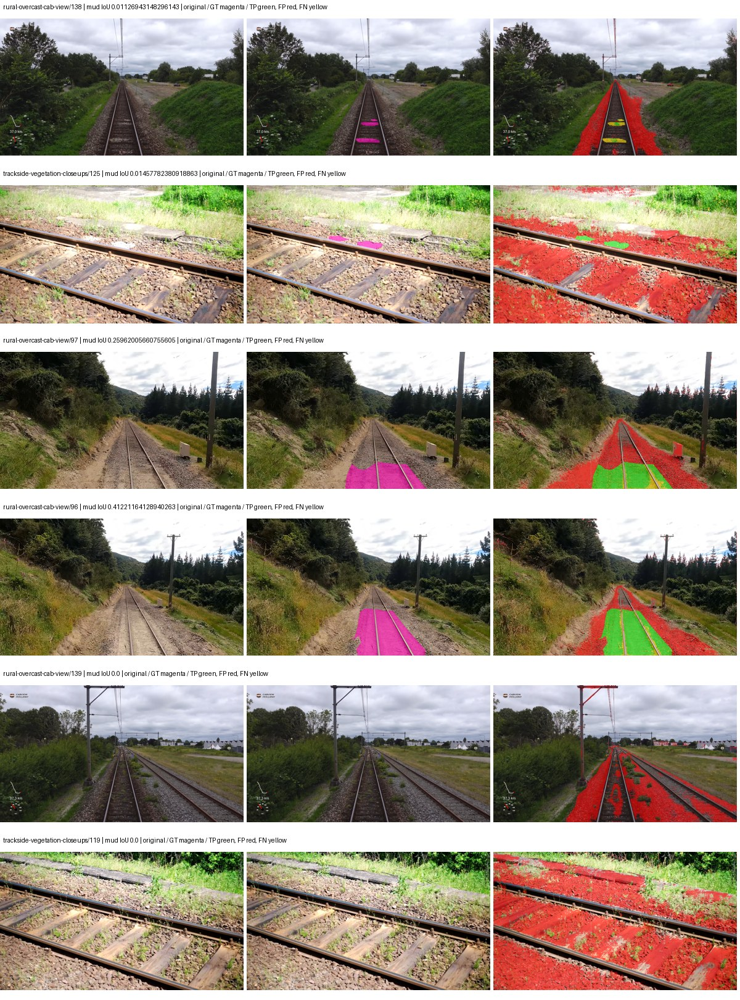
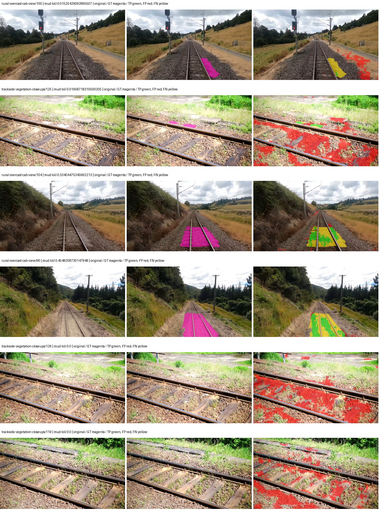
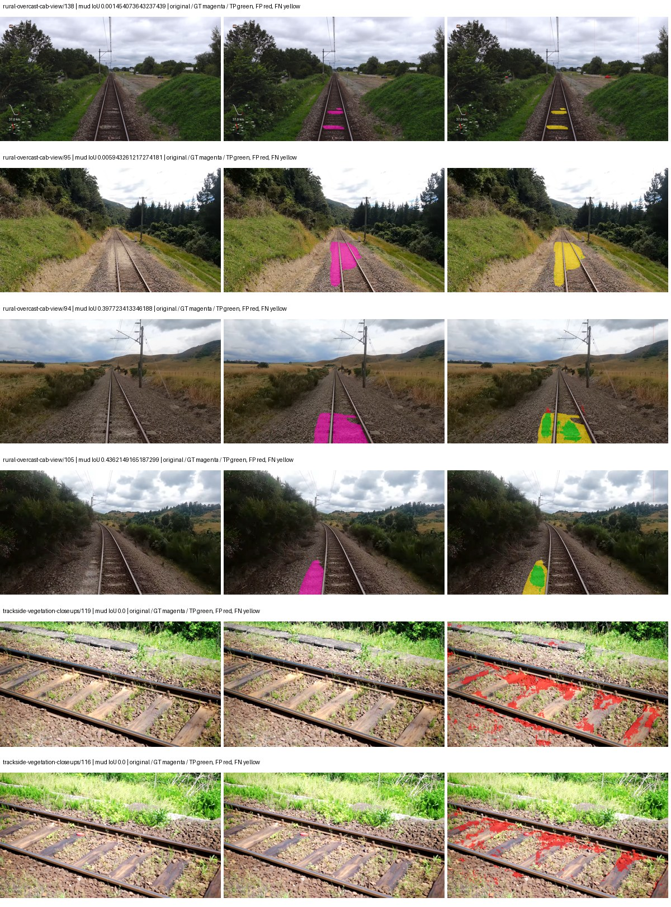
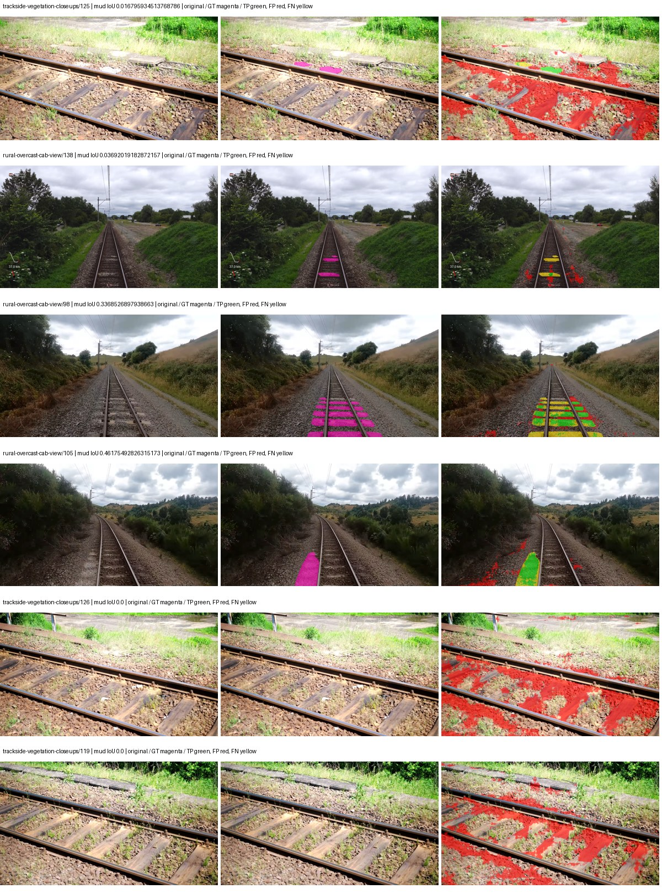

# smp_linknet_mobilenet_v2 — paul-test-rtis_v2

[RTIS comparison](../../README.md) · [Full model records](record.json)

Primary selection and early stopping: **mud-pumping validation IoU**. A job is complete only after full statistics and isolated profiling are verified.

| Model | Initialization path | Seed | Status | Steps | Best step | Mud IoU (%) | Mud precision (%) | Mud recall (%) | Final mud IoU (trainer val, %) | mIoU (%) | Fixed GT-class mIoU (%) |
| --- | --- | --- | --- | --- | --- | --- | --- | --- | --- | --- | --- |
| smp_linknet_mobilenet_v2 | rtis_only | 0 | completed | 1784 | 509 | 5.43 | 5.52 | 77.32 | 2.74 | 13.22 | 13.22 |
| smp_linknet_mobilenet_v2 | cityscapes_to_rtis | 0 | completed | 2294 | 1019 | 7.74 | 9.50 | 29.54 | 2.23 | 18.44 | 18.44 |
| smp_linknet_mobilenet_v2 | railsem19_to_rtis | 0 | completed | 2549 | 1274 | 9.38 | 15.71 | 18.89 | 6.86 | 24.22 | 25.57 |
| smp_linknet_mobilenet_v2 | cityscapes_to_railsem19_to_rtis | 0 | completed | 2294 | 1019 | 7.63 | 9.33 | 29.47 | 7.61 | 22.61 | 23.87 |

Training: 205 images. Validation: 37 images. Test: 50 held out. Seeds: [0]. Seed variation measures optimization variability, not independent-recording uncertainty. Historical source checkpoints stay fixed across adaptation seeds.

Training code: `066afb2626398b7be59d4d19f5a0e4644fd59adc`. Split SHA-256: `18a84c0163a65ded46508bcc904c374e5f33ad8a09b8879e3c8add606e86aa9f`.

## rtis_only — seed 0

Status: **completed**. Started: 2026-09-10T02:19:12.320655+00:00. Finished: 2026-09-10T02:39:51.141254+00:00.

Recipe pretrained initializer: `{"arch": "smp", "backbone_path": null, "batch_norm_momentum": null, "checkpoint": null, "classifier_path": null, "drop_path": null, "encoder_name": "mobilenet_v2", "encoder_weights": "imagenet", "head": "unified_head", "head_paths": [], "inactive_parameter_paths": [], "local_files_only": false, "lora_alpha": 32, "lora_dropout": 0.05, "lora_r": 16, "lora_targets": [], "native": null, "revision": null, "smp_arch": "Linknet", "subfolder": null, "trust_remote_code": false, "tuning": "full"}`.

`rtis_only` uses the recipe initializer, which may include pretrained segmentation components. Transfer paths load the exact historical source checkpoint below and reset the classifier; they do not reset all query/decoder features.

Source checkpoint: `Recipe pretrained initialization`.

Config SHA-256: `eafeda2549e5740697a85028ba23b847ae478b7c5aa95aaa02dae04699cf18a8`. Weights used for validation: `raw`.

### Mud-pumping and aggregate quality

| Metric | Selected checkpoint | Final training validation |
| --- | --- | --- |
| Mud IoU | 5.43 | 2.74 |
| Mud precision | 5.52 | 2.95 |
| Mud recall | 77.32 | 27.34 |
| Mud Dice/F1 | 10.30 | 5.33 |
| mIoU | 13.22 | 17.73 |
| Mean accuracy | 19.99 | 21.74 |
| Mean precision | 18.15 | 23.30 |
| Mean Dice | 16.27 | 21.10 |
| Mean specificity | 97.99 | 98.40 |
| Pixel accuracy | 66.07 | 73.80 |
| Frequency-weighted IoU | 55.43 | 64.25 |
| Fixed GT-present class mIoU | 13.22 | 17.73 |
| Boundary F1 | 13.10 | 15.42 |

The selected checkpoint has independent evaluation evidence. Final values are the trainer's final validation record, not a new independent evaluation. mIoU averages classes with nonzero union, so false positives on absent classes can change its denominator. The fixed GT-class mean is supplementary and excludes absent classes; their false positives remain in the confusion matrix.

### Resource usage and timing

| Measurement | Value |
| --- | --- |
| Peak training VRAM, retained training invocation (GiB) | 8.04 |
| Peak evaluation VRAM (GiB) | 6.12 |
| Retained training invocation wall time (seconds) | 1112.91 |
| Retained training invocation GPU-hours (one GPU) | 0.31 |
| Evaluation wall time (seconds) | 9.73 |
| Full evaluation pipeline images/second | 3.80 |
| Best full-state checkpoint (MiB) | 66.65 |
| Final full-state checkpoint (MiB) | 66.64 |
| Verified periodic checkpoints removed (GiB) | 0.20 |

VRAM uses the recorded allocator high-water mark; it is not total device usage including CUDA context. Resumed jobs' retained training invocation times and peaks are **not whole-campaign totals**. Earlier invocation resource records are not reconstructed here. Evaluation throughput includes loader, sliding-window inference and metrics; it is not model-only latency/FPS. Missing measurements are shown as —, never inferred from another dataset's run.

### Standardized inference performance

Dedicated model-only profiling waits for an idle worker-locked L40S: BF16, batch 1, 1024x1024, 20 warmup and 100 CUDA-event-timed public forwards. It excludes loading, preprocessing, tiling and metrics.

| Status | Parameters | Weight MiB | FPS | p50 ms | p95 ms | Peak reserved GiB |
| --- | --- | --- | --- | --- | --- | --- |
| complete | 4320519 | 16.48 | 181.17 | 5.50 | 5.89 | 0.32 |

```json
{
  "schema_version": 1,
  "model_id": "smp_linknet_mobilenet_v2",
  "measured_at": "2026-09-10T02:39:49+00:00",
  "status": "complete",
  "benchmark_scope": "rtis_selected_checkpoint_model_only",
  "applies_to": [
    "smp_linknet_mobilenet_v2--rtis_only--seed-0"
  ],
  "source": {
    "campaign_git_sha": "066afb2626398b7be59d4d19f5a0e4644fd59adc",
    "git_dirty": false,
    "config_hash": "06652c6ea313",
    "resolved_config": "/data/izadia1/projects/segmentary-runs/paul-test-rtis_v2/seed0-20260909/configs/smp_linknet_mobilenet_v2--rtis_only--seed-0.yaml",
    "config_sha256": "eafeda2549e5740697a85028ba23b847ae478b7c5aa95aaa02dae04699cf18a8",
    "checkpoint_sha256": "b4ce3b58c82907699b93d30692864b5592f12158cb2f29fad9d42e69aff1c02f",
    "checkpoint_global_step": 509,
    "checkpoint_bytes": 69890354,
    "checkpoint_kind": "resume checkpoint with optimizer and EMA state",
    "weights": "raw",
    "measured_checkpoint_job_id": "smp_linknet_mobilenet_v2--rtis_only--seed-0",
    "result_sha256": "412522114effb87556d22e58a994f075a3fea8c3294eb03730353f4074802179",
    "result_git_sha": "066afb2626398b7be59d4d19f5a0e4644fd59adc",
    "result_stage": "eval:paul-test-rtis:val",
    "result_seed": 0
  },
  "hardware": {
    "gpu_name": "NVIDIA L40S",
    "gpu_uuid": "GPU-1c9b612f-e0b5-fbbc-150f-8c2ef13453c9",
    "logical_device": "cuda:0",
    "physical_visibility_token": "5",
    "compute_capability": [
      8,
      9
    ],
    "total_memory_bytes": 47677177856
  },
  "model": {
    "parameter_count": 4320519,
    "trainable_parameter_count": 4320519,
    "resident_parameter_bytes": 17282076,
    "parameter_dtype_counts": {
      "float32": 4320519
    }
  },
  "contract": {
    "backend": "pytorch",
    "precision": "bf16_autocast",
    "batch_size": 1,
    "input_shape_nchw": [
      1,
      3,
      1024,
      1024
    ],
    "warmup_iterations": 20,
    "measured_iterations": 100,
    "timing": "per-forward CUDA events with end-event synchronization",
    "includes_preprocessing": false,
    "includes_data_loader": false,
    "includes_sliding_window": false,
    "input_resident_on_gpu": true,
    "model_only": true,
    "entrypoint": "public model(image) dense-logits forward"
  },
  "measurements": {
    "latency": {
      "p50_ms": 5.499392032623291,
      "p95_ms": 5.888255786895752,
      "mean_ms": 5.519545278549194,
      "minimum_ms": 5.343232154846191,
      "maximum_ms": 6.18393611907959,
      "fps": 181.17434490234834,
      "raw_ms": [
        5.705728054046631,
        5.398528099060059,
        5.350399971008301,
        5.853184223175049,
        5.404672145843506,
        5.4527997970581055,
        5.384191989898682,
        5.359615802764893,
        5.346303939819336,
        5.519360065460205,
        5.859327793121338,
        5.687295913696289,
        5.370880126953125,
        5.348351955413818,
        5.384191989898682,
        5.393407821655273,
        5.365824222564697,
        5.397503852844238,
        5.472256183624268,
        5.819392204284668,
        5.634047985076904,
        5.386240005493164,
        5.578752040863037,
        5.652480125427246,
        5.541888236999512,
        5.586944103240967,
        5.524511814117432,
        5.497856140136719,
        5.500927925109863,
        5.393407821655273,
        5.8869757652282715,
        5.518335819244385,
        5.720064163208008,
        5.576704025268555,
        5.573631763458252,
        5.6248321533203125,
        5.563392162322998,
        5.592063903808594,
        5.571584224700928,
        5.552127838134766,
        5.543935775756836,
        5.547008037567139,
        5.5859198570251465,
        5.549056053161621,
        5.550079822540283,
        5.533664226531982,
        5.586944103240967,
        5.504000186920166,
        5.750783920288086,
        5.528575897216797,
        5.540863990783691,
        5.552127838134766,
        5.688320159912109,
        5.516287803649902,
        5.594111919403076,
        6.001664161682129,
        5.350399971008301,
        5.360640048980713,
        5.3585920333862305,
        5.36575984954834,
        5.382143974304199,
        5.575679779052734,
        5.72108793258667,
        5.361663818359375,
        5.625855922698975,
        5.451776027679443,
        5.725183963775635,
        5.378047943115234,
        5.367807865142822,
        5.369855880737305,
        5.363711833953857,
        5.351424217224121,
        5.355519771575928,
        5.364736080169678,
        5.3882880210876465,
        5.3534722328186035,
        5.37497615814209,
        5.386240005493164,
        5.343232154846191,
        5.4036478996276855,
        5.352447986602783,
        5.352447986602783,
        6.18393611907959,
        5.912576198577881,
        5.405695915222168,
        5.764095783233643,
        5.446688175201416,
        5.364736080169678,
        5.35756778717041,
        5.385216236114502,
        5.345280170440674,
        5.389311790466309,
        5.582848072052002,
        6.025216102600098,
        5.9402241706848145,
        5.3882880210876465,
        5.361663818359375,
        5.385216236114502,
        5.3585920333862305,
        5.649407863616943
      ],
      "percentile_method": "numpy linear interpolation"
    },
    "peak_reserved_bytes": 339738624,
    "memory_kind": "pytorch_cuda_allocator_peak_reserved_excluding_context",
    "benchmark_wall_clock_s": 12.94771208241582
  },
  "started_at": "2026-09-10T02:39:36+00:00",
  "finished_at": "2026-09-10T02:39:49+00:00",
  "environment": {
    "hostname": "hdrfs-app-001",
    "python": "3.11.15",
    "platform": "Linux-5.15.0-139-generic-x86_64-with-glibc2.35",
    "torch": "2.11.0+cu128",
    "torch_cuda": "12.8",
    "cudnn": 91900,
    "driver_version": "570.133.20",
    "cuda_available": true,
    "gpu_count": 1,
    "gpu_names": [
      "NVIDIA L40S"
    ],
    "cuda_visible_devices": "5",
    "packages": {
      "segmentary": "0.1.0",
      "torch": "2.11.0+cu128",
      "torchvision": "0.26.0+cu128",
      "transformers": "5.15.0",
      "timm": "1.0.28",
      "segmentation-models-pytorch": "0.5.0",
      "albumentations": "2.0.8",
      "lightning": "2.6.5",
      "numpy": "2.4.4"
    }
  }
}
```

### Per-class validation results

| Class | GT pixels | IoU (%) | Precision (%) | Recall (%) | Dice (%) | Boundary F1 (%) |
| --- | --- | --- | --- | --- | --- | --- |
| car | 29664 | 0.00 | 0.00 | 0.00 | 0.00 | 0.00 |
| construction | 311585 | 0.00 | 0.00 | 0.00 | 0.00 | 0.00 |
| fence | 265137 | 0.00 | 0.00 | 0.00 | 0.00 | 0.00 |
| mud-pumping | 1226250 | 5.43 | 5.52 | 77.32 | 10.30 | 12.64 |
| on-rails | 0 | — | — | — | — | — |
| person | 0 | — | — | — | — | — |
| pole | 628038 | 0.00 | 0.00 | 0.00 | 0.00 | 0.00 |
| rail-embedded | 16799 | 0.00 | 0.00 | 0.00 | 0.00 | 0.00 |
| rail-raised | 2969797 | 51.80 | 62.48 | 75.19 | 68.25 | 75.44 |
| rail-track | 6323197 | 7.60 | 43.86 | 8.42 | 14.13 | 49.33 |
| road | 1048831 | 0.00 | 0.00 | 0.00 | 0.00 | 0.00 |
| sidewalk | 1297367 | 0.00 | 0.00 | 0.00 | 0.00 | 0.00 |
| sky | 19121606 | 84.37 | 91.10 | 91.94 | 91.52 | 32.82 |
| standing-water | 95802 | 0.00 | 0.00 | 0.00 | 0.00 | 0.00 |
| terrain | 39239306 | 76.18 | 81.72 | 91.83 | 86.48 | 26.68 |
| trackbed | 10643081 | 12.52 | 41.98 | 15.14 | 22.26 | 38.98 |
| traffic-light | 19510 | 0.00 | 0.00 | 0.00 | 0.00 | 0.00 |
| traffic-sign | 13285 | 0.00 | 0.00 | 0.00 | 0.00 | 0.00 |
| tram-track | 56179 | 0.00 | 0.00 | 0.00 | 0.00 | 0.00 |
| truck | 0 | — | — | — | — | — |
| vegetation-overgrowth | 5901821 | 0.00 | 0.00 | 0.00 | 0.00 | 0.00 |

### Full-run accounting

| Measurement | Value |
| --- | --- |
| Full GPU-reserved wall seconds, all recorded worker attempts | 1238.83 |
| Full reserved GPU-hours | 0.34 |
| Whole-run timing complete | True |

| Phase | Wall seconds including failed attempts |
| --- | --- |
| training | 1119.31 |
| diagnostics | 82.96 |
| performance | 19.52 |

GPU-reserved time includes model loading, training, validation, collection, profiling, checkpoint I/O and orchestration while the worker owns one GPU. It is not GPU kernel-active time. Phase timings and sampled device memory/power/utilization are retained separately; sampled device memory is not the allocator high-water mark.

### Train/validation and raw/EMA diagnostics

| Checkpoint / weights / split | Images | Mud IoU (%) | Mud precision (%) | Mud recall (%) |
| --- | --- | --- | --- | --- |
| best-auto-train / raw | 205 | 40.95 | 43.40 | 87.87 |
| best-auto-val / raw | 37 | 5.43 | 5.52 | 77.32 |
| best-alternate-val / ema | 37 | 5.90 | 5.97 | 82.53 |
| final-auto-val / raw | 37 | 2.74 | 2.95 | 27.35 |

Train uses the evaluation transform without augmentation. Compare mud train/validation metrics for the same selected weights. Alternate EMA on running-stat BatchNorm is explicitly uncalibrated and is diagnostic only. Score-threshold curves use uncalibrated normalized scores and are pixel-level diagnostics, not event detection rates or a selected deployment operating point.

### Downloadable evidence

- best-auto-train: [per-image.csv](rtis_only--seed-0/best-auto-train/per-image.csv) · [per-image-confusion.json.gz](rtis_only--seed-0/best-auto-train/per-image-confusion.json.gz) · [groups.json](rtis_only--seed-0/best-auto-train/groups.json) · [mud-score-curves.json](rtis_only--seed-0/best-auto-train/mud-score-curves.json)
- best-auto-val: [per-image.csv](rtis_only--seed-0/best-auto-val/per-image.csv) · [per-image-confusion.json.gz](rtis_only--seed-0/best-auto-val/per-image-confusion.json.gz) · [groups.json](rtis_only--seed-0/best-auto-val/groups.json) · [mud-score-curves.json](rtis_only--seed-0/best-auto-val/mud-score-curves.json) · [examples.jpg](rtis_only--seed-0/best-auto-val/examples.jpg)
- best-alternate-val: [per-image.csv](rtis_only--seed-0/best-alternate-val/per-image.csv) · [per-image-confusion.json.gz](rtis_only--seed-0/best-alternate-val/per-image-confusion.json.gz) · [groups.json](rtis_only--seed-0/best-alternate-val/groups.json) · [mud-score-curves.json](rtis_only--seed-0/best-alternate-val/mud-score-curves.json)
- final-auto-val: [per-image.csv](rtis_only--seed-0/final-auto-val/per-image.csv) · [per-image-confusion.json.gz](rtis_only--seed-0/final-auto-val/per-image-confusion.json.gz) · [groups.json](rtis_only--seed-0/final-auto-val/groups.json) · [mud-score-curves.json](rtis_only--seed-0/final-auto-val/mud-score-curves.json)
- resources: [telemetry.csv](rtis_only--seed-0/resources/telemetry.csv)



Examples are two lowest and two highest mud-IoU positive images, plus up to two negative images with the most false-positive mud pixels. They are targeted diagnostic examples, not random samples. Green: true positive; red: false positive; yellow: false negative. Full predictions remain on HDRFS.

### Validation tracking

| Logged step | Overall mIoU (%) | Mud IoU (%) |
| --- | --- | --- |
| 254 | 7.43 | 1.43 |
| 509 | 13.22 | 5.43 |
| 764 | 13.43 | 5.15 |
| 1019 | 13.60 | 5.34 |
| 1274 | 16.51 | 3.60 |
| 1529 | 15.25 | 5.09 |
| 1784 | 17.73 | 2.74 |

All retained scalar curves, including training loss and per-class IoU, are in record.json. Observed best mud on a curve is not necessarily a retained checkpoint: the pilot saved its selection-metric-best and final checkpoints. Step logging and checkpoint global_step may differ by one.

### Stopping and checkpoint provenance

```json
{
  "stopping": {
    "actual_steps": 1784,
    "maximum_steps": 4000,
    "min_delta": 0.001,
    "monitor": "val_iou/mud-pumping",
    "patience": 5,
    "reason": "validation_plateau"
  },
  "checkpoints": {
    "best": {
      "path": "/data/izadia1/projects/segmentary-runs/paul-test-rtis_v2/seed0-20260909/future-runs/smp_linknet_mobilenet_v2--rtis_only--seed-0_seed0/rtis/best.ckpt",
      "sha256": "b4ce3b58c82907699b93d30692864b5592f12158cb2f29fad9d42e69aff1c02f",
      "global_step": 509,
      "bytes": 69890354
    },
    "final": {
      "path": "/data/izadia1/projects/segmentary-runs/paul-test-rtis_v2/seed0-20260909/future-runs/smp_linknet_mobilenet_v2--rtis_only--seed-0_seed0/rtis/last.ckpt",
      "sha256": "a81b55b1242f711c499a7d2cc04ee75cdccdde2d262e5401f1b2ec5fd49255d3",
      "global_step": 1784,
      "bytes": 69877106
    }
  },
  "cleanup_error": null
}
```

### Resolved training, initialization and evaluation settings

The optimizer block is the base configuration. Stage LR scales are applied at runtime, and stage warmup is capped at min(base warmup, floor(stage budget / 10), stage budget - 1): 400 steps for this 4,000-step pilot. Model-internal native input grids may differ from augmentation crops (EoMT uses its 640 grid).

```json
{
  "name": "smp_linknet_mobilenet_v2--rtis_only--seed-0",
  "model": {
    "arch": "smp",
    "checkpoint": null,
    "tuning": "full",
    "head": "unified_head",
    "lora_r": 16,
    "lora_alpha": 32,
    "lora_dropout": 0.05,
    "lora_targets": [],
    "drop_path": null,
    "revision": null,
    "subfolder": null,
    "local_files_only": false,
    "trust_remote_code": false,
    "backbone_path": null,
    "head_paths": [],
    "classifier_path": null,
    "inactive_parameter_paths": [],
    "smp_arch": "Linknet",
    "encoder_name": "mobilenet_v2",
    "encoder_weights": "imagenet",
    "native": null,
    "batch_norm_momentum": null
  },
  "space": "paul-test-rtis",
  "taxonomy_root": "/data/izadia1/projects/segmentary-rtis-fullstats-066afb2/taxonomy",
  "output_root": "/data/izadia1/projects/segmentary-runs/paul-test-rtis_v2/seed0-20260909/future-runs",
  "optim": {
    "backbone_lr": 0.0001,
    "head_lr_mult": 10.0,
    "weight_decay": 0.05,
    "llrd": 1.0,
    "warmup_iters": 1500,
    "warmup_ratio": 1e-06,
    "poly_power": 0.9,
    "min_lr_ratio": 0.0,
    "betas": [
      0.9,
      0.999
    ],
    "grad_clip": 1.0
  },
  "train": {
    "iters": 4000,
    "batch_size": 2,
    "accum": 8,
    "num_workers": 2,
    "precision": "bf16-mixed",
    "ema_decay": 0.9998,
    "val_every": 250,
    "ckpt_every": 500,
    "selection_metric": "val_iou/mud-pumping",
    "early_stopping_patience": 5,
    "early_stopping_min_delta": 0.001,
    "seed": 0,
    "devices": 1
  },
  "eval": {
    "sliding_window": true,
    "window": [
      1024,
      1024
    ],
    "stride": [
      768,
      768
    ],
    "batch_size": 1,
    "num_workers": 2,
    "tta_scales": [],
    "tta_flip": false,
    "threshold": 0.5,
    "boundary_tolerance_frac": 0.0075,
    "save_confusion": true
  },
  "loss": {
    "task": "multiclass",
    "activation": "auto",
    "terms": [],
    "aux": "none",
    "aux_weight": 0.0,
    "ce_weight": 1.0,
    "label_smoothing": 0.0,
    "class_weights": null,
    "query": null
  },
  "aug": {
    "crop": [
      1024,
      1024
    ],
    "scale_min": 0.5,
    "scale_max": 2.0,
    "hflip_p": 0.5,
    "color_jitter_p": 0.5,
    "brightness": 0.25,
    "contrast": 0.25,
    "saturation": 0.25,
    "hue": 0.05
  },
  "stages": [
    {
      "name": "rtis",
      "data": [
        {
          "name": "paul-test-rtis",
          "root": "/data/izadia1/datasets/paul-test-rtis_v2",
          "variant": null,
          "split_file": "splits.json",
          "train_split": "train",
          "val_split": "val",
          "limit": null,
          "loader": "folder",
          "mapping": "paul-test-rtis",
          "loader_options": {
            "require_groups": true
          }
        }
      ],
      "iters": null,
      "lr_scale": 1.0,
      "head_group_lr_scale": 1.0,
      "init_from": "pretrained",
      "reset_head": false,
      "freeze": null,
      "sample_weights": null
    }
  ]
}
```

### Hardware and software provenance

```json
{
  "training": {
    "cuda_available": true,
    "cuda_visible_devices": "5",
    "cudnn": 91900,
    "driver_version": "570.133.20",
    "gpu_count": 1,
    "gpu_names": [
      "NVIDIA L40S"
    ],
    "hostname": "hdrfs-app-001",
    "input_normalization": {
      "channel_order": "rgb",
      "mean": [
        0.485,
        0.456,
        0.406
      ],
      "source": "smp_encoder_settings",
      "std": [
        0.229,
        0.224,
        0.225
      ]
    },
    "model_origins": [
      {
        "hf_commit": null,
        "hf_name_or_path": null,
        "module": "model",
        "timm_pretrained": {}
      }
    ],
    "model_parameter_count": 4320519,
    "packages": {
      "albumentations": "2.0.8",
      "lightning": "2.6.5",
      "numpy": "2.4.4",
      "segmentary": "0.1.0",
      "segmentation-models-pytorch": "0.5.0",
      "timm": "1.0.28",
      "torch": "2.11.0+cu128",
      "torchvision": "0.26.0+cu128",
      "transformers": "5.15.0"
    },
    "platform": "Linux-5.15.0-139-generic-x86_64-with-glibc2.35",
    "python": "3.11.15",
    "torch": "2.11.0+cu128",
    "torch_cuda": "12.8",
    "trainable_parameter_count": 4320519,
    "training_stop": {
      "actual_steps": 1784,
      "maximum_steps": 4000,
      "min_delta": 0.001,
      "monitor": "val_iou/mud-pumping",
      "patience": 5,
      "reason": "validation_plateau"
    },
    "validation_weights": "raw"
  },
  "evaluation": {
    "cuda_available": true,
    "cuda_visible_devices": "5",
    "cudnn": 91900,
    "driver_version": "570.133.20",
    "gpu_count": 1,
    "gpu_names": [
      "NVIDIA L40S"
    ],
    "hostname": "hdrfs-app-001",
    "input_normalization": {
      "channel_order": "rgb",
      "mean": [
        0.485,
        0.456,
        0.406
      ],
      "source": "smp_encoder_settings",
      "std": [
        0.229,
        0.224,
        0.225
      ]
    },
    "packages": {
      "albumentations": "2.0.8",
      "lightning": "2.6.5",
      "numpy": "2.4.4",
      "segmentary": "0.1.0",
      "segmentation-models-pytorch": "0.5.0",
      "timm": "1.0.28",
      "torch": "2.11.0+cu128",
      "torchvision": "0.26.0+cu128",
      "transformers": "5.15.0"
    },
    "platform": "Linux-5.15.0-139-generic-x86_64-with-glibc2.35",
    "python": "3.11.15",
    "torch": "2.11.0+cu128",
    "torch_cuda": "12.8"
  }
}
```

## cityscapes_to_rtis — seed 0

Status: **completed**. Started: 2026-09-10T02:24:00.625322+00:00. Finished: 2026-09-10T02:49:49.060711+00:00.

Recipe pretrained initializer: `{"arch": "smp", "backbone_path": null, "batch_norm_momentum": null, "checkpoint": null, "classifier_path": null, "drop_path": null, "encoder_name": "mobilenet_v2", "encoder_weights": "imagenet", "head": "unified_head", "head_paths": [], "inactive_parameter_paths": [], "local_files_only": false, "lora_alpha": 32, "lora_dropout": 0.05, "lora_r": 16, "lora_targets": [], "native": null, "revision": null, "smp_arch": "Linknet", "subfolder": null, "trust_remote_code": false, "tuning": "full"}`.

`rtis_only` uses the recipe initializer, which may include pretrained segmentation components. Transfer paths load the exact historical source checkpoint below and reset the classifier; they do not reset all query/decoder features.

Source checkpoint: `{'name': 'smp_linknet_mobilenet_v2--cityscapes--seed-0', 'model': 'smp_linknet_mobilenet_v2', 'protocol': 'cityscapes', 'config': '/data/izadia1/projects/segmentary-runs/all-model-city-rail-seed0-rail20-b9eb3e1/jobs/smp_linknet_mobilenet_v2--cityscapes--seed-0/attempt-001/resolved-config.yaml', 'checkpoint': '/data/izadia1/projects/segmentary-runs/all-model-city-rail-seed0-rail20-b9eb3e1/jobs/smp_linknet_mobilenet_v2--cityscapes--seed-0/attempt-001/train/smp_linknet_mobilenet_v2--cityscapes_seed0/cityscapes/last.ckpt', 'recorded_sha256': 'e2ada95ae11d248b4c71f1670b6ce01e63a2e8d93ede09db6b859f72121d3db3', 'exists': True}`.

Config SHA-256: `ee9afc5835df665075b00c0dac798f4d4269f116c21e65aacf7abdb764482c0c`. Weights used for validation: `raw`.

### Mud-pumping and aggregate quality

| Metric | Selected checkpoint | Final training validation |
| --- | --- | --- |
| Mud IoU | 7.74 | 2.23 |
| Mud precision | 9.50 | 4.78 |
| Mud recall | 29.54 | 4.03 |
| Mud Dice/F1 | 14.38 | 4.37 |
| mIoU | 18.44 | 20.87 |
| Mean accuracy | 25.14 | 30.18 |
| Mean precision | 29.20 | 28.94 |
| Mean Dice | 23.18 | 26.47 |
| Mean specificity | 98.28 | 98.31 |
| Pixel accuracy | 75.22 | 73.00 |
| Frequency-weighted IoU | 61.96 | 61.69 |
| Fixed GT-present class mIoU | 18.44 | 22.03 |
| Boundary F1 | 18.60 | 19.83 |

The selected checkpoint has independent evaluation evidence. Final values are the trainer's final validation record, not a new independent evaluation. mIoU averages classes with nonzero union, so false positives on absent classes can change its denominator. The fixed GT-class mean is supplementary and excludes absent classes; their false positives remain in the confusion matrix.

### Resource usage and timing

| Measurement | Value |
| --- | --- |
| Peak training VRAM, retained training invocation (GiB) | 8.04 |
| Peak evaluation VRAM (GiB) | 6.12 |
| Retained training invocation wall time (seconds) | 1431.94 |
| Retained training invocation GPU-hours (one GPU) | 0.40 |
| Evaluation wall time (seconds) | 10.02 |
| Full evaluation pipeline images/second | 3.69 |
| Best full-state checkpoint (MiB) | 66.65 |
| Final full-state checkpoint (MiB) | 66.64 |
| Verified periodic checkpoints removed (GiB) | 0.26 |

VRAM uses the recorded allocator high-water mark; it is not total device usage including CUDA context. Resumed jobs' retained training invocation times and peaks are **not whole-campaign totals**. Earlier invocation resource records are not reconstructed here. Evaluation throughput includes loader, sliding-window inference and metrics; it is not model-only latency/FPS. Missing measurements are shown as —, never inferred from another dataset's run.

### Standardized inference performance

Dedicated model-only profiling waits for an idle worker-locked L40S: BF16, batch 1, 1024x1024, 20 warmup and 100 CUDA-event-timed public forwards. It excludes loading, preprocessing, tiling and metrics.

| Status | Parameters | Weight MiB | FPS | p50 ms | p95 ms | Peak reserved GiB |
| --- | --- | --- | --- | --- | --- | --- |
| complete | 4320519 | 16.48 | 168.25 | 5.76 | 7.12 | 0.32 |

```json
{
  "schema_version": 1,
  "model_id": "smp_linknet_mobilenet_v2",
  "measured_at": "2026-09-10T02:49:47+00:00",
  "status": "complete",
  "benchmark_scope": "rtis_selected_checkpoint_model_only",
  "applies_to": [
    "smp_linknet_mobilenet_v2--cityscapes_to_rtis--seed-0"
  ],
  "source": {
    "campaign_git_sha": "066afb2626398b7be59d4d19f5a0e4644fd59adc",
    "git_dirty": false,
    "config_hash": "dd12973505f5",
    "resolved_config": "/data/izadia1/projects/segmentary-runs/paul-test-rtis_v2/seed0-20260909/configs/smp_linknet_mobilenet_v2--cityscapes_to_rtis--seed-0.yaml",
    "config_sha256": "ee9afc5835df665075b00c0dac798f4d4269f116c21e65aacf7abdb764482c0c",
    "checkpoint_sha256": "073ca95c6e5aa6be3a594220a6beba5d2235adcae59232ec542d6874b9c1c3d5",
    "checkpoint_global_step": 1019,
    "checkpoint_bytes": 69890418,
    "checkpoint_kind": "resume checkpoint with optimizer and EMA state",
    "weights": "raw",
    "measured_checkpoint_job_id": "smp_linknet_mobilenet_v2--cityscapes_to_rtis--seed-0",
    "result_sha256": "63cd4f3b76119b5a235f73b2d596dae76d4faa4cb5f6ef98dcb2ff0ad85592e3",
    "result_git_sha": "066afb2626398b7be59d4d19f5a0e4644fd59adc",
    "result_stage": "eval:paul-test-rtis:val",
    "result_seed": 0
  },
  "hardware": {
    "gpu_name": "NVIDIA L40S",
    "gpu_uuid": "GPU-fc5dde96-210d-0afa-ac74-7f88477d622b",
    "logical_device": "cuda:0",
    "physical_visibility_token": "4",
    "compute_capability": [
      8,
      9
    ],
    "total_memory_bytes": 47677177856
  },
  "model": {
    "parameter_count": 4320519,
    "trainable_parameter_count": 4320519,
    "resident_parameter_bytes": 17282076,
    "parameter_dtype_counts": {
      "float32": 4320519
    }
  },
  "contract": {
    "backend": "pytorch",
    "precision": "bf16_autocast",
    "batch_size": 1,
    "input_shape_nchw": [
      1,
      3,
      1024,
      1024
    ],
    "warmup_iterations": 20,
    "measured_iterations": 100,
    "timing": "per-forward CUDA events with end-event synchronization",
    "includes_preprocessing": false,
    "includes_data_loader": false,
    "includes_sliding_window": false,
    "input_resident_on_gpu": true,
    "model_only": true,
    "entrypoint": "public model(image) dense-logits forward"
  },
  "measurements": {
    "latency": {
      "p50_ms": 5.7620320320129395,
      "p95_ms": 7.12366063594818,
      "mean_ms": 5.943404145240784,
      "minimum_ms": 5.460991859436035,
      "maximum_ms": 8.38758373260498,
      "fps": 168.2537440770801,
      "raw_ms": [
        5.730303764343262,
        5.637119770050049,
        5.82144021987915,
        6.401023864746094,
        5.606400012969971,
        5.690368175506592,
        5.7047038078308105,
        5.534656047821045,
        5.952511787414551,
        6.213632106781006,
        6.491136074066162,
        6.037504196166992,
        5.9431681632995605,
        5.798912048339844,
        5.824512004852295,
        6.06822395324707,
        5.602303981781006,
        5.548960208892822,
        6.509568214416504,
        6.359039783477783,
        6.198272228240967,
        5.947391986846924,
        6.015999794006348,
        6.43174409866333,
        5.981184005737305,
        5.935103893280029,
        5.752831935882568,
        5.6912641525268555,
        5.959680080413818,
        5.746687889099121,
        5.660672187805176,
        5.584896087646484,
        6.797311782836914,
        6.429696083068848,
        6.276224136352539,
        6.1972479820251465,
        6.347775936126709,
        6.055935859680176,
        5.783552169799805,
        5.677055835723877,
        5.723135948181152,
        5.725183963775635,
        6.0938239097595215,
        5.697535991668701,
        5.796864032745361,
        5.9310078620910645,
        6.115327835083008,
        7.707647800445557,
        7.50489616394043,
        8.069120407104492,
        8.38758373260498,
        7.254015922546387,
        7.116799831390381,
        5.7712321281433105,
        5.685247898101807,
        5.694464206695557,
        5.6248321533203125,
        5.607423782348633,
        5.620736122131348,
        5.6328959465026855,
        5.772287845611572,
        6.268928050994873,
        6.214655876159668,
        6.116352081298828,
        5.998591899871826,
        6.209536075592041,
        5.92793607711792,
        5.924863815307617,
        5.714943885803223,
        5.600255966186523,
        5.556191921234131,
        5.497856140136719,
        5.497856140136719,
        5.460991859436035,
        5.62175989151001,
        5.541888236999512,
        5.581823825836182,
        5.563327789306641,
        5.723135948181152,
        6.157311916351318,
        5.826560020446777,
        5.625984191894531,
        6.597631931304932,
        5.592063903808594,
        6.202367782592773,
        5.513216018676758,
        5.5070719718933105,
        5.481472015380859,
        5.539775848388672,
        5.502975940704346,
        5.876736164093018,
        5.5121917724609375,
        5.4773759841918945,
        5.468160152435303,
        5.5070719718933105,
        5.494783878326416,
        5.503007888793945,
        5.460991859436035,
        5.497856140136719,
        5.496831893920898
      ],
      "percentile_method": "numpy linear interpolation"
    },
    "peak_reserved_bytes": 339738624,
    "memory_kind": "pytorch_cuda_allocator_peak_reserved_excluding_context",
    "benchmark_wall_clock_s": 13.390783451497555
  },
  "started_at": "2026-09-10T02:49:33+00:00",
  "finished_at": "2026-09-10T02:49:47+00:00",
  "environment": {
    "hostname": "hdrfs-app-001",
    "python": "3.11.15",
    "platform": "Linux-5.15.0-139-generic-x86_64-with-glibc2.35",
    "torch": "2.11.0+cu128",
    "torch_cuda": "12.8",
    "cudnn": 91900,
    "driver_version": "570.133.20",
    "cuda_available": true,
    "gpu_count": 1,
    "gpu_names": [
      "NVIDIA L40S"
    ],
    "cuda_visible_devices": "4",
    "packages": {
      "segmentary": "0.1.0",
      "torch": "2.11.0+cu128",
      "torchvision": "0.26.0+cu128",
      "transformers": "5.15.0",
      "timm": "1.0.28",
      "segmentation-models-pytorch": "0.5.0",
      "albumentations": "2.0.8",
      "lightning": "2.6.5",
      "numpy": "2.4.4"
    }
  }
}
```

### Per-class validation results

| Class | GT pixels | IoU (%) | Precision (%) | Recall (%) | Dice (%) | Boundary F1 (%) |
| --- | --- | --- | --- | --- | --- | --- |
| car | 29664 | 0.00 | 0.00 | 0.00 | 0.00 | 0.00 |
| construction | 311585 | 13.98 | 15.57 | 57.78 | 24.53 | 11.18 |
| fence | 265137 | 0.00 | 6.06 | 0.00 | 0.00 | 0.00 |
| mud-pumping | 1226250 | 7.74 | 9.50 | 29.54 | 14.38 | 12.24 |
| on-rails | 0 | — | — | — | — | — |
| person | 0 | — | — | — | — | — |
| pole | 628038 | 6.68 | 89.48 | 6.73 | 12.52 | 52.12 |
| rail-embedded | 16799 | 0.00 | 0.00 | 0.00 | 0.00 | 0.00 |
| rail-raised | 2969797 | 64.52 | 82.20 | 74.99 | 78.43 | 66.96 |
| rail-track | 6323197 | 23.22 | 49.52 | 30.42 | 37.69 | 41.61 |
| road | 1048831 | 0.00 | 0.77 | 0.00 | 0.01 | 1.74 |
| sidewalk | 1297367 | 1.42 | 27.03 | 1.48 | 2.80 | 5.07 |
| sky | 19121606 | 89.76 | 98.60 | 90.92 | 94.60 | 64.90 |
| standing-water | 95802 | 0.00 | 0.00 | 0.00 | 0.00 | 2.01 |
| terrain | 39239306 | 74.36 | 75.86 | 97.41 | 85.30 | 31.23 |
| trackbed | 10643081 | 50.27 | 70.91 | 63.32 | 66.90 | 45.67 |
| traffic-light | 19510 | 0.00 | 0.00 | 0.00 | 0.00 | 0.00 |
| traffic-sign | 13285 | 0.00 | 0.00 | 0.00 | 0.00 | 0.00 |
| tram-track | 56179 | 0.00 | 0.00 | 0.00 | 0.00 | 0.00 |
| truck | 0 | — | — | — | — | — |
| vegetation-overgrowth | 5901821 | 0.00 | 0.00 | 0.00 | 0.00 | 0.00 |

### Full-run accounting

| Measurement | Value |
| --- | --- |
| Full GPU-reserved wall seconds, all recorded worker attempts | 1548.50 |
| Full reserved GPU-hours | 0.43 |
| Whole-run timing complete | True |

| Phase | Wall seconds including failed attempts |
| --- | --- |
| training | 1439.83 |
| diagnostics | 70.66 |
| performance | 20.14 |

GPU-reserved time includes model loading, training, validation, collection, profiling, checkpoint I/O and orchestration while the worker owns one GPU. It is not GPU kernel-active time. Phase timings and sampled device memory/power/utilization are retained separately; sampled device memory is not the allocator high-water mark.

### Train/validation and raw/EMA diagnostics

| Checkpoint / weights / split | Images | Mud IoU (%) | Mud precision (%) | Mud recall (%) |
| --- | --- | --- | --- | --- |
| best-auto-train / raw | 205 | 60.92 | 79.12 | 72.59 |
| best-auto-val / raw | 37 | 7.74 | 9.50 | 29.54 |
| best-alternate-val / ema | 37 | 3.82 | 4.52 | 19.90 |
| final-auto-val / raw | 37 | 2.23 | 4.78 | 4.03 |

Train uses the evaluation transform without augmentation. Compare mud train/validation metrics for the same selected weights. Alternate EMA on running-stat BatchNorm is explicitly uncalibrated and is diagnostic only. Score-threshold curves use uncalibrated normalized scores and are pixel-level diagnostics, not event detection rates or a selected deployment operating point.

### Downloadable evidence

- best-auto-train: [per-image.csv](cityscapes_to_rtis--seed-0/best-auto-train/per-image.csv) · [per-image-confusion.json.gz](cityscapes_to_rtis--seed-0/best-auto-train/per-image-confusion.json.gz) · [groups.json](cityscapes_to_rtis--seed-0/best-auto-train/groups.json) · [mud-score-curves.json](cityscapes_to_rtis--seed-0/best-auto-train/mud-score-curves.json)
- best-auto-val: [per-image.csv](cityscapes_to_rtis--seed-0/best-auto-val/per-image.csv) · [per-image-confusion.json.gz](cityscapes_to_rtis--seed-0/best-auto-val/per-image-confusion.json.gz) · [groups.json](cityscapes_to_rtis--seed-0/best-auto-val/groups.json) · [mud-score-curves.json](cityscapes_to_rtis--seed-0/best-auto-val/mud-score-curves.json) · [examples.jpg](cityscapes_to_rtis--seed-0/best-auto-val/examples.jpg)
- best-alternate-val: [per-image.csv](cityscapes_to_rtis--seed-0/best-alternate-val/per-image.csv) · [per-image-confusion.json.gz](cityscapes_to_rtis--seed-0/best-alternate-val/per-image-confusion.json.gz) · [groups.json](cityscapes_to_rtis--seed-0/best-alternate-val/groups.json) · [mud-score-curves.json](cityscapes_to_rtis--seed-0/best-alternate-val/mud-score-curves.json)
- final-auto-val: [per-image.csv](cityscapes_to_rtis--seed-0/final-auto-val/per-image.csv) · [per-image-confusion.json.gz](cityscapes_to_rtis--seed-0/final-auto-val/per-image-confusion.json.gz) · [groups.json](cityscapes_to_rtis--seed-0/final-auto-val/groups.json) · [mud-score-curves.json](cityscapes_to_rtis--seed-0/final-auto-val/mud-score-curves.json)
- resources: [telemetry.csv](cityscapes_to_rtis--seed-0/resources/telemetry.csv)



Examples are two lowest and two highest mud-IoU positive images, plus up to two negative images with the most false-positive mud pixels. They are targeted diagnostic examples, not random samples. Green: true positive; red: false positive; yellow: false negative. Full predictions remain on HDRFS.

### Validation tracking

| Logged step | Overall mIoU (%) | Mud IoU (%) |
| --- | --- | --- |
| 254 | 14.70 | 7.14 |
| 509 | 17.47 | 2.15 |
| 764 | 18.04 | 3.93 |
| 1019 | 18.44 | 7.74 |
| 1274 | 19.92 | 3.60 |
| 1529 | 20.46 | 2.89 |
| 1784 | 19.93 | 2.28 |
| 2038 | 20.56 | 5.36 |
| 2293 | 20.87 | 2.23 |

All retained scalar curves, including training loss and per-class IoU, are in record.json. Observed best mud on a curve is not necessarily a retained checkpoint: the pilot saved its selection-metric-best and final checkpoints. Step logging and checkpoint global_step may differ by one.

### Stopping and checkpoint provenance

```json
{
  "stopping": {
    "actual_steps": 2294,
    "maximum_steps": 4000,
    "min_delta": 0.001,
    "monitor": "val_iou/mud-pumping",
    "patience": 5,
    "reason": "validation_plateau"
  },
  "checkpoints": {
    "best": {
      "path": "/data/izadia1/projects/segmentary-runs/paul-test-rtis_v2/seed0-20260909/future-runs/smp_linknet_mobilenet_v2--cityscapes_to_rtis--seed-0_seed0/rtis/best.ckpt",
      "sha256": "073ca95c6e5aa6be3a594220a6beba5d2235adcae59232ec542d6874b9c1c3d5",
      "global_step": 1019,
      "bytes": 69890418
    },
    "final": {
      "path": "/data/izadia1/projects/segmentary-runs/paul-test-rtis_v2/seed0-20260909/future-runs/smp_linknet_mobilenet_v2--cityscapes_to_rtis--seed-0_seed0/rtis/last.ckpt",
      "sha256": "6851503efdbec83b96461c943bc89fe39fc64063cbb4a3de29085b9f90efdf1f",
      "global_step": 2294,
      "bytes": 69877106
    }
  },
  "cleanup_error": null
}
```

### Resolved training, initialization and evaluation settings

The optimizer block is the base configuration. Stage LR scales are applied at runtime, and stage warmup is capped at min(base warmup, floor(stage budget / 10), stage budget - 1): 400 steps for this 4,000-step pilot. Model-internal native input grids may differ from augmentation crops (EoMT uses its 640 grid).

```json
{
  "name": "smp_linknet_mobilenet_v2--cityscapes_to_rtis--seed-0",
  "model": {
    "arch": "smp",
    "checkpoint": null,
    "tuning": "full",
    "head": "unified_head",
    "lora_r": 16,
    "lora_alpha": 32,
    "lora_dropout": 0.05,
    "lora_targets": [],
    "drop_path": null,
    "revision": null,
    "subfolder": null,
    "local_files_only": false,
    "trust_remote_code": false,
    "backbone_path": null,
    "head_paths": [],
    "classifier_path": null,
    "inactive_parameter_paths": [],
    "smp_arch": "Linknet",
    "encoder_name": "mobilenet_v2",
    "encoder_weights": "imagenet",
    "native": null,
    "batch_norm_momentum": null
  },
  "space": "paul-test-rtis",
  "taxonomy_root": "/data/izadia1/projects/segmentary-rtis-fullstats-066afb2/taxonomy",
  "output_root": "/data/izadia1/projects/segmentary-runs/paul-test-rtis_v2/seed0-20260909/future-runs",
  "optim": {
    "backbone_lr": 0.0001,
    "head_lr_mult": 10.0,
    "weight_decay": 0.05,
    "llrd": 1.0,
    "warmup_iters": 1500,
    "warmup_ratio": 1e-06,
    "poly_power": 0.9,
    "min_lr_ratio": 0.0,
    "betas": [
      0.9,
      0.999
    ],
    "grad_clip": 1.0
  },
  "train": {
    "iters": 4000,
    "batch_size": 2,
    "accum": 8,
    "num_workers": 2,
    "precision": "bf16-mixed",
    "ema_decay": 0.9998,
    "val_every": 250,
    "ckpt_every": 500,
    "selection_metric": "val_iou/mud-pumping",
    "early_stopping_patience": 5,
    "early_stopping_min_delta": 0.001,
    "seed": 0,
    "devices": 1
  },
  "eval": {
    "sliding_window": true,
    "window": [
      1024,
      1024
    ],
    "stride": [
      768,
      768
    ],
    "batch_size": 1,
    "num_workers": 2,
    "tta_scales": [],
    "tta_flip": false,
    "threshold": 0.5,
    "boundary_tolerance_frac": 0.0075,
    "save_confusion": true
  },
  "loss": {
    "task": "multiclass",
    "activation": "auto",
    "terms": [],
    "aux": "none",
    "aux_weight": 0.0,
    "ce_weight": 1.0,
    "label_smoothing": 0.0,
    "class_weights": null,
    "query": null
  },
  "aug": {
    "crop": [
      1024,
      1024
    ],
    "scale_min": 0.5,
    "scale_max": 2.0,
    "hflip_p": 0.5,
    "color_jitter_p": 0.5,
    "brightness": 0.25,
    "contrast": 0.25,
    "saturation": 0.25,
    "hue": 0.05
  },
  "stages": [
    {
      "name": "rtis",
      "data": [
        {
          "name": "paul-test-rtis",
          "root": "/data/izadia1/datasets/paul-test-rtis_v2",
          "variant": null,
          "split_file": "splits.json",
          "train_split": "train",
          "val_split": "val",
          "limit": null,
          "loader": "folder",
          "mapping": "paul-test-rtis",
          "loader_options": {
            "require_groups": true
          }
        }
      ],
      "iters": null,
      "lr_scale": 0.1,
      "head_group_lr_scale": 1.0,
      "init_from": "/data/izadia1/projects/segmentary-runs/all-model-city-rail-seed0-rail20-b9eb3e1/jobs/smp_linknet_mobilenet_v2--cityscapes--seed-0/attempt-001/train/smp_linknet_mobilenet_v2--cityscapes_seed0/cityscapes/last.ckpt",
      "reset_head": true,
      "freeze": null,
      "sample_weights": null
    }
  ]
}
```

### Hardware and software provenance

```json
{
  "training": {
    "cuda_available": true,
    "cuda_visible_devices": "4",
    "cudnn": 91900,
    "driver_version": "570.133.20",
    "gpu_count": 1,
    "gpu_names": [
      "NVIDIA L40S"
    ],
    "hostname": "hdrfs-app-001",
    "input_normalization": {
      "channel_order": "rgb",
      "mean": [
        0.485,
        0.456,
        0.406
      ],
      "source": "smp_encoder_settings",
      "std": [
        0.229,
        0.224,
        0.225
      ]
    },
    "model_origins": [
      {
        "hf_commit": null,
        "hf_name_or_path": null,
        "module": "model",
        "timm_pretrained": {}
      }
    ],
    "model_parameter_count": 4320519,
    "packages": {
      "albumentations": "2.0.8",
      "lightning": "2.6.5",
      "numpy": "2.4.4",
      "segmentary": "0.1.0",
      "segmentation-models-pytorch": "0.5.0",
      "timm": "1.0.28",
      "torch": "2.11.0+cu128",
      "torchvision": "0.26.0+cu128",
      "transformers": "5.15.0"
    },
    "platform": "Linux-5.15.0-139-generic-x86_64-with-glibc2.35",
    "python": "3.11.15",
    "torch": "2.11.0+cu128",
    "torch_cuda": "12.8",
    "trainable_parameter_count": 4320519,
    "training_stop": {
      "actual_steps": 2294,
      "maximum_steps": 4000,
      "min_delta": 0.001,
      "monitor": "val_iou/mud-pumping",
      "patience": 5,
      "reason": "validation_plateau"
    },
    "validation_weights": "raw"
  },
  "evaluation": {
    "cuda_available": true,
    "cuda_visible_devices": "4",
    "cudnn": 91900,
    "driver_version": "570.133.20",
    "gpu_count": 1,
    "gpu_names": [
      "NVIDIA L40S"
    ],
    "hostname": "hdrfs-app-001",
    "input_normalization": {
      "channel_order": "rgb",
      "mean": [
        0.485,
        0.456,
        0.406
      ],
      "source": "smp_encoder_settings",
      "std": [
        0.229,
        0.224,
        0.225
      ]
    },
    "packages": {
      "albumentations": "2.0.8",
      "lightning": "2.6.5",
      "numpy": "2.4.4",
      "segmentary": "0.1.0",
      "segmentation-models-pytorch": "0.5.0",
      "timm": "1.0.28",
      "torch": "2.11.0+cu128",
      "torchvision": "0.26.0+cu128",
      "transformers": "5.15.0"
    },
    "platform": "Linux-5.15.0-139-generic-x86_64-with-glibc2.35",
    "python": "3.11.15",
    "torch": "2.11.0+cu128",
    "torch_cuda": "12.8"
  }
}
```

## railsem19_to_rtis — seed 0

Status: **completed**. Started: 2026-09-10T02:29:49.042352+00:00. Finished: 2026-09-10T02:57:59.793951+00:00.

Recipe pretrained initializer: `{"arch": "smp", "backbone_path": null, "batch_norm_momentum": null, "checkpoint": null, "classifier_path": null, "drop_path": null, "encoder_name": "mobilenet_v2", "encoder_weights": "imagenet", "head": "unified_head", "head_paths": [], "inactive_parameter_paths": [], "local_files_only": false, "lora_alpha": 32, "lora_dropout": 0.05, "lora_r": 16, "lora_targets": [], "native": null, "revision": null, "smp_arch": "Linknet", "subfolder": null, "trust_remote_code": false, "tuning": "full"}`.

`rtis_only` uses the recipe initializer, which may include pretrained segmentation components. Transfer paths load the exact historical source checkpoint below and reset the classifier; they do not reset all query/decoder features.

Source checkpoint: `{'name': 'smp_linknet_mobilenet_v2--railsem19--seed-0', 'model': 'smp_linknet_mobilenet_v2', 'protocol': 'railsem19', 'config': '/data/izadia1/projects/segmentary-runs/all-model-city-rail-seed0-rail20-b9eb3e1/jobs/smp_linknet_mobilenet_v2--railsem19--seed-0/attempt-001/resolved-config.yaml', 'checkpoint': '/data/izadia1/projects/segmentary-runs/all-model-city-rail-seed0-rail20-b9eb3e1/jobs/smp_linknet_mobilenet_v2--railsem19--seed-0/attempt-001/train/smp_linknet_mobilenet_v2--railsem19_seed0/railsem19/last.ckpt', 'recorded_sha256': 'fccf4aa72f1f3a7bafb70eff9caef9a6554d82613783fa2a2b339ff804e30a6f', 'exists': True}`.

Config SHA-256: `63bc45040c77aef3905445af8e2cb3009efdaea6fa197eead4090109dedbbe79`. Weights used for validation: `raw`.

### Mud-pumping and aggregate quality

| Metric | Selected checkpoint | Final training validation |
| --- | --- | --- |
| Mud IoU | 9.38 | 6.86 |
| Mud precision | 15.71 | 7.86 |
| Mud recall | 18.89 | 35.05 |
| Mud Dice/F1 | 17.16 | 12.84 |
| mIoU | 24.22 | 24.75 |
| Mean accuracy | 33.38 | 34.15 |
| Mean precision | 39.65 | 36.75 |
| Mean Dice | 30.69 | 31.01 |
| Mean specificity | 98.66 | 98.54 |
| Pixel accuracy | 80.09 | 77.44 |
| Frequency-weighted IoU | 68.33 | 67.04 |
| Fixed GT-present class mIoU | 25.57 | 26.12 |
| Boundary F1 | 23.33 | 24.25 |

The selected checkpoint has independent evaluation evidence. Final values are the trainer's final validation record, not a new independent evaluation. mIoU averages classes with nonzero union, so false positives on absent classes can change its denominator. The fixed GT-class mean is supplementary and excludes absent classes; their false positives remain in the confusion matrix.

### Resource usage and timing

| Measurement | Value |
| --- | --- |
| Peak training VRAM, retained training invocation (GiB) | 8.04 |
| Peak evaluation VRAM (GiB) | 6.12 |
| Retained training invocation wall time (seconds) | 1575.72 |
| Retained training invocation GPU-hours (one GPU) | 0.44 |
| Evaluation wall time (seconds) | 10.23 |
| Full evaluation pipeline images/second | 3.62 |
| Best full-state checkpoint (MiB) | 66.65 |
| Final full-state checkpoint (MiB) | 66.64 |
| Verified periodic checkpoints removed (GiB) | 0.33 |

VRAM uses the recorded allocator high-water mark; it is not total device usage including CUDA context. Resumed jobs' retained training invocation times and peaks are **not whole-campaign totals**. Earlier invocation resource records are not reconstructed here. Evaluation throughput includes loader, sliding-window inference and metrics; it is not model-only latency/FPS. Missing measurements are shown as —, never inferred from another dataset's run.

### Standardized inference performance

Dedicated model-only profiling waits for an idle worker-locked L40S: BF16, batch 1, 1024x1024, 20 warmup and 100 CUDA-event-timed public forwards. It excludes loading, preprocessing, tiling and metrics.

| Status | Parameters | Weight MiB | FPS | p50 ms | p95 ms | Peak reserved GiB |
| --- | --- | --- | --- | --- | --- | --- |
| complete | 4320519 | 16.48 | 169.31 | 5.80 | 6.58 | 0.32 |

```json
{
  "schema_version": 1,
  "model_id": "smp_linknet_mobilenet_v2",
  "measured_at": "2026-09-10T02:57:57+00:00",
  "status": "complete",
  "benchmark_scope": "rtis_selected_checkpoint_model_only",
  "applies_to": [
    "smp_linknet_mobilenet_v2--railsem19_to_rtis--seed-0"
  ],
  "source": {
    "campaign_git_sha": "066afb2626398b7be59d4d19f5a0e4644fd59adc",
    "git_dirty": false,
    "config_hash": "c07cb8b21cb7",
    "resolved_config": "/data/izadia1/projects/segmentary-runs/paul-test-rtis_v2/seed0-20260909/configs/smp_linknet_mobilenet_v2--railsem19_to_rtis--seed-0.yaml",
    "config_sha256": "63bc45040c77aef3905445af8e2cb3009efdaea6fa197eead4090109dedbbe79",
    "checkpoint_sha256": "9e06cbe7748bc4bc25845adc34f6abf22b68f63a640840a30a0460e7c97ea920",
    "checkpoint_global_step": 1274,
    "checkpoint_bytes": 69890418,
    "checkpoint_kind": "resume checkpoint with optimizer and EMA state",
    "weights": "raw",
    "measured_checkpoint_job_id": "smp_linknet_mobilenet_v2--railsem19_to_rtis--seed-0",
    "result_sha256": "a70412304e4da2cf24e5a06c10e180043350c3a982b6660288e07645fb7e673d",
    "result_git_sha": "066afb2626398b7be59d4d19f5a0e4644fd59adc",
    "result_stage": "eval:paul-test-rtis:val",
    "result_seed": 0
  },
  "hardware": {
    "gpu_name": "NVIDIA L40S",
    "gpu_uuid": "GPU-84f5ca4d-68db-ae98-d056-40654d859dd9",
    "logical_device": "cuda:0",
    "physical_visibility_token": "0",
    "compute_capability": [
      8,
      9
    ],
    "total_memory_bytes": 47677177856
  },
  "model": {
    "parameter_count": 4320519,
    "trainable_parameter_count": 4320519,
    "resident_parameter_bytes": 17282076,
    "parameter_dtype_counts": {
      "float32": 4320519
    }
  },
  "contract": {
    "backend": "pytorch",
    "precision": "bf16_autocast",
    "batch_size": 1,
    "input_shape_nchw": [
      1,
      3,
      1024,
      1024
    ],
    "warmup_iterations": 20,
    "measured_iterations": 100,
    "timing": "per-forward CUDA events with end-event synchronization",
    "includes_preprocessing": false,
    "includes_data_loader": false,
    "includes_sliding_window": false,
    "input_resident_on_gpu": true,
    "model_only": true,
    "entrypoint": "public model(image) dense-logits forward"
  },
  "measurements": {
    "latency": {
      "p50_ms": 5.798400163650513,
      "p95_ms": 6.580929446220398,
      "mean_ms": 5.90626398563385,
      "minimum_ms": 5.516287803649902,
      "maximum_ms": 7.701504230499268,
      "fps": 169.31176839239802,
      "raw_ms": [
        6.238207817077637,
        5.660736083984375,
        5.669888019561768,
        5.991424083709717,
        6.239232063293457,
        5.972959995269775,
        5.746687889099121,
        6.141823768615723,
        5.600255966186523,
        5.543935775756836,
        5.543935775756836,
        5.591040134429932,
        5.549056053161621,
        5.72108793258667,
        5.579775810241699,
        5.591040134429932,
        5.525504112243652,
        5.534656047821045,
        5.550079822540283,
        5.532671928405762,
        5.548031806945801,
        6.227968215942383,
        5.517312049865723,
        5.549056053161621,
        5.528575897216797,
        5.707776069641113,
        5.82041597366333,
        7.166975975036621,
        6.1091837882995605,
        5.9258880615234375,
        5.847040176391602,
        6.429696083068848,
        6.4931840896606445,
        5.87059211730957,
        6.168575763702393,
        5.844992160797119,
        5.711872100830078,
        5.608448028564453,
        5.553152084350586,
        5.9115519523620605,
        5.559296131134033,
        5.5511040687561035,
        5.558271884918213,
        5.777408123016357,
        6.458367824554443,
        5.5531840324401855,
        5.516287803649902,
        5.534719944000244,
        5.548031806945801,
        5.743616104125977,
        5.764095783233643,
        5.7487359046936035,
        6.402048110961914,
        7.701504230499268,
        6.18179178237915,
        5.898176193237305,
        5.809152126312256,
        5.82860803604126,
        6.1359357833862305,
        5.8664960861206055,
        6.150144100189209,
        6.439839839935303,
        6.1644158363342285,
        5.7876482009887695,
        5.690368175506592,
        6.574175834655762,
        5.635072231292725,
        5.545983791351318,
        5.602303981781006,
        6.072319984436035,
        5.565408229827881,
        5.578752040863037,
        5.582848072052002,
        5.558271884918213,
        5.559296131134033,
        5.9310078620910645,
        6.01907205581665,
        6.709248065948486,
        5.959680080413818,
        5.894144058227539,
        5.813248157501221,
        6.295551776885986,
        5.8275837898254395,
        5.6933441162109375,
        5.72108793258667,
        5.772287845611572,
        6.4542717933654785,
        6.307839870452881,
        5.920767784118652,
        6.13478422164917,
        5.91871976852417,
        6.071296215057373,
        5.884928226470947,
        5.607423782348633,
        5.983263969421387,
        5.60537576675415,
        5.864448070526123,
        5.76204776763916,
        7.406496047973633,
        7.360511779785156
      ],
      "percentile_method": "numpy linear interpolation"
    },
    "peak_reserved_bytes": 339738624,
    "memory_kind": "pytorch_cuda_allocator_peak_reserved_excluding_context",
    "benchmark_wall_clock_s": 13.379185359925032
  },
  "started_at": "2026-09-10T02:57:44+00:00",
  "finished_at": "2026-09-10T02:57:57+00:00",
  "environment": {
    "hostname": "hdrfs-app-001",
    "python": "3.11.15",
    "platform": "Linux-5.15.0-139-generic-x86_64-with-glibc2.35",
    "torch": "2.11.0+cu128",
    "torch_cuda": "12.8",
    "cudnn": 91900,
    "driver_version": "570.133.20",
    "cuda_available": true,
    "gpu_count": 1,
    "gpu_names": [
      "NVIDIA L40S"
    ],
    "cuda_visible_devices": "0",
    "packages": {
      "segmentary": "0.1.0",
      "torch": "2.11.0+cu128",
      "torchvision": "0.26.0+cu128",
      "transformers": "5.15.0",
      "timm": "1.0.28",
      "segmentation-models-pytorch": "0.5.0",
      "albumentations": "2.0.8",
      "lightning": "2.6.5",
      "numpy": "2.4.4"
    }
  }
}
```

### Per-class validation results

| Class | GT pixels | IoU (%) | Precision (%) | Recall (%) | Dice (%) | Boundary F1 (%) |
| --- | --- | --- | --- | --- | --- | --- |
| car | 29664 | 0.00 | 0.00 | 0.00 | 0.00 | 0.00 |
| construction | 311585 | 19.19 | 20.71 | 72.30 | 32.20 | 11.66 |
| fence | 265137 | 10.16 | 52.17 | 11.21 | 18.45 | 26.12 |
| mud-pumping | 1226250 | 9.38 | 15.71 | 18.89 | 17.16 | 10.44 |
| on-rails | 0 | 0.00 | 0.00 | — | 0.00 | 0.00 |
| person | 0 | — | — | — | — | — |
| pole | 628038 | 55.31 | 87.92 | 59.86 | 71.22 | 83.34 |
| rail-embedded | 16799 | 0.00 | 0.00 | 0.00 | 0.00 | 0.00 |
| rail-raised | 2969797 | 70.64 | 79.23 | 86.69 | 82.79 | 85.53 |
| rail-track | 6323197 | 35.62 | 65.85 | 43.68 | 52.53 | 43.96 |
| road | 1048831 | 12.82 | 25.07 | 20.78 | 22.73 | 13.76 |
| sidewalk | 1297367 | 9.89 | 69.42 | 10.34 | 18.00 | 5.30 |
| sky | 19121606 | 91.27 | 99.06 | 92.07 | 95.44 | 49.45 |
| standing-water | 95802 | 0.28 | 0.32 | 2.16 | 0.55 | 1.42 |
| terrain | 39239306 | 80.42 | 81.84 | 97.88 | 89.15 | 36.08 |
| trackbed | 10643081 | 61.88 | 71.96 | 81.54 | 76.45 | 52.12 |
| traffic-light | 19510 | 0.00 | 0.00 | 0.00 | 0.00 | 0.00 |
| traffic-sign | 13285 | 0.00 | 0.00 | 0.00 | 0.00 | 0.00 |
| tram-track | 56179 | 0.00 | 0.00 | 0.00 | 0.00 | 0.00 |
| truck | 0 | — | — | — | — | — |
| vegetation-overgrowth | 5901821 | 3.33 | 84.02 | 3.35 | 6.44 | 24.09 |

### Full-run accounting

| Measurement | Value |
| --- | --- |
| Full GPU-reserved wall seconds, all recorded worker attempts | 1690.81 |
| Full reserved GPU-hours | 0.47 |
| Whole-run timing complete | True |

| Phase | Wall seconds including failed attempts |
| --- | --- |
| training | 1582.76 |
| diagnostics | 69.52 |
| performance | 20.32 |

GPU-reserved time includes model loading, training, validation, collection, profiling, checkpoint I/O and orchestration while the worker owns one GPU. It is not GPU kernel-active time. Phase timings and sampled device memory/power/utilization are retained separately; sampled device memory is not the allocator high-water mark.

### Train/validation and raw/EMA diagnostics

| Checkpoint / weights / split | Images | Mud IoU (%) | Mud precision (%) | Mud recall (%) |
| --- | --- | --- | --- | --- |
| best-auto-train / raw | 205 | 23.89 | 77.67 | 25.65 |
| best-auto-val / raw | 37 | 9.38 | 15.71 | 18.89 |
| best-alternate-val / ema | 37 | 2.64 | 13.84 | 3.16 |
| final-auto-val / raw | 37 | 6.86 | 7.86 | 35.06 |

Train uses the evaluation transform without augmentation. Compare mud train/validation metrics for the same selected weights. Alternate EMA on running-stat BatchNorm is explicitly uncalibrated and is diagnostic only. Score-threshold curves use uncalibrated normalized scores and are pixel-level diagnostics, not event detection rates or a selected deployment operating point.

### Downloadable evidence

- best-auto-train: [per-image.csv](railsem19_to_rtis--seed-0/best-auto-train/per-image.csv) · [per-image-confusion.json.gz](railsem19_to_rtis--seed-0/best-auto-train/per-image-confusion.json.gz) · [groups.json](railsem19_to_rtis--seed-0/best-auto-train/groups.json) · [mud-score-curves.json](railsem19_to_rtis--seed-0/best-auto-train/mud-score-curves.json)
- best-auto-val: [per-image.csv](railsem19_to_rtis--seed-0/best-auto-val/per-image.csv) · [per-image-confusion.json.gz](railsem19_to_rtis--seed-0/best-auto-val/per-image-confusion.json.gz) · [groups.json](railsem19_to_rtis--seed-0/best-auto-val/groups.json) · [mud-score-curves.json](railsem19_to_rtis--seed-0/best-auto-val/mud-score-curves.json) · [examples.jpg](railsem19_to_rtis--seed-0/best-auto-val/examples.jpg)
- best-alternate-val: [per-image.csv](railsem19_to_rtis--seed-0/best-alternate-val/per-image.csv) · [per-image-confusion.json.gz](railsem19_to_rtis--seed-0/best-alternate-val/per-image-confusion.json.gz) · [groups.json](railsem19_to_rtis--seed-0/best-alternate-val/groups.json) · [mud-score-curves.json](railsem19_to_rtis--seed-0/best-alternate-val/mud-score-curves.json)
- final-auto-val: [per-image.csv](railsem19_to_rtis--seed-0/final-auto-val/per-image.csv) · [per-image-confusion.json.gz](railsem19_to_rtis--seed-0/final-auto-val/per-image-confusion.json.gz) · [groups.json](railsem19_to_rtis--seed-0/final-auto-val/groups.json) · [mud-score-curves.json](railsem19_to_rtis--seed-0/final-auto-val/mud-score-curves.json)
- resources: [telemetry.csv](railsem19_to_rtis--seed-0/resources/telemetry.csv)



Examples are two lowest and two highest mud-IoU positive images, plus up to two negative images with the most false-positive mud pixels. They are targeted diagnostic examples, not random samples. Green: true positive; red: false positive; yellow: false negative. Full predictions remain on HDRFS.

### Validation tracking

| Logged step | Overall mIoU (%) | Mud IoU (%) |
| --- | --- | --- |
| 254 | 18.10 | 3.98 |
| 509 | 23.39 | 4.04 |
| 764 | 22.63 | 7.58 |
| 1019 | 23.72 | 6.72 |
| 1274 | 24.22 | 9.38 |
| 1529 | 23.83 | 2.43 |
| 1784 | 23.92 | 3.81 |
| 2038 | 23.23 | 3.04 |
| 2293 | 23.94 | 6.16 |
| 2548 | 24.75 | 6.86 |

All retained scalar curves, including training loss and per-class IoU, are in record.json. Observed best mud on a curve is not necessarily a retained checkpoint: the pilot saved its selection-metric-best and final checkpoints. Step logging and checkpoint global_step may differ by one.

### Stopping and checkpoint provenance

```json
{
  "stopping": {
    "actual_steps": 2549,
    "maximum_steps": 4000,
    "min_delta": 0.001,
    "monitor": "val_iou/mud-pumping",
    "patience": 5,
    "reason": "validation_plateau"
  },
  "checkpoints": {
    "best": {
      "path": "/data/izadia1/projects/segmentary-runs/paul-test-rtis_v2/seed0-20260909/future-runs/smp_linknet_mobilenet_v2--railsem19_to_rtis--seed-0_seed0/rtis/best.ckpt",
      "sha256": "9e06cbe7748bc4bc25845adc34f6abf22b68f63a640840a30a0460e7c97ea920",
      "global_step": 1274,
      "bytes": 69890418
    },
    "final": {
      "path": "/data/izadia1/projects/segmentary-runs/paul-test-rtis_v2/seed0-20260909/future-runs/smp_linknet_mobilenet_v2--railsem19_to_rtis--seed-0_seed0/rtis/last.ckpt",
      "sha256": "714a9b8bc5e643ff6f589e6e2d08007c58f37df11f8bccf81ae03067277c518a",
      "global_step": 2549,
      "bytes": 69877106
    }
  },
  "cleanup_error": null
}
```

### Resolved training, initialization and evaluation settings

The optimizer block is the base configuration. Stage LR scales are applied at runtime, and stage warmup is capped at min(base warmup, floor(stage budget / 10), stage budget - 1): 400 steps for this 4,000-step pilot. Model-internal native input grids may differ from augmentation crops (EoMT uses its 640 grid).

```json
{
  "name": "smp_linknet_mobilenet_v2--railsem19_to_rtis--seed-0",
  "model": {
    "arch": "smp",
    "checkpoint": null,
    "tuning": "full",
    "head": "unified_head",
    "lora_r": 16,
    "lora_alpha": 32,
    "lora_dropout": 0.05,
    "lora_targets": [],
    "drop_path": null,
    "revision": null,
    "subfolder": null,
    "local_files_only": false,
    "trust_remote_code": false,
    "backbone_path": null,
    "head_paths": [],
    "classifier_path": null,
    "inactive_parameter_paths": [],
    "smp_arch": "Linknet",
    "encoder_name": "mobilenet_v2",
    "encoder_weights": "imagenet",
    "native": null,
    "batch_norm_momentum": null
  },
  "space": "paul-test-rtis",
  "taxonomy_root": "/data/izadia1/projects/segmentary-rtis-fullstats-066afb2/taxonomy",
  "output_root": "/data/izadia1/projects/segmentary-runs/paul-test-rtis_v2/seed0-20260909/future-runs",
  "optim": {
    "backbone_lr": 0.0001,
    "head_lr_mult": 10.0,
    "weight_decay": 0.05,
    "llrd": 1.0,
    "warmup_iters": 1500,
    "warmup_ratio": 1e-06,
    "poly_power": 0.9,
    "min_lr_ratio": 0.0,
    "betas": [
      0.9,
      0.999
    ],
    "grad_clip": 1.0
  },
  "train": {
    "iters": 4000,
    "batch_size": 2,
    "accum": 8,
    "num_workers": 2,
    "precision": "bf16-mixed",
    "ema_decay": 0.9998,
    "val_every": 250,
    "ckpt_every": 500,
    "selection_metric": "val_iou/mud-pumping",
    "early_stopping_patience": 5,
    "early_stopping_min_delta": 0.001,
    "seed": 0,
    "devices": 1
  },
  "eval": {
    "sliding_window": true,
    "window": [
      1024,
      1024
    ],
    "stride": [
      768,
      768
    ],
    "batch_size": 1,
    "num_workers": 2,
    "tta_scales": [],
    "tta_flip": false,
    "threshold": 0.5,
    "boundary_tolerance_frac": 0.0075,
    "save_confusion": true
  },
  "loss": {
    "task": "multiclass",
    "activation": "auto",
    "terms": [],
    "aux": "none",
    "aux_weight": 0.0,
    "ce_weight": 1.0,
    "label_smoothing": 0.0,
    "class_weights": null,
    "query": null
  },
  "aug": {
    "crop": [
      1024,
      1024
    ],
    "scale_min": 0.5,
    "scale_max": 2.0,
    "hflip_p": 0.5,
    "color_jitter_p": 0.5,
    "brightness": 0.25,
    "contrast": 0.25,
    "saturation": 0.25,
    "hue": 0.05
  },
  "stages": [
    {
      "name": "rtis",
      "data": [
        {
          "name": "paul-test-rtis",
          "root": "/data/izadia1/datasets/paul-test-rtis_v2",
          "variant": null,
          "split_file": "splits.json",
          "train_split": "train",
          "val_split": "val",
          "limit": null,
          "loader": "folder",
          "mapping": "paul-test-rtis",
          "loader_options": {
            "require_groups": true
          }
        }
      ],
      "iters": null,
      "lr_scale": 0.1,
      "head_group_lr_scale": 1.0,
      "init_from": "/data/izadia1/projects/segmentary-runs/all-model-city-rail-seed0-rail20-b9eb3e1/jobs/smp_linknet_mobilenet_v2--railsem19--seed-0/attempt-001/train/smp_linknet_mobilenet_v2--railsem19_seed0/railsem19/last.ckpt",
      "reset_head": true,
      "freeze": null,
      "sample_weights": null
    }
  ]
}
```

### Hardware and software provenance

```json
{
  "training": {
    "cuda_available": true,
    "cuda_visible_devices": "0",
    "cudnn": 91900,
    "driver_version": "570.133.20",
    "gpu_count": 1,
    "gpu_names": [
      "NVIDIA L40S"
    ],
    "hostname": "hdrfs-app-001",
    "input_normalization": {
      "channel_order": "rgb",
      "mean": [
        0.485,
        0.456,
        0.406
      ],
      "source": "smp_encoder_settings",
      "std": [
        0.229,
        0.224,
        0.225
      ]
    },
    "model_origins": [
      {
        "hf_commit": null,
        "hf_name_or_path": null,
        "module": "model",
        "timm_pretrained": {}
      }
    ],
    "model_parameter_count": 4320519,
    "packages": {
      "albumentations": "2.0.8",
      "lightning": "2.6.5",
      "numpy": "2.4.4",
      "segmentary": "0.1.0",
      "segmentation-models-pytorch": "0.5.0",
      "timm": "1.0.28",
      "torch": "2.11.0+cu128",
      "torchvision": "0.26.0+cu128",
      "transformers": "5.15.0"
    },
    "platform": "Linux-5.15.0-139-generic-x86_64-with-glibc2.35",
    "python": "3.11.15",
    "torch": "2.11.0+cu128",
    "torch_cuda": "12.8",
    "trainable_parameter_count": 4320519,
    "training_stop": {
      "actual_steps": 2549,
      "maximum_steps": 4000,
      "min_delta": 0.001,
      "monitor": "val_iou/mud-pumping",
      "patience": 5,
      "reason": "validation_plateau"
    },
    "validation_weights": "raw"
  },
  "evaluation": {
    "cuda_available": true,
    "cuda_visible_devices": "0",
    "cudnn": 91900,
    "driver_version": "570.133.20",
    "gpu_count": 1,
    "gpu_names": [
      "NVIDIA L40S"
    ],
    "hostname": "hdrfs-app-001",
    "input_normalization": {
      "channel_order": "rgb",
      "mean": [
        0.485,
        0.456,
        0.406
      ],
      "source": "smp_encoder_settings",
      "std": [
        0.229,
        0.224,
        0.225
      ]
    },
    "packages": {
      "albumentations": "2.0.8",
      "lightning": "2.6.5",
      "numpy": "2.4.4",
      "segmentary": "0.1.0",
      "segmentation-models-pytorch": "0.5.0",
      "timm": "1.0.28",
      "torch": "2.11.0+cu128",
      "torchvision": "0.26.0+cu128",
      "transformers": "5.15.0"
    },
    "platform": "Linux-5.15.0-139-generic-x86_64-with-glibc2.35",
    "python": "3.11.15",
    "torch": "2.11.0+cu128",
    "torch_cuda": "12.8"
  }
}
```

## cityscapes_to_railsem19_to_rtis — seed 0

Status: **completed**. Started: 2026-09-10T02:31:31.612127+00:00. Finished: 2026-09-10T02:57:20.741250+00:00.

Recipe pretrained initializer: `{"arch": "smp", "backbone_path": null, "batch_norm_momentum": null, "checkpoint": null, "classifier_path": null, "drop_path": null, "encoder_name": "mobilenet_v2", "encoder_weights": "imagenet", "head": "unified_head", "head_paths": [], "inactive_parameter_paths": [], "local_files_only": false, "lora_alpha": 32, "lora_dropout": 0.05, "lora_r": 16, "lora_targets": [], "native": null, "revision": null, "smp_arch": "Linknet", "subfolder": null, "trust_remote_code": false, "tuning": "full"}`.

`rtis_only` uses the recipe initializer, which may include pretrained segmentation components. Transfer paths load the exact historical source checkpoint below and reset the classifier; they do not reset all query/decoder features.

Source checkpoint: `{'name': 'smp_linknet_mobilenet_v2--cityscapes_to_railsem19--seed-0', 'model': 'smp_linknet_mobilenet_v2', 'protocol': 'cityscapes_to_railsem19', 'config': '/data/izadia1/projects/segmentary-runs/all-model-city-rail-seed0-rail20-b9eb3e1/jobs/smp_linknet_mobilenet_v2--cityscapes_to_railsem19--seed-0/attempt-001/resolved-config.yaml', 'checkpoint': '/data/izadia1/projects/segmentary-runs/all-model-city-rail-seed0-rail20-b9eb3e1/jobs/smp_linknet_mobilenet_v2--cityscapes_to_railsem19--seed-0/attempt-001/train/smp_linknet_mobilenet_v2--cityscapes_to_railsem19_seed0/railsem19/last.ckpt', 'recorded_sha256': '8d558b4137b08b1e1f658a6645cdedce5f970a43078e60a9c55f0832b3ee2d5a', 'exists': True}`.

Config SHA-256: `8cf0433a67e9ce178fb8663b9abd6018f23cdf51a826a75d1dcd91dfdf784e5e`. Weights used for validation: `raw`.

### Mud-pumping and aggregate quality

| Metric | Selected checkpoint | Final training validation |
| --- | --- | --- |
| Mud IoU | 7.63 | 7.61 |
| Mud precision | 9.33 | 10.98 |
| Mud recall | 29.47 | 19.87 |
| Mud Dice/F1 | 14.18 | 14.15 |
| mIoU | 22.61 | 21.65 |
| Mean accuracy | 30.93 | 32.04 |
| Mean precision | 31.16 | 34.76 |
| Mean Dice | 28.62 | 27.49 |
| Mean specificity | 98.40 | 98.38 |
| Pixel accuracy | 76.99 | 74.52 |
| Frequency-weighted IoU | 64.19 | 63.49 |
| Fixed GT-present class mIoU | 23.87 | 22.85 |
| Boundary F1 | 21.72 | 20.50 |

The selected checkpoint has independent evaluation evidence. Final values are the trainer's final validation record, not a new independent evaluation. mIoU averages classes with nonzero union, so false positives on absent classes can change its denominator. The fixed GT-class mean is supplementary and excludes absent classes; their false positives remain in the confusion matrix.

### Resource usage and timing

| Measurement | Value |
| --- | --- |
| Peak training VRAM, retained training invocation (GiB) | 8.04 |
| Peak evaluation VRAM (GiB) | 6.12 |
| Retained training invocation wall time (seconds) | 1435.53 |
| Retained training invocation GPU-hours (one GPU) | 0.40 |
| Evaluation wall time (seconds) | 9.79 |
| Full evaluation pipeline images/second | 3.78 |
| Best full-state checkpoint (MiB) | 66.65 |
| Final full-state checkpoint (MiB) | 66.64 |
| Verified periodic checkpoints removed (GiB) | 0.26 |

VRAM uses the recorded allocator high-water mark; it is not total device usage including CUDA context. Resumed jobs' retained training invocation times and peaks are **not whole-campaign totals**. Earlier invocation resource records are not reconstructed here. Evaluation throughput includes loader, sliding-window inference and metrics; it is not model-only latency/FPS. Missing measurements are shown as —, never inferred from another dataset's run.

### Standardized inference performance

Dedicated model-only profiling waits for an idle worker-locked L40S: BF16, batch 1, 1024x1024, 20 warmup and 100 CUDA-event-timed public forwards. It excludes loading, preprocessing, tiling and metrics.

| Status | Parameters | Weight MiB | FPS | p50 ms | p95 ms | Peak reserved GiB |
| --- | --- | --- | --- | --- | --- | --- |
| complete | 4320519 | 16.48 | 160.43 | 5.83 | 8.05 | 0.32 |

```json
{
  "schema_version": 1,
  "model_id": "smp_linknet_mobilenet_v2",
  "measured_at": "2026-09-10T02:57:18+00:00",
  "status": "complete",
  "benchmark_scope": "rtis_selected_checkpoint_model_only",
  "applies_to": [
    "smp_linknet_mobilenet_v2--cityscapes_to_railsem19_to_rtis--seed-0"
  ],
  "source": {
    "campaign_git_sha": "066afb2626398b7be59d4d19f5a0e4644fd59adc",
    "git_dirty": false,
    "config_hash": "19a74265e86c",
    "resolved_config": "/data/izadia1/projects/segmentary-runs/paul-test-rtis_v2/seed0-20260909/configs/smp_linknet_mobilenet_v2--cityscapes_to_railsem19_to_rtis--seed-0.yaml",
    "config_sha256": "8cf0433a67e9ce178fb8663b9abd6018f23cdf51a826a75d1dcd91dfdf784e5e",
    "checkpoint_sha256": "c81b35f6c467deffdad5b66cd9fc60819d8cbc4b7745277d5fe0d87ed254abf5",
    "checkpoint_global_step": 1019,
    "checkpoint_bytes": 69890418,
    "checkpoint_kind": "resume checkpoint with optimizer and EMA state",
    "weights": "raw",
    "measured_checkpoint_job_id": "smp_linknet_mobilenet_v2--cityscapes_to_railsem19_to_rtis--seed-0",
    "result_sha256": "0a72fbac17eb9f629284093abd0ebc39660682cbfafff03f5273e8f3bd82a0be",
    "result_git_sha": "066afb2626398b7be59d4d19f5a0e4644fd59adc",
    "result_stage": "eval:paul-test-rtis:val",
    "result_seed": 0
  },
  "hardware": {
    "gpu_name": "NVIDIA L40S",
    "gpu_uuid": "GPU-804aea8b-5f62-423e-72c6-49e1ed15c4e4",
    "logical_device": "cuda:0",
    "physical_visibility_token": "6",
    "compute_capability": [
      8,
      9
    ],
    "total_memory_bytes": 47677177856
  },
  "model": {
    "parameter_count": 4320519,
    "trainable_parameter_count": 4320519,
    "resident_parameter_bytes": 17282076,
    "parameter_dtype_counts": {
      "float32": 4320519
    }
  },
  "contract": {
    "backend": "pytorch",
    "precision": "bf16_autocast",
    "batch_size": 1,
    "input_shape_nchw": [
      1,
      3,
      1024,
      1024
    ],
    "warmup_iterations": 20,
    "measured_iterations": 100,
    "timing": "per-forward CUDA events with end-event synchronization",
    "includes_preprocessing": false,
    "includes_data_loader": false,
    "includes_sliding_window": false,
    "input_resident_on_gpu": true,
    "model_only": true,
    "entrypoint": "public model(image) dense-logits forward"
  },
  "measurements": {
    "latency": {
      "p50_ms": 5.8321919441223145,
      "p95_ms": 8.051814413070678,
      "mean_ms": 6.233201265335083,
      "minimum_ms": 5.355519771575928,
      "maximum_ms": 9.116671562194824,
      "fps": 160.43120660347267,
      "raw_ms": [
        5.623807907104492,
        5.7630720138549805,
        5.608448028564453,
        5.421055793762207,
        5.433343887329102,
        5.441535949707031,
        6.042623996734619,
        6.063104152679443,
        5.62175989151001,
        5.966847896575928,
        6.105088233947754,
        5.676032066345215,
        5.633024215698242,
        5.604351997375488,
        5.534719944000244,
        6.119423866271973,
        7.698431968688965,
        7.795711994171143,
        8.051712036132812,
        7.832575798034668,
        8.507391929626465,
        8.574975967407227,
        7.881728172302246,
        8.37939167022705,
        5.805056095123291,
        6.753280162811279,
        7.542784214019775,
        5.6145920753479,
        7.605247974395752,
        8.053759574890137,
        7.575551986694336,
        7.4700798988342285,
        7.561215877532959,
        7.616511821746826,
        7.579648017883301,
        7.460864067077637,
        7.488480091094971,
        7.565343856811523,
        9.116671562194824,
        6.378496170043945,
        5.987328052520752,
        6.898687839508057,
        6.405119895935059,
        5.597184181213379,
        5.731328010559082,
        5.537792205810547,
        5.544960021972656,
        5.7876482009887695,
        5.4323201179504395,
        6.060031890869141,
        5.389311790466309,
        5.4036478996276855,
        5.810175895690918,
        5.841919898986816,
        6.2320637702941895,
        6.045695781707764,
        5.726208209991455,
        5.5357441902160645,
        5.450784206390381,
        5.41593599319458,
        5.399519920349121,
        6.000639915466309,
        6.716415882110596,
        6.294528007507324,
        6.848512172698975,
        6.343679904937744,
        6.359039783477783,
        5.756927967071533,
        5.798943996429443,
        5.6156158447265625,
        5.47327995300293,
        5.951488018035889,
        6.264832019805908,
        5.594111919403076,
        5.442560195922852,
        5.558271884918213,
        5.492735862731934,
        5.601280212402344,
        5.831679821014404,
        5.832704067230225,
        5.738495826721191,
        5.9402241706848145,
        5.497856140136719,
        5.444608211517334,
        5.367807865142822,
        5.3739519119262695,
        5.823488235473633,
        5.451776027679443,
        6.193151950836182,
        6.719488143920898,
        6.315008163452148,
        6.177792072296143,
        6.258687973022461,
        6.2320637702941895,
        5.7333760261535645,
        5.761023998260498,
        5.544991970062256,
        5.402624130249023,
        5.409791946411133,
        5.355519771575928
      ],
      "percentile_method": "numpy linear interpolation"
    },
    "peak_reserved_bytes": 339738624,
    "memory_kind": "pytorch_cuda_allocator_peak_reserved_excluding_context",
    "benchmark_wall_clock_s": 13.311920579522848
  },
  "started_at": "2026-09-10T02:57:05+00:00",
  "finished_at": "2026-09-10T02:57:18+00:00",
  "environment": {
    "hostname": "hdrfs-app-001",
    "python": "3.11.15",
    "platform": "Linux-5.15.0-139-generic-x86_64-with-glibc2.35",
    "torch": "2.11.0+cu128",
    "torch_cuda": "12.8",
    "cudnn": 91900,
    "driver_version": "570.133.20",
    "cuda_available": true,
    "gpu_count": 1,
    "gpu_names": [
      "NVIDIA L40S"
    ],
    "cuda_visible_devices": "6",
    "packages": {
      "segmentary": "0.1.0",
      "torch": "2.11.0+cu128",
      "torchvision": "0.26.0+cu128",
      "transformers": "5.15.0",
      "timm": "1.0.28",
      "segmentation-models-pytorch": "0.5.0",
      "albumentations": "2.0.8",
      "lightning": "2.6.5",
      "numpy": "2.4.4"
    }
  }
}
```

### Per-class validation results

| Class | GT pixels | IoU (%) | Precision (%) | Recall (%) | Dice (%) | Boundary F1 (%) |
| --- | --- | --- | --- | --- | --- | --- |
| car | 29664 | 0.00 | 0.00 | 0.00 | 0.00 | 0.00 |
| construction | 311585 | 23.06 | 26.96 | 61.43 | 37.47 | 20.39 |
| fence | 265137 | 2.36 | 16.38 | 2.69 | 4.62 | 13.71 |
| mud-pumping | 1226250 | 7.63 | 9.33 | 29.47 | 14.18 | 14.18 |
| on-rails | 0 | 0.00 | 0.00 | — | 0.00 | 0.00 |
| person | 0 | — | — | — | — | — |
| pole | 628038 | 56.13 | 83.24 | 63.28 | 71.90 | 79.02 |
| rail-embedded | 16799 | 0.00 | 0.00 | 0.00 | 0.00 | 0.00 |
| rail-raised | 2969797 | 68.77 | 84.93 | 78.32 | 81.49 | 83.54 |
| rail-track | 6323197 | 28.53 | 65.11 | 33.68 | 44.39 | 44.39 |
| road | 1048831 | 0.07 | 5.89 | 0.07 | 0.15 | 3.36 |
| sidewalk | 1297367 | 23.83 | 52.01 | 30.54 | 38.49 | 19.22 |
| sky | 19121606 | 88.11 | 99.21 | 88.73 | 93.68 | 53.51 |
| standing-water | 95802 | 0.05 | 0.17 | 0.07 | 0.09 | 2.32 |
| terrain | 39239306 | 76.17 | 77.47 | 97.84 | 86.47 | 30.17 |
| trackbed | 10643081 | 54.93 | 71.26 | 70.56 | 70.91 | 48.96 |
| traffic-light | 19510 | 0.00 | 0.00 | 0.00 | 0.00 | 0.00 |
| traffic-sign | 13285 | 0.00 | 0.00 | 0.00 | 0.00 | 0.00 |
| tram-track | 56179 | 0.00 | 0.00 | 0.00 | 0.00 | 0.00 |
| truck | 0 | — | — | — | — | — |
| vegetation-overgrowth | 5901821 | 0.00 | 0.00 | 0.00 | 0.00 | 0.00 |

### Full-run accounting

| Measurement | Value |
| --- | --- |
| Full GPU-reserved wall seconds, all recorded worker attempts | 1549.19 |
| Full reserved GPU-hours | 0.43 |
| Whole-run timing complete | True |

| Phase | Wall seconds including failed attempts |
| --- | --- |
| training | 1441.81 |
| diagnostics | 69.87 |
| performance | 19.90 |

GPU-reserved time includes model loading, training, validation, collection, profiling, checkpoint I/O and orchestration while the worker owns one GPU. It is not GPU kernel-active time. Phase timings and sampled device memory/power/utilization are retained separately; sampled device memory is not the allocator high-water mark.

### Train/validation and raw/EMA diagnostics

| Checkpoint / weights / split | Images | Mud IoU (%) | Mud precision (%) | Mud recall (%) |
| --- | --- | --- | --- | --- |
| best-auto-train / raw | 205 | 62.71 | 78.34 | 75.86 |
| best-auto-val / raw | 37 | 7.63 | 9.33 | 29.47 |
| best-alternate-val / ema | 37 | 5.26 | 6.24 | 25.17 |
| final-auto-val / raw | 37 | 7.63 | 11.01 | 19.90 |

Train uses the evaluation transform without augmentation. Compare mud train/validation metrics for the same selected weights. Alternate EMA on running-stat BatchNorm is explicitly uncalibrated and is diagnostic only. Score-threshold curves use uncalibrated normalized scores and are pixel-level diagnostics, not event detection rates or a selected deployment operating point.

### Downloadable evidence

- best-auto-train: [per-image.csv](cityscapes_to_railsem19_to_rtis--seed-0/best-auto-train/per-image.csv) · [per-image-confusion.json.gz](cityscapes_to_railsem19_to_rtis--seed-0/best-auto-train/per-image-confusion.json.gz) · [groups.json](cityscapes_to_railsem19_to_rtis--seed-0/best-auto-train/groups.json) · [mud-score-curves.json](cityscapes_to_railsem19_to_rtis--seed-0/best-auto-train/mud-score-curves.json)
- best-auto-val: [per-image.csv](cityscapes_to_railsem19_to_rtis--seed-0/best-auto-val/per-image.csv) · [per-image-confusion.json.gz](cityscapes_to_railsem19_to_rtis--seed-0/best-auto-val/per-image-confusion.json.gz) · [groups.json](cityscapes_to_railsem19_to_rtis--seed-0/best-auto-val/groups.json) · [mud-score-curves.json](cityscapes_to_railsem19_to_rtis--seed-0/best-auto-val/mud-score-curves.json) · [examples.jpg](cityscapes_to_railsem19_to_rtis--seed-0/best-auto-val/examples.jpg)
- best-alternate-val: [per-image.csv](cityscapes_to_railsem19_to_rtis--seed-0/best-alternate-val/per-image.csv) · [per-image-confusion.json.gz](cityscapes_to_railsem19_to_rtis--seed-0/best-alternate-val/per-image-confusion.json.gz) · [groups.json](cityscapes_to_railsem19_to_rtis--seed-0/best-alternate-val/groups.json) · [mud-score-curves.json](cityscapes_to_railsem19_to_rtis--seed-0/best-alternate-val/mud-score-curves.json)
- final-auto-val: [per-image.csv](cityscapes_to_railsem19_to_rtis--seed-0/final-auto-val/per-image.csv) · [per-image-confusion.json.gz](cityscapes_to_railsem19_to_rtis--seed-0/final-auto-val/per-image-confusion.json.gz) · [groups.json](cityscapes_to_railsem19_to_rtis--seed-0/final-auto-val/groups.json) · [mud-score-curves.json](cityscapes_to_railsem19_to_rtis--seed-0/final-auto-val/mud-score-curves.json)
- resources: [telemetry.csv](cityscapes_to_railsem19_to_rtis--seed-0/resources/telemetry.csv)



Examples are two lowest and two highest mud-IoU positive images, plus up to two negative images with the most false-positive mud pixels. They are targeted diagnostic examples, not random samples. Green: true positive; red: false positive; yellow: false negative. Full predictions remain on HDRFS.

### Validation tracking

| Logged step | Overall mIoU (%) | Mud IoU (%) |
| --- | --- | --- |
| 254 | 18.41 | 2.92 |
| 509 | 20.62 | 5.85 |
| 764 | 22.75 | 7.27 |
| 1019 | 22.61 | 7.63 |
| 1274 | 21.26 | 3.65 |
| 1529 | 23.24 | 3.65 |
| 1784 | 23.05 | 1.41 |
| 2038 | 21.85 | 2.17 |
| 2293 | 21.65 | 7.61 |

All retained scalar curves, including training loss and per-class IoU, are in record.json. Observed best mud on a curve is not necessarily a retained checkpoint: the pilot saved its selection-metric-best and final checkpoints. Step logging and checkpoint global_step may differ by one.

### Stopping and checkpoint provenance

```json
{
  "stopping": {
    "actual_steps": 2294,
    "maximum_steps": 4000,
    "min_delta": 0.001,
    "monitor": "val_iou/mud-pumping",
    "patience": 5,
    "reason": "validation_plateau"
  },
  "checkpoints": {
    "best": {
      "path": "/data/izadia1/projects/segmentary-runs/paul-test-rtis_v2/seed0-20260909/future-runs/smp_linknet_mobilenet_v2--cityscapes_to_railsem19_to_rtis--seed-0_seed0/rtis/best.ckpt",
      "sha256": "c81b35f6c467deffdad5b66cd9fc60819d8cbc4b7745277d5fe0d87ed254abf5",
      "global_step": 1019,
      "bytes": 69890418
    },
    "final": {
      "path": "/data/izadia1/projects/segmentary-runs/paul-test-rtis_v2/seed0-20260909/future-runs/smp_linknet_mobilenet_v2--cityscapes_to_railsem19_to_rtis--seed-0_seed0/rtis/last.ckpt",
      "sha256": "7bcdcbf1d2aec232cb9fcdb7e3510a106e562a221838d15b792c7ed4bcb566f3",
      "global_step": 2294,
      "bytes": 69877170
    }
  },
  "cleanup_error": null
}
```

### Resolved training, initialization and evaluation settings

The optimizer block is the base configuration. Stage LR scales are applied at runtime, and stage warmup is capped at min(base warmup, floor(stage budget / 10), stage budget - 1): 400 steps for this 4,000-step pilot. Model-internal native input grids may differ from augmentation crops (EoMT uses its 640 grid).

```json
{
  "name": "smp_linknet_mobilenet_v2--cityscapes_to_railsem19_to_rtis--seed-0",
  "model": {
    "arch": "smp",
    "checkpoint": null,
    "tuning": "full",
    "head": "unified_head",
    "lora_r": 16,
    "lora_alpha": 32,
    "lora_dropout": 0.05,
    "lora_targets": [],
    "drop_path": null,
    "revision": null,
    "subfolder": null,
    "local_files_only": false,
    "trust_remote_code": false,
    "backbone_path": null,
    "head_paths": [],
    "classifier_path": null,
    "inactive_parameter_paths": [],
    "smp_arch": "Linknet",
    "encoder_name": "mobilenet_v2",
    "encoder_weights": "imagenet",
    "native": null,
    "batch_norm_momentum": null
  },
  "space": "paul-test-rtis",
  "taxonomy_root": "/data/izadia1/projects/segmentary-rtis-fullstats-066afb2/taxonomy",
  "output_root": "/data/izadia1/projects/segmentary-runs/paul-test-rtis_v2/seed0-20260909/future-runs",
  "optim": {
    "backbone_lr": 0.0001,
    "head_lr_mult": 10.0,
    "weight_decay": 0.05,
    "llrd": 1.0,
    "warmup_iters": 1500,
    "warmup_ratio": 1e-06,
    "poly_power": 0.9,
    "min_lr_ratio": 0.0,
    "betas": [
      0.9,
      0.999
    ],
    "grad_clip": 1.0
  },
  "train": {
    "iters": 4000,
    "batch_size": 2,
    "accum": 8,
    "num_workers": 2,
    "precision": "bf16-mixed",
    "ema_decay": 0.9998,
    "val_every": 250,
    "ckpt_every": 500,
    "selection_metric": "val_iou/mud-pumping",
    "early_stopping_patience": 5,
    "early_stopping_min_delta": 0.001,
    "seed": 0,
    "devices": 1
  },
  "eval": {
    "sliding_window": true,
    "window": [
      1024,
      1024
    ],
    "stride": [
      768,
      768
    ],
    "batch_size": 1,
    "num_workers": 2,
    "tta_scales": [],
    "tta_flip": false,
    "threshold": 0.5,
    "boundary_tolerance_frac": 0.0075,
    "save_confusion": true
  },
  "loss": {
    "task": "multiclass",
    "activation": "auto",
    "terms": [],
    "aux": "none",
    "aux_weight": 0.0,
    "ce_weight": 1.0,
    "label_smoothing": 0.0,
    "class_weights": null,
    "query": null
  },
  "aug": {
    "crop": [
      1024,
      1024
    ],
    "scale_min": 0.5,
    "scale_max": 2.0,
    "hflip_p": 0.5,
    "color_jitter_p": 0.5,
    "brightness": 0.25,
    "contrast": 0.25,
    "saturation": 0.25,
    "hue": 0.05
  },
  "stages": [
    {
      "name": "rtis",
      "data": [
        {
          "name": "paul-test-rtis",
          "root": "/data/izadia1/datasets/paul-test-rtis_v2",
          "variant": null,
          "split_file": "splits.json",
          "train_split": "train",
          "val_split": "val",
          "limit": null,
          "loader": "folder",
          "mapping": "paul-test-rtis",
          "loader_options": {
            "require_groups": true
          }
        }
      ],
      "iters": null,
      "lr_scale": 0.1,
      "head_group_lr_scale": 1.0,
      "init_from": "/data/izadia1/projects/segmentary-runs/all-model-city-rail-seed0-rail20-b9eb3e1/jobs/smp_linknet_mobilenet_v2--cityscapes_to_railsem19--seed-0/attempt-001/train/smp_linknet_mobilenet_v2--cityscapes_to_railsem19_seed0/railsem19/last.ckpt",
      "reset_head": true,
      "freeze": null,
      "sample_weights": null
    }
  ]
}
```

### Hardware and software provenance

```json
{
  "training": {
    "cuda_available": true,
    "cuda_visible_devices": "6",
    "cudnn": 91900,
    "driver_version": "570.133.20",
    "gpu_count": 1,
    "gpu_names": [
      "NVIDIA L40S"
    ],
    "hostname": "hdrfs-app-001",
    "input_normalization": {
      "channel_order": "rgb",
      "mean": [
        0.485,
        0.456,
        0.406
      ],
      "source": "smp_encoder_settings",
      "std": [
        0.229,
        0.224,
        0.225
      ]
    },
    "model_origins": [
      {
        "hf_commit": null,
        "hf_name_or_path": null,
        "module": "model",
        "timm_pretrained": {}
      }
    ],
    "model_parameter_count": 4320519,
    "packages": {
      "albumentations": "2.0.8",
      "lightning": "2.6.5",
      "numpy": "2.4.4",
      "segmentary": "0.1.0",
      "segmentation-models-pytorch": "0.5.0",
      "timm": "1.0.28",
      "torch": "2.11.0+cu128",
      "torchvision": "0.26.0+cu128",
      "transformers": "5.15.0"
    },
    "platform": "Linux-5.15.0-139-generic-x86_64-with-glibc2.35",
    "python": "3.11.15",
    "torch": "2.11.0+cu128",
    "torch_cuda": "12.8",
    "trainable_parameter_count": 4320519,
    "training_stop": {
      "actual_steps": 2294,
      "maximum_steps": 4000,
      "min_delta": 0.001,
      "monitor": "val_iou/mud-pumping",
      "patience": 5,
      "reason": "validation_plateau"
    },
    "validation_weights": "raw"
  },
  "evaluation": {
    "cuda_available": true,
    "cuda_visible_devices": "6",
    "cudnn": 91900,
    "driver_version": "570.133.20",
    "gpu_count": 1,
    "gpu_names": [
      "NVIDIA L40S"
    ],
    "hostname": "hdrfs-app-001",
    "input_normalization": {
      "channel_order": "rgb",
      "mean": [
        0.485,
        0.456,
        0.406
      ],
      "source": "smp_encoder_settings",
      "std": [
        0.229,
        0.224,
        0.225
      ]
    },
    "packages": {
      "albumentations": "2.0.8",
      "lightning": "2.6.5",
      "numpy": "2.4.4",
      "segmentary": "0.1.0",
      "segmentation-models-pytorch": "0.5.0",
      "timm": "1.0.28",
      "torch": "2.11.0+cu128",
      "torchvision": "0.26.0+cu128",
      "transformers": "5.15.0"
    },
    "platform": "Linux-5.15.0-139-generic-x86_64-with-glibc2.35",
    "python": "3.11.15",
    "torch": "2.11.0+cu128",
    "torch_cuda": "12.8"
  }
}
```
