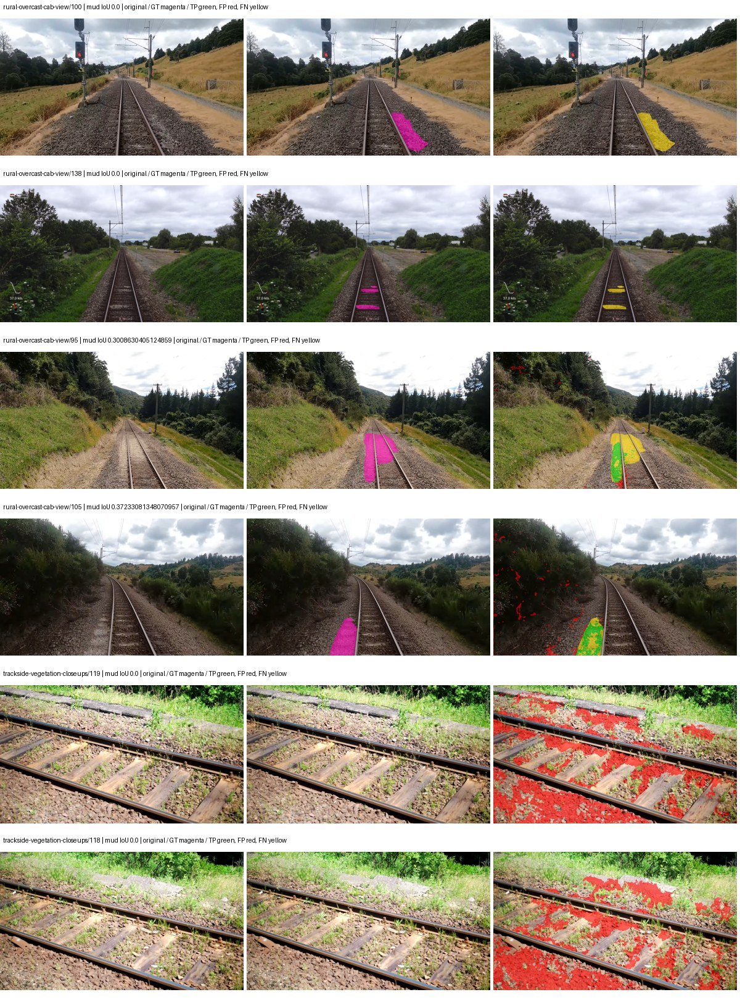
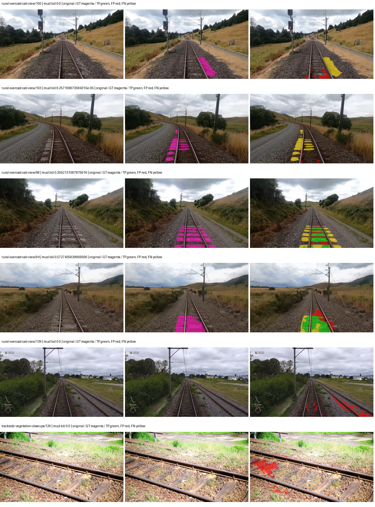
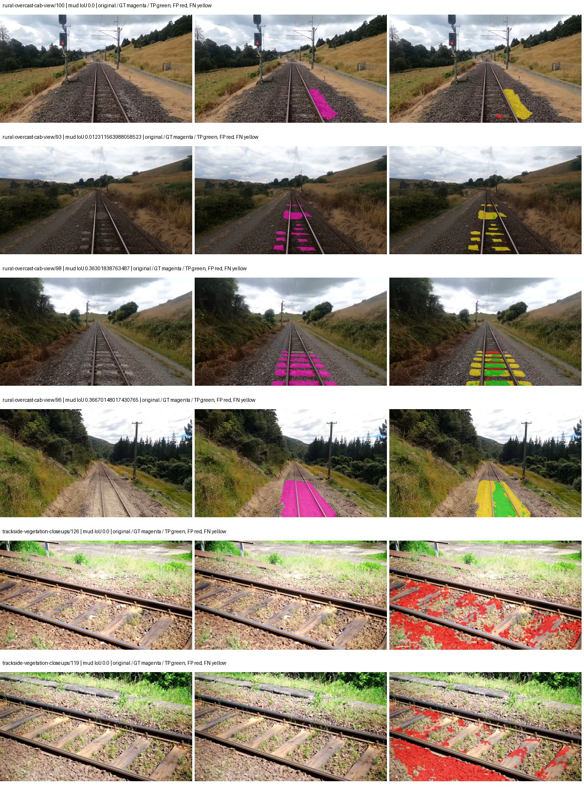
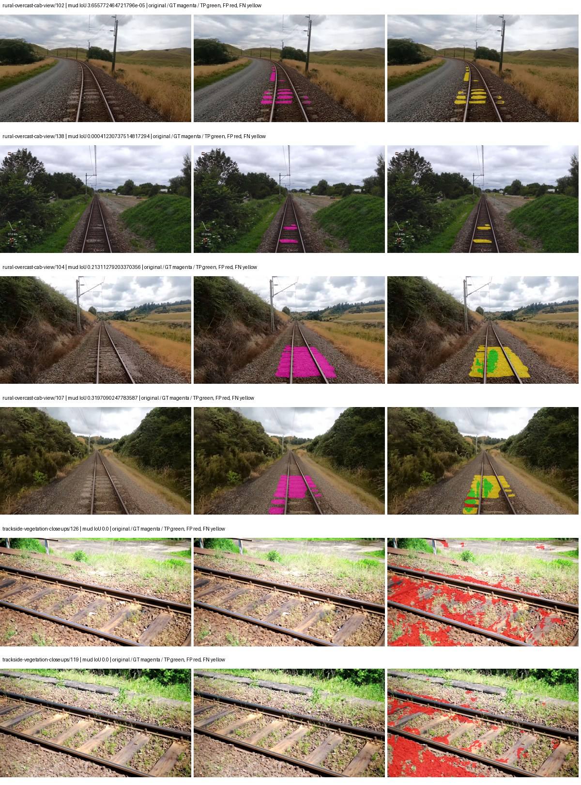

# smp_manet_efficientnet_b0 — paul-test-rtis_v2

[RTIS comparison](../../README.md) · [Full model records](record.json)

Primary selection and early stopping: **mud-pumping validation IoU**. A job is complete only after full statistics and isolated profiling are verified.

| Model | Initialization path | Seed | Status | Steps | Best step | Mud IoU (%) | Mud precision (%) | Mud recall (%) | Final mud IoU (trainer val, %) | mIoU (%) | Fixed GT-class mIoU (%) |
| --- | --- | --- | --- | --- | --- | --- | --- | --- | --- | --- | --- |
| smp_manet_efficientnet_b0 | rtis_only | 0 | completed | 4000 | 3568 | 3.35 | 4.23 | 13.86 | 2.65 | 23.25 | 24.54 |
| smp_manet_efficientnet_b0 | cityscapes_to_rtis | 0 | completed | 2039 | 764 | 12.24 | 25.19 | 19.23 | 0.50 | 24.14 | 25.49 |
| smp_manet_efficientnet_b0 | railsem19_to_rtis | 0 | completed | 3568 | 2294 | 8.76 | 12.31 | 23.30 | 6.48 | 25.24 | 29.44 |
| smp_manet_efficientnet_b0 | cityscapes_to_railsem19_to_rtis | 0 | completed | 2549 | 2549 | 4.68 | 7.36 | 11.37 | 4.69 | 24.72 | 28.84 |

Training: 205 images. Validation: 37 images. Test: 50 held out. Seeds: [0]. Seed variation measures optimization variability, not independent-recording uncertainty. Historical source checkpoints stay fixed across adaptation seeds.

Training code: `066afb2626398b7be59d4d19f5a0e4644fd59adc`. Split SHA-256: `18a84c0163a65ded46508bcc904c374e5f33ad8a09b8879e3c8add606e86aa9f`.

## rtis_only — seed 0

Status: **completed**. Started: 2026-09-10T02:32:18.039228+00:00. Finished: 2026-09-10T03:21:19.172515+00:00.

Recipe pretrained initializer: `{"arch": "smp", "backbone_path": null, "batch_norm_momentum": null, "checkpoint": null, "classifier_path": null, "drop_path": null, "encoder_name": "efficientnet-b0", "encoder_weights": "imagenet", "head": "unified_head", "head_paths": [], "inactive_parameter_paths": ["encoder._conv_head", "encoder._bn1"], "local_files_only": false, "lora_alpha": 32, "lora_dropout": 0.05, "lora_r": 16, "lora_targets": [], "native": null, "revision": null, "smp_arch": "MAnet", "subfolder": null, "trust_remote_code": false, "tuning": "full"}`.

`rtis_only` uses the recipe initializer, which may include pretrained segmentation components. Transfer paths load the exact historical source checkpoint below and reset the classifier; they do not reset all query/decoder features.

Source checkpoint: `Recipe pretrained initialization`.

Config SHA-256: `0cb707e20a82c2a67199bb2edf132a48a012b26197d29449f567f02dba8ae21f`. Weights used for validation: `raw`.

### Mud-pumping and aggregate quality

| Metric | Selected checkpoint | Final training validation |
| --- | --- | --- |
| Mud IoU | 3.35 | 2.65 |
| Mud precision | 4.23 | 3.22 |
| Mud recall | 13.86 | 13.19 |
| Mud Dice/F1 | 6.48 | 5.17 |
| mIoU | 23.25 | 22.30 |
| Mean accuracy | 33.29 | 33.66 |
| Mean precision | 38.10 | 37.73 |
| Mean Dice | 29.70 | 28.54 |
| Mean specificity | 98.52 | 98.37 |
| Pixel accuracy | 73.61 | 70.21 |
| Frequency-weighted IoU | 66.72 | 63.76 |
| Fixed GT-present class mIoU | 24.54 | 23.54 |
| Boundary F1 | 26.96 | 25.64 |

The selected checkpoint has independent evaluation evidence. Final values are the trainer's final validation record, not a new independent evaluation. mIoU averages classes with nonzero union, so false positives on absent classes can change its denominator. The fixed GT-class mean is supplementary and excludes absent classes; their false positives remain in the confusion matrix.

### Resource usage and timing

| Measurement | Value |
| --- | --- |
| Peak training VRAM, retained training invocation (GiB) | 8.80 |
| Peak evaluation VRAM (GiB) | 6.37 |
| Retained training invocation wall time (seconds) | 2810.41 |
| Retained training invocation GPU-hours (one GPU) | 0.78 |
| Evaluation wall time (seconds) | 10.85 |
| Full evaluation pipeline images/second | 3.41 |
| Best full-state checkpoint (MiB) | 136.59 |
| Final full-state checkpoint (MiB) | 136.57 |
| Verified periodic checkpoints removed (GiB) | 1.07 |

VRAM uses the recorded allocator high-water mark; it is not total device usage including CUDA context. Resumed jobs' retained training invocation times and peaks are **not whole-campaign totals**. Earlier invocation resource records are not reconstructed here. Evaluation throughput includes loader, sliding-window inference and metrics; it is not model-only latency/FPS. Missing measurements are shown as —, never inferred from another dataset's run.

### Standardized inference performance

Dedicated model-only profiling waits for an idle worker-locked L40S: BF16, batch 1, 1024x1024, 20 warmup and 100 CUDA-event-timed public forwards. It excludes loading, preprocessing, tiling and metrics.

| Status | Parameters | Weight MiB | FPS | p50 ms | p95 ms | Peak reserved GiB |
| --- | --- | --- | --- | --- | --- | --- |
| complete | 9095257 | 34.70 | 96.97 | 10.25 | 11.11 | 0.57 |

```json
{
  "schema_version": 1,
  "model_id": "smp_manet_efficientnet_b0",
  "measured_at": "2026-09-10T03:21:16+00:00",
  "status": "complete",
  "benchmark_scope": "rtis_selected_checkpoint_model_only",
  "applies_to": [
    "smp_manet_efficientnet_b0--rtis_only--seed-0"
  ],
  "source": {
    "campaign_git_sha": "066afb2626398b7be59d4d19f5a0e4644fd59adc",
    "git_dirty": false,
    "config_hash": "abed8630398f",
    "resolved_config": "/data/izadia1/projects/segmentary-runs/paul-test-rtis_v2/seed0-20260909/configs/smp_manet_efficientnet_b0--rtis_only--seed-0.yaml",
    "config_sha256": "0cb707e20a82c2a67199bb2edf132a48a012b26197d29449f567f02dba8ae21f",
    "checkpoint_sha256": "c4ac4fa64180b0cd12c51211accac19252a808ada17810e912745425eaa3dfb4",
    "checkpoint_global_step": 3568,
    "checkpoint_bytes": 143226380,
    "checkpoint_kind": "resume checkpoint with optimizer and EMA state",
    "weights": "raw",
    "measured_checkpoint_job_id": "smp_manet_efficientnet_b0--rtis_only--seed-0",
    "result_sha256": "ae4b4afa9422b14241247727f32e606f499bb2de49acfd03b10bd6dcfe8073bc",
    "result_git_sha": "066afb2626398b7be59d4d19f5a0e4644fd59adc",
    "result_stage": "eval:paul-test-rtis:val",
    "result_seed": 0
  },
  "hardware": {
    "gpu_name": "NVIDIA L40S",
    "gpu_uuid": "GPU-a5ad49e5-0536-5229-ba8a-f8a902808f53",
    "logical_device": "cuda:0",
    "physical_visibility_token": "7",
    "compute_capability": [
      8,
      9
    ],
    "total_memory_bytes": 47677177856
  },
  "model": {
    "parameter_count": 9095257,
    "trainable_parameter_count": 8683097,
    "resident_parameter_bytes": 36381028,
    "parameter_dtype_counts": {
      "float32": 9095257
    }
  },
  "contract": {
    "backend": "pytorch",
    "precision": "bf16_autocast",
    "batch_size": 1,
    "input_shape_nchw": [
      1,
      3,
      1024,
      1024
    ],
    "warmup_iterations": 20,
    "measured_iterations": 100,
    "timing": "per-forward CUDA events with end-event synchronization",
    "includes_preprocessing": false,
    "includes_data_loader": false,
    "includes_sliding_window": false,
    "input_resident_on_gpu": true,
    "model_only": true,
    "entrypoint": "public model(image) dense-logits forward"
  },
  "measurements": {
    "latency": {
      "p50_ms": 10.247679710388184,
      "p95_ms": 11.111067390441894,
      "mean_ms": 10.31293758392334,
      "minimum_ms": 9.809920310974121,
      "maximum_ms": 12.15078353881836,
      "fps": 96.9655824892107,
      "raw_ms": [
        9.970687866210938,
        9.858048439025879,
        10.262528419494629,
        9.952256202697754,
        10.31987190246582,
        10.576895713806152,
        9.919487953186035,
        9.882623672485352,
        9.962495803833008,
        9.901056289672852,
        10.64038372039795,
        10.248191833496094,
        9.962495803833008,
        10.798080444335938,
        10.52569580078125,
        9.901056289672852,
        10.249216079711914,
        9.90719985961914,
        9.809920310974121,
        10.23692798614502,
        10.579936027526855,
        10.63526439666748,
        10.247167587280273,
        9.878527641296387,
        10.368000030517578,
        9.965567588806152,
        10.686464309692383,
        9.94099235534668,
        10.04851245880127,
        10.74073600769043,
        10.73459243774414,
        10.773504257202148,
        10.045439720153809,
        9.957375526428223,
        10.564543724060059,
        10.125311851501465,
        9.929727554321289,
        9.887743949890137,
        9.947135925292969,
        10.232831954956055,
        10.052607536315918,
        9.94099235534668,
        11.169792175292969,
        9.975808143615723,
        9.844736099243164,
        9.911295890808105,
        9.846783638000488,
        10.415103912353516,
        10.74995231628418,
        10.560511589050293,
        10.646528244018555,
        10.003456115722656,
        10.40998363494873,
        10.576895713806152,
        10.342399597167969,
        10.628095626831055,
        10.94758415222168,
        10.075136184692383,
        10.340352058410645,
        9.936896324157715,
        9.862112045288086,
        9.947135925292969,
        10.540032386779785,
        10.239999771118164,
        10.518495559692383,
        10.334207534790039,
        10.589183807373047,
        10.884096145629883,
        10.73356819152832,
        10.145792007446289,
        10.326016426086426,
        10.651647567749023,
        11.23737621307373,
        10.505215644836426,
        10.876928329467773,
        12.15078353881836,
        11.083776473999023,
        10.263551712036133,
        11.123744010925293,
        10.231807708740234,
        9.882623672485352,
        10.32089614868164,
        10.65062427520752,
        11.294719696044922,
        11.110400199890137,
        9.936863899230957,
        9.90617561340332,
        9.869312286376953,
        10.275839805603027,
        10.967040061950684,
        9.93177604675293,
        9.853919982910156,
        9.927680015563965,
        10.02188777923584,
        10.008576393127441,
        10.269696235656738,
        10.277888298034668,
        10.085375785827637,
        10.034175872802734,
        9.873408317565918
      ],
      "percentile_method": "numpy linear interpolation"
    },
    "peak_reserved_bytes": 614465536,
    "memory_kind": "pytorch_cuda_allocator_peak_reserved_excluding_context",
    "benchmark_wall_clock_s": 22.594589103013277
  },
  "started_at": "2026-09-10T03:20:53+00:00",
  "finished_at": "2026-09-10T03:21:16+00:00",
  "environment": {
    "hostname": "hdrfs-app-001",
    "python": "3.11.15",
    "platform": "Linux-5.15.0-139-generic-x86_64-with-glibc2.35",
    "torch": "2.11.0+cu128",
    "torch_cuda": "12.8",
    "cudnn": 91900,
    "driver_version": "570.133.20",
    "cuda_available": true,
    "gpu_count": 1,
    "gpu_names": [
      "NVIDIA L40S"
    ],
    "cuda_visible_devices": "7",
    "packages": {
      "segmentary": "0.1.0",
      "torch": "2.11.0+cu128",
      "torchvision": "0.26.0+cu128",
      "transformers": "5.15.0",
      "timm": "1.0.28",
      "segmentation-models-pytorch": "0.5.0",
      "albumentations": "2.0.8",
      "lightning": "2.6.5",
      "numpy": "2.4.4"
    }
  }
}
```

### Per-class validation results

| Class | GT pixels | IoU (%) | Precision (%) | Recall (%) | Dice (%) | Boundary F1 (%) |
| --- | --- | --- | --- | --- | --- | --- |
| car | 29664 | 0.00 | 0.00 | 0.00 | 0.00 | 0.00 |
| construction | 311585 | 9.17 | 9.51 | 72.06 | 16.80 | 11.91 |
| fence | 265137 | 8.03 | 45.53 | 8.88 | 14.86 | 20.79 |
| mud-pumping | 1226250 | 3.35 | 4.23 | 13.86 | 6.48 | 9.79 |
| on-rails | 0 | 0.00 | 0.00 | — | 0.00 | 0.00 |
| person | 0 | — | — | — | — | — |
| pole | 628038 | 51.56 | 84.26 | 57.06 | 68.04 | 82.96 |
| rail-embedded | 16799 | 0.00 | 0.00 | 0.00 | 0.00 | 0.00 |
| rail-raised | 2969797 | 68.66 | 82.39 | 80.47 | 81.42 | 88.05 |
| rail-track | 6323197 | 31.81 | 68.35 | 37.31 | 48.27 | 36.90 |
| road | 1048831 | 10.25 | 38.80 | 12.22 | 18.59 | 15.63 |
| sidewalk | 1297367 | 18.37 | 49.83 | 22.54 | 31.04 | 29.77 |
| sky | 19121606 | 93.75 | 99.27 | 94.40 | 96.78 | 74.41 |
| standing-water | 95802 | 0.39 | 0.39 | 32.84 | 0.77 | 1.60 |
| terrain | 39239306 | 76.07 | 87.60 | 85.25 | 86.41 | 38.60 |
| trackbed | 10643081 | 58.71 | 78.08 | 70.29 | 73.98 | 58.68 |
| traffic-light | 19510 | 0.00 | 0.00 | 0.00 | 0.00 | 0.00 |
| traffic-sign | 13285 | 0.00 | 0.00 | 0.00 | 0.00 | 0.00 |
| tram-track | 56179 | 0.08 | 0.24 | 0.12 | 0.16 | 1.64 |
| truck | 0 | — | — | — | — | — |
| vegetation-overgrowth | 5901821 | 11.56 | 75.42 | 12.01 | 20.72 | 41.55 |

### Full-run accounting

| Measurement | Value |
| --- | --- |
| Full GPU-reserved wall seconds, all recorded worker attempts | 2941.14 |
| Full reserved GPU-hours | 0.82 |
| Whole-run timing complete | True |

| Phase | Wall seconds including failed attempts |
| --- | --- |
| training | 2816.87 |
| diagnostics | 75.33 |
| performance | 29.57 |

GPU-reserved time includes model loading, training, validation, collection, profiling, checkpoint I/O and orchestration while the worker owns one GPU. It is not GPU kernel-active time. Phase timings and sampled device memory/power/utilization are retained separately; sampled device memory is not the allocator high-water mark.

### Train/validation and raw/EMA diagnostics

| Checkpoint / weights / split | Images | Mud IoU (%) | Mud precision (%) | Mud recall (%) |
| --- | --- | --- | --- | --- |
| best-auto-train / raw | 205 | 87.33 | 92.03 | 94.47 |
| best-auto-val / raw | 37 | 3.35 | 4.23 | 13.86 |
| best-alternate-val / ema | 37 | 0.48 | 0.61 | 2.28 |
| final-auto-val / raw | 37 | 2.66 | 3.22 | 13.22 |

Train uses the evaluation transform without augmentation. Compare mud train/validation metrics for the same selected weights. Alternate EMA on running-stat BatchNorm is explicitly uncalibrated and is diagnostic only. Score-threshold curves use uncalibrated normalized scores and are pixel-level diagnostics, not event detection rates or a selected deployment operating point.

### Downloadable evidence

- best-auto-train: [per-image.csv](rtis_only--seed-0/best-auto-train/per-image.csv) · [per-image-confusion.json.gz](rtis_only--seed-0/best-auto-train/per-image-confusion.json.gz) · [groups.json](rtis_only--seed-0/best-auto-train/groups.json) · [mud-score-curves.json](rtis_only--seed-0/best-auto-train/mud-score-curves.json)
- best-auto-val: [per-image.csv](rtis_only--seed-0/best-auto-val/per-image.csv) · [per-image-confusion.json.gz](rtis_only--seed-0/best-auto-val/per-image-confusion.json.gz) · [groups.json](rtis_only--seed-0/best-auto-val/groups.json) · [mud-score-curves.json](rtis_only--seed-0/best-auto-val/mud-score-curves.json) · [examples.jpg](rtis_only--seed-0/best-auto-val/examples.jpg)
- best-alternate-val: [per-image.csv](rtis_only--seed-0/best-alternate-val/per-image.csv) · [per-image-confusion.json.gz](rtis_only--seed-0/best-alternate-val/per-image-confusion.json.gz) · [groups.json](rtis_only--seed-0/best-alternate-val/groups.json) · [mud-score-curves.json](rtis_only--seed-0/best-alternate-val/mud-score-curves.json)
- final-auto-val: [per-image.csv](rtis_only--seed-0/final-auto-val/per-image.csv) · [per-image-confusion.json.gz](rtis_only--seed-0/final-auto-val/per-image-confusion.json.gz) · [groups.json](rtis_only--seed-0/final-auto-val/groups.json) · [mud-score-curves.json](rtis_only--seed-0/final-auto-val/mud-score-curves.json)
- resources: [telemetry.csv](rtis_only--seed-0/resources/telemetry.csv)



Examples are two lowest and two highest mud-IoU positive images, plus up to two negative images with the most false-positive mud pixels. They are targeted diagnostic examples, not random samples. Green: true positive; red: false positive; yellow: false negative. Full predictions remain on HDRFS.

### Validation tracking

| Logged step | Overall mIoU (%) | Mud IoU (%) |
| --- | --- | --- |
| 254 | 15.73 | 0.43 |
| 509 | 17.96 | 0.46 |
| 764 | 18.05 | 0.39 |
| 1019 | 20.19 | 0.69 |
| 1274 | 19.41 | 1.75 |
| 1529 | 20.17 | 1.14 |
| 1784 | 20.57 | 0.34 |
| 2038 | 21.92 | 0.26 |
| 2293 | 21.23 | 0.73 |
| 2548 | 21.90 | 2.86 |
| 2803 | 20.15 | 1.73 |
| 3058 | 23.54 | 1.89 |
| 3313 | 21.00 | 1.00 |
| 3568 | 23.25 | 3.35 |
| 3823 | 21.21 | 1.35 |
| 4000 | 22.30 | 2.65 |

All retained scalar curves, including training loss and per-class IoU, are in record.json. Observed best mud on a curve is not necessarily a retained checkpoint: the pilot saved its selection-metric-best and final checkpoints. Step logging and checkpoint global_step may differ by one.

### Stopping and checkpoint provenance

```json
{
  "stopping": {
    "actual_steps": 4000,
    "maximum_steps": 4000,
    "min_delta": 0.001,
    "monitor": "val_iou/mud-pumping",
    "patience": 5,
    "reason": "budget_complete"
  },
  "checkpoints": {
    "best": {
      "path": "/data/izadia1/projects/segmentary-runs/paul-test-rtis_v2/seed0-20260909/future-runs/smp_manet_efficientnet_b0--rtis_only--seed-0_seed0/rtis/best.ckpt",
      "sha256": "c4ac4fa64180b0cd12c51211accac19252a808ada17810e912745425eaa3dfb4",
      "global_step": 3568,
      "bytes": 143226380
    },
    "final": {
      "path": "/data/izadia1/projects/segmentary-runs/paul-test-rtis_v2/seed0-20260909/future-runs/smp_manet_efficientnet_b0--rtis_only--seed-0_seed0/rtis/last.ckpt",
      "sha256": "4eb9dab4f07d60596773a5b4bf0e4232114a72027d9376c84be3d4bb55a7f953",
      "global_step": 4000,
      "bytes": 143208332
    }
  },
  "cleanup_error": null
}
```

### Resolved training, initialization and evaluation settings

The optimizer block is the base configuration. Stage LR scales are applied at runtime, and stage warmup is capped at min(base warmup, floor(stage budget / 10), stage budget - 1): 400 steps for this 4,000-step pilot. Model-internal native input grids may differ from augmentation crops (EoMT uses its 640 grid).

```json
{
  "name": "smp_manet_efficientnet_b0--rtis_only--seed-0",
  "model": {
    "arch": "smp",
    "checkpoint": null,
    "tuning": "full",
    "head": "unified_head",
    "lora_r": 16,
    "lora_alpha": 32,
    "lora_dropout": 0.05,
    "lora_targets": [],
    "drop_path": null,
    "revision": null,
    "subfolder": null,
    "local_files_only": false,
    "trust_remote_code": false,
    "backbone_path": null,
    "head_paths": [],
    "classifier_path": null,
    "inactive_parameter_paths": [
      "encoder._conv_head",
      "encoder._bn1"
    ],
    "smp_arch": "MAnet",
    "encoder_name": "efficientnet-b0",
    "encoder_weights": "imagenet",
    "native": null,
    "batch_norm_momentum": null
  },
  "space": "paul-test-rtis",
  "taxonomy_root": "/data/izadia1/projects/segmentary-rtis-fullstats-066afb2/taxonomy",
  "output_root": "/data/izadia1/projects/segmentary-runs/paul-test-rtis_v2/seed0-20260909/future-runs",
  "optim": {
    "backbone_lr": 0.0001,
    "head_lr_mult": 10.0,
    "weight_decay": 0.05,
    "llrd": 1.0,
    "warmup_iters": 1500,
    "warmup_ratio": 1e-06,
    "poly_power": 0.9,
    "min_lr_ratio": 0.0,
    "betas": [
      0.9,
      0.999
    ],
    "grad_clip": 1.0
  },
  "train": {
    "iters": 4000,
    "batch_size": 2,
    "accum": 8,
    "num_workers": 2,
    "precision": "bf16-mixed",
    "ema_decay": 0.9998,
    "val_every": 250,
    "ckpt_every": 500,
    "selection_metric": "val_iou/mud-pumping",
    "early_stopping_patience": 5,
    "early_stopping_min_delta": 0.001,
    "seed": 0,
    "devices": 1
  },
  "eval": {
    "sliding_window": true,
    "window": [
      1024,
      1024
    ],
    "stride": [
      768,
      768
    ],
    "batch_size": 1,
    "num_workers": 2,
    "tta_scales": [],
    "tta_flip": false,
    "threshold": 0.5,
    "boundary_tolerance_frac": 0.0075,
    "save_confusion": true
  },
  "loss": {
    "task": "multiclass",
    "activation": "auto",
    "terms": [],
    "aux": "none",
    "aux_weight": 0.0,
    "ce_weight": 1.0,
    "label_smoothing": 0.0,
    "class_weights": null,
    "query": null
  },
  "aug": {
    "crop": [
      1024,
      1024
    ],
    "scale_min": 0.5,
    "scale_max": 2.0,
    "hflip_p": 0.5,
    "color_jitter_p": 0.5,
    "brightness": 0.25,
    "contrast": 0.25,
    "saturation": 0.25,
    "hue": 0.05
  },
  "stages": [
    {
      "name": "rtis",
      "data": [
        {
          "name": "paul-test-rtis",
          "root": "/data/izadia1/datasets/paul-test-rtis_v2",
          "variant": null,
          "split_file": "splits.json",
          "train_split": "train",
          "val_split": "val",
          "limit": null,
          "loader": "folder",
          "mapping": "paul-test-rtis",
          "loader_options": {
            "require_groups": true
          }
        }
      ],
      "iters": null,
      "lr_scale": 1.0,
      "head_group_lr_scale": 1.0,
      "init_from": "pretrained",
      "reset_head": false,
      "freeze": null,
      "sample_weights": null
    }
  ]
}
```

### Hardware and software provenance

```json
{
  "training": {
    "cuda_available": true,
    "cuda_visible_devices": "7",
    "cudnn": 91900,
    "driver_version": "570.133.20",
    "gpu_count": 1,
    "gpu_names": [
      "NVIDIA L40S"
    ],
    "hostname": "hdrfs-app-001",
    "input_normalization": {
      "channel_order": "rgb",
      "mean": [
        0.485,
        0.456,
        0.406
      ],
      "source": "smp_encoder_settings",
      "std": [
        0.229,
        0.224,
        0.225
      ]
    },
    "model_origins": [
      {
        "hf_commit": null,
        "hf_name_or_path": null,
        "module": "model",
        "timm_pretrained": {}
      }
    ],
    "model_parameter_count": 9095257,
    "packages": {
      "albumentations": "2.0.8",
      "lightning": "2.6.5",
      "numpy": "2.4.4",
      "segmentary": "0.1.0",
      "segmentation-models-pytorch": "0.5.0",
      "timm": "1.0.28",
      "torch": "2.11.0+cu128",
      "torchvision": "0.26.0+cu128",
      "transformers": "5.15.0"
    },
    "platform": "Linux-5.15.0-139-generic-x86_64-with-glibc2.35",
    "python": "3.11.15",
    "torch": "2.11.0+cu128",
    "torch_cuda": "12.8",
    "trainable_parameter_count": 8683097,
    "training_stop": {
      "actual_steps": 4000,
      "maximum_steps": 4000,
      "min_delta": 0.001,
      "monitor": "val_iou/mud-pumping",
      "patience": 5,
      "reason": "budget_complete"
    },
    "validation_weights": "raw"
  },
  "evaluation": {
    "cuda_available": true,
    "cuda_visible_devices": "7",
    "cudnn": 91900,
    "driver_version": "570.133.20",
    "gpu_count": 1,
    "gpu_names": [
      "NVIDIA L40S"
    ],
    "hostname": "hdrfs-app-001",
    "input_normalization": {
      "channel_order": "rgb",
      "mean": [
        0.485,
        0.456,
        0.406
      ],
      "source": "smp_encoder_settings",
      "std": [
        0.229,
        0.224,
        0.225
      ]
    },
    "packages": {
      "albumentations": "2.0.8",
      "lightning": "2.6.5",
      "numpy": "2.4.4",
      "segmentary": "0.1.0",
      "segmentation-models-pytorch": "0.5.0",
      "timm": "1.0.28",
      "torch": "2.11.0+cu128",
      "torchvision": "0.26.0+cu128",
      "transformers": "5.15.0"
    },
    "platform": "Linux-5.15.0-139-generic-x86_64-with-glibc2.35",
    "python": "3.11.15",
    "torch": "2.11.0+cu128",
    "torch_cuda": "12.8"
  }
}
```

## cityscapes_to_rtis — seed 0

Status: **completed**. Started: 2026-09-10T02:32:45.527454+00:00. Finished: 2026-09-10T02:59:33.989293+00:00.

Recipe pretrained initializer: `{"arch": "smp", "backbone_path": null, "batch_norm_momentum": null, "checkpoint": null, "classifier_path": null, "drop_path": null, "encoder_name": "efficientnet-b0", "encoder_weights": "imagenet", "head": "unified_head", "head_paths": [], "inactive_parameter_paths": ["encoder._conv_head", "encoder._bn1"], "local_files_only": false, "lora_alpha": 32, "lora_dropout": 0.05, "lora_r": 16, "lora_targets": [], "native": null, "revision": null, "smp_arch": "MAnet", "subfolder": null, "trust_remote_code": false, "tuning": "full"}`.

`rtis_only` uses the recipe initializer, which may include pretrained segmentation components. Transfer paths load the exact historical source checkpoint below and reset the classifier; they do not reset all query/decoder features.

Source checkpoint: `{'name': 'smp_manet_efficientnet_b0--cityscapes--seed-0', 'model': 'smp_manet_efficientnet_b0', 'protocol': 'cityscapes', 'config': '/data/izadia1/projects/segmentary-runs/all-model-city-rail-seed0-rail20-b9eb3e1/jobs/smp_manet_efficientnet_b0--cityscapes--seed-0/attempt-001/resolved-config.yaml', 'checkpoint': '/data/izadia1/projects/segmentary-runs/all-model-city-rail-seed0-rail20-b9eb3e1/jobs/smp_manet_efficientnet_b0--cityscapes--seed-0/attempt-001/train/smp_manet_efficientnet_b0--cityscapes_seed0/cityscapes/last.ckpt', 'recorded_sha256': '5678b197769804af694fe91c6646d8de6e5f94f320f7b4c55120998d0a784aba', 'exists': True}`.

Config SHA-256: `156bac0d014a723d7078d991c5d03d773e27b9b621e5d477e82e83cedf1dcb08`. Weights used for validation: `raw`.

### Mud-pumping and aggregate quality

| Metric | Selected checkpoint | Final training validation |
| --- | --- | --- |
| Mud IoU | 12.24 | 0.50 |
| Mud precision | 25.19 | 0.99 |
| Mud recall | 19.23 | 1.00 |
| Mud Dice/F1 | 21.81 | 1.00 |
| mIoU | 24.14 | 21.53 |
| Mean accuracy | 33.67 | 30.49 |
| Mean precision | 38.81 | 35.88 |
| Mean Dice | 30.55 | 27.46 |
| Mean specificity | 98.30 | 98.55 |
| Pixel accuracy | 74.43 | 77.52 |
| Frequency-weighted IoU | 63.22 | 66.50 |
| Fixed GT-present class mIoU | 25.49 | 23.93 |
| Boundary F1 | 27.64 | 23.96 |

The selected checkpoint has independent evaluation evidence. Final values are the trainer's final validation record, not a new independent evaluation. mIoU averages classes with nonzero union, so false positives on absent classes can change its denominator. The fixed GT-class mean is supplementary and excludes absent classes; their false positives remain in the confusion matrix.

### Resource usage and timing

| Measurement | Value |
| --- | --- |
| Peak training VRAM, retained training invocation (GiB) | 8.80 |
| Peak evaluation VRAM (GiB) | 6.37 |
| Retained training invocation wall time (seconds) | 1476.07 |
| Retained training invocation GPU-hours (one GPU) | 0.41 |
| Evaluation wall time (seconds) | 10.74 |
| Full evaluation pipeline images/second | 3.44 |
| Best full-state checkpoint (MiB) | 136.59 |
| Final full-state checkpoint (MiB) | 136.57 |
| Verified periodic checkpoints removed (GiB) | 0.53 |

VRAM uses the recorded allocator high-water mark; it is not total device usage including CUDA context. Resumed jobs' retained training invocation times and peaks are **not whole-campaign totals**. Earlier invocation resource records are not reconstructed here. Evaluation throughput includes loader, sliding-window inference and metrics; it is not model-only latency/FPS. Missing measurements are shown as —, never inferred from another dataset's run.

### Standardized inference performance

Dedicated model-only profiling waits for an idle worker-locked L40S: BF16, batch 1, 1024x1024, 20 warmup and 100 CUDA-event-timed public forwards. It excludes loading, preprocessing, tiling and metrics.

| Status | Parameters | Weight MiB | FPS | p50 ms | p95 ms | Peak reserved GiB |
| --- | --- | --- | --- | --- | --- | --- |
| complete | 9095257 | 34.70 | 82.94 | 11.58 | 14.92 | 0.57 |

```json
{
  "schema_version": 1,
  "model_id": "smp_manet_efficientnet_b0",
  "measured_at": "2026-09-10T02:59:31+00:00",
  "status": "complete",
  "benchmark_scope": "rtis_selected_checkpoint_model_only",
  "applies_to": [
    "smp_manet_efficientnet_b0--cityscapes_to_rtis--seed-0"
  ],
  "source": {
    "campaign_git_sha": "066afb2626398b7be59d4d19f5a0e4644fd59adc",
    "git_dirty": false,
    "config_hash": "45e81694ea8e",
    "resolved_config": "/data/izadia1/projects/segmentary-runs/paul-test-rtis_v2/seed0-20260909/configs/smp_manet_efficientnet_b0--cityscapes_to_rtis--seed-0.yaml",
    "config_sha256": "156bac0d014a723d7078d991c5d03d773e27b9b621e5d477e82e83cedf1dcb08",
    "checkpoint_sha256": "a353a18a1e7af8a6c0024584797c7dc05cef57831391a2d74e574d4d07b73aa6",
    "checkpoint_global_step": 764,
    "checkpoint_bytes": 143226380,
    "checkpoint_kind": "resume checkpoint with optimizer and EMA state",
    "weights": "raw",
    "measured_checkpoint_job_id": "smp_manet_efficientnet_b0--cityscapes_to_rtis--seed-0",
    "result_sha256": "0beb405e5666dfedce59e74a0c7b7b2129ff413bb668508d07b4f92e6356859e",
    "result_git_sha": "066afb2626398b7be59d4d19f5a0e4644fd59adc",
    "result_stage": "eval:paul-test-rtis:val",
    "result_seed": 0
  },
  "hardware": {
    "gpu_name": "NVIDIA L40S",
    "gpu_uuid": "GPU-c76642eb-64c1-b0ac-b051-d2efd47b32c4",
    "logical_device": "cuda:0",
    "physical_visibility_token": "9",
    "compute_capability": [
      8,
      9
    ],
    "total_memory_bytes": 47677177856
  },
  "model": {
    "parameter_count": 9095257,
    "trainable_parameter_count": 8683097,
    "resident_parameter_bytes": 36381028,
    "parameter_dtype_counts": {
      "float32": 9095257
    }
  },
  "contract": {
    "backend": "pytorch",
    "precision": "bf16_autocast",
    "batch_size": 1,
    "input_shape_nchw": [
      1,
      3,
      1024,
      1024
    ],
    "warmup_iterations": 20,
    "measured_iterations": 100,
    "timing": "per-forward CUDA events with end-event synchronization",
    "includes_preprocessing": false,
    "includes_data_loader": false,
    "includes_sliding_window": false,
    "input_resident_on_gpu": true,
    "model_only": true,
    "entrypoint": "public model(image) dense-logits forward"
  },
  "measurements": {
    "latency": {
      "p50_ms": 11.577856063842773,
      "p95_ms": 14.923366689682004,
      "mean_ms": 12.057180871963501,
      "minimum_ms": 10.276864051818848,
      "maximum_ms": 18.982912063598633,
      "fps": 82.93812713096929,
      "raw_ms": [
        18.982912063598633,
        12.297216415405273,
        10.64140796661377,
        11.216896057128906,
        14.337023735046387,
        13.954048156738281,
        13.140992164611816,
        11.94598388671875,
        12.080127716064453,
        15.771648406982422,
        11.978752136230469,
        11.589632034301758,
        12.57369613647461,
        11.781120300292969,
        11.899904251098633,
        13.67244815826416,
        11.897855758666992,
        11.194368362426758,
        12.820480346679688,
        13.380607604980469,
        11.367424011230469,
        11.185152053833008,
        11.0448637008667,
        12.372991561889648,
        12.4518404006958,
        14.259200096130371,
        13.530112266540527,
        14.099455833435059,
        14.134271621704102,
        14.047231674194336,
        16.690176010131836,
        16.64614486694336,
        14.8787202835083,
        14.026752471923828,
        13.280256271362305,
        13.77791976928711,
        11.957247734069824,
        11.325440406799316,
        11.571200370788574,
        11.090944290161133,
        11.126784324645996,
        10.893312454223633,
        11.455488204956055,
        11.670528411865234,
        11.875328063964844,
        10.792960166931152,
        10.644512176513672,
        10.775551795959473,
        11.869183540344238,
        11.372544288635254,
        11.638784408569336,
        10.925056457519531,
        10.916864395141602,
        11.290623664855957,
        14.142463684082031,
        11.679743766784668,
        10.861568450927734,
        11.33670425415039,
        10.571776390075684,
        12.177408218383789,
        11.692031860351562,
        11.55174446105957,
        10.73356819152832,
        11.200511932373047,
        11.401215553283691,
        11.833344459533691,
        11.949055671691895,
        11.584511756896973,
        10.963968276977539,
        10.503168106079102,
        11.424768447875977,
        10.430463790893555,
        10.707967758178711,
        10.935296058654785,
        11.533344268798828,
        11.126784324645996,
        11.401215553283691,
        10.92198371887207,
        10.945535659790039,
        12.093440055847168,
        11.33670425415039,
        10.992639541625977,
        10.50931167602539,
        11.907072067260742,
        11.340800285339355,
        12.293120384216309,
        10.874879837036133,
        10.893312454223633,
        10.276864051818848,
        10.283007621765137,
        10.686464309692383,
        12.302335739135742,
        16.079872131347656,
        12.666879653930664,
        14.425087928771973,
        12.605440139770508,
        10.64345645904541,
        10.31884765625,
        10.789888381958008,
        10.646528244018555
      ],
      "percentile_method": "numpy linear interpolation"
    },
    "peak_reserved_bytes": 614465536,
    "memory_kind": "pytorch_cuda_allocator_peak_reserved_excluding_context",
    "benchmark_wall_clock_s": 22.9462164118886
  },
  "started_at": "2026-09-10T02:59:08+00:00",
  "finished_at": "2026-09-10T02:59:31+00:00",
  "environment": {
    "hostname": "hdrfs-app-001",
    "python": "3.11.15",
    "platform": "Linux-5.15.0-139-generic-x86_64-with-glibc2.35",
    "torch": "2.11.0+cu128",
    "torch_cuda": "12.8",
    "cudnn": 91900,
    "driver_version": "570.133.20",
    "cuda_available": true,
    "gpu_count": 1,
    "gpu_names": [
      "NVIDIA L40S"
    ],
    "cuda_visible_devices": "9",
    "packages": {
      "segmentary": "0.1.0",
      "torch": "2.11.0+cu128",
      "torchvision": "0.26.0+cu128",
      "transformers": "5.15.0",
      "timm": "1.0.28",
      "segmentation-models-pytorch": "0.5.0",
      "albumentations": "2.0.8",
      "lightning": "2.6.5",
      "numpy": "2.4.4"
    }
  }
}
```

### Per-class validation results

| Class | GT pixels | IoU (%) | Precision (%) | Recall (%) | Dice (%) | Boundary F1 (%) |
| --- | --- | --- | --- | --- | --- | --- |
| car | 29664 | 0.00 | 0.00 | 0.00 | 0.00 | 0.00 |
| construction | 311585 | 3.64 | 3.71 | 65.71 | 7.02 | 20.99 |
| fence | 265137 | 3.85 | 29.22 | 4.24 | 7.41 | 19.27 |
| mud-pumping | 1226250 | 12.24 | 25.19 | 19.23 | 21.81 | 19.29 |
| on-rails | 0 | 0.00 | 0.00 | — | 0.00 | 0.00 |
| person | 0 | — | — | — | — | — |
| pole | 628038 | 62.57 | 78.57 | 75.44 | 76.98 | 83.04 |
| rail-embedded | 16799 | 0.00 | 0.00 | 0.00 | 0.00 | 0.00 |
| rail-raised | 2969797 | 70.84 | 75.61 | 91.82 | 82.93 | 86.59 |
| rail-track | 6323197 | 25.65 | 79.94 | 27.42 | 40.83 | 45.08 |
| road | 1048831 | 1.64 | 36.44 | 1.69 | 3.22 | 15.75 |
| sidewalk | 1297367 | 36.42 | 75.14 | 41.41 | 53.39 | 13.63 |
| sky | 19121606 | 93.98 | 99.02 | 94.86 | 96.90 | 76.80 |
| standing-water | 95802 | 0.23 | 0.24 | 3.63 | 0.45 | 1.38 |
| terrain | 39239306 | 66.11 | 75.37 | 84.34 | 79.60 | 34.89 |
| trackbed | 10643081 | 61.01 | 76.88 | 74.71 | 75.78 | 58.33 |
| traffic-light | 19510 | 0.00 | 0.00 | 0.00 | 0.00 | 0.00 |
| traffic-sign | 13285 | 0.00 | 0.00 | 0.00 | 0.00 | 0.00 |
| tram-track | 56179 | 0.00 | 0.00 | 0.00 | 0.00 | 0.00 |
| truck | 0 | — | — | — | — | — |
| vegetation-overgrowth | 5901821 | 20.57 | 82.13 | 21.54 | 34.13 | 50.04 |

### Full-run accounting

| Measurement | Value |
| --- | --- |
| Full GPU-reserved wall seconds, all recorded worker attempts | 1608.58 |
| Full reserved GPU-hours | 0.45 |
| Whole-run timing complete | True |

| Phase | Wall seconds including failed attempts |
| --- | --- |
| training | 1482.71 |
| diagnostics | 75.74 |
| performance | 30.42 |

GPU-reserved time includes model loading, training, validation, collection, profiling, checkpoint I/O and orchestration while the worker owns one GPU. It is not GPU kernel-active time. Phase timings and sampled device memory/power/utilization are retained separately; sampled device memory is not the allocator high-water mark.

### Train/validation and raw/EMA diagnostics

| Checkpoint / weights / split | Images | Mud IoU (%) | Mud precision (%) | Mud recall (%) |
| --- | --- | --- | --- | --- |
| best-auto-train / raw | 205 | 76.45 | 91.87 | 82.00 |
| best-auto-val / raw | 37 | 12.24 | 25.19 | 19.23 |
| best-alternate-val / ema | 37 | 1.52 | 7.23 | 1.89 |
| final-auto-val / raw | 37 | 0.50 | 0.99 | 1.00 |

Train uses the evaluation transform without augmentation. Compare mud train/validation metrics for the same selected weights. Alternate EMA on running-stat BatchNorm is explicitly uncalibrated and is diagnostic only. Score-threshold curves use uncalibrated normalized scores and are pixel-level diagnostics, not event detection rates or a selected deployment operating point.

### Downloadable evidence

- best-auto-train: [per-image.csv](cityscapes_to_rtis--seed-0/best-auto-train/per-image.csv) · [per-image-confusion.json.gz](cityscapes_to_rtis--seed-0/best-auto-train/per-image-confusion.json.gz) · [groups.json](cityscapes_to_rtis--seed-0/best-auto-train/groups.json) · [mud-score-curves.json](cityscapes_to_rtis--seed-0/best-auto-train/mud-score-curves.json)
- best-auto-val: [per-image.csv](cityscapes_to_rtis--seed-0/best-auto-val/per-image.csv) · [per-image-confusion.json.gz](cityscapes_to_rtis--seed-0/best-auto-val/per-image-confusion.json.gz) · [groups.json](cityscapes_to_rtis--seed-0/best-auto-val/groups.json) · [mud-score-curves.json](cityscapes_to_rtis--seed-0/best-auto-val/mud-score-curves.json) · [examples.jpg](cityscapes_to_rtis--seed-0/best-auto-val/examples.jpg)
- best-alternate-val: [per-image.csv](cityscapes_to_rtis--seed-0/best-alternate-val/per-image.csv) · [per-image-confusion.json.gz](cityscapes_to_rtis--seed-0/best-alternate-val/per-image-confusion.json.gz) · [groups.json](cityscapes_to_rtis--seed-0/best-alternate-val/groups.json) · [mud-score-curves.json](cityscapes_to_rtis--seed-0/best-alternate-val/mud-score-curves.json)
- final-auto-val: [per-image.csv](cityscapes_to_rtis--seed-0/final-auto-val/per-image.csv) · [per-image-confusion.json.gz](cityscapes_to_rtis--seed-0/final-auto-val/per-image-confusion.json.gz) · [groups.json](cityscapes_to_rtis--seed-0/final-auto-val/groups.json) · [mud-score-curves.json](cityscapes_to_rtis--seed-0/final-auto-val/mud-score-curves.json)
- resources: [telemetry.csv](cityscapes_to_rtis--seed-0/resources/telemetry.csv)



Examples are two lowest and two highest mud-IoU positive images, plus up to two negative images with the most false-positive mud pixels. They are targeted diagnostic examples, not random samples. Green: true positive; red: false positive; yellow: false negative. Full predictions remain on HDRFS.

### Validation tracking

| Logged step | Overall mIoU (%) | Mud IoU (%) |
| --- | --- | --- |
| 254 | 20.95 | 3.74 |
| 509 | 19.98 | 5.80 |
| 764 | 24.16 | 12.24 |
| 1019 | 20.98 | 1.91 |
| 1274 | 22.79 | 6.81 |
| 1529 | 23.85 | 0.47 |
| 1784 | 22.86 | 0.76 |
| 2038 | 21.53 | 0.50 |

All retained scalar curves, including training loss and per-class IoU, are in record.json. Observed best mud on a curve is not necessarily a retained checkpoint: the pilot saved its selection-metric-best and final checkpoints. Step logging and checkpoint global_step may differ by one.

### Stopping and checkpoint provenance

```json
{
  "stopping": {
    "actual_steps": 2039,
    "maximum_steps": 4000,
    "min_delta": 0.001,
    "monitor": "val_iou/mud-pumping",
    "patience": 5,
    "reason": "validation_plateau"
  },
  "checkpoints": {
    "best": {
      "path": "/data/izadia1/projects/segmentary-runs/paul-test-rtis_v2/seed0-20260909/future-runs/smp_manet_efficientnet_b0--cityscapes_to_rtis--seed-0_seed0/rtis/best.ckpt",
      "sha256": "a353a18a1e7af8a6c0024584797c7dc05cef57831391a2d74e574d4d07b73aa6",
      "global_step": 764,
      "bytes": 143226380
    },
    "final": {
      "path": "/data/izadia1/projects/segmentary-runs/paul-test-rtis_v2/seed0-20260909/future-runs/smp_manet_efficientnet_b0--cityscapes_to_rtis--seed-0_seed0/rtis/last.ckpt",
      "sha256": "8e2fd358501ebc8fb80f5fd867597843675c08ea27a1149e42c9bdeb3f26cbd6",
      "global_step": 2039,
      "bytes": 143208460
    }
  },
  "cleanup_error": null
}
```

### Resolved training, initialization and evaluation settings

The optimizer block is the base configuration. Stage LR scales are applied at runtime, and stage warmup is capped at min(base warmup, floor(stage budget / 10), stage budget - 1): 400 steps for this 4,000-step pilot. Model-internal native input grids may differ from augmentation crops (EoMT uses its 640 grid).

```json
{
  "name": "smp_manet_efficientnet_b0--cityscapes_to_rtis--seed-0",
  "model": {
    "arch": "smp",
    "checkpoint": null,
    "tuning": "full",
    "head": "unified_head",
    "lora_r": 16,
    "lora_alpha": 32,
    "lora_dropout": 0.05,
    "lora_targets": [],
    "drop_path": null,
    "revision": null,
    "subfolder": null,
    "local_files_only": false,
    "trust_remote_code": false,
    "backbone_path": null,
    "head_paths": [],
    "classifier_path": null,
    "inactive_parameter_paths": [
      "encoder._conv_head",
      "encoder._bn1"
    ],
    "smp_arch": "MAnet",
    "encoder_name": "efficientnet-b0",
    "encoder_weights": "imagenet",
    "native": null,
    "batch_norm_momentum": null
  },
  "space": "paul-test-rtis",
  "taxonomy_root": "/data/izadia1/projects/segmentary-rtis-fullstats-066afb2/taxonomy",
  "output_root": "/data/izadia1/projects/segmentary-runs/paul-test-rtis_v2/seed0-20260909/future-runs",
  "optim": {
    "backbone_lr": 0.0001,
    "head_lr_mult": 10.0,
    "weight_decay": 0.05,
    "llrd": 1.0,
    "warmup_iters": 1500,
    "warmup_ratio": 1e-06,
    "poly_power": 0.9,
    "min_lr_ratio": 0.0,
    "betas": [
      0.9,
      0.999
    ],
    "grad_clip": 1.0
  },
  "train": {
    "iters": 4000,
    "batch_size": 2,
    "accum": 8,
    "num_workers": 2,
    "precision": "bf16-mixed",
    "ema_decay": 0.9998,
    "val_every": 250,
    "ckpt_every": 500,
    "selection_metric": "val_iou/mud-pumping",
    "early_stopping_patience": 5,
    "early_stopping_min_delta": 0.001,
    "seed": 0,
    "devices": 1
  },
  "eval": {
    "sliding_window": true,
    "window": [
      1024,
      1024
    ],
    "stride": [
      768,
      768
    ],
    "batch_size": 1,
    "num_workers": 2,
    "tta_scales": [],
    "tta_flip": false,
    "threshold": 0.5,
    "boundary_tolerance_frac": 0.0075,
    "save_confusion": true
  },
  "loss": {
    "task": "multiclass",
    "activation": "auto",
    "terms": [],
    "aux": "none",
    "aux_weight": 0.0,
    "ce_weight": 1.0,
    "label_smoothing": 0.0,
    "class_weights": null,
    "query": null
  },
  "aug": {
    "crop": [
      1024,
      1024
    ],
    "scale_min": 0.5,
    "scale_max": 2.0,
    "hflip_p": 0.5,
    "color_jitter_p": 0.5,
    "brightness": 0.25,
    "contrast": 0.25,
    "saturation": 0.25,
    "hue": 0.05
  },
  "stages": [
    {
      "name": "rtis",
      "data": [
        {
          "name": "paul-test-rtis",
          "root": "/data/izadia1/datasets/paul-test-rtis_v2",
          "variant": null,
          "split_file": "splits.json",
          "train_split": "train",
          "val_split": "val",
          "limit": null,
          "loader": "folder",
          "mapping": "paul-test-rtis",
          "loader_options": {
            "require_groups": true
          }
        }
      ],
      "iters": null,
      "lr_scale": 0.1,
      "head_group_lr_scale": 1.0,
      "init_from": "/data/izadia1/projects/segmentary-runs/all-model-city-rail-seed0-rail20-b9eb3e1/jobs/smp_manet_efficientnet_b0--cityscapes--seed-0/attempt-001/train/smp_manet_efficientnet_b0--cityscapes_seed0/cityscapes/last.ckpt",
      "reset_head": true,
      "freeze": null,
      "sample_weights": null
    }
  ]
}
```

### Hardware and software provenance

```json
{
  "training": {
    "cuda_available": true,
    "cuda_visible_devices": "9",
    "cudnn": 91900,
    "driver_version": "570.133.20",
    "gpu_count": 1,
    "gpu_names": [
      "NVIDIA L40S"
    ],
    "hostname": "hdrfs-app-001",
    "input_normalization": {
      "channel_order": "rgb",
      "mean": [
        0.485,
        0.456,
        0.406
      ],
      "source": "smp_encoder_settings",
      "std": [
        0.229,
        0.224,
        0.225
      ]
    },
    "model_origins": [
      {
        "hf_commit": null,
        "hf_name_or_path": null,
        "module": "model",
        "timm_pretrained": {}
      }
    ],
    "model_parameter_count": 9095257,
    "packages": {
      "albumentations": "2.0.8",
      "lightning": "2.6.5",
      "numpy": "2.4.4",
      "segmentary": "0.1.0",
      "segmentation-models-pytorch": "0.5.0",
      "timm": "1.0.28",
      "torch": "2.11.0+cu128",
      "torchvision": "0.26.0+cu128",
      "transformers": "5.15.0"
    },
    "platform": "Linux-5.15.0-139-generic-x86_64-with-glibc2.35",
    "python": "3.11.15",
    "torch": "2.11.0+cu128",
    "torch_cuda": "12.8",
    "trainable_parameter_count": 8683097,
    "training_stop": {
      "actual_steps": 2039,
      "maximum_steps": 4000,
      "min_delta": 0.001,
      "monitor": "val_iou/mud-pumping",
      "patience": 5,
      "reason": "validation_plateau"
    },
    "validation_weights": "raw"
  },
  "evaluation": {
    "cuda_available": true,
    "cuda_visible_devices": "9",
    "cudnn": 91900,
    "driver_version": "570.133.20",
    "gpu_count": 1,
    "gpu_names": [
      "NVIDIA L40S"
    ],
    "hostname": "hdrfs-app-001",
    "input_normalization": {
      "channel_order": "rgb",
      "mean": [
        0.485,
        0.456,
        0.406
      ],
      "source": "smp_encoder_settings",
      "std": [
        0.229,
        0.224,
        0.225
      ]
    },
    "packages": {
      "albumentations": "2.0.8",
      "lightning": "2.6.5",
      "numpy": "2.4.4",
      "segmentary": "0.1.0",
      "segmentation-models-pytorch": "0.5.0",
      "timm": "1.0.28",
      "torch": "2.11.0+cu128",
      "torchvision": "0.26.0+cu128",
      "transformers": "5.15.0"
    },
    "platform": "Linux-5.15.0-139-generic-x86_64-with-glibc2.35",
    "python": "3.11.15",
    "torch": "2.11.0+cu128",
    "torch_cuda": "12.8"
  }
}
```

## railsem19_to_rtis — seed 0

Status: **completed**. Started: 2026-09-10T02:39:58.591796+00:00. Finished: 2026-09-10T03:24:58.493086+00:00.

Recipe pretrained initializer: `{"arch": "smp", "backbone_path": null, "batch_norm_momentum": null, "checkpoint": null, "classifier_path": null, "drop_path": null, "encoder_name": "efficientnet-b0", "encoder_weights": "imagenet", "head": "unified_head", "head_paths": [], "inactive_parameter_paths": ["encoder._conv_head", "encoder._bn1"], "local_files_only": false, "lora_alpha": 32, "lora_dropout": 0.05, "lora_r": 16, "lora_targets": [], "native": null, "revision": null, "smp_arch": "MAnet", "subfolder": null, "trust_remote_code": false, "tuning": "full"}`.

`rtis_only` uses the recipe initializer, which may include pretrained segmentation components. Transfer paths load the exact historical source checkpoint below and reset the classifier; they do not reset all query/decoder features.

Source checkpoint: `{'name': 'smp_manet_efficientnet_b0--railsem19--seed-0', 'model': 'smp_manet_efficientnet_b0', 'protocol': 'railsem19', 'config': '/data/izadia1/projects/segmentary-runs/all-model-city-rail-seed0-rail20-b9eb3e1/jobs/smp_manet_efficientnet_b0--railsem19--seed-0/attempt-001/resolved-config.yaml', 'checkpoint': '/data/izadia1/projects/segmentary-runs/all-model-city-rail-seed0-rail20-b9eb3e1/jobs/smp_manet_efficientnet_b0--railsem19--seed-0/attempt-001/train/smp_manet_efficientnet_b0--railsem19_seed0/railsem19/last.ckpt', 'recorded_sha256': 'fffec5c804295bfc66040c05f345ddb807fec17962c99753624a16e1a8aecf33', 'exists': True}`.

Config SHA-256: `334ae5fcaae14581c09b0924e91e850fd8e9588b42c9e533dc5462c12923f799`. Weights used for validation: `raw`.

### Mud-pumping and aggregate quality

| Metric | Selected checkpoint | Final training validation |
| --- | --- | --- |
| Mud IoU | 8.76 | 6.48 |
| Mud precision | 12.31 | 7.44 |
| Mud recall | 23.30 | 33.56 |
| Mud Dice/F1 | 16.11 | 12.18 |
| mIoU | 25.24 | 27.69 |
| Mean accuracy | 35.70 | 40.86 |
| Mean precision | 44.33 | 53.11 |
| Mean Dice | 31.98 | 35.00 |
| Mean specificity | 98.64 | 98.72 |
| Pixel accuracy | 80.98 | 80.08 |
| Frequency-weighted IoU | 69.28 | 70.65 |
| Fixed GT-present class mIoU | 29.44 | 32.30 |
| Boundary F1 | 30.16 | 35.10 |

The selected checkpoint has independent evaluation evidence. Final values are the trainer's final validation record, not a new independent evaluation. mIoU averages classes with nonzero union, so false positives on absent classes can change its denominator. The fixed GT-class mean is supplementary and excludes absent classes; their false positives remain in the confusion matrix.

### Resource usage and timing

| Measurement | Value |
| --- | --- |
| Peak training VRAM, retained training invocation (GiB) | 8.80 |
| Peak evaluation VRAM (GiB) | 6.37 |
| Retained training invocation wall time (seconds) | 2569.10 |
| Retained training invocation GPU-hours (one GPU) | 0.71 |
| Evaluation wall time (seconds) | 11.19 |
| Full evaluation pipeline images/second | 3.31 |
| Best full-state checkpoint (MiB) | 136.59 |
| Final full-state checkpoint (MiB) | 136.57 |
| Verified periodic checkpoints removed (GiB) | 0.93 |

VRAM uses the recorded allocator high-water mark; it is not total device usage including CUDA context. Resumed jobs' retained training invocation times and peaks are **not whole-campaign totals**. Earlier invocation resource records are not reconstructed here. Evaluation throughput includes loader, sliding-window inference and metrics; it is not model-only latency/FPS. Missing measurements are shown as —, never inferred from another dataset's run.

### Standardized inference performance

Dedicated model-only profiling waits for an idle worker-locked L40S: BF16, batch 1, 1024x1024, 20 warmup and 100 CUDA-event-timed public forwards. It excludes loading, preprocessing, tiling and metrics.

| Status | Parameters | Weight MiB | FPS | p50 ms | p95 ms | Peak reserved GiB |
| --- | --- | --- | --- | --- | --- | --- |
| complete | 9095257 | 34.70 | 86.51 | 11.20 | 14.70 | 0.57 |

```json
{
  "schema_version": 1,
  "model_id": "smp_manet_efficientnet_b0",
  "measured_at": "2026-09-10T03:24:55+00:00",
  "status": "complete",
  "benchmark_scope": "rtis_selected_checkpoint_model_only",
  "applies_to": [
    "smp_manet_efficientnet_b0--railsem19_to_rtis--seed-0"
  ],
  "source": {
    "campaign_git_sha": "066afb2626398b7be59d4d19f5a0e4644fd59adc",
    "git_dirty": false,
    "config_hash": "2fec0de04f0b",
    "resolved_config": "/data/izadia1/projects/segmentary-runs/paul-test-rtis_v2/seed0-20260909/configs/smp_manet_efficientnet_b0--railsem19_to_rtis--seed-0.yaml",
    "config_sha256": "334ae5fcaae14581c09b0924e91e850fd8e9588b42c9e533dc5462c12923f799",
    "checkpoint_sha256": "c66dfb6819a290b2198ffb5252a38b1fda57f35a49ec3daa5b5da8489f3972d4",
    "checkpoint_global_step": 2294,
    "checkpoint_bytes": 143226380,
    "checkpoint_kind": "resume checkpoint with optimizer and EMA state",
    "weights": "raw",
    "measured_checkpoint_job_id": "smp_manet_efficientnet_b0--railsem19_to_rtis--seed-0",
    "result_sha256": "de364524283ccdab5c346837985fd2058dbda8b452f46258aeba092bd3066a91",
    "result_git_sha": "066afb2626398b7be59d4d19f5a0e4644fd59adc",
    "result_stage": "eval:paul-test-rtis:val",
    "result_seed": 0
  },
  "hardware": {
    "gpu_name": "NVIDIA L40S",
    "gpu_uuid": "GPU-1c9b612f-e0b5-fbbc-150f-8c2ef13453c9",
    "logical_device": "cuda:0",
    "physical_visibility_token": "5",
    "compute_capability": [
      8,
      9
    ],
    "total_memory_bytes": 47677177856
  },
  "model": {
    "parameter_count": 9095257,
    "trainable_parameter_count": 8683097,
    "resident_parameter_bytes": 36381028,
    "parameter_dtype_counts": {
      "float32": 9095257
    }
  },
  "contract": {
    "backend": "pytorch",
    "precision": "bf16_autocast",
    "batch_size": 1,
    "input_shape_nchw": [
      1,
      3,
      1024,
      1024
    ],
    "warmup_iterations": 20,
    "measured_iterations": 100,
    "timing": "per-forward CUDA events with end-event synchronization",
    "includes_preprocessing": false,
    "includes_data_loader": false,
    "includes_sliding_window": false,
    "input_resident_on_gpu": true,
    "model_only": true,
    "entrypoint": "public model(image) dense-logits forward"
  },
  "measurements": {
    "latency": {
      "p50_ms": 11.198480129241943,
      "p95_ms": 14.704896116256714,
      "mean_ms": 11.559751682281494,
      "minimum_ms": 9.958399772644043,
      "maximum_ms": 15.673343658447266,
      "fps": 86.50704854956146,
      "raw_ms": [
        10.671104431152344,
        10.589183807373047,
        10.74176025390625,
        10.167296409606934,
        10.470399856567383,
        11.287551879882812,
        10.742783546447754,
        11.421695709228516,
        10.689536094665527,
        11.26195240020752,
        10.461183547973633,
        11.74937629699707,
        10.611712455749512,
        12.271615982055664,
        13.428735733032227,
        10.408991813659668,
        10.825695991516113,
        10.157055854797363,
        10.105855941772461,
        10.458111763000488,
        11.209728240966797,
        12.551168441772461,
        11.715583801269531,
        11.512831687927246,
        11.198495864868164,
        11.123711585998535,
        10.943488121032715,
        12.535807609558105,
        11.84563159942627,
        12.404735565185547,
        10.298368453979492,
        12.055551528930664,
        11.204607963562012,
        12.285951614379883,
        10.998784065246582,
        12.445695877075195,
        14.517248153686523,
        13.621248245239258,
        11.65004825592041,
        12.482560157775879,
        11.65004825592041,
        10.754048347473145,
        10.644479751586914,
        11.646976470947266,
        12.682239532470703,
        14.822400093078613,
        14.963711738586426,
        14.66982364654541,
        11.158528327941895,
        10.53388786315918,
        11.420672416687012,
        12.293120384216309,
        10.412032127380371,
        10.156031608581543,
        10.171392440795898,
        11.212800025939941,
        12.990464210510254,
        15.673343658447266,
        14.729215621948242,
        12.827648162841797,
        11.787232398986816,
        11.857919692993164,
        11.604991912841797,
        10.620927810668945,
        10.201087951660156,
        10.954751968383789,
        10.463232040405273,
        11.106304168701172,
        14.817279815673828,
        13.962240219116211,
        14.106623649597168,
        11.198464393615723,
        11.2291841506958,
        12.194815635681152,
        11.058176040649414,
        10.880000114440918,
        11.36025619506836,
        11.74835205078125,
        10.595328330993652,
        10.14681625366211,
        10.060799598693848,
        10.1396484375,
        10.85747241973877,
        12.205056190490723,
        13.253631591796875,
        14.691328048706055,
        14.70361614227295,
        11.165696144104004,
        10.309632301330566,
        10.276864051818848,
        10.481663703918457,
        10.079232215881348,
        9.958399772644043,
        10.189824104309082,
        10.009599685668945,
        10.136575698852539,
        10.323967933654785,
        10.687487602233887,
        10.575872421264648,
        11.439104080200195
      ],
      "percentile_method": "numpy linear interpolation"
    },
    "peak_reserved_bytes": 614465536,
    "memory_kind": "pytorch_cuda_allocator_peak_reserved_excluding_context",
    "benchmark_wall_clock_s": 22.26556622982025
  },
  "started_at": "2026-09-10T03:24:33+00:00",
  "finished_at": "2026-09-10T03:24:55+00:00",
  "environment": {
    "hostname": "hdrfs-app-001",
    "python": "3.11.15",
    "platform": "Linux-5.15.0-139-generic-x86_64-with-glibc2.35",
    "torch": "2.11.0+cu128",
    "torch_cuda": "12.8",
    "cudnn": 91900,
    "driver_version": "570.133.20",
    "cuda_available": true,
    "gpu_count": 1,
    "gpu_names": [
      "NVIDIA L40S"
    ],
    "cuda_visible_devices": "5",
    "packages": {
      "segmentary": "0.1.0",
      "torch": "2.11.0+cu128",
      "torchvision": "0.26.0+cu128",
      "transformers": "5.15.0",
      "timm": "1.0.28",
      "segmentation-models-pytorch": "0.5.0",
      "albumentations": "2.0.8",
      "lightning": "2.6.5",
      "numpy": "2.4.4"
    }
  }
}
```

### Per-class validation results

| Class | GT pixels | IoU (%) | Precision (%) | Recall (%) | Dice (%) | Boundary F1 (%) |
| --- | --- | --- | --- | --- | --- | --- |
| car | 29664 | 0.00 | 0.00 | 0.00 | 0.00 | 0.00 |
| construction | 311585 | 40.90 | 49.87 | 69.46 | 58.05 | 41.00 |
| fence | 265137 | 5.78 | 25.61 | 6.95 | 10.94 | 14.91 |
| mud-pumping | 1226250 | 8.76 | 12.31 | 23.30 | 16.11 | 10.22 |
| on-rails | 0 | 0.00 | 0.00 | — | 0.00 | 0.00 |
| person | 0 | 0.00 | 0.00 | — | 0.00 | 0.00 |
| pole | 628038 | 70.83 | 80.10 | 85.95 | 82.92 | 88.51 |
| rail-embedded | 16799 | 0.00 | 0.00 | 0.00 | 0.00 | 0.00 |
| rail-raised | 2969797 | 74.34 | 87.03 | 83.61 | 85.28 | 91.60 |
| rail-track | 6323197 | 32.96 | 82.29 | 35.48 | 49.58 | 44.40 |
| road | 1048831 | 13.72 | 36.05 | 18.13 | 24.13 | 14.45 |
| sidewalk | 1297367 | 17.45 | 79.82 | 18.26 | 29.72 | 13.06 |
| sky | 19121606 | 97.62 | 99.51 | 98.09 | 98.80 | 91.68 |
| standing-water | 95802 | 0.53 | 0.74 | 1.81 | 1.05 | 2.16 |
| terrain | 39239306 | 78.43 | 79.07 | 98.97 | 87.91 | 41.09 |
| trackbed | 10643081 | 57.81 | 75.79 | 70.90 | 73.26 | 56.29 |
| traffic-light | 19510 | 0.87 | 52.60 | 0.88 | 1.73 | 38.29 |
| traffic-sign | 13285 | 0.00 | 0.00 | 0.00 | 0.00 | 0.00 |
| tram-track | 56179 | 15.66 | 89.54 | 15.95 | 27.08 | 44.57 |
| truck | 0 | 0.00 | 0.00 | — | 0.00 | 0.00 |
| vegetation-overgrowth | 5901821 | 14.28 | 80.64 | 14.79 | 25.00 | 41.19 |

### Full-run accounting

| Measurement | Value |
| --- | --- |
| Full GPU-reserved wall seconds, all recorded worker attempts | 2700.01 |
| Full reserved GPU-hours | 0.75 |
| Whole-run timing complete | True |

| Phase | Wall seconds including failed attempts |
| --- | --- |
| training | 2576.07 |
| diagnostics | 74.92 |
| performance | 29.13 |

GPU-reserved time includes model loading, training, validation, collection, profiling, checkpoint I/O and orchestration while the worker owns one GPU. It is not GPU kernel-active time. Phase timings and sampled device memory/power/utilization are retained separately; sampled device memory is not the allocator high-water mark.

### Train/validation and raw/EMA diagnostics

| Checkpoint / weights / split | Images | Mud IoU (%) | Mud precision (%) | Mud recall (%) |
| --- | --- | --- | --- | --- |
| best-auto-train / raw | 205 | 82.54 | 92.99 | 88.02 |
| best-auto-val / raw | 37 | 8.76 | 12.31 | 23.30 |
| best-alternate-val / ema | 37 | 2.42 | 4.29 | 5.25 |
| final-auto-val / raw | 37 | 6.48 | 7.44 | 33.55 |

Train uses the evaluation transform without augmentation. Compare mud train/validation metrics for the same selected weights. Alternate EMA on running-stat BatchNorm is explicitly uncalibrated and is diagnostic only. Score-threshold curves use uncalibrated normalized scores and are pixel-level diagnostics, not event detection rates or a selected deployment operating point.

### Downloadable evidence

- best-auto-train: [per-image.csv](railsem19_to_rtis--seed-0/best-auto-train/per-image.csv) · [per-image-confusion.json.gz](railsem19_to_rtis--seed-0/best-auto-train/per-image-confusion.json.gz) · [groups.json](railsem19_to_rtis--seed-0/best-auto-train/groups.json) · [mud-score-curves.json](railsem19_to_rtis--seed-0/best-auto-train/mud-score-curves.json)
- best-auto-val: [per-image.csv](railsem19_to_rtis--seed-0/best-auto-val/per-image.csv) · [per-image-confusion.json.gz](railsem19_to_rtis--seed-0/best-auto-val/per-image-confusion.json.gz) · [groups.json](railsem19_to_rtis--seed-0/best-auto-val/groups.json) · [mud-score-curves.json](railsem19_to_rtis--seed-0/best-auto-val/mud-score-curves.json) · [examples.jpg](railsem19_to_rtis--seed-0/best-auto-val/examples.jpg)
- best-alternate-val: [per-image.csv](railsem19_to_rtis--seed-0/best-alternate-val/per-image.csv) · [per-image-confusion.json.gz](railsem19_to_rtis--seed-0/best-alternate-val/per-image-confusion.json.gz) · [groups.json](railsem19_to_rtis--seed-0/best-alternate-val/groups.json) · [mud-score-curves.json](railsem19_to_rtis--seed-0/best-alternate-val/mud-score-curves.json)
- final-auto-val: [per-image.csv](railsem19_to_rtis--seed-0/final-auto-val/per-image.csv) · [per-image-confusion.json.gz](railsem19_to_rtis--seed-0/final-auto-val/per-image-confusion.json.gz) · [groups.json](railsem19_to_rtis--seed-0/final-auto-val/groups.json) · [mud-score-curves.json](railsem19_to_rtis--seed-0/final-auto-val/mud-score-curves.json)
- resources: [telemetry.csv](railsem19_to_rtis--seed-0/resources/telemetry.csv)



Examples are two lowest and two highest mud-IoU positive images, plus up to two negative images with the most false-positive mud pixels. They are targeted diagnostic examples, not random samples. Green: true positive; red: false positive; yellow: false negative. Full predictions remain on HDRFS.

### Validation tracking

| Logged step | Overall mIoU (%) | Mud IoU (%) |
| --- | --- | --- |
| 254 | 25.07 | 4.00 |
| 509 | 24.82 | 3.91 |
| 764 | 25.71 | 4.75 |
| 1019 | 26.19 | 4.83 |
| 1274 | 28.47 | 8.13 |
| 1529 | 25.82 | 4.16 |
| 1784 | 24.47 | 5.98 |
| 2038 | 24.87 | 6.38 |
| 2293 | 25.24 | 8.75 |
| 2548 | 25.44 | 3.67 |
| 2803 | 28.50 | 2.35 |
| 3058 | 29.47 | 5.05 |
| 3313 | 29.65 | 5.38 |
| 3568 | 27.69 | 6.48 |

All retained scalar curves, including training loss and per-class IoU, are in record.json. Observed best mud on a curve is not necessarily a retained checkpoint: the pilot saved its selection-metric-best and final checkpoints. Step logging and checkpoint global_step may differ by one.

### Stopping and checkpoint provenance

```json
{
  "stopping": {
    "actual_steps": 3568,
    "maximum_steps": 4000,
    "min_delta": 0.001,
    "monitor": "val_iou/mud-pumping",
    "patience": 5,
    "reason": "validation_plateau"
  },
  "checkpoints": {
    "best": {
      "path": "/data/izadia1/projects/segmentary-runs/paul-test-rtis_v2/seed0-20260909/future-runs/smp_manet_efficientnet_b0--railsem19_to_rtis--seed-0_seed0/rtis/best.ckpt",
      "sha256": "c66dfb6819a290b2198ffb5252a38b1fda57f35a49ec3daa5b5da8489f3972d4",
      "global_step": 2294,
      "bytes": 143226380
    },
    "final": {
      "path": "/data/izadia1/projects/segmentary-runs/paul-test-rtis_v2/seed0-20260909/future-runs/smp_manet_efficientnet_b0--railsem19_to_rtis--seed-0_seed0/rtis/last.ckpt",
      "sha256": "2fcdf3365f749cf8f5f3c0ec1586ab9e708cdca4befeb81fbb06417873858ab9",
      "global_step": 3568,
      "bytes": 143208460
    }
  },
  "cleanup_error": null
}
```

### Resolved training, initialization and evaluation settings

The optimizer block is the base configuration. Stage LR scales are applied at runtime, and stage warmup is capped at min(base warmup, floor(stage budget / 10), stage budget - 1): 400 steps for this 4,000-step pilot. Model-internal native input grids may differ from augmentation crops (EoMT uses its 640 grid).

```json
{
  "name": "smp_manet_efficientnet_b0--railsem19_to_rtis--seed-0",
  "model": {
    "arch": "smp",
    "checkpoint": null,
    "tuning": "full",
    "head": "unified_head",
    "lora_r": 16,
    "lora_alpha": 32,
    "lora_dropout": 0.05,
    "lora_targets": [],
    "drop_path": null,
    "revision": null,
    "subfolder": null,
    "local_files_only": false,
    "trust_remote_code": false,
    "backbone_path": null,
    "head_paths": [],
    "classifier_path": null,
    "inactive_parameter_paths": [
      "encoder._conv_head",
      "encoder._bn1"
    ],
    "smp_arch": "MAnet",
    "encoder_name": "efficientnet-b0",
    "encoder_weights": "imagenet",
    "native": null,
    "batch_norm_momentum": null
  },
  "space": "paul-test-rtis",
  "taxonomy_root": "/data/izadia1/projects/segmentary-rtis-fullstats-066afb2/taxonomy",
  "output_root": "/data/izadia1/projects/segmentary-runs/paul-test-rtis_v2/seed0-20260909/future-runs",
  "optim": {
    "backbone_lr": 0.0001,
    "head_lr_mult": 10.0,
    "weight_decay": 0.05,
    "llrd": 1.0,
    "warmup_iters": 1500,
    "warmup_ratio": 1e-06,
    "poly_power": 0.9,
    "min_lr_ratio": 0.0,
    "betas": [
      0.9,
      0.999
    ],
    "grad_clip": 1.0
  },
  "train": {
    "iters": 4000,
    "batch_size": 2,
    "accum": 8,
    "num_workers": 2,
    "precision": "bf16-mixed",
    "ema_decay": 0.9998,
    "val_every": 250,
    "ckpt_every": 500,
    "selection_metric": "val_iou/mud-pumping",
    "early_stopping_patience": 5,
    "early_stopping_min_delta": 0.001,
    "seed": 0,
    "devices": 1
  },
  "eval": {
    "sliding_window": true,
    "window": [
      1024,
      1024
    ],
    "stride": [
      768,
      768
    ],
    "batch_size": 1,
    "num_workers": 2,
    "tta_scales": [],
    "tta_flip": false,
    "threshold": 0.5,
    "boundary_tolerance_frac": 0.0075,
    "save_confusion": true
  },
  "loss": {
    "task": "multiclass",
    "activation": "auto",
    "terms": [],
    "aux": "none",
    "aux_weight": 0.0,
    "ce_weight": 1.0,
    "label_smoothing": 0.0,
    "class_weights": null,
    "query": null
  },
  "aug": {
    "crop": [
      1024,
      1024
    ],
    "scale_min": 0.5,
    "scale_max": 2.0,
    "hflip_p": 0.5,
    "color_jitter_p": 0.5,
    "brightness": 0.25,
    "contrast": 0.25,
    "saturation": 0.25,
    "hue": 0.05
  },
  "stages": [
    {
      "name": "rtis",
      "data": [
        {
          "name": "paul-test-rtis",
          "root": "/data/izadia1/datasets/paul-test-rtis_v2",
          "variant": null,
          "split_file": "splits.json",
          "train_split": "train",
          "val_split": "val",
          "limit": null,
          "loader": "folder",
          "mapping": "paul-test-rtis",
          "loader_options": {
            "require_groups": true
          }
        }
      ],
      "iters": null,
      "lr_scale": 0.1,
      "head_group_lr_scale": 1.0,
      "init_from": "/data/izadia1/projects/segmentary-runs/all-model-city-rail-seed0-rail20-b9eb3e1/jobs/smp_manet_efficientnet_b0--railsem19--seed-0/attempt-001/train/smp_manet_efficientnet_b0--railsem19_seed0/railsem19/last.ckpt",
      "reset_head": true,
      "freeze": null,
      "sample_weights": null
    }
  ]
}
```

### Hardware and software provenance

```json
{
  "training": {
    "cuda_available": true,
    "cuda_visible_devices": "5",
    "cudnn": 91900,
    "driver_version": "570.133.20",
    "gpu_count": 1,
    "gpu_names": [
      "NVIDIA L40S"
    ],
    "hostname": "hdrfs-app-001",
    "input_normalization": {
      "channel_order": "rgb",
      "mean": [
        0.485,
        0.456,
        0.406
      ],
      "source": "smp_encoder_settings",
      "std": [
        0.229,
        0.224,
        0.225
      ]
    },
    "model_origins": [
      {
        "hf_commit": null,
        "hf_name_or_path": null,
        "module": "model",
        "timm_pretrained": {}
      }
    ],
    "model_parameter_count": 9095257,
    "packages": {
      "albumentations": "2.0.8",
      "lightning": "2.6.5",
      "numpy": "2.4.4",
      "segmentary": "0.1.0",
      "segmentation-models-pytorch": "0.5.0",
      "timm": "1.0.28",
      "torch": "2.11.0+cu128",
      "torchvision": "0.26.0+cu128",
      "transformers": "5.15.0"
    },
    "platform": "Linux-5.15.0-139-generic-x86_64-with-glibc2.35",
    "python": "3.11.15",
    "torch": "2.11.0+cu128",
    "torch_cuda": "12.8",
    "trainable_parameter_count": 8683097,
    "training_stop": {
      "actual_steps": 3568,
      "maximum_steps": 4000,
      "min_delta": 0.001,
      "monitor": "val_iou/mud-pumping",
      "patience": 5,
      "reason": "validation_plateau"
    },
    "validation_weights": "raw"
  },
  "evaluation": {
    "cuda_available": true,
    "cuda_visible_devices": "5",
    "cudnn": 91900,
    "driver_version": "570.133.20",
    "gpu_count": 1,
    "gpu_names": [
      "NVIDIA L40S"
    ],
    "hostname": "hdrfs-app-001",
    "input_normalization": {
      "channel_order": "rgb",
      "mean": [
        0.485,
        0.456,
        0.406
      ],
      "source": "smp_encoder_settings",
      "std": [
        0.229,
        0.224,
        0.225
      ]
    },
    "packages": {
      "albumentations": "2.0.8",
      "lightning": "2.6.5",
      "numpy": "2.4.4",
      "segmentary": "0.1.0",
      "segmentation-models-pytorch": "0.5.0",
      "timm": "1.0.28",
      "torch": "2.11.0+cu128",
      "torchvision": "0.26.0+cu128",
      "transformers": "5.15.0"
    },
    "platform": "Linux-5.15.0-139-generic-x86_64-with-glibc2.35",
    "python": "3.11.15",
    "torch": "2.11.0+cu128",
    "torch_cuda": "12.8"
  }
}
```

## cityscapes_to_railsem19_to_rtis — seed 0

Status: **completed**. Started: 2026-09-10T02:39:58.657339+00:00. Finished: 2026-09-10T03:12:32.046595+00:00.

Recipe pretrained initializer: `{"arch": "smp", "backbone_path": null, "batch_norm_momentum": null, "checkpoint": null, "classifier_path": null, "drop_path": null, "encoder_name": "efficientnet-b0", "encoder_weights": "imagenet", "head": "unified_head", "head_paths": [], "inactive_parameter_paths": ["encoder._conv_head", "encoder._bn1"], "local_files_only": false, "lora_alpha": 32, "lora_dropout": 0.05, "lora_r": 16, "lora_targets": [], "native": null, "revision": null, "smp_arch": "MAnet", "subfolder": null, "trust_remote_code": false, "tuning": "full"}`.

`rtis_only` uses the recipe initializer, which may include pretrained segmentation components. Transfer paths load the exact historical source checkpoint below and reset the classifier; they do not reset all query/decoder features.

Source checkpoint: `{'name': 'smp_manet_efficientnet_b0--cityscapes_to_railsem19--seed-0', 'model': 'smp_manet_efficientnet_b0', 'protocol': 'cityscapes_to_railsem19', 'config': '/data/izadia1/projects/segmentary-runs/all-model-city-rail-seed0-rail20-b9eb3e1/jobs/smp_manet_efficientnet_b0--cityscapes_to_railsem19--seed-0/attempt-001/resolved-config.yaml', 'checkpoint': '/data/izadia1/projects/segmentary-runs/all-model-city-rail-seed0-rail20-b9eb3e1/jobs/smp_manet_efficientnet_b0--cityscapes_to_railsem19--seed-0/attempt-001/train/smp_manet_efficientnet_b0--cityscapes_to_railsem19_seed0/railsem19/last.ckpt', 'recorded_sha256': '287ffa33437f1bb7e439a2fc5836920bbf70a7cf9f9352291805531e32c0c2fa', 'exists': True}`.

Config SHA-256: `fee7ea3711ed8d32078c08daf4700318fb7642845dce1dc67a1b575c248cd42e`. Weights used for validation: `raw`.

### Mud-pumping and aggregate quality

| Metric | Selected checkpoint | Final training validation |
| --- | --- | --- |
| Mud IoU | 4.68 | 4.69 |
| Mud precision | 7.36 | 7.38 |
| Mud recall | 11.37 | 11.40 |
| Mud Dice/F1 | 8.93 | 8.96 |
| mIoU | 24.72 | 24.65 |
| Mean accuracy | 39.71 | 39.64 |
| Mean precision | 46.96 | 46.81 |
| Mean Dice | 32.07 | 31.96 |
| Mean specificity | 98.40 | 98.40 |
| Pixel accuracy | 76.43 | 76.43 |
| Frequency-weighted IoU | 64.85 | 64.85 |
| Fixed GT-present class mIoU | 28.84 | 28.75 |
| Boundary F1 | 30.64 | 30.69 |

The selected checkpoint has independent evaluation evidence. Final values are the trainer's final validation record, not a new independent evaluation. mIoU averages classes with nonzero union, so false positives on absent classes can change its denominator. The fixed GT-class mean is supplementary and excludes absent classes; their false positives remain in the confusion matrix.

### Resource usage and timing

| Measurement | Value |
| --- | --- |
| Peak training VRAM, retained training invocation (GiB) | 8.80 |
| Peak evaluation VRAM (GiB) | 6.37 |
| Retained training invocation wall time (seconds) | 1824.82 |
| Retained training invocation GPU-hours (one GPU) | 0.51 |
| Evaluation wall time (seconds) | 10.81 |
| Full evaluation pipeline images/second | 3.42 |
| Best full-state checkpoint (MiB) | 136.59 |
| Final full-state checkpoint (MiB) | 136.57 |
| Verified periodic checkpoints removed (GiB) | 0.67 |

VRAM uses the recorded allocator high-water mark; it is not total device usage including CUDA context. Resumed jobs' retained training invocation times and peaks are **not whole-campaign totals**. Earlier invocation resource records are not reconstructed here. Evaluation throughput includes loader, sliding-window inference and metrics; it is not model-only latency/FPS. Missing measurements are shown as —, never inferred from another dataset's run.

### Standardized inference performance

Dedicated model-only profiling waits for an idle worker-locked L40S: BF16, batch 1, 1024x1024, 20 warmup and 100 CUDA-event-timed public forwards. It excludes loading, preprocessing, tiling and metrics.

| Status | Parameters | Weight MiB | FPS | p50 ms | p95 ms | Peak reserved GiB |
| --- | --- | --- | --- | --- | --- | --- |
| complete | 9095257 | 34.70 | 99.61 | 9.92 | 10.45 | 0.57 |

```json
{
  "schema_version": 1,
  "model_id": "smp_manet_efficientnet_b0",
  "measured_at": "2026-09-10T03:12:29+00:00",
  "status": "complete",
  "benchmark_scope": "rtis_selected_checkpoint_model_only",
  "applies_to": [
    "smp_manet_efficientnet_b0--cityscapes_to_railsem19_to_rtis--seed-0"
  ],
  "source": {
    "campaign_git_sha": "066afb2626398b7be59d4d19f5a0e4644fd59adc",
    "git_dirty": false,
    "config_hash": "021b067ad529",
    "resolved_config": "/data/izadia1/projects/segmentary-runs/paul-test-rtis_v2/seed0-20260909/configs/smp_manet_efficientnet_b0--cityscapes_to_railsem19_to_rtis--seed-0.yaml",
    "config_sha256": "fee7ea3711ed8d32078c08daf4700318fb7642845dce1dc67a1b575c248cd42e",
    "checkpoint_sha256": "181c55215c4ad285446abb2598e9d2f6c2379c7ab1d7b9c6dd0af466f8383814",
    "checkpoint_global_step": 2549,
    "checkpoint_bytes": 143226572,
    "checkpoint_kind": "resume checkpoint with optimizer and EMA state",
    "weights": "raw",
    "measured_checkpoint_job_id": "smp_manet_efficientnet_b0--cityscapes_to_railsem19_to_rtis--seed-0",
    "result_sha256": "140089bcd44e7cd0e15d9cef6fd23b9f8a66fecd8df217e59ff89b6dc81af40c",
    "result_git_sha": "066afb2626398b7be59d4d19f5a0e4644fd59adc",
    "result_stage": "eval:paul-test-rtis:val",
    "result_seed": 0
  },
  "hardware": {
    "gpu_name": "NVIDIA L40S",
    "gpu_uuid": "GPU-e2e96741-aec9-e90b-5c46-d0d58be90a56",
    "logical_device": "cuda:0",
    "physical_visibility_token": "8",
    "compute_capability": [
      8,
      9
    ],
    "total_memory_bytes": 47677177856
  },
  "model": {
    "parameter_count": 9095257,
    "trainable_parameter_count": 8683097,
    "resident_parameter_bytes": 36381028,
    "parameter_dtype_counts": {
      "float32": 9095257
    }
  },
  "contract": {
    "backend": "pytorch",
    "precision": "bf16_autocast",
    "batch_size": 1,
    "input_shape_nchw": [
      1,
      3,
      1024,
      1024
    ],
    "warmup_iterations": 20,
    "measured_iterations": 100,
    "timing": "per-forward CUDA events with end-event synchronization",
    "includes_preprocessing": false,
    "includes_data_loader": false,
    "includes_sliding_window": false,
    "input_resident_on_gpu": true,
    "model_only": true,
    "entrypoint": "public model(image) dense-logits forward"
  },
  "measurements": {
    "latency": {
      "p50_ms": 9.916927814483643,
      "p95_ms": 10.446489477157593,
      "mean_ms": 10.039234523773194,
      "minimum_ms": 9.797632217407227,
      "maximum_ms": 10.950655937194824,
      "fps": 99.60918809416907,
      "raw_ms": [
        10.02393627166748,
        9.903103828430176,
        9.81708812713623,
        9.838591575622559,
        9.834495544433594,
        9.911295890808105,
        10.42636775970459,
        10.152959823608398,
        9.945088386535645,
        9.93075180053711,
        10.255359649658203,
        9.979904174804688,
        9.905152320861816,
        10.306559562683105,
        9.928704261779785,
        10.950655937194824,
        9.89798355102539,
        10.44275188446045,
        10.13145637512207,
        9.859071731567383,
        9.911295890808105,
        9.886719703674316,
        9.909248352050781,
        10.217472076416016,
        9.887743949890137,
        10.198016166687012,
        9.889792442321777,
        9.90719985961914,
        10.24614429473877,
        9.888768196105957,
        9.891839981079102,
        9.842687606811523,
        9.819135665893555,
        9.870335578918457,
        9.871359825134277,
        10.391551971435547,
        10.71615982055664,
        9.953280448913574,
        9.882623672485352,
        9.83244800567627,
        9.946111679077148,
        10.081279754638672,
        10.697728157043457,
        9.891839981079102,
        9.866239547729492,
        9.93177604675293,
        10.256383895874023,
        9.822208404541016,
        10.252287864685059,
        10.270719528198242,
        9.92255973815918,
        10.172415733337402,
        10.050559997558594,
        9.809920310974121,
        9.859071731567383,
        10.289152145385742,
        9.828351974487305,
        9.92255973815918,
        10.207232475280762,
        10.51750373840332,
        10.308608055114746,
        9.870335578918457,
        10.258432388305664,
        9.868288040161133,
        10.286080360412598,
        9.933823585510254,
        9.953280448913574,
        9.895936012268066,
        9.881600379943848,
        10.368000030517578,
        10.283007621765137,
        10.192895889282227,
        9.877504348754883,
        9.848799705505371,
        9.909248352050781,
        10.321951866149902,
        10.579968452453613,
        10.279935836791992,
        9.890815734863281,
        10.21235179901123,
        9.846783638000488,
        9.797632217407227,
        9.8406400680542,
        9.879551887512207,
        10.035200119018555,
        9.843711853027344,
        9.857024192810059,
        10.100735664367676,
        10.31167984008789,
        9.953280448913574,
        9.867263793945312,
        9.829376220703125,
        10.34444808959961,
        9.846783638000488,
        10.273792266845703,
        9.83142375946045,
        9.842687606811523,
        9.829376220703125,
        9.865216255187988,
        9.854975700378418
      ],
      "percentile_method": "numpy linear interpolation"
    },
    "peak_reserved_bytes": 614465536,
    "memory_kind": "pytorch_cuda_allocator_peak_reserved_excluding_context",
    "benchmark_wall_clock_s": 21.4627250097692
  },
  "started_at": "2026-09-10T03:12:08+00:00",
  "finished_at": "2026-09-10T03:12:29+00:00",
  "environment": {
    "hostname": "hdrfs-app-001",
    "python": "3.11.15",
    "platform": "Linux-5.15.0-139-generic-x86_64-with-glibc2.35",
    "torch": "2.11.0+cu128",
    "torch_cuda": "12.8",
    "cudnn": 91900,
    "driver_version": "570.133.20",
    "cuda_available": true,
    "gpu_count": 1,
    "gpu_names": [
      "NVIDIA L40S"
    ],
    "cuda_visible_devices": "8",
    "packages": {
      "segmentary": "0.1.0",
      "torch": "2.11.0+cu128",
      "torchvision": "0.26.0+cu128",
      "transformers": "5.15.0",
      "timm": "1.0.28",
      "segmentation-models-pytorch": "0.5.0",
      "albumentations": "2.0.8",
      "lightning": "2.6.5",
      "numpy": "2.4.4"
    }
  }
}
```

### Per-class validation results

| Class | GT pixels | IoU (%) | Precision (%) | Recall (%) | Dice (%) | Boundary F1 (%) |
| --- | --- | --- | --- | --- | --- | --- |
| car | 29664 | 0.00 | 0.00 | 0.00 | 0.00 | 0.00 |
| construction | 311585 | 8.65 | 8.78 | 85.67 | 15.93 | 16.43 |
| fence | 265137 | 3.17 | 10.28 | 4.37 | 6.14 | 7.16 |
| mud-pumping | 1226250 | 4.68 | 7.36 | 11.37 | 8.93 | 12.00 |
| on-rails | 0 | 0.00 | 0.00 | — | 0.00 | 0.00 |
| person | 0 | 0.00 | 0.00 | — | 0.00 | 0.00 |
| pole | 628038 | 65.30 | 71.28 | 88.62 | 79.01 | 84.23 |
| rail-embedded | 16799 | 7.46 | 48.49 | 8.11 | 13.89 | 12.66 |
| rail-raised | 2969797 | 67.59 | 72.27 | 91.27 | 80.66 | 83.38 |
| rail-track | 6323197 | 31.45 | 65.15 | 37.81 | 47.85 | 43.13 |
| road | 1048831 | 21.74 | 36.27 | 35.18 | 35.72 | 24.04 |
| sidewalk | 1297367 | 6.20 | 68.08 | 6.38 | 11.67 | 15.16 |
| sky | 19121606 | 96.11 | 99.70 | 96.39 | 98.02 | 86.42 |
| standing-water | 95802 | 1.12 | 1.22 | 12.20 | 2.22 | 3.27 |
| terrain | 39239306 | 73.53 | 77.22 | 93.88 | 84.74 | 35.15 |
| trackbed | 10643081 | 48.17 | 83.37 | 53.29 | 65.02 | 53.98 |
| traffic-light | 19510 | 53.65 | 84.56 | 59.47 | 69.83 | 68.09 |
| traffic-sign | 13285 | 3.39 | 80.35 | 3.42 | 6.56 | 22.15 |
| tram-track | 56179 | 15.59 | 87.19 | 15.95 | 26.97 | 34.56 |
| truck | 0 | 0.00 | 0.00 | — | 0.00 | 0.00 |
| vegetation-overgrowth | 5901821 | 11.24 | 84.64 | 11.47 | 20.21 | 41.60 |

### Full-run accounting

| Measurement | Value |
| --- | --- |
| Full GPU-reserved wall seconds, all recorded worker attempts | 1953.51 |
| Full reserved GPU-hours | 0.54 |
| Whole-run timing complete | True |

| Phase | Wall seconds including failed attempts |
| --- | --- |
| training | 1831.21 |
| diagnostics | 74.62 |
| performance | 28.38 |

GPU-reserved time includes model loading, training, validation, collection, profiling, checkpoint I/O and orchestration while the worker owns one GPU. It is not GPU kernel-active time. Phase timings and sampled device memory/power/utilization are retained separately; sampled device memory is not the allocator high-water mark.

### Train/validation and raw/EMA diagnostics

| Checkpoint / weights / split | Images | Mud IoU (%) | Mud precision (%) | Mud recall (%) |
| --- | --- | --- | --- | --- |
| best-auto-train / raw | 205 | 78.96 | 93.55 | 83.51 |
| best-auto-val / raw | 37 | 4.68 | 7.36 | 11.37 |
| best-alternate-val / ema | 37 | 1.65 | 2.60 | 4.32 |
| final-auto-val / raw | 37 | 4.68 | 7.36 | 11.37 |

Train uses the evaluation transform without augmentation. Compare mud train/validation metrics for the same selected weights. Alternate EMA on running-stat BatchNorm is explicitly uncalibrated and is diagnostic only. Score-threshold curves use uncalibrated normalized scores and are pixel-level diagnostics, not event detection rates or a selected deployment operating point.

### Downloadable evidence

- best-auto-train: [per-image.csv](cityscapes_to_railsem19_to_rtis--seed-0/best-auto-train/per-image.csv) · [per-image-confusion.json.gz](cityscapes_to_railsem19_to_rtis--seed-0/best-auto-train/per-image-confusion.json.gz) · [groups.json](cityscapes_to_railsem19_to_rtis--seed-0/best-auto-train/groups.json) · [mud-score-curves.json](cityscapes_to_railsem19_to_rtis--seed-0/best-auto-train/mud-score-curves.json)
- best-auto-val: [per-image.csv](cityscapes_to_railsem19_to_rtis--seed-0/best-auto-val/per-image.csv) · [per-image-confusion.json.gz](cityscapes_to_railsem19_to_rtis--seed-0/best-auto-val/per-image-confusion.json.gz) · [groups.json](cityscapes_to_railsem19_to_rtis--seed-0/best-auto-val/groups.json) · [mud-score-curves.json](cityscapes_to_railsem19_to_rtis--seed-0/best-auto-val/mud-score-curves.json) · [examples.jpg](cityscapes_to_railsem19_to_rtis--seed-0/best-auto-val/examples.jpg)
- best-alternate-val: [per-image.csv](cityscapes_to_railsem19_to_rtis--seed-0/best-alternate-val/per-image.csv) · [per-image-confusion.json.gz](cityscapes_to_railsem19_to_rtis--seed-0/best-alternate-val/per-image-confusion.json.gz) · [groups.json](cityscapes_to_railsem19_to_rtis--seed-0/best-alternate-val/groups.json) · [mud-score-curves.json](cityscapes_to_railsem19_to_rtis--seed-0/best-alternate-val/mud-score-curves.json)
- final-auto-val: [per-image.csv](cityscapes_to_railsem19_to_rtis--seed-0/final-auto-val/per-image.csv) · [per-image-confusion.json.gz](cityscapes_to_railsem19_to_rtis--seed-0/final-auto-val/per-image-confusion.json.gz) · [groups.json](cityscapes_to_railsem19_to_rtis--seed-0/final-auto-val/groups.json) · [mud-score-curves.json](cityscapes_to_railsem19_to_rtis--seed-0/final-auto-val/mud-score-curves.json)
- resources: [telemetry.csv](cityscapes_to_railsem19_to_rtis--seed-0/resources/telemetry.csv)



Examples are two lowest and two highest mud-IoU positive images, plus up to two negative images with the most false-positive mud pixels. They are targeted diagnostic examples, not random samples. Green: true positive; red: false positive; yellow: false negative. Full predictions remain on HDRFS.

### Validation tracking

| Logged step | Overall mIoU (%) | Mud IoU (%) |
| --- | --- | --- |
| 254 | 21.13 | 3.94 |
| 509 | 23.02 | 4.29 |
| 764 | 23.30 | 0.75 |
| 1019 | 20.61 | 0.07 |
| 1274 | 20.93 | 4.68 |
| 1529 | 22.38 | 0.79 |
| 1784 | 22.68 | 0.74 |
| 2038 | 20.68 | 3.65 |
| 2293 | 24.98 | 2.21 |
| 2548 | 24.65 | 4.69 |

All retained scalar curves, including training loss and per-class IoU, are in record.json. Observed best mud on a curve is not necessarily a retained checkpoint: the pilot saved its selection-metric-best and final checkpoints. Step logging and checkpoint global_step may differ by one.

### Stopping and checkpoint provenance

```json
{
  "stopping": {
    "actual_steps": 2549,
    "maximum_steps": 4000,
    "min_delta": 0.001,
    "monitor": "val_iou/mud-pumping",
    "patience": 5,
    "reason": "validation_plateau"
  },
  "checkpoints": {
    "best": {
      "path": "/data/izadia1/projects/segmentary-runs/paul-test-rtis_v2/seed0-20260909/future-runs/smp_manet_efficientnet_b0--cityscapes_to_railsem19_to_rtis--seed-0_seed0/rtis/best.ckpt",
      "sha256": "181c55215c4ad285446abb2598e9d2f6c2379c7ab1d7b9c6dd0af466f8383814",
      "global_step": 2549,
      "bytes": 143226572
    },
    "final": {
      "path": "/data/izadia1/projects/segmentary-runs/paul-test-rtis_v2/seed0-20260909/future-runs/smp_manet_efficientnet_b0--cityscapes_to_railsem19_to_rtis--seed-0_seed0/rtis/last.ckpt",
      "sha256": "031d30d80a4fa2e980408c2a7df2fc42220de7020226e8345158eadfd3924afd",
      "global_step": 2549,
      "bytes": 143208524
    }
  },
  "cleanup_error": null
}
```

### Resolved training, initialization and evaluation settings

The optimizer block is the base configuration. Stage LR scales are applied at runtime, and stage warmup is capped at min(base warmup, floor(stage budget / 10), stage budget - 1): 400 steps for this 4,000-step pilot. Model-internal native input grids may differ from augmentation crops (EoMT uses its 640 grid).

```json
{
  "name": "smp_manet_efficientnet_b0--cityscapes_to_railsem19_to_rtis--seed-0",
  "model": {
    "arch": "smp",
    "checkpoint": null,
    "tuning": "full",
    "head": "unified_head",
    "lora_r": 16,
    "lora_alpha": 32,
    "lora_dropout": 0.05,
    "lora_targets": [],
    "drop_path": null,
    "revision": null,
    "subfolder": null,
    "local_files_only": false,
    "trust_remote_code": false,
    "backbone_path": null,
    "head_paths": [],
    "classifier_path": null,
    "inactive_parameter_paths": [
      "encoder._conv_head",
      "encoder._bn1"
    ],
    "smp_arch": "MAnet",
    "encoder_name": "efficientnet-b0",
    "encoder_weights": "imagenet",
    "native": null,
    "batch_norm_momentum": null
  },
  "space": "paul-test-rtis",
  "taxonomy_root": "/data/izadia1/projects/segmentary-rtis-fullstats-066afb2/taxonomy",
  "output_root": "/data/izadia1/projects/segmentary-runs/paul-test-rtis_v2/seed0-20260909/future-runs",
  "optim": {
    "backbone_lr": 0.0001,
    "head_lr_mult": 10.0,
    "weight_decay": 0.05,
    "llrd": 1.0,
    "warmup_iters": 1500,
    "warmup_ratio": 1e-06,
    "poly_power": 0.9,
    "min_lr_ratio": 0.0,
    "betas": [
      0.9,
      0.999
    ],
    "grad_clip": 1.0
  },
  "train": {
    "iters": 4000,
    "batch_size": 2,
    "accum": 8,
    "num_workers": 2,
    "precision": "bf16-mixed",
    "ema_decay": 0.9998,
    "val_every": 250,
    "ckpt_every": 500,
    "selection_metric": "val_iou/mud-pumping",
    "early_stopping_patience": 5,
    "early_stopping_min_delta": 0.001,
    "seed": 0,
    "devices": 1
  },
  "eval": {
    "sliding_window": true,
    "window": [
      1024,
      1024
    ],
    "stride": [
      768,
      768
    ],
    "batch_size": 1,
    "num_workers": 2,
    "tta_scales": [],
    "tta_flip": false,
    "threshold": 0.5,
    "boundary_tolerance_frac": 0.0075,
    "save_confusion": true
  },
  "loss": {
    "task": "multiclass",
    "activation": "auto",
    "terms": [],
    "aux": "none",
    "aux_weight": 0.0,
    "ce_weight": 1.0,
    "label_smoothing": 0.0,
    "class_weights": null,
    "query": null
  },
  "aug": {
    "crop": [
      1024,
      1024
    ],
    "scale_min": 0.5,
    "scale_max": 2.0,
    "hflip_p": 0.5,
    "color_jitter_p": 0.5,
    "brightness": 0.25,
    "contrast": 0.25,
    "saturation": 0.25,
    "hue": 0.05
  },
  "stages": [
    {
      "name": "rtis",
      "data": [
        {
          "name": "paul-test-rtis",
          "root": "/data/izadia1/datasets/paul-test-rtis_v2",
          "variant": null,
          "split_file": "splits.json",
          "train_split": "train",
          "val_split": "val",
          "limit": null,
          "loader": "folder",
          "mapping": "paul-test-rtis",
          "loader_options": {
            "require_groups": true
          }
        }
      ],
      "iters": null,
      "lr_scale": 0.1,
      "head_group_lr_scale": 1.0,
      "init_from": "/data/izadia1/projects/segmentary-runs/all-model-city-rail-seed0-rail20-b9eb3e1/jobs/smp_manet_efficientnet_b0--cityscapes_to_railsem19--seed-0/attempt-001/train/smp_manet_efficientnet_b0--cityscapes_to_railsem19_seed0/railsem19/last.ckpt",
      "reset_head": true,
      "freeze": null,
      "sample_weights": null
    }
  ]
}
```

### Hardware and software provenance

```json
{
  "training": {
    "cuda_available": true,
    "cuda_visible_devices": "8",
    "cudnn": 91900,
    "driver_version": "570.133.20",
    "gpu_count": 1,
    "gpu_names": [
      "NVIDIA L40S"
    ],
    "hostname": "hdrfs-app-001",
    "input_normalization": {
      "channel_order": "rgb",
      "mean": [
        0.485,
        0.456,
        0.406
      ],
      "source": "smp_encoder_settings",
      "std": [
        0.229,
        0.224,
        0.225
      ]
    },
    "model_origins": [
      {
        "hf_commit": null,
        "hf_name_or_path": null,
        "module": "model",
        "timm_pretrained": {}
      }
    ],
    "model_parameter_count": 9095257,
    "packages": {
      "albumentations": "2.0.8",
      "lightning": "2.6.5",
      "numpy": "2.4.4",
      "segmentary": "0.1.0",
      "segmentation-models-pytorch": "0.5.0",
      "timm": "1.0.28",
      "torch": "2.11.0+cu128",
      "torchvision": "0.26.0+cu128",
      "transformers": "5.15.0"
    },
    "platform": "Linux-5.15.0-139-generic-x86_64-with-glibc2.35",
    "python": "3.11.15",
    "torch": "2.11.0+cu128",
    "torch_cuda": "12.8",
    "trainable_parameter_count": 8683097,
    "training_stop": {
      "actual_steps": 2549,
      "maximum_steps": 4000,
      "min_delta": 0.001,
      "monitor": "val_iou/mud-pumping",
      "patience": 5,
      "reason": "validation_plateau"
    },
    "validation_weights": "raw"
  },
  "evaluation": {
    "cuda_available": true,
    "cuda_visible_devices": "8",
    "cudnn": 91900,
    "driver_version": "570.133.20",
    "gpu_count": 1,
    "gpu_names": [
      "NVIDIA L40S"
    ],
    "hostname": "hdrfs-app-001",
    "input_normalization": {
      "channel_order": "rgb",
      "mean": [
        0.485,
        0.456,
        0.406
      ],
      "source": "smp_encoder_settings",
      "std": [
        0.229,
        0.224,
        0.225
      ]
    },
    "packages": {
      "albumentations": "2.0.8",
      "lightning": "2.6.5",
      "numpy": "2.4.4",
      "segmentary": "0.1.0",
      "segmentation-models-pytorch": "0.5.0",
      "timm": "1.0.28",
      "torch": "2.11.0+cu128",
      "torchvision": "0.26.0+cu128",
      "transformers": "5.15.0"
    },
    "platform": "Linux-5.15.0-139-generic-x86_64-with-glibc2.35",
    "python": "3.11.15",
    "torch": "2.11.0+cu128",
    "torch_cuda": "12.8"
  }
}
```
