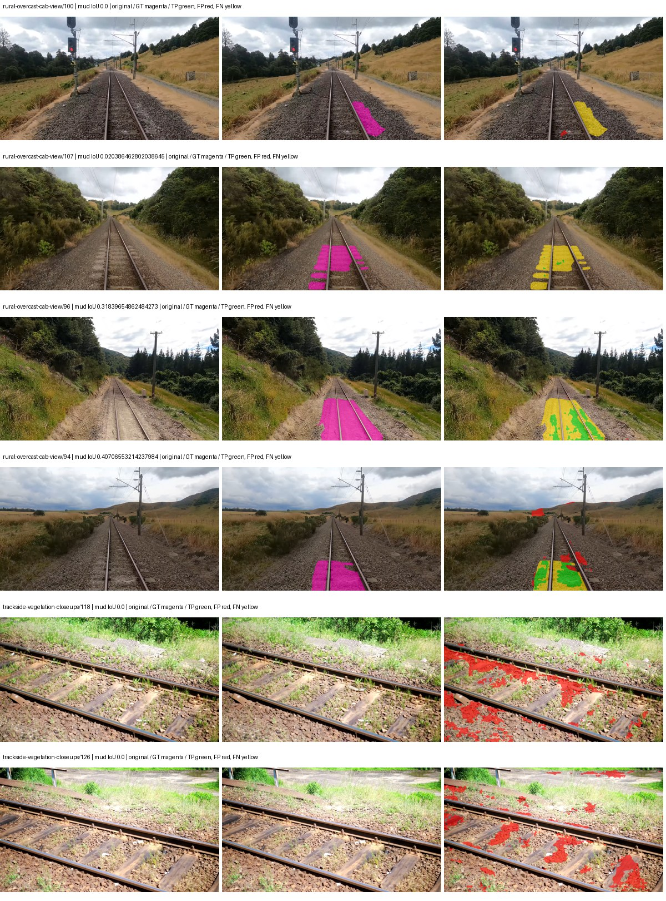
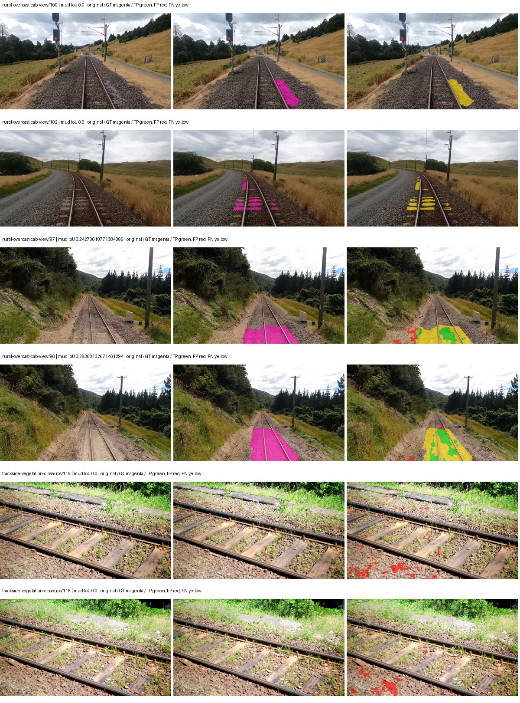
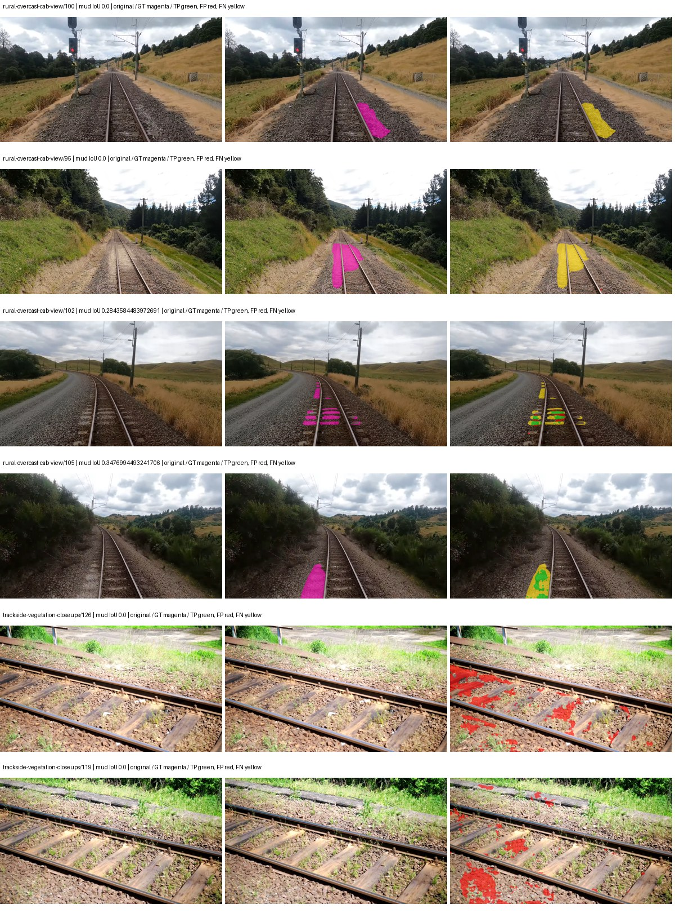
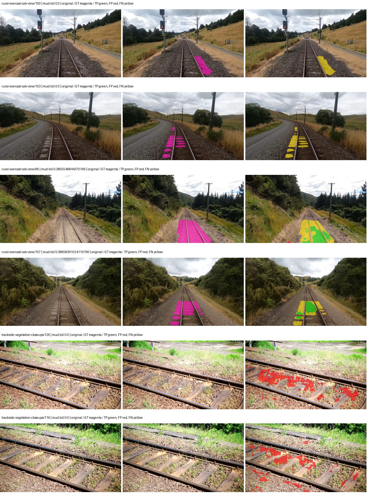

# smp_pan_resnext50 — paul-test-rtis_v2

[RTIS comparison](../../README.md) · [Full model records](record.json)

Primary selection and early stopping: **mud-pumping validation IoU**. A job is complete only after full statistics and isolated profiling are verified.

| Model | Initialization path | Seed | Status | Steps | Best step | Mud IoU (%) | Mud precision (%) | Mud recall (%) | Final mud IoU (trainer val, %) | mIoU (%) | Fixed GT-class mIoU (%) |
| --- | --- | --- | --- | --- | --- | --- | --- | --- | --- | --- | --- |
| smp_pan_resnext50 | rtis_only | 0 | completed | 2803 | 1529 | 8.36 | 11.69 | 22.68 | 1.86 | 28.99 | 33.82 |
| smp_pan_resnext50 | cityscapes_to_rtis | 0 | completed | 2549 | 1274 | 7.52 | 25.91 | 9.57 | 5.15 | 28.64 | 33.41 |
| smp_pan_resnext50 | railsem19_to_rtis | 0 | completed | 2549 | 1274 | 8.76 | 18.83 | 14.06 | 7.93 | 35.58 | 41.51 |
| smp_pan_resnext50 | cityscapes_to_railsem19_to_rtis | 0 | completed | 2549 | 1274 | 8.99 | 16.87 | 16.14 | 7.38 | 32.33 | 37.72 |

Training: 205 images. Validation: 37 images. Test: 50 held out. Seeds: [0]. Seed variation measures optimization variability, not independent-recording uncertainty. Historical source checkpoints stay fixed across adaptation seeds.

Training code: `066afb2626398b7be59d4d19f5a0e4644fd59adc`. Split SHA-256: `18a84c0163a65ded46508bcc904c374e5f33ad8a09b8879e3c8add606e86aa9f`.

## rtis_only — seed 0

Status: **completed**. Started: 2026-09-10T02:41:37.742327+00:00. Finished: 2026-09-10T03:13:00.955078+00:00.

Recipe pretrained initializer: `{"arch": "smp", "backbone_path": null, "batch_norm_momentum": null, "checkpoint": null, "classifier_path": null, "drop_path": null, "encoder_name": "resnext50_32x4d", "encoder_weights": "imagenet", "head": "unified_head", "head_paths": [], "inactive_parameter_paths": [], "local_files_only": false, "lora_alpha": 32, "lora_dropout": 0.05, "lora_r": 16, "lora_targets": [], "native": null, "revision": null, "smp_arch": "PAN", "subfolder": null, "trust_remote_code": false, "tuning": "full"}`.

`rtis_only` uses the recipe initializer, which may include pretrained segmentation components. Transfer paths load the exact historical source checkpoint below and reset the classifier; they do not reset all query/decoder features.

Source checkpoint: `Recipe pretrained initialization`.

Config SHA-256: `4fff68ca580451cc8568a954d393da6df278892589485589db606135dcac61f3`. Weights used for validation: `raw`.

### Mud-pumping and aggregate quality

| Metric | Selected checkpoint | Final training validation |
| --- | --- | --- |
| Mud IoU | 8.36 | 1.86 |
| Mud precision | 11.69 | 5.41 |
| Mud recall | 22.68 | 2.76 |
| Mud Dice/F1 | 15.43 | 3.66 |
| mIoU | 28.99 | 30.02 |
| Mean accuracy | 47.24 | 46.27 |
| Mean precision | 48.79 | 48.23 |
| Mean Dice | 39.18 | 39.87 |
| Mean specificity | 98.58 | 98.59 |
| Pixel accuracy | 76.61 | 78.85 |
| Frequency-weighted IoU | 66.67 | 67.14 |
| Fixed GT-present class mIoU | 33.82 | 35.02 |
| Boundary F1 | 33.81 | 36.33 |

The selected checkpoint has independent evaluation evidence. Final values are the trainer's final validation record, not a new independent evaluation. mIoU averages classes with nonzero union, so false positives on absent classes can change its denominator. The fixed GT-class mean is supplementary and excludes absent classes; their false positives remain in the confusion matrix.

### Resource usage and timing

| Measurement | Value |
| --- | --- |
| Peak training VRAM, retained training invocation (GiB) | 8.79 |
| Peak evaluation VRAM (GiB) | 6.71 |
| Retained training invocation wall time (seconds) | 1750.70 |
| Retained training invocation GPU-hours (one GPU) | 0.49 |
| Evaluation wall time (seconds) | 11.80 |
| Full evaluation pipeline images/second | 3.14 |
| Best full-state checkpoint (MiB) | 363.19 |
| Final full-state checkpoint (MiB) | 363.18 |
| Verified periodic checkpoints removed (GiB) | 1.77 |

VRAM uses the recorded allocator high-water mark; it is not total device usage including CUDA context. Resumed jobs' retained training invocation times and peaks are **not whole-campaign totals**. Earlier invocation resource records are not reconstructed here. Evaluation throughput includes loader, sliding-window inference and metrics; it is not model-only latency/FPS. Missing measurements are shown as —, never inferred from another dataset's run.

### Standardized inference performance

Dedicated model-only profiling waits for an idle worker-locked L40S: BF16, batch 1, 1024x1024, 20 warmup and 100 CUDA-event-timed public forwards. It excludes loading, preprocessing, tiling and metrics.

| Status | Parameters | Weight MiB | FPS | p50 ms | p95 ms | Peak reserved GiB |
| --- | --- | --- | --- | --- | --- | --- |
| complete | 23737468 | 90.55 | 175.24 | 5.40 | 8.23 | 0.40 |

```json
{
  "schema_version": 1,
  "model_id": "smp_pan_resnext50",
  "measured_at": "2026-09-10T03:12:56+00:00",
  "status": "complete",
  "benchmark_scope": "rtis_selected_checkpoint_model_only",
  "applies_to": [
    "smp_pan_resnext50--rtis_only--seed-0"
  ],
  "source": {
    "campaign_git_sha": "066afb2626398b7be59d4d19f5a0e4644fd59adc",
    "git_dirty": false,
    "config_hash": "5003bc0578c1",
    "resolved_config": "/data/izadia1/projects/segmentary-runs/paul-test-rtis_v2/seed0-20260909/configs/smp_pan_resnext50--rtis_only--seed-0.yaml",
    "config_sha256": "4fff68ca580451cc8568a954d393da6df278892589485589db606135dcac61f3",
    "checkpoint_sha256": "ad706b13d928ad1884c8d643cdcc07805db1db3186584456b2ec17b1c9318785",
    "checkpoint_global_step": 1529,
    "checkpoint_bytes": 380832069,
    "checkpoint_kind": "resume checkpoint with optimizer and EMA state",
    "weights": "raw",
    "measured_checkpoint_job_id": "smp_pan_resnext50--rtis_only--seed-0",
    "result_sha256": "15a06f87cf7436b928089b8ba6361731aa559a098007f9c15ba814df8d6ca0f4",
    "result_git_sha": "066afb2626398b7be59d4d19f5a0e4644fd59adc",
    "result_stage": "eval:paul-test-rtis:val",
    "result_seed": 0
  },
  "hardware": {
    "gpu_name": "NVIDIA L40S",
    "gpu_uuid": "GPU-931d0911-fc78-1638-e3d7-1ba868cbd286",
    "logical_device": "cuda:0",
    "physical_visibility_token": "2",
    "compute_capability": [
      8,
      9
    ],
    "total_memory_bytes": 47677177856
  },
  "model": {
    "parameter_count": 23737468,
    "trainable_parameter_count": 23737468,
    "resident_parameter_bytes": 94949872,
    "parameter_dtype_counts": {
      "float32": 23737468
    }
  },
  "contract": {
    "backend": "pytorch",
    "precision": "bf16_autocast",
    "batch_size": 1,
    "input_shape_nchw": [
      1,
      3,
      1024,
      1024
    ],
    "warmup_iterations": 20,
    "measured_iterations": 100,
    "timing": "per-forward CUDA events with end-event synchronization",
    "includes_preprocessing": false,
    "includes_data_loader": false,
    "includes_sliding_window": false,
    "input_resident_on_gpu": true,
    "model_only": true,
    "entrypoint": "public model(image) dense-logits forward"
  },
  "measurements": {
    "latency": {
      "p50_ms": 5.4020960330963135,
      "p95_ms": 8.234086799621581,
      "mean_ms": 5.706382093429565,
      "minimum_ms": 5.37497615814209,
      "maximum_ms": 10.033151626586914,
      "fps": 175.242383637685,
      "raw_ms": [
        5.406720161437988,
        5.460991859436035,
        8.227840423583984,
        9.759743690490723,
        5.900288105010986,
        5.454847812652588,
        5.397471904754639,
        5.385216236114502,
        5.392384052276611,
        5.3882880210876465,
        5.395455837249756,
        5.403679847717285,
        5.404672145843506,
        5.392352104187012,
        8.352767944335938,
        10.033151626586914,
        8.613887786865234,
        5.398528099060059,
        5.4179840087890625,
        5.72211217880249,
        6.2269439697265625,
        5.393407821655273,
        5.390336036682129,
        7.6360321044921875,
        9.500672340393066,
        5.493760108947754,
        5.407616138458252,
        6.138879776000977,
        5.789696216583252,
        5.395455837249756,
        5.604351997375488,
        5.6842241287231445,
        5.414912223815918,
        5.387263774871826,
        5.413887977600098,
        5.408768177032471,
        5.557248115539551,
        5.3994879722595215,
        5.385216236114502,
        5.395359992980957,
        5.736447811126709,
        5.401599884033203,
        5.3882880210876465,
        5.398528099060059,
        5.394432067871094,
        5.459968090057373,
        5.396480083465576,
        5.39247989654541,
        5.396480083465576,
        5.392384052276611,
        5.813248157501221,
        5.394432067871094,
        5.400576114654541,
        5.426176071166992,
        5.390336036682129,
        5.393472194671631,
        5.3954877853393555,
        5.390336036682129,
        5.391359806060791,
        5.396480083465576,
        5.3862080574035645,
        5.397503852844238,
        5.399551868438721,
        5.842944145202637,
        5.4036478996276855,
        5.393375873565674,
        5.395455837249756,
        5.393407821655273,
        5.386240005493164,
        5.40774393081665,
        5.402592182159424,
        5.391359806060791,
        5.402656078338623,
        5.37497615814209,
        5.404672145843506,
        5.402624130249023,
        5.982207775115967,
        5.562367916107178,
        5.398528099060059,
        5.394432067871094,
        5.396480083465576,
        5.3882880210876465,
        5.408768177032471,
        5.396480083465576,
        5.411839962005615,
        5.413887977600098,
        5.420032024383545,
        5.392384052276611,
        5.752831935882568,
        5.404672145843506,
        5.406720161437988,
        5.393407821655273,
        5.393407821655273,
        5.409791946411133,
        5.394432067871094,
        5.45689582824707,
        5.397503852844238,
        5.635072231292725,
        5.561344146728516,
        5.400576114654541
      ],
      "percentile_method": "numpy linear interpolation"
    },
    "peak_reserved_bytes": 429916160,
    "memory_kind": "pytorch_cuda_allocator_peak_reserved_excluding_context",
    "benchmark_wall_clock_s": 12.705516666173935
  },
  "started_at": "2026-09-10T03:12:44+00:00",
  "finished_at": "2026-09-10T03:12:56+00:00",
  "environment": {
    "hostname": "hdrfs-app-001",
    "python": "3.11.15",
    "platform": "Linux-5.15.0-139-generic-x86_64-with-glibc2.35",
    "torch": "2.11.0+cu128",
    "torch_cuda": "12.8",
    "cudnn": 91900,
    "driver_version": "570.133.20",
    "cuda_available": true,
    "gpu_count": 1,
    "gpu_names": [
      "NVIDIA L40S"
    ],
    "cuda_visible_devices": "2",
    "packages": {
      "segmentary": "0.1.0",
      "torch": "2.11.0+cu128",
      "torchvision": "0.26.0+cu128",
      "transformers": "5.15.0",
      "timm": "1.0.28",
      "segmentation-models-pytorch": "0.5.0",
      "albumentations": "2.0.8",
      "lightning": "2.6.5",
      "numpy": "2.4.4"
    }
  }
}
```

### Per-class validation results

| Class | GT pixels | IoU (%) | Precision (%) | Recall (%) | Dice (%) | Boundary F1 (%) |
| --- | --- | --- | --- | --- | --- | --- |
| car | 29664 | 26.78 | 88.51 | 27.74 | 42.24 | 44.23 |
| construction | 311585 | 20.99 | 22.43 | 76.60 | 34.69 | 22.16 |
| fence | 265137 | 13.69 | 31.26 | 19.58 | 24.08 | 26.22 |
| mud-pumping | 1226250 | 8.36 | 11.69 | 22.68 | 15.43 | 9.89 |
| on-rails | 0 | 0.00 | 0.00 | — | 0.00 | 0.00 |
| person | 0 | 0.00 | 0.00 | — | 0.00 | 0.00 |
| pole | 628038 | 58.08 | 69.50 | 77.95 | 73.48 | 86.15 |
| rail-embedded | 16799 | 14.61 | 40.70 | 18.57 | 25.50 | 26.01 |
| rail-raised | 2969797 | 72.25 | 80.14 | 88.01 | 83.89 | 90.57 |
| rail-track | 6323197 | 31.30 | 65.46 | 37.49 | 47.68 | 44.75 |
| road | 1048831 | 7.66 | 13.38 | 15.20 | 14.23 | 9.03 |
| sidewalk | 1297367 | 24.70 | 71.59 | 27.38 | 39.61 | 7.37 |
| sky | 19121606 | 90.51 | 99.37 | 91.04 | 95.02 | 71.37 |
| standing-water | 95802 | 1.37 | 1.39 | 50.64 | 2.71 | 3.58 |
| terrain | 39239306 | 78.02 | 84.94 | 90.55 | 87.66 | 42.34 |
| trackbed | 10643081 | 51.42 | 63.38 | 73.14 | 67.91 | 48.14 |
| traffic-light | 19510 | 33.76 | 51.96 | 49.08 | 50.48 | 49.65 |
| traffic-sign | 13285 | 22.38 | 70.24 | 24.73 | 36.58 | 46.93 |
| tram-track | 56179 | 37.07 | 70.81 | 43.75 | 54.09 | 29.78 |
| truck | 0 | 0.00 | 0.00 | — | 0.00 | 0.00 |
| vegetation-overgrowth | 5901821 | 15.89 | 87.91 | 16.25 | 27.42 | 51.87 |

### Full-run accounting

| Measurement | Value |
| --- | --- |
| Full GPU-reserved wall seconds, all recorded worker attempts | 1883.22 |
| Full reserved GPU-hours | 0.52 |
| Whole-run timing complete | True |

| Phase | Wall seconds including failed attempts |
| --- | --- |
| training | 1757.48 |
| diagnostics | 83.55 |
| performance | 20.07 |

GPU-reserved time includes model loading, training, validation, collection, profiling, checkpoint I/O and orchestration while the worker owns one GPU. It is not GPU kernel-active time. Phase timings and sampled device memory/power/utilization are retained separately; sampled device memory is not the allocator high-water mark.

### Train/validation and raw/EMA diagnostics

| Checkpoint / weights / split | Images | Mud IoU (%) | Mud precision (%) | Mud recall (%) |
| --- | --- | --- | --- | --- |
| best-auto-train / raw | 205 | 87.80 | 90.37 | 96.87 |
| best-auto-val / raw | 37 | 8.36 | 11.69 | 22.68 |
| best-alternate-val / ema | 37 | 1.80 | 5.40 | 2.62 |
| final-auto-val / raw | 37 | 1.87 | 5.42 | 2.77 |

Train uses the evaluation transform without augmentation. Compare mud train/validation metrics for the same selected weights. Alternate EMA on running-stat BatchNorm is explicitly uncalibrated and is diagnostic only. Score-threshold curves use uncalibrated normalized scores and are pixel-level diagnostics, not event detection rates or a selected deployment operating point.

### Downloadable evidence

- best-auto-train: [per-image.csv](rtis_only--seed-0/best-auto-train/per-image.csv) · [per-image-confusion.json.gz](rtis_only--seed-0/best-auto-train/per-image-confusion.json.gz) · [groups.json](rtis_only--seed-0/best-auto-train/groups.json) · [mud-score-curves.json](rtis_only--seed-0/best-auto-train/mud-score-curves.json)
- best-auto-val: [per-image.csv](rtis_only--seed-0/best-auto-val/per-image.csv) · [per-image-confusion.json.gz](rtis_only--seed-0/best-auto-val/per-image-confusion.json.gz) · [groups.json](rtis_only--seed-0/best-auto-val/groups.json) · [mud-score-curves.json](rtis_only--seed-0/best-auto-val/mud-score-curves.json) · [examples.jpg](rtis_only--seed-0/best-auto-val/examples.jpg)
- best-alternate-val: [per-image.csv](rtis_only--seed-0/best-alternate-val/per-image.csv) · [per-image-confusion.json.gz](rtis_only--seed-0/best-alternate-val/per-image-confusion.json.gz) · [groups.json](rtis_only--seed-0/best-alternate-val/groups.json) · [mud-score-curves.json](rtis_only--seed-0/best-alternate-val/mud-score-curves.json)
- final-auto-val: [per-image.csv](rtis_only--seed-0/final-auto-val/per-image.csv) · [per-image-confusion.json.gz](rtis_only--seed-0/final-auto-val/per-image-confusion.json.gz) · [groups.json](rtis_only--seed-0/final-auto-val/groups.json) · [mud-score-curves.json](rtis_only--seed-0/final-auto-val/mud-score-curves.json)
- resources: [telemetry.csv](rtis_only--seed-0/resources/telemetry.csv)



Examples are two lowest and two highest mud-IoU positive images, plus up to two negative images with the most false-positive mud pixels. They are targeted diagnostic examples, not random samples. Green: true positive; red: false positive; yellow: false negative. Full predictions remain on HDRFS.

### Validation tracking

| Logged step | Overall mIoU (%) | Mud IoU (%) |
| --- | --- | --- |
| 254 | 17.55 | 6.10 |
| 509 | 21.17 | 0.20 |
| 764 | 24.13 | 0.91 |
| 1019 | 25.99 | 1.26 |
| 1274 | 29.28 | 0.81 |
| 1529 | 28.99 | 8.35 |
| 1784 | 30.32 | 7.86 |
| 2038 | 29.05 | 4.18 |
| 2293 | 28.25 | 4.20 |
| 2548 | 29.65 | 4.19 |
| 2803 | 30.02 | 1.86 |

All retained scalar curves, including training loss and per-class IoU, are in record.json. Observed best mud on a curve is not necessarily a retained checkpoint: the pilot saved its selection-metric-best and final checkpoints. Step logging and checkpoint global_step may differ by one.

### Stopping and checkpoint provenance

```json
{
  "stopping": {
    "actual_steps": 2803,
    "maximum_steps": 4000,
    "min_delta": 0.001,
    "monitor": "val_iou/mud-pumping",
    "patience": 5,
    "reason": "validation_plateau"
  },
  "checkpoints": {
    "best": {
      "path": "/data/izadia1/projects/segmentary-runs/paul-test-rtis_v2/seed0-20260909/future-runs/smp_pan_resnext50--rtis_only--seed-0_seed0/rtis/best.ckpt",
      "sha256": "ad706b13d928ad1884c8d643cdcc07805db1db3186584456b2ec17b1c9318785",
      "global_step": 1529,
      "bytes": 380832069
    },
    "final": {
      "path": "/data/izadia1/projects/segmentary-runs/paul-test-rtis_v2/seed0-20260909/future-runs/smp_pan_resnext50--rtis_only--seed-0_seed0/rtis/last.ckpt",
      "sha256": "f56ae51dd27f9bd0968545135671f91eb39e817504ed3f8bb3d4f22021749f0f",
      "global_step": 2803,
      "bytes": 380818373
    }
  },
  "cleanup_error": null
}
```

### Resolved training, initialization and evaluation settings

The optimizer block is the base configuration. Stage LR scales are applied at runtime, and stage warmup is capped at min(base warmup, floor(stage budget / 10), stage budget - 1): 400 steps for this 4,000-step pilot. Model-internal native input grids may differ from augmentation crops (EoMT uses its 640 grid).

```json
{
  "name": "smp_pan_resnext50--rtis_only--seed-0",
  "model": {
    "arch": "smp",
    "checkpoint": null,
    "tuning": "full",
    "head": "unified_head",
    "lora_r": 16,
    "lora_alpha": 32,
    "lora_dropout": 0.05,
    "lora_targets": [],
    "drop_path": null,
    "revision": null,
    "subfolder": null,
    "local_files_only": false,
    "trust_remote_code": false,
    "backbone_path": null,
    "head_paths": [],
    "classifier_path": null,
    "inactive_parameter_paths": [],
    "smp_arch": "PAN",
    "encoder_name": "resnext50_32x4d",
    "encoder_weights": "imagenet",
    "native": null,
    "batch_norm_momentum": null
  },
  "space": "paul-test-rtis",
  "taxonomy_root": "/data/izadia1/projects/segmentary-rtis-fullstats-066afb2/taxonomy",
  "output_root": "/data/izadia1/projects/segmentary-runs/paul-test-rtis_v2/seed0-20260909/future-runs",
  "optim": {
    "backbone_lr": 0.0001,
    "head_lr_mult": 10.0,
    "weight_decay": 0.05,
    "llrd": 1.0,
    "warmup_iters": 1500,
    "warmup_ratio": 1e-06,
    "poly_power": 0.9,
    "min_lr_ratio": 0.0,
    "betas": [
      0.9,
      0.999
    ],
    "grad_clip": 1.0
  },
  "train": {
    "iters": 4000,
    "batch_size": 2,
    "accum": 8,
    "num_workers": 2,
    "precision": "bf16-mixed",
    "ema_decay": 0.9998,
    "val_every": 250,
    "ckpt_every": 500,
    "selection_metric": "val_iou/mud-pumping",
    "early_stopping_patience": 5,
    "early_stopping_min_delta": 0.001,
    "seed": 0,
    "devices": 1
  },
  "eval": {
    "sliding_window": true,
    "window": [
      1024,
      1024
    ],
    "stride": [
      768,
      768
    ],
    "batch_size": 1,
    "num_workers": 2,
    "tta_scales": [],
    "tta_flip": false,
    "threshold": 0.5,
    "boundary_tolerance_frac": 0.0075,
    "save_confusion": true
  },
  "loss": {
    "task": "multiclass",
    "activation": "auto",
    "terms": [],
    "aux": "none",
    "aux_weight": 0.0,
    "ce_weight": 1.0,
    "label_smoothing": 0.0,
    "class_weights": null,
    "query": null
  },
  "aug": {
    "crop": [
      1024,
      1024
    ],
    "scale_min": 0.5,
    "scale_max": 2.0,
    "hflip_p": 0.5,
    "color_jitter_p": 0.5,
    "brightness": 0.25,
    "contrast": 0.25,
    "saturation": 0.25,
    "hue": 0.05
  },
  "stages": [
    {
      "name": "rtis",
      "data": [
        {
          "name": "paul-test-rtis",
          "root": "/data/izadia1/datasets/paul-test-rtis_v2",
          "variant": null,
          "split_file": "splits.json",
          "train_split": "train",
          "val_split": "val",
          "limit": null,
          "loader": "folder",
          "mapping": "paul-test-rtis",
          "loader_options": {
            "require_groups": true
          }
        }
      ],
      "iters": null,
      "lr_scale": 1.0,
      "head_group_lr_scale": 1.0,
      "init_from": "pretrained",
      "reset_head": false,
      "freeze": null,
      "sample_weights": null
    }
  ]
}
```

### Hardware and software provenance

```json
{
  "training": {
    "cuda_available": true,
    "cuda_visible_devices": "2",
    "cudnn": 91900,
    "driver_version": "570.133.20",
    "gpu_count": 1,
    "gpu_names": [
      "NVIDIA L40S"
    ],
    "hostname": "hdrfs-app-001",
    "input_normalization": {
      "channel_order": "rgb",
      "mean": [
        0.485,
        0.456,
        0.406
      ],
      "source": "smp_encoder_settings",
      "std": [
        0.229,
        0.224,
        0.225
      ]
    },
    "model_origins": [
      {
        "hf_commit": null,
        "hf_name_or_path": null,
        "module": "model",
        "timm_pretrained": {}
      }
    ],
    "model_parameter_count": 23737468,
    "packages": {
      "albumentations": "2.0.8",
      "lightning": "2.6.5",
      "numpy": "2.4.4",
      "segmentary": "0.1.0",
      "segmentation-models-pytorch": "0.5.0",
      "timm": "1.0.28",
      "torch": "2.11.0+cu128",
      "torchvision": "0.26.0+cu128",
      "transformers": "5.15.0"
    },
    "platform": "Linux-5.15.0-139-generic-x86_64-with-glibc2.35",
    "python": "3.11.15",
    "torch": "2.11.0+cu128",
    "torch_cuda": "12.8",
    "trainable_parameter_count": 23737468,
    "training_stop": {
      "actual_steps": 2803,
      "maximum_steps": 4000,
      "min_delta": 0.001,
      "monitor": "val_iou/mud-pumping",
      "patience": 5,
      "reason": "validation_plateau"
    },
    "validation_weights": "raw"
  },
  "evaluation": {
    "cuda_available": true,
    "cuda_visible_devices": "2",
    "cudnn": 91900,
    "driver_version": "570.133.20",
    "gpu_count": 1,
    "gpu_names": [
      "NVIDIA L40S"
    ],
    "hostname": "hdrfs-app-001",
    "input_normalization": {
      "channel_order": "rgb",
      "mean": [
        0.485,
        0.456,
        0.406
      ],
      "source": "smp_encoder_settings",
      "std": [
        0.229,
        0.224,
        0.225
      ]
    },
    "packages": {
      "albumentations": "2.0.8",
      "lightning": "2.6.5",
      "numpy": "2.4.4",
      "segmentary": "0.1.0",
      "segmentation-models-pytorch": "0.5.0",
      "timm": "1.0.28",
      "torch": "2.11.0+cu128",
      "torchvision": "0.26.0+cu128",
      "transformers": "5.15.0"
    },
    "platform": "Linux-5.15.0-139-generic-x86_64-with-glibc2.35",
    "python": "3.11.15",
    "torch": "2.11.0+cu128",
    "torch_cuda": "12.8"
  }
}
```

## cityscapes_to_rtis — seed 0

Status: **completed**. Started: 2026-09-10T02:43:35.922816+00:00. Finished: 2026-09-10T03:13:07.667388+00:00.

Recipe pretrained initializer: `{"arch": "smp", "backbone_path": null, "batch_norm_momentum": null, "checkpoint": null, "classifier_path": null, "drop_path": null, "encoder_name": "resnext50_32x4d", "encoder_weights": "imagenet", "head": "unified_head", "head_paths": [], "inactive_parameter_paths": [], "local_files_only": false, "lora_alpha": 32, "lora_dropout": 0.05, "lora_r": 16, "lora_targets": [], "native": null, "revision": null, "smp_arch": "PAN", "subfolder": null, "trust_remote_code": false, "tuning": "full"}`.

`rtis_only` uses the recipe initializer, which may include pretrained segmentation components. Transfer paths load the exact historical source checkpoint below and reset the classifier; they do not reset all query/decoder features.

Source checkpoint: `{'name': 'smp_pan_resnext50--cityscapes--seed-0', 'model': 'smp_pan_resnext50', 'protocol': 'cityscapes', 'config': '/data/izadia1/projects/segmentary-runs/all-model-city-rail-seed0-rail20-b9eb3e1/accepted/smp_pan_resnext50--cityscapes--seed-0/resolved-config.yaml', 'checkpoint': '/data/izadia1/projects/segmentary-runs/current-main-fill-v2/jobs/smp_pan_resnext50--cityscapes--seed-0/train/smp_pan_resnext50--cityscapes_seed0/cityscapes/last.ckpt', 'recorded_sha256': 'a546b41da5f9cd1dcc82f834e0bd55dd9663f6e41762c35a0632d69d5aa7a87c', 'exists': True}`.

Config SHA-256: `eedbaab20593dccff7d3afcf625677363b253e79a019c73c0c3d0f36c859340c`. Weights used for validation: `raw`.

### Mud-pumping and aggregate quality

| Metric | Selected checkpoint | Final training validation |
| --- | --- | --- |
| Mud IoU | 7.52 | 5.15 |
| Mud precision | 25.91 | 12.50 |
| Mud recall | 9.57 | 8.05 |
| Mud Dice/F1 | 13.98 | 9.79 |
| mIoU | 28.64 | 29.42 |
| Mean accuracy | 42.41 | 41.58 |
| Mean precision | 49.96 | 51.82 |
| Mean Dice | 37.64 | 38.75 |
| Mean specificity | 98.48 | 98.36 |
| Pixel accuracy | 77.90 | 75.92 |
| Frequency-weighted IoU | 65.30 | 63.56 |
| Fixed GT-present class mIoU | 33.41 | 32.69 |
| Boundary F1 | 34.00 | 36.61 |

The selected checkpoint has independent evaluation evidence. Final values are the trainer's final validation record, not a new independent evaluation. mIoU averages classes with nonzero union, so false positives on absent classes can change its denominator. The fixed GT-class mean is supplementary and excludes absent classes; their false positives remain in the confusion matrix.

### Resource usage and timing

| Measurement | Value |
| --- | --- |
| Peak training VRAM, retained training invocation (GiB) | 8.79 |
| Peak evaluation VRAM (GiB) | 6.71 |
| Retained training invocation wall time (seconds) | 1640.02 |
| Retained training invocation GPU-hours (one GPU) | 0.46 |
| Evaluation wall time (seconds) | 11.43 |
| Full evaluation pipeline images/second | 3.24 |
| Best full-state checkpoint (MiB) | 363.19 |
| Final full-state checkpoint (MiB) | 363.18 |
| Verified periodic checkpoints removed (GiB) | 1.77 |

VRAM uses the recorded allocator high-water mark; it is not total device usage including CUDA context. Resumed jobs' retained training invocation times and peaks are **not whole-campaign totals**. Earlier invocation resource records are not reconstructed here. Evaluation throughput includes loader, sliding-window inference and metrics; it is not model-only latency/FPS. Missing measurements are shown as —, never inferred from another dataset's run.

### Standardized inference performance

Dedicated model-only profiling waits for an idle worker-locked L40S: BF16, batch 1, 1024x1024, 20 warmup and 100 CUDA-event-timed public forwards. It excludes loading, preprocessing, tiling and metrics.

| Status | Parameters | Weight MiB | FPS | p50 ms | p95 ms | Peak reserved GiB |
| --- | --- | --- | --- | --- | --- | --- |
| complete | 23737468 | 90.55 | 184.12 | 5.40 | 5.50 | 0.40 |

```json
{
  "schema_version": 1,
  "model_id": "smp_pan_resnext50",
  "measured_at": "2026-09-10T03:13:03+00:00",
  "status": "complete",
  "benchmark_scope": "rtis_selected_checkpoint_model_only",
  "applies_to": [
    "smp_pan_resnext50--cityscapes_to_rtis--seed-0"
  ],
  "source": {
    "campaign_git_sha": "066afb2626398b7be59d4d19f5a0e4644fd59adc",
    "git_dirty": false,
    "config_hash": "96b53f94f507",
    "resolved_config": "/data/izadia1/projects/segmentary-runs/paul-test-rtis_v2/seed0-20260909/configs/smp_pan_resnext50--cityscapes_to_rtis--seed-0.yaml",
    "config_sha256": "eedbaab20593dccff7d3afcf625677363b253e79a019c73c0c3d0f36c859340c",
    "checkpoint_sha256": "8ca3ef2a65b1fd98dca2a1a39eaade197af8ad95cef3424656c6b7d9dfab8be0",
    "checkpoint_global_step": 1274,
    "checkpoint_bytes": 380832133,
    "checkpoint_kind": "resume checkpoint with optimizer and EMA state",
    "weights": "raw",
    "measured_checkpoint_job_id": "smp_pan_resnext50--cityscapes_to_rtis--seed-0",
    "result_sha256": "6ac41856647648658ed4ccee4cc400894090c632284854559ffd32f5529b6208",
    "result_git_sha": "066afb2626398b7be59d4d19f5a0e4644fd59adc",
    "result_stage": "eval:paul-test-rtis:val",
    "result_seed": 0
  },
  "hardware": {
    "gpu_name": "NVIDIA L40S",
    "gpu_uuid": "GPU-2f8008a1-9b67-11f6-987b-b393a672322c",
    "logical_device": "cuda:0",
    "physical_visibility_token": "3",
    "compute_capability": [
      8,
      9
    ],
    "total_memory_bytes": 47677177856
  },
  "model": {
    "parameter_count": 23737468,
    "trainable_parameter_count": 23737468,
    "resident_parameter_bytes": 94949872,
    "parameter_dtype_counts": {
      "float32": 23737468
    }
  },
  "contract": {
    "backend": "pytorch",
    "precision": "bf16_autocast",
    "batch_size": 1,
    "input_shape_nchw": [
      1,
      3,
      1024,
      1024
    ],
    "warmup_iterations": 20,
    "measured_iterations": 100,
    "timing": "per-forward CUDA events with end-event synchronization",
    "includes_preprocessing": false,
    "includes_data_loader": false,
    "includes_sliding_window": false,
    "input_resident_on_gpu": true,
    "model_only": true,
    "entrypoint": "public model(image) dense-logits forward"
  },
  "measurements": {
    "latency": {
      "p50_ms": 5.39899206161499,
      "p95_ms": 5.503959774971007,
      "mean_ms": 5.431273279190063,
      "minimum_ms": 5.378047943115234,
      "maximum_ms": 6.2350077629089355,
      "fps": 184.1188886281054,
      "raw_ms": [
        5.4323201179504395,
        5.393407821655273,
        5.385216236114502,
        5.391359806060791,
        5.387199878692627,
        5.394432067871094,
        5.385216236114502,
        5.379104137420654,
        5.382143974304199,
        5.4179840087890625,
        5.399551868438721,
        5.378047943115234,
        5.386240005493164,
        5.396480083465576,
        5.396480083465576,
        5.398528099060059,
        5.393407821655273,
        5.397503852844238,
        5.384191989898682,
        5.384191989898682,
        5.393407821655273,
        5.414912223815918,
        5.405695915222168,
        5.394432067871094,
        5.396480083465576,
        5.396480083465576,
        5.399551868438721,
        5.385216236114502,
        5.4036478996276855,
        5.4036478996276855,
        5.404672145843506,
        5.4476799964904785,
        5.396480083465576,
        6.1605119705200195,
        5.40774393081665,
        5.40774393081665,
        5.387263774871826,
        5.404575824737549,
        5.387263774871826,
        5.390336036682129,
        5.397568225860596,
        5.400479793548584,
        5.405695915222168,
        5.738495826721191,
        5.391359806060791,
        5.392384052276611,
        5.398528099060059,
        5.40067195892334,
        5.394432067871094,
        5.405695915222168,
        5.389311790466309,
        5.400576114654541,
        5.405632019042969,
        5.398464202880859,
        5.392384052276611,
        5.413887977600098,
        5.400576114654541,
        5.404672145843506,
        5.3924479484558105,
        5.4036478996276855,
        5.400576114654541,
        5.393407821655273,
        5.398431777954102,
        5.40774393081665,
        5.395455837249756,
        5.403584003448486,
        5.4128642082214355,
        5.394432067871094,
        5.401599884033203,
        5.404672145843506,
        5.397503852844238,
        5.396480083465576,
        5.408768177032471,
        5.408768177032471,
        5.394432067871094,
        5.408768177032471,
        5.408768177032471,
        5.400576114654541,
        5.393407821655273,
        6.071296215057373,
        5.93612813949585,
        5.392384052276611,
        5.4036478996276855,
        5.394432067871094,
        5.391359806060791,
        5.399551868438721,
        5.398528099060059,
        5.403776168823242,
        5.404672145843506,
        6.2350077629089355,
        5.4916157722473145,
        5.396480083465576,
        5.3882880210876465,
        5.4036478996276855,
        5.40172815322876,
        5.391359806060791,
        5.399456024169922,
        5.4036478996276855,
        5.408768177032471,
        5.4036478996276855
      ],
      "percentile_method": "numpy linear interpolation"
    },
    "peak_reserved_bytes": 429916160,
    "memory_kind": "pytorch_cuda_allocator_peak_reserved_excluding_context",
    "benchmark_wall_clock_s": 12.940658885985613
  },
  "started_at": "2026-09-10T03:12:50+00:00",
  "finished_at": "2026-09-10T03:13:03+00:00",
  "environment": {
    "hostname": "hdrfs-app-001",
    "python": "3.11.15",
    "platform": "Linux-5.15.0-139-generic-x86_64-with-glibc2.35",
    "torch": "2.11.0+cu128",
    "torch_cuda": "12.8",
    "cudnn": 91900,
    "driver_version": "570.133.20",
    "cuda_available": true,
    "gpu_count": 1,
    "gpu_names": [
      "NVIDIA L40S"
    ],
    "cuda_visible_devices": "3",
    "packages": {
      "segmentary": "0.1.0",
      "torch": "2.11.0+cu128",
      "torchvision": "0.26.0+cu128",
      "transformers": "5.15.0",
      "timm": "1.0.28",
      "segmentation-models-pytorch": "0.5.0",
      "albumentations": "2.0.8",
      "lightning": "2.6.5",
      "numpy": "2.4.4"
    }
  }
}
```

### Per-class validation results

| Class | GT pixels | IoU (%) | Precision (%) | Recall (%) | Dice (%) | Boundary F1 (%) |
| --- | --- | --- | --- | --- | --- | --- |
| car | 29664 | 47.47 | 70.21 | 59.45 | 64.38 | 38.21 |
| construction | 311585 | 20.41 | 22.82 | 65.94 | 33.91 | 17.86 |
| fence | 265137 | 16.94 | 31.30 | 26.98 | 28.98 | 24.42 |
| mud-pumping | 1226250 | 7.52 | 25.91 | 9.57 | 13.98 | 10.86 |
| on-rails | 0 | 0.00 | 0.00 | — | 0.00 | 0.00 |
| person | 0 | 0.00 | 0.00 | — | 0.00 | 0.00 |
| pole | 628038 | 58.36 | 83.62 | 65.90 | 73.71 | 86.74 |
| rail-embedded | 16799 | 4.21 | 93.92 | 4.23 | 8.09 | 21.35 |
| rail-raised | 2969797 | 72.99 | 81.07 | 87.99 | 84.38 | 89.35 |
| rail-track | 6323197 | 29.89 | 70.79 | 34.09 | 46.02 | 39.72 |
| road | 1048831 | 3.08 | 5.23 | 6.97 | 5.98 | 5.33 |
| sidewalk | 1297367 | 12.07 | 45.53 | 14.10 | 21.53 | 6.75 |
| sky | 19121606 | 85.60 | 99.28 | 86.14 | 92.24 | 68.84 |
| standing-water | 95802 | 0.49 | 0.53 | 5.63 | 0.97 | 4.22 |
| terrain | 39239306 | 75.42 | 78.19 | 95.52 | 85.99 | 40.92 |
| trackbed | 10643081 | 62.83 | 71.82 | 83.39 | 77.17 | 56.60 |
| traffic-light | 19510 | 57.01 | 81.91 | 65.22 | 72.62 | 76.31 |
| traffic-sign | 13285 | 22.81 | 71.26 | 25.12 | 37.14 | 55.57 |
| tram-track | 56179 | 11.63 | 41.66 | 13.89 | 20.83 | 28.04 |
| truck | 0 | 0.00 | 0.00 | — | 0.00 | 0.00 |
| vegetation-overgrowth | 5901821 | 12.67 | 74.15 | 13.25 | 22.49 | 42.95 |

### Full-run accounting

| Measurement | Value |
| --- | --- |
| Full GPU-reserved wall seconds, all recorded worker attempts | 1772.05 |
| Full reserved GPU-hours | 0.49 |
| Whole-run timing complete | True |

| Phase | Wall seconds including failed attempts |
| --- | --- |
| training | 1647.01 |
| diagnostics | 82.73 |
| performance | 20.07 |

GPU-reserved time includes model loading, training, validation, collection, profiling, checkpoint I/O and orchestration while the worker owns one GPU. It is not GPU kernel-active time. Phase timings and sampled device memory/power/utilization are retained separately; sampled device memory is not the allocator high-water mark.

### Train/validation and raw/EMA diagnostics

| Checkpoint / weights / split | Images | Mud IoU (%) | Mud precision (%) | Mud recall (%) |
| --- | --- | --- | --- | --- |
| best-auto-train / raw | 205 | 76.43 | 96.72 | 78.46 |
| best-auto-val / raw | 37 | 7.52 | 25.91 | 9.57 |
| best-alternate-val / ema | 37 | 4.54 | 16.46 | 5.90 |
| final-auto-val / raw | 37 | 5.15 | 12.50 | 8.05 |

Train uses the evaluation transform without augmentation. Compare mud train/validation metrics for the same selected weights. Alternate EMA on running-stat BatchNorm is explicitly uncalibrated and is diagnostic only. Score-threshold curves use uncalibrated normalized scores and are pixel-level diagnostics, not event detection rates or a selected deployment operating point.

### Downloadable evidence

- best-auto-train: [per-image.csv](cityscapes_to_rtis--seed-0/best-auto-train/per-image.csv) · [per-image-confusion.json.gz](cityscapes_to_rtis--seed-0/best-auto-train/per-image-confusion.json.gz) · [groups.json](cityscapes_to_rtis--seed-0/best-auto-train/groups.json) · [mud-score-curves.json](cityscapes_to_rtis--seed-0/best-auto-train/mud-score-curves.json)
- best-auto-val: [per-image.csv](cityscapes_to_rtis--seed-0/best-auto-val/per-image.csv) · [per-image-confusion.json.gz](cityscapes_to_rtis--seed-0/best-auto-val/per-image-confusion.json.gz) · [groups.json](cityscapes_to_rtis--seed-0/best-auto-val/groups.json) · [mud-score-curves.json](cityscapes_to_rtis--seed-0/best-auto-val/mud-score-curves.json) · [examples.jpg](cityscapes_to_rtis--seed-0/best-auto-val/examples.jpg)
- best-alternate-val: [per-image.csv](cityscapes_to_rtis--seed-0/best-alternate-val/per-image.csv) · [per-image-confusion.json.gz](cityscapes_to_rtis--seed-0/best-alternate-val/per-image-confusion.json.gz) · [groups.json](cityscapes_to_rtis--seed-0/best-alternate-val/groups.json) · [mud-score-curves.json](cityscapes_to_rtis--seed-0/best-alternate-val/mud-score-curves.json)
- final-auto-val: [per-image.csv](cityscapes_to_rtis--seed-0/final-auto-val/per-image.csv) · [per-image-confusion.json.gz](cityscapes_to_rtis--seed-0/final-auto-val/per-image-confusion.json.gz) · [groups.json](cityscapes_to_rtis--seed-0/final-auto-val/groups.json) · [mud-score-curves.json](cityscapes_to_rtis--seed-0/final-auto-val/mud-score-curves.json)
- resources: [telemetry.csv](cityscapes_to_rtis--seed-0/resources/telemetry.csv)



Examples are two lowest and two highest mud-IoU positive images, plus up to two negative images with the most false-positive mud pixels. They are targeted diagnostic examples, not random samples. Green: true positive; red: false positive; yellow: false negative. Full predictions remain on HDRFS.

### Validation tracking

| Logged step | Overall mIoU (%) | Mud IoU (%) |
| --- | --- | --- |
| 254 | 19.96 | 4.93 |
| 509 | 22.12 | 3.98 |
| 764 | 23.14 | 2.59 |
| 1019 | 25.92 | 2.44 |
| 1274 | 28.64 | 7.51 |
| 1529 | 25.66 | 1.19 |
| 1784 | 26.35 | 2.20 |
| 2038 | 26.97 | 4.45 |
| 2293 | 26.57 | 3.24 |
| 2548 | 29.42 | 5.15 |

All retained scalar curves, including training loss and per-class IoU, are in record.json. Observed best mud on a curve is not necessarily a retained checkpoint: the pilot saved its selection-metric-best and final checkpoints. Step logging and checkpoint global_step may differ by one.

### Stopping and checkpoint provenance

```json
{
  "stopping": {
    "actual_steps": 2549,
    "maximum_steps": 4000,
    "min_delta": 0.001,
    "monitor": "val_iou/mud-pumping",
    "patience": 5,
    "reason": "validation_plateau"
  },
  "checkpoints": {
    "best": {
      "path": "/data/izadia1/projects/segmentary-runs/paul-test-rtis_v2/seed0-20260909/future-runs/smp_pan_resnext50--cityscapes_to_rtis--seed-0_seed0/rtis/best.ckpt",
      "sha256": "8ca3ef2a65b1fd98dca2a1a39eaade197af8ad95cef3424656c6b7d9dfab8be0",
      "global_step": 1274,
      "bytes": 380832133
    },
    "final": {
      "path": "/data/izadia1/projects/segmentary-runs/paul-test-rtis_v2/seed0-20260909/future-runs/smp_pan_resnext50--cityscapes_to_rtis--seed-0_seed0/rtis/last.ckpt",
      "sha256": "11aa67c3a1b89331cd5be767e5c3407fc944ed6476fb19f5bbef7a2e020f9d21",
      "global_step": 2549,
      "bytes": 380818437
    }
  },
  "cleanup_error": null
}
```

### Resolved training, initialization and evaluation settings

The optimizer block is the base configuration. Stage LR scales are applied at runtime, and stage warmup is capped at min(base warmup, floor(stage budget / 10), stage budget - 1): 400 steps for this 4,000-step pilot. Model-internal native input grids may differ from augmentation crops (EoMT uses its 640 grid).

```json
{
  "name": "smp_pan_resnext50--cityscapes_to_rtis--seed-0",
  "model": {
    "arch": "smp",
    "checkpoint": null,
    "tuning": "full",
    "head": "unified_head",
    "lora_r": 16,
    "lora_alpha": 32,
    "lora_dropout": 0.05,
    "lora_targets": [],
    "drop_path": null,
    "revision": null,
    "subfolder": null,
    "local_files_only": false,
    "trust_remote_code": false,
    "backbone_path": null,
    "head_paths": [],
    "classifier_path": null,
    "inactive_parameter_paths": [],
    "smp_arch": "PAN",
    "encoder_name": "resnext50_32x4d",
    "encoder_weights": "imagenet",
    "native": null,
    "batch_norm_momentum": null
  },
  "space": "paul-test-rtis",
  "taxonomy_root": "/data/izadia1/projects/segmentary-rtis-fullstats-066afb2/taxonomy",
  "output_root": "/data/izadia1/projects/segmentary-runs/paul-test-rtis_v2/seed0-20260909/future-runs",
  "optim": {
    "backbone_lr": 0.0001,
    "head_lr_mult": 10.0,
    "weight_decay": 0.05,
    "llrd": 1.0,
    "warmup_iters": 1500,
    "warmup_ratio": 1e-06,
    "poly_power": 0.9,
    "min_lr_ratio": 0.0,
    "betas": [
      0.9,
      0.999
    ],
    "grad_clip": 1.0
  },
  "train": {
    "iters": 4000,
    "batch_size": 2,
    "accum": 8,
    "num_workers": 2,
    "precision": "bf16-mixed",
    "ema_decay": 0.9998,
    "val_every": 250,
    "ckpt_every": 500,
    "selection_metric": "val_iou/mud-pumping",
    "early_stopping_patience": 5,
    "early_stopping_min_delta": 0.001,
    "seed": 0,
    "devices": 1
  },
  "eval": {
    "sliding_window": true,
    "window": [
      1024,
      1024
    ],
    "stride": [
      768,
      768
    ],
    "batch_size": 1,
    "num_workers": 2,
    "tta_scales": [],
    "tta_flip": false,
    "threshold": 0.5,
    "boundary_tolerance_frac": 0.0075,
    "save_confusion": true
  },
  "loss": {
    "task": "multiclass",
    "activation": "auto",
    "terms": [],
    "aux": "none",
    "aux_weight": 0.0,
    "ce_weight": 1.0,
    "label_smoothing": 0.0,
    "class_weights": null,
    "query": null
  },
  "aug": {
    "crop": [
      1024,
      1024
    ],
    "scale_min": 0.5,
    "scale_max": 2.0,
    "hflip_p": 0.5,
    "color_jitter_p": 0.5,
    "brightness": 0.25,
    "contrast": 0.25,
    "saturation": 0.25,
    "hue": 0.05
  },
  "stages": [
    {
      "name": "rtis",
      "data": [
        {
          "name": "paul-test-rtis",
          "root": "/data/izadia1/datasets/paul-test-rtis_v2",
          "variant": null,
          "split_file": "splits.json",
          "train_split": "train",
          "val_split": "val",
          "limit": null,
          "loader": "folder",
          "mapping": "paul-test-rtis",
          "loader_options": {
            "require_groups": true
          }
        }
      ],
      "iters": null,
      "lr_scale": 0.1,
      "head_group_lr_scale": 1.0,
      "init_from": "/data/izadia1/projects/segmentary-runs/current-main-fill-v2/jobs/smp_pan_resnext50--cityscapes--seed-0/train/smp_pan_resnext50--cityscapes_seed0/cityscapes/last.ckpt",
      "reset_head": true,
      "freeze": null,
      "sample_weights": null
    }
  ]
}
```

### Hardware and software provenance

```json
{
  "training": {
    "cuda_available": true,
    "cuda_visible_devices": "3",
    "cudnn": 91900,
    "driver_version": "570.133.20",
    "gpu_count": 1,
    "gpu_names": [
      "NVIDIA L40S"
    ],
    "hostname": "hdrfs-app-001",
    "input_normalization": {
      "channel_order": "rgb",
      "mean": [
        0.485,
        0.456,
        0.406
      ],
      "source": "smp_encoder_settings",
      "std": [
        0.229,
        0.224,
        0.225
      ]
    },
    "model_origins": [
      {
        "hf_commit": null,
        "hf_name_or_path": null,
        "module": "model",
        "timm_pretrained": {}
      }
    ],
    "model_parameter_count": 23737468,
    "packages": {
      "albumentations": "2.0.8",
      "lightning": "2.6.5",
      "numpy": "2.4.4",
      "segmentary": "0.1.0",
      "segmentation-models-pytorch": "0.5.0",
      "timm": "1.0.28",
      "torch": "2.11.0+cu128",
      "torchvision": "0.26.0+cu128",
      "transformers": "5.15.0"
    },
    "platform": "Linux-5.15.0-139-generic-x86_64-with-glibc2.35",
    "python": "3.11.15",
    "torch": "2.11.0+cu128",
    "torch_cuda": "12.8",
    "trainable_parameter_count": 23737468,
    "training_stop": {
      "actual_steps": 2549,
      "maximum_steps": 4000,
      "min_delta": 0.001,
      "monitor": "val_iou/mud-pumping",
      "patience": 5,
      "reason": "validation_plateau"
    },
    "validation_weights": "raw"
  },
  "evaluation": {
    "cuda_available": true,
    "cuda_visible_devices": "3",
    "cudnn": 91900,
    "driver_version": "570.133.20",
    "gpu_count": 1,
    "gpu_names": [
      "NVIDIA L40S"
    ],
    "hostname": "hdrfs-app-001",
    "input_normalization": {
      "channel_order": "rgb",
      "mean": [
        0.485,
        0.456,
        0.406
      ],
      "source": "smp_encoder_settings",
      "std": [
        0.229,
        0.224,
        0.225
      ]
    },
    "packages": {
      "albumentations": "2.0.8",
      "lightning": "2.6.5",
      "numpy": "2.4.4",
      "segmentary": "0.1.0",
      "segmentation-models-pytorch": "0.5.0",
      "timm": "1.0.28",
      "torch": "2.11.0+cu128",
      "torchvision": "0.26.0+cu128",
      "transformers": "5.15.0"
    },
    "platform": "Linux-5.15.0-139-generic-x86_64-with-glibc2.35",
    "python": "3.11.15",
    "torch": "2.11.0+cu128",
    "torch_cuda": "12.8"
  }
}
```

## railsem19_to_rtis — seed 0

Status: **completed**. Started: 2026-09-10T02:48:33.979010+00:00. Finished: 2026-09-10T03:17:49.516377+00:00.

Recipe pretrained initializer: `{"arch": "smp", "backbone_path": null, "batch_norm_momentum": null, "checkpoint": null, "classifier_path": null, "drop_path": null, "encoder_name": "resnext50_32x4d", "encoder_weights": "imagenet", "head": "unified_head", "head_paths": [], "inactive_parameter_paths": [], "local_files_only": false, "lora_alpha": 32, "lora_dropout": 0.05, "lora_r": 16, "lora_targets": [], "native": null, "revision": null, "smp_arch": "PAN", "subfolder": null, "trust_remote_code": false, "tuning": "full"}`.

`rtis_only` uses the recipe initializer, which may include pretrained segmentation components. Transfer paths load the exact historical source checkpoint below and reset the classifier; they do not reset all query/decoder features.

Source checkpoint: `{'name': 'smp_pan_resnext50--railsem19--seed-0', 'model': 'smp_pan_resnext50', 'protocol': 'railsem19', 'config': '/data/izadia1/projects/segmentary-runs/all-model-city-rail-seed0-rail20-b9eb3e1/jobs/smp_pan_resnext50--railsem19--seed-0/attempt-001/resolved-config.yaml', 'checkpoint': '/data/izadia1/projects/segmentary-runs/all-model-city-rail-seed0-rail20-b9eb3e1/jobs/smp_pan_resnext50--railsem19--seed-0/attempt-001/train/smp_pan_resnext50--railsem19_seed0/railsem19/last.ckpt', 'recorded_sha256': '732fdf661a77f82d40a07fc1f5e8b010c444f9c6694027808d208f0f65cf9a4f', 'exists': True}`.

Config SHA-256: `6f86612e3c0825ee6fc877f1a757c2dabacbcf2960593801b82c5fa959e7ebc6`. Weights used for validation: `raw`.

### Mud-pumping and aggregate quality

| Metric | Selected checkpoint | Final training validation |
| --- | --- | --- |
| Mud IoU | 8.76 | 7.93 |
| Mud precision | 18.83 | 16.36 |
| Mud recall | 14.06 | 13.34 |
| Mud Dice/F1 | 16.10 | 14.70 |
| mIoU | 35.58 | 34.82 |
| Mean accuracy | 53.35 | 49.86 |
| Mean precision | 51.92 | 54.26 |
| Mean Dice | 45.17 | 44.46 |
| Mean specificity | 98.73 | 98.65 |
| Pixel accuracy | 80.39 | 80.96 |
| Frequency-weighted IoU | 70.04 | 68.85 |
| Fixed GT-present class mIoU | 41.51 | 40.62 |
| Boundary F1 | 44.64 | 43.47 |

The selected checkpoint has independent evaluation evidence. Final values are the trainer's final validation record, not a new independent evaluation. mIoU averages classes with nonzero union, so false positives on absent classes can change its denominator. The fixed GT-class mean is supplementary and excludes absent classes; their false positives remain in the confusion matrix.

### Resource usage and timing

| Measurement | Value |
| --- | --- |
| Peak training VRAM, retained training invocation (GiB) | 8.79 |
| Peak evaluation VRAM (GiB) | 6.71 |
| Retained training invocation wall time (seconds) | 1621.87 |
| Retained training invocation GPU-hours (one GPU) | 0.45 |
| Evaluation wall time (seconds) | 11.88 |
| Full evaluation pipeline images/second | 3.11 |
| Best full-state checkpoint (MiB) | 363.19 |
| Final full-state checkpoint (MiB) | 363.18 |
| Verified periodic checkpoints removed (GiB) | 1.77 |

VRAM uses the recorded allocator high-water mark; it is not total device usage including CUDA context. Resumed jobs' retained training invocation times and peaks are **not whole-campaign totals**. Earlier invocation resource records are not reconstructed here. Evaluation throughput includes loader, sliding-window inference and metrics; it is not model-only latency/FPS. Missing measurements are shown as —, never inferred from another dataset's run.

### Standardized inference performance

Dedicated model-only profiling waits for an idle worker-locked L40S: BF16, batch 1, 1024x1024, 20 warmup and 100 CUDA-event-timed public forwards. It excludes loading, preprocessing, tiling and metrics.

| Status | Parameters | Weight MiB | FPS | p50 ms | p95 ms | Peak reserved GiB |
| --- | --- | --- | --- | --- | --- | --- |
| complete | 23737468 | 90.55 | 178.12 | 5.38 | 6.76 | 0.42 |

```json
{
  "schema_version": 1,
  "model_id": "smp_pan_resnext50",
  "measured_at": "2026-09-10T03:17:45+00:00",
  "status": "complete",
  "benchmark_scope": "rtis_selected_checkpoint_model_only",
  "applies_to": [
    "smp_pan_resnext50--railsem19_to_rtis--seed-0"
  ],
  "source": {
    "campaign_git_sha": "066afb2626398b7be59d4d19f5a0e4644fd59adc",
    "git_dirty": false,
    "config_hash": "39e5a08a527b",
    "resolved_config": "/data/izadia1/projects/segmentary-runs/paul-test-rtis_v2/seed0-20260909/configs/smp_pan_resnext50--railsem19_to_rtis--seed-0.yaml",
    "config_sha256": "6f86612e3c0825ee6fc877f1a757c2dabacbcf2960593801b82c5fa959e7ebc6",
    "checkpoint_sha256": "b488352c0a52aba029b460f132bc6943afaca2a98ada65ca3830a35bb8251422",
    "checkpoint_global_step": 1274,
    "checkpoint_bytes": 380832133,
    "checkpoint_kind": "resume checkpoint with optimizer and EMA state",
    "weights": "raw",
    "measured_checkpoint_job_id": "smp_pan_resnext50--railsem19_to_rtis--seed-0",
    "result_sha256": "68c1c08ce039f1dfa155d75ce2ecb382d1b1743ccbb796973344900ef1ddf47d",
    "result_git_sha": "066afb2626398b7be59d4d19f5a0e4644fd59adc",
    "result_stage": "eval:paul-test-rtis:val",
    "result_seed": 0
  },
  "hardware": {
    "gpu_name": "NVIDIA L40S",
    "gpu_uuid": "GPU-d411d86a-6d1d-1967-55e7-9f9ec85d13f5",
    "logical_device": "cuda:0",
    "physical_visibility_token": "1",
    "compute_capability": [
      8,
      9
    ],
    "total_memory_bytes": 47677177856
  },
  "model": {
    "parameter_count": 23737468,
    "trainable_parameter_count": 23737468,
    "resident_parameter_bytes": 94949872,
    "parameter_dtype_counts": {
      "float32": 23737468
    }
  },
  "contract": {
    "backend": "pytorch",
    "precision": "bf16_autocast",
    "batch_size": 1,
    "input_shape_nchw": [
      1,
      3,
      1024,
      1024
    ],
    "warmup_iterations": 20,
    "measured_iterations": 100,
    "timing": "per-forward CUDA events with end-event synchronization",
    "includes_preprocessing": false,
    "includes_data_loader": false,
    "includes_sliding_window": false,
    "input_resident_on_gpu": true,
    "model_only": true,
    "entrypoint": "public model(image) dense-logits forward"
  },
  "measurements": {
    "latency": {
      "p50_ms": 5.377536058425903,
      "p95_ms": 6.758646416664123,
      "mean_ms": 5.614160642623902,
      "minimum_ms": 5.348351955413818,
      "maximum_ms": 8.345600128173828,
      "fps": 178.12101641833817,
      "raw_ms": [
        5.408768177032471,
        5.375999927520752,
        8.09984016418457,
        5.367807865142822,
        5.372928142547607,
        5.376063823699951,
        5.538815975189209,
        5.379104137420654,
        5.385216236114502,
        5.370880126953125,
        8.029184341430664,
        5.408768177032471,
        5.537792205810547,
        5.363711833953857,
        5.377024173736572,
        5.363711833953857,
        5.362688064575195,
        5.361663818359375,
        5.380095958709717,
        5.363711833953857,
        5.6145920753479,
        5.4179840087890625,
        5.371840000152588,
        5.3739519119262695,
        5.36678409576416,
        5.368832111358643,
        5.371903896331787,
        6.75219202041626,
        6.731872081756592,
        5.416927814483643,
        5.730303764343262,
        8.032159805297852,
        5.678080081939697,
        5.382143974304199,
        5.362688064575195,
        5.36575984954834,
        5.370880126953125,
        5.3831682205200195,
        5.399551868438721,
        5.372928142547607,
        5.361663818359375,
        5.832704067230225,
        6.025119781494141,
        5.4231038093566895,
        5.361695766448975,
        5.3554558753967285,
        5.373055934906006,
        5.372928142547607,
        5.3585920333862305,
        5.348351955413818,
        5.385216236114502,
        5.370880126953125,
        5.3739519119262695,
        5.498879909515381,
        5.640192031860352,
        5.504000186920166,
        6.235136032104492,
        6.591487884521484,
        5.348351955413818,
        5.369855880737305,
        5.375999927520752,
        5.381120204925537,
        5.974016189575195,
        8.345600128173828,
        5.394432067871094,
        5.386240005493164,
        5.377024173736572,
        5.382143974304199,
        5.361663818359375,
        5.36572790145874,
        5.385216236114502,
        5.513216018676758,
        5.36575984954834,
        5.376992225646973,
        5.385216236114502,
        5.929984092712402,
        5.948383808135986,
        5.378047943115234,
        5.37497615814209,
        6.881279945373535,
        5.444608211517334,
        5.3585920333862305,
        6.242303848266602,
        5.438464164733887,
        5.362688064575195,
        5.364736080169678,
        5.3739519119262695,
        5.45689582824707,
        6.0590081214904785,
        5.359615802764893,
        5.378047943115234,
        5.367807865142822,
        5.359615802764893,
        5.371903896331787,
        5.377024173736572,
        5.5121917724609375,
        5.3585920333862305,
        5.373983860015869,
        5.3882880210876465,
        5.36575984954834
      ],
      "percentile_method": "numpy linear interpolation"
    },
    "peak_reserved_bytes": 455081984,
    "memory_kind": "pytorch_cuda_allocator_peak_reserved_excluding_context",
    "benchmark_wall_clock_s": 12.835879400372505
  },
  "started_at": "2026-09-10T03:17:32+00:00",
  "finished_at": "2026-09-10T03:17:45+00:00",
  "environment": {
    "hostname": "hdrfs-app-001",
    "python": "3.11.15",
    "platform": "Linux-5.15.0-139-generic-x86_64-with-glibc2.35",
    "torch": "2.11.0+cu128",
    "torch_cuda": "12.8",
    "cudnn": 91900,
    "driver_version": "570.133.20",
    "cuda_available": true,
    "gpu_count": 1,
    "gpu_names": [
      "NVIDIA L40S"
    ],
    "cuda_visible_devices": "1",
    "packages": {
      "segmentary": "0.1.0",
      "torch": "2.11.0+cu128",
      "torchvision": "0.26.0+cu128",
      "transformers": "5.15.0",
      "timm": "1.0.28",
      "segmentation-models-pytorch": "0.5.0",
      "albumentations": "2.0.8",
      "lightning": "2.6.5",
      "numpy": "2.4.4"
    }
  }
}
```

### Per-class validation results

| Class | GT pixels | IoU (%) | Precision (%) | Recall (%) | Dice (%) | Boundary F1 (%) |
| --- | --- | --- | --- | --- | --- | --- |
| car | 29664 | 43.37 | 69.92 | 53.33 | 60.50 | 58.57 |
| construction | 311585 | 9.33 | 9.53 | 81.83 | 17.07 | 14.18 |
| fence | 265137 | 29.88 | 54.96 | 39.57 | 46.01 | 42.01 |
| mud-pumping | 1226250 | 8.76 | 18.83 | 14.06 | 16.10 | 14.52 |
| on-rails | 0 | 0.00 | 0.00 | — | 0.00 | 0.00 |
| person | 0 | 0.00 | 0.00 | — | 0.00 | 0.00 |
| pole | 628038 | 72.35 | 83.28 | 84.65 | 83.96 | 91.59 |
| rail-embedded | 16799 | 20.52 | 82.40 | 21.47 | 34.06 | 61.98 |
| rail-raised | 2969797 | 67.77 | 74.22 | 88.62 | 80.79 | 86.06 |
| rail-track | 6323197 | 33.10 | 59.64 | 42.66 | 49.74 | 43.61 |
| road | 1048831 | 2.47 | 6.40 | 3.87 | 4.82 | 13.38 |
| sidewalk | 1297367 | 12.51 | 52.71 | 14.09 | 22.24 | 29.30 |
| sky | 19121606 | 95.35 | 99.31 | 95.99 | 97.62 | 84.55 |
| standing-water | 95802 | 2.48 | 3.63 | 7.24 | 4.84 | 6.36 |
| terrain | 39239306 | 79.22 | 83.66 | 93.72 | 88.40 | 45.00 |
| trackbed | 10643081 | 60.87 | 75.31 | 76.04 | 75.67 | 60.12 |
| traffic-light | 19510 | 81.22 | 87.08 | 92.34 | 89.63 | 91.61 |
| traffic-sign | 13285 | 49.37 | 78.90 | 56.88 | 66.11 | 67.64 |
| tram-track | 56179 | 50.52 | 70.82 | 63.79 | 67.12 | 65.49 |
| truck | 0 | 0.00 | 0.00 | — | 0.00 | 0.00 |
| vegetation-overgrowth | 5901821 | 28.06 | 79.78 | 30.20 | 43.82 | 61.46 |

### Full-run accounting

| Measurement | Value |
| --- | --- |
| Full GPU-reserved wall seconds, all recorded worker attempts | 1755.82 |
| Full reserved GPU-hours | 0.49 |
| Whole-run timing complete | True |

| Phase | Wall seconds including failed attempts |
| --- | --- |
| training | 1629.29 |
| diagnostics | 83.14 |
| performance | 20.11 |

GPU-reserved time includes model loading, training, validation, collection, profiling, checkpoint I/O and orchestration while the worker owns one GPU. It is not GPU kernel-active time. Phase timings and sampled device memory/power/utilization are retained separately; sampled device memory is not the allocator high-water mark.

### Train/validation and raw/EMA diagnostics

| Checkpoint / weights / split | Images | Mud IoU (%) | Mud precision (%) | Mud recall (%) |
| --- | --- | --- | --- | --- |
| best-auto-train / raw | 205 | 89.78 | 96.74 | 92.58 |
| best-auto-val / raw | 37 | 8.76 | 18.83 | 14.06 |
| best-alternate-val / ema | 37 | 5.96 | 12.63 | 10.15 |
| final-auto-val / raw | 37 | 7.93 | 16.35 | 13.35 |

Train uses the evaluation transform without augmentation. Compare mud train/validation metrics for the same selected weights. Alternate EMA on running-stat BatchNorm is explicitly uncalibrated and is diagnostic only. Score-threshold curves use uncalibrated normalized scores and are pixel-level diagnostics, not event detection rates or a selected deployment operating point.

### Downloadable evidence

- best-auto-train: [per-image.csv](railsem19_to_rtis--seed-0/best-auto-train/per-image.csv) · [per-image-confusion.json.gz](railsem19_to_rtis--seed-0/best-auto-train/per-image-confusion.json.gz) · [groups.json](railsem19_to_rtis--seed-0/best-auto-train/groups.json) · [mud-score-curves.json](railsem19_to_rtis--seed-0/best-auto-train/mud-score-curves.json)
- best-auto-val: [per-image.csv](railsem19_to_rtis--seed-0/best-auto-val/per-image.csv) · [per-image-confusion.json.gz](railsem19_to_rtis--seed-0/best-auto-val/per-image-confusion.json.gz) · [groups.json](railsem19_to_rtis--seed-0/best-auto-val/groups.json) · [mud-score-curves.json](railsem19_to_rtis--seed-0/best-auto-val/mud-score-curves.json) · [examples.jpg](railsem19_to_rtis--seed-0/best-auto-val/examples.jpg)
- best-alternate-val: [per-image.csv](railsem19_to_rtis--seed-0/best-alternate-val/per-image.csv) · [per-image-confusion.json.gz](railsem19_to_rtis--seed-0/best-alternate-val/per-image-confusion.json.gz) · [groups.json](railsem19_to_rtis--seed-0/best-alternate-val/groups.json) · [mud-score-curves.json](railsem19_to_rtis--seed-0/best-alternate-val/mud-score-curves.json)
- final-auto-val: [per-image.csv](railsem19_to_rtis--seed-0/final-auto-val/per-image.csv) · [per-image-confusion.json.gz](railsem19_to_rtis--seed-0/final-auto-val/per-image-confusion.json.gz) · [groups.json](railsem19_to_rtis--seed-0/final-auto-val/groups.json) · [mud-score-curves.json](railsem19_to_rtis--seed-0/final-auto-val/mud-score-curves.json)
- resources: [telemetry.csv](railsem19_to_rtis--seed-0/resources/telemetry.csv)



Examples are two lowest and two highest mud-IoU positive images, plus up to two negative images with the most false-positive mud pixels. They are targeted diagnostic examples, not random samples. Green: true positive; red: false positive; yellow: false negative. Full predictions remain on HDRFS.

### Validation tracking

| Logged step | Overall mIoU (%) | Mud IoU (%) |
| --- | --- | --- |
| 254 | 24.12 | 5.05 |
| 509 | 32.36 | 5.51 |
| 764 | 34.78 | 5.69 |
| 1019 | 33.52 | 4.24 |
| 1274 | 35.58 | 8.74 |
| 1529 | 32.23 | 2.84 |
| 1784 | 34.50 | 8.09 |
| 2038 | 35.04 | 6.84 |
| 2293 | 34.76 | 6.59 |
| 2548 | 34.82 | 7.93 |

All retained scalar curves, including training loss and per-class IoU, are in record.json. Observed best mud on a curve is not necessarily a retained checkpoint: the pilot saved its selection-metric-best and final checkpoints. Step logging and checkpoint global_step may differ by one.

### Stopping and checkpoint provenance

```json
{
  "stopping": {
    "actual_steps": 2549,
    "maximum_steps": 4000,
    "min_delta": 0.001,
    "monitor": "val_iou/mud-pumping",
    "patience": 5,
    "reason": "validation_plateau"
  },
  "checkpoints": {
    "best": {
      "path": "/data/izadia1/projects/segmentary-runs/paul-test-rtis_v2/seed0-20260909/future-runs/smp_pan_resnext50--railsem19_to_rtis--seed-0_seed0/rtis/best.ckpt",
      "sha256": "b488352c0a52aba029b460f132bc6943afaca2a98ada65ca3830a35bb8251422",
      "global_step": 1274,
      "bytes": 380832133
    },
    "final": {
      "path": "/data/izadia1/projects/segmentary-runs/paul-test-rtis_v2/seed0-20260909/future-runs/smp_pan_resnext50--railsem19_to_rtis--seed-0_seed0/rtis/last.ckpt",
      "sha256": "a166698b9f2d82149bcf1a684301c8273cb9600ede46848e58f2d705b8f025d4",
      "global_step": 2549,
      "bytes": 380818437
    }
  },
  "cleanup_error": null
}
```

### Resolved training, initialization and evaluation settings

The optimizer block is the base configuration. Stage LR scales are applied at runtime, and stage warmup is capped at min(base warmup, floor(stage budget / 10), stage budget - 1): 400 steps for this 4,000-step pilot. Model-internal native input grids may differ from augmentation crops (EoMT uses its 640 grid).

```json
{
  "name": "smp_pan_resnext50--railsem19_to_rtis--seed-0",
  "model": {
    "arch": "smp",
    "checkpoint": null,
    "tuning": "full",
    "head": "unified_head",
    "lora_r": 16,
    "lora_alpha": 32,
    "lora_dropout": 0.05,
    "lora_targets": [],
    "drop_path": null,
    "revision": null,
    "subfolder": null,
    "local_files_only": false,
    "trust_remote_code": false,
    "backbone_path": null,
    "head_paths": [],
    "classifier_path": null,
    "inactive_parameter_paths": [],
    "smp_arch": "PAN",
    "encoder_name": "resnext50_32x4d",
    "encoder_weights": "imagenet",
    "native": null,
    "batch_norm_momentum": null
  },
  "space": "paul-test-rtis",
  "taxonomy_root": "/data/izadia1/projects/segmentary-rtis-fullstats-066afb2/taxonomy",
  "output_root": "/data/izadia1/projects/segmentary-runs/paul-test-rtis_v2/seed0-20260909/future-runs",
  "optim": {
    "backbone_lr": 0.0001,
    "head_lr_mult": 10.0,
    "weight_decay": 0.05,
    "llrd": 1.0,
    "warmup_iters": 1500,
    "warmup_ratio": 1e-06,
    "poly_power": 0.9,
    "min_lr_ratio": 0.0,
    "betas": [
      0.9,
      0.999
    ],
    "grad_clip": 1.0
  },
  "train": {
    "iters": 4000,
    "batch_size": 2,
    "accum": 8,
    "num_workers": 2,
    "precision": "bf16-mixed",
    "ema_decay": 0.9998,
    "val_every": 250,
    "ckpt_every": 500,
    "selection_metric": "val_iou/mud-pumping",
    "early_stopping_patience": 5,
    "early_stopping_min_delta": 0.001,
    "seed": 0,
    "devices": 1
  },
  "eval": {
    "sliding_window": true,
    "window": [
      1024,
      1024
    ],
    "stride": [
      768,
      768
    ],
    "batch_size": 1,
    "num_workers": 2,
    "tta_scales": [],
    "tta_flip": false,
    "threshold": 0.5,
    "boundary_tolerance_frac": 0.0075,
    "save_confusion": true
  },
  "loss": {
    "task": "multiclass",
    "activation": "auto",
    "terms": [],
    "aux": "none",
    "aux_weight": 0.0,
    "ce_weight": 1.0,
    "label_smoothing": 0.0,
    "class_weights": null,
    "query": null
  },
  "aug": {
    "crop": [
      1024,
      1024
    ],
    "scale_min": 0.5,
    "scale_max": 2.0,
    "hflip_p": 0.5,
    "color_jitter_p": 0.5,
    "brightness": 0.25,
    "contrast": 0.25,
    "saturation": 0.25,
    "hue": 0.05
  },
  "stages": [
    {
      "name": "rtis",
      "data": [
        {
          "name": "paul-test-rtis",
          "root": "/data/izadia1/datasets/paul-test-rtis_v2",
          "variant": null,
          "split_file": "splits.json",
          "train_split": "train",
          "val_split": "val",
          "limit": null,
          "loader": "folder",
          "mapping": "paul-test-rtis",
          "loader_options": {
            "require_groups": true
          }
        }
      ],
      "iters": null,
      "lr_scale": 0.1,
      "head_group_lr_scale": 1.0,
      "init_from": "/data/izadia1/projects/segmentary-runs/all-model-city-rail-seed0-rail20-b9eb3e1/jobs/smp_pan_resnext50--railsem19--seed-0/attempt-001/train/smp_pan_resnext50--railsem19_seed0/railsem19/last.ckpt",
      "reset_head": true,
      "freeze": null,
      "sample_weights": null
    }
  ]
}
```

### Hardware and software provenance

```json
{
  "training": {
    "cuda_available": true,
    "cuda_visible_devices": "1",
    "cudnn": 91900,
    "driver_version": "570.133.20",
    "gpu_count": 1,
    "gpu_names": [
      "NVIDIA L40S"
    ],
    "hostname": "hdrfs-app-001",
    "input_normalization": {
      "channel_order": "rgb",
      "mean": [
        0.485,
        0.456,
        0.406
      ],
      "source": "smp_encoder_settings",
      "std": [
        0.229,
        0.224,
        0.225
      ]
    },
    "model_origins": [
      {
        "hf_commit": null,
        "hf_name_or_path": null,
        "module": "model",
        "timm_pretrained": {}
      }
    ],
    "model_parameter_count": 23737468,
    "packages": {
      "albumentations": "2.0.8",
      "lightning": "2.6.5",
      "numpy": "2.4.4",
      "segmentary": "0.1.0",
      "segmentation-models-pytorch": "0.5.0",
      "timm": "1.0.28",
      "torch": "2.11.0+cu128",
      "torchvision": "0.26.0+cu128",
      "transformers": "5.15.0"
    },
    "platform": "Linux-5.15.0-139-generic-x86_64-with-glibc2.35",
    "python": "3.11.15",
    "torch": "2.11.0+cu128",
    "torch_cuda": "12.8",
    "trainable_parameter_count": 23737468,
    "training_stop": {
      "actual_steps": 2549,
      "maximum_steps": 4000,
      "min_delta": 0.001,
      "monitor": "val_iou/mud-pumping",
      "patience": 5,
      "reason": "validation_plateau"
    },
    "validation_weights": "raw"
  },
  "evaluation": {
    "cuda_available": true,
    "cuda_visible_devices": "1",
    "cudnn": 91900,
    "driver_version": "570.133.20",
    "gpu_count": 1,
    "gpu_names": [
      "NVIDIA L40S"
    ],
    "hostname": "hdrfs-app-001",
    "input_normalization": {
      "channel_order": "rgb",
      "mean": [
        0.485,
        0.456,
        0.406
      ],
      "source": "smp_encoder_settings",
      "std": [
        0.229,
        0.224,
        0.225
      ]
    },
    "packages": {
      "albumentations": "2.0.8",
      "lightning": "2.6.5",
      "numpy": "2.4.4",
      "segmentary": "0.1.0",
      "segmentation-models-pytorch": "0.5.0",
      "timm": "1.0.28",
      "torch": "2.11.0+cu128",
      "torchvision": "0.26.0+cu128",
      "transformers": "5.15.0"
    },
    "platform": "Linux-5.15.0-139-generic-x86_64-with-glibc2.35",
    "python": "3.11.15",
    "torch": "2.11.0+cu128",
    "torch_cuda": "12.8"
  }
}
```

## cityscapes_to_railsem19_to_rtis — seed 0

Status: **completed**. Started: 2026-09-10T02:49:56.745345+00:00. Finished: 2026-09-10T03:18:54.161870+00:00.

Recipe pretrained initializer: `{"arch": "smp", "backbone_path": null, "batch_norm_momentum": null, "checkpoint": null, "classifier_path": null, "drop_path": null, "encoder_name": "resnext50_32x4d", "encoder_weights": "imagenet", "head": "unified_head", "head_paths": [], "inactive_parameter_paths": [], "local_files_only": false, "lora_alpha": 32, "lora_dropout": 0.05, "lora_r": 16, "lora_targets": [], "native": null, "revision": null, "smp_arch": "PAN", "subfolder": null, "trust_remote_code": false, "tuning": "full"}`.

`rtis_only` uses the recipe initializer, which may include pretrained segmentation components. Transfer paths load the exact historical source checkpoint below and reset the classifier; they do not reset all query/decoder features.

Source checkpoint: `{'name': 'smp_pan_resnext50--cityscapes_to_railsem19--seed-0', 'model': 'smp_pan_resnext50', 'protocol': 'cityscapes_to_railsem19', 'config': '/data/izadia1/projects/segmentary-runs/all-model-city-rail-seed0-rail20-b9eb3e1/jobs/smp_pan_resnext50--cityscapes_to_railsem19--seed-0/attempt-001/resolved-config.yaml', 'checkpoint': '/data/izadia1/projects/segmentary-runs/all-model-city-rail-seed0-rail20-b9eb3e1/jobs/smp_pan_resnext50--cityscapes_to_railsem19--seed-0/attempt-001/train/smp_pan_resnext50--cityscapes_to_railsem19_seed0/railsem19/last.ckpt', 'recorded_sha256': '3d68f61d410fe133880ab41c495950283c8a8bdef37b764941ffef37f579b973', 'exists': True}`.

Config SHA-256: `4b3d23bf59cd6b0db02a05d70a3f859e743c91466b4ee3a5dd5c7d3f7fec03d2`. Weights used for validation: `raw`.

### Mud-pumping and aggregate quality

| Metric | Selected checkpoint | Final training validation |
| --- | --- | --- |
| Mud IoU | 8.99 | 7.38 |
| Mud precision | 16.87 | 15.82 |
| Mud recall | 16.14 | 12.15 |
| Mud Dice/F1 | 16.49 | 13.75 |
| mIoU | 32.33 | 32.21 |
| Mean accuracy | 48.12 | 46.28 |
| Mean precision | 50.43 | 53.13 |
| Mean Dice | 42.04 | 41.90 |
| Mean specificity | 98.71 | 98.51 |
| Pixel accuracy | 80.32 | 78.22 |
| Frequency-weighted IoU | 69.24 | 65.96 |
| Fixed GT-present class mIoU | 37.72 | 37.57 |
| Boundary F1 | 37.51 | 38.36 |

The selected checkpoint has independent evaluation evidence. Final values are the trainer's final validation record, not a new independent evaluation. mIoU averages classes with nonzero union, so false positives on absent classes can change its denominator. The fixed GT-class mean is supplementary and excludes absent classes; their false positives remain in the confusion matrix.

### Resource usage and timing

| Measurement | Value |
| --- | --- |
| Peak training VRAM, retained training invocation (GiB) | 8.79 |
| Peak evaluation VRAM (GiB) | 6.71 |
| Retained training invocation wall time (seconds) | 1605.05 |
| Retained training invocation GPU-hours (one GPU) | 0.45 |
| Evaluation wall time (seconds) | 11.39 |
| Full evaluation pipeline images/second | 3.25 |
| Best full-state checkpoint (MiB) | 363.19 |
| Final full-state checkpoint (MiB) | 363.18 |
| Verified periodic checkpoints removed (GiB) | 1.77 |

VRAM uses the recorded allocator high-water mark; it is not total device usage including CUDA context. Resumed jobs' retained training invocation times and peaks are **not whole-campaign totals**. Earlier invocation resource records are not reconstructed here. Evaluation throughput includes loader, sliding-window inference and metrics; it is not model-only latency/FPS. Missing measurements are shown as —, never inferred from another dataset's run.

### Standardized inference performance

Dedicated model-only profiling waits for an idle worker-locked L40S: BF16, batch 1, 1024x1024, 20 warmup and 100 CUDA-event-timed public forwards. It excludes loading, preprocessing, tiling and metrics.

| Status | Parameters | Weight MiB | FPS | p50 ms | p95 ms | Peak reserved GiB |
| --- | --- | --- | --- | --- | --- | --- |
| complete | 23737468 | 90.55 | 177.35 | 5.46 | 6.35 | 0.40 |

```json
{
  "schema_version": 1,
  "model_id": "smp_pan_resnext50",
  "measured_at": "2026-09-10T03:18:50+00:00",
  "status": "complete",
  "benchmark_scope": "rtis_selected_checkpoint_model_only",
  "applies_to": [
    "smp_pan_resnext50--cityscapes_to_railsem19_to_rtis--seed-0"
  ],
  "source": {
    "campaign_git_sha": "066afb2626398b7be59d4d19f5a0e4644fd59adc",
    "git_dirty": false,
    "config_hash": "51f61789d96e",
    "resolved_config": "/data/izadia1/projects/segmentary-runs/paul-test-rtis_v2/seed0-20260909/configs/smp_pan_resnext50--cityscapes_to_railsem19_to_rtis--seed-0.yaml",
    "config_sha256": "4b3d23bf59cd6b0db02a05d70a3f859e743c91466b4ee3a5dd5c7d3f7fec03d2",
    "checkpoint_sha256": "e9ad9d66b771de87a90b42d31cdc6b8ed98e057a79c7f98783b4d1ded41c0bc2",
    "checkpoint_global_step": 1274,
    "checkpoint_bytes": 380832197,
    "checkpoint_kind": "resume checkpoint with optimizer and EMA state",
    "weights": "raw",
    "measured_checkpoint_job_id": "smp_pan_resnext50--cityscapes_to_railsem19_to_rtis--seed-0",
    "result_sha256": "ab9ed6d9ad340364e37b3df6f449f6ace0d6c854ac0546f199636be0c7e1965b",
    "result_git_sha": "066afb2626398b7be59d4d19f5a0e4644fd59adc",
    "result_stage": "eval:paul-test-rtis:val",
    "result_seed": 0
  },
  "hardware": {
    "gpu_name": "NVIDIA L40S",
    "gpu_uuid": "GPU-fc5dde96-210d-0afa-ac74-7f88477d622b",
    "logical_device": "cuda:0",
    "physical_visibility_token": "4",
    "compute_capability": [
      8,
      9
    ],
    "total_memory_bytes": 47677177856
  },
  "model": {
    "parameter_count": 23737468,
    "trainable_parameter_count": 23737468,
    "resident_parameter_bytes": 94949872,
    "parameter_dtype_counts": {
      "float32": 23737468
    }
  },
  "contract": {
    "backend": "pytorch",
    "precision": "bf16_autocast",
    "batch_size": 1,
    "input_shape_nchw": [
      1,
      3,
      1024,
      1024
    ],
    "warmup_iterations": 20,
    "measured_iterations": 100,
    "timing": "per-forward CUDA events with end-event synchronization",
    "includes_preprocessing": false,
    "includes_data_loader": false,
    "includes_sliding_window": false,
    "input_resident_on_gpu": true,
    "model_only": true,
    "entrypoint": "public model(image) dense-logits forward"
  },
  "measurements": {
    "latency": {
      "p50_ms": 5.4574079513549805,
      "p95_ms": 6.353817558288574,
      "mean_ms": 5.638415021896362,
      "minimum_ms": 5.430272102355957,
      "maximum_ms": 6.857728004455566,
      "fps": 177.35480558216713,
      "raw_ms": [
        5.458975791931152,
        5.430272102355957,
        5.438464164733887,
        5.435391902923584,
        5.443456172943115,
        5.450751781463623,
        6.228032112121582,
        6.456319808959961,
        6.334527969360352,
        5.476352214813232,
        5.4527997970581055,
        5.437439918518066,
        5.449728012084961,
        5.451744079589844,
        5.451776027679443,
        5.438464164733887,
        5.443583965301514,
        5.443615913391113,
        5.437439918518066,
        5.439487934112549,
        5.438464164733887,
        5.601183891296387,
        6.52185583114624,
        6.857728004455566,
        5.957632064819336,
        5.457920074462891,
        5.458943843841553,
        5.457920074462891,
        5.445568084716797,
        5.4527997970581055,
        5.441535949707031,
        5.447616100311279,
        5.528575897216797,
        5.449728012084961,
        6.091775894165039,
        6.067200183868408,
        5.461023807525635,
        5.4476799964904785,
        5.442560195922852,
        5.443583965301514,
        5.444608211517334,
        5.446656227111816,
        5.454847812652588,
        5.797887802124023,
        6.028287887573242,
        5.450751781463623,
        6.284319877624512,
        5.47430419921875,
        6.091775894165039,
        6.17471981048584,
        5.745664119720459,
        5.460991859436035,
        5.446656227111816,
        5.445631980895996,
        5.45689582824707,
        6.264736175537109,
        5.548031806945801,
        5.652480125427246,
        5.469183921813965,
        5.57260799407959,
        6.170623779296875,
        5.4476799964904785,
        5.453824043273926,
        5.446656227111816,
        5.451776027679443,
        5.451776027679443,
        6.351871967315674,
        5.453824043273926,
        5.457920074462891,
        5.67091178894043,
        5.457920074462891,
        5.45689582824707,
        5.451776027679443,
        5.445568084716797,
        6.390783786773682,
        6.467584133148193,
        5.441535949707031,
        5.8480000495910645,
        5.4424638748168945,
        5.4476799964904785,
        5.437439918518066,
        5.851136207580566,
        6.078464031219482,
        5.476319789886475,
        5.467103958129883,
        5.454847812652588,
        5.451776027679443,
        5.460896015167236,
        5.458943843841553,
        5.45689582824707,
        5.642240047454834,
        5.700607776641846,
        5.457920074462891,
        5.626880168914795,
        5.742591857910156,
        6.271008014678955,
        5.4620161056518555,
        5.455872058868408,
        5.448703765869141,
        5.451807975769043
      ],
      "percentile_method": "numpy linear interpolation"
    },
    "peak_reserved_bytes": 429916160,
    "memory_kind": "pytorch_cuda_allocator_peak_reserved_excluding_context",
    "benchmark_wall_clock_s": 12.960930947214365
  },
  "started_at": "2026-09-10T03:18:37+00:00",
  "finished_at": "2026-09-10T03:18:50+00:00",
  "environment": {
    "hostname": "hdrfs-app-001",
    "python": "3.11.15",
    "platform": "Linux-5.15.0-139-generic-x86_64-with-glibc2.35",
    "torch": "2.11.0+cu128",
    "torch_cuda": "12.8",
    "cudnn": 91900,
    "driver_version": "570.133.20",
    "cuda_available": true,
    "gpu_count": 1,
    "gpu_names": [
      "NVIDIA L40S"
    ],
    "cuda_visible_devices": "4",
    "packages": {
      "segmentary": "0.1.0",
      "torch": "2.11.0+cu128",
      "torchvision": "0.26.0+cu128",
      "transformers": "5.15.0",
      "timm": "1.0.28",
      "segmentation-models-pytorch": "0.5.0",
      "albumentations": "2.0.8",
      "lightning": "2.6.5",
      "numpy": "2.4.4"
    }
  }
}
```

### Per-class validation results

| Class | GT pixels | IoU (%) | Precision (%) | Recall (%) | Dice (%) | Boundary F1 (%) |
| --- | --- | --- | --- | --- | --- | --- |
| car | 29664 | 50.51 | 77.76 | 59.04 | 67.12 | 57.72 |
| construction | 311585 | 21.07 | 22.61 | 75.67 | 34.81 | 19.44 |
| fence | 265137 | 19.00 | 30.49 | 33.52 | 31.93 | 23.43 |
| mud-pumping | 1226250 | 8.99 | 16.87 | 16.14 | 16.49 | 10.74 |
| on-rails | 0 | 0.00 | 0.00 | — | 0.00 | 0.00 |
| person | 0 | 0.00 | 0.00 | — | 0.00 | 0.00 |
| pole | 628038 | 65.18 | 86.35 | 72.67 | 78.92 | 88.68 |
| rail-embedded | 16799 | 7.40 | 85.70 | 7.49 | 13.78 | 26.42 |
| rail-raised | 2969797 | 69.64 | 78.73 | 85.77 | 82.10 | 86.39 |
| rail-track | 6323197 | 34.77 | 70.47 | 40.70 | 51.60 | 47.29 |
| road | 1048831 | 7.84 | 12.75 | 16.90 | 14.54 | 8.52 |
| sidewalk | 1297367 | 3.85 | 16.34 | 4.79 | 7.41 | 13.54 |
| sky | 19121606 | 88.51 | 99.42 | 88.97 | 93.90 | 67.06 |
| standing-water | 95802 | 0.45 | 0.54 | 2.72 | 0.90 | 4.11 |
| terrain | 39239306 | 80.56 | 83.33 | 96.03 | 89.23 | 42.65 |
| trackbed | 10643081 | 62.85 | 70.97 | 84.60 | 77.19 | 56.67 |
| traffic-light | 19510 | 57.38 | 83.14 | 64.94 | 72.92 | 76.49 |
| traffic-sign | 13285 | 38.83 | 71.52 | 45.92 | 55.93 | 69.22 |
| tram-track | 56179 | 37.38 | 70.95 | 44.13 | 54.41 | 29.97 |
| truck | 0 | 0.00 | 0.00 | — | 0.00 | 0.00 |
| vegetation-overgrowth | 5901821 | 24.72 | 81.02 | 26.24 | 39.64 | 59.35 |

### Full-run accounting

| Measurement | Value |
| --- | --- |
| Full GPU-reserved wall seconds, all recorded worker attempts | 1737.70 |
| Full reserved GPU-hours | 0.48 |
| Whole-run timing complete | True |

| Phase | Wall seconds including failed attempts |
| --- | --- |
| training | 1612.06 |
| diagnostics | 82.52 |
| performance | 20.53 |

GPU-reserved time includes model loading, training, validation, collection, profiling, checkpoint I/O and orchestration while the worker owns one GPU. It is not GPU kernel-active time. Phase timings and sampled device memory/power/utilization are retained separately; sampled device memory is not the allocator high-water mark.

### Train/validation and raw/EMA diagnostics

| Checkpoint / weights / split | Images | Mud IoU (%) | Mud precision (%) | Mud recall (%) |
| --- | --- | --- | --- | --- |
| best-auto-train / raw | 205 | 81.13 | 96.88 | 83.31 |
| best-auto-val / raw | 37 | 8.99 | 16.87 | 16.14 |
| best-alternate-val / ema | 37 | 4.02 | 8.06 | 7.43 |
| final-auto-val / raw | 37 | 7.38 | 15.81 | 12.15 |

Train uses the evaluation transform without augmentation. Compare mud train/validation metrics for the same selected weights. Alternate EMA on running-stat BatchNorm is explicitly uncalibrated and is diagnostic only. Score-threshold curves use uncalibrated normalized scores and are pixel-level diagnostics, not event detection rates or a selected deployment operating point.

### Downloadable evidence

- best-auto-train: [per-image.csv](cityscapes_to_railsem19_to_rtis--seed-0/best-auto-train/per-image.csv) · [per-image-confusion.json.gz](cityscapes_to_railsem19_to_rtis--seed-0/best-auto-train/per-image-confusion.json.gz) · [groups.json](cityscapes_to_railsem19_to_rtis--seed-0/best-auto-train/groups.json) · [mud-score-curves.json](cityscapes_to_railsem19_to_rtis--seed-0/best-auto-train/mud-score-curves.json)
- best-auto-val: [per-image.csv](cityscapes_to_railsem19_to_rtis--seed-0/best-auto-val/per-image.csv) · [per-image-confusion.json.gz](cityscapes_to_railsem19_to_rtis--seed-0/best-auto-val/per-image-confusion.json.gz) · [groups.json](cityscapes_to_railsem19_to_rtis--seed-0/best-auto-val/groups.json) · [mud-score-curves.json](cityscapes_to_railsem19_to_rtis--seed-0/best-auto-val/mud-score-curves.json) · [examples.jpg](cityscapes_to_railsem19_to_rtis--seed-0/best-auto-val/examples.jpg)
- best-alternate-val: [per-image.csv](cityscapes_to_railsem19_to_rtis--seed-0/best-alternate-val/per-image.csv) · [per-image-confusion.json.gz](cityscapes_to_railsem19_to_rtis--seed-0/best-alternate-val/per-image-confusion.json.gz) · [groups.json](cityscapes_to_railsem19_to_rtis--seed-0/best-alternate-val/groups.json) · [mud-score-curves.json](cityscapes_to_railsem19_to_rtis--seed-0/best-alternate-val/mud-score-curves.json)
- final-auto-val: [per-image.csv](cityscapes_to_railsem19_to_rtis--seed-0/final-auto-val/per-image.csv) · [per-image-confusion.json.gz](cityscapes_to_railsem19_to_rtis--seed-0/final-auto-val/per-image-confusion.json.gz) · [groups.json](cityscapes_to_railsem19_to_rtis--seed-0/final-auto-val/groups.json) · [mud-score-curves.json](cityscapes_to_railsem19_to_rtis--seed-0/final-auto-val/mud-score-curves.json)
- resources: [telemetry.csv](cityscapes_to_railsem19_to_rtis--seed-0/resources/telemetry.csv)



Examples are two lowest and two highest mud-IoU positive images, plus up to two negative images with the most false-positive mud pixels. They are targeted diagnostic examples, not random samples. Green: true positive; red: false positive; yellow: false negative. Full predictions remain on HDRFS.

### Validation tracking

| Logged step | Overall mIoU (%) | Mud IoU (%) |
| --- | --- | --- |
| 254 | 24.58 | 6.50 |
| 509 | 27.03 | 3.47 |
| 764 | 31.54 | 4.25 |
| 1019 | 30.75 | 2.89 |
| 1274 | 32.33 | 8.99 |
| 1529 | 31.22 | 2.90 |
| 1784 | 32.52 | 6.97 |
| 2038 | 32.02 | 8.01 |
| 2293 | 30.77 | 5.76 |
| 2548 | 32.21 | 7.38 |

All retained scalar curves, including training loss and per-class IoU, are in record.json. Observed best mud on a curve is not necessarily a retained checkpoint: the pilot saved its selection-metric-best and final checkpoints. Step logging and checkpoint global_step may differ by one.

### Stopping and checkpoint provenance

```json
{
  "stopping": {
    "actual_steps": 2549,
    "maximum_steps": 4000,
    "min_delta": 0.001,
    "monitor": "val_iou/mud-pumping",
    "patience": 5,
    "reason": "validation_plateau"
  },
  "checkpoints": {
    "best": {
      "path": "/data/izadia1/projects/segmentary-runs/paul-test-rtis_v2/seed0-20260909/future-runs/smp_pan_resnext50--cityscapes_to_railsem19_to_rtis--seed-0_seed0/rtis/best.ckpt",
      "sha256": "e9ad9d66b771de87a90b42d31cdc6b8ed98e057a79c7f98783b4d1ded41c0bc2",
      "global_step": 1274,
      "bytes": 380832197
    },
    "final": {
      "path": "/data/izadia1/projects/segmentary-runs/paul-test-rtis_v2/seed0-20260909/future-runs/smp_pan_resnext50--cityscapes_to_railsem19_to_rtis--seed-0_seed0/rtis/last.ckpt",
      "sha256": "5d747c9a6bad1f3347b9ead48b0bad8db3cf94ec6d2d23e41382490ae60a38e7",
      "global_step": 2549,
      "bytes": 380818437
    }
  },
  "cleanup_error": null
}
```

### Resolved training, initialization and evaluation settings

The optimizer block is the base configuration. Stage LR scales are applied at runtime, and stage warmup is capped at min(base warmup, floor(stage budget / 10), stage budget - 1): 400 steps for this 4,000-step pilot. Model-internal native input grids may differ from augmentation crops (EoMT uses its 640 grid).

```json
{
  "name": "smp_pan_resnext50--cityscapes_to_railsem19_to_rtis--seed-0",
  "model": {
    "arch": "smp",
    "checkpoint": null,
    "tuning": "full",
    "head": "unified_head",
    "lora_r": 16,
    "lora_alpha": 32,
    "lora_dropout": 0.05,
    "lora_targets": [],
    "drop_path": null,
    "revision": null,
    "subfolder": null,
    "local_files_only": false,
    "trust_remote_code": false,
    "backbone_path": null,
    "head_paths": [],
    "classifier_path": null,
    "inactive_parameter_paths": [],
    "smp_arch": "PAN",
    "encoder_name": "resnext50_32x4d",
    "encoder_weights": "imagenet",
    "native": null,
    "batch_norm_momentum": null
  },
  "space": "paul-test-rtis",
  "taxonomy_root": "/data/izadia1/projects/segmentary-rtis-fullstats-066afb2/taxonomy",
  "output_root": "/data/izadia1/projects/segmentary-runs/paul-test-rtis_v2/seed0-20260909/future-runs",
  "optim": {
    "backbone_lr": 0.0001,
    "head_lr_mult": 10.0,
    "weight_decay": 0.05,
    "llrd": 1.0,
    "warmup_iters": 1500,
    "warmup_ratio": 1e-06,
    "poly_power": 0.9,
    "min_lr_ratio": 0.0,
    "betas": [
      0.9,
      0.999
    ],
    "grad_clip": 1.0
  },
  "train": {
    "iters": 4000,
    "batch_size": 2,
    "accum": 8,
    "num_workers": 2,
    "precision": "bf16-mixed",
    "ema_decay": 0.9998,
    "val_every": 250,
    "ckpt_every": 500,
    "selection_metric": "val_iou/mud-pumping",
    "early_stopping_patience": 5,
    "early_stopping_min_delta": 0.001,
    "seed": 0,
    "devices": 1
  },
  "eval": {
    "sliding_window": true,
    "window": [
      1024,
      1024
    ],
    "stride": [
      768,
      768
    ],
    "batch_size": 1,
    "num_workers": 2,
    "tta_scales": [],
    "tta_flip": false,
    "threshold": 0.5,
    "boundary_tolerance_frac": 0.0075,
    "save_confusion": true
  },
  "loss": {
    "task": "multiclass",
    "activation": "auto",
    "terms": [],
    "aux": "none",
    "aux_weight": 0.0,
    "ce_weight": 1.0,
    "label_smoothing": 0.0,
    "class_weights": null,
    "query": null
  },
  "aug": {
    "crop": [
      1024,
      1024
    ],
    "scale_min": 0.5,
    "scale_max": 2.0,
    "hflip_p": 0.5,
    "color_jitter_p": 0.5,
    "brightness": 0.25,
    "contrast": 0.25,
    "saturation": 0.25,
    "hue": 0.05
  },
  "stages": [
    {
      "name": "rtis",
      "data": [
        {
          "name": "paul-test-rtis",
          "root": "/data/izadia1/datasets/paul-test-rtis_v2",
          "variant": null,
          "split_file": "splits.json",
          "train_split": "train",
          "val_split": "val",
          "limit": null,
          "loader": "folder",
          "mapping": "paul-test-rtis",
          "loader_options": {
            "require_groups": true
          }
        }
      ],
      "iters": null,
      "lr_scale": 0.1,
      "head_group_lr_scale": 1.0,
      "init_from": "/data/izadia1/projects/segmentary-runs/all-model-city-rail-seed0-rail20-b9eb3e1/jobs/smp_pan_resnext50--cityscapes_to_railsem19--seed-0/attempt-001/train/smp_pan_resnext50--cityscapes_to_railsem19_seed0/railsem19/last.ckpt",
      "reset_head": true,
      "freeze": null,
      "sample_weights": null
    }
  ]
}
```

### Hardware and software provenance

```json
{
  "training": {
    "cuda_available": true,
    "cuda_visible_devices": "4",
    "cudnn": 91900,
    "driver_version": "570.133.20",
    "gpu_count": 1,
    "gpu_names": [
      "NVIDIA L40S"
    ],
    "hostname": "hdrfs-app-001",
    "input_normalization": {
      "channel_order": "rgb",
      "mean": [
        0.485,
        0.456,
        0.406
      ],
      "source": "smp_encoder_settings",
      "std": [
        0.229,
        0.224,
        0.225
      ]
    },
    "model_origins": [
      {
        "hf_commit": null,
        "hf_name_or_path": null,
        "module": "model",
        "timm_pretrained": {}
      }
    ],
    "model_parameter_count": 23737468,
    "packages": {
      "albumentations": "2.0.8",
      "lightning": "2.6.5",
      "numpy": "2.4.4",
      "segmentary": "0.1.0",
      "segmentation-models-pytorch": "0.5.0",
      "timm": "1.0.28",
      "torch": "2.11.0+cu128",
      "torchvision": "0.26.0+cu128",
      "transformers": "5.15.0"
    },
    "platform": "Linux-5.15.0-139-generic-x86_64-with-glibc2.35",
    "python": "3.11.15",
    "torch": "2.11.0+cu128",
    "torch_cuda": "12.8",
    "trainable_parameter_count": 23737468,
    "training_stop": {
      "actual_steps": 2549,
      "maximum_steps": 4000,
      "min_delta": 0.001,
      "monitor": "val_iou/mud-pumping",
      "patience": 5,
      "reason": "validation_plateau"
    },
    "validation_weights": "raw"
  },
  "evaluation": {
    "cuda_available": true,
    "cuda_visible_devices": "4",
    "cudnn": 91900,
    "driver_version": "570.133.20",
    "gpu_count": 1,
    "gpu_names": [
      "NVIDIA L40S"
    ],
    "hostname": "hdrfs-app-001",
    "input_normalization": {
      "channel_order": "rgb",
      "mean": [
        0.485,
        0.456,
        0.406
      ],
      "source": "smp_encoder_settings",
      "std": [
        0.229,
        0.224,
        0.225
      ]
    },
    "packages": {
      "albumentations": "2.0.8",
      "lightning": "2.6.5",
      "numpy": "2.4.4",
      "segmentary": "0.1.0",
      "segmentation-models-pytorch": "0.5.0",
      "timm": "1.0.28",
      "torch": "2.11.0+cu128",
      "torchvision": "0.26.0+cu128",
      "transformers": "5.15.0"
    },
    "platform": "Linux-5.15.0-139-generic-x86_64-with-glibc2.35",
    "python": "3.11.15",
    "torch": "2.11.0+cu128",
    "torch_cuda": "12.8"
  }
}
```
