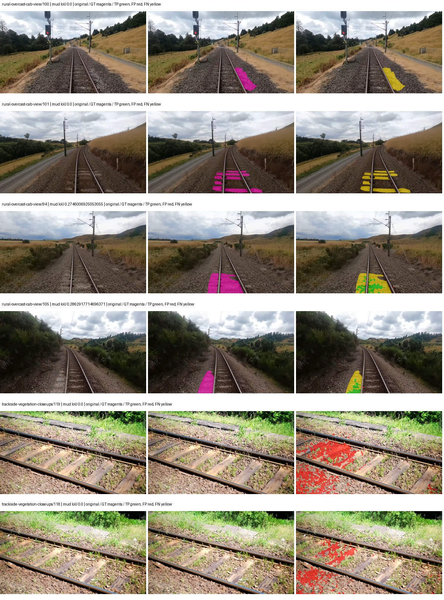
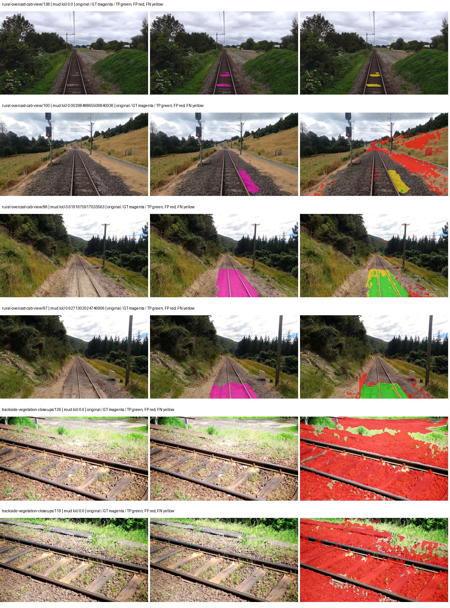
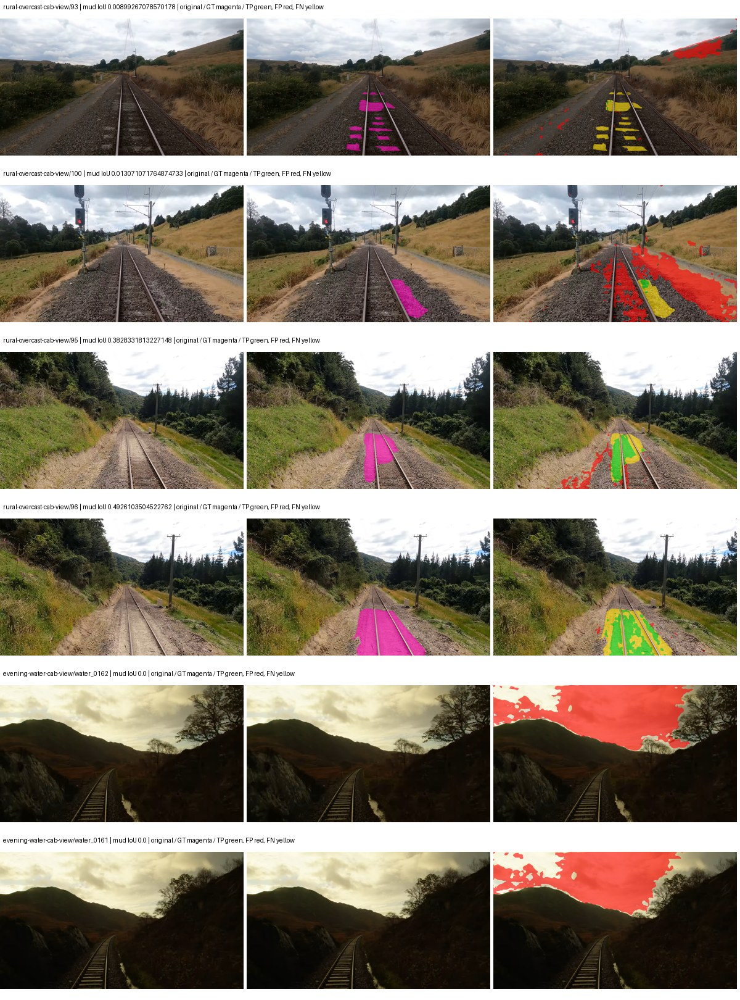
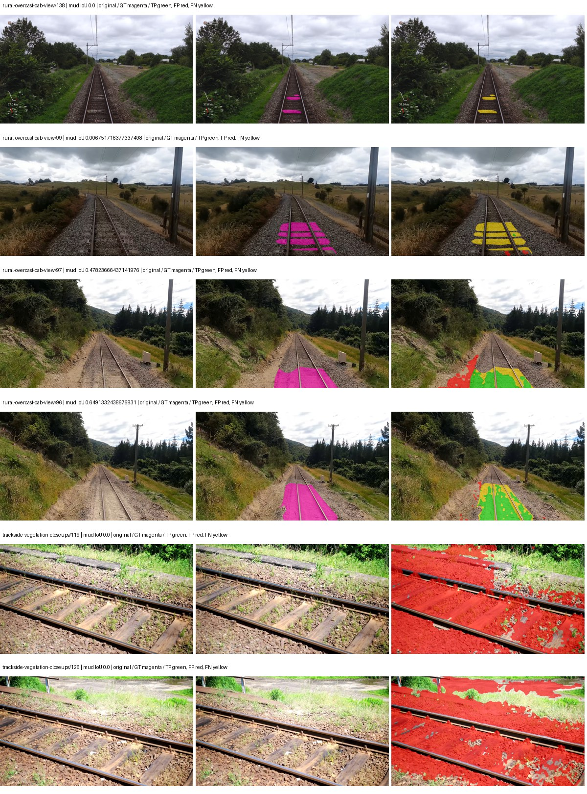

# smp_pspnet_mobilenet_v2 — paul-test-rtis_v2

[RTIS comparison](../../README.md) · [Full model records](record.json)

Primary selection and early stopping: **mud-pumping validation IoU**. A job is complete only after full statistics and isolated profiling are verified.

| Model | Initialization path | Seed | Status | Steps | Best step | Mud IoU (%) | Mud precision (%) | Mud recall (%) | Final mud IoU (trainer val, %) | mIoU (%) | Fixed GT-class mIoU (%) |
| --- | --- | --- | --- | --- | --- | --- | --- | --- | --- | --- | --- |
| smp_pspnet_mobilenet_v2 | rtis_only | 0 | completed | 4000 | 3823 | 4.48 | 10.13 | 7.42 | 2.99 | 16.88 | 19.69 |
| smp_pspnet_mobilenet_v2 | cityscapes_to_rtis | 0 | completed | 1784 | 1019 | 3.47 | 3.68 | 38.34 | 1.59 | 16.62 | 19.39 |
| smp_pspnet_mobilenet_v2 | railsem19_to_rtis | 0 | completed | 1529 | 254 | 6.89 | 7.66 | 40.71 | 2.23 | 19.23 | 20.30 |
| smp_pspnet_mobilenet_v2 | cityscapes_to_railsem19_to_rtis | 0 | completed | 3058 | 1784 | 5.05 | 5.51 | 37.78 | 2.63 | 17.40 | 20.30 |

Training: 205 images. Validation: 37 images. Test: 50 held out. Seeds: [0]. Seed variation measures optimization variability, not independent-recording uncertainty. Historical source checkpoints stay fixed across adaptation seeds.

Training code: `066afb2626398b7be59d4d19f5a0e4644fd59adc`. Split SHA-256: `18a84c0163a65ded46508bcc904c374e5f33ad8a09b8879e3c8add606e86aa9f`.

## rtis_only — seed 0

Status: **completed**. Started: 2026-09-10T02:57:28.419114+00:00. Finished: 2026-09-10T03:39:26.390763+00:00.

Recipe pretrained initializer: `{"arch": "smp", "backbone_path": null, "batch_norm_momentum": null, "checkpoint": null, "classifier_path": null, "drop_path": null, "encoder_name": "mobilenet_v2", "encoder_weights": "imagenet", "head": "unified_head", "head_paths": [], "inactive_parameter_paths": ["encoder.features.7", "encoder.features.8", "encoder.features.9", "encoder.features.10", "encoder.features.11", "encoder.features.12", "encoder.features.13", "encoder.features.14", "encoder.features.15", "encoder.features.16", "encoder.features.17", "encoder.features.18"], "local_files_only": false, "lora_alpha": 32, "lora_dropout": 0.05, "lora_r": 16, "lora_targets": [], "native": null, "revision": null, "smp_arch": "PSPNet", "subfolder": null, "trust_remote_code": false, "tuning": "full"}`.

`rtis_only` uses the recipe initializer, which may include pretrained segmentation components. Transfer paths load the exact historical source checkpoint below and reset the classifier; they do not reset all query/decoder features.

Source checkpoint: `Recipe pretrained initialization`.

Config SHA-256: `3f3d8c8219ace20cc1837d1922247e9d52b3418f9aa7f8fdc59c9356fa64571a`. Weights used for validation: `raw`.

### Mud-pumping and aggregate quality

| Metric | Selected checkpoint | Final training validation |
| --- | --- | --- |
| Mud IoU | 4.48 | 2.99 |
| Mud precision | 10.13 | 3.68 |
| Mud recall | 7.42 | 13.64 |
| Mud Dice/F1 | 8.57 | 5.80 |
| mIoU | 16.88 | 16.73 |
| Mean accuracy | 28.61 | 29.25 |
| Mean precision | 43.32 | 43.82 |
| Mean Dice | 23.50 | 22.75 |
| Mean specificity | 97.87 | 97.91 |
| Pixel accuracy | 60.67 | 59.96 |
| Frequency-weighted IoU | 53.02 | 53.86 |
| Fixed GT-present class mIoU | 19.69 | 19.52 |
| Boundary F1 | 25.07 | 24.10 |

The selected checkpoint has independent evaluation evidence. Final values are the trainer's final validation record, not a new independent evaluation. mIoU averages classes with nonzero union, so false positives on absent classes can change its denominator. The fixed GT-class mean is supplementary and excludes absent classes; their false positives remain in the confusion matrix.

### Resource usage and timing

| Measurement | Value |
| --- | --- |
| Peak training VRAM, retained training invocation (GiB) | 7.28 |
| Peak evaluation VRAM (GiB) | 6.48 |
| Retained training invocation wall time (seconds) | 2406.30 |
| Retained training invocation GPU-hours (one GPU) | 0.67 |
| Evaluation wall time (seconds) | 10.78 |
| Full evaluation pipeline images/second | 3.43 |
| Best full-state checkpoint (MiB) | 19.96 |
| Final full-state checkpoint (MiB) | 19.95 |
| Verified periodic checkpoints removed (GiB) | 0.16 |

VRAM uses the recorded allocator high-water mark; it is not total device usage including CUDA context. Resumed jobs' retained training invocation times and peaks are **not whole-campaign totals**. Earlier invocation resource records are not reconstructed here. Evaluation throughput includes loader, sliding-window inference and metrics; it is not model-only latency/FPS. Missing measurements are shown as —, never inferred from another dataset's run.

### Standardized inference performance

Dedicated model-only profiling waits for an idle worker-locked L40S: BF16, batch 1, 1024x1024, 20 warmup and 100 CUDA-event-timed public forwards. It excludes loading, preprocessing, tiling and metrics.

| Status | Parameters | Weight MiB | FPS | p50 ms | p95 ms | Peak reserved GiB |
| --- | --- | --- | --- | --- | --- | --- |
| complete | 2355533 | 8.99 | 307.67 | 3.19 | 3.71 | 0.36 |

```json
{
  "schema_version": 1,
  "model_id": "smp_pspnet_mobilenet_v2",
  "measured_at": "2026-09-10T03:39:24+00:00",
  "status": "complete",
  "benchmark_scope": "rtis_selected_checkpoint_model_only",
  "applies_to": [
    "smp_pspnet_mobilenet_v2--rtis_only--seed-0"
  ],
  "source": {
    "campaign_git_sha": "066afb2626398b7be59d4d19f5a0e4644fd59adc",
    "git_dirty": false,
    "config_hash": "e81b4f277240",
    "resolved_config": "/data/izadia1/projects/segmentary-runs/paul-test-rtis_v2/seed0-20260909/configs/smp_pspnet_mobilenet_v2--rtis_only--seed-0.yaml",
    "config_sha256": "3f3d8c8219ace20cc1837d1922247e9d52b3418f9aa7f8fdc59c9356fa64571a",
    "checkpoint_sha256": "4b77379bb69766e6afc65186b8fe3bdcf4be5c06e4799396c133c1e05f57d124",
    "checkpoint_global_step": 3823,
    "checkpoint_bytes": 20928325,
    "checkpoint_kind": "resume checkpoint with optimizer and EMA state",
    "weights": "raw",
    "measured_checkpoint_job_id": "smp_pspnet_mobilenet_v2--rtis_only--seed-0",
    "result_sha256": "46be688e8bbb8a5bfbb329f8fd3ae780a355d2720fadd8afebbe6f98fa1e8d19",
    "result_git_sha": "066afb2626398b7be59d4d19f5a0e4644fd59adc",
    "result_stage": "eval:paul-test-rtis:val",
    "result_seed": 0
  },
  "hardware": {
    "gpu_name": "NVIDIA L40S",
    "gpu_uuid": "GPU-804aea8b-5f62-423e-72c6-49e1ed15c4e4",
    "logical_device": "cuda:0",
    "physical_visibility_token": "6",
    "compute_capability": [
      8,
      9
    ],
    "total_memory_bytes": 47677177856
  },
  "model": {
    "parameter_count": 2355533,
    "trainable_parameter_count": 187149,
    "resident_parameter_bytes": 9422132,
    "parameter_dtype_counts": {
      "float32": 2355533
    }
  },
  "contract": {
    "backend": "pytorch",
    "precision": "bf16_autocast",
    "batch_size": 1,
    "input_shape_nchw": [
      1,
      3,
      1024,
      1024
    ],
    "warmup_iterations": 20,
    "measured_iterations": 100,
    "timing": "per-forward CUDA events with end-event synchronization",
    "includes_preprocessing": false,
    "includes_data_loader": false,
    "includes_sliding_window": false,
    "input_resident_on_gpu": true,
    "model_only": true,
    "entrypoint": "public model(image) dense-logits forward"
  },
  "measurements": {
    "latency": {
      "p50_ms": 3.189247965812683,
      "p95_ms": 3.712307095527649,
      "mean_ms": 3.2502067136764525,
      "minimum_ms": 2.8835840225219727,
      "maximum_ms": 3.911679983139038,
      "fps": 307.672738411415,
      "raw_ms": [
        2.955264091491699,
        2.969599962234497,
        2.8835840225219727,
        3.140608072280884,
        3.866624116897583,
        3.0597119331359863,
        2.973695993423462,
        2.909183979034424,
        2.978816032409668,
        2.9491519927978516,
        3.2419838905334473,
        3.1897599697113037,
        3.5788800716400146,
        3.8399999141693115,
        3.506175994873047,
        3.49183988571167,
        3.3126399517059326,
        3.3771519660949707,
        3.4949119091033936,
        3.6669440269470215,
        3.2819199562072754,
        3.1549439430236816,
        3.066879987716675,
        3.0801920890808105,
        3.058687925338745,
        2.9921278953552246,
        3.3556480407714844,
        2.9962239265441895,
        2.9808640480041504,
        2.9470720291137695,
        2.9706239700317383,
        2.9562880992889404,
        2.954240083694458,
        2.9224960803985596,
        3.31059193611145,
        3.270656108856201,
        3.260416030883789,
        3.11296010017395,
        3.670016050338745,
        3.685375928878784,
        3.5287039279937744,
        3.2983040809631348,
        3.240959882736206,
        3.1037440299987793,
        3.1283199787139893,
        3.150847911834717,
        3.1252479553222656,
        3.136512041091919,
        3.048448085784912,
        2.974720001220703,
        2.890752077102661,
        3.330048084259033,
        3.0013439655303955,
        3.3269760608673096,
        2.93887996673584,
        2.958336114883423,
        3.737600088119507,
        3.688447952270508,
        3.397631883621216,
        3.5174400806427,
        3.3853440284729004,
        3.334144115447998,
        3.2727038860321045,
        3.289088010787964,
        3.206144094467163,
        3.1887359619140625,
        3.432447910308838,
        3.210239887237549,
        3.1498239040374756,
        3.1191039085388184,
        3.0945279598236084,
        3.334144115447998,
        3.1098880767822266,
        3.088383913040161,
        3.255295991897583,
        3.2737278938293457,
        3.155967950820923,
        3.3208320140838623,
        3.1047680377960205,
        3.1344640254974365,
        3.122175931930542,
        3.180543899536133,
        3.0853118896484375,
        3.0740480422973633,
        3.4396159648895264,
        3.675136089324951,
        3.561471939086914,
        3.6577279567718506,
        3.1795198917388916,
        3.127295970916748,
        3.102720022201538,
        3.136512041091919,
        3.1928319931030273,
        3.2583680152893066,
        3.305471897125244,
        3.5051519870758057,
        3.7109758853912354,
        3.5532801151275635,
        3.911679983139038,
        3.8430399894714355
      ],
      "percentile_method": "numpy linear interpolation"
    },
    "peak_reserved_bytes": 381681664,
    "memory_kind": "pytorch_cuda_allocator_peak_reserved_excluding_context",
    "benchmark_wall_clock_s": 9.107209786772728
  },
  "started_at": "2026-09-10T03:39:15+00:00",
  "finished_at": "2026-09-10T03:39:24+00:00",
  "environment": {
    "hostname": "hdrfs-app-001",
    "python": "3.11.15",
    "platform": "Linux-5.15.0-139-generic-x86_64-with-glibc2.35",
    "torch": "2.11.0+cu128",
    "torch_cuda": "12.8",
    "cudnn": 91900,
    "driver_version": "570.133.20",
    "cuda_available": true,
    "gpu_count": 1,
    "gpu_names": [
      "NVIDIA L40S"
    ],
    "cuda_visible_devices": "6",
    "packages": {
      "segmentary": "0.1.0",
      "torch": "2.11.0+cu128",
      "torchvision": "0.26.0+cu128",
      "transformers": "5.15.0",
      "timm": "1.0.28",
      "segmentation-models-pytorch": "0.5.0",
      "albumentations": "2.0.8",
      "lightning": "2.6.5",
      "numpy": "2.4.4"
    }
  }
}
```

### Per-class validation results

| Class | GT pixels | IoU (%) | Precision (%) | Recall (%) | Dice (%) | Boundary F1 (%) |
| --- | --- | --- | --- | --- | --- | --- |
| car | 29664 | 0.49 | 34.19 | 0.49 | 0.97 | 11.27 |
| construction | 311585 | 6.50 | 15.38 | 10.13 | 12.21 | 22.87 |
| fence | 265137 | 2.42 | 13.09 | 2.88 | 4.73 | 12.01 |
| mud-pumping | 1226250 | 4.48 | 10.13 | 7.42 | 8.57 | 8.09 |
| on-rails | 0 | 0.00 | 0.00 | — | 0.00 | 0.00 |
| person | 0 | 0.00 | 0.00 | — | 0.00 | 0.00 |
| pole | 628038 | 37.43 | 83.19 | 40.49 | 54.47 | 73.61 |
| rail-embedded | 16799 | 13.17 | 78.21 | 13.67 | 23.28 | 15.33 |
| rail-raised | 2969797 | 61.16 | 82.74 | 70.10 | 75.90 | 81.10 |
| rail-track | 6323197 | 15.36 | 45.86 | 18.76 | 26.63 | 40.10 |
| road | 1048831 | 0.01 | 0.02 | 0.02 | 0.02 | 0.01 |
| sidewalk | 1297367 | 3.07 | 74.22 | 3.10 | 5.95 | 2.35 |
| sky | 19121606 | 67.53 | 98.50 | 68.23 | 80.62 | 55.80 |
| standing-water | 95802 | 0.53 | 0.53 | 99.06 | 1.06 | 0.68 |
| terrain | 39239306 | 65.30 | 86.50 | 72.71 | 79.01 | 39.90 |
| trackbed | 10643081 | 38.56 | 47.82 | 66.56 | 55.65 | 39.09 |
| traffic-light | 19510 | 9.90 | 77.08 | 10.21 | 18.02 | 30.38 |
| traffic-sign | 13285 | 2.42 | 78.07 | 2.44 | 4.73 | 24.16 |
| tram-track | 56179 | 0.46 | 10.68 | 0.48 | 0.91 | 10.17 |
| truck | 0 | 0.00 | 0.00 | — | 0.00 | 0.00 |
| vegetation-overgrowth | 5901821 | 25.59 | 73.45 | 28.20 | 40.76 | 59.56 |

### Full-run accounting

| Measurement | Value |
| --- | --- |
| Full GPU-reserved wall seconds, all recorded worker attempts | 2517.98 |
| Full reserved GPU-hours | 0.70 |
| Whole-run timing complete | True |

| Phase | Wall seconds including failed attempts |
| --- | --- |
| training | 2412.93 |
| diagnostics | 70.75 |
| performance | 16.07 |

GPU-reserved time includes model loading, training, validation, collection, profiling, checkpoint I/O and orchestration while the worker owns one GPU. It is not GPU kernel-active time. Phase timings and sampled device memory/power/utilization are retained separately; sampled device memory is not the allocator high-water mark.

### Train/validation and raw/EMA diagnostics

| Checkpoint / weights / split | Images | Mud IoU (%) | Mud precision (%) | Mud recall (%) |
| --- | --- | --- | --- | --- |
| best-auto-train / raw | 205 | 79.10 | 92.57 | 84.47 |
| best-auto-val / raw | 37 | 4.48 | 10.13 | 7.42 |
| best-alternate-val / ema | 37 | 0.36 | 0.48 | 1.45 |
| final-auto-val / raw | 37 | 2.99 | 3.69 | 13.67 |

Train uses the evaluation transform without augmentation. Compare mud train/validation metrics for the same selected weights. Alternate EMA on running-stat BatchNorm is explicitly uncalibrated and is diagnostic only. Score-threshold curves use uncalibrated normalized scores and are pixel-level diagnostics, not event detection rates or a selected deployment operating point.

### Downloadable evidence

- best-auto-train: [per-image.csv](rtis_only--seed-0/best-auto-train/per-image.csv) · [per-image-confusion.json.gz](rtis_only--seed-0/best-auto-train/per-image-confusion.json.gz) · [groups.json](rtis_only--seed-0/best-auto-train/groups.json) · [mud-score-curves.json](rtis_only--seed-0/best-auto-train/mud-score-curves.json)
- best-auto-val: [per-image.csv](rtis_only--seed-0/best-auto-val/per-image.csv) · [per-image-confusion.json.gz](rtis_only--seed-0/best-auto-val/per-image-confusion.json.gz) · [groups.json](rtis_only--seed-0/best-auto-val/groups.json) · [mud-score-curves.json](rtis_only--seed-0/best-auto-val/mud-score-curves.json) · [examples.jpg](rtis_only--seed-0/best-auto-val/examples.jpg)
- best-alternate-val: [per-image.csv](rtis_only--seed-0/best-alternate-val/per-image.csv) · [per-image-confusion.json.gz](rtis_only--seed-0/best-alternate-val/per-image-confusion.json.gz) · [groups.json](rtis_only--seed-0/best-alternate-val/groups.json) · [mud-score-curves.json](rtis_only--seed-0/best-alternate-val/mud-score-curves.json)
- final-auto-val: [per-image.csv](rtis_only--seed-0/final-auto-val/per-image.csv) · [per-image-confusion.json.gz](rtis_only--seed-0/final-auto-val/per-image-confusion.json.gz) · [groups.json](rtis_only--seed-0/final-auto-val/groups.json) · [mud-score-curves.json](rtis_only--seed-0/final-auto-val/mud-score-curves.json)
- resources: [telemetry.csv](rtis_only--seed-0/resources/telemetry.csv)



Examples are two lowest and two highest mud-IoU positive images, plus up to two negative images with the most false-positive mud pixels. They are targeted diagnostic examples, not random samples. Green: true positive; red: false positive; yellow: false negative. Full predictions remain on HDRFS.

### Validation tracking

| Logged step | Overall mIoU (%) | Mud IoU (%) |
| --- | --- | --- |
| 254 | 10.42 | 0.28 |
| 509 | 12.58 | 0.27 |
| 764 | 14.22 | 0.75 |
| 1019 | 14.33 | 0.25 |
| 1274 | 14.33 | 1.46 |
| 1529 | 15.30 | 0.74 |
| 1784 | 17.12 | 1.26 |
| 2038 | 16.07 | 2.30 |
| 2293 | 16.65 | 1.98 |
| 2548 | 16.76 | 1.43 |
| 2803 | 17.59 | 2.66 |
| 3058 | 17.33 | 1.60 |
| 3313 | 17.20 | 1.80 |
| 3568 | 17.28 | 2.47 |
| 3823 | 16.87 | 4.47 |
| 4000 | 16.73 | 2.99 |

All retained scalar curves, including training loss and per-class IoU, are in record.json. Observed best mud on a curve is not necessarily a retained checkpoint: the pilot saved its selection-metric-best and final checkpoints. Step logging and checkpoint global_step may differ by one.

### Stopping and checkpoint provenance

```json
{
  "stopping": {
    "actual_steps": 4000,
    "maximum_steps": 4000,
    "min_delta": 0.001,
    "monitor": "val_iou/mud-pumping",
    "patience": 5,
    "reason": "budget_complete"
  },
  "checkpoints": {
    "best": {
      "path": "/data/izadia1/projects/segmentary-runs/paul-test-rtis_v2/seed0-20260909/future-runs/smp_pspnet_mobilenet_v2--rtis_only--seed-0_seed0/rtis/best.ckpt",
      "sha256": "4b77379bb69766e6afc65186b8fe3bdcf4be5c06e4799396c133c1e05f57d124",
      "global_step": 3823,
      "bytes": 20928325
    },
    "final": {
      "path": "/data/izadia1/projects/segmentary-runs/paul-test-rtis_v2/seed0-20260909/future-runs/smp_pspnet_mobilenet_v2--rtis_only--seed-0_seed0/rtis/last.ckpt",
      "sha256": "8d18f7fac611b725ee10b362c0b8ee1a658d9bd3c75648e1848a9c4f705ad6bd",
      "global_step": 4000,
      "bytes": 20920325
    }
  },
  "cleanup_error": null
}
```

### Resolved training, initialization and evaluation settings

The optimizer block is the base configuration. Stage LR scales are applied at runtime, and stage warmup is capped at min(base warmup, floor(stage budget / 10), stage budget - 1): 400 steps for this 4,000-step pilot. Model-internal native input grids may differ from augmentation crops (EoMT uses its 640 grid).

```json
{
  "name": "smp_pspnet_mobilenet_v2--rtis_only--seed-0",
  "model": {
    "arch": "smp",
    "checkpoint": null,
    "tuning": "full",
    "head": "unified_head",
    "lora_r": 16,
    "lora_alpha": 32,
    "lora_dropout": 0.05,
    "lora_targets": [],
    "drop_path": null,
    "revision": null,
    "subfolder": null,
    "local_files_only": false,
    "trust_remote_code": false,
    "backbone_path": null,
    "head_paths": [],
    "classifier_path": null,
    "inactive_parameter_paths": [
      "encoder.features.7",
      "encoder.features.8",
      "encoder.features.9",
      "encoder.features.10",
      "encoder.features.11",
      "encoder.features.12",
      "encoder.features.13",
      "encoder.features.14",
      "encoder.features.15",
      "encoder.features.16",
      "encoder.features.17",
      "encoder.features.18"
    ],
    "smp_arch": "PSPNet",
    "encoder_name": "mobilenet_v2",
    "encoder_weights": "imagenet",
    "native": null,
    "batch_norm_momentum": null
  },
  "space": "paul-test-rtis",
  "taxonomy_root": "/data/izadia1/projects/segmentary-rtis-fullstats-066afb2/taxonomy",
  "output_root": "/data/izadia1/projects/segmentary-runs/paul-test-rtis_v2/seed0-20260909/future-runs",
  "optim": {
    "backbone_lr": 0.0001,
    "head_lr_mult": 10.0,
    "weight_decay": 0.05,
    "llrd": 1.0,
    "warmup_iters": 1500,
    "warmup_ratio": 1e-06,
    "poly_power": 0.9,
    "min_lr_ratio": 0.0,
    "betas": [
      0.9,
      0.999
    ],
    "grad_clip": 1.0
  },
  "train": {
    "iters": 4000,
    "batch_size": 2,
    "accum": 8,
    "num_workers": 2,
    "precision": "bf16-mixed",
    "ema_decay": 0.9998,
    "val_every": 250,
    "ckpt_every": 500,
    "selection_metric": "val_iou/mud-pumping",
    "early_stopping_patience": 5,
    "early_stopping_min_delta": 0.001,
    "seed": 0,
    "devices": 1
  },
  "eval": {
    "sliding_window": true,
    "window": [
      1024,
      1024
    ],
    "stride": [
      768,
      768
    ],
    "batch_size": 1,
    "num_workers": 2,
    "tta_scales": [],
    "tta_flip": false,
    "threshold": 0.5,
    "boundary_tolerance_frac": 0.0075,
    "save_confusion": true
  },
  "loss": {
    "task": "multiclass",
    "activation": "auto",
    "terms": [],
    "aux": "none",
    "aux_weight": 0.0,
    "ce_weight": 1.0,
    "label_smoothing": 0.0,
    "class_weights": null,
    "query": null
  },
  "aug": {
    "crop": [
      1024,
      1024
    ],
    "scale_min": 0.5,
    "scale_max": 2.0,
    "hflip_p": 0.5,
    "color_jitter_p": 0.5,
    "brightness": 0.25,
    "contrast": 0.25,
    "saturation": 0.25,
    "hue": 0.05
  },
  "stages": [
    {
      "name": "rtis",
      "data": [
        {
          "name": "paul-test-rtis",
          "root": "/data/izadia1/datasets/paul-test-rtis_v2",
          "variant": null,
          "split_file": "splits.json",
          "train_split": "train",
          "val_split": "val",
          "limit": null,
          "loader": "folder",
          "mapping": "paul-test-rtis",
          "loader_options": {
            "require_groups": true
          }
        }
      ],
      "iters": null,
      "lr_scale": 1.0,
      "head_group_lr_scale": 1.0,
      "init_from": "pretrained",
      "reset_head": false,
      "freeze": null,
      "sample_weights": null
    }
  ]
}
```

### Hardware and software provenance

```json
{
  "training": {
    "cuda_available": true,
    "cuda_visible_devices": "6",
    "cudnn": 91900,
    "driver_version": "570.133.20",
    "gpu_count": 1,
    "gpu_names": [
      "NVIDIA L40S"
    ],
    "hostname": "hdrfs-app-001",
    "input_normalization": {
      "channel_order": "rgb",
      "mean": [
        0.485,
        0.456,
        0.406
      ],
      "source": "smp_encoder_settings",
      "std": [
        0.229,
        0.224,
        0.225
      ]
    },
    "model_origins": [
      {
        "hf_commit": null,
        "hf_name_or_path": null,
        "module": "model",
        "timm_pretrained": {}
      }
    ],
    "model_parameter_count": 2355533,
    "packages": {
      "albumentations": "2.0.8",
      "lightning": "2.6.5",
      "numpy": "2.4.4",
      "segmentary": "0.1.0",
      "segmentation-models-pytorch": "0.5.0",
      "timm": "1.0.28",
      "torch": "2.11.0+cu128",
      "torchvision": "0.26.0+cu128",
      "transformers": "5.15.0"
    },
    "platform": "Linux-5.15.0-139-generic-x86_64-with-glibc2.35",
    "python": "3.11.15",
    "torch": "2.11.0+cu128",
    "torch_cuda": "12.8",
    "trainable_parameter_count": 187149,
    "training_stop": {
      "actual_steps": 4000,
      "maximum_steps": 4000,
      "min_delta": 0.001,
      "monitor": "val_iou/mud-pumping",
      "patience": 5,
      "reason": "budget_complete"
    },
    "validation_weights": "raw"
  },
  "evaluation": {
    "cuda_available": true,
    "cuda_visible_devices": "6",
    "cudnn": 91900,
    "driver_version": "570.133.20",
    "gpu_count": 1,
    "gpu_names": [
      "NVIDIA L40S"
    ],
    "hostname": "hdrfs-app-001",
    "input_normalization": {
      "channel_order": "rgb",
      "mean": [
        0.485,
        0.456,
        0.406
      ],
      "source": "smp_encoder_settings",
      "std": [
        0.229,
        0.224,
        0.225
      ]
    },
    "packages": {
      "albumentations": "2.0.8",
      "lightning": "2.6.5",
      "numpy": "2.4.4",
      "segmentary": "0.1.0",
      "segmentation-models-pytorch": "0.5.0",
      "timm": "1.0.28",
      "torch": "2.11.0+cu128",
      "torchvision": "0.26.0+cu128",
      "transformers": "5.15.0"
    },
    "platform": "Linux-5.15.0-139-generic-x86_64-with-glibc2.35",
    "python": "3.11.15",
    "torch": "2.11.0+cu128",
    "torch_cuda": "12.8"
  }
}
```

## cityscapes_to_rtis — seed 0

Status: **completed**. Started: 2026-09-10T02:58:07.166678+00:00. Finished: 2026-09-10T03:18:11.258536+00:00.

Recipe pretrained initializer: `{"arch": "smp", "backbone_path": null, "batch_norm_momentum": null, "checkpoint": null, "classifier_path": null, "drop_path": null, "encoder_name": "mobilenet_v2", "encoder_weights": "imagenet", "head": "unified_head", "head_paths": [], "inactive_parameter_paths": ["encoder.features.7", "encoder.features.8", "encoder.features.9", "encoder.features.10", "encoder.features.11", "encoder.features.12", "encoder.features.13", "encoder.features.14", "encoder.features.15", "encoder.features.16", "encoder.features.17", "encoder.features.18"], "local_files_only": false, "lora_alpha": 32, "lora_dropout": 0.05, "lora_r": 16, "lora_targets": [], "native": null, "revision": null, "smp_arch": "PSPNet", "subfolder": null, "trust_remote_code": false, "tuning": "full"}`.

`rtis_only` uses the recipe initializer, which may include pretrained segmentation components. Transfer paths load the exact historical source checkpoint below and reset the classifier; they do not reset all query/decoder features.

Source checkpoint: `{'name': 'smp_pspnet_mobilenet_v2--cityscapes--seed-0', 'model': 'smp_pspnet_mobilenet_v2', 'protocol': 'cityscapes', 'config': '/data/izadia1/projects/segmentary-runs/all-model-city-rail-seed0-rail20-b9eb3e1/jobs/smp_pspnet_mobilenet_v2--cityscapes--seed-0/attempt-001/resolved-config.yaml', 'checkpoint': '/data/izadia1/projects/segmentary-runs/all-model-city-rail-seed0-rail20-b9eb3e1/jobs/smp_pspnet_mobilenet_v2--cityscapes--seed-0/attempt-001/train/smp_pspnet_mobilenet_v2--cityscapes_seed0/cityscapes/last.ckpt', 'recorded_sha256': '1497ae6fe6fd454da2f7d48947743bef33fa7ab9411a8a0675ecff4b3b893ec4', 'exists': True}`.

Config SHA-256: `e67af1d685ffcc25e435bdd2c2452df7578d658e5d1118e1641c3a1bd1083930`. Weights used for validation: `raw`.

### Mud-pumping and aggregate quality

| Metric | Selected checkpoint | Final training validation |
| --- | --- | --- |
| Mud IoU | 3.47 | 1.59 |
| Mud precision | 3.68 | 1.82 |
| Mud recall | 38.34 | 11.00 |
| Mud Dice/F1 | 6.71 | 3.12 |
| mIoU | 16.62 | 16.28 |
| Mean accuracy | 25.42 | 23.82 |
| Mean precision | 36.51 | 34.02 |
| Mean Dice | 21.34 | 20.54 |
| Mean specificity | 98.26 | 98.36 |
| Pixel accuracy | 69.61 | 72.64 |
| Frequency-weighted IoU | 61.51 | 62.99 |
| Fixed GT-present class mIoU | 19.39 | 19.00 |
| Boundary F1 | 20.83 | 19.16 |

The selected checkpoint has independent evaluation evidence. Final values are the trainer's final validation record, not a new independent evaluation. mIoU averages classes with nonzero union, so false positives on absent classes can change its denominator. The fixed GT-class mean is supplementary and excludes absent classes; their false positives remain in the confusion matrix.

### Resource usage and timing

| Measurement | Value |
| --- | --- |
| Peak training VRAM, retained training invocation (GiB) | 7.28 |
| Peak evaluation VRAM (GiB) | 6.48 |
| Retained training invocation wall time (seconds) | 1091.96 |
| Retained training invocation GPU-hours (one GPU) | 0.30 |
| Evaluation wall time (seconds) | 10.73 |
| Full evaluation pipeline images/second | 3.45 |
| Best full-state checkpoint (MiB) | 19.96 |
| Final full-state checkpoint (MiB) | 19.95 |
| Verified periodic checkpoints removed (GiB) | 0.06 |

VRAM uses the recorded allocator high-water mark; it is not total device usage including CUDA context. Resumed jobs' retained training invocation times and peaks are **not whole-campaign totals**. Earlier invocation resource records are not reconstructed here. Evaluation throughput includes loader, sliding-window inference and metrics; it is not model-only latency/FPS. Missing measurements are shown as —, never inferred from another dataset's run.

### Standardized inference performance

Dedicated model-only profiling waits for an idle worker-locked L40S: BF16, batch 1, 1024x1024, 20 warmup and 100 CUDA-event-timed public forwards. It excludes loading, preprocessing, tiling and metrics.

| Status | Parameters | Weight MiB | FPS | p50 ms | p95 ms | Peak reserved GiB |
| --- | --- | --- | --- | --- | --- | --- |
| complete | 2355533 | 8.99 | 323.85 | 3.03 | 3.65 | 0.36 |

```json
{
  "schema_version": 1,
  "model_id": "smp_pspnet_mobilenet_v2",
  "measured_at": "2026-09-10T03:18:09+00:00",
  "status": "complete",
  "benchmark_scope": "rtis_selected_checkpoint_model_only",
  "applies_to": [
    "smp_pspnet_mobilenet_v2--cityscapes_to_rtis--seed-0"
  ],
  "source": {
    "campaign_git_sha": "066afb2626398b7be59d4d19f5a0e4644fd59adc",
    "git_dirty": false,
    "config_hash": "a0f235f0df36",
    "resolved_config": "/data/izadia1/projects/segmentary-runs/paul-test-rtis_v2/seed0-20260909/configs/smp_pspnet_mobilenet_v2--cityscapes_to_rtis--seed-0.yaml",
    "config_sha256": "e67af1d685ffcc25e435bdd2c2452df7578d658e5d1118e1641c3a1bd1083930",
    "checkpoint_sha256": "3af2d6f846cb80402d3125f38c00153345dccda34e8db63b987cedaa8ff385da",
    "checkpoint_global_step": 1019,
    "checkpoint_bytes": 20928325,
    "checkpoint_kind": "resume checkpoint with optimizer and EMA state",
    "weights": "raw",
    "measured_checkpoint_job_id": "smp_pspnet_mobilenet_v2--cityscapes_to_rtis--seed-0",
    "result_sha256": "e44c1a065411ec54e33e1d27d3b39e85988fe1aa8c1f8f729d401e11074694b0",
    "result_git_sha": "066afb2626398b7be59d4d19f5a0e4644fd59adc",
    "result_stage": "eval:paul-test-rtis:val",
    "result_seed": 0
  },
  "hardware": {
    "gpu_name": "NVIDIA L40S",
    "gpu_uuid": "GPU-84f5ca4d-68db-ae98-d056-40654d859dd9",
    "logical_device": "cuda:0",
    "physical_visibility_token": "0",
    "compute_capability": [
      8,
      9
    ],
    "total_memory_bytes": 47677177856
  },
  "model": {
    "parameter_count": 2355533,
    "trainable_parameter_count": 187149,
    "resident_parameter_bytes": 9422132,
    "parameter_dtype_counts": {
      "float32": 2355533
    }
  },
  "contract": {
    "backend": "pytorch",
    "precision": "bf16_autocast",
    "batch_size": 1,
    "input_shape_nchw": [
      1,
      3,
      1024,
      1024
    ],
    "warmup_iterations": 20,
    "measured_iterations": 100,
    "timing": "per-forward CUDA events with end-event synchronization",
    "includes_preprocessing": false,
    "includes_data_loader": false,
    "includes_sliding_window": false,
    "input_resident_on_gpu": true,
    "model_only": true,
    "entrypoint": "public model(image) dense-logits forward"
  },
  "measurements": {
    "latency": {
      "p50_ms": 3.0300159454345703,
      "p95_ms": 3.6492286920547485,
      "mean_ms": 3.087805123329163,
      "minimum_ms": 2.944000005722046,
      "maximum_ms": 3.984384059906006,
      "fps": 323.8546346220953,
      "raw_ms": [
        3.16211199760437,
        3.0894079208374023,
        3.0853118896484375,
        3.057663917541504,
        3.0545918941497803,
        3.0238399505615234,
        3.0494720935821533,
        3.0443201065063477,
        3.033087968826294,
        3.0412800312042236,
        3.6485118865966797,
        3.2408640384674072,
        3.984384059906006,
        3.734528064727783,
        3.1600000858306885,
        3.048448085784912,
        3.033087968826294,
        2.978816032409668,
        2.9757440090179443,
        2.999295949935913,
        2.9777920246124268,
        2.983936071395874,
        3.017728090286255,
        3.0320639610290527,
        3.003391981124878,
        2.968575954437256,
        3.3699839115142822,
        3.0259199142456055,
        3.951616048812866,
        3.693567991256714,
        3.115072011947632,
        2.9767680168151855,
        3.009536027908325,
        3.0597119331359863,
        2.9726719856262207,
        2.949120044708252,
        3.093503952026367,
        3.324928045272827,
        3.2439041137695312,
        3.2368640899658203,
        3.0003199577331543,
        3.0227839946746826,
        3.0115840435028076,
        3.039232015609741,
        3.0300159454345703,
        3.0156800746917725,
        3.0300159454345703,
        3.0791680812835693,
        3.054687976837158,
        3.1057920455932617,
        3.078144073486328,
        3.0812160968780518,
        3.0626559257507324,
        3.0412800312042236,
        3.092479944229126,
        3.122175931930542,
        3.0648319721221924,
        3.057663917541504,
        2.988032102584839,
        2.9706239700317383,
        2.9962239265441895,
        2.9624319076538086,
        2.944000005722046,
        2.999295949935913,
        3.0023679733276367,
        3.0023679733276367,
        2.9573121070861816,
        3.0167040824890137,
        3.0218238830566406,
        3.0074880123138428,
        3.004415988922119,
        3.0074880123138428,
        2.9767680168151855,
        2.994175910949707,
        2.951040029525757,
        2.983936071395874,
        2.966655969619751,
        2.982912063598633,
        2.9634881019592285,
        2.9972479343414307,
        3.003391981124878,
        3.0064640045166016,
        3.037184000015259,
        3.052544116973877,
        3.106816053390503,
        3.0597119331359863,
        3.008512020111084,
        3.052544116973877,
        3.063807964324951,
        3.071903944015503,
        2.979840040206909,
        2.965440034866333,
        2.974720001220703,
        2.98905611038208,
        2.9655039310455322,
        2.979840040206909,
        3.109855890274048,
        3.6628479957580566,
        3.451904058456421,
        3.1006720066070557
      ],
      "percentile_method": "numpy linear interpolation"
    },
    "peak_reserved_bytes": 381681664,
    "memory_kind": "pytorch_cuda_allocator_peak_reserved_excluding_context",
    "benchmark_wall_clock_s": 9.116948019713163
  },
  "started_at": "2026-09-10T03:18:00+00:00",
  "finished_at": "2026-09-10T03:18:09+00:00",
  "environment": {
    "hostname": "hdrfs-app-001",
    "python": "3.11.15",
    "platform": "Linux-5.15.0-139-generic-x86_64-with-glibc2.35",
    "torch": "2.11.0+cu128",
    "torch_cuda": "12.8",
    "cudnn": 91900,
    "driver_version": "570.133.20",
    "cuda_available": true,
    "gpu_count": 1,
    "gpu_names": [
      "NVIDIA L40S"
    ],
    "cuda_visible_devices": "0",
    "packages": {
      "segmentary": "0.1.0",
      "torch": "2.11.0+cu128",
      "torchvision": "0.26.0+cu128",
      "transformers": "5.15.0",
      "timm": "1.0.28",
      "segmentation-models-pytorch": "0.5.0",
      "albumentations": "2.0.8",
      "lightning": "2.6.5",
      "numpy": "2.4.4"
    }
  }
}
```

### Per-class validation results

| Class | GT pixels | IoU (%) | Precision (%) | Recall (%) | Dice (%) | Boundary F1 (%) |
| --- | --- | --- | --- | --- | --- | --- |
| car | 29664 | 0.00 | 0.00 | 0.00 | 0.00 | 0.00 |
| construction | 311585 | 2.87 | 3.44 | 14.82 | 5.58 | 9.28 |
| fence | 265137 | 1.83 | 6.19 | 2.54 | 3.60 | 9.53 |
| mud-pumping | 1226250 | 3.47 | 3.68 | 38.34 | 6.71 | 9.85 |
| on-rails | 0 | 0.00 | 0.00 | — | 0.00 | 0.00 |
| person | 0 | 0.00 | 0.00 | — | 0.00 | 0.00 |
| pole | 628038 | 42.14 | 79.62 | 47.24 | 59.30 | 77.76 |
| rail-embedded | 16799 | 0.00 | 0.00 | 0.00 | 0.00 | 0.00 |
| rail-raised | 2969797 | 61.55 | 71.87 | 81.09 | 76.20 | 79.09 |
| rail-track | 6323197 | 20.84 | 49.80 | 26.38 | 34.49 | 31.85 |
| road | 1048831 | 2.51 | 23.27 | 2.74 | 4.90 | 19.06 |
| sidewalk | 1297367 | 4.28 | 97.61 | 4.28 | 8.20 | 1.42 |
| sky | 19121606 | 85.01 | 98.76 | 85.93 | 91.90 | 66.16 |
| standing-water | 95802 | 0.47 | 0.49 | 9.93 | 0.93 | 2.59 |
| terrain | 39239306 | 78.32 | 85.41 | 90.42 | 87.84 | 43.13 |
| trackbed | 10643081 | 39.57 | 70.10 | 47.61 | 56.70 | 40.18 |
| traffic-light | 19510 | 0.74 | 58.17 | 0.75 | 1.48 | 13.70 |
| traffic-sign | 13285 | 3.25 | 69.52 | 3.30 | 6.30 | 18.60 |
| tram-track | 56179 | 0.00 | 0.00 | 0.00 | 0.00 | 0.00 |
| truck | 0 | 0.00 | 0.00 | — | 0.00 | 0.00 |
| vegetation-overgrowth | 5901821 | 2.09 | 48.78 | 2.14 | 4.10 | 15.23 |

### Full-run accounting

| Measurement | Value |
| --- | --- |
| Full GPU-reserved wall seconds, all recorded worker attempts | 1204.11 |
| Full reserved GPU-hours | 0.33 |
| Whole-run timing complete | True |

| Phase | Wall seconds including failed attempts |
| --- | --- |
| training | 1098.18 |
| diagnostics | 72.40 |
| performance | 15.88 |

GPU-reserved time includes model loading, training, validation, collection, profiling, checkpoint I/O and orchestration while the worker owns one GPU. It is not GPU kernel-active time. Phase timings and sampled device memory/power/utilization are retained separately; sampled device memory is not the allocator high-water mark.

### Train/validation and raw/EMA diagnostics

| Checkpoint / weights / split | Images | Mud IoU (%) | Mud precision (%) | Mud recall (%) |
| --- | --- | --- | --- | --- |
| best-auto-train / raw | 205 | 79.08 | 84.92 | 91.99 |
| best-auto-val / raw | 37 | 3.47 | 3.68 | 38.34 |
| best-alternate-val / ema | 37 | 2.23 | 2.40 | 24.41 |
| final-auto-val / raw | 37 | 1.59 | 1.82 | 11.02 |

Train uses the evaluation transform without augmentation. Compare mud train/validation metrics for the same selected weights. Alternate EMA on running-stat BatchNorm is explicitly uncalibrated and is diagnostic only. Score-threshold curves use uncalibrated normalized scores and are pixel-level diagnostics, not event detection rates or a selected deployment operating point.

### Downloadable evidence

- best-auto-train: [per-image.csv](cityscapes_to_rtis--seed-0/best-auto-train/per-image.csv) · [per-image-confusion.json.gz](cityscapes_to_rtis--seed-0/best-auto-train/per-image-confusion.json.gz) · [groups.json](cityscapes_to_rtis--seed-0/best-auto-train/groups.json) · [mud-score-curves.json](cityscapes_to_rtis--seed-0/best-auto-train/mud-score-curves.json)
- best-auto-val: [per-image.csv](cityscapes_to_rtis--seed-0/best-auto-val/per-image.csv) · [per-image-confusion.json.gz](cityscapes_to_rtis--seed-0/best-auto-val/per-image-confusion.json.gz) · [groups.json](cityscapes_to_rtis--seed-0/best-auto-val/groups.json) · [mud-score-curves.json](cityscapes_to_rtis--seed-0/best-auto-val/mud-score-curves.json) · [examples.jpg](cityscapes_to_rtis--seed-0/best-auto-val/examples.jpg)
- best-alternate-val: [per-image.csv](cityscapes_to_rtis--seed-0/best-alternate-val/per-image.csv) · [per-image-confusion.json.gz](cityscapes_to_rtis--seed-0/best-alternate-val/per-image-confusion.json.gz) · [groups.json](cityscapes_to_rtis--seed-0/best-alternate-val/groups.json) · [mud-score-curves.json](cityscapes_to_rtis--seed-0/best-alternate-val/mud-score-curves.json)
- final-auto-val: [per-image.csv](cityscapes_to_rtis--seed-0/final-auto-val/per-image.csv) · [per-image-confusion.json.gz](cityscapes_to_rtis--seed-0/final-auto-val/per-image-confusion.json.gz) · [groups.json](cityscapes_to_rtis--seed-0/final-auto-val/groups.json) · [mud-score-curves.json](cityscapes_to_rtis--seed-0/final-auto-val/mud-score-curves.json)
- resources: [telemetry.csv](cityscapes_to_rtis--seed-0/resources/telemetry.csv)



Examples are two lowest and two highest mud-IoU positive images, plus up to two negative images with the most false-positive mud pixels. They are targeted diagnostic examples, not random samples. Green: true positive; red: false positive; yellow: false negative. Full predictions remain on HDRFS.

### Validation tracking

| Logged step | Overall mIoU (%) | Mud IoU (%) |
| --- | --- | --- |
| 254 | 16.04 | 1.52 |
| 509 | 14.46 | 3.42 |
| 764 | 15.73 | 0.57 |
| 1019 | 16.62 | 3.47 |
| 1274 | 16.19 | 0.92 |
| 1529 | 17.03 | 1.14 |
| 1784 | 16.28 | 1.59 |

All retained scalar curves, including training loss and per-class IoU, are in record.json. Observed best mud on a curve is not necessarily a retained checkpoint: the pilot saved its selection-metric-best and final checkpoints. Step logging and checkpoint global_step may differ by one.

### Stopping and checkpoint provenance

```json
{
  "stopping": {
    "actual_steps": 1784,
    "maximum_steps": 4000,
    "min_delta": 0.001,
    "monitor": "val_iou/mud-pumping",
    "patience": 5,
    "reason": "validation_plateau"
  },
  "checkpoints": {
    "best": {
      "path": "/data/izadia1/projects/segmentary-runs/paul-test-rtis_v2/seed0-20260909/future-runs/smp_pspnet_mobilenet_v2--cityscapes_to_rtis--seed-0_seed0/rtis/best.ckpt",
      "sha256": "3af2d6f846cb80402d3125f38c00153345dccda34e8db63b987cedaa8ff385da",
      "global_step": 1019,
      "bytes": 20928325
    },
    "final": {
      "path": "/data/izadia1/projects/segmentary-runs/paul-test-rtis_v2/seed0-20260909/future-runs/smp_pspnet_mobilenet_v2--cityscapes_to_rtis--seed-0_seed0/rtis/last.ckpt",
      "sha256": "ad663419ad4c2fdde26de92f9fd7f13f7c24affe13f6f54396f8b9a50c17c802",
      "global_step": 1784,
      "bytes": 20920517
    }
  },
  "cleanup_error": null
}
```

### Resolved training, initialization and evaluation settings

The optimizer block is the base configuration. Stage LR scales are applied at runtime, and stage warmup is capped at min(base warmup, floor(stage budget / 10), stage budget - 1): 400 steps for this 4,000-step pilot. Model-internal native input grids may differ from augmentation crops (EoMT uses its 640 grid).

```json
{
  "name": "smp_pspnet_mobilenet_v2--cityscapes_to_rtis--seed-0",
  "model": {
    "arch": "smp",
    "checkpoint": null,
    "tuning": "full",
    "head": "unified_head",
    "lora_r": 16,
    "lora_alpha": 32,
    "lora_dropout": 0.05,
    "lora_targets": [],
    "drop_path": null,
    "revision": null,
    "subfolder": null,
    "local_files_only": false,
    "trust_remote_code": false,
    "backbone_path": null,
    "head_paths": [],
    "classifier_path": null,
    "inactive_parameter_paths": [
      "encoder.features.7",
      "encoder.features.8",
      "encoder.features.9",
      "encoder.features.10",
      "encoder.features.11",
      "encoder.features.12",
      "encoder.features.13",
      "encoder.features.14",
      "encoder.features.15",
      "encoder.features.16",
      "encoder.features.17",
      "encoder.features.18"
    ],
    "smp_arch": "PSPNet",
    "encoder_name": "mobilenet_v2",
    "encoder_weights": "imagenet",
    "native": null,
    "batch_norm_momentum": null
  },
  "space": "paul-test-rtis",
  "taxonomy_root": "/data/izadia1/projects/segmentary-rtis-fullstats-066afb2/taxonomy",
  "output_root": "/data/izadia1/projects/segmentary-runs/paul-test-rtis_v2/seed0-20260909/future-runs",
  "optim": {
    "backbone_lr": 0.0001,
    "head_lr_mult": 10.0,
    "weight_decay": 0.05,
    "llrd": 1.0,
    "warmup_iters": 1500,
    "warmup_ratio": 1e-06,
    "poly_power": 0.9,
    "min_lr_ratio": 0.0,
    "betas": [
      0.9,
      0.999
    ],
    "grad_clip": 1.0
  },
  "train": {
    "iters": 4000,
    "batch_size": 2,
    "accum": 8,
    "num_workers": 2,
    "precision": "bf16-mixed",
    "ema_decay": 0.9998,
    "val_every": 250,
    "ckpt_every": 500,
    "selection_metric": "val_iou/mud-pumping",
    "early_stopping_patience": 5,
    "early_stopping_min_delta": 0.001,
    "seed": 0,
    "devices": 1
  },
  "eval": {
    "sliding_window": true,
    "window": [
      1024,
      1024
    ],
    "stride": [
      768,
      768
    ],
    "batch_size": 1,
    "num_workers": 2,
    "tta_scales": [],
    "tta_flip": false,
    "threshold": 0.5,
    "boundary_tolerance_frac": 0.0075,
    "save_confusion": true
  },
  "loss": {
    "task": "multiclass",
    "activation": "auto",
    "terms": [],
    "aux": "none",
    "aux_weight": 0.0,
    "ce_weight": 1.0,
    "label_smoothing": 0.0,
    "class_weights": null,
    "query": null
  },
  "aug": {
    "crop": [
      1024,
      1024
    ],
    "scale_min": 0.5,
    "scale_max": 2.0,
    "hflip_p": 0.5,
    "color_jitter_p": 0.5,
    "brightness": 0.25,
    "contrast": 0.25,
    "saturation": 0.25,
    "hue": 0.05
  },
  "stages": [
    {
      "name": "rtis",
      "data": [
        {
          "name": "paul-test-rtis",
          "root": "/data/izadia1/datasets/paul-test-rtis_v2",
          "variant": null,
          "split_file": "splits.json",
          "train_split": "train",
          "val_split": "val",
          "limit": null,
          "loader": "folder",
          "mapping": "paul-test-rtis",
          "loader_options": {
            "require_groups": true
          }
        }
      ],
      "iters": null,
      "lr_scale": 0.1,
      "head_group_lr_scale": 1.0,
      "init_from": "/data/izadia1/projects/segmentary-runs/all-model-city-rail-seed0-rail20-b9eb3e1/jobs/smp_pspnet_mobilenet_v2--cityscapes--seed-0/attempt-001/train/smp_pspnet_mobilenet_v2--cityscapes_seed0/cityscapes/last.ckpt",
      "reset_head": true,
      "freeze": null,
      "sample_weights": null
    }
  ]
}
```

### Hardware and software provenance

```json
{
  "training": {
    "cuda_available": true,
    "cuda_visible_devices": "0",
    "cudnn": 91900,
    "driver_version": "570.133.20",
    "gpu_count": 1,
    "gpu_names": [
      "NVIDIA L40S"
    ],
    "hostname": "hdrfs-app-001",
    "input_normalization": {
      "channel_order": "rgb",
      "mean": [
        0.485,
        0.456,
        0.406
      ],
      "source": "smp_encoder_settings",
      "std": [
        0.229,
        0.224,
        0.225
      ]
    },
    "model_origins": [
      {
        "hf_commit": null,
        "hf_name_or_path": null,
        "module": "model",
        "timm_pretrained": {}
      }
    ],
    "model_parameter_count": 2355533,
    "packages": {
      "albumentations": "2.0.8",
      "lightning": "2.6.5",
      "numpy": "2.4.4",
      "segmentary": "0.1.0",
      "segmentation-models-pytorch": "0.5.0",
      "timm": "1.0.28",
      "torch": "2.11.0+cu128",
      "torchvision": "0.26.0+cu128",
      "transformers": "5.15.0"
    },
    "platform": "Linux-5.15.0-139-generic-x86_64-with-glibc2.35",
    "python": "3.11.15",
    "torch": "2.11.0+cu128",
    "torch_cuda": "12.8",
    "trainable_parameter_count": 187149,
    "training_stop": {
      "actual_steps": 1784,
      "maximum_steps": 4000,
      "min_delta": 0.001,
      "monitor": "val_iou/mud-pumping",
      "patience": 5,
      "reason": "validation_plateau"
    },
    "validation_weights": "raw"
  },
  "evaluation": {
    "cuda_available": true,
    "cuda_visible_devices": "0",
    "cudnn": 91900,
    "driver_version": "570.133.20",
    "gpu_count": 1,
    "gpu_names": [
      "NVIDIA L40S"
    ],
    "hostname": "hdrfs-app-001",
    "input_normalization": {
      "channel_order": "rgb",
      "mean": [
        0.485,
        0.456,
        0.406
      ],
      "source": "smp_encoder_settings",
      "std": [
        0.229,
        0.224,
        0.225
      ]
    },
    "packages": {
      "albumentations": "2.0.8",
      "lightning": "2.6.5",
      "numpy": "2.4.4",
      "segmentary": "0.1.0",
      "segmentation-models-pytorch": "0.5.0",
      "timm": "1.0.28",
      "torch": "2.11.0+cu128",
      "torchvision": "0.26.0+cu128",
      "transformers": "5.15.0"
    },
    "platform": "Linux-5.15.0-139-generic-x86_64-with-glibc2.35",
    "python": "3.11.15",
    "torch": "2.11.0+cu128",
    "torch_cuda": "12.8"
  }
}
```

## railsem19_to_rtis — seed 0

Status: **completed**. Started: 2026-09-10T02:59:41.501798+00:00. Finished: 2026-09-10T03:17:24.433773+00:00.

Recipe pretrained initializer: `{"arch": "smp", "backbone_path": null, "batch_norm_momentum": null, "checkpoint": null, "classifier_path": null, "drop_path": null, "encoder_name": "mobilenet_v2", "encoder_weights": "imagenet", "head": "unified_head", "head_paths": [], "inactive_parameter_paths": ["encoder.features.7", "encoder.features.8", "encoder.features.9", "encoder.features.10", "encoder.features.11", "encoder.features.12", "encoder.features.13", "encoder.features.14", "encoder.features.15", "encoder.features.16", "encoder.features.17", "encoder.features.18"], "local_files_only": false, "lora_alpha": 32, "lora_dropout": 0.05, "lora_r": 16, "lora_targets": [], "native": null, "revision": null, "smp_arch": "PSPNet", "subfolder": null, "trust_remote_code": false, "tuning": "full"}`.

`rtis_only` uses the recipe initializer, which may include pretrained segmentation components. Transfer paths load the exact historical source checkpoint below and reset the classifier; they do not reset all query/decoder features.

Source checkpoint: `{'name': 'smp_pspnet_mobilenet_v2--railsem19--seed-0', 'model': 'smp_pspnet_mobilenet_v2', 'protocol': 'railsem19', 'config': '/data/izadia1/projects/segmentary-runs/all-model-city-rail-seed0-rail20-b9eb3e1/jobs/smp_pspnet_mobilenet_v2--railsem19--seed-0/attempt-001/resolved-config.yaml', 'checkpoint': '/data/izadia1/projects/segmentary-runs/all-model-city-rail-seed0-rail20-b9eb3e1/jobs/smp_pspnet_mobilenet_v2--railsem19--seed-0/attempt-001/train/smp_pspnet_mobilenet_v2--railsem19_seed0/railsem19/last.ckpt', 'recorded_sha256': '27ec41d525085b0153320bd0e51c0fa96610481aff74eab46b327f3d7909f50d', 'exists': True}`.

Config SHA-256: `48e0877901a981a13eb5331c7a10dd6e17b37c1d57bee01ac2df4b40368eb090`. Weights used for validation: `raw`.

### Mud-pumping and aggregate quality

| Metric | Selected checkpoint | Final training validation |
| --- | --- | --- |
| Mud IoU | 6.89 | 2.23 |
| Mud precision | 7.66 | 2.59 |
| Mud recall | 40.71 | 14.01 |
| Mud Dice/F1 | 12.89 | 4.37 |
| mIoU | 19.23 | 18.30 |
| Mean accuracy | 26.84 | 26.58 |
| Mean precision | 35.31 | 34.71 |
| Mean Dice | 25.11 | 23.51 |
| Mean specificity | 98.37 | 98.47 |
| Pixel accuracy | 74.11 | 74.79 |
| Frequency-weighted IoU | 62.33 | 64.86 |
| Fixed GT-present class mIoU | 20.30 | 21.35 |
| Boundary F1 | 22.30 | 22.91 |

The selected checkpoint has independent evaluation evidence. Final values are the trainer's final validation record, not a new independent evaluation. mIoU averages classes with nonzero union, so false positives on absent classes can change its denominator. The fixed GT-class mean is supplementary and excludes absent classes; their false positives remain in the confusion matrix.

### Resource usage and timing

| Measurement | Value |
| --- | --- |
| Peak training VRAM, retained training invocation (GiB) | 7.28 |
| Peak evaluation VRAM (GiB) | 6.48 |
| Retained training invocation wall time (seconds) | 951.77 |
| Retained training invocation GPU-hours (one GPU) | 0.26 |
| Evaluation wall time (seconds) | 10.21 |
| Full evaluation pipeline images/second | 3.62 |
| Best full-state checkpoint (MiB) | 19.96 |
| Final full-state checkpoint (MiB) | 19.95 |
| Verified periodic checkpoints removed (GiB) | 0.06 |

VRAM uses the recorded allocator high-water mark; it is not total device usage including CUDA context. Resumed jobs' retained training invocation times and peaks are **not whole-campaign totals**. Earlier invocation resource records are not reconstructed here. Evaluation throughput includes loader, sliding-window inference and metrics; it is not model-only latency/FPS. Missing measurements are shown as —, never inferred from another dataset's run.

### Standardized inference performance

Dedicated model-only profiling waits for an idle worker-locked L40S: BF16, batch 1, 1024x1024, 20 warmup and 100 CUDA-event-timed public forwards. It excludes loading, preprocessing, tiling and metrics.

| Status | Parameters | Weight MiB | FPS | p50 ms | p95 ms | Peak reserved GiB |
| --- | --- | --- | --- | --- | --- | --- |
| complete | 2355533 | 8.99 | 337.01 | 2.91 | 3.29 | 0.36 |

```json
{
  "schema_version": 1,
  "model_id": "smp_pspnet_mobilenet_v2",
  "measured_at": "2026-09-10T03:17:22+00:00",
  "status": "complete",
  "benchmark_scope": "rtis_selected_checkpoint_model_only",
  "applies_to": [
    "smp_pspnet_mobilenet_v2--railsem19_to_rtis--seed-0"
  ],
  "source": {
    "campaign_git_sha": "066afb2626398b7be59d4d19f5a0e4644fd59adc",
    "git_dirty": false,
    "config_hash": "c0e8ecba3f07",
    "resolved_config": "/data/izadia1/projects/segmentary-runs/paul-test-rtis_v2/seed0-20260909/configs/smp_pspnet_mobilenet_v2--railsem19_to_rtis--seed-0.yaml",
    "config_sha256": "48e0877901a981a13eb5331c7a10dd6e17b37c1d57bee01ac2df4b40368eb090",
    "checkpoint_sha256": "e95637b4689ce2e91173de9615c53c786cd82a7e8f218f582eab7dfede7e803e",
    "checkpoint_global_step": 254,
    "checkpoint_bytes": 20928133,
    "checkpoint_kind": "resume checkpoint with optimizer and EMA state",
    "weights": "raw",
    "measured_checkpoint_job_id": "smp_pspnet_mobilenet_v2--railsem19_to_rtis--seed-0",
    "result_sha256": "ff5945b3d497408b83bfaa26f062538d9fe3a15a373bea0b1d92162d2c9bc19d",
    "result_git_sha": "066afb2626398b7be59d4d19f5a0e4644fd59adc",
    "result_stage": "eval:paul-test-rtis:val",
    "result_seed": 0
  },
  "hardware": {
    "gpu_name": "NVIDIA L40S",
    "gpu_uuid": "GPU-c76642eb-64c1-b0ac-b051-d2efd47b32c4",
    "logical_device": "cuda:0",
    "physical_visibility_token": "9",
    "compute_capability": [
      8,
      9
    ],
    "total_memory_bytes": 47677177856
  },
  "model": {
    "parameter_count": 2355533,
    "trainable_parameter_count": 187149,
    "resident_parameter_bytes": 9422132,
    "parameter_dtype_counts": {
      "float32": 2355533
    }
  },
  "contract": {
    "backend": "pytorch",
    "precision": "bf16_autocast",
    "batch_size": 1,
    "input_shape_nchw": [
      1,
      3,
      1024,
      1024
    ],
    "warmup_iterations": 20,
    "measured_iterations": 100,
    "timing": "per-forward CUDA events with end-event synchronization",
    "includes_preprocessing": false,
    "includes_data_loader": false,
    "includes_sliding_window": false,
    "input_resident_on_gpu": true,
    "model_only": true,
    "entrypoint": "public model(image) dense-logits forward"
  },
  "measurements": {
    "latency": {
      "p50_ms": 2.9122560024261475,
      "p95_ms": 3.2852991700172423,
      "mean_ms": 2.9672953581809995,
      "minimum_ms": 2.8241920471191406,
      "maximum_ms": 3.4836480617523193,
      "fps": 337.00723362200665,
      "raw_ms": [
        3.4836480617523193,
        2.8866560459136963,
        2.845695972442627,
        2.909183979034424,
        2.8774399757385254,
        2.8989439010620117,
        2.850816011428833,
        2.8436479568481445,
        2.900991916656494,
        2.9224960803985596,
        3.2829439640045166,
        2.8733439445495605,
        2.9265921115875244,
        2.93068790435791,
        2.8876800537109375,
        2.958336114883423,
        2.8733439445495605,
        2.8487679958343506,
        2.8579840660095215,
        2.8641281127929688,
        2.8487679958343506,
        2.840575933456421,
        2.8241920471191406,
        2.836479902267456,
        2.8620800971984863,
        2.8641281127929688,
        2.96345591545105,
        2.9122560024261475,
        3.330048084259033,
        2.9706239700317383,
        2.895872116088867,
        2.9839038848876953,
        2.935807943344116,
        2.8733439445495605,
        2.88972806930542,
        2.841599941253662,
        2.9071359634399414,
        2.8631041049957275,
        2.8723199367523193,
        2.850816011428833,
        2.8671998977661133,
        2.846719980239868,
        2.8641281127929688,
        2.8989439010620117,
        2.8968958854675293,
        3.3515520095825195,
        2.993151903152466,
        3.0208001136779785,
        2.9757440090179443,
        2.954240083694458,
        2.974720001220703,
        2.9706239700317383,
        2.9511680603027344,
        2.9317119121551514,
        2.9122560024261475,
        2.91430401802063,
        3.0689280033111572,
        3.427328109741211,
        3.082240104675293,
        2.953216075897217,
        2.911263942718506,
        2.870271921157837,
        2.8866560459136963,
        2.9184000492095947,
        2.8671998977661133,
        2.8928000926971436,
        2.9224960803985596,
        2.9071359634399414,
        2.9214720726013184,
        3.058687925338745,
        3.0904319286346436,
        3.131392002105713,
        3.0924479961395264,
        2.983936071395874,
        3.2624640464782715,
        3.023871898651123,
        3.1088640689849854,
        2.9378559589385986,
        2.964479923248291,
        2.954240083694458,
        3.215359926223755,
        3.047391891479492,
        2.9020159244537354,
        2.8866560459136963,
        2.871295928955078,
        2.865151882171631,
        2.8641281127929688,
        2.851840019226074,
        2.860032081604004,
        3.078144073486328,
        3.123199939727783,
        2.8938241004943848,
        3.4344959259033203,
        3.088383913040161,
        3.0760960578918457,
        3.147775888442993,
        3.0760960578918457,
        3.1877119541168213,
        2.9112319946289062,
        2.8968958854675293
      ],
      "percentile_method": "numpy linear interpolation"
    },
    "peak_reserved_bytes": 381681664,
    "memory_kind": "pytorch_cuda_allocator_peak_reserved_excluding_context",
    "benchmark_wall_clock_s": 8.558429684489965
  },
  "started_at": "2026-09-10T03:17:14+00:00",
  "finished_at": "2026-09-10T03:17:22+00:00",
  "environment": {
    "hostname": "hdrfs-app-001",
    "python": "3.11.15",
    "platform": "Linux-5.15.0-139-generic-x86_64-with-glibc2.35",
    "torch": "2.11.0+cu128",
    "torch_cuda": "12.8",
    "cudnn": 91900,
    "driver_version": "570.133.20",
    "cuda_available": true,
    "gpu_count": 1,
    "gpu_names": [
      "NVIDIA L40S"
    ],
    "cuda_visible_devices": "9",
    "packages": {
      "segmentary": "0.1.0",
      "torch": "2.11.0+cu128",
      "torchvision": "0.26.0+cu128",
      "transformers": "5.15.0",
      "timm": "1.0.28",
      "segmentation-models-pytorch": "0.5.0",
      "albumentations": "2.0.8",
      "lightning": "2.6.5",
      "numpy": "2.4.4"
    }
  }
}
```

### Per-class validation results

| Class | GT pixels | IoU (%) | Precision (%) | Recall (%) | Dice (%) | Boundary F1 (%) |
| --- | --- | --- | --- | --- | --- | --- |
| car | 29664 | 0.00 | 0.00 | 0.00 | 0.00 | 0.00 |
| construction | 311585 | 11.11 | 15.35 | 28.68 | 20.00 | 19.47 |
| fence | 265137 | 5.44 | 17.57 | 7.30 | 10.31 | 17.20 |
| mud-pumping | 1226250 | 6.89 | 7.66 | 40.71 | 12.89 | 14.39 |
| on-rails | 0 | 0.00 | 0.00 | — | 0.00 | 0.00 |
| person | 0 | — | — | — | — | — |
| pole | 628038 | 38.92 | 80.38 | 43.00 | 56.03 | 67.28 |
| rail-embedded | 16799 | 0.00 | 0.00 | 0.00 | 0.00 | 0.00 |
| rail-raised | 2969797 | 59.70 | 76.62 | 73.00 | 74.76 | 84.81 |
| rail-track | 6323197 | 23.02 | 76.12 | 24.81 | 37.42 | 38.77 |
| road | 1048831 | 0.17 | 1.06 | 0.20 | 0.34 | 1.90 |
| sidewalk | 1297367 | 12.49 | 95.98 | 12.55 | 22.20 | 6.32 |
| sky | 19121606 | 82.58 | 98.33 | 83.76 | 90.46 | 70.02 |
| standing-water | 95802 | 0.04 | 0.11 | 0.06 | 0.08 | 1.98 |
| terrain | 39239306 | 79.77 | 82.63 | 95.83 | 88.74 | 46.99 |
| trackbed | 10643081 | 43.68 | 52.86 | 71.55 | 60.80 | 49.06 |
| traffic-light | 19510 | 0.00 | 0.00 | 0.00 | 0.00 | 0.00 |
| traffic-sign | 13285 | 0.00 | 0.00 | 0.00 | 0.00 | 0.00 |
| tram-track | 56179 | 0.00 | 0.00 | 0.00 | 0.00 | 0.00 |
| truck | 0 | — | — | — | — | — |
| vegetation-overgrowth | 5901821 | 1.56 | 66.12 | 1.57 | 3.08 | 5.52 |

### Full-run accounting

| Measurement | Value |
| --- | --- |
| Full GPU-reserved wall seconds, all recorded worker attempts | 1062.95 |
| Full reserved GPU-hours | 0.30 |
| Whole-run timing complete | True |

| Phase | Wall seconds including failed attempts |
| --- | --- |
| training | 958.40 |
| diagnostics | 71.62 |
| performance | 15.00 |

GPU-reserved time includes model loading, training, validation, collection, profiling, checkpoint I/O and orchestration while the worker owns one GPU. It is not GPU kernel-active time. Phase timings and sampled device memory/power/utilization are retained separately; sampled device memory is not the allocator high-water mark.

### Train/validation and raw/EMA diagnostics

| Checkpoint / weights / split | Images | Mud IoU (%) | Mud precision (%) | Mud recall (%) |
| --- | --- | --- | --- | --- |
| best-auto-train / raw | 205 | 65.10 | 69.50 | 91.14 |
| best-auto-val / raw | 37 | 6.89 | 7.66 | 40.71 |
| best-alternate-val / ema | 37 | 3.92 | 4.31 | 30.20 |
| final-auto-val / raw | 37 | 2.23 | 2.58 | 14.01 |

Train uses the evaluation transform without augmentation. Compare mud train/validation metrics for the same selected weights. Alternate EMA on running-stat BatchNorm is explicitly uncalibrated and is diagnostic only. Score-threshold curves use uncalibrated normalized scores and are pixel-level diagnostics, not event detection rates or a selected deployment operating point.

### Downloadable evidence

- best-auto-train: [per-image.csv](railsem19_to_rtis--seed-0/best-auto-train/per-image.csv) · [per-image-confusion.json.gz](railsem19_to_rtis--seed-0/best-auto-train/per-image-confusion.json.gz) · [groups.json](railsem19_to_rtis--seed-0/best-auto-train/groups.json) · [mud-score-curves.json](railsem19_to_rtis--seed-0/best-auto-train/mud-score-curves.json)
- best-auto-val: [per-image.csv](railsem19_to_rtis--seed-0/best-auto-val/per-image.csv) · [per-image-confusion.json.gz](railsem19_to_rtis--seed-0/best-auto-val/per-image-confusion.json.gz) · [groups.json](railsem19_to_rtis--seed-0/best-auto-val/groups.json) · [mud-score-curves.json](railsem19_to_rtis--seed-0/best-auto-val/mud-score-curves.json) · [examples.jpg](railsem19_to_rtis--seed-0/best-auto-val/examples.jpg)
- best-alternate-val: [per-image.csv](railsem19_to_rtis--seed-0/best-alternate-val/per-image.csv) · [per-image-confusion.json.gz](railsem19_to_rtis--seed-0/best-alternate-val/per-image-confusion.json.gz) · [groups.json](railsem19_to_rtis--seed-0/best-alternate-val/groups.json) · [mud-score-curves.json](railsem19_to_rtis--seed-0/best-alternate-val/mud-score-curves.json)
- final-auto-val: [per-image.csv](railsem19_to_rtis--seed-0/final-auto-val/per-image.csv) · [per-image-confusion.json.gz](railsem19_to_rtis--seed-0/final-auto-val/per-image-confusion.json.gz) · [groups.json](railsem19_to_rtis--seed-0/final-auto-val/groups.json) · [mud-score-curves.json](railsem19_to_rtis--seed-0/final-auto-val/mud-score-curves.json)
- resources: [telemetry.csv](railsem19_to_rtis--seed-0/resources/telemetry.csv)



Examples are two lowest and two highest mud-IoU positive images, plus up to two negative images with the most false-positive mud pixels. They are targeted diagnostic examples, not random samples. Green: true positive; red: false positive; yellow: false negative. Full predictions remain on HDRFS.

### Validation tracking

| Logged step | Overall mIoU (%) | Mud IoU (%) |
| --- | --- | --- |
| 254 | 19.23 | 6.89 |
| 509 | 16.98 | 6.10 |
| 764 | 18.60 | 3.93 |
| 1019 | 17.66 | 6.78 |
| 1274 | 18.10 | 3.66 |
| 1529 | 18.30 | 2.23 |

All retained scalar curves, including training loss and per-class IoU, are in record.json. Observed best mud on a curve is not necessarily a retained checkpoint: the pilot saved its selection-metric-best and final checkpoints. Step logging and checkpoint global_step may differ by one.

### Stopping and checkpoint provenance

```json
{
  "stopping": {
    "actual_steps": 1529,
    "maximum_steps": 4000,
    "min_delta": 0.001,
    "monitor": "val_iou/mud-pumping",
    "patience": 5,
    "reason": "validation_plateau"
  },
  "checkpoints": {
    "best": {
      "path": "/data/izadia1/projects/segmentary-runs/paul-test-rtis_v2/seed0-20260909/future-runs/smp_pspnet_mobilenet_v2--railsem19_to_rtis--seed-0_seed0/rtis/best.ckpt",
      "sha256": "e95637b4689ce2e91173de9615c53c786cd82a7e8f218f582eab7dfede7e803e",
      "global_step": 254,
      "bytes": 20928133
    },
    "final": {
      "path": "/data/izadia1/projects/segmentary-runs/paul-test-rtis_v2/seed0-20260909/future-runs/smp_pspnet_mobilenet_v2--railsem19_to_rtis--seed-0_seed0/rtis/last.ckpt",
      "sha256": "9f49475431f986a2d49e94e1faf93307822acd17c420f8b8addbb6f0019131a3",
      "global_step": 1529,
      "bytes": 20920517
    }
  },
  "cleanup_error": null
}
```

### Resolved training, initialization and evaluation settings

The optimizer block is the base configuration. Stage LR scales are applied at runtime, and stage warmup is capped at min(base warmup, floor(stage budget / 10), stage budget - 1): 400 steps for this 4,000-step pilot. Model-internal native input grids may differ from augmentation crops (EoMT uses its 640 grid).

```json
{
  "name": "smp_pspnet_mobilenet_v2--railsem19_to_rtis--seed-0",
  "model": {
    "arch": "smp",
    "checkpoint": null,
    "tuning": "full",
    "head": "unified_head",
    "lora_r": 16,
    "lora_alpha": 32,
    "lora_dropout": 0.05,
    "lora_targets": [],
    "drop_path": null,
    "revision": null,
    "subfolder": null,
    "local_files_only": false,
    "trust_remote_code": false,
    "backbone_path": null,
    "head_paths": [],
    "classifier_path": null,
    "inactive_parameter_paths": [
      "encoder.features.7",
      "encoder.features.8",
      "encoder.features.9",
      "encoder.features.10",
      "encoder.features.11",
      "encoder.features.12",
      "encoder.features.13",
      "encoder.features.14",
      "encoder.features.15",
      "encoder.features.16",
      "encoder.features.17",
      "encoder.features.18"
    ],
    "smp_arch": "PSPNet",
    "encoder_name": "mobilenet_v2",
    "encoder_weights": "imagenet",
    "native": null,
    "batch_norm_momentum": null
  },
  "space": "paul-test-rtis",
  "taxonomy_root": "/data/izadia1/projects/segmentary-rtis-fullstats-066afb2/taxonomy",
  "output_root": "/data/izadia1/projects/segmentary-runs/paul-test-rtis_v2/seed0-20260909/future-runs",
  "optim": {
    "backbone_lr": 0.0001,
    "head_lr_mult": 10.0,
    "weight_decay": 0.05,
    "llrd": 1.0,
    "warmup_iters": 1500,
    "warmup_ratio": 1e-06,
    "poly_power": 0.9,
    "min_lr_ratio": 0.0,
    "betas": [
      0.9,
      0.999
    ],
    "grad_clip": 1.0
  },
  "train": {
    "iters": 4000,
    "batch_size": 2,
    "accum": 8,
    "num_workers": 2,
    "precision": "bf16-mixed",
    "ema_decay": 0.9998,
    "val_every": 250,
    "ckpt_every": 500,
    "selection_metric": "val_iou/mud-pumping",
    "early_stopping_patience": 5,
    "early_stopping_min_delta": 0.001,
    "seed": 0,
    "devices": 1
  },
  "eval": {
    "sliding_window": true,
    "window": [
      1024,
      1024
    ],
    "stride": [
      768,
      768
    ],
    "batch_size": 1,
    "num_workers": 2,
    "tta_scales": [],
    "tta_flip": false,
    "threshold": 0.5,
    "boundary_tolerance_frac": 0.0075,
    "save_confusion": true
  },
  "loss": {
    "task": "multiclass",
    "activation": "auto",
    "terms": [],
    "aux": "none",
    "aux_weight": 0.0,
    "ce_weight": 1.0,
    "label_smoothing": 0.0,
    "class_weights": null,
    "query": null
  },
  "aug": {
    "crop": [
      1024,
      1024
    ],
    "scale_min": 0.5,
    "scale_max": 2.0,
    "hflip_p": 0.5,
    "color_jitter_p": 0.5,
    "brightness": 0.25,
    "contrast": 0.25,
    "saturation": 0.25,
    "hue": 0.05
  },
  "stages": [
    {
      "name": "rtis",
      "data": [
        {
          "name": "paul-test-rtis",
          "root": "/data/izadia1/datasets/paul-test-rtis_v2",
          "variant": null,
          "split_file": "splits.json",
          "train_split": "train",
          "val_split": "val",
          "limit": null,
          "loader": "folder",
          "mapping": "paul-test-rtis",
          "loader_options": {
            "require_groups": true
          }
        }
      ],
      "iters": null,
      "lr_scale": 0.1,
      "head_group_lr_scale": 1.0,
      "init_from": "/data/izadia1/projects/segmentary-runs/all-model-city-rail-seed0-rail20-b9eb3e1/jobs/smp_pspnet_mobilenet_v2--railsem19--seed-0/attempt-001/train/smp_pspnet_mobilenet_v2--railsem19_seed0/railsem19/last.ckpt",
      "reset_head": true,
      "freeze": null,
      "sample_weights": null
    }
  ]
}
```

### Hardware and software provenance

```json
{
  "training": {
    "cuda_available": true,
    "cuda_visible_devices": "9",
    "cudnn": 91900,
    "driver_version": "570.133.20",
    "gpu_count": 1,
    "gpu_names": [
      "NVIDIA L40S"
    ],
    "hostname": "hdrfs-app-001",
    "input_normalization": {
      "channel_order": "rgb",
      "mean": [
        0.485,
        0.456,
        0.406
      ],
      "source": "smp_encoder_settings",
      "std": [
        0.229,
        0.224,
        0.225
      ]
    },
    "model_origins": [
      {
        "hf_commit": null,
        "hf_name_or_path": null,
        "module": "model",
        "timm_pretrained": {}
      }
    ],
    "model_parameter_count": 2355533,
    "packages": {
      "albumentations": "2.0.8",
      "lightning": "2.6.5",
      "numpy": "2.4.4",
      "segmentary": "0.1.0",
      "segmentation-models-pytorch": "0.5.0",
      "timm": "1.0.28",
      "torch": "2.11.0+cu128",
      "torchvision": "0.26.0+cu128",
      "transformers": "5.15.0"
    },
    "platform": "Linux-5.15.0-139-generic-x86_64-with-glibc2.35",
    "python": "3.11.15",
    "torch": "2.11.0+cu128",
    "torch_cuda": "12.8",
    "trainable_parameter_count": 187149,
    "training_stop": {
      "actual_steps": 1529,
      "maximum_steps": 4000,
      "min_delta": 0.001,
      "monitor": "val_iou/mud-pumping",
      "patience": 5,
      "reason": "validation_plateau"
    },
    "validation_weights": "raw"
  },
  "evaluation": {
    "cuda_available": true,
    "cuda_visible_devices": "9",
    "cudnn": 91900,
    "driver_version": "570.133.20",
    "gpu_count": 1,
    "gpu_names": [
      "NVIDIA L40S"
    ],
    "hostname": "hdrfs-app-001",
    "input_normalization": {
      "channel_order": "rgb",
      "mean": [
        0.485,
        0.456,
        0.406
      ],
      "source": "smp_encoder_settings",
      "std": [
        0.229,
        0.224,
        0.225
      ]
    },
    "packages": {
      "albumentations": "2.0.8",
      "lightning": "2.6.5",
      "numpy": "2.4.4",
      "segmentary": "0.1.0",
      "segmentation-models-pytorch": "0.5.0",
      "timm": "1.0.28",
      "torch": "2.11.0+cu128",
      "torchvision": "0.26.0+cu128",
      "transformers": "5.15.0"
    },
    "platform": "Linux-5.15.0-139-generic-x86_64-with-glibc2.35",
    "python": "3.11.15",
    "torch": "2.11.0+cu128",
    "torch_cuda": "12.8"
  }
}
```

## cityscapes_to_railsem19_to_rtis — seed 0

Status: **completed**. Started: 2026-09-10T03:12:39.469698+00:00. Finished: 2026-09-10T03:44:59.908209+00:00.

Recipe pretrained initializer: `{"arch": "smp", "backbone_path": null, "batch_norm_momentum": null, "checkpoint": null, "classifier_path": null, "drop_path": null, "encoder_name": "mobilenet_v2", "encoder_weights": "imagenet", "head": "unified_head", "head_paths": [], "inactive_parameter_paths": ["encoder.features.7", "encoder.features.8", "encoder.features.9", "encoder.features.10", "encoder.features.11", "encoder.features.12", "encoder.features.13", "encoder.features.14", "encoder.features.15", "encoder.features.16", "encoder.features.17", "encoder.features.18"], "local_files_only": false, "lora_alpha": 32, "lora_dropout": 0.05, "lora_r": 16, "lora_targets": [], "native": null, "revision": null, "smp_arch": "PSPNet", "subfolder": null, "trust_remote_code": false, "tuning": "full"}`.

`rtis_only` uses the recipe initializer, which may include pretrained segmentation components. Transfer paths load the exact historical source checkpoint below and reset the classifier; they do not reset all query/decoder features.

Source checkpoint: `{'name': 'smp_pspnet_mobilenet_v2--cityscapes_to_railsem19--seed-0', 'model': 'smp_pspnet_mobilenet_v2', 'protocol': 'cityscapes_to_railsem19', 'config': '/data/izadia1/projects/segmentary-runs/all-model-city-rail-seed0-rail20-b9eb3e1/jobs/smp_pspnet_mobilenet_v2--cityscapes_to_railsem19--seed-0/attempt-001/resolved-config.yaml', 'checkpoint': '/data/izadia1/projects/segmentary-runs/all-model-city-rail-seed0-rail20-b9eb3e1/jobs/smp_pspnet_mobilenet_v2--cityscapes_to_railsem19--seed-0/attempt-001/train/smp_pspnet_mobilenet_v2--cityscapes_to_railsem19_seed0/railsem19/last.ckpt', 'recorded_sha256': 'adb9fed3b2cc36c21cfa1f2b5b702dd0add7562df47961bd52ef2d410bc14e3f', 'exists': True}`.

Config SHA-256: `68bff6a8496d39c265ddcd3ae5b89bf80b1d6ab3ed9559aa8db255cda0607dec`. Weights used for validation: `raw`.

### Mud-pumping and aggregate quality

| Metric | Selected checkpoint | Final training validation |
| --- | --- | --- |
| Mud IoU | 5.05 | 2.63 |
| Mud precision | 5.51 | 2.83 |
| Mud recall | 37.78 | 27.56 |
| Mud Dice/F1 | 9.62 | 5.13 |
| mIoU | 17.40 | 17.19 |
| Mean accuracy | 25.26 | 24.45 |
| Mean precision | 39.30 | 47.48 |
| Mean Dice | 22.52 | 22.21 |
| Mean specificity | 98.39 | 98.40 |
| Pixel accuracy | 73.82 | 72.72 |
| Frequency-weighted IoU | 63.79 | 64.49 |
| Fixed GT-present class mIoU | 20.30 | 20.05 |
| Boundary F1 | 21.82 | 22.40 |

The selected checkpoint has independent evaluation evidence. Final values are the trainer's final validation record, not a new independent evaluation. mIoU averages classes with nonzero union, so false positives on absent classes can change its denominator. The fixed GT-class mean is supplementary and excludes absent classes; their false positives remain in the confusion matrix.

### Resource usage and timing

| Measurement | Value |
| --- | --- |
| Peak training VRAM, retained training invocation (GiB) | 7.28 |
| Peak evaluation VRAM (GiB) | 6.48 |
| Retained training invocation wall time (seconds) | 1830.03 |
| Retained training invocation GPU-hours (one GPU) | 0.51 |
| Evaluation wall time (seconds) | 10.02 |
| Full evaluation pipeline images/second | 3.69 |
| Best full-state checkpoint (MiB) | 19.96 |
| Final full-state checkpoint (MiB) | 19.95 |
| Verified periodic checkpoints removed (GiB) | 0.12 |

VRAM uses the recorded allocator high-water mark; it is not total device usage including CUDA context. Resumed jobs' retained training invocation times and peaks are **not whole-campaign totals**. Earlier invocation resource records are not reconstructed here. Evaluation throughput includes loader, sliding-window inference and metrics; it is not model-only latency/FPS. Missing measurements are shown as —, never inferred from another dataset's run.

### Standardized inference performance

Dedicated model-only profiling waits for an idle worker-locked L40S: BF16, batch 1, 1024x1024, 20 warmup and 100 CUDA-event-timed public forwards. It excludes loading, preprocessing, tiling and metrics.

| Status | Parameters | Weight MiB | FPS | p50 ms | p95 ms | Peak reserved GiB |
| --- | --- | --- | --- | --- | --- | --- |
| complete | 2355533 | 8.99 | 323.09 | 2.98 | 3.58 | 0.36 |

```json
{
  "schema_version": 1,
  "model_id": "smp_pspnet_mobilenet_v2",
  "measured_at": "2026-09-10T03:44:58+00:00",
  "status": "complete",
  "benchmark_scope": "rtis_selected_checkpoint_model_only",
  "applies_to": [
    "smp_pspnet_mobilenet_v2--cityscapes_to_railsem19_to_rtis--seed-0"
  ],
  "source": {
    "campaign_git_sha": "066afb2626398b7be59d4d19f5a0e4644fd59adc",
    "git_dirty": false,
    "config_hash": "97f3f9d8913b",
    "resolved_config": "/data/izadia1/projects/segmentary-runs/paul-test-rtis_v2/seed0-20260909/configs/smp_pspnet_mobilenet_v2--cityscapes_to_railsem19_to_rtis--seed-0.yaml",
    "config_sha256": "68bff6a8496d39c265ddcd3ae5b89bf80b1d6ab3ed9559aa8db255cda0607dec",
    "checkpoint_sha256": "ee878bf0e12441e9bb7f8967bfabc65b872c7a2100b1e81e3685ed0d1577b7b1",
    "checkpoint_global_step": 1784,
    "checkpoint_bytes": 20928389,
    "checkpoint_kind": "resume checkpoint with optimizer and EMA state",
    "weights": "raw",
    "measured_checkpoint_job_id": "smp_pspnet_mobilenet_v2--cityscapes_to_railsem19_to_rtis--seed-0",
    "result_sha256": "75e16f55885319daa5a1e8a759c650131480576a25ffc95b0d75950dd9c0613b",
    "result_git_sha": "066afb2626398b7be59d4d19f5a0e4644fd59adc",
    "result_stage": "eval:paul-test-rtis:val",
    "result_seed": 0
  },
  "hardware": {
    "gpu_name": "NVIDIA L40S",
    "gpu_uuid": "GPU-e2e96741-aec9-e90b-5c46-d0d58be90a56",
    "logical_device": "cuda:0",
    "physical_visibility_token": "8",
    "compute_capability": [
      8,
      9
    ],
    "total_memory_bytes": 47677177856
  },
  "model": {
    "parameter_count": 2355533,
    "trainable_parameter_count": 187149,
    "resident_parameter_bytes": 9422132,
    "parameter_dtype_counts": {
      "float32": 2355533
    }
  },
  "contract": {
    "backend": "pytorch",
    "precision": "bf16_autocast",
    "batch_size": 1,
    "input_shape_nchw": [
      1,
      3,
      1024,
      1024
    ],
    "warmup_iterations": 20,
    "measured_iterations": 100,
    "timing": "per-forward CUDA events with end-event synchronization",
    "includes_preprocessing": false,
    "includes_data_loader": false,
    "includes_sliding_window": false,
    "input_resident_on_gpu": true,
    "model_only": true,
    "entrypoint": "public model(image) dense-logits forward"
  },
  "measurements": {
    "latency": {
      "p50_ms": 2.9777920246124268,
      "p95_ms": 3.5803648710250853,
      "mean_ms": 3.095111997127533,
      "minimum_ms": 2.9184000492095947,
      "maximum_ms": 4.212736129760742,
      "fps": 323.0900855697841,
      "raw_ms": [
        3.5788800716400146,
        2.9962239265441895,
        2.9470720291137695,
        2.958336114883423,
        3.009536027908325,
        3.3116159439086914,
        3.06278395652771,
        3.2614400386810303,
        2.9706239700317383,
        3.004415988922119,
        2.958336114883423,
        2.982912063598633,
        3.319808006286621,
        2.999295949935913,
        2.9665279388427734,
        2.933759927749634,
        2.9655039310455322,
        3.245055913925171,
        3.6085760593414307,
        3.027967929840088,
        2.9368319511413574,
        2.929663896560669,
        3.0494720935821533,
        3.0689280033111572,
        2.929663896560669,
        2.953216075897217,
        2.9317119121551514,
        2.944000005722046,
        2.955264091491699,
        2.9327359199523926,
        2.9419519901275635,
        3.329024076461792,
        3.299328088760376,
        3.4600958824157715,
        2.988032102584839,
        3.295232057571411,
        3.031008005142212,
        2.9818880558013916,
        2.999295949935913,
        2.9675519466400146,
        3.058687925338745,
        3.0709760189056396,
        3.1723520755767822,
        3.4600958824157715,
        3.1037440299987793,
        2.9562880992889404,
        2.982975959777832,
        2.942944049835205,
        3.463167905807495,
        3.425312042236328,
        3.4058239459991455,
        2.9962239265441895,
        3.2378880977630615,
        2.944000005722046,
        2.959359884262085,
        3.018752098083496,
        2.968575954437256,
        2.935807943344116,
        2.953216075897217,
        2.9470720291137695,
        3.4938879013061523,
        2.979840040206909,
        2.944000005722046,
        3.7027840614318848,
        4.212736129760742,
        3.0699520111083984,
        2.924544095993042,
        2.9368319511413574,
        2.93887996673584,
        2.9409279823303223,
        2.9429759979248047,
        2.964479923248291,
        2.9378879070281982,
        2.944000005722046,
        2.96345591545105,
        2.9317119121551514,
        2.993151903152466,
        2.9665279388427734,
        2.9470720291137695,
        3.1631360054016113,
        3.0146560668945312,
        2.96345591545105,
        2.9921278953552246,
        2.9184000492095947,
        3.521536111831665,
        3.462143898010254,
        3.9485440254211426,
        4.01913595199585,
        2.9757440090179443,
        2.96345591545105,
        2.9562880992889404,
        2.9562880992889404,
        2.935807943344116,
        2.9368319511413574,
        2.950144052505493,
        2.953216075897217,
        2.959359884262085,
        2.954240083694458,
        3.0105600357055664,
        3.183648109436035
      ],
      "percentile_method": "numpy linear interpolation"
    },
    "peak_reserved_bytes": 381681664,
    "memory_kind": "pytorch_cuda_allocator_peak_reserved_excluding_context",
    "benchmark_wall_clock_s": 8.647427938878536
  },
  "started_at": "2026-09-10T03:44:49+00:00",
  "finished_at": "2026-09-10T03:44:58+00:00",
  "environment": {
    "hostname": "hdrfs-app-001",
    "python": "3.11.15",
    "platform": "Linux-5.15.0-139-generic-x86_64-with-glibc2.35",
    "torch": "2.11.0+cu128",
    "torch_cuda": "12.8",
    "cudnn": 91900,
    "driver_version": "570.133.20",
    "cuda_available": true,
    "gpu_count": 1,
    "gpu_names": [
      "NVIDIA L40S"
    ],
    "cuda_visible_devices": "8",
    "packages": {
      "segmentary": "0.1.0",
      "torch": "2.11.0+cu128",
      "torchvision": "0.26.0+cu128",
      "transformers": "5.15.0",
      "timm": "1.0.28",
      "segmentation-models-pytorch": "0.5.0",
      "albumentations": "2.0.8",
      "lightning": "2.6.5",
      "numpy": "2.4.4"
    }
  }
}
```

### Per-class validation results

| Class | GT pixels | IoU (%) | Precision (%) | Recall (%) | Dice (%) | Boundary F1 (%) |
| --- | --- | --- | --- | --- | --- | --- |
| car | 29664 | 0.00 | 0.00 | 0.00 | 0.00 | 0.00 |
| construction | 311585 | 2.13 | 2.78 | 8.35 | 4.17 | 8.61 |
| fence | 265137 | 0.33 | 1.98 | 0.40 | 0.66 | 3.44 |
| mud-pumping | 1226250 | 5.05 | 5.51 | 37.78 | 9.62 | 11.43 |
| on-rails | 0 | 0.00 | 0.00 | — | 0.00 | 0.00 |
| person | 0 | 0.00 | 0.00 | — | 0.00 | 0.00 |
| pole | 628038 | 35.26 | 77.77 | 39.22 | 52.14 | 76.40 |
| rail-embedded | 16799 | 10.16 | 88.76 | 10.29 | 18.45 | 15.80 |
| rail-raised | 2969797 | 64.26 | 81.88 | 74.91 | 78.24 | 84.67 |
| rail-track | 6323197 | 19.32 | 63.05 | 21.78 | 32.38 | 35.65 |
| road | 1048831 | 0.13 | 1.21 | 0.15 | 0.26 | 1.50 |
| sidewalk | 1297367 | 3.33 | 85.93 | 3.35 | 6.44 | 4.10 |
| sky | 19121606 | 89.03 | 98.78 | 90.02 | 94.20 | 74.31 |
| standing-water | 95802 | 0.03 | 0.04 | 0.21 | 0.06 | 0.54 |
| terrain | 39239306 | 80.38 | 83.16 | 96.01 | 89.12 | 42.73 |
| trackbed | 10643081 | 38.94 | 57.52 | 54.66 | 56.06 | 42.03 |
| traffic-light | 19510 | 4.44 | 96.12 | 4.45 | 8.50 | 17.27 |
| traffic-sign | 13285 | 0.00 | 0.00 | 0.00 | 0.00 | 0.00 |
| tram-track | 56179 | 0.29 | 3.57 | 0.32 | 0.59 | 4.39 |
| truck | 0 | 0.00 | 0.00 | — | 0.00 | 0.00 |
| vegetation-overgrowth | 5901821 | 12.35 | 77.20 | 12.82 | 21.98 | 35.44 |

### Full-run accounting

| Measurement | Value |
| --- | --- |
| Full GPU-reserved wall seconds, all recorded worker attempts | 1940.46 |
| Full reserved GPU-hours | 0.54 |
| Whole-run timing complete | True |

| Phase | Wall seconds including failed attempts |
| --- | --- |
| training | 1837.01 |
| diagnostics | 70.37 |
| performance | 15.44 |

GPU-reserved time includes model loading, training, validation, collection, profiling, checkpoint I/O and orchestration while the worker owns one GPU. It is not GPU kernel-active time. Phase timings and sampled device memory/power/utilization are retained separately; sampled device memory is not the allocator high-water mark.

### Train/validation and raw/EMA diagnostics

| Checkpoint / weights / split | Images | Mud IoU (%) | Mud precision (%) | Mud recall (%) |
| --- | --- | --- | --- | --- |
| best-auto-train / raw | 205 | 80.82 | 87.46 | 91.41 |
| best-auto-val / raw | 37 | 5.05 | 5.51 | 37.78 |
| best-alternate-val / ema | 37 | 2.79 | 3.17 | 18.74 |
| final-auto-val / raw | 37 | 2.63 | 2.83 | 27.57 |

Train uses the evaluation transform without augmentation. Compare mud train/validation metrics for the same selected weights. Alternate EMA on running-stat BatchNorm is explicitly uncalibrated and is diagnostic only. Score-threshold curves use uncalibrated normalized scores and are pixel-level diagnostics, not event detection rates or a selected deployment operating point.

### Downloadable evidence

- best-auto-train: [per-image.csv](cityscapes_to_railsem19_to_rtis--seed-0/best-auto-train/per-image.csv) · [per-image-confusion.json.gz](cityscapes_to_railsem19_to_rtis--seed-0/best-auto-train/per-image-confusion.json.gz) · [groups.json](cityscapes_to_railsem19_to_rtis--seed-0/best-auto-train/groups.json) · [mud-score-curves.json](cityscapes_to_railsem19_to_rtis--seed-0/best-auto-train/mud-score-curves.json)
- best-auto-val: [per-image.csv](cityscapes_to_railsem19_to_rtis--seed-0/best-auto-val/per-image.csv) · [per-image-confusion.json.gz](cityscapes_to_railsem19_to_rtis--seed-0/best-auto-val/per-image-confusion.json.gz) · [groups.json](cityscapes_to_railsem19_to_rtis--seed-0/best-auto-val/groups.json) · [mud-score-curves.json](cityscapes_to_railsem19_to_rtis--seed-0/best-auto-val/mud-score-curves.json) · [examples.jpg](cityscapes_to_railsem19_to_rtis--seed-0/best-auto-val/examples.jpg)
- best-alternate-val: [per-image.csv](cityscapes_to_railsem19_to_rtis--seed-0/best-alternate-val/per-image.csv) · [per-image-confusion.json.gz](cityscapes_to_railsem19_to_rtis--seed-0/best-alternate-val/per-image-confusion.json.gz) · [groups.json](cityscapes_to_railsem19_to_rtis--seed-0/best-alternate-val/groups.json) · [mud-score-curves.json](cityscapes_to_railsem19_to_rtis--seed-0/best-alternate-val/mud-score-curves.json)
- final-auto-val: [per-image.csv](cityscapes_to_railsem19_to_rtis--seed-0/final-auto-val/per-image.csv) · [per-image-confusion.json.gz](cityscapes_to_railsem19_to_rtis--seed-0/final-auto-val/per-image-confusion.json.gz) · [groups.json](cityscapes_to_railsem19_to_rtis--seed-0/final-auto-val/groups.json) · [mud-score-curves.json](cityscapes_to_railsem19_to_rtis--seed-0/final-auto-val/mud-score-curves.json)
- resources: [telemetry.csv](cityscapes_to_railsem19_to_rtis--seed-0/resources/telemetry.csv)



Examples are two lowest and two highest mud-IoU positive images, plus up to two negative images with the most false-positive mud pixels. They are targeted diagnostic examples, not random samples. Green: true positive; red: false positive; yellow: false negative. Full predictions remain on HDRFS.

### Validation tracking

| Logged step | Overall mIoU (%) | Mud IoU (%) |
| --- | --- | --- |
| 254 | 17.86 | 2.80 |
| 509 | 16.81 | 3.38 |
| 764 | 16.07 | 3.19 |
| 1019 | 17.54 | 4.58 |
| 1274 | 16.63 | 2.74 |
| 1529 | 17.98 | 2.54 |
| 1784 | 17.40 | 5.05 |
| 2038 | 17.51 | 3.06 |
| 2293 | 17.26 | 1.59 |
| 2548 | 18.62 | 3.02 |
| 2803 | 16.41 | 1.54 |
| 3058 | 17.19 | 2.63 |

All retained scalar curves, including training loss and per-class IoU, are in record.json. Observed best mud on a curve is not necessarily a retained checkpoint: the pilot saved its selection-metric-best and final checkpoints. Step logging and checkpoint global_step may differ by one.

### Stopping and checkpoint provenance

```json
{
  "stopping": {
    "actual_steps": 3058,
    "maximum_steps": 4000,
    "min_delta": 0.001,
    "monitor": "val_iou/mud-pumping",
    "patience": 5,
    "reason": "validation_plateau"
  },
  "checkpoints": {
    "best": {
      "path": "/data/izadia1/projects/segmentary-runs/paul-test-rtis_v2/seed0-20260909/future-runs/smp_pspnet_mobilenet_v2--cityscapes_to_railsem19_to_rtis--seed-0_seed0/rtis/best.ckpt",
      "sha256": "ee878bf0e12441e9bb7f8967bfabc65b872c7a2100b1e81e3685ed0d1577b7b1",
      "global_step": 1784,
      "bytes": 20928389
    },
    "final": {
      "path": "/data/izadia1/projects/segmentary-runs/paul-test-rtis_v2/seed0-20260909/future-runs/smp_pspnet_mobilenet_v2--cityscapes_to_railsem19_to_rtis--seed-0_seed0/rtis/last.ckpt",
      "sha256": "52c1dac73f5116a9d8b88df46aa2780d84ab5c10a26610abefbdb07f3c128629",
      "global_step": 3058,
      "bytes": 20920581
    }
  },
  "cleanup_error": null
}
```

### Resolved training, initialization and evaluation settings

The optimizer block is the base configuration. Stage LR scales are applied at runtime, and stage warmup is capped at min(base warmup, floor(stage budget / 10), stage budget - 1): 400 steps for this 4,000-step pilot. Model-internal native input grids may differ from augmentation crops (EoMT uses its 640 grid).

```json
{
  "name": "smp_pspnet_mobilenet_v2--cityscapes_to_railsem19_to_rtis--seed-0",
  "model": {
    "arch": "smp",
    "checkpoint": null,
    "tuning": "full",
    "head": "unified_head",
    "lora_r": 16,
    "lora_alpha": 32,
    "lora_dropout": 0.05,
    "lora_targets": [],
    "drop_path": null,
    "revision": null,
    "subfolder": null,
    "local_files_only": false,
    "trust_remote_code": false,
    "backbone_path": null,
    "head_paths": [],
    "classifier_path": null,
    "inactive_parameter_paths": [
      "encoder.features.7",
      "encoder.features.8",
      "encoder.features.9",
      "encoder.features.10",
      "encoder.features.11",
      "encoder.features.12",
      "encoder.features.13",
      "encoder.features.14",
      "encoder.features.15",
      "encoder.features.16",
      "encoder.features.17",
      "encoder.features.18"
    ],
    "smp_arch": "PSPNet",
    "encoder_name": "mobilenet_v2",
    "encoder_weights": "imagenet",
    "native": null,
    "batch_norm_momentum": null
  },
  "space": "paul-test-rtis",
  "taxonomy_root": "/data/izadia1/projects/segmentary-rtis-fullstats-066afb2/taxonomy",
  "output_root": "/data/izadia1/projects/segmentary-runs/paul-test-rtis_v2/seed0-20260909/future-runs",
  "optim": {
    "backbone_lr": 0.0001,
    "head_lr_mult": 10.0,
    "weight_decay": 0.05,
    "llrd": 1.0,
    "warmup_iters": 1500,
    "warmup_ratio": 1e-06,
    "poly_power": 0.9,
    "min_lr_ratio": 0.0,
    "betas": [
      0.9,
      0.999
    ],
    "grad_clip": 1.0
  },
  "train": {
    "iters": 4000,
    "batch_size": 2,
    "accum": 8,
    "num_workers": 2,
    "precision": "bf16-mixed",
    "ema_decay": 0.9998,
    "val_every": 250,
    "ckpt_every": 500,
    "selection_metric": "val_iou/mud-pumping",
    "early_stopping_patience": 5,
    "early_stopping_min_delta": 0.001,
    "seed": 0,
    "devices": 1
  },
  "eval": {
    "sliding_window": true,
    "window": [
      1024,
      1024
    ],
    "stride": [
      768,
      768
    ],
    "batch_size": 1,
    "num_workers": 2,
    "tta_scales": [],
    "tta_flip": false,
    "threshold": 0.5,
    "boundary_tolerance_frac": 0.0075,
    "save_confusion": true
  },
  "loss": {
    "task": "multiclass",
    "activation": "auto",
    "terms": [],
    "aux": "none",
    "aux_weight": 0.0,
    "ce_weight": 1.0,
    "label_smoothing": 0.0,
    "class_weights": null,
    "query": null
  },
  "aug": {
    "crop": [
      1024,
      1024
    ],
    "scale_min": 0.5,
    "scale_max": 2.0,
    "hflip_p": 0.5,
    "color_jitter_p": 0.5,
    "brightness": 0.25,
    "contrast": 0.25,
    "saturation": 0.25,
    "hue": 0.05
  },
  "stages": [
    {
      "name": "rtis",
      "data": [
        {
          "name": "paul-test-rtis",
          "root": "/data/izadia1/datasets/paul-test-rtis_v2",
          "variant": null,
          "split_file": "splits.json",
          "train_split": "train",
          "val_split": "val",
          "limit": null,
          "loader": "folder",
          "mapping": "paul-test-rtis",
          "loader_options": {
            "require_groups": true
          }
        }
      ],
      "iters": null,
      "lr_scale": 0.1,
      "head_group_lr_scale": 1.0,
      "init_from": "/data/izadia1/projects/segmentary-runs/all-model-city-rail-seed0-rail20-b9eb3e1/jobs/smp_pspnet_mobilenet_v2--cityscapes_to_railsem19--seed-0/attempt-001/train/smp_pspnet_mobilenet_v2--cityscapes_to_railsem19_seed0/railsem19/last.ckpt",
      "reset_head": true,
      "freeze": null,
      "sample_weights": null
    }
  ]
}
```

### Hardware and software provenance

```json
{
  "training": {
    "cuda_available": true,
    "cuda_visible_devices": "8",
    "cudnn": 91900,
    "driver_version": "570.133.20",
    "gpu_count": 1,
    "gpu_names": [
      "NVIDIA L40S"
    ],
    "hostname": "hdrfs-app-001",
    "input_normalization": {
      "channel_order": "rgb",
      "mean": [
        0.485,
        0.456,
        0.406
      ],
      "source": "smp_encoder_settings",
      "std": [
        0.229,
        0.224,
        0.225
      ]
    },
    "model_origins": [
      {
        "hf_commit": null,
        "hf_name_or_path": null,
        "module": "model",
        "timm_pretrained": {}
      }
    ],
    "model_parameter_count": 2355533,
    "packages": {
      "albumentations": "2.0.8",
      "lightning": "2.6.5",
      "numpy": "2.4.4",
      "segmentary": "0.1.0",
      "segmentation-models-pytorch": "0.5.0",
      "timm": "1.0.28",
      "torch": "2.11.0+cu128",
      "torchvision": "0.26.0+cu128",
      "transformers": "5.15.0"
    },
    "platform": "Linux-5.15.0-139-generic-x86_64-with-glibc2.35",
    "python": "3.11.15",
    "torch": "2.11.0+cu128",
    "torch_cuda": "12.8",
    "trainable_parameter_count": 187149,
    "training_stop": {
      "actual_steps": 3058,
      "maximum_steps": 4000,
      "min_delta": 0.001,
      "monitor": "val_iou/mud-pumping",
      "patience": 5,
      "reason": "validation_plateau"
    },
    "validation_weights": "raw"
  },
  "evaluation": {
    "cuda_available": true,
    "cuda_visible_devices": "8",
    "cudnn": 91900,
    "driver_version": "570.133.20",
    "gpu_count": 1,
    "gpu_names": [
      "NVIDIA L40S"
    ],
    "hostname": "hdrfs-app-001",
    "input_normalization": {
      "channel_order": "rgb",
      "mean": [
        0.485,
        0.456,
        0.406
      ],
      "source": "smp_encoder_settings",
      "std": [
        0.229,
        0.224,
        0.225
      ]
    },
    "packages": {
      "albumentations": "2.0.8",
      "lightning": "2.6.5",
      "numpy": "2.4.4",
      "segmentary": "0.1.0",
      "segmentation-models-pytorch": "0.5.0",
      "timm": "1.0.28",
      "torch": "2.11.0+cu128",
      "torchvision": "0.26.0+cu128",
      "transformers": "5.15.0"
    },
    "platform": "Linux-5.15.0-139-generic-x86_64-with-glibc2.35",
    "python": "3.11.15",
    "torch": "2.11.0+cu128",
    "torch_cuda": "12.8"
  }
}
```
