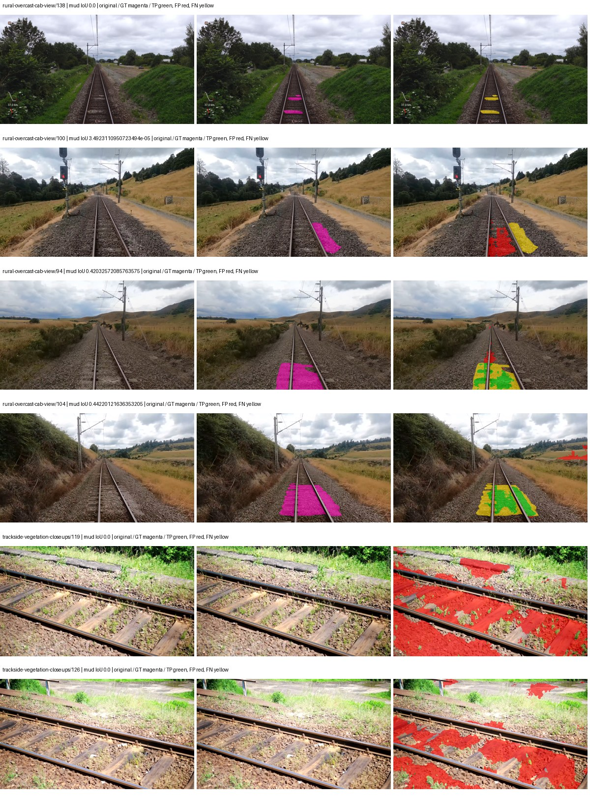
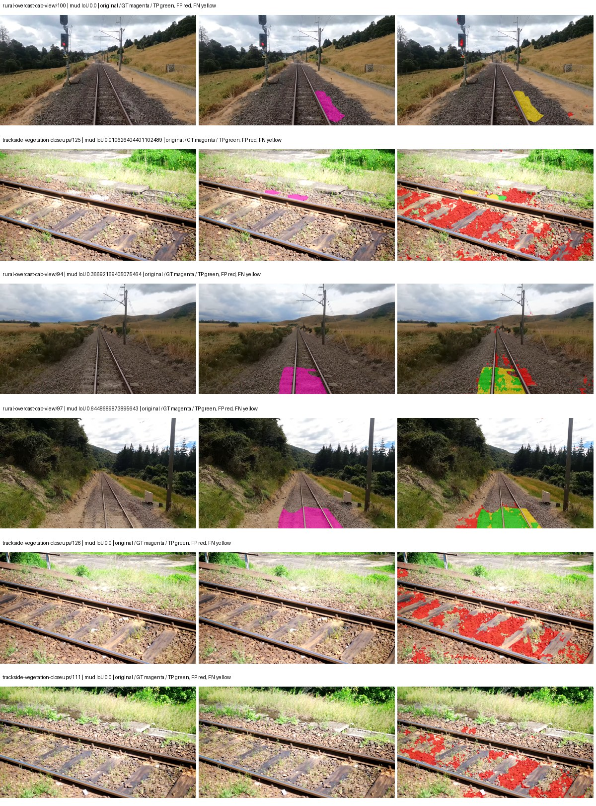
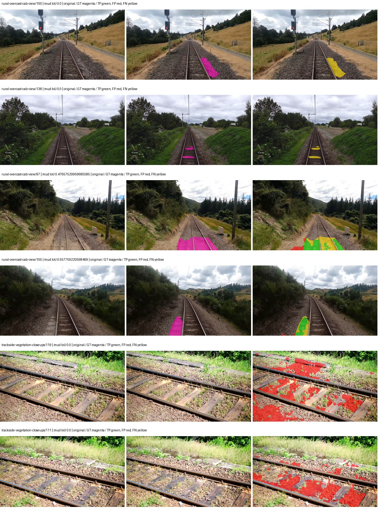
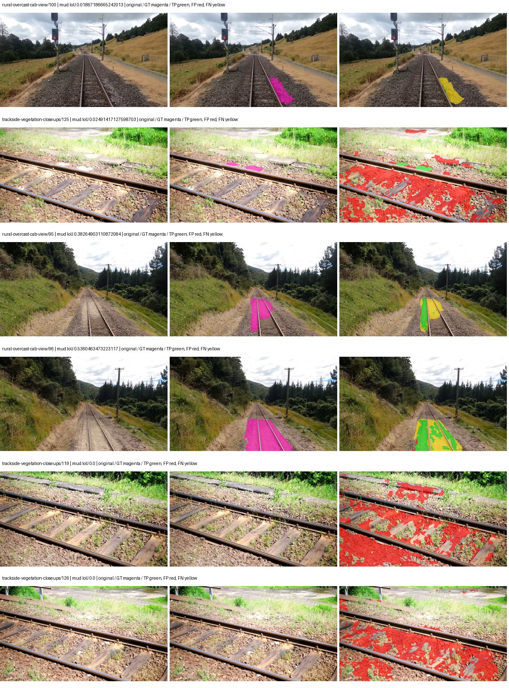

# smp_unet_resnet34 — paul-test-rtis_v2

[RTIS comparison](../../README.md) · [Full model records](record.json)

Primary selection and early stopping: **mud-pumping validation IoU**. A job is complete only after full statistics and isolated profiling are verified.

| Model | Initialization path | Seed | Status | Steps | Best step | Mud IoU (%) | Mud precision (%) | Mud recall (%) | Final mud IoU (trainer val, %) | mIoU (%) | Fixed GT-class mIoU (%) |
| --- | --- | --- | --- | --- | --- | --- | --- | --- | --- | --- | --- |
| smp_unet_resnet34 | rtis_only | 0 | completed | 3568 | 2294 | 5.16 | 6.01 | 26.58 | 2.65 | 25.36 | 28.18 |
| smp_unet_resnet34 | cityscapes_to_rtis | 0 | completed | 1784 | 509 | 12.48 | 16.49 | 33.92 | 4.92 | 23.56 | 24.87 |
| smp_unet_resnet34 | railsem19_to_rtis | 0 | completed | 1784 | 1529 | 8.70 | 11.87 | 24.59 | 4.49 | 27.08 | 31.59 |
| smp_unet_resnet34 | cityscapes_to_railsem19_to_rtis | 0 | completed | 2803 | 1529 | 8.12 | 10.03 | 29.93 | 2.85 | 25.09 | 29.27 |

Training: 205 images. Validation: 37 images. Test: 50 held out. Seeds: [0]. Seed variation measures optimization variability, not independent-recording uncertainty. Historical source checkpoints stay fixed across adaptation seeds.

Training code: `066afb2626398b7be59d4d19f5a0e4644fd59adc`. Split SHA-256: `18a84c0163a65ded46508bcc904c374e5f33ad8a09b8879e3c8add606e86aa9f`.

## rtis_only — seed 0

Status: **completed**. Started: 2026-09-10T03:13:08.290608+00:00. Finished: 2026-09-10T03:52:17.648773+00:00.

Recipe pretrained initializer: `{"arch": "smp", "backbone_path": null, "batch_norm_momentum": null, "checkpoint": null, "classifier_path": null, "drop_path": null, "encoder_name": "resnet34", "encoder_weights": "imagenet", "head": "unified_head", "head_paths": [], "inactive_parameter_paths": [], "local_files_only": false, "lora_alpha": 32, "lora_dropout": 0.05, "lora_r": 16, "lora_targets": [], "native": null, "revision": null, "smp_arch": "Unet", "subfolder": null, "trust_remote_code": false, "tuning": "full"}`.

`rtis_only` uses the recipe initializer, which may include pretrained segmentation components. Transfer paths load the exact historical source checkpoint below and reset the classifier; they do not reset all query/decoder features.

Source checkpoint: `Recipe pretrained initialization`.

Config SHA-256: `e074bc701af4b3ec9c0447fade442f2e2c942206fc9766e78ea3f8b62ba8e602`. Weights used for validation: `raw`.

### Mud-pumping and aggregate quality

| Metric | Selected checkpoint | Final training validation |
| --- | --- | --- |
| Mud IoU | 5.16 | 2.65 |
| Mud precision | 6.01 | 3.34 |
| Mud recall | 26.58 | 11.39 |
| Mud Dice/F1 | 9.81 | 5.17 |
| mIoU | 25.36 | 25.28 |
| Mean accuracy | 36.29 | 38.04 |
| Mean precision | 40.40 | 44.12 |
| Mean Dice | 32.02 | 32.41 |
| Mean specificity | 98.78 | 98.72 |
| Pixel accuracy | 80.09 | 78.63 |
| Frequency-weighted IoU | 71.27 | 69.92 |
| Fixed GT-present class mIoU | 28.18 | 29.49 |
| Boundary F1 | 29.99 | 32.27 |

The selected checkpoint has independent evaluation evidence. Final values are the trainer's final validation record, not a new independent evaluation. mIoU averages classes with nonzero union, so false positives on absent classes can change its denominator. The fixed GT-class mean is supplementary and excludes absent classes; their false positives remain in the confusion matrix.

### Resource usage and timing

| Measurement | Value |
| --- | --- |
| Peak training VRAM, retained training invocation (GiB) | 7.91 |
| Peak evaluation VRAM (GiB) | 6.50 |
| Retained training invocation wall time (seconds) | 2229.64 |
| Retained training invocation GPU-hours (one GPU) | 0.62 |
| Evaluation wall time (seconds) | 10.54 |
| Full evaluation pipeline images/second | 3.51 |
| Best full-state checkpoint (MiB) | 373.37 |
| Final full-state checkpoint (MiB) | 373.36 |
| Verified periodic checkpoints removed (GiB) | 2.55 |

VRAM uses the recorded allocator high-water mark; it is not total device usage including CUDA context. Resumed jobs' retained training invocation times and peaks are **not whole-campaign totals**. Earlier invocation resource records are not reconstructed here. Evaluation throughput includes loader, sliding-window inference and metrics; it is not model-only latency/FPS. Missing measurements are shown as —, never inferred from another dataset's run.

### Standardized inference performance

Dedicated model-only profiling waits for an idle worker-locked L40S: BF16, batch 1, 1024x1024, 20 warmup and 100 CUDA-event-timed public forwards. It excludes loading, preprocessing, tiling and metrics.

| Status | Parameters | Weight MiB | FPS | p50 ms | p95 ms | Peak reserved GiB |
| --- | --- | --- | --- | --- | --- | --- |
| complete | 24439269 | 93.23 | 141.63 | 6.98 | 7.81 | 0.67 |

```json
{
  "schema_version": 1,
  "model_id": "smp_unet_resnet34",
  "measured_at": "2026-09-10T03:52:12+00:00",
  "status": "complete",
  "benchmark_scope": "rtis_selected_checkpoint_model_only",
  "applies_to": [
    "smp_unet_resnet34--rtis_only--seed-0"
  ],
  "source": {
    "campaign_git_sha": "066afb2626398b7be59d4d19f5a0e4644fd59adc",
    "git_dirty": false,
    "config_hash": "9dd201db0213",
    "resolved_config": "/data/izadia1/projects/segmentary-runs/paul-test-rtis_v2/seed0-20260909/configs/smp_unet_resnet34--rtis_only--seed-0.yaml",
    "config_sha256": "e074bc701af4b3ec9c0447fade442f2e2c942206fc9766e78ea3f8b62ba8e602",
    "checkpoint_sha256": "3a8bab9e70e476cb9ec8aaaa32230c678bad742aeffc5b286b20cc4f5bee898e",
    "checkpoint_global_step": 2294,
    "checkpoint_bytes": 391502169,
    "checkpoint_kind": "resume checkpoint with optimizer and EMA state",
    "weights": "raw",
    "measured_checkpoint_job_id": "smp_unet_resnet34--rtis_only--seed-0",
    "result_sha256": "e4cb82b10ec92765b7904c3a583c368a5ab255ed1447ea74b042d50c58e9bce3",
    "result_git_sha": "066afb2626398b7be59d4d19f5a0e4644fd59adc",
    "result_stage": "eval:paul-test-rtis:val",
    "result_seed": 0
  },
  "hardware": {
    "gpu_name": "NVIDIA L40S",
    "gpu_uuid": "GPU-931d0911-fc78-1638-e3d7-1ba868cbd286",
    "logical_device": "cuda:0",
    "physical_visibility_token": "2",
    "compute_capability": [
      8,
      9
    ],
    "total_memory_bytes": 47677177856
  },
  "model": {
    "parameter_count": 24439269,
    "trainable_parameter_count": 24439269,
    "resident_parameter_bytes": 97757076,
    "parameter_dtype_counts": {
      "float32": 24439269
    }
  },
  "contract": {
    "backend": "pytorch",
    "precision": "bf16_autocast",
    "batch_size": 1,
    "input_shape_nchw": [
      1,
      3,
      1024,
      1024
    ],
    "warmup_iterations": 20,
    "measured_iterations": 100,
    "timing": "per-forward CUDA events with end-event synchronization",
    "includes_preprocessing": false,
    "includes_data_loader": false,
    "includes_sliding_window": false,
    "input_resident_on_gpu": true,
    "model_only": true,
    "entrypoint": "public model(image) dense-logits forward"
  },
  "measurements": {
    "latency": {
      "p50_ms": 6.982656002044678,
      "p95_ms": 7.811379075050354,
      "mean_ms": 7.060896315574646,
      "minimum_ms": 6.746111869812012,
      "maximum_ms": 8.257535934448242,
      "fps": 141.62507921186148,
      "raw_ms": [
        7.455743789672852,
        7.515135765075684,
        7.254015922546387,
        7.08403205871582,
        6.914048194885254,
        7.418879985809326,
        6.812672138214111,
        6.763519763946533,
        6.758399963378906,
        6.790143966674805,
        6.765567779541016,
        6.796288013458252,
        7.969696044921875,
        7.2427520751953125,
        7.111680030822754,
        7.020544052124023,
        7.076863765716553,
        7.031807899475098,
        7.135231971740723,
        7.185408115386963,
        7.550975799560547,
        7.809023857116699,
        7.107583999633789,
        7.010303974151611,
        6.940671920776367,
        7.013376235961914,
        7.000063896179199,
        6.997024059295654,
        6.975488185882568,
        6.765567779541016,
        6.747136116027832,
        6.854656219482422,
        6.778783798217773,
        6.820864200592041,
        6.820864200592041,
        6.746111869812012,
        7.173120021820068,
        6.773759841918945,
        6.879231929779053,
        6.870016098022461,
        7.076863765716553,
        7.317503929138184,
        6.8812479972839355,
        6.808640003204346,
        6.881279945373535,
        7.097343921661377,
        6.979584217071533,
        8.257535934448242,
        7.856128215789795,
        7.3963518142700195,
        6.952960014343262,
        6.81056022644043,
        6.838335990905762,
        6.868991851806641,
        7.8745598793029785,
        7.613440036773682,
        6.947840213775635,
        6.791168212890625,
        6.772736072540283,
        6.756351947784424,
        6.762495994567871,
        6.774784088134766,
        6.802432060241699,
        6.871039867401123,
        6.809599876403809,
        6.7696638107299805,
        6.770688056945801,
        6.781951904296875,
        6.892543792724609,
        7.244800090789795,
        8.093695640563965,
        7.111680030822754,
        7.223296165466309,
        7.047167778015137,
        7.053311824798584,
        7.010303974151611,
        6.985727787017822,
        7.011328220367432,
        7.060480117797852,
        7.511040210723877,
        7.421951770782471,
        7.0348801612854,
        6.945792198181152,
        6.876160144805908,
        7.003136157989502,
        6.987775802612305,
        7.003136157989502,
        7.033728122711182,
        6.791168212890625,
        6.754303932189941,
        6.7593278884887695,
        6.839295864105225,
        7.24070405960083,
        6.880256175994873,
        6.776832103729248,
        6.797311782836914,
        6.895616054534912,
        7.697408199310303,
        7.628799915313721,
        7.6175360679626465
      ],
      "percentile_method": "numpy linear interpolation"
    },
    "peak_reserved_bytes": 723517440,
    "memory_kind": "pytorch_cuda_allocator_peak_reserved_excluding_context",
    "benchmark_wall_clock_s": 8.077940322458744
  },
  "started_at": "2026-09-10T03:52:04+00:00",
  "finished_at": "2026-09-10T03:52:12+00:00",
  "environment": {
    "hostname": "hdrfs-app-001",
    "python": "3.11.15",
    "platform": "Linux-5.15.0-139-generic-x86_64-with-glibc2.35",
    "torch": "2.11.0+cu128",
    "torch_cuda": "12.8",
    "cudnn": 91900,
    "driver_version": "570.133.20",
    "cuda_available": true,
    "gpu_count": 1,
    "gpu_names": [
      "NVIDIA L40S"
    ],
    "cuda_visible_devices": "2",
    "packages": {
      "segmentary": "0.1.0",
      "torch": "2.11.0+cu128",
      "torchvision": "0.26.0+cu128",
      "transformers": "5.15.0",
      "timm": "1.0.28",
      "segmentation-models-pytorch": "0.5.0",
      "albumentations": "2.0.8",
      "lightning": "2.6.5",
      "numpy": "2.4.4"
    }
  }
}
```

### Per-class validation results

| Class | GT pixels | IoU (%) | Precision (%) | Recall (%) | Dice (%) | Boundary F1 (%) |
| --- | --- | --- | --- | --- | --- | --- |
| car | 29664 | 0.00 | 0.00 | 0.00 | 0.00 | 0.00 |
| construction | 311585 | 21.37 | 23.64 | 68.95 | 35.21 | 29.01 |
| fence | 265137 | 17.26 | 46.15 | 21.62 | 29.44 | 26.94 |
| mud-pumping | 1226250 | 5.16 | 6.01 | 26.58 | 9.81 | 11.04 |
| on-rails | 0 | 0.00 | 0.00 | — | 0.00 | 0.00 |
| person | 0 | — | — | — | — | — |
| pole | 628038 | 65.05 | 80.80 | 76.95 | 78.83 | 85.11 |
| rail-embedded | 16799 | 1.54 | 66.16 | 1.55 | 3.02 | 17.65 |
| rail-raised | 2969797 | 77.08 | 85.12 | 89.08 | 87.06 | 91.65 |
| rail-track | 6323197 | 32.89 | 67.15 | 39.20 | 49.50 | 49.60 |
| road | 1048831 | 3.57 | 12.22 | 4.79 | 6.89 | 9.32 |
| sidewalk | 1297367 | 24.37 | 69.25 | 27.32 | 39.19 | 19.85 |
| sky | 19121606 | 92.04 | 99.18 | 92.74 | 95.86 | 72.65 |
| standing-water | 95802 | 1.07 | 1.18 | 10.34 | 2.12 | 5.04 |
| terrain | 39239306 | 84.55 | 86.95 | 96.83 | 91.63 | 48.99 |
| trackbed | 10643081 | 58.43 | 74.57 | 72.98 | 73.76 | 57.27 |
| traffic-light | 19510 | 0.00 | 0.00 | 0.00 | 0.00 | 0.00 |
| traffic-sign | 13285 | 0.00 | 0.00 | 0.00 | 0.00 | 0.00 |
| tram-track | 56179 | 1.31 | 4.36 | 1.83 | 2.58 | 18.30 |
| truck | 0 | 0.00 | 0.00 | — | 0.00 | 0.00 |
| vegetation-overgrowth | 5901821 | 21.61 | 85.19 | 22.46 | 35.54 | 57.28 |

### Full-run accounting

| Measurement | Value |
| --- | --- |
| Full GPU-reserved wall seconds, all recorded worker attempts | 2349.36 |
| Full reserved GPU-hours | 0.65 |
| Whole-run timing complete | True |

| Phase | Wall seconds including failed attempts |
| --- | --- |
| training | 2236.85 |
| diagnostics | 74.08 |
| performance | 15.79 |

GPU-reserved time includes model loading, training, validation, collection, profiling, checkpoint I/O and orchestration while the worker owns one GPU. It is not GPU kernel-active time. Phase timings and sampled device memory/power/utilization are retained separately; sampled device memory is not the allocator high-water mark.

### Train/validation and raw/EMA diagnostics

| Checkpoint / weights / split | Images | Mud IoU (%) | Mud precision (%) | Mud recall (%) |
| --- | --- | --- | --- | --- |
| best-auto-train / raw | 205 | 92.21 | 95.21 | 96.70 |
| best-auto-val / raw | 37 | 5.16 | 6.01 | 26.58 |
| best-alternate-val / ema | 37 | 2.06 | 2.63 | 8.68 |
| final-auto-val / raw | 37 | 2.66 | 3.35 | 11.40 |

Train uses the evaluation transform without augmentation. Compare mud train/validation metrics for the same selected weights. Alternate EMA on running-stat BatchNorm is explicitly uncalibrated and is diagnostic only. Score-threshold curves use uncalibrated normalized scores and are pixel-level diagnostics, not event detection rates or a selected deployment operating point.

### Downloadable evidence

- best-auto-train: [per-image.csv](rtis_only--seed-0/best-auto-train/per-image.csv) · [per-image-confusion.json.gz](rtis_only--seed-0/best-auto-train/per-image-confusion.json.gz) · [groups.json](rtis_only--seed-0/best-auto-train/groups.json) · [mud-score-curves.json](rtis_only--seed-0/best-auto-train/mud-score-curves.json)
- best-auto-val: [per-image.csv](rtis_only--seed-0/best-auto-val/per-image.csv) · [per-image-confusion.json.gz](rtis_only--seed-0/best-auto-val/per-image-confusion.json.gz) · [groups.json](rtis_only--seed-0/best-auto-val/groups.json) · [mud-score-curves.json](rtis_only--seed-0/best-auto-val/mud-score-curves.json) · [examples.jpg](rtis_only--seed-0/best-auto-val/examples.jpg)
- best-alternate-val: [per-image.csv](rtis_only--seed-0/best-alternate-val/per-image.csv) · [per-image-confusion.json.gz](rtis_only--seed-0/best-alternate-val/per-image-confusion.json.gz) · [groups.json](rtis_only--seed-0/best-alternate-val/groups.json) · [mud-score-curves.json](rtis_only--seed-0/best-alternate-val/mud-score-curves.json)
- final-auto-val: [per-image.csv](rtis_only--seed-0/final-auto-val/per-image.csv) · [per-image-confusion.json.gz](rtis_only--seed-0/final-auto-val/per-image-confusion.json.gz) · [groups.json](rtis_only--seed-0/final-auto-val/groups.json) · [mud-score-curves.json](rtis_only--seed-0/final-auto-val/mud-score-curves.json)
- resources: [telemetry.csv](rtis_only--seed-0/resources/telemetry.csv)



Examples are two lowest and two highest mud-IoU positive images, plus up to two negative images with the most false-positive mud pixels. They are targeted diagnostic examples, not random samples. Green: true positive; red: false positive; yellow: false negative. Full predictions remain on HDRFS.

### Validation tracking

| Logged step | Overall mIoU (%) | Mud IoU (%) |
| --- | --- | --- |
| 254 | 17.57 | 0.45 |
| 509 | 21.65 | 1.60 |
| 764 | 23.78 | 0.80 |
| 1019 | 24.77 | 3.20 |
| 1274 | 24.03 | 1.46 |
| 1529 | 23.43 | 1.15 |
| 1784 | 23.98 | 1.98 |
| 2038 | 24.43 | 1.53 |
| 2293 | 25.36 | 5.16 |
| 2548 | 24.24 | 4.18 |
| 2803 | 24.26 | 2.24 |
| 3058 | 25.42 | 4.57 |
| 3313 | 24.12 | 3.46 |
| 3568 | 25.28 | 2.65 |

All retained scalar curves, including training loss and per-class IoU, are in record.json. Observed best mud on a curve is not necessarily a retained checkpoint: the pilot saved its selection-metric-best and final checkpoints. Step logging and checkpoint global_step may differ by one.

### Stopping and checkpoint provenance

```json
{
  "stopping": {
    "actual_steps": 3568,
    "maximum_steps": 4000,
    "min_delta": 0.001,
    "monitor": "val_iou/mud-pumping",
    "patience": 5,
    "reason": "validation_plateau"
  },
  "checkpoints": {
    "best": {
      "path": "/data/izadia1/projects/segmentary-runs/paul-test-rtis_v2/seed0-20260909/future-runs/smp_unet_resnet34--rtis_only--seed-0_seed0/rtis/best.ckpt",
      "sha256": "3a8bab9e70e476cb9ec8aaaa32230c678bad742aeffc5b286b20cc4f5bee898e",
      "global_step": 2294,
      "bytes": 391502169
    },
    "final": {
      "path": "/data/izadia1/projects/segmentary-runs/paul-test-rtis_v2/seed0-20260909/future-runs/smp_unet_resnet34--rtis_only--seed-0_seed0/rtis/last.ckpt",
      "sha256": "3e919e86a5f64a99f98eb7d9bcf1453e596ace839f976ee78b19bd7eb22f1973",
      "global_step": 3568,
      "bytes": 391493273
    }
  },
  "cleanup_error": null
}
```

### Resolved training, initialization and evaluation settings

The optimizer block is the base configuration. Stage LR scales are applied at runtime, and stage warmup is capped at min(base warmup, floor(stage budget / 10), stage budget - 1): 400 steps for this 4,000-step pilot. Model-internal native input grids may differ from augmentation crops (EoMT uses its 640 grid).

```json
{
  "name": "smp_unet_resnet34--rtis_only--seed-0",
  "model": {
    "arch": "smp",
    "checkpoint": null,
    "tuning": "full",
    "head": "unified_head",
    "lora_r": 16,
    "lora_alpha": 32,
    "lora_dropout": 0.05,
    "lora_targets": [],
    "drop_path": null,
    "revision": null,
    "subfolder": null,
    "local_files_only": false,
    "trust_remote_code": false,
    "backbone_path": null,
    "head_paths": [],
    "classifier_path": null,
    "inactive_parameter_paths": [],
    "smp_arch": "Unet",
    "encoder_name": "resnet34",
    "encoder_weights": "imagenet",
    "native": null,
    "batch_norm_momentum": null
  },
  "space": "paul-test-rtis",
  "taxonomy_root": "/data/izadia1/projects/segmentary-rtis-fullstats-066afb2/taxonomy",
  "output_root": "/data/izadia1/projects/segmentary-runs/paul-test-rtis_v2/seed0-20260909/future-runs",
  "optim": {
    "backbone_lr": 0.0001,
    "head_lr_mult": 10.0,
    "weight_decay": 0.05,
    "llrd": 1.0,
    "warmup_iters": 1500,
    "warmup_ratio": 1e-06,
    "poly_power": 0.9,
    "min_lr_ratio": 0.0,
    "betas": [
      0.9,
      0.999
    ],
    "grad_clip": 1.0
  },
  "train": {
    "iters": 4000,
    "batch_size": 2,
    "accum": 8,
    "num_workers": 2,
    "precision": "bf16-mixed",
    "ema_decay": 0.9998,
    "val_every": 250,
    "ckpt_every": 500,
    "selection_metric": "val_iou/mud-pumping",
    "early_stopping_patience": 5,
    "early_stopping_min_delta": 0.001,
    "seed": 0,
    "devices": 1
  },
  "eval": {
    "sliding_window": true,
    "window": [
      1024,
      1024
    ],
    "stride": [
      768,
      768
    ],
    "batch_size": 1,
    "num_workers": 2,
    "tta_scales": [],
    "tta_flip": false,
    "threshold": 0.5,
    "boundary_tolerance_frac": 0.0075,
    "save_confusion": true
  },
  "loss": {
    "task": "multiclass",
    "activation": "auto",
    "terms": [],
    "aux": "none",
    "aux_weight": 0.0,
    "ce_weight": 1.0,
    "label_smoothing": 0.0,
    "class_weights": null,
    "query": null
  },
  "aug": {
    "crop": [
      1024,
      1024
    ],
    "scale_min": 0.5,
    "scale_max": 2.0,
    "hflip_p": 0.5,
    "color_jitter_p": 0.5,
    "brightness": 0.25,
    "contrast": 0.25,
    "saturation": 0.25,
    "hue": 0.05
  },
  "stages": [
    {
      "name": "rtis",
      "data": [
        {
          "name": "paul-test-rtis",
          "root": "/data/izadia1/datasets/paul-test-rtis_v2",
          "variant": null,
          "split_file": "splits.json",
          "train_split": "train",
          "val_split": "val",
          "limit": null,
          "loader": "folder",
          "mapping": "paul-test-rtis",
          "loader_options": {
            "require_groups": true
          }
        }
      ],
      "iters": null,
      "lr_scale": 1.0,
      "head_group_lr_scale": 1.0,
      "init_from": "pretrained",
      "reset_head": false,
      "freeze": null,
      "sample_weights": null
    }
  ]
}
```

### Hardware and software provenance

```json
{
  "training": {
    "cuda_available": true,
    "cuda_visible_devices": "2",
    "cudnn": 91900,
    "driver_version": "570.133.20",
    "gpu_count": 1,
    "gpu_names": [
      "NVIDIA L40S"
    ],
    "hostname": "hdrfs-app-001",
    "input_normalization": {
      "channel_order": "rgb",
      "mean": [
        0.485,
        0.456,
        0.406
      ],
      "source": "smp_encoder_settings",
      "std": [
        0.229,
        0.224,
        0.225
      ]
    },
    "model_origins": [
      {
        "hf_commit": null,
        "hf_name_or_path": null,
        "module": "model",
        "timm_pretrained": {}
      }
    ],
    "model_parameter_count": 24439269,
    "packages": {
      "albumentations": "2.0.8",
      "lightning": "2.6.5",
      "numpy": "2.4.4",
      "segmentary": "0.1.0",
      "segmentation-models-pytorch": "0.5.0",
      "timm": "1.0.28",
      "torch": "2.11.0+cu128",
      "torchvision": "0.26.0+cu128",
      "transformers": "5.15.0"
    },
    "platform": "Linux-5.15.0-139-generic-x86_64-with-glibc2.35",
    "python": "3.11.15",
    "torch": "2.11.0+cu128",
    "torch_cuda": "12.8",
    "trainable_parameter_count": 24439269,
    "training_stop": {
      "actual_steps": 3568,
      "maximum_steps": 4000,
      "min_delta": 0.001,
      "monitor": "val_iou/mud-pumping",
      "patience": 5,
      "reason": "validation_plateau"
    },
    "validation_weights": "raw"
  },
  "evaluation": {
    "cuda_available": true,
    "cuda_visible_devices": "2",
    "cudnn": 91900,
    "driver_version": "570.133.20",
    "gpu_count": 1,
    "gpu_names": [
      "NVIDIA L40S"
    ],
    "hostname": "hdrfs-app-001",
    "input_normalization": {
      "channel_order": "rgb",
      "mean": [
        0.485,
        0.456,
        0.406
      ],
      "source": "smp_encoder_settings",
      "std": [
        0.229,
        0.224,
        0.225
      ]
    },
    "packages": {
      "albumentations": "2.0.8",
      "lightning": "2.6.5",
      "numpy": "2.4.4",
      "segmentary": "0.1.0",
      "segmentation-models-pytorch": "0.5.0",
      "timm": "1.0.28",
      "torch": "2.11.0+cu128",
      "torchvision": "0.26.0+cu128",
      "transformers": "5.15.0"
    },
    "platform": "Linux-5.15.0-139-generic-x86_64-with-glibc2.35",
    "python": "3.11.15",
    "torch": "2.11.0+cu128",
    "torch_cuda": "12.8"
  }
}
```

## cityscapes_to_rtis — seed 0

Status: **completed**. Started: 2026-09-10T03:13:15.489880+00:00. Finished: 2026-09-10T03:34:21.176571+00:00.

Recipe pretrained initializer: `{"arch": "smp", "backbone_path": null, "batch_norm_momentum": null, "checkpoint": null, "classifier_path": null, "drop_path": null, "encoder_name": "resnet34", "encoder_weights": "imagenet", "head": "unified_head", "head_paths": [], "inactive_parameter_paths": [], "local_files_only": false, "lora_alpha": 32, "lora_dropout": 0.05, "lora_r": 16, "lora_targets": [], "native": null, "revision": null, "smp_arch": "Unet", "subfolder": null, "trust_remote_code": false, "tuning": "full"}`.

`rtis_only` uses the recipe initializer, which may include pretrained segmentation components. Transfer paths load the exact historical source checkpoint below and reset the classifier; they do not reset all query/decoder features.

Source checkpoint: `{'name': 'smp_unet_resnet34--cityscapes--seed-0', 'model': 'smp_unet_resnet34', 'protocol': 'cityscapes', 'config': '/data/izadia1/projects/segmentary-runs/all-model-city-rail-seed0-rail20-b9eb3e1/jobs/smp_unet_resnet34--cityscapes--seed-0/attempt-001/resolved-config.yaml', 'checkpoint': '/data/izadia1/projects/segmentary-runs/all-model-city-rail-seed0-rail20-b9eb3e1/jobs/smp_unet_resnet34--cityscapes--seed-0/attempt-001/train/smp_unet_resnet34--cityscapes_seed0/cityscapes/last.ckpt', 'recorded_sha256': '6fbbb9a3d23a04947b1d03d8c39643874311c2531a3455f67df7a8f09307fe72', 'exists': True}`.

Config SHA-256: `ec5447a4fcf4c31af3e1039e9b7c180eec48dfb0c3861e177314008d05ee4eb5`. Weights used for validation: `raw`.

### Mud-pumping and aggregate quality

| Metric | Selected checkpoint | Final training validation |
| --- | --- | --- |
| Mud IoU | 12.48 | 4.92 |
| Mud precision | 16.49 | 15.49 |
| Mud recall | 33.92 | 6.73 |
| Mud Dice/F1 | 22.19 | 9.38 |
| mIoU | 23.56 | 23.57 |
| Mean accuracy | 34.57 | 34.73 |
| Mean precision | 32.57 | 37.08 |
| Mean Dice | 29.80 | 29.91 |
| Mean specificity | 98.43 | 98.67 |
| Pixel accuracy | 76.69 | 78.90 |
| Frequency-weighted IoU | 64.64 | 68.59 |
| Fixed GT-present class mIoU | 24.87 | 27.50 |
| Boundary F1 | 26.11 | 26.87 |

The selected checkpoint has independent evaluation evidence. Final values are the trainer's final validation record, not a new independent evaluation. mIoU averages classes with nonzero union, so false positives on absent classes can change its denominator. The fixed GT-class mean is supplementary and excludes absent classes; their false positives remain in the confusion matrix.

### Resource usage and timing

| Measurement | Value |
| --- | --- |
| Peak training VRAM, retained training invocation (GiB) | 7.91 |
| Peak evaluation VRAM (GiB) | 6.50 |
| Retained training invocation wall time (seconds) | 1147.76 |
| Retained training invocation GPU-hours (one GPU) | 0.32 |
| Evaluation wall time (seconds) | 10.47 |
| Full evaluation pipeline images/second | 3.53 |
| Best full-state checkpoint (MiB) | 373.37 |
| Final full-state checkpoint (MiB) | 373.36 |
| Verified periodic checkpoints removed (GiB) | 1.09 |

VRAM uses the recorded allocator high-water mark; it is not total device usage including CUDA context. Resumed jobs' retained training invocation times and peaks are **not whole-campaign totals**. Earlier invocation resource records are not reconstructed here. Evaluation throughput includes loader, sliding-window inference and metrics; it is not model-only latency/FPS. Missing measurements are shown as —, never inferred from another dataset's run.

### Standardized inference performance

Dedicated model-only profiling waits for an idle worker-locked L40S: BF16, batch 1, 1024x1024, 20 warmup and 100 CUDA-event-timed public forwards. It excludes loading, preprocessing, tiling and metrics.

| Status | Parameters | Weight MiB | FPS | p50 ms | p95 ms | Peak reserved GiB |
| --- | --- | --- | --- | --- | --- | --- |
| complete | 24439269 | 93.23 | 142.25 | 6.93 | 7.55 | 0.67 |

```json
{
  "schema_version": 1,
  "model_id": "smp_unet_resnet34",
  "measured_at": "2026-09-10T03:34:17+00:00",
  "status": "complete",
  "benchmark_scope": "rtis_selected_checkpoint_model_only",
  "applies_to": [
    "smp_unet_resnet34--cityscapes_to_rtis--seed-0"
  ],
  "source": {
    "campaign_git_sha": "066afb2626398b7be59d4d19f5a0e4644fd59adc",
    "git_dirty": false,
    "config_hash": "1a3be30c641c",
    "resolved_config": "/data/izadia1/projects/segmentary-runs/paul-test-rtis_v2/seed0-20260909/configs/smp_unet_resnet34--cityscapes_to_rtis--seed-0.yaml",
    "config_sha256": "ec5447a4fcf4c31af3e1039e9b7c180eec48dfb0c3861e177314008d05ee4eb5",
    "checkpoint_sha256": "5b31dba3125b111835765cfcd0ed142a171f2a261d6a94398773ac7ccad4c893",
    "checkpoint_global_step": 509,
    "checkpoint_bytes": 391502233,
    "checkpoint_kind": "resume checkpoint with optimizer and EMA state",
    "weights": "raw",
    "measured_checkpoint_job_id": "smp_unet_resnet34--cityscapes_to_rtis--seed-0",
    "result_sha256": "6ac7602153c441c95d638c8ab6e4c973ac505ea5bb8746215c0d0495569ea0cc",
    "result_git_sha": "066afb2626398b7be59d4d19f5a0e4644fd59adc",
    "result_stage": "eval:paul-test-rtis:val",
    "result_seed": 0
  },
  "hardware": {
    "gpu_name": "NVIDIA L40S",
    "gpu_uuid": "GPU-2f8008a1-9b67-11f6-987b-b393a672322c",
    "logical_device": "cuda:0",
    "physical_visibility_token": "3",
    "compute_capability": [
      8,
      9
    ],
    "total_memory_bytes": 47677177856
  },
  "model": {
    "parameter_count": 24439269,
    "trainable_parameter_count": 24439269,
    "resident_parameter_bytes": 97757076,
    "parameter_dtype_counts": {
      "float32": 24439269
    }
  },
  "contract": {
    "backend": "pytorch",
    "precision": "bf16_autocast",
    "batch_size": 1,
    "input_shape_nchw": [
      1,
      3,
      1024,
      1024
    ],
    "warmup_iterations": 20,
    "measured_iterations": 100,
    "timing": "per-forward CUDA events with end-event synchronization",
    "includes_preprocessing": false,
    "includes_data_loader": false,
    "includes_sliding_window": false,
    "input_resident_on_gpu": true,
    "model_only": true,
    "entrypoint": "public model(image) dense-logits forward"
  },
  "measurements": {
    "latency": {
      "p50_ms": 6.929919958114624,
      "p95_ms": 7.5466242074966425,
      "mean_ms": 7.030076522827148,
      "minimum_ms": 6.762495994567871,
      "maximum_ms": 7.7946882247924805,
      "fps": 142.24596229542172,
      "raw_ms": [
        7.492608070373535,
        7.209983825683594,
        7.335936069488525,
        6.8976640701293945,
        6.789120197296143,
        6.789120197296143,
        7.3021440505981445,
        6.840256214141846,
        6.853631973266602,
        7.116799831390381,
        7.039999961853027,
        7.411712169647217,
        7.022592067718506,
        6.8351359367370605,
        6.7993597984313965,
        6.82700777053833,
        6.80131196975708,
        6.826943874359131,
        6.803455829620361,
        6.93555212020874,
        6.809599876403809,
        6.762495994567871,
        7.224319934844971,
        6.806528091430664,
        6.822912216186523,
        6.868927955627441,
        6.882175922393799,
        6.94374418258667,
        6.850560188293457,
        7.542784214019775,
        7.697408199310303,
        7.308288097381592,
        7.200767993927002,
        6.928383827209473,
        6.931456089019775,
        6.891520023345947,
        7.201791763305664,
        7.456768035888672,
        7.619584083557129,
        7.7649922370910645,
        7.157760143280029,
        7.150591850280762,
        7.109600067138672,
        6.938623905181885,
        7.413760185241699,
        6.861824035644531,
        6.83622407913208,
        6.856704235076904,
        6.8239359855651855,
        6.93452787399292,
        6.945792198181152,
        6.854656219482422,
        6.898687839508057,
        7.217152118682861,
        6.906879901885986,
        6.937600135803223,
        6.939648151397705,
        7.068672180175781,
        7.7946882247924805,
        6.8976640701293945,
        6.840223789215088,
        6.846464157104492,
        7.013376235961914,
        6.847487926483154,
        6.810624122619629,
        6.84438419342041,
        6.8239359855651855,
        7.294976234436035,
        7.20681619644165,
        6.967296123504639,
        7.088128089904785,
        6.914048194885254,
        6.860799789428711,
        6.873023986816406,
        7.328767776489258,
        7.113728046417236,
        7.734272003173828,
        7.263232231140137,
        7.314432144165039,
        6.939648151397705,
        6.853631973266602,
        6.801407814025879,
        6.773759841918945,
        6.789120197296143,
        6.871039867401123,
        6.960127830505371,
        6.840320110321045,
        6.891520023345947,
        6.914048194885254,
        6.888448238372803,
        6.839295864105225,
        6.813695907592773,
        6.863776206970215,
        6.9416961669921875,
        6.846464157104492,
        7.021471977233887,
        7.1393280029296875,
        7.367680072784424,
        7.3164801597595215,
        7.358335971832275
      ],
      "percentile_method": "numpy linear interpolation"
    },
    "peak_reserved_bytes": 723517440,
    "memory_kind": "pytorch_cuda_allocator_peak_reserved_excluding_context",
    "benchmark_wall_clock_s": 8.272827934473753
  },
  "started_at": "2026-09-10T03:34:09+00:00",
  "finished_at": "2026-09-10T03:34:17+00:00",
  "environment": {
    "hostname": "hdrfs-app-001",
    "python": "3.11.15",
    "platform": "Linux-5.15.0-139-generic-x86_64-with-glibc2.35",
    "torch": "2.11.0+cu128",
    "torch_cuda": "12.8",
    "cudnn": 91900,
    "driver_version": "570.133.20",
    "cuda_available": true,
    "gpu_count": 1,
    "gpu_names": [
      "NVIDIA L40S"
    ],
    "cuda_visible_devices": "3",
    "packages": {
      "segmentary": "0.1.0",
      "torch": "2.11.0+cu128",
      "torchvision": "0.26.0+cu128",
      "transformers": "5.15.0",
      "timm": "1.0.28",
      "segmentation-models-pytorch": "0.5.0",
      "albumentations": "2.0.8",
      "lightning": "2.6.5",
      "numpy": "2.4.4"
    }
  }
}
```

### Per-class validation results

| Class | GT pixels | IoU (%) | Precision (%) | Recall (%) | Dice (%) | Boundary F1 (%) |
| --- | --- | --- | --- | --- | --- | --- |
| car | 29664 | 0.00 | 0.00 | 0.00 | 0.00 | 0.00 |
| construction | 311585 | 10.70 | 11.20 | 70.53 | 19.33 | 19.67 |
| fence | 265137 | 28.58 | 54.86 | 37.37 | 44.46 | 35.12 |
| mud-pumping | 1226250 | 12.48 | 16.49 | 33.92 | 22.19 | 20.54 |
| on-rails | 0 | 0.00 | 0.00 | — | 0.00 | 0.00 |
| person | 0 | — | — | — | — | — |
| pole | 628038 | 69.40 | 80.39 | 83.54 | 81.94 | 88.08 |
| rail-embedded | 16799 | 0.00 | 0.00 | 0.00 | 0.00 | 0.00 |
| rail-raised | 2969797 | 60.72 | 68.76 | 83.85 | 75.56 | 82.06 |
| rail-track | 6323197 | 21.65 | 73.85 | 23.45 | 35.59 | 46.00 |
| road | 1048831 | 1.80 | 17.61 | 1.97 | 3.54 | 13.55 |
| sidewalk | 1297367 | 16.19 | 44.34 | 20.33 | 27.87 | 11.29 |
| sky | 19121606 | 94.69 | 99.32 | 95.31 | 97.27 | 80.69 |
| standing-water | 95802 | 0.51 | 0.55 | 7.06 | 1.02 | 1.81 |
| terrain | 39239306 | 75.26 | 78.51 | 94.79 | 85.88 | 43.00 |
| trackbed | 10643081 | 55.70 | 73.01 | 70.15 | 71.55 | 54.31 |
| traffic-light | 19510 | 0.00 | 0.00 | 0.00 | 0.00 | 0.00 |
| traffic-sign | 13285 | 0.00 | 0.00 | 0.00 | 0.00 | 0.00 |
| tram-track | 56179 | 0.00 | 0.00 | 0.00 | 0.00 | 0.00 |
| truck | 0 | — | — | — | — | — |
| vegetation-overgrowth | 5901821 | 0.00 | 0.00 | 0.00 | 0.00 | 0.00 |

### Full-run accounting

| Measurement | Value |
| --- | --- |
| Full GPU-reserved wall seconds, all recorded worker attempts | 1266.00 |
| Full reserved GPU-hours | 0.35 |
| Whole-run timing complete | True |

| Phase | Wall seconds including failed attempts |
| --- | --- |
| training | 1155.29 |
| diagnostics | 73.27 |
| performance | 15.78 |

GPU-reserved time includes model loading, training, validation, collection, profiling, checkpoint I/O and orchestration while the worker owns one GPU. It is not GPU kernel-active time. Phase timings and sampled device memory/power/utilization are retained separately; sampled device memory is not the allocator high-water mark.

### Train/validation and raw/EMA diagnostics

| Checkpoint / weights / split | Images | Mud IoU (%) | Mud precision (%) | Mud recall (%) |
| --- | --- | --- | --- | --- |
| best-auto-train / raw | 205 | 68.74 | 88.86 | 75.23 |
| best-auto-val / raw | 37 | 12.48 | 16.49 | 33.92 |
| best-alternate-val / ema | 37 | 11.64 | 13.96 | 41.14 |
| final-auto-val / raw | 37 | 4.92 | 15.49 | 6.72 |

Train uses the evaluation transform without augmentation. Compare mud train/validation metrics for the same selected weights. Alternate EMA on running-stat BatchNorm is explicitly uncalibrated and is diagnostic only. Score-threshold curves use uncalibrated normalized scores and are pixel-level diagnostics, not event detection rates or a selected deployment operating point.

### Downloadable evidence

- best-auto-train: [per-image.csv](cityscapes_to_rtis--seed-0/best-auto-train/per-image.csv) · [per-image-confusion.json.gz](cityscapes_to_rtis--seed-0/best-auto-train/per-image-confusion.json.gz) · [groups.json](cityscapes_to_rtis--seed-0/best-auto-train/groups.json) · [mud-score-curves.json](cityscapes_to_rtis--seed-0/best-auto-train/mud-score-curves.json)
- best-auto-val: [per-image.csv](cityscapes_to_rtis--seed-0/best-auto-val/per-image.csv) · [per-image-confusion.json.gz](cityscapes_to_rtis--seed-0/best-auto-val/per-image-confusion.json.gz) · [groups.json](cityscapes_to_rtis--seed-0/best-auto-val/groups.json) · [mud-score-curves.json](cityscapes_to_rtis--seed-0/best-auto-val/mud-score-curves.json) · [examples.jpg](cityscapes_to_rtis--seed-0/best-auto-val/examples.jpg)
- best-alternate-val: [per-image.csv](cityscapes_to_rtis--seed-0/best-alternate-val/per-image.csv) · [per-image-confusion.json.gz](cityscapes_to_rtis--seed-0/best-alternate-val/per-image-confusion.json.gz) · [groups.json](cityscapes_to_rtis--seed-0/best-alternate-val/groups.json) · [mud-score-curves.json](cityscapes_to_rtis--seed-0/best-alternate-val/mud-score-curves.json)
- final-auto-val: [per-image.csv](cityscapes_to_rtis--seed-0/final-auto-val/per-image.csv) · [per-image-confusion.json.gz](cityscapes_to_rtis--seed-0/final-auto-val/per-image-confusion.json.gz) · [groups.json](cityscapes_to_rtis--seed-0/final-auto-val/groups.json) · [mud-score-curves.json](cityscapes_to_rtis--seed-0/final-auto-val/mud-score-curves.json)
- resources: [telemetry.csv](cityscapes_to_rtis--seed-0/resources/telemetry.csv)



Examples are two lowest and two highest mud-IoU positive images, plus up to two negative images with the most false-positive mud pixels. They are targeted diagnostic examples, not random samples. Green: true positive; red: false positive; yellow: false negative. Full predictions remain on HDRFS.

### Validation tracking

| Logged step | Overall mIoU (%) | Mud IoU (%) |
| --- | --- | --- |
| 254 | 18.06 | 7.16 |
| 509 | 23.56 | 12.47 |
| 764 | 23.52 | 8.68 |
| 1019 | 24.19 | 1.28 |
| 1274 | 24.63 | 2.59 |
| 1529 | 24.11 | 1.69 |
| 1784 | 23.57 | 4.92 |

All retained scalar curves, including training loss and per-class IoU, are in record.json. Observed best mud on a curve is not necessarily a retained checkpoint: the pilot saved its selection-metric-best and final checkpoints. Step logging and checkpoint global_step may differ by one.

### Stopping and checkpoint provenance

```json
{
  "stopping": {
    "actual_steps": 1784,
    "maximum_steps": 4000,
    "min_delta": 0.001,
    "monitor": "val_iou/mud-pumping",
    "patience": 5,
    "reason": "validation_plateau"
  },
  "checkpoints": {
    "best": {
      "path": "/data/izadia1/projects/segmentary-runs/paul-test-rtis_v2/seed0-20260909/future-runs/smp_unet_resnet34--cityscapes_to_rtis--seed-0_seed0/rtis/best.ckpt",
      "sha256": "5b31dba3125b111835765cfcd0ed142a171f2a261d6a94398773ac7ccad4c893",
      "global_step": 509,
      "bytes": 391502233
    },
    "final": {
      "path": "/data/izadia1/projects/segmentary-runs/paul-test-rtis_v2/seed0-20260909/future-runs/smp_unet_resnet34--cityscapes_to_rtis--seed-0_seed0/rtis/last.ckpt",
      "sha256": "dcd6032dd0f3e415d87e395bdb657629a60d2633cdb89772c71a414f391f88f2",
      "global_step": 1784,
      "bytes": 391493273
    }
  },
  "cleanup_error": null
}
```

### Resolved training, initialization and evaluation settings

The optimizer block is the base configuration. Stage LR scales are applied at runtime, and stage warmup is capped at min(base warmup, floor(stage budget / 10), stage budget - 1): 400 steps for this 4,000-step pilot. Model-internal native input grids may differ from augmentation crops (EoMT uses its 640 grid).

```json
{
  "name": "smp_unet_resnet34--cityscapes_to_rtis--seed-0",
  "model": {
    "arch": "smp",
    "checkpoint": null,
    "tuning": "full",
    "head": "unified_head",
    "lora_r": 16,
    "lora_alpha": 32,
    "lora_dropout": 0.05,
    "lora_targets": [],
    "drop_path": null,
    "revision": null,
    "subfolder": null,
    "local_files_only": false,
    "trust_remote_code": false,
    "backbone_path": null,
    "head_paths": [],
    "classifier_path": null,
    "inactive_parameter_paths": [],
    "smp_arch": "Unet",
    "encoder_name": "resnet34",
    "encoder_weights": "imagenet",
    "native": null,
    "batch_norm_momentum": null
  },
  "space": "paul-test-rtis",
  "taxonomy_root": "/data/izadia1/projects/segmentary-rtis-fullstats-066afb2/taxonomy",
  "output_root": "/data/izadia1/projects/segmentary-runs/paul-test-rtis_v2/seed0-20260909/future-runs",
  "optim": {
    "backbone_lr": 0.0001,
    "head_lr_mult": 10.0,
    "weight_decay": 0.05,
    "llrd": 1.0,
    "warmup_iters": 1500,
    "warmup_ratio": 1e-06,
    "poly_power": 0.9,
    "min_lr_ratio": 0.0,
    "betas": [
      0.9,
      0.999
    ],
    "grad_clip": 1.0
  },
  "train": {
    "iters": 4000,
    "batch_size": 2,
    "accum": 8,
    "num_workers": 2,
    "precision": "bf16-mixed",
    "ema_decay": 0.9998,
    "val_every": 250,
    "ckpt_every": 500,
    "selection_metric": "val_iou/mud-pumping",
    "early_stopping_patience": 5,
    "early_stopping_min_delta": 0.001,
    "seed": 0,
    "devices": 1
  },
  "eval": {
    "sliding_window": true,
    "window": [
      1024,
      1024
    ],
    "stride": [
      768,
      768
    ],
    "batch_size": 1,
    "num_workers": 2,
    "tta_scales": [],
    "tta_flip": false,
    "threshold": 0.5,
    "boundary_tolerance_frac": 0.0075,
    "save_confusion": true
  },
  "loss": {
    "task": "multiclass",
    "activation": "auto",
    "terms": [],
    "aux": "none",
    "aux_weight": 0.0,
    "ce_weight": 1.0,
    "label_smoothing": 0.0,
    "class_weights": null,
    "query": null
  },
  "aug": {
    "crop": [
      1024,
      1024
    ],
    "scale_min": 0.5,
    "scale_max": 2.0,
    "hflip_p": 0.5,
    "color_jitter_p": 0.5,
    "brightness": 0.25,
    "contrast": 0.25,
    "saturation": 0.25,
    "hue": 0.05
  },
  "stages": [
    {
      "name": "rtis",
      "data": [
        {
          "name": "paul-test-rtis",
          "root": "/data/izadia1/datasets/paul-test-rtis_v2",
          "variant": null,
          "split_file": "splits.json",
          "train_split": "train",
          "val_split": "val",
          "limit": null,
          "loader": "folder",
          "mapping": "paul-test-rtis",
          "loader_options": {
            "require_groups": true
          }
        }
      ],
      "iters": null,
      "lr_scale": 0.1,
      "head_group_lr_scale": 1.0,
      "init_from": "/data/izadia1/projects/segmentary-runs/all-model-city-rail-seed0-rail20-b9eb3e1/jobs/smp_unet_resnet34--cityscapes--seed-0/attempt-001/train/smp_unet_resnet34--cityscapes_seed0/cityscapes/last.ckpt",
      "reset_head": true,
      "freeze": null,
      "sample_weights": null
    }
  ]
}
```

### Hardware and software provenance

```json
{
  "training": {
    "cuda_available": true,
    "cuda_visible_devices": "3",
    "cudnn": 91900,
    "driver_version": "570.133.20",
    "gpu_count": 1,
    "gpu_names": [
      "NVIDIA L40S"
    ],
    "hostname": "hdrfs-app-001",
    "input_normalization": {
      "channel_order": "rgb",
      "mean": [
        0.485,
        0.456,
        0.406
      ],
      "source": "smp_encoder_settings",
      "std": [
        0.229,
        0.224,
        0.225
      ]
    },
    "model_origins": [
      {
        "hf_commit": null,
        "hf_name_or_path": null,
        "module": "model",
        "timm_pretrained": {}
      }
    ],
    "model_parameter_count": 24439269,
    "packages": {
      "albumentations": "2.0.8",
      "lightning": "2.6.5",
      "numpy": "2.4.4",
      "segmentary": "0.1.0",
      "segmentation-models-pytorch": "0.5.0",
      "timm": "1.0.28",
      "torch": "2.11.0+cu128",
      "torchvision": "0.26.0+cu128",
      "transformers": "5.15.0"
    },
    "platform": "Linux-5.15.0-139-generic-x86_64-with-glibc2.35",
    "python": "3.11.15",
    "torch": "2.11.0+cu128",
    "torch_cuda": "12.8",
    "trainable_parameter_count": 24439269,
    "training_stop": {
      "actual_steps": 1784,
      "maximum_steps": 4000,
      "min_delta": 0.001,
      "monitor": "val_iou/mud-pumping",
      "patience": 5,
      "reason": "validation_plateau"
    },
    "validation_weights": "raw"
  },
  "evaluation": {
    "cuda_available": true,
    "cuda_visible_devices": "3",
    "cudnn": 91900,
    "driver_version": "570.133.20",
    "gpu_count": 1,
    "gpu_names": [
      "NVIDIA L40S"
    ],
    "hostname": "hdrfs-app-001",
    "input_normalization": {
      "channel_order": "rgb",
      "mean": [
        0.485,
        0.456,
        0.406
      ],
      "source": "smp_encoder_settings",
      "std": [
        0.229,
        0.224,
        0.225
      ]
    },
    "packages": {
      "albumentations": "2.0.8",
      "lightning": "2.6.5",
      "numpy": "2.4.4",
      "segmentary": "0.1.0",
      "segmentation-models-pytorch": "0.5.0",
      "timm": "1.0.28",
      "torch": "2.11.0+cu128",
      "torchvision": "0.26.0+cu128",
      "transformers": "5.15.0"
    },
    "platform": "Linux-5.15.0-139-generic-x86_64-with-glibc2.35",
    "python": "3.11.15",
    "torch": "2.11.0+cu128",
    "torch_cuda": "12.8"
  }
}
```

## railsem19_to_rtis — seed 0

Status: **completed**. Started: 2026-09-10T03:17:32.095175+00:00. Finished: 2026-09-10T03:38:15.757279+00:00.

Recipe pretrained initializer: `{"arch": "smp", "backbone_path": null, "batch_norm_momentum": null, "checkpoint": null, "classifier_path": null, "drop_path": null, "encoder_name": "resnet34", "encoder_weights": "imagenet", "head": "unified_head", "head_paths": [], "inactive_parameter_paths": [], "local_files_only": false, "lora_alpha": 32, "lora_dropout": 0.05, "lora_r": 16, "lora_targets": [], "native": null, "revision": null, "smp_arch": "Unet", "subfolder": null, "trust_remote_code": false, "tuning": "full"}`.

`rtis_only` uses the recipe initializer, which may include pretrained segmentation components. Transfer paths load the exact historical source checkpoint below and reset the classifier; they do not reset all query/decoder features.

Source checkpoint: `{'name': 'smp_unet_resnet34--railsem19--seed-0', 'model': 'smp_unet_resnet34', 'protocol': 'railsem19', 'config': '/data/izadia1/projects/segmentary-runs/all-model-city-rail-seed0-rail20-b9eb3e1/jobs/smp_unet_resnet34--railsem19--seed-0/attempt-001/resolved-config.yaml', 'checkpoint': '/data/izadia1/projects/segmentary-runs/all-model-city-rail-seed0-rail20-b9eb3e1/jobs/smp_unet_resnet34--railsem19--seed-0/attempt-001/train/smp_unet_resnet34--railsem19_seed0/railsem19/last.ckpt', 'recorded_sha256': '95eeb357b2b7b1736aa1350b2671afd0e443ba0ecab6a27294b8677f006b4530', 'exists': True}`.

Config SHA-256: `2824492a820f2a9fc6ed75d37b0b73afa87415528612159e51ecdbfdfade5a9c`. Weights used for validation: `raw`.

### Mud-pumping and aggregate quality

| Metric | Selected checkpoint | Final training validation |
| --- | --- | --- |
| Mud IoU | 8.70 | 4.49 |
| Mud precision | 11.87 | 9.94 |
| Mud recall | 24.59 | 7.57 |
| Mud Dice/F1 | 16.01 | 8.59 |
| mIoU | 27.08 | 29.52 |
| Mean accuracy | 43.09 | 45.54 |
| Mean precision | 42.20 | 42.20 |
| Mean Dice | 34.89 | 37.79 |
| Mean specificity | 98.77 | 98.90 |
| Pixel accuracy | 81.16 | 82.87 |
| Frequency-weighted IoU | 70.98 | 73.07 |
| Fixed GT-present class mIoU | 31.59 | 34.44 |
| Boundary F1 | 32.97 | 33.80 |

The selected checkpoint has independent evaluation evidence. Final values are the trainer's final validation record, not a new independent evaluation. mIoU averages classes with nonzero union, so false positives on absent classes can change its denominator. The fixed GT-class mean is supplementary and excludes absent classes; their false positives remain in the confusion matrix.

### Resource usage and timing

| Measurement | Value |
| --- | --- |
| Peak training VRAM, retained training invocation (GiB) | 7.91 |
| Peak evaluation VRAM (GiB) | 6.50 |
| Retained training invocation wall time (seconds) | 1126.63 |
| Retained training invocation GPU-hours (one GPU) | 0.31 |
| Evaluation wall time (seconds) | 10.41 |
| Full evaluation pipeline images/second | 3.56 |
| Best full-state checkpoint (MiB) | 373.37 |
| Final full-state checkpoint (MiB) | 373.36 |
| Verified periodic checkpoints removed (GiB) | 1.09 |

VRAM uses the recorded allocator high-water mark; it is not total device usage including CUDA context. Resumed jobs' retained training invocation times and peaks are **not whole-campaign totals**. Earlier invocation resource records are not reconstructed here. Evaluation throughput includes loader, sliding-window inference and metrics; it is not model-only latency/FPS. Missing measurements are shown as —, never inferred from another dataset's run.

### Standardized inference performance

Dedicated model-only profiling waits for an idle worker-locked L40S: BF16, batch 1, 1024x1024, 20 warmup and 100 CUDA-event-timed public forwards. It excludes loading, preprocessing, tiling and metrics.

| Status | Parameters | Weight MiB | FPS | p50 ms | p95 ms | Peak reserved GiB |
| --- | --- | --- | --- | --- | --- | --- |
| complete | 24439269 | 93.23 | 140.46 | 6.80 | 9.02 | 0.67 |

```json
{
  "schema_version": 1,
  "model_id": "smp_unet_resnet34",
  "measured_at": "2026-09-10T03:38:12+00:00",
  "status": "complete",
  "benchmark_scope": "rtis_selected_checkpoint_model_only",
  "applies_to": [
    "smp_unet_resnet34--railsem19_to_rtis--seed-0"
  ],
  "source": {
    "campaign_git_sha": "066afb2626398b7be59d4d19f5a0e4644fd59adc",
    "git_dirty": false,
    "config_hash": "17f845d4c784",
    "resolved_config": "/data/izadia1/projects/segmentary-runs/paul-test-rtis_v2/seed0-20260909/configs/smp_unet_resnet34--railsem19_to_rtis--seed-0.yaml",
    "config_sha256": "2824492a820f2a9fc6ed75d37b0b73afa87415528612159e51ecdbfdfade5a9c",
    "checkpoint_sha256": "4a7b400ca8128f401ad3756d9403bd92c700d6b763f35f9ffacb5281dbc51a12",
    "checkpoint_global_step": 1529,
    "checkpoint_bytes": 391502233,
    "checkpoint_kind": "resume checkpoint with optimizer and EMA state",
    "weights": "raw",
    "measured_checkpoint_job_id": "smp_unet_resnet34--railsem19_to_rtis--seed-0",
    "result_sha256": "65f6ff7142bc42e681009f59c2e55405a3f08b87fd5d6693009c4e12bc7a9a7e",
    "result_git_sha": "066afb2626398b7be59d4d19f5a0e4644fd59adc",
    "result_stage": "eval:paul-test-rtis:val",
    "result_seed": 0
  },
  "hardware": {
    "gpu_name": "NVIDIA L40S",
    "gpu_uuid": "GPU-c76642eb-64c1-b0ac-b051-d2efd47b32c4",
    "logical_device": "cuda:0",
    "physical_visibility_token": "9",
    "compute_capability": [
      8,
      9
    ],
    "total_memory_bytes": 47677177856
  },
  "model": {
    "parameter_count": 24439269,
    "trainable_parameter_count": 24439269,
    "resident_parameter_bytes": 97757076,
    "parameter_dtype_counts": {
      "float32": 24439269
    }
  },
  "contract": {
    "backend": "pytorch",
    "precision": "bf16_autocast",
    "batch_size": 1,
    "input_shape_nchw": [
      1,
      3,
      1024,
      1024
    ],
    "warmup_iterations": 20,
    "measured_iterations": 100,
    "timing": "per-forward CUDA events with end-event synchronization",
    "includes_preprocessing": false,
    "includes_data_loader": false,
    "includes_sliding_window": false,
    "input_resident_on_gpu": true,
    "model_only": true,
    "entrypoint": "public model(image) dense-logits forward"
  },
  "measurements": {
    "latency": {
      "p50_ms": 6.800384044647217,
      "p95_ms": 9.022720241546631,
      "mean_ms": 7.119513282775879,
      "minimum_ms": 6.703104019165039,
      "maximum_ms": 10.384384155273438,
      "fps": 140.4590398643238,
      "raw_ms": [
        7.051263809204102,
        7.038976192474365,
        7.48851203918457,
        7.564288139343262,
        7.188479900360107,
        7.321599960327148,
        6.817791938781738,
        6.757376194000244,
        6.723584175109863,
        7.200767993927002,
        6.791168212890625,
        7.131135940551758,
        6.738944053649902,
        6.746111869812012,
        6.862847805023193,
        7.246848106384277,
        6.718463897705078,
        6.7205119132995605,
        8.866815567016602,
        6.939648151397705,
        6.773759841918945,
        7.113728046417236,
        6.770688056945801,
        6.740992069244385,
        6.747136116027832,
        7.423999786376953,
        6.848512172698975,
        7.003136157989502,
        7.546879768371582,
        6.819839954376221,
        6.791168212890625,
        6.7993597984313965,
        6.755328178405762,
        6.754303932189941,
        6.7358717918396,
        6.740992069244385,
        6.744063854217529,
        7.157760143280029,
        10.04032039642334,
        6.754303932189941,
        6.906879901885986,
        7.135200023651123,
        6.726655960083008,
        7.1987199783325195,
        6.773759841918945,
        7.2335357666015625,
        10.180607795715332,
        6.791168212890625,
        6.800384044647217,
        6.768640041351318,
        7.020544052124023,
        7.114751815795898,
        7.415808200836182,
        7.171072006225586,
        9.3951997756958,
        8.459263801574707,
        6.742015838623047,
        6.7788801193237305,
        7.096320152282715,
        7.282688140869141,
        6.724607944488525,
        6.740992069244385,
        6.772736072540283,
        9.020416259765625,
        7.649280071258545,
        6.762495994567871,
        6.785024166107178,
        6.800384044647217,
        7.489535808563232,
        7.148543834686279,
        6.78707218170166,
        6.792191982269287,
        7.0307841300964355,
        6.900735855102539,
        6.802432060241699,
        10.384384155273438,
        6.892543792724609,
        6.715392112731934,
        6.748159885406494,
        6.772736072540283,
        6.717440128326416,
        6.723584175109863,
        6.713344097137451,
        9.066495895385742,
        6.9621758460998535,
        6.978559970855713,
        6.837247848510742,
        6.7297282218933105,
        6.760447978973389,
        6.773759841918945,
        6.725632190704346,
        6.717440128326416,
        6.715392112731934,
        6.737919807434082,
        6.703104019165039,
        6.722559928894043,
        6.968319892883301,
        7.196671962738037,
        6.768640041351318,
        6.743040084838867
      ],
      "percentile_method": "numpy linear interpolation"
    },
    "peak_reserved_bytes": 723517440,
    "memory_kind": "pytorch_cuda_allocator_peak_reserved_excluding_context",
    "benchmark_wall_clock_s": 8.100827399641275
  },
  "started_at": "2026-09-10T03:38:04+00:00",
  "finished_at": "2026-09-10T03:38:12+00:00",
  "environment": {
    "hostname": "hdrfs-app-001",
    "python": "3.11.15",
    "platform": "Linux-5.15.0-139-generic-x86_64-with-glibc2.35",
    "torch": "2.11.0+cu128",
    "torch_cuda": "12.8",
    "cudnn": 91900,
    "driver_version": "570.133.20",
    "cuda_available": true,
    "gpu_count": 1,
    "gpu_names": [
      "NVIDIA L40S"
    ],
    "cuda_visible_devices": "9",
    "packages": {
      "segmentary": "0.1.0",
      "torch": "2.11.0+cu128",
      "torchvision": "0.26.0+cu128",
      "transformers": "5.15.0",
      "timm": "1.0.28",
      "segmentation-models-pytorch": "0.5.0",
      "albumentations": "2.0.8",
      "lightning": "2.6.5",
      "numpy": "2.4.4"
    }
  }
}
```

### Per-class validation results

| Class | GT pixels | IoU (%) | Precision (%) | Recall (%) | Dice (%) | Boundary F1 (%) |
| --- | --- | --- | --- | --- | --- | --- |
| car | 29664 | 0.00 | 0.00 | 0.00 | 0.00 | 0.00 |
| construction | 311585 | 13.52 | 13.81 | 86.45 | 23.82 | 13.11 |
| fence | 265137 | 15.12 | 43.67 | 18.79 | 26.28 | 27.44 |
| mud-pumping | 1226250 | 8.70 | 11.87 | 24.59 | 16.01 | 13.64 |
| on-rails | 0 | 0.00 | 0.00 | — | 0.00 | 0.00 |
| person | 0 | 0.00 | 0.00 | — | 0.00 | 0.00 |
| pole | 628038 | 74.40 | 82.04 | 88.89 | 85.32 | 90.75 |
| rail-embedded | 16799 | 21.46 | 80.75 | 22.62 | 35.34 | 74.08 |
| rail-raised | 2969797 | 59.14 | 65.06 | 86.67 | 74.32 | 75.63 |
| rail-track | 6323197 | 40.41 | 61.59 | 54.03 | 57.56 | 49.76 |
| road | 1048831 | 5.18 | 22.36 | 6.32 | 9.85 | 20.66 |
| sidewalk | 1297367 | 32.43 | 82.50 | 34.82 | 48.97 | 16.11 |
| sky | 19121606 | 97.45 | 99.29 | 98.13 | 98.71 | 88.74 |
| standing-water | 95802 | 7.90 | 11.98 | 18.85 | 14.65 | 19.51 |
| terrain | 39239306 | 82.46 | 83.99 | 97.84 | 90.39 | 50.81 |
| trackbed | 10643081 | 58.39 | 86.27 | 64.37 | 73.73 | 61.58 |
| traffic-light | 19510 | 0.00 | 0.00 | 0.00 | 0.00 | 0.00 |
| traffic-sign | 13285 | 0.00 | 0.00 | 0.00 | 0.00 | 0.00 |
| tram-track | 56179 | 41.29 | 55.03 | 62.32 | 58.45 | 48.38 |
| truck | 0 | 0.00 | 0.00 | — | 0.00 | 0.00 |
| vegetation-overgrowth | 5901821 | 10.73 | 86.01 | 10.92 | 19.38 | 42.20 |

### Full-run accounting

| Measurement | Value |
| --- | --- |
| Full GPU-reserved wall seconds, all recorded worker attempts | 1243.98 |
| Full reserved GPU-hours | 0.35 |
| Whole-run timing complete | True |

| Phase | Wall seconds including failed attempts |
| --- | --- |
| training | 1134.22 |
| diagnostics | 73.33 |
| performance | 15.51 |

GPU-reserved time includes model loading, training, validation, collection, profiling, checkpoint I/O and orchestration while the worker owns one GPU. It is not GPU kernel-active time. Phase timings and sampled device memory/power/utilization are retained separately; sampled device memory is not the allocator high-water mark.

### Train/validation and raw/EMA diagnostics

| Checkpoint / weights / split | Images | Mud IoU (%) | Mud precision (%) | Mud recall (%) |
| --- | --- | --- | --- | --- |
| best-auto-train / raw | 205 | 89.01 | 94.69 | 93.69 |
| best-auto-val / raw | 37 | 8.70 | 11.87 | 24.59 |
| best-alternate-val / ema | 37 | 4.99 | 6.50 | 17.67 |
| final-auto-val / raw | 37 | 4.49 | 9.94 | 7.57 |

Train uses the evaluation transform without augmentation. Compare mud train/validation metrics for the same selected weights. Alternate EMA on running-stat BatchNorm is explicitly uncalibrated and is diagnostic only. Score-threshold curves use uncalibrated normalized scores and are pixel-level diagnostics, not event detection rates or a selected deployment operating point.

### Downloadable evidence

- best-auto-train: [per-image.csv](railsem19_to_rtis--seed-0/best-auto-train/per-image.csv) · [per-image-confusion.json.gz](railsem19_to_rtis--seed-0/best-auto-train/per-image-confusion.json.gz) · [groups.json](railsem19_to_rtis--seed-0/best-auto-train/groups.json) · [mud-score-curves.json](railsem19_to_rtis--seed-0/best-auto-train/mud-score-curves.json)
- best-auto-val: [per-image.csv](railsem19_to_rtis--seed-0/best-auto-val/per-image.csv) · [per-image-confusion.json.gz](railsem19_to_rtis--seed-0/best-auto-val/per-image-confusion.json.gz) · [groups.json](railsem19_to_rtis--seed-0/best-auto-val/groups.json) · [mud-score-curves.json](railsem19_to_rtis--seed-0/best-auto-val/mud-score-curves.json) · [examples.jpg](railsem19_to_rtis--seed-0/best-auto-val/examples.jpg)
- best-alternate-val: [per-image.csv](railsem19_to_rtis--seed-0/best-alternate-val/per-image.csv) · [per-image-confusion.json.gz](railsem19_to_rtis--seed-0/best-alternate-val/per-image-confusion.json.gz) · [groups.json](railsem19_to_rtis--seed-0/best-alternate-val/groups.json) · [mud-score-curves.json](railsem19_to_rtis--seed-0/best-alternate-val/mud-score-curves.json)
- final-auto-val: [per-image.csv](railsem19_to_rtis--seed-0/final-auto-val/per-image.csv) · [per-image-confusion.json.gz](railsem19_to_rtis--seed-0/final-auto-val/per-image-confusion.json.gz) · [groups.json](railsem19_to_rtis--seed-0/final-auto-val/groups.json) · [mud-score-curves.json](railsem19_to_rtis--seed-0/final-auto-val/mud-score-curves.json)
- resources: [telemetry.csv](railsem19_to_rtis--seed-0/resources/telemetry.csv)



Examples are two lowest and two highest mud-IoU positive images, plus up to two negative images with the most false-positive mud pixels. They are targeted diagnostic examples, not random samples. Green: true positive; red: false positive; yellow: false negative. Full predictions remain on HDRFS.

### Validation tracking

| Logged step | Overall mIoU (%) | Mud IoU (%) |
| --- | --- | --- |
| 254 | 26.40 | 0.96 |
| 509 | 26.12 | 8.71 |
| 764 | 26.89 | 5.06 |
| 1019 | 27.37 | 7.12 |
| 1274 | 27.90 | 7.86 |
| 1529 | 27.09 | 8.71 |
| 1784 | 29.52 | 4.49 |

All retained scalar curves, including training loss and per-class IoU, are in record.json. Observed best mud on a curve is not necessarily a retained checkpoint: the pilot saved its selection-metric-best and final checkpoints. Step logging and checkpoint global_step may differ by one.

### Stopping and checkpoint provenance

```json
{
  "stopping": {
    "actual_steps": 1784,
    "maximum_steps": 4000,
    "min_delta": 0.001,
    "monitor": "val_iou/mud-pumping",
    "patience": 5,
    "reason": "validation_plateau"
  },
  "checkpoints": {
    "best": {
      "path": "/data/izadia1/projects/segmentary-runs/paul-test-rtis_v2/seed0-20260909/future-runs/smp_unet_resnet34--railsem19_to_rtis--seed-0_seed0/rtis/best.ckpt",
      "sha256": "4a7b400ca8128f401ad3756d9403bd92c700d6b763f35f9ffacb5281dbc51a12",
      "global_step": 1529,
      "bytes": 391502233
    },
    "final": {
      "path": "/data/izadia1/projects/segmentary-runs/paul-test-rtis_v2/seed0-20260909/future-runs/smp_unet_resnet34--railsem19_to_rtis--seed-0_seed0/rtis/last.ckpt",
      "sha256": "1b07d18e6c348ad886294c2a39b368c2d0575c73b641e0581c01eed456ae4aca",
      "global_step": 1784,
      "bytes": 391493273
    }
  },
  "cleanup_error": null
}
```

### Resolved training, initialization and evaluation settings

The optimizer block is the base configuration. Stage LR scales are applied at runtime, and stage warmup is capped at min(base warmup, floor(stage budget / 10), stage budget - 1): 400 steps for this 4,000-step pilot. Model-internal native input grids may differ from augmentation crops (EoMT uses its 640 grid).

```json
{
  "name": "smp_unet_resnet34--railsem19_to_rtis--seed-0",
  "model": {
    "arch": "smp",
    "checkpoint": null,
    "tuning": "full",
    "head": "unified_head",
    "lora_r": 16,
    "lora_alpha": 32,
    "lora_dropout": 0.05,
    "lora_targets": [],
    "drop_path": null,
    "revision": null,
    "subfolder": null,
    "local_files_only": false,
    "trust_remote_code": false,
    "backbone_path": null,
    "head_paths": [],
    "classifier_path": null,
    "inactive_parameter_paths": [],
    "smp_arch": "Unet",
    "encoder_name": "resnet34",
    "encoder_weights": "imagenet",
    "native": null,
    "batch_norm_momentum": null
  },
  "space": "paul-test-rtis",
  "taxonomy_root": "/data/izadia1/projects/segmentary-rtis-fullstats-066afb2/taxonomy",
  "output_root": "/data/izadia1/projects/segmentary-runs/paul-test-rtis_v2/seed0-20260909/future-runs",
  "optim": {
    "backbone_lr": 0.0001,
    "head_lr_mult": 10.0,
    "weight_decay": 0.05,
    "llrd": 1.0,
    "warmup_iters": 1500,
    "warmup_ratio": 1e-06,
    "poly_power": 0.9,
    "min_lr_ratio": 0.0,
    "betas": [
      0.9,
      0.999
    ],
    "grad_clip": 1.0
  },
  "train": {
    "iters": 4000,
    "batch_size": 2,
    "accum": 8,
    "num_workers": 2,
    "precision": "bf16-mixed",
    "ema_decay": 0.9998,
    "val_every": 250,
    "ckpt_every": 500,
    "selection_metric": "val_iou/mud-pumping",
    "early_stopping_patience": 5,
    "early_stopping_min_delta": 0.001,
    "seed": 0,
    "devices": 1
  },
  "eval": {
    "sliding_window": true,
    "window": [
      1024,
      1024
    ],
    "stride": [
      768,
      768
    ],
    "batch_size": 1,
    "num_workers": 2,
    "tta_scales": [],
    "tta_flip": false,
    "threshold": 0.5,
    "boundary_tolerance_frac": 0.0075,
    "save_confusion": true
  },
  "loss": {
    "task": "multiclass",
    "activation": "auto",
    "terms": [],
    "aux": "none",
    "aux_weight": 0.0,
    "ce_weight": 1.0,
    "label_smoothing": 0.0,
    "class_weights": null,
    "query": null
  },
  "aug": {
    "crop": [
      1024,
      1024
    ],
    "scale_min": 0.5,
    "scale_max": 2.0,
    "hflip_p": 0.5,
    "color_jitter_p": 0.5,
    "brightness": 0.25,
    "contrast": 0.25,
    "saturation": 0.25,
    "hue": 0.05
  },
  "stages": [
    {
      "name": "rtis",
      "data": [
        {
          "name": "paul-test-rtis",
          "root": "/data/izadia1/datasets/paul-test-rtis_v2",
          "variant": null,
          "split_file": "splits.json",
          "train_split": "train",
          "val_split": "val",
          "limit": null,
          "loader": "folder",
          "mapping": "paul-test-rtis",
          "loader_options": {
            "require_groups": true
          }
        }
      ],
      "iters": null,
      "lr_scale": 0.1,
      "head_group_lr_scale": 1.0,
      "init_from": "/data/izadia1/projects/segmentary-runs/all-model-city-rail-seed0-rail20-b9eb3e1/jobs/smp_unet_resnet34--railsem19--seed-0/attempt-001/train/smp_unet_resnet34--railsem19_seed0/railsem19/last.ckpt",
      "reset_head": true,
      "freeze": null,
      "sample_weights": null
    }
  ]
}
```

### Hardware and software provenance

```json
{
  "training": {
    "cuda_available": true,
    "cuda_visible_devices": "9",
    "cudnn": 91900,
    "driver_version": "570.133.20",
    "gpu_count": 1,
    "gpu_names": [
      "NVIDIA L40S"
    ],
    "hostname": "hdrfs-app-001",
    "input_normalization": {
      "channel_order": "rgb",
      "mean": [
        0.485,
        0.456,
        0.406
      ],
      "source": "smp_encoder_settings",
      "std": [
        0.229,
        0.224,
        0.225
      ]
    },
    "model_origins": [
      {
        "hf_commit": null,
        "hf_name_or_path": null,
        "module": "model",
        "timm_pretrained": {}
      }
    ],
    "model_parameter_count": 24439269,
    "packages": {
      "albumentations": "2.0.8",
      "lightning": "2.6.5",
      "numpy": "2.4.4",
      "segmentary": "0.1.0",
      "segmentation-models-pytorch": "0.5.0",
      "timm": "1.0.28",
      "torch": "2.11.0+cu128",
      "torchvision": "0.26.0+cu128",
      "transformers": "5.15.0"
    },
    "platform": "Linux-5.15.0-139-generic-x86_64-with-glibc2.35",
    "python": "3.11.15",
    "torch": "2.11.0+cu128",
    "torch_cuda": "12.8",
    "trainable_parameter_count": 24439269,
    "training_stop": {
      "actual_steps": 1784,
      "maximum_steps": 4000,
      "min_delta": 0.001,
      "monitor": "val_iou/mud-pumping",
      "patience": 5,
      "reason": "validation_plateau"
    },
    "validation_weights": "raw"
  },
  "evaluation": {
    "cuda_available": true,
    "cuda_visible_devices": "9",
    "cudnn": 91900,
    "driver_version": "570.133.20",
    "gpu_count": 1,
    "gpu_names": [
      "NVIDIA L40S"
    ],
    "hostname": "hdrfs-app-001",
    "input_normalization": {
      "channel_order": "rgb",
      "mean": [
        0.485,
        0.456,
        0.406
      ],
      "source": "smp_encoder_settings",
      "std": [
        0.229,
        0.224,
        0.225
      ]
    },
    "packages": {
      "albumentations": "2.0.8",
      "lightning": "2.6.5",
      "numpy": "2.4.4",
      "segmentary": "0.1.0",
      "segmentation-models-pytorch": "0.5.0",
      "timm": "1.0.28",
      "torch": "2.11.0+cu128",
      "torchvision": "0.26.0+cu128",
      "transformers": "5.15.0"
    },
    "platform": "Linux-5.15.0-139-generic-x86_64-with-glibc2.35",
    "python": "3.11.15",
    "torch": "2.11.0+cu128",
    "torch_cuda": "12.8"
  }
}
```

## cityscapes_to_railsem19_to_rtis — seed 0

Status: **completed**. Started: 2026-09-10T03:17:57.179498+00:00. Finished: 2026-09-10T03:48:39.294179+00:00.

Recipe pretrained initializer: `{"arch": "smp", "backbone_path": null, "batch_norm_momentum": null, "checkpoint": null, "classifier_path": null, "drop_path": null, "encoder_name": "resnet34", "encoder_weights": "imagenet", "head": "unified_head", "head_paths": [], "inactive_parameter_paths": [], "local_files_only": false, "lora_alpha": 32, "lora_dropout": 0.05, "lora_r": 16, "lora_targets": [], "native": null, "revision": null, "smp_arch": "Unet", "subfolder": null, "trust_remote_code": false, "tuning": "full"}`.

`rtis_only` uses the recipe initializer, which may include pretrained segmentation components. Transfer paths load the exact historical source checkpoint below and reset the classifier; they do not reset all query/decoder features.

Source checkpoint: `{'name': 'smp_unet_resnet34--cityscapes_to_railsem19--seed-0', 'model': 'smp_unet_resnet34', 'protocol': 'cityscapes_to_railsem19', 'config': '/data/izadia1/projects/segmentary-runs/all-model-city-rail-seed0-rail20-b9eb3e1/jobs/smp_unet_resnet34--cityscapes_to_railsem19--seed-0/attempt-001/resolved-config.yaml', 'checkpoint': '/data/izadia1/projects/segmentary-runs/all-model-city-rail-seed0-rail20-b9eb3e1/jobs/smp_unet_resnet34--cityscapes_to_railsem19--seed-0/attempt-001/train/smp_unet_resnet34--cityscapes_to_railsem19_seed0/railsem19/last.ckpt', 'recorded_sha256': 'f60003929ba2e106456d6bd308795a21052207aabe946b9aef02bfb9934dd507', 'exists': True}`.

Config SHA-256: `4d674bfca72f67127ce12c5aac04a08a55bddc9174bc4bce74e7026c7c1bab48`. Weights used for validation: `raw`.

### Mud-pumping and aggregate quality

| Metric | Selected checkpoint | Final training validation |
| --- | --- | --- |
| Mud IoU | 8.12 | 2.85 |
| Mud precision | 10.03 | 3.35 |
| Mud recall | 29.93 | 15.96 |
| Mud Dice/F1 | 15.02 | 5.54 |
| mIoU | 25.09 | 28.86 |
| Mean accuracy | 38.42 | 42.57 |
| Mean precision | 45.85 | 50.82 |
| Mean Dice | 31.94 | 37.33 |
| Mean specificity | 98.73 | 98.74 |
| Pixel accuracy | 80.73 | 79.68 |
| Frequency-weighted IoU | 70.42 | 70.60 |
| Fixed GT-present class mIoU | 29.27 | 33.67 |
| Boundary F1 | 32.07 | 34.96 |

The selected checkpoint has independent evaluation evidence. Final values are the trainer's final validation record, not a new independent evaluation. mIoU averages classes with nonzero union, so false positives on absent classes can change its denominator. The fixed GT-class mean is supplementary and excludes absent classes; their false positives remain in the confusion matrix.

### Resource usage and timing

| Measurement | Value |
| --- | --- |
| Peak training VRAM, retained training invocation (GiB) | 7.91 |
| Peak evaluation VRAM (GiB) | 6.50 |
| Retained training invocation wall time (seconds) | 1724.85 |
| Retained training invocation GPU-hours (one GPU) | 0.48 |
| Evaluation wall time (seconds) | 9.75 |
| Full evaluation pipeline images/second | 3.80 |
| Best full-state checkpoint (MiB) | 373.37 |
| Final full-state checkpoint (MiB) | 373.36 |
| Verified periodic checkpoints removed (GiB) | 1.82 |

VRAM uses the recorded allocator high-water mark; it is not total device usage including CUDA context. Resumed jobs' retained training invocation times and peaks are **not whole-campaign totals**. Earlier invocation resource records are not reconstructed here. Evaluation throughput includes loader, sliding-window inference and metrics; it is not model-only latency/FPS. Missing measurements are shown as —, never inferred from another dataset's run.

### Standardized inference performance

Dedicated model-only profiling waits for an idle worker-locked L40S: BF16, batch 1, 1024x1024, 20 warmup and 100 CUDA-event-timed public forwards. It excludes loading, preprocessing, tiling and metrics.

| Status | Parameters | Weight MiB | FPS | p50 ms | p95 ms | Peak reserved GiB |
| --- | --- | --- | --- | --- | --- | --- |
| complete | 24439269 | 93.23 | 141.40 | 7.01 | 7.41 | 0.67 |

```json
{
  "schema_version": 1,
  "model_id": "smp_unet_resnet34",
  "measured_at": "2026-09-10T03:48:35+00:00",
  "status": "complete",
  "benchmark_scope": "rtis_selected_checkpoint_model_only",
  "applies_to": [
    "smp_unet_resnet34--cityscapes_to_railsem19_to_rtis--seed-0"
  ],
  "source": {
    "campaign_git_sha": "066afb2626398b7be59d4d19f5a0e4644fd59adc",
    "git_dirty": false,
    "config_hash": "683257d427db",
    "resolved_config": "/data/izadia1/projects/segmentary-runs/paul-test-rtis_v2/seed0-20260909/configs/smp_unet_resnet34--cityscapes_to_railsem19_to_rtis--seed-0.yaml",
    "config_sha256": "4d674bfca72f67127ce12c5aac04a08a55bddc9174bc4bce74e7026c7c1bab48",
    "checkpoint_sha256": "254ede5de71943ea901f2cde07b131f0f9960425cb77cffa984557d21243d509",
    "checkpoint_global_step": 1529,
    "checkpoint_bytes": 391502297,
    "checkpoint_kind": "resume checkpoint with optimizer and EMA state",
    "weights": "raw",
    "measured_checkpoint_job_id": "smp_unet_resnet34--cityscapes_to_railsem19_to_rtis--seed-0",
    "result_sha256": "d80ad34d5f58aa89428626bb49cdb936c2451a5e9ef8f4ddb1d58ed589d13ee5",
    "result_git_sha": "066afb2626398b7be59d4d19f5a0e4644fd59adc",
    "result_stage": "eval:paul-test-rtis:val",
    "result_seed": 0
  },
  "hardware": {
    "gpu_name": "NVIDIA L40S",
    "gpu_uuid": "GPU-d411d86a-6d1d-1967-55e7-9f9ec85d13f5",
    "logical_device": "cuda:0",
    "physical_visibility_token": "1",
    "compute_capability": [
      8,
      9
    ],
    "total_memory_bytes": 47677177856
  },
  "model": {
    "parameter_count": 24439269,
    "trainable_parameter_count": 24439269,
    "resident_parameter_bytes": 97757076,
    "parameter_dtype_counts": {
      "float32": 24439269
    }
  },
  "contract": {
    "backend": "pytorch",
    "precision": "bf16_autocast",
    "batch_size": 1,
    "input_shape_nchw": [
      1,
      3,
      1024,
      1024
    ],
    "warmup_iterations": 20,
    "measured_iterations": 100,
    "timing": "per-forward CUDA events with end-event synchronization",
    "includes_preprocessing": false,
    "includes_data_loader": false,
    "includes_sliding_window": false,
    "input_resident_on_gpu": true,
    "model_only": true,
    "entrypoint": "public model(image) dense-logits forward"
  },
  "measurements": {
    "latency": {
      "p50_ms": 7.011376142501831,
      "p95_ms": 7.414681553840637,
      "mean_ms": 7.07220449924469,
      "minimum_ms": 6.8639678955078125,
      "maximum_ms": 7.774208068847656,
      "fps": 141.39862614363028,
      "raw_ms": [
        7.014400005340576,
        7.19974422454834,
        7.407616138458252,
        7.178207874298096,
        7.033792018890381,
        7.031807899475098,
        7.451648235321045,
        7.255040168762207,
        7.014463901519775,
        7.0062079429626465,
        6.909952163696289,
        6.974463939666748,
        6.920191764831543,
        6.987775802612305,
        7.031807899475098,
        6.901760101318359,
        7.023615837097168,
        7.224319934844971,
        7.011328220367432,
        6.968319892883301,
        6.967296123504639,
        7.009280204772949,
        6.993919849395752,
        7.016448020935059,
        7.009280204772949,
        7.263232231140137,
        7.2130560874938965,
        6.99289608001709,
        7.005184173583984,
        6.889472007751465,
        7.114751815795898,
        7.010303974151611,
        6.909952163696289,
        7.274496078491211,
        7.521279811859131,
        7.051136016845703,
        7.003136157989502,
        6.981632232666016,
        7.166975975036621,
        7.111680030822754,
        6.9324798583984375,
        7.412735939025879,
        7.363584041595459,
        6.99289608001709,
        6.961152076721191,
        6.9765119552612305,
        6.87718391418457,
        7.002111911773682,
        6.944767951965332,
        6.994912147521973,
        6.910975933074951,
        6.9713921546936035,
        7.2570881843566895,
        7.038976192474365,
        7.030752182006836,
        6.980607986450195,
        7.013376235961914,
        7.00713586807251,
        6.948768138885498,
        7.020544052124023,
        7.065663814544678,
        6.98470401763916,
        7.10041618347168,
        7.053311824798584,
        7.774208068847656,
        7.178239822387695,
        7.046144008636475,
        7.003136157989502,
        7.057407855987549,
        7.057407855987549,
        7.34822416305542,
        7.186431884765625,
        7.549952030181885,
        7.332863807678223,
        7.080959796905518,
        6.949888229370117,
        6.936575889587402,
        6.980607986450195,
        7.012351989746094,
        6.965248107910156,
        7.0114240646362305,
        7.077888011932373,
        6.964223861694336,
        6.8639678955078125,
        6.988800048828125,
        6.93555212020874,
        6.975488185882568,
        7.012351989746094,
        7.506944179534912,
        6.988800048828125,
        7.177216053009033,
        6.957183837890625,
        6.978559970855713,
        6.967296123504639,
        7.152639865875244,
        6.986752033233643,
        7.131135940551758,
        6.964223861694336,
        6.999040126800537,
        7.227392196655273
      ],
      "percentile_method": "numpy linear interpolation"
    },
    "peak_reserved_bytes": 723517440,
    "memory_kind": "pytorch_cuda_allocator_peak_reserved_excluding_context",
    "benchmark_wall_clock_s": 8.348716605454683
  },
  "started_at": "2026-09-10T03:48:26+00:00",
  "finished_at": "2026-09-10T03:48:35+00:00",
  "environment": {
    "hostname": "hdrfs-app-001",
    "python": "3.11.15",
    "platform": "Linux-5.15.0-139-generic-x86_64-with-glibc2.35",
    "torch": "2.11.0+cu128",
    "torch_cuda": "12.8",
    "cudnn": 91900,
    "driver_version": "570.133.20",
    "cuda_available": true,
    "gpu_count": 1,
    "gpu_names": [
      "NVIDIA L40S"
    ],
    "cuda_visible_devices": "1",
    "packages": {
      "segmentary": "0.1.0",
      "torch": "2.11.0+cu128",
      "torchvision": "0.26.0+cu128",
      "transformers": "5.15.0",
      "timm": "1.0.28",
      "segmentation-models-pytorch": "0.5.0",
      "albumentations": "2.0.8",
      "lightning": "2.6.5",
      "numpy": "2.4.4"
    }
  }
}
```

### Per-class validation results

| Class | GT pixels | IoU (%) | Precision (%) | Recall (%) | Dice (%) | Boundary F1 (%) |
| --- | --- | --- | --- | --- | --- | --- |
| car | 29664 | 0.00 | 0.00 | 0.00 | 0.00 | 0.00 |
| construction | 311585 | 27.98 | 29.36 | 85.65 | 43.73 | 28.63 |
| fence | 265137 | 20.42 | 39.18 | 29.90 | 33.91 | 28.12 |
| mud-pumping | 1226250 | 8.12 | 10.03 | 29.93 | 15.02 | 12.19 |
| on-rails | 0 | 0.00 | 0.00 | — | 0.00 | 0.00 |
| person | 0 | 0.00 | 0.00 | — | 0.00 | 0.00 |
| pole | 628038 | 72.85 | 81.58 | 87.19 | 84.29 | 89.07 |
| rail-embedded | 16799 | 1.11 | 72.03 | 1.12 | 2.20 | 6.69 |
| rail-raised | 2969797 | 71.96 | 79.70 | 88.11 | 83.69 | 87.71 |
| rail-track | 6323197 | 34.79 | 67.41 | 41.82 | 51.62 | 46.99 |
| road | 1048831 | 8.43 | 23.81 | 11.54 | 15.55 | 12.05 |
| sidewalk | 1297367 | 17.58 | 51.36 | 21.09 | 29.90 | 12.40 |
| sky | 19121606 | 97.63 | 99.37 | 98.24 | 98.80 | 92.10 |
| standing-water | 95802 | 0.87 | 1.08 | 4.21 | 1.72 | 4.70 |
| terrain | 39239306 | 81.75 | 83.22 | 97.88 | 89.96 | 46.16 |
| trackbed | 10643081 | 57.86 | 78.34 | 68.88 | 73.31 | 57.14 |
| traffic-light | 19510 | 0.74 | 14.49 | 0.78 | 1.48 | 26.44 |
| traffic-sign | 13285 | 9.84 | 92.10 | 9.92 | 17.91 | 56.52 |
| tram-track | 56179 | 5.40 | 56.48 | 5.64 | 10.25 | 27.37 |
| truck | 0 | 0.00 | 0.00 | — | 0.00 | 0.00 |
| vegetation-overgrowth | 5901821 | 9.53 | 83.33 | 9.71 | 17.39 | 39.15 |

### Full-run accounting

| Measurement | Value |
| --- | --- |
| Full GPU-reserved wall seconds, all recorded worker attempts | 1842.46 |
| Full reserved GPU-hours | 0.51 |
| Whole-run timing complete | True |

| Phase | Wall seconds including failed attempts |
| --- | --- |
| training | 1731.74 |
| diagnostics | 72.99 |
| performance | 16.12 |

GPU-reserved time includes model loading, training, validation, collection, profiling, checkpoint I/O and orchestration while the worker owns one GPU. It is not GPU kernel-active time. Phase timings and sampled device memory/power/utilization are retained separately; sampled device memory is not the allocator high-water mark.

### Train/validation and raw/EMA diagnostics

| Checkpoint / weights / split | Images | Mud IoU (%) | Mud precision (%) | Mud recall (%) |
| --- | --- | --- | --- | --- |
| best-auto-train / raw | 205 | 83.51 | 89.09 | 93.02 |
| best-auto-val / raw | 37 | 8.12 | 10.03 | 29.93 |
| best-alternate-val / ema | 37 | 5.08 | 6.33 | 20.40 |
| final-auto-val / raw | 37 | 2.84 | 3.35 | 15.94 |

Train uses the evaluation transform without augmentation. Compare mud train/validation metrics for the same selected weights. Alternate EMA on running-stat BatchNorm is explicitly uncalibrated and is diagnostic only. Score-threshold curves use uncalibrated normalized scores and are pixel-level diagnostics, not event detection rates or a selected deployment operating point.

### Downloadable evidence

- best-auto-train: [per-image.csv](cityscapes_to_railsem19_to_rtis--seed-0/best-auto-train/per-image.csv) · [per-image-confusion.json.gz](cityscapes_to_railsem19_to_rtis--seed-0/best-auto-train/per-image-confusion.json.gz) · [groups.json](cityscapes_to_railsem19_to_rtis--seed-0/best-auto-train/groups.json) · [mud-score-curves.json](cityscapes_to_railsem19_to_rtis--seed-0/best-auto-train/mud-score-curves.json)
- best-auto-val: [per-image.csv](cityscapes_to_railsem19_to_rtis--seed-0/best-auto-val/per-image.csv) · [per-image-confusion.json.gz](cityscapes_to_railsem19_to_rtis--seed-0/best-auto-val/per-image-confusion.json.gz) · [groups.json](cityscapes_to_railsem19_to_rtis--seed-0/best-auto-val/groups.json) · [mud-score-curves.json](cityscapes_to_railsem19_to_rtis--seed-0/best-auto-val/mud-score-curves.json) · [examples.jpg](cityscapes_to_railsem19_to_rtis--seed-0/best-auto-val/examples.jpg)
- best-alternate-val: [per-image.csv](cityscapes_to_railsem19_to_rtis--seed-0/best-alternate-val/per-image.csv) · [per-image-confusion.json.gz](cityscapes_to_railsem19_to_rtis--seed-0/best-alternate-val/per-image-confusion.json.gz) · [groups.json](cityscapes_to_railsem19_to_rtis--seed-0/best-alternate-val/groups.json) · [mud-score-curves.json](cityscapes_to_railsem19_to_rtis--seed-0/best-alternate-val/mud-score-curves.json)
- final-auto-val: [per-image.csv](cityscapes_to_railsem19_to_rtis--seed-0/final-auto-val/per-image.csv) · [per-image-confusion.json.gz](cityscapes_to_railsem19_to_rtis--seed-0/final-auto-val/per-image-confusion.json.gz) · [groups.json](cityscapes_to_railsem19_to_rtis--seed-0/final-auto-val/groups.json) · [mud-score-curves.json](cityscapes_to_railsem19_to_rtis--seed-0/final-auto-val/mud-score-curves.json)
- resources: [telemetry.csv](cityscapes_to_railsem19_to_rtis--seed-0/resources/telemetry.csv)



Examples are two lowest and two highest mud-IoU positive images, plus up to two negative images with the most false-positive mud pixels. They are targeted diagnostic examples, not random samples. Green: true positive; red: false positive; yellow: false negative. Full predictions remain on HDRFS.

### Validation tracking

| Logged step | Overall mIoU (%) | Mud IoU (%) |
| --- | --- | --- |
| 254 | 23.58 | 2.28 |
| 509 | 27.63 | 6.79 |
| 764 | 26.98 | 4.54 |
| 1019 | 24.39 | 5.80 |
| 1274 | 25.74 | 4.31 |
| 1529 | 25.09 | 8.12 |
| 1784 | 27.53 | 2.18 |
| 2038 | 28.68 | 4.05 |
| 2293 | 28.14 | 1.29 |
| 2548 | 28.61 | 5.59 |
| 2803 | 28.86 | 2.85 |

All retained scalar curves, including training loss and per-class IoU, are in record.json. Observed best mud on a curve is not necessarily a retained checkpoint: the pilot saved its selection-metric-best and final checkpoints. Step logging and checkpoint global_step may differ by one.

### Stopping and checkpoint provenance

```json
{
  "stopping": {
    "actual_steps": 2803,
    "maximum_steps": 4000,
    "min_delta": 0.001,
    "monitor": "val_iou/mud-pumping",
    "patience": 5,
    "reason": "validation_plateau"
  },
  "checkpoints": {
    "best": {
      "path": "/data/izadia1/projects/segmentary-runs/paul-test-rtis_v2/seed0-20260909/future-runs/smp_unet_resnet34--cityscapes_to_railsem19_to_rtis--seed-0_seed0/rtis/best.ckpt",
      "sha256": "254ede5de71943ea901f2cde07b131f0f9960425cb77cffa984557d21243d509",
      "global_step": 1529,
      "bytes": 391502297
    },
    "final": {
      "path": "/data/izadia1/projects/segmentary-runs/paul-test-rtis_v2/seed0-20260909/future-runs/smp_unet_resnet34--cityscapes_to_railsem19_to_rtis--seed-0_seed0/rtis/last.ckpt",
      "sha256": "0e4d0110eba43c7774062315f4411c9f3bd136c744815223b7d558789004fe50",
      "global_step": 2803,
      "bytes": 391493337
    }
  },
  "cleanup_error": null
}
```

### Resolved training, initialization and evaluation settings

The optimizer block is the base configuration. Stage LR scales are applied at runtime, and stage warmup is capped at min(base warmup, floor(stage budget / 10), stage budget - 1): 400 steps for this 4,000-step pilot. Model-internal native input grids may differ from augmentation crops (EoMT uses its 640 grid).

```json
{
  "name": "smp_unet_resnet34--cityscapes_to_railsem19_to_rtis--seed-0",
  "model": {
    "arch": "smp",
    "checkpoint": null,
    "tuning": "full",
    "head": "unified_head",
    "lora_r": 16,
    "lora_alpha": 32,
    "lora_dropout": 0.05,
    "lora_targets": [],
    "drop_path": null,
    "revision": null,
    "subfolder": null,
    "local_files_only": false,
    "trust_remote_code": false,
    "backbone_path": null,
    "head_paths": [],
    "classifier_path": null,
    "inactive_parameter_paths": [],
    "smp_arch": "Unet",
    "encoder_name": "resnet34",
    "encoder_weights": "imagenet",
    "native": null,
    "batch_norm_momentum": null
  },
  "space": "paul-test-rtis",
  "taxonomy_root": "/data/izadia1/projects/segmentary-rtis-fullstats-066afb2/taxonomy",
  "output_root": "/data/izadia1/projects/segmentary-runs/paul-test-rtis_v2/seed0-20260909/future-runs",
  "optim": {
    "backbone_lr": 0.0001,
    "head_lr_mult": 10.0,
    "weight_decay": 0.05,
    "llrd": 1.0,
    "warmup_iters": 1500,
    "warmup_ratio": 1e-06,
    "poly_power": 0.9,
    "min_lr_ratio": 0.0,
    "betas": [
      0.9,
      0.999
    ],
    "grad_clip": 1.0
  },
  "train": {
    "iters": 4000,
    "batch_size": 2,
    "accum": 8,
    "num_workers": 2,
    "precision": "bf16-mixed",
    "ema_decay": 0.9998,
    "val_every": 250,
    "ckpt_every": 500,
    "selection_metric": "val_iou/mud-pumping",
    "early_stopping_patience": 5,
    "early_stopping_min_delta": 0.001,
    "seed": 0,
    "devices": 1
  },
  "eval": {
    "sliding_window": true,
    "window": [
      1024,
      1024
    ],
    "stride": [
      768,
      768
    ],
    "batch_size": 1,
    "num_workers": 2,
    "tta_scales": [],
    "tta_flip": false,
    "threshold": 0.5,
    "boundary_tolerance_frac": 0.0075,
    "save_confusion": true
  },
  "loss": {
    "task": "multiclass",
    "activation": "auto",
    "terms": [],
    "aux": "none",
    "aux_weight": 0.0,
    "ce_weight": 1.0,
    "label_smoothing": 0.0,
    "class_weights": null,
    "query": null
  },
  "aug": {
    "crop": [
      1024,
      1024
    ],
    "scale_min": 0.5,
    "scale_max": 2.0,
    "hflip_p": 0.5,
    "color_jitter_p": 0.5,
    "brightness": 0.25,
    "contrast": 0.25,
    "saturation": 0.25,
    "hue": 0.05
  },
  "stages": [
    {
      "name": "rtis",
      "data": [
        {
          "name": "paul-test-rtis",
          "root": "/data/izadia1/datasets/paul-test-rtis_v2",
          "variant": null,
          "split_file": "splits.json",
          "train_split": "train",
          "val_split": "val",
          "limit": null,
          "loader": "folder",
          "mapping": "paul-test-rtis",
          "loader_options": {
            "require_groups": true
          }
        }
      ],
      "iters": null,
      "lr_scale": 0.1,
      "head_group_lr_scale": 1.0,
      "init_from": "/data/izadia1/projects/segmentary-runs/all-model-city-rail-seed0-rail20-b9eb3e1/jobs/smp_unet_resnet34--cityscapes_to_railsem19--seed-0/attempt-001/train/smp_unet_resnet34--cityscapes_to_railsem19_seed0/railsem19/last.ckpt",
      "reset_head": true,
      "freeze": null,
      "sample_weights": null
    }
  ]
}
```

### Hardware and software provenance

```json
{
  "training": {
    "cuda_available": true,
    "cuda_visible_devices": "1",
    "cudnn": 91900,
    "driver_version": "570.133.20",
    "gpu_count": 1,
    "gpu_names": [
      "NVIDIA L40S"
    ],
    "hostname": "hdrfs-app-001",
    "input_normalization": {
      "channel_order": "rgb",
      "mean": [
        0.485,
        0.456,
        0.406
      ],
      "source": "smp_encoder_settings",
      "std": [
        0.229,
        0.224,
        0.225
      ]
    },
    "model_origins": [
      {
        "hf_commit": null,
        "hf_name_or_path": null,
        "module": "model",
        "timm_pretrained": {}
      }
    ],
    "model_parameter_count": 24439269,
    "packages": {
      "albumentations": "2.0.8",
      "lightning": "2.6.5",
      "numpy": "2.4.4",
      "segmentary": "0.1.0",
      "segmentation-models-pytorch": "0.5.0",
      "timm": "1.0.28",
      "torch": "2.11.0+cu128",
      "torchvision": "0.26.0+cu128",
      "transformers": "5.15.0"
    },
    "platform": "Linux-5.15.0-139-generic-x86_64-with-glibc2.35",
    "python": "3.11.15",
    "torch": "2.11.0+cu128",
    "torch_cuda": "12.8",
    "trainable_parameter_count": 24439269,
    "training_stop": {
      "actual_steps": 2803,
      "maximum_steps": 4000,
      "min_delta": 0.001,
      "monitor": "val_iou/mud-pumping",
      "patience": 5,
      "reason": "validation_plateau"
    },
    "validation_weights": "raw"
  },
  "evaluation": {
    "cuda_available": true,
    "cuda_visible_devices": "1",
    "cudnn": 91900,
    "driver_version": "570.133.20",
    "gpu_count": 1,
    "gpu_names": [
      "NVIDIA L40S"
    ],
    "hostname": "hdrfs-app-001",
    "input_normalization": {
      "channel_order": "rgb",
      "mean": [
        0.485,
        0.456,
        0.406
      ],
      "source": "smp_encoder_settings",
      "std": [
        0.229,
        0.224,
        0.225
      ]
    },
    "packages": {
      "albumentations": "2.0.8",
      "lightning": "2.6.5",
      "numpy": "2.4.4",
      "segmentary": "0.1.0",
      "segmentation-models-pytorch": "0.5.0",
      "timm": "1.0.28",
      "torch": "2.11.0+cu128",
      "torchvision": "0.26.0+cu128",
      "transformers": "5.15.0"
    },
    "platform": "Linux-5.15.0-139-generic-x86_64-with-glibc2.35",
    "python": "3.11.15",
    "torch": "2.11.0+cu128",
    "torch_cuda": "12.8"
  }
}
```
