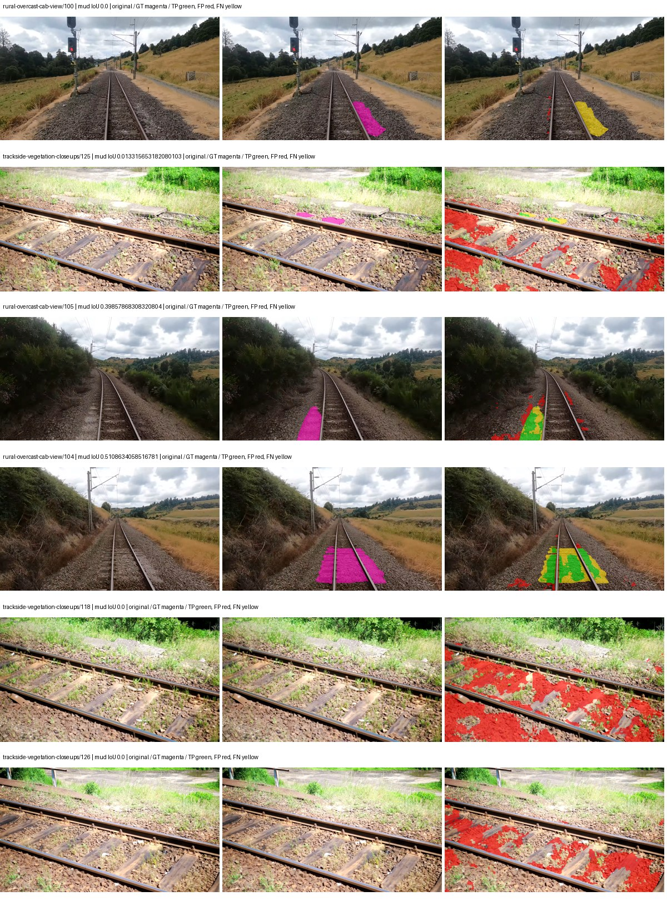
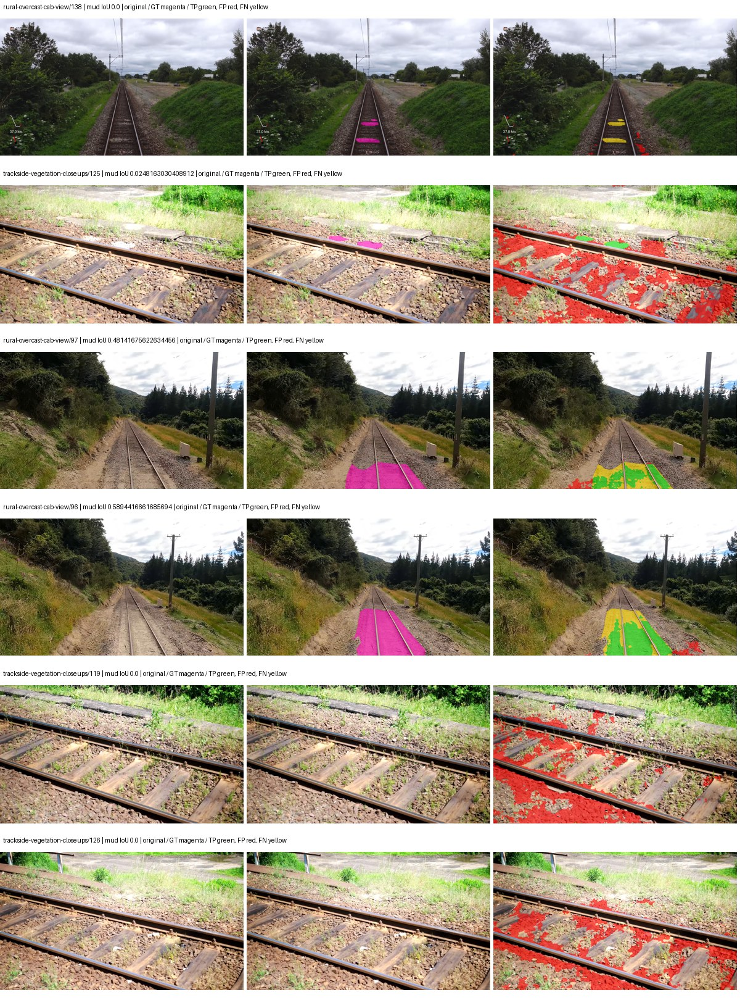
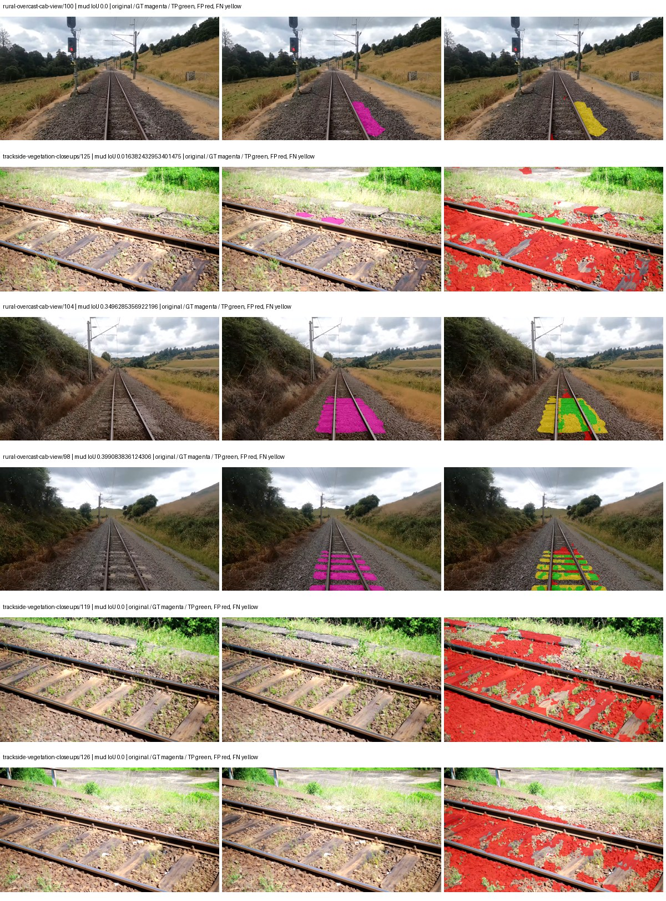
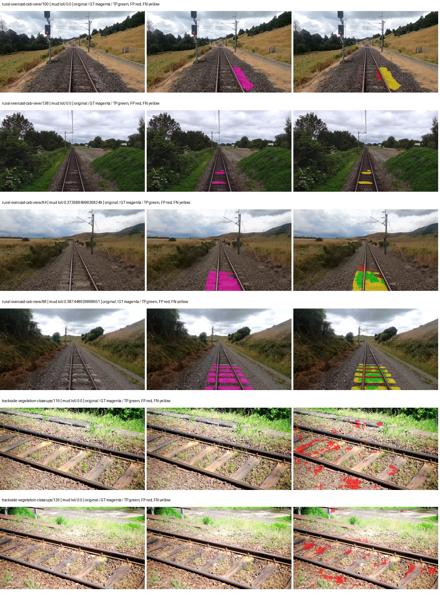

# smp_unetplusplus_efficientnet_b0 — paul-test-rtis_v2

[RTIS comparison](../../README.md) · [Full model records](record.json)

Primary selection and early stopping: **mud-pumping validation IoU**. A job is complete only after full statistics and isolated profiling are verified.

| Model | Initialization path | Seed | Status | Steps | Best step | Mud IoU (%) | Mud precision (%) | Mud recall (%) | Final mud IoU (trainer val, %) | mIoU (%) | Fixed GT-class mIoU (%) |
| --- | --- | --- | --- | --- | --- | --- | --- | --- | --- | --- | --- |
| smp_unetplusplus_efficientnet_b0 | rtis_only | 0 | completed | 3313 | 2039 | 9.29 | 11.66 | 31.32 | 2.96 | 21.92 | 24.36 |
| smp_unetplusplus_efficientnet_b0 | cityscapes_to_rtis | 0 | completed | 2803 | 1529 | 10.78 | 13.81 | 32.91 | 3.17 | 21.95 | 25.61 |
| smp_unetplusplus_efficientnet_b0 | railsem19_to_rtis | 0 | completed | 3313 | 2039 | 5.29 | 6.19 | 26.63 | 1.53 | 31.22 | 36.42 |
| smp_unetplusplus_efficientnet_b0 | cityscapes_to_railsem19_to_rtis | 0 | completed | 2039 | 764 | 13.36 | 25.74 | 21.74 | 6.33 | 25.43 | 29.67 |

Training: 205 images. Validation: 37 images. Test: 50 held out. Seeds: [0]. Seed variation measures optimization variability, not independent-recording uncertainty. Historical source checkpoints stay fixed across adaptation seeds.

Training code: `066afb2626398b7be59d4d19f5a0e4644fd59adc`. Split SHA-256: `18a84c0163a65ded46508bcc904c374e5f33ad8a09b8879e3c8add606e86aa9f`.

## rtis_only — seed 0

Status: **completed**. Started: 2026-09-10T03:18:18.660664+00:00. Finished: 2026-09-10T04:09:22.448240+00:00.

Recipe pretrained initializer: `{"arch": "smp", "backbone_path": null, "batch_norm_momentum": null, "checkpoint": null, "classifier_path": null, "drop_path": null, "encoder_name": "efficientnet-b0", "encoder_weights": "imagenet", "head": "unified_head", "head_paths": [], "inactive_parameter_paths": ["encoder._conv_head", "encoder._bn1"], "local_files_only": false, "lora_alpha": 32, "lora_dropout": 0.05, "lora_r": 16, "lora_targets": [], "native": null, "revision": null, "smp_arch": "UnetPlusPlus", "subfolder": null, "trust_remote_code": false, "tuning": "full"}`.

`rtis_only` uses the recipe initializer, which may include pretrained segmentation components. Transfer paths load the exact historical source checkpoint below and reset the classifier; they do not reset all query/decoder features.

Source checkpoint: `Recipe pretrained initialization`.

Config SHA-256: `af307709c158fb699780477d4e0fc00e532afa87b51c9984671c75d72dfcf081`. Weights used for validation: `raw`.

### Mud-pumping and aggregate quality

| Metric | Selected checkpoint | Final training validation |
| --- | --- | --- |
| Mud IoU | 9.29 | 2.96 |
| Mud precision | 11.66 | 4.45 |
| Mud recall | 31.32 | 8.11 |
| Mud Dice/F1 | 17.00 | 5.74 |
| mIoU | 21.92 | 21.78 |
| Mean accuracy | 34.51 | 36.82 |
| Mean precision | 35.69 | 33.46 |
| Mean Dice | 28.26 | 28.10 |
| Mean specificity | 98.46 | 98.60 |
| Pixel accuracy | 72.60 | 74.91 |
| Frequency-weighted IoU | 64.81 | 67.18 |
| Fixed GT-present class mIoU | 24.36 | 25.41 |
| Boundary F1 | 27.37 | 25.55 |

The selected checkpoint has independent evaluation evidence. Final values are the trainer's final validation record, not a new independent evaluation. mIoU averages classes with nonzero union, so false positives on absent classes can change its denominator. The fixed GT-class mean is supplementary and excludes absent classes; their false positives remain in the confusion matrix.

### Resource usage and timing

| Measurement | Value |
| --- | --- |
| Peak training VRAM, retained training invocation (GiB) | 9.30 |
| Peak evaluation VRAM (GiB) | 6.44 |
| Retained training invocation wall time (seconds) | 2926.04 |
| Retained training invocation GPU-hours (one GPU) | 0.81 |
| Evaluation wall time (seconds) | 11.65 |
| Full evaluation pipeline images/second | 3.18 |
| Best full-state checkpoint (MiB) | 98.06 |
| Final full-state checkpoint (MiB) | 98.04 |
| Verified periodic checkpoints removed (GiB) | 0.57 |

VRAM uses the recorded allocator high-water mark; it is not total device usage including CUDA context. Resumed jobs' retained training invocation times and peaks are **not whole-campaign totals**. Earlier invocation resource records are not reconstructed here. Evaluation throughput includes loader, sliding-window inference and metrics; it is not model-only latency/FPS. Missing measurements are shown as —, never inferred from another dataset's run.

### Standardized inference performance

Dedicated model-only profiling waits for an idle worker-locked L40S: BF16, batch 1, 1024x1024, 20 warmup and 100 CUDA-event-timed public forwards. It excludes loading, preprocessing, tiling and metrics.

| Status | Parameters | Weight MiB | FPS | p50 ms | p95 ms | Peak reserved GiB |
| --- | --- | --- | --- | --- | --- | --- |
| complete | 6572481 | 25.07 | 65.94 | 15.04 | 16.49 | 0.89 |

```json
{
  "schema_version": 1,
  "model_id": "smp_unetplusplus_efficientnet_b0",
  "measured_at": "2026-09-10T04:09:20+00:00",
  "status": "complete",
  "benchmark_scope": "rtis_selected_checkpoint_model_only",
  "applies_to": [
    "smp_unetplusplus_efficientnet_b0--rtis_only--seed-0"
  ],
  "source": {
    "campaign_git_sha": "066afb2626398b7be59d4d19f5a0e4644fd59adc",
    "git_dirty": false,
    "config_hash": "48297af7c615",
    "resolved_config": "/data/izadia1/projects/segmentary-runs/paul-test-rtis_v2/seed0-20260909/configs/smp_unetplusplus_efficientnet_b0--rtis_only--seed-0.yaml",
    "config_sha256": "af307709c158fb699780477d4e0fc00e532afa87b51c9984671c75d72dfcf081",
    "checkpoint_sha256": "772faff30c9bd16667a182923496b6d69562d479868a2d5521d1d43710cf9196",
    "checkpoint_global_step": 2039,
    "checkpoint_bytes": 102818240,
    "checkpoint_kind": "resume checkpoint with optimizer and EMA state",
    "weights": "raw",
    "measured_checkpoint_job_id": "smp_unetplusplus_efficientnet_b0--rtis_only--seed-0",
    "result_sha256": "e3577f5cdd71f39a73b2280822cef6b5a55655cd40c00e307051f1e7eea0dc2e",
    "result_git_sha": "066afb2626398b7be59d4d19f5a0e4644fd59adc",
    "result_stage": "eval:paul-test-rtis:val",
    "result_seed": 0
  },
  "hardware": {
    "gpu_name": "NVIDIA L40S",
    "gpu_uuid": "GPU-84f5ca4d-68db-ae98-d056-40654d859dd9",
    "logical_device": "cuda:0",
    "physical_visibility_token": "0",
    "compute_capability": [
      8,
      9
    ],
    "total_memory_bytes": 47677177856
  },
  "model": {
    "parameter_count": 6572481,
    "trainable_parameter_count": 6160321,
    "resident_parameter_bytes": 26289924,
    "parameter_dtype_counts": {
      "float32": 6572481
    }
  },
  "contract": {
    "backend": "pytorch",
    "precision": "bf16_autocast",
    "batch_size": 1,
    "input_shape_nchw": [
      1,
      3,
      1024,
      1024
    ],
    "warmup_iterations": 20,
    "measured_iterations": 100,
    "timing": "per-forward CUDA events with end-event synchronization",
    "includes_preprocessing": false,
    "includes_data_loader": false,
    "includes_sliding_window": false,
    "input_resident_on_gpu": true,
    "model_only": true,
    "entrypoint": "public model(image) dense-logits forward"
  },
  "measurements": {
    "latency": {
      "p50_ms": 15.04256010055542,
      "p95_ms": 16.488857746124268,
      "mean_ms": 15.16604187965393,
      "minimum_ms": 14.102527618408203,
      "maximum_ms": 18.569215774536133,
      "fps": 65.936782183198,
      "raw_ms": [
        15.492095947265625,
        14.817279815673828,
        14.354432106018066,
        14.87564754486084,
        14.444543838500977,
        15.329312324523926,
        14.258079528808594,
        14.155776023864746,
        14.102527618408203,
        14.328831672668457,
        15.0763521194458,
        14.970879554748535,
        15.062015533447266,
        15.519743919372559,
        15.260671615600586,
        15.132672309875488,
        14.337920188903809,
        14.839808464050293,
        14.195712089538574,
        14.594047546386719,
        16.484352111816406,
        16.869247436523438,
        16.296863555908203,
        14.89510440826416,
        14.501888275146484,
        14.823424339294434,
        14.393343925476074,
        14.961664199829102,
        15.912960052490234,
        15.89452838897705,
        15.096832275390625,
        14.80396842956543,
        14.66982364654541,
        15.958016395568848,
        15.954943656921387,
        15.28012752532959,
        14.728192329406738,
        17.942527770996094,
        16.574464797973633,
        15.493120193481445,
        15.047679901123047,
        14.968832015991211,
        15.062015533447266,
        15.716447830200195,
        15.19206428527832,
        15.193087577819824,
        15.127552032470703,
        15.172608375549316,
        18.569215774536133,
        15.525792121887207,
        14.855168342590332,
        15.764479637145996,
        14.585856437683105,
        14.58995246887207,
        14.524415969848633,
        14.37183952331543,
        14.420991897583008,
        15.352831840515137,
        15.407103538513184,
        14.951423645019531,
        15.709183692932129,
        17.36089515686035,
        15.410176277160645,
        14.459903717041016,
        15.071231842041016,
        14.648384094238281,
        14.468095779418945,
        14.754816055297852,
        15.218688011169434,
        15.438847541809082,
        14.4486722946167,
        14.888959884643555,
        15.590399742126465,
        15.841279983520508,
        14.553088188171387,
        14.369791984558105,
        14.70473575592041,
        14.609408378601074,
        16.094207763671875,
        15.056896209716797,
        14.67903995513916,
        15.816831588745117,
        15.311871528625488,
        14.630911827087402,
        14.851072311401367,
        15.8504638671875,
        15.20742416381836,
        14.723072052001953,
        14.973952293395996,
        14.676992416381836,
        16.1976318359375,
        14.87667179107666,
        14.39129638671875,
        15.037440299987793,
        14.668800354003906,
        14.631936073303223,
        15.161343574523926,
        15.636480331420898,
        15.37945556640625,
        16.12073516845703
      ],
      "percentile_method": "numpy linear interpolation"
    },
    "peak_reserved_bytes": 958398464,
    "memory_kind": "pytorch_cuda_allocator_peak_reserved_excluding_context",
    "benchmark_wall_clock_s": 21.509486090391874
  },
  "started_at": "2026-09-10T04:08:58+00:00",
  "finished_at": "2026-09-10T04:09:20+00:00",
  "environment": {
    "hostname": "hdrfs-app-001",
    "python": "3.11.15",
    "platform": "Linux-5.15.0-139-generic-x86_64-with-glibc2.35",
    "torch": "2.11.0+cu128",
    "torch_cuda": "12.8",
    "cudnn": 91900,
    "driver_version": "570.133.20",
    "cuda_available": true,
    "gpu_count": 1,
    "gpu_names": [
      "NVIDIA L40S"
    ],
    "cuda_visible_devices": "0",
    "packages": {
      "segmentary": "0.1.0",
      "torch": "2.11.0+cu128",
      "torchvision": "0.26.0+cu128",
      "transformers": "5.15.0",
      "timm": "1.0.28",
      "segmentation-models-pytorch": "0.5.0",
      "albumentations": "2.0.8",
      "lightning": "2.6.5",
      "numpy": "2.4.4"
    }
  }
}
```

### Per-class validation results

| Class | GT pixels | IoU (%) | Precision (%) | Recall (%) | Dice (%) | Boundary F1 (%) |
| --- | --- | --- | --- | --- | --- | --- |
| car | 29664 | 0.00 | 0.00 | 0.00 | 0.00 | 0.00 |
| construction | 311585 | 4.66 | 4.74 | 73.30 | 8.90 | 13.12 |
| fence | 265137 | 7.55 | 35.09 | 8.78 | 14.05 | 19.71 |
| mud-pumping | 1226250 | 9.29 | 11.66 | 31.32 | 17.00 | 17.64 |
| on-rails | 0 | 0.00 | 0.00 | — | 0.00 | 0.00 |
| person | 0 | — | — | — | — | — |
| pole | 628038 | 51.06 | 73.36 | 62.68 | 67.60 | 79.60 |
| rail-embedded | 16799 | 0.00 | 0.00 | 0.00 | 0.00 | 0.00 |
| rail-raised | 2969797 | 70.36 | 77.11 | 88.93 | 82.60 | 85.91 |
| rail-track | 6323197 | 29.62 | 64.58 | 35.37 | 45.70 | 42.36 |
| road | 1048831 | 7.91 | 17.07 | 12.86 | 14.67 | 18.64 |
| sidewalk | 1297367 | 18.07 | 81.00 | 18.87 | 30.61 | 28.04 |
| sky | 19121606 | 97.02 | 98.98 | 98.01 | 98.49 | 87.13 |
| standing-water | 95802 | 0.39 | 0.39 | 22.22 | 0.78 | 1.81 |
| terrain | 39239306 | 71.16 | 86.91 | 79.71 | 83.15 | 39.95 |
| trackbed | 10643081 | 51.43 | 67.36 | 68.51 | 67.93 | 49.63 |
| traffic-light | 19510 | 0.00 | 0.00 | 0.00 | 0.00 | 0.00 |
| traffic-sign | 13285 | 0.00 | 0.00 | 0.00 | 0.00 | 0.00 |
| tram-track | 56179 | 0.99 | 9.18 | 1.10 | 1.96 | 12.17 |
| truck | 0 | 0.00 | 0.00 | — | 0.00 | 0.00 |
| vegetation-overgrowth | 5901821 | 18.89 | 86.45 | 19.46 | 31.77 | 51.79 |

### Full-run accounting

| Measurement | Value |
| --- | --- |
| Full GPU-reserved wall seconds, all recorded worker attempts | 3063.79 |
| Full reserved GPU-hours | 0.85 |
| Whole-run timing complete | True |

| Phase | Wall seconds including failed attempts |
| --- | --- |
| training | 2932.99 |
| diagnostics | 82.72 |
| performance | 28.57 |

GPU-reserved time includes model loading, training, validation, collection, profiling, checkpoint I/O and orchestration while the worker owns one GPU. It is not GPU kernel-active time. Phase timings and sampled device memory/power/utilization are retained separately; sampled device memory is not the allocator high-water mark.

### Train/validation and raw/EMA diagnostics

| Checkpoint / weights / split | Images | Mud IoU (%) | Mud precision (%) | Mud recall (%) |
| --- | --- | --- | --- | --- |
| best-auto-train / raw | 205 | 89.74 | 91.23 | 98.22 |
| best-auto-val / raw | 37 | 9.29 | 11.66 | 31.32 |
| best-alternate-val / ema | 37 | 5.21 | 8.24 | 12.40 |
| final-auto-val / raw | 37 | 2.96 | 4.45 | 8.10 |

Train uses the evaluation transform without augmentation. Compare mud train/validation metrics for the same selected weights. Alternate EMA on running-stat BatchNorm is explicitly uncalibrated and is diagnostic only. Score-threshold curves use uncalibrated normalized scores and are pixel-level diagnostics, not event detection rates or a selected deployment operating point.

### Downloadable evidence

- best-auto-train: [per-image.csv](rtis_only--seed-0/best-auto-train/per-image.csv) · [per-image-confusion.json.gz](rtis_only--seed-0/best-auto-train/per-image-confusion.json.gz) · [groups.json](rtis_only--seed-0/best-auto-train/groups.json) · [mud-score-curves.json](rtis_only--seed-0/best-auto-train/mud-score-curves.json)
- best-auto-val: [per-image.csv](rtis_only--seed-0/best-auto-val/per-image.csv) · [per-image-confusion.json.gz](rtis_only--seed-0/best-auto-val/per-image-confusion.json.gz) · [groups.json](rtis_only--seed-0/best-auto-val/groups.json) · [mud-score-curves.json](rtis_only--seed-0/best-auto-val/mud-score-curves.json) · [examples.jpg](rtis_only--seed-0/best-auto-val/examples.jpg)
- best-alternate-val: [per-image.csv](rtis_only--seed-0/best-alternate-val/per-image.csv) · [per-image-confusion.json.gz](rtis_only--seed-0/best-alternate-val/per-image-confusion.json.gz) · [groups.json](rtis_only--seed-0/best-alternate-val/groups.json) · [mud-score-curves.json](rtis_only--seed-0/best-alternate-val/mud-score-curves.json)
- final-auto-val: [per-image.csv](rtis_only--seed-0/final-auto-val/per-image.csv) · [per-image-confusion.json.gz](rtis_only--seed-0/final-auto-val/per-image-confusion.json.gz) · [groups.json](rtis_only--seed-0/final-auto-val/groups.json) · [mud-score-curves.json](rtis_only--seed-0/final-auto-val/mud-score-curves.json)
- resources: [telemetry.csv](rtis_only--seed-0/resources/telemetry.csv)



Examples are two lowest and two highest mud-IoU positive images, plus up to two negative images with the most false-positive mud pixels. They are targeted diagnostic examples, not random samples. Green: true positive; red: false positive; yellow: false negative. Full predictions remain on HDRFS.

### Validation tracking

| Logged step | Overall mIoU (%) | Mud IoU (%) |
| --- | --- | --- |
| 254 | 17.63 | 0.36 |
| 509 | 19.17 | 0.88 |
| 764 | 21.04 | 1.18 |
| 1019 | 21.37 | 1.77 |
| 1274 | 21.80 | 0.44 |
| 1529 | 22.65 | 2.54 |
| 1784 | 23.03 | 1.22 |
| 2038 | 21.92 | 9.26 |
| 2293 | 21.96 | 1.88 |
| 2548 | 21.02 | 3.17 |
| 2803 | 21.68 | 3.03 |
| 3058 | 23.07 | 1.61 |
| 3313 | 21.78 | 2.96 |

All retained scalar curves, including training loss and per-class IoU, are in record.json. Observed best mud on a curve is not necessarily a retained checkpoint: the pilot saved its selection-metric-best and final checkpoints. Step logging and checkpoint global_step may differ by one.

### Stopping and checkpoint provenance

```json
{
  "stopping": {
    "actual_steps": 3313,
    "maximum_steps": 4000,
    "min_delta": 0.001,
    "monitor": "val_iou/mud-pumping",
    "patience": 5,
    "reason": "validation_plateau"
  },
  "checkpoints": {
    "best": {
      "path": "/data/izadia1/projects/segmentary-runs/paul-test-rtis_v2/seed0-20260909/future-runs/smp_unetplusplus_efficientnet_b0--rtis_only--seed-0_seed0/rtis/best.ckpt",
      "sha256": "772faff30c9bd16667a182923496b6d69562d479868a2d5521d1d43710cf9196",
      "global_step": 2039,
      "bytes": 102818240
    },
    "final": {
      "path": "/data/izadia1/projects/segmentary-runs/paul-test-rtis_v2/seed0-20260909/future-runs/smp_unetplusplus_efficientnet_b0--rtis_only--seed-0_seed0/rtis/last.ckpt",
      "sha256": "c6d91c7405a592a6aca379d5d548ce1e31015ba41572e40ba01debe591a3b433",
      "global_step": 3313,
      "bytes": 102801472
    }
  },
  "cleanup_error": null
}
```

### Resolved training, initialization and evaluation settings

The optimizer block is the base configuration. Stage LR scales are applied at runtime, and stage warmup is capped at min(base warmup, floor(stage budget / 10), stage budget - 1): 400 steps for this 4,000-step pilot. Model-internal native input grids may differ from augmentation crops (EoMT uses its 640 grid).

```json
{
  "name": "smp_unetplusplus_efficientnet_b0--rtis_only--seed-0",
  "model": {
    "arch": "smp",
    "checkpoint": null,
    "tuning": "full",
    "head": "unified_head",
    "lora_r": 16,
    "lora_alpha": 32,
    "lora_dropout": 0.05,
    "lora_targets": [],
    "drop_path": null,
    "revision": null,
    "subfolder": null,
    "local_files_only": false,
    "trust_remote_code": false,
    "backbone_path": null,
    "head_paths": [],
    "classifier_path": null,
    "inactive_parameter_paths": [
      "encoder._conv_head",
      "encoder._bn1"
    ],
    "smp_arch": "UnetPlusPlus",
    "encoder_name": "efficientnet-b0",
    "encoder_weights": "imagenet",
    "native": null,
    "batch_norm_momentum": null
  },
  "space": "paul-test-rtis",
  "taxonomy_root": "/data/izadia1/projects/segmentary-rtis-fullstats-066afb2/taxonomy",
  "output_root": "/data/izadia1/projects/segmentary-runs/paul-test-rtis_v2/seed0-20260909/future-runs",
  "optim": {
    "backbone_lr": 0.0001,
    "head_lr_mult": 10.0,
    "weight_decay": 0.05,
    "llrd": 1.0,
    "warmup_iters": 1500,
    "warmup_ratio": 1e-06,
    "poly_power": 0.9,
    "min_lr_ratio": 0.0,
    "betas": [
      0.9,
      0.999
    ],
    "grad_clip": 1.0
  },
  "train": {
    "iters": 4000,
    "batch_size": 2,
    "accum": 8,
    "num_workers": 2,
    "precision": "bf16-mixed",
    "ema_decay": 0.9998,
    "val_every": 250,
    "ckpt_every": 500,
    "selection_metric": "val_iou/mud-pumping",
    "early_stopping_patience": 5,
    "early_stopping_min_delta": 0.001,
    "seed": 0,
    "devices": 1
  },
  "eval": {
    "sliding_window": true,
    "window": [
      1024,
      1024
    ],
    "stride": [
      768,
      768
    ],
    "batch_size": 1,
    "num_workers": 2,
    "tta_scales": [],
    "tta_flip": false,
    "threshold": 0.5,
    "boundary_tolerance_frac": 0.0075,
    "save_confusion": true
  },
  "loss": {
    "task": "multiclass",
    "activation": "auto",
    "terms": [],
    "aux": "none",
    "aux_weight": 0.0,
    "ce_weight": 1.0,
    "label_smoothing": 0.0,
    "class_weights": null,
    "query": null
  },
  "aug": {
    "crop": [
      1024,
      1024
    ],
    "scale_min": 0.5,
    "scale_max": 2.0,
    "hflip_p": 0.5,
    "color_jitter_p": 0.5,
    "brightness": 0.25,
    "contrast": 0.25,
    "saturation": 0.25,
    "hue": 0.05
  },
  "stages": [
    {
      "name": "rtis",
      "data": [
        {
          "name": "paul-test-rtis",
          "root": "/data/izadia1/datasets/paul-test-rtis_v2",
          "variant": null,
          "split_file": "splits.json",
          "train_split": "train",
          "val_split": "val",
          "limit": null,
          "loader": "folder",
          "mapping": "paul-test-rtis",
          "loader_options": {
            "require_groups": true
          }
        }
      ],
      "iters": null,
      "lr_scale": 1.0,
      "head_group_lr_scale": 1.0,
      "init_from": "pretrained",
      "reset_head": false,
      "freeze": null,
      "sample_weights": null
    }
  ]
}
```

### Hardware and software provenance

```json
{
  "training": {
    "cuda_available": true,
    "cuda_visible_devices": "0",
    "cudnn": 91900,
    "driver_version": "570.133.20",
    "gpu_count": 1,
    "gpu_names": [
      "NVIDIA L40S"
    ],
    "hostname": "hdrfs-app-001",
    "input_normalization": {
      "channel_order": "rgb",
      "mean": [
        0.485,
        0.456,
        0.406
      ],
      "source": "smp_encoder_settings",
      "std": [
        0.229,
        0.224,
        0.225
      ]
    },
    "model_origins": [
      {
        "hf_commit": null,
        "hf_name_or_path": null,
        "module": "model",
        "timm_pretrained": {}
      }
    ],
    "model_parameter_count": 6572481,
    "packages": {
      "albumentations": "2.0.8",
      "lightning": "2.6.5",
      "numpy": "2.4.4",
      "segmentary": "0.1.0",
      "segmentation-models-pytorch": "0.5.0",
      "timm": "1.0.28",
      "torch": "2.11.0+cu128",
      "torchvision": "0.26.0+cu128",
      "transformers": "5.15.0"
    },
    "platform": "Linux-5.15.0-139-generic-x86_64-with-glibc2.35",
    "python": "3.11.15",
    "torch": "2.11.0+cu128",
    "torch_cuda": "12.8",
    "trainable_parameter_count": 6160321,
    "training_stop": {
      "actual_steps": 3313,
      "maximum_steps": 4000,
      "min_delta": 0.001,
      "monitor": "val_iou/mud-pumping",
      "patience": 5,
      "reason": "validation_plateau"
    },
    "validation_weights": "raw"
  },
  "evaluation": {
    "cuda_available": true,
    "cuda_visible_devices": "0",
    "cudnn": 91900,
    "driver_version": "570.133.20",
    "gpu_count": 1,
    "gpu_names": [
      "NVIDIA L40S"
    ],
    "hostname": "hdrfs-app-001",
    "input_normalization": {
      "channel_order": "rgb",
      "mean": [
        0.485,
        0.456,
        0.406
      ],
      "source": "smp_encoder_settings",
      "std": [
        0.229,
        0.224,
        0.225
      ]
    },
    "packages": {
      "albumentations": "2.0.8",
      "lightning": "2.6.5",
      "numpy": "2.4.4",
      "segmentary": "0.1.0",
      "segmentation-models-pytorch": "0.5.0",
      "timm": "1.0.28",
      "torch": "2.11.0+cu128",
      "torchvision": "0.26.0+cu128",
      "transformers": "5.15.0"
    },
    "platform": "Linux-5.15.0-139-generic-x86_64-with-glibc2.35",
    "python": "3.11.15",
    "torch": "2.11.0+cu128",
    "torch_cuda": "12.8"
  }
}
```

## cityscapes_to_rtis — seed 0

Status: **completed**. Started: 2026-09-10T03:19:01.706386+00:00. Finished: 2026-09-10T04:02:35.845281+00:00.

Recipe pretrained initializer: `{"arch": "smp", "backbone_path": null, "batch_norm_momentum": null, "checkpoint": null, "classifier_path": null, "drop_path": null, "encoder_name": "efficientnet-b0", "encoder_weights": "imagenet", "head": "unified_head", "head_paths": [], "inactive_parameter_paths": ["encoder._conv_head", "encoder._bn1"], "local_files_only": false, "lora_alpha": 32, "lora_dropout": 0.05, "lora_r": 16, "lora_targets": [], "native": null, "revision": null, "smp_arch": "UnetPlusPlus", "subfolder": null, "trust_remote_code": false, "tuning": "full"}`.

`rtis_only` uses the recipe initializer, which may include pretrained segmentation components. Transfer paths load the exact historical source checkpoint below and reset the classifier; they do not reset all query/decoder features.

Source checkpoint: `{'name': 'smp_unetplusplus_efficientnet_b0--cityscapes--seed-0', 'model': 'smp_unetplusplus_efficientnet_b0', 'protocol': 'cityscapes', 'config': '/data/izadia1/projects/segmentary-runs/all-model-city-rail-seed0-rail20-b9eb3e1/jobs/smp_unetplusplus_efficientnet_b0--cityscapes--seed-0/attempt-001/resolved-config.yaml', 'checkpoint': '/data/izadia1/projects/segmentary-runs/all-model-city-rail-seed0-rail20-b9eb3e1/jobs/smp_unetplusplus_efficientnet_b0--cityscapes--seed-0/attempt-001/train/smp_unetplusplus_efficientnet_b0--cityscapes_seed0/cityscapes/last.ckpt', 'recorded_sha256': 'af0359a15da63814d52e95356a33220584bc6751bb14cfdf82601e0b7b7e6ae1', 'exists': True}`.

Config SHA-256: `48e391782a1a80521cc0d1821e5c199181395f25707ca2403f93ee2d1223a88b`. Weights used for validation: `raw`.

### Mud-pumping and aggregate quality

| Metric | Selected checkpoint | Final training validation |
| --- | --- | --- |
| Mud IoU | 10.78 | 3.17 |
| Mud precision | 13.81 | 6.13 |
| Mud recall | 32.91 | 6.15 |
| Mud Dice/F1 | 19.46 | 6.14 |
| mIoU | 21.95 | 21.90 |
| Mean accuracy | 35.79 | 34.18 |
| Mean precision | 33.82 | 31.41 |
| Mean Dice | 27.68 | 27.35 |
| Mean specificity | 98.52 | 98.66 |
| Pixel accuracy | 76.75 | 79.32 |
| Frequency-weighted IoU | 66.25 | 69.03 |
| Fixed GT-present class mIoU | 25.61 | 25.55 |
| Boundary F1 | 23.53 | 23.71 |

The selected checkpoint has independent evaluation evidence. Final values are the trainer's final validation record, not a new independent evaluation. mIoU averages classes with nonzero union, so false positives on absent classes can change its denominator. The fixed GT-class mean is supplementary and excludes absent classes; their false positives remain in the confusion matrix.

### Resource usage and timing

| Measurement | Value |
| --- | --- |
| Peak training VRAM, retained training invocation (GiB) | 9.29 |
| Peak evaluation VRAM (GiB) | 6.44 |
| Retained training invocation wall time (seconds) | 2477.97 |
| Retained training invocation GPU-hours (one GPU) | 0.69 |
| Evaluation wall time (seconds) | 11.44 |
| Full evaluation pipeline images/second | 3.23 |
| Best full-state checkpoint (MiB) | 98.06 |
| Final full-state checkpoint (MiB) | 98.04 |
| Verified periodic checkpoints removed (GiB) | 0.48 |

VRAM uses the recorded allocator high-water mark; it is not total device usage including CUDA context. Resumed jobs' retained training invocation times and peaks are **not whole-campaign totals**. Earlier invocation resource records are not reconstructed here. Evaluation throughput includes loader, sliding-window inference and metrics; it is not model-only latency/FPS. Missing measurements are shown as —, never inferred from another dataset's run.

### Standardized inference performance

Dedicated model-only profiling waits for an idle worker-locked L40S: BF16, batch 1, 1024x1024, 20 warmup and 100 CUDA-event-timed public forwards. It excludes loading, preprocessing, tiling and metrics.

| Status | Parameters | Weight MiB | FPS | p50 ms | p95 ms | Peak reserved GiB |
| --- | --- | --- | --- | --- | --- | --- |
| complete | 6572481 | 25.07 | 68.23 | 14.33 | 16.10 | 0.89 |

```json
{
  "schema_version": 1,
  "model_id": "smp_unetplusplus_efficientnet_b0",
  "measured_at": "2026-09-10T04:02:33+00:00",
  "status": "complete",
  "benchmark_scope": "rtis_selected_checkpoint_model_only",
  "applies_to": [
    "smp_unetplusplus_efficientnet_b0--cityscapes_to_rtis--seed-0"
  ],
  "source": {
    "campaign_git_sha": "066afb2626398b7be59d4d19f5a0e4644fd59adc",
    "git_dirty": false,
    "config_hash": "74491a8ebe9d",
    "resolved_config": "/data/izadia1/projects/segmentary-runs/paul-test-rtis_v2/seed0-20260909/configs/smp_unetplusplus_efficientnet_b0--cityscapes_to_rtis--seed-0.yaml",
    "config_sha256": "48e391782a1a80521cc0d1821e5c199181395f25707ca2403f93ee2d1223a88b",
    "checkpoint_sha256": "8f6a2aeb00f2d8e16f1d9ccb8ab35f1dea54cca05ca9172dfc30822ff2ffaee5",
    "checkpoint_global_step": 1529,
    "checkpoint_bytes": 102818304,
    "checkpoint_kind": "resume checkpoint with optimizer and EMA state",
    "weights": "raw",
    "measured_checkpoint_job_id": "smp_unetplusplus_efficientnet_b0--cityscapes_to_rtis--seed-0",
    "result_sha256": "672546346c521ba1f1dbe895c1be268222d989e994699516ff0e126aaa172169",
    "result_git_sha": "066afb2626398b7be59d4d19f5a0e4644fd59adc",
    "result_stage": "eval:paul-test-rtis:val",
    "result_seed": 0
  },
  "hardware": {
    "gpu_name": "NVIDIA L40S",
    "gpu_uuid": "GPU-fc5dde96-210d-0afa-ac74-7f88477d622b",
    "logical_device": "cuda:0",
    "physical_visibility_token": "4",
    "compute_capability": [
      8,
      9
    ],
    "total_memory_bytes": 47677177856
  },
  "model": {
    "parameter_count": 6572481,
    "trainable_parameter_count": 6160321,
    "resident_parameter_bytes": 26289924,
    "parameter_dtype_counts": {
      "float32": 6572481
    }
  },
  "contract": {
    "backend": "pytorch",
    "precision": "bf16_autocast",
    "batch_size": 1,
    "input_shape_nchw": [
      1,
      3,
      1024,
      1024
    ],
    "warmup_iterations": 20,
    "measured_iterations": 100,
    "timing": "per-forward CUDA events with end-event synchronization",
    "includes_preprocessing": false,
    "includes_data_loader": false,
    "includes_sliding_window": false,
    "input_resident_on_gpu": true,
    "model_only": true,
    "entrypoint": "public model(image) dense-logits forward"
  },
  "measurements": {
    "latency": {
      "p50_ms": 14.328255653381348,
      "p95_ms": 16.095846366882324,
      "mean_ms": 14.656067790985107,
      "minimum_ms": 13.985695838928223,
      "maximum_ms": 19.913728713989258,
      "fps": 68.23112544656053,
      "raw_ms": [
        14.260224342346191,
        14.956543922424316,
        14.03593635559082,
        14.941184043884277,
        14.040063858032227,
        14.022656440734863,
        14.622719764709473,
        14.130175590515137,
        14.062591552734375,
        14.559231758117676,
        14.774208068847656,
        14.057472229003906,
        14.009344100952148,
        14.103551864624023,
        14.289888381958008,
        14.559231758117676,
        14.05951976776123,
        14.153727531433105,
        14.666751861572266,
        14.194687843322754,
        14.089216232299805,
        14.468095779418945,
        14.844927787780762,
        14.404607772827148,
        14.493663787841797,
        15.590399742126465,
        14.9104642868042,
        14.123007774353027,
        14.020607948303223,
        14.791584014892578,
        17.2061767578125,
        14.025728225708008,
        14.062591552734375,
        14.034943580627441,
        14.134271621704102,
        14.230463981628418,
        19.913728713989258,
        18.60710334777832,
        14.556159973144531,
        18.265087127685547,
        14.427136421203613,
        14.225407600402832,
        14.967935562133789,
        14.522368431091309,
        14.194687843322754,
        14.149632453918457,
        14.116864204406738,
        14.129152297973633,
        14.15782356262207,
        14.755904197692871,
        14.263296127319336,
        14.155776023864746,
        15.148032188415527,
        14.014464378356934,
        14.016511917114258,
        14.144512176513672,
        14.36569595336914,
        14.301183700561523,
        16.095232009887695,
        15.247360229492188,
        14.477312088012695,
        14.683135986328125,
        14.341119766235352,
        14.053343772888184,
        14.064640045166016,
        14.557184219360352,
        14.0513277053833,
        14.308287620544434,
        14.900223731994629,
        14.271488189697266,
        14.328831672668457,
        14.115839958190918,
        15.459327697753906,
        15.097855567932129,
        15.351967811584473,
        15.09990406036377,
        15.150079727172852,
        14.327679634094238,
        14.156800270080566,
        14.008319854736328,
        14.830592155456543,
        14.424063682556152,
        14.020607948303223,
        14.009344100952148,
        16.107519149780273,
        14.270463943481445,
        14.272512435913086,
        16.055295944213867,
        14.504960060119629,
        14.797823905944824,
        14.285823822021484,
        15.33347225189209,
        14.317567825317383,
        14.656512260437012,
        14.945280075073242,
        13.985695838928223,
        14.042112350463867,
        15.228927612304688,
        14.328831672668457,
        15.713184356689453
      ],
      "percentile_method": "numpy linear interpolation"
    },
    "peak_reserved_bytes": 958398464,
    "memory_kind": "pytorch_cuda_allocator_peak_reserved_excluding_context",
    "benchmark_wall_clock_s": 20.901000760495663
  },
  "started_at": "2026-09-10T04:02:12+00:00",
  "finished_at": "2026-09-10T04:02:33+00:00",
  "environment": {
    "hostname": "hdrfs-app-001",
    "python": "3.11.15",
    "platform": "Linux-5.15.0-139-generic-x86_64-with-glibc2.35",
    "torch": "2.11.0+cu128",
    "torch_cuda": "12.8",
    "cudnn": 91900,
    "driver_version": "570.133.20",
    "cuda_available": true,
    "gpu_count": 1,
    "gpu_names": [
      "NVIDIA L40S"
    ],
    "cuda_visible_devices": "4",
    "packages": {
      "segmentary": "0.1.0",
      "torch": "2.11.0+cu128",
      "torchvision": "0.26.0+cu128",
      "transformers": "5.15.0",
      "timm": "1.0.28",
      "segmentation-models-pytorch": "0.5.0",
      "albumentations": "2.0.8",
      "lightning": "2.6.5",
      "numpy": "2.4.4"
    }
  }
}
```

### Per-class validation results

| Class | GT pixels | IoU (%) | Precision (%) | Recall (%) | Dice (%) | Boundary F1 (%) |
| --- | --- | --- | --- | --- | --- | --- |
| car | 29664 | 0.00 | 0.00 | 0.00 | 0.00 | 0.00 |
| construction | 311585 | 7.79 | 8.01 | 73.79 | 14.45 | 12.67 |
| fence | 265137 | 11.06 | 31.68 | 14.53 | 19.92 | 22.14 |
| mud-pumping | 1226250 | 10.78 | 13.81 | 32.91 | 19.46 | 13.55 |
| on-rails | 0 | 0.00 | 0.00 | — | 0.00 | 0.00 |
| person | 0 | 0.00 | 0.00 | — | 0.00 | 0.00 |
| pole | 628038 | 64.83 | 77.53 | 79.83 | 78.66 | 85.89 |
| rail-embedded | 16799 | 0.00 | 0.00 | 0.00 | 0.00 | 0.00 |
| rail-raised | 2969797 | 71.64 | 87.14 | 80.11 | 83.48 | 89.36 |
| rail-track | 6323197 | 30.33 | 64.93 | 36.27 | 46.54 | 38.44 |
| road | 1048831 | 3.89 | 13.58 | 5.17 | 7.49 | 15.32 |
| sidewalk | 1297367 | 28.79 | 68.47 | 33.19 | 44.71 | 18.30 |
| sky | 19121606 | 93.70 | 99.23 | 94.39 | 96.75 | 75.24 |
| standing-water | 95802 | 1.21 | 1.26 | 23.68 | 2.38 | 2.64 |
| terrain | 39239306 | 76.47 | 81.71 | 92.26 | 86.66 | 42.08 |
| trackbed | 10643081 | 55.98 | 71.27 | 72.29 | 71.78 | 52.50 |
| traffic-light | 19510 | 0.00 | 0.00 | 0.00 | 0.00 | 0.00 |
| traffic-sign | 13285 | 0.00 | 0.00 | 0.00 | 0.00 | 0.00 |
| tram-track | 56179 | 1.83 | 4.52 | 2.99 | 3.60 | 6.19 |
| truck | 0 | 0.00 | 0.00 | — | 0.00 | 0.00 |
| vegetation-overgrowth | 5901821 | 2.75 | 87.12 | 2.76 | 5.36 | 19.79 |

### Full-run accounting

| Measurement | Value |
| --- | --- |
| Full GPU-reserved wall seconds, all recorded worker attempts | 2614.23 |
| Full reserved GPU-hours | 0.73 |
| Whole-run timing complete | True |

| Phase | Wall seconds including failed attempts |
| --- | --- |
| training | 2484.34 |
| diagnostics | 82.61 |
| performance | 27.51 |

GPU-reserved time includes model loading, training, validation, collection, profiling, checkpoint I/O and orchestration while the worker owns one GPU. It is not GPU kernel-active time. Phase timings and sampled device memory/power/utilization are retained separately; sampled device memory is not the allocator high-water mark.

### Train/validation and raw/EMA diagnostics

| Checkpoint / weights / split | Images | Mud IoU (%) | Mud precision (%) | Mud recall (%) |
| --- | --- | --- | --- | --- |
| best-auto-train / raw | 205 | 85.09 | 87.48 | 96.89 |
| best-auto-val / raw | 37 | 10.78 | 13.81 | 32.91 |
| best-alternate-val / ema | 37 | 7.59 | 10.91 | 19.96 |
| final-auto-val / raw | 37 | 3.17 | 6.13 | 6.15 |

Train uses the evaluation transform without augmentation. Compare mud train/validation metrics for the same selected weights. Alternate EMA on running-stat BatchNorm is explicitly uncalibrated and is diagnostic only. Score-threshold curves use uncalibrated normalized scores and are pixel-level diagnostics, not event detection rates or a selected deployment operating point.

### Downloadable evidence

- best-auto-train: [per-image.csv](cityscapes_to_rtis--seed-0/best-auto-train/per-image.csv) · [per-image-confusion.json.gz](cityscapes_to_rtis--seed-0/best-auto-train/per-image-confusion.json.gz) · [groups.json](cityscapes_to_rtis--seed-0/best-auto-train/groups.json) · [mud-score-curves.json](cityscapes_to_rtis--seed-0/best-auto-train/mud-score-curves.json)
- best-auto-val: [per-image.csv](cityscapes_to_rtis--seed-0/best-auto-val/per-image.csv) · [per-image-confusion.json.gz](cityscapes_to_rtis--seed-0/best-auto-val/per-image-confusion.json.gz) · [groups.json](cityscapes_to_rtis--seed-0/best-auto-val/groups.json) · [mud-score-curves.json](cityscapes_to_rtis--seed-0/best-auto-val/mud-score-curves.json) · [examples.jpg](cityscapes_to_rtis--seed-0/best-auto-val/examples.jpg)
- best-alternate-val: [per-image.csv](cityscapes_to_rtis--seed-0/best-alternate-val/per-image.csv) · [per-image-confusion.json.gz](cityscapes_to_rtis--seed-0/best-alternate-val/per-image-confusion.json.gz) · [groups.json](cityscapes_to_rtis--seed-0/best-alternate-val/groups.json) · [mud-score-curves.json](cityscapes_to_rtis--seed-0/best-alternate-val/mud-score-curves.json)
- final-auto-val: [per-image.csv](cityscapes_to_rtis--seed-0/final-auto-val/per-image.csv) · [per-image-confusion.json.gz](cityscapes_to_rtis--seed-0/final-auto-val/per-image-confusion.json.gz) · [groups.json](cityscapes_to_rtis--seed-0/final-auto-val/groups.json) · [mud-score-curves.json](cityscapes_to_rtis--seed-0/final-auto-val/mud-score-curves.json)
- resources: [telemetry.csv](cityscapes_to_rtis--seed-0/resources/telemetry.csv)



Examples are two lowest and two highest mud-IoU positive images, plus up to two negative images with the most false-positive mud pixels. They are targeted diagnostic examples, not random samples. Green: true positive; red: false positive; yellow: false negative. Full predictions remain on HDRFS.

### Validation tracking

| Logged step | Overall mIoU (%) | Mud IoU (%) |
| --- | --- | --- |
| 254 | 19.54 | 3.20 |
| 509 | 22.46 | 3.93 |
| 764 | 23.40 | 8.25 |
| 1019 | 21.00 | 4.67 |
| 1274 | 22.29 | 6.81 |
| 1529 | 21.96 | 10.78 |
| 1784 | 20.84 | 3.32 |
| 2038 | 21.05 | 9.43 |
| 2293 | 20.57 | 3.40 |
| 2548 | 21.43 | 6.07 |
| 2803 | 21.90 | 3.17 |

All retained scalar curves, including training loss and per-class IoU, are in record.json. Observed best mud on a curve is not necessarily a retained checkpoint: the pilot saved its selection-metric-best and final checkpoints. Step logging and checkpoint global_step may differ by one.

### Stopping and checkpoint provenance

```json
{
  "stopping": {
    "actual_steps": 2803,
    "maximum_steps": 4000,
    "min_delta": 0.001,
    "monitor": "val_iou/mud-pumping",
    "patience": 5,
    "reason": "validation_plateau"
  },
  "checkpoints": {
    "best": {
      "path": "/data/izadia1/projects/segmentary-runs/paul-test-rtis_v2/seed0-20260909/future-runs/smp_unetplusplus_efficientnet_b0--cityscapes_to_rtis--seed-0_seed0/rtis/best.ckpt",
      "sha256": "8f6a2aeb00f2d8e16f1d9ccb8ab35f1dea54cca05ca9172dfc30822ff2ffaee5",
      "global_step": 1529,
      "bytes": 102818304
    },
    "final": {
      "path": "/data/izadia1/projects/segmentary-runs/paul-test-rtis_v2/seed0-20260909/future-runs/smp_unetplusplus_efficientnet_b0--cityscapes_to_rtis--seed-0_seed0/rtis/last.ckpt",
      "sha256": "766f16bc1ff6a2b187b3e51e3b4c188972789073acaf4b85438cd8281f958935",
      "global_step": 2803,
      "bytes": 102801536
    }
  },
  "cleanup_error": null
}
```

### Resolved training, initialization and evaluation settings

The optimizer block is the base configuration. Stage LR scales are applied at runtime, and stage warmup is capped at min(base warmup, floor(stage budget / 10), stage budget - 1): 400 steps for this 4,000-step pilot. Model-internal native input grids may differ from augmentation crops (EoMT uses its 640 grid).

```json
{
  "name": "smp_unetplusplus_efficientnet_b0--cityscapes_to_rtis--seed-0",
  "model": {
    "arch": "smp",
    "checkpoint": null,
    "tuning": "full",
    "head": "unified_head",
    "lora_r": 16,
    "lora_alpha": 32,
    "lora_dropout": 0.05,
    "lora_targets": [],
    "drop_path": null,
    "revision": null,
    "subfolder": null,
    "local_files_only": false,
    "trust_remote_code": false,
    "backbone_path": null,
    "head_paths": [],
    "classifier_path": null,
    "inactive_parameter_paths": [
      "encoder._conv_head",
      "encoder._bn1"
    ],
    "smp_arch": "UnetPlusPlus",
    "encoder_name": "efficientnet-b0",
    "encoder_weights": "imagenet",
    "native": null,
    "batch_norm_momentum": null
  },
  "space": "paul-test-rtis",
  "taxonomy_root": "/data/izadia1/projects/segmentary-rtis-fullstats-066afb2/taxonomy",
  "output_root": "/data/izadia1/projects/segmentary-runs/paul-test-rtis_v2/seed0-20260909/future-runs",
  "optim": {
    "backbone_lr": 0.0001,
    "head_lr_mult": 10.0,
    "weight_decay": 0.05,
    "llrd": 1.0,
    "warmup_iters": 1500,
    "warmup_ratio": 1e-06,
    "poly_power": 0.9,
    "min_lr_ratio": 0.0,
    "betas": [
      0.9,
      0.999
    ],
    "grad_clip": 1.0
  },
  "train": {
    "iters": 4000,
    "batch_size": 2,
    "accum": 8,
    "num_workers": 2,
    "precision": "bf16-mixed",
    "ema_decay": 0.9998,
    "val_every": 250,
    "ckpt_every": 500,
    "selection_metric": "val_iou/mud-pumping",
    "early_stopping_patience": 5,
    "early_stopping_min_delta": 0.001,
    "seed": 0,
    "devices": 1
  },
  "eval": {
    "sliding_window": true,
    "window": [
      1024,
      1024
    ],
    "stride": [
      768,
      768
    ],
    "batch_size": 1,
    "num_workers": 2,
    "tta_scales": [],
    "tta_flip": false,
    "threshold": 0.5,
    "boundary_tolerance_frac": 0.0075,
    "save_confusion": true
  },
  "loss": {
    "task": "multiclass",
    "activation": "auto",
    "terms": [],
    "aux": "none",
    "aux_weight": 0.0,
    "ce_weight": 1.0,
    "label_smoothing": 0.0,
    "class_weights": null,
    "query": null
  },
  "aug": {
    "crop": [
      1024,
      1024
    ],
    "scale_min": 0.5,
    "scale_max": 2.0,
    "hflip_p": 0.5,
    "color_jitter_p": 0.5,
    "brightness": 0.25,
    "contrast": 0.25,
    "saturation": 0.25,
    "hue": 0.05
  },
  "stages": [
    {
      "name": "rtis",
      "data": [
        {
          "name": "paul-test-rtis",
          "root": "/data/izadia1/datasets/paul-test-rtis_v2",
          "variant": null,
          "split_file": "splits.json",
          "train_split": "train",
          "val_split": "val",
          "limit": null,
          "loader": "folder",
          "mapping": "paul-test-rtis",
          "loader_options": {
            "require_groups": true
          }
        }
      ],
      "iters": null,
      "lr_scale": 0.1,
      "head_group_lr_scale": 1.0,
      "init_from": "/data/izadia1/projects/segmentary-runs/all-model-city-rail-seed0-rail20-b9eb3e1/jobs/smp_unetplusplus_efficientnet_b0--cityscapes--seed-0/attempt-001/train/smp_unetplusplus_efficientnet_b0--cityscapes_seed0/cityscapes/last.ckpt",
      "reset_head": true,
      "freeze": null,
      "sample_weights": null
    }
  ]
}
```

### Hardware and software provenance

```json
{
  "training": {
    "cuda_available": true,
    "cuda_visible_devices": "4",
    "cudnn": 91900,
    "driver_version": "570.133.20",
    "gpu_count": 1,
    "gpu_names": [
      "NVIDIA L40S"
    ],
    "hostname": "hdrfs-app-001",
    "input_normalization": {
      "channel_order": "rgb",
      "mean": [
        0.485,
        0.456,
        0.406
      ],
      "source": "smp_encoder_settings",
      "std": [
        0.229,
        0.224,
        0.225
      ]
    },
    "model_origins": [
      {
        "hf_commit": null,
        "hf_name_or_path": null,
        "module": "model",
        "timm_pretrained": {}
      }
    ],
    "model_parameter_count": 6572481,
    "packages": {
      "albumentations": "2.0.8",
      "lightning": "2.6.5",
      "numpy": "2.4.4",
      "segmentary": "0.1.0",
      "segmentation-models-pytorch": "0.5.0",
      "timm": "1.0.28",
      "torch": "2.11.0+cu128",
      "torchvision": "0.26.0+cu128",
      "transformers": "5.15.0"
    },
    "platform": "Linux-5.15.0-139-generic-x86_64-with-glibc2.35",
    "python": "3.11.15",
    "torch": "2.11.0+cu128",
    "torch_cuda": "12.8",
    "trainable_parameter_count": 6160321,
    "training_stop": {
      "actual_steps": 2803,
      "maximum_steps": 4000,
      "min_delta": 0.001,
      "monitor": "val_iou/mud-pumping",
      "patience": 5,
      "reason": "validation_plateau"
    },
    "validation_weights": "raw"
  },
  "evaluation": {
    "cuda_available": true,
    "cuda_visible_devices": "4",
    "cudnn": 91900,
    "driver_version": "570.133.20",
    "gpu_count": 1,
    "gpu_names": [
      "NVIDIA L40S"
    ],
    "hostname": "hdrfs-app-001",
    "input_normalization": {
      "channel_order": "rgb",
      "mean": [
        0.485,
        0.456,
        0.406
      ],
      "source": "smp_encoder_settings",
      "std": [
        0.229,
        0.224,
        0.225
      ]
    },
    "packages": {
      "albumentations": "2.0.8",
      "lightning": "2.6.5",
      "numpy": "2.4.4",
      "segmentary": "0.1.0",
      "segmentation-models-pytorch": "0.5.0",
      "timm": "1.0.28",
      "torch": "2.11.0+cu128",
      "torchvision": "0.26.0+cu128",
      "transformers": "5.15.0"
    },
    "platform": "Linux-5.15.0-139-generic-x86_64-with-glibc2.35",
    "python": "3.11.15",
    "torch": "2.11.0+cu128",
    "torch_cuda": "12.8"
  }
}
```

## railsem19_to_rtis — seed 0

Status: **completed**. Started: 2026-09-10T03:21:27.079955+00:00. Finished: 2026-09-10T04:11:48.382311+00:00.

Recipe pretrained initializer: `{"arch": "smp", "backbone_path": null, "batch_norm_momentum": null, "checkpoint": null, "classifier_path": null, "drop_path": null, "encoder_name": "efficientnet-b0", "encoder_weights": "imagenet", "head": "unified_head", "head_paths": [], "inactive_parameter_paths": ["encoder._conv_head", "encoder._bn1"], "local_files_only": false, "lora_alpha": 32, "lora_dropout": 0.05, "lora_r": 16, "lora_targets": [], "native": null, "revision": null, "smp_arch": "UnetPlusPlus", "subfolder": null, "trust_remote_code": false, "tuning": "full"}`.

`rtis_only` uses the recipe initializer, which may include pretrained segmentation components. Transfer paths load the exact historical source checkpoint below and reset the classifier; they do not reset all query/decoder features.

Source checkpoint: `{'name': 'smp_unetplusplus_efficientnet_b0--railsem19--seed-0', 'model': 'smp_unetplusplus_efficientnet_b0', 'protocol': 'railsem19', 'config': '/data/izadia1/projects/segmentary-runs/all-model-city-rail-seed0-rail20-b9eb3e1/jobs/smp_unetplusplus_efficientnet_b0--railsem19--seed-0/attempt-001/resolved-config.yaml', 'checkpoint': '/data/izadia1/projects/segmentary-runs/all-model-city-rail-seed0-rail20-b9eb3e1/jobs/smp_unetplusplus_efficientnet_b0--railsem19--seed-0/attempt-001/train/smp_unetplusplus_efficientnet_b0--railsem19_seed0/railsem19/last.ckpt', 'recorded_sha256': '8aa2e84d06719ddd14bb4a690df63ae7aedadb97f826f862324ddab99972ccca', 'exists': True}`.

Config SHA-256: `f5b7ab5f8fb804e1cecf93bc73a77b68b5be1383a7ec2b5ea0faf7c9917d173b`. Weights used for validation: `raw`.

### Mud-pumping and aggregate quality

| Metric | Selected checkpoint | Final training validation |
| --- | --- | --- |
| Mud IoU | 5.29 | 1.53 |
| Mud precision | 6.19 | 2.06 |
| Mud recall | 26.63 | 5.66 |
| Mud Dice/F1 | 10.04 | 3.02 |
| mIoU | 31.22 | 33.51 |
| Mean accuracy | 45.75 | 48.50 |
| Mean precision | 48.77 | 50.25 |
| Mean Dice | 39.64 | 42.39 |
| Mean specificity | 98.85 | 98.80 |
| Pixel accuracy | 81.57 | 81.46 |
| Frequency-weighted IoU | 73.10 | 72.11 |
| Fixed GT-present class mIoU | 36.42 | 39.09 |
| Boundary F1 | 37.06 | 39.43 |

The selected checkpoint has independent evaluation evidence. Final values are the trainer's final validation record, not a new independent evaluation. mIoU averages classes with nonzero union, so false positives on absent classes can change its denominator. The fixed GT-class mean is supplementary and excludes absent classes; their false positives remain in the confusion matrix.

### Resource usage and timing

| Measurement | Value |
| --- | --- |
| Peak training VRAM, retained training invocation (GiB) | 9.29 |
| Peak evaluation VRAM (GiB) | 6.44 |
| Retained training invocation wall time (seconds) | 2887.14 |
| Retained training invocation GPU-hours (one GPU) | 0.80 |
| Evaluation wall time (seconds) | 11.01 |
| Full evaluation pipeline images/second | 3.36 |
| Best full-state checkpoint (MiB) | 98.06 |
| Final full-state checkpoint (MiB) | 98.04 |
| Verified periodic checkpoints removed (GiB) | 0.57 |

VRAM uses the recorded allocator high-water mark; it is not total device usage including CUDA context. Resumed jobs' retained training invocation times and peaks are **not whole-campaign totals**. Earlier invocation resource records are not reconstructed here. Evaluation throughput includes loader, sliding-window inference and metrics; it is not model-only latency/FPS. Missing measurements are shown as —, never inferred from another dataset's run.

### Standardized inference performance

Dedicated model-only profiling waits for an idle worker-locked L40S: BF16, batch 1, 1024x1024, 20 warmup and 100 CUDA-event-timed public forwards. It excludes loading, preprocessing, tiling and metrics.

| Status | Parameters | Weight MiB | FPS | p50 ms | p95 ms | Peak reserved GiB |
| --- | --- | --- | --- | --- | --- | --- |
| complete | 6572481 | 25.07 | 70.24 | 14.06 | 14.97 | 0.89 |

```json
{
  "schema_version": 1,
  "model_id": "smp_unetplusplus_efficientnet_b0",
  "measured_at": "2026-09-10T04:11:46+00:00",
  "status": "complete",
  "benchmark_scope": "rtis_selected_checkpoint_model_only",
  "applies_to": [
    "smp_unetplusplus_efficientnet_b0--railsem19_to_rtis--seed-0"
  ],
  "source": {
    "campaign_git_sha": "066afb2626398b7be59d4d19f5a0e4644fd59adc",
    "git_dirty": false,
    "config_hash": "d64e9b930fc4",
    "resolved_config": "/data/izadia1/projects/segmentary-runs/paul-test-rtis_v2/seed0-20260909/configs/smp_unetplusplus_efficientnet_b0--railsem19_to_rtis--seed-0.yaml",
    "config_sha256": "f5b7ab5f8fb804e1cecf93bc73a77b68b5be1383a7ec2b5ea0faf7c9917d173b",
    "checkpoint_sha256": "d280b1887467dd88ff3debf3a743b4168ac0111121b2a28d945a73998d23ddac",
    "checkpoint_global_step": 2039,
    "checkpoint_bytes": 102818304,
    "checkpoint_kind": "resume checkpoint with optimizer and EMA state",
    "weights": "raw",
    "measured_checkpoint_job_id": "smp_unetplusplus_efficientnet_b0--railsem19_to_rtis--seed-0",
    "result_sha256": "0330cbc37bf38d975f7c04f58b14f83c887573d3c5a9b53fe16c3fe0e1713e3d",
    "result_git_sha": "066afb2626398b7be59d4d19f5a0e4644fd59adc",
    "result_stage": "eval:paul-test-rtis:val",
    "result_seed": 0
  },
  "hardware": {
    "gpu_name": "NVIDIA L40S",
    "gpu_uuid": "GPU-a5ad49e5-0536-5229-ba8a-f8a902808f53",
    "logical_device": "cuda:0",
    "physical_visibility_token": "7",
    "compute_capability": [
      8,
      9
    ],
    "total_memory_bytes": 47677177856
  },
  "model": {
    "parameter_count": 6572481,
    "trainable_parameter_count": 6160321,
    "resident_parameter_bytes": 26289924,
    "parameter_dtype_counts": {
      "float32": 6572481
    }
  },
  "contract": {
    "backend": "pytorch",
    "precision": "bf16_autocast",
    "batch_size": 1,
    "input_shape_nchw": [
      1,
      3,
      1024,
      1024
    ],
    "warmup_iterations": 20,
    "measured_iterations": 100,
    "timing": "per-forward CUDA events with end-event synchronization",
    "includes_preprocessing": false,
    "includes_data_loader": false,
    "includes_sliding_window": false,
    "input_resident_on_gpu": true,
    "model_only": true,
    "entrypoint": "public model(image) dense-logits forward"
  },
  "measurements": {
    "latency": {
      "p50_ms": 14.057984352111816,
      "p95_ms": 14.974513864517212,
      "mean_ms": 14.236734409332275,
      "minimum_ms": 13.842432022094727,
      "maximum_ms": 15.732735633850098,
      "fps": 70.2408270919554,
      "raw_ms": [
        14.651391983032227,
        14.374879837036133,
        14.616576194763184,
        14.003199577331543,
        14.099519729614258,
        14.125056266784668,
        14.057472229003906,
        14.020607948303223,
        13.947903633117676,
        13.914112091064453,
        13.958144187927246,
        13.916159629821777,
        14.0513277053833,
        15.063008308410645,
        13.941760063171387,
        13.990912437438965,
        15.202303886413574,
        14.604288101196289,
        14.636032104492188,
        14.042112350463867,
        13.896703720092773,
        13.901823997497559,
        13.938688278198242,
        15.732735633850098,
        14.333951950073242,
        14.110719680786133,
        14.079999923706055,
        14.124032020568848,
        14.792703628540039,
        14.511103630065918,
        14.107647895812988,
        14.073856353759766,
        13.904895782470703,
        14.785504341125488,
        14.238719940185547,
        13.914112091064453,
        13.905920028686523,
        13.903871536254883,
        14.7128324508667,
        13.957119941711426,
        13.888511657714844,
        13.939711570739746,
        13.950976371765137,
        15.079423904418945,
        13.858816146850586,
        13.947903633117676,
        13.87724781036377,
        14.510080337524414,
        13.938688278198242,
        14.446592330932617,
        13.935615539550781,
        14.37388801574707,
        14.405632019042969,
        13.925439834594727,
        14.237695693969727,
        13.931520462036133,
        13.945856094360352,
        13.9683837890625,
        14.058496475219727,
        13.993951797485352,
        14.013440132141113,
        14.552063941955566,
        13.942784309387207,
        13.888544082641602,
        13.896703720092773,
        14.402560234069824,
        14.30835247039795,
        14.698495864868164,
        13.937664031982422,
        13.906944274902344,
        14.287872314453125,
        14.738431930541992,
        13.933568000793457,
        13.944831848144531,
        14.268416404724121,
        13.948927879333496,
        13.940735816955566,
        13.947903633117676,
        14.590975761413574,
        15.730688095092773,
        14.969856262207031,
        14.0697603225708,
        14.867487907409668,
        14.561280250549316,
        14.48243236541748,
        13.962240219116211,
        13.842432022094727,
        14.024703979492188,
        14.684191703796387,
        14.136320114135742,
        14.108672142028809,
        14.294015884399414,
        14.563360214233398,
        14.726143836975098,
        14.68825626373291,
        14.02569580078125,
        13.937664031982422,
        14.729215621948242,
        13.89465618133545,
        13.867008209228516
      ],
      "percentile_method": "numpy linear interpolation"
    },
    "peak_reserved_bytes": 958398464,
    "memory_kind": "pytorch_cuda_allocator_peak_reserved_excluding_context",
    "benchmark_wall_clock_s": 20.803476978093386
  },
  "started_at": "2026-09-10T04:11:25+00:00",
  "finished_at": "2026-09-10T04:11:46+00:00",
  "environment": {
    "hostname": "hdrfs-app-001",
    "python": "3.11.15",
    "platform": "Linux-5.15.0-139-generic-x86_64-with-glibc2.35",
    "torch": "2.11.0+cu128",
    "torch_cuda": "12.8",
    "cudnn": 91900,
    "driver_version": "570.133.20",
    "cuda_available": true,
    "gpu_count": 1,
    "gpu_names": [
      "NVIDIA L40S"
    ],
    "cuda_visible_devices": "7",
    "packages": {
      "segmentary": "0.1.0",
      "torch": "2.11.0+cu128",
      "torchvision": "0.26.0+cu128",
      "transformers": "5.15.0",
      "timm": "1.0.28",
      "segmentation-models-pytorch": "0.5.0",
      "albumentations": "2.0.8",
      "lightning": "2.6.5",
      "numpy": "2.4.4"
    }
  }
}
```

### Per-class validation results

| Class | GT pixels | IoU (%) | Precision (%) | Recall (%) | Dice (%) | Boundary F1 (%) |
| --- | --- | --- | --- | --- | --- | --- |
| car | 29664 | 0.00 | 0.00 | 0.00 | 0.00 | 0.00 |
| construction | 311585 | 28.41 | 30.23 | 82.49 | 44.24 | 32.02 |
| fence | 265137 | 10.38 | 36.56 | 12.66 | 18.81 | 26.03 |
| mud-pumping | 1226250 | 5.29 | 6.19 | 26.63 | 10.04 | 13.04 |
| on-rails | 0 | 0.00 | 0.00 | — | 0.00 | 0.00 |
| person | 0 | 0.00 | 0.00 | — | 0.00 | 0.00 |
| pole | 628038 | 72.98 | 84.70 | 84.07 | 84.38 | 89.58 |
| rail-embedded | 16799 | 21.65 | 97.29 | 21.78 | 35.59 | 55.24 |
| rail-raised | 2969797 | 75.30 | 84.33 | 87.55 | 85.91 | 90.75 |
| rail-track | 6323197 | 31.55 | 70.92 | 36.24 | 47.97 | 43.14 |
| road | 1048831 | 24.67 | 37.72 | 41.62 | 39.57 | 28.71 |
| sidewalk | 1297367 | 14.24 | 76.20 | 14.90 | 24.93 | 15.67 |
| sky | 19121606 | 98.13 | 99.50 | 98.61 | 99.05 | 94.09 |
| standing-water | 95802 | 0.09 | 0.11 | 0.35 | 0.17 | 1.52 |
| terrain | 39239306 | 84.94 | 86.77 | 97.58 | 91.86 | 50.79 |
| trackbed | 10643081 | 59.91 | 81.40 | 69.42 | 74.93 | 59.04 |
| traffic-light | 19510 | 56.75 | 94.94 | 58.52 | 72.41 | 70.31 |
| traffic-sign | 13285 | 0.00 | 0.00 | 0.00 | 0.00 | 0.00 |
| tram-track | 56179 | 47.82 | 63.91 | 65.50 | 64.70 | 53.67 |
| truck | 0 | 0.00 | 0.00 | — | 0.00 | 0.00 |
| vegetation-overgrowth | 5901821 | 23.43 | 73.50 | 25.60 | 37.97 | 54.70 |

### Full-run accounting

| Measurement | Value |
| --- | --- |
| Full GPU-reserved wall seconds, all recorded worker attempts | 3021.40 |
| Full reserved GPU-hours | 0.84 |
| Whole-run timing complete | True |

| Phase | Wall seconds including failed attempts |
| --- | --- |
| training | 2893.92 |
| diagnostics | 81.44 |
| performance | 27.41 |

GPU-reserved time includes model loading, training, validation, collection, profiling, checkpoint I/O and orchestration while the worker owns one GPU. It is not GPU kernel-active time. Phase timings and sampled device memory/power/utilization are retained separately; sampled device memory is not the allocator high-water mark.

### Train/validation and raw/EMA diagnostics

| Checkpoint / weights / split | Images | Mud IoU (%) | Mud precision (%) | Mud recall (%) |
| --- | --- | --- | --- | --- |
| best-auto-train / raw | 205 | 86.04 | 88.12 | 97.32 |
| best-auto-val / raw | 37 | 5.29 | 6.19 | 26.63 |
| best-alternate-val / ema | 37 | 1.07 | 1.57 | 3.22 |
| final-auto-val / raw | 37 | 1.53 | 2.06 | 5.66 |

Train uses the evaluation transform without augmentation. Compare mud train/validation metrics for the same selected weights. Alternate EMA on running-stat BatchNorm is explicitly uncalibrated and is diagnostic only. Score-threshold curves use uncalibrated normalized scores and are pixel-level diagnostics, not event detection rates or a selected deployment operating point.

### Downloadable evidence

- best-auto-train: [per-image.csv](railsem19_to_rtis--seed-0/best-auto-train/per-image.csv) · [per-image-confusion.json.gz](railsem19_to_rtis--seed-0/best-auto-train/per-image-confusion.json.gz) · [groups.json](railsem19_to_rtis--seed-0/best-auto-train/groups.json) · [mud-score-curves.json](railsem19_to_rtis--seed-0/best-auto-train/mud-score-curves.json)
- best-auto-val: [per-image.csv](railsem19_to_rtis--seed-0/best-auto-val/per-image.csv) · [per-image-confusion.json.gz](railsem19_to_rtis--seed-0/best-auto-val/per-image-confusion.json.gz) · [groups.json](railsem19_to_rtis--seed-0/best-auto-val/groups.json) · [mud-score-curves.json](railsem19_to_rtis--seed-0/best-auto-val/mud-score-curves.json) · [examples.jpg](railsem19_to_rtis--seed-0/best-auto-val/examples.jpg)
- best-alternate-val: [per-image.csv](railsem19_to_rtis--seed-0/best-alternate-val/per-image.csv) · [per-image-confusion.json.gz](railsem19_to_rtis--seed-0/best-alternate-val/per-image-confusion.json.gz) · [groups.json](railsem19_to_rtis--seed-0/best-alternate-val/groups.json) · [mud-score-curves.json](railsem19_to_rtis--seed-0/best-alternate-val/mud-score-curves.json)
- final-auto-val: [per-image.csv](railsem19_to_rtis--seed-0/final-auto-val/per-image.csv) · [per-image-confusion.json.gz](railsem19_to_rtis--seed-0/final-auto-val/per-image-confusion.json.gz) · [groups.json](railsem19_to_rtis--seed-0/final-auto-val/groups.json) · [mud-score-curves.json](railsem19_to_rtis--seed-0/final-auto-val/mud-score-curves.json)
- resources: [telemetry.csv](railsem19_to_rtis--seed-0/resources/telemetry.csv)



Examples are two lowest and two highest mud-IoU positive images, plus up to two negative images with the most false-positive mud pixels. They are targeted diagnostic examples, not random samples. Green: true positive; red: false positive; yellow: false negative. Full predictions remain on HDRFS.

### Validation tracking

| Logged step | Overall mIoU (%) | Mud IoU (%) |
| --- | --- | --- |
| 254 | 25.35 | 2.16 |
| 509 | 31.45 | 2.37 |
| 764 | 30.76 | 1.00 |
| 1019 | 26.00 | 0.84 |
| 1274 | 29.48 | 1.27 |
| 1529 | 29.20 | 3.65 |
| 1784 | 29.64 | 1.49 |
| 2038 | 31.23 | 5.28 |
| 2293 | 32.05 | 1.90 |
| 2548 | 33.22 | 2.02 |
| 2803 | 33.06 | 2.27 |
| 3058 | 33.79 | 2.52 |
| 3313 | 33.51 | 1.53 |

All retained scalar curves, including training loss and per-class IoU, are in record.json. Observed best mud on a curve is not necessarily a retained checkpoint: the pilot saved its selection-metric-best and final checkpoints. Step logging and checkpoint global_step may differ by one.

### Stopping and checkpoint provenance

```json
{
  "stopping": {
    "actual_steps": 3313,
    "maximum_steps": 4000,
    "min_delta": 0.001,
    "monitor": "val_iou/mud-pumping",
    "patience": 5,
    "reason": "validation_plateau"
  },
  "checkpoints": {
    "best": {
      "path": "/data/izadia1/projects/segmentary-runs/paul-test-rtis_v2/seed0-20260909/future-runs/smp_unetplusplus_efficientnet_b0--railsem19_to_rtis--seed-0_seed0/rtis/best.ckpt",
      "sha256": "d280b1887467dd88ff3debf3a743b4168ac0111121b2a28d945a73998d23ddac",
      "global_step": 2039,
      "bytes": 102818304
    },
    "final": {
      "path": "/data/izadia1/projects/segmentary-runs/paul-test-rtis_v2/seed0-20260909/future-runs/smp_unetplusplus_efficientnet_b0--railsem19_to_rtis--seed-0_seed0/rtis/last.ckpt",
      "sha256": "b6e62f8c8aca1afd4dae6a95f4e04b1263cdf2c294d47f0ee52a567030ef367e",
      "global_step": 3313,
      "bytes": 102801536
    }
  },
  "cleanup_error": null
}
```

### Resolved training, initialization and evaluation settings

The optimizer block is the base configuration. Stage LR scales are applied at runtime, and stage warmup is capped at min(base warmup, floor(stage budget / 10), stage budget - 1): 400 steps for this 4,000-step pilot. Model-internal native input grids may differ from augmentation crops (EoMT uses its 640 grid).

```json
{
  "name": "smp_unetplusplus_efficientnet_b0--railsem19_to_rtis--seed-0",
  "model": {
    "arch": "smp",
    "checkpoint": null,
    "tuning": "full",
    "head": "unified_head",
    "lora_r": 16,
    "lora_alpha": 32,
    "lora_dropout": 0.05,
    "lora_targets": [],
    "drop_path": null,
    "revision": null,
    "subfolder": null,
    "local_files_only": false,
    "trust_remote_code": false,
    "backbone_path": null,
    "head_paths": [],
    "classifier_path": null,
    "inactive_parameter_paths": [
      "encoder._conv_head",
      "encoder._bn1"
    ],
    "smp_arch": "UnetPlusPlus",
    "encoder_name": "efficientnet-b0",
    "encoder_weights": "imagenet",
    "native": null,
    "batch_norm_momentum": null
  },
  "space": "paul-test-rtis",
  "taxonomy_root": "/data/izadia1/projects/segmentary-rtis-fullstats-066afb2/taxonomy",
  "output_root": "/data/izadia1/projects/segmentary-runs/paul-test-rtis_v2/seed0-20260909/future-runs",
  "optim": {
    "backbone_lr": 0.0001,
    "head_lr_mult": 10.0,
    "weight_decay": 0.05,
    "llrd": 1.0,
    "warmup_iters": 1500,
    "warmup_ratio": 1e-06,
    "poly_power": 0.9,
    "min_lr_ratio": 0.0,
    "betas": [
      0.9,
      0.999
    ],
    "grad_clip": 1.0
  },
  "train": {
    "iters": 4000,
    "batch_size": 2,
    "accum": 8,
    "num_workers": 2,
    "precision": "bf16-mixed",
    "ema_decay": 0.9998,
    "val_every": 250,
    "ckpt_every": 500,
    "selection_metric": "val_iou/mud-pumping",
    "early_stopping_patience": 5,
    "early_stopping_min_delta": 0.001,
    "seed": 0,
    "devices": 1
  },
  "eval": {
    "sliding_window": true,
    "window": [
      1024,
      1024
    ],
    "stride": [
      768,
      768
    ],
    "batch_size": 1,
    "num_workers": 2,
    "tta_scales": [],
    "tta_flip": false,
    "threshold": 0.5,
    "boundary_tolerance_frac": 0.0075,
    "save_confusion": true
  },
  "loss": {
    "task": "multiclass",
    "activation": "auto",
    "terms": [],
    "aux": "none",
    "aux_weight": 0.0,
    "ce_weight": 1.0,
    "label_smoothing": 0.0,
    "class_weights": null,
    "query": null
  },
  "aug": {
    "crop": [
      1024,
      1024
    ],
    "scale_min": 0.5,
    "scale_max": 2.0,
    "hflip_p": 0.5,
    "color_jitter_p": 0.5,
    "brightness": 0.25,
    "contrast": 0.25,
    "saturation": 0.25,
    "hue": 0.05
  },
  "stages": [
    {
      "name": "rtis",
      "data": [
        {
          "name": "paul-test-rtis",
          "root": "/data/izadia1/datasets/paul-test-rtis_v2",
          "variant": null,
          "split_file": "splits.json",
          "train_split": "train",
          "val_split": "val",
          "limit": null,
          "loader": "folder",
          "mapping": "paul-test-rtis",
          "loader_options": {
            "require_groups": true
          }
        }
      ],
      "iters": null,
      "lr_scale": 0.1,
      "head_group_lr_scale": 1.0,
      "init_from": "/data/izadia1/projects/segmentary-runs/all-model-city-rail-seed0-rail20-b9eb3e1/jobs/smp_unetplusplus_efficientnet_b0--railsem19--seed-0/attempt-001/train/smp_unetplusplus_efficientnet_b0--railsem19_seed0/railsem19/last.ckpt",
      "reset_head": true,
      "freeze": null,
      "sample_weights": null
    }
  ]
}
```

### Hardware and software provenance

```json
{
  "training": {
    "cuda_available": true,
    "cuda_visible_devices": "7",
    "cudnn": 91900,
    "driver_version": "570.133.20",
    "gpu_count": 1,
    "gpu_names": [
      "NVIDIA L40S"
    ],
    "hostname": "hdrfs-app-001",
    "input_normalization": {
      "channel_order": "rgb",
      "mean": [
        0.485,
        0.456,
        0.406
      ],
      "source": "smp_encoder_settings",
      "std": [
        0.229,
        0.224,
        0.225
      ]
    },
    "model_origins": [
      {
        "hf_commit": null,
        "hf_name_or_path": null,
        "module": "model",
        "timm_pretrained": {}
      }
    ],
    "model_parameter_count": 6572481,
    "packages": {
      "albumentations": "2.0.8",
      "lightning": "2.6.5",
      "numpy": "2.4.4",
      "segmentary": "0.1.0",
      "segmentation-models-pytorch": "0.5.0",
      "timm": "1.0.28",
      "torch": "2.11.0+cu128",
      "torchvision": "0.26.0+cu128",
      "transformers": "5.15.0"
    },
    "platform": "Linux-5.15.0-139-generic-x86_64-with-glibc2.35",
    "python": "3.11.15",
    "torch": "2.11.0+cu128",
    "torch_cuda": "12.8",
    "trainable_parameter_count": 6160321,
    "training_stop": {
      "actual_steps": 3313,
      "maximum_steps": 4000,
      "min_delta": 0.001,
      "monitor": "val_iou/mud-pumping",
      "patience": 5,
      "reason": "validation_plateau"
    },
    "validation_weights": "raw"
  },
  "evaluation": {
    "cuda_available": true,
    "cuda_visible_devices": "7",
    "cudnn": 91900,
    "driver_version": "570.133.20",
    "gpu_count": 1,
    "gpu_names": [
      "NVIDIA L40S"
    ],
    "hostname": "hdrfs-app-001",
    "input_normalization": {
      "channel_order": "rgb",
      "mean": [
        0.485,
        0.456,
        0.406
      ],
      "source": "smp_encoder_settings",
      "std": [
        0.229,
        0.224,
        0.225
      ]
    },
    "packages": {
      "albumentations": "2.0.8",
      "lightning": "2.6.5",
      "numpy": "2.4.4",
      "segmentary": "0.1.0",
      "segmentation-models-pytorch": "0.5.0",
      "timm": "1.0.28",
      "torch": "2.11.0+cu128",
      "torchvision": "0.26.0+cu128",
      "transformers": "5.15.0"
    },
    "platform": "Linux-5.15.0-139-generic-x86_64-with-glibc2.35",
    "python": "3.11.15",
    "torch": "2.11.0+cu128",
    "torch_cuda": "12.8"
  }
}
```

## cityscapes_to_railsem19_to_rtis — seed 0

Status: **completed**. Started: 2026-09-10T03:25:06.087166+00:00. Finished: 2026-09-10T03:57:35.267005+00:00.

Recipe pretrained initializer: `{"arch": "smp", "backbone_path": null, "batch_norm_momentum": null, "checkpoint": null, "classifier_path": null, "drop_path": null, "encoder_name": "efficientnet-b0", "encoder_weights": "imagenet", "head": "unified_head", "head_paths": [], "inactive_parameter_paths": ["encoder._conv_head", "encoder._bn1"], "local_files_only": false, "lora_alpha": 32, "lora_dropout": 0.05, "lora_r": 16, "lora_targets": [], "native": null, "revision": null, "smp_arch": "UnetPlusPlus", "subfolder": null, "trust_remote_code": false, "tuning": "full"}`.

`rtis_only` uses the recipe initializer, which may include pretrained segmentation components. Transfer paths load the exact historical source checkpoint below and reset the classifier; they do not reset all query/decoder features.

Source checkpoint: `{'name': 'smp_unetplusplus_efficientnet_b0--cityscapes_to_railsem19--seed-0', 'model': 'smp_unetplusplus_efficientnet_b0', 'protocol': 'cityscapes_to_railsem19', 'config': '/data/izadia1/projects/segmentary-runs/all-model-city-rail-seed0-rail20-b9eb3e1/jobs/smp_unetplusplus_efficientnet_b0--cityscapes_to_railsem19--seed-0/attempt-001/resolved-config.yaml', 'checkpoint': '/data/izadia1/projects/segmentary-runs/all-model-city-rail-seed0-rail20-b9eb3e1/jobs/smp_unetplusplus_efficientnet_b0--cityscapes_to_railsem19--seed-0/attempt-001/train/smp_unetplusplus_efficientnet_b0--cityscapes_to_railsem19_seed0/railsem19/last.ckpt', 'recorded_sha256': 'eb8133d4cbcd8beb23774ebfd167f0d7cd77335a8498dbcd015677989eff19cc', 'exists': True}`.

Config SHA-256: `47738aaf6963a6d91f34efc730a9618a2ca96ec2b64c027274872062d4487266`. Weights used for validation: `raw`.

### Mud-pumping and aggregate quality

| Metric | Selected checkpoint | Final training validation |
| --- | --- | --- |
| Mud IoU | 13.36 | 6.33 |
| Mud precision | 25.74 | 7.42 |
| Mud recall | 21.74 | 30.17 |
| Mud Dice/F1 | 23.57 | 11.91 |
| mIoU | 25.43 | 27.40 |
| Mean accuracy | 38.10 | 41.26 |
| Mean precision | 38.35 | 49.42 |
| Mean Dice | 32.70 | 35.48 |
| Mean specificity | 98.68 | 98.75 |
| Pixel accuracy | 80.91 | 80.19 |
| Frequency-weighted IoU | 68.99 | 70.57 |
| Fixed GT-present class mIoU | 29.67 | 31.97 |
| Boundary F1 | 27.81 | 34.06 |

The selected checkpoint has independent evaluation evidence. Final values are the trainer's final validation record, not a new independent evaluation. mIoU averages classes with nonzero union, so false positives on absent classes can change its denominator. The fixed GT-class mean is supplementary and excludes absent classes; their false positives remain in the confusion matrix.

### Resource usage and timing

| Measurement | Value |
| --- | --- |
| Peak training VRAM, retained training invocation (GiB) | 9.29 |
| Peak evaluation VRAM (GiB) | 6.44 |
| Retained training invocation wall time (seconds) | 1813.27 |
| Retained training invocation GPU-hours (one GPU) | 0.50 |
| Evaluation wall time (seconds) | 11.43 |
| Full evaluation pipeline images/second | 3.24 |
| Best full-state checkpoint (MiB) | 98.06 |
| Final full-state checkpoint (MiB) | 98.04 |
| Verified periodic checkpoints removed (GiB) | 0.38 |

VRAM uses the recorded allocator high-water mark; it is not total device usage including CUDA context. Resumed jobs' retained training invocation times and peaks are **not whole-campaign totals**. Earlier invocation resource records are not reconstructed here. Evaluation throughput includes loader, sliding-window inference and metrics; it is not model-only latency/FPS. Missing measurements are shown as —, never inferred from another dataset's run.

### Standardized inference performance

Dedicated model-only profiling waits for an idle worker-locked L40S: BF16, batch 1, 1024x1024, 20 warmup and 100 CUDA-event-timed public forwards. It excludes loading, preprocessing, tiling and metrics.

| Status | Parameters | Weight MiB | FPS | p50 ms | p95 ms | Peak reserved GiB |
| --- | --- | --- | --- | --- | --- | --- |
| complete | 6572481 | 25.07 | 65.72 | 14.76 | 19.37 | 0.89 |

```json
{
  "schema_version": 1,
  "model_id": "smp_unetplusplus_efficientnet_b0",
  "measured_at": "2026-09-10T03:57:33+00:00",
  "status": "complete",
  "benchmark_scope": "rtis_selected_checkpoint_model_only",
  "applies_to": [
    "smp_unetplusplus_efficientnet_b0--cityscapes_to_railsem19_to_rtis--seed-0"
  ],
  "source": {
    "campaign_git_sha": "066afb2626398b7be59d4d19f5a0e4644fd59adc",
    "git_dirty": false,
    "config_hash": "1d146b82df1f",
    "resolved_config": "/data/izadia1/projects/segmentary-runs/paul-test-rtis_v2/seed0-20260909/configs/smp_unetplusplus_efficientnet_b0--cityscapes_to_railsem19_to_rtis--seed-0.yaml",
    "config_sha256": "47738aaf6963a6d91f34efc730a9618a2ca96ec2b64c027274872062d4487266",
    "checkpoint_sha256": "7d8f0c67e27868459107c873b0dd821da5dc28ae9014bf78f2ed06c5b9098e21",
    "checkpoint_global_step": 764,
    "checkpoint_bytes": 102818368,
    "checkpoint_kind": "resume checkpoint with optimizer and EMA state",
    "weights": "raw",
    "measured_checkpoint_job_id": "smp_unetplusplus_efficientnet_b0--cityscapes_to_railsem19_to_rtis--seed-0",
    "result_sha256": "774755cf93802c1f848103c1a115fc9c5e6a40644bdb0866d5ad5bea00ccb881",
    "result_git_sha": "066afb2626398b7be59d4d19f5a0e4644fd59adc",
    "result_stage": "eval:paul-test-rtis:val",
    "result_seed": 0
  },
  "hardware": {
    "gpu_name": "NVIDIA L40S",
    "gpu_uuid": "GPU-1c9b612f-e0b5-fbbc-150f-8c2ef13453c9",
    "logical_device": "cuda:0",
    "physical_visibility_token": "5",
    "compute_capability": [
      8,
      9
    ],
    "total_memory_bytes": 47677177856
  },
  "model": {
    "parameter_count": 6572481,
    "trainable_parameter_count": 6160321,
    "resident_parameter_bytes": 26289924,
    "parameter_dtype_counts": {
      "float32": 6572481
    }
  },
  "contract": {
    "backend": "pytorch",
    "precision": "bf16_autocast",
    "batch_size": 1,
    "input_shape_nchw": [
      1,
      3,
      1024,
      1024
    ],
    "warmup_iterations": 20,
    "measured_iterations": 100,
    "timing": "per-forward CUDA events with end-event synchronization",
    "includes_preprocessing": false,
    "includes_data_loader": false,
    "includes_sliding_window": false,
    "input_resident_on_gpu": true,
    "model_only": true,
    "entrypoint": "public model(image) dense-logits forward"
  },
  "measurements": {
    "latency": {
      "p50_ms": 14.764032363891602,
      "p95_ms": 19.369369888305663,
      "mean_ms": 15.216536331176759,
      "minimum_ms": 13.925375938415527,
      "maximum_ms": 21.52448081970215,
      "fps": 65.71797800995792,
      "raw_ms": [
        14.134271621704102,
        13.988863945007324,
        15.228927612304688,
        14.809087753295898,
        14.456831932067871,
        14.545920372009277,
        15.420415878295898,
        14.859264373779297,
        14.434304237365723,
        14.734335899353027,
        14.128128051757812,
        14.879743576049805,
        14.99443244934082,
        14.881792068481445,
        14.278623580932617,
        14.776320457458496,
        14.07590389251709,
        14.611455917358398,
        14.85315227508545,
        14.525440216064453,
        14.477312088012695,
        14.468095779418945,
        13.925375938415527,
        14.039039611816406,
        15.70406436920166,
        14.48140811920166,
        14.451711654663086,
        15.321087837219238,
        14.751744270324707,
        14.45580768585205,
        14.17728042602539,
        14.58790397644043,
        21.133312225341797,
        15.142911911010742,
        13.935615539550781,
        13.99398422241211,
        14.145536422729492,
        14.0513277053833,
        14.47321605682373,
        20.958208084106445,
        15.065088272094727,
        15.492095947265625,
        14.272512435913086,
        13.96019172668457,
        14.69542407989502,
        14.926848411560059,
        14.38924789428711,
        14.230527877807617,
        14.2489595413208,
        14.996479988098145,
        17.740800857543945,
        14.405632019042969,
        15.015935897827148,
        20.006912231445312,
        19.356672286987305,
        14.06873607635498,
        15.113216400146484,
        14.343168258666992,
        19.610624313354492,
        18.83647918701172,
        16.01535987854004,
        14.940159797668457,
        14.654463768005371,
        15.11731243133545,
        21.52448081970215,
        15.607808113098145,
        14.979071617126465,
        14.664704322814941,
        14.701567649841309,
        15.724543571472168,
        15.343615531921387,
        14.953472137451172,
        15.597567558288574,
        15.698911666870117,
        14.897151947021484,
        16.278528213500977,
        17.617919921875,
        16.00204849243164,
        14.797823905944824,
        14.612480163574219,
        14.711775779724121,
        14.429183959960938,
        15.714303970336914,
        14.37491226196289,
        14.360575675964355,
        15.39891242980957,
        14.0697603225708,
        14.117888450622559,
        14.225407600402832,
        14.326784133911133,
        14.81827163696289,
        13.94377613067627,
        15.143936157226562,
        17.117183685302734,
        16.9748477935791,
        14.838784217834473,
        14.322688102722168,
        15.151103973388672,
        14.344191551208496,
        15.472640037536621
      ],
      "percentile_method": "numpy linear interpolation"
    },
    "peak_reserved_bytes": 958398464,
    "memory_kind": "pytorch_cuda_allocator_peak_reserved_excluding_context",
    "benchmark_wall_clock_s": 21.67424338310957
  },
  "started_at": "2026-09-10T03:57:11+00:00",
  "finished_at": "2026-09-10T03:57:33+00:00",
  "environment": {
    "hostname": "hdrfs-app-001",
    "python": "3.11.15",
    "platform": "Linux-5.15.0-139-generic-x86_64-with-glibc2.35",
    "torch": "2.11.0+cu128",
    "torch_cuda": "12.8",
    "cudnn": 91900,
    "driver_version": "570.133.20",
    "cuda_available": true,
    "gpu_count": 1,
    "gpu_names": [
      "NVIDIA L40S"
    ],
    "cuda_visible_devices": "5",
    "packages": {
      "segmentary": "0.1.0",
      "torch": "2.11.0+cu128",
      "torchvision": "0.26.0+cu128",
      "transformers": "5.15.0",
      "timm": "1.0.28",
      "segmentation-models-pytorch": "0.5.0",
      "albumentations": "2.0.8",
      "lightning": "2.6.5",
      "numpy": "2.4.4"
    }
  }
}
```

### Per-class validation results

| Class | GT pixels | IoU (%) | Precision (%) | Recall (%) | Dice (%) | Boundary F1 (%) |
| --- | --- | --- | --- | --- | --- | --- |
| car | 29664 | 0.00 | 0.00 | 0.00 | 0.00 | 0.00 |
| construction | 311585 | 25.29 | 27.53 | 75.64 | 40.37 | 28.18 |
| fence | 265137 | 9.47 | 16.26 | 18.49 | 17.30 | 17.40 |
| mud-pumping | 1226250 | 13.36 | 25.74 | 21.74 | 23.57 | 24.35 |
| on-rails | 0 | 0.00 | 0.00 | — | 0.00 | 0.00 |
| person | 0 | 0.00 | 0.00 | — | 0.00 | 0.00 |
| pole | 628038 | 63.12 | 78.08 | 76.71 | 77.39 | 87.61 |
| rail-embedded | 16799 | 0.00 | 0.00 | 0.00 | 0.00 | 0.00 |
| rail-raised | 2969797 | 75.66 | 87.65 | 84.69 | 86.15 | 92.30 |
| rail-track | 6323197 | 31.94 | 71.12 | 36.70 | 48.42 | 41.16 |
| road | 1048831 | 19.10 | 44.35 | 25.13 | 32.08 | 21.14 |
| sidewalk | 1297367 | 42.43 | 87.69 | 45.12 | 59.58 | 18.49 |
| sky | 19121606 | 89.97 | 99.58 | 90.31 | 94.72 | 77.12 |
| standing-water | 95802 | 1.84 | 2.36 | 7.67 | 3.61 | 3.95 |
| terrain | 39239306 | 79.93 | 81.18 | 98.12 | 88.85 | 45.83 |
| trackbed | 10643081 | 58.42 | 68.04 | 80.51 | 73.75 | 56.04 |
| traffic-light | 19510 | 0.00 | 0.00 | 0.00 | 0.00 | 0.00 |
| traffic-sign | 13285 | 0.00 | 0.00 | 0.00 | 0.00 | 0.00 |
| tram-track | 56179 | 5.34 | 30.06 | 6.10 | 10.14 | 26.19 |
| truck | 0 | 0.00 | 0.00 | — | 0.00 | 0.00 |
| vegetation-overgrowth | 5901821 | 18.22 | 85.73 | 18.79 | 30.83 | 44.23 |

### Full-run accounting

| Measurement | Value |
| --- | --- |
| Full GPU-reserved wall seconds, all recorded worker attempts | 1949.27 |
| Full reserved GPU-hours | 0.54 |
| Whole-run timing complete | True |

| Phase | Wall seconds including failed attempts |
| --- | --- |
| training | 1819.76 |
| diagnostics | 82.11 |
| performance | 28.12 |

GPU-reserved time includes model loading, training, validation, collection, profiling, checkpoint I/O and orchestration while the worker owns one GPU. It is not GPU kernel-active time. Phase timings and sampled device memory/power/utilization are retained separately; sampled device memory is not the allocator high-water mark.

### Train/validation and raw/EMA diagnostics

| Checkpoint / weights / split | Images | Mud IoU (%) | Mud precision (%) | Mud recall (%) |
| --- | --- | --- | --- | --- |
| best-auto-train / raw | 205 | 81.28 | 91.09 | 88.30 |
| best-auto-val / raw | 37 | 13.36 | 25.74 | 21.74 |
| best-alternate-val / ema | 37 | 2.56 | 17.93 | 2.89 |
| final-auto-val / raw | 37 | 6.32 | 7.41 | 30.12 |

Train uses the evaluation transform without augmentation. Compare mud train/validation metrics for the same selected weights. Alternate EMA on running-stat BatchNorm is explicitly uncalibrated and is diagnostic only. Score-threshold curves use uncalibrated normalized scores and are pixel-level diagnostics, not event detection rates or a selected deployment operating point.

### Downloadable evidence

- best-auto-train: [per-image.csv](cityscapes_to_railsem19_to_rtis--seed-0/best-auto-train/per-image.csv) · [per-image-confusion.json.gz](cityscapes_to_railsem19_to_rtis--seed-0/best-auto-train/per-image-confusion.json.gz) · [groups.json](cityscapes_to_railsem19_to_rtis--seed-0/best-auto-train/groups.json) · [mud-score-curves.json](cityscapes_to_railsem19_to_rtis--seed-0/best-auto-train/mud-score-curves.json)
- best-auto-val: [per-image.csv](cityscapes_to_railsem19_to_rtis--seed-0/best-auto-val/per-image.csv) · [per-image-confusion.json.gz](cityscapes_to_railsem19_to_rtis--seed-0/best-auto-val/per-image-confusion.json.gz) · [groups.json](cityscapes_to_railsem19_to_rtis--seed-0/best-auto-val/groups.json) · [mud-score-curves.json](cityscapes_to_railsem19_to_rtis--seed-0/best-auto-val/mud-score-curves.json) · [examples.jpg](cityscapes_to_railsem19_to_rtis--seed-0/best-auto-val/examples.jpg)
- best-alternate-val: [per-image.csv](cityscapes_to_railsem19_to_rtis--seed-0/best-alternate-val/per-image.csv) · [per-image-confusion.json.gz](cityscapes_to_railsem19_to_rtis--seed-0/best-alternate-val/per-image-confusion.json.gz) · [groups.json](cityscapes_to_railsem19_to_rtis--seed-0/best-alternate-val/groups.json) · [mud-score-curves.json](cityscapes_to_railsem19_to_rtis--seed-0/best-alternate-val/mud-score-curves.json)
- final-auto-val: [per-image.csv](cityscapes_to_railsem19_to_rtis--seed-0/final-auto-val/per-image.csv) · [per-image-confusion.json.gz](cityscapes_to_railsem19_to_rtis--seed-0/final-auto-val/per-image-confusion.json.gz) · [groups.json](cityscapes_to_railsem19_to_rtis--seed-0/final-auto-val/groups.json) · [mud-score-curves.json](cityscapes_to_railsem19_to_rtis--seed-0/final-auto-val/mud-score-curves.json)
- resources: [telemetry.csv](cityscapes_to_railsem19_to_rtis--seed-0/resources/telemetry.csv)



Examples are two lowest and two highest mud-IoU positive images, plus up to two negative images with the most false-positive mud pixels. They are targeted diagnostic examples, not random samples. Green: true positive; red: false positive; yellow: false negative. Full predictions remain on HDRFS.

### Validation tracking

| Logged step | Overall mIoU (%) | Mud IoU (%) |
| --- | --- | --- |
| 254 | 23.56 | 4.72 |
| 509 | 26.46 | 6.68 |
| 764 | 25.43 | 13.36 |
| 1019 | 23.95 | 6.04 |
| 1274 | 26.37 | 10.20 |
| 1529 | 26.93 | 10.43 |
| 1784 | 25.90 | 9.54 |
| 2038 | 27.40 | 6.33 |

All retained scalar curves, including training loss and per-class IoU, are in record.json. Observed best mud on a curve is not necessarily a retained checkpoint: the pilot saved its selection-metric-best and final checkpoints. Step logging and checkpoint global_step may differ by one.

### Stopping and checkpoint provenance

```json
{
  "stopping": {
    "actual_steps": 2039,
    "maximum_steps": 4000,
    "min_delta": 0.001,
    "monitor": "val_iou/mud-pumping",
    "patience": 5,
    "reason": "validation_plateau"
  },
  "checkpoints": {
    "best": {
      "path": "/data/izadia1/projects/segmentary-runs/paul-test-rtis_v2/seed0-20260909/future-runs/smp_unetplusplus_efficientnet_b0--cityscapes_to_railsem19_to_rtis--seed-0_seed0/rtis/best.ckpt",
      "sha256": "7d8f0c67e27868459107c873b0dd821da5dc28ae9014bf78f2ed06c5b9098e21",
      "global_step": 764,
      "bytes": 102818368
    },
    "final": {
      "path": "/data/izadia1/projects/segmentary-runs/paul-test-rtis_v2/seed0-20260909/future-runs/smp_unetplusplus_efficientnet_b0--cityscapes_to_railsem19_to_rtis--seed-0_seed0/rtis/last.ckpt",
      "sha256": "481855acc48bac60637a935b3fcc243178129e4157c51e1cd2c3918a2c186d94",
      "global_step": 2039,
      "bytes": 102801536
    }
  },
  "cleanup_error": null
}
```

### Resolved training, initialization and evaluation settings

The optimizer block is the base configuration. Stage LR scales are applied at runtime, and stage warmup is capped at min(base warmup, floor(stage budget / 10), stage budget - 1): 400 steps for this 4,000-step pilot. Model-internal native input grids may differ from augmentation crops (EoMT uses its 640 grid).

```json
{
  "name": "smp_unetplusplus_efficientnet_b0--cityscapes_to_railsem19_to_rtis--seed-0",
  "model": {
    "arch": "smp",
    "checkpoint": null,
    "tuning": "full",
    "head": "unified_head",
    "lora_r": 16,
    "lora_alpha": 32,
    "lora_dropout": 0.05,
    "lora_targets": [],
    "drop_path": null,
    "revision": null,
    "subfolder": null,
    "local_files_only": false,
    "trust_remote_code": false,
    "backbone_path": null,
    "head_paths": [],
    "classifier_path": null,
    "inactive_parameter_paths": [
      "encoder._conv_head",
      "encoder._bn1"
    ],
    "smp_arch": "UnetPlusPlus",
    "encoder_name": "efficientnet-b0",
    "encoder_weights": "imagenet",
    "native": null,
    "batch_norm_momentum": null
  },
  "space": "paul-test-rtis",
  "taxonomy_root": "/data/izadia1/projects/segmentary-rtis-fullstats-066afb2/taxonomy",
  "output_root": "/data/izadia1/projects/segmentary-runs/paul-test-rtis_v2/seed0-20260909/future-runs",
  "optim": {
    "backbone_lr": 0.0001,
    "head_lr_mult": 10.0,
    "weight_decay": 0.05,
    "llrd": 1.0,
    "warmup_iters": 1500,
    "warmup_ratio": 1e-06,
    "poly_power": 0.9,
    "min_lr_ratio": 0.0,
    "betas": [
      0.9,
      0.999
    ],
    "grad_clip": 1.0
  },
  "train": {
    "iters": 4000,
    "batch_size": 2,
    "accum": 8,
    "num_workers": 2,
    "precision": "bf16-mixed",
    "ema_decay": 0.9998,
    "val_every": 250,
    "ckpt_every": 500,
    "selection_metric": "val_iou/mud-pumping",
    "early_stopping_patience": 5,
    "early_stopping_min_delta": 0.001,
    "seed": 0,
    "devices": 1
  },
  "eval": {
    "sliding_window": true,
    "window": [
      1024,
      1024
    ],
    "stride": [
      768,
      768
    ],
    "batch_size": 1,
    "num_workers": 2,
    "tta_scales": [],
    "tta_flip": false,
    "threshold": 0.5,
    "boundary_tolerance_frac": 0.0075,
    "save_confusion": true
  },
  "loss": {
    "task": "multiclass",
    "activation": "auto",
    "terms": [],
    "aux": "none",
    "aux_weight": 0.0,
    "ce_weight": 1.0,
    "label_smoothing": 0.0,
    "class_weights": null,
    "query": null
  },
  "aug": {
    "crop": [
      1024,
      1024
    ],
    "scale_min": 0.5,
    "scale_max": 2.0,
    "hflip_p": 0.5,
    "color_jitter_p": 0.5,
    "brightness": 0.25,
    "contrast": 0.25,
    "saturation": 0.25,
    "hue": 0.05
  },
  "stages": [
    {
      "name": "rtis",
      "data": [
        {
          "name": "paul-test-rtis",
          "root": "/data/izadia1/datasets/paul-test-rtis_v2",
          "variant": null,
          "split_file": "splits.json",
          "train_split": "train",
          "val_split": "val",
          "limit": null,
          "loader": "folder",
          "mapping": "paul-test-rtis",
          "loader_options": {
            "require_groups": true
          }
        }
      ],
      "iters": null,
      "lr_scale": 0.1,
      "head_group_lr_scale": 1.0,
      "init_from": "/data/izadia1/projects/segmentary-runs/all-model-city-rail-seed0-rail20-b9eb3e1/jobs/smp_unetplusplus_efficientnet_b0--cityscapes_to_railsem19--seed-0/attempt-001/train/smp_unetplusplus_efficientnet_b0--cityscapes_to_railsem19_seed0/railsem19/last.ckpt",
      "reset_head": true,
      "freeze": null,
      "sample_weights": null
    }
  ]
}
```

### Hardware and software provenance

```json
{
  "training": {
    "cuda_available": true,
    "cuda_visible_devices": "5",
    "cudnn": 91900,
    "driver_version": "570.133.20",
    "gpu_count": 1,
    "gpu_names": [
      "NVIDIA L40S"
    ],
    "hostname": "hdrfs-app-001",
    "input_normalization": {
      "channel_order": "rgb",
      "mean": [
        0.485,
        0.456,
        0.406
      ],
      "source": "smp_encoder_settings",
      "std": [
        0.229,
        0.224,
        0.225
      ]
    },
    "model_origins": [
      {
        "hf_commit": null,
        "hf_name_or_path": null,
        "module": "model",
        "timm_pretrained": {}
      }
    ],
    "model_parameter_count": 6572481,
    "packages": {
      "albumentations": "2.0.8",
      "lightning": "2.6.5",
      "numpy": "2.4.4",
      "segmentary": "0.1.0",
      "segmentation-models-pytorch": "0.5.0",
      "timm": "1.0.28",
      "torch": "2.11.0+cu128",
      "torchvision": "0.26.0+cu128",
      "transformers": "5.15.0"
    },
    "platform": "Linux-5.15.0-139-generic-x86_64-with-glibc2.35",
    "python": "3.11.15",
    "torch": "2.11.0+cu128",
    "torch_cuda": "12.8",
    "trainable_parameter_count": 6160321,
    "training_stop": {
      "actual_steps": 2039,
      "maximum_steps": 4000,
      "min_delta": 0.001,
      "monitor": "val_iou/mud-pumping",
      "patience": 5,
      "reason": "validation_plateau"
    },
    "validation_weights": "raw"
  },
  "evaluation": {
    "cuda_available": true,
    "cuda_visible_devices": "5",
    "cudnn": 91900,
    "driver_version": "570.133.20",
    "gpu_count": 1,
    "gpu_names": [
      "NVIDIA L40S"
    ],
    "hostname": "hdrfs-app-001",
    "input_normalization": {
      "channel_order": "rgb",
      "mean": [
        0.485,
        0.456,
        0.406
      ],
      "source": "smp_encoder_settings",
      "std": [
        0.229,
        0.224,
        0.225
      ]
    },
    "packages": {
      "albumentations": "2.0.8",
      "lightning": "2.6.5",
      "numpy": "2.4.4",
      "segmentary": "0.1.0",
      "segmentation-models-pytorch": "0.5.0",
      "timm": "1.0.28",
      "torch": "2.11.0+cu128",
      "torchvision": "0.26.0+cu128",
      "transformers": "5.15.0"
    },
    "platform": "Linux-5.15.0-139-generic-x86_64-with-glibc2.35",
    "python": "3.11.15",
    "torch": "2.11.0+cu128",
    "torch_cuda": "12.8"
  }
}
```
