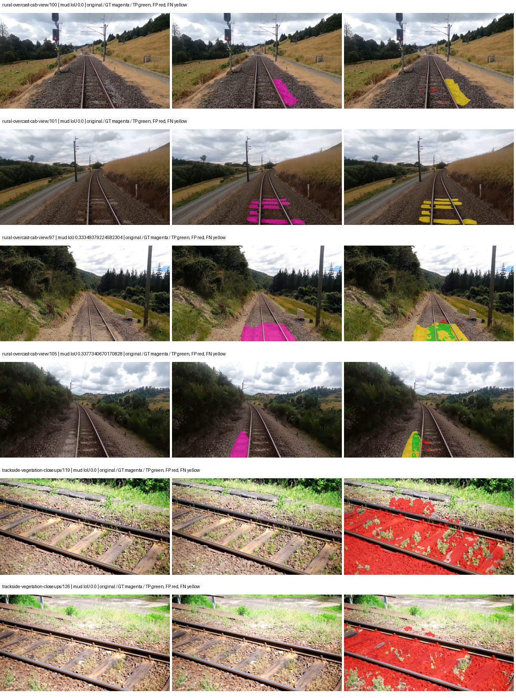
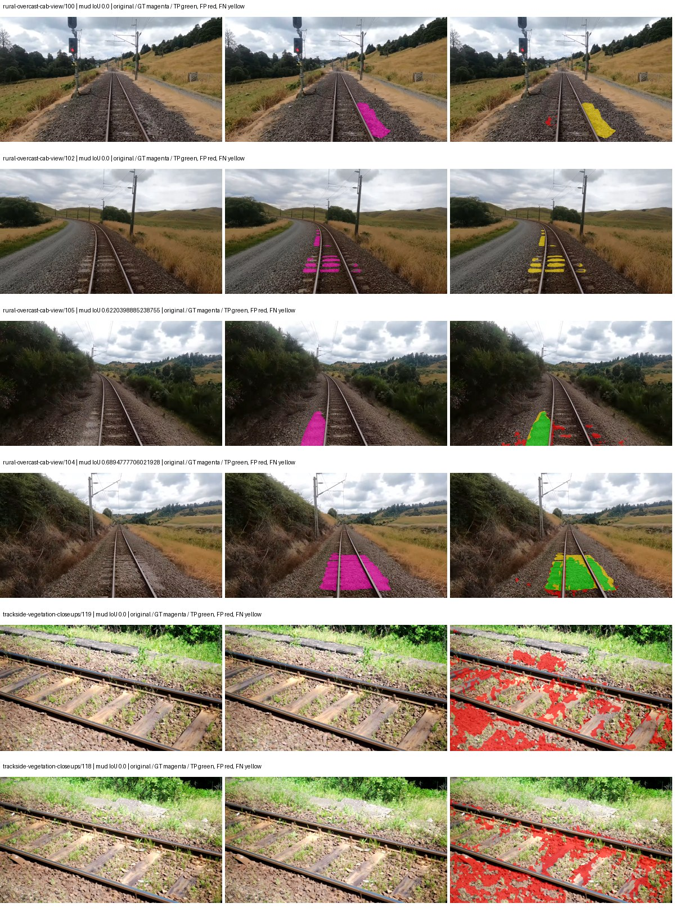
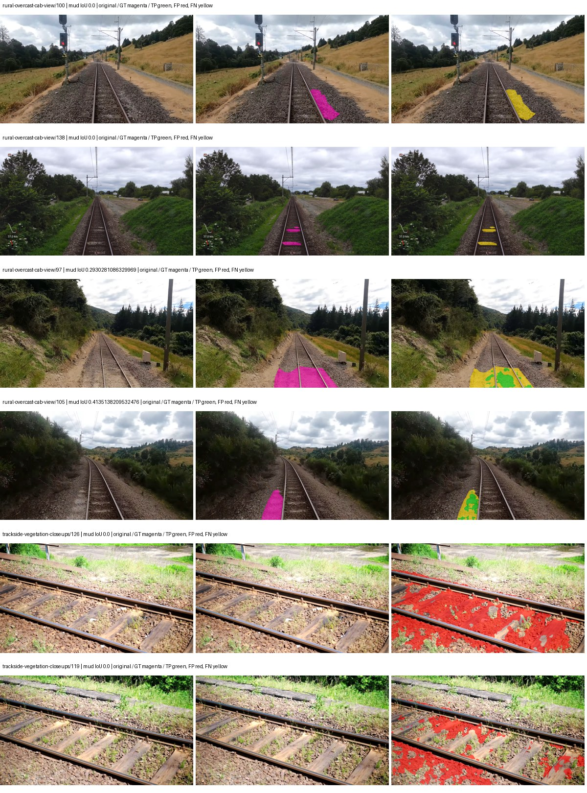

# smp_upernet_mit_b0 — paul-test-rtis_v2

[RTIS comparison](../../README.md) · [Full model records](record.json)

Primary selection and early stopping: **mud-pumping validation IoU**. A job is complete only after full statistics and isolated profiling are verified.

| Model | Initialization path | Seed | Status | Steps | Best step | Mud IoU (%) | Mud precision (%) | Mud recall (%) | Final mud IoU (trainer val, %) | mIoU (%) | Fixed GT-class mIoU (%) |
| --- | --- | --- | --- | --- | --- | --- | --- | --- | --- | --- | --- |
| smp_upernet_mit_b0 | rtis_only | 0 | completed | 1784 | 509 | 2.78 | 3.46 | 12.28 | 1.42 | 23.79 | 27.75 |
| smp_upernet_mit_b0 | cityscapes_to_rtis | 0 | completed | 2803 | 1529 | 11.82 | 15.56 | 32.96 | 11.60 | 29.62 | 34.55 |
| smp_upernet_mit_b0 | railsem19_to_rtis | 0 | completed | 2039 | 764 | 5.68 | 8.46 | 14.73 | 3.56 | 32.04 | 37.38 |
| smp_upernet_mit_b0 | cityscapes_to_railsem19_to_rtis | 0 | training | 2549 | — | — | — | — | — | — | — |

Training: 205 images. Validation: 37 images. Test: 50 held out. Seeds: [0]. Seed variation measures optimization variability, not independent-recording uncertainty. Historical source checkpoints stay fixed across adaptation seeds.

Training code: `066afb2626398b7be59d4d19f5a0e4644fd59adc`. Split SHA-256: `18a84c0163a65ded46508bcc904c374e5f33ad8a09b8879e3c8add606e86aa9f`.

## rtis_only — seed 0

Status: **completed**. Started: 2026-09-10T03:34:28.546746+00:00. Finished: 2026-09-10T04:07:26.277229+00:00.

Recipe pretrained initializer: `{"arch": "smp", "backbone_path": null, "batch_norm_momentum": null, "checkpoint": null, "classifier_path": null, "drop_path": null, "encoder_name": "mit_b0", "encoder_weights": "imagenet", "head": "unified_head", "head_paths": [], "inactive_parameter_paths": [], "local_files_only": false, "lora_alpha": 32, "lora_dropout": 0.05, "lora_r": 16, "lora_targets": [], "native": null, "revision": null, "smp_arch": "UPerNet", "subfolder": null, "trust_remote_code": false, "tuning": "full"}`.

`rtis_only` uses the recipe initializer, which may include pretrained segmentation components. Transfer paths load the exact historical source checkpoint below and reset the classifier; they do not reset all query/decoder features.

Source checkpoint: `Recipe pretrained initialization`.

Config SHA-256: `74a70a63a3d8266421bf7869033f13b787bf2b24ae1c34c4f5a989cac2da3f3a`. Weights used for validation: `raw`.

### Mud-pumping and aggregate quality

| Metric | Selected checkpoint | Final training validation |
| --- | --- | --- |
| Mud IoU | 2.78 | 1.42 |
| Mud precision | 3.46 | 1.87 |
| Mud recall | 12.28 | 5.48 |
| Mud Dice/F1 | 5.40 | 2.79 |
| mIoU | 23.79 | 28.63 |
| Mean accuracy | 36.11 | 43.41 |
| Mean precision | 46.37 | 47.16 |
| Mean Dice | 31.17 | 37.11 |
| Mean specificity | 98.22 | 98.84 |
| Pixel accuracy | 72.40 | 79.72 |
| Frequency-weighted IoU | 62.40 | 72.04 |
| Fixed GT-present class mIoU | 27.75 | 33.41 |
| Boundary F1 | 27.79 | 38.43 |

The selected checkpoint has independent evaluation evidence. Final values are the trainer's final validation record, not a new independent evaluation. mIoU averages classes with nonzero union, so false positives on absent classes can change its denominator. The fixed GT-class mean is supplementary and excludes absent classes; their false positives remain in the confusion matrix.

### Resource usage and timing

| Measurement | Value |
| --- | --- |
| Peak training VRAM, retained training invocation (GiB) | 11.14 |
| Peak evaluation VRAM (GiB) | 6.22 |
| Retained training invocation wall time (seconds) | 1790.07 |
| Retained training invocation GPU-hours (one GPU) | 0.50 |
| Evaluation wall time (seconds) | 18.29 |
| Full evaluation pipeline images/second | 2.02 |
| Best full-state checkpoint (MiB) | 164.26 |
| Final full-state checkpoint (MiB) | 164.25 |
| Verified periodic checkpoints removed (GiB) | 0.48 |

VRAM uses the recorded allocator high-water mark; it is not total device usage including CUDA context. Resumed jobs' retained training invocation times and peaks are **not whole-campaign totals**. Earlier invocation resource records are not reconstructed here. Evaluation throughput includes loader, sliding-window inference and metrics; it is not model-only latency/FPS. Missing measurements are shown as —, never inferred from another dataset's run.

### Standardized inference performance

Dedicated model-only profiling waits for an idle worker-locked L40S: BF16, batch 1, 1024x1024, 20 warmup and 100 CUDA-event-timed public forwards. It excludes loading, preprocessing, tiling and metrics.

| Status | Parameters | Weight MiB | FPS | p50 ms | p95 ms | Peak reserved GiB |
| --- | --- | --- | --- | --- | --- | --- |
| complete | 10737525 | 40.96 | 54.15 | 18.43 | 18.70 | 1.09 |

```json
{
  "schema_version": 1,
  "model_id": "smp_upernet_mit_b0",
  "measured_at": "2026-09-10T04:07:23+00:00",
  "status": "complete",
  "benchmark_scope": "rtis_selected_checkpoint_model_only",
  "applies_to": [
    "smp_upernet_mit_b0--rtis_only--seed-0"
  ],
  "source": {
    "campaign_git_sha": "066afb2626398b7be59d4d19f5a0e4644fd59adc",
    "git_dirty": false,
    "config_hash": "45d434e9e812",
    "resolved_config": "/data/izadia1/projects/segmentary-runs/paul-test-rtis_v2/seed0-20260909/configs/smp_upernet_mit_b0--rtis_only--seed-0.yaml",
    "config_sha256": "74a70a63a3d8266421bf7869033f13b787bf2b24ae1c34c4f5a989cac2da3f3a",
    "checkpoint_sha256": "5bb1310a9fa08828a6229b3f782b4f3b8e23836f5ec039ff3ab7ac7b9ba8afc3",
    "checkpoint_global_step": 509,
    "checkpoint_bytes": 172236790,
    "checkpoint_kind": "resume checkpoint with optimizer and EMA state",
    "weights": "raw",
    "measured_checkpoint_job_id": "smp_upernet_mit_b0--rtis_only--seed-0",
    "result_sha256": "0a4dbee91f759885612e8612930b7c12277c827830a282d10ccb1475da33f7d9",
    "result_git_sha": "066afb2626398b7be59d4d19f5a0e4644fd59adc",
    "result_stage": "eval:paul-test-rtis:val",
    "result_seed": 0
  },
  "hardware": {
    "gpu_name": "NVIDIA L40S",
    "gpu_uuid": "GPU-2f8008a1-9b67-11f6-987b-b393a672322c",
    "logical_device": "cuda:0",
    "physical_visibility_token": "3",
    "compute_capability": [
      8,
      9
    ],
    "total_memory_bytes": 47677177856
  },
  "model": {
    "parameter_count": 10737525,
    "trainable_parameter_count": 10737525,
    "resident_parameter_bytes": 42950100,
    "parameter_dtype_counts": {
      "float32": 10737525
    }
  },
  "contract": {
    "backend": "pytorch",
    "precision": "bf16_autocast",
    "batch_size": 1,
    "input_shape_nchw": [
      1,
      3,
      1024,
      1024
    ],
    "warmup_iterations": 20,
    "measured_iterations": 100,
    "timing": "per-forward CUDA events with end-event synchronization",
    "includes_preprocessing": false,
    "includes_data_loader": false,
    "includes_sliding_window": false,
    "input_resident_on_gpu": true,
    "model_only": true,
    "entrypoint": "public model(image) dense-logits forward"
  },
  "measurements": {
    "latency": {
      "p50_ms": 18.42585563659668,
      "p95_ms": 18.695269966125487,
      "mean_ms": 18.467846069335938,
      "minimum_ms": 18.31929588317871,
      "maximum_ms": 19.187711715698242,
      "fps": 54.14816629105452,
      "raw_ms": [
        18.662527084350586,
        18.379776000976562,
        18.549760818481445,
        18.65113639831543,
        18.387968063354492,
        18.43199920654297,
        18.391040802001953,
        18.367488861083984,
        18.341760635375977,
        18.356224060058594,
        18.386943817138672,
        18.46784019470215,
        18.554880142211914,
        18.347007751464844,
        18.490367889404297,
        18.79756736755371,
        18.353151321411133,
        18.368511199951172,
        18.365440368652344,
        18.364416122436523,
        18.31929588317871,
        18.406335830688477,
        18.362367630004883,
        18.348031997680664,
        18.381919860839844,
        18.742143630981445,
        18.405376434326172,
        18.352224349975586,
        18.358272552490234,
        18.44428825378418,
        18.42585563659668,
        18.502656936645508,
        18.321407318115234,
        18.580480575561523,
        18.46784019470215,
        18.46976089477539,
        18.570240020751953,
        18.387968063354492,
        18.43609619140625,
        18.562047958374023,
        18.371583938598633,
        18.555904388427734,
        18.355199813842773,
        18.43507194519043,
        18.697216033935547,
        18.359296798706055,
        18.534400939941406,
        18.36639976501465,
        18.332672119140625,
        18.406400680541992,
        18.508800506591797,
        18.39411163330078,
        18.522111892700195,
        18.379776000976562,
        18.43916893005371,
        18.518016815185547,
        18.53228759765625,
        18.348031997680664,
        18.61529541015625,
        18.581504821777344,
        18.338815689086914,
        18.53340721130371,
        18.661279678344727,
        18.40230369567871,
        18.664447784423828,
        18.3767032623291,
        18.70534324645996,
        18.491392135620117,
        18.46067237854004,
        18.38489532470703,
        18.42585563659668,
        19.187711715698242,
        18.694143295288086,
        18.374656677246094,
        18.365440368652344,
        18.347103118896484,
        18.681856155395508,
        18.379776000976562,
        18.390016555786133,
        18.41152000427246,
        18.695167541503906,
        18.472959518432617,
        18.334720611572266,
        18.527231216430664,
        18.523136138916016,
        18.387968063354492,
        18.528255462646484,
        18.58355140686035,
        18.542591094970703,
        18.372608184814453,
        18.325504302978516,
        18.41049575805664,
        18.378751754760742,
        18.35001564025879,
        18.550783157348633,
        18.44223976135254,
        18.65216064453125,
        18.364416122436523,
        18.509824752807617,
        18.44121551513672
      ],
      "percentile_method": "numpy linear interpolation"
    },
    "peak_reserved_bytes": 1172307968,
    "memory_kind": "pytorch_cuda_allocator_peak_reserved_excluding_context",
    "benchmark_wall_clock_s": 9.381556414067745
  },
  "started_at": "2026-09-10T04:07:14+00:00",
  "finished_at": "2026-09-10T04:07:23+00:00",
  "environment": {
    "hostname": "hdrfs-app-001",
    "python": "3.11.15",
    "platform": "Linux-5.15.0-139-generic-x86_64-with-glibc2.35",
    "torch": "2.11.0+cu128",
    "torch_cuda": "12.8",
    "cudnn": 91900,
    "driver_version": "570.133.20",
    "cuda_available": true,
    "gpu_count": 1,
    "gpu_names": [
      "NVIDIA L40S"
    ],
    "cuda_visible_devices": "3",
    "packages": {
      "segmentary": "0.1.0",
      "torch": "2.11.0+cu128",
      "torchvision": "0.26.0+cu128",
      "transformers": "5.15.0",
      "timm": "1.0.28",
      "segmentation-models-pytorch": "0.5.0",
      "albumentations": "2.0.8",
      "lightning": "2.6.5",
      "numpy": "2.4.4"
    }
  }
}
```

### Per-class validation results

| Class | GT pixels | IoU (%) | Precision (%) | Recall (%) | Dice (%) | Boundary F1 (%) |
| --- | --- | --- | --- | --- | --- | --- |
| car | 29664 | 0.00 | 0.00 | 0.00 | 0.00 | 0.00 |
| construction | 311585 | 4.18 | 4.26 | 69.69 | 8.02 | 16.28 |
| fence | 265137 | 13.99 | 79.92 | 14.50 | 24.54 | 40.54 |
| mud-pumping | 1226250 | 2.78 | 3.46 | 12.28 | 5.40 | 7.42 |
| on-rails | 0 | 0.00 | 0.00 | — | 0.00 | 0.00 |
| person | 0 | 0.00 | 0.00 | — | 0.00 | 0.00 |
| pole | 628038 | 57.28 | 72.22 | 73.47 | 72.84 | 85.29 |
| rail-embedded | 16799 | 23.85 | 79.98 | 25.36 | 38.51 | 29.75 |
| rail-raised | 2969797 | 65.25 | 89.26 | 70.81 | 78.97 | 88.24 |
| rail-track | 6323197 | 19.60 | 87.52 | 20.16 | 32.78 | 30.86 |
| road | 1048831 | 0.64 | 6.54 | 0.70 | 1.27 | 4.05 |
| sidewalk | 1297367 | 50.30 | 89.58 | 53.43 | 66.94 | 12.46 |
| sky | 19121606 | 96.85 | 99.81 | 97.03 | 98.40 | 92.30 |
| standing-water | 95802 | 0.21 | 0.22 | 2.78 | 0.41 | 1.20 |
| terrain | 39239306 | 67.49 | 76.14 | 85.58 | 80.59 | 35.12 |
| trackbed | 10643081 | 40.53 | 68.80 | 49.67 | 57.69 | 53.28 |
| traffic-light | 19510 | 1.46 | 100.00 | 1.46 | 2.87 | 12.55 |
| traffic-sign | 13285 | 0.00 | 0.00 | 0.00 | 0.00 | 0.00 |
| tram-track | 56179 | 20.31 | 31.84 | 35.95 | 33.77 | 12.15 |
| truck | 0 | 0.00 | 0.00 | — | 0.00 | 0.00 |
| vegetation-overgrowth | 5901821 | 34.78 | 84.31 | 37.19 | 51.61 | 62.05 |

### Full-run accounting

| Measurement | Value |
| --- | --- |
| Full GPU-reserved wall seconds, all recorded worker attempts | 1977.73 |
| Full reserved GPU-hours | 0.55 |
| Whole-run timing complete | True |

| Phase | Wall seconds including failed attempts |
| --- | --- |
| training | 1796.87 |
| diagnostics | 137.48 |
| performance | 16.33 |

GPU-reserved time includes model loading, training, validation, collection, profiling, checkpoint I/O and orchestration while the worker owns one GPU. It is not GPU kernel-active time. Phase timings and sampled device memory/power/utilization are retained separately; sampled device memory is not the allocator high-water mark.

### Train/validation and raw/EMA diagnostics

| Checkpoint / weights / split | Images | Mud IoU (%) | Mud precision (%) | Mud recall (%) |
| --- | --- | --- | --- | --- |
| best-auto-train / raw | 205 | 85.48 | 88.02 | 96.74 |
| best-auto-val / raw | 37 | 2.78 | 3.46 | 12.28 |
| best-alternate-val / ema | 37 | 0.69 | 0.82 | 4.09 |
| final-auto-val / raw | 37 | 1.42 | 1.88 | 5.50 |

Train uses the evaluation transform without augmentation. Compare mud train/validation metrics for the same selected weights. Alternate EMA on running-stat BatchNorm is explicitly uncalibrated and is diagnostic only. Score-threshold curves use uncalibrated normalized scores and are pixel-level diagnostics, not event detection rates or a selected deployment operating point.

### Downloadable evidence

- best-auto-train: [per-image.csv](rtis_only--seed-0/best-auto-train/per-image.csv) · [per-image-confusion.json.gz](rtis_only--seed-0/best-auto-train/per-image-confusion.json.gz) · [groups.json](rtis_only--seed-0/best-auto-train/groups.json) · [mud-score-curves.json](rtis_only--seed-0/best-auto-train/mud-score-curves.json)
- best-auto-val: [per-image.csv](rtis_only--seed-0/best-auto-val/per-image.csv) · [per-image-confusion.json.gz](rtis_only--seed-0/best-auto-val/per-image-confusion.json.gz) · [groups.json](rtis_only--seed-0/best-auto-val/groups.json) · [mud-score-curves.json](rtis_only--seed-0/best-auto-val/mud-score-curves.json) · [examples.jpg](rtis_only--seed-0/best-auto-val/examples.jpg)
- best-alternate-val: [per-image.csv](rtis_only--seed-0/best-alternate-val/per-image.csv) · [per-image-confusion.json.gz](rtis_only--seed-0/best-alternate-val/per-image-confusion.json.gz) · [groups.json](rtis_only--seed-0/best-alternate-val/groups.json) · [mud-score-curves.json](rtis_only--seed-0/best-alternate-val/mud-score-curves.json)
- final-auto-val: [per-image.csv](rtis_only--seed-0/final-auto-val/per-image.csv) · [per-image-confusion.json.gz](rtis_only--seed-0/final-auto-val/per-image-confusion.json.gz) · [groups.json](rtis_only--seed-0/final-auto-val/groups.json) · [mud-score-curves.json](rtis_only--seed-0/final-auto-val/mud-score-curves.json)
- resources: [telemetry.csv](rtis_only--seed-0/resources/telemetry.csv)



Examples are two lowest and two highest mud-IoU positive images, plus up to two negative images with the most false-positive mud pixels. They are targeted diagnostic examples, not random samples. Green: true positive; red: false positive; yellow: false negative. Full predictions remain on HDRFS.

### Validation tracking

| Logged step | Overall mIoU (%) | Mud IoU (%) |
| --- | --- | --- |
| 254 | 20.63 | 0.25 |
| 509 | 23.78 | 2.78 |
| 764 | 26.64 | 0.64 |
| 1019 | 29.99 | 0.76 |
| 1274 | 30.69 | 1.95 |
| 1529 | 32.83 | 0.96 |
| 1784 | 28.63 | 1.42 |

All retained scalar curves, including training loss and per-class IoU, are in record.json. Observed best mud on a curve is not necessarily a retained checkpoint: the pilot saved its selection-metric-best and final checkpoints. Step logging and checkpoint global_step may differ by one.

### Stopping and checkpoint provenance

```json
{
  "stopping": {
    "actual_steps": 1784,
    "maximum_steps": 4000,
    "min_delta": 0.001,
    "monitor": "val_iou/mud-pumping",
    "patience": 5,
    "reason": "validation_plateau"
  },
  "checkpoints": {
    "best": {
      "path": "/data/izadia1/projects/segmentary-runs/paul-test-rtis_v2/seed0-20260909/future-runs/smp_upernet_mit_b0--rtis_only--seed-0_seed0/rtis/best.ckpt",
      "sha256": "5bb1310a9fa08828a6229b3f782b4f3b8e23836f5ec039ff3ab7ac7b9ba8afc3",
      "global_step": 509,
      "bytes": 172236790
    },
    "final": {
      "path": "/data/izadia1/projects/segmentary-runs/paul-test-rtis_v2/seed0-20260909/future-runs/smp_upernet_mit_b0--rtis_only--seed-0_seed0/rtis/last.ckpt",
      "sha256": "5846ac0f7675e783bf1200b94147f595a2ffe8229e2712c65488076dd931707f",
      "global_step": 1784,
      "bytes": 172225654
    }
  },
  "cleanup_error": null
}
```

### Resolved training, initialization and evaluation settings

The optimizer block is the base configuration. Stage LR scales are applied at runtime, and stage warmup is capped at min(base warmup, floor(stage budget / 10), stage budget - 1): 400 steps for this 4,000-step pilot. Model-internal native input grids may differ from augmentation crops (EoMT uses its 640 grid).

```json
{
  "name": "smp_upernet_mit_b0--rtis_only--seed-0",
  "model": {
    "arch": "smp",
    "checkpoint": null,
    "tuning": "full",
    "head": "unified_head",
    "lora_r": 16,
    "lora_alpha": 32,
    "lora_dropout": 0.05,
    "lora_targets": [],
    "drop_path": null,
    "revision": null,
    "subfolder": null,
    "local_files_only": false,
    "trust_remote_code": false,
    "backbone_path": null,
    "head_paths": [],
    "classifier_path": null,
    "inactive_parameter_paths": [],
    "smp_arch": "UPerNet",
    "encoder_name": "mit_b0",
    "encoder_weights": "imagenet",
    "native": null,
    "batch_norm_momentum": null
  },
  "space": "paul-test-rtis",
  "taxonomy_root": "/data/izadia1/projects/segmentary-rtis-fullstats-066afb2/taxonomy",
  "output_root": "/data/izadia1/projects/segmentary-runs/paul-test-rtis_v2/seed0-20260909/future-runs",
  "optim": {
    "backbone_lr": 6e-05,
    "head_lr_mult": 10.0,
    "weight_decay": 0.05,
    "llrd": 1.0,
    "warmup_iters": 1500,
    "warmup_ratio": 1e-06,
    "poly_power": 0.9,
    "min_lr_ratio": 0.0,
    "betas": [
      0.9,
      0.999
    ],
    "grad_clip": 1.0
  },
  "train": {
    "iters": 4000,
    "batch_size": 2,
    "accum": 8,
    "num_workers": 2,
    "precision": "bf16-mixed",
    "ema_decay": 0.9998,
    "val_every": 250,
    "ckpt_every": 500,
    "selection_metric": "val_iou/mud-pumping",
    "early_stopping_patience": 5,
    "early_stopping_min_delta": 0.001,
    "seed": 0,
    "devices": 1
  },
  "eval": {
    "sliding_window": true,
    "window": [
      1024,
      1024
    ],
    "stride": [
      768,
      768
    ],
    "batch_size": 1,
    "num_workers": 2,
    "tta_scales": [],
    "tta_flip": false,
    "threshold": 0.5,
    "boundary_tolerance_frac": 0.0075,
    "save_confusion": true
  },
  "loss": {
    "task": "multiclass",
    "activation": "auto",
    "terms": [],
    "aux": "none",
    "aux_weight": 0.0,
    "ce_weight": 1.0,
    "label_smoothing": 0.0,
    "class_weights": null,
    "query": null
  },
  "aug": {
    "crop": [
      1024,
      1024
    ],
    "scale_min": 0.5,
    "scale_max": 2.0,
    "hflip_p": 0.5,
    "color_jitter_p": 0.5,
    "brightness": 0.25,
    "contrast": 0.25,
    "saturation": 0.25,
    "hue": 0.05
  },
  "stages": [
    {
      "name": "rtis",
      "data": [
        {
          "name": "paul-test-rtis",
          "root": "/data/izadia1/datasets/paul-test-rtis_v2",
          "variant": null,
          "split_file": "splits.json",
          "train_split": "train",
          "val_split": "val",
          "limit": null,
          "loader": "folder",
          "mapping": "paul-test-rtis",
          "loader_options": {
            "require_groups": true
          }
        }
      ],
      "iters": null,
      "lr_scale": 1.0,
      "head_group_lr_scale": 1.0,
      "init_from": "pretrained",
      "reset_head": false,
      "freeze": null,
      "sample_weights": null
    }
  ]
}
```

### Hardware and software provenance

```json
{
  "training": {
    "cuda_available": true,
    "cuda_visible_devices": "3",
    "cudnn": 91900,
    "driver_version": "570.133.20",
    "gpu_count": 1,
    "gpu_names": [
      "NVIDIA L40S"
    ],
    "hostname": "hdrfs-app-001",
    "input_normalization": {
      "channel_order": "rgb",
      "mean": [
        0.485,
        0.456,
        0.406
      ],
      "source": "smp_encoder_settings",
      "std": [
        0.229,
        0.224,
        0.225
      ]
    },
    "model_origins": [
      {
        "hf_commit": null,
        "hf_name_or_path": null,
        "module": "model",
        "timm_pretrained": {}
      }
    ],
    "model_parameter_count": 10737525,
    "packages": {
      "albumentations": "2.0.8",
      "lightning": "2.6.5",
      "numpy": "2.4.4",
      "segmentary": "0.1.0",
      "segmentation-models-pytorch": "0.5.0",
      "timm": "1.0.28",
      "torch": "2.11.0+cu128",
      "torchvision": "0.26.0+cu128",
      "transformers": "5.15.0"
    },
    "platform": "Linux-5.15.0-139-generic-x86_64-with-glibc2.35",
    "python": "3.11.15",
    "torch": "2.11.0+cu128",
    "torch_cuda": "12.8",
    "trainable_parameter_count": 10737525,
    "training_stop": {
      "actual_steps": 1784,
      "maximum_steps": 4000,
      "min_delta": 0.001,
      "monitor": "val_iou/mud-pumping",
      "patience": 5,
      "reason": "validation_plateau"
    },
    "validation_weights": "raw"
  },
  "evaluation": {
    "cuda_available": true,
    "cuda_visible_devices": "3",
    "cudnn": 91900,
    "driver_version": "570.133.20",
    "gpu_count": 1,
    "gpu_names": [
      "NVIDIA L40S"
    ],
    "hostname": "hdrfs-app-001",
    "input_normalization": {
      "channel_order": "rgb",
      "mean": [
        0.485,
        0.456,
        0.406
      ],
      "source": "smp_encoder_settings",
      "std": [
        0.229,
        0.224,
        0.225
      ]
    },
    "packages": {
      "albumentations": "2.0.8",
      "lightning": "2.6.5",
      "numpy": "2.4.4",
      "segmentary": "0.1.0",
      "segmentation-models-pytorch": "0.5.0",
      "timm": "1.0.28",
      "torch": "2.11.0+cu128",
      "torchvision": "0.26.0+cu128",
      "transformers": "5.15.0"
    },
    "platform": "Linux-5.15.0-139-generic-x86_64-with-glibc2.35",
    "python": "3.11.15",
    "torch": "2.11.0+cu128",
    "torch_cuda": "12.8"
  }
}
```

## cityscapes_to_rtis — seed 0

Status: **completed**. Started: 2026-09-10T03:38:23.351053+00:00. Finished: 2026-09-10T04:28:11.201484+00:00.

Recipe pretrained initializer: `{"arch": "smp", "backbone_path": null, "batch_norm_momentum": null, "checkpoint": null, "classifier_path": null, "drop_path": null, "encoder_name": "mit_b0", "encoder_weights": "imagenet", "head": "unified_head", "head_paths": [], "inactive_parameter_paths": [], "local_files_only": false, "lora_alpha": 32, "lora_dropout": 0.05, "lora_r": 16, "lora_targets": [], "native": null, "revision": null, "smp_arch": "UPerNet", "subfolder": null, "trust_remote_code": false, "tuning": "full"}`.

`rtis_only` uses the recipe initializer, which may include pretrained segmentation components. Transfer paths load the exact historical source checkpoint below and reset the classifier; they do not reset all query/decoder features.

Source checkpoint: `{'name': 'smp_upernet_mit_b0--cityscapes--seed-0', 'model': 'smp_upernet_mit_b0', 'protocol': 'cityscapes', 'config': '/data/izadia1/projects/segmentary-runs/all-model-city-rail-seed0-rail20-b9eb3e1/accepted/smp_upernet_mit_b0--cityscapes--seed-0/resolved-config.yaml', 'checkpoint': '/data/izadia1/projects/segmentary-runs/current-main-fill-v2/jobs/smp_upernet_mit_b0--cityscapes--seed-0/train/smp_upernet_mit_b0--cityscapes_seed0/cityscapes/last.ckpt', 'recorded_sha256': 'ce7fde4b4b7c8e1c9c8d1c1e441ffbc2eb42489afb71e09b0bc4128153a4a5df', 'exists': True}`.

Config SHA-256: `8eb0158e862a15bb7d887b03174491e782295d5366f37419b8695733955bf5b1`. Weights used for validation: `raw`.

### Mud-pumping and aggregate quality

| Metric | Selected checkpoint | Final training validation |
| --- | --- | --- |
| Mud IoU | 11.82 | 11.60 |
| Mud precision | 15.56 | 25.17 |
| Mud recall | 32.96 | 17.70 |
| Mud Dice/F1 | 21.14 | 20.78 |
| mIoU | 29.62 | 33.16 |
| Mean accuracy | 45.82 | 47.09 |
| Mean precision | 46.44 | 51.47 |
| Mean Dice | 38.56 | 42.21 |
| Mean specificity | 98.92 | 98.82 |
| Pixel accuracy | 82.01 | 81.73 |
| Frequency-weighted IoU | 73.45 | 71.80 |
| Fixed GT-present class mIoU | 34.55 | 38.68 |
| Boundary F1 | 35.56 | 38.73 |

The selected checkpoint has independent evaluation evidence. Final values are the trainer's final validation record, not a new independent evaluation. mIoU averages classes with nonzero union, so false positives on absent classes can change its denominator. The fixed GT-class mean is supplementary and excludes absent classes; their false positives remain in the confusion matrix.

### Resource usage and timing

| Measurement | Value |
| --- | --- |
| Peak training VRAM, retained training invocation (GiB) | 11.14 |
| Peak evaluation VRAM (GiB) | 6.22 |
| Retained training invocation wall time (seconds) | 2799.81 |
| Retained training invocation GPU-hours (one GPU) | 0.78 |
| Evaluation wall time (seconds) | 18.32 |
| Full evaluation pipeline images/second | 2.02 |
| Best full-state checkpoint (MiB) | 164.26 |
| Final full-state checkpoint (MiB) | 164.25 |
| Verified periodic checkpoints removed (GiB) | 0.80 |

VRAM uses the recorded allocator high-water mark; it is not total device usage including CUDA context. Resumed jobs' retained training invocation times and peaks are **not whole-campaign totals**. Earlier invocation resource records are not reconstructed here. Evaluation throughput includes loader, sliding-window inference and metrics; it is not model-only latency/FPS. Missing measurements are shown as —, never inferred from another dataset's run.

### Standardized inference performance

Dedicated model-only profiling waits for an idle worker-locked L40S: BF16, batch 1, 1024x1024, 20 warmup and 100 CUDA-event-timed public forwards. It excludes loading, preprocessing, tiling and metrics.

| Status | Parameters | Weight MiB | FPS | p50 ms | p95 ms | Peak reserved GiB |
| --- | --- | --- | --- | --- | --- | --- |
| complete | 10737525 | 40.96 | 54.02 | 18.44 | 18.81 | 1.09 |

```json
{
  "schema_version": 1,
  "model_id": "smp_upernet_mit_b0",
  "measured_at": "2026-09-10T04:28:08+00:00",
  "status": "complete",
  "benchmark_scope": "rtis_selected_checkpoint_model_only",
  "applies_to": [
    "smp_upernet_mit_b0--cityscapes_to_rtis--seed-0"
  ],
  "source": {
    "campaign_git_sha": "066afb2626398b7be59d4d19f5a0e4644fd59adc",
    "git_dirty": false,
    "config_hash": "c4439c175c43",
    "resolved_config": "/data/izadia1/projects/segmentary-runs/paul-test-rtis_v2/seed0-20260909/configs/smp_upernet_mit_b0--cityscapes_to_rtis--seed-0.yaml",
    "config_sha256": "8eb0158e862a15bb7d887b03174491e782295d5366f37419b8695733955bf5b1",
    "checkpoint_sha256": "6a985624ba7b616b7b19cac2a447fedd5e379334432d2ddc59240d39114a65ab",
    "checkpoint_global_step": 1529,
    "checkpoint_bytes": 172236790,
    "checkpoint_kind": "resume checkpoint with optimizer and EMA state",
    "weights": "raw",
    "measured_checkpoint_job_id": "smp_upernet_mit_b0--cityscapes_to_rtis--seed-0",
    "result_sha256": "fda9bdf15d992475498732fda2ff35a7e48070822b245c57b07de622b039b562",
    "result_git_sha": "066afb2626398b7be59d4d19f5a0e4644fd59adc",
    "result_stage": "eval:paul-test-rtis:val",
    "result_seed": 0
  },
  "hardware": {
    "gpu_name": "NVIDIA L40S",
    "gpu_uuid": "GPU-c76642eb-64c1-b0ac-b051-d2efd47b32c4",
    "logical_device": "cuda:0",
    "physical_visibility_token": "9",
    "compute_capability": [
      8,
      9
    ],
    "total_memory_bytes": 47677177856
  },
  "model": {
    "parameter_count": 10737525,
    "trainable_parameter_count": 10737525,
    "resident_parameter_bytes": 42950100,
    "parameter_dtype_counts": {
      "float32": 10737525
    }
  },
  "contract": {
    "backend": "pytorch",
    "precision": "bf16_autocast",
    "batch_size": 1,
    "input_shape_nchw": [
      1,
      3,
      1024,
      1024
    ],
    "warmup_iterations": 20,
    "measured_iterations": 100,
    "timing": "per-forward CUDA events with end-event synchronization",
    "includes_preprocessing": false,
    "includes_data_loader": false,
    "includes_sliding_window": false,
    "input_resident_on_gpu": true,
    "model_only": true,
    "entrypoint": "public model(image) dense-logits forward"
  },
  "measurements": {
    "latency": {
      "p50_ms": 18.440704345703125,
      "p95_ms": 18.81052198410034,
      "mean_ms": 18.510929050445558,
      "minimum_ms": 18.353151321411133,
      "maximum_ms": 18.896896362304688,
      "fps": 54.02213996254985,
      "raw_ms": [
        18.852863311767578,
        18.6296329498291,
        18.736127853393555,
        18.40332794189453,
        18.40435218811035,
        18.406400680541992,
        18.391040802001953,
        18.386943817138672,
        18.3624324798584,
        18.43712043762207,
        18.41868782043457,
        18.82316780090332,
        18.63167953491211,
        18.463743209838867,
        18.45452880859375,
        18.475008010864258,
        18.407424926757812,
        18.378751754760742,
        18.413536071777344,
        18.871295928955078,
        18.64703941345215,
        18.6112003326416,
        18.370559692382812,
        18.369504928588867,
        18.494464874267578,
        18.398208618164062,
        18.507776260375977,
        18.396160125732422,
        18.367488861083984,
        18.455551147460938,
        18.809856414794922,
        18.604032516479492,
        18.390016555786133,
        18.586624145507812,
        18.377727508544922,
        18.44223976135254,
        18.746368408203125,
        18.686975479125977,
        18.40127944946289,
        18.464767456054688,
        18.353151321411133,
        18.38387107849121,
        18.407424926757812,
        18.398208618164062,
        18.487295150756836,
        18.372608184814453,
        18.4268798828125,
        18.43097686767578,
        18.896896362304688,
        18.66854476928711,
        18.45452880859375,
        18.41663932800293,
        18.40025520324707,
        18.366464614868164,
        18.538496017456055,
        18.370559692382812,
        18.43814468383789,
        18.700288772583008,
        18.762752532958984,
        18.784255981445312,
        18.43916893005371,
        18.42073631286621,
        18.524160385131836,
        18.726911544799805,
        18.41868782043457,
        18.446304321289062,
        18.479103088378906,
        18.785280227661133,
        18.42790412902832,
        18.4453125,
        18.377727508544922,
        18.759679794311523,
        18.411487579345703,
        18.795520782470703,
        18.581504821777344,
        18.514944076538086,
        18.723840713500977,
        18.525184631347656,
        18.414592742919922,
        18.778112411499023,
        18.388992309570312,
        18.43916893005371,
        18.399232864379883,
        18.367488861083984,
        18.39308738708496,
        18.736127853393555,
        18.6429443359375,
        18.448383331298828,
        18.43199920654297,
        18.363391876220703,
        18.43097686767578,
        18.62451171875,
        18.483200073242188,
        18.503679275512695,
        18.512895584106445,
        18.82828712463379,
        18.4268798828125,
        18.39308738708496,
        18.386911392211914,
        18.361343383789062
      ],
      "percentile_method": "numpy linear interpolation"
    },
    "peak_reserved_bytes": 1172307968,
    "memory_kind": "pytorch_cuda_allocator_peak_reserved_excluding_context",
    "benchmark_wall_clock_s": 9.422683116048574
  },
  "started_at": "2026-09-10T04:27:59+00:00",
  "finished_at": "2026-09-10T04:28:08+00:00",
  "environment": {
    "hostname": "hdrfs-app-001",
    "python": "3.11.15",
    "platform": "Linux-5.15.0-139-generic-x86_64-with-glibc2.35",
    "torch": "2.11.0+cu128",
    "torch_cuda": "12.8",
    "cudnn": 91900,
    "driver_version": "570.133.20",
    "cuda_available": true,
    "gpu_count": 1,
    "gpu_names": [
      "NVIDIA L40S"
    ],
    "cuda_visible_devices": "9",
    "packages": {
      "segmentary": "0.1.0",
      "torch": "2.11.0+cu128",
      "torchvision": "0.26.0+cu128",
      "transformers": "5.15.0",
      "timm": "1.0.28",
      "segmentation-models-pytorch": "0.5.0",
      "albumentations": "2.0.8",
      "lightning": "2.6.5",
      "numpy": "2.4.4"
    }
  }
}
```

### Per-class validation results

| Class | GT pixels | IoU (%) | Precision (%) | Recall (%) | Dice (%) | Boundary F1 (%) |
| --- | --- | --- | --- | --- | --- | --- |
| car | 29664 | 0.00 | 0.00 | 0.00 | 0.00 | 0.00 |
| construction | 311585 | 40.33 | 47.89 | 71.87 | 57.48 | 42.27 |
| fence | 265137 | 10.22 | 14.11 | 27.05 | 18.55 | 17.75 |
| mud-pumping | 1226250 | 11.82 | 15.56 | 32.96 | 21.14 | 14.36 |
| on-rails | 0 | 0.00 | 0.00 | — | 0.00 | 0.00 |
| person | 0 | 0.00 | 0.00 | — | 0.00 | 0.00 |
| pole | 628038 | 65.63 | 80.57 | 77.97 | 79.25 | 88.71 |
| rail-embedded | 16799 | 6.87 | 53.86 | 7.30 | 12.86 | 36.59 |
| rail-raised | 2969797 | 64.43 | 84.23 | 73.26 | 78.37 | 86.27 |
| rail-track | 6323197 | 33.71 | 66.99 | 40.43 | 50.43 | 45.38 |
| road | 1048831 | 13.33 | 38.32 | 16.97 | 23.52 | 24.50 |
| sidewalk | 1297367 | 29.72 | 65.22 | 35.32 | 45.82 | 7.97 |
| sky | 19121606 | 95.23 | 99.63 | 95.58 | 97.56 | 86.27 |
| standing-water | 95802 | 2.45 | 2.53 | 42.98 | 4.79 | 8.40 |
| terrain | 39239306 | 85.09 | 89.49 | 94.53 | 91.94 | 58.04 |
| trackbed | 10643081 | 55.26 | 68.88 | 73.66 | 71.19 | 52.21 |
| traffic-light | 19510 | 43.06 | 61.95 | 58.54 | 60.20 | 52.95 |
| traffic-sign | 13285 | 12.71 | 91.83 | 12.86 | 22.56 | 36.78 |
| tram-track | 56179 | 5.61 | 21.61 | 7.04 | 10.62 | 18.85 |
| truck | 0 | 0.00 | 0.00 | — | 0.00 | 0.00 |
| vegetation-overgrowth | 5901821 | 46.49 | 72.53 | 56.42 | 63.47 | 69.40 |

### Full-run accounting

| Measurement | Value |
| --- | --- |
| Full GPU-reserved wall seconds, all recorded worker attempts | 2987.98 |
| Full reserved GPU-hours | 0.83 |
| Whole-run timing complete | True |

| Phase | Wall seconds including failed attempts |
| --- | --- |
| training | 2807.12 |
| diagnostics | 137.27 |
| performance | 16.58 |

GPU-reserved time includes model loading, training, validation, collection, profiling, checkpoint I/O and orchestration while the worker owns one GPU. It is not GPU kernel-active time. Phase timings and sampled device memory/power/utilization are retained separately; sampled device memory is not the allocator high-water mark.

### Train/validation and raw/EMA diagnostics

| Checkpoint / weights / split | Images | Mud IoU (%) | Mud precision (%) | Mud recall (%) |
| --- | --- | --- | --- | --- |
| best-auto-train / raw | 205 | 92.97 | 95.09 | 97.66 |
| best-auto-val / raw | 37 | 11.82 | 15.56 | 32.96 |
| best-alternate-val / ema | 37 | 11.70 | 31.35 | 15.73 |
| final-auto-val / raw | 37 | 11.60 | 25.14 | 17.73 |

Train uses the evaluation transform without augmentation. Compare mud train/validation metrics for the same selected weights. Alternate EMA on running-stat BatchNorm is explicitly uncalibrated and is diagnostic only. Score-threshold curves use uncalibrated normalized scores and are pixel-level diagnostics, not event detection rates or a selected deployment operating point.

### Downloadable evidence

- best-auto-train: [per-image.csv](cityscapes_to_rtis--seed-0/best-auto-train/per-image.csv) · [per-image-confusion.json.gz](cityscapes_to_rtis--seed-0/best-auto-train/per-image-confusion.json.gz) · [groups.json](cityscapes_to_rtis--seed-0/best-auto-train/groups.json) · [mud-score-curves.json](cityscapes_to_rtis--seed-0/best-auto-train/mud-score-curves.json)
- best-auto-val: [per-image.csv](cityscapes_to_rtis--seed-0/best-auto-val/per-image.csv) · [per-image-confusion.json.gz](cityscapes_to_rtis--seed-0/best-auto-val/per-image-confusion.json.gz) · [groups.json](cityscapes_to_rtis--seed-0/best-auto-val/groups.json) · [mud-score-curves.json](cityscapes_to_rtis--seed-0/best-auto-val/mud-score-curves.json) · [examples.jpg](cityscapes_to_rtis--seed-0/best-auto-val/examples.jpg)
- best-alternate-val: [per-image.csv](cityscapes_to_rtis--seed-0/best-alternate-val/per-image.csv) · [per-image-confusion.json.gz](cityscapes_to_rtis--seed-0/best-alternate-val/per-image-confusion.json.gz) · [groups.json](cityscapes_to_rtis--seed-0/best-alternate-val/groups.json) · [mud-score-curves.json](cityscapes_to_rtis--seed-0/best-alternate-val/mud-score-curves.json)
- final-auto-val: [per-image.csv](cityscapes_to_rtis--seed-0/final-auto-val/per-image.csv) · [per-image-confusion.json.gz](cityscapes_to_rtis--seed-0/final-auto-val/per-image-confusion.json.gz) · [groups.json](cityscapes_to_rtis--seed-0/final-auto-val/groups.json) · [mud-score-curves.json](cityscapes_to_rtis--seed-0/final-auto-val/mud-score-curves.json)
- resources: [telemetry.csv](cityscapes_to_rtis--seed-0/resources/telemetry.csv)



Examples are two lowest and two highest mud-IoU positive images, plus up to two negative images with the most false-positive mud pixels. They are targeted diagnostic examples, not random samples. Green: true positive; red: false positive; yellow: false negative. Full predictions remain on HDRFS.

### Validation tracking

| Logged step | Overall mIoU (%) | Mud IoU (%) |
| --- | --- | --- |
| 254 | 21.37 | 3.71 |
| 509 | 26.41 | 9.69 |
| 764 | 24.45 | 6.03 |
| 1019 | 25.78 | 9.21 |
| 1274 | 27.24 | 8.52 |
| 1529 | 29.62 | 11.83 |
| 1784 | 27.89 | 8.24 |
| 2038 | 30.04 | 2.91 |
| 2293 | 30.81 | 6.24 |
| 2548 | 31.54 | 7.34 |
| 2803 | 33.16 | 11.60 |

All retained scalar curves, including training loss and per-class IoU, are in record.json. Observed best mud on a curve is not necessarily a retained checkpoint: the pilot saved its selection-metric-best and final checkpoints. Step logging and checkpoint global_step may differ by one.

### Stopping and checkpoint provenance

```json
{
  "stopping": {
    "actual_steps": 2803,
    "maximum_steps": 4000,
    "min_delta": 0.001,
    "monitor": "val_iou/mud-pumping",
    "patience": 5,
    "reason": "validation_plateau"
  },
  "checkpoints": {
    "best": {
      "path": "/data/izadia1/projects/segmentary-runs/paul-test-rtis_v2/seed0-20260909/future-runs/smp_upernet_mit_b0--cityscapes_to_rtis--seed-0_seed0/rtis/best.ckpt",
      "sha256": "6a985624ba7b616b7b19cac2a447fedd5e379334432d2ddc59240d39114a65ab",
      "global_step": 1529,
      "bytes": 172236790
    },
    "final": {
      "path": "/data/izadia1/projects/segmentary-runs/paul-test-rtis_v2/seed0-20260909/future-runs/smp_upernet_mit_b0--cityscapes_to_rtis--seed-0_seed0/rtis/last.ckpt",
      "sha256": "3d602a0c137dfe25695a128be41fe0dbe94d596a8d5a4b26238d1e02a5c93510",
      "global_step": 2803,
      "bytes": 172225654
    }
  },
  "cleanup_error": null
}
```

### Resolved training, initialization and evaluation settings

The optimizer block is the base configuration. Stage LR scales are applied at runtime, and stage warmup is capped at min(base warmup, floor(stage budget / 10), stage budget - 1): 400 steps for this 4,000-step pilot. Model-internal native input grids may differ from augmentation crops (EoMT uses its 640 grid).

```json
{
  "name": "smp_upernet_mit_b0--cityscapes_to_rtis--seed-0",
  "model": {
    "arch": "smp",
    "checkpoint": null,
    "tuning": "full",
    "head": "unified_head",
    "lora_r": 16,
    "lora_alpha": 32,
    "lora_dropout": 0.05,
    "lora_targets": [],
    "drop_path": null,
    "revision": null,
    "subfolder": null,
    "local_files_only": false,
    "trust_remote_code": false,
    "backbone_path": null,
    "head_paths": [],
    "classifier_path": null,
    "inactive_parameter_paths": [],
    "smp_arch": "UPerNet",
    "encoder_name": "mit_b0",
    "encoder_weights": "imagenet",
    "native": null,
    "batch_norm_momentum": null
  },
  "space": "paul-test-rtis",
  "taxonomy_root": "/data/izadia1/projects/segmentary-rtis-fullstats-066afb2/taxonomy",
  "output_root": "/data/izadia1/projects/segmentary-runs/paul-test-rtis_v2/seed0-20260909/future-runs",
  "optim": {
    "backbone_lr": 6e-05,
    "head_lr_mult": 10.0,
    "weight_decay": 0.05,
    "llrd": 1.0,
    "warmup_iters": 1500,
    "warmup_ratio": 1e-06,
    "poly_power": 0.9,
    "min_lr_ratio": 0.0,
    "betas": [
      0.9,
      0.999
    ],
    "grad_clip": 1.0
  },
  "train": {
    "iters": 4000,
    "batch_size": 2,
    "accum": 8,
    "num_workers": 2,
    "precision": "bf16-mixed",
    "ema_decay": 0.9998,
    "val_every": 250,
    "ckpt_every": 500,
    "selection_metric": "val_iou/mud-pumping",
    "early_stopping_patience": 5,
    "early_stopping_min_delta": 0.001,
    "seed": 0,
    "devices": 1
  },
  "eval": {
    "sliding_window": true,
    "window": [
      1024,
      1024
    ],
    "stride": [
      768,
      768
    ],
    "batch_size": 1,
    "num_workers": 2,
    "tta_scales": [],
    "tta_flip": false,
    "threshold": 0.5,
    "boundary_tolerance_frac": 0.0075,
    "save_confusion": true
  },
  "loss": {
    "task": "multiclass",
    "activation": "auto",
    "terms": [],
    "aux": "none",
    "aux_weight": 0.0,
    "ce_weight": 1.0,
    "label_smoothing": 0.0,
    "class_weights": null,
    "query": null
  },
  "aug": {
    "crop": [
      1024,
      1024
    ],
    "scale_min": 0.5,
    "scale_max": 2.0,
    "hflip_p": 0.5,
    "color_jitter_p": 0.5,
    "brightness": 0.25,
    "contrast": 0.25,
    "saturation": 0.25,
    "hue": 0.05
  },
  "stages": [
    {
      "name": "rtis",
      "data": [
        {
          "name": "paul-test-rtis",
          "root": "/data/izadia1/datasets/paul-test-rtis_v2",
          "variant": null,
          "split_file": "splits.json",
          "train_split": "train",
          "val_split": "val",
          "limit": null,
          "loader": "folder",
          "mapping": "paul-test-rtis",
          "loader_options": {
            "require_groups": true
          }
        }
      ],
      "iters": null,
      "lr_scale": 0.1,
      "head_group_lr_scale": 1.0,
      "init_from": "/data/izadia1/projects/segmentary-runs/current-main-fill-v2/jobs/smp_upernet_mit_b0--cityscapes--seed-0/train/smp_upernet_mit_b0--cityscapes_seed0/cityscapes/last.ckpt",
      "reset_head": true,
      "freeze": null,
      "sample_weights": null
    }
  ]
}
```

### Hardware and software provenance

```json
{
  "training": {
    "cuda_available": true,
    "cuda_visible_devices": "9",
    "cudnn": 91900,
    "driver_version": "570.133.20",
    "gpu_count": 1,
    "gpu_names": [
      "NVIDIA L40S"
    ],
    "hostname": "hdrfs-app-001",
    "input_normalization": {
      "channel_order": "rgb",
      "mean": [
        0.485,
        0.456,
        0.406
      ],
      "source": "smp_encoder_settings",
      "std": [
        0.229,
        0.224,
        0.225
      ]
    },
    "model_origins": [
      {
        "hf_commit": null,
        "hf_name_or_path": null,
        "module": "model",
        "timm_pretrained": {}
      }
    ],
    "model_parameter_count": 10737525,
    "packages": {
      "albumentations": "2.0.8",
      "lightning": "2.6.5",
      "numpy": "2.4.4",
      "segmentary": "0.1.0",
      "segmentation-models-pytorch": "0.5.0",
      "timm": "1.0.28",
      "torch": "2.11.0+cu128",
      "torchvision": "0.26.0+cu128",
      "transformers": "5.15.0"
    },
    "platform": "Linux-5.15.0-139-generic-x86_64-with-glibc2.35",
    "python": "3.11.15",
    "torch": "2.11.0+cu128",
    "torch_cuda": "12.8",
    "trainable_parameter_count": 10737525,
    "training_stop": {
      "actual_steps": 2803,
      "maximum_steps": 4000,
      "min_delta": 0.001,
      "monitor": "val_iou/mud-pumping",
      "patience": 5,
      "reason": "validation_plateau"
    },
    "validation_weights": "raw"
  },
  "evaluation": {
    "cuda_available": true,
    "cuda_visible_devices": "9",
    "cudnn": 91900,
    "driver_version": "570.133.20",
    "gpu_count": 1,
    "gpu_names": [
      "NVIDIA L40S"
    ],
    "hostname": "hdrfs-app-001",
    "input_normalization": {
      "channel_order": "rgb",
      "mean": [
        0.485,
        0.456,
        0.406
      ],
      "source": "smp_encoder_settings",
      "std": [
        0.229,
        0.224,
        0.225
      ]
    },
    "packages": {
      "albumentations": "2.0.8",
      "lightning": "2.6.5",
      "numpy": "2.4.4",
      "segmentary": "0.1.0",
      "segmentation-models-pytorch": "0.5.0",
      "timm": "1.0.28",
      "torch": "2.11.0+cu128",
      "torchvision": "0.26.0+cu128",
      "transformers": "5.15.0"
    },
    "platform": "Linux-5.15.0-139-generic-x86_64-with-glibc2.35",
    "python": "3.11.15",
    "torch": "2.11.0+cu128",
    "torch_cuda": "12.8"
  }
}
```

## railsem19_to_rtis — seed 0

Status: **completed**. Started: 2026-09-10T03:39:33.878532+00:00. Finished: 2026-09-10T04:16:53.622972+00:00.

Recipe pretrained initializer: `{"arch": "smp", "backbone_path": null, "batch_norm_momentum": null, "checkpoint": null, "classifier_path": null, "drop_path": null, "encoder_name": "mit_b0", "encoder_weights": "imagenet", "head": "unified_head", "head_paths": [], "inactive_parameter_paths": [], "local_files_only": false, "lora_alpha": 32, "lora_dropout": 0.05, "lora_r": 16, "lora_targets": [], "native": null, "revision": null, "smp_arch": "UPerNet", "subfolder": null, "trust_remote_code": false, "tuning": "full"}`.

`rtis_only` uses the recipe initializer, which may include pretrained segmentation components. Transfer paths load the exact historical source checkpoint below and reset the classifier; they do not reset all query/decoder features.

Source checkpoint: `{'name': 'smp_upernet_mit_b0--railsem19--seed-0', 'model': 'smp_upernet_mit_b0', 'protocol': 'railsem19', 'config': '/data/izadia1/projects/segmentary-runs/all-model-city-rail-seed0-rail20-b9eb3e1/accepted/smp_upernet_mit_b0--railsem19--seed-0/resolved-config.yaml', 'checkpoint': '/data/izadia1/projects/segmentary-runs/all-model-city-rail-seed0-a7c0b67/jobs/smp_upernet_mit_b0--railsem19--seed-0/attempt-001/train/smp_upernet_mit_b0--railsem19_seed0/railsem19/last.ckpt', 'recorded_sha256': '014d1285f36704422cc145d728c43946d5418e9af260e276a081ef26b2cf6c8f', 'exists': True}`.

Config SHA-256: `ebf6da41dcdff7a47511c15524b5a7293d8acedafab9bc1607a77761a12de78d`. Weights used for validation: `raw`.

### Mud-pumping and aggregate quality

| Metric | Selected checkpoint | Final training validation |
| --- | --- | --- |
| Mud IoU | 5.68 | 3.56 |
| Mud precision | 8.46 | 9.53 |
| Mud recall | 14.73 | 5.38 |
| Mud Dice/F1 | 10.75 | 6.88 |
| mIoU | 32.04 | 41.47 |
| Mean accuracy | 43.78 | 57.31 |
| Mean precision | 43.04 | 58.24 |
| Mean Dice | 39.35 | 51.94 |
| Mean specificity | 99.02 | 99.11 |
| Pixel accuracy | 85.02 | 85.78 |
| Frequency-weighted IoU | 76.30 | 77.22 |
| Fixed GT-present class mIoU | 37.38 | 48.39 |
| Boundary F1 | 35.24 | 47.94 |

The selected checkpoint has independent evaluation evidence. Final values are the trainer's final validation record, not a new independent evaluation. mIoU averages classes with nonzero union, so false positives on absent classes can change its denominator. The fixed GT-class mean is supplementary and excludes absent classes; their false positives remain in the confusion matrix.

### Resource usage and timing

| Measurement | Value |
| --- | --- |
| Peak training VRAM, retained training invocation (GiB) | 11.14 |
| Peak evaluation VRAM (GiB) | 6.22 |
| Retained training invocation wall time (seconds) | 2053.25 |
| Retained training invocation GPU-hours (one GPU) | 0.57 |
| Evaluation wall time (seconds) | 17.99 |
| Full evaluation pipeline images/second | 2.06 |
| Best full-state checkpoint (MiB) | 164.26 |
| Final full-state checkpoint (MiB) | 164.25 |
| Verified periodic checkpoints removed (GiB) | 0.64 |

VRAM uses the recorded allocator high-water mark; it is not total device usage including CUDA context. Resumed jobs' retained training invocation times and peaks are **not whole-campaign totals**. Earlier invocation resource records are not reconstructed here. Evaluation throughput includes loader, sliding-window inference and metrics; it is not model-only latency/FPS. Missing measurements are shown as —, never inferred from another dataset's run.

### Standardized inference performance

Dedicated model-only profiling waits for an idle worker-locked L40S: BF16, batch 1, 1024x1024, 20 warmup and 100 CUDA-event-timed public forwards. It excludes loading, preprocessing, tiling and metrics.

| Status | Parameters | Weight MiB | FPS | p50 ms | p95 ms | Peak reserved GiB |
| --- | --- | --- | --- | --- | --- | --- |
| complete | 10737525 | 40.96 | 54.22 | 18.43 | 18.53 | 1.09 |

```json
{
  "schema_version": 1,
  "model_id": "smp_upernet_mit_b0",
  "measured_at": "2026-09-10T04:16:51+00:00",
  "status": "complete",
  "benchmark_scope": "rtis_selected_checkpoint_model_only",
  "applies_to": [
    "smp_upernet_mit_b0--railsem19_to_rtis--seed-0"
  ],
  "source": {
    "campaign_git_sha": "066afb2626398b7be59d4d19f5a0e4644fd59adc",
    "git_dirty": false,
    "config_hash": "a86453a49960",
    "resolved_config": "/data/izadia1/projects/segmentary-runs/paul-test-rtis_v2/seed0-20260909/configs/smp_upernet_mit_b0--railsem19_to_rtis--seed-0.yaml",
    "config_sha256": "ebf6da41dcdff7a47511c15524b5a7293d8acedafab9bc1607a77761a12de78d",
    "checkpoint_sha256": "9d49fbdbc3617de7fc4b46c964a78bc5262c7bb83758955b4c5b9ef6f2c0aeb7",
    "checkpoint_global_step": 764,
    "checkpoint_bytes": 172236790,
    "checkpoint_kind": "resume checkpoint with optimizer and EMA state",
    "weights": "raw",
    "measured_checkpoint_job_id": "smp_upernet_mit_b0--railsem19_to_rtis--seed-0",
    "result_sha256": "771073a41736a25d6689b8756a095fdc40322825b22adbee2fc785727f7f1b09",
    "result_git_sha": "066afb2626398b7be59d4d19f5a0e4644fd59adc",
    "result_stage": "eval:paul-test-rtis:val",
    "result_seed": 0
  },
  "hardware": {
    "gpu_name": "NVIDIA L40S",
    "gpu_uuid": "GPU-804aea8b-5f62-423e-72c6-49e1ed15c4e4",
    "logical_device": "cuda:0",
    "physical_visibility_token": "6",
    "compute_capability": [
      8,
      9
    ],
    "total_memory_bytes": 47677177856
  },
  "model": {
    "parameter_count": 10737525,
    "trainable_parameter_count": 10737525,
    "resident_parameter_bytes": 42950100,
    "parameter_dtype_counts": {
      "float32": 10737525
    }
  },
  "contract": {
    "backend": "pytorch",
    "precision": "bf16_autocast",
    "batch_size": 1,
    "input_shape_nchw": [
      1,
      3,
      1024,
      1024
    ],
    "warmup_iterations": 20,
    "measured_iterations": 100,
    "timing": "per-forward CUDA events with end-event synchronization",
    "includes_preprocessing": false,
    "includes_data_loader": false,
    "includes_sliding_window": false,
    "input_resident_on_gpu": true,
    "model_only": true,
    "entrypoint": "public model(image) dense-logits forward"
  },
  "measurements": {
    "latency": {
      "p50_ms": 18.42892837524414,
      "p95_ms": 18.530405902862547,
      "mean_ms": 18.44234239578247,
      "minimum_ms": 18.369535446166992,
      "maximum_ms": 18.64396858215332,
      "fps": 54.22304708043416,
      "raw_ms": [
        18.62041664123535,
        18.41663932800293,
        18.471935272216797,
        18.40332794189453,
        18.455551147460938,
        18.40230369567871,
        18.42073631286621,
        18.45350456237793,
        18.4268798828125,
        18.528255462646484,
        18.437088012695312,
        18.42790412902832,
        18.41766357421875,
        18.4135684967041,
        18.42380714416504,
        18.45452880859375,
        18.4453125,
        18.4135684967041,
        18.464767456054688,
        18.44428825378418,
        18.523136138916016,
        18.471935272216797,
        18.41561508178711,
        18.41971206665039,
        18.42380714416504,
        18.42073631286621,
        18.463743209838867,
        18.45452880859375,
        18.42483139038086,
        18.41971206665039,
        18.40230369567871,
        18.41766357421875,
        18.45964813232422,
        18.391040802001953,
        18.426912307739258,
        18.4268798828125,
        18.406400680541992,
        18.43199920654297,
        18.465791702270508,
        18.47091293334961,
        18.41663932800293,
        18.42073631286621,
        18.501632690429688,
        18.41152000427246,
        18.498559951782227,
        18.45452880859375,
        18.41561508178711,
        18.44940757751465,
        18.571264266967773,
        18.4135684967041,
        18.447359085083008,
        18.4453125,
        18.41868782043457,
        18.42176055908203,
        18.44326400756836,
        18.45452880859375,
        18.42585563659668,
        18.44428825378418,
        18.43916893005371,
        18.41971206665039,
        18.41561508178711,
        18.579456329345703,
        18.64396858215332,
        18.41868782043457,
        18.41254425048828,
        18.44121551513672,
        18.44326400756836,
        18.369535446166992,
        18.408447265625,
        18.374656677246094,
        18.43507194519043,
        18.43302345275879,
        18.391040802001953,
        18.408447265625,
        18.39411163330078,
        18.42995262145996,
        18.40332794189453,
        18.396160125732422,
        18.44121551513672,
        18.4453125,
        18.4135684967041,
        18.407424926757812,
        18.45248031616211,
        18.414592742919922,
        18.44428825378418,
        18.41663932800293,
        18.41766357421875,
        18.40947151184082,
        18.40025520324707,
        18.500608444213867,
        18.43916893005371,
        18.41663932800293,
        18.46784019470215,
        18.43609619140625,
        18.42995262145996,
        18.480127334594727,
        18.493440628051758,
        18.63475227355957,
        18.44121551513672,
        18.4401912689209
      ],
      "percentile_method": "numpy linear interpolation"
    },
    "peak_reserved_bytes": 1172307968,
    "memory_kind": "pytorch_cuda_allocator_peak_reserved_excluding_context",
    "benchmark_wall_clock_s": 9.275906290858984
  },
  "started_at": "2026-09-10T04:16:41+00:00",
  "finished_at": "2026-09-10T04:16:51+00:00",
  "environment": {
    "hostname": "hdrfs-app-001",
    "python": "3.11.15",
    "platform": "Linux-5.15.0-139-generic-x86_64-with-glibc2.35",
    "torch": "2.11.0+cu128",
    "torch_cuda": "12.8",
    "cudnn": 91900,
    "driver_version": "570.133.20",
    "cuda_available": true,
    "gpu_count": 1,
    "gpu_names": [
      "NVIDIA L40S"
    ],
    "cuda_visible_devices": "6",
    "packages": {
      "segmentary": "0.1.0",
      "torch": "2.11.0+cu128",
      "torchvision": "0.26.0+cu128",
      "transformers": "5.15.0",
      "timm": "1.0.28",
      "segmentation-models-pytorch": "0.5.0",
      "albumentations": "2.0.8",
      "lightning": "2.6.5",
      "numpy": "2.4.4"
    }
  }
}
```

### Per-class validation results

| Class | GT pixels | IoU (%) | Precision (%) | Recall (%) | Dice (%) | Boundary F1 (%) |
| --- | --- | --- | --- | --- | --- | --- |
| car | 29664 | 0.00 | 0.00 | 0.00 | 0.00 | 0.00 |
| construction | 311585 | 62.33 | 76.95 | 76.64 | 76.80 | 70.78 |
| fence | 265137 | 26.76 | 54.89 | 34.31 | 42.22 | 53.51 |
| mud-pumping | 1226250 | 5.68 | 8.46 | 14.73 | 10.75 | 9.53 |
| on-rails | 0 | 0.00 | 0.00 | — | 0.00 | 0.00 |
| person | 0 | 0.00 | 0.00 | — | 0.00 | 0.00 |
| pole | 628038 | 71.11 | 85.19 | 81.15 | 83.12 | 91.28 |
| rail-embedded | 16799 | 0.00 | 0.00 | 0.00 | 0.00 | 0.00 |
| rail-raised | 2969797 | 74.15 | 85.08 | 85.24 | 85.16 | 90.81 |
| rail-track | 6323197 | 40.68 | 71.12 | 48.73 | 57.83 | 54.64 |
| road | 1048831 | 6.11 | 25.53 | 7.43 | 11.51 | 15.45 |
| sidewalk | 1297367 | 48.67 | 88.63 | 51.91 | 65.47 | 14.76 |
| sky | 19121606 | 98.64 | 99.40 | 99.23 | 99.31 | 96.77 |
| standing-water | 95802 | 0.46 | 0.55 | 2.71 | 0.91 | 1.22 |
| terrain | 39239306 | 85.59 | 87.06 | 98.06 | 92.23 | 56.05 |
| trackbed | 10643081 | 63.49 | 79.83 | 75.62 | 77.67 | 58.31 |
| traffic-light | 19510 | 0.00 | 0.00 | 0.00 | 0.00 | 0.00 |
| traffic-sign | 13285 | 0.00 | 0.00 | 0.00 | 0.00 | 0.00 |
| tram-track | 56179 | 45.36 | 61.97 | 62.86 | 62.41 | 58.56 |
| truck | 0 | 0.00 | 0.00 | — | 0.00 | 0.00 |
| vegetation-overgrowth | 5901821 | 43.76 | 79.15 | 49.46 | 60.88 | 68.27 |

### Full-run accounting

| Measurement | Value |
| --- | --- |
| Full GPU-reserved wall seconds, all recorded worker attempts | 2239.87 |
| Full reserved GPU-hours | 0.62 |
| Whole-run timing complete | True |

| Phase | Wall seconds including failed attempts |
| --- | --- |
| training | 2060.53 |
| diagnostics | 136.84 |
| performance | 16.00 |

GPU-reserved time includes model loading, training, validation, collection, profiling, checkpoint I/O and orchestration while the worker owns one GPU. It is not GPU kernel-active time. Phase timings and sampled device memory/power/utilization are retained separately; sampled device memory is not the allocator high-water mark.

### Train/validation and raw/EMA diagnostics

| Checkpoint / weights / split | Images | Mud IoU (%) | Mud precision (%) | Mud recall (%) |
| --- | --- | --- | --- | --- |
| best-auto-train / raw | 205 | 88.57 | 90.00 | 98.24 |
| best-auto-val / raw | 37 | 5.68 | 8.46 | 14.73 |
| best-alternate-val / ema | 37 | 1.44 | 10.43 | 1.65 |
| final-auto-val / raw | 37 | 3.56 | 9.51 | 5.39 |

Train uses the evaluation transform without augmentation. Compare mud train/validation metrics for the same selected weights. Alternate EMA on running-stat BatchNorm is explicitly uncalibrated and is diagnostic only. Score-threshold curves use uncalibrated normalized scores and are pixel-level diagnostics, not event detection rates or a selected deployment operating point.

### Downloadable evidence

- best-auto-train: [per-image.csv](railsem19_to_rtis--seed-0/best-auto-train/per-image.csv) · [per-image-confusion.json.gz](railsem19_to_rtis--seed-0/best-auto-train/per-image-confusion.json.gz) · [groups.json](railsem19_to_rtis--seed-0/best-auto-train/groups.json) · [mud-score-curves.json](railsem19_to_rtis--seed-0/best-auto-train/mud-score-curves.json)
- best-auto-val: [per-image.csv](railsem19_to_rtis--seed-0/best-auto-val/per-image.csv) · [per-image-confusion.json.gz](railsem19_to_rtis--seed-0/best-auto-val/per-image-confusion.json.gz) · [groups.json](railsem19_to_rtis--seed-0/best-auto-val/groups.json) · [mud-score-curves.json](railsem19_to_rtis--seed-0/best-auto-val/mud-score-curves.json) · [examples.jpg](railsem19_to_rtis--seed-0/best-auto-val/examples.jpg)
- best-alternate-val: [per-image.csv](railsem19_to_rtis--seed-0/best-alternate-val/per-image.csv) · [per-image-confusion.json.gz](railsem19_to_rtis--seed-0/best-alternate-val/per-image-confusion.json.gz) · [groups.json](railsem19_to_rtis--seed-0/best-alternate-val/groups.json) · [mud-score-curves.json](railsem19_to_rtis--seed-0/best-alternate-val/mud-score-curves.json)
- final-auto-val: [per-image.csv](railsem19_to_rtis--seed-0/final-auto-val/per-image.csv) · [per-image-confusion.json.gz](railsem19_to_rtis--seed-0/final-auto-val/per-image-confusion.json.gz) · [groups.json](railsem19_to_rtis--seed-0/final-auto-val/groups.json) · [mud-score-curves.json](railsem19_to_rtis--seed-0/final-auto-val/mud-score-curves.json)
- resources: [telemetry.csv](railsem19_to_rtis--seed-0/resources/telemetry.csv)



Examples are two lowest and two highest mud-IoU positive images, plus up to two negative images with the most false-positive mud pixels. They are targeted diagnostic examples, not random samples. Green: true positive; red: false positive; yellow: false negative. Full predictions remain on HDRFS.

### Validation tracking

| Logged step | Overall mIoU (%) | Mud IoU (%) |
| --- | --- | --- |
| 254 | 26.91 | 0.15 |
| 509 | 31.91 | 1.87 |
| 764 | 32.04 | 5.68 |
| 1019 | 39.69 | 4.27 |
| 1274 | 40.29 | 4.95 |
| 1529 | 41.14 | 4.23 |
| 1784 | 41.74 | 2.63 |
| 2038 | 41.47 | 3.56 |

All retained scalar curves, including training loss and per-class IoU, are in record.json. Observed best mud on a curve is not necessarily a retained checkpoint: the pilot saved its selection-metric-best and final checkpoints. Step logging and checkpoint global_step may differ by one.

### Stopping and checkpoint provenance

```json
{
  "stopping": {
    "actual_steps": 2039,
    "maximum_steps": 4000,
    "min_delta": 0.001,
    "monitor": "val_iou/mud-pumping",
    "patience": 5,
    "reason": "validation_plateau"
  },
  "checkpoints": {
    "best": {
      "path": "/data/izadia1/projects/segmentary-runs/paul-test-rtis_v2/seed0-20260909/future-runs/smp_upernet_mit_b0--railsem19_to_rtis--seed-0_seed0/rtis/best.ckpt",
      "sha256": "9d49fbdbc3617de7fc4b46c964a78bc5262c7bb83758955b4c5b9ef6f2c0aeb7",
      "global_step": 764,
      "bytes": 172236790
    },
    "final": {
      "path": "/data/izadia1/projects/segmentary-runs/paul-test-rtis_v2/seed0-20260909/future-runs/smp_upernet_mit_b0--railsem19_to_rtis--seed-0_seed0/rtis/last.ckpt",
      "sha256": "7a85fc35f3753c0543a0bbc25f53c99b36d6afa505236d9c49509dd703929b5c",
      "global_step": 2039,
      "bytes": 172225654
    }
  },
  "cleanup_error": null
}
```

### Resolved training, initialization and evaluation settings

The optimizer block is the base configuration. Stage LR scales are applied at runtime, and stage warmup is capped at min(base warmup, floor(stage budget / 10), stage budget - 1): 400 steps for this 4,000-step pilot. Model-internal native input grids may differ from augmentation crops (EoMT uses its 640 grid).

```json
{
  "name": "smp_upernet_mit_b0--railsem19_to_rtis--seed-0",
  "model": {
    "arch": "smp",
    "checkpoint": null,
    "tuning": "full",
    "head": "unified_head",
    "lora_r": 16,
    "lora_alpha": 32,
    "lora_dropout": 0.05,
    "lora_targets": [],
    "drop_path": null,
    "revision": null,
    "subfolder": null,
    "local_files_only": false,
    "trust_remote_code": false,
    "backbone_path": null,
    "head_paths": [],
    "classifier_path": null,
    "inactive_parameter_paths": [],
    "smp_arch": "UPerNet",
    "encoder_name": "mit_b0",
    "encoder_weights": "imagenet",
    "native": null,
    "batch_norm_momentum": null
  },
  "space": "paul-test-rtis",
  "taxonomy_root": "/data/izadia1/projects/segmentary-rtis-fullstats-066afb2/taxonomy",
  "output_root": "/data/izadia1/projects/segmentary-runs/paul-test-rtis_v2/seed0-20260909/future-runs",
  "optim": {
    "backbone_lr": 6e-05,
    "head_lr_mult": 10.0,
    "weight_decay": 0.05,
    "llrd": 1.0,
    "warmup_iters": 1500,
    "warmup_ratio": 1e-06,
    "poly_power": 0.9,
    "min_lr_ratio": 0.0,
    "betas": [
      0.9,
      0.999
    ],
    "grad_clip": 1.0
  },
  "train": {
    "iters": 4000,
    "batch_size": 2,
    "accum": 8,
    "num_workers": 2,
    "precision": "bf16-mixed",
    "ema_decay": 0.9998,
    "val_every": 250,
    "ckpt_every": 500,
    "selection_metric": "val_iou/mud-pumping",
    "early_stopping_patience": 5,
    "early_stopping_min_delta": 0.001,
    "seed": 0,
    "devices": 1
  },
  "eval": {
    "sliding_window": true,
    "window": [
      1024,
      1024
    ],
    "stride": [
      768,
      768
    ],
    "batch_size": 1,
    "num_workers": 2,
    "tta_scales": [],
    "tta_flip": false,
    "threshold": 0.5,
    "boundary_tolerance_frac": 0.0075,
    "save_confusion": true
  },
  "loss": {
    "task": "multiclass",
    "activation": "auto",
    "terms": [],
    "aux": "none",
    "aux_weight": 0.0,
    "ce_weight": 1.0,
    "label_smoothing": 0.0,
    "class_weights": null,
    "query": null
  },
  "aug": {
    "crop": [
      1024,
      1024
    ],
    "scale_min": 0.5,
    "scale_max": 2.0,
    "hflip_p": 0.5,
    "color_jitter_p": 0.5,
    "brightness": 0.25,
    "contrast": 0.25,
    "saturation": 0.25,
    "hue": 0.05
  },
  "stages": [
    {
      "name": "rtis",
      "data": [
        {
          "name": "paul-test-rtis",
          "root": "/data/izadia1/datasets/paul-test-rtis_v2",
          "variant": null,
          "split_file": "splits.json",
          "train_split": "train",
          "val_split": "val",
          "limit": null,
          "loader": "folder",
          "mapping": "paul-test-rtis",
          "loader_options": {
            "require_groups": true
          }
        }
      ],
      "iters": null,
      "lr_scale": 0.1,
      "head_group_lr_scale": 1.0,
      "init_from": "/data/izadia1/projects/segmentary-runs/all-model-city-rail-seed0-a7c0b67/jobs/smp_upernet_mit_b0--railsem19--seed-0/attempt-001/train/smp_upernet_mit_b0--railsem19_seed0/railsem19/last.ckpt",
      "reset_head": true,
      "freeze": null,
      "sample_weights": null
    }
  ]
}
```

### Hardware and software provenance

```json
{
  "training": {
    "cuda_available": true,
    "cuda_visible_devices": "6",
    "cudnn": 91900,
    "driver_version": "570.133.20",
    "gpu_count": 1,
    "gpu_names": [
      "NVIDIA L40S"
    ],
    "hostname": "hdrfs-app-001",
    "input_normalization": {
      "channel_order": "rgb",
      "mean": [
        0.485,
        0.456,
        0.406
      ],
      "source": "smp_encoder_settings",
      "std": [
        0.229,
        0.224,
        0.225
      ]
    },
    "model_origins": [
      {
        "hf_commit": null,
        "hf_name_or_path": null,
        "module": "model",
        "timm_pretrained": {}
      }
    ],
    "model_parameter_count": 10737525,
    "packages": {
      "albumentations": "2.0.8",
      "lightning": "2.6.5",
      "numpy": "2.4.4",
      "segmentary": "0.1.0",
      "segmentation-models-pytorch": "0.5.0",
      "timm": "1.0.28",
      "torch": "2.11.0+cu128",
      "torchvision": "0.26.0+cu128",
      "transformers": "5.15.0"
    },
    "platform": "Linux-5.15.0-139-generic-x86_64-with-glibc2.35",
    "python": "3.11.15",
    "torch": "2.11.0+cu128",
    "torch_cuda": "12.8",
    "trainable_parameter_count": 10737525,
    "training_stop": {
      "actual_steps": 2039,
      "maximum_steps": 4000,
      "min_delta": 0.001,
      "monitor": "val_iou/mud-pumping",
      "patience": 5,
      "reason": "validation_plateau"
    },
    "validation_weights": "raw"
  },
  "evaluation": {
    "cuda_available": true,
    "cuda_visible_devices": "6",
    "cudnn": 91900,
    "driver_version": "570.133.20",
    "gpu_count": 1,
    "gpu_names": [
      "NVIDIA L40S"
    ],
    "hostname": "hdrfs-app-001",
    "input_normalization": {
      "channel_order": "rgb",
      "mean": [
        0.485,
        0.456,
        0.406
      ],
      "source": "smp_encoder_settings",
      "std": [
        0.229,
        0.224,
        0.225
      ]
    },
    "packages": {
      "albumentations": "2.0.8",
      "lightning": "2.6.5",
      "numpy": "2.4.4",
      "segmentary": "0.1.0",
      "segmentation-models-pytorch": "0.5.0",
      "timm": "1.0.28",
      "torch": "2.11.0+cu128",
      "torchvision": "0.26.0+cu128",
      "transformers": "5.15.0"
    },
    "platform": "Linux-5.15.0-139-generic-x86_64-with-glibc2.35",
    "python": "3.11.15",
    "torch": "2.11.0+cu128",
    "torch_cuda": "12.8"
  }
}
```

## cityscapes_to_railsem19_to_rtis — seed 0

Status: **training**. Started: 2026-09-10T03:45:07.514884+00:00. Finished: —.

Recipe pretrained initializer: `{"arch": "smp", "backbone_path": null, "batch_norm_momentum": null, "checkpoint": null, "classifier_path": null, "drop_path": null, "encoder_name": "mit_b0", "encoder_weights": "imagenet", "head": "unified_head", "head_paths": [], "inactive_parameter_paths": [], "local_files_only": false, "lora_alpha": 32, "lora_dropout": 0.05, "lora_r": 16, "lora_targets": [], "native": null, "revision": null, "smp_arch": "UPerNet", "subfolder": null, "trust_remote_code": false, "tuning": "full"}`.

`rtis_only` uses the recipe initializer, which may include pretrained segmentation components. Transfer paths load the exact historical source checkpoint below and reset the classifier; they do not reset all query/decoder features.

Source checkpoint: `{'name': 'smp_upernet_mit_b0--cityscapes_to_railsem19--seed-0', 'model': 'smp_upernet_mit_b0', 'protocol': 'cityscapes_to_railsem19', 'config': '/data/izadia1/projects/segmentary-runs/all-model-city-rail-seed0-rail20-b9eb3e1/jobs/smp_upernet_mit_b0--cityscapes_to_railsem19--seed-0/attempt-001/resolved-config.yaml', 'checkpoint': '/data/izadia1/projects/segmentary-runs/all-model-city-rail-seed0-rail20-b9eb3e1/jobs/smp_upernet_mit_b0--cityscapes_to_railsem19--seed-0/attempt-001/train/smp_upernet_mit_b0--cityscapes_to_railsem19_seed0/railsem19/last.ckpt', 'recorded_sha256': 'baf9743ae0f7006c77cc5df750d02edfd91640969b4c86e15699419e3f03b246', 'exists': True}`.

Config SHA-256: `5c807a45cb5b36b35ca2b7e53b6a6759e4b492b79968c8de2a992fa38cfcc3da`. Weights used for validation: `—`.

### Mud-pumping and aggregate quality

| Metric | Selected checkpoint | Final training validation |
| --- | --- | --- |
| Mud IoU | — | — |
| Mud precision | — | — |
| Mud recall | — | — |
| Mud Dice/F1 | — | — |
| mIoU | — | — |
| Mean accuracy | — | — |
| Mean precision | — | — |
| Mean Dice | — | — |
| Mean specificity | — | — |
| Pixel accuracy | — | — |
| Frequency-weighted IoU | — | — |
| Fixed GT-present class mIoU | — | — |
| Boundary F1 | — | — |

The selected checkpoint has independent evaluation evidence. Final values are the trainer's final validation record, not a new independent evaluation. mIoU averages classes with nonzero union, so false positives on absent classes can change its denominator. The fixed GT-class mean is supplementary and excludes absent classes; their false positives remain in the confusion matrix.

### Resource usage and timing

| Measurement | Value |
| --- | --- |
| Peak training VRAM, retained training invocation (GiB) | — |
| Peak evaluation VRAM (GiB) | — |
| Retained training invocation wall time (seconds) | — |
| Retained training invocation GPU-hours (one GPU) | — |
| Evaluation wall time (seconds) | — |
| Full evaluation pipeline images/second | — |
| Best full-state checkpoint (MiB) | — |
| Final full-state checkpoint (MiB) | — |
| Verified periodic checkpoints removed (GiB) | — |

VRAM uses the recorded allocator high-water mark; it is not total device usage including CUDA context. Resumed jobs' retained training invocation times and peaks are **not whole-campaign totals**. Earlier invocation resource records are not reconstructed here. Evaluation throughput includes loader, sliding-window inference and metrics; it is not model-only latency/FPS. Missing measurements are shown as —, never inferred from another dataset's run.

### Standardized inference performance

Dedicated model-only profiling waits for an idle worker-locked L40S: BF16, batch 1, 1024x1024, 20 warmup and 100 CUDA-event-timed public forwards. It excludes loading, preprocessing, tiling and metrics.

| Status | Parameters | Weight MiB | FPS | p50 ms | p95 ms | Peak reserved GiB |
| --- | --- | --- | --- | --- | --- | --- |
| waiting_for_idle_gpu | — | — | — | — | — | — |

```json
{
  "status": "waiting_for_idle_gpu",
  "contract": "L40S; batch 1; 1024x1024; BF16; 20 warmup; 100 timed forwards"
}
```

### Per-class validation results

| Class | GT pixels | IoU (%) | Precision (%) | Recall (%) | Dice (%) | Boundary F1 (%) |
| --- | --- | --- | --- | --- | --- | --- |

### Validation tracking

| Logged step | Overall mIoU (%) | Mud IoU (%) |
| --- | --- | --- |
| 254 | 27.94 | 1.20 |
| 509 | 28.85 | 5.67 |
| 764 | 31.83 | 7.01 |
| 1019 | 36.17 | 10.72 |
| 1274 | 36.99 | 6.42 |
| 1529 | 38.73 | 10.59 |
| 1784 | 37.60 | 13.03 |
| 2038 | 37.38 | 11.17 |
| 2293 | 36.89 | 8.36 |
| 2548 | 37.33 | 12.95 |

All retained scalar curves, including training loss and per-class IoU, are in record.json. Observed best mud on a curve is not necessarily a retained checkpoint: the pilot saved its selection-metric-best and final checkpoints. Step logging and checkpoint global_step may differ by one.

### Stopping and checkpoint provenance

```json
{
  "stopping": null,
  "checkpoints": null,
  "cleanup_error": null
}
```

### Resolved training, initialization and evaluation settings

The optimizer block is the base configuration. Stage LR scales are applied at runtime, and stage warmup is capped at min(base warmup, floor(stage budget / 10), stage budget - 1): 400 steps for this 4,000-step pilot. Model-internal native input grids may differ from augmentation crops (EoMT uses its 640 grid).

```json
{
  "name": "smp_upernet_mit_b0--cityscapes_to_railsem19_to_rtis--seed-0",
  "model": {
    "arch": "smp",
    "checkpoint": null,
    "tuning": "full",
    "head": "unified_head",
    "lora_r": 16,
    "lora_alpha": 32,
    "lora_dropout": 0.05,
    "lora_targets": [],
    "drop_path": null,
    "revision": null,
    "subfolder": null,
    "local_files_only": false,
    "trust_remote_code": false,
    "backbone_path": null,
    "head_paths": [],
    "classifier_path": null,
    "inactive_parameter_paths": [],
    "smp_arch": "UPerNet",
    "encoder_name": "mit_b0",
    "encoder_weights": "imagenet",
    "native": null,
    "batch_norm_momentum": null
  },
  "space": "paul-test-rtis",
  "taxonomy_root": "/data/izadia1/projects/segmentary-rtis-fullstats-066afb2/taxonomy",
  "output_root": "/data/izadia1/projects/segmentary-runs/paul-test-rtis_v2/seed0-20260909/future-runs",
  "optim": {
    "backbone_lr": 6e-05,
    "head_lr_mult": 10.0,
    "weight_decay": 0.05,
    "llrd": 1.0,
    "warmup_iters": 1500,
    "warmup_ratio": 1e-06,
    "poly_power": 0.9,
    "min_lr_ratio": 0.0,
    "betas": [
      0.9,
      0.999
    ],
    "grad_clip": 1.0
  },
  "train": {
    "iters": 4000,
    "batch_size": 2,
    "accum": 8,
    "num_workers": 2,
    "precision": "bf16-mixed",
    "ema_decay": 0.9998,
    "val_every": 250,
    "ckpt_every": 500,
    "selection_metric": "val_iou/mud-pumping",
    "early_stopping_patience": 5,
    "early_stopping_min_delta": 0.001,
    "seed": 0,
    "devices": 1
  },
  "eval": {
    "sliding_window": true,
    "window": [
      1024,
      1024
    ],
    "stride": [
      768,
      768
    ],
    "batch_size": 1,
    "num_workers": 2,
    "tta_scales": [],
    "tta_flip": false,
    "threshold": 0.5,
    "boundary_tolerance_frac": 0.0075,
    "save_confusion": true
  },
  "loss": {
    "task": "multiclass",
    "activation": "auto",
    "terms": [],
    "aux": "none",
    "aux_weight": 0.0,
    "ce_weight": 1.0,
    "label_smoothing": 0.0,
    "class_weights": null,
    "query": null
  },
  "aug": {
    "crop": [
      1024,
      1024
    ],
    "scale_min": 0.5,
    "scale_max": 2.0,
    "hflip_p": 0.5,
    "color_jitter_p": 0.5,
    "brightness": 0.25,
    "contrast": 0.25,
    "saturation": 0.25,
    "hue": 0.05
  },
  "stages": [
    {
      "name": "rtis",
      "data": [
        {
          "name": "paul-test-rtis",
          "root": "/data/izadia1/datasets/paul-test-rtis_v2",
          "variant": null,
          "split_file": "splits.json",
          "train_split": "train",
          "val_split": "val",
          "limit": null,
          "loader": "folder",
          "mapping": "paul-test-rtis",
          "loader_options": {
            "require_groups": true
          }
        }
      ],
      "iters": null,
      "lr_scale": 0.1,
      "head_group_lr_scale": 1.0,
      "init_from": "/data/izadia1/projects/segmentary-runs/all-model-city-rail-seed0-rail20-b9eb3e1/jobs/smp_upernet_mit_b0--cityscapes_to_railsem19--seed-0/attempt-001/train/smp_upernet_mit_b0--cityscapes_to_railsem19_seed0/railsem19/last.ckpt",
      "reset_head": true,
      "freeze": null,
      "sample_weights": null
    }
  ]
}
```

### Hardware and software provenance

```json
{
  "training": null,
  "evaluation": null
}
```
