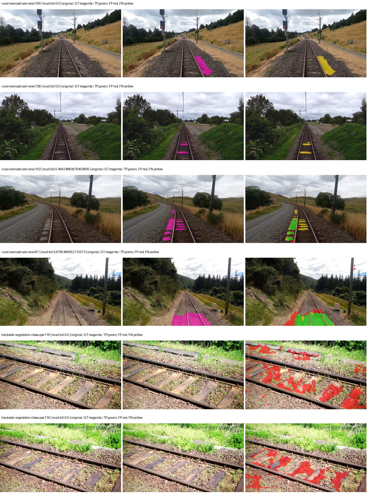
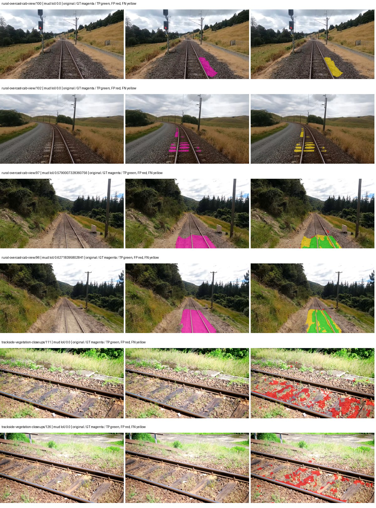
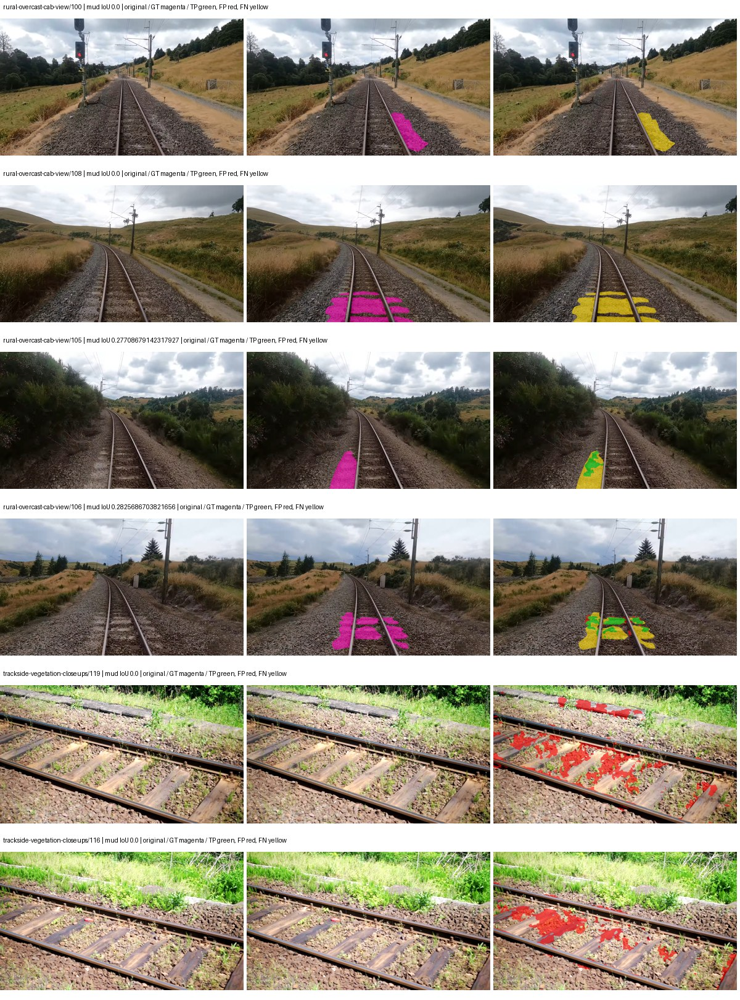
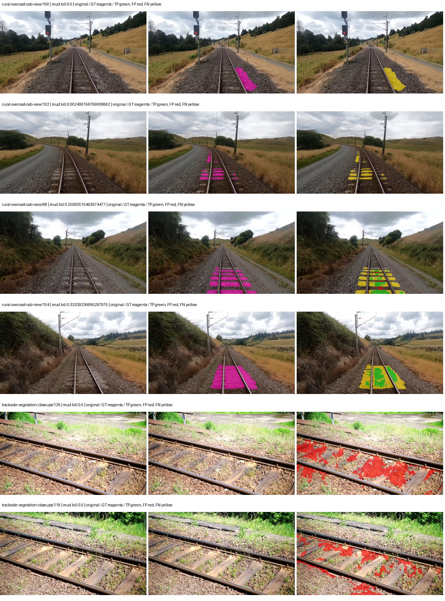

# smp_upernet_resnet101 — paul-test-rtis_v2

[RTIS comparison](../../README.md) · [Full model records](record.json)

Primary selection and early stopping: **mud-pumping validation IoU**. A job is complete only after full statistics and isolated profiling are verified.

| Model | Initialization path | Seed | Status | Steps | Best step | Mud IoU (%) | Mud precision (%) | Mud recall (%) | Final mud IoU (trainer val, %) | mIoU (%) | Fixed GT-class mIoU (%) |
| --- | --- | --- | --- | --- | --- | --- | --- | --- | --- | --- | --- |
| smp_upernet_resnet101 | rtis_only | 0 | completed | 2803 | 1529 | 9.45 | 13.50 | 23.95 | 1.53 | 30.07 | 35.08 |
| smp_upernet_resnet101 | cityscapes_to_rtis | 0 | completed | 4000 | 2803 | 15.21 | 25.29 | 27.62 | 4.11 | 32.57 | 37.99 |
| smp_upernet_resnet101 | railsem19_to_rtis | 0 | completed | 4000 | 2803 | 5.78 | 14.30 | 8.84 | 3.92 | 43.35 | 50.58 |
| smp_upernet_resnet101 | cityscapes_to_railsem19_to_rtis | 0 | completed | 2803 | 1529 | 7.63 | 13.47 | 14.94 | 5.94 | 37.06 | 43.23 |

Training: 205 images. Validation: 37 images. Test: 50 held out. Seeds: [0]. Seed variation measures optimization variability, not independent-recording uncertainty. Historical source checkpoints stay fixed across adaptation seeds.

Training code: `066afb2626398b7be59d4d19f5a0e4644fd59adc`. Split SHA-256: `18a84c0163a65ded46508bcc904c374e5f33ad8a09b8879e3c8add606e86aa9f`.

## rtis_only — seed 0

Status: **completed**. Started: 2026-09-10T03:48:46.611794+00:00. Finished: 2026-09-10T04:31:40.977340+00:00.

Recipe pretrained initializer: `{"arch": "smp", "backbone_path": null, "batch_norm_momentum": null, "checkpoint": null, "classifier_path": null, "drop_path": null, "encoder_name": "resnet101", "encoder_weights": "imagenet", "head": "unified_head", "head_paths": [], "inactive_parameter_paths": [], "local_files_only": false, "lora_alpha": 32, "lora_dropout": 0.05, "lora_r": 16, "lora_targets": [], "native": null, "revision": null, "smp_arch": "UPerNet", "subfolder": null, "trust_remote_code": false, "tuning": "full"}`.

`rtis_only` uses the recipe initializer, which may include pretrained segmentation components. Transfer paths load the exact historical source checkpoint below and reset the classifier; they do not reset all query/decoder features.

Source checkpoint: `Recipe pretrained initialization`.

Config SHA-256: `4d3896dbf46e92c95d25234981d77147974489c6f80addd09104fe9367fb7879`. Weights used for validation: `raw`.

### Mud-pumping and aggregate quality

| Metric | Selected checkpoint | Final training validation |
| --- | --- | --- |
| Mud IoU | 9.45 | 1.53 |
| Mud precision | 13.50 | 1.79 |
| Mud recall | 23.95 | 9.60 |
| Mud Dice/F1 | 17.26 | 3.02 |
| mIoU | 30.07 | 31.54 |
| Mean accuracy | 45.36 | 44.95 |
| Mean precision | 50.36 | 51.03 |
| Mean Dice | 38.93 | 40.75 |
| Mean specificity | 98.86 | 98.83 |
| Pixel accuracy | 81.32 | 80.27 |
| Frequency-weighted IoU | 71.34 | 72.55 |
| Fixed GT-present class mIoU | 35.08 | 36.79 |
| Boundary F1 | 36.03 | 38.30 |

The selected checkpoint has independent evaluation evidence. Final values are the trainer's final validation record, not a new independent evaluation. mIoU averages classes with nonzero union, so false positives on absent classes can change its denominator. The fixed GT-class mean is supplementary and excludes absent classes; their false positives remain in the confusion matrix.

### Resource usage and timing

| Measurement | Value |
| --- | --- |
| Peak training VRAM, retained training invocation (GiB) | 11.09 |
| Peak evaluation VRAM (GiB) | 7.69 |
| Retained training invocation wall time (seconds) | 2381.23 |
| Retained training invocation GPU-hours (one GPU) | 0.66 |
| Evaluation wall time (seconds) | 15.91 |
| Full evaluation pipeline images/second | 2.33 |
| Best full-state checkpoint (MiB) | 860.41 |
| Final full-state checkpoint (MiB) | 860.39 |
| Verified periodic checkpoints removed (GiB) | 4.20 |

VRAM uses the recorded allocator high-water mark; it is not total device usage including CUDA context. Resumed jobs' retained training invocation times and peaks are **not whole-campaign totals**. Earlier invocation resource records are not reconstructed here. Evaluation throughput includes loader, sliding-window inference and metrics; it is not model-only latency/FPS. Missing measurements are shown as —, never inferred from another dataset's run.

### Standardized inference performance

Dedicated model-only profiling waits for an idle worker-locked L40S: BF16, batch 1, 1024x1024, 20 warmup and 100 CUDA-event-timed public forwards. It excludes loading, preprocessing, tiling and metrics.

| Status | Parameters | Weight MiB | FPS | p50 ms | p95 ms | Peak reserved GiB |
| --- | --- | --- | --- | --- | --- | --- |
| complete | 56281941 | 214.70 | 71.16 | 14.00 | 14.57 | 1.44 |

```json
{
  "schema_version": 1,
  "model_id": "smp_upernet_resnet101",
  "measured_at": "2026-09-10T04:31:33+00:00",
  "status": "complete",
  "benchmark_scope": "rtis_selected_checkpoint_model_only",
  "applies_to": [
    "smp_upernet_resnet101--rtis_only--seed-0"
  ],
  "source": {
    "campaign_git_sha": "066afb2626398b7be59d4d19f5a0e4644fd59adc",
    "git_dirty": false,
    "config_hash": "e2a31dab067d",
    "resolved_config": "/data/izadia1/projects/segmentary-runs/paul-test-rtis_v2/seed0-20260909/configs/smp_upernet_resnet101--rtis_only--seed-0.yaml",
    "config_sha256": "4d3896dbf46e92c95d25234981d77147974489c6f80addd09104fe9367fb7879",
    "checkpoint_sha256": "dbdc9b32b66e9fa2560857c3c3c585e3767ca7d23276c0611885afc9278f76b7",
    "checkpoint_global_step": 1529,
    "checkpoint_bytes": 902210142,
    "checkpoint_kind": "resume checkpoint with optimizer and EMA state",
    "weights": "raw",
    "measured_checkpoint_job_id": "smp_upernet_resnet101--rtis_only--seed-0",
    "result_sha256": "0d7a3a73cac941489d48c770d37aaff8420b9efd8b375e4c7a7a64af95877330",
    "result_git_sha": "066afb2626398b7be59d4d19f5a0e4644fd59adc",
    "result_stage": "eval:paul-test-rtis:val",
    "result_seed": 0
  },
  "hardware": {
    "gpu_name": "NVIDIA L40S",
    "gpu_uuid": "GPU-d411d86a-6d1d-1967-55e7-9f9ec85d13f5",
    "logical_device": "cuda:0",
    "physical_visibility_token": "1",
    "compute_capability": [
      8,
      9
    ],
    "total_memory_bytes": 47677177856
  },
  "model": {
    "parameter_count": 56281941,
    "trainable_parameter_count": 56281941,
    "resident_parameter_bytes": 225127764,
    "parameter_dtype_counts": {
      "float32": 56281941
    }
  },
  "contract": {
    "backend": "pytorch",
    "precision": "bf16_autocast",
    "batch_size": 1,
    "input_shape_nchw": [
      1,
      3,
      1024,
      1024
    ],
    "warmup_iterations": 20,
    "measured_iterations": 100,
    "timing": "per-forward CUDA events with end-event synchronization",
    "includes_preprocessing": false,
    "includes_data_loader": false,
    "includes_sliding_window": false,
    "input_resident_on_gpu": true,
    "model_only": true,
    "entrypoint": "public model(image) dense-logits forward"
  },
  "measurements": {
    "latency": {
      "p50_ms": 14.000607967376709,
      "p95_ms": 14.565324592590333,
      "mean_ms": 14.053813428878785,
      "minimum_ms": 13.599743843078613,
      "maximum_ms": 16.02764892578125,
      "fps": 71.15506442864313,
      "raw_ms": [
        13.89568042755127,
        13.601792335510254,
        14.187520027160645,
        13.64684772491455,
        13.686783790588379,
        14.2991361618042,
        13.875200271606445,
        13.599743843078613,
        13.703167915344238,
        13.64684772491455,
        13.65401554107666,
        13.676544189453125,
        14.125056266784668,
        14.545920372009277,
        13.660191535949707,
        14.219136238098145,
        13.626367568969727,
        13.713408470153809,
        13.648863792419434,
        13.708319664001465,
        14.119935989379883,
        14.312447547912598,
        13.758463859558105,
        14.151679992675781,
        14.269375801086426,
        14.036992073059082,
        13.959168434143066,
        14.129152297973633,
        13.666303634643555,
        13.98476791381836,
        14.278656005859375,
        14.009344100952148,
        14.039039611816406,
        13.96735954284668,
        14.094335556030273,
        14.420991897583008,
        14.603263854980469,
        13.987968444824219,
        14.08409595489502,
        14.540800094604492,
        14.017536163330078,
        14.702591896057129,
        14.007231712341309,
        13.605888366699219,
        13.900799751281738,
        13.96121597290039,
        14.245887756347656,
        13.99398422241211,
        13.99187183380127,
        14.034943580627441,
        13.926400184631348,
        13.916159629821777,
        14.543935775756836,
        14.215167999267578,
        14.235648155212402,
        14.449664115905762,
        14.110624313354492,
        13.992959976196289,
        14.095359802246094,
        14.216320037841797,
        14.56332778930664,
        13.728768348693848,
        14.209024429321289,
        13.957119941711426,
        13.97555160522461,
        14.48038387298584,
        13.689855575561523,
        14.046208381652832,
        15.251456260681152,
        16.02764892578125,
        14.39027214050293,
        13.982751846313477,
        14.27353572845459,
        14.107647895812988,
        13.822976112365723,
        13.77791976928711,
        14.127103805541992,
        14.801919937133789,
        13.874176025390625,
        13.723648071289062,
        13.728768348693848,
        13.720576286315918,
        13.956095695495605,
        14.159872055053711,
        14.269439697265625,
        14.041088104248047,
        13.804544448852539,
        13.743103981018066,
        13.775872230529785,
        13.744128227233887,
        14.189472198486328,
        13.884415626525879,
        13.848480224609375,
        13.900799751281738,
        14.162943840026855,
        13.932543754577637,
        14.04412841796875,
        14.023679733276367,
        14.425087928771973,
        13.916128158569336
      ],
      "percentile_method": "numpy linear interpolation"
    },
    "peak_reserved_bytes": 1549795328,
    "memory_kind": "pytorch_cuda_allocator_peak_reserved_excluding_context",
    "benchmark_wall_clock_s": 14.391341652721167
  },
  "started_at": "2026-09-10T04:31:19+00:00",
  "finished_at": "2026-09-10T04:31:33+00:00",
  "environment": {
    "hostname": "hdrfs-app-001",
    "python": "3.11.15",
    "platform": "Linux-5.15.0-139-generic-x86_64-with-glibc2.35",
    "torch": "2.11.0+cu128",
    "torch_cuda": "12.8",
    "cudnn": 91900,
    "driver_version": "570.133.20",
    "cuda_available": true,
    "gpu_count": 1,
    "gpu_names": [
      "NVIDIA L40S"
    ],
    "cuda_visible_devices": "1",
    "packages": {
      "segmentary": "0.1.0",
      "torch": "2.11.0+cu128",
      "torchvision": "0.26.0+cu128",
      "transformers": "5.15.0",
      "timm": "1.0.28",
      "segmentation-models-pytorch": "0.5.0",
      "albumentations": "2.0.8",
      "lightning": "2.6.5",
      "numpy": "2.4.4"
    }
  }
}
```

### Per-class validation results

| Class | GT pixels | IoU (%) | Precision (%) | Recall (%) | Dice (%) | Boundary F1 (%) |
| --- | --- | --- | --- | --- | --- | --- |
| car | 29664 | 24.23 | 70.74 | 26.93 | 39.01 | 42.02 |
| construction | 311585 | 35.08 | 44.06 | 63.27 | 51.94 | 40.83 |
| fence | 265137 | 25.53 | 37.75 | 44.09 | 40.68 | 38.80 |
| mud-pumping | 1226250 | 9.45 | 13.50 | 23.95 | 17.26 | 12.88 |
| on-rails | 0 | 0.00 | 0.00 | — | 0.00 | 0.00 |
| person | 0 | 0.00 | 0.00 | — | 0.00 | 0.00 |
| pole | 628038 | 69.42 | 80.70 | 83.25 | 81.95 | 90.56 |
| rail-embedded | 16799 | 1.26 | 39.71 | 1.29 | 2.49 | 9.00 |
| rail-raised | 2969797 | 68.80 | 72.62 | 92.89 | 81.52 | 84.10 |
| rail-track | 6323197 | 35.21 | 60.70 | 45.60 | 52.08 | 50.66 |
| road | 1048831 | 5.10 | 20.16 | 6.39 | 9.71 | 8.62 |
| sidewalk | 1297367 | 17.30 | 41.17 | 22.98 | 29.50 | 19.87 |
| sky | 19121606 | 93.54 | 99.52 | 93.96 | 96.66 | 80.89 |
| standing-water | 95802 | 2.47 | 2.93 | 13.47 | 4.82 | 9.26 |
| terrain | 39239306 | 86.66 | 88.68 | 97.45 | 92.86 | 61.03 |
| trackbed | 10643081 | 54.66 | 63.37 | 79.90 | 70.68 | 51.59 |
| traffic-light | 19510 | 62.02 | 73.69 | 79.66 | 76.56 | 68.50 |
| traffic-sign | 13285 | 23.06 | 96.56 | 23.25 | 37.48 | 40.35 |
| tram-track | 56179 | 7.00 | 77.24 | 7.15 | 13.09 | 8.26 |
| truck | 0 | 0.00 | 0.00 | — | 0.00 | 0.00 |
| vegetation-overgrowth | 5901821 | 10.68 | 74.49 | 11.09 | 19.30 | 39.39 |

### Full-run accounting

| Measurement | Value |
| --- | --- |
| Full GPU-reserved wall seconds, all recorded worker attempts | 2574.37 |
| Full reserved GPU-hours | 0.72 |
| Whole-run timing complete | True |

| Phase | Wall seconds including failed attempts |
| --- | --- |
| training | 2388.18 |
| diagnostics | 131.06 |
| performance | 23.19 |

GPU-reserved time includes model loading, training, validation, collection, profiling, checkpoint I/O and orchestration while the worker owns one GPU. It is not GPU kernel-active time. Phase timings and sampled device memory/power/utilization are retained separately; sampled device memory is not the allocator high-water mark.

### Train/validation and raw/EMA diagnostics

| Checkpoint / weights / split | Images | Mud IoU (%) | Mud precision (%) | Mud recall (%) |
| --- | --- | --- | --- | --- |
| best-auto-train / raw | 205 | 88.27 | 89.88 | 98.01 |
| best-auto-val / raw | 37 | 9.45 | 13.50 | 23.95 |
| best-alternate-val / ema | 37 | 3.66 | 17.72 | 4.40 |
| final-auto-val / raw | 37 | 1.53 | 1.79 | 9.60 |

Train uses the evaluation transform without augmentation. Compare mud train/validation metrics for the same selected weights. Alternate EMA on running-stat BatchNorm is explicitly uncalibrated and is diagnostic only. Score-threshold curves use uncalibrated normalized scores and are pixel-level diagnostics, not event detection rates or a selected deployment operating point.

### Downloadable evidence

- best-auto-train: [per-image.csv](rtis_only--seed-0/best-auto-train/per-image.csv) · [per-image-confusion.json.gz](rtis_only--seed-0/best-auto-train/per-image-confusion.json.gz) · [groups.json](rtis_only--seed-0/best-auto-train/groups.json) · [mud-score-curves.json](rtis_only--seed-0/best-auto-train/mud-score-curves.json)
- best-auto-val: [per-image.csv](rtis_only--seed-0/best-auto-val/per-image.csv) · [per-image-confusion.json.gz](rtis_only--seed-0/best-auto-val/per-image-confusion.json.gz) · [groups.json](rtis_only--seed-0/best-auto-val/groups.json) · [mud-score-curves.json](rtis_only--seed-0/best-auto-val/mud-score-curves.json) · [examples.jpg](rtis_only--seed-0/best-auto-val/examples.jpg)
- best-alternate-val: [per-image.csv](rtis_only--seed-0/best-alternate-val/per-image.csv) · [per-image-confusion.json.gz](rtis_only--seed-0/best-alternate-val/per-image-confusion.json.gz) · [groups.json](rtis_only--seed-0/best-alternate-val/groups.json) · [mud-score-curves.json](rtis_only--seed-0/best-alternate-val/mud-score-curves.json)
- final-auto-val: [per-image.csv](rtis_only--seed-0/final-auto-val/per-image.csv) · [per-image-confusion.json.gz](rtis_only--seed-0/final-auto-val/per-image-confusion.json.gz) · [groups.json](rtis_only--seed-0/final-auto-val/groups.json) · [mud-score-curves.json](rtis_only--seed-0/final-auto-val/mud-score-curves.json)
- resources: [telemetry.csv](rtis_only--seed-0/resources/telemetry.csv)



Examples are two lowest and two highest mud-IoU positive images, plus up to two negative images with the most false-positive mud pixels. They are targeted diagnostic examples, not random samples. Green: true positive; red: false positive; yellow: false negative. Full predictions remain on HDRFS.

### Validation tracking

| Logged step | Overall mIoU (%) | Mud IoU (%) |
| --- | --- | --- |
| 254 | 26.05 | 1.45 |
| 509 | 26.44 | 9.20 |
| 764 | 29.88 | 1.37 |
| 1019 | 29.02 | 4.01 |
| 1274 | 26.77 | 1.92 |
| 1529 | 30.08 | 9.44 |
| 1784 | 28.18 | 3.62 |
| 2038 | 28.18 | 2.42 |
| 2293 | 28.23 | 6.54 |
| 2548 | 32.07 | 1.49 |
| 2803 | 31.54 | 1.53 |

All retained scalar curves, including training loss and per-class IoU, are in record.json. Observed best mud on a curve is not necessarily a retained checkpoint: the pilot saved its selection-metric-best and final checkpoints. Step logging and checkpoint global_step may differ by one.

### Stopping and checkpoint provenance

```json
{
  "stopping": {
    "actual_steps": 2803,
    "maximum_steps": 4000,
    "min_delta": 0.001,
    "monitor": "val_iou/mud-pumping",
    "patience": 5,
    "reason": "validation_plateau"
  },
  "checkpoints": {
    "best": {
      "path": "/data/izadia1/projects/segmentary-runs/paul-test-rtis_v2/seed0-20260909/future-runs/smp_upernet_resnet101--rtis_only--seed-0_seed0/rtis/best.ckpt",
      "sha256": "dbdc9b32b66e9fa2560857c3c3c585e3767ca7d23276c0611885afc9278f76b7",
      "global_step": 1529,
      "bytes": 902210142
    },
    "final": {
      "path": "/data/izadia1/projects/segmentary-runs/paul-test-rtis_v2/seed0-20260909/future-runs/smp_upernet_resnet101--rtis_only--seed-0_seed0/rtis/last.ckpt",
      "sha256": "acdc2aa454aaed8147dc505442265b5d2039a5eac26011247548ee5f2494efd2",
      "global_step": 2803,
      "bytes": 902187166
    }
  },
  "cleanup_error": null
}
```

### Resolved training, initialization and evaluation settings

The optimizer block is the base configuration. Stage LR scales are applied at runtime, and stage warmup is capped at min(base warmup, floor(stage budget / 10), stage budget - 1): 400 steps for this 4,000-step pilot. Model-internal native input grids may differ from augmentation crops (EoMT uses its 640 grid).

```json
{
  "name": "smp_upernet_resnet101--rtis_only--seed-0",
  "model": {
    "arch": "smp",
    "checkpoint": null,
    "tuning": "full",
    "head": "unified_head",
    "lora_r": 16,
    "lora_alpha": 32,
    "lora_dropout": 0.05,
    "lora_targets": [],
    "drop_path": null,
    "revision": null,
    "subfolder": null,
    "local_files_only": false,
    "trust_remote_code": false,
    "backbone_path": null,
    "head_paths": [],
    "classifier_path": null,
    "inactive_parameter_paths": [],
    "smp_arch": "UPerNet",
    "encoder_name": "resnet101",
    "encoder_weights": "imagenet",
    "native": null,
    "batch_norm_momentum": null
  },
  "space": "paul-test-rtis",
  "taxonomy_root": "/data/izadia1/projects/segmentary-rtis-fullstats-066afb2/taxonomy",
  "output_root": "/data/izadia1/projects/segmentary-runs/paul-test-rtis_v2/seed0-20260909/future-runs",
  "optim": {
    "backbone_lr": 0.0001,
    "head_lr_mult": 10.0,
    "weight_decay": 0.05,
    "llrd": 1.0,
    "warmup_iters": 1500,
    "warmup_ratio": 1e-06,
    "poly_power": 0.9,
    "min_lr_ratio": 0.0,
    "betas": [
      0.9,
      0.999
    ],
    "grad_clip": 1.0
  },
  "train": {
    "iters": 4000,
    "batch_size": 2,
    "accum": 8,
    "num_workers": 2,
    "precision": "bf16-mixed",
    "ema_decay": 0.9998,
    "val_every": 250,
    "ckpt_every": 500,
    "selection_metric": "val_iou/mud-pumping",
    "early_stopping_patience": 5,
    "early_stopping_min_delta": 0.001,
    "seed": 0,
    "devices": 1
  },
  "eval": {
    "sliding_window": true,
    "window": [
      1024,
      1024
    ],
    "stride": [
      768,
      768
    ],
    "batch_size": 1,
    "num_workers": 2,
    "tta_scales": [],
    "tta_flip": false,
    "threshold": 0.5,
    "boundary_tolerance_frac": 0.0075,
    "save_confusion": true
  },
  "loss": {
    "task": "multiclass",
    "activation": "auto",
    "terms": [],
    "aux": "none",
    "aux_weight": 0.0,
    "ce_weight": 1.0,
    "label_smoothing": 0.0,
    "class_weights": null,
    "query": null
  },
  "aug": {
    "crop": [
      1024,
      1024
    ],
    "scale_min": 0.5,
    "scale_max": 2.0,
    "hflip_p": 0.5,
    "color_jitter_p": 0.5,
    "brightness": 0.25,
    "contrast": 0.25,
    "saturation": 0.25,
    "hue": 0.05
  },
  "stages": [
    {
      "name": "rtis",
      "data": [
        {
          "name": "paul-test-rtis",
          "root": "/data/izadia1/datasets/paul-test-rtis_v2",
          "variant": null,
          "split_file": "splits.json",
          "train_split": "train",
          "val_split": "val",
          "limit": null,
          "loader": "folder",
          "mapping": "paul-test-rtis",
          "loader_options": {
            "require_groups": true
          }
        }
      ],
      "iters": null,
      "lr_scale": 1.0,
      "head_group_lr_scale": 1.0,
      "init_from": "pretrained",
      "reset_head": false,
      "freeze": null,
      "sample_weights": null
    }
  ]
}
```

### Hardware and software provenance

```json
{
  "training": {
    "cuda_available": true,
    "cuda_visible_devices": "1",
    "cudnn": 91900,
    "driver_version": "570.133.20",
    "gpu_count": 1,
    "gpu_names": [
      "NVIDIA L40S"
    ],
    "hostname": "hdrfs-app-001",
    "input_normalization": {
      "channel_order": "rgb",
      "mean": [
        0.485,
        0.456,
        0.406
      ],
      "source": "smp_encoder_settings",
      "std": [
        0.229,
        0.224,
        0.225
      ]
    },
    "model_origins": [
      {
        "hf_commit": null,
        "hf_name_or_path": null,
        "module": "model",
        "timm_pretrained": {}
      }
    ],
    "model_parameter_count": 56281941,
    "packages": {
      "albumentations": "2.0.8",
      "lightning": "2.6.5",
      "numpy": "2.4.4",
      "segmentary": "0.1.0",
      "segmentation-models-pytorch": "0.5.0",
      "timm": "1.0.28",
      "torch": "2.11.0+cu128",
      "torchvision": "0.26.0+cu128",
      "transformers": "5.15.0"
    },
    "platform": "Linux-5.15.0-139-generic-x86_64-with-glibc2.35",
    "python": "3.11.15",
    "torch": "2.11.0+cu128",
    "torch_cuda": "12.8",
    "trainable_parameter_count": 56281941,
    "training_stop": {
      "actual_steps": 2803,
      "maximum_steps": 4000,
      "min_delta": 0.001,
      "monitor": "val_iou/mud-pumping",
      "patience": 5,
      "reason": "validation_plateau"
    },
    "validation_weights": "raw"
  },
  "evaluation": {
    "cuda_available": true,
    "cuda_visible_devices": "1",
    "cudnn": 91900,
    "driver_version": "570.133.20",
    "gpu_count": 1,
    "gpu_names": [
      "NVIDIA L40S"
    ],
    "hostname": "hdrfs-app-001",
    "input_normalization": {
      "channel_order": "rgb",
      "mean": [
        0.485,
        0.456,
        0.406
      ],
      "source": "smp_encoder_settings",
      "std": [
        0.229,
        0.224,
        0.225
      ]
    },
    "packages": {
      "albumentations": "2.0.8",
      "lightning": "2.6.5",
      "numpy": "2.4.4",
      "segmentary": "0.1.0",
      "segmentation-models-pytorch": "0.5.0",
      "timm": "1.0.28",
      "torch": "2.11.0+cu128",
      "torchvision": "0.26.0+cu128",
      "transformers": "5.15.0"
    },
    "platform": "Linux-5.15.0-139-generic-x86_64-with-glibc2.35",
    "python": "3.11.15",
    "torch": "2.11.0+cu128",
    "torch_cuda": "12.8"
  }
}
```

## cityscapes_to_rtis — seed 0

Status: **completed**. Started: 2026-09-10T03:52:25.730307+00:00. Finished: 2026-09-10T04:51:53.096747+00:00.

Recipe pretrained initializer: `{"arch": "smp", "backbone_path": null, "batch_norm_momentum": null, "checkpoint": null, "classifier_path": null, "drop_path": null, "encoder_name": "resnet101", "encoder_weights": "imagenet", "head": "unified_head", "head_paths": [], "inactive_parameter_paths": [], "local_files_only": false, "lora_alpha": 32, "lora_dropout": 0.05, "lora_r": 16, "lora_targets": [], "native": null, "revision": null, "smp_arch": "UPerNet", "subfolder": null, "trust_remote_code": false, "tuning": "full"}`.

`rtis_only` uses the recipe initializer, which may include pretrained segmentation components. Transfer paths load the exact historical source checkpoint below and reset the classifier; they do not reset all query/decoder features.

Source checkpoint: `{'name': 'smp_upernet_resnet101--cityscapes--seed-0', 'model': 'smp_upernet_resnet101', 'protocol': 'cityscapes', 'config': '/data/izadia1/projects/segmentary-runs/all-model-city-rail-seed0-rail20-b9eb3e1/accepted/smp_upernet_resnet101--cityscapes--seed-0/resolved-config.yaml', 'checkpoint': '/data/izadia1/projects/segmentary-runs/all-model-city-rail-seed0-a7c0b67/jobs/smp_upernet_resnet101--cityscapes--seed-0/attempt-001/train/smp_upernet_resnet101--cityscapes_seed0/cityscapes/last.ckpt', 'recorded_sha256': '18a79d5ff0e4b11842213d5546a334f1e7e30b81c87679fab1659eecb12bcb7a', 'exists': True}`.

Config SHA-256: `aadaf306149d656dac71e743c90b4164652258c0f0a3a557dd6bac92b00b17d9`. Weights used for validation: `raw`.

### Mud-pumping and aggregate quality

| Metric | Selected checkpoint | Final training validation |
| --- | --- | --- |
| Mud IoU | 15.21 | 4.11 |
| Mud precision | 25.29 | 5.81 |
| Mud recall | 27.62 | 12.30 |
| Mud Dice/F1 | 26.41 | 7.89 |
| mIoU | 32.57 | 32.12 |
| Mean accuracy | 46.73 | 47.45 |
| Mean precision | 48.64 | 47.08 |
| Mean Dice | 41.96 | 41.04 |
| Mean specificity | 98.87 | 98.73 |
| Pixel accuracy | 82.69 | 80.02 |
| Frequency-weighted IoU | 72.34 | 69.98 |
| Fixed GT-present class mIoU | 37.99 | 37.48 |
| Boundary F1 | 38.67 | 36.94 |

The selected checkpoint has independent evaluation evidence. Final values are the trainer's final validation record, not a new independent evaluation. mIoU averages classes with nonzero union, so false positives on absent classes can change its denominator. The fixed GT-class mean is supplementary and excludes absent classes; their false positives remain in the confusion matrix.

### Resource usage and timing

| Measurement | Value |
| --- | --- |
| Peak training VRAM, retained training invocation (GiB) | 11.08 |
| Peak evaluation VRAM (GiB) | 7.69 |
| Retained training invocation wall time (seconds) | 3377.99 |
| Retained training invocation GPU-hours (one GPU) | 0.94 |
| Evaluation wall time (seconds) | 16.14 |
| Full evaluation pipeline images/second | 2.29 |
| Best full-state checkpoint (MiB) | 860.41 |
| Final full-state checkpoint (MiB) | 860.39 |
| Verified periodic checkpoints removed (GiB) | 6.72 |

VRAM uses the recorded allocator high-water mark; it is not total device usage including CUDA context. Resumed jobs' retained training invocation times and peaks are **not whole-campaign totals**. Earlier invocation resource records are not reconstructed here. Evaluation throughput includes loader, sliding-window inference and metrics; it is not model-only latency/FPS. Missing measurements are shown as —, never inferred from another dataset's run.

### Standardized inference performance

Dedicated model-only profiling waits for an idle worker-locked L40S: BF16, batch 1, 1024x1024, 20 warmup and 100 CUDA-event-timed public forwards. It excludes loading, preprocessing, tiling and metrics.

| Status | Parameters | Weight MiB | FPS | p50 ms | p95 ms | Peak reserved GiB |
| --- | --- | --- | --- | --- | --- | --- |
| complete | 56281941 | 214.70 | 72.11 | 13.67 | 14.59 | 1.54 |

```json
{
  "schema_version": 1,
  "model_id": "smp_upernet_resnet101",
  "measured_at": "2026-09-10T04:51:43+00:00",
  "status": "complete",
  "benchmark_scope": "rtis_selected_checkpoint_model_only",
  "applies_to": [
    "smp_upernet_resnet101--cityscapes_to_rtis--seed-0"
  ],
  "source": {
    "campaign_git_sha": "066afb2626398b7be59d4d19f5a0e4644fd59adc",
    "git_dirty": false,
    "config_hash": "49e38769a048",
    "resolved_config": "/data/izadia1/projects/segmentary-runs/paul-test-rtis_v2/seed0-20260909/configs/smp_upernet_resnet101--cityscapes_to_rtis--seed-0.yaml",
    "config_sha256": "aadaf306149d656dac71e743c90b4164652258c0f0a3a557dd6bac92b00b17d9",
    "checkpoint_sha256": "7cb602a25f47832bd0af3369ffb04b437174b997feb99b1789104436ade10e2a",
    "checkpoint_global_step": 2803,
    "checkpoint_bytes": 902210142,
    "checkpoint_kind": "resume checkpoint with optimizer and EMA state",
    "weights": "raw",
    "measured_checkpoint_job_id": "smp_upernet_resnet101--cityscapes_to_rtis--seed-0",
    "result_sha256": "e8d377babc150a71316d8d459f34cb898576b6f81dc78b244ed809e926da5cf0",
    "result_git_sha": "066afb2626398b7be59d4d19f5a0e4644fd59adc",
    "result_stage": "eval:paul-test-rtis:val",
    "result_seed": 0
  },
  "hardware": {
    "gpu_name": "NVIDIA L40S",
    "gpu_uuid": "GPU-931d0911-fc78-1638-e3d7-1ba868cbd286",
    "logical_device": "cuda:0",
    "physical_visibility_token": "2",
    "compute_capability": [
      8,
      9
    ],
    "total_memory_bytes": 47677177856
  },
  "model": {
    "parameter_count": 56281941,
    "trainable_parameter_count": 56281941,
    "resident_parameter_bytes": 225127764,
    "parameter_dtype_counts": {
      "float32": 56281941
    }
  },
  "contract": {
    "backend": "pytorch",
    "precision": "bf16_autocast",
    "batch_size": 1,
    "input_shape_nchw": [
      1,
      3,
      1024,
      1024
    ],
    "warmup_iterations": 20,
    "measured_iterations": 100,
    "timing": "per-forward CUDA events with end-event synchronization",
    "includes_preprocessing": false,
    "includes_data_loader": false,
    "includes_sliding_window": false,
    "input_resident_on_gpu": true,
    "model_only": true,
    "entrypoint": "public model(image) dense-logits forward"
  },
  "measurements": {
    "latency": {
      "p50_ms": 13.670400142669678,
      "p95_ms": 14.594248199462891,
      "mean_ms": 13.868367366790771,
      "minimum_ms": 13.509632110595703,
      "maximum_ms": 17.916927337646484,
      "fps": 72.10654099015308,
      "raw_ms": [
        15.015935897827148,
        14.15782356262207,
        13.618176460266113,
        13.708288192749023,
        14.728192329406738,
        14.269439697265625,
        13.607935905456543,
        13.658111572265625,
        13.600768089294434,
        14.1844482421875,
        13.52188777923584,
        13.561856269836426,
        14.238719940185547,
        14.214143753051758,
        13.509632110595703,
        13.618176460266113,
        13.6048002243042,
        13.631487846374512,
        13.608960151672363,
        13.56287956237793,
        13.591551780700684,
        13.579392433166504,
        13.593536376953125,
        13.569024085998535,
        13.627360343933105,
        13.709312438964844,
        13.97657585144043,
        13.896703720092773,
        13.5731201171875,
        14.038111686706543,
        13.668352127075195,
        13.595647811889648,
        13.628416061401367,
        14.221311569213867,
        13.57414436340332,
        13.619199752807617,
        13.628416061401367,
        13.56281566619873,
        13.624287605285645,
        14.531583786010742,
        13.56492805480957,
        13.585408210754395,
        13.58950424194336,
        13.561856269836426,
        13.710335731506348,
        13.684736251831055,
        13.67244815826416,
        13.733887672424316,
        15.915007591247559,
        14.144512176513672,
        13.814720153808594,
        13.677568435668945,
        13.630463600158691,
        13.67859172821045,
        13.599743843078613,
        13.96940803527832,
        14.145471572875977,
        13.793279647827148,
        13.723648071289062,
        14.148608207702637,
        14.312576293945312,
        13.692928314208984,
        13.543423652648926,
        13.651968002319336,
        13.578240394592285,
        13.592576026916504,
        13.611007690429688,
        13.584383964538574,
        13.735936164855957,
        14.018560409545898,
        13.865983963012695,
        14.354432106018066,
        14.223360061645508,
        14.695327758789062,
        14.58892822265625,
        13.883392333984375,
        13.652992248535156,
        13.660160064697266,
        13.977503776550293,
        13.595616340637207,
        17.916927337646484,
        13.932543754577637,
        13.58028793334961,
        13.541376113891602,
        13.593600273132324,
        13.603839874267578,
        13.833120346069336,
        13.799424171447754,
        14.095359802246094,
        14.241791725158691,
        13.676544189453125,
        13.632512092590332,
        13.592576026916504,
        13.87929630279541,
        13.856767654418945,
        13.576191902160645,
        13.55571174621582,
        13.777024269104004,
        13.990912437438965,
        13.566975593566895
      ],
      "percentile_method": "numpy linear interpolation"
    },
    "peak_reserved_bytes": 1652555776,
    "memory_kind": "pytorch_cuda_allocator_peak_reserved_excluding_context",
    "benchmark_wall_clock_s": 14.087380595505238
  },
  "started_at": "2026-09-10T04:51:29+00:00",
  "finished_at": "2026-09-10T04:51:43+00:00",
  "environment": {
    "hostname": "hdrfs-app-001",
    "python": "3.11.15",
    "platform": "Linux-5.15.0-139-generic-x86_64-with-glibc2.35",
    "torch": "2.11.0+cu128",
    "torch_cuda": "12.8",
    "cudnn": 91900,
    "driver_version": "570.133.20",
    "cuda_available": true,
    "gpu_count": 1,
    "gpu_names": [
      "NVIDIA L40S"
    ],
    "cuda_visible_devices": "2",
    "packages": {
      "segmentary": "0.1.0",
      "torch": "2.11.0+cu128",
      "torchvision": "0.26.0+cu128",
      "transformers": "5.15.0",
      "timm": "1.0.28",
      "segmentation-models-pytorch": "0.5.0",
      "albumentations": "2.0.8",
      "lightning": "2.6.5",
      "numpy": "2.4.4"
    }
  }
}
```

### Per-class validation results

| Class | GT pixels | IoU (%) | Precision (%) | Recall (%) | Dice (%) | Boundary F1 (%) |
| --- | --- | --- | --- | --- | --- | --- |
| car | 29664 | 40.44 | 78.32 | 45.53 | 57.59 | 46.16 |
| construction | 311585 | 35.15 | 39.32 | 76.85 | 52.02 | 35.11 |
| fence | 265137 | 18.55 | 63.73 | 20.74 | 31.29 | 40.59 |
| mud-pumping | 1226250 | 15.21 | 25.29 | 27.62 | 26.41 | 15.46 |
| on-rails | 0 | 0.00 | 0.00 | — | 0.00 | 0.00 |
| person | 0 | 0.00 | 0.00 | — | 0.00 | 0.00 |
| pole | 628038 | 71.45 | 87.65 | 79.45 | 83.35 | 91.86 |
| rail-embedded | 16799 | 0.00 | 0.00 | 0.00 | 0.00 | 0.00 |
| rail-raised | 2969797 | 72.76 | 83.15 | 85.35 | 84.24 | 87.82 |
| rail-track | 6323197 | 35.08 | 60.20 | 45.66 | 51.94 | 51.97 |
| road | 1048831 | 11.66 | 42.87 | 13.81 | 20.88 | 17.00 |
| sidewalk | 1297367 | 15.66 | 40.78 | 20.27 | 27.08 | 9.09 |
| sky | 19121606 | 92.92 | 99.37 | 93.47 | 96.33 | 81.68 |
| standing-water | 95802 | 1.82 | 2.40 | 7.05 | 3.58 | 17.01 |
| terrain | 39239306 | 84.53 | 85.88 | 98.17 | 91.61 | 54.24 |
| trackbed | 10643081 | 56.33 | 67.96 | 76.70 | 72.07 | 52.12 |
| traffic-light | 19510 | 54.35 | 77.30 | 64.67 | 70.42 | 71.34 |
| traffic-sign | 13285 | 42.42 | 78.84 | 47.87 | 59.57 | 64.50 |
| tram-track | 56179 | 0.40 | 2.92 | 0.47 | 0.80 | 8.10 |
| truck | 0 | 0.00 | 0.00 | — | 0.00 | 0.00 |
| vegetation-overgrowth | 5901821 | 35.18 | 85.54 | 37.41 | 52.05 | 67.98 |

### Full-run accounting

| Measurement | Value |
| --- | --- |
| Full GPU-reserved wall seconds, all recorded worker attempts | 3568.09 |
| Full reserved GPU-hours | 0.99 |
| Whole-run timing complete | True |

| Phase | Wall seconds including failed attempts |
| --- | --- |
| training | 3385.78 |
| diagnostics | 125.46 |
| performance | 22.42 |

GPU-reserved time includes model loading, training, validation, collection, profiling, checkpoint I/O and orchestration while the worker owns one GPU. It is not GPU kernel-active time. Phase timings and sampled device memory/power/utilization are retained separately; sampled device memory is not the allocator high-water mark.

### Train/validation and raw/EMA diagnostics

| Checkpoint / weights / split | Images | Mud IoU (%) | Mud precision (%) | Mud recall (%) |
| --- | --- | --- | --- | --- |
| best-auto-train / raw | 205 | 87.04 | 93.98 | 92.18 |
| best-auto-val / raw | 37 | 15.21 | 25.29 | 27.62 |
| best-alternate-val / ema | 37 | 6.32 | 7.19 | 34.44 |
| final-auto-val / raw | 37 | 4.11 | 5.80 | 12.32 |

Train uses the evaluation transform without augmentation. Compare mud train/validation metrics for the same selected weights. Alternate EMA on running-stat BatchNorm is explicitly uncalibrated and is diagnostic only. Score-threshold curves use uncalibrated normalized scores and are pixel-level diagnostics, not event detection rates or a selected deployment operating point.

### Downloadable evidence

- best-auto-train: [per-image.csv](cityscapes_to_rtis--seed-0/best-auto-train/per-image.csv) · [per-image-confusion.json.gz](cityscapes_to_rtis--seed-0/best-auto-train/per-image-confusion.json.gz) · [groups.json](cityscapes_to_rtis--seed-0/best-auto-train/groups.json) · [mud-score-curves.json](cityscapes_to_rtis--seed-0/best-auto-train/mud-score-curves.json)
- best-auto-val: [per-image.csv](cityscapes_to_rtis--seed-0/best-auto-val/per-image.csv) · [per-image-confusion.json.gz](cityscapes_to_rtis--seed-0/best-auto-val/per-image-confusion.json.gz) · [groups.json](cityscapes_to_rtis--seed-0/best-auto-val/groups.json) · [mud-score-curves.json](cityscapes_to_rtis--seed-0/best-auto-val/mud-score-curves.json) · [examples.jpg](cityscapes_to_rtis--seed-0/best-auto-val/examples.jpg)
- best-alternate-val: [per-image.csv](cityscapes_to_rtis--seed-0/best-alternate-val/per-image.csv) · [per-image-confusion.json.gz](cityscapes_to_rtis--seed-0/best-alternate-val/per-image-confusion.json.gz) · [groups.json](cityscapes_to_rtis--seed-0/best-alternate-val/groups.json) · [mud-score-curves.json](cityscapes_to_rtis--seed-0/best-alternate-val/mud-score-curves.json)
- final-auto-val: [per-image.csv](cityscapes_to_rtis--seed-0/final-auto-val/per-image.csv) · [per-image-confusion.json.gz](cityscapes_to_rtis--seed-0/final-auto-val/per-image-confusion.json.gz) · [groups.json](cityscapes_to_rtis--seed-0/final-auto-val/groups.json) · [mud-score-curves.json](cityscapes_to_rtis--seed-0/final-auto-val/mud-score-curves.json)
- resources: [telemetry.csv](cityscapes_to_rtis--seed-0/resources/telemetry.csv)



Examples are two lowest and two highest mud-IoU positive images, plus up to two negative images with the most false-positive mud pixels. They are targeted diagnostic examples, not random samples. Green: true positive; red: false positive; yellow: false negative. Full predictions remain on HDRFS.

### Validation tracking

| Logged step | Overall mIoU (%) | Mud IoU (%) |
| --- | --- | --- |
| 254 | 23.04 | 1.74 |
| 509 | 23.24 | 7.27 |
| 764 | 24.91 | 2.45 |
| 1019 | 26.79 | 3.56 |
| 1274 | 28.13 | 4.38 |
| 1529 | 30.73 | 7.64 |
| 1784 | 30.07 | 2.45 |
| 2038 | 30.18 | 5.04 |
| 2293 | 31.89 | 5.11 |
| 2548 | 30.06 | 1.38 |
| 2803 | 32.59 | 15.21 |
| 3058 | 33.56 | 3.83 |
| 3313 | 31.45 | 3.34 |
| 3568 | 31.05 | 2.62 |
| 3823 | 30.74 | 3.87 |
| 4000 | 32.12 | 4.11 |

All retained scalar curves, including training loss and per-class IoU, are in record.json. Observed best mud on a curve is not necessarily a retained checkpoint: the pilot saved its selection-metric-best and final checkpoints. Step logging and checkpoint global_step may differ by one.

### Stopping and checkpoint provenance

```json
{
  "stopping": {
    "actual_steps": 4000,
    "maximum_steps": 4000,
    "min_delta": 0.001,
    "monitor": "val_iou/mud-pumping",
    "patience": 5,
    "reason": "budget_complete"
  },
  "checkpoints": {
    "best": {
      "path": "/data/izadia1/projects/segmentary-runs/paul-test-rtis_v2/seed0-20260909/future-runs/smp_upernet_resnet101--cityscapes_to_rtis--seed-0_seed0/rtis/best.ckpt",
      "sha256": "7cb602a25f47832bd0af3369ffb04b437174b997feb99b1789104436ade10e2a",
      "global_step": 2803,
      "bytes": 902210142
    },
    "final": {
      "path": "/data/izadia1/projects/segmentary-runs/paul-test-rtis_v2/seed0-20260909/future-runs/smp_upernet_resnet101--cityscapes_to_rtis--seed-0_seed0/rtis/last.ckpt",
      "sha256": "541f7032e9769b20f941c87eef7d51be77b9347f3332308e2bf79492b92925b5",
      "global_step": 4000,
      "bytes": 902187038
    }
  },
  "cleanup_error": null
}
```

### Resolved training, initialization and evaluation settings

The optimizer block is the base configuration. Stage LR scales are applied at runtime, and stage warmup is capped at min(base warmup, floor(stage budget / 10), stage budget - 1): 400 steps for this 4,000-step pilot. Model-internal native input grids may differ from augmentation crops (EoMT uses its 640 grid).

```json
{
  "name": "smp_upernet_resnet101--cityscapes_to_rtis--seed-0",
  "model": {
    "arch": "smp",
    "checkpoint": null,
    "tuning": "full",
    "head": "unified_head",
    "lora_r": 16,
    "lora_alpha": 32,
    "lora_dropout": 0.05,
    "lora_targets": [],
    "drop_path": null,
    "revision": null,
    "subfolder": null,
    "local_files_only": false,
    "trust_remote_code": false,
    "backbone_path": null,
    "head_paths": [],
    "classifier_path": null,
    "inactive_parameter_paths": [],
    "smp_arch": "UPerNet",
    "encoder_name": "resnet101",
    "encoder_weights": "imagenet",
    "native": null,
    "batch_norm_momentum": null
  },
  "space": "paul-test-rtis",
  "taxonomy_root": "/data/izadia1/projects/segmentary-rtis-fullstats-066afb2/taxonomy",
  "output_root": "/data/izadia1/projects/segmentary-runs/paul-test-rtis_v2/seed0-20260909/future-runs",
  "optim": {
    "backbone_lr": 0.0001,
    "head_lr_mult": 10.0,
    "weight_decay": 0.05,
    "llrd": 1.0,
    "warmup_iters": 1500,
    "warmup_ratio": 1e-06,
    "poly_power": 0.9,
    "min_lr_ratio": 0.0,
    "betas": [
      0.9,
      0.999
    ],
    "grad_clip": 1.0
  },
  "train": {
    "iters": 4000,
    "batch_size": 2,
    "accum": 8,
    "num_workers": 2,
    "precision": "bf16-mixed",
    "ema_decay": 0.9998,
    "val_every": 250,
    "ckpt_every": 500,
    "selection_metric": "val_iou/mud-pumping",
    "early_stopping_patience": 5,
    "early_stopping_min_delta": 0.001,
    "seed": 0,
    "devices": 1
  },
  "eval": {
    "sliding_window": true,
    "window": [
      1024,
      1024
    ],
    "stride": [
      768,
      768
    ],
    "batch_size": 1,
    "num_workers": 2,
    "tta_scales": [],
    "tta_flip": false,
    "threshold": 0.5,
    "boundary_tolerance_frac": 0.0075,
    "save_confusion": true
  },
  "loss": {
    "task": "multiclass",
    "activation": "auto",
    "terms": [],
    "aux": "none",
    "aux_weight": 0.0,
    "ce_weight": 1.0,
    "label_smoothing": 0.0,
    "class_weights": null,
    "query": null
  },
  "aug": {
    "crop": [
      1024,
      1024
    ],
    "scale_min": 0.5,
    "scale_max": 2.0,
    "hflip_p": 0.5,
    "color_jitter_p": 0.5,
    "brightness": 0.25,
    "contrast": 0.25,
    "saturation": 0.25,
    "hue": 0.05
  },
  "stages": [
    {
      "name": "rtis",
      "data": [
        {
          "name": "paul-test-rtis",
          "root": "/data/izadia1/datasets/paul-test-rtis_v2",
          "variant": null,
          "split_file": "splits.json",
          "train_split": "train",
          "val_split": "val",
          "limit": null,
          "loader": "folder",
          "mapping": "paul-test-rtis",
          "loader_options": {
            "require_groups": true
          }
        }
      ],
      "iters": null,
      "lr_scale": 0.1,
      "head_group_lr_scale": 1.0,
      "init_from": "/data/izadia1/projects/segmentary-runs/all-model-city-rail-seed0-a7c0b67/jobs/smp_upernet_resnet101--cityscapes--seed-0/attempt-001/train/smp_upernet_resnet101--cityscapes_seed0/cityscapes/last.ckpt",
      "reset_head": true,
      "freeze": null,
      "sample_weights": null
    }
  ]
}
```

### Hardware and software provenance

```json
{
  "training": {
    "cuda_available": true,
    "cuda_visible_devices": "2",
    "cudnn": 91900,
    "driver_version": "570.133.20",
    "gpu_count": 1,
    "gpu_names": [
      "NVIDIA L40S"
    ],
    "hostname": "hdrfs-app-001",
    "input_normalization": {
      "channel_order": "rgb",
      "mean": [
        0.485,
        0.456,
        0.406
      ],
      "source": "smp_encoder_settings",
      "std": [
        0.229,
        0.224,
        0.225
      ]
    },
    "model_origins": [
      {
        "hf_commit": null,
        "hf_name_or_path": null,
        "module": "model",
        "timm_pretrained": {}
      }
    ],
    "model_parameter_count": 56281941,
    "packages": {
      "albumentations": "2.0.8",
      "lightning": "2.6.5",
      "numpy": "2.4.4",
      "segmentary": "0.1.0",
      "segmentation-models-pytorch": "0.5.0",
      "timm": "1.0.28",
      "torch": "2.11.0+cu128",
      "torchvision": "0.26.0+cu128",
      "transformers": "5.15.0"
    },
    "platform": "Linux-5.15.0-139-generic-x86_64-with-glibc2.35",
    "python": "3.11.15",
    "torch": "2.11.0+cu128",
    "torch_cuda": "12.8",
    "trainable_parameter_count": 56281941,
    "training_stop": {
      "actual_steps": 4000,
      "maximum_steps": 4000,
      "min_delta": 0.001,
      "monitor": "val_iou/mud-pumping",
      "patience": 5,
      "reason": "budget_complete"
    },
    "validation_weights": "raw"
  },
  "evaluation": {
    "cuda_available": true,
    "cuda_visible_devices": "2",
    "cudnn": 91900,
    "driver_version": "570.133.20",
    "gpu_count": 1,
    "gpu_names": [
      "NVIDIA L40S"
    ],
    "hostname": "hdrfs-app-001",
    "input_normalization": {
      "channel_order": "rgb",
      "mean": [
        0.485,
        0.456,
        0.406
      ],
      "source": "smp_encoder_settings",
      "std": [
        0.229,
        0.224,
        0.225
      ]
    },
    "packages": {
      "albumentations": "2.0.8",
      "lightning": "2.6.5",
      "numpy": "2.4.4",
      "segmentary": "0.1.0",
      "segmentation-models-pytorch": "0.5.0",
      "timm": "1.0.28",
      "torch": "2.11.0+cu128",
      "torchvision": "0.26.0+cu128",
      "transformers": "5.15.0"
    },
    "platform": "Linux-5.15.0-139-generic-x86_64-with-glibc2.35",
    "python": "3.11.15",
    "torch": "2.11.0+cu128",
    "torch_cuda": "12.8"
  }
}
```

## railsem19_to_rtis — seed 0

Status: **completed**. Started: 2026-09-10T03:57:43.412606+00:00. Finished: 2026-09-10T04:57:15.945141+00:00.

Recipe pretrained initializer: `{"arch": "smp", "backbone_path": null, "batch_norm_momentum": null, "checkpoint": null, "classifier_path": null, "drop_path": null, "encoder_name": "resnet101", "encoder_weights": "imagenet", "head": "unified_head", "head_paths": [], "inactive_parameter_paths": [], "local_files_only": false, "lora_alpha": 32, "lora_dropout": 0.05, "lora_r": 16, "lora_targets": [], "native": null, "revision": null, "smp_arch": "UPerNet", "subfolder": null, "trust_remote_code": false, "tuning": "full"}`.

`rtis_only` uses the recipe initializer, which may include pretrained segmentation components. Transfer paths load the exact historical source checkpoint below and reset the classifier; they do not reset all query/decoder features.

Source checkpoint: `{'name': 'smp_upernet_resnet101--railsem19--seed-0', 'model': 'smp_upernet_resnet101', 'protocol': 'railsem19', 'config': '/data/izadia1/projects/segmentary-runs/all-model-city-rail-seed0-rail20-b9eb3e1/accepted/smp_upernet_resnet101--railsem19--seed-0/resolved-config.yaml', 'checkpoint': '/data/izadia1/projects/segmentary-runs/all-model-city-rail-seed0-a7c0b67/jobs/smp_upernet_resnet101--railsem19--seed-0/attempt-001/train/smp_upernet_resnet101--railsem19_seed0/railsem19/last.ckpt', 'recorded_sha256': '786e3d81df9181457bb198b058bfd34662540be50b92ea3c4a9c4a3f361f8087', 'exists': True}`.

Config SHA-256: `3f39fd876d821ea2209ef99d69bf07277068c3ed0a197d58bf550735114cf4e4`. Weights used for validation: `raw`.

### Mud-pumping and aggregate quality

| Metric | Selected checkpoint | Final training validation |
| --- | --- | --- |
| Mud IoU | 5.78 | 3.92 |
| Mud precision | 14.30 | 10.84 |
| Mud recall | 8.84 | 5.79 |
| Mud Dice/F1 | 10.93 | 7.55 |
| mIoU | 43.35 | 42.75 |
| Mean accuracy | 61.11 | 59.70 |
| Mean precision | 58.37 | 57.72 |
| Mean Dice | 52.72 | 51.71 |
| Mean specificity | 98.94 | 98.91 |
| Pixel accuracy | 83.93 | 83.31 |
| Frequency-weighted IoU | 73.62 | 72.87 |
| Fixed GT-present class mIoU | 50.58 | 49.88 |
| Boundary F1 | 49.22 | 49.16 |

The selected checkpoint has independent evaluation evidence. Final values are the trainer's final validation record, not a new independent evaluation. mIoU averages classes with nonzero union, so false positives on absent classes can change its denominator. The fixed GT-class mean is supplementary and excludes absent classes; their false positives remain in the confusion matrix.

### Resource usage and timing

| Measurement | Value |
| --- | --- |
| Peak training VRAM, retained training invocation (GiB) | 11.09 |
| Peak evaluation VRAM (GiB) | 7.69 |
| Retained training invocation wall time (seconds) | 3386.30 |
| Retained training invocation GPU-hours (one GPU) | 0.94 |
| Evaluation wall time (seconds) | 15.94 |
| Full evaluation pipeline images/second | 2.32 |
| Best full-state checkpoint (MiB) | 860.41 |
| Final full-state checkpoint (MiB) | 860.39 |
| Verified periodic checkpoints removed (GiB) | 6.72 |

VRAM uses the recorded allocator high-water mark; it is not total device usage including CUDA context. Resumed jobs' retained training invocation times and peaks are **not whole-campaign totals**. Earlier invocation resource records are not reconstructed here. Evaluation throughput includes loader, sliding-window inference and metrics; it is not model-only latency/FPS. Missing measurements are shown as —, never inferred from another dataset's run.

### Standardized inference performance

Dedicated model-only profiling waits for an idle worker-locked L40S: BF16, batch 1, 1024x1024, 20 warmup and 100 CUDA-event-timed public forwards. It excludes loading, preprocessing, tiling and metrics.

| Status | Parameters | Weight MiB | FPS | p50 ms | p95 ms | Peak reserved GiB |
| --- | --- | --- | --- | --- | --- | --- |
| complete | 56281941 | 214.70 | 72.01 | 13.47 | 16.98 | 1.54 |

```json
{
  "schema_version": 1,
  "model_id": "smp_upernet_resnet101",
  "measured_at": "2026-09-10T04:57:06+00:00",
  "status": "complete",
  "benchmark_scope": "rtis_selected_checkpoint_model_only",
  "applies_to": [
    "smp_upernet_resnet101--railsem19_to_rtis--seed-0"
  ],
  "source": {
    "campaign_git_sha": "066afb2626398b7be59d4d19f5a0e4644fd59adc",
    "git_dirty": false,
    "config_hash": "ef89d2540a84",
    "resolved_config": "/data/izadia1/projects/segmentary-runs/paul-test-rtis_v2/seed0-20260909/configs/smp_upernet_resnet101--railsem19_to_rtis--seed-0.yaml",
    "config_sha256": "3f39fd876d821ea2209ef99d69bf07277068c3ed0a197d58bf550735114cf4e4",
    "checkpoint_sha256": "42d866c3bf571b497d6adf11fbfe256e7654a5413a1f70381eff4e06ae40d309",
    "checkpoint_global_step": 2803,
    "checkpoint_bytes": 902210142,
    "checkpoint_kind": "resume checkpoint with optimizer and EMA state",
    "weights": "raw",
    "measured_checkpoint_job_id": "smp_upernet_resnet101--railsem19_to_rtis--seed-0",
    "result_sha256": "b00a5b3a7292d9fe626e745c1664eed2713ac81935433f8b57873573ea594c3e",
    "result_git_sha": "066afb2626398b7be59d4d19f5a0e4644fd59adc",
    "result_stage": "eval:paul-test-rtis:val",
    "result_seed": 0
  },
  "hardware": {
    "gpu_name": "NVIDIA L40S",
    "gpu_uuid": "GPU-1c9b612f-e0b5-fbbc-150f-8c2ef13453c9",
    "logical_device": "cuda:0",
    "physical_visibility_token": "5",
    "compute_capability": [
      8,
      9
    ],
    "total_memory_bytes": 47677177856
  },
  "model": {
    "parameter_count": 56281941,
    "trainable_parameter_count": 56281941,
    "resident_parameter_bytes": 225127764,
    "parameter_dtype_counts": {
      "float32": 56281941
    }
  },
  "contract": {
    "backend": "pytorch",
    "precision": "bf16_autocast",
    "batch_size": 1,
    "input_shape_nchw": [
      1,
      3,
      1024,
      1024
    ],
    "warmup_iterations": 20,
    "measured_iterations": 100,
    "timing": "per-forward CUDA events with end-event synchronization",
    "includes_preprocessing": false,
    "includes_data_loader": false,
    "includes_sliding_window": false,
    "input_resident_on_gpu": true,
    "model_only": true,
    "entrypoint": "public model(image) dense-logits forward"
  },
  "measurements": {
    "latency": {
      "p50_ms": 13.47379207611084,
      "p95_ms": 16.97622947692871,
      "mean_ms": 13.887765140533448,
      "minimum_ms": 13.37548828125,
      "maximum_ms": 17.20832061767578,
      "fps": 72.00582598285419,
      "raw_ms": [
        13.68166446685791,
        13.414400100708008,
        13.459456443786621,
        14.798848152160645,
        13.576191902160645,
        13.413375854492188,
        14.016511917114258,
        13.438976287841797,
        13.496352195739746,
        13.423583984375,
        13.495295524597168,
        16.96460723876953,
        17.20832061767578,
        14.624768257141113,
        13.531135559082031,
        13.378560066223145,
        13.447168350219727,
        13.441023826599121,
        13.37548828125,
        13.419520378112793,
        13.486080169677734,
        13.407232284545898,
        13.424639701843262,
        13.577216148376465,
        13.441023826599121,
        13.384703636169434,
        13.407232284545898,
        13.429759979248047,
        13.460479736328125,
        13.395968437194824,
        13.408255577087402,
        13.461503982543945,
        13.507583618164062,
        13.447168350219727,
        13.419520378112793,
        13.393919944763184,
        13.576191902160645,
        13.431808471679688,
        13.38368034362793,
        13.478912353515625,
        14.135295867919922,
        13.447168350219727,
        13.423616409301758,
        13.388799667358398,
        13.511712074279785,
        16.474111557006836,
        17.150976181030273,
        16.443391799926758,
        14.19161605834961,
        13.6878080368042,
        13.509632110595703,
        13.469696044921875,
        13.487104415893555,
        13.415424346923828,
        13.462528228759766,
        14.674943923950195,
        13.56390380859375,
        13.445119857788086,
        13.426688194274902,
        13.454336166381836,
        13.488127708435059,
        13.570048332214355,
        17.060863494873047,
        16.97177505493164,
        14.246912002563477,
        13.963264465332031,
        13.602815628051758,
        13.496319770812988,
        13.498368263244629,
        13.454336166381836,
        13.511679649353027,
        13.462528228759766,
        13.432831764221191,
        13.445119857788086,
        13.424639701843262,
        13.505536079406738,
        13.425663948059082,
        13.39187240600586,
        13.527039527893066,
        13.405183792114258,
        13.405183792114258,
        13.542400360107422,
        13.459456443786621,
        13.459456443786621,
        13.44819164276123,
        13.435903549194336,
        16.714752197265625,
        17.095680236816406,
        17.060863494873047,
        14.039039611816406,
        13.68166446685791,
        13.514752388000488,
        13.521920204162598,
        13.49120044708252,
        13.495295524597168,
        13.446175575256348,
        13.400064468383789,
        13.420543670654297,
        13.489151954650879,
        13.477888107299805
      ],
      "percentile_method": "numpy linear interpolation"
    },
    "peak_reserved_bytes": 1652555776,
    "memory_kind": "pytorch_cuda_allocator_peak_reserved_excluding_context",
    "benchmark_wall_clock_s": 14.07296172529459
  },
  "started_at": "2026-09-10T04:56:52+00:00",
  "finished_at": "2026-09-10T04:57:06+00:00",
  "environment": {
    "hostname": "hdrfs-app-001",
    "python": "3.11.15",
    "platform": "Linux-5.15.0-139-generic-x86_64-with-glibc2.35",
    "torch": "2.11.0+cu128",
    "torch_cuda": "12.8",
    "cudnn": 91900,
    "driver_version": "570.133.20",
    "cuda_available": true,
    "gpu_count": 1,
    "gpu_names": [
      "NVIDIA L40S"
    ],
    "cuda_visible_devices": "5",
    "packages": {
      "segmentary": "0.1.0",
      "torch": "2.11.0+cu128",
      "torchvision": "0.26.0+cu128",
      "transformers": "5.15.0",
      "timm": "1.0.28",
      "segmentation-models-pytorch": "0.5.0",
      "albumentations": "2.0.8",
      "lightning": "2.6.5",
      "numpy": "2.4.4"
    }
  }
}
```

### Per-class validation results

| Class | GT pixels | IoU (%) | Precision (%) | Recall (%) | Dice (%) | Boundary F1 (%) |
| --- | --- | --- | --- | --- | --- | --- |
| car | 29664 | 72.76 | 81.15 | 87.56 | 84.24 | 72.95 |
| construction | 311585 | 37.85 | 42.02 | 79.23 | 54.91 | 39.25 |
| fence | 265137 | 26.77 | 48.84 | 37.21 | 42.24 | 44.67 |
| mud-pumping | 1226250 | 5.78 | 14.30 | 8.84 | 10.93 | 11.15 |
| on-rails | 0 | 0.00 | 0.00 | — | 0.00 | 0.00 |
| person | 0 | 0.00 | 0.00 | — | 0.00 | 0.00 |
| pole | 628038 | 74.56 | 87.26 | 83.67 | 85.43 | 92.02 |
| rail-embedded | 16799 | 64.00 | 82.88 | 73.75 | 78.05 | 95.93 |
| rail-raised | 2969797 | 74.79 | 88.64 | 82.72 | 85.58 | 92.01 |
| rail-track | 6323197 | 40.83 | 73.18 | 48.01 | 57.98 | 53.57 |
| road | 1048831 | 14.04 | 29.50 | 21.13 | 24.63 | 24.29 |
| sidewalk | 1297367 | 19.25 | 63.27 | 21.67 | 32.28 | 9.80 |
| sky | 19121606 | 96.73 | 99.51 | 97.19 | 98.34 | 86.75 |
| standing-water | 95802 | 2.58 | 28.65 | 2.75 | 5.02 | 17.26 |
| terrain | 39239306 | 85.44 | 86.40 | 98.72 | 92.15 | 58.14 |
| trackbed | 10643081 | 60.72 | 66.83 | 86.92 | 75.56 | 57.13 |
| traffic-light | 19510 | 89.27 | 92.47 | 96.27 | 94.33 | 91.27 |
| traffic-sign | 13285 | 50.39 | 78.94 | 58.22 | 67.01 | 68.49 |
| tram-track | 56179 | 75.07 | 77.70 | 95.69 | 85.76 | 65.79 |
| truck | 0 | 0.00 | 0.00 | — | 0.00 | 0.00 |
| vegetation-overgrowth | 5901821 | 19.61 | 84.14 | 20.36 | 32.78 | 53.18 |

### Full-run accounting

| Measurement | Value |
| --- | --- |
| Full GPU-reserved wall seconds, all recorded worker attempts | 3573.30 |
| Full reserved GPU-hours | 0.99 |
| Whole-run timing complete | True |

| Phase | Wall seconds including failed attempts |
| --- | --- |
| training | 3393.50 |
| diagnostics | 124.12 |
| performance | 22.24 |

GPU-reserved time includes model loading, training, validation, collection, profiling, checkpoint I/O and orchestration while the worker owns one GPU. It is not GPU kernel-active time. Phase timings and sampled device memory/power/utilization are retained separately; sampled device memory is not the allocator high-water mark.

### Train/validation and raw/EMA diagnostics

| Checkpoint / weights / split | Images | Mud IoU (%) | Mud precision (%) | Mud recall (%) |
| --- | --- | --- | --- | --- |
| best-auto-train / raw | 205 | 89.04 | 98.75 | 90.05 |
| best-auto-val / raw | 37 | 5.78 | 14.30 | 8.84 |
| best-alternate-val / ema | 37 | 2.40 | 3.30 | 8.10 |
| final-auto-val / raw | 37 | 3.92 | 10.84 | 5.79 |

Train uses the evaluation transform without augmentation. Compare mud train/validation metrics for the same selected weights. Alternate EMA on running-stat BatchNorm is explicitly uncalibrated and is diagnostic only. Score-threshold curves use uncalibrated normalized scores and are pixel-level diagnostics, not event detection rates or a selected deployment operating point.

### Downloadable evidence

- best-auto-train: [per-image.csv](railsem19_to_rtis--seed-0/best-auto-train/per-image.csv) · [per-image-confusion.json.gz](railsem19_to_rtis--seed-0/best-auto-train/per-image-confusion.json.gz) · [groups.json](railsem19_to_rtis--seed-0/best-auto-train/groups.json) · [mud-score-curves.json](railsem19_to_rtis--seed-0/best-auto-train/mud-score-curves.json)
- best-auto-val: [per-image.csv](railsem19_to_rtis--seed-0/best-auto-val/per-image.csv) · [per-image-confusion.json.gz](railsem19_to_rtis--seed-0/best-auto-val/per-image-confusion.json.gz) · [groups.json](railsem19_to_rtis--seed-0/best-auto-val/groups.json) · [mud-score-curves.json](railsem19_to_rtis--seed-0/best-auto-val/mud-score-curves.json) · [examples.jpg](railsem19_to_rtis--seed-0/best-auto-val/examples.jpg)
- best-alternate-val: [per-image.csv](railsem19_to_rtis--seed-0/best-alternate-val/per-image.csv) · [per-image-confusion.json.gz](railsem19_to_rtis--seed-0/best-alternate-val/per-image-confusion.json.gz) · [groups.json](railsem19_to_rtis--seed-0/best-alternate-val/groups.json) · [mud-score-curves.json](railsem19_to_rtis--seed-0/best-alternate-val/mud-score-curves.json)
- final-auto-val: [per-image.csv](railsem19_to_rtis--seed-0/final-auto-val/per-image.csv) · [per-image-confusion.json.gz](railsem19_to_rtis--seed-0/final-auto-val/per-image-confusion.json.gz) · [groups.json](railsem19_to_rtis--seed-0/final-auto-val/groups.json) · [mud-score-curves.json](railsem19_to_rtis--seed-0/final-auto-val/mud-score-curves.json)
- resources: [telemetry.csv](railsem19_to_rtis--seed-0/resources/telemetry.csv)



Examples are two lowest and two highest mud-IoU positive images, plus up to two negative images with the most false-positive mud pixels. They are targeted diagnostic examples, not random samples. Green: true positive; red: false positive; yellow: false negative. Full predictions remain on HDRFS.

### Validation tracking

| Logged step | Overall mIoU (%) | Mud IoU (%) |
| --- | --- | --- |
| 254 | 29.72 | 0.49 |
| 509 | 30.32 | 0.57 |
| 764 | 43.01 | 0.92 |
| 1019 | 43.51 | 1.24 |
| 1274 | 41.14 | 1.49 |
| 1529 | 42.64 | 3.97 |
| 1784 | 43.75 | 0.88 |
| 2038 | 44.54 | 1.80 |
| 2293 | 42.96 | 1.57 |
| 2548 | 43.75 | 2.30 |
| 2803 | 43.36 | 5.79 |
| 3058 | 42.66 | 4.31 |
| 3313 | 43.05 | 5.56 |
| 3568 | 44.38 | 4.13 |
| 3823 | 43.94 | 4.09 |
| 4000 | 42.75 | 3.92 |

All retained scalar curves, including training loss and per-class IoU, are in record.json. Observed best mud on a curve is not necessarily a retained checkpoint: the pilot saved its selection-metric-best and final checkpoints. Step logging and checkpoint global_step may differ by one.

### Stopping and checkpoint provenance

```json
{
  "stopping": {
    "actual_steps": 4000,
    "maximum_steps": 4000,
    "min_delta": 0.001,
    "monitor": "val_iou/mud-pumping",
    "patience": 5,
    "reason": "budget_complete"
  },
  "checkpoints": {
    "best": {
      "path": "/data/izadia1/projects/segmentary-runs/paul-test-rtis_v2/seed0-20260909/future-runs/smp_upernet_resnet101--railsem19_to_rtis--seed-0_seed0/rtis/best.ckpt",
      "sha256": "42d866c3bf571b497d6adf11fbfe256e7654a5413a1f70381eff4e06ae40d309",
      "global_step": 2803,
      "bytes": 902210142
    },
    "final": {
      "path": "/data/izadia1/projects/segmentary-runs/paul-test-rtis_v2/seed0-20260909/future-runs/smp_upernet_resnet101--railsem19_to_rtis--seed-0_seed0/rtis/last.ckpt",
      "sha256": "818d78238c06a71ef1a5e26e7619cccf1e68aac5e92c417d08ba25b9df3ed275",
      "global_step": 4000,
      "bytes": 902187038
    }
  },
  "cleanup_error": null
}
```

### Resolved training, initialization and evaluation settings

The optimizer block is the base configuration. Stage LR scales are applied at runtime, and stage warmup is capped at min(base warmup, floor(stage budget / 10), stage budget - 1): 400 steps for this 4,000-step pilot. Model-internal native input grids may differ from augmentation crops (EoMT uses its 640 grid).

```json
{
  "name": "smp_upernet_resnet101--railsem19_to_rtis--seed-0",
  "model": {
    "arch": "smp",
    "checkpoint": null,
    "tuning": "full",
    "head": "unified_head",
    "lora_r": 16,
    "lora_alpha": 32,
    "lora_dropout": 0.05,
    "lora_targets": [],
    "drop_path": null,
    "revision": null,
    "subfolder": null,
    "local_files_only": false,
    "trust_remote_code": false,
    "backbone_path": null,
    "head_paths": [],
    "classifier_path": null,
    "inactive_parameter_paths": [],
    "smp_arch": "UPerNet",
    "encoder_name": "resnet101",
    "encoder_weights": "imagenet",
    "native": null,
    "batch_norm_momentum": null
  },
  "space": "paul-test-rtis",
  "taxonomy_root": "/data/izadia1/projects/segmentary-rtis-fullstats-066afb2/taxonomy",
  "output_root": "/data/izadia1/projects/segmentary-runs/paul-test-rtis_v2/seed0-20260909/future-runs",
  "optim": {
    "backbone_lr": 0.0001,
    "head_lr_mult": 10.0,
    "weight_decay": 0.05,
    "llrd": 1.0,
    "warmup_iters": 1500,
    "warmup_ratio": 1e-06,
    "poly_power": 0.9,
    "min_lr_ratio": 0.0,
    "betas": [
      0.9,
      0.999
    ],
    "grad_clip": 1.0
  },
  "train": {
    "iters": 4000,
    "batch_size": 2,
    "accum": 8,
    "num_workers": 2,
    "precision": "bf16-mixed",
    "ema_decay": 0.9998,
    "val_every": 250,
    "ckpt_every": 500,
    "selection_metric": "val_iou/mud-pumping",
    "early_stopping_patience": 5,
    "early_stopping_min_delta": 0.001,
    "seed": 0,
    "devices": 1
  },
  "eval": {
    "sliding_window": true,
    "window": [
      1024,
      1024
    ],
    "stride": [
      768,
      768
    ],
    "batch_size": 1,
    "num_workers": 2,
    "tta_scales": [],
    "tta_flip": false,
    "threshold": 0.5,
    "boundary_tolerance_frac": 0.0075,
    "save_confusion": true
  },
  "loss": {
    "task": "multiclass",
    "activation": "auto",
    "terms": [],
    "aux": "none",
    "aux_weight": 0.0,
    "ce_weight": 1.0,
    "label_smoothing": 0.0,
    "class_weights": null,
    "query": null
  },
  "aug": {
    "crop": [
      1024,
      1024
    ],
    "scale_min": 0.5,
    "scale_max": 2.0,
    "hflip_p": 0.5,
    "color_jitter_p": 0.5,
    "brightness": 0.25,
    "contrast": 0.25,
    "saturation": 0.25,
    "hue": 0.05
  },
  "stages": [
    {
      "name": "rtis",
      "data": [
        {
          "name": "paul-test-rtis",
          "root": "/data/izadia1/datasets/paul-test-rtis_v2",
          "variant": null,
          "split_file": "splits.json",
          "train_split": "train",
          "val_split": "val",
          "limit": null,
          "loader": "folder",
          "mapping": "paul-test-rtis",
          "loader_options": {
            "require_groups": true
          }
        }
      ],
      "iters": null,
      "lr_scale": 0.1,
      "head_group_lr_scale": 1.0,
      "init_from": "/data/izadia1/projects/segmentary-runs/all-model-city-rail-seed0-a7c0b67/jobs/smp_upernet_resnet101--railsem19--seed-0/attempt-001/train/smp_upernet_resnet101--railsem19_seed0/railsem19/last.ckpt",
      "reset_head": true,
      "freeze": null,
      "sample_weights": null
    }
  ]
}
```

### Hardware and software provenance

```json
{
  "training": {
    "cuda_available": true,
    "cuda_visible_devices": "5",
    "cudnn": 91900,
    "driver_version": "570.133.20",
    "gpu_count": 1,
    "gpu_names": [
      "NVIDIA L40S"
    ],
    "hostname": "hdrfs-app-001",
    "input_normalization": {
      "channel_order": "rgb",
      "mean": [
        0.485,
        0.456,
        0.406
      ],
      "source": "smp_encoder_settings",
      "std": [
        0.229,
        0.224,
        0.225
      ]
    },
    "model_origins": [
      {
        "hf_commit": null,
        "hf_name_or_path": null,
        "module": "model",
        "timm_pretrained": {}
      }
    ],
    "model_parameter_count": 56281941,
    "packages": {
      "albumentations": "2.0.8",
      "lightning": "2.6.5",
      "numpy": "2.4.4",
      "segmentary": "0.1.0",
      "segmentation-models-pytorch": "0.5.0",
      "timm": "1.0.28",
      "torch": "2.11.0+cu128",
      "torchvision": "0.26.0+cu128",
      "transformers": "5.15.0"
    },
    "platform": "Linux-5.15.0-139-generic-x86_64-with-glibc2.35",
    "python": "3.11.15",
    "torch": "2.11.0+cu128",
    "torch_cuda": "12.8",
    "trainable_parameter_count": 56281941,
    "training_stop": {
      "actual_steps": 4000,
      "maximum_steps": 4000,
      "min_delta": 0.001,
      "monitor": "val_iou/mud-pumping",
      "patience": 5,
      "reason": "budget_complete"
    },
    "validation_weights": "raw"
  },
  "evaluation": {
    "cuda_available": true,
    "cuda_visible_devices": "5",
    "cudnn": 91900,
    "driver_version": "570.133.20",
    "gpu_count": 1,
    "gpu_names": [
      "NVIDIA L40S"
    ],
    "hostname": "hdrfs-app-001",
    "input_normalization": {
      "channel_order": "rgb",
      "mean": [
        0.485,
        0.456,
        0.406
      ],
      "source": "smp_encoder_settings",
      "std": [
        0.229,
        0.224,
        0.225
      ]
    },
    "packages": {
      "albumentations": "2.0.8",
      "lightning": "2.6.5",
      "numpy": "2.4.4",
      "segmentary": "0.1.0",
      "segmentation-models-pytorch": "0.5.0",
      "timm": "1.0.28",
      "torch": "2.11.0+cu128",
      "torchvision": "0.26.0+cu128",
      "transformers": "5.15.0"
    },
    "platform": "Linux-5.15.0-139-generic-x86_64-with-glibc2.35",
    "python": "3.11.15",
    "torch": "2.11.0+cu128",
    "torch_cuda": "12.8"
  }
}
```

## cityscapes_to_railsem19_to_rtis — seed 0

Status: **completed**. Started: 2026-09-10T04:02:44.059123+00:00. Finished: 2026-09-10T04:45:40.290071+00:00.

Recipe pretrained initializer: `{"arch": "smp", "backbone_path": null, "batch_norm_momentum": null, "checkpoint": null, "classifier_path": null, "drop_path": null, "encoder_name": "resnet101", "encoder_weights": "imagenet", "head": "unified_head", "head_paths": [], "inactive_parameter_paths": [], "local_files_only": false, "lora_alpha": 32, "lora_dropout": 0.05, "lora_r": 16, "lora_targets": [], "native": null, "revision": null, "smp_arch": "UPerNet", "subfolder": null, "trust_remote_code": false, "tuning": "full"}`.

`rtis_only` uses the recipe initializer, which may include pretrained segmentation components. Transfer paths load the exact historical source checkpoint below and reset the classifier; they do not reset all query/decoder features.

Source checkpoint: `{'name': 'smp_upernet_resnet101--cityscapes_to_railsem19--seed-0', 'model': 'smp_upernet_resnet101', 'protocol': 'cityscapes_to_railsem19', 'config': '/data/izadia1/projects/segmentary-runs/all-model-city-rail-seed0-rail20-b9eb3e1/accepted/smp_upernet_resnet101--cityscapes_to_railsem19--seed-0/resolved-config.yaml', 'checkpoint': '/data/izadia1/projects/segmentary-runs/city-rail-transfer-rail20/smp_upernet_resnet101/railsem19/last.ckpt', 'recorded_sha256': 'bf38a8644b50069166169dc4cbbf1f86c68fa67b2ee40952131b104c44c9c103', 'exists': True}`.

Config SHA-256: `bb20d1917dad02d5ca5c997395889fc064f33af4fbc9a7d9da2c392dab5f858c`. Weights used for validation: `raw`.

### Mud-pumping and aggregate quality

| Metric | Selected checkpoint | Final training validation |
| --- | --- | --- |
| Mud IoU | 7.63 | 5.94 |
| Mud precision | 13.47 | 26.48 |
| Mud recall | 14.94 | 7.11 |
| Mud Dice/F1 | 14.17 | 11.21 |
| mIoU | 37.06 | 40.63 |
| Mean accuracy | 54.39 | 55.45 |
| Mean precision | 57.22 | 58.48 |
| Mean Dice | 46.38 | 50.42 |
| Mean specificity | 98.86 | 99.08 |
| Pixel accuracy | 82.35 | 85.28 |
| Frequency-weighted IoU | 72.23 | 76.40 |
| Fixed GT-present class mIoU | 43.23 | 47.40 |
| Boundary F1 | 43.14 | 48.56 |

The selected checkpoint has independent evaluation evidence. Final values are the trainer's final validation record, not a new independent evaluation. mIoU averages classes with nonzero union, so false positives on absent classes can change its denominator. The fixed GT-class mean is supplementary and excludes absent classes; their false positives remain in the confusion matrix.

### Resource usage and timing

| Measurement | Value |
| --- | --- |
| Peak training VRAM, retained training invocation (GiB) | 11.09 |
| Peak evaluation VRAM (GiB) | 7.69 |
| Retained training invocation wall time (seconds) | 2389.04 |
| Retained training invocation GPU-hours (one GPU) | 0.66 |
| Evaluation wall time (seconds) | 15.77 |
| Full evaluation pipeline images/second | 2.35 |
| Best full-state checkpoint (MiB) | 860.41 |
| Final full-state checkpoint (MiB) | 860.39 |
| Verified periodic checkpoints removed (GiB) | 4.20 |

VRAM uses the recorded allocator high-water mark; it is not total device usage including CUDA context. Resumed jobs' retained training invocation times and peaks are **not whole-campaign totals**. Earlier invocation resource records are not reconstructed here. Evaluation throughput includes loader, sliding-window inference and metrics; it is not model-only latency/FPS. Missing measurements are shown as —, never inferred from another dataset's run.

### Standardized inference performance

Dedicated model-only profiling waits for an idle worker-locked L40S: BF16, batch 1, 1024x1024, 20 warmup and 100 CUDA-event-timed public forwards. It excludes loading, preprocessing, tiling and metrics.

| Status | Parameters | Weight MiB | FPS | p50 ms | p95 ms | Peak reserved GiB |
| --- | --- | --- | --- | --- | --- | --- |
| complete | 56281941 | 214.70 | 72.71 | 13.63 | 14.32 | 1.44 |

```json
{
  "schema_version": 1,
  "model_id": "smp_upernet_resnet101",
  "measured_at": "2026-09-10T04:45:32+00:00",
  "status": "complete",
  "benchmark_scope": "rtis_selected_checkpoint_model_only",
  "applies_to": [
    "smp_upernet_resnet101--cityscapes_to_railsem19_to_rtis--seed-0"
  ],
  "source": {
    "campaign_git_sha": "066afb2626398b7be59d4d19f5a0e4644fd59adc",
    "git_dirty": false,
    "config_hash": "1344316e569f",
    "resolved_config": "/data/izadia1/projects/segmentary-runs/paul-test-rtis_v2/seed0-20260909/configs/smp_upernet_resnet101--cityscapes_to_railsem19_to_rtis--seed-0.yaml",
    "config_sha256": "bb20d1917dad02d5ca5c997395889fc064f33af4fbc9a7d9da2c392dab5f858c",
    "checkpoint_sha256": "74b16f40edbd664b7d776d7acfc868dad5f6dbad1a9067f00729cfb290e03c7d",
    "checkpoint_global_step": 1529,
    "checkpoint_bytes": 902210206,
    "checkpoint_kind": "resume checkpoint with optimizer and EMA state",
    "weights": "raw",
    "measured_checkpoint_job_id": "smp_upernet_resnet101--cityscapes_to_railsem19_to_rtis--seed-0",
    "result_sha256": "0c63007cf22ca3ae185fec08bcb1d5c825d8d61102fa1dd1efa1743affdd3d7c",
    "result_git_sha": "066afb2626398b7be59d4d19f5a0e4644fd59adc",
    "result_stage": "eval:paul-test-rtis:val",
    "result_seed": 0
  },
  "hardware": {
    "gpu_name": "NVIDIA L40S",
    "gpu_uuid": "GPU-fc5dde96-210d-0afa-ac74-7f88477d622b",
    "logical_device": "cuda:0",
    "physical_visibility_token": "4",
    "compute_capability": [
      8,
      9
    ],
    "total_memory_bytes": 47677177856
  },
  "model": {
    "parameter_count": 56281941,
    "trainable_parameter_count": 56281941,
    "resident_parameter_bytes": 225127764,
    "parameter_dtype_counts": {
      "float32": 56281941
    }
  },
  "contract": {
    "backend": "pytorch",
    "precision": "bf16_autocast",
    "batch_size": 1,
    "input_shape_nchw": [
      1,
      3,
      1024,
      1024
    ],
    "warmup_iterations": 20,
    "measured_iterations": 100,
    "timing": "per-forward CUDA events with end-event synchronization",
    "includes_preprocessing": false,
    "includes_data_loader": false,
    "includes_sliding_window": false,
    "input_resident_on_gpu": true,
    "model_only": true,
    "entrypoint": "public model(image) dense-logits forward"
  },
  "measurements": {
    "latency": {
      "p50_ms": 13.630975723266602,
      "p95_ms": 14.316703748703002,
      "mean_ms": 13.752416591644288,
      "minimum_ms": 13.490303993225098,
      "maximum_ms": 14.717887878417969,
      "fps": 72.71449300100329,
      "raw_ms": [
        13.699071884155273,
        13.58233642578125,
        13.549568176269531,
        13.560832023620605,
        14.197759628295898,
        14.313471794128418,
        13.631487846374512,
        13.707263946533203,
        14.209024429321289,
        14.043071746826172,
        13.712384223937988,
        13.934592247009277,
        13.609984397888184,
        13.655008316040039,
        13.585408210754395,
        13.611007690429688,
        13.600768089294434,
        13.634559631347656,
        13.631487846374512,
        13.551615715026855,
        13.561856269836426,
        13.651968002319336,
        13.503487586975098,
        13.849599838256836,
        13.517824172973633,
        13.560832023620605,
        13.630463600158691,
        13.893631935119629,
        13.575263977050781,
        13.57414436340332,
        13.599743843078613,
        13.606911659240723,
        13.750271797180176,
        14.127103805541992,
        13.904895782470703,
        14.314399719238281,
        13.785087585449219,
        13.818880081176758,
        13.637632369995117,
        13.60483169555664,
        13.967424392700195,
        13.538304328918457,
        13.609919548034668,
        13.490303993225098,
        13.52188777923584,
        13.613056182861328,
        13.966336250305176,
        13.508607864379883,
        13.584287643432617,
        13.972479820251465,
        13.49120044708252,
        13.611007690429688,
        13.542400360107422,
        13.592576026916504,
        13.867008209228516,
        14.013440132141113,
        13.725695610046387,
        13.726719856262207,
        13.89465618133545,
        14.47219181060791,
        13.511808395385742,
        14.213055610656738,
        13.626272201538086,
        13.56287956237793,
        13.734911918640137,
        13.57107162475586,
        13.607935905456543,
        14.66982364654541,
        13.988863945007324,
        13.546496391296387,
        13.549535751342773,
        13.65503978729248,
        13.609984397888184,
        13.859711647033691,
        13.733887672424316,
        13.577152252197266,
        14.416831970214844,
        13.56287956237793,
        13.932543754577637,
        13.746175765991211,
        13.630463600158691,
        14.026752471923828,
        13.733887672424316,
        13.916159629821777,
        14.717887878417969,
        13.759424209594727,
        14.360480308532715,
        13.775872230529785,
        13.523967742919922,
        13.619199752807617,
        13.624320030212402,
        13.863007545471191,
        13.549568176269531,
        13.499360084533691,
        13.858816146850586,
        13.570048332214355,
        13.583359718322754,
        13.546527862548828,
        13.619199752807617,
        13.587455749511719
      ],
      "percentile_method": "numpy linear interpolation"
    },
    "peak_reserved_bytes": 1549795328,
    "memory_kind": "pytorch_cuda_allocator_peak_reserved_excluding_context",
    "benchmark_wall_clock_s": 14.285225600004196
  },
  "started_at": "2026-09-10T04:45:18+00:00",
  "finished_at": "2026-09-10T04:45:32+00:00",
  "environment": {
    "hostname": "hdrfs-app-001",
    "python": "3.11.15",
    "platform": "Linux-5.15.0-139-generic-x86_64-with-glibc2.35",
    "torch": "2.11.0+cu128",
    "torch_cuda": "12.8",
    "cudnn": 91900,
    "driver_version": "570.133.20",
    "cuda_available": true,
    "gpu_count": 1,
    "gpu_names": [
      "NVIDIA L40S"
    ],
    "cuda_visible_devices": "4",
    "packages": {
      "segmentary": "0.1.0",
      "torch": "2.11.0+cu128",
      "torchvision": "0.26.0+cu128",
      "transformers": "5.15.0",
      "timm": "1.0.28",
      "segmentation-models-pytorch": "0.5.0",
      "albumentations": "2.0.8",
      "lightning": "2.6.5",
      "numpy": "2.4.4"
    }
  }
}
```

### Per-class validation results

| Class | GT pixels | IoU (%) | Precision (%) | Recall (%) | Dice (%) | Boundary F1 (%) |
| --- | --- | --- | --- | --- | --- | --- |
| car | 29664 | 74.07 | 84.14 | 86.09 | 85.10 | 81.87 |
| construction | 311585 | 34.15 | 37.66 | 78.59 | 50.92 | 36.87 |
| fence | 265137 | 31.16 | 65.08 | 37.41 | 47.51 | 47.47 |
| mud-pumping | 1226250 | 7.63 | 13.47 | 14.94 | 14.17 | 10.27 |
| on-rails | 0 | 0.00 | 0.00 | — | 0.00 | 0.00 |
| person | 0 | 0.00 | 0.00 | — | 0.00 | 0.00 |
| pole | 628038 | 74.25 | 85.99 | 84.46 | 85.22 | 92.74 |
| rail-embedded | 16799 | 2.60 | 100.00 | 2.60 | 5.07 | 23.56 |
| rail-raised | 2969797 | 77.48 | 87.13 | 87.50 | 87.31 | 92.26 |
| rail-track | 6323197 | 32.96 | 68.49 | 38.86 | 49.58 | 43.35 |
| road | 1048831 | 20.71 | 33.42 | 35.26 | 34.32 | 17.89 |
| sidewalk | 1297367 | 27.05 | 56.60 | 34.13 | 42.59 | 9.90 |
| sky | 19121606 | 94.72 | 99.27 | 95.39 | 97.29 | 82.25 |
| standing-water | 95802 | 5.42 | 5.82 | 44.16 | 10.29 | 9.40 |
| terrain | 39239306 | 84.62 | 86.37 | 97.67 | 91.67 | 55.94 |
| trackbed | 10643081 | 56.50 | 65.92 | 79.81 | 72.20 | 52.73 |
| traffic-light | 19510 | 71.91 | 94.98 | 74.75 | 83.66 | 87.56 |
| traffic-sign | 13285 | 55.73 | 90.19 | 59.33 | 71.58 | 75.96 |
| tram-track | 56179 | 4.31 | 37.44 | 4.64 | 8.26 | 27.21 |
| truck | 0 | 0.00 | 0.00 | — | 0.00 | 0.00 |
| vegetation-overgrowth | 5901821 | 22.87 | 89.74 | 23.49 | 37.23 | 58.69 |

### Full-run accounting

| Measurement | Value |
| --- | --- |
| Full GPU-reserved wall seconds, all recorded worker attempts | 2577.07 |
| Full reserved GPU-hours | 0.72 |
| Whole-run timing complete | True |

| Phase | Wall seconds including failed attempts |
| --- | --- |
| training | 2396.81 |
| diagnostics | 125.25 |
| performance | 22.61 |

GPU-reserved time includes model loading, training, validation, collection, profiling, checkpoint I/O and orchestration while the worker owns one GPU. It is not GPU kernel-active time. Phase timings and sampled device memory/power/utilization are retained separately; sampled device memory is not the allocator high-water mark.

### Train/validation and raw/EMA diagnostics

| Checkpoint / weights / split | Images | Mud IoU (%) | Mud precision (%) | Mud recall (%) |
| --- | --- | --- | --- | --- |
| best-auto-train / raw | 205 | 92.86 | 95.56 | 97.06 |
| best-auto-val / raw | 37 | 7.63 | 13.47 | 14.94 |
| best-alternate-val / ema | 37 | 2.54 | 8.68 | 3.46 |
| final-auto-val / raw | 37 | 5.94 | 26.45 | 7.11 |

Train uses the evaluation transform without augmentation. Compare mud train/validation metrics for the same selected weights. Alternate EMA on running-stat BatchNorm is explicitly uncalibrated and is diagnostic only. Score-threshold curves use uncalibrated normalized scores and are pixel-level diagnostics, not event detection rates or a selected deployment operating point.

### Downloadable evidence

- best-auto-train: [per-image.csv](cityscapes_to_railsem19_to_rtis--seed-0/best-auto-train/per-image.csv) · [per-image-confusion.json.gz](cityscapes_to_railsem19_to_rtis--seed-0/best-auto-train/per-image-confusion.json.gz) · [groups.json](cityscapes_to_railsem19_to_rtis--seed-0/best-auto-train/groups.json) · [mud-score-curves.json](cityscapes_to_railsem19_to_rtis--seed-0/best-auto-train/mud-score-curves.json)
- best-auto-val: [per-image.csv](cityscapes_to_railsem19_to_rtis--seed-0/best-auto-val/per-image.csv) · [per-image-confusion.json.gz](cityscapes_to_railsem19_to_rtis--seed-0/best-auto-val/per-image-confusion.json.gz) · [groups.json](cityscapes_to_railsem19_to_rtis--seed-0/best-auto-val/groups.json) · [mud-score-curves.json](cityscapes_to_railsem19_to_rtis--seed-0/best-auto-val/mud-score-curves.json) · [examples.jpg](cityscapes_to_railsem19_to_rtis--seed-0/best-auto-val/examples.jpg)
- best-alternate-val: [per-image.csv](cityscapes_to_railsem19_to_rtis--seed-0/best-alternate-val/per-image.csv) · [per-image-confusion.json.gz](cityscapes_to_railsem19_to_rtis--seed-0/best-alternate-val/per-image-confusion.json.gz) · [groups.json](cityscapes_to_railsem19_to_rtis--seed-0/best-alternate-val/groups.json) · [mud-score-curves.json](cityscapes_to_railsem19_to_rtis--seed-0/best-alternate-val/mud-score-curves.json)
- final-auto-val: [per-image.csv](cityscapes_to_railsem19_to_rtis--seed-0/final-auto-val/per-image.csv) · [per-image-confusion.json.gz](cityscapes_to_railsem19_to_rtis--seed-0/final-auto-val/per-image-confusion.json.gz) · [groups.json](cityscapes_to_railsem19_to_rtis--seed-0/final-auto-val/groups.json) · [mud-score-curves.json](cityscapes_to_railsem19_to_rtis--seed-0/final-auto-val/mud-score-curves.json)
- resources: [telemetry.csv](cityscapes_to_railsem19_to_rtis--seed-0/resources/telemetry.csv)



Examples are two lowest and two highest mud-IoU positive images, plus up to two negative images with the most false-positive mud pixels. They are targeted diagnostic examples, not random samples. Green: true positive; red: false positive; yellow: false negative. Full predictions remain on HDRFS.

### Validation tracking

| Logged step | Overall mIoU (%) | Mud IoU (%) |
| --- | --- | --- |
| 254 | 28.91 | 1.97 |
| 509 | 31.80 | 3.21 |
| 764 | 35.07 | 1.97 |
| 1019 | 35.11 | 2.25 |
| 1274 | 36.34 | 5.05 |
| 1529 | 37.08 | 7.66 |
| 1784 | 37.03 | 3.32 |
| 2038 | 35.27 | 1.59 |
| 2293 | 38.28 | 3.75 |
| 2548 | 38.24 | 1.61 |
| 2803 | 40.63 | 5.94 |

All retained scalar curves, including training loss and per-class IoU, are in record.json. Observed best mud on a curve is not necessarily a retained checkpoint: the pilot saved its selection-metric-best and final checkpoints. Step logging and checkpoint global_step may differ by one.

### Stopping and checkpoint provenance

```json
{
  "stopping": {
    "actual_steps": 2803,
    "maximum_steps": 4000,
    "min_delta": 0.001,
    "monitor": "val_iou/mud-pumping",
    "patience": 5,
    "reason": "validation_plateau"
  },
  "checkpoints": {
    "best": {
      "path": "/data/izadia1/projects/segmentary-runs/paul-test-rtis_v2/seed0-20260909/future-runs/smp_upernet_resnet101--cityscapes_to_railsem19_to_rtis--seed-0_seed0/rtis/best.ckpt",
      "sha256": "74b16f40edbd664b7d776d7acfc868dad5f6dbad1a9067f00729cfb290e03c7d",
      "global_step": 1529,
      "bytes": 902210206
    },
    "final": {
      "path": "/data/izadia1/projects/segmentary-runs/paul-test-rtis_v2/seed0-20260909/future-runs/smp_upernet_resnet101--cityscapes_to_railsem19_to_rtis--seed-0_seed0/rtis/last.ckpt",
      "sha256": "9670a9b3218eedbd71e3101e07ebc0978bba587a63a0428996c0a3ef521fe6a4",
      "global_step": 2803,
      "bytes": 902187230
    }
  },
  "cleanup_error": null
}
```

### Resolved training, initialization and evaluation settings

The optimizer block is the base configuration. Stage LR scales are applied at runtime, and stage warmup is capped at min(base warmup, floor(stage budget / 10), stage budget - 1): 400 steps for this 4,000-step pilot. Model-internal native input grids may differ from augmentation crops (EoMT uses its 640 grid).

```json
{
  "name": "smp_upernet_resnet101--cityscapes_to_railsem19_to_rtis--seed-0",
  "model": {
    "arch": "smp",
    "checkpoint": null,
    "tuning": "full",
    "head": "unified_head",
    "lora_r": 16,
    "lora_alpha": 32,
    "lora_dropout": 0.05,
    "lora_targets": [],
    "drop_path": null,
    "revision": null,
    "subfolder": null,
    "local_files_only": false,
    "trust_remote_code": false,
    "backbone_path": null,
    "head_paths": [],
    "classifier_path": null,
    "inactive_parameter_paths": [],
    "smp_arch": "UPerNet",
    "encoder_name": "resnet101",
    "encoder_weights": "imagenet",
    "native": null,
    "batch_norm_momentum": null
  },
  "space": "paul-test-rtis",
  "taxonomy_root": "/data/izadia1/projects/segmentary-rtis-fullstats-066afb2/taxonomy",
  "output_root": "/data/izadia1/projects/segmentary-runs/paul-test-rtis_v2/seed0-20260909/future-runs",
  "optim": {
    "backbone_lr": 0.0001,
    "head_lr_mult": 10.0,
    "weight_decay": 0.05,
    "llrd": 1.0,
    "warmup_iters": 1500,
    "warmup_ratio": 1e-06,
    "poly_power": 0.9,
    "min_lr_ratio": 0.0,
    "betas": [
      0.9,
      0.999
    ],
    "grad_clip": 1.0
  },
  "train": {
    "iters": 4000,
    "batch_size": 2,
    "accum": 8,
    "num_workers": 2,
    "precision": "bf16-mixed",
    "ema_decay": 0.9998,
    "val_every": 250,
    "ckpt_every": 500,
    "selection_metric": "val_iou/mud-pumping",
    "early_stopping_patience": 5,
    "early_stopping_min_delta": 0.001,
    "seed": 0,
    "devices": 1
  },
  "eval": {
    "sliding_window": true,
    "window": [
      1024,
      1024
    ],
    "stride": [
      768,
      768
    ],
    "batch_size": 1,
    "num_workers": 2,
    "tta_scales": [],
    "tta_flip": false,
    "threshold": 0.5,
    "boundary_tolerance_frac": 0.0075,
    "save_confusion": true
  },
  "loss": {
    "task": "multiclass",
    "activation": "auto",
    "terms": [],
    "aux": "none",
    "aux_weight": 0.0,
    "ce_weight": 1.0,
    "label_smoothing": 0.0,
    "class_weights": null,
    "query": null
  },
  "aug": {
    "crop": [
      1024,
      1024
    ],
    "scale_min": 0.5,
    "scale_max": 2.0,
    "hflip_p": 0.5,
    "color_jitter_p": 0.5,
    "brightness": 0.25,
    "contrast": 0.25,
    "saturation": 0.25,
    "hue": 0.05
  },
  "stages": [
    {
      "name": "rtis",
      "data": [
        {
          "name": "paul-test-rtis",
          "root": "/data/izadia1/datasets/paul-test-rtis_v2",
          "variant": null,
          "split_file": "splits.json",
          "train_split": "train",
          "val_split": "val",
          "limit": null,
          "loader": "folder",
          "mapping": "paul-test-rtis",
          "loader_options": {
            "require_groups": true
          }
        }
      ],
      "iters": null,
      "lr_scale": 0.1,
      "head_group_lr_scale": 1.0,
      "init_from": "/data/izadia1/projects/segmentary-runs/city-rail-transfer-rail20/smp_upernet_resnet101/railsem19/last.ckpt",
      "reset_head": true,
      "freeze": null,
      "sample_weights": null
    }
  ]
}
```

### Hardware and software provenance

```json
{
  "training": {
    "cuda_available": true,
    "cuda_visible_devices": "4",
    "cudnn": 91900,
    "driver_version": "570.133.20",
    "gpu_count": 1,
    "gpu_names": [
      "NVIDIA L40S"
    ],
    "hostname": "hdrfs-app-001",
    "input_normalization": {
      "channel_order": "rgb",
      "mean": [
        0.485,
        0.456,
        0.406
      ],
      "source": "smp_encoder_settings",
      "std": [
        0.229,
        0.224,
        0.225
      ]
    },
    "model_origins": [
      {
        "hf_commit": null,
        "hf_name_or_path": null,
        "module": "model",
        "timm_pretrained": {}
      }
    ],
    "model_parameter_count": 56281941,
    "packages": {
      "albumentations": "2.0.8",
      "lightning": "2.6.5",
      "numpy": "2.4.4",
      "segmentary": "0.1.0",
      "segmentation-models-pytorch": "0.5.0",
      "timm": "1.0.28",
      "torch": "2.11.0+cu128",
      "torchvision": "0.26.0+cu128",
      "transformers": "5.15.0"
    },
    "platform": "Linux-5.15.0-139-generic-x86_64-with-glibc2.35",
    "python": "3.11.15",
    "torch": "2.11.0+cu128",
    "torch_cuda": "12.8",
    "trainable_parameter_count": 56281941,
    "training_stop": {
      "actual_steps": 2803,
      "maximum_steps": 4000,
      "min_delta": 0.001,
      "monitor": "val_iou/mud-pumping",
      "patience": 5,
      "reason": "validation_plateau"
    },
    "validation_weights": "raw"
  },
  "evaluation": {
    "cuda_available": true,
    "cuda_visible_devices": "4",
    "cudnn": 91900,
    "driver_version": "570.133.20",
    "gpu_count": 1,
    "gpu_names": [
      "NVIDIA L40S"
    ],
    "hostname": "hdrfs-app-001",
    "input_normalization": {
      "channel_order": "rgb",
      "mean": [
        0.485,
        0.456,
        0.406
      ],
      "source": "smp_encoder_settings",
      "std": [
        0.229,
        0.224,
        0.225
      ]
    },
    "packages": {
      "albumentations": "2.0.8",
      "lightning": "2.6.5",
      "numpy": "2.4.4",
      "segmentary": "0.1.0",
      "segmentation-models-pytorch": "0.5.0",
      "timm": "1.0.28",
      "torch": "2.11.0+cu128",
      "torchvision": "0.26.0+cu128",
      "transformers": "5.15.0"
    },
    "platform": "Linux-5.15.0-139-generic-x86_64-with-glibc2.35",
    "python": "3.11.15",
    "torch": "2.11.0+cu128",
    "torch_cuda": "12.8"
  }
}
```
