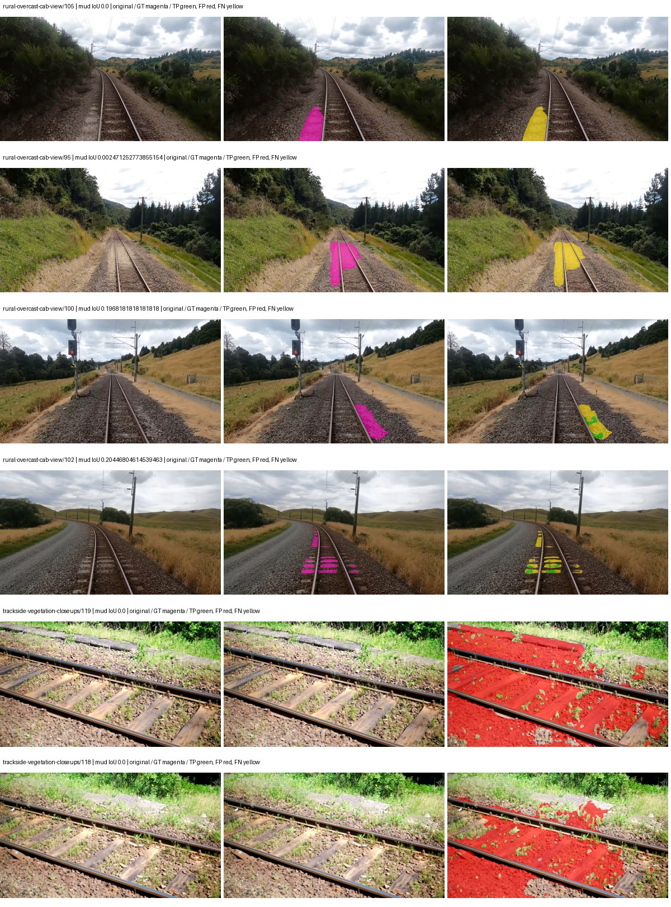
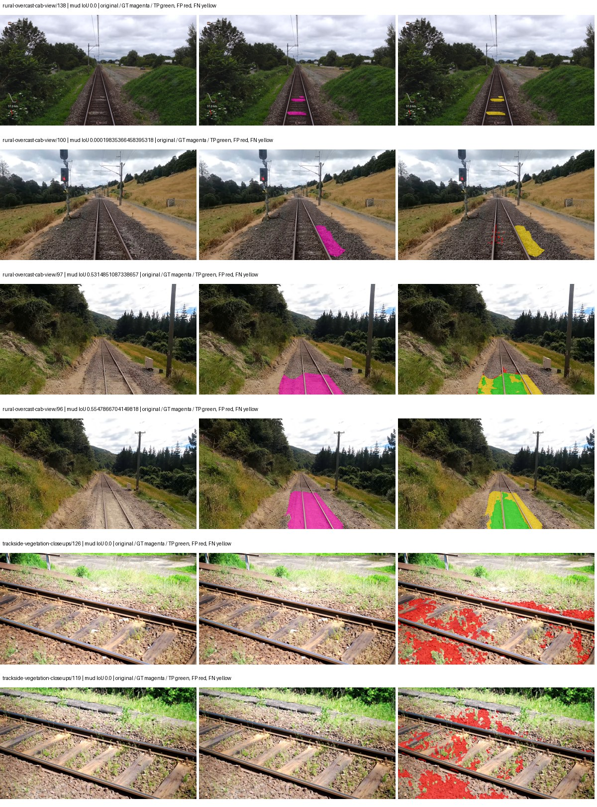
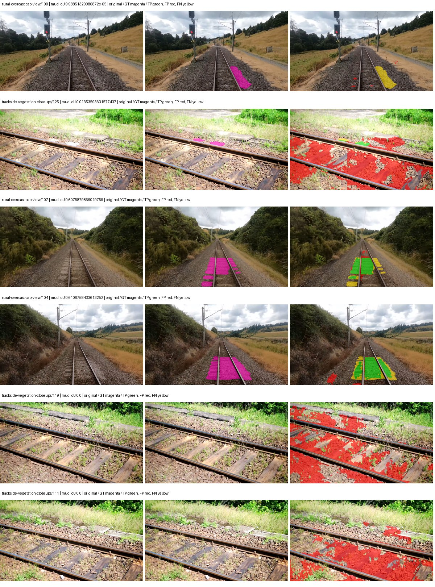
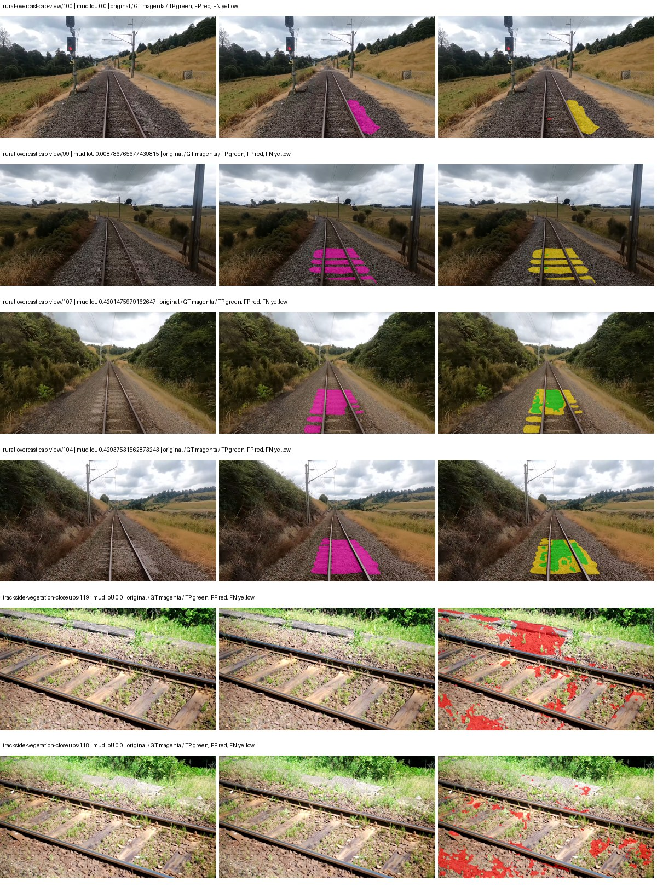

# upernet_convnext — paul-test-rtis_v2

[RTIS comparison](../../README.md) · [Full model records](record.json)

Primary selection and early stopping: **mud-pumping validation IoU**. A job is complete only after full statistics and isolated profiling are verified.

| Model | Initialization path | Seed | Status | Steps | Best step | Mud IoU (%) | Mud precision (%) | Mud recall (%) | Final mud IoU (trainer val, %) | mIoU (%) | Fixed GT-class mIoU (%) |
| --- | --- | --- | --- | --- | --- | --- | --- | --- | --- | --- | --- |
| upernet_convnext | rtis_only | 0 | completed | 2294 | 1019 | 2.03 | 2.63 | 8.19 | 1.23 | 35.00 | 38.89 |
| upernet_convnext | cityscapes_to_rtis | 0 | completed | 2294 | 1019 | 13.37 | 19.95 | 28.84 | 6.96 | 32.13 | 37.49 |
| upernet_convnext | railsem19_to_rtis | 0 | completed | 2294 | 1019 | 11.49 | 13.35 | 45.11 | 4.10 | 44.24 | 49.16 |
| upernet_convnext | cityscapes_to_railsem19_to_rtis | 0 | completed | 3058 | 1784 | 7.09 | 12.73 | 13.79 | 2.37 | 41.10 | 45.67 |

Training: 205 images. Validation: 37 images. Test: 50 held out. Seeds: [0]. Seed variation measures optimization variability, not independent-recording uncertainty. Historical source checkpoints stay fixed across adaptation seeds.

Training code: `066afb2626398b7be59d4d19f5a0e4644fd59adc`. Split SHA-256: `18a84c0163a65ded46508bcc904c374e5f33ad8a09b8879e3c8add606e86aa9f`.

## rtis_only — seed 0

Status: **completed**. Started: 2026-09-10T04:07:33.635835+00:00. Finished: 2026-09-10T05:05:37.647619+00:00.

Recipe pretrained initializer: `openmmlab/upernet-convnext-small`.

`rtis_only` uses the recipe initializer, which may include pretrained segmentation components. Transfer paths load the exact historical source checkpoint below and reset the classifier; they do not reset all query/decoder features.

Source checkpoint: `Recipe pretrained initialization`.

Config SHA-256: `7b041828fd136fd038a731633b41ec84b8d57a7ee0ceb566f462859ec36800af`. Weights used for validation: `raw`.

### Mud-pumping and aggregate quality

| Metric | Selected checkpoint | Final training validation |
| --- | --- | --- |
| Mud IoU | 2.03 | 1.23 |
| Mud precision | 2.63 | 1.70 |
| Mud recall | 8.19 | 4.20 |
| Mud Dice/F1 | 3.98 | 2.43 |
| mIoU | 35.00 | 34.56 |
| Mean accuracy | 49.98 | 51.01 |
| Mean precision | 56.80 | 54.30 |
| Mean Dice | 45.35 | 44.36 |
| Mean specificity | 98.86 | 98.84 |
| Pixel accuracy | 81.55 | 82.07 |
| Frequency-weighted IoU | 73.13 | 72.59 |
| Fixed GT-present class mIoU | 38.89 | 40.32 |
| Boundary F1 | 44.41 | 41.35 |

The selected checkpoint has independent evaluation evidence. Final values are the trainer's final validation record, not a new independent evaluation. mIoU averages classes with nonzero union, so false positives on absent classes can change its denominator. The fixed GT-class mean is supplementary and excludes absent classes; their false positives remain in the confusion matrix.

### Resource usage and timing

| Measurement | Value |
| --- | --- |
| Peak training VRAM, retained training invocation (GiB) | 13.46 |
| Peak evaluation VRAM (GiB) | 7.68 |
| Retained training invocation wall time (seconds) | 3247.81 |
| Retained training invocation GPU-hours (one GPU) | 0.90 |
| Evaluation wall time (seconds) | 21.56 |
| Full evaluation pipeline images/second | 1.72 |
| Best full-state checkpoint (MiB) | 1234.99 |
| Final full-state checkpoint (MiB) | 1234.97 |
| Verified periodic checkpoints removed (GiB) | 4.82 |

VRAM uses the recorded allocator high-water mark; it is not total device usage including CUDA context. Resumed jobs' retained training invocation times and peaks are **not whole-campaign totals**. Earlier invocation resource records are not reconstructed here. Evaluation throughput includes loader, sliding-window inference and metrics; it is not model-only latency/FPS. Missing measurements are shown as —, never inferred from another dataset's run.

### Standardized inference performance

Dedicated model-only profiling waits for an idle worker-locked L40S: BF16, batch 1, 1024x1024, 20 warmup and 100 CUDA-event-timed public forwards. It excludes loading, preprocessing, tiling and metrics.

| Status | Parameters | Weight MiB | FPS | p50 ms | p95 ms | Peak reserved GiB |
| --- | --- | --- | --- | --- | --- | --- |
| complete | 80887221 | 308.56 | 42.17 | 23.71 | 23.80 | 2.48 |

```json
{
  "schema_version": 1,
  "model_id": "upernet_convnext",
  "measured_at": "2026-09-10T05:05:29+00:00",
  "status": "complete",
  "benchmark_scope": "rtis_selected_checkpoint_model_only",
  "applies_to": [
    "upernet_convnext--rtis_only--seed-0"
  ],
  "source": {
    "campaign_git_sha": "066afb2626398b7be59d4d19f5a0e4644fd59adc",
    "git_dirty": false,
    "config_hash": "f68d48a9a274",
    "resolved_config": "/data/izadia1/projects/segmentary-runs/paul-test-rtis_v2/seed0-20260909/configs/upernet_convnext--rtis_only--seed-0.yaml",
    "config_sha256": "7b041828fd136fd038a731633b41ec84b8d57a7ee0ceb566f462859ec36800af",
    "checkpoint_sha256": "9b44ad12625a52be92ed200e1b617ee50b6ce30ac68e473924b6c9c7398507c3",
    "checkpoint_global_step": 1019,
    "checkpoint_bytes": 1294981954,
    "checkpoint_kind": "resume checkpoint with optimizer and EMA state",
    "weights": "raw",
    "measured_checkpoint_job_id": "upernet_convnext--rtis_only--seed-0",
    "result_sha256": "8f33051dadf636389053fc34cd890d3a75d3cba66a9886a80ab1571ea541129e",
    "result_git_sha": "066afb2626398b7be59d4d19f5a0e4644fd59adc",
    "result_stage": "eval:paul-test-rtis:val",
    "result_seed": 0
  },
  "hardware": {
    "gpu_name": "NVIDIA L40S",
    "gpu_uuid": "GPU-2f8008a1-9b67-11f6-987b-b393a672322c",
    "logical_device": "cuda:0",
    "physical_visibility_token": "3",
    "compute_capability": [
      8,
      9
    ],
    "total_memory_bytes": 47677177856
  },
  "model": {
    "parameter_count": 80887221,
    "trainable_parameter_count": 80887221,
    "resident_parameter_bytes": 323548884,
    "parameter_dtype_counts": {
      "float32": 80887221
    }
  },
  "contract": {
    "backend": "pytorch",
    "precision": "bf16_autocast",
    "batch_size": 1,
    "input_shape_nchw": [
      1,
      3,
      1024,
      1024
    ],
    "warmup_iterations": 20,
    "measured_iterations": 100,
    "timing": "per-forward CUDA events with end-event synchronization",
    "includes_preprocessing": false,
    "includes_data_loader": false,
    "includes_sliding_window": false,
    "input_resident_on_gpu": true,
    "model_only": true,
    "entrypoint": "public model(image) dense-logits forward"
  },
  "measurements": {
    "latency": {
      "p50_ms": 23.713727951049805,
      "p95_ms": 23.797862434387206,
      "mean_ms": 23.714123287200927,
      "minimum_ms": 23.619583129882812,
      "maximum_ms": 23.90732765197754,
      "fps": 42.1689635281488,
      "raw_ms": [
        23.75372886657715,
        23.714815139770508,
        23.632768630981445,
        23.638015747070312,
        23.6810245513916,
        23.67487907409668,
        23.74233627319336,
        23.709632873535156,
        23.623680114746094,
        23.69024085998535,
        23.633920669555664,
        23.72812843322754,
        23.797760009765625,
        23.7127685546875,
        23.69536018371582,
        23.721023559570312,
        23.733247756958008,
        23.724031448364258,
        23.66873550415039,
        23.654399871826172,
        23.68409538269043,
        23.676799774169922,
        23.70457649230957,
        23.723007202148438,
        23.641088485717773,
        23.68921661376953,
        23.619583129882812,
        23.740415573120117,
        23.777280807495117,
        23.70047950744629,
        23.6810245513916,
        23.66975975036621,
        23.72710418701172,
        23.789567947387695,
        23.71366310119629,
        23.628704071044922,
        23.714815139770508,
        23.7260799407959,
        23.74553680419922,
        23.69126319885254,
        23.657440185546875,
        23.73017692565918,
        23.71788787841797,
        23.73017692565918,
        23.764991760253906,
        23.71379280090332,
        23.73017692565918,
        23.663616180419922,
        23.739391326904297,
        23.755775451660156,
        23.683040618896484,
        23.709632873535156,
        23.6943359375,
        23.90732765197754,
        23.684160232543945,
        23.71072006225586,
        23.638111114501953,
        23.69740867614746,
        23.65951919555664,
        23.784448623657227,
        23.753664016723633,
        23.672832489013672,
        23.70252799987793,
        23.646207809448242,
        23.734272003173828,
        23.788543701171875,
        23.688255310058594,
        23.663616180419922,
        23.70457649230957,
        23.73632049560547,
        23.799808502197266,
        23.73734474182129,
        23.666688919067383,
        23.73529624938965,
        23.69024085998535,
        23.7476806640625,
        23.748607635498047,
        23.6810245513916,
        23.808000564575195,
        23.70969581604004,
        23.73311996459961,
        23.800832748413086,
        23.71379280090332,
        23.733247756958008,
        23.70867156982422,
        23.790719985961914,
        23.761856079101562,
        23.724031448364258,
        23.673856735229492,
        23.71673583984375,
        23.71686363220215,
        23.764991760253906,
        23.72710418701172,
        23.664640426635742,
        23.812095642089844,
        23.70867156982422,
        23.752704620361328,
        23.734272003173828,
        23.70047950744629,
        23.71174430847168
      ],
      "percentile_method": "numpy linear interpolation"
    },
    "peak_reserved_bytes": 2663383040,
    "memory_kind": "pytorch_cuda_allocator_peak_reserved_excluding_context",
    "benchmark_wall_clock_s": 9.736495938152075
  },
  "started_at": "2026-09-10T05:05:19+00:00",
  "finished_at": "2026-09-10T05:05:29+00:00",
  "environment": {
    "hostname": "hdrfs-app-001",
    "python": "3.11.15",
    "platform": "Linux-5.15.0-139-generic-x86_64-with-glibc2.35",
    "torch": "2.11.0+cu128",
    "torch_cuda": "12.8",
    "cudnn": 91900,
    "driver_version": "570.133.20",
    "cuda_available": true,
    "gpu_count": 1,
    "gpu_names": [
      "NVIDIA L40S"
    ],
    "cuda_visible_devices": "3",
    "packages": {
      "segmentary": "0.1.0",
      "torch": "2.11.0+cu128",
      "torchvision": "0.26.0+cu128",
      "transformers": "5.15.0",
      "timm": "1.0.28",
      "segmentation-models-pytorch": "0.5.0",
      "albumentations": "2.0.8",
      "lightning": "2.6.5",
      "numpy": "2.4.4"
    }
  }
}
```

### Per-class validation results

| Class | GT pixels | IoU (%) | Precision (%) | Recall (%) | Dice (%) | Boundary F1 (%) |
| --- | --- | --- | --- | --- | --- | --- |
| car | 29664 | 15.55 | 39.13 | 20.51 | 26.91 | 31.16 |
| construction | 311585 | 18.65 | 19.61 | 79.15 | 31.43 | 41.46 |
| fence | 265137 | 26.18 | 65.71 | 30.32 | 41.50 | 48.66 |
| mud-pumping | 1226250 | 2.03 | 2.63 | 8.19 | 3.98 | 7.40 |
| on-rails | 0 | 0.00 | 0.00 | — | 0.00 | 0.00 |
| person | 0 | — | — | — | — | — |
| pole | 628038 | 74.34 | 88.15 | 82.60 | 85.28 | 92.45 |
| rail-embedded | 16799 | 21.04 | 94.98 | 21.28 | 34.77 | 16.23 |
| rail-raised | 2969797 | 78.52 | 89.59 | 86.40 | 87.97 | 94.51 |
| rail-track | 6323197 | 33.61 | 77.21 | 37.31 | 50.31 | 44.11 |
| road | 1048831 | 7.12 | 16.85 | 10.98 | 13.30 | 15.24 |
| sidewalk | 1297367 | 22.97 | 79.53 | 24.41 | 37.36 | 10.39 |
| sky | 19121606 | 97.87 | 99.16 | 98.69 | 98.92 | 94.82 |
| standing-water | 95802 | 3.25 | 3.45 | 35.72 | 6.29 | 27.75 |
| terrain | 39239306 | 83.29 | 87.33 | 94.73 | 90.88 | 60.65 |
| trackbed | 10643081 | 60.77 | 73.14 | 78.23 | 75.60 | 61.31 |
| traffic-light | 19510 | 45.34 | 77.45 | 52.23 | 62.39 | 71.32 |
| traffic-sign | 13285 | 37.54 | 48.21 | 62.92 | 54.59 | 58.82 |
| tram-track | 56179 | 40.07 | 89.16 | 42.12 | 57.21 | 49.68 |
| truck | 0 | 0.00 | 0.00 | — | 0.00 | 0.00 |
| vegetation-overgrowth | 5901821 | 31.82 | 84.73 | 33.75 | 48.27 | 62.18 |

### Full-run accounting

| Measurement | Value |
| --- | --- |
| Full GPU-reserved wall seconds, all recorded worker attempts | 3484.02 |
| Full reserved GPU-hours | 0.97 |
| Whole-run timing complete | True |

| Phase | Wall seconds including failed attempts |
| --- | --- |
| training | 3254.59 |
| diagnostics | 173.48 |
| performance | 18.53 |

GPU-reserved time includes model loading, training, validation, collection, profiling, checkpoint I/O and orchestration while the worker owns one GPU. It is not GPU kernel-active time. Phase timings and sampled device memory/power/utilization are retained separately; sampled device memory is not the allocator high-water mark.

### Train/validation and raw/EMA diagnostics

| Checkpoint / weights / split | Images | Mud IoU (%) | Mud precision (%) | Mud recall (%) |
| --- | --- | --- | --- | --- |
| best-auto-train / raw | 205 | 96.20 | 98.37 | 97.75 |
| best-auto-val / raw | 37 | 2.03 | 2.63 | 8.19 |
| best-alternate-val / ema | 37 | 4.81 | 5.81 | 21.79 |
| final-auto-val / raw | 37 | 1.22 | 1.70 | 4.20 |

Train uses the evaluation transform without augmentation. Compare mud train/validation metrics for the same selected weights. Alternate EMA on running-stat BatchNorm is explicitly uncalibrated and is diagnostic only. Score-threshold curves use uncalibrated normalized scores and are pixel-level diagnostics, not event detection rates or a selected deployment operating point.

### Downloadable evidence

- best-auto-train: [per-image.csv](rtis_only--seed-0/best-auto-train/per-image.csv) · [per-image-confusion.json.gz](rtis_only--seed-0/best-auto-train/per-image-confusion.json.gz) · [groups.json](rtis_only--seed-0/best-auto-train/groups.json) · [mud-score-curves.json](rtis_only--seed-0/best-auto-train/mud-score-curves.json)
- best-auto-val: [per-image.csv](rtis_only--seed-0/best-auto-val/per-image.csv) · [per-image-confusion.json.gz](rtis_only--seed-0/best-auto-val/per-image-confusion.json.gz) · [groups.json](rtis_only--seed-0/best-auto-val/groups.json) · [mud-score-curves.json](rtis_only--seed-0/best-auto-val/mud-score-curves.json) · [examples.jpg](rtis_only--seed-0/best-auto-val/examples.jpg)
- best-alternate-val: [per-image.csv](rtis_only--seed-0/best-alternate-val/per-image.csv) · [per-image-confusion.json.gz](rtis_only--seed-0/best-alternate-val/per-image-confusion.json.gz) · [groups.json](rtis_only--seed-0/best-alternate-val/groups.json) · [mud-score-curves.json](rtis_only--seed-0/best-alternate-val/mud-score-curves.json)
- final-auto-val: [per-image.csv](rtis_only--seed-0/final-auto-val/per-image.csv) · [per-image-confusion.json.gz](rtis_only--seed-0/final-auto-val/per-image-confusion.json.gz) · [groups.json](rtis_only--seed-0/final-auto-val/groups.json) · [mud-score-curves.json](rtis_only--seed-0/final-auto-val/mud-score-curves.json)
- resources: [telemetry.csv](rtis_only--seed-0/resources/telemetry.csv)



Examples are two lowest and two highest mud-IoU positive images, plus up to two negative images with the most false-positive mud pixels. They are targeted diagnostic examples, not random samples. Green: true positive; red: false positive; yellow: false negative. Full predictions remain on HDRFS.

### Validation tracking

| Logged step | Overall mIoU (%) | Mud IoU (%) |
| --- | --- | --- |
| 254 | 32.03 | 0.16 |
| 509 | 31.87 | 0.15 |
| 764 | 37.25 | 0.84 |
| 1019 | 35.00 | 2.04 |
| 1274 | 33.03 | 1.15 |
| 1529 | 35.83 | 1.44 |
| 1784 | 37.04 | 1.73 |
| 2038 | 33.93 | 1.97 |
| 2293 | 34.56 | 1.23 |

All retained scalar curves, including training loss and per-class IoU, are in record.json. Observed best mud on a curve is not necessarily a retained checkpoint: the pilot saved its selection-metric-best and final checkpoints. Step logging and checkpoint global_step may differ by one.

### Stopping and checkpoint provenance

```json
{
  "stopping": {
    "actual_steps": 2294,
    "maximum_steps": 4000,
    "min_delta": 0.001,
    "monitor": "val_iou/mud-pumping",
    "patience": 5,
    "reason": "validation_plateau"
  },
  "checkpoints": {
    "best": {
      "path": "/data/izadia1/projects/segmentary-runs/paul-test-rtis_v2/seed0-20260909/future-runs/upernet_convnext--rtis_only--seed-0_seed0/rtis/best.ckpt",
      "sha256": "9b44ad12625a52be92ed200e1b617ee50b6ce30ac68e473924b6c9c7398507c3",
      "global_step": 1019,
      "bytes": 1294981954
    },
    "final": {
      "path": "/data/izadia1/projects/segmentary-runs/paul-test-rtis_v2/seed0-20260909/future-runs/upernet_convnext--rtis_only--seed-0_seed0/rtis/last.ckpt",
      "sha256": "c85e2fc8ad0cb71dbccec76b65185bc66aff70d803a7e96a0ad50c287c2b3a1b",
      "global_step": 2294,
      "bytes": 1294962946
    }
  },
  "cleanup_error": null
}
```

### Resolved training, initialization and evaluation settings

The optimizer block is the base configuration. Stage LR scales are applied at runtime, and stage warmup is capped at min(base warmup, floor(stage budget / 10), stage budget - 1): 400 steps for this 4,000-step pilot. Model-internal native input grids may differ from augmentation crops (EoMT uses its 640 grid).

```json
{
  "name": "upernet_convnext--rtis_only--seed-0",
  "model": {
    "arch": "upernet_convnext",
    "checkpoint": "openmmlab/upernet-convnext-small",
    "tuning": "full",
    "head": "unified_head",
    "lora_r": 16,
    "lora_alpha": 32,
    "lora_dropout": 0.05,
    "lora_targets": [],
    "drop_path": null,
    "revision": null,
    "subfolder": null,
    "local_files_only": false,
    "trust_remote_code": false,
    "backbone_path": null,
    "head_paths": [],
    "classifier_path": null,
    "inactive_parameter_paths": [],
    "smp_arch": null,
    "encoder_name": null,
    "encoder_weights": null,
    "native": null,
    "batch_norm_momentum": null
  },
  "space": "paul-test-rtis",
  "taxonomy_root": "/data/izadia1/projects/segmentary-rtis-fullstats-066afb2/taxonomy",
  "output_root": "/data/izadia1/projects/segmentary-runs/paul-test-rtis_v2/seed0-20260909/future-runs",
  "optim": {
    "backbone_lr": 6e-05,
    "head_lr_mult": 10.0,
    "weight_decay": 0.05,
    "llrd": 1.0,
    "warmup_iters": 1500,
    "warmup_ratio": 1e-06,
    "poly_power": 0.9,
    "min_lr_ratio": 0.0,
    "betas": [
      0.9,
      0.999
    ],
    "grad_clip": 1.0
  },
  "train": {
    "iters": 4000,
    "batch_size": 2,
    "accum": 8,
    "num_workers": 2,
    "precision": "bf16-mixed",
    "ema_decay": 0.9998,
    "val_every": 250,
    "ckpt_every": 500,
    "selection_metric": "val_iou/mud-pumping",
    "early_stopping_patience": 5,
    "early_stopping_min_delta": 0.001,
    "seed": 0,
    "devices": 1
  },
  "eval": {
    "sliding_window": true,
    "window": [
      1024,
      1024
    ],
    "stride": [
      768,
      768
    ],
    "batch_size": 1,
    "num_workers": 2,
    "tta_scales": [],
    "tta_flip": false,
    "threshold": 0.5,
    "boundary_tolerance_frac": 0.0075,
    "save_confusion": true
  },
  "loss": {
    "task": "multiclass",
    "activation": "auto",
    "terms": [],
    "aux": "none",
    "aux_weight": 0.0,
    "ce_weight": 1.0,
    "label_smoothing": 0.0,
    "class_weights": null,
    "query": null
  },
  "aug": {
    "crop": [
      1024,
      1024
    ],
    "scale_min": 0.5,
    "scale_max": 2.0,
    "hflip_p": 0.5,
    "color_jitter_p": 0.5,
    "brightness": 0.25,
    "contrast": 0.25,
    "saturation": 0.25,
    "hue": 0.05
  },
  "stages": [
    {
      "name": "rtis",
      "data": [
        {
          "name": "paul-test-rtis",
          "root": "/data/izadia1/datasets/paul-test-rtis_v2",
          "variant": null,
          "split_file": "splits.json",
          "train_split": "train",
          "val_split": "val",
          "limit": null,
          "loader": "folder",
          "mapping": "paul-test-rtis",
          "loader_options": {
            "require_groups": true
          }
        }
      ],
      "iters": null,
      "lr_scale": 1.0,
      "head_group_lr_scale": 1.0,
      "init_from": "pretrained",
      "reset_head": false,
      "freeze": null,
      "sample_weights": null
    }
  ]
}
```

### Hardware and software provenance

```json
{
  "training": {
    "cuda_available": true,
    "cuda_visible_devices": "3",
    "cudnn": 91900,
    "driver_version": "570.133.20",
    "gpu_count": 1,
    "gpu_names": [
      "NVIDIA L40S"
    ],
    "hostname": "hdrfs-app-001",
    "input_normalization": {
      "channel_order": "rgb",
      "mean": [
        0.485,
        0.456,
        0.406
      ],
      "source": "imagenet",
      "std": [
        0.229,
        0.224,
        0.225
      ]
    },
    "model_origins": [
      {
        "hf_commit": "550b68d291f9a7e4874065c6eec0676b2ba821e6",
        "hf_name_or_path": "openmmlab/upernet-convnext-small",
        "module": "model",
        "timm_pretrained": {}
      },
      {
        "hf_commit": null,
        "hf_name_or_path": "",
        "module": "model.backbone",
        "timm_pretrained": {}
      },
      {
        "hf_commit": null,
        "hf_name_or_path": "",
        "module": "model.backbone.encoder",
        "timm_pretrained": {}
      },
      {
        "hf_commit": "550b68d291f9a7e4874065c6eec0676b2ba821e6",
        "hf_name_or_path": "openmmlab/upernet-convnext-small",
        "module": "model.decode_head",
        "timm_pretrained": {}
      }
    ],
    "model_parameter_count": 80887221,
    "packages": {
      "albumentations": "2.0.8",
      "lightning": "2.6.5",
      "numpy": "2.4.4",
      "segmentary": "0.1.0",
      "segmentation-models-pytorch": "0.5.0",
      "timm": "1.0.28",
      "torch": "2.11.0+cu128",
      "torchvision": "0.26.0+cu128",
      "transformers": "5.15.0"
    },
    "platform": "Linux-5.15.0-139-generic-x86_64-with-glibc2.35",
    "python": "3.11.15",
    "torch": "2.11.0+cu128",
    "torch_cuda": "12.8",
    "trainable_parameter_count": 80887221,
    "training_stop": {
      "actual_steps": 2294,
      "maximum_steps": 4000,
      "min_delta": 0.001,
      "monitor": "val_iou/mud-pumping",
      "patience": 5,
      "reason": "validation_plateau"
    },
    "validation_weights": "raw"
  },
  "evaluation": {
    "cuda_available": true,
    "cuda_visible_devices": "3",
    "cudnn": 91900,
    "driver_version": "570.133.20",
    "gpu_count": 1,
    "gpu_names": [
      "NVIDIA L40S"
    ],
    "hostname": "hdrfs-app-001",
    "input_normalization": {
      "channel_order": "rgb",
      "mean": [
        0.485,
        0.456,
        0.406
      ],
      "source": "imagenet",
      "std": [
        0.229,
        0.224,
        0.225
      ]
    },
    "packages": {
      "albumentations": "2.0.8",
      "lightning": "2.6.5",
      "numpy": "2.4.4",
      "segmentary": "0.1.0",
      "segmentation-models-pytorch": "0.5.0",
      "timm": "1.0.28",
      "torch": "2.11.0+cu128",
      "torchvision": "0.26.0+cu128",
      "transformers": "5.15.0"
    },
    "platform": "Linux-5.15.0-139-generic-x86_64-with-glibc2.35",
    "python": "3.11.15",
    "torch": "2.11.0+cu128",
    "torch_cuda": "12.8"
  }
}
```

## cityscapes_to_rtis — seed 0

Status: **completed**. Started: 2026-09-10T04:09:30.922560+00:00. Finished: 2026-09-10T05:07:57.690311+00:00.

Recipe pretrained initializer: `openmmlab/upernet-convnext-small`.

`rtis_only` uses the recipe initializer, which may include pretrained segmentation components. Transfer paths load the exact historical source checkpoint below and reset the classifier; they do not reset all query/decoder features.

Source checkpoint: `{'name': 'upernet_convnext--cityscapes--seed-0', 'model': 'upernet_convnext', 'protocol': 'cityscapes', 'config': '/data/izadia1/projects/segmentary-runs/all-model-city-rail-seed0-rail20-b9eb3e1/accepted/upernet_convnext--cityscapes--seed-0/resolved-config.yaml', 'checkpoint': '/data/izadia1/projects/segmentary-runs/all-model-city-rail-seed0-a7c0b67/jobs/upernet_convnext--cityscapes--seed-0/attempt-001/train/upernet_convnext--cityscapes_seed0/cityscapes/last.ckpt', 'recorded_sha256': 'fb45ace4437433d1713d6afef5ee260284b053b7301e6be003f89249012dc698', 'exists': True}`.

Config SHA-256: `1c0af5a0cf415c09341583add06038bbc1ff4f54745c3b1e7638585f610a4e7a`. Weights used for validation: `raw`.

### Mud-pumping and aggregate quality

| Metric | Selected checkpoint | Final training validation |
| --- | --- | --- |
| Mud IoU | 13.37 | 6.96 |
| Mud precision | 19.95 | 9.92 |
| Mud recall | 28.84 | 18.96 |
| Mud Dice/F1 | 23.59 | 13.02 |
| mIoU | 32.13 | 33.20 |
| Mean accuracy | 46.76 | 48.00 |
| Mean precision | 56.58 | 55.32 |
| Mean Dice | 42.36 | 42.90 |
| Mean specificity | 98.51 | 98.77 |
| Pixel accuracy | 79.40 | 81.78 |
| Frequency-weighted IoU | 66.91 | 70.99 |
| Fixed GT-present class mIoU | 37.49 | 38.73 |
| Boundary F1 | 38.62 | 39.14 |

The selected checkpoint has independent evaluation evidence. Final values are the trainer's final validation record, not a new independent evaluation. mIoU averages classes with nonzero union, so false positives on absent classes can change its denominator. The fixed GT-class mean is supplementary and excludes absent classes; their false positives remain in the confusion matrix.

### Resource usage and timing

| Measurement | Value |
| --- | --- |
| Peak training VRAM, retained training invocation (GiB) | 13.46 |
| Peak evaluation VRAM (GiB) | 7.68 |
| Retained training invocation wall time (seconds) | 3267.04 |
| Retained training invocation GPU-hours (one GPU) | 0.91 |
| Evaluation wall time (seconds) | 21.60 |
| Full evaluation pipeline images/second | 1.71 |
| Best full-state checkpoint (MiB) | 1234.99 |
| Final full-state checkpoint (MiB) | 1234.97 |
| Verified periodic checkpoints removed (GiB) | 4.82 |

VRAM uses the recorded allocator high-water mark; it is not total device usage including CUDA context. Resumed jobs' retained training invocation times and peaks are **not whole-campaign totals**. Earlier invocation resource records are not reconstructed here. Evaluation throughput includes loader, sliding-window inference and metrics; it is not model-only latency/FPS. Missing measurements are shown as —, never inferred from another dataset's run.

### Standardized inference performance

Dedicated model-only profiling waits for an idle worker-locked L40S: BF16, batch 1, 1024x1024, 20 warmup and 100 CUDA-event-timed public forwards. It excludes loading, preprocessing, tiling and metrics.

| Status | Parameters | Weight MiB | FPS | p50 ms | p95 ms | Peak reserved GiB |
| --- | --- | --- | --- | --- | --- | --- |
| complete | 80887221 | 308.56 | 41.57 | 24.01 | 24.31 | 2.48 |

```json
{
  "schema_version": 1,
  "model_id": "upernet_convnext",
  "measured_at": "2026-09-10T05:07:49+00:00",
  "status": "complete",
  "benchmark_scope": "rtis_selected_checkpoint_model_only",
  "applies_to": [
    "upernet_convnext--cityscapes_to_rtis--seed-0"
  ],
  "source": {
    "campaign_git_sha": "066afb2626398b7be59d4d19f5a0e4644fd59adc",
    "git_dirty": false,
    "config_hash": "7c4228242781",
    "resolved_config": "/data/izadia1/projects/segmentary-runs/paul-test-rtis_v2/seed0-20260909/configs/upernet_convnext--cityscapes_to_rtis--seed-0.yaml",
    "config_sha256": "1c0af5a0cf415c09341583add06038bbc1ff4f54745c3b1e7638585f610a4e7a",
    "checkpoint_sha256": "7f29de81b9bf252238e9a9792a7ca3ed31dcb4c64316dae787911d3a8d52db4f",
    "checkpoint_global_step": 1019,
    "checkpoint_bytes": 1294982018,
    "checkpoint_kind": "resume checkpoint with optimizer and EMA state",
    "weights": "raw",
    "measured_checkpoint_job_id": "upernet_convnext--cityscapes_to_rtis--seed-0",
    "result_sha256": "9ced8831a368f5760748fc69bff14225a9122f06d7e07dce36661176088950e5",
    "result_git_sha": "066afb2626398b7be59d4d19f5a0e4644fd59adc",
    "result_stage": "eval:paul-test-rtis:val",
    "result_seed": 0
  },
  "hardware": {
    "gpu_name": "NVIDIA L40S",
    "gpu_uuid": "GPU-84f5ca4d-68db-ae98-d056-40654d859dd9",
    "logical_device": "cuda:0",
    "physical_visibility_token": "0",
    "compute_capability": [
      8,
      9
    ],
    "total_memory_bytes": 47677177856
  },
  "model": {
    "parameter_count": 80887221,
    "trainable_parameter_count": 80887221,
    "resident_parameter_bytes": 323548884,
    "parameter_dtype_counts": {
      "float32": 80887221
    }
  },
  "contract": {
    "backend": "pytorch",
    "precision": "bf16_autocast",
    "batch_size": 1,
    "input_shape_nchw": [
      1,
      3,
      1024,
      1024
    ],
    "warmup_iterations": 20,
    "measured_iterations": 100,
    "timing": "per-forward CUDA events with end-event synchronization",
    "includes_preprocessing": false,
    "includes_data_loader": false,
    "includes_sliding_window": false,
    "input_resident_on_gpu": true,
    "model_only": true,
    "entrypoint": "public model(image) dense-logits forward"
  },
  "measurements": {
    "latency": {
      "p50_ms": 24.009167671203613,
      "p95_ms": 24.31411209106445,
      "mean_ms": 24.05371934890747,
      "minimum_ms": 23.794559478759766,
      "maximum_ms": 26.13043212890625,
      "fps": 41.57361219255351,
      "raw_ms": [
        24.11212730407715,
        24.019968032836914,
        23.8417911529541,
        24.009727478027344,
        24.182783126831055,
        24.029184341430664,
        23.89094352722168,
        26.13043212890625,
        23.840768814086914,
        24.28006362915039,
        24.157184600830078,
        23.794559478759766,
        24.30361557006836,
        24.3189754486084,
        24.2923526763916,
        24.236032485961914,
        24.218624114990234,
        23.92780876159668,
        24.14080047607422,
        24.224767684936523,
        24.350624084472656,
        23.817216873168945,
        23.999488830566406,
        24.357887268066406,
        23.844863891601562,
        23.839744567871094,
        23.837663650512695,
        24.226816177368164,
        23.94416046142578,
        23.820287704467773,
        23.870464324951172,
        23.85100746154785,
        24.23708724975586,
        23.945215225219727,
        23.818239212036133,
        23.833599090576172,
        23.969791412353516,
        23.89401626586914,
        24.01580810546875,
        23.843839645385742,
        24.257535934448242,
        24.142847061157227,
        23.928831100463867,
        24.163232803344727,
        23.826431274414062,
        23.89299201965332,
        23.872575759887695,
        24.241151809692383,
        24.008607864379883,
        23.84067153930664,
        24.136703491210938,
        24.188928604125977,
        23.93600082397461,
        23.86739158630371,
        24.072063446044922,
        24.11008071899414,
        23.862272262573242,
        24.248287200927734,
        24.183807373046875,
        23.87558364868164,
        23.933055877685547,
        23.852031707763672,
        23.88684844970703,
        24.08755111694336,
        23.84377670288086,
        24.077312469482422,
        24.194944381713867,
        24.033279418945312,
        24.10700798034668,
        24.12236785888672,
        24.153087615966797,
        24.196096420288086,
        24.272863388061523,
        24.219648361206055,
        24.217599868774414,
        23.835647583007812,
        24.293376922607422,
        24.060928344726562,
        23.946239471435547,
        24.36604881286621,
        24.004608154296875,
        23.921567916870117,
        24.11724853515625,
        23.815168380737305,
        23.91244888305664,
        23.998464584350586,
        23.990144729614258,
        23.916576385498047,
        23.828479766845703,
        23.989248275756836,
        23.830432891845703,
        24.31385612487793,
        24.228864669799805,
        24.11520004272461,
        23.839744567871094,
        24.045568466186523,
        23.91654396057129,
        23.988351821899414,
        24.050687789916992,
        23.922687530517578
      ],
      "percentile_method": "numpy linear interpolation"
    },
    "peak_reserved_bytes": 2663383040,
    "memory_kind": "pytorch_cuda_allocator_peak_reserved_excluding_context",
    "benchmark_wall_clock_s": 9.81449843943119
  },
  "started_at": "2026-09-10T05:07:39+00:00",
  "finished_at": "2026-09-10T05:07:49+00:00",
  "environment": {
    "hostname": "hdrfs-app-001",
    "python": "3.11.15",
    "platform": "Linux-5.15.0-139-generic-x86_64-with-glibc2.35",
    "torch": "2.11.0+cu128",
    "torch_cuda": "12.8",
    "cudnn": 91900,
    "driver_version": "570.133.20",
    "cuda_available": true,
    "gpu_count": 1,
    "gpu_names": [
      "NVIDIA L40S"
    ],
    "cuda_visible_devices": "0",
    "packages": {
      "segmentary": "0.1.0",
      "torch": "2.11.0+cu128",
      "torchvision": "0.26.0+cu128",
      "transformers": "5.15.0",
      "timm": "1.0.28",
      "segmentation-models-pytorch": "0.5.0",
      "albumentations": "2.0.8",
      "lightning": "2.6.5",
      "numpy": "2.4.4"
    }
  }
}
```

### Per-class validation results

| Class | GT pixels | IoU (%) | Precision (%) | Recall (%) | Dice (%) | Boundary F1 (%) |
| --- | --- | --- | --- | --- | --- | --- |
| car | 29664 | 27.82 | 62.47 | 33.41 | 43.53 | 49.84 |
| construction | 311585 | 31.53 | 33.74 | 82.84 | 47.95 | 33.80 |
| fence | 265137 | 22.20 | 76.77 | 23.80 | 36.33 | 47.56 |
| mud-pumping | 1226250 | 13.37 | 19.95 | 28.84 | 23.59 | 20.87 |
| on-rails | 0 | 0.00 | 0.00 | — | 0.00 | 0.00 |
| person | 0 | 0.00 | 0.00 | — | 0.00 | 0.00 |
| pole | 628038 | 75.69 | 86.16 | 86.17 | 86.16 | 92.54 |
| rail-embedded | 16799 | 19.17 | 92.71 | 19.47 | 32.18 | 24.46 |
| rail-raised | 2969797 | 75.45 | 85.18 | 86.85 | 86.01 | 91.94 |
| rail-track | 6323197 | 29.11 | 72.13 | 32.80 | 45.10 | 38.12 |
| road | 1048831 | 16.74 | 36.18 | 23.76 | 28.68 | 23.89 |
| sidewalk | 1297367 | 30.26 | 86.03 | 31.83 | 46.46 | 11.22 |
| sky | 19121606 | 96.16 | 99.49 | 96.64 | 98.04 | 91.17 |
| standing-water | 95802 | 0.99 | 1.18 | 5.57 | 1.95 | 8.10 |
| terrain | 39239306 | 74.11 | 76.35 | 96.18 | 85.13 | 48.01 |
| trackbed | 10643081 | 58.52 | 77.34 | 70.63 | 73.83 | 54.92 |
| traffic-light | 19510 | 45.11 | 74.44 | 53.38 | 62.17 | 67.65 |
| traffic-sign | 13285 | 37.79 | 64.97 | 47.46 | 54.85 | 59.16 |
| tram-track | 56179 | 12.10 | 60.41 | 13.15 | 21.59 | 11.08 |
| truck | 0 | 0.00 | 0.00 | — | 0.00 | 0.00 |
| vegetation-overgrowth | 5901821 | 8.68 | 82.63 | 8.84 | 15.97 | 36.76 |

### Full-run accounting

| Measurement | Value |
| --- | --- |
| Full GPU-reserved wall seconds, all recorded worker attempts | 3507.86 |
| Full reserved GPU-hours | 0.97 |
| Whole-run timing complete | True |

| Phase | Wall seconds including failed attempts |
| --- | --- |
| training | 3275.33 |
| diagnostics | 175.33 |
| performance | 18.16 |

GPU-reserved time includes model loading, training, validation, collection, profiling, checkpoint I/O and orchestration while the worker owns one GPU. It is not GPU kernel-active time. Phase timings and sampled device memory/power/utilization are retained separately; sampled device memory is not the allocator high-water mark.

### Train/validation and raw/EMA diagnostics

| Checkpoint / weights / split | Images | Mud IoU (%) | Mud precision (%) | Mud recall (%) |
| --- | --- | --- | --- | --- |
| best-auto-train / raw | 205 | 94.48 | 96.14 | 98.20 |
| best-auto-val / raw | 37 | 13.37 | 19.95 | 28.84 |
| best-alternate-val / ema | 37 | 3.92 | 6.41 | 9.17 |
| final-auto-val / raw | 37 | 6.96 | 9.91 | 18.96 |

Train uses the evaluation transform without augmentation. Compare mud train/validation metrics for the same selected weights. Alternate EMA on running-stat BatchNorm is explicitly uncalibrated and is diagnostic only. Score-threshold curves use uncalibrated normalized scores and are pixel-level diagnostics, not event detection rates or a selected deployment operating point.

### Downloadable evidence

- best-auto-train: [per-image.csv](cityscapes_to_rtis--seed-0/best-auto-train/per-image.csv) · [per-image-confusion.json.gz](cityscapes_to_rtis--seed-0/best-auto-train/per-image-confusion.json.gz) · [groups.json](cityscapes_to_rtis--seed-0/best-auto-train/groups.json) · [mud-score-curves.json](cityscapes_to_rtis--seed-0/best-auto-train/mud-score-curves.json)
- best-auto-val: [per-image.csv](cityscapes_to_rtis--seed-0/best-auto-val/per-image.csv) · [per-image-confusion.json.gz](cityscapes_to_rtis--seed-0/best-auto-val/per-image-confusion.json.gz) · [groups.json](cityscapes_to_rtis--seed-0/best-auto-val/groups.json) · [mud-score-curves.json](cityscapes_to_rtis--seed-0/best-auto-val/mud-score-curves.json) · [examples.jpg](cityscapes_to_rtis--seed-0/best-auto-val/examples.jpg)
- best-alternate-val: [per-image.csv](cityscapes_to_rtis--seed-0/best-alternate-val/per-image.csv) · [per-image-confusion.json.gz](cityscapes_to_rtis--seed-0/best-alternate-val/per-image-confusion.json.gz) · [groups.json](cityscapes_to_rtis--seed-0/best-alternate-val/groups.json) · [mud-score-curves.json](cityscapes_to_rtis--seed-0/best-alternate-val/mud-score-curves.json)
- final-auto-val: [per-image.csv](cityscapes_to_rtis--seed-0/final-auto-val/per-image.csv) · [per-image-confusion.json.gz](cityscapes_to_rtis--seed-0/final-auto-val/per-image-confusion.json.gz) · [groups.json](cityscapes_to_rtis--seed-0/final-auto-val/groups.json) · [mud-score-curves.json](cityscapes_to_rtis--seed-0/final-auto-val/mud-score-curves.json)
- resources: [telemetry.csv](cityscapes_to_rtis--seed-0/resources/telemetry.csv)



Examples are two lowest and two highest mud-IoU positive images, plus up to two negative images with the most false-positive mud pixels. They are targeted diagnostic examples, not random samples. Green: true positive; red: false positive; yellow: false negative. Full predictions remain on HDRFS.

### Validation tracking

| Logged step | Overall mIoU (%) | Mud IoU (%) |
| --- | --- | --- |
| 254 | 26.25 | 4.25 |
| 509 | 28.69 | 1.47 |
| 764 | 30.82 | 4.11 |
| 1019 | 32.14 | 13.37 |
| 1274 | 30.64 | 2.99 |
| 1529 | 31.86 | 1.95 |
| 1784 | 32.76 | 3.33 |
| 2038 | 31.55 | 1.39 |
| 2293 | 33.20 | 6.96 |

All retained scalar curves, including training loss and per-class IoU, are in record.json. Observed best mud on a curve is not necessarily a retained checkpoint: the pilot saved its selection-metric-best and final checkpoints. Step logging and checkpoint global_step may differ by one.

### Stopping and checkpoint provenance

```json
{
  "stopping": {
    "actual_steps": 2294,
    "maximum_steps": 4000,
    "min_delta": 0.001,
    "monitor": "val_iou/mud-pumping",
    "patience": 5,
    "reason": "validation_plateau"
  },
  "checkpoints": {
    "best": {
      "path": "/data/izadia1/projects/segmentary-runs/paul-test-rtis_v2/seed0-20260909/future-runs/upernet_convnext--cityscapes_to_rtis--seed-0_seed0/rtis/best.ckpt",
      "sha256": "7f29de81b9bf252238e9a9792a7ca3ed31dcb4c64316dae787911d3a8d52db4f",
      "global_step": 1019,
      "bytes": 1294982018
    },
    "final": {
      "path": "/data/izadia1/projects/segmentary-runs/paul-test-rtis_v2/seed0-20260909/future-runs/upernet_convnext--cityscapes_to_rtis--seed-0_seed0/rtis/last.ckpt",
      "sha256": "0f9c38174525c67ab2545c980a521eea5498110d1cbac9d2f7e11888260cb9c7",
      "global_step": 2294,
      "bytes": 1294962946
    }
  },
  "cleanup_error": null
}
```

### Resolved training, initialization and evaluation settings

The optimizer block is the base configuration. Stage LR scales are applied at runtime, and stage warmup is capped at min(base warmup, floor(stage budget / 10), stage budget - 1): 400 steps for this 4,000-step pilot. Model-internal native input grids may differ from augmentation crops (EoMT uses its 640 grid).

```json
{
  "name": "upernet_convnext--cityscapes_to_rtis--seed-0",
  "model": {
    "arch": "upernet_convnext",
    "checkpoint": "openmmlab/upernet-convnext-small",
    "tuning": "full",
    "head": "unified_head",
    "lora_r": 16,
    "lora_alpha": 32,
    "lora_dropout": 0.05,
    "lora_targets": [],
    "drop_path": null,
    "revision": null,
    "subfolder": null,
    "local_files_only": false,
    "trust_remote_code": false,
    "backbone_path": null,
    "head_paths": [],
    "classifier_path": null,
    "inactive_parameter_paths": [],
    "smp_arch": null,
    "encoder_name": null,
    "encoder_weights": null,
    "native": null,
    "batch_norm_momentum": null
  },
  "space": "paul-test-rtis",
  "taxonomy_root": "/data/izadia1/projects/segmentary-rtis-fullstats-066afb2/taxonomy",
  "output_root": "/data/izadia1/projects/segmentary-runs/paul-test-rtis_v2/seed0-20260909/future-runs",
  "optim": {
    "backbone_lr": 6e-05,
    "head_lr_mult": 10.0,
    "weight_decay": 0.05,
    "llrd": 1.0,
    "warmup_iters": 1500,
    "warmup_ratio": 1e-06,
    "poly_power": 0.9,
    "min_lr_ratio": 0.0,
    "betas": [
      0.9,
      0.999
    ],
    "grad_clip": 1.0
  },
  "train": {
    "iters": 4000,
    "batch_size": 2,
    "accum": 8,
    "num_workers": 2,
    "precision": "bf16-mixed",
    "ema_decay": 0.9998,
    "val_every": 250,
    "ckpt_every": 500,
    "selection_metric": "val_iou/mud-pumping",
    "early_stopping_patience": 5,
    "early_stopping_min_delta": 0.001,
    "seed": 0,
    "devices": 1
  },
  "eval": {
    "sliding_window": true,
    "window": [
      1024,
      1024
    ],
    "stride": [
      768,
      768
    ],
    "batch_size": 1,
    "num_workers": 2,
    "tta_scales": [],
    "tta_flip": false,
    "threshold": 0.5,
    "boundary_tolerance_frac": 0.0075,
    "save_confusion": true
  },
  "loss": {
    "task": "multiclass",
    "activation": "auto",
    "terms": [],
    "aux": "none",
    "aux_weight": 0.0,
    "ce_weight": 1.0,
    "label_smoothing": 0.0,
    "class_weights": null,
    "query": null
  },
  "aug": {
    "crop": [
      1024,
      1024
    ],
    "scale_min": 0.5,
    "scale_max": 2.0,
    "hflip_p": 0.5,
    "color_jitter_p": 0.5,
    "brightness": 0.25,
    "contrast": 0.25,
    "saturation": 0.25,
    "hue": 0.05
  },
  "stages": [
    {
      "name": "rtis",
      "data": [
        {
          "name": "paul-test-rtis",
          "root": "/data/izadia1/datasets/paul-test-rtis_v2",
          "variant": null,
          "split_file": "splits.json",
          "train_split": "train",
          "val_split": "val",
          "limit": null,
          "loader": "folder",
          "mapping": "paul-test-rtis",
          "loader_options": {
            "require_groups": true
          }
        }
      ],
      "iters": null,
      "lr_scale": 0.1,
      "head_group_lr_scale": 1.0,
      "init_from": "/data/izadia1/projects/segmentary-runs/all-model-city-rail-seed0-a7c0b67/jobs/upernet_convnext--cityscapes--seed-0/attempt-001/train/upernet_convnext--cityscapes_seed0/cityscapes/last.ckpt",
      "reset_head": true,
      "freeze": null,
      "sample_weights": null
    }
  ]
}
```

### Hardware and software provenance

```json
{
  "training": {
    "cuda_available": true,
    "cuda_visible_devices": "0",
    "cudnn": 91900,
    "driver_version": "570.133.20",
    "gpu_count": 1,
    "gpu_names": [
      "NVIDIA L40S"
    ],
    "hostname": "hdrfs-app-001",
    "input_normalization": {
      "channel_order": "rgb",
      "mean": [
        0.485,
        0.456,
        0.406
      ],
      "source": "imagenet",
      "std": [
        0.229,
        0.224,
        0.225
      ]
    },
    "model_origins": [
      {
        "hf_commit": "550b68d291f9a7e4874065c6eec0676b2ba821e6",
        "hf_name_or_path": "openmmlab/upernet-convnext-small",
        "module": "model",
        "timm_pretrained": {}
      },
      {
        "hf_commit": null,
        "hf_name_or_path": "",
        "module": "model.backbone",
        "timm_pretrained": {}
      },
      {
        "hf_commit": null,
        "hf_name_or_path": "",
        "module": "model.backbone.encoder",
        "timm_pretrained": {}
      },
      {
        "hf_commit": "550b68d291f9a7e4874065c6eec0676b2ba821e6",
        "hf_name_or_path": "openmmlab/upernet-convnext-small",
        "module": "model.decode_head",
        "timm_pretrained": {}
      }
    ],
    "model_parameter_count": 80887221,
    "packages": {
      "albumentations": "2.0.8",
      "lightning": "2.6.5",
      "numpy": "2.4.4",
      "segmentary": "0.1.0",
      "segmentation-models-pytorch": "0.5.0",
      "timm": "1.0.28",
      "torch": "2.11.0+cu128",
      "torchvision": "0.26.0+cu128",
      "transformers": "5.15.0"
    },
    "platform": "Linux-5.15.0-139-generic-x86_64-with-glibc2.35",
    "python": "3.11.15",
    "torch": "2.11.0+cu128",
    "torch_cuda": "12.8",
    "trainable_parameter_count": 80887221,
    "training_stop": {
      "actual_steps": 2294,
      "maximum_steps": 4000,
      "min_delta": 0.001,
      "monitor": "val_iou/mud-pumping",
      "patience": 5,
      "reason": "validation_plateau"
    },
    "validation_weights": "raw"
  },
  "evaluation": {
    "cuda_available": true,
    "cuda_visible_devices": "0",
    "cudnn": 91900,
    "driver_version": "570.133.20",
    "gpu_count": 1,
    "gpu_names": [
      "NVIDIA L40S"
    ],
    "hostname": "hdrfs-app-001",
    "input_normalization": {
      "channel_order": "rgb",
      "mean": [
        0.485,
        0.456,
        0.406
      ],
      "source": "imagenet",
      "std": [
        0.229,
        0.224,
        0.225
      ]
    },
    "packages": {
      "albumentations": "2.0.8",
      "lightning": "2.6.5",
      "numpy": "2.4.4",
      "segmentary": "0.1.0",
      "segmentation-models-pytorch": "0.5.0",
      "timm": "1.0.28",
      "torch": "2.11.0+cu128",
      "torchvision": "0.26.0+cu128",
      "transformers": "5.15.0"
    },
    "platform": "Linux-5.15.0-139-generic-x86_64-with-glibc2.35",
    "python": "3.11.15",
    "torch": "2.11.0+cu128",
    "torch_cuda": "12.8"
  }
}
```

## railsem19_to_rtis — seed 0

Status: **completed**. Started: 2026-09-10T04:11:57.251541+00:00. Finished: 2026-09-10T05:09:15.559720+00:00.

Recipe pretrained initializer: `openmmlab/upernet-convnext-small`.

`rtis_only` uses the recipe initializer, which may include pretrained segmentation components. Transfer paths load the exact historical source checkpoint below and reset the classifier; they do not reset all query/decoder features.

Source checkpoint: `{'name': 'upernet_convnext--railsem19--seed-0', 'model': 'upernet_convnext', 'protocol': 'railsem19', 'config': '/data/izadia1/projects/segmentary-runs/all-model-city-rail-seed0-rail20-b9eb3e1/accepted/upernet_convnext--railsem19--seed-0/resolved-config.yaml', 'checkpoint': '/data/izadia1/projects/segmentary-runs/all-model-city-rail-seed0-a7c0b67/jobs/upernet_convnext--railsem19--seed-0/attempt-001/train/upernet_convnext--railsem19_seed0/railsem19/last.ckpt', 'recorded_sha256': '6e246e8e61f02c4359f944d776168359392cec5c1c750d4ba29c6637f80b9f3a', 'exists': True}`.

Config SHA-256: `851731c740716aaa2718d18b472794a5fb4efdce525430fd552f6c1ffeb42820`. Weights used for validation: `raw`.

### Mud-pumping and aggregate quality

| Metric | Selected checkpoint | Final training validation |
| --- | --- | --- |
| Mud IoU | 11.49 | 4.10 |
| Mud precision | 13.35 | 6.26 |
| Mud recall | 45.11 | 10.59 |
| Mud Dice/F1 | 20.61 | 7.87 |
| mIoU | 44.24 | 46.85 |
| Mean accuracy | 64.16 | 60.07 |
| Mean precision | 58.80 | 62.90 |
| Mean Dice | 54.23 | 57.31 |
| Mean specificity | 98.82 | 98.96 |
| Pixel accuracy | 81.28 | 83.81 |
| Frequency-weighted IoU | 72.14 | 74.39 |
| Fixed GT-present class mIoU | 49.16 | 49.46 |
| Boundary F1 | 52.58 | 55.09 |

The selected checkpoint has independent evaluation evidence. Final values are the trainer's final validation record, not a new independent evaluation. mIoU averages classes with nonzero union, so false positives on absent classes can change its denominator. The fixed GT-class mean is supplementary and excludes absent classes; their false positives remain in the confusion matrix.

### Resource usage and timing

| Measurement | Value |
| --- | --- |
| Peak training VRAM, retained training invocation (GiB) | 13.46 |
| Peak evaluation VRAM (GiB) | 7.68 |
| Retained training invocation wall time (seconds) | 3202.39 |
| Retained training invocation GPU-hours (one GPU) | 0.89 |
| Evaluation wall time (seconds) | 21.56 |
| Full evaluation pipeline images/second | 1.72 |
| Best full-state checkpoint (MiB) | 1234.99 |
| Final full-state checkpoint (MiB) | 1234.97 |
| Verified periodic checkpoints removed (GiB) | 4.82 |

VRAM uses the recorded allocator high-water mark; it is not total device usage including CUDA context. Resumed jobs' retained training invocation times and peaks are **not whole-campaign totals**. Earlier invocation resource records are not reconstructed here. Evaluation throughput includes loader, sliding-window inference and metrics; it is not model-only latency/FPS. Missing measurements are shown as —, never inferred from another dataset's run.

### Standardized inference performance

Dedicated model-only profiling waits for an idle worker-locked L40S: BF16, batch 1, 1024x1024, 20 warmup and 100 CUDA-event-timed public forwards. It excludes loading, preprocessing, tiling and metrics.

| Status | Parameters | Weight MiB | FPS | p50 ms | p95 ms | Peak reserved GiB |
| --- | --- | --- | --- | --- | --- | --- |
| complete | 80887221 | 308.56 | 42.70 | 23.38 | 23.67 | 2.48 |

```json
{
  "schema_version": 1,
  "model_id": "upernet_convnext",
  "measured_at": "2026-09-10T05:09:07+00:00",
  "status": "complete",
  "benchmark_scope": "rtis_selected_checkpoint_model_only",
  "applies_to": [
    "upernet_convnext--railsem19_to_rtis--seed-0"
  ],
  "source": {
    "campaign_git_sha": "066afb2626398b7be59d4d19f5a0e4644fd59adc",
    "git_dirty": false,
    "config_hash": "581952572547",
    "resolved_config": "/data/izadia1/projects/segmentary-runs/paul-test-rtis_v2/seed0-20260909/configs/upernet_convnext--railsem19_to_rtis--seed-0.yaml",
    "config_sha256": "851731c740716aaa2718d18b472794a5fb4efdce525430fd552f6c1ffeb42820",
    "checkpoint_sha256": "d3ef692f5ccc9de528a754bfd33b5754931496c9b96f3260f6464694246fde40",
    "checkpoint_global_step": 1019,
    "checkpoint_bytes": 1294981954,
    "checkpoint_kind": "resume checkpoint with optimizer and EMA state",
    "weights": "raw",
    "measured_checkpoint_job_id": "upernet_convnext--railsem19_to_rtis--seed-0",
    "result_sha256": "a2333c880c9471a861174b51baa95a5218fab4990332dad9d146bd8adf3b4a9b",
    "result_git_sha": "066afb2626398b7be59d4d19f5a0e4644fd59adc",
    "result_stage": "eval:paul-test-rtis:val",
    "result_seed": 0
  },
  "hardware": {
    "gpu_name": "NVIDIA L40S",
    "gpu_uuid": "GPU-a5ad49e5-0536-5229-ba8a-f8a902808f53",
    "logical_device": "cuda:0",
    "physical_visibility_token": "7",
    "compute_capability": [
      8,
      9
    ],
    "total_memory_bytes": 47677177856
  },
  "model": {
    "parameter_count": 80887221,
    "trainable_parameter_count": 80887221,
    "resident_parameter_bytes": 323548884,
    "parameter_dtype_counts": {
      "float32": 80887221
    }
  },
  "contract": {
    "backend": "pytorch",
    "precision": "bf16_autocast",
    "batch_size": 1,
    "input_shape_nchw": [
      1,
      3,
      1024,
      1024
    ],
    "warmup_iterations": 20,
    "measured_iterations": 100,
    "timing": "per-forward CUDA events with end-event synchronization",
    "includes_preprocessing": false,
    "includes_data_loader": false,
    "includes_sliding_window": false,
    "input_resident_on_gpu": true,
    "model_only": true,
    "entrypoint": "public model(image) dense-logits forward"
  },
  "measurements": {
    "latency": {
      "p50_ms": 23.379968643188477,
      "p95_ms": 23.66551055908203,
      "mean_ms": 23.417015743255615,
      "minimum_ms": 23.30518341064453,
      "maximum_ms": 23.81510353088379,
      "fps": 42.70398973823179,
      "raw_ms": [
        23.376895904541016,
        23.47929573059082,
        23.46905517578125,
        23.541759490966797,
        23.320575714111328,
        23.347200393676758,
        23.353343963623047,
        23.48134422302246,
        23.395328521728516,
        23.334911346435547,
        23.45574378967285,
        23.334911346435547,
        23.380992889404297,
        23.319551467895508,
        23.433216094970703,
        23.434240341186523,
        23.334911346435547,
        23.30726432800293,
        23.47315216064453,
        23.30518341064453,
        23.368703842163086,
        23.358463287353516,
        23.361536026000977,
        23.32262420654297,
        23.563264846801758,
        23.393280029296875,
        23.343103408813477,
        23.412736892700195,
        23.3308162689209,
        23.363584518432617,
        23.344127655029297,
        23.360511779785156,
        23.34726333618164,
        23.342079162597656,
        23.380992889404297,
        23.32159996032715,
        23.378944396972656,
        23.795711517333984,
        23.394304275512695,
        23.370752334594727,
        23.377920150756836,
        23.384063720703125,
        23.404544830322266,
        23.339008331298828,
        23.723007202148438,
        23.562240600585938,
        23.536640167236328,
        23.656448364257812,
        23.399423599243164,
        23.70150375366211,
        23.393280029296875,
        23.427072525024414,
        23.663616180419922,
        23.354368209838867,
        23.408639907836914,
        23.371776580810547,
        23.373823165893555,
        23.406591415405273,
        23.327743530273438,
        23.359487533569336,
        23.467008590698242,
        23.34003257751465,
        23.372800827026367,
        23.350271224975586,
        23.577600479125977,
        23.532543182373047,
        23.552000045776367,
        23.429119110107422,
        23.412736892700195,
        23.32569694519043,
        23.355392456054688,
        23.81510353088379,
        23.792640686035156,
        23.435264587402344,
        23.387136459350586,
        23.359519958496094,
        23.355392456054688,
        23.376895904541016,
        23.405567169189453,
        23.366655349731445,
        23.3308162689209,
        23.418880462646484,
        23.31545639038086,
        23.429088592529297,
        23.409664154052734,
        23.410688400268555,
        23.49875259399414,
        23.387136459350586,
        23.352319717407227,
        23.50284767150879,
        23.468032836914062,
        23.384063720703125,
        23.352319717407227,
        23.355392456054688,
        23.35024070739746,
        23.357440948486328,
        23.369728088378906,
        23.432191848754883,
        23.34105682373047,
        23.32159996032715
      ],
      "percentile_method": "numpy linear interpolation"
    },
    "peak_reserved_bytes": 2663383040,
    "memory_kind": "pytorch_cuda_allocator_peak_reserved_excluding_context",
    "benchmark_wall_clock_s": 9.68517218157649
  },
  "started_at": "2026-09-10T05:08:57+00:00",
  "finished_at": "2026-09-10T05:09:07+00:00",
  "environment": {
    "hostname": "hdrfs-app-001",
    "python": "3.11.15",
    "platform": "Linux-5.15.0-139-generic-x86_64-with-glibc2.35",
    "torch": "2.11.0+cu128",
    "torch_cuda": "12.8",
    "cudnn": 91900,
    "driver_version": "570.133.20",
    "cuda_available": true,
    "gpu_count": 1,
    "gpu_names": [
      "NVIDIA L40S"
    ],
    "cuda_visible_devices": "7",
    "packages": {
      "segmentary": "0.1.0",
      "torch": "2.11.0+cu128",
      "torchvision": "0.26.0+cu128",
      "transformers": "5.15.0",
      "timm": "1.0.28",
      "segmentation-models-pytorch": "0.5.0",
      "albumentations": "2.0.8",
      "lightning": "2.6.5",
      "numpy": "2.4.4"
    }
  }
}
```

### Per-class validation results

| Class | GT pixels | IoU (%) | Precision (%) | Recall (%) | Dice (%) | Boundary F1 (%) |
| --- | --- | --- | --- | --- | --- | --- |
| car | 29664 | 70.36 | 73.95 | 93.54 | 82.60 | 61.37 |
| construction | 311585 | 11.32 | 11.52 | 86.27 | 20.33 | 31.12 |
| fence | 265137 | 34.14 | 70.26 | 39.91 | 50.91 | 56.94 |
| mud-pumping | 1226250 | 11.49 | 13.35 | 45.11 | 20.61 | 20.12 |
| on-rails | 0 | 0.00 | 0.00 | — | 0.00 | 0.00 |
| person | 0 | — | — | — | — | — |
| pole | 628038 | 77.73 | 88.58 | 86.38 | 87.47 | 94.51 |
| rail-embedded | 16799 | 55.96 | 76.65 | 67.46 | 71.76 | 94.38 |
| rail-raised | 2969797 | 78.09 | 82.79 | 93.24 | 87.70 | 92.21 |
| rail-track | 6323197 | 35.99 | 88.53 | 37.75 | 52.93 | 47.98 |
| road | 1048831 | 5.70 | 16.73 | 7.96 | 10.79 | 20.75 |
| sidewalk | 1297367 | 34.19 | 70.04 | 40.04 | 50.95 | 15.40 |
| sky | 19121606 | 98.80 | 99.48 | 99.32 | 99.40 | 97.29 |
| standing-water | 95802 | 4.03 | 5.25 | 14.80 | 7.76 | 22.92 |
| terrain | 39239306 | 80.81 | 85.39 | 93.77 | 89.39 | 55.67 |
| trackbed | 10643081 | 59.88 | 75.83 | 74.01 | 74.91 | 57.85 |
| traffic-light | 19510 | 85.92 | 91.13 | 93.77 | 92.43 | 94.34 |
| traffic-sign | 13285 | 46.57 | 67.63 | 59.92 | 63.55 | 69.19 |
| tram-track | 56179 | 69.73 | 71.48 | 96.61 | 82.17 | 62.42 |
| truck | 0 | 0.00 | 0.00 | — | 0.00 | 0.00 |
| vegetation-overgrowth | 5901821 | 24.19 | 87.42 | 25.06 | 38.95 | 57.16 |

### Full-run accounting

| Measurement | Value |
| --- | --- |
| Full GPU-reserved wall seconds, all recorded worker attempts | 3439.95 |
| Full reserved GPU-hours | 0.96 |
| Whole-run timing complete | True |

| Phase | Wall seconds including failed attempts |
| --- | --- |
| training | 3210.59 |
| diagnostics | 172.74 |
| performance | 17.62 |

GPU-reserved time includes model loading, training, validation, collection, profiling, checkpoint I/O and orchestration while the worker owns one GPU. It is not GPU kernel-active time. Phase timings and sampled device memory/power/utilization are retained separately; sampled device memory is not the allocator high-water mark.

### Train/validation and raw/EMA diagnostics

| Checkpoint / weights / split | Images | Mud IoU (%) | Mud precision (%) | Mud recall (%) |
| --- | --- | --- | --- | --- |
| best-auto-train / raw | 205 | 94.30 | 95.57 | 98.61 |
| best-auto-val / raw | 37 | 11.49 | 13.35 | 45.11 |
| best-alternate-val / ema | 37 | 5.05 | 5.78 | 28.38 |
| final-auto-val / raw | 37 | 4.10 | 6.26 | 10.60 |

Train uses the evaluation transform without augmentation. Compare mud train/validation metrics for the same selected weights. Alternate EMA on running-stat BatchNorm is explicitly uncalibrated and is diagnostic only. Score-threshold curves use uncalibrated normalized scores and are pixel-level diagnostics, not event detection rates or a selected deployment operating point.

### Downloadable evidence

- best-auto-train: [per-image.csv](railsem19_to_rtis--seed-0/best-auto-train/per-image.csv) · [per-image-confusion.json.gz](railsem19_to_rtis--seed-0/best-auto-train/per-image-confusion.json.gz) · [groups.json](railsem19_to_rtis--seed-0/best-auto-train/groups.json) · [mud-score-curves.json](railsem19_to_rtis--seed-0/best-auto-train/mud-score-curves.json)
- best-auto-val: [per-image.csv](railsem19_to_rtis--seed-0/best-auto-val/per-image.csv) · [per-image-confusion.json.gz](railsem19_to_rtis--seed-0/best-auto-val/per-image-confusion.json.gz) · [groups.json](railsem19_to_rtis--seed-0/best-auto-val/groups.json) · [mud-score-curves.json](railsem19_to_rtis--seed-0/best-auto-val/mud-score-curves.json) · [examples.jpg](railsem19_to_rtis--seed-0/best-auto-val/examples.jpg)
- best-alternate-val: [per-image.csv](railsem19_to_rtis--seed-0/best-alternate-val/per-image.csv) · [per-image-confusion.json.gz](railsem19_to_rtis--seed-0/best-alternate-val/per-image-confusion.json.gz) · [groups.json](railsem19_to_rtis--seed-0/best-alternate-val/groups.json) · [mud-score-curves.json](railsem19_to_rtis--seed-0/best-alternate-val/mud-score-curves.json)
- final-auto-val: [per-image.csv](railsem19_to_rtis--seed-0/final-auto-val/per-image.csv) · [per-image-confusion.json.gz](railsem19_to_rtis--seed-0/final-auto-val/per-image-confusion.json.gz) · [groups.json](railsem19_to_rtis--seed-0/final-auto-val/groups.json) · [mud-score-curves.json](railsem19_to_rtis--seed-0/final-auto-val/mud-score-curves.json)
- resources: [telemetry.csv](railsem19_to_rtis--seed-0/resources/telemetry.csv)



Examples are two lowest and two highest mud-IoU positive images, plus up to two negative images with the most false-positive mud pixels. They are targeted diagnostic examples, not random samples. Green: true positive; red: false positive; yellow: false negative. Full predictions remain on HDRFS.

### Validation tracking

| Logged step | Overall mIoU (%) | Mud IoU (%) |
| --- | --- | --- |
| 254 | 32.26 | 1.21 |
| 509 | 46.09 | 1.17 |
| 764 | 42.59 | 1.16 |
| 1019 | 44.25 | 11.50 |
| 1274 | 41.54 | 2.28 |
| 1529 | 43.64 | 3.22 |
| 1784 | 42.80 | 5.45 |
| 2038 | 42.58 | 3.61 |
| 2293 | 46.85 | 4.10 |

All retained scalar curves, including training loss and per-class IoU, are in record.json. Observed best mud on a curve is not necessarily a retained checkpoint: the pilot saved its selection-metric-best and final checkpoints. Step logging and checkpoint global_step may differ by one.

### Stopping and checkpoint provenance

```json
{
  "stopping": {
    "actual_steps": 2294,
    "maximum_steps": 4000,
    "min_delta": 0.001,
    "monitor": "val_iou/mud-pumping",
    "patience": 5,
    "reason": "validation_plateau"
  },
  "checkpoints": {
    "best": {
      "path": "/data/izadia1/projects/segmentary-runs/paul-test-rtis_v2/seed0-20260909/future-runs/upernet_convnext--railsem19_to_rtis--seed-0_seed0/rtis/best.ckpt",
      "sha256": "d3ef692f5ccc9de528a754bfd33b5754931496c9b96f3260f6464694246fde40",
      "global_step": 1019,
      "bytes": 1294981954
    },
    "final": {
      "path": "/data/izadia1/projects/segmentary-runs/paul-test-rtis_v2/seed0-20260909/future-runs/upernet_convnext--railsem19_to_rtis--seed-0_seed0/rtis/last.ckpt",
      "sha256": "44bd359d85d0bff68cdff6754d5bc5e63ac12cb29a23c3481237197eb13b168e",
      "global_step": 2294,
      "bytes": 1294962946
    }
  },
  "cleanup_error": null
}
```

### Resolved training, initialization and evaluation settings

The optimizer block is the base configuration. Stage LR scales are applied at runtime, and stage warmup is capped at min(base warmup, floor(stage budget / 10), stage budget - 1): 400 steps for this 4,000-step pilot. Model-internal native input grids may differ from augmentation crops (EoMT uses its 640 grid).

```json
{
  "name": "upernet_convnext--railsem19_to_rtis--seed-0",
  "model": {
    "arch": "upernet_convnext",
    "checkpoint": "openmmlab/upernet-convnext-small",
    "tuning": "full",
    "head": "unified_head",
    "lora_r": 16,
    "lora_alpha": 32,
    "lora_dropout": 0.05,
    "lora_targets": [],
    "drop_path": null,
    "revision": null,
    "subfolder": null,
    "local_files_only": false,
    "trust_remote_code": false,
    "backbone_path": null,
    "head_paths": [],
    "classifier_path": null,
    "inactive_parameter_paths": [],
    "smp_arch": null,
    "encoder_name": null,
    "encoder_weights": null,
    "native": null,
    "batch_norm_momentum": null
  },
  "space": "paul-test-rtis",
  "taxonomy_root": "/data/izadia1/projects/segmentary-rtis-fullstats-066afb2/taxonomy",
  "output_root": "/data/izadia1/projects/segmentary-runs/paul-test-rtis_v2/seed0-20260909/future-runs",
  "optim": {
    "backbone_lr": 6e-05,
    "head_lr_mult": 10.0,
    "weight_decay": 0.05,
    "llrd": 1.0,
    "warmup_iters": 1500,
    "warmup_ratio": 1e-06,
    "poly_power": 0.9,
    "min_lr_ratio": 0.0,
    "betas": [
      0.9,
      0.999
    ],
    "grad_clip": 1.0
  },
  "train": {
    "iters": 4000,
    "batch_size": 2,
    "accum": 8,
    "num_workers": 2,
    "precision": "bf16-mixed",
    "ema_decay": 0.9998,
    "val_every": 250,
    "ckpt_every": 500,
    "selection_metric": "val_iou/mud-pumping",
    "early_stopping_patience": 5,
    "early_stopping_min_delta": 0.001,
    "seed": 0,
    "devices": 1
  },
  "eval": {
    "sliding_window": true,
    "window": [
      1024,
      1024
    ],
    "stride": [
      768,
      768
    ],
    "batch_size": 1,
    "num_workers": 2,
    "tta_scales": [],
    "tta_flip": false,
    "threshold": 0.5,
    "boundary_tolerance_frac": 0.0075,
    "save_confusion": true
  },
  "loss": {
    "task": "multiclass",
    "activation": "auto",
    "terms": [],
    "aux": "none",
    "aux_weight": 0.0,
    "ce_weight": 1.0,
    "label_smoothing": 0.0,
    "class_weights": null,
    "query": null
  },
  "aug": {
    "crop": [
      1024,
      1024
    ],
    "scale_min": 0.5,
    "scale_max": 2.0,
    "hflip_p": 0.5,
    "color_jitter_p": 0.5,
    "brightness": 0.25,
    "contrast": 0.25,
    "saturation": 0.25,
    "hue": 0.05
  },
  "stages": [
    {
      "name": "rtis",
      "data": [
        {
          "name": "paul-test-rtis",
          "root": "/data/izadia1/datasets/paul-test-rtis_v2",
          "variant": null,
          "split_file": "splits.json",
          "train_split": "train",
          "val_split": "val",
          "limit": null,
          "loader": "folder",
          "mapping": "paul-test-rtis",
          "loader_options": {
            "require_groups": true
          }
        }
      ],
      "iters": null,
      "lr_scale": 0.1,
      "head_group_lr_scale": 1.0,
      "init_from": "/data/izadia1/projects/segmentary-runs/all-model-city-rail-seed0-a7c0b67/jobs/upernet_convnext--railsem19--seed-0/attempt-001/train/upernet_convnext--railsem19_seed0/railsem19/last.ckpt",
      "reset_head": true,
      "freeze": null,
      "sample_weights": null
    }
  ]
}
```

### Hardware and software provenance

```json
{
  "training": {
    "cuda_available": true,
    "cuda_visible_devices": "7",
    "cudnn": 91900,
    "driver_version": "570.133.20",
    "gpu_count": 1,
    "gpu_names": [
      "NVIDIA L40S"
    ],
    "hostname": "hdrfs-app-001",
    "input_normalization": {
      "channel_order": "rgb",
      "mean": [
        0.485,
        0.456,
        0.406
      ],
      "source": "imagenet",
      "std": [
        0.229,
        0.224,
        0.225
      ]
    },
    "model_origins": [
      {
        "hf_commit": "550b68d291f9a7e4874065c6eec0676b2ba821e6",
        "hf_name_or_path": "openmmlab/upernet-convnext-small",
        "module": "model",
        "timm_pretrained": {}
      },
      {
        "hf_commit": null,
        "hf_name_or_path": "",
        "module": "model.backbone",
        "timm_pretrained": {}
      },
      {
        "hf_commit": null,
        "hf_name_or_path": "",
        "module": "model.backbone.encoder",
        "timm_pretrained": {}
      },
      {
        "hf_commit": "550b68d291f9a7e4874065c6eec0676b2ba821e6",
        "hf_name_or_path": "openmmlab/upernet-convnext-small",
        "module": "model.decode_head",
        "timm_pretrained": {}
      }
    ],
    "model_parameter_count": 80887221,
    "packages": {
      "albumentations": "2.0.8",
      "lightning": "2.6.5",
      "numpy": "2.4.4",
      "segmentary": "0.1.0",
      "segmentation-models-pytorch": "0.5.0",
      "timm": "1.0.28",
      "torch": "2.11.0+cu128",
      "torchvision": "0.26.0+cu128",
      "transformers": "5.15.0"
    },
    "platform": "Linux-5.15.0-139-generic-x86_64-with-glibc2.35",
    "python": "3.11.15",
    "torch": "2.11.0+cu128",
    "torch_cuda": "12.8",
    "trainable_parameter_count": 80887221,
    "training_stop": {
      "actual_steps": 2294,
      "maximum_steps": 4000,
      "min_delta": 0.001,
      "monitor": "val_iou/mud-pumping",
      "patience": 5,
      "reason": "validation_plateau"
    },
    "validation_weights": "raw"
  },
  "evaluation": {
    "cuda_available": true,
    "cuda_visible_devices": "7",
    "cudnn": 91900,
    "driver_version": "570.133.20",
    "gpu_count": 1,
    "gpu_names": [
      "NVIDIA L40S"
    ],
    "hostname": "hdrfs-app-001",
    "input_normalization": {
      "channel_order": "rgb",
      "mean": [
        0.485,
        0.456,
        0.406
      ],
      "source": "imagenet",
      "std": [
        0.229,
        0.224,
        0.225
      ]
    },
    "packages": {
      "albumentations": "2.0.8",
      "lightning": "2.6.5",
      "numpy": "2.4.4",
      "segmentary": "0.1.0",
      "segmentation-models-pytorch": "0.5.0",
      "timm": "1.0.28",
      "torch": "2.11.0+cu128",
      "torchvision": "0.26.0+cu128",
      "transformers": "5.15.0"
    },
    "platform": "Linux-5.15.0-139-generic-x86_64-with-glibc2.35",
    "python": "3.11.15",
    "torch": "2.11.0+cu128",
    "torch_cuda": "12.8"
  }
}
```

## cityscapes_to_railsem19_to_rtis — seed 0

Status: **completed**. Started: 2026-09-10T04:17:01.856299+00:00. Finished: 2026-09-10T05:32:54.630470+00:00.

Recipe pretrained initializer: `openmmlab/upernet-convnext-small`.

`rtis_only` uses the recipe initializer, which may include pretrained segmentation components. Transfer paths load the exact historical source checkpoint below and reset the classifier; they do not reset all query/decoder features.

Source checkpoint: `{'name': 'upernet_convnext--cityscapes_to_railsem19--seed-0', 'model': 'upernet_convnext', 'protocol': 'cityscapes_to_railsem19', 'config': '/data/izadia1/projects/segmentary-runs/all-model-city-rail-seed0-rail20-b9eb3e1/jobs/upernet_convnext--cityscapes_to_railsem19--seed-0/attempt-001/resolved-config.yaml', 'checkpoint': '/data/izadia1/projects/segmentary-runs/all-model-city-rail-seed0-rail20-b9eb3e1/jobs/upernet_convnext--cityscapes_to_railsem19--seed-0/attempt-001/train/upernet_convnext--cityscapes_to_railsem19_seed0/railsem19/last.ckpt', 'recorded_sha256': '34bf26bec67bfd5835de6d65f89d12653539ddf276166dc985cfdf5103bb27eb', 'exists': True}`.

Config SHA-256: `b5fe7abb5ae09bc9d5e533e182f24c4f33327454e36946ed244dbb903ef37ea1`. Weights used for validation: `raw`.

### Mud-pumping and aggregate quality

| Metric | Selected checkpoint | Final training validation |
| --- | --- | --- |
| Mud IoU | 7.09 | 2.37 |
| Mud precision | 12.73 | 3.26 |
| Mud recall | 13.79 | 7.97 |
| Mud Dice/F1 | 13.24 | 4.63 |
| mIoU | 41.10 | 37.73 |
| Mean accuracy | 54.70 | 53.50 |
| Mean precision | 62.11 | 57.58 |
| Mean Dice | 51.67 | 47.44 |
| Mean specificity | 98.80 | 98.92 |
| Pixel accuracy | 83.01 | 83.24 |
| Frequency-weighted IoU | 72.10 | 74.26 |
| Fixed GT-present class mIoU | 45.67 | 44.02 |
| Boundary F1 | 47.06 | 43.88 |

The selected checkpoint has independent evaluation evidence. Final values are the trainer's final validation record, not a new independent evaluation. mIoU averages classes with nonzero union, so false positives on absent classes can change its denominator. The fixed GT-class mean is supplementary and excludes absent classes; their false positives remain in the confusion matrix.

### Resource usage and timing

| Measurement | Value |
| --- | --- |
| Peak training VRAM, retained training invocation (GiB) | 13.46 |
| Peak evaluation VRAM (GiB) | 7.68 |
| Retained training invocation wall time (seconds) | 4309.41 |
| Retained training invocation GPU-hours (one GPU) | 1.20 |
| Evaluation wall time (seconds) | 23.32 |
| Full evaluation pipeline images/second | 1.59 |
| Best full-state checkpoint (MiB) | 1234.99 |
| Final full-state checkpoint (MiB) | 1234.97 |
| Verified periodic checkpoints removed (GiB) | 7.24 |

VRAM uses the recorded allocator high-water mark; it is not total device usage including CUDA context. Resumed jobs' retained training invocation times and peaks are **not whole-campaign totals**. Earlier invocation resource records are not reconstructed here. Evaluation throughput includes loader, sliding-window inference and metrics; it is not model-only latency/FPS. Missing measurements are shown as —, never inferred from another dataset's run.

### Standardized inference performance

Dedicated model-only profiling waits for an idle worker-locked L40S: BF16, batch 1, 1024x1024, 20 warmup and 100 CUDA-event-timed public forwards. It excludes loading, preprocessing, tiling and metrics.

| Status | Parameters | Weight MiB | FPS | p50 ms | p95 ms | Peak reserved GiB |
| --- | --- | --- | --- | --- | --- | --- |
| complete | 80887221 | 308.56 | 41.94 | 23.83 | 23.91 | 2.48 |

```json
{
  "schema_version": 1,
  "model_id": "upernet_convnext",
  "measured_at": "2026-09-10T05:32:43+00:00",
  "status": "complete",
  "benchmark_scope": "rtis_selected_checkpoint_model_only",
  "applies_to": [
    "upernet_convnext--cityscapes_to_railsem19_to_rtis--seed-0"
  ],
  "source": {
    "campaign_git_sha": "066afb2626398b7be59d4d19f5a0e4644fd59adc",
    "git_dirty": false,
    "config_hash": "5f0c1e81107d",
    "resolved_config": "/data/izadia1/projects/segmentary-runs/paul-test-rtis_v2/seed0-20260909/configs/upernet_convnext--cityscapes_to_railsem19_to_rtis--seed-0.yaml",
    "config_sha256": "b5fe7abb5ae09bc9d5e533e182f24c4f33327454e36946ed244dbb903ef37ea1",
    "checkpoint_sha256": "d3a5e57b68c2404bac02cd61c329eff61065aed9a521fc9ab810b44ece564ab9",
    "checkpoint_global_step": 1784,
    "checkpoint_bytes": 1294982018,
    "checkpoint_kind": "resume checkpoint with optimizer and EMA state",
    "weights": "raw",
    "measured_checkpoint_job_id": "upernet_convnext--cityscapes_to_railsem19_to_rtis--seed-0",
    "result_sha256": "01ab82d9ea269271672b9470376f7873a530621d50f0786390b20153e0f2837e",
    "result_git_sha": "066afb2626398b7be59d4d19f5a0e4644fd59adc",
    "result_stage": "eval:paul-test-rtis:val",
    "result_seed": 0
  },
  "hardware": {
    "gpu_name": "NVIDIA L40S",
    "gpu_uuid": "GPU-804aea8b-5f62-423e-72c6-49e1ed15c4e4",
    "logical_device": "cuda:0",
    "physical_visibility_token": "6",
    "compute_capability": [
      8,
      9
    ],
    "total_memory_bytes": 47677177856
  },
  "model": {
    "parameter_count": 80887221,
    "trainable_parameter_count": 80887221,
    "resident_parameter_bytes": 323548884,
    "parameter_dtype_counts": {
      "float32": 80887221
    }
  },
  "contract": {
    "backend": "pytorch",
    "precision": "bf16_autocast",
    "batch_size": 1,
    "input_shape_nchw": [
      1,
      3,
      1024,
      1024
    ],
    "warmup_iterations": 20,
    "measured_iterations": 100,
    "timing": "per-forward CUDA events with end-event synchronization",
    "includes_preprocessing": false,
    "includes_data_loader": false,
    "includes_sliding_window": false,
    "input_resident_on_gpu": true,
    "model_only": true,
    "entrypoint": "public model(image) dense-logits forward"
  },
  "measurements": {
    "latency": {
      "p50_ms": 23.82540798187256,
      "p95_ms": 23.9052791595459,
      "mean_ms": 23.843921642303467,
      "minimum_ms": 23.725055694580078,
      "maximum_ms": 25.474048614501953,
      "fps": 41.93940975824285,
      "raw_ms": [
        23.880704879760742,
        23.823360443115234,
        23.803903579711914,
        23.768064498901367,
        23.725055694580078,
        23.811071395874023,
        23.836671829223633,
        23.853055953979492,
        23.803903579711914,
        23.742464065551758,
        23.862272262573242,
        23.848960876464844,
        23.829504013061523,
        23.838720321655273,
        23.73529624938965,
        23.811071395874023,
        23.804927825927734,
        23.853055953979492,
        23.8602237701416,
        23.750656127929688,
        23.863296508789062,
        23.824384689331055,
        23.86841583251953,
        23.839744567871094,
        23.780351638793945,
        25.474048614501953,
        23.74553680419922,
        23.781375885009766,
        23.844863891601562,
        23.764991760253906,
        23.823360443115234,
        23.804927825927734,
        23.89811134338379,
        23.89708709716797,
        23.805952072143555,
        23.808000564575195,
        23.75267219543457,
        23.828479766845703,
        23.878623962402344,
        23.813119888305664,
        23.789567947387695,
        23.805952072143555,
        23.856128692626953,
        23.89401626586914,
        23.820287704467773,
        23.822336196899414,
        23.824384689331055,
        23.856128692626953,
        23.840768814086914,
        23.791616439819336,
        23.761920928955078,
        23.814144134521484,
        23.798784255981445,
        23.827455520629883,
        23.799808502197266,
        23.826431274414062,
        23.843839645385742,
        23.791616439819336,
        23.86841583251953,
        23.8602237701416,
        23.826431274414062,
        23.9052791595459,
        23.840768814086914,
        23.87763214111328,
        23.87763214111328,
        23.743488311767578,
        23.831552505493164,
        23.792640686035156,
        23.921663284301758,
        23.9052791595459,
        23.800832748413086,
        23.8121280670166,
        23.797760009765625,
        23.862272262573242,
        23.86944007873535,
        23.811071395874023,
        23.788543701171875,
        23.824384689331055,
        23.86739158630371,
        23.89094352722168,
        23.86534309387207,
        23.822336196899414,
        23.855104446411133,
        23.794687271118164,
        23.8786563873291,
        23.830528259277344,
        23.813119888305664,
        23.781375885009766,
        23.847936630249023,
        23.88479995727539,
        23.794687271118164,
        23.774208068847656,
        23.862272262573242,
        23.843839645385742,
        23.9052791595459,
        23.805952072143555,
        23.759872436523438,
        23.852031707763672,
        23.821311950683594,
        23.91756820678711
      ],
      "percentile_method": "numpy linear interpolation"
    },
    "peak_reserved_bytes": 2663383040,
    "memory_kind": "pytorch_cuda_allocator_peak_reserved_excluding_context",
    "benchmark_wall_clock_s": 10.059143006801605
  },
  "started_at": "2026-09-10T05:32:33+00:00",
  "finished_at": "2026-09-10T05:32:43+00:00",
  "environment": {
    "hostname": "hdrfs-app-001",
    "python": "3.11.15",
    "platform": "Linux-5.15.0-139-generic-x86_64-with-glibc2.35",
    "torch": "2.11.0+cu128",
    "torch_cuda": "12.8",
    "cudnn": 91900,
    "driver_version": "570.133.20",
    "cuda_available": true,
    "gpu_count": 1,
    "gpu_names": [
      "NVIDIA L40S"
    ],
    "cuda_visible_devices": "6",
    "packages": {
      "segmentary": "0.1.0",
      "torch": "2.11.0+cu128",
      "torchvision": "0.26.0+cu128",
      "transformers": "5.15.0",
      "timm": "1.0.28",
      "segmentation-models-pytorch": "0.5.0",
      "albumentations": "2.0.8",
      "lightning": "2.6.5",
      "numpy": "2.4.4"
    }
  }
}
```

### Per-class validation results

| Class | GT pixels | IoU (%) | Precision (%) | Recall (%) | Dice (%) | Boundary F1 (%) |
| --- | --- | --- | --- | --- | --- | --- |
| car | 29664 | 65.56 | 72.65 | 87.04 | 79.20 | 53.64 |
| construction | 311585 | 47.45 | 53.26 | 81.30 | 64.36 | 48.93 |
| fence | 265137 | 22.56 | 64.96 | 25.68 | 36.81 | 47.43 |
| mud-pumping | 1226250 | 7.09 | 12.73 | 13.79 | 13.24 | 11.37 |
| on-rails | 0 | 0.00 | 0.00 | — | 0.00 | 0.00 |
| person | 0 | — | — | — | — | — |
| pole | 628038 | 75.98 | 89.70 | 83.24 | 86.35 | 92.87 |
| rail-embedded | 16799 | 21.40 | 94.40 | 21.68 | 35.26 | 47.35 |
| rail-raised | 2969797 | 77.58 | 86.30 | 88.48 | 87.38 | 91.59 |
| rail-track | 6323197 | 35.58 | 67.60 | 42.90 | 52.49 | 47.89 |
| road | 1048831 | 10.53 | 29.24 | 14.12 | 19.05 | 17.76 |
| sidewalk | 1297367 | 42.92 | 85.10 | 46.41 | 60.06 | 13.66 |
| sky | 19121606 | 98.57 | 99.52 | 99.03 | 99.28 | 96.06 |
| standing-water | 95802 | 2.25 | 3.00 | 8.32 | 4.41 | 10.10 |
| terrain | 39239306 | 80.69 | 81.72 | 98.45 | 89.31 | 55.17 |
| trackbed | 10643081 | 64.78 | 78.16 | 79.10 | 78.63 | 60.74 |
| traffic-light | 19510 | 65.20 | 85.27 | 73.48 | 78.94 | 82.34 |
| traffic-sign | 13285 | 47.59 | 68.34 | 61.05 | 64.49 | 64.84 |
| tram-track | 56179 | 41.75 | 82.94 | 45.68 | 58.91 | 50.90 |
| truck | 0 | 0.00 | 0.00 | — | 0.00 | 0.00 |
| vegetation-overgrowth | 5901821 | 14.49 | 87.33 | 14.81 | 25.32 | 48.61 |

### Full-run accounting

| Measurement | Value |
| --- | --- |
| Full GPU-reserved wall seconds, all recorded worker attempts | 4553.72 |
| Full reserved GPU-hours | 1.26 |
| Whole-run timing complete | True |

| Phase | Wall seconds including failed attempts |
| --- | --- |
| training | 4316.73 |
| diagnostics | 174.80 |
| performance | 19.51 |

GPU-reserved time includes model loading, training, validation, collection, profiling, checkpoint I/O and orchestration while the worker owns one GPU. It is not GPU kernel-active time. Phase timings and sampled device memory/power/utilization are retained separately; sampled device memory is not the allocator high-water mark.

### Train/validation and raw/EMA diagnostics

| Checkpoint / weights / split | Images | Mud IoU (%) | Mud precision (%) | Mud recall (%) |
| --- | --- | --- | --- | --- |
| best-auto-train / raw | 205 | 96.57 | 98.24 | 98.26 |
| best-auto-val / raw | 37 | 7.09 | 12.73 | 13.79 |
| best-alternate-val / ema | 37 | 2.58 | 3.45 | 9.34 |
| final-auto-val / raw | 37 | 2.37 | 3.26 | 7.95 |

Train uses the evaluation transform without augmentation. Compare mud train/validation metrics for the same selected weights. Alternate EMA on running-stat BatchNorm is explicitly uncalibrated and is diagnostic only. Score-threshold curves use uncalibrated normalized scores and are pixel-level diagnostics, not event detection rates or a selected deployment operating point.

### Downloadable evidence

- best-auto-train: [per-image.csv](cityscapes_to_railsem19_to_rtis--seed-0/best-auto-train/per-image.csv) · [per-image-confusion.json.gz](cityscapes_to_railsem19_to_rtis--seed-0/best-auto-train/per-image-confusion.json.gz) · [groups.json](cityscapes_to_railsem19_to_rtis--seed-0/best-auto-train/groups.json) · [mud-score-curves.json](cityscapes_to_railsem19_to_rtis--seed-0/best-auto-train/mud-score-curves.json)
- best-auto-val: [per-image.csv](cityscapes_to_railsem19_to_rtis--seed-0/best-auto-val/per-image.csv) · [per-image-confusion.json.gz](cityscapes_to_railsem19_to_rtis--seed-0/best-auto-val/per-image-confusion.json.gz) · [groups.json](cityscapes_to_railsem19_to_rtis--seed-0/best-auto-val/groups.json) · [mud-score-curves.json](cityscapes_to_railsem19_to_rtis--seed-0/best-auto-val/mud-score-curves.json) · [examples.jpg](cityscapes_to_railsem19_to_rtis--seed-0/best-auto-val/examples.jpg)
- best-alternate-val: [per-image.csv](cityscapes_to_railsem19_to_rtis--seed-0/best-alternate-val/per-image.csv) · [per-image-confusion.json.gz](cityscapes_to_railsem19_to_rtis--seed-0/best-alternate-val/per-image-confusion.json.gz) · [groups.json](cityscapes_to_railsem19_to_rtis--seed-0/best-alternate-val/groups.json) · [mud-score-curves.json](cityscapes_to_railsem19_to_rtis--seed-0/best-alternate-val/mud-score-curves.json)
- final-auto-val: [per-image.csv](cityscapes_to_railsem19_to_rtis--seed-0/final-auto-val/per-image.csv) · [per-image-confusion.json.gz](cityscapes_to_railsem19_to_rtis--seed-0/final-auto-val/per-image-confusion.json.gz) · [groups.json](cityscapes_to_railsem19_to_rtis--seed-0/final-auto-val/groups.json) · [mud-score-curves.json](cityscapes_to_railsem19_to_rtis--seed-0/final-auto-val/mud-score-curves.json)
- resources: [telemetry.csv](cityscapes_to_railsem19_to_rtis--seed-0/resources/telemetry.csv)



Examples are two lowest and two highest mud-IoU positive images, plus up to two negative images with the most false-positive mud pixels. They are targeted diagnostic examples, not random samples. Green: true positive; red: false positive; yellow: false negative. Full predictions remain on HDRFS.

### Validation tracking

| Logged step | Overall mIoU (%) | Mud IoU (%) |
| --- | --- | --- |
| 254 | 31.72 | 1.00 |
| 509 | 40.31 | 0.63 |
| 764 | 40.49 | 1.38 |
| 1019 | 38.99 | 4.99 |
| 1274 | 40.18 | 1.10 |
| 1529 | 38.98 | 2.71 |
| 1784 | 41.10 | 7.10 |
| 2038 | 38.75 | 1.70 |
| 2293 | 40.46 | 2.92 |
| 2548 | 39.48 | 1.87 |
| 2803 | 39.43 | 5.24 |
| 3058 | 37.73 | 2.37 |

All retained scalar curves, including training loss and per-class IoU, are in record.json. Observed best mud on a curve is not necessarily a retained checkpoint: the pilot saved its selection-metric-best and final checkpoints. Step logging and checkpoint global_step may differ by one.

### Stopping and checkpoint provenance

```json
{
  "stopping": {
    "actual_steps": 3058,
    "maximum_steps": 4000,
    "min_delta": 0.001,
    "monitor": "val_iou/mud-pumping",
    "patience": 5,
    "reason": "validation_plateau"
  },
  "checkpoints": {
    "best": {
      "path": "/data/izadia1/projects/segmentary-runs/paul-test-rtis_v2/seed0-20260909/future-runs/upernet_convnext--cityscapes_to_railsem19_to_rtis--seed-0_seed0/rtis/best.ckpt",
      "sha256": "d3a5e57b68c2404bac02cd61c329eff61065aed9a521fc9ab810b44ece564ab9",
      "global_step": 1784,
      "bytes": 1294982018
    },
    "final": {
      "path": "/data/izadia1/projects/segmentary-runs/paul-test-rtis_v2/seed0-20260909/future-runs/upernet_convnext--cityscapes_to_railsem19_to_rtis--seed-0_seed0/rtis/last.ckpt",
      "sha256": "d283a5af53318a8440050d585b17eb144502917d4832e3042a32decc1ece1262",
      "global_step": 3058,
      "bytes": 1294963010
    }
  },
  "cleanup_error": null
}
```

### Resolved training, initialization and evaluation settings

The optimizer block is the base configuration. Stage LR scales are applied at runtime, and stage warmup is capped at min(base warmup, floor(stage budget / 10), stage budget - 1): 400 steps for this 4,000-step pilot. Model-internal native input grids may differ from augmentation crops (EoMT uses its 640 grid).

```json
{
  "name": "upernet_convnext--cityscapes_to_railsem19_to_rtis--seed-0",
  "model": {
    "arch": "upernet_convnext",
    "checkpoint": "openmmlab/upernet-convnext-small",
    "tuning": "full",
    "head": "unified_head",
    "lora_r": 16,
    "lora_alpha": 32,
    "lora_dropout": 0.05,
    "lora_targets": [],
    "drop_path": null,
    "revision": null,
    "subfolder": null,
    "local_files_only": false,
    "trust_remote_code": false,
    "backbone_path": null,
    "head_paths": [],
    "classifier_path": null,
    "inactive_parameter_paths": [],
    "smp_arch": null,
    "encoder_name": null,
    "encoder_weights": null,
    "native": null,
    "batch_norm_momentum": null
  },
  "space": "paul-test-rtis",
  "taxonomy_root": "/data/izadia1/projects/segmentary-rtis-fullstats-066afb2/taxonomy",
  "output_root": "/data/izadia1/projects/segmentary-runs/paul-test-rtis_v2/seed0-20260909/future-runs",
  "optim": {
    "backbone_lr": 6e-05,
    "head_lr_mult": 10.0,
    "weight_decay": 0.05,
    "llrd": 1.0,
    "warmup_iters": 1500,
    "warmup_ratio": 1e-06,
    "poly_power": 0.9,
    "min_lr_ratio": 0.0,
    "betas": [
      0.9,
      0.999
    ],
    "grad_clip": 1.0
  },
  "train": {
    "iters": 4000,
    "batch_size": 2,
    "accum": 8,
    "num_workers": 2,
    "precision": "bf16-mixed",
    "ema_decay": 0.9998,
    "val_every": 250,
    "ckpt_every": 500,
    "selection_metric": "val_iou/mud-pumping",
    "early_stopping_patience": 5,
    "early_stopping_min_delta": 0.001,
    "seed": 0,
    "devices": 1
  },
  "eval": {
    "sliding_window": true,
    "window": [
      1024,
      1024
    ],
    "stride": [
      768,
      768
    ],
    "batch_size": 1,
    "num_workers": 2,
    "tta_scales": [],
    "tta_flip": false,
    "threshold": 0.5,
    "boundary_tolerance_frac": 0.0075,
    "save_confusion": true
  },
  "loss": {
    "task": "multiclass",
    "activation": "auto",
    "terms": [],
    "aux": "none",
    "aux_weight": 0.0,
    "ce_weight": 1.0,
    "label_smoothing": 0.0,
    "class_weights": null,
    "query": null
  },
  "aug": {
    "crop": [
      1024,
      1024
    ],
    "scale_min": 0.5,
    "scale_max": 2.0,
    "hflip_p": 0.5,
    "color_jitter_p": 0.5,
    "brightness": 0.25,
    "contrast": 0.25,
    "saturation": 0.25,
    "hue": 0.05
  },
  "stages": [
    {
      "name": "rtis",
      "data": [
        {
          "name": "paul-test-rtis",
          "root": "/data/izadia1/datasets/paul-test-rtis_v2",
          "variant": null,
          "split_file": "splits.json",
          "train_split": "train",
          "val_split": "val",
          "limit": null,
          "loader": "folder",
          "mapping": "paul-test-rtis",
          "loader_options": {
            "require_groups": true
          }
        }
      ],
      "iters": null,
      "lr_scale": 0.1,
      "head_group_lr_scale": 1.0,
      "init_from": "/data/izadia1/projects/segmentary-runs/all-model-city-rail-seed0-rail20-b9eb3e1/jobs/upernet_convnext--cityscapes_to_railsem19--seed-0/attempt-001/train/upernet_convnext--cityscapes_to_railsem19_seed0/railsem19/last.ckpt",
      "reset_head": true,
      "freeze": null,
      "sample_weights": null
    }
  ]
}
```

### Hardware and software provenance

```json
{
  "training": {
    "cuda_available": true,
    "cuda_visible_devices": "6",
    "cudnn": 91900,
    "driver_version": "570.133.20",
    "gpu_count": 1,
    "gpu_names": [
      "NVIDIA L40S"
    ],
    "hostname": "hdrfs-app-001",
    "input_normalization": {
      "channel_order": "rgb",
      "mean": [
        0.485,
        0.456,
        0.406
      ],
      "source": "imagenet",
      "std": [
        0.229,
        0.224,
        0.225
      ]
    },
    "model_origins": [
      {
        "hf_commit": "550b68d291f9a7e4874065c6eec0676b2ba821e6",
        "hf_name_or_path": "openmmlab/upernet-convnext-small",
        "module": "model",
        "timm_pretrained": {}
      },
      {
        "hf_commit": null,
        "hf_name_or_path": "",
        "module": "model.backbone",
        "timm_pretrained": {}
      },
      {
        "hf_commit": null,
        "hf_name_or_path": "",
        "module": "model.backbone.encoder",
        "timm_pretrained": {}
      },
      {
        "hf_commit": "550b68d291f9a7e4874065c6eec0676b2ba821e6",
        "hf_name_or_path": "openmmlab/upernet-convnext-small",
        "module": "model.decode_head",
        "timm_pretrained": {}
      }
    ],
    "model_parameter_count": 80887221,
    "packages": {
      "albumentations": "2.0.8",
      "lightning": "2.6.5",
      "numpy": "2.4.4",
      "segmentary": "0.1.0",
      "segmentation-models-pytorch": "0.5.0",
      "timm": "1.0.28",
      "torch": "2.11.0+cu128",
      "torchvision": "0.26.0+cu128",
      "transformers": "5.15.0"
    },
    "platform": "Linux-5.15.0-139-generic-x86_64-with-glibc2.35",
    "python": "3.11.15",
    "torch": "2.11.0+cu128",
    "torch_cuda": "12.8",
    "trainable_parameter_count": 80887221,
    "training_stop": {
      "actual_steps": 3058,
      "maximum_steps": 4000,
      "min_delta": 0.001,
      "monitor": "val_iou/mud-pumping",
      "patience": 5,
      "reason": "validation_plateau"
    },
    "validation_weights": "raw"
  },
  "evaluation": {
    "cuda_available": true,
    "cuda_visible_devices": "6",
    "cudnn": 91900,
    "driver_version": "570.133.20",
    "gpu_count": 1,
    "gpu_names": [
      "NVIDIA L40S"
    ],
    "hostname": "hdrfs-app-001",
    "input_normalization": {
      "channel_order": "rgb",
      "mean": [
        0.485,
        0.456,
        0.406
      ],
      "source": "imagenet",
      "std": [
        0.229,
        0.224,
        0.225
      ]
    },
    "packages": {
      "albumentations": "2.0.8",
      "lightning": "2.6.5",
      "numpy": "2.4.4",
      "segmentary": "0.1.0",
      "segmentation-models-pytorch": "0.5.0",
      "timm": "1.0.28",
      "torch": "2.11.0+cu128",
      "torchvision": "0.26.0+cu128",
      "transformers": "5.15.0"
    },
    "platform": "Linux-5.15.0-139-generic-x86_64-with-glibc2.35",
    "python": "3.11.15",
    "torch": "2.11.0+cu128",
    "torch_cuda": "12.8"
  }
}
```
