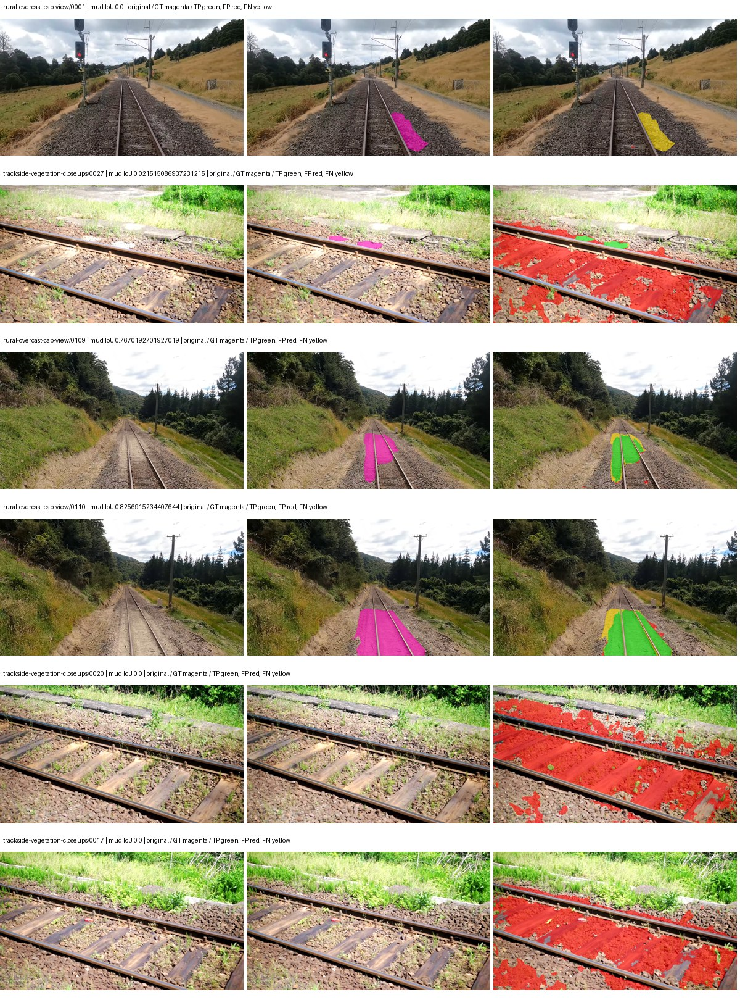
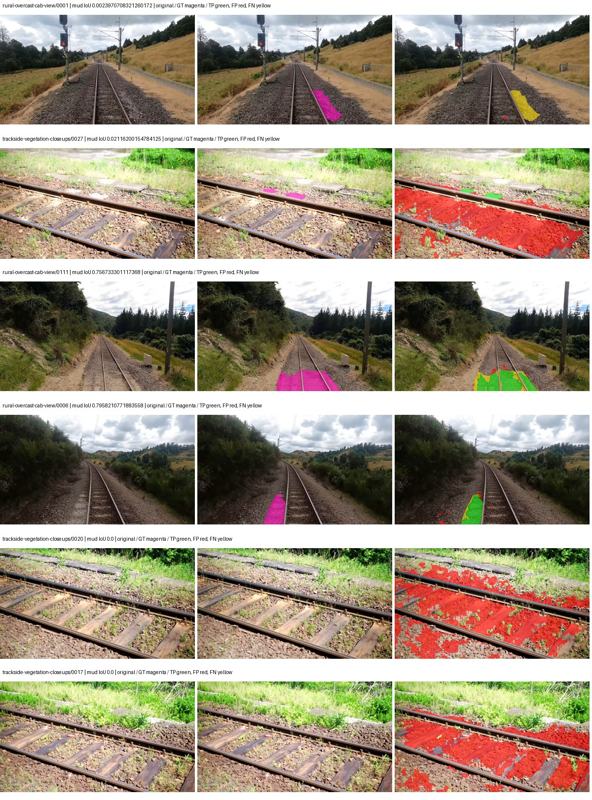
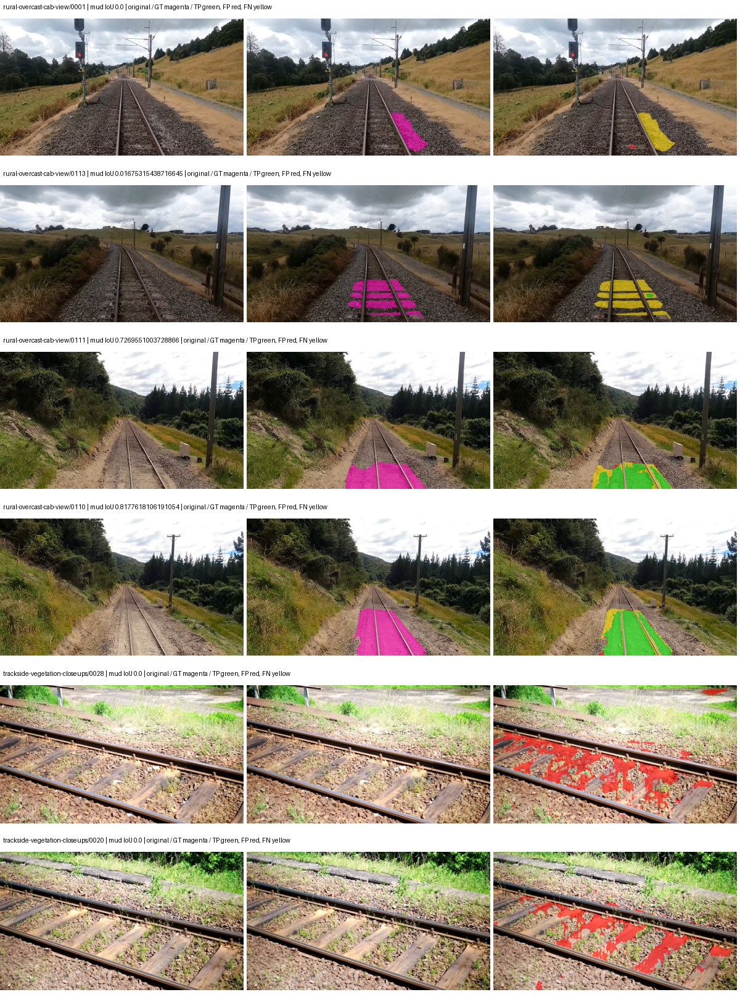
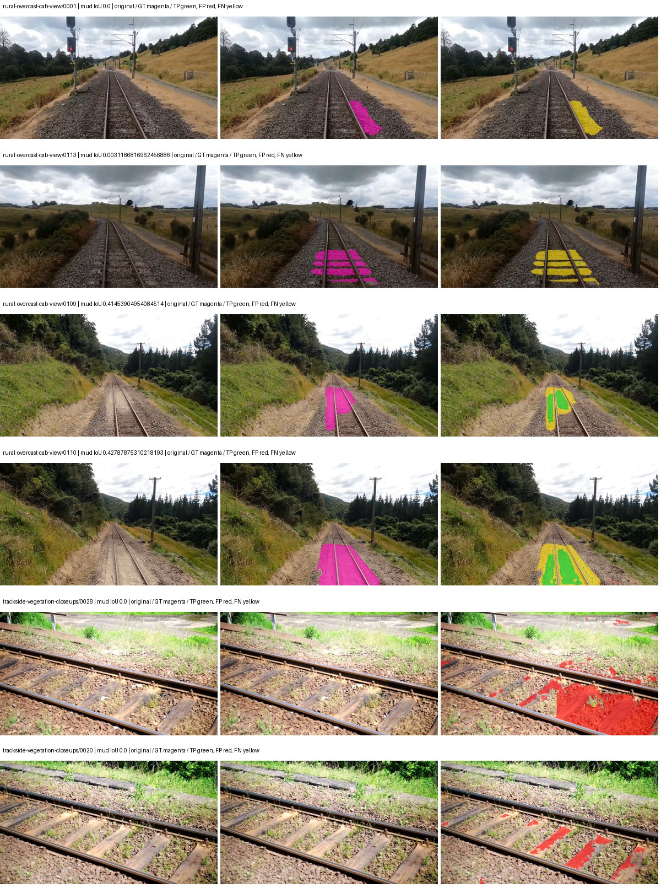

# eomt_dinov3_large — rad_9_24_2026-fixed-grouped

[RAD 9/24: Scene-grouped split](../../README.md) · [Full model records](record.json)

Primary selection and early stopping: **mud-pumping validation IoU, pixels pooled over all validation images**. A job is complete only after full statistics and isolated profiling are verified.

Study metrics, counting each class only on the validation images that contain it: mud-pumping IoU is the mean per-image IoU over the images with mud-pumping, precision and recall sum pixels over those images, and mIoU averages each class over the images that contain it, then over the classes present.

| Initialization path | Seed | Mud-pumping IoU, train-camera images with mud (%, n=17) | Mud-pumping IoU, all images with mud (%, n=18) | Mud precision, all images with mud (%) | Mud recall, all images with mud (%) | mIoU (each class over images that contain it) (%) |
| --- | --- | --- | --- | --- | --- | --- |
| rtis_only | 0 | 39.11 | 37.06 | 47.13 | 43.52 | 47.86 |
| cityscapes_to_rtis | 0 | 41.38 | 39.19 | 47.80 | 47.54 | 49.70 |
| railsem19_to_rtis | 0 | 34.17 | 32.53 | 64.38 | 38.89 | 55.61 |
| cityscapes_to_railsem19_to_rtis | 0 | 11.50 | 11.49 | 66.11 | 13.94 | 48.62 |

Per-class IoU: IoU (%) of every class, each averaged only over the validation images that contain the class (n = those images); — = no image contains it. mIoU averages the classes with at least one such image.

| Initialization path | Seed | mIoU (each class over images that contain it) | person (n=0) | truck (n=0) | rail-track (n=37) | vegetation-overgrowth (n=13) | car (n=3) | on-rails (n=0) | traffic-sign (n=9) | road (n=11) | sidewalk (n=12) | construction (n=12) | tram-track (n=2) | pole (n=21) | traffic-light (n=3) | mud-pumping (n=18) | fence (n=7) | terrain (n=35) | sky (n=28) | rail-embedded (n=3) | rail-raised (n=37) | trackbed (n=37) | standing-water (n=9) |
| --- | --- | --- | --- | --- | --- | --- | --- | --- | --- | --- | --- | --- | --- | --- | --- | --- | --- | --- | --- | --- | --- | --- | --- |
| rtis_only | 0 | 47.86 | — | — | 68.31 | 26.02 | 34.48 | — | 26.02 | 11.40 | 26.06 | 39.60 | 36.60 | 70.87 | 44.80 | 37.06 | 40.86 | 87.47 | 96.79 | 2.54 | 78.08 | 75.07 | 59.37 |
| cityscapes_to_rtis | 0 | 49.70 | — | — | 68.39 | 29.04 | 63.82 | — | 33.70 | 15.12 | 27.14 | 58.85 | 21.58 | 73.47 | 51.71 | 39.19 | 44.23 | 87.82 | 96.92 | 0.00 | 75.99 | 73.20 | 34.36 |
| railsem19_to_rtis | 0 | 55.61 | — | — | 75.43 | 45.38 | 54.51 | — | 37.55 | 15.24 | 44.79 | 57.14 | 46.09 | 72.82 | 46.03 | 32.53 | 47.17 | 88.65 | 97.24 | 48.90 | 78.28 | 77.40 | 35.92 |
| cityscapes_to_railsem19_to_rtis | 0 | 48.62 | — | — | 69.47 | 36.29 | 63.20 | — | 35.01 | 17.01 | 40.29 | 60.71 | 0.25 | 73.35 | 52.88 | 11.49 | 45.06 | 87.07 | 96.89 | 28.68 | 76.83 | 73.78 | 6.81 |

Everything below is the campaign's own record, with pixels pooled over all validation images (the checkpoint was selected on that pooled mud IoU).

| Model | Initialization path | Seed | Status | Steps | Best step | Mud IoU, pixels pooled (%) | Mud precision, pixels pooled (%) | Mud recall, pixels pooled (%) | Final mud IoU (trainer val, pixels pooled, %) | mIoU, pixels pooled (%) | Fixed GT-class mIoU, pixels pooled (%) |
| --- | --- | --- | --- | --- | --- | --- | --- | --- | --- | --- | --- |
| eomt_dinov3_large | rtis_only | 0 | completed | 3111 | 3111 | 8.67 | 9.77 | 43.52 | 8.67 | 43.80 | 48.67 |
| eomt_dinov3_large | cityscapes_to_rtis | 0 | completed | 3370 | 2074 | 10.58 | 11.98 | 47.54 | 10.49 | 46.27 | 51.42 |
| eomt_dinov3_large | railsem19_to_rtis | 0 | completed | 4000 | 3888 | 18.84 | 26.76 | 38.89 | 18.87 | 49.96 | 58.28 |
| eomt_dinov3_large | cityscapes_to_railsem19_to_rtis | 0 | completed | 2074 | 777 | 8.22 | 16.68 | 13.94 | 4.84 | 44.82 | 52.29 |

Training: 217 images. Validation: 37 images. Test: 60 held out. Seeds: [0]. Seed variation measures optimization variability, not independent-recording uncertainty. Historical source checkpoints stay fixed across adaptation seeds.

Training code: `d864b72bd90706260965bb1a48398d01167b6d5c`. Split SHA-256: `12d7b367c72cda61d57686ff2ac28223530d0af49debd9fb7a0fbc68b908bc93`.

## rtis_only — seed 0

Status: **completed**. Started: 2026-10-05T19:29:41.237262+00:00. Finished: 2026-10-05T20:54:55.159159+00:00.

Recipe pretrained initializer: `tue-mps/eomt-dinov3-coco-panoptic-large-640 (DINOv3 ViT-L/16, COCO panoptic)`.

`rtis_only` uses the recipe initializer, which may include pretrained segmentation components. Transfer paths load the exact historical source checkpoint below and reset the classifier; they do not reset all query/decoder features.

Source checkpoint: `Recipe pretrained initialization`.

Config SHA-256: `6ba7263793be523132007c2394edeef7b74e755bdc9de3361f61be23d23a5e0f`. Weights used for validation: `ema`.

### Mud-pumping and aggregate quality

| Metric | Selected checkpoint | Final training validation |
| --- | --- | --- |
| Mud IoU | 8.67 | 8.67 |
| Mud precision | 9.77 | 9.77 |
| Mud recall | 43.52 | 43.53 |
| Mud Dice/F1 | 15.96 | 15.96 |
| mIoU | 43.80 | 43.78 |
| Mean accuracy | 60.56 | 60.55 |
| Mean precision | 62.52 | 62.56 |
| Mean Dice | 53.81 | 53.75 |
| Mean specificity | 99.15 | 99.15 |
| Pixel accuracy | 86.04 | 86.04 |
| Frequency-weighted IoU | 79.31 | 79.31 |
| Fixed GT-present class mIoU | 48.67 | 48.64 |
| Boundary F1 | 54.05 | 53.60 |

The selected checkpoint has independent evaluation evidence. Final values are the trainer's final validation record, not a new independent evaluation. mIoU averages classes with nonzero union, so false positives on absent classes can change its denominator. The fixed GT-class mean is supplementary and excludes absent classes; their false positives remain in the confusion matrix.

### Resource usage and timing

| Measurement | Value |
| --- | --- |
| Peak training VRAM, retained training invocation (GiB) | 17.84 |
| Peak evaluation VRAM (GiB) | 10.77 |
| Retained training invocation wall time (seconds) | 4813.20 |
| Retained training invocation GPU-hours (one GPU) | 1.34 |
| Evaluation wall time (seconds) | 21.85 |
| Full evaluation pipeline images/second | 1.69 |
| Best full-state checkpoint (MiB) | 4805.94 |
| Final full-state checkpoint (MiB) | 4805.92 |
| Verified periodic checkpoints removed (GiB) | 28.16 |

VRAM uses the recorded allocator high-water mark; it is not total device usage including CUDA context. Resumed jobs' retained training invocation times and peaks are **not whole-campaign totals**. Earlier invocation resource records are not reconstructed here. Evaluation throughput includes loader, sliding-window inference and metrics; it is not model-only latency/FPS. Missing measurements are shown as —, never inferred from another dataset's run.

### Standardized inference performance

Dedicated model-only profiling waits for an idle worker-locked L40S: BF16, batch 1, 1024x1024, 20 warmup and 100 CUDA-event-timed public forwards. It excludes loading, preprocessing, tiling and metrics.

| Status | Parameters | Weight MiB | FPS | p50 ms | p95 ms | Peak reserved GiB |
| --- | --- | --- | --- | --- | --- | --- |
| complete | 314917910 | 1201.32 | 38.25 | 24.39 | 24.46 | 3.13 |

```json
{
  "schema_version": 1,
  "model_id": "eomt_dinov3_large",
  "measured_at": "2026-10-05T20:54:15+00:00",
  "status": "complete",
  "benchmark_scope": "rtis_selected_checkpoint_model_only",
  "applies_to": [
    "eomt_dinov3_large--rtis_only--seed-0"
  ],
  "source": {
    "campaign_git_sha": "d864b72bd90706260965bb1a48398d01167b6d5c",
    "git_dirty": false,
    "config_hash": "128f8950f46e",
    "resolved_config": "/data/izadia1/projects/segmentary-runs/rad_9_24_2026/fixed-grouped-seed0-20261005-r2/configs/eomt_dinov3_large--rtis_only--seed-0.yaml",
    "config_sha256": "6ba7263793be523132007c2394edeef7b74e755bdc9de3361f61be23d23a5e0f",
    "checkpoint_sha256": "e561a58fd5a308102c240812e269ced6801d84c70145830c8c35f354abf0fe75",
    "checkpoint_global_step": 3111,
    "checkpoint_bytes": 5039394809,
    "checkpoint_kind": "resume checkpoint with optimizer and EMA state",
    "weights": "ema",
    "measured_checkpoint_job_id": "eomt_dinov3_large--rtis_only--seed-0",
    "result_sha256": "b5fda44338a217bf8467077d3b3e3948b7ca1b32a8283d3e67416b8debebccd8",
    "result_git_sha": "d864b72bd90706260965bb1a48398d01167b6d5c",
    "result_stage": "eval:rad_9_24_2026-fixed-grouped:val",
    "result_seed": 0
  },
  "hardware": {
    "gpu_name": "NVIDIA L40S",
    "gpu_uuid": "GPU-804aea8b-5f62-423e-72c6-49e1ed15c4e4",
    "logical_device": "cuda:0",
    "physical_visibility_token": "6",
    "compute_capability": [
      8,
      9
    ],
    "total_memory_bytes": 47677177856
  },
  "model": {
    "parameter_count": 314917910,
    "trainable_parameter_count": 314917910,
    "resident_parameter_bytes": 1259671640,
    "parameter_dtype_counts": {
      "float32": 314917910
    }
  },
  "contract": {
    "backend": "pytorch",
    "precision": "bf16_autocast",
    "batch_size": 1,
    "input_shape_nchw": [
      1,
      3,
      1024,
      1024
    ],
    "warmup_iterations": 20,
    "measured_iterations": 100,
    "timing": "per-forward CUDA events with end-event synchronization",
    "includes_preprocessing": false,
    "includes_data_loader": false,
    "includes_sliding_window": false,
    "input_resident_on_gpu": true,
    "model_only": true,
    "entrypoint": "public model(image) dense-logits forward"
  },
  "measurements": {
    "latency": {
      "p50_ms": 24.391679763793945,
      "p95_ms": 24.458394050598145,
      "mean_ms": 26.143866596221923,
      "minimum_ms": 24.317951202392578,
      "maximum_ms": 195.6546630859375,
      "fps": 38.24988917838615,
      "raw_ms": [
        24.365055084228516,
        24.396799087524414,
        24.33228874206543,
        24.32819175720215,
        24.390655517578125,
        24.357887268066406,
        24.390655517578125,
        24.344575881958008,
        24.33228874206543,
        24.408063888549805,
        24.34764862060547,
        24.380416870117188,
        24.351743698120117,
        24.371200561523438,
        24.32102394104004,
        24.370176315307617,
        24.400896072387695,
        24.416255950927734,
        25.47711944580078,
        24.430591583251953,
        24.317951202392578,
        24.342527389526367,
        24.391679763793945,
        24.396799087524414,
        24.391679763793945,
        24.421375274658203,
        24.386560440063477,
        24.35686492919922,
        24.35686492919922,
        24.385536193847656,
        24.423391342163086,
        24.388608932495117,
        24.368127822875977,
        24.447999954223633,
        24.408063888549805,
        24.407039642333984,
        24.350719451904297,
        24.458240509033203,
        24.376319885253906,
        24.401920318603516,
        24.403968811035156,
        24.384511947631836,
        24.426496505737305,
        24.397823333740234,
        24.428543090820312,
        24.442880630493164,
        24.384511947631836,
        24.414207458496094,
        24.401920318603516,
        24.3558406829834,
        24.369152069091797,
        24.397823333740234,
        24.421375274658203,
        24.401920318603516,
        24.379392623901367,
        24.393728256225586,
        24.361984252929688,
        24.373247146606445,
        195.6546630859375,
        24.46131134033203,
        24.35686492919922,
        24.408063888549805,
        24.431615829467773,
        24.361984252929688,
        24.415231704711914,
        24.359935760498047,
        24.3558406829834,
        27.14316749572754,
        24.440832138061523,
        24.361984252929688,
        24.383487701416016,
        24.359935760498047,
        24.383487701416016,
        24.395776748657227,
        24.425472259521484,
        24.363008499145508,
        24.458240509033203,
        24.394752502441406,
        24.406015396118164,
        24.380416870117188,
        24.384511947631836,
        24.452096939086914,
        24.432640075683594,
        24.381439208984375,
        24.368127822875977,
        24.438783645629883,
        24.442880630493164,
        24.406015396118164,
        24.421375274658203,
        24.383487701416016,
        24.388608932495117,
        24.397823333740234,
        24.446975708007812,
        24.49612808227539,
        24.432640075683594,
        24.414207458496094,
        24.380416870117188,
        24.389631271362305,
        24.341503143310547,
        24.454143524169922
      ],
      "percentile_method": "numpy linear interpolation"
    },
    "peak_reserved_bytes": 3359637504,
    "memory_kind": "pytorch_cuda_allocator_peak_reserved_excluding_context",
    "benchmark_wall_clock_s": 3.6675397977232933
  },
  "started_at": "2026-10-05T20:54:11+00:00",
  "finished_at": "2026-10-05T20:54:15+00:00",
  "environment": {
    "hostname": "hdrfs-app-001",
    "python": "3.11.15",
    "platform": "Linux-5.15.0-139-generic-x86_64-with-glibc2.35",
    "torch": "2.11.0+cu128",
    "torch_cuda": "12.8",
    "cudnn": 91900,
    "driver_version": "570.133.20",
    "cuda_available": true,
    "gpu_count": 1,
    "gpu_names": [
      "NVIDIA L40S"
    ],
    "cuda_visible_devices": "6",
    "packages": {
      "segmentary": "0.1.0",
      "torch": "2.11.0+cu128",
      "torchvision": "0.26.0+cu128",
      "transformers": "5.15.0",
      "timm": "1.0.28",
      "segmentation-models-pytorch": "0.5.0",
      "albumentations": "2.0.8",
      "lightning": "2.6.5",
      "numpy": "2.4.4"
    }
  }
}
```

### Per-class validation results

| Class | GT pixels | IoU (%) | Precision (%) | Recall (%) | Dice (%) | Boundary F1 (%) |
| --- | --- | --- | --- | --- | --- | --- |
| car | 29664 | 4.24 | 9.86 | 6.92 | 8.14 | 10.86 |
| construction | 311585 | 39.87 | 44.56 | 79.11 | 57.01 | 49.96 |
| fence | 265137 | 41.83 | 62.79 | 55.62 | 58.98 | 60.76 |
| mud-pumping | 1226250 | 8.67 | 9.77 | 43.52 | 15.96 | 14.43 |
| on-rails | 0 | 0.00 | 0.00 | — | 0.00 | 0.00 |
| person | 0 | — | — | — | — | — |
| pole | 628038 | 76.76 | 86.03 | 87.69 | 86.85 | 93.57 |
| rail-embedded | 16799 | 5.89 | 98.22 | 5.90 | 11.13 | 46.77 |
| rail-raised | 2969797 | 81.61 | 86.18 | 93.89 | 89.87 | 95.05 |
| rail-track | 6323197 | 51.79 | 83.44 | 57.72 | 68.24 | 64.41 |
| road | 1048831 | 9.35 | 24.32 | 13.19 | 17.10 | 14.67 |
| sidewalk | 1297367 | 42.28 | 90.96 | 44.13 | 59.43 | 58.92 |
| sky | 19121606 | 98.78 | 99.44 | 99.34 | 99.39 | 98.38 |
| standing-water | 95802 | 50.16 | 59.33 | 76.43 | 66.81 | 68.55 |
| terrain | 39239306 | 89.74 | 90.71 | 98.82 | 94.59 | 72.66 |
| trackbed | 10643081 | 76.38 | 89.43 | 83.96 | 86.61 | 76.03 |
| traffic-light | 19510 | 72.36 | 94.87 | 75.30 | 83.96 | 80.10 |
| traffic-sign | 13285 | 44.76 | 57.73 | 66.59 | 61.84 | 67.19 |
| tram-track | 56179 | 60.49 | 70.99 | 80.36 | 75.38 | 60.21 |
| truck | 0 | 0.00 | 0.00 | — | 0.00 | 0.00 |
| vegetation-overgrowth | 5901821 | 21.14 | 91.75 | 21.55 | 34.90 | 48.51 |

### Full-run accounting

| Measurement | Value |
| --- | --- |
| Full GPU-reserved wall seconds, all recorded worker attempts | 5121.40 |
| Full reserved GPU-hours | 1.42 |
| Whole-run timing complete | True |

| Phase | Wall seconds including failed attempts |
| --- | --- |
| training | 4820.34 |
| diagnostics | 194.36 |
| performance | 20.17 |

GPU-reserved time includes model loading, training, validation, collection, profiling, checkpoint I/O and orchestration while the worker owns one GPU. It is not GPU kernel-active time. Phase timings and sampled device memory/power/utilization are retained separately; sampled device memory is not the allocator high-water mark.

### Train/validation and raw/EMA diagnostics

| Checkpoint / weights / split | Images | Mud IoU (%) | Mud precision (%) | Mud recall (%) |
| --- | --- | --- | --- | --- |
| best-auto-train / ema | 217 | 94.84 | 96.89 | 97.83 |
| best-auto-val / ema | 37 | 8.67 | 9.77 | 43.52 |
| best-alternate-val / raw | 37 | 10.49 | 12.33 | 41.30 |
| final-auto-val / ema | 37 | 8.67 | 9.77 | 43.52 |

Train uses the evaluation transform without augmentation. Compare mud train/validation metrics for the same selected weights. Alternate EMA on running-stat BatchNorm is explicitly uncalibrated and is diagnostic only. Score-threshold curves use uncalibrated normalized scores and are pixel-level diagnostics, not event detection rates or a selected deployment operating point.

### Downloadable evidence

- best-auto-train: [per-image.csv](rtis_only--seed-0/best-auto-train/per-image.csv) · [per-image-confusion.json.gz](rtis_only--seed-0/best-auto-train/per-image-confusion.json.gz) · [groups.json](rtis_only--seed-0/best-auto-train/groups.json) · [mud-score-curves.json](rtis_only--seed-0/best-auto-train/mud-score-curves.json)
- best-auto-val: [per-image.csv](rtis_only--seed-0/best-auto-val/per-image.csv) · [per-image-confusion.json.gz](rtis_only--seed-0/best-auto-val/per-image-confusion.json.gz) · [groups.json](rtis_only--seed-0/best-auto-val/groups.json) · [mud-score-curves.json](rtis_only--seed-0/best-auto-val/mud-score-curves.json) · [examples.jpg](rtis_only--seed-0/best-auto-val/examples.jpg)
- best-alternate-val: [per-image.csv](rtis_only--seed-0/best-alternate-val/per-image.csv) · [per-image-confusion.json.gz](rtis_only--seed-0/best-alternate-val/per-image-confusion.json.gz) · [groups.json](rtis_only--seed-0/best-alternate-val/groups.json) · [mud-score-curves.json](rtis_only--seed-0/best-alternate-val/mud-score-curves.json)
- final-auto-val: [per-image.csv](rtis_only--seed-0/final-auto-val/per-image.csv) · [per-image-confusion.json.gz](rtis_only--seed-0/final-auto-val/per-image-confusion.json.gz) · [groups.json](rtis_only--seed-0/final-auto-val/groups.json) · [mud-score-curves.json](rtis_only--seed-0/final-auto-val/mud-score-curves.json)
- resources: [telemetry.csv](rtis_only--seed-0/resources/telemetry.csv)



Examples are two lowest and two highest mud-IoU positive images, plus up to two negative images with the most false-positive mud pixels. They are targeted diagnostic examples, not random samples. Green: true positive; red: false positive; yellow: false negative. Full predictions remain on HDRFS.

### Validation tracking

| Logged step | Overall mIoU (%) | Mud IoU (%) |
| --- | --- | --- |
| 258 | 24.24 | 0.00 |
| 518 | 37.15 | 3.85 |
| 777 | 38.84 | 5.69 |
| 1036 | 39.49 | 6.24 |
| 1295 | 41.77 | 7.18 |
| 1555 | 43.77 | 7.70 |
| 1814 | 43.15 | 8.63 |
| 2073 | 43.65 | 8.58 |
| 2332 | 43.67 | 8.59 |
| 2592 | 43.77 | 8.62 |
| 2851 | 43.74 | 8.63 |
| 3110 | 43.78 | 8.67 |

All retained scalar curves, including training loss and per-class IoU, are in record.json. Observed best mud on a curve is not necessarily a retained checkpoint: the pilot saved its selection-metric-best and final checkpoints. Step logging and checkpoint global_step may differ by one.

### Stopping and checkpoint provenance

```json
{
  "stopping": {
    "actual_steps": 3111,
    "maximum_steps": 4000,
    "min_delta": 0.001,
    "monitor": "val_iou/mud-pumping",
    "patience": 5,
    "reason": "validation_plateau"
  },
  "checkpoints": {
    "best": {
      "path": "/data/izadia1/projects/segmentary-runs/rad_9_24_2026/fixed-grouped-seed0-20261005-r2/future-runs/eomt_dinov3_large--rtis_only--seed-0_seed0/rtis/best.ckpt",
      "sha256": "e561a58fd5a308102c240812e269ced6801d84c70145830c8c35f354abf0fe75",
      "global_step": 3111,
      "bytes": 5039394809
    },
    "final": {
      "path": "/data/izadia1/projects/segmentary-runs/rad_9_24_2026/fixed-grouped-seed0-20261005-r2/future-runs/eomt_dinov3_large--rtis_only--seed-0_seed0/rtis/last.ckpt",
      "sha256": "20b32c75d5f9f627047570b478110c106219d5f8a7878156f427b6082aa32ed4",
      "global_step": 3111,
      "bytes": 5039374009
    }
  },
  "cleanup_error": null
}
```

### Resolved training, initialization and evaluation settings

The optimizer block is the base configuration. Stage LR scales are applied at runtime, and stage warmup is capped at min(base warmup, floor(stage budget / 10), stage budget - 1): 400 steps for this 4,000-step pilot. Model-internal native input grids may differ from augmentation crops (EoMT uses its 640 grid).

```json
{
  "name": "eomt_dinov3_large--rtis_only--seed-0",
  "model": {
    "arch": "eomt_dinov3_large",
    "checkpoint": null,
    "tuning": "full",
    "head": "unified_head",
    "lora_r": 16,
    "lora_alpha": 32,
    "lora_dropout": 0.05,
    "lora_targets": [],
    "drop_path": null,
    "revision": null,
    "subfolder": null,
    "local_files_only": false,
    "trust_remote_code": false,
    "backbone_path": null,
    "head_paths": [],
    "classifier_path": null,
    "inactive_parameter_paths": [],
    "smp_arch": null,
    "encoder_name": null,
    "encoder_weights": null,
    "native": null,
    "batch_norm_momentum": null
  },
  "space": "paul-test-rtis",
  "taxonomy_root": "/data/izadia1/projects/segmentary-rad-d864b72b/taxonomy",
  "output_root": "/data/izadia1/projects/segmentary-runs/rad_9_24_2026/fixed-grouped-seed0-20261005-r2/future-runs",
  "optim": {
    "backbone_lr": 1e-05,
    "head_lr_mult": 10.0,
    "weight_decay": 0.05,
    "llrd": 0.75,
    "warmup_iters": 1500,
    "warmup_ratio": 1e-06,
    "poly_power": 0.9,
    "min_lr_ratio": 0.0,
    "betas": [
      0.9,
      0.999
    ],
    "grad_clip": 1.0
  },
  "train": {
    "iters": 4000,
    "batch_size": 2,
    "accum": 8,
    "num_workers": 2,
    "precision": "bf16-mixed",
    "ema_decay": 0.9998,
    "val_every": 250,
    "ckpt_every": 500,
    "selection_metric": "val_iou/mud-pumping",
    "early_stopping_patience": 5,
    "early_stopping_min_delta": 0.001,
    "seed": 0,
    "devices": 1
  },
  "eval": {
    "sliding_window": true,
    "window": [
      1024,
      1024
    ],
    "stride": [
      768,
      768
    ],
    "batch_size": 1,
    "num_workers": 2,
    "tta_scales": [],
    "tta_flip": false,
    "threshold": 0.5,
    "boundary_tolerance_frac": 0.0075,
    "save_confusion": true
  },
  "loss": {
    "task": "multiclass",
    "activation": "auto",
    "terms": [],
    "aux": "none",
    "aux_weight": 0.0,
    "ce_weight": 1.0,
    "label_smoothing": 0.0,
    "class_weights": null,
    "query": {
      "kind": "hungarian_query",
      "classification_weight": 2.0,
      "mask_bce_weight": 5.0,
      "dice_weight": 5.0,
      "no_object_coefficient": 0.1,
      "match_class_cost": 2.0,
      "match_mask_bce_cost": 5.0,
      "match_dice_cost": 5.0,
      "matching_num_points": 8192,
      "auxiliary_layer_weight": 1.0,
      "dice_smooth": 1.0
    }
  },
  "aug": {
    "crop": [
      1024,
      1024
    ],
    "scale_min": 0.5,
    "scale_max": 2.0,
    "hflip_p": 0.5,
    "color_jitter_p": 0.5,
    "brightness": 0.25,
    "contrast": 0.25,
    "saturation": 0.25,
    "hue": 0.05
  },
  "stages": [
    {
      "name": "rtis",
      "data": [
        {
          "name": "rad_9_24_2026-fixed-grouped",
          "root": "/data/izadia1/datasets/rad_9_24_2026-fixed-grouped",
          "variant": null,
          "split_file": "splits.json",
          "train_split": "train",
          "val_split": "val",
          "limit": null,
          "loader": "folder",
          "mapping": "paul-test-rtis",
          "loader_options": {
            "require_groups": true
          }
        }
      ],
      "iters": null,
      "lr_scale": 1.0,
      "head_group_lr_scale": 1.0,
      "init_from": "pretrained",
      "reset_head": false,
      "freeze": null,
      "sample_weights": null
    }
  ]
}
```

### Hardware and software provenance

```json
{
  "training": {
    "cuda_available": true,
    "cuda_visible_devices": "6",
    "cudnn": 91900,
    "driver_version": "570.133.20",
    "gpu_count": 1,
    "gpu_names": [
      "NVIDIA L40S"
    ],
    "hostname": "hdrfs-app-001",
    "input_normalization": {
      "channel_order": "rgb",
      "mean": [
        0.485,
        0.456,
        0.406
      ],
      "source": "imagenet",
      "std": [
        0.229,
        0.224,
        0.225
      ]
    },
    "model_origins": [
      {
        "hf_commit": "e8c0564219d89c9000add20d89d052d9f7464236",
        "hf_name_or_path": "tue-mps/eomt-dinov3-coco-panoptic-large-640",
        "module": "model",
        "timm_pretrained": {}
      },
      {
        "hf_commit": "e8c0564219d89c9000add20d89d052d9f7464236",
        "hf_name_or_path": "tue-mps/eomt-dinov3-coco-panoptic-large-640",
        "module": "model.embeddings",
        "timm_pretrained": {}
      },
      {
        "hf_commit": "e8c0564219d89c9000add20d89d052d9f7464236",
        "hf_name_or_path": "tue-mps/eomt-dinov3-coco-panoptic-large-640",
        "module": "model.layers.0.attention",
        "timm_pretrained": {}
      },
      {
        "hf_commit": "e8c0564219d89c9000add20d89d052d9f7464236",
        "hf_name_or_path": "tue-mps/eomt-dinov3-coco-panoptic-large-640",
        "module": "model.layers.0.mlp",
        "timm_pretrained": {}
      },
      {
        "hf_commit": "e8c0564219d89c9000add20d89d052d9f7464236",
        "hf_name_or_path": "tue-mps/eomt-dinov3-coco-panoptic-large-640",
        "module": "model.layers.1.attention",
        "timm_pretrained": {}
      },
      {
        "hf_commit": "e8c0564219d89c9000add20d89d052d9f7464236",
        "hf_name_or_path": "tue-mps/eomt-dinov3-coco-panoptic-large-640",
        "module": "model.layers.1.mlp",
        "timm_pretrained": {}
      },
      {
        "hf_commit": "e8c0564219d89c9000add20d89d052d9f7464236",
        "hf_name_or_path": "tue-mps/eomt-dinov3-coco-panoptic-large-640",
        "module": "model.layers.2.attention",
        "timm_pretrained": {}
      },
      {
        "hf_commit": "e8c0564219d89c9000add20d89d052d9f7464236",
        "hf_name_or_path": "tue-mps/eomt-dinov3-coco-panoptic-large-640",
        "module": "model.layers.2.mlp",
        "timm_pretrained": {}
      },
      {
        "hf_commit": "e8c0564219d89c9000add20d89d052d9f7464236",
        "hf_name_or_path": "tue-mps/eomt-dinov3-coco-panoptic-large-640",
        "module": "model.layers.3.attention",
        "timm_pretrained": {}
      },
      {
        "hf_commit": "e8c0564219d89c9000add20d89d052d9f7464236",
        "hf_name_or_path": "tue-mps/eomt-dinov3-coco-panoptic-large-640",
        "module": "model.layers.3.mlp",
        "timm_pretrained": {}
      },
      {
        "hf_commit": "e8c0564219d89c9000add20d89d052d9f7464236",
        "hf_name_or_path": "tue-mps/eomt-dinov3-coco-panoptic-large-640",
        "module": "model.layers.4.attention",
        "timm_pretrained": {}
      },
      {
        "hf_commit": "e8c0564219d89c9000add20d89d052d9f7464236",
        "hf_name_or_path": "tue-mps/eomt-dinov3-coco-panoptic-large-640",
        "module": "model.layers.4.mlp",
        "timm_pretrained": {}
      },
      {
        "hf_commit": "e8c0564219d89c9000add20d89d052d9f7464236",
        "hf_name_or_path": "tue-mps/eomt-dinov3-coco-panoptic-large-640",
        "module": "model.layers.5.attention",
        "timm_pretrained": {}
      },
      {
        "hf_commit": "e8c0564219d89c9000add20d89d052d9f7464236",
        "hf_name_or_path": "tue-mps/eomt-dinov3-coco-panoptic-large-640",
        "module": "model.layers.5.mlp",
        "timm_pretrained": {}
      },
      {
        "hf_commit": "e8c0564219d89c9000add20d89d052d9f7464236",
        "hf_name_or_path": "tue-mps/eomt-dinov3-coco-panoptic-large-640",
        "module": "model.layers.6.attention",
        "timm_pretrained": {}
      },
      {
        "hf_commit": "e8c0564219d89c9000add20d89d052d9f7464236",
        "hf_name_or_path": "tue-mps/eomt-dinov3-coco-panoptic-large-640",
        "module": "model.layers.6.mlp",
        "timm_pretrained": {}
      },
      {
        "hf_commit": "e8c0564219d89c9000add20d89d052d9f7464236",
        "hf_name_or_path": "tue-mps/eomt-dinov3-coco-panoptic-large-640",
        "module": "model.layers.7.attention",
        "timm_pretrained": {}
      },
      {
        "hf_commit": "e8c0564219d89c9000add20d89d052d9f7464236",
        "hf_name_or_path": "tue-mps/eomt-dinov3-coco-panoptic-large-640",
        "module": "model.layers.7.mlp",
        "timm_pretrained": {}
      },
      {
        "hf_commit": "e8c0564219d89c9000add20d89d052d9f7464236",
        "hf_name_or_path": "tue-mps/eomt-dinov3-coco-panoptic-large-640",
        "module": "model.layers.8.attention",
        "timm_pretrained": {}
      },
      {
        "hf_commit": "e8c0564219d89c9000add20d89d052d9f7464236",
        "hf_name_or_path": "tue-mps/eomt-dinov3-coco-panoptic-large-640",
        "module": "model.layers.8.mlp",
        "timm_pretrained": {}
      },
      {
        "hf_commit": "e8c0564219d89c9000add20d89d052d9f7464236",
        "hf_name_or_path": "tue-mps/eomt-dinov3-coco-panoptic-large-640",
        "module": "model.layers.9.attention",
        "timm_pretrained": {}
      },
      {
        "hf_commit": "e8c0564219d89c9000add20d89d052d9f7464236",
        "hf_name_or_path": "tue-mps/eomt-dinov3-coco-panoptic-large-640",
        "module": "model.layers.9.mlp",
        "timm_pretrained": {}
      },
      {
        "hf_commit": "e8c0564219d89c9000add20d89d052d9f7464236",
        "hf_name_or_path": "tue-mps/eomt-dinov3-coco-panoptic-large-640",
        "module": "model.layers.10.attention",
        "timm_pretrained": {}
      },
      {
        "hf_commit": "e8c0564219d89c9000add20d89d052d9f7464236",
        "hf_name_or_path": "tue-mps/eomt-dinov3-coco-panoptic-large-640",
        "module": "model.layers.10.mlp",
        "timm_pretrained": {}
      },
      {
        "hf_commit": "e8c0564219d89c9000add20d89d052d9f7464236",
        "hf_name_or_path": "tue-mps/eomt-dinov3-coco-panoptic-large-640",
        "module": "model.layers.11.attention",
        "timm_pretrained": {}
      },
      {
        "hf_commit": "e8c0564219d89c9000add20d89d052d9f7464236",
        "hf_name_or_path": "tue-mps/eomt-dinov3-coco-panoptic-large-640",
        "module": "model.layers.11.mlp",
        "timm_pretrained": {}
      },
      {
        "hf_commit": "e8c0564219d89c9000add20d89d052d9f7464236",
        "hf_name_or_path": "tue-mps/eomt-dinov3-coco-panoptic-large-640",
        "module": "model.layers.12.attention",
        "timm_pretrained": {}
      },
      {
        "hf_commit": "e8c0564219d89c9000add20d89d052d9f7464236",
        "hf_name_or_path": "tue-mps/eomt-dinov3-coco-panoptic-large-640",
        "module": "model.layers.12.mlp",
        "timm_pretrained": {}
      },
      {
        "hf_commit": "e8c0564219d89c9000add20d89d052d9f7464236",
        "hf_name_or_path": "tue-mps/eomt-dinov3-coco-panoptic-large-640",
        "module": "model.layers.13.attention",
        "timm_pretrained": {}
      },
      {
        "hf_commit": "e8c0564219d89c9000add20d89d052d9f7464236",
        "hf_name_or_path": "tue-mps/eomt-dinov3-coco-panoptic-large-640",
        "module": "model.layers.13.mlp",
        "timm_pretrained": {}
      },
      {
        "hf_commit": "e8c0564219d89c9000add20d89d052d9f7464236",
        "hf_name_or_path": "tue-mps/eomt-dinov3-coco-panoptic-large-640",
        "module": "model.layers.14.attention",
        "timm_pretrained": {}
      },
      {
        "hf_commit": "e8c0564219d89c9000add20d89d052d9f7464236",
        "hf_name_or_path": "tue-mps/eomt-dinov3-coco-panoptic-large-640",
        "module": "model.layers.14.mlp",
        "timm_pretrained": {}
      },
      {
        "hf_commit": "e8c0564219d89c9000add20d89d052d9f7464236",
        "hf_name_or_path": "tue-mps/eomt-dinov3-coco-panoptic-large-640",
        "module": "model.layers.15.attention",
        "timm_pretrained": {}
      },
      {
        "hf_commit": "e8c0564219d89c9000add20d89d052d9f7464236",
        "hf_name_or_path": "tue-mps/eomt-dinov3-coco-panoptic-large-640",
        "module": "model.layers.15.mlp",
        "timm_pretrained": {}
      },
      {
        "hf_commit": "e8c0564219d89c9000add20d89d052d9f7464236",
        "hf_name_or_path": "tue-mps/eomt-dinov3-coco-panoptic-large-640",
        "module": "model.layers.16.attention",
        "timm_pretrained": {}
      },
      {
        "hf_commit": "e8c0564219d89c9000add20d89d052d9f7464236",
        "hf_name_or_path": "tue-mps/eomt-dinov3-coco-panoptic-large-640",
        "module": "model.layers.16.mlp",
        "timm_pretrained": {}
      },
      {
        "hf_commit": "e8c0564219d89c9000add20d89d052d9f7464236",
        "hf_name_or_path": "tue-mps/eomt-dinov3-coco-panoptic-large-640",
        "module": "model.layers.17.attention",
        "timm_pretrained": {}
      },
      {
        "hf_commit": "e8c0564219d89c9000add20d89d052d9f7464236",
        "hf_name_or_path": "tue-mps/eomt-dinov3-coco-panoptic-large-640",
        "module": "model.layers.17.mlp",
        "timm_pretrained": {}
      },
      {
        "hf_commit": "e8c0564219d89c9000add20d89d052d9f7464236",
        "hf_name_or_path": "tue-mps/eomt-dinov3-coco-panoptic-large-640",
        "module": "model.layers.18.attention",
        "timm_pretrained": {}
      },
      {
        "hf_commit": "e8c0564219d89c9000add20d89d052d9f7464236",
        "hf_name_or_path": "tue-mps/eomt-dinov3-coco-panoptic-large-640",
        "module": "model.layers.18.mlp",
        "timm_pretrained": {}
      },
      {
        "hf_commit": "e8c0564219d89c9000add20d89d052d9f7464236",
        "hf_name_or_path": "tue-mps/eomt-dinov3-coco-panoptic-large-640",
        "module": "model.layers.19.attention",
        "timm_pretrained": {}
      },
      {
        "hf_commit": "e8c0564219d89c9000add20d89d052d9f7464236",
        "hf_name_or_path": "tue-mps/eomt-dinov3-coco-panoptic-large-640",
        "module": "model.layers.19.mlp",
        "timm_pretrained": {}
      },
      {
        "hf_commit": "e8c0564219d89c9000add20d89d052d9f7464236",
        "hf_name_or_path": "tue-mps/eomt-dinov3-coco-panoptic-large-640",
        "module": "model.layers.20.attention",
        "timm_pretrained": {}
      },
      {
        "hf_commit": "e8c0564219d89c9000add20d89d052d9f7464236",
        "hf_name_or_path": "tue-mps/eomt-dinov3-coco-panoptic-large-640",
        "module": "model.layers.20.mlp",
        "timm_pretrained": {}
      },
      {
        "hf_commit": "e8c0564219d89c9000add20d89d052d9f7464236",
        "hf_name_or_path": "tue-mps/eomt-dinov3-coco-panoptic-large-640",
        "module": "model.layers.21.attention",
        "timm_pretrained": {}
      },
      {
        "hf_commit": "e8c0564219d89c9000add20d89d052d9f7464236",
        "hf_name_or_path": "tue-mps/eomt-dinov3-coco-panoptic-large-640",
        "module": "model.layers.21.mlp",
        "timm_pretrained": {}
      },
      {
        "hf_commit": "e8c0564219d89c9000add20d89d052d9f7464236",
        "hf_name_or_path": "tue-mps/eomt-dinov3-coco-panoptic-large-640",
        "module": "model.layers.22.attention",
        "timm_pretrained": {}
      },
      {
        "hf_commit": "e8c0564219d89c9000add20d89d052d9f7464236",
        "hf_name_or_path": "tue-mps/eomt-dinov3-coco-panoptic-large-640",
        "module": "model.layers.22.mlp",
        "timm_pretrained": {}
      },
      {
        "hf_commit": "e8c0564219d89c9000add20d89d052d9f7464236",
        "hf_name_or_path": "tue-mps/eomt-dinov3-coco-panoptic-large-640",
        "module": "model.layers.23.attention",
        "timm_pretrained": {}
      },
      {
        "hf_commit": "e8c0564219d89c9000add20d89d052d9f7464236",
        "hf_name_or_path": "tue-mps/eomt-dinov3-coco-panoptic-large-640",
        "module": "model.layers.23.mlp",
        "timm_pretrained": {}
      },
      {
        "hf_commit": "e8c0564219d89c9000add20d89d052d9f7464236",
        "hf_name_or_path": "tue-mps/eomt-dinov3-coco-panoptic-large-640",
        "module": "model.rope_embeddings",
        "timm_pretrained": {}
      }
    ],
    "model_parameter_count": 314917910,
    "packages": {
      "albumentations": "2.0.8",
      "lightning": "2.6.5",
      "numpy": "2.4.4",
      "segmentary": "0.1.0",
      "segmentation-models-pytorch": "0.5.0",
      "timm": "1.0.28",
      "torch": "2.11.0+cu128",
      "torchvision": "0.26.0+cu128",
      "transformers": "5.15.0"
    },
    "platform": "Linux-5.15.0-139-generic-x86_64-with-glibc2.35",
    "python": "3.11.15",
    "torch": "2.11.0+cu128",
    "torch_cuda": "12.8",
    "trainable_parameter_count": 314917910,
    "training_stop": {
      "actual_steps": 3111,
      "maximum_steps": 4000,
      "min_delta": 0.001,
      "monitor": "val_iou/mud-pumping",
      "patience": 5,
      "reason": "validation_plateau"
    },
    "validation_weights": "ema"
  },
  "evaluation": {
    "cuda_available": true,
    "cuda_visible_devices": "6",
    "cudnn": 91900,
    "driver_version": "570.133.20",
    "gpu_count": 1,
    "gpu_names": [
      "NVIDIA L40S"
    ],
    "hostname": "hdrfs-app-001",
    "input_normalization": {
      "channel_order": "rgb",
      "mean": [
        0.485,
        0.456,
        0.406
      ],
      "source": "imagenet",
      "std": [
        0.229,
        0.224,
        0.225
      ]
    },
    "packages": {
      "albumentations": "2.0.8",
      "lightning": "2.6.5",
      "numpy": "2.4.4",
      "segmentary": "0.1.0",
      "segmentation-models-pytorch": "0.5.0",
      "timm": "1.0.28",
      "torch": "2.11.0+cu128",
      "torchvision": "0.26.0+cu128",
      "transformers": "5.15.0"
    },
    "platform": "Linux-5.15.0-139-generic-x86_64-with-glibc2.35",
    "python": "3.11.15",
    "torch": "2.11.0+cu128",
    "torch_cuda": "12.8"
  }
}
```

## cityscapes_to_rtis — seed 0

Status: **completed**. Started: 2026-10-05T19:31:23.065197+00:00. Finished: 2026-10-05T21:01:37.516475+00:00.

Recipe pretrained initializer: `tue-mps/eomt-dinov3-coco-panoptic-large-640 (DINOv3 ViT-L/16, COCO panoptic)`.

`rtis_only` uses the recipe initializer, which may include pretrained segmentation components. Transfer paths load the exact historical source checkpoint below and reset the classifier; they do not reset all query/decoder features.

Source checkpoint: `{'name': 'eomt_dinov3_large--cityscapes--seed-0', 'model': 'eomt_dinov3_large', 'protocol': 'cityscapes', 'config': '/data/izadia1/projects/segmentary-runs/all-model-city-rail-seed0-rail20-b9eb3e1/accepted/eomt_dinov3_large--cityscapes--seed-0/resolved-config.yaml', 'checkpoint': '/data/izadia1/projects/segmentary-runs/all-model-city-rail-seed0-a7c0b67/jobs/eomt_dinov3_large--cityscapes--seed-0/attempt-001/train/eomt_dinov3_large--cityscapes_seed0/cityscapes/last.ckpt', 'recorded_sha256': '070ecbb50465dee5614b17a02ca2afc5fda4bd15063608708d2eb06bdd4bf5f9', 'exists': True}`.

Config SHA-256: `f7ea52d2c992ff411755dc1afef13b64919ba6acca0a17f8e4f6305ee0f84af9`. Weights used for validation: `ema`.

### Mud-pumping and aggregate quality

| Metric | Selected checkpoint | Final training validation |
| --- | --- | --- |
| Mud IoU | 10.58 | 10.49 |
| Mud precision | 11.98 | 11.90 |
| Mud recall | 47.54 | 46.99 |
| Mud Dice/F1 | 19.13 | 18.99 |
| mIoU | 46.27 | 46.87 |
| Mean accuracy | 62.56 | 63.88 |
| Mean precision | 61.22 | 61.64 |
| Mean Dice | 56.24 | 56.94 |
| Mean specificity | 99.18 | 99.18 |
| Pixel accuracy | 86.49 | 86.53 |
| Frequency-weighted IoU | 79.58 | 79.64 |
| Fixed GT-present class mIoU | 51.42 | 52.08 |
| Boundary F1 | 53.76 | 53.77 |

The selected checkpoint has independent evaluation evidence. Final values are the trainer's final validation record, not a new independent evaluation. mIoU averages classes with nonzero union, so false positives on absent classes can change its denominator. The fixed GT-class mean is supplementary and excludes absent classes; their false positives remain in the confusion matrix.

### Resource usage and timing

| Measurement | Value |
| --- | --- |
| Peak training VRAM, retained training invocation (GiB) | 17.84 |
| Peak evaluation VRAM (GiB) | 10.77 |
| Retained training invocation wall time (seconds) | 5104.50 |
| Retained training invocation GPU-hours (one GPU) | 1.42 |
| Evaluation wall time (seconds) | 22.01 |
| Full evaluation pipeline images/second | 1.68 |
| Best full-state checkpoint (MiB) | 4805.94 |
| Final full-state checkpoint (MiB) | 4805.92 |
| Verified periodic checkpoints removed (GiB) | 28.16 |

VRAM uses the recorded allocator high-water mark; it is not total device usage including CUDA context. Resumed jobs' retained training invocation times and peaks are **not whole-campaign totals**. Earlier invocation resource records are not reconstructed here. Evaluation throughput includes loader, sliding-window inference and metrics; it is not model-only latency/FPS. Missing measurements are shown as —, never inferred from another dataset's run.

### Standardized inference performance

Dedicated model-only profiling waits for an idle worker-locked L40S: BF16, batch 1, 1024x1024, 20 warmup and 100 CUDA-event-timed public forwards. It excludes loading, preprocessing, tiling and metrics.

| Status | Parameters | Weight MiB | FPS | p50 ms | p95 ms | Peak reserved GiB |
| --- | --- | --- | --- | --- | --- | --- |
| complete | 314917910 | 1201.32 | 37.25 | 24.29 | 25.55 | 3.13 |

```json
{
  "schema_version": 1,
  "model_id": "eomt_dinov3_large",
  "measured_at": "2026-10-05T21:00:57+00:00",
  "status": "complete",
  "benchmark_scope": "rtis_selected_checkpoint_model_only",
  "applies_to": [
    "eomt_dinov3_large--cityscapes_to_rtis--seed-0"
  ],
  "source": {
    "campaign_git_sha": "d864b72bd90706260965bb1a48398d01167b6d5c",
    "git_dirty": false,
    "config_hash": "c5f25a42cd33",
    "resolved_config": "/data/izadia1/projects/segmentary-runs/rad_9_24_2026/fixed-grouped-seed0-20261005-r2/configs/eomt_dinov3_large--cityscapes_to_rtis--seed-0.yaml",
    "config_sha256": "f7ea52d2c992ff411755dc1afef13b64919ba6acca0a17f8e4f6305ee0f84af9",
    "checkpoint_sha256": "1e7479a808bed9951a71ca6edb0438f13ce0f6c793ac839489fe1897ab76d88e",
    "checkpoint_global_step": 2074,
    "checkpoint_bytes": 5039394681,
    "checkpoint_kind": "resume checkpoint with optimizer and EMA state",
    "weights": "ema",
    "measured_checkpoint_job_id": "eomt_dinov3_large--cityscapes_to_rtis--seed-0",
    "result_sha256": "2be151929f9715189725cb5c7ea6465b5ef49e399ec5ebdc149705a20fa17114",
    "result_git_sha": "d864b72bd90706260965bb1a48398d01167b6d5c",
    "result_stage": "eval:rad_9_24_2026-fixed-grouped:val",
    "result_seed": 0
  },
  "hardware": {
    "gpu_name": "NVIDIA L40S",
    "gpu_uuid": "GPU-c76642eb-64c1-b0ac-b051-d2efd47b32c4",
    "logical_device": "cuda:0",
    "physical_visibility_token": "9",
    "compute_capability": [
      8,
      9
    ],
    "total_memory_bytes": 47677177856
  },
  "model": {
    "parameter_count": 314917910,
    "trainable_parameter_count": 314917910,
    "resident_parameter_bytes": 1259671640,
    "parameter_dtype_counts": {
      "float32": 314917910
    }
  },
  "contract": {
    "backend": "pytorch",
    "precision": "bf16_autocast",
    "batch_size": 1,
    "input_shape_nchw": [
      1,
      3,
      1024,
      1024
    ],
    "warmup_iterations": 20,
    "measured_iterations": 100,
    "timing": "per-forward CUDA events with end-event synchronization",
    "includes_preprocessing": false,
    "includes_data_loader": false,
    "includes_sliding_window": false,
    "input_resident_on_gpu": true,
    "model_only": true,
    "entrypoint": "public model(image) dense-logits forward"
  },
  "measurements": {
    "latency": {
      "p50_ms": 24.294912338256836,
      "p95_ms": 25.552383518218992,
      "mean_ms": 26.842060317993162,
      "minimum_ms": 24.196096420288086,
      "maximum_ms": 264.2288513183594,
      "fps": 37.25496434152878,
      "raw_ms": [
        24.27903938293457,
        24.401920318603516,
        24.46028709411621,
        27.14419174194336,
        24.3240966796875,
        24.30463981628418,
        24.407039642333984,
        24.274944305419922,
        24.342527389526367,
        24.31283187866211,
        24.204288482666016,
        24.374271392822266,
        24.260608673095703,
        24.219648361206055,
        24.27084732055664,
        24.276992797851562,
        24.235008239746094,
        24.267776489257812,
        24.386560440063477,
        24.373247146606445,
        24.244192123413086,
        24.211456298828125,
        24.372224807739258,
        24.207359313964844,
        24.350719451904297,
        24.27289581298828,
        24.229888916015625,
        24.214527130126953,
        24.223743438720703,
        24.215551376342773,
        24.417280197143555,
        24.215551376342773,
        24.425472259521484,
        24.598527908325195,
        24.317951202392578,
        24.27903938293457,
        24.231935501098633,
        24.400928497314453,
        24.28313636779785,
        24.334335327148438,
        24.260608673095703,
        24.259584426879883,
        24.232959747314453,
        24.240127563476562,
        24.223743438720703,
        24.245248794555664,
        24.22470474243164,
        24.196096420288086,
        24.660991668701172,
        24.93132781982422,
        24.593408584594727,
        24.446975708007812,
        24.850431442260742,
        24.377344131469727,
        24.400896072387695,
        25.50886344909668,
        24.435712814331055,
        24.552448272705078,
        264.2288513183594,
        24.421375274658203,
        26.451967239379883,
        24.830976486206055,
        24.235008239746094,
        24.27084732055664,
        24.32921600341797,
        24.550399780273438,
        24.228864669799805,
        24.29030418395996,
        24.216575622558594,
        24.29952049255371,
        24.28006362915039,
        24.373247146606445,
        24.217599868774414,
        24.53913688659668,
        26.37926483154297,
        24.46028709411621,
        24.772607803344727,
        24.31180763244629,
        24.235071182250977,
        26.92403221130371,
        24.343551635742188,
        24.226816177368164,
        24.398847579956055,
        24.213504791259766,
        24.2227840423584,
        24.439807891845703,
        24.225791931152344,
        24.32307243347168,
        24.30873680114746,
        24.267776489257812,
        24.366079330444336,
        24.28620719909668,
        24.214527130126953,
        24.265727996826172,
        24.20732879638672,
        24.31692886352539,
        24.201215744018555,
        24.244159698486328,
        24.224767684936523,
        24.252416610717773
      ],
      "percentile_method": "numpy linear interpolation"
    },
    "peak_reserved_bytes": 3359637504,
    "memory_kind": "pytorch_cuda_allocator_peak_reserved_excluding_context",
    "benchmark_wall_clock_s": 3.7770501524209976
  },
  "started_at": "2026-10-05T21:00:53+00:00",
  "finished_at": "2026-10-05T21:00:57+00:00",
  "environment": {
    "hostname": "hdrfs-app-001",
    "python": "3.11.15",
    "platform": "Linux-5.15.0-139-generic-x86_64-with-glibc2.35",
    "torch": "2.11.0+cu128",
    "torch_cuda": "12.8",
    "cudnn": 91900,
    "driver_version": "570.133.20",
    "cuda_available": true,
    "gpu_count": 1,
    "gpu_names": [
      "NVIDIA L40S"
    ],
    "cuda_visible_devices": "9",
    "packages": {
      "segmentary": "0.1.0",
      "torch": "2.11.0+cu128",
      "torchvision": "0.26.0+cu128",
      "transformers": "5.15.0",
      "timm": "1.0.28",
      "segmentation-models-pytorch": "0.5.0",
      "albumentations": "2.0.8",
      "lightning": "2.6.5",
      "numpy": "2.4.4"
    }
  }
}
```

### Per-class validation results

| Class | GT pixels | IoU (%) | Precision (%) | Recall (%) | Dice (%) | Boundary F1 (%) |
| --- | --- | --- | --- | --- | --- | --- |
| car | 29664 | 64.61 | 66.35 | 96.10 | 78.50 | 45.97 |
| construction | 311585 | 63.01 | 75.39 | 79.33 | 77.31 | 68.95 |
| fence | 265137 | 45.59 | 71.35 | 55.81 | 62.63 | 59.96 |
| mud-pumping | 1226250 | 10.58 | 11.98 | 47.54 | 19.13 | 14.72 |
| on-rails | 0 | 0.00 | 0.00 | — | 0.00 | 0.00 |
| person | 0 | — | — | — | — | — |
| pole | 628038 | 78.70 | 88.48 | 87.68 | 88.08 | 95.09 |
| rail-embedded | 16799 | 0.00 | 0.00 | 0.00 | 0.00 | 0.00 |
| rail-raised | 2969797 | 80.30 | 85.15 | 93.38 | 89.08 | 94.26 |
| rail-track | 6323197 | 52.53 | 78.39 | 61.42 | 68.88 | 66.84 |
| road | 1048831 | 10.61 | 25.37 | 15.43 | 19.19 | 22.24 |
| sidewalk | 1297367 | 38.34 | 93.19 | 39.45 | 55.43 | 58.31 |
| sky | 19121606 | 98.87 | 99.43 | 99.44 | 99.43 | 98.71 |
| standing-water | 95802 | 29.52 | 59.60 | 36.90 | 45.58 | 47.12 |
| terrain | 39239306 | 90.09 | 91.02 | 98.88 | 94.79 | 74.27 |
| trackbed | 10643081 | 73.42 | 87.41 | 82.10 | 84.67 | 73.50 |
| traffic-light | 19510 | 86.14 | 94.68 | 90.52 | 92.55 | 90.84 |
| traffic-sign | 13285 | 52.67 | 75.10 | 63.82 | 69.00 | 73.82 |
| tram-track | 56179 | 23.66 | 30.75 | 50.66 | 38.27 | 35.15 |
| truck | 0 | 0.00 | 0.00 | — | 0.00 | 0.00 |
| vegetation-overgrowth | 5901821 | 26.84 | 90.86 | 27.58 | 42.32 | 55.43 |

### Full-run accounting

| Measurement | Value |
| --- | --- |
| Full GPU-reserved wall seconds, all recorded worker attempts | 5425.02 |
| Full reserved GPU-hours | 1.51 |
| Whole-run timing complete | True |

| Phase | Wall seconds including failed attempts |
| --- | --- |
| training | 5115.39 |
| diagnostics | 196.40 |
| performance | 22.19 |

GPU-reserved time includes model loading, training, validation, collection, profiling, checkpoint I/O and orchestration while the worker owns one GPU. It is not GPU kernel-active time. Phase timings and sampled device memory/power/utilization are retained separately; sampled device memory is not the allocator high-water mark.

### Train/validation and raw/EMA diagnostics

| Checkpoint / weights / split | Images | Mud IoU (%) | Mud precision (%) | Mud recall (%) |
| --- | --- | --- | --- | --- |
| best-auto-train / ema | 217 | 93.99 | 96.67 | 97.13 |
| best-auto-val / ema | 37 | 10.58 | 11.98 | 47.54 |
| best-alternate-val / raw | 37 | 8.54 | 9.70 | 41.68 |
| final-auto-val / ema | 37 | 10.47 | 11.88 | 47.00 |

Train uses the evaluation transform without augmentation. Compare mud train/validation metrics for the same selected weights. Alternate EMA on running-stat BatchNorm is explicitly uncalibrated and is diagnostic only. Score-threshold curves use uncalibrated normalized scores and are pixel-level diagnostics, not event detection rates or a selected deployment operating point.

### Downloadable evidence

- best-auto-train: [per-image.csv](cityscapes_to_rtis--seed-0/best-auto-train/per-image.csv) · [per-image-confusion.json.gz](cityscapes_to_rtis--seed-0/best-auto-train/per-image-confusion.json.gz) · [groups.json](cityscapes_to_rtis--seed-0/best-auto-train/groups.json) · [mud-score-curves.json](cityscapes_to_rtis--seed-0/best-auto-train/mud-score-curves.json)
- best-auto-val: [per-image.csv](cityscapes_to_rtis--seed-0/best-auto-val/per-image.csv) · [per-image-confusion.json.gz](cityscapes_to_rtis--seed-0/best-auto-val/per-image-confusion.json.gz) · [groups.json](cityscapes_to_rtis--seed-0/best-auto-val/groups.json) · [mud-score-curves.json](cityscapes_to_rtis--seed-0/best-auto-val/mud-score-curves.json) · [examples.jpg](cityscapes_to_rtis--seed-0/best-auto-val/examples.jpg)
- best-alternate-val: [per-image.csv](cityscapes_to_rtis--seed-0/best-alternate-val/per-image.csv) · [per-image-confusion.json.gz](cityscapes_to_rtis--seed-0/best-alternate-val/per-image-confusion.json.gz) · [groups.json](cityscapes_to_rtis--seed-0/best-alternate-val/groups.json) · [mud-score-curves.json](cityscapes_to_rtis--seed-0/best-alternate-val/mud-score-curves.json)
- final-auto-val: [per-image.csv](cityscapes_to_rtis--seed-0/final-auto-val/per-image.csv) · [per-image-confusion.json.gz](cityscapes_to_rtis--seed-0/final-auto-val/per-image-confusion.json.gz) · [groups.json](cityscapes_to_rtis--seed-0/final-auto-val/groups.json) · [mud-score-curves.json](cityscapes_to_rtis--seed-0/final-auto-val/mud-score-curves.json)
- resources: [telemetry.csv](cityscapes_to_rtis--seed-0/resources/telemetry.csv)



Examples are two lowest and two highest mud-IoU positive images, plus up to two negative images with the most false-positive mud pixels. They are targeted diagnostic examples, not random samples. Green: true positive; red: false positive; yellow: false negative. Full predictions remain on HDRFS.

### Validation tracking

| Logged step | Overall mIoU (%) | Mud IoU (%) |
| --- | --- | --- |
| 258 | 28.84 | 0.00 |
| 518 | 44.30 | 2.06 |
| 777 | 43.84 | 6.22 |
| 1036 | 44.13 | 8.43 |
| 1295 | 44.35 | 9.52 |
| 1555 | 44.75 | 9.84 |
| 1814 | 44.88 | 10.41 |
| 2073 | 46.28 | 10.58 |
| 2332 | 46.26 | 10.50 |
| 2592 | 46.30 | 10.49 |
| 2851 | 46.32 | 10.46 |
| 3110 | 46.37 | 10.48 |
| 3369 | 46.87 | 10.49 |

All retained scalar curves, including training loss and per-class IoU, are in record.json. Observed best mud on a curve is not necessarily a retained checkpoint: the pilot saved its selection-metric-best and final checkpoints. Step logging and checkpoint global_step may differ by one.

### Stopping and checkpoint provenance

```json
{
  "stopping": {
    "actual_steps": 3370,
    "maximum_steps": 4000,
    "min_delta": 0.001,
    "monitor": "val_iou/mud-pumping",
    "patience": 5,
    "reason": "validation_plateau"
  },
  "checkpoints": {
    "best": {
      "path": "/data/izadia1/projects/segmentary-runs/rad_9_24_2026/fixed-grouped-seed0-20261005-r2/future-runs/eomt_dinov3_large--cityscapes_to_rtis--seed-0_seed0/rtis/best.ckpt",
      "sha256": "1e7479a808bed9951a71ca6edb0438f13ce0f6c793ac839489fe1897ab76d88e",
      "global_step": 2074,
      "bytes": 5039394681
    },
    "final": {
      "path": "/data/izadia1/projects/segmentary-runs/rad_9_24_2026/fixed-grouped-seed0-20261005-r2/future-runs/eomt_dinov3_large--cityscapes_to_rtis--seed-0_seed0/rtis/last.ckpt",
      "sha256": "c3573f669dbb3a7c5f30b73e2f7570f2689894bf24788c0141b67d242ee51ef7",
      "global_step": 3370,
      "bytes": 5039374009
    }
  },
  "cleanup_error": null
}
```

### Resolved training, initialization and evaluation settings

The optimizer block is the base configuration. Stage LR scales are applied at runtime, and stage warmup is capped at min(base warmup, floor(stage budget / 10), stage budget - 1): 400 steps for this 4,000-step pilot. Model-internal native input grids may differ from augmentation crops (EoMT uses its 640 grid).

```json
{
  "name": "eomt_dinov3_large--cityscapes_to_rtis--seed-0",
  "model": {
    "arch": "eomt_dinov3_large",
    "checkpoint": null,
    "tuning": "full",
    "head": "unified_head",
    "lora_r": 16,
    "lora_alpha": 32,
    "lora_dropout": 0.05,
    "lora_targets": [],
    "drop_path": null,
    "revision": null,
    "subfolder": null,
    "local_files_only": false,
    "trust_remote_code": false,
    "backbone_path": null,
    "head_paths": [],
    "classifier_path": null,
    "inactive_parameter_paths": [],
    "smp_arch": null,
    "encoder_name": null,
    "encoder_weights": null,
    "native": null,
    "batch_norm_momentum": null
  },
  "space": "paul-test-rtis",
  "taxonomy_root": "/data/izadia1/projects/segmentary-rad-d864b72b/taxonomy",
  "output_root": "/data/izadia1/projects/segmentary-runs/rad_9_24_2026/fixed-grouped-seed0-20261005-r2/future-runs",
  "optim": {
    "backbone_lr": 1e-05,
    "head_lr_mult": 10.0,
    "weight_decay": 0.05,
    "llrd": 0.75,
    "warmup_iters": 1500,
    "warmup_ratio": 1e-06,
    "poly_power": 0.9,
    "min_lr_ratio": 0.0,
    "betas": [
      0.9,
      0.999
    ],
    "grad_clip": 1.0
  },
  "train": {
    "iters": 4000,
    "batch_size": 2,
    "accum": 8,
    "num_workers": 2,
    "precision": "bf16-mixed",
    "ema_decay": 0.9998,
    "val_every": 250,
    "ckpt_every": 500,
    "selection_metric": "val_iou/mud-pumping",
    "early_stopping_patience": 5,
    "early_stopping_min_delta": 0.001,
    "seed": 0,
    "devices": 1
  },
  "eval": {
    "sliding_window": true,
    "window": [
      1024,
      1024
    ],
    "stride": [
      768,
      768
    ],
    "batch_size": 1,
    "num_workers": 2,
    "tta_scales": [],
    "tta_flip": false,
    "threshold": 0.5,
    "boundary_tolerance_frac": 0.0075,
    "save_confusion": true
  },
  "loss": {
    "task": "multiclass",
    "activation": "auto",
    "terms": [],
    "aux": "none",
    "aux_weight": 0.0,
    "ce_weight": 1.0,
    "label_smoothing": 0.0,
    "class_weights": null,
    "query": {
      "kind": "hungarian_query",
      "classification_weight": 2.0,
      "mask_bce_weight": 5.0,
      "dice_weight": 5.0,
      "no_object_coefficient": 0.1,
      "match_class_cost": 2.0,
      "match_mask_bce_cost": 5.0,
      "match_dice_cost": 5.0,
      "matching_num_points": 8192,
      "auxiliary_layer_weight": 1.0,
      "dice_smooth": 1.0
    }
  },
  "aug": {
    "crop": [
      1024,
      1024
    ],
    "scale_min": 0.5,
    "scale_max": 2.0,
    "hflip_p": 0.5,
    "color_jitter_p": 0.5,
    "brightness": 0.25,
    "contrast": 0.25,
    "saturation": 0.25,
    "hue": 0.05
  },
  "stages": [
    {
      "name": "rtis",
      "data": [
        {
          "name": "rad_9_24_2026-fixed-grouped",
          "root": "/data/izadia1/datasets/rad_9_24_2026-fixed-grouped",
          "variant": null,
          "split_file": "splits.json",
          "train_split": "train",
          "val_split": "val",
          "limit": null,
          "loader": "folder",
          "mapping": "paul-test-rtis",
          "loader_options": {
            "require_groups": true
          }
        }
      ],
      "iters": null,
      "lr_scale": 0.1,
      "head_group_lr_scale": 1.0,
      "init_from": "/data/izadia1/projects/segmentary-runs/all-model-city-rail-seed0-a7c0b67/jobs/eomt_dinov3_large--cityscapes--seed-0/attempt-001/train/eomt_dinov3_large--cityscapes_seed0/cityscapes/last.ckpt",
      "reset_head": true,
      "freeze": null,
      "sample_weights": null
    }
  ]
}
```

### Hardware and software provenance

```json
{
  "training": {
    "cuda_available": true,
    "cuda_visible_devices": "9",
    "cudnn": 91900,
    "driver_version": "570.133.20",
    "gpu_count": 1,
    "gpu_names": [
      "NVIDIA L40S"
    ],
    "hostname": "hdrfs-app-001",
    "input_normalization": {
      "channel_order": "rgb",
      "mean": [
        0.485,
        0.456,
        0.406
      ],
      "source": "imagenet",
      "std": [
        0.229,
        0.224,
        0.225
      ]
    },
    "model_origins": [
      {
        "hf_commit": "e8c0564219d89c9000add20d89d052d9f7464236",
        "hf_name_or_path": "tue-mps/eomt-dinov3-coco-panoptic-large-640",
        "module": "model",
        "timm_pretrained": {}
      },
      {
        "hf_commit": "e8c0564219d89c9000add20d89d052d9f7464236",
        "hf_name_or_path": "tue-mps/eomt-dinov3-coco-panoptic-large-640",
        "module": "model.embeddings",
        "timm_pretrained": {}
      },
      {
        "hf_commit": "e8c0564219d89c9000add20d89d052d9f7464236",
        "hf_name_or_path": "tue-mps/eomt-dinov3-coco-panoptic-large-640",
        "module": "model.layers.0.attention",
        "timm_pretrained": {}
      },
      {
        "hf_commit": "e8c0564219d89c9000add20d89d052d9f7464236",
        "hf_name_or_path": "tue-mps/eomt-dinov3-coco-panoptic-large-640",
        "module": "model.layers.0.mlp",
        "timm_pretrained": {}
      },
      {
        "hf_commit": "e8c0564219d89c9000add20d89d052d9f7464236",
        "hf_name_or_path": "tue-mps/eomt-dinov3-coco-panoptic-large-640",
        "module": "model.layers.1.attention",
        "timm_pretrained": {}
      },
      {
        "hf_commit": "e8c0564219d89c9000add20d89d052d9f7464236",
        "hf_name_or_path": "tue-mps/eomt-dinov3-coco-panoptic-large-640",
        "module": "model.layers.1.mlp",
        "timm_pretrained": {}
      },
      {
        "hf_commit": "e8c0564219d89c9000add20d89d052d9f7464236",
        "hf_name_or_path": "tue-mps/eomt-dinov3-coco-panoptic-large-640",
        "module": "model.layers.2.attention",
        "timm_pretrained": {}
      },
      {
        "hf_commit": "e8c0564219d89c9000add20d89d052d9f7464236",
        "hf_name_or_path": "tue-mps/eomt-dinov3-coco-panoptic-large-640",
        "module": "model.layers.2.mlp",
        "timm_pretrained": {}
      },
      {
        "hf_commit": "e8c0564219d89c9000add20d89d052d9f7464236",
        "hf_name_or_path": "tue-mps/eomt-dinov3-coco-panoptic-large-640",
        "module": "model.layers.3.attention",
        "timm_pretrained": {}
      },
      {
        "hf_commit": "e8c0564219d89c9000add20d89d052d9f7464236",
        "hf_name_or_path": "tue-mps/eomt-dinov3-coco-panoptic-large-640",
        "module": "model.layers.3.mlp",
        "timm_pretrained": {}
      },
      {
        "hf_commit": "e8c0564219d89c9000add20d89d052d9f7464236",
        "hf_name_or_path": "tue-mps/eomt-dinov3-coco-panoptic-large-640",
        "module": "model.layers.4.attention",
        "timm_pretrained": {}
      },
      {
        "hf_commit": "e8c0564219d89c9000add20d89d052d9f7464236",
        "hf_name_or_path": "tue-mps/eomt-dinov3-coco-panoptic-large-640",
        "module": "model.layers.4.mlp",
        "timm_pretrained": {}
      },
      {
        "hf_commit": "e8c0564219d89c9000add20d89d052d9f7464236",
        "hf_name_or_path": "tue-mps/eomt-dinov3-coco-panoptic-large-640",
        "module": "model.layers.5.attention",
        "timm_pretrained": {}
      },
      {
        "hf_commit": "e8c0564219d89c9000add20d89d052d9f7464236",
        "hf_name_or_path": "tue-mps/eomt-dinov3-coco-panoptic-large-640",
        "module": "model.layers.5.mlp",
        "timm_pretrained": {}
      },
      {
        "hf_commit": "e8c0564219d89c9000add20d89d052d9f7464236",
        "hf_name_or_path": "tue-mps/eomt-dinov3-coco-panoptic-large-640",
        "module": "model.layers.6.attention",
        "timm_pretrained": {}
      },
      {
        "hf_commit": "e8c0564219d89c9000add20d89d052d9f7464236",
        "hf_name_or_path": "tue-mps/eomt-dinov3-coco-panoptic-large-640",
        "module": "model.layers.6.mlp",
        "timm_pretrained": {}
      },
      {
        "hf_commit": "e8c0564219d89c9000add20d89d052d9f7464236",
        "hf_name_or_path": "tue-mps/eomt-dinov3-coco-panoptic-large-640",
        "module": "model.layers.7.attention",
        "timm_pretrained": {}
      },
      {
        "hf_commit": "e8c0564219d89c9000add20d89d052d9f7464236",
        "hf_name_or_path": "tue-mps/eomt-dinov3-coco-panoptic-large-640",
        "module": "model.layers.7.mlp",
        "timm_pretrained": {}
      },
      {
        "hf_commit": "e8c0564219d89c9000add20d89d052d9f7464236",
        "hf_name_or_path": "tue-mps/eomt-dinov3-coco-panoptic-large-640",
        "module": "model.layers.8.attention",
        "timm_pretrained": {}
      },
      {
        "hf_commit": "e8c0564219d89c9000add20d89d052d9f7464236",
        "hf_name_or_path": "tue-mps/eomt-dinov3-coco-panoptic-large-640",
        "module": "model.layers.8.mlp",
        "timm_pretrained": {}
      },
      {
        "hf_commit": "e8c0564219d89c9000add20d89d052d9f7464236",
        "hf_name_or_path": "tue-mps/eomt-dinov3-coco-panoptic-large-640",
        "module": "model.layers.9.attention",
        "timm_pretrained": {}
      },
      {
        "hf_commit": "e8c0564219d89c9000add20d89d052d9f7464236",
        "hf_name_or_path": "tue-mps/eomt-dinov3-coco-panoptic-large-640",
        "module": "model.layers.9.mlp",
        "timm_pretrained": {}
      },
      {
        "hf_commit": "e8c0564219d89c9000add20d89d052d9f7464236",
        "hf_name_or_path": "tue-mps/eomt-dinov3-coco-panoptic-large-640",
        "module": "model.layers.10.attention",
        "timm_pretrained": {}
      },
      {
        "hf_commit": "e8c0564219d89c9000add20d89d052d9f7464236",
        "hf_name_or_path": "tue-mps/eomt-dinov3-coco-panoptic-large-640",
        "module": "model.layers.10.mlp",
        "timm_pretrained": {}
      },
      {
        "hf_commit": "e8c0564219d89c9000add20d89d052d9f7464236",
        "hf_name_or_path": "tue-mps/eomt-dinov3-coco-panoptic-large-640",
        "module": "model.layers.11.attention",
        "timm_pretrained": {}
      },
      {
        "hf_commit": "e8c0564219d89c9000add20d89d052d9f7464236",
        "hf_name_or_path": "tue-mps/eomt-dinov3-coco-panoptic-large-640",
        "module": "model.layers.11.mlp",
        "timm_pretrained": {}
      },
      {
        "hf_commit": "e8c0564219d89c9000add20d89d052d9f7464236",
        "hf_name_or_path": "tue-mps/eomt-dinov3-coco-panoptic-large-640",
        "module": "model.layers.12.attention",
        "timm_pretrained": {}
      },
      {
        "hf_commit": "e8c0564219d89c9000add20d89d052d9f7464236",
        "hf_name_or_path": "tue-mps/eomt-dinov3-coco-panoptic-large-640",
        "module": "model.layers.12.mlp",
        "timm_pretrained": {}
      },
      {
        "hf_commit": "e8c0564219d89c9000add20d89d052d9f7464236",
        "hf_name_or_path": "tue-mps/eomt-dinov3-coco-panoptic-large-640",
        "module": "model.layers.13.attention",
        "timm_pretrained": {}
      },
      {
        "hf_commit": "e8c0564219d89c9000add20d89d052d9f7464236",
        "hf_name_or_path": "tue-mps/eomt-dinov3-coco-panoptic-large-640",
        "module": "model.layers.13.mlp",
        "timm_pretrained": {}
      },
      {
        "hf_commit": "e8c0564219d89c9000add20d89d052d9f7464236",
        "hf_name_or_path": "tue-mps/eomt-dinov3-coco-panoptic-large-640",
        "module": "model.layers.14.attention",
        "timm_pretrained": {}
      },
      {
        "hf_commit": "e8c0564219d89c9000add20d89d052d9f7464236",
        "hf_name_or_path": "tue-mps/eomt-dinov3-coco-panoptic-large-640",
        "module": "model.layers.14.mlp",
        "timm_pretrained": {}
      },
      {
        "hf_commit": "e8c0564219d89c9000add20d89d052d9f7464236",
        "hf_name_or_path": "tue-mps/eomt-dinov3-coco-panoptic-large-640",
        "module": "model.layers.15.attention",
        "timm_pretrained": {}
      },
      {
        "hf_commit": "e8c0564219d89c9000add20d89d052d9f7464236",
        "hf_name_or_path": "tue-mps/eomt-dinov3-coco-panoptic-large-640",
        "module": "model.layers.15.mlp",
        "timm_pretrained": {}
      },
      {
        "hf_commit": "e8c0564219d89c9000add20d89d052d9f7464236",
        "hf_name_or_path": "tue-mps/eomt-dinov3-coco-panoptic-large-640",
        "module": "model.layers.16.attention",
        "timm_pretrained": {}
      },
      {
        "hf_commit": "e8c0564219d89c9000add20d89d052d9f7464236",
        "hf_name_or_path": "tue-mps/eomt-dinov3-coco-panoptic-large-640",
        "module": "model.layers.16.mlp",
        "timm_pretrained": {}
      },
      {
        "hf_commit": "e8c0564219d89c9000add20d89d052d9f7464236",
        "hf_name_or_path": "tue-mps/eomt-dinov3-coco-panoptic-large-640",
        "module": "model.layers.17.attention",
        "timm_pretrained": {}
      },
      {
        "hf_commit": "e8c0564219d89c9000add20d89d052d9f7464236",
        "hf_name_or_path": "tue-mps/eomt-dinov3-coco-panoptic-large-640",
        "module": "model.layers.17.mlp",
        "timm_pretrained": {}
      },
      {
        "hf_commit": "e8c0564219d89c9000add20d89d052d9f7464236",
        "hf_name_or_path": "tue-mps/eomt-dinov3-coco-panoptic-large-640",
        "module": "model.layers.18.attention",
        "timm_pretrained": {}
      },
      {
        "hf_commit": "e8c0564219d89c9000add20d89d052d9f7464236",
        "hf_name_or_path": "tue-mps/eomt-dinov3-coco-panoptic-large-640",
        "module": "model.layers.18.mlp",
        "timm_pretrained": {}
      },
      {
        "hf_commit": "e8c0564219d89c9000add20d89d052d9f7464236",
        "hf_name_or_path": "tue-mps/eomt-dinov3-coco-panoptic-large-640",
        "module": "model.layers.19.attention",
        "timm_pretrained": {}
      },
      {
        "hf_commit": "e8c0564219d89c9000add20d89d052d9f7464236",
        "hf_name_or_path": "tue-mps/eomt-dinov3-coco-panoptic-large-640",
        "module": "model.layers.19.mlp",
        "timm_pretrained": {}
      },
      {
        "hf_commit": "e8c0564219d89c9000add20d89d052d9f7464236",
        "hf_name_or_path": "tue-mps/eomt-dinov3-coco-panoptic-large-640",
        "module": "model.layers.20.attention",
        "timm_pretrained": {}
      },
      {
        "hf_commit": "e8c0564219d89c9000add20d89d052d9f7464236",
        "hf_name_or_path": "tue-mps/eomt-dinov3-coco-panoptic-large-640",
        "module": "model.layers.20.mlp",
        "timm_pretrained": {}
      },
      {
        "hf_commit": "e8c0564219d89c9000add20d89d052d9f7464236",
        "hf_name_or_path": "tue-mps/eomt-dinov3-coco-panoptic-large-640",
        "module": "model.layers.21.attention",
        "timm_pretrained": {}
      },
      {
        "hf_commit": "e8c0564219d89c9000add20d89d052d9f7464236",
        "hf_name_or_path": "tue-mps/eomt-dinov3-coco-panoptic-large-640",
        "module": "model.layers.21.mlp",
        "timm_pretrained": {}
      },
      {
        "hf_commit": "e8c0564219d89c9000add20d89d052d9f7464236",
        "hf_name_or_path": "tue-mps/eomt-dinov3-coco-panoptic-large-640",
        "module": "model.layers.22.attention",
        "timm_pretrained": {}
      },
      {
        "hf_commit": "e8c0564219d89c9000add20d89d052d9f7464236",
        "hf_name_or_path": "tue-mps/eomt-dinov3-coco-panoptic-large-640",
        "module": "model.layers.22.mlp",
        "timm_pretrained": {}
      },
      {
        "hf_commit": "e8c0564219d89c9000add20d89d052d9f7464236",
        "hf_name_or_path": "tue-mps/eomt-dinov3-coco-panoptic-large-640",
        "module": "model.layers.23.attention",
        "timm_pretrained": {}
      },
      {
        "hf_commit": "e8c0564219d89c9000add20d89d052d9f7464236",
        "hf_name_or_path": "tue-mps/eomt-dinov3-coco-panoptic-large-640",
        "module": "model.layers.23.mlp",
        "timm_pretrained": {}
      },
      {
        "hf_commit": "e8c0564219d89c9000add20d89d052d9f7464236",
        "hf_name_or_path": "tue-mps/eomt-dinov3-coco-panoptic-large-640",
        "module": "model.rope_embeddings",
        "timm_pretrained": {}
      }
    ],
    "model_parameter_count": 314917910,
    "packages": {
      "albumentations": "2.0.8",
      "lightning": "2.6.5",
      "numpy": "2.4.4",
      "segmentary": "0.1.0",
      "segmentation-models-pytorch": "0.5.0",
      "timm": "1.0.28",
      "torch": "2.11.0+cu128",
      "torchvision": "0.26.0+cu128",
      "transformers": "5.15.0"
    },
    "platform": "Linux-5.15.0-139-generic-x86_64-with-glibc2.35",
    "python": "3.11.15",
    "torch": "2.11.0+cu128",
    "torch_cuda": "12.8",
    "trainable_parameter_count": 314917910,
    "training_stop": {
      "actual_steps": 3370,
      "maximum_steps": 4000,
      "min_delta": 0.001,
      "monitor": "val_iou/mud-pumping",
      "patience": 5,
      "reason": "validation_plateau"
    },
    "validation_weights": "ema"
  },
  "evaluation": {
    "cuda_available": true,
    "cuda_visible_devices": "9",
    "cudnn": 91900,
    "driver_version": "570.133.20",
    "gpu_count": 1,
    "gpu_names": [
      "NVIDIA L40S"
    ],
    "hostname": "hdrfs-app-001",
    "input_normalization": {
      "channel_order": "rgb",
      "mean": [
        0.485,
        0.456,
        0.406
      ],
      "source": "imagenet",
      "std": [
        0.229,
        0.224,
        0.225
      ]
    },
    "packages": {
      "albumentations": "2.0.8",
      "lightning": "2.6.5",
      "numpy": "2.4.4",
      "segmentary": "0.1.0",
      "segmentation-models-pytorch": "0.5.0",
      "timm": "1.0.28",
      "torch": "2.11.0+cu128",
      "torchvision": "0.26.0+cu128",
      "transformers": "5.15.0"
    },
    "platform": "Linux-5.15.0-139-generic-x86_64-with-glibc2.35",
    "python": "3.11.15",
    "torch": "2.11.0+cu128",
    "torch_cuda": "12.8"
  }
}
```

## railsem19_to_rtis — seed 0

Status: **completed**. Started: 2026-10-05T19:36:04.375061+00:00. Finished: 2026-10-05T21:24:03.506217+00:00.

Recipe pretrained initializer: `tue-mps/eomt-dinov3-coco-panoptic-large-640 (DINOv3 ViT-L/16, COCO panoptic)`.

`rtis_only` uses the recipe initializer, which may include pretrained segmentation components. Transfer paths load the exact historical source checkpoint below and reset the classifier; they do not reset all query/decoder features.

Source checkpoint: `{'name': 'eomt_dinov3_large--railsem19--seed-0', 'model': 'eomt_dinov3_large', 'protocol': 'railsem19', 'config': '/data/izadia1/projects/segmentary-runs/all-model-city-rail-seed0-rail20-b9eb3e1/accepted/eomt_dinov3_large--railsem19--seed-0/resolved-config.yaml', 'checkpoint': '/data/izadia1/projects/segmentary-runs/all-model-city-rail-seed0-a7c0b67/jobs/eomt_dinov3_large--railsem19--seed-0/attempt-001/train/eomt_dinov3_large--railsem19_seed0/railsem19/last.ckpt', 'recorded_sha256': '8ea5ae97baade3b62637a42dfc27240dc0a49ca21cad3cc317ea4b05d1919220', 'exists': True}`.

Config SHA-256: `7b74772f1b213078348e91a4e00532731408814ada24a5ca63543daa9c883e02`. Weights used for validation: `ema`.

### Mud-pumping and aggregate quality

| Metric | Selected checkpoint | Final training validation |
| --- | --- | --- |
| Mud IoU | 18.84 | 18.87 |
| Mud precision | 26.76 | 26.83 |
| Mud recall | 38.89 | 38.90 |
| Mud Dice/F1 | 31.70 | 31.76 |
| mIoU | 49.96 | 49.94 |
| Mean accuracy | 71.06 | 71.04 |
| Mean precision | 61.89 | 61.88 |
| Mean Dice | 60.35 | 60.34 |
| Mean specificity | 99.35 | 99.35 |
| Pixel accuracy | 89.89 | 89.89 |
| Frequency-weighted IoU | 83.10 | 83.11 |
| Fixed GT-present class mIoU | 58.28 | 58.27 |
| Boundary F1 | 57.63 | 57.61 |

The selected checkpoint has independent evaluation evidence. Final values are the trainer's final validation record, not a new independent evaluation. mIoU averages classes with nonzero union, so false positives on absent classes can change its denominator. The fixed GT-class mean is supplementary and excludes absent classes; their false positives remain in the confusion matrix.

### Resource usage and timing

| Measurement | Value |
| --- | --- |
| Peak training VRAM, retained training invocation (GiB) | 17.84 |
| Peak evaluation VRAM (GiB) | 10.77 |
| Retained training invocation wall time (seconds) | 6167.97 |
| Retained training invocation GPU-hours (one GPU) | 1.71 |
| Evaluation wall time (seconds) | 21.68 |
| Full evaluation pipeline images/second | 1.71 |
| Best full-state checkpoint (MiB) | 4805.94 |
| Final full-state checkpoint (MiB) | 4805.92 |
| Verified periodic checkpoints removed (GiB) | 37.55 |

VRAM uses the recorded allocator high-water mark; it is not total device usage including CUDA context. Resumed jobs' retained training invocation times and peaks are **not whole-campaign totals**. Earlier invocation resource records are not reconstructed here. Evaluation throughput includes loader, sliding-window inference and metrics; it is not model-only latency/FPS. Missing measurements are shown as —, never inferred from another dataset's run.

### Standardized inference performance

Dedicated model-only profiling waits for an idle worker-locked L40S: BF16, batch 1, 1024x1024, 20 warmup and 100 CUDA-event-timed public forwards. It excludes loading, preprocessing, tiling and metrics.

| Status | Parameters | Weight MiB | FPS | p50 ms | p95 ms | Peak reserved GiB |
| --- | --- | --- | --- | --- | --- | --- |
| complete | 314917910 | 1201.32 | 41.47 | 24.09 | 24.25 | 3.13 |

```json
{
  "schema_version": 1,
  "model_id": "eomt_dinov3_large",
  "measured_at": "2026-10-05T21:23:17+00:00",
  "status": "complete",
  "benchmark_scope": "rtis_selected_checkpoint_model_only",
  "applies_to": [
    "eomt_dinov3_large--railsem19_to_rtis--seed-0"
  ],
  "source": {
    "campaign_git_sha": "d864b72bd90706260965bb1a48398d01167b6d5c",
    "git_dirty": false,
    "config_hash": "32808f825691",
    "resolved_config": "/data/izadia1/projects/segmentary-runs/rad_9_24_2026/fixed-grouped-seed0-20261005-r2/configs/eomt_dinov3_large--railsem19_to_rtis--seed-0.yaml",
    "config_sha256": "7b74772f1b213078348e91a4e00532731408814ada24a5ca63543daa9c883e02",
    "checkpoint_sha256": "53059a7fd48cf551c8cf7e9476437c9eef8c564794bdea62ef0556f611754c9d",
    "checkpoint_global_step": 3888,
    "checkpoint_bytes": 5039394745,
    "checkpoint_kind": "resume checkpoint with optimizer and EMA state",
    "weights": "ema",
    "measured_checkpoint_job_id": "eomt_dinov3_large--railsem19_to_rtis--seed-0",
    "result_sha256": "d3afd3be959631c9c1f745d4726411bc0fa01c18f11c648ceab4e6437cf77b5a",
    "result_git_sha": "d864b72bd90706260965bb1a48398d01167b6d5c",
    "result_stage": "eval:rad_9_24_2026-fixed-grouped:val",
    "result_seed": 0
  },
  "hardware": {
    "gpu_name": "NVIDIA L40S",
    "gpu_uuid": "GPU-a5ad49e5-0536-5229-ba8a-f8a902808f53",
    "logical_device": "cuda:0",
    "physical_visibility_token": "7",
    "compute_capability": [
      8,
      9
    ],
    "total_memory_bytes": 47677177856
  },
  "model": {
    "parameter_count": 314917910,
    "trainable_parameter_count": 314917910,
    "resident_parameter_bytes": 1259671640,
    "parameter_dtype_counts": {
      "float32": 314917910
    }
  },
  "contract": {
    "backend": "pytorch",
    "precision": "bf16_autocast",
    "batch_size": 1,
    "input_shape_nchw": [
      1,
      3,
      1024,
      1024
    ],
    "warmup_iterations": 20,
    "measured_iterations": 100,
    "timing": "per-forward CUDA events with end-event synchronization",
    "includes_preprocessing": false,
    "includes_data_loader": false,
    "includes_sliding_window": false,
    "input_resident_on_gpu": true,
    "model_only": true,
    "entrypoint": "public model(image) dense-logits forward"
  },
  "measurements": {
    "latency": {
      "p50_ms": 24.087039947509766,
      "p95_ms": 24.2549768447876,
      "mean_ms": 24.11278303146362,
      "minimum_ms": 23.992319107055664,
      "maximum_ms": 24.589311599731445,
      "fps": 41.471778628586655,
      "raw_ms": [
        24.09779167175293,
        24.041471481323242,
        24.231935501098633,
        24.111103057861328,
        24.05683135986328,
        24.09574317932129,
        24.06502342224121,
        24.09779167175293,
        24.241151809692383,
        24.007680892944336,
        24.070144653320312,
        24.10188865661621,
        24.168447494506836,
        24.058879852294922,
        24.08243179321289,
        24.010751724243164,
        24.07935905456543,
        24.08345603942871,
        24.204288482666016,
        24.0947208404541,
        24.032255172729492,
        24.29030418395996,
        24.049663543701172,
        24.163360595703125,
        24.202239990234375,
        24.09984016418457,
        24.07526397705078,
        24.035327911376953,
        24.062976837158203,
        24.07526397705078,
        24.030208587646484,
        24.077312469482422,
        24.007680892944336,
        24.060895919799805,
        23.997440338134766,
        24.06399917602539,
        24.06502342224121,
        24.121408462524414,
        24.358911514282227,
        24.07935905456543,
        24.068096160888672,
        24.071168899536133,
        24.097759246826172,
        24.053760528564453,
        24.060928344726562,
        24.09984016418457,
        24.049663543701172,
        24.207359313964844,
        24.078271865844727,
        24.162303924560547,
        24.209407806396484,
        24.08038330078125,
        24.188928604125977,
        24.253440856933594,
        24.086528778076172,
        24.221664428710938,
        24.07321548461914,
        24.111103057861328,
        24.129535675048828,
        24.018943786621094,
        24.11827278137207,
        24.09369659423828,
        24.051712036132812,
        24.170495986938477,
        24.188928604125977,
        24.07321548461914,
        24.284160614013672,
        24.244224548339844,
        24.457216262817383,
        24.09779167175293,
        24.08857536315918,
        24.058879852294922,
        24.046592712402344,
        24.138751983642578,
        24.09369659423828,
        24.029184341430664,
        24.1397762298584,
        24.08755111694336,
        24.028160095214844,
        24.06707191467285,
        24.142847061157227,
        24.078336715698242,
        24.112096786499023,
        24.11724853515625,
        24.21356773376465,
        24.193023681640625,
        24.161279678344727,
        24.13363265991211,
        24.08755111694336,
        24.04863929748535,
        24.050687789916992,
        24.193023681640625,
        24.0947208404541,
        24.06707191467285,
        24.589311599731445,
        24.08448028564453,
        24.031232833862305,
        24.043519973754883,
        23.992319107055664,
        24.013824462890625
      ],
      "percentile_method": "numpy linear interpolation"
    },
    "peak_reserved_bytes": 3359637504,
    "memory_kind": "pytorch_cuda_allocator_peak_reserved_excluding_context",
    "benchmark_wall_clock_s": 3.4967396706342697
  },
  "started_at": "2026-10-05T21:23:14+00:00",
  "finished_at": "2026-10-05T21:23:17+00:00",
  "environment": {
    "hostname": "hdrfs-app-001",
    "python": "3.11.15",
    "platform": "Linux-5.15.0-139-generic-x86_64-with-glibc2.35",
    "torch": "2.11.0+cu128",
    "torch_cuda": "12.8",
    "cudnn": 91900,
    "driver_version": "570.133.20",
    "cuda_available": true,
    "gpu_count": 1,
    "gpu_names": [
      "NVIDIA L40S"
    ],
    "cuda_visible_devices": "7",
    "packages": {
      "segmentary": "0.1.0",
      "torch": "2.11.0+cu128",
      "torchvision": "0.26.0+cu128",
      "transformers": "5.15.0",
      "timm": "1.0.28",
      "segmentation-models-pytorch": "0.5.0",
      "albumentations": "2.0.8",
      "lightning": "2.6.5",
      "numpy": "2.4.4"
    }
  }
}
```

### Per-class validation results

| Class | GT pixels | IoU (%) | Precision (%) | Recall (%) | Dice (%) | Boundary F1 (%) |
| --- | --- | --- | --- | --- | --- | --- |
| car | 29664 | 45.10 | 63.34 | 61.03 | 62.17 | 50.22 |
| construction | 311585 | 57.67 | 66.10 | 81.89 | 73.15 | 61.08 |
| fence | 265137 | 50.24 | 72.19 | 62.30 | 66.88 | 65.74 |
| mud-pumping | 1226250 | 18.84 | 26.76 | 38.89 | 31.70 | 16.69 |
| on-rails | 0 | 0.00 | 0.00 | — | 0.00 | 0.00 |
| person | 0 | 0.00 | 0.00 | — | 0.00 | 0.00 |
| pole | 628038 | 77.33 | 87.71 | 86.73 | 87.22 | 95.10 |
| rail-embedded | 16799 | 70.92 | 84.36 | 81.65 | 82.98 | 98.56 |
| rail-raised | 2969797 | 82.20 | 89.10 | 91.39 | 90.23 | 97.02 |
| rail-track | 6323197 | 67.62 | 82.97 | 78.52 | 80.68 | 76.00 |
| road | 1048831 | 12.05 | 30.47 | 16.63 | 21.51 | 27.53 |
| sidewalk | 1297367 | 51.05 | 86.28 | 55.57 | 67.60 | 70.96 |
| sky | 19121606 | 98.90 | 99.51 | 99.38 | 99.45 | 98.71 |
| standing-water | 95802 | 18.93 | 26.38 | 40.13 | 31.83 | 28.31 |
| terrain | 39239306 | 90.70 | 91.68 | 98.83 | 95.12 | 73.44 |
| trackbed | 10643081 | 79.54 | 88.12 | 89.10 | 88.61 | 78.43 |
| traffic-light | 19510 | 71.80 | 93.18 | 75.78 | 83.59 | 78.78 |
| traffic-sign | 13285 | 59.53 | 72.54 | 76.85 | 74.63 | 78.94 |
| tram-track | 56179 | 53.69 | 54.38 | 97.72 | 69.87 | 43.95 |
| truck | 0 | 0.00 | 0.00 | — | 0.00 | 0.00 |
| vegetation-overgrowth | 5901821 | 43.01 | 84.59 | 46.67 | 60.15 | 70.72 |

### Full-run accounting

| Measurement | Value |
| --- | --- |
| Full GPU-reserved wall seconds, all recorded worker attempts | 6489.73 |
| Full reserved GPU-hours | 1.80 |
| Whole-run timing complete | True |

| Phase | Wall seconds including failed attempts |
| --- | --- |
| training | 6178.74 |
| diagnostics | 194.01 |
| performance | 20.97 |

GPU-reserved time includes model loading, training, validation, collection, profiling, checkpoint I/O and orchestration while the worker owns one GPU. It is not GPU kernel-active time. Phase timings and sampled device memory/power/utilization are retained separately; sampled device memory is not the allocator high-water mark.

### Train/validation and raw/EMA diagnostics

| Checkpoint / weights / split | Images | Mud IoU (%) | Mud precision (%) | Mud recall (%) |
| --- | --- | --- | --- | --- |
| best-auto-train / ema | 217 | 95.61 | 97.52 | 97.99 |
| best-auto-val / ema | 37 | 18.84 | 26.76 | 38.89 |
| best-alternate-val / raw | 37 | 19.79 | 28.49 | 39.34 |
| final-auto-val / ema | 37 | 18.87 | 26.81 | 38.92 |

Train uses the evaluation transform without augmentation. Compare mud train/validation metrics for the same selected weights. Alternate EMA on running-stat BatchNorm is explicitly uncalibrated and is diagnostic only. Score-threshold curves use uncalibrated normalized scores and are pixel-level diagnostics, not event detection rates or a selected deployment operating point.

### Downloadable evidence

- best-auto-train: [per-image.csv](railsem19_to_rtis--seed-0/best-auto-train/per-image.csv) · [per-image-confusion.json.gz](railsem19_to_rtis--seed-0/best-auto-train/per-image-confusion.json.gz) · [groups.json](railsem19_to_rtis--seed-0/best-auto-train/groups.json) · [mud-score-curves.json](railsem19_to_rtis--seed-0/best-auto-train/mud-score-curves.json)
- best-auto-val: [per-image.csv](railsem19_to_rtis--seed-0/best-auto-val/per-image.csv) · [per-image-confusion.json.gz](railsem19_to_rtis--seed-0/best-auto-val/per-image-confusion.json.gz) · [groups.json](railsem19_to_rtis--seed-0/best-auto-val/groups.json) · [mud-score-curves.json](railsem19_to_rtis--seed-0/best-auto-val/mud-score-curves.json) · [examples.jpg](railsem19_to_rtis--seed-0/best-auto-val/examples.jpg)
- best-alternate-val: [per-image.csv](railsem19_to_rtis--seed-0/best-alternate-val/per-image.csv) · [per-image-confusion.json.gz](railsem19_to_rtis--seed-0/best-alternate-val/per-image-confusion.json.gz) · [groups.json](railsem19_to_rtis--seed-0/best-alternate-val/groups.json) · [mud-score-curves.json](railsem19_to_rtis--seed-0/best-alternate-val/mud-score-curves.json)
- final-auto-val: [per-image.csv](railsem19_to_rtis--seed-0/final-auto-val/per-image.csv) · [per-image-confusion.json.gz](railsem19_to_rtis--seed-0/final-auto-val/per-image-confusion.json.gz) · [groups.json](railsem19_to_rtis--seed-0/final-auto-val/groups.json) · [mud-score-curves.json](railsem19_to_rtis--seed-0/final-auto-val/mud-score-curves.json)
- resources: [telemetry.csv](railsem19_to_rtis--seed-0/resources/telemetry.csv)



Examples are two lowest and two highest mud-IoU positive images, plus up to two negative images with the most false-positive mud pixels. They are targeted diagnostic examples, not random samples. Green: true positive; red: false positive; yellow: false negative. Full predictions remain on HDRFS.

### Validation tracking

| Logged step | Overall mIoU (%) | Mud IoU (%) |
| --- | --- | --- |
| 258 | 29.50 | 0.00 |
| 518 | 47.75 | 4.44 |
| 777 | 53.36 | 10.52 |
| 1036 | 53.74 | 16.71 |
| 1295 | 50.38 | 16.94 |
| 1555 | 50.50 | 17.38 |
| 1814 | 49.76 | 17.32 |
| 2073 | 49.97 | 17.86 |
| 2332 | 49.97 | 17.82 |
| 2592 | 49.94 | 17.87 |
| 2851 | 49.94 | 17.95 |
| 3110 | 49.96 | 18.22 |
| 3369 | 49.99 | 18.45 |
| 3629 | 49.95 | 18.68 |
| 3888 | 50.03 | 18.81 |
| 4000 | 49.94 | 18.87 |

All retained scalar curves, including training loss and per-class IoU, are in record.json. Observed best mud on a curve is not necessarily a retained checkpoint: the pilot saved its selection-metric-best and final checkpoints. Step logging and checkpoint global_step may differ by one.

### Stopping and checkpoint provenance

```json
{
  "stopping": {
    "actual_steps": 4000,
    "maximum_steps": 4000,
    "min_delta": 0.001,
    "monitor": "val_iou/mud-pumping",
    "patience": 5,
    "reason": "budget_complete"
  },
  "checkpoints": {
    "best": {
      "path": "/data/izadia1/projects/segmentary-runs/rad_9_24_2026/fixed-grouped-seed0-20261005-r2/future-runs/eomt_dinov3_large--railsem19_to_rtis--seed-0_seed0/rtis/best.ckpt",
      "sha256": "53059a7fd48cf551c8cf7e9476437c9eef8c564794bdea62ef0556f611754c9d",
      "global_step": 3888,
      "bytes": 5039394745
    },
    "final": {
      "path": "/data/izadia1/projects/segmentary-runs/rad_9_24_2026/fixed-grouped-seed0-20261005-r2/future-runs/eomt_dinov3_large--railsem19_to_rtis--seed-0_seed0/rtis/last.ckpt",
      "sha256": "c86c6ca1c1d7775694efe1c2444f6ea050d1be98031f43e34ad7681b663920c7",
      "global_step": 4000,
      "bytes": 5039373881
    }
  },
  "cleanup_error": null
}
```

### Resolved training, initialization and evaluation settings

The optimizer block is the base configuration. Stage LR scales are applied at runtime, and stage warmup is capped at min(base warmup, floor(stage budget / 10), stage budget - 1): 400 steps for this 4,000-step pilot. Model-internal native input grids may differ from augmentation crops (EoMT uses its 640 grid).

```json
{
  "name": "eomt_dinov3_large--railsem19_to_rtis--seed-0",
  "model": {
    "arch": "eomt_dinov3_large",
    "checkpoint": null,
    "tuning": "full",
    "head": "unified_head",
    "lora_r": 16,
    "lora_alpha": 32,
    "lora_dropout": 0.05,
    "lora_targets": [],
    "drop_path": null,
    "revision": null,
    "subfolder": null,
    "local_files_only": false,
    "trust_remote_code": false,
    "backbone_path": null,
    "head_paths": [],
    "classifier_path": null,
    "inactive_parameter_paths": [],
    "smp_arch": null,
    "encoder_name": null,
    "encoder_weights": null,
    "native": null,
    "batch_norm_momentum": null
  },
  "space": "paul-test-rtis",
  "taxonomy_root": "/data/izadia1/projects/segmentary-rad-d864b72b/taxonomy",
  "output_root": "/data/izadia1/projects/segmentary-runs/rad_9_24_2026/fixed-grouped-seed0-20261005-r2/future-runs",
  "optim": {
    "backbone_lr": 1e-05,
    "head_lr_mult": 10.0,
    "weight_decay": 0.05,
    "llrd": 0.75,
    "warmup_iters": 1500,
    "warmup_ratio": 1e-06,
    "poly_power": 0.9,
    "min_lr_ratio": 0.0,
    "betas": [
      0.9,
      0.999
    ],
    "grad_clip": 1.0
  },
  "train": {
    "iters": 4000,
    "batch_size": 2,
    "accum": 8,
    "num_workers": 2,
    "precision": "bf16-mixed",
    "ema_decay": 0.9998,
    "val_every": 250,
    "ckpt_every": 500,
    "selection_metric": "val_iou/mud-pumping",
    "early_stopping_patience": 5,
    "early_stopping_min_delta": 0.001,
    "seed": 0,
    "devices": 1
  },
  "eval": {
    "sliding_window": true,
    "window": [
      1024,
      1024
    ],
    "stride": [
      768,
      768
    ],
    "batch_size": 1,
    "num_workers": 2,
    "tta_scales": [],
    "tta_flip": false,
    "threshold": 0.5,
    "boundary_tolerance_frac": 0.0075,
    "save_confusion": true
  },
  "loss": {
    "task": "multiclass",
    "activation": "auto",
    "terms": [],
    "aux": "none",
    "aux_weight": 0.0,
    "ce_weight": 1.0,
    "label_smoothing": 0.0,
    "class_weights": null,
    "query": {
      "kind": "hungarian_query",
      "classification_weight": 2.0,
      "mask_bce_weight": 5.0,
      "dice_weight": 5.0,
      "no_object_coefficient": 0.1,
      "match_class_cost": 2.0,
      "match_mask_bce_cost": 5.0,
      "match_dice_cost": 5.0,
      "matching_num_points": 8192,
      "auxiliary_layer_weight": 1.0,
      "dice_smooth": 1.0
    }
  },
  "aug": {
    "crop": [
      1024,
      1024
    ],
    "scale_min": 0.5,
    "scale_max": 2.0,
    "hflip_p": 0.5,
    "color_jitter_p": 0.5,
    "brightness": 0.25,
    "contrast": 0.25,
    "saturation": 0.25,
    "hue": 0.05
  },
  "stages": [
    {
      "name": "rtis",
      "data": [
        {
          "name": "rad_9_24_2026-fixed-grouped",
          "root": "/data/izadia1/datasets/rad_9_24_2026-fixed-grouped",
          "variant": null,
          "split_file": "splits.json",
          "train_split": "train",
          "val_split": "val",
          "limit": null,
          "loader": "folder",
          "mapping": "paul-test-rtis",
          "loader_options": {
            "require_groups": true
          }
        }
      ],
      "iters": null,
      "lr_scale": 0.1,
      "head_group_lr_scale": 1.0,
      "init_from": "/data/izadia1/projects/segmentary-runs/all-model-city-rail-seed0-a7c0b67/jobs/eomt_dinov3_large--railsem19--seed-0/attempt-001/train/eomt_dinov3_large--railsem19_seed0/railsem19/last.ckpt",
      "reset_head": true,
      "freeze": null,
      "sample_weights": null
    }
  ]
}
```

### Hardware and software provenance

```json
{
  "training": {
    "cuda_available": true,
    "cuda_visible_devices": "7",
    "cudnn": 91900,
    "driver_version": "570.133.20",
    "gpu_count": 1,
    "gpu_names": [
      "NVIDIA L40S"
    ],
    "hostname": "hdrfs-app-001",
    "input_normalization": {
      "channel_order": "rgb",
      "mean": [
        0.485,
        0.456,
        0.406
      ],
      "source": "imagenet",
      "std": [
        0.229,
        0.224,
        0.225
      ]
    },
    "model_origins": [
      {
        "hf_commit": "e8c0564219d89c9000add20d89d052d9f7464236",
        "hf_name_or_path": "tue-mps/eomt-dinov3-coco-panoptic-large-640",
        "module": "model",
        "timm_pretrained": {}
      },
      {
        "hf_commit": "e8c0564219d89c9000add20d89d052d9f7464236",
        "hf_name_or_path": "tue-mps/eomt-dinov3-coco-panoptic-large-640",
        "module": "model.embeddings",
        "timm_pretrained": {}
      },
      {
        "hf_commit": "e8c0564219d89c9000add20d89d052d9f7464236",
        "hf_name_or_path": "tue-mps/eomt-dinov3-coco-panoptic-large-640",
        "module": "model.layers.0.attention",
        "timm_pretrained": {}
      },
      {
        "hf_commit": "e8c0564219d89c9000add20d89d052d9f7464236",
        "hf_name_or_path": "tue-mps/eomt-dinov3-coco-panoptic-large-640",
        "module": "model.layers.0.mlp",
        "timm_pretrained": {}
      },
      {
        "hf_commit": "e8c0564219d89c9000add20d89d052d9f7464236",
        "hf_name_or_path": "tue-mps/eomt-dinov3-coco-panoptic-large-640",
        "module": "model.layers.1.attention",
        "timm_pretrained": {}
      },
      {
        "hf_commit": "e8c0564219d89c9000add20d89d052d9f7464236",
        "hf_name_or_path": "tue-mps/eomt-dinov3-coco-panoptic-large-640",
        "module": "model.layers.1.mlp",
        "timm_pretrained": {}
      },
      {
        "hf_commit": "e8c0564219d89c9000add20d89d052d9f7464236",
        "hf_name_or_path": "tue-mps/eomt-dinov3-coco-panoptic-large-640",
        "module": "model.layers.2.attention",
        "timm_pretrained": {}
      },
      {
        "hf_commit": "e8c0564219d89c9000add20d89d052d9f7464236",
        "hf_name_or_path": "tue-mps/eomt-dinov3-coco-panoptic-large-640",
        "module": "model.layers.2.mlp",
        "timm_pretrained": {}
      },
      {
        "hf_commit": "e8c0564219d89c9000add20d89d052d9f7464236",
        "hf_name_or_path": "tue-mps/eomt-dinov3-coco-panoptic-large-640",
        "module": "model.layers.3.attention",
        "timm_pretrained": {}
      },
      {
        "hf_commit": "e8c0564219d89c9000add20d89d052d9f7464236",
        "hf_name_or_path": "tue-mps/eomt-dinov3-coco-panoptic-large-640",
        "module": "model.layers.3.mlp",
        "timm_pretrained": {}
      },
      {
        "hf_commit": "e8c0564219d89c9000add20d89d052d9f7464236",
        "hf_name_or_path": "tue-mps/eomt-dinov3-coco-panoptic-large-640",
        "module": "model.layers.4.attention",
        "timm_pretrained": {}
      },
      {
        "hf_commit": "e8c0564219d89c9000add20d89d052d9f7464236",
        "hf_name_or_path": "tue-mps/eomt-dinov3-coco-panoptic-large-640",
        "module": "model.layers.4.mlp",
        "timm_pretrained": {}
      },
      {
        "hf_commit": "e8c0564219d89c9000add20d89d052d9f7464236",
        "hf_name_or_path": "tue-mps/eomt-dinov3-coco-panoptic-large-640",
        "module": "model.layers.5.attention",
        "timm_pretrained": {}
      },
      {
        "hf_commit": "e8c0564219d89c9000add20d89d052d9f7464236",
        "hf_name_or_path": "tue-mps/eomt-dinov3-coco-panoptic-large-640",
        "module": "model.layers.5.mlp",
        "timm_pretrained": {}
      },
      {
        "hf_commit": "e8c0564219d89c9000add20d89d052d9f7464236",
        "hf_name_or_path": "tue-mps/eomt-dinov3-coco-panoptic-large-640",
        "module": "model.layers.6.attention",
        "timm_pretrained": {}
      },
      {
        "hf_commit": "e8c0564219d89c9000add20d89d052d9f7464236",
        "hf_name_or_path": "tue-mps/eomt-dinov3-coco-panoptic-large-640",
        "module": "model.layers.6.mlp",
        "timm_pretrained": {}
      },
      {
        "hf_commit": "e8c0564219d89c9000add20d89d052d9f7464236",
        "hf_name_or_path": "tue-mps/eomt-dinov3-coco-panoptic-large-640",
        "module": "model.layers.7.attention",
        "timm_pretrained": {}
      },
      {
        "hf_commit": "e8c0564219d89c9000add20d89d052d9f7464236",
        "hf_name_or_path": "tue-mps/eomt-dinov3-coco-panoptic-large-640",
        "module": "model.layers.7.mlp",
        "timm_pretrained": {}
      },
      {
        "hf_commit": "e8c0564219d89c9000add20d89d052d9f7464236",
        "hf_name_or_path": "tue-mps/eomt-dinov3-coco-panoptic-large-640",
        "module": "model.layers.8.attention",
        "timm_pretrained": {}
      },
      {
        "hf_commit": "e8c0564219d89c9000add20d89d052d9f7464236",
        "hf_name_or_path": "tue-mps/eomt-dinov3-coco-panoptic-large-640",
        "module": "model.layers.8.mlp",
        "timm_pretrained": {}
      },
      {
        "hf_commit": "e8c0564219d89c9000add20d89d052d9f7464236",
        "hf_name_or_path": "tue-mps/eomt-dinov3-coco-panoptic-large-640",
        "module": "model.layers.9.attention",
        "timm_pretrained": {}
      },
      {
        "hf_commit": "e8c0564219d89c9000add20d89d052d9f7464236",
        "hf_name_or_path": "tue-mps/eomt-dinov3-coco-panoptic-large-640",
        "module": "model.layers.9.mlp",
        "timm_pretrained": {}
      },
      {
        "hf_commit": "e8c0564219d89c9000add20d89d052d9f7464236",
        "hf_name_or_path": "tue-mps/eomt-dinov3-coco-panoptic-large-640",
        "module": "model.layers.10.attention",
        "timm_pretrained": {}
      },
      {
        "hf_commit": "e8c0564219d89c9000add20d89d052d9f7464236",
        "hf_name_or_path": "tue-mps/eomt-dinov3-coco-panoptic-large-640",
        "module": "model.layers.10.mlp",
        "timm_pretrained": {}
      },
      {
        "hf_commit": "e8c0564219d89c9000add20d89d052d9f7464236",
        "hf_name_or_path": "tue-mps/eomt-dinov3-coco-panoptic-large-640",
        "module": "model.layers.11.attention",
        "timm_pretrained": {}
      },
      {
        "hf_commit": "e8c0564219d89c9000add20d89d052d9f7464236",
        "hf_name_or_path": "tue-mps/eomt-dinov3-coco-panoptic-large-640",
        "module": "model.layers.11.mlp",
        "timm_pretrained": {}
      },
      {
        "hf_commit": "e8c0564219d89c9000add20d89d052d9f7464236",
        "hf_name_or_path": "tue-mps/eomt-dinov3-coco-panoptic-large-640",
        "module": "model.layers.12.attention",
        "timm_pretrained": {}
      },
      {
        "hf_commit": "e8c0564219d89c9000add20d89d052d9f7464236",
        "hf_name_or_path": "tue-mps/eomt-dinov3-coco-panoptic-large-640",
        "module": "model.layers.12.mlp",
        "timm_pretrained": {}
      },
      {
        "hf_commit": "e8c0564219d89c9000add20d89d052d9f7464236",
        "hf_name_or_path": "tue-mps/eomt-dinov3-coco-panoptic-large-640",
        "module": "model.layers.13.attention",
        "timm_pretrained": {}
      },
      {
        "hf_commit": "e8c0564219d89c9000add20d89d052d9f7464236",
        "hf_name_or_path": "tue-mps/eomt-dinov3-coco-panoptic-large-640",
        "module": "model.layers.13.mlp",
        "timm_pretrained": {}
      },
      {
        "hf_commit": "e8c0564219d89c9000add20d89d052d9f7464236",
        "hf_name_or_path": "tue-mps/eomt-dinov3-coco-panoptic-large-640",
        "module": "model.layers.14.attention",
        "timm_pretrained": {}
      },
      {
        "hf_commit": "e8c0564219d89c9000add20d89d052d9f7464236",
        "hf_name_or_path": "tue-mps/eomt-dinov3-coco-panoptic-large-640",
        "module": "model.layers.14.mlp",
        "timm_pretrained": {}
      },
      {
        "hf_commit": "e8c0564219d89c9000add20d89d052d9f7464236",
        "hf_name_or_path": "tue-mps/eomt-dinov3-coco-panoptic-large-640",
        "module": "model.layers.15.attention",
        "timm_pretrained": {}
      },
      {
        "hf_commit": "e8c0564219d89c9000add20d89d052d9f7464236",
        "hf_name_or_path": "tue-mps/eomt-dinov3-coco-panoptic-large-640",
        "module": "model.layers.15.mlp",
        "timm_pretrained": {}
      },
      {
        "hf_commit": "e8c0564219d89c9000add20d89d052d9f7464236",
        "hf_name_or_path": "tue-mps/eomt-dinov3-coco-panoptic-large-640",
        "module": "model.layers.16.attention",
        "timm_pretrained": {}
      },
      {
        "hf_commit": "e8c0564219d89c9000add20d89d052d9f7464236",
        "hf_name_or_path": "tue-mps/eomt-dinov3-coco-panoptic-large-640",
        "module": "model.layers.16.mlp",
        "timm_pretrained": {}
      },
      {
        "hf_commit": "e8c0564219d89c9000add20d89d052d9f7464236",
        "hf_name_or_path": "tue-mps/eomt-dinov3-coco-panoptic-large-640",
        "module": "model.layers.17.attention",
        "timm_pretrained": {}
      },
      {
        "hf_commit": "e8c0564219d89c9000add20d89d052d9f7464236",
        "hf_name_or_path": "tue-mps/eomt-dinov3-coco-panoptic-large-640",
        "module": "model.layers.17.mlp",
        "timm_pretrained": {}
      },
      {
        "hf_commit": "e8c0564219d89c9000add20d89d052d9f7464236",
        "hf_name_or_path": "tue-mps/eomt-dinov3-coco-panoptic-large-640",
        "module": "model.layers.18.attention",
        "timm_pretrained": {}
      },
      {
        "hf_commit": "e8c0564219d89c9000add20d89d052d9f7464236",
        "hf_name_or_path": "tue-mps/eomt-dinov3-coco-panoptic-large-640",
        "module": "model.layers.18.mlp",
        "timm_pretrained": {}
      },
      {
        "hf_commit": "e8c0564219d89c9000add20d89d052d9f7464236",
        "hf_name_or_path": "tue-mps/eomt-dinov3-coco-panoptic-large-640",
        "module": "model.layers.19.attention",
        "timm_pretrained": {}
      },
      {
        "hf_commit": "e8c0564219d89c9000add20d89d052d9f7464236",
        "hf_name_or_path": "tue-mps/eomt-dinov3-coco-panoptic-large-640",
        "module": "model.layers.19.mlp",
        "timm_pretrained": {}
      },
      {
        "hf_commit": "e8c0564219d89c9000add20d89d052d9f7464236",
        "hf_name_or_path": "tue-mps/eomt-dinov3-coco-panoptic-large-640",
        "module": "model.layers.20.attention",
        "timm_pretrained": {}
      },
      {
        "hf_commit": "e8c0564219d89c9000add20d89d052d9f7464236",
        "hf_name_or_path": "tue-mps/eomt-dinov3-coco-panoptic-large-640",
        "module": "model.layers.20.mlp",
        "timm_pretrained": {}
      },
      {
        "hf_commit": "e8c0564219d89c9000add20d89d052d9f7464236",
        "hf_name_or_path": "tue-mps/eomt-dinov3-coco-panoptic-large-640",
        "module": "model.layers.21.attention",
        "timm_pretrained": {}
      },
      {
        "hf_commit": "e8c0564219d89c9000add20d89d052d9f7464236",
        "hf_name_or_path": "tue-mps/eomt-dinov3-coco-panoptic-large-640",
        "module": "model.layers.21.mlp",
        "timm_pretrained": {}
      },
      {
        "hf_commit": "e8c0564219d89c9000add20d89d052d9f7464236",
        "hf_name_or_path": "tue-mps/eomt-dinov3-coco-panoptic-large-640",
        "module": "model.layers.22.attention",
        "timm_pretrained": {}
      },
      {
        "hf_commit": "e8c0564219d89c9000add20d89d052d9f7464236",
        "hf_name_or_path": "tue-mps/eomt-dinov3-coco-panoptic-large-640",
        "module": "model.layers.22.mlp",
        "timm_pretrained": {}
      },
      {
        "hf_commit": "e8c0564219d89c9000add20d89d052d9f7464236",
        "hf_name_or_path": "tue-mps/eomt-dinov3-coco-panoptic-large-640",
        "module": "model.layers.23.attention",
        "timm_pretrained": {}
      },
      {
        "hf_commit": "e8c0564219d89c9000add20d89d052d9f7464236",
        "hf_name_or_path": "tue-mps/eomt-dinov3-coco-panoptic-large-640",
        "module": "model.layers.23.mlp",
        "timm_pretrained": {}
      },
      {
        "hf_commit": "e8c0564219d89c9000add20d89d052d9f7464236",
        "hf_name_or_path": "tue-mps/eomt-dinov3-coco-panoptic-large-640",
        "module": "model.rope_embeddings",
        "timm_pretrained": {}
      }
    ],
    "model_parameter_count": 314917910,
    "packages": {
      "albumentations": "2.0.8",
      "lightning": "2.6.5",
      "numpy": "2.4.4",
      "segmentary": "0.1.0",
      "segmentation-models-pytorch": "0.5.0",
      "timm": "1.0.28",
      "torch": "2.11.0+cu128",
      "torchvision": "0.26.0+cu128",
      "transformers": "5.15.0"
    },
    "platform": "Linux-5.15.0-139-generic-x86_64-with-glibc2.35",
    "python": "3.11.15",
    "torch": "2.11.0+cu128",
    "torch_cuda": "12.8",
    "trainable_parameter_count": 314917910,
    "training_stop": {
      "actual_steps": 4000,
      "maximum_steps": 4000,
      "min_delta": 0.001,
      "monitor": "val_iou/mud-pumping",
      "patience": 5,
      "reason": "budget_complete"
    },
    "validation_weights": "ema"
  },
  "evaluation": {
    "cuda_available": true,
    "cuda_visible_devices": "7",
    "cudnn": 91900,
    "driver_version": "570.133.20",
    "gpu_count": 1,
    "gpu_names": [
      "NVIDIA L40S"
    ],
    "hostname": "hdrfs-app-001",
    "input_normalization": {
      "channel_order": "rgb",
      "mean": [
        0.485,
        0.456,
        0.406
      ],
      "source": "imagenet",
      "std": [
        0.229,
        0.224,
        0.225
      ]
    },
    "packages": {
      "albumentations": "2.0.8",
      "lightning": "2.6.5",
      "numpy": "2.4.4",
      "segmentary": "0.1.0",
      "segmentation-models-pytorch": "0.5.0",
      "timm": "1.0.28",
      "torch": "2.11.0+cu128",
      "torchvision": "0.26.0+cu128",
      "transformers": "5.15.0"
    },
    "platform": "Linux-5.15.0-139-generic-x86_64-with-glibc2.35",
    "python": "3.11.15",
    "torch": "2.11.0+cu128",
    "torch_cuda": "12.8"
  }
}
```

## cityscapes_to_railsem19_to_rtis — seed 0

Status: **completed**. Started: 2026-10-05T20:01:58.198019+00:00. Finished: 2026-10-05T20:58:23.855263+00:00.

Recipe pretrained initializer: `tue-mps/eomt-dinov3-coco-panoptic-large-640 (DINOv3 ViT-L/16, COCO panoptic)`.

`rtis_only` uses the recipe initializer, which may include pretrained segmentation components. Transfer paths load the exact historical source checkpoint below and reset the classifier; they do not reset all query/decoder features.

Source checkpoint: `{'name': 'eomt_dinov3_large--cityscapes_to_railsem19--seed-0', 'model': 'eomt_dinov3_large', 'protocol': 'cityscapes_to_railsem19', 'config': '/data/izadia1/projects/segmentary-runs/all-model-city-rail-seed0-rail20-b9eb3e1/jobs/eomt_dinov3_large--cityscapes_to_railsem19--seed-0/attempt-001/resolved-config.yaml', 'checkpoint': '/data/izadia1/projects/segmentary-runs/all-model-city-rail-seed0-rail20-b9eb3e1/jobs/eomt_dinov3_large--cityscapes_to_railsem19--seed-0/attempt-001/train/eomt_dinov3_large--cityscapes_to_railsem19_seed0/railsem19/last.ckpt', 'recorded_sha256': '08d1d4d82d6f8c0e5f0e5ffe53944d13d5a492bafe5dfec76f5ea064b6fa2a46', 'exists': True}`.

Config SHA-256: `4b794716ec0dfcba59cc3683674fffef69db2ce3d61b1897a196c88cb462e41f`. Weights used for validation: `ema`.

### Mud-pumping and aggregate quality

| Metric | Selected checkpoint | Final training validation |
| --- | --- | --- |
| Mud IoU | 8.22 | 4.84 |
| Mud precision | 16.68 | 5.86 |
| Mud recall | 13.94 | 21.88 |
| Mud Dice/F1 | 15.18 | 9.24 |
| mIoU | 44.82 | 49.08 |
| Mean accuracy | 61.93 | 66.81 |
| Mean precision | 60.04 | 65.14 |
| Mean Dice | 53.98 | 60.10 |
| Mean specificity | 99.26 | 99.18 |
| Pixel accuracy | 88.57 | 86.42 |
| Frequency-weighted IoU | 80.68 | 79.70 |
| Fixed GT-present class mIoU | 52.29 | 54.53 |
| Boundary F1 | 54.53 | 57.31 |

The selected checkpoint has independent evaluation evidence. Final values are the trainer's final validation record, not a new independent evaluation. mIoU averages classes with nonzero union, so false positives on absent classes can change its denominator. The fixed GT-class mean is supplementary and excludes absent classes; their false positives remain in the confusion matrix.

### Resource usage and timing

| Measurement | Value |
| --- | --- |
| Peak training VRAM, retained training invocation (GiB) | 17.84 |
| Peak evaluation VRAM (GiB) | 10.77 |
| Retained training invocation wall time (seconds) | 3092.47 |
| Retained training invocation GPU-hours (one GPU) | 0.86 |
| Evaluation wall time (seconds) | 21.77 |
| Full evaluation pipeline images/second | 1.70 |
| Best full-state checkpoint (MiB) | 4805.94 |
| Final full-state checkpoint (MiB) | 4805.92 |
| Verified periodic checkpoints removed (GiB) | 18.77 |

VRAM uses the recorded allocator high-water mark; it is not total device usage including CUDA context. Resumed jobs' retained training invocation times and peaks are **not whole-campaign totals**. Earlier invocation resource records are not reconstructed here. Evaluation throughput includes loader, sliding-window inference and metrics; it is not model-only latency/FPS. Missing measurements are shown as —, never inferred from another dataset's run.

### Standardized inference performance

Dedicated model-only profiling waits for an idle worker-locked L40S: BF16, batch 1, 1024x1024, 20 warmup and 100 CUDA-event-timed public forwards. It excludes loading, preprocessing, tiling and metrics.

| Status | Parameters | Weight MiB | FPS | p50 ms | p95 ms | Peak reserved GiB |
| --- | --- | --- | --- | --- | --- | --- |
| complete | 314917910 | 1201.32 | 41.38 | 24.15 | 24.31 | 3.13 |

```json
{
  "schema_version": 1,
  "model_id": "eomt_dinov3_large",
  "measured_at": "2026-10-05T20:57:55+00:00",
  "status": "complete",
  "benchmark_scope": "rtis_selected_checkpoint_model_only",
  "applies_to": [
    "eomt_dinov3_large--cityscapes_to_railsem19_to_rtis--seed-0"
  ],
  "source": {
    "campaign_git_sha": "d864b72bd90706260965bb1a48398d01167b6d5c",
    "git_dirty": false,
    "config_hash": "1f7e6dd7e6c1",
    "resolved_config": "/data/izadia1/projects/segmentary-runs/rad_9_24_2026/fixed-grouped-seed0-20261005-r2/configs/eomt_dinov3_large--cityscapes_to_railsem19_to_rtis--seed-0.yaml",
    "config_sha256": "4b794716ec0dfcba59cc3683674fffef69db2ce3d61b1897a196c88cb462e41f",
    "checkpoint_sha256": "c1ab73a91c91a472af5fb1ef0efb36ac91d15de4909e20a4fbdfe085242ee1a1",
    "checkpoint_global_step": 777,
    "checkpoint_bytes": 5039394745,
    "checkpoint_kind": "resume checkpoint with optimizer and EMA state",
    "weights": "ema",
    "measured_checkpoint_job_id": "eomt_dinov3_large--cityscapes_to_railsem19_to_rtis--seed-0",
    "result_sha256": "80778d5900c63fbadf4181ba242c8480999ab3bdafa78346a9d3ea47db721f4f",
    "result_git_sha": "d864b72bd90706260965bb1a48398d01167b6d5c",
    "result_stage": "eval:rad_9_24_2026-fixed-grouped:val",
    "result_seed": 0
  },
  "hardware": {
    "gpu_name": "NVIDIA L40S",
    "gpu_uuid": "GPU-e2e96741-aec9-e90b-5c46-d0d58be90a56",
    "logical_device": "cuda:0",
    "physical_visibility_token": "8",
    "compute_capability": [
      8,
      9
    ],
    "total_memory_bytes": 47677177856
  },
  "model": {
    "parameter_count": 314917910,
    "trainable_parameter_count": 314917910,
    "resident_parameter_bytes": 1259671640,
    "parameter_dtype_counts": {
      "float32": 314917910
    }
  },
  "contract": {
    "backend": "pytorch",
    "precision": "bf16_autocast",
    "batch_size": 1,
    "input_shape_nchw": [
      1,
      3,
      1024,
      1024
    ],
    "warmup_iterations": 20,
    "measured_iterations": 100,
    "timing": "per-forward CUDA events with end-event synchronization",
    "includes_preprocessing": false,
    "includes_data_loader": false,
    "includes_sliding_window": false,
    "input_resident_on_gpu": true,
    "model_only": true,
    "entrypoint": "public model(image) dense-logits forward"
  },
  "measurements": {
    "latency": {
      "p50_ms": 24.150015830993652,
      "p95_ms": 24.31237087249756,
      "mean_ms": 24.1660719871521,
      "minimum_ms": 24.058879852294922,
      "maximum_ms": 24.5166072845459,
      "fps": 41.380328608292245,
      "raw_ms": [
        24.10598373413086,
        24.258560180664062,
        24.155136108398438,
        24.10393524169922,
        24.31180763244629,
        24.193023681640625,
        24.111103057861328,
        24.135679244995117,
        24.061952590942383,
        24.12646484375,
        24.08550453186035,
        24.160255432128906,
        24.160255432128906,
        24.192991256713867,
        24.230911254882812,
        24.165376663208008,
        24.166400909423828,
        24.078336715698242,
        24.257535934448242,
        24.11212730407715,
        24.370176315307617,
        24.168447494506836,
        24.183807373046875,
        24.178688049316406,
        24.12544059753418,
        24.058879852294922,
        24.153087615966797,
        24.157184600830078,
        24.189952850341797,
        24.111103057861328,
        24.128511428833008,
        24.11520004272461,
        24.137727737426758,
        24.12441635131836,
        24.138751983642578,
        24.136703491210938,
        24.32921600341797,
        24.12339210510254,
        24.163328170776367,
        24.12544059753418,
        24.11315155029297,
        24.086528778076172,
        24.13363265991211,
        24.188928604125977,
        24.13055992126465,
        24.174591064453125,
        24.180736541748047,
        24.11622428894043,
        24.08243179321289,
        24.265727996826172,
        24.136703491210938,
        24.13158416748047,
        24.154111862182617,
        24.11827278137207,
        24.164352416992188,
        24.14899253845215,
        24.229888916015625,
        24.5166072845459,
        24.387584686279297,
        24.13260841369629,
        24.166400909423828,
        24.183807373046875,
        24.226816177368164,
        24.127487182617188,
        24.111103057861328,
        24.1080322265625,
        24.218624114990234,
        24.32307243347168,
        24.195072174072266,
        24.210432052612305,
        24.1397762298584,
        24.120319366455078,
        24.07219123840332,
        24.10598373413086,
        24.1397762298584,
        24.12339210510254,
        24.229888916015625,
        24.161279678344727,
        24.1582088470459,
        24.142847061157227,
        24.248319625854492,
        24.233983993530273,
        24.1397762298584,
        24.197120666503906,
        24.182783126831055,
        24.172544479370117,
        24.11315155029297,
        24.14080047607422,
        24.127487182617188,
        24.181760787963867,
        24.137727737426758,
        24.161279678344727,
        24.136703491210938,
        24.151039123535156,
        24.11827278137207,
        24.08550453186035,
        24.199167251586914,
        24.138751983642578,
        24.29030418395996,
        24.200191497802734
      ],
      "percentile_method": "numpy linear interpolation"
    },
    "peak_reserved_bytes": 3359637504,
    "memory_kind": "pytorch_cuda_allocator_peak_reserved_excluding_context",
    "benchmark_wall_clock_s": 3.509091377258301
  },
  "started_at": "2026-10-05T20:57:52+00:00",
  "finished_at": "2026-10-05T20:57:55+00:00",
  "environment": {
    "hostname": "hdrfs-app-001",
    "python": "3.11.15",
    "platform": "Linux-5.15.0-139-generic-x86_64-with-glibc2.35",
    "torch": "2.11.0+cu128",
    "torch_cuda": "12.8",
    "cudnn": 91900,
    "driver_version": "570.133.20",
    "cuda_available": true,
    "gpu_count": 1,
    "gpu_names": [
      "NVIDIA L40S"
    ],
    "cuda_visible_devices": "8",
    "packages": {
      "segmentary": "0.1.0",
      "torch": "2.11.0+cu128",
      "torchvision": "0.26.0+cu128",
      "transformers": "5.15.0",
      "timm": "1.0.28",
      "segmentation-models-pytorch": "0.5.0",
      "albumentations": "2.0.8",
      "lightning": "2.6.5",
      "numpy": "2.4.4"
    }
  }
}
```

### Per-class validation results

| Class | GT pixels | IoU (%) | Precision (%) | Recall (%) | Dice (%) | Boundary F1 (%) |
| --- | --- | --- | --- | --- | --- | --- |
| car | 29664 | 66.39 | 70.55 | 91.84 | 79.80 | 57.01 |
| construction | 311585 | 48.59 | 55.00 | 80.66 | 65.40 | 52.34 |
| fence | 265137 | 47.17 | 67.96 | 60.67 | 64.11 | 61.37 |
| mud-pumping | 1226250 | 8.22 | 16.68 | 13.94 | 15.18 | 8.77 |
| on-rails | 0 | 0.00 | 0.00 | — | 0.00 | 0.00 |
| person | 0 | 0.00 | 0.00 | — | 0.00 | 0.00 |
| pole | 628038 | 77.89 | 87.39 | 87.76 | 87.57 | 95.26 |
| rail-embedded | 16799 | 37.94 | 82.65 | 41.22 | 55.00 | 92.35 |
| rail-raised | 2969797 | 79.88 | 85.11 | 92.85 | 88.81 | 95.34 |
| rail-track | 6323197 | 62.73 | 70.41 | 85.18 | 77.10 | 62.16 |
| road | 1048831 | 12.97 | 39.36 | 16.20 | 22.96 | 30.87 |
| sidewalk | 1297367 | 60.50 | 88.58 | 65.62 | 75.39 | 62.10 |
| sky | 19121606 | 98.82 | 99.50 | 99.31 | 99.41 | 98.85 |
| standing-water | 95802 | 8.30 | 43.06 | 9.32 | 15.33 | 30.74 |
| terrain | 39239306 | 89.72 | 90.71 | 98.81 | 94.58 | 76.00 |
| trackbed | 10643081 | 74.63 | 85.80 | 85.15 | 85.47 | 74.90 |
| traffic-light | 19510 | 84.60 | 92.58 | 90.75 | 91.66 | 79.49 |
| traffic-sign | 13285 | 52.85 | 74.99 | 64.16 | 69.15 | 78.61 |
| tram-track | 56179 | 0.48 | 22.72 | 0.49 | 0.96 | 27.31 |
| truck | 0 | 0.00 | 0.00 | — | 0.00 | 0.00 |
| vegetation-overgrowth | 5901821 | 29.55 | 87.76 | 30.81 | 45.61 | 61.67 |

### Full-run accounting

| Measurement | Value |
| --- | --- |
| Full GPU-reserved wall seconds, all recorded worker attempts | 3396.29 |
| Full reserved GPU-hours | 0.94 |
| Whole-run timing complete | True |

| Phase | Wall seconds including failed attempts |
| --- | --- |
| training | 3103.79 |
| diagnostics | 194.01 |
| performance | 20.86 |

GPU-reserved time includes model loading, training, validation, collection, profiling, checkpoint I/O and orchestration while the worker owns one GPU. It is not GPU kernel-active time. Phase timings and sampled device memory/power/utilization are retained separately; sampled device memory is not the allocator high-water mark.

### Train/validation and raw/EMA diagnostics

| Checkpoint / weights / split | Images | Mud IoU (%) | Mud precision (%) | Mud recall (%) |
| --- | --- | --- | --- | --- |
| best-auto-train / ema | 217 | 78.10 | 88.09 | 87.32 |
| best-auto-val / ema | 37 | 8.22 | 16.68 | 13.94 |
| best-alternate-val / raw | 37 | 6.89 | 17.02 | 10.36 |
| final-auto-val / ema | 37 | 4.79 | 5.78 | 21.87 |

Train uses the evaluation transform without augmentation. Compare mud train/validation metrics for the same selected weights. Alternate EMA on running-stat BatchNorm is explicitly uncalibrated and is diagnostic only. Score-threshold curves use uncalibrated normalized scores and are pixel-level diagnostics, not event detection rates or a selected deployment operating point.

### Downloadable evidence

- best-auto-train: [per-image.csv](cityscapes_to_railsem19_to_rtis--seed-0/best-auto-train/per-image.csv) · [per-image-confusion.json.gz](cityscapes_to_railsem19_to_rtis--seed-0/best-auto-train/per-image-confusion.json.gz) · [groups.json](cityscapes_to_railsem19_to_rtis--seed-0/best-auto-train/groups.json) · [mud-score-curves.json](cityscapes_to_railsem19_to_rtis--seed-0/best-auto-train/mud-score-curves.json)
- best-auto-val: [per-image.csv](cityscapes_to_railsem19_to_rtis--seed-0/best-auto-val/per-image.csv) · [per-image-confusion.json.gz](cityscapes_to_railsem19_to_rtis--seed-0/best-auto-val/per-image-confusion.json.gz) · [groups.json](cityscapes_to_railsem19_to_rtis--seed-0/best-auto-val/groups.json) · [mud-score-curves.json](cityscapes_to_railsem19_to_rtis--seed-0/best-auto-val/mud-score-curves.json) · [examples.jpg](cityscapes_to_railsem19_to_rtis--seed-0/best-auto-val/examples.jpg)
- best-alternate-val: [per-image.csv](cityscapes_to_railsem19_to_rtis--seed-0/best-alternate-val/per-image.csv) · [per-image-confusion.json.gz](cityscapes_to_railsem19_to_rtis--seed-0/best-alternate-val/per-image-confusion.json.gz) · [groups.json](cityscapes_to_railsem19_to_rtis--seed-0/best-alternate-val/groups.json) · [mud-score-curves.json](cityscapes_to_railsem19_to_rtis--seed-0/best-alternate-val/mud-score-curves.json)
- final-auto-val: [per-image.csv](cityscapes_to_railsem19_to_rtis--seed-0/final-auto-val/per-image.csv) · [per-image-confusion.json.gz](cityscapes_to_railsem19_to_rtis--seed-0/final-auto-val/per-image-confusion.json.gz) · [groups.json](cityscapes_to_railsem19_to_rtis--seed-0/final-auto-val/groups.json) · [mud-score-curves.json](cityscapes_to_railsem19_to_rtis--seed-0/final-auto-val/mud-score-curves.json)
- resources: [telemetry.csv](cityscapes_to_railsem19_to_rtis--seed-0/resources/telemetry.csv)



Examples are two lowest and two highest mud-IoU positive images, plus up to two negative images with the most false-positive mud pixels. They are targeted diagnostic examples, not random samples. Green: true positive; red: false positive; yellow: false negative. Full predictions remain on HDRFS.

### Validation tracking

| Logged step | Overall mIoU (%) | Mud IoU (%) |
| --- | --- | --- |
| 258 | 32.33 | 0.00 |
| 518 | 43.49 | 6.16 |
| 777 | 44.83 | 8.22 |
| 1036 | 47.53 | 7.70 |
| 1295 | 49.14 | 4.98 |
| 1555 | 48.64 | 4.67 |
| 1814 | 48.87 | 4.81 |
| 2073 | 49.08 | 4.84 |

All retained scalar curves, including training loss and per-class IoU, are in record.json. Observed best mud on a curve is not necessarily a retained checkpoint: the pilot saved its selection-metric-best and final checkpoints. Step logging and checkpoint global_step may differ by one.

### Stopping and checkpoint provenance

```json
{
  "stopping": {
    "actual_steps": 2074,
    "maximum_steps": 4000,
    "min_delta": 0.001,
    "monitor": "val_iou/mud-pumping",
    "patience": 5,
    "reason": "validation_plateau"
  },
  "checkpoints": {
    "best": {
      "path": "/data/izadia1/projects/segmentary-runs/rad_9_24_2026/fixed-grouped-seed0-20261005-r2/future-runs/eomt_dinov3_large--cityscapes_to_railsem19_to_rtis--seed-0_seed0/rtis/best.ckpt",
      "sha256": "c1ab73a91c91a472af5fb1ef0efb36ac91d15de4909e20a4fbdfe085242ee1a1",
      "global_step": 777,
      "bytes": 5039394745
    },
    "final": {
      "path": "/data/izadia1/projects/segmentary-runs/rad_9_24_2026/fixed-grouped-seed0-20261005-r2/future-runs/eomt_dinov3_large--cityscapes_to_railsem19_to_rtis--seed-0_seed0/rtis/last.ckpt",
      "sha256": "5d212f97cb3361f7cf4ab25c9336b5761d956a5afe476f55e3915bcdb65d7454",
      "global_step": 2074,
      "bytes": 5039374073
    }
  },
  "cleanup_error": null
}
```

### Resolved training, initialization and evaluation settings

The optimizer block is the base configuration. Stage LR scales are applied at runtime, and stage warmup is capped at min(base warmup, floor(stage budget / 10), stage budget - 1): 400 steps for this 4,000-step pilot. Model-internal native input grids may differ from augmentation crops (EoMT uses its 640 grid).

```json
{
  "name": "eomt_dinov3_large--cityscapes_to_railsem19_to_rtis--seed-0",
  "model": {
    "arch": "eomt_dinov3_large",
    "checkpoint": null,
    "tuning": "full",
    "head": "unified_head",
    "lora_r": 16,
    "lora_alpha": 32,
    "lora_dropout": 0.05,
    "lora_targets": [],
    "drop_path": null,
    "revision": null,
    "subfolder": null,
    "local_files_only": false,
    "trust_remote_code": false,
    "backbone_path": null,
    "head_paths": [],
    "classifier_path": null,
    "inactive_parameter_paths": [],
    "smp_arch": null,
    "encoder_name": null,
    "encoder_weights": null,
    "native": null,
    "batch_norm_momentum": null
  },
  "space": "paul-test-rtis",
  "taxonomy_root": "/data/izadia1/projects/segmentary-rad-d864b72b/taxonomy",
  "output_root": "/data/izadia1/projects/segmentary-runs/rad_9_24_2026/fixed-grouped-seed0-20261005-r2/future-runs",
  "optim": {
    "backbone_lr": 1e-05,
    "head_lr_mult": 10.0,
    "weight_decay": 0.05,
    "llrd": 0.75,
    "warmup_iters": 1500,
    "warmup_ratio": 1e-06,
    "poly_power": 0.9,
    "min_lr_ratio": 0.0,
    "betas": [
      0.9,
      0.999
    ],
    "grad_clip": 1.0
  },
  "train": {
    "iters": 4000,
    "batch_size": 2,
    "accum": 8,
    "num_workers": 2,
    "precision": "bf16-mixed",
    "ema_decay": 0.9998,
    "val_every": 250,
    "ckpt_every": 500,
    "selection_metric": "val_iou/mud-pumping",
    "early_stopping_patience": 5,
    "early_stopping_min_delta": 0.001,
    "seed": 0,
    "devices": 1
  },
  "eval": {
    "sliding_window": true,
    "window": [
      1024,
      1024
    ],
    "stride": [
      768,
      768
    ],
    "batch_size": 1,
    "num_workers": 2,
    "tta_scales": [],
    "tta_flip": false,
    "threshold": 0.5,
    "boundary_tolerance_frac": 0.0075,
    "save_confusion": true
  },
  "loss": {
    "task": "multiclass",
    "activation": "auto",
    "terms": [],
    "aux": "none",
    "aux_weight": 0.0,
    "ce_weight": 1.0,
    "label_smoothing": 0.0,
    "class_weights": null,
    "query": {
      "kind": "hungarian_query",
      "classification_weight": 2.0,
      "mask_bce_weight": 5.0,
      "dice_weight": 5.0,
      "no_object_coefficient": 0.1,
      "match_class_cost": 2.0,
      "match_mask_bce_cost": 5.0,
      "match_dice_cost": 5.0,
      "matching_num_points": 8192,
      "auxiliary_layer_weight": 1.0,
      "dice_smooth": 1.0
    }
  },
  "aug": {
    "crop": [
      1024,
      1024
    ],
    "scale_min": 0.5,
    "scale_max": 2.0,
    "hflip_p": 0.5,
    "color_jitter_p": 0.5,
    "brightness": 0.25,
    "contrast": 0.25,
    "saturation": 0.25,
    "hue": 0.05
  },
  "stages": [
    {
      "name": "rtis",
      "data": [
        {
          "name": "rad_9_24_2026-fixed-grouped",
          "root": "/data/izadia1/datasets/rad_9_24_2026-fixed-grouped",
          "variant": null,
          "split_file": "splits.json",
          "train_split": "train",
          "val_split": "val",
          "limit": null,
          "loader": "folder",
          "mapping": "paul-test-rtis",
          "loader_options": {
            "require_groups": true
          }
        }
      ],
      "iters": null,
      "lr_scale": 0.1,
      "head_group_lr_scale": 1.0,
      "init_from": "/data/izadia1/projects/segmentary-runs/all-model-city-rail-seed0-rail20-b9eb3e1/jobs/eomt_dinov3_large--cityscapes_to_railsem19--seed-0/attempt-001/train/eomt_dinov3_large--cityscapes_to_railsem19_seed0/railsem19/last.ckpt",
      "reset_head": true,
      "freeze": null,
      "sample_weights": null
    }
  ]
}
```

### Hardware and software provenance

```json
{
  "training": {
    "cuda_available": true,
    "cuda_visible_devices": "8",
    "cudnn": 91900,
    "driver_version": "570.133.20",
    "gpu_count": 1,
    "gpu_names": [
      "NVIDIA L40S"
    ],
    "hostname": "hdrfs-app-001",
    "input_normalization": {
      "channel_order": "rgb",
      "mean": [
        0.485,
        0.456,
        0.406
      ],
      "source": "imagenet",
      "std": [
        0.229,
        0.224,
        0.225
      ]
    },
    "model_origins": [
      {
        "hf_commit": "e8c0564219d89c9000add20d89d052d9f7464236",
        "hf_name_or_path": "tue-mps/eomt-dinov3-coco-panoptic-large-640",
        "module": "model",
        "timm_pretrained": {}
      },
      {
        "hf_commit": "e8c0564219d89c9000add20d89d052d9f7464236",
        "hf_name_or_path": "tue-mps/eomt-dinov3-coco-panoptic-large-640",
        "module": "model.embeddings",
        "timm_pretrained": {}
      },
      {
        "hf_commit": "e8c0564219d89c9000add20d89d052d9f7464236",
        "hf_name_or_path": "tue-mps/eomt-dinov3-coco-panoptic-large-640",
        "module": "model.layers.0.attention",
        "timm_pretrained": {}
      },
      {
        "hf_commit": "e8c0564219d89c9000add20d89d052d9f7464236",
        "hf_name_or_path": "tue-mps/eomt-dinov3-coco-panoptic-large-640",
        "module": "model.layers.0.mlp",
        "timm_pretrained": {}
      },
      {
        "hf_commit": "e8c0564219d89c9000add20d89d052d9f7464236",
        "hf_name_or_path": "tue-mps/eomt-dinov3-coco-panoptic-large-640",
        "module": "model.layers.1.attention",
        "timm_pretrained": {}
      },
      {
        "hf_commit": "e8c0564219d89c9000add20d89d052d9f7464236",
        "hf_name_or_path": "tue-mps/eomt-dinov3-coco-panoptic-large-640",
        "module": "model.layers.1.mlp",
        "timm_pretrained": {}
      },
      {
        "hf_commit": "e8c0564219d89c9000add20d89d052d9f7464236",
        "hf_name_or_path": "tue-mps/eomt-dinov3-coco-panoptic-large-640",
        "module": "model.layers.2.attention",
        "timm_pretrained": {}
      },
      {
        "hf_commit": "e8c0564219d89c9000add20d89d052d9f7464236",
        "hf_name_or_path": "tue-mps/eomt-dinov3-coco-panoptic-large-640",
        "module": "model.layers.2.mlp",
        "timm_pretrained": {}
      },
      {
        "hf_commit": "e8c0564219d89c9000add20d89d052d9f7464236",
        "hf_name_or_path": "tue-mps/eomt-dinov3-coco-panoptic-large-640",
        "module": "model.layers.3.attention",
        "timm_pretrained": {}
      },
      {
        "hf_commit": "e8c0564219d89c9000add20d89d052d9f7464236",
        "hf_name_or_path": "tue-mps/eomt-dinov3-coco-panoptic-large-640",
        "module": "model.layers.3.mlp",
        "timm_pretrained": {}
      },
      {
        "hf_commit": "e8c0564219d89c9000add20d89d052d9f7464236",
        "hf_name_or_path": "tue-mps/eomt-dinov3-coco-panoptic-large-640",
        "module": "model.layers.4.attention",
        "timm_pretrained": {}
      },
      {
        "hf_commit": "e8c0564219d89c9000add20d89d052d9f7464236",
        "hf_name_or_path": "tue-mps/eomt-dinov3-coco-panoptic-large-640",
        "module": "model.layers.4.mlp",
        "timm_pretrained": {}
      },
      {
        "hf_commit": "e8c0564219d89c9000add20d89d052d9f7464236",
        "hf_name_or_path": "tue-mps/eomt-dinov3-coco-panoptic-large-640",
        "module": "model.layers.5.attention",
        "timm_pretrained": {}
      },
      {
        "hf_commit": "e8c0564219d89c9000add20d89d052d9f7464236",
        "hf_name_or_path": "tue-mps/eomt-dinov3-coco-panoptic-large-640",
        "module": "model.layers.5.mlp",
        "timm_pretrained": {}
      },
      {
        "hf_commit": "e8c0564219d89c9000add20d89d052d9f7464236",
        "hf_name_or_path": "tue-mps/eomt-dinov3-coco-panoptic-large-640",
        "module": "model.layers.6.attention",
        "timm_pretrained": {}
      },
      {
        "hf_commit": "e8c0564219d89c9000add20d89d052d9f7464236",
        "hf_name_or_path": "tue-mps/eomt-dinov3-coco-panoptic-large-640",
        "module": "model.layers.6.mlp",
        "timm_pretrained": {}
      },
      {
        "hf_commit": "e8c0564219d89c9000add20d89d052d9f7464236",
        "hf_name_or_path": "tue-mps/eomt-dinov3-coco-panoptic-large-640",
        "module": "model.layers.7.attention",
        "timm_pretrained": {}
      },
      {
        "hf_commit": "e8c0564219d89c9000add20d89d052d9f7464236",
        "hf_name_or_path": "tue-mps/eomt-dinov3-coco-panoptic-large-640",
        "module": "model.layers.7.mlp",
        "timm_pretrained": {}
      },
      {
        "hf_commit": "e8c0564219d89c9000add20d89d052d9f7464236",
        "hf_name_or_path": "tue-mps/eomt-dinov3-coco-panoptic-large-640",
        "module": "model.layers.8.attention",
        "timm_pretrained": {}
      },
      {
        "hf_commit": "e8c0564219d89c9000add20d89d052d9f7464236",
        "hf_name_or_path": "tue-mps/eomt-dinov3-coco-panoptic-large-640",
        "module": "model.layers.8.mlp",
        "timm_pretrained": {}
      },
      {
        "hf_commit": "e8c0564219d89c9000add20d89d052d9f7464236",
        "hf_name_or_path": "tue-mps/eomt-dinov3-coco-panoptic-large-640",
        "module": "model.layers.9.attention",
        "timm_pretrained": {}
      },
      {
        "hf_commit": "e8c0564219d89c9000add20d89d052d9f7464236",
        "hf_name_or_path": "tue-mps/eomt-dinov3-coco-panoptic-large-640",
        "module": "model.layers.9.mlp",
        "timm_pretrained": {}
      },
      {
        "hf_commit": "e8c0564219d89c9000add20d89d052d9f7464236",
        "hf_name_or_path": "tue-mps/eomt-dinov3-coco-panoptic-large-640",
        "module": "model.layers.10.attention",
        "timm_pretrained": {}
      },
      {
        "hf_commit": "e8c0564219d89c9000add20d89d052d9f7464236",
        "hf_name_or_path": "tue-mps/eomt-dinov3-coco-panoptic-large-640",
        "module": "model.layers.10.mlp",
        "timm_pretrained": {}
      },
      {
        "hf_commit": "e8c0564219d89c9000add20d89d052d9f7464236",
        "hf_name_or_path": "tue-mps/eomt-dinov3-coco-panoptic-large-640",
        "module": "model.layers.11.attention",
        "timm_pretrained": {}
      },
      {
        "hf_commit": "e8c0564219d89c9000add20d89d052d9f7464236",
        "hf_name_or_path": "tue-mps/eomt-dinov3-coco-panoptic-large-640",
        "module": "model.layers.11.mlp",
        "timm_pretrained": {}
      },
      {
        "hf_commit": "e8c0564219d89c9000add20d89d052d9f7464236",
        "hf_name_or_path": "tue-mps/eomt-dinov3-coco-panoptic-large-640",
        "module": "model.layers.12.attention",
        "timm_pretrained": {}
      },
      {
        "hf_commit": "e8c0564219d89c9000add20d89d052d9f7464236",
        "hf_name_or_path": "tue-mps/eomt-dinov3-coco-panoptic-large-640",
        "module": "model.layers.12.mlp",
        "timm_pretrained": {}
      },
      {
        "hf_commit": "e8c0564219d89c9000add20d89d052d9f7464236",
        "hf_name_or_path": "tue-mps/eomt-dinov3-coco-panoptic-large-640",
        "module": "model.layers.13.attention",
        "timm_pretrained": {}
      },
      {
        "hf_commit": "e8c0564219d89c9000add20d89d052d9f7464236",
        "hf_name_or_path": "tue-mps/eomt-dinov3-coco-panoptic-large-640",
        "module": "model.layers.13.mlp",
        "timm_pretrained": {}
      },
      {
        "hf_commit": "e8c0564219d89c9000add20d89d052d9f7464236",
        "hf_name_or_path": "tue-mps/eomt-dinov3-coco-panoptic-large-640",
        "module": "model.layers.14.attention",
        "timm_pretrained": {}
      },
      {
        "hf_commit": "e8c0564219d89c9000add20d89d052d9f7464236",
        "hf_name_or_path": "tue-mps/eomt-dinov3-coco-panoptic-large-640",
        "module": "model.layers.14.mlp",
        "timm_pretrained": {}
      },
      {
        "hf_commit": "e8c0564219d89c9000add20d89d052d9f7464236",
        "hf_name_or_path": "tue-mps/eomt-dinov3-coco-panoptic-large-640",
        "module": "model.layers.15.attention",
        "timm_pretrained": {}
      },
      {
        "hf_commit": "e8c0564219d89c9000add20d89d052d9f7464236",
        "hf_name_or_path": "tue-mps/eomt-dinov3-coco-panoptic-large-640",
        "module": "model.layers.15.mlp",
        "timm_pretrained": {}
      },
      {
        "hf_commit": "e8c0564219d89c9000add20d89d052d9f7464236",
        "hf_name_or_path": "tue-mps/eomt-dinov3-coco-panoptic-large-640",
        "module": "model.layers.16.attention",
        "timm_pretrained": {}
      },
      {
        "hf_commit": "e8c0564219d89c9000add20d89d052d9f7464236",
        "hf_name_or_path": "tue-mps/eomt-dinov3-coco-panoptic-large-640",
        "module": "model.layers.16.mlp",
        "timm_pretrained": {}
      },
      {
        "hf_commit": "e8c0564219d89c9000add20d89d052d9f7464236",
        "hf_name_or_path": "tue-mps/eomt-dinov3-coco-panoptic-large-640",
        "module": "model.layers.17.attention",
        "timm_pretrained": {}
      },
      {
        "hf_commit": "e8c0564219d89c9000add20d89d052d9f7464236",
        "hf_name_or_path": "tue-mps/eomt-dinov3-coco-panoptic-large-640",
        "module": "model.layers.17.mlp",
        "timm_pretrained": {}
      },
      {
        "hf_commit": "e8c0564219d89c9000add20d89d052d9f7464236",
        "hf_name_or_path": "tue-mps/eomt-dinov3-coco-panoptic-large-640",
        "module": "model.layers.18.attention",
        "timm_pretrained": {}
      },
      {
        "hf_commit": "e8c0564219d89c9000add20d89d052d9f7464236",
        "hf_name_or_path": "tue-mps/eomt-dinov3-coco-panoptic-large-640",
        "module": "model.layers.18.mlp",
        "timm_pretrained": {}
      },
      {
        "hf_commit": "e8c0564219d89c9000add20d89d052d9f7464236",
        "hf_name_or_path": "tue-mps/eomt-dinov3-coco-panoptic-large-640",
        "module": "model.layers.19.attention",
        "timm_pretrained": {}
      },
      {
        "hf_commit": "e8c0564219d89c9000add20d89d052d9f7464236",
        "hf_name_or_path": "tue-mps/eomt-dinov3-coco-panoptic-large-640",
        "module": "model.layers.19.mlp",
        "timm_pretrained": {}
      },
      {
        "hf_commit": "e8c0564219d89c9000add20d89d052d9f7464236",
        "hf_name_or_path": "tue-mps/eomt-dinov3-coco-panoptic-large-640",
        "module": "model.layers.20.attention",
        "timm_pretrained": {}
      },
      {
        "hf_commit": "e8c0564219d89c9000add20d89d052d9f7464236",
        "hf_name_or_path": "tue-mps/eomt-dinov3-coco-panoptic-large-640",
        "module": "model.layers.20.mlp",
        "timm_pretrained": {}
      },
      {
        "hf_commit": "e8c0564219d89c9000add20d89d052d9f7464236",
        "hf_name_or_path": "tue-mps/eomt-dinov3-coco-panoptic-large-640",
        "module": "model.layers.21.attention",
        "timm_pretrained": {}
      },
      {
        "hf_commit": "e8c0564219d89c9000add20d89d052d9f7464236",
        "hf_name_or_path": "tue-mps/eomt-dinov3-coco-panoptic-large-640",
        "module": "model.layers.21.mlp",
        "timm_pretrained": {}
      },
      {
        "hf_commit": "e8c0564219d89c9000add20d89d052d9f7464236",
        "hf_name_or_path": "tue-mps/eomt-dinov3-coco-panoptic-large-640",
        "module": "model.layers.22.attention",
        "timm_pretrained": {}
      },
      {
        "hf_commit": "e8c0564219d89c9000add20d89d052d9f7464236",
        "hf_name_or_path": "tue-mps/eomt-dinov3-coco-panoptic-large-640",
        "module": "model.layers.22.mlp",
        "timm_pretrained": {}
      },
      {
        "hf_commit": "e8c0564219d89c9000add20d89d052d9f7464236",
        "hf_name_or_path": "tue-mps/eomt-dinov3-coco-panoptic-large-640",
        "module": "model.layers.23.attention",
        "timm_pretrained": {}
      },
      {
        "hf_commit": "e8c0564219d89c9000add20d89d052d9f7464236",
        "hf_name_or_path": "tue-mps/eomt-dinov3-coco-panoptic-large-640",
        "module": "model.layers.23.mlp",
        "timm_pretrained": {}
      },
      {
        "hf_commit": "e8c0564219d89c9000add20d89d052d9f7464236",
        "hf_name_or_path": "tue-mps/eomt-dinov3-coco-panoptic-large-640",
        "module": "model.rope_embeddings",
        "timm_pretrained": {}
      }
    ],
    "model_parameter_count": 314917910,
    "packages": {
      "albumentations": "2.0.8",
      "lightning": "2.6.5",
      "numpy": "2.4.4",
      "segmentary": "0.1.0",
      "segmentation-models-pytorch": "0.5.0",
      "timm": "1.0.28",
      "torch": "2.11.0+cu128",
      "torchvision": "0.26.0+cu128",
      "transformers": "5.15.0"
    },
    "platform": "Linux-5.15.0-139-generic-x86_64-with-glibc2.35",
    "python": "3.11.15",
    "torch": "2.11.0+cu128",
    "torch_cuda": "12.8",
    "trainable_parameter_count": 314917910,
    "training_stop": {
      "actual_steps": 2074,
      "maximum_steps": 4000,
      "min_delta": 0.001,
      "monitor": "val_iou/mud-pumping",
      "patience": 5,
      "reason": "validation_plateau"
    },
    "validation_weights": "ema"
  },
  "evaluation": {
    "cuda_available": true,
    "cuda_visible_devices": "8",
    "cudnn": 91900,
    "driver_version": "570.133.20",
    "gpu_count": 1,
    "gpu_names": [
      "NVIDIA L40S"
    ],
    "hostname": "hdrfs-app-001",
    "input_normalization": {
      "channel_order": "rgb",
      "mean": [
        0.485,
        0.456,
        0.406
      ],
      "source": "imagenet",
      "std": [
        0.229,
        0.224,
        0.225
      ]
    },
    "packages": {
      "albumentations": "2.0.8",
      "lightning": "2.6.5",
      "numpy": "2.4.4",
      "segmentary": "0.1.0",
      "segmentation-models-pytorch": "0.5.0",
      "timm": "1.0.28",
      "torch": "2.11.0+cu128",
      "torchvision": "0.26.0+cu128",
      "transformers": "5.15.0"
    },
    "platform": "Linux-5.15.0-139-generic-x86_64-with-glibc2.35",
    "python": "3.11.15",
    "torch": "2.11.0+cu128",
    "torch_cuda": "12.8"
  }
}
```
