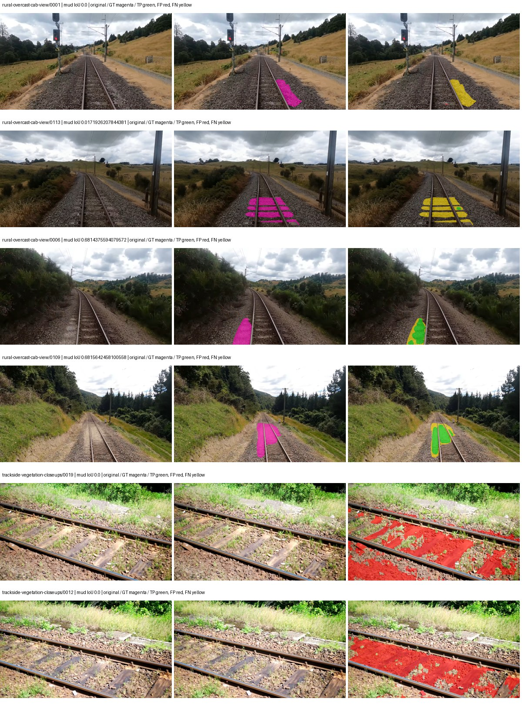
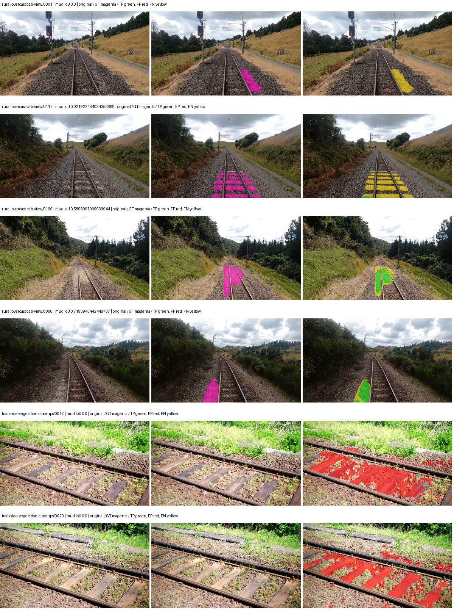
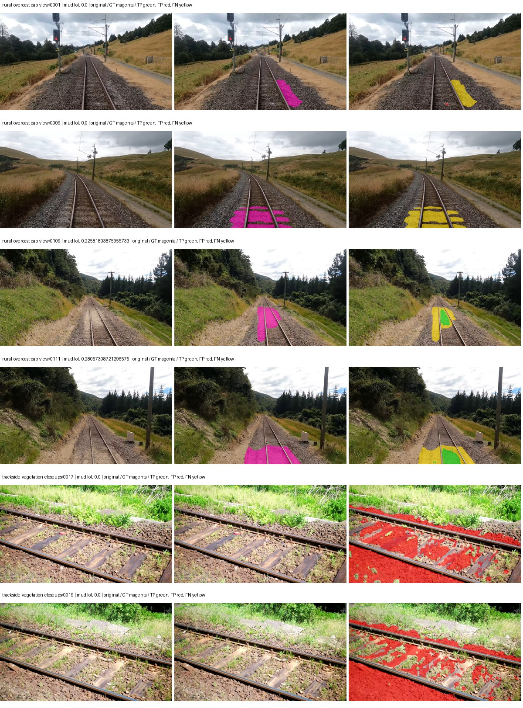
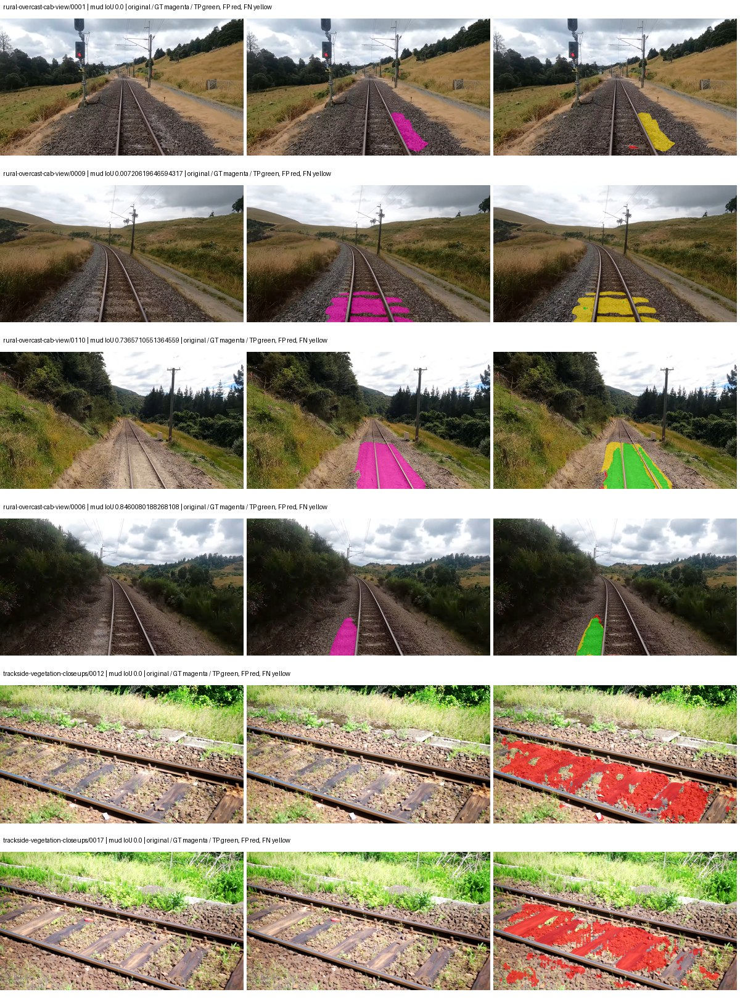

# eomt_large — rad_9_24_2026-fixed-grouped

[RAD 9/24: Scene-grouped split](../../README.md) · [Full model records](record.json)

Primary selection and early stopping: **mud-pumping validation IoU, pixels pooled over all validation images**. A job is complete only after full statistics and isolated profiling are verified.

Study metrics, counting each class only on the validation images that contain it: mud-pumping IoU is the mean per-image IoU over the images with mud-pumping, precision and recall sum pixels over those images, and mIoU averages each class over the images that contain it, then over the classes present.

| Initialization path | Seed | Mud-pumping IoU, train-camera images with mud (%, n=17) | Mud-pumping IoU, all images with mud (%, n=18) | Mud precision, all images with mud (%) | Mud recall, all images with mud (%) | mIoU (each class over images that contain it) (%) |
| --- | --- | --- | --- | --- | --- | --- |
| rtis_only | 0 | 34.59 | 32.89 | 56.71 | 35.57 | 50.85 |
| cityscapes_to_rtis | 0 | 28.75 | 27.33 | 51.87 | 28.47 | 52.96 |
| railsem19_to_rtis | 0 | 10.28 | 9.87 | 24.40 | 11.57 | 51.54 |
| cityscapes_to_railsem19_to_rtis | 0 | 36.52 | 34.87 | 72.22 | 39.08 | 52.52 |

Per-class IoU: IoU (%) of every class, each averaged only over the validation images that contain the class (n = those images); — = no image contains it. mIoU averages the classes with at least one such image.

| Initialization path | Seed | mIoU (each class over images that contain it) | person (n=0) | truck (n=0) | rail-track (n=37) | vegetation-overgrowth (n=13) | car (n=3) | on-rails (n=0) | traffic-sign (n=9) | road (n=11) | sidewalk (n=12) | construction (n=12) | tram-track (n=2) | pole (n=21) | traffic-light (n=3) | mud-pumping (n=18) | fence (n=7) | terrain (n=35) | sky (n=28) | rail-embedded (n=3) | rail-raised (n=37) | trackbed (n=37) | standing-water (n=9) |
| --- | --- | --- | --- | --- | --- | --- | --- | --- | --- | --- | --- | --- | --- | --- | --- | --- | --- | --- | --- | --- | --- | --- | --- |
| rtis_only | 0 | 50.85 | — | — | 69.38 | 38.54 | 9.97 | — | 33.26 | 12.31 | 53.19 | 57.83 | 34.19 | 71.60 | 42.41 | 32.89 | 45.62 | 89.60 | 96.71 | 31.11 | 76.74 | 76.63 | 43.40 |
| cityscapes_to_rtis | 0 | 52.96 | — | — | 65.68 | 43.62 | 62.98 | — | 39.26 | 13.28 | 39.58 | 55.54 | 27.37 | 73.80 | 57.93 | 27.33 | 54.55 | 88.50 | 97.08 | 15.77 | 75.84 | 75.25 | 39.89 |
| railsem19_to_rtis | 0 | 51.54 | — | — | 68.36 | 43.45 | 52.33 | — | 41.63 | 16.68 | 52.71 | 53.93 | 49.67 | 72.51 | 50.16 | 9.87 | 47.38 | 88.52 | 96.83 | 42.81 | 76.00 | 64.86 | 0.00 |
| cityscapes_to_railsem19_to_rtis | 0 | 52.52 | — | — | 71.09 | 38.43 | 46.27 | — | 44.45 | 9.50 | 52.84 | 58.97 | 41.15 | 74.05 | 56.96 | 34.87 | 51.07 | 87.54 | 97.02 | 30.01 | 75.75 | 75.39 | 0.00 |

Everything below is the campaign's own record, with pixels pooled over all validation images (the checkpoint was selected on that pooled mud IoU).

| Model | Initialization path | Seed | Status | Steps | Best step | Mud IoU, pixels pooled (%) | Mud precision, pixels pooled (%) | Mud recall, pixels pooled (%) | Final mud IoU (trainer val, pixels pooled, %) | mIoU, pixels pooled (%) | Fixed GT-class mIoU, pixels pooled (%) |
| --- | --- | --- | --- | --- | --- | --- | --- | --- | --- | --- | --- |
| eomt_large | rtis_only | 0 | completed | 2333 | 1555 | 12.73 | 16.54 | 35.57 | 10.44 | 47.84 | 53.16 |
| eomt_large | cityscapes_to_rtis | 0 | completed | 3370 | 2074 | 9.40 | 12.31 | 28.47 | 9.09 | 53.42 | 56.38 |
| eomt_large | railsem19_to_rtis | 0 | completed | 2074 | 777 | 3.33 | 4.46 | 11.57 | 3.14 | 49.72 | 58.01 |
| eomt_large | cityscapes_to_railsem19_to_rtis | 0 | completed | 2074 | 777 | 15.70 | 20.78 | 39.08 | 15.42 | 55.15 | 58.22 |

Training: 217 images. Validation: 37 images. Test: 60 held out. Seeds: [0]. Seed variation measures optimization variability, not independent-recording uncertainty. Historical source checkpoints stay fixed across adaptation seeds.

Training code: `d864b72bd90706260965bb1a48398d01167b6d5c`. Split SHA-256: `12d7b367c72cda61d57686ff2ac28223530d0af49debd9fb7a0fbc68b908bc93`.

## rtis_only — seed 0

Status: **completed**. Started: 2026-10-05T18:34:42.380144+00:00. Finished: 2026-10-05T19:35:53.430909+00:00.

Recipe pretrained initializer: `tue-mps/coco_panoptic_eomt_large_640 (DINOv2-based ViT-L, COCO panoptic)`.

`rtis_only` uses the recipe initializer, which may include pretrained segmentation components. Transfer paths load the exact historical source checkpoint below and reset the classifier; they do not reset all query/decoder features.

Source checkpoint: `Recipe pretrained initialization`.

Config SHA-256: `a9d48896c33cbc17c500c02e867f20da2a0505c6c34c4977d8245731a7d032a5`. Weights used for validation: `ema`.

### Mud-pumping and aggregate quality

| Metric | Selected checkpoint | Final training validation |
| --- | --- | --- |
| Mud IoU | 12.73 | 10.44 |
| Mud precision | 16.54 | 13.29 |
| Mud recall | 35.57 | 32.76 |
| Mud Dice/F1 | 22.58 | 18.91 |
| mIoU | 47.84 | 48.56 |
| Mean accuracy | 65.51 | 65.98 |
| Mean precision | 61.17 | 61.82 |
| Mean Dice | 58.44 | 59.08 |
| Mean specificity | 99.31 | 99.31 |
| Pixel accuracy | 88.70 | 88.48 |
| Frequency-weighted IoU | 82.14 | 82.11 |
| Fixed GT-present class mIoU | 53.16 | 53.96 |
| Boundary F1 | 59.13 | 60.26 |

The selected checkpoint has independent evaluation evidence. Final values are the trainer's final validation record, not a new independent evaluation. mIoU averages classes with nonzero union, so false positives on absent classes can change its denominator. The fixed GT-class mean is supplementary and excludes absent classes; their false positives remain in the confusion matrix.

### Resource usage and timing

| Measurement | Value |
| --- | --- |
| Peak training VRAM, retained training invocation (GiB) | 17.70 |
| Peak evaluation VRAM (GiB) | 10.80 |
| Retained training invocation wall time (seconds) | 3385.28 |
| Retained training invocation GPU-hours (one GPU) | 0.94 |
| Evaluation wall time (seconds) | 21.18 |
| Full evaluation pipeline images/second | 1.75 |
| Best full-state checkpoint (MiB) | 4831.36 |
| Final full-state checkpoint (MiB) | 4831.34 |
| Verified periodic checkpoints removed (GiB) | 18.87 |

VRAM uses the recorded allocator high-water mark; it is not total device usage including CUDA context. Resumed jobs' retained training invocation times and peaks are **not whole-campaign totals**. Earlier invocation resource records are not reconstructed here. Evaluation throughput includes loader, sliding-window inference and metrics; it is not model-only latency/FPS. Missing measurements are shown as —, never inferred from another dataset's run.

### Standardized inference performance

Dedicated model-only profiling waits for an idle worker-locked L40S: BF16, batch 1, 1024x1024, 20 warmup and 100 CUDA-event-timed public forwards. It excludes loading, preprocessing, tiling and metrics.

| Status | Parameters | Weight MiB | FPS | p50 ms | p95 ms | Peak reserved GiB |
| --- | --- | --- | --- | --- | --- | --- |
| complete | 316580886 | 1207.66 | 45.95 | 21.77 | 21.81 | 3.12 |

```json
{
  "schema_version": 1,
  "model_id": "eomt_large",
  "measured_at": "2026-10-05T19:35:23+00:00",
  "status": "complete",
  "benchmark_scope": "rtis_selected_checkpoint_model_only",
  "applies_to": [
    "eomt_large--rtis_only--seed-0"
  ],
  "source": {
    "campaign_git_sha": "d864b72bd90706260965bb1a48398d01167b6d5c",
    "git_dirty": false,
    "config_hash": "54f2cc0944d0",
    "resolved_config": "/data/izadia1/projects/segmentary-runs/rad_9_24_2026/fixed-grouped-seed0-20261005-r2/configs/eomt_large--rtis_only--seed-0.yaml",
    "config_sha256": "a9d48896c33cbc17c500c02e867f20da2a0505c6c34c4977d8245731a7d032a5",
    "checkpoint_sha256": "d82076638ee9b57f90fccf03fd78ab14ef4f42ce220d51acc031fc1d73087ebc",
    "checkpoint_global_step": 1555,
    "checkpoint_bytes": 5066052281,
    "checkpoint_kind": "resume checkpoint with optimizer and EMA state",
    "weights": "ema",
    "measured_checkpoint_job_id": "eomt_large--rtis_only--seed-0",
    "result_sha256": "83c43ea9c4437ae6242b6e975039f42e019e3dea16a0b714384e8fc5dd597c79",
    "result_git_sha": "d864b72bd90706260965bb1a48398d01167b6d5c",
    "result_stage": "eval:rad_9_24_2026-fixed-grouped:val",
    "result_seed": 0
  },
  "hardware": {
    "gpu_name": "NVIDIA L40S",
    "gpu_uuid": "GPU-a5ad49e5-0536-5229-ba8a-f8a902808f53",
    "logical_device": "cuda:0",
    "physical_visibility_token": "7",
    "compute_capability": [
      8,
      9
    ],
    "total_memory_bytes": 47677177856
  },
  "model": {
    "parameter_count": 316580886,
    "trainable_parameter_count": 316580886,
    "resident_parameter_bytes": 1266323544,
    "parameter_dtype_counts": {
      "float32": 316580886
    }
  },
  "contract": {
    "backend": "pytorch",
    "precision": "bf16_autocast",
    "batch_size": 1,
    "input_shape_nchw": [
      1,
      3,
      1024,
      1024
    ],
    "warmup_iterations": 20,
    "measured_iterations": 100,
    "timing": "per-forward CUDA events with end-event synchronization",
    "includes_preprocessing": false,
    "includes_data_loader": false,
    "includes_sliding_window": false,
    "input_resident_on_gpu": true,
    "model_only": true,
    "entrypoint": "public model(image) dense-logits forward"
  },
  "measurements": {
    "latency": {
      "p50_ms": 21.765119552612305,
      "p95_ms": 21.806465911865235,
      "mean_ms": 21.76094181060791,
      "minimum_ms": 21.67910385131836,
      "maximum_ms": 21.83679962158203,
      "fps": 45.953893388590615,
      "raw_ms": [
        21.789695739746094,
        21.720064163208008,
        21.764095306396484,
        21.740543365478516,
        21.738527297973633,
        21.773311614990234,
        21.743616104125977,
        21.748735427856445,
        21.67910385131836,
        21.813247680664062,
        21.732351303100586,
        21.772287368774414,
        21.787647247314453,
        21.772287368774414,
        21.760000228881836,
        21.69651222229004,
        21.765119552612305,
        21.742591857910156,
        21.795839309692383,
        21.78348731994629,
        21.763071060180664,
        21.782527923583984,
        21.6944637298584,
        21.711872100830078,
        21.735424041748047,
        21.730335235595703,
        21.68934440612793,
        21.715967178344727,
        21.81318473815918,
        21.765119552612305,
        21.823488235473633,
        21.769216537475586,
        21.754880905151367,
        21.711872100830078,
        21.71392059326172,
        21.737472534179688,
        21.790719985961914,
        21.732351303100586,
        21.766143798828125,
        21.734399795532227,
        21.785600662231445,
        21.785600662231445,
        21.739519119262695,
        21.805055618286133,
        21.797887802124023,
        21.786624908447266,
        21.785600662231445,
        21.751808166503906,
        21.707839965820312,
        21.749759674072266,
        21.741567611694336,
        21.769216537475586,
        21.793792724609375,
        21.746688842773438,
        21.778432846069336,
        21.746688842773438,
        21.730304718017578,
        21.749759674072266,
        21.82758331298828,
        21.83679962158203,
        21.746688842773438,
        21.730304718017578,
        21.764095306396484,
        21.757951736450195,
        21.70368003845215,
        21.790719985961914,
        21.778432846069336,
        21.761024475097656,
        21.729280471801758,
        21.798912048339844,
        21.734399795532227,
        21.765119552612305,
        21.780479431152344,
        21.770240783691406,
        21.793792724609375,
        21.782527923583984,
        21.780479431152344,
        21.794815063476562,
        21.766143798828125,
        21.708799362182617,
        21.736448287963867,
        21.777408599853516,
        21.776384353637695,
        21.746688842773438,
        21.776384353637695,
        21.80611228942871,
        21.70572853088379,
        21.769216537475586,
        21.750783920288086,
        21.765119552612305,
        21.758975982666016,
        21.777408599853516,
        21.778432846069336,
        21.800960540771484,
        21.785600662231445,
        21.793792724609375,
        21.745664596557617,
        21.791744232177734,
        21.786624908447266,
        21.755840301513672
      ],
      "percentile_method": "numpy linear interpolation"
    },
    "peak_reserved_bytes": 3351248896,
    "memory_kind": "pytorch_cuda_allocator_peak_reserved_excluding_context",
    "benchmark_wall_clock_s": 3.176458351314068
  },
  "started_at": "2026-10-05T19:35:20+00:00",
  "finished_at": "2026-10-05T19:35:23+00:00",
  "environment": {
    "hostname": "hdrfs-app-001",
    "python": "3.11.15",
    "platform": "Linux-5.15.0-139-generic-x86_64-with-glibc2.35",
    "torch": "2.11.0+cu128",
    "torch_cuda": "12.8",
    "cudnn": 91900,
    "driver_version": "570.133.20",
    "cuda_available": true,
    "gpu_count": 1,
    "gpu_names": [
      "NVIDIA L40S"
    ],
    "cuda_visible_devices": "7",
    "packages": {
      "segmentary": "0.1.0",
      "torch": "2.11.0+cu128",
      "torchvision": "0.26.0+cu128",
      "transformers": "5.15.0",
      "timm": "1.0.28",
      "segmentation-models-pytorch": "0.5.0",
      "albumentations": "2.0.8",
      "lightning": "2.6.5",
      "numpy": "2.4.4"
    }
  }
}
```

### Per-class validation results

| Class | GT pixels | IoU (%) | Precision (%) | Recall (%) | Dice (%) | Boundary F1 (%) |
| --- | --- | --- | --- | --- | --- | --- |
| car | 29664 | 3.92 | 10.28 | 5.95 | 7.54 | 11.30 |
| construction | 311585 | 72.04 | 85.10 | 82.43 | 83.75 | 80.58 |
| fence | 265137 | 45.88 | 68.66 | 58.03 | 62.90 | 63.21 |
| mud-pumping | 1226250 | 12.73 | 16.54 | 35.57 | 22.58 | 18.95 |
| on-rails | 0 | 0.00 | 0.00 | — | 0.00 | 0.00 |
| person | 0 | — | — | — | — | — |
| pole | 628038 | 77.06 | 86.36 | 87.74 | 87.04 | 94.54 |
| rail-embedded | 16799 | 54.80 | 84.88 | 60.73 | 70.80 | 86.87 |
| rail-raised | 2969797 | 81.28 | 86.56 | 93.01 | 89.67 | 95.43 |
| rail-track | 6323197 | 58.47 | 77.15 | 70.71 | 73.79 | 73.58 |
| road | 1048831 | 6.92 | 15.02 | 11.37 | 12.94 | 20.04 |
| sidewalk | 1297367 | 47.53 | 79.45 | 54.20 | 64.44 | 77.21 |
| sky | 19121606 | 98.75 | 99.46 | 99.28 | 99.37 | 98.52 |
| standing-water | 95802 | 33.33 | 42.45 | 60.80 | 50.00 | 51.52 |
| terrain | 39239306 | 91.47 | 92.61 | 98.67 | 95.55 | 78.99 |
| trackbed | 10643081 | 77.89 | 87.13 | 88.01 | 87.57 | 77.75 |
| traffic-light | 19510 | 59.20 | 94.95 | 61.12 | 74.37 | 71.20 |
| traffic-sign | 13285 | 48.29 | 59.07 | 72.57 | 65.13 | 72.48 |
| tram-track | 56179 | 47.64 | 48.28 | 97.30 | 64.54 | 46.09 |
| truck | 0 | 0.00 | 0.00 | — | 0.00 | 0.00 |
| vegetation-overgrowth | 5901821 | 39.64 | 89.41 | 41.59 | 56.78 | 64.23 |

### Full-run accounting

| Measurement | Value |
| --- | --- |
| Full GPU-reserved wall seconds, all recorded worker attempts | 3682.69 |
| Full reserved GPU-hours | 1.02 |
| Whole-run timing complete | True |

| Phase | Wall seconds including failed attempts |
| --- | --- |
| training | 3392.06 |
| diagnostics | 189.35 |
| performance | 20.25 |

GPU-reserved time includes model loading, training, validation, collection, profiling, checkpoint I/O and orchestration while the worker owns one GPU. It is not GPU kernel-active time. Phase timings and sampled device memory/power/utilization are retained separately; sampled device memory is not the allocator high-water mark.

### Train/validation and raw/EMA diagnostics

| Checkpoint / weights / split | Images | Mud IoU (%) | Mud precision (%) | Mud recall (%) |
| --- | --- | --- | --- | --- |
| best-auto-train / ema | 217 | 96.26 | 98.27 | 97.92 |
| best-auto-val / ema | 37 | 12.73 | 16.54 | 35.57 |
| best-alternate-val / raw | 37 | 14.62 | 20.28 | 34.40 |
| final-auto-val / ema | 37 | 10.44 | 13.29 | 32.76 |

Train uses the evaluation transform without augmentation. Compare mud train/validation metrics for the same selected weights. Alternate EMA on running-stat BatchNorm is explicitly uncalibrated and is diagnostic only. Score-threshold curves use uncalibrated normalized scores and are pixel-level diagnostics, not event detection rates or a selected deployment operating point.

### Downloadable evidence

- best-auto-train: [per-image.csv](rtis_only--seed-0/best-auto-train/per-image.csv) · [per-image-confusion.json.gz](rtis_only--seed-0/best-auto-train/per-image-confusion.json.gz) · [groups.json](rtis_only--seed-0/best-auto-train/groups.json) · [mud-score-curves.json](rtis_only--seed-0/best-auto-train/mud-score-curves.json)
- best-auto-val: [per-image.csv](rtis_only--seed-0/best-auto-val/per-image.csv) · [per-image-confusion.json.gz](rtis_only--seed-0/best-auto-val/per-image-confusion.json.gz) · [groups.json](rtis_only--seed-0/best-auto-val/groups.json) · [mud-score-curves.json](rtis_only--seed-0/best-auto-val/mud-score-curves.json) · [examples.jpg](rtis_only--seed-0/best-auto-val/examples.jpg)
- best-alternate-val: [per-image.csv](rtis_only--seed-0/best-alternate-val/per-image.csv) · [per-image-confusion.json.gz](rtis_only--seed-0/best-alternate-val/per-image-confusion.json.gz) · [groups.json](rtis_only--seed-0/best-alternate-val/groups.json) · [mud-score-curves.json](rtis_only--seed-0/best-alternate-val/mud-score-curves.json)
- final-auto-val: [per-image.csv](rtis_only--seed-0/final-auto-val/per-image.csv) · [per-image-confusion.json.gz](rtis_only--seed-0/final-auto-val/per-image-confusion.json.gz) · [groups.json](rtis_only--seed-0/final-auto-val/groups.json) · [mud-score-curves.json](rtis_only--seed-0/final-auto-val/mud-score-curves.json)
- resources: [telemetry.csv](rtis_only--seed-0/resources/telemetry.csv)



Examples are two lowest and two highest mud-IoU positive images, plus up to two negative images with the most false-positive mud pixels. They are targeted diagnostic examples, not random samples. Green: true positive; red: false positive; yellow: false negative. Full predictions remain on HDRFS.

### Validation tracking

| Logged step | Overall mIoU (%) | Mud IoU (%) |
| --- | --- | --- |
| 258 | 27.33 | 0.39 |
| 518 | 37.54 | 4.41 |
| 777 | 41.39 | 9.00 |
| 1036 | 46.15 | 12.64 |
| 1295 | 48.19 | 12.48 |
| 1555 | 47.87 | 12.72 |
| 1814 | 49.36 | 12.38 |
| 2073 | 48.54 | 10.50 |
| 2332 | 48.56 | 10.44 |

All retained scalar curves, including training loss and per-class IoU, are in record.json. Observed best mud on a curve is not necessarily a retained checkpoint: the pilot saved its selection-metric-best and final checkpoints. Step logging and checkpoint global_step may differ by one.

### Stopping and checkpoint provenance

```json
{
  "stopping": {
    "actual_steps": 2333,
    "maximum_steps": 4000,
    "min_delta": 0.001,
    "monitor": "val_iou/mud-pumping",
    "patience": 5,
    "reason": "validation_plateau"
  },
  "checkpoints": {
    "best": {
      "path": "/data/izadia1/projects/segmentary-runs/rad_9_24_2026/fixed-grouped-seed0-20261005-r2/future-runs/eomt_large--rtis_only--seed-0_seed0/rtis/best.ckpt",
      "sha256": "d82076638ee9b57f90fccf03fd78ab14ef4f42ce220d51acc031fc1d73087ebc",
      "global_step": 1555,
      "bytes": 5066052281
    },
    "final": {
      "path": "/data/izadia1/projects/segmentary-runs/rad_9_24_2026/fixed-grouped-seed0-20261005-r2/future-runs/eomt_large--rtis_only--seed-0_seed0/rtis/last.ckpt",
      "sha256": "dabf4309351334cdf232efdd517d63e9b71492e4442dd43a22638e7c5e2156e6",
      "global_step": 2333,
      "bytes": 5066030393
    }
  },
  "cleanup_error": null
}
```

### Resolved training, initialization and evaluation settings

The optimizer block is the base configuration. Stage LR scales are applied at runtime, and stage warmup is capped at min(base warmup, floor(stage budget / 10), stage budget - 1): 400 steps for this 4,000-step pilot. Model-internal native input grids may differ from augmentation crops (EoMT uses its 640 grid).

```json
{
  "name": "eomt_large--rtis_only--seed-0",
  "model": {
    "arch": "eomt_large",
    "checkpoint": null,
    "tuning": "full",
    "head": "unified_head",
    "lora_r": 16,
    "lora_alpha": 32,
    "lora_dropout": 0.05,
    "lora_targets": [],
    "drop_path": null,
    "revision": null,
    "subfolder": null,
    "local_files_only": false,
    "trust_remote_code": false,
    "backbone_path": null,
    "head_paths": [],
    "classifier_path": null,
    "inactive_parameter_paths": [],
    "smp_arch": null,
    "encoder_name": null,
    "encoder_weights": null,
    "native": null,
    "batch_norm_momentum": null
  },
  "space": "paul-test-rtis",
  "taxonomy_root": "/data/izadia1/projects/segmentary-rad-d864b72b/taxonomy",
  "output_root": "/data/izadia1/projects/segmentary-runs/rad_9_24_2026/fixed-grouped-seed0-20261005-r2/future-runs",
  "optim": {
    "backbone_lr": 1e-05,
    "head_lr_mult": 10.0,
    "weight_decay": 0.05,
    "llrd": 0.75,
    "warmup_iters": 1500,
    "warmup_ratio": 1e-06,
    "poly_power": 0.9,
    "min_lr_ratio": 0.0,
    "betas": [
      0.9,
      0.999
    ],
    "grad_clip": 1.0
  },
  "train": {
    "iters": 4000,
    "batch_size": 2,
    "accum": 8,
    "num_workers": 2,
    "precision": "bf16-mixed",
    "ema_decay": 0.9998,
    "val_every": 250,
    "ckpt_every": 500,
    "selection_metric": "val_iou/mud-pumping",
    "early_stopping_patience": 5,
    "early_stopping_min_delta": 0.001,
    "seed": 0,
    "devices": 1
  },
  "eval": {
    "sliding_window": true,
    "window": [
      1024,
      1024
    ],
    "stride": [
      768,
      768
    ],
    "batch_size": 1,
    "num_workers": 2,
    "tta_scales": [],
    "tta_flip": false,
    "threshold": 0.5,
    "boundary_tolerance_frac": 0.0075,
    "save_confusion": true
  },
  "loss": {
    "task": "multiclass",
    "activation": "auto",
    "terms": [],
    "aux": "none",
    "aux_weight": 0.0,
    "ce_weight": 1.0,
    "label_smoothing": 0.0,
    "class_weights": null,
    "query": {
      "kind": "hungarian_query",
      "classification_weight": 2.0,
      "mask_bce_weight": 5.0,
      "dice_weight": 5.0,
      "no_object_coefficient": 0.1,
      "match_class_cost": 2.0,
      "match_mask_bce_cost": 5.0,
      "match_dice_cost": 5.0,
      "matching_num_points": 8192,
      "auxiliary_layer_weight": 1.0,
      "dice_smooth": 1.0
    }
  },
  "aug": {
    "crop": [
      1024,
      1024
    ],
    "scale_min": 0.5,
    "scale_max": 2.0,
    "hflip_p": 0.5,
    "color_jitter_p": 0.5,
    "brightness": 0.25,
    "contrast": 0.25,
    "saturation": 0.25,
    "hue": 0.05
  },
  "stages": [
    {
      "name": "rtis",
      "data": [
        {
          "name": "rad_9_24_2026-fixed-grouped",
          "root": "/data/izadia1/datasets/rad_9_24_2026-fixed-grouped",
          "variant": null,
          "split_file": "splits.json",
          "train_split": "train",
          "val_split": "val",
          "limit": null,
          "loader": "folder",
          "mapping": "paul-test-rtis",
          "loader_options": {
            "require_groups": true
          }
        }
      ],
      "iters": null,
      "lr_scale": 1.0,
      "head_group_lr_scale": 1.0,
      "init_from": "pretrained",
      "reset_head": false,
      "freeze": null,
      "sample_weights": null
    }
  ]
}
```

### Hardware and software provenance

```json
{
  "training": {
    "cuda_available": true,
    "cuda_visible_devices": "7",
    "cudnn": 91900,
    "driver_version": "570.133.20",
    "gpu_count": 1,
    "gpu_names": [
      "NVIDIA L40S"
    ],
    "hostname": "hdrfs-app-001",
    "input_normalization": {
      "channel_order": "rgb",
      "mean": [
        0.485,
        0.456,
        0.406
      ],
      "source": "imagenet",
      "std": [
        0.229,
        0.224,
        0.225
      ]
    },
    "model_origins": [
      {
        "hf_commit": "dcd130bed9b1ebda7041fd660fddb16f905b9c3b",
        "hf_name_or_path": "tue-mps/coco_panoptic_eomt_large_640",
        "module": "model",
        "timm_pretrained": {}
      },
      {
        "hf_commit": "dcd130bed9b1ebda7041fd660fddb16f905b9c3b",
        "hf_name_or_path": "tue-mps/coco_panoptic_eomt_large_640",
        "module": "model.embeddings",
        "timm_pretrained": {}
      },
      {
        "hf_commit": "dcd130bed9b1ebda7041fd660fddb16f905b9c3b",
        "hf_name_or_path": "tue-mps/coco_panoptic_eomt_large_640",
        "module": "model.layers.0.attention",
        "timm_pretrained": {}
      },
      {
        "hf_commit": "dcd130bed9b1ebda7041fd660fddb16f905b9c3b",
        "hf_name_or_path": "tue-mps/coco_panoptic_eomt_large_640",
        "module": "model.layers.1.attention",
        "timm_pretrained": {}
      },
      {
        "hf_commit": "dcd130bed9b1ebda7041fd660fddb16f905b9c3b",
        "hf_name_or_path": "tue-mps/coco_panoptic_eomt_large_640",
        "module": "model.layers.2.attention",
        "timm_pretrained": {}
      },
      {
        "hf_commit": "dcd130bed9b1ebda7041fd660fddb16f905b9c3b",
        "hf_name_or_path": "tue-mps/coco_panoptic_eomt_large_640",
        "module": "model.layers.3.attention",
        "timm_pretrained": {}
      },
      {
        "hf_commit": "dcd130bed9b1ebda7041fd660fddb16f905b9c3b",
        "hf_name_or_path": "tue-mps/coco_panoptic_eomt_large_640",
        "module": "model.layers.4.attention",
        "timm_pretrained": {}
      },
      {
        "hf_commit": "dcd130bed9b1ebda7041fd660fddb16f905b9c3b",
        "hf_name_or_path": "tue-mps/coco_panoptic_eomt_large_640",
        "module": "model.layers.5.attention",
        "timm_pretrained": {}
      },
      {
        "hf_commit": "dcd130bed9b1ebda7041fd660fddb16f905b9c3b",
        "hf_name_or_path": "tue-mps/coco_panoptic_eomt_large_640",
        "module": "model.layers.6.attention",
        "timm_pretrained": {}
      },
      {
        "hf_commit": "dcd130bed9b1ebda7041fd660fddb16f905b9c3b",
        "hf_name_or_path": "tue-mps/coco_panoptic_eomt_large_640",
        "module": "model.layers.7.attention",
        "timm_pretrained": {}
      },
      {
        "hf_commit": "dcd130bed9b1ebda7041fd660fddb16f905b9c3b",
        "hf_name_or_path": "tue-mps/coco_panoptic_eomt_large_640",
        "module": "model.layers.8.attention",
        "timm_pretrained": {}
      },
      {
        "hf_commit": "dcd130bed9b1ebda7041fd660fddb16f905b9c3b",
        "hf_name_or_path": "tue-mps/coco_panoptic_eomt_large_640",
        "module": "model.layers.9.attention",
        "timm_pretrained": {}
      },
      {
        "hf_commit": "dcd130bed9b1ebda7041fd660fddb16f905b9c3b",
        "hf_name_or_path": "tue-mps/coco_panoptic_eomt_large_640",
        "module": "model.layers.10.attention",
        "timm_pretrained": {}
      },
      {
        "hf_commit": "dcd130bed9b1ebda7041fd660fddb16f905b9c3b",
        "hf_name_or_path": "tue-mps/coco_panoptic_eomt_large_640",
        "module": "model.layers.11.attention",
        "timm_pretrained": {}
      },
      {
        "hf_commit": "dcd130bed9b1ebda7041fd660fddb16f905b9c3b",
        "hf_name_or_path": "tue-mps/coco_panoptic_eomt_large_640",
        "module": "model.layers.12.attention",
        "timm_pretrained": {}
      },
      {
        "hf_commit": "dcd130bed9b1ebda7041fd660fddb16f905b9c3b",
        "hf_name_or_path": "tue-mps/coco_panoptic_eomt_large_640",
        "module": "model.layers.13.attention",
        "timm_pretrained": {}
      },
      {
        "hf_commit": "dcd130bed9b1ebda7041fd660fddb16f905b9c3b",
        "hf_name_or_path": "tue-mps/coco_panoptic_eomt_large_640",
        "module": "model.layers.14.attention",
        "timm_pretrained": {}
      },
      {
        "hf_commit": "dcd130bed9b1ebda7041fd660fddb16f905b9c3b",
        "hf_name_or_path": "tue-mps/coco_panoptic_eomt_large_640",
        "module": "model.layers.15.attention",
        "timm_pretrained": {}
      },
      {
        "hf_commit": "dcd130bed9b1ebda7041fd660fddb16f905b9c3b",
        "hf_name_or_path": "tue-mps/coco_panoptic_eomt_large_640",
        "module": "model.layers.16.attention",
        "timm_pretrained": {}
      },
      {
        "hf_commit": "dcd130bed9b1ebda7041fd660fddb16f905b9c3b",
        "hf_name_or_path": "tue-mps/coco_panoptic_eomt_large_640",
        "module": "model.layers.17.attention",
        "timm_pretrained": {}
      },
      {
        "hf_commit": "dcd130bed9b1ebda7041fd660fddb16f905b9c3b",
        "hf_name_or_path": "tue-mps/coco_panoptic_eomt_large_640",
        "module": "model.layers.18.attention",
        "timm_pretrained": {}
      },
      {
        "hf_commit": "dcd130bed9b1ebda7041fd660fddb16f905b9c3b",
        "hf_name_or_path": "tue-mps/coco_panoptic_eomt_large_640",
        "module": "model.layers.19.attention",
        "timm_pretrained": {}
      },
      {
        "hf_commit": "dcd130bed9b1ebda7041fd660fddb16f905b9c3b",
        "hf_name_or_path": "tue-mps/coco_panoptic_eomt_large_640",
        "module": "model.layers.20.attention",
        "timm_pretrained": {}
      },
      {
        "hf_commit": "dcd130bed9b1ebda7041fd660fddb16f905b9c3b",
        "hf_name_or_path": "tue-mps/coco_panoptic_eomt_large_640",
        "module": "model.layers.21.attention",
        "timm_pretrained": {}
      },
      {
        "hf_commit": "dcd130bed9b1ebda7041fd660fddb16f905b9c3b",
        "hf_name_or_path": "tue-mps/coco_panoptic_eomt_large_640",
        "module": "model.layers.22.attention",
        "timm_pretrained": {}
      },
      {
        "hf_commit": "dcd130bed9b1ebda7041fd660fddb16f905b9c3b",
        "hf_name_or_path": "tue-mps/coco_panoptic_eomt_large_640",
        "module": "model.layers.23.attention",
        "timm_pretrained": {}
      }
    ],
    "model_parameter_count": 316580886,
    "packages": {
      "albumentations": "2.0.8",
      "lightning": "2.6.5",
      "numpy": "2.4.4",
      "segmentary": "0.1.0",
      "segmentation-models-pytorch": "0.5.0",
      "timm": "1.0.28",
      "torch": "2.11.0+cu128",
      "torchvision": "0.26.0+cu128",
      "transformers": "5.15.0"
    },
    "platform": "Linux-5.15.0-139-generic-x86_64-with-glibc2.35",
    "python": "3.11.15",
    "torch": "2.11.0+cu128",
    "torch_cuda": "12.8",
    "trainable_parameter_count": 316580886,
    "training_stop": {
      "actual_steps": 2333,
      "maximum_steps": 4000,
      "min_delta": 0.001,
      "monitor": "val_iou/mud-pumping",
      "patience": 5,
      "reason": "validation_plateau"
    },
    "validation_weights": "ema"
  },
  "evaluation": {
    "cuda_available": true,
    "cuda_visible_devices": "7",
    "cudnn": 91900,
    "driver_version": "570.133.20",
    "gpu_count": 1,
    "gpu_names": [
      "NVIDIA L40S"
    ],
    "hostname": "hdrfs-app-001",
    "input_normalization": {
      "channel_order": "rgb",
      "mean": [
        0.485,
        0.456,
        0.406
      ],
      "source": "imagenet",
      "std": [
        0.229,
        0.224,
        0.225
      ]
    },
    "packages": {
      "albumentations": "2.0.8",
      "lightning": "2.6.5",
      "numpy": "2.4.4",
      "segmentary": "0.1.0",
      "segmentation-models-pytorch": "0.5.0",
      "timm": "1.0.28",
      "torch": "2.11.0+cu128",
      "torchvision": "0.26.0+cu128",
      "transformers": "5.15.0"
    },
    "platform": "Linux-5.15.0-139-generic-x86_64-with-glibc2.35",
    "python": "3.11.15",
    "torch": "2.11.0+cu128",
    "torch_cuda": "12.8"
  }
}
```

## cityscapes_to_rtis — seed 0

Status: **completed**. Started: 2026-10-05T18:34:45.629520+00:00. Finished: 2026-10-05T20:01:47.268095+00:00.

Recipe pretrained initializer: `tue-mps/coco_panoptic_eomt_large_640 (DINOv2-based ViT-L, COCO panoptic)`.

`rtis_only` uses the recipe initializer, which may include pretrained segmentation components. Transfer paths load the exact historical source checkpoint below and reset the classifier; they do not reset all query/decoder features.

Source checkpoint: `{'name': 'eomt_large--cityscapes--seed-0', 'model': 'eomt_large', 'protocol': 'cityscapes', 'config': '/data/izadia1/projects/segmentary-runs/all-model-city-rail-seed0-rail20-b9eb3e1/accepted/eomt_large--cityscapes--seed-0/resolved-config.yaml', 'checkpoint': '/data/izadia1/projects/segmentary-runs/all-model-city-rail-seed0-a7c0b67/jobs/eomt_large--cityscapes--seed-0/attempt-001/train/eomt_large--cityscapes_seed0/cityscapes/last.ckpt', 'recorded_sha256': '2651e4743a617a9b4939dd5fbaaf4a643d7988f028adc18ac9d6027a084b7bdd', 'exists': True}`.

Config SHA-256: `dc17c7d96ad08231346aa1ecdf1a2d4109574cc8eb6b943e96b5b0c9fbd23eda`. Weights used for validation: `ema`.

### Mud-pumping and aggregate quality

| Metric | Selected checkpoint | Final training validation |
| --- | --- | --- |
| Mud IoU | 9.40 | 9.09 |
| Mud precision | 12.31 | 12.23 |
| Mud recall | 28.47 | 26.17 |
| Mud Dice/F1 | 17.19 | 16.67 |
| mIoU | 53.42 | 53.37 |
| Mean accuracy | 65.38 | 65.58 |
| Mean precision | 71.38 | 70.81 |
| Mean Dice | 64.55 | 64.47 |
| Mean specificity | 99.29 | 99.29 |
| Pixel accuracy | 88.46 | 88.61 |
| Frequency-weighted IoU | 81.81 | 81.94 |
| Fixed GT-present class mIoU | 56.38 | 56.33 |
| Boundary F1 | 64.83 | 64.03 |

The selected checkpoint has independent evaluation evidence. Final values are the trainer's final validation record, not a new independent evaluation. mIoU averages classes with nonzero union, so false positives on absent classes can change its denominator. The fixed GT-class mean is supplementary and excludes absent classes; their false positives remain in the confusion matrix.

### Resource usage and timing

| Measurement | Value |
| --- | --- |
| Peak training VRAM, retained training invocation (GiB) | 17.70 |
| Peak evaluation VRAM (GiB) | 10.80 |
| Retained training invocation wall time (seconds) | 4919.84 |
| Retained training invocation GPU-hours (one GPU) | 1.37 |
| Evaluation wall time (seconds) | 21.50 |
| Full evaluation pipeline images/second | 1.72 |
| Best full-state checkpoint (MiB) | 4831.36 |
| Final full-state checkpoint (MiB) | 4831.34 |
| Verified periodic checkpoints removed (GiB) | 28.31 |

VRAM uses the recorded allocator high-water mark; it is not total device usage including CUDA context. Resumed jobs' retained training invocation times and peaks are **not whole-campaign totals**. Earlier invocation resource records are not reconstructed here. Evaluation throughput includes loader, sliding-window inference and metrics; it is not model-only latency/FPS. Missing measurements are shown as —, never inferred from another dataset's run.

### Standardized inference performance

Dedicated model-only profiling waits for an idle worker-locked L40S: BF16, batch 1, 1024x1024, 20 warmup and 100 CUDA-event-timed public forwards. It excludes loading, preprocessing, tiling and metrics.

| Status | Parameters | Weight MiB | FPS | p50 ms | p95 ms | Peak reserved GiB |
| --- | --- | --- | --- | --- | --- | --- |
| complete | 316580886 | 1207.66 | 45.80 | 21.82 | 21.97 | 3.12 |

```json
{
  "schema_version": 1,
  "model_id": "eomt_large",
  "measured_at": "2026-10-05T20:01:08+00:00",
  "status": "complete",
  "benchmark_scope": "rtis_selected_checkpoint_model_only",
  "applies_to": [
    "eomt_large--cityscapes_to_rtis--seed-0"
  ],
  "source": {
    "campaign_git_sha": "d864b72bd90706260965bb1a48398d01167b6d5c",
    "git_dirty": false,
    "config_hash": "4dc16ed2be56",
    "resolved_config": "/data/izadia1/projects/segmentary-runs/rad_9_24_2026/fixed-grouped-seed0-20261005-r2/configs/eomt_large--cityscapes_to_rtis--seed-0.yaml",
    "config_sha256": "dc17c7d96ad08231346aa1ecdf1a2d4109574cc8eb6b943e96b5b0c9fbd23eda",
    "checkpoint_sha256": "4a6c69a7fac8aba9b4712ad7a58ef1e75df17ee37a72f37efba7101034d5c566",
    "checkpoint_global_step": 2074,
    "checkpoint_bytes": 5066052345,
    "checkpoint_kind": "resume checkpoint with optimizer and EMA state",
    "weights": "ema",
    "measured_checkpoint_job_id": "eomt_large--cityscapes_to_rtis--seed-0",
    "result_sha256": "dde39622852b58cde4ec2a63c98d12bd9641e5b1ba10a7e817dec4c66de83896",
    "result_git_sha": "d864b72bd90706260965bb1a48398d01167b6d5c",
    "result_stage": "eval:rad_9_24_2026-fixed-grouped:val",
    "result_seed": 0
  },
  "hardware": {
    "gpu_name": "NVIDIA L40S",
    "gpu_uuid": "GPU-e2e96741-aec9-e90b-5c46-d0d58be90a56",
    "logical_device": "cuda:0",
    "physical_visibility_token": "8",
    "compute_capability": [
      8,
      9
    ],
    "total_memory_bytes": 47677177856
  },
  "model": {
    "parameter_count": 316580886,
    "trainable_parameter_count": 316580886,
    "resident_parameter_bytes": 1266323544,
    "parameter_dtype_counts": {
      "float32": 316580886
    }
  },
  "contract": {
    "backend": "pytorch",
    "precision": "bf16_autocast",
    "batch_size": 1,
    "input_shape_nchw": [
      1,
      3,
      1024,
      1024
    ],
    "warmup_iterations": 20,
    "measured_iterations": 100,
    "timing": "per-forward CUDA events with end-event synchronization",
    "includes_preprocessing": false,
    "includes_data_loader": false,
    "includes_sliding_window": false,
    "input_resident_on_gpu": true,
    "model_only": true,
    "entrypoint": "public model(image) dense-logits forward"
  },
  "measurements": {
    "latency": {
      "p50_ms": 21.817344665527344,
      "p95_ms": 21.971199226379394,
      "mean_ms": 21.835355796813964,
      "minimum_ms": 21.762048721313477,
      "maximum_ms": 22.433792114257812,
      "fps": 45.79728442739238,
      "raw_ms": [
        21.816320419311523,
        21.812223434448242,
        21.803007125854492,
        21.772287368774414,
        21.762048721313477,
        21.825536727905273,
        21.781503677368164,
        21.791744232177734,
        22.030336380004883,
        21.855199813842773,
        21.790719985961914,
        21.84396743774414,
        21.86854362487793,
        21.82655906677246,
        21.763071060180664,
        22.07948875427246,
        21.795839309692383,
        21.811199188232422,
        21.786624908447266,
        21.786624908447266,
        21.770240783691406,
        21.779455184936523,
        21.807104110717773,
        21.88697624206543,
        21.816320419311523,
        21.83679962158203,
        21.824512481689453,
        21.82758331298828,
        21.791744232177734,
        21.773311614990234,
        21.789695739746094,
        21.766143798828125,
        21.793792724609375,
        21.995519638061523,
        21.771263122558594,
        21.816320419311523,
        21.86342430114746,
        21.788671493530273,
        21.776384353637695,
        21.775327682495117,
        21.88185691833496,
        21.81939125061035,
        21.789695739746094,
        21.818368911743164,
        21.783552169799805,
        21.793792724609375,
        21.822463989257812,
        21.793792724609375,
        21.907455444335938,
        21.87673568725586,
        21.787647247314453,
        21.805055618286133,
        21.84601593017578,
        21.85420799255371,
        21.797887802124023,
        21.86342430114746,
        21.791744232177734,
        21.787647247314453,
        21.969919204711914,
        21.85113525390625,
        21.811199188232422,
        21.779455184936523,
        21.859296798706055,
        21.829631805419922,
        21.818368911743164,
        21.788671493530273,
        21.822528839111328,
        21.949440002441406,
        21.83577537536621,
        22.09894371032715,
        21.83577537536621,
        21.803007125854492,
        21.829631805419922,
        21.818368911743164,
        21.786624908447266,
        21.800960540771484,
        21.787647247314453,
        21.932031631469727,
        21.840896606445312,
        21.818368911743164,
        21.789695739746094,
        21.891071319580078,
        21.792768478393555,
        21.83679962158203,
        21.786624908447266,
        21.86751937866211,
        21.830656051635742,
        21.85113525390625,
        21.818368911743164,
        21.841920852661133,
        21.8286075592041,
        21.800960540771484,
        21.781503677368164,
        21.805055618286133,
        21.88697624206543,
        21.84601593017578,
        21.81939125061035,
        21.87775993347168,
        21.807104110717773,
        22.433792114257812
      ],
      "percentile_method": "numpy linear interpolation"
    },
    "peak_reserved_bytes": 3351248896,
    "memory_kind": "pytorch_cuda_allocator_peak_reserved_excluding_context",
    "benchmark_wall_clock_s": 3.272567592561245
  },
  "started_at": "2026-10-05T20:01:05+00:00",
  "finished_at": "2026-10-05T20:01:08+00:00",
  "environment": {
    "hostname": "hdrfs-app-001",
    "python": "3.11.15",
    "platform": "Linux-5.15.0-139-generic-x86_64-with-glibc2.35",
    "torch": "2.11.0+cu128",
    "torch_cuda": "12.8",
    "cudnn": 91900,
    "driver_version": "570.133.20",
    "cuda_available": true,
    "gpu_count": 1,
    "gpu_names": [
      "NVIDIA L40S"
    ],
    "cuda_visible_devices": "8",
    "packages": {
      "segmentary": "0.1.0",
      "torch": "2.11.0+cu128",
      "torchvision": "0.26.0+cu128",
      "transformers": "5.15.0",
      "timm": "1.0.28",
      "segmentation-models-pytorch": "0.5.0",
      "albumentations": "2.0.8",
      "lightning": "2.6.5",
      "numpy": "2.4.4"
    }
  }
}
```

### Per-class validation results

| Class | GT pixels | IoU (%) | Precision (%) | Recall (%) | Dice (%) | Boundary F1 (%) |
| --- | --- | --- | --- | --- | --- | --- |
| car | 29664 | 75.40 | 78.67 | 94.78 | 85.98 | 65.54 |
| construction | 311585 | 56.38 | 65.43 | 80.30 | 72.11 | 63.84 |
| fence | 265137 | 56.01 | 85.61 | 61.84 | 71.81 | 76.27 |
| mud-pumping | 1226250 | 9.40 | 12.31 | 28.47 | 17.19 | 12.67 |
| on-rails | 0 | — | — | — | — | — |
| person | 0 | — | — | — | — | — |
| pole | 628038 | 78.91 | 89.56 | 86.91 | 88.21 | 94.85 |
| rail-embedded | 16799 | 23.05 | 87.39 | 23.85 | 37.47 | 80.51 |
| rail-raised | 2969797 | 80.87 | 86.28 | 92.80 | 89.42 | 94.68 |
| rail-track | 6323197 | 53.87 | 78.67 | 63.09 | 70.02 | 72.40 |
| road | 1048831 | 5.25 | 14.59 | 7.57 | 9.97 | 20.80 |
| sidewalk | 1297367 | 51.66 | 90.51 | 54.62 | 68.13 | 71.01 |
| sky | 19121606 | 98.88 | 99.42 | 99.45 | 99.44 | 98.72 |
| standing-water | 95802 | 35.51 | 54.54 | 50.43 | 52.40 | 48.62 |
| terrain | 39239306 | 90.84 | 91.92 | 98.71 | 95.20 | 76.04 |
| trackbed | 10643081 | 76.66 | 86.50 | 87.07 | 86.79 | 72.24 |
| traffic-light | 19510 | 77.70 | 92.22 | 83.15 | 87.45 | 83.97 |
| traffic-sign | 13285 | 51.24 | 78.27 | 59.74 | 67.76 | 83.20 |
| tram-track | 56179 | 47.65 | 79.03 | 54.55 | 64.55 | 46.48 |
| truck | 0 | 0.00 | 0.00 | — | 0.00 | 0.00 |
| vegetation-overgrowth | 5901821 | 45.59 | 85.33 | 49.47 | 62.63 | 69.88 |

### Full-run accounting

| Measurement | Value |
| --- | --- |
| Full GPU-reserved wall seconds, all recorded worker attempts | 5236.54 |
| Full reserved GPU-hours | 1.45 |
| Whole-run timing complete | True |

| Phase | Wall seconds including failed attempts |
| --- | --- |
| training | 4930.11 |
| diagnostics | 190.81 |
| performance | 21.51 |

GPU-reserved time includes model loading, training, validation, collection, profiling, checkpoint I/O and orchestration while the worker owns one GPU. It is not GPU kernel-active time. Phase timings and sampled device memory/power/utilization are retained separately; sampled device memory is not the allocator high-water mark.

### Train/validation and raw/EMA diagnostics

| Checkpoint / weights / split | Images | Mud IoU (%) | Mud precision (%) | Mud recall (%) |
| --- | --- | --- | --- | --- |
| best-auto-train / ema | 217 | 95.58 | 97.60 | 97.88 |
| best-auto-val / ema | 37 | 9.40 | 12.31 | 28.47 |
| best-alternate-val / raw | 37 | 12.41 | 20.79 | 23.53 |
| final-auto-val / ema | 37 | 9.68 | 12.92 | 27.89 |

Train uses the evaluation transform without augmentation. Compare mud train/validation metrics for the same selected weights. Alternate EMA on running-stat BatchNorm is explicitly uncalibrated and is diagnostic only. Score-threshold curves use uncalibrated normalized scores and are pixel-level diagnostics, not event detection rates or a selected deployment operating point.

### Downloadable evidence

- best-auto-train: [per-image.csv](cityscapes_to_rtis--seed-0/best-auto-train/per-image.csv) · [per-image-confusion.json.gz](cityscapes_to_rtis--seed-0/best-auto-train/per-image-confusion.json.gz) · [groups.json](cityscapes_to_rtis--seed-0/best-auto-train/groups.json) · [mud-score-curves.json](cityscapes_to_rtis--seed-0/best-auto-train/mud-score-curves.json)
- best-auto-val: [per-image.csv](cityscapes_to_rtis--seed-0/best-auto-val/per-image.csv) · [per-image-confusion.json.gz](cityscapes_to_rtis--seed-0/best-auto-val/per-image-confusion.json.gz) · [groups.json](cityscapes_to_rtis--seed-0/best-auto-val/groups.json) · [mud-score-curves.json](cityscapes_to_rtis--seed-0/best-auto-val/mud-score-curves.json) · [examples.jpg](cityscapes_to_rtis--seed-0/best-auto-val/examples.jpg)
- best-alternate-val: [per-image.csv](cityscapes_to_rtis--seed-0/best-alternate-val/per-image.csv) · [per-image-confusion.json.gz](cityscapes_to_rtis--seed-0/best-alternate-val/per-image-confusion.json.gz) · [groups.json](cityscapes_to_rtis--seed-0/best-alternate-val/groups.json) · [mud-score-curves.json](cityscapes_to_rtis--seed-0/best-alternate-val/mud-score-curves.json)
- final-auto-val: [per-image.csv](cityscapes_to_rtis--seed-0/final-auto-val/per-image.csv) · [per-image-confusion.json.gz](cityscapes_to_rtis--seed-0/final-auto-val/per-image-confusion.json.gz) · [groups.json](cityscapes_to_rtis--seed-0/final-auto-val/groups.json) · [mud-score-curves.json](cityscapes_to_rtis--seed-0/final-auto-val/mud-score-curves.json)
- resources: [telemetry.csv](cityscapes_to_rtis--seed-0/resources/telemetry.csv)



Examples are two lowest and two highest mud-IoU positive images, plus up to two negative images with the most false-positive mud pixels. They are targeted diagnostic examples, not random samples. Green: true positive; red: false positive; yellow: false negative. Full predictions remain on HDRFS.

### Validation tracking

| Logged step | Overall mIoU (%) | Mud IoU (%) |
| --- | --- | --- |
| 258 | 24.09 | 0.00 |
| 518 | 47.77 | 1.81 |
| 777 | 49.01 | 8.24 |
| 1036 | 49.92 | 8.91 |
| 1295 | 47.92 | 9.20 |
| 1555 | 51.05 | 8.72 |
| 1814 | 52.76 | 8.79 |
| 2073 | 53.43 | 9.41 |
| 2332 | 53.27 | 9.09 |
| 2592 | 53.33 | 9.26 |
| 2851 | 53.09 | 8.56 |
| 3110 | 52.91 | 7.93 |
| 3369 | 53.37 | 9.09 |

All retained scalar curves, including training loss and per-class IoU, are in record.json. Observed best mud on a curve is not necessarily a retained checkpoint: the pilot saved its selection-metric-best and final checkpoints. Step logging and checkpoint global_step may differ by one.

### Stopping and checkpoint provenance

```json
{
  "stopping": {
    "actual_steps": 3370,
    "maximum_steps": 4000,
    "min_delta": 0.001,
    "monitor": "val_iou/mud-pumping",
    "patience": 5,
    "reason": "validation_plateau"
  },
  "checkpoints": {
    "best": {
      "path": "/data/izadia1/projects/segmentary-runs/rad_9_24_2026/fixed-grouped-seed0-20261005-r2/future-runs/eomt_large--cityscapes_to_rtis--seed-0_seed0/rtis/best.ckpt",
      "sha256": "4a6c69a7fac8aba9b4712ad7a58ef1e75df17ee37a72f37efba7101034d5c566",
      "global_step": 2074,
      "bytes": 5066052345
    },
    "final": {
      "path": "/data/izadia1/projects/segmentary-runs/rad_9_24_2026/fixed-grouped-seed0-20261005-r2/future-runs/eomt_large--cityscapes_to_rtis--seed-0_seed0/rtis/last.ckpt",
      "sha256": "11a1f5bcac0aee25fc68e8a194b18513c330bec73228c859742f8c1be931352a",
      "global_step": 3370,
      "bytes": 5066030457
    }
  },
  "cleanup_error": null
}
```

### Resolved training, initialization and evaluation settings

The optimizer block is the base configuration. Stage LR scales are applied at runtime, and stage warmup is capped at min(base warmup, floor(stage budget / 10), stage budget - 1): 400 steps for this 4,000-step pilot. Model-internal native input grids may differ from augmentation crops (EoMT uses its 640 grid).

```json
{
  "name": "eomt_large--cityscapes_to_rtis--seed-0",
  "model": {
    "arch": "eomt_large",
    "checkpoint": null,
    "tuning": "full",
    "head": "unified_head",
    "lora_r": 16,
    "lora_alpha": 32,
    "lora_dropout": 0.05,
    "lora_targets": [],
    "drop_path": null,
    "revision": null,
    "subfolder": null,
    "local_files_only": false,
    "trust_remote_code": false,
    "backbone_path": null,
    "head_paths": [],
    "classifier_path": null,
    "inactive_parameter_paths": [],
    "smp_arch": null,
    "encoder_name": null,
    "encoder_weights": null,
    "native": null,
    "batch_norm_momentum": null
  },
  "space": "paul-test-rtis",
  "taxonomy_root": "/data/izadia1/projects/segmentary-rad-d864b72b/taxonomy",
  "output_root": "/data/izadia1/projects/segmentary-runs/rad_9_24_2026/fixed-grouped-seed0-20261005-r2/future-runs",
  "optim": {
    "backbone_lr": 1e-05,
    "head_lr_mult": 10.0,
    "weight_decay": 0.05,
    "llrd": 0.75,
    "warmup_iters": 1500,
    "warmup_ratio": 1e-06,
    "poly_power": 0.9,
    "min_lr_ratio": 0.0,
    "betas": [
      0.9,
      0.999
    ],
    "grad_clip": 1.0
  },
  "train": {
    "iters": 4000,
    "batch_size": 2,
    "accum": 8,
    "num_workers": 2,
    "precision": "bf16-mixed",
    "ema_decay": 0.9998,
    "val_every": 250,
    "ckpt_every": 500,
    "selection_metric": "val_iou/mud-pumping",
    "early_stopping_patience": 5,
    "early_stopping_min_delta": 0.001,
    "seed": 0,
    "devices": 1
  },
  "eval": {
    "sliding_window": true,
    "window": [
      1024,
      1024
    ],
    "stride": [
      768,
      768
    ],
    "batch_size": 1,
    "num_workers": 2,
    "tta_scales": [],
    "tta_flip": false,
    "threshold": 0.5,
    "boundary_tolerance_frac": 0.0075,
    "save_confusion": true
  },
  "loss": {
    "task": "multiclass",
    "activation": "auto",
    "terms": [],
    "aux": "none",
    "aux_weight": 0.0,
    "ce_weight": 1.0,
    "label_smoothing": 0.0,
    "class_weights": null,
    "query": {
      "kind": "hungarian_query",
      "classification_weight": 2.0,
      "mask_bce_weight": 5.0,
      "dice_weight": 5.0,
      "no_object_coefficient": 0.1,
      "match_class_cost": 2.0,
      "match_mask_bce_cost": 5.0,
      "match_dice_cost": 5.0,
      "matching_num_points": 8192,
      "auxiliary_layer_weight": 1.0,
      "dice_smooth": 1.0
    }
  },
  "aug": {
    "crop": [
      1024,
      1024
    ],
    "scale_min": 0.5,
    "scale_max": 2.0,
    "hflip_p": 0.5,
    "color_jitter_p": 0.5,
    "brightness": 0.25,
    "contrast": 0.25,
    "saturation": 0.25,
    "hue": 0.05
  },
  "stages": [
    {
      "name": "rtis",
      "data": [
        {
          "name": "rad_9_24_2026-fixed-grouped",
          "root": "/data/izadia1/datasets/rad_9_24_2026-fixed-grouped",
          "variant": null,
          "split_file": "splits.json",
          "train_split": "train",
          "val_split": "val",
          "limit": null,
          "loader": "folder",
          "mapping": "paul-test-rtis",
          "loader_options": {
            "require_groups": true
          }
        }
      ],
      "iters": null,
      "lr_scale": 0.1,
      "head_group_lr_scale": 1.0,
      "init_from": "/data/izadia1/projects/segmentary-runs/all-model-city-rail-seed0-a7c0b67/jobs/eomt_large--cityscapes--seed-0/attempt-001/train/eomt_large--cityscapes_seed0/cityscapes/last.ckpt",
      "reset_head": true,
      "freeze": null,
      "sample_weights": null
    }
  ]
}
```

### Hardware and software provenance

```json
{
  "training": {
    "cuda_available": true,
    "cuda_visible_devices": "8",
    "cudnn": 91900,
    "driver_version": "570.133.20",
    "gpu_count": 1,
    "gpu_names": [
      "NVIDIA L40S"
    ],
    "hostname": "hdrfs-app-001",
    "input_normalization": {
      "channel_order": "rgb",
      "mean": [
        0.485,
        0.456,
        0.406
      ],
      "source": "imagenet",
      "std": [
        0.229,
        0.224,
        0.225
      ]
    },
    "model_origins": [
      {
        "hf_commit": "dcd130bed9b1ebda7041fd660fddb16f905b9c3b",
        "hf_name_or_path": "tue-mps/coco_panoptic_eomt_large_640",
        "module": "model",
        "timm_pretrained": {}
      },
      {
        "hf_commit": "dcd130bed9b1ebda7041fd660fddb16f905b9c3b",
        "hf_name_or_path": "tue-mps/coco_panoptic_eomt_large_640",
        "module": "model.embeddings",
        "timm_pretrained": {}
      },
      {
        "hf_commit": "dcd130bed9b1ebda7041fd660fddb16f905b9c3b",
        "hf_name_or_path": "tue-mps/coco_panoptic_eomt_large_640",
        "module": "model.layers.0.attention",
        "timm_pretrained": {}
      },
      {
        "hf_commit": "dcd130bed9b1ebda7041fd660fddb16f905b9c3b",
        "hf_name_or_path": "tue-mps/coco_panoptic_eomt_large_640",
        "module": "model.layers.1.attention",
        "timm_pretrained": {}
      },
      {
        "hf_commit": "dcd130bed9b1ebda7041fd660fddb16f905b9c3b",
        "hf_name_or_path": "tue-mps/coco_panoptic_eomt_large_640",
        "module": "model.layers.2.attention",
        "timm_pretrained": {}
      },
      {
        "hf_commit": "dcd130bed9b1ebda7041fd660fddb16f905b9c3b",
        "hf_name_or_path": "tue-mps/coco_panoptic_eomt_large_640",
        "module": "model.layers.3.attention",
        "timm_pretrained": {}
      },
      {
        "hf_commit": "dcd130bed9b1ebda7041fd660fddb16f905b9c3b",
        "hf_name_or_path": "tue-mps/coco_panoptic_eomt_large_640",
        "module": "model.layers.4.attention",
        "timm_pretrained": {}
      },
      {
        "hf_commit": "dcd130bed9b1ebda7041fd660fddb16f905b9c3b",
        "hf_name_or_path": "tue-mps/coco_panoptic_eomt_large_640",
        "module": "model.layers.5.attention",
        "timm_pretrained": {}
      },
      {
        "hf_commit": "dcd130bed9b1ebda7041fd660fddb16f905b9c3b",
        "hf_name_or_path": "tue-mps/coco_panoptic_eomt_large_640",
        "module": "model.layers.6.attention",
        "timm_pretrained": {}
      },
      {
        "hf_commit": "dcd130bed9b1ebda7041fd660fddb16f905b9c3b",
        "hf_name_or_path": "tue-mps/coco_panoptic_eomt_large_640",
        "module": "model.layers.7.attention",
        "timm_pretrained": {}
      },
      {
        "hf_commit": "dcd130bed9b1ebda7041fd660fddb16f905b9c3b",
        "hf_name_or_path": "tue-mps/coco_panoptic_eomt_large_640",
        "module": "model.layers.8.attention",
        "timm_pretrained": {}
      },
      {
        "hf_commit": "dcd130bed9b1ebda7041fd660fddb16f905b9c3b",
        "hf_name_or_path": "tue-mps/coco_panoptic_eomt_large_640",
        "module": "model.layers.9.attention",
        "timm_pretrained": {}
      },
      {
        "hf_commit": "dcd130bed9b1ebda7041fd660fddb16f905b9c3b",
        "hf_name_or_path": "tue-mps/coco_panoptic_eomt_large_640",
        "module": "model.layers.10.attention",
        "timm_pretrained": {}
      },
      {
        "hf_commit": "dcd130bed9b1ebda7041fd660fddb16f905b9c3b",
        "hf_name_or_path": "tue-mps/coco_panoptic_eomt_large_640",
        "module": "model.layers.11.attention",
        "timm_pretrained": {}
      },
      {
        "hf_commit": "dcd130bed9b1ebda7041fd660fddb16f905b9c3b",
        "hf_name_or_path": "tue-mps/coco_panoptic_eomt_large_640",
        "module": "model.layers.12.attention",
        "timm_pretrained": {}
      },
      {
        "hf_commit": "dcd130bed9b1ebda7041fd660fddb16f905b9c3b",
        "hf_name_or_path": "tue-mps/coco_panoptic_eomt_large_640",
        "module": "model.layers.13.attention",
        "timm_pretrained": {}
      },
      {
        "hf_commit": "dcd130bed9b1ebda7041fd660fddb16f905b9c3b",
        "hf_name_or_path": "tue-mps/coco_panoptic_eomt_large_640",
        "module": "model.layers.14.attention",
        "timm_pretrained": {}
      },
      {
        "hf_commit": "dcd130bed9b1ebda7041fd660fddb16f905b9c3b",
        "hf_name_or_path": "tue-mps/coco_panoptic_eomt_large_640",
        "module": "model.layers.15.attention",
        "timm_pretrained": {}
      },
      {
        "hf_commit": "dcd130bed9b1ebda7041fd660fddb16f905b9c3b",
        "hf_name_or_path": "tue-mps/coco_panoptic_eomt_large_640",
        "module": "model.layers.16.attention",
        "timm_pretrained": {}
      },
      {
        "hf_commit": "dcd130bed9b1ebda7041fd660fddb16f905b9c3b",
        "hf_name_or_path": "tue-mps/coco_panoptic_eomt_large_640",
        "module": "model.layers.17.attention",
        "timm_pretrained": {}
      },
      {
        "hf_commit": "dcd130bed9b1ebda7041fd660fddb16f905b9c3b",
        "hf_name_or_path": "tue-mps/coco_panoptic_eomt_large_640",
        "module": "model.layers.18.attention",
        "timm_pretrained": {}
      },
      {
        "hf_commit": "dcd130bed9b1ebda7041fd660fddb16f905b9c3b",
        "hf_name_or_path": "tue-mps/coco_panoptic_eomt_large_640",
        "module": "model.layers.19.attention",
        "timm_pretrained": {}
      },
      {
        "hf_commit": "dcd130bed9b1ebda7041fd660fddb16f905b9c3b",
        "hf_name_or_path": "tue-mps/coco_panoptic_eomt_large_640",
        "module": "model.layers.20.attention",
        "timm_pretrained": {}
      },
      {
        "hf_commit": "dcd130bed9b1ebda7041fd660fddb16f905b9c3b",
        "hf_name_or_path": "tue-mps/coco_panoptic_eomt_large_640",
        "module": "model.layers.21.attention",
        "timm_pretrained": {}
      },
      {
        "hf_commit": "dcd130bed9b1ebda7041fd660fddb16f905b9c3b",
        "hf_name_or_path": "tue-mps/coco_panoptic_eomt_large_640",
        "module": "model.layers.22.attention",
        "timm_pretrained": {}
      },
      {
        "hf_commit": "dcd130bed9b1ebda7041fd660fddb16f905b9c3b",
        "hf_name_or_path": "tue-mps/coco_panoptic_eomt_large_640",
        "module": "model.layers.23.attention",
        "timm_pretrained": {}
      }
    ],
    "model_parameter_count": 316580886,
    "packages": {
      "albumentations": "2.0.8",
      "lightning": "2.6.5",
      "numpy": "2.4.4",
      "segmentary": "0.1.0",
      "segmentation-models-pytorch": "0.5.0",
      "timm": "1.0.28",
      "torch": "2.11.0+cu128",
      "torchvision": "0.26.0+cu128",
      "transformers": "5.15.0"
    },
    "platform": "Linux-5.15.0-139-generic-x86_64-with-glibc2.35",
    "python": "3.11.15",
    "torch": "2.11.0+cu128",
    "torch_cuda": "12.8",
    "trainable_parameter_count": 316580886,
    "training_stop": {
      "actual_steps": 3370,
      "maximum_steps": 4000,
      "min_delta": 0.001,
      "monitor": "val_iou/mud-pumping",
      "patience": 5,
      "reason": "validation_plateau"
    },
    "validation_weights": "ema"
  },
  "evaluation": {
    "cuda_available": true,
    "cuda_visible_devices": "8",
    "cudnn": 91900,
    "driver_version": "570.133.20",
    "gpu_count": 1,
    "gpu_names": [
      "NVIDIA L40S"
    ],
    "hostname": "hdrfs-app-001",
    "input_normalization": {
      "channel_order": "rgb",
      "mean": [
        0.485,
        0.456,
        0.406
      ],
      "source": "imagenet",
      "std": [
        0.229,
        0.224,
        0.225
      ]
    },
    "packages": {
      "albumentations": "2.0.8",
      "lightning": "2.6.5",
      "numpy": "2.4.4",
      "segmentary": "0.1.0",
      "segmentation-models-pytorch": "0.5.0",
      "timm": "1.0.28",
      "torch": "2.11.0+cu128",
      "torchvision": "0.26.0+cu128",
      "transformers": "5.15.0"
    },
    "platform": "Linux-5.15.0-139-generic-x86_64-with-glibc2.35",
    "python": "3.11.15",
    "torch": "2.11.0+cu128",
    "torch_cuda": "12.8"
  }
}
```

## railsem19_to_rtis — seed 0

Status: **completed**. Started: 2026-10-05T18:34:45.505978+00:00. Finished: 2026-10-05T19:29:33.471606+00:00.

Recipe pretrained initializer: `tue-mps/coco_panoptic_eomt_large_640 (DINOv2-based ViT-L, COCO panoptic)`.

`rtis_only` uses the recipe initializer, which may include pretrained segmentation components. Transfer paths load the exact historical source checkpoint below and reset the classifier; they do not reset all query/decoder features.

Source checkpoint: `{'name': 'eomt_large--railsem19--seed-0', 'model': 'eomt_large', 'protocol': 'railsem19', 'config': '/data/izadia1/projects/segmentary-runs/all-model-city-rail-seed0-rail20-b9eb3e1/accepted/eomt_large--railsem19--seed-0/resolved-config.yaml', 'checkpoint': '/data/izadia1/projects/segmentary-runs/all-model-city-rail-seed0-a7c0b67/jobs/eomt_large--railsem19--seed-0/attempt-001/train/eomt_large--railsem19_seed0/railsem19/last.ckpt', 'recorded_sha256': 'bb69373c9ee71051db4f35323b5f398f57e3ef71a71a88f23286df71fe0a0dbd', 'exists': True}`.

Config SHA-256: `fa230b33243680a20853f0efe0c30259f7a7101333e6c193dfa59cfd2be8e8ea`. Weights used for validation: `ema`.

### Mud-pumping and aggregate quality

| Metric | Selected checkpoint | Final training validation |
| --- | --- | --- |
| Mud IoU | 3.33 | 3.14 |
| Mud precision | 4.46 | 4.11 |
| Mud recall | 11.57 | 11.74 |
| Mud Dice/F1 | 6.44 | 6.09 |
| mIoU | 49.72 | 48.31 |
| Mean accuracy | 67.75 | 65.21 |
| Mean precision | 60.83 | 63.90 |
| Mean Dice | 58.79 | 57.57 |
| Mean specificity | 99.23 | 99.24 |
| Pixel accuracy | 87.32 | 87.38 |
| Frequency-weighted IoU | 80.51 | 80.96 |
| Fixed GT-present class mIoU | 58.01 | 56.36 |
| Boundary F1 | 56.69 | 58.59 |

The selected checkpoint has independent evaluation evidence. Final values are the trainer's final validation record, not a new independent evaluation. mIoU averages classes with nonzero union, so false positives on absent classes can change its denominator. The fixed GT-class mean is supplementary and excludes absent classes; their false positives remain in the confusion matrix.

### Resource usage and timing

| Measurement | Value |
| --- | --- |
| Peak training VRAM, retained training invocation (GiB) | 17.70 |
| Peak evaluation VRAM (GiB) | 10.80 |
| Retained training invocation wall time (seconds) | 2997.82 |
| Retained training invocation GPU-hours (one GPU) | 0.83 |
| Evaluation wall time (seconds) | 21.96 |
| Full evaluation pipeline images/second | 1.68 |
| Best full-state checkpoint (MiB) | 4831.36 |
| Final full-state checkpoint (MiB) | 4831.34 |
| Verified periodic checkpoints removed (GiB) | 18.87 |

VRAM uses the recorded allocator high-water mark; it is not total device usage including CUDA context. Resumed jobs' retained training invocation times and peaks are **not whole-campaign totals**. Earlier invocation resource records are not reconstructed here. Evaluation throughput includes loader, sliding-window inference and metrics; it is not model-only latency/FPS. Missing measurements are shown as —, never inferred from another dataset's run.

### Standardized inference performance

Dedicated model-only profiling waits for an idle worker-locked L40S: BF16, batch 1, 1024x1024, 20 warmup and 100 CUDA-event-timed public forwards. It excludes loading, preprocessing, tiling and metrics.

| Status | Parameters | Weight MiB | FPS | p50 ms | p95 ms | Peak reserved GiB |
| --- | --- | --- | --- | --- | --- | --- |
| complete | 316580886 | 1207.66 | 45.26 | 22.04 | 22.21 | 3.12 |

```json
{
  "schema_version": 1,
  "model_id": "eomt_large",
  "measured_at": "2026-10-05T19:29:04+00:00",
  "status": "complete",
  "benchmark_scope": "rtis_selected_checkpoint_model_only",
  "applies_to": [
    "eomt_large--railsem19_to_rtis--seed-0"
  ],
  "source": {
    "campaign_git_sha": "d864b72bd90706260965bb1a48398d01167b6d5c",
    "git_dirty": false,
    "config_hash": "22fd309bdc97",
    "resolved_config": "/data/izadia1/projects/segmentary-runs/rad_9_24_2026/fixed-grouped-seed0-20261005-r2/configs/eomt_large--railsem19_to_rtis--seed-0.yaml",
    "config_sha256": "fa230b33243680a20853f0efe0c30259f7a7101333e6c193dfa59cfd2be8e8ea",
    "checkpoint_sha256": "82f592f7abaf047fbe20b2ad7b567d22d77be63ed85477062b343db4f964f20f",
    "checkpoint_global_step": 777,
    "checkpoint_bytes": 5066052345,
    "checkpoint_kind": "resume checkpoint with optimizer and EMA state",
    "weights": "ema",
    "measured_checkpoint_job_id": "eomt_large--railsem19_to_rtis--seed-0",
    "result_sha256": "981e0b15f6c53d7547dbb0269520146633bcd184c1164b671095e2218e8e7944",
    "result_git_sha": "d864b72bd90706260965bb1a48398d01167b6d5c",
    "result_stage": "eval:rad_9_24_2026-fixed-grouped:val",
    "result_seed": 0
  },
  "hardware": {
    "gpu_name": "NVIDIA L40S",
    "gpu_uuid": "GPU-804aea8b-5f62-423e-72c6-49e1ed15c4e4",
    "logical_device": "cuda:0",
    "physical_visibility_token": "6",
    "compute_capability": [
      8,
      9
    ],
    "total_memory_bytes": 47677177856
  },
  "model": {
    "parameter_count": 316580886,
    "trainable_parameter_count": 316580886,
    "resident_parameter_bytes": 1266323544,
    "parameter_dtype_counts": {
      "float32": 316580886
    }
  },
  "contract": {
    "backend": "pytorch",
    "precision": "bf16_autocast",
    "batch_size": 1,
    "input_shape_nchw": [
      1,
      3,
      1024,
      1024
    ],
    "warmup_iterations": 20,
    "measured_iterations": 100,
    "timing": "per-forward CUDA events with end-event synchronization",
    "includes_preprocessing": false,
    "includes_data_loader": false,
    "includes_sliding_window": false,
    "input_resident_on_gpu": true,
    "model_only": true,
    "entrypoint": "public model(image) dense-logits forward"
  },
  "measurements": {
    "latency": {
      "p50_ms": 22.038528442382812,
      "p95_ms": 22.206720733642577,
      "mean_ms": 22.093935413360597,
      "minimum_ms": 21.960704803466797,
      "maximum_ms": 24.366079330444336,
      "fps": 45.26128918595834,
      "raw_ms": [
        22.211584091186523,
        22.028287887573242,
        21.990400314331055,
        22.045696258544922,
        21.981184005737305,
        22.013952255249023,
        22.0446720123291,
        22.023168563842773,
        22.002687454223633,
        22.124544143676758,
        22.028287887573242,
        22.002687454223633,
        22.039552688598633,
        22.123519897460938,
        22.047744750976562,
        22.06924819946289,
        22.124544143676758,
        22.184959411621094,
        22.06208038330078,
        22.06003189086914,
        22.014976501464844,
        22.11123275756836,
        22.139904022216797,
        21.994464874267578,
        22.036479949951172,
        22.06515121459961,
        22.184959411621094,
        22.120447158813477,
        22.12761688232422,
        21.997568130493164,
        22.054912567138672,
        22.06003189086914,
        22.04159927368164,
        22.029312133789062,
        22.019071578979492,
        21.996543884277344,
        22.10099220275879,
        22.08768081665039,
        22.05388832092285,
        22.05183982849121,
        22.012928009033203,
        22.09280014038086,
        22.05900764465332,
        21.988351821899414,
        21.997568130493164,
        22.06719970703125,
        22.023168563842773,
        22.05286407470703,
        22.011903762817383,
        22.055936813354492,
        22.46963119506836,
        22.163455963134766,
        21.996543884277344,
        21.984256744384766,
        22.000640869140625,
        22.13580894470215,
        21.989376068115234,
        21.967872619628906,
        21.998592376708984,
        22.030336380004883,
        22.07846450805664,
        22.08051109313965,
        22.076448440551758,
        22.115327835083008,
        21.988351821899414,
        22.793216705322266,
        22.031360626220703,
        22.032384872436523,
        21.98521614074707,
        22.206464767456055,
        22.055936813354492,
        22.032384872436523,
        22.001663208007812,
        22.003711700439453,
        21.980159759521484,
        22.023168563842773,
        21.985279083251953,
        22.08768081665039,
        22.0118408203125,
        22.05286407470703,
        23.310335159301758,
        22.0579833984375,
        22.011903762817383,
        22.009855270385742,
        22.029279708862305,
        22.06003189086914,
        21.960704803466797,
        22.001663208007812,
        22.106111526489258,
        22.009855270385742,
        21.995519638061523,
        22.037504196166992,
        22.08255958557129,
        22.019071578979492,
        21.995519638061523,
        24.366079330444336,
        22.045696258544922,
        22.0262393951416,
        22.00169563293457,
        22.047744750976562
      ],
      "percentile_method": "numpy linear interpolation"
    },
    "peak_reserved_bytes": 3351248896,
    "memory_kind": "pytorch_cuda_allocator_peak_reserved_excluding_context",
    "benchmark_wall_clock_s": 3.306441016495228
  },
  "started_at": "2026-10-05T19:29:01+00:00",
  "finished_at": "2026-10-05T19:29:04+00:00",
  "environment": {
    "hostname": "hdrfs-app-001",
    "python": "3.11.15",
    "platform": "Linux-5.15.0-139-generic-x86_64-with-glibc2.35",
    "torch": "2.11.0+cu128",
    "torch_cuda": "12.8",
    "cudnn": 91900,
    "driver_version": "570.133.20",
    "cuda_available": true,
    "gpu_count": 1,
    "gpu_names": [
      "NVIDIA L40S"
    ],
    "cuda_visible_devices": "6",
    "packages": {
      "segmentary": "0.1.0",
      "torch": "2.11.0+cu128",
      "torchvision": "0.26.0+cu128",
      "transformers": "5.15.0",
      "timm": "1.0.28",
      "segmentation-models-pytorch": "0.5.0",
      "albumentations": "2.0.8",
      "lightning": "2.6.5",
      "numpy": "2.4.4"
    }
  }
}
```

### Per-class validation results

| Class | GT pixels | IoU (%) | Precision (%) | Recall (%) | Dice (%) | Boundary F1 (%) |
| --- | --- | --- | --- | --- | --- | --- |
| car | 29664 | 64.02 | 78.67 | 77.47 | 78.07 | 67.18 |
| construction | 311585 | 65.39 | 78.45 | 79.71 | 79.07 | 69.84 |
| fence | 265137 | 53.81 | 74.55 | 65.93 | 69.97 | 65.81 |
| mud-pumping | 1226250 | 3.33 | 4.46 | 11.57 | 6.44 | 4.86 |
| on-rails | 0 | 0.00 | 0.00 | — | 0.00 | 0.00 |
| person | 0 | 0.00 | 0.00 | — | 0.00 | 0.00 |
| pole | 628038 | 77.10 | 87.50 | 86.64 | 87.07 | 94.76 |
| rail-embedded | 16799 | 66.66 | 80.32 | 79.67 | 80.00 | 98.77 |
| rail-raised | 2969797 | 77.86 | 82.02 | 93.89 | 87.55 | 92.56 |
| rail-track | 6323197 | 60.12 | 86.24 | 66.50 | 75.09 | 65.44 |
| road | 1048831 | 9.59 | 33.99 | 11.79 | 17.50 | 27.36 |
| sidewalk | 1297367 | 55.02 | 68.53 | 73.63 | 70.99 | 65.70 |
| sky | 19121606 | 98.82 | 99.47 | 99.34 | 99.40 | 98.67 |
| standing-water | 95802 | 0.00 | 0.00 | 0.00 | 0.00 | 0.00 |
| terrain | 39239306 | 90.65 | 91.80 | 98.64 | 95.10 | 74.80 |
| trackbed | 10643081 | 63.90 | 82.06 | 74.27 | 77.98 | 61.02 |
| traffic-light | 19510 | 78.38 | 95.46 | 81.41 | 87.88 | 85.72 |
| traffic-sign | 13285 | 59.27 | 75.34 | 73.53 | 74.42 | 81.22 |
| tram-track | 56179 | 75.20 | 78.45 | 94.78 | 85.84 | 68.22 |
| truck | 0 | 0.00 | 0.00 | — | 0.00 | 0.00 |
| vegetation-overgrowth | 5901821 | 45.07 | 80.08 | 50.76 | 62.13 | 68.55 |

### Full-run accounting

| Measurement | Value |
| --- | --- |
| Full GPU-reserved wall seconds, all recorded worker attempts | 3302.73 |
| Full reserved GPU-hours | 0.92 |
| Whole-run timing complete | True |

| Phase | Wall seconds including failed attempts |
| --- | --- |
| training | 3007.85 |
| diagnostics | 190.70 |
| performance | 19.93 |

GPU-reserved time includes model loading, training, validation, collection, profiling, checkpoint I/O and orchestration while the worker owns one GPU. It is not GPU kernel-active time. Phase timings and sampled device memory/power/utilization are retained separately; sampled device memory is not the allocator high-water mark.

### Train/validation and raw/EMA diagnostics

| Checkpoint / weights / split | Images | Mud IoU (%) | Mud precision (%) | Mud recall (%) |
| --- | --- | --- | --- | --- |
| best-auto-train / ema | 217 | 90.62 | 95.88 | 94.29 |
| best-auto-val / ema | 37 | 3.33 | 4.46 | 11.57 |
| best-alternate-val / raw | 37 | 2.50 | 3.31 | 9.30 |
| final-auto-val / ema | 37 | 3.15 | 4.13 | 11.77 |

Train uses the evaluation transform without augmentation. Compare mud train/validation metrics for the same selected weights. Alternate EMA on running-stat BatchNorm is explicitly uncalibrated and is diagnostic only. Score-threshold curves use uncalibrated normalized scores and are pixel-level diagnostics, not event detection rates or a selected deployment operating point.

### Downloadable evidence

- best-auto-train: [per-image.csv](railsem19_to_rtis--seed-0/best-auto-train/per-image.csv) · [per-image-confusion.json.gz](railsem19_to_rtis--seed-0/best-auto-train/per-image-confusion.json.gz) · [groups.json](railsem19_to_rtis--seed-0/best-auto-train/groups.json) · [mud-score-curves.json](railsem19_to_rtis--seed-0/best-auto-train/mud-score-curves.json)
- best-auto-val: [per-image.csv](railsem19_to_rtis--seed-0/best-auto-val/per-image.csv) · [per-image-confusion.json.gz](railsem19_to_rtis--seed-0/best-auto-val/per-image-confusion.json.gz) · [groups.json](railsem19_to_rtis--seed-0/best-auto-val/groups.json) · [mud-score-curves.json](railsem19_to_rtis--seed-0/best-auto-val/mud-score-curves.json) · [examples.jpg](railsem19_to_rtis--seed-0/best-auto-val/examples.jpg)
- best-alternate-val: [per-image.csv](railsem19_to_rtis--seed-0/best-alternate-val/per-image.csv) · [per-image-confusion.json.gz](railsem19_to_rtis--seed-0/best-alternate-val/per-image-confusion.json.gz) · [groups.json](railsem19_to_rtis--seed-0/best-alternate-val/groups.json) · [mud-score-curves.json](railsem19_to_rtis--seed-0/best-alternate-val/mud-score-curves.json)
- final-auto-val: [per-image.csv](railsem19_to_rtis--seed-0/final-auto-val/per-image.csv) · [per-image-confusion.json.gz](railsem19_to_rtis--seed-0/final-auto-val/per-image-confusion.json.gz) · [groups.json](railsem19_to_rtis--seed-0/final-auto-val/groups.json) · [mud-score-curves.json](railsem19_to_rtis--seed-0/final-auto-val/mud-score-curves.json)
- resources: [telemetry.csv](railsem19_to_rtis--seed-0/resources/telemetry.csv)



Examples are two lowest and two highest mud-IoU positive images, plus up to two negative images with the most false-positive mud pixels. They are targeted diagnostic examples, not random samples. Green: true positive; red: false positive; yellow: false negative. Full predictions remain on HDRFS.

### Validation tracking

| Logged step | Overall mIoU (%) | Mud IoU (%) |
| --- | --- | --- |
| 258 | 31.93 | 0.00 |
| 518 | 52.20 | 2.71 |
| 777 | 49.71 | 3.31 |
| 1036 | 49.40 | 3.13 |
| 1295 | 49.33 | 3.25 |
| 1555 | 49.02 | 2.96 |
| 1814 | 48.22 | 3.26 |
| 2073 | 48.31 | 3.14 |

All retained scalar curves, including training loss and per-class IoU, are in record.json. Observed best mud on a curve is not necessarily a retained checkpoint: the pilot saved its selection-metric-best and final checkpoints. Step logging and checkpoint global_step may differ by one.

### Stopping and checkpoint provenance

```json
{
  "stopping": {
    "actual_steps": 2074,
    "maximum_steps": 4000,
    "min_delta": 0.001,
    "monitor": "val_iou/mud-pumping",
    "patience": 5,
    "reason": "validation_plateau"
  },
  "checkpoints": {
    "best": {
      "path": "/data/izadia1/projects/segmentary-runs/rad_9_24_2026/fixed-grouped-seed0-20261005-r2/future-runs/eomt_large--railsem19_to_rtis--seed-0_seed0/rtis/best.ckpt",
      "sha256": "82f592f7abaf047fbe20b2ad7b567d22d77be63ed85477062b343db4f964f20f",
      "global_step": 777,
      "bytes": 5066052345
    },
    "final": {
      "path": "/data/izadia1/projects/segmentary-runs/rad_9_24_2026/fixed-grouped-seed0-20261005-r2/future-runs/eomt_large--railsem19_to_rtis--seed-0_seed0/rtis/last.ckpt",
      "sha256": "3bf0c1b5e126cce77341e764ca82793f6e3f26f5570abba60aa6ba122cc85562",
      "global_step": 2074,
      "bytes": 5066030457
    }
  },
  "cleanup_error": null
}
```

### Resolved training, initialization and evaluation settings

The optimizer block is the base configuration. Stage LR scales are applied at runtime, and stage warmup is capped at min(base warmup, floor(stage budget / 10), stage budget - 1): 400 steps for this 4,000-step pilot. Model-internal native input grids may differ from augmentation crops (EoMT uses its 640 grid).

```json
{
  "name": "eomt_large--railsem19_to_rtis--seed-0",
  "model": {
    "arch": "eomt_large",
    "checkpoint": null,
    "tuning": "full",
    "head": "unified_head",
    "lora_r": 16,
    "lora_alpha": 32,
    "lora_dropout": 0.05,
    "lora_targets": [],
    "drop_path": null,
    "revision": null,
    "subfolder": null,
    "local_files_only": false,
    "trust_remote_code": false,
    "backbone_path": null,
    "head_paths": [],
    "classifier_path": null,
    "inactive_parameter_paths": [],
    "smp_arch": null,
    "encoder_name": null,
    "encoder_weights": null,
    "native": null,
    "batch_norm_momentum": null
  },
  "space": "paul-test-rtis",
  "taxonomy_root": "/data/izadia1/projects/segmentary-rad-d864b72b/taxonomy",
  "output_root": "/data/izadia1/projects/segmentary-runs/rad_9_24_2026/fixed-grouped-seed0-20261005-r2/future-runs",
  "optim": {
    "backbone_lr": 1e-05,
    "head_lr_mult": 10.0,
    "weight_decay": 0.05,
    "llrd": 0.75,
    "warmup_iters": 1500,
    "warmup_ratio": 1e-06,
    "poly_power": 0.9,
    "min_lr_ratio": 0.0,
    "betas": [
      0.9,
      0.999
    ],
    "grad_clip": 1.0
  },
  "train": {
    "iters": 4000,
    "batch_size": 2,
    "accum": 8,
    "num_workers": 2,
    "precision": "bf16-mixed",
    "ema_decay": 0.9998,
    "val_every": 250,
    "ckpt_every": 500,
    "selection_metric": "val_iou/mud-pumping",
    "early_stopping_patience": 5,
    "early_stopping_min_delta": 0.001,
    "seed": 0,
    "devices": 1
  },
  "eval": {
    "sliding_window": true,
    "window": [
      1024,
      1024
    ],
    "stride": [
      768,
      768
    ],
    "batch_size": 1,
    "num_workers": 2,
    "tta_scales": [],
    "tta_flip": false,
    "threshold": 0.5,
    "boundary_tolerance_frac": 0.0075,
    "save_confusion": true
  },
  "loss": {
    "task": "multiclass",
    "activation": "auto",
    "terms": [],
    "aux": "none",
    "aux_weight": 0.0,
    "ce_weight": 1.0,
    "label_smoothing": 0.0,
    "class_weights": null,
    "query": {
      "kind": "hungarian_query",
      "classification_weight": 2.0,
      "mask_bce_weight": 5.0,
      "dice_weight": 5.0,
      "no_object_coefficient": 0.1,
      "match_class_cost": 2.0,
      "match_mask_bce_cost": 5.0,
      "match_dice_cost": 5.0,
      "matching_num_points": 8192,
      "auxiliary_layer_weight": 1.0,
      "dice_smooth": 1.0
    }
  },
  "aug": {
    "crop": [
      1024,
      1024
    ],
    "scale_min": 0.5,
    "scale_max": 2.0,
    "hflip_p": 0.5,
    "color_jitter_p": 0.5,
    "brightness": 0.25,
    "contrast": 0.25,
    "saturation": 0.25,
    "hue": 0.05
  },
  "stages": [
    {
      "name": "rtis",
      "data": [
        {
          "name": "rad_9_24_2026-fixed-grouped",
          "root": "/data/izadia1/datasets/rad_9_24_2026-fixed-grouped",
          "variant": null,
          "split_file": "splits.json",
          "train_split": "train",
          "val_split": "val",
          "limit": null,
          "loader": "folder",
          "mapping": "paul-test-rtis",
          "loader_options": {
            "require_groups": true
          }
        }
      ],
      "iters": null,
      "lr_scale": 0.1,
      "head_group_lr_scale": 1.0,
      "init_from": "/data/izadia1/projects/segmentary-runs/all-model-city-rail-seed0-a7c0b67/jobs/eomt_large--railsem19--seed-0/attempt-001/train/eomt_large--railsem19_seed0/railsem19/last.ckpt",
      "reset_head": true,
      "freeze": null,
      "sample_weights": null
    }
  ]
}
```

### Hardware and software provenance

```json
{
  "training": {
    "cuda_available": true,
    "cuda_visible_devices": "6",
    "cudnn": 91900,
    "driver_version": "570.133.20",
    "gpu_count": 1,
    "gpu_names": [
      "NVIDIA L40S"
    ],
    "hostname": "hdrfs-app-001",
    "input_normalization": {
      "channel_order": "rgb",
      "mean": [
        0.485,
        0.456,
        0.406
      ],
      "source": "imagenet",
      "std": [
        0.229,
        0.224,
        0.225
      ]
    },
    "model_origins": [
      {
        "hf_commit": "dcd130bed9b1ebda7041fd660fddb16f905b9c3b",
        "hf_name_or_path": "tue-mps/coco_panoptic_eomt_large_640",
        "module": "model",
        "timm_pretrained": {}
      },
      {
        "hf_commit": "dcd130bed9b1ebda7041fd660fddb16f905b9c3b",
        "hf_name_or_path": "tue-mps/coco_panoptic_eomt_large_640",
        "module": "model.embeddings",
        "timm_pretrained": {}
      },
      {
        "hf_commit": "dcd130bed9b1ebda7041fd660fddb16f905b9c3b",
        "hf_name_or_path": "tue-mps/coco_panoptic_eomt_large_640",
        "module": "model.layers.0.attention",
        "timm_pretrained": {}
      },
      {
        "hf_commit": "dcd130bed9b1ebda7041fd660fddb16f905b9c3b",
        "hf_name_or_path": "tue-mps/coco_panoptic_eomt_large_640",
        "module": "model.layers.1.attention",
        "timm_pretrained": {}
      },
      {
        "hf_commit": "dcd130bed9b1ebda7041fd660fddb16f905b9c3b",
        "hf_name_or_path": "tue-mps/coco_panoptic_eomt_large_640",
        "module": "model.layers.2.attention",
        "timm_pretrained": {}
      },
      {
        "hf_commit": "dcd130bed9b1ebda7041fd660fddb16f905b9c3b",
        "hf_name_or_path": "tue-mps/coco_panoptic_eomt_large_640",
        "module": "model.layers.3.attention",
        "timm_pretrained": {}
      },
      {
        "hf_commit": "dcd130bed9b1ebda7041fd660fddb16f905b9c3b",
        "hf_name_or_path": "tue-mps/coco_panoptic_eomt_large_640",
        "module": "model.layers.4.attention",
        "timm_pretrained": {}
      },
      {
        "hf_commit": "dcd130bed9b1ebda7041fd660fddb16f905b9c3b",
        "hf_name_or_path": "tue-mps/coco_panoptic_eomt_large_640",
        "module": "model.layers.5.attention",
        "timm_pretrained": {}
      },
      {
        "hf_commit": "dcd130bed9b1ebda7041fd660fddb16f905b9c3b",
        "hf_name_or_path": "tue-mps/coco_panoptic_eomt_large_640",
        "module": "model.layers.6.attention",
        "timm_pretrained": {}
      },
      {
        "hf_commit": "dcd130bed9b1ebda7041fd660fddb16f905b9c3b",
        "hf_name_or_path": "tue-mps/coco_panoptic_eomt_large_640",
        "module": "model.layers.7.attention",
        "timm_pretrained": {}
      },
      {
        "hf_commit": "dcd130bed9b1ebda7041fd660fddb16f905b9c3b",
        "hf_name_or_path": "tue-mps/coco_panoptic_eomt_large_640",
        "module": "model.layers.8.attention",
        "timm_pretrained": {}
      },
      {
        "hf_commit": "dcd130bed9b1ebda7041fd660fddb16f905b9c3b",
        "hf_name_or_path": "tue-mps/coco_panoptic_eomt_large_640",
        "module": "model.layers.9.attention",
        "timm_pretrained": {}
      },
      {
        "hf_commit": "dcd130bed9b1ebda7041fd660fddb16f905b9c3b",
        "hf_name_or_path": "tue-mps/coco_panoptic_eomt_large_640",
        "module": "model.layers.10.attention",
        "timm_pretrained": {}
      },
      {
        "hf_commit": "dcd130bed9b1ebda7041fd660fddb16f905b9c3b",
        "hf_name_or_path": "tue-mps/coco_panoptic_eomt_large_640",
        "module": "model.layers.11.attention",
        "timm_pretrained": {}
      },
      {
        "hf_commit": "dcd130bed9b1ebda7041fd660fddb16f905b9c3b",
        "hf_name_or_path": "tue-mps/coco_panoptic_eomt_large_640",
        "module": "model.layers.12.attention",
        "timm_pretrained": {}
      },
      {
        "hf_commit": "dcd130bed9b1ebda7041fd660fddb16f905b9c3b",
        "hf_name_or_path": "tue-mps/coco_panoptic_eomt_large_640",
        "module": "model.layers.13.attention",
        "timm_pretrained": {}
      },
      {
        "hf_commit": "dcd130bed9b1ebda7041fd660fddb16f905b9c3b",
        "hf_name_or_path": "tue-mps/coco_panoptic_eomt_large_640",
        "module": "model.layers.14.attention",
        "timm_pretrained": {}
      },
      {
        "hf_commit": "dcd130bed9b1ebda7041fd660fddb16f905b9c3b",
        "hf_name_or_path": "tue-mps/coco_panoptic_eomt_large_640",
        "module": "model.layers.15.attention",
        "timm_pretrained": {}
      },
      {
        "hf_commit": "dcd130bed9b1ebda7041fd660fddb16f905b9c3b",
        "hf_name_or_path": "tue-mps/coco_panoptic_eomt_large_640",
        "module": "model.layers.16.attention",
        "timm_pretrained": {}
      },
      {
        "hf_commit": "dcd130bed9b1ebda7041fd660fddb16f905b9c3b",
        "hf_name_or_path": "tue-mps/coco_panoptic_eomt_large_640",
        "module": "model.layers.17.attention",
        "timm_pretrained": {}
      },
      {
        "hf_commit": "dcd130bed9b1ebda7041fd660fddb16f905b9c3b",
        "hf_name_or_path": "tue-mps/coco_panoptic_eomt_large_640",
        "module": "model.layers.18.attention",
        "timm_pretrained": {}
      },
      {
        "hf_commit": "dcd130bed9b1ebda7041fd660fddb16f905b9c3b",
        "hf_name_or_path": "tue-mps/coco_panoptic_eomt_large_640",
        "module": "model.layers.19.attention",
        "timm_pretrained": {}
      },
      {
        "hf_commit": "dcd130bed9b1ebda7041fd660fddb16f905b9c3b",
        "hf_name_or_path": "tue-mps/coco_panoptic_eomt_large_640",
        "module": "model.layers.20.attention",
        "timm_pretrained": {}
      },
      {
        "hf_commit": "dcd130bed9b1ebda7041fd660fddb16f905b9c3b",
        "hf_name_or_path": "tue-mps/coco_panoptic_eomt_large_640",
        "module": "model.layers.21.attention",
        "timm_pretrained": {}
      },
      {
        "hf_commit": "dcd130bed9b1ebda7041fd660fddb16f905b9c3b",
        "hf_name_or_path": "tue-mps/coco_panoptic_eomt_large_640",
        "module": "model.layers.22.attention",
        "timm_pretrained": {}
      },
      {
        "hf_commit": "dcd130bed9b1ebda7041fd660fddb16f905b9c3b",
        "hf_name_or_path": "tue-mps/coco_panoptic_eomt_large_640",
        "module": "model.layers.23.attention",
        "timm_pretrained": {}
      }
    ],
    "model_parameter_count": 316580886,
    "packages": {
      "albumentations": "2.0.8",
      "lightning": "2.6.5",
      "numpy": "2.4.4",
      "segmentary": "0.1.0",
      "segmentation-models-pytorch": "0.5.0",
      "timm": "1.0.28",
      "torch": "2.11.0+cu128",
      "torchvision": "0.26.0+cu128",
      "transformers": "5.15.0"
    },
    "platform": "Linux-5.15.0-139-generic-x86_64-with-glibc2.35",
    "python": "3.11.15",
    "torch": "2.11.0+cu128",
    "torch_cuda": "12.8",
    "trainable_parameter_count": 316580886,
    "training_stop": {
      "actual_steps": 2074,
      "maximum_steps": 4000,
      "min_delta": 0.001,
      "monitor": "val_iou/mud-pumping",
      "patience": 5,
      "reason": "validation_plateau"
    },
    "validation_weights": "ema"
  },
  "evaluation": {
    "cuda_available": true,
    "cuda_visible_devices": "6",
    "cudnn": 91900,
    "driver_version": "570.133.20",
    "gpu_count": 1,
    "gpu_names": [
      "NVIDIA L40S"
    ],
    "hostname": "hdrfs-app-001",
    "input_normalization": {
      "channel_order": "rgb",
      "mean": [
        0.485,
        0.456,
        0.406
      ],
      "source": "imagenet",
      "std": [
        0.229,
        0.224,
        0.225
      ]
    },
    "packages": {
      "albumentations": "2.0.8",
      "lightning": "2.6.5",
      "numpy": "2.4.4",
      "segmentary": "0.1.0",
      "segmentation-models-pytorch": "0.5.0",
      "timm": "1.0.28",
      "torch": "2.11.0+cu128",
      "torchvision": "0.26.0+cu128",
      "transformers": "5.15.0"
    },
    "platform": "Linux-5.15.0-139-generic-x86_64-with-glibc2.35",
    "python": "3.11.15",
    "torch": "2.11.0+cu128",
    "torch_cuda": "12.8"
  }
}
```

## cityscapes_to_railsem19_to_rtis — seed 0

Status: **completed**. Started: 2026-10-05T18:34:45.456583+00:00. Finished: 2026-10-05T19:31:12.209004+00:00.

Recipe pretrained initializer: `tue-mps/coco_panoptic_eomt_large_640 (DINOv2-based ViT-L, COCO panoptic)`.

`rtis_only` uses the recipe initializer, which may include pretrained segmentation components. Transfer paths load the exact historical source checkpoint below and reset the classifier; they do not reset all query/decoder features.

Source checkpoint: `{'name': 'eomt_large--cityscapes_to_railsem19--seed-0', 'model': 'eomt_large', 'protocol': 'cityscapes_to_railsem19', 'config': '/data/izadia1/projects/segmentary-runs/all-model-city-rail-seed0-rail20-b9eb3e1/jobs/eomt_large--cityscapes_to_railsem19--seed-0/attempt-001/resolved-config.yaml', 'checkpoint': '/data/izadia1/projects/segmentary-runs/all-model-city-rail-seed0-rail20-b9eb3e1/jobs/eomt_large--cityscapes_to_railsem19--seed-0/attempt-001/train/eomt_large--cityscapes_to_railsem19_seed0/railsem19/last.ckpt', 'recorded_sha256': 'a856595b513f6081fbfc534aa777b1cbad824f19e565f3f3b9861bebf79f6e1e', 'exists': True}`.

Config SHA-256: `d7c6a5de63647222c03ddbc05a130f996c696b8d92334fd6a86cf62bdb78b209`. Weights used for validation: `ema`.

### Mud-pumping and aggregate quality

| Metric | Selected checkpoint | Final training validation |
| --- | --- | --- |
| Mud IoU | 15.70 | 15.42 |
| Mud precision | 20.78 | 21.21 |
| Mud recall | 39.08 | 36.12 |
| Mud Dice/F1 | 27.13 | 26.72 |
| mIoU | 55.15 | 56.45 |
| Mean accuracy | 66.78 | 70.90 |
| Mean precision | 70.06 | 71.08 |
| Mean Dice | 65.18 | 67.52 |
| Mean specificity | 99.29 | 99.32 |
| Pixel accuracy | 88.97 | 89.38 |
| Frequency-weighted IoU | 81.73 | 82.35 |
| Fixed GT-present class mIoU | 58.22 | 59.58 |
| Boundary F1 | 64.05 | 65.96 |

The selected checkpoint has independent evaluation evidence. Final values are the trainer's final validation record, not a new independent evaluation. mIoU averages classes with nonzero union, so false positives on absent classes can change its denominator. The fixed GT-class mean is supplementary and excludes absent classes; their false positives remain in the confusion matrix.

### Resource usage and timing

| Measurement | Value |
| --- | --- |
| Peak training VRAM, retained training invocation (GiB) | 17.70 |
| Peak evaluation VRAM (GiB) | 10.80 |
| Retained training invocation wall time (seconds) | 3095.80 |
| Retained training invocation GPU-hours (one GPU) | 0.86 |
| Evaluation wall time (seconds) | 20.96 |
| Full evaluation pipeline images/second | 1.77 |
| Best full-state checkpoint (MiB) | 4831.36 |
| Final full-state checkpoint (MiB) | 4831.34 |
| Verified periodic checkpoints removed (GiB) | 18.87 |

VRAM uses the recorded allocator high-water mark; it is not total device usage including CUDA context. Resumed jobs' retained training invocation times and peaks are **not whole-campaign totals**. Earlier invocation resource records are not reconstructed here. Evaluation throughput includes loader, sliding-window inference and metrics; it is not model-only latency/FPS. Missing measurements are shown as —, never inferred from another dataset's run.

### Standardized inference performance

Dedicated model-only profiling waits for an idle worker-locked L40S: BF16, batch 1, 1024x1024, 20 warmup and 100 CUDA-event-timed public forwards. It excludes loading, preprocessing, tiling and metrics.

| Status | Parameters | Weight MiB | FPS | p50 ms | p95 ms | Peak reserved GiB |
| --- | --- | --- | --- | --- | --- | --- |
| complete | 316580886 | 1207.66 | 45.50 | 21.97 | 22.05 | 3.12 |

```json
{
  "schema_version": 1,
  "model_id": "eomt_large",
  "measured_at": "2026-10-05T19:30:42+00:00",
  "status": "complete",
  "benchmark_scope": "rtis_selected_checkpoint_model_only",
  "applies_to": [
    "eomt_large--cityscapes_to_railsem19_to_rtis--seed-0"
  ],
  "source": {
    "campaign_git_sha": "d864b72bd90706260965bb1a48398d01167b6d5c",
    "git_dirty": false,
    "config_hash": "7457daa55d18",
    "resolved_config": "/data/izadia1/projects/segmentary-runs/rad_9_24_2026/fixed-grouped-seed0-20261005-r2/configs/eomt_large--cityscapes_to_railsem19_to_rtis--seed-0.yaml",
    "config_sha256": "d7c6a5de63647222c03ddbc05a130f996c696b8d92334fd6a86cf62bdb78b209",
    "checkpoint_sha256": "07a3310579ecfbf06b7b2916372c46d40e3468d2b6e1044262f96b873565e3cd",
    "checkpoint_global_step": 777,
    "checkpoint_bytes": 5066052345,
    "checkpoint_kind": "resume checkpoint with optimizer and EMA state",
    "weights": "ema",
    "measured_checkpoint_job_id": "eomt_large--cityscapes_to_railsem19_to_rtis--seed-0",
    "result_sha256": "e5b29351ea713abb4af72354ff11b1fc811cfb3d73a40c30630286e5e43e4956",
    "result_git_sha": "d864b72bd90706260965bb1a48398d01167b6d5c",
    "result_stage": "eval:rad_9_24_2026-fixed-grouped:val",
    "result_seed": 0
  },
  "hardware": {
    "gpu_name": "NVIDIA L40S",
    "gpu_uuid": "GPU-c76642eb-64c1-b0ac-b051-d2efd47b32c4",
    "logical_device": "cuda:0",
    "physical_visibility_token": "9",
    "compute_capability": [
      8,
      9
    ],
    "total_memory_bytes": 47677177856
  },
  "model": {
    "parameter_count": 316580886,
    "trainable_parameter_count": 316580886,
    "resident_parameter_bytes": 1266323544,
    "parameter_dtype_counts": {
      "float32": 316580886
    }
  },
  "contract": {
    "backend": "pytorch",
    "precision": "bf16_autocast",
    "batch_size": 1,
    "input_shape_nchw": [
      1,
      3,
      1024,
      1024
    ],
    "warmup_iterations": 20,
    "measured_iterations": 100,
    "timing": "per-forward CUDA events with end-event synchronization",
    "includes_preprocessing": false,
    "includes_data_loader": false,
    "includes_sliding_window": false,
    "input_resident_on_gpu": true,
    "model_only": true,
    "entrypoint": "public model(image) dense-logits forward"
  },
  "measurements": {
    "latency": {
      "p50_ms": 21.967872619628906,
      "p95_ms": 22.051991844177245,
      "mean_ms": 21.97747688293457,
      "minimum_ms": 21.87161636352539,
      "maximum_ms": 22.134784698486328,
      "fps": 45.50112851109384,
      "raw_ms": [
        21.932031631469727,
        21.992448806762695,
        21.996543884277344,
        21.989376068115234,
        21.937152862548828,
        21.979135513305664,
        21.960704803466797,
        22.134784698486328,
        21.922752380371094,
        21.941247940063477,
        21.942304611206055,
        21.977088928222656,
        21.950464248657227,
        22.019071578979492,
        21.87161636352539,
        21.964799880981445,
        21.980159759521484,
        22.045696258544922,
        21.972991943359375,
        21.926912307739258,
        21.986303329467773,
        21.943296432495117,
        21.963775634765625,
        21.939199447631836,
        21.947391510009766,
        21.969919204711914,
        21.983232498168945,
        21.90438461303711,
        22.037504196166992,
        21.954559326171875,
        21.947391510009766,
        21.966848373413086,
        21.924896240234375,
        21.964799880981445,
        22.0446720123291,
        22.010879516601562,
        22.008832931518555,
        21.898208618164062,
        21.89311981201172,
        22.022144317626953,
        21.933055877685547,
        21.924863815307617,
        21.984256744384766,
        21.952512741088867,
        21.961727142333984,
        21.967872619628906,
        21.951488494873047,
        21.943296432495117,
        21.951488494873047,
        22.016000747680664,
        21.934112548828125,
        21.950464248657227,
        22.008832931518555,
        21.993471145629883,
        21.989376068115234,
        22.04262351989746,
        21.921791076660156,
        21.941247940063477,
        21.940223693847656,
        21.964799880981445,
        22.08051109313965,
        22.013952255249023,
        21.967872619628906,
        21.973024368286133,
        21.979135513305664,
        22.05183982849121,
        22.023168563842773,
        21.971967697143555,
        21.976064682006836,
        22.038528442382812,
        22.054880142211914,
        22.11427116394043,
        21.91257667541504,
        22.007808685302734,
        21.950464248657227,
        21.961727142333984,
        21.967872619628906,
        22.040576934814453,
        22.038528442382812,
        21.946367263793945,
        21.958656311035156,
        22.07744026184082,
        21.971967697143555,
        22.003711700439453,
        22.004735946655273,
        22.05183982849121,
        21.985279083251953,
        21.960704803466797,
        21.959680557250977,
        21.955583572387695,
        21.959680557250977,
        22.013952255249023,
        21.997568130493164,
        21.914623260498047,
        21.941247940063477,
        21.997568130493164,
        22.018047332763672,
        22.002687454223633,
        21.92076873779297,
        21.958656311035156
      ],
      "percentile_method": "numpy linear interpolation"
    },
    "peak_reserved_bytes": 3351248896,
    "memory_kind": "pytorch_cuda_allocator_peak_reserved_excluding_context",
    "benchmark_wall_clock_s": 3.174286015331745
  },
  "started_at": "2026-10-05T19:30:39+00:00",
  "finished_at": "2026-10-05T19:30:42+00:00",
  "environment": {
    "hostname": "hdrfs-app-001",
    "python": "3.11.15",
    "platform": "Linux-5.15.0-139-generic-x86_64-with-glibc2.35",
    "torch": "2.11.0+cu128",
    "torch_cuda": "12.8",
    "cudnn": 91900,
    "driver_version": "570.133.20",
    "cuda_available": true,
    "gpu_count": 1,
    "gpu_names": [
      "NVIDIA L40S"
    ],
    "cuda_visible_devices": "9",
    "packages": {
      "segmentary": "0.1.0",
      "torch": "2.11.0+cu128",
      "torchvision": "0.26.0+cu128",
      "transformers": "5.15.0",
      "timm": "1.0.28",
      "segmentation-models-pytorch": "0.5.0",
      "albumentations": "2.0.8",
      "lightning": "2.6.5",
      "numpy": "2.4.4"
    }
  }
}
```

### Per-class validation results

| Class | GT pixels | IoU (%) | Precision (%) | Recall (%) | Dice (%) | Boundary F1 (%) |
| --- | --- | --- | --- | --- | --- | --- |
| car | 29664 | 75.60 | 79.60 | 93.77 | 86.10 | 67.90 |
| construction | 311585 | 65.35 | 77.48 | 80.67 | 79.04 | 65.43 |
| fence | 265137 | 57.78 | 78.60 | 68.57 | 73.24 | 71.36 |
| mud-pumping | 1226250 | 15.70 | 20.78 | 39.08 | 27.13 | 19.97 |
| on-rails | 0 | — | — | — | — | — |
| person | 0 | — | — | — | — | — |
| pole | 628038 | 78.35 | 88.53 | 87.20 | 87.86 | 95.50 |
| rail-embedded | 16799 | 41.07 | 81.73 | 45.23 | 58.23 | 88.69 |
| rail-raised | 2969797 | 79.32 | 85.71 | 91.40 | 88.47 | 95.21 |
| rail-track | 6323197 | 63.21 | 81.47 | 73.82 | 77.46 | 75.02 |
| road | 1048831 | 3.91 | 24.43 | 4.45 | 7.53 | 20.44 |
| sidewalk | 1297367 | 67.64 | 90.49 | 72.82 | 80.70 | 71.50 |
| sky | 19121606 | 98.85 | 99.56 | 99.29 | 99.42 | 98.63 |
| standing-water | 95802 | 0.00 | 0.00 | 0.00 | 0.00 | 0.00 |
| terrain | 39239306 | 89.98 | 90.91 | 98.88 | 94.73 | 76.23 |
| trackbed | 10643081 | 76.31 | 85.69 | 87.45 | 86.56 | 72.29 |
| traffic-light | 19510 | 67.69 | 96.22 | 69.54 | 80.74 | 81.37 |
| traffic-sign | 13285 | 58.38 | 80.72 | 67.84 | 73.72 | 87.68 |
| tram-track | 56179 | 71.85 | 84.79 | 82.48 | 83.62 | 64.36 |
| truck | 0 | 0.00 | 0.00 | — | 0.00 | 0.00 |
| vegetation-overgrowth | 5901821 | 36.89 | 84.36 | 39.60 | 53.90 | 65.38 |

### Full-run accounting

| Measurement | Value |
| --- | --- |
| Full GPU-reserved wall seconds, all recorded worker attempts | 3401.47 |
| Full reserved GPU-hours | 0.94 |
| Whole-run timing complete | True |

| Phase | Wall seconds including failed attempts |
| --- | --- |
| training | 3106.20 |
| diagnostics | 190.73 |
| performance | 20.82 |

GPU-reserved time includes model loading, training, validation, collection, profiling, checkpoint I/O and orchestration while the worker owns one GPU. It is not GPU kernel-active time. Phase timings and sampled device memory/power/utilization are retained separately; sampled device memory is not the allocator high-water mark.

### Train/validation and raw/EMA diagnostics

| Checkpoint / weights / split | Images | Mud IoU (%) | Mud precision (%) | Mud recall (%) |
| --- | --- | --- | --- | --- |
| best-auto-train / ema | 217 | 88.83 | 91.35 | 96.98 |
| best-auto-val / ema | 37 | 15.70 | 20.78 | 39.08 |
| best-alternate-val / raw | 37 | 15.46 | 20.10 | 40.14 |
| final-auto-val / ema | 37 | 15.41 | 21.19 | 36.13 |

Train uses the evaluation transform without augmentation. Compare mud train/validation metrics for the same selected weights. Alternate EMA on running-stat BatchNorm is explicitly uncalibrated and is diagnostic only. Score-threshold curves use uncalibrated normalized scores and are pixel-level diagnostics, not event detection rates or a selected deployment operating point.

### Downloadable evidence

- best-auto-train: [per-image.csv](cityscapes_to_railsem19_to_rtis--seed-0/best-auto-train/per-image.csv) · [per-image-confusion.json.gz](cityscapes_to_railsem19_to_rtis--seed-0/best-auto-train/per-image-confusion.json.gz) · [groups.json](cityscapes_to_railsem19_to_rtis--seed-0/best-auto-train/groups.json) · [mud-score-curves.json](cityscapes_to_railsem19_to_rtis--seed-0/best-auto-train/mud-score-curves.json)
- best-auto-val: [per-image.csv](cityscapes_to_railsem19_to_rtis--seed-0/best-auto-val/per-image.csv) · [per-image-confusion.json.gz](cityscapes_to_railsem19_to_rtis--seed-0/best-auto-val/per-image-confusion.json.gz) · [groups.json](cityscapes_to_railsem19_to_rtis--seed-0/best-auto-val/groups.json) · [mud-score-curves.json](cityscapes_to_railsem19_to_rtis--seed-0/best-auto-val/mud-score-curves.json) · [examples.jpg](cityscapes_to_railsem19_to_rtis--seed-0/best-auto-val/examples.jpg)
- best-alternate-val: [per-image.csv](cityscapes_to_railsem19_to_rtis--seed-0/best-alternate-val/per-image.csv) · [per-image-confusion.json.gz](cityscapes_to_railsem19_to_rtis--seed-0/best-alternate-val/per-image-confusion.json.gz) · [groups.json](cityscapes_to_railsem19_to_rtis--seed-0/best-alternate-val/groups.json) · [mud-score-curves.json](cityscapes_to_railsem19_to_rtis--seed-0/best-alternate-val/mud-score-curves.json)
- final-auto-val: [per-image.csv](cityscapes_to_railsem19_to_rtis--seed-0/final-auto-val/per-image.csv) · [per-image-confusion.json.gz](cityscapes_to_railsem19_to_rtis--seed-0/final-auto-val/per-image-confusion.json.gz) · [groups.json](cityscapes_to_railsem19_to_rtis--seed-0/final-auto-val/groups.json) · [mud-score-curves.json](cityscapes_to_railsem19_to_rtis--seed-0/final-auto-val/mud-score-curves.json)
- resources: [telemetry.csv](cityscapes_to_railsem19_to_rtis--seed-0/resources/telemetry.csv)



Examples are two lowest and two highest mud-IoU positive images, plus up to two negative images with the most false-positive mud pixels. They are targeted diagnostic examples, not random samples. Green: true positive; red: false positive; yellow: false negative. Full predictions remain on HDRFS.

### Validation tracking

| Logged step | Overall mIoU (%) | Mud IoU (%) |
| --- | --- | --- |
| 258 | 35.63 | 0.50 |
| 518 | 55.87 | 10.66 |
| 777 | 55.15 | 15.68 |
| 1036 | 55.50 | 14.07 |
| 1295 | 55.66 | 13.05 |
| 1555 | 55.77 | 13.60 |
| 1814 | 55.88 | 13.45 |
| 2073 | 56.45 | 15.42 |

All retained scalar curves, including training loss and per-class IoU, are in record.json. Observed best mud on a curve is not necessarily a retained checkpoint: the pilot saved its selection-metric-best and final checkpoints. Step logging and checkpoint global_step may differ by one.

### Stopping and checkpoint provenance

```json
{
  "stopping": {
    "actual_steps": 2074,
    "maximum_steps": 4000,
    "min_delta": 0.001,
    "monitor": "val_iou/mud-pumping",
    "patience": 5,
    "reason": "validation_plateau"
  },
  "checkpoints": {
    "best": {
      "path": "/data/izadia1/projects/segmentary-runs/rad_9_24_2026/fixed-grouped-seed0-20261005-r2/future-runs/eomt_large--cityscapes_to_railsem19_to_rtis--seed-0_seed0/rtis/best.ckpt",
      "sha256": "07a3310579ecfbf06b7b2916372c46d40e3468d2b6e1044262f96b873565e3cd",
      "global_step": 777,
      "bytes": 5066052345
    },
    "final": {
      "path": "/data/izadia1/projects/segmentary-runs/rad_9_24_2026/fixed-grouped-seed0-20261005-r2/future-runs/eomt_large--cityscapes_to_railsem19_to_rtis--seed-0_seed0/rtis/last.ckpt",
      "sha256": "5ad4aa5e64facffa4b9605120555aff12d30527acdbe483b12780ad4302eac1a",
      "global_step": 2074,
      "bytes": 5066030457
    }
  },
  "cleanup_error": null
}
```

### Resolved training, initialization and evaluation settings

The optimizer block is the base configuration. Stage LR scales are applied at runtime, and stage warmup is capped at min(base warmup, floor(stage budget / 10), stage budget - 1): 400 steps for this 4,000-step pilot. Model-internal native input grids may differ from augmentation crops (EoMT uses its 640 grid).

```json
{
  "name": "eomt_large--cityscapes_to_railsem19_to_rtis--seed-0",
  "model": {
    "arch": "eomt_large",
    "checkpoint": null,
    "tuning": "full",
    "head": "unified_head",
    "lora_r": 16,
    "lora_alpha": 32,
    "lora_dropout": 0.05,
    "lora_targets": [],
    "drop_path": null,
    "revision": null,
    "subfolder": null,
    "local_files_only": false,
    "trust_remote_code": false,
    "backbone_path": null,
    "head_paths": [],
    "classifier_path": null,
    "inactive_parameter_paths": [],
    "smp_arch": null,
    "encoder_name": null,
    "encoder_weights": null,
    "native": null,
    "batch_norm_momentum": null
  },
  "space": "paul-test-rtis",
  "taxonomy_root": "/data/izadia1/projects/segmentary-rad-d864b72b/taxonomy",
  "output_root": "/data/izadia1/projects/segmentary-runs/rad_9_24_2026/fixed-grouped-seed0-20261005-r2/future-runs",
  "optim": {
    "backbone_lr": 1e-05,
    "head_lr_mult": 10.0,
    "weight_decay": 0.05,
    "llrd": 0.75,
    "warmup_iters": 1500,
    "warmup_ratio": 1e-06,
    "poly_power": 0.9,
    "min_lr_ratio": 0.0,
    "betas": [
      0.9,
      0.999
    ],
    "grad_clip": 1.0
  },
  "train": {
    "iters": 4000,
    "batch_size": 2,
    "accum": 8,
    "num_workers": 2,
    "precision": "bf16-mixed",
    "ema_decay": 0.9998,
    "val_every": 250,
    "ckpt_every": 500,
    "selection_metric": "val_iou/mud-pumping",
    "early_stopping_patience": 5,
    "early_stopping_min_delta": 0.001,
    "seed": 0,
    "devices": 1
  },
  "eval": {
    "sliding_window": true,
    "window": [
      1024,
      1024
    ],
    "stride": [
      768,
      768
    ],
    "batch_size": 1,
    "num_workers": 2,
    "tta_scales": [],
    "tta_flip": false,
    "threshold": 0.5,
    "boundary_tolerance_frac": 0.0075,
    "save_confusion": true
  },
  "loss": {
    "task": "multiclass",
    "activation": "auto",
    "terms": [],
    "aux": "none",
    "aux_weight": 0.0,
    "ce_weight": 1.0,
    "label_smoothing": 0.0,
    "class_weights": null,
    "query": {
      "kind": "hungarian_query",
      "classification_weight": 2.0,
      "mask_bce_weight": 5.0,
      "dice_weight": 5.0,
      "no_object_coefficient": 0.1,
      "match_class_cost": 2.0,
      "match_mask_bce_cost": 5.0,
      "match_dice_cost": 5.0,
      "matching_num_points": 8192,
      "auxiliary_layer_weight": 1.0,
      "dice_smooth": 1.0
    }
  },
  "aug": {
    "crop": [
      1024,
      1024
    ],
    "scale_min": 0.5,
    "scale_max": 2.0,
    "hflip_p": 0.5,
    "color_jitter_p": 0.5,
    "brightness": 0.25,
    "contrast": 0.25,
    "saturation": 0.25,
    "hue": 0.05
  },
  "stages": [
    {
      "name": "rtis",
      "data": [
        {
          "name": "rad_9_24_2026-fixed-grouped",
          "root": "/data/izadia1/datasets/rad_9_24_2026-fixed-grouped",
          "variant": null,
          "split_file": "splits.json",
          "train_split": "train",
          "val_split": "val",
          "limit": null,
          "loader": "folder",
          "mapping": "paul-test-rtis",
          "loader_options": {
            "require_groups": true
          }
        }
      ],
      "iters": null,
      "lr_scale": 0.1,
      "head_group_lr_scale": 1.0,
      "init_from": "/data/izadia1/projects/segmentary-runs/all-model-city-rail-seed0-rail20-b9eb3e1/jobs/eomt_large--cityscapes_to_railsem19--seed-0/attempt-001/train/eomt_large--cityscapes_to_railsem19_seed0/railsem19/last.ckpt",
      "reset_head": true,
      "freeze": null,
      "sample_weights": null
    }
  ]
}
```

### Hardware and software provenance

```json
{
  "training": {
    "cuda_available": true,
    "cuda_visible_devices": "9",
    "cudnn": 91900,
    "driver_version": "570.133.20",
    "gpu_count": 1,
    "gpu_names": [
      "NVIDIA L40S"
    ],
    "hostname": "hdrfs-app-001",
    "input_normalization": {
      "channel_order": "rgb",
      "mean": [
        0.485,
        0.456,
        0.406
      ],
      "source": "imagenet",
      "std": [
        0.229,
        0.224,
        0.225
      ]
    },
    "model_origins": [
      {
        "hf_commit": "dcd130bed9b1ebda7041fd660fddb16f905b9c3b",
        "hf_name_or_path": "tue-mps/coco_panoptic_eomt_large_640",
        "module": "model",
        "timm_pretrained": {}
      },
      {
        "hf_commit": "dcd130bed9b1ebda7041fd660fddb16f905b9c3b",
        "hf_name_or_path": "tue-mps/coco_panoptic_eomt_large_640",
        "module": "model.embeddings",
        "timm_pretrained": {}
      },
      {
        "hf_commit": "dcd130bed9b1ebda7041fd660fddb16f905b9c3b",
        "hf_name_or_path": "tue-mps/coco_panoptic_eomt_large_640",
        "module": "model.layers.0.attention",
        "timm_pretrained": {}
      },
      {
        "hf_commit": "dcd130bed9b1ebda7041fd660fddb16f905b9c3b",
        "hf_name_or_path": "tue-mps/coco_panoptic_eomt_large_640",
        "module": "model.layers.1.attention",
        "timm_pretrained": {}
      },
      {
        "hf_commit": "dcd130bed9b1ebda7041fd660fddb16f905b9c3b",
        "hf_name_or_path": "tue-mps/coco_panoptic_eomt_large_640",
        "module": "model.layers.2.attention",
        "timm_pretrained": {}
      },
      {
        "hf_commit": "dcd130bed9b1ebda7041fd660fddb16f905b9c3b",
        "hf_name_or_path": "tue-mps/coco_panoptic_eomt_large_640",
        "module": "model.layers.3.attention",
        "timm_pretrained": {}
      },
      {
        "hf_commit": "dcd130bed9b1ebda7041fd660fddb16f905b9c3b",
        "hf_name_or_path": "tue-mps/coco_panoptic_eomt_large_640",
        "module": "model.layers.4.attention",
        "timm_pretrained": {}
      },
      {
        "hf_commit": "dcd130bed9b1ebda7041fd660fddb16f905b9c3b",
        "hf_name_or_path": "tue-mps/coco_panoptic_eomt_large_640",
        "module": "model.layers.5.attention",
        "timm_pretrained": {}
      },
      {
        "hf_commit": "dcd130bed9b1ebda7041fd660fddb16f905b9c3b",
        "hf_name_or_path": "tue-mps/coco_panoptic_eomt_large_640",
        "module": "model.layers.6.attention",
        "timm_pretrained": {}
      },
      {
        "hf_commit": "dcd130bed9b1ebda7041fd660fddb16f905b9c3b",
        "hf_name_or_path": "tue-mps/coco_panoptic_eomt_large_640",
        "module": "model.layers.7.attention",
        "timm_pretrained": {}
      },
      {
        "hf_commit": "dcd130bed9b1ebda7041fd660fddb16f905b9c3b",
        "hf_name_or_path": "tue-mps/coco_panoptic_eomt_large_640",
        "module": "model.layers.8.attention",
        "timm_pretrained": {}
      },
      {
        "hf_commit": "dcd130bed9b1ebda7041fd660fddb16f905b9c3b",
        "hf_name_or_path": "tue-mps/coco_panoptic_eomt_large_640",
        "module": "model.layers.9.attention",
        "timm_pretrained": {}
      },
      {
        "hf_commit": "dcd130bed9b1ebda7041fd660fddb16f905b9c3b",
        "hf_name_or_path": "tue-mps/coco_panoptic_eomt_large_640",
        "module": "model.layers.10.attention",
        "timm_pretrained": {}
      },
      {
        "hf_commit": "dcd130bed9b1ebda7041fd660fddb16f905b9c3b",
        "hf_name_or_path": "tue-mps/coco_panoptic_eomt_large_640",
        "module": "model.layers.11.attention",
        "timm_pretrained": {}
      },
      {
        "hf_commit": "dcd130bed9b1ebda7041fd660fddb16f905b9c3b",
        "hf_name_or_path": "tue-mps/coco_panoptic_eomt_large_640",
        "module": "model.layers.12.attention",
        "timm_pretrained": {}
      },
      {
        "hf_commit": "dcd130bed9b1ebda7041fd660fddb16f905b9c3b",
        "hf_name_or_path": "tue-mps/coco_panoptic_eomt_large_640",
        "module": "model.layers.13.attention",
        "timm_pretrained": {}
      },
      {
        "hf_commit": "dcd130bed9b1ebda7041fd660fddb16f905b9c3b",
        "hf_name_or_path": "tue-mps/coco_panoptic_eomt_large_640",
        "module": "model.layers.14.attention",
        "timm_pretrained": {}
      },
      {
        "hf_commit": "dcd130bed9b1ebda7041fd660fddb16f905b9c3b",
        "hf_name_or_path": "tue-mps/coco_panoptic_eomt_large_640",
        "module": "model.layers.15.attention",
        "timm_pretrained": {}
      },
      {
        "hf_commit": "dcd130bed9b1ebda7041fd660fddb16f905b9c3b",
        "hf_name_or_path": "tue-mps/coco_panoptic_eomt_large_640",
        "module": "model.layers.16.attention",
        "timm_pretrained": {}
      },
      {
        "hf_commit": "dcd130bed9b1ebda7041fd660fddb16f905b9c3b",
        "hf_name_or_path": "tue-mps/coco_panoptic_eomt_large_640",
        "module": "model.layers.17.attention",
        "timm_pretrained": {}
      },
      {
        "hf_commit": "dcd130bed9b1ebda7041fd660fddb16f905b9c3b",
        "hf_name_or_path": "tue-mps/coco_panoptic_eomt_large_640",
        "module": "model.layers.18.attention",
        "timm_pretrained": {}
      },
      {
        "hf_commit": "dcd130bed9b1ebda7041fd660fddb16f905b9c3b",
        "hf_name_or_path": "tue-mps/coco_panoptic_eomt_large_640",
        "module": "model.layers.19.attention",
        "timm_pretrained": {}
      },
      {
        "hf_commit": "dcd130bed9b1ebda7041fd660fddb16f905b9c3b",
        "hf_name_or_path": "tue-mps/coco_panoptic_eomt_large_640",
        "module": "model.layers.20.attention",
        "timm_pretrained": {}
      },
      {
        "hf_commit": "dcd130bed9b1ebda7041fd660fddb16f905b9c3b",
        "hf_name_or_path": "tue-mps/coco_panoptic_eomt_large_640",
        "module": "model.layers.21.attention",
        "timm_pretrained": {}
      },
      {
        "hf_commit": "dcd130bed9b1ebda7041fd660fddb16f905b9c3b",
        "hf_name_or_path": "tue-mps/coco_panoptic_eomt_large_640",
        "module": "model.layers.22.attention",
        "timm_pretrained": {}
      },
      {
        "hf_commit": "dcd130bed9b1ebda7041fd660fddb16f905b9c3b",
        "hf_name_or_path": "tue-mps/coco_panoptic_eomt_large_640",
        "module": "model.layers.23.attention",
        "timm_pretrained": {}
      }
    ],
    "model_parameter_count": 316580886,
    "packages": {
      "albumentations": "2.0.8",
      "lightning": "2.6.5",
      "numpy": "2.4.4",
      "segmentary": "0.1.0",
      "segmentation-models-pytorch": "0.5.0",
      "timm": "1.0.28",
      "torch": "2.11.0+cu128",
      "torchvision": "0.26.0+cu128",
      "transformers": "5.15.0"
    },
    "platform": "Linux-5.15.0-139-generic-x86_64-with-glibc2.35",
    "python": "3.11.15",
    "torch": "2.11.0+cu128",
    "torch_cuda": "12.8",
    "trainable_parameter_count": 316580886,
    "training_stop": {
      "actual_steps": 2074,
      "maximum_steps": 4000,
      "min_delta": 0.001,
      "monitor": "val_iou/mud-pumping",
      "patience": 5,
      "reason": "validation_plateau"
    },
    "validation_weights": "ema"
  },
  "evaluation": {
    "cuda_available": true,
    "cuda_visible_devices": "9",
    "cudnn": 91900,
    "driver_version": "570.133.20",
    "gpu_count": 1,
    "gpu_names": [
      "NVIDIA L40S"
    ],
    "hostname": "hdrfs-app-001",
    "input_normalization": {
      "channel_order": "rgb",
      "mean": [
        0.485,
        0.456,
        0.406
      ],
      "source": "imagenet",
      "std": [
        0.229,
        0.224,
        0.225
      ]
    },
    "packages": {
      "albumentations": "2.0.8",
      "lightning": "2.6.5",
      "numpy": "2.4.4",
      "segmentary": "0.1.0",
      "segmentation-models-pytorch": "0.5.0",
      "timm": "1.0.28",
      "torch": "2.11.0+cu128",
      "torchvision": "0.26.0+cu128",
      "transformers": "5.15.0"
    },
    "platform": "Linux-5.15.0-139-generic-x86_64-with-glibc2.35",
    "python": "3.11.15",
    "torch": "2.11.0+cu128",
    "torch_cuda": "12.8"
  }
}
```
