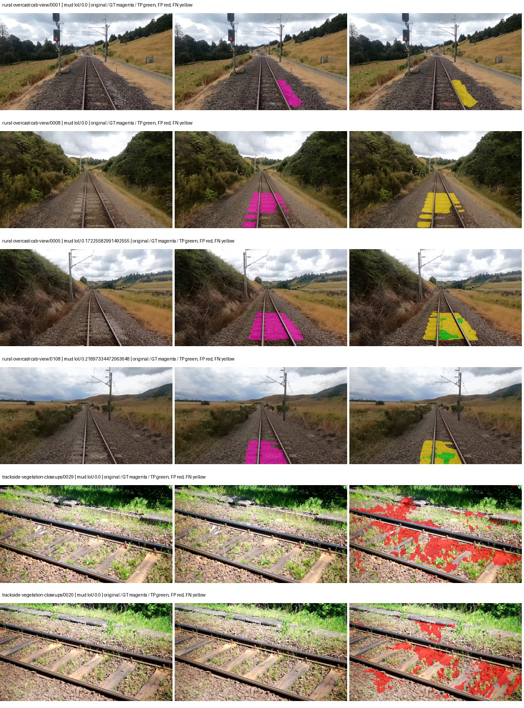
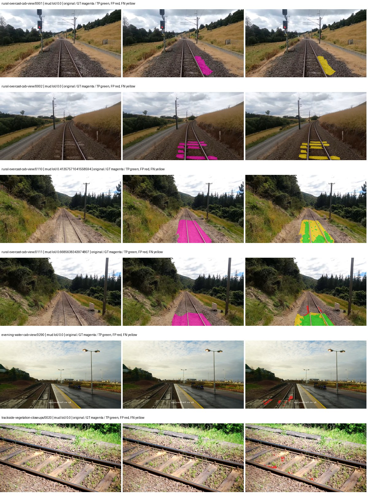
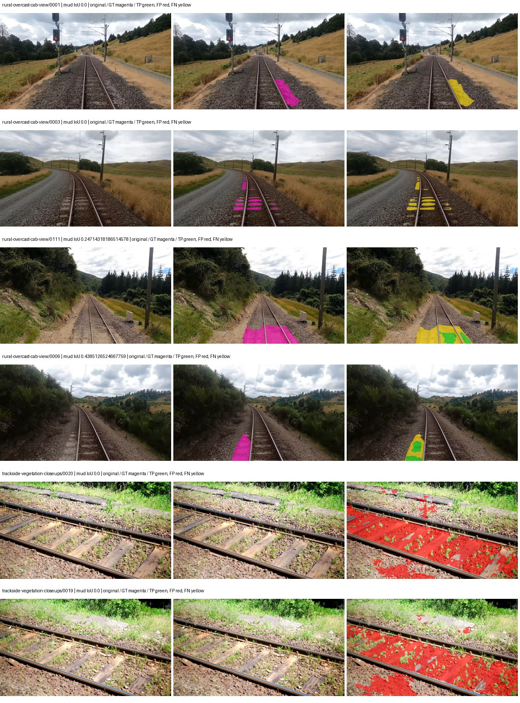
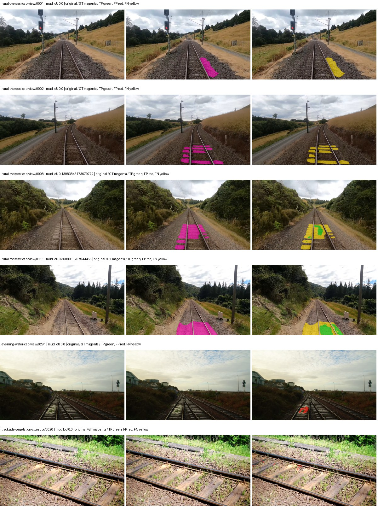

# hrnet_w48_ocr — rad_9_24_2026-fixed-grouped

[RAD 9/24: Scene-grouped split](../../README.md) · [Full model records](record.json)

Primary selection and early stopping: **mud-pumping validation IoU, pixels pooled over all validation images**. A job is complete only after full statistics and isolated profiling are verified.

Study metrics, counting each class only on the validation images that contain it: mud-pumping IoU is the mean per-image IoU over the images with mud-pumping, precision and recall sum pixels over those images, and mIoU averages each class over the images that contain it, then over the classes present.

| Initialization path | Seed | Mud-pumping IoU, train-camera images with mud (%, n=17) | Mud-pumping IoU, all images with mud (%, n=18) | Mud precision, all images with mud (%) | Mud recall, all images with mud (%) | mIoU (each class over images that contain it) (%) |
| --- | --- | --- | --- | --- | --- | --- |
| rtis_only | 0 | 6.20 | 6.52 | 66.01 | 7.66 | 34.85 |
| cityscapes_to_rtis | 0 | 8.38 | 8.10 | 95.25 | 12.36 | 35.55 |
| railsem19_to_rtis | 0 | 7.46 | 7.12 | 16.99 | 8.76 | 44.91 |
| cityscapes_to_railsem19_to_rtis | 0 | 5.46 | 5.16 | 96.97 | 6.62 | 40.91 |

Per-class IoU: IoU (%) of every class, each averaged only over the validation images that contain the class (n = those images); — = no image contains it. mIoU averages the classes with at least one such image.

| Initialization path | Seed | mIoU (each class over images that contain it) | person (n=0) | truck (n=0) | rail-track (n=37) | vegetation-overgrowth (n=13) | car (n=3) | on-rails (n=0) | traffic-sign (n=9) | road (n=11) | sidewalk (n=12) | construction (n=12) | tram-track (n=2) | pole (n=21) | traffic-light (n=3) | mud-pumping (n=18) | fence (n=7) | terrain (n=35) | sky (n=28) | rail-embedded (n=3) | rail-raised (n=37) | trackbed (n=37) | standing-water (n=9) |
| --- | --- | --- | --- | --- | --- | --- | --- | --- | --- | --- | --- | --- | --- | --- | --- | --- | --- | --- | --- | --- | --- | --- | --- |
| rtis_only | 0 | 34.85 | — | — | 58.80 | 30.55 | 20.79 | — | 26.51 | 12.33 | 10.80 | 33.99 | 2.89 | 66.10 | 40.68 | 6.52 | 7.09 | 78.08 | 92.85 | 6.57 | 70.37 | 61.23 | 1.10 |
| cityscapes_to_rtis | 0 | 35.55 | — | — | 53.13 | 15.80 | 19.90 | — | 39.19 | 20.42 | 5.65 | 39.85 | 7.79 | 71.56 | 50.92 | 8.10 | 9.34 | 76.71 | 90.73 | 4.46 | 70.37 | 55.63 | 0.26 |
| railsem19_to_rtis | 0 | 44.91 | — | — | 60.62 | 35.89 | 30.95 | — | 43.22 | 9.10 | 13.09 | 45.50 | 52.15 | 73.27 | 41.79 | 7.12 | 27.15 | 86.44 | 96.10 | 41.18 | 74.58 | 70.17 | 0.12 |
| cityscapes_to_railsem19_to_rtis | 0 | 40.91 | — | — | 65.47 | 17.59 | 38.01 | — | 41.62 | 17.17 | 10.95 | 40.18 | 29.04 | 72.80 | 55.59 | 5.16 | 15.76 | 83.08 | 96.84 | 11.20 | 73.23 | 62.78 | 0.00 |

Everything below is the campaign's own record, with pixels pooled over all validation images (the checkpoint was selected on that pooled mud IoU).

| Model | Initialization path | Seed | Status | Steps | Best step | Mud IoU, pixels pooled (%) | Mud precision, pixels pooled (%) | Mud recall, pixels pooled (%) | Final mud IoU (trainer val, pixels pooled, %) | mIoU, pixels pooled (%) | Fixed GT-class mIoU, pixels pooled (%) |
| --- | --- | --- | --- | --- | --- | --- | --- | --- | --- | --- | --- |
| hrnet_w48_ocr | rtis_only | 0 | completed | 1814 | 1814 | 3.60 | 6.36 | 7.66 | 3.61 | 31.91 | 37.23 |
| hrnet_w48_ocr | cityscapes_to_rtis | 0 | completed | 3370 | 2074 | 12.02 | 81.61 | 12.36 | 7.15 | 34.37 | 40.10 |
| hrnet_w48_ocr | railsem19_to_rtis | 0 | completed | 3888 | 2592 | 2.40 | 3.20 | 8.76 | 0.82 | 46.15 | 51.28 |
| hrnet_w48_ocr | cityscapes_to_railsem19_to_rtis | 0 | completed | 2851 | 1555 | 6.51 | 80.38 | 6.62 | 4.49 | 44.68 | 49.65 |

Training: 217 images. Validation: 37 images. Test: 60 held out. Seeds: [0]. Seed variation measures optimization variability, not independent-recording uncertainty. Historical source checkpoints stay fixed across adaptation seeds.

Training code: `d864b72bd90706260965bb1a48398d01167b6d5c`. Split SHA-256: `12d7b367c72cda61d57686ff2ac28223530d0af49debd9fb7a0fbc68b908bc93`.

## rtis_only — seed 0

Status: **completed**. Started: 2026-10-05T22:00:13.213276+00:00. Finished: 2026-10-05T22:54:49.748989+00:00.

Recipe pretrained initializer: `timm hrnet_w48 pretrained ImageNet backbone; fresh OCR head`.

`rtis_only` uses the recipe initializer, which may include pretrained segmentation components. Transfer paths load the exact historical source checkpoint below and reset the classifier; they do not reset all query/decoder features.

Source checkpoint: `Recipe pretrained initialization`.

Config SHA-256: `814e5a607d4e639e4ccbf7a9c6501e26b7ed87b85f43269df1ba17dfd94797d3`. Weights used for validation: `raw`.

### Mud-pumping and aggregate quality

| Metric | Selected checkpoint | Final training validation |
| --- | --- | --- |
| Mud IoU | 3.60 | 3.61 |
| Mud precision | 6.36 | 6.38 |
| Mud recall | 7.66 | 7.69 |
| Mud Dice/F1 | 6.95 | 6.98 |
| mIoU | 31.91 | 31.91 |
| Mean accuracy | 45.14 | 45.13 |
| Mean precision | 53.30 | 53.30 |
| Mean Dice | 41.44 | 41.44 |
| Mean specificity | 98.82 | 98.82 |
| Pixel accuracy | 80.51 | 80.51 |
| Frequency-weighted IoU | 71.93 | 71.93 |
| Fixed GT-present class mIoU | 37.23 | 37.23 |
| Boundary F1 | 40.05 | 40.05 |

The selected checkpoint has independent evaluation evidence. Final values are the trainer's final validation record, not a new independent evaluation. mIoU averages classes with nonzero union, so false positives on absent classes can change its denominator. The fixed GT-class mean is supplementary and excludes absent classes; their false positives remain in the confusion matrix.

### Resource usage and timing

| Measurement | Value |
| --- | --- |
| Peak training VRAM, retained training invocation (GiB) | 17.35 |
| Peak evaluation VRAM (GiB) | 7.58 |
| Retained training invocation wall time (seconds) | 3056.72 |
| Retained training invocation GPU-hours (one GPU) | 0.85 |
| Evaluation wall time (seconds) | 18.23 |
| Full evaluation pipeline images/second | 2.03 |
| Best full-state checkpoint (MiB) | 1119.23 |
| Final full-state checkpoint (MiB) | 1119.18 |
| Verified periodic checkpoints removed (GiB) | 3.28 |

VRAM uses the recorded allocator high-water mark; it is not total device usage including CUDA context. Resumed jobs' retained training invocation times and peaks are **not whole-campaign totals**. Earlier invocation resource records are not reconstructed here. Evaluation throughput includes loader, sliding-window inference and metrics; it is not model-only latency/FPS. Missing measurements are shown as —, never inferred from another dataset's run.

### Standardized inference performance

Dedicated model-only profiling waits for an idle worker-locked L40S: BF16, batch 1, 1024x1024, 20 warmup and 100 CUDA-event-timed public forwards. It excludes loading, preprocessing, tiling and metrics.

| Status | Parameters | Weight MiB | FPS | p50 ms | p95 ms | Peak reserved GiB |
| --- | --- | --- | --- | --- | --- | --- |
| complete | 73168490 | 279.12 | 30.81 | 32.23 | 33.72 | 1.26 |

```json
{
  "schema_version": 1,
  "model_id": "hrnet_w48_ocr",
  "measured_at": "2026-10-05T22:54:43+00:00",
  "status": "complete",
  "benchmark_scope": "rtis_selected_checkpoint_model_only",
  "applies_to": [
    "hrnet_w48_ocr--rtis_only--seed-0"
  ],
  "source": {
    "campaign_git_sha": "d864b72bd90706260965bb1a48398d01167b6d5c",
    "git_dirty": false,
    "config_hash": "2f8c110f5247",
    "resolved_config": "/data/izadia1/projects/segmentary-runs/rad_9_24_2026/fixed-grouped-seed0-20261005-r2/configs/hrnet_w48_ocr--rtis_only--seed-0.yaml",
    "config_sha256": "814e5a607d4e639e4ccbf7a9c6501e26b7ed87b85f43269df1ba17dfd94797d3",
    "checkpoint_sha256": "83af249ab05ffe18414ee7f6093459bf2a313b0851fb3d3808d4512097051a13",
    "checkpoint_global_step": 1814,
    "checkpoint_bytes": 1173602942,
    "checkpoint_kind": "resume checkpoint with optimizer and EMA state",
    "weights": "raw",
    "measured_checkpoint_job_id": "hrnet_w48_ocr--rtis_only--seed-0",
    "result_sha256": "b416aefb84959303afdf262b352a82deb4b0badbea6a60d342c6eeca7e127ac8",
    "result_git_sha": "d864b72bd90706260965bb1a48398d01167b6d5c",
    "result_stage": "eval:rad_9_24_2026-fixed-grouped:val",
    "result_seed": 0
  },
  "hardware": {
    "gpu_name": "NVIDIA L40S",
    "gpu_uuid": "GPU-804aea8b-5f62-423e-72c6-49e1ed15c4e4",
    "logical_device": "cuda:0",
    "physical_visibility_token": "6",
    "compute_capability": [
      8,
      9
    ],
    "total_memory_bytes": 47677177856
  },
  "model": {
    "parameter_count": 73168490,
    "trainable_parameter_count": 73168490,
    "resident_parameter_bytes": 292673960,
    "parameter_dtype_counts": {
      "float32": 73168490
    }
  },
  "contract": {
    "backend": "pytorch",
    "precision": "bf16_autocast",
    "batch_size": 1,
    "input_shape_nchw": [
      1,
      3,
      1024,
      1024
    ],
    "warmup_iterations": 20,
    "measured_iterations": 100,
    "timing": "per-forward CUDA events with end-event synchronization",
    "includes_preprocessing": false,
    "includes_data_loader": false,
    "includes_sliding_window": false,
    "input_resident_on_gpu": true,
    "model_only": true,
    "entrypoint": "public model(image) dense-logits forward"
  },
  "measurements": {
    "latency": {
      "p50_ms": 32.2344970703125,
      "p95_ms": 33.722213935852054,
      "mean_ms": 32.45406105041504,
      "minimum_ms": 32.070655822753906,
      "maximum_ms": 34.790401458740234,
      "fps": 30.81278482981135,
      "raw_ms": [
        32.55807876586914,
        32.14847946166992,
        32.17715072631836,
        32.24576187133789,
        32.16998291015625,
        32.98918533325195,
        32.24576187133789,
        33.075199127197266,
        32.099327087402344,
        32.14336013793945,
        32.19968032836914,
        32.20582580566406,
        32.222206115722656,
        32.43212890625,
        32.33689498901367,
        33.42335891723633,
        32.16691207885742,
        33.063934326171875,
        32.28364944458008,
        32.85094451904297,
        32.12287902832031,
        32.094207763671875,
        32.156673431396484,
        32.15359878540039,
        32.07785415649414,
        32.356353759765625,
        32.487422943115234,
        32.23654556274414,
        32.20787048339844,
        32.121856689453125,
        33.712127685546875,
        32.19456100463867,
        33.98963165283203,
        32.17407989501953,
        32.17919921875,
        32.216064453125,
        32.36556625366211,
        32.08601760864258,
        32.454654693603516,
        32.25088119506836,
        32.19046401977539,
        32.266239166259766,
        32.20787048339844,
        33.902591705322266,
        33.09977722167969,
        34.790401458740234,
        32.20991897583008,
        32.19353485107422,
        32.32252883911133,
        32.25190353393555,
        32.24678421020508,
        32.23244857788086,
        32.070655822753906,
        32.14336013793945,
        32.28876876831055,
        33.59743881225586,
        32.38809585571289,
        32.3870735168457,
        32.324607849121094,
        32.28976058959961,
        32.23654556274414,
        32.17715072631836,
        32.21299362182617,
        32.24883270263672,
        32.24371337890625,
        32.3502082824707,
        33.00966262817383,
        32.42595291137695,
        33.77766418457031,
        32.19657516479492,
        32.18022537231445,
        32.080894470214844,
        32.125953674316406,
        32.18124771118164,
        34.66649627685547,
        32.22528076171875,
        32.21299362182617,
        32.20275115966797,
        32.24576187133789,
        32.305118560791016,
        32.4956169128418,
        32.33689498901367,
        33.32915115356445,
        32.222206115722656,
        32.23654556274414,
        32.249855041503906,
        32.18636703491211,
        32.16793441772461,
        32.101375579833984,
        32.19046401977539,
        32.154624938964844,
        32.13721466064453,
        32.18124771118164,
        33.719295501708984,
        32.20991897583008,
        32.67891311645508,
        32.16899108886719,
        32.18124771118164,
        32.19148635864258,
        32.880638122558594
      ],
      "percentile_method": "numpy linear interpolation"
    },
    "peak_reserved_bytes": 1350565888,
    "memory_kind": "pytorch_cuda_allocator_peak_reserved_excluding_context",
    "benchmark_wall_clock_s": 16.423558622598648
  },
  "started_at": "2026-10-05T22:54:26+00:00",
  "finished_at": "2026-10-05T22:54:43+00:00",
  "environment": {
    "hostname": "hdrfs-app-001",
    "python": "3.11.15",
    "platform": "Linux-5.15.0-139-generic-x86_64-with-glibc2.35",
    "torch": "2.11.0+cu128",
    "torch_cuda": "12.8",
    "cudnn": 91900,
    "driver_version": "570.133.20",
    "cuda_available": true,
    "gpu_count": 1,
    "gpu_names": [
      "NVIDIA L40S"
    ],
    "cuda_visible_devices": "6",
    "packages": {
      "segmentary": "0.1.0",
      "torch": "2.11.0+cu128",
      "torchvision": "0.26.0+cu128",
      "transformers": "5.15.0",
      "timm": "1.0.28",
      "segmentation-models-pytorch": "0.5.0",
      "albumentations": "2.0.8",
      "lightning": "2.6.5",
      "numpy": "2.4.4"
    }
  }
}
```

### Per-class validation results

| Class | GT pixels | IoU (%) | Precision (%) | Recall (%) | Dice (%) | Boundary F1 (%) |
| --- | --- | --- | --- | --- | --- | --- |
| car | 29664 | 34.28 | 72.51 | 39.40 | 51.05 | 51.93 |
| construction | 311585 | 36.55 | 38.91 | 85.76 | 53.53 | 38.99 |
| fence | 265137 | 6.40 | 26.44 | 7.79 | 12.03 | 25.24 |
| mud-pumping | 1226250 | 3.60 | 6.36 | 7.66 | 6.95 | 5.68 |
| on-rails | 0 | 0.00 | 0.00 | — | 0.00 | 0.00 |
| person | 0 | 0.00 | 0.00 | — | 0.00 | 0.00 |
| pole | 628038 | 70.32 | 88.48 | 77.41 | 82.58 | 90.22 |
| rail-embedded | 16799 | 14.84 | 96.31 | 14.93 | 25.85 | 25.52 |
| rail-raised | 2969797 | 67.94 | 74.30 | 88.81 | 80.91 | 83.94 |
| rail-track | 6323197 | 41.23 | 62.56 | 54.74 | 58.39 | 53.24 |
| road | 1048831 | 14.20 | 42.05 | 17.65 | 24.86 | 16.24 |
| sidewalk | 1297367 | 21.61 | 52.97 | 26.75 | 35.54 | 22.08 |
| sky | 19121606 | 95.46 | 99.40 | 96.02 | 97.68 | 83.10 |
| standing-water | 95802 | 0.11 | 0.12 | 4.76 | 0.23 | 1.38 |
| terrain | 39239306 | 82.00 | 87.14 | 93.29 | 90.11 | 54.38 |
| trackbed | 10643081 | 59.74 | 79.41 | 70.70 | 74.80 | 60.04 |
| traffic-light | 19510 | 49.97 | 95.08 | 51.30 | 66.64 | 74.35 |
| traffic-sign | 13285 | 38.64 | 96.36 | 39.21 | 55.74 | 73.19 |
| tram-track | 56179 | 4.82 | 20.09 | 5.97 | 9.21 | 19.24 |
| truck | 0 | 0.00 | 0.00 | — | 0.00 | 0.00 |
| vegetation-overgrowth | 5901821 | 28.37 | 80.88 | 30.41 | 44.20 | 62.22 |

### Full-run accounting

| Measurement | Value |
| --- | --- |
| Full GPU-reserved wall seconds, all recorded worker attempts | 3284.06 |
| Full reserved GPU-hours | 0.91 |
| Whole-run timing complete | True |

| Phase | Wall seconds including failed attempts |
| --- | --- |
| training | 3063.99 |
| diagnostics | 152.72 |
| performance | 26.32 |

GPU-reserved time includes model loading, training, validation, collection, profiling, checkpoint I/O and orchestration while the worker owns one GPU. It is not GPU kernel-active time. Phase timings and sampled device memory/power/utilization are retained separately; sampled device memory is not the allocator high-water mark.

### Train/validation and raw/EMA diagnostics

| Checkpoint / weights / split | Images | Mud IoU (%) | Mud precision (%) | Mud recall (%) |
| --- | --- | --- | --- | --- |
| best-auto-train / raw | 217 | 95.15 | 97.64 | 97.39 |
| best-auto-val / raw | 37 | 3.60 | 6.36 | 7.66 |
| best-alternate-val / ema | 37 | 0.48 | 0.89 | 1.03 |
| final-auto-val / raw | 37 | 3.60 | 6.36 | 7.66 |

Train uses the evaluation transform without augmentation. Compare mud train/validation metrics for the same selected weights. Alternate EMA on running-stat BatchNorm is explicitly uncalibrated and is diagnostic only. Score-threshold curves use uncalibrated normalized scores and are pixel-level diagnostics, not event detection rates or a selected deployment operating point.

### Downloadable evidence

- best-auto-train: [per-image.csv](rtis_only--seed-0/best-auto-train/per-image.csv) · [per-image-confusion.json.gz](rtis_only--seed-0/best-auto-train/per-image-confusion.json.gz) · [groups.json](rtis_only--seed-0/best-auto-train/groups.json) · [mud-score-curves.json](rtis_only--seed-0/best-auto-train/mud-score-curves.json)
- best-auto-val: [per-image.csv](rtis_only--seed-0/best-auto-val/per-image.csv) · [per-image-confusion.json.gz](rtis_only--seed-0/best-auto-val/per-image-confusion.json.gz) · [groups.json](rtis_only--seed-0/best-auto-val/groups.json) · [mud-score-curves.json](rtis_only--seed-0/best-auto-val/mud-score-curves.json) · [examples.jpg](rtis_only--seed-0/best-auto-val/examples.jpg)
- best-alternate-val: [per-image.csv](rtis_only--seed-0/best-alternate-val/per-image.csv) · [per-image-confusion.json.gz](rtis_only--seed-0/best-alternate-val/per-image-confusion.json.gz) · [groups.json](rtis_only--seed-0/best-alternate-val/groups.json) · [mud-score-curves.json](rtis_only--seed-0/best-alternate-val/mud-score-curves.json)
- final-auto-val: [per-image.csv](rtis_only--seed-0/final-auto-val/per-image.csv) · [per-image-confusion.json.gz](rtis_only--seed-0/final-auto-val/per-image-confusion.json.gz) · [groups.json](rtis_only--seed-0/final-auto-val/groups.json) · [mud-score-curves.json](rtis_only--seed-0/final-auto-val/mud-score-curves.json)
- resources: [telemetry.csv](rtis_only--seed-0/resources/telemetry.csv)



Examples are two lowest and two highest mud-IoU positive images, plus up to two negative images with the most false-positive mud pixels. They are targeted diagnostic examples, not random samples. Green: true positive; red: false positive; yellow: false negative. Full predictions remain on HDRFS.

### Validation tracking

| Logged step | Overall mIoU (%) | Mud IoU (%) |
| --- | --- | --- |
| 258 | 23.54 | 0.71 |
| 518 | 26.70 | 3.61 |
| 777 | 26.09 | 1.09 |
| 1036 | 29.52 | 1.92 |
| 1295 | 27.20 | 3.04 |
| 1555 | 31.22 | 0.41 |
| 1814 | 31.91 | 3.61 |

All retained scalar curves, including training loss and per-class IoU, are in record.json. Observed best mud on a curve is not necessarily a retained checkpoint: the pilot saved its selection-metric-best and final checkpoints. Step logging and checkpoint global_step may differ by one.

### Stopping and checkpoint provenance

```json
{
  "stopping": {
    "actual_steps": 1814,
    "maximum_steps": 4000,
    "min_delta": 0.001,
    "monitor": "val_iou/mud-pumping",
    "patience": 5,
    "reason": "validation_plateau"
  },
  "checkpoints": {
    "best": {
      "path": "/data/izadia1/projects/segmentary-runs/rad_9_24_2026/fixed-grouped-seed0-20261005-r2/future-runs/hrnet_w48_ocr--rtis_only--seed-0_seed0/rtis/best.ckpt",
      "sha256": "83af249ab05ffe18414ee7f6093459bf2a313b0851fb3d3808d4512097051a13",
      "global_step": 1814,
      "bytes": 1173602942
    },
    "final": {
      "path": "/data/izadia1/projects/segmentary-runs/rad_9_24_2026/fixed-grouped-seed0-20261005-r2/future-runs/hrnet_w48_ocr--rtis_only--seed-0_seed0/rtis/last.ckpt",
      "sha256": "49881ed4ee93dec5e3a26c16b91caea4b8ffdaccb41e623fd15368c50bdb0985",
      "global_step": 1814,
      "bytes": 1173541502
    }
  },
  "cleanup_error": null
}
```

### Resolved training, initialization and evaluation settings

The optimizer block is the base configuration. Stage LR scales are applied at runtime, and stage warmup is capped at min(base warmup, floor(stage budget / 10), stage budget - 1): 400 steps for this 4,000-step pilot. Model-internal native input grids may differ from augmentation crops (EoMT uses its 640 grid).

```json
{
  "name": "hrnet_w48_ocr--rtis_only--seed-0",
  "model": {
    "arch": "hrnet_w48_ocr",
    "checkpoint": null,
    "tuning": "full",
    "head": "unified_head",
    "lora_r": 16,
    "lora_alpha": 32,
    "lora_dropout": 0.05,
    "lora_targets": [],
    "drop_path": null,
    "revision": null,
    "subfolder": null,
    "local_files_only": false,
    "trust_remote_code": false,
    "backbone_path": null,
    "head_paths": [],
    "classifier_path": null,
    "inactive_parameter_paths": [],
    "smp_arch": null,
    "encoder_name": null,
    "encoder_weights": null,
    "native": null,
    "batch_norm_momentum": null
  },
  "space": "paul-test-rtis",
  "taxonomy_root": "/data/izadia1/projects/segmentary-rad-d864b72b/taxonomy",
  "output_root": "/data/izadia1/projects/segmentary-runs/rad_9_24_2026/fixed-grouped-seed0-20261005-r2/future-runs",
  "optim": {
    "backbone_lr": 0.0001,
    "head_lr_mult": 10.0,
    "weight_decay": 0.05,
    "llrd": 1.0,
    "warmup_iters": 1500,
    "warmup_ratio": 1e-06,
    "poly_power": 0.9,
    "min_lr_ratio": 0.0,
    "betas": [
      0.9,
      0.999
    ],
    "grad_clip": 1.0
  },
  "train": {
    "iters": 4000,
    "batch_size": 2,
    "accum": 8,
    "num_workers": 2,
    "precision": "bf16-mixed",
    "ema_decay": 0.9998,
    "val_every": 250,
    "ckpt_every": 500,
    "selection_metric": "val_iou/mud-pumping",
    "early_stopping_patience": 5,
    "early_stopping_min_delta": 0.001,
    "seed": 0,
    "devices": 1
  },
  "eval": {
    "sliding_window": true,
    "window": [
      1024,
      1024
    ],
    "stride": [
      768,
      768
    ],
    "batch_size": 1,
    "num_workers": 2,
    "tta_scales": [],
    "tta_flip": false,
    "threshold": 0.5,
    "boundary_tolerance_frac": 0.0075,
    "save_confusion": true
  },
  "loss": {
    "task": "multiclass",
    "activation": "auto",
    "terms": [],
    "aux": "none",
    "aux_weight": 0.0,
    "ce_weight": 1.0,
    "label_smoothing": 0.0,
    "class_weights": null,
    "query": null
  },
  "aug": {
    "crop": [
      1024,
      1024
    ],
    "scale_min": 0.5,
    "scale_max": 2.0,
    "hflip_p": 0.5,
    "color_jitter_p": 0.5,
    "brightness": 0.25,
    "contrast": 0.25,
    "saturation": 0.25,
    "hue": 0.05
  },
  "stages": [
    {
      "name": "rtis",
      "data": [
        {
          "name": "rad_9_24_2026-fixed-grouped",
          "root": "/data/izadia1/datasets/rad_9_24_2026-fixed-grouped",
          "variant": null,
          "split_file": "splits.json",
          "train_split": "train",
          "val_split": "val",
          "limit": null,
          "loader": "folder",
          "mapping": "paul-test-rtis",
          "loader_options": {
            "require_groups": true
          }
        }
      ],
      "iters": null,
      "lr_scale": 1.0,
      "head_group_lr_scale": 1.0,
      "init_from": "pretrained",
      "reset_head": false,
      "freeze": null,
      "sample_weights": null
    }
  ]
}
```

### Hardware and software provenance

```json
{
  "training": {
    "cuda_available": true,
    "cuda_visible_devices": "6",
    "cudnn": 91900,
    "driver_version": "570.133.20",
    "gpu_count": 1,
    "gpu_names": [
      "NVIDIA L40S"
    ],
    "hostname": "hdrfs-app-001",
    "input_normalization": {
      "channel_order": "rgb",
      "mean": [
        0.485,
        0.456,
        0.406
      ],
      "source": "imagenet",
      "std": [
        0.229,
        0.224,
        0.225
      ]
    },
    "model_origins": [
      {
        "hf_commit": null,
        "hf_name_or_path": null,
        "module": "trunk",
        "timm_pretrained": {
          "architecture": "hrnet_w48",
          "hf_hub_id": "timm/hrnet_w48.ms_in1k",
          "tag": "ms_in1k",
          "url": ""
        }
      }
    ],
    "model_parameter_count": 73168490,
    "packages": {
      "albumentations": "2.0.8",
      "lightning": "2.6.5",
      "numpy": "2.4.4",
      "segmentary": "0.1.0",
      "segmentation-models-pytorch": "0.5.0",
      "timm": "1.0.28",
      "torch": "2.11.0+cu128",
      "torchvision": "0.26.0+cu128",
      "transformers": "5.15.0"
    },
    "platform": "Linux-5.15.0-139-generic-x86_64-with-glibc2.35",
    "python": "3.11.15",
    "torch": "2.11.0+cu128",
    "torch_cuda": "12.8",
    "trainable_parameter_count": 73168490,
    "training_stop": {
      "actual_steps": 1814,
      "maximum_steps": 4000,
      "min_delta": 0.001,
      "monitor": "val_iou/mud-pumping",
      "patience": 5,
      "reason": "validation_plateau"
    },
    "validation_weights": "raw"
  },
  "evaluation": {
    "cuda_available": true,
    "cuda_visible_devices": "6",
    "cudnn": 91900,
    "driver_version": "570.133.20",
    "gpu_count": 1,
    "gpu_names": [
      "NVIDIA L40S"
    ],
    "hostname": "hdrfs-app-001",
    "input_normalization": {
      "channel_order": "rgb",
      "mean": [
        0.485,
        0.456,
        0.406
      ],
      "source": "imagenet",
      "std": [
        0.229,
        0.224,
        0.225
      ]
    },
    "packages": {
      "albumentations": "2.0.8",
      "lightning": "2.6.5",
      "numpy": "2.4.4",
      "segmentary": "0.1.0",
      "segmentation-models-pytorch": "0.5.0",
      "timm": "1.0.28",
      "torch": "2.11.0+cu128",
      "torchvision": "0.26.0+cu128",
      "transformers": "5.15.0"
    },
    "platform": "Linux-5.15.0-139-generic-x86_64-with-glibc2.35",
    "python": "3.11.15",
    "torch": "2.11.0+cu128",
    "torch_cuda": "12.8"
  }
}
```

## cityscapes_to_rtis — seed 0

Status: **completed**. Started: 2026-10-05T22:46:18.509183+00:00. Finished: 2026-10-06T00:23:15.256737+00:00.

Recipe pretrained initializer: `timm hrnet_w48 pretrained ImageNet backbone; fresh OCR head`.

`rtis_only` uses the recipe initializer, which may include pretrained segmentation components. Transfer paths load the exact historical source checkpoint below and reset the classifier; they do not reset all query/decoder features.

Source checkpoint: `{'name': 'hrnet_w48_ocr--cityscapes--seed-0', 'model': 'hrnet_w48_ocr', 'protocol': 'cityscapes', 'config': '/data/izadia1/projects/segmentary-runs/all-model-city-rail-seed0-rail20-b9eb3e1/accepted/hrnet_w48_ocr--cityscapes--seed-0/resolved-config.yaml', 'checkpoint': '/data/izadia1/projects/segmentary-runs/current-main-fill-v2/jobs/hrnet_w48_ocr--cityscapes--seed-0/train/hrnet_w48_ocr--cityscapes_seed0/cityscapes/last.ckpt', 'recorded_sha256': '38fb6ca68c932ae2a8224708568d0825f3d188f076da708d6eca79932cde4e84', 'exists': True}`.

Config SHA-256: `91833ded66e4ad0fee90e6d4ccad9413a1371d23dc6e5c5bdf1ed3ecfff15a9f`. Weights used for validation: `raw`.

### Mud-pumping and aggregate quality

| Metric | Selected checkpoint | Final training validation |
| --- | --- | --- |
| Mud IoU | 12.02 | 7.15 |
| Mud precision | 81.61 | 39.48 |
| Mud recall | 12.36 | 8.03 |
| Mud Dice/F1 | 21.47 | 13.34 |
| mIoU | 34.37 | 33.87 |
| Mean accuracy | 47.40 | 47.15 |
| Mean precision | 56.75 | 55.00 |
| Mean Dice | 43.57 | 42.66 |
| Mean specificity | 98.57 | 98.57 |
| Pixel accuracy | 79.60 | 79.95 |
| Frequency-weighted IoU | 67.07 | 67.24 |
| Fixed GT-present class mIoU | 40.10 | 39.51 |
| Boundary F1 | 40.60 | 40.24 |

The selected checkpoint has independent evaluation evidence. Final values are the trainer's final validation record, not a new independent evaluation. mIoU averages classes with nonzero union, so false positives on absent classes can change its denominator. The fixed GT-class mean is supplementary and excludes absent classes; their false positives remain in the confusion matrix.

### Resource usage and timing

| Measurement | Value |
| --- | --- |
| Peak training VRAM, retained training invocation (GiB) | 17.35 |
| Peak evaluation VRAM (GiB) | 7.58 |
| Retained training invocation wall time (seconds) | 5591.50 |
| Retained training invocation GPU-hours (one GPU) | 1.55 |
| Evaluation wall time (seconds) | 18.36 |
| Full evaluation pipeline images/second | 2.01 |
| Best full-state checkpoint (MiB) | 1119.23 |
| Final full-state checkpoint (MiB) | 1119.18 |
| Verified periodic checkpoints removed (GiB) | 6.56 |

VRAM uses the recorded allocator high-water mark; it is not total device usage including CUDA context. Resumed jobs' retained training invocation times and peaks are **not whole-campaign totals**. Earlier invocation resource records are not reconstructed here. Evaluation throughput includes loader, sliding-window inference and metrics; it is not model-only latency/FPS. Missing measurements are shown as —, never inferred from another dataset's run.

### Standardized inference performance

Dedicated model-only profiling waits for an idle worker-locked L40S: BF16, batch 1, 1024x1024, 20 warmup and 100 CUDA-event-timed public forwards. It excludes loading, preprocessing, tiling and metrics.

| Status | Parameters | Weight MiB | FPS | p50 ms | p95 ms | Peak reserved GiB |
| --- | --- | --- | --- | --- | --- | --- |
| complete | 73168490 | 279.12 | 31.72 | 31.46 | 31.74 | 1.26 |

```json
{
  "schema_version": 1,
  "model_id": "hrnet_w48_ocr",
  "measured_at": "2026-10-06T00:23:06+00:00",
  "status": "complete",
  "benchmark_scope": "rtis_selected_checkpoint_model_only",
  "applies_to": [
    "hrnet_w48_ocr--cityscapes_to_rtis--seed-0"
  ],
  "source": {
    "campaign_git_sha": "d864b72bd90706260965bb1a48398d01167b6d5c",
    "git_dirty": false,
    "config_hash": "0c17fc1954d7",
    "resolved_config": "/data/izadia1/projects/segmentary-runs/rad_9_24_2026/fixed-grouped-seed0-20261005-r2/configs/hrnet_w48_ocr--cityscapes_to_rtis--seed-0.yaml",
    "config_sha256": "91833ded66e4ad0fee90e6d4ccad9413a1371d23dc6e5c5bdf1ed3ecfff15a9f",
    "checkpoint_sha256": "ea2538f22e5da3fe6676464b740e008f3929bb3714a66c3ab3069bffa8d0393c",
    "checkpoint_global_step": 2074,
    "checkpoint_bytes": 1173602878,
    "checkpoint_kind": "resume checkpoint with optimizer and EMA state",
    "weights": "raw",
    "measured_checkpoint_job_id": "hrnet_w48_ocr--cityscapes_to_rtis--seed-0",
    "result_sha256": "1b3a0ba472c9440249f08d6f1ebe174d8174ccf96a4a3dc1713deb62e4c86754",
    "result_git_sha": "d864b72bd90706260965bb1a48398d01167b6d5c",
    "result_stage": "eval:rad_9_24_2026-fixed-grouped:val",
    "result_seed": 0
  },
  "hardware": {
    "gpu_name": "NVIDIA L40S",
    "gpu_uuid": "GPU-e2e96741-aec9-e90b-5c46-d0d58be90a56",
    "logical_device": "cuda:0",
    "physical_visibility_token": "8",
    "compute_capability": [
      8,
      9
    ],
    "total_memory_bytes": 47677177856
  },
  "model": {
    "parameter_count": 73168490,
    "trainable_parameter_count": 73168490,
    "resident_parameter_bytes": 292673960,
    "parameter_dtype_counts": {
      "float32": 73168490
    }
  },
  "contract": {
    "backend": "pytorch",
    "precision": "bf16_autocast",
    "batch_size": 1,
    "input_shape_nchw": [
      1,
      3,
      1024,
      1024
    ],
    "warmup_iterations": 20,
    "measured_iterations": 100,
    "timing": "per-forward CUDA events with end-event synchronization",
    "includes_preprocessing": false,
    "includes_data_loader": false,
    "includes_sliding_window": false,
    "input_resident_on_gpu": true,
    "model_only": true,
    "entrypoint": "public model(image) dense-logits forward"
  },
  "measurements": {
    "latency": {
      "p50_ms": 31.463424682617188,
      "p95_ms": 31.73703622817993,
      "mean_ms": 31.523694705963134,
      "minimum_ms": 31.24937629699707,
      "maximum_ms": 33.751041412353516,
      "fps": 31.72216992099078,
      "raw_ms": [
        31.473663330078125,
        31.450111389160156,
        31.39481544494629,
        31.277055740356445,
        31.443967819213867,
        31.294464111328125,
        31.348735809326172,
        31.351808547973633,
        31.39276885986328,
        31.39788818359375,
        31.463424682617188,
        31.329248428344727,
        31.369216918945312,
        31.314943313598633,
        31.479808807373047,
        31.41427230834961,
        31.40505599975586,
        31.465471267700195,
        31.367168426513672,
        31.334400177001953,
        31.307775497436523,
        31.332351684570312,
        31.36511993408203,
        31.392736434936523,
        31.328256607055664,
        31.350784301757812,
        31.574016571044922,
        31.24937629699707,
        31.485952377319336,
        31.273984909057617,
        31.300607681274414,
        31.351808547973633,
        31.278079986572266,
        31.442943572998047,
        31.388671875,
        31.533056259155273,
        31.539199829101562,
        31.387615203857422,
        31.547391891479492,
        31.484928131103516,
        31.39686393737793,
        31.631359100341797,
        31.465471267700195,
        31.58016014099121,
        31.505407333374023,
        31.348735809326172,
        31.358976364135742,
        31.523839950561523,
        31.331327438354492,
        31.704063415527344,
        31.409151077270508,
        31.335424423217773,
        31.518720626831055,
        31.401952743530273,
        31.494144439697266,
        31.459327697753906,
        31.4204158782959,
        31.684608459472656,
        31.60268783569336,
        31.525888442993164,
        31.525888442993164,
        32.71782302856445,
        31.635456085205078,
        31.37843132019043,
        31.539199829101562,
        31.464448928833008,
        31.459327697753906,
        31.473663330078125,
        31.531007766723633,
        31.36614418029785,
        31.468544006347656,
        31.461376190185547,
        31.512575149536133,
        31.624191284179688,
        31.664127349853516,
        31.463424682617188,
        31.418336868286133,
        31.510528564453125,
        31.575040817260742,
        31.54534339904785,
        31.653888702392578,
        31.572959899902344,
        31.36409568786621,
        31.526912689208984,
        33.751041412353516,
        32.92262268066406,
        31.537151336669922,
        31.523839950561523,
        31.39788818359375,
        31.520767211914062,
        31.492095947265625,
        31.76038360595703,
        31.52182388305664,
        31.388671875,
        31.58118438720703,
        31.37945556640625,
        31.44806480407715,
        33.105918884277344,
        31.468544006347656,
        31.735807418823242
      ],
      "percentile_method": "numpy linear interpolation"
    },
    "peak_reserved_bytes": 1350565888,
    "memory_kind": "pytorch_cuda_allocator_peak_reserved_excluding_context",
    "benchmark_wall_clock_s": 16.352415449917316
  },
  "started_at": "2026-10-06T00:22:49+00:00",
  "finished_at": "2026-10-06T00:23:06+00:00",
  "environment": {
    "hostname": "hdrfs-app-001",
    "python": "3.11.15",
    "platform": "Linux-5.15.0-139-generic-x86_64-with-glibc2.35",
    "torch": "2.11.0+cu128",
    "torch_cuda": "12.8",
    "cudnn": 91900,
    "driver_version": "570.133.20",
    "cuda_available": true,
    "gpu_count": 1,
    "gpu_names": [
      "NVIDIA L40S"
    ],
    "cuda_visible_devices": "8",
    "packages": {
      "segmentary": "0.1.0",
      "torch": "2.11.0+cu128",
      "torchvision": "0.26.0+cu128",
      "transformers": "5.15.0",
      "timm": "1.0.28",
      "segmentation-models-pytorch": "0.5.0",
      "albumentations": "2.0.8",
      "lightning": "2.6.5",
      "numpy": "2.4.4"
    }
  }
}
```

### Per-class validation results

| Class | GT pixels | IoU (%) | Precision (%) | Recall (%) | Dice (%) | Boundary F1 (%) |
| --- | --- | --- | --- | --- | --- | --- |
| car | 29664 | 30.17 | 62.12 | 36.98 | 46.36 | 52.93 |
| construction | 311585 | 61.50 | 74.94 | 77.43 | 76.16 | 67.20 |
| fence | 265137 | 13.02 | 62.17 | 14.14 | 23.04 | 32.20 |
| mud-pumping | 1226250 | 12.02 | 81.61 | 12.36 | 21.47 | 14.75 |
| on-rails | 0 | 0.00 | 0.00 | — | 0.00 | 0.00 |
| person | 0 | 0.00 | 0.00 | — | 0.00 | 0.00 |
| pole | 628038 | 73.88 | 82.37 | 87.76 | 84.98 | 89.38 |
| rail-embedded | 16799 | 10.00 | 56.41 | 10.84 | 18.19 | 24.48 |
| rail-raised | 2969797 | 71.40 | 79.22 | 87.85 | 83.32 | 87.14 |
| rail-track | 6323197 | 35.36 | 61.55 | 45.38 | 52.24 | 41.22 |
| road | 1048831 | 14.84 | 26.39 | 25.33 | 25.85 | 21.42 |
| sidewalk | 1297367 | 16.42 | 60.75 | 18.37 | 28.21 | 12.12 |
| sky | 19121606 | 91.85 | 99.65 | 92.15 | 95.75 | 80.02 |
| standing-water | 95802 | 0.15 | 0.17 | 1.30 | 0.30 | 2.61 |
| terrain | 39239306 | 77.61 | 79.15 | 97.56 | 87.40 | 45.30 |
| trackbed | 10643081 | 53.42 | 68.29 | 71.03 | 69.64 | 48.65 |
| traffic-light | 19510 | 81.90 | 92.20 | 88.00 | 90.05 | 89.06 |
| traffic-sign | 13285 | 55.68 | 88.83 | 59.87 | 71.53 | 81.45 |
| tram-track | 56179 | 13.74 | 37.54 | 17.82 | 24.17 | 16.71 |
| truck | 0 | 0.00 | 0.00 | — | 0.00 | 0.00 |
| vegetation-overgrowth | 5901821 | 8.86 | 78.32 | 9.08 | 16.28 | 45.93 |

### Full-run accounting

| Measurement | Value |
| --- | --- |
| Full GPU-reserved wall seconds, all recorded worker attempts | 5825.34 |
| Full reserved GPU-hours | 1.62 |
| Whole-run timing complete | True |

| Phase | Wall seconds including failed attempts |
| --- | --- |
| training | 5599.48 |
| diagnostics | 154.14 |
| performance | 26.09 |

GPU-reserved time includes model loading, training, validation, collection, profiling, checkpoint I/O and orchestration while the worker owns one GPU. It is not GPU kernel-active time. Phase timings and sampled device memory/power/utilization are retained separately; sampled device memory is not the allocator high-water mark.

### Train/validation and raw/EMA diagnostics

| Checkpoint / weights / split | Images | Mud IoU (%) | Mud precision (%) | Mud recall (%) |
| --- | --- | --- | --- | --- |
| best-auto-train / raw | 217 | 91.85 | 96.53 | 94.99 |
| best-auto-val / raw | 37 | 12.02 | 81.61 | 12.36 |
| best-alternate-val / ema | 37 | 4.68 | 97.21 | 4.68 |
| final-auto-val / raw | 37 | 7.15 | 39.57 | 8.03 |

Train uses the evaluation transform without augmentation. Compare mud train/validation metrics for the same selected weights. Alternate EMA on running-stat BatchNorm is explicitly uncalibrated and is diagnostic only. Score-threshold curves use uncalibrated normalized scores and are pixel-level diagnostics, not event detection rates or a selected deployment operating point.

### Downloadable evidence

- best-auto-train: [per-image.csv](cityscapes_to_rtis--seed-0/best-auto-train/per-image.csv) · [per-image-confusion.json.gz](cityscapes_to_rtis--seed-0/best-auto-train/per-image-confusion.json.gz) · [groups.json](cityscapes_to_rtis--seed-0/best-auto-train/groups.json) · [mud-score-curves.json](cityscapes_to_rtis--seed-0/best-auto-train/mud-score-curves.json)
- best-auto-val: [per-image.csv](cityscapes_to_rtis--seed-0/best-auto-val/per-image.csv) · [per-image-confusion.json.gz](cityscapes_to_rtis--seed-0/best-auto-val/per-image-confusion.json.gz) · [groups.json](cityscapes_to_rtis--seed-0/best-auto-val/groups.json) · [mud-score-curves.json](cityscapes_to_rtis--seed-0/best-auto-val/mud-score-curves.json) · [examples.jpg](cityscapes_to_rtis--seed-0/best-auto-val/examples.jpg)
- best-alternate-val: [per-image.csv](cityscapes_to_rtis--seed-0/best-alternate-val/per-image.csv) · [per-image-confusion.json.gz](cityscapes_to_rtis--seed-0/best-alternate-val/per-image-confusion.json.gz) · [groups.json](cityscapes_to_rtis--seed-0/best-alternate-val/groups.json) · [mud-score-curves.json](cityscapes_to_rtis--seed-0/best-alternate-val/mud-score-curves.json)
- final-auto-val: [per-image.csv](cityscapes_to_rtis--seed-0/final-auto-val/per-image.csv) · [per-image-confusion.json.gz](cityscapes_to_rtis--seed-0/final-auto-val/per-image-confusion.json.gz) · [groups.json](cityscapes_to_rtis--seed-0/final-auto-val/groups.json) · [mud-score-curves.json](cityscapes_to_rtis--seed-0/final-auto-val/mud-score-curves.json)
- resources: [telemetry.csv](cityscapes_to_rtis--seed-0/resources/telemetry.csv)



Examples are two lowest and two highest mud-IoU positive images, plus up to two negative images with the most false-positive mud pixels. They are targeted diagnostic examples, not random samples. Green: true positive; red: false positive; yellow: false negative. Full predictions remain on HDRFS.

### Validation tracking

| Logged step | Overall mIoU (%) | Mud IoU (%) |
| --- | --- | --- |
| 258 | 22.42 | 0.24 |
| 518 | 22.32 | 6.20 |
| 777 | 24.56 | 1.66 |
| 1036 | 29.03 | 0.20 |
| 1295 | 30.14 | 7.76 |
| 1555 | 33.23 | 10.03 |
| 1814 | 32.70 | 4.98 |
| 2073 | 34.41 | 12.03 |
| 2332 | 34.22 | 5.09 |
| 2592 | 34.42 | 5.82 |
| 2851 | 32.35 | 5.54 |
| 3110 | 32.26 | 9.31 |
| 3369 | 33.87 | 7.15 |

All retained scalar curves, including training loss and per-class IoU, are in record.json. Observed best mud on a curve is not necessarily a retained checkpoint: the pilot saved its selection-metric-best and final checkpoints. Step logging and checkpoint global_step may differ by one.

### Stopping and checkpoint provenance

```json
{
  "stopping": {
    "actual_steps": 3370,
    "maximum_steps": 4000,
    "min_delta": 0.001,
    "monitor": "val_iou/mud-pumping",
    "patience": 5,
    "reason": "validation_plateau"
  },
  "checkpoints": {
    "best": {
      "path": "/data/izadia1/projects/segmentary-runs/rad_9_24_2026/fixed-grouped-seed0-20261005-r2/future-runs/hrnet_w48_ocr--cityscapes_to_rtis--seed-0_seed0/rtis/best.ckpt",
      "sha256": "ea2538f22e5da3fe6676464b740e008f3929bb3714a66c3ab3069bffa8d0393c",
      "global_step": 2074,
      "bytes": 1173602878
    },
    "final": {
      "path": "/data/izadia1/projects/segmentary-runs/rad_9_24_2026/fixed-grouped-seed0-20261005-r2/future-runs/hrnet_w48_ocr--cityscapes_to_rtis--seed-0_seed0/rtis/last.ckpt",
      "sha256": "42bd6c66eb7ddf221fbd6e2f0ed4d0a92a5b5de5d92097c989406dfd505f2a88",
      "global_step": 3370,
      "bytes": 1173541566
    }
  },
  "cleanup_error": null
}
```

### Resolved training, initialization and evaluation settings

The optimizer block is the base configuration. Stage LR scales are applied at runtime, and stage warmup is capped at min(base warmup, floor(stage budget / 10), stage budget - 1): 400 steps for this 4,000-step pilot. Model-internal native input grids may differ from augmentation crops (EoMT uses its 640 grid).

```json
{
  "name": "hrnet_w48_ocr--cityscapes_to_rtis--seed-0",
  "model": {
    "arch": "hrnet_w48_ocr",
    "checkpoint": null,
    "tuning": "full",
    "head": "unified_head",
    "lora_r": 16,
    "lora_alpha": 32,
    "lora_dropout": 0.05,
    "lora_targets": [],
    "drop_path": null,
    "revision": null,
    "subfolder": null,
    "local_files_only": false,
    "trust_remote_code": false,
    "backbone_path": null,
    "head_paths": [],
    "classifier_path": null,
    "inactive_parameter_paths": [],
    "smp_arch": null,
    "encoder_name": null,
    "encoder_weights": null,
    "native": null,
    "batch_norm_momentum": null
  },
  "space": "paul-test-rtis",
  "taxonomy_root": "/data/izadia1/projects/segmentary-rad-d864b72b/taxonomy",
  "output_root": "/data/izadia1/projects/segmentary-runs/rad_9_24_2026/fixed-grouped-seed0-20261005-r2/future-runs",
  "optim": {
    "backbone_lr": 0.0001,
    "head_lr_mult": 10.0,
    "weight_decay": 0.05,
    "llrd": 1.0,
    "warmup_iters": 1500,
    "warmup_ratio": 1e-06,
    "poly_power": 0.9,
    "min_lr_ratio": 0.0,
    "betas": [
      0.9,
      0.999
    ],
    "grad_clip": 1.0
  },
  "train": {
    "iters": 4000,
    "batch_size": 2,
    "accum": 8,
    "num_workers": 2,
    "precision": "bf16-mixed",
    "ema_decay": 0.9998,
    "val_every": 250,
    "ckpt_every": 500,
    "selection_metric": "val_iou/mud-pumping",
    "early_stopping_patience": 5,
    "early_stopping_min_delta": 0.001,
    "seed": 0,
    "devices": 1
  },
  "eval": {
    "sliding_window": true,
    "window": [
      1024,
      1024
    ],
    "stride": [
      768,
      768
    ],
    "batch_size": 1,
    "num_workers": 2,
    "tta_scales": [],
    "tta_flip": false,
    "threshold": 0.5,
    "boundary_tolerance_frac": 0.0075,
    "save_confusion": true
  },
  "loss": {
    "task": "multiclass",
    "activation": "auto",
    "terms": [],
    "aux": "none",
    "aux_weight": 0.0,
    "ce_weight": 1.0,
    "label_smoothing": 0.0,
    "class_weights": null,
    "query": null
  },
  "aug": {
    "crop": [
      1024,
      1024
    ],
    "scale_min": 0.5,
    "scale_max": 2.0,
    "hflip_p": 0.5,
    "color_jitter_p": 0.5,
    "brightness": 0.25,
    "contrast": 0.25,
    "saturation": 0.25,
    "hue": 0.05
  },
  "stages": [
    {
      "name": "rtis",
      "data": [
        {
          "name": "rad_9_24_2026-fixed-grouped",
          "root": "/data/izadia1/datasets/rad_9_24_2026-fixed-grouped",
          "variant": null,
          "split_file": "splits.json",
          "train_split": "train",
          "val_split": "val",
          "limit": null,
          "loader": "folder",
          "mapping": "paul-test-rtis",
          "loader_options": {
            "require_groups": true
          }
        }
      ],
      "iters": null,
      "lr_scale": 0.1,
      "head_group_lr_scale": 1.0,
      "init_from": "/data/izadia1/projects/segmentary-runs/current-main-fill-v2/jobs/hrnet_w48_ocr--cityscapes--seed-0/train/hrnet_w48_ocr--cityscapes_seed0/cityscapes/last.ckpt",
      "reset_head": true,
      "freeze": null,
      "sample_weights": null
    }
  ]
}
```

### Hardware and software provenance

```json
{
  "training": {
    "cuda_available": true,
    "cuda_visible_devices": "8",
    "cudnn": 91900,
    "driver_version": "570.133.20",
    "gpu_count": 1,
    "gpu_names": [
      "NVIDIA L40S"
    ],
    "hostname": "hdrfs-app-001",
    "input_normalization": {
      "channel_order": "rgb",
      "mean": [
        0.485,
        0.456,
        0.406
      ],
      "source": "imagenet",
      "std": [
        0.229,
        0.224,
        0.225
      ]
    },
    "model_origins": [
      {
        "hf_commit": null,
        "hf_name_or_path": null,
        "module": "trunk",
        "timm_pretrained": {
          "architecture": "hrnet_w48",
          "hf_hub_id": "timm/hrnet_w48.ms_in1k",
          "tag": "ms_in1k",
          "url": ""
        }
      }
    ],
    "model_parameter_count": 73168490,
    "packages": {
      "albumentations": "2.0.8",
      "lightning": "2.6.5",
      "numpy": "2.4.4",
      "segmentary": "0.1.0",
      "segmentation-models-pytorch": "0.5.0",
      "timm": "1.0.28",
      "torch": "2.11.0+cu128",
      "torchvision": "0.26.0+cu128",
      "transformers": "5.15.0"
    },
    "platform": "Linux-5.15.0-139-generic-x86_64-with-glibc2.35",
    "python": "3.11.15",
    "torch": "2.11.0+cu128",
    "torch_cuda": "12.8",
    "trainable_parameter_count": 73168490,
    "training_stop": {
      "actual_steps": 3370,
      "maximum_steps": 4000,
      "min_delta": 0.001,
      "monitor": "val_iou/mud-pumping",
      "patience": 5,
      "reason": "validation_plateau"
    },
    "validation_weights": "raw"
  },
  "evaluation": {
    "cuda_available": true,
    "cuda_visible_devices": "8",
    "cudnn": 91900,
    "driver_version": "570.133.20",
    "gpu_count": 1,
    "gpu_names": [
      "NVIDIA L40S"
    ],
    "hostname": "hdrfs-app-001",
    "input_normalization": {
      "channel_order": "rgb",
      "mean": [
        0.485,
        0.456,
        0.406
      ],
      "source": "imagenet",
      "std": [
        0.229,
        0.224,
        0.225
      ]
    },
    "packages": {
      "albumentations": "2.0.8",
      "lightning": "2.6.5",
      "numpy": "2.4.4",
      "segmentary": "0.1.0",
      "segmentation-models-pytorch": "0.5.0",
      "timm": "1.0.28",
      "torch": "2.11.0+cu128",
      "torchvision": "0.26.0+cu128",
      "transformers": "5.15.0"
    },
    "platform": "Linux-5.15.0-139-generic-x86_64-with-glibc2.35",
    "python": "3.11.15",
    "torch": "2.11.0+cu128",
    "torch_cuda": "12.8"
  }
}
```

## railsem19_to_rtis — seed 0

Status: **completed**. Started: 2026-10-05T22:49:42.396057+00:00. Finished: 2026-10-06T00:41:00.409821+00:00.

Recipe pretrained initializer: `timm hrnet_w48 pretrained ImageNet backbone; fresh OCR head`.

`rtis_only` uses the recipe initializer, which may include pretrained segmentation components. Transfer paths load the exact historical source checkpoint below and reset the classifier; they do not reset all query/decoder features.

Source checkpoint: `{'name': 'hrnet_w48_ocr--railsem19--seed-0', 'model': 'hrnet_w48_ocr', 'protocol': 'railsem19', 'config': '/data/izadia1/projects/segmentary-runs/all-model-city-rail-seed0-rail20-b9eb3e1/accepted/hrnet_w48_ocr--railsem19--seed-0/resolved-config.yaml', 'checkpoint': '/data/izadia1/projects/segmentary-runs/all-model-city-rail-seed0-a7c0b67/jobs/hrnet_w48_ocr--railsem19--seed-0/attempt-001/train/hrnet_w48_ocr--railsem19_seed0/railsem19/last.ckpt', 'recorded_sha256': '0331c7ee6a029ad5e05837084fbb02cfe48f29dcf82ae3d4edef249af3990510', 'exists': True}`.

Config SHA-256: `c65117301deeebfd6ef94751e9c615062d26b5c6193b8c0f584ea947bc97f89f`. Weights used for validation: `raw`.

### Mud-pumping and aggregate quality

| Metric | Selected checkpoint | Final training validation |
| --- | --- | --- |
| Mud IoU | 2.40 | 0.82 |
| Mud precision | 3.20 | 1.06 |
| Mud recall | 8.76 | 3.40 |
| Mud Dice/F1 | 4.69 | 1.62 |
| mIoU | 46.15 | 47.01 |
| Mean accuracy | 59.80 | 62.58 |
| Mean precision | 63.02 | 64.09 |
| Mean Dice | 56.32 | 57.41 |
| Mean specificity | 99.10 | 99.04 |
| Pixel accuracy | 85.22 | 83.69 |
| Frequency-weighted IoU | 77.68 | 76.68 |
| Fixed GT-present class mIoU | 51.28 | 52.23 |
| Boundary F1 | 54.08 | 54.02 |

The selected checkpoint has independent evaluation evidence. Final values are the trainer's final validation record, not a new independent evaluation. mIoU averages classes with nonzero union, so false positives on absent classes can change its denominator. The fixed GT-class mean is supplementary and excludes absent classes; their false positives remain in the confusion matrix.

### Resource usage and timing

| Measurement | Value |
| --- | --- |
| Peak training VRAM, retained training invocation (GiB) | 17.35 |
| Peak evaluation VRAM (GiB) | 7.58 |
| Retained training invocation wall time (seconds) | 6451.88 |
| Retained training invocation GPU-hours (one GPU) | 1.79 |
| Evaluation wall time (seconds) | 18.38 |
| Full evaluation pipeline images/second | 2.01 |
| Best full-state checkpoint (MiB) | 1119.23 |
| Final full-state checkpoint (MiB) | 1119.18 |
| Verified periodic checkpoints removed (GiB) | 7.65 |

VRAM uses the recorded allocator high-water mark; it is not total device usage including CUDA context. Resumed jobs' retained training invocation times and peaks are **not whole-campaign totals**. Earlier invocation resource records are not reconstructed here. Evaluation throughput includes loader, sliding-window inference and metrics; it is not model-only latency/FPS. Missing measurements are shown as —, never inferred from another dataset's run.

### Standardized inference performance

Dedicated model-only profiling waits for an idle worker-locked L40S: BF16, batch 1, 1024x1024, 20 warmup and 100 CUDA-event-timed public forwards. It excludes loading, preprocessing, tiling and metrics.

| Status | Parameters | Weight MiB | FPS | p50 ms | p95 ms | Peak reserved GiB |
| --- | --- | --- | --- | --- | --- | --- |
| complete | 73168490 | 279.12 | 30.76 | 32.09 | 34.15 | 1.26 |

```json
{
  "schema_version": 1,
  "model_id": "hrnet_w48_ocr",
  "measured_at": "2026-10-06T00:40:50+00:00",
  "status": "complete",
  "benchmark_scope": "rtis_selected_checkpoint_model_only",
  "applies_to": [
    "hrnet_w48_ocr--railsem19_to_rtis--seed-0"
  ],
  "source": {
    "campaign_git_sha": "d864b72bd90706260965bb1a48398d01167b6d5c",
    "git_dirty": false,
    "config_hash": "67e5aaeda57d",
    "resolved_config": "/data/izadia1/projects/segmentary-runs/rad_9_24_2026/fixed-grouped-seed0-20261005-r2/configs/hrnet_w48_ocr--railsem19_to_rtis--seed-0.yaml",
    "config_sha256": "c65117301deeebfd6ef94751e9c615062d26b5c6193b8c0f584ea947bc97f89f",
    "checkpoint_sha256": "5bf69d2a7b75214e0abd2f456865db0fb896937d16a28f1050bccd397b281787",
    "checkpoint_global_step": 2592,
    "checkpoint_bytes": 1173602878,
    "checkpoint_kind": "resume checkpoint with optimizer and EMA state",
    "weights": "raw",
    "measured_checkpoint_job_id": "hrnet_w48_ocr--railsem19_to_rtis--seed-0",
    "result_sha256": "98f14f7eaa6fa6d78720dc4bad226caadf61ef36ac9b22bf22678f1e56fbe8cd",
    "result_git_sha": "d864b72bd90706260965bb1a48398d01167b6d5c",
    "result_stage": "eval:rad_9_24_2026-fixed-grouped:val",
    "result_seed": 0
  },
  "hardware": {
    "gpu_name": "NVIDIA L40S",
    "gpu_uuid": "GPU-c76642eb-64c1-b0ac-b051-d2efd47b32c4",
    "logical_device": "cuda:0",
    "physical_visibility_token": "9",
    "compute_capability": [
      8,
      9
    ],
    "total_memory_bytes": 47677177856
  },
  "model": {
    "parameter_count": 73168490,
    "trainable_parameter_count": 73168490,
    "resident_parameter_bytes": 292673960,
    "parameter_dtype_counts": {
      "float32": 73168490
    }
  },
  "contract": {
    "backend": "pytorch",
    "precision": "bf16_autocast",
    "batch_size": 1,
    "input_shape_nchw": [
      1,
      3,
      1024,
      1024
    ],
    "warmup_iterations": 20,
    "measured_iterations": 100,
    "timing": "per-forward CUDA events with end-event synchronization",
    "includes_preprocessing": false,
    "includes_data_loader": false,
    "includes_sliding_window": false,
    "input_resident_on_gpu": true,
    "model_only": true,
    "entrypoint": "public model(image) dense-logits forward"
  },
  "measurements": {
    "latency": {
      "p50_ms": 32.08550453186035,
      "p95_ms": 34.15357608795166,
      "mean_ms": 32.50805610656738,
      "minimum_ms": 31.681535720825195,
      "maximum_ms": 35.43040084838867,
      "fps": 30.761605576224436,
      "raw_ms": [
        32.01433563232422,
        31.780864715576172,
        32.24678421020508,
        31.850496292114258,
        32.01945495605469,
        31.899648666381836,
        32.37580871582031,
        31.897600173950195,
        35.43040084838867,
        35.385345458984375,
        33.62406539916992,
        32.379905700683594,
        32.82432174682617,
        32.333824157714844,
        31.920127868652344,
        33.62099075317383,
        33.172447204589844,
        33.26668930053711,
        31.903743743896484,
        31.894527435302734,
        31.886335372924805,
        31.80339241027832,
        33.695743560791016,
        32.44236755371094,
        33.77766418457031,
        32.502784729003906,
        31.81260871887207,
        31.95903968811035,
        33.43155288696289,
        33.137664794921875,
        32.39219284057617,
        33.26259231567383,
        31.870975494384766,
        31.681535720825195,
        32.17612838745117,
        31.871999740600586,
        33.25235366821289,
        32.02150344848633,
        34.65011215209961,
        32.05120086669922,
        31.902719497680664,
        31.943647384643555,
        33.307647705078125,
        34.38899230957031,
        32.56729507446289,
        32.38195037841797,
        31.842304229736328,
        31.897600173950195,
        31.98464012145996,
        33.530879974365234,
        33.52268981933594,
        34.14118576049805,
        32.2611198425293,
        31.883264541625977,
        32.25804901123047,
        33.932289123535156,
        33.259521484375,
        33.29945755004883,
        32.753662109375,
        33.717247009277344,
        33.472511291503906,
        33.65273666381836,
        35.21023941040039,
        33.54316711425781,
        32.32255935668945,
        31.747072219848633,
        32.22323226928711,
        31.80748748779297,
        33.09260940551758,
        31.80031967163086,
        32.935935974121094,
        31.897600173950195,
        32.315391540527344,
        31.894527435302734,
        31.78495979309082,
        31.880191802978516,
        31.82080078125,
        32.20172882080078,
        31.896575927734375,
        31.903743743896484,
        31.822847366333008,
        32.048126220703125,
        31.868928909301758,
        32.119808197021484,
        31.863807678222656,
        31.857664108276367,
        31.855615615844727,
        32.86220932006836,
        31.734783172607422,
        32.738304138183594,
        31.75014305114746,
        31.830015182495117,
        31.75014305114746,
        31.849472045898438,
        32.25798416137695,
        31.761375427246094,
        31.722496032714844,
        31.78495979309082,
        31.79724884033203,
        31.82899284362793
      ],
      "percentile_method": "numpy linear interpolation"
    },
    "peak_reserved_bytes": 1350565888,
    "memory_kind": "pytorch_cuda_allocator_peak_reserved_excluding_context",
    "benchmark_wall_clock_s": 16.489002630114555
  },
  "started_at": "2026-10-06T00:40:33+00:00",
  "finished_at": "2026-10-06T00:40:50+00:00",
  "environment": {
    "hostname": "hdrfs-app-001",
    "python": "3.11.15",
    "platform": "Linux-5.15.0-139-generic-x86_64-with-glibc2.35",
    "torch": "2.11.0+cu128",
    "torch_cuda": "12.8",
    "cudnn": 91900,
    "driver_version": "570.133.20",
    "cuda_available": true,
    "gpu_count": 1,
    "gpu_names": [
      "NVIDIA L40S"
    ],
    "cuda_visible_devices": "9",
    "packages": {
      "segmentary": "0.1.0",
      "torch": "2.11.0+cu128",
      "torchvision": "0.26.0+cu128",
      "transformers": "5.15.0",
      "timm": "1.0.28",
      "segmentation-models-pytorch": "0.5.0",
      "albumentations": "2.0.8",
      "lightning": "2.6.5",
      "numpy": "2.4.4"
    }
  }
}
```

### Per-class validation results

| Class | GT pixels | IoU (%) | Precision (%) | Recall (%) | Dice (%) | Boundary F1 (%) |
| --- | --- | --- | --- | --- | --- | --- |
| car | 29664 | 68.07 | 77.91 | 84.35 | 81.00 | 63.35 |
| construction | 311585 | 64.27 | 75.88 | 80.78 | 78.25 | 68.87 |
| fence | 265137 | 35.38 | 74.90 | 40.14 | 52.27 | 48.73 |
| mud-pumping | 1226250 | 2.40 | 3.20 | 8.76 | 4.69 | 3.71 |
| on-rails | 0 | 0.00 | 0.00 | — | 0.00 | 0.00 |
| person | 0 | — | — | — | — | — |
| pole | 628038 | 76.93 | 87.23 | 86.70 | 86.96 | 93.46 |
| rail-embedded | 16799 | 51.99 | 86.54 | 56.56 | 68.41 | 94.28 |
| rail-raised | 2969797 | 72.43 | 76.76 | 92.78 | 84.01 | 86.93 |
| rail-track | 6323197 | 41.74 | 73.14 | 49.29 | 58.89 | 57.82 |
| road | 1048831 | 5.25 | 16.85 | 7.08 | 9.97 | 16.87 |
| sidewalk | 1297367 | 33.86 | 90.55 | 35.10 | 50.59 | 22.15 |
| sky | 19121606 | 98.35 | 99.62 | 98.72 | 99.17 | 94.65 |
| standing-water | 95802 | 0.03 | 0.04 | 0.17 | 0.07 | 0.64 |
| terrain | 39239306 | 88.83 | 90.83 | 97.58 | 94.08 | 67.55 |
| trackbed | 10643081 | 68.54 | 78.16 | 84.77 | 81.34 | 64.28 |
| traffic-light | 19510 | 55.92 | 88.13 | 60.47 | 71.73 | 86.19 |
| traffic-sign | 13285 | 53.47 | 84.85 | 59.11 | 69.68 | 82.03 |
| tram-track | 56179 | 69.07 | 71.79 | 94.80 | 81.70 | 60.60 |
| truck | 0 | 0.00 | 0.00 | — | 0.00 | 0.00 |
| vegetation-overgrowth | 5901821 | 36.56 | 84.10 | 39.28 | 53.55 | 69.49 |

### Full-run accounting

| Measurement | Value |
| --- | --- |
| Full GPU-reserved wall seconds, all recorded worker attempts | 6686.35 |
| Full reserved GPU-hours | 1.86 |
| Whole-run timing complete | True |

| Phase | Wall seconds including failed attempts |
| --- | --- |
| training | 6459.98 |
| diagnostics | 153.20 |
| performance | 26.49 |

GPU-reserved time includes model loading, training, validation, collection, profiling, checkpoint I/O and orchestration while the worker owns one GPU. It is not GPU kernel-active time. Phase timings and sampled device memory/power/utilization are retained separately; sampled device memory is not the allocator high-water mark.

### Train/validation and raw/EMA diagnostics

| Checkpoint / weights / split | Images | Mud IoU (%) | Mud precision (%) | Mud recall (%) |
| --- | --- | --- | --- | --- |
| best-auto-train / raw | 217 | 93.70 | 97.09 | 96.41 |
| best-auto-val / raw | 37 | 2.40 | 3.20 | 8.76 |
| best-alternate-val / ema | 37 | 2.06 | 2.67 | 8.31 |
| final-auto-val / raw | 37 | 0.82 | 1.06 | 3.40 |

Train uses the evaluation transform without augmentation. Compare mud train/validation metrics for the same selected weights. Alternate EMA on running-stat BatchNorm is explicitly uncalibrated and is diagnostic only. Score-threshold curves use uncalibrated normalized scores and are pixel-level diagnostics, not event detection rates or a selected deployment operating point.

### Downloadable evidence

- best-auto-train: [per-image.csv](railsem19_to_rtis--seed-0/best-auto-train/per-image.csv) · [per-image-confusion.json.gz](railsem19_to_rtis--seed-0/best-auto-train/per-image-confusion.json.gz) · [groups.json](railsem19_to_rtis--seed-0/best-auto-train/groups.json) · [mud-score-curves.json](railsem19_to_rtis--seed-0/best-auto-train/mud-score-curves.json)
- best-auto-val: [per-image.csv](railsem19_to_rtis--seed-0/best-auto-val/per-image.csv) · [per-image-confusion.json.gz](railsem19_to_rtis--seed-0/best-auto-val/per-image-confusion.json.gz) · [groups.json](railsem19_to_rtis--seed-0/best-auto-val/groups.json) · [mud-score-curves.json](railsem19_to_rtis--seed-0/best-auto-val/mud-score-curves.json) · [examples.jpg](railsem19_to_rtis--seed-0/best-auto-val/examples.jpg)
- best-alternate-val: [per-image.csv](railsem19_to_rtis--seed-0/best-alternate-val/per-image.csv) · [per-image-confusion.json.gz](railsem19_to_rtis--seed-0/best-alternate-val/per-image-confusion.json.gz) · [groups.json](railsem19_to_rtis--seed-0/best-alternate-val/groups.json) · [mud-score-curves.json](railsem19_to_rtis--seed-0/best-alternate-val/mud-score-curves.json)
- final-auto-val: [per-image.csv](railsem19_to_rtis--seed-0/final-auto-val/per-image.csv) · [per-image-confusion.json.gz](railsem19_to_rtis--seed-0/final-auto-val/per-image-confusion.json.gz) · [groups.json](railsem19_to_rtis--seed-0/final-auto-val/groups.json) · [mud-score-curves.json](railsem19_to_rtis--seed-0/final-auto-val/mud-score-curves.json)
- resources: [telemetry.csv](railsem19_to_rtis--seed-0/resources/telemetry.csv)



Examples are two lowest and two highest mud-IoU positive images, plus up to two negative images with the most false-positive mud pixels. They are targeted diagnostic examples, not random samples. Green: true positive; red: false positive; yellow: false negative. Full predictions remain on HDRFS.

### Validation tracking

| Logged step | Overall mIoU (%) | Mud IoU (%) |
| --- | --- | --- |
| 258 | 29.34 | 0.03 |
| 518 | 35.41 | 0.30 |
| 777 | 44.43 | 0.57 |
| 1036 | 45.40 | 0.55 |
| 1295 | 47.24 | 0.40 |
| 1555 | 44.93 | 0.65 |
| 1814 | 48.12 | 0.57 |
| 2073 | 44.42 | 1.75 |
| 2332 | 48.20 | 1.43 |
| 2592 | 46.14 | 2.40 |
| 2851 | 43.59 | 0.61 |
| 3110 | 45.63 | 1.49 |
| 3369 | 45.97 | 1.04 |
| 3629 | 44.73 | 1.70 |
| 3888 | 47.01 | 0.82 |

All retained scalar curves, including training loss and per-class IoU, are in record.json. Observed best mud on a curve is not necessarily a retained checkpoint: the pilot saved its selection-metric-best and final checkpoints. Step logging and checkpoint global_step may differ by one.

### Stopping and checkpoint provenance

```json
{
  "stopping": {
    "actual_steps": 3888,
    "maximum_steps": 4000,
    "min_delta": 0.001,
    "monitor": "val_iou/mud-pumping",
    "patience": 5,
    "reason": "validation_plateau"
  },
  "checkpoints": {
    "best": {
      "path": "/data/izadia1/projects/segmentary-runs/rad_9_24_2026/fixed-grouped-seed0-20261005-r2/future-runs/hrnet_w48_ocr--railsem19_to_rtis--seed-0_seed0/rtis/best.ckpt",
      "sha256": "5bf69d2a7b75214e0abd2f456865db0fb896937d16a28f1050bccd397b281787",
      "global_step": 2592,
      "bytes": 1173602878
    },
    "final": {
      "path": "/data/izadia1/projects/segmentary-runs/rad_9_24_2026/fixed-grouped-seed0-20261005-r2/future-runs/hrnet_w48_ocr--railsem19_to_rtis--seed-0_seed0/rtis/last.ckpt",
      "sha256": "51bd6f0e4184825433f2788a7ed86027c40338da4199c0bda37bec5ba580eacd",
      "global_step": 3888,
      "bytes": 1173541566
    }
  },
  "cleanup_error": null
}
```

### Resolved training, initialization and evaluation settings

The optimizer block is the base configuration. Stage LR scales are applied at runtime, and stage warmup is capped at min(base warmup, floor(stage budget / 10), stage budget - 1): 400 steps for this 4,000-step pilot. Model-internal native input grids may differ from augmentation crops (EoMT uses its 640 grid).

```json
{
  "name": "hrnet_w48_ocr--railsem19_to_rtis--seed-0",
  "model": {
    "arch": "hrnet_w48_ocr",
    "checkpoint": null,
    "tuning": "full",
    "head": "unified_head",
    "lora_r": 16,
    "lora_alpha": 32,
    "lora_dropout": 0.05,
    "lora_targets": [],
    "drop_path": null,
    "revision": null,
    "subfolder": null,
    "local_files_only": false,
    "trust_remote_code": false,
    "backbone_path": null,
    "head_paths": [],
    "classifier_path": null,
    "inactive_parameter_paths": [],
    "smp_arch": null,
    "encoder_name": null,
    "encoder_weights": null,
    "native": null,
    "batch_norm_momentum": null
  },
  "space": "paul-test-rtis",
  "taxonomy_root": "/data/izadia1/projects/segmentary-rad-d864b72b/taxonomy",
  "output_root": "/data/izadia1/projects/segmentary-runs/rad_9_24_2026/fixed-grouped-seed0-20261005-r2/future-runs",
  "optim": {
    "backbone_lr": 0.0001,
    "head_lr_mult": 10.0,
    "weight_decay": 0.05,
    "llrd": 1.0,
    "warmup_iters": 1500,
    "warmup_ratio": 1e-06,
    "poly_power": 0.9,
    "min_lr_ratio": 0.0,
    "betas": [
      0.9,
      0.999
    ],
    "grad_clip": 1.0
  },
  "train": {
    "iters": 4000,
    "batch_size": 2,
    "accum": 8,
    "num_workers": 2,
    "precision": "bf16-mixed",
    "ema_decay": 0.9998,
    "val_every": 250,
    "ckpt_every": 500,
    "selection_metric": "val_iou/mud-pumping",
    "early_stopping_patience": 5,
    "early_stopping_min_delta": 0.001,
    "seed": 0,
    "devices": 1
  },
  "eval": {
    "sliding_window": true,
    "window": [
      1024,
      1024
    ],
    "stride": [
      768,
      768
    ],
    "batch_size": 1,
    "num_workers": 2,
    "tta_scales": [],
    "tta_flip": false,
    "threshold": 0.5,
    "boundary_tolerance_frac": 0.0075,
    "save_confusion": true
  },
  "loss": {
    "task": "multiclass",
    "activation": "auto",
    "terms": [],
    "aux": "none",
    "aux_weight": 0.0,
    "ce_weight": 1.0,
    "label_smoothing": 0.0,
    "class_weights": null,
    "query": null
  },
  "aug": {
    "crop": [
      1024,
      1024
    ],
    "scale_min": 0.5,
    "scale_max": 2.0,
    "hflip_p": 0.5,
    "color_jitter_p": 0.5,
    "brightness": 0.25,
    "contrast": 0.25,
    "saturation": 0.25,
    "hue": 0.05
  },
  "stages": [
    {
      "name": "rtis",
      "data": [
        {
          "name": "rad_9_24_2026-fixed-grouped",
          "root": "/data/izadia1/datasets/rad_9_24_2026-fixed-grouped",
          "variant": null,
          "split_file": "splits.json",
          "train_split": "train",
          "val_split": "val",
          "limit": null,
          "loader": "folder",
          "mapping": "paul-test-rtis",
          "loader_options": {
            "require_groups": true
          }
        }
      ],
      "iters": null,
      "lr_scale": 0.1,
      "head_group_lr_scale": 1.0,
      "init_from": "/data/izadia1/projects/segmentary-runs/all-model-city-rail-seed0-a7c0b67/jobs/hrnet_w48_ocr--railsem19--seed-0/attempt-001/train/hrnet_w48_ocr--railsem19_seed0/railsem19/last.ckpt",
      "reset_head": true,
      "freeze": null,
      "sample_weights": null
    }
  ]
}
```

### Hardware and software provenance

```json
{
  "training": {
    "cuda_available": true,
    "cuda_visible_devices": "9",
    "cudnn": 91900,
    "driver_version": "570.133.20",
    "gpu_count": 1,
    "gpu_names": [
      "NVIDIA L40S"
    ],
    "hostname": "hdrfs-app-001",
    "input_normalization": {
      "channel_order": "rgb",
      "mean": [
        0.485,
        0.456,
        0.406
      ],
      "source": "imagenet",
      "std": [
        0.229,
        0.224,
        0.225
      ]
    },
    "model_origins": [
      {
        "hf_commit": null,
        "hf_name_or_path": null,
        "module": "trunk",
        "timm_pretrained": {
          "architecture": "hrnet_w48",
          "hf_hub_id": "timm/hrnet_w48.ms_in1k",
          "tag": "ms_in1k",
          "url": ""
        }
      }
    ],
    "model_parameter_count": 73168490,
    "packages": {
      "albumentations": "2.0.8",
      "lightning": "2.6.5",
      "numpy": "2.4.4",
      "segmentary": "0.1.0",
      "segmentation-models-pytorch": "0.5.0",
      "timm": "1.0.28",
      "torch": "2.11.0+cu128",
      "torchvision": "0.26.0+cu128",
      "transformers": "5.15.0"
    },
    "platform": "Linux-5.15.0-139-generic-x86_64-with-glibc2.35",
    "python": "3.11.15",
    "torch": "2.11.0+cu128",
    "torch_cuda": "12.8",
    "trainable_parameter_count": 73168490,
    "training_stop": {
      "actual_steps": 3888,
      "maximum_steps": 4000,
      "min_delta": 0.001,
      "monitor": "val_iou/mud-pumping",
      "patience": 5,
      "reason": "validation_plateau"
    },
    "validation_weights": "raw"
  },
  "evaluation": {
    "cuda_available": true,
    "cuda_visible_devices": "9",
    "cudnn": 91900,
    "driver_version": "570.133.20",
    "gpu_count": 1,
    "gpu_names": [
      "NVIDIA L40S"
    ],
    "hostname": "hdrfs-app-001",
    "input_normalization": {
      "channel_order": "rgb",
      "mean": [
        0.485,
        0.456,
        0.406
      ],
      "source": "imagenet",
      "std": [
        0.229,
        0.224,
        0.225
      ]
    },
    "packages": {
      "albumentations": "2.0.8",
      "lightning": "2.6.5",
      "numpy": "2.4.4",
      "segmentary": "0.1.0",
      "segmentation-models-pytorch": "0.5.0",
      "timm": "1.0.28",
      "torch": "2.11.0+cu128",
      "torchvision": "0.26.0+cu128",
      "transformers": "5.15.0"
    },
    "platform": "Linux-5.15.0-139-generic-x86_64-with-glibc2.35",
    "python": "3.11.15",
    "torch": "2.11.0+cu128",
    "torch_cuda": "12.8"
  }
}
```

## cityscapes_to_railsem19_to_rtis — seed 0

Status: **completed**. Started: 2026-10-05T22:54:58.349196+00:00. Finished: 2026-10-06T00:18:30.110621+00:00.

Recipe pretrained initializer: `timm hrnet_w48 pretrained ImageNet backbone; fresh OCR head`.

`rtis_only` uses the recipe initializer, which may include pretrained segmentation components. Transfer paths load the exact historical source checkpoint below and reset the classifier; they do not reset all query/decoder features.

Source checkpoint: `{'name': 'hrnet_w48_ocr--cityscapes_to_railsem19--seed-0', 'model': 'hrnet_w48_ocr', 'protocol': 'cityscapes_to_railsem19', 'config': '/data/izadia1/projects/segmentary-runs/all-model-city-rail-seed0-rail20-b9eb3e1/jobs/hrnet_w48_ocr--cityscapes_to_railsem19--seed-0/attempt-001/resolved-config.yaml', 'checkpoint': '/data/izadia1/projects/segmentary-runs/all-model-city-rail-seed0-rail20-b9eb3e1/jobs/hrnet_w48_ocr--cityscapes_to_railsem19--seed-0/attempt-001/train/hrnet_w48_ocr--cityscapes_to_railsem19_seed0/railsem19/last.ckpt', 'recorded_sha256': '35f0c4ae7228f09da7b511df61a84d5a379d8f28830f8f91149fde0a44b6f3d3', 'exists': True}`.

Config SHA-256: `02aa528b2237a764b5a9f523a671033f86b04ade90e413797353280f3c1c51e5`. Weights used for validation: `raw`.

### Mud-pumping and aggregate quality

| Metric | Selected checkpoint | Final training validation |
| --- | --- | --- |
| Mud IoU | 6.51 | 4.49 |
| Mud precision | 80.38 | 34.16 |
| Mud recall | 6.62 | 4.92 |
| Mud Dice/F1 | 12.23 | 8.60 |
| mIoU | 44.68 | 38.62 |
| Mean accuracy | 57.53 | 52.90 |
| Mean precision | 70.20 | 64.95 |
| Mean Dice | 54.44 | 47.93 |
| Mean specificity | 98.93 | 98.87 |
| Pixel accuracy | 84.48 | 83.72 |
| Frequency-weighted IoU | 73.65 | 72.53 |
| Fixed GT-present class mIoU | 49.65 | 45.06 |
| Boundary F1 | 50.02 | 44.28 |

The selected checkpoint has independent evaluation evidence. Final values are the trainer's final validation record, not a new independent evaluation. mIoU averages classes with nonzero union, so false positives on absent classes can change its denominator. The fixed GT-class mean is supplementary and excludes absent classes; their false positives remain in the confusion matrix.

### Resource usage and timing

| Measurement | Value |
| --- | --- |
| Peak training VRAM, retained training invocation (GiB) | 17.35 |
| Peak evaluation VRAM (GiB) | 7.58 |
| Retained training invocation wall time (seconds) | 4789.25 |
| Retained training invocation GPU-hours (one GPU) | 1.33 |
| Evaluation wall time (seconds) | 18.12 |
| Full evaluation pipeline images/second | 2.04 |
| Best full-state checkpoint (MiB) | 1119.23 |
| Final full-state checkpoint (MiB) | 1119.18 |
| Verified periodic checkpoints removed (GiB) | 5.47 |

VRAM uses the recorded allocator high-water mark; it is not total device usage including CUDA context. Resumed jobs' retained training invocation times and peaks are **not whole-campaign totals**. Earlier invocation resource records are not reconstructed here. Evaluation throughput includes loader, sliding-window inference and metrics; it is not model-only latency/FPS. Missing measurements are shown as —, never inferred from another dataset's run.

### Standardized inference performance

Dedicated model-only profiling waits for an idle worker-locked L40S: BF16, batch 1, 1024x1024, 20 warmup and 100 CUDA-event-timed public forwards. It excludes loading, preprocessing, tiling and metrics.

| Status | Parameters | Weight MiB | FPS | p50 ms | p95 ms | Peak reserved GiB |
| --- | --- | --- | --- | --- | --- | --- |
| complete | 73168490 | 279.12 | 31.50 | 31.60 | 32.72 | 1.26 |

```json
{
  "schema_version": 1,
  "model_id": "hrnet_w48_ocr",
  "measured_at": "2026-10-06T00:18:21+00:00",
  "status": "complete",
  "benchmark_scope": "rtis_selected_checkpoint_model_only",
  "applies_to": [
    "hrnet_w48_ocr--cityscapes_to_railsem19_to_rtis--seed-0"
  ],
  "source": {
    "campaign_git_sha": "d864b72bd90706260965bb1a48398d01167b6d5c",
    "git_dirty": false,
    "config_hash": "0058f88a6d79",
    "resolved_config": "/data/izadia1/projects/segmentary-runs/rad_9_24_2026/fixed-grouped-seed0-20261005-r2/configs/hrnet_w48_ocr--cityscapes_to_railsem19_to_rtis--seed-0.yaml",
    "config_sha256": "02aa528b2237a764b5a9f523a671033f86b04ade90e413797353280f3c1c51e5",
    "checkpoint_sha256": "85ae91bd4d7fb0b173783288330dd6fe1c0d8051ebe77813549c97075881daad",
    "checkpoint_global_step": 1555,
    "checkpoint_bytes": 1173602878,
    "checkpoint_kind": "resume checkpoint with optimizer and EMA state",
    "weights": "raw",
    "measured_checkpoint_job_id": "hrnet_w48_ocr--cityscapes_to_railsem19_to_rtis--seed-0",
    "result_sha256": "734528eec0db9f6647bec80094cdf83a1070806b4f549d8cfbdc3682f36a1f9f",
    "result_git_sha": "d864b72bd90706260965bb1a48398d01167b6d5c",
    "result_stage": "eval:rad_9_24_2026-fixed-grouped:val",
    "result_seed": 0
  },
  "hardware": {
    "gpu_name": "NVIDIA L40S",
    "gpu_uuid": "GPU-804aea8b-5f62-423e-72c6-49e1ed15c4e4",
    "logical_device": "cuda:0",
    "physical_visibility_token": "6",
    "compute_capability": [
      8,
      9
    ],
    "total_memory_bytes": 47677177856
  },
  "model": {
    "parameter_count": 73168490,
    "trainable_parameter_count": 73168490,
    "resident_parameter_bytes": 292673960,
    "parameter_dtype_counts": {
      "float32": 73168490
    }
  },
  "contract": {
    "backend": "pytorch",
    "precision": "bf16_autocast",
    "batch_size": 1,
    "input_shape_nchw": [
      1,
      3,
      1024,
      1024
    ],
    "warmup_iterations": 20,
    "measured_iterations": 100,
    "timing": "per-forward CUDA events with end-event synchronization",
    "includes_preprocessing": false,
    "includes_data_loader": false,
    "includes_sliding_window": false,
    "input_resident_on_gpu": true,
    "model_only": true,
    "entrypoint": "public model(image) dense-logits forward"
  },
  "measurements": {
    "latency": {
      "p50_ms": 31.60217571258545,
      "p95_ms": 32.71618537902832,
      "mean_ms": 31.74478816986084,
      "minimum_ms": 31.39481544494629,
      "maximum_ms": 35.099647521972656,
      "fps": 31.501233986794112,
      "raw_ms": [
        32.12287902832031,
        31.5545597076416,
        31.546367645263672,
        31.527936935424805,
        31.644672393798828,
        32.07475280761719,
        31.671295166015625,
        31.652864456176758,
        32.16896057128906,
        31.59244728088379,
        31.500288009643555,
        31.686656951904297,
        31.478784561157227,
        31.537151336669922,
        31.40096092224121,
        31.548416137695312,
        31.513599395751953,
        31.59654426574707,
        31.39481544494629,
        35.099647521972656,
        31.56787109375,
        31.483903884887695,
        31.698944091796875,
        31.583232879638672,
        31.558656692504883,
        31.498239517211914,
        31.518720626831055,
        31.694847106933594,
        31.61907196044922,
        31.5361270904541,
        31.60985565185547,
        31.503360748291016,
        32.02150344848633,
        31.671295166015625,
        31.504383087158203,
        31.464448928833008,
        31.55353546142578,
        31.687679290771484,
        31.458303451538086,
        31.5545597076416,
        31.40096092224121,
        31.617023468017578,
        32.712703704833984,
        32.3164176940918,
        31.57094383239746,
        31.684608459472656,
        31.58425521850586,
        31.525888442993164,
        31.57094383239746,
        31.62009620666504,
        31.528959274291992,
        31.539199829101562,
        31.655935287475586,
        31.535104751586914,
        31.496192932128906,
        31.63750457763672,
        32.0634880065918,
        31.489023208618164,
        32.00614547729492,
        31.583232879638672,
        31.551488876342773,
        31.546367645263672,
        31.705087661743164,
        31.514623641967773,
        32.1453742980957,
        31.718368530273438,
        31.534080505371094,
        31.511552810668945,
        31.558656692504883,
        32.082942962646484,
        31.685632705688477,
        31.665151596069336,
        32.7823371887207,
        31.557632446289062,
        31.516672134399414,
        31.57811164855957,
        31.59040069580078,
        31.436800003051758,
        31.607807159423828,
        31.920127868652344,
        31.655935287475586,
        31.694847106933594,
        33.01785659790039,
        31.657983779907227,
        32.93388748168945,
        31.907840728759766,
        31.648767471313477,
        31.58732795715332,
        31.861759185791016,
        31.63033676147461,
        31.80031967163086,
        31.756288528442383,
        31.686656951904297,
        31.79827117919922,
        31.76038360595703,
        33.123329162597656,
        31.632383346557617,
        31.80646324157715,
        31.556640625,
        31.511552810668945
      ],
      "percentile_method": "numpy linear interpolation"
    },
    "peak_reserved_bytes": 1350565888,
    "memory_kind": "pytorch_cuda_allocator_peak_reserved_excluding_context",
    "benchmark_wall_clock_s": 16.406236849725246
  },
  "started_at": "2026-10-06T00:18:05+00:00",
  "finished_at": "2026-10-06T00:18:21+00:00",
  "environment": {
    "hostname": "hdrfs-app-001",
    "python": "3.11.15",
    "platform": "Linux-5.15.0-139-generic-x86_64-with-glibc2.35",
    "torch": "2.11.0+cu128",
    "torch_cuda": "12.8",
    "cudnn": 91900,
    "driver_version": "570.133.20",
    "cuda_available": true,
    "gpu_count": 1,
    "gpu_names": [
      "NVIDIA L40S"
    ],
    "cuda_visible_devices": "6",
    "packages": {
      "segmentary": "0.1.0",
      "torch": "2.11.0+cu128",
      "torchvision": "0.26.0+cu128",
      "transformers": "5.15.0",
      "timm": "1.0.28",
      "segmentation-models-pytorch": "0.5.0",
      "albumentations": "2.0.8",
      "lightning": "2.6.5",
      "numpy": "2.4.4"
    }
  }
}
```

### Per-class validation results

| Class | GT pixels | IoU (%) | Precision (%) | Recall (%) | Dice (%) | Boundary F1 (%) |
| --- | --- | --- | --- | --- | --- | --- |
| car | 29664 | 75.89 | 81.49 | 91.69 | 86.29 | 74.15 |
| construction | 311585 | 55.43 | 61.57 | 84.75 | 71.32 | 58.61 |
| fence | 265137 | 22.84 | 83.11 | 23.95 | 37.19 | 41.19 |
| mud-pumping | 1226250 | 6.51 | 80.38 | 6.62 | 12.23 | 10.56 |
| on-rails | 0 | 0.00 | 0.00 | — | 0.00 | 0.00 |
| person | 0 | 0.00 | 0.00 | — | 0.00 | 0.00 |
| pole | 628038 | 77.42 | 92.80 | 82.37 | 87.27 | 93.95 |
| rail-embedded | 16799 | 26.14 | 91.55 | 26.78 | 41.44 | 36.20 |
| rail-raised | 2969797 | 70.96 | 74.58 | 93.60 | 83.01 | 85.72 |
| rail-track | 6323197 | 50.09 | 57.49 | 79.54 | 66.74 | 58.12 |
| road | 1048831 | 17.94 | 51.54 | 21.58 | 30.42 | 23.49 |
| sidewalk | 1297367 | 34.30 | 92.29 | 35.31 | 51.08 | 15.72 |
| sky | 19121606 | 98.65 | 99.38 | 99.27 | 99.32 | 95.80 |
| standing-water | 95802 | 0.00 | 0.00 | 0.00 | 0.00 | 0.76 |
| terrain | 39239306 | 83.92 | 84.58 | 99.09 | 91.26 | 58.02 |
| trackbed | 10643081 | 62.29 | 84.48 | 70.34 | 76.76 | 63.49 |
| traffic-light | 19510 | 90.36 | 93.52 | 96.39 | 94.93 | 93.13 |
| traffic-sign | 13285 | 54.97 | 93.51 | 57.15 | 70.95 | 76.74 |
| tram-track | 56179 | 57.65 | 97.28 | 58.59 | 73.14 | 73.13 |
| truck | 0 | — | — | — | — | — |
| vegetation-overgrowth | 5901821 | 8.31 | 84.35 | 8.44 | 15.34 | 41.62 |

### Full-run accounting

| Measurement | Value |
| --- | --- |
| Full GPU-reserved wall seconds, all recorded worker attempts | 5020.06 |
| Full reserved GPU-hours | 1.39 |
| Whole-run timing complete | True |

| Phase | Wall seconds including failed attempts |
| --- | --- |
| training | 4797.59 |
| diagnostics | 152.33 |
| performance | 25.92 |

GPU-reserved time includes model loading, training, validation, collection, profiling, checkpoint I/O and orchestration while the worker owns one GPU. It is not GPU kernel-active time. Phase timings and sampled device memory/power/utilization are retained separately; sampled device memory is not the allocator high-water mark.

### Train/validation and raw/EMA diagnostics

| Checkpoint / weights / split | Images | Mud IoU (%) | Mud precision (%) | Mud recall (%) |
| --- | --- | --- | --- | --- |
| best-auto-train / raw | 217 | 89.01 | 93.99 | 94.38 |
| best-auto-val / raw | 37 | 6.51 | 80.38 | 6.62 |
| best-alternate-val / ema | 37 | 2.52 | 78.44 | 2.54 |
| final-auto-val / raw | 37 | 4.46 | 34.09 | 4.88 |

Train uses the evaluation transform without augmentation. Compare mud train/validation metrics for the same selected weights. Alternate EMA on running-stat BatchNorm is explicitly uncalibrated and is diagnostic only. Score-threshold curves use uncalibrated normalized scores and are pixel-level diagnostics, not event detection rates or a selected deployment operating point.

### Downloadable evidence

- best-auto-train: [per-image.csv](cityscapes_to_railsem19_to_rtis--seed-0/best-auto-train/per-image.csv) · [per-image-confusion.json.gz](cityscapes_to_railsem19_to_rtis--seed-0/best-auto-train/per-image-confusion.json.gz) · [groups.json](cityscapes_to_railsem19_to_rtis--seed-0/best-auto-train/groups.json) · [mud-score-curves.json](cityscapes_to_railsem19_to_rtis--seed-0/best-auto-train/mud-score-curves.json)
- best-auto-val: [per-image.csv](cityscapes_to_railsem19_to_rtis--seed-0/best-auto-val/per-image.csv) · [per-image-confusion.json.gz](cityscapes_to_railsem19_to_rtis--seed-0/best-auto-val/per-image-confusion.json.gz) · [groups.json](cityscapes_to_railsem19_to_rtis--seed-0/best-auto-val/groups.json) · [mud-score-curves.json](cityscapes_to_railsem19_to_rtis--seed-0/best-auto-val/mud-score-curves.json) · [examples.jpg](cityscapes_to_railsem19_to_rtis--seed-0/best-auto-val/examples.jpg)
- best-alternate-val: [per-image.csv](cityscapes_to_railsem19_to_rtis--seed-0/best-alternate-val/per-image.csv) · [per-image-confusion.json.gz](cityscapes_to_railsem19_to_rtis--seed-0/best-alternate-val/per-image-confusion.json.gz) · [groups.json](cityscapes_to_railsem19_to_rtis--seed-0/best-alternate-val/groups.json) · [mud-score-curves.json](cityscapes_to_railsem19_to_rtis--seed-0/best-alternate-val/mud-score-curves.json)
- final-auto-val: [per-image.csv](cityscapes_to_railsem19_to_rtis--seed-0/final-auto-val/per-image.csv) · [per-image-confusion.json.gz](cityscapes_to_railsem19_to_rtis--seed-0/final-auto-val/per-image-confusion.json.gz) · [groups.json](cityscapes_to_railsem19_to_rtis--seed-0/final-auto-val/groups.json) · [mud-score-curves.json](cityscapes_to_railsem19_to_rtis--seed-0/final-auto-val/mud-score-curves.json)
- resources: [telemetry.csv](cityscapes_to_railsem19_to_rtis--seed-0/resources/telemetry.csv)



Examples are two lowest and two highest mud-IoU positive images, plus up to two negative images with the most false-positive mud pixels. They are targeted diagnostic examples, not random samples. Green: true positive; red: false positive; yellow: false negative. Full predictions remain on HDRFS.

### Validation tracking

| Logged step | Overall mIoU (%) | Mud IoU (%) |
| --- | --- | --- |
| 258 | 25.77 | 0.00 |
| 518 | 35.15 | 0.13 |
| 777 | 43.13 | 2.53 |
| 1036 | 43.94 | 5.64 |
| 1295 | 41.01 | 6.36 |
| 1555 | 44.68 | 6.51 |
| 1814 | 40.60 | 1.86 |
| 2073 | 43.07 | 5.51 |
| 2332 | 44.18 | 1.26 |
| 2592 | 42.62 | 5.11 |
| 2851 | 38.62 | 4.49 |

All retained scalar curves, including training loss and per-class IoU, are in record.json. Observed best mud on a curve is not necessarily a retained checkpoint: the pilot saved its selection-metric-best and final checkpoints. Step logging and checkpoint global_step may differ by one.

### Stopping and checkpoint provenance

```json
{
  "stopping": {
    "actual_steps": 2851,
    "maximum_steps": 4000,
    "min_delta": 0.001,
    "monitor": "val_iou/mud-pumping",
    "patience": 5,
    "reason": "validation_plateau"
  },
  "checkpoints": {
    "best": {
      "path": "/data/izadia1/projects/segmentary-runs/rad_9_24_2026/fixed-grouped-seed0-20261005-r2/future-runs/hrnet_w48_ocr--cityscapes_to_railsem19_to_rtis--seed-0_seed0/rtis/best.ckpt",
      "sha256": "85ae91bd4d7fb0b173783288330dd6fe1c0d8051ebe77813549c97075881daad",
      "global_step": 1555,
      "bytes": 1173602878
    },
    "final": {
      "path": "/data/izadia1/projects/segmentary-runs/rad_9_24_2026/fixed-grouped-seed0-20261005-r2/future-runs/hrnet_w48_ocr--cityscapes_to_railsem19_to_rtis--seed-0_seed0/rtis/last.ckpt",
      "sha256": "31fd432063943a7f7e82aebd7c8c4b707d0d9c8750dcb9f30cc1e27188bf75ea",
      "global_step": 2851,
      "bytes": 1173541630
    }
  },
  "cleanup_error": null
}
```

### Resolved training, initialization and evaluation settings

The optimizer block is the base configuration. Stage LR scales are applied at runtime, and stage warmup is capped at min(base warmup, floor(stage budget / 10), stage budget - 1): 400 steps for this 4,000-step pilot. Model-internal native input grids may differ from augmentation crops (EoMT uses its 640 grid).

```json
{
  "name": "hrnet_w48_ocr--cityscapes_to_railsem19_to_rtis--seed-0",
  "model": {
    "arch": "hrnet_w48_ocr",
    "checkpoint": null,
    "tuning": "full",
    "head": "unified_head",
    "lora_r": 16,
    "lora_alpha": 32,
    "lora_dropout": 0.05,
    "lora_targets": [],
    "drop_path": null,
    "revision": null,
    "subfolder": null,
    "local_files_only": false,
    "trust_remote_code": false,
    "backbone_path": null,
    "head_paths": [],
    "classifier_path": null,
    "inactive_parameter_paths": [],
    "smp_arch": null,
    "encoder_name": null,
    "encoder_weights": null,
    "native": null,
    "batch_norm_momentum": null
  },
  "space": "paul-test-rtis",
  "taxonomy_root": "/data/izadia1/projects/segmentary-rad-d864b72b/taxonomy",
  "output_root": "/data/izadia1/projects/segmentary-runs/rad_9_24_2026/fixed-grouped-seed0-20261005-r2/future-runs",
  "optim": {
    "backbone_lr": 0.0001,
    "head_lr_mult": 10.0,
    "weight_decay": 0.05,
    "llrd": 1.0,
    "warmup_iters": 1500,
    "warmup_ratio": 1e-06,
    "poly_power": 0.9,
    "min_lr_ratio": 0.0,
    "betas": [
      0.9,
      0.999
    ],
    "grad_clip": 1.0
  },
  "train": {
    "iters": 4000,
    "batch_size": 2,
    "accum": 8,
    "num_workers": 2,
    "precision": "bf16-mixed",
    "ema_decay": 0.9998,
    "val_every": 250,
    "ckpt_every": 500,
    "selection_metric": "val_iou/mud-pumping",
    "early_stopping_patience": 5,
    "early_stopping_min_delta": 0.001,
    "seed": 0,
    "devices": 1
  },
  "eval": {
    "sliding_window": true,
    "window": [
      1024,
      1024
    ],
    "stride": [
      768,
      768
    ],
    "batch_size": 1,
    "num_workers": 2,
    "tta_scales": [],
    "tta_flip": false,
    "threshold": 0.5,
    "boundary_tolerance_frac": 0.0075,
    "save_confusion": true
  },
  "loss": {
    "task": "multiclass",
    "activation": "auto",
    "terms": [],
    "aux": "none",
    "aux_weight": 0.0,
    "ce_weight": 1.0,
    "label_smoothing": 0.0,
    "class_weights": null,
    "query": null
  },
  "aug": {
    "crop": [
      1024,
      1024
    ],
    "scale_min": 0.5,
    "scale_max": 2.0,
    "hflip_p": 0.5,
    "color_jitter_p": 0.5,
    "brightness": 0.25,
    "contrast": 0.25,
    "saturation": 0.25,
    "hue": 0.05
  },
  "stages": [
    {
      "name": "rtis",
      "data": [
        {
          "name": "rad_9_24_2026-fixed-grouped",
          "root": "/data/izadia1/datasets/rad_9_24_2026-fixed-grouped",
          "variant": null,
          "split_file": "splits.json",
          "train_split": "train",
          "val_split": "val",
          "limit": null,
          "loader": "folder",
          "mapping": "paul-test-rtis",
          "loader_options": {
            "require_groups": true
          }
        }
      ],
      "iters": null,
      "lr_scale": 0.1,
      "head_group_lr_scale": 1.0,
      "init_from": "/data/izadia1/projects/segmentary-runs/all-model-city-rail-seed0-rail20-b9eb3e1/jobs/hrnet_w48_ocr--cityscapes_to_railsem19--seed-0/attempt-001/train/hrnet_w48_ocr--cityscapes_to_railsem19_seed0/railsem19/last.ckpt",
      "reset_head": true,
      "freeze": null,
      "sample_weights": null
    }
  ]
}
```

### Hardware and software provenance

```json
{
  "training": {
    "cuda_available": true,
    "cuda_visible_devices": "6",
    "cudnn": 91900,
    "driver_version": "570.133.20",
    "gpu_count": 1,
    "gpu_names": [
      "NVIDIA L40S"
    ],
    "hostname": "hdrfs-app-001",
    "input_normalization": {
      "channel_order": "rgb",
      "mean": [
        0.485,
        0.456,
        0.406
      ],
      "source": "imagenet",
      "std": [
        0.229,
        0.224,
        0.225
      ]
    },
    "model_origins": [
      {
        "hf_commit": null,
        "hf_name_or_path": null,
        "module": "trunk",
        "timm_pretrained": {
          "architecture": "hrnet_w48",
          "hf_hub_id": "timm/hrnet_w48.ms_in1k",
          "tag": "ms_in1k",
          "url": ""
        }
      }
    ],
    "model_parameter_count": 73168490,
    "packages": {
      "albumentations": "2.0.8",
      "lightning": "2.6.5",
      "numpy": "2.4.4",
      "segmentary": "0.1.0",
      "segmentation-models-pytorch": "0.5.0",
      "timm": "1.0.28",
      "torch": "2.11.0+cu128",
      "torchvision": "0.26.0+cu128",
      "transformers": "5.15.0"
    },
    "platform": "Linux-5.15.0-139-generic-x86_64-with-glibc2.35",
    "python": "3.11.15",
    "torch": "2.11.0+cu128",
    "torch_cuda": "12.8",
    "trainable_parameter_count": 73168490,
    "training_stop": {
      "actual_steps": 2851,
      "maximum_steps": 4000,
      "min_delta": 0.001,
      "monitor": "val_iou/mud-pumping",
      "patience": 5,
      "reason": "validation_plateau"
    },
    "validation_weights": "raw"
  },
  "evaluation": {
    "cuda_available": true,
    "cuda_visible_devices": "6",
    "cudnn": 91900,
    "driver_version": "570.133.20",
    "gpu_count": 1,
    "gpu_names": [
      "NVIDIA L40S"
    ],
    "hostname": "hdrfs-app-001",
    "input_normalization": {
      "channel_order": "rgb",
      "mean": [
        0.485,
        0.456,
        0.406
      ],
      "source": "imagenet",
      "std": [
        0.229,
        0.224,
        0.225
      ]
    },
    "packages": {
      "albumentations": "2.0.8",
      "lightning": "2.6.5",
      "numpy": "2.4.4",
      "segmentary": "0.1.0",
      "segmentation-models-pytorch": "0.5.0",
      "timm": "1.0.28",
      "torch": "2.11.0+cu128",
      "torchvision": "0.26.0+cu128",
      "transformers": "5.15.0"
    },
    "platform": "Linux-5.15.0-139-generic-x86_64-with-glibc2.35",
    "python": "3.11.15",
    "torch": "2.11.0+cu128",
    "torch_cuda": "12.8"
  }
}
```
