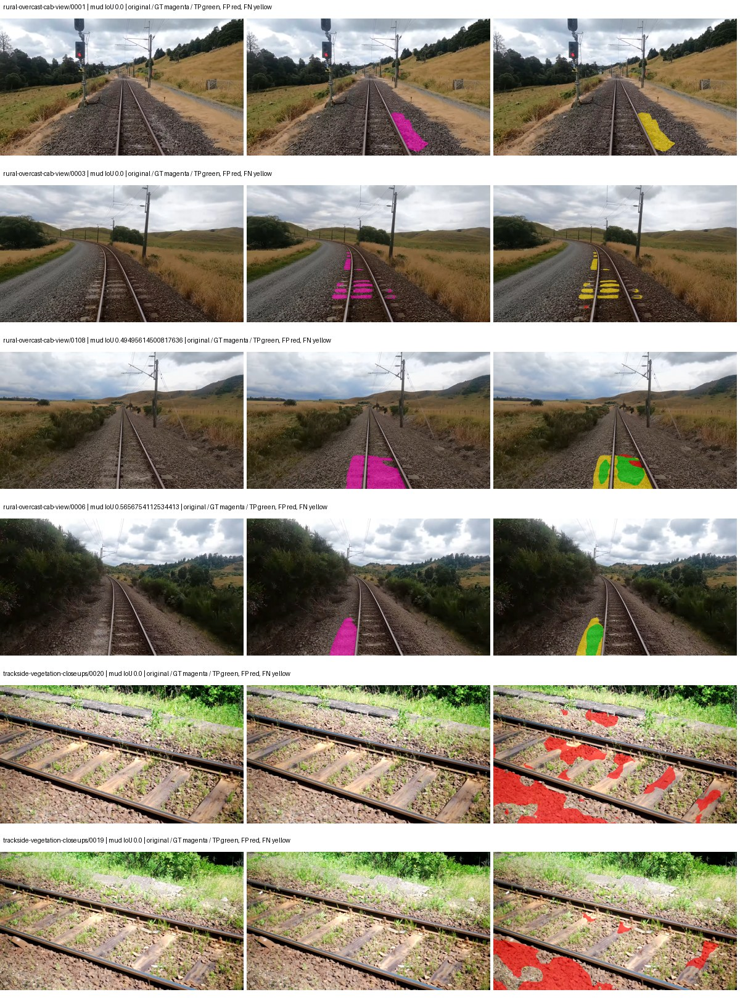
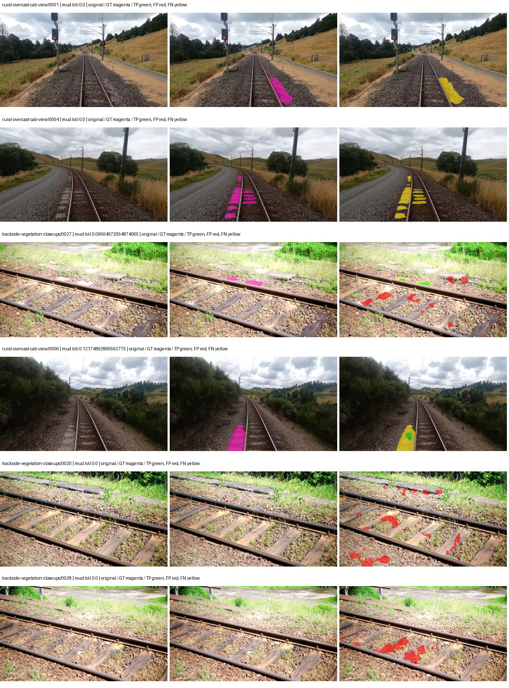
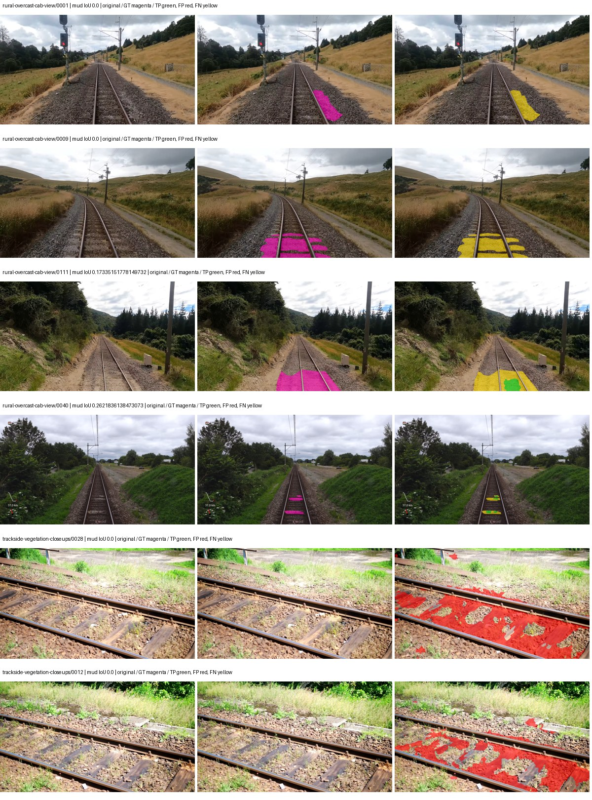
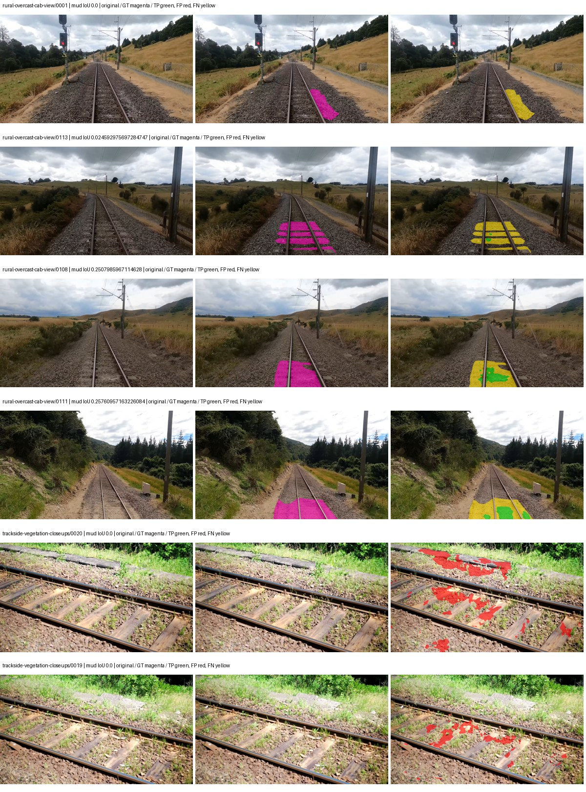

# native_convnext_tiny_uper — rad_9_24_2026-fixed-grouped

[RAD 9/24: Scene-grouped split](../../README.md) · [Full model records](record.json)

Primary selection and early stopping: **mud-pumping validation IoU**. A job is complete only after full statistics and isolated profiling are verified.

| Model | Initialization path | Seed | Status | Steps | Best step | Mud IoU (%) | Mud precision (%) | Mud recall (%) | Final mud IoU (trainer val, %) | mIoU (%) | Fixed GT-class mIoU (%) |
| --- | --- | --- | --- | --- | --- | --- | --- | --- | --- | --- | --- |
| native_convnext_tiny_uper | rtis_only | 0 | completed | 1555 | 259 | 6.90 | 12.50 | 13.35 | 3.02 | 27.69 | 29.22 |
| native_convnext_tiny_uper | cityscapes_to_rtis | 0 | completed | 2074 | 777 | 3.11 | 12.24 | 4.01 | 1.94 | 35.19 | 41.06 |
| native_convnext_tiny_uper | railsem19_to_rtis | 0 | completed | 2333 | 1037 | 2.07 | 3.14 | 5.73 | 1.73 | 42.40 | 49.46 |
| native_convnext_tiny_uper | cityscapes_to_railsem19_to_rtis | 0 | completed | 2851 | 1555 | 9.08 | 23.99 | 12.75 | 8.16 | 41.99 | 48.98 |

Training: 217 images. Validation: 37 images. Test: 60 held out. Seeds: [0]. Seed variation measures optimization variability, not independent-recording uncertainty. Historical source checkpoints stay fixed across adaptation seeds.

Training code: `d864b72bd90706260965bb1a48398d01167b6d5c`. Split SHA-256: `12d7b367c72cda61d57686ff2ac28223530d0af49debd9fb7a0fbc68b908bc93`.

## rtis_only — seed 0

Status: **completed**. Started: 2026-10-06T03:30:08.719995+00:00. Finished: 2026-10-06T03:54:19.815246+00:00.

Recipe pretrained initializer: `{"arch": "native", "backbone_path": null, "batch_norm_momentum": null, "checkpoint": null, "classifier_path": null, "drop_path": null, "encoder_name": null, "encoder_weights": null, "head": "unified_head", "head_paths": [], "inactive_parameter_paths": [], "local_files_only": false, "lora_alpha": 32, "lora_dropout": 0.05, "lora_r": 16, "lora_targets": [], "native": {"auxiliary_heads": [], "backbone": {"in_channels": 3, "kind": "timm", "name": "convnext_tiny.fb_in22k_ft_in1k", "out_indices": [0, 1, 2, 3], "weights": "pretrained"}, "head": {"activation": "relu", "channels": 256, "dropout": 0.1, "in_indices": [0, 1, 2, 3], "kind": "uper", "norm": "group", "pool_bins": [1, 2, 3, 6]}, "neck": {"kind": "identity"}, "task": "multiclass"}, "revision": null, "smp_arch": null, "subfolder": null, "trust_remote_code": false, "tuning": "full"}`.

`rtis_only` uses the recipe initializer, which may include pretrained segmentation components. Transfer paths load the exact historical source checkpoint below and reset the classifier; they do not reset all query/decoder features.

Source checkpoint: `Recipe pretrained initialization`.

Config SHA-256: `13a8f4be33b56db3dc131b15d92a69edfc135b530d5934b07855b4a6e9e41f4d`. Weights used for validation: `ema`.

### Mud-pumping and aggregate quality

| Metric | Selected checkpoint | Final training validation |
| --- | --- | --- |
| Mud IoU | 6.90 | 3.02 |
| Mud precision | 12.50 | 8.76 |
| Mud recall | 13.35 | 4.41 |
| Mud Dice/F1 | 12.91 | 5.86 |
| mIoU | 27.69 | 36.24 |
| Mean accuracy | 37.65 | 53.03 |
| Mean precision | 44.02 | 49.61 |
| Mean Dice | 35.14 | 46.27 |
| Mean specificity | 98.83 | 99.04 |
| Pixel accuracy | 82.23 | 84.54 |
| Frequency-weighted IoU | 71.50 | 75.68 |
| Fixed GT-present class mIoU | 29.22 | 42.28 |
| Boundary F1 | 31.16 | 45.30 |

The selected checkpoint has independent evaluation evidence. Final values are the trainer's final validation record, not a new independent evaluation. mIoU averages classes with nonzero union, so false positives on absent classes can change its denominator. The fixed GT-class mean is supplementary and excludes absent classes; their false positives remain in the confusion matrix.

### Resource usage and timing

| Measurement | Value |
| --- | --- |
| Peak training VRAM, retained training invocation (GiB) | 10.20 |
| Peak evaluation VRAM (GiB) | 7.42 |
| Retained training invocation wall time (seconds) | 1271.32 |
| Retained training invocation GPU-hours (one GPU) | 0.35 |
| Evaluation wall time (seconds) | 16.08 |
| Full evaluation pipeline images/second | 2.30 |
| Best full-state checkpoint (MiB) | 562.63 |
| Final full-state checkpoint (MiB) | 562.62 |
| Verified periodic checkpoints removed (GiB) | 1.65 |

VRAM uses the recorded allocator high-water mark; it is not total device usage including CUDA context. Resumed jobs' retained training invocation times and peaks are **not whole-campaign totals**. Earlier invocation resource records are not reconstructed here. Evaluation throughput includes loader, sliding-window inference and metrics; it is not model-only latency/FPS. Missing measurements are shown as —, never inferred from another dataset's run.

### Standardized inference performance

Dedicated model-only profiling waits for an idle worker-locked L40S: BF16, batch 1, 1024x1024, 20 warmup and 100 CUDA-event-timed public forwards. It excludes loading, preprocessing, tiling and metrics.

| Status | Parameters | Weight MiB | FPS | p50 ms | p95 ms | Peak reserved GiB |
| --- | --- | --- | --- | --- | --- | --- |
| complete | 36849525 | 140.57 | 76.06 | 13.15 | 13.18 | 1.24 |

```json
{
  "schema_version": 1,
  "model_id": "native_convnext_tiny_uper",
  "measured_at": "2026-10-06T03:54:15+00:00",
  "status": "complete",
  "benchmark_scope": "rtis_selected_checkpoint_model_only",
  "applies_to": [
    "native_convnext_tiny_uper--rtis_only--seed-0"
  ],
  "source": {
    "campaign_git_sha": "d864b72bd90706260965bb1a48398d01167b6d5c",
    "git_dirty": false,
    "config_hash": "d7c3c23d7e4e",
    "resolved_config": "/data/izadia1/projects/segmentary-runs/rad_9_24_2026/fixed-grouped-seed0-20261005-r2/configs/native_convnext_tiny_uper--rtis_only--seed-0.yaml",
    "config_sha256": "13a8f4be33b56db3dc131b15d92a69edfc135b530d5934b07855b4a6e9e41f4d",
    "checkpoint_sha256": "e6054a392725de471d3b43746f2b73fcc9beda7c73ef4f394215bf37a11e4133",
    "checkpoint_global_step": 259,
    "checkpoint_bytes": 589961549,
    "checkpoint_kind": "resume checkpoint with optimizer and EMA state",
    "weights": "ema",
    "measured_checkpoint_job_id": "native_convnext_tiny_uper--rtis_only--seed-0",
    "result_sha256": "6fbac8c127bf7850c6320ef3ffb5d6677b14724ad5ca3acd47aab22101cf7113",
    "result_git_sha": "d864b72bd90706260965bb1a48398d01167b6d5c",
    "result_stage": "eval:rad_9_24_2026-fixed-grouped:val",
    "result_seed": 0
  },
  "hardware": {
    "gpu_name": "NVIDIA L40S",
    "gpu_uuid": "GPU-c76642eb-64c1-b0ac-b051-d2efd47b32c4",
    "logical_device": "cuda:0",
    "physical_visibility_token": "9",
    "compute_capability": [
      8,
      9
    ],
    "total_memory_bytes": 47677177856
  },
  "model": {
    "parameter_count": 36849525,
    "trainable_parameter_count": 36849525,
    "resident_parameter_bytes": 147398100,
    "parameter_dtype_counts": {
      "float32": 36849525
    }
  },
  "contract": {
    "backend": "pytorch",
    "precision": "bf16_autocast",
    "batch_size": 1,
    "input_shape_nchw": [
      1,
      3,
      1024,
      1024
    ],
    "warmup_iterations": 20,
    "measured_iterations": 100,
    "timing": "per-forward CUDA events with end-event synchronization",
    "includes_preprocessing": false,
    "includes_data_loader": false,
    "includes_sliding_window": false,
    "input_resident_on_gpu": true,
    "model_only": true,
    "entrypoint": "public model(image) dense-logits forward"
  },
  "measurements": {
    "latency": {
      "p50_ms": 13.147135734558105,
      "p95_ms": 13.184163093566895,
      "mean_ms": 13.147913894653321,
      "minimum_ms": 13.094911575317383,
      "maximum_ms": 13.234175682067871,
      "fps": 76.05769310724313,
      "raw_ms": [
        13.210623741149902,
        13.130751609802246,
        13.132800102233887,
        13.147135734558105,
        13.154303550720215,
        13.136896133422852,
        13.16966438293457,
        13.142016410827637,
        13.147135734558105,
        13.154303550720215,
        13.123583793640137,
        13.131775856018066,
        13.147135734558105,
        13.16044807434082,
        13.137920379638672,
        13.109248161315918,
        13.146112442016602,
        13.15123176574707,
        13.119487762451172,
        13.128704071044922,
        13.138943672180176,
        13.16659164428711,
        13.153280258178711,
        13.14412784576416,
        13.16147232055664,
        13.139967918395996,
        13.184063911437988,
        13.146112442016602,
        13.16147232055664,
        13.144063949584961,
        13.128704071044922,
        13.101056098937988,
        13.136896133422852,
        13.132800102233887,
        13.174783706665039,
        13.234175682067871,
        13.094911575317383,
        13.15839958190918,
        13.180928230285645,
        13.138943672180176,
        13.160384178161621,
        13.15225601196289,
        13.17580795288086,
        13.155327796936035,
        13.164544105529785,
        13.14303970336914,
        13.157376289367676,
        13.144063949584961,
        13.126655578613281,
        13.151167869567871,
        13.148159980773926,
        13.123583793640137,
        13.125632286071777,
        13.137920379638672,
        13.15123176574707,
        13.163519859313965,
        13.142016410827637,
        13.138943672180176,
        13.116415977478027,
        13.117440223693848,
        13.186047554016113,
        13.154303550720215,
        13.149184226989746,
        13.129728317260742,
        13.16147232055664,
        13.145088195800781,
        13.118464469909668,
        13.115391731262207,
        13.153280258178711,
        13.170687675476074,
        13.15123176574707,
        13.127679824829102,
        13.14303970336914,
        13.137920379638672,
        13.16044807434082,
        13.147135734558105,
        13.15123176574707,
        13.21884822845459,
        13.132800102233887,
        13.136896133422852,
        13.156352043151855,
        13.162495613098145,
        13.105152130126953,
        13.157376289367676,
        13.154303550720215,
        13.125632286071777,
        13.15123176574707,
        13.136863708496094,
        13.15123176574707,
        13.134847640991211,
        13.149184226989746,
        13.140992164611816,
        13.155327796936035,
        13.155327796936035,
        13.212672233581543,
        13.142016410827637,
        13.12559986114502,
        13.164544105529785,
        13.140992164611816,
        13.179903984069824
      ],
      "percentile_method": "numpy linear interpolation"
    },
    "peak_reserved_bytes": 1335885824,
    "memory_kind": "pytorch_cuda_allocator_peak_reserved_excluding_context",
    "benchmark_wall_clock_s": 9.031208477914333
  },
  "started_at": "2026-10-06T03:54:06+00:00",
  "finished_at": "2026-10-06T03:54:15+00:00",
  "environment": {
    "hostname": "hdrfs-app-001",
    "python": "3.11.15",
    "platform": "Linux-5.15.0-139-generic-x86_64-with-glibc2.35",
    "torch": "2.11.0+cu128",
    "torch_cuda": "12.8",
    "cudnn": 91900,
    "driver_version": "570.133.20",
    "cuda_available": true,
    "gpu_count": 1,
    "gpu_names": [
      "NVIDIA L40S"
    ],
    "cuda_visible_devices": "9",
    "packages": {
      "segmentary": "0.1.0",
      "torch": "2.11.0+cu128",
      "torchvision": "0.26.0+cu128",
      "transformers": "5.15.0",
      "timm": "1.0.28",
      "segmentation-models-pytorch": "0.5.0",
      "albumentations": "2.0.8",
      "lightning": "2.6.5",
      "numpy": "2.4.4"
    }
  }
}
```

### Per-class validation results

| Class | GT pixels | IoU (%) | Precision (%) | Recall (%) | Dice (%) | Boundary F1 (%) |
| --- | --- | --- | --- | --- | --- | --- |
| car | 29664 | 0.00 | 0.00 | 0.00 | 0.00 | 0.00 |
| construction | 311585 | 32.27 | 36.35 | 74.20 | 48.80 | 47.43 |
| fence | 265137 | 23.58 | 44.26 | 33.55 | 38.17 | 35.71 |
| mud-pumping | 1226250 | 6.90 | 12.50 | 13.35 | 12.91 | 7.31 |
| on-rails | 0 | 0.00 | 0.00 | — | 0.00 | 0.00 |
| person | 0 | — | — | — | — | — |
| pole | 628038 | 56.74 | 70.55 | 74.35 | 72.40 | 81.75 |
| rail-embedded | 16799 | 0.00 | 0.00 | 0.00 | 0.00 | 0.00 |
| rail-raised | 2969797 | 73.04 | 78.57 | 91.22 | 84.42 | 88.09 |
| rail-track | 6323197 | 39.59 | 68.77 | 48.26 | 56.72 | 54.08 |
| road | 1048831 | 5.70 | 15.88 | 8.17 | 10.79 | 10.60 |
| sidewalk | 1297367 | 36.60 | 76.78 | 41.15 | 53.58 | 18.88 |
| sky | 19121606 | 96.56 | 99.27 | 97.25 | 98.25 | 87.97 |
| standing-water | 95802 | 2.47 | 3.47 | 7.85 | 4.81 | 6.03 |
| terrain | 39239306 | 84.11 | 85.22 | 98.48 | 91.37 | 59.10 |
| trackbed | 10643081 | 55.29 | 66.51 | 76.63 | 71.21 | 56.08 |
| traffic-light | 19510 | 0.00 | 0.00 | 0.00 | 0.00 | 0.00 |
| traffic-sign | 13285 | 0.00 | 0.00 | 0.00 | 0.00 | 0.00 |
| tram-track | 56179 | 2.73 | 88.28 | 2.74 | 5.31 | 14.43 |
| truck | 0 | — | — | — | — | — |
| vegetation-overgrowth | 5901821 | 10.46 | 89.98 | 10.58 | 18.94 | 24.49 |

### Full-run accounting

| Measurement | Value |
| --- | --- |
| Full GPU-reserved wall seconds, all recorded worker attempts | 1458.70 |
| Full reserved GPU-hours | 0.41 |
| Whole-run timing complete | True |

| Phase | Wall seconds including failed attempts |
| --- | --- |
| training | 1278.43 |
| diagnostics | 127.76 |
| performance | 17.24 |

GPU-reserved time includes model loading, training, validation, collection, profiling, checkpoint I/O and orchestration while the worker owns one GPU. It is not GPU kernel-active time. Phase timings and sampled device memory/power/utilization are retained separately; sampled device memory is not the allocator high-water mark.

### Train/validation and raw/EMA diagnostics

| Checkpoint / weights / split | Images | Mud IoU (%) | Mud precision (%) | Mud recall (%) |
| --- | --- | --- | --- | --- |
| best-auto-train / ema | 217 | 91.45 | 95.27 | 95.80 |
| best-auto-val / ema | 37 | 6.90 | 12.50 | 13.35 |
| best-alternate-val / raw | 37 | 15.19 | 22.04 | 32.84 |
| final-auto-val / ema | 37 | 3.02 | 8.76 | 4.40 |

Train uses the evaluation transform without augmentation. Compare mud train/validation metrics for the same selected weights. Alternate EMA on running-stat BatchNorm is explicitly uncalibrated and is diagnostic only. Score-threshold curves use uncalibrated normalized scores and are pixel-level diagnostics, not event detection rates or a selected deployment operating point.

### Downloadable evidence

- best-auto-train: [per-image.csv](rtis_only--seed-0/best-auto-train/per-image.csv) · [per-image-confusion.json.gz](rtis_only--seed-0/best-auto-train/per-image-confusion.json.gz) · [groups.json](rtis_only--seed-0/best-auto-train/groups.json) · [mud-score-curves.json](rtis_only--seed-0/best-auto-train/mud-score-curves.json)
- best-auto-val: [per-image.csv](rtis_only--seed-0/best-auto-val/per-image.csv) · [per-image-confusion.json.gz](rtis_only--seed-0/best-auto-val/per-image-confusion.json.gz) · [groups.json](rtis_only--seed-0/best-auto-val/groups.json) · [mud-score-curves.json](rtis_only--seed-0/best-auto-val/mud-score-curves.json) · [examples.jpg](rtis_only--seed-0/best-auto-val/examples.jpg)
- best-alternate-val: [per-image.csv](rtis_only--seed-0/best-alternate-val/per-image.csv) · [per-image-confusion.json.gz](rtis_only--seed-0/best-alternate-val/per-image-confusion.json.gz) · [groups.json](rtis_only--seed-0/best-alternate-val/groups.json) · [mud-score-curves.json](rtis_only--seed-0/best-alternate-val/mud-score-curves.json)
- final-auto-val: [per-image.csv](rtis_only--seed-0/final-auto-val/per-image.csv) · [per-image-confusion.json.gz](rtis_only--seed-0/final-auto-val/per-image-confusion.json.gz) · [groups.json](rtis_only--seed-0/final-auto-val/groups.json) · [mud-score-curves.json](rtis_only--seed-0/final-auto-val/mud-score-curves.json)
- resources: [telemetry.csv](rtis_only--seed-0/resources/telemetry.csv)



Examples are two lowest and two highest mud-IoU positive images, plus up to two negative images with the most false-positive mud pixels. They are targeted diagnostic examples, not random samples. Green: true positive; red: false positive; yellow: false negative. Full predictions remain on HDRFS.

### Validation tracking

| Logged step | Overall mIoU (%) | Mud IoU (%) |
| --- | --- | --- |
| 258 | 27.70 | 6.91 |
| 518 | 28.34 | 1.86 |
| 777 | 34.16 | 2.31 |
| 1036 | 34.94 | 2.59 |
| 1295 | 35.79 | 2.46 |
| 1555 | 36.24 | 3.02 |

All retained scalar curves, including training loss and per-class IoU, are in record.json. Observed best mud on a curve is not necessarily a retained checkpoint: the pilot saved its selection-metric-best and final checkpoints. Step logging and checkpoint global_step may differ by one.

### Stopping and checkpoint provenance

```json
{
  "stopping": {
    "actual_steps": 1555,
    "maximum_steps": 4000,
    "min_delta": 0.001,
    "monitor": "val_iou/mud-pumping",
    "patience": 5,
    "reason": "validation_plateau"
  },
  "checkpoints": {
    "best": {
      "path": "/data/izadia1/projects/segmentary-runs/rad_9_24_2026/fixed-grouped-seed0-20261005-r2/future-runs/native_convnext_tiny_uper--rtis_only--seed-0_seed0/rtis/best.ckpt",
      "sha256": "e6054a392725de471d3b43746f2b73fcc9beda7c73ef4f394215bf37a11e4133",
      "global_step": 259,
      "bytes": 589961549
    },
    "final": {
      "path": "/data/izadia1/projects/segmentary-runs/rad_9_24_2026/fixed-grouped-seed0-20261005-r2/future-runs/native_convnext_tiny_uper--rtis_only--seed-0_seed0/rtis/last.ckpt",
      "sha256": "23e805cee2de8c26a5f13129cbd77fa6077259626f0a80cc8f28b47649826683",
      "global_step": 1555,
      "bytes": 589951309
    }
  },
  "cleanup_error": null
}
```

### Resolved training, initialization and evaluation settings

The optimizer block is the base configuration. Stage LR scales are applied at runtime, and stage warmup is capped at min(base warmup, floor(stage budget / 10), stage budget - 1): 400 steps for this 4,000-step pilot. Model-internal native input grids may differ from augmentation crops (EoMT uses its 640 grid).

```json
{
  "name": "native_convnext_tiny_uper--rtis_only--seed-0",
  "model": {
    "arch": "native",
    "checkpoint": null,
    "tuning": "full",
    "head": "unified_head",
    "lora_r": 16,
    "lora_alpha": 32,
    "lora_dropout": 0.05,
    "lora_targets": [],
    "drop_path": null,
    "revision": null,
    "subfolder": null,
    "local_files_only": false,
    "trust_remote_code": false,
    "backbone_path": null,
    "head_paths": [],
    "classifier_path": null,
    "inactive_parameter_paths": [],
    "smp_arch": null,
    "encoder_name": null,
    "encoder_weights": null,
    "native": {
      "task": "multiclass",
      "backbone": {
        "kind": "timm",
        "name": "convnext_tiny.fb_in22k_ft_in1k",
        "weights": "pretrained",
        "out_indices": [
          0,
          1,
          2,
          3
        ],
        "in_channels": 3
      },
      "neck": {
        "kind": "identity"
      },
      "head": {
        "kind": "uper",
        "in_indices": [
          0,
          1,
          2,
          3
        ],
        "channels": 256,
        "pool_bins": [
          1,
          2,
          3,
          6
        ],
        "dropout": 0.1,
        "norm": "group",
        "activation": "relu"
      },
      "auxiliary_heads": []
    },
    "batch_norm_momentum": null
  },
  "space": "paul-test-rtis",
  "taxonomy_root": "/data/izadia1/projects/segmentary-rad-d864b72b/taxonomy",
  "output_root": "/data/izadia1/projects/segmentary-runs/rad_9_24_2026/fixed-grouped-seed0-20261005-r2/future-runs",
  "optim": {
    "backbone_lr": 0.0001,
    "head_lr_mult": 10.0,
    "weight_decay": 0.05,
    "llrd": 1.0,
    "warmup_iters": 1500,
    "warmup_ratio": 1e-06,
    "poly_power": 0.9,
    "min_lr_ratio": 0.0,
    "betas": [
      0.9,
      0.999
    ],
    "grad_clip": 1.0
  },
  "train": {
    "iters": 4000,
    "batch_size": 2,
    "accum": 8,
    "num_workers": 2,
    "precision": "bf16-mixed",
    "ema_decay": 0.9998,
    "val_every": 250,
    "ckpt_every": 500,
    "selection_metric": "val_iou/mud-pumping",
    "early_stopping_patience": 5,
    "early_stopping_min_delta": 0.001,
    "seed": 0,
    "devices": 1
  },
  "eval": {
    "sliding_window": true,
    "window": [
      1024,
      1024
    ],
    "stride": [
      768,
      768
    ],
    "batch_size": 1,
    "num_workers": 2,
    "tta_scales": [],
    "tta_flip": false,
    "threshold": 0.5,
    "boundary_tolerance_frac": 0.0075,
    "save_confusion": true
  },
  "loss": {
    "task": "multiclass",
    "activation": "auto",
    "terms": [],
    "aux": "none",
    "aux_weight": 0.0,
    "ce_weight": 1.0,
    "label_smoothing": 0.0,
    "class_weights": null,
    "query": null
  },
  "aug": {
    "crop": [
      1024,
      1024
    ],
    "scale_min": 0.5,
    "scale_max": 2.0,
    "hflip_p": 0.5,
    "color_jitter_p": 0.5,
    "brightness": 0.25,
    "contrast": 0.25,
    "saturation": 0.25,
    "hue": 0.05
  },
  "stages": [
    {
      "name": "rtis",
      "data": [
        {
          "name": "rad_9_24_2026-fixed-grouped",
          "root": "/data/izadia1/datasets/rad_9_24_2026-fixed-grouped",
          "variant": null,
          "split_file": "splits.json",
          "train_split": "train",
          "val_split": "val",
          "limit": null,
          "loader": "folder",
          "mapping": "paul-test-rtis",
          "loader_options": {
            "require_groups": true
          }
        }
      ],
      "iters": null,
      "lr_scale": 1.0,
      "head_group_lr_scale": 1.0,
      "init_from": "pretrained",
      "reset_head": false,
      "freeze": null,
      "sample_weights": null
    }
  ]
}
```

### Hardware and software provenance

```json
{
  "training": {
    "cuda_available": true,
    "cuda_visible_devices": "9",
    "cudnn": 91900,
    "driver_version": "570.133.20",
    "gpu_count": 1,
    "gpu_names": [
      "NVIDIA L40S"
    ],
    "hostname": "hdrfs-app-001",
    "input_normalization": {
      "channel_order": "rgb",
      "mean": [
        0.485,
        0.456,
        0.406
      ],
      "source": "timm_pretrained_cfg",
      "std": [
        0.229,
        0.224,
        0.225
      ]
    },
    "model_origins": [
      {
        "hf_commit": null,
        "hf_name_or_path": null,
        "module": "backbone",
        "timm_pretrained": {
          "architecture": "convnext_tiny",
          "hf_hub_id": "timm/convnext_tiny.fb_in22k_ft_in1k",
          "tag": "fb_in22k_ft_in1k",
          "url": "https://dl.fbaipublicfiles.com/convnext/convnext_tiny_22k_1k_224.pth"
        }
      },
      {
        "hf_commit": null,
        "hf_name_or_path": null,
        "module": "backbone.model",
        "timm_pretrained": {
          "architecture": "convnext_tiny",
          "hf_hub_id": "timm/convnext_tiny.fb_in22k_ft_in1k",
          "tag": "fb_in22k_ft_in1k",
          "url": "https://dl.fbaipublicfiles.com/convnext/convnext_tiny_22k_1k_224.pth"
        }
      }
    ],
    "model_parameter_count": 36849525,
    "packages": {
      "albumentations": "2.0.8",
      "lightning": "2.6.5",
      "numpy": "2.4.4",
      "segmentary": "0.1.0",
      "segmentation-models-pytorch": "0.5.0",
      "timm": "1.0.28",
      "torch": "2.11.0+cu128",
      "torchvision": "0.26.0+cu128",
      "transformers": "5.15.0"
    },
    "platform": "Linux-5.15.0-139-generic-x86_64-with-glibc2.35",
    "python": "3.11.15",
    "torch": "2.11.0+cu128",
    "torch_cuda": "12.8",
    "trainable_parameter_count": 36849525,
    "training_stop": {
      "actual_steps": 1555,
      "maximum_steps": 4000,
      "min_delta": 0.001,
      "monitor": "val_iou/mud-pumping",
      "patience": 5,
      "reason": "validation_plateau"
    },
    "validation_weights": "ema"
  },
  "evaluation": {
    "cuda_available": true,
    "cuda_visible_devices": "9",
    "cudnn": 91900,
    "driver_version": "570.133.20",
    "gpu_count": 1,
    "gpu_names": [
      "NVIDIA L40S"
    ],
    "hostname": "hdrfs-app-001",
    "input_normalization": {
      "channel_order": "rgb",
      "mean": [
        0.485,
        0.456,
        0.406
      ],
      "source": "timm_pretrained_cfg",
      "std": [
        0.229,
        0.224,
        0.225
      ]
    },
    "packages": {
      "albumentations": "2.0.8",
      "lightning": "2.6.5",
      "numpy": "2.4.4",
      "segmentary": "0.1.0",
      "segmentation-models-pytorch": "0.5.0",
      "timm": "1.0.28",
      "torch": "2.11.0+cu128",
      "torchvision": "0.26.0+cu128",
      "transformers": "5.15.0"
    },
    "platform": "Linux-5.15.0-139-generic-x86_64-with-glibc2.35",
    "python": "3.11.15",
    "torch": "2.11.0+cu128",
    "torch_cuda": "12.8"
  }
}
```

## cityscapes_to_rtis — seed 0

Status: **completed**. Started: 2026-10-06T03:45:51.065534+00:00. Finished: 2026-10-06T04:17:05.977438+00:00.

Recipe pretrained initializer: `{"arch": "native", "backbone_path": null, "batch_norm_momentum": null, "checkpoint": null, "classifier_path": null, "drop_path": null, "encoder_name": null, "encoder_weights": null, "head": "unified_head", "head_paths": [], "inactive_parameter_paths": [], "local_files_only": false, "lora_alpha": 32, "lora_dropout": 0.05, "lora_r": 16, "lora_targets": [], "native": {"auxiliary_heads": [], "backbone": {"in_channels": 3, "kind": "timm", "name": "convnext_tiny.fb_in22k_ft_in1k", "out_indices": [0, 1, 2, 3], "weights": "pretrained"}, "head": {"activation": "relu", "channels": 256, "dropout": 0.1, "in_indices": [0, 1, 2, 3], "kind": "uper", "norm": "group", "pool_bins": [1, 2, 3, 6]}, "neck": {"kind": "identity"}, "task": "multiclass"}, "revision": null, "smp_arch": null, "subfolder": null, "trust_remote_code": false, "tuning": "full"}`.

`rtis_only` uses the recipe initializer, which may include pretrained segmentation components. Transfer paths load the exact historical source checkpoint below and reset the classifier; they do not reset all query/decoder features.

Source checkpoint: `{'name': 'native_convnext_tiny_uper--cityscapes--seed-0', 'model': 'native_convnext_tiny_uper', 'protocol': 'cityscapes', 'config': '/data/izadia1/projects/segmentary-runs/all-model-city-rail-seed0-rail20-b9eb3e1/accepted/native_convnext_tiny_uper--cityscapes--seed-0/resolved-config.yaml', 'checkpoint': '/data/izadia1/projects/segmentary-runs/all-model-city-rail-seed0-a7c0b67/jobs/native_convnext_tiny_uper--cityscapes--seed-0/attempt-001/train/native_convnext_tiny_uper--cityscapes_seed0/cityscapes/last.ckpt', 'recorded_sha256': '5b371ccbb1c2f1ad354d205d07f867135039dd82de6fffac6c27c76b1cbc88ea', 'exists': True}`.

Config SHA-256: `bc9af71ff344833056f1229a0fe5ff7517869fb7f2f9cf7ad09fe47ec0b6b837`. Weights used for validation: `ema`.

### Mud-pumping and aggregate quality

| Metric | Selected checkpoint | Final training validation |
| --- | --- | --- |
| Mud IoU | 3.11 | 1.94 |
| Mud precision | 12.24 | 7.76 |
| Mud recall | 4.01 | 2.53 |
| Mud Dice/F1 | 6.04 | 3.81 |
| mIoU | 35.19 | 35.97 |
| Mean accuracy | 51.60 | 51.66 |
| Mean precision | 48.57 | 48.91 |
| Mean Dice | 44.82 | 45.45 |
| Mean specificity | 98.98 | 98.88 |
| Pixel accuracy | 83.83 | 82.87 |
| Frequency-weighted IoU | 74.23 | 72.29 |
| Fixed GT-present class mIoU | 41.06 | 41.97 |
| Boundary F1 | 41.38 | 42.30 |

The selected checkpoint has independent evaluation evidence. Final values are the trainer's final validation record, not a new independent evaluation. mIoU averages classes with nonzero union, so false positives on absent classes can change its denominator. The fixed GT-class mean is supplementary and excludes absent classes; their false positives remain in the confusion matrix.

### Resource usage and timing

| Measurement | Value |
| --- | --- |
| Peak training VRAM, retained training invocation (GiB) | 10.20 |
| Peak evaluation VRAM (GiB) | 7.42 |
| Retained training invocation wall time (seconds) | 1696.85 |
| Retained training invocation GPU-hours (one GPU) | 0.47 |
| Evaluation wall time (seconds) | 15.57 |
| Full evaluation pipeline images/second | 2.38 |
| Best full-state checkpoint (MiB) | 562.63 |
| Final full-state checkpoint (MiB) | 562.62 |
| Verified periodic checkpoints removed (GiB) | 2.20 |

VRAM uses the recorded allocator high-water mark; it is not total device usage including CUDA context. Resumed jobs' retained training invocation times and peaks are **not whole-campaign totals**. Earlier invocation resource records are not reconstructed here. Evaluation throughput includes loader, sliding-window inference and metrics; it is not model-only latency/FPS. Missing measurements are shown as —, never inferred from another dataset's run.

### Standardized inference performance

Dedicated model-only profiling waits for an idle worker-locked L40S: BF16, batch 1, 1024x1024, 20 warmup and 100 CUDA-event-timed public forwards. It excludes loading, preprocessing, tiling and metrics.

| Status | Parameters | Weight MiB | FPS | p50 ms | p95 ms | Peak reserved GiB |
| --- | --- | --- | --- | --- | --- | --- |
| complete | 36849525 | 140.57 | 75.90 | 13.17 | 13.25 | 1.24 |

```json
{
  "schema_version": 1,
  "model_id": "native_convnext_tiny_uper",
  "measured_at": "2026-10-06T04:17:01+00:00",
  "status": "complete",
  "benchmark_scope": "rtis_selected_checkpoint_model_only",
  "applies_to": [
    "native_convnext_tiny_uper--cityscapes_to_rtis--seed-0"
  ],
  "source": {
    "campaign_git_sha": "d864b72bd90706260965bb1a48398d01167b6d5c",
    "git_dirty": false,
    "config_hash": "77d8ca3541ea",
    "resolved_config": "/data/izadia1/projects/segmentary-runs/rad_9_24_2026/fixed-grouped-seed0-20261005-r2/configs/native_convnext_tiny_uper--cityscapes_to_rtis--seed-0.yaml",
    "config_sha256": "bc9af71ff344833056f1229a0fe5ff7517869fb7f2f9cf7ad09fe47ec0b6b837",
    "checkpoint_sha256": "f8bd801a80efe1f37cb52bb5963e4ab13c2018f320b53e4bac8440f94bfa62a2",
    "checkpoint_global_step": 777,
    "checkpoint_bytes": 589961741,
    "checkpoint_kind": "resume checkpoint with optimizer and EMA state",
    "weights": "ema",
    "measured_checkpoint_job_id": "native_convnext_tiny_uper--cityscapes_to_rtis--seed-0",
    "result_sha256": "fa35c6cd24f87f2b8c3d00062607cfb661c80a248b6b752bc9079df796b37343",
    "result_git_sha": "d864b72bd90706260965bb1a48398d01167b6d5c",
    "result_stage": "eval:rad_9_24_2026-fixed-grouped:val",
    "result_seed": 0
  },
  "hardware": {
    "gpu_name": "NVIDIA L40S",
    "gpu_uuid": "GPU-804aea8b-5f62-423e-72c6-49e1ed15c4e4",
    "logical_device": "cuda:0",
    "physical_visibility_token": "6",
    "compute_capability": [
      8,
      9
    ],
    "total_memory_bytes": 47677177856
  },
  "model": {
    "parameter_count": 36849525,
    "trainable_parameter_count": 36849525,
    "resident_parameter_bytes": 147398100,
    "parameter_dtype_counts": {
      "float32": 36849525
    }
  },
  "contract": {
    "backend": "pytorch",
    "precision": "bf16_autocast",
    "batch_size": 1,
    "input_shape_nchw": [
      1,
      3,
      1024,
      1024
    ],
    "warmup_iterations": 20,
    "measured_iterations": 100,
    "timing": "per-forward CUDA events with end-event synchronization",
    "includes_preprocessing": false,
    "includes_data_loader": false,
    "includes_sliding_window": false,
    "input_resident_on_gpu": true,
    "model_only": true,
    "entrypoint": "public model(image) dense-logits forward"
  },
  "measurements": {
    "latency": {
      "p50_ms": 13.16710376739502,
      "p95_ms": 13.246617364883424,
      "mean_ms": 13.175684776306152,
      "minimum_ms": 13.100031852722168,
      "maximum_ms": 13.438976287841797,
      "fps": 75.89738347401124,
      "raw_ms": [
        13.438976287841797,
        13.193216323852539,
        13.15839958190918,
        13.15123176574707,
        13.272064208984375,
        13.199359893798828,
        13.179903984069824,
        13.206527709960938,
        13.235199928283691,
        13.228032112121582,
        13.147135734558105,
        13.156352043151855,
        13.245439529418945,
        13.127679824829102,
        13.137887954711914,
        13.105152130126953,
        13.215744018554688,
        13.28435230255127,
        13.225983619689941,
        13.146112442016602,
        13.179903984069824,
        13.204480171203613,
        13.15225601196289,
        13.16761589050293,
        13.15225601196289,
        13.108223915100098,
        13.208576202392578,
        13.219840049743652,
        13.115391731262207,
        13.132800102233887,
        13.240320205688477,
        13.191167831420898,
        13.224960327148438,
        13.138943672180176,
        13.231103897094727,
        13.16659164428711,
        13.148159980773926,
        13.202431678771973,
        13.16761589050293,
        13.140992164611816,
        13.100031852722168,
        13.246463775634766,
        13.154303550720215,
        13.126655578613281,
        13.15225601196289,
        13.138943672180176,
        13.135871887207031,
        13.142016410827637,
        13.156352043151855,
        13.17683219909668,
        13.24953556060791,
        13.145088195800781,
        13.150208473205566,
        13.171711921691895,
        13.115391731262207,
        13.205504417419434,
        13.144063949584961,
        13.180928230285645,
        13.254655838012695,
        13.119487762451172,
        13.16864013671875,
        13.145088195800781,
        13.147135734558105,
        13.197312355041504,
        13.18502426147461,
        13.178879737854004,
        13.140992164611816,
        13.205504417419434,
        13.198335647583008,
        13.116415977478027,
        13.139967918395996,
        13.201408386230469,
        13.131775856018066,
        13.121536254882812,
        13.135871887207031,
        13.241344451904297,
        13.145088195800781,
        13.164544105529785,
        13.214719772338867,
        13.139967918395996,
        13.213695526123047,
        13.146112442016602,
        13.179903984069824,
        13.209600448608398,
        13.16966438293457,
        13.196288108825684,
        13.146112442016602,
        13.14303970336914,
        13.123583793640137,
        13.199359893798828,
        13.126655578613281,
        13.186047554016113,
        13.224960327148438,
        13.154303550720215,
        13.16761589050293,
        13.138943672180176,
        13.159423828125,
        13.188096046447754,
        13.206527709960938,
        13.154303550720215
      ],
      "percentile_method": "numpy linear interpolation"
    },
    "peak_reserved_bytes": 1335885824,
    "memory_kind": "pytorch_cuda_allocator_peak_reserved_excluding_context",
    "benchmark_wall_clock_s": 8.870555572211742
  },
  "started_at": "2026-10-06T04:16:52+00:00",
  "finished_at": "2026-10-06T04:17:01+00:00",
  "environment": {
    "hostname": "hdrfs-app-001",
    "python": "3.11.15",
    "platform": "Linux-5.15.0-139-generic-x86_64-with-glibc2.35",
    "torch": "2.11.0+cu128",
    "torch_cuda": "12.8",
    "cudnn": 91900,
    "driver_version": "570.133.20",
    "cuda_available": true,
    "gpu_count": 1,
    "gpu_names": [
      "NVIDIA L40S"
    ],
    "cuda_visible_devices": "6",
    "packages": {
      "segmentary": "0.1.0",
      "torch": "2.11.0+cu128",
      "torchvision": "0.26.0+cu128",
      "transformers": "5.15.0",
      "timm": "1.0.28",
      "segmentation-models-pytorch": "0.5.0",
      "albumentations": "2.0.8",
      "lightning": "2.6.5",
      "numpy": "2.4.4"
    }
  }
}
```

### Per-class validation results

| Class | GT pixels | IoU (%) | Precision (%) | Recall (%) | Dice (%) | Boundary F1 (%) |
| --- | --- | --- | --- | --- | --- | --- |
| car | 29664 | 60.38 | 83.63 | 68.48 | 75.30 | 57.59 |
| construction | 311585 | 41.61 | 46.05 | 81.19 | 58.77 | 47.80 |
| fence | 265137 | 31.84 | 54.32 | 43.48 | 48.30 | 45.76 |
| mud-pumping | 1226250 | 3.11 | 12.24 | 4.01 | 6.04 | 8.91 |
| on-rails | 0 | 0.00 | 0.00 | — | 0.00 | 0.00 |
| person | 0 | 0.00 | 0.00 | — | 0.00 | 0.00 |
| pole | 628038 | 73.87 | 84.25 | 85.71 | 84.97 | 91.76 |
| rail-embedded | 16799 | 10.52 | 21.81 | 16.89 | 19.04 | 21.02 |
| rail-raised | 2969797 | 72.72 | 81.60 | 86.99 | 84.21 | 88.15 |
| rail-track | 6323197 | 42.37 | 61.55 | 57.62 | 59.52 | 57.45 |
| road | 1048831 | 1.36 | 4.55 | 1.91 | 2.69 | 9.21 |
| sidewalk | 1297367 | 11.05 | 44.86 | 12.79 | 19.90 | 15.95 |
| sky | 19121606 | 95.37 | 99.50 | 95.83 | 97.63 | 84.71 |
| standing-water | 95802 | 2.72 | 3.48 | 11.10 | 5.30 | 12.66 |
| terrain | 39239306 | 86.61 | 88.71 | 97.33 | 92.82 | 66.22 |
| trackbed | 10643081 | 55.61 | 65.59 | 78.52 | 71.47 | 54.81 |
| traffic-light | 19510 | 41.00 | 78.37 | 46.23 | 58.15 | 60.59 |
| traffic-sign | 13285 | 47.44 | 68.30 | 60.84 | 64.36 | 64.08 |
| tram-track | 56179 | 22.22 | 34.87 | 37.99 | 36.36 | 13.37 |
| truck | 0 | 0.00 | 0.00 | — | 0.00 | 0.00 |
| vegetation-overgrowth | 5901821 | 39.23 | 86.32 | 41.83 | 56.35 | 68.91 |

### Full-run accounting

| Measurement | Value |
| --- | --- |
| Full GPU-reserved wall seconds, all recorded worker attempts | 1882.79 |
| Full reserved GPU-hours | 0.52 |
| Whole-run timing complete | True |

| Phase | Wall seconds including failed attempts |
| --- | --- |
| training | 1703.59 |
| diagnostics | 127.72 |
| performance | 16.53 |

GPU-reserved time includes model loading, training, validation, collection, profiling, checkpoint I/O and orchestration while the worker owns one GPU. It is not GPU kernel-active time. Phase timings and sampled device memory/power/utilization are retained separately; sampled device memory is not the allocator high-water mark.

### Train/validation and raw/EMA diagnostics

| Checkpoint / weights / split | Images | Mud IoU (%) | Mud precision (%) | Mud recall (%) |
| --- | --- | --- | --- | --- |
| best-auto-train / ema | 217 | 95.34 | 97.40 | 97.83 |
| best-auto-val / ema | 37 | 3.11 | 12.24 | 4.01 |
| best-alternate-val / raw | 37 | 1.63 | 9.64 | 1.92 |
| final-auto-val / ema | 37 | 1.94 | 7.74 | 2.53 |

Train uses the evaluation transform without augmentation. Compare mud train/validation metrics for the same selected weights. Alternate EMA on running-stat BatchNorm is explicitly uncalibrated and is diagnostic only. Score-threshold curves use uncalibrated normalized scores and are pixel-level diagnostics, not event detection rates or a selected deployment operating point.

### Downloadable evidence

- best-auto-train: [per-image.csv](cityscapes_to_rtis--seed-0/best-auto-train/per-image.csv) · [per-image-confusion.json.gz](cityscapes_to_rtis--seed-0/best-auto-train/per-image-confusion.json.gz) · [groups.json](cityscapes_to_rtis--seed-0/best-auto-train/groups.json) · [mud-score-curves.json](cityscapes_to_rtis--seed-0/best-auto-train/mud-score-curves.json)
- best-auto-val: [per-image.csv](cityscapes_to_rtis--seed-0/best-auto-val/per-image.csv) · [per-image-confusion.json.gz](cityscapes_to_rtis--seed-0/best-auto-val/per-image-confusion.json.gz) · [groups.json](cityscapes_to_rtis--seed-0/best-auto-val/groups.json) · [mud-score-curves.json](cityscapes_to_rtis--seed-0/best-auto-val/mud-score-curves.json) · [examples.jpg](cityscapes_to_rtis--seed-0/best-auto-val/examples.jpg)
- best-alternate-val: [per-image.csv](cityscapes_to_rtis--seed-0/best-alternate-val/per-image.csv) · [per-image-confusion.json.gz](cityscapes_to_rtis--seed-0/best-alternate-val/per-image-confusion.json.gz) · [groups.json](cityscapes_to_rtis--seed-0/best-alternate-val/groups.json) · [mud-score-curves.json](cityscapes_to_rtis--seed-0/best-alternate-val/mud-score-curves.json)
- final-auto-val: [per-image.csv](cityscapes_to_rtis--seed-0/final-auto-val/per-image.csv) · [per-image-confusion.json.gz](cityscapes_to_rtis--seed-0/final-auto-val/per-image-confusion.json.gz) · [groups.json](cityscapes_to_rtis--seed-0/final-auto-val/groups.json) · [mud-score-curves.json](cityscapes_to_rtis--seed-0/final-auto-val/mud-score-curves.json)
- resources: [telemetry.csv](cityscapes_to_rtis--seed-0/resources/telemetry.csv)



Examples are two lowest and two highest mud-IoU positive images, plus up to two negative images with the most false-positive mud pixels. They are targeted diagnostic examples, not random samples. Green: true positive; red: false positive; yellow: false negative. Full predictions remain on HDRFS.

### Validation tracking

| Logged step | Overall mIoU (%) | Mud IoU (%) |
| --- | --- | --- |
| 258 | 24.18 | 1.32 |
| 518 | 30.56 | 2.80 |
| 777 | 35.20 | 3.12 |
| 1036 | 35.65 | 1.66 |
| 1295 | 36.25 | 2.06 |
| 1555 | 35.95 | 2.40 |
| 1814 | 36.25 | 2.22 |
| 2073 | 35.97 | 1.94 |

All retained scalar curves, including training loss and per-class IoU, are in record.json. Observed best mud on a curve is not necessarily a retained checkpoint: the pilot saved its selection-metric-best and final checkpoints. Step logging and checkpoint global_step may differ by one.

### Stopping and checkpoint provenance

```json
{
  "stopping": {
    "actual_steps": 2074,
    "maximum_steps": 4000,
    "min_delta": 0.001,
    "monitor": "val_iou/mud-pumping",
    "patience": 5,
    "reason": "validation_plateau"
  },
  "checkpoints": {
    "best": {
      "path": "/data/izadia1/projects/segmentary-runs/rad_9_24_2026/fixed-grouped-seed0-20261005-r2/future-runs/native_convnext_tiny_uper--cityscapes_to_rtis--seed-0_seed0/rtis/best.ckpt",
      "sha256": "f8bd801a80efe1f37cb52bb5963e4ab13c2018f320b53e4bac8440f94bfa62a2",
      "global_step": 777,
      "bytes": 589961741
    },
    "final": {
      "path": "/data/izadia1/projects/segmentary-runs/rad_9_24_2026/fixed-grouped-seed0-20261005-r2/future-runs/native_convnext_tiny_uper--cityscapes_to_rtis--seed-0_seed0/rtis/last.ckpt",
      "sha256": "f487fa03129cbc22815fe02b2e23950ac6b3ee5f6b9b2162acfba6c23285f2ae",
      "global_step": 2074,
      "bytes": 589951373
    }
  },
  "cleanup_error": null
}
```

### Resolved training, initialization and evaluation settings

The optimizer block is the base configuration. Stage LR scales are applied at runtime, and stage warmup is capped at min(base warmup, floor(stage budget / 10), stage budget - 1): 400 steps for this 4,000-step pilot. Model-internal native input grids may differ from augmentation crops (EoMT uses its 640 grid).

```json
{
  "name": "native_convnext_tiny_uper--cityscapes_to_rtis--seed-0",
  "model": {
    "arch": "native",
    "checkpoint": null,
    "tuning": "full",
    "head": "unified_head",
    "lora_r": 16,
    "lora_alpha": 32,
    "lora_dropout": 0.05,
    "lora_targets": [],
    "drop_path": null,
    "revision": null,
    "subfolder": null,
    "local_files_only": false,
    "trust_remote_code": false,
    "backbone_path": null,
    "head_paths": [],
    "classifier_path": null,
    "inactive_parameter_paths": [],
    "smp_arch": null,
    "encoder_name": null,
    "encoder_weights": null,
    "native": {
      "task": "multiclass",
      "backbone": {
        "kind": "timm",
        "name": "convnext_tiny.fb_in22k_ft_in1k",
        "weights": "pretrained",
        "out_indices": [
          0,
          1,
          2,
          3
        ],
        "in_channels": 3
      },
      "neck": {
        "kind": "identity"
      },
      "head": {
        "kind": "uper",
        "in_indices": [
          0,
          1,
          2,
          3
        ],
        "channels": 256,
        "pool_bins": [
          1,
          2,
          3,
          6
        ],
        "dropout": 0.1,
        "norm": "group",
        "activation": "relu"
      },
      "auxiliary_heads": []
    },
    "batch_norm_momentum": null
  },
  "space": "paul-test-rtis",
  "taxonomy_root": "/data/izadia1/projects/segmentary-rad-d864b72b/taxonomy",
  "output_root": "/data/izadia1/projects/segmentary-runs/rad_9_24_2026/fixed-grouped-seed0-20261005-r2/future-runs",
  "optim": {
    "backbone_lr": 0.0001,
    "head_lr_mult": 10.0,
    "weight_decay": 0.05,
    "llrd": 1.0,
    "warmup_iters": 1500,
    "warmup_ratio": 1e-06,
    "poly_power": 0.9,
    "min_lr_ratio": 0.0,
    "betas": [
      0.9,
      0.999
    ],
    "grad_clip": 1.0
  },
  "train": {
    "iters": 4000,
    "batch_size": 2,
    "accum": 8,
    "num_workers": 2,
    "precision": "bf16-mixed",
    "ema_decay": 0.9998,
    "val_every": 250,
    "ckpt_every": 500,
    "selection_metric": "val_iou/mud-pumping",
    "early_stopping_patience": 5,
    "early_stopping_min_delta": 0.001,
    "seed": 0,
    "devices": 1
  },
  "eval": {
    "sliding_window": true,
    "window": [
      1024,
      1024
    ],
    "stride": [
      768,
      768
    ],
    "batch_size": 1,
    "num_workers": 2,
    "tta_scales": [],
    "tta_flip": false,
    "threshold": 0.5,
    "boundary_tolerance_frac": 0.0075,
    "save_confusion": true
  },
  "loss": {
    "task": "multiclass",
    "activation": "auto",
    "terms": [],
    "aux": "none",
    "aux_weight": 0.0,
    "ce_weight": 1.0,
    "label_smoothing": 0.0,
    "class_weights": null,
    "query": null
  },
  "aug": {
    "crop": [
      1024,
      1024
    ],
    "scale_min": 0.5,
    "scale_max": 2.0,
    "hflip_p": 0.5,
    "color_jitter_p": 0.5,
    "brightness": 0.25,
    "contrast": 0.25,
    "saturation": 0.25,
    "hue": 0.05
  },
  "stages": [
    {
      "name": "rtis",
      "data": [
        {
          "name": "rad_9_24_2026-fixed-grouped",
          "root": "/data/izadia1/datasets/rad_9_24_2026-fixed-grouped",
          "variant": null,
          "split_file": "splits.json",
          "train_split": "train",
          "val_split": "val",
          "limit": null,
          "loader": "folder",
          "mapping": "paul-test-rtis",
          "loader_options": {
            "require_groups": true
          }
        }
      ],
      "iters": null,
      "lr_scale": 0.1,
      "head_group_lr_scale": 1.0,
      "init_from": "/data/izadia1/projects/segmentary-runs/all-model-city-rail-seed0-a7c0b67/jobs/native_convnext_tiny_uper--cityscapes--seed-0/attempt-001/train/native_convnext_tiny_uper--cityscapes_seed0/cityscapes/last.ckpt",
      "reset_head": true,
      "freeze": null,
      "sample_weights": null
    }
  ]
}
```

### Hardware and software provenance

```json
{
  "training": {
    "cuda_available": true,
    "cuda_visible_devices": "6",
    "cudnn": 91900,
    "driver_version": "570.133.20",
    "gpu_count": 1,
    "gpu_names": [
      "NVIDIA L40S"
    ],
    "hostname": "hdrfs-app-001",
    "input_normalization": {
      "channel_order": "rgb",
      "mean": [
        0.485,
        0.456,
        0.406
      ],
      "source": "timm_pretrained_cfg",
      "std": [
        0.229,
        0.224,
        0.225
      ]
    },
    "model_origins": [
      {
        "hf_commit": null,
        "hf_name_or_path": null,
        "module": "backbone",
        "timm_pretrained": {
          "architecture": "convnext_tiny",
          "hf_hub_id": "timm/convnext_tiny.fb_in22k_ft_in1k",
          "tag": "fb_in22k_ft_in1k",
          "url": "https://dl.fbaipublicfiles.com/convnext/convnext_tiny_22k_1k_224.pth"
        }
      },
      {
        "hf_commit": null,
        "hf_name_or_path": null,
        "module": "backbone.model",
        "timm_pretrained": {
          "architecture": "convnext_tiny",
          "hf_hub_id": "timm/convnext_tiny.fb_in22k_ft_in1k",
          "tag": "fb_in22k_ft_in1k",
          "url": "https://dl.fbaipublicfiles.com/convnext/convnext_tiny_22k_1k_224.pth"
        }
      }
    ],
    "model_parameter_count": 36849525,
    "packages": {
      "albumentations": "2.0.8",
      "lightning": "2.6.5",
      "numpy": "2.4.4",
      "segmentary": "0.1.0",
      "segmentation-models-pytorch": "0.5.0",
      "timm": "1.0.28",
      "torch": "2.11.0+cu128",
      "torchvision": "0.26.0+cu128",
      "transformers": "5.15.0"
    },
    "platform": "Linux-5.15.0-139-generic-x86_64-with-glibc2.35",
    "python": "3.11.15",
    "torch": "2.11.0+cu128",
    "torch_cuda": "12.8",
    "trainable_parameter_count": 36849525,
    "training_stop": {
      "actual_steps": 2074,
      "maximum_steps": 4000,
      "min_delta": 0.001,
      "monitor": "val_iou/mud-pumping",
      "patience": 5,
      "reason": "validation_plateau"
    },
    "validation_weights": "ema"
  },
  "evaluation": {
    "cuda_available": true,
    "cuda_visible_devices": "6",
    "cudnn": 91900,
    "driver_version": "570.133.20",
    "gpu_count": 1,
    "gpu_names": [
      "NVIDIA L40S"
    ],
    "hostname": "hdrfs-app-001",
    "input_normalization": {
      "channel_order": "rgb",
      "mean": [
        0.485,
        0.456,
        0.406
      ],
      "source": "timm_pretrained_cfg",
      "std": [
        0.229,
        0.224,
        0.225
      ]
    },
    "packages": {
      "albumentations": "2.0.8",
      "lightning": "2.6.5",
      "numpy": "2.4.4",
      "segmentary": "0.1.0",
      "segmentation-models-pytorch": "0.5.0",
      "timm": "1.0.28",
      "torch": "2.11.0+cu128",
      "torchvision": "0.26.0+cu128",
      "transformers": "5.15.0"
    },
    "platform": "Linux-5.15.0-139-generic-x86_64-with-glibc2.35",
    "python": "3.11.15",
    "torch": "2.11.0+cu128",
    "torch_cuda": "12.8"
  }
}
```

## railsem19_to_rtis — seed 0

Status: **completed**. Started: 2026-10-06T03:45:59.403950+00:00. Finished: 2026-10-06T04:20:30.119045+00:00.

Recipe pretrained initializer: `{"arch": "native", "backbone_path": null, "batch_norm_momentum": null, "checkpoint": null, "classifier_path": null, "drop_path": null, "encoder_name": null, "encoder_weights": null, "head": "unified_head", "head_paths": [], "inactive_parameter_paths": [], "local_files_only": false, "lora_alpha": 32, "lora_dropout": 0.05, "lora_r": 16, "lora_targets": [], "native": {"auxiliary_heads": [], "backbone": {"in_channels": 3, "kind": "timm", "name": "convnext_tiny.fb_in22k_ft_in1k", "out_indices": [0, 1, 2, 3], "weights": "pretrained"}, "head": {"activation": "relu", "channels": 256, "dropout": 0.1, "in_indices": [0, 1, 2, 3], "kind": "uper", "norm": "group", "pool_bins": [1, 2, 3, 6]}, "neck": {"kind": "identity"}, "task": "multiclass"}, "revision": null, "smp_arch": null, "subfolder": null, "trust_remote_code": false, "tuning": "full"}`.

`rtis_only` uses the recipe initializer, which may include pretrained segmentation components. Transfer paths load the exact historical source checkpoint below and reset the classifier; they do not reset all query/decoder features.

Source checkpoint: `{'name': 'native_convnext_tiny_uper--railsem19--seed-0', 'model': 'native_convnext_tiny_uper', 'protocol': 'railsem19', 'config': '/data/izadia1/projects/segmentary-runs/all-model-city-rail-seed0-rail20-b9eb3e1/jobs/native_convnext_tiny_uper--railsem19--seed-0/attempt-001/resolved-config.yaml', 'checkpoint': '/data/izadia1/projects/segmentary-runs/all-model-city-rail-seed0-rail20-b9eb3e1/jobs/native_convnext_tiny_uper--railsem19--seed-0/attempt-001/train/native_convnext_tiny_uper--railsem19_seed0/railsem19/last.ckpt', 'recorded_sha256': 'c9d8b86e7010fbe8b3f53c0683701f659ed08d6326c16e1de022bfdb51de7a79', 'exists': True}`.

Config SHA-256: `33c61587df2bd78aca5d92718e21c64deca8a0036e392add30653eb90c3cd503`. Weights used for validation: `ema`.

### Mud-pumping and aggregate quality

| Metric | Selected checkpoint | Final training validation |
| --- | --- | --- |
| Mud IoU | 2.07 | 1.73 |
| Mud precision | 3.14 | 3.03 |
| Mud recall | 5.73 | 3.89 |
| Mud Dice/F1 | 4.06 | 3.40 |
| mIoU | 42.40 | 40.95 |
| Mean accuracy | 58.10 | 56.32 |
| Mean precision | 57.58 | 57.30 |
| Mean Dice | 52.11 | 50.87 |
| Mean specificity | 99.03 | 99.02 |
| Pixel accuracy | 84.47 | 84.64 |
| Frequency-weighted IoU | 75.83 | 75.59 |
| Fixed GT-present class mIoU | 49.46 | 47.77 |
| Boundary F1 | 51.41 | 49.94 |

The selected checkpoint has independent evaluation evidence. Final values are the trainer's final validation record, not a new independent evaluation. mIoU averages classes with nonzero union, so false positives on absent classes can change its denominator. The fixed GT-class mean is supplementary and excludes absent classes; their false positives remain in the confusion matrix.

### Resource usage and timing

| Measurement | Value |
| --- | --- |
| Peak training VRAM, retained training invocation (GiB) | 10.20 |
| Peak evaluation VRAM (GiB) | 7.42 |
| Retained training invocation wall time (seconds) | 1894.96 |
| Retained training invocation GPU-hours (one GPU) | 0.53 |
| Evaluation wall time (seconds) | 15.21 |
| Full evaluation pipeline images/second | 2.43 |
| Best full-state checkpoint (MiB) | 562.63 |
| Final full-state checkpoint (MiB) | 562.62 |
| Verified periodic checkpoints removed (GiB) | 2.20 |

VRAM uses the recorded allocator high-water mark; it is not total device usage including CUDA context. Resumed jobs' retained training invocation times and peaks are **not whole-campaign totals**. Earlier invocation resource records are not reconstructed here. Evaluation throughput includes loader, sliding-window inference and metrics; it is not model-only latency/FPS. Missing measurements are shown as —, never inferred from another dataset's run.

### Standardized inference performance

Dedicated model-only profiling waits for an idle worker-locked L40S: BF16, batch 1, 1024x1024, 20 warmup and 100 CUDA-event-timed public forwards. It excludes loading, preprocessing, tiling and metrics.

| Status | Parameters | Weight MiB | FPS | p50 ms | p95 ms | Peak reserved GiB |
| --- | --- | --- | --- | --- | --- | --- |
| complete | 36849525 | 140.57 | 76.52 | 13.07 | 13.09 | 1.24 |

```json
{
  "schema_version": 1,
  "model_id": "native_convnext_tiny_uper",
  "measured_at": "2026-10-06T04:20:25+00:00",
  "status": "complete",
  "benchmark_scope": "rtis_selected_checkpoint_model_only",
  "applies_to": [
    "native_convnext_tiny_uper--railsem19_to_rtis--seed-0"
  ],
  "source": {
    "campaign_git_sha": "d864b72bd90706260965bb1a48398d01167b6d5c",
    "git_dirty": false,
    "config_hash": "b3df2d13ba6a",
    "resolved_config": "/data/izadia1/projects/segmentary-runs/rad_9_24_2026/fixed-grouped-seed0-20261005-r2/configs/native_convnext_tiny_uper--railsem19_to_rtis--seed-0.yaml",
    "config_sha256": "33c61587df2bd78aca5d92718e21c64deca8a0036e392add30653eb90c3cd503",
    "checkpoint_sha256": "bda13e0d31df54b520baa0084ff3fa8b62df02db5af38b7a6fd5cd46a03a1eb0",
    "checkpoint_global_step": 1037,
    "checkpoint_bytes": 589961741,
    "checkpoint_kind": "resume checkpoint with optimizer and EMA state",
    "weights": "ema",
    "measured_checkpoint_job_id": "native_convnext_tiny_uper--railsem19_to_rtis--seed-0",
    "result_sha256": "3cfa664e0989f25d8eeae208db0fb2cf89a024acc922facb90550a32b28781e5",
    "result_git_sha": "d864b72bd90706260965bb1a48398d01167b6d5c",
    "result_stage": "eval:rad_9_24_2026-fixed-grouped:val",
    "result_seed": 0
  },
  "hardware": {
    "gpu_name": "NVIDIA L40S",
    "gpu_uuid": "GPU-a5ad49e5-0536-5229-ba8a-f8a902808f53",
    "logical_device": "cuda:0",
    "physical_visibility_token": "7",
    "compute_capability": [
      8,
      9
    ],
    "total_memory_bytes": 47677177856
  },
  "model": {
    "parameter_count": 36849525,
    "trainable_parameter_count": 36849525,
    "resident_parameter_bytes": 147398100,
    "parameter_dtype_counts": {
      "float32": 36849525
    }
  },
  "contract": {
    "backend": "pytorch",
    "precision": "bf16_autocast",
    "batch_size": 1,
    "input_shape_nchw": [
      1,
      3,
      1024,
      1024
    ],
    "warmup_iterations": 20,
    "measured_iterations": 100,
    "timing": "per-forward CUDA events with end-event synchronization",
    "includes_preprocessing": false,
    "includes_data_loader": false,
    "includes_sliding_window": false,
    "input_resident_on_gpu": true,
    "model_only": true,
    "entrypoint": "public model(image) dense-logits forward"
  },
  "measurements": {
    "latency": {
      "p50_ms": 13.06828784942627,
      "p95_ms": 13.092915248870849,
      "mean_ms": 13.067899293899536,
      "minimum_ms": 13.028351783752441,
      "maximum_ms": 13.155327796936035,
      "fps": 76.52339350876603,
      "raw_ms": [
        13.155327796936035,
        13.073408126831055,
        13.07750415802002,
        13.058112144470215,
        13.046784400939941,
        13.065247535705566,
        13.06214427947998,
        13.072383880615234,
        13.045760154724121,
        13.066240310668945,
        13.054976463317871,
        13.06726360321045,
        13.054976463317871,
        13.066240310668945,
        13.066240310668945,
        13.06112003326416,
        13.080575942993164,
        13.07033634185791,
        13.07033634185791,
        13.057024002075195,
        13.07750415802002,
        13.050880432128906,
        13.058048248291016,
        13.07033634185791,
        13.06214427947998,
        13.046784400939941,
        13.074432373046875,
        13.06112003326416,
        13.032447814941406,
        13.058048248291016,
        13.075455665588379,
        13.072383880615234,
        13.073408126831055,
        13.06828784942627,
        13.06828784942627,
        13.082624435424805,
        13.065216064453125,
        13.048800468444824,
        13.088768005371094,
        13.071359634399414,
        13.065216064453125,
        13.066240310668945,
        13.049856185913086,
        13.07033634185791,
        13.080575942993164,
        13.034496307373047,
        13.081600189208984,
        13.065216064453125,
        13.089792251586914,
        13.072383880615234,
        13.06009578704834,
        13.06112003326416,
        13.102080345153809,
        13.05190372467041,
        13.063167572021484,
        13.07852840423584,
        13.041664123535156,
        13.071359634399414,
        13.079551696777344,
        13.047807693481445,
        13.058048248291016,
        13.073408126831055,
        13.045760154724121,
        13.074432373046875,
        13.054976463317871,
        13.0764799118042,
        13.075455665588379,
        13.071359634399414,
        13.050880432128906,
        13.06931209564209,
        13.06931209564209,
        13.103103637695312,
        13.06828784942627,
        13.028351783752441,
        13.094911575317383,
        13.07033634185791,
        13.082624435424805,
        13.072383880615234,
        13.05395221710205,
        13.080575942993164,
        13.05292797088623,
        13.092864036560059,
        13.063136100769043,
        13.082624435424805,
        13.06726360321045,
        13.066240310668945,
        13.08672046661377,
        13.08569622039795,
        13.082624435424805,
        13.074432373046875,
        13.055999755859375,
        13.081600189208984,
        13.066240310668945,
        13.048831939697266,
        13.072383880615234,
        13.093888282775879,
        13.074432373046875,
        13.06112003326416,
        13.05395221710205,
        13.041664123535156
      ],
      "percentile_method": "numpy linear interpolation"
    },
    "peak_reserved_bytes": 1335885824,
    "memory_kind": "pytorch_cuda_allocator_peak_reserved_excluding_context",
    "benchmark_wall_clock_s": 8.839482605457306
  },
  "started_at": "2026-10-06T04:20:16+00:00",
  "finished_at": "2026-10-06T04:20:25+00:00",
  "environment": {
    "hostname": "hdrfs-app-001",
    "python": "3.11.15",
    "platform": "Linux-5.15.0-139-generic-x86_64-with-glibc2.35",
    "torch": "2.11.0+cu128",
    "torch_cuda": "12.8",
    "cudnn": 91900,
    "driver_version": "570.133.20",
    "cuda_available": true,
    "gpu_count": 1,
    "gpu_names": [
      "NVIDIA L40S"
    ],
    "cuda_visible_devices": "7",
    "packages": {
      "segmentary": "0.1.0",
      "torch": "2.11.0+cu128",
      "torchvision": "0.26.0+cu128",
      "transformers": "5.15.0",
      "timm": "1.0.28",
      "segmentation-models-pytorch": "0.5.0",
      "albumentations": "2.0.8",
      "lightning": "2.6.5",
      "numpy": "2.4.4"
    }
  }
}
```

### Per-class validation results

| Class | GT pixels | IoU (%) | Precision (%) | Recall (%) | Dice (%) | Boundary F1 (%) |
| --- | --- | --- | --- | --- | --- | --- |
| car | 29664 | 74.23 | 81.62 | 89.13 | 85.21 | 76.00 |
| construction | 311585 | 58.34 | 67.22 | 81.55 | 73.69 | 61.14 |
| fence | 265137 | 35.85 | 68.37 | 42.98 | 52.78 | 51.16 |
| mud-pumping | 1226250 | 2.07 | 3.14 | 5.73 | 4.06 | 5.74 |
| on-rails | 0 | 0.00 | 0.00 | — | 0.00 | 0.00 |
| person | 0 | 0.00 | 0.00 | — | 0.00 | 0.00 |
| pole | 628038 | 76.53 | 88.61 | 84.87 | 86.70 | 93.02 |
| rail-embedded | 16799 | 51.00 | 81.14 | 57.86 | 67.55 | 89.25 |
| rail-raised | 2969797 | 78.36 | 87.76 | 87.98 | 87.87 | 93.14 |
| rail-track | 6323197 | 36.97 | 62.47 | 47.53 | 53.98 | 53.66 |
| road | 1048831 | 3.15 | 10.94 | 4.23 | 6.10 | 20.77 |
| sidewalk | 1297367 | 40.51 | 76.35 | 46.32 | 57.66 | 24.38 |
| sky | 19121606 | 98.94 | 99.42 | 99.51 | 99.47 | 98.05 |
| standing-water | 95802 | 1.36 | 3.25 | 2.30 | 2.69 | 7.43 |
| terrain | 39239306 | 88.21 | 89.44 | 98.48 | 93.74 | 71.69 |
| trackbed | 10643081 | 60.91 | 70.23 | 82.11 | 75.71 | 59.76 |
| traffic-light | 19510 | 64.30 | 94.64 | 66.73 | 78.27 | 88.38 |
| traffic-sign | 13285 | 50.27 | 80.17 | 57.41 | 66.91 | 71.38 |
| tram-track | 56179 | 43.05 | 56.95 | 63.82 | 60.19 | 49.36 |
| truck | 0 | 0.00 | 0.00 | — | 0.00 | 0.00 |
| vegetation-overgrowth | 5901821 | 26.29 | 87.44 | 27.32 | 41.63 | 65.28 |

### Full-run accounting

| Measurement | Value |
| --- | --- |
| Full GPU-reserved wall seconds, all recorded worker attempts | 2078.59 |
| Full reserved GPU-hours | 0.58 |
| Whole-run timing complete | True |

| Phase | Wall seconds including failed attempts |
| --- | --- |
| training | 1901.44 |
| diagnostics | 126.43 |
| performance | 16.46 |

GPU-reserved time includes model loading, training, validation, collection, profiling, checkpoint I/O and orchestration while the worker owns one GPU. It is not GPU kernel-active time. Phase timings and sampled device memory/power/utilization are retained separately; sampled device memory is not the allocator high-water mark.

### Train/validation and raw/EMA diagnostics

| Checkpoint / weights / split | Images | Mud IoU (%) | Mud precision (%) | Mud recall (%) |
| --- | --- | --- | --- | --- |
| best-auto-train / ema | 217 | 96.77 | 98.14 | 98.58 |
| best-auto-val / ema | 37 | 2.07 | 3.14 | 5.73 |
| best-alternate-val / raw | 37 | 1.79 | 3.15 | 3.97 |
| final-auto-val / ema | 37 | 1.73 | 3.02 | 3.88 |

Train uses the evaluation transform without augmentation. Compare mud train/validation metrics for the same selected weights. Alternate EMA on running-stat BatchNorm is explicitly uncalibrated and is diagnostic only. Score-threshold curves use uncalibrated normalized scores and are pixel-level diagnostics, not event detection rates or a selected deployment operating point.

### Downloadable evidence

- best-auto-train: [per-image.csv](railsem19_to_rtis--seed-0/best-auto-train/per-image.csv) · [per-image-confusion.json.gz](railsem19_to_rtis--seed-0/best-auto-train/per-image-confusion.json.gz) · [groups.json](railsem19_to_rtis--seed-0/best-auto-train/groups.json) · [mud-score-curves.json](railsem19_to_rtis--seed-0/best-auto-train/mud-score-curves.json)
- best-auto-val: [per-image.csv](railsem19_to_rtis--seed-0/best-auto-val/per-image.csv) · [per-image-confusion.json.gz](railsem19_to_rtis--seed-0/best-auto-val/per-image-confusion.json.gz) · [groups.json](railsem19_to_rtis--seed-0/best-auto-val/groups.json) · [mud-score-curves.json](railsem19_to_rtis--seed-0/best-auto-val/mud-score-curves.json) · [examples.jpg](railsem19_to_rtis--seed-0/best-auto-val/examples.jpg)
- best-alternate-val: [per-image.csv](railsem19_to_rtis--seed-0/best-alternate-val/per-image.csv) · [per-image-confusion.json.gz](railsem19_to_rtis--seed-0/best-alternate-val/per-image-confusion.json.gz) · [groups.json](railsem19_to_rtis--seed-0/best-alternate-val/groups.json) · [mud-score-curves.json](railsem19_to_rtis--seed-0/best-alternate-val/mud-score-curves.json)
- final-auto-val: [per-image.csv](railsem19_to_rtis--seed-0/final-auto-val/per-image.csv) · [per-image-confusion.json.gz](railsem19_to_rtis--seed-0/final-auto-val/per-image-confusion.json.gz) · [groups.json](railsem19_to_rtis--seed-0/final-auto-val/groups.json) · [mud-score-curves.json](railsem19_to_rtis--seed-0/final-auto-val/mud-score-curves.json)
- resources: [telemetry.csv](railsem19_to_rtis--seed-0/resources/telemetry.csv)



Examples are two lowest and two highest mud-IoU positive images, plus up to two negative images with the most false-positive mud pixels. They are targeted diagnostic examples, not random samples. Green: true positive; red: false positive; yellow: false negative. Full predictions remain on HDRFS.

### Validation tracking

| Logged step | Overall mIoU (%) | Mud IoU (%) |
| --- | --- | --- |
| 258 | 29.23 | 0.28 |
| 518 | 42.19 | 1.69 |
| 777 | 42.98 | 1.78 |
| 1036 | 42.41 | 2.07 |
| 1295 | 41.62 | 1.55 |
| 1555 | 41.44 | 1.73 |
| 1814 | 41.02 | 1.74 |
| 2073 | 40.96 | 1.76 |
| 2332 | 40.95 | 1.73 |

All retained scalar curves, including training loss and per-class IoU, are in record.json. Observed best mud on a curve is not necessarily a retained checkpoint: the pilot saved its selection-metric-best and final checkpoints. Step logging and checkpoint global_step may differ by one.

### Stopping and checkpoint provenance

```json
{
  "stopping": {
    "actual_steps": 2333,
    "maximum_steps": 4000,
    "min_delta": 0.001,
    "monitor": "val_iou/mud-pumping",
    "patience": 5,
    "reason": "validation_plateau"
  },
  "checkpoints": {
    "best": {
      "path": "/data/izadia1/projects/segmentary-runs/rad_9_24_2026/fixed-grouped-seed0-20261005-r2/future-runs/native_convnext_tiny_uper--railsem19_to_rtis--seed-0_seed0/rtis/best.ckpt",
      "sha256": "bda13e0d31df54b520baa0084ff3fa8b62df02db5af38b7a6fd5cd46a03a1eb0",
      "global_step": 1037,
      "bytes": 589961741
    },
    "final": {
      "path": "/data/izadia1/projects/segmentary-runs/rad_9_24_2026/fixed-grouped-seed0-20261005-r2/future-runs/native_convnext_tiny_uper--railsem19_to_rtis--seed-0_seed0/rtis/last.ckpt",
      "sha256": "ea892b0e3e3b33312157d79886f35ac645c1cf1b69332cfcb69498dcf03b0184",
      "global_step": 2333,
      "bytes": 589951373
    }
  },
  "cleanup_error": null
}
```

### Resolved training, initialization and evaluation settings

The optimizer block is the base configuration. Stage LR scales are applied at runtime, and stage warmup is capped at min(base warmup, floor(stage budget / 10), stage budget - 1): 400 steps for this 4,000-step pilot. Model-internal native input grids may differ from augmentation crops (EoMT uses its 640 grid).

```json
{
  "name": "native_convnext_tiny_uper--railsem19_to_rtis--seed-0",
  "model": {
    "arch": "native",
    "checkpoint": null,
    "tuning": "full",
    "head": "unified_head",
    "lora_r": 16,
    "lora_alpha": 32,
    "lora_dropout": 0.05,
    "lora_targets": [],
    "drop_path": null,
    "revision": null,
    "subfolder": null,
    "local_files_only": false,
    "trust_remote_code": false,
    "backbone_path": null,
    "head_paths": [],
    "classifier_path": null,
    "inactive_parameter_paths": [],
    "smp_arch": null,
    "encoder_name": null,
    "encoder_weights": null,
    "native": {
      "task": "multiclass",
      "backbone": {
        "kind": "timm",
        "name": "convnext_tiny.fb_in22k_ft_in1k",
        "weights": "pretrained",
        "out_indices": [
          0,
          1,
          2,
          3
        ],
        "in_channels": 3
      },
      "neck": {
        "kind": "identity"
      },
      "head": {
        "kind": "uper",
        "in_indices": [
          0,
          1,
          2,
          3
        ],
        "channels": 256,
        "pool_bins": [
          1,
          2,
          3,
          6
        ],
        "dropout": 0.1,
        "norm": "group",
        "activation": "relu"
      },
      "auxiliary_heads": []
    },
    "batch_norm_momentum": null
  },
  "space": "paul-test-rtis",
  "taxonomy_root": "/data/izadia1/projects/segmentary-rad-d864b72b/taxonomy",
  "output_root": "/data/izadia1/projects/segmentary-runs/rad_9_24_2026/fixed-grouped-seed0-20261005-r2/future-runs",
  "optim": {
    "backbone_lr": 0.0001,
    "head_lr_mult": 10.0,
    "weight_decay": 0.05,
    "llrd": 1.0,
    "warmup_iters": 1500,
    "warmup_ratio": 1e-06,
    "poly_power": 0.9,
    "min_lr_ratio": 0.0,
    "betas": [
      0.9,
      0.999
    ],
    "grad_clip": 1.0
  },
  "train": {
    "iters": 4000,
    "batch_size": 2,
    "accum": 8,
    "num_workers": 2,
    "precision": "bf16-mixed",
    "ema_decay": 0.9998,
    "val_every": 250,
    "ckpt_every": 500,
    "selection_metric": "val_iou/mud-pumping",
    "early_stopping_patience": 5,
    "early_stopping_min_delta": 0.001,
    "seed": 0,
    "devices": 1
  },
  "eval": {
    "sliding_window": true,
    "window": [
      1024,
      1024
    ],
    "stride": [
      768,
      768
    ],
    "batch_size": 1,
    "num_workers": 2,
    "tta_scales": [],
    "tta_flip": false,
    "threshold": 0.5,
    "boundary_tolerance_frac": 0.0075,
    "save_confusion": true
  },
  "loss": {
    "task": "multiclass",
    "activation": "auto",
    "terms": [],
    "aux": "none",
    "aux_weight": 0.0,
    "ce_weight": 1.0,
    "label_smoothing": 0.0,
    "class_weights": null,
    "query": null
  },
  "aug": {
    "crop": [
      1024,
      1024
    ],
    "scale_min": 0.5,
    "scale_max": 2.0,
    "hflip_p": 0.5,
    "color_jitter_p": 0.5,
    "brightness": 0.25,
    "contrast": 0.25,
    "saturation": 0.25,
    "hue": 0.05
  },
  "stages": [
    {
      "name": "rtis",
      "data": [
        {
          "name": "rad_9_24_2026-fixed-grouped",
          "root": "/data/izadia1/datasets/rad_9_24_2026-fixed-grouped",
          "variant": null,
          "split_file": "splits.json",
          "train_split": "train",
          "val_split": "val",
          "limit": null,
          "loader": "folder",
          "mapping": "paul-test-rtis",
          "loader_options": {
            "require_groups": true
          }
        }
      ],
      "iters": null,
      "lr_scale": 0.1,
      "head_group_lr_scale": 1.0,
      "init_from": "/data/izadia1/projects/segmentary-runs/all-model-city-rail-seed0-rail20-b9eb3e1/jobs/native_convnext_tiny_uper--railsem19--seed-0/attempt-001/train/native_convnext_tiny_uper--railsem19_seed0/railsem19/last.ckpt",
      "reset_head": true,
      "freeze": null,
      "sample_weights": null
    }
  ]
}
```

### Hardware and software provenance

```json
{
  "training": {
    "cuda_available": true,
    "cuda_visible_devices": "7",
    "cudnn": 91900,
    "driver_version": "570.133.20",
    "gpu_count": 1,
    "gpu_names": [
      "NVIDIA L40S"
    ],
    "hostname": "hdrfs-app-001",
    "input_normalization": {
      "channel_order": "rgb",
      "mean": [
        0.485,
        0.456,
        0.406
      ],
      "source": "timm_pretrained_cfg",
      "std": [
        0.229,
        0.224,
        0.225
      ]
    },
    "model_origins": [
      {
        "hf_commit": null,
        "hf_name_or_path": null,
        "module": "backbone",
        "timm_pretrained": {
          "architecture": "convnext_tiny",
          "hf_hub_id": "timm/convnext_tiny.fb_in22k_ft_in1k",
          "tag": "fb_in22k_ft_in1k",
          "url": "https://dl.fbaipublicfiles.com/convnext/convnext_tiny_22k_1k_224.pth"
        }
      },
      {
        "hf_commit": null,
        "hf_name_or_path": null,
        "module": "backbone.model",
        "timm_pretrained": {
          "architecture": "convnext_tiny",
          "hf_hub_id": "timm/convnext_tiny.fb_in22k_ft_in1k",
          "tag": "fb_in22k_ft_in1k",
          "url": "https://dl.fbaipublicfiles.com/convnext/convnext_tiny_22k_1k_224.pth"
        }
      }
    ],
    "model_parameter_count": 36849525,
    "packages": {
      "albumentations": "2.0.8",
      "lightning": "2.6.5",
      "numpy": "2.4.4",
      "segmentary": "0.1.0",
      "segmentation-models-pytorch": "0.5.0",
      "timm": "1.0.28",
      "torch": "2.11.0+cu128",
      "torchvision": "0.26.0+cu128",
      "transformers": "5.15.0"
    },
    "platform": "Linux-5.15.0-139-generic-x86_64-with-glibc2.35",
    "python": "3.11.15",
    "torch": "2.11.0+cu128",
    "torch_cuda": "12.8",
    "trainable_parameter_count": 36849525,
    "training_stop": {
      "actual_steps": 2333,
      "maximum_steps": 4000,
      "min_delta": 0.001,
      "monitor": "val_iou/mud-pumping",
      "patience": 5,
      "reason": "validation_plateau"
    },
    "validation_weights": "ema"
  },
  "evaluation": {
    "cuda_available": true,
    "cuda_visible_devices": "7",
    "cudnn": 91900,
    "driver_version": "570.133.20",
    "gpu_count": 1,
    "gpu_names": [
      "NVIDIA L40S"
    ],
    "hostname": "hdrfs-app-001",
    "input_normalization": {
      "channel_order": "rgb",
      "mean": [
        0.485,
        0.456,
        0.406
      ],
      "source": "timm_pretrained_cfg",
      "std": [
        0.229,
        0.224,
        0.225
      ]
    },
    "packages": {
      "albumentations": "2.0.8",
      "lightning": "2.6.5",
      "numpy": "2.4.4",
      "segmentary": "0.1.0",
      "segmentation-models-pytorch": "0.5.0",
      "timm": "1.0.28",
      "torch": "2.11.0+cu128",
      "torchvision": "0.26.0+cu128",
      "transformers": "5.15.0"
    },
    "platform": "Linux-5.15.0-139-generic-x86_64-with-glibc2.35",
    "python": "3.11.15",
    "torch": "2.11.0+cu128",
    "torch_cuda": "12.8"
  }
}
```

## cityscapes_to_railsem19_to_rtis — seed 0

Status: **completed**. Started: 2026-10-06T03:46:09.632768+00:00. Finished: 2026-10-06T04:27:31.650894+00:00.

Recipe pretrained initializer: `{"arch": "native", "backbone_path": null, "batch_norm_momentum": null, "checkpoint": null, "classifier_path": null, "drop_path": null, "encoder_name": null, "encoder_weights": null, "head": "unified_head", "head_paths": [], "inactive_parameter_paths": [], "local_files_only": false, "lora_alpha": 32, "lora_dropout": 0.05, "lora_r": 16, "lora_targets": [], "native": {"auxiliary_heads": [], "backbone": {"in_channels": 3, "kind": "timm", "name": "convnext_tiny.fb_in22k_ft_in1k", "out_indices": [0, 1, 2, 3], "weights": "pretrained"}, "head": {"activation": "relu", "channels": 256, "dropout": 0.1, "in_indices": [0, 1, 2, 3], "kind": "uper", "norm": "group", "pool_bins": [1, 2, 3, 6]}, "neck": {"kind": "identity"}, "task": "multiclass"}, "revision": null, "smp_arch": null, "subfolder": null, "trust_remote_code": false, "tuning": "full"}`.

`rtis_only` uses the recipe initializer, which may include pretrained segmentation components. Transfer paths load the exact historical source checkpoint below and reset the classifier; they do not reset all query/decoder features.

Source checkpoint: `{'name': 'native_convnext_tiny_uper--cityscapes_to_railsem19--seed-0', 'model': 'native_convnext_tiny_uper', 'protocol': 'cityscapes_to_railsem19', 'config': '/data/izadia1/projects/segmentary-runs/all-model-city-rail-seed0-rail20-b9eb3e1/accepted/native_convnext_tiny_uper--cityscapes_to_railsem19--seed-0/resolved-config.yaml', 'checkpoint': '/data/izadia1/projects/segmentary-runs/city-rail-transfer-rail20/native_convnext_tiny_uper/railsem19/last.ckpt', 'recorded_sha256': '4c64ebd37d92449a029c1a9161c4a35cdd0453c05d49baea6d23458e21ff4c30', 'exists': True}`.

Config SHA-256: `f428d7086b125bdaa3a2e40ba665c4b4a44292cfb1b795887ebb755eebca72ae`. Weights used for validation: `ema`.

### Mud-pumping and aggregate quality

| Metric | Selected checkpoint | Final training validation |
| --- | --- | --- |
| Mud IoU | 9.08 | 8.16 |
| Mud precision | 23.99 | 23.71 |
| Mud recall | 12.75 | 11.07 |
| Mud Dice/F1 | 16.65 | 15.10 |
| mIoU | 41.99 | 42.45 |
| Mean accuracy | 58.84 | 59.08 |
| Mean precision | 58.00 | 59.05 |
| Mean Dice | 52.17 | 52.61 |
| Mean specificity | 99.12 | 99.11 |
| Pixel accuracy | 85.93 | 85.75 |
| Frequency-weighted IoU | 77.21 | 76.87 |
| Fixed GT-present class mIoU | 48.98 | 49.53 |
| Boundary F1 | 50.70 | 51.27 |

The selected checkpoint has independent evaluation evidence. Final values are the trainer's final validation record, not a new independent evaluation. mIoU averages classes with nonzero union, so false positives on absent classes can change its denominator. The fixed GT-class mean is supplementary and excludes absent classes; their false positives remain in the confusion matrix.

### Resource usage and timing

| Measurement | Value |
| --- | --- |
| Peak training VRAM, retained training invocation (GiB) | 10.20 |
| Peak evaluation VRAM (GiB) | 7.42 |
| Retained training invocation wall time (seconds) | 2307.25 |
| Retained training invocation GPU-hours (one GPU) | 0.64 |
| Evaluation wall time (seconds) | 15.12 |
| Full evaluation pipeline images/second | 2.45 |
| Best full-state checkpoint (MiB) | 562.63 |
| Final full-state checkpoint (MiB) | 562.62 |
| Verified periodic checkpoints removed (GiB) | 2.75 |

VRAM uses the recorded allocator high-water mark; it is not total device usage including CUDA context. Resumed jobs' retained training invocation times and peaks are **not whole-campaign totals**. Earlier invocation resource records are not reconstructed here. Evaluation throughput includes loader, sliding-window inference and metrics; it is not model-only latency/FPS. Missing measurements are shown as —, never inferred from another dataset's run.

### Standardized inference performance

Dedicated model-only profiling waits for an idle worker-locked L40S: BF16, batch 1, 1024x1024, 20 warmup and 100 CUDA-event-timed public forwards. It excludes loading, preprocessing, tiling and metrics.

| Status | Parameters | Weight MiB | FPS | p50 ms | p95 ms | Peak reserved GiB |
| --- | --- | --- | --- | --- | --- | --- |
| complete | 36849525 | 140.57 | 76.16 | 13.12 | 13.21 | 1.24 |

```json
{
  "schema_version": 1,
  "model_id": "native_convnext_tiny_uper",
  "measured_at": "2026-10-06T04:27:26+00:00",
  "status": "complete",
  "benchmark_scope": "rtis_selected_checkpoint_model_only",
  "applies_to": [
    "native_convnext_tiny_uper--cityscapes_to_railsem19_to_rtis--seed-0"
  ],
  "source": {
    "campaign_git_sha": "d864b72bd90706260965bb1a48398d01167b6d5c",
    "git_dirty": false,
    "config_hash": "fd1eeddbd18a",
    "resolved_config": "/data/izadia1/projects/segmentary-runs/rad_9_24_2026/fixed-grouped-seed0-20261005-r2/configs/native_convnext_tiny_uper--cityscapes_to_railsem19_to_rtis--seed-0.yaml",
    "config_sha256": "f428d7086b125bdaa3a2e40ba665c4b4a44292cfb1b795887ebb755eebca72ae",
    "checkpoint_sha256": "3ea96ee534543c26e37bc29dbfade696518667f3c446fe187ee942105dde889a",
    "checkpoint_global_step": 1555,
    "checkpoint_bytes": 589961805,
    "checkpoint_kind": "resume checkpoint with optimizer and EMA state",
    "weights": "ema",
    "measured_checkpoint_job_id": "native_convnext_tiny_uper--cityscapes_to_railsem19_to_rtis--seed-0",
    "result_sha256": "1b2ff9a039c37badf60848a2ed82806c30e125d69970be4638771a588ba12f6a",
    "result_git_sha": "d864b72bd90706260965bb1a48398d01167b6d5c",
    "result_stage": "eval:rad_9_24_2026-fixed-grouped:val",
    "result_seed": 0
  },
  "hardware": {
    "gpu_name": "NVIDIA L40S",
    "gpu_uuid": "GPU-e2e96741-aec9-e90b-5c46-d0d58be90a56",
    "logical_device": "cuda:0",
    "physical_visibility_token": "8",
    "compute_capability": [
      8,
      9
    ],
    "total_memory_bytes": 47677177856
  },
  "model": {
    "parameter_count": 36849525,
    "trainable_parameter_count": 36849525,
    "resident_parameter_bytes": 147398100,
    "parameter_dtype_counts": {
      "float32": 36849525
    }
  },
  "contract": {
    "backend": "pytorch",
    "precision": "bf16_autocast",
    "batch_size": 1,
    "input_shape_nchw": [
      1,
      3,
      1024,
      1024
    ],
    "warmup_iterations": 20,
    "measured_iterations": 100,
    "timing": "per-forward CUDA events with end-event synchronization",
    "includes_preprocessing": false,
    "includes_data_loader": false,
    "includes_sliding_window": false,
    "input_resident_on_gpu": true,
    "model_only": true,
    "entrypoint": "public model(image) dense-logits forward"
  },
  "measurements": {
    "latency": {
      "p50_ms": 13.115391731262207,
      "p95_ms": 13.212774610519409,
      "mean_ms": 13.129943361282349,
      "minimum_ms": 13.073408126831055,
      "maximum_ms": 13.25772762298584,
      "fps": 76.16179083824578,
      "raw_ms": [
        13.186047554016113,
        13.084671974182129,
        13.105152130126953,
        13.115391731262207,
        13.101056098937988,
        13.084671974182129,
        13.212672233581543,
        13.171711921691895,
        13.094911575317383,
        13.090815544128418,
        13.081600189208984,
        13.091839790344238,
        13.191167831420898,
        13.122559547424316,
        13.217791557312012,
        13.121536254882812,
        13.25772762298584,
        13.190143585205078,
        13.239295959472656,
        13.100031852722168,
        13.115391731262207,
        13.074432373046875,
        13.101056098937988,
        13.074432373046875,
        13.17683219909668,
        13.101056098937988,
        13.089792251586914,
        13.116415977478027,
        13.099007606506348,
        13.099007606506348,
        13.093888282775879,
        13.092864036560059,
        13.171711921691895,
        13.116415977478027,
        13.092864036560059,
        13.106176376342773,
        13.16966438293457,
        13.107199668884277,
        13.199359893798828,
        13.199359893798828,
        13.116415977478027,
        13.103103637695312,
        13.131775856018066,
        13.219840049743652,
        13.139967918395996,
        13.116415977478027,
        13.116415977478027,
        13.101056098937988,
        13.173760414123535,
        13.162495613098145,
        13.096960067749023,
        13.108223915100098,
        13.115391731262207,
        13.084735870361328,
        13.091839790344238,
        13.125632286071777,
        13.107199668884277,
        13.073408126831055,
        13.107199668884277,
        13.102080345153809,
        13.100000381469727,
        13.17580795288086,
        13.201408386230469,
        13.115391731262207,
        13.194239616394043,
        13.105152130126953,
        13.101056098937988,
        13.181952476501465,
        13.172736167907715,
        13.092864036560059,
        13.17580795288086,
        13.15225601196289,
        13.087743759155273,
        13.125632286071777,
        13.090815544128418,
        13.159423828125,
        13.08672046661377,
        13.157376289367676,
        13.189120292663574,
        13.082592010498047,
        13.088831901550293,
        13.11945629119873,
        13.191167831420898,
        13.093888282775879,
        13.129728317260742,
        13.128704071044922,
        13.135871887207031,
        13.105152130126953,
        13.115391731262207,
        13.131775856018066,
        13.150208473205566,
        13.11030387878418,
        13.17683219909668,
        13.115360260009766,
        13.110272407531738,
        13.128704071044922,
        13.120512008666992,
        13.214719772338867,
        13.129728317260742,
        13.097984313964844
      ],
      "percentile_method": "numpy linear interpolation"
    },
    "peak_reserved_bytes": 1335885824,
    "memory_kind": "pytorch_cuda_allocator_peak_reserved_excluding_context",
    "benchmark_wall_clock_s": 8.83215931802988
  },
  "started_at": "2026-10-06T04:27:18+00:00",
  "finished_at": "2026-10-06T04:27:26+00:00",
  "environment": {
    "hostname": "hdrfs-app-001",
    "python": "3.11.15",
    "platform": "Linux-5.15.0-139-generic-x86_64-with-glibc2.35",
    "torch": "2.11.0+cu128",
    "torch_cuda": "12.8",
    "cudnn": 91900,
    "driver_version": "570.133.20",
    "cuda_available": true,
    "gpu_count": 1,
    "gpu_names": [
      "NVIDIA L40S"
    ],
    "cuda_visible_devices": "8",
    "packages": {
      "segmentary": "0.1.0",
      "torch": "2.11.0+cu128",
      "torchvision": "0.26.0+cu128",
      "transformers": "5.15.0",
      "timm": "1.0.28",
      "segmentation-models-pytorch": "0.5.0",
      "albumentations": "2.0.8",
      "lightning": "2.6.5",
      "numpy": "2.4.4"
    }
  }
}
```

### Per-class validation results

| Class | GT pixels | IoU (%) | Precision (%) | Recall (%) | Dice (%) | Boundary F1 (%) |
| --- | --- | --- | --- | --- | --- | --- |
| car | 29664 | 79.64 | 83.74 | 94.20 | 88.66 | 68.78 |
| construction | 311585 | 43.80 | 49.43 | 79.36 | 60.91 | 49.02 |
| fence | 265137 | 34.18 | 60.92 | 43.78 | 50.95 | 51.34 |
| mud-pumping | 1226250 | 9.08 | 23.99 | 12.75 | 16.65 | 14.65 |
| on-rails | 0 | 0.00 | 0.00 | — | 0.00 | 0.00 |
| person | 0 | 0.00 | 0.00 | — | 0.00 | 0.00 |
| pole | 628038 | 74.83 | 85.77 | 85.44 | 85.60 | 91.97 |
| rail-embedded | 16799 | 26.26 | 87.48 | 27.29 | 41.60 | 68.05 |
| rail-raised | 2969797 | 76.52 | 84.90 | 88.58 | 86.70 | 90.62 |
| rail-track | 6323197 | 41.41 | 64.95 | 53.32 | 58.56 | 56.81 |
| road | 1048831 | 4.78 | 21.93 | 5.76 | 9.12 | 21.29 |
| sidewalk | 1297367 | 47.23 | 84.39 | 51.75 | 64.16 | 21.87 |
| sky | 19121606 | 98.22 | 99.40 | 98.80 | 99.10 | 95.60 |
| standing-water | 95802 | 6.38 | 12.33 | 11.67 | 11.99 | 25.87 |
| terrain | 39239306 | 89.52 | 90.95 | 98.28 | 94.47 | 75.01 |
| trackbed | 10643081 | 58.07 | 66.14 | 82.64 | 73.47 | 57.47 |
| traffic-light | 19510 | 75.39 | 93.97 | 79.23 | 85.97 | 89.95 |
| traffic-sign | 13285 | 41.69 | 57.09 | 60.71 | 58.84 | 67.08 |
| tram-track | 56179 | 34.92 | 65.65 | 42.73 | 51.77 | 48.58 |
| truck | 0 | 0.00 | 0.00 | — | 0.00 | 0.00 |
| vegetation-overgrowth | 5901821 | 39.81 | 85.09 | 42.79 | 56.94 | 70.70 |

### Full-run accounting

| Measurement | Value |
| --- | --- |
| Full GPU-reserved wall seconds, all recorded worker attempts | 2489.92 |
| Full reserved GPU-hours | 0.69 |
| Whole-run timing complete | True |

| Phase | Wall seconds including failed attempts |
| --- | --- |
| training | 2314.05 |
| diagnostics | 125.30 |
| performance | 16.29 |

GPU-reserved time includes model loading, training, validation, collection, profiling, checkpoint I/O and orchestration while the worker owns one GPU. It is not GPU kernel-active time. Phase timings and sampled device memory/power/utilization are retained separately; sampled device memory is not the allocator high-water mark.

### Train/validation and raw/EMA diagnostics

| Checkpoint / weights / split | Images | Mud IoU (%) | Mud precision (%) | Mud recall (%) |
| --- | --- | --- | --- | --- |
| best-auto-train / ema | 217 | 97.21 | 98.60 | 98.58 |
| best-auto-val / ema | 37 | 9.08 | 23.99 | 12.75 |
| best-alternate-val / raw | 37 | 8.75 | 23.30 | 12.29 |
| final-auto-val / ema | 37 | 8.17 | 23.70 | 11.08 |

Train uses the evaluation transform without augmentation. Compare mud train/validation metrics for the same selected weights. Alternate EMA on running-stat BatchNorm is explicitly uncalibrated and is diagnostic only. Score-threshold curves use uncalibrated normalized scores and are pixel-level diagnostics, not event detection rates or a selected deployment operating point.

### Downloadable evidence

- best-auto-train: [per-image.csv](cityscapes_to_railsem19_to_rtis--seed-0/best-auto-train/per-image.csv) · [per-image-confusion.json.gz](cityscapes_to_railsem19_to_rtis--seed-0/best-auto-train/per-image-confusion.json.gz) · [groups.json](cityscapes_to_railsem19_to_rtis--seed-0/best-auto-train/groups.json) · [mud-score-curves.json](cityscapes_to_railsem19_to_rtis--seed-0/best-auto-train/mud-score-curves.json)
- best-auto-val: [per-image.csv](cityscapes_to_railsem19_to_rtis--seed-0/best-auto-val/per-image.csv) · [per-image-confusion.json.gz](cityscapes_to_railsem19_to_rtis--seed-0/best-auto-val/per-image-confusion.json.gz) · [groups.json](cityscapes_to_railsem19_to_rtis--seed-0/best-auto-val/groups.json) · [mud-score-curves.json](cityscapes_to_railsem19_to_rtis--seed-0/best-auto-val/mud-score-curves.json) · [examples.jpg](cityscapes_to_railsem19_to_rtis--seed-0/best-auto-val/examples.jpg)
- best-alternate-val: [per-image.csv](cityscapes_to_railsem19_to_rtis--seed-0/best-alternate-val/per-image.csv) · [per-image-confusion.json.gz](cityscapes_to_railsem19_to_rtis--seed-0/best-alternate-val/per-image-confusion.json.gz) · [groups.json](cityscapes_to_railsem19_to_rtis--seed-0/best-alternate-val/groups.json) · [mud-score-curves.json](cityscapes_to_railsem19_to_rtis--seed-0/best-alternate-val/mud-score-curves.json)
- final-auto-val: [per-image.csv](cityscapes_to_railsem19_to_rtis--seed-0/final-auto-val/per-image.csv) · [per-image-confusion.json.gz](cityscapes_to_railsem19_to_rtis--seed-0/final-auto-val/per-image-confusion.json.gz) · [groups.json](cityscapes_to_railsem19_to_rtis--seed-0/final-auto-val/groups.json) · [mud-score-curves.json](cityscapes_to_railsem19_to_rtis--seed-0/final-auto-val/mud-score-curves.json)
- resources: [telemetry.csv](cityscapes_to_railsem19_to_rtis--seed-0/resources/telemetry.csv)



Examples are two lowest and two highest mud-IoU positive images, plus up to two negative images with the most false-positive mud pixels. They are targeted diagnostic examples, not random samples. Green: true positive; red: false positive; yellow: false negative. Full predictions remain on HDRFS.

### Validation tracking

| Logged step | Overall mIoU (%) | Mud IoU (%) |
| --- | --- | --- |
| 258 | 31.49 | 1.49 |
| 518 | 41.77 | 7.29 |
| 777 | 42.08 | 8.43 |
| 1036 | 42.11 | 8.69 |
| 1295 | 41.49 | 7.17 |
| 1555 | 41.99 | 9.08 |
| 1814 | 42.13 | 8.50 |
| 2073 | 42.39 | 8.13 |
| 2332 | 42.42 | 8.13 |
| 2592 | 42.43 | 8.18 |
| 2851 | 42.45 | 8.16 |

All retained scalar curves, including training loss and per-class IoU, are in record.json. Observed best mud on a curve is not necessarily a retained checkpoint: the pilot saved its selection-metric-best and final checkpoints. Step logging and checkpoint global_step may differ by one.

### Stopping and checkpoint provenance

```json
{
  "stopping": {
    "actual_steps": 2851,
    "maximum_steps": 4000,
    "min_delta": 0.001,
    "monitor": "val_iou/mud-pumping",
    "patience": 5,
    "reason": "validation_plateau"
  },
  "checkpoints": {
    "best": {
      "path": "/data/izadia1/projects/segmentary-runs/rad_9_24_2026/fixed-grouped-seed0-20261005-r2/future-runs/native_convnext_tiny_uper--cityscapes_to_railsem19_to_rtis--seed-0_seed0/rtis/best.ckpt",
      "sha256": "3ea96ee534543c26e37bc29dbfade696518667f3c446fe187ee942105dde889a",
      "global_step": 1555,
      "bytes": 589961805
    },
    "final": {
      "path": "/data/izadia1/projects/segmentary-runs/rad_9_24_2026/fixed-grouped-seed0-20261005-r2/future-runs/native_convnext_tiny_uper--cityscapes_to_railsem19_to_rtis--seed-0_seed0/rtis/last.ckpt",
      "sha256": "8b6a1994f5d916fa0b8804fc4e51fb9b514bfb9ec1ad0bd853f3cc5ec8812112",
      "global_step": 2851,
      "bytes": 589951437
    }
  },
  "cleanup_error": null
}
```

### Resolved training, initialization and evaluation settings

The optimizer block is the base configuration. Stage LR scales are applied at runtime, and stage warmup is capped at min(base warmup, floor(stage budget / 10), stage budget - 1): 400 steps for this 4,000-step pilot. Model-internal native input grids may differ from augmentation crops (EoMT uses its 640 grid).

```json
{
  "name": "native_convnext_tiny_uper--cityscapes_to_railsem19_to_rtis--seed-0",
  "model": {
    "arch": "native",
    "checkpoint": null,
    "tuning": "full",
    "head": "unified_head",
    "lora_r": 16,
    "lora_alpha": 32,
    "lora_dropout": 0.05,
    "lora_targets": [],
    "drop_path": null,
    "revision": null,
    "subfolder": null,
    "local_files_only": false,
    "trust_remote_code": false,
    "backbone_path": null,
    "head_paths": [],
    "classifier_path": null,
    "inactive_parameter_paths": [],
    "smp_arch": null,
    "encoder_name": null,
    "encoder_weights": null,
    "native": {
      "task": "multiclass",
      "backbone": {
        "kind": "timm",
        "name": "convnext_tiny.fb_in22k_ft_in1k",
        "weights": "pretrained",
        "out_indices": [
          0,
          1,
          2,
          3
        ],
        "in_channels": 3
      },
      "neck": {
        "kind": "identity"
      },
      "head": {
        "kind": "uper",
        "in_indices": [
          0,
          1,
          2,
          3
        ],
        "channels": 256,
        "pool_bins": [
          1,
          2,
          3,
          6
        ],
        "dropout": 0.1,
        "norm": "group",
        "activation": "relu"
      },
      "auxiliary_heads": []
    },
    "batch_norm_momentum": null
  },
  "space": "paul-test-rtis",
  "taxonomy_root": "/data/izadia1/projects/segmentary-rad-d864b72b/taxonomy",
  "output_root": "/data/izadia1/projects/segmentary-runs/rad_9_24_2026/fixed-grouped-seed0-20261005-r2/future-runs",
  "optim": {
    "backbone_lr": 0.0001,
    "head_lr_mult": 10.0,
    "weight_decay": 0.05,
    "llrd": 1.0,
    "warmup_iters": 1500,
    "warmup_ratio": 1e-06,
    "poly_power": 0.9,
    "min_lr_ratio": 0.0,
    "betas": [
      0.9,
      0.999
    ],
    "grad_clip": 1.0
  },
  "train": {
    "iters": 4000,
    "batch_size": 2,
    "accum": 8,
    "num_workers": 2,
    "precision": "bf16-mixed",
    "ema_decay": 0.9998,
    "val_every": 250,
    "ckpt_every": 500,
    "selection_metric": "val_iou/mud-pumping",
    "early_stopping_patience": 5,
    "early_stopping_min_delta": 0.001,
    "seed": 0,
    "devices": 1
  },
  "eval": {
    "sliding_window": true,
    "window": [
      1024,
      1024
    ],
    "stride": [
      768,
      768
    ],
    "batch_size": 1,
    "num_workers": 2,
    "tta_scales": [],
    "tta_flip": false,
    "threshold": 0.5,
    "boundary_tolerance_frac": 0.0075,
    "save_confusion": true
  },
  "loss": {
    "task": "multiclass",
    "activation": "auto",
    "terms": [],
    "aux": "none",
    "aux_weight": 0.0,
    "ce_weight": 1.0,
    "label_smoothing": 0.0,
    "class_weights": null,
    "query": null
  },
  "aug": {
    "crop": [
      1024,
      1024
    ],
    "scale_min": 0.5,
    "scale_max": 2.0,
    "hflip_p": 0.5,
    "color_jitter_p": 0.5,
    "brightness": 0.25,
    "contrast": 0.25,
    "saturation": 0.25,
    "hue": 0.05
  },
  "stages": [
    {
      "name": "rtis",
      "data": [
        {
          "name": "rad_9_24_2026-fixed-grouped",
          "root": "/data/izadia1/datasets/rad_9_24_2026-fixed-grouped",
          "variant": null,
          "split_file": "splits.json",
          "train_split": "train",
          "val_split": "val",
          "limit": null,
          "loader": "folder",
          "mapping": "paul-test-rtis",
          "loader_options": {
            "require_groups": true
          }
        }
      ],
      "iters": null,
      "lr_scale": 0.1,
      "head_group_lr_scale": 1.0,
      "init_from": "/data/izadia1/projects/segmentary-runs/city-rail-transfer-rail20/native_convnext_tiny_uper/railsem19/last.ckpt",
      "reset_head": true,
      "freeze": null,
      "sample_weights": null
    }
  ]
}
```

### Hardware and software provenance

```json
{
  "training": {
    "cuda_available": true,
    "cuda_visible_devices": "8",
    "cudnn": 91900,
    "driver_version": "570.133.20",
    "gpu_count": 1,
    "gpu_names": [
      "NVIDIA L40S"
    ],
    "hostname": "hdrfs-app-001",
    "input_normalization": {
      "channel_order": "rgb",
      "mean": [
        0.485,
        0.456,
        0.406
      ],
      "source": "timm_pretrained_cfg",
      "std": [
        0.229,
        0.224,
        0.225
      ]
    },
    "model_origins": [
      {
        "hf_commit": null,
        "hf_name_or_path": null,
        "module": "backbone",
        "timm_pretrained": {
          "architecture": "convnext_tiny",
          "hf_hub_id": "timm/convnext_tiny.fb_in22k_ft_in1k",
          "tag": "fb_in22k_ft_in1k",
          "url": "https://dl.fbaipublicfiles.com/convnext/convnext_tiny_22k_1k_224.pth"
        }
      },
      {
        "hf_commit": null,
        "hf_name_or_path": null,
        "module": "backbone.model",
        "timm_pretrained": {
          "architecture": "convnext_tiny",
          "hf_hub_id": "timm/convnext_tiny.fb_in22k_ft_in1k",
          "tag": "fb_in22k_ft_in1k",
          "url": "https://dl.fbaipublicfiles.com/convnext/convnext_tiny_22k_1k_224.pth"
        }
      }
    ],
    "model_parameter_count": 36849525,
    "packages": {
      "albumentations": "2.0.8",
      "lightning": "2.6.5",
      "numpy": "2.4.4",
      "segmentary": "0.1.0",
      "segmentation-models-pytorch": "0.5.0",
      "timm": "1.0.28",
      "torch": "2.11.0+cu128",
      "torchvision": "0.26.0+cu128",
      "transformers": "5.15.0"
    },
    "platform": "Linux-5.15.0-139-generic-x86_64-with-glibc2.35",
    "python": "3.11.15",
    "torch": "2.11.0+cu128",
    "torch_cuda": "12.8",
    "trainable_parameter_count": 36849525,
    "training_stop": {
      "actual_steps": 2851,
      "maximum_steps": 4000,
      "min_delta": 0.001,
      "monitor": "val_iou/mud-pumping",
      "patience": 5,
      "reason": "validation_plateau"
    },
    "validation_weights": "ema"
  },
  "evaluation": {
    "cuda_available": true,
    "cuda_visible_devices": "8",
    "cudnn": 91900,
    "driver_version": "570.133.20",
    "gpu_count": 1,
    "gpu_names": [
      "NVIDIA L40S"
    ],
    "hostname": "hdrfs-app-001",
    "input_normalization": {
      "channel_order": "rgb",
      "mean": [
        0.485,
        0.456,
        0.406
      ],
      "source": "timm_pretrained_cfg",
      "std": [
        0.229,
        0.224,
        0.225
      ]
    },
    "packages": {
      "albumentations": "2.0.8",
      "lightning": "2.6.5",
      "numpy": "2.4.4",
      "segmentary": "0.1.0",
      "segmentation-models-pytorch": "0.5.0",
      "timm": "1.0.28",
      "torch": "2.11.0+cu128",
      "torchvision": "0.26.0+cu128",
      "transformers": "5.15.0"
    },
    "platform": "Linux-5.15.0-139-generic-x86_64-with-glibc2.35",
    "python": "3.11.15",
    "torch": "2.11.0+cu128",
    "torch_cuda": "12.8"
  }
}
```
