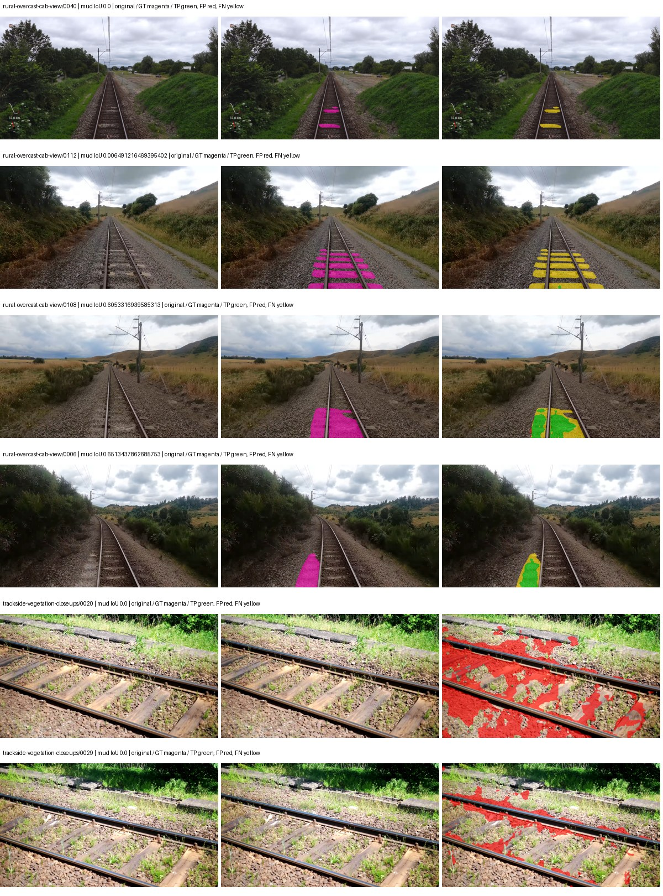
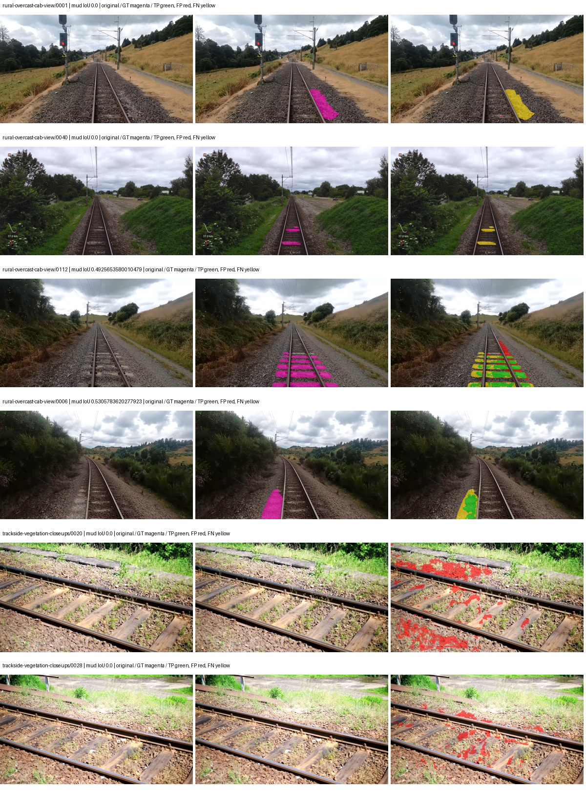
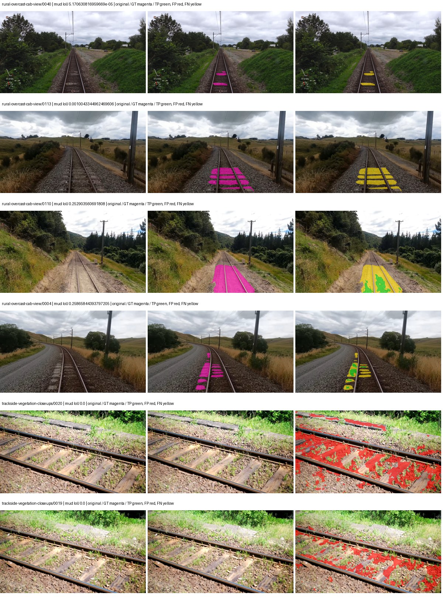

# segformer_b2 — rad_9_24_2026-fixed-grouped

[RAD 9/24 `fixed-grouped` arm](../../README.md) · [Full model records](record.json)

Primary selection and early stopping: **mud-pumping validation IoU**. A job is complete only after full statistics and isolated profiling are verified.

| Model | Initialization path | Seed | Status | Steps | Best step | Mud IoU (%) | Mud precision (%) | Mud recall (%) | Final mud IoU (trainer val, %) | mIoU (%) | Fixed GT-class mIoU (%) |
| --- | --- | --- | --- | --- | --- | --- | --- | --- | --- | --- | --- |
| segformer_b2 | rtis_only | 0 | completed | 3370 | 2074 | 10.08 | 16.06 | 21.30 | 6.72 | 34.14 | 39.83 |
| segformer_b2 | cityscapes_to_rtis | 0 | completed | 4000 | 3629 | 16.81 | 33.45 | 25.25 | 12.88 | 38.62 | 45.05 |
| segformer_b2 | railsem19_to_rtis | 0 | completed | 3629 | 2333 | 6.09 | 9.81 | 13.85 | 3.93 | 45.16 | 52.69 |
| segformer_b2 | cityscapes_to_railsem19_to_rtis | 0 | evaluating | 3888 | — | — | — | — | — | — | — |

Training: 217 images. Validation: 37 images. Test: 60 held out. Seeds: [0]. Seed variation measures optimization variability, not independent-recording uncertainty. Historical source checkpoints stay fixed across adaptation seeds.

Training code: `d864b72bd90706260965bb1a48398d01167b6d5c`. Split SHA-256: `12d7b367c72cda61d57686ff2ac28223530d0af49debd9fb7a0fbc68b908bc93`.

## rtis_only — seed 0

Status: **completed**. Started: 2026-10-05T23:12:20.764584+00:00. Finished: 2026-10-06T00:09:17.533221+00:00.

Recipe pretrained initializer: `nvidia/mit-b2`.

`rtis_only` uses the recipe initializer, which may include pretrained segmentation components. Transfer paths load the exact historical source checkpoint below and reset the classifier; they do not reset all query/decoder features.

Source checkpoint: `Recipe pretrained initialization`.

Config SHA-256: `492954a5d992d8781ff322a772366b5419f12a8faf211fe8e0d6e8e6e0347623`. Weights used for validation: `raw`.

### Mud-pumping and aggregate quality

| Metric | Selected checkpoint | Final training validation |
| --- | --- | --- |
| Mud IoU | 10.08 | 6.72 |
| Mud precision | 16.06 | 8.86 |
| Mud recall | 21.30 | 21.78 |
| Mud Dice/F1 | 18.32 | 12.60 |
| mIoU | 34.14 | 35.97 |
| Mean accuracy | 47.56 | 51.20 |
| Mean precision | 53.11 | 55.53 |
| Mean Dice | 43.56 | 46.19 |
| Mean specificity | 99.05 | 99.05 |
| Pixel accuracy | 84.54 | 84.47 |
| Frequency-weighted IoU | 75.54 | 76.18 |
| Fixed GT-present class mIoU | 39.83 | 41.96 |
| Boundary F1 | 41.16 | 43.13 |

The selected checkpoint has independent evaluation evidence. Final values are the trainer's final validation record, not a new independent evaluation. mIoU averages classes with nonzero union, so false positives on absent classes can change its denominator. The fixed GT-class mean is supplementary and excludes absent classes; their false positives remain in the confusion matrix.

### Resource usage and timing

| Measurement | Value |
| --- | --- |
| Peak training VRAM, retained training invocation (GiB) | 11.73 |
| Peak evaluation VRAM (GiB) | 7.46 |
| Retained training invocation wall time (seconds) | 3182.22 |
| Retained training invocation GPU-hours (one GPU) | 0.88 |
| Evaluation wall time (seconds) | 22.20 |
| Full evaluation pipeline images/second | 1.67 |
| Best full-state checkpoint (MiB) | 418.15 |
| Final full-state checkpoint (MiB) | 418.13 |
| Verified periodic checkpoints removed (GiB) | 2.45 |

VRAM uses the recorded allocator high-water mark; it is not total device usage including CUDA context. Resumed jobs' retained training invocation times and peaks are **not whole-campaign totals**. Earlier invocation resource records are not reconstructed here. Evaluation throughput includes loader, sliding-window inference and metrics; it is not model-only latency/FPS. Missing measurements are shown as —, never inferred from another dataset's run.

### Standardized inference performance

Dedicated model-only profiling waits for an idle worker-locked L40S: BF16, batch 1, 1024x1024, 20 warmup and 100 CUDA-event-timed public forwards. It excludes loading, preprocessing, tiling and metrics.

| Status | Parameters | Weight MiB | FPS | p50 ms | p95 ms | Peak reserved GiB |
| --- | --- | --- | --- | --- | --- | --- |
| complete | 27362773 | 104.38 | 53.92 | 18.50 | 18.86 | 2.25 |

```json
{
  "schema_version": 1,
  "model_id": "segformer_b2",
  "measured_at": "2026-10-06T00:09:12+00:00",
  "status": "complete",
  "benchmark_scope": "rtis_selected_checkpoint_model_only",
  "applies_to": [
    "segformer_b2--rtis_only--seed-0"
  ],
  "source": {
    "campaign_git_sha": "d864b72bd90706260965bb1a48398d01167b6d5c",
    "git_dirty": false,
    "config_hash": "e4c37ec335c2",
    "resolved_config": "/data/izadia1/projects/segmentary-runs/rad_9_24_2026/fixed-grouped-seed0-20261005-r2/configs/segformer_b2--rtis_only--seed-0.yaml",
    "config_sha256": "492954a5d992d8781ff322a772366b5419f12a8faf211fe8e0d6e8e6e0347623",
    "checkpoint_sha256": "940fd7b9e2189c7e1bd5e046645f0971fc4b64e837e5491959490ed17523fab5",
    "checkpoint_global_step": 2074,
    "checkpoint_bytes": 438463729,
    "checkpoint_kind": "resume checkpoint with optimizer and EMA state",
    "weights": "raw",
    "measured_checkpoint_job_id": "segformer_b2--rtis_only--seed-0",
    "result_sha256": "932f6040c76f16f0ff2ec5fc52d5b620faf66d6e60c2d827d8fc8ebdf9bff44d",
    "result_git_sha": "d864b72bd90706260965bb1a48398d01167b6d5c",
    "result_stage": "eval:rad_9_24_2026-fixed-grouped:val",
    "result_seed": 0
  },
  "hardware": {
    "gpu_name": "NVIDIA L40S",
    "gpu_uuid": "GPU-a5ad49e5-0536-5229-ba8a-f8a902808f53",
    "logical_device": "cuda:0",
    "physical_visibility_token": "7",
    "compute_capability": [
      8,
      9
    ],
    "total_memory_bytes": 47677177856
  },
  "model": {
    "parameter_count": 27362773,
    "trainable_parameter_count": 27362773,
    "resident_parameter_bytes": 109451092,
    "parameter_dtype_counts": {
      "float32": 27362773
    }
  },
  "contract": {
    "backend": "pytorch",
    "precision": "bf16_autocast",
    "batch_size": 1,
    "input_shape_nchw": [
      1,
      3,
      1024,
      1024
    ],
    "warmup_iterations": 20,
    "measured_iterations": 100,
    "timing": "per-forward CUDA events with end-event synchronization",
    "includes_preprocessing": false,
    "includes_data_loader": false,
    "includes_sliding_window": false,
    "input_resident_on_gpu": true,
    "model_only": true,
    "entrypoint": "public model(image) dense-logits forward"
  },
  "measurements": {
    "latency": {
      "p50_ms": 18.504703521728516,
      "p95_ms": 18.864332675933838,
      "mean_ms": 18.54463031768799,
      "minimum_ms": 18.40435218811035,
      "maximum_ms": 19.4385929107666,
      "fps": 53.923965205507145,
      "raw_ms": [
        18.753536224365234,
        18.572288513183594,
        18.545663833618164,
        18.604032516479492,
        18.484224319458008,
        18.6429443359375,
        18.500608444213867,
        18.447359085083008,
        18.45043182373047,
        18.47091293334961,
        18.545663833618164,
        18.519039154052734,
        18.4401912689209,
        18.509824752807617,
        18.549760818481445,
        18.552831649780273,
        18.41868782043457,
        18.548736572265625,
        18.482175827026367,
        18.544639587402344,
        18.555904388427734,
        18.447359085083008,
        18.46067237854004,
        18.488319396972656,
        18.562015533447266,
        18.554880142211914,
        18.471935272216797,
        18.472959518432617,
        18.546688079833984,
        18.464767456054688,
        18.61529541015625,
        18.4770565032959,
        18.710527420043945,
        18.86310386657715,
        19.24198341369629,
        18.887712478637695,
        18.81497573852539,
        19.4385929107666,
        19.27065658569336,
        18.6746883392334,
        18.475967407226562,
        18.519039154052734,
        18.476032257080078,
        18.43916893005371,
        18.46988868713379,
        18.4770565032959,
        18.887680053710938,
        18.521087646484375,
        18.447359085083008,
        18.42278480529785,
        18.42483139038086,
        18.51696014404297,
        18.43507194519043,
        18.4268798828125,
        18.466880798339844,
        18.530303955078125,
        18.457599639892578,
        18.504703521728516,
        18.558975219726562,
        18.520063400268555,
        18.538496017456055,
        18.41663932800293,
        18.45350456237793,
        18.508800506591797,
        18.44940757751465,
        18.51603126525879,
        18.40435218811035,
        18.448383331298828,
        18.550783157348633,
        18.42790412902832,
        18.791423797607422,
        18.524160385131836,
        18.491455078125,
        18.522111892700195,
        18.480127334594727,
        18.488319396972656,
        18.485248565673828,
        18.542591094970703,
        18.487295150756836,
        18.530303955078125,
        18.545663833618164,
        18.496511459350586,
        18.538496017456055,
        18.537471771240234,
        18.41971206665039,
        18.455488204956055,
        18.489343643188477,
        18.485248565673828,
        18.46988868713379,
        18.507776260375977,
        18.44223976135254,
        18.58153533935547,
        18.512895584106445,
        18.40435218811035,
        18.463743209838867,
        18.46169662475586,
        18.504703521728516,
        18.540544509887695,
        18.43507194519043,
        18.531328201293945
      ],
      "percentile_method": "numpy linear interpolation"
    },
    "peak_reserved_bytes": 2420113408,
    "memory_kind": "pytorch_cuda_allocator_peak_reserved_excluding_context",
    "benchmark_wall_clock_s": 5.603172942996025
  },
  "started_at": "2026-10-06T00:09:07+00:00",
  "finished_at": "2026-10-06T00:09:12+00:00",
  "environment": {
    "hostname": "hdrfs-app-001",
    "python": "3.11.15",
    "platform": "Linux-5.15.0-139-generic-x86_64-with-glibc2.35",
    "torch": "2.11.0+cu128",
    "torch_cuda": "12.8",
    "cudnn": 91900,
    "driver_version": "570.133.20",
    "cuda_available": true,
    "gpu_count": 1,
    "gpu_names": [
      "NVIDIA L40S"
    ],
    "cuda_visible_devices": "7",
    "packages": {
      "segmentary": "0.1.0",
      "torch": "2.11.0+cu128",
      "torchvision": "0.26.0+cu128",
      "transformers": "5.15.0",
      "timm": "1.0.28",
      "segmentation-models-pytorch": "0.5.0",
      "albumentations": "2.0.8",
      "lightning": "2.6.5",
      "numpy": "2.4.4"
    }
  }
}
```

### Per-class validation results

| Class | GT pixels | IoU (%) | Precision (%) | Recall (%) | Dice (%) | Boundary F1 (%) |
| --- | --- | --- | --- | --- | --- | --- |
| car | 29664 | 16.15 | 41.03 | 21.04 | 27.81 | 28.00 |
| construction | 311585 | 56.36 | 68.94 | 75.54 | 72.09 | 67.02 |
| fence | 265137 | 11.01 | 57.71 | 11.98 | 19.84 | 31.80 |
| mud-pumping | 1226250 | 10.08 | 16.06 | 21.30 | 18.32 | 11.17 |
| on-rails | 0 | 0.00 | 0.00 | — | 0.00 | 0.00 |
| person | 0 | 0.00 | 0.00 | — | 0.00 | 0.00 |
| pole | 628038 | 70.69 | 81.64 | 84.06 | 82.83 | 89.19 |
| rail-embedded | 16799 | 20.29 | 80.63 | 21.33 | 33.74 | 39.73 |
| rail-raised | 2969797 | 73.73 | 85.54 | 84.24 | 84.88 | 91.49 |
| rail-track | 6323197 | 32.58 | 82.35 | 35.02 | 49.14 | 44.82 |
| road | 1048831 | 2.73 | 19.57 | 3.08 | 5.32 | 12.14 |
| sidewalk | 1297367 | 47.36 | 79.80 | 53.81 | 64.28 | 22.08 |
| sky | 19121606 | 98.51 | 99.47 | 99.03 | 99.25 | 95.45 |
| standing-water | 95802 | 2.39 | 4.29 | 5.11 | 4.66 | 12.49 |
| terrain | 39239306 | 86.69 | 90.30 | 95.59 | 92.87 | 60.90 |
| trackbed | 10643081 | 56.29 | 64.34 | 81.81 | 72.03 | 54.98 |
| traffic-light | 19510 | 29.44 | 90.00 | 30.44 | 45.49 | 62.33 |
| traffic-sign | 13285 | 47.61 | 72.94 | 57.82 | 64.51 | 62.13 |
| tram-track | 56179 | 6.69 | 13.59 | 11.63 | 12.54 | 13.14 |
| truck | 0 | 0.00 | 0.00 | — | 0.00 | 0.00 |
| vegetation-overgrowth | 5901821 | 48.33 | 67.20 | 63.25 | 65.16 | 65.59 |

### Full-run accounting

| Measurement | Value |
| --- | --- |
| Full GPU-reserved wall seconds, all recorded worker attempts | 3424.27 |
| Full reserved GPU-hours | 0.95 |
| Whole-run timing complete | True |

| Phase | Wall seconds including failed attempts |
| --- | --- |
| training | 3189.20 |
| diagnostics | 180.47 |
| performance | 13.16 |

GPU-reserved time includes model loading, training, validation, collection, profiling, checkpoint I/O and orchestration while the worker owns one GPU. It is not GPU kernel-active time. Phase timings and sampled device memory/power/utilization are retained separately; sampled device memory is not the allocator high-water mark.

### Train/validation and raw/EMA diagnostics

| Checkpoint / weights / split | Images | Mud IoU (%) | Mud precision (%) | Mud recall (%) |
| --- | --- | --- | --- | --- |
| best-auto-train / raw | 217 | 96.45 | 98.26 | 98.13 |
| best-auto-val / raw | 37 | 10.08 | 16.06 | 21.30 |
| best-alternate-val / ema | 37 | 5.73 | 7.52 | 19.46 |
| final-auto-val / raw | 37 | 6.72 | 8.85 | 21.79 |

Train uses the evaluation transform without augmentation. Compare mud train/validation metrics for the same selected weights. Alternate EMA on running-stat BatchNorm is explicitly uncalibrated and is diagnostic only. Score-threshold curves use uncalibrated normalized scores and are pixel-level diagnostics, not event detection rates or a selected deployment operating point.

### Downloadable evidence

- best-auto-train: [per-image.csv](rtis_only--seed-0/best-auto-train/per-image.csv) · [per-image-confusion.json.gz](rtis_only--seed-0/best-auto-train/per-image-confusion.json.gz) · [groups.json](rtis_only--seed-0/best-auto-train/groups.json) · [mud-score-curves.json](rtis_only--seed-0/best-auto-train/mud-score-curves.json)
- best-auto-val: [per-image.csv](rtis_only--seed-0/best-auto-val/per-image.csv) · [per-image-confusion.json.gz](rtis_only--seed-0/best-auto-val/per-image-confusion.json.gz) · [groups.json](rtis_only--seed-0/best-auto-val/groups.json) · [mud-score-curves.json](rtis_only--seed-0/best-auto-val/mud-score-curves.json) · [examples.jpg](rtis_only--seed-0/best-auto-val/examples.jpg)
- best-alternate-val: [per-image.csv](rtis_only--seed-0/best-alternate-val/per-image.csv) · [per-image-confusion.json.gz](rtis_only--seed-0/best-alternate-val/per-image-confusion.json.gz) · [groups.json](rtis_only--seed-0/best-alternate-val/groups.json) · [mud-score-curves.json](rtis_only--seed-0/best-alternate-val/mud-score-curves.json)
- final-auto-val: [per-image.csv](rtis_only--seed-0/final-auto-val/per-image.csv) · [per-image-confusion.json.gz](rtis_only--seed-0/final-auto-val/per-image-confusion.json.gz) · [groups.json](rtis_only--seed-0/final-auto-val/groups.json) · [mud-score-curves.json](rtis_only--seed-0/final-auto-val/mud-score-curves.json)
- resources: [telemetry.csv](rtis_only--seed-0/resources/telemetry.csv)



Examples are two lowest and two highest mud-IoU positive images, plus up to two negative images with the most false-positive mud pixels. They are targeted diagnostic examples, not random samples. Green: true positive; red: false positive; yellow: false negative. Full predictions remain on HDRFS.

### Validation tracking

| Logged step | Overall mIoU (%) | Mud IoU (%) |
| --- | --- | --- |
| 258 | 22.55 | 0.13 |
| 518 | 32.16 | 0.79 |
| 777 | 33.18 | 3.21 |
| 1036 | 35.58 | 7.49 |
| 1295 | 34.58 | 5.18 |
| 1555 | 33.50 | 2.51 |
| 1814 | 36.64 | 8.64 |
| 2073 | 34.13 | 10.09 |
| 2332 | 35.90 | 4.95 |
| 2592 | 36.63 | 5.39 |
| 2851 | 36.03 | 5.91 |
| 3110 | 36.37 | 6.89 |
| 3369 | 35.97 | 6.72 |

All retained scalar curves, including training loss and per-class IoU, are in record.json. Observed best mud on a curve is not necessarily a retained checkpoint: the pilot saved its selection-metric-best and final checkpoints. Step logging and checkpoint global_step may differ by one.

### Stopping and checkpoint provenance

```json
{
  "stopping": {
    "actual_steps": 3370,
    "maximum_steps": 4000,
    "min_delta": 0.001,
    "monitor": "val_iou/mud-pumping",
    "patience": 5,
    "reason": "validation_plateau"
  },
  "checkpoints": {
    "best": {
      "path": "/data/izadia1/projects/segmentary-runs/rad_9_24_2026/fixed-grouped-seed0-20261005-r2/future-runs/segformer_b2--rtis_only--seed-0_seed0/rtis/best.ckpt",
      "sha256": "940fd7b9e2189c7e1bd5e046645f0971fc4b64e837e5491959490ed17523fab5",
      "global_step": 2074,
      "bytes": 438463729
    },
    "final": {
      "path": "/data/izadia1/projects/segmentary-runs/rad_9_24_2026/fixed-grouped-seed0-20261005-r2/future-runs/segformer_b2--rtis_only--seed-0_seed0/rtis/last.ckpt",
      "sha256": "c89c6e926a44b96744819e700e70ecaacdc54ccf6e377bbc83d32b0b0a0e8f90",
      "global_step": 3370,
      "bytes": 438445745
    }
  },
  "cleanup_error": null
}
```

### Resolved training, initialization and evaluation settings

The optimizer block is the base configuration. Stage LR scales are applied at runtime, and stage warmup is capped at min(base warmup, floor(stage budget / 10), stage budget - 1): 400 steps for this 4,000-step pilot. Model-internal native input grids may differ from augmentation crops (EoMT uses its 640 grid).

```json
{
  "name": "segformer_b2--rtis_only--seed-0",
  "model": {
    "arch": "segformer_b2",
    "checkpoint": "nvidia/mit-b2",
    "tuning": "full",
    "head": "unified_head",
    "lora_r": 16,
    "lora_alpha": 32,
    "lora_dropout": 0.05,
    "lora_targets": [],
    "drop_path": null,
    "revision": null,
    "subfolder": null,
    "local_files_only": false,
    "trust_remote_code": false,
    "backbone_path": null,
    "head_paths": [],
    "classifier_path": null,
    "inactive_parameter_paths": [],
    "smp_arch": null,
    "encoder_name": null,
    "encoder_weights": null,
    "native": null,
    "batch_norm_momentum": null
  },
  "space": "paul-test-rtis",
  "taxonomy_root": "/data/izadia1/projects/segmentary-rad-d864b72b/taxonomy",
  "output_root": "/data/izadia1/projects/segmentary-runs/rad_9_24_2026/fixed-grouped-seed0-20261005-r2/future-runs",
  "optim": {
    "backbone_lr": 6e-05,
    "head_lr_mult": 10.0,
    "weight_decay": 0.05,
    "llrd": 1.0,
    "warmup_iters": 1500,
    "warmup_ratio": 1e-06,
    "poly_power": 0.9,
    "min_lr_ratio": 0.0,
    "betas": [
      0.9,
      0.999
    ],
    "grad_clip": 1.0
  },
  "train": {
    "iters": 4000,
    "batch_size": 2,
    "accum": 8,
    "num_workers": 2,
    "precision": "bf16-mixed",
    "ema_decay": 0.9998,
    "val_every": 250,
    "ckpt_every": 500,
    "selection_metric": "val_iou/mud-pumping",
    "early_stopping_patience": 5,
    "early_stopping_min_delta": 0.001,
    "seed": 0,
    "devices": 1
  },
  "eval": {
    "sliding_window": true,
    "window": [
      1024,
      1024
    ],
    "stride": [
      768,
      768
    ],
    "batch_size": 1,
    "num_workers": 2,
    "tta_scales": [],
    "tta_flip": false,
    "threshold": 0.5,
    "boundary_tolerance_frac": 0.0075,
    "save_confusion": true
  },
  "loss": {
    "task": "multiclass",
    "activation": "auto",
    "terms": [],
    "aux": "none",
    "aux_weight": 0.0,
    "ce_weight": 1.0,
    "label_smoothing": 0.0,
    "class_weights": null,
    "query": null
  },
  "aug": {
    "crop": [
      1024,
      1024
    ],
    "scale_min": 0.5,
    "scale_max": 2.0,
    "hflip_p": 0.5,
    "color_jitter_p": 0.5,
    "brightness": 0.25,
    "contrast": 0.25,
    "saturation": 0.25,
    "hue": 0.05
  },
  "stages": [
    {
      "name": "rtis",
      "data": [
        {
          "name": "rad_9_24_2026-fixed-grouped",
          "root": "/data/izadia1/datasets/rad_9_24_2026-fixed-grouped",
          "variant": null,
          "split_file": "splits.json",
          "train_split": "train",
          "val_split": "val",
          "limit": null,
          "loader": "folder",
          "mapping": "paul-test-rtis",
          "loader_options": {
            "require_groups": true
          }
        }
      ],
      "iters": null,
      "lr_scale": 1.0,
      "head_group_lr_scale": 1.0,
      "init_from": "pretrained",
      "reset_head": false,
      "freeze": null,
      "sample_weights": null
    }
  ]
}
```

### Hardware and software provenance

```json
{
  "training": {
    "cuda_available": true,
    "cuda_visible_devices": "7",
    "cudnn": 91900,
    "driver_version": "570.133.20",
    "gpu_count": 1,
    "gpu_names": [
      "NVIDIA L40S"
    ],
    "hostname": "hdrfs-app-001",
    "input_normalization": {
      "channel_order": "rgb",
      "mean": [
        0.485,
        0.456,
        0.406
      ],
      "source": "imagenet",
      "std": [
        0.229,
        0.224,
        0.225
      ]
    },
    "model_origins": [
      {
        "hf_commit": "3bb39e8739149c3777d0325349b2a6c32c6413db",
        "hf_name_or_path": "nvidia/mit-b2",
        "module": "model",
        "timm_pretrained": {}
      },
      {
        "hf_commit": "3bb39e8739149c3777d0325349b2a6c32c6413db",
        "hf_name_or_path": "nvidia/mit-b2",
        "module": "model.segformer",
        "timm_pretrained": {}
      },
      {
        "hf_commit": "3bb39e8739149c3777d0325349b2a6c32c6413db",
        "hf_name_or_path": "nvidia/mit-b2",
        "module": "model.segformer.stages.0.blocks.0.attention",
        "timm_pretrained": {}
      },
      {
        "hf_commit": "3bb39e8739149c3777d0325349b2a6c32c6413db",
        "hf_name_or_path": "nvidia/mit-b2",
        "module": "model.segformer.stages.0.blocks.1.attention",
        "timm_pretrained": {}
      },
      {
        "hf_commit": "3bb39e8739149c3777d0325349b2a6c32c6413db",
        "hf_name_or_path": "nvidia/mit-b2",
        "module": "model.segformer.stages.0.blocks.2.attention",
        "timm_pretrained": {}
      },
      {
        "hf_commit": "3bb39e8739149c3777d0325349b2a6c32c6413db",
        "hf_name_or_path": "nvidia/mit-b2",
        "module": "model.segformer.stages.1.blocks.0.attention",
        "timm_pretrained": {}
      },
      {
        "hf_commit": "3bb39e8739149c3777d0325349b2a6c32c6413db",
        "hf_name_or_path": "nvidia/mit-b2",
        "module": "model.segformer.stages.1.blocks.1.attention",
        "timm_pretrained": {}
      },
      {
        "hf_commit": "3bb39e8739149c3777d0325349b2a6c32c6413db",
        "hf_name_or_path": "nvidia/mit-b2",
        "module": "model.segformer.stages.1.blocks.2.attention",
        "timm_pretrained": {}
      },
      {
        "hf_commit": "3bb39e8739149c3777d0325349b2a6c32c6413db",
        "hf_name_or_path": "nvidia/mit-b2",
        "module": "model.segformer.stages.1.blocks.3.attention",
        "timm_pretrained": {}
      },
      {
        "hf_commit": "3bb39e8739149c3777d0325349b2a6c32c6413db",
        "hf_name_or_path": "nvidia/mit-b2",
        "module": "model.segformer.stages.2.blocks.0.attention",
        "timm_pretrained": {}
      },
      {
        "hf_commit": "3bb39e8739149c3777d0325349b2a6c32c6413db",
        "hf_name_or_path": "nvidia/mit-b2",
        "module": "model.segformer.stages.2.blocks.1.attention",
        "timm_pretrained": {}
      },
      {
        "hf_commit": "3bb39e8739149c3777d0325349b2a6c32c6413db",
        "hf_name_or_path": "nvidia/mit-b2",
        "module": "model.segformer.stages.2.blocks.2.attention",
        "timm_pretrained": {}
      },
      {
        "hf_commit": "3bb39e8739149c3777d0325349b2a6c32c6413db",
        "hf_name_or_path": "nvidia/mit-b2",
        "module": "model.segformer.stages.2.blocks.3.attention",
        "timm_pretrained": {}
      },
      {
        "hf_commit": "3bb39e8739149c3777d0325349b2a6c32c6413db",
        "hf_name_or_path": "nvidia/mit-b2",
        "module": "model.segformer.stages.2.blocks.4.attention",
        "timm_pretrained": {}
      },
      {
        "hf_commit": "3bb39e8739149c3777d0325349b2a6c32c6413db",
        "hf_name_or_path": "nvidia/mit-b2",
        "module": "model.segformer.stages.2.blocks.5.attention",
        "timm_pretrained": {}
      },
      {
        "hf_commit": "3bb39e8739149c3777d0325349b2a6c32c6413db",
        "hf_name_or_path": "nvidia/mit-b2",
        "module": "model.segformer.stages.3.blocks.0.attention",
        "timm_pretrained": {}
      },
      {
        "hf_commit": "3bb39e8739149c3777d0325349b2a6c32c6413db",
        "hf_name_or_path": "nvidia/mit-b2",
        "module": "model.segformer.stages.3.blocks.1.attention",
        "timm_pretrained": {}
      },
      {
        "hf_commit": "3bb39e8739149c3777d0325349b2a6c32c6413db",
        "hf_name_or_path": "nvidia/mit-b2",
        "module": "model.segformer.stages.3.blocks.2.attention",
        "timm_pretrained": {}
      },
      {
        "hf_commit": "3bb39e8739149c3777d0325349b2a6c32c6413db",
        "hf_name_or_path": "nvidia/mit-b2",
        "module": "model.decode_head",
        "timm_pretrained": {}
      }
    ],
    "model_parameter_count": 27362773,
    "packages": {
      "albumentations": "2.0.8",
      "lightning": "2.6.5",
      "numpy": "2.4.4",
      "segmentary": "0.1.0",
      "segmentation-models-pytorch": "0.5.0",
      "timm": "1.0.28",
      "torch": "2.11.0+cu128",
      "torchvision": "0.26.0+cu128",
      "transformers": "5.15.0"
    },
    "platform": "Linux-5.15.0-139-generic-x86_64-with-glibc2.35",
    "python": "3.11.15",
    "torch": "2.11.0+cu128",
    "torch_cuda": "12.8",
    "trainable_parameter_count": 27362773,
    "training_stop": {
      "actual_steps": 3370,
      "maximum_steps": 4000,
      "min_delta": 0.001,
      "monitor": "val_iou/mud-pumping",
      "patience": 5,
      "reason": "validation_plateau"
    },
    "validation_weights": "raw"
  },
  "evaluation": {
    "cuda_available": true,
    "cuda_visible_devices": "7",
    "cudnn": 91900,
    "driver_version": "570.133.20",
    "gpu_count": 1,
    "gpu_names": [
      "NVIDIA L40S"
    ],
    "hostname": "hdrfs-app-001",
    "input_normalization": {
      "channel_order": "rgb",
      "mean": [
        0.485,
        0.456,
        0.406
      ],
      "source": "imagenet",
      "std": [
        0.229,
        0.224,
        0.225
      ]
    },
    "packages": {
      "albumentations": "2.0.8",
      "lightning": "2.6.5",
      "numpy": "2.4.4",
      "segmentary": "0.1.0",
      "segmentation-models-pytorch": "0.5.0",
      "timm": "1.0.28",
      "torch": "2.11.0+cu128",
      "torchvision": "0.26.0+cu128",
      "transformers": "5.15.0"
    },
    "platform": "Linux-5.15.0-139-generic-x86_64-with-glibc2.35",
    "python": "3.11.15",
    "torch": "2.11.0+cu128",
    "torch_cuda": "12.8"
  }
}
```

## cityscapes_to_rtis — seed 0

Status: **completed**. Started: 2026-10-06T00:09:25.654659+00:00. Finished: 2026-10-06T01:16:27.860528+00:00.

Recipe pretrained initializer: `nvidia/mit-b2`.

`rtis_only` uses the recipe initializer, which may include pretrained segmentation components. Transfer paths load the exact historical source checkpoint below and reset the classifier; they do not reset all query/decoder features.

Source checkpoint: `{'name': 'segformer_b2--cityscapes--seed-0', 'model': 'segformer_b2', 'protocol': 'cityscapes', 'config': '/data/izadia1/projects/segmentary-runs/all-model-city-rail-seed0-rail20-b9eb3e1/accepted/segformer_b2--cityscapes--seed-0/resolved-config.yaml', 'checkpoint': '/data/izadia1/projects/segmentary-runs/all-model-city-rail-seed0-a7c0b67/jobs/segformer_b2--cityscapes--seed-0/attempt-001/train/segformer_b2--cityscapes_seed0/cityscapes/last.ckpt', 'recorded_sha256': 'd0f4f619c4d1200c143ff218ddb7e8693decd082345af09049cc50b8f8c42977', 'exists': True}`.

Config SHA-256: `332f3acf89d638c18e7cb2386fdf45ddb4afc066cb6645e01902f42bd6200d02`. Weights used for validation: `raw`.

### Mud-pumping and aggregate quality

| Metric | Selected checkpoint | Final training validation |
| --- | --- | --- |
| Mud IoU | 16.81 | 12.88 |
| Mud precision | 33.45 | 30.00 |
| Mud recall | 25.25 | 18.42 |
| Mud Dice/F1 | 28.78 | 22.83 |
| mIoU | 38.62 | 38.47 |
| Mean accuracy | 53.22 | 53.25 |
| Mean precision | 55.63 | 54.80 |
| Mean Dice | 47.95 | 47.78 |
| Mean specificity | 99.11 | 99.11 |
| Pixel accuracy | 85.30 | 85.33 |
| Frequency-weighted IoU | 76.93 | 77.04 |
| Fixed GT-present class mIoU | 45.05 | 44.88 |
| Boundary F1 | 45.49 | 45.23 |

The selected checkpoint has independent evaluation evidence. Final values are the trainer's final validation record, not a new independent evaluation. mIoU averages classes with nonzero union, so false positives on absent classes can change its denominator. The fixed GT-class mean is supplementary and excludes absent classes; their false positives remain in the confusion matrix.

### Resource usage and timing

| Measurement | Value |
| --- | --- |
| Peak training VRAM, retained training invocation (GiB) | 11.73 |
| Peak evaluation VRAM (GiB) | 7.46 |
| Retained training invocation wall time (seconds) | 3782.83 |
| Retained training invocation GPU-hours (one GPU) | 1.05 |
| Evaluation wall time (seconds) | 22.14 |
| Full evaluation pipeline images/second | 1.67 |
| Best full-state checkpoint (MiB) | 418.15 |
| Final full-state checkpoint (MiB) | 418.13 |
| Verified periodic checkpoints removed (GiB) | 3.27 |

VRAM uses the recorded allocator high-water mark; it is not total device usage including CUDA context. Resumed jobs' retained training invocation times and peaks are **not whole-campaign totals**. Earlier invocation resource records are not reconstructed here. Evaluation throughput includes loader, sliding-window inference and metrics; it is not model-only latency/FPS. Missing measurements are shown as —, never inferred from another dataset's run.

### Standardized inference performance

Dedicated model-only profiling waits for an idle worker-locked L40S: BF16, batch 1, 1024x1024, 20 warmup and 100 CUDA-event-timed public forwards. It excludes loading, preprocessing, tiling and metrics.

| Status | Parameters | Weight MiB | FPS | p50 ms | p95 ms | Peak reserved GiB |
| --- | --- | --- | --- | --- | --- | --- |
| complete | 27362773 | 104.38 | 53.02 | 18.54 | 20.56 | 2.25 |

```json
{
  "schema_version": 1,
  "model_id": "segformer_b2",
  "measured_at": "2026-10-06T01:16:22+00:00",
  "status": "complete",
  "benchmark_scope": "rtis_selected_checkpoint_model_only",
  "applies_to": [
    "segformer_b2--cityscapes_to_rtis--seed-0"
  ],
  "source": {
    "campaign_git_sha": "d864b72bd90706260965bb1a48398d01167b6d5c",
    "git_dirty": false,
    "config_hash": "e0a3357f7283",
    "resolved_config": "/data/izadia1/projects/segmentary-runs/rad_9_24_2026/fixed-grouped-seed0-20261005-r2/configs/segformer_b2--cityscapes_to_rtis--seed-0.yaml",
    "config_sha256": "332f3acf89d638c18e7cb2386fdf45ddb4afc066cb6645e01902f42bd6200d02",
    "checkpoint_sha256": "049ce2315adb2fa1b6dacc09478487d2d03ee13578c9fa7244bd67a48aadf2a7",
    "checkpoint_global_step": 3629,
    "checkpoint_bytes": 438463793,
    "checkpoint_kind": "resume checkpoint with optimizer and EMA state",
    "weights": "raw",
    "measured_checkpoint_job_id": "segformer_b2--cityscapes_to_rtis--seed-0",
    "result_sha256": "6001756c84ec79a2c0e122f6ae9db45ded0db31369aa4e12fd85ff73320c8d2f",
    "result_git_sha": "d864b72bd90706260965bb1a48398d01167b6d5c",
    "result_stage": "eval:rad_9_24_2026-fixed-grouped:val",
    "result_seed": 0
  },
  "hardware": {
    "gpu_name": "NVIDIA L40S",
    "gpu_uuid": "GPU-a5ad49e5-0536-5229-ba8a-f8a902808f53",
    "logical_device": "cuda:0",
    "physical_visibility_token": "7",
    "compute_capability": [
      8,
      9
    ],
    "total_memory_bytes": 47677177856
  },
  "model": {
    "parameter_count": 27362773,
    "trainable_parameter_count": 27362773,
    "resident_parameter_bytes": 109451092,
    "parameter_dtype_counts": {
      "float32": 27362773
    }
  },
  "contract": {
    "backend": "pytorch",
    "precision": "bf16_autocast",
    "batch_size": 1,
    "input_shape_nchw": [
      1,
      3,
      1024,
      1024
    ],
    "warmup_iterations": 20,
    "measured_iterations": 100,
    "timing": "per-forward CUDA events with end-event synchronization",
    "includes_preprocessing": false,
    "includes_data_loader": false,
    "includes_sliding_window": false,
    "input_resident_on_gpu": true,
    "model_only": true,
    "entrypoint": "public model(image) dense-logits forward"
  },
  "measurements": {
    "latency": {
      "p50_ms": 18.539520263671875,
      "p95_ms": 20.555929470062257,
      "mean_ms": 18.860237140655517,
      "minimum_ms": 18.348031997680664,
      "maximum_ms": 24.671232223510742,
      "fps": 53.0216026735093,
      "raw_ms": [
        20.189184188842773,
        18.580480575561523,
        18.879487991333008,
        18.62758445739746,
        18.387968063354492,
        18.373632431030273,
        18.454559326171875,
        18.501632690429688,
        18.795520782470703,
        18.64499282836914,
        20.303871154785156,
        19.517440795898438,
        18.41561508178711,
        18.491392135620117,
        18.41561508178711,
        18.535423278808594,
        18.553855895996094,
        18.388992309570312,
        20.617216110229492,
        18.927616119384766,
        18.42995262145996,
        18.46886444091797,
        18.348031997680664,
        18.473983764648438,
        18.472959518432617,
        18.559999465942383,
        19.516416549682617,
        18.588672637939453,
        18.479103088378906,
        18.98700714111328,
        18.83955192565918,
        18.43712043762207,
        18.44428825378418,
        18.48627281188965,
        18.498559951782227,
        18.47091293334961,
        18.44223976135254,
        19.46828842163086,
        18.516992568969727,
        18.480127334594727,
        18.577407836914062,
        18.42892837524414,
        18.63065528869629,
        18.48627281188965,
        18.45964813232422,
        18.39206314086914,
        18.493440628051758,
        18.905088424682617,
        18.553855895996094,
        18.382848739624023,
        18.45248031616211,
        18.406400680541992,
        18.42995262145996,
        18.40332794189453,
        18.399232864379883,
        18.455551147460938,
        18.46272087097168,
        18.456575393676758,
        18.758655548095703,
        18.43199920654297,
        18.46272087097168,
        18.481151580810547,
        18.3951358795166,
        18.44121551513672,
        20.68992042541504,
        19.294208526611328,
        20.84966468811035,
        19.387392044067383,
        19.189760208129883,
        19.206144332885742,
        19.06585693359375,
        20.43903923034668,
        20.552703857421875,
        24.671232223510742,
        18.972671508789062,
        18.985984802246094,
        18.927616119384766,
        18.940927505493164,
        22.07436752319336,
        18.6112003326416,
        18.979839324951172,
        18.567167282104492,
        18.510847091674805,
        18.705408096313477,
        18.549760818481445,
        18.522111892700195,
        18.663423538208008,
        18.543615341186523,
        18.503679275512695,
        18.540544509887695,
        18.547712326049805,
        19.505151748657227,
        18.503679275512695,
        18.520063400268555,
        18.522111892700195,
        18.546688079833984,
        18.538496017456055,
        18.543615341186523,
        18.6112003326416,
        18.481151580810547
      ],
      "percentile_method": "numpy linear interpolation"
    },
    "peak_reserved_bytes": 2420113408,
    "memory_kind": "pytorch_cuda_allocator_peak_reserved_excluding_context",
    "benchmark_wall_clock_s": 5.686984121799469
  },
  "started_at": "2026-10-06T01:16:16+00:00",
  "finished_at": "2026-10-06T01:16:22+00:00",
  "environment": {
    "hostname": "hdrfs-app-001",
    "python": "3.11.15",
    "platform": "Linux-5.15.0-139-generic-x86_64-with-glibc2.35",
    "torch": "2.11.0+cu128",
    "torch_cuda": "12.8",
    "cudnn": 91900,
    "driver_version": "570.133.20",
    "cuda_available": true,
    "gpu_count": 1,
    "gpu_names": [
      "NVIDIA L40S"
    ],
    "cuda_visible_devices": "7",
    "packages": {
      "segmentary": "0.1.0",
      "torch": "2.11.0+cu128",
      "torchvision": "0.26.0+cu128",
      "transformers": "5.15.0",
      "timm": "1.0.28",
      "segmentation-models-pytorch": "0.5.0",
      "albumentations": "2.0.8",
      "lightning": "2.6.5",
      "numpy": "2.4.4"
    }
  }
}
```

### Per-class validation results

| Class | GT pixels | IoU (%) | Precision (%) | Recall (%) | Dice (%) | Boundary F1 (%) |
| --- | --- | --- | --- | --- | --- | --- |
| car | 29664 | 64.45 | 71.62 | 86.55 | 78.38 | 55.67 |
| construction | 311585 | 60.49 | 76.44 | 74.34 | 75.38 | 69.94 |
| fence | 265137 | 17.92 | 69.38 | 19.46 | 30.40 | 42.34 |
| mud-pumping | 1226250 | 16.81 | 33.45 | 25.25 | 28.78 | 23.30 |
| on-rails | 0 | 0.00 | 0.00 | — | 0.00 | 0.00 |
| person | 0 | 0.00 | 0.00 | — | 0.00 | 0.00 |
| pole | 628038 | 72.96 | 85.62 | 83.15 | 84.37 | 91.07 |
| rail-embedded | 16799 | 10.84 | 90.87 | 10.96 | 19.56 | 31.34 |
| rail-raised | 2969797 | 72.85 | 85.68 | 82.96 | 84.30 | 90.59 |
| rail-track | 6323197 | 47.26 | 62.14 | 66.37 | 64.19 | 57.29 |
| road | 1048831 | 1.88 | 4.64 | 3.06 | 3.69 | 6.30 |
| sidewalk | 1297367 | 17.86 | 43.45 | 23.27 | 30.31 | 26.81 |
| sky | 19121606 | 98.56 | 99.31 | 99.23 | 99.27 | 96.02 |
| standing-water | 95802 | 0.98 | 1.70 | 2.28 | 1.94 | 4.46 |
| terrain | 39239306 | 88.01 | 91.16 | 96.23 | 93.63 | 62.25 |
| trackbed | 10643081 | 56.24 | 75.40 | 68.88 | 72.00 | 54.08 |
| traffic-light | 19510 | 69.43 | 93.56 | 72.92 | 81.96 | 90.16 |
| traffic-sign | 13285 | 50.41 | 78.80 | 58.32 | 67.03 | 67.99 |
| tram-track | 56179 | 14.79 | 38.64 | 19.33 | 25.77 | 19.26 |
| truck | 0 | 0.00 | 0.00 | — | 0.00 | 0.00 |
| vegetation-overgrowth | 5901821 | 49.19 | 66.47 | 65.42 | 65.94 | 66.46 |

### Full-run accounting

| Measurement | Value |
| --- | --- |
| Full GPU-reserved wall seconds, all recorded worker attempts | 4030.03 |
| Full reserved GPU-hours | 1.12 |
| Whole-run timing complete | True |

| Phase | Wall seconds including failed attempts |
| --- | --- |
| training | 3790.20 |
| diagnostics | 183.35 |
| performance | 13.34 |

GPU-reserved time includes model loading, training, validation, collection, profiling, checkpoint I/O and orchestration while the worker owns one GPU. It is not GPU kernel-active time. Phase timings and sampled device memory/power/utilization are retained separately; sampled device memory is not the allocator high-water mark.

### Train/validation and raw/EMA diagnostics

| Checkpoint / weights / split | Images | Mud IoU (%) | Mud precision (%) | Mud recall (%) |
| --- | --- | --- | --- | --- |
| best-auto-train / raw | 217 | 94.99 | 97.33 | 97.54 |
| best-auto-val / raw | 37 | 16.81 | 33.45 | 25.25 |
| best-alternate-val / ema | 37 | 12.56 | 23.31 | 21.41 |
| final-auto-val / raw | 37 | 12.90 | 30.07 | 18.42 |

Train uses the evaluation transform without augmentation. Compare mud train/validation metrics for the same selected weights. Alternate EMA on running-stat BatchNorm is explicitly uncalibrated and is diagnostic only. Score-threshold curves use uncalibrated normalized scores and are pixel-level diagnostics, not event detection rates or a selected deployment operating point.

### Downloadable evidence

- best-auto-train: [per-image.csv](cityscapes_to_rtis--seed-0/best-auto-train/per-image.csv) · [per-image-confusion.json.gz](cityscapes_to_rtis--seed-0/best-auto-train/per-image-confusion.json.gz) · [groups.json](cityscapes_to_rtis--seed-0/best-auto-train/groups.json) · [mud-score-curves.json](cityscapes_to_rtis--seed-0/best-auto-train/mud-score-curves.json)
- best-auto-val: [per-image.csv](cityscapes_to_rtis--seed-0/best-auto-val/per-image.csv) · [per-image-confusion.json.gz](cityscapes_to_rtis--seed-0/best-auto-val/per-image-confusion.json.gz) · [groups.json](cityscapes_to_rtis--seed-0/best-auto-val/groups.json) · [mud-score-curves.json](cityscapes_to_rtis--seed-0/best-auto-val/mud-score-curves.json) · [examples.jpg](cityscapes_to_rtis--seed-0/best-auto-val/examples.jpg)
- best-alternate-val: [per-image.csv](cityscapes_to_rtis--seed-0/best-alternate-val/per-image.csv) · [per-image-confusion.json.gz](cityscapes_to_rtis--seed-0/best-alternate-val/per-image-confusion.json.gz) · [groups.json](cityscapes_to_rtis--seed-0/best-alternate-val/groups.json) · [mud-score-curves.json](cityscapes_to_rtis--seed-0/best-alternate-val/mud-score-curves.json)
- final-auto-val: [per-image.csv](cityscapes_to_rtis--seed-0/final-auto-val/per-image.csv) · [per-image-confusion.json.gz](cityscapes_to_rtis--seed-0/final-auto-val/per-image-confusion.json.gz) · [groups.json](cityscapes_to_rtis--seed-0/final-auto-val/groups.json) · [mud-score-curves.json](cityscapes_to_rtis--seed-0/final-auto-val/mud-score-curves.json)
- resources: [telemetry.csv](cityscapes_to_rtis--seed-0/resources/telemetry.csv)



Examples are two lowest and two highest mud-IoU positive images, plus up to two negative images with the most false-positive mud pixels. They are targeted diagnostic examples, not random samples. Green: true positive; red: false positive; yellow: false negative. Full predictions remain on HDRFS.

### Validation tracking

| Logged step | Overall mIoU (%) | Mud IoU (%) |
| --- | --- | --- |
| 258 | 22.93 | 0.58 |
| 518 | 26.49 | 1.40 |
| 777 | 31.37 | 6.28 |
| 1036 | 37.68 | 6.76 |
| 1295 | 37.35 | 5.88 |
| 1555 | 37.82 | 12.94 |
| 1814 | 38.10 | 10.71 |
| 2073 | 38.49 | 10.99 |
| 2332 | 39.35 | 10.92 |
| 2592 | 40.77 | 16.02 |
| 2851 | 40.15 | 13.39 |
| 3110 | 40.25 | 12.96 |
| 3369 | 37.97 | 13.46 |
| 3629 | 38.64 | 16.77 |
| 3888 | 38.75 | 16.68 |
| 4000 | 38.47 | 12.88 |

All retained scalar curves, including training loss and per-class IoU, are in record.json. Observed best mud on a curve is not necessarily a retained checkpoint: the pilot saved its selection-metric-best and final checkpoints. Step logging and checkpoint global_step may differ by one.

### Stopping and checkpoint provenance

```json
{
  "stopping": {
    "actual_steps": 4000,
    "maximum_steps": 4000,
    "min_delta": 0.001,
    "monitor": "val_iou/mud-pumping",
    "patience": 5,
    "reason": "budget_complete"
  },
  "checkpoints": {
    "best": {
      "path": "/data/izadia1/projects/segmentary-runs/rad_9_24_2026/fixed-grouped-seed0-20261005-r2/future-runs/segformer_b2--cityscapes_to_rtis--seed-0_seed0/rtis/best.ckpt",
      "sha256": "049ce2315adb2fa1b6dacc09478487d2d03ee13578c9fa7244bd67a48aadf2a7",
      "global_step": 3629,
      "bytes": 438463793
    },
    "final": {
      "path": "/data/izadia1/projects/segmentary-runs/rad_9_24_2026/fixed-grouped-seed0-20261005-r2/future-runs/segformer_b2--cityscapes_to_rtis--seed-0_seed0/rtis/last.ckpt",
      "sha256": "f8f98731720860d6718077258a6c2fa11ef80bb60faeb99bc639ad741f677da1",
      "global_step": 4000,
      "bytes": 438445681
    }
  },
  "cleanup_error": null
}
```

### Resolved training, initialization and evaluation settings

The optimizer block is the base configuration. Stage LR scales are applied at runtime, and stage warmup is capped at min(base warmup, floor(stage budget / 10), stage budget - 1): 400 steps for this 4,000-step pilot. Model-internal native input grids may differ from augmentation crops (EoMT uses its 640 grid).

```json
{
  "name": "segformer_b2--cityscapes_to_rtis--seed-0",
  "model": {
    "arch": "segformer_b2",
    "checkpoint": "nvidia/mit-b2",
    "tuning": "full",
    "head": "unified_head",
    "lora_r": 16,
    "lora_alpha": 32,
    "lora_dropout": 0.05,
    "lora_targets": [],
    "drop_path": null,
    "revision": null,
    "subfolder": null,
    "local_files_only": false,
    "trust_remote_code": false,
    "backbone_path": null,
    "head_paths": [],
    "classifier_path": null,
    "inactive_parameter_paths": [],
    "smp_arch": null,
    "encoder_name": null,
    "encoder_weights": null,
    "native": null,
    "batch_norm_momentum": null
  },
  "space": "paul-test-rtis",
  "taxonomy_root": "/data/izadia1/projects/segmentary-rad-d864b72b/taxonomy",
  "output_root": "/data/izadia1/projects/segmentary-runs/rad_9_24_2026/fixed-grouped-seed0-20261005-r2/future-runs",
  "optim": {
    "backbone_lr": 6e-05,
    "head_lr_mult": 10.0,
    "weight_decay": 0.05,
    "llrd": 1.0,
    "warmup_iters": 1500,
    "warmup_ratio": 1e-06,
    "poly_power": 0.9,
    "min_lr_ratio": 0.0,
    "betas": [
      0.9,
      0.999
    ],
    "grad_clip": 1.0
  },
  "train": {
    "iters": 4000,
    "batch_size": 2,
    "accum": 8,
    "num_workers": 2,
    "precision": "bf16-mixed",
    "ema_decay": 0.9998,
    "val_every": 250,
    "ckpt_every": 500,
    "selection_metric": "val_iou/mud-pumping",
    "early_stopping_patience": 5,
    "early_stopping_min_delta": 0.001,
    "seed": 0,
    "devices": 1
  },
  "eval": {
    "sliding_window": true,
    "window": [
      1024,
      1024
    ],
    "stride": [
      768,
      768
    ],
    "batch_size": 1,
    "num_workers": 2,
    "tta_scales": [],
    "tta_flip": false,
    "threshold": 0.5,
    "boundary_tolerance_frac": 0.0075,
    "save_confusion": true
  },
  "loss": {
    "task": "multiclass",
    "activation": "auto",
    "terms": [],
    "aux": "none",
    "aux_weight": 0.0,
    "ce_weight": 1.0,
    "label_smoothing": 0.0,
    "class_weights": null,
    "query": null
  },
  "aug": {
    "crop": [
      1024,
      1024
    ],
    "scale_min": 0.5,
    "scale_max": 2.0,
    "hflip_p": 0.5,
    "color_jitter_p": 0.5,
    "brightness": 0.25,
    "contrast": 0.25,
    "saturation": 0.25,
    "hue": 0.05
  },
  "stages": [
    {
      "name": "rtis",
      "data": [
        {
          "name": "rad_9_24_2026-fixed-grouped",
          "root": "/data/izadia1/datasets/rad_9_24_2026-fixed-grouped",
          "variant": null,
          "split_file": "splits.json",
          "train_split": "train",
          "val_split": "val",
          "limit": null,
          "loader": "folder",
          "mapping": "paul-test-rtis",
          "loader_options": {
            "require_groups": true
          }
        }
      ],
      "iters": null,
      "lr_scale": 0.1,
      "head_group_lr_scale": 1.0,
      "init_from": "/data/izadia1/projects/segmentary-runs/all-model-city-rail-seed0-a7c0b67/jobs/segformer_b2--cityscapes--seed-0/attempt-001/train/segformer_b2--cityscapes_seed0/cityscapes/last.ckpt",
      "reset_head": true,
      "freeze": null,
      "sample_weights": null
    }
  ]
}
```

### Hardware and software provenance

```json
{
  "training": {
    "cuda_available": true,
    "cuda_visible_devices": "7",
    "cudnn": 91900,
    "driver_version": "570.133.20",
    "gpu_count": 1,
    "gpu_names": [
      "NVIDIA L40S"
    ],
    "hostname": "hdrfs-app-001",
    "input_normalization": {
      "channel_order": "rgb",
      "mean": [
        0.485,
        0.456,
        0.406
      ],
      "source": "imagenet",
      "std": [
        0.229,
        0.224,
        0.225
      ]
    },
    "model_origins": [
      {
        "hf_commit": "3bb39e8739149c3777d0325349b2a6c32c6413db",
        "hf_name_or_path": "nvidia/mit-b2",
        "module": "model",
        "timm_pretrained": {}
      },
      {
        "hf_commit": "3bb39e8739149c3777d0325349b2a6c32c6413db",
        "hf_name_or_path": "nvidia/mit-b2",
        "module": "model.segformer",
        "timm_pretrained": {}
      },
      {
        "hf_commit": "3bb39e8739149c3777d0325349b2a6c32c6413db",
        "hf_name_or_path": "nvidia/mit-b2",
        "module": "model.segformer.stages.0.blocks.0.attention",
        "timm_pretrained": {}
      },
      {
        "hf_commit": "3bb39e8739149c3777d0325349b2a6c32c6413db",
        "hf_name_or_path": "nvidia/mit-b2",
        "module": "model.segformer.stages.0.blocks.1.attention",
        "timm_pretrained": {}
      },
      {
        "hf_commit": "3bb39e8739149c3777d0325349b2a6c32c6413db",
        "hf_name_or_path": "nvidia/mit-b2",
        "module": "model.segformer.stages.0.blocks.2.attention",
        "timm_pretrained": {}
      },
      {
        "hf_commit": "3bb39e8739149c3777d0325349b2a6c32c6413db",
        "hf_name_or_path": "nvidia/mit-b2",
        "module": "model.segformer.stages.1.blocks.0.attention",
        "timm_pretrained": {}
      },
      {
        "hf_commit": "3bb39e8739149c3777d0325349b2a6c32c6413db",
        "hf_name_or_path": "nvidia/mit-b2",
        "module": "model.segformer.stages.1.blocks.1.attention",
        "timm_pretrained": {}
      },
      {
        "hf_commit": "3bb39e8739149c3777d0325349b2a6c32c6413db",
        "hf_name_or_path": "nvidia/mit-b2",
        "module": "model.segformer.stages.1.blocks.2.attention",
        "timm_pretrained": {}
      },
      {
        "hf_commit": "3bb39e8739149c3777d0325349b2a6c32c6413db",
        "hf_name_or_path": "nvidia/mit-b2",
        "module": "model.segformer.stages.1.blocks.3.attention",
        "timm_pretrained": {}
      },
      {
        "hf_commit": "3bb39e8739149c3777d0325349b2a6c32c6413db",
        "hf_name_or_path": "nvidia/mit-b2",
        "module": "model.segformer.stages.2.blocks.0.attention",
        "timm_pretrained": {}
      },
      {
        "hf_commit": "3bb39e8739149c3777d0325349b2a6c32c6413db",
        "hf_name_or_path": "nvidia/mit-b2",
        "module": "model.segformer.stages.2.blocks.1.attention",
        "timm_pretrained": {}
      },
      {
        "hf_commit": "3bb39e8739149c3777d0325349b2a6c32c6413db",
        "hf_name_or_path": "nvidia/mit-b2",
        "module": "model.segformer.stages.2.blocks.2.attention",
        "timm_pretrained": {}
      },
      {
        "hf_commit": "3bb39e8739149c3777d0325349b2a6c32c6413db",
        "hf_name_or_path": "nvidia/mit-b2",
        "module": "model.segformer.stages.2.blocks.3.attention",
        "timm_pretrained": {}
      },
      {
        "hf_commit": "3bb39e8739149c3777d0325349b2a6c32c6413db",
        "hf_name_or_path": "nvidia/mit-b2",
        "module": "model.segformer.stages.2.blocks.4.attention",
        "timm_pretrained": {}
      },
      {
        "hf_commit": "3bb39e8739149c3777d0325349b2a6c32c6413db",
        "hf_name_or_path": "nvidia/mit-b2",
        "module": "model.segformer.stages.2.blocks.5.attention",
        "timm_pretrained": {}
      },
      {
        "hf_commit": "3bb39e8739149c3777d0325349b2a6c32c6413db",
        "hf_name_or_path": "nvidia/mit-b2",
        "module": "model.segformer.stages.3.blocks.0.attention",
        "timm_pretrained": {}
      },
      {
        "hf_commit": "3bb39e8739149c3777d0325349b2a6c32c6413db",
        "hf_name_or_path": "nvidia/mit-b2",
        "module": "model.segformer.stages.3.blocks.1.attention",
        "timm_pretrained": {}
      },
      {
        "hf_commit": "3bb39e8739149c3777d0325349b2a6c32c6413db",
        "hf_name_or_path": "nvidia/mit-b2",
        "module": "model.segformer.stages.3.blocks.2.attention",
        "timm_pretrained": {}
      },
      {
        "hf_commit": "3bb39e8739149c3777d0325349b2a6c32c6413db",
        "hf_name_or_path": "nvidia/mit-b2",
        "module": "model.decode_head",
        "timm_pretrained": {}
      }
    ],
    "model_parameter_count": 27362773,
    "packages": {
      "albumentations": "2.0.8",
      "lightning": "2.6.5",
      "numpy": "2.4.4",
      "segmentary": "0.1.0",
      "segmentation-models-pytorch": "0.5.0",
      "timm": "1.0.28",
      "torch": "2.11.0+cu128",
      "torchvision": "0.26.0+cu128",
      "transformers": "5.15.0"
    },
    "platform": "Linux-5.15.0-139-generic-x86_64-with-glibc2.35",
    "python": "3.11.15",
    "torch": "2.11.0+cu128",
    "torch_cuda": "12.8",
    "trainable_parameter_count": 27362773,
    "training_stop": {
      "actual_steps": 4000,
      "maximum_steps": 4000,
      "min_delta": 0.001,
      "monitor": "val_iou/mud-pumping",
      "patience": 5,
      "reason": "budget_complete"
    },
    "validation_weights": "raw"
  },
  "evaluation": {
    "cuda_available": true,
    "cuda_visible_devices": "7",
    "cudnn": 91900,
    "driver_version": "570.133.20",
    "gpu_count": 1,
    "gpu_names": [
      "NVIDIA L40S"
    ],
    "hostname": "hdrfs-app-001",
    "input_normalization": {
      "channel_order": "rgb",
      "mean": [
        0.485,
        0.456,
        0.406
      ],
      "source": "imagenet",
      "std": [
        0.229,
        0.224,
        0.225
      ]
    },
    "packages": {
      "albumentations": "2.0.8",
      "lightning": "2.6.5",
      "numpy": "2.4.4",
      "segmentary": "0.1.0",
      "segmentation-models-pytorch": "0.5.0",
      "timm": "1.0.28",
      "torch": "2.11.0+cu128",
      "torchvision": "0.26.0+cu128",
      "transformers": "5.15.0"
    },
    "platform": "Linux-5.15.0-139-generic-x86_64-with-glibc2.35",
    "python": "3.11.15",
    "torch": "2.11.0+cu128",
    "torch_cuda": "12.8"
  }
}
```

## railsem19_to_rtis — seed 0

Status: **completed**. Started: 2026-10-06T00:18:38.164676+00:00. Finished: 2026-10-06T01:19:50.289747+00:00.

Recipe pretrained initializer: `nvidia/mit-b2`.

`rtis_only` uses the recipe initializer, which may include pretrained segmentation components. Transfer paths load the exact historical source checkpoint below and reset the classifier; they do not reset all query/decoder features.

Source checkpoint: `{'name': 'segformer_b2--railsem19--seed-0', 'model': 'segformer_b2', 'protocol': 'railsem19', 'config': '/data/izadia1/projects/segmentary-runs/all-model-city-rail-seed0-rail20-b9eb3e1/accepted/segformer_b2--railsem19--seed-0/resolved-config.yaml', 'checkpoint': '/data/izadia1/projects/segmentary-runs/all-model-city-rail-seed0-a7c0b67/jobs/segformer_b2--railsem19--seed-0/attempt-001/train/segformer_b2--railsem19_seed0/railsem19/last.ckpt', 'recorded_sha256': 'a017480f6fc66e45651f83f3103f582591fa2f5f82b7dc048429508393ccfc20', 'exists': True}`.

Config SHA-256: `4ed99aab2037661d518151dbc02345e29502b3556eef8f45b8f7856a3621ec72`. Weights used for validation: `raw`.

### Mud-pumping and aggregate quality

| Metric | Selected checkpoint | Final training validation |
| --- | --- | --- |
| Mud IoU | 6.09 | 3.93 |
| Mud precision | 9.81 | 4.75 |
| Mud recall | 13.85 | 18.44 |
| Mud Dice/F1 | 11.48 | 7.56 |
| mIoU | 45.16 | 47.91 |
| Mean accuracy | 63.27 | 63.01 |
| Mean precision | 58.72 | 62.57 |
| Mean Dice | 55.14 | 58.18 |
| Mean specificity | 99.06 | 99.05 |
| Pixel accuracy | 85.35 | 84.29 |
| Frequency-weighted IoU | 76.58 | 76.86 |
| Fixed GT-present class mIoU | 52.69 | 53.24 |
| Boundary F1 | 50.27 | 53.59 |

The selected checkpoint has independent evaluation evidence. Final values are the trainer's final validation record, not a new independent evaluation. mIoU averages classes with nonzero union, so false positives on absent classes can change its denominator. The fixed GT-class mean is supplementary and excludes absent classes; their false positives remain in the confusion matrix.

### Resource usage and timing

| Measurement | Value |
| --- | --- |
| Peak training VRAM, retained training invocation (GiB) | 11.73 |
| Peak evaluation VRAM (GiB) | 7.46 |
| Retained training invocation wall time (seconds) | 3436.40 |
| Retained training invocation GPU-hours (one GPU) | 0.95 |
| Evaluation wall time (seconds) | 22.15 |
| Full evaluation pipeline images/second | 1.67 |
| Best full-state checkpoint (MiB) | 418.15 |
| Final full-state checkpoint (MiB) | 418.13 |
| Verified periodic checkpoints removed (GiB) | 2.86 |

VRAM uses the recorded allocator high-water mark; it is not total device usage including CUDA context. Resumed jobs' retained training invocation times and peaks are **not whole-campaign totals**. Earlier invocation resource records are not reconstructed here. Evaluation throughput includes loader, sliding-window inference and metrics; it is not model-only latency/FPS. Missing measurements are shown as —, never inferred from another dataset's run.

### Standardized inference performance

Dedicated model-only profiling waits for an idle worker-locked L40S: BF16, batch 1, 1024x1024, 20 warmup and 100 CUDA-event-timed public forwards. It excludes loading, preprocessing, tiling and metrics.

| Status | Parameters | Weight MiB | FPS | p50 ms | p95 ms | Peak reserved GiB |
| --- | --- | --- | --- | --- | --- | --- |
| complete | 27362773 | 104.38 | 53.93 | 18.45 | 19.30 | 2.25 |

```json
{
  "schema_version": 1,
  "model_id": "segformer_b2",
  "measured_at": "2026-10-06T01:19:45+00:00",
  "status": "complete",
  "benchmark_scope": "rtis_selected_checkpoint_model_only",
  "applies_to": [
    "segformer_b2--railsem19_to_rtis--seed-0"
  ],
  "source": {
    "campaign_git_sha": "d864b72bd90706260965bb1a48398d01167b6d5c",
    "git_dirty": false,
    "config_hash": "8535100a0623",
    "resolved_config": "/data/izadia1/projects/segmentary-runs/rad_9_24_2026/fixed-grouped-seed0-20261005-r2/configs/segformer_b2--railsem19_to_rtis--seed-0.yaml",
    "config_sha256": "4ed99aab2037661d518151dbc02345e29502b3556eef8f45b8f7856a3621ec72",
    "checkpoint_sha256": "8a4bc4210fac9d3d662d87b30dc91e5ba5217a52c7bad778db7461990493fc5e",
    "checkpoint_global_step": 2333,
    "checkpoint_bytes": 438463793,
    "checkpoint_kind": "resume checkpoint with optimizer and EMA state",
    "weights": "raw",
    "measured_checkpoint_job_id": "segformer_b2--railsem19_to_rtis--seed-0",
    "result_sha256": "00fe67b99cee34d053d9ddbbaf9b31306478f18cc9064bf4edaec689d3b225e5",
    "result_git_sha": "d864b72bd90706260965bb1a48398d01167b6d5c",
    "result_stage": "eval:rad_9_24_2026-fixed-grouped:val",
    "result_seed": 0
  },
  "hardware": {
    "gpu_name": "NVIDIA L40S",
    "gpu_uuid": "GPU-804aea8b-5f62-423e-72c6-49e1ed15c4e4",
    "logical_device": "cuda:0",
    "physical_visibility_token": "6",
    "compute_capability": [
      8,
      9
    ],
    "total_memory_bytes": 47677177856
  },
  "model": {
    "parameter_count": 27362773,
    "trainable_parameter_count": 27362773,
    "resident_parameter_bytes": 109451092,
    "parameter_dtype_counts": {
      "float32": 27362773
    }
  },
  "contract": {
    "backend": "pytorch",
    "precision": "bf16_autocast",
    "batch_size": 1,
    "input_shape_nchw": [
      1,
      3,
      1024,
      1024
    ],
    "warmup_iterations": 20,
    "measured_iterations": 100,
    "timing": "per-forward CUDA events with end-event synchronization",
    "includes_preprocessing": false,
    "includes_data_loader": false,
    "includes_sliding_window": false,
    "input_resident_on_gpu": true,
    "model_only": true,
    "entrypoint": "public model(image) dense-logits forward"
  },
  "measurements": {
    "latency": {
      "p50_ms": 18.44940757751465,
      "p95_ms": 19.297792530059816,
      "mean_ms": 18.541209049224854,
      "minimum_ms": 18.357248306274414,
      "maximum_ms": 19.66694450378418,
      "fps": 53.93391538518933,
      "raw_ms": [
        18.750463485717773,
        18.499584197998047,
        19.365888595581055,
        18.768896102905273,
        18.604032516479492,
        18.43916893005371,
        18.42995262145996,
        18.39206314086914,
        18.481151580810547,
        18.406400680541992,
        18.4770565032959,
        18.448383331298828,
        18.42483139038086,
        18.4453125,
        18.43916893005371,
        18.482175827026367,
        18.43916893005371,
        18.375680923461914,
        18.46784019470215,
        19.44063949584961,
        18.43302345275879,
        18.907136917114258,
        18.464767456054688,
        18.488319396972656,
        18.39411163330078,
        18.43712043762207,
        18.43814468383789,
        19.294208526611328,
        18.45452880859375,
        18.45350456237793,
        19.221471786499023,
        18.357248306274414,
        18.43712043762207,
        18.42585563659668,
        18.42278480529785,
        18.38591957092285,
        18.476032257080078,
        18.884607315063477,
        18.380800247192383,
        18.39206314086914,
        18.44633674621582,
        18.455551147460938,
        18.438112258911133,
        18.476032257080078,
        18.380800247192383,
        19.64441680908203,
        18.43302345275879,
        18.45452880859375,
        18.65216064453125,
        18.440223693847656,
        18.405376434326172,
        18.4586238861084,
        18.562015533447266,
        18.42073631286621,
        18.399232864379883,
        18.4770565032959,
        18.463743209838867,
        18.42892837524414,
        18.43507194519043,
        18.46169662475586,
        18.43609619140625,
        18.41049575805664,
        18.38387107849121,
        18.62041664123535,
        18.457599639892578,
        18.42995262145996,
        19.49388885498047,
        18.512895584106445,
        18.45145606994629,
        18.482175827026367,
        18.46784019470215,
        18.43609619140625,
        18.40947151184082,
        18.44428825378418,
        18.45043182373047,
        18.43302345275879,
        18.42380714416504,
        18.507776260375977,
        18.38591957092285,
        18.42380714416504,
        18.45350456237793,
        18.405376434326172,
        18.377727508544922,
        18.42995262145996,
        18.43916893005371,
        18.465791702270508,
        19.66694450378418,
        18.491392135620117,
        18.46067237854004,
        19.05356788635254,
        18.472959518432617,
        18.475008010864258,
        18.43404769897461,
        18.492416381835938,
        18.42483139038086,
        18.515968322753906,
        18.533376693725586,
        18.382848739624023,
        18.6060791015625,
        18.41766357421875
      ],
      "percentile_method": "numpy linear interpolation"
    },
    "peak_reserved_bytes": 2420113408,
    "memory_kind": "pytorch_cuda_allocator_peak_reserved_excluding_context",
    "benchmark_wall_clock_s": 5.605928003787994
  },
  "started_at": "2026-10-06T01:19:39+00:00",
  "finished_at": "2026-10-06T01:19:45+00:00",
  "environment": {
    "hostname": "hdrfs-app-001",
    "python": "3.11.15",
    "platform": "Linux-5.15.0-139-generic-x86_64-with-glibc2.35",
    "torch": "2.11.0+cu128",
    "torch_cuda": "12.8",
    "cudnn": 91900,
    "driver_version": "570.133.20",
    "cuda_available": true,
    "gpu_count": 1,
    "gpu_names": [
      "NVIDIA L40S"
    ],
    "cuda_visible_devices": "6",
    "packages": {
      "segmentary": "0.1.0",
      "torch": "2.11.0+cu128",
      "torchvision": "0.26.0+cu128",
      "transformers": "5.15.0",
      "timm": "1.0.28",
      "segmentation-models-pytorch": "0.5.0",
      "albumentations": "2.0.8",
      "lightning": "2.6.5",
      "numpy": "2.4.4"
    }
  }
}
```

### Per-class validation results

| Class | GT pixels | IoU (%) | Precision (%) | Recall (%) | Dice (%) | Boundary F1 (%) |
| --- | --- | --- | --- | --- | --- | --- |
| car | 29664 | 66.30 | 73.81 | 86.69 | 79.73 | 60.59 |
| construction | 311585 | 64.22 | 73.55 | 83.51 | 78.21 | 70.15 |
| fence | 265137 | 39.17 | 71.35 | 46.48 | 56.29 | 52.13 |
| mud-pumping | 1226250 | 6.09 | 9.81 | 13.85 | 11.48 | 6.47 |
| on-rails | 0 | 0.00 | 0.00 | — | 0.00 | 0.00 |
| person | 0 | 0.00 | 0.00 | — | 0.00 | 0.00 |
| pole | 628038 | 76.38 | 88.96 | 84.37 | 86.61 | 93.43 |
| rail-embedded | 16799 | 53.13 | 69.97 | 68.83 | 69.40 | 83.23 |
| rail-raised | 2969797 | 76.39 | 83.14 | 90.39 | 86.61 | 91.96 |
| rail-track | 6323197 | 36.15 | 79.03 | 39.99 | 53.11 | 47.46 |
| road | 1048831 | 6.41 | 23.16 | 8.14 | 12.05 | 23.43 |
| sidewalk | 1297367 | 46.02 | 82.68 | 50.93 | 63.04 | 14.46 |
| sky | 19121606 | 98.83 | 99.38 | 99.44 | 99.41 | 97.49 |
| standing-water | 95802 | 2.15 | 3.08 | 6.61 | 4.20 | 9.90 |
| terrain | 39239306 | 87.60 | 88.96 | 98.28 | 93.39 | 68.64 |
| trackbed | 10643081 | 57.60 | 68.74 | 78.03 | 73.09 | 53.95 |
| traffic-light | 19510 | 75.30 | 95.51 | 78.06 | 85.91 | 92.40 |
| traffic-sign | 13285 | 52.58 | 80.95 | 60.01 | 68.92 | 74.19 |
| tram-track | 56179 | 57.45 | 60.10 | 92.87 | 72.97 | 43.52 |
| truck | 0 | 0.00 | 0.00 | — | 0.00 | 0.00 |
| vegetation-overgrowth | 5901821 | 46.61 | 80.93 | 52.36 | 63.58 | 72.21 |

### Full-run accounting

| Measurement | Value |
| --- | --- |
| Full GPU-reserved wall seconds, all recorded worker attempts | 3679.89 |
| Full reserved GPU-hours | 1.02 |
| Whole-run timing complete | True |

| Phase | Wall seconds including failed attempts |
| --- | --- |
| training | 3443.24 |
| diagnostics | 181.29 |
| performance | 12.94 |

GPU-reserved time includes model loading, training, validation, collection, profiling, checkpoint I/O and orchestration while the worker owns one GPU. It is not GPU kernel-active time. Phase timings and sampled device memory/power/utilization are retained separately; sampled device memory is not the allocator high-water mark.

### Train/validation and raw/EMA diagnostics

| Checkpoint / weights / split | Images | Mud IoU (%) | Mud precision (%) | Mud recall (%) |
| --- | --- | --- | --- | --- |
| best-auto-train / raw | 217 | 94.61 | 98.37 | 96.12 |
| best-auto-val / raw | 37 | 6.09 | 9.81 | 13.85 |
| best-alternate-val / ema | 37 | 4.47 | 5.53 | 18.78 |
| final-auto-val / raw | 37 | 3.92 | 4.75 | 18.45 |

Train uses the evaluation transform without augmentation. Compare mud train/validation metrics for the same selected weights. Alternate EMA on running-stat BatchNorm is explicitly uncalibrated and is diagnostic only. Score-threshold curves use uncalibrated normalized scores and are pixel-level diagnostics, not event detection rates or a selected deployment operating point.

### Downloadable evidence

- best-auto-train: [per-image.csv](railsem19_to_rtis--seed-0/best-auto-train/per-image.csv) · [per-image-confusion.json.gz](railsem19_to_rtis--seed-0/best-auto-train/per-image-confusion.json.gz) · [groups.json](railsem19_to_rtis--seed-0/best-auto-train/groups.json) · [mud-score-curves.json](railsem19_to_rtis--seed-0/best-auto-train/mud-score-curves.json)
- best-auto-val: [per-image.csv](railsem19_to_rtis--seed-0/best-auto-val/per-image.csv) · [per-image-confusion.json.gz](railsem19_to_rtis--seed-0/best-auto-val/per-image-confusion.json.gz) · [groups.json](railsem19_to_rtis--seed-0/best-auto-val/groups.json) · [mud-score-curves.json](railsem19_to_rtis--seed-0/best-auto-val/mud-score-curves.json) · [examples.jpg](railsem19_to_rtis--seed-0/best-auto-val/examples.jpg)
- best-alternate-val: [per-image.csv](railsem19_to_rtis--seed-0/best-alternate-val/per-image.csv) · [per-image-confusion.json.gz](railsem19_to_rtis--seed-0/best-alternate-val/per-image-confusion.json.gz) · [groups.json](railsem19_to_rtis--seed-0/best-alternate-val/groups.json) · [mud-score-curves.json](railsem19_to_rtis--seed-0/best-alternate-val/mud-score-curves.json)
- final-auto-val: [per-image.csv](railsem19_to_rtis--seed-0/final-auto-val/per-image.csv) · [per-image-confusion.json.gz](railsem19_to_rtis--seed-0/final-auto-val/per-image-confusion.json.gz) · [groups.json](railsem19_to_rtis--seed-0/final-auto-val/groups.json) · [mud-score-curves.json](railsem19_to_rtis--seed-0/final-auto-val/mud-score-curves.json)
- resources: [telemetry.csv](railsem19_to_rtis--seed-0/resources/telemetry.csv)



Examples are two lowest and two highest mud-IoU positive images, plus up to two negative images with the most false-positive mud pixels. They are targeted diagnostic examples, not random samples. Green: true positive; red: false positive; yellow: false negative. Full predictions remain on HDRFS.

### Validation tracking

| Logged step | Overall mIoU (%) | Mud IoU (%) |
| --- | --- | --- |
| 258 | 31.71 | 0.15 |
| 518 | 38.25 | 0.83 |
| 777 | 44.40 | 1.85 |
| 1036 | 45.14 | 2.22 |
| 1295 | 46.85 | 2.74 |
| 1555 | 45.71 | 3.92 |
| 1814 | 46.24 | 4.42 |
| 2073 | 47.47 | 1.87 |
| 2332 | 45.17 | 6.10 |
| 2592 | 46.36 | 5.61 |
| 2851 | 45.54 | 4.99 |
| 3110 | 47.73 | 4.06 |
| 3369 | 47.97 | 3.50 |
| 3629 | 47.91 | 3.93 |

All retained scalar curves, including training loss and per-class IoU, are in record.json. Observed best mud on a curve is not necessarily a retained checkpoint: the pilot saved its selection-metric-best and final checkpoints. Step logging and checkpoint global_step may differ by one.

### Stopping and checkpoint provenance

```json
{
  "stopping": {
    "actual_steps": 3629,
    "maximum_steps": 4000,
    "min_delta": 0.001,
    "monitor": "val_iou/mud-pumping",
    "patience": 5,
    "reason": "validation_plateau"
  },
  "checkpoints": {
    "best": {
      "path": "/data/izadia1/projects/segmentary-runs/rad_9_24_2026/fixed-grouped-seed0-20261005-r2/future-runs/segformer_b2--railsem19_to_rtis--seed-0_seed0/rtis/best.ckpt",
      "sha256": "8a4bc4210fac9d3d662d87b30dc91e5ba5217a52c7bad778db7461990493fc5e",
      "global_step": 2333,
      "bytes": 438463793
    },
    "final": {
      "path": "/data/izadia1/projects/segmentary-runs/rad_9_24_2026/fixed-grouped-seed0-20261005-r2/future-runs/segformer_b2--railsem19_to_rtis--seed-0_seed0/rtis/last.ckpt",
      "sha256": "615bd1fb844ab0ed6a17518dae9b4f076681d76c6aa34398bd56353a26ccb336",
      "global_step": 3629,
      "bytes": 438445809
    }
  },
  "cleanup_error": null
}
```

### Resolved training, initialization and evaluation settings

The optimizer block is the base configuration. Stage LR scales are applied at runtime, and stage warmup is capped at min(base warmup, floor(stage budget / 10), stage budget - 1): 400 steps for this 4,000-step pilot. Model-internal native input grids may differ from augmentation crops (EoMT uses its 640 grid).

```json
{
  "name": "segformer_b2--railsem19_to_rtis--seed-0",
  "model": {
    "arch": "segformer_b2",
    "checkpoint": "nvidia/mit-b2",
    "tuning": "full",
    "head": "unified_head",
    "lora_r": 16,
    "lora_alpha": 32,
    "lora_dropout": 0.05,
    "lora_targets": [],
    "drop_path": null,
    "revision": null,
    "subfolder": null,
    "local_files_only": false,
    "trust_remote_code": false,
    "backbone_path": null,
    "head_paths": [],
    "classifier_path": null,
    "inactive_parameter_paths": [],
    "smp_arch": null,
    "encoder_name": null,
    "encoder_weights": null,
    "native": null,
    "batch_norm_momentum": null
  },
  "space": "paul-test-rtis",
  "taxonomy_root": "/data/izadia1/projects/segmentary-rad-d864b72b/taxonomy",
  "output_root": "/data/izadia1/projects/segmentary-runs/rad_9_24_2026/fixed-grouped-seed0-20261005-r2/future-runs",
  "optim": {
    "backbone_lr": 6e-05,
    "head_lr_mult": 10.0,
    "weight_decay": 0.05,
    "llrd": 1.0,
    "warmup_iters": 1500,
    "warmup_ratio": 1e-06,
    "poly_power": 0.9,
    "min_lr_ratio": 0.0,
    "betas": [
      0.9,
      0.999
    ],
    "grad_clip": 1.0
  },
  "train": {
    "iters": 4000,
    "batch_size": 2,
    "accum": 8,
    "num_workers": 2,
    "precision": "bf16-mixed",
    "ema_decay": 0.9998,
    "val_every": 250,
    "ckpt_every": 500,
    "selection_metric": "val_iou/mud-pumping",
    "early_stopping_patience": 5,
    "early_stopping_min_delta": 0.001,
    "seed": 0,
    "devices": 1
  },
  "eval": {
    "sliding_window": true,
    "window": [
      1024,
      1024
    ],
    "stride": [
      768,
      768
    ],
    "batch_size": 1,
    "num_workers": 2,
    "tta_scales": [],
    "tta_flip": false,
    "threshold": 0.5,
    "boundary_tolerance_frac": 0.0075,
    "save_confusion": true
  },
  "loss": {
    "task": "multiclass",
    "activation": "auto",
    "terms": [],
    "aux": "none",
    "aux_weight": 0.0,
    "ce_weight": 1.0,
    "label_smoothing": 0.0,
    "class_weights": null,
    "query": null
  },
  "aug": {
    "crop": [
      1024,
      1024
    ],
    "scale_min": 0.5,
    "scale_max": 2.0,
    "hflip_p": 0.5,
    "color_jitter_p": 0.5,
    "brightness": 0.25,
    "contrast": 0.25,
    "saturation": 0.25,
    "hue": 0.05
  },
  "stages": [
    {
      "name": "rtis",
      "data": [
        {
          "name": "rad_9_24_2026-fixed-grouped",
          "root": "/data/izadia1/datasets/rad_9_24_2026-fixed-grouped",
          "variant": null,
          "split_file": "splits.json",
          "train_split": "train",
          "val_split": "val",
          "limit": null,
          "loader": "folder",
          "mapping": "paul-test-rtis",
          "loader_options": {
            "require_groups": true
          }
        }
      ],
      "iters": null,
      "lr_scale": 0.1,
      "head_group_lr_scale": 1.0,
      "init_from": "/data/izadia1/projects/segmentary-runs/all-model-city-rail-seed0-a7c0b67/jobs/segformer_b2--railsem19--seed-0/attempt-001/train/segformer_b2--railsem19_seed0/railsem19/last.ckpt",
      "reset_head": true,
      "freeze": null,
      "sample_weights": null
    }
  ]
}
```

### Hardware and software provenance

```json
{
  "training": {
    "cuda_available": true,
    "cuda_visible_devices": "6",
    "cudnn": 91900,
    "driver_version": "570.133.20",
    "gpu_count": 1,
    "gpu_names": [
      "NVIDIA L40S"
    ],
    "hostname": "hdrfs-app-001",
    "input_normalization": {
      "channel_order": "rgb",
      "mean": [
        0.485,
        0.456,
        0.406
      ],
      "source": "imagenet",
      "std": [
        0.229,
        0.224,
        0.225
      ]
    },
    "model_origins": [
      {
        "hf_commit": "3bb39e8739149c3777d0325349b2a6c32c6413db",
        "hf_name_or_path": "nvidia/mit-b2",
        "module": "model",
        "timm_pretrained": {}
      },
      {
        "hf_commit": "3bb39e8739149c3777d0325349b2a6c32c6413db",
        "hf_name_or_path": "nvidia/mit-b2",
        "module": "model.segformer",
        "timm_pretrained": {}
      },
      {
        "hf_commit": "3bb39e8739149c3777d0325349b2a6c32c6413db",
        "hf_name_or_path": "nvidia/mit-b2",
        "module": "model.segformer.stages.0.blocks.0.attention",
        "timm_pretrained": {}
      },
      {
        "hf_commit": "3bb39e8739149c3777d0325349b2a6c32c6413db",
        "hf_name_or_path": "nvidia/mit-b2",
        "module": "model.segformer.stages.0.blocks.1.attention",
        "timm_pretrained": {}
      },
      {
        "hf_commit": "3bb39e8739149c3777d0325349b2a6c32c6413db",
        "hf_name_or_path": "nvidia/mit-b2",
        "module": "model.segformer.stages.0.blocks.2.attention",
        "timm_pretrained": {}
      },
      {
        "hf_commit": "3bb39e8739149c3777d0325349b2a6c32c6413db",
        "hf_name_or_path": "nvidia/mit-b2",
        "module": "model.segformer.stages.1.blocks.0.attention",
        "timm_pretrained": {}
      },
      {
        "hf_commit": "3bb39e8739149c3777d0325349b2a6c32c6413db",
        "hf_name_or_path": "nvidia/mit-b2",
        "module": "model.segformer.stages.1.blocks.1.attention",
        "timm_pretrained": {}
      },
      {
        "hf_commit": "3bb39e8739149c3777d0325349b2a6c32c6413db",
        "hf_name_or_path": "nvidia/mit-b2",
        "module": "model.segformer.stages.1.blocks.2.attention",
        "timm_pretrained": {}
      },
      {
        "hf_commit": "3bb39e8739149c3777d0325349b2a6c32c6413db",
        "hf_name_or_path": "nvidia/mit-b2",
        "module": "model.segformer.stages.1.blocks.3.attention",
        "timm_pretrained": {}
      },
      {
        "hf_commit": "3bb39e8739149c3777d0325349b2a6c32c6413db",
        "hf_name_or_path": "nvidia/mit-b2",
        "module": "model.segformer.stages.2.blocks.0.attention",
        "timm_pretrained": {}
      },
      {
        "hf_commit": "3bb39e8739149c3777d0325349b2a6c32c6413db",
        "hf_name_or_path": "nvidia/mit-b2",
        "module": "model.segformer.stages.2.blocks.1.attention",
        "timm_pretrained": {}
      },
      {
        "hf_commit": "3bb39e8739149c3777d0325349b2a6c32c6413db",
        "hf_name_or_path": "nvidia/mit-b2",
        "module": "model.segformer.stages.2.blocks.2.attention",
        "timm_pretrained": {}
      },
      {
        "hf_commit": "3bb39e8739149c3777d0325349b2a6c32c6413db",
        "hf_name_or_path": "nvidia/mit-b2",
        "module": "model.segformer.stages.2.blocks.3.attention",
        "timm_pretrained": {}
      },
      {
        "hf_commit": "3bb39e8739149c3777d0325349b2a6c32c6413db",
        "hf_name_or_path": "nvidia/mit-b2",
        "module": "model.segformer.stages.2.blocks.4.attention",
        "timm_pretrained": {}
      },
      {
        "hf_commit": "3bb39e8739149c3777d0325349b2a6c32c6413db",
        "hf_name_or_path": "nvidia/mit-b2",
        "module": "model.segformer.stages.2.blocks.5.attention",
        "timm_pretrained": {}
      },
      {
        "hf_commit": "3bb39e8739149c3777d0325349b2a6c32c6413db",
        "hf_name_or_path": "nvidia/mit-b2",
        "module": "model.segformer.stages.3.blocks.0.attention",
        "timm_pretrained": {}
      },
      {
        "hf_commit": "3bb39e8739149c3777d0325349b2a6c32c6413db",
        "hf_name_or_path": "nvidia/mit-b2",
        "module": "model.segformer.stages.3.blocks.1.attention",
        "timm_pretrained": {}
      },
      {
        "hf_commit": "3bb39e8739149c3777d0325349b2a6c32c6413db",
        "hf_name_or_path": "nvidia/mit-b2",
        "module": "model.segformer.stages.3.blocks.2.attention",
        "timm_pretrained": {}
      },
      {
        "hf_commit": "3bb39e8739149c3777d0325349b2a6c32c6413db",
        "hf_name_or_path": "nvidia/mit-b2",
        "module": "model.decode_head",
        "timm_pretrained": {}
      }
    ],
    "model_parameter_count": 27362773,
    "packages": {
      "albumentations": "2.0.8",
      "lightning": "2.6.5",
      "numpy": "2.4.4",
      "segmentary": "0.1.0",
      "segmentation-models-pytorch": "0.5.0",
      "timm": "1.0.28",
      "torch": "2.11.0+cu128",
      "torchvision": "0.26.0+cu128",
      "transformers": "5.15.0"
    },
    "platform": "Linux-5.15.0-139-generic-x86_64-with-glibc2.35",
    "python": "3.11.15",
    "torch": "2.11.0+cu128",
    "torch_cuda": "12.8",
    "trainable_parameter_count": 27362773,
    "training_stop": {
      "actual_steps": 3629,
      "maximum_steps": 4000,
      "min_delta": 0.001,
      "monitor": "val_iou/mud-pumping",
      "patience": 5,
      "reason": "validation_plateau"
    },
    "validation_weights": "raw"
  },
  "evaluation": {
    "cuda_available": true,
    "cuda_visible_devices": "6",
    "cudnn": 91900,
    "driver_version": "570.133.20",
    "gpu_count": 1,
    "gpu_names": [
      "NVIDIA L40S"
    ],
    "hostname": "hdrfs-app-001",
    "input_normalization": {
      "channel_order": "rgb",
      "mean": [
        0.485,
        0.456,
        0.406
      ],
      "source": "imagenet",
      "std": [
        0.229,
        0.224,
        0.225
      ]
    },
    "packages": {
      "albumentations": "2.0.8",
      "lightning": "2.6.5",
      "numpy": "2.4.4",
      "segmentary": "0.1.0",
      "segmentation-models-pytorch": "0.5.0",
      "timm": "1.0.28",
      "torch": "2.11.0+cu128",
      "torchvision": "0.26.0+cu128",
      "transformers": "5.15.0"
    },
    "platform": "Linux-5.15.0-139-generic-x86_64-with-glibc2.35",
    "python": "3.11.15",
    "torch": "2.11.0+cu128",
    "torch_cuda": "12.8"
  }
}
```

## cityscapes_to_railsem19_to_rtis — seed 0

Status: **evaluating**. Started: 2026-10-06T00:23:23.426951+00:00. Finished: —.

Recipe pretrained initializer: `nvidia/mit-b2`.

`rtis_only` uses the recipe initializer, which may include pretrained segmentation components. Transfer paths load the exact historical source checkpoint below and reset the classifier; they do not reset all query/decoder features.

Source checkpoint: `{'name': 'segformer_b2--cityscapes_to_railsem19--seed-0', 'model': 'segformer_b2', 'protocol': 'cityscapes_to_railsem19', 'config': '/data/izadia1/projects/segmentary-runs/all-model-city-rail-seed0-rail20-b9eb3e1/jobs/segformer_b2--cityscapes_to_railsem19--seed-0/attempt-001/resolved-config.yaml', 'checkpoint': '/data/izadia1/projects/segmentary-runs/all-model-city-rail-seed0-rail20-b9eb3e1/jobs/segformer_b2--cityscapes_to_railsem19--seed-0/attempt-001/train/segformer_b2--cityscapes_to_railsem19_seed0/railsem19/last.ckpt', 'recorded_sha256': '2917e287b856d7b272db0d1edd93bd31e4d79e045ff37648653c6cdcf0929bd7', 'exists': True}`.

Config SHA-256: `5cb04d6496a0a331cf7c1ffcd8351682359b4e429ea2aebcbbf4dfb7ca4a485e`. Weights used for validation: `—`.

### Mud-pumping and aggregate quality

| Metric | Selected checkpoint | Final training validation |
| --- | --- | --- |
| Mud IoU | — | — |
| Mud precision | — | — |
| Mud recall | — | — |
| Mud Dice/F1 | — | — |
| mIoU | — | — |
| Mean accuracy | — | — |
| Mean precision | — | — |
| Mean Dice | — | — |
| Mean specificity | — | — |
| Pixel accuracy | — | — |
| Frequency-weighted IoU | — | — |
| Fixed GT-present class mIoU | — | — |
| Boundary F1 | — | — |

The selected checkpoint has independent evaluation evidence. Final values are the trainer's final validation record, not a new independent evaluation. mIoU averages classes with nonzero union, so false positives on absent classes can change its denominator. The fixed GT-class mean is supplementary and excludes absent classes; their false positives remain in the confusion matrix.

### Resource usage and timing

| Measurement | Value |
| --- | --- |
| Peak training VRAM, retained training invocation (GiB) | — |
| Peak evaluation VRAM (GiB) | — |
| Retained training invocation wall time (seconds) | — |
| Retained training invocation GPU-hours (one GPU) | — |
| Evaluation wall time (seconds) | — |
| Full evaluation pipeline images/second | — |
| Best full-state checkpoint (MiB) | — |
| Final full-state checkpoint (MiB) | — |
| Verified periodic checkpoints removed (GiB) | — |

VRAM uses the recorded allocator high-water mark; it is not total device usage including CUDA context. Resumed jobs' retained training invocation times and peaks are **not whole-campaign totals**. Earlier invocation resource records are not reconstructed here. Evaluation throughput includes loader, sliding-window inference and metrics; it is not model-only latency/FPS. Missing measurements are shown as —, never inferred from another dataset's run.

### Standardized inference performance

Dedicated model-only profiling waits for an idle worker-locked L40S: BF16, batch 1, 1024x1024, 20 warmup and 100 CUDA-event-timed public forwards. It excludes loading, preprocessing, tiling and metrics.

| Status | Parameters | Weight MiB | FPS | p50 ms | p95 ms | Peak reserved GiB |
| --- | --- | --- | --- | --- | --- | --- |
| waiting_for_idle_gpu | — | — | — | — | — | — |

```json
{
  "status": "waiting_for_idle_gpu",
  "contract": "L40S; batch 1; 1024x1024; BF16; 20 warmup; 100 timed forwards"
}
```

### Per-class validation results

| Class | GT pixels | IoU (%) | Precision (%) | Recall (%) | Dice (%) | Boundary F1 (%) |
| --- | --- | --- | --- | --- | --- | --- |

### Validation tracking

| Logged step | Overall mIoU (%) | Mud IoU (%) |
| --- | --- | --- |
| 258 | 26.97 | 0.02 |
| 518 | 35.66 | 1.42 |
| 777 | 41.08 | 2.05 |
| 1036 | 41.93 | 4.94 |
| 1295 | 41.33 | 8.23 |
| 1555 | 40.55 | 11.54 |
| 1814 | 42.48 | 11.77 |
| 2073 | 40.88 | 7.98 |
| 2332 | 43.47 | 12.88 |
| 2592 | 42.83 | 15.86 |
| 2851 | 41.99 | 14.98 |
| 3110 | 42.24 | 14.02 |
| 3369 | 41.87 | 12.06 |
| 3629 | 42.59 | 15.11 |
| 3888 | 42.46 | 15.24 |

All retained scalar curves, including training loss and per-class IoU, are in record.json. Observed best mud on a curve is not necessarily a retained checkpoint: the pilot saved its selection-metric-best and final checkpoints. Step logging and checkpoint global_step may differ by one.

### Stopping and checkpoint provenance

```json
{
  "stopping": null,
  "checkpoints": null,
  "cleanup_error": null
}
```

### Resolved training, initialization and evaluation settings

The optimizer block is the base configuration. Stage LR scales are applied at runtime, and stage warmup is capped at min(base warmup, floor(stage budget / 10), stage budget - 1): 400 steps for this 4,000-step pilot. Model-internal native input grids may differ from augmentation crops (EoMT uses its 640 grid).

```json
{
  "name": "segformer_b2--cityscapes_to_railsem19_to_rtis--seed-0",
  "model": {
    "arch": "segformer_b2",
    "checkpoint": "nvidia/mit-b2",
    "tuning": "full",
    "head": "unified_head",
    "lora_r": 16,
    "lora_alpha": 32,
    "lora_dropout": 0.05,
    "lora_targets": [],
    "drop_path": null,
    "revision": null,
    "subfolder": null,
    "local_files_only": false,
    "trust_remote_code": false,
    "backbone_path": null,
    "head_paths": [],
    "classifier_path": null,
    "inactive_parameter_paths": [],
    "smp_arch": null,
    "encoder_name": null,
    "encoder_weights": null,
    "native": null,
    "batch_norm_momentum": null
  },
  "space": "paul-test-rtis",
  "taxonomy_root": "/data/izadia1/projects/segmentary-rad-d864b72b/taxonomy",
  "output_root": "/data/izadia1/projects/segmentary-runs/rad_9_24_2026/fixed-grouped-seed0-20261005-r2/future-runs",
  "optim": {
    "backbone_lr": 6e-05,
    "head_lr_mult": 10.0,
    "weight_decay": 0.05,
    "llrd": 1.0,
    "warmup_iters": 1500,
    "warmup_ratio": 1e-06,
    "poly_power": 0.9,
    "min_lr_ratio": 0.0,
    "betas": [
      0.9,
      0.999
    ],
    "grad_clip": 1.0
  },
  "train": {
    "iters": 4000,
    "batch_size": 2,
    "accum": 8,
    "num_workers": 2,
    "precision": "bf16-mixed",
    "ema_decay": 0.9998,
    "val_every": 250,
    "ckpt_every": 500,
    "selection_metric": "val_iou/mud-pumping",
    "early_stopping_patience": 5,
    "early_stopping_min_delta": 0.001,
    "seed": 0,
    "devices": 1
  },
  "eval": {
    "sliding_window": true,
    "window": [
      1024,
      1024
    ],
    "stride": [
      768,
      768
    ],
    "batch_size": 1,
    "num_workers": 2,
    "tta_scales": [],
    "tta_flip": false,
    "threshold": 0.5,
    "boundary_tolerance_frac": 0.0075,
    "save_confusion": true
  },
  "loss": {
    "task": "multiclass",
    "activation": "auto",
    "terms": [],
    "aux": "none",
    "aux_weight": 0.0,
    "ce_weight": 1.0,
    "label_smoothing": 0.0,
    "class_weights": null,
    "query": null
  },
  "aug": {
    "crop": [
      1024,
      1024
    ],
    "scale_min": 0.5,
    "scale_max": 2.0,
    "hflip_p": 0.5,
    "color_jitter_p": 0.5,
    "brightness": 0.25,
    "contrast": 0.25,
    "saturation": 0.25,
    "hue": 0.05
  },
  "stages": [
    {
      "name": "rtis",
      "data": [
        {
          "name": "rad_9_24_2026-fixed-grouped",
          "root": "/data/izadia1/datasets/rad_9_24_2026-fixed-grouped",
          "variant": null,
          "split_file": "splits.json",
          "train_split": "train",
          "val_split": "val",
          "limit": null,
          "loader": "folder",
          "mapping": "paul-test-rtis",
          "loader_options": {
            "require_groups": true
          }
        }
      ],
      "iters": null,
      "lr_scale": 0.1,
      "head_group_lr_scale": 1.0,
      "init_from": "/data/izadia1/projects/segmentary-runs/all-model-city-rail-seed0-rail20-b9eb3e1/jobs/segformer_b2--cityscapes_to_railsem19--seed-0/attempt-001/train/segformer_b2--cityscapes_to_railsem19_seed0/railsem19/last.ckpt",
      "reset_head": true,
      "freeze": null,
      "sample_weights": null
    }
  ]
}
```

### Hardware and software provenance

```json
{
  "training": null,
  "evaluation": null
}
```
