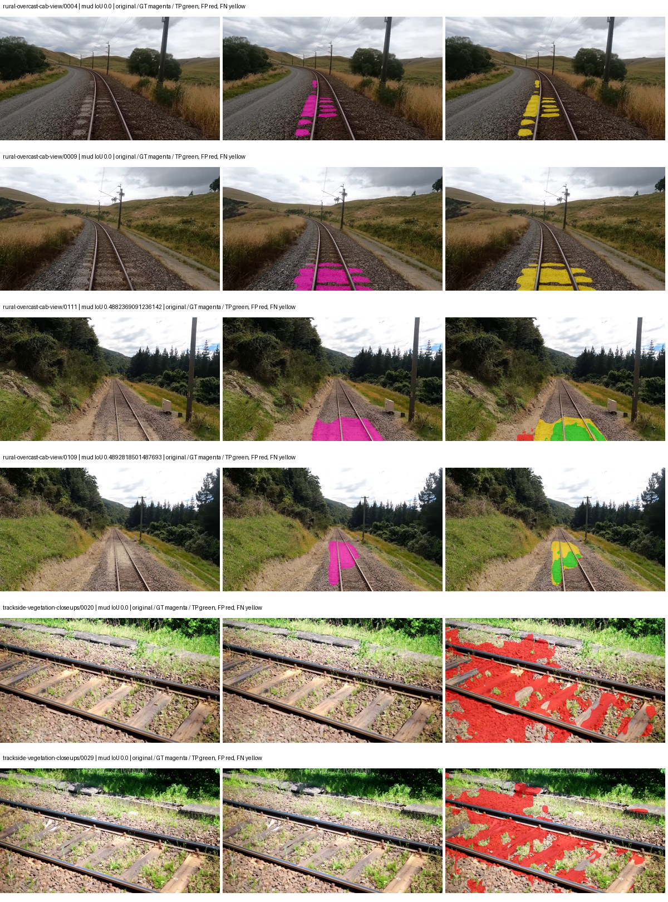
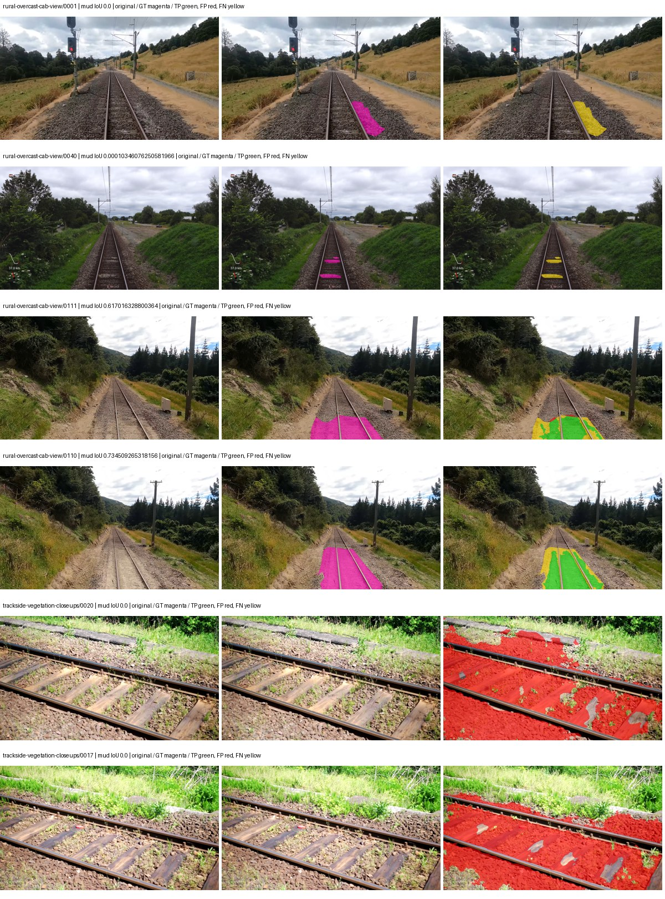
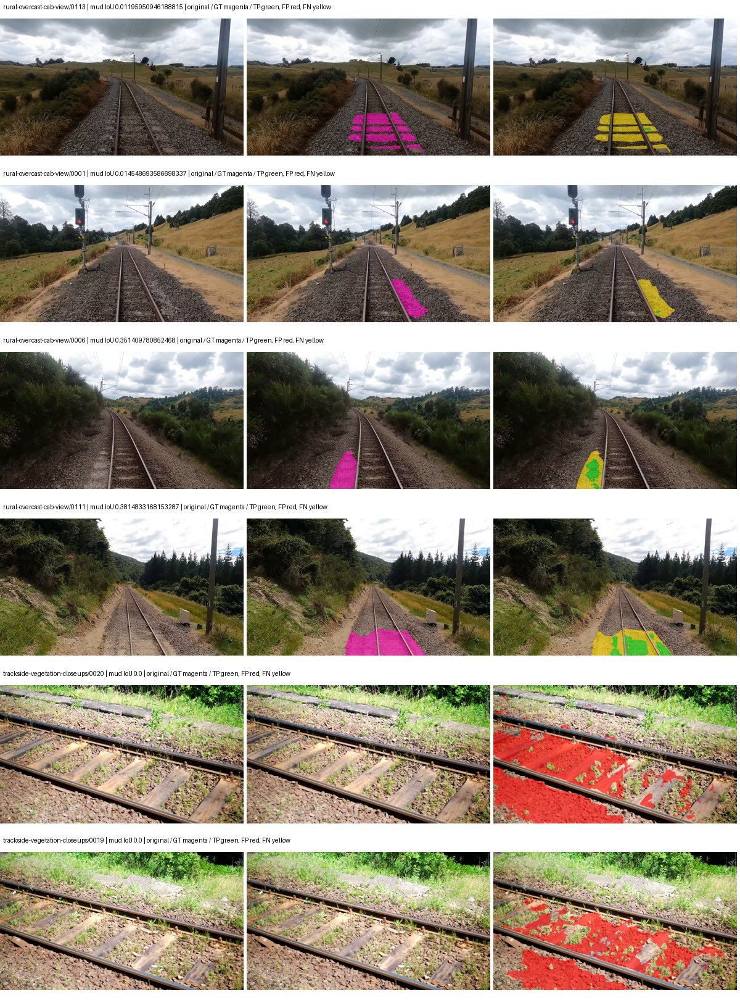
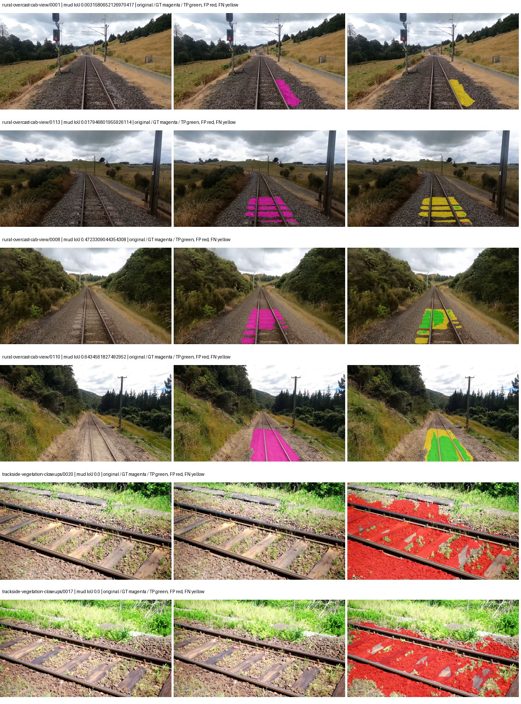

# segformer_b5 — rad_9_24_2026-fixed-grouped

[RAD 9/24: Scene-grouped split](../../README.md) · [Full model records](record.json)

Primary selection and early stopping: **mud-pumping validation IoU, pixels pooled over all validation images**. A job is complete only after full statistics and isolated profiling are verified.

Study metrics, counting each class only on the validation images that contain it: mud-pumping IoU is the mean per-image IoU over the images with mud-pumping, precision and recall sum pixels over those images, and mIoU averages each class over the images that contain it, then over the classes present.

| Initialization path | Seed | Mud-pumping IoU, train-camera images with mud (%, n=17) | Mud-pumping IoU, all images with mud (%, n=18) | Mud precision, all images with mud (%) | Mud recall, all images with mud (%) | mIoU (each class over images that contain it) (%) |
| --- | --- | --- | --- | --- | --- | --- |
| rtis_only | 0 | 12.44 | 11.91 | 42.03 | 16.14 | 37.20 |
| cityscapes_to_rtis | 0 | 22.79 | 21.60 | 27.30 | 29.88 | 39.80 |
| railsem19_to_rtis | 0 | 14.29 | 13.64 | 38.85 | 15.44 | 47.62 |
| cityscapes_to_railsem19_to_rtis | 0 | 22.59 | 21.44 | 33.97 | 27.37 | 44.38 |

Per-class IoU: IoU (%) of every class, each averaged only over the validation images that contain the class (n = those images); — = no image contains it. mIoU averages the classes with at least one such image.

| Initialization path | Seed | mIoU (each class over images that contain it) | person (n=0) | truck (n=0) | rail-track (n=37) | vegetation-overgrowth (n=13) | car (n=3) | on-rails (n=0) | traffic-sign (n=9) | road (n=11) | sidewalk (n=12) | construction (n=12) | tram-track (n=2) | pole (n=21) | traffic-light (n=3) | mud-pumping (n=18) | fence (n=7) | terrain (n=35) | sky (n=28) | rail-embedded (n=3) | rail-raised (n=37) | trackbed (n=37) | standing-water (n=9) |
| --- | --- | --- | --- | --- | --- | --- | --- | --- | --- | --- | --- | --- | --- | --- | --- | --- | --- | --- | --- | --- | --- | --- | --- |
| rtis_only | 0 | 37.20 | — | — | 55.73 | 35.01 | 15.74 | — | 19.72 | 9.31 | 13.99 | 42.08 | 7.59 | 67.69 | 39.60 | 11.91 | 5.46 | 88.22 | 96.58 | 18.96 | 72.61 | 63.04 | 6.34 |
| cityscapes_to_rtis | 0 | 39.80 | — | — | 52.60 | 29.37 | 35.92 | — | 29.84 | 13.33 | 11.52 | 31.85 | 23.29 | 69.81 | 44.58 | 21.60 | 18.34 | 86.22 | 96.61 | 16.65 | 72.75 | 55.20 | 6.97 |
| railsem19_to_rtis | 0 | 47.62 | — | — | 61.60 | 41.03 | 35.71 | — | 46.93 | 17.13 | 16.69 | 56.43 | 48.26 | 73.95 | 46.52 | 13.64 | 30.59 | 87.39 | 96.76 | 40.87 | 74.72 | 64.98 | 3.99 |
| cityscapes_to_railsem19_to_rtis | 0 | 44.38 | — | — | 57.87 | 42.88 | 36.17 | — | 40.24 | 11.57 | 9.47 | 30.38 | 33.50 | 72.27 | 46.18 | 21.44 | 27.55 | 87.17 | 96.74 | 35.98 | 75.12 | 64.37 | 9.88 |

Everything below is the campaign's own record, with pixels pooled over all validation images (the checkpoint was selected on that pooled mud IoU).

| Model | Initialization path | Seed | Status | Steps | Best step | Mud IoU, pixels pooled (%) | Mud precision, pixels pooled (%) | Mud recall, pixels pooled (%) | Final mud IoU (trainer val, pixels pooled, %) | mIoU, pixels pooled (%) | Fixed GT-class mIoU, pixels pooled (%) |
| --- | --- | --- | --- | --- | --- | --- | --- | --- | --- | --- | --- |
| segformer_b5 | rtis_only | 0 | completed | 2333 | 1037 | 5.19 | 7.12 | 16.14 | 1.06 | 35.71 | 41.66 |
| segformer_b5 | cityscapes_to_rtis | 0 | completed | 4000 | 2851 | 4.69 | 5.27 | 29.88 | 4.44 | 39.76 | 44.18 |
| segformer_b5 | railsem19_to_rtis | 0 | completed | 4000 | 2851 | 5.60 | 8.07 | 15.44 | 4.25 | 46.16 | 53.85 |
| segformer_b5 | cityscapes_to_railsem19_to_rtis | 0 | completed | 4000 | 2851 | 5.02 | 5.79 | 27.37 | 4.85 | 45.26 | 50.29 |

Training: 217 images. Validation: 37 images. Test: 60 held out. Seeds: [0]. Seed variation measures optimization variability, not independent-recording uncertainty. Historical source checkpoints stay fixed across adaptation seeds.

Training code: `d864b72bd90706260965bb1a48398d01167b6d5c`. Split SHA-256: `12d7b367c72cda61d57686ff2ac28223530d0af49debd9fb7a0fbc68b908bc93`.

## rtis_only — seed 0

Status: **completed**. Started: 2026-10-05T20:55:02.885975+00:00. Finished: 2026-10-05T22:00:05.361082+00:00.

Recipe pretrained initializer: `nvidia/mit-b5`.

`rtis_only` uses the recipe initializer, which may include pretrained segmentation components. Transfer paths load the exact historical source checkpoint below and reset the classifier; they do not reset all query/decoder features.

Source checkpoint: `Recipe pretrained initialization`.

Config SHA-256: `a35229748833d769785ee6d310027a58a3a0de1480757096920ebddfa5f0785b`. Weights used for validation: `raw`.

### Mud-pumping and aggregate quality

| Metric | Selected checkpoint | Final training validation |
| --- | --- | --- |
| Mud IoU | 5.19 | 1.06 |
| Mud precision | 7.12 | 1.34 |
| Mud recall | 16.14 | 4.89 |
| Mud Dice/F1 | 9.88 | 2.10 |
| mIoU | 35.71 | 36.93 |
| Mean accuracy | 49.70 | 52.95 |
| Mean precision | 54.52 | 53.49 |
| Mean Dice | 45.03 | 46.37 |
| Mean specificity | 99.09 | 99.09 |
| Pixel accuracy | 84.82 | 84.36 |
| Frequency-weighted IoU | 76.63 | 77.55 |
| Fixed GT-present class mIoU | 41.66 | 43.08 |
| Boundary F1 | 43.52 | 42.84 |

The selected checkpoint has independent evaluation evidence. Final values are the trainer's final validation record, not a new independent evaluation. mIoU averages classes with nonzero union, so false positives on absent classes can change its denominator. The fixed GT-class mean is supplementary and excludes absent classes; their false positives remain in the confusion matrix.

### Resource usage and timing

| Measurement | Value |
| --- | --- |
| Peak training VRAM, retained training invocation (GiB) | 16.31 |
| Peak evaluation VRAM (GiB) | 7.78 |
| Retained training invocation wall time (seconds) | 3597.05 |
| Retained training invocation GPU-hours (one GPU) | 1.00 |
| Evaluation wall time (seconds) | 28.26 |
| Full evaluation pipeline images/second | 1.31 |
| Best full-state checkpoint (MiB) | 1292.96 |
| Final full-state checkpoint (MiB) | 1292.91 |
| Verified periodic checkpoints removed (GiB) | 5.05 |

VRAM uses the recorded allocator high-water mark; it is not total device usage including CUDA context. Resumed jobs' retained training invocation times and peaks are **not whole-campaign totals**. Earlier invocation resource records are not reconstructed here. Evaluation throughput includes loader, sliding-window inference and metrics; it is not model-only latency/FPS. Missing measurements are shown as —, never inferred from another dataset's run.

### Standardized inference performance

Dedicated model-only profiling waits for an idle worker-locked L40S: BF16, batch 1, 1024x1024, 20 warmup and 100 CUDA-event-timed public forwards. It excludes loading, preprocessing, tiling and metrics.

| Status | Parameters | Weight MiB | FPS | p50 ms | p95 ms | Peak reserved GiB |
| --- | --- | --- | --- | --- | --- | --- |
| complete | 84609493 | 322.76 | 27.84 | 35.78 | 36.72 | 2.57 |

```json
{
  "schema_version": 1,
  "model_id": "segformer_b5",
  "measured_at": "2026-10-05T21:59:57+00:00",
  "status": "complete",
  "benchmark_scope": "rtis_selected_checkpoint_model_only",
  "applies_to": [
    "segformer_b5--rtis_only--seed-0"
  ],
  "source": {
    "campaign_git_sha": "d864b72bd90706260965bb1a48398d01167b6d5c",
    "git_dirty": false,
    "config_hash": "03207a3000b0",
    "resolved_config": "/data/izadia1/projects/segmentary-runs/rad_9_24_2026/fixed-grouped-seed0-20261005-r2/configs/segformer_b5--rtis_only--seed-0.yaml",
    "config_sha256": "a35229748833d769785ee6d310027a58a3a0de1480757096920ebddfa5f0785b",
    "checkpoint_sha256": "3c0a83685bed088a6a0cd5745f763da98c5de1d4fe80d094c1118cc5ba17e60b",
    "checkpoint_global_step": 1037,
    "checkpoint_bytes": 1355767993,
    "checkpoint_kind": "resume checkpoint with optimizer and EMA state",
    "weights": "raw",
    "measured_checkpoint_job_id": "segformer_b5--rtis_only--seed-0",
    "result_sha256": "c6e92f5cd07d070de0f5afc0749bf51e99f0d7d902cbc549b97e8223d0cd5590",
    "result_git_sha": "d864b72bd90706260965bb1a48398d01167b6d5c",
    "result_stage": "eval:rad_9_24_2026-fixed-grouped:val",
    "result_seed": 0
  },
  "hardware": {
    "gpu_name": "NVIDIA L40S",
    "gpu_uuid": "GPU-804aea8b-5f62-423e-72c6-49e1ed15c4e4",
    "logical_device": "cuda:0",
    "physical_visibility_token": "6",
    "compute_capability": [
      8,
      9
    ],
    "total_memory_bytes": 47677177856
  },
  "model": {
    "parameter_count": 84609493,
    "trainable_parameter_count": 84609493,
    "resident_parameter_bytes": 338437972,
    "parameter_dtype_counts": {
      "float32": 84609493
    }
  },
  "contract": {
    "backend": "pytorch",
    "precision": "bf16_autocast",
    "batch_size": 1,
    "input_shape_nchw": [
      1,
      3,
      1024,
      1024
    ],
    "warmup_iterations": 20,
    "measured_iterations": 100,
    "timing": "per-forward CUDA events with end-event synchronization",
    "includes_preprocessing": false,
    "includes_data_loader": false,
    "includes_sliding_window": false,
    "input_resident_on_gpu": true,
    "model_only": true,
    "entrypoint": "public model(image) dense-logits forward"
  },
  "measurements": {
    "latency": {
      "p50_ms": 35.78265571594238,
      "p95_ms": 36.722021484375,
      "mean_ms": 35.91371692657471,
      "minimum_ms": 35.557376861572266,
      "maximum_ms": 38.68672180175781,
      "fps": 27.84451417391554,
      "raw_ms": [
        35.983360290527344,
        35.716094970703125,
        35.87788772583008,
        35.6126708984375,
        36.129791259765625,
        36.8455696105957,
        36.715518951416016,
        35.77033615112305,
        35.68844985961914,
        35.86867141723633,
        35.734527587890625,
        35.789825439453125,
        35.69152069091797,
        35.580928802490234,
        35.704830169677734,
        35.699710845947266,
        35.86048126220703,
        38.68672180175781,
        35.871742248535156,
        35.6577262878418,
        35.884033203125,
        35.79596710205078,
        35.738624572753906,
        35.76115036010742,
        35.88300704956055,
        36.27212905883789,
        35.750911712646484,
        35.72428894042969,
        35.79289627075195,
        36.29568099975586,
        35.963905334472656,
        35.62905502319336,
        35.80003356933594,
        35.7130241394043,
        35.67206573486328,
        35.710975646972656,
        35.739646911621094,
        35.74272155761719,
        35.65776062011719,
        35.773441314697266,
        35.77958297729492,
        36.192256927490234,
        36.16563034057617,
        35.773441314697266,
        35.727359771728516,
        35.683326721191406,
        35.72428894042969,
        35.789825439453125,
        35.73350524902344,
        35.68844985961914,
        36.27008056640625,
        36.42777633666992,
        35.60345458984375,
        36.561920166015625,
        37.25414276123047,
        35.82156753540039,
        36.194305419921875,
        35.82566452026367,
        35.86457443237305,
        35.68537521362305,
        35.78470230102539,
        35.86048126220703,
        35.608577728271484,
        35.88300704956055,
        35.78163146972656,
        36.87321472167969,
        35.90553665161133,
        35.75395202636719,
        35.6945915222168,
        35.799041748046875,
        35.716094970703125,
        35.72633743286133,
        35.769344329833984,
        35.64851379394531,
        35.7130241394043,
        35.557376861572266,
        35.681278228759766,
        35.99052810668945,
        35.743743896484375,
        35.90143966674805,
        35.94035339355469,
        35.85023880004883,
        35.773441314697266,
        35.65260696411133,
        35.90041732788086,
        35.68025588989258,
        35.83180618286133,
        35.7836799621582,
        35.989505767822266,
        35.89836883544922,
        35.79801559448242,
        35.70278549194336,
        35.950592041015625,
        37.08927917480469,
        36.53529739379883,
        35.736576080322266,
        35.716094970703125,
        35.93318557739258,
        35.75398254394531,
        35.90857696533203
      ],
      "percentile_method": "numpy linear interpolation"
    },
    "peak_reserved_bytes": 2755657728,
    "memory_kind": "pytorch_cuda_allocator_peak_reserved_excluding_context",
    "benchmark_wall_clock_s": 7.507670857012272
  },
  "started_at": "2026-10-05T21:59:49+00:00",
  "finished_at": "2026-10-05T21:59:57+00:00",
  "environment": {
    "hostname": "hdrfs-app-001",
    "python": "3.11.15",
    "platform": "Linux-5.15.0-139-generic-x86_64-with-glibc2.35",
    "torch": "2.11.0+cu128",
    "torch_cuda": "12.8",
    "cudnn": 91900,
    "driver_version": "570.133.20",
    "cuda_available": true,
    "gpu_count": 1,
    "gpu_names": [
      "NVIDIA L40S"
    ],
    "cuda_visible_devices": "6",
    "packages": {
      "segmentary": "0.1.0",
      "torch": "2.11.0+cu128",
      "torchvision": "0.26.0+cu128",
      "transformers": "5.15.0",
      "timm": "1.0.28",
      "segmentation-models-pytorch": "0.5.0",
      "albumentations": "2.0.8",
      "lightning": "2.6.5",
      "numpy": "2.4.4"
    }
  }
}
```

### Per-class validation results

| Class | GT pixels | IoU (%) | Precision (%) | Recall (%) | Dice (%) | Boundary F1 (%) |
| --- | --- | --- | --- | --- | --- | --- |
| car | 29664 | 24.92 | 51.90 | 32.40 | 39.90 | 41.44 |
| construction | 311585 | 57.25 | 68.70 | 77.45 | 72.81 | 68.00 |
| fence | 265137 | 2.70 | 64.29 | 2.75 | 5.27 | 18.75 |
| mud-pumping | 1226250 | 5.19 | 7.12 | 16.14 | 9.88 | 7.55 |
| on-rails | 0 | 0.00 | 0.00 | — | 0.00 | 0.00 |
| person | 0 | 0.00 | 0.00 | — | 0.00 | 0.00 |
| pole | 628038 | 71.07 | 82.38 | 83.82 | 83.09 | 89.13 |
| rail-embedded | 16799 | 31.11 | 67.16 | 36.69 | 47.46 | 44.15 |
| rail-raised | 2969797 | 72.13 | 79.75 | 88.30 | 83.81 | 89.87 |
| rail-track | 6323197 | 37.29 | 75.26 | 42.49 | 54.32 | 48.09 |
| road | 1048831 | 6.34 | 32.53 | 7.30 | 11.93 | 15.10 |
| sidewalk | 1297367 | 44.58 | 89.69 | 46.99 | 61.67 | 15.05 |
| sky | 19121606 | 98.74 | 99.36 | 99.37 | 99.37 | 96.81 |
| standing-water | 95802 | 6.24 | 12.79 | 10.87 | 11.75 | 24.68 |
| terrain | 39239306 | 90.38 | 91.73 | 98.40 | 94.94 | 73.57 |
| trackbed | 10643081 | 57.09 | 64.36 | 83.48 | 72.68 | 54.71 |
| traffic-light | 19510 | 69.63 | 89.10 | 76.11 | 82.09 | 89.84 |
| traffic-sign | 13285 | 33.48 | 68.17 | 39.68 | 50.16 | 61.65 |
| tram-track | 56179 | 6.80 | 10.58 | 16.02 | 12.74 | 14.02 |
| truck | 0 | 0.00 | 0.00 | — | 0.00 | 0.00 |
| vegetation-overgrowth | 5901821 | 34.94 | 89.98 | 36.35 | 51.78 | 61.53 |

### Full-run accounting

| Measurement | Value |
| --- | --- |
| Full GPU-reserved wall seconds, all recorded worker attempts | 3909.95 |
| Full reserved GPU-hours | 1.09 |
| Whole-run timing complete | True |

| Phase | Wall seconds including failed attempts |
| --- | --- |
| training | 3603.65 |
| diagnostics | 235.93 |
| performance | 17.14 |

GPU-reserved time includes model loading, training, validation, collection, profiling, checkpoint I/O and orchestration while the worker owns one GPU. It is not GPU kernel-active time. Phase timings and sampled device memory/power/utilization are retained separately; sampled device memory is not the allocator high-water mark.

### Train/validation and raw/EMA diagnostics

| Checkpoint / weights / split | Images | Mud IoU (%) | Mud precision (%) | Mud recall (%) |
| --- | --- | --- | --- | --- |
| best-auto-train / raw | 217 | 95.56 | 98.44 | 97.03 |
| best-auto-val / raw | 37 | 5.19 | 7.12 | 16.14 |
| best-alternate-val / ema | 37 | 2.06 | 2.52 | 10.21 |
| final-auto-val / raw | 37 | 1.06 | 1.34 | 4.90 |

Train uses the evaluation transform without augmentation. Compare mud train/validation metrics for the same selected weights. Alternate EMA on running-stat BatchNorm is explicitly uncalibrated and is diagnostic only. Score-threshold curves use uncalibrated normalized scores and are pixel-level diagnostics, not event detection rates or a selected deployment operating point.

### Downloadable evidence

- best-auto-train: [per-image.csv](rtis_only--seed-0/best-auto-train/per-image.csv) · [per-image-confusion.json.gz](rtis_only--seed-0/best-auto-train/per-image-confusion.json.gz) · [groups.json](rtis_only--seed-0/best-auto-train/groups.json) · [mud-score-curves.json](rtis_only--seed-0/best-auto-train/mud-score-curves.json)
- best-auto-val: [per-image.csv](rtis_only--seed-0/best-auto-val/per-image.csv) · [per-image-confusion.json.gz](rtis_only--seed-0/best-auto-val/per-image-confusion.json.gz) · [groups.json](rtis_only--seed-0/best-auto-val/groups.json) · [mud-score-curves.json](rtis_only--seed-0/best-auto-val/mud-score-curves.json) · [examples.jpg](rtis_only--seed-0/best-auto-val/examples.jpg)
- best-alternate-val: [per-image.csv](rtis_only--seed-0/best-alternate-val/per-image.csv) · [per-image-confusion.json.gz](rtis_only--seed-0/best-alternate-val/per-image-confusion.json.gz) · [groups.json](rtis_only--seed-0/best-alternate-val/groups.json) · [mud-score-curves.json](rtis_only--seed-0/best-alternate-val/mud-score-curves.json)
- final-auto-val: [per-image.csv](rtis_only--seed-0/final-auto-val/per-image.csv) · [per-image-confusion.json.gz](rtis_only--seed-0/final-auto-val/per-image-confusion.json.gz) · [groups.json](rtis_only--seed-0/final-auto-val/groups.json) · [mud-score-curves.json](rtis_only--seed-0/final-auto-val/mud-score-curves.json)
- resources: [telemetry.csv](rtis_only--seed-0/resources/telemetry.csv)



Examples are two lowest and two highest mud-IoU positive images, plus up to two negative images with the most false-positive mud pixels. They are targeted diagnostic examples, not random samples. Green: true positive; red: false positive; yellow: false negative. Full predictions remain on HDRFS.

### Validation tracking

| Logged step | Overall mIoU (%) | Mud IoU (%) |
| --- | --- | --- |
| 258 | 25.99 | 0.49 |
| 518 | 35.84 | 1.67 |
| 777 | 36.52 | 1.79 |
| 1036 | 35.71 | 5.20 |
| 1295 | 35.26 | 0.81 |
| 1555 | 36.28 | 0.51 |
| 1814 | 37.36 | 2.74 |
| 2073 | 35.01 | 2.54 |
| 2332 | 36.93 | 1.06 |

All retained scalar curves, including training loss and per-class IoU, are in record.json. Observed best mud on a curve is not necessarily a retained checkpoint: the pilot saved its selection-metric-best and final checkpoints. Step logging and checkpoint global_step may differ by one.

### Stopping and checkpoint provenance

```json
{
  "stopping": {
    "actual_steps": 2333,
    "maximum_steps": 4000,
    "min_delta": 0.001,
    "monitor": "val_iou/mud-pumping",
    "patience": 5,
    "reason": "validation_plateau"
  },
  "checkpoints": {
    "best": {
      "path": "/data/izadia1/projects/segmentary-runs/rad_9_24_2026/fixed-grouped-seed0-20261005-r2/future-runs/segformer_b5--rtis_only--seed-0_seed0/rtis/best.ckpt",
      "sha256": "3c0a83685bed088a6a0cd5745f763da98c5de1d4fe80d094c1118cc5ba17e60b",
      "global_step": 1037,
      "bytes": 1355767993
    },
    "final": {
      "path": "/data/izadia1/projects/segmentary-runs/rad_9_24_2026/fixed-grouped-seed0-20261005-r2/future-runs/segformer_b5--rtis_only--seed-0_seed0/rtis/last.ckpt",
      "sha256": "7082ed2df15771f0fcbd54d2c796b180c3891f01e3a253d9bfb342fbbebecaf1",
      "global_step": 2333,
      "bytes": 1355711929
    }
  },
  "cleanup_error": null
}
```

### Resolved training, initialization and evaluation settings

The optimizer block is the base configuration. Stage LR scales are applied at runtime, and stage warmup is capped at min(base warmup, floor(stage budget / 10), stage budget - 1): 400 steps for this 4,000-step pilot. Model-internal native input grids may differ from augmentation crops (EoMT uses its 640 grid).

```json
{
  "name": "segformer_b5--rtis_only--seed-0",
  "model": {
    "arch": "segformer_b5",
    "checkpoint": "nvidia/mit-b5",
    "tuning": "full",
    "head": "unified_head",
    "lora_r": 16,
    "lora_alpha": 32,
    "lora_dropout": 0.05,
    "lora_targets": [],
    "drop_path": null,
    "revision": null,
    "subfolder": null,
    "local_files_only": false,
    "trust_remote_code": false,
    "backbone_path": null,
    "head_paths": [],
    "classifier_path": null,
    "inactive_parameter_paths": [],
    "smp_arch": null,
    "encoder_name": null,
    "encoder_weights": null,
    "native": null,
    "batch_norm_momentum": null
  },
  "space": "paul-test-rtis",
  "taxonomy_root": "/data/izadia1/projects/segmentary-rad-d864b72b/taxonomy",
  "output_root": "/data/izadia1/projects/segmentary-runs/rad_9_24_2026/fixed-grouped-seed0-20261005-r2/future-runs",
  "optim": {
    "backbone_lr": 6e-05,
    "head_lr_mult": 10.0,
    "weight_decay": 0.05,
    "llrd": 1.0,
    "warmup_iters": 1500,
    "warmup_ratio": 1e-06,
    "poly_power": 0.9,
    "min_lr_ratio": 0.0,
    "betas": [
      0.9,
      0.999
    ],
    "grad_clip": 1.0
  },
  "train": {
    "iters": 4000,
    "batch_size": 2,
    "accum": 8,
    "num_workers": 2,
    "precision": "bf16-mixed",
    "ema_decay": 0.9998,
    "val_every": 250,
    "ckpt_every": 500,
    "selection_metric": "val_iou/mud-pumping",
    "early_stopping_patience": 5,
    "early_stopping_min_delta": 0.001,
    "seed": 0,
    "devices": 1
  },
  "eval": {
    "sliding_window": true,
    "window": [
      1024,
      1024
    ],
    "stride": [
      768,
      768
    ],
    "batch_size": 1,
    "num_workers": 2,
    "tta_scales": [],
    "tta_flip": false,
    "threshold": 0.5,
    "boundary_tolerance_frac": 0.0075,
    "save_confusion": true
  },
  "loss": {
    "task": "multiclass",
    "activation": "auto",
    "terms": [],
    "aux": "none",
    "aux_weight": 0.0,
    "ce_weight": 1.0,
    "label_smoothing": 0.0,
    "class_weights": null,
    "query": null
  },
  "aug": {
    "crop": [
      1024,
      1024
    ],
    "scale_min": 0.5,
    "scale_max": 2.0,
    "hflip_p": 0.5,
    "color_jitter_p": 0.5,
    "brightness": 0.25,
    "contrast": 0.25,
    "saturation": 0.25,
    "hue": 0.05
  },
  "stages": [
    {
      "name": "rtis",
      "data": [
        {
          "name": "rad_9_24_2026-fixed-grouped",
          "root": "/data/izadia1/datasets/rad_9_24_2026-fixed-grouped",
          "variant": null,
          "split_file": "splits.json",
          "train_split": "train",
          "val_split": "val",
          "limit": null,
          "loader": "folder",
          "mapping": "paul-test-rtis",
          "loader_options": {
            "require_groups": true
          }
        }
      ],
      "iters": null,
      "lr_scale": 1.0,
      "head_group_lr_scale": 1.0,
      "init_from": "pretrained",
      "reset_head": false,
      "freeze": null,
      "sample_weights": null
    }
  ]
}
```

### Hardware and software provenance

```json
{
  "training": {
    "cuda_available": true,
    "cuda_visible_devices": "6",
    "cudnn": 91900,
    "driver_version": "570.133.20",
    "gpu_count": 1,
    "gpu_names": [
      "NVIDIA L40S"
    ],
    "hostname": "hdrfs-app-001",
    "input_normalization": {
      "channel_order": "rgb",
      "mean": [
        0.485,
        0.456,
        0.406
      ],
      "source": "imagenet",
      "std": [
        0.229,
        0.224,
        0.225
      ]
    },
    "model_origins": [
      {
        "hf_commit": "40357155205b036cf11b61f132d53d2f8861f170",
        "hf_name_or_path": "nvidia/mit-b5",
        "module": "model",
        "timm_pretrained": {}
      },
      {
        "hf_commit": "40357155205b036cf11b61f132d53d2f8861f170",
        "hf_name_or_path": "nvidia/mit-b5",
        "module": "model.segformer",
        "timm_pretrained": {}
      },
      {
        "hf_commit": "40357155205b036cf11b61f132d53d2f8861f170",
        "hf_name_or_path": "nvidia/mit-b5",
        "module": "model.segformer.stages.0.blocks.0.attention",
        "timm_pretrained": {}
      },
      {
        "hf_commit": "40357155205b036cf11b61f132d53d2f8861f170",
        "hf_name_or_path": "nvidia/mit-b5",
        "module": "model.segformer.stages.0.blocks.1.attention",
        "timm_pretrained": {}
      },
      {
        "hf_commit": "40357155205b036cf11b61f132d53d2f8861f170",
        "hf_name_or_path": "nvidia/mit-b5",
        "module": "model.segformer.stages.0.blocks.2.attention",
        "timm_pretrained": {}
      },
      {
        "hf_commit": "40357155205b036cf11b61f132d53d2f8861f170",
        "hf_name_or_path": "nvidia/mit-b5",
        "module": "model.segformer.stages.1.blocks.0.attention",
        "timm_pretrained": {}
      },
      {
        "hf_commit": "40357155205b036cf11b61f132d53d2f8861f170",
        "hf_name_or_path": "nvidia/mit-b5",
        "module": "model.segformer.stages.1.blocks.1.attention",
        "timm_pretrained": {}
      },
      {
        "hf_commit": "40357155205b036cf11b61f132d53d2f8861f170",
        "hf_name_or_path": "nvidia/mit-b5",
        "module": "model.segformer.stages.1.blocks.2.attention",
        "timm_pretrained": {}
      },
      {
        "hf_commit": "40357155205b036cf11b61f132d53d2f8861f170",
        "hf_name_or_path": "nvidia/mit-b5",
        "module": "model.segformer.stages.1.blocks.3.attention",
        "timm_pretrained": {}
      },
      {
        "hf_commit": "40357155205b036cf11b61f132d53d2f8861f170",
        "hf_name_or_path": "nvidia/mit-b5",
        "module": "model.segformer.stages.1.blocks.4.attention",
        "timm_pretrained": {}
      },
      {
        "hf_commit": "40357155205b036cf11b61f132d53d2f8861f170",
        "hf_name_or_path": "nvidia/mit-b5",
        "module": "model.segformer.stages.1.blocks.5.attention",
        "timm_pretrained": {}
      },
      {
        "hf_commit": "40357155205b036cf11b61f132d53d2f8861f170",
        "hf_name_or_path": "nvidia/mit-b5",
        "module": "model.segformer.stages.2.blocks.0.attention",
        "timm_pretrained": {}
      },
      {
        "hf_commit": "40357155205b036cf11b61f132d53d2f8861f170",
        "hf_name_or_path": "nvidia/mit-b5",
        "module": "model.segformer.stages.2.blocks.1.attention",
        "timm_pretrained": {}
      },
      {
        "hf_commit": "40357155205b036cf11b61f132d53d2f8861f170",
        "hf_name_or_path": "nvidia/mit-b5",
        "module": "model.segformer.stages.2.blocks.2.attention",
        "timm_pretrained": {}
      },
      {
        "hf_commit": "40357155205b036cf11b61f132d53d2f8861f170",
        "hf_name_or_path": "nvidia/mit-b5",
        "module": "model.segformer.stages.2.blocks.3.attention",
        "timm_pretrained": {}
      },
      {
        "hf_commit": "40357155205b036cf11b61f132d53d2f8861f170",
        "hf_name_or_path": "nvidia/mit-b5",
        "module": "model.segformer.stages.2.blocks.4.attention",
        "timm_pretrained": {}
      },
      {
        "hf_commit": "40357155205b036cf11b61f132d53d2f8861f170",
        "hf_name_or_path": "nvidia/mit-b5",
        "module": "model.segformer.stages.2.blocks.5.attention",
        "timm_pretrained": {}
      },
      {
        "hf_commit": "40357155205b036cf11b61f132d53d2f8861f170",
        "hf_name_or_path": "nvidia/mit-b5",
        "module": "model.segformer.stages.2.blocks.6.attention",
        "timm_pretrained": {}
      },
      {
        "hf_commit": "40357155205b036cf11b61f132d53d2f8861f170",
        "hf_name_or_path": "nvidia/mit-b5",
        "module": "model.segformer.stages.2.blocks.7.attention",
        "timm_pretrained": {}
      },
      {
        "hf_commit": "40357155205b036cf11b61f132d53d2f8861f170",
        "hf_name_or_path": "nvidia/mit-b5",
        "module": "model.segformer.stages.2.blocks.8.attention",
        "timm_pretrained": {}
      },
      {
        "hf_commit": "40357155205b036cf11b61f132d53d2f8861f170",
        "hf_name_or_path": "nvidia/mit-b5",
        "module": "model.segformer.stages.2.blocks.9.attention",
        "timm_pretrained": {}
      },
      {
        "hf_commit": "40357155205b036cf11b61f132d53d2f8861f170",
        "hf_name_or_path": "nvidia/mit-b5",
        "module": "model.segformer.stages.2.blocks.10.attention",
        "timm_pretrained": {}
      },
      {
        "hf_commit": "40357155205b036cf11b61f132d53d2f8861f170",
        "hf_name_or_path": "nvidia/mit-b5",
        "module": "model.segformer.stages.2.blocks.11.attention",
        "timm_pretrained": {}
      },
      {
        "hf_commit": "40357155205b036cf11b61f132d53d2f8861f170",
        "hf_name_or_path": "nvidia/mit-b5",
        "module": "model.segformer.stages.2.blocks.12.attention",
        "timm_pretrained": {}
      },
      {
        "hf_commit": "40357155205b036cf11b61f132d53d2f8861f170",
        "hf_name_or_path": "nvidia/mit-b5",
        "module": "model.segformer.stages.2.blocks.13.attention",
        "timm_pretrained": {}
      },
      {
        "hf_commit": "40357155205b036cf11b61f132d53d2f8861f170",
        "hf_name_or_path": "nvidia/mit-b5",
        "module": "model.segformer.stages.2.blocks.14.attention",
        "timm_pretrained": {}
      },
      {
        "hf_commit": "40357155205b036cf11b61f132d53d2f8861f170",
        "hf_name_or_path": "nvidia/mit-b5",
        "module": "model.segformer.stages.2.blocks.15.attention",
        "timm_pretrained": {}
      },
      {
        "hf_commit": "40357155205b036cf11b61f132d53d2f8861f170",
        "hf_name_or_path": "nvidia/mit-b5",
        "module": "model.segformer.stages.2.blocks.16.attention",
        "timm_pretrained": {}
      },
      {
        "hf_commit": "40357155205b036cf11b61f132d53d2f8861f170",
        "hf_name_or_path": "nvidia/mit-b5",
        "module": "model.segformer.stages.2.blocks.17.attention",
        "timm_pretrained": {}
      },
      {
        "hf_commit": "40357155205b036cf11b61f132d53d2f8861f170",
        "hf_name_or_path": "nvidia/mit-b5",
        "module": "model.segformer.stages.2.blocks.18.attention",
        "timm_pretrained": {}
      },
      {
        "hf_commit": "40357155205b036cf11b61f132d53d2f8861f170",
        "hf_name_or_path": "nvidia/mit-b5",
        "module": "model.segformer.stages.2.blocks.19.attention",
        "timm_pretrained": {}
      },
      {
        "hf_commit": "40357155205b036cf11b61f132d53d2f8861f170",
        "hf_name_or_path": "nvidia/mit-b5",
        "module": "model.segformer.stages.2.blocks.20.attention",
        "timm_pretrained": {}
      },
      {
        "hf_commit": "40357155205b036cf11b61f132d53d2f8861f170",
        "hf_name_or_path": "nvidia/mit-b5",
        "module": "model.segformer.stages.2.blocks.21.attention",
        "timm_pretrained": {}
      },
      {
        "hf_commit": "40357155205b036cf11b61f132d53d2f8861f170",
        "hf_name_or_path": "nvidia/mit-b5",
        "module": "model.segformer.stages.2.blocks.22.attention",
        "timm_pretrained": {}
      },
      {
        "hf_commit": "40357155205b036cf11b61f132d53d2f8861f170",
        "hf_name_or_path": "nvidia/mit-b5",
        "module": "model.segformer.stages.2.blocks.23.attention",
        "timm_pretrained": {}
      },
      {
        "hf_commit": "40357155205b036cf11b61f132d53d2f8861f170",
        "hf_name_or_path": "nvidia/mit-b5",
        "module": "model.segformer.stages.2.blocks.24.attention",
        "timm_pretrained": {}
      },
      {
        "hf_commit": "40357155205b036cf11b61f132d53d2f8861f170",
        "hf_name_or_path": "nvidia/mit-b5",
        "module": "model.segformer.stages.2.blocks.25.attention",
        "timm_pretrained": {}
      },
      {
        "hf_commit": "40357155205b036cf11b61f132d53d2f8861f170",
        "hf_name_or_path": "nvidia/mit-b5",
        "module": "model.segformer.stages.2.blocks.26.attention",
        "timm_pretrained": {}
      },
      {
        "hf_commit": "40357155205b036cf11b61f132d53d2f8861f170",
        "hf_name_or_path": "nvidia/mit-b5",
        "module": "model.segformer.stages.2.blocks.27.attention",
        "timm_pretrained": {}
      },
      {
        "hf_commit": "40357155205b036cf11b61f132d53d2f8861f170",
        "hf_name_or_path": "nvidia/mit-b5",
        "module": "model.segformer.stages.2.blocks.28.attention",
        "timm_pretrained": {}
      },
      {
        "hf_commit": "40357155205b036cf11b61f132d53d2f8861f170",
        "hf_name_or_path": "nvidia/mit-b5",
        "module": "model.segformer.stages.2.blocks.29.attention",
        "timm_pretrained": {}
      },
      {
        "hf_commit": "40357155205b036cf11b61f132d53d2f8861f170",
        "hf_name_or_path": "nvidia/mit-b5",
        "module": "model.segformer.stages.2.blocks.30.attention",
        "timm_pretrained": {}
      },
      {
        "hf_commit": "40357155205b036cf11b61f132d53d2f8861f170",
        "hf_name_or_path": "nvidia/mit-b5",
        "module": "model.segformer.stages.2.blocks.31.attention",
        "timm_pretrained": {}
      },
      {
        "hf_commit": "40357155205b036cf11b61f132d53d2f8861f170",
        "hf_name_or_path": "nvidia/mit-b5",
        "module": "model.segformer.stages.2.blocks.32.attention",
        "timm_pretrained": {}
      },
      {
        "hf_commit": "40357155205b036cf11b61f132d53d2f8861f170",
        "hf_name_or_path": "nvidia/mit-b5",
        "module": "model.segformer.stages.2.blocks.33.attention",
        "timm_pretrained": {}
      },
      {
        "hf_commit": "40357155205b036cf11b61f132d53d2f8861f170",
        "hf_name_or_path": "nvidia/mit-b5",
        "module": "model.segformer.stages.2.blocks.34.attention",
        "timm_pretrained": {}
      },
      {
        "hf_commit": "40357155205b036cf11b61f132d53d2f8861f170",
        "hf_name_or_path": "nvidia/mit-b5",
        "module": "model.segformer.stages.2.blocks.35.attention",
        "timm_pretrained": {}
      },
      {
        "hf_commit": "40357155205b036cf11b61f132d53d2f8861f170",
        "hf_name_or_path": "nvidia/mit-b5",
        "module": "model.segformer.stages.2.blocks.36.attention",
        "timm_pretrained": {}
      },
      {
        "hf_commit": "40357155205b036cf11b61f132d53d2f8861f170",
        "hf_name_or_path": "nvidia/mit-b5",
        "module": "model.segformer.stages.2.blocks.37.attention",
        "timm_pretrained": {}
      },
      {
        "hf_commit": "40357155205b036cf11b61f132d53d2f8861f170",
        "hf_name_or_path": "nvidia/mit-b5",
        "module": "model.segformer.stages.2.blocks.38.attention",
        "timm_pretrained": {}
      },
      {
        "hf_commit": "40357155205b036cf11b61f132d53d2f8861f170",
        "hf_name_or_path": "nvidia/mit-b5",
        "module": "model.segformer.stages.2.blocks.39.attention",
        "timm_pretrained": {}
      },
      {
        "hf_commit": "40357155205b036cf11b61f132d53d2f8861f170",
        "hf_name_or_path": "nvidia/mit-b5",
        "module": "model.segformer.stages.3.blocks.0.attention",
        "timm_pretrained": {}
      },
      {
        "hf_commit": "40357155205b036cf11b61f132d53d2f8861f170",
        "hf_name_or_path": "nvidia/mit-b5",
        "module": "model.segformer.stages.3.blocks.1.attention",
        "timm_pretrained": {}
      },
      {
        "hf_commit": "40357155205b036cf11b61f132d53d2f8861f170",
        "hf_name_or_path": "nvidia/mit-b5",
        "module": "model.segformer.stages.3.blocks.2.attention",
        "timm_pretrained": {}
      },
      {
        "hf_commit": "40357155205b036cf11b61f132d53d2f8861f170",
        "hf_name_or_path": "nvidia/mit-b5",
        "module": "model.decode_head",
        "timm_pretrained": {}
      }
    ],
    "model_parameter_count": 84609493,
    "packages": {
      "albumentations": "2.0.8",
      "lightning": "2.6.5",
      "numpy": "2.4.4",
      "segmentary": "0.1.0",
      "segmentation-models-pytorch": "0.5.0",
      "timm": "1.0.28",
      "torch": "2.11.0+cu128",
      "torchvision": "0.26.0+cu128",
      "transformers": "5.15.0"
    },
    "platform": "Linux-5.15.0-139-generic-x86_64-with-glibc2.35",
    "python": "3.11.15",
    "torch": "2.11.0+cu128",
    "torch_cuda": "12.8",
    "trainable_parameter_count": 84609493,
    "training_stop": {
      "actual_steps": 2333,
      "maximum_steps": 4000,
      "min_delta": 0.001,
      "monitor": "val_iou/mud-pumping",
      "patience": 5,
      "reason": "validation_plateau"
    },
    "validation_weights": "raw"
  },
  "evaluation": {
    "cuda_available": true,
    "cuda_visible_devices": "6",
    "cudnn": 91900,
    "driver_version": "570.133.20",
    "gpu_count": 1,
    "gpu_names": [
      "NVIDIA L40S"
    ],
    "hostname": "hdrfs-app-001",
    "input_normalization": {
      "channel_order": "rgb",
      "mean": [
        0.485,
        0.456,
        0.406
      ],
      "source": "imagenet",
      "std": [
        0.229,
        0.224,
        0.225
      ]
    },
    "packages": {
      "albumentations": "2.0.8",
      "lightning": "2.6.5",
      "numpy": "2.4.4",
      "segmentary": "0.1.0",
      "segmentation-models-pytorch": "0.5.0",
      "timm": "1.0.28",
      "torch": "2.11.0+cu128",
      "torchvision": "0.26.0+cu128",
      "transformers": "5.15.0"
    },
    "platform": "Linux-5.15.0-139-generic-x86_64-with-glibc2.35",
    "python": "3.11.15",
    "torch": "2.11.0+cu128",
    "torch_cuda": "12.8"
  }
}
```

## cityscapes_to_rtis — seed 0

Status: **completed**. Started: 2026-10-05T20:58:32.493669+00:00. Finished: 2026-10-05T22:46:09.634375+00:00.

Recipe pretrained initializer: `nvidia/mit-b5`.

`rtis_only` uses the recipe initializer, which may include pretrained segmentation components. Transfer paths load the exact historical source checkpoint below and reset the classifier; they do not reset all query/decoder features.

Source checkpoint: `{'name': 'segformer_b5--cityscapes--seed-0', 'model': 'segformer_b5', 'protocol': 'cityscapes', 'config': '/data/izadia1/projects/segmentary-runs/all-model-city-rail-seed0-rail20-b9eb3e1/accepted/segformer_b5--cityscapes--seed-0/resolved-config.yaml', 'checkpoint': '/data/izadia1/projects/segmentary-runs/all-model-city-rail-seed0-a7c0b67/jobs/segformer_b5--cityscapes--seed-0/attempt-001/train/segformer_b5--cityscapes_seed0/cityscapes/last.ckpt', 'recorded_sha256': '303e1dd639de11fd66defadcba0eea5a2179ca0b1a8d768c1dde8f8e1f135b85', 'exists': True}`.

Config SHA-256: `0f6c7d7d6202630f27579653301166b8356d9e1b7eb1edd8a59d122e336be3c3`. Weights used for validation: `raw`.

### Mud-pumping and aggregate quality

| Metric | Selected checkpoint | Final training validation |
| --- | --- | --- |
| Mud IoU | 4.69 | 4.44 |
| Mud precision | 5.27 | 4.95 |
| Mud recall | 29.88 | 30.00 |
| Mud Dice/F1 | 8.96 | 8.50 |
| mIoU | 39.76 | 40.80 |
| Mean accuracy | 54.06 | 55.41 |
| Mean precision | 58.46 | 59.38 |
| Mean Dice | 50.45 | 51.70 |
| Mean specificity | 98.92 | 98.93 |
| Pixel accuracy | 81.86 | 82.02 |
| Frequency-weighted IoU | 74.42 | 74.88 |
| Fixed GT-present class mIoU | 44.18 | 45.33 |
| Boundary F1 | 48.45 | 49.34 |

The selected checkpoint has independent evaluation evidence. Final values are the trainer's final validation record, not a new independent evaluation. mIoU averages classes with nonzero union, so false positives on absent classes can change its denominator. The fixed GT-class mean is supplementary and excludes absent classes; their false positives remain in the confusion matrix.

### Resource usage and timing

| Measurement | Value |
| --- | --- |
| Peak training VRAM, retained training invocation (GiB) | 16.31 |
| Peak evaluation VRAM (GiB) | 7.78 |
| Retained training invocation wall time (seconds) | 6146.35 |
| Retained training invocation GPU-hours (one GPU) | 1.71 |
| Evaluation wall time (seconds) | 28.35 |
| Full evaluation pipeline images/second | 1.30 |
| Best full-state checkpoint (MiB) | 1292.96 |
| Final full-state checkpoint (MiB) | 1292.91 |
| Verified periodic checkpoints removed (GiB) | 10.10 |

VRAM uses the recorded allocator high-water mark; it is not total device usage including CUDA context. Resumed jobs' retained training invocation times and peaks are **not whole-campaign totals**. Earlier invocation resource records are not reconstructed here. Evaluation throughput includes loader, sliding-window inference and metrics; it is not model-only latency/FPS. Missing measurements are shown as —, never inferred from another dataset's run.

### Standardized inference performance

Dedicated model-only profiling waits for an idle worker-locked L40S: BF16, batch 1, 1024x1024, 20 warmup and 100 CUDA-event-timed public forwards. It excludes loading, preprocessing, tiling and metrics.

| Status | Parameters | Weight MiB | FPS | p50 ms | p95 ms | Peak reserved GiB |
| --- | --- | --- | --- | --- | --- | --- |
| complete | 84609493 | 322.76 | 27.53 | 36.04 | 37.81 | 2.57 |

```json
{
  "schema_version": 1,
  "model_id": "segformer_b5",
  "measured_at": "2026-10-05T22:45:57+00:00",
  "status": "complete",
  "benchmark_scope": "rtis_selected_checkpoint_model_only",
  "applies_to": [
    "segformer_b5--cityscapes_to_rtis--seed-0"
  ],
  "source": {
    "campaign_git_sha": "d864b72bd90706260965bb1a48398d01167b6d5c",
    "git_dirty": false,
    "config_hash": "17d52800cfd9",
    "resolved_config": "/data/izadia1/projects/segmentary-runs/rad_9_24_2026/fixed-grouped-seed0-20261005-r2/configs/segformer_b5--cityscapes_to_rtis--seed-0.yaml",
    "config_sha256": "0f6c7d7d6202630f27579653301166b8356d9e1b7eb1edd8a59d122e336be3c3",
    "checkpoint_sha256": "37e497508cea8bb26c9fc1ef814507d739395490ab6caa4fcbf1aeb0ce1eac2e",
    "checkpoint_global_step": 2851,
    "checkpoint_bytes": 1355767993,
    "checkpoint_kind": "resume checkpoint with optimizer and EMA state",
    "weights": "raw",
    "measured_checkpoint_job_id": "segformer_b5--cityscapes_to_rtis--seed-0",
    "result_sha256": "aecc14d9babd5421192811a70cd301739a895c9c4e3ca715a2b6ca314f266860",
    "result_git_sha": "d864b72bd90706260965bb1a48398d01167b6d5c",
    "result_stage": "eval:rad_9_24_2026-fixed-grouped:val",
    "result_seed": 0
  },
  "hardware": {
    "gpu_name": "NVIDIA L40S",
    "gpu_uuid": "GPU-e2e96741-aec9-e90b-5c46-d0d58be90a56",
    "logical_device": "cuda:0",
    "physical_visibility_token": "8",
    "compute_capability": [
      8,
      9
    ],
    "total_memory_bytes": 47677177856
  },
  "model": {
    "parameter_count": 84609493,
    "trainable_parameter_count": 84609493,
    "resident_parameter_bytes": 338437972,
    "parameter_dtype_counts": {
      "float32": 84609493
    }
  },
  "contract": {
    "backend": "pytorch",
    "precision": "bf16_autocast",
    "batch_size": 1,
    "input_shape_nchw": [
      1,
      3,
      1024,
      1024
    ],
    "warmup_iterations": 20,
    "measured_iterations": 100,
    "timing": "per-forward CUDA events with end-event synchronization",
    "includes_preprocessing": false,
    "includes_data_loader": false,
    "includes_sliding_window": false,
    "input_resident_on_gpu": true,
    "model_only": true,
    "entrypoint": "public model(image) dense-logits forward"
  },
  "measurements": {
    "latency": {
      "p50_ms": 36.039167404174805,
      "p95_ms": 37.80986766815185,
      "mean_ms": 36.31846225738526,
      "minimum_ms": 35.67103958129883,
      "maximum_ms": 39.57555389404297,
      "fps": 27.534205410821126,
      "raw_ms": [
        36.02329635620117,
        37.169151306152344,
        36.2977294921875,
        36.58649444580078,
        37.977088928222656,
        35.971073150634766,
        36.25164794921875,
        35.96799850463867,
        35.871742248535156,
        35.77036666870117,
        35.750911712646484,
        35.69868850708008,
        35.86969757080078,
        36.45235061645508,
        36.79743957519531,
        36.53120040893555,
        37.36569595336914,
        35.890174865722656,
        37.959678649902344,
        35.906558990478516,
        35.86048126220703,
        35.86252975463867,
        35.729408264160156,
        35.844032287597656,
        36.42060852050781,
        35.9136962890625,
        36.41446304321289,
        37.22342300415039,
        36.69504165649414,
        36.0181770324707,
        35.767295837402344,
        36.7380485534668,
        35.99155044555664,
        37.431297302246094,
        35.67103958129883,
        35.83385467529297,
        36.28953552246094,
        36.62847900390625,
        36.68787384033203,
        38.353919982910156,
        38.4532470703125,
        37.32992172241211,
        36.67046356201172,
        36.896766662597656,
        35.82566452026367,
        36.07244873046875,
        35.69561767578125,
        36.316192626953125,
        36.421630859375,
        36.943870544433594,
        35.89632034301758,
        37.80198287963867,
        36.66944122314453,
        35.769344329833984,
        35.82156753540039,
        35.690494537353516,
        35.755008697509766,
        36.25164794921875,
        35.690494537353516,
        36.11238479614258,
        36.59775924682617,
        35.99052810668945,
        35.8287353515625,
        36.99302291870117,
        35.8656005859375,
        35.98438262939453,
        35.985408782958984,
        36.301822662353516,
        35.77036666870117,
        35.67820739746094,
        36.04787063598633,
        36.58649444580078,
        36.03046417236328,
        35.82361602783203,
        35.897342681884766,
        36.24755096435547,
        36.27212905883789,
        35.983360290527344,
        35.85433578491211,
        35.79801559448242,
        35.723262786865234,
        36.45542526245117,
        35.752960205078125,
        36.113407135009766,
        36.7196159362793,
        36.80972671508789,
        39.57555389404297,
        36.30489730834961,
        35.82463836669922,
        35.77241516113281,
        36.783103942871094,
        36.772865295410156,
        35.785728454589844,
        36.11238479614258,
        36.748287200927734,
        36.30691146850586,
        35.822593688964844,
        35.78163146972656,
        35.743743896484375,
        35.83180618286133
      ],
      "percentile_method": "numpy linear interpolation"
    },
    "peak_reserved_bytes": 2755657728,
    "memory_kind": "pytorch_cuda_allocator_peak_reserved_excluding_context",
    "benchmark_wall_clock_s": 7.5980759635567665
  },
  "started_at": "2026-10-05T22:45:49+00:00",
  "finished_at": "2026-10-05T22:45:57+00:00",
  "environment": {
    "hostname": "hdrfs-app-001",
    "python": "3.11.15",
    "platform": "Linux-5.15.0-139-generic-x86_64-with-glibc2.35",
    "torch": "2.11.0+cu128",
    "torch_cuda": "12.8",
    "cudnn": 91900,
    "driver_version": "570.133.20",
    "cuda_available": true,
    "gpu_count": 1,
    "gpu_names": [
      "NVIDIA L40S"
    ],
    "cuda_visible_devices": "8",
    "packages": {
      "segmentary": "0.1.0",
      "torch": "2.11.0+cu128",
      "torchvision": "0.26.0+cu128",
      "transformers": "5.15.0",
      "timm": "1.0.28",
      "segmentation-models-pytorch": "0.5.0",
      "albumentations": "2.0.8",
      "lightning": "2.6.5",
      "numpy": "2.4.4"
    }
  }
}
```

### Per-class validation results

| Class | GT pixels | IoU (%) | Precision (%) | Recall (%) | Dice (%) | Boundary F1 (%) |
| --- | --- | --- | --- | --- | --- | --- |
| car | 29664 | 65.41 | 69.65 | 91.49 | 79.09 | 55.06 |
| construction | 311585 | 51.08 | 61.19 | 75.56 | 67.62 | 55.40 |
| fence | 265137 | 13.62 | 45.26 | 16.31 | 23.98 | 31.52 |
| mud-pumping | 1226250 | 4.69 | 5.27 | 29.88 | 8.96 | 13.05 |
| on-rails | 0 | — | — | — | — | — |
| person | 0 | 0.00 | 0.00 | — | 0.00 | 0.00 |
| pole | 628038 | 73.48 | 84.16 | 85.27 | 84.71 | 90.70 |
| rail-embedded | 16799 | 29.01 | 54.27 | 38.40 | 44.97 | 45.21 |
| rail-raised | 2969797 | 74.32 | 82.86 | 87.82 | 85.27 | 91.15 |
| rail-track | 6323197 | 32.03 | 79.56 | 34.90 | 48.52 | 47.16 |
| road | 1048831 | 7.62 | 17.54 | 11.86 | 14.16 | 21.52 |
| sidewalk | 1297367 | 22.33 | 76.98 | 23.93 | 36.51 | 29.04 |
| sky | 19121606 | 98.71 | 99.14 | 99.56 | 99.35 | 97.00 |
| standing-water | 95802 | 7.58 | 13.60 | 14.64 | 14.10 | 14.37 |
| terrain | 39239306 | 88.31 | 89.72 | 98.26 | 93.79 | 68.13 |
| trackbed | 10643081 | 54.59 | 74.43 | 67.20 | 70.63 | 57.42 |
| traffic-light | 19510 | 58.18 | 94.94 | 60.05 | 73.56 | 85.94 |
| traffic-sign | 13285 | 49.45 | 81.90 | 55.51 | 66.17 | 65.71 |
| tram-track | 56179 | 36.62 | 54.57 | 52.68 | 53.61 | 43.42 |
| truck | 0 | 0.00 | 0.00 | — | 0.00 | 0.00 |
| vegetation-overgrowth | 5901821 | 28.15 | 84.24 | 29.72 | 43.94 | 57.11 |

### Full-run accounting

| Measurement | Value |
| --- | --- |
| Full GPU-reserved wall seconds, all recorded worker attempts | 6465.50 |
| Full reserved GPU-hours | 1.80 |
| Whole-run timing complete | True |

| Phase | Wall seconds including failed attempts |
| --- | --- |
| training | 6154.31 |
| diagnostics | 235.44 |
| performance | 17.39 |

GPU-reserved time includes model loading, training, validation, collection, profiling, checkpoint I/O and orchestration while the worker owns one GPU. It is not GPU kernel-active time. Phase timings and sampled device memory/power/utilization are retained separately; sampled device memory is not the allocator high-water mark.

### Train/validation and raw/EMA diagnostics

| Checkpoint / weights / split | Images | Mud IoU (%) | Mud precision (%) | Mud recall (%) |
| --- | --- | --- | --- | --- |
| best-auto-train / raw | 217 | 95.40 | 97.69 | 97.60 |
| best-auto-val / raw | 37 | 4.69 | 5.27 | 29.88 |
| best-alternate-val / ema | 37 | 3.13 | 3.56 | 20.68 |
| final-auto-val / raw | 37 | 4.44 | 4.95 | 30.00 |

Train uses the evaluation transform without augmentation. Compare mud train/validation metrics for the same selected weights. Alternate EMA on running-stat BatchNorm is explicitly uncalibrated and is diagnostic only. Score-threshold curves use uncalibrated normalized scores and are pixel-level diagnostics, not event detection rates or a selected deployment operating point.

### Downloadable evidence

- best-auto-train: [per-image.csv](cityscapes_to_rtis--seed-0/best-auto-train/per-image.csv) · [per-image-confusion.json.gz](cityscapes_to_rtis--seed-0/best-auto-train/per-image-confusion.json.gz) · [groups.json](cityscapes_to_rtis--seed-0/best-auto-train/groups.json) · [mud-score-curves.json](cityscapes_to_rtis--seed-0/best-auto-train/mud-score-curves.json)
- best-auto-val: [per-image.csv](cityscapes_to_rtis--seed-0/best-auto-val/per-image.csv) · [per-image-confusion.json.gz](cityscapes_to_rtis--seed-0/best-auto-val/per-image-confusion.json.gz) · [groups.json](cityscapes_to_rtis--seed-0/best-auto-val/groups.json) · [mud-score-curves.json](cityscapes_to_rtis--seed-0/best-auto-val/mud-score-curves.json) · [examples.jpg](cityscapes_to_rtis--seed-0/best-auto-val/examples.jpg)
- best-alternate-val: [per-image.csv](cityscapes_to_rtis--seed-0/best-alternate-val/per-image.csv) · [per-image-confusion.json.gz](cityscapes_to_rtis--seed-0/best-alternate-val/per-image-confusion.json.gz) · [groups.json](cityscapes_to_rtis--seed-0/best-alternate-val/groups.json) · [mud-score-curves.json](cityscapes_to_rtis--seed-0/best-alternate-val/mud-score-curves.json)
- final-auto-val: [per-image.csv](cityscapes_to_rtis--seed-0/final-auto-val/per-image.csv) · [per-image-confusion.json.gz](cityscapes_to_rtis--seed-0/final-auto-val/per-image-confusion.json.gz) · [groups.json](cityscapes_to_rtis--seed-0/final-auto-val/groups.json) · [mud-score-curves.json](cityscapes_to_rtis--seed-0/final-auto-val/mud-score-curves.json)
- resources: [telemetry.csv](cityscapes_to_rtis--seed-0/resources/telemetry.csv)



Examples are two lowest and two highest mud-IoU positive images, plus up to two negative images with the most false-positive mud pixels. They are targeted diagnostic examples, not random samples. Green: true positive; red: false positive; yellow: false negative. Full predictions remain on HDRFS.

### Validation tracking

| Logged step | Overall mIoU (%) | Mud IoU (%) |
| --- | --- | --- |
| 258 | 23.26 | 0.12 |
| 518 | 23.83 | 0.74 |
| 777 | 34.36 | 1.78 |
| 1036 | 39.40 | 2.17 |
| 1295 | 38.91 | 1.50 |
| 1555 | 38.03 | 3.23 |
| 1814 | 39.59 | 2.76 |
| 2073 | 41.82 | 3.52 |
| 2332 | 41.45 | 3.87 |
| 2592 | 40.55 | 2.71 |
| 2851 | 39.77 | 4.69 |
| 3110 | 41.55 | 3.65 |
| 3369 | 40.61 | 3.57 |
| 3629 | 41.14 | 4.34 |
| 3888 | 40.48 | 4.15 |
| 4000 | 40.80 | 4.44 |

All retained scalar curves, including training loss and per-class IoU, are in record.json. Observed best mud on a curve is not necessarily a retained checkpoint: the pilot saved its selection-metric-best and final checkpoints. Step logging and checkpoint global_step may differ by one.

### Stopping and checkpoint provenance

```json
{
  "stopping": {
    "actual_steps": 4000,
    "maximum_steps": 4000,
    "min_delta": 0.001,
    "monitor": "val_iou/mud-pumping",
    "patience": 5,
    "reason": "budget_complete"
  },
  "checkpoints": {
    "best": {
      "path": "/data/izadia1/projects/segmentary-runs/rad_9_24_2026/fixed-grouped-seed0-20261005-r2/future-runs/segformer_b5--cityscapes_to_rtis--seed-0_seed0/rtis/best.ckpt",
      "sha256": "37e497508cea8bb26c9fc1ef814507d739395490ab6caa4fcbf1aeb0ce1eac2e",
      "global_step": 2851,
      "bytes": 1355767993
    },
    "final": {
      "path": "/data/izadia1/projects/segmentary-runs/rad_9_24_2026/fixed-grouped-seed0-20261005-r2/future-runs/segformer_b5--cityscapes_to_rtis--seed-0_seed0/rtis/last.ckpt",
      "sha256": "10aa0db46e7f151ddfb42fa04f59b32456783997486fa98d2e1c8dba189435e1",
      "global_step": 4000,
      "bytes": 1355711865
    }
  },
  "cleanup_error": null
}
```

### Resolved training, initialization and evaluation settings

The optimizer block is the base configuration. Stage LR scales are applied at runtime, and stage warmup is capped at min(base warmup, floor(stage budget / 10), stage budget - 1): 400 steps for this 4,000-step pilot. Model-internal native input grids may differ from augmentation crops (EoMT uses its 640 grid).

```json
{
  "name": "segformer_b5--cityscapes_to_rtis--seed-0",
  "model": {
    "arch": "segformer_b5",
    "checkpoint": "nvidia/mit-b5",
    "tuning": "full",
    "head": "unified_head",
    "lora_r": 16,
    "lora_alpha": 32,
    "lora_dropout": 0.05,
    "lora_targets": [],
    "drop_path": null,
    "revision": null,
    "subfolder": null,
    "local_files_only": false,
    "trust_remote_code": false,
    "backbone_path": null,
    "head_paths": [],
    "classifier_path": null,
    "inactive_parameter_paths": [],
    "smp_arch": null,
    "encoder_name": null,
    "encoder_weights": null,
    "native": null,
    "batch_norm_momentum": null
  },
  "space": "paul-test-rtis",
  "taxonomy_root": "/data/izadia1/projects/segmentary-rad-d864b72b/taxonomy",
  "output_root": "/data/izadia1/projects/segmentary-runs/rad_9_24_2026/fixed-grouped-seed0-20261005-r2/future-runs",
  "optim": {
    "backbone_lr": 6e-05,
    "head_lr_mult": 10.0,
    "weight_decay": 0.05,
    "llrd": 1.0,
    "warmup_iters": 1500,
    "warmup_ratio": 1e-06,
    "poly_power": 0.9,
    "min_lr_ratio": 0.0,
    "betas": [
      0.9,
      0.999
    ],
    "grad_clip": 1.0
  },
  "train": {
    "iters": 4000,
    "batch_size": 2,
    "accum": 8,
    "num_workers": 2,
    "precision": "bf16-mixed",
    "ema_decay": 0.9998,
    "val_every": 250,
    "ckpt_every": 500,
    "selection_metric": "val_iou/mud-pumping",
    "early_stopping_patience": 5,
    "early_stopping_min_delta": 0.001,
    "seed": 0,
    "devices": 1
  },
  "eval": {
    "sliding_window": true,
    "window": [
      1024,
      1024
    ],
    "stride": [
      768,
      768
    ],
    "batch_size": 1,
    "num_workers": 2,
    "tta_scales": [],
    "tta_flip": false,
    "threshold": 0.5,
    "boundary_tolerance_frac": 0.0075,
    "save_confusion": true
  },
  "loss": {
    "task": "multiclass",
    "activation": "auto",
    "terms": [],
    "aux": "none",
    "aux_weight": 0.0,
    "ce_weight": 1.0,
    "label_smoothing": 0.0,
    "class_weights": null,
    "query": null
  },
  "aug": {
    "crop": [
      1024,
      1024
    ],
    "scale_min": 0.5,
    "scale_max": 2.0,
    "hflip_p": 0.5,
    "color_jitter_p": 0.5,
    "brightness": 0.25,
    "contrast": 0.25,
    "saturation": 0.25,
    "hue": 0.05
  },
  "stages": [
    {
      "name": "rtis",
      "data": [
        {
          "name": "rad_9_24_2026-fixed-grouped",
          "root": "/data/izadia1/datasets/rad_9_24_2026-fixed-grouped",
          "variant": null,
          "split_file": "splits.json",
          "train_split": "train",
          "val_split": "val",
          "limit": null,
          "loader": "folder",
          "mapping": "paul-test-rtis",
          "loader_options": {
            "require_groups": true
          }
        }
      ],
      "iters": null,
      "lr_scale": 0.1,
      "head_group_lr_scale": 1.0,
      "init_from": "/data/izadia1/projects/segmentary-runs/all-model-city-rail-seed0-a7c0b67/jobs/segformer_b5--cityscapes--seed-0/attempt-001/train/segformer_b5--cityscapes_seed0/cityscapes/last.ckpt",
      "reset_head": true,
      "freeze": null,
      "sample_weights": null
    }
  ]
}
```

### Hardware and software provenance

```json
{
  "training": {
    "cuda_available": true,
    "cuda_visible_devices": "8",
    "cudnn": 91900,
    "driver_version": "570.133.20",
    "gpu_count": 1,
    "gpu_names": [
      "NVIDIA L40S"
    ],
    "hostname": "hdrfs-app-001",
    "input_normalization": {
      "channel_order": "rgb",
      "mean": [
        0.485,
        0.456,
        0.406
      ],
      "source": "imagenet",
      "std": [
        0.229,
        0.224,
        0.225
      ]
    },
    "model_origins": [
      {
        "hf_commit": "40357155205b036cf11b61f132d53d2f8861f170",
        "hf_name_or_path": "nvidia/mit-b5",
        "module": "model",
        "timm_pretrained": {}
      },
      {
        "hf_commit": "40357155205b036cf11b61f132d53d2f8861f170",
        "hf_name_or_path": "nvidia/mit-b5",
        "module": "model.segformer",
        "timm_pretrained": {}
      },
      {
        "hf_commit": "40357155205b036cf11b61f132d53d2f8861f170",
        "hf_name_or_path": "nvidia/mit-b5",
        "module": "model.segformer.stages.0.blocks.0.attention",
        "timm_pretrained": {}
      },
      {
        "hf_commit": "40357155205b036cf11b61f132d53d2f8861f170",
        "hf_name_or_path": "nvidia/mit-b5",
        "module": "model.segformer.stages.0.blocks.1.attention",
        "timm_pretrained": {}
      },
      {
        "hf_commit": "40357155205b036cf11b61f132d53d2f8861f170",
        "hf_name_or_path": "nvidia/mit-b5",
        "module": "model.segformer.stages.0.blocks.2.attention",
        "timm_pretrained": {}
      },
      {
        "hf_commit": "40357155205b036cf11b61f132d53d2f8861f170",
        "hf_name_or_path": "nvidia/mit-b5",
        "module": "model.segformer.stages.1.blocks.0.attention",
        "timm_pretrained": {}
      },
      {
        "hf_commit": "40357155205b036cf11b61f132d53d2f8861f170",
        "hf_name_or_path": "nvidia/mit-b5",
        "module": "model.segformer.stages.1.blocks.1.attention",
        "timm_pretrained": {}
      },
      {
        "hf_commit": "40357155205b036cf11b61f132d53d2f8861f170",
        "hf_name_or_path": "nvidia/mit-b5",
        "module": "model.segformer.stages.1.blocks.2.attention",
        "timm_pretrained": {}
      },
      {
        "hf_commit": "40357155205b036cf11b61f132d53d2f8861f170",
        "hf_name_or_path": "nvidia/mit-b5",
        "module": "model.segformer.stages.1.blocks.3.attention",
        "timm_pretrained": {}
      },
      {
        "hf_commit": "40357155205b036cf11b61f132d53d2f8861f170",
        "hf_name_or_path": "nvidia/mit-b5",
        "module": "model.segformer.stages.1.blocks.4.attention",
        "timm_pretrained": {}
      },
      {
        "hf_commit": "40357155205b036cf11b61f132d53d2f8861f170",
        "hf_name_or_path": "nvidia/mit-b5",
        "module": "model.segformer.stages.1.blocks.5.attention",
        "timm_pretrained": {}
      },
      {
        "hf_commit": "40357155205b036cf11b61f132d53d2f8861f170",
        "hf_name_or_path": "nvidia/mit-b5",
        "module": "model.segformer.stages.2.blocks.0.attention",
        "timm_pretrained": {}
      },
      {
        "hf_commit": "40357155205b036cf11b61f132d53d2f8861f170",
        "hf_name_or_path": "nvidia/mit-b5",
        "module": "model.segformer.stages.2.blocks.1.attention",
        "timm_pretrained": {}
      },
      {
        "hf_commit": "40357155205b036cf11b61f132d53d2f8861f170",
        "hf_name_or_path": "nvidia/mit-b5",
        "module": "model.segformer.stages.2.blocks.2.attention",
        "timm_pretrained": {}
      },
      {
        "hf_commit": "40357155205b036cf11b61f132d53d2f8861f170",
        "hf_name_or_path": "nvidia/mit-b5",
        "module": "model.segformer.stages.2.blocks.3.attention",
        "timm_pretrained": {}
      },
      {
        "hf_commit": "40357155205b036cf11b61f132d53d2f8861f170",
        "hf_name_or_path": "nvidia/mit-b5",
        "module": "model.segformer.stages.2.blocks.4.attention",
        "timm_pretrained": {}
      },
      {
        "hf_commit": "40357155205b036cf11b61f132d53d2f8861f170",
        "hf_name_or_path": "nvidia/mit-b5",
        "module": "model.segformer.stages.2.blocks.5.attention",
        "timm_pretrained": {}
      },
      {
        "hf_commit": "40357155205b036cf11b61f132d53d2f8861f170",
        "hf_name_or_path": "nvidia/mit-b5",
        "module": "model.segformer.stages.2.blocks.6.attention",
        "timm_pretrained": {}
      },
      {
        "hf_commit": "40357155205b036cf11b61f132d53d2f8861f170",
        "hf_name_or_path": "nvidia/mit-b5",
        "module": "model.segformer.stages.2.blocks.7.attention",
        "timm_pretrained": {}
      },
      {
        "hf_commit": "40357155205b036cf11b61f132d53d2f8861f170",
        "hf_name_or_path": "nvidia/mit-b5",
        "module": "model.segformer.stages.2.blocks.8.attention",
        "timm_pretrained": {}
      },
      {
        "hf_commit": "40357155205b036cf11b61f132d53d2f8861f170",
        "hf_name_or_path": "nvidia/mit-b5",
        "module": "model.segformer.stages.2.blocks.9.attention",
        "timm_pretrained": {}
      },
      {
        "hf_commit": "40357155205b036cf11b61f132d53d2f8861f170",
        "hf_name_or_path": "nvidia/mit-b5",
        "module": "model.segformer.stages.2.blocks.10.attention",
        "timm_pretrained": {}
      },
      {
        "hf_commit": "40357155205b036cf11b61f132d53d2f8861f170",
        "hf_name_or_path": "nvidia/mit-b5",
        "module": "model.segformer.stages.2.blocks.11.attention",
        "timm_pretrained": {}
      },
      {
        "hf_commit": "40357155205b036cf11b61f132d53d2f8861f170",
        "hf_name_or_path": "nvidia/mit-b5",
        "module": "model.segformer.stages.2.blocks.12.attention",
        "timm_pretrained": {}
      },
      {
        "hf_commit": "40357155205b036cf11b61f132d53d2f8861f170",
        "hf_name_or_path": "nvidia/mit-b5",
        "module": "model.segformer.stages.2.blocks.13.attention",
        "timm_pretrained": {}
      },
      {
        "hf_commit": "40357155205b036cf11b61f132d53d2f8861f170",
        "hf_name_or_path": "nvidia/mit-b5",
        "module": "model.segformer.stages.2.blocks.14.attention",
        "timm_pretrained": {}
      },
      {
        "hf_commit": "40357155205b036cf11b61f132d53d2f8861f170",
        "hf_name_or_path": "nvidia/mit-b5",
        "module": "model.segformer.stages.2.blocks.15.attention",
        "timm_pretrained": {}
      },
      {
        "hf_commit": "40357155205b036cf11b61f132d53d2f8861f170",
        "hf_name_or_path": "nvidia/mit-b5",
        "module": "model.segformer.stages.2.blocks.16.attention",
        "timm_pretrained": {}
      },
      {
        "hf_commit": "40357155205b036cf11b61f132d53d2f8861f170",
        "hf_name_or_path": "nvidia/mit-b5",
        "module": "model.segformer.stages.2.blocks.17.attention",
        "timm_pretrained": {}
      },
      {
        "hf_commit": "40357155205b036cf11b61f132d53d2f8861f170",
        "hf_name_or_path": "nvidia/mit-b5",
        "module": "model.segformer.stages.2.blocks.18.attention",
        "timm_pretrained": {}
      },
      {
        "hf_commit": "40357155205b036cf11b61f132d53d2f8861f170",
        "hf_name_or_path": "nvidia/mit-b5",
        "module": "model.segformer.stages.2.blocks.19.attention",
        "timm_pretrained": {}
      },
      {
        "hf_commit": "40357155205b036cf11b61f132d53d2f8861f170",
        "hf_name_or_path": "nvidia/mit-b5",
        "module": "model.segformer.stages.2.blocks.20.attention",
        "timm_pretrained": {}
      },
      {
        "hf_commit": "40357155205b036cf11b61f132d53d2f8861f170",
        "hf_name_or_path": "nvidia/mit-b5",
        "module": "model.segformer.stages.2.blocks.21.attention",
        "timm_pretrained": {}
      },
      {
        "hf_commit": "40357155205b036cf11b61f132d53d2f8861f170",
        "hf_name_or_path": "nvidia/mit-b5",
        "module": "model.segformer.stages.2.blocks.22.attention",
        "timm_pretrained": {}
      },
      {
        "hf_commit": "40357155205b036cf11b61f132d53d2f8861f170",
        "hf_name_or_path": "nvidia/mit-b5",
        "module": "model.segformer.stages.2.blocks.23.attention",
        "timm_pretrained": {}
      },
      {
        "hf_commit": "40357155205b036cf11b61f132d53d2f8861f170",
        "hf_name_or_path": "nvidia/mit-b5",
        "module": "model.segformer.stages.2.blocks.24.attention",
        "timm_pretrained": {}
      },
      {
        "hf_commit": "40357155205b036cf11b61f132d53d2f8861f170",
        "hf_name_or_path": "nvidia/mit-b5",
        "module": "model.segformer.stages.2.blocks.25.attention",
        "timm_pretrained": {}
      },
      {
        "hf_commit": "40357155205b036cf11b61f132d53d2f8861f170",
        "hf_name_or_path": "nvidia/mit-b5",
        "module": "model.segformer.stages.2.blocks.26.attention",
        "timm_pretrained": {}
      },
      {
        "hf_commit": "40357155205b036cf11b61f132d53d2f8861f170",
        "hf_name_or_path": "nvidia/mit-b5",
        "module": "model.segformer.stages.2.blocks.27.attention",
        "timm_pretrained": {}
      },
      {
        "hf_commit": "40357155205b036cf11b61f132d53d2f8861f170",
        "hf_name_or_path": "nvidia/mit-b5",
        "module": "model.segformer.stages.2.blocks.28.attention",
        "timm_pretrained": {}
      },
      {
        "hf_commit": "40357155205b036cf11b61f132d53d2f8861f170",
        "hf_name_or_path": "nvidia/mit-b5",
        "module": "model.segformer.stages.2.blocks.29.attention",
        "timm_pretrained": {}
      },
      {
        "hf_commit": "40357155205b036cf11b61f132d53d2f8861f170",
        "hf_name_or_path": "nvidia/mit-b5",
        "module": "model.segformer.stages.2.blocks.30.attention",
        "timm_pretrained": {}
      },
      {
        "hf_commit": "40357155205b036cf11b61f132d53d2f8861f170",
        "hf_name_or_path": "nvidia/mit-b5",
        "module": "model.segformer.stages.2.blocks.31.attention",
        "timm_pretrained": {}
      },
      {
        "hf_commit": "40357155205b036cf11b61f132d53d2f8861f170",
        "hf_name_or_path": "nvidia/mit-b5",
        "module": "model.segformer.stages.2.blocks.32.attention",
        "timm_pretrained": {}
      },
      {
        "hf_commit": "40357155205b036cf11b61f132d53d2f8861f170",
        "hf_name_or_path": "nvidia/mit-b5",
        "module": "model.segformer.stages.2.blocks.33.attention",
        "timm_pretrained": {}
      },
      {
        "hf_commit": "40357155205b036cf11b61f132d53d2f8861f170",
        "hf_name_or_path": "nvidia/mit-b5",
        "module": "model.segformer.stages.2.blocks.34.attention",
        "timm_pretrained": {}
      },
      {
        "hf_commit": "40357155205b036cf11b61f132d53d2f8861f170",
        "hf_name_or_path": "nvidia/mit-b5",
        "module": "model.segformer.stages.2.blocks.35.attention",
        "timm_pretrained": {}
      },
      {
        "hf_commit": "40357155205b036cf11b61f132d53d2f8861f170",
        "hf_name_or_path": "nvidia/mit-b5",
        "module": "model.segformer.stages.2.blocks.36.attention",
        "timm_pretrained": {}
      },
      {
        "hf_commit": "40357155205b036cf11b61f132d53d2f8861f170",
        "hf_name_or_path": "nvidia/mit-b5",
        "module": "model.segformer.stages.2.blocks.37.attention",
        "timm_pretrained": {}
      },
      {
        "hf_commit": "40357155205b036cf11b61f132d53d2f8861f170",
        "hf_name_or_path": "nvidia/mit-b5",
        "module": "model.segformer.stages.2.blocks.38.attention",
        "timm_pretrained": {}
      },
      {
        "hf_commit": "40357155205b036cf11b61f132d53d2f8861f170",
        "hf_name_or_path": "nvidia/mit-b5",
        "module": "model.segformer.stages.2.blocks.39.attention",
        "timm_pretrained": {}
      },
      {
        "hf_commit": "40357155205b036cf11b61f132d53d2f8861f170",
        "hf_name_or_path": "nvidia/mit-b5",
        "module": "model.segformer.stages.3.blocks.0.attention",
        "timm_pretrained": {}
      },
      {
        "hf_commit": "40357155205b036cf11b61f132d53d2f8861f170",
        "hf_name_or_path": "nvidia/mit-b5",
        "module": "model.segformer.stages.3.blocks.1.attention",
        "timm_pretrained": {}
      },
      {
        "hf_commit": "40357155205b036cf11b61f132d53d2f8861f170",
        "hf_name_or_path": "nvidia/mit-b5",
        "module": "model.segformer.stages.3.blocks.2.attention",
        "timm_pretrained": {}
      },
      {
        "hf_commit": "40357155205b036cf11b61f132d53d2f8861f170",
        "hf_name_or_path": "nvidia/mit-b5",
        "module": "model.decode_head",
        "timm_pretrained": {}
      }
    ],
    "model_parameter_count": 84609493,
    "packages": {
      "albumentations": "2.0.8",
      "lightning": "2.6.5",
      "numpy": "2.4.4",
      "segmentary": "0.1.0",
      "segmentation-models-pytorch": "0.5.0",
      "timm": "1.0.28",
      "torch": "2.11.0+cu128",
      "torchvision": "0.26.0+cu128",
      "transformers": "5.15.0"
    },
    "platform": "Linux-5.15.0-139-generic-x86_64-with-glibc2.35",
    "python": "3.11.15",
    "torch": "2.11.0+cu128",
    "torch_cuda": "12.8",
    "trainable_parameter_count": 84609493,
    "training_stop": {
      "actual_steps": 4000,
      "maximum_steps": 4000,
      "min_delta": 0.001,
      "monitor": "val_iou/mud-pumping",
      "patience": 5,
      "reason": "budget_complete"
    },
    "validation_weights": "raw"
  },
  "evaluation": {
    "cuda_available": true,
    "cuda_visible_devices": "8",
    "cudnn": 91900,
    "driver_version": "570.133.20",
    "gpu_count": 1,
    "gpu_names": [
      "NVIDIA L40S"
    ],
    "hostname": "hdrfs-app-001",
    "input_normalization": {
      "channel_order": "rgb",
      "mean": [
        0.485,
        0.456,
        0.406
      ],
      "source": "imagenet",
      "std": [
        0.229,
        0.224,
        0.225
      ]
    },
    "packages": {
      "albumentations": "2.0.8",
      "lightning": "2.6.5",
      "numpy": "2.4.4",
      "segmentary": "0.1.0",
      "segmentation-models-pytorch": "0.5.0",
      "timm": "1.0.28",
      "torch": "2.11.0+cu128",
      "torchvision": "0.26.0+cu128",
      "transformers": "5.15.0"
    },
    "platform": "Linux-5.15.0-139-generic-x86_64-with-glibc2.35",
    "python": "3.11.15",
    "torch": "2.11.0+cu128",
    "torch_cuda": "12.8"
  }
}
```

## railsem19_to_rtis — seed 0

Status: **completed**. Started: 2026-10-05T21:01:46.178887+00:00. Finished: 2026-10-05T22:49:33.737098+00:00.

Recipe pretrained initializer: `nvidia/mit-b5`.

`rtis_only` uses the recipe initializer, which may include pretrained segmentation components. Transfer paths load the exact historical source checkpoint below and reset the classifier; they do not reset all query/decoder features.

Source checkpoint: `{'name': 'segformer_b5--railsem19--seed-0', 'model': 'segformer_b5', 'protocol': 'railsem19', 'config': '/data/izadia1/projects/segmentary-runs/all-model-city-rail-seed0-rail20-b9eb3e1/accepted/segformer_b5--railsem19--seed-0/resolved-config.yaml', 'checkpoint': '/data/izadia1/projects/segmentary-runs/all-model-city-rail-seed0-a7c0b67/jobs/segformer_b5--railsem19--seed-0/attempt-001/train/segformer_b5--railsem19_seed0/railsem19/last.ckpt', 'recorded_sha256': '7ecee01e5337241e3e2d864a36e5ad717ac57365a8fa50747fd19ff25d7debe1', 'exists': True}`.

Config SHA-256: `1c616c7a4078c1d3bf1f832a91f36b87534e84fababf8a80b2231353a9028b7d`. Weights used for validation: `raw`.

### Mud-pumping and aggregate quality

| Metric | Selected checkpoint | Final training validation |
| --- | --- | --- |
| Mud IoU | 5.60 | 4.25 |
| Mud precision | 8.07 | 5.67 |
| Mud recall | 15.44 | 14.47 |
| Mud Dice/F1 | 10.60 | 8.15 |
| mIoU | 46.16 | 48.30 |
| Mean accuracy | 64.52 | 64.03 |
| Mean precision | 60.12 | 63.63 |
| Mean Dice | 56.11 | 58.71 |
| Mean specificity | 99.14 | 99.12 |
| Pixel accuracy | 86.03 | 85.69 |
| Frequency-weighted IoU | 78.18 | 78.15 |
| Fixed GT-present class mIoU | 53.85 | 53.67 |
| Boundary F1 | 52.07 | 54.73 |

The selected checkpoint has independent evaluation evidence. Final values are the trainer's final validation record, not a new independent evaluation. mIoU averages classes with nonzero union, so false positives on absent classes can change its denominator. The fixed GT-class mean is supplementary and excludes absent classes; their false positives remain in the confusion matrix.

### Resource usage and timing

| Measurement | Value |
| --- | --- |
| Peak training VRAM, retained training invocation (GiB) | 16.31 |
| Peak evaluation VRAM (GiB) | 7.78 |
| Retained training invocation wall time (seconds) | 6155.42 |
| Retained training invocation GPU-hours (one GPU) | 1.71 |
| Evaluation wall time (seconds) | 28.14 |
| Full evaluation pipeline images/second | 1.32 |
| Best full-state checkpoint (MiB) | 1292.96 |
| Final full-state checkpoint (MiB) | 1292.91 |
| Verified periodic checkpoints removed (GiB) | 10.10 |

VRAM uses the recorded allocator high-water mark; it is not total device usage including CUDA context. Resumed jobs' retained training invocation times and peaks are **not whole-campaign totals**. Earlier invocation resource records are not reconstructed here. Evaluation throughput includes loader, sliding-window inference and metrics; it is not model-only latency/FPS. Missing measurements are shown as —, never inferred from another dataset's run.

### Standardized inference performance

Dedicated model-only profiling waits for an idle worker-locked L40S: BF16, batch 1, 1024x1024, 20 warmup and 100 CUDA-event-timed public forwards. It excludes loading, preprocessing, tiling and metrics.

| Status | Parameters | Weight MiB | FPS | p50 ms | p95 ms | Peak reserved GiB |
| --- | --- | --- | --- | --- | --- | --- |
| complete | 84609493 | 322.76 | 27.73 | 35.79 | 37.48 | 2.57 |

```json
{
  "schema_version": 1,
  "model_id": "segformer_b5",
  "measured_at": "2026-10-05T22:49:20+00:00",
  "status": "complete",
  "benchmark_scope": "rtis_selected_checkpoint_model_only",
  "applies_to": [
    "segformer_b5--railsem19_to_rtis--seed-0"
  ],
  "source": {
    "campaign_git_sha": "d864b72bd90706260965bb1a48398d01167b6d5c",
    "git_dirty": false,
    "config_hash": "0220ccc31e43",
    "resolved_config": "/data/izadia1/projects/segmentary-runs/rad_9_24_2026/fixed-grouped-seed0-20261005-r2/configs/segformer_b5--railsem19_to_rtis--seed-0.yaml",
    "config_sha256": "1c616c7a4078c1d3bf1f832a91f36b87534e84fababf8a80b2231353a9028b7d",
    "checkpoint_sha256": "0add5dae0a4e5c24386bff7fbd9aa1d4086522fcafe00b7032dc9af10079047a",
    "checkpoint_global_step": 2851,
    "checkpoint_bytes": 1355767993,
    "checkpoint_kind": "resume checkpoint with optimizer and EMA state",
    "weights": "raw",
    "measured_checkpoint_job_id": "segformer_b5--railsem19_to_rtis--seed-0",
    "result_sha256": "663db8c7e596ccb6024d6b84dbfb9a9d517897ec512685652c499ffffdf61f90",
    "result_git_sha": "d864b72bd90706260965bb1a48398d01167b6d5c",
    "result_stage": "eval:rad_9_24_2026-fixed-grouped:val",
    "result_seed": 0
  },
  "hardware": {
    "gpu_name": "NVIDIA L40S",
    "gpu_uuid": "GPU-c76642eb-64c1-b0ac-b051-d2efd47b32c4",
    "logical_device": "cuda:0",
    "physical_visibility_token": "9",
    "compute_capability": [
      8,
      9
    ],
    "total_memory_bytes": 47677177856
  },
  "model": {
    "parameter_count": 84609493,
    "trainable_parameter_count": 84609493,
    "resident_parameter_bytes": 338437972,
    "parameter_dtype_counts": {
      "float32": 84609493
    }
  },
  "contract": {
    "backend": "pytorch",
    "precision": "bf16_autocast",
    "batch_size": 1,
    "input_shape_nchw": [
      1,
      3,
      1024,
      1024
    ],
    "warmup_iterations": 20,
    "measured_iterations": 100,
    "timing": "per-forward CUDA events with end-event synchronization",
    "includes_preprocessing": false,
    "includes_data_loader": false,
    "includes_sliding_window": false,
    "input_resident_on_gpu": true,
    "model_only": true,
    "entrypoint": "public model(image) dense-logits forward"
  },
  "measurements": {
    "latency": {
      "p50_ms": 35.78777503967285,
      "p95_ms": 37.48300647735596,
      "mean_ms": 36.06232807159424,
      "minimum_ms": 35.507198333740234,
      "maximum_ms": 38.51059341430664,
      "fps": 27.729768250533034,
      "raw_ms": [
        35.90348815917969,
        35.54508972167969,
        36.30284881591797,
        35.78879928588867,
        35.66592025756836,
        35.720191955566406,
        35.80825424194336,
        35.738624572753906,
        37.9422721862793,
        35.63929748535156,
        35.97209548950195,
        35.82566452026367,
        35.63929748535156,
        35.71916961669922,
        35.81439971923828,
        35.9106559753418,
        35.64748764038086,
        35.66387176513672,
        35.59628677368164,
        35.551231384277344,
        38.51059341430664,
        37.05651092529297,
        35.579872131347656,
        35.542015075683594,
        35.568641662597656,
        35.65977478027344,
        35.51027297973633,
        35.68025588989258,
        35.573760986328125,
        35.65260696411133,
        35.85126495361328,
        37.48249435424805,
        37.28998565673828,
        35.79283142089844,
        35.72428894042969,
        35.62803268432617,
        36.06118392944336,
        35.61164855957031,
        35.68844985961914,
        35.66796875,
        35.63622283935547,
        35.59423828125,
        36.10726547241211,
        35.6044807434082,
        36.097023010253906,
        35.7130241394043,
        35.64646530151367,
        35.72428894042969,
        35.66182327270508,
        35.66592025756836,
        35.62083053588867,
        35.59321594238281,
        35.55635070800781,
        36.750335693359375,
        35.65568161010742,
        37.212158203125,
        38.10713577270508,
        35.976192474365234,
        35.6577262878418,
        35.946495056152344,
        35.68025588989258,
        35.56857681274414,
        35.67923355102539,
        35.507198333740234,
        35.8737907409668,
        35.794944763183594,
        37.112831115722656,
        35.752960205078125,
        36.89369583129883,
        35.81747055053711,
        35.766273498535156,
        35.957759857177734,
        35.6044807434082,
        36.06425476074219,
        35.692543029785156,
        36.11648178100586,
        36.06422424316406,
        36.4246711730957,
        35.683326721191406,
        36.10009765625,
        36.2977294921875,
        35.84716796875,
        36.57417678833008,
        36.118526458740234,
        35.71916961669922,
        36.527103424072266,
        36.50969696044922,
        37.44255828857422,
        36.190208435058594,
        38.156288146972656,
        36.87833786010742,
        36.24140930175781,
        35.67001724243164,
        35.63008117675781,
        36.078590393066406,
        37.49273681640625,
        36.64896011352539,
        35.78675079345703,
        36.750335693359375,
        36.46361541748047
      ],
      "percentile_method": "numpy linear interpolation"
    },
    "peak_reserved_bytes": 2755657728,
    "memory_kind": "pytorch_cuda_allocator_peak_reserved_excluding_context",
    "benchmark_wall_clock_s": 7.544562213122845
  },
  "started_at": "2026-10-05T22:49:13+00:00",
  "finished_at": "2026-10-05T22:49:20+00:00",
  "environment": {
    "hostname": "hdrfs-app-001",
    "python": "3.11.15",
    "platform": "Linux-5.15.0-139-generic-x86_64-with-glibc2.35",
    "torch": "2.11.0+cu128",
    "torch_cuda": "12.8",
    "cudnn": 91900,
    "driver_version": "570.133.20",
    "cuda_available": true,
    "gpu_count": 1,
    "gpu_names": [
      "NVIDIA L40S"
    ],
    "cuda_visible_devices": "9",
    "packages": {
      "segmentary": "0.1.0",
      "torch": "2.11.0+cu128",
      "torchvision": "0.26.0+cu128",
      "transformers": "5.15.0",
      "timm": "1.0.28",
      "segmentation-models-pytorch": "0.5.0",
      "albumentations": "2.0.8",
      "lightning": "2.6.5",
      "numpy": "2.4.4"
    }
  }
}
```

### Per-class validation results

| Class | GT pixels | IoU (%) | Precision (%) | Recall (%) | Dice (%) | Boundary F1 (%) |
| --- | --- | --- | --- | --- | --- | --- |
| car | 29664 | 65.48 | 69.94 | 91.13 | 79.14 | 51.81 |
| construction | 311585 | 61.90 | 69.28 | 85.33 | 76.47 | 67.94 |
| fence | 265137 | 29.64 | 61.64 | 36.34 | 45.72 | 45.99 |
| mud-pumping | 1226250 | 5.60 | 8.07 | 15.44 | 10.60 | 11.27 |
| on-rails | 0 | 0.00 | 0.00 | — | 0.00 | 0.00 |
| person | 0 | 0.00 | 0.00 | — | 0.00 | 0.00 |
| pole | 628038 | 77.93 | 88.08 | 87.12 | 87.60 | 93.29 |
| rail-embedded | 16799 | 64.23 | 79.12 | 77.34 | 78.22 | 93.75 |
| rail-raised | 2969797 | 77.46 | 84.14 | 90.70 | 87.30 | 91.27 |
| rail-track | 6323197 | 43.21 | 69.75 | 53.17 | 60.34 | 57.20 |
| road | 1048831 | 14.52 | 45.25 | 17.61 | 25.35 | 24.95 |
| sidewalk | 1297367 | 47.88 | 85.83 | 51.99 | 64.76 | 26.38 |
| sky | 19121606 | 98.91 | 99.32 | 99.59 | 99.45 | 97.59 |
| standing-water | 95802 | 1.20 | 1.58 | 4.76 | 2.37 | 5.94 |
| terrain | 39239306 | 89.45 | 90.93 | 98.21 | 94.43 | 73.78 |
| trackbed | 10643081 | 61.30 | 73.77 | 78.38 | 76.01 | 61.55 |
| traffic-light | 19510 | 67.99 | 95.42 | 70.29 | 80.95 | 79.76 |
| traffic-sign | 13285 | 57.95 | 91.79 | 61.12 | 73.38 | 83.89 |
| tram-track | 56179 | 62.63 | 63.72 | 97.34 | 77.02 | 57.26 |
| truck | 0 | 0.00 | 0.00 | — | 0.00 | 0.00 |
| vegetation-overgrowth | 5901821 | 42.08 | 84.83 | 45.50 | 59.23 | 69.82 |

### Full-run accounting

| Measurement | Value |
| --- | --- |
| Full GPU-reserved wall seconds, all recorded worker attempts | 6475.91 |
| Full reserved GPU-hours | 1.80 |
| Whole-run timing complete | True |

| Phase | Wall seconds including failed attempts |
| --- | --- |
| training | 6163.69 |
| diagnostics | 236.71 |
| performance | 17.47 |

GPU-reserved time includes model loading, training, validation, collection, profiling, checkpoint I/O and orchestration while the worker owns one GPU. It is not GPU kernel-active time. Phase timings and sampled device memory/power/utilization are retained separately; sampled device memory is not the allocator high-water mark.

### Train/validation and raw/EMA diagnostics

| Checkpoint / weights / split | Images | Mud IoU (%) | Mud precision (%) | Mud recall (%) |
| --- | --- | --- | --- | --- |
| best-auto-train / raw | 217 | 95.57 | 98.09 | 97.39 |
| best-auto-val / raw | 37 | 5.60 | 8.07 | 15.44 |
| best-alternate-val / ema | 37 | 2.64 | 3.39 | 10.60 |
| final-auto-val / raw | 37 | 4.26 | 5.68 | 14.50 |

Train uses the evaluation transform without augmentation. Compare mud train/validation metrics for the same selected weights. Alternate EMA on running-stat BatchNorm is explicitly uncalibrated and is diagnostic only. Score-threshold curves use uncalibrated normalized scores and are pixel-level diagnostics, not event detection rates or a selected deployment operating point.

### Downloadable evidence

- best-auto-train: [per-image.csv](railsem19_to_rtis--seed-0/best-auto-train/per-image.csv) · [per-image-confusion.json.gz](railsem19_to_rtis--seed-0/best-auto-train/per-image-confusion.json.gz) · [groups.json](railsem19_to_rtis--seed-0/best-auto-train/groups.json) · [mud-score-curves.json](railsem19_to_rtis--seed-0/best-auto-train/mud-score-curves.json)
- best-auto-val: [per-image.csv](railsem19_to_rtis--seed-0/best-auto-val/per-image.csv) · [per-image-confusion.json.gz](railsem19_to_rtis--seed-0/best-auto-val/per-image-confusion.json.gz) · [groups.json](railsem19_to_rtis--seed-0/best-auto-val/groups.json) · [mud-score-curves.json](railsem19_to_rtis--seed-0/best-auto-val/mud-score-curves.json) · [examples.jpg](railsem19_to_rtis--seed-0/best-auto-val/examples.jpg)
- best-alternate-val: [per-image.csv](railsem19_to_rtis--seed-0/best-alternate-val/per-image.csv) · [per-image-confusion.json.gz](railsem19_to_rtis--seed-0/best-alternate-val/per-image-confusion.json.gz) · [groups.json](railsem19_to_rtis--seed-0/best-alternate-val/groups.json) · [mud-score-curves.json](railsem19_to_rtis--seed-0/best-alternate-val/mud-score-curves.json)
- final-auto-val: [per-image.csv](railsem19_to_rtis--seed-0/final-auto-val/per-image.csv) · [per-image-confusion.json.gz](railsem19_to_rtis--seed-0/final-auto-val/per-image-confusion.json.gz) · [groups.json](railsem19_to_rtis--seed-0/final-auto-val/groups.json) · [mud-score-curves.json](railsem19_to_rtis--seed-0/final-auto-val/mud-score-curves.json)
- resources: [telemetry.csv](railsem19_to_rtis--seed-0/resources/telemetry.csv)



Examples are two lowest and two highest mud-IoU positive images, plus up to two negative images with the most false-positive mud pixels. They are targeted diagnostic examples, not random samples. Green: true positive; red: false positive; yellow: false negative. Full predictions remain on HDRFS.

### Validation tracking

| Logged step | Overall mIoU (%) | Mud IoU (%) |
| --- | --- | --- |
| 258 | 33.11 | 0.04 |
| 518 | 44.32 | 0.16 |
| 777 | 46.00 | 1.05 |
| 1036 | 46.72 | 1.87 |
| 1295 | 47.02 | 2.07 |
| 1555 | 48.30 | 4.10 |
| 1814 | 49.02 | 1.66 |
| 2073 | 47.41 | 2.81 |
| 2332 | 48.74 | 3.22 |
| 2592 | 46.18 | 2.60 |
| 2851 | 46.17 | 5.59 |
| 3110 | 46.65 | 3.05 |
| 3369 | 46.29 | 3.06 |
| 3629 | 48.53 | 4.00 |
| 3888 | 45.90 | 4.44 |
| 4000 | 48.30 | 4.25 |

All retained scalar curves, including training loss and per-class IoU, are in record.json. Observed best mud on a curve is not necessarily a retained checkpoint: the pilot saved its selection-metric-best and final checkpoints. Step logging and checkpoint global_step may differ by one.

### Stopping and checkpoint provenance

```json
{
  "stopping": {
    "actual_steps": 4000,
    "maximum_steps": 4000,
    "min_delta": 0.001,
    "monitor": "val_iou/mud-pumping",
    "patience": 5,
    "reason": "budget_complete"
  },
  "checkpoints": {
    "best": {
      "path": "/data/izadia1/projects/segmentary-runs/rad_9_24_2026/fixed-grouped-seed0-20261005-r2/future-runs/segformer_b5--railsem19_to_rtis--seed-0_seed0/rtis/best.ckpt",
      "sha256": "0add5dae0a4e5c24386bff7fbd9aa1d4086522fcafe00b7032dc9af10079047a",
      "global_step": 2851,
      "bytes": 1355767993
    },
    "final": {
      "path": "/data/izadia1/projects/segmentary-runs/rad_9_24_2026/fixed-grouped-seed0-20261005-r2/future-runs/segformer_b5--railsem19_to_rtis--seed-0_seed0/rtis/last.ckpt",
      "sha256": "c2b0407d635af9382639401634cffc01b154f803d8103c99a817d1b1401a7802",
      "global_step": 4000,
      "bytes": 1355711865
    }
  },
  "cleanup_error": null
}
```

### Resolved training, initialization and evaluation settings

The optimizer block is the base configuration. Stage LR scales are applied at runtime, and stage warmup is capped at min(base warmup, floor(stage budget / 10), stage budget - 1): 400 steps for this 4,000-step pilot. Model-internal native input grids may differ from augmentation crops (EoMT uses its 640 grid).

```json
{
  "name": "segformer_b5--railsem19_to_rtis--seed-0",
  "model": {
    "arch": "segformer_b5",
    "checkpoint": "nvidia/mit-b5",
    "tuning": "full",
    "head": "unified_head",
    "lora_r": 16,
    "lora_alpha": 32,
    "lora_dropout": 0.05,
    "lora_targets": [],
    "drop_path": null,
    "revision": null,
    "subfolder": null,
    "local_files_only": false,
    "trust_remote_code": false,
    "backbone_path": null,
    "head_paths": [],
    "classifier_path": null,
    "inactive_parameter_paths": [],
    "smp_arch": null,
    "encoder_name": null,
    "encoder_weights": null,
    "native": null,
    "batch_norm_momentum": null
  },
  "space": "paul-test-rtis",
  "taxonomy_root": "/data/izadia1/projects/segmentary-rad-d864b72b/taxonomy",
  "output_root": "/data/izadia1/projects/segmentary-runs/rad_9_24_2026/fixed-grouped-seed0-20261005-r2/future-runs",
  "optim": {
    "backbone_lr": 6e-05,
    "head_lr_mult": 10.0,
    "weight_decay": 0.05,
    "llrd": 1.0,
    "warmup_iters": 1500,
    "warmup_ratio": 1e-06,
    "poly_power": 0.9,
    "min_lr_ratio": 0.0,
    "betas": [
      0.9,
      0.999
    ],
    "grad_clip": 1.0
  },
  "train": {
    "iters": 4000,
    "batch_size": 2,
    "accum": 8,
    "num_workers": 2,
    "precision": "bf16-mixed",
    "ema_decay": 0.9998,
    "val_every": 250,
    "ckpt_every": 500,
    "selection_metric": "val_iou/mud-pumping",
    "early_stopping_patience": 5,
    "early_stopping_min_delta": 0.001,
    "seed": 0,
    "devices": 1
  },
  "eval": {
    "sliding_window": true,
    "window": [
      1024,
      1024
    ],
    "stride": [
      768,
      768
    ],
    "batch_size": 1,
    "num_workers": 2,
    "tta_scales": [],
    "tta_flip": false,
    "threshold": 0.5,
    "boundary_tolerance_frac": 0.0075,
    "save_confusion": true
  },
  "loss": {
    "task": "multiclass",
    "activation": "auto",
    "terms": [],
    "aux": "none",
    "aux_weight": 0.0,
    "ce_weight": 1.0,
    "label_smoothing": 0.0,
    "class_weights": null,
    "query": null
  },
  "aug": {
    "crop": [
      1024,
      1024
    ],
    "scale_min": 0.5,
    "scale_max": 2.0,
    "hflip_p": 0.5,
    "color_jitter_p": 0.5,
    "brightness": 0.25,
    "contrast": 0.25,
    "saturation": 0.25,
    "hue": 0.05
  },
  "stages": [
    {
      "name": "rtis",
      "data": [
        {
          "name": "rad_9_24_2026-fixed-grouped",
          "root": "/data/izadia1/datasets/rad_9_24_2026-fixed-grouped",
          "variant": null,
          "split_file": "splits.json",
          "train_split": "train",
          "val_split": "val",
          "limit": null,
          "loader": "folder",
          "mapping": "paul-test-rtis",
          "loader_options": {
            "require_groups": true
          }
        }
      ],
      "iters": null,
      "lr_scale": 0.1,
      "head_group_lr_scale": 1.0,
      "init_from": "/data/izadia1/projects/segmentary-runs/all-model-city-rail-seed0-a7c0b67/jobs/segformer_b5--railsem19--seed-0/attempt-001/train/segformer_b5--railsem19_seed0/railsem19/last.ckpt",
      "reset_head": true,
      "freeze": null,
      "sample_weights": null
    }
  ]
}
```

### Hardware and software provenance

```json
{
  "training": {
    "cuda_available": true,
    "cuda_visible_devices": "9",
    "cudnn": 91900,
    "driver_version": "570.133.20",
    "gpu_count": 1,
    "gpu_names": [
      "NVIDIA L40S"
    ],
    "hostname": "hdrfs-app-001",
    "input_normalization": {
      "channel_order": "rgb",
      "mean": [
        0.485,
        0.456,
        0.406
      ],
      "source": "imagenet",
      "std": [
        0.229,
        0.224,
        0.225
      ]
    },
    "model_origins": [
      {
        "hf_commit": "40357155205b036cf11b61f132d53d2f8861f170",
        "hf_name_or_path": "nvidia/mit-b5",
        "module": "model",
        "timm_pretrained": {}
      },
      {
        "hf_commit": "40357155205b036cf11b61f132d53d2f8861f170",
        "hf_name_or_path": "nvidia/mit-b5",
        "module": "model.segformer",
        "timm_pretrained": {}
      },
      {
        "hf_commit": "40357155205b036cf11b61f132d53d2f8861f170",
        "hf_name_or_path": "nvidia/mit-b5",
        "module": "model.segformer.stages.0.blocks.0.attention",
        "timm_pretrained": {}
      },
      {
        "hf_commit": "40357155205b036cf11b61f132d53d2f8861f170",
        "hf_name_or_path": "nvidia/mit-b5",
        "module": "model.segformer.stages.0.blocks.1.attention",
        "timm_pretrained": {}
      },
      {
        "hf_commit": "40357155205b036cf11b61f132d53d2f8861f170",
        "hf_name_or_path": "nvidia/mit-b5",
        "module": "model.segformer.stages.0.blocks.2.attention",
        "timm_pretrained": {}
      },
      {
        "hf_commit": "40357155205b036cf11b61f132d53d2f8861f170",
        "hf_name_or_path": "nvidia/mit-b5",
        "module": "model.segformer.stages.1.blocks.0.attention",
        "timm_pretrained": {}
      },
      {
        "hf_commit": "40357155205b036cf11b61f132d53d2f8861f170",
        "hf_name_or_path": "nvidia/mit-b5",
        "module": "model.segformer.stages.1.blocks.1.attention",
        "timm_pretrained": {}
      },
      {
        "hf_commit": "40357155205b036cf11b61f132d53d2f8861f170",
        "hf_name_or_path": "nvidia/mit-b5",
        "module": "model.segformer.stages.1.blocks.2.attention",
        "timm_pretrained": {}
      },
      {
        "hf_commit": "40357155205b036cf11b61f132d53d2f8861f170",
        "hf_name_or_path": "nvidia/mit-b5",
        "module": "model.segformer.stages.1.blocks.3.attention",
        "timm_pretrained": {}
      },
      {
        "hf_commit": "40357155205b036cf11b61f132d53d2f8861f170",
        "hf_name_or_path": "nvidia/mit-b5",
        "module": "model.segformer.stages.1.blocks.4.attention",
        "timm_pretrained": {}
      },
      {
        "hf_commit": "40357155205b036cf11b61f132d53d2f8861f170",
        "hf_name_or_path": "nvidia/mit-b5",
        "module": "model.segformer.stages.1.blocks.5.attention",
        "timm_pretrained": {}
      },
      {
        "hf_commit": "40357155205b036cf11b61f132d53d2f8861f170",
        "hf_name_or_path": "nvidia/mit-b5",
        "module": "model.segformer.stages.2.blocks.0.attention",
        "timm_pretrained": {}
      },
      {
        "hf_commit": "40357155205b036cf11b61f132d53d2f8861f170",
        "hf_name_or_path": "nvidia/mit-b5",
        "module": "model.segformer.stages.2.blocks.1.attention",
        "timm_pretrained": {}
      },
      {
        "hf_commit": "40357155205b036cf11b61f132d53d2f8861f170",
        "hf_name_or_path": "nvidia/mit-b5",
        "module": "model.segformer.stages.2.blocks.2.attention",
        "timm_pretrained": {}
      },
      {
        "hf_commit": "40357155205b036cf11b61f132d53d2f8861f170",
        "hf_name_or_path": "nvidia/mit-b5",
        "module": "model.segformer.stages.2.blocks.3.attention",
        "timm_pretrained": {}
      },
      {
        "hf_commit": "40357155205b036cf11b61f132d53d2f8861f170",
        "hf_name_or_path": "nvidia/mit-b5",
        "module": "model.segformer.stages.2.blocks.4.attention",
        "timm_pretrained": {}
      },
      {
        "hf_commit": "40357155205b036cf11b61f132d53d2f8861f170",
        "hf_name_or_path": "nvidia/mit-b5",
        "module": "model.segformer.stages.2.blocks.5.attention",
        "timm_pretrained": {}
      },
      {
        "hf_commit": "40357155205b036cf11b61f132d53d2f8861f170",
        "hf_name_or_path": "nvidia/mit-b5",
        "module": "model.segformer.stages.2.blocks.6.attention",
        "timm_pretrained": {}
      },
      {
        "hf_commit": "40357155205b036cf11b61f132d53d2f8861f170",
        "hf_name_or_path": "nvidia/mit-b5",
        "module": "model.segformer.stages.2.blocks.7.attention",
        "timm_pretrained": {}
      },
      {
        "hf_commit": "40357155205b036cf11b61f132d53d2f8861f170",
        "hf_name_or_path": "nvidia/mit-b5",
        "module": "model.segformer.stages.2.blocks.8.attention",
        "timm_pretrained": {}
      },
      {
        "hf_commit": "40357155205b036cf11b61f132d53d2f8861f170",
        "hf_name_or_path": "nvidia/mit-b5",
        "module": "model.segformer.stages.2.blocks.9.attention",
        "timm_pretrained": {}
      },
      {
        "hf_commit": "40357155205b036cf11b61f132d53d2f8861f170",
        "hf_name_or_path": "nvidia/mit-b5",
        "module": "model.segformer.stages.2.blocks.10.attention",
        "timm_pretrained": {}
      },
      {
        "hf_commit": "40357155205b036cf11b61f132d53d2f8861f170",
        "hf_name_or_path": "nvidia/mit-b5",
        "module": "model.segformer.stages.2.blocks.11.attention",
        "timm_pretrained": {}
      },
      {
        "hf_commit": "40357155205b036cf11b61f132d53d2f8861f170",
        "hf_name_or_path": "nvidia/mit-b5",
        "module": "model.segformer.stages.2.blocks.12.attention",
        "timm_pretrained": {}
      },
      {
        "hf_commit": "40357155205b036cf11b61f132d53d2f8861f170",
        "hf_name_or_path": "nvidia/mit-b5",
        "module": "model.segformer.stages.2.blocks.13.attention",
        "timm_pretrained": {}
      },
      {
        "hf_commit": "40357155205b036cf11b61f132d53d2f8861f170",
        "hf_name_or_path": "nvidia/mit-b5",
        "module": "model.segformer.stages.2.blocks.14.attention",
        "timm_pretrained": {}
      },
      {
        "hf_commit": "40357155205b036cf11b61f132d53d2f8861f170",
        "hf_name_or_path": "nvidia/mit-b5",
        "module": "model.segformer.stages.2.blocks.15.attention",
        "timm_pretrained": {}
      },
      {
        "hf_commit": "40357155205b036cf11b61f132d53d2f8861f170",
        "hf_name_or_path": "nvidia/mit-b5",
        "module": "model.segformer.stages.2.blocks.16.attention",
        "timm_pretrained": {}
      },
      {
        "hf_commit": "40357155205b036cf11b61f132d53d2f8861f170",
        "hf_name_or_path": "nvidia/mit-b5",
        "module": "model.segformer.stages.2.blocks.17.attention",
        "timm_pretrained": {}
      },
      {
        "hf_commit": "40357155205b036cf11b61f132d53d2f8861f170",
        "hf_name_or_path": "nvidia/mit-b5",
        "module": "model.segformer.stages.2.blocks.18.attention",
        "timm_pretrained": {}
      },
      {
        "hf_commit": "40357155205b036cf11b61f132d53d2f8861f170",
        "hf_name_or_path": "nvidia/mit-b5",
        "module": "model.segformer.stages.2.blocks.19.attention",
        "timm_pretrained": {}
      },
      {
        "hf_commit": "40357155205b036cf11b61f132d53d2f8861f170",
        "hf_name_or_path": "nvidia/mit-b5",
        "module": "model.segformer.stages.2.blocks.20.attention",
        "timm_pretrained": {}
      },
      {
        "hf_commit": "40357155205b036cf11b61f132d53d2f8861f170",
        "hf_name_or_path": "nvidia/mit-b5",
        "module": "model.segformer.stages.2.blocks.21.attention",
        "timm_pretrained": {}
      },
      {
        "hf_commit": "40357155205b036cf11b61f132d53d2f8861f170",
        "hf_name_or_path": "nvidia/mit-b5",
        "module": "model.segformer.stages.2.blocks.22.attention",
        "timm_pretrained": {}
      },
      {
        "hf_commit": "40357155205b036cf11b61f132d53d2f8861f170",
        "hf_name_or_path": "nvidia/mit-b5",
        "module": "model.segformer.stages.2.blocks.23.attention",
        "timm_pretrained": {}
      },
      {
        "hf_commit": "40357155205b036cf11b61f132d53d2f8861f170",
        "hf_name_or_path": "nvidia/mit-b5",
        "module": "model.segformer.stages.2.blocks.24.attention",
        "timm_pretrained": {}
      },
      {
        "hf_commit": "40357155205b036cf11b61f132d53d2f8861f170",
        "hf_name_or_path": "nvidia/mit-b5",
        "module": "model.segformer.stages.2.blocks.25.attention",
        "timm_pretrained": {}
      },
      {
        "hf_commit": "40357155205b036cf11b61f132d53d2f8861f170",
        "hf_name_or_path": "nvidia/mit-b5",
        "module": "model.segformer.stages.2.blocks.26.attention",
        "timm_pretrained": {}
      },
      {
        "hf_commit": "40357155205b036cf11b61f132d53d2f8861f170",
        "hf_name_or_path": "nvidia/mit-b5",
        "module": "model.segformer.stages.2.blocks.27.attention",
        "timm_pretrained": {}
      },
      {
        "hf_commit": "40357155205b036cf11b61f132d53d2f8861f170",
        "hf_name_or_path": "nvidia/mit-b5",
        "module": "model.segformer.stages.2.blocks.28.attention",
        "timm_pretrained": {}
      },
      {
        "hf_commit": "40357155205b036cf11b61f132d53d2f8861f170",
        "hf_name_or_path": "nvidia/mit-b5",
        "module": "model.segformer.stages.2.blocks.29.attention",
        "timm_pretrained": {}
      },
      {
        "hf_commit": "40357155205b036cf11b61f132d53d2f8861f170",
        "hf_name_or_path": "nvidia/mit-b5",
        "module": "model.segformer.stages.2.blocks.30.attention",
        "timm_pretrained": {}
      },
      {
        "hf_commit": "40357155205b036cf11b61f132d53d2f8861f170",
        "hf_name_or_path": "nvidia/mit-b5",
        "module": "model.segformer.stages.2.blocks.31.attention",
        "timm_pretrained": {}
      },
      {
        "hf_commit": "40357155205b036cf11b61f132d53d2f8861f170",
        "hf_name_or_path": "nvidia/mit-b5",
        "module": "model.segformer.stages.2.blocks.32.attention",
        "timm_pretrained": {}
      },
      {
        "hf_commit": "40357155205b036cf11b61f132d53d2f8861f170",
        "hf_name_or_path": "nvidia/mit-b5",
        "module": "model.segformer.stages.2.blocks.33.attention",
        "timm_pretrained": {}
      },
      {
        "hf_commit": "40357155205b036cf11b61f132d53d2f8861f170",
        "hf_name_or_path": "nvidia/mit-b5",
        "module": "model.segformer.stages.2.blocks.34.attention",
        "timm_pretrained": {}
      },
      {
        "hf_commit": "40357155205b036cf11b61f132d53d2f8861f170",
        "hf_name_or_path": "nvidia/mit-b5",
        "module": "model.segformer.stages.2.blocks.35.attention",
        "timm_pretrained": {}
      },
      {
        "hf_commit": "40357155205b036cf11b61f132d53d2f8861f170",
        "hf_name_or_path": "nvidia/mit-b5",
        "module": "model.segformer.stages.2.blocks.36.attention",
        "timm_pretrained": {}
      },
      {
        "hf_commit": "40357155205b036cf11b61f132d53d2f8861f170",
        "hf_name_or_path": "nvidia/mit-b5",
        "module": "model.segformer.stages.2.blocks.37.attention",
        "timm_pretrained": {}
      },
      {
        "hf_commit": "40357155205b036cf11b61f132d53d2f8861f170",
        "hf_name_or_path": "nvidia/mit-b5",
        "module": "model.segformer.stages.2.blocks.38.attention",
        "timm_pretrained": {}
      },
      {
        "hf_commit": "40357155205b036cf11b61f132d53d2f8861f170",
        "hf_name_or_path": "nvidia/mit-b5",
        "module": "model.segformer.stages.2.blocks.39.attention",
        "timm_pretrained": {}
      },
      {
        "hf_commit": "40357155205b036cf11b61f132d53d2f8861f170",
        "hf_name_or_path": "nvidia/mit-b5",
        "module": "model.segformer.stages.3.blocks.0.attention",
        "timm_pretrained": {}
      },
      {
        "hf_commit": "40357155205b036cf11b61f132d53d2f8861f170",
        "hf_name_or_path": "nvidia/mit-b5",
        "module": "model.segformer.stages.3.blocks.1.attention",
        "timm_pretrained": {}
      },
      {
        "hf_commit": "40357155205b036cf11b61f132d53d2f8861f170",
        "hf_name_or_path": "nvidia/mit-b5",
        "module": "model.segformer.stages.3.blocks.2.attention",
        "timm_pretrained": {}
      },
      {
        "hf_commit": "40357155205b036cf11b61f132d53d2f8861f170",
        "hf_name_or_path": "nvidia/mit-b5",
        "module": "model.decode_head",
        "timm_pretrained": {}
      }
    ],
    "model_parameter_count": 84609493,
    "packages": {
      "albumentations": "2.0.8",
      "lightning": "2.6.5",
      "numpy": "2.4.4",
      "segmentary": "0.1.0",
      "segmentation-models-pytorch": "0.5.0",
      "timm": "1.0.28",
      "torch": "2.11.0+cu128",
      "torchvision": "0.26.0+cu128",
      "transformers": "5.15.0"
    },
    "platform": "Linux-5.15.0-139-generic-x86_64-with-glibc2.35",
    "python": "3.11.15",
    "torch": "2.11.0+cu128",
    "torch_cuda": "12.8",
    "trainable_parameter_count": 84609493,
    "training_stop": {
      "actual_steps": 4000,
      "maximum_steps": 4000,
      "min_delta": 0.001,
      "monitor": "val_iou/mud-pumping",
      "patience": 5,
      "reason": "budget_complete"
    },
    "validation_weights": "raw"
  },
  "evaluation": {
    "cuda_available": true,
    "cuda_visible_devices": "9",
    "cudnn": 91900,
    "driver_version": "570.133.20",
    "gpu_count": 1,
    "gpu_names": [
      "NVIDIA L40S"
    ],
    "hostname": "hdrfs-app-001",
    "input_normalization": {
      "channel_order": "rgb",
      "mean": [
        0.485,
        0.456,
        0.406
      ],
      "source": "imagenet",
      "std": [
        0.229,
        0.224,
        0.225
      ]
    },
    "packages": {
      "albumentations": "2.0.8",
      "lightning": "2.6.5",
      "numpy": "2.4.4",
      "segmentary": "0.1.0",
      "segmentation-models-pytorch": "0.5.0",
      "timm": "1.0.28",
      "torch": "2.11.0+cu128",
      "torchvision": "0.26.0+cu128",
      "transformers": "5.15.0"
    },
    "platform": "Linux-5.15.0-139-generic-x86_64-with-glibc2.35",
    "python": "3.11.15",
    "torch": "2.11.0+cu128",
    "torch_cuda": "12.8"
  }
}
```

## cityscapes_to_railsem19_to_rtis — seed 0

Status: **completed**. Started: 2026-10-05T21:24:12.207168+00:00. Finished: 2026-10-05T23:12:12.953692+00:00.

Recipe pretrained initializer: `nvidia/mit-b5`.

`rtis_only` uses the recipe initializer, which may include pretrained segmentation components. Transfer paths load the exact historical source checkpoint below and reset the classifier; they do not reset all query/decoder features.

Source checkpoint: `{'name': 'segformer_b5--cityscapes_to_railsem19--seed-0', 'model': 'segformer_b5', 'protocol': 'cityscapes_to_railsem19', 'config': '/data/izadia1/projects/segmentary-runs/all-model-city-rail-seed0-rail20-b9eb3e1/jobs/segformer_b5--cityscapes_to_railsem19--seed-0/attempt-001/resolved-config.yaml', 'checkpoint': '/data/izadia1/projects/segmentary-runs/all-model-city-rail-seed0-rail20-b9eb3e1/jobs/segformer_b5--cityscapes_to_railsem19--seed-0/attempt-001/train/segformer_b5--cityscapes_to_railsem19_seed0/railsem19/last.ckpt', 'recorded_sha256': '1a5f4c144fb89fea0250bbd390739f7e210be0bbb899acc2b64b6c0b2885051b', 'exists': True}`.

Config SHA-256: `2c7a942f687977b74130c98f4b3f60e885627c622f719815576d394b1bd1fea7`. Weights used for validation: `raw`.

### Mud-pumping and aggregate quality

| Metric | Selected checkpoint | Final training validation |
| --- | --- | --- |
| Mud IoU | 5.02 | 4.85 |
| Mud precision | 5.79 | 5.49 |
| Mud recall | 27.37 | 29.55 |
| Mud Dice/F1 | 9.55 | 9.26 |
| mIoU | 45.26 | 48.34 |
| Mean accuracy | 59.59 | 60.14 |
| Mean precision | 63.05 | 66.88 |
| Mean Dice | 55.83 | 59.46 |
| Mean specificity | 99.08 | 99.06 |
| Pixel accuracy | 84.07 | 83.96 |
| Frequency-weighted IoU | 77.48 | 77.56 |
| Fixed GT-present class mIoU | 50.29 | 51.03 |
| Boundary F1 | 54.99 | 58.03 |

The selected checkpoint has independent evaluation evidence. Final values are the trainer's final validation record, not a new independent evaluation. mIoU averages classes with nonzero union, so false positives on absent classes can change its denominator. The fixed GT-class mean is supplementary and excludes absent classes; their false positives remain in the confusion matrix.

### Resource usage and timing

| Measurement | Value |
| --- | --- |
| Peak training VRAM, retained training invocation (GiB) | 16.31 |
| Peak evaluation VRAM (GiB) | 7.78 |
| Retained training invocation wall time (seconds) | 6165.00 |
| Retained training invocation GPU-hours (one GPU) | 1.71 |
| Evaluation wall time (seconds) | 28.79 |
| Full evaluation pipeline images/second | 1.29 |
| Best full-state checkpoint (MiB) | 1292.96 |
| Final full-state checkpoint (MiB) | 1292.91 |
| Verified periodic checkpoints removed (GiB) | 10.10 |

VRAM uses the recorded allocator high-water mark; it is not total device usage including CUDA context. Resumed jobs' retained training invocation times and peaks are **not whole-campaign totals**. Earlier invocation resource records are not reconstructed here. Evaluation throughput includes loader, sliding-window inference and metrics; it is not model-only latency/FPS. Missing measurements are shown as —, never inferred from another dataset's run.

### Standardized inference performance

Dedicated model-only profiling waits for an idle worker-locked L40S: BF16, batch 1, 1024x1024, 20 warmup and 100 CUDA-event-timed public forwards. It excludes loading, preprocessing, tiling and metrics.

| Status | Parameters | Weight MiB | FPS | p50 ms | p95 ms | Peak reserved GiB |
| --- | --- | --- | --- | --- | --- | --- |
| complete | 84609493 | 322.76 | 27.85 | 35.60 | 37.26 | 2.57 |

```json
{
  "schema_version": 1,
  "model_id": "segformer_b5",
  "measured_at": "2026-10-05T23:11:58+00:00",
  "status": "complete",
  "benchmark_scope": "rtis_selected_checkpoint_model_only",
  "applies_to": [
    "segformer_b5--cityscapes_to_railsem19_to_rtis--seed-0"
  ],
  "source": {
    "campaign_git_sha": "d864b72bd90706260965bb1a48398d01167b6d5c",
    "git_dirty": false,
    "config_hash": "52ffac5e116a",
    "resolved_config": "/data/izadia1/projects/segmentary-runs/rad_9_24_2026/fixed-grouped-seed0-20261005-r2/configs/segformer_b5--cityscapes_to_railsem19_to_rtis--seed-0.yaml",
    "config_sha256": "2c7a942f687977b74130c98f4b3f60e885627c622f719815576d394b1bd1fea7",
    "checkpoint_sha256": "b742713e29d1fabe75a3a9617af24867bfc92ec44b6a26eeffcefe5f04c6779a",
    "checkpoint_global_step": 2851,
    "checkpoint_bytes": 1355768057,
    "checkpoint_kind": "resume checkpoint with optimizer and EMA state",
    "weights": "raw",
    "measured_checkpoint_job_id": "segformer_b5--cityscapes_to_railsem19_to_rtis--seed-0",
    "result_sha256": "a58b027aed1f5f950f88de9effcc31cc42757808beafd831ed6c90149e61b564",
    "result_git_sha": "d864b72bd90706260965bb1a48398d01167b6d5c",
    "result_stage": "eval:rad_9_24_2026-fixed-grouped:val",
    "result_seed": 0
  },
  "hardware": {
    "gpu_name": "NVIDIA L40S",
    "gpu_uuid": "GPU-a5ad49e5-0536-5229-ba8a-f8a902808f53",
    "logical_device": "cuda:0",
    "physical_visibility_token": "7",
    "compute_capability": [
      8,
      9
    ],
    "total_memory_bytes": 47677177856
  },
  "model": {
    "parameter_count": 84609493,
    "trainable_parameter_count": 84609493,
    "resident_parameter_bytes": 338437972,
    "parameter_dtype_counts": {
      "float32": 84609493
    }
  },
  "contract": {
    "backend": "pytorch",
    "precision": "bf16_autocast",
    "batch_size": 1,
    "input_shape_nchw": [
      1,
      3,
      1024,
      1024
    ],
    "warmup_iterations": 20,
    "measured_iterations": 100,
    "timing": "per-forward CUDA events with end-event synchronization",
    "includes_preprocessing": false,
    "includes_data_loader": false,
    "includes_sliding_window": false,
    "input_resident_on_gpu": true,
    "model_only": true,
    "entrypoint": "public model(image) dense-logits forward"
  },
  "measurements": {
    "latency": {
      "p50_ms": 35.59628868103027,
      "p95_ms": 37.2634635925293,
      "mean_ms": 35.909395408630374,
      "minimum_ms": 35.344383239746094,
      "maximum_ms": 38.87513732910156,
      "fps": 27.847865123333783,
      "raw_ms": [
        36.775936126708984,
        35.70995330810547,
        35.383296966552734,
        37.819393157958984,
        35.80006408691406,
        35.51232147216797,
        35.560447692871094,
        35.45702362060547,
        36.46361541748047,
        35.8656005859375,
        38.05286407470703,
        36.42675018310547,
        35.79801559448242,
        35.5338249206543,
        35.47955322265625,
        38.87513732910156,
        35.48774337768555,
        36.00998306274414,
        35.46112060546875,
        36.40729522705078,
        37.84703826904297,
        36.780033111572266,
        36.27315139770508,
        35.55430221557617,
        35.52870559692383,
        35.47135925292969,
        35.94240188598633,
        35.544063568115234,
        35.53385543823242,
        35.40582275390625,
        35.48361587524414,
        35.50822448730469,
        35.578880310058594,
        35.85433578491211,
        36.54447937011719,
        35.5153923034668,
        35.49699020385742,
        35.38739013671875,
        35.344383239746094,
        35.989505767822266,
        35.39763259887695,
        35.5153923034668,
        35.43552017211914,
        35.589088439941406,
        35.67308807373047,
        35.575809478759766,
        35.476478576660156,
        35.60243225097656,
        35.4150390625,
        35.45292663574219,
        35.575809478759766,
        37.2408332824707,
        35.971073150634766,
        35.4785270690918,
        35.4150390625,
        35.47443389892578,
        35.38227081298828,
        35.43961715698242,
        35.43040084838867,
        35.52460861206055,
        35.47955322265625,
        35.410945892333984,
        35.83692932128906,
        36.853759765625,
        35.83078384399414,
        35.5266227722168,
        35.542015075683594,
        35.590145111083984,
        35.44371032714844,
        35.451904296875,
        35.46828842163086,
        35.61779022216797,
        35.44166564941406,
        36.153343200683594,
        35.60755157470703,
        35.810302734375,
        35.5676155090332,
        35.61779022216797,
        36.905982971191406,
        35.559425354003906,
        35.738624572753906,
        35.89120101928711,
        36.532222747802734,
        36.00076675415039,
        36.943870544433594,
        36.24550247192383,
        35.706878662109375,
        36.001792907714844,
        36.38169479370117,
        35.69152069091797,
        35.69664001464844,
        37.69343948364258,
        36.8353271484375,
        35.58707046508789,
        35.85740661621094,
        35.500030517578125,
        37.00735855102539,
        35.8317756652832,
        36.16767883300781,
        36.382720947265625
      ],
      "percentile_method": "numpy linear interpolation"
    },
    "peak_reserved_bytes": 2755657728,
    "memory_kind": "pytorch_cuda_allocator_peak_reserved_excluding_context",
    "benchmark_wall_clock_s": 7.593228034675121
  },
  "started_at": "2026-10-05T23:11:51+00:00",
  "finished_at": "2026-10-05T23:11:58+00:00",
  "environment": {
    "hostname": "hdrfs-app-001",
    "python": "3.11.15",
    "platform": "Linux-5.15.0-139-generic-x86_64-with-glibc2.35",
    "torch": "2.11.0+cu128",
    "torch_cuda": "12.8",
    "cudnn": 91900,
    "driver_version": "570.133.20",
    "cuda_available": true,
    "gpu_count": 1,
    "gpu_names": [
      "NVIDIA L40S"
    ],
    "cuda_visible_devices": "7",
    "packages": {
      "segmentary": "0.1.0",
      "torch": "2.11.0+cu128",
      "torchvision": "0.26.0+cu128",
      "transformers": "5.15.0",
      "timm": "1.0.28",
      "segmentation-models-pytorch": "0.5.0",
      "albumentations": "2.0.8",
      "lightning": "2.6.5",
      "numpy": "2.4.4"
    }
  }
}
```

### Per-class validation results

| Class | GT pixels | IoU (%) | Precision (%) | Recall (%) | Dice (%) | Boundary F1 (%) |
| --- | --- | --- | --- | --- | --- | --- |
| car | 29664 | 66.56 | 70.37 | 92.48 | 79.92 | 54.58 |
| construction | 311585 | 61.44 | 74.10 | 78.25 | 76.12 | 71.46 |
| fence | 265137 | 26.92 | 79.33 | 28.96 | 42.43 | 58.41 |
| mud-pumping | 1226250 | 5.02 | 5.79 | 27.37 | 9.55 | 10.64 |
| on-rails | 0 | — | — | — | — | — |
| person | 0 | 0.00 | 0.00 | — | 0.00 | 0.00 |
| pole | 628038 | 76.76 | 87.22 | 86.49 | 86.85 | 92.51 |
| rail-embedded | 16799 | 56.61 | 88.21 | 61.24 | 72.29 | 88.68 |
| rail-raised | 2969797 | 78.71 | 84.79 | 91.65 | 88.09 | 92.84 |
| rail-track | 6323197 | 35.49 | 82.08 | 38.47 | 52.38 | 44.53 |
| road | 1048831 | 8.99 | 20.06 | 14.02 | 16.50 | 22.27 |
| sidewalk | 1297367 | 27.25 | 73.90 | 30.15 | 42.83 | 15.12 |
| sky | 19121606 | 98.89 | 99.26 | 99.63 | 99.44 | 97.66 |
| standing-water | 95802 | 3.95 | 5.11 | 14.82 | 7.60 | 15.53 |
| terrain | 39239306 | 90.21 | 92.30 | 97.55 | 94.85 | 74.67 |
| trackbed | 10643081 | 58.77 | 76.03 | 72.14 | 74.03 | 59.72 |
| traffic-light | 19510 | 66.21 | 96.48 | 67.85 | 79.67 | 95.24 |
| traffic-sign | 13285 | 50.67 | 78.55 | 58.81 | 67.26 | 73.19 |
| tram-track | 56179 | 48.02 | 67.97 | 62.06 | 64.88 | 63.51 |
| truck | 0 | 0.00 | 0.00 | — | 0.00 | 0.00 |
| vegetation-overgrowth | 5901821 | 44.78 | 79.56 | 50.60 | 61.86 | 69.23 |

### Full-run accounting

| Measurement | Value |
| --- | --- |
| Full GPU-reserved wall seconds, all recorded worker attempts | 6489.10 |
| Full reserved GPU-hours | 1.80 |
| Whole-run timing complete | True |

| Phase | Wall seconds including failed attempts |
| --- | --- |
| training | 6173.15 |
| diagnostics | 237.58 |
| performance | 17.63 |

GPU-reserved time includes model loading, training, validation, collection, profiling, checkpoint I/O and orchestration while the worker owns one GPU. It is not GPU kernel-active time. Phase timings and sampled device memory/power/utilization are retained separately; sampled device memory is not the allocator high-water mark.

### Train/validation and raw/EMA diagnostics

| Checkpoint / weights / split | Images | Mud IoU (%) | Mud precision (%) | Mud recall (%) |
| --- | --- | --- | --- | --- |
| best-auto-train / raw | 217 | 95.40 | 97.68 | 97.62 |
| best-auto-val / raw | 37 | 5.02 | 5.79 | 27.37 |
| best-alternate-val / ema | 37 | 2.84 | 3.32 | 16.58 |
| final-auto-val / raw | 37 | 4.85 | 5.49 | 29.56 |

Train uses the evaluation transform without augmentation. Compare mud train/validation metrics for the same selected weights. Alternate EMA on running-stat BatchNorm is explicitly uncalibrated and is diagnostic only. Score-threshold curves use uncalibrated normalized scores and are pixel-level diagnostics, not event detection rates or a selected deployment operating point.

### Downloadable evidence

- best-auto-train: [per-image.csv](cityscapes_to_railsem19_to_rtis--seed-0/best-auto-train/per-image.csv) · [per-image-confusion.json.gz](cityscapes_to_railsem19_to_rtis--seed-0/best-auto-train/per-image-confusion.json.gz) · [groups.json](cityscapes_to_railsem19_to_rtis--seed-0/best-auto-train/groups.json) · [mud-score-curves.json](cityscapes_to_railsem19_to_rtis--seed-0/best-auto-train/mud-score-curves.json)
- best-auto-val: [per-image.csv](cityscapes_to_railsem19_to_rtis--seed-0/best-auto-val/per-image.csv) · [per-image-confusion.json.gz](cityscapes_to_railsem19_to_rtis--seed-0/best-auto-val/per-image-confusion.json.gz) · [groups.json](cityscapes_to_railsem19_to_rtis--seed-0/best-auto-val/groups.json) · [mud-score-curves.json](cityscapes_to_railsem19_to_rtis--seed-0/best-auto-val/mud-score-curves.json) · [examples.jpg](cityscapes_to_railsem19_to_rtis--seed-0/best-auto-val/examples.jpg)
- best-alternate-val: [per-image.csv](cityscapes_to_railsem19_to_rtis--seed-0/best-alternate-val/per-image.csv) · [per-image-confusion.json.gz](cityscapes_to_railsem19_to_rtis--seed-0/best-alternate-val/per-image-confusion.json.gz) · [groups.json](cityscapes_to_railsem19_to_rtis--seed-0/best-alternate-val/groups.json) · [mud-score-curves.json](cityscapes_to_railsem19_to_rtis--seed-0/best-alternate-val/mud-score-curves.json)
- final-auto-val: [per-image.csv](cityscapes_to_railsem19_to_rtis--seed-0/final-auto-val/per-image.csv) · [per-image-confusion.json.gz](cityscapes_to_railsem19_to_rtis--seed-0/final-auto-val/per-image-confusion.json.gz) · [groups.json](cityscapes_to_railsem19_to_rtis--seed-0/final-auto-val/groups.json) · [mud-score-curves.json](cityscapes_to_railsem19_to_rtis--seed-0/final-auto-val/mud-score-curves.json)
- resources: [telemetry.csv](cityscapes_to_railsem19_to_rtis--seed-0/resources/telemetry.csv)



Examples are two lowest and two highest mud-IoU positive images, plus up to two negative images with the most false-positive mud pixels. They are targeted diagnostic examples, not random samples. Green: true positive; red: false positive; yellow: false negative. Full predictions remain on HDRFS.

### Validation tracking

| Logged step | Overall mIoU (%) | Mud IoU (%) |
| --- | --- | --- |
| 258 | 30.19 | 0.09 |
| 518 | 41.47 | 0.37 |
| 777 | 45.93 | 0.52 |
| 1036 | 46.68 | 0.69 |
| 1295 | 47.78 | 1.47 |
| 1555 | 46.04 | 4.31 |
| 1814 | 48.16 | 3.50 |
| 2073 | 48.44 | 3.69 |
| 2332 | 45.27 | 3.78 |
| 2592 | 49.13 | 3.68 |
| 2851 | 45.26 | 5.02 |
| 3110 | 48.69 | 3.06 |
| 3369 | 47.93 | 4.14 |
| 3629 | 48.91 | 4.16 |
| 3888 | 48.22 | 4.84 |
| 4000 | 48.34 | 4.85 |

All retained scalar curves, including training loss and per-class IoU, are in record.json. Observed best mud on a curve is not necessarily a retained checkpoint: the pilot saved its selection-metric-best and final checkpoints. Step logging and checkpoint global_step may differ by one.

### Stopping and checkpoint provenance

```json
{
  "stopping": {
    "actual_steps": 4000,
    "maximum_steps": 4000,
    "min_delta": 0.001,
    "monitor": "val_iou/mud-pumping",
    "patience": 5,
    "reason": "budget_complete"
  },
  "checkpoints": {
    "best": {
      "path": "/data/izadia1/projects/segmentary-runs/rad_9_24_2026/fixed-grouped-seed0-20261005-r2/future-runs/segformer_b5--cityscapes_to_railsem19_to_rtis--seed-0_seed0/rtis/best.ckpt",
      "sha256": "b742713e29d1fabe75a3a9617af24867bfc92ec44b6a26eeffcefe5f04c6779a",
      "global_step": 2851,
      "bytes": 1355768057
    },
    "final": {
      "path": "/data/izadia1/projects/segmentary-runs/rad_9_24_2026/fixed-grouped-seed0-20261005-r2/future-runs/segformer_b5--cityscapes_to_railsem19_to_rtis--seed-0_seed0/rtis/last.ckpt",
      "sha256": "bedda79e554ae7bea0bc356f0bd09d2810e493e701df5fca52e6fb79a3631e14",
      "global_step": 4000,
      "bytes": 1355711929
    }
  },
  "cleanup_error": null
}
```

### Resolved training, initialization and evaluation settings

The optimizer block is the base configuration. Stage LR scales are applied at runtime, and stage warmup is capped at min(base warmup, floor(stage budget / 10), stage budget - 1): 400 steps for this 4,000-step pilot. Model-internal native input grids may differ from augmentation crops (EoMT uses its 640 grid).

```json
{
  "name": "segformer_b5--cityscapes_to_railsem19_to_rtis--seed-0",
  "model": {
    "arch": "segformer_b5",
    "checkpoint": "nvidia/mit-b5",
    "tuning": "full",
    "head": "unified_head",
    "lora_r": 16,
    "lora_alpha": 32,
    "lora_dropout": 0.05,
    "lora_targets": [],
    "drop_path": null,
    "revision": null,
    "subfolder": null,
    "local_files_only": false,
    "trust_remote_code": false,
    "backbone_path": null,
    "head_paths": [],
    "classifier_path": null,
    "inactive_parameter_paths": [],
    "smp_arch": null,
    "encoder_name": null,
    "encoder_weights": null,
    "native": null,
    "batch_norm_momentum": null
  },
  "space": "paul-test-rtis",
  "taxonomy_root": "/data/izadia1/projects/segmentary-rad-d864b72b/taxonomy",
  "output_root": "/data/izadia1/projects/segmentary-runs/rad_9_24_2026/fixed-grouped-seed0-20261005-r2/future-runs",
  "optim": {
    "backbone_lr": 6e-05,
    "head_lr_mult": 10.0,
    "weight_decay": 0.05,
    "llrd": 1.0,
    "warmup_iters": 1500,
    "warmup_ratio": 1e-06,
    "poly_power": 0.9,
    "min_lr_ratio": 0.0,
    "betas": [
      0.9,
      0.999
    ],
    "grad_clip": 1.0
  },
  "train": {
    "iters": 4000,
    "batch_size": 2,
    "accum": 8,
    "num_workers": 2,
    "precision": "bf16-mixed",
    "ema_decay": 0.9998,
    "val_every": 250,
    "ckpt_every": 500,
    "selection_metric": "val_iou/mud-pumping",
    "early_stopping_patience": 5,
    "early_stopping_min_delta": 0.001,
    "seed": 0,
    "devices": 1
  },
  "eval": {
    "sliding_window": true,
    "window": [
      1024,
      1024
    ],
    "stride": [
      768,
      768
    ],
    "batch_size": 1,
    "num_workers": 2,
    "tta_scales": [],
    "tta_flip": false,
    "threshold": 0.5,
    "boundary_tolerance_frac": 0.0075,
    "save_confusion": true
  },
  "loss": {
    "task": "multiclass",
    "activation": "auto",
    "terms": [],
    "aux": "none",
    "aux_weight": 0.0,
    "ce_weight": 1.0,
    "label_smoothing": 0.0,
    "class_weights": null,
    "query": null
  },
  "aug": {
    "crop": [
      1024,
      1024
    ],
    "scale_min": 0.5,
    "scale_max": 2.0,
    "hflip_p": 0.5,
    "color_jitter_p": 0.5,
    "brightness": 0.25,
    "contrast": 0.25,
    "saturation": 0.25,
    "hue": 0.05
  },
  "stages": [
    {
      "name": "rtis",
      "data": [
        {
          "name": "rad_9_24_2026-fixed-grouped",
          "root": "/data/izadia1/datasets/rad_9_24_2026-fixed-grouped",
          "variant": null,
          "split_file": "splits.json",
          "train_split": "train",
          "val_split": "val",
          "limit": null,
          "loader": "folder",
          "mapping": "paul-test-rtis",
          "loader_options": {
            "require_groups": true
          }
        }
      ],
      "iters": null,
      "lr_scale": 0.1,
      "head_group_lr_scale": 1.0,
      "init_from": "/data/izadia1/projects/segmentary-runs/all-model-city-rail-seed0-rail20-b9eb3e1/jobs/segformer_b5--cityscapes_to_railsem19--seed-0/attempt-001/train/segformer_b5--cityscapes_to_railsem19_seed0/railsem19/last.ckpt",
      "reset_head": true,
      "freeze": null,
      "sample_weights": null
    }
  ]
}
```

### Hardware and software provenance

```json
{
  "training": {
    "cuda_available": true,
    "cuda_visible_devices": "7",
    "cudnn": 91900,
    "driver_version": "570.133.20",
    "gpu_count": 1,
    "gpu_names": [
      "NVIDIA L40S"
    ],
    "hostname": "hdrfs-app-001",
    "input_normalization": {
      "channel_order": "rgb",
      "mean": [
        0.485,
        0.456,
        0.406
      ],
      "source": "imagenet",
      "std": [
        0.229,
        0.224,
        0.225
      ]
    },
    "model_origins": [
      {
        "hf_commit": "40357155205b036cf11b61f132d53d2f8861f170",
        "hf_name_or_path": "nvidia/mit-b5",
        "module": "model",
        "timm_pretrained": {}
      },
      {
        "hf_commit": "40357155205b036cf11b61f132d53d2f8861f170",
        "hf_name_or_path": "nvidia/mit-b5",
        "module": "model.segformer",
        "timm_pretrained": {}
      },
      {
        "hf_commit": "40357155205b036cf11b61f132d53d2f8861f170",
        "hf_name_or_path": "nvidia/mit-b5",
        "module": "model.segformer.stages.0.blocks.0.attention",
        "timm_pretrained": {}
      },
      {
        "hf_commit": "40357155205b036cf11b61f132d53d2f8861f170",
        "hf_name_or_path": "nvidia/mit-b5",
        "module": "model.segformer.stages.0.blocks.1.attention",
        "timm_pretrained": {}
      },
      {
        "hf_commit": "40357155205b036cf11b61f132d53d2f8861f170",
        "hf_name_or_path": "nvidia/mit-b5",
        "module": "model.segformer.stages.0.blocks.2.attention",
        "timm_pretrained": {}
      },
      {
        "hf_commit": "40357155205b036cf11b61f132d53d2f8861f170",
        "hf_name_or_path": "nvidia/mit-b5",
        "module": "model.segformer.stages.1.blocks.0.attention",
        "timm_pretrained": {}
      },
      {
        "hf_commit": "40357155205b036cf11b61f132d53d2f8861f170",
        "hf_name_or_path": "nvidia/mit-b5",
        "module": "model.segformer.stages.1.blocks.1.attention",
        "timm_pretrained": {}
      },
      {
        "hf_commit": "40357155205b036cf11b61f132d53d2f8861f170",
        "hf_name_or_path": "nvidia/mit-b5",
        "module": "model.segformer.stages.1.blocks.2.attention",
        "timm_pretrained": {}
      },
      {
        "hf_commit": "40357155205b036cf11b61f132d53d2f8861f170",
        "hf_name_or_path": "nvidia/mit-b5",
        "module": "model.segformer.stages.1.blocks.3.attention",
        "timm_pretrained": {}
      },
      {
        "hf_commit": "40357155205b036cf11b61f132d53d2f8861f170",
        "hf_name_or_path": "nvidia/mit-b5",
        "module": "model.segformer.stages.1.blocks.4.attention",
        "timm_pretrained": {}
      },
      {
        "hf_commit": "40357155205b036cf11b61f132d53d2f8861f170",
        "hf_name_or_path": "nvidia/mit-b5",
        "module": "model.segformer.stages.1.blocks.5.attention",
        "timm_pretrained": {}
      },
      {
        "hf_commit": "40357155205b036cf11b61f132d53d2f8861f170",
        "hf_name_or_path": "nvidia/mit-b5",
        "module": "model.segformer.stages.2.blocks.0.attention",
        "timm_pretrained": {}
      },
      {
        "hf_commit": "40357155205b036cf11b61f132d53d2f8861f170",
        "hf_name_or_path": "nvidia/mit-b5",
        "module": "model.segformer.stages.2.blocks.1.attention",
        "timm_pretrained": {}
      },
      {
        "hf_commit": "40357155205b036cf11b61f132d53d2f8861f170",
        "hf_name_or_path": "nvidia/mit-b5",
        "module": "model.segformer.stages.2.blocks.2.attention",
        "timm_pretrained": {}
      },
      {
        "hf_commit": "40357155205b036cf11b61f132d53d2f8861f170",
        "hf_name_or_path": "nvidia/mit-b5",
        "module": "model.segformer.stages.2.blocks.3.attention",
        "timm_pretrained": {}
      },
      {
        "hf_commit": "40357155205b036cf11b61f132d53d2f8861f170",
        "hf_name_or_path": "nvidia/mit-b5",
        "module": "model.segformer.stages.2.blocks.4.attention",
        "timm_pretrained": {}
      },
      {
        "hf_commit": "40357155205b036cf11b61f132d53d2f8861f170",
        "hf_name_or_path": "nvidia/mit-b5",
        "module": "model.segformer.stages.2.blocks.5.attention",
        "timm_pretrained": {}
      },
      {
        "hf_commit": "40357155205b036cf11b61f132d53d2f8861f170",
        "hf_name_or_path": "nvidia/mit-b5",
        "module": "model.segformer.stages.2.blocks.6.attention",
        "timm_pretrained": {}
      },
      {
        "hf_commit": "40357155205b036cf11b61f132d53d2f8861f170",
        "hf_name_or_path": "nvidia/mit-b5",
        "module": "model.segformer.stages.2.blocks.7.attention",
        "timm_pretrained": {}
      },
      {
        "hf_commit": "40357155205b036cf11b61f132d53d2f8861f170",
        "hf_name_or_path": "nvidia/mit-b5",
        "module": "model.segformer.stages.2.blocks.8.attention",
        "timm_pretrained": {}
      },
      {
        "hf_commit": "40357155205b036cf11b61f132d53d2f8861f170",
        "hf_name_or_path": "nvidia/mit-b5",
        "module": "model.segformer.stages.2.blocks.9.attention",
        "timm_pretrained": {}
      },
      {
        "hf_commit": "40357155205b036cf11b61f132d53d2f8861f170",
        "hf_name_or_path": "nvidia/mit-b5",
        "module": "model.segformer.stages.2.blocks.10.attention",
        "timm_pretrained": {}
      },
      {
        "hf_commit": "40357155205b036cf11b61f132d53d2f8861f170",
        "hf_name_or_path": "nvidia/mit-b5",
        "module": "model.segformer.stages.2.blocks.11.attention",
        "timm_pretrained": {}
      },
      {
        "hf_commit": "40357155205b036cf11b61f132d53d2f8861f170",
        "hf_name_or_path": "nvidia/mit-b5",
        "module": "model.segformer.stages.2.blocks.12.attention",
        "timm_pretrained": {}
      },
      {
        "hf_commit": "40357155205b036cf11b61f132d53d2f8861f170",
        "hf_name_or_path": "nvidia/mit-b5",
        "module": "model.segformer.stages.2.blocks.13.attention",
        "timm_pretrained": {}
      },
      {
        "hf_commit": "40357155205b036cf11b61f132d53d2f8861f170",
        "hf_name_or_path": "nvidia/mit-b5",
        "module": "model.segformer.stages.2.blocks.14.attention",
        "timm_pretrained": {}
      },
      {
        "hf_commit": "40357155205b036cf11b61f132d53d2f8861f170",
        "hf_name_or_path": "nvidia/mit-b5",
        "module": "model.segformer.stages.2.blocks.15.attention",
        "timm_pretrained": {}
      },
      {
        "hf_commit": "40357155205b036cf11b61f132d53d2f8861f170",
        "hf_name_or_path": "nvidia/mit-b5",
        "module": "model.segformer.stages.2.blocks.16.attention",
        "timm_pretrained": {}
      },
      {
        "hf_commit": "40357155205b036cf11b61f132d53d2f8861f170",
        "hf_name_or_path": "nvidia/mit-b5",
        "module": "model.segformer.stages.2.blocks.17.attention",
        "timm_pretrained": {}
      },
      {
        "hf_commit": "40357155205b036cf11b61f132d53d2f8861f170",
        "hf_name_or_path": "nvidia/mit-b5",
        "module": "model.segformer.stages.2.blocks.18.attention",
        "timm_pretrained": {}
      },
      {
        "hf_commit": "40357155205b036cf11b61f132d53d2f8861f170",
        "hf_name_or_path": "nvidia/mit-b5",
        "module": "model.segformer.stages.2.blocks.19.attention",
        "timm_pretrained": {}
      },
      {
        "hf_commit": "40357155205b036cf11b61f132d53d2f8861f170",
        "hf_name_or_path": "nvidia/mit-b5",
        "module": "model.segformer.stages.2.blocks.20.attention",
        "timm_pretrained": {}
      },
      {
        "hf_commit": "40357155205b036cf11b61f132d53d2f8861f170",
        "hf_name_or_path": "nvidia/mit-b5",
        "module": "model.segformer.stages.2.blocks.21.attention",
        "timm_pretrained": {}
      },
      {
        "hf_commit": "40357155205b036cf11b61f132d53d2f8861f170",
        "hf_name_or_path": "nvidia/mit-b5",
        "module": "model.segformer.stages.2.blocks.22.attention",
        "timm_pretrained": {}
      },
      {
        "hf_commit": "40357155205b036cf11b61f132d53d2f8861f170",
        "hf_name_or_path": "nvidia/mit-b5",
        "module": "model.segformer.stages.2.blocks.23.attention",
        "timm_pretrained": {}
      },
      {
        "hf_commit": "40357155205b036cf11b61f132d53d2f8861f170",
        "hf_name_or_path": "nvidia/mit-b5",
        "module": "model.segformer.stages.2.blocks.24.attention",
        "timm_pretrained": {}
      },
      {
        "hf_commit": "40357155205b036cf11b61f132d53d2f8861f170",
        "hf_name_or_path": "nvidia/mit-b5",
        "module": "model.segformer.stages.2.blocks.25.attention",
        "timm_pretrained": {}
      },
      {
        "hf_commit": "40357155205b036cf11b61f132d53d2f8861f170",
        "hf_name_or_path": "nvidia/mit-b5",
        "module": "model.segformer.stages.2.blocks.26.attention",
        "timm_pretrained": {}
      },
      {
        "hf_commit": "40357155205b036cf11b61f132d53d2f8861f170",
        "hf_name_or_path": "nvidia/mit-b5",
        "module": "model.segformer.stages.2.blocks.27.attention",
        "timm_pretrained": {}
      },
      {
        "hf_commit": "40357155205b036cf11b61f132d53d2f8861f170",
        "hf_name_or_path": "nvidia/mit-b5",
        "module": "model.segformer.stages.2.blocks.28.attention",
        "timm_pretrained": {}
      },
      {
        "hf_commit": "40357155205b036cf11b61f132d53d2f8861f170",
        "hf_name_or_path": "nvidia/mit-b5",
        "module": "model.segformer.stages.2.blocks.29.attention",
        "timm_pretrained": {}
      },
      {
        "hf_commit": "40357155205b036cf11b61f132d53d2f8861f170",
        "hf_name_or_path": "nvidia/mit-b5",
        "module": "model.segformer.stages.2.blocks.30.attention",
        "timm_pretrained": {}
      },
      {
        "hf_commit": "40357155205b036cf11b61f132d53d2f8861f170",
        "hf_name_or_path": "nvidia/mit-b5",
        "module": "model.segformer.stages.2.blocks.31.attention",
        "timm_pretrained": {}
      },
      {
        "hf_commit": "40357155205b036cf11b61f132d53d2f8861f170",
        "hf_name_or_path": "nvidia/mit-b5",
        "module": "model.segformer.stages.2.blocks.32.attention",
        "timm_pretrained": {}
      },
      {
        "hf_commit": "40357155205b036cf11b61f132d53d2f8861f170",
        "hf_name_or_path": "nvidia/mit-b5",
        "module": "model.segformer.stages.2.blocks.33.attention",
        "timm_pretrained": {}
      },
      {
        "hf_commit": "40357155205b036cf11b61f132d53d2f8861f170",
        "hf_name_or_path": "nvidia/mit-b5",
        "module": "model.segformer.stages.2.blocks.34.attention",
        "timm_pretrained": {}
      },
      {
        "hf_commit": "40357155205b036cf11b61f132d53d2f8861f170",
        "hf_name_or_path": "nvidia/mit-b5",
        "module": "model.segformer.stages.2.blocks.35.attention",
        "timm_pretrained": {}
      },
      {
        "hf_commit": "40357155205b036cf11b61f132d53d2f8861f170",
        "hf_name_or_path": "nvidia/mit-b5",
        "module": "model.segformer.stages.2.blocks.36.attention",
        "timm_pretrained": {}
      },
      {
        "hf_commit": "40357155205b036cf11b61f132d53d2f8861f170",
        "hf_name_or_path": "nvidia/mit-b5",
        "module": "model.segformer.stages.2.blocks.37.attention",
        "timm_pretrained": {}
      },
      {
        "hf_commit": "40357155205b036cf11b61f132d53d2f8861f170",
        "hf_name_or_path": "nvidia/mit-b5",
        "module": "model.segformer.stages.2.blocks.38.attention",
        "timm_pretrained": {}
      },
      {
        "hf_commit": "40357155205b036cf11b61f132d53d2f8861f170",
        "hf_name_or_path": "nvidia/mit-b5",
        "module": "model.segformer.stages.2.blocks.39.attention",
        "timm_pretrained": {}
      },
      {
        "hf_commit": "40357155205b036cf11b61f132d53d2f8861f170",
        "hf_name_or_path": "nvidia/mit-b5",
        "module": "model.segformer.stages.3.blocks.0.attention",
        "timm_pretrained": {}
      },
      {
        "hf_commit": "40357155205b036cf11b61f132d53d2f8861f170",
        "hf_name_or_path": "nvidia/mit-b5",
        "module": "model.segformer.stages.3.blocks.1.attention",
        "timm_pretrained": {}
      },
      {
        "hf_commit": "40357155205b036cf11b61f132d53d2f8861f170",
        "hf_name_or_path": "nvidia/mit-b5",
        "module": "model.segformer.stages.3.blocks.2.attention",
        "timm_pretrained": {}
      },
      {
        "hf_commit": "40357155205b036cf11b61f132d53d2f8861f170",
        "hf_name_or_path": "nvidia/mit-b5",
        "module": "model.decode_head",
        "timm_pretrained": {}
      }
    ],
    "model_parameter_count": 84609493,
    "packages": {
      "albumentations": "2.0.8",
      "lightning": "2.6.5",
      "numpy": "2.4.4",
      "segmentary": "0.1.0",
      "segmentation-models-pytorch": "0.5.0",
      "timm": "1.0.28",
      "torch": "2.11.0+cu128",
      "torchvision": "0.26.0+cu128",
      "transformers": "5.15.0"
    },
    "platform": "Linux-5.15.0-139-generic-x86_64-with-glibc2.35",
    "python": "3.11.15",
    "torch": "2.11.0+cu128",
    "torch_cuda": "12.8",
    "trainable_parameter_count": 84609493,
    "training_stop": {
      "actual_steps": 4000,
      "maximum_steps": 4000,
      "min_delta": 0.001,
      "monitor": "val_iou/mud-pumping",
      "patience": 5,
      "reason": "budget_complete"
    },
    "validation_weights": "raw"
  },
  "evaluation": {
    "cuda_available": true,
    "cuda_visible_devices": "7",
    "cudnn": 91900,
    "driver_version": "570.133.20",
    "gpu_count": 1,
    "gpu_names": [
      "NVIDIA L40S"
    ],
    "hostname": "hdrfs-app-001",
    "input_normalization": {
      "channel_order": "rgb",
      "mean": [
        0.485,
        0.456,
        0.406
      ],
      "source": "imagenet",
      "std": [
        0.229,
        0.224,
        0.225
      ]
    },
    "packages": {
      "albumentations": "2.0.8",
      "lightning": "2.6.5",
      "numpy": "2.4.4",
      "segmentary": "0.1.0",
      "segmentation-models-pytorch": "0.5.0",
      "timm": "1.0.28",
      "torch": "2.11.0+cu128",
      "torchvision": "0.26.0+cu128",
      "transformers": "5.15.0"
    },
    "platform": "Linux-5.15.0-139-generic-x86_64-with-glibc2.35",
    "python": "3.11.15",
    "torch": "2.11.0+cu128",
    "torch_cuda": "12.8"
  }
}
```
