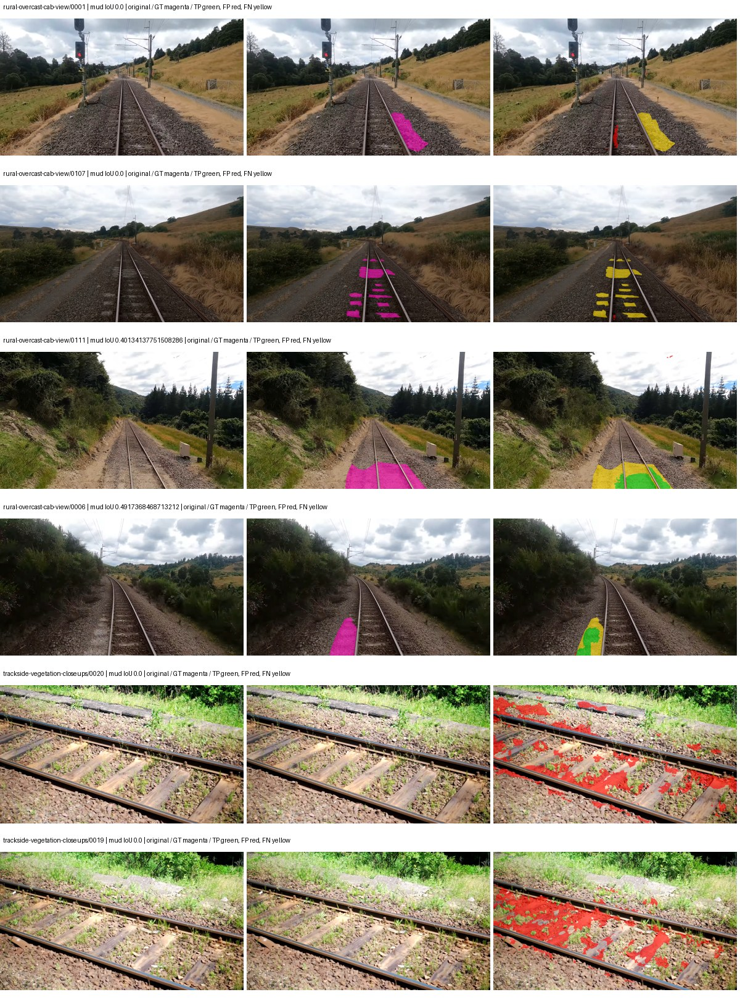
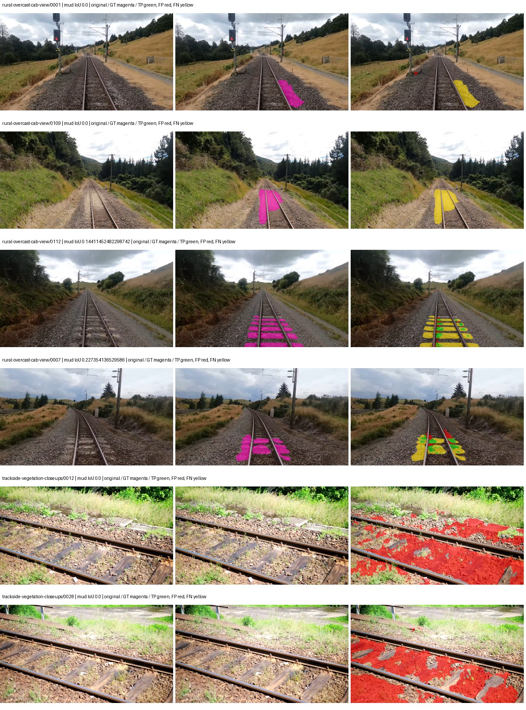
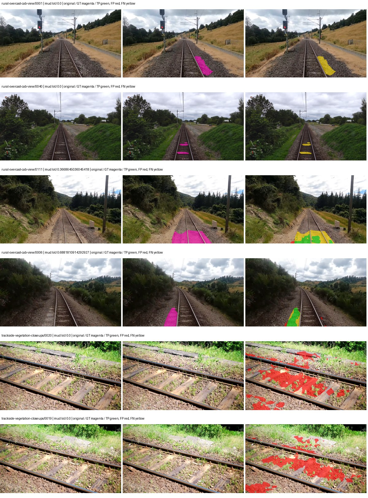
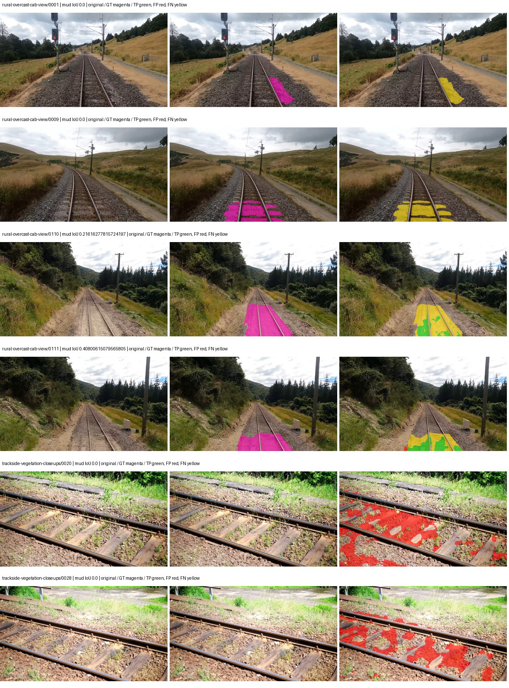

# smp_deeplabv3plus_resnet101 — rad_9_24_2026-fixed-grouped

[RAD 9/24: Scene-grouped split](../../README.md) · [Full model records](record.json)

Primary selection and early stopping: **mud-pumping validation IoU, pixels pooled over all validation images**. A job is complete only after full statistics and isolated profiling are verified.

Study metrics, counting each class only on the validation images that contain it: mud-pumping IoU is the mean per-image IoU over the images with mud-pumping, precision and recall sum pixels over those images, and mIoU averages each class over the images that contain it, then over the classes present.

| Initialization path | Seed | Mud-pumping IoU, train-camera images with mud (%, n=17) | Mud-pumping IoU, all images with mud (%, n=18) | Mud precision, all images with mud (%) | Mud recall, all images with mud (%) | mIoU (each class over images that contain it) (%) |
| --- | --- | --- | --- | --- | --- | --- |
| rtis_only | 0 | 15.63 | 15.28 | 64.13 | 19.42 | 30.63 |
| cityscapes_to_rtis | 0 | 4.57 | 4.37 | 8.42 | 6.79 | 24.40 |
| railsem19_to_rtis | 0 | 13.93 | 13.37 | 37.04 | 16.77 | 42.52 |
| cityscapes_to_railsem19_to_rtis | 0 | 5.58 | 5.44 | 23.61 | 8.90 | 37.35 |

Per-class IoU: IoU (%) of every class, each averaged only over the validation images that contain the class (n = those images); — = no image contains it. mIoU averages the classes with at least one such image.

| Initialization path | Seed | mIoU (each class over images that contain it) | person (n=0) | truck (n=0) | rail-track (n=37) | vegetation-overgrowth (n=13) | car (n=3) | on-rails (n=0) | traffic-sign (n=9) | road (n=11) | sidewalk (n=12) | construction (n=12) | tram-track (n=2) | pole (n=21) | traffic-light (n=3) | mud-pumping (n=18) | fence (n=7) | terrain (n=35) | sky (n=28) | rail-embedded (n=3) | rail-raised (n=37) | trackbed (n=37) | standing-water (n=9) |
| --- | --- | --- | --- | --- | --- | --- | --- | --- | --- | --- | --- | --- | --- | --- | --- | --- | --- | --- | --- | --- | --- | --- | --- |
| rtis_only | 0 | 30.63 | — | — | 54.25 | 20.91 | 0.00 | — | 1.86 | 8.45 | 15.55 | 32.28 | 12.32 | 57.74 | 22.21 | 15.28 | 14.76 | 79.91 | 90.53 | 0.07 | 61.14 | 62.79 | 1.28 |
| cityscapes_to_rtis | 0 | 24.40 | — | — | 38.40 | 0.00 | 0.00 | — | 0.00 | 0.70 | 12.52 | 24.48 | 0.00 | 59.09 | 0.00 | 4.37 | 21.67 | 72.81 | 93.74 | 0.00 | 62.05 | 49.37 | 0.00 |
| railsem19_to_rtis | 0 | 42.52 | — | — | 63.97 | 34.85 | 8.37 | — | 34.84 | 8.68 | 16.26 | 49.89 | 47.78 | 70.02 | 44.69 | 13.37 | 23.20 | 84.14 | 94.40 | 37.33 | 69.58 | 63.12 | 0.86 |
| cityscapes_to_railsem19_to_rtis | 0 | 37.35 | — | — | 55.55 | 23.94 | 26.64 | — | 22.90 | 4.80 | 16.24 | 45.70 | 4.91 | 71.04 | 53.31 | 5.44 | 22.08 | 83.44 | 95.71 | 1.78 | 72.07 | 66.25 | 0.45 |

Everything below is the campaign's own record, with pixels pooled over all validation images (the checkpoint was selected on that pooled mud IoU).

| Model | Initialization path | Seed | Status | Steps | Best step | Mud IoU, pixels pooled (%) | Mud precision, pixels pooled (%) | Mud recall, pixels pooled (%) | Final mud IoU (trainer val, pixels pooled, %) | mIoU, pixels pooled (%) | Fixed GT-class mIoU, pixels pooled (%) |
| --- | --- | --- | --- | --- | --- | --- | --- | --- | --- | --- | --- |
| smp_deeplabv3plus_resnet101 | rtis_only | 0 | completed | 2592 | 1296 | 6.62 | 9.14 | 19.42 | 2.70 | 25.88 | 30.19 |
| smp_deeplabv3plus_resnet101 | cityscapes_to_rtis | 0 | completed | 1555 | 259 | 1.38 | 1.70 | 6.79 | 1.21 | 22.34 | 23.58 |
| smp_deeplabv3plus_resnet101 | railsem19_to_rtis | 0 | completed | 2074 | 777 | 5.65 | 7.84 | 16.77 | 2.11 | 44.32 | 49.24 |
| smp_deeplabv3plus_resnet101 | cityscapes_to_railsem19_to_rtis | 0 | completed | 2592 | 1296 | 3.72 | 6.02 | 8.90 | 2.51 | 36.83 | 40.92 |

Training: 217 images. Validation: 37 images. Test: 60 held out. Seeds: [0]. Seed variation measures optimization variability, not independent-recording uncertainty. Historical source checkpoints stay fixed across adaptation seeds.

Training code: `d864b72bd90706260965bb1a48398d01167b6d5c`. Split SHA-256: `12d7b367c72cda61d57686ff2ac28223530d0af49debd9fb7a0fbc68b908bc93`.

## rtis_only — seed 0

Status: **completed**. Started: 2026-10-06T01:57:20.696275+00:00. Finished: 2026-10-06T02:31:02.767631+00:00.

Recipe pretrained initializer: `{"arch": "smp", "backbone_path": null, "batch_norm_momentum": null, "checkpoint": null, "classifier_path": null, "drop_path": null, "encoder_name": "resnet101", "encoder_weights": "imagenet", "head": "unified_head", "head_paths": [], "inactive_parameter_paths": [], "local_files_only": false, "lora_alpha": 32, "lora_dropout": 0.05, "lora_r": 16, "lora_targets": [], "native": null, "revision": null, "smp_arch": "DeepLabV3Plus", "subfolder": null, "trust_remote_code": false, "tuning": "full"}`.

`rtis_only` uses the recipe initializer, which may include pretrained segmentation components. Transfer paths load the exact historical source checkpoint below and reset the classifier; they do not reset all query/decoder features.

Source checkpoint: `Recipe pretrained initialization`.

Config SHA-256: `6ceb23251d9158ea2197932b8079c8f90a6564ac00376fbcea53a38472746812`. Weights used for validation: `raw`.

### Mud-pumping and aggregate quality

| Metric | Selected checkpoint | Final training validation |
| --- | --- | --- |
| Mud IoU | 6.62 | 2.70 |
| Mud precision | 9.14 | 3.32 |
| Mud recall | 19.42 | 12.56 |
| Mud Dice/F1 | 12.43 | 5.25 |
| mIoU | 25.88 | 28.34 |
| Mean accuracy | 40.22 | 40.55 |
| Mean precision | 45.97 | 48.38 |
| Mean Dice | 33.35 | 35.73 |
| Mean specificity | 98.83 | 98.94 |
| Pixel accuracy | 80.16 | 82.58 |
| Frequency-weighted IoU | 71.40 | 74.60 |
| Fixed GT-present class mIoU | 30.19 | 33.06 |
| Boundary F1 | 31.63 | 35.34 |

The selected checkpoint has independent evaluation evidence. Final values are the trainer's final validation record, not a new independent evaluation. mIoU averages classes with nonzero union, so false positives on absent classes can change its denominator. The fixed GT-class mean is supplementary and excludes absent classes; their false positives remain in the confusion matrix.

### Resource usage and timing

| Measurement | Value |
| --- | --- |
| Peak training VRAM, retained training invocation (GiB) | 10.08 |
| Peak evaluation VRAM (GiB) | 7.19 |
| Retained training invocation wall time (seconds) | 1878.69 |
| Retained training invocation GPU-hours (one GPU) | 0.52 |
| Evaluation wall time (seconds) | 11.52 |
| Full evaluation pipeline images/second | 3.21 |
| Best full-state checkpoint (MiB) | 698.52 |
| Final full-state checkpoint (MiB) | 698.50 |
| Verified periodic checkpoints removed (GiB) | 3.41 |

VRAM uses the recorded allocator high-water mark; it is not total device usage including CUDA context. Resumed jobs' retained training invocation times and peaks are **not whole-campaign totals**. Earlier invocation resource records are not reconstructed here. Evaluation throughput includes loader, sliding-window inference and metrics; it is not model-only latency/FPS. Missing measurements are shown as —, never inferred from another dataset's run.

### Standardized inference performance

Dedicated model-only profiling waits for an idle worker-locked L40S: BF16, batch 1, 1024x1024, 20 warmup and 100 CUDA-event-timed public forwards. It excludes loading, preprocessing, tiling and metrics.

| Status | Parameters | Weight MiB | FPS | p50 ms | p95 ms | Peak reserved GiB |
| --- | --- | --- | --- | --- | --- | --- |
| complete | 45674853 | 174.24 | 119.75 | 8.28 | 8.75 | 0.66 |

```json
{
  "schema_version": 1,
  "model_id": "smp_deeplabv3plus_resnet101",
  "measured_at": "2026-10-06T02:30:56+00:00",
  "status": "complete",
  "benchmark_scope": "rtis_selected_checkpoint_model_only",
  "applies_to": [
    "smp_deeplabv3plus_resnet101--rtis_only--seed-0"
  ],
  "source": {
    "campaign_git_sha": "d864b72bd90706260965bb1a48398d01167b6d5c",
    "git_dirty": false,
    "config_hash": "a08afb99d045",
    "resolved_config": "/data/izadia1/projects/segmentary-runs/rad_9_24_2026/fixed-grouped-seed0-20261005-r2/configs/smp_deeplabv3plus_resnet101--rtis_only--seed-0.yaml",
    "config_sha256": "6ceb23251d9158ea2197932b8079c8f90a6564ac00376fbcea53a38472746812",
    "checkpoint_sha256": "2f995d146e6b352b37ed5dbcd0c69f11035fc3e7feb4363bd328d76d2ca47f60",
    "checkpoint_global_step": 1296,
    "checkpoint_bytes": 732454124,
    "checkpoint_kind": "resume checkpoint with optimizer and EMA state",
    "weights": "raw",
    "measured_checkpoint_job_id": "smp_deeplabv3plus_resnet101--rtis_only--seed-0",
    "result_sha256": "f83a344ab848f4207e4d7ff44f107d1ec8cb3765677abfacafb284c8d2e8a5b0",
    "result_git_sha": "d864b72bd90706260965bb1a48398d01167b6d5c",
    "result_stage": "eval:rad_9_24_2026-fixed-grouped:val",
    "result_seed": 0
  },
  "hardware": {
    "gpu_name": "NVIDIA L40S",
    "gpu_uuid": "GPU-c76642eb-64c1-b0ac-b051-d2efd47b32c4",
    "logical_device": "cuda:0",
    "physical_visibility_token": "9",
    "compute_capability": [
      8,
      9
    ],
    "total_memory_bytes": 47677177856
  },
  "model": {
    "parameter_count": 45674853,
    "trainable_parameter_count": 45674853,
    "resident_parameter_bytes": 182699412,
    "parameter_dtype_counts": {
      "float32": 45674853
    }
  },
  "contract": {
    "backend": "pytorch",
    "precision": "bf16_autocast",
    "batch_size": 1,
    "input_shape_nchw": [
      1,
      3,
      1024,
      1024
    ],
    "warmup_iterations": 20,
    "measured_iterations": 100,
    "timing": "per-forward CUDA events with end-event synchronization",
    "includes_preprocessing": false,
    "includes_data_loader": false,
    "includes_sliding_window": false,
    "input_resident_on_gpu": true,
    "model_only": true,
    "entrypoint": "public model(image) dense-logits forward"
  },
  "measurements": {
    "latency": {
      "p50_ms": 8.278016090393066,
      "p95_ms": 8.74654746055603,
      "mean_ms": 8.350894355773926,
      "minimum_ms": 8.21350383758545,
      "maximum_ms": 9.090047836303711,
      "fps": 119.74765305330271,
      "raw_ms": [
        8.426495552062988,
        8.243200302124023,
        8.249343872070312,
        8.697855949401855,
        8.270848274230957,
        8.237055778503418,
        8.293375968933105,
        8.258560180664062,
        8.21350383758545,
        8.276991844177246,
        8.28825569152832,
        8.235008239746094,
        8.278016090393066,
        8.233983993530273,
        8.261631965637207,
        8.244223594665527,
        8.307744026184082,
        8.32204818725586,
        8.281087875366211,
        8.582143783569336,
        8.299488067626953,
        8.923135757446289,
        8.672256469726562,
        9.090047836303711,
        8.893440246582031,
        8.27184009552002,
        8.664064407348633,
        8.242176055908203,
        8.267775535583496,
        8.275967597961426,
        8.21350383758545,
        8.258560180664062,
        8.49510383605957,
        8.278016090393066,
        8.262656211853027,
        8.245247840881348,
        8.293375968933105,
        8.621055603027344,
        8.29644775390625,
        8.308735847473145,
        8.356863975524902,
        8.347647666931152,
        8.278016090393066,
        8.270912170410156,
        8.294400215148926,
        8.262656211853027,
        8.954879760742188,
        8.256511688232422,
        8.236031532287598,
        8.292351722717285,
        8.236031532287598,
        8.68454360961914,
        8.259584426879883,
        8.251392364501953,
        8.279040336608887,
        8.28003215789795,
        8.327168464660645,
        8.251392364501953,
        8.48691177368164,
        8.281087875366211,
        8.243200302124023,
        8.243200302124023,
        8.241151809692383,
        8.246272087097168,
        8.300543785095215,
        8.254464149475098,
        8.380415916442871,
        8.30361557006836,
        8.292351722717285,
        8.285183906555176,
        8.282112121582031,
        8.285183906555176,
        8.265727996826172,
        8.249343872070312,
        8.738816261291504,
        8.259584426879883,
        8.273920059204102,
        8.268799781799316,
        8.28006362915039,
        9.079808235168457,
        8.333312034606934,
        8.29644775390625,
        8.344575881958008,
        8.252415657043457,
        8.257535934448242,
        8.250368118286133,
        8.239104270935059,
        8.293439865112305,
        8.272895812988281,
        8.364031791687012,
        8.236031532287598,
        8.248319625854492,
        8.276991844177246,
        8.236031532287598,
        8.309760093688965,
        8.665087699890137,
        8.273920059204102,
        8.239104270935059,
        8.279007911682129,
        8.685567855834961
      ],
      "percentile_method": "numpy linear interpolation"
    },
    "peak_reserved_bytes": 704643072,
    "memory_kind": "pytorch_cuda_allocator_peak_reserved_excluding_context",
    "benchmark_wall_clock_s": 11.361918315291405
  },
  "started_at": "2026-10-06T02:30:45+00:00",
  "finished_at": "2026-10-06T02:30:56+00:00",
  "environment": {
    "hostname": "hdrfs-app-001",
    "python": "3.11.15",
    "platform": "Linux-5.15.0-139-generic-x86_64-with-glibc2.35",
    "torch": "2.11.0+cu128",
    "torch_cuda": "12.8",
    "cudnn": 91900,
    "driver_version": "570.133.20",
    "cuda_available": true,
    "gpu_count": 1,
    "gpu_names": [
      "NVIDIA L40S"
    ],
    "cuda_visible_devices": "9",
    "packages": {
      "segmentary": "0.1.0",
      "torch": "2.11.0+cu128",
      "torchvision": "0.26.0+cu128",
      "transformers": "5.15.0",
      "timm": "1.0.28",
      "segmentation-models-pytorch": "0.5.0",
      "albumentations": "2.0.8",
      "lightning": "2.6.5",
      "numpy": "2.4.4"
    }
  }
}
```

### Per-class validation results

| Class | GT pixels | IoU (%) | Precision (%) | Recall (%) | Dice (%) | Boundary F1 (%) |
| --- | --- | --- | --- | --- | --- | --- |
| car | 29664 | 0.00 | 0.00 | 0.00 | 0.00 | 0.00 |
| construction | 311585 | 15.67 | 16.35 | 79.03 | 27.10 | 24.07 |
| fence | 265137 | 9.16 | 48.87 | 10.13 | 16.79 | 27.85 |
| mud-pumping | 1226250 | 6.62 | 9.14 | 19.42 | 12.43 | 8.24 |
| on-rails | 0 | 0.00 | 0.00 | — | 0.00 | 0.00 |
| person | 0 | 0.00 | 0.00 | — | 0.00 | 0.00 |
| pole | 628038 | 64.17 | 85.95 | 71.69 | 78.18 | 86.01 |
| rail-embedded | 16799 | 0.17 | 55.77 | 0.17 | 0.34 | 11.54 |
| rail-raised | 2969797 | 70.36 | 85.65 | 79.76 | 82.60 | 91.18 |
| rail-track | 6323197 | 43.32 | 62.60 | 58.44 | 60.45 | 53.74 |
| road | 1048831 | 2.61 | 6.00 | 4.41 | 5.09 | 5.84 |
| sidewalk | 1297367 | 28.72 | 50.78 | 39.81 | 44.63 | 31.66 |
| sky | 19121606 | 92.62 | 98.94 | 93.54 | 96.17 | 74.93 |
| standing-water | 95802 | 0.74 | 0.78 | 14.60 | 1.48 | 2.91 |
| terrain | 39239306 | 82.96 | 89.09 | 92.35 | 90.69 | 55.51 |
| trackbed | 10643081 | 61.45 | 71.71 | 81.11 | 76.12 | 55.09 |
| traffic-light | 19510 | 22.05 | 59.92 | 25.86 | 36.13 | 44.91 |
| traffic-sign | 13285 | 2.98 | 99.75 | 2.98 | 5.79 | 28.16 |
| tram-track | 56179 | 21.39 | 39.97 | 31.51 | 35.24 | 16.04 |
| truck | 0 | 0.00 | 0.00 | — | 0.00 | 0.00 |
| vegetation-overgrowth | 5901821 | 18.47 | 84.12 | 19.14 | 31.19 | 46.53 |

### Full-run accounting

| Measurement | Value |
| --- | --- |
| Full GPU-reserved wall seconds, all recorded worker attempts | 2029.55 |
| Full reserved GPU-hours | 0.56 |
| Whole-run timing complete | True |

| Phase | Wall seconds including failed attempts |
| --- | --- |
| training | 1885.84 |
| diagnostics | 91.06 |
| performance | 19.94 |

GPU-reserved time includes model loading, training, validation, collection, profiling, checkpoint I/O and orchestration while the worker owns one GPU. It is not GPU kernel-active time. Phase timings and sampled device memory/power/utilization are retained separately; sampled device memory is not the allocator high-water mark.

### Train/validation and raw/EMA diagnostics

| Checkpoint / weights / split | Images | Mud IoU (%) | Mud precision (%) | Mud recall (%) |
| --- | --- | --- | --- | --- |
| best-auto-train / raw | 217 | 88.94 | 94.81 | 93.49 |
| best-auto-val / raw | 37 | 6.62 | 9.14 | 19.42 |
| best-alternate-val / ema | 37 | 1.13 | 1.39 | 5.67 |
| final-auto-val / raw | 37 | 2.70 | 3.32 | 12.57 |

Train uses the evaluation transform without augmentation. Compare mud train/validation metrics for the same selected weights. Alternate EMA on running-stat BatchNorm is explicitly uncalibrated and is diagnostic only. Score-threshold curves use uncalibrated normalized scores and are pixel-level diagnostics, not event detection rates or a selected deployment operating point.

### Downloadable evidence

- best-auto-train: [per-image.csv](rtis_only--seed-0/best-auto-train/per-image.csv) · [per-image-confusion.json.gz](rtis_only--seed-0/best-auto-train/per-image-confusion.json.gz) · [groups.json](rtis_only--seed-0/best-auto-train/groups.json) · [mud-score-curves.json](rtis_only--seed-0/best-auto-train/mud-score-curves.json)
- best-auto-val: [per-image.csv](rtis_only--seed-0/best-auto-val/per-image.csv) · [per-image-confusion.json.gz](rtis_only--seed-0/best-auto-val/per-image-confusion.json.gz) · [groups.json](rtis_only--seed-0/best-auto-val/groups.json) · [mud-score-curves.json](rtis_only--seed-0/best-auto-val/mud-score-curves.json) · [examples.jpg](rtis_only--seed-0/best-auto-val/examples.jpg)
- best-alternate-val: [per-image.csv](rtis_only--seed-0/best-alternate-val/per-image.csv) · [per-image-confusion.json.gz](rtis_only--seed-0/best-alternate-val/per-image-confusion.json.gz) · [groups.json](rtis_only--seed-0/best-alternate-val/groups.json) · [mud-score-curves.json](rtis_only--seed-0/best-alternate-val/mud-score-curves.json)
- final-auto-val: [per-image.csv](rtis_only--seed-0/final-auto-val/per-image.csv) · [per-image-confusion.json.gz](rtis_only--seed-0/final-auto-val/per-image-confusion.json.gz) · [groups.json](rtis_only--seed-0/final-auto-val/groups.json) · [mud-score-curves.json](rtis_only--seed-0/final-auto-val/mud-score-curves.json)
- resources: [telemetry.csv](rtis_only--seed-0/resources/telemetry.csv)



Examples are two lowest and two highest mud-IoU positive images, plus up to two negative images with the most false-positive mud pixels. They are targeted diagnostic examples, not random samples. Green: true positive; red: false positive; yellow: false negative. Full predictions remain on HDRFS.

### Validation tracking

| Logged step | Overall mIoU (%) | Mud IoU (%) |
| --- | --- | --- |
| 258 | 23.77 | 0.22 |
| 518 | 22.02 | 1.62 |
| 777 | 24.01 | 0.31 |
| 1036 | 23.78 | 0.28 |
| 1295 | 25.88 | 6.63 |
| 1555 | 24.25 | 0.89 |
| 1814 | 29.08 | 1.72 |
| 2073 | 30.91 | 1.60 |
| 2332 | 27.69 | 1.79 |
| 2592 | 28.34 | 2.70 |

All retained scalar curves, including training loss and per-class IoU, are in record.json. Observed best mud on a curve is not necessarily a retained checkpoint: the pilot saved its selection-metric-best and final checkpoints. Step logging and checkpoint global_step may differ by one.

### Stopping and checkpoint provenance

```json
{
  "stopping": {
    "actual_steps": 2592,
    "maximum_steps": 4000,
    "min_delta": 0.001,
    "monitor": "val_iou/mud-pumping",
    "patience": 5,
    "reason": "validation_plateau"
  },
  "checkpoints": {
    "best": {
      "path": "/data/izadia1/projects/segmentary-runs/rad_9_24_2026/fixed-grouped-seed0-20261005-r2/future-runs/smp_deeplabv3plus_resnet101--rtis_only--seed-0_seed0/rtis/best.ckpt",
      "sha256": "2f995d146e6b352b37ed5dbcd0c69f11035fc3e7feb4363bd328d76d2ca47f60",
      "global_step": 1296,
      "bytes": 732454124
    },
    "final": {
      "path": "/data/izadia1/projects/segmentary-runs/rad_9_24_2026/fixed-grouped-seed0-20261005-r2/future-runs/smp_deeplabv3plus_resnet101--rtis_only--seed-0_seed0/rtis/last.ckpt",
      "sha256": "1fcfed93f52a72d94bbce5d1526086e803124bc83ccacef52a02d3bbb854853a",
      "global_step": 2592,
      "bytes": 732431852
    }
  },
  "cleanup_error": null
}
```

### Resolved training, initialization and evaluation settings

The optimizer block is the base configuration. Stage LR scales are applied at runtime, and stage warmup is capped at min(base warmup, floor(stage budget / 10), stage budget - 1): 400 steps for this 4,000-step pilot. Model-internal native input grids may differ from augmentation crops (EoMT uses its 640 grid).

```json
{
  "name": "smp_deeplabv3plus_resnet101--rtis_only--seed-0",
  "model": {
    "arch": "smp",
    "checkpoint": null,
    "tuning": "full",
    "head": "unified_head",
    "lora_r": 16,
    "lora_alpha": 32,
    "lora_dropout": 0.05,
    "lora_targets": [],
    "drop_path": null,
    "revision": null,
    "subfolder": null,
    "local_files_only": false,
    "trust_remote_code": false,
    "backbone_path": null,
    "head_paths": [],
    "classifier_path": null,
    "inactive_parameter_paths": [],
    "smp_arch": "DeepLabV3Plus",
    "encoder_name": "resnet101",
    "encoder_weights": "imagenet",
    "native": null,
    "batch_norm_momentum": null
  },
  "space": "paul-test-rtis",
  "taxonomy_root": "/data/izadia1/projects/segmentary-rad-d864b72b/taxonomy",
  "output_root": "/data/izadia1/projects/segmentary-runs/rad_9_24_2026/fixed-grouped-seed0-20261005-r2/future-runs",
  "optim": {
    "backbone_lr": 0.0001,
    "head_lr_mult": 10.0,
    "weight_decay": 0.05,
    "llrd": 1.0,
    "warmup_iters": 1500,
    "warmup_ratio": 1e-06,
    "poly_power": 0.9,
    "min_lr_ratio": 0.0,
    "betas": [
      0.9,
      0.999
    ],
    "grad_clip": 1.0
  },
  "train": {
    "iters": 4000,
    "batch_size": 2,
    "accum": 8,
    "num_workers": 2,
    "precision": "bf16-mixed",
    "ema_decay": 0.9998,
    "val_every": 250,
    "ckpt_every": 500,
    "selection_metric": "val_iou/mud-pumping",
    "early_stopping_patience": 5,
    "early_stopping_min_delta": 0.001,
    "seed": 0,
    "devices": 1
  },
  "eval": {
    "sliding_window": true,
    "window": [
      1024,
      1024
    ],
    "stride": [
      768,
      768
    ],
    "batch_size": 1,
    "num_workers": 2,
    "tta_scales": [],
    "tta_flip": false,
    "threshold": 0.5,
    "boundary_tolerance_frac": 0.0075,
    "save_confusion": true
  },
  "loss": {
    "task": "multiclass",
    "activation": "auto",
    "terms": [],
    "aux": "none",
    "aux_weight": 0.0,
    "ce_weight": 1.0,
    "label_smoothing": 0.0,
    "class_weights": null,
    "query": null
  },
  "aug": {
    "crop": [
      1024,
      1024
    ],
    "scale_min": 0.5,
    "scale_max": 2.0,
    "hflip_p": 0.5,
    "color_jitter_p": 0.5,
    "brightness": 0.25,
    "contrast": 0.25,
    "saturation": 0.25,
    "hue": 0.05
  },
  "stages": [
    {
      "name": "rtis",
      "data": [
        {
          "name": "rad_9_24_2026-fixed-grouped",
          "root": "/data/izadia1/datasets/rad_9_24_2026-fixed-grouped",
          "variant": null,
          "split_file": "splits.json",
          "train_split": "train",
          "val_split": "val",
          "limit": null,
          "loader": "folder",
          "mapping": "paul-test-rtis",
          "loader_options": {
            "require_groups": true
          }
        }
      ],
      "iters": null,
      "lr_scale": 1.0,
      "head_group_lr_scale": 1.0,
      "init_from": "pretrained",
      "reset_head": false,
      "freeze": null,
      "sample_weights": null
    }
  ]
}
```

### Hardware and software provenance

```json
{
  "training": {
    "cuda_available": true,
    "cuda_visible_devices": "9",
    "cudnn": 91900,
    "driver_version": "570.133.20",
    "gpu_count": 1,
    "gpu_names": [
      "NVIDIA L40S"
    ],
    "hostname": "hdrfs-app-001",
    "input_normalization": {
      "channel_order": "rgb",
      "mean": [
        0.485,
        0.456,
        0.406
      ],
      "source": "smp_encoder_settings",
      "std": [
        0.229,
        0.224,
        0.225
      ]
    },
    "model_origins": [
      {
        "hf_commit": null,
        "hf_name_or_path": null,
        "module": "model",
        "timm_pretrained": {}
      }
    ],
    "model_parameter_count": 45674853,
    "packages": {
      "albumentations": "2.0.8",
      "lightning": "2.6.5",
      "numpy": "2.4.4",
      "segmentary": "0.1.0",
      "segmentation-models-pytorch": "0.5.0",
      "timm": "1.0.28",
      "torch": "2.11.0+cu128",
      "torchvision": "0.26.0+cu128",
      "transformers": "5.15.0"
    },
    "platform": "Linux-5.15.0-139-generic-x86_64-with-glibc2.35",
    "python": "3.11.15",
    "torch": "2.11.0+cu128",
    "torch_cuda": "12.8",
    "trainable_parameter_count": 45674853,
    "training_stop": {
      "actual_steps": 2592,
      "maximum_steps": 4000,
      "min_delta": 0.001,
      "monitor": "val_iou/mud-pumping",
      "patience": 5,
      "reason": "validation_plateau"
    },
    "validation_weights": "raw"
  },
  "evaluation": {
    "cuda_available": true,
    "cuda_visible_devices": "9",
    "cudnn": 91900,
    "driver_version": "570.133.20",
    "gpu_count": 1,
    "gpu_names": [
      "NVIDIA L40S"
    ],
    "hostname": "hdrfs-app-001",
    "input_normalization": {
      "channel_order": "rgb",
      "mean": [
        0.485,
        0.456,
        0.406
      ],
      "source": "smp_encoder_settings",
      "std": [
        0.229,
        0.224,
        0.225
      ]
    },
    "packages": {
      "albumentations": "2.0.8",
      "lightning": "2.6.5",
      "numpy": "2.4.4",
      "segmentary": "0.1.0",
      "segmentation-models-pytorch": "0.5.0",
      "timm": "1.0.28",
      "torch": "2.11.0+cu128",
      "torchvision": "0.26.0+cu128",
      "transformers": "5.15.0"
    },
    "platform": "Linux-5.15.0-139-generic-x86_64-with-glibc2.35",
    "python": "3.11.15",
    "torch": "2.11.0+cu128",
    "torch_cuda": "12.8"
  }
}
```

## cityscapes_to_rtis — seed 0

Status: **completed**. Started: 2026-10-06T02:14:28.625906+00:00. Finished: 2026-10-06T02:35:47.181114+00:00.

Recipe pretrained initializer: `{"arch": "smp", "backbone_path": null, "batch_norm_momentum": null, "checkpoint": null, "classifier_path": null, "drop_path": null, "encoder_name": "resnet101", "encoder_weights": "imagenet", "head": "unified_head", "head_paths": [], "inactive_parameter_paths": [], "local_files_only": false, "lora_alpha": 32, "lora_dropout": 0.05, "lora_r": 16, "lora_targets": [], "native": null, "revision": null, "smp_arch": "DeepLabV3Plus", "subfolder": null, "trust_remote_code": false, "tuning": "full"}`.

`rtis_only` uses the recipe initializer, which may include pretrained segmentation components. Transfer paths load the exact historical source checkpoint below and reset the classifier; they do not reset all query/decoder features.

Source checkpoint: `{'name': 'smp_deeplabv3plus_resnet101--cityscapes--seed-0', 'model': 'smp_deeplabv3plus_resnet101', 'protocol': 'cityscapes', 'config': '/data/izadia1/projects/segmentary-runs/all-model-city-rail-seed0-rail20-b9eb3e1/accepted/smp_deeplabv3plus_resnet101--cityscapes--seed-0/resolved-config.yaml', 'checkpoint': '/data/izadia1/projects/segmentary-runs/current-main-fill-v2/jobs/smp_deeplabv3plus_resnet101--cityscapes--seed-0/train/smp_deeplabv3plus_resnet101--cityscapes_seed0/cityscapes/last.ckpt', 'recorded_sha256': '01074c9ac3f2b84d122c8a23d07d26a31d2ff58d5d23740b077bdc998d70363b', 'exists': True}`.

Config SHA-256: `2991091edaceb3d84613142d887f1e595c5a8babfb255c3cfcfb9884392c5ee9`. Weights used for validation: `raw`.

### Mud-pumping and aggregate quality

| Metric | Selected checkpoint | Final training validation |
| --- | --- | --- |
| Mud IoU | 1.38 | 1.21 |
| Mud precision | 1.70 | 1.60 |
| Mud recall | 6.79 | 4.63 |
| Mud Dice/F1 | 2.72 | 2.38 |
| mIoU | 22.34 | 30.68 |
| Mean accuracy | 31.76 | 45.51 |
| Mean precision | 29.60 | 44.70 |
| Mean Dice | 28.26 | 38.70 |
| Mean specificity | 98.35 | 98.68 |
| Pixel accuracy | 74.90 | 77.87 |
| Frequency-weighted IoU | 63.56 | 69.03 |
| Fixed GT-present class mIoU | 23.58 | 35.79 |
| Boundary F1 | 23.60 | 35.69 |

The selected checkpoint has independent evaluation evidence. Final values are the trainer's final validation record, not a new independent evaluation. mIoU averages classes with nonzero union, so false positives on absent classes can change its denominator. The fixed GT-class mean is supplementary and excludes absent classes; their false positives remain in the confusion matrix.

### Resource usage and timing

| Measurement | Value |
| --- | --- |
| Peak training VRAM, retained training invocation (GiB) | 10.08 |
| Peak evaluation VRAM (GiB) | 7.19 |
| Retained training invocation wall time (seconds) | 1134.60 |
| Retained training invocation GPU-hours (one GPU) | 0.32 |
| Evaluation wall time (seconds) | 11.47 |
| Full evaluation pipeline images/second | 3.23 |
| Best full-state checkpoint (MiB) | 698.52 |
| Final full-state checkpoint (MiB) | 698.50 |
| Verified periodic checkpoints removed (GiB) | 2.05 |

VRAM uses the recorded allocator high-water mark; it is not total device usage including CUDA context. Resumed jobs' retained training invocation times and peaks are **not whole-campaign totals**. Earlier invocation resource records are not reconstructed here. Evaluation throughput includes loader, sliding-window inference and metrics; it is not model-only latency/FPS. Missing measurements are shown as —, never inferred from another dataset's run.

### Standardized inference performance

Dedicated model-only profiling waits for an idle worker-locked L40S: BF16, batch 1, 1024x1024, 20 warmup and 100 CUDA-event-timed public forwards. It excludes loading, preprocessing, tiling and metrics.

| Status | Parameters | Weight MiB | FPS | p50 ms | p95 ms | Peak reserved GiB |
| --- | --- | --- | --- | --- | --- | --- |
| complete | 45674853 | 174.24 | 108.60 | 9.02 | 11.09 | 0.66 |

```json
{
  "schema_version": 1,
  "model_id": "smp_deeplabv3plus_resnet101",
  "measured_at": "2026-10-06T02:35:42+00:00",
  "status": "complete",
  "benchmark_scope": "rtis_selected_checkpoint_model_only",
  "applies_to": [
    "smp_deeplabv3plus_resnet101--cityscapes_to_rtis--seed-0"
  ],
  "source": {
    "campaign_git_sha": "d864b72bd90706260965bb1a48398d01167b6d5c",
    "git_dirty": false,
    "config_hash": "ca8f13f8229c",
    "resolved_config": "/data/izadia1/projects/segmentary-runs/rad_9_24_2026/fixed-grouped-seed0-20261005-r2/configs/smp_deeplabv3plus_resnet101--cityscapes_to_rtis--seed-0.yaml",
    "config_sha256": "2991091edaceb3d84613142d887f1e595c5a8babfb255c3cfcfb9884392c5ee9",
    "checkpoint_sha256": "5ac3f228941c155e7cacb9eafeb0ba0dee163100b513d834d5c878b488d6c474",
    "checkpoint_global_step": 259,
    "checkpoint_bytes": 732453996,
    "checkpoint_kind": "resume checkpoint with optimizer and EMA state",
    "weights": "raw",
    "measured_checkpoint_job_id": "smp_deeplabv3plus_resnet101--cityscapes_to_rtis--seed-0",
    "result_sha256": "ca6f2d38548283d3cdfd608b44f7f1173f6c7dfba404af99ec21c8d8ac13d560",
    "result_git_sha": "d864b72bd90706260965bb1a48398d01167b6d5c",
    "result_stage": "eval:rad_9_24_2026-fixed-grouped:val",
    "result_seed": 0
  },
  "hardware": {
    "gpu_name": "NVIDIA L40S",
    "gpu_uuid": "GPU-a5ad49e5-0536-5229-ba8a-f8a902808f53",
    "logical_device": "cuda:0",
    "physical_visibility_token": "7",
    "compute_capability": [
      8,
      9
    ],
    "total_memory_bytes": 47677177856
  },
  "model": {
    "parameter_count": 45674853,
    "trainable_parameter_count": 45674853,
    "resident_parameter_bytes": 182699412,
    "parameter_dtype_counts": {
      "float32": 45674853
    }
  },
  "contract": {
    "backend": "pytorch",
    "precision": "bf16_autocast",
    "batch_size": 1,
    "input_shape_nchw": [
      1,
      3,
      1024,
      1024
    ],
    "warmup_iterations": 20,
    "measured_iterations": 100,
    "timing": "per-forward CUDA events with end-event synchronization",
    "includes_preprocessing": false,
    "includes_data_loader": false,
    "includes_sliding_window": false,
    "input_resident_on_gpu": true,
    "model_only": true,
    "entrypoint": "public model(image) dense-logits forward"
  },
  "measurements": {
    "latency": {
      "p50_ms": 9.019392013549805,
      "p95_ms": 11.091046428680416,
      "mean_ms": 9.207703685760498,
      "minimum_ms": 8.554431915283203,
      "maximum_ms": 12.581888198852539,
      "fps": 108.60471124266054,
      "raw_ms": [
        8.967167854309082,
        9.10745620727539,
        9.260031700134277,
        9.147392272949219,
        9.02246379852295,
        8.672256469726562,
        8.734720230102539,
        9.102304458618164,
        8.687616348266602,
        9.921536445617676,
        8.835040092468262,
        8.7193603515625,
        8.591360092163086,
        8.58521556854248,
        8.680447578430176,
        8.730624198913574,
        8.7193603515625,
        8.631296157836914,
        8.688639640808105,
        8.756223678588867,
        8.766464233398438,
        8.665087699890137,
        8.658944129943848,
        8.701919555664062,
        8.589311599731445,
        8.774656295776367,
        8.996864318847656,
        8.662015914916992,
        8.5862398147583,
        8.571904182434082,
        8.569855690002441,
        8.803327560424805,
        8.754176139831543,
        8.588288307189941,
        8.778752326965332,
        8.635392189025879,
        8.72755241394043,
        8.740863800048828,
        8.897472381591797,
        8.969216346740723,
        8.879103660583496,
        9.256959915161133,
        9.088000297546387,
        9.001983642578125,
        9.081855773925781,
        9.099264144897461,
        8.988672256469727,
        9.306112289428711,
        9.134143829345703,
        9.198592185974121,
        9.055232048034668,
        9.041919708251953,
        9.307135581970215,
        9.12281608581543,
        9.165823936462402,
        10.500096321105957,
        9.272319793701172,
        9.453536033630371,
        9.120767593383789,
        8.89958381652832,
        9.148415565490723,
        9.059328079223633,
        9.0316801071167,
        8.954879760742188,
        9.00812816619873,
        9.712639808654785,
        12.370944023132324,
        12.381183624267578,
        12.318719863891602,
        9.560064315795898,
        8.940544128417969,
        8.641535758972168,
        8.8156156539917,
        8.672256469726562,
        8.745984077453613,
        8.646656036376953,
        8.554431915283203,
        8.753151893615723,
        9.138175964355469,
        11.026432037353516,
        12.478464126586914,
        12.581888198852539,
        10.291199684143066,
        9.048064231872559,
        9.019392013549805,
        9.6430082321167,
        9.145343780517578,
        9.405440330505371,
        9.082880020141602,
        9.050111770629883,
        9.168895721435547,
        9.103360176086426,
        9.847807884216309,
        9.019392013549805,
        9.155584335327148,
        9.108480453491211,
        10.342399597167969,
        8.986623764038086,
        9.686016082763672,
        9.152511596679688
      ],
      "percentile_method": "numpy linear interpolation"
    },
    "peak_reserved_bytes": 704643072,
    "memory_kind": "pytorch_cuda_allocator_peak_reserved_excluding_context",
    "benchmark_wall_clock_s": 11.83302292227745
  },
  "started_at": "2026-10-06T02:35:30+00:00",
  "finished_at": "2026-10-06T02:35:42+00:00",
  "environment": {
    "hostname": "hdrfs-app-001",
    "python": "3.11.15",
    "platform": "Linux-5.15.0-139-generic-x86_64-with-glibc2.35",
    "torch": "2.11.0+cu128",
    "torch_cuda": "12.8",
    "cudnn": 91900,
    "driver_version": "570.133.20",
    "cuda_available": true,
    "gpu_count": 1,
    "gpu_names": [
      "NVIDIA L40S"
    ],
    "cuda_visible_devices": "7",
    "packages": {
      "segmentary": "0.1.0",
      "torch": "2.11.0+cu128",
      "torchvision": "0.26.0+cu128",
      "transformers": "5.15.0",
      "timm": "1.0.28",
      "segmentation-models-pytorch": "0.5.0",
      "albumentations": "2.0.8",
      "lightning": "2.6.5",
      "numpy": "2.4.4"
    }
  }
}
```

### Per-class validation results

| Class | GT pixels | IoU (%) | Precision (%) | Recall (%) | Dice (%) | Boundary F1 (%) |
| --- | --- | --- | --- | --- | --- | --- |
| car | 29664 | 0.00 | 0.00 | 0.00 | 0.00 | 0.00 |
| construction | 311585 | 10.15 | 10.88 | 60.30 | 18.44 | 14.33 |
| fence | 265137 | 20.49 | 33.84 | 34.17 | 34.00 | 29.19 |
| mud-pumping | 1226250 | 1.38 | 1.70 | 6.79 | 2.72 | 5.58 |
| on-rails | 0 | 0.00 | 0.00 | — | 0.00 | 0.00 |
| person | 0 | — | — | — | — | — |
| pole | 628038 | 61.41 | 78.60 | 73.73 | 76.09 | 87.00 |
| rail-embedded | 16799 | 0.00 | 0.00 | 0.00 | 0.00 | 0.00 |
| rail-raised | 2969797 | 61.20 | 70.42 | 82.38 | 75.93 | 81.61 |
| rail-track | 6323197 | 24.19 | 60.05 | 28.83 | 38.96 | 36.36 |
| road | 1048831 | 0.17 | 1.58 | 0.19 | 0.34 | 2.26 |
| sidewalk | 1297367 | 25.38 | 49.76 | 34.12 | 40.48 | 14.88 |
| sky | 19121606 | 95.83 | 99.34 | 96.45 | 97.87 | 87.13 |
| standing-water | 95802 | 0.00 | 0.00 | 0.00 | 0.00 | 0.00 |
| terrain | 39239306 | 73.35 | 78.20 | 92.21 | 84.63 | 42.54 |
| trackbed | 10643081 | 50.94 | 73.34 | 62.51 | 67.49 | 47.37 |
| traffic-light | 19510 | 0.00 | 0.00 | 0.00 | 0.00 | 0.00 |
| traffic-sign | 13285 | 0.00 | 0.00 | 0.00 | 0.00 | 0.00 |
| tram-track | 56179 | 0.00 | 0.00 | 0.00 | 0.00 | 0.00 |
| truck | 0 | — | — | — | — | — |
| vegetation-overgrowth | 5901821 | 0.00 | 4.76 | 0.00 | 0.00 | 0.15 |

### Full-run accounting

| Measurement | Value |
| --- | --- |
| Full GPU-reserved wall seconds, all recorded worker attempts | 1286.96 |
| Full reserved GPU-hours | 0.36 |
| Whole-run timing complete | True |

| Phase | Wall seconds including failed attempts |
| --- | --- |
| training | 1142.16 |
| diagnostics | 91.88 |
| performance | 20.49 |

GPU-reserved time includes model loading, training, validation, collection, profiling, checkpoint I/O and orchestration while the worker owns one GPU. It is not GPU kernel-active time. Phase timings and sampled device memory/power/utilization are retained separately; sampled device memory is not the allocator high-water mark.

### Train/validation and raw/EMA diagnostics

| Checkpoint / weights / split | Images | Mud IoU (%) | Mud precision (%) | Mud recall (%) |
| --- | --- | --- | --- | --- |
| best-auto-train / raw | 217 | 73.14 | 79.87 | 89.66 |
| best-auto-val / raw | 37 | 1.38 | 1.70 | 6.79 |
| best-alternate-val / ema | 37 | 1.99 | 2.49 | 8.99 |
| final-auto-val / raw | 37 | 1.21 | 1.61 | 4.64 |

Train uses the evaluation transform without augmentation. Compare mud train/validation metrics for the same selected weights. Alternate EMA on running-stat BatchNorm is explicitly uncalibrated and is diagnostic only. Score-threshold curves use uncalibrated normalized scores and are pixel-level diagnostics, not event detection rates or a selected deployment operating point.

### Downloadable evidence

- best-auto-train: [per-image.csv](cityscapes_to_rtis--seed-0/best-auto-train/per-image.csv) · [per-image-confusion.json.gz](cityscapes_to_rtis--seed-0/best-auto-train/per-image-confusion.json.gz) · [groups.json](cityscapes_to_rtis--seed-0/best-auto-train/groups.json) · [mud-score-curves.json](cityscapes_to_rtis--seed-0/best-auto-train/mud-score-curves.json)
- best-auto-val: [per-image.csv](cityscapes_to_rtis--seed-0/best-auto-val/per-image.csv) · [per-image-confusion.json.gz](cityscapes_to_rtis--seed-0/best-auto-val/per-image-confusion.json.gz) · [groups.json](cityscapes_to_rtis--seed-0/best-auto-val/groups.json) · [mud-score-curves.json](cityscapes_to_rtis--seed-0/best-auto-val/mud-score-curves.json) · [examples.jpg](cityscapes_to_rtis--seed-0/best-auto-val/examples.jpg)
- best-alternate-val: [per-image.csv](cityscapes_to_rtis--seed-0/best-alternate-val/per-image.csv) · [per-image-confusion.json.gz](cityscapes_to_rtis--seed-0/best-alternate-val/per-image-confusion.json.gz) · [groups.json](cityscapes_to_rtis--seed-0/best-alternate-val/groups.json) · [mud-score-curves.json](cityscapes_to_rtis--seed-0/best-alternate-val/mud-score-curves.json)
- final-auto-val: [per-image.csv](cityscapes_to_rtis--seed-0/final-auto-val/per-image.csv) · [per-image-confusion.json.gz](cityscapes_to_rtis--seed-0/final-auto-val/per-image-confusion.json.gz) · [groups.json](cityscapes_to_rtis--seed-0/final-auto-val/groups.json) · [mud-score-curves.json](cityscapes_to_rtis--seed-0/final-auto-val/mud-score-curves.json)
- resources: [telemetry.csv](cityscapes_to_rtis--seed-0/resources/telemetry.csv)



Examples are two lowest and two highest mud-IoU positive images, plus up to two negative images with the most false-positive mud pixels. They are targeted diagnostic examples, not random samples. Green: true positive; red: false positive; yellow: false negative. Full predictions remain on HDRFS.

### Validation tracking

| Logged step | Overall mIoU (%) | Mud IoU (%) |
| --- | --- | --- |
| 258 | 22.35 | 1.38 |
| 518 | 21.89 | 0.55 |
| 777 | 23.75 | 1.37 |
| 1036 | 27.90 | 0.39 |
| 1295 | 30.23 | 1.16 |
| 1555 | 30.68 | 1.21 |

All retained scalar curves, including training loss and per-class IoU, are in record.json. Observed best mud on a curve is not necessarily a retained checkpoint: the pilot saved its selection-metric-best and final checkpoints. Step logging and checkpoint global_step may differ by one.

### Stopping and checkpoint provenance

```json
{
  "stopping": {
    "actual_steps": 1555,
    "maximum_steps": 4000,
    "min_delta": 0.001,
    "monitor": "val_iou/mud-pumping",
    "patience": 5,
    "reason": "validation_plateau"
  },
  "checkpoints": {
    "best": {
      "path": "/data/izadia1/projects/segmentary-runs/rad_9_24_2026/fixed-grouped-seed0-20261005-r2/future-runs/smp_deeplabv3plus_resnet101--cityscapes_to_rtis--seed-0_seed0/rtis/best.ckpt",
      "sha256": "5ac3f228941c155e7cacb9eafeb0ba0dee163100b513d834d5c878b488d6c474",
      "global_step": 259,
      "bytes": 732453996
    },
    "final": {
      "path": "/data/izadia1/projects/segmentary-runs/rad_9_24_2026/fixed-grouped-seed0-20261005-r2/future-runs/smp_deeplabv3plus_resnet101--cityscapes_to_rtis--seed-0_seed0/rtis/last.ckpt",
      "sha256": "a4e3e4601aa307bf50a0398fa8d5f9a5ed1a281c13bd735128cfc4873a82de8f",
      "global_step": 1555,
      "bytes": 732431916
    }
  },
  "cleanup_error": null
}
```

### Resolved training, initialization and evaluation settings

The optimizer block is the base configuration. Stage LR scales are applied at runtime, and stage warmup is capped at min(base warmup, floor(stage budget / 10), stage budget - 1): 400 steps for this 4,000-step pilot. Model-internal native input grids may differ from augmentation crops (EoMT uses its 640 grid).

```json
{
  "name": "smp_deeplabv3plus_resnet101--cityscapes_to_rtis--seed-0",
  "model": {
    "arch": "smp",
    "checkpoint": null,
    "tuning": "full",
    "head": "unified_head",
    "lora_r": 16,
    "lora_alpha": 32,
    "lora_dropout": 0.05,
    "lora_targets": [],
    "drop_path": null,
    "revision": null,
    "subfolder": null,
    "local_files_only": false,
    "trust_remote_code": false,
    "backbone_path": null,
    "head_paths": [],
    "classifier_path": null,
    "inactive_parameter_paths": [],
    "smp_arch": "DeepLabV3Plus",
    "encoder_name": "resnet101",
    "encoder_weights": "imagenet",
    "native": null,
    "batch_norm_momentum": null
  },
  "space": "paul-test-rtis",
  "taxonomy_root": "/data/izadia1/projects/segmentary-rad-d864b72b/taxonomy",
  "output_root": "/data/izadia1/projects/segmentary-runs/rad_9_24_2026/fixed-grouped-seed0-20261005-r2/future-runs",
  "optim": {
    "backbone_lr": 0.0001,
    "head_lr_mult": 10.0,
    "weight_decay": 0.05,
    "llrd": 1.0,
    "warmup_iters": 1500,
    "warmup_ratio": 1e-06,
    "poly_power": 0.9,
    "min_lr_ratio": 0.0,
    "betas": [
      0.9,
      0.999
    ],
    "grad_clip": 1.0
  },
  "train": {
    "iters": 4000,
    "batch_size": 2,
    "accum": 8,
    "num_workers": 2,
    "precision": "bf16-mixed",
    "ema_decay": 0.9998,
    "val_every": 250,
    "ckpt_every": 500,
    "selection_metric": "val_iou/mud-pumping",
    "early_stopping_patience": 5,
    "early_stopping_min_delta": 0.001,
    "seed": 0,
    "devices": 1
  },
  "eval": {
    "sliding_window": true,
    "window": [
      1024,
      1024
    ],
    "stride": [
      768,
      768
    ],
    "batch_size": 1,
    "num_workers": 2,
    "tta_scales": [],
    "tta_flip": false,
    "threshold": 0.5,
    "boundary_tolerance_frac": 0.0075,
    "save_confusion": true
  },
  "loss": {
    "task": "multiclass",
    "activation": "auto",
    "terms": [],
    "aux": "none",
    "aux_weight": 0.0,
    "ce_weight": 1.0,
    "label_smoothing": 0.0,
    "class_weights": null,
    "query": null
  },
  "aug": {
    "crop": [
      1024,
      1024
    ],
    "scale_min": 0.5,
    "scale_max": 2.0,
    "hflip_p": 0.5,
    "color_jitter_p": 0.5,
    "brightness": 0.25,
    "contrast": 0.25,
    "saturation": 0.25,
    "hue": 0.05
  },
  "stages": [
    {
      "name": "rtis",
      "data": [
        {
          "name": "rad_9_24_2026-fixed-grouped",
          "root": "/data/izadia1/datasets/rad_9_24_2026-fixed-grouped",
          "variant": null,
          "split_file": "splits.json",
          "train_split": "train",
          "val_split": "val",
          "limit": null,
          "loader": "folder",
          "mapping": "paul-test-rtis",
          "loader_options": {
            "require_groups": true
          }
        }
      ],
      "iters": null,
      "lr_scale": 0.1,
      "head_group_lr_scale": 1.0,
      "init_from": "/data/izadia1/projects/segmentary-runs/current-main-fill-v2/jobs/smp_deeplabv3plus_resnet101--cityscapes--seed-0/train/smp_deeplabv3plus_resnet101--cityscapes_seed0/cityscapes/last.ckpt",
      "reset_head": true,
      "freeze": null,
      "sample_weights": null
    }
  ]
}
```

### Hardware and software provenance

```json
{
  "training": {
    "cuda_available": true,
    "cuda_visible_devices": "7",
    "cudnn": 91900,
    "driver_version": "570.133.20",
    "gpu_count": 1,
    "gpu_names": [
      "NVIDIA L40S"
    ],
    "hostname": "hdrfs-app-001",
    "input_normalization": {
      "channel_order": "rgb",
      "mean": [
        0.485,
        0.456,
        0.406
      ],
      "source": "smp_encoder_settings",
      "std": [
        0.229,
        0.224,
        0.225
      ]
    },
    "model_origins": [
      {
        "hf_commit": null,
        "hf_name_or_path": null,
        "module": "model",
        "timm_pretrained": {}
      }
    ],
    "model_parameter_count": 45674853,
    "packages": {
      "albumentations": "2.0.8",
      "lightning": "2.6.5",
      "numpy": "2.4.4",
      "segmentary": "0.1.0",
      "segmentation-models-pytorch": "0.5.0",
      "timm": "1.0.28",
      "torch": "2.11.0+cu128",
      "torchvision": "0.26.0+cu128",
      "transformers": "5.15.0"
    },
    "platform": "Linux-5.15.0-139-generic-x86_64-with-glibc2.35",
    "python": "3.11.15",
    "torch": "2.11.0+cu128",
    "torch_cuda": "12.8",
    "trainable_parameter_count": 45674853,
    "training_stop": {
      "actual_steps": 1555,
      "maximum_steps": 4000,
      "min_delta": 0.001,
      "monitor": "val_iou/mud-pumping",
      "patience": 5,
      "reason": "validation_plateau"
    },
    "validation_weights": "raw"
  },
  "evaluation": {
    "cuda_available": true,
    "cuda_visible_devices": "7",
    "cudnn": 91900,
    "driver_version": "570.133.20",
    "gpu_count": 1,
    "gpu_names": [
      "NVIDIA L40S"
    ],
    "hostname": "hdrfs-app-001",
    "input_normalization": {
      "channel_order": "rgb",
      "mean": [
        0.485,
        0.456,
        0.406
      ],
      "source": "smp_encoder_settings",
      "std": [
        0.229,
        0.224,
        0.225
      ]
    },
    "packages": {
      "albumentations": "2.0.8",
      "lightning": "2.6.5",
      "numpy": "2.4.4",
      "segmentary": "0.1.0",
      "segmentation-models-pytorch": "0.5.0",
      "timm": "1.0.28",
      "torch": "2.11.0+cu128",
      "torchvision": "0.26.0+cu128",
      "transformers": "5.15.0"
    },
    "platform": "Linux-5.15.0-139-generic-x86_64-with-glibc2.35",
    "python": "3.11.15",
    "torch": "2.11.0+cu128",
    "torch_cuda": "12.8"
  }
}
```

## railsem19_to_rtis — seed 0

Status: **completed**. Started: 2026-10-06T02:26:34.630630+00:00. Finished: 2026-10-06T02:54:07.613695+00:00.

Recipe pretrained initializer: `{"arch": "smp", "backbone_path": null, "batch_norm_momentum": null, "checkpoint": null, "classifier_path": null, "drop_path": null, "encoder_name": "resnet101", "encoder_weights": "imagenet", "head": "unified_head", "head_paths": [], "inactive_parameter_paths": [], "local_files_only": false, "lora_alpha": 32, "lora_dropout": 0.05, "lora_r": 16, "lora_targets": [], "native": null, "revision": null, "smp_arch": "DeepLabV3Plus", "subfolder": null, "trust_remote_code": false, "tuning": "full"}`.

`rtis_only` uses the recipe initializer, which may include pretrained segmentation components. Transfer paths load the exact historical source checkpoint below and reset the classifier; they do not reset all query/decoder features.

Source checkpoint: `{'name': 'smp_deeplabv3plus_resnet101--railsem19--seed-0', 'model': 'smp_deeplabv3plus_resnet101', 'protocol': 'railsem19', 'config': '/data/izadia1/projects/segmentary-runs/all-model-city-rail-seed0-rail20-b9eb3e1/jobs/smp_deeplabv3plus_resnet101--railsem19--seed-0/attempt-001/resolved-config.yaml', 'checkpoint': '/data/izadia1/projects/segmentary-runs/all-model-city-rail-seed0-rail20-b9eb3e1/jobs/smp_deeplabv3plus_resnet101--railsem19--seed-0/attempt-001/train/smp_deeplabv3plus_resnet101--railsem19_seed0/railsem19/last.ckpt', 'recorded_sha256': '0984e2ea375e4355ac7def36d6d5d344a28807e3c0f9bd46a724214d69db0c31', 'exists': True}`.

Config SHA-256: `02fcbc8d68d5df6c65c9e8fa6d7a73d131e11c9310d50aa230cf3f1a6fc222cb`. Weights used for validation: `raw`.

### Mud-pumping and aggregate quality

| Metric | Selected checkpoint | Final training validation |
| --- | --- | --- |
| Mud IoU | 5.65 | 2.11 |
| Mud precision | 7.84 | 4.80 |
| Mud recall | 16.77 | 3.62 |
| Mud Dice/F1 | 10.69 | 4.13 |
| mIoU | 44.32 | 44.64 |
| Mean accuracy | 59.37 | 62.07 |
| Mean precision | 58.50 | 57.98 |
| Mean Dice | 53.99 | 54.22 |
| Mean specificity | 99.03 | 99.12 |
| Pixel accuracy | 84.71 | 85.94 |
| Frequency-weighted IoU | 76.17 | 77.22 |
| Fixed GT-present class mIoU | 49.24 | 52.08 |
| Boundary F1 | 51.32 | 50.20 |

The selected checkpoint has independent evaluation evidence. Final values are the trainer's final validation record, not a new independent evaluation. mIoU averages classes with nonzero union, so false positives on absent classes can change its denominator. The fixed GT-class mean is supplementary and excludes absent classes; their false positives remain in the confusion matrix.

### Resource usage and timing

| Measurement | Value |
| --- | --- |
| Peak training VRAM, retained training invocation (GiB) | 10.08 |
| Peak evaluation VRAM (GiB) | 7.19 |
| Retained training invocation wall time (seconds) | 1509.05 |
| Retained training invocation GPU-hours (one GPU) | 0.42 |
| Evaluation wall time (seconds) | 11.28 |
| Full evaluation pipeline images/second | 3.28 |
| Best full-state checkpoint (MiB) | 698.52 |
| Final full-state checkpoint (MiB) | 698.50 |
| Verified periodic checkpoints removed (GiB) | 2.73 |

VRAM uses the recorded allocator high-water mark; it is not total device usage including CUDA context. Resumed jobs' retained training invocation times and peaks are **not whole-campaign totals**. Earlier invocation resource records are not reconstructed here. Evaluation throughput includes loader, sliding-window inference and metrics; it is not model-only latency/FPS. Missing measurements are shown as —, never inferred from another dataset's run.

### Standardized inference performance

Dedicated model-only profiling waits for an idle worker-locked L40S: BF16, batch 1, 1024x1024, 20 warmup and 100 CUDA-event-timed public forwards. It excludes loading, preprocessing, tiling and metrics.

| Status | Parameters | Weight MiB | FPS | p50 ms | p95 ms | Peak reserved GiB |
| --- | --- | --- | --- | --- | --- | --- |
| complete | 45674853 | 174.24 | 119.35 | 8.34 | 8.58 | 0.66 |

```json
{
  "schema_version": 1,
  "model_id": "smp_deeplabv3plus_resnet101",
  "measured_at": "2026-10-06T02:54:02+00:00",
  "status": "complete",
  "benchmark_scope": "rtis_selected_checkpoint_model_only",
  "applies_to": [
    "smp_deeplabv3plus_resnet101--railsem19_to_rtis--seed-0"
  ],
  "source": {
    "campaign_git_sha": "d864b72bd90706260965bb1a48398d01167b6d5c",
    "git_dirty": false,
    "config_hash": "779bc308e956",
    "resolved_config": "/data/izadia1/projects/segmentary-runs/rad_9_24_2026/fixed-grouped-seed0-20261005-r2/configs/smp_deeplabv3plus_resnet101--railsem19_to_rtis--seed-0.yaml",
    "config_sha256": "02fcbc8d68d5df6c65c9e8fa6d7a73d131e11c9310d50aa230cf3f1a6fc222cb",
    "checkpoint_sha256": "2d5f7814cb89f9c4d49705fc71a1ffcc87a8a62d71bb2e8914e2a4e5499b8871",
    "checkpoint_global_step": 777,
    "checkpoint_bytes": 732454124,
    "checkpoint_kind": "resume checkpoint with optimizer and EMA state",
    "weights": "raw",
    "measured_checkpoint_job_id": "smp_deeplabv3plus_resnet101--railsem19_to_rtis--seed-0",
    "result_sha256": "5c9902d48d17383b25e6d51aedf47cebd8bc0d7580e47dfdb1d56634d0c739bf",
    "result_git_sha": "d864b72bd90706260965bb1a48398d01167b6d5c",
    "result_stage": "eval:rad_9_24_2026-fixed-grouped:val",
    "result_seed": 0
  },
  "hardware": {
    "gpu_name": "NVIDIA L40S",
    "gpu_uuid": "GPU-e2e96741-aec9-e90b-5c46-d0d58be90a56",
    "logical_device": "cuda:0",
    "physical_visibility_token": "8",
    "compute_capability": [
      8,
      9
    ],
    "total_memory_bytes": 47677177856
  },
  "model": {
    "parameter_count": 45674853,
    "trainable_parameter_count": 45674853,
    "resident_parameter_bytes": 182699412,
    "parameter_dtype_counts": {
      "float32": 45674853
    }
  },
  "contract": {
    "backend": "pytorch",
    "precision": "bf16_autocast",
    "batch_size": 1,
    "input_shape_nchw": [
      1,
      3,
      1024,
      1024
    ],
    "warmup_iterations": 20,
    "measured_iterations": 100,
    "timing": "per-forward CUDA events with end-event synchronization",
    "includes_preprocessing": false,
    "includes_data_loader": false,
    "includes_sliding_window": false,
    "input_resident_on_gpu": true,
    "model_only": true,
    "entrypoint": "public model(image) dense-logits forward"
  },
  "measurements": {
    "latency": {
      "p50_ms": 8.336383819580078,
      "p95_ms": 8.578918838500977,
      "mean_ms": 8.378673238754272,
      "minimum_ms": 8.28006362915039,
      "maximum_ms": 10.269696235656738,
      "fps": 119.35063840115555,
      "raw_ms": [
        8.426495552062988,
        8.333312034606934,
        8.794112205505371,
        8.354816436767578,
        8.340479850769043,
        8.527872085571289,
        8.334336280822754,
        8.28006362915039,
        8.382464408874512,
        8.389632225036621,
        8.359935760498047,
        8.377344131469727,
        8.353792190551758,
        8.359935760498047,
        8.361984252929688,
        8.367103576660156,
        8.384511947631836,
        8.355839729309082,
        8.31488037109375,
        8.812543869018555,
        8.39475154876709,
        8.341504096984863,
        8.284159660339355,
        8.327168464660645,
        8.321023941040039,
        8.300543785095215,
        8.337408065795898,
        8.32096004486084,
        8.614912033081055,
        8.316927909851074,
        8.347647666931152,
        8.3056640625,
        8.307711601257324,
        8.346624374389648,
        8.331263542175293,
        8.345600128173828,
        8.325119972229004,
        8.329216003417969,
        8.344575881958008,
        8.345600128173828,
        8.364031791687012,
        8.345536231994629,
        8.335359573364258,
        8.333312034606934,
        8.300543785095215,
        8.282112121582031,
        8.32204818725586,
        8.32204818725586,
        8.316927909851074,
        8.347647666931152,
        8.29747200012207,
        8.311807632446289,
        8.316927909851074,
        8.332287788391113,
        8.340479850769043,
        8.460288047790527,
        8.28825569152832,
        8.331263542175293,
        8.66198444366455,
        8.29849624633789,
        8.29644775390625,
        8.308735847473145,
        8.328191757202148,
        8.386560440063477,
        10.269696235656738,
        8.427519798278809,
        8.357888221740723,
        8.355839729309082,
        8.31283187866211,
        8.344544410705566,
        8.345600128173828,
        8.332287788391113,
        8.308735847473145,
        8.308735847473145,
        8.40294361114502,
        8.326144218444824,
        8.295424461364746,
        8.335359573364258,
        8.340479850769043,
        8.331263542175293,
        8.31481647491455,
        8.334336280822754,
        8.308735847473145,
        8.343551635742188,
        8.577024459838867,
        8.341504096984863,
        8.321023941040039,
        8.332287788391113,
        8.307711601257324,
        8.349696159362793,
        8.371199607849121,
        8.307711601257324,
        8.340479850769043,
        8.386560440063477,
        8.538111686706543,
        8.357888221740723,
        8.364031791687012,
        8.310784339904785,
        8.328255653381348,
        8.307711601257324
      ],
      "percentile_method": "numpy linear interpolation"
    },
    "peak_reserved_bytes": 704643072,
    "memory_kind": "pytorch_cuda_allocator_peak_reserved_excluding_context",
    "benchmark_wall_clock_s": 11.460692010819912
  },
  "started_at": "2026-10-06T02:53:50+00:00",
  "finished_at": "2026-10-06T02:54:02+00:00",
  "environment": {
    "hostname": "hdrfs-app-001",
    "python": "3.11.15",
    "platform": "Linux-5.15.0-139-generic-x86_64-with-glibc2.35",
    "torch": "2.11.0+cu128",
    "torch_cuda": "12.8",
    "cudnn": 91900,
    "driver_version": "570.133.20",
    "cuda_available": true,
    "gpu_count": 1,
    "gpu_names": [
      "NVIDIA L40S"
    ],
    "cuda_visible_devices": "8",
    "packages": {
      "segmentary": "0.1.0",
      "torch": "2.11.0+cu128",
      "torchvision": "0.26.0+cu128",
      "transformers": "5.15.0",
      "timm": "1.0.28",
      "segmentation-models-pytorch": "0.5.0",
      "albumentations": "2.0.8",
      "lightning": "2.6.5",
      "numpy": "2.4.4"
    }
  }
}
```

### Per-class validation results

| Class | GT pixels | IoU (%) | Precision (%) | Recall (%) | Dice (%) | Boundary F1 (%) |
| --- | --- | --- | --- | --- | --- | --- |
| car | 29664 | 4.85 | 26.41 | 5.61 | 9.26 | 24.27 |
| construction | 311585 | 48.22 | 52.39 | 85.84 | 65.07 | 49.55 |
| fence | 265137 | 30.18 | 67.67 | 35.27 | 46.37 | 42.85 |
| mud-pumping | 1226250 | 5.65 | 7.84 | 16.77 | 10.69 | 7.76 |
| on-rails | 0 | — | — | — | — | — |
| person | 0 | 0.00 | 0.00 | — | 0.00 | 0.00 |
| pole | 628038 | 75.48 | 89.75 | 82.59 | 86.02 | 92.77 |
| rail-embedded | 16799 | 59.56 | 75.40 | 73.93 | 74.66 | 97.34 |
| rail-raised | 2969797 | 70.89 | 80.58 | 85.50 | 82.97 | 90.48 |
| rail-track | 6323197 | 49.83 | 62.01 | 71.74 | 66.52 | 61.05 |
| road | 1048831 | 6.00 | 16.49 | 8.62 | 11.32 | 19.19 |
| sidewalk | 1297367 | 43.26 | 92.31 | 44.88 | 60.40 | 18.40 |
| sky | 19121606 | 96.44 | 99.56 | 96.86 | 98.19 | 87.58 |
| standing-water | 95802 | 0.70 | 2.26 | 1.00 | 1.38 | 4.31 |
| terrain | 39239306 | 87.16 | 88.49 | 98.30 | 93.14 | 64.80 |
| trackbed | 10643081 | 61.23 | 84.65 | 68.88 | 75.96 | 62.08 |
| traffic-light | 19510 | 83.19 | 85.24 | 97.18 | 90.82 | 93.10 |
| traffic-sign | 13285 | 52.50 | 77.03 | 62.25 | 68.86 | 77.89 |
| tram-track | 56179 | 76.31 | 78.84 | 95.97 | 86.56 | 70.82 |
| truck | 0 | 0.00 | 0.00 | — | 0.00 | 0.00 |
| vegetation-overgrowth | 5901821 | 34.88 | 83.12 | 37.53 | 51.72 | 62.21 |

### Full-run accounting

| Measurement | Value |
| --- | --- |
| Full GPU-reserved wall seconds, all recorded worker attempts | 1661.02 |
| Full reserved GPU-hours | 0.46 |
| Whole-run timing complete | True |

| Phase | Wall seconds including failed attempts |
| --- | --- |
| training | 1516.21 |
| diagnostics | 92.21 |
| performance | 19.83 |

GPU-reserved time includes model loading, training, validation, collection, profiling, checkpoint I/O and orchestration while the worker owns one GPU. It is not GPU kernel-active time. Phase timings and sampled device memory/power/utilization are retained separately; sampled device memory is not the allocator high-water mark.

### Train/validation and raw/EMA diagnostics

| Checkpoint / weights / split | Images | Mud IoU (%) | Mud precision (%) | Mud recall (%) |
| --- | --- | --- | --- | --- |
| best-auto-train / raw | 217 | 90.14 | 93.96 | 95.69 |
| best-auto-val / raw | 37 | 5.65 | 7.84 | 16.77 |
| best-alternate-val / ema | 37 | 3.55 | 5.24 | 9.88 |
| final-auto-val / raw | 37 | 2.10 | 4.80 | 3.61 |

Train uses the evaluation transform without augmentation. Compare mud train/validation metrics for the same selected weights. Alternate EMA on running-stat BatchNorm is explicitly uncalibrated and is diagnostic only. Score-threshold curves use uncalibrated normalized scores and are pixel-level diagnostics, not event detection rates or a selected deployment operating point.

### Downloadable evidence

- best-auto-train: [per-image.csv](railsem19_to_rtis--seed-0/best-auto-train/per-image.csv) · [per-image-confusion.json.gz](railsem19_to_rtis--seed-0/best-auto-train/per-image-confusion.json.gz) · [groups.json](railsem19_to_rtis--seed-0/best-auto-train/groups.json) · [mud-score-curves.json](railsem19_to_rtis--seed-0/best-auto-train/mud-score-curves.json)
- best-auto-val: [per-image.csv](railsem19_to_rtis--seed-0/best-auto-val/per-image.csv) · [per-image-confusion.json.gz](railsem19_to_rtis--seed-0/best-auto-val/per-image-confusion.json.gz) · [groups.json](railsem19_to_rtis--seed-0/best-auto-val/groups.json) · [mud-score-curves.json](railsem19_to_rtis--seed-0/best-auto-val/mud-score-curves.json) · [examples.jpg](railsem19_to_rtis--seed-0/best-auto-val/examples.jpg)
- best-alternate-val: [per-image.csv](railsem19_to_rtis--seed-0/best-alternate-val/per-image.csv) · [per-image-confusion.json.gz](railsem19_to_rtis--seed-0/best-alternate-val/per-image-confusion.json.gz) · [groups.json](railsem19_to_rtis--seed-0/best-alternate-val/groups.json) · [mud-score-curves.json](railsem19_to_rtis--seed-0/best-alternate-val/mud-score-curves.json)
- final-auto-val: [per-image.csv](railsem19_to_rtis--seed-0/final-auto-val/per-image.csv) · [per-image-confusion.json.gz](railsem19_to_rtis--seed-0/final-auto-val/per-image-confusion.json.gz) · [groups.json](railsem19_to_rtis--seed-0/final-auto-val/groups.json) · [mud-score-curves.json](railsem19_to_rtis--seed-0/final-auto-val/mud-score-curves.json)
- resources: [telemetry.csv](railsem19_to_rtis--seed-0/resources/telemetry.csv)



Examples are two lowest and two highest mud-IoU positive images, plus up to two negative images with the most false-positive mud pixels. They are targeted diagnostic examples, not random samples. Green: true positive; red: false positive; yellow: false negative. Full predictions remain on HDRFS.

### Validation tracking

| Logged step | Overall mIoU (%) | Mud IoU (%) |
| --- | --- | --- |
| 258 | 30.53 | 0.97 |
| 518 | 34.35 | 0.35 |
| 777 | 44.32 | 5.64 |
| 1036 | 43.66 | 2.23 |
| 1295 | 46.41 | 1.70 |
| 1555 | 45.59 | 1.55 |
| 1814 | 43.67 | 2.07 |
| 2073 | 44.64 | 2.11 |

All retained scalar curves, including training loss and per-class IoU, are in record.json. Observed best mud on a curve is not necessarily a retained checkpoint: the pilot saved its selection-metric-best and final checkpoints. Step logging and checkpoint global_step may differ by one.

### Stopping and checkpoint provenance

```json
{
  "stopping": {
    "actual_steps": 2074,
    "maximum_steps": 4000,
    "min_delta": 0.001,
    "monitor": "val_iou/mud-pumping",
    "patience": 5,
    "reason": "validation_plateau"
  },
  "checkpoints": {
    "best": {
      "path": "/data/izadia1/projects/segmentary-runs/rad_9_24_2026/fixed-grouped-seed0-20261005-r2/future-runs/smp_deeplabv3plus_resnet101--railsem19_to_rtis--seed-0_seed0/rtis/best.ckpt",
      "sha256": "2d5f7814cb89f9c4d49705fc71a1ffcc87a8a62d71bb2e8914e2a4e5499b8871",
      "global_step": 777,
      "bytes": 732454124
    },
    "final": {
      "path": "/data/izadia1/projects/segmentary-runs/rad_9_24_2026/fixed-grouped-seed0-20261005-r2/future-runs/smp_deeplabv3plus_resnet101--railsem19_to_rtis--seed-0_seed0/rtis/last.ckpt",
      "sha256": "bb138f60301214557d3366ebdc3764fc9d89e726024fcd242eda8b1206c9d251",
      "global_step": 2074,
      "bytes": 732431916
    }
  },
  "cleanup_error": null
}
```

### Resolved training, initialization and evaluation settings

The optimizer block is the base configuration. Stage LR scales are applied at runtime, and stage warmup is capped at min(base warmup, floor(stage budget / 10), stage budget - 1): 400 steps for this 4,000-step pilot. Model-internal native input grids may differ from augmentation crops (EoMT uses its 640 grid).

```json
{
  "name": "smp_deeplabv3plus_resnet101--railsem19_to_rtis--seed-0",
  "model": {
    "arch": "smp",
    "checkpoint": null,
    "tuning": "full",
    "head": "unified_head",
    "lora_r": 16,
    "lora_alpha": 32,
    "lora_dropout": 0.05,
    "lora_targets": [],
    "drop_path": null,
    "revision": null,
    "subfolder": null,
    "local_files_only": false,
    "trust_remote_code": false,
    "backbone_path": null,
    "head_paths": [],
    "classifier_path": null,
    "inactive_parameter_paths": [],
    "smp_arch": "DeepLabV3Plus",
    "encoder_name": "resnet101",
    "encoder_weights": "imagenet",
    "native": null,
    "batch_norm_momentum": null
  },
  "space": "paul-test-rtis",
  "taxonomy_root": "/data/izadia1/projects/segmentary-rad-d864b72b/taxonomy",
  "output_root": "/data/izadia1/projects/segmentary-runs/rad_9_24_2026/fixed-grouped-seed0-20261005-r2/future-runs",
  "optim": {
    "backbone_lr": 0.0001,
    "head_lr_mult": 10.0,
    "weight_decay": 0.05,
    "llrd": 1.0,
    "warmup_iters": 1500,
    "warmup_ratio": 1e-06,
    "poly_power": 0.9,
    "min_lr_ratio": 0.0,
    "betas": [
      0.9,
      0.999
    ],
    "grad_clip": 1.0
  },
  "train": {
    "iters": 4000,
    "batch_size": 2,
    "accum": 8,
    "num_workers": 2,
    "precision": "bf16-mixed",
    "ema_decay": 0.9998,
    "val_every": 250,
    "ckpt_every": 500,
    "selection_metric": "val_iou/mud-pumping",
    "early_stopping_patience": 5,
    "early_stopping_min_delta": 0.001,
    "seed": 0,
    "devices": 1
  },
  "eval": {
    "sliding_window": true,
    "window": [
      1024,
      1024
    ],
    "stride": [
      768,
      768
    ],
    "batch_size": 1,
    "num_workers": 2,
    "tta_scales": [],
    "tta_flip": false,
    "threshold": 0.5,
    "boundary_tolerance_frac": 0.0075,
    "save_confusion": true
  },
  "loss": {
    "task": "multiclass",
    "activation": "auto",
    "terms": [],
    "aux": "none",
    "aux_weight": 0.0,
    "ce_weight": 1.0,
    "label_smoothing": 0.0,
    "class_weights": null,
    "query": null
  },
  "aug": {
    "crop": [
      1024,
      1024
    ],
    "scale_min": 0.5,
    "scale_max": 2.0,
    "hflip_p": 0.5,
    "color_jitter_p": 0.5,
    "brightness": 0.25,
    "contrast": 0.25,
    "saturation": 0.25,
    "hue": 0.05
  },
  "stages": [
    {
      "name": "rtis",
      "data": [
        {
          "name": "rad_9_24_2026-fixed-grouped",
          "root": "/data/izadia1/datasets/rad_9_24_2026-fixed-grouped",
          "variant": null,
          "split_file": "splits.json",
          "train_split": "train",
          "val_split": "val",
          "limit": null,
          "loader": "folder",
          "mapping": "paul-test-rtis",
          "loader_options": {
            "require_groups": true
          }
        }
      ],
      "iters": null,
      "lr_scale": 0.1,
      "head_group_lr_scale": 1.0,
      "init_from": "/data/izadia1/projects/segmentary-runs/all-model-city-rail-seed0-rail20-b9eb3e1/jobs/smp_deeplabv3plus_resnet101--railsem19--seed-0/attempt-001/train/smp_deeplabv3plus_resnet101--railsem19_seed0/railsem19/last.ckpt",
      "reset_head": true,
      "freeze": null,
      "sample_weights": null
    }
  ]
}
```

### Hardware and software provenance

```json
{
  "training": {
    "cuda_available": true,
    "cuda_visible_devices": "8",
    "cudnn": 91900,
    "driver_version": "570.133.20",
    "gpu_count": 1,
    "gpu_names": [
      "NVIDIA L40S"
    ],
    "hostname": "hdrfs-app-001",
    "input_normalization": {
      "channel_order": "rgb",
      "mean": [
        0.485,
        0.456,
        0.406
      ],
      "source": "smp_encoder_settings",
      "std": [
        0.229,
        0.224,
        0.225
      ]
    },
    "model_origins": [
      {
        "hf_commit": null,
        "hf_name_or_path": null,
        "module": "model",
        "timm_pretrained": {}
      }
    ],
    "model_parameter_count": 45674853,
    "packages": {
      "albumentations": "2.0.8",
      "lightning": "2.6.5",
      "numpy": "2.4.4",
      "segmentary": "0.1.0",
      "segmentation-models-pytorch": "0.5.0",
      "timm": "1.0.28",
      "torch": "2.11.0+cu128",
      "torchvision": "0.26.0+cu128",
      "transformers": "5.15.0"
    },
    "platform": "Linux-5.15.0-139-generic-x86_64-with-glibc2.35",
    "python": "3.11.15",
    "torch": "2.11.0+cu128",
    "torch_cuda": "12.8",
    "trainable_parameter_count": 45674853,
    "training_stop": {
      "actual_steps": 2074,
      "maximum_steps": 4000,
      "min_delta": 0.001,
      "monitor": "val_iou/mud-pumping",
      "patience": 5,
      "reason": "validation_plateau"
    },
    "validation_weights": "raw"
  },
  "evaluation": {
    "cuda_available": true,
    "cuda_visible_devices": "8",
    "cudnn": 91900,
    "driver_version": "570.133.20",
    "gpu_count": 1,
    "gpu_names": [
      "NVIDIA L40S"
    ],
    "hostname": "hdrfs-app-001",
    "input_normalization": {
      "channel_order": "rgb",
      "mean": [
        0.485,
        0.456,
        0.406
      ],
      "source": "smp_encoder_settings",
      "std": [
        0.229,
        0.224,
        0.225
      ]
    },
    "packages": {
      "albumentations": "2.0.8",
      "lightning": "2.6.5",
      "numpy": "2.4.4",
      "segmentary": "0.1.0",
      "segmentation-models-pytorch": "0.5.0",
      "timm": "1.0.28",
      "torch": "2.11.0+cu128",
      "torchvision": "0.26.0+cu128",
      "transformers": "5.15.0"
    },
    "platform": "Linux-5.15.0-139-generic-x86_64-with-glibc2.35",
    "python": "3.11.15",
    "torch": "2.11.0+cu128",
    "torch_cuda": "12.8"
  }
}
```

## cityscapes_to_railsem19_to_rtis — seed 0

Status: **completed**. Started: 2026-10-06T02:31:11.092950+00:00. Finished: 2026-10-06T03:04:44.591238+00:00.

Recipe pretrained initializer: `{"arch": "smp", "backbone_path": null, "batch_norm_momentum": null, "checkpoint": null, "classifier_path": null, "drop_path": null, "encoder_name": "resnet101", "encoder_weights": "imagenet", "head": "unified_head", "head_paths": [], "inactive_parameter_paths": [], "local_files_only": false, "lora_alpha": 32, "lora_dropout": 0.05, "lora_r": 16, "lora_targets": [], "native": null, "revision": null, "smp_arch": "DeepLabV3Plus", "subfolder": null, "trust_remote_code": false, "tuning": "full"}`.

`rtis_only` uses the recipe initializer, which may include pretrained segmentation components. Transfer paths load the exact historical source checkpoint below and reset the classifier; they do not reset all query/decoder features.

Source checkpoint: `{'name': 'smp_deeplabv3plus_resnet101--cityscapes_to_railsem19--seed-0', 'model': 'smp_deeplabv3plus_resnet101', 'protocol': 'cityscapes_to_railsem19', 'config': '/data/izadia1/projects/segmentary-runs/all-model-city-rail-seed0-rail20-b9eb3e1/jobs/smp_deeplabv3plus_resnet101--cityscapes_to_railsem19--seed-0/attempt-001/resolved-config.yaml', 'checkpoint': '/data/izadia1/projects/segmentary-runs/all-model-city-rail-seed0-rail20-b9eb3e1/jobs/smp_deeplabv3plus_resnet101--cityscapes_to_railsem19--seed-0/attempt-001/train/smp_deeplabv3plus_resnet101--cityscapes_to_railsem19_seed0/railsem19/last.ckpt', 'recorded_sha256': 'd7620fd163c6aecb70b2243b119a888adc02a33dc123dc454a41395f235e9654', 'exists': True}`.

Config SHA-256: `f2fc49f570bed0701a1950e7ce7bef5310eaca63ace804b261b3d090715b254d`. Weights used for validation: `raw`.

### Mud-pumping and aggregate quality

| Metric | Selected checkpoint | Final training validation |
| --- | --- | --- |
| Mud IoU | 3.72 | 2.51 |
| Mud precision | 6.02 | 4.81 |
| Mud recall | 8.90 | 4.98 |
| Mud Dice/F1 | 7.18 | 4.89 |
| mIoU | 36.83 | 34.49 |
| Mean accuracy | 49.39 | 49.63 |
| Mean precision | 58.31 | 54.03 |
| Mean Dice | 45.97 | 44.21 |
| Mean specificity | 98.89 | 98.86 |
| Pixel accuracy | 83.07 | 82.82 |
| Frequency-weighted IoU | 72.97 | 72.50 |
| Fixed GT-present class mIoU | 40.92 | 40.24 |
| Boundary F1 | 42.33 | 41.48 |

The selected checkpoint has independent evaluation evidence. Final values are the trainer's final validation record, not a new independent evaluation. mIoU averages classes with nonzero union, so false positives on absent classes can change its denominator. The fixed GT-class mean is supplementary and excludes absent classes; their false positives remain in the confusion matrix.

### Resource usage and timing

| Measurement | Value |
| --- | --- |
| Peak training VRAM, retained training invocation (GiB) | 10.08 |
| Peak evaluation VRAM (GiB) | 7.19 |
| Retained training invocation wall time (seconds) | 1872.06 |
| Retained training invocation GPU-hours (one GPU) | 0.52 |
| Evaluation wall time (seconds) | 11.14 |
| Full evaluation pipeline images/second | 3.32 |
| Best full-state checkpoint (MiB) | 698.52 |
| Final full-state checkpoint (MiB) | 698.50 |
| Verified periodic checkpoints removed (GiB) | 3.41 |

VRAM uses the recorded allocator high-water mark; it is not total device usage including CUDA context. Resumed jobs' retained training invocation times and peaks are **not whole-campaign totals**. Earlier invocation resource records are not reconstructed here. Evaluation throughput includes loader, sliding-window inference and metrics; it is not model-only latency/FPS. Missing measurements are shown as —, never inferred from another dataset's run.

### Standardized inference performance

Dedicated model-only profiling waits for an idle worker-locked L40S: BF16, batch 1, 1024x1024, 20 warmup and 100 CUDA-event-timed public forwards. It excludes loading, preprocessing, tiling and metrics.

| Status | Parameters | Weight MiB | FPS | p50 ms | p95 ms | Peak reserved GiB |
| --- | --- | --- | --- | --- | --- | --- |
| complete | 45674853 | 174.24 | 117.12 | 8.37 | 9.37 | 0.66 |

```json
{
  "schema_version": 1,
  "model_id": "smp_deeplabv3plus_resnet101",
  "measured_at": "2026-10-06T03:04:38+00:00",
  "status": "complete",
  "benchmark_scope": "rtis_selected_checkpoint_model_only",
  "applies_to": [
    "smp_deeplabv3plus_resnet101--cityscapes_to_railsem19_to_rtis--seed-0"
  ],
  "source": {
    "campaign_git_sha": "d864b72bd90706260965bb1a48398d01167b6d5c",
    "git_dirty": false,
    "config_hash": "af6c3121258d",
    "resolved_config": "/data/izadia1/projects/segmentary-runs/rad_9_24_2026/fixed-grouped-seed0-20261005-r2/configs/smp_deeplabv3plus_resnet101--cityscapes_to_railsem19_to_rtis--seed-0.yaml",
    "config_sha256": "f2fc49f570bed0701a1950e7ce7bef5310eaca63ace804b261b3d090715b254d",
    "checkpoint_sha256": "6ccebb2c6223c4368cca09acb4a9d78f46d8ee8b4c7c708005a6f08e65bb2a7b",
    "checkpoint_global_step": 1296,
    "checkpoint_bytes": 732454188,
    "checkpoint_kind": "resume checkpoint with optimizer and EMA state",
    "weights": "raw",
    "measured_checkpoint_job_id": "smp_deeplabv3plus_resnet101--cityscapes_to_railsem19_to_rtis--seed-0",
    "result_sha256": "423cd845b1db46959d2f6ce8cf2e84bf8f25d331f92bebec3e4aa6821b167dce",
    "result_git_sha": "d864b72bd90706260965bb1a48398d01167b6d5c",
    "result_stage": "eval:rad_9_24_2026-fixed-grouped:val",
    "result_seed": 0
  },
  "hardware": {
    "gpu_name": "NVIDIA L40S",
    "gpu_uuid": "GPU-c76642eb-64c1-b0ac-b051-d2efd47b32c4",
    "logical_device": "cuda:0",
    "physical_visibility_token": "9",
    "compute_capability": [
      8,
      9
    ],
    "total_memory_bytes": 47677177856
  },
  "model": {
    "parameter_count": 45674853,
    "trainable_parameter_count": 45674853,
    "resident_parameter_bytes": 182699412,
    "parameter_dtype_counts": {
      "float32": 45674853
    }
  },
  "contract": {
    "backend": "pytorch",
    "precision": "bf16_autocast",
    "batch_size": 1,
    "input_shape_nchw": [
      1,
      3,
      1024,
      1024
    ],
    "warmup_iterations": 20,
    "measured_iterations": 100,
    "timing": "per-forward CUDA events with end-event synchronization",
    "includes_preprocessing": false,
    "includes_data_loader": false,
    "includes_sliding_window": false,
    "input_resident_on_gpu": true,
    "model_only": true,
    "entrypoint": "public model(image) dense-logits forward"
  },
  "measurements": {
    "latency": {
      "p50_ms": 8.366080284118652,
      "p95_ms": 9.365145635604858,
      "mean_ms": 8.538431034088134,
      "minimum_ms": 8.287232398986816,
      "maximum_ms": 11.806719779968262,
      "fps": 117.1175355293826,
      "raw_ms": [
        9.515007972717285,
        11.806719779968262,
        8.751104354858398,
        8.709152221679688,
        8.569855690002441,
        8.319999694824219,
        8.339455604553223,
        8.961024284362793,
        8.408063888549805,
        8.335359573364258,
        8.299519538879395,
        8.466431617736816,
        8.357888221740723,
        8.331263542175293,
        8.369152069091797,
        9.377792358398438,
        8.583168029785156,
        8.307711601257324,
        8.321023941040039,
        8.329216003417969,
        8.339455604553223,
        9.316351890563965,
        8.33737564086914,
        8.389632225036621,
        8.31283187866211,
        8.329216003417969,
        8.329216003417969,
        8.287232398986816,
        8.335359573364258,
        8.32307243347168,
        8.3538236618042,
        9.093119621276855,
        8.658944129943848,
        8.30361557006836,
        8.314911842346191,
        8.328191757202148,
        8.31385612487793,
        8.37939167022705,
        8.480768203735352,
        9.821184158325195,
        8.366080284118652,
        8.346624374389648,
        8.295424461364746,
        8.341504096984863,
        8.647680282592773,
        8.351743698120117,
        8.375295639038086,
        9.364480018615723,
        8.383487701416016,
        8.349696159362793,
        8.348671913146973,
        8.380415916442871,
        9.148415565490723,
        8.921088218688965,
        8.318976402282715,
        8.328191757202148,
        8.31385612487793,
        8.339455604553223,
        8.325119972229004,
        8.347647666931152,
        8.52889633178711,
        8.877056121826172,
        9.142271995544434,
        8.366080284118652,
        8.364031791687012,
        8.381440162658691,
        8.40499210357666,
        8.408063888549805,
        8.42137622833252,
        8.450048446655273,
        9.648159980773926,
        8.332287788391113,
        8.37939167022705,
        8.354816436767578,
        8.432640075683594,
        8.356863975524902,
        8.340479850769043,
        8.391679763793945,
        8.408063888549805,
        8.374272346496582,
        8.315903663635254,
        8.338432312011719,
        8.336383819580078,
        8.419327735900879,
        8.392704010009766,
        8.390656471252441,
        8.342528343200684,
        8.949760437011719,
        8.355839729309082,
        8.355839729309082,
        8.326144218444824,
        8.361984252929688,
        8.391679763793945,
        8.385600090026855,
        8.922112464904785,
        9.00710391998291,
        8.354816436767578,
        8.40499210357666,
        8.373248100280762,
        8.354816436767578
      ],
      "percentile_method": "numpy linear interpolation"
    },
    "peak_reserved_bytes": 704643072,
    "memory_kind": "pytorch_cuda_allocator_peak_reserved_excluding_context",
    "benchmark_wall_clock_s": 11.571350507438183
  },
  "started_at": "2026-10-06T03:04:27+00:00",
  "finished_at": "2026-10-06T03:04:38+00:00",
  "environment": {
    "hostname": "hdrfs-app-001",
    "python": "3.11.15",
    "platform": "Linux-5.15.0-139-generic-x86_64-with-glibc2.35",
    "torch": "2.11.0+cu128",
    "torch_cuda": "12.8",
    "cudnn": 91900,
    "driver_version": "570.133.20",
    "cuda_available": true,
    "gpu_count": 1,
    "gpu_names": [
      "NVIDIA L40S"
    ],
    "cuda_visible_devices": "9",
    "packages": {
      "segmentary": "0.1.0",
      "torch": "2.11.0+cu128",
      "torchvision": "0.26.0+cu128",
      "transformers": "5.15.0",
      "timm": "1.0.28",
      "segmentation-models-pytorch": "0.5.0",
      "albumentations": "2.0.8",
      "lightning": "2.6.5",
      "numpy": "2.4.4"
    }
  }
}
```

### Per-class validation results

| Class | GT pixels | IoU (%) | Precision (%) | Recall (%) | Dice (%) | Boundary F1 (%) |
| --- | --- | --- | --- | --- | --- | --- |
| car | 29664 | 50.77 | 75.58 | 60.73 | 67.35 | 55.11 |
| construction | 311585 | 32.35 | 35.47 | 78.64 | 48.89 | 31.23 |
| fence | 265137 | 26.29 | 49.59 | 35.88 | 41.64 | 36.39 |
| mud-pumping | 1226250 | 3.72 | 6.02 | 8.90 | 7.18 | 6.13 |
| on-rails | 0 | — | — | — | — | — |
| person | 0 | 0.00 | 0.00 | — | 0.00 | 0.00 |
| pole | 628038 | 75.50 | 87.01 | 85.09 | 86.04 | 92.28 |
| rail-embedded | 16799 | 4.13 | 81.13 | 4.17 | 7.94 | 19.33 |
| rail-raised | 2969797 | 73.92 | 87.37 | 82.77 | 85.01 | 93.03 |
| rail-track | 6323197 | 34.12 | 73.40 | 38.94 | 50.89 | 43.17 |
| road | 1048831 | 2.79 | 14.71 | 3.33 | 5.43 | 11.86 |
| sidewalk | 1297367 | 41.72 | 66.59 | 52.77 | 58.88 | 13.17 |
| sky | 19121606 | 98.04 | 99.29 | 98.73 | 99.01 | 92.74 |
| standing-water | 95802 | 0.33 | 0.58 | 0.73 | 0.65 | 3.74 |
| terrain | 39239306 | 85.05 | 86.18 | 98.47 | 91.92 | 57.16 |
| trackbed | 10643081 | 59.03 | 67.06 | 83.13 | 74.24 | 51.85 |
| traffic-light | 19510 | 81.60 | 94.91 | 85.33 | 89.87 | 88.86 |
| traffic-sign | 13285 | 40.24 | 84.44 | 43.46 | 57.39 | 69.01 |
| tram-track | 56179 | 9.38 | 70.27 | 9.77 | 17.15 | 28.71 |
| truck | 0 | 0.00 | 0.00 | — | 0.00 | 0.00 |
| vegetation-overgrowth | 5901821 | 17.62 | 86.49 | 18.11 | 29.96 | 52.89 |

### Full-run accounting

| Measurement | Value |
| --- | --- |
| Full GPU-reserved wall seconds, all recorded worker attempts | 2021.53 |
| Full reserved GPU-hours | 0.56 |
| Whole-run timing complete | True |

| Phase | Wall seconds including failed attempts |
| --- | --- |
| training | 1879.02 |
| diagnostics | 90.35 |
| performance | 20.06 |

GPU-reserved time includes model loading, training, validation, collection, profiling, checkpoint I/O and orchestration while the worker owns one GPU. It is not GPU kernel-active time. Phase timings and sampled device memory/power/utilization are retained separately; sampled device memory is not the allocator high-water mark.

### Train/validation and raw/EMA diagnostics

| Checkpoint / weights / split | Images | Mud IoU (%) | Mud precision (%) | Mud recall (%) |
| --- | --- | --- | --- | --- |
| best-auto-train / raw | 217 | 92.90 | 96.81 | 95.83 |
| best-auto-val / raw | 37 | 3.72 | 6.02 | 8.90 |
| best-alternate-val / ema | 37 | 2.10 | 4.54 | 3.75 |
| final-auto-val / raw | 37 | 2.50 | 4.80 | 4.96 |

Train uses the evaluation transform without augmentation. Compare mud train/validation metrics for the same selected weights. Alternate EMA on running-stat BatchNorm is explicitly uncalibrated and is diagnostic only. Score-threshold curves use uncalibrated normalized scores and are pixel-level diagnostics, not event detection rates or a selected deployment operating point.

### Downloadable evidence

- best-auto-train: [per-image.csv](cityscapes_to_railsem19_to_rtis--seed-0/best-auto-train/per-image.csv) · [per-image-confusion.json.gz](cityscapes_to_railsem19_to_rtis--seed-0/best-auto-train/per-image-confusion.json.gz) · [groups.json](cityscapes_to_railsem19_to_rtis--seed-0/best-auto-train/groups.json) · [mud-score-curves.json](cityscapes_to_railsem19_to_rtis--seed-0/best-auto-train/mud-score-curves.json)
- best-auto-val: [per-image.csv](cityscapes_to_railsem19_to_rtis--seed-0/best-auto-val/per-image.csv) · [per-image-confusion.json.gz](cityscapes_to_railsem19_to_rtis--seed-0/best-auto-val/per-image-confusion.json.gz) · [groups.json](cityscapes_to_railsem19_to_rtis--seed-0/best-auto-val/groups.json) · [mud-score-curves.json](cityscapes_to_railsem19_to_rtis--seed-0/best-auto-val/mud-score-curves.json) · [examples.jpg](cityscapes_to_railsem19_to_rtis--seed-0/best-auto-val/examples.jpg)
- best-alternate-val: [per-image.csv](cityscapes_to_railsem19_to_rtis--seed-0/best-alternate-val/per-image.csv) · [per-image-confusion.json.gz](cityscapes_to_railsem19_to_rtis--seed-0/best-alternate-val/per-image-confusion.json.gz) · [groups.json](cityscapes_to_railsem19_to_rtis--seed-0/best-alternate-val/groups.json) · [mud-score-curves.json](cityscapes_to_railsem19_to_rtis--seed-0/best-alternate-val/mud-score-curves.json)
- final-auto-val: [per-image.csv](cityscapes_to_railsem19_to_rtis--seed-0/final-auto-val/per-image.csv) · [per-image-confusion.json.gz](cityscapes_to_railsem19_to_rtis--seed-0/final-auto-val/per-image-confusion.json.gz) · [groups.json](cityscapes_to_railsem19_to_rtis--seed-0/final-auto-val/groups.json) · [mud-score-curves.json](cityscapes_to_railsem19_to_rtis--seed-0/final-auto-val/mud-score-curves.json)
- resources: [telemetry.csv](cityscapes_to_railsem19_to_rtis--seed-0/resources/telemetry.csv)



Examples are two lowest and two highest mud-IoU positive images, plus up to two negative images with the most false-positive mud pixels. They are targeted diagnostic examples, not random samples. Green: true positive; red: false positive; yellow: false negative. Full predictions remain on HDRFS.

### Validation tracking

| Logged step | Overall mIoU (%) | Mud IoU (%) |
| --- | --- | --- |
| 258 | 27.85 | 1.38 |
| 518 | 30.72 | 1.25 |
| 777 | 37.69 | 2.55 |
| 1036 | 36.08 | 1.30 |
| 1295 | 36.84 | 3.73 |
| 1555 | 36.24 | 1.84 |
| 1814 | 33.44 | 3.37 |
| 2073 | 35.09 | 1.35 |
| 2332 | 36.90 | 3.54 |
| 2592 | 34.49 | 2.51 |

All retained scalar curves, including training loss and per-class IoU, are in record.json. Observed best mud on a curve is not necessarily a retained checkpoint: the pilot saved its selection-metric-best and final checkpoints. Step logging and checkpoint global_step may differ by one.

### Stopping and checkpoint provenance

```json
{
  "stopping": {
    "actual_steps": 2592,
    "maximum_steps": 4000,
    "min_delta": 0.001,
    "monitor": "val_iou/mud-pumping",
    "patience": 5,
    "reason": "validation_plateau"
  },
  "checkpoints": {
    "best": {
      "path": "/data/izadia1/projects/segmentary-runs/rad_9_24_2026/fixed-grouped-seed0-20261005-r2/future-runs/smp_deeplabv3plus_resnet101--cityscapes_to_railsem19_to_rtis--seed-0_seed0/rtis/best.ckpt",
      "sha256": "6ccebb2c6223c4368cca09acb4a9d78f46d8ee8b4c7c708005a6f08e65bb2a7b",
      "global_step": 1296,
      "bytes": 732454188
    },
    "final": {
      "path": "/data/izadia1/projects/segmentary-runs/rad_9_24_2026/fixed-grouped-seed0-20261005-r2/future-runs/smp_deeplabv3plus_resnet101--cityscapes_to_railsem19_to_rtis--seed-0_seed0/rtis/last.ckpt",
      "sha256": "ce4f35da1905d8a7c7a312181233b5cfab3e05b52e2155e8d0aeb3dd9f06f3e0",
      "global_step": 2592,
      "bytes": 732431980
    }
  },
  "cleanup_error": null
}
```

### Resolved training, initialization and evaluation settings

The optimizer block is the base configuration. Stage LR scales are applied at runtime, and stage warmup is capped at min(base warmup, floor(stage budget / 10), stage budget - 1): 400 steps for this 4,000-step pilot. Model-internal native input grids may differ from augmentation crops (EoMT uses its 640 grid).

```json
{
  "name": "smp_deeplabv3plus_resnet101--cityscapes_to_railsem19_to_rtis--seed-0",
  "model": {
    "arch": "smp",
    "checkpoint": null,
    "tuning": "full",
    "head": "unified_head",
    "lora_r": 16,
    "lora_alpha": 32,
    "lora_dropout": 0.05,
    "lora_targets": [],
    "drop_path": null,
    "revision": null,
    "subfolder": null,
    "local_files_only": false,
    "trust_remote_code": false,
    "backbone_path": null,
    "head_paths": [],
    "classifier_path": null,
    "inactive_parameter_paths": [],
    "smp_arch": "DeepLabV3Plus",
    "encoder_name": "resnet101",
    "encoder_weights": "imagenet",
    "native": null,
    "batch_norm_momentum": null
  },
  "space": "paul-test-rtis",
  "taxonomy_root": "/data/izadia1/projects/segmentary-rad-d864b72b/taxonomy",
  "output_root": "/data/izadia1/projects/segmentary-runs/rad_9_24_2026/fixed-grouped-seed0-20261005-r2/future-runs",
  "optim": {
    "backbone_lr": 0.0001,
    "head_lr_mult": 10.0,
    "weight_decay": 0.05,
    "llrd": 1.0,
    "warmup_iters": 1500,
    "warmup_ratio": 1e-06,
    "poly_power": 0.9,
    "min_lr_ratio": 0.0,
    "betas": [
      0.9,
      0.999
    ],
    "grad_clip": 1.0
  },
  "train": {
    "iters": 4000,
    "batch_size": 2,
    "accum": 8,
    "num_workers": 2,
    "precision": "bf16-mixed",
    "ema_decay": 0.9998,
    "val_every": 250,
    "ckpt_every": 500,
    "selection_metric": "val_iou/mud-pumping",
    "early_stopping_patience": 5,
    "early_stopping_min_delta": 0.001,
    "seed": 0,
    "devices": 1
  },
  "eval": {
    "sliding_window": true,
    "window": [
      1024,
      1024
    ],
    "stride": [
      768,
      768
    ],
    "batch_size": 1,
    "num_workers": 2,
    "tta_scales": [],
    "tta_flip": false,
    "threshold": 0.5,
    "boundary_tolerance_frac": 0.0075,
    "save_confusion": true
  },
  "loss": {
    "task": "multiclass",
    "activation": "auto",
    "terms": [],
    "aux": "none",
    "aux_weight": 0.0,
    "ce_weight": 1.0,
    "label_smoothing": 0.0,
    "class_weights": null,
    "query": null
  },
  "aug": {
    "crop": [
      1024,
      1024
    ],
    "scale_min": 0.5,
    "scale_max": 2.0,
    "hflip_p": 0.5,
    "color_jitter_p": 0.5,
    "brightness": 0.25,
    "contrast": 0.25,
    "saturation": 0.25,
    "hue": 0.05
  },
  "stages": [
    {
      "name": "rtis",
      "data": [
        {
          "name": "rad_9_24_2026-fixed-grouped",
          "root": "/data/izadia1/datasets/rad_9_24_2026-fixed-grouped",
          "variant": null,
          "split_file": "splits.json",
          "train_split": "train",
          "val_split": "val",
          "limit": null,
          "loader": "folder",
          "mapping": "paul-test-rtis",
          "loader_options": {
            "require_groups": true
          }
        }
      ],
      "iters": null,
      "lr_scale": 0.1,
      "head_group_lr_scale": 1.0,
      "init_from": "/data/izadia1/projects/segmentary-runs/all-model-city-rail-seed0-rail20-b9eb3e1/jobs/smp_deeplabv3plus_resnet101--cityscapes_to_railsem19--seed-0/attempt-001/train/smp_deeplabv3plus_resnet101--cityscapes_to_railsem19_seed0/railsem19/last.ckpt",
      "reset_head": true,
      "freeze": null,
      "sample_weights": null
    }
  ]
}
```

### Hardware and software provenance

```json
{
  "training": {
    "cuda_available": true,
    "cuda_visible_devices": "9",
    "cudnn": 91900,
    "driver_version": "570.133.20",
    "gpu_count": 1,
    "gpu_names": [
      "NVIDIA L40S"
    ],
    "hostname": "hdrfs-app-001",
    "input_normalization": {
      "channel_order": "rgb",
      "mean": [
        0.485,
        0.456,
        0.406
      ],
      "source": "smp_encoder_settings",
      "std": [
        0.229,
        0.224,
        0.225
      ]
    },
    "model_origins": [
      {
        "hf_commit": null,
        "hf_name_or_path": null,
        "module": "model",
        "timm_pretrained": {}
      }
    ],
    "model_parameter_count": 45674853,
    "packages": {
      "albumentations": "2.0.8",
      "lightning": "2.6.5",
      "numpy": "2.4.4",
      "segmentary": "0.1.0",
      "segmentation-models-pytorch": "0.5.0",
      "timm": "1.0.28",
      "torch": "2.11.0+cu128",
      "torchvision": "0.26.0+cu128",
      "transformers": "5.15.0"
    },
    "platform": "Linux-5.15.0-139-generic-x86_64-with-glibc2.35",
    "python": "3.11.15",
    "torch": "2.11.0+cu128",
    "torch_cuda": "12.8",
    "trainable_parameter_count": 45674853,
    "training_stop": {
      "actual_steps": 2592,
      "maximum_steps": 4000,
      "min_delta": 0.001,
      "monitor": "val_iou/mud-pumping",
      "patience": 5,
      "reason": "validation_plateau"
    },
    "validation_weights": "raw"
  },
  "evaluation": {
    "cuda_available": true,
    "cuda_visible_devices": "9",
    "cudnn": 91900,
    "driver_version": "570.133.20",
    "gpu_count": 1,
    "gpu_names": [
      "NVIDIA L40S"
    ],
    "hostname": "hdrfs-app-001",
    "input_normalization": {
      "channel_order": "rgb",
      "mean": [
        0.485,
        0.456,
        0.406
      ],
      "source": "smp_encoder_settings",
      "std": [
        0.229,
        0.224,
        0.225
      ]
    },
    "packages": {
      "albumentations": "2.0.8",
      "lightning": "2.6.5",
      "numpy": "2.4.4",
      "segmentary": "0.1.0",
      "segmentation-models-pytorch": "0.5.0",
      "timm": "1.0.28",
      "torch": "2.11.0+cu128",
      "torchvision": "0.26.0+cu128",
      "transformers": "5.15.0"
    },
    "platform": "Linux-5.15.0-139-generic-x86_64-with-glibc2.35",
    "python": "3.11.15",
    "torch": "2.11.0+cu128",
    "torch_cuda": "12.8"
  }
}
```
