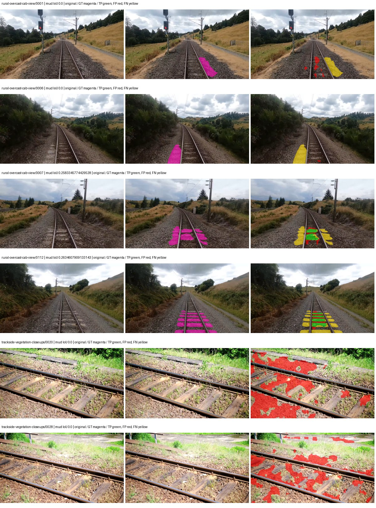
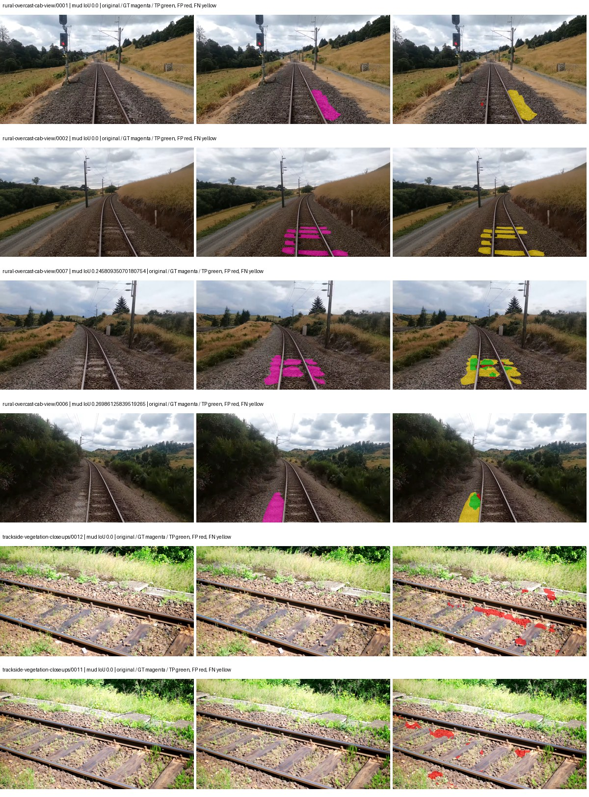
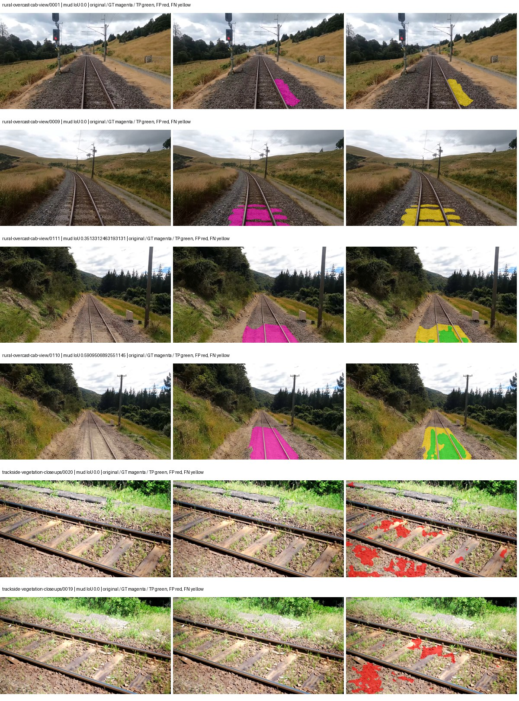
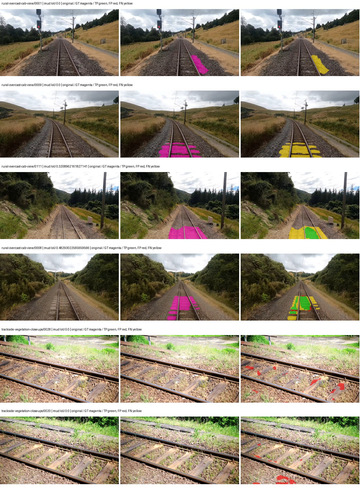

# smp_fpn_resnet50 — rad_9_24_2026-fixed-grouped

[RAD 9/24: Scene-grouped split](../../README.md) · [Full model records](record.json)

Primary selection and early stopping: **mud-pumping validation IoU**. A job is complete only after full statistics and isolated profiling are verified.

| Model | Initialization path | Seed | Status | Steps | Best step | Mud IoU (%) | Mud precision (%) | Mud recall (%) | Final mud IoU (trainer val, %) | mIoU (%) | Fixed GT-class mIoU (%) |
| --- | --- | --- | --- | --- | --- | --- | --- | --- | --- | --- | --- |
| smp_fpn_resnet50 | rtis_only | 0 | completed | 1555 | 259 | 4.80 | 7.36 | 12.11 | 1.15 | 20.13 | 22.37 |
| smp_fpn_resnet50 | cityscapes_to_rtis | 0 | completed | 2592 | 1296 | 8.24 | 31.75 | 10.01 | 3.59 | 28.95 | 32.17 |
| smp_fpn_resnet50 | railsem19_to_rtis | 0 | completed | 2074 | 777 | 12.82 | 24.34 | 21.32 | 7.52 | 41.83 | 48.80 |
| smp_fpn_resnet50 | cityscapes_to_railsem19_to_rtis | 0 | completed | 2074 | 777 | 14.43 | 51.44 | 16.70 | 13.01 | 35.26 | 41.14 |

Training: 217 images. Validation: 37 images. Test: 60 held out. Seeds: [0]. Seed variation measures optimization variability, not independent-recording uncertainty. Historical source checkpoints stay fixed across adaptation seeds.

Training code: `d864b72bd90706260965bb1a48398d01167b6d5c`. Split SHA-256: `12d7b367c72cda61d57686ff2ac28223530d0af49debd9fb7a0fbc68b908bc93`.

## rtis_only — seed 0

Status: **completed**. Started: 2026-10-06T02:35:55.110600+00:00. Finished: 2026-10-06T02:54:04.830324+00:00.

Recipe pretrained initializer: `{"arch": "smp", "backbone_path": null, "batch_norm_momentum": null, "checkpoint": null, "classifier_path": null, "drop_path": null, "encoder_name": "resnet50", "encoder_weights": "imagenet", "head": "unified_head", "head_paths": [], "inactive_parameter_paths": [], "local_files_only": false, "lora_alpha": 32, "lora_dropout": 0.05, "lora_r": 16, "lora_targets": [], "native": null, "revision": null, "smp_arch": "FPN", "subfolder": null, "trust_remote_code": false, "tuning": "full"}`.

`rtis_only` uses the recipe initializer, which may include pretrained segmentation components. Transfer paths load the exact historical source checkpoint below and reset the classifier; they do not reset all query/decoder features.

Source checkpoint: `Recipe pretrained initialization`.

Config SHA-256: `0e6affd11bf960a0405fa384edf965cb1291ca05e6c631a196fae4f747bac16d`. Weights used for validation: `raw`.

### Mud-pumping and aggregate quality

| Metric | Selected checkpoint | Final training validation |
| --- | --- | --- |
| Mud IoU | 4.80 | 1.15 |
| Mud precision | 7.36 | 1.49 |
| Mud recall | 12.11 | 4.76 |
| Mud Dice/F1 | 9.15 | 2.27 |
| mIoU | 20.13 | 24.14 |
| Mean accuracy | 30.94 | 37.13 |
| Mean precision | 32.06 | 46.58 |
| Mean Dice | 26.32 | 31.85 |
| Mean specificity | 98.45 | 98.63 |
| Pixel accuracy | 76.96 | 77.91 |
| Frequency-weighted IoU | 64.29 | 68.33 |
| Fixed GT-present class mIoU | 22.37 | 28.17 |
| Boundary F1 | 22.88 | 31.51 |

The selected checkpoint has independent evaluation evidence. Final values are the trainer's final validation record, not a new independent evaluation. mIoU averages classes with nonzero union, so false positives on absent classes can change its denominator. The fixed GT-class mean is supplementary and excludes absent classes; their false positives remain in the confusion matrix.

### Resource usage and timing

| Measurement | Value |
| --- | --- |
| Peak training VRAM, retained training invocation (GiB) | 8.69 |
| Peak evaluation VRAM (GiB) | 7.01 |
| Retained training invocation wall time (seconds) | 955.05 |
| Retained training invocation GPU-hours (one GPU) | 0.27 |
| Evaluation wall time (seconds) | 11.22 |
| Full evaluation pipeline images/second | 3.30 |
| Best full-state checkpoint (MiB) | 399.34 |
| Final full-state checkpoint (MiB) | 399.33 |
| Verified periodic checkpoints removed (GiB) | 1.17 |

VRAM uses the recorded allocator high-water mark; it is not total device usage including CUDA context. Resumed jobs' retained training invocation times and peaks are **not whole-campaign totals**. Earlier invocation resource records are not reconstructed here. Evaluation throughput includes loader, sliding-window inference and metrics; it is not model-only latency/FPS. Missing measurements are shown as —, never inferred from another dataset's run.

### Standardized inference performance

Dedicated model-only profiling waits for an idle worker-locked L40S: BF16, batch 1, 1024x1024, 20 warmup and 100 CUDA-event-timed public forwards. It excludes loading, preprocessing, tiling and metrics.

| Status | Parameters | Weight MiB | FPS | p50 ms | p95 ms | Peak reserved GiB |
| --- | --- | --- | --- | --- | --- | --- |
| complete | 26118613 | 99.63 | 160.29 | 6.23 | 6.27 | 0.73 |

```json
{
  "schema_version": 1,
  "model_id": "smp_fpn_resnet50",
  "measured_at": "2026-10-06T02:54:01+00:00",
  "status": "complete",
  "benchmark_scope": "rtis_selected_checkpoint_model_only",
  "applies_to": [
    "smp_fpn_resnet50--rtis_only--seed-0"
  ],
  "source": {
    "campaign_git_sha": "d864b72bd90706260965bb1a48398d01167b6d5c",
    "git_dirty": false,
    "config_hash": "232fcfcff338",
    "resolved_config": "/data/izadia1/projects/segmentary-runs/rad_9_24_2026/fixed-grouped-seed0-20261005-r2/configs/smp_fpn_resnet50--rtis_only--seed-0.yaml",
    "config_sha256": "0e6affd11bf960a0405fa384edf965cb1291ca05e6c631a196fae4f747bac16d",
    "checkpoint_sha256": "b2cab298df13fd2d7491d212e850053c2c69a995c0704d6501a83f3f057f3725",
    "checkpoint_global_step": 259,
    "checkpoint_bytes": 418737440,
    "checkpoint_kind": "resume checkpoint with optimizer and EMA state",
    "weights": "raw",
    "measured_checkpoint_job_id": "smp_fpn_resnet50--rtis_only--seed-0",
    "result_sha256": "2a394d3eafc80796ef46862a58a3b53dc009358dee2bc89ef0a017d2aecacb20",
    "result_git_sha": "d864b72bd90706260965bb1a48398d01167b6d5c",
    "result_stage": "eval:rad_9_24_2026-fixed-grouped:val",
    "result_seed": 0
  },
  "hardware": {
    "gpu_name": "NVIDIA L40S",
    "gpu_uuid": "GPU-a5ad49e5-0536-5229-ba8a-f8a902808f53",
    "logical_device": "cuda:0",
    "physical_visibility_token": "7",
    "compute_capability": [
      8,
      9
    ],
    "total_memory_bytes": 47677177856
  },
  "model": {
    "parameter_count": 26118613,
    "trainable_parameter_count": 26118613,
    "resident_parameter_bytes": 104474452,
    "parameter_dtype_counts": {
      "float32": 26118613
    }
  },
  "contract": {
    "backend": "pytorch",
    "precision": "bf16_autocast",
    "batch_size": 1,
    "input_shape_nchw": [
      1,
      3,
      1024,
      1024
    ],
    "warmup_iterations": 20,
    "measured_iterations": 100,
    "timing": "per-forward CUDA events with end-event synchronization",
    "includes_preprocessing": false,
    "includes_data_loader": false,
    "includes_sliding_window": false,
    "input_resident_on_gpu": true,
    "model_only": true,
    "entrypoint": "public model(image) dense-logits forward"
  },
  "measurements": {
    "latency": {
      "p50_ms": 6.2320637702941895,
      "p95_ms": 6.26708459854126,
      "mean_ms": 6.238871994018555,
      "minimum_ms": 6.214655876159668,
      "maximum_ms": 6.3948798179626465,
      "fps": 160.2853850758179,
      "raw_ms": [
        6.290431976318359,
        6.227968215942383,
        6.219776153564453,
        6.222847938537598,
        6.228991985321045,
        6.252543926239014,
        6.231040000915527,
        6.230016231536865,
        6.248447895050049,
        6.245376110076904,
        6.219776153564453,
        6.223872184753418,
        6.3897600173950195,
        6.234111785888672,
        6.236159801483154,
        6.2269439697265625,
        6.2269439697265625,
        6.2218241691589355,
        6.22489595413208,
        6.242303848266602,
        6.220799922943115,
        6.236159801483154,
        6.23203182220459,
        6.23308801651001,
        6.222847938537598,
        6.231040000915527,
        6.237184047698975,
        6.386688232421875,
        6.2259202003479,
        6.2269439697265625,
        6.214655876159668,
        6.258687973022461,
        6.2320637702941895,
        6.238207817077637,
        6.223872184753418,
        6.230016231536865,
        6.236159801483154,
        6.2269439697265625,
        6.234111785888672,
        6.2320637702941895,
        6.234111785888672,
        6.333439826965332,
        6.231040000915527,
        6.238207817077637,
        6.228991985321045,
        6.237184047698975,
        6.223872184753418,
        6.231008052825928,
        6.227968215942383,
        6.230016231536865,
        6.228991985321045,
        6.2269439697265625,
        6.227968215942383,
        6.234111785888672,
        6.26585578918457,
        6.2320637702941895,
        6.242303848266602,
        6.236159801483154,
        6.2320637702941895,
        6.242271900177002,
        6.2259202003479,
        6.227968215942383,
        6.237184047698975,
        6.23308801651001,
        6.237184047698975,
        6.215680122375488,
        6.228991985321045,
        6.243328094482422,
        6.231040000915527,
        6.228991985321045,
        6.235136032104492,
        6.222847938537598,
        6.23308801651001,
        6.3948798179626465,
        6.23308801651001,
        6.2259202003479,
        6.243328094482422,
        6.230016231536865,
        6.2269439697265625,
        6.237184047698975,
        6.246399879455566,
        6.230976104736328,
        6.228991985321045,
        6.217728137969971,
        6.22489595413208,
        6.230016231536865,
        6.2412800788879395,
        6.237184047698975,
        6.235136032104492,
        6.239232063293457,
        6.238207817077637,
        6.231040000915527,
        6.217728137969971,
        6.238207817077637,
        6.243328094482422,
        6.236159801483154,
        6.236159801483154,
        6.2320637702941895,
        6.243328094482422,
        6.239232063293457
      ],
      "percentile_method": "numpy linear interpolation"
    },
    "peak_reserved_bytes": 782237696,
    "memory_kind": "pytorch_cuda_allocator_peak_reserved_excluding_context",
    "benchmark_wall_clock_s": 12.554315134882927
  },
  "started_at": "2026-10-06T02:53:48+00:00",
  "finished_at": "2026-10-06T02:54:01+00:00",
  "environment": {
    "hostname": "hdrfs-app-001",
    "python": "3.11.15",
    "platform": "Linux-5.15.0-139-generic-x86_64-with-glibc2.35",
    "torch": "2.11.0+cu128",
    "torch_cuda": "12.8",
    "cudnn": 91900,
    "driver_version": "570.133.20",
    "cuda_available": true,
    "gpu_count": 1,
    "gpu_names": [
      "NVIDIA L40S"
    ],
    "cuda_visible_devices": "7",
    "packages": {
      "segmentary": "0.1.0",
      "torch": "2.11.0+cu128",
      "torchvision": "0.26.0+cu128",
      "transformers": "5.15.0",
      "timm": "1.0.28",
      "segmentation-models-pytorch": "0.5.0",
      "albumentations": "2.0.8",
      "lightning": "2.6.5",
      "numpy": "2.4.4"
    }
  }
}
```

### Per-class validation results

| Class | GT pixels | IoU (%) | Precision (%) | Recall (%) | Dice (%) | Boundary F1 (%) |
| --- | --- | --- | --- | --- | --- | --- |
| car | 29664 | 0.00 | 0.00 | 0.00 | 0.00 | 0.00 |
| construction | 311585 | 13.70 | 14.61 | 68.82 | 24.10 | 26.73 |
| fence | 265137 | 4.61 | 12.19 | 6.91 | 8.82 | 12.43 |
| mud-pumping | 1226250 | 4.80 | 7.36 | 12.11 | 9.15 | 8.06 |
| on-rails | 0 | 0.00 | 0.00 | — | 0.00 | 0.00 |
| person | 0 | — | — | — | — | — |
| pole | 628038 | 41.92 | 70.07 | 51.07 | 59.08 | 71.17 |
| rail-embedded | 16799 | 0.00 | 0.00 | 0.00 | 0.00 | 0.00 |
| rail-raised | 2969797 | 61.67 | 63.88 | 94.68 | 76.29 | 83.86 |
| rail-track | 6323197 | 21.46 | 81.52 | 22.56 | 35.34 | 34.80 |
| road | 1048831 | 3.89 | 9.98 | 5.99 | 7.49 | 5.78 |
| sidewalk | 1297367 | 20.33 | 56.27 | 24.15 | 33.79 | 15.05 |
| sky | 19121606 | 88.58 | 98.68 | 89.65 | 93.95 | 72.47 |
| standing-water | 95802 | 0.00 | 0.00 | 0.00 | 0.00 | 0.00 |
| terrain | 39239306 | 77.26 | 79.54 | 96.43 | 87.17 | 42.32 |
| trackbed | 10643081 | 51.17 | 64.71 | 70.98 | 67.70 | 49.27 |
| traffic-light | 19510 | 0.00 | 0.00 | 0.00 | 0.00 | 0.00 |
| traffic-sign | 13285 | 0.00 | 0.00 | 0.00 | 0.00 | 0.00 |
| tram-track | 56179 | 0.00 | 0.00 | 0.00 | 0.00 | 0.00 |
| truck | 0 | 0.00 | 0.00 | — | 0.00 | 0.00 |
| vegetation-overgrowth | 5901821 | 13.27 | 82.35 | 13.66 | 23.43 | 35.63 |

### Full-run accounting

| Measurement | Value |
| --- | --- |
| Full GPU-reserved wall seconds, all recorded worker attempts | 1097.36 |
| Full reserved GPU-hours | 0.30 |
| Whole-run timing complete | True |

| Phase | Wall seconds including failed attempts |
| --- | --- |
| training | 961.68 |
| diagnostics | 86.43 |
| performance | 20.39 |

GPU-reserved time includes model loading, training, validation, collection, profiling, checkpoint I/O and orchestration while the worker owns one GPU. It is not GPU kernel-active time. Phase timings and sampled device memory/power/utilization are retained separately; sampled device memory is not the allocator high-water mark.

### Train/validation and raw/EMA diagnostics

| Checkpoint / weights / split | Images | Mud IoU (%) | Mud precision (%) | Mud recall (%) |
| --- | --- | --- | --- | --- |
| best-auto-train / raw | 217 | 82.83 | 88.46 | 92.86 |
| best-auto-val / raw | 37 | 4.80 | 7.36 | 12.11 |
| best-alternate-val / ema | 37 | 0.19 | 0.23 | 1.02 |
| final-auto-val / raw | 37 | 1.15 | 1.49 | 4.75 |

Train uses the evaluation transform without augmentation. Compare mud train/validation metrics for the same selected weights. Alternate EMA on running-stat BatchNorm is explicitly uncalibrated and is diagnostic only. Score-threshold curves use uncalibrated normalized scores and are pixel-level diagnostics, not event detection rates or a selected deployment operating point.

### Downloadable evidence

- best-auto-train: [per-image.csv](rtis_only--seed-0/best-auto-train/per-image.csv) · [per-image-confusion.json.gz](rtis_only--seed-0/best-auto-train/per-image-confusion.json.gz) · [groups.json](rtis_only--seed-0/best-auto-train/groups.json) · [mud-score-curves.json](rtis_only--seed-0/best-auto-train/mud-score-curves.json)
- best-auto-val: [per-image.csv](rtis_only--seed-0/best-auto-val/per-image.csv) · [per-image-confusion.json.gz](rtis_only--seed-0/best-auto-val/per-image-confusion.json.gz) · [groups.json](rtis_only--seed-0/best-auto-val/groups.json) · [mud-score-curves.json](rtis_only--seed-0/best-auto-val/mud-score-curves.json) · [examples.jpg](rtis_only--seed-0/best-auto-val/examples.jpg)
- best-alternate-val: [per-image.csv](rtis_only--seed-0/best-alternate-val/per-image.csv) · [per-image-confusion.json.gz](rtis_only--seed-0/best-alternate-val/per-image-confusion.json.gz) · [groups.json](rtis_only--seed-0/best-alternate-val/groups.json) · [mud-score-curves.json](rtis_only--seed-0/best-alternate-val/mud-score-curves.json)
- final-auto-val: [per-image.csv](rtis_only--seed-0/final-auto-val/per-image.csv) · [per-image-confusion.json.gz](rtis_only--seed-0/final-auto-val/per-image-confusion.json.gz) · [groups.json](rtis_only--seed-0/final-auto-val/groups.json) · [mud-score-curves.json](rtis_only--seed-0/final-auto-val/mud-score-curves.json)
- resources: [telemetry.csv](rtis_only--seed-0/resources/telemetry.csv)



Examples are two lowest and two highest mud-IoU positive images, plus up to two negative images with the most false-positive mud pixels. They are targeted diagnostic examples, not random samples. Green: true positive; red: false positive; yellow: false negative. Full predictions remain on HDRFS.

### Validation tracking

| Logged step | Overall mIoU (%) | Mud IoU (%) |
| --- | --- | --- |
| 258 | 20.13 | 4.80 |
| 518 | 20.29 | 3.76 |
| 777 | 27.77 | 1.99 |
| 1036 | 23.95 | 0.37 |
| 1295 | 25.96 | 2.51 |
| 1555 | 24.14 | 1.15 |

All retained scalar curves, including training loss and per-class IoU, are in record.json. Observed best mud on a curve is not necessarily a retained checkpoint: the pilot saved its selection-metric-best and final checkpoints. Step logging and checkpoint global_step may differ by one.

### Stopping and checkpoint provenance

```json
{
  "stopping": {
    "actual_steps": 1555,
    "maximum_steps": 4000,
    "min_delta": 0.001,
    "monitor": "val_iou/mud-pumping",
    "patience": 5,
    "reason": "validation_plateau"
  },
  "checkpoints": {
    "best": {
      "path": "/data/izadia1/projects/segmentary-runs/rad_9_24_2026/fixed-grouped-seed0-20261005-r2/future-runs/smp_fpn_resnet50--rtis_only--seed-0_seed0/rtis/best.ckpt",
      "sha256": "b2cab298df13fd2d7491d212e850053c2c69a995c0704d6501a83f3f057f3725",
      "global_step": 259,
      "bytes": 418737440
    },
    "final": {
      "path": "/data/izadia1/projects/segmentary-runs/rad_9_24_2026/fixed-grouped-seed0-20261005-r2/future-runs/smp_fpn_resnet50--rtis_only--seed-0_seed0/rtis/last.ckpt",
      "sha256": "12b3ada82a46bd0a2933c811137a0628eac355497dfc9b6510907d96a877b1eb",
      "global_step": 1555,
      "bytes": 418725920
    }
  },
  "cleanup_error": null
}
```

### Resolved training, initialization and evaluation settings

The optimizer block is the base configuration. Stage LR scales are applied at runtime, and stage warmup is capped at min(base warmup, floor(stage budget / 10), stage budget - 1): 400 steps for this 4,000-step pilot. Model-internal native input grids may differ from augmentation crops (EoMT uses its 640 grid).

```json
{
  "name": "smp_fpn_resnet50--rtis_only--seed-0",
  "model": {
    "arch": "smp",
    "checkpoint": null,
    "tuning": "full",
    "head": "unified_head",
    "lora_r": 16,
    "lora_alpha": 32,
    "lora_dropout": 0.05,
    "lora_targets": [],
    "drop_path": null,
    "revision": null,
    "subfolder": null,
    "local_files_only": false,
    "trust_remote_code": false,
    "backbone_path": null,
    "head_paths": [],
    "classifier_path": null,
    "inactive_parameter_paths": [],
    "smp_arch": "FPN",
    "encoder_name": "resnet50",
    "encoder_weights": "imagenet",
    "native": null,
    "batch_norm_momentum": null
  },
  "space": "paul-test-rtis",
  "taxonomy_root": "/data/izadia1/projects/segmentary-rad-d864b72b/taxonomy",
  "output_root": "/data/izadia1/projects/segmentary-runs/rad_9_24_2026/fixed-grouped-seed0-20261005-r2/future-runs",
  "optim": {
    "backbone_lr": 0.0001,
    "head_lr_mult": 10.0,
    "weight_decay": 0.05,
    "llrd": 1.0,
    "warmup_iters": 1500,
    "warmup_ratio": 1e-06,
    "poly_power": 0.9,
    "min_lr_ratio": 0.0,
    "betas": [
      0.9,
      0.999
    ],
    "grad_clip": 1.0
  },
  "train": {
    "iters": 4000,
    "batch_size": 2,
    "accum": 8,
    "num_workers": 2,
    "precision": "bf16-mixed",
    "ema_decay": 0.9998,
    "val_every": 250,
    "ckpt_every": 500,
    "selection_metric": "val_iou/mud-pumping",
    "early_stopping_patience": 5,
    "early_stopping_min_delta": 0.001,
    "seed": 0,
    "devices": 1
  },
  "eval": {
    "sliding_window": true,
    "window": [
      1024,
      1024
    ],
    "stride": [
      768,
      768
    ],
    "batch_size": 1,
    "num_workers": 2,
    "tta_scales": [],
    "tta_flip": false,
    "threshold": 0.5,
    "boundary_tolerance_frac": 0.0075,
    "save_confusion": true
  },
  "loss": {
    "task": "multiclass",
    "activation": "auto",
    "terms": [],
    "aux": "none",
    "aux_weight": 0.0,
    "ce_weight": 1.0,
    "label_smoothing": 0.0,
    "class_weights": null,
    "query": null
  },
  "aug": {
    "crop": [
      1024,
      1024
    ],
    "scale_min": 0.5,
    "scale_max": 2.0,
    "hflip_p": 0.5,
    "color_jitter_p": 0.5,
    "brightness": 0.25,
    "contrast": 0.25,
    "saturation": 0.25,
    "hue": 0.05
  },
  "stages": [
    {
      "name": "rtis",
      "data": [
        {
          "name": "rad_9_24_2026-fixed-grouped",
          "root": "/data/izadia1/datasets/rad_9_24_2026-fixed-grouped",
          "variant": null,
          "split_file": "splits.json",
          "train_split": "train",
          "val_split": "val",
          "limit": null,
          "loader": "folder",
          "mapping": "paul-test-rtis",
          "loader_options": {
            "require_groups": true
          }
        }
      ],
      "iters": null,
      "lr_scale": 1.0,
      "head_group_lr_scale": 1.0,
      "init_from": "pretrained",
      "reset_head": false,
      "freeze": null,
      "sample_weights": null
    }
  ]
}
```

### Hardware and software provenance

```json
{
  "training": {
    "cuda_available": true,
    "cuda_visible_devices": "7",
    "cudnn": 91900,
    "driver_version": "570.133.20",
    "gpu_count": 1,
    "gpu_names": [
      "NVIDIA L40S"
    ],
    "hostname": "hdrfs-app-001",
    "input_normalization": {
      "channel_order": "rgb",
      "mean": [
        0.485,
        0.456,
        0.406
      ],
      "source": "smp_encoder_settings",
      "std": [
        0.229,
        0.224,
        0.225
      ]
    },
    "model_origins": [
      {
        "hf_commit": null,
        "hf_name_or_path": null,
        "module": "model",
        "timm_pretrained": {}
      }
    ],
    "model_parameter_count": 26118613,
    "packages": {
      "albumentations": "2.0.8",
      "lightning": "2.6.5",
      "numpy": "2.4.4",
      "segmentary": "0.1.0",
      "segmentation-models-pytorch": "0.5.0",
      "timm": "1.0.28",
      "torch": "2.11.0+cu128",
      "torchvision": "0.26.0+cu128",
      "transformers": "5.15.0"
    },
    "platform": "Linux-5.15.0-139-generic-x86_64-with-glibc2.35",
    "python": "3.11.15",
    "torch": "2.11.0+cu128",
    "torch_cuda": "12.8",
    "trainable_parameter_count": 26118613,
    "training_stop": {
      "actual_steps": 1555,
      "maximum_steps": 4000,
      "min_delta": 0.001,
      "monitor": "val_iou/mud-pumping",
      "patience": 5,
      "reason": "validation_plateau"
    },
    "validation_weights": "raw"
  },
  "evaluation": {
    "cuda_available": true,
    "cuda_visible_devices": "7",
    "cudnn": 91900,
    "driver_version": "570.133.20",
    "gpu_count": 1,
    "gpu_names": [
      "NVIDIA L40S"
    ],
    "hostname": "hdrfs-app-001",
    "input_normalization": {
      "channel_order": "rgb",
      "mean": [
        0.485,
        0.456,
        0.406
      ],
      "source": "smp_encoder_settings",
      "std": [
        0.229,
        0.224,
        0.225
      ]
    },
    "packages": {
      "albumentations": "2.0.8",
      "lightning": "2.6.5",
      "numpy": "2.4.4",
      "segmentary": "0.1.0",
      "segmentation-models-pytorch": "0.5.0",
      "timm": "1.0.28",
      "torch": "2.11.0+cu128",
      "torchvision": "0.26.0+cu128",
      "transformers": "5.15.0"
    },
    "platform": "Linux-5.15.0-139-generic-x86_64-with-glibc2.35",
    "python": "3.11.15",
    "torch": "2.11.0+cu128",
    "torch_cuda": "12.8"
  }
}
```

## cityscapes_to_rtis — seed 0

Status: **completed**. Started: 2026-10-06T02:48:00.102954+00:00. Finished: 2026-10-06T03:16:45.419990+00:00.

Recipe pretrained initializer: `{"arch": "smp", "backbone_path": null, "batch_norm_momentum": null, "checkpoint": null, "classifier_path": null, "drop_path": null, "encoder_name": "resnet50", "encoder_weights": "imagenet", "head": "unified_head", "head_paths": [], "inactive_parameter_paths": [], "local_files_only": false, "lora_alpha": 32, "lora_dropout": 0.05, "lora_r": 16, "lora_targets": [], "native": null, "revision": null, "smp_arch": "FPN", "subfolder": null, "trust_remote_code": false, "tuning": "full"}`.

`rtis_only` uses the recipe initializer, which may include pretrained segmentation components. Transfer paths load the exact historical source checkpoint below and reset the classifier; they do not reset all query/decoder features.

Source checkpoint: `{'name': 'smp_fpn_resnet50--cityscapes--seed-0', 'model': 'smp_fpn_resnet50', 'protocol': 'cityscapes', 'config': '/data/izadia1/projects/segmentary-runs/all-model-city-rail-seed0-rail20-b9eb3e1/accepted/smp_fpn_resnet50--cityscapes--seed-0/resolved-config.yaml', 'checkpoint': '/data/izadia1/projects/segmentary-runs/current-main-fill-v2/jobs/smp_fpn_resnet50--cityscapes--seed-0/train/smp_fpn_resnet50--cityscapes_seed0/cityscapes/last.ckpt', 'recorded_sha256': '556c5d27ea6d8d034aa1d6c86a7defd74bcdd36b3e3962cc39034d22d32628d6', 'exists': True}`.

Config SHA-256: `2346b0e4d07437d8b285d855290f60046984ad8020c50145a24bd8501ab3a469`. Weights used for validation: `raw`.

### Mud-pumping and aggregate quality

| Metric | Selected checkpoint | Final training validation |
| --- | --- | --- |
| Mud IoU | 8.24 | 3.59 |
| Mud precision | 31.75 | 11.72 |
| Mud recall | 10.01 | 4.93 |
| Mud Dice/F1 | 15.22 | 6.94 |
| mIoU | 28.95 | 32.12 |
| Mean accuracy | 40.66 | 46.49 |
| Mean precision | 46.10 | 42.85 |
| Mean Dice | 37.71 | 40.53 |
| Mean specificity | 98.65 | 99.00 |
| Pixel accuracy | 80.19 | 83.32 |
| Frequency-weighted IoU | 68.87 | 74.67 |
| Fixed GT-present class mIoU | 32.17 | 37.47 |
| Boundary F1 | 34.19 | 36.73 |

The selected checkpoint has independent evaluation evidence. Final values are the trainer's final validation record, not a new independent evaluation. mIoU averages classes with nonzero union, so false positives on absent classes can change its denominator. The fixed GT-class mean is supplementary and excludes absent classes; their false positives remain in the confusion matrix.

### Resource usage and timing

| Measurement | Value |
| --- | --- |
| Peak training VRAM, retained training invocation (GiB) | 8.69 |
| Peak evaluation VRAM (GiB) | 7.01 |
| Retained training invocation wall time (seconds) | 1589.89 |
| Retained training invocation GPU-hours (one GPU) | 0.44 |
| Evaluation wall time (seconds) | 11.18 |
| Full evaluation pipeline images/second | 3.31 |
| Best full-state checkpoint (MiB) | 399.34 |
| Final full-state checkpoint (MiB) | 399.33 |
| Verified periodic checkpoints removed (GiB) | 1.95 |

VRAM uses the recorded allocator high-water mark; it is not total device usage including CUDA context. Resumed jobs' retained training invocation times and peaks are **not whole-campaign totals**. Earlier invocation resource records are not reconstructed here. Evaluation throughput includes loader, sliding-window inference and metrics; it is not model-only latency/FPS. Missing measurements are shown as —, never inferred from another dataset's run.

### Standardized inference performance

Dedicated model-only profiling waits for an idle worker-locked L40S: BF16, batch 1, 1024x1024, 20 warmup and 100 CUDA-event-timed public forwards. It excludes loading, preprocessing, tiling and metrics.

| Status | Parameters | Weight MiB | FPS | p50 ms | p95 ms | Peak reserved GiB |
| --- | --- | --- | --- | --- | --- | --- |
| complete | 26118613 | 99.63 | 160.41 | 6.23 | 6.25 | 0.74 |

```json
{
  "schema_version": 1,
  "model_id": "smp_fpn_resnet50",
  "measured_at": "2026-10-06T03:16:41+00:00",
  "status": "complete",
  "benchmark_scope": "rtis_selected_checkpoint_model_only",
  "applies_to": [
    "smp_fpn_resnet50--cityscapes_to_rtis--seed-0"
  ],
  "source": {
    "campaign_git_sha": "d864b72bd90706260965bb1a48398d01167b6d5c",
    "git_dirty": false,
    "config_hash": "2ab60572c337",
    "resolved_config": "/data/izadia1/projects/segmentary-runs/rad_9_24_2026/fixed-grouped-seed0-20261005-r2/configs/smp_fpn_resnet50--cityscapes_to_rtis--seed-0.yaml",
    "config_sha256": "2346b0e4d07437d8b285d855290f60046984ad8020c50145a24bd8501ab3a469",
    "checkpoint_sha256": "e3f42f6c4e8ab67b74951cc02f2a43d618374cd2caeeee9e6ee1ea9e821d6fe1",
    "checkpoint_global_step": 1296,
    "checkpoint_bytes": 418737632,
    "checkpoint_kind": "resume checkpoint with optimizer and EMA state",
    "weights": "raw",
    "measured_checkpoint_job_id": "smp_fpn_resnet50--cityscapes_to_rtis--seed-0",
    "result_sha256": "fccf769ec1216fcffb25ee1b2f13982cefc6c130d109d6dbc622b7ed1b1a0229",
    "result_git_sha": "d864b72bd90706260965bb1a48398d01167b6d5c",
    "result_stage": "eval:rad_9_24_2026-fixed-grouped:val",
    "result_seed": 0
  },
  "hardware": {
    "gpu_name": "NVIDIA L40S",
    "gpu_uuid": "GPU-804aea8b-5f62-423e-72c6-49e1ed15c4e4",
    "logical_device": "cuda:0",
    "physical_visibility_token": "6",
    "compute_capability": [
      8,
      9
    ],
    "total_memory_bytes": 47677177856
  },
  "model": {
    "parameter_count": 26118613,
    "trainable_parameter_count": 26118613,
    "resident_parameter_bytes": 104474452,
    "parameter_dtype_counts": {
      "float32": 26118613
    }
  },
  "contract": {
    "backend": "pytorch",
    "precision": "bf16_autocast",
    "batch_size": 1,
    "input_shape_nchw": [
      1,
      3,
      1024,
      1024
    ],
    "warmup_iterations": 20,
    "measured_iterations": 100,
    "timing": "per-forward CUDA events with end-event synchronization",
    "includes_preprocessing": false,
    "includes_data_loader": false,
    "includes_sliding_window": false,
    "input_resident_on_gpu": true,
    "model_only": true,
    "entrypoint": "public model(image) dense-logits forward"
  },
  "measurements": {
    "latency": {
      "p50_ms": 6.23308801651001,
      "p95_ms": 6.24747531414032,
      "mean_ms": 6.234061102867127,
      "minimum_ms": 6.217728137969971,
      "maximum_ms": 6.267903804779053,
      "fps": 160.40907900952186,
      "raw_ms": [
        6.267903804779053,
        6.23308801651001,
        6.230016231536865,
        6.238207817077637,
        6.2259202003479,
        6.230016231536865,
        6.2320637702941895,
        6.244319915771484,
        6.227968215942383,
        6.2269439697265625,
        6.240255832672119,
        6.227968215942383,
        6.2412800788879395,
        6.236159801483154,
        6.22489595413208,
        6.243328094482422,
        6.236159801483154,
        6.236159801483154,
        6.2269439697265625,
        6.239232063293457,
        6.2269439697265625,
        6.220799922943115,
        6.2320637702941895,
        6.2320637702941895,
        6.223904132843018,
        6.238207817077637,
        6.23308801651001,
        6.231040000915527,
        6.238207817077637,
        6.228991985321045,
        6.22489595413208,
        6.242303848266602,
        6.22489595413208,
        6.235136032104492,
        6.248447895050049,
        6.230016231536865,
        6.2320637702941895,
        6.238207817077637,
        6.217728137969971,
        6.223872184753418,
        6.234111785888672,
        6.228991985321045,
        6.2320637702941895,
        6.242303848266602,
        6.234111785888672,
        6.243328094482422,
        6.251520156860352,
        6.236159801483154,
        6.237184047698975,
        6.236159801483154,
        6.251520156860352,
        6.228991985321045,
        6.23308801651001,
        6.228991985321045,
        6.2320637702941895,
        6.23308801651001,
        6.228991985321045,
        6.239232063293457,
        6.231040000915527,
        6.2412800788879395,
        6.234111785888672,
        6.2320637702941895,
        6.2269439697265625,
        6.251520156860352,
        6.238207817077637,
        6.2259202003479,
        6.230016231536865,
        6.230016231536865,
        6.2218241691589355,
        6.240255832672119,
        6.2269439697265625,
        6.2412800788879395,
        6.230016231536865,
        6.235136032104492,
        6.243328094482422,
        6.238207817077637,
        6.231040000915527,
        6.23308801651001,
        6.237184047698975,
        6.231040000915527,
        6.247424125671387,
        6.234111785888672,
        6.231040000915527,
        6.2269439697265625,
        6.236159801483154,
        6.228991985321045,
        6.227968215942383,
        6.236159801483154,
        6.231040000915527,
        6.23308801651001,
        6.231040000915527,
        6.230016231536865,
        6.239232063293457,
        6.22489595413208,
        6.2269439697265625,
        6.238207817077637,
        6.233119964599609,
        6.244351863861084,
        6.230016231536865,
        6.2412800788879395
      ],
      "percentile_method": "numpy linear interpolation"
    },
    "peak_reserved_bytes": 792723456,
    "memory_kind": "pytorch_cuda_allocator_peak_reserved_excluding_context",
    "benchmark_wall_clock_s": 12.294695638120174
  },
  "started_at": "2026-10-06T03:16:29+00:00",
  "finished_at": "2026-10-06T03:16:41+00:00",
  "environment": {
    "hostname": "hdrfs-app-001",
    "python": "3.11.15",
    "platform": "Linux-5.15.0-139-generic-x86_64-with-glibc2.35",
    "torch": "2.11.0+cu128",
    "torch_cuda": "12.8",
    "cudnn": 91900,
    "driver_version": "570.133.20",
    "cuda_available": true,
    "gpu_count": 1,
    "gpu_names": [
      "NVIDIA L40S"
    ],
    "cuda_visible_devices": "6",
    "packages": {
      "segmentary": "0.1.0",
      "torch": "2.11.0+cu128",
      "torchvision": "0.26.0+cu128",
      "transformers": "5.15.0",
      "timm": "1.0.28",
      "segmentation-models-pytorch": "0.5.0",
      "albumentations": "2.0.8",
      "lightning": "2.6.5",
      "numpy": "2.4.4"
    }
  }
}
```

### Per-class validation results

| Class | GT pixels | IoU (%) | Precision (%) | Recall (%) | Dice (%) | Boundary F1 (%) |
| --- | --- | --- | --- | --- | --- | --- |
| car | 29664 | 26.88 | 72.34 | 29.96 | 42.37 | 50.06 |
| construction | 311585 | 35.65 | 41.07 | 73.01 | 52.56 | 33.87 |
| fence | 265137 | 17.22 | 24.16 | 37.48 | 29.38 | 26.66 |
| mud-pumping | 1226250 | 8.24 | 31.75 | 10.01 | 15.22 | 17.35 |
| on-rails | 0 | 0.00 | 0.00 | — | 0.00 | 0.00 |
| person | 0 | — | — | — | — | — |
| pole | 628038 | 67.42 | 84.05 | 77.32 | 80.54 | 89.68 |
| rail-embedded | 16799 | 0.00 | 0.00 | 0.00 | 0.00 | 0.00 |
| rail-raised | 2969797 | 64.64 | 71.77 | 86.69 | 78.52 | 81.81 |
| rail-track | 6323197 | 36.50 | 64.86 | 45.50 | 53.48 | 44.22 |
| road | 1048831 | 6.05 | 9.42 | 14.47 | 11.41 | 11.03 |
| sidewalk | 1297367 | 9.88 | 30.65 | 12.73 | 17.99 | 10.70 |
| sky | 19121606 | 94.32 | 99.32 | 94.94 | 97.08 | 85.97 |
| standing-water | 95802 | 0.00 | 0.00 | 0.02 | 0.00 | 0.17 |
| terrain | 39239306 | 80.06 | 81.14 | 98.36 | 88.92 | 52.08 |
| trackbed | 10643081 | 59.90 | 79.32 | 70.99 | 74.92 | 57.33 |
| traffic-light | 19510 | 37.22 | 75.94 | 42.20 | 54.25 | 46.32 |
| traffic-sign | 13285 | 26.69 | 72.65 | 29.67 | 42.14 | 42.86 |
| tram-track | 56179 | 0.00 | 0.00 | 0.00 | 0.00 | 0.00 |
| truck | 0 | 0.00 | 0.00 | — | 0.00 | 0.00 |
| vegetation-overgrowth | 5901821 | 8.36 | 83.68 | 8.50 | 15.43 | 33.65 |

### Full-run accounting

| Measurement | Value |
| --- | --- |
| Full GPU-reserved wall seconds, all recorded worker attempts | 1733.11 |
| Full reserved GPU-hours | 0.48 |
| Whole-run timing complete | True |

| Phase | Wall seconds including failed attempts |
| --- | --- |
| training | 1597.42 |
| diagnostics | 86.13 |
| performance | 19.58 |

GPU-reserved time includes model loading, training, validation, collection, profiling, checkpoint I/O and orchestration while the worker owns one GPU. It is not GPU kernel-active time. Phase timings and sampled device memory/power/utilization are retained separately; sampled device memory is not the allocator high-water mark.

### Train/validation and raw/EMA diagnostics

| Checkpoint / weights / split | Images | Mud IoU (%) | Mud precision (%) | Mud recall (%) |
| --- | --- | --- | --- | --- |
| best-auto-train / raw | 217 | 89.68 | 95.46 | 93.67 |
| best-auto-val / raw | 37 | 8.24 | 31.75 | 10.01 |
| best-alternate-val / ema | 37 | 4.33 | 18.48 | 5.35 |
| final-auto-val / raw | 37 | 3.59 | 11.70 | 4.92 |

Train uses the evaluation transform without augmentation. Compare mud train/validation metrics for the same selected weights. Alternate EMA on running-stat BatchNorm is explicitly uncalibrated and is diagnostic only. Score-threshold curves use uncalibrated normalized scores and are pixel-level diagnostics, not event detection rates or a selected deployment operating point.

### Downloadable evidence

- best-auto-train: [per-image.csv](cityscapes_to_rtis--seed-0/best-auto-train/per-image.csv) · [per-image-confusion.json.gz](cityscapes_to_rtis--seed-0/best-auto-train/per-image-confusion.json.gz) · [groups.json](cityscapes_to_rtis--seed-0/best-auto-train/groups.json) · [mud-score-curves.json](cityscapes_to_rtis--seed-0/best-auto-train/mud-score-curves.json)
- best-auto-val: [per-image.csv](cityscapes_to_rtis--seed-0/best-auto-val/per-image.csv) · [per-image-confusion.json.gz](cityscapes_to_rtis--seed-0/best-auto-val/per-image-confusion.json.gz) · [groups.json](cityscapes_to_rtis--seed-0/best-auto-val/groups.json) · [mud-score-curves.json](cityscapes_to_rtis--seed-0/best-auto-val/mud-score-curves.json) · [examples.jpg](cityscapes_to_rtis--seed-0/best-auto-val/examples.jpg)
- best-alternate-val: [per-image.csv](cityscapes_to_rtis--seed-0/best-alternate-val/per-image.csv) · [per-image-confusion.json.gz](cityscapes_to_rtis--seed-0/best-alternate-val/per-image-confusion.json.gz) · [groups.json](cityscapes_to_rtis--seed-0/best-alternate-val/groups.json) · [mud-score-curves.json](cityscapes_to_rtis--seed-0/best-alternate-val/mud-score-curves.json)
- final-auto-val: [per-image.csv](cityscapes_to_rtis--seed-0/final-auto-val/per-image.csv) · [per-image-confusion.json.gz](cityscapes_to_rtis--seed-0/final-auto-val/per-image-confusion.json.gz) · [groups.json](cityscapes_to_rtis--seed-0/final-auto-val/groups.json) · [mud-score-curves.json](cityscapes_to_rtis--seed-0/final-auto-val/mud-score-curves.json)
- resources: [telemetry.csv](cityscapes_to_rtis--seed-0/resources/telemetry.csv)



Examples are two lowest and two highest mud-IoU positive images, plus up to two negative images with the most false-positive mud pixels. They are targeted diagnostic examples, not random samples. Green: true positive; red: false positive; yellow: false negative. Full predictions remain on HDRFS.

### Validation tracking

| Logged step | Overall mIoU (%) | Mud IoU (%) |
| --- | --- | --- |
| 258 | 20.25 | 0.72 |
| 518 | 22.17 | 0.51 |
| 777 | 23.49 | 1.32 |
| 1036 | 27.82 | 1.95 |
| 1295 | 28.97 | 8.24 |
| 1555 | 29.40 | 4.75 |
| 1814 | 31.09 | 2.17 |
| 2073 | 30.60 | 4.17 |
| 2332 | 30.54 | 5.54 |
| 2592 | 32.12 | 3.59 |

All retained scalar curves, including training loss and per-class IoU, are in record.json. Observed best mud on a curve is not necessarily a retained checkpoint: the pilot saved its selection-metric-best and final checkpoints. Step logging and checkpoint global_step may differ by one.

### Stopping and checkpoint provenance

```json
{
  "stopping": {
    "actual_steps": 2592,
    "maximum_steps": 4000,
    "min_delta": 0.001,
    "monitor": "val_iou/mud-pumping",
    "patience": 5,
    "reason": "validation_plateau"
  },
  "checkpoints": {
    "best": {
      "path": "/data/izadia1/projects/segmentary-runs/rad_9_24_2026/fixed-grouped-seed0-20261005-r2/future-runs/smp_fpn_resnet50--cityscapes_to_rtis--seed-0_seed0/rtis/best.ckpt",
      "sha256": "e3f42f6c4e8ab67b74951cc02f2a43d618374cd2caeeee9e6ee1ea9e821d6fe1",
      "global_step": 1296,
      "bytes": 418737632
    },
    "final": {
      "path": "/data/izadia1/projects/segmentary-runs/rad_9_24_2026/fixed-grouped-seed0-20261005-r2/future-runs/smp_fpn_resnet50--cityscapes_to_rtis--seed-0_seed0/rtis/last.ckpt",
      "sha256": "1188792896e57159bcb6a7b1502995060de0e32f097f2dc62a7e8566a0919e60",
      "global_step": 2592,
      "bytes": 418725920
    }
  },
  "cleanup_error": null
}
```

### Resolved training, initialization and evaluation settings

The optimizer block is the base configuration. Stage LR scales are applied at runtime, and stage warmup is capped at min(base warmup, floor(stage budget / 10), stage budget - 1): 400 steps for this 4,000-step pilot. Model-internal native input grids may differ from augmentation crops (EoMT uses its 640 grid).

```json
{
  "name": "smp_fpn_resnet50--cityscapes_to_rtis--seed-0",
  "model": {
    "arch": "smp",
    "checkpoint": null,
    "tuning": "full",
    "head": "unified_head",
    "lora_r": 16,
    "lora_alpha": 32,
    "lora_dropout": 0.05,
    "lora_targets": [],
    "drop_path": null,
    "revision": null,
    "subfolder": null,
    "local_files_only": false,
    "trust_remote_code": false,
    "backbone_path": null,
    "head_paths": [],
    "classifier_path": null,
    "inactive_parameter_paths": [],
    "smp_arch": "FPN",
    "encoder_name": "resnet50",
    "encoder_weights": "imagenet",
    "native": null,
    "batch_norm_momentum": null
  },
  "space": "paul-test-rtis",
  "taxonomy_root": "/data/izadia1/projects/segmentary-rad-d864b72b/taxonomy",
  "output_root": "/data/izadia1/projects/segmentary-runs/rad_9_24_2026/fixed-grouped-seed0-20261005-r2/future-runs",
  "optim": {
    "backbone_lr": 0.0001,
    "head_lr_mult": 10.0,
    "weight_decay": 0.05,
    "llrd": 1.0,
    "warmup_iters": 1500,
    "warmup_ratio": 1e-06,
    "poly_power": 0.9,
    "min_lr_ratio": 0.0,
    "betas": [
      0.9,
      0.999
    ],
    "grad_clip": 1.0
  },
  "train": {
    "iters": 4000,
    "batch_size": 2,
    "accum": 8,
    "num_workers": 2,
    "precision": "bf16-mixed",
    "ema_decay": 0.9998,
    "val_every": 250,
    "ckpt_every": 500,
    "selection_metric": "val_iou/mud-pumping",
    "early_stopping_patience": 5,
    "early_stopping_min_delta": 0.001,
    "seed": 0,
    "devices": 1
  },
  "eval": {
    "sliding_window": true,
    "window": [
      1024,
      1024
    ],
    "stride": [
      768,
      768
    ],
    "batch_size": 1,
    "num_workers": 2,
    "tta_scales": [],
    "tta_flip": false,
    "threshold": 0.5,
    "boundary_tolerance_frac": 0.0075,
    "save_confusion": true
  },
  "loss": {
    "task": "multiclass",
    "activation": "auto",
    "terms": [],
    "aux": "none",
    "aux_weight": 0.0,
    "ce_weight": 1.0,
    "label_smoothing": 0.0,
    "class_weights": null,
    "query": null
  },
  "aug": {
    "crop": [
      1024,
      1024
    ],
    "scale_min": 0.5,
    "scale_max": 2.0,
    "hflip_p": 0.5,
    "color_jitter_p": 0.5,
    "brightness": 0.25,
    "contrast": 0.25,
    "saturation": 0.25,
    "hue": 0.05
  },
  "stages": [
    {
      "name": "rtis",
      "data": [
        {
          "name": "rad_9_24_2026-fixed-grouped",
          "root": "/data/izadia1/datasets/rad_9_24_2026-fixed-grouped",
          "variant": null,
          "split_file": "splits.json",
          "train_split": "train",
          "val_split": "val",
          "limit": null,
          "loader": "folder",
          "mapping": "paul-test-rtis",
          "loader_options": {
            "require_groups": true
          }
        }
      ],
      "iters": null,
      "lr_scale": 0.1,
      "head_group_lr_scale": 1.0,
      "init_from": "/data/izadia1/projects/segmentary-runs/current-main-fill-v2/jobs/smp_fpn_resnet50--cityscapes--seed-0/train/smp_fpn_resnet50--cityscapes_seed0/cityscapes/last.ckpt",
      "reset_head": true,
      "freeze": null,
      "sample_weights": null
    }
  ]
}
```

### Hardware and software provenance

```json
{
  "training": {
    "cuda_available": true,
    "cuda_visible_devices": "6",
    "cudnn": 91900,
    "driver_version": "570.133.20",
    "gpu_count": 1,
    "gpu_names": [
      "NVIDIA L40S"
    ],
    "hostname": "hdrfs-app-001",
    "input_normalization": {
      "channel_order": "rgb",
      "mean": [
        0.485,
        0.456,
        0.406
      ],
      "source": "smp_encoder_settings",
      "std": [
        0.229,
        0.224,
        0.225
      ]
    },
    "model_origins": [
      {
        "hf_commit": null,
        "hf_name_or_path": null,
        "module": "model",
        "timm_pretrained": {}
      }
    ],
    "model_parameter_count": 26118613,
    "packages": {
      "albumentations": "2.0.8",
      "lightning": "2.6.5",
      "numpy": "2.4.4",
      "segmentary": "0.1.0",
      "segmentation-models-pytorch": "0.5.0",
      "timm": "1.0.28",
      "torch": "2.11.0+cu128",
      "torchvision": "0.26.0+cu128",
      "transformers": "5.15.0"
    },
    "platform": "Linux-5.15.0-139-generic-x86_64-with-glibc2.35",
    "python": "3.11.15",
    "torch": "2.11.0+cu128",
    "torch_cuda": "12.8",
    "trainable_parameter_count": 26118613,
    "training_stop": {
      "actual_steps": 2592,
      "maximum_steps": 4000,
      "min_delta": 0.001,
      "monitor": "val_iou/mud-pumping",
      "patience": 5,
      "reason": "validation_plateau"
    },
    "validation_weights": "raw"
  },
  "evaluation": {
    "cuda_available": true,
    "cuda_visible_devices": "6",
    "cudnn": 91900,
    "driver_version": "570.133.20",
    "gpu_count": 1,
    "gpu_names": [
      "NVIDIA L40S"
    ],
    "hostname": "hdrfs-app-001",
    "input_normalization": {
      "channel_order": "rgb",
      "mean": [
        0.485,
        0.456,
        0.406
      ],
      "source": "smp_encoder_settings",
      "std": [
        0.229,
        0.224,
        0.225
      ]
    },
    "packages": {
      "albumentations": "2.0.8",
      "lightning": "2.6.5",
      "numpy": "2.4.4",
      "segmentary": "0.1.0",
      "segmentation-models-pytorch": "0.5.0",
      "timm": "1.0.28",
      "torch": "2.11.0+cu128",
      "torchvision": "0.26.0+cu128",
      "transformers": "5.15.0"
    },
    "platform": "Linux-5.15.0-139-generic-x86_64-with-glibc2.35",
    "python": "3.11.15",
    "torch": "2.11.0+cu128",
    "torch_cuda": "12.8"
  }
}
```

## railsem19_to_rtis — seed 0

Status: **completed**. Started: 2026-10-06T02:54:13.010755+00:00. Finished: 2026-10-06T03:17:11.009250+00:00.

Recipe pretrained initializer: `{"arch": "smp", "backbone_path": null, "batch_norm_momentum": null, "checkpoint": null, "classifier_path": null, "drop_path": null, "encoder_name": "resnet50", "encoder_weights": "imagenet", "head": "unified_head", "head_paths": [], "inactive_parameter_paths": [], "local_files_only": false, "lora_alpha": 32, "lora_dropout": 0.05, "lora_r": 16, "lora_targets": [], "native": null, "revision": null, "smp_arch": "FPN", "subfolder": null, "trust_remote_code": false, "tuning": "full"}`.

`rtis_only` uses the recipe initializer, which may include pretrained segmentation components. Transfer paths load the exact historical source checkpoint below and reset the classifier; they do not reset all query/decoder features.

Source checkpoint: `{'name': 'smp_fpn_resnet50--railsem19--seed-0', 'model': 'smp_fpn_resnet50', 'protocol': 'railsem19', 'config': '/data/izadia1/projects/segmentary-runs/all-model-city-rail-seed0-rail20-b9eb3e1/jobs/smp_fpn_resnet50--railsem19--seed-0/attempt-001/resolved-config.yaml', 'checkpoint': '/data/izadia1/projects/segmentary-runs/all-model-city-rail-seed0-rail20-b9eb3e1/jobs/smp_fpn_resnet50--railsem19--seed-0/attempt-001/train/smp_fpn_resnet50--railsem19_seed0/railsem19/last.ckpt', 'recorded_sha256': '3937cfdc1cbd07489ea1eaf7771f305d8a2c6ccc6a141373c1d8f2142f0a9248', 'exists': True}`.

Config SHA-256: `c49949da8f5a99edcbd0d2ecc734a0c1719eca6425a65d8fbb2bfac62ef0c00f`. Weights used for validation: `raw`.

### Mud-pumping and aggregate quality

| Metric | Selected checkpoint | Final training validation |
| --- | --- | --- |
| Mud IoU | 12.82 | 7.52 |
| Mud precision | 24.34 | 11.44 |
| Mud recall | 21.32 | 17.97 |
| Mud Dice/F1 | 22.73 | 13.98 |
| mIoU | 41.83 | 42.45 |
| Mean accuracy | 59.10 | 60.72 |
| Mean precision | 59.17 | 57.89 |
| Mean Dice | 52.78 | 53.44 |
| Mean specificity | 99.08 | 99.12 |
| Pixel accuracy | 85.14 | 85.14 |
| Frequency-weighted IoU | 76.02 | 76.92 |
| Fixed GT-present class mIoU | 48.80 | 49.53 |
| Boundary F1 | 49.06 | 49.82 |

The selected checkpoint has independent evaluation evidence. Final values are the trainer's final validation record, not a new independent evaluation. mIoU averages classes with nonzero union, so false positives on absent classes can change its denominator. The fixed GT-class mean is supplementary and excludes absent classes; their false positives remain in the confusion matrix.

### Resource usage and timing

| Measurement | Value |
| --- | --- |
| Peak training VRAM, retained training invocation (GiB) | 8.69 |
| Peak evaluation VRAM (GiB) | 7.01 |
| Retained training invocation wall time (seconds) | 1243.60 |
| Retained training invocation GPU-hours (one GPU) | 0.35 |
| Evaluation wall time (seconds) | 11.26 |
| Full evaluation pipeline images/second | 3.28 |
| Best full-state checkpoint (MiB) | 399.34 |
| Final full-state checkpoint (MiB) | 399.33 |
| Verified periodic checkpoints removed (GiB) | 1.56 |

VRAM uses the recorded allocator high-water mark; it is not total device usage including CUDA context. Resumed jobs' retained training invocation times and peaks are **not whole-campaign totals**. Earlier invocation resource records are not reconstructed here. Evaluation throughput includes loader, sliding-window inference and metrics; it is not model-only latency/FPS. Missing measurements are shown as —, never inferred from another dataset's run.

### Standardized inference performance

Dedicated model-only profiling waits for an idle worker-locked L40S: BF16, batch 1, 1024x1024, 20 warmup and 100 CUDA-event-timed public forwards. It excludes loading, preprocessing, tiling and metrics.

| Status | Parameters | Weight MiB | FPS | p50 ms | p95 ms | Peak reserved GiB |
| --- | --- | --- | --- | --- | --- | --- |
| complete | 26118613 | 99.63 | 159.67 | 6.26 | 6.28 | 0.73 |

```json
{
  "schema_version": 1,
  "model_id": "smp_fpn_resnet50",
  "measured_at": "2026-10-06T03:17:07+00:00",
  "status": "complete",
  "benchmark_scope": "rtis_selected_checkpoint_model_only",
  "applies_to": [
    "smp_fpn_resnet50--railsem19_to_rtis--seed-0"
  ],
  "source": {
    "campaign_git_sha": "d864b72bd90706260965bb1a48398d01167b6d5c",
    "git_dirty": false,
    "config_hash": "9e5eccbb58c1",
    "resolved_config": "/data/izadia1/projects/segmentary-runs/rad_9_24_2026/fixed-grouped-seed0-20261005-r2/configs/smp_fpn_resnet50--railsem19_to_rtis--seed-0.yaml",
    "config_sha256": "c49949da8f5a99edcbd0d2ecc734a0c1719eca6425a65d8fbb2bfac62ef0c00f",
    "checkpoint_sha256": "6a2bc7f60b66f71d39ed8bd689aaa8d28ad8596868be462fdfe9a2d9c1ac76f7",
    "checkpoint_global_step": 777,
    "checkpoint_bytes": 418737632,
    "checkpoint_kind": "resume checkpoint with optimizer and EMA state",
    "weights": "raw",
    "measured_checkpoint_job_id": "smp_fpn_resnet50--railsem19_to_rtis--seed-0",
    "result_sha256": "3066bc9f609af12ec67ca3459484acceaa0421842f0fee623915fc4081abed7a",
    "result_git_sha": "d864b72bd90706260965bb1a48398d01167b6d5c",
    "result_stage": "eval:rad_9_24_2026-fixed-grouped:val",
    "result_seed": 0
  },
  "hardware": {
    "gpu_name": "NVIDIA L40S",
    "gpu_uuid": "GPU-a5ad49e5-0536-5229-ba8a-f8a902808f53",
    "logical_device": "cuda:0",
    "physical_visibility_token": "7",
    "compute_capability": [
      8,
      9
    ],
    "total_memory_bytes": 47677177856
  },
  "model": {
    "parameter_count": 26118613,
    "trainable_parameter_count": 26118613,
    "resident_parameter_bytes": 104474452,
    "parameter_dtype_counts": {
      "float32": 26118613
    }
  },
  "contract": {
    "backend": "pytorch",
    "precision": "bf16_autocast",
    "batch_size": 1,
    "input_shape_nchw": [
      1,
      3,
      1024,
      1024
    ],
    "warmup_iterations": 20,
    "measured_iterations": 100,
    "timing": "per-forward CUDA events with end-event synchronization",
    "includes_preprocessing": false,
    "includes_data_loader": false,
    "includes_sliding_window": false,
    "input_resident_on_gpu": true,
    "model_only": true,
    "entrypoint": "public model(image) dense-logits forward"
  },
  "measurements": {
    "latency": {
      "p50_ms": 6.2561280727386475,
      "p95_ms": 6.2836737632751465,
      "mean_ms": 6.2629776239395145,
      "minimum_ms": 6.239232063293457,
      "maximum_ms": 6.5279998779296875,
      "fps": 159.66846124080254,
      "raw_ms": [
        6.370304107666016,
        6.262784004211426,
        6.259712219238281,
        6.242303848266602,
        6.2740478515625,
        6.255616188049316,
        6.250495910644531,
        6.253568172454834,
        6.260735988616943,
        6.260735988616943,
        6.254591941833496,
        6.266880035400391,
        6.262752056121826,
        6.261760234832764,
        6.243328094482422,
        6.264863967895508,
        6.2566399574279785,
        6.254591941833496,
        6.259712219238281,
        6.261760234832764,
        6.247424125671387,
        6.259712219238281,
        6.253568172454834,
        6.250495910644531,
        6.244351863861084,
        6.254591941833496,
        6.246399879455566,
        6.267903804779053,
        6.260735988616943,
        6.247424125671387,
        6.251520156860352,
        6.255616188049316,
        6.259712219238281,
        6.258687973022461,
        6.242303848266602,
        6.268928050994873,
        6.251520156860352,
        6.262784004211426,
        6.248447895050049,
        6.262784004211426,
        6.258687973022461,
        6.5279998779296875,
        6.2740478515625,
        6.260735988616943,
        6.268928050994873,
        6.255616188049316,
        6.248447895050049,
        6.28326416015625,
        6.253536224365234,
        6.252543926239014,
        6.254591941833496,
        6.262784004211426,
        6.246399879455566,
        6.260735988616943,
        6.2454400062561035,
        6.250495910644531,
        6.272992134094238,
        6.243328094482422,
        6.250495910644531,
        6.385632038116455,
        6.263807773590088,
        6.268928050994873,
        6.251520156860352,
        6.258687973022461,
        6.252543926239014,
        6.255616188049316,
        6.253568172454834,
        6.259712219238281,
        6.244351863861084,
        6.254591941833496,
        6.259712219238281,
        6.261760234832764,
        6.254528045654297,
        6.257664203643799,
        6.248447895050049,
        6.255616188049316,
        6.252543926239014,
        6.3160319328308105,
        6.263807773590088,
        6.254591941833496,
        6.255616188049316,
        6.240255832672119,
        6.251488208770752,
        6.251520156860352,
        6.239232063293457,
        6.267903804779053,
        6.29145622253418,
        6.262784004211426,
        6.26585578918457,
        6.247424125671387,
        6.260735988616943,
        6.248447895050049,
        6.242303848266602,
        6.26585578918457,
        6.255616188049316,
        6.264863967895508,
        6.264832019805908,
        6.280191898345947,
        6.268928050994873,
        6.255616188049316
      ],
      "percentile_method": "numpy linear interpolation"
    },
    "peak_reserved_bytes": 782237696,
    "memory_kind": "pytorch_cuda_allocator_peak_reserved_excluding_context",
    "benchmark_wall_clock_s": 12.407700218260288
  },
  "started_at": "2026-10-06T03:16:54+00:00",
  "finished_at": "2026-10-06T03:17:07+00:00",
  "environment": {
    "hostname": "hdrfs-app-001",
    "python": "3.11.15",
    "platform": "Linux-5.15.0-139-generic-x86_64-with-glibc2.35",
    "torch": "2.11.0+cu128",
    "torch_cuda": "12.8",
    "cudnn": 91900,
    "driver_version": "570.133.20",
    "cuda_available": true,
    "gpu_count": 1,
    "gpu_names": [
      "NVIDIA L40S"
    ],
    "cuda_visible_devices": "7",
    "packages": {
      "segmentary": "0.1.0",
      "torch": "2.11.0+cu128",
      "torchvision": "0.26.0+cu128",
      "transformers": "5.15.0",
      "timm": "1.0.28",
      "segmentation-models-pytorch": "0.5.0",
      "albumentations": "2.0.8",
      "lightning": "2.6.5",
      "numpy": "2.4.4"
    }
  }
}
```

### Per-class validation results

| Class | GT pixels | IoU (%) | Precision (%) | Recall (%) | Dice (%) | Boundary F1 (%) |
| --- | --- | --- | --- | --- | --- | --- |
| car | 29664 | 56.67 | 79.10 | 66.65 | 72.34 | 58.49 |
| construction | 311585 | 44.57 | 49.67 | 81.25 | 61.65 | 51.82 |
| fence | 265137 | 27.12 | 60.03 | 33.10 | 42.67 | 42.76 |
| mud-pumping | 1226250 | 12.82 | 24.34 | 21.32 | 22.73 | 19.07 |
| on-rails | 0 | 0.00 | 0.00 | — | 0.00 | 0.00 |
| person | 0 | 0.00 | 0.00 | — | 0.00 | 0.00 |
| pole | 628038 | 63.98 | 89.25 | 69.33 | 78.04 | 90.83 |
| rail-embedded | 16799 | 28.66 | 86.31 | 30.03 | 44.55 | 78.41 |
| rail-raised | 2969797 | 72.30 | 77.12 | 92.05 | 83.92 | 89.37 |
| rail-track | 6323197 | 43.66 | 69.39 | 54.07 | 60.78 | 53.94 |
| road | 1048831 | 26.36 | 48.62 | 36.54 | 41.72 | 30.50 |
| sidewalk | 1297367 | 45.95 | 78.53 | 52.56 | 62.97 | 18.58 |
| sky | 19121606 | 97.82 | 99.30 | 98.51 | 98.90 | 94.10 |
| standing-water | 95802 | 1.11 | 1.64 | 3.34 | 2.20 | 10.37 |
| terrain | 39239306 | 88.24 | 90.29 | 97.49 | 93.75 | 66.01 |
| trackbed | 10643081 | 58.71 | 66.91 | 82.74 | 73.98 | 58.07 |
| traffic-light | 19510 | 78.42 | 96.50 | 80.71 | 87.90 | 84.53 |
| traffic-sign | 13285 | 49.42 | 75.21 | 59.04 | 66.15 | 68.11 |
| tram-track | 56179 | 55.28 | 66.80 | 76.21 | 71.20 | 62.49 |
| truck | 0 | 0.00 | 0.00 | — | 0.00 | 0.00 |
| vegetation-overgrowth | 5901821 | 27.30 | 83.52 | 28.85 | 42.89 | 52.82 |

### Full-run accounting

| Measurement | Value |
| --- | --- |
| Full GPU-reserved wall seconds, all recorded worker attempts | 1385.86 |
| Full reserved GPU-hours | 0.38 |
| Whole-run timing complete | True |

| Phase | Wall seconds including failed attempts |
| --- | --- |
| training | 1250.01 |
| diagnostics | 85.75 |
| performance | 19.93 |

GPU-reserved time includes model loading, training, validation, collection, profiling, checkpoint I/O and orchestration while the worker owns one GPU. It is not GPU kernel-active time. Phase timings and sampled device memory/power/utilization are retained separately; sampled device memory is not the allocator high-water mark.

### Train/validation and raw/EMA diagnostics

| Checkpoint / weights / split | Images | Mud IoU (%) | Mud precision (%) | Mud recall (%) |
| --- | --- | --- | --- | --- |
| best-auto-train / raw | 217 | 89.63 | 95.39 | 93.68 |
| best-auto-val / raw | 37 | 12.82 | 24.34 | 21.32 |
| best-alternate-val / ema | 37 | 5.21 | 12.19 | 8.34 |
| final-auto-val / raw | 37 | 7.51 | 11.43 | 17.97 |

Train uses the evaluation transform without augmentation. Compare mud train/validation metrics for the same selected weights. Alternate EMA on running-stat BatchNorm is explicitly uncalibrated and is diagnostic only. Score-threshold curves use uncalibrated normalized scores and are pixel-level diagnostics, not event detection rates or a selected deployment operating point.

### Downloadable evidence

- best-auto-train: [per-image.csv](railsem19_to_rtis--seed-0/best-auto-train/per-image.csv) · [per-image-confusion.json.gz](railsem19_to_rtis--seed-0/best-auto-train/per-image-confusion.json.gz) · [groups.json](railsem19_to_rtis--seed-0/best-auto-train/groups.json) · [mud-score-curves.json](railsem19_to_rtis--seed-0/best-auto-train/mud-score-curves.json)
- best-auto-val: [per-image.csv](railsem19_to_rtis--seed-0/best-auto-val/per-image.csv) · [per-image-confusion.json.gz](railsem19_to_rtis--seed-0/best-auto-val/per-image-confusion.json.gz) · [groups.json](railsem19_to_rtis--seed-0/best-auto-val/groups.json) · [mud-score-curves.json](railsem19_to_rtis--seed-0/best-auto-val/mud-score-curves.json) · [examples.jpg](railsem19_to_rtis--seed-0/best-auto-val/examples.jpg)
- best-alternate-val: [per-image.csv](railsem19_to_rtis--seed-0/best-alternate-val/per-image.csv) · [per-image-confusion.json.gz](railsem19_to_rtis--seed-0/best-alternate-val/per-image-confusion.json.gz) · [groups.json](railsem19_to_rtis--seed-0/best-alternate-val/groups.json) · [mud-score-curves.json](railsem19_to_rtis--seed-0/best-alternate-val/mud-score-curves.json)
- final-auto-val: [per-image.csv](railsem19_to_rtis--seed-0/final-auto-val/per-image.csv) · [per-image-confusion.json.gz](railsem19_to_rtis--seed-0/final-auto-val/per-image-confusion.json.gz) · [groups.json](railsem19_to_rtis--seed-0/final-auto-val/groups.json) · [mud-score-curves.json](railsem19_to_rtis--seed-0/final-auto-val/mud-score-curves.json)
- resources: [telemetry.csv](railsem19_to_rtis--seed-0/resources/telemetry.csv)



Examples are two lowest and two highest mud-IoU positive images, plus up to two negative images with the most false-positive mud pixels. They are targeted diagnostic examples, not random samples. Green: true positive; red: false positive; yellow: false negative. Full predictions remain on HDRFS.

### Validation tracking

| Logged step | Overall mIoU (%) | Mud IoU (%) |
| --- | --- | --- |
| 258 | 27.45 | 0.76 |
| 518 | 34.92 | 1.54 |
| 777 | 41.83 | 12.82 |
| 1036 | 41.26 | 0.82 |
| 1295 | 40.29 | 7.21 |
| 1555 | 41.86 | 8.56 |
| 1814 | 41.94 | 4.71 |
| 2073 | 42.45 | 7.52 |

All retained scalar curves, including training loss and per-class IoU, are in record.json. Observed best mud on a curve is not necessarily a retained checkpoint: the pilot saved its selection-metric-best and final checkpoints. Step logging and checkpoint global_step may differ by one.

### Stopping and checkpoint provenance

```json
{
  "stopping": {
    "actual_steps": 2074,
    "maximum_steps": 4000,
    "min_delta": 0.001,
    "monitor": "val_iou/mud-pumping",
    "patience": 5,
    "reason": "validation_plateau"
  },
  "checkpoints": {
    "best": {
      "path": "/data/izadia1/projects/segmentary-runs/rad_9_24_2026/fixed-grouped-seed0-20261005-r2/future-runs/smp_fpn_resnet50--railsem19_to_rtis--seed-0_seed0/rtis/best.ckpt",
      "sha256": "6a2bc7f60b66f71d39ed8bd689aaa8d28ad8596868be462fdfe9a2d9c1ac76f7",
      "global_step": 777,
      "bytes": 418737632
    },
    "final": {
      "path": "/data/izadia1/projects/segmentary-runs/rad_9_24_2026/fixed-grouped-seed0-20261005-r2/future-runs/smp_fpn_resnet50--railsem19_to_rtis--seed-0_seed0/rtis/last.ckpt",
      "sha256": "1c7ebb349ab953f85154b0fb5329573e589ce7b42646d3d71110cd868cb311c8",
      "global_step": 2074,
      "bytes": 418725920
    }
  },
  "cleanup_error": null
}
```

### Resolved training, initialization and evaluation settings

The optimizer block is the base configuration. Stage LR scales are applied at runtime, and stage warmup is capped at min(base warmup, floor(stage budget / 10), stage budget - 1): 400 steps for this 4,000-step pilot. Model-internal native input grids may differ from augmentation crops (EoMT uses its 640 grid).

```json
{
  "name": "smp_fpn_resnet50--railsem19_to_rtis--seed-0",
  "model": {
    "arch": "smp",
    "checkpoint": null,
    "tuning": "full",
    "head": "unified_head",
    "lora_r": 16,
    "lora_alpha": 32,
    "lora_dropout": 0.05,
    "lora_targets": [],
    "drop_path": null,
    "revision": null,
    "subfolder": null,
    "local_files_only": false,
    "trust_remote_code": false,
    "backbone_path": null,
    "head_paths": [],
    "classifier_path": null,
    "inactive_parameter_paths": [],
    "smp_arch": "FPN",
    "encoder_name": "resnet50",
    "encoder_weights": "imagenet",
    "native": null,
    "batch_norm_momentum": null
  },
  "space": "paul-test-rtis",
  "taxonomy_root": "/data/izadia1/projects/segmentary-rad-d864b72b/taxonomy",
  "output_root": "/data/izadia1/projects/segmentary-runs/rad_9_24_2026/fixed-grouped-seed0-20261005-r2/future-runs",
  "optim": {
    "backbone_lr": 0.0001,
    "head_lr_mult": 10.0,
    "weight_decay": 0.05,
    "llrd": 1.0,
    "warmup_iters": 1500,
    "warmup_ratio": 1e-06,
    "poly_power": 0.9,
    "min_lr_ratio": 0.0,
    "betas": [
      0.9,
      0.999
    ],
    "grad_clip": 1.0
  },
  "train": {
    "iters": 4000,
    "batch_size": 2,
    "accum": 8,
    "num_workers": 2,
    "precision": "bf16-mixed",
    "ema_decay": 0.9998,
    "val_every": 250,
    "ckpt_every": 500,
    "selection_metric": "val_iou/mud-pumping",
    "early_stopping_patience": 5,
    "early_stopping_min_delta": 0.001,
    "seed": 0,
    "devices": 1
  },
  "eval": {
    "sliding_window": true,
    "window": [
      1024,
      1024
    ],
    "stride": [
      768,
      768
    ],
    "batch_size": 1,
    "num_workers": 2,
    "tta_scales": [],
    "tta_flip": false,
    "threshold": 0.5,
    "boundary_tolerance_frac": 0.0075,
    "save_confusion": true
  },
  "loss": {
    "task": "multiclass",
    "activation": "auto",
    "terms": [],
    "aux": "none",
    "aux_weight": 0.0,
    "ce_weight": 1.0,
    "label_smoothing": 0.0,
    "class_weights": null,
    "query": null
  },
  "aug": {
    "crop": [
      1024,
      1024
    ],
    "scale_min": 0.5,
    "scale_max": 2.0,
    "hflip_p": 0.5,
    "color_jitter_p": 0.5,
    "brightness": 0.25,
    "contrast": 0.25,
    "saturation": 0.25,
    "hue": 0.05
  },
  "stages": [
    {
      "name": "rtis",
      "data": [
        {
          "name": "rad_9_24_2026-fixed-grouped",
          "root": "/data/izadia1/datasets/rad_9_24_2026-fixed-grouped",
          "variant": null,
          "split_file": "splits.json",
          "train_split": "train",
          "val_split": "val",
          "limit": null,
          "loader": "folder",
          "mapping": "paul-test-rtis",
          "loader_options": {
            "require_groups": true
          }
        }
      ],
      "iters": null,
      "lr_scale": 0.1,
      "head_group_lr_scale": 1.0,
      "init_from": "/data/izadia1/projects/segmentary-runs/all-model-city-rail-seed0-rail20-b9eb3e1/jobs/smp_fpn_resnet50--railsem19--seed-0/attempt-001/train/smp_fpn_resnet50--railsem19_seed0/railsem19/last.ckpt",
      "reset_head": true,
      "freeze": null,
      "sample_weights": null
    }
  ]
}
```

### Hardware and software provenance

```json
{
  "training": {
    "cuda_available": true,
    "cuda_visible_devices": "7",
    "cudnn": 91900,
    "driver_version": "570.133.20",
    "gpu_count": 1,
    "gpu_names": [
      "NVIDIA L40S"
    ],
    "hostname": "hdrfs-app-001",
    "input_normalization": {
      "channel_order": "rgb",
      "mean": [
        0.485,
        0.456,
        0.406
      ],
      "source": "smp_encoder_settings",
      "std": [
        0.229,
        0.224,
        0.225
      ]
    },
    "model_origins": [
      {
        "hf_commit": null,
        "hf_name_or_path": null,
        "module": "model",
        "timm_pretrained": {}
      }
    ],
    "model_parameter_count": 26118613,
    "packages": {
      "albumentations": "2.0.8",
      "lightning": "2.6.5",
      "numpy": "2.4.4",
      "segmentary": "0.1.0",
      "segmentation-models-pytorch": "0.5.0",
      "timm": "1.0.28",
      "torch": "2.11.0+cu128",
      "torchvision": "0.26.0+cu128",
      "transformers": "5.15.0"
    },
    "platform": "Linux-5.15.0-139-generic-x86_64-with-glibc2.35",
    "python": "3.11.15",
    "torch": "2.11.0+cu128",
    "torch_cuda": "12.8",
    "trainable_parameter_count": 26118613,
    "training_stop": {
      "actual_steps": 2074,
      "maximum_steps": 4000,
      "min_delta": 0.001,
      "monitor": "val_iou/mud-pumping",
      "patience": 5,
      "reason": "validation_plateau"
    },
    "validation_weights": "raw"
  },
  "evaluation": {
    "cuda_available": true,
    "cuda_visible_devices": "7",
    "cudnn": 91900,
    "driver_version": "570.133.20",
    "gpu_count": 1,
    "gpu_names": [
      "NVIDIA L40S"
    ],
    "hostname": "hdrfs-app-001",
    "input_normalization": {
      "channel_order": "rgb",
      "mean": [
        0.485,
        0.456,
        0.406
      ],
      "source": "smp_encoder_settings",
      "std": [
        0.229,
        0.224,
        0.225
      ]
    },
    "packages": {
      "albumentations": "2.0.8",
      "lightning": "2.6.5",
      "numpy": "2.4.4",
      "segmentary": "0.1.0",
      "segmentation-models-pytorch": "0.5.0",
      "timm": "1.0.28",
      "torch": "2.11.0+cu128",
      "torchvision": "0.26.0+cu128",
      "transformers": "5.15.0"
    },
    "platform": "Linux-5.15.0-139-generic-x86_64-with-glibc2.35",
    "python": "3.11.15",
    "torch": "2.11.0+cu128",
    "torch_cuda": "12.8"
  }
}
```

## cityscapes_to_railsem19_to_rtis — seed 0

Status: **completed**. Started: 2026-10-06T02:54:15.712040+00:00. Finished: 2026-10-06T03:17:17.744657+00:00.

Recipe pretrained initializer: `{"arch": "smp", "backbone_path": null, "batch_norm_momentum": null, "checkpoint": null, "classifier_path": null, "drop_path": null, "encoder_name": "resnet50", "encoder_weights": "imagenet", "head": "unified_head", "head_paths": [], "inactive_parameter_paths": [], "local_files_only": false, "lora_alpha": 32, "lora_dropout": 0.05, "lora_r": 16, "lora_targets": [], "native": null, "revision": null, "smp_arch": "FPN", "subfolder": null, "trust_remote_code": false, "tuning": "full"}`.

`rtis_only` uses the recipe initializer, which may include pretrained segmentation components. Transfer paths load the exact historical source checkpoint below and reset the classifier; they do not reset all query/decoder features.

Source checkpoint: `{'name': 'smp_fpn_resnet50--cityscapes_to_railsem19--seed-0', 'model': 'smp_fpn_resnet50', 'protocol': 'cityscapes_to_railsem19', 'config': '/data/izadia1/projects/segmentary-runs/all-model-city-rail-seed0-rail20-b9eb3e1/jobs/smp_fpn_resnet50--cityscapes_to_railsem19--seed-0/attempt-001/resolved-config.yaml', 'checkpoint': '/data/izadia1/projects/segmentary-runs/all-model-city-rail-seed0-rail20-b9eb3e1/jobs/smp_fpn_resnet50--cityscapes_to_railsem19--seed-0/attempt-001/train/smp_fpn_resnet50--cityscapes_to_railsem19_seed0/railsem19/last.ckpt', 'recorded_sha256': '985c7a6172c91f8abb1b11d51bfe5522f1ab8168e096f824699e7bcb49c5aa4f', 'exists': True}`.

Config SHA-256: `daf5908983963de99570aa882dcc6bf12b1cdd50b77c1058a13185b7e21cbb8d`. Weights used for validation: `raw`.

### Mud-pumping and aggregate quality

| Metric | Selected checkpoint | Final training validation |
| --- | --- | --- |
| Mud IoU | 14.43 | 13.01 |
| Mud precision | 51.44 | 56.29 |
| Mud recall | 16.70 | 14.47 |
| Mud Dice/F1 | 25.21 | 23.03 |
| mIoU | 35.26 | 37.33 |
| Mean accuracy | 49.91 | 51.52 |
| Mean precision | 59.71 | 58.89 |
| Mean Dice | 45.74 | 47.27 |
| Mean specificity | 98.89 | 99.09 |
| Pixel accuracy | 83.61 | 85.96 |
| Frequency-weighted IoU | 72.97 | 76.67 |
| Fixed GT-present class mIoU | 41.14 | 43.56 |
| Boundary F1 | 40.84 | 42.31 |

The selected checkpoint has independent evaluation evidence. Final values are the trainer's final validation record, not a new independent evaluation. mIoU averages classes with nonzero union, so false positives on absent classes can change its denominator. The fixed GT-class mean is supplementary and excludes absent classes; their false positives remain in the confusion matrix.

### Resource usage and timing

| Measurement | Value |
| --- | --- |
| Peak training VRAM, retained training invocation (GiB) | 8.69 |
| Peak evaluation VRAM (GiB) | 7.01 |
| Retained training invocation wall time (seconds) | 1247.20 |
| Retained training invocation GPU-hours (one GPU) | 0.35 |
| Evaluation wall time (seconds) | 11.14 |
| Full evaluation pipeline images/second | 3.32 |
| Best full-state checkpoint (MiB) | 399.34 |
| Final full-state checkpoint (MiB) | 399.33 |
| Verified periodic checkpoints removed (GiB) | 1.56 |

VRAM uses the recorded allocator high-water mark; it is not total device usage including CUDA context. Resumed jobs' retained training invocation times and peaks are **not whole-campaign totals**. Earlier invocation resource records are not reconstructed here. Evaluation throughput includes loader, sliding-window inference and metrics; it is not model-only latency/FPS. Missing measurements are shown as —, never inferred from another dataset's run.

### Standardized inference performance

Dedicated model-only profiling waits for an idle worker-locked L40S: BF16, batch 1, 1024x1024, 20 warmup and 100 CUDA-event-timed public forwards. It excludes loading, preprocessing, tiling and metrics.

| Status | Parameters | Weight MiB | FPS | p50 ms | p95 ms | Peak reserved GiB |
| --- | --- | --- | --- | --- | --- | --- |
| complete | 26118613 | 99.63 | 159.09 | 6.27 | 6.29 | 0.73 |

```json
{
  "schema_version": 1,
  "model_id": "smp_fpn_resnet50",
  "measured_at": "2026-10-06T03:17:14+00:00",
  "status": "complete",
  "benchmark_scope": "rtis_selected_checkpoint_model_only",
  "applies_to": [
    "smp_fpn_resnet50--cityscapes_to_railsem19_to_rtis--seed-0"
  ],
  "source": {
    "campaign_git_sha": "d864b72bd90706260965bb1a48398d01167b6d5c",
    "git_dirty": false,
    "config_hash": "158d94e8f4f7",
    "resolved_config": "/data/izadia1/projects/segmentary-runs/rad_9_24_2026/fixed-grouped-seed0-20261005-r2/configs/smp_fpn_resnet50--cityscapes_to_railsem19_to_rtis--seed-0.yaml",
    "config_sha256": "daf5908983963de99570aa882dcc6bf12b1cdd50b77c1058a13185b7e21cbb8d",
    "checkpoint_sha256": "a65cd2f353fe54b3718dd47d86d8b3bb11fee726c126414453fdb4f5cbcc341d",
    "checkpoint_global_step": 777,
    "checkpoint_bytes": 418737696,
    "checkpoint_kind": "resume checkpoint with optimizer and EMA state",
    "weights": "raw",
    "measured_checkpoint_job_id": "smp_fpn_resnet50--cityscapes_to_railsem19_to_rtis--seed-0",
    "result_sha256": "33f5f3e1e21f456c2ac0b0a3fe7d91e2e58a2acec216fe6fdf738485762b34e3",
    "result_git_sha": "d864b72bd90706260965bb1a48398d01167b6d5c",
    "result_stage": "eval:rad_9_24_2026-fixed-grouped:val",
    "result_seed": 0
  },
  "hardware": {
    "gpu_name": "NVIDIA L40S",
    "gpu_uuid": "GPU-e2e96741-aec9-e90b-5c46-d0d58be90a56",
    "logical_device": "cuda:0",
    "physical_visibility_token": "8",
    "compute_capability": [
      8,
      9
    ],
    "total_memory_bytes": 47677177856
  },
  "model": {
    "parameter_count": 26118613,
    "trainable_parameter_count": 26118613,
    "resident_parameter_bytes": 104474452,
    "parameter_dtype_counts": {
      "float32": 26118613
    }
  },
  "contract": {
    "backend": "pytorch",
    "precision": "bf16_autocast",
    "batch_size": 1,
    "input_shape_nchw": [
      1,
      3,
      1024,
      1024
    ],
    "warmup_iterations": 20,
    "measured_iterations": 100,
    "timing": "per-forward CUDA events with end-event synchronization",
    "includes_preprocessing": false,
    "includes_data_loader": false,
    "includes_sliding_window": false,
    "input_resident_on_gpu": true,
    "model_only": true,
    "entrypoint": "public model(image) dense-logits forward"
  },
  "measurements": {
    "latency": {
      "p50_ms": 6.267903804779053,
      "p95_ms": 6.288435173034668,
      "mean_ms": 6.28583071231842,
      "minimum_ms": 6.250495910644531,
      "maximum_ms": 7.895040035247803,
      "fps": 159.08796239776035,
      "raw_ms": [
        6.305791854858398,
        6.259712219238281,
        6.260767936706543,
        6.269951820373535,
        6.279168128967285,
        6.28326416015625,
        6.271999835968018,
        6.257664203643799,
        6.288383960723877,
        6.263807773590088,
        6.252543926239014,
        6.251520156860352,
        6.28326416015625,
        6.250495910644531,
        6.267903804779053,
        6.273024082183838,
        6.254591941833496,
        6.266880035400391,
        6.2740478515625,
        6.258687973022461,
        6.269951820373535,
        6.264832019805908,
        6.267903804779053,
        6.26585578918457,
        6.263807773590088,
        6.254591941833496,
        6.262752056121826,
        6.267903804779053,
        6.278079986572266,
        6.273024082183838,
        6.263775825500488,
        6.267903804779053,
        6.2740478515625,
        6.266880035400391,
        6.262752056121826,
        6.263743877410889,
        6.264832019805908,
        6.264863967895508,
        6.261760234832764,
        6.258687973022461,
        6.27507209777832,
        6.262784004211426,
        6.267903804779053,
        6.262784004211426,
        6.270944118499756,
        7.895040035247803,
        6.308864116668701,
        6.2791361808776855,
        6.266880035400391,
        6.262784004211426,
        6.2566399574279785,
        6.27507209777832,
        6.253568172454834,
        6.2740478515625,
        6.267903804779053,
        6.269951820373535,
        6.268928050994873,
        6.266880035400391,
        6.28223991394043,
        6.2709760665893555,
        6.273024082183838,
        6.2709760665893555,
        6.29145622253418,
        6.277120113372803,
        6.269951820373535,
        6.289408206939697,
        6.269951820373535,
        6.273024082183838,
        6.279168128967285,
        6.2709760665893555,
        6.281216144561768,
        6.263775825500488,
        6.27507209777832,
        6.267903804779053,
        6.277120113372803,
        6.26585578918457,
        6.2709760665893555,
        6.276095867156982,
        6.262784004211426,
        6.285312175750732,
        6.280128002166748,
        6.259712219238281,
        6.26585578918457,
        6.254591941833496,
        6.277120113372803,
        6.28223991394043,
        6.268928050994873,
        6.271967887878418,
        6.28223991394043,
        6.259712219238281,
        6.257664203643799,
        6.269951820373535,
        6.269951820373535,
        6.284287929534912,
        6.26585578918457,
        6.261760234832764,
        6.257664203643799,
        6.266880035400391,
        6.26585578918457,
        6.259712219238281
      ],
      "percentile_method": "numpy linear interpolation"
    },
    "peak_reserved_bytes": 782237696,
    "memory_kind": "pytorch_cuda_allocator_peak_reserved_excluding_context",
    "benchmark_wall_clock_s": 12.21309881657362
  },
  "started_at": "2026-10-06T03:17:02+00:00",
  "finished_at": "2026-10-06T03:17:14+00:00",
  "environment": {
    "hostname": "hdrfs-app-001",
    "python": "3.11.15",
    "platform": "Linux-5.15.0-139-generic-x86_64-with-glibc2.35",
    "torch": "2.11.0+cu128",
    "torch_cuda": "12.8",
    "cudnn": 91900,
    "driver_version": "570.133.20",
    "cuda_available": true,
    "gpu_count": 1,
    "gpu_names": [
      "NVIDIA L40S"
    ],
    "cuda_visible_devices": "8",
    "packages": {
      "segmentary": "0.1.0",
      "torch": "2.11.0+cu128",
      "torchvision": "0.26.0+cu128",
      "transformers": "5.15.0",
      "timm": "1.0.28",
      "segmentation-models-pytorch": "0.5.0",
      "albumentations": "2.0.8",
      "lightning": "2.6.5",
      "numpy": "2.4.4"
    }
  }
}
```

### Per-class validation results

| Class | GT pixels | IoU (%) | Precision (%) | Recall (%) | Dice (%) | Boundary F1 (%) |
| --- | --- | --- | --- | --- | --- | --- |
| car | 29664 | 44.58 | 80.56 | 49.95 | 61.67 | 54.05 |
| construction | 311585 | 37.81 | 41.26 | 81.88 | 54.87 | 37.55 |
| fence | 265137 | 20.99 | 38.28 | 31.73 | 34.70 | 32.42 |
| mud-pumping | 1226250 | 14.43 | 51.44 | 16.70 | 25.21 | 22.28 |
| on-rails | 0 | 0.00 | 0.00 | — | 0.00 | 0.00 |
| person | 0 | 0.00 | 0.00 | — | 0.00 | 0.00 |
| pole | 628038 | 63.26 | 84.74 | 71.40 | 77.50 | 90.94 |
| rail-embedded | 16799 | 0.32 | 100.00 | 0.32 | 0.63 | 8.43 |
| rail-raised | 2969797 | 73.33 | 85.27 | 83.97 | 84.61 | 90.55 |
| rail-track | 6323197 | 39.70 | 74.43 | 45.97 | 56.83 | 48.60 |
| road | 1048831 | 22.39 | 38.01 | 35.27 | 36.59 | 26.00 |
| sidewalk | 1297367 | 39.95 | 70.57 | 47.93 | 57.09 | 18.30 |
| sky | 19121606 | 96.21 | 99.37 | 96.80 | 98.07 | 91.45 |
| standing-water | 95802 | 0.82 | 1.08 | 3.21 | 1.62 | 1.56 |
| terrain | 39239306 | 83.33 | 84.56 | 98.27 | 90.90 | 56.68 |
| trackbed | 10643081 | 59.98 | 69.81 | 80.98 | 74.98 | 57.05 |
| traffic-light | 19510 | 50.93 | 86.16 | 55.47 | 67.49 | 73.00 |
| traffic-sign | 13285 | 47.51 | 87.55 | 50.95 | 64.41 | 69.08 |
| tram-track | 56179 | 21.52 | 80.78 | 22.69 | 35.42 | 22.35 |
| truck | 0 | 0.00 | 0.00 | — | 0.00 | 0.00 |
| vegetation-overgrowth | 5901821 | 23.41 | 79.98 | 24.86 | 37.93 | 57.30 |

### Full-run accounting

| Measurement | Value |
| --- | --- |
| Full GPU-reserved wall seconds, all recorded worker attempts | 1389.82 |
| Full reserved GPU-hours | 0.39 |
| Whole-run timing complete | True |

| Phase | Wall seconds including failed attempts |
| --- | --- |
| training | 1254.59 |
| diagnostics | 86.31 |
| performance | 19.38 |

GPU-reserved time includes model loading, training, validation, collection, profiling, checkpoint I/O and orchestration while the worker owns one GPU. It is not GPU kernel-active time. Phase timings and sampled device memory/power/utilization are retained separately; sampled device memory is not the allocator high-water mark.

### Train/validation and raw/EMA diagnostics

| Checkpoint / weights / split | Images | Mud IoU (%) | Mud precision (%) | Mud recall (%) |
| --- | --- | --- | --- | --- |
| best-auto-train / raw | 217 | 88.71 | 95.99 | 92.12 |
| best-auto-val / raw | 37 | 14.43 | 51.44 | 16.70 |
| best-alternate-val / ema | 37 | 11.54 | 40.11 | 13.94 |
| final-auto-val / raw | 37 | 13.01 | 56.27 | 14.48 |

Train uses the evaluation transform without augmentation. Compare mud train/validation metrics for the same selected weights. Alternate EMA on running-stat BatchNorm is explicitly uncalibrated and is diagnostic only. Score-threshold curves use uncalibrated normalized scores and are pixel-level diagnostics, not event detection rates or a selected deployment operating point.

### Downloadable evidence

- best-auto-train: [per-image.csv](cityscapes_to_railsem19_to_rtis--seed-0/best-auto-train/per-image.csv) · [per-image-confusion.json.gz](cityscapes_to_railsem19_to_rtis--seed-0/best-auto-train/per-image-confusion.json.gz) · [groups.json](cityscapes_to_railsem19_to_rtis--seed-0/best-auto-train/groups.json) · [mud-score-curves.json](cityscapes_to_railsem19_to_rtis--seed-0/best-auto-train/mud-score-curves.json)
- best-auto-val: [per-image.csv](cityscapes_to_railsem19_to_rtis--seed-0/best-auto-val/per-image.csv) · [per-image-confusion.json.gz](cityscapes_to_railsem19_to_rtis--seed-0/best-auto-val/per-image-confusion.json.gz) · [groups.json](cityscapes_to_railsem19_to_rtis--seed-0/best-auto-val/groups.json) · [mud-score-curves.json](cityscapes_to_railsem19_to_rtis--seed-0/best-auto-val/mud-score-curves.json) · [examples.jpg](cityscapes_to_railsem19_to_rtis--seed-0/best-auto-val/examples.jpg)
- best-alternate-val: [per-image.csv](cityscapes_to_railsem19_to_rtis--seed-0/best-alternate-val/per-image.csv) · [per-image-confusion.json.gz](cityscapes_to_railsem19_to_rtis--seed-0/best-alternate-val/per-image-confusion.json.gz) · [groups.json](cityscapes_to_railsem19_to_rtis--seed-0/best-alternate-val/groups.json) · [mud-score-curves.json](cityscapes_to_railsem19_to_rtis--seed-0/best-alternate-val/mud-score-curves.json)
- final-auto-val: [per-image.csv](cityscapes_to_railsem19_to_rtis--seed-0/final-auto-val/per-image.csv) · [per-image-confusion.json.gz](cityscapes_to_railsem19_to_rtis--seed-0/final-auto-val/per-image-confusion.json.gz) · [groups.json](cityscapes_to_railsem19_to_rtis--seed-0/final-auto-val/groups.json) · [mud-score-curves.json](cityscapes_to_railsem19_to_rtis--seed-0/final-auto-val/mud-score-curves.json)
- resources: [telemetry.csv](cityscapes_to_railsem19_to_rtis--seed-0/resources/telemetry.csv)



Examples are two lowest and two highest mud-IoU positive images, plus up to two negative images with the most false-positive mud pixels. They are targeted diagnostic examples, not random samples. Green: true positive; red: false positive; yellow: false negative. Full predictions remain on HDRFS.

### Validation tracking

| Logged step | Overall mIoU (%) | Mud IoU (%) |
| --- | --- | --- |
| 258 | 24.64 | 1.77 |
| 518 | 28.08 | 2.09 |
| 777 | 35.28 | 14.44 |
| 1036 | 35.15 | 5.88 |
| 1295 | 35.94 | 10.51 |
| 1555 | 39.50 | 9.17 |
| 1814 | 36.96 | 3.39 |
| 2073 | 37.33 | 13.01 |

All retained scalar curves, including training loss and per-class IoU, are in record.json. Observed best mud on a curve is not necessarily a retained checkpoint: the pilot saved its selection-metric-best and final checkpoints. Step logging and checkpoint global_step may differ by one.

### Stopping and checkpoint provenance

```json
{
  "stopping": {
    "actual_steps": 2074,
    "maximum_steps": 4000,
    "min_delta": 0.001,
    "monitor": "val_iou/mud-pumping",
    "patience": 5,
    "reason": "validation_plateau"
  },
  "checkpoints": {
    "best": {
      "path": "/data/izadia1/projects/segmentary-runs/rad_9_24_2026/fixed-grouped-seed0-20261005-r2/future-runs/smp_fpn_resnet50--cityscapes_to_railsem19_to_rtis--seed-0_seed0/rtis/best.ckpt",
      "sha256": "a65cd2f353fe54b3718dd47d86d8b3bb11fee726c126414453fdb4f5cbcc341d",
      "global_step": 777,
      "bytes": 418737696
    },
    "final": {
      "path": "/data/izadia1/projects/segmentary-runs/rad_9_24_2026/fixed-grouped-seed0-20261005-r2/future-runs/smp_fpn_resnet50--cityscapes_to_railsem19_to_rtis--seed-0_seed0/rtis/last.ckpt",
      "sha256": "78edda77ac573f50ede82609e2d82085a878db4d91219bf724e98a56273040c3",
      "global_step": 2074,
      "bytes": 418725984
    }
  },
  "cleanup_error": null
}
```

### Resolved training, initialization and evaluation settings

The optimizer block is the base configuration. Stage LR scales are applied at runtime, and stage warmup is capped at min(base warmup, floor(stage budget / 10), stage budget - 1): 400 steps for this 4,000-step pilot. Model-internal native input grids may differ from augmentation crops (EoMT uses its 640 grid).

```json
{
  "name": "smp_fpn_resnet50--cityscapes_to_railsem19_to_rtis--seed-0",
  "model": {
    "arch": "smp",
    "checkpoint": null,
    "tuning": "full",
    "head": "unified_head",
    "lora_r": 16,
    "lora_alpha": 32,
    "lora_dropout": 0.05,
    "lora_targets": [],
    "drop_path": null,
    "revision": null,
    "subfolder": null,
    "local_files_only": false,
    "trust_remote_code": false,
    "backbone_path": null,
    "head_paths": [],
    "classifier_path": null,
    "inactive_parameter_paths": [],
    "smp_arch": "FPN",
    "encoder_name": "resnet50",
    "encoder_weights": "imagenet",
    "native": null,
    "batch_norm_momentum": null
  },
  "space": "paul-test-rtis",
  "taxonomy_root": "/data/izadia1/projects/segmentary-rad-d864b72b/taxonomy",
  "output_root": "/data/izadia1/projects/segmentary-runs/rad_9_24_2026/fixed-grouped-seed0-20261005-r2/future-runs",
  "optim": {
    "backbone_lr": 0.0001,
    "head_lr_mult": 10.0,
    "weight_decay": 0.05,
    "llrd": 1.0,
    "warmup_iters": 1500,
    "warmup_ratio": 1e-06,
    "poly_power": 0.9,
    "min_lr_ratio": 0.0,
    "betas": [
      0.9,
      0.999
    ],
    "grad_clip": 1.0
  },
  "train": {
    "iters": 4000,
    "batch_size": 2,
    "accum": 8,
    "num_workers": 2,
    "precision": "bf16-mixed",
    "ema_decay": 0.9998,
    "val_every": 250,
    "ckpt_every": 500,
    "selection_metric": "val_iou/mud-pumping",
    "early_stopping_patience": 5,
    "early_stopping_min_delta": 0.001,
    "seed": 0,
    "devices": 1
  },
  "eval": {
    "sliding_window": true,
    "window": [
      1024,
      1024
    ],
    "stride": [
      768,
      768
    ],
    "batch_size": 1,
    "num_workers": 2,
    "tta_scales": [],
    "tta_flip": false,
    "threshold": 0.5,
    "boundary_tolerance_frac": 0.0075,
    "save_confusion": true
  },
  "loss": {
    "task": "multiclass",
    "activation": "auto",
    "terms": [],
    "aux": "none",
    "aux_weight": 0.0,
    "ce_weight": 1.0,
    "label_smoothing": 0.0,
    "class_weights": null,
    "query": null
  },
  "aug": {
    "crop": [
      1024,
      1024
    ],
    "scale_min": 0.5,
    "scale_max": 2.0,
    "hflip_p": 0.5,
    "color_jitter_p": 0.5,
    "brightness": 0.25,
    "contrast": 0.25,
    "saturation": 0.25,
    "hue": 0.05
  },
  "stages": [
    {
      "name": "rtis",
      "data": [
        {
          "name": "rad_9_24_2026-fixed-grouped",
          "root": "/data/izadia1/datasets/rad_9_24_2026-fixed-grouped",
          "variant": null,
          "split_file": "splits.json",
          "train_split": "train",
          "val_split": "val",
          "limit": null,
          "loader": "folder",
          "mapping": "paul-test-rtis",
          "loader_options": {
            "require_groups": true
          }
        }
      ],
      "iters": null,
      "lr_scale": 0.1,
      "head_group_lr_scale": 1.0,
      "init_from": "/data/izadia1/projects/segmentary-runs/all-model-city-rail-seed0-rail20-b9eb3e1/jobs/smp_fpn_resnet50--cityscapes_to_railsem19--seed-0/attempt-001/train/smp_fpn_resnet50--cityscapes_to_railsem19_seed0/railsem19/last.ckpt",
      "reset_head": true,
      "freeze": null,
      "sample_weights": null
    }
  ]
}
```

### Hardware and software provenance

```json
{
  "training": {
    "cuda_available": true,
    "cuda_visible_devices": "8",
    "cudnn": 91900,
    "driver_version": "570.133.20",
    "gpu_count": 1,
    "gpu_names": [
      "NVIDIA L40S"
    ],
    "hostname": "hdrfs-app-001",
    "input_normalization": {
      "channel_order": "rgb",
      "mean": [
        0.485,
        0.456,
        0.406
      ],
      "source": "smp_encoder_settings",
      "std": [
        0.229,
        0.224,
        0.225
      ]
    },
    "model_origins": [
      {
        "hf_commit": null,
        "hf_name_or_path": null,
        "module": "model",
        "timm_pretrained": {}
      }
    ],
    "model_parameter_count": 26118613,
    "packages": {
      "albumentations": "2.0.8",
      "lightning": "2.6.5",
      "numpy": "2.4.4",
      "segmentary": "0.1.0",
      "segmentation-models-pytorch": "0.5.0",
      "timm": "1.0.28",
      "torch": "2.11.0+cu128",
      "torchvision": "0.26.0+cu128",
      "transformers": "5.15.0"
    },
    "platform": "Linux-5.15.0-139-generic-x86_64-with-glibc2.35",
    "python": "3.11.15",
    "torch": "2.11.0+cu128",
    "torch_cuda": "12.8",
    "trainable_parameter_count": 26118613,
    "training_stop": {
      "actual_steps": 2074,
      "maximum_steps": 4000,
      "min_delta": 0.001,
      "monitor": "val_iou/mud-pumping",
      "patience": 5,
      "reason": "validation_plateau"
    },
    "validation_weights": "raw"
  },
  "evaluation": {
    "cuda_available": true,
    "cuda_visible_devices": "8",
    "cudnn": 91900,
    "driver_version": "570.133.20",
    "gpu_count": 1,
    "gpu_names": [
      "NVIDIA L40S"
    ],
    "hostname": "hdrfs-app-001",
    "input_normalization": {
      "channel_order": "rgb",
      "mean": [
        0.485,
        0.456,
        0.406
      ],
      "source": "smp_encoder_settings",
      "std": [
        0.229,
        0.224,
        0.225
      ]
    },
    "packages": {
      "albumentations": "2.0.8",
      "lightning": "2.6.5",
      "numpy": "2.4.4",
      "segmentary": "0.1.0",
      "segmentation-models-pytorch": "0.5.0",
      "timm": "1.0.28",
      "torch": "2.11.0+cu128",
      "torchvision": "0.26.0+cu128",
      "transformers": "5.15.0"
    },
    "platform": "Linux-5.15.0-139-generic-x86_64-with-glibc2.35",
    "python": "3.11.15",
    "torch": "2.11.0+cu128",
    "torch_cuda": "12.8"
  }
}
```
