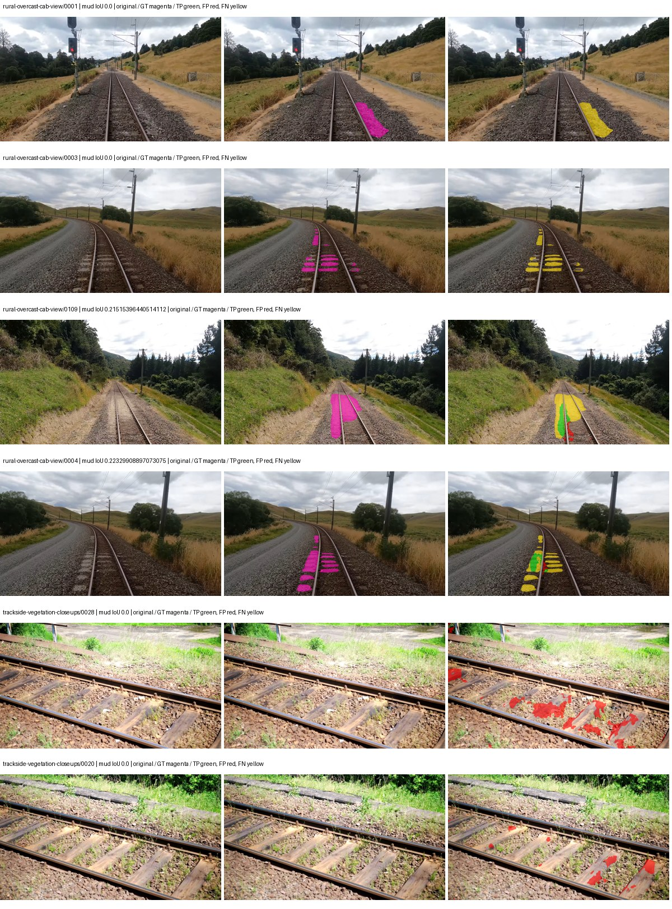
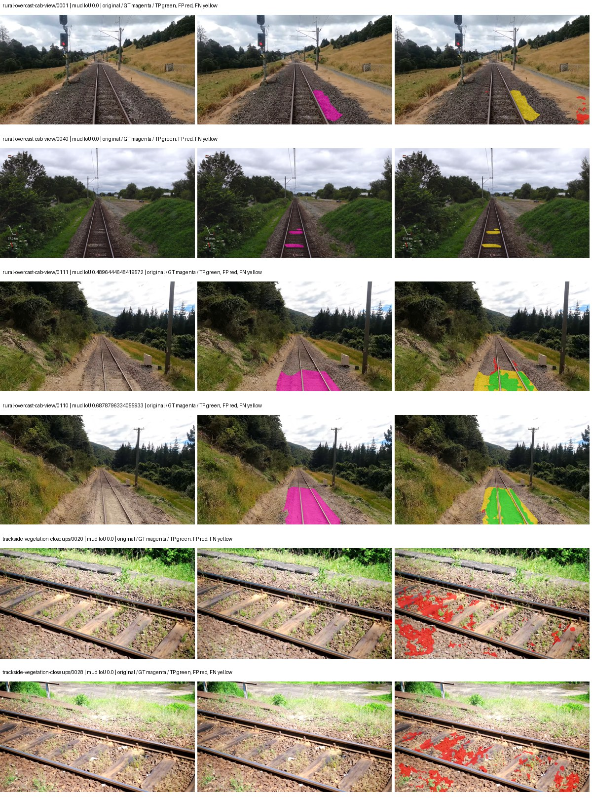
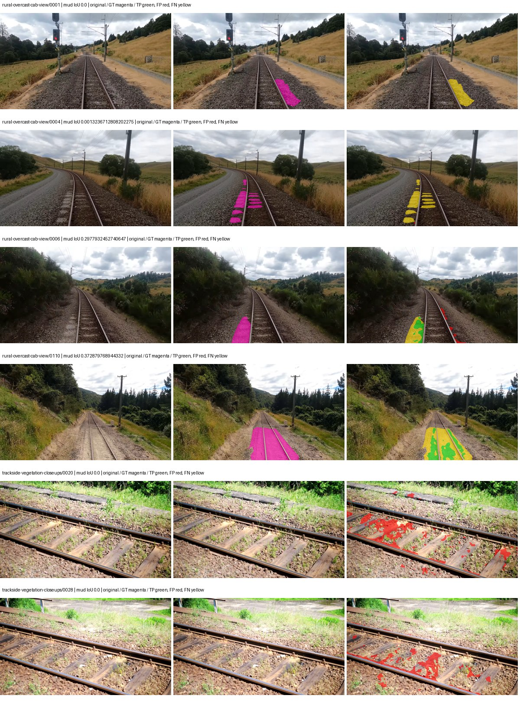
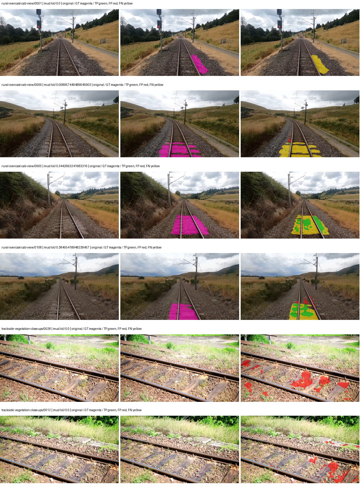

# smp_upernet_resnet101 — rad_9_24_2026-fixed-grouped

[RAD 9/24: Scene-grouped split](../../README.md) · [Full model records](record.json)

Primary selection and early stopping: **mud-pumping validation IoU**. A job is complete only after full statistics and isolated profiling are verified.

| Model | Initialization path | Seed | Status | Steps | Best step | Mud IoU (%) | Mud precision (%) | Mud recall (%) | Final mud IoU (trainer val, %) | mIoU (%) | Fixed GT-class mIoU (%) |
| --- | --- | --- | --- | --- | --- | --- | --- | --- | --- | --- | --- |
| smp_upernet_resnet101 | rtis_only | 0 | completed | 1555 | 259 | 6.81 | 26.48 | 8.40 | 1.14 | 21.93 | 25.58 |
| smp_upernet_resnet101 | cityscapes_to_rtis | 0 | completed | 1814 | 518 | 16.34 | 26.53 | 29.84 | 7.38 | 22.37 | 26.09 |
| smp_upernet_resnet101 | railsem19_to_rtis | 0 | completed | 1814 | 518 | 8.67 | 19.81 | 13.36 | 4.27 | 30.14 | 35.16 |
| smp_upernet_resnet101 | cityscapes_to_railsem19_to_rtis | 0 | completed | 1814 | 518 | 15.90 | 41.34 | 20.53 | 7.06 | 31.95 | 37.27 |

Training: 217 images. Validation: 37 images. Test: 60 held out. Seeds: [0]. Seed variation measures optimization variability, not independent-recording uncertainty. Historical source checkpoints stay fixed across adaptation seeds.

Training code: `d864b72bd90706260965bb1a48398d01167b6d5c`. Split SHA-256: `12d7b367c72cda61d57686ff2ac28223530d0af49debd9fb7a0fbc68b908bc93`.

## rtis_only — seed 0

Status: **completed**. Started: 2026-10-06T03:04:52.530293+00:00. Finished: 2026-10-06T03:30:00.783501+00:00.

Recipe pretrained initializer: `{"arch": "smp", "backbone_path": null, "batch_norm_momentum": null, "checkpoint": null, "classifier_path": null, "drop_path": null, "encoder_name": "resnet101", "encoder_weights": "imagenet", "head": "unified_head", "head_paths": [], "inactive_parameter_paths": [], "local_files_only": false, "lora_alpha": 32, "lora_dropout": 0.05, "lora_r": 16, "lora_targets": [], "native": null, "revision": null, "smp_arch": "UPerNet", "subfolder": null, "trust_remote_code": false, "tuning": "full"}`.

`rtis_only` uses the recipe initializer, which may include pretrained segmentation components. Transfer paths load the exact historical source checkpoint below and reset the classifier; they do not reset all query/decoder features.

Source checkpoint: `Recipe pretrained initialization`.

Config SHA-256: `d0500cb6291e7dcfeca7f5c19172e5847db14e5329425fa323d7eccc4e4beef3`. Weights used for validation: `raw`.

### Mud-pumping and aggregate quality

| Metric | Selected checkpoint | Final training validation |
| --- | --- | --- |
| Mud IoU | 6.81 | 1.14 |
| Mud precision | 26.48 | 2.27 |
| Mud recall | 8.40 | 2.22 |
| Mud Dice/F1 | 12.75 | 2.25 |
| mIoU | 21.93 | 28.16 |
| Mean accuracy | 36.34 | 41.10 |
| Mean precision | 40.43 | 47.27 |
| Mean Dice | 28.59 | 36.40 |
| Mean specificity | 98.38 | 98.73 |
| Pixel accuracy | 70.58 | 79.86 |
| Frequency-weighted IoU | 61.95 | 69.74 |
| Fixed GT-present class mIoU | 25.58 | 32.85 |
| Boundary F1 | 25.79 | 34.60 |

The selected checkpoint has independent evaluation evidence. Final values are the trainer's final validation record, not a new independent evaluation. mIoU averages classes with nonzero union, so false positives on absent classes can change its denominator. The fixed GT-class mean is supplementary and excludes absent classes; their false positives remain in the confusion matrix.

### Resource usage and timing

| Measurement | Value |
| --- | --- |
| Peak training VRAM, retained training invocation (GiB) | 11.09 |
| Peak evaluation VRAM (GiB) | 7.69 |
| Retained training invocation wall time (seconds) | 1318.68 |
| Retained training invocation GPU-hours (one GPU) | 0.37 |
| Evaluation wall time (seconds) | 15.91 |
| Full evaluation pipeline images/second | 2.33 |
| Best full-state checkpoint (MiB) | 860.41 |
| Final full-state checkpoint (MiB) | 860.39 |
| Verified periodic checkpoints removed (GiB) | 2.52 |

VRAM uses the recorded allocator high-water mark; it is not total device usage including CUDA context. Resumed jobs' retained training invocation times and peaks are **not whole-campaign totals**. Earlier invocation resource records are not reconstructed here. Evaluation throughput includes loader, sliding-window inference and metrics; it is not model-only latency/FPS. Missing measurements are shown as —, never inferred from another dataset's run.

### Standardized inference performance

Dedicated model-only profiling waits for an idle worker-locked L40S: BF16, batch 1, 1024x1024, 20 warmup and 100 CUDA-event-timed public forwards. It excludes loading, preprocessing, tiling and metrics.

| Status | Parameters | Weight MiB | FPS | p50 ms | p95 ms | Peak reserved GiB |
| --- | --- | --- | --- | --- | --- | --- |
| complete | 56281941 | 214.70 | 73.39 | 13.47 | 14.39 | 1.54 |

```json
{
  "schema_version": 1,
  "model_id": "smp_upernet_resnet101",
  "measured_at": "2026-10-06T03:29:55+00:00",
  "status": "complete",
  "benchmark_scope": "rtis_selected_checkpoint_model_only",
  "applies_to": [
    "smp_upernet_resnet101--rtis_only--seed-0"
  ],
  "source": {
    "campaign_git_sha": "d864b72bd90706260965bb1a48398d01167b6d5c",
    "git_dirty": false,
    "config_hash": "3812481b69cd",
    "resolved_config": "/data/izadia1/projects/segmentary-runs/rad_9_24_2026/fixed-grouped-seed0-20261005-r2/configs/smp_upernet_resnet101--rtis_only--seed-0.yaml",
    "config_sha256": "d0500cb6291e7dcfeca7f5c19172e5847db14e5329425fa323d7eccc4e4beef3",
    "checkpoint_sha256": "14e5a7e4fcde18fcb699783d369097c08775cac152cbe7c53866e8c5e13d2c33",
    "checkpoint_global_step": 259,
    "checkpoint_bytes": 902210014,
    "checkpoint_kind": "resume checkpoint with optimizer and EMA state",
    "weights": "raw",
    "measured_checkpoint_job_id": "smp_upernet_resnet101--rtis_only--seed-0",
    "result_sha256": "30a7a80af691e262193a233b01b607e6dd0554d792d50333be963ed2595ee097",
    "result_git_sha": "d864b72bd90706260965bb1a48398d01167b6d5c",
    "result_stage": "eval:rad_9_24_2026-fixed-grouped:val",
    "result_seed": 0
  },
  "hardware": {
    "gpu_name": "NVIDIA L40S",
    "gpu_uuid": "GPU-c76642eb-64c1-b0ac-b051-d2efd47b32c4",
    "logical_device": "cuda:0",
    "physical_visibility_token": "9",
    "compute_capability": [
      8,
      9
    ],
    "total_memory_bytes": 47677177856
  },
  "model": {
    "parameter_count": 56281941,
    "trainable_parameter_count": 56281941,
    "resident_parameter_bytes": 225127764,
    "parameter_dtype_counts": {
      "float32": 56281941
    }
  },
  "contract": {
    "backend": "pytorch",
    "precision": "bf16_autocast",
    "batch_size": 1,
    "input_shape_nchw": [
      1,
      3,
      1024,
      1024
    ],
    "warmup_iterations": 20,
    "measured_iterations": 100,
    "timing": "per-forward CUDA events with end-event synchronization",
    "includes_preprocessing": false,
    "includes_data_loader": false,
    "includes_sliding_window": false,
    "input_resident_on_gpu": true,
    "model_only": true,
    "entrypoint": "public model(image) dense-logits forward"
  },
  "measurements": {
    "latency": {
      "p50_ms": 13.47276782989502,
      "p95_ms": 14.391705465316772,
      "mean_ms": 13.626388473510742,
      "minimum_ms": 13.369343757629395,
      "maximum_ms": 14.864383697509766,
      "fps": 73.38701681255951,
      "raw_ms": [
        13.603808403015137,
        14.385151863098145,
        14.310400009155273,
        13.47276782989502,
        13.409279823303223,
        13.437952041625977,
        14.864383697509766,
        13.428768157958984,
        13.406208038330078,
        13.441023826599121,
        13.47276782989502,
        13.427712440490723,
        14.620672225952148,
        13.47379207611084,
        13.410304069519043,
        13.511679649353027,
        14.629887580871582,
        13.370368003845215,
        13.67244815826416,
        13.47379207611084,
        13.477888107299805,
        13.442048072814941,
        13.96940803527832,
        13.392895698547363,
        13.441023826599121,
        13.510656356811523,
        13.412351608276367,
        13.980671882629395,
        13.441023826599121,
        13.475808143615723,
        13.493247985839844,
        14.516223907470703,
        13.502464294433594,
        13.48095989227295,
        13.78816032409668,
        13.542400360107422,
        13.600768089294434,
        13.461503982543945,
        13.385727882385254,
        13.850624084472656,
        13.550623893737793,
        13.495295524597168,
        13.447168350219727,
        13.405183792114258,
        13.446144104003906,
        13.855744361877441,
        13.48095989227295,
        13.48198413848877,
        13.460479736328125,
        13.441023826599121,
        13.919232368469238,
        14.269472122192383,
        13.499391555786133,
        13.521920204162598,
        13.428735733032227,
        13.432831764221191,
        13.789183616638184,
        14.096384048461914,
        13.45740795135498,
        13.369343757629395,
        13.414400100708008,
        14.806015968322754,
        13.445119857788086,
        13.905920028686523,
        13.462528228759766,
        13.409215927124023,
        13.398015975952148,
        13.429759979248047,
        13.424639701843262,
        13.764608383178711,
        14.268416404724121,
        13.826047897338867,
        13.924351692199707,
        13.854720115661621,
        13.409279823303223,
        13.424639701843262,
        13.506560325622559,
        13.444095611572266,
        13.410304069519043,
        13.392895698547363,
        13.436927795410156,
        13.431808471679688,
        13.506560325622559,
        13.510656356811523,
        13.424639701843262,
        13.459456443786621,
        14.281760215759277,
        13.451264381408691,
        13.425663948059082,
        13.428735733032227,
        13.764608383178711,
        13.903871536254883,
        13.441023826599121,
        13.436927795410156,
        13.428735733032227,
        13.725695610046387,
        13.438976287841797,
        13.44819164276123,
        13.48300838470459,
        13.451264381408691
      ],
      "percentile_method": "numpy linear interpolation"
    },
    "peak_reserved_bytes": 1652555776,
    "memory_kind": "pytorch_cuda_allocator_peak_reserved_excluding_context",
    "benchmark_wall_clock_s": 13.86919642239809
  },
  "started_at": "2026-10-06T03:29:41+00:00",
  "finished_at": "2026-10-06T03:29:55+00:00",
  "environment": {
    "hostname": "hdrfs-app-001",
    "python": "3.11.15",
    "platform": "Linux-5.15.0-139-generic-x86_64-with-glibc2.35",
    "torch": "2.11.0+cu128",
    "torch_cuda": "12.8",
    "cudnn": 91900,
    "driver_version": "570.133.20",
    "cuda_available": true,
    "gpu_count": 1,
    "gpu_names": [
      "NVIDIA L40S"
    ],
    "cuda_visible_devices": "9",
    "packages": {
      "segmentary": "0.1.0",
      "torch": "2.11.0+cu128",
      "torchvision": "0.26.0+cu128",
      "transformers": "5.15.0",
      "timm": "1.0.28",
      "segmentation-models-pytorch": "0.5.0",
      "albumentations": "2.0.8",
      "lightning": "2.6.5",
      "numpy": "2.4.4"
    }
  }
}
```

### Per-class validation results

| Class | GT pixels | IoU (%) | Precision (%) | Recall (%) | Dice (%) | Boundary F1 (%) |
| --- | --- | --- | --- | --- | --- | --- |
| car | 29664 | 5.51 | 63.74 | 5.68 | 10.44 | 22.63 |
| construction | 311585 | 7.35 | 7.62 | 67.79 | 13.69 | 19.01 |
| fence | 265137 | 6.41 | 11.63 | 12.48 | 12.04 | 14.50 |
| mud-pumping | 1226250 | 6.81 | 26.48 | 8.40 | 12.75 | 18.10 |
| on-rails | 0 | 0.00 | 0.00 | — | 0.00 | 0.00 |
| person | 0 | 0.00 | 0.00 | — | 0.00 | 0.00 |
| pole | 628038 | 59.41 | 72.24 | 76.98 | 74.54 | 84.90 |
| rail-embedded | 16799 | 0.00 | 0.00 | 0.00 | 0.00 | 0.00 |
| rail-raised | 2969797 | 68.36 | 71.44 | 94.07 | 81.21 | 85.27 |
| rail-track | 6323197 | 36.38 | 72.69 | 42.14 | 53.35 | 42.31 |
| road | 1048831 | 14.01 | 20.86 | 29.89 | 24.57 | 14.22 |
| sidewalk | 1297367 | 22.27 | 82.48 | 23.38 | 36.43 | 6.87 |
| sky | 19121606 | 93.67 | 99.44 | 94.16 | 96.73 | 84.99 |
| standing-water | 95802 | 0.21 | 0.21 | 19.97 | 0.42 | 2.35 |
| terrain | 39239306 | 63.75 | 87.40 | 70.20 | 77.86 | 44.19 |
| trackbed | 10643081 | 56.38 | 61.27 | 87.60 | 72.10 | 51.57 |
| traffic-light | 19510 | 1.72 | 100.00 | 1.72 | 3.38 | 4.85 |
| traffic-sign | 13285 | 0.00 | 0.00 | 0.00 | 0.00 | 0.00 |
| tram-track | 56179 | 0.00 | 0.00 | 0.00 | 0.00 | 0.00 |
| truck | 0 | 0.00 | 0.00 | — | 0.00 | 0.00 |
| vegetation-overgrowth | 5901821 | 18.22 | 71.59 | 19.64 | 30.82 | 45.75 |

### Full-run accounting

| Measurement | Value |
| --- | --- |
| Full GPU-reserved wall seconds, all recorded worker attempts | 1515.84 |
| Full reserved GPU-hours | 0.42 |
| Whole-run timing complete | True |

| Phase | Wall seconds including failed attempts |
| --- | --- |
| training | 1325.79 |
| diagnostics | 129.57 |
| performance | 22.57 |

GPU-reserved time includes model loading, training, validation, collection, profiling, checkpoint I/O and orchestration while the worker owns one GPU. It is not GPU kernel-active time. Phase timings and sampled device memory/power/utilization are retained separately; sampled device memory is not the allocator high-water mark.

### Train/validation and raw/EMA diagnostics

| Checkpoint / weights / split | Images | Mud IoU (%) | Mud precision (%) | Mud recall (%) |
| --- | --- | --- | --- | --- |
| best-auto-train / raw | 217 | 82.89 | 96.62 | 85.37 |
| best-auto-val / raw | 37 | 6.81 | 26.48 | 8.40 |
| best-alternate-val / ema | 37 | 3.07 | 3.48 | 20.63 |
| final-auto-val / raw | 37 | 1.13 | 2.27 | 2.22 |

Train uses the evaluation transform without augmentation. Compare mud train/validation metrics for the same selected weights. Alternate EMA on running-stat BatchNorm is explicitly uncalibrated and is diagnostic only. Score-threshold curves use uncalibrated normalized scores and are pixel-level diagnostics, not event detection rates or a selected deployment operating point.

### Downloadable evidence

- best-auto-train: [per-image.csv](rtis_only--seed-0/best-auto-train/per-image.csv) · [per-image-confusion.json.gz](rtis_only--seed-0/best-auto-train/per-image-confusion.json.gz) · [groups.json](rtis_only--seed-0/best-auto-train/groups.json) · [mud-score-curves.json](rtis_only--seed-0/best-auto-train/mud-score-curves.json)
- best-auto-val: [per-image.csv](rtis_only--seed-0/best-auto-val/per-image.csv) · [per-image-confusion.json.gz](rtis_only--seed-0/best-auto-val/per-image-confusion.json.gz) · [groups.json](rtis_only--seed-0/best-auto-val/groups.json) · [mud-score-curves.json](rtis_only--seed-0/best-auto-val/mud-score-curves.json) · [examples.jpg](rtis_only--seed-0/best-auto-val/examples.jpg)
- best-alternate-val: [per-image.csv](rtis_only--seed-0/best-alternate-val/per-image.csv) · [per-image-confusion.json.gz](rtis_only--seed-0/best-alternate-val/per-image-confusion.json.gz) · [groups.json](rtis_only--seed-0/best-alternate-val/groups.json) · [mud-score-curves.json](rtis_only--seed-0/best-alternate-val/mud-score-curves.json)
- final-auto-val: [per-image.csv](rtis_only--seed-0/final-auto-val/per-image.csv) · [per-image-confusion.json.gz](rtis_only--seed-0/final-auto-val/per-image-confusion.json.gz) · [groups.json](rtis_only--seed-0/final-auto-val/groups.json) · [mud-score-curves.json](rtis_only--seed-0/final-auto-val/mud-score-curves.json)
- resources: [telemetry.csv](rtis_only--seed-0/resources/telemetry.csv)



Examples are two lowest and two highest mud-IoU positive images, plus up to two negative images with the most false-positive mud pixels. They are targeted diagnostic examples, not random samples. Green: true positive; red: false positive; yellow: false negative. Full predictions remain on HDRFS.

### Validation tracking

| Logged step | Overall mIoU (%) | Mud IoU (%) |
| --- | --- | --- |
| 258 | 21.93 | 6.81 |
| 518 | 24.96 | 0.20 |
| 777 | 26.94 | 0.74 |
| 1036 | 29.70 | 0.51 |
| 1295 | 30.76 | 4.32 |
| 1555 | 28.16 | 1.14 |

All retained scalar curves, including training loss and per-class IoU, are in record.json. Observed best mud on a curve is not necessarily a retained checkpoint: the pilot saved its selection-metric-best and final checkpoints. Step logging and checkpoint global_step may differ by one.

### Stopping and checkpoint provenance

```json
{
  "stopping": {
    "actual_steps": 1555,
    "maximum_steps": 4000,
    "min_delta": 0.001,
    "monitor": "val_iou/mud-pumping",
    "patience": 5,
    "reason": "validation_plateau"
  },
  "checkpoints": {
    "best": {
      "path": "/data/izadia1/projects/segmentary-runs/rad_9_24_2026/fixed-grouped-seed0-20261005-r2/future-runs/smp_upernet_resnet101--rtis_only--seed-0_seed0/rtis/best.ckpt",
      "sha256": "14e5a7e4fcde18fcb699783d369097c08775cac152cbe7c53866e8c5e13d2c33",
      "global_step": 259,
      "bytes": 902210014
    },
    "final": {
      "path": "/data/izadia1/projects/segmentary-runs/rad_9_24_2026/fixed-grouped-seed0-20261005-r2/future-runs/smp_upernet_resnet101--rtis_only--seed-0_seed0/rtis/last.ckpt",
      "sha256": "207baa3f9b5676407b19e5ea616879e5db4f82ecd18f2fcaab0dc41eb04eca7f",
      "global_step": 1555,
      "bytes": 902187230
    }
  },
  "cleanup_error": null
}
```

### Resolved training, initialization and evaluation settings

The optimizer block is the base configuration. Stage LR scales are applied at runtime, and stage warmup is capped at min(base warmup, floor(stage budget / 10), stage budget - 1): 400 steps for this 4,000-step pilot. Model-internal native input grids may differ from augmentation crops (EoMT uses its 640 grid).

```json
{
  "name": "smp_upernet_resnet101--rtis_only--seed-0",
  "model": {
    "arch": "smp",
    "checkpoint": null,
    "tuning": "full",
    "head": "unified_head",
    "lora_r": 16,
    "lora_alpha": 32,
    "lora_dropout": 0.05,
    "lora_targets": [],
    "drop_path": null,
    "revision": null,
    "subfolder": null,
    "local_files_only": false,
    "trust_remote_code": false,
    "backbone_path": null,
    "head_paths": [],
    "classifier_path": null,
    "inactive_parameter_paths": [],
    "smp_arch": "UPerNet",
    "encoder_name": "resnet101",
    "encoder_weights": "imagenet",
    "native": null,
    "batch_norm_momentum": null
  },
  "space": "paul-test-rtis",
  "taxonomy_root": "/data/izadia1/projects/segmentary-rad-d864b72b/taxonomy",
  "output_root": "/data/izadia1/projects/segmentary-runs/rad_9_24_2026/fixed-grouped-seed0-20261005-r2/future-runs",
  "optim": {
    "backbone_lr": 0.0001,
    "head_lr_mult": 10.0,
    "weight_decay": 0.05,
    "llrd": 1.0,
    "warmup_iters": 1500,
    "warmup_ratio": 1e-06,
    "poly_power": 0.9,
    "min_lr_ratio": 0.0,
    "betas": [
      0.9,
      0.999
    ],
    "grad_clip": 1.0
  },
  "train": {
    "iters": 4000,
    "batch_size": 2,
    "accum": 8,
    "num_workers": 2,
    "precision": "bf16-mixed",
    "ema_decay": 0.9998,
    "val_every": 250,
    "ckpt_every": 500,
    "selection_metric": "val_iou/mud-pumping",
    "early_stopping_patience": 5,
    "early_stopping_min_delta": 0.001,
    "seed": 0,
    "devices": 1
  },
  "eval": {
    "sliding_window": true,
    "window": [
      1024,
      1024
    ],
    "stride": [
      768,
      768
    ],
    "batch_size": 1,
    "num_workers": 2,
    "tta_scales": [],
    "tta_flip": false,
    "threshold": 0.5,
    "boundary_tolerance_frac": 0.0075,
    "save_confusion": true
  },
  "loss": {
    "task": "multiclass",
    "activation": "auto",
    "terms": [],
    "aux": "none",
    "aux_weight": 0.0,
    "ce_weight": 1.0,
    "label_smoothing": 0.0,
    "class_weights": null,
    "query": null
  },
  "aug": {
    "crop": [
      1024,
      1024
    ],
    "scale_min": 0.5,
    "scale_max": 2.0,
    "hflip_p": 0.5,
    "color_jitter_p": 0.5,
    "brightness": 0.25,
    "contrast": 0.25,
    "saturation": 0.25,
    "hue": 0.05
  },
  "stages": [
    {
      "name": "rtis",
      "data": [
        {
          "name": "rad_9_24_2026-fixed-grouped",
          "root": "/data/izadia1/datasets/rad_9_24_2026-fixed-grouped",
          "variant": null,
          "split_file": "splits.json",
          "train_split": "train",
          "val_split": "val",
          "limit": null,
          "loader": "folder",
          "mapping": "paul-test-rtis",
          "loader_options": {
            "require_groups": true
          }
        }
      ],
      "iters": null,
      "lr_scale": 1.0,
      "head_group_lr_scale": 1.0,
      "init_from": "pretrained",
      "reset_head": false,
      "freeze": null,
      "sample_weights": null
    }
  ]
}
```

### Hardware and software provenance

```json
{
  "training": {
    "cuda_available": true,
    "cuda_visible_devices": "9",
    "cudnn": 91900,
    "driver_version": "570.133.20",
    "gpu_count": 1,
    "gpu_names": [
      "NVIDIA L40S"
    ],
    "hostname": "hdrfs-app-001",
    "input_normalization": {
      "channel_order": "rgb",
      "mean": [
        0.485,
        0.456,
        0.406
      ],
      "source": "smp_encoder_settings",
      "std": [
        0.229,
        0.224,
        0.225
      ]
    },
    "model_origins": [
      {
        "hf_commit": null,
        "hf_name_or_path": null,
        "module": "model",
        "timm_pretrained": {}
      }
    ],
    "model_parameter_count": 56281941,
    "packages": {
      "albumentations": "2.0.8",
      "lightning": "2.6.5",
      "numpy": "2.4.4",
      "segmentary": "0.1.0",
      "segmentation-models-pytorch": "0.5.0",
      "timm": "1.0.28",
      "torch": "2.11.0+cu128",
      "torchvision": "0.26.0+cu128",
      "transformers": "5.15.0"
    },
    "platform": "Linux-5.15.0-139-generic-x86_64-with-glibc2.35",
    "python": "3.11.15",
    "torch": "2.11.0+cu128",
    "torch_cuda": "12.8",
    "trainable_parameter_count": 56281941,
    "training_stop": {
      "actual_steps": 1555,
      "maximum_steps": 4000,
      "min_delta": 0.001,
      "monitor": "val_iou/mud-pumping",
      "patience": 5,
      "reason": "validation_plateau"
    },
    "validation_weights": "raw"
  },
  "evaluation": {
    "cuda_available": true,
    "cuda_visible_devices": "9",
    "cudnn": 91900,
    "driver_version": "570.133.20",
    "gpu_count": 1,
    "gpu_names": [
      "NVIDIA L40S"
    ],
    "hostname": "hdrfs-app-001",
    "input_normalization": {
      "channel_order": "rgb",
      "mean": [
        0.485,
        0.456,
        0.406
      ],
      "source": "smp_encoder_settings",
      "std": [
        0.229,
        0.224,
        0.225
      ]
    },
    "packages": {
      "albumentations": "2.0.8",
      "lightning": "2.6.5",
      "numpy": "2.4.4",
      "segmentary": "0.1.0",
      "segmentation-models-pytorch": "0.5.0",
      "timm": "1.0.28",
      "torch": "2.11.0+cu128",
      "torchvision": "0.26.0+cu128",
      "transformers": "5.15.0"
    },
    "platform": "Linux-5.15.0-139-generic-x86_64-with-glibc2.35",
    "python": "3.11.15",
    "torch": "2.11.0+cu128",
    "torch_cuda": "12.8"
  }
}
```

## cityscapes_to_rtis — seed 0

Status: **completed**. Started: 2026-10-06T03:16:53.934988+00:00. Finished: 2026-10-06T03:45:42.898189+00:00.

Recipe pretrained initializer: `{"arch": "smp", "backbone_path": null, "batch_norm_momentum": null, "checkpoint": null, "classifier_path": null, "drop_path": null, "encoder_name": "resnet101", "encoder_weights": "imagenet", "head": "unified_head", "head_paths": [], "inactive_parameter_paths": [], "local_files_only": false, "lora_alpha": 32, "lora_dropout": 0.05, "lora_r": 16, "lora_targets": [], "native": null, "revision": null, "smp_arch": "UPerNet", "subfolder": null, "trust_remote_code": false, "tuning": "full"}`.

`rtis_only` uses the recipe initializer, which may include pretrained segmentation components. Transfer paths load the exact historical source checkpoint below and reset the classifier; they do not reset all query/decoder features.

Source checkpoint: `{'name': 'smp_upernet_resnet101--cityscapes--seed-0', 'model': 'smp_upernet_resnet101', 'protocol': 'cityscapes', 'config': '/data/izadia1/projects/segmentary-runs/all-model-city-rail-seed0-rail20-b9eb3e1/accepted/smp_upernet_resnet101--cityscapes--seed-0/resolved-config.yaml', 'checkpoint': '/data/izadia1/projects/segmentary-runs/all-model-city-rail-seed0-a7c0b67/jobs/smp_upernet_resnet101--cityscapes--seed-0/attempt-001/train/smp_upernet_resnet101--cityscapes_seed0/cityscapes/last.ckpt', 'recorded_sha256': '18a79d5ff0e4b11842213d5546a334f1e7e30b81c87679fab1659eecb12bcb7a', 'exists': True}`.

Config SHA-256: `d39cefefeb0665a0b432d2b38f76f804f6a42d974c3bbb268b6009bae7d8f12a`. Weights used for validation: `raw`.

### Mud-pumping and aggregate quality

| Metric | Selected checkpoint | Final training validation |
| --- | --- | --- |
| Mud IoU | 16.34 | 7.38 |
| Mud precision | 26.53 | 9.70 |
| Mud recall | 29.84 | 23.61 |
| Mud Dice/F1 | 28.09 | 13.75 |
| mIoU | 22.37 | 31.63 |
| Mean accuracy | 34.70 | 44.85 |
| Mean precision | 35.60 | 49.42 |
| Mean Dice | 28.79 | 41.08 |
| Mean specificity | 98.48 | 98.76 |
| Pixel accuracy | 78.31 | 80.57 |
| Frequency-weighted IoU | 66.04 | 70.83 |
| Fixed GT-present class mIoU | 26.09 | 35.15 |
| Boundary F1 | 25.54 | 39.08 |

The selected checkpoint has independent evaluation evidence. Final values are the trainer's final validation record, not a new independent evaluation. mIoU averages classes with nonzero union, so false positives on absent classes can change its denominator. The fixed GT-class mean is supplementary and excludes absent classes; their false positives remain in the confusion matrix.

### Resource usage and timing

| Measurement | Value |
| --- | --- |
| Peak training VRAM, retained training invocation (GiB) | 11.09 |
| Peak evaluation VRAM (GiB) | 7.69 |
| Retained training invocation wall time (seconds) | 1541.44 |
| Retained training invocation GPU-hours (one GPU) | 0.43 |
| Evaluation wall time (seconds) | 15.56 |
| Full evaluation pipeline images/second | 2.38 |
| Best full-state checkpoint (MiB) | 860.41 |
| Final full-state checkpoint (MiB) | 860.39 |
| Verified periodic checkpoints removed (GiB) | 2.52 |

VRAM uses the recorded allocator high-water mark; it is not total device usage including CUDA context. Resumed jobs' retained training invocation times and peaks are **not whole-campaign totals**. Earlier invocation resource records are not reconstructed here. Evaluation throughput includes loader, sliding-window inference and metrics; it is not model-only latency/FPS. Missing measurements are shown as —, never inferred from another dataset's run.

### Standardized inference performance

Dedicated model-only profiling waits for an idle worker-locked L40S: BF16, batch 1, 1024x1024, 20 warmup and 100 CUDA-event-timed public forwards. It excludes loading, preprocessing, tiling and metrics.

| Status | Parameters | Weight MiB | FPS | p50 ms | p95 ms | Peak reserved GiB |
| --- | --- | --- | --- | --- | --- | --- |
| complete | 56281941 | 214.70 | 73.74 | 13.54 | 13.67 | 1.54 |

```json
{
  "schema_version": 1,
  "model_id": "smp_upernet_resnet101",
  "measured_at": "2026-10-06T03:45:37+00:00",
  "status": "complete",
  "benchmark_scope": "rtis_selected_checkpoint_model_only",
  "applies_to": [
    "smp_upernet_resnet101--cityscapes_to_rtis--seed-0"
  ],
  "source": {
    "campaign_git_sha": "d864b72bd90706260965bb1a48398d01167b6d5c",
    "git_dirty": false,
    "config_hash": "241e4b18a24c",
    "resolved_config": "/data/izadia1/projects/segmentary-runs/rad_9_24_2026/fixed-grouped-seed0-20261005-r2/configs/smp_upernet_resnet101--cityscapes_to_rtis--seed-0.yaml",
    "config_sha256": "d39cefefeb0665a0b432d2b38f76f804f6a42d974c3bbb268b6009bae7d8f12a",
    "checkpoint_sha256": "328bfb0fa99df408c9306d103b4b1c50182510d68097ed7209657a03d364df04",
    "checkpoint_global_step": 518,
    "checkpoint_bytes": 902210206,
    "checkpoint_kind": "resume checkpoint with optimizer and EMA state",
    "weights": "raw",
    "measured_checkpoint_job_id": "smp_upernet_resnet101--cityscapes_to_rtis--seed-0",
    "result_sha256": "1b08a4b843fa92c74de5a52c7f10417e8cb7b9f1f7fe8a5794ba84bd3d3aefa7",
    "result_git_sha": "d864b72bd90706260965bb1a48398d01167b6d5c",
    "result_stage": "eval:rad_9_24_2026-fixed-grouped:val",
    "result_seed": 0
  },
  "hardware": {
    "gpu_name": "NVIDIA L40S",
    "gpu_uuid": "GPU-804aea8b-5f62-423e-72c6-49e1ed15c4e4",
    "logical_device": "cuda:0",
    "physical_visibility_token": "6",
    "compute_capability": [
      8,
      9
    ],
    "total_memory_bytes": 47677177856
  },
  "model": {
    "parameter_count": 56281941,
    "trainable_parameter_count": 56281941,
    "resident_parameter_bytes": 225127764,
    "parameter_dtype_counts": {
      "float32": 56281941
    }
  },
  "contract": {
    "backend": "pytorch",
    "precision": "bf16_autocast",
    "batch_size": 1,
    "input_shape_nchw": [
      1,
      3,
      1024,
      1024
    ],
    "warmup_iterations": 20,
    "measured_iterations": 100,
    "timing": "per-forward CUDA events with end-event synchronization",
    "includes_preprocessing": false,
    "includes_data_loader": false,
    "includes_sliding_window": false,
    "input_resident_on_gpu": true,
    "model_only": true,
    "entrypoint": "public model(image) dense-logits forward"
  },
  "measurements": {
    "latency": {
      "p50_ms": 13.542400360107422,
      "p95_ms": 13.666559648513793,
      "mean_ms": 13.560535373687744,
      "minimum_ms": 13.407232284545898,
      "maximum_ms": 13.983743667602539,
      "fps": 73.7434011595409,
      "raw_ms": [
        13.666303634643555,
        13.515775680541992,
        13.87110424041748,
        13.443072319030762,
        13.54751968383789,
        13.534208297729492,
        13.48198413848877,
        13.407232284545898,
        13.537280082702637,
        13.541376113891602,
        13.459456443786621,
        13.624320030212402,
        13.485055923461914,
        13.460479736328125,
        13.451264381408691,
        13.45638370513916,
        13.517824172973633,
        13.560832023620605,
        13.510656356811523,
        13.603839874267578,
        13.511679649353027,
        13.492223739624023,
        13.513728141784668,
        13.534208297729492,
        13.543423652648926,
        13.549568176269531,
        13.46457576751709,
        13.488127708435059,
        13.528063774108887,
        13.983743667602539,
        13.521920204162598,
        13.513728141784668,
        13.58028793334961,
        13.620223999023438,
        13.531135559082031,
        13.566975593566895,
        13.601792335510254,
        13.536255836486816,
        13.542400360107422,
        13.513728141784668,
        13.504511833190918,
        13.604864120483398,
        13.67142391204834,
        13.572064399719238,
        13.536224365234375,
        13.639679908752441,
        13.535231590270996,
        13.539327621459961,
        13.569024085998535,
        13.512703895568848,
        13.524991989135742,
        13.504511833190918,
        13.637632369995117,
        13.550592422485352,
        13.539327621459961,
        13.557760238647461,
        13.530112266540527,
        13.56287956237793,
        13.523967742919922,
        13.553664207458496,
        13.626367568969727,
        13.57414436340332,
        13.53219223022461,
        13.545536041259766,
        13.501440048217773,
        13.54751968383789,
        13.566975593566895,
        13.966336250305176,
        13.512703895568848,
        13.49120044708252,
        13.58028793334961,
        13.507583618164062,
        13.49120044708252,
        13.599743843078613,
        13.633536338806152,
        13.48300838470459,
        13.56595230102539,
        13.577216148376465,
        13.553664207458496,
        13.577216148376465,
        13.640704154968262,
        13.608960151672363,
        13.820927619934082,
        13.531135559082031,
        13.545472145080566,
        13.585408210754395,
        13.523967742919922,
        13.542400360107422,
        13.605888366699219,
        13.605888366699219,
        13.523967742919922,
        13.587455749511719,
        13.54751968383789,
        13.529088020324707,
        13.566975593566895,
        13.585408210754395,
        13.56287956237793,
        13.66425609588623,
        13.538304328918457,
        13.518848419189453
      ],
      "percentile_method": "numpy linear interpolation"
    },
    "peak_reserved_bytes": 1652555776,
    "memory_kind": "pytorch_cuda_allocator_peak_reserved_excluding_context",
    "benchmark_wall_clock_s": 13.723758101463318
  },
  "started_at": "2026-10-06T03:45:23+00:00",
  "finished_at": "2026-10-06T03:45:37+00:00",
  "environment": {
    "hostname": "hdrfs-app-001",
    "python": "3.11.15",
    "platform": "Linux-5.15.0-139-generic-x86_64-with-glibc2.35",
    "torch": "2.11.0+cu128",
    "torch_cuda": "12.8",
    "cudnn": 91900,
    "driver_version": "570.133.20",
    "cuda_available": true,
    "gpu_count": 1,
    "gpu_names": [
      "NVIDIA L40S"
    ],
    "cuda_visible_devices": "6",
    "packages": {
      "segmentary": "0.1.0",
      "torch": "2.11.0+cu128",
      "torchvision": "0.26.0+cu128",
      "transformers": "5.15.0",
      "timm": "1.0.28",
      "segmentation-models-pytorch": "0.5.0",
      "albumentations": "2.0.8",
      "lightning": "2.6.5",
      "numpy": "2.4.4"
    }
  }
}
```

### Per-class validation results

| Class | GT pixels | IoU (%) | Precision (%) | Recall (%) | Dice (%) | Boundary F1 (%) |
| --- | --- | --- | --- | --- | --- | --- |
| car | 29664 | 0.00 | 0.00 | 0.00 | 0.00 | 0.00 |
| construction | 311585 | 11.48 | 11.91 | 76.16 | 20.60 | 15.12 |
| fence | 265137 | 25.99 | 45.19 | 37.95 | 41.26 | 36.12 |
| mud-pumping | 1226250 | 16.34 | 26.53 | 29.84 | 28.09 | 20.67 |
| on-rails | 0 | 0.00 | 0.00 | — | 0.00 | 0.00 |
| person | 0 | 0.00 | 0.00 | — | 0.00 | 0.00 |
| pole | 628038 | 65.56 | 86.90 | 72.75 | 79.19 | 91.43 |
| rail-embedded | 16799 | 0.00 | 0.00 | 0.00 | 0.00 | 0.00 |
| rail-raised | 2969797 | 62.77 | 83.49 | 71.67 | 77.13 | 85.89 |
| rail-track | 6323197 | 32.71 | 61.51 | 41.13 | 49.30 | 41.92 |
| road | 1048831 | 9.51 | 21.35 | 14.64 | 17.37 | 12.67 |
| sidewalk | 1297367 | 12.22 | 74.59 | 12.75 | 21.77 | 9.63 |
| sky | 19121606 | 95.00 | 99.42 | 95.54 | 97.44 | 88.63 |
| standing-water | 95802 | 0.38 | 0.85 | 0.67 | 0.75 | 4.46 |
| terrain | 39239306 | 75.46 | 77.73 | 96.28 | 86.02 | 42.90 |
| trackbed | 10643081 | 53.82 | 73.72 | 66.60 | 69.98 | 53.07 |
| traffic-light | 19510 | 0.00 | 0.00 | 0.00 | 0.00 | 0.00 |
| traffic-sign | 13285 | 0.00 | 0.00 | 0.00 | 0.00 | 0.00 |
| tram-track | 56179 | 0.00 | 0.00 | 0.00 | 0.00 | 0.00 |
| truck | 0 | 0.00 | 0.00 | — | 0.00 | 0.00 |
| vegetation-overgrowth | 5901821 | 8.46 | 84.43 | 8.59 | 15.59 | 33.75 |

### Full-run accounting

| Measurement | Value |
| --- | --- |
| Full GPU-reserved wall seconds, all recorded worker attempts | 1737.16 |
| Full reserved GPU-hours | 0.48 |
| Whole-run timing complete | True |

| Phase | Wall seconds including failed attempts |
| --- | --- |
| training | 1549.07 |
| diagnostics | 128.96 |
| performance | 22.02 |

GPU-reserved time includes model loading, training, validation, collection, profiling, checkpoint I/O and orchestration while the worker owns one GPU. It is not GPU kernel-active time. Phase timings and sampled device memory/power/utilization are retained separately; sampled device memory is not the allocator high-water mark.

### Train/validation and raw/EMA diagnostics

| Checkpoint / weights / split | Images | Mud IoU (%) | Mud precision (%) | Mud recall (%) |
| --- | --- | --- | --- | --- |
| best-auto-train / raw | 217 | 82.07 | 94.70 | 86.02 |
| best-auto-val / raw | 37 | 16.34 | 26.53 | 29.84 |
| best-alternate-val / ema | 37 | 11.84 | 19.12 | 23.73 |
| final-auto-val / raw | 37 | 7.38 | 9.69 | 23.61 |

Train uses the evaluation transform without augmentation. Compare mud train/validation metrics for the same selected weights. Alternate EMA on running-stat BatchNorm is explicitly uncalibrated and is diagnostic only. Score-threshold curves use uncalibrated normalized scores and are pixel-level diagnostics, not event detection rates or a selected deployment operating point.

### Downloadable evidence

- best-auto-train: [per-image.csv](cityscapes_to_rtis--seed-0/best-auto-train/per-image.csv) · [per-image-confusion.json.gz](cityscapes_to_rtis--seed-0/best-auto-train/per-image-confusion.json.gz) · [groups.json](cityscapes_to_rtis--seed-0/best-auto-train/groups.json) · [mud-score-curves.json](cityscapes_to_rtis--seed-0/best-auto-train/mud-score-curves.json)
- best-auto-val: [per-image.csv](cityscapes_to_rtis--seed-0/best-auto-val/per-image.csv) · [per-image-confusion.json.gz](cityscapes_to_rtis--seed-0/best-auto-val/per-image-confusion.json.gz) · [groups.json](cityscapes_to_rtis--seed-0/best-auto-val/groups.json) · [mud-score-curves.json](cityscapes_to_rtis--seed-0/best-auto-val/mud-score-curves.json) · [examples.jpg](cityscapes_to_rtis--seed-0/best-auto-val/examples.jpg)
- best-alternate-val: [per-image.csv](cityscapes_to_rtis--seed-0/best-alternate-val/per-image.csv) · [per-image-confusion.json.gz](cityscapes_to_rtis--seed-0/best-alternate-val/per-image-confusion.json.gz) · [groups.json](cityscapes_to_rtis--seed-0/best-alternate-val/groups.json) · [mud-score-curves.json](cityscapes_to_rtis--seed-0/best-alternate-val/mud-score-curves.json)
- final-auto-val: [per-image.csv](cityscapes_to_rtis--seed-0/final-auto-val/per-image.csv) · [per-image-confusion.json.gz](cityscapes_to_rtis--seed-0/final-auto-val/per-image-confusion.json.gz) · [groups.json](cityscapes_to_rtis--seed-0/final-auto-val/groups.json) · [mud-score-curves.json](cityscapes_to_rtis--seed-0/final-auto-val/mud-score-curves.json)
- resources: [telemetry.csv](cityscapes_to_rtis--seed-0/resources/telemetry.csv)



Examples are two lowest and two highest mud-IoU positive images, plus up to two negative images with the most false-positive mud pixels. They are targeted diagnostic examples, not random samples. Green: true positive; red: false positive; yellow: false negative. Full predictions remain on HDRFS.

### Validation tracking

| Logged step | Overall mIoU (%) | Mud IoU (%) |
| --- | --- | --- |
| 258 | 23.48 | 5.60 |
| 518 | 22.37 | 16.34 |
| 777 | 22.52 | 9.44 |
| 1036 | 28.40 | 3.57 |
| 1295 | 28.40 | 6.47 |
| 1555 | 28.80 | 4.11 |
| 1814 | 31.63 | 7.38 |

All retained scalar curves, including training loss and per-class IoU, are in record.json. Observed best mud on a curve is not necessarily a retained checkpoint: the pilot saved its selection-metric-best and final checkpoints. Step logging and checkpoint global_step may differ by one.

### Stopping and checkpoint provenance

```json
{
  "stopping": {
    "actual_steps": 1814,
    "maximum_steps": 4000,
    "min_delta": 0.001,
    "monitor": "val_iou/mud-pumping",
    "patience": 5,
    "reason": "validation_plateau"
  },
  "checkpoints": {
    "best": {
      "path": "/data/izadia1/projects/segmentary-runs/rad_9_24_2026/fixed-grouped-seed0-20261005-r2/future-runs/smp_upernet_resnet101--cityscapes_to_rtis--seed-0_seed0/rtis/best.ckpt",
      "sha256": "328bfb0fa99df408c9306d103b4b1c50182510d68097ed7209657a03d364df04",
      "global_step": 518,
      "bytes": 902210206
    },
    "final": {
      "path": "/data/izadia1/projects/segmentary-runs/rad_9_24_2026/fixed-grouped-seed0-20261005-r2/future-runs/smp_upernet_resnet101--cityscapes_to_rtis--seed-0_seed0/rtis/last.ckpt",
      "sha256": "ab7f1455a5a589ef03de6524f50a80e98f906ec92d73a76856f9c5977c067101",
      "global_step": 1814,
      "bytes": 902187230
    }
  },
  "cleanup_error": null
}
```

### Resolved training, initialization and evaluation settings

The optimizer block is the base configuration. Stage LR scales are applied at runtime, and stage warmup is capped at min(base warmup, floor(stage budget / 10), stage budget - 1): 400 steps for this 4,000-step pilot. Model-internal native input grids may differ from augmentation crops (EoMT uses its 640 grid).

```json
{
  "name": "smp_upernet_resnet101--cityscapes_to_rtis--seed-0",
  "model": {
    "arch": "smp",
    "checkpoint": null,
    "tuning": "full",
    "head": "unified_head",
    "lora_r": 16,
    "lora_alpha": 32,
    "lora_dropout": 0.05,
    "lora_targets": [],
    "drop_path": null,
    "revision": null,
    "subfolder": null,
    "local_files_only": false,
    "trust_remote_code": false,
    "backbone_path": null,
    "head_paths": [],
    "classifier_path": null,
    "inactive_parameter_paths": [],
    "smp_arch": "UPerNet",
    "encoder_name": "resnet101",
    "encoder_weights": "imagenet",
    "native": null,
    "batch_norm_momentum": null
  },
  "space": "paul-test-rtis",
  "taxonomy_root": "/data/izadia1/projects/segmentary-rad-d864b72b/taxonomy",
  "output_root": "/data/izadia1/projects/segmentary-runs/rad_9_24_2026/fixed-grouped-seed0-20261005-r2/future-runs",
  "optim": {
    "backbone_lr": 0.0001,
    "head_lr_mult": 10.0,
    "weight_decay": 0.05,
    "llrd": 1.0,
    "warmup_iters": 1500,
    "warmup_ratio": 1e-06,
    "poly_power": 0.9,
    "min_lr_ratio": 0.0,
    "betas": [
      0.9,
      0.999
    ],
    "grad_clip": 1.0
  },
  "train": {
    "iters": 4000,
    "batch_size": 2,
    "accum": 8,
    "num_workers": 2,
    "precision": "bf16-mixed",
    "ema_decay": 0.9998,
    "val_every": 250,
    "ckpt_every": 500,
    "selection_metric": "val_iou/mud-pumping",
    "early_stopping_patience": 5,
    "early_stopping_min_delta": 0.001,
    "seed": 0,
    "devices": 1
  },
  "eval": {
    "sliding_window": true,
    "window": [
      1024,
      1024
    ],
    "stride": [
      768,
      768
    ],
    "batch_size": 1,
    "num_workers": 2,
    "tta_scales": [],
    "tta_flip": false,
    "threshold": 0.5,
    "boundary_tolerance_frac": 0.0075,
    "save_confusion": true
  },
  "loss": {
    "task": "multiclass",
    "activation": "auto",
    "terms": [],
    "aux": "none",
    "aux_weight": 0.0,
    "ce_weight": 1.0,
    "label_smoothing": 0.0,
    "class_weights": null,
    "query": null
  },
  "aug": {
    "crop": [
      1024,
      1024
    ],
    "scale_min": 0.5,
    "scale_max": 2.0,
    "hflip_p": 0.5,
    "color_jitter_p": 0.5,
    "brightness": 0.25,
    "contrast": 0.25,
    "saturation": 0.25,
    "hue": 0.05
  },
  "stages": [
    {
      "name": "rtis",
      "data": [
        {
          "name": "rad_9_24_2026-fixed-grouped",
          "root": "/data/izadia1/datasets/rad_9_24_2026-fixed-grouped",
          "variant": null,
          "split_file": "splits.json",
          "train_split": "train",
          "val_split": "val",
          "limit": null,
          "loader": "folder",
          "mapping": "paul-test-rtis",
          "loader_options": {
            "require_groups": true
          }
        }
      ],
      "iters": null,
      "lr_scale": 0.1,
      "head_group_lr_scale": 1.0,
      "init_from": "/data/izadia1/projects/segmentary-runs/all-model-city-rail-seed0-a7c0b67/jobs/smp_upernet_resnet101--cityscapes--seed-0/attempt-001/train/smp_upernet_resnet101--cityscapes_seed0/cityscapes/last.ckpt",
      "reset_head": true,
      "freeze": null,
      "sample_weights": null
    }
  ]
}
```

### Hardware and software provenance

```json
{
  "training": {
    "cuda_available": true,
    "cuda_visible_devices": "6",
    "cudnn": 91900,
    "driver_version": "570.133.20",
    "gpu_count": 1,
    "gpu_names": [
      "NVIDIA L40S"
    ],
    "hostname": "hdrfs-app-001",
    "input_normalization": {
      "channel_order": "rgb",
      "mean": [
        0.485,
        0.456,
        0.406
      ],
      "source": "smp_encoder_settings",
      "std": [
        0.229,
        0.224,
        0.225
      ]
    },
    "model_origins": [
      {
        "hf_commit": null,
        "hf_name_or_path": null,
        "module": "model",
        "timm_pretrained": {}
      }
    ],
    "model_parameter_count": 56281941,
    "packages": {
      "albumentations": "2.0.8",
      "lightning": "2.6.5",
      "numpy": "2.4.4",
      "segmentary": "0.1.0",
      "segmentation-models-pytorch": "0.5.0",
      "timm": "1.0.28",
      "torch": "2.11.0+cu128",
      "torchvision": "0.26.0+cu128",
      "transformers": "5.15.0"
    },
    "platform": "Linux-5.15.0-139-generic-x86_64-with-glibc2.35",
    "python": "3.11.15",
    "torch": "2.11.0+cu128",
    "torch_cuda": "12.8",
    "trainable_parameter_count": 56281941,
    "training_stop": {
      "actual_steps": 1814,
      "maximum_steps": 4000,
      "min_delta": 0.001,
      "monitor": "val_iou/mud-pumping",
      "patience": 5,
      "reason": "validation_plateau"
    },
    "validation_weights": "raw"
  },
  "evaluation": {
    "cuda_available": true,
    "cuda_visible_devices": "6",
    "cudnn": 91900,
    "driver_version": "570.133.20",
    "gpu_count": 1,
    "gpu_names": [
      "NVIDIA L40S"
    ],
    "hostname": "hdrfs-app-001",
    "input_normalization": {
      "channel_order": "rgb",
      "mean": [
        0.485,
        0.456,
        0.406
      ],
      "source": "smp_encoder_settings",
      "std": [
        0.229,
        0.224,
        0.225
      ]
    },
    "packages": {
      "albumentations": "2.0.8",
      "lightning": "2.6.5",
      "numpy": "2.4.4",
      "segmentary": "0.1.0",
      "segmentation-models-pytorch": "0.5.0",
      "timm": "1.0.28",
      "torch": "2.11.0+cu128",
      "torchvision": "0.26.0+cu128",
      "transformers": "5.15.0"
    },
    "platform": "Linux-5.15.0-139-generic-x86_64-with-glibc2.35",
    "python": "3.11.15",
    "torch": "2.11.0+cu128",
    "torch_cuda": "12.8"
  }
}
```

## railsem19_to_rtis — seed 0

Status: **completed**. Started: 2026-10-06T03:17:19.458068+00:00. Finished: 2026-10-06T03:45:51.267454+00:00.

Recipe pretrained initializer: `{"arch": "smp", "backbone_path": null, "batch_norm_momentum": null, "checkpoint": null, "classifier_path": null, "drop_path": null, "encoder_name": "resnet101", "encoder_weights": "imagenet", "head": "unified_head", "head_paths": [], "inactive_parameter_paths": [], "local_files_only": false, "lora_alpha": 32, "lora_dropout": 0.05, "lora_r": 16, "lora_targets": [], "native": null, "revision": null, "smp_arch": "UPerNet", "subfolder": null, "trust_remote_code": false, "tuning": "full"}`.

`rtis_only` uses the recipe initializer, which may include pretrained segmentation components. Transfer paths load the exact historical source checkpoint below and reset the classifier; they do not reset all query/decoder features.

Source checkpoint: `{'name': 'smp_upernet_resnet101--railsem19--seed-0', 'model': 'smp_upernet_resnet101', 'protocol': 'railsem19', 'config': '/data/izadia1/projects/segmentary-runs/all-model-city-rail-seed0-rail20-b9eb3e1/accepted/smp_upernet_resnet101--railsem19--seed-0/resolved-config.yaml', 'checkpoint': '/data/izadia1/projects/segmentary-runs/all-model-city-rail-seed0-a7c0b67/jobs/smp_upernet_resnet101--railsem19--seed-0/attempt-001/train/smp_upernet_resnet101--railsem19_seed0/railsem19/last.ckpt', 'recorded_sha256': '786e3d81df9181457bb198b058bfd34662540be50b92ea3c4a9c4a3f361f8087', 'exists': True}`.

Config SHA-256: `aa22807ceb8ffa6a37a302252e98c7994525b642ffae0b1b55c0be5f58b779dc`. Weights used for validation: `raw`.

### Mud-pumping and aggregate quality

| Metric | Selected checkpoint | Final training validation |
| --- | --- | --- |
| Mud IoU | 8.67 | 4.27 |
| Mud precision | 19.81 | 8.16 |
| Mud recall | 13.36 | 8.22 |
| Mud Dice/F1 | 15.96 | 8.19 |
| mIoU | 30.14 | 44.62 |
| Mean accuracy | 43.44 | 62.58 |
| Mean precision | 41.71 | 58.05 |
| Mean Dice | 37.53 | 54.39 |
| Mean specificity | 98.76 | 98.99 |
| Pixel accuracy | 82.18 | 84.26 |
| Frequency-weighted IoU | 71.01 | 74.78 |
| Fixed GT-present class mIoU | 35.16 | 52.06 |
| Boundary F1 | 33.09 | 50.93 |

The selected checkpoint has independent evaluation evidence. Final values are the trainer's final validation record, not a new independent evaluation. mIoU averages classes with nonzero union, so false positives on absent classes can change its denominator. The fixed GT-class mean is supplementary and excludes absent classes; their false positives remain in the confusion matrix.

### Resource usage and timing

| Measurement | Value |
| --- | --- |
| Peak training VRAM, retained training invocation (GiB) | 11.09 |
| Peak evaluation VRAM (GiB) | 7.69 |
| Retained training invocation wall time (seconds) | 1525.88 |
| Retained training invocation GPU-hours (one GPU) | 0.42 |
| Evaluation wall time (seconds) | 15.46 |
| Full evaluation pipeline images/second | 2.39 |
| Best full-state checkpoint (MiB) | 860.41 |
| Final full-state checkpoint (MiB) | 860.39 |
| Verified periodic checkpoints removed (GiB) | 2.52 |

VRAM uses the recorded allocator high-water mark; it is not total device usage including CUDA context. Resumed jobs' retained training invocation times and peaks are **not whole-campaign totals**. Earlier invocation resource records are not reconstructed here. Evaluation throughput includes loader, sliding-window inference and metrics; it is not model-only latency/FPS. Missing measurements are shown as —, never inferred from another dataset's run.

### Standardized inference performance

Dedicated model-only profiling waits for an idle worker-locked L40S: BF16, batch 1, 1024x1024, 20 warmup and 100 CUDA-event-timed public forwards. It excludes loading, preprocessing, tiling and metrics.

| Status | Parameters | Weight MiB | FPS | p50 ms | p95 ms | Peak reserved GiB |
| --- | --- | --- | --- | --- | --- | --- |
| complete | 56281941 | 214.70 | 74.57 | 13.40 | 13.51 | 1.54 |

```json
{
  "schema_version": 1,
  "model_id": "smp_upernet_resnet101",
  "measured_at": "2026-10-06T03:45:45+00:00",
  "status": "complete",
  "benchmark_scope": "rtis_selected_checkpoint_model_only",
  "applies_to": [
    "smp_upernet_resnet101--railsem19_to_rtis--seed-0"
  ],
  "source": {
    "campaign_git_sha": "d864b72bd90706260965bb1a48398d01167b6d5c",
    "git_dirty": false,
    "config_hash": "e968ca1d1229",
    "resolved_config": "/data/izadia1/projects/segmentary-runs/rad_9_24_2026/fixed-grouped-seed0-20261005-r2/configs/smp_upernet_resnet101--railsem19_to_rtis--seed-0.yaml",
    "config_sha256": "aa22807ceb8ffa6a37a302252e98c7994525b642ffae0b1b55c0be5f58b779dc",
    "checkpoint_sha256": "f742e090becadf1768ab1c2f3f72870cb25559b9e7533002823349cf842af383",
    "checkpoint_global_step": 518,
    "checkpoint_bytes": 902210206,
    "checkpoint_kind": "resume checkpoint with optimizer and EMA state",
    "weights": "raw",
    "measured_checkpoint_job_id": "smp_upernet_resnet101--railsem19_to_rtis--seed-0",
    "result_sha256": "86030bd1224fc940c8776d9a7c746c15daef85a16687300b6ca070a3953a86d7",
    "result_git_sha": "d864b72bd90706260965bb1a48398d01167b6d5c",
    "result_stage": "eval:rad_9_24_2026-fixed-grouped:val",
    "result_seed": 0
  },
  "hardware": {
    "gpu_name": "NVIDIA L40S",
    "gpu_uuid": "GPU-a5ad49e5-0536-5229-ba8a-f8a902808f53",
    "logical_device": "cuda:0",
    "physical_visibility_token": "7",
    "compute_capability": [
      8,
      9
    ],
    "total_memory_bytes": 47677177856
  },
  "model": {
    "parameter_count": 56281941,
    "trainable_parameter_count": 56281941,
    "resident_parameter_bytes": 225127764,
    "parameter_dtype_counts": {
      "float32": 56281941
    }
  },
  "contract": {
    "backend": "pytorch",
    "precision": "bf16_autocast",
    "batch_size": 1,
    "input_shape_nchw": [
      1,
      3,
      1024,
      1024
    ],
    "warmup_iterations": 20,
    "measured_iterations": 100,
    "timing": "per-forward CUDA events with end-event synchronization",
    "includes_preprocessing": false,
    "includes_data_loader": false,
    "includes_sliding_window": false,
    "input_resident_on_gpu": true,
    "model_only": true,
    "entrypoint": "public model(image) dense-logits forward"
  },
  "measurements": {
    "latency": {
      "p50_ms": 13.395456314086914,
      "p95_ms": 13.50871000289917,
      "mean_ms": 13.41032416343689,
      "minimum_ms": 13.306879997253418,
      "maximum_ms": 14.007295608520508,
      "fps": 74.56941292489331,
      "raw_ms": [
        13.607935905456543,
        13.38265609741211,
        13.360128402709961,
        13.403136253356934,
        13.401087760925293,
        13.421567916870117,
        13.415424346923828,
        13.379584312438965,
        13.398015975952148,
        13.425663948059082,
        13.3570556640625,
        13.436927795410156,
        13.414400100708008,
        13.395968437194824,
        13.38265609741211,
        13.434880256652832,
        13.432831764221191,
        13.395968437194824,
        13.338624000549316,
        13.306879997253418,
        13.377535820007324,
        13.384703636169434,
        13.353983879089355,
        13.392895698547363,
        13.356032371520996,
        13.385727882385254,
        13.353983879089355,
        13.384703636169434,
        13.36524772644043,
        13.362175941467285,
        13.361151695251465,
        13.402112007141113,
        13.410304069519043,
        13.411328315734863,
        13.420543670654297,
        13.389823913574219,
        13.393919944763184,
        13.442048072814941,
        13.413375854492188,
        13.398048400878906,
        13.773823738098145,
        13.428735733032227,
        13.410304069519043,
        13.390848159790039,
        13.353983879089355,
        13.4584321975708,
        13.405183792114258,
        13.381631851196289,
        13.406208038330078,
        13.434880256652832,
        13.405183792114258,
        13.405183792114258,
        13.388799667358398,
        13.428735733032227,
        13.418496131896973,
        13.356032371520996,
        13.423616409301758,
        13.37548828125,
        13.38265609741211,
        13.36524772644043,
        13.370368003845215,
        13.503487586975098,
        13.394944190979004,
        13.34988784790039,
        13.312959671020508,
        13.438976287841797,
        13.395968437194824,
        13.390848159790039,
        13.424639701843262,
        13.339648246765137,
        13.350912094116211,
        14.007295608520508,
        13.411328315734863,
        13.406208038330078,
        13.395968437194824,
        13.403136253356934,
        13.323264122009277,
        13.431808471679688,
        13.37343978881836,
        13.365216255187988,
        13.36729621887207,
        13.413375854492188,
        13.345791816711426,
        13.393919944763184,
        13.412351608276367,
        13.750271797180176,
        13.426688194274902,
        13.393919944763184,
        13.370368003845215,
        13.379584312438965,
        13.392895698547363,
        13.381631851196289,
        13.385727882385254,
        13.609984397888184,
        13.36729621887207,
        13.393983840942383,
        13.40617561340332,
        13.427712440490723,
        13.405183792114258,
        13.37343978881836
      ],
      "percentile_method": "numpy linear interpolation"
    },
    "peak_reserved_bytes": 1652555776,
    "memory_kind": "pytorch_cuda_allocator_peak_reserved_excluding_context",
    "benchmark_wall_clock_s": 13.639325372874737
  },
  "started_at": "2026-10-06T03:45:32+00:00",
  "finished_at": "2026-10-06T03:45:45+00:00",
  "environment": {
    "hostname": "hdrfs-app-001",
    "python": "3.11.15",
    "platform": "Linux-5.15.0-139-generic-x86_64-with-glibc2.35",
    "torch": "2.11.0+cu128",
    "torch_cuda": "12.8",
    "cudnn": 91900,
    "driver_version": "570.133.20",
    "cuda_available": true,
    "gpu_count": 1,
    "gpu_names": [
      "NVIDIA L40S"
    ],
    "cuda_visible_devices": "7",
    "packages": {
      "segmentary": "0.1.0",
      "torch": "2.11.0+cu128",
      "torchvision": "0.26.0+cu128",
      "transformers": "5.15.0",
      "timm": "1.0.28",
      "segmentation-models-pytorch": "0.5.0",
      "albumentations": "2.0.8",
      "lightning": "2.6.5",
      "numpy": "2.4.4"
    }
  }
}
```

### Per-class validation results

| Class | GT pixels | IoU (%) | Precision (%) | Recall (%) | Dice (%) | Boundary F1 (%) |
| --- | --- | --- | --- | --- | --- | --- |
| car | 29664 | 0.00 | 0.00 | 0.00 | 0.00 | 0.00 |
| construction | 311585 | 47.41 | 52.83 | 82.21 | 64.33 | 46.49 |
| fence | 265137 | 31.54 | 48.48 | 47.44 | 47.95 | 45.43 |
| mud-pumping | 1226250 | 8.67 | 19.81 | 13.36 | 15.96 | 14.29 |
| on-rails | 0 | 0.00 | 0.00 | — | 0.00 | 0.00 |
| person | 0 | 0.00 | 0.00 | — | 0.00 | 0.00 |
| pole | 628038 | 71.21 | 86.36 | 80.24 | 83.19 | 91.90 |
| rail-embedded | 16799 | 0.00 | 0.00 | 0.00 | 0.00 | 0.00 |
| rail-raised | 2969797 | 74.56 | 82.50 | 88.56 | 85.43 | 90.81 |
| rail-track | 6323197 | 44.47 | 67.43 | 56.63 | 61.56 | 54.48 |
| road | 1048831 | 7.35 | 24.60 | 9.49 | 13.70 | 26.87 |
| sidewalk | 1297367 | 42.00 | 84.90 | 45.39 | 59.16 | 16.61 |
| sky | 19121606 | 96.38 | 99.62 | 96.74 | 98.16 | 86.45 |
| standing-water | 95802 | 0.20 | 0.23 | 1.83 | 0.40 | 1.19 |
| terrain | 39239306 | 79.51 | 81.48 | 97.05 | 88.59 | 49.00 |
| trackbed | 10643081 | 61.34 | 76.99 | 75.12 | 76.04 | 59.91 |
| traffic-light | 19510 | 0.00 | 0.00 | 0.00 | 0.00 | 0.00 |
| traffic-sign | 13285 | 0.00 | 0.00 | 0.00 | 0.00 | 0.00 |
| tram-track | 56179 | 56.05 | 68.64 | 75.34 | 71.83 | 67.65 |
| truck | 0 | 0.00 | 0.00 | — | 0.00 | 0.00 |
| vegetation-overgrowth | 5901821 | 12.20 | 82.11 | 12.53 | 21.74 | 43.76 |

### Full-run accounting

| Measurement | Value |
| --- | --- |
| Full GPU-reserved wall seconds, all recorded worker attempts | 1719.98 |
| Full reserved GPU-hours | 0.48 |
| Whole-run timing complete | True |

| Phase | Wall seconds including failed attempts |
| --- | --- |
| training | 1533.01 |
| diagnostics | 127.71 |
| performance | 22.02 |

GPU-reserved time includes model loading, training, validation, collection, profiling, checkpoint I/O and orchestration while the worker owns one GPU. It is not GPU kernel-active time. Phase timings and sampled device memory/power/utilization are retained separately; sampled device memory is not the allocator high-water mark.

### Train/validation and raw/EMA diagnostics

| Checkpoint / weights / split | Images | Mud IoU (%) | Mud precision (%) | Mud recall (%) |
| --- | --- | --- | --- | --- |
| best-auto-train / raw | 217 | 82.54 | 96.53 | 85.07 |
| best-auto-val / raw | 37 | 8.67 | 19.81 | 13.36 |
| best-alternate-val / ema | 37 | 0.41 | 0.70 | 1.00 |
| final-auto-val / raw | 37 | 4.26 | 8.15 | 8.21 |

Train uses the evaluation transform without augmentation. Compare mud train/validation metrics for the same selected weights. Alternate EMA on running-stat BatchNorm is explicitly uncalibrated and is diagnostic only. Score-threshold curves use uncalibrated normalized scores and are pixel-level diagnostics, not event detection rates or a selected deployment operating point.

### Downloadable evidence

- best-auto-train: [per-image.csv](railsem19_to_rtis--seed-0/best-auto-train/per-image.csv) · [per-image-confusion.json.gz](railsem19_to_rtis--seed-0/best-auto-train/per-image-confusion.json.gz) · [groups.json](railsem19_to_rtis--seed-0/best-auto-train/groups.json) · [mud-score-curves.json](railsem19_to_rtis--seed-0/best-auto-train/mud-score-curves.json)
- best-auto-val: [per-image.csv](railsem19_to_rtis--seed-0/best-auto-val/per-image.csv) · [per-image-confusion.json.gz](railsem19_to_rtis--seed-0/best-auto-val/per-image-confusion.json.gz) · [groups.json](railsem19_to_rtis--seed-0/best-auto-val/groups.json) · [mud-score-curves.json](railsem19_to_rtis--seed-0/best-auto-val/mud-score-curves.json) · [examples.jpg](railsem19_to_rtis--seed-0/best-auto-val/examples.jpg)
- best-alternate-val: [per-image.csv](railsem19_to_rtis--seed-0/best-alternate-val/per-image.csv) · [per-image-confusion.json.gz](railsem19_to_rtis--seed-0/best-alternate-val/per-image-confusion.json.gz) · [groups.json](railsem19_to_rtis--seed-0/best-alternate-val/groups.json) · [mud-score-curves.json](railsem19_to_rtis--seed-0/best-alternate-val/mud-score-curves.json)
- final-auto-val: [per-image.csv](railsem19_to_rtis--seed-0/final-auto-val/per-image.csv) · [per-image-confusion.json.gz](railsem19_to_rtis--seed-0/final-auto-val/per-image-confusion.json.gz) · [groups.json](railsem19_to_rtis--seed-0/final-auto-val/groups.json) · [mud-score-curves.json](railsem19_to_rtis--seed-0/final-auto-val/mud-score-curves.json)
- resources: [telemetry.csv](railsem19_to_rtis--seed-0/resources/telemetry.csv)



Examples are two lowest and two highest mud-IoU positive images, plus up to two negative images with the most false-positive mud pixels. They are targeted diagnostic examples, not random samples. Green: true positive; red: false positive; yellow: false negative. Full predictions remain on HDRFS.

### Validation tracking

| Logged step | Overall mIoU (%) | Mud IoU (%) |
| --- | --- | --- |
| 258 | 29.24 | 0.47 |
| 518 | 30.13 | 8.67 |
| 777 | 40.58 | 2.83 |
| 1036 | 43.66 | 2.53 |
| 1295 | 49.64 | 0.43 |
| 1555 | 41.69 | 1.22 |
| 1814 | 44.62 | 4.27 |

All retained scalar curves, including training loss and per-class IoU, are in record.json. Observed best mud on a curve is not necessarily a retained checkpoint: the pilot saved its selection-metric-best and final checkpoints. Step logging and checkpoint global_step may differ by one.

### Stopping and checkpoint provenance

```json
{
  "stopping": {
    "actual_steps": 1814,
    "maximum_steps": 4000,
    "min_delta": 0.001,
    "monitor": "val_iou/mud-pumping",
    "patience": 5,
    "reason": "validation_plateau"
  },
  "checkpoints": {
    "best": {
      "path": "/data/izadia1/projects/segmentary-runs/rad_9_24_2026/fixed-grouped-seed0-20261005-r2/future-runs/smp_upernet_resnet101--railsem19_to_rtis--seed-0_seed0/rtis/best.ckpt",
      "sha256": "f742e090becadf1768ab1c2f3f72870cb25559b9e7533002823349cf842af383",
      "global_step": 518,
      "bytes": 902210206
    },
    "final": {
      "path": "/data/izadia1/projects/segmentary-runs/rad_9_24_2026/fixed-grouped-seed0-20261005-r2/future-runs/smp_upernet_resnet101--railsem19_to_rtis--seed-0_seed0/rtis/last.ckpt",
      "sha256": "31f61e1204d491bc6bda96ffc9d44720f4c125cc9a58895fba563061af1b8fd8",
      "global_step": 1814,
      "bytes": 902187230
    }
  },
  "cleanup_error": null
}
```

### Resolved training, initialization and evaluation settings

The optimizer block is the base configuration. Stage LR scales are applied at runtime, and stage warmup is capped at min(base warmup, floor(stage budget / 10), stage budget - 1): 400 steps for this 4,000-step pilot. Model-internal native input grids may differ from augmentation crops (EoMT uses its 640 grid).

```json
{
  "name": "smp_upernet_resnet101--railsem19_to_rtis--seed-0",
  "model": {
    "arch": "smp",
    "checkpoint": null,
    "tuning": "full",
    "head": "unified_head",
    "lora_r": 16,
    "lora_alpha": 32,
    "lora_dropout": 0.05,
    "lora_targets": [],
    "drop_path": null,
    "revision": null,
    "subfolder": null,
    "local_files_only": false,
    "trust_remote_code": false,
    "backbone_path": null,
    "head_paths": [],
    "classifier_path": null,
    "inactive_parameter_paths": [],
    "smp_arch": "UPerNet",
    "encoder_name": "resnet101",
    "encoder_weights": "imagenet",
    "native": null,
    "batch_norm_momentum": null
  },
  "space": "paul-test-rtis",
  "taxonomy_root": "/data/izadia1/projects/segmentary-rad-d864b72b/taxonomy",
  "output_root": "/data/izadia1/projects/segmentary-runs/rad_9_24_2026/fixed-grouped-seed0-20261005-r2/future-runs",
  "optim": {
    "backbone_lr": 0.0001,
    "head_lr_mult": 10.0,
    "weight_decay": 0.05,
    "llrd": 1.0,
    "warmup_iters": 1500,
    "warmup_ratio": 1e-06,
    "poly_power": 0.9,
    "min_lr_ratio": 0.0,
    "betas": [
      0.9,
      0.999
    ],
    "grad_clip": 1.0
  },
  "train": {
    "iters": 4000,
    "batch_size": 2,
    "accum": 8,
    "num_workers": 2,
    "precision": "bf16-mixed",
    "ema_decay": 0.9998,
    "val_every": 250,
    "ckpt_every": 500,
    "selection_metric": "val_iou/mud-pumping",
    "early_stopping_patience": 5,
    "early_stopping_min_delta": 0.001,
    "seed": 0,
    "devices": 1
  },
  "eval": {
    "sliding_window": true,
    "window": [
      1024,
      1024
    ],
    "stride": [
      768,
      768
    ],
    "batch_size": 1,
    "num_workers": 2,
    "tta_scales": [],
    "tta_flip": false,
    "threshold": 0.5,
    "boundary_tolerance_frac": 0.0075,
    "save_confusion": true
  },
  "loss": {
    "task": "multiclass",
    "activation": "auto",
    "terms": [],
    "aux": "none",
    "aux_weight": 0.0,
    "ce_weight": 1.0,
    "label_smoothing": 0.0,
    "class_weights": null,
    "query": null
  },
  "aug": {
    "crop": [
      1024,
      1024
    ],
    "scale_min": 0.5,
    "scale_max": 2.0,
    "hflip_p": 0.5,
    "color_jitter_p": 0.5,
    "brightness": 0.25,
    "contrast": 0.25,
    "saturation": 0.25,
    "hue": 0.05
  },
  "stages": [
    {
      "name": "rtis",
      "data": [
        {
          "name": "rad_9_24_2026-fixed-grouped",
          "root": "/data/izadia1/datasets/rad_9_24_2026-fixed-grouped",
          "variant": null,
          "split_file": "splits.json",
          "train_split": "train",
          "val_split": "val",
          "limit": null,
          "loader": "folder",
          "mapping": "paul-test-rtis",
          "loader_options": {
            "require_groups": true
          }
        }
      ],
      "iters": null,
      "lr_scale": 0.1,
      "head_group_lr_scale": 1.0,
      "init_from": "/data/izadia1/projects/segmentary-runs/all-model-city-rail-seed0-a7c0b67/jobs/smp_upernet_resnet101--railsem19--seed-0/attempt-001/train/smp_upernet_resnet101--railsem19_seed0/railsem19/last.ckpt",
      "reset_head": true,
      "freeze": null,
      "sample_weights": null
    }
  ]
}
```

### Hardware and software provenance

```json
{
  "training": {
    "cuda_available": true,
    "cuda_visible_devices": "7",
    "cudnn": 91900,
    "driver_version": "570.133.20",
    "gpu_count": 1,
    "gpu_names": [
      "NVIDIA L40S"
    ],
    "hostname": "hdrfs-app-001",
    "input_normalization": {
      "channel_order": "rgb",
      "mean": [
        0.485,
        0.456,
        0.406
      ],
      "source": "smp_encoder_settings",
      "std": [
        0.229,
        0.224,
        0.225
      ]
    },
    "model_origins": [
      {
        "hf_commit": null,
        "hf_name_or_path": null,
        "module": "model",
        "timm_pretrained": {}
      }
    ],
    "model_parameter_count": 56281941,
    "packages": {
      "albumentations": "2.0.8",
      "lightning": "2.6.5",
      "numpy": "2.4.4",
      "segmentary": "0.1.0",
      "segmentation-models-pytorch": "0.5.0",
      "timm": "1.0.28",
      "torch": "2.11.0+cu128",
      "torchvision": "0.26.0+cu128",
      "transformers": "5.15.0"
    },
    "platform": "Linux-5.15.0-139-generic-x86_64-with-glibc2.35",
    "python": "3.11.15",
    "torch": "2.11.0+cu128",
    "torch_cuda": "12.8",
    "trainable_parameter_count": 56281941,
    "training_stop": {
      "actual_steps": 1814,
      "maximum_steps": 4000,
      "min_delta": 0.001,
      "monitor": "val_iou/mud-pumping",
      "patience": 5,
      "reason": "validation_plateau"
    },
    "validation_weights": "raw"
  },
  "evaluation": {
    "cuda_available": true,
    "cuda_visible_devices": "7",
    "cudnn": 91900,
    "driver_version": "570.133.20",
    "gpu_count": 1,
    "gpu_names": [
      "NVIDIA L40S"
    ],
    "hostname": "hdrfs-app-001",
    "input_normalization": {
      "channel_order": "rgb",
      "mean": [
        0.485,
        0.456,
        0.406
      ],
      "source": "smp_encoder_settings",
      "std": [
        0.229,
        0.224,
        0.225
      ]
    },
    "packages": {
      "albumentations": "2.0.8",
      "lightning": "2.6.5",
      "numpy": "2.4.4",
      "segmentary": "0.1.0",
      "segmentation-models-pytorch": "0.5.0",
      "timm": "1.0.28",
      "torch": "2.11.0+cu128",
      "torchvision": "0.26.0+cu128",
      "transformers": "5.15.0"
    },
    "platform": "Linux-5.15.0-139-generic-x86_64-with-glibc2.35",
    "python": "3.11.15",
    "torch": "2.11.0+cu128",
    "torch_cuda": "12.8"
  }
}
```

## cityscapes_to_railsem19_to_rtis — seed 0

Status: **completed**. Started: 2026-10-06T03:17:26.116832+00:00. Finished: 2026-10-06T03:46:01.439994+00:00.

Recipe pretrained initializer: `{"arch": "smp", "backbone_path": null, "batch_norm_momentum": null, "checkpoint": null, "classifier_path": null, "drop_path": null, "encoder_name": "resnet101", "encoder_weights": "imagenet", "head": "unified_head", "head_paths": [], "inactive_parameter_paths": [], "local_files_only": false, "lora_alpha": 32, "lora_dropout": 0.05, "lora_r": 16, "lora_targets": [], "native": null, "revision": null, "smp_arch": "UPerNet", "subfolder": null, "trust_remote_code": false, "tuning": "full"}`.

`rtis_only` uses the recipe initializer, which may include pretrained segmentation components. Transfer paths load the exact historical source checkpoint below and reset the classifier; they do not reset all query/decoder features.

Source checkpoint: `{'name': 'smp_upernet_resnet101--cityscapes_to_railsem19--seed-0', 'model': 'smp_upernet_resnet101', 'protocol': 'cityscapes_to_railsem19', 'config': '/data/izadia1/projects/segmentary-runs/all-model-city-rail-seed0-rail20-b9eb3e1/accepted/smp_upernet_resnet101--cityscapes_to_railsem19--seed-0/resolved-config.yaml', 'checkpoint': '/data/izadia1/projects/segmentary-runs/city-rail-transfer-rail20/smp_upernet_resnet101/railsem19/last.ckpt', 'recorded_sha256': 'bf38a8644b50069166169dc4cbbf1f86c68fa67b2ee40952131b104c44c9c103', 'exists': True}`.

Config SHA-256: `b430c61592fd78a7e9abd0264df7d70d7b955d50227160e667add63d11fb26bb`. Weights used for validation: `raw`.

### Mud-pumping and aggregate quality

| Metric | Selected checkpoint | Final training validation |
| --- | --- | --- |
| Mud IoU | 15.90 | 7.06 |
| Mud precision | 41.34 | 12.46 |
| Mud recall | 20.53 | 14.03 |
| Mud Dice/F1 | 27.43 | 13.20 |
| mIoU | 31.95 | 37.35 |
| Mean accuracy | 45.87 | 53.98 |
| Mean precision | 47.49 | 54.62 |
| Mean Dice | 40.62 | 46.50 |
| Mean specificity | 98.89 | 98.90 |
| Pixel accuracy | 83.31 | 81.58 |
| Frequency-weighted IoU | 73.08 | 73.07 |
| Fixed GT-present class mIoU | 37.27 | 43.57 |
| Boundary F1 | 37.98 | 42.77 |

The selected checkpoint has independent evaluation evidence. Final values are the trainer's final validation record, not a new independent evaluation. mIoU averages classes with nonzero union, so false positives on absent classes can change its denominator. The fixed GT-class mean is supplementary and excludes absent classes; their false positives remain in the confusion matrix.

### Resource usage and timing

| Measurement | Value |
| --- | --- |
| Peak training VRAM, retained training invocation (GiB) | 11.09 |
| Peak evaluation VRAM (GiB) | 7.69 |
| Retained training invocation wall time (seconds) | 1529.88 |
| Retained training invocation GPU-hours (one GPU) | 0.42 |
| Evaluation wall time (seconds) | 15.94 |
| Full evaluation pipeline images/second | 2.32 |
| Best full-state checkpoint (MiB) | 860.41 |
| Final full-state checkpoint (MiB) | 860.39 |
| Verified periodic checkpoints removed (GiB) | 2.52 |

VRAM uses the recorded allocator high-water mark; it is not total device usage including CUDA context. Resumed jobs' retained training invocation times and peaks are **not whole-campaign totals**. Earlier invocation resource records are not reconstructed here. Evaluation throughput includes loader, sliding-window inference and metrics; it is not model-only latency/FPS. Missing measurements are shown as —, never inferred from another dataset's run.

### Standardized inference performance

Dedicated model-only profiling waits for an idle worker-locked L40S: BF16, batch 1, 1024x1024, 20 warmup and 100 CUDA-event-timed public forwards. It excludes loading, preprocessing, tiling and metrics.

| Status | Parameters | Weight MiB | FPS | p50 ms | p95 ms | Peak reserved GiB |
| --- | --- | --- | --- | --- | --- | --- |
| complete | 56281941 | 214.70 | 74.26 | 13.41 | 13.79 | 1.54 |

```json
{
  "schema_version": 1,
  "model_id": "smp_upernet_resnet101",
  "measured_at": "2026-10-06T03:45:56+00:00",
  "status": "complete",
  "benchmark_scope": "rtis_selected_checkpoint_model_only",
  "applies_to": [
    "smp_upernet_resnet101--cityscapes_to_railsem19_to_rtis--seed-0"
  ],
  "source": {
    "campaign_git_sha": "d864b72bd90706260965bb1a48398d01167b6d5c",
    "git_dirty": false,
    "config_hash": "4d6d7c96591c",
    "resolved_config": "/data/izadia1/projects/segmentary-runs/rad_9_24_2026/fixed-grouped-seed0-20261005-r2/configs/smp_upernet_resnet101--cityscapes_to_railsem19_to_rtis--seed-0.yaml",
    "config_sha256": "b430c61592fd78a7e9abd0264df7d70d7b955d50227160e667add63d11fb26bb",
    "checkpoint_sha256": "1bd9b4b72bbd755ca32a90336e0c1687643e0c8f118463efd1ae78c47e7bfa69",
    "checkpoint_global_step": 518,
    "checkpoint_bytes": 902210270,
    "checkpoint_kind": "resume checkpoint with optimizer and EMA state",
    "weights": "raw",
    "measured_checkpoint_job_id": "smp_upernet_resnet101--cityscapes_to_railsem19_to_rtis--seed-0",
    "result_sha256": "79b4cd7e1aede1d594be45e9cc487f6b33a612f4b7ffc49e9fd9b15a4c5294f9",
    "result_git_sha": "d864b72bd90706260965bb1a48398d01167b6d5c",
    "result_stage": "eval:rad_9_24_2026-fixed-grouped:val",
    "result_seed": 0
  },
  "hardware": {
    "gpu_name": "NVIDIA L40S",
    "gpu_uuid": "GPU-e2e96741-aec9-e90b-5c46-d0d58be90a56",
    "logical_device": "cuda:0",
    "physical_visibility_token": "8",
    "compute_capability": [
      8,
      9
    ],
    "total_memory_bytes": 47677177856
  },
  "model": {
    "parameter_count": 56281941,
    "trainable_parameter_count": 56281941,
    "resident_parameter_bytes": 225127764,
    "parameter_dtype_counts": {
      "float32": 56281941
    }
  },
  "contract": {
    "backend": "pytorch",
    "precision": "bf16_autocast",
    "batch_size": 1,
    "input_shape_nchw": [
      1,
      3,
      1024,
      1024
    ],
    "warmup_iterations": 20,
    "measured_iterations": 100,
    "timing": "per-forward CUDA events with end-event synchronization",
    "includes_preprocessing": false,
    "includes_data_loader": false,
    "includes_sliding_window": false,
    "input_resident_on_gpu": true,
    "model_only": true,
    "entrypoint": "public model(image) dense-logits forward"
  },
  "measurements": {
    "latency": {
      "p50_ms": 13.40774393081665,
      "p95_ms": 13.787033462524414,
      "mean_ms": 13.465498924255371,
      "minimum_ms": 13.332480430603027,
      "maximum_ms": 15.959039688110352,
      "fps": 74.26386542563992,
      "raw_ms": [
        13.715456008911133,
        13.435903549194336,
        13.405183792114258,
        13.998080253601074,
        13.405183792114258,
        13.370368003845215,
        13.430784225463867,
        13.429759979248047,
        13.455360412597656,
        13.418463706970215,
        13.386752128601074,
        13.451264381408691,
        13.431808471679688,
        13.497344017028809,
        13.431808471679688,
        13.350912094116211,
        13.427712440490723,
        13.450240135192871,
        13.786111831665039,
        13.332480430603027,
        13.382719993591309,
        13.389823913574219,
        13.393919944763184,
        13.398015975952148,
        13.400064468383789,
        13.396991729736328,
        13.338624000549316,
        13.44819164276123,
        13.410304069519043,
        13.380607604980469,
        13.855744361877441,
        13.395039558410645,
        13.37343978881836,
        13.459456443786621,
        13.355008125305176,
        13.407232284545898,
        13.423616409301758,
        13.378560066223145,
        13.399040222167969,
        13.400064468383789,
        13.749312400817871,
        13.425663948059082,
        13.438976287841797,
        13.34278392791748,
        13.372384071350098,
        13.527039527893066,
        13.388799667358398,
        13.418496131896973,
        13.419520378112793,
        13.538304328918457,
        13.441023826599121,
        13.389823913574219,
        13.441023826599121,
        13.3570556640625,
        13.399040222167969,
        13.427712440490723,
        13.561856269836426,
        13.38368034362793,
        13.408255577087402,
        13.338624000549316,
        13.783040046691895,
        13.411328315734863,
        13.409279823303223,
        13.394944190979004,
        13.339648246765137,
        13.414400100708008,
        13.371392250061035,
        13.377535820007324,
        13.427712440490723,
        13.415424346923828,
        13.36627197265625,
        13.469696044921875,
        13.373408317565918,
        13.411295890808105,
        13.381631851196289,
        13.361087799072266,
        13.462528228759766,
        13.398015975952148,
        13.426688194274902,
        13.37548828125,
        13.389823913574219,
        13.411328315734863,
        13.436927795410156,
        13.405183792114258,
        13.372415542602539,
        15.959039688110352,
        13.57209587097168,
        13.34886360168457,
        13.812735557556152,
        13.379584312438965,
        13.361151695251465,
        13.361151695251465,
        13.430784225463867,
        13.381631851196289,
        13.419520378112793,
        13.368351936340332,
        13.38368034362793,
        13.804544448852539,
        13.376511573791504,
        13.436927795410156
      ],
      "percentile_method": "numpy linear interpolation"
    },
    "peak_reserved_bytes": 1652555776,
    "memory_kind": "pytorch_cuda_allocator_peak_reserved_excluding_context",
    "benchmark_wall_clock_s": 13.76158381253481
  },
  "started_at": "2026-10-06T03:45:42+00:00",
  "finished_at": "2026-10-06T03:45:56+00:00",
  "environment": {
    "hostname": "hdrfs-app-001",
    "python": "3.11.15",
    "platform": "Linux-5.15.0-139-generic-x86_64-with-glibc2.35",
    "torch": "2.11.0+cu128",
    "torch_cuda": "12.8",
    "cudnn": 91900,
    "driver_version": "570.133.20",
    "cuda_available": true,
    "gpu_count": 1,
    "gpu_names": [
      "NVIDIA L40S"
    ],
    "cuda_visible_devices": "8",
    "packages": {
      "segmentary": "0.1.0",
      "torch": "2.11.0+cu128",
      "torchvision": "0.26.0+cu128",
      "transformers": "5.15.0",
      "timm": "1.0.28",
      "segmentation-models-pytorch": "0.5.0",
      "albumentations": "2.0.8",
      "lightning": "2.6.5",
      "numpy": "2.4.4"
    }
  }
}
```

### Per-class validation results

| Class | GT pixels | IoU (%) | Precision (%) | Recall (%) | Dice (%) | Boundary F1 (%) |
| --- | --- | --- | --- | --- | --- | --- |
| car | 29664 | 0.00 | 0.00 | 0.00 | 0.00 | 0.00 |
| construction | 311585 | 29.11 | 31.19 | 81.38 | 45.10 | 39.59 |
| fence | 265137 | 12.92 | 19.26 | 28.20 | 22.89 | 20.91 |
| mud-pumping | 1226250 | 15.90 | 41.34 | 20.53 | 27.43 | 26.31 |
| on-rails | 0 | 0.00 | 0.00 | — | 0.00 | 0.00 |
| person | 0 | 0.00 | 0.00 | — | 0.00 | 0.00 |
| pole | 628038 | 72.53 | 87.84 | 80.62 | 84.08 | 92.13 |
| rail-embedded | 16799 | 0.00 | 0.00 | 0.00 | 0.00 | 0.00 |
| rail-raised | 2969797 | 75.98 | 85.39 | 87.34 | 86.35 | 92.30 |
| rail-track | 6323197 | 33.14 | 66.04 | 39.95 | 49.79 | 42.52 |
| road | 1048831 | 23.10 | 35.84 | 39.40 | 37.54 | 20.39 |
| sidewalk | 1297367 | 31.81 | 87.16 | 33.37 | 48.26 | 12.49 |
| sky | 19121606 | 97.00 | 99.58 | 97.39 | 98.48 | 93.41 |
| standing-water | 95802 | 1.22 | 2.32 | 2.49 | 2.40 | 15.32 |
| terrain | 39239306 | 84.22 | 85.30 | 98.52 | 91.43 | 54.56 |
| trackbed | 10643081 | 54.34 | 67.74 | 73.32 | 70.42 | 54.15 |
| traffic-light | 19510 | 58.03 | 99.70 | 58.13 | 73.44 | 79.73 |
| traffic-sign | 13285 | 47.33 | 96.32 | 48.20 | 64.25 | 79.60 |
| tram-track | 56179 | 0.20 | 9.45 | 0.21 | 0.40 | 10.64 |
| truck | 0 | 0.00 | 0.00 | — | 0.00 | 0.00 |
| vegetation-overgrowth | 5901821 | 34.06 | 82.84 | 36.65 | 50.81 | 63.56 |

### Full-run accounting

| Measurement | Value |
| --- | --- |
| Full GPU-reserved wall seconds, all recorded worker attempts | 1723.39 |
| Full reserved GPU-hours | 0.48 |
| Whole-run timing complete | True |

| Phase | Wall seconds including failed attempts |
| --- | --- |
| training | 1537.18 |
| diagnostics | 127.30 |
| performance | 22.07 |

GPU-reserved time includes model loading, training, validation, collection, profiling, checkpoint I/O and orchestration while the worker owns one GPU. It is not GPU kernel-active time. Phase timings and sampled device memory/power/utilization are retained separately; sampled device memory is not the allocator high-water mark.

### Train/validation and raw/EMA diagnostics

| Checkpoint / weights / split | Images | Mud IoU (%) | Mud precision (%) | Mud recall (%) |
| --- | --- | --- | --- | --- |
| best-auto-train / raw | 217 | 86.77 | 96.46 | 89.62 |
| best-auto-val / raw | 37 | 15.90 | 41.34 | 20.53 |
| best-alternate-val / ema | 37 | 3.83 | 20.03 | 4.53 |
| final-auto-val / raw | 37 | 7.06 | 12.44 | 14.02 |

Train uses the evaluation transform without augmentation. Compare mud train/validation metrics for the same selected weights. Alternate EMA on running-stat BatchNorm is explicitly uncalibrated and is diagnostic only. Score-threshold curves use uncalibrated normalized scores and are pixel-level diagnostics, not event detection rates or a selected deployment operating point.

### Downloadable evidence

- best-auto-train: [per-image.csv](cityscapes_to_railsem19_to_rtis--seed-0/best-auto-train/per-image.csv) · [per-image-confusion.json.gz](cityscapes_to_railsem19_to_rtis--seed-0/best-auto-train/per-image-confusion.json.gz) · [groups.json](cityscapes_to_railsem19_to_rtis--seed-0/best-auto-train/groups.json) · [mud-score-curves.json](cityscapes_to_railsem19_to_rtis--seed-0/best-auto-train/mud-score-curves.json)
- best-auto-val: [per-image.csv](cityscapes_to_railsem19_to_rtis--seed-0/best-auto-val/per-image.csv) · [per-image-confusion.json.gz](cityscapes_to_railsem19_to_rtis--seed-0/best-auto-val/per-image-confusion.json.gz) · [groups.json](cityscapes_to_railsem19_to_rtis--seed-0/best-auto-val/groups.json) · [mud-score-curves.json](cityscapes_to_railsem19_to_rtis--seed-0/best-auto-val/mud-score-curves.json) · [examples.jpg](cityscapes_to_railsem19_to_rtis--seed-0/best-auto-val/examples.jpg)
- best-alternate-val: [per-image.csv](cityscapes_to_railsem19_to_rtis--seed-0/best-alternate-val/per-image.csv) · [per-image-confusion.json.gz](cityscapes_to_railsem19_to_rtis--seed-0/best-alternate-val/per-image-confusion.json.gz) · [groups.json](cityscapes_to_railsem19_to_rtis--seed-0/best-alternate-val/groups.json) · [mud-score-curves.json](cityscapes_to_railsem19_to_rtis--seed-0/best-alternate-val/mud-score-curves.json)
- final-auto-val: [per-image.csv](cityscapes_to_railsem19_to_rtis--seed-0/final-auto-val/per-image.csv) · [per-image-confusion.json.gz](cityscapes_to_railsem19_to_rtis--seed-0/final-auto-val/per-image-confusion.json.gz) · [groups.json](cityscapes_to_railsem19_to_rtis--seed-0/final-auto-val/groups.json) · [mud-score-curves.json](cityscapes_to_railsem19_to_rtis--seed-0/final-auto-val/mud-score-curves.json)
- resources: [telemetry.csv](cityscapes_to_railsem19_to_rtis--seed-0/resources/telemetry.csv)



Examples are two lowest and two highest mud-IoU positive images, plus up to two negative images with the most false-positive mud pixels. They are targeted diagnostic examples, not random samples. Green: true positive; red: false positive; yellow: false negative. Full predictions remain on HDRFS.

### Validation tracking

| Logged step | Overall mIoU (%) | Mud IoU (%) |
| --- | --- | --- |
| 258 | 28.87 | 10.26 |
| 518 | 31.96 | 15.94 |
| 777 | 36.52 | 3.64 |
| 1036 | 34.14 | 7.03 |
| 1295 | 37.54 | 0.71 |
| 1555 | 36.23 | 4.66 |
| 1814 | 37.35 | 7.06 |

All retained scalar curves, including training loss and per-class IoU, are in record.json. Observed best mud on a curve is not necessarily a retained checkpoint: the pilot saved its selection-metric-best and final checkpoints. Step logging and checkpoint global_step may differ by one.

### Stopping and checkpoint provenance

```json
{
  "stopping": {
    "actual_steps": 1814,
    "maximum_steps": 4000,
    "min_delta": 0.001,
    "monitor": "val_iou/mud-pumping",
    "patience": 5,
    "reason": "validation_plateau"
  },
  "checkpoints": {
    "best": {
      "path": "/data/izadia1/projects/segmentary-runs/rad_9_24_2026/fixed-grouped-seed0-20261005-r2/future-runs/smp_upernet_resnet101--cityscapes_to_railsem19_to_rtis--seed-0_seed0/rtis/best.ckpt",
      "sha256": "1bd9b4b72bbd755ca32a90336e0c1687643e0c8f118463efd1ae78c47e7bfa69",
      "global_step": 518,
      "bytes": 902210270
    },
    "final": {
      "path": "/data/izadia1/projects/segmentary-runs/rad_9_24_2026/fixed-grouped-seed0-20261005-r2/future-runs/smp_upernet_resnet101--cityscapes_to_railsem19_to_rtis--seed-0_seed0/rtis/last.ckpt",
      "sha256": "07c610cb42cf7221420529e0fcaa3efda15b386af370ac205c5d8218c44657cb",
      "global_step": 1814,
      "bytes": 902187294
    }
  },
  "cleanup_error": null
}
```

### Resolved training, initialization and evaluation settings

The optimizer block is the base configuration. Stage LR scales are applied at runtime, and stage warmup is capped at min(base warmup, floor(stage budget / 10), stage budget - 1): 400 steps for this 4,000-step pilot. Model-internal native input grids may differ from augmentation crops (EoMT uses its 640 grid).

```json
{
  "name": "smp_upernet_resnet101--cityscapes_to_railsem19_to_rtis--seed-0",
  "model": {
    "arch": "smp",
    "checkpoint": null,
    "tuning": "full",
    "head": "unified_head",
    "lora_r": 16,
    "lora_alpha": 32,
    "lora_dropout": 0.05,
    "lora_targets": [],
    "drop_path": null,
    "revision": null,
    "subfolder": null,
    "local_files_only": false,
    "trust_remote_code": false,
    "backbone_path": null,
    "head_paths": [],
    "classifier_path": null,
    "inactive_parameter_paths": [],
    "smp_arch": "UPerNet",
    "encoder_name": "resnet101",
    "encoder_weights": "imagenet",
    "native": null,
    "batch_norm_momentum": null
  },
  "space": "paul-test-rtis",
  "taxonomy_root": "/data/izadia1/projects/segmentary-rad-d864b72b/taxonomy",
  "output_root": "/data/izadia1/projects/segmentary-runs/rad_9_24_2026/fixed-grouped-seed0-20261005-r2/future-runs",
  "optim": {
    "backbone_lr": 0.0001,
    "head_lr_mult": 10.0,
    "weight_decay": 0.05,
    "llrd": 1.0,
    "warmup_iters": 1500,
    "warmup_ratio": 1e-06,
    "poly_power": 0.9,
    "min_lr_ratio": 0.0,
    "betas": [
      0.9,
      0.999
    ],
    "grad_clip": 1.0
  },
  "train": {
    "iters": 4000,
    "batch_size": 2,
    "accum": 8,
    "num_workers": 2,
    "precision": "bf16-mixed",
    "ema_decay": 0.9998,
    "val_every": 250,
    "ckpt_every": 500,
    "selection_metric": "val_iou/mud-pumping",
    "early_stopping_patience": 5,
    "early_stopping_min_delta": 0.001,
    "seed": 0,
    "devices": 1
  },
  "eval": {
    "sliding_window": true,
    "window": [
      1024,
      1024
    ],
    "stride": [
      768,
      768
    ],
    "batch_size": 1,
    "num_workers": 2,
    "tta_scales": [],
    "tta_flip": false,
    "threshold": 0.5,
    "boundary_tolerance_frac": 0.0075,
    "save_confusion": true
  },
  "loss": {
    "task": "multiclass",
    "activation": "auto",
    "terms": [],
    "aux": "none",
    "aux_weight": 0.0,
    "ce_weight": 1.0,
    "label_smoothing": 0.0,
    "class_weights": null,
    "query": null
  },
  "aug": {
    "crop": [
      1024,
      1024
    ],
    "scale_min": 0.5,
    "scale_max": 2.0,
    "hflip_p": 0.5,
    "color_jitter_p": 0.5,
    "brightness": 0.25,
    "contrast": 0.25,
    "saturation": 0.25,
    "hue": 0.05
  },
  "stages": [
    {
      "name": "rtis",
      "data": [
        {
          "name": "rad_9_24_2026-fixed-grouped",
          "root": "/data/izadia1/datasets/rad_9_24_2026-fixed-grouped",
          "variant": null,
          "split_file": "splits.json",
          "train_split": "train",
          "val_split": "val",
          "limit": null,
          "loader": "folder",
          "mapping": "paul-test-rtis",
          "loader_options": {
            "require_groups": true
          }
        }
      ],
      "iters": null,
      "lr_scale": 0.1,
      "head_group_lr_scale": 1.0,
      "init_from": "/data/izadia1/projects/segmentary-runs/city-rail-transfer-rail20/smp_upernet_resnet101/railsem19/last.ckpt",
      "reset_head": true,
      "freeze": null,
      "sample_weights": null
    }
  ]
}
```

### Hardware and software provenance

```json
{
  "training": {
    "cuda_available": true,
    "cuda_visible_devices": "8",
    "cudnn": 91900,
    "driver_version": "570.133.20",
    "gpu_count": 1,
    "gpu_names": [
      "NVIDIA L40S"
    ],
    "hostname": "hdrfs-app-001",
    "input_normalization": {
      "channel_order": "rgb",
      "mean": [
        0.485,
        0.456,
        0.406
      ],
      "source": "smp_encoder_settings",
      "std": [
        0.229,
        0.224,
        0.225
      ]
    },
    "model_origins": [
      {
        "hf_commit": null,
        "hf_name_or_path": null,
        "module": "model",
        "timm_pretrained": {}
      }
    ],
    "model_parameter_count": 56281941,
    "packages": {
      "albumentations": "2.0.8",
      "lightning": "2.6.5",
      "numpy": "2.4.4",
      "segmentary": "0.1.0",
      "segmentation-models-pytorch": "0.5.0",
      "timm": "1.0.28",
      "torch": "2.11.0+cu128",
      "torchvision": "0.26.0+cu128",
      "transformers": "5.15.0"
    },
    "platform": "Linux-5.15.0-139-generic-x86_64-with-glibc2.35",
    "python": "3.11.15",
    "torch": "2.11.0+cu128",
    "torch_cuda": "12.8",
    "trainable_parameter_count": 56281941,
    "training_stop": {
      "actual_steps": 1814,
      "maximum_steps": 4000,
      "min_delta": 0.001,
      "monitor": "val_iou/mud-pumping",
      "patience": 5,
      "reason": "validation_plateau"
    },
    "validation_weights": "raw"
  },
  "evaluation": {
    "cuda_available": true,
    "cuda_visible_devices": "8",
    "cudnn": 91900,
    "driver_version": "570.133.20",
    "gpu_count": 1,
    "gpu_names": [
      "NVIDIA L40S"
    ],
    "hostname": "hdrfs-app-001",
    "input_normalization": {
      "channel_order": "rgb",
      "mean": [
        0.485,
        0.456,
        0.406
      ],
      "source": "smp_encoder_settings",
      "std": [
        0.229,
        0.224,
        0.225
      ]
    },
    "packages": {
      "albumentations": "2.0.8",
      "lightning": "2.6.5",
      "numpy": "2.4.4",
      "segmentary": "0.1.0",
      "segmentation-models-pytorch": "0.5.0",
      "timm": "1.0.28",
      "torch": "2.11.0+cu128",
      "torchvision": "0.26.0+cu128",
      "transformers": "5.15.0"
    },
    "platform": "Linux-5.15.0-139-generic-x86_64-with-glibc2.35",
    "python": "3.11.15",
    "torch": "2.11.0+cu128",
    "torch_cuda": "12.8"
  }
}
```
