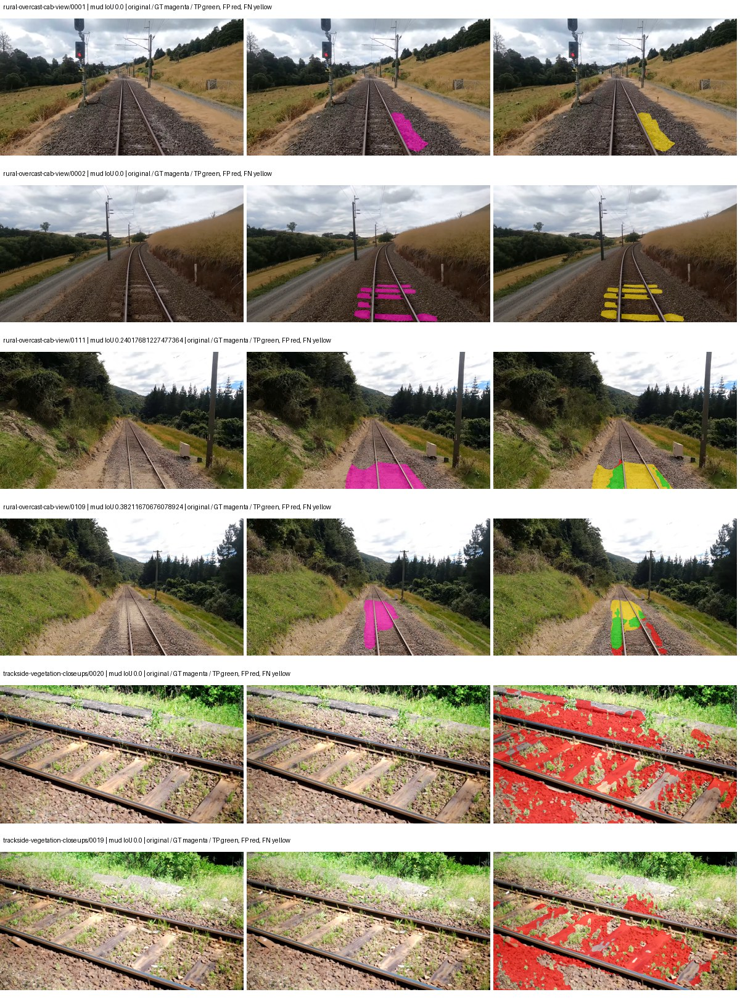
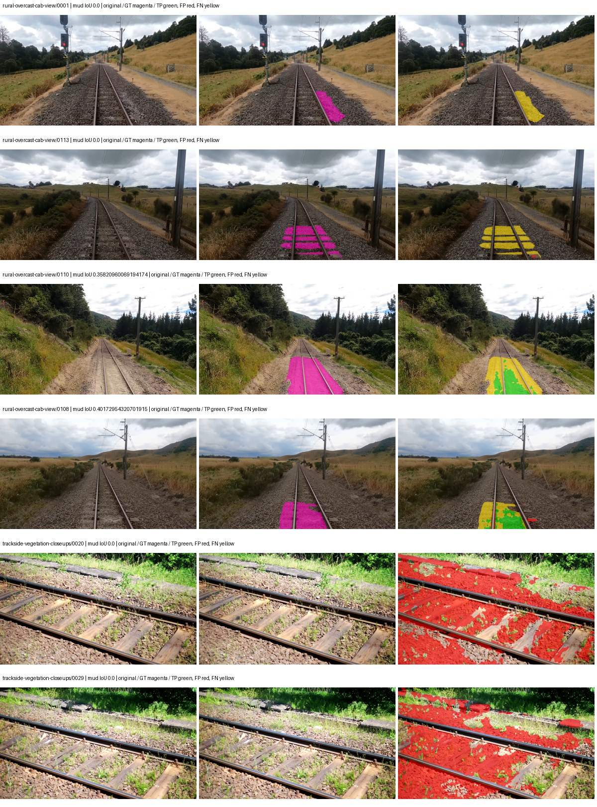
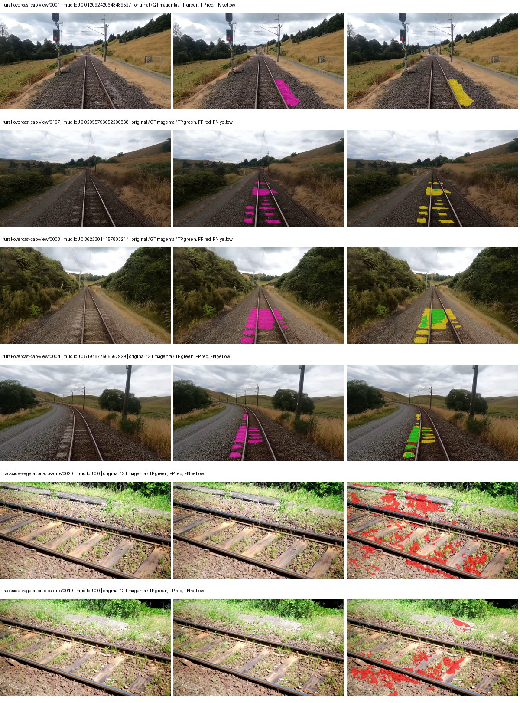
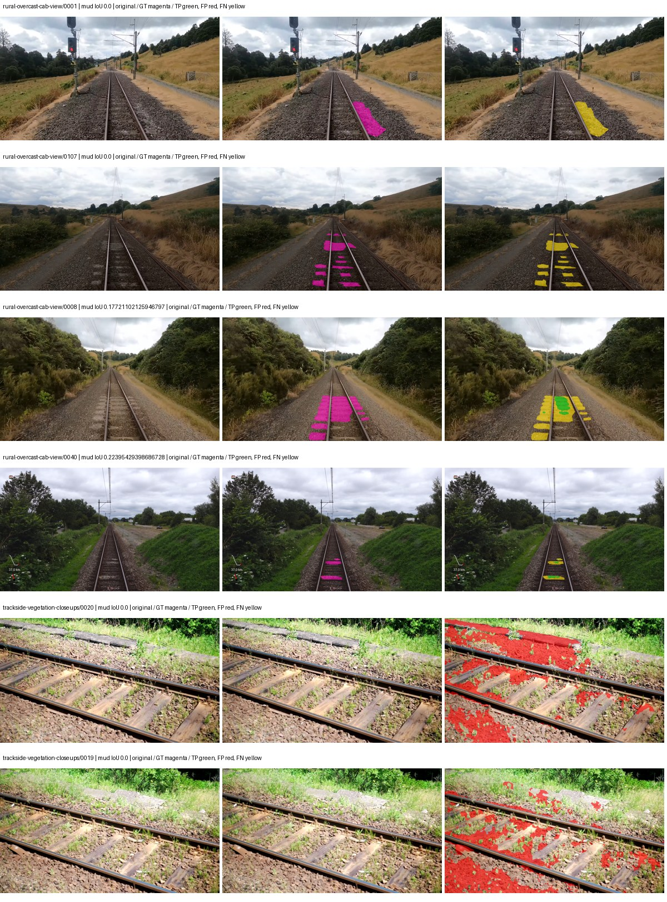

# upernet_convnext — rad_9_24_2026-fixed-grouped

[RAD 9/24: Scene-grouped split](../../README.md) · [Full model records](record.json)

Primary selection and early stopping: **mud-pumping validation IoU**. A job is complete only after full statistics and isolated profiling are verified.

| Model | Initialization path | Seed | Status | Steps | Best step | Mud IoU (%) | Mud precision (%) | Mud recall (%) | Final mud IoU (trainer val, %) | mIoU (%) | Fixed GT-class mIoU (%) |
| --- | --- | --- | --- | --- | --- | --- | --- | --- | --- | --- | --- |
| upernet_convnext | rtis_only | 0 | completed | 3111 | 1814 | 4.68 | 6.98 | 12.44 | 1.31 | 36.12 | 42.14 |
| upernet_convnext | cityscapes_to_rtis | 0 | completed | 2333 | 1037 | 3.21 | 3.71 | 19.08 | 2.21 | 31.04 | 36.21 |
| upernet_convnext | railsem19_to_rtis | 0 | completed | 3629 | 2333 | 7.82 | 14.34 | 14.68 | 2.69 | 42.36 | 49.42 |
| upernet_convnext | cityscapes_to_railsem19_to_rtis | 0 | completed | 2333 | 1037 | 2.44 | 3.63 | 6.88 | 0.99 | 37.88 | 44.19 |

Training: 217 images. Validation: 37 images. Test: 60 held out. Seeds: [0]. Seed variation measures optimization variability, not independent-recording uncertainty. Historical source checkpoints stay fixed across adaptation seeds.

Training code: `d864b72bd90706260965bb1a48398d01167b6d5c`. Split SHA-256: `12d7b367c72cda61d57686ff2ac28223530d0af49debd9fb7a0fbc68b908bc93`.

## rtis_only — seed 0

Status: **completed**. Started: 2026-10-06T00:41:08.298551+00:00. Finished: 2026-10-06T01:57:12.853648+00:00.

Recipe pretrained initializer: `openmmlab/upernet-convnext-small`.

`rtis_only` uses the recipe initializer, which may include pretrained segmentation components. Transfer paths load the exact historical source checkpoint below and reset the classifier; they do not reset all query/decoder features.

Source checkpoint: `Recipe pretrained initialization`.

Config SHA-256: `87ff4524244cfe080063ecf362fce9b0967ca05379f563cdf000d3f93052e689`. Weights used for validation: `raw`.

### Mud-pumping and aggregate quality

| Metric | Selected checkpoint | Final training validation |
| --- | --- | --- |
| Mud IoU | 4.68 | 1.31 |
| Mud precision | 6.98 | 2.08 |
| Mud recall | 12.44 | 3.44 |
| Mud Dice/F1 | 8.94 | 2.59 |
| mIoU | 36.12 | 34.63 |
| Mean accuracy | 51.78 | 49.11 |
| Mean precision | 54.66 | 54.40 |
| Mean Dice | 45.62 | 43.88 |
| Mean specificity | 99.02 | 98.87 |
| Pixel accuracy | 84.51 | 82.68 |
| Frequency-weighted IoU | 75.81 | 72.84 |
| Fixed GT-present class mIoU | 42.14 | 40.40 |
| Boundary F1 | 41.83 | 41.49 |

The selected checkpoint has independent evaluation evidence. Final values are the trainer's final validation record, not a new independent evaluation. mIoU averages classes with nonzero union, so false positives on absent classes can change its denominator. The fixed GT-class mean is supplementary and excludes absent classes; their false positives remain in the confusion matrix.

### Resource usage and timing

| Measurement | Value |
| --- | --- |
| Peak training VRAM, retained training invocation (GiB) | 13.46 |
| Peak evaluation VRAM (GiB) | 7.68 |
| Retained training invocation wall time (seconds) | 4318.36 |
| Retained training invocation GPU-hours (one GPU) | 1.20 |
| Evaluation wall time (seconds) | 21.53 |
| Full evaluation pipeline images/second | 1.72 |
| Best full-state checkpoint (MiB) | 1234.99 |
| Final full-state checkpoint (MiB) | 1234.97 |
| Verified periodic checkpoints removed (GiB) | 7.24 |

VRAM uses the recorded allocator high-water mark; it is not total device usage including CUDA context. Resumed jobs' retained training invocation times and peaks are **not whole-campaign totals**. Earlier invocation resource records are not reconstructed here. Evaluation throughput includes loader, sliding-window inference and metrics; it is not model-only latency/FPS. Missing measurements are shown as —, never inferred from another dataset's run.

### Standardized inference performance

Dedicated model-only profiling waits for an idle worker-locked L40S: BF16, batch 1, 1024x1024, 20 warmup and 100 CUDA-event-timed public forwards. It excludes loading, preprocessing, tiling and metrics.

| Status | Parameters | Weight MiB | FPS | p50 ms | p95 ms | Peak reserved GiB |
| --- | --- | --- | --- | --- | --- | --- |
| complete | 80887221 | 308.56 | 42.30 | 23.63 | 23.71 | 2.48 |

```json
{
  "schema_version": 1,
  "model_id": "upernet_convnext",
  "measured_at": "2026-10-06T01:57:02+00:00",
  "status": "complete",
  "benchmark_scope": "rtis_selected_checkpoint_model_only",
  "applies_to": [
    "upernet_convnext--rtis_only--seed-0"
  ],
  "source": {
    "campaign_git_sha": "d864b72bd90706260965bb1a48398d01167b6d5c",
    "git_dirty": false,
    "config_hash": "76c5716214c9",
    "resolved_config": "/data/izadia1/projects/segmentary-runs/rad_9_24_2026/fixed-grouped-seed0-20261005-r2/configs/upernet_convnext--rtis_only--seed-0.yaml",
    "config_sha256": "87ff4524244cfe080063ecf362fce9b0967ca05379f563cdf000d3f93052e689",
    "checkpoint_sha256": "1d6f7d312b01c58b484ca9a695cf50e0fd4d71c42e29edeeb76235cc17a038a6",
    "checkpoint_global_step": 1814,
    "checkpoint_bytes": 1294982018,
    "checkpoint_kind": "resume checkpoint with optimizer and EMA state",
    "weights": "raw",
    "measured_checkpoint_job_id": "upernet_convnext--rtis_only--seed-0",
    "result_sha256": "2a3015539ed7e788b1700c2280660706664197cebc6bcf87be580fce57cccf8b",
    "result_git_sha": "d864b72bd90706260965bb1a48398d01167b6d5c",
    "result_stage": "eval:rad_9_24_2026-fixed-grouped:val",
    "result_seed": 0
  },
  "hardware": {
    "gpu_name": "NVIDIA L40S",
    "gpu_uuid": "GPU-c76642eb-64c1-b0ac-b051-d2efd47b32c4",
    "logical_device": "cuda:0",
    "physical_visibility_token": "9",
    "compute_capability": [
      8,
      9
    ],
    "total_memory_bytes": 47677177856
  },
  "model": {
    "parameter_count": 80887221,
    "trainable_parameter_count": 80887221,
    "resident_parameter_bytes": 323548884,
    "parameter_dtype_counts": {
      "float32": 80887221
    }
  },
  "contract": {
    "backend": "pytorch",
    "precision": "bf16_autocast",
    "batch_size": 1,
    "input_shape_nchw": [
      1,
      3,
      1024,
      1024
    ],
    "warmup_iterations": 20,
    "measured_iterations": 100,
    "timing": "per-forward CUDA events with end-event synchronization",
    "includes_preprocessing": false,
    "includes_data_loader": false,
    "includes_sliding_window": false,
    "input_resident_on_gpu": true,
    "model_only": true,
    "entrypoint": "public model(image) dense-logits forward"
  },
  "measurements": {
    "latency": {
      "p50_ms": 23.633408546447754,
      "p95_ms": 23.71077127456665,
      "mean_ms": 23.640104427337647,
      "minimum_ms": 23.516159057617188,
      "maximum_ms": 23.775232315063477,
      "fps": 42.3009975727345,
      "raw_ms": [
        23.613439559936523,
        23.516159057617188,
        23.632896423339844,
        23.601152420043945,
        23.576576232910156,
        23.585792541503906,
        23.66975975036621,
        23.580671310424805,
        23.68716812133789,
        23.756799697875977,
        23.66975975036621,
        23.616512298583984,
        23.618560791015625,
        23.605247497558594,
        23.69228744506836,
        23.614463806152344,
        23.582719802856445,
        23.606271743774414,
        23.598079681396484,
        23.74553680419922,
        23.71379280090332,
        23.626752853393555,
        23.69945526123047,
        23.623680114746094,
        23.635936737060547,
        23.66054344177246,
        23.592960357666016,
        23.568384170532227,
        23.588863372802734,
        23.67897605895996,
        23.696352005004883,
        23.70969581604004,
        23.638015747070312,
        23.67897605895996,
        23.602176666259766,
        23.656448364257812,
        23.68614387512207,
        23.655424118041992,
        23.610368728637695,
        23.568384170532227,
        23.592960357666016,
        23.70969581604004,
        23.624704360961914,
        23.622655868530273,
        23.69024085998535,
        23.647232055664062,
        23.66054344177246,
        23.69843292236328,
        23.637056350708008,
        23.612415313720703,
        23.586816787719727,
        23.628799438476562,
        23.663616180419922,
        23.619583129882812,
        23.599103927612305,
        23.71174430847168,
        23.636991500854492,
        23.67795181274414,
        23.665664672851562,
        23.633920669555664,
        23.629823684692383,
        23.642112731933594,
        23.663616180419922,
        23.70560073852539,
        23.634944915771484,
        23.617536544799805,
        23.615488052368164,
        23.597055435180664,
        23.65132713317871,
        23.617536544799805,
        23.602176666259766,
        23.69024085998535,
        23.595008850097656,
        23.68921661376953,
        23.71072006225586,
        23.635967254638672,
        23.605247497558594,
        23.595008850097656,
        23.619583129882812,
        23.70355224609375,
        23.775232315063477,
        23.648256301879883,
        23.639039993286133,
        23.67692756652832,
        23.626752853393555,
        23.642112731933594,
        23.603200912475586,
        23.640064239501953,
        23.603200912475586,
        23.606271743774414,
        23.68511962890625,
        23.613439559936523,
        23.555072784423828,
        23.609344482421875,
        23.676895141601562,
        23.654399871826172,
        23.622655868530273,
        23.607295989990234,
        23.69843292236328,
        23.623647689819336
      ],
      "percentile_method": "numpy linear interpolation"
    },
    "peak_reserved_bytes": 2663383040,
    "memory_kind": "pytorch_cuda_allocator_peak_reserved_excluding_context",
    "benchmark_wall_clock_s": 9.768148690462112
  },
  "started_at": "2026-10-06T01:56:52+00:00",
  "finished_at": "2026-10-06T01:57:02+00:00",
  "environment": {
    "hostname": "hdrfs-app-001",
    "python": "3.11.15",
    "platform": "Linux-5.15.0-139-generic-x86_64-with-glibc2.35",
    "torch": "2.11.0+cu128",
    "torch_cuda": "12.8",
    "cudnn": 91900,
    "driver_version": "570.133.20",
    "cuda_available": true,
    "gpu_count": 1,
    "gpu_names": [
      "NVIDIA L40S"
    ],
    "cuda_visible_devices": "9",
    "packages": {
      "segmentary": "0.1.0",
      "torch": "2.11.0+cu128",
      "torchvision": "0.26.0+cu128",
      "transformers": "5.15.0",
      "timm": "1.0.28",
      "segmentation-models-pytorch": "0.5.0",
      "albumentations": "2.0.8",
      "lightning": "2.6.5",
      "numpy": "2.4.4"
    }
  }
}
```

### Per-class validation results

| Class | GT pixels | IoU (%) | Precision (%) | Recall (%) | Dice (%) | Boundary F1 (%) |
| --- | --- | --- | --- | --- | --- | --- |
| car | 29664 | 25.80 | 46.66 | 36.59 | 41.02 | 38.97 |
| construction | 311585 | 27.30 | 29.95 | 75.49 | 42.89 | 39.74 |
| fence | 265137 | 16.91 | 62.40 | 18.83 | 28.93 | 45.38 |
| mud-pumping | 1226250 | 4.68 | 6.98 | 12.44 | 8.94 | 8.89 |
| on-rails | 0 | 0.00 | 0.00 | — | 0.00 | 0.00 |
| person | 0 | 0.00 | 0.00 | — | 0.00 | 0.00 |
| pole | 628038 | 73.18 | 86.10 | 82.98 | 84.51 | 90.62 |
| rail-embedded | 16799 | 19.55 | 97.69 | 19.64 | 32.70 | 21.82 |
| rail-raised | 2969797 | 77.93 | 89.17 | 86.08 | 87.60 | 93.76 |
| rail-track | 6323197 | 35.26 | 74.28 | 40.17 | 52.14 | 48.08 |
| road | 1048831 | 1.48 | 12.43 | 1.65 | 2.91 | 7.57 |
| sidewalk | 1297367 | 50.18 | 95.46 | 51.40 | 66.82 | 17.89 |
| sky | 19121606 | 98.11 | 99.29 | 98.81 | 99.05 | 94.87 |
| standing-water | 95802 | 2.16 | 2.64 | 10.49 | 4.22 | 9.91 |
| terrain | 39239306 | 87.25 | 88.54 | 98.36 | 93.19 | 63.38 |
| trackbed | 10643081 | 58.98 | 70.32 | 78.53 | 74.20 | 58.73 |
| traffic-light | 19510 | 74.69 | 83.02 | 88.15 | 85.51 | 79.95 |
| traffic-sign | 13285 | 41.33 | 56.06 | 61.14 | 58.49 | 64.78 |
| tram-track | 56179 | 22.07 | 67.07 | 24.75 | 36.16 | 27.35 |
| truck | 0 | 0.00 | 0.00 | — | 0.00 | 0.00 |
| vegetation-overgrowth | 5901821 | 41.59 | 79.75 | 46.50 | 58.75 | 66.80 |

### Full-run accounting

| Measurement | Value |
| --- | --- |
| Full GPU-reserved wall seconds, all recorded worker attempts | 4572.18 |
| Full reserved GPU-hours | 1.27 |
| Whole-run timing complete | True |

| Phase | Wall seconds including failed attempts |
| --- | --- |
| training | 4325.12 |
| diagnostics | 179.50 |
| performance | 18.95 |

GPU-reserved time includes model loading, training, validation, collection, profiling, checkpoint I/O and orchestration while the worker owns one GPU. It is not GPU kernel-active time. Phase timings and sampled device memory/power/utilization are retained separately; sampled device memory is not the allocator high-water mark.

### Train/validation and raw/EMA diagnostics

| Checkpoint / weights / split | Images | Mud IoU (%) | Mud precision (%) | Mud recall (%) |
| --- | --- | --- | --- | --- |
| best-auto-train / raw | 217 | 96.94 | 97.84 | 99.06 |
| best-auto-val / raw | 37 | 4.68 | 6.98 | 12.44 |
| best-alternate-val / ema | 37 | 2.08 | 3.78 | 4.44 |
| final-auto-val / raw | 37 | 1.31 | 2.07 | 3.43 |

Train uses the evaluation transform without augmentation. Compare mud train/validation metrics for the same selected weights. Alternate EMA on running-stat BatchNorm is explicitly uncalibrated and is diagnostic only. Score-threshold curves use uncalibrated normalized scores and are pixel-level diagnostics, not event detection rates or a selected deployment operating point.

### Downloadable evidence

- best-auto-train: [per-image.csv](rtis_only--seed-0/best-auto-train/per-image.csv) · [per-image-confusion.json.gz](rtis_only--seed-0/best-auto-train/per-image-confusion.json.gz) · [groups.json](rtis_only--seed-0/best-auto-train/groups.json) · [mud-score-curves.json](rtis_only--seed-0/best-auto-train/mud-score-curves.json)
- best-auto-val: [per-image.csv](rtis_only--seed-0/best-auto-val/per-image.csv) · [per-image-confusion.json.gz](rtis_only--seed-0/best-auto-val/per-image-confusion.json.gz) · [groups.json](rtis_only--seed-0/best-auto-val/groups.json) · [mud-score-curves.json](rtis_only--seed-0/best-auto-val/mud-score-curves.json) · [examples.jpg](rtis_only--seed-0/best-auto-val/examples.jpg)
- best-alternate-val: [per-image.csv](rtis_only--seed-0/best-alternate-val/per-image.csv) · [per-image-confusion.json.gz](rtis_only--seed-0/best-alternate-val/per-image-confusion.json.gz) · [groups.json](rtis_only--seed-0/best-alternate-val/groups.json) · [mud-score-curves.json](rtis_only--seed-0/best-alternate-val/mud-score-curves.json)
- final-auto-val: [per-image.csv](rtis_only--seed-0/final-auto-val/per-image.csv) · [per-image-confusion.json.gz](rtis_only--seed-0/final-auto-val/per-image-confusion.json.gz) · [groups.json](rtis_only--seed-0/final-auto-val/groups.json) · [mud-score-curves.json](rtis_only--seed-0/final-auto-val/mud-score-curves.json)
- resources: [telemetry.csv](rtis_only--seed-0/resources/telemetry.csv)



Examples are two lowest and two highest mud-IoU positive images, plus up to two negative images with the most false-positive mud pixels. They are targeted diagnostic examples, not random samples. Green: true positive; red: false positive; yellow: false negative. Full predictions remain on HDRFS.

### Validation tracking

| Logged step | Overall mIoU (%) | Mud IoU (%) |
| --- | --- | --- |
| 258 | 29.35 | 0.78 |
| 518 | 37.05 | 2.44 |
| 777 | 38.33 | 2.52 |
| 1036 | 35.85 | 0.61 |
| 1295 | 35.85 | 0.47 |
| 1555 | 34.23 | 2.94 |
| 1814 | 36.14 | 4.67 |
| 2073 | 35.23 | 3.39 |
| 2332 | 35.63 | 1.21 |
| 2592 | 34.48 | 0.69 |
| 2851 | 37.96 | 0.74 |
| 3110 | 34.63 | 1.31 |

All retained scalar curves, including training loss and per-class IoU, are in record.json. Observed best mud on a curve is not necessarily a retained checkpoint: the pilot saved its selection-metric-best and final checkpoints. Step logging and checkpoint global_step may differ by one.

### Stopping and checkpoint provenance

```json
{
  "stopping": {
    "actual_steps": 3111,
    "maximum_steps": 4000,
    "min_delta": 0.001,
    "monitor": "val_iou/mud-pumping",
    "patience": 5,
    "reason": "validation_plateau"
  },
  "checkpoints": {
    "best": {
      "path": "/data/izadia1/projects/segmentary-runs/rad_9_24_2026/fixed-grouped-seed0-20261005-r2/future-runs/upernet_convnext--rtis_only--seed-0_seed0/rtis/best.ckpt",
      "sha256": "1d6f7d312b01c58b484ca9a695cf50e0fd4d71c42e29edeeb76235cc17a038a6",
      "global_step": 1814,
      "bytes": 1294982018
    },
    "final": {
      "path": "/data/izadia1/projects/segmentary-runs/rad_9_24_2026/fixed-grouped-seed0-20261005-r2/future-runs/upernet_convnext--rtis_only--seed-0_seed0/rtis/last.ckpt",
      "sha256": "830c705f854395c09cb9531ddb55623f696fcce0f95fec6ad093c526f041807f",
      "global_step": 3111,
      "bytes": 1294963010
    }
  },
  "cleanup_error": null
}
```

### Resolved training, initialization and evaluation settings

The optimizer block is the base configuration. Stage LR scales are applied at runtime, and stage warmup is capped at min(base warmup, floor(stage budget / 10), stage budget - 1): 400 steps for this 4,000-step pilot. Model-internal native input grids may differ from augmentation crops (EoMT uses its 640 grid).

```json
{
  "name": "upernet_convnext--rtis_only--seed-0",
  "model": {
    "arch": "upernet_convnext",
    "checkpoint": "openmmlab/upernet-convnext-small",
    "tuning": "full",
    "head": "unified_head",
    "lora_r": 16,
    "lora_alpha": 32,
    "lora_dropout": 0.05,
    "lora_targets": [],
    "drop_path": null,
    "revision": null,
    "subfolder": null,
    "local_files_only": false,
    "trust_remote_code": false,
    "backbone_path": null,
    "head_paths": [],
    "classifier_path": null,
    "inactive_parameter_paths": [],
    "smp_arch": null,
    "encoder_name": null,
    "encoder_weights": null,
    "native": null,
    "batch_norm_momentum": null
  },
  "space": "paul-test-rtis",
  "taxonomy_root": "/data/izadia1/projects/segmentary-rad-d864b72b/taxonomy",
  "output_root": "/data/izadia1/projects/segmentary-runs/rad_9_24_2026/fixed-grouped-seed0-20261005-r2/future-runs",
  "optim": {
    "backbone_lr": 6e-05,
    "head_lr_mult": 10.0,
    "weight_decay": 0.05,
    "llrd": 1.0,
    "warmup_iters": 1500,
    "warmup_ratio": 1e-06,
    "poly_power": 0.9,
    "min_lr_ratio": 0.0,
    "betas": [
      0.9,
      0.999
    ],
    "grad_clip": 1.0
  },
  "train": {
    "iters": 4000,
    "batch_size": 2,
    "accum": 8,
    "num_workers": 2,
    "precision": "bf16-mixed",
    "ema_decay": 0.9998,
    "val_every": 250,
    "ckpt_every": 500,
    "selection_metric": "val_iou/mud-pumping",
    "early_stopping_patience": 5,
    "early_stopping_min_delta": 0.001,
    "seed": 0,
    "devices": 1
  },
  "eval": {
    "sliding_window": true,
    "window": [
      1024,
      1024
    ],
    "stride": [
      768,
      768
    ],
    "batch_size": 1,
    "num_workers": 2,
    "tta_scales": [],
    "tta_flip": false,
    "threshold": 0.5,
    "boundary_tolerance_frac": 0.0075,
    "save_confusion": true
  },
  "loss": {
    "task": "multiclass",
    "activation": "auto",
    "terms": [],
    "aux": "none",
    "aux_weight": 0.0,
    "ce_weight": 1.0,
    "label_smoothing": 0.0,
    "class_weights": null,
    "query": null
  },
  "aug": {
    "crop": [
      1024,
      1024
    ],
    "scale_min": 0.5,
    "scale_max": 2.0,
    "hflip_p": 0.5,
    "color_jitter_p": 0.5,
    "brightness": 0.25,
    "contrast": 0.25,
    "saturation": 0.25,
    "hue": 0.05
  },
  "stages": [
    {
      "name": "rtis",
      "data": [
        {
          "name": "rad_9_24_2026-fixed-grouped",
          "root": "/data/izadia1/datasets/rad_9_24_2026-fixed-grouped",
          "variant": null,
          "split_file": "splits.json",
          "train_split": "train",
          "val_split": "val",
          "limit": null,
          "loader": "folder",
          "mapping": "paul-test-rtis",
          "loader_options": {
            "require_groups": true
          }
        }
      ],
      "iters": null,
      "lr_scale": 1.0,
      "head_group_lr_scale": 1.0,
      "init_from": "pretrained",
      "reset_head": false,
      "freeze": null,
      "sample_weights": null
    }
  ]
}
```

### Hardware and software provenance

```json
{
  "training": {
    "cuda_available": true,
    "cuda_visible_devices": "9",
    "cudnn": 91900,
    "driver_version": "570.133.20",
    "gpu_count": 1,
    "gpu_names": [
      "NVIDIA L40S"
    ],
    "hostname": "hdrfs-app-001",
    "input_normalization": {
      "channel_order": "rgb",
      "mean": [
        0.485,
        0.456,
        0.406
      ],
      "source": "imagenet",
      "std": [
        0.229,
        0.224,
        0.225
      ]
    },
    "model_origins": [
      {
        "hf_commit": "550b68d291f9a7e4874065c6eec0676b2ba821e6",
        "hf_name_or_path": "openmmlab/upernet-convnext-small",
        "module": "model",
        "timm_pretrained": {}
      },
      {
        "hf_commit": null,
        "hf_name_or_path": "",
        "module": "model.backbone",
        "timm_pretrained": {}
      },
      {
        "hf_commit": null,
        "hf_name_or_path": "",
        "module": "model.backbone.encoder",
        "timm_pretrained": {}
      },
      {
        "hf_commit": "550b68d291f9a7e4874065c6eec0676b2ba821e6",
        "hf_name_or_path": "openmmlab/upernet-convnext-small",
        "module": "model.decode_head",
        "timm_pretrained": {}
      }
    ],
    "model_parameter_count": 80887221,
    "packages": {
      "albumentations": "2.0.8",
      "lightning": "2.6.5",
      "numpy": "2.4.4",
      "segmentary": "0.1.0",
      "segmentation-models-pytorch": "0.5.0",
      "timm": "1.0.28",
      "torch": "2.11.0+cu128",
      "torchvision": "0.26.0+cu128",
      "transformers": "5.15.0"
    },
    "platform": "Linux-5.15.0-139-generic-x86_64-with-glibc2.35",
    "python": "3.11.15",
    "torch": "2.11.0+cu128",
    "torch_cuda": "12.8",
    "trainable_parameter_count": 80887221,
    "training_stop": {
      "actual_steps": 3111,
      "maximum_steps": 4000,
      "min_delta": 0.001,
      "monitor": "val_iou/mud-pumping",
      "patience": 5,
      "reason": "validation_plateau"
    },
    "validation_weights": "raw"
  },
  "evaluation": {
    "cuda_available": true,
    "cuda_visible_devices": "9",
    "cudnn": 91900,
    "driver_version": "570.133.20",
    "gpu_count": 1,
    "gpu_names": [
      "NVIDIA L40S"
    ],
    "hostname": "hdrfs-app-001",
    "input_normalization": {
      "channel_order": "rgb",
      "mean": [
        0.485,
        0.456,
        0.406
      ],
      "source": "imagenet",
      "std": [
        0.229,
        0.224,
        0.225
      ]
    },
    "packages": {
      "albumentations": "2.0.8",
      "lightning": "2.6.5",
      "numpy": "2.4.4",
      "segmentary": "0.1.0",
      "segmentation-models-pytorch": "0.5.0",
      "timm": "1.0.28",
      "torch": "2.11.0+cu128",
      "torchvision": "0.26.0+cu128",
      "transformers": "5.15.0"
    },
    "platform": "Linux-5.15.0-139-generic-x86_64-with-glibc2.35",
    "python": "3.11.15",
    "torch": "2.11.0+cu128",
    "torch_cuda": "12.8"
  }
}
```

## cityscapes_to_rtis — seed 0

Status: **completed**. Started: 2026-10-06T01:16:36.541774+00:00. Finished: 2026-10-06T02:14:19.907507+00:00.

Recipe pretrained initializer: `openmmlab/upernet-convnext-small`.

`rtis_only` uses the recipe initializer, which may include pretrained segmentation components. Transfer paths load the exact historical source checkpoint below and reset the classifier; they do not reset all query/decoder features.

Source checkpoint: `{'name': 'upernet_convnext--cityscapes--seed-0', 'model': 'upernet_convnext', 'protocol': 'cityscapes', 'config': '/data/izadia1/projects/segmentary-runs/all-model-city-rail-seed0-rail20-b9eb3e1/accepted/upernet_convnext--cityscapes--seed-0/resolved-config.yaml', 'checkpoint': '/data/izadia1/projects/segmentary-runs/all-model-city-rail-seed0-a7c0b67/jobs/upernet_convnext--cityscapes--seed-0/attempt-001/train/upernet_convnext--cityscapes_seed0/cityscapes/last.ckpt', 'recorded_sha256': 'fb45ace4437433d1713d6afef5ee260284b053b7301e6be003f89249012dc698', 'exists': True}`.

Config SHA-256: `ee6b00466c58f93a87957d5a7d323f4d670583248829f24d9d34f3d4580b17ad`. Weights used for validation: `raw`.

### Mud-pumping and aggregate quality

| Metric | Selected checkpoint | Final training validation |
| --- | --- | --- |
| Mud IoU | 3.21 | 2.21 |
| Mud precision | 3.71 | 3.30 |
| Mud recall | 19.08 | 6.32 |
| Mud Dice/F1 | 6.22 | 4.33 |
| mIoU | 31.04 | 32.51 |
| Mean accuracy | 44.29 | 46.75 |
| Mean precision | 55.71 | 53.41 |
| Mean Dice | 40.33 | 41.99 |
| Mean specificity | 98.78 | 98.68 |
| Pixel accuracy | 80.51 | 80.79 |
| Frequency-weighted IoU | 71.79 | 69.74 |
| Fixed GT-present class mIoU | 36.21 | 37.93 |
| Boundary F1 | 38.46 | 37.83 |

The selected checkpoint has independent evaluation evidence. Final values are the trainer's final validation record, not a new independent evaluation. mIoU averages classes with nonzero union, so false positives on absent classes can change its denominator. The fixed GT-class mean is supplementary and excludes absent classes; their false positives remain in the confusion matrix.

### Resource usage and timing

| Measurement | Value |
| --- | --- |
| Peak training VRAM, retained training invocation (GiB) | 13.46 |
| Peak evaluation VRAM (GiB) | 7.68 |
| Retained training invocation wall time (seconds) | 3215.02 |
| Retained training invocation GPU-hours (one GPU) | 0.89 |
| Evaluation wall time (seconds) | 21.85 |
| Full evaluation pipeline images/second | 1.69 |
| Best full-state checkpoint (MiB) | 1234.99 |
| Final full-state checkpoint (MiB) | 1234.97 |
| Verified periodic checkpoints removed (GiB) | 4.82 |

VRAM uses the recorded allocator high-water mark; it is not total device usage including CUDA context. Resumed jobs' retained training invocation times and peaks are **not whole-campaign totals**. Earlier invocation resource records are not reconstructed here. Evaluation throughput includes loader, sliding-window inference and metrics; it is not model-only latency/FPS. Missing measurements are shown as —, never inferred from another dataset's run.

### Standardized inference performance

Dedicated model-only profiling waits for an idle worker-locked L40S: BF16, batch 1, 1024x1024, 20 warmup and 100 CUDA-event-timed public forwards. It excludes loading, preprocessing, tiling and metrics.

| Status | Parameters | Weight MiB | FPS | p50 ms | p95 ms | Peak reserved GiB |
| --- | --- | --- | --- | --- | --- | --- |
| complete | 80887221 | 308.56 | 42.72 | 23.39 | 23.56 | 2.48 |

```json
{
  "schema_version": 1,
  "model_id": "upernet_convnext",
  "measured_at": "2026-10-06T02:14:10+00:00",
  "status": "complete",
  "benchmark_scope": "rtis_selected_checkpoint_model_only",
  "applies_to": [
    "upernet_convnext--cityscapes_to_rtis--seed-0"
  ],
  "source": {
    "campaign_git_sha": "d864b72bd90706260965bb1a48398d01167b6d5c",
    "git_dirty": false,
    "config_hash": "0bc036586f90",
    "resolved_config": "/data/izadia1/projects/segmentary-runs/rad_9_24_2026/fixed-grouped-seed0-20261005-r2/configs/upernet_convnext--cityscapes_to_rtis--seed-0.yaml",
    "config_sha256": "ee6b00466c58f93a87957d5a7d323f4d670583248829f24d9d34f3d4580b17ad",
    "checkpoint_sha256": "b9481ca7db648ba409d56cd70e4ac49297752e6b293adfa97a2a520498bc8194",
    "checkpoint_global_step": 1037,
    "checkpoint_bytes": 1294982018,
    "checkpoint_kind": "resume checkpoint with optimizer and EMA state",
    "weights": "raw",
    "measured_checkpoint_job_id": "upernet_convnext--cityscapes_to_rtis--seed-0",
    "result_sha256": "26739b8411f209f901707eaafd6b711bb4f04e17185acefd8c22c0a87a250c6d",
    "result_git_sha": "d864b72bd90706260965bb1a48398d01167b6d5c",
    "result_stage": "eval:rad_9_24_2026-fixed-grouped:val",
    "result_seed": 0
  },
  "hardware": {
    "gpu_name": "NVIDIA L40S",
    "gpu_uuid": "GPU-a5ad49e5-0536-5229-ba8a-f8a902808f53",
    "logical_device": "cuda:0",
    "physical_visibility_token": "7",
    "compute_capability": [
      8,
      9
    ],
    "total_memory_bytes": 47677177856
  },
  "model": {
    "parameter_count": 80887221,
    "trainable_parameter_count": 80887221,
    "resident_parameter_bytes": 323548884,
    "parameter_dtype_counts": {
      "float32": 80887221
    }
  },
  "contract": {
    "backend": "pytorch",
    "precision": "bf16_autocast",
    "batch_size": 1,
    "input_shape_nchw": [
      1,
      3,
      1024,
      1024
    ],
    "warmup_iterations": 20,
    "measured_iterations": 100,
    "timing": "per-forward CUDA events with end-event synchronization",
    "includes_preprocessing": false,
    "includes_data_loader": false,
    "includes_sliding_window": false,
    "input_resident_on_gpu": true,
    "model_only": true,
    "entrypoint": "public model(image) dense-logits forward"
  },
  "measurements": {
    "latency": {
      "p50_ms": 23.394304275512695,
      "p95_ms": 23.56300859451294,
      "mean_ms": 23.40766590118408,
      "minimum_ms": 23.343103408813477,
      "maximum_ms": 23.70047950744629,
      "fps": 42.7210472082744,
      "raw_ms": [
        23.577600479125977,
        23.562240600585938,
        23.407615661621094,
        23.367679595947266,
        23.362560272216797,
        23.379968643188477,
        23.399423599243164,
        23.70047950744629,
        23.372800827026367,
        23.418880462646484,
        23.361536026000977,
        23.367679595947266,
        23.6441593170166,
        23.376895904541016,
        23.361536026000977,
        23.353343963623047,
        23.378944396972656,
        23.394304275512695,
        23.347200393676758,
        23.377920150756836,
        23.374847412109375,
        23.422975540161133,
        23.385087966918945,
        23.414751052856445,
        23.366655349731445,
        23.394304275512695,
        23.4465274810791,
        23.599103927612305,
        23.410688400268555,
        23.409664154052734,
        23.656448364257812,
        23.343103408813477,
        23.398399353027344,
        23.364608764648438,
        23.390207290649414,
        23.363584518432617,
        23.377920150756836,
        23.377920150756836,
        23.400447845458984,
        23.379968643188477,
        23.3492488861084,
        23.426048278808594,
        23.392255783081055,
        23.420927047729492,
        23.430143356323242,
        23.419904708862305,
        23.420927047729492,
        23.390207290649414,
        23.398399353027344,
        23.394304275512695,
        23.364608764648438,
        23.377920150756836,
        23.393280029296875,
        23.391231536865234,
        23.398399353027344,
        23.407615661621094,
        23.354368209838867,
        23.385087966918945,
        23.419904708862305,
        23.389184951782227,
        23.417856216430664,
        23.414783477783203,
        23.377920150756836,
        23.414783477783203,
        23.399423599243164,
        23.377920150756836,
        23.405536651611328,
        23.374847412109375,
        23.366655349731445,
        23.361568450927734,
        23.416831970214844,
        23.406591415405273,
        23.40656089782715,
        23.399423599243164,
        23.449600219726562,
        23.393280029296875,
        23.45471954345703,
        23.48543930053711,
        23.392255783081055,
        23.394304275512695,
        23.378944396972656,
        23.402496337890625,
        23.45574378967285,
        23.416831970214844,
        23.406591415405273,
        23.378944396972656,
        23.403520584106445,
        23.403520584106445,
        23.429119110107422,
        23.376895904541016,
        23.371776580810547,
        23.400447845458984,
        23.382015228271484,
        23.359487533569336,
        23.391231536865234,
        23.403520584106445,
        23.417856216430664,
        23.402496337890625,
        23.367616653442383,
        23.393280029296875
      ],
      "percentile_method": "numpy linear interpolation"
    },
    "peak_reserved_bytes": 2663383040,
    "memory_kind": "pytorch_cuda_allocator_peak_reserved_excluding_context",
    "benchmark_wall_clock_s": 9.780597798526287
  },
  "started_at": "2026-10-06T02:14:01+00:00",
  "finished_at": "2026-10-06T02:14:10+00:00",
  "environment": {
    "hostname": "hdrfs-app-001",
    "python": "3.11.15",
    "platform": "Linux-5.15.0-139-generic-x86_64-with-glibc2.35",
    "torch": "2.11.0+cu128",
    "torch_cuda": "12.8",
    "cudnn": 91900,
    "driver_version": "570.133.20",
    "cuda_available": true,
    "gpu_count": 1,
    "gpu_names": [
      "NVIDIA L40S"
    ],
    "cuda_visible_devices": "7",
    "packages": {
      "segmentary": "0.1.0",
      "torch": "2.11.0+cu128",
      "torchvision": "0.26.0+cu128",
      "transformers": "5.15.0",
      "timm": "1.0.28",
      "segmentation-models-pytorch": "0.5.0",
      "albumentations": "2.0.8",
      "lightning": "2.6.5",
      "numpy": "2.4.4"
    }
  }
}
```

### Per-class validation results

| Class | GT pixels | IoU (%) | Precision (%) | Recall (%) | Dice (%) | Boundary F1 (%) |
| --- | --- | --- | --- | --- | --- | --- |
| car | 29664 | 30.57 | 60.74 | 38.09 | 46.82 | 48.26 |
| construction | 311585 | 34.16 | 36.46 | 84.41 | 50.93 | 37.03 |
| fence | 265137 | 20.00 | 71.65 | 21.72 | 33.33 | 42.97 |
| mud-pumping | 1226250 | 3.21 | 3.71 | 19.08 | 6.22 | 6.12 |
| on-rails | 0 | 0.00 | 0.00 | — | 0.00 | 0.00 |
| person | 0 | 0.00 | 0.00 | — | 0.00 | 0.00 |
| pole | 628038 | 73.66 | 85.86 | 83.83 | 84.83 | 91.50 |
| rail-embedded | 16799 | 9.57 | 99.32 | 9.57 | 17.46 | 22.74 |
| rail-raised | 2969797 | 70.39 | 88.93 | 77.15 | 82.62 | 89.85 |
| rail-track | 6323197 | 33.83 | 72.95 | 38.69 | 50.56 | 48.90 |
| road | 1048831 | 2.25 | 8.01 | 3.03 | 4.39 | 9.59 |
| sidewalk | 1297367 | 26.49 | 90.19 | 27.28 | 41.88 | 11.59 |
| sky | 19121606 | 96.31 | 99.56 | 96.72 | 98.12 | 91.26 |
| standing-water | 95802 | 0.34 | 0.77 | 0.61 | 0.68 | 4.36 |
| terrain | 39239306 | 84.53 | 86.02 | 97.99 | 91.61 | 55.65 |
| trackbed | 10643081 | 56.97 | 74.87 | 70.43 | 72.58 | 52.61 |
| traffic-light | 19510 | 45.99 | 92.01 | 47.90 | 63.00 | 77.31 |
| traffic-sign | 13285 | 33.80 | 51.48 | 49.60 | 50.53 | 51.44 |
| tram-track | 56179 | 11.02 | 62.29 | 11.81 | 19.85 | 12.84 |
| truck | 0 | 0.00 | 0.00 | — | 0.00 | 0.00 |
| vegetation-overgrowth | 5901821 | 18.71 | 85.05 | 19.35 | 31.52 | 53.73 |

### Full-run accounting

| Measurement | Value |
| --- | --- |
| Full GPU-reserved wall seconds, all recorded worker attempts | 3471.72 |
| Full reserved GPU-hours | 0.96 |
| Whole-run timing complete | True |

| Phase | Wall seconds including failed attempts |
| --- | --- |
| training | 3223.09 |
| diagnostics | 180.42 |
| performance | 19.47 |

GPU-reserved time includes model loading, training, validation, collection, profiling, checkpoint I/O and orchestration while the worker owns one GPU. It is not GPU kernel-active time. Phase timings and sampled device memory/power/utilization are retained separately; sampled device memory is not the allocator high-water mark.

### Train/validation and raw/EMA diagnostics

| Checkpoint / weights / split | Images | Mud IoU (%) | Mud precision (%) | Mud recall (%) |
| --- | --- | --- | --- | --- |
| best-auto-train / raw | 217 | 94.17 | 95.75 | 98.28 |
| best-auto-val / raw | 37 | 3.21 | 3.71 | 19.08 |
| best-alternate-val / ema | 37 | 0.50 | 0.80 | 1.29 |
| final-auto-val / raw | 37 | 2.21 | 3.29 | 6.32 |

Train uses the evaluation transform without augmentation. Compare mud train/validation metrics for the same selected weights. Alternate EMA on running-stat BatchNorm is explicitly uncalibrated and is diagnostic only. Score-threshold curves use uncalibrated normalized scores and are pixel-level diagnostics, not event detection rates or a selected deployment operating point.

### Downloadable evidence

- best-auto-train: [per-image.csv](cityscapes_to_rtis--seed-0/best-auto-train/per-image.csv) · [per-image-confusion.json.gz](cityscapes_to_rtis--seed-0/best-auto-train/per-image-confusion.json.gz) · [groups.json](cityscapes_to_rtis--seed-0/best-auto-train/groups.json) · [mud-score-curves.json](cityscapes_to_rtis--seed-0/best-auto-train/mud-score-curves.json)
- best-auto-val: [per-image.csv](cityscapes_to_rtis--seed-0/best-auto-val/per-image.csv) · [per-image-confusion.json.gz](cityscapes_to_rtis--seed-0/best-auto-val/per-image-confusion.json.gz) · [groups.json](cityscapes_to_rtis--seed-0/best-auto-val/groups.json) · [mud-score-curves.json](cityscapes_to_rtis--seed-0/best-auto-val/mud-score-curves.json) · [examples.jpg](cityscapes_to_rtis--seed-0/best-auto-val/examples.jpg)
- best-alternate-val: [per-image.csv](cityscapes_to_rtis--seed-0/best-alternate-val/per-image.csv) · [per-image-confusion.json.gz](cityscapes_to_rtis--seed-0/best-alternate-val/per-image-confusion.json.gz) · [groups.json](cityscapes_to_rtis--seed-0/best-alternate-val/groups.json) · [mud-score-curves.json](cityscapes_to_rtis--seed-0/best-alternate-val/mud-score-curves.json)
- final-auto-val: [per-image.csv](cityscapes_to_rtis--seed-0/final-auto-val/per-image.csv) · [per-image-confusion.json.gz](cityscapes_to_rtis--seed-0/final-auto-val/per-image-confusion.json.gz) · [groups.json](cityscapes_to_rtis--seed-0/final-auto-val/groups.json) · [mud-score-curves.json](cityscapes_to_rtis--seed-0/final-auto-val/mud-score-curves.json)
- resources: [telemetry.csv](cityscapes_to_rtis--seed-0/resources/telemetry.csv)



Examples are two lowest and two highest mud-IoU positive images, plus up to two negative images with the most false-positive mud pixels. They are targeted diagnostic examples, not random samples. Green: true positive; red: false positive; yellow: false negative. Full predictions remain on HDRFS.

### Validation tracking

| Logged step | Overall mIoU (%) | Mud IoU (%) |
| --- | --- | --- |
| 258 | 24.68 | 1.43 |
| 518 | 27.86 | 2.76 |
| 777 | 31.41 | 2.36 |
| 1036 | 31.05 | 3.21 |
| 1295 | 32.61 | 1.28 |
| 1555 | 31.59 | 1.09 |
| 1814 | 32.93 | 0.52 |
| 2073 | 33.08 | 0.68 |
| 2332 | 32.51 | 2.21 |

All retained scalar curves, including training loss and per-class IoU, are in record.json. Observed best mud on a curve is not necessarily a retained checkpoint: the pilot saved its selection-metric-best and final checkpoints. Step logging and checkpoint global_step may differ by one.

### Stopping and checkpoint provenance

```json
{
  "stopping": {
    "actual_steps": 2333,
    "maximum_steps": 4000,
    "min_delta": 0.001,
    "monitor": "val_iou/mud-pumping",
    "patience": 5,
    "reason": "validation_plateau"
  },
  "checkpoints": {
    "best": {
      "path": "/data/izadia1/projects/segmentary-runs/rad_9_24_2026/fixed-grouped-seed0-20261005-r2/future-runs/upernet_convnext--cityscapes_to_rtis--seed-0_seed0/rtis/best.ckpt",
      "sha256": "b9481ca7db648ba409d56cd70e4ac49297752e6b293adfa97a2a520498bc8194",
      "global_step": 1037,
      "bytes": 1294982018
    },
    "final": {
      "path": "/data/izadia1/projects/segmentary-runs/rad_9_24_2026/fixed-grouped-seed0-20261005-r2/future-runs/upernet_convnext--cityscapes_to_rtis--seed-0_seed0/rtis/last.ckpt",
      "sha256": "101b8d3b3f1325859196b2082a5a35c6c84223090f859426802e4d7c18e5d971",
      "global_step": 2333,
      "bytes": 1294963010
    }
  },
  "cleanup_error": null
}
```

### Resolved training, initialization and evaluation settings

The optimizer block is the base configuration. Stage LR scales are applied at runtime, and stage warmup is capped at min(base warmup, floor(stage budget / 10), stage budget - 1): 400 steps for this 4,000-step pilot. Model-internal native input grids may differ from augmentation crops (EoMT uses its 640 grid).

```json
{
  "name": "upernet_convnext--cityscapes_to_rtis--seed-0",
  "model": {
    "arch": "upernet_convnext",
    "checkpoint": "openmmlab/upernet-convnext-small",
    "tuning": "full",
    "head": "unified_head",
    "lora_r": 16,
    "lora_alpha": 32,
    "lora_dropout": 0.05,
    "lora_targets": [],
    "drop_path": null,
    "revision": null,
    "subfolder": null,
    "local_files_only": false,
    "trust_remote_code": false,
    "backbone_path": null,
    "head_paths": [],
    "classifier_path": null,
    "inactive_parameter_paths": [],
    "smp_arch": null,
    "encoder_name": null,
    "encoder_weights": null,
    "native": null,
    "batch_norm_momentum": null
  },
  "space": "paul-test-rtis",
  "taxonomy_root": "/data/izadia1/projects/segmentary-rad-d864b72b/taxonomy",
  "output_root": "/data/izadia1/projects/segmentary-runs/rad_9_24_2026/fixed-grouped-seed0-20261005-r2/future-runs",
  "optim": {
    "backbone_lr": 6e-05,
    "head_lr_mult": 10.0,
    "weight_decay": 0.05,
    "llrd": 1.0,
    "warmup_iters": 1500,
    "warmup_ratio": 1e-06,
    "poly_power": 0.9,
    "min_lr_ratio": 0.0,
    "betas": [
      0.9,
      0.999
    ],
    "grad_clip": 1.0
  },
  "train": {
    "iters": 4000,
    "batch_size": 2,
    "accum": 8,
    "num_workers": 2,
    "precision": "bf16-mixed",
    "ema_decay": 0.9998,
    "val_every": 250,
    "ckpt_every": 500,
    "selection_metric": "val_iou/mud-pumping",
    "early_stopping_patience": 5,
    "early_stopping_min_delta": 0.001,
    "seed": 0,
    "devices": 1
  },
  "eval": {
    "sliding_window": true,
    "window": [
      1024,
      1024
    ],
    "stride": [
      768,
      768
    ],
    "batch_size": 1,
    "num_workers": 2,
    "tta_scales": [],
    "tta_flip": false,
    "threshold": 0.5,
    "boundary_tolerance_frac": 0.0075,
    "save_confusion": true
  },
  "loss": {
    "task": "multiclass",
    "activation": "auto",
    "terms": [],
    "aux": "none",
    "aux_weight": 0.0,
    "ce_weight": 1.0,
    "label_smoothing": 0.0,
    "class_weights": null,
    "query": null
  },
  "aug": {
    "crop": [
      1024,
      1024
    ],
    "scale_min": 0.5,
    "scale_max": 2.0,
    "hflip_p": 0.5,
    "color_jitter_p": 0.5,
    "brightness": 0.25,
    "contrast": 0.25,
    "saturation": 0.25,
    "hue": 0.05
  },
  "stages": [
    {
      "name": "rtis",
      "data": [
        {
          "name": "rad_9_24_2026-fixed-grouped",
          "root": "/data/izadia1/datasets/rad_9_24_2026-fixed-grouped",
          "variant": null,
          "split_file": "splits.json",
          "train_split": "train",
          "val_split": "val",
          "limit": null,
          "loader": "folder",
          "mapping": "paul-test-rtis",
          "loader_options": {
            "require_groups": true
          }
        }
      ],
      "iters": null,
      "lr_scale": 0.1,
      "head_group_lr_scale": 1.0,
      "init_from": "/data/izadia1/projects/segmentary-runs/all-model-city-rail-seed0-a7c0b67/jobs/upernet_convnext--cityscapes--seed-0/attempt-001/train/upernet_convnext--cityscapes_seed0/cityscapes/last.ckpt",
      "reset_head": true,
      "freeze": null,
      "sample_weights": null
    }
  ]
}
```

### Hardware and software provenance

```json
{
  "training": {
    "cuda_available": true,
    "cuda_visible_devices": "7",
    "cudnn": 91900,
    "driver_version": "570.133.20",
    "gpu_count": 1,
    "gpu_names": [
      "NVIDIA L40S"
    ],
    "hostname": "hdrfs-app-001",
    "input_normalization": {
      "channel_order": "rgb",
      "mean": [
        0.485,
        0.456,
        0.406
      ],
      "source": "imagenet",
      "std": [
        0.229,
        0.224,
        0.225
      ]
    },
    "model_origins": [
      {
        "hf_commit": "550b68d291f9a7e4874065c6eec0676b2ba821e6",
        "hf_name_or_path": "openmmlab/upernet-convnext-small",
        "module": "model",
        "timm_pretrained": {}
      },
      {
        "hf_commit": null,
        "hf_name_or_path": "",
        "module": "model.backbone",
        "timm_pretrained": {}
      },
      {
        "hf_commit": null,
        "hf_name_or_path": "",
        "module": "model.backbone.encoder",
        "timm_pretrained": {}
      },
      {
        "hf_commit": "550b68d291f9a7e4874065c6eec0676b2ba821e6",
        "hf_name_or_path": "openmmlab/upernet-convnext-small",
        "module": "model.decode_head",
        "timm_pretrained": {}
      }
    ],
    "model_parameter_count": 80887221,
    "packages": {
      "albumentations": "2.0.8",
      "lightning": "2.6.5",
      "numpy": "2.4.4",
      "segmentary": "0.1.0",
      "segmentation-models-pytorch": "0.5.0",
      "timm": "1.0.28",
      "torch": "2.11.0+cu128",
      "torchvision": "0.26.0+cu128",
      "transformers": "5.15.0"
    },
    "platform": "Linux-5.15.0-139-generic-x86_64-with-glibc2.35",
    "python": "3.11.15",
    "torch": "2.11.0+cu128",
    "torch_cuda": "12.8",
    "trainable_parameter_count": 80887221,
    "training_stop": {
      "actual_steps": 2333,
      "maximum_steps": 4000,
      "min_delta": 0.001,
      "monitor": "val_iou/mud-pumping",
      "patience": 5,
      "reason": "validation_plateau"
    },
    "validation_weights": "raw"
  },
  "evaluation": {
    "cuda_available": true,
    "cuda_visible_devices": "7",
    "cudnn": 91900,
    "driver_version": "570.133.20",
    "gpu_count": 1,
    "gpu_names": [
      "NVIDIA L40S"
    ],
    "hostname": "hdrfs-app-001",
    "input_normalization": {
      "channel_order": "rgb",
      "mean": [
        0.485,
        0.456,
        0.406
      ],
      "source": "imagenet",
      "std": [
        0.229,
        0.224,
        0.225
      ]
    },
    "packages": {
      "albumentations": "2.0.8",
      "lightning": "2.6.5",
      "numpy": "2.4.4",
      "segmentary": "0.1.0",
      "segmentation-models-pytorch": "0.5.0",
      "timm": "1.0.28",
      "torch": "2.11.0+cu128",
      "torchvision": "0.26.0+cu128",
      "transformers": "5.15.0"
    },
    "platform": "Linux-5.15.0-139-generic-x86_64-with-glibc2.35",
    "python": "3.11.15",
    "torch": "2.11.0+cu128",
    "torch_cuda": "12.8"
  }
}
```

## railsem19_to_rtis — seed 0

Status: **completed**. Started: 2026-10-06T01:19:58.949178+00:00. Finished: 2026-10-06T02:47:51.998071+00:00.

Recipe pretrained initializer: `openmmlab/upernet-convnext-small`.

`rtis_only` uses the recipe initializer, which may include pretrained segmentation components. Transfer paths load the exact historical source checkpoint below and reset the classifier; they do not reset all query/decoder features.

Source checkpoint: `{'name': 'upernet_convnext--railsem19--seed-0', 'model': 'upernet_convnext', 'protocol': 'railsem19', 'config': '/data/izadia1/projects/segmentary-runs/all-model-city-rail-seed0-rail20-b9eb3e1/accepted/upernet_convnext--railsem19--seed-0/resolved-config.yaml', 'checkpoint': '/data/izadia1/projects/segmentary-runs/all-model-city-rail-seed0-a7c0b67/jobs/upernet_convnext--railsem19--seed-0/attempt-001/train/upernet_convnext--railsem19_seed0/railsem19/last.ckpt', 'recorded_sha256': '6e246e8e61f02c4359f944d776168359392cec5c1c750d4ba29c6637f80b9f3a', 'exists': True}`.

Config SHA-256: `bb459e3e59d2669be90b3dd06665b8ca3f0509f091b3e8e2c82218dcee2dee84`. Weights used for validation: `raw`.

### Mud-pumping and aggregate quality

| Metric | Selected checkpoint | Final training validation |
| --- | --- | --- |
| Mud IoU | 7.82 | 2.69 |
| Mud precision | 14.34 | 4.11 |
| Mud recall | 14.68 | 7.27 |
| Mud Dice/F1 | 14.51 | 5.25 |
| mIoU | 42.36 | 42.19 |
| Mean accuracy | 59.45 | 59.91 |
| Mean precision | 58.62 | 56.70 |
| Mean Dice | 52.24 | 51.59 |
| Mean specificity | 98.77 | 98.80 |
| Pixel accuracy | 82.52 | 82.45 |
| Frequency-weighted IoU | 71.33 | 72.01 |
| Fixed GT-present class mIoU | 49.42 | 49.22 |
| Boundary F1 | 49.89 | 48.07 |

The selected checkpoint has independent evaluation evidence. Final values are the trainer's final validation record, not a new independent evaluation. mIoU averages classes with nonzero union, so false positives on absent classes can change its denominator. The fixed GT-class mean is supplementary and excludes absent classes; their false positives remain in the confusion matrix.

### Resource usage and timing

| Measurement | Value |
| --- | --- |
| Peak training VRAM, retained training invocation (GiB) | 13.46 |
| Peak evaluation VRAM (GiB) | 7.68 |
| Retained training invocation wall time (seconds) | 5022.16 |
| Retained training invocation GPU-hours (one GPU) | 1.40 |
| Evaluation wall time (seconds) | 21.85 |
| Full evaluation pipeline images/second | 1.69 |
| Best full-state checkpoint (MiB) | 1234.99 |
| Final full-state checkpoint (MiB) | 1234.97 |
| Verified periodic checkpoints removed (GiB) | 8.44 |

VRAM uses the recorded allocator high-water mark; it is not total device usage including CUDA context. Resumed jobs' retained training invocation times and peaks are **not whole-campaign totals**. Earlier invocation resource records are not reconstructed here. Evaluation throughput includes loader, sliding-window inference and metrics; it is not model-only latency/FPS. Missing measurements are shown as —, never inferred from another dataset's run.

### Standardized inference performance

Dedicated model-only profiling waits for an idle worker-locked L40S: BF16, batch 1, 1024x1024, 20 warmup and 100 CUDA-event-timed public forwards. It excludes loading, preprocessing, tiling and metrics.

| Status | Parameters | Weight MiB | FPS | p50 ms | p95 ms | Peak reserved GiB |
| --- | --- | --- | --- | --- | --- | --- |
| complete | 80887221 | 308.56 | 41.95 | 23.84 | 23.90 | 2.48 |

```json
{
  "schema_version": 1,
  "model_id": "upernet_convnext",
  "measured_at": "2026-10-06T02:47:40+00:00",
  "status": "complete",
  "benchmark_scope": "rtis_selected_checkpoint_model_only",
  "applies_to": [
    "upernet_convnext--railsem19_to_rtis--seed-0"
  ],
  "source": {
    "campaign_git_sha": "d864b72bd90706260965bb1a48398d01167b6d5c",
    "git_dirty": false,
    "config_hash": "5b33d3d7c632",
    "resolved_config": "/data/izadia1/projects/segmentary-runs/rad_9_24_2026/fixed-grouped-seed0-20261005-r2/configs/upernet_convnext--railsem19_to_rtis--seed-0.yaml",
    "config_sha256": "bb459e3e59d2669be90b3dd06665b8ca3f0509f091b3e8e2c82218dcee2dee84",
    "checkpoint_sha256": "3e6c15e1afda3b17285c72ba7904f9f60029448af3dd73e576861fbe627d37bd",
    "checkpoint_global_step": 2333,
    "checkpoint_bytes": 1294982018,
    "checkpoint_kind": "resume checkpoint with optimizer and EMA state",
    "weights": "raw",
    "measured_checkpoint_job_id": "upernet_convnext--railsem19_to_rtis--seed-0",
    "result_sha256": "eb61c0d6e734fc644823c702ecaaa0783f10c6e42ff724fbfb7ece8eca181706",
    "result_git_sha": "d864b72bd90706260965bb1a48398d01167b6d5c",
    "result_stage": "eval:rad_9_24_2026-fixed-grouped:val",
    "result_seed": 0
  },
  "hardware": {
    "gpu_name": "NVIDIA L40S",
    "gpu_uuid": "GPU-804aea8b-5f62-423e-72c6-49e1ed15c4e4",
    "logical_device": "cuda:0",
    "physical_visibility_token": "6",
    "compute_capability": [
      8,
      9
    ],
    "total_memory_bytes": 47677177856
  },
  "model": {
    "parameter_count": 80887221,
    "trainable_parameter_count": 80887221,
    "resident_parameter_bytes": 323548884,
    "parameter_dtype_counts": {
      "float32": 80887221
    }
  },
  "contract": {
    "backend": "pytorch",
    "precision": "bf16_autocast",
    "batch_size": 1,
    "input_shape_nchw": [
      1,
      3,
      1024,
      1024
    ],
    "warmup_iterations": 20,
    "measured_iterations": 100,
    "timing": "per-forward CUDA events with end-event synchronization",
    "includes_preprocessing": false,
    "includes_data_loader": false,
    "includes_sliding_window": false,
    "input_resident_on_gpu": true,
    "model_only": true,
    "entrypoint": "public model(image) dense-logits forward"
  },
  "measurements": {
    "latency": {
      "p50_ms": 23.835135459899902,
      "p95_ms": 23.89555244445801,
      "mean_ms": 23.835586166381837,
      "minimum_ms": 23.7445125579834,
      "maximum_ms": 24.1213436126709,
      "fps": 41.95407627148767,
      "raw_ms": [
        23.87455940246582,
        23.804927825927734,
        23.9052791595459,
        23.828447341918945,
        23.800832748413086,
        23.7445125579834,
        23.828447341918945,
        23.879680633544922,
        23.86534309387207,
        23.836671829223633,
        23.857152938842773,
        23.796735763549805,
        23.794687271118164,
        23.756799697875977,
        23.8602237701416,
        23.824384689331055,
        23.782400131225586,
        23.815168380737305,
        23.805952072143555,
        23.836671829223633,
        23.88479995727539,
        23.794687271118164,
        23.788543701171875,
        23.769088745117188,
        23.810047149658203,
        23.853055953979492,
        23.824384689331055,
        23.838720321655273,
        23.827455520629883,
        23.788543701171875,
        23.88684844970703,
        23.795711517333984,
        23.767040252685547,
        23.833599090576172,
        23.823360443115234,
        23.825408935546875,
        23.88479995727539,
        23.843839645385742,
        23.90630340576172,
        23.830528259277344,
        23.818239212036133,
        23.8417911529541,
        23.770111083984375,
        23.870464324951172,
        23.799808502197266,
        23.842815399169922,
        23.818239212036133,
        23.842815399169922,
        23.782400131225586,
        23.804927825927734,
        23.922687530517578,
        23.88172721862793,
        23.83875274658203,
        23.86636734008789,
        23.772159576416016,
        23.820287704467773,
        23.844863891601562,
        23.822336196899414,
        23.788543701171875,
        23.839744567871094,
        23.796735763549805,
        23.839744567871094,
        23.819263458251953,
        23.847936630249023,
        23.814144134521484,
        23.856128692626953,
        23.871488571166992,
        23.778303146362305,
        23.799808502197266,
        23.837696075439453,
        23.871488571166992,
        23.820287704467773,
        23.871488571166992,
        23.792640686035156,
        24.1213436126709,
        23.840768814086914,
        23.88172721862793,
        23.8602237701416,
        23.845888137817383,
        23.86636734008789,
        23.818239212036133,
        23.842815399169922,
        23.847936630249023,
        23.8417911529541,
        23.855104446411133,
        23.8417911529541,
        23.85100746154785,
        23.89504051208496,
        23.773183822631836,
        23.815168380737305,
        23.819263458251953,
        23.88582420349121,
        23.85817527770996,
        23.806976318359375,
        23.979007720947266,
        23.815168380737305,
        23.813119888305664,
        23.872512817382812,
        23.840768814086914,
        23.787519454956055
      ],
      "percentile_method": "numpy linear interpolation"
    },
    "peak_reserved_bytes": 2663383040,
    "memory_kind": "pytorch_cuda_allocator_peak_reserved_excluding_context",
    "benchmark_wall_clock_s": 9.960585318505764
  },
  "started_at": "2026-10-06T02:47:30+00:00",
  "finished_at": "2026-10-06T02:47:40+00:00",
  "environment": {
    "hostname": "hdrfs-app-001",
    "python": "3.11.15",
    "platform": "Linux-5.15.0-139-generic-x86_64-with-glibc2.35",
    "torch": "2.11.0+cu128",
    "torch_cuda": "12.8",
    "cudnn": 91900,
    "driver_version": "570.133.20",
    "cuda_available": true,
    "gpu_count": 1,
    "gpu_names": [
      "NVIDIA L40S"
    ],
    "cuda_visible_devices": "6",
    "packages": {
      "segmentary": "0.1.0",
      "torch": "2.11.0+cu128",
      "torchvision": "0.26.0+cu128",
      "transformers": "5.15.0",
      "timm": "1.0.28",
      "segmentation-models-pytorch": "0.5.0",
      "albumentations": "2.0.8",
      "lightning": "2.6.5",
      "numpy": "2.4.4"
    }
  }
}
```

### Per-class validation results

| Class | GT pixels | IoU (%) | Precision (%) | Recall (%) | Dice (%) | Boundary F1 (%) |
| --- | --- | --- | --- | --- | --- | --- |
| car | 29664 | 69.99 | 74.23 | 92.46 | 82.35 | 59.16 |
| construction | 311585 | 42.77 | 47.03 | 82.51 | 59.92 | 43.86 |
| fence | 265137 | 30.93 | 69.15 | 35.88 | 47.25 | 56.68 |
| mud-pumping | 1226250 | 7.82 | 14.34 | 14.68 | 14.51 | 11.28 |
| on-rails | 0 | 0.00 | 0.00 | — | 0.00 | 0.00 |
| person | 0 | 0.00 | 0.00 | — | 0.00 | 0.00 |
| pole | 628038 | 76.26 | 90.03 | 83.29 | 86.53 | 93.48 |
| rail-embedded | 16799 | 52.50 | 82.25 | 59.21 | 68.85 | 89.69 |
| rail-raised | 2969797 | 78.33 | 90.41 | 85.42 | 87.85 | 93.72 |
| rail-track | 6323197 | 36.76 | 75.88 | 41.63 | 53.76 | 49.13 |
| road | 1048831 | 2.91 | 8.89 | 4.14 | 5.65 | 10.31 |
| sidewalk | 1297367 | 39.82 | 79.94 | 44.24 | 56.96 | 17.07 |
| sky | 19121606 | 98.75 | 99.38 | 99.36 | 99.37 | 97.48 |
| standing-water | 95802 | 10.62 | 19.94 | 18.50 | 19.20 | 37.64 |
| terrain | 39239306 | 80.92 | 81.82 | 98.67 | 89.45 | 48.24 |
| trackbed | 10643081 | 57.60 | 69.93 | 76.57 | 73.10 | 55.72 |
| traffic-light | 19510 | 86.02 | 93.30 | 91.69 | 92.49 | 94.20 |
| traffic-sign | 13285 | 45.04 | 63.64 | 60.65 | 62.11 | 70.68 |
| tram-track | 56179 | 59.24 | 82.57 | 67.71 | 74.40 | 71.93 |
| truck | 0 | 0.00 | 0.00 | — | 0.00 | 0.00 |
| vegetation-overgrowth | 5901821 | 13.19 | 88.19 | 13.42 | 23.30 | 47.48 |

### Full-run accounting

| Measurement | Value |
| --- | --- |
| Full GPU-reserved wall seconds, all recorded worker attempts | 5281.42 |
| Full reserved GPU-hours | 1.47 |
| Whole-run timing complete | True |

| Phase | Wall seconds including failed attempts |
| --- | --- |
| training | 5029.90 |
| diagnostics | 180.84 |
| performance | 19.35 |

GPU-reserved time includes model loading, training, validation, collection, profiling, checkpoint I/O and orchestration while the worker owns one GPU. It is not GPU kernel-active time. Phase timings and sampled device memory/power/utilization are retained separately; sampled device memory is not the allocator high-water mark.

### Train/validation and raw/EMA diagnostics

| Checkpoint / weights / split | Images | Mud IoU (%) | Mud precision (%) | Mud recall (%) |
| --- | --- | --- | --- | --- |
| best-auto-train / raw | 217 | 96.92 | 97.59 | 99.29 |
| best-auto-val / raw | 37 | 7.82 | 14.34 | 14.68 |
| best-alternate-val / ema | 37 | 3.42 | 5.97 | 7.42 |
| final-auto-val / raw | 37 | 2.69 | 4.10 | 7.26 |

Train uses the evaluation transform without augmentation. Compare mud train/validation metrics for the same selected weights. Alternate EMA on running-stat BatchNorm is explicitly uncalibrated and is diagnostic only. Score-threshold curves use uncalibrated normalized scores and are pixel-level diagnostics, not event detection rates or a selected deployment operating point.

### Downloadable evidence

- best-auto-train: [per-image.csv](railsem19_to_rtis--seed-0/best-auto-train/per-image.csv) · [per-image-confusion.json.gz](railsem19_to_rtis--seed-0/best-auto-train/per-image-confusion.json.gz) · [groups.json](railsem19_to_rtis--seed-0/best-auto-train/groups.json) · [mud-score-curves.json](railsem19_to_rtis--seed-0/best-auto-train/mud-score-curves.json)
- best-auto-val: [per-image.csv](railsem19_to_rtis--seed-0/best-auto-val/per-image.csv) · [per-image-confusion.json.gz](railsem19_to_rtis--seed-0/best-auto-val/per-image-confusion.json.gz) · [groups.json](railsem19_to_rtis--seed-0/best-auto-val/groups.json) · [mud-score-curves.json](railsem19_to_rtis--seed-0/best-auto-val/mud-score-curves.json) · [examples.jpg](railsem19_to_rtis--seed-0/best-auto-val/examples.jpg)
- best-alternate-val: [per-image.csv](railsem19_to_rtis--seed-0/best-alternate-val/per-image.csv) · [per-image-confusion.json.gz](railsem19_to_rtis--seed-0/best-alternate-val/per-image-confusion.json.gz) · [groups.json](railsem19_to_rtis--seed-0/best-alternate-val/groups.json) · [mud-score-curves.json](railsem19_to_rtis--seed-0/best-alternate-val/mud-score-curves.json)
- final-auto-val: [per-image.csv](railsem19_to_rtis--seed-0/final-auto-val/per-image.csv) · [per-image-confusion.json.gz](railsem19_to_rtis--seed-0/final-auto-val/per-image-confusion.json.gz) · [groups.json](railsem19_to_rtis--seed-0/final-auto-val/groups.json) · [mud-score-curves.json](railsem19_to_rtis--seed-0/final-auto-val/mud-score-curves.json)
- resources: [telemetry.csv](railsem19_to_rtis--seed-0/resources/telemetry.csv)



Examples are two lowest and two highest mud-IoU positive images, plus up to two negative images with the most false-positive mud pixels. They are targeted diagnostic examples, not random samples. Green: true positive; red: false positive; yellow: false negative. Full predictions remain on HDRFS.

### Validation tracking

| Logged step | Overall mIoU (%) | Mud IoU (%) |
| --- | --- | --- |
| 258 | 32.89 | 0.08 |
| 518 | 43.94 | 0.84 |
| 777 | 45.05 | 2.11 |
| 1036 | 44.72 | 5.16 |
| 1295 | 43.61 | 3.00 |
| 1555 | 44.48 | 1.59 |
| 1814 | 44.71 | 2.66 |
| 2073 | 44.65 | 3.16 |
| 2332 | 42.36 | 7.81 |
| 2592 | 41.97 | 5.03 |
| 2851 | 44.24 | 5.47 |
| 3110 | 44.15 | 3.71 |
| 3369 | 45.76 | 2.82 |
| 3629 | 42.19 | 2.69 |

All retained scalar curves, including training loss and per-class IoU, are in record.json. Observed best mud on a curve is not necessarily a retained checkpoint: the pilot saved its selection-metric-best and final checkpoints. Step logging and checkpoint global_step may differ by one.

### Stopping and checkpoint provenance

```json
{
  "stopping": {
    "actual_steps": 3629,
    "maximum_steps": 4000,
    "min_delta": 0.001,
    "monitor": "val_iou/mud-pumping",
    "patience": 5,
    "reason": "validation_plateau"
  },
  "checkpoints": {
    "best": {
      "path": "/data/izadia1/projects/segmentary-runs/rad_9_24_2026/fixed-grouped-seed0-20261005-r2/future-runs/upernet_convnext--railsem19_to_rtis--seed-0_seed0/rtis/best.ckpt",
      "sha256": "3e6c15e1afda3b17285c72ba7904f9f60029448af3dd73e576861fbe627d37bd",
      "global_step": 2333,
      "bytes": 1294982018
    },
    "final": {
      "path": "/data/izadia1/projects/segmentary-runs/rad_9_24_2026/fixed-grouped-seed0-20261005-r2/future-runs/upernet_convnext--railsem19_to_rtis--seed-0_seed0/rtis/last.ckpt",
      "sha256": "bfc0d829b2287742a3bd4570e312fceaea922abad76115eaef6ea9f39d6f8c14",
      "global_step": 3629,
      "bytes": 1294963010
    }
  },
  "cleanup_error": null
}
```

### Resolved training, initialization and evaluation settings

The optimizer block is the base configuration. Stage LR scales are applied at runtime, and stage warmup is capped at min(base warmup, floor(stage budget / 10), stage budget - 1): 400 steps for this 4,000-step pilot. Model-internal native input grids may differ from augmentation crops (EoMT uses its 640 grid).

```json
{
  "name": "upernet_convnext--railsem19_to_rtis--seed-0",
  "model": {
    "arch": "upernet_convnext",
    "checkpoint": "openmmlab/upernet-convnext-small",
    "tuning": "full",
    "head": "unified_head",
    "lora_r": 16,
    "lora_alpha": 32,
    "lora_dropout": 0.05,
    "lora_targets": [],
    "drop_path": null,
    "revision": null,
    "subfolder": null,
    "local_files_only": false,
    "trust_remote_code": false,
    "backbone_path": null,
    "head_paths": [],
    "classifier_path": null,
    "inactive_parameter_paths": [],
    "smp_arch": null,
    "encoder_name": null,
    "encoder_weights": null,
    "native": null,
    "batch_norm_momentum": null
  },
  "space": "paul-test-rtis",
  "taxonomy_root": "/data/izadia1/projects/segmentary-rad-d864b72b/taxonomy",
  "output_root": "/data/izadia1/projects/segmentary-runs/rad_9_24_2026/fixed-grouped-seed0-20261005-r2/future-runs",
  "optim": {
    "backbone_lr": 6e-05,
    "head_lr_mult": 10.0,
    "weight_decay": 0.05,
    "llrd": 1.0,
    "warmup_iters": 1500,
    "warmup_ratio": 1e-06,
    "poly_power": 0.9,
    "min_lr_ratio": 0.0,
    "betas": [
      0.9,
      0.999
    ],
    "grad_clip": 1.0
  },
  "train": {
    "iters": 4000,
    "batch_size": 2,
    "accum": 8,
    "num_workers": 2,
    "precision": "bf16-mixed",
    "ema_decay": 0.9998,
    "val_every": 250,
    "ckpt_every": 500,
    "selection_metric": "val_iou/mud-pumping",
    "early_stopping_patience": 5,
    "early_stopping_min_delta": 0.001,
    "seed": 0,
    "devices": 1
  },
  "eval": {
    "sliding_window": true,
    "window": [
      1024,
      1024
    ],
    "stride": [
      768,
      768
    ],
    "batch_size": 1,
    "num_workers": 2,
    "tta_scales": [],
    "tta_flip": false,
    "threshold": 0.5,
    "boundary_tolerance_frac": 0.0075,
    "save_confusion": true
  },
  "loss": {
    "task": "multiclass",
    "activation": "auto",
    "terms": [],
    "aux": "none",
    "aux_weight": 0.0,
    "ce_weight": 1.0,
    "label_smoothing": 0.0,
    "class_weights": null,
    "query": null
  },
  "aug": {
    "crop": [
      1024,
      1024
    ],
    "scale_min": 0.5,
    "scale_max": 2.0,
    "hflip_p": 0.5,
    "color_jitter_p": 0.5,
    "brightness": 0.25,
    "contrast": 0.25,
    "saturation": 0.25,
    "hue": 0.05
  },
  "stages": [
    {
      "name": "rtis",
      "data": [
        {
          "name": "rad_9_24_2026-fixed-grouped",
          "root": "/data/izadia1/datasets/rad_9_24_2026-fixed-grouped",
          "variant": null,
          "split_file": "splits.json",
          "train_split": "train",
          "val_split": "val",
          "limit": null,
          "loader": "folder",
          "mapping": "paul-test-rtis",
          "loader_options": {
            "require_groups": true
          }
        }
      ],
      "iters": null,
      "lr_scale": 0.1,
      "head_group_lr_scale": 1.0,
      "init_from": "/data/izadia1/projects/segmentary-runs/all-model-city-rail-seed0-a7c0b67/jobs/upernet_convnext--railsem19--seed-0/attempt-001/train/upernet_convnext--railsem19_seed0/railsem19/last.ckpt",
      "reset_head": true,
      "freeze": null,
      "sample_weights": null
    }
  ]
}
```

### Hardware and software provenance

```json
{
  "training": {
    "cuda_available": true,
    "cuda_visible_devices": "6",
    "cudnn": 91900,
    "driver_version": "570.133.20",
    "gpu_count": 1,
    "gpu_names": [
      "NVIDIA L40S"
    ],
    "hostname": "hdrfs-app-001",
    "input_normalization": {
      "channel_order": "rgb",
      "mean": [
        0.485,
        0.456,
        0.406
      ],
      "source": "imagenet",
      "std": [
        0.229,
        0.224,
        0.225
      ]
    },
    "model_origins": [
      {
        "hf_commit": "550b68d291f9a7e4874065c6eec0676b2ba821e6",
        "hf_name_or_path": "openmmlab/upernet-convnext-small",
        "module": "model",
        "timm_pretrained": {}
      },
      {
        "hf_commit": null,
        "hf_name_or_path": "",
        "module": "model.backbone",
        "timm_pretrained": {}
      },
      {
        "hf_commit": null,
        "hf_name_or_path": "",
        "module": "model.backbone.encoder",
        "timm_pretrained": {}
      },
      {
        "hf_commit": "550b68d291f9a7e4874065c6eec0676b2ba821e6",
        "hf_name_or_path": "openmmlab/upernet-convnext-small",
        "module": "model.decode_head",
        "timm_pretrained": {}
      }
    ],
    "model_parameter_count": 80887221,
    "packages": {
      "albumentations": "2.0.8",
      "lightning": "2.6.5",
      "numpy": "2.4.4",
      "segmentary": "0.1.0",
      "segmentation-models-pytorch": "0.5.0",
      "timm": "1.0.28",
      "torch": "2.11.0+cu128",
      "torchvision": "0.26.0+cu128",
      "transformers": "5.15.0"
    },
    "platform": "Linux-5.15.0-139-generic-x86_64-with-glibc2.35",
    "python": "3.11.15",
    "torch": "2.11.0+cu128",
    "torch_cuda": "12.8",
    "trainable_parameter_count": 80887221,
    "training_stop": {
      "actual_steps": 3629,
      "maximum_steps": 4000,
      "min_delta": 0.001,
      "monitor": "val_iou/mud-pumping",
      "patience": 5,
      "reason": "validation_plateau"
    },
    "validation_weights": "raw"
  },
  "evaluation": {
    "cuda_available": true,
    "cuda_visible_devices": "6",
    "cudnn": 91900,
    "driver_version": "570.133.20",
    "gpu_count": 1,
    "gpu_names": [
      "NVIDIA L40S"
    ],
    "hostname": "hdrfs-app-001",
    "input_normalization": {
      "channel_order": "rgb",
      "mean": [
        0.485,
        0.456,
        0.406
      ],
      "source": "imagenet",
      "std": [
        0.229,
        0.224,
        0.225
      ]
    },
    "packages": {
      "albumentations": "2.0.8",
      "lightning": "2.6.5",
      "numpy": "2.4.4",
      "segmentary": "0.1.0",
      "segmentation-models-pytorch": "0.5.0",
      "timm": "1.0.28",
      "torch": "2.11.0+cu128",
      "torchvision": "0.26.0+cu128",
      "transformers": "5.15.0"
    },
    "platform": "Linux-5.15.0-139-generic-x86_64-with-glibc2.35",
    "python": "3.11.15",
    "torch": "2.11.0+cu128",
    "torch_cuda": "12.8"
  }
}
```

## cityscapes_to_railsem19_to_rtis — seed 0

Status: **completed**. Started: 2026-10-06T01:28:33.765501+00:00. Finished: 2026-10-06T02:26:26.313411+00:00.

Recipe pretrained initializer: `openmmlab/upernet-convnext-small`.

`rtis_only` uses the recipe initializer, which may include pretrained segmentation components. Transfer paths load the exact historical source checkpoint below and reset the classifier; they do not reset all query/decoder features.

Source checkpoint: `{'name': 'upernet_convnext--cityscapes_to_railsem19--seed-0', 'model': 'upernet_convnext', 'protocol': 'cityscapes_to_railsem19', 'config': '/data/izadia1/projects/segmentary-runs/all-model-city-rail-seed0-rail20-b9eb3e1/jobs/upernet_convnext--cityscapes_to_railsem19--seed-0/attempt-001/resolved-config.yaml', 'checkpoint': '/data/izadia1/projects/segmentary-runs/all-model-city-rail-seed0-rail20-b9eb3e1/jobs/upernet_convnext--cityscapes_to_railsem19--seed-0/attempt-001/train/upernet_convnext--cityscapes_to_railsem19_seed0/railsem19/last.ckpt', 'recorded_sha256': '34bf26bec67bfd5835de6d65f89d12653539ddf276166dc985cfdf5103bb27eb', 'exists': True}`.

Config SHA-256: `cfe88d1ca08d2db906c291f1e6530b2319b881ba21f5f41bb6face201675e775`. Weights used for validation: `raw`.

### Mud-pumping and aggregate quality

| Metric | Selected checkpoint | Final training validation |
| --- | --- | --- |
| Mud IoU | 2.44 | 0.99 |
| Mud precision | 3.63 | 1.35 |
| Mud recall | 6.88 | 3.54 |
| Mud Dice/F1 | 4.76 | 1.96 |
| mIoU | 37.88 | 38.62 |
| Mean accuracy | 53.45 | 51.55 |
| Mean precision | 57.54 | 60.94 |
| Mean Dice | 47.44 | 48.13 |
| Mean specificity | 98.66 | 98.73 |
| Pixel accuracy | 81.17 | 81.44 |
| Frequency-weighted IoU | 69.95 | 71.26 |
| Fixed GT-present class mIoU | 44.19 | 42.91 |
| Boundary F1 | 43.81 | 43.84 |

The selected checkpoint has independent evaluation evidence. Final values are the trainer's final validation record, not a new independent evaluation. mIoU averages classes with nonzero union, so false positives on absent classes can change its denominator. The fixed GT-class mean is supplementary and excludes absent classes; their false positives remain in the confusion matrix.

### Resource usage and timing

| Measurement | Value |
| --- | --- |
| Peak training VRAM, retained training invocation (GiB) | 13.46 |
| Peak evaluation VRAM (GiB) | 7.68 |
| Retained training invocation wall time (seconds) | 3224.56 |
| Retained training invocation GPU-hours (one GPU) | 0.90 |
| Evaluation wall time (seconds) | 21.52 |
| Full evaluation pipeline images/second | 1.72 |
| Best full-state checkpoint (MiB) | 1234.99 |
| Final full-state checkpoint (MiB) | 1234.97 |
| Verified periodic checkpoints removed (GiB) | 4.82 |

VRAM uses the recorded allocator high-water mark; it is not total device usage including CUDA context. Resumed jobs' retained training invocation times and peaks are **not whole-campaign totals**. Earlier invocation resource records are not reconstructed here. Evaluation throughput includes loader, sliding-window inference and metrics; it is not model-only latency/FPS. Missing measurements are shown as —, never inferred from another dataset's run.

### Standardized inference performance

Dedicated model-only profiling waits for an idle worker-locked L40S: BF16, batch 1, 1024x1024, 20 warmup and 100 CUDA-event-timed public forwards. It excludes loading, preprocessing, tiling and metrics.

| Status | Parameters | Weight MiB | FPS | p50 ms | p95 ms | Peak reserved GiB |
| --- | --- | --- | --- | --- | --- | --- |
| complete | 80887221 | 308.56 | 42.62 | 23.46 | 23.51 | 2.48 |

```json
{
  "schema_version": 1,
  "model_id": "upernet_convnext",
  "measured_at": "2026-10-06T02:26:17+00:00",
  "status": "complete",
  "benchmark_scope": "rtis_selected_checkpoint_model_only",
  "applies_to": [
    "upernet_convnext--cityscapes_to_railsem19_to_rtis--seed-0"
  ],
  "source": {
    "campaign_git_sha": "d864b72bd90706260965bb1a48398d01167b6d5c",
    "git_dirty": false,
    "config_hash": "a49eda93a805",
    "resolved_config": "/data/izadia1/projects/segmentary-runs/rad_9_24_2026/fixed-grouped-seed0-20261005-r2/configs/upernet_convnext--cityscapes_to_railsem19_to_rtis--seed-0.yaml",
    "config_sha256": "cfe88d1ca08d2db906c291f1e6530b2319b881ba21f5f41bb6face201675e775",
    "checkpoint_sha256": "8bf16643ea061a74422edf249676633eea42f2fdf6610fb46075435d467cb3c9",
    "checkpoint_global_step": 1037,
    "checkpoint_bytes": 1294982082,
    "checkpoint_kind": "resume checkpoint with optimizer and EMA state",
    "weights": "raw",
    "measured_checkpoint_job_id": "upernet_convnext--cityscapes_to_railsem19_to_rtis--seed-0",
    "result_sha256": "99aba5d9186a1dc9f2a45ed0af2fa66ee73b68c87a7a9bc54852ea0a7fbac100",
    "result_git_sha": "d864b72bd90706260965bb1a48398d01167b6d5c",
    "result_stage": "eval:rad_9_24_2026-fixed-grouped:val",
    "result_seed": 0
  },
  "hardware": {
    "gpu_name": "NVIDIA L40S",
    "gpu_uuid": "GPU-e2e96741-aec9-e90b-5c46-d0d58be90a56",
    "logical_device": "cuda:0",
    "physical_visibility_token": "8",
    "compute_capability": [
      8,
      9
    ],
    "total_memory_bytes": 47677177856
  },
  "model": {
    "parameter_count": 80887221,
    "trainable_parameter_count": 80887221,
    "resident_parameter_bytes": 323548884,
    "parameter_dtype_counts": {
      "float32": 80887221
    }
  },
  "contract": {
    "backend": "pytorch",
    "precision": "bf16_autocast",
    "batch_size": 1,
    "input_shape_nchw": [
      1,
      3,
      1024,
      1024
    ],
    "warmup_iterations": 20,
    "measured_iterations": 100,
    "timing": "per-forward CUDA events with end-event synchronization",
    "includes_preprocessing": false,
    "includes_data_loader": false,
    "includes_sliding_window": false,
    "input_resident_on_gpu": true,
    "model_only": true,
    "entrypoint": "public model(image) dense-logits forward"
  },
  "measurements": {
    "latency": {
      "p50_ms": 23.459840774536133,
      "p95_ms": 23.512217617034914,
      "mean_ms": 23.465071048736572,
      "minimum_ms": 23.410688400268555,
      "maximum_ms": 23.600128173828125,
      "fps": 42.61653407837616,
      "raw_ms": [
        23.526399612426758,
        23.458816528320312,
        23.4833927154541,
        23.459840774536133,
        23.46905517578125,
        23.450624465942383,
        23.43731117248535,
        23.46188735961914,
        23.518207550048828,
        23.450624465942383,
        23.436288833618164,
        23.47417640686035,
        23.4833927154541,
        23.423999786376953,
        23.49260711669922,
        23.458816528320312,
        23.443456649780273,
        23.46086311340332,
        23.439359664916992,
        23.447551727294922,
        23.45471954345703,
        23.459840774536133,
        23.47007942199707,
        23.43731117248535,
        23.441408157348633,
        23.466976165771484,
        23.456768035888672,
        23.417856216430664,
        23.426048278808594,
        23.451648712158203,
        23.583744049072266,
        23.600128173828125,
        23.49977684020996,
        23.44550323486328,
        23.431167602539062,
        23.457792282104492,
        23.48851203918457,
        23.49363136291504,
        23.46188735961914,
        23.50796890258789,
        23.441408157348633,
        23.421951293945312,
        23.51513671875,
        23.47315216064453,
        23.4465274810791,
        23.449600219726562,
        23.458816528320312,
        23.47724723815918,
        23.451648712158203,
        23.46188735961914,
        23.47417640686035,
        23.467008590698242,
        23.449600219726562,
        23.442432403564453,
        23.45574378967285,
        23.4465274810791,
        23.50489616394043,
        23.49158477783203,
        23.439359664916992,
        23.45267105102539,
        23.438335418701172,
        23.468032836914062,
        23.427072525024414,
        23.444480895996094,
        23.49567985534668,
        23.46188735961914,
        23.456768035888672,
        23.44550323486328,
        23.46393585205078,
        23.458816528320312,
        23.44550323486328,
        23.4465274810791,
        23.49056053161621,
        23.413728713989258,
        23.45574378967285,
        23.47007942199707,
        23.428096771240234,
        23.4833927154541,
        23.47724723815918,
        23.4649600982666,
        23.410688400268555,
        23.475200653076172,
        23.47724723815918,
        23.50387191772461,
        23.44550323486328,
        23.418848037719727,
        23.49056053161621,
        23.48134422302246,
        23.49875259399414,
        23.47929573059082,
        23.46188735961914,
        23.449600219726562,
        23.449600219726562,
        23.49567985534668,
        23.480255126953125,
        23.51206398010254,
        23.45574378967285,
        23.48134422302246,
        23.459840774536133,
        23.49260711669922
      ],
      "percentile_method": "numpy linear interpolation"
    },
    "peak_reserved_bytes": 2663383040,
    "memory_kind": "pytorch_cuda_allocator_peak_reserved_excluding_context",
    "benchmark_wall_clock_s": 9.765160739421844
  },
  "started_at": "2026-10-06T02:26:07+00:00",
  "finished_at": "2026-10-06T02:26:17+00:00",
  "environment": {
    "hostname": "hdrfs-app-001",
    "python": "3.11.15",
    "platform": "Linux-5.15.0-139-generic-x86_64-with-glibc2.35",
    "torch": "2.11.0+cu128",
    "torch_cuda": "12.8",
    "cudnn": 91900,
    "driver_version": "570.133.20",
    "cuda_available": true,
    "gpu_count": 1,
    "gpu_names": [
      "NVIDIA L40S"
    ],
    "cuda_visible_devices": "8",
    "packages": {
      "segmentary": "0.1.0",
      "torch": "2.11.0+cu128",
      "torchvision": "0.26.0+cu128",
      "transformers": "5.15.0",
      "timm": "1.0.28",
      "segmentation-models-pytorch": "0.5.0",
      "albumentations": "2.0.8",
      "lightning": "2.6.5",
      "numpy": "2.4.4"
    }
  }
}
```

### Per-class validation results

| Class | GT pixels | IoU (%) | Precision (%) | Recall (%) | Dice (%) | Boundary F1 (%) |
| --- | --- | --- | --- | --- | --- | --- |
| car | 29664 | 65.49 | 71.75 | 88.25 | 79.15 | 55.79 |
| construction | 311585 | 31.58 | 33.53 | 84.49 | 48.01 | 31.51 |
| fence | 265137 | 12.93 | 52.46 | 14.64 | 22.89 | 42.14 |
| mud-pumping | 1226250 | 2.44 | 3.63 | 6.88 | 4.76 | 5.56 |
| on-rails | 0 | 0.00 | 0.00 | — | 0.00 | 0.00 |
| person | 0 | 0.00 | 0.00 | — | 0.00 | 0.00 |
| pole | 628038 | 76.79 | 85.42 | 88.37 | 86.87 | 91.72 |
| rail-embedded | 16799 | 32.02 | 91.06 | 33.06 | 48.51 | 57.50 |
| rail-raised | 2969797 | 76.13 | 88.51 | 84.48 | 86.45 | 93.27 |
| rail-track | 6323197 | 34.17 | 64.38 | 42.14 | 50.94 | 44.33 |
| road | 1048831 | 5.23 | 22.97 | 6.35 | 9.94 | 19.10 |
| sidewalk | 1297367 | 51.10 | 94.56 | 52.65 | 67.64 | 16.07 |
| sky | 19121606 | 98.18 | 99.61 | 98.55 | 99.08 | 94.86 |
| standing-water | 95802 | 4.06 | 9.18 | 6.79 | 7.81 | 17.38 |
| terrain | 39239306 | 78.51 | 79.30 | 98.75 | 87.96 | 49.68 |
| trackbed | 10643081 | 60.32 | 83.19 | 68.69 | 75.25 | 59.45 |
| traffic-light | 19510 | 69.15 | 92.59 | 73.19 | 81.76 | 83.71 |
| traffic-sign | 13285 | 46.92 | 68.39 | 59.91 | 63.87 | 67.69 |
| tram-track | 56179 | 41.16 | 81.22 | 45.49 | 58.32 | 51.53 |
| truck | 0 | 0.00 | 0.00 | — | 0.00 | 0.00 |
| vegetation-overgrowth | 5901821 | 9.27 | 86.51 | 9.40 | 16.96 | 38.62 |

### Full-run accounting

| Measurement | Value |
| --- | --- |
| Full GPU-reserved wall seconds, all recorded worker attempts | 3480.90 |
| Full reserved GPU-hours | 0.97 |
| Whole-run timing complete | True |

| Phase | Wall seconds including failed attempts |
| --- | --- |
| training | 3232.48 |
| diagnostics | 180.32 |
| performance | 19.47 |

GPU-reserved time includes model loading, training, validation, collection, profiling, checkpoint I/O and orchestration while the worker owns one GPU. It is not GPU kernel-active time. Phase timings and sampled device memory/power/utilization are retained separately; sampled device memory is not the allocator high-water mark.

### Train/validation and raw/EMA diagnostics

| Checkpoint / weights / split | Images | Mud IoU (%) | Mud precision (%) | Mud recall (%) |
| --- | --- | --- | --- | --- |
| best-auto-train / raw | 217 | 95.19 | 96.30 | 98.81 |
| best-auto-val / raw | 37 | 2.44 | 3.63 | 6.88 |
| best-alternate-val / ema | 37 | 0.80 | 1.23 | 2.27 |
| final-auto-val / raw | 37 | 0.99 | 1.35 | 3.54 |

Train uses the evaluation transform without augmentation. Compare mud train/validation metrics for the same selected weights. Alternate EMA on running-stat BatchNorm is explicitly uncalibrated and is diagnostic only. Score-threshold curves use uncalibrated normalized scores and are pixel-level diagnostics, not event detection rates or a selected deployment operating point.

### Downloadable evidence

- best-auto-train: [per-image.csv](cityscapes_to_railsem19_to_rtis--seed-0/best-auto-train/per-image.csv) · [per-image-confusion.json.gz](cityscapes_to_railsem19_to_rtis--seed-0/best-auto-train/per-image-confusion.json.gz) · [groups.json](cityscapes_to_railsem19_to_rtis--seed-0/best-auto-train/groups.json) · [mud-score-curves.json](cityscapes_to_railsem19_to_rtis--seed-0/best-auto-train/mud-score-curves.json)
- best-auto-val: [per-image.csv](cityscapes_to_railsem19_to_rtis--seed-0/best-auto-val/per-image.csv) · [per-image-confusion.json.gz](cityscapes_to_railsem19_to_rtis--seed-0/best-auto-val/per-image-confusion.json.gz) · [groups.json](cityscapes_to_railsem19_to_rtis--seed-0/best-auto-val/groups.json) · [mud-score-curves.json](cityscapes_to_railsem19_to_rtis--seed-0/best-auto-val/mud-score-curves.json) · [examples.jpg](cityscapes_to_railsem19_to_rtis--seed-0/best-auto-val/examples.jpg)
- best-alternate-val: [per-image.csv](cityscapes_to_railsem19_to_rtis--seed-0/best-alternate-val/per-image.csv) · [per-image-confusion.json.gz](cityscapes_to_railsem19_to_rtis--seed-0/best-alternate-val/per-image-confusion.json.gz) · [groups.json](cityscapes_to_railsem19_to_rtis--seed-0/best-alternate-val/groups.json) · [mud-score-curves.json](cityscapes_to_railsem19_to_rtis--seed-0/best-alternate-val/mud-score-curves.json)
- final-auto-val: [per-image.csv](cityscapes_to_railsem19_to_rtis--seed-0/final-auto-val/per-image.csv) · [per-image-confusion.json.gz](cityscapes_to_railsem19_to_rtis--seed-0/final-auto-val/per-image-confusion.json.gz) · [groups.json](cityscapes_to_railsem19_to_rtis--seed-0/final-auto-val/groups.json) · [mud-score-curves.json](cityscapes_to_railsem19_to_rtis--seed-0/final-auto-val/mud-score-curves.json)
- resources: [telemetry.csv](cityscapes_to_railsem19_to_rtis--seed-0/resources/telemetry.csv)



Examples are two lowest and two highest mud-IoU positive images, plus up to two negative images with the most false-positive mud pixels. They are targeted diagnostic examples, not random samples. Green: true positive; red: false positive; yellow: false negative. Full predictions remain on HDRFS.

### Validation tracking

| Logged step | Overall mIoU (%) | Mud IoU (%) |
| --- | --- | --- |
| 258 | 29.58 | 0.35 |
| 518 | 40.02 | 1.04 |
| 777 | 41.10 | 0.51 |
| 1036 | 37.88 | 2.44 |
| 1295 | 38.36 | 1.43 |
| 1555 | 36.81 | 0.46 |
| 1814 | 37.44 | 0.42 |
| 2073 | 37.36 | 0.74 |
| 2332 | 38.62 | 0.99 |

All retained scalar curves, including training loss and per-class IoU, are in record.json. Observed best mud on a curve is not necessarily a retained checkpoint: the pilot saved its selection-metric-best and final checkpoints. Step logging and checkpoint global_step may differ by one.

### Stopping and checkpoint provenance

```json
{
  "stopping": {
    "actual_steps": 2333,
    "maximum_steps": 4000,
    "min_delta": 0.001,
    "monitor": "val_iou/mud-pumping",
    "patience": 5,
    "reason": "validation_plateau"
  },
  "checkpoints": {
    "best": {
      "path": "/data/izadia1/projects/segmentary-runs/rad_9_24_2026/fixed-grouped-seed0-20261005-r2/future-runs/upernet_convnext--cityscapes_to_railsem19_to_rtis--seed-0_seed0/rtis/best.ckpt",
      "sha256": "8bf16643ea061a74422edf249676633eea42f2fdf6610fb46075435d467cb3c9",
      "global_step": 1037,
      "bytes": 1294982082
    },
    "final": {
      "path": "/data/izadia1/projects/segmentary-runs/rad_9_24_2026/fixed-grouped-seed0-20261005-r2/future-runs/upernet_convnext--cityscapes_to_railsem19_to_rtis--seed-0_seed0/rtis/last.ckpt",
      "sha256": "ac32404c36eaa9232adcaf689efb2e026bab550f72b318b86322906276c061bb",
      "global_step": 2333,
      "bytes": 1294963074
    }
  },
  "cleanup_error": null
}
```

### Resolved training, initialization and evaluation settings

The optimizer block is the base configuration. Stage LR scales are applied at runtime, and stage warmup is capped at min(base warmup, floor(stage budget / 10), stage budget - 1): 400 steps for this 4,000-step pilot. Model-internal native input grids may differ from augmentation crops (EoMT uses its 640 grid).

```json
{
  "name": "upernet_convnext--cityscapes_to_railsem19_to_rtis--seed-0",
  "model": {
    "arch": "upernet_convnext",
    "checkpoint": "openmmlab/upernet-convnext-small",
    "tuning": "full",
    "head": "unified_head",
    "lora_r": 16,
    "lora_alpha": 32,
    "lora_dropout": 0.05,
    "lora_targets": [],
    "drop_path": null,
    "revision": null,
    "subfolder": null,
    "local_files_only": false,
    "trust_remote_code": false,
    "backbone_path": null,
    "head_paths": [],
    "classifier_path": null,
    "inactive_parameter_paths": [],
    "smp_arch": null,
    "encoder_name": null,
    "encoder_weights": null,
    "native": null,
    "batch_norm_momentum": null
  },
  "space": "paul-test-rtis",
  "taxonomy_root": "/data/izadia1/projects/segmentary-rad-d864b72b/taxonomy",
  "output_root": "/data/izadia1/projects/segmentary-runs/rad_9_24_2026/fixed-grouped-seed0-20261005-r2/future-runs",
  "optim": {
    "backbone_lr": 6e-05,
    "head_lr_mult": 10.0,
    "weight_decay": 0.05,
    "llrd": 1.0,
    "warmup_iters": 1500,
    "warmup_ratio": 1e-06,
    "poly_power": 0.9,
    "min_lr_ratio": 0.0,
    "betas": [
      0.9,
      0.999
    ],
    "grad_clip": 1.0
  },
  "train": {
    "iters": 4000,
    "batch_size": 2,
    "accum": 8,
    "num_workers": 2,
    "precision": "bf16-mixed",
    "ema_decay": 0.9998,
    "val_every": 250,
    "ckpt_every": 500,
    "selection_metric": "val_iou/mud-pumping",
    "early_stopping_patience": 5,
    "early_stopping_min_delta": 0.001,
    "seed": 0,
    "devices": 1
  },
  "eval": {
    "sliding_window": true,
    "window": [
      1024,
      1024
    ],
    "stride": [
      768,
      768
    ],
    "batch_size": 1,
    "num_workers": 2,
    "tta_scales": [],
    "tta_flip": false,
    "threshold": 0.5,
    "boundary_tolerance_frac": 0.0075,
    "save_confusion": true
  },
  "loss": {
    "task": "multiclass",
    "activation": "auto",
    "terms": [],
    "aux": "none",
    "aux_weight": 0.0,
    "ce_weight": 1.0,
    "label_smoothing": 0.0,
    "class_weights": null,
    "query": null
  },
  "aug": {
    "crop": [
      1024,
      1024
    ],
    "scale_min": 0.5,
    "scale_max": 2.0,
    "hflip_p": 0.5,
    "color_jitter_p": 0.5,
    "brightness": 0.25,
    "contrast": 0.25,
    "saturation": 0.25,
    "hue": 0.05
  },
  "stages": [
    {
      "name": "rtis",
      "data": [
        {
          "name": "rad_9_24_2026-fixed-grouped",
          "root": "/data/izadia1/datasets/rad_9_24_2026-fixed-grouped",
          "variant": null,
          "split_file": "splits.json",
          "train_split": "train",
          "val_split": "val",
          "limit": null,
          "loader": "folder",
          "mapping": "paul-test-rtis",
          "loader_options": {
            "require_groups": true
          }
        }
      ],
      "iters": null,
      "lr_scale": 0.1,
      "head_group_lr_scale": 1.0,
      "init_from": "/data/izadia1/projects/segmentary-runs/all-model-city-rail-seed0-rail20-b9eb3e1/jobs/upernet_convnext--cityscapes_to_railsem19--seed-0/attempt-001/train/upernet_convnext--cityscapes_to_railsem19_seed0/railsem19/last.ckpt",
      "reset_head": true,
      "freeze": null,
      "sample_weights": null
    }
  ]
}
```

### Hardware and software provenance

```json
{
  "training": {
    "cuda_available": true,
    "cuda_visible_devices": "8",
    "cudnn": 91900,
    "driver_version": "570.133.20",
    "gpu_count": 1,
    "gpu_names": [
      "NVIDIA L40S"
    ],
    "hostname": "hdrfs-app-001",
    "input_normalization": {
      "channel_order": "rgb",
      "mean": [
        0.485,
        0.456,
        0.406
      ],
      "source": "imagenet",
      "std": [
        0.229,
        0.224,
        0.225
      ]
    },
    "model_origins": [
      {
        "hf_commit": "550b68d291f9a7e4874065c6eec0676b2ba821e6",
        "hf_name_or_path": "openmmlab/upernet-convnext-small",
        "module": "model",
        "timm_pretrained": {}
      },
      {
        "hf_commit": null,
        "hf_name_or_path": "",
        "module": "model.backbone",
        "timm_pretrained": {}
      },
      {
        "hf_commit": null,
        "hf_name_or_path": "",
        "module": "model.backbone.encoder",
        "timm_pretrained": {}
      },
      {
        "hf_commit": "550b68d291f9a7e4874065c6eec0676b2ba821e6",
        "hf_name_or_path": "openmmlab/upernet-convnext-small",
        "module": "model.decode_head",
        "timm_pretrained": {}
      }
    ],
    "model_parameter_count": 80887221,
    "packages": {
      "albumentations": "2.0.8",
      "lightning": "2.6.5",
      "numpy": "2.4.4",
      "segmentary": "0.1.0",
      "segmentation-models-pytorch": "0.5.0",
      "timm": "1.0.28",
      "torch": "2.11.0+cu128",
      "torchvision": "0.26.0+cu128",
      "transformers": "5.15.0"
    },
    "platform": "Linux-5.15.0-139-generic-x86_64-with-glibc2.35",
    "python": "3.11.15",
    "torch": "2.11.0+cu128",
    "torch_cuda": "12.8",
    "trainable_parameter_count": 80887221,
    "training_stop": {
      "actual_steps": 2333,
      "maximum_steps": 4000,
      "min_delta": 0.001,
      "monitor": "val_iou/mud-pumping",
      "patience": 5,
      "reason": "validation_plateau"
    },
    "validation_weights": "raw"
  },
  "evaluation": {
    "cuda_available": true,
    "cuda_visible_devices": "8",
    "cudnn": 91900,
    "driver_version": "570.133.20",
    "gpu_count": 1,
    "gpu_names": [
      "NVIDIA L40S"
    ],
    "hostname": "hdrfs-app-001",
    "input_normalization": {
      "channel_order": "rgb",
      "mean": [
        0.485,
        0.456,
        0.406
      ],
      "source": "imagenet",
      "std": [
        0.229,
        0.224,
        0.225
      ]
    },
    "packages": {
      "albumentations": "2.0.8",
      "lightning": "2.6.5",
      "numpy": "2.4.4",
      "segmentary": "0.1.0",
      "segmentation-models-pytorch": "0.5.0",
      "timm": "1.0.28",
      "torch": "2.11.0+cu128",
      "torchvision": "0.26.0+cu128",
      "transformers": "5.15.0"
    },
    "platform": "Linux-5.15.0-139-generic-x86_64-with-glibc2.35",
    "python": "3.11.15",
    "torch": "2.11.0+cu128",
    "torch_cuda": "12.8"
  }
}
```
