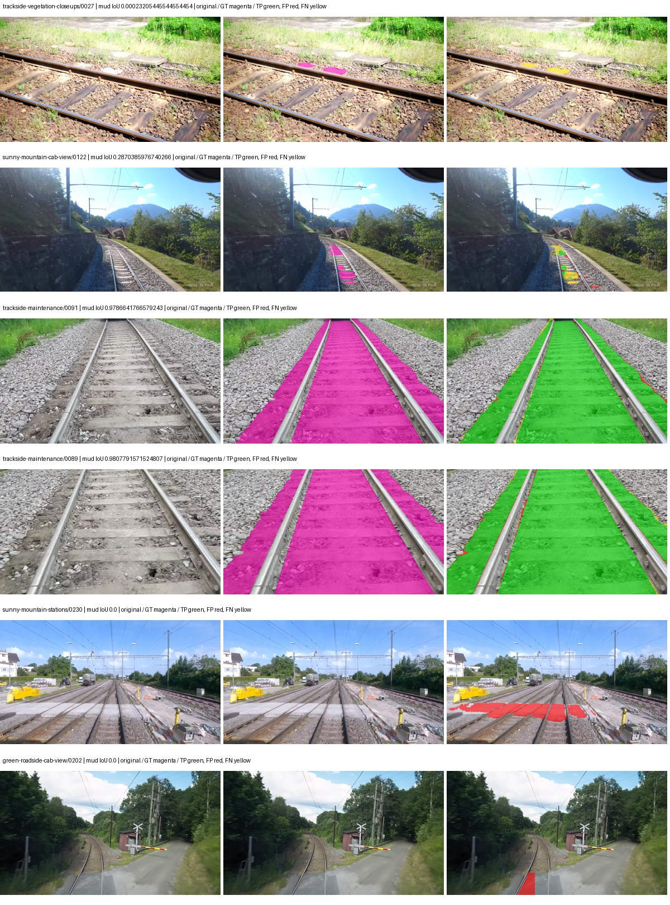
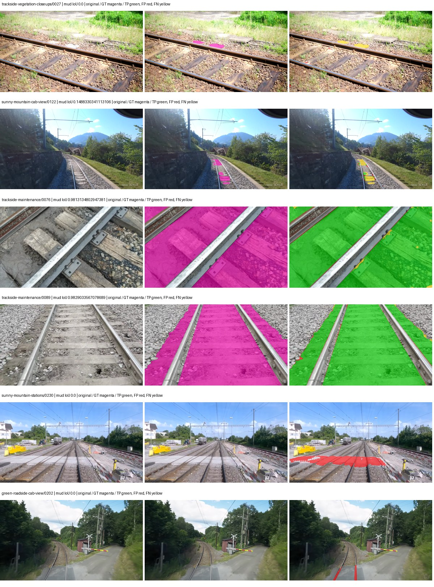
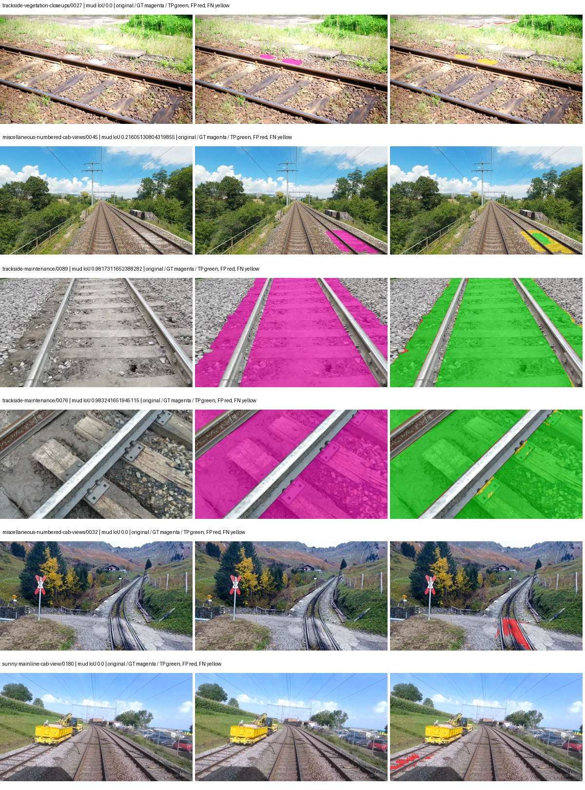
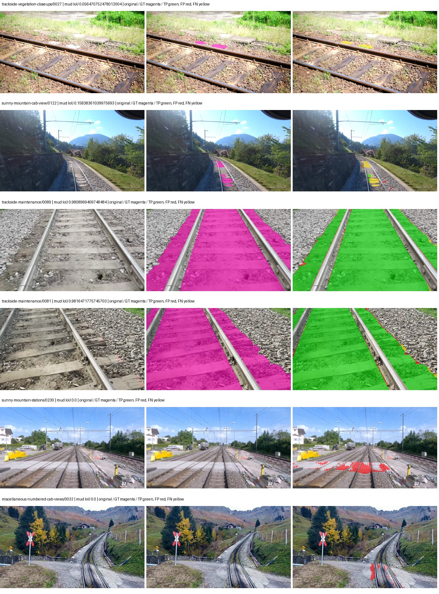

# eomt_large — rad_9_24_2026-fixed-stratified

[RAD 9/24 `fixed-stratified` arm](../../README.md) · [Full model records](record.json)

Primary selection and early stopping: **mud-pumping validation IoU**. A job is complete only after full statistics and isolated profiling are verified.

| Model | Initialization path | Seed | Status | Steps | Best step | Mud IoU (%) | Mud precision (%) | Mud recall (%) | Final mud IoU (trainer val, %) | mIoU (%) | Fixed GT-class mIoU (%) |
| --- | --- | --- | --- | --- | --- | --- | --- | --- | --- | --- | --- |
| eomt_large | rtis_only | 0 | completed | 4000 | 3981 | 92.67 | 96.80 | 95.60 | 92.67 | 71.47 | 71.47 |
| eomt_large | cityscapes_to_rtis | 0 | completed | 3451 | 2123 | 91.58 | 96.84 | 94.40 | 91.46 | 70.50 | 70.50 |
| eomt_large | railsem19_to_rtis | 0 | completed | 4000 | 3981 | 94.82 | 97.78 | 96.91 | 94.83 | 73.14 | 73.14 |
| eomt_large | cityscapes_to_railsem19_to_rtis | 0 | completed | 4000 | 3981 | 93.64 | 97.29 | 96.14 | 93.64 | 72.24 | 72.24 |

Training: 227 images. Validation: 37 images. Test: 50 held out. Seeds: [0]. Seed variation measures optimization variability, not independent-recording uncertainty. Historical source checkpoints stay fixed across adaptation seeds.

Training code: `d864b72bd90706260965bb1a48398d01167b6d5c`. Split SHA-256: `8c6e28a3881cfed27c8ba52dc80c5637b72de4bd43c7b0f5b65113102d74de46`.

## rtis_only — seed 0

Status: **completed**. Started: 2026-10-05T14:49:02.958812+00:00. Finished: 2026-10-05T16:35:16.853329+00:00.

Recipe pretrained initializer: `tue-mps/coco_panoptic_eomt_large_640 (DINOv2-based ViT-L, COCO panoptic)`.

`rtis_only` uses the recipe initializer, which may include pretrained segmentation components. Transfer paths load the exact historical source checkpoint below and reset the classifier; they do not reset all query/decoder features.

Source checkpoint: `Recipe pretrained initialization`.

Config SHA-256: `b8083246f1c9d4398b460f7f1759dc857f3f75efb4db3beaaabbb9c14e47a8ad`. Weights used for validation: `ema`.

### Mud-pumping and aggregate quality

| Metric | Selected checkpoint | Final training validation |
| --- | --- | --- |
| Mud IoU | 92.67 | 92.67 |
| Mud precision | 96.80 | 96.80 |
| Mud recall | 95.60 | 95.60 |
| Mud Dice/F1 | 96.19 | 96.20 |
| mIoU | 71.47 | 71.47 |
| Mean accuracy | 83.07 | 83.09 |
| Mean precision | 82.28 | 82.26 |
| Mean Dice | 82.03 | 82.03 |
| Mean specificity | 99.56 | 99.56 |
| Pixel accuracy | 92.05 | 92.05 |
| Frequency-weighted IoU | 86.03 | 86.03 |
| Fixed GT-present class mIoU | 71.47 | 71.47 |
| Boundary F1 | 78.12 | 78.07 |

The selected checkpoint has independent evaluation evidence. Final values are the trainer's final validation record, not a new independent evaluation. mIoU averages classes with nonzero union, so false positives on absent classes can change its denominator. The fixed GT-class mean is supplementary and excludes absent classes; their false positives remain in the confusion matrix.

### Resource usage and timing

| Measurement | Value |
| --- | --- |
| Peak training VRAM, retained training invocation (GiB) | 17.70 |
| Peak evaluation VRAM (GiB) | 10.80 |
| Retained training invocation wall time (seconds) | 6058.69 |
| Retained training invocation GPU-hours (one GPU) | 1.68 |
| Evaluation wall time (seconds) | 21.67 |
| Full evaluation pipeline images/second | 1.71 |
| Best full-state checkpoint (MiB) | 4831.36 |
| Final full-state checkpoint (MiB) | 4831.34 |
| Verified periodic checkpoints removed (GiB) | 37.75 |

VRAM uses the recorded allocator high-water mark; it is not total device usage including CUDA context. Resumed jobs' retained training invocation times and peaks are **not whole-campaign totals**. Earlier invocation resource records are not reconstructed here. Evaluation throughput includes loader, sliding-window inference and metrics; it is not model-only latency/FPS. Missing measurements are shown as —, never inferred from another dataset's run.

### Standardized inference performance

Dedicated model-only profiling waits for an idle worker-locked L40S: BF16, batch 1, 1024x1024, 20 warmup and 100 CUDA-event-timed public forwards. It excludes loading, preprocessing, tiling and metrics.

| Status | Parameters | Weight MiB | FPS | p50 ms | p95 ms | Peak reserved GiB |
| --- | --- | --- | --- | --- | --- | --- |
| complete | 316580886 | 1207.66 | 45.89 | 21.78 | 21.84 | 3.12 |

```json
{
  "schema_version": 1,
  "model_id": "eomt_large",
  "measured_at": "2026-10-05T16:34:28+00:00",
  "status": "complete",
  "benchmark_scope": "rtis_selected_checkpoint_model_only",
  "applies_to": [
    "eomt_large--rtis_only--seed-0"
  ],
  "source": {
    "campaign_git_sha": "d864b72bd90706260965bb1a48398d01167b6d5c",
    "git_dirty": false,
    "config_hash": "60632526effc",
    "resolved_config": "/data/izadia1/projects/segmentary-runs/rad_9_24_2026/fixed-stratified-seed0-20261005-r2/configs/eomt_large--rtis_only--seed-0.yaml",
    "config_sha256": "b8083246f1c9d4398b460f7f1759dc857f3f75efb4db3beaaabbb9c14e47a8ad",
    "checkpoint_sha256": "ce46fcdc143da099aa9128893e442b7a8127d0bb8dfc619b0264b0261e767684",
    "checkpoint_global_step": 3981,
    "checkpoint_bytes": 5066052281,
    "checkpoint_kind": "resume checkpoint with optimizer and EMA state",
    "weights": "ema",
    "measured_checkpoint_job_id": "eomt_large--rtis_only--seed-0",
    "result_sha256": "e68fff44211394e05d2eb5c4bbccda7c88dc5b0beacfc376fadbad125d1174fe",
    "result_git_sha": "d864b72bd90706260965bb1a48398d01167b6d5c",
    "result_stage": "eval:rad_9_24_2026-fixed-stratified:val",
    "result_seed": 0
  },
  "hardware": {
    "gpu_name": "NVIDIA L40S",
    "gpu_uuid": "GPU-a5ad49e5-0536-5229-ba8a-f8a902808f53",
    "logical_device": "cuda:0",
    "physical_visibility_token": "7",
    "compute_capability": [
      8,
      9
    ],
    "total_memory_bytes": 47677177856
  },
  "model": {
    "parameter_count": 316580886,
    "trainable_parameter_count": 316580886,
    "resident_parameter_bytes": 1266323544,
    "parameter_dtype_counts": {
      "float32": 316580886
    }
  },
  "contract": {
    "backend": "pytorch",
    "precision": "bf16_autocast",
    "batch_size": 1,
    "input_shape_nchw": [
      1,
      3,
      1024,
      1024
    ],
    "warmup_iterations": 20,
    "measured_iterations": 100,
    "timing": "per-forward CUDA events with end-event synchronization",
    "includes_preprocessing": false,
    "includes_data_loader": false,
    "includes_sliding_window": false,
    "input_resident_on_gpu": true,
    "model_only": true,
    "entrypoint": "public model(image) dense-logits forward"
  },
  "measurements": {
    "latency": {
      "p50_ms": 21.779455184936523,
      "p95_ms": 21.84402189254761,
      "mean_ms": 21.79360788345337,
      "minimum_ms": 21.715967178344727,
      "maximum_ms": 23.061504364013672,
      "fps": 45.88501386955954,
      "raw_ms": [
        21.782527923583984,
        21.786624908447266,
        21.742591857910156,
        21.715967178344727,
        21.782527923583984,
        21.777408599853516,
        21.738496780395508,
        21.737472534179688,
        21.845056533813477,
        21.771263122558594,
        21.750783920288086,
        21.779455184936523,
        21.830656051635742,
        21.86137580871582,
        21.724159240722656,
        21.764095306396484,
        21.755903244018555,
        21.725183486938477,
        21.738496780395508,
        21.740543365478516,
        21.800960540771484,
        21.808128356933594,
        21.733375549316406,
        21.804031372070312,
        21.749759674072266,
        21.754880905151367,
        21.732351303100586,
        21.790719985961914,
        21.792768478393555,
        21.768192291259766,
        23.061504364013672,
        21.772287368774414,
        21.754880905151367,
        21.736448287963867,
        21.747711181640625,
        21.763071060180664,
        21.813247680664062,
        21.757951736450195,
        21.777408599853516,
        21.786624908447266,
        21.715967178344727,
        21.789695739746094,
        21.794815063476562,
        21.803007125854492,
        21.777408599853516,
        21.798912048339844,
        21.810176849365234,
        21.813247680664062,
        21.755903244018555,
        21.793792724609375,
        21.776384353637695,
        21.756927490234375,
        21.82655906677246,
        21.803007125854492,
        21.768192291259766,
        21.793792724609375,
        21.779455184936523,
        21.773311614990234,
        21.822463989257812,
        21.87059211730957,
        21.803007125854492,
        21.76095962524414,
        21.84396743774414,
        21.8470401763916,
        21.763071060180664,
        21.787647247314453,
        21.757951736450195,
        21.772287368774414,
        21.742591857910156,
        21.804031372070312,
        21.747711181640625,
        21.767168045043945,
        21.795839309692383,
        21.788671493530273,
        21.812223434448242,
        21.84294319152832,
        21.764095306396484,
        21.783552169799805,
        21.760032653808594,
        21.791744232177734,
        21.747711181640625,
        21.79689598083496,
        21.793792724609375,
        21.753856658935547,
        21.790719985961914,
        21.769216537475586,
        21.765119552612305,
        21.801984786987305,
        21.748735427856445,
        21.822463989257812,
        21.840896606445312,
        21.823488235473633,
        21.778432846069336,
        21.790719985961914,
        21.788671493530273,
        21.77225685119629,
        21.779455184936523,
        21.813247680664062,
        21.789695739746094,
        21.776384353637695
      ],
      "percentile_method": "numpy linear interpolation"
    },
    "peak_reserved_bytes": 3351248896,
    "memory_kind": "pytorch_cuda_allocator_peak_reserved_excluding_context",
    "benchmark_wall_clock_s": 3.263521708548069
  },
  "started_at": "2026-10-05T16:34:25+00:00",
  "finished_at": "2026-10-05T16:34:28+00:00",
  "environment": {
    "hostname": "hdrfs-app-001",
    "python": "3.11.15",
    "platform": "Linux-5.15.0-139-generic-x86_64-with-glibc2.35",
    "torch": "2.11.0+cu128",
    "torch_cuda": "12.8",
    "cudnn": 91900,
    "driver_version": "570.133.20",
    "cuda_available": true,
    "gpu_count": 1,
    "gpu_names": [
      "NVIDIA L40S"
    ],
    "cuda_visible_devices": "7",
    "packages": {
      "segmentary": "0.1.0",
      "torch": "2.11.0+cu128",
      "torchvision": "0.26.0+cu128",
      "transformers": "5.15.0",
      "timm": "1.0.28",
      "segmentation-models-pytorch": "0.5.0",
      "albumentations": "2.0.8",
      "lightning": "2.6.5",
      "numpy": "2.4.4"
    }
  }
}
```

### Per-class validation results

| Class | GT pixels | IoU (%) | Precision (%) | Recall (%) | Dice (%) | Boundary F1 (%) |
| --- | --- | --- | --- | --- | --- | --- |
| car | 76845 | 49.52 | 53.06 | 88.14 | 66.24 | 83.93 |
| construction | 5700298 | 60.05 | 73.13 | 77.06 | 75.04 | 72.87 |
| fence | 3802048 | 53.54 | 91.57 | 56.31 | 69.74 | 67.82 |
| mud-pumping | 7436590 | 92.67 | 96.80 | 95.60 | 96.19 | 79.13 |
| on-rails | 1140125 | 94.93 | 96.21 | 98.63 | 97.40 | 86.79 |
| person | 128644 | 84.57 | 87.92 | 95.70 | 91.64 | 96.63 |
| pole | 1479525 | 65.93 | 74.00 | 85.82 | 79.47 | 85.89 |
| rail-embedded | 75764 | 43.11 | 59.72 | 60.79 | 60.25 | 72.89 |
| rail-raised | 3611451 | 85.38 | 91.69 | 92.54 | 92.12 | 96.12 |
| rail-track | 4256474 | 77.30 | 86.75 | 87.65 | 87.20 | 82.24 |
| road | 1153149 | 77.00 | 88.34 | 85.71 | 87.01 | 74.94 |
| sidewalk | 2167723 | 79.43 | 87.94 | 89.14 | 88.54 | 78.90 |
| sky | 20177435 | 97.99 | 99.24 | 98.73 | 98.99 | 95.90 |
| standing-water | 2008100 | 82.18 | 88.19 | 92.34 | 90.22 | 40.91 |
| terrain | 30432605 | 90.80 | 94.38 | 95.99 | 95.18 | 85.81 |
| trackbed | 9097223 | 85.34 | 91.25 | 92.95 | 92.09 | 86.56 |
| traffic-light | 117498 | 52.79 | 69.29 | 68.91 | 69.10 | 79.14 |
| traffic-sign | 35970 | 44.58 | 61.83 | 61.50 | 61.67 | 68.49 |
| tram-track | 245129 | 44.61 | 81.12 | 49.78 | 61.70 | 54.70 |
| truck | 190857 | 81.81 | 87.73 | 92.38 | 89.99 | 77.91 |
| vegetation-overgrowth | 1542151 | 57.32 | 67.74 | 78.84 | 72.87 | 72.86 |

### Full-run accounting

| Measurement | Value |
| --- | --- |
| Full GPU-reserved wall seconds, all recorded worker attempts | 6385.45 |
| Full reserved GPU-hours | 1.77 |
| Whole-run timing complete | True |

| Phase | Wall seconds including failed attempts |
| --- | --- |
| training | 6065.61 |
| diagnostics | 200.21 |
| performance | 20.09 |

GPU-reserved time includes model loading, training, validation, collection, profiling, checkpoint I/O and orchestration while the worker owns one GPU. It is not GPU kernel-active time. Phase timings and sampled device memory/power/utilization are retained separately; sampled device memory is not the allocator high-water mark.

### Train/validation and raw/EMA diagnostics

| Checkpoint / weights / split | Images | Mud IoU (%) | Mud precision (%) | Mud recall (%) |
| --- | --- | --- | --- | --- |
| best-auto-train / ema | 227 | 95.69 | 98.12 | 97.48 |
| best-auto-val / ema | 37 | 92.67 | 96.80 | 95.60 |
| best-alternate-val / raw | 37 | 93.56 | 96.71 | 96.63 |
| final-auto-val / ema | 37 | 92.66 | 96.80 | 95.59 |

Train uses the evaluation transform without augmentation. Compare mud train/validation metrics for the same selected weights. Alternate EMA on running-stat BatchNorm is explicitly uncalibrated and is diagnostic only. Score-threshold curves use uncalibrated normalized scores and are pixel-level diagnostics, not event detection rates or a selected deployment operating point.

### Downloadable evidence

- best-auto-train: [per-image.csv](rtis_only--seed-0/best-auto-train/per-image.csv) · [per-image-confusion.json.gz](rtis_only--seed-0/best-auto-train/per-image-confusion.json.gz) · [groups.json](rtis_only--seed-0/best-auto-train/groups.json) · [mud-score-curves.json](rtis_only--seed-0/best-auto-train/mud-score-curves.json)
- best-auto-val: [per-image.csv](rtis_only--seed-0/best-auto-val/per-image.csv) · [per-image-confusion.json.gz](rtis_only--seed-0/best-auto-val/per-image-confusion.json.gz) · [groups.json](rtis_only--seed-0/best-auto-val/groups.json) · [mud-score-curves.json](rtis_only--seed-0/best-auto-val/mud-score-curves.json) · [examples.jpg](rtis_only--seed-0/best-auto-val/examples.jpg)
- best-alternate-val: [per-image.csv](rtis_only--seed-0/best-alternate-val/per-image.csv) · [per-image-confusion.json.gz](rtis_only--seed-0/best-alternate-val/per-image-confusion.json.gz) · [groups.json](rtis_only--seed-0/best-alternate-val/groups.json) · [mud-score-curves.json](rtis_only--seed-0/best-alternate-val/mud-score-curves.json)
- final-auto-val: [per-image.csv](rtis_only--seed-0/final-auto-val/per-image.csv) · [per-image-confusion.json.gz](rtis_only--seed-0/final-auto-val/per-image-confusion.json.gz) · [groups.json](rtis_only--seed-0/final-auto-val/groups.json) · [mud-score-curves.json](rtis_only--seed-0/final-auto-val/mud-score-curves.json)
- resources: [telemetry.csv](rtis_only--seed-0/resources/telemetry.csv)



Examples are two lowest and two highest mud-IoU positive images, plus up to two negative images with the most false-positive mud pixels. They are targeted diagnostic examples, not random samples. Green: true positive; red: false positive; yellow: false negative. Full predictions remain on HDRFS.

### Validation tracking

| Logged step | Overall mIoU (%) | Mud IoU (%) |
| --- | --- | --- |
| 264 | 27.90 | 64.97 |
| 530 | 59.61 | 86.87 |
| 796 | 65.38 | 90.58 |
| 1061 | 69.23 | 90.76 |
| 1326 | 70.01 | 91.83 |
| 1592 | 70.23 | 92.06 |
| 1857 | 70.75 | 92.17 |
| 2123 | 71.18 | 92.28 |
| 2389 | 71.21 | 92.26 |
| 2653 | 71.23 | 92.31 |
| 2919 | 71.25 | 92.35 |
| 3185 | 71.38 | 92.54 |
| 3451 | 71.42 | 92.56 |
| 3716 | 71.46 | 92.62 |
| 3981 | 71.47 | 92.66 |
| 4000 | 71.47 | 92.67 |

All retained scalar curves, including training loss and per-class IoU, are in record.json. Observed best mud on a curve is not necessarily a retained checkpoint: the pilot saved its selection-metric-best and final checkpoints. Step logging and checkpoint global_step may differ by one.

### Stopping and checkpoint provenance

```json
{
  "stopping": {
    "actual_steps": 4000,
    "maximum_steps": 4000,
    "min_delta": 0.001,
    "monitor": "val_iou/mud-pumping",
    "patience": 5,
    "reason": "budget_complete"
  },
  "checkpoints": {
    "best": {
      "path": "/data/izadia1/projects/segmentary-runs/rad_9_24_2026/fixed-stratified-seed0-20261005-r2/future-runs/eomt_large--rtis_only--seed-0_seed0/rtis/best.ckpt",
      "sha256": "ce46fcdc143da099aa9128893e442b7a8127d0bb8dfc619b0264b0261e767684",
      "global_step": 3981,
      "bytes": 5066052281
    },
    "final": {
      "path": "/data/izadia1/projects/segmentary-runs/rad_9_24_2026/fixed-stratified-seed0-20261005-r2/future-runs/eomt_large--rtis_only--seed-0_seed0/rtis/last.ckpt",
      "sha256": "cee67d5433e8854a8feb5b333cc8dda0ad009768408390dedee069e1fe495c0a",
      "global_step": 4000,
      "bytes": 5066030265
    }
  },
  "cleanup_error": null
}
```

### Resolved training, initialization and evaluation settings

The optimizer block is the base configuration. Stage LR scales are applied at runtime, and stage warmup is capped at min(base warmup, floor(stage budget / 10), stage budget - 1): 400 steps for this 4,000-step pilot. Model-internal native input grids may differ from augmentation crops (EoMT uses its 640 grid).

```json
{
  "name": "eomt_large--rtis_only--seed-0",
  "model": {
    "arch": "eomt_large",
    "checkpoint": null,
    "tuning": "full",
    "head": "unified_head",
    "lora_r": 16,
    "lora_alpha": 32,
    "lora_dropout": 0.05,
    "lora_targets": [],
    "drop_path": null,
    "revision": null,
    "subfolder": null,
    "local_files_only": false,
    "trust_remote_code": false,
    "backbone_path": null,
    "head_paths": [],
    "classifier_path": null,
    "inactive_parameter_paths": [],
    "smp_arch": null,
    "encoder_name": null,
    "encoder_weights": null,
    "native": null,
    "batch_norm_momentum": null
  },
  "space": "paul-test-rtis",
  "taxonomy_root": "/data/izadia1/projects/segmentary-rad-d864b72b/taxonomy",
  "output_root": "/data/izadia1/projects/segmentary-runs/rad_9_24_2026/fixed-stratified-seed0-20261005-r2/future-runs",
  "optim": {
    "backbone_lr": 1e-05,
    "head_lr_mult": 10.0,
    "weight_decay": 0.05,
    "llrd": 0.75,
    "warmup_iters": 1500,
    "warmup_ratio": 1e-06,
    "poly_power": 0.9,
    "min_lr_ratio": 0.0,
    "betas": [
      0.9,
      0.999
    ],
    "grad_clip": 1.0
  },
  "train": {
    "iters": 4000,
    "batch_size": 2,
    "accum": 8,
    "num_workers": 2,
    "precision": "bf16-mixed",
    "ema_decay": 0.9998,
    "val_every": 250,
    "ckpt_every": 500,
    "selection_metric": "val_iou/mud-pumping",
    "early_stopping_patience": 5,
    "early_stopping_min_delta": 0.001,
    "seed": 0,
    "devices": 1
  },
  "eval": {
    "sliding_window": true,
    "window": [
      1024,
      1024
    ],
    "stride": [
      768,
      768
    ],
    "batch_size": 1,
    "num_workers": 2,
    "tta_scales": [],
    "tta_flip": false,
    "threshold": 0.5,
    "boundary_tolerance_frac": 0.0075,
    "save_confusion": true
  },
  "loss": {
    "task": "multiclass",
    "activation": "auto",
    "terms": [],
    "aux": "none",
    "aux_weight": 0.0,
    "ce_weight": 1.0,
    "label_smoothing": 0.0,
    "class_weights": null,
    "query": {
      "kind": "hungarian_query",
      "classification_weight": 2.0,
      "mask_bce_weight": 5.0,
      "dice_weight": 5.0,
      "no_object_coefficient": 0.1,
      "match_class_cost": 2.0,
      "match_mask_bce_cost": 5.0,
      "match_dice_cost": 5.0,
      "matching_num_points": 8192,
      "auxiliary_layer_weight": 1.0,
      "dice_smooth": 1.0
    }
  },
  "aug": {
    "crop": [
      1024,
      1024
    ],
    "scale_min": 0.5,
    "scale_max": 2.0,
    "hflip_p": 0.5,
    "color_jitter_p": 0.5,
    "brightness": 0.25,
    "contrast": 0.25,
    "saturation": 0.25,
    "hue": 0.05
  },
  "stages": [
    {
      "name": "rtis",
      "data": [
        {
          "name": "rad_9_24_2026-fixed-stratified",
          "root": "/data/izadia1/datasets/rad_9_24_2026-fixed-stratified",
          "variant": null,
          "split_file": "splits.json",
          "train_split": "train",
          "val_split": "val",
          "limit": null,
          "loader": "folder",
          "mapping": "paul-test-rtis",
          "loader_options": {
            "require_groups": false
          }
        }
      ],
      "iters": null,
      "lr_scale": 1.0,
      "head_group_lr_scale": 1.0,
      "init_from": "pretrained",
      "reset_head": false,
      "freeze": null,
      "sample_weights": null
    }
  ]
}
```

### Hardware and software provenance

```json
{
  "training": {
    "cuda_available": true,
    "cuda_visible_devices": "7",
    "cudnn": 91900,
    "driver_version": "570.133.20",
    "gpu_count": 1,
    "gpu_names": [
      "NVIDIA L40S"
    ],
    "hostname": "hdrfs-app-001",
    "input_normalization": {
      "channel_order": "rgb",
      "mean": [
        0.485,
        0.456,
        0.406
      ],
      "source": "imagenet",
      "std": [
        0.229,
        0.224,
        0.225
      ]
    },
    "model_origins": [
      {
        "hf_commit": "dcd130bed9b1ebda7041fd660fddb16f905b9c3b",
        "hf_name_or_path": "tue-mps/coco_panoptic_eomt_large_640",
        "module": "model",
        "timm_pretrained": {}
      },
      {
        "hf_commit": "dcd130bed9b1ebda7041fd660fddb16f905b9c3b",
        "hf_name_or_path": "tue-mps/coco_panoptic_eomt_large_640",
        "module": "model.embeddings",
        "timm_pretrained": {}
      },
      {
        "hf_commit": "dcd130bed9b1ebda7041fd660fddb16f905b9c3b",
        "hf_name_or_path": "tue-mps/coco_panoptic_eomt_large_640",
        "module": "model.layers.0.attention",
        "timm_pretrained": {}
      },
      {
        "hf_commit": "dcd130bed9b1ebda7041fd660fddb16f905b9c3b",
        "hf_name_or_path": "tue-mps/coco_panoptic_eomt_large_640",
        "module": "model.layers.1.attention",
        "timm_pretrained": {}
      },
      {
        "hf_commit": "dcd130bed9b1ebda7041fd660fddb16f905b9c3b",
        "hf_name_or_path": "tue-mps/coco_panoptic_eomt_large_640",
        "module": "model.layers.2.attention",
        "timm_pretrained": {}
      },
      {
        "hf_commit": "dcd130bed9b1ebda7041fd660fddb16f905b9c3b",
        "hf_name_or_path": "tue-mps/coco_panoptic_eomt_large_640",
        "module": "model.layers.3.attention",
        "timm_pretrained": {}
      },
      {
        "hf_commit": "dcd130bed9b1ebda7041fd660fddb16f905b9c3b",
        "hf_name_or_path": "tue-mps/coco_panoptic_eomt_large_640",
        "module": "model.layers.4.attention",
        "timm_pretrained": {}
      },
      {
        "hf_commit": "dcd130bed9b1ebda7041fd660fddb16f905b9c3b",
        "hf_name_or_path": "tue-mps/coco_panoptic_eomt_large_640",
        "module": "model.layers.5.attention",
        "timm_pretrained": {}
      },
      {
        "hf_commit": "dcd130bed9b1ebda7041fd660fddb16f905b9c3b",
        "hf_name_or_path": "tue-mps/coco_panoptic_eomt_large_640",
        "module": "model.layers.6.attention",
        "timm_pretrained": {}
      },
      {
        "hf_commit": "dcd130bed9b1ebda7041fd660fddb16f905b9c3b",
        "hf_name_or_path": "tue-mps/coco_panoptic_eomt_large_640",
        "module": "model.layers.7.attention",
        "timm_pretrained": {}
      },
      {
        "hf_commit": "dcd130bed9b1ebda7041fd660fddb16f905b9c3b",
        "hf_name_or_path": "tue-mps/coco_panoptic_eomt_large_640",
        "module": "model.layers.8.attention",
        "timm_pretrained": {}
      },
      {
        "hf_commit": "dcd130bed9b1ebda7041fd660fddb16f905b9c3b",
        "hf_name_or_path": "tue-mps/coco_panoptic_eomt_large_640",
        "module": "model.layers.9.attention",
        "timm_pretrained": {}
      },
      {
        "hf_commit": "dcd130bed9b1ebda7041fd660fddb16f905b9c3b",
        "hf_name_or_path": "tue-mps/coco_panoptic_eomt_large_640",
        "module": "model.layers.10.attention",
        "timm_pretrained": {}
      },
      {
        "hf_commit": "dcd130bed9b1ebda7041fd660fddb16f905b9c3b",
        "hf_name_or_path": "tue-mps/coco_panoptic_eomt_large_640",
        "module": "model.layers.11.attention",
        "timm_pretrained": {}
      },
      {
        "hf_commit": "dcd130bed9b1ebda7041fd660fddb16f905b9c3b",
        "hf_name_or_path": "tue-mps/coco_panoptic_eomt_large_640",
        "module": "model.layers.12.attention",
        "timm_pretrained": {}
      },
      {
        "hf_commit": "dcd130bed9b1ebda7041fd660fddb16f905b9c3b",
        "hf_name_or_path": "tue-mps/coco_panoptic_eomt_large_640",
        "module": "model.layers.13.attention",
        "timm_pretrained": {}
      },
      {
        "hf_commit": "dcd130bed9b1ebda7041fd660fddb16f905b9c3b",
        "hf_name_or_path": "tue-mps/coco_panoptic_eomt_large_640",
        "module": "model.layers.14.attention",
        "timm_pretrained": {}
      },
      {
        "hf_commit": "dcd130bed9b1ebda7041fd660fddb16f905b9c3b",
        "hf_name_or_path": "tue-mps/coco_panoptic_eomt_large_640",
        "module": "model.layers.15.attention",
        "timm_pretrained": {}
      },
      {
        "hf_commit": "dcd130bed9b1ebda7041fd660fddb16f905b9c3b",
        "hf_name_or_path": "tue-mps/coco_panoptic_eomt_large_640",
        "module": "model.layers.16.attention",
        "timm_pretrained": {}
      },
      {
        "hf_commit": "dcd130bed9b1ebda7041fd660fddb16f905b9c3b",
        "hf_name_or_path": "tue-mps/coco_panoptic_eomt_large_640",
        "module": "model.layers.17.attention",
        "timm_pretrained": {}
      },
      {
        "hf_commit": "dcd130bed9b1ebda7041fd660fddb16f905b9c3b",
        "hf_name_or_path": "tue-mps/coco_panoptic_eomt_large_640",
        "module": "model.layers.18.attention",
        "timm_pretrained": {}
      },
      {
        "hf_commit": "dcd130bed9b1ebda7041fd660fddb16f905b9c3b",
        "hf_name_or_path": "tue-mps/coco_panoptic_eomt_large_640",
        "module": "model.layers.19.attention",
        "timm_pretrained": {}
      },
      {
        "hf_commit": "dcd130bed9b1ebda7041fd660fddb16f905b9c3b",
        "hf_name_or_path": "tue-mps/coco_panoptic_eomt_large_640",
        "module": "model.layers.20.attention",
        "timm_pretrained": {}
      },
      {
        "hf_commit": "dcd130bed9b1ebda7041fd660fddb16f905b9c3b",
        "hf_name_or_path": "tue-mps/coco_panoptic_eomt_large_640",
        "module": "model.layers.21.attention",
        "timm_pretrained": {}
      },
      {
        "hf_commit": "dcd130bed9b1ebda7041fd660fddb16f905b9c3b",
        "hf_name_or_path": "tue-mps/coco_panoptic_eomt_large_640",
        "module": "model.layers.22.attention",
        "timm_pretrained": {}
      },
      {
        "hf_commit": "dcd130bed9b1ebda7041fd660fddb16f905b9c3b",
        "hf_name_or_path": "tue-mps/coco_panoptic_eomt_large_640",
        "module": "model.layers.23.attention",
        "timm_pretrained": {}
      }
    ],
    "model_parameter_count": 316580886,
    "packages": {
      "albumentations": "2.0.8",
      "lightning": "2.6.5",
      "numpy": "2.4.4",
      "segmentary": "0.1.0",
      "segmentation-models-pytorch": "0.5.0",
      "timm": "1.0.28",
      "torch": "2.11.0+cu128",
      "torchvision": "0.26.0+cu128",
      "transformers": "5.15.0"
    },
    "platform": "Linux-5.15.0-139-generic-x86_64-with-glibc2.35",
    "python": "3.11.15",
    "torch": "2.11.0+cu128",
    "torch_cuda": "12.8",
    "trainable_parameter_count": 316580886,
    "training_stop": {
      "actual_steps": 4000,
      "maximum_steps": 4000,
      "min_delta": 0.001,
      "monitor": "val_iou/mud-pumping",
      "patience": 5,
      "reason": "budget_complete"
    },
    "validation_weights": "ema"
  },
  "evaluation": {
    "cuda_available": true,
    "cuda_visible_devices": "7",
    "cudnn": 91900,
    "driver_version": "570.133.20",
    "gpu_count": 1,
    "gpu_names": [
      "NVIDIA L40S"
    ],
    "hostname": "hdrfs-app-001",
    "input_normalization": {
      "channel_order": "rgb",
      "mean": [
        0.485,
        0.456,
        0.406
      ],
      "source": "imagenet",
      "std": [
        0.229,
        0.224,
        0.225
      ]
    },
    "packages": {
      "albumentations": "2.0.8",
      "lightning": "2.6.5",
      "numpy": "2.4.4",
      "segmentary": "0.1.0",
      "segmentation-models-pytorch": "0.5.0",
      "timm": "1.0.28",
      "torch": "2.11.0+cu128",
      "torchvision": "0.26.0+cu128",
      "transformers": "5.15.0"
    },
    "platform": "Linux-5.15.0-139-generic-x86_64-with-glibc2.35",
    "python": "3.11.15",
    "torch": "2.11.0+cu128",
    "torch_cuda": "12.8"
  }
}
```

## cityscapes_to_rtis — seed 0

Status: **completed**. Started: 2026-10-05T14:49:06.550298+00:00. Finished: 2026-10-05T16:15:55.051661+00:00.

Recipe pretrained initializer: `tue-mps/coco_panoptic_eomt_large_640 (DINOv2-based ViT-L, COCO panoptic)`.

`rtis_only` uses the recipe initializer, which may include pretrained segmentation components. Transfer paths load the exact historical source checkpoint below and reset the classifier; they do not reset all query/decoder features.

Source checkpoint: `{'name': 'eomt_large--cityscapes--seed-0', 'model': 'eomt_large', 'protocol': 'cityscapes', 'config': '/data/izadia1/projects/segmentary-runs/all-model-city-rail-seed0-rail20-b9eb3e1/accepted/eomt_large--cityscapes--seed-0/resolved-config.yaml', 'checkpoint': '/data/izadia1/projects/segmentary-runs/all-model-city-rail-seed0-a7c0b67/jobs/eomt_large--cityscapes--seed-0/attempt-001/train/eomt_large--cityscapes_seed0/cityscapes/last.ckpt', 'recorded_sha256': '2651e4743a617a9b4939dd5fbaaf4a643d7988f028adc18ac9d6027a084b7bdd', 'exists': True}`.

Config SHA-256: `00b2a941ba162f564c041e3e7416c5a07a2270fef52d48f4f64747250dc7ce32`. Weights used for validation: `ema`.

### Mud-pumping and aggregate quality

| Metric | Selected checkpoint | Final training validation |
| --- | --- | --- |
| Mud IoU | 91.58 | 91.46 |
| Mud precision | 96.84 | 96.87 |
| Mud recall | 94.40 | 94.25 |
| Mud Dice/F1 | 95.60 | 95.54 |
| mIoU | 70.50 | 70.74 |
| Mean accuracy | 82.14 | 82.35 |
| Mean precision | 82.29 | 82.46 |
| Mean Dice | 81.43 | 81.65 |
| Mean specificity | 99.55 | 99.55 |
| Pixel accuracy | 91.75 | 91.77 |
| Frequency-weighted IoU | 85.52 | 85.56 |
| Fixed GT-present class mIoU | 70.50 | 70.74 |
| Boundary F1 | 73.85 | 74.14 |

The selected checkpoint has independent evaluation evidence. Final values are the trainer's final validation record, not a new independent evaluation. mIoU averages classes with nonzero union, so false positives on absent classes can change its denominator. The fixed GT-class mean is supplementary and excludes absent classes; their false positives remain in the confusion matrix.

### Resource usage and timing

| Measurement | Value |
| --- | --- |
| Peak training VRAM, retained training invocation (GiB) | 17.70 |
| Peak evaluation VRAM (GiB) | 10.80 |
| Retained training invocation wall time (seconds) | 4885.99 |
| Retained training invocation GPU-hours (one GPU) | 1.36 |
| Evaluation wall time (seconds) | 21.92 |
| Full evaluation pipeline images/second | 1.69 |
| Best full-state checkpoint (MiB) | 4831.36 |
| Final full-state checkpoint (MiB) | 4831.34 |
| Verified periodic checkpoints removed (GiB) | 28.31 |

VRAM uses the recorded allocator high-water mark; it is not total device usage including CUDA context. Resumed jobs' retained training invocation times and peaks are **not whole-campaign totals**. Earlier invocation resource records are not reconstructed here. Evaluation throughput includes loader, sliding-window inference and metrics; it is not model-only latency/FPS. Missing measurements are shown as —, never inferred from another dataset's run.

### Standardized inference performance

Dedicated model-only profiling waits for an idle worker-locked L40S: BF16, batch 1, 1024x1024, 20 warmup and 100 CUDA-event-timed public forwards. It excludes loading, preprocessing, tiling and metrics.

| Status | Parameters | Weight MiB | FPS | p50 ms | p95 ms | Peak reserved GiB |
| --- | --- | --- | --- | --- | --- | --- |
| complete | 316580886 | 1207.66 | 45.55 | 21.94 | 22.03 | 3.12 |

```json
{
  "schema_version": 1,
  "model_id": "eomt_large",
  "measured_at": "2026-10-05T16:15:15+00:00",
  "status": "complete",
  "benchmark_scope": "rtis_selected_checkpoint_model_only",
  "applies_to": [
    "eomt_large--cityscapes_to_rtis--seed-0"
  ],
  "source": {
    "campaign_git_sha": "d864b72bd90706260965bb1a48398d01167b6d5c",
    "git_dirty": false,
    "config_hash": "c15dca6f819b",
    "resolved_config": "/data/izadia1/projects/segmentary-runs/rad_9_24_2026/fixed-stratified-seed0-20261005-r2/configs/eomt_large--cityscapes_to_rtis--seed-0.yaml",
    "config_sha256": "00b2a941ba162f564c041e3e7416c5a07a2270fef52d48f4f64747250dc7ce32",
    "checkpoint_sha256": "61243fd8bebecc580889a4c1c28227df540ea1bf72698415696e53179a889990",
    "checkpoint_global_step": 2123,
    "checkpoint_bytes": 5066052345,
    "checkpoint_kind": "resume checkpoint with optimizer and EMA state",
    "weights": "ema",
    "measured_checkpoint_job_id": "eomt_large--cityscapes_to_rtis--seed-0",
    "result_sha256": "1f211eeee979f49d7c42beee8430d42fcbdccde4773ad7cbee810054f796560f",
    "result_git_sha": "d864b72bd90706260965bb1a48398d01167b6d5c",
    "result_stage": "eval:rad_9_24_2026-fixed-stratified:val",
    "result_seed": 0
  },
  "hardware": {
    "gpu_name": "NVIDIA L40S",
    "gpu_uuid": "GPU-c76642eb-64c1-b0ac-b051-d2efd47b32c4",
    "logical_device": "cuda:0",
    "physical_visibility_token": "9",
    "compute_capability": [
      8,
      9
    ],
    "total_memory_bytes": 47677177856
  },
  "model": {
    "parameter_count": 316580886,
    "trainable_parameter_count": 316580886,
    "resident_parameter_bytes": 1266323544,
    "parameter_dtype_counts": {
      "float32": 316580886
    }
  },
  "contract": {
    "backend": "pytorch",
    "precision": "bf16_autocast",
    "batch_size": 1,
    "input_shape_nchw": [
      1,
      3,
      1024,
      1024
    ],
    "warmup_iterations": 20,
    "measured_iterations": 100,
    "timing": "per-forward CUDA events with end-event synchronization",
    "includes_preprocessing": false,
    "includes_data_loader": false,
    "includes_sliding_window": false,
    "input_resident_on_gpu": true,
    "model_only": true,
    "entrypoint": "public model(image) dense-logits forward"
  },
  "measurements": {
    "latency": {
      "p50_ms": 21.939711570739746,
      "p95_ms": 22.025317573547362,
      "mean_ms": 21.954763221740723,
      "minimum_ms": 21.88083267211914,
      "maximum_ms": 23.008256912231445,
      "fps": 45.548202451564094,
      "raw_ms": [
        21.972991943359375,
        21.88185691833496,
        21.9105281829834,
        21.935104370117188,
        21.933055877685547,
        21.950464248657227,
        21.933055877685547,
        21.922815322875977,
        21.923839569091797,
        21.931007385253906,
        21.987327575683594,
        21.9105281829834,
        21.968896865844727,
        21.994495391845703,
        21.965824127197266,
        21.926912307739258,
        21.918720245361328,
        21.942272186279297,
        22.038496017456055,
        23.008256912231445,
        21.963775634765625,
        21.926912307739258,
        21.89414405822754,
        21.909503936767578,
        21.91155242919922,
        21.971967697143555,
        21.951488494873047,
        21.922815322875977,
        21.92076873779297,
        21.962751388549805,
        21.925888061523438,
        21.963775634765625,
        22.027263641357422,
        21.939199447631836,
        21.89311981201172,
        21.91360092163086,
        21.961727142333984,
        22.032384872436523,
        21.929983139038086,
        21.946367263793945,
        21.90131187438965,
        21.933055877685547,
        21.917695999145508,
        21.921791076660156,
        21.91257667541504,
        21.942272186279297,
        21.88083267211914,
        21.90438461303711,
        21.950464248657227,
        21.91155242919922,
        21.940223693847656,
        21.934080123901367,
        21.944320678710938,
        21.940223693847656,
        21.971967697143555,
        22.030336380004883,
        22.002687454223633,
        21.95145606994629,
        22.002687454223633,
        21.9105281829834,
        21.956575393676758,
        21.925888061523438,
        21.90233612060547,
        21.974016189575195,
        21.942272186279297,
        21.950464248657227,
        21.91155242919922,
        21.929983139038086,
        21.931007385253906,
        21.90233612060547,
        21.93507194519043,
        21.971967697143555,
        21.918720245361328,
        21.944320678710938,
        21.92076873779297,
        21.940223693847656,
        21.907455444335938,
        21.966848373413086,
        21.964799880981445,
        21.977088928222656,
        21.964799880981445,
        22.000640869140625,
        22.02521514892578,
        21.999616622924805,
        21.931007385253906,
        21.9289608001709,
        21.940223693847656,
        21.952512741088867,
        21.985279083251953,
        22.000640869140625,
        21.929983139038086,
        21.961727142333984,
        21.915647506713867,
        21.944320678710938,
        21.9289608001709,
        21.924863815307617,
        21.90540885925293,
        21.966848373413086,
        21.95043182373047,
        21.915647506713867
      ],
      "percentile_method": "numpy linear interpolation"
    },
    "peak_reserved_bytes": 3351248896,
    "memory_kind": "pytorch_cuda_allocator_peak_reserved_excluding_context",
    "benchmark_wall_clock_s": 3.191070944070816
  },
  "started_at": "2026-10-05T16:15:12+00:00",
  "finished_at": "2026-10-05T16:15:15+00:00",
  "environment": {
    "hostname": "hdrfs-app-001",
    "python": "3.11.15",
    "platform": "Linux-5.15.0-139-generic-x86_64-with-glibc2.35",
    "torch": "2.11.0+cu128",
    "torch_cuda": "12.8",
    "cudnn": 91900,
    "driver_version": "570.133.20",
    "cuda_available": true,
    "gpu_count": 1,
    "gpu_names": [
      "NVIDIA L40S"
    ],
    "cuda_visible_devices": "9",
    "packages": {
      "segmentary": "0.1.0",
      "torch": "2.11.0+cu128",
      "torchvision": "0.26.0+cu128",
      "transformers": "5.15.0",
      "timm": "1.0.28",
      "segmentation-models-pytorch": "0.5.0",
      "albumentations": "2.0.8",
      "lightning": "2.6.5",
      "numpy": "2.4.4"
    }
  }
}
```

### Per-class validation results

| Class | GT pixels | IoU (%) | Precision (%) | Recall (%) | Dice (%) | Boundary F1 (%) |
| --- | --- | --- | --- | --- | --- | --- |
| car | 76845 | 72.12 | 79.70 | 88.35 | 83.80 | 89.48 |
| construction | 5700298 | 61.26 | 72.56 | 79.73 | 75.98 | 67.74 |
| fence | 3802048 | 53.64 | 91.63 | 56.40 | 69.82 | 67.18 |
| mud-pumping | 7436590 | 91.58 | 96.84 | 94.40 | 95.60 | 70.22 |
| on-rails | 1140125 | 87.82 | 96.04 | 91.12 | 93.51 | 76.80 |
| person | 128644 | 85.87 | 89.30 | 95.71 | 92.40 | 96.72 |
| pole | 1479525 | 70.14 | 78.22 | 87.16 | 82.45 | 89.81 |
| rail-embedded | 75764 | 29.61 | 58.86 | 37.34 | 45.69 | 51.76 |
| rail-raised | 3611451 | 83.90 | 89.66 | 92.89 | 91.25 | 93.80 |
| rail-track | 4256474 | 78.01 | 87.03 | 88.26 | 87.64 | 82.94 |
| road | 1153149 | 70.02 | 87.55 | 77.76 | 82.36 | 69.16 |
| sidewalk | 2167723 | 72.94 | 83.04 | 85.71 | 84.35 | 71.49 |
| sky | 20177435 | 97.91 | 99.20 | 98.68 | 98.94 | 95.88 |
| standing-water | 2008100 | 77.98 | 83.58 | 92.09 | 87.63 | 27.87 |
| terrain | 30432605 | 90.67 | 94.67 | 95.54 | 95.10 | 84.03 |
| trackbed | 9097223 | 85.10 | 90.56 | 93.39 | 91.95 | 83.64 |
| traffic-light | 117498 | 57.89 | 71.55 | 75.21 | 73.33 | 76.30 |
| traffic-sign | 35970 | 56.26 | 67.19 | 77.58 | 72.01 | 68.04 |
| tram-track | 245129 | 43.93 | 82.33 | 48.51 | 61.05 | 53.14 |
| truck | 190857 | 57.57 | 60.27 | 92.79 | 73.07 | 61.61 |
| vegetation-overgrowth | 1542151 | 56.39 | 68.38 | 76.27 | 72.11 | 73.23 |

### Full-run accounting

| Measurement | Value |
| --- | --- |
| Full GPU-reserved wall seconds, all recorded worker attempts | 5223.63 |
| Full reserved GPU-hours | 1.45 |
| Whole-run timing complete | True |

| Phase | Wall seconds including failed attempts |
| --- | --- |
| training | 4896.43 |
| diagnostics | 208.15 |
| performance | 21.86 |

GPU-reserved time includes model loading, training, validation, collection, profiling, checkpoint I/O and orchestration while the worker owns one GPU. It is not GPU kernel-active time. Phase timings and sampled device memory/power/utilization are retained separately; sampled device memory is not the allocator high-water mark.

### Train/validation and raw/EMA diagnostics

| Checkpoint / weights / split | Images | Mud IoU (%) | Mud precision (%) | Mud recall (%) |
| --- | --- | --- | --- | --- |
| best-auto-train / ema | 227 | 94.57 | 97.69 | 96.74 |
| best-auto-val / ema | 37 | 91.58 | 96.84 | 94.40 |
| best-alternate-val / raw | 37 | 92.42 | 97.14 | 95.00 |
| final-auto-val / ema | 37 | 91.44 | 96.87 | 94.23 |

Train uses the evaluation transform without augmentation. Compare mud train/validation metrics for the same selected weights. Alternate EMA on running-stat BatchNorm is explicitly uncalibrated and is diagnostic only. Score-threshold curves use uncalibrated normalized scores and are pixel-level diagnostics, not event detection rates or a selected deployment operating point.

### Downloadable evidence

- best-auto-train: [per-image.csv](cityscapes_to_rtis--seed-0/best-auto-train/per-image.csv) · [per-image-confusion.json.gz](cityscapes_to_rtis--seed-0/best-auto-train/per-image-confusion.json.gz) · [groups.json](cityscapes_to_rtis--seed-0/best-auto-train/groups.json) · [mud-score-curves.json](cityscapes_to_rtis--seed-0/best-auto-train/mud-score-curves.json)
- best-auto-val: [per-image.csv](cityscapes_to_rtis--seed-0/best-auto-val/per-image.csv) · [per-image-confusion.json.gz](cityscapes_to_rtis--seed-0/best-auto-val/per-image-confusion.json.gz) · [groups.json](cityscapes_to_rtis--seed-0/best-auto-val/groups.json) · [mud-score-curves.json](cityscapes_to_rtis--seed-0/best-auto-val/mud-score-curves.json) · [examples.jpg](cityscapes_to_rtis--seed-0/best-auto-val/examples.jpg)
- best-alternate-val: [per-image.csv](cityscapes_to_rtis--seed-0/best-alternate-val/per-image.csv) · [per-image-confusion.json.gz](cityscapes_to_rtis--seed-0/best-alternate-val/per-image-confusion.json.gz) · [groups.json](cityscapes_to_rtis--seed-0/best-alternate-val/groups.json) · [mud-score-curves.json](cityscapes_to_rtis--seed-0/best-alternate-val/mud-score-curves.json)
- final-auto-val: [per-image.csv](cityscapes_to_rtis--seed-0/final-auto-val/per-image.csv) · [per-image-confusion.json.gz](cityscapes_to_rtis--seed-0/final-auto-val/per-image-confusion.json.gz) · [groups.json](cityscapes_to_rtis--seed-0/final-auto-val/groups.json) · [mud-score-curves.json](cityscapes_to_rtis--seed-0/final-auto-val/mud-score-curves.json)
- resources: [telemetry.csv](cityscapes_to_rtis--seed-0/resources/telemetry.csv)



Examples are two lowest and two highest mud-IoU positive images, plus up to two negative images with the most false-positive mud pixels. They are targeted diagnostic examples, not random samples. Green: true positive; red: false positive; yellow: false negative. Full predictions remain on HDRFS.

### Validation tracking

| Logged step | Overall mIoU (%) | Mud IoU (%) |
| --- | --- | --- |
| 264 | 21.45 | 0.00 |
| 530 | 60.95 | 84.38 |
| 796 | 67.32 | 90.31 |
| 1061 | 68.46 | 90.96 |
| 1326 | 69.85 | 91.41 |
| 1592 | 70.03 | 91.24 |
| 1857 | 70.36 | 91.32 |
| 2123 | 70.53 | 91.61 |
| 2389 | 70.53 | 91.50 |
| 2653 | 70.57 | 91.44 |
| 2919 | 70.62 | 91.46 |
| 3185 | 70.67 | 91.49 |
| 3451 | 70.74 | 91.46 |

All retained scalar curves, including training loss and per-class IoU, are in record.json. Observed best mud on a curve is not necessarily a retained checkpoint: the pilot saved its selection-metric-best and final checkpoints. Step logging and checkpoint global_step may differ by one.

### Stopping and checkpoint provenance

```json
{
  "stopping": {
    "actual_steps": 3451,
    "maximum_steps": 4000,
    "min_delta": 0.001,
    "monitor": "val_iou/mud-pumping",
    "patience": 5,
    "reason": "validation_plateau"
  },
  "checkpoints": {
    "best": {
      "path": "/data/izadia1/projects/segmentary-runs/rad_9_24_2026/fixed-stratified-seed0-20261005-r2/future-runs/eomt_large--cityscapes_to_rtis--seed-0_seed0/rtis/best.ckpt",
      "sha256": "61243fd8bebecc580889a4c1c28227df540ea1bf72698415696e53179a889990",
      "global_step": 2123,
      "bytes": 5066052345
    },
    "final": {
      "path": "/data/izadia1/projects/segmentary-runs/rad_9_24_2026/fixed-stratified-seed0-20261005-r2/future-runs/eomt_large--cityscapes_to_rtis--seed-0_seed0/rtis/last.ckpt",
      "sha256": "24aa50495de897dc16e611767b342937f8ffda3fae5edaffb0dc558ded28fa71",
      "global_step": 3451,
      "bytes": 5066030457
    }
  },
  "cleanup_error": null
}
```

### Resolved training, initialization and evaluation settings

The optimizer block is the base configuration. Stage LR scales are applied at runtime, and stage warmup is capped at min(base warmup, floor(stage budget / 10), stage budget - 1): 400 steps for this 4,000-step pilot. Model-internal native input grids may differ from augmentation crops (EoMT uses its 640 grid).

```json
{
  "name": "eomt_large--cityscapes_to_rtis--seed-0",
  "model": {
    "arch": "eomt_large",
    "checkpoint": null,
    "tuning": "full",
    "head": "unified_head",
    "lora_r": 16,
    "lora_alpha": 32,
    "lora_dropout": 0.05,
    "lora_targets": [],
    "drop_path": null,
    "revision": null,
    "subfolder": null,
    "local_files_only": false,
    "trust_remote_code": false,
    "backbone_path": null,
    "head_paths": [],
    "classifier_path": null,
    "inactive_parameter_paths": [],
    "smp_arch": null,
    "encoder_name": null,
    "encoder_weights": null,
    "native": null,
    "batch_norm_momentum": null
  },
  "space": "paul-test-rtis",
  "taxonomy_root": "/data/izadia1/projects/segmentary-rad-d864b72b/taxonomy",
  "output_root": "/data/izadia1/projects/segmentary-runs/rad_9_24_2026/fixed-stratified-seed0-20261005-r2/future-runs",
  "optim": {
    "backbone_lr": 1e-05,
    "head_lr_mult": 10.0,
    "weight_decay": 0.05,
    "llrd": 0.75,
    "warmup_iters": 1500,
    "warmup_ratio": 1e-06,
    "poly_power": 0.9,
    "min_lr_ratio": 0.0,
    "betas": [
      0.9,
      0.999
    ],
    "grad_clip": 1.0
  },
  "train": {
    "iters": 4000,
    "batch_size": 2,
    "accum": 8,
    "num_workers": 2,
    "precision": "bf16-mixed",
    "ema_decay": 0.9998,
    "val_every": 250,
    "ckpt_every": 500,
    "selection_metric": "val_iou/mud-pumping",
    "early_stopping_patience": 5,
    "early_stopping_min_delta": 0.001,
    "seed": 0,
    "devices": 1
  },
  "eval": {
    "sliding_window": true,
    "window": [
      1024,
      1024
    ],
    "stride": [
      768,
      768
    ],
    "batch_size": 1,
    "num_workers": 2,
    "tta_scales": [],
    "tta_flip": false,
    "threshold": 0.5,
    "boundary_tolerance_frac": 0.0075,
    "save_confusion": true
  },
  "loss": {
    "task": "multiclass",
    "activation": "auto",
    "terms": [],
    "aux": "none",
    "aux_weight": 0.0,
    "ce_weight": 1.0,
    "label_smoothing": 0.0,
    "class_weights": null,
    "query": {
      "kind": "hungarian_query",
      "classification_weight": 2.0,
      "mask_bce_weight": 5.0,
      "dice_weight": 5.0,
      "no_object_coefficient": 0.1,
      "match_class_cost": 2.0,
      "match_mask_bce_cost": 5.0,
      "match_dice_cost": 5.0,
      "matching_num_points": 8192,
      "auxiliary_layer_weight": 1.0,
      "dice_smooth": 1.0
    }
  },
  "aug": {
    "crop": [
      1024,
      1024
    ],
    "scale_min": 0.5,
    "scale_max": 2.0,
    "hflip_p": 0.5,
    "color_jitter_p": 0.5,
    "brightness": 0.25,
    "contrast": 0.25,
    "saturation": 0.25,
    "hue": 0.05
  },
  "stages": [
    {
      "name": "rtis",
      "data": [
        {
          "name": "rad_9_24_2026-fixed-stratified",
          "root": "/data/izadia1/datasets/rad_9_24_2026-fixed-stratified",
          "variant": null,
          "split_file": "splits.json",
          "train_split": "train",
          "val_split": "val",
          "limit": null,
          "loader": "folder",
          "mapping": "paul-test-rtis",
          "loader_options": {
            "require_groups": false
          }
        }
      ],
      "iters": null,
      "lr_scale": 0.1,
      "head_group_lr_scale": 1.0,
      "init_from": "/data/izadia1/projects/segmentary-runs/all-model-city-rail-seed0-a7c0b67/jobs/eomt_large--cityscapes--seed-0/attempt-001/train/eomt_large--cityscapes_seed0/cityscapes/last.ckpt",
      "reset_head": true,
      "freeze": null,
      "sample_weights": null
    }
  ]
}
```

### Hardware and software provenance

```json
{
  "training": {
    "cuda_available": true,
    "cuda_visible_devices": "9",
    "cudnn": 91900,
    "driver_version": "570.133.20",
    "gpu_count": 1,
    "gpu_names": [
      "NVIDIA L40S"
    ],
    "hostname": "hdrfs-app-001",
    "input_normalization": {
      "channel_order": "rgb",
      "mean": [
        0.485,
        0.456,
        0.406
      ],
      "source": "imagenet",
      "std": [
        0.229,
        0.224,
        0.225
      ]
    },
    "model_origins": [
      {
        "hf_commit": "dcd130bed9b1ebda7041fd660fddb16f905b9c3b",
        "hf_name_or_path": "tue-mps/coco_panoptic_eomt_large_640",
        "module": "model",
        "timm_pretrained": {}
      },
      {
        "hf_commit": "dcd130bed9b1ebda7041fd660fddb16f905b9c3b",
        "hf_name_or_path": "tue-mps/coco_panoptic_eomt_large_640",
        "module": "model.embeddings",
        "timm_pretrained": {}
      },
      {
        "hf_commit": "dcd130bed9b1ebda7041fd660fddb16f905b9c3b",
        "hf_name_or_path": "tue-mps/coco_panoptic_eomt_large_640",
        "module": "model.layers.0.attention",
        "timm_pretrained": {}
      },
      {
        "hf_commit": "dcd130bed9b1ebda7041fd660fddb16f905b9c3b",
        "hf_name_or_path": "tue-mps/coco_panoptic_eomt_large_640",
        "module": "model.layers.1.attention",
        "timm_pretrained": {}
      },
      {
        "hf_commit": "dcd130bed9b1ebda7041fd660fddb16f905b9c3b",
        "hf_name_or_path": "tue-mps/coco_panoptic_eomt_large_640",
        "module": "model.layers.2.attention",
        "timm_pretrained": {}
      },
      {
        "hf_commit": "dcd130bed9b1ebda7041fd660fddb16f905b9c3b",
        "hf_name_or_path": "tue-mps/coco_panoptic_eomt_large_640",
        "module": "model.layers.3.attention",
        "timm_pretrained": {}
      },
      {
        "hf_commit": "dcd130bed9b1ebda7041fd660fddb16f905b9c3b",
        "hf_name_or_path": "tue-mps/coco_panoptic_eomt_large_640",
        "module": "model.layers.4.attention",
        "timm_pretrained": {}
      },
      {
        "hf_commit": "dcd130bed9b1ebda7041fd660fddb16f905b9c3b",
        "hf_name_or_path": "tue-mps/coco_panoptic_eomt_large_640",
        "module": "model.layers.5.attention",
        "timm_pretrained": {}
      },
      {
        "hf_commit": "dcd130bed9b1ebda7041fd660fddb16f905b9c3b",
        "hf_name_or_path": "tue-mps/coco_panoptic_eomt_large_640",
        "module": "model.layers.6.attention",
        "timm_pretrained": {}
      },
      {
        "hf_commit": "dcd130bed9b1ebda7041fd660fddb16f905b9c3b",
        "hf_name_or_path": "tue-mps/coco_panoptic_eomt_large_640",
        "module": "model.layers.7.attention",
        "timm_pretrained": {}
      },
      {
        "hf_commit": "dcd130bed9b1ebda7041fd660fddb16f905b9c3b",
        "hf_name_or_path": "tue-mps/coco_panoptic_eomt_large_640",
        "module": "model.layers.8.attention",
        "timm_pretrained": {}
      },
      {
        "hf_commit": "dcd130bed9b1ebda7041fd660fddb16f905b9c3b",
        "hf_name_or_path": "tue-mps/coco_panoptic_eomt_large_640",
        "module": "model.layers.9.attention",
        "timm_pretrained": {}
      },
      {
        "hf_commit": "dcd130bed9b1ebda7041fd660fddb16f905b9c3b",
        "hf_name_or_path": "tue-mps/coco_panoptic_eomt_large_640",
        "module": "model.layers.10.attention",
        "timm_pretrained": {}
      },
      {
        "hf_commit": "dcd130bed9b1ebda7041fd660fddb16f905b9c3b",
        "hf_name_or_path": "tue-mps/coco_panoptic_eomt_large_640",
        "module": "model.layers.11.attention",
        "timm_pretrained": {}
      },
      {
        "hf_commit": "dcd130bed9b1ebda7041fd660fddb16f905b9c3b",
        "hf_name_or_path": "tue-mps/coco_panoptic_eomt_large_640",
        "module": "model.layers.12.attention",
        "timm_pretrained": {}
      },
      {
        "hf_commit": "dcd130bed9b1ebda7041fd660fddb16f905b9c3b",
        "hf_name_or_path": "tue-mps/coco_panoptic_eomt_large_640",
        "module": "model.layers.13.attention",
        "timm_pretrained": {}
      },
      {
        "hf_commit": "dcd130bed9b1ebda7041fd660fddb16f905b9c3b",
        "hf_name_or_path": "tue-mps/coco_panoptic_eomt_large_640",
        "module": "model.layers.14.attention",
        "timm_pretrained": {}
      },
      {
        "hf_commit": "dcd130bed9b1ebda7041fd660fddb16f905b9c3b",
        "hf_name_or_path": "tue-mps/coco_panoptic_eomt_large_640",
        "module": "model.layers.15.attention",
        "timm_pretrained": {}
      },
      {
        "hf_commit": "dcd130bed9b1ebda7041fd660fddb16f905b9c3b",
        "hf_name_or_path": "tue-mps/coco_panoptic_eomt_large_640",
        "module": "model.layers.16.attention",
        "timm_pretrained": {}
      },
      {
        "hf_commit": "dcd130bed9b1ebda7041fd660fddb16f905b9c3b",
        "hf_name_or_path": "tue-mps/coco_panoptic_eomt_large_640",
        "module": "model.layers.17.attention",
        "timm_pretrained": {}
      },
      {
        "hf_commit": "dcd130bed9b1ebda7041fd660fddb16f905b9c3b",
        "hf_name_or_path": "tue-mps/coco_panoptic_eomt_large_640",
        "module": "model.layers.18.attention",
        "timm_pretrained": {}
      },
      {
        "hf_commit": "dcd130bed9b1ebda7041fd660fddb16f905b9c3b",
        "hf_name_or_path": "tue-mps/coco_panoptic_eomt_large_640",
        "module": "model.layers.19.attention",
        "timm_pretrained": {}
      },
      {
        "hf_commit": "dcd130bed9b1ebda7041fd660fddb16f905b9c3b",
        "hf_name_or_path": "tue-mps/coco_panoptic_eomt_large_640",
        "module": "model.layers.20.attention",
        "timm_pretrained": {}
      },
      {
        "hf_commit": "dcd130bed9b1ebda7041fd660fddb16f905b9c3b",
        "hf_name_or_path": "tue-mps/coco_panoptic_eomt_large_640",
        "module": "model.layers.21.attention",
        "timm_pretrained": {}
      },
      {
        "hf_commit": "dcd130bed9b1ebda7041fd660fddb16f905b9c3b",
        "hf_name_or_path": "tue-mps/coco_panoptic_eomt_large_640",
        "module": "model.layers.22.attention",
        "timm_pretrained": {}
      },
      {
        "hf_commit": "dcd130bed9b1ebda7041fd660fddb16f905b9c3b",
        "hf_name_or_path": "tue-mps/coco_panoptic_eomt_large_640",
        "module": "model.layers.23.attention",
        "timm_pretrained": {}
      }
    ],
    "model_parameter_count": 316580886,
    "packages": {
      "albumentations": "2.0.8",
      "lightning": "2.6.5",
      "numpy": "2.4.4",
      "segmentary": "0.1.0",
      "segmentation-models-pytorch": "0.5.0",
      "timm": "1.0.28",
      "torch": "2.11.0+cu128",
      "torchvision": "0.26.0+cu128",
      "transformers": "5.15.0"
    },
    "platform": "Linux-5.15.0-139-generic-x86_64-with-glibc2.35",
    "python": "3.11.15",
    "torch": "2.11.0+cu128",
    "torch_cuda": "12.8",
    "trainable_parameter_count": 316580886,
    "training_stop": {
      "actual_steps": 3451,
      "maximum_steps": 4000,
      "min_delta": 0.001,
      "monitor": "val_iou/mud-pumping",
      "patience": 5,
      "reason": "validation_plateau"
    },
    "validation_weights": "ema"
  },
  "evaluation": {
    "cuda_available": true,
    "cuda_visible_devices": "9",
    "cudnn": 91900,
    "driver_version": "570.133.20",
    "gpu_count": 1,
    "gpu_names": [
      "NVIDIA L40S"
    ],
    "hostname": "hdrfs-app-001",
    "input_normalization": {
      "channel_order": "rgb",
      "mean": [
        0.485,
        0.456,
        0.406
      ],
      "source": "imagenet",
      "std": [
        0.229,
        0.224,
        0.225
      ]
    },
    "packages": {
      "albumentations": "2.0.8",
      "lightning": "2.6.5",
      "numpy": "2.4.4",
      "segmentary": "0.1.0",
      "segmentation-models-pytorch": "0.5.0",
      "timm": "1.0.28",
      "torch": "2.11.0+cu128",
      "torchvision": "0.26.0+cu128",
      "transformers": "5.15.0"
    },
    "platform": "Linux-5.15.0-139-generic-x86_64-with-glibc2.35",
    "python": "3.11.15",
    "torch": "2.11.0+cu128",
    "torch_cuda": "12.8"
  }
}
```

## railsem19_to_rtis — seed 0

Status: **completed**. Started: 2026-10-05T14:49:06.495550+00:00. Finished: 2026-10-05T16:37:16.757337+00:00.

Recipe pretrained initializer: `tue-mps/coco_panoptic_eomt_large_640 (DINOv2-based ViT-L, COCO panoptic)`.

`rtis_only` uses the recipe initializer, which may include pretrained segmentation components. Transfer paths load the exact historical source checkpoint below and reset the classifier; they do not reset all query/decoder features.

Source checkpoint: `{'name': 'eomt_large--railsem19--seed-0', 'model': 'eomt_large', 'protocol': 'railsem19', 'config': '/data/izadia1/projects/segmentary-runs/all-model-city-rail-seed0-rail20-b9eb3e1/accepted/eomt_large--railsem19--seed-0/resolved-config.yaml', 'checkpoint': '/data/izadia1/projects/segmentary-runs/all-model-city-rail-seed0-a7c0b67/jobs/eomt_large--railsem19--seed-0/attempt-001/train/eomt_large--railsem19_seed0/railsem19/last.ckpt', 'recorded_sha256': 'bb69373c9ee71051db4f35323b5f398f57e3ef71a71a88f23286df71fe0a0dbd', 'exists': True}`.

Config SHA-256: `4b43bc12f80bf476e39d85e29a13a9df8d1bb6c3f41856dcee1c09a5be63a45d`. Weights used for validation: `ema`.

### Mud-pumping and aggregate quality

| Metric | Selected checkpoint | Final training validation |
| --- | --- | --- |
| Mud IoU | 94.82 | 94.83 |
| Mud precision | 97.78 | 97.78 |
| Mud recall | 96.91 | 96.91 |
| Mud Dice/F1 | 97.34 | 97.35 |
| mIoU | 73.14 | 73.15 |
| Mean accuracy | 85.23 | 85.22 |
| Mean precision | 83.13 | 83.14 |
| Mean Dice | 83.72 | 83.72 |
| Mean specificity | 99.58 | 99.58 |
| Pixel accuracy | 92.36 | 92.36 |
| Frequency-weighted IoU | 86.48 | 86.48 |
| Fixed GT-present class mIoU | 73.14 | 73.15 |
| Boundary F1 | 78.39 | 78.38 |

The selected checkpoint has independent evaluation evidence. Final values are the trainer's final validation record, not a new independent evaluation. mIoU averages classes with nonzero union, so false positives on absent classes can change its denominator. The fixed GT-class mean is supplementary and excludes absent classes; their false positives remain in the confusion matrix.

### Resource usage and timing

| Measurement | Value |
| --- | --- |
| Peak training VRAM, retained training invocation (GiB) | 17.70 |
| Peak evaluation VRAM (GiB) | 10.80 |
| Retained training invocation wall time (seconds) | 6172.42 |
| Retained training invocation GPU-hours (one GPU) | 1.71 |
| Evaluation wall time (seconds) | 21.63 |
| Full evaluation pipeline images/second | 1.71 |
| Best full-state checkpoint (MiB) | 4831.36 |
| Final full-state checkpoint (MiB) | 4831.34 |
| Verified periodic checkpoints removed (GiB) | 37.75 |

VRAM uses the recorded allocator high-water mark; it is not total device usage including CUDA context. Resumed jobs' retained training invocation times and peaks are **not whole-campaign totals**. Earlier invocation resource records are not reconstructed here. Evaluation throughput includes loader, sliding-window inference and metrics; it is not model-only latency/FPS. Missing measurements are shown as —, never inferred from another dataset's run.

### Standardized inference performance

Dedicated model-only profiling waits for an idle worker-locked L40S: BF16, batch 1, 1024x1024, 20 warmup and 100 CUDA-event-timed public forwards. It excludes loading, preprocessing, tiling and metrics.

| Status | Parameters | Weight MiB | FPS | p50 ms | p95 ms | Peak reserved GiB |
| --- | --- | --- | --- | --- | --- | --- |
| complete | 316580886 | 1207.66 | 45.76 | 21.83 | 21.99 | 3.12 |

```json
{
  "schema_version": 1,
  "model_id": "eomt_large",
  "measured_at": "2026-10-05T16:36:29+00:00",
  "status": "complete",
  "benchmark_scope": "rtis_selected_checkpoint_model_only",
  "applies_to": [
    "eomt_large--railsem19_to_rtis--seed-0"
  ],
  "source": {
    "campaign_git_sha": "d864b72bd90706260965bb1a48398d01167b6d5c",
    "git_dirty": false,
    "config_hash": "01b19eb1d1cc",
    "resolved_config": "/data/izadia1/projects/segmentary-runs/rad_9_24_2026/fixed-stratified-seed0-20261005-r2/configs/eomt_large--railsem19_to_rtis--seed-0.yaml",
    "config_sha256": "4b43bc12f80bf476e39d85e29a13a9df8d1bb6c3f41856dcee1c09a5be63a45d",
    "checkpoint_sha256": "973e0041ca5a08fc2e016d982c94a198d5e6ee075fa0004c25e4b8d7419aed10",
    "checkpoint_global_step": 3981,
    "checkpoint_bytes": 5066052345,
    "checkpoint_kind": "resume checkpoint with optimizer and EMA state",
    "weights": "ema",
    "measured_checkpoint_job_id": "eomt_large--railsem19_to_rtis--seed-0",
    "result_sha256": "24aeaee43299473e19034e1763e3946ae1213ff7ad23fd437d337cbc5aef1eab",
    "result_git_sha": "d864b72bd90706260965bb1a48398d01167b6d5c",
    "result_stage": "eval:rad_9_24_2026-fixed-stratified:val",
    "result_seed": 0
  },
  "hardware": {
    "gpu_name": "NVIDIA L40S",
    "gpu_uuid": "GPU-e2e96741-aec9-e90b-5c46-d0d58be90a56",
    "logical_device": "cuda:0",
    "physical_visibility_token": "8",
    "compute_capability": [
      8,
      9
    ],
    "total_memory_bytes": 47677177856
  },
  "model": {
    "parameter_count": 316580886,
    "trainable_parameter_count": 316580886,
    "resident_parameter_bytes": 1266323544,
    "parameter_dtype_counts": {
      "float32": 316580886
    }
  },
  "contract": {
    "backend": "pytorch",
    "precision": "bf16_autocast",
    "batch_size": 1,
    "input_shape_nchw": [
      1,
      3,
      1024,
      1024
    ],
    "warmup_iterations": 20,
    "measured_iterations": 100,
    "timing": "per-forward CUDA events with end-event synchronization",
    "includes_preprocessing": false,
    "includes_data_loader": false,
    "includes_sliding_window": false,
    "input_resident_on_gpu": true,
    "model_only": true,
    "entrypoint": "public model(image) dense-logits forward"
  },
  "measurements": {
    "latency": {
      "p50_ms": 21.832192420959473,
      "p95_ms": 21.98773717880249,
      "mean_ms": 21.852273235321046,
      "minimum_ms": 21.775360107421875,
      "maximum_ms": 22.311935424804688,
      "fps": 45.76182940929204,
      "raw_ms": [
        21.90336036682129,
        21.87468719482422,
        21.807104110717773,
        21.86444854736328,
        21.87264060974121,
        21.941247940063477,
        21.86649513244629,
        21.840896606445312,
        22.06003189086914,
        21.939199447631836,
        21.987327575683594,
        22.201343536376953,
        22.311935424804688,
        21.867584228515625,
        21.824512481689453,
        21.789695739746094,
        21.7805118560791,
        21.805055618286133,
        21.813247680664062,
        21.820415496826172,
        21.805055618286133,
        21.87571144104004,
        21.88083267211914,
        21.84601593017578,
        21.814271926879883,
        21.890047073364258,
        21.88697624206543,
        21.814271926879883,
        21.831680297851562,
        21.848064422607422,
        21.820415496826172,
        21.806079864501953,
        21.814271926879883,
        21.86751937866211,
        21.810176849365234,
        21.842880249023438,
        21.840896606445312,
        21.833728790283203,
        21.815296173095703,
        21.830656051635742,
        21.8654727935791,
        21.839872360229492,
        21.821439743041992,
        22.024160385131836,
        21.805055618286133,
        21.90540885925293,
        21.81939125061035,
        21.84396743774414,
        21.821439743041992,
        21.820415496826172,
        21.777408599853516,
        21.792768478393555,
        21.87468719482422,
        21.830656051635742,
        21.813215255737305,
        21.829631805419922,
        21.813247680664062,
        21.813247680664062,
        21.84294319152832,
        21.803007125854492,
        21.908479690551758,
        21.86444854736328,
        21.783552169799805,
        21.995519638061523,
        21.86240005493164,
        21.832704544067383,
        21.778432846069336,
        21.840896606445312,
        21.86137580871582,
        21.831680297851562,
        21.88800048828125,
        21.846080780029297,
        21.85113525390625,
        21.824512481689453,
        21.81939125061035,
        21.8286075592041,
        21.841920852661133,
        21.806079864501953,
        21.775360107421875,
        21.8470401763916,
        21.84396743774414,
        21.830656051635742,
        21.81939125061035,
        21.89516830444336,
        21.831680297851562,
        21.791744232177734,
        21.793792724609375,
        21.86854362487793,
        21.86137580871582,
        21.824575424194336,
        21.85625648498535,
        21.85215950012207,
        21.794815063476562,
        21.818368911743164,
        21.831647872924805,
        21.811199188232422,
        21.83475112915039,
        21.820415496826172,
        21.813247680664062,
        21.841920852661133
      ],
      "percentile_method": "numpy linear interpolation"
    },
    "peak_reserved_bytes": 3351248896,
    "memory_kind": "pytorch_cuda_allocator_peak_reserved_excluding_context",
    "benchmark_wall_clock_s": 3.161266140639782
  },
  "started_at": "2026-10-05T16:36:26+00:00",
  "finished_at": "2026-10-05T16:36:29+00:00",
  "environment": {
    "hostname": "hdrfs-app-001",
    "python": "3.11.15",
    "platform": "Linux-5.15.0-139-generic-x86_64-with-glibc2.35",
    "torch": "2.11.0+cu128",
    "torch_cuda": "12.8",
    "cudnn": 91900,
    "driver_version": "570.133.20",
    "cuda_available": true,
    "gpu_count": 1,
    "gpu_names": [
      "NVIDIA L40S"
    ],
    "cuda_visible_devices": "8",
    "packages": {
      "segmentary": "0.1.0",
      "torch": "2.11.0+cu128",
      "torchvision": "0.26.0+cu128",
      "transformers": "5.15.0",
      "timm": "1.0.28",
      "segmentation-models-pytorch": "0.5.0",
      "albumentations": "2.0.8",
      "lightning": "2.6.5",
      "numpy": "2.4.4"
    }
  }
}
```

### Per-class validation results

| Class | GT pixels | IoU (%) | Precision (%) | Recall (%) | Dice (%) | Boundary F1 (%) |
| --- | --- | --- | --- | --- | --- | --- |
| car | 76845 | 63.33 | 70.24 | 86.56 | 77.55 | 84.07 |
| construction | 5700298 | 62.86 | 79.48 | 75.04 | 77.20 | 66.99 |
| fence | 3802048 | 66.82 | 93.29 | 70.19 | 80.11 | 67.26 |
| mud-pumping | 7436590 | 94.82 | 97.78 | 96.91 | 97.34 | 80.97 |
| on-rails | 1140125 | 88.53 | 97.04 | 90.98 | 93.91 | 77.60 |
| person | 128644 | 84.94 | 88.32 | 95.69 | 91.86 | 96.26 |
| pole | 1479525 | 69.13 | 77.52 | 86.47 | 81.75 | 87.85 |
| rail-embedded | 75764 | 58.59 | 75.21 | 72.61 | 73.89 | 93.84 |
| rail-raised | 3611451 | 86.51 | 91.65 | 93.91 | 92.77 | 95.93 |
| rail-track | 4256474 | 77.20 | 87.35 | 86.92 | 87.13 | 84.53 |
| road | 1153149 | 71.36 | 83.28 | 83.30 | 83.29 | 66.15 |
| sidewalk | 2167723 | 77.42 | 87.60 | 86.95 | 87.27 | 75.46 |
| sky | 20177435 | 97.63 | 99.24 | 98.37 | 98.80 | 94.97 |
| standing-water | 2008100 | 80.09 | 84.10 | 94.39 | 88.95 | 29.13 |
| terrain | 30432605 | 89.97 | 93.72 | 95.74 | 94.72 | 85.15 |
| trackbed | 9097223 | 86.33 | 92.77 | 92.55 | 92.66 | 87.98 |
| traffic-light | 117498 | 52.84 | 70.07 | 68.25 | 69.15 | 77.91 |
| traffic-sign | 35970 | 53.82 | 69.78 | 70.18 | 69.98 | 73.34 |
| tram-track | 245129 | 64.80 | 87.10 | 71.68 | 78.64 | 86.15 |
| truck | 190857 | 54.54 | 56.40 | 94.31 | 70.59 | 61.05 |
| vegetation-overgrowth | 1542151 | 54.47 | 63.80 | 78.85 | 70.53 | 73.53 |

### Full-run accounting

| Measurement | Value |
| --- | --- |
| Full GPU-reserved wall seconds, all recorded worker attempts | 6505.32 |
| Full reserved GPU-hours | 1.81 |
| Whole-run timing complete | True |

| Phase | Wall seconds including failed attempts |
| --- | --- |
| training | 6182.72 |
| diagnostics | 200.37 |
| performance | 20.08 |

GPU-reserved time includes model loading, training, validation, collection, profiling, checkpoint I/O and orchestration while the worker owns one GPU. It is not GPU kernel-active time. Phase timings and sampled device memory/power/utilization are retained separately; sampled device memory is not the allocator high-water mark.

### Train/validation and raw/EMA diagnostics

| Checkpoint / weights / split | Images | Mud IoU (%) | Mud precision (%) | Mud recall (%) |
| --- | --- | --- | --- | --- |
| best-auto-train / ema | 227 | 95.34 | 97.66 | 97.56 |
| best-auto-val / ema | 37 | 94.82 | 97.78 | 96.91 |
| best-alternate-val / raw | 37 | 95.28 | 98.11 | 97.06 |
| final-auto-val / ema | 37 | 94.82 | 97.78 | 96.91 |

Train uses the evaluation transform without augmentation. Compare mud train/validation metrics for the same selected weights. Alternate EMA on running-stat BatchNorm is explicitly uncalibrated and is diagnostic only. Score-threshold curves use uncalibrated normalized scores and are pixel-level diagnostics, not event detection rates or a selected deployment operating point.

### Downloadable evidence

- best-auto-train: [per-image.csv](railsem19_to_rtis--seed-0/best-auto-train/per-image.csv) · [per-image-confusion.json.gz](railsem19_to_rtis--seed-0/best-auto-train/per-image-confusion.json.gz) · [groups.json](railsem19_to_rtis--seed-0/best-auto-train/groups.json) · [mud-score-curves.json](railsem19_to_rtis--seed-0/best-auto-train/mud-score-curves.json)
- best-auto-val: [per-image.csv](railsem19_to_rtis--seed-0/best-auto-val/per-image.csv) · [per-image-confusion.json.gz](railsem19_to_rtis--seed-0/best-auto-val/per-image-confusion.json.gz) · [groups.json](railsem19_to_rtis--seed-0/best-auto-val/groups.json) · [mud-score-curves.json](railsem19_to_rtis--seed-0/best-auto-val/mud-score-curves.json) · [examples.jpg](railsem19_to_rtis--seed-0/best-auto-val/examples.jpg)
- best-alternate-val: [per-image.csv](railsem19_to_rtis--seed-0/best-alternate-val/per-image.csv) · [per-image-confusion.json.gz](railsem19_to_rtis--seed-0/best-alternate-val/per-image-confusion.json.gz) · [groups.json](railsem19_to_rtis--seed-0/best-alternate-val/groups.json) · [mud-score-curves.json](railsem19_to_rtis--seed-0/best-alternate-val/mud-score-curves.json)
- final-auto-val: [per-image.csv](railsem19_to_rtis--seed-0/final-auto-val/per-image.csv) · [per-image-confusion.json.gz](railsem19_to_rtis--seed-0/final-auto-val/per-image-confusion.json.gz) · [groups.json](railsem19_to_rtis--seed-0/final-auto-val/groups.json) · [mud-score-curves.json](railsem19_to_rtis--seed-0/final-auto-val/mud-score-curves.json)
- resources: [telemetry.csv](railsem19_to_rtis--seed-0/resources/telemetry.csv)



Examples are two lowest and two highest mud-IoU positive images, plus up to two negative images with the most false-positive mud pixels. They are targeted diagnostic examples, not random samples. Green: true positive; red: false positive; yellow: false negative. Full predictions remain on HDRFS.

### Validation tracking

| Logged step | Overall mIoU (%) | Mud IoU (%) |
| --- | --- | --- |
| 264 | 40.83 | 76.86 |
| 530 | 69.08 | 87.45 |
| 796 | 72.24 | 93.07 |
| 1061 | 72.40 | 93.40 |
| 1326 | 72.62 | 93.59 |
| 1592 | 72.77 | 94.16 |
| 1857 | 73.02 | 94.36 |
| 2123 | 73.01 | 94.61 |
| 2389 | 73.04 | 94.62 |
| 2653 | 73.08 | 94.64 |
| 2919 | 73.10 | 94.67 |
| 3185 | 73.12 | 94.70 |
| 3451 | 73.13 | 94.75 |
| 3716 | 73.14 | 94.78 |
| 3981 | 73.14 | 94.82 |
| 4000 | 73.15 | 94.83 |

All retained scalar curves, including training loss and per-class IoU, are in record.json. Observed best mud on a curve is not necessarily a retained checkpoint: the pilot saved its selection-metric-best and final checkpoints. Step logging and checkpoint global_step may differ by one.

### Stopping and checkpoint provenance

```json
{
  "stopping": {
    "actual_steps": 4000,
    "maximum_steps": 4000,
    "min_delta": 0.001,
    "monitor": "val_iou/mud-pumping",
    "patience": 5,
    "reason": "budget_complete"
  },
  "checkpoints": {
    "best": {
      "path": "/data/izadia1/projects/segmentary-runs/rad_9_24_2026/fixed-stratified-seed0-20261005-r2/future-runs/eomt_large--railsem19_to_rtis--seed-0_seed0/rtis/best.ckpt",
      "sha256": "973e0041ca5a08fc2e016d982c94a198d5e6ee075fa0004c25e4b8d7419aed10",
      "global_step": 3981,
      "bytes": 5066052345
    },
    "final": {
      "path": "/data/izadia1/projects/segmentary-runs/rad_9_24_2026/fixed-stratified-seed0-20261005-r2/future-runs/eomt_large--railsem19_to_rtis--seed-0_seed0/rtis/last.ckpt",
      "sha256": "3d7377799e4d4683a5350a5cc4b2746623e34e8461882a0ea676e8813ee365d9",
      "global_step": 4000,
      "bytes": 5066030329
    }
  },
  "cleanup_error": null
}
```

### Resolved training, initialization and evaluation settings

The optimizer block is the base configuration. Stage LR scales are applied at runtime, and stage warmup is capped at min(base warmup, floor(stage budget / 10), stage budget - 1): 400 steps for this 4,000-step pilot. Model-internal native input grids may differ from augmentation crops (EoMT uses its 640 grid).

```json
{
  "name": "eomt_large--railsem19_to_rtis--seed-0",
  "model": {
    "arch": "eomt_large",
    "checkpoint": null,
    "tuning": "full",
    "head": "unified_head",
    "lora_r": 16,
    "lora_alpha": 32,
    "lora_dropout": 0.05,
    "lora_targets": [],
    "drop_path": null,
    "revision": null,
    "subfolder": null,
    "local_files_only": false,
    "trust_remote_code": false,
    "backbone_path": null,
    "head_paths": [],
    "classifier_path": null,
    "inactive_parameter_paths": [],
    "smp_arch": null,
    "encoder_name": null,
    "encoder_weights": null,
    "native": null,
    "batch_norm_momentum": null
  },
  "space": "paul-test-rtis",
  "taxonomy_root": "/data/izadia1/projects/segmentary-rad-d864b72b/taxonomy",
  "output_root": "/data/izadia1/projects/segmentary-runs/rad_9_24_2026/fixed-stratified-seed0-20261005-r2/future-runs",
  "optim": {
    "backbone_lr": 1e-05,
    "head_lr_mult": 10.0,
    "weight_decay": 0.05,
    "llrd": 0.75,
    "warmup_iters": 1500,
    "warmup_ratio": 1e-06,
    "poly_power": 0.9,
    "min_lr_ratio": 0.0,
    "betas": [
      0.9,
      0.999
    ],
    "grad_clip": 1.0
  },
  "train": {
    "iters": 4000,
    "batch_size": 2,
    "accum": 8,
    "num_workers": 2,
    "precision": "bf16-mixed",
    "ema_decay": 0.9998,
    "val_every": 250,
    "ckpt_every": 500,
    "selection_metric": "val_iou/mud-pumping",
    "early_stopping_patience": 5,
    "early_stopping_min_delta": 0.001,
    "seed": 0,
    "devices": 1
  },
  "eval": {
    "sliding_window": true,
    "window": [
      1024,
      1024
    ],
    "stride": [
      768,
      768
    ],
    "batch_size": 1,
    "num_workers": 2,
    "tta_scales": [],
    "tta_flip": false,
    "threshold": 0.5,
    "boundary_tolerance_frac": 0.0075,
    "save_confusion": true
  },
  "loss": {
    "task": "multiclass",
    "activation": "auto",
    "terms": [],
    "aux": "none",
    "aux_weight": 0.0,
    "ce_weight": 1.0,
    "label_smoothing": 0.0,
    "class_weights": null,
    "query": {
      "kind": "hungarian_query",
      "classification_weight": 2.0,
      "mask_bce_weight": 5.0,
      "dice_weight": 5.0,
      "no_object_coefficient": 0.1,
      "match_class_cost": 2.0,
      "match_mask_bce_cost": 5.0,
      "match_dice_cost": 5.0,
      "matching_num_points": 8192,
      "auxiliary_layer_weight": 1.0,
      "dice_smooth": 1.0
    }
  },
  "aug": {
    "crop": [
      1024,
      1024
    ],
    "scale_min": 0.5,
    "scale_max": 2.0,
    "hflip_p": 0.5,
    "color_jitter_p": 0.5,
    "brightness": 0.25,
    "contrast": 0.25,
    "saturation": 0.25,
    "hue": 0.05
  },
  "stages": [
    {
      "name": "rtis",
      "data": [
        {
          "name": "rad_9_24_2026-fixed-stratified",
          "root": "/data/izadia1/datasets/rad_9_24_2026-fixed-stratified",
          "variant": null,
          "split_file": "splits.json",
          "train_split": "train",
          "val_split": "val",
          "limit": null,
          "loader": "folder",
          "mapping": "paul-test-rtis",
          "loader_options": {
            "require_groups": false
          }
        }
      ],
      "iters": null,
      "lr_scale": 0.1,
      "head_group_lr_scale": 1.0,
      "init_from": "/data/izadia1/projects/segmentary-runs/all-model-city-rail-seed0-a7c0b67/jobs/eomt_large--railsem19--seed-0/attempt-001/train/eomt_large--railsem19_seed0/railsem19/last.ckpt",
      "reset_head": true,
      "freeze": null,
      "sample_weights": null
    }
  ]
}
```

### Hardware and software provenance

```json
{
  "training": {
    "cuda_available": true,
    "cuda_visible_devices": "8",
    "cudnn": 91900,
    "driver_version": "570.133.20",
    "gpu_count": 1,
    "gpu_names": [
      "NVIDIA L40S"
    ],
    "hostname": "hdrfs-app-001",
    "input_normalization": {
      "channel_order": "rgb",
      "mean": [
        0.485,
        0.456,
        0.406
      ],
      "source": "imagenet",
      "std": [
        0.229,
        0.224,
        0.225
      ]
    },
    "model_origins": [
      {
        "hf_commit": "dcd130bed9b1ebda7041fd660fddb16f905b9c3b",
        "hf_name_or_path": "tue-mps/coco_panoptic_eomt_large_640",
        "module": "model",
        "timm_pretrained": {}
      },
      {
        "hf_commit": "dcd130bed9b1ebda7041fd660fddb16f905b9c3b",
        "hf_name_or_path": "tue-mps/coco_panoptic_eomt_large_640",
        "module": "model.embeddings",
        "timm_pretrained": {}
      },
      {
        "hf_commit": "dcd130bed9b1ebda7041fd660fddb16f905b9c3b",
        "hf_name_or_path": "tue-mps/coco_panoptic_eomt_large_640",
        "module": "model.layers.0.attention",
        "timm_pretrained": {}
      },
      {
        "hf_commit": "dcd130bed9b1ebda7041fd660fddb16f905b9c3b",
        "hf_name_or_path": "tue-mps/coco_panoptic_eomt_large_640",
        "module": "model.layers.1.attention",
        "timm_pretrained": {}
      },
      {
        "hf_commit": "dcd130bed9b1ebda7041fd660fddb16f905b9c3b",
        "hf_name_or_path": "tue-mps/coco_panoptic_eomt_large_640",
        "module": "model.layers.2.attention",
        "timm_pretrained": {}
      },
      {
        "hf_commit": "dcd130bed9b1ebda7041fd660fddb16f905b9c3b",
        "hf_name_or_path": "tue-mps/coco_panoptic_eomt_large_640",
        "module": "model.layers.3.attention",
        "timm_pretrained": {}
      },
      {
        "hf_commit": "dcd130bed9b1ebda7041fd660fddb16f905b9c3b",
        "hf_name_or_path": "tue-mps/coco_panoptic_eomt_large_640",
        "module": "model.layers.4.attention",
        "timm_pretrained": {}
      },
      {
        "hf_commit": "dcd130bed9b1ebda7041fd660fddb16f905b9c3b",
        "hf_name_or_path": "tue-mps/coco_panoptic_eomt_large_640",
        "module": "model.layers.5.attention",
        "timm_pretrained": {}
      },
      {
        "hf_commit": "dcd130bed9b1ebda7041fd660fddb16f905b9c3b",
        "hf_name_or_path": "tue-mps/coco_panoptic_eomt_large_640",
        "module": "model.layers.6.attention",
        "timm_pretrained": {}
      },
      {
        "hf_commit": "dcd130bed9b1ebda7041fd660fddb16f905b9c3b",
        "hf_name_or_path": "tue-mps/coco_panoptic_eomt_large_640",
        "module": "model.layers.7.attention",
        "timm_pretrained": {}
      },
      {
        "hf_commit": "dcd130bed9b1ebda7041fd660fddb16f905b9c3b",
        "hf_name_or_path": "tue-mps/coco_panoptic_eomt_large_640",
        "module": "model.layers.8.attention",
        "timm_pretrained": {}
      },
      {
        "hf_commit": "dcd130bed9b1ebda7041fd660fddb16f905b9c3b",
        "hf_name_or_path": "tue-mps/coco_panoptic_eomt_large_640",
        "module": "model.layers.9.attention",
        "timm_pretrained": {}
      },
      {
        "hf_commit": "dcd130bed9b1ebda7041fd660fddb16f905b9c3b",
        "hf_name_or_path": "tue-mps/coco_panoptic_eomt_large_640",
        "module": "model.layers.10.attention",
        "timm_pretrained": {}
      },
      {
        "hf_commit": "dcd130bed9b1ebda7041fd660fddb16f905b9c3b",
        "hf_name_or_path": "tue-mps/coco_panoptic_eomt_large_640",
        "module": "model.layers.11.attention",
        "timm_pretrained": {}
      },
      {
        "hf_commit": "dcd130bed9b1ebda7041fd660fddb16f905b9c3b",
        "hf_name_or_path": "tue-mps/coco_panoptic_eomt_large_640",
        "module": "model.layers.12.attention",
        "timm_pretrained": {}
      },
      {
        "hf_commit": "dcd130bed9b1ebda7041fd660fddb16f905b9c3b",
        "hf_name_or_path": "tue-mps/coco_panoptic_eomt_large_640",
        "module": "model.layers.13.attention",
        "timm_pretrained": {}
      },
      {
        "hf_commit": "dcd130bed9b1ebda7041fd660fddb16f905b9c3b",
        "hf_name_or_path": "tue-mps/coco_panoptic_eomt_large_640",
        "module": "model.layers.14.attention",
        "timm_pretrained": {}
      },
      {
        "hf_commit": "dcd130bed9b1ebda7041fd660fddb16f905b9c3b",
        "hf_name_or_path": "tue-mps/coco_panoptic_eomt_large_640",
        "module": "model.layers.15.attention",
        "timm_pretrained": {}
      },
      {
        "hf_commit": "dcd130bed9b1ebda7041fd660fddb16f905b9c3b",
        "hf_name_or_path": "tue-mps/coco_panoptic_eomt_large_640",
        "module": "model.layers.16.attention",
        "timm_pretrained": {}
      },
      {
        "hf_commit": "dcd130bed9b1ebda7041fd660fddb16f905b9c3b",
        "hf_name_or_path": "tue-mps/coco_panoptic_eomt_large_640",
        "module": "model.layers.17.attention",
        "timm_pretrained": {}
      },
      {
        "hf_commit": "dcd130bed9b1ebda7041fd660fddb16f905b9c3b",
        "hf_name_or_path": "tue-mps/coco_panoptic_eomt_large_640",
        "module": "model.layers.18.attention",
        "timm_pretrained": {}
      },
      {
        "hf_commit": "dcd130bed9b1ebda7041fd660fddb16f905b9c3b",
        "hf_name_or_path": "tue-mps/coco_panoptic_eomt_large_640",
        "module": "model.layers.19.attention",
        "timm_pretrained": {}
      },
      {
        "hf_commit": "dcd130bed9b1ebda7041fd660fddb16f905b9c3b",
        "hf_name_or_path": "tue-mps/coco_panoptic_eomt_large_640",
        "module": "model.layers.20.attention",
        "timm_pretrained": {}
      },
      {
        "hf_commit": "dcd130bed9b1ebda7041fd660fddb16f905b9c3b",
        "hf_name_or_path": "tue-mps/coco_panoptic_eomt_large_640",
        "module": "model.layers.21.attention",
        "timm_pretrained": {}
      },
      {
        "hf_commit": "dcd130bed9b1ebda7041fd660fddb16f905b9c3b",
        "hf_name_or_path": "tue-mps/coco_panoptic_eomt_large_640",
        "module": "model.layers.22.attention",
        "timm_pretrained": {}
      },
      {
        "hf_commit": "dcd130bed9b1ebda7041fd660fddb16f905b9c3b",
        "hf_name_or_path": "tue-mps/coco_panoptic_eomt_large_640",
        "module": "model.layers.23.attention",
        "timm_pretrained": {}
      }
    ],
    "model_parameter_count": 316580886,
    "packages": {
      "albumentations": "2.0.8",
      "lightning": "2.6.5",
      "numpy": "2.4.4",
      "segmentary": "0.1.0",
      "segmentation-models-pytorch": "0.5.0",
      "timm": "1.0.28",
      "torch": "2.11.0+cu128",
      "torchvision": "0.26.0+cu128",
      "transformers": "5.15.0"
    },
    "platform": "Linux-5.15.0-139-generic-x86_64-with-glibc2.35",
    "python": "3.11.15",
    "torch": "2.11.0+cu128",
    "torch_cuda": "12.8",
    "trainable_parameter_count": 316580886,
    "training_stop": {
      "actual_steps": 4000,
      "maximum_steps": 4000,
      "min_delta": 0.001,
      "monitor": "val_iou/mud-pumping",
      "patience": 5,
      "reason": "budget_complete"
    },
    "validation_weights": "ema"
  },
  "evaluation": {
    "cuda_available": true,
    "cuda_visible_devices": "8",
    "cudnn": 91900,
    "driver_version": "570.133.20",
    "gpu_count": 1,
    "gpu_names": [
      "NVIDIA L40S"
    ],
    "hostname": "hdrfs-app-001",
    "input_normalization": {
      "channel_order": "rgb",
      "mean": [
        0.485,
        0.456,
        0.406
      ],
      "source": "imagenet",
      "std": [
        0.229,
        0.224,
        0.225
      ]
    },
    "packages": {
      "albumentations": "2.0.8",
      "lightning": "2.6.5",
      "numpy": "2.4.4",
      "segmentary": "0.1.0",
      "segmentation-models-pytorch": "0.5.0",
      "timm": "1.0.28",
      "torch": "2.11.0+cu128",
      "torchvision": "0.26.0+cu128",
      "transformers": "5.15.0"
    },
    "platform": "Linux-5.15.0-139-generic-x86_64-with-glibc2.35",
    "python": "3.11.15",
    "torch": "2.11.0+cu128",
    "torch_cuda": "12.8"
  }
}
```

## cityscapes_to_railsem19_to_rtis — seed 0

Status: **completed**. Started: 2026-10-05T14:49:06.596980+00:00. Finished: 2026-10-05T16:37:50.983945+00:00.

Recipe pretrained initializer: `tue-mps/coco_panoptic_eomt_large_640 (DINOv2-based ViT-L, COCO panoptic)`.

`rtis_only` uses the recipe initializer, which may include pretrained segmentation components. Transfer paths load the exact historical source checkpoint below and reset the classifier; they do not reset all query/decoder features.

Source checkpoint: `{'name': 'eomt_large--cityscapes_to_railsem19--seed-0', 'model': 'eomt_large', 'protocol': 'cityscapes_to_railsem19', 'config': '/data/izadia1/projects/segmentary-runs/all-model-city-rail-seed0-rail20-b9eb3e1/jobs/eomt_large--cityscapes_to_railsem19--seed-0/attempt-001/resolved-config.yaml', 'checkpoint': '/data/izadia1/projects/segmentary-runs/all-model-city-rail-seed0-rail20-b9eb3e1/jobs/eomt_large--cityscapes_to_railsem19--seed-0/attempt-001/train/eomt_large--cityscapes_to_railsem19_seed0/railsem19/last.ckpt', 'recorded_sha256': 'a856595b513f6081fbfc534aa777b1cbad824f19e565f3f3b9861bebf79f6e1e', 'exists': True}`.

Config SHA-256: `bdbc95bb7253d9d8fa63a6d12f5bd1872b5cb2996c2cf7fd7a7ce59ac7c1d405`. Weights used for validation: `ema`.

### Mud-pumping and aggregate quality

| Metric | Selected checkpoint | Final training validation |
| --- | --- | --- |
| Mud IoU | 93.64 | 93.64 |
| Mud precision | 97.29 | 97.29 |
| Mud recall | 96.14 | 96.15 |
| Mud Dice/F1 | 96.71 | 96.72 |
| mIoU | 72.24 | 72.24 |
| Mean accuracy | 84.37 | 84.37 |
| Mean precision | 82.90 | 82.90 |
| Mean Dice | 83.03 | 83.03 |
| Mean specificity | 99.57 | 99.57 |
| Pixel accuracy | 92.15 | 92.15 |
| Frequency-weighted IoU | 86.14 | 86.14 |
| Fixed GT-present class mIoU | 72.24 | 72.24 |
| Boundary F1 | 77.98 | 77.98 |

The selected checkpoint has independent evaluation evidence. Final values are the trainer's final validation record, not a new independent evaluation. mIoU averages classes with nonzero union, so false positives on absent classes can change its denominator. The fixed GT-class mean is supplementary and excludes absent classes; their false positives remain in the confusion matrix.

### Resource usage and timing

| Measurement | Value |
| --- | --- |
| Peak training VRAM, retained training invocation (GiB) | 17.70 |
| Peak evaluation VRAM (GiB) | 10.80 |
| Retained training invocation wall time (seconds) | 6203.65 |
| Retained training invocation GPU-hours (one GPU) | 1.72 |
| Evaluation wall time (seconds) | 21.79 |
| Full evaluation pipeline images/second | 1.70 |
| Best full-state checkpoint (MiB) | 4831.36 |
| Final full-state checkpoint (MiB) | 4831.34 |
| Verified periodic checkpoints removed (GiB) | 37.75 |

VRAM uses the recorded allocator high-water mark; it is not total device usage including CUDA context. Resumed jobs' retained training invocation times and peaks are **not whole-campaign totals**. Earlier invocation resource records are not reconstructed here. Evaluation throughput includes loader, sliding-window inference and metrics; it is not model-only latency/FPS. Missing measurements are shown as —, never inferred from another dataset's run.

### Standardized inference performance

Dedicated model-only profiling waits for an idle worker-locked L40S: BF16, batch 1, 1024x1024, 20 warmup and 100 CUDA-event-timed public forwards. It excludes loading, preprocessing, tiling and metrics.

| Status | Parameters | Weight MiB | FPS | p50 ms | p95 ms | Peak reserved GiB |
| --- | --- | --- | --- | --- | --- | --- |
| complete | 316580886 | 1207.66 | 45.07 | 22.08 | 22.40 | 3.12 |

```json
{
  "schema_version": 1,
  "model_id": "eomt_large",
  "measured_at": "2026-10-05T16:37:02+00:00",
  "status": "complete",
  "benchmark_scope": "rtis_selected_checkpoint_model_only",
  "applies_to": [
    "eomt_large--cityscapes_to_railsem19_to_rtis--seed-0"
  ],
  "source": {
    "campaign_git_sha": "d864b72bd90706260965bb1a48398d01167b6d5c",
    "git_dirty": false,
    "config_hash": "2b7e4bcd26f2",
    "resolved_config": "/data/izadia1/projects/segmentary-runs/rad_9_24_2026/fixed-stratified-seed0-20261005-r2/configs/eomt_large--cityscapes_to_railsem19_to_rtis--seed-0.yaml",
    "config_sha256": "bdbc95bb7253d9d8fa63a6d12f5bd1872b5cb2996c2cf7fd7a7ce59ac7c1d405",
    "checkpoint_sha256": "6ef32685e3444f318382bca6f61f85a7e1c8eb58ab25f98cf750d323dcb53d3a",
    "checkpoint_global_step": 3981,
    "checkpoint_bytes": 5066052409,
    "checkpoint_kind": "resume checkpoint with optimizer and EMA state",
    "weights": "ema",
    "measured_checkpoint_job_id": "eomt_large--cityscapes_to_railsem19_to_rtis--seed-0",
    "result_sha256": "0254eefc6f20b7ae8b9706004308dc5409c9a4a6382a719aad6cbf004667d153",
    "result_git_sha": "d864b72bd90706260965bb1a48398d01167b6d5c",
    "result_stage": "eval:rad_9_24_2026-fixed-stratified:val",
    "result_seed": 0
  },
  "hardware": {
    "gpu_name": "NVIDIA L40S",
    "gpu_uuid": "GPU-804aea8b-5f62-423e-72c6-49e1ed15c4e4",
    "logical_device": "cuda:0",
    "physical_visibility_token": "6",
    "compute_capability": [
      8,
      9
    ],
    "total_memory_bytes": 47677177856
  },
  "model": {
    "parameter_count": 316580886,
    "trainable_parameter_count": 316580886,
    "resident_parameter_bytes": 1266323544,
    "parameter_dtype_counts": {
      "float32": 316580886
    }
  },
  "contract": {
    "backend": "pytorch",
    "precision": "bf16_autocast",
    "batch_size": 1,
    "input_shape_nchw": [
      1,
      3,
      1024,
      1024
    ],
    "warmup_iterations": 20,
    "measured_iterations": 100,
    "timing": "per-forward CUDA events with end-event synchronization",
    "includes_preprocessing": false,
    "includes_data_loader": false,
    "includes_sliding_window": false,
    "input_resident_on_gpu": true,
    "model_only": true,
    "entrypoint": "public model(image) dense-logits forward"
  },
  "measurements": {
    "latency": {
      "p50_ms": 22.08460807800293,
      "p95_ms": 22.40302085876465,
      "mean_ms": 22.188175373077392,
      "minimum_ms": 21.970943450927734,
      "maximum_ms": 26.032127380371094,
      "fps": 45.06905066260547,
      "raw_ms": [
        22.064128875732422,
        22.06617546081543,
        22.05900764465332,
        22.047744750976562,
        22.027263641357422,
        22.024192810058594,
        22.013952255249023,
        22.08255958557129,
        22.055936813354492,
        22.054912567138672,
        22.150144577026367,
        21.974016189575195,
        22.064128875732422,
        22.170623779296875,
        22.423551559448242,
        22.23308753967285,
        22.30784034729004,
        22.107135772705078,
        22.30886459350586,
        22.312959671020508,
        22.366207122802734,
        22.202367782592773,
        22.047744750976562,
        22.29862403869629,
        22.12761688232422,
        22.185983657836914,
        26.032127380371094,
        22.28428840637207,
        22.205440521240234,
        22.214656829833984,
        22.177791595458984,
        22.040576934814453,
        22.093791961669922,
        22.43071937561035,
        22.383615493774414,
        22.133760452270508,
        22.10918426513672,
        22.175743103027344,
        22.07846450805664,
        22.05286407470703,
        22.294527053833008,
        22.156288146972656,
        22.012928009033203,
        22.171648025512695,
        22.120447158813477,
        22.402048110961914,
        22.4215030670166,
        22.08153533935547,
        22.06003189086914,
        22.154239654541016,
        22.25663948059082,
        22.180864334106445,
        22.227968215942383,
        22.211584091186523,
        22.04876708984375,
        22.0897274017334,
        22.031360626220703,
        22.08665657043457,
        22.10201644897461,
        22.116352081298828,
        22.096895217895508,
        22.047744750976562,
        22.007808685302734,
        22.006784439086914,
        22.06924819946289,
        22.133760452270508,
        21.982208251953125,
        22.007808685302734,
        22.046720504760742,
        25.23958396911621,
        22.03545570373535,
        22.045696258544922,
        22.05286407470703,
        21.980159759521484,
        22.129663467407227,
        22.171648025512695,
        22.11737632751465,
        22.028287887573242,
        22.011903762817383,
        21.999616622924805,
        22.04159927368164,
        22.072351455688477,
        22.07027244567871,
        22.037504196166992,
        22.08252716064453,
        22.08768081665039,
        22.07539176940918,
        22.0897274017334,
        21.970943450927734,
        22.030336380004883,
        22.030336380004883,
        22.027263641357422,
        22.096895217895508,
        22.05900764465332,
        22.1265926361084,
        22.07334327697754,
        22.115327835083008,
        22.024192810058594,
        22.0446720123291,
        22.03340721130371
      ],
      "percentile_method": "numpy linear interpolation"
    },
    "peak_reserved_bytes": 3351248896,
    "memory_kind": "pytorch_cuda_allocator_peak_reserved_excluding_context",
    "benchmark_wall_clock_s": 3.250947192311287
  },
  "started_at": "2026-10-05T16:36:58+00:00",
  "finished_at": "2026-10-05T16:37:02+00:00",
  "environment": {
    "hostname": "hdrfs-app-001",
    "python": "3.11.15",
    "platform": "Linux-5.15.0-139-generic-x86_64-with-glibc2.35",
    "torch": "2.11.0+cu128",
    "torch_cuda": "12.8",
    "cudnn": 91900,
    "driver_version": "570.133.20",
    "cuda_available": true,
    "gpu_count": 1,
    "gpu_names": [
      "NVIDIA L40S"
    ],
    "cuda_visible_devices": "6",
    "packages": {
      "segmentary": "0.1.0",
      "torch": "2.11.0+cu128",
      "torchvision": "0.26.0+cu128",
      "transformers": "5.15.0",
      "timm": "1.0.28",
      "segmentation-models-pytorch": "0.5.0",
      "albumentations": "2.0.8",
      "lightning": "2.6.5",
      "numpy": "2.4.4"
    }
  }
}
```

### Per-class validation results

| Class | GT pixels | IoU (%) | Precision (%) | Recall (%) | Dice (%) | Boundary F1 (%) |
| --- | --- | --- | --- | --- | --- | --- |
| car | 76845 | 65.15 | 71.33 | 88.26 | 78.90 | 88.56 |
| construction | 5700298 | 61.11 | 76.18 | 75.54 | 75.86 | 67.80 |
| fence | 3802048 | 61.63 | 93.20 | 64.53 | 76.26 | 68.75 |
| mud-pumping | 7436590 | 93.64 | 97.29 | 96.14 | 96.71 | 68.91 |
| on-rails | 1140125 | 88.58 | 96.89 | 91.18 | 93.95 | 80.90 |
| person | 128644 | 85.27 | 88.22 | 96.22 | 92.05 | 96.52 |
| pole | 1479525 | 70.09 | 78.30 | 87.00 | 82.42 | 88.85 |
| rail-embedded | 75764 | 55.66 | 70.13 | 72.95 | 71.52 | 86.73 |
| rail-raised | 3611451 | 84.04 | 90.15 | 92.54 | 91.33 | 94.90 |
| rail-track | 4256474 | 75.51 | 86.23 | 85.86 | 86.05 | 81.78 |
| road | 1153149 | 73.51 | 85.67 | 83.82 | 84.74 | 73.62 |
| sidewalk | 2167723 | 78.98 | 87.18 | 89.35 | 88.25 | 73.05 |
| sky | 20177435 | 97.81 | 99.29 | 98.50 | 98.89 | 95.66 |
| standing-water | 2008100 | 76.81 | 83.33 | 90.76 | 86.88 | 30.93 |
| terrain | 30432605 | 90.57 | 93.92 | 96.21 | 95.05 | 86.01 |
| trackbed | 9097223 | 86.23 | 92.27 | 92.95 | 92.60 | 86.08 |
| traffic-light | 117498 | 49.96 | 69.52 | 63.98 | 66.63 | 81.86 |
| traffic-sign | 35970 | 59.34 | 70.31 | 79.19 | 74.48 | 72.44 |
| tram-track | 245129 | 49.65 | 85.09 | 54.39 | 66.36 | 72.16 |
| truck | 190857 | 56.41 | 58.19 | 94.84 | 72.13 | 68.45 |
| vegetation-overgrowth | 1542151 | 57.08 | 68.28 | 77.67 | 72.67 | 73.55 |

### Full-run accounting

| Measurement | Value |
| --- | --- |
| Full GPU-reserved wall seconds, all recorded worker attempts | 6539.55 |
| Full reserved GPU-hours | 1.82 |
| Whole-run timing complete | True |

| Phase | Wall seconds including failed attempts |
| --- | --- |
| training | 6214.47 |
| diagnostics | 201.07 |
| performance | 20.83 |

GPU-reserved time includes model loading, training, validation, collection, profiling, checkpoint I/O and orchestration while the worker owns one GPU. It is not GPU kernel-active time. Phase timings and sampled device memory/power/utilization are retained separately; sampled device memory is not the allocator high-water mark.

### Train/validation and raw/EMA diagnostics

| Checkpoint / weights / split | Images | Mud IoU (%) | Mud precision (%) | Mud recall (%) |
| --- | --- | --- | --- | --- |
| best-auto-train / ema | 227 | 95.09 | 97.61 | 97.36 |
| best-auto-val / ema | 37 | 93.64 | 97.29 | 96.14 |
| best-alternate-val / raw | 37 | 93.59 | 97.20 | 96.18 |
| final-auto-val / ema | 37 | 93.63 | 97.29 | 96.14 |

Train uses the evaluation transform without augmentation. Compare mud train/validation metrics for the same selected weights. Alternate EMA on running-stat BatchNorm is explicitly uncalibrated and is diagnostic only. Score-threshold curves use uncalibrated normalized scores and are pixel-level diagnostics, not event detection rates or a selected deployment operating point.

### Downloadable evidence

- best-auto-train: [per-image.csv](cityscapes_to_railsem19_to_rtis--seed-0/best-auto-train/per-image.csv) · [per-image-confusion.json.gz](cityscapes_to_railsem19_to_rtis--seed-0/best-auto-train/per-image-confusion.json.gz) · [groups.json](cityscapes_to_railsem19_to_rtis--seed-0/best-auto-train/groups.json) · [mud-score-curves.json](cityscapes_to_railsem19_to_rtis--seed-0/best-auto-train/mud-score-curves.json)
- best-auto-val: [per-image.csv](cityscapes_to_railsem19_to_rtis--seed-0/best-auto-val/per-image.csv) · [per-image-confusion.json.gz](cityscapes_to_railsem19_to_rtis--seed-0/best-auto-val/per-image-confusion.json.gz) · [groups.json](cityscapes_to_railsem19_to_rtis--seed-0/best-auto-val/groups.json) · [mud-score-curves.json](cityscapes_to_railsem19_to_rtis--seed-0/best-auto-val/mud-score-curves.json) · [examples.jpg](cityscapes_to_railsem19_to_rtis--seed-0/best-auto-val/examples.jpg)
- best-alternate-val: [per-image.csv](cityscapes_to_railsem19_to_rtis--seed-0/best-alternate-val/per-image.csv) · [per-image-confusion.json.gz](cityscapes_to_railsem19_to_rtis--seed-0/best-alternate-val/per-image-confusion.json.gz) · [groups.json](cityscapes_to_railsem19_to_rtis--seed-0/best-alternate-val/groups.json) · [mud-score-curves.json](cityscapes_to_railsem19_to_rtis--seed-0/best-alternate-val/mud-score-curves.json)
- final-auto-val: [per-image.csv](cityscapes_to_railsem19_to_rtis--seed-0/final-auto-val/per-image.csv) · [per-image-confusion.json.gz](cityscapes_to_railsem19_to_rtis--seed-0/final-auto-val/per-image-confusion.json.gz) · [groups.json](cityscapes_to_railsem19_to_rtis--seed-0/final-auto-val/groups.json) · [mud-score-curves.json](cityscapes_to_railsem19_to_rtis--seed-0/final-auto-val/mud-score-curves.json)
- resources: [telemetry.csv](cityscapes_to_railsem19_to_rtis--seed-0/resources/telemetry.csv)



Examples are two lowest and two highest mud-IoU positive images, plus up to two negative images with the most false-positive mud pixels. They are targeted diagnostic examples, not random samples. Green: true positive; red: false positive; yellow: false negative. Full predictions remain on HDRFS.

### Validation tracking

| Logged step | Overall mIoU (%) | Mud IoU (%) |
| --- | --- | --- |
| 264 | 33.77 | 33.72 |
| 530 | 66.66 | 78.37 |
| 796 | 71.08 | 88.33 |
| 1061 | 71.55 | 90.63 |
| 1326 | 72.00 | 91.91 |
| 1592 | 72.21 | 92.64 |
| 1857 | 72.21 | 93.41 |
| 2123 | 72.17 | 93.47 |
| 2389 | 72.18 | 93.51 |
| 2653 | 72.19 | 93.54 |
| 2919 | 72.19 | 93.57 |
| 3185 | 72.20 | 93.60 |
| 3451 | 72.23 | 93.62 |
| 3716 | 72.23 | 93.62 |
| 3981 | 72.23 | 93.63 |
| 4000 | 72.24 | 93.64 |

All retained scalar curves, including training loss and per-class IoU, are in record.json. Observed best mud on a curve is not necessarily a retained checkpoint: the pilot saved its selection-metric-best and final checkpoints. Step logging and checkpoint global_step may differ by one.

### Stopping and checkpoint provenance

```json
{
  "stopping": {
    "actual_steps": 4000,
    "maximum_steps": 4000,
    "min_delta": 0.001,
    "monitor": "val_iou/mud-pumping",
    "patience": 5,
    "reason": "budget_complete"
  },
  "checkpoints": {
    "best": {
      "path": "/data/izadia1/projects/segmentary-runs/rad_9_24_2026/fixed-stratified-seed0-20261005-r2/future-runs/eomt_large--cityscapes_to_railsem19_to_rtis--seed-0_seed0/rtis/best.ckpt",
      "sha256": "6ef32685e3444f318382bca6f61f85a7e1c8eb58ab25f98cf750d323dcb53d3a",
      "global_step": 3981,
      "bytes": 5066052409
    },
    "final": {
      "path": "/data/izadia1/projects/segmentary-runs/rad_9_24_2026/fixed-stratified-seed0-20261005-r2/future-runs/eomt_large--cityscapes_to_railsem19_to_rtis--seed-0_seed0/rtis/last.ckpt",
      "sha256": "59995fd356cae1195ece6ae9c8cfbb3d2c2b8586709c40ba3a4ca06b0c878714",
      "global_step": 4000,
      "bytes": 5066030393
    }
  },
  "cleanup_error": null
}
```

### Resolved training, initialization and evaluation settings

The optimizer block is the base configuration. Stage LR scales are applied at runtime, and stage warmup is capped at min(base warmup, floor(stage budget / 10), stage budget - 1): 400 steps for this 4,000-step pilot. Model-internal native input grids may differ from augmentation crops (EoMT uses its 640 grid).

```json
{
  "name": "eomt_large--cityscapes_to_railsem19_to_rtis--seed-0",
  "model": {
    "arch": "eomt_large",
    "checkpoint": null,
    "tuning": "full",
    "head": "unified_head",
    "lora_r": 16,
    "lora_alpha": 32,
    "lora_dropout": 0.05,
    "lora_targets": [],
    "drop_path": null,
    "revision": null,
    "subfolder": null,
    "local_files_only": false,
    "trust_remote_code": false,
    "backbone_path": null,
    "head_paths": [],
    "classifier_path": null,
    "inactive_parameter_paths": [],
    "smp_arch": null,
    "encoder_name": null,
    "encoder_weights": null,
    "native": null,
    "batch_norm_momentum": null
  },
  "space": "paul-test-rtis",
  "taxonomy_root": "/data/izadia1/projects/segmentary-rad-d864b72b/taxonomy",
  "output_root": "/data/izadia1/projects/segmentary-runs/rad_9_24_2026/fixed-stratified-seed0-20261005-r2/future-runs",
  "optim": {
    "backbone_lr": 1e-05,
    "head_lr_mult": 10.0,
    "weight_decay": 0.05,
    "llrd": 0.75,
    "warmup_iters": 1500,
    "warmup_ratio": 1e-06,
    "poly_power": 0.9,
    "min_lr_ratio": 0.0,
    "betas": [
      0.9,
      0.999
    ],
    "grad_clip": 1.0
  },
  "train": {
    "iters": 4000,
    "batch_size": 2,
    "accum": 8,
    "num_workers": 2,
    "precision": "bf16-mixed",
    "ema_decay": 0.9998,
    "val_every": 250,
    "ckpt_every": 500,
    "selection_metric": "val_iou/mud-pumping",
    "early_stopping_patience": 5,
    "early_stopping_min_delta": 0.001,
    "seed": 0,
    "devices": 1
  },
  "eval": {
    "sliding_window": true,
    "window": [
      1024,
      1024
    ],
    "stride": [
      768,
      768
    ],
    "batch_size": 1,
    "num_workers": 2,
    "tta_scales": [],
    "tta_flip": false,
    "threshold": 0.5,
    "boundary_tolerance_frac": 0.0075,
    "save_confusion": true
  },
  "loss": {
    "task": "multiclass",
    "activation": "auto",
    "terms": [],
    "aux": "none",
    "aux_weight": 0.0,
    "ce_weight": 1.0,
    "label_smoothing": 0.0,
    "class_weights": null,
    "query": {
      "kind": "hungarian_query",
      "classification_weight": 2.0,
      "mask_bce_weight": 5.0,
      "dice_weight": 5.0,
      "no_object_coefficient": 0.1,
      "match_class_cost": 2.0,
      "match_mask_bce_cost": 5.0,
      "match_dice_cost": 5.0,
      "matching_num_points": 8192,
      "auxiliary_layer_weight": 1.0,
      "dice_smooth": 1.0
    }
  },
  "aug": {
    "crop": [
      1024,
      1024
    ],
    "scale_min": 0.5,
    "scale_max": 2.0,
    "hflip_p": 0.5,
    "color_jitter_p": 0.5,
    "brightness": 0.25,
    "contrast": 0.25,
    "saturation": 0.25,
    "hue": 0.05
  },
  "stages": [
    {
      "name": "rtis",
      "data": [
        {
          "name": "rad_9_24_2026-fixed-stratified",
          "root": "/data/izadia1/datasets/rad_9_24_2026-fixed-stratified",
          "variant": null,
          "split_file": "splits.json",
          "train_split": "train",
          "val_split": "val",
          "limit": null,
          "loader": "folder",
          "mapping": "paul-test-rtis",
          "loader_options": {
            "require_groups": false
          }
        }
      ],
      "iters": null,
      "lr_scale": 0.1,
      "head_group_lr_scale": 1.0,
      "init_from": "/data/izadia1/projects/segmentary-runs/all-model-city-rail-seed0-rail20-b9eb3e1/jobs/eomt_large--cityscapes_to_railsem19--seed-0/attempt-001/train/eomt_large--cityscapes_to_railsem19_seed0/railsem19/last.ckpt",
      "reset_head": true,
      "freeze": null,
      "sample_weights": null
    }
  ]
}
```

### Hardware and software provenance

```json
{
  "training": {
    "cuda_available": true,
    "cuda_visible_devices": "6",
    "cudnn": 91900,
    "driver_version": "570.133.20",
    "gpu_count": 1,
    "gpu_names": [
      "NVIDIA L40S"
    ],
    "hostname": "hdrfs-app-001",
    "input_normalization": {
      "channel_order": "rgb",
      "mean": [
        0.485,
        0.456,
        0.406
      ],
      "source": "imagenet",
      "std": [
        0.229,
        0.224,
        0.225
      ]
    },
    "model_origins": [
      {
        "hf_commit": "dcd130bed9b1ebda7041fd660fddb16f905b9c3b",
        "hf_name_or_path": "tue-mps/coco_panoptic_eomt_large_640",
        "module": "model",
        "timm_pretrained": {}
      },
      {
        "hf_commit": "dcd130bed9b1ebda7041fd660fddb16f905b9c3b",
        "hf_name_or_path": "tue-mps/coco_panoptic_eomt_large_640",
        "module": "model.embeddings",
        "timm_pretrained": {}
      },
      {
        "hf_commit": "dcd130bed9b1ebda7041fd660fddb16f905b9c3b",
        "hf_name_or_path": "tue-mps/coco_panoptic_eomt_large_640",
        "module": "model.layers.0.attention",
        "timm_pretrained": {}
      },
      {
        "hf_commit": "dcd130bed9b1ebda7041fd660fddb16f905b9c3b",
        "hf_name_or_path": "tue-mps/coco_panoptic_eomt_large_640",
        "module": "model.layers.1.attention",
        "timm_pretrained": {}
      },
      {
        "hf_commit": "dcd130bed9b1ebda7041fd660fddb16f905b9c3b",
        "hf_name_or_path": "tue-mps/coco_panoptic_eomt_large_640",
        "module": "model.layers.2.attention",
        "timm_pretrained": {}
      },
      {
        "hf_commit": "dcd130bed9b1ebda7041fd660fddb16f905b9c3b",
        "hf_name_or_path": "tue-mps/coco_panoptic_eomt_large_640",
        "module": "model.layers.3.attention",
        "timm_pretrained": {}
      },
      {
        "hf_commit": "dcd130bed9b1ebda7041fd660fddb16f905b9c3b",
        "hf_name_or_path": "tue-mps/coco_panoptic_eomt_large_640",
        "module": "model.layers.4.attention",
        "timm_pretrained": {}
      },
      {
        "hf_commit": "dcd130bed9b1ebda7041fd660fddb16f905b9c3b",
        "hf_name_or_path": "tue-mps/coco_panoptic_eomt_large_640",
        "module": "model.layers.5.attention",
        "timm_pretrained": {}
      },
      {
        "hf_commit": "dcd130bed9b1ebda7041fd660fddb16f905b9c3b",
        "hf_name_or_path": "tue-mps/coco_panoptic_eomt_large_640",
        "module": "model.layers.6.attention",
        "timm_pretrained": {}
      },
      {
        "hf_commit": "dcd130bed9b1ebda7041fd660fddb16f905b9c3b",
        "hf_name_or_path": "tue-mps/coco_panoptic_eomt_large_640",
        "module": "model.layers.7.attention",
        "timm_pretrained": {}
      },
      {
        "hf_commit": "dcd130bed9b1ebda7041fd660fddb16f905b9c3b",
        "hf_name_or_path": "tue-mps/coco_panoptic_eomt_large_640",
        "module": "model.layers.8.attention",
        "timm_pretrained": {}
      },
      {
        "hf_commit": "dcd130bed9b1ebda7041fd660fddb16f905b9c3b",
        "hf_name_or_path": "tue-mps/coco_panoptic_eomt_large_640",
        "module": "model.layers.9.attention",
        "timm_pretrained": {}
      },
      {
        "hf_commit": "dcd130bed9b1ebda7041fd660fddb16f905b9c3b",
        "hf_name_or_path": "tue-mps/coco_panoptic_eomt_large_640",
        "module": "model.layers.10.attention",
        "timm_pretrained": {}
      },
      {
        "hf_commit": "dcd130bed9b1ebda7041fd660fddb16f905b9c3b",
        "hf_name_or_path": "tue-mps/coco_panoptic_eomt_large_640",
        "module": "model.layers.11.attention",
        "timm_pretrained": {}
      },
      {
        "hf_commit": "dcd130bed9b1ebda7041fd660fddb16f905b9c3b",
        "hf_name_or_path": "tue-mps/coco_panoptic_eomt_large_640",
        "module": "model.layers.12.attention",
        "timm_pretrained": {}
      },
      {
        "hf_commit": "dcd130bed9b1ebda7041fd660fddb16f905b9c3b",
        "hf_name_or_path": "tue-mps/coco_panoptic_eomt_large_640",
        "module": "model.layers.13.attention",
        "timm_pretrained": {}
      },
      {
        "hf_commit": "dcd130bed9b1ebda7041fd660fddb16f905b9c3b",
        "hf_name_or_path": "tue-mps/coco_panoptic_eomt_large_640",
        "module": "model.layers.14.attention",
        "timm_pretrained": {}
      },
      {
        "hf_commit": "dcd130bed9b1ebda7041fd660fddb16f905b9c3b",
        "hf_name_or_path": "tue-mps/coco_panoptic_eomt_large_640",
        "module": "model.layers.15.attention",
        "timm_pretrained": {}
      },
      {
        "hf_commit": "dcd130bed9b1ebda7041fd660fddb16f905b9c3b",
        "hf_name_or_path": "tue-mps/coco_panoptic_eomt_large_640",
        "module": "model.layers.16.attention",
        "timm_pretrained": {}
      },
      {
        "hf_commit": "dcd130bed9b1ebda7041fd660fddb16f905b9c3b",
        "hf_name_or_path": "tue-mps/coco_panoptic_eomt_large_640",
        "module": "model.layers.17.attention",
        "timm_pretrained": {}
      },
      {
        "hf_commit": "dcd130bed9b1ebda7041fd660fddb16f905b9c3b",
        "hf_name_or_path": "tue-mps/coco_panoptic_eomt_large_640",
        "module": "model.layers.18.attention",
        "timm_pretrained": {}
      },
      {
        "hf_commit": "dcd130bed9b1ebda7041fd660fddb16f905b9c3b",
        "hf_name_or_path": "tue-mps/coco_panoptic_eomt_large_640",
        "module": "model.layers.19.attention",
        "timm_pretrained": {}
      },
      {
        "hf_commit": "dcd130bed9b1ebda7041fd660fddb16f905b9c3b",
        "hf_name_or_path": "tue-mps/coco_panoptic_eomt_large_640",
        "module": "model.layers.20.attention",
        "timm_pretrained": {}
      },
      {
        "hf_commit": "dcd130bed9b1ebda7041fd660fddb16f905b9c3b",
        "hf_name_or_path": "tue-mps/coco_panoptic_eomt_large_640",
        "module": "model.layers.21.attention",
        "timm_pretrained": {}
      },
      {
        "hf_commit": "dcd130bed9b1ebda7041fd660fddb16f905b9c3b",
        "hf_name_or_path": "tue-mps/coco_panoptic_eomt_large_640",
        "module": "model.layers.22.attention",
        "timm_pretrained": {}
      },
      {
        "hf_commit": "dcd130bed9b1ebda7041fd660fddb16f905b9c3b",
        "hf_name_or_path": "tue-mps/coco_panoptic_eomt_large_640",
        "module": "model.layers.23.attention",
        "timm_pretrained": {}
      }
    ],
    "model_parameter_count": 316580886,
    "packages": {
      "albumentations": "2.0.8",
      "lightning": "2.6.5",
      "numpy": "2.4.4",
      "segmentary": "0.1.0",
      "segmentation-models-pytorch": "0.5.0",
      "timm": "1.0.28",
      "torch": "2.11.0+cu128",
      "torchvision": "0.26.0+cu128",
      "transformers": "5.15.0"
    },
    "platform": "Linux-5.15.0-139-generic-x86_64-with-glibc2.35",
    "python": "3.11.15",
    "torch": "2.11.0+cu128",
    "torch_cuda": "12.8",
    "trainable_parameter_count": 316580886,
    "training_stop": {
      "actual_steps": 4000,
      "maximum_steps": 4000,
      "min_delta": 0.001,
      "monitor": "val_iou/mud-pumping",
      "patience": 5,
      "reason": "budget_complete"
    },
    "validation_weights": "ema"
  },
  "evaluation": {
    "cuda_available": true,
    "cuda_visible_devices": "6",
    "cudnn": 91900,
    "driver_version": "570.133.20",
    "gpu_count": 1,
    "gpu_names": [
      "NVIDIA L40S"
    ],
    "hostname": "hdrfs-app-001",
    "input_normalization": {
      "channel_order": "rgb",
      "mean": [
        0.485,
        0.456,
        0.406
      ],
      "source": "imagenet",
      "std": [
        0.229,
        0.224,
        0.225
      ]
    },
    "packages": {
      "albumentations": "2.0.8",
      "lightning": "2.6.5",
      "numpy": "2.4.4",
      "segmentary": "0.1.0",
      "segmentation-models-pytorch": "0.5.0",
      "timm": "1.0.28",
      "torch": "2.11.0+cu128",
      "torchvision": "0.26.0+cu128",
      "transformers": "5.15.0"
    },
    "platform": "Linux-5.15.0-139-generic-x86_64-with-glibc2.35",
    "python": "3.11.15",
    "torch": "2.11.0+cu128",
    "torch_cuda": "12.8"
  }
}
```
