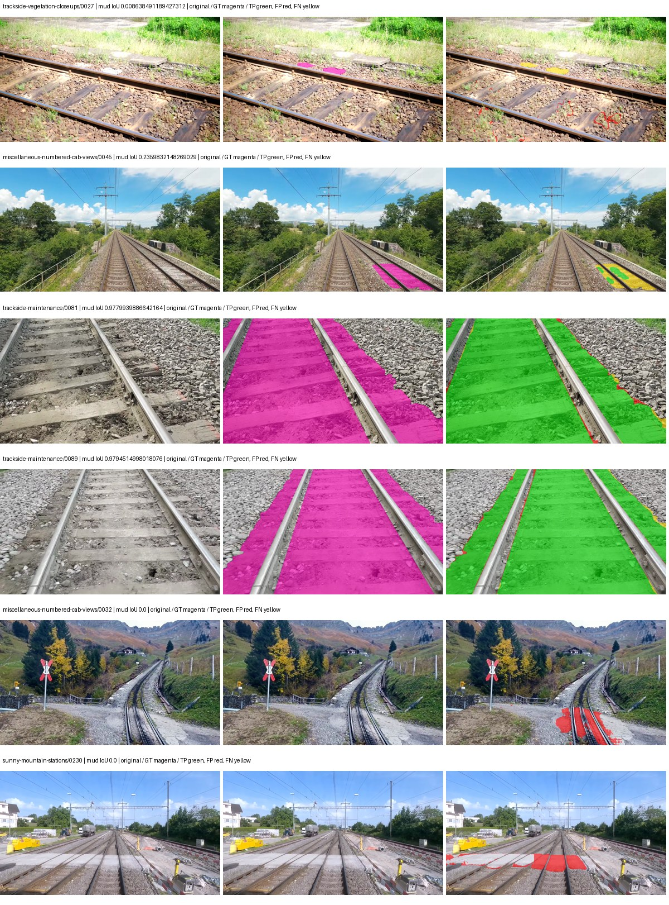
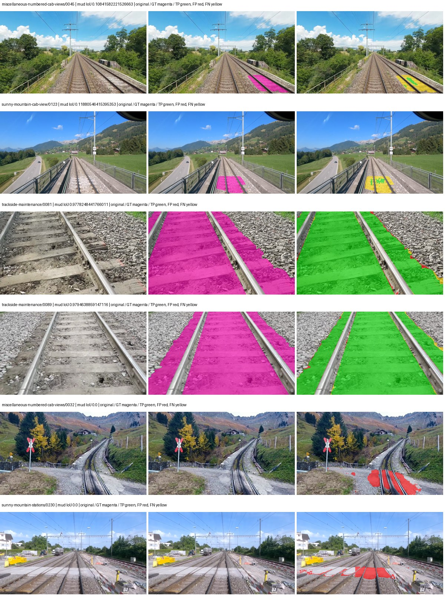
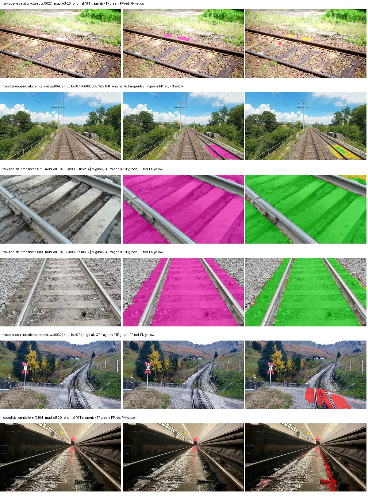
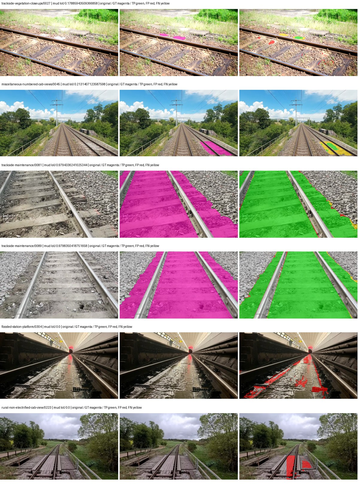

# eomt_dinov3_large — rad_9_24_2026-paul

[RAD 9/24: Paul's split](../../README.md) · [Full model records](record.json)

Primary selection and early stopping: **mud-pumping validation IoU, pixels pooled over all validation images**. A job is complete only after full statistics and isolated profiling are verified.

Study metrics, counting each class only on the validation images that contain it: mud-pumping IoU is the mean per-image IoU over the images with mud-pumping, precision and recall sum pixels over those images, and mIoU averages each class over the images that contain it, then over the classes present.

| Initialization path | Seed | Mud-pumping IoU, train-camera images with mud (%, n=7) | Mud-pumping IoU, all images with mud (%, n=13) | Mud precision, all images with mud (%) | Mud recall, all images with mud (%) | mIoU (each class over images that contain it) (%) |
| --- | --- | --- | --- | --- | --- | --- |
| rtis_only | 0 | 49.18 | 63.35 | 97.94 | 94.70 | 59.84 |
| cityscapes_to_rtis | 0 | 37.15 | 57.08 | 98.63 | 89.78 | 56.70 |
| railsem19_to_rtis | 0 | 53.34 | 65.39 | 98.04 | 94.50 | 64.02 |
| cityscapes_to_railsem19_to_rtis | 0 | 48.03 | 63.93 | 98.36 | 94.04 | 62.32 |

Per-class IoU: IoU (%) of every class, each averaged only over the validation images that contain the class (n = those images); — = no image contains it. mIoU averages the classes with at least one such image.

| Initialization path | Seed | mIoU (each class over images that contain it) | person (n=12) | truck (n=5) | rail-track (n=31) | vegetation-overgrowth (n=14) | car (n=6) | on-rails (n=6) | traffic-sign (n=10) | road (n=12) | sidewalk (n=16) | construction (n=26) | tram-track (n=5) | pole (n=25) | traffic-light (n=8) | mud-pumping (n=13) | fence (n=17) | terrain (n=34) | sky (n=28) | rail-embedded (n=5) | rail-raised (n=36) | trackbed (n=32) | standing-water (n=6) |
| --- | --- | --- | --- | --- | --- | --- | --- | --- | --- | --- | --- | --- | --- | --- | --- | --- | --- | --- | --- | --- | --- | --- | --- |
| rtis_only | 0 | 59.84 | 26.79 | 41.38 | 78.88 | 47.64 | 63.45 | 85.48 | 24.72 | 55.64 | 65.22 | 60.20 | 40.85 | 58.19 | 57.93 | 63.35 | 66.64 | 88.20 | 97.09 | 33.28 | 74.26 | 83.16 | 44.39 |
| cityscapes_to_rtis | 0 | 56.70 | 26.66 | 52.67 | 75.98 | 48.24 | 65.21 | 70.86 | 34.26 | 56.32 | 63.96 | 62.16 | 26.90 | 61.09 | 51.51 | 57.08 | 64.50 | 88.95 | 96.74 | 0.40 | 71.69 | 82.02 | 33.50 |
| railsem19_to_rtis | 0 | 64.02 | 26.20 | 34.17 | 80.33 | 50.92 | 68.53 | 89.41 | 44.45 | 60.80 | 68.91 | 60.32 | 64.43 | 61.81 | 53.89 | 65.39 | 68.20 | 88.10 | 97.11 | 56.29 | 78.39 | 81.91 | 44.94 |
| cityscapes_to_railsem19_to_rtis | 0 | 62.32 | 26.37 | 53.20 | 79.43 | 49.41 | 65.25 | 76.61 | 48.48 | 68.57 | 67.54 | 62.65 | 31.85 | 62.74 | 56.19 | 63.93 | 66.46 | 88.10 | 97.06 | 50.95 | 76.84 | 82.25 | 34.79 |

Everything below is the campaign's own record, with pixels pooled over all validation images (the checkpoint was selected on that pooled mud IoU).

| Model | Initialization path | Seed | Status | Steps | Best step | Mud IoU, pixels pooled (%) | Mud precision, pixels pooled (%) | Mud recall, pixels pooled (%) | Final mud IoU (trainer val, pixels pooled, %) | mIoU, pixels pooled (%) | Fixed GT-class mIoU, pixels pooled (%) |
| --- | --- | --- | --- | --- | --- | --- | --- | --- | --- | --- | --- |
| eomt_dinov3_large | rtis_only | 0 | completed | 4000 | 3981 | 90.84 | 95.71 | 94.70 | 90.84 | 68.28 | 68.28 |
| eomt_dinov3_large | cityscapes_to_rtis | 0 | completed | 2389 | 1061 | 85.79 | 95.07 | 89.78 | 85.45 | 65.86 | 65.86 |
| eomt_dinov3_large | railsem19_to_rtis | 0 | completed | 2919 | 1592 | 89.87 | 94.82 | 94.50 | 89.83 | 70.63 | 70.63 |
| eomt_dinov3_large | cityscapes_to_railsem19_to_rtis | 0 | completed | 3451 | 3185 | 89.07 | 94.39 | 94.04 | 89.06 | 70.22 | 70.22 |

Training: 227 images. Validation: 37 images. Test: 50 held out. Seeds: [0]. Seed variation measures optimization variability, not independent-recording uncertainty. Historical source checkpoints stay fixed across adaptation seeds.

Training code: `d864b72bd90706260965bb1a48398d01167b6d5c`. Split SHA-256: `b16dbbc7c4aa0c5d6e0fb5a20a27b4f3f8a4f3ce535621ed7c9aeaa6e85adb77`.

## rtis_only — seed 0

Status: **completed**. Started: 2026-10-05T05:05:00.858922+00:00. Finished: 2026-10-05T06:52:03.700877+00:00.

Recipe pretrained initializer: `tue-mps/eomt-dinov3-coco-panoptic-large-640 (DINOv3 ViT-L/16, COCO panoptic)`.

`rtis_only` uses the recipe initializer, which may include pretrained segmentation components. Transfer paths load the exact historical source checkpoint below and reset the classifier; they do not reset all query/decoder features.

Source checkpoint: `Recipe pretrained initialization`.

Config SHA-256: `a64dbf1622c387768febd2ad1d55e89e579c3760cf33f656d3dadb85ee2e2216`. Weights used for validation: `ema`.

### Mud-pumping and aggregate quality

| Metric | Selected checkpoint | Final training validation |
| --- | --- | --- |
| Mud IoU | 90.84 | 90.84 |
| Mud precision | 95.71 | 95.71 |
| Mud recall | 94.70 | 94.70 |
| Mud Dice/F1 | 95.20 | 95.20 |
| mIoU | 68.28 | 68.48 |
| Mean accuracy | 79.57 | 79.61 |
| Mean precision | 80.62 | 80.85 |
| Mean Dice | 79.03 | 79.16 |
| Mean specificity | 99.57 | 99.57 |
| Pixel accuracy | 92.12 | 92.14 |
| Frequency-weighted IoU | 86.11 | 86.13 |
| Fixed GT-present class mIoU | 68.28 | 68.48 |
| Boundary F1 | 72.60 | 72.97 |

The selected checkpoint has independent evaluation evidence. Final values are the trainer's final validation record, not a new independent evaluation. mIoU averages classes with nonzero union, so false positives on absent classes can change its denominator. The fixed GT-class mean is supplementary and excludes absent classes; their false positives remain in the confusion matrix.

### Resource usage and timing

| Measurement | Value |
| --- | --- |
| Peak training VRAM, retained training invocation (GiB) | 17.84 |
| Peak evaluation VRAM (GiB) | 10.77 |
| Retained training invocation wall time (seconds) | 6107.49 |
| Retained training invocation GPU-hours (one GPU) | 1.70 |
| Evaluation wall time (seconds) | 22.23 |
| Full evaluation pipeline images/second | 1.66 |
| Best full-state checkpoint (MiB) | 4805.94 |
| Final full-state checkpoint (MiB) | 4805.92 |
| Verified periodic checkpoints removed (GiB) | 37.55 |

VRAM uses the recorded allocator high-water mark; it is not total device usage including CUDA context. Resumed jobs' retained training invocation times and peaks are **not whole-campaign totals**. Earlier invocation resource records are not reconstructed here. Evaluation throughput includes loader, sliding-window inference and metrics; it is not model-only latency/FPS. Missing measurements are shown as —, never inferred from another dataset's run.

### Standardized inference performance

Dedicated model-only profiling waits for an idle worker-locked L40S: BF16, batch 1, 1024x1024, 20 warmup and 100 CUDA-event-timed public forwards. It excludes loading, preprocessing, tiling and metrics.

| Status | Parameters | Weight MiB | FPS | p50 ms | p95 ms | Peak reserved GiB |
| --- | --- | --- | --- | --- | --- | --- |
| complete | 314917910 | 1201.32 | 40.82 | 24.42 | 24.98 | 3.13 |

```json
{
  "schema_version": 1,
  "model_id": "eomt_dinov3_large",
  "measured_at": "2026-10-05T06:51:21+00:00",
  "status": "complete",
  "benchmark_scope": "rtis_selected_checkpoint_model_only",
  "applies_to": [
    "eomt_dinov3_large--rtis_only--seed-0"
  ],
  "source": {
    "campaign_git_sha": "d864b72bd90706260965bb1a48398d01167b6d5c",
    "git_dirty": false,
    "config_hash": "201ece7ddb97",
    "resolved_config": "/data/izadia1/projects/segmentary-runs/rad_9_24_2026/paul-seed0-20261005-r2/configs/eomt_dinov3_large--rtis_only--seed-0.yaml",
    "config_sha256": "a64dbf1622c387768febd2ad1d55e89e579c3760cf33f656d3dadb85ee2e2216",
    "checkpoint_sha256": "9fc7472343d4d360cda63f376b5451a2c88c982a861691b41dda585ad2a78f29",
    "checkpoint_global_step": 3981,
    "checkpoint_bytes": 5039394681,
    "checkpoint_kind": "resume checkpoint with optimizer and EMA state",
    "weights": "ema",
    "measured_checkpoint_job_id": "eomt_dinov3_large--rtis_only--seed-0",
    "result_sha256": "6ca4f712692204d7b5c56d1590a60fee839fa5726aa0a3a751a79ec9a2c175d9",
    "result_git_sha": "d864b72bd90706260965bb1a48398d01167b6d5c",
    "result_stage": "eval:rad_9_24_2026-paul:val",
    "result_seed": 0
  },
  "hardware": {
    "gpu_name": "NVIDIA L40S",
    "gpu_uuid": "GPU-804aea8b-5f62-423e-72c6-49e1ed15c4e4",
    "logical_device": "cuda:0",
    "physical_visibility_token": "6",
    "compute_capability": [
      8,
      9
    ],
    "total_memory_bytes": 47677177856
  },
  "model": {
    "parameter_count": 314917910,
    "trainable_parameter_count": 314917910,
    "resident_parameter_bytes": 1259671640,
    "parameter_dtype_counts": {
      "float32": 314917910
    }
  },
  "contract": {
    "backend": "pytorch",
    "precision": "bf16_autocast",
    "batch_size": 1,
    "input_shape_nchw": [
      1,
      3,
      1024,
      1024
    ],
    "warmup_iterations": 20,
    "measured_iterations": 100,
    "timing": "per-forward CUDA events with end-event synchronization",
    "includes_preprocessing": false,
    "includes_data_loader": false,
    "includes_sliding_window": false,
    "input_resident_on_gpu": true,
    "model_only": true,
    "entrypoint": "public model(image) dense-logits forward"
  },
  "measurements": {
    "latency": {
      "p50_ms": 24.417280197143555,
      "p95_ms": 24.98022394180298,
      "mean_ms": 24.495185260772704,
      "minimum_ms": 24.31488037109375,
      "maximum_ms": 25.89081573486328,
      "fps": 40.82434933045511,
      "raw_ms": [
        24.378368377685547,
        24.390655517578125,
        24.367103576660156,
        24.363008499145508,
        24.33945655822754,
        24.398847579956055,
        24.31488037109375,
        24.458240509033203,
        24.54630470275879,
        24.380416870117188,
        25.012224197387695,
        24.431615829467773,
        24.359935760498047,
        24.33126449584961,
        24.413183212280273,
        24.381439208984375,
        24.382463455200195,
        24.370176315307617,
        24.354816436767578,
        24.31999969482422,
        24.467456817626953,
        24.74291229248047,
        24.47667121887207,
        24.815616607666016,
        24.472576141357422,
        24.394784927368164,
        24.402944564819336,
        24.389631271362305,
        24.374271392822266,
        24.365055084228516,
        24.446975708007812,
        24.396799087524414,
        24.380416870117188,
        24.50534439086914,
        24.542207717895508,
        24.568832397460938,
        24.994815826416016,
        24.48691177368164,
        24.438783645629883,
        24.375295639038086,
        24.373247146606445,
        24.375295639038086,
        24.379392623901367,
        24.351743698120117,
        24.415231704711914,
        24.34864044189453,
        24.33228874206543,
        24.50124740600586,
        24.491008758544922,
        24.54425621032715,
        24.807424545288086,
        24.49203109741211,
        24.403968811035156,
        24.403968811035156,
        24.373247146606445,
        24.430591583251953,
        24.396799087524414,
        24.363008499145508,
        24.429567337036133,
        24.417280197143555,
        24.400896072387695,
        24.446975708007812,
        24.979455947875977,
        24.469472885131836,
        25.135072708129883,
        24.441856384277344,
        24.393728256225586,
        24.386560440063477,
        25.89081573486328,
        24.422399520874023,
        24.399871826171875,
        24.413183212280273,
        24.436735153198242,
        24.416255950927734,
        24.392704010009766,
        24.422399520874023,
        24.368127822875977,
        24.46131134033203,
        24.417280197143555,
        25.12998390197754,
        24.72755241394043,
        24.444927215576172,
        24.396799087524414,
        24.431615829467773,
        24.822784423828125,
        24.9303035736084,
        24.50227165222168,
        24.463359832763672,
        24.635391235351562,
        24.534015655517578,
        24.388608932495117,
        24.52889633178711,
        24.817663192749023,
        24.431615829467773,
        24.403968811035156,
        24.608768463134766,
        24.417280197143555,
        24.442880630493164,
        24.383487701416016,
        24.418304443359375
      ],
      "percentile_method": "numpy linear interpolation"
    },
    "peak_reserved_bytes": 3359637504,
    "memory_kind": "pytorch_cuda_allocator_peak_reserved_excluding_context",
    "benchmark_wall_clock_s": 3.4671872705221176
  },
  "started_at": "2026-10-05T06:51:17+00:00",
  "finished_at": "2026-10-05T06:51:21+00:00",
  "environment": {
    "hostname": "hdrfs-app-001",
    "python": "3.11.15",
    "platform": "Linux-5.15.0-139-generic-x86_64-with-glibc2.35",
    "torch": "2.11.0+cu128",
    "torch_cuda": "12.8",
    "cudnn": 91900,
    "driver_version": "570.133.20",
    "cuda_available": true,
    "gpu_count": 1,
    "gpu_names": [
      "NVIDIA L40S"
    ],
    "cuda_visible_devices": "6",
    "packages": {
      "segmentary": "0.1.0",
      "torch": "2.11.0+cu128",
      "torchvision": "0.26.0+cu128",
      "transformers": "5.15.0",
      "timm": "1.0.28",
      "segmentation-models-pytorch": "0.5.0",
      "albumentations": "2.0.8",
      "lightning": "2.6.5",
      "numpy": "2.4.4"
    }
  }
}
```

### Per-class validation results

| Class | GT pixels | IoU (%) | Precision (%) | Recall (%) | Dice (%) | Boundary F1 (%) |
| --- | --- | --- | --- | --- | --- | --- |
| car | 75932 | 51.12 | 55.01 | 87.85 | 67.65 | 80.72 |
| construction | 5694760 | 60.67 | 78.05 | 73.15 | 75.52 | 66.62 |
| fence | 3789415 | 65.93 | 92.51 | 69.65 | 79.47 | 69.61 |
| mud-pumping | 7435760 | 90.84 | 95.71 | 94.70 | 95.20 | 61.67 |
| on-rails | 1137952 | 93.81 | 95.61 | 98.04 | 96.81 | 83.41 |
| person | 130659 | 82.16 | 85.68 | 95.24 | 90.20 | 74.20 |
| pole | 1467743 | 61.46 | 72.86 | 79.72 | 76.13 | 84.76 |
| rail-embedded | 74744 | 23.34 | 77.08 | 25.08 | 37.84 | 67.82 |
| rail-raised | 3588713 | 81.86 | 87.55 | 92.64 | 90.02 | 94.79 |
| rail-track | 4270276 | 77.65 | 84.20 | 90.89 | 87.42 | 81.11 |
| road | 1152119 | 56.54 | 78.02 | 67.25 | 72.24 | 52.45 |
| sidewalk | 2164731 | 76.49 | 87.44 | 85.93 | 86.68 | 75.49 |
| sky | 20207617 | 97.94 | 99.23 | 98.69 | 98.96 | 95.72 |
| standing-water | 2006046 | 85.13 | 90.20 | 93.80 | 91.97 | 33.75 |
| terrain | 30442090 | 90.88 | 94.11 | 96.36 | 95.22 | 85.27 |
| trackbed | 9118591 | 86.74 | 92.73 | 93.07 | 92.90 | 86.95 |
| traffic-light | 116825 | 50.17 | 66.99 | 66.64 | 66.81 | 77.31 |
| traffic-sign | 35778 | 26.20 | 50.52 | 35.24 | 41.52 | 52.13 |
| tram-track | 244726 | 38.05 | 48.20 | 64.39 | 55.13 | 47.21 |
| truck | 190997 | 77.29 | 87.57 | 86.81 | 87.19 | 77.08 |
| vegetation-overgrowth | 1534858 | 59.64 | 73.67 | 75.79 | 74.72 | 76.56 |

### Full-run accounting

| Measurement | Value |
| --- | --- |
| Full GPU-reserved wall seconds, all recorded worker attempts | 6430.34 |
| Full reserved GPU-hours | 1.79 |
| Whole-run timing complete | True |

| Phase | Wall seconds including failed attempts |
| --- | --- |
| training | 6114.33 |
| diagnostics | 206.51 |
| performance | 20.48 |

GPU-reserved time includes model loading, training, validation, collection, profiling, checkpoint I/O and orchestration while the worker owns one GPU. It is not GPU kernel-active time. Phase timings and sampled device memory/power/utilization are retained separately; sampled device memory is not the allocator high-water mark.

### Train/validation and raw/EMA diagnostics

| Checkpoint / weights / split | Images | Mud IoU (%) | Mud precision (%) | Mud recall (%) |
| --- | --- | --- | --- | --- |
| best-auto-train / ema | 227 | 93.70 | 96.24 | 97.26 |
| best-auto-val / ema | 37 | 90.84 | 95.71 | 94.70 |
| best-alternate-val / raw | 37 | 91.30 | 96.01 | 94.90 |
| final-auto-val / ema | 37 | 90.87 | 95.71 | 94.73 |

Train uses the evaluation transform without augmentation. Compare mud train/validation metrics for the same selected weights. Alternate EMA on running-stat BatchNorm is explicitly uncalibrated and is diagnostic only. Score-threshold curves use uncalibrated normalized scores and are pixel-level diagnostics, not event detection rates or a selected deployment operating point.

### Downloadable evidence

- best-auto-train: [per-image.csv](rtis_only--seed-0/best-auto-train/per-image.csv) · [per-image-confusion.json.gz](rtis_only--seed-0/best-auto-train/per-image-confusion.json.gz) · [groups.json](rtis_only--seed-0/best-auto-train/groups.json) · [mud-score-curves.json](rtis_only--seed-0/best-auto-train/mud-score-curves.json)
- best-auto-val: [per-image.csv](rtis_only--seed-0/best-auto-val/per-image.csv) · [per-image-confusion.json.gz](rtis_only--seed-0/best-auto-val/per-image-confusion.json.gz) · [groups.json](rtis_only--seed-0/best-auto-val/groups.json) · [mud-score-curves.json](rtis_only--seed-0/best-auto-val/mud-score-curves.json) · [examples.jpg](rtis_only--seed-0/best-auto-val/examples.jpg)
- best-alternate-val: [per-image.csv](rtis_only--seed-0/best-alternate-val/per-image.csv) · [per-image-confusion.json.gz](rtis_only--seed-0/best-alternate-val/per-image-confusion.json.gz) · [groups.json](rtis_only--seed-0/best-alternate-val/groups.json) · [mud-score-curves.json](rtis_only--seed-0/best-alternate-val/mud-score-curves.json)
- final-auto-val: [per-image.csv](rtis_only--seed-0/final-auto-val/per-image.csv) · [per-image-confusion.json.gz](rtis_only--seed-0/final-auto-val/per-image-confusion.json.gz) · [groups.json](rtis_only--seed-0/final-auto-val/groups.json) · [mud-score-curves.json](rtis_only--seed-0/final-auto-val/mud-score-curves.json)
- resources: [telemetry.csv](rtis_only--seed-0/resources/telemetry.csv)



Examples are two lowest and two highest mud-IoU positive images, plus up to two negative images with the most false-positive mud pixels. They are targeted diagnostic examples, not random samples. Green: true positive; red: false positive; yellow: false negative. Full predictions remain on HDRFS.

### Validation tracking

| Logged step | Overall mIoU (%) | Mud IoU (%) |
| --- | --- | --- |
| 264 | 19.53 | 0.68 |
| 530 | 52.14 | 63.03 |
| 796 | 60.55 | 83.93 |
| 1061 | 62.57 | 85.75 |
| 1326 | 64.43 | 87.79 |
| 1592 | 65.33 | 90.04 |
| 1857 | 65.52 | 90.30 |
| 2123 | 66.07 | 90.53 |
| 2389 | 66.21 | 90.56 |
| 2653 | 66.27 | 90.59 |
| 2919 | 66.33 | 90.63 |
| 3185 | 66.71 | 90.66 |
| 3451 | 66.82 | 90.74 |
| 3716 | 67.91 | 90.77 |
| 3981 | 68.48 | 90.83 |
| 4000 | 68.48 | 90.84 |

All retained scalar curves, including training loss and per-class IoU, are in record.json. Observed best mud on a curve is not necessarily a retained checkpoint: the pilot saved its selection-metric-best and final checkpoints. Step logging and checkpoint global_step may differ by one.

### Stopping and checkpoint provenance

```json
{
  "stopping": {
    "actual_steps": 4000,
    "maximum_steps": 4000,
    "min_delta": 0.001,
    "monitor": "val_iou/mud-pumping",
    "patience": 5,
    "reason": "budget_complete"
  },
  "checkpoints": {
    "best": {
      "path": "/data/izadia1/projects/segmentary-runs/rad_9_24_2026/paul-seed0-20261005-r2/future-runs/eomt_dinov3_large--rtis_only--seed-0_seed0/rtis/best.ckpt",
      "sha256": "9fc7472343d4d360cda63f376b5451a2c88c982a861691b41dda585ad2a78f29",
      "global_step": 3981,
      "bytes": 5039394681
    },
    "final": {
      "path": "/data/izadia1/projects/segmentary-runs/rad_9_24_2026/paul-seed0-20261005-r2/future-runs/eomt_dinov3_large--rtis_only--seed-0_seed0/rtis/last.ckpt",
      "sha256": "83aac00b44958cfee8557ca15b187424fb3949b6062fd618a289ac66f9062cbb",
      "global_step": 4000,
      "bytes": 5039373817
    }
  },
  "cleanup_error": null
}
```

### Resolved training, initialization and evaluation settings

The optimizer block is the base configuration. Stage LR scales are applied at runtime, and stage warmup is capped at min(base warmup, floor(stage budget / 10), stage budget - 1): 400 steps for this 4,000-step pilot. Model-internal native input grids may differ from augmentation crops (EoMT uses its 640 grid).

```json
{
  "name": "eomt_dinov3_large--rtis_only--seed-0",
  "model": {
    "arch": "eomt_dinov3_large",
    "checkpoint": null,
    "tuning": "full",
    "head": "unified_head",
    "lora_r": 16,
    "lora_alpha": 32,
    "lora_dropout": 0.05,
    "lora_targets": [],
    "drop_path": null,
    "revision": null,
    "subfolder": null,
    "local_files_only": false,
    "trust_remote_code": false,
    "backbone_path": null,
    "head_paths": [],
    "classifier_path": null,
    "inactive_parameter_paths": [],
    "smp_arch": null,
    "encoder_name": null,
    "encoder_weights": null,
    "native": null,
    "batch_norm_momentum": null
  },
  "space": "paul-test-rtis",
  "taxonomy_root": "/data/izadia1/projects/segmentary-rad-d864b72b/taxonomy",
  "output_root": "/data/izadia1/projects/segmentary-runs/rad_9_24_2026/paul-seed0-20261005-r2/future-runs",
  "optim": {
    "backbone_lr": 1e-05,
    "head_lr_mult": 10.0,
    "weight_decay": 0.05,
    "llrd": 0.75,
    "warmup_iters": 1500,
    "warmup_ratio": 1e-06,
    "poly_power": 0.9,
    "min_lr_ratio": 0.0,
    "betas": [
      0.9,
      0.999
    ],
    "grad_clip": 1.0
  },
  "train": {
    "iters": 4000,
    "batch_size": 2,
    "accum": 8,
    "num_workers": 2,
    "precision": "bf16-mixed",
    "ema_decay": 0.9998,
    "val_every": 250,
    "ckpt_every": 500,
    "selection_metric": "val_iou/mud-pumping",
    "early_stopping_patience": 5,
    "early_stopping_min_delta": 0.001,
    "seed": 0,
    "devices": 1
  },
  "eval": {
    "sliding_window": true,
    "window": [
      1024,
      1024
    ],
    "stride": [
      768,
      768
    ],
    "batch_size": 1,
    "num_workers": 2,
    "tta_scales": [],
    "tta_flip": false,
    "threshold": 0.5,
    "boundary_tolerance_frac": 0.0075,
    "save_confusion": true
  },
  "loss": {
    "task": "multiclass",
    "activation": "auto",
    "terms": [],
    "aux": "none",
    "aux_weight": 0.0,
    "ce_weight": 1.0,
    "label_smoothing": 0.0,
    "class_weights": null,
    "query": {
      "kind": "hungarian_query",
      "classification_weight": 2.0,
      "mask_bce_weight": 5.0,
      "dice_weight": 5.0,
      "no_object_coefficient": 0.1,
      "match_class_cost": 2.0,
      "match_mask_bce_cost": 5.0,
      "match_dice_cost": 5.0,
      "matching_num_points": 8192,
      "auxiliary_layer_weight": 1.0,
      "dice_smooth": 1.0
    }
  },
  "aug": {
    "crop": [
      1024,
      1024
    ],
    "scale_min": 0.5,
    "scale_max": 2.0,
    "hflip_p": 0.5,
    "color_jitter_p": 0.5,
    "brightness": 0.25,
    "contrast": 0.25,
    "saturation": 0.25,
    "hue": 0.05
  },
  "stages": [
    {
      "name": "rtis",
      "data": [
        {
          "name": "rad_9_24_2026-paul",
          "root": "/data/izadia1/datasets/rad_9_24_2026-paul",
          "variant": null,
          "split_file": "splits.json",
          "train_split": "train",
          "val_split": "val",
          "limit": null,
          "loader": "folder",
          "mapping": "paul-test-rtis",
          "loader_options": {
            "require_groups": false
          }
        }
      ],
      "iters": null,
      "lr_scale": 1.0,
      "head_group_lr_scale": 1.0,
      "init_from": "pretrained",
      "reset_head": false,
      "freeze": null,
      "sample_weights": null
    }
  ]
}
```

### Hardware and software provenance

```json
{
  "training": {
    "cuda_available": true,
    "cuda_visible_devices": "6",
    "cudnn": 91900,
    "driver_version": "570.133.20",
    "gpu_count": 1,
    "gpu_names": [
      "NVIDIA L40S"
    ],
    "hostname": "hdrfs-app-001",
    "input_normalization": {
      "channel_order": "rgb",
      "mean": [
        0.485,
        0.456,
        0.406
      ],
      "source": "imagenet",
      "std": [
        0.229,
        0.224,
        0.225
      ]
    },
    "model_origins": [
      {
        "hf_commit": "e8c0564219d89c9000add20d89d052d9f7464236",
        "hf_name_or_path": "tue-mps/eomt-dinov3-coco-panoptic-large-640",
        "module": "model",
        "timm_pretrained": {}
      },
      {
        "hf_commit": "e8c0564219d89c9000add20d89d052d9f7464236",
        "hf_name_or_path": "tue-mps/eomt-dinov3-coco-panoptic-large-640",
        "module": "model.embeddings",
        "timm_pretrained": {}
      },
      {
        "hf_commit": "e8c0564219d89c9000add20d89d052d9f7464236",
        "hf_name_or_path": "tue-mps/eomt-dinov3-coco-panoptic-large-640",
        "module": "model.layers.0.attention",
        "timm_pretrained": {}
      },
      {
        "hf_commit": "e8c0564219d89c9000add20d89d052d9f7464236",
        "hf_name_or_path": "tue-mps/eomt-dinov3-coco-panoptic-large-640",
        "module": "model.layers.0.mlp",
        "timm_pretrained": {}
      },
      {
        "hf_commit": "e8c0564219d89c9000add20d89d052d9f7464236",
        "hf_name_or_path": "tue-mps/eomt-dinov3-coco-panoptic-large-640",
        "module": "model.layers.1.attention",
        "timm_pretrained": {}
      },
      {
        "hf_commit": "e8c0564219d89c9000add20d89d052d9f7464236",
        "hf_name_or_path": "tue-mps/eomt-dinov3-coco-panoptic-large-640",
        "module": "model.layers.1.mlp",
        "timm_pretrained": {}
      },
      {
        "hf_commit": "e8c0564219d89c9000add20d89d052d9f7464236",
        "hf_name_or_path": "tue-mps/eomt-dinov3-coco-panoptic-large-640",
        "module": "model.layers.2.attention",
        "timm_pretrained": {}
      },
      {
        "hf_commit": "e8c0564219d89c9000add20d89d052d9f7464236",
        "hf_name_or_path": "tue-mps/eomt-dinov3-coco-panoptic-large-640",
        "module": "model.layers.2.mlp",
        "timm_pretrained": {}
      },
      {
        "hf_commit": "e8c0564219d89c9000add20d89d052d9f7464236",
        "hf_name_or_path": "tue-mps/eomt-dinov3-coco-panoptic-large-640",
        "module": "model.layers.3.attention",
        "timm_pretrained": {}
      },
      {
        "hf_commit": "e8c0564219d89c9000add20d89d052d9f7464236",
        "hf_name_or_path": "tue-mps/eomt-dinov3-coco-panoptic-large-640",
        "module": "model.layers.3.mlp",
        "timm_pretrained": {}
      },
      {
        "hf_commit": "e8c0564219d89c9000add20d89d052d9f7464236",
        "hf_name_or_path": "tue-mps/eomt-dinov3-coco-panoptic-large-640",
        "module": "model.layers.4.attention",
        "timm_pretrained": {}
      },
      {
        "hf_commit": "e8c0564219d89c9000add20d89d052d9f7464236",
        "hf_name_or_path": "tue-mps/eomt-dinov3-coco-panoptic-large-640",
        "module": "model.layers.4.mlp",
        "timm_pretrained": {}
      },
      {
        "hf_commit": "e8c0564219d89c9000add20d89d052d9f7464236",
        "hf_name_or_path": "tue-mps/eomt-dinov3-coco-panoptic-large-640",
        "module": "model.layers.5.attention",
        "timm_pretrained": {}
      },
      {
        "hf_commit": "e8c0564219d89c9000add20d89d052d9f7464236",
        "hf_name_or_path": "tue-mps/eomt-dinov3-coco-panoptic-large-640",
        "module": "model.layers.5.mlp",
        "timm_pretrained": {}
      },
      {
        "hf_commit": "e8c0564219d89c9000add20d89d052d9f7464236",
        "hf_name_or_path": "tue-mps/eomt-dinov3-coco-panoptic-large-640",
        "module": "model.layers.6.attention",
        "timm_pretrained": {}
      },
      {
        "hf_commit": "e8c0564219d89c9000add20d89d052d9f7464236",
        "hf_name_or_path": "tue-mps/eomt-dinov3-coco-panoptic-large-640",
        "module": "model.layers.6.mlp",
        "timm_pretrained": {}
      },
      {
        "hf_commit": "e8c0564219d89c9000add20d89d052d9f7464236",
        "hf_name_or_path": "tue-mps/eomt-dinov3-coco-panoptic-large-640",
        "module": "model.layers.7.attention",
        "timm_pretrained": {}
      },
      {
        "hf_commit": "e8c0564219d89c9000add20d89d052d9f7464236",
        "hf_name_or_path": "tue-mps/eomt-dinov3-coco-panoptic-large-640",
        "module": "model.layers.7.mlp",
        "timm_pretrained": {}
      },
      {
        "hf_commit": "e8c0564219d89c9000add20d89d052d9f7464236",
        "hf_name_or_path": "tue-mps/eomt-dinov3-coco-panoptic-large-640",
        "module": "model.layers.8.attention",
        "timm_pretrained": {}
      },
      {
        "hf_commit": "e8c0564219d89c9000add20d89d052d9f7464236",
        "hf_name_or_path": "tue-mps/eomt-dinov3-coco-panoptic-large-640",
        "module": "model.layers.8.mlp",
        "timm_pretrained": {}
      },
      {
        "hf_commit": "e8c0564219d89c9000add20d89d052d9f7464236",
        "hf_name_or_path": "tue-mps/eomt-dinov3-coco-panoptic-large-640",
        "module": "model.layers.9.attention",
        "timm_pretrained": {}
      },
      {
        "hf_commit": "e8c0564219d89c9000add20d89d052d9f7464236",
        "hf_name_or_path": "tue-mps/eomt-dinov3-coco-panoptic-large-640",
        "module": "model.layers.9.mlp",
        "timm_pretrained": {}
      },
      {
        "hf_commit": "e8c0564219d89c9000add20d89d052d9f7464236",
        "hf_name_or_path": "tue-mps/eomt-dinov3-coco-panoptic-large-640",
        "module": "model.layers.10.attention",
        "timm_pretrained": {}
      },
      {
        "hf_commit": "e8c0564219d89c9000add20d89d052d9f7464236",
        "hf_name_or_path": "tue-mps/eomt-dinov3-coco-panoptic-large-640",
        "module": "model.layers.10.mlp",
        "timm_pretrained": {}
      },
      {
        "hf_commit": "e8c0564219d89c9000add20d89d052d9f7464236",
        "hf_name_or_path": "tue-mps/eomt-dinov3-coco-panoptic-large-640",
        "module": "model.layers.11.attention",
        "timm_pretrained": {}
      },
      {
        "hf_commit": "e8c0564219d89c9000add20d89d052d9f7464236",
        "hf_name_or_path": "tue-mps/eomt-dinov3-coco-panoptic-large-640",
        "module": "model.layers.11.mlp",
        "timm_pretrained": {}
      },
      {
        "hf_commit": "e8c0564219d89c9000add20d89d052d9f7464236",
        "hf_name_or_path": "tue-mps/eomt-dinov3-coco-panoptic-large-640",
        "module": "model.layers.12.attention",
        "timm_pretrained": {}
      },
      {
        "hf_commit": "e8c0564219d89c9000add20d89d052d9f7464236",
        "hf_name_or_path": "tue-mps/eomt-dinov3-coco-panoptic-large-640",
        "module": "model.layers.12.mlp",
        "timm_pretrained": {}
      },
      {
        "hf_commit": "e8c0564219d89c9000add20d89d052d9f7464236",
        "hf_name_or_path": "tue-mps/eomt-dinov3-coco-panoptic-large-640",
        "module": "model.layers.13.attention",
        "timm_pretrained": {}
      },
      {
        "hf_commit": "e8c0564219d89c9000add20d89d052d9f7464236",
        "hf_name_or_path": "tue-mps/eomt-dinov3-coco-panoptic-large-640",
        "module": "model.layers.13.mlp",
        "timm_pretrained": {}
      },
      {
        "hf_commit": "e8c0564219d89c9000add20d89d052d9f7464236",
        "hf_name_or_path": "tue-mps/eomt-dinov3-coco-panoptic-large-640",
        "module": "model.layers.14.attention",
        "timm_pretrained": {}
      },
      {
        "hf_commit": "e8c0564219d89c9000add20d89d052d9f7464236",
        "hf_name_or_path": "tue-mps/eomt-dinov3-coco-panoptic-large-640",
        "module": "model.layers.14.mlp",
        "timm_pretrained": {}
      },
      {
        "hf_commit": "e8c0564219d89c9000add20d89d052d9f7464236",
        "hf_name_or_path": "tue-mps/eomt-dinov3-coco-panoptic-large-640",
        "module": "model.layers.15.attention",
        "timm_pretrained": {}
      },
      {
        "hf_commit": "e8c0564219d89c9000add20d89d052d9f7464236",
        "hf_name_or_path": "tue-mps/eomt-dinov3-coco-panoptic-large-640",
        "module": "model.layers.15.mlp",
        "timm_pretrained": {}
      },
      {
        "hf_commit": "e8c0564219d89c9000add20d89d052d9f7464236",
        "hf_name_or_path": "tue-mps/eomt-dinov3-coco-panoptic-large-640",
        "module": "model.layers.16.attention",
        "timm_pretrained": {}
      },
      {
        "hf_commit": "e8c0564219d89c9000add20d89d052d9f7464236",
        "hf_name_or_path": "tue-mps/eomt-dinov3-coco-panoptic-large-640",
        "module": "model.layers.16.mlp",
        "timm_pretrained": {}
      },
      {
        "hf_commit": "e8c0564219d89c9000add20d89d052d9f7464236",
        "hf_name_or_path": "tue-mps/eomt-dinov3-coco-panoptic-large-640",
        "module": "model.layers.17.attention",
        "timm_pretrained": {}
      },
      {
        "hf_commit": "e8c0564219d89c9000add20d89d052d9f7464236",
        "hf_name_or_path": "tue-mps/eomt-dinov3-coco-panoptic-large-640",
        "module": "model.layers.17.mlp",
        "timm_pretrained": {}
      },
      {
        "hf_commit": "e8c0564219d89c9000add20d89d052d9f7464236",
        "hf_name_or_path": "tue-mps/eomt-dinov3-coco-panoptic-large-640",
        "module": "model.layers.18.attention",
        "timm_pretrained": {}
      },
      {
        "hf_commit": "e8c0564219d89c9000add20d89d052d9f7464236",
        "hf_name_or_path": "tue-mps/eomt-dinov3-coco-panoptic-large-640",
        "module": "model.layers.18.mlp",
        "timm_pretrained": {}
      },
      {
        "hf_commit": "e8c0564219d89c9000add20d89d052d9f7464236",
        "hf_name_or_path": "tue-mps/eomt-dinov3-coco-panoptic-large-640",
        "module": "model.layers.19.attention",
        "timm_pretrained": {}
      },
      {
        "hf_commit": "e8c0564219d89c9000add20d89d052d9f7464236",
        "hf_name_or_path": "tue-mps/eomt-dinov3-coco-panoptic-large-640",
        "module": "model.layers.19.mlp",
        "timm_pretrained": {}
      },
      {
        "hf_commit": "e8c0564219d89c9000add20d89d052d9f7464236",
        "hf_name_or_path": "tue-mps/eomt-dinov3-coco-panoptic-large-640",
        "module": "model.layers.20.attention",
        "timm_pretrained": {}
      },
      {
        "hf_commit": "e8c0564219d89c9000add20d89d052d9f7464236",
        "hf_name_or_path": "tue-mps/eomt-dinov3-coco-panoptic-large-640",
        "module": "model.layers.20.mlp",
        "timm_pretrained": {}
      },
      {
        "hf_commit": "e8c0564219d89c9000add20d89d052d9f7464236",
        "hf_name_or_path": "tue-mps/eomt-dinov3-coco-panoptic-large-640",
        "module": "model.layers.21.attention",
        "timm_pretrained": {}
      },
      {
        "hf_commit": "e8c0564219d89c9000add20d89d052d9f7464236",
        "hf_name_or_path": "tue-mps/eomt-dinov3-coco-panoptic-large-640",
        "module": "model.layers.21.mlp",
        "timm_pretrained": {}
      },
      {
        "hf_commit": "e8c0564219d89c9000add20d89d052d9f7464236",
        "hf_name_or_path": "tue-mps/eomt-dinov3-coco-panoptic-large-640",
        "module": "model.layers.22.attention",
        "timm_pretrained": {}
      },
      {
        "hf_commit": "e8c0564219d89c9000add20d89d052d9f7464236",
        "hf_name_or_path": "tue-mps/eomt-dinov3-coco-panoptic-large-640",
        "module": "model.layers.22.mlp",
        "timm_pretrained": {}
      },
      {
        "hf_commit": "e8c0564219d89c9000add20d89d052d9f7464236",
        "hf_name_or_path": "tue-mps/eomt-dinov3-coco-panoptic-large-640",
        "module": "model.layers.23.attention",
        "timm_pretrained": {}
      },
      {
        "hf_commit": "e8c0564219d89c9000add20d89d052d9f7464236",
        "hf_name_or_path": "tue-mps/eomt-dinov3-coco-panoptic-large-640",
        "module": "model.layers.23.mlp",
        "timm_pretrained": {}
      },
      {
        "hf_commit": "e8c0564219d89c9000add20d89d052d9f7464236",
        "hf_name_or_path": "tue-mps/eomt-dinov3-coco-panoptic-large-640",
        "module": "model.rope_embeddings",
        "timm_pretrained": {}
      }
    ],
    "model_parameter_count": 314917910,
    "packages": {
      "albumentations": "2.0.8",
      "lightning": "2.6.5",
      "numpy": "2.4.4",
      "segmentary": "0.1.0",
      "segmentation-models-pytorch": "0.5.0",
      "timm": "1.0.28",
      "torch": "2.11.0+cu128",
      "torchvision": "0.26.0+cu128",
      "transformers": "5.15.0"
    },
    "platform": "Linux-5.15.0-139-generic-x86_64-with-glibc2.35",
    "python": "3.11.15",
    "torch": "2.11.0+cu128",
    "torch_cuda": "12.8",
    "trainable_parameter_count": 314917910,
    "training_stop": {
      "actual_steps": 4000,
      "maximum_steps": 4000,
      "min_delta": 0.001,
      "monitor": "val_iou/mud-pumping",
      "patience": 5,
      "reason": "budget_complete"
    },
    "validation_weights": "ema"
  },
  "evaluation": {
    "cuda_available": true,
    "cuda_visible_devices": "6",
    "cudnn": 91900,
    "driver_version": "570.133.20",
    "gpu_count": 1,
    "gpu_names": [
      "NVIDIA L40S"
    ],
    "hostname": "hdrfs-app-001",
    "input_normalization": {
      "channel_order": "rgb",
      "mean": [
        0.485,
        0.456,
        0.406
      ],
      "source": "imagenet",
      "std": [
        0.229,
        0.224,
        0.225
      ]
    },
    "packages": {
      "albumentations": "2.0.8",
      "lightning": "2.6.5",
      "numpy": "2.4.4",
      "segmentary": "0.1.0",
      "segmentation-models-pytorch": "0.5.0",
      "timm": "1.0.28",
      "torch": "2.11.0+cu128",
      "torchvision": "0.26.0+cu128",
      "transformers": "5.15.0"
    },
    "platform": "Linux-5.15.0-139-generic-x86_64-with-glibc2.35",
    "python": "3.11.15",
    "torch": "2.11.0+cu128",
    "torch_cuda": "12.8"
  }
}
```

## cityscapes_to_rtis — seed 0

Status: **completed**. Started: 2026-10-05T05:11:02.434674+00:00. Finished: 2026-10-05T06:13:40.047410+00:00.

Recipe pretrained initializer: `tue-mps/eomt-dinov3-coco-panoptic-large-640 (DINOv3 ViT-L/16, COCO panoptic)`.

`rtis_only` uses the recipe initializer, which may include pretrained segmentation components. Transfer paths load the exact historical source checkpoint below and reset the classifier; they do not reset all query/decoder features.

Source checkpoint: `{'name': 'eomt_dinov3_large--cityscapes--seed-0', 'model': 'eomt_dinov3_large', 'protocol': 'cityscapes', 'config': '/data/izadia1/projects/segmentary-runs/all-model-city-rail-seed0-rail20-b9eb3e1/accepted/eomt_dinov3_large--cityscapes--seed-0/resolved-config.yaml', 'checkpoint': '/data/izadia1/projects/segmentary-runs/all-model-city-rail-seed0-a7c0b67/jobs/eomt_dinov3_large--cityscapes--seed-0/attempt-001/train/eomt_dinov3_large--cityscapes_seed0/cityscapes/last.ckpt', 'recorded_sha256': '070ecbb50465dee5614b17a02ca2afc5fda4bd15063608708d2eb06bdd4bf5f9', 'exists': True}`.

Config SHA-256: `280d4da8bbd13b97bcc906e6672988086e64b4a8ced29b109ca0c21678c83346`. Weights used for validation: `ema`.

### Mud-pumping and aggregate quality

| Metric | Selected checkpoint | Final training validation |
| --- | --- | --- |
| Mud IoU | 85.79 | 85.45 |
| Mud precision | 95.07 | 95.20 |
| Mud recall | 89.78 | 89.30 |
| Mud Dice/F1 | 92.35 | 92.15 |
| mIoU | 65.86 | 67.61 |
| Mean accuracy | 77.45 | 79.56 |
| Mean precision | 77.52 | 80.16 |
| Mean Dice | 76.21 | 78.69 |
| Mean specificity | 99.55 | 99.53 |
| Pixel accuracy | 91.57 | 91.40 |
| Frequency-weighted IoU | 85.24 | 84.97 |
| Fixed GT-present class mIoU | 65.86 | 67.61 |
| Boundary F1 | 70.51 | 73.14 |

The selected checkpoint has independent evaluation evidence. Final values are the trainer's final validation record, not a new independent evaluation. mIoU averages classes with nonzero union, so false positives on absent classes can change its denominator. The fixed GT-class mean is supplementary and excludes absent classes; their false positives remain in the confusion matrix.

### Resource usage and timing

| Measurement | Value |
| --- | --- |
| Peak training VRAM, retained training invocation (GiB) | 17.84 |
| Peak evaluation VRAM (GiB) | 10.77 |
| Retained training invocation wall time (seconds) | 3456.63 |
| Retained training invocation GPU-hours (one GPU) | 0.96 |
| Evaluation wall time (seconds) | 22.21 |
| Full evaluation pipeline images/second | 1.67 |
| Best full-state checkpoint (MiB) | 4805.94 |
| Final full-state checkpoint (MiB) | 4805.92 |
| Verified periodic checkpoints removed (GiB) | 18.77 |

VRAM uses the recorded allocator high-water mark; it is not total device usage including CUDA context. Resumed jobs' retained training invocation times and peaks are **not whole-campaign totals**. Earlier invocation resource records are not reconstructed here. Evaluation throughput includes loader, sliding-window inference and metrics; it is not model-only latency/FPS. Missing measurements are shown as —, never inferred from another dataset's run.

### Standardized inference performance

Dedicated model-only profiling waits for an idle worker-locked L40S: BF16, batch 1, 1024x1024, 20 warmup and 100 CUDA-event-timed public forwards. It excludes loading, preprocessing, tiling and metrics.

| Status | Parameters | Weight MiB | FPS | p50 ms | p95 ms | Peak reserved GiB |
| --- | --- | --- | --- | --- | --- | --- |
| complete | 314917910 | 1201.32 | 37.93 | 24.14 | 24.74 | 3.13 |

```json
{
  "schema_version": 1,
  "model_id": "eomt_dinov3_large",
  "measured_at": "2026-10-05T06:13:13+00:00",
  "status": "complete",
  "benchmark_scope": "rtis_selected_checkpoint_model_only",
  "applies_to": [
    "eomt_dinov3_large--cityscapes_to_rtis--seed-0"
  ],
  "source": {
    "campaign_git_sha": "d864b72bd90706260965bb1a48398d01167b6d5c",
    "git_dirty": false,
    "config_hash": "4c8a32eef691",
    "resolved_config": "/data/izadia1/projects/segmentary-runs/rad_9_24_2026/paul-seed0-20261005-r2/configs/eomt_dinov3_large--cityscapes_to_rtis--seed-0.yaml",
    "config_sha256": "280d4da8bbd13b97bcc906e6672988086e64b4a8ced29b109ca0c21678c83346",
    "checkpoint_sha256": "a9817c3f9f75e6225d88cabb46df4e4975270bfb8727dbc68f61a61c65ec12e7",
    "checkpoint_global_step": 1061,
    "checkpoint_bytes": 5039394681,
    "checkpoint_kind": "resume checkpoint with optimizer and EMA state",
    "weights": "ema",
    "measured_checkpoint_job_id": "eomt_dinov3_large--cityscapes_to_rtis--seed-0",
    "result_sha256": "37855b0ad11f8e2defa9966220857ae0b85400f20d66e5096dbc2beb5b278f6e",
    "result_git_sha": "d864b72bd90706260965bb1a48398d01167b6d5c",
    "result_stage": "eval:rad_9_24_2026-paul:val",
    "result_seed": 0
  },
  "hardware": {
    "gpu_name": "NVIDIA L40S",
    "gpu_uuid": "GPU-a5ad49e5-0536-5229-ba8a-f8a902808f53",
    "logical_device": "cuda:0",
    "physical_visibility_token": "7",
    "compute_capability": [
      8,
      9
    ],
    "total_memory_bytes": 47677177856
  },
  "model": {
    "parameter_count": 314917910,
    "trainable_parameter_count": 314917910,
    "resident_parameter_bytes": 1259671640,
    "parameter_dtype_counts": {
      "float32": 314917910
    }
  },
  "contract": {
    "backend": "pytorch",
    "precision": "bf16_autocast",
    "batch_size": 1,
    "input_shape_nchw": [
      1,
      3,
      1024,
      1024
    ],
    "warmup_iterations": 20,
    "measured_iterations": 100,
    "timing": "per-forward CUDA events with end-event synchronization",
    "includes_preprocessing": false,
    "includes_data_loader": false,
    "includes_sliding_window": false,
    "input_resident_on_gpu": true,
    "model_only": true,
    "entrypoint": "public model(image) dense-logits forward"
  },
  "measurements": {
    "latency": {
      "p50_ms": 24.14078426361084,
      "p95_ms": 24.743782424926756,
      "mean_ms": 26.36565399169922,
      "minimum_ms": 24.008703231811523,
      "maximum_ms": 233.85804748535156,
      "fps": 37.92813181553672,
      "raw_ms": [
        24.47667121887207,
        24.169471740722656,
        24.607744216918945,
        24.523775100708008,
        24.09779167175293,
        24.08140754699707,
        24.11622428894043,
        24.08345603942871,
        24.051679611206055,
        24.12236785888672,
        24.08038330078125,
        24.051647186279297,
        24.033279418945312,
        24.1582088470459,
        24.46028709411621,
        24.114240646362305,
        26.489856719970703,
        24.47052764892578,
        24.267776489257812,
        24.06502342224121,
        24.08345603942871,
        24.128511428833008,
        24.09369659423828,
        24.041471481323242,
        24.069120407104492,
        24.086528778076172,
        24.08755111694336,
        24.26982307434082,
        24.51148796081543,
        24.33945655822754,
        24.66713523864746,
        24.164352416992188,
        24.11520004272461,
        24.09062385559082,
        24.12236785888672,
        24.08345603942871,
        24.111103057861328,
        24.10086441040039,
        24.14080047607422,
        24.04863929748535,
        24.174591064453125,
        24.155136108398438,
        24.29542350769043,
        24.628223419189453,
        24.33024024963379,
        24.257535934448242,
        24.11724853515625,
        24.103904724121094,
        24.135679244995117,
        24.08345603942871,
        24.062976837158203,
        24.039424896240234,
        24.062976837158203,
        24.127456665039062,
        24.193023681640625,
        24.376319885253906,
        24.71731185913086,
        24.571903228759766,
        233.85804748535156,
        24.225791931152344,
        24.266752243041992,
        24.28108787536621,
        24.443904876708984,
        24.74188804626465,
        24.228864669799805,
        24.14076805114746,
        24.12544059753418,
        24.11417579650879,
        24.08857536315918,
        24.204288482666016,
        24.191999435424805,
        24.09574317932129,
        24.185855865478516,
        24.606719970703125,
        24.779775619506836,
        24.560672760009766,
        24.1582088470459,
        24.14080047607422,
        24.008703231811523,
        24.179712295532227,
        24.129535675048828,
        24.120319366455078,
        24.138751983642578,
        24.09984016418457,
        24.111103057861328,
        24.142847061157227,
        27.009023666381836,
        24.27084732055664,
        24.810495376586914,
        24.350719451904297,
        24.26982307434082,
        24.13363265991211,
        24.146944046020508,
        24.138751983642578,
        24.164352416992188,
        24.09676742553711,
        24.11724853515625,
        24.162303924560547,
        24.10598373413086,
        24.1080322265625
      ],
      "percentile_method": "numpy linear interpolation"
    },
    "peak_reserved_bytes": 3359637504,
    "memory_kind": "pytorch_cuda_allocator_peak_reserved_excluding_context",
    "benchmark_wall_clock_s": 3.716365084052086
  },
  "started_at": "2026-10-05T06:13:09+00:00",
  "finished_at": "2026-10-05T06:13:13+00:00",
  "environment": {
    "hostname": "hdrfs-app-001",
    "python": "3.11.15",
    "platform": "Linux-5.15.0-139-generic-x86_64-with-glibc2.35",
    "torch": "2.11.0+cu128",
    "torch_cuda": "12.8",
    "cudnn": 91900,
    "driver_version": "570.133.20",
    "cuda_available": true,
    "gpu_count": 1,
    "gpu_names": [
      "NVIDIA L40S"
    ],
    "cuda_visible_devices": "7",
    "packages": {
      "segmentary": "0.1.0",
      "torch": "2.11.0+cu128",
      "torchvision": "0.26.0+cu128",
      "transformers": "5.15.0",
      "timm": "1.0.28",
      "segmentation-models-pytorch": "0.5.0",
      "albumentations": "2.0.8",
      "lightning": "2.6.5",
      "numpy": "2.4.4"
    }
  }
}
```

### Per-class validation results

| Class | GT pixels | IoU (%) | Precision (%) | Recall (%) | Dice (%) | Boundary F1 (%) |
| --- | --- | --- | --- | --- | --- | --- |
| car | 75932 | 65.21 | 71.98 | 87.39 | 78.94 | 86.12 |
| construction | 5694760 | 62.55 | 75.09 | 78.93 | 76.96 | 66.57 |
| fence | 3789415 | 56.89 | 90.42 | 60.54 | 72.53 | 64.85 |
| mud-pumping | 7435760 | 85.79 | 95.07 | 89.78 | 92.35 | 58.15 |
| on-rails | 1137952 | 87.76 | 96.37 | 90.76 | 93.48 | 80.48 |
| person | 130659 | 84.05 | 87.96 | 94.97 | 91.33 | 81.38 |
| pole | 1467743 | 68.05 | 76.82 | 85.64 | 80.99 | 86.58 |
| rail-embedded | 74744 | 0.19 | 18.16 | 0.19 | 0.38 | 17.33 |
| rail-raised | 3588713 | 80.43 | 84.00 | 94.98 | 89.16 | 93.84 |
| rail-track | 4270276 | 72.33 | 79.61 | 88.79 | 83.95 | 78.68 |
| road | 1152119 | 56.00 | 74.21 | 69.53 | 71.79 | 53.53 |
| sidewalk | 2164731 | 76.20 | 87.10 | 85.89 | 86.49 | 76.55 |
| sky | 20207617 | 97.96 | 99.14 | 98.81 | 98.97 | 95.66 |
| standing-water | 2006046 | 86.33 | 89.98 | 95.52 | 92.67 | 30.10 |
| terrain | 30442090 | 91.63 | 95.28 | 95.98 | 95.63 | 84.84 |
| trackbed | 9118591 | 85.61 | 91.17 | 93.35 | 92.25 | 85.76 |
| traffic-light | 116825 | 62.53 | 71.91 | 82.73 | 76.94 | 81.54 |
| traffic-sign | 35778 | 25.11 | 41.81 | 38.59 | 40.13 | 53.93 |
| tram-track | 244726 | 26.53 | 71.21 | 29.72 | 41.93 | 64.52 |
| truck | 190997 | 54.87 | 57.50 | 92.30 | 70.86 | 68.75 |
| vegetation-overgrowth | 1534858 | 57.02 | 73.20 | 72.05 | 72.62 | 71.62 |

### Full-run accounting

| Measurement | Value |
| --- | --- |
| Full GPU-reserved wall seconds, all recorded worker attempts | 3768.50 |
| Full reserved GPU-hours | 1.05 |
| Whole-run timing complete | True |

| Phase | Wall seconds including failed attempts |
| --- | --- |
| training | 3466.65 |
| diagnostics | 205.46 |
| performance | 20.37 |

GPU-reserved time includes model loading, training, validation, collection, profiling, checkpoint I/O and orchestration while the worker owns one GPU. It is not GPU kernel-active time. Phase timings and sampled device memory/power/utilization are retained separately; sampled device memory is not the allocator high-water mark.

### Train/validation and raw/EMA diagnostics

| Checkpoint / weights / split | Images | Mud IoU (%) | Mud precision (%) | Mud recall (%) |
| --- | --- | --- | --- | --- |
| best-auto-train / ema | 227 | 84.75 | 88.53 | 95.20 |
| best-auto-val / ema | 37 | 85.79 | 95.07 | 89.78 |
| best-alternate-val / raw | 37 | 85.24 | 95.29 | 88.99 |
| final-auto-val / ema | 37 | 85.46 | 95.20 | 89.32 |

Train uses the evaluation transform without augmentation. Compare mud train/validation metrics for the same selected weights. Alternate EMA on running-stat BatchNorm is explicitly uncalibrated and is diagnostic only. Score-threshold curves use uncalibrated normalized scores and are pixel-level diagnostics, not event detection rates or a selected deployment operating point.

### Downloadable evidence

- best-auto-train: [per-image.csv](cityscapes_to_rtis--seed-0/best-auto-train/per-image.csv) · [per-image-confusion.json.gz](cityscapes_to_rtis--seed-0/best-auto-train/per-image-confusion.json.gz) · [groups.json](cityscapes_to_rtis--seed-0/best-auto-train/groups.json) · [mud-score-curves.json](cityscapes_to_rtis--seed-0/best-auto-train/mud-score-curves.json)
- best-auto-val: [per-image.csv](cityscapes_to_rtis--seed-0/best-auto-val/per-image.csv) · [per-image-confusion.json.gz](cityscapes_to_rtis--seed-0/best-auto-val/per-image-confusion.json.gz) · [groups.json](cityscapes_to_rtis--seed-0/best-auto-val/groups.json) · [mud-score-curves.json](cityscapes_to_rtis--seed-0/best-auto-val/mud-score-curves.json) · [examples.jpg](cityscapes_to_rtis--seed-0/best-auto-val/examples.jpg)
- best-alternate-val: [per-image.csv](cityscapes_to_rtis--seed-0/best-alternate-val/per-image.csv) · [per-image-confusion.json.gz](cityscapes_to_rtis--seed-0/best-alternate-val/per-image-confusion.json.gz) · [groups.json](cityscapes_to_rtis--seed-0/best-alternate-val/groups.json) · [mud-score-curves.json](cityscapes_to_rtis--seed-0/best-alternate-val/mud-score-curves.json)
- final-auto-val: [per-image.csv](cityscapes_to_rtis--seed-0/final-auto-val/per-image.csv) · [per-image-confusion.json.gz](cityscapes_to_rtis--seed-0/final-auto-val/per-image-confusion.json.gz) · [groups.json](cityscapes_to_rtis--seed-0/final-auto-val/groups.json) · [mud-score-curves.json](cityscapes_to_rtis--seed-0/final-auto-val/mud-score-curves.json)
- resources: [telemetry.csv](cityscapes_to_rtis--seed-0/resources/telemetry.csv)



Examples are two lowest and two highest mud-IoU positive images, plus up to two negative images with the most false-positive mud pixels. They are targeted diagnostic examples, not random samples. Green: true positive; red: false positive; yellow: false negative. Full predictions remain on HDRFS.

### Validation tracking

| Logged step | Overall mIoU (%) | Mud IoU (%) |
| --- | --- | --- |
| 264 | 20.50 | 0.00 |
| 530 | 52.85 | 81.66 |
| 796 | 63.82 | 84.71 |
| 1061 | 65.87 | 85.80 |
| 1326 | 66.80 | 85.19 |
| 1592 | 67.08 | 85.19 |
| 1857 | 67.21 | 85.48 |
| 2123 | 67.53 | 85.43 |
| 2389 | 67.61 | 85.45 |

All retained scalar curves, including training loss and per-class IoU, are in record.json. Observed best mud on a curve is not necessarily a retained checkpoint: the pilot saved its selection-metric-best and final checkpoints. Step logging and checkpoint global_step may differ by one.

### Stopping and checkpoint provenance

```json
{
  "stopping": {
    "actual_steps": 2389,
    "maximum_steps": 4000,
    "min_delta": 0.001,
    "monitor": "val_iou/mud-pumping",
    "patience": 5,
    "reason": "validation_plateau"
  },
  "checkpoints": {
    "best": {
      "path": "/data/izadia1/projects/segmentary-runs/rad_9_24_2026/paul-seed0-20261005-r2/future-runs/eomt_dinov3_large--cityscapes_to_rtis--seed-0_seed0/rtis/best.ckpt",
      "sha256": "a9817c3f9f75e6225d88cabb46df4e4975270bfb8727dbc68f61a61c65ec12e7",
      "global_step": 1061,
      "bytes": 5039394681
    },
    "final": {
      "path": "/data/izadia1/projects/segmentary-runs/rad_9_24_2026/paul-seed0-20261005-r2/future-runs/eomt_dinov3_large--cityscapes_to_rtis--seed-0_seed0/rtis/last.ckpt",
      "sha256": "bfb0a70ce37ee41ddf235f38297733e63bfcd61df9b494fe8605a577151ebe37",
      "global_step": 2389,
      "bytes": 5039374009
    }
  },
  "cleanup_error": null
}
```

### Resolved training, initialization and evaluation settings

The optimizer block is the base configuration. Stage LR scales are applied at runtime, and stage warmup is capped at min(base warmup, floor(stage budget / 10), stage budget - 1): 400 steps for this 4,000-step pilot. Model-internal native input grids may differ from augmentation crops (EoMT uses its 640 grid).

```json
{
  "name": "eomt_dinov3_large--cityscapes_to_rtis--seed-0",
  "model": {
    "arch": "eomt_dinov3_large",
    "checkpoint": null,
    "tuning": "full",
    "head": "unified_head",
    "lora_r": 16,
    "lora_alpha": 32,
    "lora_dropout": 0.05,
    "lora_targets": [],
    "drop_path": null,
    "revision": null,
    "subfolder": null,
    "local_files_only": false,
    "trust_remote_code": false,
    "backbone_path": null,
    "head_paths": [],
    "classifier_path": null,
    "inactive_parameter_paths": [],
    "smp_arch": null,
    "encoder_name": null,
    "encoder_weights": null,
    "native": null,
    "batch_norm_momentum": null
  },
  "space": "paul-test-rtis",
  "taxonomy_root": "/data/izadia1/projects/segmentary-rad-d864b72b/taxonomy",
  "output_root": "/data/izadia1/projects/segmentary-runs/rad_9_24_2026/paul-seed0-20261005-r2/future-runs",
  "optim": {
    "backbone_lr": 1e-05,
    "head_lr_mult": 10.0,
    "weight_decay": 0.05,
    "llrd": 0.75,
    "warmup_iters": 1500,
    "warmup_ratio": 1e-06,
    "poly_power": 0.9,
    "min_lr_ratio": 0.0,
    "betas": [
      0.9,
      0.999
    ],
    "grad_clip": 1.0
  },
  "train": {
    "iters": 4000,
    "batch_size": 2,
    "accum": 8,
    "num_workers": 2,
    "precision": "bf16-mixed",
    "ema_decay": 0.9998,
    "val_every": 250,
    "ckpt_every": 500,
    "selection_metric": "val_iou/mud-pumping",
    "early_stopping_patience": 5,
    "early_stopping_min_delta": 0.001,
    "seed": 0,
    "devices": 1
  },
  "eval": {
    "sliding_window": true,
    "window": [
      1024,
      1024
    ],
    "stride": [
      768,
      768
    ],
    "batch_size": 1,
    "num_workers": 2,
    "tta_scales": [],
    "tta_flip": false,
    "threshold": 0.5,
    "boundary_tolerance_frac": 0.0075,
    "save_confusion": true
  },
  "loss": {
    "task": "multiclass",
    "activation": "auto",
    "terms": [],
    "aux": "none",
    "aux_weight": 0.0,
    "ce_weight": 1.0,
    "label_smoothing": 0.0,
    "class_weights": null,
    "query": {
      "kind": "hungarian_query",
      "classification_weight": 2.0,
      "mask_bce_weight": 5.0,
      "dice_weight": 5.0,
      "no_object_coefficient": 0.1,
      "match_class_cost": 2.0,
      "match_mask_bce_cost": 5.0,
      "match_dice_cost": 5.0,
      "matching_num_points": 8192,
      "auxiliary_layer_weight": 1.0,
      "dice_smooth": 1.0
    }
  },
  "aug": {
    "crop": [
      1024,
      1024
    ],
    "scale_min": 0.5,
    "scale_max": 2.0,
    "hflip_p": 0.5,
    "color_jitter_p": 0.5,
    "brightness": 0.25,
    "contrast": 0.25,
    "saturation": 0.25,
    "hue": 0.05
  },
  "stages": [
    {
      "name": "rtis",
      "data": [
        {
          "name": "rad_9_24_2026-paul",
          "root": "/data/izadia1/datasets/rad_9_24_2026-paul",
          "variant": null,
          "split_file": "splits.json",
          "train_split": "train",
          "val_split": "val",
          "limit": null,
          "loader": "folder",
          "mapping": "paul-test-rtis",
          "loader_options": {
            "require_groups": false
          }
        }
      ],
      "iters": null,
      "lr_scale": 0.1,
      "head_group_lr_scale": 1.0,
      "init_from": "/data/izadia1/projects/segmentary-runs/all-model-city-rail-seed0-a7c0b67/jobs/eomt_dinov3_large--cityscapes--seed-0/attempt-001/train/eomt_dinov3_large--cityscapes_seed0/cityscapes/last.ckpt",
      "reset_head": true,
      "freeze": null,
      "sample_weights": null
    }
  ]
}
```

### Hardware and software provenance

```json
{
  "training": {
    "cuda_available": true,
    "cuda_visible_devices": "7",
    "cudnn": 91900,
    "driver_version": "570.133.20",
    "gpu_count": 1,
    "gpu_names": [
      "NVIDIA L40S"
    ],
    "hostname": "hdrfs-app-001",
    "input_normalization": {
      "channel_order": "rgb",
      "mean": [
        0.485,
        0.456,
        0.406
      ],
      "source": "imagenet",
      "std": [
        0.229,
        0.224,
        0.225
      ]
    },
    "model_origins": [
      {
        "hf_commit": "e8c0564219d89c9000add20d89d052d9f7464236",
        "hf_name_or_path": "tue-mps/eomt-dinov3-coco-panoptic-large-640",
        "module": "model",
        "timm_pretrained": {}
      },
      {
        "hf_commit": "e8c0564219d89c9000add20d89d052d9f7464236",
        "hf_name_or_path": "tue-mps/eomt-dinov3-coco-panoptic-large-640",
        "module": "model.embeddings",
        "timm_pretrained": {}
      },
      {
        "hf_commit": "e8c0564219d89c9000add20d89d052d9f7464236",
        "hf_name_or_path": "tue-mps/eomt-dinov3-coco-panoptic-large-640",
        "module": "model.layers.0.attention",
        "timm_pretrained": {}
      },
      {
        "hf_commit": "e8c0564219d89c9000add20d89d052d9f7464236",
        "hf_name_or_path": "tue-mps/eomt-dinov3-coco-panoptic-large-640",
        "module": "model.layers.0.mlp",
        "timm_pretrained": {}
      },
      {
        "hf_commit": "e8c0564219d89c9000add20d89d052d9f7464236",
        "hf_name_or_path": "tue-mps/eomt-dinov3-coco-panoptic-large-640",
        "module": "model.layers.1.attention",
        "timm_pretrained": {}
      },
      {
        "hf_commit": "e8c0564219d89c9000add20d89d052d9f7464236",
        "hf_name_or_path": "tue-mps/eomt-dinov3-coco-panoptic-large-640",
        "module": "model.layers.1.mlp",
        "timm_pretrained": {}
      },
      {
        "hf_commit": "e8c0564219d89c9000add20d89d052d9f7464236",
        "hf_name_or_path": "tue-mps/eomt-dinov3-coco-panoptic-large-640",
        "module": "model.layers.2.attention",
        "timm_pretrained": {}
      },
      {
        "hf_commit": "e8c0564219d89c9000add20d89d052d9f7464236",
        "hf_name_or_path": "tue-mps/eomt-dinov3-coco-panoptic-large-640",
        "module": "model.layers.2.mlp",
        "timm_pretrained": {}
      },
      {
        "hf_commit": "e8c0564219d89c9000add20d89d052d9f7464236",
        "hf_name_or_path": "tue-mps/eomt-dinov3-coco-panoptic-large-640",
        "module": "model.layers.3.attention",
        "timm_pretrained": {}
      },
      {
        "hf_commit": "e8c0564219d89c9000add20d89d052d9f7464236",
        "hf_name_or_path": "tue-mps/eomt-dinov3-coco-panoptic-large-640",
        "module": "model.layers.3.mlp",
        "timm_pretrained": {}
      },
      {
        "hf_commit": "e8c0564219d89c9000add20d89d052d9f7464236",
        "hf_name_or_path": "tue-mps/eomt-dinov3-coco-panoptic-large-640",
        "module": "model.layers.4.attention",
        "timm_pretrained": {}
      },
      {
        "hf_commit": "e8c0564219d89c9000add20d89d052d9f7464236",
        "hf_name_or_path": "tue-mps/eomt-dinov3-coco-panoptic-large-640",
        "module": "model.layers.4.mlp",
        "timm_pretrained": {}
      },
      {
        "hf_commit": "e8c0564219d89c9000add20d89d052d9f7464236",
        "hf_name_or_path": "tue-mps/eomt-dinov3-coco-panoptic-large-640",
        "module": "model.layers.5.attention",
        "timm_pretrained": {}
      },
      {
        "hf_commit": "e8c0564219d89c9000add20d89d052d9f7464236",
        "hf_name_or_path": "tue-mps/eomt-dinov3-coco-panoptic-large-640",
        "module": "model.layers.5.mlp",
        "timm_pretrained": {}
      },
      {
        "hf_commit": "e8c0564219d89c9000add20d89d052d9f7464236",
        "hf_name_or_path": "tue-mps/eomt-dinov3-coco-panoptic-large-640",
        "module": "model.layers.6.attention",
        "timm_pretrained": {}
      },
      {
        "hf_commit": "e8c0564219d89c9000add20d89d052d9f7464236",
        "hf_name_or_path": "tue-mps/eomt-dinov3-coco-panoptic-large-640",
        "module": "model.layers.6.mlp",
        "timm_pretrained": {}
      },
      {
        "hf_commit": "e8c0564219d89c9000add20d89d052d9f7464236",
        "hf_name_or_path": "tue-mps/eomt-dinov3-coco-panoptic-large-640",
        "module": "model.layers.7.attention",
        "timm_pretrained": {}
      },
      {
        "hf_commit": "e8c0564219d89c9000add20d89d052d9f7464236",
        "hf_name_or_path": "tue-mps/eomt-dinov3-coco-panoptic-large-640",
        "module": "model.layers.7.mlp",
        "timm_pretrained": {}
      },
      {
        "hf_commit": "e8c0564219d89c9000add20d89d052d9f7464236",
        "hf_name_or_path": "tue-mps/eomt-dinov3-coco-panoptic-large-640",
        "module": "model.layers.8.attention",
        "timm_pretrained": {}
      },
      {
        "hf_commit": "e8c0564219d89c9000add20d89d052d9f7464236",
        "hf_name_or_path": "tue-mps/eomt-dinov3-coco-panoptic-large-640",
        "module": "model.layers.8.mlp",
        "timm_pretrained": {}
      },
      {
        "hf_commit": "e8c0564219d89c9000add20d89d052d9f7464236",
        "hf_name_or_path": "tue-mps/eomt-dinov3-coco-panoptic-large-640",
        "module": "model.layers.9.attention",
        "timm_pretrained": {}
      },
      {
        "hf_commit": "e8c0564219d89c9000add20d89d052d9f7464236",
        "hf_name_or_path": "tue-mps/eomt-dinov3-coco-panoptic-large-640",
        "module": "model.layers.9.mlp",
        "timm_pretrained": {}
      },
      {
        "hf_commit": "e8c0564219d89c9000add20d89d052d9f7464236",
        "hf_name_or_path": "tue-mps/eomt-dinov3-coco-panoptic-large-640",
        "module": "model.layers.10.attention",
        "timm_pretrained": {}
      },
      {
        "hf_commit": "e8c0564219d89c9000add20d89d052d9f7464236",
        "hf_name_or_path": "tue-mps/eomt-dinov3-coco-panoptic-large-640",
        "module": "model.layers.10.mlp",
        "timm_pretrained": {}
      },
      {
        "hf_commit": "e8c0564219d89c9000add20d89d052d9f7464236",
        "hf_name_or_path": "tue-mps/eomt-dinov3-coco-panoptic-large-640",
        "module": "model.layers.11.attention",
        "timm_pretrained": {}
      },
      {
        "hf_commit": "e8c0564219d89c9000add20d89d052d9f7464236",
        "hf_name_or_path": "tue-mps/eomt-dinov3-coco-panoptic-large-640",
        "module": "model.layers.11.mlp",
        "timm_pretrained": {}
      },
      {
        "hf_commit": "e8c0564219d89c9000add20d89d052d9f7464236",
        "hf_name_or_path": "tue-mps/eomt-dinov3-coco-panoptic-large-640",
        "module": "model.layers.12.attention",
        "timm_pretrained": {}
      },
      {
        "hf_commit": "e8c0564219d89c9000add20d89d052d9f7464236",
        "hf_name_or_path": "tue-mps/eomt-dinov3-coco-panoptic-large-640",
        "module": "model.layers.12.mlp",
        "timm_pretrained": {}
      },
      {
        "hf_commit": "e8c0564219d89c9000add20d89d052d9f7464236",
        "hf_name_or_path": "tue-mps/eomt-dinov3-coco-panoptic-large-640",
        "module": "model.layers.13.attention",
        "timm_pretrained": {}
      },
      {
        "hf_commit": "e8c0564219d89c9000add20d89d052d9f7464236",
        "hf_name_or_path": "tue-mps/eomt-dinov3-coco-panoptic-large-640",
        "module": "model.layers.13.mlp",
        "timm_pretrained": {}
      },
      {
        "hf_commit": "e8c0564219d89c9000add20d89d052d9f7464236",
        "hf_name_or_path": "tue-mps/eomt-dinov3-coco-panoptic-large-640",
        "module": "model.layers.14.attention",
        "timm_pretrained": {}
      },
      {
        "hf_commit": "e8c0564219d89c9000add20d89d052d9f7464236",
        "hf_name_or_path": "tue-mps/eomt-dinov3-coco-panoptic-large-640",
        "module": "model.layers.14.mlp",
        "timm_pretrained": {}
      },
      {
        "hf_commit": "e8c0564219d89c9000add20d89d052d9f7464236",
        "hf_name_or_path": "tue-mps/eomt-dinov3-coco-panoptic-large-640",
        "module": "model.layers.15.attention",
        "timm_pretrained": {}
      },
      {
        "hf_commit": "e8c0564219d89c9000add20d89d052d9f7464236",
        "hf_name_or_path": "tue-mps/eomt-dinov3-coco-panoptic-large-640",
        "module": "model.layers.15.mlp",
        "timm_pretrained": {}
      },
      {
        "hf_commit": "e8c0564219d89c9000add20d89d052d9f7464236",
        "hf_name_or_path": "tue-mps/eomt-dinov3-coco-panoptic-large-640",
        "module": "model.layers.16.attention",
        "timm_pretrained": {}
      },
      {
        "hf_commit": "e8c0564219d89c9000add20d89d052d9f7464236",
        "hf_name_or_path": "tue-mps/eomt-dinov3-coco-panoptic-large-640",
        "module": "model.layers.16.mlp",
        "timm_pretrained": {}
      },
      {
        "hf_commit": "e8c0564219d89c9000add20d89d052d9f7464236",
        "hf_name_or_path": "tue-mps/eomt-dinov3-coco-panoptic-large-640",
        "module": "model.layers.17.attention",
        "timm_pretrained": {}
      },
      {
        "hf_commit": "e8c0564219d89c9000add20d89d052d9f7464236",
        "hf_name_or_path": "tue-mps/eomt-dinov3-coco-panoptic-large-640",
        "module": "model.layers.17.mlp",
        "timm_pretrained": {}
      },
      {
        "hf_commit": "e8c0564219d89c9000add20d89d052d9f7464236",
        "hf_name_or_path": "tue-mps/eomt-dinov3-coco-panoptic-large-640",
        "module": "model.layers.18.attention",
        "timm_pretrained": {}
      },
      {
        "hf_commit": "e8c0564219d89c9000add20d89d052d9f7464236",
        "hf_name_or_path": "tue-mps/eomt-dinov3-coco-panoptic-large-640",
        "module": "model.layers.18.mlp",
        "timm_pretrained": {}
      },
      {
        "hf_commit": "e8c0564219d89c9000add20d89d052d9f7464236",
        "hf_name_or_path": "tue-mps/eomt-dinov3-coco-panoptic-large-640",
        "module": "model.layers.19.attention",
        "timm_pretrained": {}
      },
      {
        "hf_commit": "e8c0564219d89c9000add20d89d052d9f7464236",
        "hf_name_or_path": "tue-mps/eomt-dinov3-coco-panoptic-large-640",
        "module": "model.layers.19.mlp",
        "timm_pretrained": {}
      },
      {
        "hf_commit": "e8c0564219d89c9000add20d89d052d9f7464236",
        "hf_name_or_path": "tue-mps/eomt-dinov3-coco-panoptic-large-640",
        "module": "model.layers.20.attention",
        "timm_pretrained": {}
      },
      {
        "hf_commit": "e8c0564219d89c9000add20d89d052d9f7464236",
        "hf_name_or_path": "tue-mps/eomt-dinov3-coco-panoptic-large-640",
        "module": "model.layers.20.mlp",
        "timm_pretrained": {}
      },
      {
        "hf_commit": "e8c0564219d89c9000add20d89d052d9f7464236",
        "hf_name_or_path": "tue-mps/eomt-dinov3-coco-panoptic-large-640",
        "module": "model.layers.21.attention",
        "timm_pretrained": {}
      },
      {
        "hf_commit": "e8c0564219d89c9000add20d89d052d9f7464236",
        "hf_name_or_path": "tue-mps/eomt-dinov3-coco-panoptic-large-640",
        "module": "model.layers.21.mlp",
        "timm_pretrained": {}
      },
      {
        "hf_commit": "e8c0564219d89c9000add20d89d052d9f7464236",
        "hf_name_or_path": "tue-mps/eomt-dinov3-coco-panoptic-large-640",
        "module": "model.layers.22.attention",
        "timm_pretrained": {}
      },
      {
        "hf_commit": "e8c0564219d89c9000add20d89d052d9f7464236",
        "hf_name_or_path": "tue-mps/eomt-dinov3-coco-panoptic-large-640",
        "module": "model.layers.22.mlp",
        "timm_pretrained": {}
      },
      {
        "hf_commit": "e8c0564219d89c9000add20d89d052d9f7464236",
        "hf_name_or_path": "tue-mps/eomt-dinov3-coco-panoptic-large-640",
        "module": "model.layers.23.attention",
        "timm_pretrained": {}
      },
      {
        "hf_commit": "e8c0564219d89c9000add20d89d052d9f7464236",
        "hf_name_or_path": "tue-mps/eomt-dinov3-coco-panoptic-large-640",
        "module": "model.layers.23.mlp",
        "timm_pretrained": {}
      },
      {
        "hf_commit": "e8c0564219d89c9000add20d89d052d9f7464236",
        "hf_name_or_path": "tue-mps/eomt-dinov3-coco-panoptic-large-640",
        "module": "model.rope_embeddings",
        "timm_pretrained": {}
      }
    ],
    "model_parameter_count": 314917910,
    "packages": {
      "albumentations": "2.0.8",
      "lightning": "2.6.5",
      "numpy": "2.4.4",
      "segmentary": "0.1.0",
      "segmentation-models-pytorch": "0.5.0",
      "timm": "1.0.28",
      "torch": "2.11.0+cu128",
      "torchvision": "0.26.0+cu128",
      "transformers": "5.15.0"
    },
    "platform": "Linux-5.15.0-139-generic-x86_64-with-glibc2.35",
    "python": "3.11.15",
    "torch": "2.11.0+cu128",
    "torch_cuda": "12.8",
    "trainable_parameter_count": 314917910,
    "training_stop": {
      "actual_steps": 2389,
      "maximum_steps": 4000,
      "min_delta": 0.001,
      "monitor": "val_iou/mud-pumping",
      "patience": 5,
      "reason": "validation_plateau"
    },
    "validation_weights": "ema"
  },
  "evaluation": {
    "cuda_available": true,
    "cuda_visible_devices": "7",
    "cudnn": 91900,
    "driver_version": "570.133.20",
    "gpu_count": 1,
    "gpu_names": [
      "NVIDIA L40S"
    ],
    "hostname": "hdrfs-app-001",
    "input_normalization": {
      "channel_order": "rgb",
      "mean": [
        0.485,
        0.456,
        0.406
      ],
      "source": "imagenet",
      "std": [
        0.229,
        0.224,
        0.225
      ]
    },
    "packages": {
      "albumentations": "2.0.8",
      "lightning": "2.6.5",
      "numpy": "2.4.4",
      "segmentary": "0.1.0",
      "segmentation-models-pytorch": "0.5.0",
      "timm": "1.0.28",
      "torch": "2.11.0+cu128",
      "torchvision": "0.26.0+cu128",
      "transformers": "5.15.0"
    },
    "platform": "Linux-5.15.0-139-generic-x86_64-with-glibc2.35",
    "python": "3.11.15",
    "torch": "2.11.0+cu128",
    "torch_cuda": "12.8"
  }
}
```

## railsem19_to_rtis — seed 0

Status: **completed**. Started: 2026-10-05T05:27:39.429846+00:00. Finished: 2026-10-05T06:43:22.574902+00:00.

Recipe pretrained initializer: `tue-mps/eomt-dinov3-coco-panoptic-large-640 (DINOv3 ViT-L/16, COCO panoptic)`.

`rtis_only` uses the recipe initializer, which may include pretrained segmentation components. Transfer paths load the exact historical source checkpoint below and reset the classifier; they do not reset all query/decoder features.

Source checkpoint: `{'name': 'eomt_dinov3_large--railsem19--seed-0', 'model': 'eomt_dinov3_large', 'protocol': 'railsem19', 'config': '/data/izadia1/projects/segmentary-runs/all-model-city-rail-seed0-rail20-b9eb3e1/accepted/eomt_dinov3_large--railsem19--seed-0/resolved-config.yaml', 'checkpoint': '/data/izadia1/projects/segmentary-runs/all-model-city-rail-seed0-a7c0b67/jobs/eomt_dinov3_large--railsem19--seed-0/attempt-001/train/eomt_dinov3_large--railsem19_seed0/railsem19/last.ckpt', 'recorded_sha256': '8ea5ae97baade3b62637a42dfc27240dc0a49ca21cad3cc317ea4b05d1919220', 'exists': True}`.

Config SHA-256: `07a84f54d75b302dd4acb63efc1fce8718da1a1fb65572c31c11f91ab921b6bc`. Weights used for validation: `ema`.

### Mud-pumping and aggregate quality

| Metric | Selected checkpoint | Final training validation |
| --- | --- | --- |
| Mud IoU | 89.87 | 89.83 |
| Mud precision | 94.82 | 95.07 |
| Mud recall | 94.50 | 94.22 |
| Mud Dice/F1 | 94.66 | 94.64 |
| mIoU | 70.63 | 70.43 |
| Mean accuracy | 81.30 | 81.00 |
| Mean precision | 83.18 | 82.93 |
| Mean Dice | 81.37 | 81.26 |
| Mean specificity | 99.59 | 99.58 |
| Pixel accuracy | 92.53 | 92.45 |
| Frequency-weighted IoU | 86.65 | 86.53 |
| Fixed GT-present class mIoU | 70.63 | 70.43 |
| Boundary F1 | 76.74 | 76.06 |

The selected checkpoint has independent evaluation evidence. Final values are the trainer's final validation record, not a new independent evaluation. mIoU averages classes with nonzero union, so false positives on absent classes can change its denominator. The fixed GT-class mean is supplementary and excludes absent classes; their false positives remain in the confusion matrix.

### Resource usage and timing

| Measurement | Value |
| --- | --- |
| Peak training VRAM, retained training invocation (GiB) | 17.84 |
| Peak evaluation VRAM (GiB) | 10.77 |
| Retained training invocation wall time (seconds) | 4237.33 |
| Retained training invocation GPU-hours (one GPU) | 1.18 |
| Evaluation wall time (seconds) | 22.43 |
| Full evaluation pipeline images/second | 1.65 |
| Best full-state checkpoint (MiB) | 4805.94 |
| Final full-state checkpoint (MiB) | 4805.92 |
| Verified periodic checkpoints removed (GiB) | 23.47 |

VRAM uses the recorded allocator high-water mark; it is not total device usage including CUDA context. Resumed jobs' retained training invocation times and peaks are **not whole-campaign totals**. Earlier invocation resource records are not reconstructed here. Evaluation throughput includes loader, sliding-window inference and metrics; it is not model-only latency/FPS. Missing measurements are shown as —, never inferred from another dataset's run.

### Standardized inference performance

Dedicated model-only profiling waits for an idle worker-locked L40S: BF16, batch 1, 1024x1024, 20 warmup and 100 CUDA-event-timed public forwards. It excludes loading, preprocessing, tiling and metrics.

| Status | Parameters | Weight MiB | FPS | p50 ms | p95 ms | Peak reserved GiB |
| --- | --- | --- | --- | --- | --- | --- |
| complete | 314917910 | 1201.32 | 37.84 | 24.26 | 24.33 | 3.13 |

```json
{
  "schema_version": 1,
  "model_id": "eomt_dinov3_large",
  "measured_at": "2026-10-05T06:42:52+00:00",
  "status": "complete",
  "benchmark_scope": "rtis_selected_checkpoint_model_only",
  "applies_to": [
    "eomt_dinov3_large--railsem19_to_rtis--seed-0"
  ],
  "source": {
    "campaign_git_sha": "d864b72bd90706260965bb1a48398d01167b6d5c",
    "git_dirty": false,
    "config_hash": "123be5a4deb1",
    "resolved_config": "/data/izadia1/projects/segmentary-runs/rad_9_24_2026/paul-seed0-20261005-r2/configs/eomt_dinov3_large--railsem19_to_rtis--seed-0.yaml",
    "config_sha256": "07a84f54d75b302dd4acb63efc1fce8718da1a1fb65572c31c11f91ab921b6bc",
    "checkpoint_sha256": "07ccc4b157dd15fb5940b927f82001214257313ff1cc1318622e02316c3df5a9",
    "checkpoint_global_step": 1592,
    "checkpoint_bytes": 5039394681,
    "checkpoint_kind": "resume checkpoint with optimizer and EMA state",
    "weights": "ema",
    "measured_checkpoint_job_id": "eomt_dinov3_large--railsem19_to_rtis--seed-0",
    "result_sha256": "fc8e2305e785c13a8253152f2f03f81cdfd4d1a7f9a3b80aa9b271b7b5c1c2cc",
    "result_git_sha": "d864b72bd90706260965bb1a48398d01167b6d5c",
    "result_stage": "eval:rad_9_24_2026-paul:val",
    "result_seed": 0
  },
  "hardware": {
    "gpu_name": "NVIDIA L40S",
    "gpu_uuid": "GPU-c76642eb-64c1-b0ac-b051-d2efd47b32c4",
    "logical_device": "cuda:0",
    "physical_visibility_token": "9",
    "compute_capability": [
      8,
      9
    ],
    "total_memory_bytes": 47677177856
  },
  "model": {
    "parameter_count": 314917910,
    "trainable_parameter_count": 314917910,
    "resident_parameter_bytes": 1259671640,
    "parameter_dtype_counts": {
      "float32": 314917910
    }
  },
  "contract": {
    "backend": "pytorch",
    "precision": "bf16_autocast",
    "batch_size": 1,
    "input_shape_nchw": [
      1,
      3,
      1024,
      1024
    ],
    "warmup_iterations": 20,
    "measured_iterations": 100,
    "timing": "per-forward CUDA events with end-event synchronization",
    "includes_preprocessing": false,
    "includes_data_loader": false,
    "includes_sliding_window": false,
    "input_resident_on_gpu": true,
    "model_only": true,
    "entrypoint": "public model(image) dense-logits forward"
  },
  "measurements": {
    "latency": {
      "p50_ms": 24.26470375061035,
      "p95_ms": 24.33244228363037,
      "mean_ms": 26.42824266433716,
      "minimum_ms": 24.188928604125977,
      "maximum_ms": 235.47801208496094,
      "fps": 37.8383085360958,
      "raw_ms": [
        24.3189754486084,
        24.2554874420166,
        24.257535934448242,
        24.256511688232422,
        26.273792266845703,
        24.298463821411133,
        24.30259132385254,
        24.236032485961914,
        24.188928604125977,
        24.231935501098633,
        24.28313636779785,
        24.268800735473633,
        24.29132843017578,
        24.215551376342773,
        24.31488037109375,
        24.267776489257812,
        24.225791931152344,
        24.251392364501953,
        24.233983993530273,
        24.344575881958008,
        24.245248794555664,
        24.27187156677246,
        24.276992797851562,
        24.31078338623047,
        24.2412166595459,
        24.253440856933594,
        24.250368118286133,
        24.26982307434082,
        24.27187156677246,
        24.284160614013672,
        24.32204818725586,
        24.30873680114746,
        24.335359573364258,
        24.266752243041992,
        24.2739200592041,
        24.204288482666016,
        24.26367950439453,
        24.200191497802734,
        24.260608673095703,
        24.28825569152832,
        24.26470375061035,
        24.229888916015625,
        24.197120666503906,
        24.233983993530273,
        24.275968551635742,
        24.28006362915039,
        24.26470375061035,
        24.268800735473633,
        24.247295379638672,
        24.269792556762695,
        24.253440856933594,
        24.238079071044922,
        24.249343872070312,
        24.229888916015625,
        24.2554874420166,
        24.243200302124023,
        24.221696853637695,
        24.29030418395996,
        235.47801208496094,
        24.33228874206543,
        24.211456298828125,
        24.32512092590332,
        24.29132843017578,
        24.260608673095703,
        24.26367950439453,
        24.253440856933594,
        24.218624114990234,
        24.209407806396484,
        24.258560180664062,
        24.27801513671875,
        24.252416610717773,
        24.29644775390625,
        24.28825569152832,
        24.259584426879883,
        24.276992797851562,
        27.417600631713867,
        24.26265525817871,
        24.267776489257812,
        24.26367950439453,
        24.28927993774414,
        24.284160614013672,
        24.250368118286133,
        24.252416610717773,
        24.228864669799805,
        24.28108787536621,
        24.26470375061035,
        24.268800735473633,
        24.293376922607422,
        24.27187156677246,
        24.22480010986328,
        24.27289581298828,
        24.237056732177734,
        24.29644775390625,
        24.261632919311523,
        24.24937629699707,
        24.222719192504883,
        24.29542350769043,
        24.31488037109375,
        24.32204818725586,
        24.245248794555664
      ],
      "percentile_method": "numpy linear interpolation"
    },
    "peak_reserved_bytes": 3359637504,
    "memory_kind": "pytorch_cuda_allocator_peak_reserved_excluding_context",
    "benchmark_wall_clock_s": 3.7427469566464424
  },
  "started_at": "2026-10-05T06:42:48+00:00",
  "finished_at": "2026-10-05T06:42:52+00:00",
  "environment": {
    "hostname": "hdrfs-app-001",
    "python": "3.11.15",
    "platform": "Linux-5.15.0-139-generic-x86_64-with-glibc2.35",
    "torch": "2.11.0+cu128",
    "torch_cuda": "12.8",
    "cudnn": 91900,
    "driver_version": "570.133.20",
    "cuda_available": true,
    "gpu_count": 1,
    "gpu_names": [
      "NVIDIA L40S"
    ],
    "cuda_visible_devices": "9",
    "packages": {
      "segmentary": "0.1.0",
      "torch": "2.11.0+cu128",
      "torchvision": "0.26.0+cu128",
      "transformers": "5.15.0",
      "timm": "1.0.28",
      "segmentation-models-pytorch": "0.5.0",
      "albumentations": "2.0.8",
      "lightning": "2.6.5",
      "numpy": "2.4.4"
    }
  }
}
```

### Per-class validation results

| Class | GT pixels | IoU (%) | Precision (%) | Recall (%) | Dice (%) | Boundary F1 (%) |
| --- | --- | --- | --- | --- | --- | --- |
| car | 75932 | 57.63 | 61.06 | 91.13 | 73.12 | 84.26 |
| construction | 5694760 | 63.76 | 79.86 | 75.98 | 77.87 | 69.68 |
| fence | 3789415 | 67.93 | 93.72 | 71.17 | 80.90 | 70.48 |
| mud-pumping | 7435760 | 89.87 | 94.82 | 94.50 | 94.66 | 60.00 |
| on-rails | 1137952 | 84.61 | 85.70 | 98.52 | 91.66 | 73.97 |
| person | 130659 | 83.15 | 87.54 | 94.31 | 90.80 | 84.00 |
| pole | 1467743 | 69.79 | 79.13 | 85.53 | 82.21 | 88.14 |
| rail-embedded | 74744 | 48.94 | 81.49 | 55.05 | 65.71 | 91.44 |
| rail-raised | 3588713 | 85.88 | 90.65 | 94.23 | 92.40 | 96.45 |
| rail-track | 4270276 | 76.16 | 82.76 | 90.52 | 86.47 | 77.96 |
| road | 1152119 | 67.32 | 89.94 | 72.81 | 80.47 | 71.20 |
| sidewalk | 2164731 | 78.64 | 90.09 | 86.09 | 88.04 | 77.58 |
| sky | 20207617 | 97.90 | 99.15 | 98.73 | 98.94 | 96.09 |
| standing-water | 2006046 | 90.07 | 92.76 | 96.89 | 94.78 | 45.81 |
| terrain | 30442090 | 91.08 | 94.34 | 96.34 | 95.33 | 85.90 |
| trackbed | 9118591 | 86.30 | 92.30 | 92.99 | 92.64 | 87.92 |
| traffic-light | 116825 | 55.68 | 69.25 | 73.96 | 71.53 | 77.05 |
| traffic-sign | 35778 | 45.15 | 61.20 | 63.26 | 62.21 | 67.23 |
| tram-track | 244726 | 61.16 | 79.86 | 72.31 | 75.90 | 74.64 |
| truck | 190997 | 25.64 | 70.92 | 28.65 | 40.82 | 56.60 |
| vegetation-overgrowth | 1534858 | 56.51 | 70.30 | 74.23 | 72.21 | 75.14 |

### Full-run accounting

| Measurement | Value |
| --- | --- |
| Full GPU-reserved wall seconds, all recorded worker attempts | 4554.14 |
| Full reserved GPU-hours | 1.27 |
| Whole-run timing complete | True |

| Phase | Wall seconds including failed attempts |
| --- | --- |
| training | 4247.90 |
| diagnostics | 205.55 |
| performance | 20.41 |

GPU-reserved time includes model loading, training, validation, collection, profiling, checkpoint I/O and orchestration while the worker owns one GPU. It is not GPU kernel-active time. Phase timings and sampled device memory/power/utilization are retained separately; sampled device memory is not the allocator high-water mark.

### Train/validation and raw/EMA diagnostics

| Checkpoint / weights / split | Images | Mud IoU (%) | Mud precision (%) | Mud recall (%) |
| --- | --- | --- | --- | --- |
| best-auto-train / ema | 227 | 92.55 | 94.98 | 97.31 |
| best-auto-val / ema | 37 | 89.87 | 94.82 | 94.50 |
| best-alternate-val / raw | 37 | 88.59 | 93.11 | 94.80 |
| final-auto-val / ema | 37 | 89.85 | 95.07 | 94.24 |

Train uses the evaluation transform without augmentation. Compare mud train/validation metrics for the same selected weights. Alternate EMA on running-stat BatchNorm is explicitly uncalibrated and is diagnostic only. Score-threshold curves use uncalibrated normalized scores and are pixel-level diagnostics, not event detection rates or a selected deployment operating point.

### Downloadable evidence

- best-auto-train: [per-image.csv](railsem19_to_rtis--seed-0/best-auto-train/per-image.csv) · [per-image-confusion.json.gz](railsem19_to_rtis--seed-0/best-auto-train/per-image-confusion.json.gz) · [groups.json](railsem19_to_rtis--seed-0/best-auto-train/groups.json) · [mud-score-curves.json](railsem19_to_rtis--seed-0/best-auto-train/mud-score-curves.json)
- best-auto-val: [per-image.csv](railsem19_to_rtis--seed-0/best-auto-val/per-image.csv) · [per-image-confusion.json.gz](railsem19_to_rtis--seed-0/best-auto-val/per-image-confusion.json.gz) · [groups.json](railsem19_to_rtis--seed-0/best-auto-val/groups.json) · [mud-score-curves.json](railsem19_to_rtis--seed-0/best-auto-val/mud-score-curves.json) · [examples.jpg](railsem19_to_rtis--seed-0/best-auto-val/examples.jpg)
- best-alternate-val: [per-image.csv](railsem19_to_rtis--seed-0/best-alternate-val/per-image.csv) · [per-image-confusion.json.gz](railsem19_to_rtis--seed-0/best-alternate-val/per-image-confusion.json.gz) · [groups.json](railsem19_to_rtis--seed-0/best-alternate-val/groups.json) · [mud-score-curves.json](railsem19_to_rtis--seed-0/best-alternate-val/mud-score-curves.json)
- final-auto-val: [per-image.csv](railsem19_to_rtis--seed-0/final-auto-val/per-image.csv) · [per-image-confusion.json.gz](railsem19_to_rtis--seed-0/final-auto-val/per-image-confusion.json.gz) · [groups.json](railsem19_to_rtis--seed-0/final-auto-val/groups.json) · [mud-score-curves.json](railsem19_to_rtis--seed-0/final-auto-val/mud-score-curves.json)
- resources: [telemetry.csv](railsem19_to_rtis--seed-0/resources/telemetry.csv)



Examples are two lowest and two highest mud-IoU positive images, plus up to two negative images with the most false-positive mud pixels. They are targeted diagnostic examples, not random samples. Green: true positive; red: false positive; yellow: false negative. Full predictions remain on HDRFS.

### Validation tracking

| Logged step | Overall mIoU (%) | Mud IoU (%) |
| --- | --- | --- |
| 264 | 27.73 | 1.09 |
| 530 | 57.34 | 67.12 |
| 796 | 67.77 | 88.00 |
| 1061 | 68.80 | 88.17 |
| 1326 | 70.38 | 89.07 |
| 1592 | 70.62 | 89.87 |
| 1857 | 70.38 | 89.61 |
| 2123 | 70.36 | 89.74 |
| 2389 | 70.39 | 89.82 |
| 2653 | 70.41 | 89.82 |
| 2919 | 70.43 | 89.83 |

All retained scalar curves, including training loss and per-class IoU, are in record.json. Observed best mud on a curve is not necessarily a retained checkpoint: the pilot saved its selection-metric-best and final checkpoints. Step logging and checkpoint global_step may differ by one.

### Stopping and checkpoint provenance

```json
{
  "stopping": {
    "actual_steps": 2919,
    "maximum_steps": 4000,
    "min_delta": 0.001,
    "monitor": "val_iou/mud-pumping",
    "patience": 5,
    "reason": "validation_plateau"
  },
  "checkpoints": {
    "best": {
      "path": "/data/izadia1/projects/segmentary-runs/rad_9_24_2026/paul-seed0-20261005-r2/future-runs/eomt_dinov3_large--railsem19_to_rtis--seed-0_seed0/rtis/best.ckpt",
      "sha256": "07ccc4b157dd15fb5940b927f82001214257313ff1cc1318622e02316c3df5a9",
      "global_step": 1592,
      "bytes": 5039394681
    },
    "final": {
      "path": "/data/izadia1/projects/segmentary-runs/rad_9_24_2026/paul-seed0-20261005-r2/future-runs/eomt_dinov3_large--railsem19_to_rtis--seed-0_seed0/rtis/last.ckpt",
      "sha256": "dc3a38199a92e39e6db7c868c588ac340035662601c523e8c8e64668b693c107",
      "global_step": 2919,
      "bytes": 5039374009
    }
  },
  "cleanup_error": null
}
```

### Resolved training, initialization and evaluation settings

The optimizer block is the base configuration. Stage LR scales are applied at runtime, and stage warmup is capped at min(base warmup, floor(stage budget / 10), stage budget - 1): 400 steps for this 4,000-step pilot. Model-internal native input grids may differ from augmentation crops (EoMT uses its 640 grid).

```json
{
  "name": "eomt_dinov3_large--railsem19_to_rtis--seed-0",
  "model": {
    "arch": "eomt_dinov3_large",
    "checkpoint": null,
    "tuning": "full",
    "head": "unified_head",
    "lora_r": 16,
    "lora_alpha": 32,
    "lora_dropout": 0.05,
    "lora_targets": [],
    "drop_path": null,
    "revision": null,
    "subfolder": null,
    "local_files_only": false,
    "trust_remote_code": false,
    "backbone_path": null,
    "head_paths": [],
    "classifier_path": null,
    "inactive_parameter_paths": [],
    "smp_arch": null,
    "encoder_name": null,
    "encoder_weights": null,
    "native": null,
    "batch_norm_momentum": null
  },
  "space": "paul-test-rtis",
  "taxonomy_root": "/data/izadia1/projects/segmentary-rad-d864b72b/taxonomy",
  "output_root": "/data/izadia1/projects/segmentary-runs/rad_9_24_2026/paul-seed0-20261005-r2/future-runs",
  "optim": {
    "backbone_lr": 1e-05,
    "head_lr_mult": 10.0,
    "weight_decay": 0.05,
    "llrd": 0.75,
    "warmup_iters": 1500,
    "warmup_ratio": 1e-06,
    "poly_power": 0.9,
    "min_lr_ratio": 0.0,
    "betas": [
      0.9,
      0.999
    ],
    "grad_clip": 1.0
  },
  "train": {
    "iters": 4000,
    "batch_size": 2,
    "accum": 8,
    "num_workers": 2,
    "precision": "bf16-mixed",
    "ema_decay": 0.9998,
    "val_every": 250,
    "ckpt_every": 500,
    "selection_metric": "val_iou/mud-pumping",
    "early_stopping_patience": 5,
    "early_stopping_min_delta": 0.001,
    "seed": 0,
    "devices": 1
  },
  "eval": {
    "sliding_window": true,
    "window": [
      1024,
      1024
    ],
    "stride": [
      768,
      768
    ],
    "batch_size": 1,
    "num_workers": 2,
    "tta_scales": [],
    "tta_flip": false,
    "threshold": 0.5,
    "boundary_tolerance_frac": 0.0075,
    "save_confusion": true
  },
  "loss": {
    "task": "multiclass",
    "activation": "auto",
    "terms": [],
    "aux": "none",
    "aux_weight": 0.0,
    "ce_weight": 1.0,
    "label_smoothing": 0.0,
    "class_weights": null,
    "query": {
      "kind": "hungarian_query",
      "classification_weight": 2.0,
      "mask_bce_weight": 5.0,
      "dice_weight": 5.0,
      "no_object_coefficient": 0.1,
      "match_class_cost": 2.0,
      "match_mask_bce_cost": 5.0,
      "match_dice_cost": 5.0,
      "matching_num_points": 8192,
      "auxiliary_layer_weight": 1.0,
      "dice_smooth": 1.0
    }
  },
  "aug": {
    "crop": [
      1024,
      1024
    ],
    "scale_min": 0.5,
    "scale_max": 2.0,
    "hflip_p": 0.5,
    "color_jitter_p": 0.5,
    "brightness": 0.25,
    "contrast": 0.25,
    "saturation": 0.25,
    "hue": 0.05
  },
  "stages": [
    {
      "name": "rtis",
      "data": [
        {
          "name": "rad_9_24_2026-paul",
          "root": "/data/izadia1/datasets/rad_9_24_2026-paul",
          "variant": null,
          "split_file": "splits.json",
          "train_split": "train",
          "val_split": "val",
          "limit": null,
          "loader": "folder",
          "mapping": "paul-test-rtis",
          "loader_options": {
            "require_groups": false
          }
        }
      ],
      "iters": null,
      "lr_scale": 0.1,
      "head_group_lr_scale": 1.0,
      "init_from": "/data/izadia1/projects/segmentary-runs/all-model-city-rail-seed0-a7c0b67/jobs/eomt_dinov3_large--railsem19--seed-0/attempt-001/train/eomt_dinov3_large--railsem19_seed0/railsem19/last.ckpt",
      "reset_head": true,
      "freeze": null,
      "sample_weights": null
    }
  ]
}
```

### Hardware and software provenance

```json
{
  "training": {
    "cuda_available": true,
    "cuda_visible_devices": "9",
    "cudnn": 91900,
    "driver_version": "570.133.20",
    "gpu_count": 1,
    "gpu_names": [
      "NVIDIA L40S"
    ],
    "hostname": "hdrfs-app-001",
    "input_normalization": {
      "channel_order": "rgb",
      "mean": [
        0.485,
        0.456,
        0.406
      ],
      "source": "imagenet",
      "std": [
        0.229,
        0.224,
        0.225
      ]
    },
    "model_origins": [
      {
        "hf_commit": "e8c0564219d89c9000add20d89d052d9f7464236",
        "hf_name_or_path": "tue-mps/eomt-dinov3-coco-panoptic-large-640",
        "module": "model",
        "timm_pretrained": {}
      },
      {
        "hf_commit": "e8c0564219d89c9000add20d89d052d9f7464236",
        "hf_name_or_path": "tue-mps/eomt-dinov3-coco-panoptic-large-640",
        "module": "model.embeddings",
        "timm_pretrained": {}
      },
      {
        "hf_commit": "e8c0564219d89c9000add20d89d052d9f7464236",
        "hf_name_or_path": "tue-mps/eomt-dinov3-coco-panoptic-large-640",
        "module": "model.layers.0.attention",
        "timm_pretrained": {}
      },
      {
        "hf_commit": "e8c0564219d89c9000add20d89d052d9f7464236",
        "hf_name_or_path": "tue-mps/eomt-dinov3-coco-panoptic-large-640",
        "module": "model.layers.0.mlp",
        "timm_pretrained": {}
      },
      {
        "hf_commit": "e8c0564219d89c9000add20d89d052d9f7464236",
        "hf_name_or_path": "tue-mps/eomt-dinov3-coco-panoptic-large-640",
        "module": "model.layers.1.attention",
        "timm_pretrained": {}
      },
      {
        "hf_commit": "e8c0564219d89c9000add20d89d052d9f7464236",
        "hf_name_or_path": "tue-mps/eomt-dinov3-coco-panoptic-large-640",
        "module": "model.layers.1.mlp",
        "timm_pretrained": {}
      },
      {
        "hf_commit": "e8c0564219d89c9000add20d89d052d9f7464236",
        "hf_name_or_path": "tue-mps/eomt-dinov3-coco-panoptic-large-640",
        "module": "model.layers.2.attention",
        "timm_pretrained": {}
      },
      {
        "hf_commit": "e8c0564219d89c9000add20d89d052d9f7464236",
        "hf_name_or_path": "tue-mps/eomt-dinov3-coco-panoptic-large-640",
        "module": "model.layers.2.mlp",
        "timm_pretrained": {}
      },
      {
        "hf_commit": "e8c0564219d89c9000add20d89d052d9f7464236",
        "hf_name_or_path": "tue-mps/eomt-dinov3-coco-panoptic-large-640",
        "module": "model.layers.3.attention",
        "timm_pretrained": {}
      },
      {
        "hf_commit": "e8c0564219d89c9000add20d89d052d9f7464236",
        "hf_name_or_path": "tue-mps/eomt-dinov3-coco-panoptic-large-640",
        "module": "model.layers.3.mlp",
        "timm_pretrained": {}
      },
      {
        "hf_commit": "e8c0564219d89c9000add20d89d052d9f7464236",
        "hf_name_or_path": "tue-mps/eomt-dinov3-coco-panoptic-large-640",
        "module": "model.layers.4.attention",
        "timm_pretrained": {}
      },
      {
        "hf_commit": "e8c0564219d89c9000add20d89d052d9f7464236",
        "hf_name_or_path": "tue-mps/eomt-dinov3-coco-panoptic-large-640",
        "module": "model.layers.4.mlp",
        "timm_pretrained": {}
      },
      {
        "hf_commit": "e8c0564219d89c9000add20d89d052d9f7464236",
        "hf_name_or_path": "tue-mps/eomt-dinov3-coco-panoptic-large-640",
        "module": "model.layers.5.attention",
        "timm_pretrained": {}
      },
      {
        "hf_commit": "e8c0564219d89c9000add20d89d052d9f7464236",
        "hf_name_or_path": "tue-mps/eomt-dinov3-coco-panoptic-large-640",
        "module": "model.layers.5.mlp",
        "timm_pretrained": {}
      },
      {
        "hf_commit": "e8c0564219d89c9000add20d89d052d9f7464236",
        "hf_name_or_path": "tue-mps/eomt-dinov3-coco-panoptic-large-640",
        "module": "model.layers.6.attention",
        "timm_pretrained": {}
      },
      {
        "hf_commit": "e8c0564219d89c9000add20d89d052d9f7464236",
        "hf_name_or_path": "tue-mps/eomt-dinov3-coco-panoptic-large-640",
        "module": "model.layers.6.mlp",
        "timm_pretrained": {}
      },
      {
        "hf_commit": "e8c0564219d89c9000add20d89d052d9f7464236",
        "hf_name_or_path": "tue-mps/eomt-dinov3-coco-panoptic-large-640",
        "module": "model.layers.7.attention",
        "timm_pretrained": {}
      },
      {
        "hf_commit": "e8c0564219d89c9000add20d89d052d9f7464236",
        "hf_name_or_path": "tue-mps/eomt-dinov3-coco-panoptic-large-640",
        "module": "model.layers.7.mlp",
        "timm_pretrained": {}
      },
      {
        "hf_commit": "e8c0564219d89c9000add20d89d052d9f7464236",
        "hf_name_or_path": "tue-mps/eomt-dinov3-coco-panoptic-large-640",
        "module": "model.layers.8.attention",
        "timm_pretrained": {}
      },
      {
        "hf_commit": "e8c0564219d89c9000add20d89d052d9f7464236",
        "hf_name_or_path": "tue-mps/eomt-dinov3-coco-panoptic-large-640",
        "module": "model.layers.8.mlp",
        "timm_pretrained": {}
      },
      {
        "hf_commit": "e8c0564219d89c9000add20d89d052d9f7464236",
        "hf_name_or_path": "tue-mps/eomt-dinov3-coco-panoptic-large-640",
        "module": "model.layers.9.attention",
        "timm_pretrained": {}
      },
      {
        "hf_commit": "e8c0564219d89c9000add20d89d052d9f7464236",
        "hf_name_or_path": "tue-mps/eomt-dinov3-coco-panoptic-large-640",
        "module": "model.layers.9.mlp",
        "timm_pretrained": {}
      },
      {
        "hf_commit": "e8c0564219d89c9000add20d89d052d9f7464236",
        "hf_name_or_path": "tue-mps/eomt-dinov3-coco-panoptic-large-640",
        "module": "model.layers.10.attention",
        "timm_pretrained": {}
      },
      {
        "hf_commit": "e8c0564219d89c9000add20d89d052d9f7464236",
        "hf_name_or_path": "tue-mps/eomt-dinov3-coco-panoptic-large-640",
        "module": "model.layers.10.mlp",
        "timm_pretrained": {}
      },
      {
        "hf_commit": "e8c0564219d89c9000add20d89d052d9f7464236",
        "hf_name_or_path": "tue-mps/eomt-dinov3-coco-panoptic-large-640",
        "module": "model.layers.11.attention",
        "timm_pretrained": {}
      },
      {
        "hf_commit": "e8c0564219d89c9000add20d89d052d9f7464236",
        "hf_name_or_path": "tue-mps/eomt-dinov3-coco-panoptic-large-640",
        "module": "model.layers.11.mlp",
        "timm_pretrained": {}
      },
      {
        "hf_commit": "e8c0564219d89c9000add20d89d052d9f7464236",
        "hf_name_or_path": "tue-mps/eomt-dinov3-coco-panoptic-large-640",
        "module": "model.layers.12.attention",
        "timm_pretrained": {}
      },
      {
        "hf_commit": "e8c0564219d89c9000add20d89d052d9f7464236",
        "hf_name_or_path": "tue-mps/eomt-dinov3-coco-panoptic-large-640",
        "module": "model.layers.12.mlp",
        "timm_pretrained": {}
      },
      {
        "hf_commit": "e8c0564219d89c9000add20d89d052d9f7464236",
        "hf_name_or_path": "tue-mps/eomt-dinov3-coco-panoptic-large-640",
        "module": "model.layers.13.attention",
        "timm_pretrained": {}
      },
      {
        "hf_commit": "e8c0564219d89c9000add20d89d052d9f7464236",
        "hf_name_or_path": "tue-mps/eomt-dinov3-coco-panoptic-large-640",
        "module": "model.layers.13.mlp",
        "timm_pretrained": {}
      },
      {
        "hf_commit": "e8c0564219d89c9000add20d89d052d9f7464236",
        "hf_name_or_path": "tue-mps/eomt-dinov3-coco-panoptic-large-640",
        "module": "model.layers.14.attention",
        "timm_pretrained": {}
      },
      {
        "hf_commit": "e8c0564219d89c9000add20d89d052d9f7464236",
        "hf_name_or_path": "tue-mps/eomt-dinov3-coco-panoptic-large-640",
        "module": "model.layers.14.mlp",
        "timm_pretrained": {}
      },
      {
        "hf_commit": "e8c0564219d89c9000add20d89d052d9f7464236",
        "hf_name_or_path": "tue-mps/eomt-dinov3-coco-panoptic-large-640",
        "module": "model.layers.15.attention",
        "timm_pretrained": {}
      },
      {
        "hf_commit": "e8c0564219d89c9000add20d89d052d9f7464236",
        "hf_name_or_path": "tue-mps/eomt-dinov3-coco-panoptic-large-640",
        "module": "model.layers.15.mlp",
        "timm_pretrained": {}
      },
      {
        "hf_commit": "e8c0564219d89c9000add20d89d052d9f7464236",
        "hf_name_or_path": "tue-mps/eomt-dinov3-coco-panoptic-large-640",
        "module": "model.layers.16.attention",
        "timm_pretrained": {}
      },
      {
        "hf_commit": "e8c0564219d89c9000add20d89d052d9f7464236",
        "hf_name_or_path": "tue-mps/eomt-dinov3-coco-panoptic-large-640",
        "module": "model.layers.16.mlp",
        "timm_pretrained": {}
      },
      {
        "hf_commit": "e8c0564219d89c9000add20d89d052d9f7464236",
        "hf_name_or_path": "tue-mps/eomt-dinov3-coco-panoptic-large-640",
        "module": "model.layers.17.attention",
        "timm_pretrained": {}
      },
      {
        "hf_commit": "e8c0564219d89c9000add20d89d052d9f7464236",
        "hf_name_or_path": "tue-mps/eomt-dinov3-coco-panoptic-large-640",
        "module": "model.layers.17.mlp",
        "timm_pretrained": {}
      },
      {
        "hf_commit": "e8c0564219d89c9000add20d89d052d9f7464236",
        "hf_name_or_path": "tue-mps/eomt-dinov3-coco-panoptic-large-640",
        "module": "model.layers.18.attention",
        "timm_pretrained": {}
      },
      {
        "hf_commit": "e8c0564219d89c9000add20d89d052d9f7464236",
        "hf_name_or_path": "tue-mps/eomt-dinov3-coco-panoptic-large-640",
        "module": "model.layers.18.mlp",
        "timm_pretrained": {}
      },
      {
        "hf_commit": "e8c0564219d89c9000add20d89d052d9f7464236",
        "hf_name_or_path": "tue-mps/eomt-dinov3-coco-panoptic-large-640",
        "module": "model.layers.19.attention",
        "timm_pretrained": {}
      },
      {
        "hf_commit": "e8c0564219d89c9000add20d89d052d9f7464236",
        "hf_name_or_path": "tue-mps/eomt-dinov3-coco-panoptic-large-640",
        "module": "model.layers.19.mlp",
        "timm_pretrained": {}
      },
      {
        "hf_commit": "e8c0564219d89c9000add20d89d052d9f7464236",
        "hf_name_or_path": "tue-mps/eomt-dinov3-coco-panoptic-large-640",
        "module": "model.layers.20.attention",
        "timm_pretrained": {}
      },
      {
        "hf_commit": "e8c0564219d89c9000add20d89d052d9f7464236",
        "hf_name_or_path": "tue-mps/eomt-dinov3-coco-panoptic-large-640",
        "module": "model.layers.20.mlp",
        "timm_pretrained": {}
      },
      {
        "hf_commit": "e8c0564219d89c9000add20d89d052d9f7464236",
        "hf_name_or_path": "tue-mps/eomt-dinov3-coco-panoptic-large-640",
        "module": "model.layers.21.attention",
        "timm_pretrained": {}
      },
      {
        "hf_commit": "e8c0564219d89c9000add20d89d052d9f7464236",
        "hf_name_or_path": "tue-mps/eomt-dinov3-coco-panoptic-large-640",
        "module": "model.layers.21.mlp",
        "timm_pretrained": {}
      },
      {
        "hf_commit": "e8c0564219d89c9000add20d89d052d9f7464236",
        "hf_name_or_path": "tue-mps/eomt-dinov3-coco-panoptic-large-640",
        "module": "model.layers.22.attention",
        "timm_pretrained": {}
      },
      {
        "hf_commit": "e8c0564219d89c9000add20d89d052d9f7464236",
        "hf_name_or_path": "tue-mps/eomt-dinov3-coco-panoptic-large-640",
        "module": "model.layers.22.mlp",
        "timm_pretrained": {}
      },
      {
        "hf_commit": "e8c0564219d89c9000add20d89d052d9f7464236",
        "hf_name_or_path": "tue-mps/eomt-dinov3-coco-panoptic-large-640",
        "module": "model.layers.23.attention",
        "timm_pretrained": {}
      },
      {
        "hf_commit": "e8c0564219d89c9000add20d89d052d9f7464236",
        "hf_name_or_path": "tue-mps/eomt-dinov3-coco-panoptic-large-640",
        "module": "model.layers.23.mlp",
        "timm_pretrained": {}
      },
      {
        "hf_commit": "e8c0564219d89c9000add20d89d052d9f7464236",
        "hf_name_or_path": "tue-mps/eomt-dinov3-coco-panoptic-large-640",
        "module": "model.rope_embeddings",
        "timm_pretrained": {}
      }
    ],
    "model_parameter_count": 314917910,
    "packages": {
      "albumentations": "2.0.8",
      "lightning": "2.6.5",
      "numpy": "2.4.4",
      "segmentary": "0.1.0",
      "segmentation-models-pytorch": "0.5.0",
      "timm": "1.0.28",
      "torch": "2.11.0+cu128",
      "torchvision": "0.26.0+cu128",
      "transformers": "5.15.0"
    },
    "platform": "Linux-5.15.0-139-generic-x86_64-with-glibc2.35",
    "python": "3.11.15",
    "torch": "2.11.0+cu128",
    "torch_cuda": "12.8",
    "trainable_parameter_count": 314917910,
    "training_stop": {
      "actual_steps": 2919,
      "maximum_steps": 4000,
      "min_delta": 0.001,
      "monitor": "val_iou/mud-pumping",
      "patience": 5,
      "reason": "validation_plateau"
    },
    "validation_weights": "ema"
  },
  "evaluation": {
    "cuda_available": true,
    "cuda_visible_devices": "9",
    "cudnn": 91900,
    "driver_version": "570.133.20",
    "gpu_count": 1,
    "gpu_names": [
      "NVIDIA L40S"
    ],
    "hostname": "hdrfs-app-001",
    "input_normalization": {
      "channel_order": "rgb",
      "mean": [
        0.485,
        0.456,
        0.406
      ],
      "source": "imagenet",
      "std": [
        0.229,
        0.224,
        0.225
      ]
    },
    "packages": {
      "albumentations": "2.0.8",
      "lightning": "2.6.5",
      "numpy": "2.4.4",
      "segmentary": "0.1.0",
      "segmentation-models-pytorch": "0.5.0",
      "timm": "1.0.28",
      "torch": "2.11.0+cu128",
      "torchvision": "0.26.0+cu128",
      "transformers": "5.15.0"
    },
    "platform": "Linux-5.15.0-139-generic-x86_64-with-glibc2.35",
    "python": "3.11.15",
    "torch": "2.11.0+cu128",
    "torch_cuda": "12.8"
  }
}
```

## cityscapes_to_railsem19_to_rtis — seed 0

Status: **completed**. Started: 2026-10-05T05:28:58.832943+00:00. Finished: 2026-10-05T06:59:19.203340+00:00.

Recipe pretrained initializer: `tue-mps/eomt-dinov3-coco-panoptic-large-640 (DINOv3 ViT-L/16, COCO panoptic)`.

`rtis_only` uses the recipe initializer, which may include pretrained segmentation components. Transfer paths load the exact historical source checkpoint below and reset the classifier; they do not reset all query/decoder features.

Source checkpoint: `{'name': 'eomt_dinov3_large--cityscapes_to_railsem19--seed-0', 'model': 'eomt_dinov3_large', 'protocol': 'cityscapes_to_railsem19', 'config': '/data/izadia1/projects/segmentary-runs/all-model-city-rail-seed0-rail20-b9eb3e1/jobs/eomt_dinov3_large--cityscapes_to_railsem19--seed-0/attempt-001/resolved-config.yaml', 'checkpoint': '/data/izadia1/projects/segmentary-runs/all-model-city-rail-seed0-rail20-b9eb3e1/jobs/eomt_dinov3_large--cityscapes_to_railsem19--seed-0/attempt-001/train/eomt_dinov3_large--cityscapes_to_railsem19_seed0/railsem19/last.ckpt', 'recorded_sha256': '08d1d4d82d6f8c0e5f0e5ffe53944d13d5a492bafe5dfec76f5ea064b6fa2a46', 'exists': True}`.

Config SHA-256: `9937dea42f031ffc1c2f7bf9fa0174d66a334e0b48fce0f8bb8cbb31edf9a196`. Weights used for validation: `ema`.

### Mud-pumping and aggregate quality

| Metric | Selected checkpoint | Final training validation |
| --- | --- | --- |
| Mud IoU | 89.07 | 89.06 |
| Mud precision | 94.39 | 94.47 |
| Mud recall | 94.04 | 93.96 |
| Mud Dice/F1 | 94.22 | 94.21 |
| mIoU | 70.22 | 70.21 |
| Mean accuracy | 81.66 | 81.66 |
| Mean precision | 82.65 | 82.64 |
| Mean Dice | 81.09 | 81.08 |
| Mean specificity | 99.55 | 99.55 |
| Pixel accuracy | 91.87 | 91.87 |
| Frequency-weighted IoU | 85.70 | 85.70 |
| Fixed GT-present class mIoU | 70.22 | 70.21 |
| Boundary F1 | 75.76 | 75.79 |

The selected checkpoint has independent evaluation evidence. Final values are the trainer's final validation record, not a new independent evaluation. mIoU averages classes with nonzero union, so false positives on absent classes can change its denominator. The fixed GT-class mean is supplementary and excludes absent classes; their false positives remain in the confusion matrix.

### Resource usage and timing

| Measurement | Value |
| --- | --- |
| Peak training VRAM, retained training invocation (GiB) | 17.84 |
| Peak evaluation VRAM (GiB) | 10.80 |
| Retained training invocation wall time (seconds) | 5106.88 |
| Retained training invocation GPU-hours (one GPU) | 1.42 |
| Evaluation wall time (seconds) | 22.37 |
| Full evaluation pipeline images/second | 1.65 |
| Best full-state checkpoint (MiB) | 4805.94 |
| Final full-state checkpoint (MiB) | 4805.92 |
| Verified periodic checkpoints removed (GiB) | 28.16 |

VRAM uses the recorded allocator high-water mark; it is not total device usage including CUDA context. Resumed jobs' retained training invocation times and peaks are **not whole-campaign totals**. Earlier invocation resource records are not reconstructed here. Evaluation throughput includes loader, sliding-window inference and metrics; it is not model-only latency/FPS. Missing measurements are shown as —, never inferred from another dataset's run.

### Standardized inference performance

Dedicated model-only profiling waits for an idle worker-locked L40S: BF16, batch 1, 1024x1024, 20 warmup and 100 CUDA-event-timed public forwards. It excludes loading, preprocessing, tiling and metrics.

| Status | Parameters | Weight MiB | FPS | p50 ms | p95 ms | Peak reserved GiB |
| --- | --- | --- | --- | --- | --- | --- |
| complete | 314917910 | 1201.32 | 38.35 | 24.13 | 24.29 | 3.13 |

```json
{
  "schema_version": 1,
  "model_id": "eomt_dinov3_large",
  "measured_at": "2026-10-05T06:58:43+00:00",
  "status": "complete",
  "benchmark_scope": "rtis_selected_checkpoint_model_only",
  "applies_to": [
    "eomt_dinov3_large--cityscapes_to_railsem19_to_rtis--seed-0"
  ],
  "source": {
    "campaign_git_sha": "d864b72bd90706260965bb1a48398d01167b6d5c",
    "git_dirty": false,
    "config_hash": "3ef15f69e327",
    "resolved_config": "/data/izadia1/projects/segmentary-runs/rad_9_24_2026/paul-seed0-20261005-r2/configs/eomt_dinov3_large--cityscapes_to_railsem19_to_rtis--seed-0.yaml",
    "config_sha256": "9937dea42f031ffc1c2f7bf9fa0174d66a334e0b48fce0f8bb8cbb31edf9a196",
    "checkpoint_sha256": "471b4ef8484cff7ad51e8d76a3bb074abda8e22820eee78874806d0aaad4227f",
    "checkpoint_global_step": 3185,
    "checkpoint_bytes": 5039394745,
    "checkpoint_kind": "resume checkpoint with optimizer and EMA state",
    "weights": "ema",
    "measured_checkpoint_job_id": "eomt_dinov3_large--cityscapes_to_railsem19_to_rtis--seed-0",
    "result_sha256": "9243f2ae250d9f940a9886f0369ec61bfbb135fb3ed676c8e14975c36ab70636",
    "result_git_sha": "d864b72bd90706260965bb1a48398d01167b6d5c",
    "result_stage": "eval:rad_9_24_2026-paul:val",
    "result_seed": 0
  },
  "hardware": {
    "gpu_name": "NVIDIA L40S",
    "gpu_uuid": "GPU-e2e96741-aec9-e90b-5c46-d0d58be90a56",
    "logical_device": "cuda:0",
    "physical_visibility_token": "8",
    "compute_capability": [
      8,
      9
    ],
    "total_memory_bytes": 47677177856
  },
  "model": {
    "parameter_count": 314917910,
    "trainable_parameter_count": 314917910,
    "resident_parameter_bytes": 1259671640,
    "parameter_dtype_counts": {
      "float32": 314917910
    }
  },
  "contract": {
    "backend": "pytorch",
    "precision": "bf16_autocast",
    "batch_size": 1,
    "input_shape_nchw": [
      1,
      3,
      1024,
      1024
    ],
    "warmup_iterations": 20,
    "measured_iterations": 100,
    "timing": "per-forward CUDA events with end-event synchronization",
    "includes_preprocessing": false,
    "includes_data_loader": false,
    "includes_sliding_window": false,
    "input_resident_on_gpu": true,
    "model_only": true,
    "entrypoint": "public model(image) dense-logits forward"
  },
  "measurements": {
    "latency": {
      "p50_ms": 24.128463745117188,
      "p95_ms": 24.294243812561035,
      "mean_ms": 26.0725026512146,
      "minimum_ms": 24.025087356567383,
      "maximum_ms": 215.32672119140625,
      "fps": 38.354584267475936,
      "raw_ms": [
        24.10492706298828,
        24.054784774780273,
        24.160255432128906,
        24.160255432128906,
        24.167423248291016,
        24.08550453186035,
        24.162303924560547,
        24.14080047607422,
        24.172544479370117,
        24.593408584594727,
        24.179712295532227,
        24.12544059753418,
        24.119295120239258,
        24.08755111694336,
        24.089599609375,
        24.06502342224121,
        24.11622428894043,
        24.098783493041992,
        24.175615310668945,
        24.09676742553711,
        24.1213436126709,
        24.025087356567383,
        24.09369659423828,
        24.07321548461914,
        24.11520004272461,
        24.10086441040039,
        24.129535675048828,
        24.145919799804688,
        24.120319366455078,
        24.08755111694336,
        24.10598373413086,
        24.147968292236328,
        24.136703491210938,
        24.167423248291016,
        24.13055992126465,
        24.09164810180664,
        24.08345603942871,
        24.08857536315918,
        24.840192794799805,
        24.193023681640625,
        24.15203285217285,
        24.128416061401367,
        24.153087615966797,
        24.12339210510254,
        24.11212730407715,
        24.12646484375,
        24.180736541748047,
        24.11724853515625,
        24.1397762298584,
        24.15724754333496,
        24.09369659423828,
        24.1213436126709,
        24.1213436126709,
        24.1243839263916,
        24.12236785888672,
        24.12236785888672,
        24.14080047607422,
        24.0947208404541,
        215.32672119140625,
        24.256511688232422,
        24.11417579650879,
        24.07935905456543,
        24.28006362915039,
        24.10598373413086,
        24.154111862182617,
        24.115232467651367,
        24.128511428833008,
        24.184831619262695,
        24.12544059753418,
        24.201215744018555,
        24.066015243530273,
        24.12544059753418,
        24.162303924560547,
        24.145919799804688,
        24.11212730407715,
        24.10086441040039,
        24.151039123535156,
        24.194047927856445,
        24.160255432128906,
        25.396223068237305,
        24.12646484375,
        24.08348846435547,
        24.1213436126709,
        24.10086441040039,
        24.14182472229004,
        24.198144912719727,
        24.137727737426758,
        24.136703491210938,
        24.153087615966797,
        24.12236785888672,
        24.284160614013672,
        24.485824584960938,
        24.136703491210938,
        24.147968292236328,
        24.147968292236328,
        24.187904357910156,
        24.150047302246094,
        24.1397762298584,
        24.11315155029297,
        24.162303924560547
      ],
      "percentile_method": "numpy linear interpolation"
    },
    "peak_reserved_bytes": 3359637504,
    "memory_kind": "pytorch_cuda_allocator_peak_reserved_excluding_context",
    "benchmark_wall_clock_s": 3.697622627019882
  },
  "started_at": "2026-10-05T06:58:39+00:00",
  "finished_at": "2026-10-05T06:58:43+00:00",
  "environment": {
    "hostname": "hdrfs-app-001",
    "python": "3.11.15",
    "platform": "Linux-5.15.0-139-generic-x86_64-with-glibc2.35",
    "torch": "2.11.0+cu128",
    "torch_cuda": "12.8",
    "cudnn": 91900,
    "driver_version": "570.133.20",
    "cuda_available": true,
    "gpu_count": 1,
    "gpu_names": [
      "NVIDIA L40S"
    ],
    "cuda_visible_devices": "8",
    "packages": {
      "segmentary": "0.1.0",
      "torch": "2.11.0+cu128",
      "torchvision": "0.26.0+cu128",
      "transformers": "5.15.0",
      "timm": "1.0.28",
      "segmentation-models-pytorch": "0.5.0",
      "albumentations": "2.0.8",
      "lightning": "2.6.5",
      "numpy": "2.4.4"
    }
  }
}
```

### Per-class validation results

| Class | GT pixels | IoU (%) | Precision (%) | Recall (%) | Dice (%) | Boundary F1 (%) |
| --- | --- | --- | --- | --- | --- | --- |
| car | 75932 | 64.02 | 71.32 | 86.20 | 78.06 | 85.44 |
| construction | 5694760 | 58.99 | 72.18 | 76.35 | 74.21 | 70.24 |
| fence | 3789415 | 53.73 | 91.26 | 56.65 | 69.90 | 72.73 |
| mud-pumping | 7435760 | 89.07 | 94.39 | 94.04 | 94.22 | 54.58 |
| on-rails | 1137952 | 88.58 | 96.86 | 91.20 | 93.94 | 80.35 |
| person | 130659 | 84.11 | 88.22 | 94.75 | 91.37 | 83.84 |
| pole | 1467743 | 69.76 | 78.25 | 86.53 | 82.18 | 87.00 |
| rail-embedded | 74744 | 41.59 | 78.61 | 46.90 | 58.75 | 86.73 |
| rail-raised | 3588713 | 85.53 | 91.10 | 93.34 | 92.20 | 94.18 |
| rail-track | 4270276 | 76.76 | 83.72 | 90.23 | 86.85 | 79.36 |
| road | 1152119 | 77.13 | 89.33 | 84.96 | 87.09 | 75.59 |
| sidewalk | 2164731 | 77.22 | 91.32 | 83.34 | 87.15 | 76.69 |
| sky | 20207617 | 97.97 | 99.18 | 98.77 | 98.97 | 95.76 |
| standing-water | 2006046 | 85.19 | 91.72 | 92.29 | 92.00 | 27.83 |
| terrain | 30442090 | 91.05 | 94.26 | 96.39 | 95.31 | 86.85 |
| trackbed | 9118591 | 85.67 | 91.57 | 93.01 | 92.28 | 85.71 |
| traffic-light | 116825 | 55.19 | 65.06 | 78.44 | 71.12 | 66.27 |
| traffic-sign | 35778 | 50.34 | 66.19 | 67.76 | 66.97 | 69.29 |
| tram-track | 244726 | 29.69 | 73.16 | 33.32 | 45.78 | 65.35 |
| truck | 190997 | 56.24 | 57.79 | 95.47 | 71.99 | 72.99 |
| vegetation-overgrowth | 1534858 | 56.78 | 70.18 | 74.85 | 72.44 | 74.10 |

### Full-run accounting

| Measurement | Value |
| --- | --- |
| Full GPU-reserved wall seconds, all recorded worker attempts | 5430.97 |
| Full reserved GPU-hours | 1.51 |
| Whole-run timing complete | True |

| Phase | Wall seconds including failed attempts |
| --- | --- |
| training | 5117.43 |
| diagnostics | 207.78 |
| performance | 20.80 |

GPU-reserved time includes model loading, training, validation, collection, profiling, checkpoint I/O and orchestration while the worker owns one GPU. It is not GPU kernel-active time. Phase timings and sampled device memory/power/utilization are retained separately; sampled device memory is not the allocator high-water mark.

### Train/validation and raw/EMA diagnostics

| Checkpoint / weights / split | Images | Mud IoU (%) | Mud precision (%) | Mud recall (%) |
| --- | --- | --- | --- | --- |
| best-auto-train / ema | 227 | 91.73 | 94.61 | 96.79 |
| best-auto-val / ema | 37 | 89.07 | 94.39 | 94.04 |
| best-alternate-val / raw | 37 | 90.11 | 95.63 | 93.97 |
| final-auto-val / ema | 37 | 89.06 | 94.46 | 93.97 |

Train uses the evaluation transform without augmentation. Compare mud train/validation metrics for the same selected weights. Alternate EMA on running-stat BatchNorm is explicitly uncalibrated and is diagnostic only. Score-threshold curves use uncalibrated normalized scores and are pixel-level diagnostics, not event detection rates or a selected deployment operating point.

### Downloadable evidence

- best-auto-train: [per-image.csv](cityscapes_to_railsem19_to_rtis--seed-0/best-auto-train/per-image.csv) · [per-image-confusion.json.gz](cityscapes_to_railsem19_to_rtis--seed-0/best-auto-train/per-image-confusion.json.gz) · [groups.json](cityscapes_to_railsem19_to_rtis--seed-0/best-auto-train/groups.json) · [mud-score-curves.json](cityscapes_to_railsem19_to_rtis--seed-0/best-auto-train/mud-score-curves.json)
- best-auto-val: [per-image.csv](cityscapes_to_railsem19_to_rtis--seed-0/best-auto-val/per-image.csv) · [per-image-confusion.json.gz](cityscapes_to_railsem19_to_rtis--seed-0/best-auto-val/per-image-confusion.json.gz) · [groups.json](cityscapes_to_railsem19_to_rtis--seed-0/best-auto-val/groups.json) · [mud-score-curves.json](cityscapes_to_railsem19_to_rtis--seed-0/best-auto-val/mud-score-curves.json) · [examples.jpg](cityscapes_to_railsem19_to_rtis--seed-0/best-auto-val/examples.jpg)
- best-alternate-val: [per-image.csv](cityscapes_to_railsem19_to_rtis--seed-0/best-alternate-val/per-image.csv) · [per-image-confusion.json.gz](cityscapes_to_railsem19_to_rtis--seed-0/best-alternate-val/per-image-confusion.json.gz) · [groups.json](cityscapes_to_railsem19_to_rtis--seed-0/best-alternate-val/groups.json) · [mud-score-curves.json](cityscapes_to_railsem19_to_rtis--seed-0/best-alternate-val/mud-score-curves.json)
- final-auto-val: [per-image.csv](cityscapes_to_railsem19_to_rtis--seed-0/final-auto-val/per-image.csv) · [per-image-confusion.json.gz](cityscapes_to_railsem19_to_rtis--seed-0/final-auto-val/per-image-confusion.json.gz) · [groups.json](cityscapes_to_railsem19_to_rtis--seed-0/final-auto-val/groups.json) · [mud-score-curves.json](cityscapes_to_railsem19_to_rtis--seed-0/final-auto-val/mud-score-curves.json)
- resources: [telemetry.csv](cityscapes_to_railsem19_to_rtis--seed-0/resources/telemetry.csv)



Examples are two lowest and two highest mud-IoU positive images, plus up to two negative images with the most false-positive mud pixels. They are targeted diagnostic examples, not random samples. Green: true positive; red: false positive; yellow: false negative. Full predictions remain on HDRFS.

### Validation tracking

| Logged step | Overall mIoU (%) | Mud IoU (%) |
| --- | --- | --- |
| 264 | 27.71 | 0.00 |
| 530 | 58.72 | 70.34 |
| 796 | 66.04 | 79.30 |
| 1061 | 69.15 | 87.19 |
| 1326 | 70.16 | 88.52 |
| 1592 | 70.18 | 88.69 |
| 1857 | 69.86 | 88.55 |
| 2123 | 70.10 | 89.00 |
| 2389 | 70.15 | 89.05 |
| 2653 | 70.16 | 89.04 |
| 2919 | 70.19 | 89.05 |
| 3185 | 70.21 | 89.09 |
| 3451 | 70.21 | 89.06 |

All retained scalar curves, including training loss and per-class IoU, are in record.json. Observed best mud on a curve is not necessarily a retained checkpoint: the pilot saved its selection-metric-best and final checkpoints. Step logging and checkpoint global_step may differ by one.

### Stopping and checkpoint provenance

```json
{
  "stopping": {
    "actual_steps": 3451,
    "maximum_steps": 4000,
    "min_delta": 0.001,
    "monitor": "val_iou/mud-pumping",
    "patience": 5,
    "reason": "validation_plateau"
  },
  "checkpoints": {
    "best": {
      "path": "/data/izadia1/projects/segmentary-runs/rad_9_24_2026/paul-seed0-20261005-r2/future-runs/eomt_dinov3_large--cityscapes_to_railsem19_to_rtis--seed-0_seed0/rtis/best.ckpt",
      "sha256": "471b4ef8484cff7ad51e8d76a3bb074abda8e22820eee78874806d0aaad4227f",
      "global_step": 3185,
      "bytes": 5039394745
    },
    "final": {
      "path": "/data/izadia1/projects/segmentary-runs/rad_9_24_2026/paul-seed0-20261005-r2/future-runs/eomt_dinov3_large--cityscapes_to_railsem19_to_rtis--seed-0_seed0/rtis/last.ckpt",
      "sha256": "14bfb3596aaab019742f51f71334b6a9257bd07e3b6333acc9a845cb5e6e585c",
      "global_step": 3451,
      "bytes": 5039374009
    }
  },
  "cleanup_error": null
}
```

### Resolved training, initialization and evaluation settings

The optimizer block is the base configuration. Stage LR scales are applied at runtime, and stage warmup is capped at min(base warmup, floor(stage budget / 10), stage budget - 1): 400 steps for this 4,000-step pilot. Model-internal native input grids may differ from augmentation crops (EoMT uses its 640 grid).

```json
{
  "name": "eomt_dinov3_large--cityscapes_to_railsem19_to_rtis--seed-0",
  "model": {
    "arch": "eomt_dinov3_large",
    "checkpoint": null,
    "tuning": "full",
    "head": "unified_head",
    "lora_r": 16,
    "lora_alpha": 32,
    "lora_dropout": 0.05,
    "lora_targets": [],
    "drop_path": null,
    "revision": null,
    "subfolder": null,
    "local_files_only": false,
    "trust_remote_code": false,
    "backbone_path": null,
    "head_paths": [],
    "classifier_path": null,
    "inactive_parameter_paths": [],
    "smp_arch": null,
    "encoder_name": null,
    "encoder_weights": null,
    "native": null,
    "batch_norm_momentum": null
  },
  "space": "paul-test-rtis",
  "taxonomy_root": "/data/izadia1/projects/segmentary-rad-d864b72b/taxonomy",
  "output_root": "/data/izadia1/projects/segmentary-runs/rad_9_24_2026/paul-seed0-20261005-r2/future-runs",
  "optim": {
    "backbone_lr": 1e-05,
    "head_lr_mult": 10.0,
    "weight_decay": 0.05,
    "llrd": 0.75,
    "warmup_iters": 1500,
    "warmup_ratio": 1e-06,
    "poly_power": 0.9,
    "min_lr_ratio": 0.0,
    "betas": [
      0.9,
      0.999
    ],
    "grad_clip": 1.0
  },
  "train": {
    "iters": 4000,
    "batch_size": 2,
    "accum": 8,
    "num_workers": 2,
    "precision": "bf16-mixed",
    "ema_decay": 0.9998,
    "val_every": 250,
    "ckpt_every": 500,
    "selection_metric": "val_iou/mud-pumping",
    "early_stopping_patience": 5,
    "early_stopping_min_delta": 0.001,
    "seed": 0,
    "devices": 1
  },
  "eval": {
    "sliding_window": true,
    "window": [
      1024,
      1024
    ],
    "stride": [
      768,
      768
    ],
    "batch_size": 1,
    "num_workers": 2,
    "tta_scales": [],
    "tta_flip": false,
    "threshold": 0.5,
    "boundary_tolerance_frac": 0.0075,
    "save_confusion": true
  },
  "loss": {
    "task": "multiclass",
    "activation": "auto",
    "terms": [],
    "aux": "none",
    "aux_weight": 0.0,
    "ce_weight": 1.0,
    "label_smoothing": 0.0,
    "class_weights": null,
    "query": {
      "kind": "hungarian_query",
      "classification_weight": 2.0,
      "mask_bce_weight": 5.0,
      "dice_weight": 5.0,
      "no_object_coefficient": 0.1,
      "match_class_cost": 2.0,
      "match_mask_bce_cost": 5.0,
      "match_dice_cost": 5.0,
      "matching_num_points": 8192,
      "auxiliary_layer_weight": 1.0,
      "dice_smooth": 1.0
    }
  },
  "aug": {
    "crop": [
      1024,
      1024
    ],
    "scale_min": 0.5,
    "scale_max": 2.0,
    "hflip_p": 0.5,
    "color_jitter_p": 0.5,
    "brightness": 0.25,
    "contrast": 0.25,
    "saturation": 0.25,
    "hue": 0.05
  },
  "stages": [
    {
      "name": "rtis",
      "data": [
        {
          "name": "rad_9_24_2026-paul",
          "root": "/data/izadia1/datasets/rad_9_24_2026-paul",
          "variant": null,
          "split_file": "splits.json",
          "train_split": "train",
          "val_split": "val",
          "limit": null,
          "loader": "folder",
          "mapping": "paul-test-rtis",
          "loader_options": {
            "require_groups": false
          }
        }
      ],
      "iters": null,
      "lr_scale": 0.1,
      "head_group_lr_scale": 1.0,
      "init_from": "/data/izadia1/projects/segmentary-runs/all-model-city-rail-seed0-rail20-b9eb3e1/jobs/eomt_dinov3_large--cityscapes_to_railsem19--seed-0/attempt-001/train/eomt_dinov3_large--cityscapes_to_railsem19_seed0/railsem19/last.ckpt",
      "reset_head": true,
      "freeze": null,
      "sample_weights": null
    }
  ]
}
```

### Hardware and software provenance

```json
{
  "training": {
    "cuda_available": true,
    "cuda_visible_devices": "8",
    "cudnn": 91900,
    "driver_version": "570.133.20",
    "gpu_count": 1,
    "gpu_names": [
      "NVIDIA L40S"
    ],
    "hostname": "hdrfs-app-001",
    "input_normalization": {
      "channel_order": "rgb",
      "mean": [
        0.485,
        0.456,
        0.406
      ],
      "source": "imagenet",
      "std": [
        0.229,
        0.224,
        0.225
      ]
    },
    "model_origins": [
      {
        "hf_commit": "e8c0564219d89c9000add20d89d052d9f7464236",
        "hf_name_or_path": "tue-mps/eomt-dinov3-coco-panoptic-large-640",
        "module": "model",
        "timm_pretrained": {}
      },
      {
        "hf_commit": "e8c0564219d89c9000add20d89d052d9f7464236",
        "hf_name_or_path": "tue-mps/eomt-dinov3-coco-panoptic-large-640",
        "module": "model.embeddings",
        "timm_pretrained": {}
      },
      {
        "hf_commit": "e8c0564219d89c9000add20d89d052d9f7464236",
        "hf_name_or_path": "tue-mps/eomt-dinov3-coco-panoptic-large-640",
        "module": "model.layers.0.attention",
        "timm_pretrained": {}
      },
      {
        "hf_commit": "e8c0564219d89c9000add20d89d052d9f7464236",
        "hf_name_or_path": "tue-mps/eomt-dinov3-coco-panoptic-large-640",
        "module": "model.layers.0.mlp",
        "timm_pretrained": {}
      },
      {
        "hf_commit": "e8c0564219d89c9000add20d89d052d9f7464236",
        "hf_name_or_path": "tue-mps/eomt-dinov3-coco-panoptic-large-640",
        "module": "model.layers.1.attention",
        "timm_pretrained": {}
      },
      {
        "hf_commit": "e8c0564219d89c9000add20d89d052d9f7464236",
        "hf_name_or_path": "tue-mps/eomt-dinov3-coco-panoptic-large-640",
        "module": "model.layers.1.mlp",
        "timm_pretrained": {}
      },
      {
        "hf_commit": "e8c0564219d89c9000add20d89d052d9f7464236",
        "hf_name_or_path": "tue-mps/eomt-dinov3-coco-panoptic-large-640",
        "module": "model.layers.2.attention",
        "timm_pretrained": {}
      },
      {
        "hf_commit": "e8c0564219d89c9000add20d89d052d9f7464236",
        "hf_name_or_path": "tue-mps/eomt-dinov3-coco-panoptic-large-640",
        "module": "model.layers.2.mlp",
        "timm_pretrained": {}
      },
      {
        "hf_commit": "e8c0564219d89c9000add20d89d052d9f7464236",
        "hf_name_or_path": "tue-mps/eomt-dinov3-coco-panoptic-large-640",
        "module": "model.layers.3.attention",
        "timm_pretrained": {}
      },
      {
        "hf_commit": "e8c0564219d89c9000add20d89d052d9f7464236",
        "hf_name_or_path": "tue-mps/eomt-dinov3-coco-panoptic-large-640",
        "module": "model.layers.3.mlp",
        "timm_pretrained": {}
      },
      {
        "hf_commit": "e8c0564219d89c9000add20d89d052d9f7464236",
        "hf_name_or_path": "tue-mps/eomt-dinov3-coco-panoptic-large-640",
        "module": "model.layers.4.attention",
        "timm_pretrained": {}
      },
      {
        "hf_commit": "e8c0564219d89c9000add20d89d052d9f7464236",
        "hf_name_or_path": "tue-mps/eomt-dinov3-coco-panoptic-large-640",
        "module": "model.layers.4.mlp",
        "timm_pretrained": {}
      },
      {
        "hf_commit": "e8c0564219d89c9000add20d89d052d9f7464236",
        "hf_name_or_path": "tue-mps/eomt-dinov3-coco-panoptic-large-640",
        "module": "model.layers.5.attention",
        "timm_pretrained": {}
      },
      {
        "hf_commit": "e8c0564219d89c9000add20d89d052d9f7464236",
        "hf_name_or_path": "tue-mps/eomt-dinov3-coco-panoptic-large-640",
        "module": "model.layers.5.mlp",
        "timm_pretrained": {}
      },
      {
        "hf_commit": "e8c0564219d89c9000add20d89d052d9f7464236",
        "hf_name_or_path": "tue-mps/eomt-dinov3-coco-panoptic-large-640",
        "module": "model.layers.6.attention",
        "timm_pretrained": {}
      },
      {
        "hf_commit": "e8c0564219d89c9000add20d89d052d9f7464236",
        "hf_name_or_path": "tue-mps/eomt-dinov3-coco-panoptic-large-640",
        "module": "model.layers.6.mlp",
        "timm_pretrained": {}
      },
      {
        "hf_commit": "e8c0564219d89c9000add20d89d052d9f7464236",
        "hf_name_or_path": "tue-mps/eomt-dinov3-coco-panoptic-large-640",
        "module": "model.layers.7.attention",
        "timm_pretrained": {}
      },
      {
        "hf_commit": "e8c0564219d89c9000add20d89d052d9f7464236",
        "hf_name_or_path": "tue-mps/eomt-dinov3-coco-panoptic-large-640",
        "module": "model.layers.7.mlp",
        "timm_pretrained": {}
      },
      {
        "hf_commit": "e8c0564219d89c9000add20d89d052d9f7464236",
        "hf_name_or_path": "tue-mps/eomt-dinov3-coco-panoptic-large-640",
        "module": "model.layers.8.attention",
        "timm_pretrained": {}
      },
      {
        "hf_commit": "e8c0564219d89c9000add20d89d052d9f7464236",
        "hf_name_or_path": "tue-mps/eomt-dinov3-coco-panoptic-large-640",
        "module": "model.layers.8.mlp",
        "timm_pretrained": {}
      },
      {
        "hf_commit": "e8c0564219d89c9000add20d89d052d9f7464236",
        "hf_name_or_path": "tue-mps/eomt-dinov3-coco-panoptic-large-640",
        "module": "model.layers.9.attention",
        "timm_pretrained": {}
      },
      {
        "hf_commit": "e8c0564219d89c9000add20d89d052d9f7464236",
        "hf_name_or_path": "tue-mps/eomt-dinov3-coco-panoptic-large-640",
        "module": "model.layers.9.mlp",
        "timm_pretrained": {}
      },
      {
        "hf_commit": "e8c0564219d89c9000add20d89d052d9f7464236",
        "hf_name_or_path": "tue-mps/eomt-dinov3-coco-panoptic-large-640",
        "module": "model.layers.10.attention",
        "timm_pretrained": {}
      },
      {
        "hf_commit": "e8c0564219d89c9000add20d89d052d9f7464236",
        "hf_name_or_path": "tue-mps/eomt-dinov3-coco-panoptic-large-640",
        "module": "model.layers.10.mlp",
        "timm_pretrained": {}
      },
      {
        "hf_commit": "e8c0564219d89c9000add20d89d052d9f7464236",
        "hf_name_or_path": "tue-mps/eomt-dinov3-coco-panoptic-large-640",
        "module": "model.layers.11.attention",
        "timm_pretrained": {}
      },
      {
        "hf_commit": "e8c0564219d89c9000add20d89d052d9f7464236",
        "hf_name_or_path": "tue-mps/eomt-dinov3-coco-panoptic-large-640",
        "module": "model.layers.11.mlp",
        "timm_pretrained": {}
      },
      {
        "hf_commit": "e8c0564219d89c9000add20d89d052d9f7464236",
        "hf_name_or_path": "tue-mps/eomt-dinov3-coco-panoptic-large-640",
        "module": "model.layers.12.attention",
        "timm_pretrained": {}
      },
      {
        "hf_commit": "e8c0564219d89c9000add20d89d052d9f7464236",
        "hf_name_or_path": "tue-mps/eomt-dinov3-coco-panoptic-large-640",
        "module": "model.layers.12.mlp",
        "timm_pretrained": {}
      },
      {
        "hf_commit": "e8c0564219d89c9000add20d89d052d9f7464236",
        "hf_name_or_path": "tue-mps/eomt-dinov3-coco-panoptic-large-640",
        "module": "model.layers.13.attention",
        "timm_pretrained": {}
      },
      {
        "hf_commit": "e8c0564219d89c9000add20d89d052d9f7464236",
        "hf_name_or_path": "tue-mps/eomt-dinov3-coco-panoptic-large-640",
        "module": "model.layers.13.mlp",
        "timm_pretrained": {}
      },
      {
        "hf_commit": "e8c0564219d89c9000add20d89d052d9f7464236",
        "hf_name_or_path": "tue-mps/eomt-dinov3-coco-panoptic-large-640",
        "module": "model.layers.14.attention",
        "timm_pretrained": {}
      },
      {
        "hf_commit": "e8c0564219d89c9000add20d89d052d9f7464236",
        "hf_name_or_path": "tue-mps/eomt-dinov3-coco-panoptic-large-640",
        "module": "model.layers.14.mlp",
        "timm_pretrained": {}
      },
      {
        "hf_commit": "e8c0564219d89c9000add20d89d052d9f7464236",
        "hf_name_or_path": "tue-mps/eomt-dinov3-coco-panoptic-large-640",
        "module": "model.layers.15.attention",
        "timm_pretrained": {}
      },
      {
        "hf_commit": "e8c0564219d89c9000add20d89d052d9f7464236",
        "hf_name_or_path": "tue-mps/eomt-dinov3-coco-panoptic-large-640",
        "module": "model.layers.15.mlp",
        "timm_pretrained": {}
      },
      {
        "hf_commit": "e8c0564219d89c9000add20d89d052d9f7464236",
        "hf_name_or_path": "tue-mps/eomt-dinov3-coco-panoptic-large-640",
        "module": "model.layers.16.attention",
        "timm_pretrained": {}
      },
      {
        "hf_commit": "e8c0564219d89c9000add20d89d052d9f7464236",
        "hf_name_or_path": "tue-mps/eomt-dinov3-coco-panoptic-large-640",
        "module": "model.layers.16.mlp",
        "timm_pretrained": {}
      },
      {
        "hf_commit": "e8c0564219d89c9000add20d89d052d9f7464236",
        "hf_name_or_path": "tue-mps/eomt-dinov3-coco-panoptic-large-640",
        "module": "model.layers.17.attention",
        "timm_pretrained": {}
      },
      {
        "hf_commit": "e8c0564219d89c9000add20d89d052d9f7464236",
        "hf_name_or_path": "tue-mps/eomt-dinov3-coco-panoptic-large-640",
        "module": "model.layers.17.mlp",
        "timm_pretrained": {}
      },
      {
        "hf_commit": "e8c0564219d89c9000add20d89d052d9f7464236",
        "hf_name_or_path": "tue-mps/eomt-dinov3-coco-panoptic-large-640",
        "module": "model.layers.18.attention",
        "timm_pretrained": {}
      },
      {
        "hf_commit": "e8c0564219d89c9000add20d89d052d9f7464236",
        "hf_name_or_path": "tue-mps/eomt-dinov3-coco-panoptic-large-640",
        "module": "model.layers.18.mlp",
        "timm_pretrained": {}
      },
      {
        "hf_commit": "e8c0564219d89c9000add20d89d052d9f7464236",
        "hf_name_or_path": "tue-mps/eomt-dinov3-coco-panoptic-large-640",
        "module": "model.layers.19.attention",
        "timm_pretrained": {}
      },
      {
        "hf_commit": "e8c0564219d89c9000add20d89d052d9f7464236",
        "hf_name_or_path": "tue-mps/eomt-dinov3-coco-panoptic-large-640",
        "module": "model.layers.19.mlp",
        "timm_pretrained": {}
      },
      {
        "hf_commit": "e8c0564219d89c9000add20d89d052d9f7464236",
        "hf_name_or_path": "tue-mps/eomt-dinov3-coco-panoptic-large-640",
        "module": "model.layers.20.attention",
        "timm_pretrained": {}
      },
      {
        "hf_commit": "e8c0564219d89c9000add20d89d052d9f7464236",
        "hf_name_or_path": "tue-mps/eomt-dinov3-coco-panoptic-large-640",
        "module": "model.layers.20.mlp",
        "timm_pretrained": {}
      },
      {
        "hf_commit": "e8c0564219d89c9000add20d89d052d9f7464236",
        "hf_name_or_path": "tue-mps/eomt-dinov3-coco-panoptic-large-640",
        "module": "model.layers.21.attention",
        "timm_pretrained": {}
      },
      {
        "hf_commit": "e8c0564219d89c9000add20d89d052d9f7464236",
        "hf_name_or_path": "tue-mps/eomt-dinov3-coco-panoptic-large-640",
        "module": "model.layers.21.mlp",
        "timm_pretrained": {}
      },
      {
        "hf_commit": "e8c0564219d89c9000add20d89d052d9f7464236",
        "hf_name_or_path": "tue-mps/eomt-dinov3-coco-panoptic-large-640",
        "module": "model.layers.22.attention",
        "timm_pretrained": {}
      },
      {
        "hf_commit": "e8c0564219d89c9000add20d89d052d9f7464236",
        "hf_name_or_path": "tue-mps/eomt-dinov3-coco-panoptic-large-640",
        "module": "model.layers.22.mlp",
        "timm_pretrained": {}
      },
      {
        "hf_commit": "e8c0564219d89c9000add20d89d052d9f7464236",
        "hf_name_or_path": "tue-mps/eomt-dinov3-coco-panoptic-large-640",
        "module": "model.layers.23.attention",
        "timm_pretrained": {}
      },
      {
        "hf_commit": "e8c0564219d89c9000add20d89d052d9f7464236",
        "hf_name_or_path": "tue-mps/eomt-dinov3-coco-panoptic-large-640",
        "module": "model.layers.23.mlp",
        "timm_pretrained": {}
      },
      {
        "hf_commit": "e8c0564219d89c9000add20d89d052d9f7464236",
        "hf_name_or_path": "tue-mps/eomt-dinov3-coco-panoptic-large-640",
        "module": "model.rope_embeddings",
        "timm_pretrained": {}
      }
    ],
    "model_parameter_count": 314917910,
    "packages": {
      "albumentations": "2.0.8",
      "lightning": "2.6.5",
      "numpy": "2.4.4",
      "segmentary": "0.1.0",
      "segmentation-models-pytorch": "0.5.0",
      "timm": "1.0.28",
      "torch": "2.11.0+cu128",
      "torchvision": "0.26.0+cu128",
      "transformers": "5.15.0"
    },
    "platform": "Linux-5.15.0-139-generic-x86_64-with-glibc2.35",
    "python": "3.11.15",
    "torch": "2.11.0+cu128",
    "torch_cuda": "12.8",
    "trainable_parameter_count": 314917910,
    "training_stop": {
      "actual_steps": 3451,
      "maximum_steps": 4000,
      "min_delta": 0.001,
      "monitor": "val_iou/mud-pumping",
      "patience": 5,
      "reason": "validation_plateau"
    },
    "validation_weights": "ema"
  },
  "evaluation": {
    "cuda_available": true,
    "cuda_visible_devices": "8",
    "cudnn": 91900,
    "driver_version": "570.133.20",
    "gpu_count": 1,
    "gpu_names": [
      "NVIDIA L40S"
    ],
    "hostname": "hdrfs-app-001",
    "input_normalization": {
      "channel_order": "rgb",
      "mean": [
        0.485,
        0.456,
        0.406
      ],
      "source": "imagenet",
      "std": [
        0.229,
        0.224,
        0.225
      ]
    },
    "packages": {
      "albumentations": "2.0.8",
      "lightning": "2.6.5",
      "numpy": "2.4.4",
      "segmentary": "0.1.0",
      "segmentation-models-pytorch": "0.5.0",
      "timm": "1.0.28",
      "torch": "2.11.0+cu128",
      "torchvision": "0.26.0+cu128",
      "transformers": "5.15.0"
    },
    "platform": "Linux-5.15.0-139-generic-x86_64-with-glibc2.35",
    "python": "3.11.15",
    "torch": "2.11.0+cu128",
    "torch_cuda": "12.8"
  }
}
```
