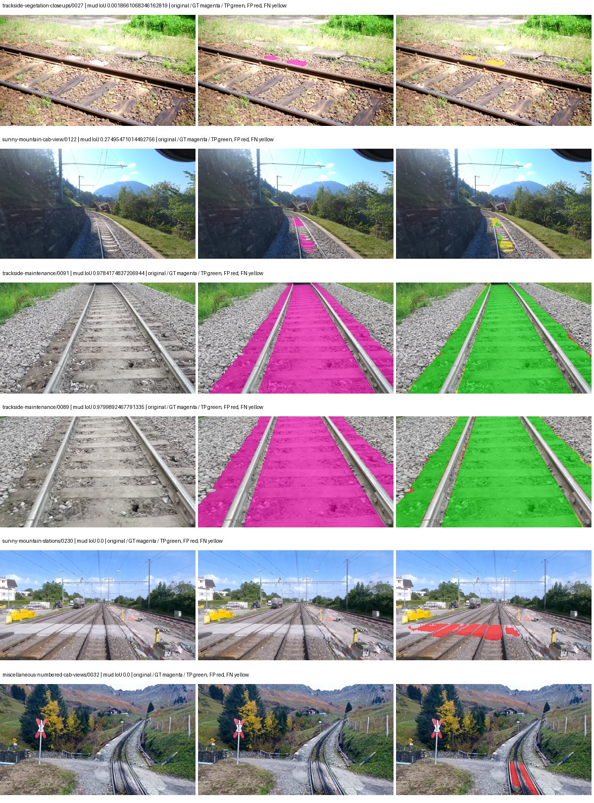
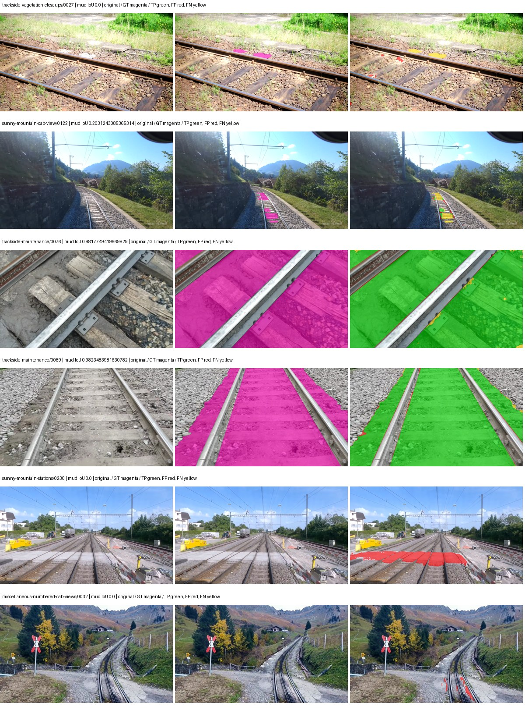
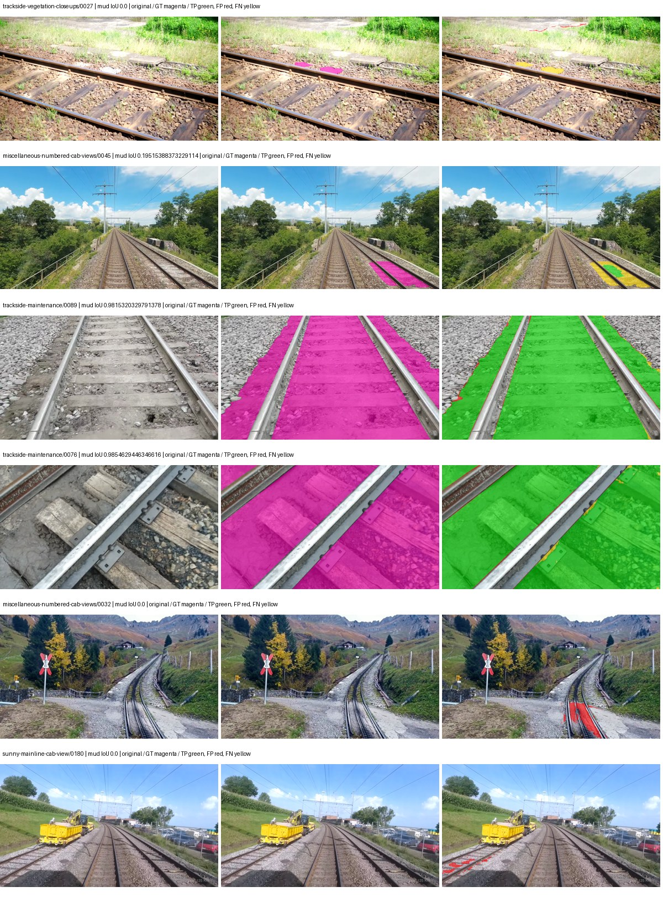
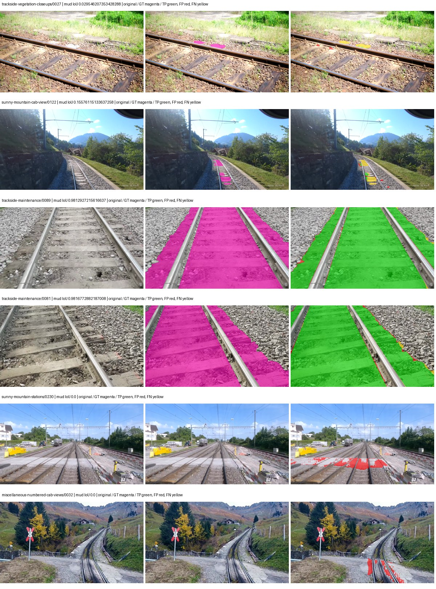

# eomt_large — rad_9_24_2026-paul

[RAD 9/24: Paul's split](../../README.md) · [Full model records](record.json)

Primary selection and early stopping: **mud-pumping validation IoU**. A job is complete only after full statistics and isolated profiling are verified.

| Model | Initialization path | Seed | Status | Steps | Best step | Mud IoU (%) | Mud precision (%) | Mud recall (%) | Final mud IoU (trainer val, %) | mIoU (%) | Fixed GT-class mIoU (%) |
| --- | --- | --- | --- | --- | --- | --- | --- | --- | --- | --- | --- |
| eomt_large | rtis_only | 0 | completed | 3185 | 3185 | 92.45 | 96.68 | 95.49 | 92.46 | 70.34 | 70.34 |
| eomt_large | cityscapes_to_rtis | 0 | completed | 3451 | 2123 | 92.67 | 96.41 | 95.99 | 92.61 | 70.96 | 70.96 |
| eomt_large | railsem19_to_rtis | 0 | completed | 4000 | 3981 | 94.97 | 97.83 | 97.02 | 94.98 | 72.83 | 72.83 |
| eomt_large | cityscapes_to_railsem19_to_rtis | 0 | completed | 4000 | 3981 | 93.50 | 97.03 | 96.25 | 93.50 | 72.23 | 72.23 |

Training: 227 images. Validation: 37 images. Test: 50 held out. Seeds: [0]. Seed variation measures optimization variability, not independent-recording uncertainty. Historical source checkpoints stay fixed across adaptation seeds.

Training code: `d864b72bd90706260965bb1a48398d01167b6d5c`. Split SHA-256: `b16dbbc7c4aa0c5d6e0fb5a20a27b4f3f8a4f3ce535621ed7c9aeaa6e85adb77`.

## rtis_only — seed 0

Status: **completed**. Started: 2026-10-05T03:41:56.297852+00:00. Finished: 2026-10-05T05:04:53.069334+00:00.

Recipe pretrained initializer: `tue-mps/coco_panoptic_eomt_large_640 (DINOv2-based ViT-L, COCO panoptic)`.

`rtis_only` uses the recipe initializer, which may include pretrained segmentation components. Transfer paths load the exact historical source checkpoint below and reset the classifier; they do not reset all query/decoder features.

Source checkpoint: `Recipe pretrained initialization`.

Config SHA-256: `d20f346e93127108d1fcc420a73223bc18d43ce4bb2fe2f21c49c2ef9518a3fd`. Weights used for validation: `ema`.

### Mud-pumping and aggregate quality

| Metric | Selected checkpoint | Final training validation |
| --- | --- | --- |
| Mud IoU | 92.45 | 92.46 |
| Mud precision | 96.68 | 96.68 |
| Mud recall | 95.49 | 95.49 |
| Mud Dice/F1 | 96.08 | 96.08 |
| mIoU | 70.34 | 70.34 |
| Mean accuracy | 81.46 | 81.46 |
| Mean precision | 82.07 | 82.07 |
| Mean Dice | 80.98 | 80.98 |
| Mean specificity | 99.56 | 99.56 |
| Pixel accuracy | 91.98 | 91.97 |
| Frequency-weighted IoU | 85.91 | 85.91 |
| Fixed GT-present class mIoU | 70.34 | 70.34 |
| Boundary F1 | 77.96 | 78.04 |

The selected checkpoint has independent evaluation evidence. Final values are the trainer's final validation record, not a new independent evaluation. mIoU averages classes with nonzero union, so false positives on absent classes can change its denominator. The fixed GT-class mean is supplementary and excludes absent classes; their false positives remain in the confusion matrix.

### Resource usage and timing

| Measurement | Value |
| --- | --- |
| Peak training VRAM, retained training invocation (GiB) | 17.70 |
| Peak evaluation VRAM (GiB) | 10.80 |
| Retained training invocation wall time (seconds) | 4671.79 |
| Retained training invocation GPU-hours (one GPU) | 1.30 |
| Evaluation wall time (seconds) | 21.77 |
| Full evaluation pipeline images/second | 1.70 |
| Best full-state checkpoint (MiB) | 4831.36 |
| Final full-state checkpoint (MiB) | 4831.34 |
| Verified periodic checkpoints removed (GiB) | 28.31 |

VRAM uses the recorded allocator high-water mark; it is not total device usage including CUDA context. Resumed jobs' retained training invocation times and peaks are **not whole-campaign totals**. Earlier invocation resource records are not reconstructed here. Evaluation throughput includes loader, sliding-window inference and metrics; it is not model-only latency/FPS. Missing measurements are shown as —, never inferred from another dataset's run.

### Standardized inference performance

Dedicated model-only profiling waits for an idle worker-locked L40S: BF16, batch 1, 1024x1024, 20 warmup and 100 CUDA-event-timed public forwards. It excludes loading, preprocessing, tiling and metrics.

| Status | Parameters | Weight MiB | FPS | p50 ms | p95 ms | Peak reserved GiB |
| --- | --- | --- | --- | --- | --- | --- |
| complete | 316580886 | 1207.66 | 45.09 | 22.07 | 23.00 | 3.12 |

```json
{
  "schema_version": 1,
  "model_id": "eomt_large",
  "measured_at": "2026-10-05T05:04:17+00:00",
  "status": "complete",
  "benchmark_scope": "rtis_selected_checkpoint_model_only",
  "applies_to": [
    "eomt_large--rtis_only--seed-0"
  ],
  "source": {
    "campaign_git_sha": "d864b72bd90706260965bb1a48398d01167b6d5c",
    "git_dirty": false,
    "config_hash": "2e3dc31b7471",
    "resolved_config": "/data/izadia1/projects/segmentary-runs/rad_9_24_2026/paul-seed0-20261005-r2/configs/eomt_large--rtis_only--seed-0.yaml",
    "config_sha256": "d20f346e93127108d1fcc420a73223bc18d43ce4bb2fe2f21c49c2ef9518a3fd",
    "checkpoint_sha256": "017a4a084907674c177f2da4839206a40c01487c6c249994b2d1d429790f08f3",
    "checkpoint_global_step": 3185,
    "checkpoint_bytes": 5066052409,
    "checkpoint_kind": "resume checkpoint with optimizer and EMA state",
    "weights": "ema",
    "measured_checkpoint_job_id": "eomt_large--rtis_only--seed-0",
    "result_sha256": "b89bc2db69e0ab5517cfda2d412ccd1e3256ce37287aa231912a547dcffbc0e2",
    "result_git_sha": "d864b72bd90706260965bb1a48398d01167b6d5c",
    "result_stage": "eval:rad_9_24_2026-paul:val",
    "result_seed": 0
  },
  "hardware": {
    "gpu_name": "NVIDIA L40S",
    "gpu_uuid": "GPU-804aea8b-5f62-423e-72c6-49e1ed15c4e4",
    "logical_device": "cuda:0",
    "physical_visibility_token": "6",
    "compute_capability": [
      8,
      9
    ],
    "total_memory_bytes": 47677177856
  },
  "model": {
    "parameter_count": 316580886,
    "trainable_parameter_count": 316580886,
    "resident_parameter_bytes": 1266323544,
    "parameter_dtype_counts": {
      "float32": 316580886
    }
  },
  "contract": {
    "backend": "pytorch",
    "precision": "bf16_autocast",
    "batch_size": 1,
    "input_shape_nchw": [
      1,
      3,
      1024,
      1024
    ],
    "warmup_iterations": 20,
    "measured_iterations": 100,
    "timing": "per-forward CUDA events with end-event synchronization",
    "includes_preprocessing": false,
    "includes_data_loader": false,
    "includes_sliding_window": false,
    "input_resident_on_gpu": true,
    "model_only": true,
    "entrypoint": "public model(image) dense-logits forward"
  },
  "measurements": {
    "latency": {
      "p50_ms": 22.06515121459961,
      "p95_ms": 22.998527145385744,
      "mean_ms": 22.176818466186525,
      "minimum_ms": 21.977088928222656,
      "maximum_ms": 24.264671325683594,
      "fps": 45.09213084486044,
      "raw_ms": [
        22.07539176940918,
        22.032384872436523,
        22.036479949951172,
        22.02521514892578,
        22.06515121459961,
        22.010879516601562,
        21.988351821899414,
        22.031360626220703,
        22.046720504760742,
        22.10201644897461,
        21.996543884277344,
        22.10304069519043,
        22.029312133789062,
        22.129663467407227,
        22.848512649536133,
        22.0631046295166,
        22.001663208007812,
        22.03545570373535,
        22.038528442382812,
        22.06822395324707,
        22.09174346923828,
        21.984256744384766,
        22.05695915222168,
        22.07027244567871,
        22.09996795654297,
        22.125568389892578,
        23.617536544799805,
        22.122495651245117,
        22.002687454223633,
        22.04979133605957,
        21.977088928222656,
        22.06719970703125,
        21.988351821899414,
        22.020095825195312,
        22.06515121459961,
        22.06515121459961,
        22.04979133605957,
        22.002687454223633,
        22.028287887573242,
        21.993471145629883,
        22.04159927368164,
        22.030336380004883,
        22.037504196166992,
        22.018047332763672,
        24.264671325683594,
        22.029312133789062,
        22.04979133605957,
        22.03545570373535,
        22.028287887573242,
        22.07539176940918,
        22.05286407470703,
        22.05081558227539,
        22.076416015625,
        21.994495391845703,
        22.129663467407227,
        22.11840057373047,
        22.2607364654541,
        22.29043197631836,
        22.169599533081055,
        23.783424377441406,
        22.145023345947266,
        22.07334327697754,
        22.02521514892578,
        22.07436752319336,
        22.09996795654297,
        22.047744750976562,
        22.004735946655273,
        22.045696258544922,
        22.05388832092285,
        22.06003189086914,
        22.076416015625,
        22.09075164794922,
        22.06719970703125,
        22.018047332763672,
        23.443456649780273,
        22.181888580322266,
        22.28121566772461,
        22.037504196166992,
        22.064128875732422,
        22.358015060424805,
        22.0948486328125,
        22.10201644897461,
        22.185983657836914,
        23.10553550720215,
        22.992895126342773,
        22.443008422851562,
        22.088703155517578,
        22.199296951293945,
        22.709247589111328,
        22.116352081298828,
        22.06208038330078,
        22.030336380004883,
        22.08255958557129,
        22.007808685302734,
        22.120447158813477,
        22.113279342651367,
        22.020095825195312,
        22.0948486328125,
        22.018047332763672,
        22.10201644897461
      ],
      "percentile_method": "numpy linear interpolation"
    },
    "peak_reserved_bytes": 3351248896,
    "memory_kind": "pytorch_cuda_allocator_peak_reserved_excluding_context",
    "benchmark_wall_clock_s": 3.2417017593979836
  },
  "started_at": "2026-10-05T05:04:14+00:00",
  "finished_at": "2026-10-05T05:04:17+00:00",
  "environment": {
    "hostname": "hdrfs-app-001",
    "python": "3.11.15",
    "platform": "Linux-5.15.0-139-generic-x86_64-with-glibc2.35",
    "torch": "2.11.0+cu128",
    "torch_cuda": "12.8",
    "cudnn": 91900,
    "driver_version": "570.133.20",
    "cuda_available": true,
    "gpu_count": 1,
    "gpu_names": [
      "NVIDIA L40S"
    ],
    "cuda_visible_devices": "6",
    "packages": {
      "segmentary": "0.1.0",
      "torch": "2.11.0+cu128",
      "torchvision": "0.26.0+cu128",
      "transformers": "5.15.0",
      "timm": "1.0.28",
      "segmentation-models-pytorch": "0.5.0",
      "albumentations": "2.0.8",
      "lightning": "2.6.5",
      "numpy": "2.4.4"
    }
  }
}
```

### Per-class validation results

| Class | GT pixels | IoU (%) | Precision (%) | Recall (%) | Dice (%) | Boundary F1 (%) |
| --- | --- | --- | --- | --- | --- | --- |
| car | 75932 | 48.95 | 52.43 | 88.06 | 65.73 | 83.67 |
| construction | 5694760 | 59.28 | 72.55 | 76.42 | 74.44 | 72.80 |
| fence | 3789415 | 52.72 | 92.00 | 55.25 | 69.04 | 68.45 |
| mud-pumping | 7435760 | 92.45 | 96.68 | 95.49 | 96.08 | 78.01 |
| on-rails | 1137952 | 94.78 | 96.07 | 98.60 | 97.32 | 85.84 |
| person | 130659 | 82.89 | 88.10 | 93.35 | 90.65 | 84.19 |
| pole | 1467743 | 65.14 | 72.51 | 86.50 | 78.89 | 85.53 |
| rail-embedded | 74744 | 37.62 | 71.34 | 44.32 | 54.67 | 83.08 |
| rail-raised | 3588713 | 85.08 | 91.29 | 92.60 | 91.94 | 95.97 |
| rail-track | 4270276 | 77.84 | 86.87 | 88.21 | 87.54 | 82.85 |
| road | 1152119 | 76.99 | 87.90 | 86.12 | 87.00 | 74.88 |
| sidewalk | 2164731 | 79.12 | 87.49 | 89.21 | 88.34 | 78.02 |
| sky | 20207617 | 97.94 | 99.24 | 98.69 | 98.96 | 95.78 |
| standing-water | 2006046 | 82.94 | 89.19 | 92.20 | 90.67 | 43.64 |
| terrain | 30442090 | 90.77 | 94.31 | 96.02 | 95.16 | 85.78 |
| trackbed | 9118591 | 85.24 | 91.04 | 93.05 | 92.03 | 86.84 |
| traffic-light | 116825 | 51.29 | 68.87 | 66.77 | 67.80 | 78.21 |
| traffic-sign | 35778 | 40.08 | 59.57 | 55.05 | 57.22 | 60.97 |
| tram-track | 244726 | 37.33 | 70.09 | 44.41 | 54.37 | 57.21 |
| truck | 190997 | 80.14 | 86.32 | 91.80 | 88.97 | 78.61 |
| vegetation-overgrowth | 1534858 | 58.46 | 69.60 | 78.51 | 73.79 | 76.84 |

### Full-run accounting

| Measurement | Value |
| --- | --- |
| Full GPU-reserved wall seconds, all recorded worker attempts | 4988.38 |
| Full reserved GPU-hours | 1.39 |
| Whole-run timing complete | True |

| Phase | Wall seconds including failed attempts |
| --- | --- |
| training | 4679.03 |
| diagnostics | 201.48 |
| performance | 20.31 |

GPU-reserved time includes model loading, training, validation, collection, profiling, checkpoint I/O and orchestration while the worker owns one GPU. It is not GPU kernel-active time. Phase timings and sampled device memory/power/utilization are retained separately; sampled device memory is not the allocator high-water mark.

### Train/validation and raw/EMA diagnostics

| Checkpoint / weights / split | Images | Mud IoU (%) | Mud precision (%) | Mud recall (%) |
| --- | --- | --- | --- | --- |
| best-auto-train / ema | 227 | 95.58 | 98.12 | 97.37 |
| best-auto-val / ema | 37 | 92.45 | 96.68 | 95.49 |
| best-alternate-val / raw | 37 | 93.94 | 97.36 | 96.40 |
| final-auto-val / ema | 37 | 92.45 | 96.68 | 95.49 |

Train uses the evaluation transform without augmentation. Compare mud train/validation metrics for the same selected weights. Alternate EMA on running-stat BatchNorm is explicitly uncalibrated and is diagnostic only. Score-threshold curves use uncalibrated normalized scores and are pixel-level diagnostics, not event detection rates or a selected deployment operating point.

### Downloadable evidence

- best-auto-train: [per-image.csv](rtis_only--seed-0/best-auto-train/per-image.csv) · [per-image-confusion.json.gz](rtis_only--seed-0/best-auto-train/per-image-confusion.json.gz) · [groups.json](rtis_only--seed-0/best-auto-train/groups.json) · [mud-score-curves.json](rtis_only--seed-0/best-auto-train/mud-score-curves.json)
- best-auto-val: [per-image.csv](rtis_only--seed-0/best-auto-val/per-image.csv) · [per-image-confusion.json.gz](rtis_only--seed-0/best-auto-val/per-image-confusion.json.gz) · [groups.json](rtis_only--seed-0/best-auto-val/groups.json) · [mud-score-curves.json](rtis_only--seed-0/best-auto-val/mud-score-curves.json) · [examples.jpg](rtis_only--seed-0/best-auto-val/examples.jpg)
- best-alternate-val: [per-image.csv](rtis_only--seed-0/best-alternate-val/per-image.csv) · [per-image-confusion.json.gz](rtis_only--seed-0/best-alternate-val/per-image-confusion.json.gz) · [groups.json](rtis_only--seed-0/best-alternate-val/groups.json) · [mud-score-curves.json](rtis_only--seed-0/best-alternate-val/mud-score-curves.json)
- final-auto-val: [per-image.csv](rtis_only--seed-0/final-auto-val/per-image.csv) · [per-image-confusion.json.gz](rtis_only--seed-0/final-auto-val/per-image-confusion.json.gz) · [groups.json](rtis_only--seed-0/final-auto-val/groups.json) · [mud-score-curves.json](rtis_only--seed-0/final-auto-val/mud-score-curves.json)
- resources: [telemetry.csv](rtis_only--seed-0/resources/telemetry.csv)



Examples are two lowest and two highest mud-IoU positive images, plus up to two negative images with the most false-positive mud pixels. They are targeted diagnostic examples, not random samples. Green: true positive; red: false positive; yellow: false negative. Full predictions remain on HDRFS.

### Validation tracking

| Logged step | Overall mIoU (%) | Mud IoU (%) |
| --- | --- | --- |
| 264 | 27.61 | 58.91 |
| 530 | 60.20 | 83.91 |
| 796 | 66.91 | 89.90 |
| 1061 | 68.65 | 90.75 |
| 1326 | 69.49 | 91.55 |
| 1592 | 69.99 | 92.16 |
| 1857 | 69.95 | 92.39 |
| 2123 | 70.24 | 92.36 |
| 2389 | 70.26 | 92.39 |
| 2653 | 70.28 | 92.39 |
| 2919 | 70.33 | 92.42 |
| 3185 | 70.34 | 92.46 |

All retained scalar curves, including training loss and per-class IoU, are in record.json. Observed best mud on a curve is not necessarily a retained checkpoint: the pilot saved its selection-metric-best and final checkpoints. Step logging and checkpoint global_step may differ by one.

### Stopping and checkpoint provenance

```json
{
  "stopping": {
    "actual_steps": 3185,
    "maximum_steps": 4000,
    "min_delta": 0.001,
    "monitor": "val_iou/mud-pumping",
    "patience": 5,
    "reason": "validation_plateau"
  },
  "checkpoints": {
    "best": {
      "path": "/data/izadia1/projects/segmentary-runs/rad_9_24_2026/paul-seed0-20261005-r2/future-runs/eomt_large--rtis_only--seed-0_seed0/rtis/best.ckpt",
      "sha256": "017a4a084907674c177f2da4839206a40c01487c6c249994b2d1d429790f08f3",
      "global_step": 3185,
      "bytes": 5066052409
    },
    "final": {
      "path": "/data/izadia1/projects/segmentary-runs/rad_9_24_2026/paul-seed0-20261005-r2/future-runs/eomt_large--rtis_only--seed-0_seed0/rtis/last.ckpt",
      "sha256": "f9370621e993b2909e93fadc91f0bf683a1f4a19419b3cc4d96c882396a9130b",
      "global_step": 3185,
      "bytes": 5066030393
    }
  },
  "cleanup_error": null
}
```

### Resolved training, initialization and evaluation settings

The optimizer block is the base configuration. Stage LR scales are applied at runtime, and stage warmup is capped at min(base warmup, floor(stage budget / 10), stage budget - 1): 400 steps for this 4,000-step pilot. Model-internal native input grids may differ from augmentation crops (EoMT uses its 640 grid).

```json
{
  "name": "eomt_large--rtis_only--seed-0",
  "model": {
    "arch": "eomt_large",
    "checkpoint": null,
    "tuning": "full",
    "head": "unified_head",
    "lora_r": 16,
    "lora_alpha": 32,
    "lora_dropout": 0.05,
    "lora_targets": [],
    "drop_path": null,
    "revision": null,
    "subfolder": null,
    "local_files_only": false,
    "trust_remote_code": false,
    "backbone_path": null,
    "head_paths": [],
    "classifier_path": null,
    "inactive_parameter_paths": [],
    "smp_arch": null,
    "encoder_name": null,
    "encoder_weights": null,
    "native": null,
    "batch_norm_momentum": null
  },
  "space": "paul-test-rtis",
  "taxonomy_root": "/data/izadia1/projects/segmentary-rad-d864b72b/taxonomy",
  "output_root": "/data/izadia1/projects/segmentary-runs/rad_9_24_2026/paul-seed0-20261005-r2/future-runs",
  "optim": {
    "backbone_lr": 1e-05,
    "head_lr_mult": 10.0,
    "weight_decay": 0.05,
    "llrd": 0.75,
    "warmup_iters": 1500,
    "warmup_ratio": 1e-06,
    "poly_power": 0.9,
    "min_lr_ratio": 0.0,
    "betas": [
      0.9,
      0.999
    ],
    "grad_clip": 1.0
  },
  "train": {
    "iters": 4000,
    "batch_size": 2,
    "accum": 8,
    "num_workers": 2,
    "precision": "bf16-mixed",
    "ema_decay": 0.9998,
    "val_every": 250,
    "ckpt_every": 500,
    "selection_metric": "val_iou/mud-pumping",
    "early_stopping_patience": 5,
    "early_stopping_min_delta": 0.001,
    "seed": 0,
    "devices": 1
  },
  "eval": {
    "sliding_window": true,
    "window": [
      1024,
      1024
    ],
    "stride": [
      768,
      768
    ],
    "batch_size": 1,
    "num_workers": 2,
    "tta_scales": [],
    "tta_flip": false,
    "threshold": 0.5,
    "boundary_tolerance_frac": 0.0075,
    "save_confusion": true
  },
  "loss": {
    "task": "multiclass",
    "activation": "auto",
    "terms": [],
    "aux": "none",
    "aux_weight": 0.0,
    "ce_weight": 1.0,
    "label_smoothing": 0.0,
    "class_weights": null,
    "query": {
      "kind": "hungarian_query",
      "classification_weight": 2.0,
      "mask_bce_weight": 5.0,
      "dice_weight": 5.0,
      "no_object_coefficient": 0.1,
      "match_class_cost": 2.0,
      "match_mask_bce_cost": 5.0,
      "match_dice_cost": 5.0,
      "matching_num_points": 8192,
      "auxiliary_layer_weight": 1.0,
      "dice_smooth": 1.0
    }
  },
  "aug": {
    "crop": [
      1024,
      1024
    ],
    "scale_min": 0.5,
    "scale_max": 2.0,
    "hflip_p": 0.5,
    "color_jitter_p": 0.5,
    "brightness": 0.25,
    "contrast": 0.25,
    "saturation": 0.25,
    "hue": 0.05
  },
  "stages": [
    {
      "name": "rtis",
      "data": [
        {
          "name": "rad_9_24_2026-paul",
          "root": "/data/izadia1/datasets/rad_9_24_2026-paul",
          "variant": null,
          "split_file": "splits.json",
          "train_split": "train",
          "val_split": "val",
          "limit": null,
          "loader": "folder",
          "mapping": "paul-test-rtis",
          "loader_options": {
            "require_groups": false
          }
        }
      ],
      "iters": null,
      "lr_scale": 1.0,
      "head_group_lr_scale": 1.0,
      "init_from": "pretrained",
      "reset_head": false,
      "freeze": null,
      "sample_weights": null
    }
  ]
}
```

### Hardware and software provenance

```json
{
  "training": {
    "cuda_available": true,
    "cuda_visible_devices": "6",
    "cudnn": 91900,
    "driver_version": "570.133.20",
    "gpu_count": 1,
    "gpu_names": [
      "NVIDIA L40S"
    ],
    "hostname": "hdrfs-app-001",
    "input_normalization": {
      "channel_order": "rgb",
      "mean": [
        0.485,
        0.456,
        0.406
      ],
      "source": "imagenet",
      "std": [
        0.229,
        0.224,
        0.225
      ]
    },
    "model_origins": [
      {
        "hf_commit": "dcd130bed9b1ebda7041fd660fddb16f905b9c3b",
        "hf_name_or_path": "tue-mps/coco_panoptic_eomt_large_640",
        "module": "model",
        "timm_pretrained": {}
      },
      {
        "hf_commit": "dcd130bed9b1ebda7041fd660fddb16f905b9c3b",
        "hf_name_or_path": "tue-mps/coco_panoptic_eomt_large_640",
        "module": "model.embeddings",
        "timm_pretrained": {}
      },
      {
        "hf_commit": "dcd130bed9b1ebda7041fd660fddb16f905b9c3b",
        "hf_name_or_path": "tue-mps/coco_panoptic_eomt_large_640",
        "module": "model.layers.0.attention",
        "timm_pretrained": {}
      },
      {
        "hf_commit": "dcd130bed9b1ebda7041fd660fddb16f905b9c3b",
        "hf_name_or_path": "tue-mps/coco_panoptic_eomt_large_640",
        "module": "model.layers.1.attention",
        "timm_pretrained": {}
      },
      {
        "hf_commit": "dcd130bed9b1ebda7041fd660fddb16f905b9c3b",
        "hf_name_or_path": "tue-mps/coco_panoptic_eomt_large_640",
        "module": "model.layers.2.attention",
        "timm_pretrained": {}
      },
      {
        "hf_commit": "dcd130bed9b1ebda7041fd660fddb16f905b9c3b",
        "hf_name_or_path": "tue-mps/coco_panoptic_eomt_large_640",
        "module": "model.layers.3.attention",
        "timm_pretrained": {}
      },
      {
        "hf_commit": "dcd130bed9b1ebda7041fd660fddb16f905b9c3b",
        "hf_name_or_path": "tue-mps/coco_panoptic_eomt_large_640",
        "module": "model.layers.4.attention",
        "timm_pretrained": {}
      },
      {
        "hf_commit": "dcd130bed9b1ebda7041fd660fddb16f905b9c3b",
        "hf_name_or_path": "tue-mps/coco_panoptic_eomt_large_640",
        "module": "model.layers.5.attention",
        "timm_pretrained": {}
      },
      {
        "hf_commit": "dcd130bed9b1ebda7041fd660fddb16f905b9c3b",
        "hf_name_or_path": "tue-mps/coco_panoptic_eomt_large_640",
        "module": "model.layers.6.attention",
        "timm_pretrained": {}
      },
      {
        "hf_commit": "dcd130bed9b1ebda7041fd660fddb16f905b9c3b",
        "hf_name_or_path": "tue-mps/coco_panoptic_eomt_large_640",
        "module": "model.layers.7.attention",
        "timm_pretrained": {}
      },
      {
        "hf_commit": "dcd130bed9b1ebda7041fd660fddb16f905b9c3b",
        "hf_name_or_path": "tue-mps/coco_panoptic_eomt_large_640",
        "module": "model.layers.8.attention",
        "timm_pretrained": {}
      },
      {
        "hf_commit": "dcd130bed9b1ebda7041fd660fddb16f905b9c3b",
        "hf_name_or_path": "tue-mps/coco_panoptic_eomt_large_640",
        "module": "model.layers.9.attention",
        "timm_pretrained": {}
      },
      {
        "hf_commit": "dcd130bed9b1ebda7041fd660fddb16f905b9c3b",
        "hf_name_or_path": "tue-mps/coco_panoptic_eomt_large_640",
        "module": "model.layers.10.attention",
        "timm_pretrained": {}
      },
      {
        "hf_commit": "dcd130bed9b1ebda7041fd660fddb16f905b9c3b",
        "hf_name_or_path": "tue-mps/coco_panoptic_eomt_large_640",
        "module": "model.layers.11.attention",
        "timm_pretrained": {}
      },
      {
        "hf_commit": "dcd130bed9b1ebda7041fd660fddb16f905b9c3b",
        "hf_name_or_path": "tue-mps/coco_panoptic_eomt_large_640",
        "module": "model.layers.12.attention",
        "timm_pretrained": {}
      },
      {
        "hf_commit": "dcd130bed9b1ebda7041fd660fddb16f905b9c3b",
        "hf_name_or_path": "tue-mps/coco_panoptic_eomt_large_640",
        "module": "model.layers.13.attention",
        "timm_pretrained": {}
      },
      {
        "hf_commit": "dcd130bed9b1ebda7041fd660fddb16f905b9c3b",
        "hf_name_or_path": "tue-mps/coco_panoptic_eomt_large_640",
        "module": "model.layers.14.attention",
        "timm_pretrained": {}
      },
      {
        "hf_commit": "dcd130bed9b1ebda7041fd660fddb16f905b9c3b",
        "hf_name_or_path": "tue-mps/coco_panoptic_eomt_large_640",
        "module": "model.layers.15.attention",
        "timm_pretrained": {}
      },
      {
        "hf_commit": "dcd130bed9b1ebda7041fd660fddb16f905b9c3b",
        "hf_name_or_path": "tue-mps/coco_panoptic_eomt_large_640",
        "module": "model.layers.16.attention",
        "timm_pretrained": {}
      },
      {
        "hf_commit": "dcd130bed9b1ebda7041fd660fddb16f905b9c3b",
        "hf_name_or_path": "tue-mps/coco_panoptic_eomt_large_640",
        "module": "model.layers.17.attention",
        "timm_pretrained": {}
      },
      {
        "hf_commit": "dcd130bed9b1ebda7041fd660fddb16f905b9c3b",
        "hf_name_or_path": "tue-mps/coco_panoptic_eomt_large_640",
        "module": "model.layers.18.attention",
        "timm_pretrained": {}
      },
      {
        "hf_commit": "dcd130bed9b1ebda7041fd660fddb16f905b9c3b",
        "hf_name_or_path": "tue-mps/coco_panoptic_eomt_large_640",
        "module": "model.layers.19.attention",
        "timm_pretrained": {}
      },
      {
        "hf_commit": "dcd130bed9b1ebda7041fd660fddb16f905b9c3b",
        "hf_name_or_path": "tue-mps/coco_panoptic_eomt_large_640",
        "module": "model.layers.20.attention",
        "timm_pretrained": {}
      },
      {
        "hf_commit": "dcd130bed9b1ebda7041fd660fddb16f905b9c3b",
        "hf_name_or_path": "tue-mps/coco_panoptic_eomt_large_640",
        "module": "model.layers.21.attention",
        "timm_pretrained": {}
      },
      {
        "hf_commit": "dcd130bed9b1ebda7041fd660fddb16f905b9c3b",
        "hf_name_or_path": "tue-mps/coco_panoptic_eomt_large_640",
        "module": "model.layers.22.attention",
        "timm_pretrained": {}
      },
      {
        "hf_commit": "dcd130bed9b1ebda7041fd660fddb16f905b9c3b",
        "hf_name_or_path": "tue-mps/coco_panoptic_eomt_large_640",
        "module": "model.layers.23.attention",
        "timm_pretrained": {}
      }
    ],
    "model_parameter_count": 316580886,
    "packages": {
      "albumentations": "2.0.8",
      "lightning": "2.6.5",
      "numpy": "2.4.4",
      "segmentary": "0.1.0",
      "segmentation-models-pytorch": "0.5.0",
      "timm": "1.0.28",
      "torch": "2.11.0+cu128",
      "torchvision": "0.26.0+cu128",
      "transformers": "5.15.0"
    },
    "platform": "Linux-5.15.0-139-generic-x86_64-with-glibc2.35",
    "python": "3.11.15",
    "torch": "2.11.0+cu128",
    "torch_cuda": "12.8",
    "trainable_parameter_count": 316580886,
    "training_stop": {
      "actual_steps": 3185,
      "maximum_steps": 4000,
      "min_delta": 0.001,
      "monitor": "val_iou/mud-pumping",
      "patience": 5,
      "reason": "validation_plateau"
    },
    "validation_weights": "ema"
  },
  "evaluation": {
    "cuda_available": true,
    "cuda_visible_devices": "6",
    "cudnn": 91900,
    "driver_version": "570.133.20",
    "gpu_count": 1,
    "gpu_names": [
      "NVIDIA L40S"
    ],
    "hostname": "hdrfs-app-001",
    "input_normalization": {
      "channel_order": "rgb",
      "mean": [
        0.485,
        0.456,
        0.406
      ],
      "source": "imagenet",
      "std": [
        0.229,
        0.224,
        0.225
      ]
    },
    "packages": {
      "albumentations": "2.0.8",
      "lightning": "2.6.5",
      "numpy": "2.4.4",
      "segmentary": "0.1.0",
      "segmentation-models-pytorch": "0.5.0",
      "timm": "1.0.28",
      "torch": "2.11.0+cu128",
      "torchvision": "0.26.0+cu128",
      "transformers": "5.15.0"
    },
    "platform": "Linux-5.15.0-139-generic-x86_64-with-glibc2.35",
    "python": "3.11.15",
    "torch": "2.11.0+cu128",
    "torch_cuda": "12.8"
  }
}
```

## cityscapes_to_rtis — seed 0

Status: **completed**. Started: 2026-10-05T03:41:59.616990+00:00. Finished: 2026-10-05T05:10:51.248943+00:00.

Recipe pretrained initializer: `tue-mps/coco_panoptic_eomt_large_640 (DINOv2-based ViT-L, COCO panoptic)`.

`rtis_only` uses the recipe initializer, which may include pretrained segmentation components. Transfer paths load the exact historical source checkpoint below and reset the classifier; they do not reset all query/decoder features.

Source checkpoint: `{'name': 'eomt_large--cityscapes--seed-0', 'model': 'eomt_large', 'protocol': 'cityscapes', 'config': '/data/izadia1/projects/segmentary-runs/all-model-city-rail-seed0-rail20-b9eb3e1/accepted/eomt_large--cityscapes--seed-0/resolved-config.yaml', 'checkpoint': '/data/izadia1/projects/segmentary-runs/all-model-city-rail-seed0-a7c0b67/jobs/eomt_large--cityscapes--seed-0/attempt-001/train/eomt_large--cityscapes_seed0/cityscapes/last.ckpt', 'recorded_sha256': '2651e4743a617a9b4939dd5fbaaf4a643d7988f028adc18ac9d6027a084b7bdd', 'exists': True}`.

Config SHA-256: `fe5d91f7353a80b19eeaa86f52f118e07fda82c890600418861aeb9ebc1328a3`. Weights used for validation: `ema`.

### Mud-pumping and aggregate quality

| Metric | Selected checkpoint | Final training validation |
| --- | --- | --- |
| Mud IoU | 92.67 | 92.61 |
| Mud precision | 96.41 | 96.51 |
| Mud recall | 95.99 | 95.82 |
| Mud Dice/F1 | 96.20 | 96.16 |
| mIoU | 70.96 | 71.20 |
| Mean accuracy | 82.30 | 82.60 |
| Mean precision | 82.98 | 83.05 |
| Mean Dice | 81.80 | 82.04 |
| Mean specificity | 99.56 | 99.56 |
| Pixel accuracy | 91.94 | 91.94 |
| Frequency-weighted IoU | 85.82 | 85.83 |
| Fixed GT-present class mIoU | 70.96 | 71.20 |
| Boundary F1 | 74.21 | 74.08 |

The selected checkpoint has independent evaluation evidence. Final values are the trainer's final validation record, not a new independent evaluation. mIoU averages classes with nonzero union, so false positives on absent classes can change its denominator. The fixed GT-class mean is supplementary and excludes absent classes; their false positives remain in the confusion matrix.

### Resource usage and timing

| Measurement | Value |
| --- | --- |
| Peak training VRAM, retained training invocation (GiB) | 17.70 |
| Peak evaluation VRAM (GiB) | 10.80 |
| Retained training invocation wall time (seconds) | 5028.03 |
| Retained training invocation GPU-hours (one GPU) | 1.40 |
| Evaluation wall time (seconds) | 21.84 |
| Full evaluation pipeline images/second | 1.69 |
| Best full-state checkpoint (MiB) | 4831.36 |
| Final full-state checkpoint (MiB) | 4831.34 |
| Verified periodic checkpoints removed (GiB) | 28.31 |

VRAM uses the recorded allocator high-water mark; it is not total device usage including CUDA context. Resumed jobs' retained training invocation times and peaks are **not whole-campaign totals**. Earlier invocation resource records are not reconstructed here. Evaluation throughput includes loader, sliding-window inference and metrics; it is not model-only latency/FPS. Missing measurements are shown as —, never inferred from another dataset's run.

### Standardized inference performance

Dedicated model-only profiling waits for an idle worker-locked L40S: BF16, batch 1, 1024x1024, 20 warmup and 100 CUDA-event-timed public forwards. It excludes loading, preprocessing, tiling and metrics.

| Status | Parameters | Weight MiB | FPS | p50 ms | p95 ms | Peak reserved GiB |
| --- | --- | --- | --- | --- | --- | --- |
| complete | 316580886 | 1207.66 | 45.87 | 21.77 | 21.83 | 3.12 |

```json
{
  "schema_version": 1,
  "model_id": "eomt_large",
  "measured_at": "2026-10-05T05:10:17+00:00",
  "status": "complete",
  "benchmark_scope": "rtis_selected_checkpoint_model_only",
  "applies_to": [
    "eomt_large--cityscapes_to_rtis--seed-0"
  ],
  "source": {
    "campaign_git_sha": "d864b72bd90706260965bb1a48398d01167b6d5c",
    "git_dirty": false,
    "config_hash": "0c95f6c2c667",
    "resolved_config": "/data/izadia1/projects/segmentary-runs/rad_9_24_2026/paul-seed0-20261005-r2/configs/eomt_large--cityscapes_to_rtis--seed-0.yaml",
    "config_sha256": "fe5d91f7353a80b19eeaa86f52f118e07fda82c890600418861aeb9ebc1328a3",
    "checkpoint_sha256": "1d4786fd7ea9947f71a7a959912726df62b5bec90c487e13cb843d5ed9ce77c8",
    "checkpoint_global_step": 2123,
    "checkpoint_bytes": 5066052281,
    "checkpoint_kind": "resume checkpoint with optimizer and EMA state",
    "weights": "ema",
    "measured_checkpoint_job_id": "eomt_large--cityscapes_to_rtis--seed-0",
    "result_sha256": "4f1f7b271b400261141b26b45ad00f47b114f31ca76ed514a2b189e8d0db1c90",
    "result_git_sha": "d864b72bd90706260965bb1a48398d01167b6d5c",
    "result_stage": "eval:rad_9_24_2026-paul:val",
    "result_seed": 0
  },
  "hardware": {
    "gpu_name": "NVIDIA L40S",
    "gpu_uuid": "GPU-a5ad49e5-0536-5229-ba8a-f8a902808f53",
    "logical_device": "cuda:0",
    "physical_visibility_token": "7",
    "compute_capability": [
      8,
      9
    ],
    "total_memory_bytes": 47677177856
  },
  "model": {
    "parameter_count": 316580886,
    "trainable_parameter_count": 316580886,
    "resident_parameter_bytes": 1266323544,
    "parameter_dtype_counts": {
      "float32": 316580886
    }
  },
  "contract": {
    "backend": "pytorch",
    "precision": "bf16_autocast",
    "batch_size": 1,
    "input_shape_nchw": [
      1,
      3,
      1024,
      1024
    ],
    "warmup_iterations": 20,
    "measured_iterations": 100,
    "timing": "per-forward CUDA events with end-event synchronization",
    "includes_preprocessing": false,
    "includes_data_loader": false,
    "includes_sliding_window": false,
    "input_resident_on_gpu": true,
    "model_only": true,
    "entrypoint": "public model(image) dense-logits forward"
  },
  "measurements": {
    "latency": {
      "p50_ms": 21.768192291259766,
      "p95_ms": 21.825741481781005,
      "mean_ms": 21.799443473815916,
      "minimum_ms": 21.69036865234375,
      "maximum_ms": 23.27961540222168,
      "fps": 45.87273070531069,
      "raw_ms": [
        21.779455184936523,
        21.764095306396484,
        21.733375549316406,
        21.787647247314453,
        21.757951736450195,
        21.758975982666016,
        21.750783920288086,
        23.27961540222168,
        21.709823608398438,
        21.696447372436523,
        21.774335861206055,
        21.75596809387207,
        21.730304718017578,
        21.794815063476562,
        21.785600662231445,
        21.760000228881836,
        21.777408599853516,
        21.804031372070312,
        21.710847854614258,
        21.801984786987305,
        21.786624908447266,
        21.750783920288086,
        21.816320419311523,
        21.768192291259766,
        21.738496780395508,
        21.801984786987305,
        21.825536727905273,
        21.740543365478516,
        21.732351303100586,
        21.736448287963867,
        21.769216537475586,
        21.792768478393555,
        21.742591857910156,
        21.742591857910156,
        21.792768478393555,
        21.750783920288086,
        21.75071907043457,
        21.767168045043945,
        21.784576416015625,
        21.72313690185547,
        21.747711181640625,
        21.741567611694336,
        21.829631805419922,
        21.771263122558594,
        21.790719985961914,
        21.798912048339844,
        21.795839309692383,
        21.727231979370117,
        21.70470428466797,
        21.796863555908203,
        21.742624282836914,
        21.772287368774414,
        21.793792724609375,
        21.811199188232422,
        21.733375549316406,
        21.774335861206055,
        21.745664596557617,
        21.69036865234375,
        21.746623992919922,
        21.768192291259766,
        21.776384353637695,
        21.771263122558594,
        21.789695739746094,
        21.810176849365234,
        21.773311614990234,
        21.748735427856445,
        21.758975982666016,
        21.752832412719727,
        21.760000228881836,
        21.812223434448242,
        21.807104110717773,
        21.760000228881836,
        21.774335861206055,
        21.735424041748047,
        21.718015670776367,
        21.778432846069336,
        21.813247680664062,
        21.785600662231445,
        21.781503677368164,
        21.730304718017578,
        21.779455184936523,
        22.24127960205078,
        21.779455184936523,
        21.751808166503906,
        21.746688842773438,
        21.81939125061035,
        21.758975982666016,
        21.763071060180664,
        21.766143798828125,
        21.813247680664062,
        21.755903244018555,
        21.767168045043945,
        21.772287368774414,
        21.84499168395996,
        21.816320419311523,
        21.766143798828125,
        22.957056045532227,
        21.791744232177734,
        21.737472534179688,
        21.768192291259766
      ],
      "percentile_method": "numpy linear interpolation"
    },
    "peak_reserved_bytes": 3351248896,
    "memory_kind": "pytorch_cuda_allocator_peak_reserved_excluding_context",
    "benchmark_wall_clock_s": 3.184928558766842
  },
  "started_at": "2026-10-05T05:10:14+00:00",
  "finished_at": "2026-10-05T05:10:17+00:00",
  "environment": {
    "hostname": "hdrfs-app-001",
    "python": "3.11.15",
    "platform": "Linux-5.15.0-139-generic-x86_64-with-glibc2.35",
    "torch": "2.11.0+cu128",
    "torch_cuda": "12.8",
    "cudnn": 91900,
    "driver_version": "570.133.20",
    "cuda_available": true,
    "gpu_count": 1,
    "gpu_names": [
      "NVIDIA L40S"
    ],
    "cuda_visible_devices": "7",
    "packages": {
      "segmentary": "0.1.0",
      "torch": "2.11.0+cu128",
      "torchvision": "0.26.0+cu128",
      "transformers": "5.15.0",
      "timm": "1.0.28",
      "segmentation-models-pytorch": "0.5.0",
      "albumentations": "2.0.8",
      "lightning": "2.6.5",
      "numpy": "2.4.4"
    }
  }
}
```

### Per-class validation results

| Class | GT pixels | IoU (%) | Precision (%) | Recall (%) | Dice (%) | Boundary F1 (%) |
| --- | --- | --- | --- | --- | --- | --- |
| car | 75932 | 72.51 | 79.74 | 88.87 | 84.06 | 89.38 |
| construction | 5694760 | 62.19 | 73.18 | 80.54 | 76.68 | 68.64 |
| fence | 3789415 | 54.90 | 91.55 | 57.82 | 70.88 | 67.44 |
| mud-pumping | 7435760 | 92.67 | 96.41 | 95.99 | 96.20 | 73.10 |
| on-rails | 1137952 | 88.09 | 96.31 | 91.16 | 93.67 | 77.09 |
| person | 130659 | 83.91 | 88.77 | 93.88 | 91.25 | 83.70 |
| pole | 1467743 | 69.86 | 77.48 | 87.66 | 82.25 | 89.60 |
| rail-embedded | 74744 | 32.00 | 65.78 | 38.39 | 48.49 | 54.74 |
| rail-raised | 3588713 | 84.61 | 90.73 | 92.62 | 91.67 | 94.57 |
| rail-track | 4270276 | 77.82 | 86.95 | 88.12 | 87.53 | 83.12 |
| road | 1152119 | 70.75 | 87.00 | 79.11 | 82.87 | 67.30 |
| sidewalk | 2164731 | 73.95 | 85.49 | 84.55 | 85.02 | 74.28 |
| sky | 20207617 | 97.88 | 99.21 | 98.64 | 98.93 | 96.14 |
| standing-water | 2006046 | 80.83 | 87.40 | 91.49 | 89.40 | 34.08 |
| terrain | 30442090 | 90.71 | 94.73 | 95.54 | 95.13 | 84.27 |
| trackbed | 9118591 | 84.86 | 90.28 | 93.40 | 91.81 | 83.95 |
| traffic-light | 116825 | 58.43 | 71.75 | 75.89 | 73.76 | 77.89 |
| traffic-sign | 35778 | 56.38 | 67.17 | 77.81 | 72.10 | 68.58 |
| tram-track | 244726 | 43.52 | 83.63 | 47.58 | 60.65 | 51.59 |
| truck | 190997 | 58.44 | 60.93 | 93.46 | 73.77 | 66.17 |
| vegetation-overgrowth | 1534858 | 55.89 | 68.07 | 75.75 | 71.71 | 72.74 |

### Full-run accounting

| Measurement | Value |
| --- | --- |
| Full GPU-reserved wall seconds, all recorded worker attempts | 5346.41 |
| Full reserved GPU-hours | 1.49 |
| Whole-run timing complete | True |

| Phase | Wall seconds including failed attempts |
| --- | --- |
| training | 5038.16 |
| diagnostics | 200.23 |
| performance | 19.99 |

GPU-reserved time includes model loading, training, validation, collection, profiling, checkpoint I/O and orchestration while the worker owns one GPU. It is not GPU kernel-active time. Phase timings and sampled device memory/power/utilization are retained separately; sampled device memory is not the allocator high-water mark.

### Train/validation and raw/EMA diagnostics

| Checkpoint / weights / split | Images | Mud IoU (%) | Mud precision (%) | Mud recall (%) |
| --- | --- | --- | --- | --- |
| best-auto-train / ema | 227 | 94.37 | 97.38 | 96.83 |
| best-auto-val / ema | 37 | 92.67 | 96.41 | 95.99 |
| best-alternate-val / raw | 37 | 92.70 | 96.78 | 95.65 |
| final-auto-val / ema | 37 | 92.61 | 96.51 | 95.82 |

Train uses the evaluation transform without augmentation. Compare mud train/validation metrics for the same selected weights. Alternate EMA on running-stat BatchNorm is explicitly uncalibrated and is diagnostic only. Score-threshold curves use uncalibrated normalized scores and are pixel-level diagnostics, not event detection rates or a selected deployment operating point.

### Downloadable evidence

- best-auto-train: [per-image.csv](cityscapes_to_rtis--seed-0/best-auto-train/per-image.csv) · [per-image-confusion.json.gz](cityscapes_to_rtis--seed-0/best-auto-train/per-image-confusion.json.gz) · [groups.json](cityscapes_to_rtis--seed-0/best-auto-train/groups.json) · [mud-score-curves.json](cityscapes_to_rtis--seed-0/best-auto-train/mud-score-curves.json)
- best-auto-val: [per-image.csv](cityscapes_to_rtis--seed-0/best-auto-val/per-image.csv) · [per-image-confusion.json.gz](cityscapes_to_rtis--seed-0/best-auto-val/per-image-confusion.json.gz) · [groups.json](cityscapes_to_rtis--seed-0/best-auto-val/groups.json) · [mud-score-curves.json](cityscapes_to_rtis--seed-0/best-auto-val/mud-score-curves.json) · [examples.jpg](cityscapes_to_rtis--seed-0/best-auto-val/examples.jpg)
- best-alternate-val: [per-image.csv](cityscapes_to_rtis--seed-0/best-alternate-val/per-image.csv) · [per-image-confusion.json.gz](cityscapes_to_rtis--seed-0/best-alternate-val/per-image-confusion.json.gz) · [groups.json](cityscapes_to_rtis--seed-0/best-alternate-val/groups.json) · [mud-score-curves.json](cityscapes_to_rtis--seed-0/best-alternate-val/mud-score-curves.json)
- final-auto-val: [per-image.csv](cityscapes_to_rtis--seed-0/final-auto-val/per-image.csv) · [per-image-confusion.json.gz](cityscapes_to_rtis--seed-0/final-auto-val/per-image-confusion.json.gz) · [groups.json](cityscapes_to_rtis--seed-0/final-auto-val/groups.json) · [mud-score-curves.json](cityscapes_to_rtis--seed-0/final-auto-val/mud-score-curves.json)
- resources: [telemetry.csv](cityscapes_to_rtis--seed-0/resources/telemetry.csv)



Examples are two lowest and two highest mud-IoU positive images, plus up to two negative images with the most false-positive mud pixels. They are targeted diagnostic examples, not random samples. Green: true positive; red: false positive; yellow: false negative. Full predictions remain on HDRFS.

### Validation tracking

| Logged step | Overall mIoU (%) | Mud IoU (%) |
| --- | --- | --- |
| 264 | 22.52 | 13.25 |
| 530 | 60.54 | 79.49 |
| 796 | 65.48 | 87.15 |
| 1061 | 67.35 | 89.65 |
| 1326 | 68.96 | 89.92 |
| 1592 | 69.91 | 91.21 |
| 1857 | 70.71 | 92.44 |
| 2123 | 70.97 | 92.72 |
| 2389 | 71.02 | 92.69 |
| 2653 | 71.06 | 92.65 |
| 2919 | 71.11 | 92.66 |
| 3185 | 71.16 | 92.68 |
| 3451 | 71.20 | 92.61 |

All retained scalar curves, including training loss and per-class IoU, are in record.json. Observed best mud on a curve is not necessarily a retained checkpoint: the pilot saved its selection-metric-best and final checkpoints. Step logging and checkpoint global_step may differ by one.

### Stopping and checkpoint provenance

```json
{
  "stopping": {
    "actual_steps": 3451,
    "maximum_steps": 4000,
    "min_delta": 0.001,
    "monitor": "val_iou/mud-pumping",
    "patience": 5,
    "reason": "validation_plateau"
  },
  "checkpoints": {
    "best": {
      "path": "/data/izadia1/projects/segmentary-runs/rad_9_24_2026/paul-seed0-20261005-r2/future-runs/eomt_large--cityscapes_to_rtis--seed-0_seed0/rtis/best.ckpt",
      "sha256": "1d4786fd7ea9947f71a7a959912726df62b5bec90c487e13cb843d5ed9ce77c8",
      "global_step": 2123,
      "bytes": 5066052281
    },
    "final": {
      "path": "/data/izadia1/projects/segmentary-runs/rad_9_24_2026/paul-seed0-20261005-r2/future-runs/eomt_large--cityscapes_to_rtis--seed-0_seed0/rtis/last.ckpt",
      "sha256": "d63dac953e2a38b7f017b1a9193ffacff73ff78bfb34d84858083cb83c0704a2",
      "global_step": 3451,
      "bytes": 5066030393
    }
  },
  "cleanup_error": null
}
```

### Resolved training, initialization and evaluation settings

The optimizer block is the base configuration. Stage LR scales are applied at runtime, and stage warmup is capped at min(base warmup, floor(stage budget / 10), stage budget - 1): 400 steps for this 4,000-step pilot. Model-internal native input grids may differ from augmentation crops (EoMT uses its 640 grid).

```json
{
  "name": "eomt_large--cityscapes_to_rtis--seed-0",
  "model": {
    "arch": "eomt_large",
    "checkpoint": null,
    "tuning": "full",
    "head": "unified_head",
    "lora_r": 16,
    "lora_alpha": 32,
    "lora_dropout": 0.05,
    "lora_targets": [],
    "drop_path": null,
    "revision": null,
    "subfolder": null,
    "local_files_only": false,
    "trust_remote_code": false,
    "backbone_path": null,
    "head_paths": [],
    "classifier_path": null,
    "inactive_parameter_paths": [],
    "smp_arch": null,
    "encoder_name": null,
    "encoder_weights": null,
    "native": null,
    "batch_norm_momentum": null
  },
  "space": "paul-test-rtis",
  "taxonomy_root": "/data/izadia1/projects/segmentary-rad-d864b72b/taxonomy",
  "output_root": "/data/izadia1/projects/segmentary-runs/rad_9_24_2026/paul-seed0-20261005-r2/future-runs",
  "optim": {
    "backbone_lr": 1e-05,
    "head_lr_mult": 10.0,
    "weight_decay": 0.05,
    "llrd": 0.75,
    "warmup_iters": 1500,
    "warmup_ratio": 1e-06,
    "poly_power": 0.9,
    "min_lr_ratio": 0.0,
    "betas": [
      0.9,
      0.999
    ],
    "grad_clip": 1.0
  },
  "train": {
    "iters": 4000,
    "batch_size": 2,
    "accum": 8,
    "num_workers": 2,
    "precision": "bf16-mixed",
    "ema_decay": 0.9998,
    "val_every": 250,
    "ckpt_every": 500,
    "selection_metric": "val_iou/mud-pumping",
    "early_stopping_patience": 5,
    "early_stopping_min_delta": 0.001,
    "seed": 0,
    "devices": 1
  },
  "eval": {
    "sliding_window": true,
    "window": [
      1024,
      1024
    ],
    "stride": [
      768,
      768
    ],
    "batch_size": 1,
    "num_workers": 2,
    "tta_scales": [],
    "tta_flip": false,
    "threshold": 0.5,
    "boundary_tolerance_frac": 0.0075,
    "save_confusion": true
  },
  "loss": {
    "task": "multiclass",
    "activation": "auto",
    "terms": [],
    "aux": "none",
    "aux_weight": 0.0,
    "ce_weight": 1.0,
    "label_smoothing": 0.0,
    "class_weights": null,
    "query": {
      "kind": "hungarian_query",
      "classification_weight": 2.0,
      "mask_bce_weight": 5.0,
      "dice_weight": 5.0,
      "no_object_coefficient": 0.1,
      "match_class_cost": 2.0,
      "match_mask_bce_cost": 5.0,
      "match_dice_cost": 5.0,
      "matching_num_points": 8192,
      "auxiliary_layer_weight": 1.0,
      "dice_smooth": 1.0
    }
  },
  "aug": {
    "crop": [
      1024,
      1024
    ],
    "scale_min": 0.5,
    "scale_max": 2.0,
    "hflip_p": 0.5,
    "color_jitter_p": 0.5,
    "brightness": 0.25,
    "contrast": 0.25,
    "saturation": 0.25,
    "hue": 0.05
  },
  "stages": [
    {
      "name": "rtis",
      "data": [
        {
          "name": "rad_9_24_2026-paul",
          "root": "/data/izadia1/datasets/rad_9_24_2026-paul",
          "variant": null,
          "split_file": "splits.json",
          "train_split": "train",
          "val_split": "val",
          "limit": null,
          "loader": "folder",
          "mapping": "paul-test-rtis",
          "loader_options": {
            "require_groups": false
          }
        }
      ],
      "iters": null,
      "lr_scale": 0.1,
      "head_group_lr_scale": 1.0,
      "init_from": "/data/izadia1/projects/segmentary-runs/all-model-city-rail-seed0-a7c0b67/jobs/eomt_large--cityscapes--seed-0/attempt-001/train/eomt_large--cityscapes_seed0/cityscapes/last.ckpt",
      "reset_head": true,
      "freeze": null,
      "sample_weights": null
    }
  ]
}
```

### Hardware and software provenance

```json
{
  "training": {
    "cuda_available": true,
    "cuda_visible_devices": "7",
    "cudnn": 91900,
    "driver_version": "570.133.20",
    "gpu_count": 1,
    "gpu_names": [
      "NVIDIA L40S"
    ],
    "hostname": "hdrfs-app-001",
    "input_normalization": {
      "channel_order": "rgb",
      "mean": [
        0.485,
        0.456,
        0.406
      ],
      "source": "imagenet",
      "std": [
        0.229,
        0.224,
        0.225
      ]
    },
    "model_origins": [
      {
        "hf_commit": "dcd130bed9b1ebda7041fd660fddb16f905b9c3b",
        "hf_name_or_path": "tue-mps/coco_panoptic_eomt_large_640",
        "module": "model",
        "timm_pretrained": {}
      },
      {
        "hf_commit": "dcd130bed9b1ebda7041fd660fddb16f905b9c3b",
        "hf_name_or_path": "tue-mps/coco_panoptic_eomt_large_640",
        "module": "model.embeddings",
        "timm_pretrained": {}
      },
      {
        "hf_commit": "dcd130bed9b1ebda7041fd660fddb16f905b9c3b",
        "hf_name_or_path": "tue-mps/coco_panoptic_eomt_large_640",
        "module": "model.layers.0.attention",
        "timm_pretrained": {}
      },
      {
        "hf_commit": "dcd130bed9b1ebda7041fd660fddb16f905b9c3b",
        "hf_name_or_path": "tue-mps/coco_panoptic_eomt_large_640",
        "module": "model.layers.1.attention",
        "timm_pretrained": {}
      },
      {
        "hf_commit": "dcd130bed9b1ebda7041fd660fddb16f905b9c3b",
        "hf_name_or_path": "tue-mps/coco_panoptic_eomt_large_640",
        "module": "model.layers.2.attention",
        "timm_pretrained": {}
      },
      {
        "hf_commit": "dcd130bed9b1ebda7041fd660fddb16f905b9c3b",
        "hf_name_or_path": "tue-mps/coco_panoptic_eomt_large_640",
        "module": "model.layers.3.attention",
        "timm_pretrained": {}
      },
      {
        "hf_commit": "dcd130bed9b1ebda7041fd660fddb16f905b9c3b",
        "hf_name_or_path": "tue-mps/coco_panoptic_eomt_large_640",
        "module": "model.layers.4.attention",
        "timm_pretrained": {}
      },
      {
        "hf_commit": "dcd130bed9b1ebda7041fd660fddb16f905b9c3b",
        "hf_name_or_path": "tue-mps/coco_panoptic_eomt_large_640",
        "module": "model.layers.5.attention",
        "timm_pretrained": {}
      },
      {
        "hf_commit": "dcd130bed9b1ebda7041fd660fddb16f905b9c3b",
        "hf_name_or_path": "tue-mps/coco_panoptic_eomt_large_640",
        "module": "model.layers.6.attention",
        "timm_pretrained": {}
      },
      {
        "hf_commit": "dcd130bed9b1ebda7041fd660fddb16f905b9c3b",
        "hf_name_or_path": "tue-mps/coco_panoptic_eomt_large_640",
        "module": "model.layers.7.attention",
        "timm_pretrained": {}
      },
      {
        "hf_commit": "dcd130bed9b1ebda7041fd660fddb16f905b9c3b",
        "hf_name_or_path": "tue-mps/coco_panoptic_eomt_large_640",
        "module": "model.layers.8.attention",
        "timm_pretrained": {}
      },
      {
        "hf_commit": "dcd130bed9b1ebda7041fd660fddb16f905b9c3b",
        "hf_name_or_path": "tue-mps/coco_panoptic_eomt_large_640",
        "module": "model.layers.9.attention",
        "timm_pretrained": {}
      },
      {
        "hf_commit": "dcd130bed9b1ebda7041fd660fddb16f905b9c3b",
        "hf_name_or_path": "tue-mps/coco_panoptic_eomt_large_640",
        "module": "model.layers.10.attention",
        "timm_pretrained": {}
      },
      {
        "hf_commit": "dcd130bed9b1ebda7041fd660fddb16f905b9c3b",
        "hf_name_or_path": "tue-mps/coco_panoptic_eomt_large_640",
        "module": "model.layers.11.attention",
        "timm_pretrained": {}
      },
      {
        "hf_commit": "dcd130bed9b1ebda7041fd660fddb16f905b9c3b",
        "hf_name_or_path": "tue-mps/coco_panoptic_eomt_large_640",
        "module": "model.layers.12.attention",
        "timm_pretrained": {}
      },
      {
        "hf_commit": "dcd130bed9b1ebda7041fd660fddb16f905b9c3b",
        "hf_name_or_path": "tue-mps/coco_panoptic_eomt_large_640",
        "module": "model.layers.13.attention",
        "timm_pretrained": {}
      },
      {
        "hf_commit": "dcd130bed9b1ebda7041fd660fddb16f905b9c3b",
        "hf_name_or_path": "tue-mps/coco_panoptic_eomt_large_640",
        "module": "model.layers.14.attention",
        "timm_pretrained": {}
      },
      {
        "hf_commit": "dcd130bed9b1ebda7041fd660fddb16f905b9c3b",
        "hf_name_or_path": "tue-mps/coco_panoptic_eomt_large_640",
        "module": "model.layers.15.attention",
        "timm_pretrained": {}
      },
      {
        "hf_commit": "dcd130bed9b1ebda7041fd660fddb16f905b9c3b",
        "hf_name_or_path": "tue-mps/coco_panoptic_eomt_large_640",
        "module": "model.layers.16.attention",
        "timm_pretrained": {}
      },
      {
        "hf_commit": "dcd130bed9b1ebda7041fd660fddb16f905b9c3b",
        "hf_name_or_path": "tue-mps/coco_panoptic_eomt_large_640",
        "module": "model.layers.17.attention",
        "timm_pretrained": {}
      },
      {
        "hf_commit": "dcd130bed9b1ebda7041fd660fddb16f905b9c3b",
        "hf_name_or_path": "tue-mps/coco_panoptic_eomt_large_640",
        "module": "model.layers.18.attention",
        "timm_pretrained": {}
      },
      {
        "hf_commit": "dcd130bed9b1ebda7041fd660fddb16f905b9c3b",
        "hf_name_or_path": "tue-mps/coco_panoptic_eomt_large_640",
        "module": "model.layers.19.attention",
        "timm_pretrained": {}
      },
      {
        "hf_commit": "dcd130bed9b1ebda7041fd660fddb16f905b9c3b",
        "hf_name_or_path": "tue-mps/coco_panoptic_eomt_large_640",
        "module": "model.layers.20.attention",
        "timm_pretrained": {}
      },
      {
        "hf_commit": "dcd130bed9b1ebda7041fd660fddb16f905b9c3b",
        "hf_name_or_path": "tue-mps/coco_panoptic_eomt_large_640",
        "module": "model.layers.21.attention",
        "timm_pretrained": {}
      },
      {
        "hf_commit": "dcd130bed9b1ebda7041fd660fddb16f905b9c3b",
        "hf_name_or_path": "tue-mps/coco_panoptic_eomt_large_640",
        "module": "model.layers.22.attention",
        "timm_pretrained": {}
      },
      {
        "hf_commit": "dcd130bed9b1ebda7041fd660fddb16f905b9c3b",
        "hf_name_or_path": "tue-mps/coco_panoptic_eomt_large_640",
        "module": "model.layers.23.attention",
        "timm_pretrained": {}
      }
    ],
    "model_parameter_count": 316580886,
    "packages": {
      "albumentations": "2.0.8",
      "lightning": "2.6.5",
      "numpy": "2.4.4",
      "segmentary": "0.1.0",
      "segmentation-models-pytorch": "0.5.0",
      "timm": "1.0.28",
      "torch": "2.11.0+cu128",
      "torchvision": "0.26.0+cu128",
      "transformers": "5.15.0"
    },
    "platform": "Linux-5.15.0-139-generic-x86_64-with-glibc2.35",
    "python": "3.11.15",
    "torch": "2.11.0+cu128",
    "torch_cuda": "12.8",
    "trainable_parameter_count": 316580886,
    "training_stop": {
      "actual_steps": 3451,
      "maximum_steps": 4000,
      "min_delta": 0.001,
      "monitor": "val_iou/mud-pumping",
      "patience": 5,
      "reason": "validation_plateau"
    },
    "validation_weights": "ema"
  },
  "evaluation": {
    "cuda_available": true,
    "cuda_visible_devices": "7",
    "cudnn": 91900,
    "driver_version": "570.133.20",
    "gpu_count": 1,
    "gpu_names": [
      "NVIDIA L40S"
    ],
    "hostname": "hdrfs-app-001",
    "input_normalization": {
      "channel_order": "rgb",
      "mean": [
        0.485,
        0.456,
        0.406
      ],
      "source": "imagenet",
      "std": [
        0.229,
        0.224,
        0.225
      ]
    },
    "packages": {
      "albumentations": "2.0.8",
      "lightning": "2.6.5",
      "numpy": "2.4.4",
      "segmentary": "0.1.0",
      "segmentation-models-pytorch": "0.5.0",
      "timm": "1.0.28",
      "torch": "2.11.0+cu128",
      "torchvision": "0.26.0+cu128",
      "transformers": "5.15.0"
    },
    "platform": "Linux-5.15.0-139-generic-x86_64-with-glibc2.35",
    "python": "3.11.15",
    "torch": "2.11.0+cu128",
    "torch_cuda": "12.8"
  }
}
```

## railsem19_to_rtis — seed 0

Status: **completed**. Started: 2026-10-05T03:41:59.566314+00:00. Finished: 2026-10-05T05:28:47.935865+00:00.

Recipe pretrained initializer: `tue-mps/coco_panoptic_eomt_large_640 (DINOv2-based ViT-L, COCO panoptic)`.

`rtis_only` uses the recipe initializer, which may include pretrained segmentation components. Transfer paths load the exact historical source checkpoint below and reset the classifier; they do not reset all query/decoder features.

Source checkpoint: `{'name': 'eomt_large--railsem19--seed-0', 'model': 'eomt_large', 'protocol': 'railsem19', 'config': '/data/izadia1/projects/segmentary-runs/all-model-city-rail-seed0-rail20-b9eb3e1/accepted/eomt_large--railsem19--seed-0/resolved-config.yaml', 'checkpoint': '/data/izadia1/projects/segmentary-runs/all-model-city-rail-seed0-a7c0b67/jobs/eomt_large--railsem19--seed-0/attempt-001/train/eomt_large--railsem19_seed0/railsem19/last.ckpt', 'recorded_sha256': 'bb69373c9ee71051db4f35323b5f398f57e3ef71a71a88f23286df71fe0a0dbd', 'exists': True}`.

Config SHA-256: `44a5ae69652e40b20f8f0384964bbd41216278e386f09149efc57a061fc6adce`. Weights used for validation: `ema`.

### Mud-pumping and aggregate quality

| Metric | Selected checkpoint | Final training validation |
| --- | --- | --- |
| Mud IoU | 94.97 | 94.98 |
| Mud precision | 97.83 | 97.84 |
| Mud recall | 97.02 | 97.01 |
| Mud Dice/F1 | 97.42 | 97.42 |
| mIoU | 72.83 | 72.83 |
| Mean accuracy | 84.91 | 84.90 |
| Mean precision | 83.00 | 83.00 |
| Mean Dice | 83.50 | 83.49 |
| Mean specificity | 99.57 | 99.57 |
| Pixel accuracy | 92.33 | 92.33 |
| Frequency-weighted IoU | 86.44 | 86.43 |
| Fixed GT-present class mIoU | 72.83 | 72.83 |
| Boundary F1 | 77.79 | 77.81 |

The selected checkpoint has independent evaluation evidence. Final values are the trainer's final validation record, not a new independent evaluation. mIoU averages classes with nonzero union, so false positives on absent classes can change its denominator. The fixed GT-class mean is supplementary and excludes absent classes; their false positives remain in the confusion matrix.

### Resource usage and timing

| Measurement | Value |
| --- | --- |
| Peak training VRAM, retained training invocation (GiB) | 17.70 |
| Peak evaluation VRAM (GiB) | 10.80 |
| Retained training invocation wall time (seconds) | 6090.89 |
| Retained training invocation GPU-hours (one GPU) | 1.69 |
| Evaluation wall time (seconds) | 21.28 |
| Full evaluation pipeline images/second | 1.74 |
| Best full-state checkpoint (MiB) | 4831.36 |
| Final full-state checkpoint (MiB) | 4831.34 |
| Verified periodic checkpoints removed (GiB) | 37.75 |

VRAM uses the recorded allocator high-water mark; it is not total device usage including CUDA context. Resumed jobs' retained training invocation times and peaks are **not whole-campaign totals**. Earlier invocation resource records are not reconstructed here. Evaluation throughput includes loader, sliding-window inference and metrics; it is not model-only latency/FPS. Missing measurements are shown as —, never inferred from another dataset's run.

### Standardized inference performance

Dedicated model-only profiling waits for an idle worker-locked L40S: BF16, batch 1, 1024x1024, 20 warmup and 100 CUDA-event-timed public forwards. It excludes loading, preprocessing, tiling and metrics.

| Status | Parameters | Weight MiB | FPS | p50 ms | p95 ms | Peak reserved GiB |
| --- | --- | --- | --- | --- | --- | --- |
| complete | 316580886 | 1207.66 | 45.76 | 21.82 | 21.90 | 3.12 |

```json
{
  "schema_version": 1,
  "model_id": "eomt_large",
  "measured_at": "2026-10-05T05:28:03+00:00",
  "status": "complete",
  "benchmark_scope": "rtis_selected_checkpoint_model_only",
  "applies_to": [
    "eomt_large--railsem19_to_rtis--seed-0"
  ],
  "source": {
    "campaign_git_sha": "d864b72bd90706260965bb1a48398d01167b6d5c",
    "git_dirty": false,
    "config_hash": "3e240c873601",
    "resolved_config": "/data/izadia1/projects/segmentary-runs/rad_9_24_2026/paul-seed0-20261005-r2/configs/eomt_large--railsem19_to_rtis--seed-0.yaml",
    "config_sha256": "44a5ae69652e40b20f8f0384964bbd41216278e386f09149efc57a061fc6adce",
    "checkpoint_sha256": "d32ba5c11b9bae6590a1ddcebe667c07deedc034eb2b52cbe3326927e9a0cb87",
    "checkpoint_global_step": 3981,
    "checkpoint_bytes": 5066052281,
    "checkpoint_kind": "resume checkpoint with optimizer and EMA state",
    "weights": "ema",
    "measured_checkpoint_job_id": "eomt_large--railsem19_to_rtis--seed-0",
    "result_sha256": "90ef29c75551f123fa1f6c3b7ea4cb4e1e50b77259bbcaa25c1b9b2991ceae51",
    "result_git_sha": "d864b72bd90706260965bb1a48398d01167b6d5c",
    "result_stage": "eval:rad_9_24_2026-paul:val",
    "result_seed": 0
  },
  "hardware": {
    "gpu_name": "NVIDIA L40S",
    "gpu_uuid": "GPU-e2e96741-aec9-e90b-5c46-d0d58be90a56",
    "logical_device": "cuda:0",
    "physical_visibility_token": "8",
    "compute_capability": [
      8,
      9
    ],
    "total_memory_bytes": 47677177856
  },
  "model": {
    "parameter_count": 316580886,
    "trainable_parameter_count": 316580886,
    "resident_parameter_bytes": 1266323544,
    "parameter_dtype_counts": {
      "float32": 316580886
    }
  },
  "contract": {
    "backend": "pytorch",
    "precision": "bf16_autocast",
    "batch_size": 1,
    "input_shape_nchw": [
      1,
      3,
      1024,
      1024
    ],
    "warmup_iterations": 20,
    "measured_iterations": 100,
    "timing": "per-forward CUDA events with end-event synchronization",
    "includes_preprocessing": false,
    "includes_data_loader": false,
    "includes_sliding_window": false,
    "input_resident_on_gpu": true,
    "model_only": true,
    "entrypoint": "public model(image) dense-logits forward"
  },
  "measurements": {
    "latency": {
      "p50_ms": 21.823488235473633,
      "p95_ms": 21.903718757629395,
      "mean_ms": 21.852785511016847,
      "minimum_ms": 21.757951736450195,
      "maximum_ms": 24.059904098510742,
      "fps": 45.760756654837465,
      "raw_ms": [
        21.813247680664062,
        21.91257667541504,
        21.816320419311523,
        21.760000228881836,
        21.757951736450195,
        21.823488235473633,
        21.797887802124023,
        21.7989444732666,
        21.820415496826172,
        21.808128356933594,
        21.813247680664062,
        21.799936294555664,
        21.838848114013672,
        21.832704544067383,
        21.805055618286133,
        21.86240005493164,
        21.807104110717773,
        21.88083267211914,
        21.86137580871582,
        21.841951370239258,
        21.85215950012207,
        21.820415496826172,
        21.763071060180664,
        21.81939125061035,
        21.835744857788086,
        24.059904098510742,
        21.810176849365234,
        21.85318374633789,
        21.86956787109375,
        21.81939125061035,
        21.829631805419922,
        21.83782386779785,
        21.789695739746094,
        21.800960540771484,
        21.821439743041992,
        21.84601593017578,
        21.776384353637695,
        21.821439743041992,
        21.841920852661133,
        21.85420799255371,
        21.848064422607422,
        21.821439743041992,
        21.801984786987305,
        21.812223434448242,
        21.786624908447266,
        21.87980842590332,
        21.83679962158203,
        21.890047073364258,
        21.782527923583984,
        21.871679306030273,
        21.823488235473633,
        21.891040802001953,
        21.9105281829834,
        21.848064422607422,
        21.788671493530273,
        21.838848114013672,
        21.83679962158203,
        21.794815063476562,
        21.789695739746094,
        21.81939125061035,
        21.791744232177734,
        21.891071319580078,
        21.799936294555664,
        21.861408233642578,
        21.813247680664062,
        21.803007125854492,
        21.794815063476562,
        21.806079864501953,
        21.83679962158203,
        21.790719985961914,
        21.838848114013672,
        21.793792724609375,
        21.86854362487793,
        21.83577537536621,
        21.82758331298828,
        21.822463989257812,
        21.84294319152832,
        21.8787841796875,
        21.8787841796875,
        21.821439743041992,
        21.811199188232422,
        21.829631805419922,
        21.864416122436523,
        21.805055618286133,
        21.84396743774414,
        21.942272186279297,
        21.83683204650879,
        21.90336036682129,
        21.825536727905273,
        21.857280731201172,
        21.770240783691406,
        21.787647247314453,
        21.813247680664062,
        21.821439743041992,
        21.923839569091797,
        21.898239135742188,
        21.86444854736328,
        21.83475112915039,
        21.804031372070312,
        21.795839309692383
      ],
      "percentile_method": "numpy linear interpolation"
    },
    "peak_reserved_bytes": 3351248896,
    "memory_kind": "pytorch_cuda_allocator_peak_reserved_excluding_context",
    "benchmark_wall_clock_s": 3.186631128191948
  },
  "started_at": "2026-10-05T05:27:59+00:00",
  "finished_at": "2026-10-05T05:28:03+00:00",
  "environment": {
    "hostname": "hdrfs-app-001",
    "python": "3.11.15",
    "platform": "Linux-5.15.0-139-generic-x86_64-with-glibc2.35",
    "torch": "2.11.0+cu128",
    "torch_cuda": "12.8",
    "cudnn": 91900,
    "driver_version": "570.133.20",
    "cuda_available": true,
    "gpu_count": 1,
    "gpu_names": [
      "NVIDIA L40S"
    ],
    "cuda_visible_devices": "8",
    "packages": {
      "segmentary": "0.1.0",
      "torch": "2.11.0+cu128",
      "torchvision": "0.26.0+cu128",
      "transformers": "5.15.0",
      "timm": "1.0.28",
      "segmentation-models-pytorch": "0.5.0",
      "albumentations": "2.0.8",
      "lightning": "2.6.5",
      "numpy": "2.4.4"
    }
  }
}
```

### Per-class validation results

| Class | GT pixels | IoU (%) | Precision (%) | Recall (%) | Dice (%) | Boundary F1 (%) |
| --- | --- | --- | --- | --- | --- | --- |
| car | 75932 | 62.84 | 69.76 | 86.37 | 77.18 | 83.86 |
| construction | 5694760 | 62.90 | 79.51 | 75.07 | 77.23 | 66.02 |
| fence | 3789415 | 66.96 | 93.33 | 70.33 | 80.21 | 66.76 |
| mud-pumping | 7435760 | 94.97 | 97.83 | 97.02 | 97.42 | 81.85 |
| on-rails | 1137952 | 88.64 | 97.12 | 91.03 | 93.98 | 79.28 |
| person | 130659 | 83.15 | 87.87 | 93.93 | 90.80 | 82.16 |
| pole | 1467743 | 68.63 | 76.57 | 86.87 | 81.40 | 87.43 |
| rail-embedded | 74744 | 57.28 | 75.11 | 70.71 | 72.84 | 93.20 |
| rail-raised | 3588713 | 86.76 | 92.05 | 93.78 | 92.91 | 96.09 |
| rail-track | 4270276 | 76.80 | 87.22 | 86.54 | 86.88 | 85.39 |
| road | 1152119 | 71.70 | 83.71 | 83.32 | 83.52 | 68.43 |
| sidewalk | 2164731 | 76.48 | 86.67 | 86.68 | 86.67 | 73.58 |
| sky | 20207617 | 97.60 | 99.25 | 98.32 | 98.78 | 94.93 |
| standing-water | 2006046 | 79.32 | 83.64 | 93.88 | 88.47 | 31.30 |
| terrain | 30442090 | 89.92 | 93.67 | 95.74 | 94.69 | 84.95 |
| trackbed | 9118591 | 86.29 | 92.74 | 92.54 | 92.64 | 88.44 |
| traffic-light | 116825 | 50.51 | 69.25 | 65.12 | 67.12 | 76.25 |
| traffic-sign | 35778 | 54.16 | 69.62 | 70.92 | 70.26 | 73.33 |
| tram-track | 244726 | 64.64 | 86.80 | 71.70 | 78.53 | 86.04 |
| truck | 190997 | 55.03 | 56.93 | 94.26 | 70.99 | 60.59 |
| vegetation-overgrowth | 1534858 | 54.93 | 64.36 | 78.96 | 70.91 | 73.80 |

### Full-run accounting

| Measurement | Value |
| --- | --- |
| Full GPU-reserved wall seconds, all recorded worker attempts | 6423.08 |
| Full reserved GPU-hours | 1.78 |
| Whole-run timing complete | True |

| Phase | Wall seconds including failed attempts |
| --- | --- |
| training | 6101.08 |
| diagnostics | 201.74 |
| performance | 20.98 |

GPU-reserved time includes model loading, training, validation, collection, profiling, checkpoint I/O and orchestration while the worker owns one GPU. It is not GPU kernel-active time. Phase timings and sampled device memory/power/utilization are retained separately; sampled device memory is not the allocator high-water mark.

### Train/validation and raw/EMA diagnostics

| Checkpoint / weights / split | Images | Mud IoU (%) | Mud precision (%) | Mud recall (%) |
| --- | --- | --- | --- | --- |
| best-auto-train / ema | 227 | 95.16 | 97.60 | 97.44 |
| best-auto-val / ema | 37 | 94.97 | 97.83 | 97.02 |
| best-alternate-val / raw | 37 | 95.12 | 98.07 | 96.94 |
| final-auto-val / ema | 37 | 94.97 | 97.83 | 97.01 |

Train uses the evaluation transform without augmentation. Compare mud train/validation metrics for the same selected weights. Alternate EMA on running-stat BatchNorm is explicitly uncalibrated and is diagnostic only. Score-threshold curves use uncalibrated normalized scores and are pixel-level diagnostics, not event detection rates or a selected deployment operating point.

### Downloadable evidence

- best-auto-train: [per-image.csv](railsem19_to_rtis--seed-0/best-auto-train/per-image.csv) · [per-image-confusion.json.gz](railsem19_to_rtis--seed-0/best-auto-train/per-image-confusion.json.gz) · [groups.json](railsem19_to_rtis--seed-0/best-auto-train/groups.json) · [mud-score-curves.json](railsem19_to_rtis--seed-0/best-auto-train/mud-score-curves.json)
- best-auto-val: [per-image.csv](railsem19_to_rtis--seed-0/best-auto-val/per-image.csv) · [per-image-confusion.json.gz](railsem19_to_rtis--seed-0/best-auto-val/per-image-confusion.json.gz) · [groups.json](railsem19_to_rtis--seed-0/best-auto-val/groups.json) · [mud-score-curves.json](railsem19_to_rtis--seed-0/best-auto-val/mud-score-curves.json) · [examples.jpg](railsem19_to_rtis--seed-0/best-auto-val/examples.jpg)
- best-alternate-val: [per-image.csv](railsem19_to_rtis--seed-0/best-alternate-val/per-image.csv) · [per-image-confusion.json.gz](railsem19_to_rtis--seed-0/best-alternate-val/per-image-confusion.json.gz) · [groups.json](railsem19_to_rtis--seed-0/best-alternate-val/groups.json) · [mud-score-curves.json](railsem19_to_rtis--seed-0/best-alternate-val/mud-score-curves.json)
- final-auto-val: [per-image.csv](railsem19_to_rtis--seed-0/final-auto-val/per-image.csv) · [per-image-confusion.json.gz](railsem19_to_rtis--seed-0/final-auto-val/per-image-confusion.json.gz) · [groups.json](railsem19_to_rtis--seed-0/final-auto-val/groups.json) · [mud-score-curves.json](railsem19_to_rtis--seed-0/final-auto-val/mud-score-curves.json)
- resources: [telemetry.csv](railsem19_to_rtis--seed-0/resources/telemetry.csv)



Examples are two lowest and two highest mud-IoU positive images, plus up to two negative images with the most false-positive mud pixels. They are targeted diagnostic examples, not random samples. Green: true positive; red: false positive; yellow: false negative. Full predictions remain on HDRFS.

### Validation tracking

| Logged step | Overall mIoU (%) | Mud IoU (%) |
| --- | --- | --- |
| 264 | 41.61 | 72.73 |
| 530 | 68.46 | 82.39 |
| 796 | 71.91 | 93.15 |
| 1061 | 72.24 | 93.55 |
| 1326 | 72.51 | 94.10 |
| 1592 | 72.66 | 94.42 |
| 1857 | 72.87 | 94.67 |
| 2123 | 72.74 | 94.81 |
| 2389 | 72.75 | 94.83 |
| 2653 | 72.75 | 94.84 |
| 2919 | 72.78 | 94.87 |
| 3185 | 72.79 | 94.89 |
| 3451 | 72.81 | 94.92 |
| 3716 | 72.81 | 94.96 |
| 3981 | 72.84 | 94.98 |
| 4000 | 72.83 | 94.98 |

All retained scalar curves, including training loss and per-class IoU, are in record.json. Observed best mud on a curve is not necessarily a retained checkpoint: the pilot saved its selection-metric-best and final checkpoints. Step logging and checkpoint global_step may differ by one.

### Stopping and checkpoint provenance

```json
{
  "stopping": {
    "actual_steps": 4000,
    "maximum_steps": 4000,
    "min_delta": 0.001,
    "monitor": "val_iou/mud-pumping",
    "patience": 5,
    "reason": "budget_complete"
  },
  "checkpoints": {
    "best": {
      "path": "/data/izadia1/projects/segmentary-runs/rad_9_24_2026/paul-seed0-20261005-r2/future-runs/eomt_large--railsem19_to_rtis--seed-0_seed0/rtis/best.ckpt",
      "sha256": "d32ba5c11b9bae6590a1ddcebe667c07deedc034eb2b52cbe3326927e9a0cb87",
      "global_step": 3981,
      "bytes": 5066052281
    },
    "final": {
      "path": "/data/izadia1/projects/segmentary-runs/rad_9_24_2026/paul-seed0-20261005-r2/future-runs/eomt_large--railsem19_to_rtis--seed-0_seed0/rtis/last.ckpt",
      "sha256": "c987a0f1a95504f3072f731631479c6ce0e6584ceb29ce83c32318c7baff9605",
      "global_step": 4000,
      "bytes": 5066030265
    }
  },
  "cleanup_error": null
}
```

### Resolved training, initialization and evaluation settings

The optimizer block is the base configuration. Stage LR scales are applied at runtime, and stage warmup is capped at min(base warmup, floor(stage budget / 10), stage budget - 1): 400 steps for this 4,000-step pilot. Model-internal native input grids may differ from augmentation crops (EoMT uses its 640 grid).

```json
{
  "name": "eomt_large--railsem19_to_rtis--seed-0",
  "model": {
    "arch": "eomt_large",
    "checkpoint": null,
    "tuning": "full",
    "head": "unified_head",
    "lora_r": 16,
    "lora_alpha": 32,
    "lora_dropout": 0.05,
    "lora_targets": [],
    "drop_path": null,
    "revision": null,
    "subfolder": null,
    "local_files_only": false,
    "trust_remote_code": false,
    "backbone_path": null,
    "head_paths": [],
    "classifier_path": null,
    "inactive_parameter_paths": [],
    "smp_arch": null,
    "encoder_name": null,
    "encoder_weights": null,
    "native": null,
    "batch_norm_momentum": null
  },
  "space": "paul-test-rtis",
  "taxonomy_root": "/data/izadia1/projects/segmentary-rad-d864b72b/taxonomy",
  "output_root": "/data/izadia1/projects/segmentary-runs/rad_9_24_2026/paul-seed0-20261005-r2/future-runs",
  "optim": {
    "backbone_lr": 1e-05,
    "head_lr_mult": 10.0,
    "weight_decay": 0.05,
    "llrd": 0.75,
    "warmup_iters": 1500,
    "warmup_ratio": 1e-06,
    "poly_power": 0.9,
    "min_lr_ratio": 0.0,
    "betas": [
      0.9,
      0.999
    ],
    "grad_clip": 1.0
  },
  "train": {
    "iters": 4000,
    "batch_size": 2,
    "accum": 8,
    "num_workers": 2,
    "precision": "bf16-mixed",
    "ema_decay": 0.9998,
    "val_every": 250,
    "ckpt_every": 500,
    "selection_metric": "val_iou/mud-pumping",
    "early_stopping_patience": 5,
    "early_stopping_min_delta": 0.001,
    "seed": 0,
    "devices": 1
  },
  "eval": {
    "sliding_window": true,
    "window": [
      1024,
      1024
    ],
    "stride": [
      768,
      768
    ],
    "batch_size": 1,
    "num_workers": 2,
    "tta_scales": [],
    "tta_flip": false,
    "threshold": 0.5,
    "boundary_tolerance_frac": 0.0075,
    "save_confusion": true
  },
  "loss": {
    "task": "multiclass",
    "activation": "auto",
    "terms": [],
    "aux": "none",
    "aux_weight": 0.0,
    "ce_weight": 1.0,
    "label_smoothing": 0.0,
    "class_weights": null,
    "query": {
      "kind": "hungarian_query",
      "classification_weight": 2.0,
      "mask_bce_weight": 5.0,
      "dice_weight": 5.0,
      "no_object_coefficient": 0.1,
      "match_class_cost": 2.0,
      "match_mask_bce_cost": 5.0,
      "match_dice_cost": 5.0,
      "matching_num_points": 8192,
      "auxiliary_layer_weight": 1.0,
      "dice_smooth": 1.0
    }
  },
  "aug": {
    "crop": [
      1024,
      1024
    ],
    "scale_min": 0.5,
    "scale_max": 2.0,
    "hflip_p": 0.5,
    "color_jitter_p": 0.5,
    "brightness": 0.25,
    "contrast": 0.25,
    "saturation": 0.25,
    "hue": 0.05
  },
  "stages": [
    {
      "name": "rtis",
      "data": [
        {
          "name": "rad_9_24_2026-paul",
          "root": "/data/izadia1/datasets/rad_9_24_2026-paul",
          "variant": null,
          "split_file": "splits.json",
          "train_split": "train",
          "val_split": "val",
          "limit": null,
          "loader": "folder",
          "mapping": "paul-test-rtis",
          "loader_options": {
            "require_groups": false
          }
        }
      ],
      "iters": null,
      "lr_scale": 0.1,
      "head_group_lr_scale": 1.0,
      "init_from": "/data/izadia1/projects/segmentary-runs/all-model-city-rail-seed0-a7c0b67/jobs/eomt_large--railsem19--seed-0/attempt-001/train/eomt_large--railsem19_seed0/railsem19/last.ckpt",
      "reset_head": true,
      "freeze": null,
      "sample_weights": null
    }
  ]
}
```

### Hardware and software provenance

```json
{
  "training": {
    "cuda_available": true,
    "cuda_visible_devices": "8",
    "cudnn": 91900,
    "driver_version": "570.133.20",
    "gpu_count": 1,
    "gpu_names": [
      "NVIDIA L40S"
    ],
    "hostname": "hdrfs-app-001",
    "input_normalization": {
      "channel_order": "rgb",
      "mean": [
        0.485,
        0.456,
        0.406
      ],
      "source": "imagenet",
      "std": [
        0.229,
        0.224,
        0.225
      ]
    },
    "model_origins": [
      {
        "hf_commit": "dcd130bed9b1ebda7041fd660fddb16f905b9c3b",
        "hf_name_or_path": "tue-mps/coco_panoptic_eomt_large_640",
        "module": "model",
        "timm_pretrained": {}
      },
      {
        "hf_commit": "dcd130bed9b1ebda7041fd660fddb16f905b9c3b",
        "hf_name_or_path": "tue-mps/coco_panoptic_eomt_large_640",
        "module": "model.embeddings",
        "timm_pretrained": {}
      },
      {
        "hf_commit": "dcd130bed9b1ebda7041fd660fddb16f905b9c3b",
        "hf_name_or_path": "tue-mps/coco_panoptic_eomt_large_640",
        "module": "model.layers.0.attention",
        "timm_pretrained": {}
      },
      {
        "hf_commit": "dcd130bed9b1ebda7041fd660fddb16f905b9c3b",
        "hf_name_or_path": "tue-mps/coco_panoptic_eomt_large_640",
        "module": "model.layers.1.attention",
        "timm_pretrained": {}
      },
      {
        "hf_commit": "dcd130bed9b1ebda7041fd660fddb16f905b9c3b",
        "hf_name_or_path": "tue-mps/coco_panoptic_eomt_large_640",
        "module": "model.layers.2.attention",
        "timm_pretrained": {}
      },
      {
        "hf_commit": "dcd130bed9b1ebda7041fd660fddb16f905b9c3b",
        "hf_name_or_path": "tue-mps/coco_panoptic_eomt_large_640",
        "module": "model.layers.3.attention",
        "timm_pretrained": {}
      },
      {
        "hf_commit": "dcd130bed9b1ebda7041fd660fddb16f905b9c3b",
        "hf_name_or_path": "tue-mps/coco_panoptic_eomt_large_640",
        "module": "model.layers.4.attention",
        "timm_pretrained": {}
      },
      {
        "hf_commit": "dcd130bed9b1ebda7041fd660fddb16f905b9c3b",
        "hf_name_or_path": "tue-mps/coco_panoptic_eomt_large_640",
        "module": "model.layers.5.attention",
        "timm_pretrained": {}
      },
      {
        "hf_commit": "dcd130bed9b1ebda7041fd660fddb16f905b9c3b",
        "hf_name_or_path": "tue-mps/coco_panoptic_eomt_large_640",
        "module": "model.layers.6.attention",
        "timm_pretrained": {}
      },
      {
        "hf_commit": "dcd130bed9b1ebda7041fd660fddb16f905b9c3b",
        "hf_name_or_path": "tue-mps/coco_panoptic_eomt_large_640",
        "module": "model.layers.7.attention",
        "timm_pretrained": {}
      },
      {
        "hf_commit": "dcd130bed9b1ebda7041fd660fddb16f905b9c3b",
        "hf_name_or_path": "tue-mps/coco_panoptic_eomt_large_640",
        "module": "model.layers.8.attention",
        "timm_pretrained": {}
      },
      {
        "hf_commit": "dcd130bed9b1ebda7041fd660fddb16f905b9c3b",
        "hf_name_or_path": "tue-mps/coco_panoptic_eomt_large_640",
        "module": "model.layers.9.attention",
        "timm_pretrained": {}
      },
      {
        "hf_commit": "dcd130bed9b1ebda7041fd660fddb16f905b9c3b",
        "hf_name_or_path": "tue-mps/coco_panoptic_eomt_large_640",
        "module": "model.layers.10.attention",
        "timm_pretrained": {}
      },
      {
        "hf_commit": "dcd130bed9b1ebda7041fd660fddb16f905b9c3b",
        "hf_name_or_path": "tue-mps/coco_panoptic_eomt_large_640",
        "module": "model.layers.11.attention",
        "timm_pretrained": {}
      },
      {
        "hf_commit": "dcd130bed9b1ebda7041fd660fddb16f905b9c3b",
        "hf_name_or_path": "tue-mps/coco_panoptic_eomt_large_640",
        "module": "model.layers.12.attention",
        "timm_pretrained": {}
      },
      {
        "hf_commit": "dcd130bed9b1ebda7041fd660fddb16f905b9c3b",
        "hf_name_or_path": "tue-mps/coco_panoptic_eomt_large_640",
        "module": "model.layers.13.attention",
        "timm_pretrained": {}
      },
      {
        "hf_commit": "dcd130bed9b1ebda7041fd660fddb16f905b9c3b",
        "hf_name_or_path": "tue-mps/coco_panoptic_eomt_large_640",
        "module": "model.layers.14.attention",
        "timm_pretrained": {}
      },
      {
        "hf_commit": "dcd130bed9b1ebda7041fd660fddb16f905b9c3b",
        "hf_name_or_path": "tue-mps/coco_panoptic_eomt_large_640",
        "module": "model.layers.15.attention",
        "timm_pretrained": {}
      },
      {
        "hf_commit": "dcd130bed9b1ebda7041fd660fddb16f905b9c3b",
        "hf_name_or_path": "tue-mps/coco_panoptic_eomt_large_640",
        "module": "model.layers.16.attention",
        "timm_pretrained": {}
      },
      {
        "hf_commit": "dcd130bed9b1ebda7041fd660fddb16f905b9c3b",
        "hf_name_or_path": "tue-mps/coco_panoptic_eomt_large_640",
        "module": "model.layers.17.attention",
        "timm_pretrained": {}
      },
      {
        "hf_commit": "dcd130bed9b1ebda7041fd660fddb16f905b9c3b",
        "hf_name_or_path": "tue-mps/coco_panoptic_eomt_large_640",
        "module": "model.layers.18.attention",
        "timm_pretrained": {}
      },
      {
        "hf_commit": "dcd130bed9b1ebda7041fd660fddb16f905b9c3b",
        "hf_name_or_path": "tue-mps/coco_panoptic_eomt_large_640",
        "module": "model.layers.19.attention",
        "timm_pretrained": {}
      },
      {
        "hf_commit": "dcd130bed9b1ebda7041fd660fddb16f905b9c3b",
        "hf_name_or_path": "tue-mps/coco_panoptic_eomt_large_640",
        "module": "model.layers.20.attention",
        "timm_pretrained": {}
      },
      {
        "hf_commit": "dcd130bed9b1ebda7041fd660fddb16f905b9c3b",
        "hf_name_or_path": "tue-mps/coco_panoptic_eomt_large_640",
        "module": "model.layers.21.attention",
        "timm_pretrained": {}
      },
      {
        "hf_commit": "dcd130bed9b1ebda7041fd660fddb16f905b9c3b",
        "hf_name_or_path": "tue-mps/coco_panoptic_eomt_large_640",
        "module": "model.layers.22.attention",
        "timm_pretrained": {}
      },
      {
        "hf_commit": "dcd130bed9b1ebda7041fd660fddb16f905b9c3b",
        "hf_name_or_path": "tue-mps/coco_panoptic_eomt_large_640",
        "module": "model.layers.23.attention",
        "timm_pretrained": {}
      }
    ],
    "model_parameter_count": 316580886,
    "packages": {
      "albumentations": "2.0.8",
      "lightning": "2.6.5",
      "numpy": "2.4.4",
      "segmentary": "0.1.0",
      "segmentation-models-pytorch": "0.5.0",
      "timm": "1.0.28",
      "torch": "2.11.0+cu128",
      "torchvision": "0.26.0+cu128",
      "transformers": "5.15.0"
    },
    "platform": "Linux-5.15.0-139-generic-x86_64-with-glibc2.35",
    "python": "3.11.15",
    "torch": "2.11.0+cu128",
    "torch_cuda": "12.8",
    "trainable_parameter_count": 316580886,
    "training_stop": {
      "actual_steps": 4000,
      "maximum_steps": 4000,
      "min_delta": 0.001,
      "monitor": "val_iou/mud-pumping",
      "patience": 5,
      "reason": "budget_complete"
    },
    "validation_weights": "ema"
  },
  "evaluation": {
    "cuda_available": true,
    "cuda_visible_devices": "8",
    "cudnn": 91900,
    "driver_version": "570.133.20",
    "gpu_count": 1,
    "gpu_names": [
      "NVIDIA L40S"
    ],
    "hostname": "hdrfs-app-001",
    "input_normalization": {
      "channel_order": "rgb",
      "mean": [
        0.485,
        0.456,
        0.406
      ],
      "source": "imagenet",
      "std": [
        0.229,
        0.224,
        0.225
      ]
    },
    "packages": {
      "albumentations": "2.0.8",
      "lightning": "2.6.5",
      "numpy": "2.4.4",
      "segmentary": "0.1.0",
      "segmentation-models-pytorch": "0.5.0",
      "timm": "1.0.28",
      "torch": "2.11.0+cu128",
      "torchvision": "0.26.0+cu128",
      "transformers": "5.15.0"
    },
    "platform": "Linux-5.15.0-139-generic-x86_64-with-glibc2.35",
    "python": "3.11.15",
    "torch": "2.11.0+cu128",
    "torch_cuda": "12.8"
  }
}
```

## cityscapes_to_railsem19_to_rtis — seed 0

Status: **completed**. Started: 2026-10-05T03:41:59.508189+00:00. Finished: 2026-10-05T05:27:28.135466+00:00.

Recipe pretrained initializer: `tue-mps/coco_panoptic_eomt_large_640 (DINOv2-based ViT-L, COCO panoptic)`.

`rtis_only` uses the recipe initializer, which may include pretrained segmentation components. Transfer paths load the exact historical source checkpoint below and reset the classifier; they do not reset all query/decoder features.

Source checkpoint: `{'name': 'eomt_large--cityscapes_to_railsem19--seed-0', 'model': 'eomt_large', 'protocol': 'cityscapes_to_railsem19', 'config': '/data/izadia1/projects/segmentary-runs/all-model-city-rail-seed0-rail20-b9eb3e1/jobs/eomt_large--cityscapes_to_railsem19--seed-0/attempt-001/resolved-config.yaml', 'checkpoint': '/data/izadia1/projects/segmentary-runs/all-model-city-rail-seed0-rail20-b9eb3e1/jobs/eomt_large--cityscapes_to_railsem19--seed-0/attempt-001/train/eomt_large--cityscapes_to_railsem19_seed0/railsem19/last.ckpt', 'recorded_sha256': 'a856595b513f6081fbfc534aa777b1cbad824f19e565f3f3b9861bebf79f6e1e', 'exists': True}`.

Config SHA-256: `e5d59999dee2ec624c15911838af5b00849a5a560e1fe497b327df83103124c9`. Weights used for validation: `ema`.

### Mud-pumping and aggregate quality

| Metric | Selected checkpoint | Final training validation |
| --- | --- | --- |
| Mud IoU | 93.50 | 93.50 |
| Mud precision | 97.03 | 97.02 |
| Mud recall | 96.25 | 96.26 |
| Mud Dice/F1 | 96.64 | 96.64 |
| mIoU | 72.23 | 72.22 |
| Mean accuracy | 84.22 | 84.22 |
| Mean precision | 83.08 | 83.07 |
| Mean Dice | 83.03 | 83.02 |
| Mean specificity | 99.57 | 99.57 |
| Pixel accuracy | 92.24 | 92.24 |
| Frequency-weighted IoU | 86.27 | 86.27 |
| Fixed GT-present class mIoU | 72.23 | 72.22 |
| Boundary F1 | 77.30 | 77.29 |

The selected checkpoint has independent evaluation evidence. Final values are the trainer's final validation record, not a new independent evaluation. mIoU averages classes with nonzero union, so false positives on absent classes can change its denominator. The fixed GT-class mean is supplementary and excludes absent classes; their false positives remain in the confusion matrix.

### Resource usage and timing

| Measurement | Value |
| --- | --- |
| Peak training VRAM, retained training invocation (GiB) | 17.69 |
| Peak evaluation VRAM (GiB) | 10.80 |
| Retained training invocation wall time (seconds) | 6013.36 |
| Retained training invocation GPU-hours (one GPU) | 1.67 |
| Evaluation wall time (seconds) | 21.77 |
| Full evaluation pipeline images/second | 1.70 |
| Best full-state checkpoint (MiB) | 4831.36 |
| Final full-state checkpoint (MiB) | 4831.34 |
| Verified periodic checkpoints removed (GiB) | 37.75 |

VRAM uses the recorded allocator high-water mark; it is not total device usage including CUDA context. Resumed jobs' retained training invocation times and peaks are **not whole-campaign totals**. Earlier invocation resource records are not reconstructed here. Evaluation throughput includes loader, sliding-window inference and metrics; it is not model-only latency/FPS. Missing measurements are shown as —, never inferred from another dataset's run.

### Standardized inference performance

Dedicated model-only profiling waits for an idle worker-locked L40S: BF16, batch 1, 1024x1024, 20 warmup and 100 CUDA-event-timed public forwards. It excludes loading, preprocessing, tiling and metrics.

| Status | Parameters | Weight MiB | FPS | p50 ms | p95 ms | Peak reserved GiB |
| --- | --- | --- | --- | --- | --- | --- |
| complete | 316580886 | 1207.66 | 45.47 | 21.96 | 22.09 | 3.12 |

```json
{
  "schema_version": 1,
  "model_id": "eomt_large",
  "measured_at": "2026-10-05T05:26:46+00:00",
  "status": "complete",
  "benchmark_scope": "rtis_selected_checkpoint_model_only",
  "applies_to": [
    "eomt_large--cityscapes_to_railsem19_to_rtis--seed-0"
  ],
  "source": {
    "campaign_git_sha": "d864b72bd90706260965bb1a48398d01167b6d5c",
    "git_dirty": false,
    "config_hash": "ade83dc7d02e",
    "resolved_config": "/data/izadia1/projects/segmentary-runs/rad_9_24_2026/paul-seed0-20261005-r2/configs/eomt_large--cityscapes_to_railsem19_to_rtis--seed-0.yaml",
    "config_sha256": "e5d59999dee2ec624c15911838af5b00849a5a560e1fe497b327df83103124c9",
    "checkpoint_sha256": "d294ab2a1d03035901100e80ccb6e6a4748be04cbef3749d0368d0c02f455670",
    "checkpoint_global_step": 3981,
    "checkpoint_bytes": 5066052345,
    "checkpoint_kind": "resume checkpoint with optimizer and EMA state",
    "weights": "ema",
    "measured_checkpoint_job_id": "eomt_large--cityscapes_to_railsem19_to_rtis--seed-0",
    "result_sha256": "d4ee2efdddd0240fa11182d6f674b3f134e96b736f162cf3b43a2bff07a99c63",
    "result_git_sha": "d864b72bd90706260965bb1a48398d01167b6d5c",
    "result_stage": "eval:rad_9_24_2026-paul:val",
    "result_seed": 0
  },
  "hardware": {
    "gpu_name": "NVIDIA L40S",
    "gpu_uuid": "GPU-c76642eb-64c1-b0ac-b051-d2efd47b32c4",
    "logical_device": "cuda:0",
    "physical_visibility_token": "9",
    "compute_capability": [
      8,
      9
    ],
    "total_memory_bytes": 47677177856
  },
  "model": {
    "parameter_count": 316580886,
    "trainable_parameter_count": 316580886,
    "resident_parameter_bytes": 1266323544,
    "parameter_dtype_counts": {
      "float32": 316580886
    }
  },
  "contract": {
    "backend": "pytorch",
    "precision": "bf16_autocast",
    "batch_size": 1,
    "input_shape_nchw": [
      1,
      3,
      1024,
      1024
    ],
    "warmup_iterations": 20,
    "measured_iterations": 100,
    "timing": "per-forward CUDA events with end-event synchronization",
    "includes_preprocessing": false,
    "includes_data_loader": false,
    "includes_sliding_window": false,
    "input_resident_on_gpu": true,
    "model_only": true,
    "entrypoint": "public model(image) dense-logits forward"
  },
  "measurements": {
    "latency": {
      "p50_ms": 21.956607818603516,
      "p95_ms": 22.094438743591308,
      "mean_ms": 21.9905122756958,
      "minimum_ms": 21.897216796875,
      "maximum_ms": 24.06604766845703,
      "fps": 45.474156648238385,
      "raw_ms": [
        21.897216796875,
        21.949440002441406,
        21.958656311035156,
        21.974016189575195,
        21.944320678710938,
        21.940223693847656,
        21.945344924926758,
        21.917695999145508,
        21.952512741088867,
        21.939199447631836,
        21.966848373413086,
        21.999616622924805,
        21.965824127197266,
        21.932031631469727,
        21.972959518432617,
        21.965791702270508,
        21.969919204711914,
        22.016000747680664,
        21.947391510009766,
        21.90131187438965,
        21.948415756225586,
        21.951488494873047,
        21.979135513305664,
        21.925888061523438,
        21.97091293334961,
        21.961727142333984,
        21.988351821899414,
        21.948383331298828,
        21.966848373413086,
        21.971967697143555,
        21.961727142333984,
        21.972959518432617,
        21.918720245361328,
        21.916671752929688,
        24.06604766845703,
        21.951488494873047,
        21.90131187438965,
        21.965824127197266,
        21.939199447631836,
        21.970943450927734,
        21.977088928222656,
        21.954559326171875,
        21.909503936767578,
        21.967872619628906,
        21.937152862548828,
        22.018047332763672,
        21.932031631469727,
        21.967872619628906,
        21.949440002441406,
        21.942272186279297,
        21.938175201416016,
        21.975040435791016,
        21.917728424072266,
        21.994495391845703,
        21.932031631469727,
        21.989376068115234,
        21.941247940063477,
        21.994495391845703,
        21.926912307739258,
        21.933055877685547,
        21.929983139038086,
        21.9105281829834,
        21.97920036315918,
        21.943296432495117,
        21.933055877685547,
        21.971967697143555,
        22.025184631347656,
        21.972991943359375,
        21.951488494873047,
        21.929983139038086,
        21.953535079956055,
        21.929983139038086,
        21.960704803466797,
        21.990400314331055,
        22.07846450805664,
        22.07129669189453,
        22.024255752563477,
        22.06822395324707,
        22.2423038482666,
        22.106111526489258,
        22.06617546081543,
        22.26278305053711,
        22.176767349243164,
        22.09382438659668,
        21.938175201416016,
        21.958656311035156,
        21.952512741088867,
        21.923839569091797,
        21.921791076660156,
        21.943296432495117,
        21.946367263793945,
        21.967872619628906,
        21.926912307739258,
        21.962751388549805,
        21.965824127197266,
        21.981184005737305,
        21.963775634765625,
        21.942272186279297,
        21.923839569091797,
        21.926912307739258
      ],
      "percentile_method": "numpy linear interpolation"
    },
    "peak_reserved_bytes": 3351248896,
    "memory_kind": "pytorch_cuda_allocator_peak_reserved_excluding_context",
    "benchmark_wall_clock_s": 3.2138442620635033
  },
  "started_at": "2026-10-05T05:26:42+00:00",
  "finished_at": "2026-10-05T05:26:46+00:00",
  "environment": {
    "hostname": "hdrfs-app-001",
    "python": "3.11.15",
    "platform": "Linux-5.15.0-139-generic-x86_64-with-glibc2.35",
    "torch": "2.11.0+cu128",
    "torch_cuda": "12.8",
    "cudnn": 91900,
    "driver_version": "570.133.20",
    "cuda_available": true,
    "gpu_count": 1,
    "gpu_names": [
      "NVIDIA L40S"
    ],
    "cuda_visible_devices": "9",
    "packages": {
      "segmentary": "0.1.0",
      "torch": "2.11.0+cu128",
      "torchvision": "0.26.0+cu128",
      "transformers": "5.15.0",
      "timm": "1.0.28",
      "segmentation-models-pytorch": "0.5.0",
      "albumentations": "2.0.8",
      "lightning": "2.6.5",
      "numpy": "2.4.4"
    }
  }
}
```

### Per-class validation results

| Class | GT pixels | IoU (%) | Precision (%) | Recall (%) | Dice (%) | Boundary F1 (%) |
| --- | --- | --- | --- | --- | --- | --- |
| car | 75932 | 65.41 | 71.63 | 88.28 | 79.09 | 88.58 |
| construction | 5694760 | 61.93 | 76.61 | 76.37 | 76.49 | 68.10 |
| fence | 3789415 | 62.35 | 93.27 | 65.29 | 76.81 | 69.15 |
| mud-pumping | 7435760 | 93.50 | 97.03 | 96.25 | 96.64 | 68.34 |
| on-rails | 1137952 | 88.71 | 97.03 | 91.18 | 94.02 | 81.60 |
| person | 130659 | 83.74 | 88.21 | 94.29 | 91.15 | 83.86 |
| pole | 1467743 | 70.21 | 78.02 | 87.52 | 82.50 | 89.15 |
| rail-embedded | 74744 | 55.01 | 69.91 | 72.08 | 70.98 | 86.61 |
| rail-raised | 3588713 | 84.97 | 91.42 | 92.34 | 91.88 | 95.49 |
| rail-track | 4270276 | 75.51 | 86.28 | 85.81 | 86.04 | 82.26 |
| road | 1152119 | 72.77 | 86.92 | 81.71 | 84.24 | 72.39 |
| sidewalk | 2164731 | 79.98 | 88.37 | 89.38 | 88.87 | 74.33 |
| sky | 20207617 | 97.80 | 99.30 | 98.48 | 98.89 | 95.66 |
| standing-water | 2006046 | 76.11 | 82.53 | 90.73 | 86.44 | 25.51 |
| terrain | 30442090 | 90.63 | 93.92 | 96.29 | 95.09 | 85.56 |
| trackbed | 9118591 | 86.31 | 92.32 | 92.99 | 92.65 | 86.66 |
| traffic-light | 116825 | 51.02 | 69.95 | 65.34 | 67.56 | 81.71 |
| traffic-sign | 35778 | 59.21 | 70.23 | 79.06 | 74.38 | 72.19 |
| tram-track | 244726 | 48.78 | 85.70 | 53.11 | 65.58 | 75.78 |
| truck | 190997 | 56.35 | 58.13 | 94.82 | 72.08 | 67.77 |
| vegetation-overgrowth | 1534858 | 56.63 | 67.86 | 77.39 | 72.31 | 72.68 |

### Full-run accounting

| Measurement | Value |
| --- | --- |
| Full GPU-reserved wall seconds, all recorded worker attempts | 6343.28 |
| Full reserved GPU-hours | 1.76 |
| Whole-run timing complete | True |

| Phase | Wall seconds including failed attempts |
| --- | --- |
| training | 6023.42 |
| diagnostics | 203.42 |
| performance | 20.40 |

GPU-reserved time includes model loading, training, validation, collection, profiling, checkpoint I/O and orchestration while the worker owns one GPU. It is not GPU kernel-active time. Phase timings and sampled device memory/power/utilization are retained separately; sampled device memory is not the allocator high-water mark.

### Train/validation and raw/EMA diagnostics

| Checkpoint / weights / split | Images | Mud IoU (%) | Mud precision (%) | Mud recall (%) |
| --- | --- | --- | --- | --- |
| best-auto-train / ema | 227 | 95.01 | 97.52 | 97.36 |
| best-auto-val / ema | 37 | 93.50 | 97.03 | 96.25 |
| best-alternate-val / raw | 37 | 93.69 | 97.11 | 96.37 |
| final-auto-val / ema | 37 | 93.51 | 97.03 | 96.27 |

Train uses the evaluation transform without augmentation. Compare mud train/validation metrics for the same selected weights. Alternate EMA on running-stat BatchNorm is explicitly uncalibrated and is diagnostic only. Score-threshold curves use uncalibrated normalized scores and are pixel-level diagnostics, not event detection rates or a selected deployment operating point.

### Downloadable evidence

- best-auto-train: [per-image.csv](cityscapes_to_railsem19_to_rtis--seed-0/best-auto-train/per-image.csv) · [per-image-confusion.json.gz](cityscapes_to_railsem19_to_rtis--seed-0/best-auto-train/per-image-confusion.json.gz) · [groups.json](cityscapes_to_railsem19_to_rtis--seed-0/best-auto-train/groups.json) · [mud-score-curves.json](cityscapes_to_railsem19_to_rtis--seed-0/best-auto-train/mud-score-curves.json)
- best-auto-val: [per-image.csv](cityscapes_to_railsem19_to_rtis--seed-0/best-auto-val/per-image.csv) · [per-image-confusion.json.gz](cityscapes_to_railsem19_to_rtis--seed-0/best-auto-val/per-image-confusion.json.gz) · [groups.json](cityscapes_to_railsem19_to_rtis--seed-0/best-auto-val/groups.json) · [mud-score-curves.json](cityscapes_to_railsem19_to_rtis--seed-0/best-auto-val/mud-score-curves.json) · [examples.jpg](cityscapes_to_railsem19_to_rtis--seed-0/best-auto-val/examples.jpg)
- best-alternate-val: [per-image.csv](cityscapes_to_railsem19_to_rtis--seed-0/best-alternate-val/per-image.csv) · [per-image-confusion.json.gz](cityscapes_to_railsem19_to_rtis--seed-0/best-alternate-val/per-image-confusion.json.gz) · [groups.json](cityscapes_to_railsem19_to_rtis--seed-0/best-alternate-val/groups.json) · [mud-score-curves.json](cityscapes_to_railsem19_to_rtis--seed-0/best-alternate-val/mud-score-curves.json)
- final-auto-val: [per-image.csv](cityscapes_to_railsem19_to_rtis--seed-0/final-auto-val/per-image.csv) · [per-image-confusion.json.gz](cityscapes_to_railsem19_to_rtis--seed-0/final-auto-val/per-image-confusion.json.gz) · [groups.json](cityscapes_to_railsem19_to_rtis--seed-0/final-auto-val/groups.json) · [mud-score-curves.json](cityscapes_to_railsem19_to_rtis--seed-0/final-auto-val/mud-score-curves.json)
- resources: [telemetry.csv](cityscapes_to_railsem19_to_rtis--seed-0/resources/telemetry.csv)



Examples are two lowest and two highest mud-IoU positive images, plus up to two negative images with the most false-positive mud pixels. They are targeted diagnostic examples, not random samples. Green: true positive; red: false positive; yellow: false negative. Full predictions remain on HDRFS.

### Validation tracking

| Logged step | Overall mIoU (%) | Mud IoU (%) |
| --- | --- | --- |
| 264 | 33.97 | 25.74 |
| 530 | 65.19 | 72.10 |
| 796 | 69.64 | 89.03 |
| 1061 | 70.36 | 91.24 |
| 1326 | 70.24 | 92.13 |
| 1592 | 70.77 | 92.53 |
| 1857 | 72.21 | 93.14 |
| 2123 | 72.13 | 93.29 |
| 2389 | 72.14 | 93.33 |
| 2653 | 72.18 | 93.38 |
| 2919 | 72.18 | 93.38 |
| 3185 | 72.21 | 93.42 |
| 3451 | 72.22 | 93.45 |
| 3716 | 72.22 | 93.47 |
| 3981 | 72.23 | 93.49 |
| 4000 | 72.22 | 93.50 |

All retained scalar curves, including training loss and per-class IoU, are in record.json. Observed best mud on a curve is not necessarily a retained checkpoint: the pilot saved its selection-metric-best and final checkpoints. Step logging and checkpoint global_step may differ by one.

### Stopping and checkpoint provenance

```json
{
  "stopping": {
    "actual_steps": 4000,
    "maximum_steps": 4000,
    "min_delta": 0.001,
    "monitor": "val_iou/mud-pumping",
    "patience": 5,
    "reason": "budget_complete"
  },
  "checkpoints": {
    "best": {
      "path": "/data/izadia1/projects/segmentary-runs/rad_9_24_2026/paul-seed0-20261005-r2/future-runs/eomt_large--cityscapes_to_railsem19_to_rtis--seed-0_seed0/rtis/best.ckpt",
      "sha256": "d294ab2a1d03035901100e80ccb6e6a4748be04cbef3749d0368d0c02f455670",
      "global_step": 3981,
      "bytes": 5066052345
    },
    "final": {
      "path": "/data/izadia1/projects/segmentary-runs/rad_9_24_2026/paul-seed0-20261005-r2/future-runs/eomt_large--cityscapes_to_railsem19_to_rtis--seed-0_seed0/rtis/last.ckpt",
      "sha256": "4cdddb6efd541ad4c063a596f3c27af5aec3088d0a7617001671913a15eeb7f2",
      "global_step": 4000,
      "bytes": 5066030329
    }
  },
  "cleanup_error": null
}
```

### Resolved training, initialization and evaluation settings

The optimizer block is the base configuration. Stage LR scales are applied at runtime, and stage warmup is capped at min(base warmup, floor(stage budget / 10), stage budget - 1): 400 steps for this 4,000-step pilot. Model-internal native input grids may differ from augmentation crops (EoMT uses its 640 grid).

```json
{
  "name": "eomt_large--cityscapes_to_railsem19_to_rtis--seed-0",
  "model": {
    "arch": "eomt_large",
    "checkpoint": null,
    "tuning": "full",
    "head": "unified_head",
    "lora_r": 16,
    "lora_alpha": 32,
    "lora_dropout": 0.05,
    "lora_targets": [],
    "drop_path": null,
    "revision": null,
    "subfolder": null,
    "local_files_only": false,
    "trust_remote_code": false,
    "backbone_path": null,
    "head_paths": [],
    "classifier_path": null,
    "inactive_parameter_paths": [],
    "smp_arch": null,
    "encoder_name": null,
    "encoder_weights": null,
    "native": null,
    "batch_norm_momentum": null
  },
  "space": "paul-test-rtis",
  "taxonomy_root": "/data/izadia1/projects/segmentary-rad-d864b72b/taxonomy",
  "output_root": "/data/izadia1/projects/segmentary-runs/rad_9_24_2026/paul-seed0-20261005-r2/future-runs",
  "optim": {
    "backbone_lr": 1e-05,
    "head_lr_mult": 10.0,
    "weight_decay": 0.05,
    "llrd": 0.75,
    "warmup_iters": 1500,
    "warmup_ratio": 1e-06,
    "poly_power": 0.9,
    "min_lr_ratio": 0.0,
    "betas": [
      0.9,
      0.999
    ],
    "grad_clip": 1.0
  },
  "train": {
    "iters": 4000,
    "batch_size": 2,
    "accum": 8,
    "num_workers": 2,
    "precision": "bf16-mixed",
    "ema_decay": 0.9998,
    "val_every": 250,
    "ckpt_every": 500,
    "selection_metric": "val_iou/mud-pumping",
    "early_stopping_patience": 5,
    "early_stopping_min_delta": 0.001,
    "seed": 0,
    "devices": 1
  },
  "eval": {
    "sliding_window": true,
    "window": [
      1024,
      1024
    ],
    "stride": [
      768,
      768
    ],
    "batch_size": 1,
    "num_workers": 2,
    "tta_scales": [],
    "tta_flip": false,
    "threshold": 0.5,
    "boundary_tolerance_frac": 0.0075,
    "save_confusion": true
  },
  "loss": {
    "task": "multiclass",
    "activation": "auto",
    "terms": [],
    "aux": "none",
    "aux_weight": 0.0,
    "ce_weight": 1.0,
    "label_smoothing": 0.0,
    "class_weights": null,
    "query": {
      "kind": "hungarian_query",
      "classification_weight": 2.0,
      "mask_bce_weight": 5.0,
      "dice_weight": 5.0,
      "no_object_coefficient": 0.1,
      "match_class_cost": 2.0,
      "match_mask_bce_cost": 5.0,
      "match_dice_cost": 5.0,
      "matching_num_points": 8192,
      "auxiliary_layer_weight": 1.0,
      "dice_smooth": 1.0
    }
  },
  "aug": {
    "crop": [
      1024,
      1024
    ],
    "scale_min": 0.5,
    "scale_max": 2.0,
    "hflip_p": 0.5,
    "color_jitter_p": 0.5,
    "brightness": 0.25,
    "contrast": 0.25,
    "saturation": 0.25,
    "hue": 0.05
  },
  "stages": [
    {
      "name": "rtis",
      "data": [
        {
          "name": "rad_9_24_2026-paul",
          "root": "/data/izadia1/datasets/rad_9_24_2026-paul",
          "variant": null,
          "split_file": "splits.json",
          "train_split": "train",
          "val_split": "val",
          "limit": null,
          "loader": "folder",
          "mapping": "paul-test-rtis",
          "loader_options": {
            "require_groups": false
          }
        }
      ],
      "iters": null,
      "lr_scale": 0.1,
      "head_group_lr_scale": 1.0,
      "init_from": "/data/izadia1/projects/segmentary-runs/all-model-city-rail-seed0-rail20-b9eb3e1/jobs/eomt_large--cityscapes_to_railsem19--seed-0/attempt-001/train/eomt_large--cityscapes_to_railsem19_seed0/railsem19/last.ckpt",
      "reset_head": true,
      "freeze": null,
      "sample_weights": null
    }
  ]
}
```

### Hardware and software provenance

```json
{
  "training": {
    "cuda_available": true,
    "cuda_visible_devices": "9",
    "cudnn": 91900,
    "driver_version": "570.133.20",
    "gpu_count": 1,
    "gpu_names": [
      "NVIDIA L40S"
    ],
    "hostname": "hdrfs-app-001",
    "input_normalization": {
      "channel_order": "rgb",
      "mean": [
        0.485,
        0.456,
        0.406
      ],
      "source": "imagenet",
      "std": [
        0.229,
        0.224,
        0.225
      ]
    },
    "model_origins": [
      {
        "hf_commit": "dcd130bed9b1ebda7041fd660fddb16f905b9c3b",
        "hf_name_or_path": "tue-mps/coco_panoptic_eomt_large_640",
        "module": "model",
        "timm_pretrained": {}
      },
      {
        "hf_commit": "dcd130bed9b1ebda7041fd660fddb16f905b9c3b",
        "hf_name_or_path": "tue-mps/coco_panoptic_eomt_large_640",
        "module": "model.embeddings",
        "timm_pretrained": {}
      },
      {
        "hf_commit": "dcd130bed9b1ebda7041fd660fddb16f905b9c3b",
        "hf_name_or_path": "tue-mps/coco_panoptic_eomt_large_640",
        "module": "model.layers.0.attention",
        "timm_pretrained": {}
      },
      {
        "hf_commit": "dcd130bed9b1ebda7041fd660fddb16f905b9c3b",
        "hf_name_or_path": "tue-mps/coco_panoptic_eomt_large_640",
        "module": "model.layers.1.attention",
        "timm_pretrained": {}
      },
      {
        "hf_commit": "dcd130bed9b1ebda7041fd660fddb16f905b9c3b",
        "hf_name_or_path": "tue-mps/coco_panoptic_eomt_large_640",
        "module": "model.layers.2.attention",
        "timm_pretrained": {}
      },
      {
        "hf_commit": "dcd130bed9b1ebda7041fd660fddb16f905b9c3b",
        "hf_name_or_path": "tue-mps/coco_panoptic_eomt_large_640",
        "module": "model.layers.3.attention",
        "timm_pretrained": {}
      },
      {
        "hf_commit": "dcd130bed9b1ebda7041fd660fddb16f905b9c3b",
        "hf_name_or_path": "tue-mps/coco_panoptic_eomt_large_640",
        "module": "model.layers.4.attention",
        "timm_pretrained": {}
      },
      {
        "hf_commit": "dcd130bed9b1ebda7041fd660fddb16f905b9c3b",
        "hf_name_or_path": "tue-mps/coco_panoptic_eomt_large_640",
        "module": "model.layers.5.attention",
        "timm_pretrained": {}
      },
      {
        "hf_commit": "dcd130bed9b1ebda7041fd660fddb16f905b9c3b",
        "hf_name_or_path": "tue-mps/coco_panoptic_eomt_large_640",
        "module": "model.layers.6.attention",
        "timm_pretrained": {}
      },
      {
        "hf_commit": "dcd130bed9b1ebda7041fd660fddb16f905b9c3b",
        "hf_name_or_path": "tue-mps/coco_panoptic_eomt_large_640",
        "module": "model.layers.7.attention",
        "timm_pretrained": {}
      },
      {
        "hf_commit": "dcd130bed9b1ebda7041fd660fddb16f905b9c3b",
        "hf_name_or_path": "tue-mps/coco_panoptic_eomt_large_640",
        "module": "model.layers.8.attention",
        "timm_pretrained": {}
      },
      {
        "hf_commit": "dcd130bed9b1ebda7041fd660fddb16f905b9c3b",
        "hf_name_or_path": "tue-mps/coco_panoptic_eomt_large_640",
        "module": "model.layers.9.attention",
        "timm_pretrained": {}
      },
      {
        "hf_commit": "dcd130bed9b1ebda7041fd660fddb16f905b9c3b",
        "hf_name_or_path": "tue-mps/coco_panoptic_eomt_large_640",
        "module": "model.layers.10.attention",
        "timm_pretrained": {}
      },
      {
        "hf_commit": "dcd130bed9b1ebda7041fd660fddb16f905b9c3b",
        "hf_name_or_path": "tue-mps/coco_panoptic_eomt_large_640",
        "module": "model.layers.11.attention",
        "timm_pretrained": {}
      },
      {
        "hf_commit": "dcd130bed9b1ebda7041fd660fddb16f905b9c3b",
        "hf_name_or_path": "tue-mps/coco_panoptic_eomt_large_640",
        "module": "model.layers.12.attention",
        "timm_pretrained": {}
      },
      {
        "hf_commit": "dcd130bed9b1ebda7041fd660fddb16f905b9c3b",
        "hf_name_or_path": "tue-mps/coco_panoptic_eomt_large_640",
        "module": "model.layers.13.attention",
        "timm_pretrained": {}
      },
      {
        "hf_commit": "dcd130bed9b1ebda7041fd660fddb16f905b9c3b",
        "hf_name_or_path": "tue-mps/coco_panoptic_eomt_large_640",
        "module": "model.layers.14.attention",
        "timm_pretrained": {}
      },
      {
        "hf_commit": "dcd130bed9b1ebda7041fd660fddb16f905b9c3b",
        "hf_name_or_path": "tue-mps/coco_panoptic_eomt_large_640",
        "module": "model.layers.15.attention",
        "timm_pretrained": {}
      },
      {
        "hf_commit": "dcd130bed9b1ebda7041fd660fddb16f905b9c3b",
        "hf_name_or_path": "tue-mps/coco_panoptic_eomt_large_640",
        "module": "model.layers.16.attention",
        "timm_pretrained": {}
      },
      {
        "hf_commit": "dcd130bed9b1ebda7041fd660fddb16f905b9c3b",
        "hf_name_or_path": "tue-mps/coco_panoptic_eomt_large_640",
        "module": "model.layers.17.attention",
        "timm_pretrained": {}
      },
      {
        "hf_commit": "dcd130bed9b1ebda7041fd660fddb16f905b9c3b",
        "hf_name_or_path": "tue-mps/coco_panoptic_eomt_large_640",
        "module": "model.layers.18.attention",
        "timm_pretrained": {}
      },
      {
        "hf_commit": "dcd130bed9b1ebda7041fd660fddb16f905b9c3b",
        "hf_name_or_path": "tue-mps/coco_panoptic_eomt_large_640",
        "module": "model.layers.19.attention",
        "timm_pretrained": {}
      },
      {
        "hf_commit": "dcd130bed9b1ebda7041fd660fddb16f905b9c3b",
        "hf_name_or_path": "tue-mps/coco_panoptic_eomt_large_640",
        "module": "model.layers.20.attention",
        "timm_pretrained": {}
      },
      {
        "hf_commit": "dcd130bed9b1ebda7041fd660fddb16f905b9c3b",
        "hf_name_or_path": "tue-mps/coco_panoptic_eomt_large_640",
        "module": "model.layers.21.attention",
        "timm_pretrained": {}
      },
      {
        "hf_commit": "dcd130bed9b1ebda7041fd660fddb16f905b9c3b",
        "hf_name_or_path": "tue-mps/coco_panoptic_eomt_large_640",
        "module": "model.layers.22.attention",
        "timm_pretrained": {}
      },
      {
        "hf_commit": "dcd130bed9b1ebda7041fd660fddb16f905b9c3b",
        "hf_name_or_path": "tue-mps/coco_panoptic_eomt_large_640",
        "module": "model.layers.23.attention",
        "timm_pretrained": {}
      }
    ],
    "model_parameter_count": 316580886,
    "packages": {
      "albumentations": "2.0.8",
      "lightning": "2.6.5",
      "numpy": "2.4.4",
      "segmentary": "0.1.0",
      "segmentation-models-pytorch": "0.5.0",
      "timm": "1.0.28",
      "torch": "2.11.0+cu128",
      "torchvision": "0.26.0+cu128",
      "transformers": "5.15.0"
    },
    "platform": "Linux-5.15.0-139-generic-x86_64-with-glibc2.35",
    "python": "3.11.15",
    "torch": "2.11.0+cu128",
    "torch_cuda": "12.8",
    "trainable_parameter_count": 316580886,
    "training_stop": {
      "actual_steps": 4000,
      "maximum_steps": 4000,
      "min_delta": 0.001,
      "monitor": "val_iou/mud-pumping",
      "patience": 5,
      "reason": "budget_complete"
    },
    "validation_weights": "ema"
  },
  "evaluation": {
    "cuda_available": true,
    "cuda_visible_devices": "9",
    "cudnn": 91900,
    "driver_version": "570.133.20",
    "gpu_count": 1,
    "gpu_names": [
      "NVIDIA L40S"
    ],
    "hostname": "hdrfs-app-001",
    "input_normalization": {
      "channel_order": "rgb",
      "mean": [
        0.485,
        0.456,
        0.406
      ],
      "source": "imagenet",
      "std": [
        0.229,
        0.224,
        0.225
      ]
    },
    "packages": {
      "albumentations": "2.0.8",
      "lightning": "2.6.5",
      "numpy": "2.4.4",
      "segmentary": "0.1.0",
      "segmentation-models-pytorch": "0.5.0",
      "timm": "1.0.28",
      "torch": "2.11.0+cu128",
      "torchvision": "0.26.0+cu128",
      "transformers": "5.15.0"
    },
    "platform": "Linux-5.15.0-139-generic-x86_64-with-glibc2.35",
    "python": "3.11.15",
    "torch": "2.11.0+cu128",
    "torch_cuda": "12.8"
  }
}
```
