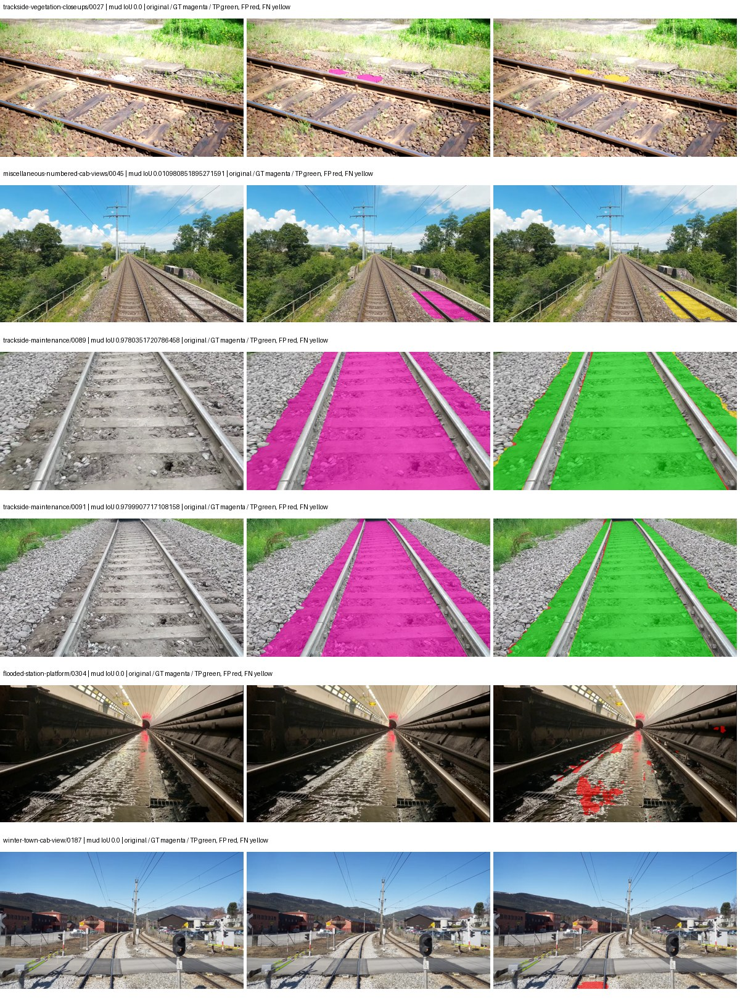
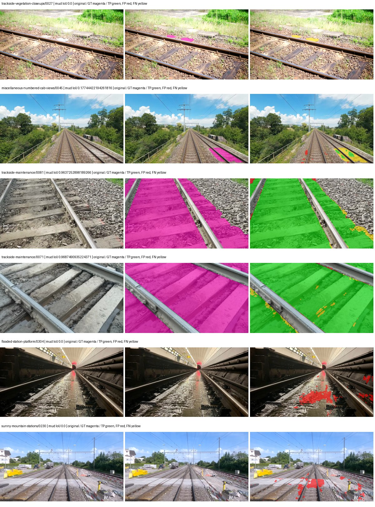
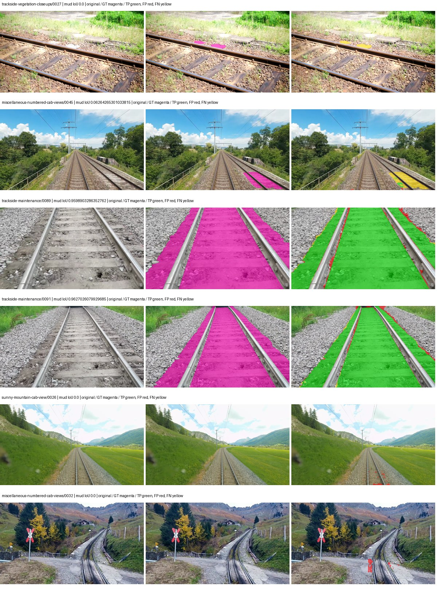
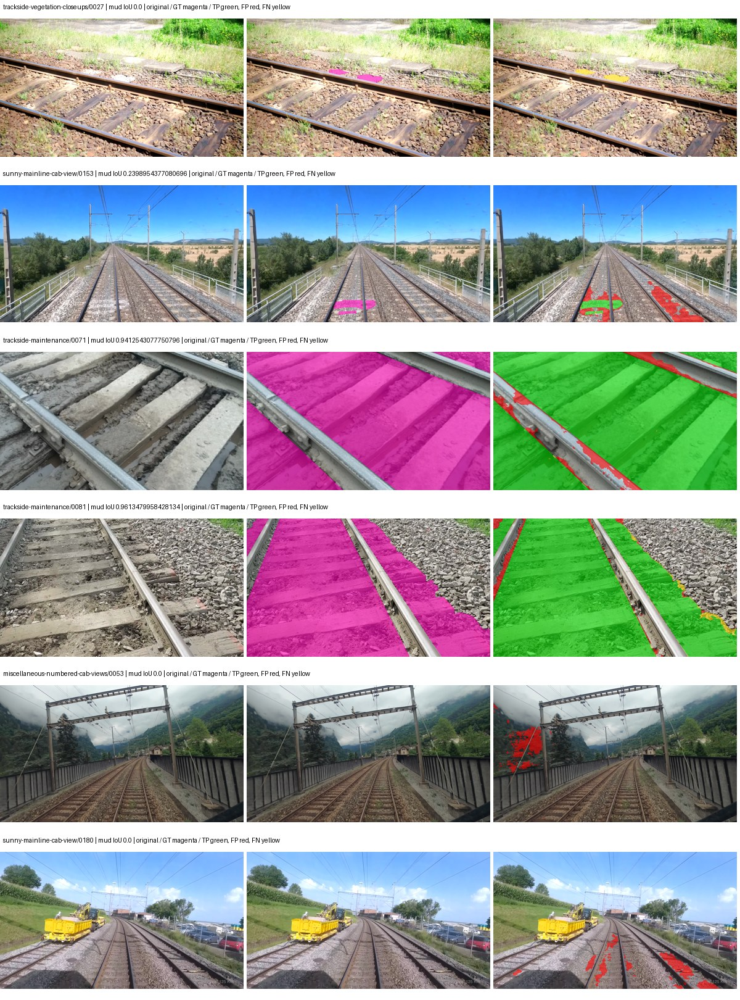

# hrnet_w48_ocr — rad_9_24_2026-paul

[RAD 9/24: Paul's split](../../README.md) · [Full model records](record.json)

Primary selection and early stopping: **mud-pumping validation IoU**. A job is complete only after full statistics and isolated profiling are verified.

| Model | Initialization path | Seed | Status | Steps | Best step | Mud IoU (%) | Mud precision (%) | Mud recall (%) | Final mud IoU (trainer val, %) | mIoU (%) | Fixed GT-class mIoU (%) |
| --- | --- | --- | --- | --- | --- | --- | --- | --- | --- | --- | --- |
| hrnet_w48_ocr | rtis_only | 0 | completed | 3716 | 2654 | 90.85 | 96.91 | 93.56 | 88.49 | 59.83 | 59.83 |
| hrnet_w48_ocr | cityscapes_to_rtis | 0 | completed | 3716 | 2389 | 85.83 | 91.81 | 92.94 | 72.49 | 56.91 | 56.91 |
| hrnet_w48_ocr | railsem19_to_rtis | 0 | completed | 2919 | 1592 | 76.66 | 95.66 | 79.43 | 69.22 | 61.08 | 61.08 |
| hrnet_w48_ocr | cityscapes_to_railsem19_to_rtis | 0 | completed | 2389 | 1061 | 75.49 | 88.69 | 83.52 | 72.01 | 55.44 | 55.44 |

Training: 227 images. Validation: 37 images. Test: 50 held out. Seeds: [0]. Seed variation measures optimization variability, not independent-recording uncertainty. Historical source checkpoints stay fixed across adaptation seeds.

Training code: `d864b72bd90706260965bb1a48398d01167b6d5c`. Split SHA-256: `b16dbbc7c4aa0c5d6e0fb5a20a27b4f3f8a4f3ce535621ed7c9aeaa6e85adb77`.

## rtis_only — seed 0

Status: **completed**. Started: 2026-10-05T07:38:36.640150+00:00. Finished: 2026-10-05T09:22:43.933143+00:00.

Recipe pretrained initializer: `timm hrnet_w48 pretrained ImageNet backbone; fresh OCR head`.

`rtis_only` uses the recipe initializer, which may include pretrained segmentation components. Transfer paths load the exact historical source checkpoint below and reset the classifier; they do not reset all query/decoder features.

Source checkpoint: `Recipe pretrained initialization`.

Config SHA-256: `71f2e09503aa63a1f226020b5ecfff46c4f0e591b2125f61bc4885556302daef`. Weights used for validation: `raw`.

### Mud-pumping and aggregate quality

| Metric | Selected checkpoint | Final training validation |
| --- | --- | --- |
| Mud IoU | 90.85 | 88.49 |
| Mud precision | 96.91 | 93.22 |
| Mud recall | 93.56 | 94.57 |
| Mud Dice/F1 | 95.21 | 93.89 |
| mIoU | 59.83 | 62.94 |
| Mean accuracy | 70.86 | 73.70 |
| Mean precision | 79.28 | 80.45 |
| Mean Dice | 71.92 | 75.23 |
| Mean specificity | 99.36 | 99.40 |
| Pixel accuracy | 88.28 | 89.07 |
| Frequency-weighted IoU | 80.55 | 81.56 |
| Fixed GT-present class mIoU | 59.83 | 62.94 |
| Boundary F1 | 67.32 | 68.32 |

The selected checkpoint has independent evaluation evidence. Final values are the trainer's final validation record, not a new independent evaluation. mIoU averages classes with nonzero union, so false positives on absent classes can change its denominator. The fixed GT-class mean is supplementary and excludes absent classes; their false positives remain in the confusion matrix.

### Resource usage and timing

| Measurement | Value |
| --- | --- |
| Peak training VRAM, retained training invocation (GiB) | 17.35 |
| Peak evaluation VRAM (GiB) | 7.91 |
| Retained training invocation wall time (seconds) | 6014.62 |
| Retained training invocation GPU-hours (one GPU) | 1.67 |
| Evaluation wall time (seconds) | 18.69 |
| Full evaluation pipeline images/second | 1.98 |
| Best full-state checkpoint (MiB) | 1119.23 |
| Final full-state checkpoint (MiB) | 1119.18 |
| Verified periodic checkpoints removed (GiB) | 7.65 |

VRAM uses the recorded allocator high-water mark; it is not total device usage including CUDA context. Resumed jobs' retained training invocation times and peaks are **not whole-campaign totals**. Earlier invocation resource records are not reconstructed here. Evaluation throughput includes loader, sliding-window inference and metrics; it is not model-only latency/FPS. Missing measurements are shown as —, never inferred from another dataset's run.

### Standardized inference performance

Dedicated model-only profiling waits for an idle worker-locked L40S: BF16, batch 1, 1024x1024, 20 warmup and 100 CUDA-event-timed public forwards. It excludes loading, preprocessing, tiling and metrics.

| Status | Parameters | Weight MiB | FPS | p50 ms | p95 ms | Peak reserved GiB |
| --- | --- | --- | --- | --- | --- | --- |
| complete | 73168490 | 279.12 | 31.33 | 31.78 | 32.74 | 1.26 |

```json
{
  "schema_version": 1,
  "model_id": "hrnet_w48_ocr",
  "measured_at": "2026-10-05T09:22:34+00:00",
  "status": "complete",
  "benchmark_scope": "rtis_selected_checkpoint_model_only",
  "applies_to": [
    "hrnet_w48_ocr--rtis_only--seed-0"
  ],
  "source": {
    "campaign_git_sha": "d864b72bd90706260965bb1a48398d01167b6d5c",
    "git_dirty": false,
    "config_hash": "28b1a5165728",
    "resolved_config": "/data/izadia1/projects/segmentary-runs/rad_9_24_2026/paul-seed0-20261005-r2/configs/hrnet_w48_ocr--rtis_only--seed-0.yaml",
    "config_sha256": "71f2e09503aa63a1f226020b5ecfff46c4f0e591b2125f61bc4885556302daef",
    "checkpoint_sha256": "a55979b251c441e82d4389688533013e0fde75c80c9bb1da2b25a21b39696805",
    "checkpoint_global_step": 2654,
    "checkpoint_bytes": 1173602750,
    "checkpoint_kind": "resume checkpoint with optimizer and EMA state",
    "weights": "raw",
    "measured_checkpoint_job_id": "hrnet_w48_ocr--rtis_only--seed-0",
    "result_sha256": "ecee7f797ccb86cd588756bf2eb2345456bbc3f1c99d7b72a73b8d4a8c5bfae4",
    "result_git_sha": "d864b72bd90706260965bb1a48398d01167b6d5c",
    "result_stage": "eval:rad_9_24_2026-paul:val",
    "result_seed": 0
  },
  "hardware": {
    "gpu_name": "NVIDIA L40S",
    "gpu_uuid": "GPU-a5ad49e5-0536-5229-ba8a-f8a902808f53",
    "logical_device": "cuda:0",
    "physical_visibility_token": "7",
    "compute_capability": [
      8,
      9
    ],
    "total_memory_bytes": 47677177856
  },
  "model": {
    "parameter_count": 73168490,
    "trainable_parameter_count": 73168490,
    "resident_parameter_bytes": 292673960,
    "parameter_dtype_counts": {
      "float32": 73168490
    }
  },
  "contract": {
    "backend": "pytorch",
    "precision": "bf16_autocast",
    "batch_size": 1,
    "input_shape_nchw": [
      1,
      3,
      1024,
      1024
    ],
    "warmup_iterations": 20,
    "measured_iterations": 100,
    "timing": "per-forward CUDA events with end-event synchronization",
    "includes_preprocessing": false,
    "includes_data_loader": false,
    "includes_sliding_window": false,
    "input_resident_on_gpu": true,
    "model_only": true,
    "entrypoint": "public model(image) dense-logits forward"
  },
  "measurements": {
    "latency": {
      "p50_ms": 31.78342342376709,
      "p95_ms": 32.744651794433594,
      "mean_ms": 31.9159379196167,
      "minimum_ms": 31.39481544494629,
      "maximum_ms": 35.03615951538086,
      "fps": 31.332308093799227,
      "raw_ms": [
        31.76140785217285,
        31.719423294067383,
        31.80953598022461,
        31.665151596069336,
        31.58732795715332,
        31.81977653503418,
        31.656959533691406,
        31.79315185546875,
        31.865856170654297,
        31.731712341308594,
        31.863807678222656,
        32.82124710083008,
        31.78291130065918,
        31.77779197692871,
        31.747072219848633,
        31.853567123413086,
        31.8341121673584,
        31.873023986816406,
        31.979520797729492,
        32.2979850769043,
        31.81158447265625,
        31.76038360595703,
        31.713279724121094,
        31.883264541625977,
        31.927295684814453,
        32.18022537231445,
        31.903743743896484,
        31.39481544494629,
        34.26508712768555,
        32.668670654296875,
        32.1710090637207,
        31.617055892944336,
        31.513599395751953,
        32.28364944458008,
        31.65488052368164,
        31.508480072021484,
        31.694847106933594,
        32.80691146850586,
        31.56889533996582,
        31.79110336303711,
        31.664127349853516,
        31.764448165893555,
        31.889408111572266,
        31.62726402282715,
        31.724544525146484,
        31.715328216552734,
        31.6231689453125,
        31.804384231567383,
        32.19251251220703,
        31.61190414428711,
        32.22118377685547,
        32.112640380859375,
        31.508480072021484,
        31.673343658447266,
        32.07059097290039,
        31.7890567779541,
        31.649791717529297,
        31.62828826904297,
        31.711231231689453,
        31.506431579589844,
        31.62112045288086,
        32.3686408996582,
        31.676416397094727,
        31.704063415527344,
        31.8341121673584,
        35.03615951538086,
        31.729663848876953,
        31.903743743896484,
        31.840255737304688,
        31.717376708984375,
        31.664127349853516,
        31.7890567779541,
        31.660032272338867,
        33.006591796875,
        31.74188804626465,
        31.765504837036133,
        31.82080078125,
        31.684608459472656,
        31.741952896118164,
        32.25190353393555,
        31.783935546875,
        32.01331329345703,
        31.867904663085938,
        31.683584213256836,
        31.671295166015625,
        31.671295166015625,
        32.74137496948242,
        31.932416915893555,
        31.749120712280273,
        31.79724884033203,
        31.730688095092773,
        31.78188705444336,
        32.04710388183594,
        31.840255737304688,
        31.883264541625977,
        31.82694435119629,
        31.771648406982422,
        31.926271438598633,
        31.726591110229492,
        32.74137496948242
      ],
      "percentile_method": "numpy linear interpolation"
    },
    "peak_reserved_bytes": 1350565888,
    "memory_kind": "pytorch_cuda_allocator_peak_reserved_excluding_context",
    "benchmark_wall_clock_s": 16.40607910603285
  },
  "started_at": "2026-10-05T09:22:17+00:00",
  "finished_at": "2026-10-05T09:22:34+00:00",
  "environment": {
    "hostname": "hdrfs-app-001",
    "python": "3.11.15",
    "platform": "Linux-5.15.0-139-generic-x86_64-with-glibc2.35",
    "torch": "2.11.0+cu128",
    "torch_cuda": "12.8",
    "cudnn": 91900,
    "driver_version": "570.133.20",
    "cuda_available": true,
    "gpu_count": 1,
    "gpu_names": [
      "NVIDIA L40S"
    ],
    "cuda_visible_devices": "7",
    "packages": {
      "segmentary": "0.1.0",
      "torch": "2.11.0+cu128",
      "torchvision": "0.26.0+cu128",
      "transformers": "5.15.0",
      "timm": "1.0.28",
      "segmentation-models-pytorch": "0.5.0",
      "albumentations": "2.0.8",
      "lightning": "2.6.5",
      "numpy": "2.4.4"
    }
  }
}
```

### Per-class validation results

| Class | GT pixels | IoU (%) | Precision (%) | Recall (%) | Dice (%) | Boundary F1 (%) |
| --- | --- | --- | --- | --- | --- | --- |
| car | 75932 | 48.56 | 65.06 | 65.68 | 65.37 | 77.11 |
| construction | 5694760 | 46.44 | 57.05 | 71.41 | 63.43 | 56.64 |
| fence | 3789415 | 25.46 | 86.94 | 26.47 | 40.58 | 56.65 |
| mud-pumping | 7435760 | 90.85 | 96.91 | 93.56 | 95.21 | 65.07 |
| on-rails | 1137952 | 76.85 | 87.92 | 85.93 | 86.91 | 55.26 |
| person | 130659 | 75.59 | 82.12 | 90.48 | 86.10 | 79.86 |
| pole | 1467743 | 58.47 | 76.84 | 70.98 | 73.79 | 88.08 |
| rail-embedded | 74744 | 57.05 | 66.59 | 79.92 | 72.65 | 84.23 |
| rail-raised | 3588713 | 77.93 | 88.52 | 86.70 | 87.60 | 93.14 |
| rail-track | 4270276 | 74.93 | 85.84 | 85.49 | 85.67 | 83.83 |
| road | 1152119 | 52.69 | 64.03 | 74.85 | 69.02 | 56.07 |
| sidewalk | 2164731 | 53.24 | 60.11 | 82.34 | 69.49 | 60.80 |
| sky | 20207617 | 97.05 | 99.05 | 97.96 | 98.50 | 92.87 |
| standing-water | 2006046 | 62.95 | 92.47 | 66.35 | 77.26 | 20.72 |
| terrain | 30442090 | 88.70 | 92.31 | 95.78 | 94.01 | 80.78 |
| trackbed | 9118591 | 81.60 | 87.39 | 92.49 | 89.87 | 81.73 |
| traffic-light | 116825 | 40.30 | 81.67 | 44.31 | 57.45 | 65.52 |
| traffic-sign | 35778 | 16.28 | 36.91 | 22.56 | 28.00 | 39.40 |
| tram-track | 244726 | 65.96 | 88.83 | 71.92 | 79.49 | 74.49 |
| truck | 190997 | 10.46 | 98.70 | 10.48 | 18.94 | 23.32 |
| vegetation-overgrowth | 1534858 | 54.97 | 69.52 | 72.42 | 70.94 | 78.20 |

### Full-run accounting

| Measurement | Value |
| --- | --- |
| Full GPU-reserved wall seconds, all recorded worker attempts | 6254.89 |
| Full reserved GPU-hours | 1.74 |
| Whole-run timing complete | True |

| Phase | Wall seconds including failed attempts |
| --- | --- |
| training | 6021.64 |
| diagnostics | 162.55 |
| performance | 25.85 |

GPU-reserved time includes model loading, training, validation, collection, profiling, checkpoint I/O and orchestration while the worker owns one GPU. It is not GPU kernel-active time. Phase timings and sampled device memory/power/utilization are retained separately; sampled device memory is not the allocator high-water mark.

### Train/validation and raw/EMA diagnostics

| Checkpoint / weights / split | Images | Mud IoU (%) | Mud precision (%) | Mud recall (%) |
| --- | --- | --- | --- | --- |
| best-auto-train / raw | 227 | 95.53 | 97.73 | 97.69 |
| best-auto-val / raw | 37 | 90.85 | 96.91 | 93.56 |
| best-alternate-val / ema | 37 | 89.22 | 97.26 | 91.52 |
| final-auto-val / raw | 37 | 88.49 | 93.21 | 94.58 |

Train uses the evaluation transform without augmentation. Compare mud train/validation metrics for the same selected weights. Alternate EMA on running-stat BatchNorm is explicitly uncalibrated and is diagnostic only. Score-threshold curves use uncalibrated normalized scores and are pixel-level diagnostics, not event detection rates or a selected deployment operating point.

### Downloadable evidence

- best-auto-train: [per-image.csv](rtis_only--seed-0/best-auto-train/per-image.csv) · [per-image-confusion.json.gz](rtis_only--seed-0/best-auto-train/per-image-confusion.json.gz) · [groups.json](rtis_only--seed-0/best-auto-train/groups.json) · [mud-score-curves.json](rtis_only--seed-0/best-auto-train/mud-score-curves.json)
- best-auto-val: [per-image.csv](rtis_only--seed-0/best-auto-val/per-image.csv) · [per-image-confusion.json.gz](rtis_only--seed-0/best-auto-val/per-image-confusion.json.gz) · [groups.json](rtis_only--seed-0/best-auto-val/groups.json) · [mud-score-curves.json](rtis_only--seed-0/best-auto-val/mud-score-curves.json) · [examples.jpg](rtis_only--seed-0/best-auto-val/examples.jpg)
- best-alternate-val: [per-image.csv](rtis_only--seed-0/best-alternate-val/per-image.csv) · [per-image-confusion.json.gz](rtis_only--seed-0/best-alternate-val/per-image-confusion.json.gz) · [groups.json](rtis_only--seed-0/best-alternate-val/groups.json) · [mud-score-curves.json](rtis_only--seed-0/best-alternate-val/mud-score-curves.json)
- final-auto-val: [per-image.csv](rtis_only--seed-0/final-auto-val/per-image.csv) · [per-image-confusion.json.gz](rtis_only--seed-0/final-auto-val/per-image-confusion.json.gz) · [groups.json](rtis_only--seed-0/final-auto-val/groups.json) · [mud-score-curves.json](rtis_only--seed-0/final-auto-val/mud-score-curves.json)
- resources: [telemetry.csv](rtis_only--seed-0/resources/telemetry.csv)



Examples are two lowest and two highest mud-IoU positive images, plus up to two negative images with the most false-positive mud pixels. They are targeted diagnostic examples, not random samples. Green: true positive; red: false positive; yellow: false negative. Full predictions remain on HDRFS.

### Validation tracking

| Logged step | Overall mIoU (%) | Mud IoU (%) |
| --- | --- | --- |
| 264 | 43.84 | 82.62 |
| 530 | 51.56 | 71.96 |
| 796 | 52.17 | 80.43 |
| 1061 | 58.30 | 85.00 |
| 1326 | 55.70 | 66.94 |
| 1592 | 52.91 | 55.19 |
| 1857 | 57.94 | 88.62 |
| 2123 | 59.32 | 81.89 |
| 2389 | 61.47 | 90.79 |
| 2653 | 59.82 | 90.84 |
| 2919 | 55.03 | 41.78 |
| 3185 | 60.16 | 88.75 |
| 3451 | 62.51 | 89.99 |
| 3716 | 62.94 | 88.49 |

All retained scalar curves, including training loss and per-class IoU, are in record.json. Observed best mud on a curve is not necessarily a retained checkpoint: the pilot saved its selection-metric-best and final checkpoints. Step logging and checkpoint global_step may differ by one.

### Stopping and checkpoint provenance

```json
{
  "stopping": {
    "actual_steps": 3716,
    "maximum_steps": 4000,
    "min_delta": 0.001,
    "monitor": "val_iou/mud-pumping",
    "patience": 5,
    "reason": "validation_plateau"
  },
  "checkpoints": {
    "best": {
      "path": "/data/izadia1/projects/segmentary-runs/rad_9_24_2026/paul-seed0-20261005-r2/future-runs/hrnet_w48_ocr--rtis_only--seed-0_seed0/rtis/best.ckpt",
      "sha256": "a55979b251c441e82d4389688533013e0fde75c80c9bb1da2b25a21b39696805",
      "global_step": 2654,
      "bytes": 1173602750
    },
    "final": {
      "path": "/data/izadia1/projects/segmentary-runs/rad_9_24_2026/paul-seed0-20261005-r2/future-runs/hrnet_w48_ocr--rtis_only--seed-0_seed0/rtis/last.ckpt",
      "sha256": "70b8b49bc2e4f2129fee72039f6c9b4c31ae06c99efcbe932dda56da34c25851",
      "global_step": 3716,
      "bytes": 1173541502
    }
  },
  "cleanup_error": null
}
```

### Resolved training, initialization and evaluation settings

The optimizer block is the base configuration. Stage LR scales are applied at runtime, and stage warmup is capped at min(base warmup, floor(stage budget / 10), stage budget - 1): 400 steps for this 4,000-step pilot. Model-internal native input grids may differ from augmentation crops (EoMT uses its 640 grid).

```json
{
  "name": "hrnet_w48_ocr--rtis_only--seed-0",
  "model": {
    "arch": "hrnet_w48_ocr",
    "checkpoint": null,
    "tuning": "full",
    "head": "unified_head",
    "lora_r": 16,
    "lora_alpha": 32,
    "lora_dropout": 0.05,
    "lora_targets": [],
    "drop_path": null,
    "revision": null,
    "subfolder": null,
    "local_files_only": false,
    "trust_remote_code": false,
    "backbone_path": null,
    "head_paths": [],
    "classifier_path": null,
    "inactive_parameter_paths": [],
    "smp_arch": null,
    "encoder_name": null,
    "encoder_weights": null,
    "native": null,
    "batch_norm_momentum": null
  },
  "space": "paul-test-rtis",
  "taxonomy_root": "/data/izadia1/projects/segmentary-rad-d864b72b/taxonomy",
  "output_root": "/data/izadia1/projects/segmentary-runs/rad_9_24_2026/paul-seed0-20261005-r2/future-runs",
  "optim": {
    "backbone_lr": 0.0001,
    "head_lr_mult": 10.0,
    "weight_decay": 0.05,
    "llrd": 1.0,
    "warmup_iters": 1500,
    "warmup_ratio": 1e-06,
    "poly_power": 0.9,
    "min_lr_ratio": 0.0,
    "betas": [
      0.9,
      0.999
    ],
    "grad_clip": 1.0
  },
  "train": {
    "iters": 4000,
    "batch_size": 2,
    "accum": 8,
    "num_workers": 2,
    "precision": "bf16-mixed",
    "ema_decay": 0.9998,
    "val_every": 250,
    "ckpt_every": 500,
    "selection_metric": "val_iou/mud-pumping",
    "early_stopping_patience": 5,
    "early_stopping_min_delta": 0.001,
    "seed": 0,
    "devices": 1
  },
  "eval": {
    "sliding_window": true,
    "window": [
      1024,
      1024
    ],
    "stride": [
      768,
      768
    ],
    "batch_size": 1,
    "num_workers": 2,
    "tta_scales": [],
    "tta_flip": false,
    "threshold": 0.5,
    "boundary_tolerance_frac": 0.0075,
    "save_confusion": true
  },
  "loss": {
    "task": "multiclass",
    "activation": "auto",
    "terms": [],
    "aux": "none",
    "aux_weight": 0.0,
    "ce_weight": 1.0,
    "label_smoothing": 0.0,
    "class_weights": null,
    "query": null
  },
  "aug": {
    "crop": [
      1024,
      1024
    ],
    "scale_min": 0.5,
    "scale_max": 2.0,
    "hflip_p": 0.5,
    "color_jitter_p": 0.5,
    "brightness": 0.25,
    "contrast": 0.25,
    "saturation": 0.25,
    "hue": 0.05
  },
  "stages": [
    {
      "name": "rtis",
      "data": [
        {
          "name": "rad_9_24_2026-paul",
          "root": "/data/izadia1/datasets/rad_9_24_2026-paul",
          "variant": null,
          "split_file": "splits.json",
          "train_split": "train",
          "val_split": "val",
          "limit": null,
          "loader": "folder",
          "mapping": "paul-test-rtis",
          "loader_options": {
            "require_groups": false
          }
        }
      ],
      "iters": null,
      "lr_scale": 1.0,
      "head_group_lr_scale": 1.0,
      "init_from": "pretrained",
      "reset_head": false,
      "freeze": null,
      "sample_weights": null
    }
  ]
}
```

### Hardware and software provenance

```json
{
  "training": {
    "cuda_available": true,
    "cuda_visible_devices": "7",
    "cudnn": 91900,
    "driver_version": "570.133.20",
    "gpu_count": 1,
    "gpu_names": [
      "NVIDIA L40S"
    ],
    "hostname": "hdrfs-app-001",
    "input_normalization": {
      "channel_order": "rgb",
      "mean": [
        0.485,
        0.456,
        0.406
      ],
      "source": "imagenet",
      "std": [
        0.229,
        0.224,
        0.225
      ]
    },
    "model_origins": [
      {
        "hf_commit": null,
        "hf_name_or_path": null,
        "module": "trunk",
        "timm_pretrained": {
          "architecture": "hrnet_w48",
          "hf_hub_id": "timm/hrnet_w48.ms_in1k",
          "tag": "ms_in1k",
          "url": ""
        }
      }
    ],
    "model_parameter_count": 73168490,
    "packages": {
      "albumentations": "2.0.8",
      "lightning": "2.6.5",
      "numpy": "2.4.4",
      "segmentary": "0.1.0",
      "segmentation-models-pytorch": "0.5.0",
      "timm": "1.0.28",
      "torch": "2.11.0+cu128",
      "torchvision": "0.26.0+cu128",
      "transformers": "5.15.0"
    },
    "platform": "Linux-5.15.0-139-generic-x86_64-with-glibc2.35",
    "python": "3.11.15",
    "torch": "2.11.0+cu128",
    "torch_cuda": "12.8",
    "trainable_parameter_count": 73168490,
    "training_stop": {
      "actual_steps": 3716,
      "maximum_steps": 4000,
      "min_delta": 0.001,
      "monitor": "val_iou/mud-pumping",
      "patience": 5,
      "reason": "validation_plateau"
    },
    "validation_weights": "raw"
  },
  "evaluation": {
    "cuda_available": true,
    "cuda_visible_devices": "7",
    "cudnn": 91900,
    "driver_version": "570.133.20",
    "gpu_count": 1,
    "gpu_names": [
      "NVIDIA L40S"
    ],
    "hostname": "hdrfs-app-001",
    "input_normalization": {
      "channel_order": "rgb",
      "mean": [
        0.485,
        0.456,
        0.406
      ],
      "source": "imagenet",
      "std": [
        0.229,
        0.224,
        0.225
      ]
    },
    "packages": {
      "albumentations": "2.0.8",
      "lightning": "2.6.5",
      "numpy": "2.4.4",
      "segmentary": "0.1.0",
      "segmentation-models-pytorch": "0.5.0",
      "timm": "1.0.28",
      "torch": "2.11.0+cu128",
      "torchvision": "0.26.0+cu128",
      "transformers": "5.15.0"
    },
    "platform": "Linux-5.15.0-139-generic-x86_64-with-glibc2.35",
    "python": "3.11.15",
    "torch": "2.11.0+cu128",
    "torch_cuda": "12.8"
  }
}
```

## cityscapes_to_rtis — seed 0

Status: **completed**. Started: 2026-10-05T08:17:33.540998+00:00. Finished: 2026-10-05T10:02:24.584193+00:00.

Recipe pretrained initializer: `timm hrnet_w48 pretrained ImageNet backbone; fresh OCR head`.

`rtis_only` uses the recipe initializer, which may include pretrained segmentation components. Transfer paths load the exact historical source checkpoint below and reset the classifier; they do not reset all query/decoder features.

Source checkpoint: `{'name': 'hrnet_w48_ocr--cityscapes--seed-0', 'model': 'hrnet_w48_ocr', 'protocol': 'cityscapes', 'config': '/data/izadia1/projects/segmentary-runs/all-model-city-rail-seed0-rail20-b9eb3e1/accepted/hrnet_w48_ocr--cityscapes--seed-0/resolved-config.yaml', 'checkpoint': '/data/izadia1/projects/segmentary-runs/current-main-fill-v2/jobs/hrnet_w48_ocr--cityscapes--seed-0/train/hrnet_w48_ocr--cityscapes_seed0/cityscapes/last.ckpt', 'recorded_sha256': '38fb6ca68c932ae2a8224708568d0825f3d188f076da708d6eca79932cde4e84', 'exists': True}`.

Config SHA-256: `548b278697ad8232e940b94ba76e3bdf35555aba0fcf4b66be782dd3304b749b`. Weights used for validation: `raw`.

### Mud-pumping and aggregate quality

| Metric | Selected checkpoint | Final training validation |
| --- | --- | --- |
| Mud IoU | 85.83 | 72.49 |
| Mud precision | 91.81 | 95.47 |
| Mud recall | 92.94 | 75.08 |
| Mud Dice/F1 | 92.37 | 84.05 |
| mIoU | 56.91 | 55.76 |
| Mean accuracy | 70.31 | 70.15 |
| Mean precision | 73.09 | 71.62 |
| Mean Dice | 70.10 | 69.34 |
| Mean specificity | 99.24 | 99.21 |
| Pixel accuracy | 86.05 | 85.37 |
| Frequency-weighted IoU | 77.35 | 77.01 |
| Fixed GT-present class mIoU | 56.91 | 55.76 |
| Boundary F1 | 61.69 | 63.09 |

The selected checkpoint has independent evaluation evidence. Final values are the trainer's final validation record, not a new independent evaluation. mIoU averages classes with nonzero union, so false positives on absent classes can change its denominator. The fixed GT-class mean is supplementary and excludes absent classes; their false positives remain in the confusion matrix.

### Resource usage and timing

| Measurement | Value |
| --- | --- |
| Peak training VRAM, retained training invocation (GiB) | 17.35 |
| Peak evaluation VRAM (GiB) | 7.91 |
| Retained training invocation wall time (seconds) | 6055.95 |
| Retained training invocation GPU-hours (one GPU) | 1.68 |
| Evaluation wall time (seconds) | 18.91 |
| Full evaluation pipeline images/second | 1.96 |
| Best full-state checkpoint (MiB) | 1119.23 |
| Final full-state checkpoint (MiB) | 1119.18 |
| Verified periodic checkpoints removed (GiB) | 7.65 |

VRAM uses the recorded allocator high-water mark; it is not total device usage including CUDA context. Resumed jobs' retained training invocation times and peaks are **not whole-campaign totals**. Earlier invocation resource records are not reconstructed here. Evaluation throughput includes loader, sliding-window inference and metrics; it is not model-only latency/FPS. Missing measurements are shown as —, never inferred from another dataset's run.

### Standardized inference performance

Dedicated model-only profiling waits for an idle worker-locked L40S: BF16, batch 1, 1024x1024, 20 warmup and 100 CUDA-event-timed public forwards. It excludes loading, preprocessing, tiling and metrics.

| Status | Parameters | Weight MiB | FPS | p50 ms | p95 ms | Peak reserved GiB |
| --- | --- | --- | --- | --- | --- | --- |
| complete | 73168490 | 279.12 | 31.97 | 31.08 | 32.35 | 1.26 |

```json
{
  "schema_version": 1,
  "model_id": "hrnet_w48_ocr",
  "measured_at": "2026-10-05T10:02:14+00:00",
  "status": "complete",
  "benchmark_scope": "rtis_selected_checkpoint_model_only",
  "applies_to": [
    "hrnet_w48_ocr--cityscapes_to_rtis--seed-0"
  ],
  "source": {
    "campaign_git_sha": "d864b72bd90706260965bb1a48398d01167b6d5c",
    "git_dirty": false,
    "config_hash": "3bfdc05b6c7a",
    "resolved_config": "/data/izadia1/projects/segmentary-runs/rad_9_24_2026/paul-seed0-20261005-r2/configs/hrnet_w48_ocr--cityscapes_to_rtis--seed-0.yaml",
    "config_sha256": "548b278697ad8232e940b94ba76e3bdf35555aba0fcf4b66be782dd3304b749b",
    "checkpoint_sha256": "49740711e44828e0ced45aff329275260289fa62bb08e31e168ad04d97eee36b",
    "checkpoint_global_step": 2389,
    "checkpoint_bytes": 1173602814,
    "checkpoint_kind": "resume checkpoint with optimizer and EMA state",
    "weights": "raw",
    "measured_checkpoint_job_id": "hrnet_w48_ocr--cityscapes_to_rtis--seed-0",
    "result_sha256": "7c8a7ed88ef8b4080df6712df36890ae3b9fa008386af3f3a037bc46e2685fb8",
    "result_git_sha": "d864b72bd90706260965bb1a48398d01167b6d5c",
    "result_stage": "eval:rad_9_24_2026-paul:val",
    "result_seed": 0
  },
  "hardware": {
    "gpu_name": "NVIDIA L40S",
    "gpu_uuid": "GPU-804aea8b-5f62-423e-72c6-49e1ed15c4e4",
    "logical_device": "cuda:0",
    "physical_visibility_token": "6",
    "compute_capability": [
      8,
      9
    ],
    "total_memory_bytes": 47677177856
  },
  "model": {
    "parameter_count": 73168490,
    "trainable_parameter_count": 73168490,
    "resident_parameter_bytes": 292673960,
    "parameter_dtype_counts": {
      "float32": 73168490
    }
  },
  "contract": {
    "backend": "pytorch",
    "precision": "bf16_autocast",
    "batch_size": 1,
    "input_shape_nchw": [
      1,
      3,
      1024,
      1024
    ],
    "warmup_iterations": 20,
    "measured_iterations": 100,
    "timing": "per-forward CUDA events with end-event synchronization",
    "includes_preprocessing": false,
    "includes_data_loader": false,
    "includes_sliding_window": false,
    "input_resident_on_gpu": true,
    "model_only": true,
    "entrypoint": "public model(image) dense-logits forward"
  },
  "measurements": {
    "latency": {
      "p50_ms": 31.080448150634766,
      "p95_ms": 32.34636898040772,
      "mean_ms": 31.283814067840577,
      "minimum_ms": 30.877695083618164,
      "maximum_ms": 34.89894485473633,
      "fps": 31.965411820676596,
      "raw_ms": [
        31.065088272094727,
        32.10649490356445,
        31.05583953857422,
        31.908863067626953,
        31.465471267700195,
        31.055871963500977,
        30.954496383666992,
        31.023103713989258,
        31.087615966796875,
        31.059968948364258,
        31.00262451171875,
        30.940160751342773,
        31.025184631347656,
        31.135744094848633,
        31.058944702148438,
        31.074304580688477,
        31.068159103393555,
        31.068159103393555,
        31.055871963500977,
        30.98828887939453,
        30.877695083618164,
        30.97599983215332,
        31.068159103393555,
        31.077375411987305,
        31.00262451171875,
        31.02720069885254,
        31.118335723876953,
        31.068159103393555,
        30.931968688964844,
        30.926847457885742,
        31.054847717285156,
        31.057920455932617,
        31.111167907714844,
        31.229951858520508,
        31.004671096801758,
        31.03638458251953,
        31.127552032470703,
        31.039487838745117,
        31.124479293823242,
        31.058944702148438,
        31.135744094848633,
        31.093759536743164,
        31.108095169067383,
        31.073280334472656,
        31.054847717285156,
        31.01593589782715,
        31.074304580688477,
        31.014911651611328,
        31.068159103393555,
        31.18899154663086,
        30.9800968170166,
        31.107072830200195,
        31.062015533447266,
        31.145984649658203,
        31.154176712036133,
        31.105024337768555,
        32.40959930419922,
        31.16441535949707,
        34.89894485473633,
        31.15724754333496,
        30.99238395690918,
        31.100927352905273,
        32.32051086425781,
        32.21196746826172,
        31.226879119873047,
        31.084543228149414,
        30.96883201599121,
        31.259647369384766,
        32.08806228637695,
        32.345088958740234,
        31.253503799438477,
        30.963712692260742,
        31.01081657409668,
        31.005695343017578,
        30.99750328063965,
        31.556608200073242,
        32.114688873291016,
        30.963712692260742,
        31.05174446105957,
        31.051776885986328,
        31.107072830200195,
        30.985248565673828,
        31.38457679748535,
        32.18124771118164,
        31.126527786254883,
        31.040512084960938,
        31.16851234436035,
        31.104000091552734,
        31.161344528198242,
        31.083520889282227,
        31.041536331176758,
        32.79462432861328,
        31.679487228393555,
        31.491071701049805,
        31.329280853271484,
        31.316991806030273,
        31.410175323486328,
        31.247360229492188,
        32.6563835144043,
        32.370689392089844
      ],
      "percentile_method": "numpy linear interpolation"
    },
    "peak_reserved_bytes": 1350565888,
    "memory_kind": "pytorch_cuda_allocator_peak_reserved_excluding_context",
    "benchmark_wall_clock_s": 16.336448773741722
  },
  "started_at": "2026-10-05T10:01:58+00:00",
  "finished_at": "2026-10-05T10:02:14+00:00",
  "environment": {
    "hostname": "hdrfs-app-001",
    "python": "3.11.15",
    "platform": "Linux-5.15.0-139-generic-x86_64-with-glibc2.35",
    "torch": "2.11.0+cu128",
    "torch_cuda": "12.8",
    "cudnn": 91900,
    "driver_version": "570.133.20",
    "cuda_available": true,
    "gpu_count": 1,
    "gpu_names": [
      "NVIDIA L40S"
    ],
    "cuda_visible_devices": "6",
    "packages": {
      "segmentary": "0.1.0",
      "torch": "2.11.0+cu128",
      "torchvision": "0.26.0+cu128",
      "transformers": "5.15.0",
      "timm": "1.0.28",
      "segmentation-models-pytorch": "0.5.0",
      "albumentations": "2.0.8",
      "lightning": "2.6.5",
      "numpy": "2.4.4"
    }
  }
}
```

### Per-class validation results

| Class | GT pixels | IoU (%) | Precision (%) | Recall (%) | Dice (%) | Boundary F1 (%) |
| --- | --- | --- | --- | --- | --- | --- |
| car | 75932 | 52.33 | 60.67 | 79.18 | 68.70 | 81.76 |
| construction | 5694760 | 41.18 | 49.67 | 70.67 | 58.34 | 51.98 |
| fence | 3789415 | 36.30 | 87.29 | 38.33 | 53.26 | 59.88 |
| mud-pumping | 7435760 | 85.83 | 91.81 | 92.94 | 92.37 | 50.15 |
| on-rails | 1137952 | 61.40 | 88.13 | 66.93 | 76.08 | 41.25 |
| person | 130659 | 81.64 | 85.71 | 94.50 | 89.89 | 83.40 |
| pole | 1467743 | 50.18 | 70.39 | 63.60 | 66.82 | 84.61 |
| rail-embedded | 74744 | 28.40 | 57.65 | 35.88 | 44.23 | 52.22 |
| rail-raised | 3588713 | 75.82 | 81.30 | 91.83 | 86.24 | 87.90 |
| rail-track | 4270276 | 69.83 | 83.66 | 80.86 | 82.24 | 78.67 |
| road | 1152119 | 44.44 | 75.82 | 51.78 | 61.54 | 52.96 |
| sidewalk | 2164731 | 64.19 | 76.43 | 80.02 | 78.19 | 65.63 |
| sky | 20207617 | 92.04 | 99.08 | 92.84 | 95.86 | 85.35 |
| standing-water | 2006046 | 73.16 | 79.09 | 90.70 | 84.50 | 13.18 |
| terrain | 30442090 | 85.54 | 91.04 | 93.41 | 92.21 | 77.04 |
| trackbed | 9118591 | 76.77 | 88.68 | 85.12 | 86.86 | 76.48 |
| traffic-light | 116825 | 44.86 | 69.59 | 55.79 | 61.93 | 72.01 |
| traffic-sign | 35778 | 16.85 | 33.56 | 25.29 | 28.85 | 37.20 |
| tram-track | 244726 | 32.34 | 70.27 | 37.46 | 48.87 | 42.50 |
| truck | 190997 | 31.59 | 36.09 | 71.70 | 48.02 | 29.23 |
| vegetation-overgrowth | 1534858 | 50.46 | 59.03 | 77.66 | 67.07 | 72.05 |

### Full-run accounting

| Measurement | Value |
| --- | --- |
| Full GPU-reserved wall seconds, all recorded worker attempts | 6299.35 |
| Full reserved GPU-hours | 1.75 |
| Whole-run timing complete | True |

| Phase | Wall seconds including failed attempts |
| --- | --- |
| training | 6063.67 |
| diagnostics | 162.97 |
| performance | 25.94 |

GPU-reserved time includes model loading, training, validation, collection, profiling, checkpoint I/O and orchestration while the worker owns one GPU. It is not GPU kernel-active time. Phase timings and sampled device memory/power/utilization are retained separately; sampled device memory is not the allocator high-water mark.

### Train/validation and raw/EMA diagnostics

| Checkpoint / weights / split | Images | Mud IoU (%) | Mud precision (%) | Mud recall (%) |
| --- | --- | --- | --- | --- |
| best-auto-train / raw | 227 | 88.79 | 93.87 | 94.25 |
| best-auto-val / raw | 37 | 85.83 | 91.81 | 92.94 |
| best-alternate-val / ema | 37 | 79.18 | 94.65 | 82.89 |
| final-auto-val / raw | 37 | 72.45 | 95.44 | 75.04 |

Train uses the evaluation transform without augmentation. Compare mud train/validation metrics for the same selected weights. Alternate EMA on running-stat BatchNorm is explicitly uncalibrated and is diagnostic only. Score-threshold curves use uncalibrated normalized scores and are pixel-level diagnostics, not event detection rates or a selected deployment operating point.

### Downloadable evidence

- best-auto-train: [per-image.csv](cityscapes_to_rtis--seed-0/best-auto-train/per-image.csv) · [per-image-confusion.json.gz](cityscapes_to_rtis--seed-0/best-auto-train/per-image-confusion.json.gz) · [groups.json](cityscapes_to_rtis--seed-0/best-auto-train/groups.json) · [mud-score-curves.json](cityscapes_to_rtis--seed-0/best-auto-train/mud-score-curves.json)
- best-auto-val: [per-image.csv](cityscapes_to_rtis--seed-0/best-auto-val/per-image.csv) · [per-image-confusion.json.gz](cityscapes_to_rtis--seed-0/best-auto-val/per-image-confusion.json.gz) · [groups.json](cityscapes_to_rtis--seed-0/best-auto-val/groups.json) · [mud-score-curves.json](cityscapes_to_rtis--seed-0/best-auto-val/mud-score-curves.json) · [examples.jpg](cityscapes_to_rtis--seed-0/best-auto-val/examples.jpg)
- best-alternate-val: [per-image.csv](cityscapes_to_rtis--seed-0/best-alternate-val/per-image.csv) · [per-image-confusion.json.gz](cityscapes_to_rtis--seed-0/best-alternate-val/per-image-confusion.json.gz) · [groups.json](cityscapes_to_rtis--seed-0/best-alternate-val/groups.json) · [mud-score-curves.json](cityscapes_to_rtis--seed-0/best-alternate-val/mud-score-curves.json)
- final-auto-val: [per-image.csv](cityscapes_to_rtis--seed-0/final-auto-val/per-image.csv) · [per-image-confusion.json.gz](cityscapes_to_rtis--seed-0/final-auto-val/per-image-confusion.json.gz) · [groups.json](cityscapes_to_rtis--seed-0/final-auto-val/groups.json) · [mud-score-curves.json](cityscapes_to_rtis--seed-0/final-auto-val/mud-score-curves.json)
- resources: [telemetry.csv](cityscapes_to_rtis--seed-0/resources/telemetry.csv)



Examples are two lowest and two highest mud-IoU positive images, plus up to two negative images with the most false-positive mud pixels. They are targeted diagnostic examples, not random samples. Green: true positive; red: false positive; yellow: false negative. Full predictions remain on HDRFS.

### Validation tracking

| Logged step | Overall mIoU (%) | Mud IoU (%) |
| --- | --- | --- |
| 264 | 30.71 | 74.43 |
| 530 | 39.18 | 54.50 |
| 796 | 51.51 | 82.21 |
| 1061 | 54.45 | 85.37 |
| 1326 | 55.23 | 68.38 |
| 1592 | 52.78 | 70.61 |
| 1857 | 55.64 | 73.72 |
| 2123 | 55.97 | 79.66 |
| 2389 | 56.92 | 85.83 |
| 2653 | 56.48 | 74.43 |
| 2919 | 55.97 | 71.23 |
| 3185 | 56.76 | 77.41 |
| 3451 | 55.31 | 62.70 |
| 3716 | 55.76 | 72.49 |

All retained scalar curves, including training loss and per-class IoU, are in record.json. Observed best mud on a curve is not necessarily a retained checkpoint: the pilot saved its selection-metric-best and final checkpoints. Step logging and checkpoint global_step may differ by one.

### Stopping and checkpoint provenance

```json
{
  "stopping": {
    "actual_steps": 3716,
    "maximum_steps": 4000,
    "min_delta": 0.001,
    "monitor": "val_iou/mud-pumping",
    "patience": 5,
    "reason": "validation_plateau"
  },
  "checkpoints": {
    "best": {
      "path": "/data/izadia1/projects/segmentary-runs/rad_9_24_2026/paul-seed0-20261005-r2/future-runs/hrnet_w48_ocr--cityscapes_to_rtis--seed-0_seed0/rtis/best.ckpt",
      "sha256": "49740711e44828e0ced45aff329275260289fa62bb08e31e168ad04d97eee36b",
      "global_step": 2389,
      "bytes": 1173602814
    },
    "final": {
      "path": "/data/izadia1/projects/segmentary-runs/rad_9_24_2026/paul-seed0-20261005-r2/future-runs/hrnet_w48_ocr--cityscapes_to_rtis--seed-0_seed0/rtis/last.ckpt",
      "sha256": "419e5bc616dc4315960883ea5ee879b0847d2677a9c7782a85fe61a826527c1e",
      "global_step": 3716,
      "bytes": 1173541502
    }
  },
  "cleanup_error": null
}
```

### Resolved training, initialization and evaluation settings

The optimizer block is the base configuration. Stage LR scales are applied at runtime, and stage warmup is capped at min(base warmup, floor(stage budget / 10), stage budget - 1): 400 steps for this 4,000-step pilot. Model-internal native input grids may differ from augmentation crops (EoMT uses its 640 grid).

```json
{
  "name": "hrnet_w48_ocr--cityscapes_to_rtis--seed-0",
  "model": {
    "arch": "hrnet_w48_ocr",
    "checkpoint": null,
    "tuning": "full",
    "head": "unified_head",
    "lora_r": 16,
    "lora_alpha": 32,
    "lora_dropout": 0.05,
    "lora_targets": [],
    "drop_path": null,
    "revision": null,
    "subfolder": null,
    "local_files_only": false,
    "trust_remote_code": false,
    "backbone_path": null,
    "head_paths": [],
    "classifier_path": null,
    "inactive_parameter_paths": [],
    "smp_arch": null,
    "encoder_name": null,
    "encoder_weights": null,
    "native": null,
    "batch_norm_momentum": null
  },
  "space": "paul-test-rtis",
  "taxonomy_root": "/data/izadia1/projects/segmentary-rad-d864b72b/taxonomy",
  "output_root": "/data/izadia1/projects/segmentary-runs/rad_9_24_2026/paul-seed0-20261005-r2/future-runs",
  "optim": {
    "backbone_lr": 0.0001,
    "head_lr_mult": 10.0,
    "weight_decay": 0.05,
    "llrd": 1.0,
    "warmup_iters": 1500,
    "warmup_ratio": 1e-06,
    "poly_power": 0.9,
    "min_lr_ratio": 0.0,
    "betas": [
      0.9,
      0.999
    ],
    "grad_clip": 1.0
  },
  "train": {
    "iters": 4000,
    "batch_size": 2,
    "accum": 8,
    "num_workers": 2,
    "precision": "bf16-mixed",
    "ema_decay": 0.9998,
    "val_every": 250,
    "ckpt_every": 500,
    "selection_metric": "val_iou/mud-pumping",
    "early_stopping_patience": 5,
    "early_stopping_min_delta": 0.001,
    "seed": 0,
    "devices": 1
  },
  "eval": {
    "sliding_window": true,
    "window": [
      1024,
      1024
    ],
    "stride": [
      768,
      768
    ],
    "batch_size": 1,
    "num_workers": 2,
    "tta_scales": [],
    "tta_flip": false,
    "threshold": 0.5,
    "boundary_tolerance_frac": 0.0075,
    "save_confusion": true
  },
  "loss": {
    "task": "multiclass",
    "activation": "auto",
    "terms": [],
    "aux": "none",
    "aux_weight": 0.0,
    "ce_weight": 1.0,
    "label_smoothing": 0.0,
    "class_weights": null,
    "query": null
  },
  "aug": {
    "crop": [
      1024,
      1024
    ],
    "scale_min": 0.5,
    "scale_max": 2.0,
    "hflip_p": 0.5,
    "color_jitter_p": 0.5,
    "brightness": 0.25,
    "contrast": 0.25,
    "saturation": 0.25,
    "hue": 0.05
  },
  "stages": [
    {
      "name": "rtis",
      "data": [
        {
          "name": "rad_9_24_2026-paul",
          "root": "/data/izadia1/datasets/rad_9_24_2026-paul",
          "variant": null,
          "split_file": "splits.json",
          "train_split": "train",
          "val_split": "val",
          "limit": null,
          "loader": "folder",
          "mapping": "paul-test-rtis",
          "loader_options": {
            "require_groups": false
          }
        }
      ],
      "iters": null,
      "lr_scale": 0.1,
      "head_group_lr_scale": 1.0,
      "init_from": "/data/izadia1/projects/segmentary-runs/current-main-fill-v2/jobs/hrnet_w48_ocr--cityscapes--seed-0/train/hrnet_w48_ocr--cityscapes_seed0/cityscapes/last.ckpt",
      "reset_head": true,
      "freeze": null,
      "sample_weights": null
    }
  ]
}
```

### Hardware and software provenance

```json
{
  "training": {
    "cuda_available": true,
    "cuda_visible_devices": "6",
    "cudnn": 91900,
    "driver_version": "570.133.20",
    "gpu_count": 1,
    "gpu_names": [
      "NVIDIA L40S"
    ],
    "hostname": "hdrfs-app-001",
    "input_normalization": {
      "channel_order": "rgb",
      "mean": [
        0.485,
        0.456,
        0.406
      ],
      "source": "imagenet",
      "std": [
        0.229,
        0.224,
        0.225
      ]
    },
    "model_origins": [
      {
        "hf_commit": null,
        "hf_name_or_path": null,
        "module": "trunk",
        "timm_pretrained": {
          "architecture": "hrnet_w48",
          "hf_hub_id": "timm/hrnet_w48.ms_in1k",
          "tag": "ms_in1k",
          "url": ""
        }
      }
    ],
    "model_parameter_count": 73168490,
    "packages": {
      "albumentations": "2.0.8",
      "lightning": "2.6.5",
      "numpy": "2.4.4",
      "segmentary": "0.1.0",
      "segmentation-models-pytorch": "0.5.0",
      "timm": "1.0.28",
      "torch": "2.11.0+cu128",
      "torchvision": "0.26.0+cu128",
      "transformers": "5.15.0"
    },
    "platform": "Linux-5.15.0-139-generic-x86_64-with-glibc2.35",
    "python": "3.11.15",
    "torch": "2.11.0+cu128",
    "torch_cuda": "12.8",
    "trainable_parameter_count": 73168490,
    "training_stop": {
      "actual_steps": 3716,
      "maximum_steps": 4000,
      "min_delta": 0.001,
      "monitor": "val_iou/mud-pumping",
      "patience": 5,
      "reason": "validation_plateau"
    },
    "validation_weights": "raw"
  },
  "evaluation": {
    "cuda_available": true,
    "cuda_visible_devices": "6",
    "cudnn": 91900,
    "driver_version": "570.133.20",
    "gpu_count": 1,
    "gpu_names": [
      "NVIDIA L40S"
    ],
    "hostname": "hdrfs-app-001",
    "input_normalization": {
      "channel_order": "rgb",
      "mean": [
        0.485,
        0.456,
        0.406
      ],
      "source": "imagenet",
      "std": [
        0.229,
        0.224,
        0.225
      ]
    },
    "packages": {
      "albumentations": "2.0.8",
      "lightning": "2.6.5",
      "numpy": "2.4.4",
      "segmentary": "0.1.0",
      "segmentation-models-pytorch": "0.5.0",
      "timm": "1.0.28",
      "torch": "2.11.0+cu128",
      "torchvision": "0.26.0+cu128",
      "transformers": "5.15.0"
    },
    "platform": "Linux-5.15.0-139-generic-x86_64-with-glibc2.35",
    "python": "3.11.15",
    "torch": "2.11.0+cu128",
    "torch_cuda": "12.8"
  }
}
```

## railsem19_to_rtis — seed 0

Status: **completed**. Started: 2026-10-05T08:28:13.035720+00:00. Finished: 2026-10-05T09:51:14.651992+00:00.

Recipe pretrained initializer: `timm hrnet_w48 pretrained ImageNet backbone; fresh OCR head`.

`rtis_only` uses the recipe initializer, which may include pretrained segmentation components. Transfer paths load the exact historical source checkpoint below and reset the classifier; they do not reset all query/decoder features.

Source checkpoint: `{'name': 'hrnet_w48_ocr--railsem19--seed-0', 'model': 'hrnet_w48_ocr', 'protocol': 'railsem19', 'config': '/data/izadia1/projects/segmentary-runs/all-model-city-rail-seed0-rail20-b9eb3e1/accepted/hrnet_w48_ocr--railsem19--seed-0/resolved-config.yaml', 'checkpoint': '/data/izadia1/projects/segmentary-runs/all-model-city-rail-seed0-a7c0b67/jobs/hrnet_w48_ocr--railsem19--seed-0/attempt-001/train/hrnet_w48_ocr--railsem19_seed0/railsem19/last.ckpt', 'recorded_sha256': '0331c7ee6a029ad5e05837084fbb02cfe48f29dcf82ae3d4edef249af3990510', 'exists': True}`.

Config SHA-256: `57a7272e6174e631dc954b94f3f779487022bf2f8844ccf2c1b7095747e99d66`. Weights used for validation: `raw`.

### Mud-pumping and aggregate quality

| Metric | Selected checkpoint | Final training validation |
| --- | --- | --- |
| Mud IoU | 76.66 | 69.22 |
| Mud precision | 95.66 | 97.22 |
| Mud recall | 79.43 | 70.62 |
| Mud Dice/F1 | 86.79 | 81.81 |
| mIoU | 61.08 | 64.39 |
| Mean accuracy | 75.44 | 76.29 |
| Mean precision | 75.59 | 78.75 |
| Mean Dice | 73.95 | 76.44 |
| Mean specificity | 99.32 | 99.31 |
| Pixel accuracy | 87.47 | 87.95 |
| Frequency-weighted IoU | 79.44 | 79.49 |
| Fixed GT-present class mIoU | 61.08 | 64.39 |
| Boundary F1 | 68.24 | 72.99 |

The selected checkpoint has independent evaluation evidence. Final values are the trainer's final validation record, not a new independent evaluation. mIoU averages classes with nonzero union, so false positives on absent classes can change its denominator. The fixed GT-class mean is supplementary and excludes absent classes; their false positives remain in the confusion matrix.

### Resource usage and timing

| Measurement | Value |
| --- | --- |
| Peak training VRAM, retained training invocation (GiB) | 17.35 |
| Peak evaluation VRAM (GiB) | 7.91 |
| Retained training invocation wall time (seconds) | 4748.85 |
| Retained training invocation GPU-hours (one GPU) | 1.32 |
| Evaluation wall time (seconds) | 18.91 |
| Full evaluation pipeline images/second | 1.96 |
| Best full-state checkpoint (MiB) | 1119.23 |
| Final full-state checkpoint (MiB) | 1119.18 |
| Verified periodic checkpoints removed (GiB) | 5.47 |

VRAM uses the recorded allocator high-water mark; it is not total device usage including CUDA context. Resumed jobs' retained training invocation times and peaks are **not whole-campaign totals**. Earlier invocation resource records are not reconstructed here. Evaluation throughput includes loader, sliding-window inference and metrics; it is not model-only latency/FPS. Missing measurements are shown as —, never inferred from another dataset's run.

### Standardized inference performance

Dedicated model-only profiling waits for an idle worker-locked L40S: BF16, batch 1, 1024x1024, 20 warmup and 100 CUDA-event-timed public forwards. It excludes loading, preprocessing, tiling and metrics.

| Status | Parameters | Weight MiB | FPS | p50 ms | p95 ms | Peak reserved GiB |
| --- | --- | --- | --- | --- | --- | --- |
| complete | 73168490 | 279.12 | 30.50 | 32.68 | 33.14 | 1.26 |

```json
{
  "schema_version": 1,
  "model_id": "hrnet_w48_ocr",
  "measured_at": "2026-10-05T09:51:06+00:00",
  "status": "complete",
  "benchmark_scope": "rtis_selected_checkpoint_model_only",
  "applies_to": [
    "hrnet_w48_ocr--railsem19_to_rtis--seed-0"
  ],
  "source": {
    "campaign_git_sha": "d864b72bd90706260965bb1a48398d01167b6d5c",
    "git_dirty": false,
    "config_hash": "e7355ca0c3a5",
    "resolved_config": "/data/izadia1/projects/segmentary-runs/rad_9_24_2026/paul-seed0-20261005-r2/configs/hrnet_w48_ocr--railsem19_to_rtis--seed-0.yaml",
    "config_sha256": "57a7272e6174e631dc954b94f3f779487022bf2f8844ccf2c1b7095747e99d66",
    "checkpoint_sha256": "66058af54aa2773acb826586c89a51f2f40cf206e6e14b7ca310170af48e7ace",
    "checkpoint_global_step": 1592,
    "checkpoint_bytes": 1173602814,
    "checkpoint_kind": "resume checkpoint with optimizer and EMA state",
    "weights": "raw",
    "measured_checkpoint_job_id": "hrnet_w48_ocr--railsem19_to_rtis--seed-0",
    "result_sha256": "7e55e3a856ba78a28b77f95ab54e17113b5e040acd4ccfeb54efdaab521d3619",
    "result_git_sha": "d864b72bd90706260965bb1a48398d01167b6d5c",
    "result_stage": "eval:rad_9_24_2026-paul:val",
    "result_seed": 0
  },
  "hardware": {
    "gpu_name": "NVIDIA L40S",
    "gpu_uuid": "GPU-c76642eb-64c1-b0ac-b051-d2efd47b32c4",
    "logical_device": "cuda:0",
    "physical_visibility_token": "9",
    "compute_capability": [
      8,
      9
    ],
    "total_memory_bytes": 47677177856
  },
  "model": {
    "parameter_count": 73168490,
    "trainable_parameter_count": 73168490,
    "resident_parameter_bytes": 292673960,
    "parameter_dtype_counts": {
      "float32": 73168490
    }
  },
  "contract": {
    "backend": "pytorch",
    "precision": "bf16_autocast",
    "batch_size": 1,
    "input_shape_nchw": [
      1,
      3,
      1024,
      1024
    ],
    "warmup_iterations": 20,
    "measured_iterations": 100,
    "timing": "per-forward CUDA events with end-event synchronization",
    "includes_preprocessing": false,
    "includes_data_loader": false,
    "includes_sliding_window": false,
    "input_resident_on_gpu": true,
    "model_only": true,
    "entrypoint": "public model(image) dense-logits forward"
  },
  "measurements": {
    "latency": {
      "p50_ms": 32.6824951171875,
      "p95_ms": 33.141348648071286,
      "mean_ms": 32.78236408233643,
      "minimum_ms": 32.503807067871094,
      "maximum_ms": 35.95673751831055,
      "fps": 30.50420639244908,
      "raw_ms": [
        32.7086067199707,
        32.687103271484375,
        32.731136322021484,
        32.663551330566406,
        32.6195182800293,
        32.67379379272461,
        32.744449615478516,
        32.873470306396484,
        32.91545486450195,
        32.888832092285156,
        32.908287048339844,
        33.073150634765625,
        33.03833770751953,
        33.900543212890625,
        32.80588912963867,
        32.62566375732422,
        32.58879852294922,
        32.55705642700195,
        32.503807067871094,
        32.505855560302734,
        32.561153411865234,
        33.46739196777344,
        32.77824020385742,
        32.77107238769531,
        32.72185516357422,
        32.718849182128906,
        32.60825729370117,
        32.58163070678711,
        33.13459014892578,
        32.57855987548828,
        32.67174530029297,
        32.54886245727539,
        32.912384033203125,
        32.677886962890625,
        32.687103271484375,
        32.63078308105469,
        32.507904052734375,
        32.663551330566406,
        32.692222595214844,
        32.74137496948242,
        32.69734573364258,
        32.611328125,
        32.62361526489258,
        32.683006286621094,
        32.62566375732422,
        32.672767639160156,
        32.672767639160156,
        33.05062484741211,
        33.093631744384766,
        32.83967971801758,
        32.6932487487793,
        32.78335952758789,
        32.6195182800293,
        32.691200256347656,
        32.6379508972168,
        32.733184814453125,
        32.712703704833984,
        32.66048049926758,
        32.75980758666992,
        32.74854278564453,
        32.59187316894531,
        32.77312088012695,
        32.63897705078125,
        35.95673751831055,
        32.75775909423828,
        32.7720947265625,
        32.663551330566406,
        33.362945556640625,
        32.73625564575195,
        33.10182571411133,
        32.65740966796875,
        32.775169372558594,
        32.679935455322266,
        33.26976013183594,
        32.681983947753906,
        32.530433654785156,
        32.66556930541992,
        32.67686462402344,
        32.55295944213867,
        32.587745666503906,
        33.0250244140625,
        32.60416030883789,
        33.068031311035156,
        32.65843200683594,
        32.654335021972656,
        32.652225494384766,
        32.991233825683594,
        32.62156677246094,
        33.00761413574219,
        32.69318389892578,
        32.75468826293945,
        32.64716720581055,
        32.670719146728516,
        32.63283157348633,
        32.63692855834961,
        32.56217575073242,
        32.65843200683594,
        32.553985595703125,
        32.61235046386719,
        32.81919860839844
      ],
      "percentile_method": "numpy linear interpolation"
    },
    "peak_reserved_bytes": 1350565888,
    "memory_kind": "pytorch_cuda_allocator_peak_reserved_excluding_context",
    "benchmark_wall_clock_s": 16.38743318617344
  },
  "started_at": "2026-10-05T09:50:50+00:00",
  "finished_at": "2026-10-05T09:51:06+00:00",
  "environment": {
    "hostname": "hdrfs-app-001",
    "python": "3.11.15",
    "platform": "Linux-5.15.0-139-generic-x86_64-with-glibc2.35",
    "torch": "2.11.0+cu128",
    "torch_cuda": "12.8",
    "cudnn": 91900,
    "driver_version": "570.133.20",
    "cuda_available": true,
    "gpu_count": 1,
    "gpu_names": [
      "NVIDIA L40S"
    ],
    "cuda_visible_devices": "9",
    "packages": {
      "segmentary": "0.1.0",
      "torch": "2.11.0+cu128",
      "torchvision": "0.26.0+cu128",
      "transformers": "5.15.0",
      "timm": "1.0.28",
      "segmentation-models-pytorch": "0.5.0",
      "albumentations": "2.0.8",
      "lightning": "2.6.5",
      "numpy": "2.4.4"
    }
  }
}
```

### Per-class validation results

| Class | GT pixels | IoU (%) | Precision (%) | Recall (%) | Dice (%) | Boundary F1 (%) |
| --- | --- | --- | --- | --- | --- | --- |
| car | 75932 | 59.91 | 66.36 | 86.03 | 74.93 | 84.19 |
| construction | 5694760 | 50.25 | 58.61 | 77.90 | 66.89 | 58.36 |
| fence | 3789415 | 47.21 | 93.66 | 48.77 | 64.14 | 67.47 |
| mud-pumping | 7435760 | 76.66 | 95.66 | 79.43 | 86.79 | 57.03 |
| on-rails | 1137952 | 51.05 | 96.42 | 52.04 | 67.60 | 56.54 |
| person | 130659 | 79.90 | 83.86 | 94.42 | 88.83 | 81.77 |
| pole | 1467743 | 59.08 | 75.53 | 73.07 | 74.28 | 87.97 |
| rail-embedded | 74744 | 54.91 | 75.96 | 66.46 | 70.90 | 93.45 |
| rail-raised | 3588713 | 75.61 | 85.38 | 86.86 | 86.11 | 91.88 |
| rail-track | 4270276 | 70.10 | 87.76 | 77.70 | 82.42 | 78.40 |
| road | 1152119 | 57.51 | 69.07 | 77.45 | 73.02 | 59.09 |
| sidewalk | 2164731 | 66.95 | 80.76 | 79.66 | 80.20 | 73.11 |
| sky | 20207617 | 96.77 | 98.90 | 97.82 | 98.36 | 92.71 |
| standing-water | 2006046 | 61.65 | 76.76 | 75.80 | 76.28 | 15.24 |
| terrain | 30442090 | 87.03 | 92.30 | 93.84 | 93.06 | 76.24 |
| trackbed | 9118591 | 80.26 | 86.84 | 91.37 | 89.05 | 81.34 |
| traffic-light | 116825 | 41.72 | 63.83 | 54.64 | 58.88 | 69.47 |
| traffic-sign | 35778 | 22.89 | 33.72 | 41.61 | 37.25 | 40.46 |
| tram-track | 244726 | 77.84 | 93.12 | 82.60 | 87.54 | 86.00 |
| truck | 190997 | 21.53 | 24.33 | 65.17 | 35.43 | 28.73 |
| vegetation-overgrowth | 1534858 | 43.78 | 48.59 | 81.58 | 60.90 | 53.63 |

### Full-run accounting

| Measurement | Value |
| --- | --- |
| Full GPU-reserved wall seconds, all recorded worker attempts | 4989.83 |
| Full reserved GPU-hours | 1.39 |
| Whole-run timing complete | True |

| Phase | Wall seconds including failed attempts |
| --- | --- |
| training | 4756.77 |
| diagnostics | 162.63 |
| performance | 25.72 |

GPU-reserved time includes model loading, training, validation, collection, profiling, checkpoint I/O and orchestration while the worker owns one GPU. It is not GPU kernel-active time. Phase timings and sampled device memory/power/utilization are retained separately; sampled device memory is not the allocator high-water mark.

### Train/validation and raw/EMA diagnostics

| Checkpoint / weights / split | Images | Mud IoU (%) | Mud precision (%) | Mud recall (%) |
| --- | --- | --- | --- | --- |
| best-auto-train / raw | 227 | 89.42 | 93.63 | 95.21 |
| best-auto-val / raw | 37 | 76.66 | 95.66 | 79.43 |
| best-alternate-val / ema | 37 | 69.30 | 96.80 | 70.93 |
| final-auto-val / raw | 37 | 69.24 | 97.22 | 70.64 |

Train uses the evaluation transform without augmentation. Compare mud train/validation metrics for the same selected weights. Alternate EMA on running-stat BatchNorm is explicitly uncalibrated and is diagnostic only. Score-threshold curves use uncalibrated normalized scores and are pixel-level diagnostics, not event detection rates or a selected deployment operating point.

### Downloadable evidence

- best-auto-train: [per-image.csv](railsem19_to_rtis--seed-0/best-auto-train/per-image.csv) · [per-image-confusion.json.gz](railsem19_to_rtis--seed-0/best-auto-train/per-image-confusion.json.gz) · [groups.json](railsem19_to_rtis--seed-0/best-auto-train/groups.json) · [mud-score-curves.json](railsem19_to_rtis--seed-0/best-auto-train/mud-score-curves.json)
- best-auto-val: [per-image.csv](railsem19_to_rtis--seed-0/best-auto-val/per-image.csv) · [per-image-confusion.json.gz](railsem19_to_rtis--seed-0/best-auto-val/per-image-confusion.json.gz) · [groups.json](railsem19_to_rtis--seed-0/best-auto-val/groups.json) · [mud-score-curves.json](railsem19_to_rtis--seed-0/best-auto-val/mud-score-curves.json) · [examples.jpg](railsem19_to_rtis--seed-0/best-auto-val/examples.jpg)
- best-alternate-val: [per-image.csv](railsem19_to_rtis--seed-0/best-alternate-val/per-image.csv) · [per-image-confusion.json.gz](railsem19_to_rtis--seed-0/best-alternate-val/per-image-confusion.json.gz) · [groups.json](railsem19_to_rtis--seed-0/best-alternate-val/groups.json) · [mud-score-curves.json](railsem19_to_rtis--seed-0/best-alternate-val/mud-score-curves.json)
- final-auto-val: [per-image.csv](railsem19_to_rtis--seed-0/final-auto-val/per-image.csv) · [per-image-confusion.json.gz](railsem19_to_rtis--seed-0/final-auto-val/per-image-confusion.json.gz) · [groups.json](railsem19_to_rtis--seed-0/final-auto-val/groups.json) · [mud-score-curves.json](railsem19_to_rtis--seed-0/final-auto-val/mud-score-curves.json)
- resources: [telemetry.csv](railsem19_to_rtis--seed-0/resources/telemetry.csv)



Examples are two lowest and two highest mud-IoU positive images, plus up to two negative images with the most false-positive mud pixels. They are targeted diagnostic examples, not random samples. Green: true positive; red: false positive; yellow: false negative. Full predictions remain on HDRFS.

### Validation tracking

| Logged step | Overall mIoU (%) | Mud IoU (%) |
| --- | --- | --- |
| 264 | 44.57 | 66.15 |
| 530 | 59.41 | 53.19 |
| 796 | 59.54 | 70.95 |
| 1061 | 60.67 | 74.33 |
| 1326 | 64.36 | 66.01 |
| 1592 | 61.09 | 76.66 |
| 1857 | 65.12 | 76.05 |
| 2123 | 61.39 | 67.88 |
| 2389 | 64.91 | 69.55 |
| 2653 | 65.82 | 70.53 |
| 2919 | 64.39 | 69.22 |

All retained scalar curves, including training loss and per-class IoU, are in record.json. Observed best mud on a curve is not necessarily a retained checkpoint: the pilot saved its selection-metric-best and final checkpoints. Step logging and checkpoint global_step may differ by one.

### Stopping and checkpoint provenance

```json
{
  "stopping": {
    "actual_steps": 2919,
    "maximum_steps": 4000,
    "min_delta": 0.001,
    "monitor": "val_iou/mud-pumping",
    "patience": 5,
    "reason": "validation_plateau"
  },
  "checkpoints": {
    "best": {
      "path": "/data/izadia1/projects/segmentary-runs/rad_9_24_2026/paul-seed0-20261005-r2/future-runs/hrnet_w48_ocr--railsem19_to_rtis--seed-0_seed0/rtis/best.ckpt",
      "sha256": "66058af54aa2773acb826586c89a51f2f40cf206e6e14b7ca310170af48e7ace",
      "global_step": 1592,
      "bytes": 1173602814
    },
    "final": {
      "path": "/data/izadia1/projects/segmentary-runs/rad_9_24_2026/paul-seed0-20261005-r2/future-runs/hrnet_w48_ocr--railsem19_to_rtis--seed-0_seed0/rtis/last.ckpt",
      "sha256": "2da1cd23fd6f24fa92bb663c69ca90092286d0cccdccea0bad1ae2c35decd73d",
      "global_step": 2919,
      "bytes": 1173541502
    }
  },
  "cleanup_error": null
}
```

### Resolved training, initialization and evaluation settings

The optimizer block is the base configuration. Stage LR scales are applied at runtime, and stage warmup is capped at min(base warmup, floor(stage budget / 10), stage budget - 1): 400 steps for this 4,000-step pilot. Model-internal native input grids may differ from augmentation crops (EoMT uses its 640 grid).

```json
{
  "name": "hrnet_w48_ocr--railsem19_to_rtis--seed-0",
  "model": {
    "arch": "hrnet_w48_ocr",
    "checkpoint": null,
    "tuning": "full",
    "head": "unified_head",
    "lora_r": 16,
    "lora_alpha": 32,
    "lora_dropout": 0.05,
    "lora_targets": [],
    "drop_path": null,
    "revision": null,
    "subfolder": null,
    "local_files_only": false,
    "trust_remote_code": false,
    "backbone_path": null,
    "head_paths": [],
    "classifier_path": null,
    "inactive_parameter_paths": [],
    "smp_arch": null,
    "encoder_name": null,
    "encoder_weights": null,
    "native": null,
    "batch_norm_momentum": null
  },
  "space": "paul-test-rtis",
  "taxonomy_root": "/data/izadia1/projects/segmentary-rad-d864b72b/taxonomy",
  "output_root": "/data/izadia1/projects/segmentary-runs/rad_9_24_2026/paul-seed0-20261005-r2/future-runs",
  "optim": {
    "backbone_lr": 0.0001,
    "head_lr_mult": 10.0,
    "weight_decay": 0.05,
    "llrd": 1.0,
    "warmup_iters": 1500,
    "warmup_ratio": 1e-06,
    "poly_power": 0.9,
    "min_lr_ratio": 0.0,
    "betas": [
      0.9,
      0.999
    ],
    "grad_clip": 1.0
  },
  "train": {
    "iters": 4000,
    "batch_size": 2,
    "accum": 8,
    "num_workers": 2,
    "precision": "bf16-mixed",
    "ema_decay": 0.9998,
    "val_every": 250,
    "ckpt_every": 500,
    "selection_metric": "val_iou/mud-pumping",
    "early_stopping_patience": 5,
    "early_stopping_min_delta": 0.001,
    "seed": 0,
    "devices": 1
  },
  "eval": {
    "sliding_window": true,
    "window": [
      1024,
      1024
    ],
    "stride": [
      768,
      768
    ],
    "batch_size": 1,
    "num_workers": 2,
    "tta_scales": [],
    "tta_flip": false,
    "threshold": 0.5,
    "boundary_tolerance_frac": 0.0075,
    "save_confusion": true
  },
  "loss": {
    "task": "multiclass",
    "activation": "auto",
    "terms": [],
    "aux": "none",
    "aux_weight": 0.0,
    "ce_weight": 1.0,
    "label_smoothing": 0.0,
    "class_weights": null,
    "query": null
  },
  "aug": {
    "crop": [
      1024,
      1024
    ],
    "scale_min": 0.5,
    "scale_max": 2.0,
    "hflip_p": 0.5,
    "color_jitter_p": 0.5,
    "brightness": 0.25,
    "contrast": 0.25,
    "saturation": 0.25,
    "hue": 0.05
  },
  "stages": [
    {
      "name": "rtis",
      "data": [
        {
          "name": "rad_9_24_2026-paul",
          "root": "/data/izadia1/datasets/rad_9_24_2026-paul",
          "variant": null,
          "split_file": "splits.json",
          "train_split": "train",
          "val_split": "val",
          "limit": null,
          "loader": "folder",
          "mapping": "paul-test-rtis",
          "loader_options": {
            "require_groups": false
          }
        }
      ],
      "iters": null,
      "lr_scale": 0.1,
      "head_group_lr_scale": 1.0,
      "init_from": "/data/izadia1/projects/segmentary-runs/all-model-city-rail-seed0-a7c0b67/jobs/hrnet_w48_ocr--railsem19--seed-0/attempt-001/train/hrnet_w48_ocr--railsem19_seed0/railsem19/last.ckpt",
      "reset_head": true,
      "freeze": null,
      "sample_weights": null
    }
  ]
}
```

### Hardware and software provenance

```json
{
  "training": {
    "cuda_available": true,
    "cuda_visible_devices": "9",
    "cudnn": 91900,
    "driver_version": "570.133.20",
    "gpu_count": 1,
    "gpu_names": [
      "NVIDIA L40S"
    ],
    "hostname": "hdrfs-app-001",
    "input_normalization": {
      "channel_order": "rgb",
      "mean": [
        0.485,
        0.456,
        0.406
      ],
      "source": "imagenet",
      "std": [
        0.229,
        0.224,
        0.225
      ]
    },
    "model_origins": [
      {
        "hf_commit": null,
        "hf_name_or_path": null,
        "module": "trunk",
        "timm_pretrained": {
          "architecture": "hrnet_w48",
          "hf_hub_id": "timm/hrnet_w48.ms_in1k",
          "tag": "ms_in1k",
          "url": ""
        }
      }
    ],
    "model_parameter_count": 73168490,
    "packages": {
      "albumentations": "2.0.8",
      "lightning": "2.6.5",
      "numpy": "2.4.4",
      "segmentary": "0.1.0",
      "segmentation-models-pytorch": "0.5.0",
      "timm": "1.0.28",
      "torch": "2.11.0+cu128",
      "torchvision": "0.26.0+cu128",
      "transformers": "5.15.0"
    },
    "platform": "Linux-5.15.0-139-generic-x86_64-with-glibc2.35",
    "python": "3.11.15",
    "torch": "2.11.0+cu128",
    "torch_cuda": "12.8",
    "trainable_parameter_count": 73168490,
    "training_stop": {
      "actual_steps": 2919,
      "maximum_steps": 4000,
      "min_delta": 0.001,
      "monitor": "val_iou/mud-pumping",
      "patience": 5,
      "reason": "validation_plateau"
    },
    "validation_weights": "raw"
  },
  "evaluation": {
    "cuda_available": true,
    "cuda_visible_devices": "9",
    "cudnn": 91900,
    "driver_version": "570.133.20",
    "gpu_count": 1,
    "gpu_names": [
      "NVIDIA L40S"
    ],
    "hostname": "hdrfs-app-001",
    "input_normalization": {
      "channel_order": "rgb",
      "mean": [
        0.485,
        0.456,
        0.406
      ],
      "source": "imagenet",
      "std": [
        0.229,
        0.224,
        0.225
      ]
    },
    "packages": {
      "albumentations": "2.0.8",
      "lightning": "2.6.5",
      "numpy": "2.4.4",
      "segmentary": "0.1.0",
      "segmentation-models-pytorch": "0.5.0",
      "timm": "1.0.28",
      "torch": "2.11.0+cu128",
      "torchvision": "0.26.0+cu128",
      "transformers": "5.15.0"
    },
    "platform": "Linux-5.15.0-139-generic-x86_64-with-glibc2.35",
    "python": "3.11.15",
    "torch": "2.11.0+cu128",
    "torch_cuda": "12.8"
  }
}
```

## cityscapes_to_railsem19_to_rtis — seed 0

Status: **completed**. Started: 2026-10-05T08:44:52.090511+00:00. Finished: 2026-10-05T09:53:35.001921+00:00.

Recipe pretrained initializer: `timm hrnet_w48 pretrained ImageNet backbone; fresh OCR head`.

`rtis_only` uses the recipe initializer, which may include pretrained segmentation components. Transfer paths load the exact historical source checkpoint below and reset the classifier; they do not reset all query/decoder features.

Source checkpoint: `{'name': 'hrnet_w48_ocr--cityscapes_to_railsem19--seed-0', 'model': 'hrnet_w48_ocr', 'protocol': 'cityscapes_to_railsem19', 'config': '/data/izadia1/projects/segmentary-runs/all-model-city-rail-seed0-rail20-b9eb3e1/jobs/hrnet_w48_ocr--cityscapes_to_railsem19--seed-0/attempt-001/resolved-config.yaml', 'checkpoint': '/data/izadia1/projects/segmentary-runs/all-model-city-rail-seed0-rail20-b9eb3e1/jobs/hrnet_w48_ocr--cityscapes_to_railsem19--seed-0/attempt-001/train/hrnet_w48_ocr--cityscapes_to_railsem19_seed0/railsem19/last.ckpt', 'recorded_sha256': '35f0c4ae7228f09da7b511df61a84d5a379d8f28830f8f91149fde0a44b6f3d3', 'exists': True}`.

Config SHA-256: `977e13be56dda1aafb73d1b08b218eac931202a21ea35eb7b9d904eebc7afb46`. Weights used for validation: `raw`.

### Mud-pumping and aggregate quality

| Metric | Selected checkpoint | Final training validation |
| --- | --- | --- |
| Mud IoU | 75.49 | 72.01 |
| Mud precision | 88.69 | 92.77 |
| Mud recall | 83.52 | 76.29 |
| Mud Dice/F1 | 86.03 | 83.73 |
| mIoU | 55.44 | 61.55 |
| Mean accuracy | 72.13 | 73.98 |
| Mean precision | 73.58 | 77.77 |
| Mean Dice | 68.73 | 74.71 |
| Mean specificity | 99.17 | 99.25 |
| Pixel accuracy | 84.75 | 86.49 |
| Frequency-weighted IoU | 75.85 | 77.49 |
| Fixed GT-present class mIoU | 55.44 | 61.55 |
| Boundary F1 | 64.94 | 68.66 |

The selected checkpoint has independent evaluation evidence. Final values are the trainer's final validation record, not a new independent evaluation. mIoU averages classes with nonzero union, so false positives on absent classes can change its denominator. The fixed GT-class mean is supplementary and excludes absent classes; their false positives remain in the confusion matrix.

### Resource usage and timing

| Measurement | Value |
| --- | --- |
| Peak training VRAM, retained training invocation (GiB) | 17.35 |
| Peak evaluation VRAM (GiB) | 7.91 |
| Retained training invocation wall time (seconds) | 3889.99 |
| Retained training invocation GPU-hours (one GPU) | 1.08 |
| Evaluation wall time (seconds) | 18.85 |
| Full evaluation pipeline images/second | 1.96 |
| Best full-state checkpoint (MiB) | 1119.23 |
| Final full-state checkpoint (MiB) | 1119.18 |
| Verified periodic checkpoints removed (GiB) | 4.37 |

VRAM uses the recorded allocator high-water mark; it is not total device usage including CUDA context. Resumed jobs' retained training invocation times and peaks are **not whole-campaign totals**. Earlier invocation resource records are not reconstructed here. Evaluation throughput includes loader, sliding-window inference and metrics; it is not model-only latency/FPS. Missing measurements are shown as —, never inferred from another dataset's run.

### Standardized inference performance

Dedicated model-only profiling waits for an idle worker-locked L40S: BF16, batch 1, 1024x1024, 20 warmup and 100 CUDA-event-timed public forwards. It excludes loading, preprocessing, tiling and metrics.

| Status | Parameters | Weight MiB | FPS | p50 ms | p95 ms | Peak reserved GiB |
| --- | --- | --- | --- | --- | --- | --- |
| complete | 73168490 | 279.12 | 30.52 | 32.42 | 34.43 | 1.26 |

```json
{
  "schema_version": 1,
  "model_id": "hrnet_w48_ocr",
  "measured_at": "2026-10-05T09:53:27+00:00",
  "status": "complete",
  "benchmark_scope": "rtis_selected_checkpoint_model_only",
  "applies_to": [
    "hrnet_w48_ocr--cityscapes_to_railsem19_to_rtis--seed-0"
  ],
  "source": {
    "campaign_git_sha": "d864b72bd90706260965bb1a48398d01167b6d5c",
    "git_dirty": false,
    "config_hash": "5b4d3968852e",
    "resolved_config": "/data/izadia1/projects/segmentary-runs/rad_9_24_2026/paul-seed0-20261005-r2/configs/hrnet_w48_ocr--cityscapes_to_railsem19_to_rtis--seed-0.yaml",
    "config_sha256": "977e13be56dda1aafb73d1b08b218eac931202a21ea35eb7b9d904eebc7afb46",
    "checkpoint_sha256": "25a7863133683a0ba2402ad22896abebc81da217e3a4d8dc44663cafe8013c78",
    "checkpoint_global_step": 1061,
    "checkpoint_bytes": 1173602878,
    "checkpoint_kind": "resume checkpoint with optimizer and EMA state",
    "weights": "raw",
    "measured_checkpoint_job_id": "hrnet_w48_ocr--cityscapes_to_railsem19_to_rtis--seed-0",
    "result_sha256": "f9a0d46d4693a54ae531e687aaf2d5891641fbb6b664bc20a170661e12e2e4a0",
    "result_git_sha": "d864b72bd90706260965bb1a48398d01167b6d5c",
    "result_stage": "eval:rad_9_24_2026-paul:val",
    "result_seed": 0
  },
  "hardware": {
    "gpu_name": "NVIDIA L40S",
    "gpu_uuid": "GPU-e2e96741-aec9-e90b-5c46-d0d58be90a56",
    "logical_device": "cuda:0",
    "physical_visibility_token": "8",
    "compute_capability": [
      8,
      9
    ],
    "total_memory_bytes": 47677177856
  },
  "model": {
    "parameter_count": 73168490,
    "trainable_parameter_count": 73168490,
    "resident_parameter_bytes": 292673960,
    "parameter_dtype_counts": {
      "float32": 73168490
    }
  },
  "contract": {
    "backend": "pytorch",
    "precision": "bf16_autocast",
    "batch_size": 1,
    "input_shape_nchw": [
      1,
      3,
      1024,
      1024
    ],
    "warmup_iterations": 20,
    "measured_iterations": 100,
    "timing": "per-forward CUDA events with end-event synchronization",
    "includes_preprocessing": false,
    "includes_data_loader": false,
    "includes_sliding_window": false,
    "input_resident_on_gpu": true,
    "model_only": true,
    "entrypoint": "public model(image) dense-logits forward"
  },
  "measurements": {
    "latency": {
      "p50_ms": 32.41523361206055,
      "p95_ms": 34.425393676757814,
      "mean_ms": 32.76950504302979,
      "minimum_ms": 32.00307083129883,
      "maximum_ms": 35.93830490112305,
      "fps": 30.516176508827197,
      "raw_ms": [
        33.0618896484375,
        32.482303619384766,
        32.262142181396484,
        32.44339370727539,
        32.282623291015625,
        32.41062545776367,
        34.513919830322266,
        32.55705642700195,
        32.346046447753906,
        32.23756790161133,
        32.35737609863281,
        32.363521575927734,
        32.57241439819336,
        32.3164176940918,
        32.20377731323242,
        32.238590240478516,
        32.223201751708984,
        32.287742614746094,
        32.25600051879883,
        32.22118377685547,
        32.5140495300293,
        32.2949104309082,
        32.27648162841797,
        32.308223724365234,
        34.42073440551758,
        32.58265686035156,
        32.306175231933594,
        32.44441604614258,
        32.343040466308594,
        32.38297653198242,
        35.476478576660156,
        32.62873458862305,
        32.0634880065918,
        32.142337799072266,
        32.240638732910156,
        33.39263916015625,
        32.949249267578125,
        34.03263854980469,
        33.34348678588867,
        33.84729766845703,
        32.80486297607422,
        32.700416564941406,
        32.563201904296875,
        32.681983947753906,
        32.30207824707031,
        32.26009750366211,
        32.24576187133789,
        33.61484909057617,
        35.123199462890625,
        33.179649353027344,
        32.00307083129883,
        32.735233306884766,
        33.256446838378906,
        33.1407356262207,
        32.542720794677734,
        32.43212890625,
        33.23292922973633,
        32.7086067199707,
        33.45612716674805,
        32.452606201171875,
        32.156673431396484,
        32.05014419555664,
        32.2344970703125,
        32.34099197387695,
        33.66912078857422,
        33.27692794799805,
        32.15359878540039,
        32.41984176635742,
        33.27590560913086,
        34.37673568725586,
        33.538047790527344,
        32.32767868041992,
        32.22422409057617,
        32.07270431518555,
        32.17817687988281,
        32.116737365722656,
        32.32976150512695,
        33.81964874267578,
        32.893951416015625,
        32.526336669921875,
        33.263614654541016,
        34.277374267578125,
        35.93830490112305,
        33.161216735839844,
        32.321537017822266,
        32.306175231933594,
        35.80931091308594,
        32.42291259765625,
        32.1157112121582,
        32.23551940917969,
        32.13516616821289,
        33.37113571166992,
        32.26316833496094,
        32.32563018798828,
        32.23551940917969,
        32.20275115966797,
        32.23961639404297,
        32.30003356933594,
        32.775169372558594,
        32.20377731323242
      ],
      "percentile_method": "numpy linear interpolation"
    },
    "peak_reserved_bytes": 1350565888,
    "memory_kind": "pytorch_cuda_allocator_peak_reserved_excluding_context",
    "benchmark_wall_clock_s": 16.696860134601593
  },
  "started_at": "2026-10-05T09:53:11+00:00",
  "finished_at": "2026-10-05T09:53:27+00:00",
  "environment": {
    "hostname": "hdrfs-app-001",
    "python": "3.11.15",
    "platform": "Linux-5.15.0-139-generic-x86_64-with-glibc2.35",
    "torch": "2.11.0+cu128",
    "torch_cuda": "12.8",
    "cudnn": 91900,
    "driver_version": "570.133.20",
    "cuda_available": true,
    "gpu_count": 1,
    "gpu_names": [
      "NVIDIA L40S"
    ],
    "cuda_visible_devices": "8",
    "packages": {
      "segmentary": "0.1.0",
      "torch": "2.11.0+cu128",
      "torchvision": "0.26.0+cu128",
      "transformers": "5.15.0",
      "timm": "1.0.28",
      "segmentation-models-pytorch": "0.5.0",
      "albumentations": "2.0.8",
      "lightning": "2.6.5",
      "numpy": "2.4.4"
    }
  }
}
```

### Per-class validation results

| Class | GT pixels | IoU (%) | Precision (%) | Recall (%) | Dice (%) | Boundary F1 (%) |
| --- | --- | --- | --- | --- | --- | --- |
| car | 75932 | 57.58 | 71.47 | 74.76 | 73.08 | 84.07 |
| construction | 5694760 | 44.16 | 52.09 | 74.37 | 61.27 | 58.43 |
| fence | 3789415 | 40.50 | 93.92 | 41.59 | 57.65 | 62.61 |
| mud-pumping | 7435760 | 75.49 | 88.69 | 83.52 | 86.03 | 51.96 |
| on-rails | 1137952 | 47.56 | 86.65 | 51.32 | 64.47 | 53.98 |
| person | 130659 | 80.13 | 83.94 | 94.63 | 88.97 | 82.55 |
| pole | 1467743 | 65.47 | 80.00 | 78.28 | 79.13 | 88.78 |
| rail-embedded | 74744 | 40.96 | 56.04 | 60.34 | 58.11 | 72.46 |
| rail-raised | 3588713 | 66.59 | 92.01 | 70.67 | 79.94 | 92.38 |
| rail-track | 4270276 | 70.50 | 85.07 | 80.46 | 82.70 | 78.19 |
| road | 1152119 | 32.18 | 35.26 | 78.65 | 48.70 | 45.24 |
| sidewalk | 2164731 | 66.25 | 81.78 | 77.72 | 79.70 | 61.92 |
| sky | 20207617 | 96.32 | 99.08 | 97.19 | 98.13 | 90.23 |
| standing-water | 2006046 | 11.32 | 97.71 | 11.36 | 20.35 | 2.76 |
| terrain | 30442090 | 85.04 | 89.89 | 94.04 | 91.92 | 75.65 |
| trackbed | 9118591 | 75.69 | 87.45 | 84.90 | 86.16 | 77.89 |
| traffic-light | 116825 | 58.84 | 67.57 | 81.99 | 74.09 | 76.79 |
| traffic-sign | 35778 | 27.64 | 44.12 | 42.53 | 43.31 | 52.04 |
| tram-track | 244726 | 54.34 | 77.87 | 64.26 | 70.42 | 60.98 |
| truck | 190997 | 23.26 | 23.56 | 94.78 | 37.74 | 31.85 |
| vegetation-overgrowth | 1534858 | 44.42 | 51.06 | 77.37 | 61.52 | 62.95 |

### Full-run accounting

| Measurement | Value |
| --- | --- |
| Full GPU-reserved wall seconds, all recorded worker attempts | 4131.17 |
| Full reserved GPU-hours | 1.15 |
| Whole-run timing complete | True |

| Phase | Wall seconds including failed attempts |
| --- | --- |
| training | 3897.80 |
| diagnostics | 162.94 |
| performance | 26.42 |

GPU-reserved time includes model loading, training, validation, collection, profiling, checkpoint I/O and orchestration while the worker owns one GPU. It is not GPU kernel-active time. Phase timings and sampled device memory/power/utilization are retained separately; sampled device memory is not the allocator high-water mark.

### Train/validation and raw/EMA diagnostics

| Checkpoint / weights / split | Images | Mud IoU (%) | Mud precision (%) | Mud recall (%) |
| --- | --- | --- | --- | --- |
| best-auto-train / raw | 227 | 86.01 | 88.64 | 96.66 |
| best-auto-val / raw | 37 | 75.49 | 88.69 | 83.52 |
| best-alternate-val / ema | 37 | 72.84 | 93.10 | 77.00 |
| final-auto-val / raw | 37 | 72.07 | 92.78 | 76.35 |

Train uses the evaluation transform without augmentation. Compare mud train/validation metrics for the same selected weights. Alternate EMA on running-stat BatchNorm is explicitly uncalibrated and is diagnostic only. Score-threshold curves use uncalibrated normalized scores and are pixel-level diagnostics, not event detection rates or a selected deployment operating point.

### Downloadable evidence

- best-auto-train: [per-image.csv](cityscapes_to_railsem19_to_rtis--seed-0/best-auto-train/per-image.csv) · [per-image-confusion.json.gz](cityscapes_to_railsem19_to_rtis--seed-0/best-auto-train/per-image-confusion.json.gz) · [groups.json](cityscapes_to_railsem19_to_rtis--seed-0/best-auto-train/groups.json) · [mud-score-curves.json](cityscapes_to_railsem19_to_rtis--seed-0/best-auto-train/mud-score-curves.json)
- best-auto-val: [per-image.csv](cityscapes_to_railsem19_to_rtis--seed-0/best-auto-val/per-image.csv) · [per-image-confusion.json.gz](cityscapes_to_railsem19_to_rtis--seed-0/best-auto-val/per-image-confusion.json.gz) · [groups.json](cityscapes_to_railsem19_to_rtis--seed-0/best-auto-val/groups.json) · [mud-score-curves.json](cityscapes_to_railsem19_to_rtis--seed-0/best-auto-val/mud-score-curves.json) · [examples.jpg](cityscapes_to_railsem19_to_rtis--seed-0/best-auto-val/examples.jpg)
- best-alternate-val: [per-image.csv](cityscapes_to_railsem19_to_rtis--seed-0/best-alternate-val/per-image.csv) · [per-image-confusion.json.gz](cityscapes_to_railsem19_to_rtis--seed-0/best-alternate-val/per-image-confusion.json.gz) · [groups.json](cityscapes_to_railsem19_to_rtis--seed-0/best-alternate-val/groups.json) · [mud-score-curves.json](cityscapes_to_railsem19_to_rtis--seed-0/best-alternate-val/mud-score-curves.json)
- final-auto-val: [per-image.csv](cityscapes_to_railsem19_to_rtis--seed-0/final-auto-val/per-image.csv) · [per-image-confusion.json.gz](cityscapes_to_railsem19_to_rtis--seed-0/final-auto-val/per-image-confusion.json.gz) · [groups.json](cityscapes_to_railsem19_to_rtis--seed-0/final-auto-val/groups.json) · [mud-score-curves.json](cityscapes_to_railsem19_to_rtis--seed-0/final-auto-val/mud-score-curves.json)
- resources: [telemetry.csv](cityscapes_to_railsem19_to_rtis--seed-0/resources/telemetry.csv)



Examples are two lowest and two highest mud-IoU positive images, plus up to two negative images with the most false-positive mud pixels. They are targeted diagnostic examples, not random samples. Green: true positive; red: false positive; yellow: false negative. Full predictions remain on HDRFS.

### Validation tracking

| Logged step | Overall mIoU (%) | Mud IoU (%) |
| --- | --- | --- |
| 264 | 39.44 | 61.99 |
| 530 | 55.27 | 50.46 |
| 796 | 57.03 | 74.36 |
| 1061 | 55.43 | 75.53 |
| 1326 | 58.49 | 70.54 |
| 1592 | 59.51 | 71.90 |
| 1857 | 62.69 | 73.14 |
| 2123 | 59.41 | 69.29 |
| 2389 | 61.55 | 72.01 |

All retained scalar curves, including training loss and per-class IoU, are in record.json. Observed best mud on a curve is not necessarily a retained checkpoint: the pilot saved its selection-metric-best and final checkpoints. Step logging and checkpoint global_step may differ by one.

### Stopping and checkpoint provenance

```json
{
  "stopping": {
    "actual_steps": 2389,
    "maximum_steps": 4000,
    "min_delta": 0.001,
    "monitor": "val_iou/mud-pumping",
    "patience": 5,
    "reason": "validation_plateau"
  },
  "checkpoints": {
    "best": {
      "path": "/data/izadia1/projects/segmentary-runs/rad_9_24_2026/paul-seed0-20261005-r2/future-runs/hrnet_w48_ocr--cityscapes_to_railsem19_to_rtis--seed-0_seed0/rtis/best.ckpt",
      "sha256": "25a7863133683a0ba2402ad22896abebc81da217e3a4d8dc44663cafe8013c78",
      "global_step": 1061,
      "bytes": 1173602878
    },
    "final": {
      "path": "/data/izadia1/projects/segmentary-runs/rad_9_24_2026/paul-seed0-20261005-r2/future-runs/hrnet_w48_ocr--cityscapes_to_railsem19_to_rtis--seed-0_seed0/rtis/last.ckpt",
      "sha256": "57b58fe1df81acbaf7b0a233c43548cd668574858b00a0b8da1b7ab0d3666848",
      "global_step": 2389,
      "bytes": 1173541566
    }
  },
  "cleanup_error": null
}
```

### Resolved training, initialization and evaluation settings

The optimizer block is the base configuration. Stage LR scales are applied at runtime, and stage warmup is capped at min(base warmup, floor(stage budget / 10), stage budget - 1): 400 steps for this 4,000-step pilot. Model-internal native input grids may differ from augmentation crops (EoMT uses its 640 grid).

```json
{
  "name": "hrnet_w48_ocr--cityscapes_to_railsem19_to_rtis--seed-0",
  "model": {
    "arch": "hrnet_w48_ocr",
    "checkpoint": null,
    "tuning": "full",
    "head": "unified_head",
    "lora_r": 16,
    "lora_alpha": 32,
    "lora_dropout": 0.05,
    "lora_targets": [],
    "drop_path": null,
    "revision": null,
    "subfolder": null,
    "local_files_only": false,
    "trust_remote_code": false,
    "backbone_path": null,
    "head_paths": [],
    "classifier_path": null,
    "inactive_parameter_paths": [],
    "smp_arch": null,
    "encoder_name": null,
    "encoder_weights": null,
    "native": null,
    "batch_norm_momentum": null
  },
  "space": "paul-test-rtis",
  "taxonomy_root": "/data/izadia1/projects/segmentary-rad-d864b72b/taxonomy",
  "output_root": "/data/izadia1/projects/segmentary-runs/rad_9_24_2026/paul-seed0-20261005-r2/future-runs",
  "optim": {
    "backbone_lr": 0.0001,
    "head_lr_mult": 10.0,
    "weight_decay": 0.05,
    "llrd": 1.0,
    "warmup_iters": 1500,
    "warmup_ratio": 1e-06,
    "poly_power": 0.9,
    "min_lr_ratio": 0.0,
    "betas": [
      0.9,
      0.999
    ],
    "grad_clip": 1.0
  },
  "train": {
    "iters": 4000,
    "batch_size": 2,
    "accum": 8,
    "num_workers": 2,
    "precision": "bf16-mixed",
    "ema_decay": 0.9998,
    "val_every": 250,
    "ckpt_every": 500,
    "selection_metric": "val_iou/mud-pumping",
    "early_stopping_patience": 5,
    "early_stopping_min_delta": 0.001,
    "seed": 0,
    "devices": 1
  },
  "eval": {
    "sliding_window": true,
    "window": [
      1024,
      1024
    ],
    "stride": [
      768,
      768
    ],
    "batch_size": 1,
    "num_workers": 2,
    "tta_scales": [],
    "tta_flip": false,
    "threshold": 0.5,
    "boundary_tolerance_frac": 0.0075,
    "save_confusion": true
  },
  "loss": {
    "task": "multiclass",
    "activation": "auto",
    "terms": [],
    "aux": "none",
    "aux_weight": 0.0,
    "ce_weight": 1.0,
    "label_smoothing": 0.0,
    "class_weights": null,
    "query": null
  },
  "aug": {
    "crop": [
      1024,
      1024
    ],
    "scale_min": 0.5,
    "scale_max": 2.0,
    "hflip_p": 0.5,
    "color_jitter_p": 0.5,
    "brightness": 0.25,
    "contrast": 0.25,
    "saturation": 0.25,
    "hue": 0.05
  },
  "stages": [
    {
      "name": "rtis",
      "data": [
        {
          "name": "rad_9_24_2026-paul",
          "root": "/data/izadia1/datasets/rad_9_24_2026-paul",
          "variant": null,
          "split_file": "splits.json",
          "train_split": "train",
          "val_split": "val",
          "limit": null,
          "loader": "folder",
          "mapping": "paul-test-rtis",
          "loader_options": {
            "require_groups": false
          }
        }
      ],
      "iters": null,
      "lr_scale": 0.1,
      "head_group_lr_scale": 1.0,
      "init_from": "/data/izadia1/projects/segmentary-runs/all-model-city-rail-seed0-rail20-b9eb3e1/jobs/hrnet_w48_ocr--cityscapes_to_railsem19--seed-0/attempt-001/train/hrnet_w48_ocr--cityscapes_to_railsem19_seed0/railsem19/last.ckpt",
      "reset_head": true,
      "freeze": null,
      "sample_weights": null
    }
  ]
}
```

### Hardware and software provenance

```json
{
  "training": {
    "cuda_available": true,
    "cuda_visible_devices": "8",
    "cudnn": 91900,
    "driver_version": "570.133.20",
    "gpu_count": 1,
    "gpu_names": [
      "NVIDIA L40S"
    ],
    "hostname": "hdrfs-app-001",
    "input_normalization": {
      "channel_order": "rgb",
      "mean": [
        0.485,
        0.456,
        0.406
      ],
      "source": "imagenet",
      "std": [
        0.229,
        0.224,
        0.225
      ]
    },
    "model_origins": [
      {
        "hf_commit": null,
        "hf_name_or_path": null,
        "module": "trunk",
        "timm_pretrained": {
          "architecture": "hrnet_w48",
          "hf_hub_id": "timm/hrnet_w48.ms_in1k",
          "tag": "ms_in1k",
          "url": ""
        }
      }
    ],
    "model_parameter_count": 73168490,
    "packages": {
      "albumentations": "2.0.8",
      "lightning": "2.6.5",
      "numpy": "2.4.4",
      "segmentary": "0.1.0",
      "segmentation-models-pytorch": "0.5.0",
      "timm": "1.0.28",
      "torch": "2.11.0+cu128",
      "torchvision": "0.26.0+cu128",
      "transformers": "5.15.0"
    },
    "platform": "Linux-5.15.0-139-generic-x86_64-with-glibc2.35",
    "python": "3.11.15",
    "torch": "2.11.0+cu128",
    "torch_cuda": "12.8",
    "trainable_parameter_count": 73168490,
    "training_stop": {
      "actual_steps": 2389,
      "maximum_steps": 4000,
      "min_delta": 0.001,
      "monitor": "val_iou/mud-pumping",
      "patience": 5,
      "reason": "validation_plateau"
    },
    "validation_weights": "raw"
  },
  "evaluation": {
    "cuda_available": true,
    "cuda_visible_devices": "8",
    "cudnn": 91900,
    "driver_version": "570.133.20",
    "gpu_count": 1,
    "gpu_names": [
      "NVIDIA L40S"
    ],
    "hostname": "hdrfs-app-001",
    "input_normalization": {
      "channel_order": "rgb",
      "mean": [
        0.485,
        0.456,
        0.406
      ],
      "source": "imagenet",
      "std": [
        0.229,
        0.224,
        0.225
      ]
    },
    "packages": {
      "albumentations": "2.0.8",
      "lightning": "2.6.5",
      "numpy": "2.4.4",
      "segmentary": "0.1.0",
      "segmentation-models-pytorch": "0.5.0",
      "timm": "1.0.28",
      "torch": "2.11.0+cu128",
      "torchvision": "0.26.0+cu128",
      "transformers": "5.15.0"
    },
    "platform": "Linux-5.15.0-139-generic-x86_64-with-glibc2.35",
    "python": "3.11.15",
    "torch": "2.11.0+cu128",
    "torch_cuda": "12.8"
  }
}
```
