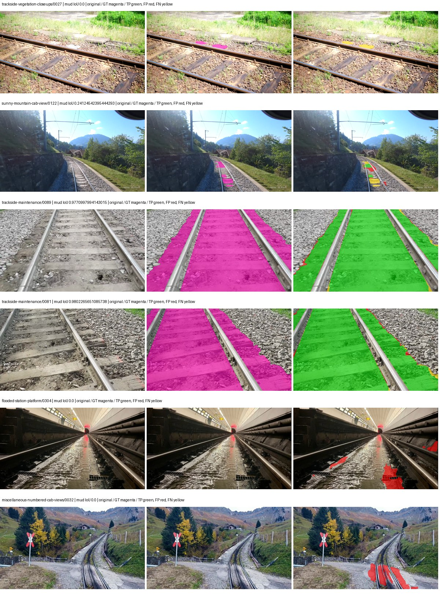
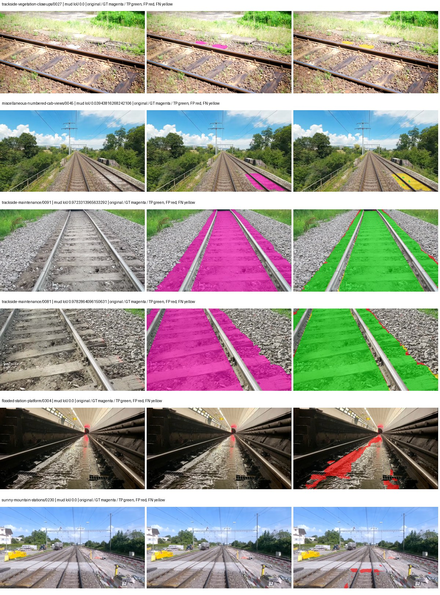
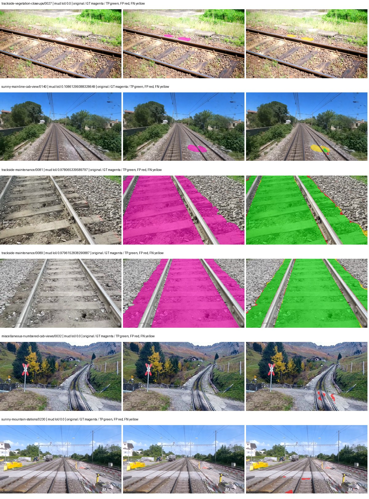
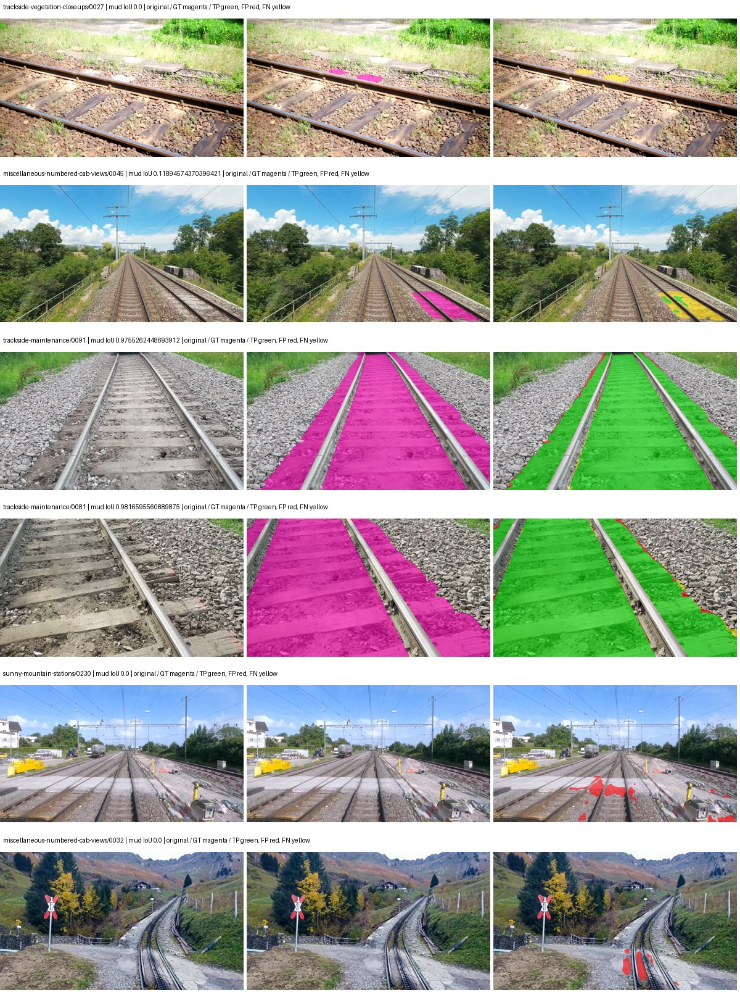

# native_convnext_tiny_uper — rad_9_24_2026-paul

[RAD 9/24 `paul` arm](../../README.md) · [Full model records](record.json)

Primary selection and early stopping: **mud-pumping validation IoU**. A job is complete only after full statistics and isolated profiling are verified.

| Model | Initialization path | Seed | Status | Steps | Best step | Mud IoU (%) | Mud precision (%) | Mud recall (%) | Final mud IoU (trainer val, %) | mIoU (%) | Fixed GT-class mIoU (%) |
| --- | --- | --- | --- | --- | --- | --- | --- | --- | --- | --- | --- |
| native_convnext_tiny_uper | rtis_only | 0 | completed | 2389 | 1061 | 88.84 | 93.81 | 94.37 | 85.34 | 60.47 | 60.47 |
| native_convnext_tiny_uper | cityscapes_to_rtis | 0 | completed | 2654 | 1327 | 89.42 | 94.94 | 93.89 | 89.22 | 60.45 | 60.45 |
| native_convnext_tiny_uper | railsem19_to_rtis | 0 | completed | 2389 | 1061 | 88.43 | 96.93 | 90.98 | 87.23 | 64.07 | 64.07 |
| native_convnext_tiny_uper | cityscapes_to_railsem19_to_rtis | 0 | completed | 2654 | 1327 | 90.47 | 96.62 | 93.43 | 89.73 | 64.19 | 64.19 |

Training: 227 images. Validation: 37 images. Test: 50 held out. Seeds: [0]. Seed variation measures optimization variability, not independent-recording uncertainty. Historical source checkpoints stay fixed across adaptation seeds.

Training code: `d864b72bd90706260965bb1a48398d01167b6d5c`. Split SHA-256: `b16dbbc7c4aa0c5d6e0fb5a20a27b4f3f8a4f3ce535621ed7c9aeaa6e85adb77`.

## rtis_only — seed 0

Status: **completed**. Started: 2026-10-05T13:51:02.345402+00:00. Finished: 2026-10-05T14:25:54.909157+00:00.

Recipe pretrained initializer: `{"arch": "native", "backbone_path": null, "batch_norm_momentum": null, "checkpoint": null, "classifier_path": null, "drop_path": null, "encoder_name": null, "encoder_weights": null, "head": "unified_head", "head_paths": [], "inactive_parameter_paths": [], "local_files_only": false, "lora_alpha": 32, "lora_dropout": 0.05, "lora_r": 16, "lora_targets": [], "native": {"auxiliary_heads": [], "backbone": {"in_channels": 3, "kind": "timm", "name": "convnext_tiny.fb_in22k_ft_in1k", "out_indices": [0, 1, 2, 3], "weights": "pretrained"}, "head": {"activation": "relu", "channels": 256, "dropout": 0.1, "in_indices": [0, 1, 2, 3], "kind": "uper", "norm": "group", "pool_bins": [1, 2, 3, 6]}, "neck": {"kind": "identity"}, "task": "multiclass"}, "revision": null, "smp_arch": null, "subfolder": null, "trust_remote_code": false, "tuning": "full"}`.

`rtis_only` uses the recipe initializer, which may include pretrained segmentation components. Transfer paths load the exact historical source checkpoint below and reset the classifier; they do not reset all query/decoder features.

Source checkpoint: `Recipe pretrained initialization`.

Config SHA-256: `930613708f14d632cd0ca835136f84f4681b995c2c75dbbe8a9b2e01e5d2b555`. Weights used for validation: `ema`.

### Mud-pumping and aggregate quality

| Metric | Selected checkpoint | Final training validation |
| --- | --- | --- |
| Mud IoU | 88.84 | 85.34 |
| Mud precision | 93.81 | 90.04 |
| Mud recall | 94.37 | 94.23 |
| Mud Dice/F1 | 94.09 | 92.09 |
| mIoU | 60.47 | 60.72 |
| Mean accuracy | 73.17 | 73.01 |
| Mean precision | 74.03 | 75.73 |
| Mean Dice | 72.92 | 73.56 |
| Mean specificity | 99.43 | 99.42 |
| Pixel accuracy | 89.63 | 89.46 |
| Frequency-weighted IoU | 82.33 | 82.07 |
| Fixed GT-present class mIoU | 60.47 | 60.72 |
| Boundary F1 | 68.94 | 69.51 |

The selected checkpoint has independent evaluation evidence. Final values are the trainer's final validation record, not a new independent evaluation. mIoU averages classes with nonzero union, so false positives on absent classes can change its denominator. The fixed GT-class mean is supplementary and excludes absent classes; their false positives remain in the confusion matrix.

### Resource usage and timing

| Measurement | Value |
| --- | --- |
| Peak training VRAM, retained training invocation (GiB) | 10.20 |
| Peak evaluation VRAM (GiB) | 7.75 |
| Retained training invocation wall time (seconds) | 1902.85 |
| Retained training invocation GPU-hours (one GPU) | 0.53 |
| Evaluation wall time (seconds) | 16.45 |
| Full evaluation pipeline images/second | 2.25 |
| Best full-state checkpoint (MiB) | 562.63 |
| Final full-state checkpoint (MiB) | 562.62 |
| Verified periodic checkpoints removed (GiB) | 2.20 |

VRAM uses the recorded allocator high-water mark; it is not total device usage including CUDA context. Resumed jobs' retained training invocation times and peaks are **not whole-campaign totals**. Earlier invocation resource records are not reconstructed here. Evaluation throughput includes loader, sliding-window inference and metrics; it is not model-only latency/FPS. Missing measurements are shown as —, never inferred from another dataset's run.

### Standardized inference performance

Dedicated model-only profiling waits for an idle worker-locked L40S: BF16, batch 1, 1024x1024, 20 warmup and 100 CUDA-event-timed public forwards. It excludes loading, preprocessing, tiling and metrics.

| Status | Parameters | Weight MiB | FPS | p50 ms | p95 ms | Peak reserved GiB |
| --- | --- | --- | --- | --- | --- | --- |
| complete | 36849525 | 140.57 | 76.06 | 13.13 | 13.22 | 1.24 |

```json
{
  "schema_version": 1,
  "model_id": "native_convnext_tiny_uper",
  "measured_at": "2026-10-05T14:25:50+00:00",
  "status": "complete",
  "benchmark_scope": "rtis_selected_checkpoint_model_only",
  "applies_to": [
    "native_convnext_tiny_uper--rtis_only--seed-0"
  ],
  "source": {
    "campaign_git_sha": "d864b72bd90706260965bb1a48398d01167b6d5c",
    "git_dirty": false,
    "config_hash": "d68375b7f142",
    "resolved_config": "/data/izadia1/projects/segmentary-runs/rad_9_24_2026/paul-seed0-20261005-r2/configs/native_convnext_tiny_uper--rtis_only--seed-0.yaml",
    "config_sha256": "930613708f14d632cd0ca835136f84f4681b995c2c75dbbe8a9b2e01e5d2b555",
    "checkpoint_sha256": "1d706ba64b13283e72f3dcc11626e95251e47a9468ee463eb3c7b6474b9ae7ee",
    "checkpoint_global_step": 1061,
    "checkpoint_bytes": 589961677,
    "checkpoint_kind": "resume checkpoint with optimizer and EMA state",
    "weights": "ema",
    "measured_checkpoint_job_id": "native_convnext_tiny_uper--rtis_only--seed-0",
    "result_sha256": "2cc80df55abdc0ed04dfce2f0999f50a16128ddab4d4ca3803928967c743a8b0",
    "result_git_sha": "d864b72bd90706260965bb1a48398d01167b6d5c",
    "result_stage": "eval:rad_9_24_2026-paul:val",
    "result_seed": 0
  },
  "hardware": {
    "gpu_name": "NVIDIA L40S",
    "gpu_uuid": "GPU-a5ad49e5-0536-5229-ba8a-f8a902808f53",
    "logical_device": "cuda:0",
    "physical_visibility_token": "7",
    "compute_capability": [
      8,
      9
    ],
    "total_memory_bytes": 47677177856
  },
  "model": {
    "parameter_count": 36849525,
    "trainable_parameter_count": 36849525,
    "resident_parameter_bytes": 147398100,
    "parameter_dtype_counts": {
      "float32": 36849525
    }
  },
  "contract": {
    "backend": "pytorch",
    "precision": "bf16_autocast",
    "batch_size": 1,
    "input_shape_nchw": [
      1,
      3,
      1024,
      1024
    ],
    "warmup_iterations": 20,
    "measured_iterations": 100,
    "timing": "per-forward CUDA events with end-event synchronization",
    "includes_preprocessing": false,
    "includes_data_loader": false,
    "includes_sliding_window": false,
    "input_resident_on_gpu": true,
    "model_only": true,
    "entrypoint": "public model(image) dense-logits forward"
  },
  "measurements": {
    "latency": {
      "p50_ms": 13.12718391418457,
      "p95_ms": 13.217331218719483,
      "mean_ms": 13.148178873062134,
      "minimum_ms": 13.08569622039795,
      "maximum_ms": 14.307328224182129,
      "fps": 76.0561602982745,
      "raw_ms": [
        13.356032371520996,
        13.114368438720703,
        13.180928230285645,
        13.109248161315918,
        13.113344192504883,
        13.135871887207031,
        13.148159980773926,
        13.111295700073242,
        13.098976135253906,
        13.215744018554688,
        13.132800102233887,
        13.123583793640137,
        13.132800102233887,
        13.575167655944824,
        13.11945629119873,
        13.115391731262207,
        13.103103637695312,
        13.140992164611816,
        13.15123176574707,
        13.252608299255371,
        13.115391731262207,
        13.127679824829102,
        13.122559547424316,
        13.140992164611816,
        13.15123176574707,
        13.129728317260742,
        13.139967918395996,
        13.103103637695312,
        13.121536254882812,
        13.134847640991211,
        13.102080345153809,
        13.126655578613281,
        13.128704071044922,
        13.126655578613281,
        13.112319946289062,
        13.101056098937988,
        13.109248161315918,
        13.136896133422852,
        13.135871887207031,
        13.08569622039795,
        13.113344192504883,
        13.140992164611816,
        13.117440223693848,
        13.133824348449707,
        13.142016410827637,
        13.157376289367676,
        13.145088195800781,
        13.104127883911133,
        13.115391731262207,
        13.127679824829102,
        13.134847640991211,
        13.103103637695312,
        13.110272407531738,
        13.139967918395996,
        13.096960067749023,
        13.17580795288086,
        13.136896133422852,
        13.119487762451172,
        13.113344192504883,
        13.171711921691895,
        13.090784072875977,
        13.118464469909668,
        13.109248161315918,
        13.124608039855957,
        13.133824348449707,
        13.135871887207031,
        13.148127555847168,
        13.090815544128418,
        13.140992164611816,
        13.162495613098145,
        13.122559547424316,
        13.162495613098145,
        13.123583793640137,
        13.148159980773926,
        13.137920379638672,
        13.150208473205566,
        13.096960067749023,
        13.126688003540039,
        13.100031852722168,
        13.127679824829102,
        13.104127883911133,
        13.131775856018066,
        13.128704071044922,
        13.102080345153809,
        13.095935821533203,
        13.122528076171875,
        13.247488021850586,
        13.15225601196289,
        14.307328224182129,
        13.109248161315918,
        13.112319946289062,
        13.127679824829102,
        13.138943672180176,
        13.123583793640137,
        13.124608039855957,
        13.126655578613281,
        13.117440223693848,
        13.105152130126953,
        13.160415649414062,
        13.145088195800781
      ],
      "percentile_method": "numpy linear interpolation"
    },
    "peak_reserved_bytes": 1335885824,
    "memory_kind": "pytorch_cuda_allocator_peak_reserved_excluding_context",
    "benchmark_wall_clock_s": 9.212628610432148
  },
  "started_at": "2026-10-05T14:25:41+00:00",
  "finished_at": "2026-10-05T14:25:50+00:00",
  "environment": {
    "hostname": "hdrfs-app-001",
    "python": "3.11.15",
    "platform": "Linux-5.15.0-139-generic-x86_64-with-glibc2.35",
    "torch": "2.11.0+cu128",
    "torch_cuda": "12.8",
    "cudnn": 91900,
    "driver_version": "570.133.20",
    "cuda_available": true,
    "gpu_count": 1,
    "gpu_names": [
      "NVIDIA L40S"
    ],
    "cuda_visible_devices": "7",
    "packages": {
      "segmentary": "0.1.0",
      "torch": "2.11.0+cu128",
      "torchvision": "0.26.0+cu128",
      "transformers": "5.15.0",
      "timm": "1.0.28",
      "segmentation-models-pytorch": "0.5.0",
      "albumentations": "2.0.8",
      "lightning": "2.6.5",
      "numpy": "2.4.4"
    }
  }
}
```

### Per-class validation results

| Class | GT pixels | IoU (%) | Precision (%) | Recall (%) | Dice (%) | Boundary F1 (%) |
| --- | --- | --- | --- | --- | --- | --- |
| car | 75932 | 40.95 | 47.39 | 75.08 | 58.11 | 75.64 |
| construction | 5694760 | 50.63 | 66.08 | 68.41 | 67.22 | 65.65 |
| fence | 3789415 | 42.61 | 92.64 | 44.11 | 59.76 | 62.63 |
| mud-pumping | 7435760 | 88.84 | 93.81 | 94.37 | 94.09 | 70.24 |
| on-rails | 1137952 | 76.11 | 88.12 | 84.81 | 86.44 | 59.83 |
| person | 130659 | 71.90 | 79.07 | 88.80 | 83.65 | 75.16 |
| pole | 1467743 | 63.10 | 73.42 | 81.77 | 77.37 | 85.63 |
| rail-embedded | 74744 | 42.12 | 63.05 | 55.92 | 59.27 | 68.91 |
| rail-raised | 3588713 | 79.37 | 87.22 | 89.82 | 88.50 | 91.95 |
| rail-track | 4270276 | 76.14 | 86.41 | 86.49 | 86.45 | 83.20 |
| road | 1152119 | 46.08 | 66.73 | 59.82 | 63.09 | 57.78 |
| sidewalk | 2164731 | 61.71 | 71.44 | 81.92 | 76.32 | 68.61 |
| sky | 20207617 | 97.55 | 98.97 | 98.55 | 98.76 | 94.16 |
| standing-water | 2006046 | 73.21 | 87.22 | 82.01 | 84.53 | 34.17 |
| terrain | 30442090 | 89.29 | 92.69 | 96.06 | 94.34 | 84.49 |
| trackbed | 9118591 | 83.74 | 90.02 | 92.31 | 91.15 | 85.67 |
| traffic-light | 116825 | 49.48 | 69.17 | 63.48 | 66.21 | 65.15 |
| traffic-sign | 35778 | 18.98 | 34.20 | 29.90 | 31.91 | 48.14 |
| tram-track | 244726 | 38.87 | 58.13 | 53.98 | 55.98 | 54.66 |
| truck | 190997 | 20.68 | 39.08 | 30.53 | 34.28 | 34.57 |
| vegetation-overgrowth | 1534858 | 58.50 | 69.68 | 78.48 | 73.82 | 81.41 |

### Full-run accounting

| Measurement | Value |
| --- | --- |
| Full GPU-reserved wall seconds, all recorded worker attempts | 2100.20 |
| Full reserved GPU-hours | 0.58 |
| Whole-run timing complete | True |

| Phase | Wall seconds including failed attempts |
| --- | --- |
| training | 1910.52 |
| diagnostics | 136.03 |
| performance | 17.46 |

GPU-reserved time includes model loading, training, validation, collection, profiling, checkpoint I/O and orchestration while the worker owns one GPU. It is not GPU kernel-active time. Phase timings and sampled device memory/power/utilization are retained separately; sampled device memory is not the allocator high-water mark.

### Train/validation and raw/EMA diagnostics

| Checkpoint / weights / split | Images | Mud IoU (%) | Mud precision (%) | Mud recall (%) |
| --- | --- | --- | --- | --- |
| best-auto-train / ema | 227 | 95.91 | 97.89 | 97.94 |
| best-auto-val / ema | 37 | 88.84 | 93.81 | 94.37 |
| best-alternate-val / raw | 37 | 88.75 | 94.42 | 93.65 |
| final-auto-val / ema | 37 | 85.34 | 90.05 | 94.23 |

Train uses the evaluation transform without augmentation. Compare mud train/validation metrics for the same selected weights. Alternate EMA on running-stat BatchNorm is explicitly uncalibrated and is diagnostic only. Score-threshold curves use uncalibrated normalized scores and are pixel-level diagnostics, not event detection rates or a selected deployment operating point.

### Downloadable evidence

- best-auto-train: [per-image.csv](rtis_only--seed-0/best-auto-train/per-image.csv) · [per-image-confusion.json.gz](rtis_only--seed-0/best-auto-train/per-image-confusion.json.gz) · [groups.json](rtis_only--seed-0/best-auto-train/groups.json) · [mud-score-curves.json](rtis_only--seed-0/best-auto-train/mud-score-curves.json)
- best-auto-val: [per-image.csv](rtis_only--seed-0/best-auto-val/per-image.csv) · [per-image-confusion.json.gz](rtis_only--seed-0/best-auto-val/per-image-confusion.json.gz) · [groups.json](rtis_only--seed-0/best-auto-val/groups.json) · [mud-score-curves.json](rtis_only--seed-0/best-auto-val/mud-score-curves.json) · [examples.jpg](rtis_only--seed-0/best-auto-val/examples.jpg)
- best-alternate-val: [per-image.csv](rtis_only--seed-0/best-alternate-val/per-image.csv) · [per-image-confusion.json.gz](rtis_only--seed-0/best-alternate-val/per-image-confusion.json.gz) · [groups.json](rtis_only--seed-0/best-alternate-val/groups.json) · [mud-score-curves.json](rtis_only--seed-0/best-alternate-val/mud-score-curves.json)
- final-auto-val: [per-image.csv](rtis_only--seed-0/final-auto-val/per-image.csv) · [per-image-confusion.json.gz](rtis_only--seed-0/final-auto-val/per-image-confusion.json.gz) · [groups.json](rtis_only--seed-0/final-auto-val/groups.json) · [mud-score-curves.json](rtis_only--seed-0/final-auto-val/mud-score-curves.json)
- resources: [telemetry.csv](rtis_only--seed-0/resources/telemetry.csv)



Examples are two lowest and two highest mud-IoU positive images, plus up to two negative images with the most false-positive mud pixels. They are targeted diagnostic examples, not random samples. Green: true positive; red: false positive; yellow: false negative. Full predictions remain on HDRFS.

### Validation tracking

| Logged step | Overall mIoU (%) | Mud IoU (%) |
| --- | --- | --- |
| 264 | 42.24 | 85.13 |
| 530 | 53.59 | 82.96 |
| 796 | 58.45 | 85.57 |
| 1061 | 60.47 | 88.84 |
| 1326 | 60.55 | 87.23 |
| 1592 | 60.82 | 84.62 |
| 1857 | 60.30 | 84.79 |
| 2123 | 60.66 | 85.28 |
| 2389 | 60.72 | 85.34 |

All retained scalar curves, including training loss and per-class IoU, are in record.json. Observed best mud on a curve is not necessarily a retained checkpoint: the pilot saved its selection-metric-best and final checkpoints. Step logging and checkpoint global_step may differ by one.

### Stopping and checkpoint provenance

```json
{
  "stopping": {
    "actual_steps": 2389,
    "maximum_steps": 4000,
    "min_delta": 0.001,
    "monitor": "val_iou/mud-pumping",
    "patience": 5,
    "reason": "validation_plateau"
  },
  "checkpoints": {
    "best": {
      "path": "/data/izadia1/projects/segmentary-runs/rad_9_24_2026/paul-seed0-20261005-r2/future-runs/native_convnext_tiny_uper--rtis_only--seed-0_seed0/rtis/best.ckpt",
      "sha256": "1d706ba64b13283e72f3dcc11626e95251e47a9468ee463eb3c7b6474b9ae7ee",
      "global_step": 1061,
      "bytes": 589961677
    },
    "final": {
      "path": "/data/izadia1/projects/segmentary-runs/rad_9_24_2026/paul-seed0-20261005-r2/future-runs/native_convnext_tiny_uper--rtis_only--seed-0_seed0/rtis/last.ckpt",
      "sha256": "ff7b1198004861f01b2e12915594e11a20a4f8401864dba39fa5f821a7e952fd",
      "global_step": 2389,
      "bytes": 589951309
    }
  },
  "cleanup_error": null
}
```

### Resolved training, initialization and evaluation settings

The optimizer block is the base configuration. Stage LR scales are applied at runtime, and stage warmup is capped at min(base warmup, floor(stage budget / 10), stage budget - 1): 400 steps for this 4,000-step pilot. Model-internal native input grids may differ from augmentation crops (EoMT uses its 640 grid).

```json
{
  "name": "native_convnext_tiny_uper--rtis_only--seed-0",
  "model": {
    "arch": "native",
    "checkpoint": null,
    "tuning": "full",
    "head": "unified_head",
    "lora_r": 16,
    "lora_alpha": 32,
    "lora_dropout": 0.05,
    "lora_targets": [],
    "drop_path": null,
    "revision": null,
    "subfolder": null,
    "local_files_only": false,
    "trust_remote_code": false,
    "backbone_path": null,
    "head_paths": [],
    "classifier_path": null,
    "inactive_parameter_paths": [],
    "smp_arch": null,
    "encoder_name": null,
    "encoder_weights": null,
    "native": {
      "task": "multiclass",
      "backbone": {
        "kind": "timm",
        "name": "convnext_tiny.fb_in22k_ft_in1k",
        "weights": "pretrained",
        "out_indices": [
          0,
          1,
          2,
          3
        ],
        "in_channels": 3
      },
      "neck": {
        "kind": "identity"
      },
      "head": {
        "kind": "uper",
        "in_indices": [
          0,
          1,
          2,
          3
        ],
        "channels": 256,
        "pool_bins": [
          1,
          2,
          3,
          6
        ],
        "dropout": 0.1,
        "norm": "group",
        "activation": "relu"
      },
      "auxiliary_heads": []
    },
    "batch_norm_momentum": null
  },
  "space": "paul-test-rtis",
  "taxonomy_root": "/data/izadia1/projects/segmentary-rad-d864b72b/taxonomy",
  "output_root": "/data/izadia1/projects/segmentary-runs/rad_9_24_2026/paul-seed0-20261005-r2/future-runs",
  "optim": {
    "backbone_lr": 0.0001,
    "head_lr_mult": 10.0,
    "weight_decay": 0.05,
    "llrd": 1.0,
    "warmup_iters": 1500,
    "warmup_ratio": 1e-06,
    "poly_power": 0.9,
    "min_lr_ratio": 0.0,
    "betas": [
      0.9,
      0.999
    ],
    "grad_clip": 1.0
  },
  "train": {
    "iters": 4000,
    "batch_size": 2,
    "accum": 8,
    "num_workers": 2,
    "precision": "bf16-mixed",
    "ema_decay": 0.9998,
    "val_every": 250,
    "ckpt_every": 500,
    "selection_metric": "val_iou/mud-pumping",
    "early_stopping_patience": 5,
    "early_stopping_min_delta": 0.001,
    "seed": 0,
    "devices": 1
  },
  "eval": {
    "sliding_window": true,
    "window": [
      1024,
      1024
    ],
    "stride": [
      768,
      768
    ],
    "batch_size": 1,
    "num_workers": 2,
    "tta_scales": [],
    "tta_flip": false,
    "threshold": 0.5,
    "boundary_tolerance_frac": 0.0075,
    "save_confusion": true
  },
  "loss": {
    "task": "multiclass",
    "activation": "auto",
    "terms": [],
    "aux": "none",
    "aux_weight": 0.0,
    "ce_weight": 1.0,
    "label_smoothing": 0.0,
    "class_weights": null,
    "query": null
  },
  "aug": {
    "crop": [
      1024,
      1024
    ],
    "scale_min": 0.5,
    "scale_max": 2.0,
    "hflip_p": 0.5,
    "color_jitter_p": 0.5,
    "brightness": 0.25,
    "contrast": 0.25,
    "saturation": 0.25,
    "hue": 0.05
  },
  "stages": [
    {
      "name": "rtis",
      "data": [
        {
          "name": "rad_9_24_2026-paul",
          "root": "/data/izadia1/datasets/rad_9_24_2026-paul",
          "variant": null,
          "split_file": "splits.json",
          "train_split": "train",
          "val_split": "val",
          "limit": null,
          "loader": "folder",
          "mapping": "paul-test-rtis",
          "loader_options": {
            "require_groups": false
          }
        }
      ],
      "iters": null,
      "lr_scale": 1.0,
      "head_group_lr_scale": 1.0,
      "init_from": "pretrained",
      "reset_head": false,
      "freeze": null,
      "sample_weights": null
    }
  ]
}
```

### Hardware and software provenance

```json
{
  "training": {
    "cuda_available": true,
    "cuda_visible_devices": "7",
    "cudnn": 91900,
    "driver_version": "570.133.20",
    "gpu_count": 1,
    "gpu_names": [
      "NVIDIA L40S"
    ],
    "hostname": "hdrfs-app-001",
    "input_normalization": {
      "channel_order": "rgb",
      "mean": [
        0.485,
        0.456,
        0.406
      ],
      "source": "timm_pretrained_cfg",
      "std": [
        0.229,
        0.224,
        0.225
      ]
    },
    "model_origins": [
      {
        "hf_commit": null,
        "hf_name_or_path": null,
        "module": "backbone",
        "timm_pretrained": {
          "architecture": "convnext_tiny",
          "hf_hub_id": "timm/convnext_tiny.fb_in22k_ft_in1k",
          "tag": "fb_in22k_ft_in1k",
          "url": "https://dl.fbaipublicfiles.com/convnext/convnext_tiny_22k_1k_224.pth"
        }
      },
      {
        "hf_commit": null,
        "hf_name_or_path": null,
        "module": "backbone.model",
        "timm_pretrained": {
          "architecture": "convnext_tiny",
          "hf_hub_id": "timm/convnext_tiny.fb_in22k_ft_in1k",
          "tag": "fb_in22k_ft_in1k",
          "url": "https://dl.fbaipublicfiles.com/convnext/convnext_tiny_22k_1k_224.pth"
        }
      }
    ],
    "model_parameter_count": 36849525,
    "packages": {
      "albumentations": "2.0.8",
      "lightning": "2.6.5",
      "numpy": "2.4.4",
      "segmentary": "0.1.0",
      "segmentation-models-pytorch": "0.5.0",
      "timm": "1.0.28",
      "torch": "2.11.0+cu128",
      "torchvision": "0.26.0+cu128",
      "transformers": "5.15.0"
    },
    "platform": "Linux-5.15.0-139-generic-x86_64-with-glibc2.35",
    "python": "3.11.15",
    "torch": "2.11.0+cu128",
    "torch_cuda": "12.8",
    "trainable_parameter_count": 36849525,
    "training_stop": {
      "actual_steps": 2389,
      "maximum_steps": 4000,
      "min_delta": 0.001,
      "monitor": "val_iou/mud-pumping",
      "patience": 5,
      "reason": "validation_plateau"
    },
    "validation_weights": "ema"
  },
  "evaluation": {
    "cuda_available": true,
    "cuda_visible_devices": "7",
    "cudnn": 91900,
    "driver_version": "570.133.20",
    "gpu_count": 1,
    "gpu_names": [
      "NVIDIA L40S"
    ],
    "hostname": "hdrfs-app-001",
    "input_normalization": {
      "channel_order": "rgb",
      "mean": [
        0.485,
        0.456,
        0.406
      ],
      "source": "timm_pretrained_cfg",
      "std": [
        0.229,
        0.224,
        0.225
      ]
    },
    "packages": {
      "albumentations": "2.0.8",
      "lightning": "2.6.5",
      "numpy": "2.4.4",
      "segmentary": "0.1.0",
      "segmentation-models-pytorch": "0.5.0",
      "timm": "1.0.28",
      "torch": "2.11.0+cu128",
      "torchvision": "0.26.0+cu128",
      "transformers": "5.15.0"
    },
    "platform": "Linux-5.15.0-139-generic-x86_64-with-glibc2.35",
    "python": "3.11.15",
    "torch": "2.11.0+cu128",
    "torch_cuda": "12.8"
  }
}
```

## cityscapes_to_rtis — seed 0

Status: **completed**. Started: 2026-10-05T13:56:13.650904+00:00. Finished: 2026-10-05T14:34:34.451913+00:00.

Recipe pretrained initializer: `{"arch": "native", "backbone_path": null, "batch_norm_momentum": null, "checkpoint": null, "classifier_path": null, "drop_path": null, "encoder_name": null, "encoder_weights": null, "head": "unified_head", "head_paths": [], "inactive_parameter_paths": [], "local_files_only": false, "lora_alpha": 32, "lora_dropout": 0.05, "lora_r": 16, "lora_targets": [], "native": {"auxiliary_heads": [], "backbone": {"in_channels": 3, "kind": "timm", "name": "convnext_tiny.fb_in22k_ft_in1k", "out_indices": [0, 1, 2, 3], "weights": "pretrained"}, "head": {"activation": "relu", "channels": 256, "dropout": 0.1, "in_indices": [0, 1, 2, 3], "kind": "uper", "norm": "group", "pool_bins": [1, 2, 3, 6]}, "neck": {"kind": "identity"}, "task": "multiclass"}, "revision": null, "smp_arch": null, "subfolder": null, "trust_remote_code": false, "tuning": "full"}`.

`rtis_only` uses the recipe initializer, which may include pretrained segmentation components. Transfer paths load the exact historical source checkpoint below and reset the classifier; they do not reset all query/decoder features.

Source checkpoint: `{'name': 'native_convnext_tiny_uper--cityscapes--seed-0', 'model': 'native_convnext_tiny_uper', 'protocol': 'cityscapes', 'config': '/data/izadia1/projects/segmentary-runs/all-model-city-rail-seed0-rail20-b9eb3e1/accepted/native_convnext_tiny_uper--cityscapes--seed-0/resolved-config.yaml', 'checkpoint': '/data/izadia1/projects/segmentary-runs/all-model-city-rail-seed0-a7c0b67/jobs/native_convnext_tiny_uper--cityscapes--seed-0/attempt-001/train/native_convnext_tiny_uper--cityscapes_seed0/cityscapes/last.ckpt', 'recorded_sha256': '5b371ccbb1c2f1ad354d205d07f867135039dd82de6fffac6c27c76b1cbc88ea', 'exists': True}`.

Config SHA-256: `0e34ca25cdd4c5cf05490da112ae816e1bee8f3a1be9012e0a525e8dfffb86bb`. Weights used for validation: `ema`.

### Mud-pumping and aggregate quality

| Metric | Selected checkpoint | Final training validation |
| --- | --- | --- |
| Mud IoU | 89.42 | 89.22 |
| Mud precision | 94.94 | 94.34 |
| Mud recall | 93.89 | 94.27 |
| Mud Dice/F1 | 94.41 | 94.30 |
| mIoU | 60.45 | 61.55 |
| Mean accuracy | 73.18 | 74.16 |
| Mean precision | 75.71 | 76.84 |
| Mean Dice | 73.33 | 74.41 |
| Mean specificity | 99.39 | 99.39 |
| Pixel accuracy | 88.90 | 89.05 |
| Frequency-weighted IoU | 81.14 | 81.31 |
| Fixed GT-present class mIoU | 60.45 | 61.55 |
| Boundary F1 | 67.16 | 68.11 |

The selected checkpoint has independent evaluation evidence. Final values are the trainer's final validation record, not a new independent evaluation. mIoU averages classes with nonzero union, so false positives on absent classes can change its denominator. The fixed GT-class mean is supplementary and excludes absent classes; their false positives remain in the confusion matrix.

### Resource usage and timing

| Measurement | Value |
| --- | --- |
| Peak training VRAM, retained training invocation (GiB) | 10.20 |
| Peak evaluation VRAM (GiB) | 7.75 |
| Retained training invocation wall time (seconds) | 2114.99 |
| Retained training invocation GPU-hours (one GPU) | 0.59 |
| Evaluation wall time (seconds) | 15.90 |
| Full evaluation pipeline images/second | 2.33 |
| Best full-state checkpoint (MiB) | 562.63 |
| Final full-state checkpoint (MiB) | 562.62 |
| Verified periodic checkpoints removed (GiB) | 2.75 |

VRAM uses the recorded allocator high-water mark; it is not total device usage including CUDA context. Resumed jobs' retained training invocation times and peaks are **not whole-campaign totals**. Earlier invocation resource records are not reconstructed here. Evaluation throughput includes loader, sliding-window inference and metrics; it is not model-only latency/FPS. Missing measurements are shown as —, never inferred from another dataset's run.

### Standardized inference performance

Dedicated model-only profiling waits for an idle worker-locked L40S: BF16, batch 1, 1024x1024, 20 warmup and 100 CUDA-event-timed public forwards. It excludes loading, preprocessing, tiling and metrics.

| Status | Parameters | Weight MiB | FPS | p50 ms | p95 ms | Peak reserved GiB |
| --- | --- | --- | --- | --- | --- | --- |
| complete | 36849525 | 140.57 | 75.54 | 13.23 | 13.27 | 1.24 |

```json
{
  "schema_version": 1,
  "model_id": "native_convnext_tiny_uper",
  "measured_at": "2026-10-05T14:34:29+00:00",
  "status": "complete",
  "benchmark_scope": "rtis_selected_checkpoint_model_only",
  "applies_to": [
    "native_convnext_tiny_uper--cityscapes_to_rtis--seed-0"
  ],
  "source": {
    "campaign_git_sha": "d864b72bd90706260965bb1a48398d01167b6d5c",
    "git_dirty": false,
    "config_hash": "62f803adb7e2",
    "resolved_config": "/data/izadia1/projects/segmentary-runs/rad_9_24_2026/paul-seed0-20261005-r2/configs/native_convnext_tiny_uper--cityscapes_to_rtis--seed-0.yaml",
    "config_sha256": "0e34ca25cdd4c5cf05490da112ae816e1bee8f3a1be9012e0a525e8dfffb86bb",
    "checkpoint_sha256": "ef62eb4ad71fa5fa052973d94c16679d83dfb91c5b1bda55f502b5f21be0db09",
    "checkpoint_global_step": 1327,
    "checkpoint_bytes": 589961677,
    "checkpoint_kind": "resume checkpoint with optimizer and EMA state",
    "weights": "ema",
    "measured_checkpoint_job_id": "native_convnext_tiny_uper--cityscapes_to_rtis--seed-0",
    "result_sha256": "c9eeb45d7f8137975bfac9b0ab7c3f7bec76f29bc003d35404866c8eff222558",
    "result_git_sha": "d864b72bd90706260965bb1a48398d01167b6d5c",
    "result_stage": "eval:rad_9_24_2026-paul:val",
    "result_seed": 0
  },
  "hardware": {
    "gpu_name": "NVIDIA L40S",
    "gpu_uuid": "GPU-804aea8b-5f62-423e-72c6-49e1ed15c4e4",
    "logical_device": "cuda:0",
    "physical_visibility_token": "6",
    "compute_capability": [
      8,
      9
    ],
    "total_memory_bytes": 47677177856
  },
  "model": {
    "parameter_count": 36849525,
    "trainable_parameter_count": 36849525,
    "resident_parameter_bytes": 147398100,
    "parameter_dtype_counts": {
      "float32": 36849525
    }
  },
  "contract": {
    "backend": "pytorch",
    "precision": "bf16_autocast",
    "batch_size": 1,
    "input_shape_nchw": [
      1,
      3,
      1024,
      1024
    ],
    "warmup_iterations": 20,
    "measured_iterations": 100,
    "timing": "per-forward CUDA events with end-event synchronization",
    "includes_preprocessing": false,
    "includes_data_loader": false,
    "includes_sliding_window": false,
    "input_resident_on_gpu": true,
    "model_only": true,
    "entrypoint": "public model(image) dense-logits forward"
  },
  "measurements": {
    "latency": {
      "p50_ms": 13.227007865905762,
      "p95_ms": 13.267046356201172,
      "mean_ms": 13.237954559326171,
      "minimum_ms": 13.134847640991211,
      "maximum_ms": 15.18284797668457,
      "fps": 75.54037109875843,
      "raw_ms": [
        13.328384399414062,
        13.287424087524414,
        13.205504417419434,
        13.254655838012695,
        13.134847640991211,
        13.198335647583008,
        13.1778564453125,
        13.144063949584961,
        13.237248420715332,
        13.26591968536377,
        13.231103897094727,
        13.240320205688477,
        13.234175682067871,
        13.170687675476074,
        13.233152389526367,
        13.172736167907715,
        13.184000015258789,
        13.228032112121582,
        13.198335647583008,
        13.174783706665039,
        13.220864295959473,
        13.16147232055664,
        13.179903984069824,
        13.239328384399414,
        13.227007865905762,
        13.144063949584961,
        13.239295959472656,
        13.247488021850586,
        13.202431678771973,
        13.26694393157959,
        13.209600448608398,
        13.146112442016602,
        13.202431678771973,
        13.184000015258789,
        13.184000015258789,
        13.231103897094727,
        13.253631591796875,
        13.142016410827637,
        13.237248420715332,
        13.234175682067871,
        13.164544105529785,
        13.181952476501465,
        13.213664054870605,
        13.206527709960938,
        13.26899242401123,
        13.270015716552734,
        13.244416236877441,
        13.223936080932617,
        13.235199928283691,
        13.25158405303955,
        13.203455924987793,
        13.26591968536377,
        13.228032112121582,
        13.228032112121582,
        13.225983619689941,
        13.227007865905762,
        13.229056358337402,
        13.243391990661621,
        13.147135734558105,
        13.25158405303955,
        13.221887588500977,
        13.213695526123047,
        13.210623741149902,
        13.15123176574707,
        13.263872146606445,
        13.204480171203613,
        13.215744018554688,
        13.215744018554688,
        13.225983619689941,
        13.202431678771973,
        13.231136322021484,
        13.245439529418945,
        13.142016410827637,
        13.245439529418945,
        13.239295959472656,
        13.213695526123047,
        13.225983619689941,
        13.25772762298584,
        13.234175682067871,
        13.243391990661621,
        13.248512268066406,
        13.16864013671875,
        13.234175682067871,
        13.236224174499512,
        13.256704330444336,
        13.252608299255371,
        13.170687675476074,
        13.233152389526367,
        13.236224174499512,
        13.245439529418945,
        13.23516845703125,
        13.213695526123047,
        13.241344451904297,
        13.173760414123535,
        13.212672233581543,
        13.220864295959473,
        13.223936080932617,
        13.232128143310547,
        15.18284797668457,
        13.207551956176758
      ],
      "percentile_method": "numpy linear interpolation"
    },
    "peak_reserved_bytes": 1335885824,
    "memory_kind": "pytorch_cuda_allocator_peak_reserved_excluding_context",
    "benchmark_wall_clock_s": 8.928281418979168
  },
  "started_at": "2026-10-05T14:34:20+00:00",
  "finished_at": "2026-10-05T14:34:29+00:00",
  "environment": {
    "hostname": "hdrfs-app-001",
    "python": "3.11.15",
    "platform": "Linux-5.15.0-139-generic-x86_64-with-glibc2.35",
    "torch": "2.11.0+cu128",
    "torch_cuda": "12.8",
    "cudnn": 91900,
    "driver_version": "570.133.20",
    "cuda_available": true,
    "gpu_count": 1,
    "gpu_names": [
      "NVIDIA L40S"
    ],
    "cuda_visible_devices": "6",
    "packages": {
      "segmentary": "0.1.0",
      "torch": "2.11.0+cu128",
      "torchvision": "0.26.0+cu128",
      "transformers": "5.15.0",
      "timm": "1.0.28",
      "segmentation-models-pytorch": "0.5.0",
      "albumentations": "2.0.8",
      "lightning": "2.6.5",
      "numpy": "2.4.4"
    }
  }
}
```

### Per-class validation results

| Class | GT pixels | IoU (%) | Precision (%) | Recall (%) | Dice (%) | Boundary F1 (%) |
| --- | --- | --- | --- | --- | --- | --- |
| car | 75932 | 40.98 | 44.47 | 83.92 | 58.14 | 72.86 |
| construction | 5694760 | 51.08 | 72.69 | 63.20 | 67.62 | 62.43 |
| fence | 3789415 | 53.65 | 90.81 | 56.73 | 69.83 | 66.37 |
| mud-pumping | 7435760 | 89.42 | 94.94 | 93.89 | 94.41 | 68.26 |
| on-rails | 1137952 | 80.35 | 89.28 | 88.93 | 89.10 | 53.51 |
| person | 130659 | 79.08 | 84.60 | 92.38 | 88.32 | 80.05 |
| pole | 1467743 | 63.43 | 74.34 | 81.21 | 77.63 | 86.51 |
| rail-embedded | 74744 | 33.42 | 61.80 | 42.12 | 50.10 | 59.90 |
| rail-raised | 3588713 | 78.53 | 85.14 | 91.00 | 87.97 | 89.89 |
| rail-track | 4270276 | 72.17 | 83.25 | 84.44 | 83.84 | 79.53 |
| road | 1152119 | 45.25 | 66.50 | 58.60 | 62.30 | 59.09 |
| sidewalk | 2164731 | 50.23 | 60.27 | 75.11 | 66.87 | 58.61 |
| sky | 20207617 | 97.35 | 99.09 | 98.23 | 98.66 | 94.12 |
| standing-water | 2006046 | 62.69 | 83.05 | 71.89 | 77.07 | 22.73 |
| terrain | 30442090 | 87.76 | 91.91 | 95.11 | 93.48 | 80.62 |
| trackbed | 9118591 | 78.38 | 84.74 | 91.26 | 87.88 | 78.81 |
| traffic-light | 116825 | 44.86 | 72.05 | 54.32 | 61.94 | 70.36 |
| traffic-sign | 35778 | 26.84 | 38.00 | 47.74 | 42.32 | 58.36 |
| tram-track | 244726 | 29.17 | 61.47 | 35.70 | 45.17 | 39.25 |
| truck | 190997 | 48.32 | 84.04 | 53.20 | 65.16 | 50.81 |
| vegetation-overgrowth | 1534858 | 56.51 | 67.45 | 77.70 | 72.22 | 78.28 |

### Full-run accounting

| Measurement | Value |
| --- | --- |
| Full GPU-reserved wall seconds, all recorded worker attempts | 2308.68 |
| Full reserved GPU-hours | 0.64 |
| Whole-run timing complete | True |

| Phase | Wall seconds including failed attempts |
| --- | --- |
| training | 2121.98 |
| diagnostics | 135.05 |
| performance | 16.33 |

GPU-reserved time includes model loading, training, validation, collection, profiling, checkpoint I/O and orchestration while the worker owns one GPU. It is not GPU kernel-active time. Phase timings and sampled device memory/power/utilization are retained separately; sampled device memory is not the allocator high-water mark.

### Train/validation and raw/EMA diagnostics

| Checkpoint / weights / split | Images | Mud IoU (%) | Mud precision (%) | Mud recall (%) |
| --- | --- | --- | --- | --- |
| best-auto-train / ema | 227 | 95.72 | 97.73 | 97.90 |
| best-auto-val / ema | 37 | 89.42 | 94.94 | 93.89 |
| best-alternate-val / raw | 37 | 89.40 | 95.48 | 93.35 |
| final-auto-val / ema | 37 | 89.22 | 94.34 | 94.27 |

Train uses the evaluation transform without augmentation. Compare mud train/validation metrics for the same selected weights. Alternate EMA on running-stat BatchNorm is explicitly uncalibrated and is diagnostic only. Score-threshold curves use uncalibrated normalized scores and are pixel-level diagnostics, not event detection rates or a selected deployment operating point.

### Downloadable evidence

- best-auto-train: [per-image.csv](cityscapes_to_rtis--seed-0/best-auto-train/per-image.csv) · [per-image-confusion.json.gz](cityscapes_to_rtis--seed-0/best-auto-train/per-image-confusion.json.gz) · [groups.json](cityscapes_to_rtis--seed-0/best-auto-train/groups.json) · [mud-score-curves.json](cityscapes_to_rtis--seed-0/best-auto-train/mud-score-curves.json)
- best-auto-val: [per-image.csv](cityscapes_to_rtis--seed-0/best-auto-val/per-image.csv) · [per-image-confusion.json.gz](cityscapes_to_rtis--seed-0/best-auto-val/per-image-confusion.json.gz) · [groups.json](cityscapes_to_rtis--seed-0/best-auto-val/groups.json) · [mud-score-curves.json](cityscapes_to_rtis--seed-0/best-auto-val/mud-score-curves.json) · [examples.jpg](cityscapes_to_rtis--seed-0/best-auto-val/examples.jpg)
- best-alternate-val: [per-image.csv](cityscapes_to_rtis--seed-0/best-alternate-val/per-image.csv) · [per-image-confusion.json.gz](cityscapes_to_rtis--seed-0/best-alternate-val/per-image-confusion.json.gz) · [groups.json](cityscapes_to_rtis--seed-0/best-alternate-val/groups.json) · [mud-score-curves.json](cityscapes_to_rtis--seed-0/best-alternate-val/mud-score-curves.json)
- final-auto-val: [per-image.csv](cityscapes_to_rtis--seed-0/final-auto-val/per-image.csv) · [per-image-confusion.json.gz](cityscapes_to_rtis--seed-0/final-auto-val/per-image-confusion.json.gz) · [groups.json](cityscapes_to_rtis--seed-0/final-auto-val/groups.json) · [mud-score-curves.json](cityscapes_to_rtis--seed-0/final-auto-val/mud-score-curves.json)
- resources: [telemetry.csv](cityscapes_to_rtis--seed-0/resources/telemetry.csv)



Examples are two lowest and two highest mud-IoU positive images, plus up to two negative images with the most false-positive mud pixels. They are targeted diagnostic examples, not random samples. Green: true positive; red: false positive; yellow: false negative. Full predictions remain on HDRFS.

### Validation tracking

| Logged step | Overall mIoU (%) | Mud IoU (%) |
| --- | --- | --- |
| 264 | 39.40 | 79.06 |
| 530 | 57.62 | 86.52 |
| 796 | 59.62 | 87.09 |
| 1061 | 59.63 | 88.24 |
| 1326 | 60.46 | 89.42 |
| 1592 | 60.54 | 89.31 |
| 1857 | 61.11 | 88.88 |
| 2123 | 61.49 | 89.14 |
| 2389 | 61.50 | 89.16 |
| 2653 | 61.55 | 89.22 |

All retained scalar curves, including training loss and per-class IoU, are in record.json. Observed best mud on a curve is not necessarily a retained checkpoint: the pilot saved its selection-metric-best and final checkpoints. Step logging and checkpoint global_step may differ by one.

### Stopping and checkpoint provenance

```json
{
  "stopping": {
    "actual_steps": 2654,
    "maximum_steps": 4000,
    "min_delta": 0.001,
    "monitor": "val_iou/mud-pumping",
    "patience": 5,
    "reason": "validation_plateau"
  },
  "checkpoints": {
    "best": {
      "path": "/data/izadia1/projects/segmentary-runs/rad_9_24_2026/paul-seed0-20261005-r2/future-runs/native_convnext_tiny_uper--cityscapes_to_rtis--seed-0_seed0/rtis/best.ckpt",
      "sha256": "ef62eb4ad71fa5fa052973d94c16679d83dfb91c5b1bda55f502b5f21be0db09",
      "global_step": 1327,
      "bytes": 589961677
    },
    "final": {
      "path": "/data/izadia1/projects/segmentary-runs/rad_9_24_2026/paul-seed0-20261005-r2/future-runs/native_convnext_tiny_uper--cityscapes_to_rtis--seed-0_seed0/rtis/last.ckpt",
      "sha256": "29767342125db11d956fccd2f38d04a533826f25d5017457a2eef407244557f9",
      "global_step": 2654,
      "bytes": 589951309
    }
  },
  "cleanup_error": null
}
```

### Resolved training, initialization and evaluation settings

The optimizer block is the base configuration. Stage LR scales are applied at runtime, and stage warmup is capped at min(base warmup, floor(stage budget / 10), stage budget - 1): 400 steps for this 4,000-step pilot. Model-internal native input grids may differ from augmentation crops (EoMT uses its 640 grid).

```json
{
  "name": "native_convnext_tiny_uper--cityscapes_to_rtis--seed-0",
  "model": {
    "arch": "native",
    "checkpoint": null,
    "tuning": "full",
    "head": "unified_head",
    "lora_r": 16,
    "lora_alpha": 32,
    "lora_dropout": 0.05,
    "lora_targets": [],
    "drop_path": null,
    "revision": null,
    "subfolder": null,
    "local_files_only": false,
    "trust_remote_code": false,
    "backbone_path": null,
    "head_paths": [],
    "classifier_path": null,
    "inactive_parameter_paths": [],
    "smp_arch": null,
    "encoder_name": null,
    "encoder_weights": null,
    "native": {
      "task": "multiclass",
      "backbone": {
        "kind": "timm",
        "name": "convnext_tiny.fb_in22k_ft_in1k",
        "weights": "pretrained",
        "out_indices": [
          0,
          1,
          2,
          3
        ],
        "in_channels": 3
      },
      "neck": {
        "kind": "identity"
      },
      "head": {
        "kind": "uper",
        "in_indices": [
          0,
          1,
          2,
          3
        ],
        "channels": 256,
        "pool_bins": [
          1,
          2,
          3,
          6
        ],
        "dropout": 0.1,
        "norm": "group",
        "activation": "relu"
      },
      "auxiliary_heads": []
    },
    "batch_norm_momentum": null
  },
  "space": "paul-test-rtis",
  "taxonomy_root": "/data/izadia1/projects/segmentary-rad-d864b72b/taxonomy",
  "output_root": "/data/izadia1/projects/segmentary-runs/rad_9_24_2026/paul-seed0-20261005-r2/future-runs",
  "optim": {
    "backbone_lr": 0.0001,
    "head_lr_mult": 10.0,
    "weight_decay": 0.05,
    "llrd": 1.0,
    "warmup_iters": 1500,
    "warmup_ratio": 1e-06,
    "poly_power": 0.9,
    "min_lr_ratio": 0.0,
    "betas": [
      0.9,
      0.999
    ],
    "grad_clip": 1.0
  },
  "train": {
    "iters": 4000,
    "batch_size": 2,
    "accum": 8,
    "num_workers": 2,
    "precision": "bf16-mixed",
    "ema_decay": 0.9998,
    "val_every": 250,
    "ckpt_every": 500,
    "selection_metric": "val_iou/mud-pumping",
    "early_stopping_patience": 5,
    "early_stopping_min_delta": 0.001,
    "seed": 0,
    "devices": 1
  },
  "eval": {
    "sliding_window": true,
    "window": [
      1024,
      1024
    ],
    "stride": [
      768,
      768
    ],
    "batch_size": 1,
    "num_workers": 2,
    "tta_scales": [],
    "tta_flip": false,
    "threshold": 0.5,
    "boundary_tolerance_frac": 0.0075,
    "save_confusion": true
  },
  "loss": {
    "task": "multiclass",
    "activation": "auto",
    "terms": [],
    "aux": "none",
    "aux_weight": 0.0,
    "ce_weight": 1.0,
    "label_smoothing": 0.0,
    "class_weights": null,
    "query": null
  },
  "aug": {
    "crop": [
      1024,
      1024
    ],
    "scale_min": 0.5,
    "scale_max": 2.0,
    "hflip_p": 0.5,
    "color_jitter_p": 0.5,
    "brightness": 0.25,
    "contrast": 0.25,
    "saturation": 0.25,
    "hue": 0.05
  },
  "stages": [
    {
      "name": "rtis",
      "data": [
        {
          "name": "rad_9_24_2026-paul",
          "root": "/data/izadia1/datasets/rad_9_24_2026-paul",
          "variant": null,
          "split_file": "splits.json",
          "train_split": "train",
          "val_split": "val",
          "limit": null,
          "loader": "folder",
          "mapping": "paul-test-rtis",
          "loader_options": {
            "require_groups": false
          }
        }
      ],
      "iters": null,
      "lr_scale": 0.1,
      "head_group_lr_scale": 1.0,
      "init_from": "/data/izadia1/projects/segmentary-runs/all-model-city-rail-seed0-a7c0b67/jobs/native_convnext_tiny_uper--cityscapes--seed-0/attempt-001/train/native_convnext_tiny_uper--cityscapes_seed0/cityscapes/last.ckpt",
      "reset_head": true,
      "freeze": null,
      "sample_weights": null
    }
  ]
}
```

### Hardware and software provenance

```json
{
  "training": {
    "cuda_available": true,
    "cuda_visible_devices": "6",
    "cudnn": 91900,
    "driver_version": "570.133.20",
    "gpu_count": 1,
    "gpu_names": [
      "NVIDIA L40S"
    ],
    "hostname": "hdrfs-app-001",
    "input_normalization": {
      "channel_order": "rgb",
      "mean": [
        0.485,
        0.456,
        0.406
      ],
      "source": "timm_pretrained_cfg",
      "std": [
        0.229,
        0.224,
        0.225
      ]
    },
    "model_origins": [
      {
        "hf_commit": null,
        "hf_name_or_path": null,
        "module": "backbone",
        "timm_pretrained": {
          "architecture": "convnext_tiny",
          "hf_hub_id": "timm/convnext_tiny.fb_in22k_ft_in1k",
          "tag": "fb_in22k_ft_in1k",
          "url": "https://dl.fbaipublicfiles.com/convnext/convnext_tiny_22k_1k_224.pth"
        }
      },
      {
        "hf_commit": null,
        "hf_name_or_path": null,
        "module": "backbone.model",
        "timm_pretrained": {
          "architecture": "convnext_tiny",
          "hf_hub_id": "timm/convnext_tiny.fb_in22k_ft_in1k",
          "tag": "fb_in22k_ft_in1k",
          "url": "https://dl.fbaipublicfiles.com/convnext/convnext_tiny_22k_1k_224.pth"
        }
      }
    ],
    "model_parameter_count": 36849525,
    "packages": {
      "albumentations": "2.0.8",
      "lightning": "2.6.5",
      "numpy": "2.4.4",
      "segmentary": "0.1.0",
      "segmentation-models-pytorch": "0.5.0",
      "timm": "1.0.28",
      "torch": "2.11.0+cu128",
      "torchvision": "0.26.0+cu128",
      "transformers": "5.15.0"
    },
    "platform": "Linux-5.15.0-139-generic-x86_64-with-glibc2.35",
    "python": "3.11.15",
    "torch": "2.11.0+cu128",
    "torch_cuda": "12.8",
    "trainable_parameter_count": 36849525,
    "training_stop": {
      "actual_steps": 2654,
      "maximum_steps": 4000,
      "min_delta": 0.001,
      "monitor": "val_iou/mud-pumping",
      "patience": 5,
      "reason": "validation_plateau"
    },
    "validation_weights": "ema"
  },
  "evaluation": {
    "cuda_available": true,
    "cuda_visible_devices": "6",
    "cudnn": 91900,
    "driver_version": "570.133.20",
    "gpu_count": 1,
    "gpu_names": [
      "NVIDIA L40S"
    ],
    "hostname": "hdrfs-app-001",
    "input_normalization": {
      "channel_order": "rgb",
      "mean": [
        0.485,
        0.456,
        0.406
      ],
      "source": "timm_pretrained_cfg",
      "std": [
        0.229,
        0.224,
        0.225
      ]
    },
    "packages": {
      "albumentations": "2.0.8",
      "lightning": "2.6.5",
      "numpy": "2.4.4",
      "segmentary": "0.1.0",
      "segmentation-models-pytorch": "0.5.0",
      "timm": "1.0.28",
      "torch": "2.11.0+cu128",
      "torchvision": "0.26.0+cu128",
      "transformers": "5.15.0"
    },
    "platform": "Linux-5.15.0-139-generic-x86_64-with-glibc2.35",
    "python": "3.11.15",
    "torch": "2.11.0+cu128",
    "torch_cuda": "12.8"
  }
}
```

## railsem19_to_rtis — seed 0

Status: **completed**. Started: 2026-10-05T13:59:32.831490+00:00. Finished: 2026-10-05T14:34:14.349309+00:00.

Recipe pretrained initializer: `{"arch": "native", "backbone_path": null, "batch_norm_momentum": null, "checkpoint": null, "classifier_path": null, "drop_path": null, "encoder_name": null, "encoder_weights": null, "head": "unified_head", "head_paths": [], "inactive_parameter_paths": [], "local_files_only": false, "lora_alpha": 32, "lora_dropout": 0.05, "lora_r": 16, "lora_targets": [], "native": {"auxiliary_heads": [], "backbone": {"in_channels": 3, "kind": "timm", "name": "convnext_tiny.fb_in22k_ft_in1k", "out_indices": [0, 1, 2, 3], "weights": "pretrained"}, "head": {"activation": "relu", "channels": 256, "dropout": 0.1, "in_indices": [0, 1, 2, 3], "kind": "uper", "norm": "group", "pool_bins": [1, 2, 3, 6]}, "neck": {"kind": "identity"}, "task": "multiclass"}, "revision": null, "smp_arch": null, "subfolder": null, "trust_remote_code": false, "tuning": "full"}`.

`rtis_only` uses the recipe initializer, which may include pretrained segmentation components. Transfer paths load the exact historical source checkpoint below and reset the classifier; they do not reset all query/decoder features.

Source checkpoint: `{'name': 'native_convnext_tiny_uper--railsem19--seed-0', 'model': 'native_convnext_tiny_uper', 'protocol': 'railsem19', 'config': '/data/izadia1/projects/segmentary-runs/all-model-city-rail-seed0-rail20-b9eb3e1/jobs/native_convnext_tiny_uper--railsem19--seed-0/attempt-001/resolved-config.yaml', 'checkpoint': '/data/izadia1/projects/segmentary-runs/all-model-city-rail-seed0-rail20-b9eb3e1/jobs/native_convnext_tiny_uper--railsem19--seed-0/attempt-001/train/native_convnext_tiny_uper--railsem19_seed0/railsem19/last.ckpt', 'recorded_sha256': 'c9d8b86e7010fbe8b3f53c0683701f659ed08d6326c16e1de022bfdb51de7a79', 'exists': True}`.

Config SHA-256: `21c2da4164865157411692d7d0ef34987e99350cbe20fbfb65184a27aa7e362a`. Weights used for validation: `ema`.

### Mud-pumping and aggregate quality

| Metric | Selected checkpoint | Final training validation |
| --- | --- | --- |
| Mud IoU | 88.43 | 87.23 |
| Mud precision | 96.93 | 97.05 |
| Mud recall | 90.98 | 89.60 |
| Mud Dice/F1 | 93.86 | 93.18 |
| mIoU | 64.07 | 64.36 |
| Mean accuracy | 75.57 | 75.39 |
| Mean precision | 78.14 | 78.87 |
| Mean Dice | 76.27 | 76.50 |
| Mean specificity | 99.46 | 99.45 |
| Pixel accuracy | 90.08 | 90.01 |
| Frequency-weighted IoU | 83.18 | 83.03 |
| Fixed GT-present class mIoU | 64.07 | 64.36 |
| Boundary F1 | 74.32 | 74.43 |

The selected checkpoint has independent evaluation evidence. Final values are the trainer's final validation record, not a new independent evaluation. mIoU averages classes with nonzero union, so false positives on absent classes can change its denominator. The fixed GT-class mean is supplementary and excludes absent classes; their false positives remain in the confusion matrix.

### Resource usage and timing

| Measurement | Value |
| --- | --- |
| Peak training VRAM, retained training invocation (GiB) | 10.20 |
| Peak evaluation VRAM (GiB) | 7.75 |
| Retained training invocation wall time (seconds) | 1895.32 |
| Retained training invocation GPU-hours (one GPU) | 0.53 |
| Evaluation wall time (seconds) | 15.82 |
| Full evaluation pipeline images/second | 2.34 |
| Best full-state checkpoint (MiB) | 562.63 |
| Final full-state checkpoint (MiB) | 562.62 |
| Verified periodic checkpoints removed (GiB) | 2.20 |

VRAM uses the recorded allocator high-water mark; it is not total device usage including CUDA context. Resumed jobs' retained training invocation times and peaks are **not whole-campaign totals**. Earlier invocation resource records are not reconstructed here. Evaluation throughput includes loader, sliding-window inference and metrics; it is not model-only latency/FPS. Missing measurements are shown as —, never inferred from another dataset's run.

### Standardized inference performance

Dedicated model-only profiling waits for an idle worker-locked L40S: BF16, batch 1, 1024x1024, 20 warmup and 100 CUDA-event-timed public forwards. It excludes loading, preprocessing, tiling and metrics.

| Status | Parameters | Weight MiB | FPS | p50 ms | p95 ms | Peak reserved GiB |
| --- | --- | --- | --- | --- | --- | --- |
| complete | 36849525 | 140.57 | 76.28 | 13.10 | 13.19 | 1.24 |

```json
{
  "schema_version": 1,
  "model_id": "native_convnext_tiny_uper",
  "measured_at": "2026-10-05T14:34:10+00:00",
  "status": "complete",
  "benchmark_scope": "rtis_selected_checkpoint_model_only",
  "applies_to": [
    "native_convnext_tiny_uper--railsem19_to_rtis--seed-0"
  ],
  "source": {
    "campaign_git_sha": "d864b72bd90706260965bb1a48398d01167b6d5c",
    "git_dirty": false,
    "config_hash": "9d6fdb37cdd3",
    "resolved_config": "/data/izadia1/projects/segmentary-runs/rad_9_24_2026/paul-seed0-20261005-r2/configs/native_convnext_tiny_uper--railsem19_to_rtis--seed-0.yaml",
    "config_sha256": "21c2da4164865157411692d7d0ef34987e99350cbe20fbfb65184a27aa7e362a",
    "checkpoint_sha256": "2e9d3bfbe359cce8112d26861488a42d3c7edbde49bf88312712d4b05c0249fa",
    "checkpoint_global_step": 1061,
    "checkpoint_bytes": 589961677,
    "checkpoint_kind": "resume checkpoint with optimizer and EMA state",
    "weights": "ema",
    "measured_checkpoint_job_id": "native_convnext_tiny_uper--railsem19_to_rtis--seed-0",
    "result_sha256": "901b71d9e5b66eef962c6e0f29815203d48058086581733ac42136f2e5dd833e",
    "result_git_sha": "d864b72bd90706260965bb1a48398d01167b6d5c",
    "result_stage": "eval:rad_9_24_2026-paul:val",
    "result_seed": 0
  },
  "hardware": {
    "gpu_name": "NVIDIA L40S",
    "gpu_uuid": "GPU-e2e96741-aec9-e90b-5c46-d0d58be90a56",
    "logical_device": "cuda:0",
    "physical_visibility_token": "8",
    "compute_capability": [
      8,
      9
    ],
    "total_memory_bytes": 47677177856
  },
  "model": {
    "parameter_count": 36849525,
    "trainable_parameter_count": 36849525,
    "resident_parameter_bytes": 147398100,
    "parameter_dtype_counts": {
      "float32": 36849525
    }
  },
  "contract": {
    "backend": "pytorch",
    "precision": "bf16_autocast",
    "batch_size": 1,
    "input_shape_nchw": [
      1,
      3,
      1024,
      1024
    ],
    "warmup_iterations": 20,
    "measured_iterations": 100,
    "timing": "per-forward CUDA events with end-event synchronization",
    "includes_preprocessing": false,
    "includes_data_loader": false,
    "includes_sliding_window": false,
    "input_resident_on_gpu": true,
    "model_only": true,
    "entrypoint": "public model(image) dense-logits forward"
  },
  "measurements": {
    "latency": {
      "p50_ms": 13.102080345153809,
      "p95_ms": 13.188300848007202,
      "mean_ms": 13.109922924041747,
      "minimum_ms": 13.06828784942627,
      "maximum_ms": 13.198335647583008,
      "fps": 76.27809910050205,
      "raw_ms": [
        13.140992164611816,
        13.083647727966309,
        13.107199668884277,
        13.073408126831055,
        13.082624435424805,
        13.100031852722168,
        13.06828784942627,
        13.123583793640137,
        13.118464469909668,
        13.196288108825684,
        13.114368438720703,
        13.193183898925781,
        13.080575942993164,
        13.142016410827637,
        13.08672046661377,
        13.090815544128418,
        13.095935821533203,
        13.094911575317383,
        13.15123176574707,
        13.196288108825684,
        13.071359634399414,
        13.092864036560059,
        13.090815544128418,
        13.113344192504883,
        13.17683219909668,
        13.109248161315918,
        13.115391731262207,
        13.113344192504883,
        13.097984313964844,
        13.123583793640137,
        13.08672046661377,
        13.104127883911133,
        13.110272407531738,
        13.116415977478027,
        13.08672046661377,
        13.095935821533203,
        13.103103637695312,
        13.114368438720703,
        13.094911575317383,
        13.122559547424316,
        13.106176376342773,
        13.084671974182129,
        13.102080345153809,
        13.109248161315918,
        13.198335647583008,
        13.118464469909668,
        13.108223915100098,
        13.083647727966309,
        13.093888282775879,
        13.112288475036621,
        13.099007606506348,
        13.084671974182129,
        13.08569622039795,
        13.090815544128418,
        13.097023963928223,
        13.08672046661377,
        13.089728355407715,
        13.090815544128418,
        13.102080345153809,
        13.100031852722168,
        13.126655578613281,
        13.12764835357666,
        13.135871887207031,
        13.112319946289062,
        13.105152130126953,
        13.116415977478027,
        13.078495979309082,
        13.07852840423584,
        13.087743759155273,
        13.113344192504883,
        13.097984313964844,
        13.129728317260742,
        13.095935821533203,
        13.099007606506348,
        13.080544471740723,
        13.117440223693848,
        13.079615592956543,
        13.090815544128418,
        13.123583793640137,
        13.128704071044922,
        13.188096046447754,
        13.109248161315918,
        13.102080345153809,
        13.107199668884277,
        13.118464469909668,
        13.106176376342773,
        13.102080345153809,
        13.097984313964844,
        13.089792251586914,
        13.091839790344238,
        13.101056098937988,
        13.093888282775879,
        13.082624435424805,
        13.16044807434082,
        13.099007606506348,
        13.089792251586914,
        13.192192077636719,
        13.122559547424316,
        13.16966438293457,
        13.118464469909668
      ],
      "percentile_method": "numpy linear interpolation"
    },
    "peak_reserved_bytes": 1335885824,
    "memory_kind": "pytorch_cuda_allocator_peak_reserved_excluding_context",
    "benchmark_wall_clock_s": 8.894821181893349
  },
  "started_at": "2026-10-05T14:34:01+00:00",
  "finished_at": "2026-10-05T14:34:10+00:00",
  "environment": {
    "hostname": "hdrfs-app-001",
    "python": "3.11.15",
    "platform": "Linux-5.15.0-139-generic-x86_64-with-glibc2.35",
    "torch": "2.11.0+cu128",
    "torch_cuda": "12.8",
    "cudnn": 91900,
    "driver_version": "570.133.20",
    "cuda_available": true,
    "gpu_count": 1,
    "gpu_names": [
      "NVIDIA L40S"
    ],
    "cuda_visible_devices": "8",
    "packages": {
      "segmentary": "0.1.0",
      "torch": "2.11.0+cu128",
      "torchvision": "0.26.0+cu128",
      "transformers": "5.15.0",
      "timm": "1.0.28",
      "segmentation-models-pytorch": "0.5.0",
      "albumentations": "2.0.8",
      "lightning": "2.6.5",
      "numpy": "2.4.4"
    }
  }
}
```

### Per-class validation results

| Class | GT pixels | IoU (%) | Precision (%) | Recall (%) | Dice (%) | Boundary F1 (%) |
| --- | --- | --- | --- | --- | --- | --- |
| car | 75932 | 55.02 | 65.15 | 77.98 | 70.99 | 83.23 |
| construction | 5694760 | 57.69 | 68.75 | 78.20 | 73.17 | 68.52 |
| fence | 3789415 | 52.28 | 89.39 | 55.74 | 68.66 | 67.72 |
| mud-pumping | 7435760 | 88.43 | 96.93 | 90.98 | 93.86 | 71.82 |
| on-rails | 1137952 | 84.40 | 90.04 | 93.09 | 91.54 | 68.96 |
| person | 130659 | 78.41 | 84.20 | 91.95 | 87.90 | 79.28 |
| pole | 1467743 | 66.55 | 78.17 | 81.75 | 79.92 | 88.94 |
| rail-embedded | 74744 | 54.21 | 79.71 | 62.89 | 70.31 | 88.70 |
| rail-raised | 3588713 | 81.46 | 91.41 | 88.22 | 89.78 | 94.48 |
| rail-track | 4270276 | 74.97 | 86.13 | 85.26 | 85.69 | 84.32 |
| road | 1152119 | 39.66 | 48.25 | 69.01 | 56.79 | 61.86 |
| sidewalk | 2164731 | 65.91 | 77.41 | 81.60 | 79.45 | 71.13 |
| sky | 20207617 | 97.74 | 99.10 | 98.62 | 98.86 | 95.14 |
| standing-water | 2006046 | 54.07 | 80.21 | 62.39 | 70.19 | 29.82 |
| terrain | 30442090 | 89.78 | 93.54 | 95.72 | 94.61 | 84.27 |
| trackbed | 9118591 | 83.22 | 89.44 | 92.30 | 90.84 | 85.88 |
| traffic-light | 116825 | 41.51 | 64.86 | 53.55 | 58.67 | 68.39 |
| traffic-sign | 35778 | 21.96 | 40.26 | 32.58 | 36.01 | 57.73 |
| tram-track | 244726 | 63.45 | 86.35 | 70.52 | 77.64 | 78.88 |
| truck | 190997 | 35.29 | 61.60 | 45.24 | 52.17 | 51.80 |
| vegetation-overgrowth | 1534858 | 59.38 | 70.16 | 79.44 | 74.51 | 79.89 |

### Full-run accounting

| Measurement | Value |
| --- | --- |
| Full GPU-reserved wall seconds, all recorded worker attempts | 2089.49 |
| Full reserved GPU-hours | 0.58 |
| Whole-run timing complete | True |

| Phase | Wall seconds including failed attempts |
| --- | --- |
| training | 1902.48 |
| diagnostics | 134.93 |
| performance | 16.75 |

GPU-reserved time includes model loading, training, validation, collection, profiling, checkpoint I/O and orchestration while the worker owns one GPU. It is not GPU kernel-active time. Phase timings and sampled device memory/power/utilization are retained separately; sampled device memory is not the allocator high-water mark.

### Train/validation and raw/EMA diagnostics

| Checkpoint / weights / split | Images | Mud IoU (%) | Mud precision (%) | Mud recall (%) |
| --- | --- | --- | --- | --- |
| best-auto-train / ema | 227 | 96.01 | 97.73 | 98.20 |
| best-auto-val / ema | 37 | 88.43 | 96.93 | 90.98 |
| best-alternate-val / raw | 37 | 86.00 | 97.11 | 88.27 |
| final-auto-val / ema | 37 | 87.23 | 97.05 | 89.60 |

Train uses the evaluation transform without augmentation. Compare mud train/validation metrics for the same selected weights. Alternate EMA on running-stat BatchNorm is explicitly uncalibrated and is diagnostic only. Score-threshold curves use uncalibrated normalized scores and are pixel-level diagnostics, not event detection rates or a selected deployment operating point.

### Downloadable evidence

- best-auto-train: [per-image.csv](railsem19_to_rtis--seed-0/best-auto-train/per-image.csv) · [per-image-confusion.json.gz](railsem19_to_rtis--seed-0/best-auto-train/per-image-confusion.json.gz) · [groups.json](railsem19_to_rtis--seed-0/best-auto-train/groups.json) · [mud-score-curves.json](railsem19_to_rtis--seed-0/best-auto-train/mud-score-curves.json)
- best-auto-val: [per-image.csv](railsem19_to_rtis--seed-0/best-auto-val/per-image.csv) · [per-image-confusion.json.gz](railsem19_to_rtis--seed-0/best-auto-val/per-image-confusion.json.gz) · [groups.json](railsem19_to_rtis--seed-0/best-auto-val/groups.json) · [mud-score-curves.json](railsem19_to_rtis--seed-0/best-auto-val/mud-score-curves.json) · [examples.jpg](railsem19_to_rtis--seed-0/best-auto-val/examples.jpg)
- best-alternate-val: [per-image.csv](railsem19_to_rtis--seed-0/best-alternate-val/per-image.csv) · [per-image-confusion.json.gz](railsem19_to_rtis--seed-0/best-alternate-val/per-image-confusion.json.gz) · [groups.json](railsem19_to_rtis--seed-0/best-alternate-val/groups.json) · [mud-score-curves.json](railsem19_to_rtis--seed-0/best-alternate-val/mud-score-curves.json)
- final-auto-val: [per-image.csv](railsem19_to_rtis--seed-0/final-auto-val/per-image.csv) · [per-image-confusion.json.gz](railsem19_to_rtis--seed-0/final-auto-val/per-image-confusion.json.gz) · [groups.json](railsem19_to_rtis--seed-0/final-auto-val/groups.json) · [mud-score-curves.json](railsem19_to_rtis--seed-0/final-auto-val/mud-score-curves.json)
- resources: [telemetry.csv](railsem19_to_rtis--seed-0/resources/telemetry.csv)



Examples are two lowest and two highest mud-IoU positive images, plus up to two negative images with the most false-positive mud pixels. They are targeted diagnostic examples, not random samples. Green: true positive; red: false positive; yellow: false negative. Full predictions remain on HDRFS.

### Validation tracking

| Logged step | Overall mIoU (%) | Mud IoU (%) |
| --- | --- | --- |
| 264 | 44.89 | 82.17 |
| 530 | 62.66 | 87.04 |
| 796 | 63.65 | 86.87 |
| 1061 | 64.07 | 88.43 |
| 1326 | 64.23 | 88.25 |
| 1592 | 64.09 | 86.74 |
| 1857 | 64.11 | 87.29 |
| 2123 | 64.36 | 87.21 |
| 2389 | 64.36 | 87.23 |

All retained scalar curves, including training loss and per-class IoU, are in record.json. Observed best mud on a curve is not necessarily a retained checkpoint: the pilot saved its selection-metric-best and final checkpoints. Step logging and checkpoint global_step may differ by one.

### Stopping and checkpoint provenance

```json
{
  "stopping": {
    "actual_steps": 2389,
    "maximum_steps": 4000,
    "min_delta": 0.001,
    "monitor": "val_iou/mud-pumping",
    "patience": 5,
    "reason": "validation_plateau"
  },
  "checkpoints": {
    "best": {
      "path": "/data/izadia1/projects/segmentary-runs/rad_9_24_2026/paul-seed0-20261005-r2/future-runs/native_convnext_tiny_uper--railsem19_to_rtis--seed-0_seed0/rtis/best.ckpt",
      "sha256": "2e9d3bfbe359cce8112d26861488a42d3c7edbde49bf88312712d4b05c0249fa",
      "global_step": 1061,
      "bytes": 589961677
    },
    "final": {
      "path": "/data/izadia1/projects/segmentary-runs/rad_9_24_2026/paul-seed0-20261005-r2/future-runs/native_convnext_tiny_uper--railsem19_to_rtis--seed-0_seed0/rtis/last.ckpt",
      "sha256": "5e3efb28e1c676d4bc2e56f05c1bb4f7117a978417c8b40ad2018d346591720e",
      "global_step": 2389,
      "bytes": 589951309
    }
  },
  "cleanup_error": null
}
```

### Resolved training, initialization and evaluation settings

The optimizer block is the base configuration. Stage LR scales are applied at runtime, and stage warmup is capped at min(base warmup, floor(stage budget / 10), stage budget - 1): 400 steps for this 4,000-step pilot. Model-internal native input grids may differ from augmentation crops (EoMT uses its 640 grid).

```json
{
  "name": "native_convnext_tiny_uper--railsem19_to_rtis--seed-0",
  "model": {
    "arch": "native",
    "checkpoint": null,
    "tuning": "full",
    "head": "unified_head",
    "lora_r": 16,
    "lora_alpha": 32,
    "lora_dropout": 0.05,
    "lora_targets": [],
    "drop_path": null,
    "revision": null,
    "subfolder": null,
    "local_files_only": false,
    "trust_remote_code": false,
    "backbone_path": null,
    "head_paths": [],
    "classifier_path": null,
    "inactive_parameter_paths": [],
    "smp_arch": null,
    "encoder_name": null,
    "encoder_weights": null,
    "native": {
      "task": "multiclass",
      "backbone": {
        "kind": "timm",
        "name": "convnext_tiny.fb_in22k_ft_in1k",
        "weights": "pretrained",
        "out_indices": [
          0,
          1,
          2,
          3
        ],
        "in_channels": 3
      },
      "neck": {
        "kind": "identity"
      },
      "head": {
        "kind": "uper",
        "in_indices": [
          0,
          1,
          2,
          3
        ],
        "channels": 256,
        "pool_bins": [
          1,
          2,
          3,
          6
        ],
        "dropout": 0.1,
        "norm": "group",
        "activation": "relu"
      },
      "auxiliary_heads": []
    },
    "batch_norm_momentum": null
  },
  "space": "paul-test-rtis",
  "taxonomy_root": "/data/izadia1/projects/segmentary-rad-d864b72b/taxonomy",
  "output_root": "/data/izadia1/projects/segmentary-runs/rad_9_24_2026/paul-seed0-20261005-r2/future-runs",
  "optim": {
    "backbone_lr": 0.0001,
    "head_lr_mult": 10.0,
    "weight_decay": 0.05,
    "llrd": 1.0,
    "warmup_iters": 1500,
    "warmup_ratio": 1e-06,
    "poly_power": 0.9,
    "min_lr_ratio": 0.0,
    "betas": [
      0.9,
      0.999
    ],
    "grad_clip": 1.0
  },
  "train": {
    "iters": 4000,
    "batch_size": 2,
    "accum": 8,
    "num_workers": 2,
    "precision": "bf16-mixed",
    "ema_decay": 0.9998,
    "val_every": 250,
    "ckpt_every": 500,
    "selection_metric": "val_iou/mud-pumping",
    "early_stopping_patience": 5,
    "early_stopping_min_delta": 0.001,
    "seed": 0,
    "devices": 1
  },
  "eval": {
    "sliding_window": true,
    "window": [
      1024,
      1024
    ],
    "stride": [
      768,
      768
    ],
    "batch_size": 1,
    "num_workers": 2,
    "tta_scales": [],
    "tta_flip": false,
    "threshold": 0.5,
    "boundary_tolerance_frac": 0.0075,
    "save_confusion": true
  },
  "loss": {
    "task": "multiclass",
    "activation": "auto",
    "terms": [],
    "aux": "none",
    "aux_weight": 0.0,
    "ce_weight": 1.0,
    "label_smoothing": 0.0,
    "class_weights": null,
    "query": null
  },
  "aug": {
    "crop": [
      1024,
      1024
    ],
    "scale_min": 0.5,
    "scale_max": 2.0,
    "hflip_p": 0.5,
    "color_jitter_p": 0.5,
    "brightness": 0.25,
    "contrast": 0.25,
    "saturation": 0.25,
    "hue": 0.05
  },
  "stages": [
    {
      "name": "rtis",
      "data": [
        {
          "name": "rad_9_24_2026-paul",
          "root": "/data/izadia1/datasets/rad_9_24_2026-paul",
          "variant": null,
          "split_file": "splits.json",
          "train_split": "train",
          "val_split": "val",
          "limit": null,
          "loader": "folder",
          "mapping": "paul-test-rtis",
          "loader_options": {
            "require_groups": false
          }
        }
      ],
      "iters": null,
      "lr_scale": 0.1,
      "head_group_lr_scale": 1.0,
      "init_from": "/data/izadia1/projects/segmentary-runs/all-model-city-rail-seed0-rail20-b9eb3e1/jobs/native_convnext_tiny_uper--railsem19--seed-0/attempt-001/train/native_convnext_tiny_uper--railsem19_seed0/railsem19/last.ckpt",
      "reset_head": true,
      "freeze": null,
      "sample_weights": null
    }
  ]
}
```

### Hardware and software provenance

```json
{
  "training": {
    "cuda_available": true,
    "cuda_visible_devices": "8",
    "cudnn": 91900,
    "driver_version": "570.133.20",
    "gpu_count": 1,
    "gpu_names": [
      "NVIDIA L40S"
    ],
    "hostname": "hdrfs-app-001",
    "input_normalization": {
      "channel_order": "rgb",
      "mean": [
        0.485,
        0.456,
        0.406
      ],
      "source": "timm_pretrained_cfg",
      "std": [
        0.229,
        0.224,
        0.225
      ]
    },
    "model_origins": [
      {
        "hf_commit": null,
        "hf_name_or_path": null,
        "module": "backbone",
        "timm_pretrained": {
          "architecture": "convnext_tiny",
          "hf_hub_id": "timm/convnext_tiny.fb_in22k_ft_in1k",
          "tag": "fb_in22k_ft_in1k",
          "url": "https://dl.fbaipublicfiles.com/convnext/convnext_tiny_22k_1k_224.pth"
        }
      },
      {
        "hf_commit": null,
        "hf_name_or_path": null,
        "module": "backbone.model",
        "timm_pretrained": {
          "architecture": "convnext_tiny",
          "hf_hub_id": "timm/convnext_tiny.fb_in22k_ft_in1k",
          "tag": "fb_in22k_ft_in1k",
          "url": "https://dl.fbaipublicfiles.com/convnext/convnext_tiny_22k_1k_224.pth"
        }
      }
    ],
    "model_parameter_count": 36849525,
    "packages": {
      "albumentations": "2.0.8",
      "lightning": "2.6.5",
      "numpy": "2.4.4",
      "segmentary": "0.1.0",
      "segmentation-models-pytorch": "0.5.0",
      "timm": "1.0.28",
      "torch": "2.11.0+cu128",
      "torchvision": "0.26.0+cu128",
      "transformers": "5.15.0"
    },
    "platform": "Linux-5.15.0-139-generic-x86_64-with-glibc2.35",
    "python": "3.11.15",
    "torch": "2.11.0+cu128",
    "torch_cuda": "12.8",
    "trainable_parameter_count": 36849525,
    "training_stop": {
      "actual_steps": 2389,
      "maximum_steps": 4000,
      "min_delta": 0.001,
      "monitor": "val_iou/mud-pumping",
      "patience": 5,
      "reason": "validation_plateau"
    },
    "validation_weights": "ema"
  },
  "evaluation": {
    "cuda_available": true,
    "cuda_visible_devices": "8",
    "cudnn": 91900,
    "driver_version": "570.133.20",
    "gpu_count": 1,
    "gpu_names": [
      "NVIDIA L40S"
    ],
    "hostname": "hdrfs-app-001",
    "input_normalization": {
      "channel_order": "rgb",
      "mean": [
        0.485,
        0.456,
        0.406
      ],
      "source": "timm_pretrained_cfg",
      "std": [
        0.229,
        0.224,
        0.225
      ]
    },
    "packages": {
      "albumentations": "2.0.8",
      "lightning": "2.6.5",
      "numpy": "2.4.4",
      "segmentary": "0.1.0",
      "segmentation-models-pytorch": "0.5.0",
      "timm": "1.0.28",
      "torch": "2.11.0+cu128",
      "torchvision": "0.26.0+cu128",
      "transformers": "5.15.0"
    },
    "platform": "Linux-5.15.0-139-generic-x86_64-with-glibc2.35",
    "python": "3.11.15",
    "torch": "2.11.0+cu128",
    "torch_cuda": "12.8"
  }
}
```

## cityscapes_to_railsem19_to_rtis — seed 0

Status: **completed**. Started: 2026-10-05T14:10:31.461913+00:00. Finished: 2026-10-05T14:48:43.639017+00:00.

Recipe pretrained initializer: `{"arch": "native", "backbone_path": null, "batch_norm_momentum": null, "checkpoint": null, "classifier_path": null, "drop_path": null, "encoder_name": null, "encoder_weights": null, "head": "unified_head", "head_paths": [], "inactive_parameter_paths": [], "local_files_only": false, "lora_alpha": 32, "lora_dropout": 0.05, "lora_r": 16, "lora_targets": [], "native": {"auxiliary_heads": [], "backbone": {"in_channels": 3, "kind": "timm", "name": "convnext_tiny.fb_in22k_ft_in1k", "out_indices": [0, 1, 2, 3], "weights": "pretrained"}, "head": {"activation": "relu", "channels": 256, "dropout": 0.1, "in_indices": [0, 1, 2, 3], "kind": "uper", "norm": "group", "pool_bins": [1, 2, 3, 6]}, "neck": {"kind": "identity"}, "task": "multiclass"}, "revision": null, "smp_arch": null, "subfolder": null, "trust_remote_code": false, "tuning": "full"}`.

`rtis_only` uses the recipe initializer, which may include pretrained segmentation components. Transfer paths load the exact historical source checkpoint below and reset the classifier; they do not reset all query/decoder features.

Source checkpoint: `{'name': 'native_convnext_tiny_uper--cityscapes_to_railsem19--seed-0', 'model': 'native_convnext_tiny_uper', 'protocol': 'cityscapes_to_railsem19', 'config': '/data/izadia1/projects/segmentary-runs/all-model-city-rail-seed0-rail20-b9eb3e1/accepted/native_convnext_tiny_uper--cityscapes_to_railsem19--seed-0/resolved-config.yaml', 'checkpoint': '/data/izadia1/projects/segmentary-runs/city-rail-transfer-rail20/native_convnext_tiny_uper/railsem19/last.ckpt', 'recorded_sha256': '4c64ebd37d92449a029c1a9161c4a35cdd0453c05d49baea6d23458e21ff4c30', 'exists': True}`.

Config SHA-256: `cbce30f80d4436e802f1351e2f49996440aa3220b82b008e3c23fe60eb0582fd`. Weights used for validation: `ema`.

### Mud-pumping and aggregate quality

| Metric | Selected checkpoint | Final training validation |
| --- | --- | --- |
| Mud IoU | 90.47 | 89.73 |
| Mud precision | 96.62 | 96.84 |
| Mud recall | 93.43 | 92.44 |
| Mud Dice/F1 | 95.00 | 94.59 |
| mIoU | 64.19 | 64.20 |
| Mean accuracy | 76.39 | 76.57 |
| Mean precision | 78.28 | 78.38 |
| Mean Dice | 76.63 | 76.69 |
| Mean specificity | 99.46 | 99.45 |
| Pixel accuracy | 90.18 | 89.96 |
| Frequency-weighted IoU | 83.23 | 82.91 |
| Fixed GT-present class mIoU | 64.19 | 64.20 |
| Boundary F1 | 72.18 | 71.76 |

The selected checkpoint has independent evaluation evidence. Final values are the trainer's final validation record, not a new independent evaluation. mIoU averages classes with nonzero union, so false positives on absent classes can change its denominator. The fixed GT-class mean is supplementary and excludes absent classes; their false positives remain in the confusion matrix.

### Resource usage and timing

| Measurement | Value |
| --- | --- |
| Peak training VRAM, retained training invocation (GiB) | 10.20 |
| Peak evaluation VRAM (GiB) | 7.75 |
| Retained training invocation wall time (seconds) | 2106.76 |
| Retained training invocation GPU-hours (one GPU) | 0.59 |
| Evaluation wall time (seconds) | 15.63 |
| Full evaluation pipeline images/second | 2.37 |
| Best full-state checkpoint (MiB) | 562.63 |
| Final full-state checkpoint (MiB) | 562.62 |
| Verified periodic checkpoints removed (GiB) | 2.75 |

VRAM uses the recorded allocator high-water mark; it is not total device usage including CUDA context. Resumed jobs' retained training invocation times and peaks are **not whole-campaign totals**. Earlier invocation resource records are not reconstructed here. Evaluation throughput includes loader, sliding-window inference and metrics; it is not model-only latency/FPS. Missing measurements are shown as —, never inferred from another dataset's run.

### Standardized inference performance

Dedicated model-only profiling waits for an idle worker-locked L40S: BF16, batch 1, 1024x1024, 20 warmup and 100 CUDA-event-timed public forwards. It excludes loading, preprocessing, tiling and metrics.

| Status | Parameters | Weight MiB | FPS | p50 ms | p95 ms | Peak reserved GiB |
| --- | --- | --- | --- | --- | --- | --- |
| complete | 36849525 | 140.57 | 76.23 | 13.10 | 13.20 | 1.24 |

```json
{
  "schema_version": 1,
  "model_id": "native_convnext_tiny_uper",
  "measured_at": "2026-10-05T14:48:38+00:00",
  "status": "complete",
  "benchmark_scope": "rtis_selected_checkpoint_model_only",
  "applies_to": [
    "native_convnext_tiny_uper--cityscapes_to_railsem19_to_rtis--seed-0"
  ],
  "source": {
    "campaign_git_sha": "d864b72bd90706260965bb1a48398d01167b6d5c",
    "git_dirty": false,
    "config_hash": "40e619a503b4",
    "resolved_config": "/data/izadia1/projects/segmentary-runs/rad_9_24_2026/paul-seed0-20261005-r2/configs/native_convnext_tiny_uper--cityscapes_to_railsem19_to_rtis--seed-0.yaml",
    "config_sha256": "cbce30f80d4436e802f1351e2f49996440aa3220b82b008e3c23fe60eb0582fd",
    "checkpoint_sha256": "8d1eb94a132000513664171cc47de33e5ddd7128611548795cab1947983275b2",
    "checkpoint_global_step": 1327,
    "checkpoint_bytes": 589961741,
    "checkpoint_kind": "resume checkpoint with optimizer and EMA state",
    "weights": "ema",
    "measured_checkpoint_job_id": "native_convnext_tiny_uper--cityscapes_to_railsem19_to_rtis--seed-0",
    "result_sha256": "88cffb03a92d5f6b70312b2fcfaa7c3ec4a10170b30d55f808ac6554a16b9904",
    "result_git_sha": "d864b72bd90706260965bb1a48398d01167b6d5c",
    "result_stage": "eval:rad_9_24_2026-paul:val",
    "result_seed": 0
  },
  "hardware": {
    "gpu_name": "NVIDIA L40S",
    "gpu_uuid": "GPU-c76642eb-64c1-b0ac-b051-d2efd47b32c4",
    "logical_device": "cuda:0",
    "physical_visibility_token": "9",
    "compute_capability": [
      8,
      9
    ],
    "total_memory_bytes": 47677177856
  },
  "model": {
    "parameter_count": 36849525,
    "trainable_parameter_count": 36849525,
    "resident_parameter_bytes": 147398100,
    "parameter_dtype_counts": {
      "float32": 36849525
    }
  },
  "contract": {
    "backend": "pytorch",
    "precision": "bf16_autocast",
    "batch_size": 1,
    "input_shape_nchw": [
      1,
      3,
      1024,
      1024
    ],
    "warmup_iterations": 20,
    "measured_iterations": 100,
    "timing": "per-forward CUDA events with end-event synchronization",
    "includes_preprocessing": false,
    "includes_data_loader": false,
    "includes_sliding_window": false,
    "input_resident_on_gpu": true,
    "model_only": true,
    "entrypoint": "public model(image) dense-logits forward"
  },
  "measurements": {
    "latency": {
      "p50_ms": 13.103103637695312,
      "p95_ms": 13.19843807220459,
      "mean_ms": 13.117889575958252,
      "minimum_ms": 13.064191818237305,
      "maximum_ms": 13.34067153930664,
      "fps": 76.2317744946371,
      "raw_ms": [
        13.211647987365723,
        13.140992164611816,
        13.103103637695312,
        13.0764799118042,
        13.095935821533203,
        13.106176376342773,
        13.200384140014648,
        13.187071800231934,
        13.07852840423584,
        13.064191818237305,
        13.34067153930664,
        13.128704071044922,
        13.165568351745605,
        13.198335647583008,
        13.130751609802246,
        13.102080345153809,
        13.096960067749023,
        13.087743759155273,
        13.202431678771973,
        13.077471733093262,
        13.100031852722168,
        13.132800102233887,
        13.095935821533203,
        13.095935821533203,
        13.102080345153809,
        13.107199668884277,
        13.097984313964844,
        13.107199668884277,
        13.084671974182129,
        13.103103637695312,
        13.088768005371094,
        13.17683219909668,
        13.093888282775879,
        13.097984313964844,
        13.094911575317383,
        13.097984313964844,
        13.095935821533203,
        13.112319946289062,
        13.091839790344238,
        13.115391731262207,
        13.090815544128418,
        13.094911575317383,
        13.075455665588379,
        13.109248161315918,
        13.097984313964844,
        13.16761589050293,
        13.123583793640137,
        13.095935821533203,
        13.101056098937988,
        13.08569622039795,
        13.091839790344238,
        13.156352043151855,
        13.100031852722168,
        13.215744018554688,
        13.191167831420898,
        13.100031852722168,
        13.100031852722168,
        13.097984313964844,
        13.110272407531738,
        13.173760414123535,
        13.106176376342773,
        13.075455665588379,
        13.132800102233887,
        13.118464469909668,
        13.188096046447754,
        13.117440223693848,
        13.109248161315918,
        13.103103637695312,
        13.083647727966309,
        13.100031852722168,
        13.110272407531738,
        13.101056098937988,
        13.117440223693848,
        13.105152130126953,
        13.100031852722168,
        13.119487762451172,
        13.155296325683594,
        13.144063949584961,
        13.07033634185791,
        13.107199668884277,
        13.08569622039795,
        13.091839790344238,
        13.115391731262207,
        13.105152130126953,
        13.119487762451172,
        13.126655578613281,
        13.159423828125,
        13.101056098937988,
        13.100031852722168,
        13.091839790344238,
        13.096960067749023,
        13.109248161315918,
        13.102080345153809,
        13.112288475036621,
        13.100031852722168,
        13.111295700073242,
        13.146112442016602,
        13.191167831420898,
        13.083647727966309,
        13.107199668884277
      ],
      "percentile_method": "numpy linear interpolation"
    },
    "peak_reserved_bytes": 1335885824,
    "memory_kind": "pytorch_cuda_allocator_peak_reserved_excluding_context",
    "benchmark_wall_clock_s": 8.876979023218155
  },
  "started_at": "2026-10-05T14:48:29+00:00",
  "finished_at": "2026-10-05T14:48:38+00:00",
  "environment": {
    "hostname": "hdrfs-app-001",
    "python": "3.11.15",
    "platform": "Linux-5.15.0-139-generic-x86_64-with-glibc2.35",
    "torch": "2.11.0+cu128",
    "torch_cuda": "12.8",
    "cudnn": 91900,
    "driver_version": "570.133.20",
    "cuda_available": true,
    "gpu_count": 1,
    "gpu_names": [
      "NVIDIA L40S"
    ],
    "cuda_visible_devices": "9",
    "packages": {
      "segmentary": "0.1.0",
      "torch": "2.11.0+cu128",
      "torchvision": "0.26.0+cu128",
      "transformers": "5.15.0",
      "timm": "1.0.28",
      "segmentation-models-pytorch": "0.5.0",
      "albumentations": "2.0.8",
      "lightning": "2.6.5",
      "numpy": "2.4.4"
    }
  }
}
```

### Per-class validation results

| Class | GT pixels | IoU (%) | Precision (%) | Recall (%) | Dice (%) | Boundary F1 (%) |
| --- | --- | --- | --- | --- | --- | --- |
| car | 75932 | 50.64 | 55.13 | 86.14 | 67.23 | 82.28 |
| construction | 5694760 | 56.13 | 70.04 | 73.87 | 71.90 | 65.24 |
| fence | 3789415 | 56.08 | 90.13 | 59.75 | 71.86 | 67.82 |
| mud-pumping | 7435760 | 90.47 | 96.62 | 93.43 | 95.00 | 68.02 |
| on-rails | 1137952 | 84.56 | 92.28 | 91.00 | 91.63 | 64.19 |
| person | 130659 | 80.01 | 86.03 | 91.96 | 88.90 | 81.47 |
| pole | 1467743 | 67.07 | 77.00 | 83.88 | 80.29 | 88.21 |
| rail-embedded | 74744 | 44.42 | 79.72 | 50.07 | 61.51 | 74.73 |
| rail-raised | 3588713 | 79.80 | 87.84 | 89.70 | 88.76 | 91.00 |
| rail-track | 4270276 | 75.46 | 85.43 | 86.61 | 86.01 | 81.84 |
| road | 1152119 | 38.81 | 52.86 | 59.36 | 55.92 | 56.51 |
| sidewalk | 2164731 | 66.80 | 78.65 | 81.59 | 80.09 | 70.14 |
| sky | 20207617 | 97.64 | 98.97 | 98.65 | 98.81 | 94.83 |
| standing-water | 2006046 | 57.09 | 78.99 | 67.32 | 72.69 | 27.26 |
| terrain | 30442090 | 89.06 | 92.90 | 95.56 | 94.21 | 83.73 |
| trackbed | 9118591 | 84.24 | 90.85 | 92.05 | 91.45 | 83.82 |
| traffic-light | 116825 | 46.10 | 67.71 | 59.10 | 63.11 | 75.58 |
| traffic-sign | 35778 | 34.59 | 47.64 | 55.80 | 51.40 | 62.48 |
| tram-track | 244726 | 48.99 | 82.34 | 54.75 | 65.76 | 62.69 |
| truck | 190997 | 42.75 | 64.19 | 56.14 | 59.90 | 54.61 |
| vegetation-overgrowth | 1534858 | 57.29 | 68.67 | 77.56 | 72.84 | 79.26 |

### Full-run accounting

| Measurement | Value |
| --- | --- |
| Full GPU-reserved wall seconds, all recorded worker attempts | 2300.17 |
| Full reserved GPU-hours | 0.64 |
| Whole-run timing complete | True |

| Phase | Wall seconds including failed attempts |
| --- | --- |
| training | 2113.64 |
| diagnostics | 134.30 |
| performance | 16.53 |

GPU-reserved time includes model loading, training, validation, collection, profiling, checkpoint I/O and orchestration while the worker owns one GPU. It is not GPU kernel-active time. Phase timings and sampled device memory/power/utilization are retained separately; sampled device memory is not the allocator high-water mark.

### Train/validation and raw/EMA diagnostics

| Checkpoint / weights / split | Images | Mud IoU (%) | Mud precision (%) | Mud recall (%) |
| --- | --- | --- | --- | --- |
| best-auto-train / ema | 227 | 96.25 | 97.96 | 98.21 |
| best-auto-val / ema | 37 | 90.47 | 96.62 | 93.43 |
| best-alternate-val / raw | 37 | 88.41 | 96.94 | 90.95 |
| final-auto-val / ema | 37 | 89.74 | 96.83 | 92.45 |

Train uses the evaluation transform without augmentation. Compare mud train/validation metrics for the same selected weights. Alternate EMA on running-stat BatchNorm is explicitly uncalibrated and is diagnostic only. Score-threshold curves use uncalibrated normalized scores and are pixel-level diagnostics, not event detection rates or a selected deployment operating point.

### Downloadable evidence

- best-auto-train: [per-image.csv](cityscapes_to_railsem19_to_rtis--seed-0/best-auto-train/per-image.csv) · [per-image-confusion.json.gz](cityscapes_to_railsem19_to_rtis--seed-0/best-auto-train/per-image-confusion.json.gz) · [groups.json](cityscapes_to_railsem19_to_rtis--seed-0/best-auto-train/groups.json) · [mud-score-curves.json](cityscapes_to_railsem19_to_rtis--seed-0/best-auto-train/mud-score-curves.json)
- best-auto-val: [per-image.csv](cityscapes_to_railsem19_to_rtis--seed-0/best-auto-val/per-image.csv) · [per-image-confusion.json.gz](cityscapes_to_railsem19_to_rtis--seed-0/best-auto-val/per-image-confusion.json.gz) · [groups.json](cityscapes_to_railsem19_to_rtis--seed-0/best-auto-val/groups.json) · [mud-score-curves.json](cityscapes_to_railsem19_to_rtis--seed-0/best-auto-val/mud-score-curves.json) · [examples.jpg](cityscapes_to_railsem19_to_rtis--seed-0/best-auto-val/examples.jpg)
- best-alternate-val: [per-image.csv](cityscapes_to_railsem19_to_rtis--seed-0/best-alternate-val/per-image.csv) · [per-image-confusion.json.gz](cityscapes_to_railsem19_to_rtis--seed-0/best-alternate-val/per-image-confusion.json.gz) · [groups.json](cityscapes_to_railsem19_to_rtis--seed-0/best-alternate-val/groups.json) · [mud-score-curves.json](cityscapes_to_railsem19_to_rtis--seed-0/best-alternate-val/mud-score-curves.json)
- final-auto-val: [per-image.csv](cityscapes_to_railsem19_to_rtis--seed-0/final-auto-val/per-image.csv) · [per-image-confusion.json.gz](cityscapes_to_railsem19_to_rtis--seed-0/final-auto-val/per-image-confusion.json.gz) · [groups.json](cityscapes_to_railsem19_to_rtis--seed-0/final-auto-val/groups.json) · [mud-score-curves.json](cityscapes_to_railsem19_to_rtis--seed-0/final-auto-val/mud-score-curves.json)
- resources: [telemetry.csv](cityscapes_to_railsem19_to_rtis--seed-0/resources/telemetry.csv)



Examples are two lowest and two highest mud-IoU positive images, plus up to two negative images with the most false-positive mud pixels. They are targeted diagnostic examples, not random samples. Green: true positive; red: false positive; yellow: false negative. Full predictions remain on HDRFS.

### Validation tracking

| Logged step | Overall mIoU (%) | Mud IoU (%) |
| --- | --- | --- |
| 264 | 47.51 | 84.28 |
| 530 | 62.55 | 89.24 |
| 796 | 63.50 | 89.12 |
| 1061 | 64.15 | 89.85 |
| 1326 | 64.19 | 90.47 |
| 1592 | 63.89 | 89.92 |
| 1857 | 64.19 | 89.76 |
| 2123 | 64.20 | 89.63 |
| 2389 | 64.19 | 89.65 |
| 2653 | 64.20 | 89.73 |

All retained scalar curves, including training loss and per-class IoU, are in record.json. Observed best mud on a curve is not necessarily a retained checkpoint: the pilot saved its selection-metric-best and final checkpoints. Step logging and checkpoint global_step may differ by one.

### Stopping and checkpoint provenance

```json
{
  "stopping": {
    "actual_steps": 2654,
    "maximum_steps": 4000,
    "min_delta": 0.001,
    "monitor": "val_iou/mud-pumping",
    "patience": 5,
    "reason": "validation_plateau"
  },
  "checkpoints": {
    "best": {
      "path": "/data/izadia1/projects/segmentary-runs/rad_9_24_2026/paul-seed0-20261005-r2/future-runs/native_convnext_tiny_uper--cityscapes_to_railsem19_to_rtis--seed-0_seed0/rtis/best.ckpt",
      "sha256": "8d1eb94a132000513664171cc47de33e5ddd7128611548795cab1947983275b2",
      "global_step": 1327,
      "bytes": 589961741
    },
    "final": {
      "path": "/data/izadia1/projects/segmentary-runs/rad_9_24_2026/paul-seed0-20261005-r2/future-runs/native_convnext_tiny_uper--cityscapes_to_railsem19_to_rtis--seed-0_seed0/rtis/last.ckpt",
      "sha256": "480a12def451de7c197a9ba89ed0d2968fd9cf98eeb0b794822f455d848dbfa6",
      "global_step": 2654,
      "bytes": 589951373
    }
  },
  "cleanup_error": null
}
```

### Resolved training, initialization and evaluation settings

The optimizer block is the base configuration. Stage LR scales are applied at runtime, and stage warmup is capped at min(base warmup, floor(stage budget / 10), stage budget - 1): 400 steps for this 4,000-step pilot. Model-internal native input grids may differ from augmentation crops (EoMT uses its 640 grid).

```json
{
  "name": "native_convnext_tiny_uper--cityscapes_to_railsem19_to_rtis--seed-0",
  "model": {
    "arch": "native",
    "checkpoint": null,
    "tuning": "full",
    "head": "unified_head",
    "lora_r": 16,
    "lora_alpha": 32,
    "lora_dropout": 0.05,
    "lora_targets": [],
    "drop_path": null,
    "revision": null,
    "subfolder": null,
    "local_files_only": false,
    "trust_remote_code": false,
    "backbone_path": null,
    "head_paths": [],
    "classifier_path": null,
    "inactive_parameter_paths": [],
    "smp_arch": null,
    "encoder_name": null,
    "encoder_weights": null,
    "native": {
      "task": "multiclass",
      "backbone": {
        "kind": "timm",
        "name": "convnext_tiny.fb_in22k_ft_in1k",
        "weights": "pretrained",
        "out_indices": [
          0,
          1,
          2,
          3
        ],
        "in_channels": 3
      },
      "neck": {
        "kind": "identity"
      },
      "head": {
        "kind": "uper",
        "in_indices": [
          0,
          1,
          2,
          3
        ],
        "channels": 256,
        "pool_bins": [
          1,
          2,
          3,
          6
        ],
        "dropout": 0.1,
        "norm": "group",
        "activation": "relu"
      },
      "auxiliary_heads": []
    },
    "batch_norm_momentum": null
  },
  "space": "paul-test-rtis",
  "taxonomy_root": "/data/izadia1/projects/segmentary-rad-d864b72b/taxonomy",
  "output_root": "/data/izadia1/projects/segmentary-runs/rad_9_24_2026/paul-seed0-20261005-r2/future-runs",
  "optim": {
    "backbone_lr": 0.0001,
    "head_lr_mult": 10.0,
    "weight_decay": 0.05,
    "llrd": 1.0,
    "warmup_iters": 1500,
    "warmup_ratio": 1e-06,
    "poly_power": 0.9,
    "min_lr_ratio": 0.0,
    "betas": [
      0.9,
      0.999
    ],
    "grad_clip": 1.0
  },
  "train": {
    "iters": 4000,
    "batch_size": 2,
    "accum": 8,
    "num_workers": 2,
    "precision": "bf16-mixed",
    "ema_decay": 0.9998,
    "val_every": 250,
    "ckpt_every": 500,
    "selection_metric": "val_iou/mud-pumping",
    "early_stopping_patience": 5,
    "early_stopping_min_delta": 0.001,
    "seed": 0,
    "devices": 1
  },
  "eval": {
    "sliding_window": true,
    "window": [
      1024,
      1024
    ],
    "stride": [
      768,
      768
    ],
    "batch_size": 1,
    "num_workers": 2,
    "tta_scales": [],
    "tta_flip": false,
    "threshold": 0.5,
    "boundary_tolerance_frac": 0.0075,
    "save_confusion": true
  },
  "loss": {
    "task": "multiclass",
    "activation": "auto",
    "terms": [],
    "aux": "none",
    "aux_weight": 0.0,
    "ce_weight": 1.0,
    "label_smoothing": 0.0,
    "class_weights": null,
    "query": null
  },
  "aug": {
    "crop": [
      1024,
      1024
    ],
    "scale_min": 0.5,
    "scale_max": 2.0,
    "hflip_p": 0.5,
    "color_jitter_p": 0.5,
    "brightness": 0.25,
    "contrast": 0.25,
    "saturation": 0.25,
    "hue": 0.05
  },
  "stages": [
    {
      "name": "rtis",
      "data": [
        {
          "name": "rad_9_24_2026-paul",
          "root": "/data/izadia1/datasets/rad_9_24_2026-paul",
          "variant": null,
          "split_file": "splits.json",
          "train_split": "train",
          "val_split": "val",
          "limit": null,
          "loader": "folder",
          "mapping": "paul-test-rtis",
          "loader_options": {
            "require_groups": false
          }
        }
      ],
      "iters": null,
      "lr_scale": 0.1,
      "head_group_lr_scale": 1.0,
      "init_from": "/data/izadia1/projects/segmentary-runs/city-rail-transfer-rail20/native_convnext_tiny_uper/railsem19/last.ckpt",
      "reset_head": true,
      "freeze": null,
      "sample_weights": null
    }
  ]
}
```

### Hardware and software provenance

```json
{
  "training": {
    "cuda_available": true,
    "cuda_visible_devices": "9",
    "cudnn": 91900,
    "driver_version": "570.133.20",
    "gpu_count": 1,
    "gpu_names": [
      "NVIDIA L40S"
    ],
    "hostname": "hdrfs-app-001",
    "input_normalization": {
      "channel_order": "rgb",
      "mean": [
        0.485,
        0.456,
        0.406
      ],
      "source": "timm_pretrained_cfg",
      "std": [
        0.229,
        0.224,
        0.225
      ]
    },
    "model_origins": [
      {
        "hf_commit": null,
        "hf_name_or_path": null,
        "module": "backbone",
        "timm_pretrained": {
          "architecture": "convnext_tiny",
          "hf_hub_id": "timm/convnext_tiny.fb_in22k_ft_in1k",
          "tag": "fb_in22k_ft_in1k",
          "url": "https://dl.fbaipublicfiles.com/convnext/convnext_tiny_22k_1k_224.pth"
        }
      },
      {
        "hf_commit": null,
        "hf_name_or_path": null,
        "module": "backbone.model",
        "timm_pretrained": {
          "architecture": "convnext_tiny",
          "hf_hub_id": "timm/convnext_tiny.fb_in22k_ft_in1k",
          "tag": "fb_in22k_ft_in1k",
          "url": "https://dl.fbaipublicfiles.com/convnext/convnext_tiny_22k_1k_224.pth"
        }
      }
    ],
    "model_parameter_count": 36849525,
    "packages": {
      "albumentations": "2.0.8",
      "lightning": "2.6.5",
      "numpy": "2.4.4",
      "segmentary": "0.1.0",
      "segmentation-models-pytorch": "0.5.0",
      "timm": "1.0.28",
      "torch": "2.11.0+cu128",
      "torchvision": "0.26.0+cu128",
      "transformers": "5.15.0"
    },
    "platform": "Linux-5.15.0-139-generic-x86_64-with-glibc2.35",
    "python": "3.11.15",
    "torch": "2.11.0+cu128",
    "torch_cuda": "12.8",
    "trainable_parameter_count": 36849525,
    "training_stop": {
      "actual_steps": 2654,
      "maximum_steps": 4000,
      "min_delta": 0.001,
      "monitor": "val_iou/mud-pumping",
      "patience": 5,
      "reason": "validation_plateau"
    },
    "validation_weights": "ema"
  },
  "evaluation": {
    "cuda_available": true,
    "cuda_visible_devices": "9",
    "cudnn": 91900,
    "driver_version": "570.133.20",
    "gpu_count": 1,
    "gpu_names": [
      "NVIDIA L40S"
    ],
    "hostname": "hdrfs-app-001",
    "input_normalization": {
      "channel_order": "rgb",
      "mean": [
        0.485,
        0.456,
        0.406
      ],
      "source": "timm_pretrained_cfg",
      "std": [
        0.229,
        0.224,
        0.225
      ]
    },
    "packages": {
      "albumentations": "2.0.8",
      "lightning": "2.6.5",
      "numpy": "2.4.4",
      "segmentary": "0.1.0",
      "segmentation-models-pytorch": "0.5.0",
      "timm": "1.0.28",
      "torch": "2.11.0+cu128",
      "torchvision": "0.26.0+cu128",
      "transformers": "5.15.0"
    },
    "platform": "Linux-5.15.0-139-generic-x86_64-with-glibc2.35",
    "python": "3.11.15",
    "torch": "2.11.0+cu128",
    "torch_cuda": "12.8"
  }
}
```
