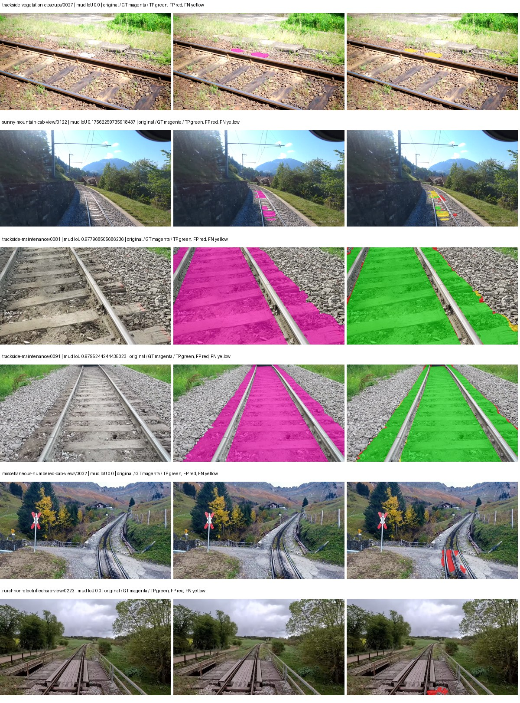
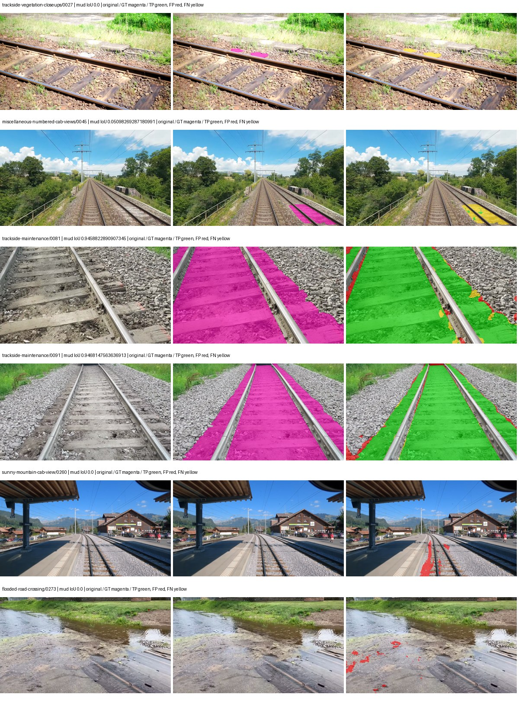
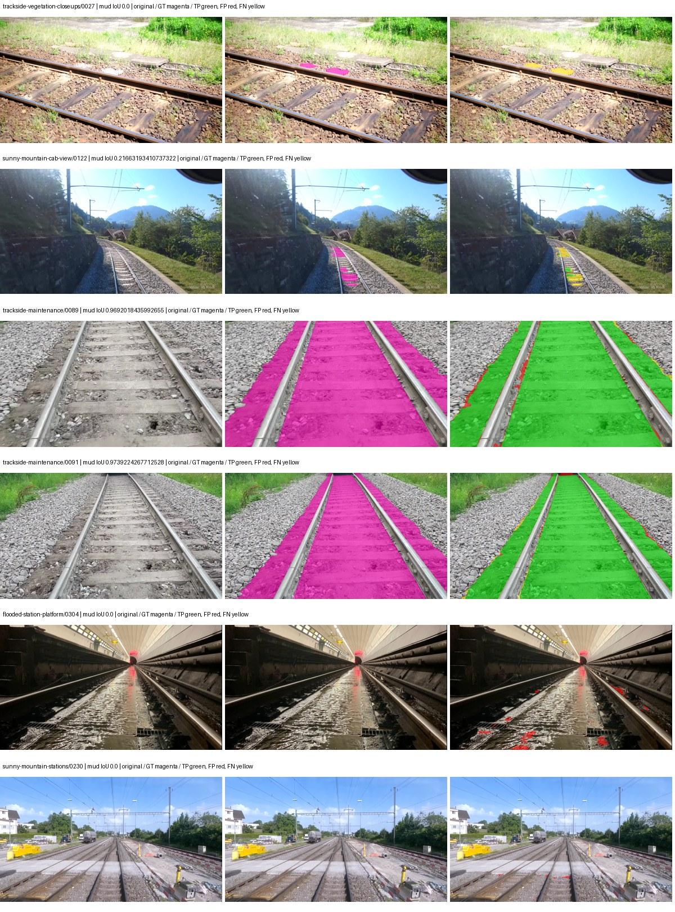
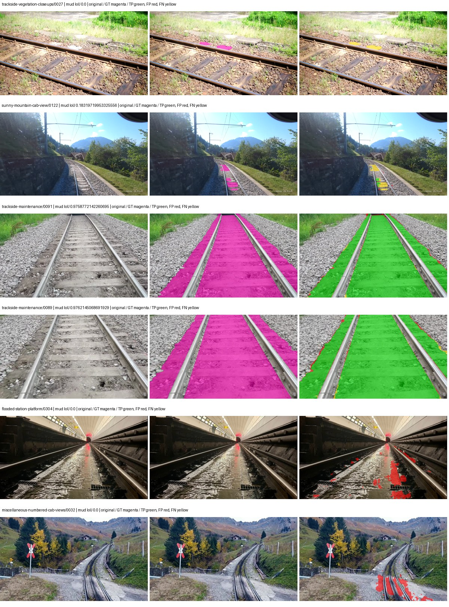

# segformer_b2 — rad_9_24_2026-paul

[RAD 9/24: Paul's split](../../README.md) · [Full model records](record.json)

Primary selection and early stopping: **mud-pumping validation IoU, pixels pooled over all validation images**. A job is complete only after full statistics and isolated profiling are verified.

Study metrics, counting each class only on the validation images that contain it: mud-pumping IoU is the mean per-image IoU over the images with mud-pumping, precision and recall sum pixels over those images, and mIoU averages each class over the images that contain it, then over the classes present.

| Initialization path | Seed | Mud-pumping IoU, train-camera images with mud (%, n=7) | Mud-pumping IoU, all images with mud (%, n=13) | Mud precision, all images with mud (%) | Mud recall, all images with mud (%) | mIoU (each class over images that contain it) (%) |
| --- | --- | --- | --- | --- | --- | --- |
| rtis_only | 0 | 59.16 | 68.76 | 97.60 | 96.08 | 52.05 |
| cityscapes_to_rtis | 0 | 30.17 | 51.49 | 94.31 | 93.18 | 42.86 |
| railsem19_to_rtis | 0 | 51.60 | 64.70 | 97.09 | 96.26 | 56.23 |
| cityscapes_to_railsem19_to_rtis | 0 | 49.87 | 63.08 | 97.35 | 93.91 | 52.36 |

Per-class IoU: IoU (%) of every class, each averaged only over the validation images that contain the class (n = those images); — = no image contains it. mIoU averages the classes with at least one such image.

| Initialization path | Seed | mIoU (each class over images that contain it) | person (n=12) | truck (n=5) | rail-track (n=31) | vegetation-overgrowth (n=14) | car (n=6) | on-rails (n=6) | traffic-sign (n=10) | road (n=12) | sidewalk (n=16) | construction (n=26) | tram-track (n=5) | pole (n=25) | traffic-light (n=8) | mud-pumping (n=13) | fence (n=17) | terrain (n=34) | sky (n=28) | rail-embedded (n=5) | rail-raised (n=36) | trackbed (n=32) | standing-water (n=6) |
| --- | --- | --- | --- | --- | --- | --- | --- | --- | --- | --- | --- | --- | --- | --- | --- | --- | --- | --- | --- | --- | --- | --- | --- |
| rtis_only | 0 | 52.05 | 18.82 | 9.10 | 74.84 | 48.13 | 50.68 | 68.23 | 18.93 | 38.36 | 54.18 | 50.60 | 44.54 | 58.39 | 24.24 | 68.76 | 44.91 | 84.30 | 97.01 | 47.48 | 72.87 | 80.98 | 37.69 |
| cityscapes_to_rtis | 0 | 42.86 | 20.55 | 13.07 | 55.34 | 27.42 | 40.53 | 49.08 | 21.36 | 47.21 | 44.98 | 47.64 | 22.26 | 53.73 | 10.33 | 51.49 | 40.16 | 79.17 | 95.94 | 21.60 | 67.01 | 64.77 | 26.43 |
| railsem19_to_rtis | 0 | 56.23 | 21.37 | 18.18 | 74.06 | 45.66 | 55.17 | 69.37 | 24.28 | 48.68 | 54.51 | 54.70 | 66.25 | 61.99 | 29.33 | 64.70 | 58.93 | 84.42 | 97.19 | 61.90 | 73.90 | 80.67 | 35.60 |
| cityscapes_to_railsem19_to_rtis | 0 | 52.36 | 21.13 | 19.93 | 74.65 | 40.78 | 45.53 | 50.07 | 27.37 | 43.62 | 53.92 | 51.98 | 49.25 | 60.33 | 28.01 | 63.08 | 57.63 | 84.42 | 96.95 | 42.17 | 74.07 | 79.61 | 35.07 |

Everything below is the campaign's own record, with pixels pooled over all validation images (the checkpoint was selected on that pooled mud IoU).

| Model | Initialization path | Seed | Status | Steps | Best step | Mud IoU, pixels pooled (%) | Mud precision, pixels pooled (%) | Mud recall, pixels pooled (%) | Final mud IoU (trainer val, pixels pooled, %) | mIoU, pixels pooled (%) | Fixed GT-class mIoU, pixels pooled (%) |
| --- | --- | --- | --- | --- | --- | --- | --- | --- | --- | --- | --- |
| segformer_b2 | rtis_only | 0 | completed | 4000 | 2919 | 93.13 | 96.81 | 96.08 | 92.88 | 58.23 | 58.23 |
| segformer_b2 | cityscapes_to_rtis | 0 | completed | 2123 | 796 | 87.30 | 93.26 | 93.18 | 86.68 | 54.16 | 54.16 |
| segformer_b2 | railsem19_to_rtis | 0 | completed | 4000 | 2919 | 93.22 | 96.72 | 96.26 | 92.85 | 66.39 | 66.39 |
| segformer_b2 | cityscapes_to_railsem19_to_rtis | 0 | completed | 4000 | 2919 | 89.21 | 94.69 | 93.91 | 86.79 | 64.37 | 64.37 |

Training: 227 images. Validation: 37 images. Test: 50 held out. Seeds: [0]. Seed variation measures optimization variability, not independent-recording uncertainty. Historical source checkpoints stay fixed across adaptation seeds.

Training code: `d864b72bd90706260965bb1a48398d01167b6d5c`. Split SHA-256: `b16dbbc7c4aa0c5d6e0fb5a20a27b4f3f8a4f3ce535621ed7c9aeaa6e85adb77`.

## rtis_only — seed 0

Status: **completed**. Started: 2026-10-05T09:22:51.804192+00:00. Finished: 2026-10-05T10:28:15.658136+00:00.

Recipe pretrained initializer: `nvidia/mit-b2`.

`rtis_only` uses the recipe initializer, which may include pretrained segmentation components. Transfer paths load the exact historical source checkpoint below and reset the classifier; they do not reset all query/decoder features.

Source checkpoint: `Recipe pretrained initialization`.

Config SHA-256: `998db100cf4d89fcaca11648f727cb227b28b1335a57f38b37852dd2268bb662`. Weights used for validation: `raw`.

### Mud-pumping and aggregate quality

| Metric | Selected checkpoint | Final training validation |
| --- | --- | --- |
| Mud IoU | 93.13 | 92.88 |
| Mud precision | 96.81 | 96.26 |
| Mud recall | 96.08 | 96.35 |
| Mud Dice/F1 | 96.44 | 96.31 |
| mIoU | 58.23 | 57.98 |
| Mean accuracy | 71.81 | 70.87 |
| Mean precision | 74.72 | 71.41 |
| Mean Dice | 70.21 | 70.05 |
| Mean specificity | 99.38 | 99.39 |
| Pixel accuracy | 88.61 | 88.72 |
| Frequency-weighted IoU | 81.22 | 81.27 |
| Fixed GT-present class mIoU | 58.23 | 57.98 |
| Boundary F1 | 66.57 | 67.45 |

The selected checkpoint has independent evaluation evidence. Final values are the trainer's final validation record, not a new independent evaluation. mIoU averages classes with nonzero union, so false positives on absent classes can change its denominator. The fixed GT-class mean is supplementary and excludes absent classes; their false positives remain in the confusion matrix.

### Resource usage and timing

| Measurement | Value |
| --- | --- |
| Peak training VRAM, retained training invocation (GiB) | 11.73 |
| Peak evaluation VRAM (GiB) | 7.46 |
| Retained training invocation wall time (seconds) | 3675.50 |
| Retained training invocation GPU-hours (one GPU) | 1.02 |
| Evaluation wall time (seconds) | 22.42 |
| Full evaluation pipeline images/second | 1.65 |
| Best full-state checkpoint (MiB) | 418.15 |
| Final full-state checkpoint (MiB) | 418.13 |
| Verified periodic checkpoints removed (GiB) | 3.27 |

VRAM uses the recorded allocator high-water mark; it is not total device usage including CUDA context. Resumed jobs' retained training invocation times and peaks are **not whole-campaign totals**. Earlier invocation resource records are not reconstructed here. Evaluation throughput includes loader, sliding-window inference and metrics; it is not model-only latency/FPS. Missing measurements are shown as —, never inferred from another dataset's run.

### Standardized inference performance

Dedicated model-only profiling waits for an idle worker-locked L40S: BF16, batch 1, 1024x1024, 20 warmup and 100 CUDA-event-timed public forwards. It excludes loading, preprocessing, tiling and metrics.

| Status | Parameters | Weight MiB | FPS | p50 ms | p95 ms | Peak reserved GiB |
| --- | --- | --- | --- | --- | --- | --- |
| complete | 27362773 | 104.38 | 53.30 | 18.50 | 19.84 | 2.25 |

```json
{
  "schema_version": 1,
  "model_id": "segformer_b2",
  "measured_at": "2026-10-05T10:28:10+00:00",
  "status": "complete",
  "benchmark_scope": "rtis_selected_checkpoint_model_only",
  "applies_to": [
    "segformer_b2--rtis_only--seed-0"
  ],
  "source": {
    "campaign_git_sha": "d864b72bd90706260965bb1a48398d01167b6d5c",
    "git_dirty": false,
    "config_hash": "3bbb047b94ca",
    "resolved_config": "/data/izadia1/projects/segmentary-runs/rad_9_24_2026/paul-seed0-20261005-r2/configs/segformer_b2--rtis_only--seed-0.yaml",
    "config_sha256": "998db100cf4d89fcaca11648f727cb227b28b1335a57f38b37852dd2268bb662",
    "checkpoint_sha256": "480654345642015553a2091c57f3303b879c3b1977dde6f1c72db768eb724628",
    "checkpoint_global_step": 2919,
    "checkpoint_bytes": 438463729,
    "checkpoint_kind": "resume checkpoint with optimizer and EMA state",
    "weights": "raw",
    "measured_checkpoint_job_id": "segformer_b2--rtis_only--seed-0",
    "result_sha256": "9cfb34110060487d196a326452e5326551606fdb13c15d23db6cc391c5b6ec69",
    "result_git_sha": "d864b72bd90706260965bb1a48398d01167b6d5c",
    "result_stage": "eval:rad_9_24_2026-paul:val",
    "result_seed": 0
  },
  "hardware": {
    "gpu_name": "NVIDIA L40S",
    "gpu_uuid": "GPU-a5ad49e5-0536-5229-ba8a-f8a902808f53",
    "logical_device": "cuda:0",
    "physical_visibility_token": "7",
    "compute_capability": [
      8,
      9
    ],
    "total_memory_bytes": 47677177856
  },
  "model": {
    "parameter_count": 27362773,
    "trainable_parameter_count": 27362773,
    "resident_parameter_bytes": 109451092,
    "parameter_dtype_counts": {
      "float32": 27362773
    }
  },
  "contract": {
    "backend": "pytorch",
    "precision": "bf16_autocast",
    "batch_size": 1,
    "input_shape_nchw": [
      1,
      3,
      1024,
      1024
    ],
    "warmup_iterations": 20,
    "measured_iterations": 100,
    "timing": "per-forward CUDA events with end-event synchronization",
    "includes_preprocessing": false,
    "includes_data_loader": false,
    "includes_sliding_window": false,
    "input_resident_on_gpu": true,
    "model_only": true,
    "entrypoint": "public model(image) dense-logits forward"
  },
  "measurements": {
    "latency": {
      "p50_ms": 18.500608444213867,
      "p95_ms": 19.842047691345215,
      "mean_ms": 18.763058567047118,
      "minimum_ms": 18.360319137573242,
      "maximum_ms": 23.476224899291992,
      "fps": 53.2962148162914,
      "raw_ms": [
        18.962432861328125,
        18.502656936645508,
        18.795520782470703,
        18.47091293334961,
        18.527231216430664,
        18.45452880859375,
        18.360319137573242,
        18.489343643188477,
        18.82111930847168,
        19.83795166015625,
        18.494464874267578,
        18.498559951782227,
        19.196928024291992,
        18.80575942993164,
        18.43814468383789,
        18.485248565673828,
        18.41663932800293,
        18.490367889404297,
        18.42585563659668,
        18.492416381835938,
        23.28371238708496,
        23.476224899291992,
        20.326400756835938,
        18.595840454101562,
        18.553855895996094,
        18.60915184020996,
        18.766847610473633,
        18.408447265625,
        18.387968063354492,
        18.42073631286621,
        18.4453125,
        20.520959854125977,
        18.66035270690918,
        18.701311111450195,
        19.298303604125977,
        18.60915184020996,
        18.480127334594727,
        18.45248031616211,
        18.473983764648438,
        18.505727767944336,
        18.476032257080078,
        18.43507194519043,
        18.479103088378906,
        19.266559600830078,
        18.480127334594727,
        18.785280227661133,
        19.512319564819336,
        18.58355140686035,
        18.511871337890625,
        18.46067237854004,
        18.397184371948242,
        18.481151580810547,
        18.553855895996094,
        18.552831649780273,
        18.493440628051758,
        18.515968322753906,
        18.924543380737305,
        18.718719482421875,
        18.737152099609375,
        19.25632095336914,
        19.25632095336914,
        19.919872283935547,
        18.597888946533203,
        18.42585563659668,
        18.493440628051758,
        18.892799377441406,
        18.480127334594727,
        19.136512756347656,
        18.743295669555664,
        18.708480834960938,
        19.24198341369629,
        18.772991180419922,
        18.463743209838867,
        18.465791702270508,
        18.455551147460938,
        18.43814468383789,
        18.4770565032959,
        18.803680419921875,
        18.42995262145996,
        18.466815948486328,
        18.42176055908203,
        18.457599639892578,
        18.376672744750977,
        18.580480575561523,
        18.45248031616211,
        18.398208618164062,
        18.40127944946289,
        18.84160041809082,
        18.513919830322266,
        18.40947151184082,
        18.41049575805664,
        18.80678367614746,
        18.86515235900879,
        18.43609619140625,
        18.408447265625,
        18.520063400268555,
        18.406400680541992,
        18.505727767944336,
        18.41561508178711,
        18.44223976135254
      ],
      "percentile_method": "numpy linear interpolation"
    },
    "peak_reserved_bytes": 2420113408,
    "memory_kind": "pytorch_cuda_allocator_peak_reserved_excluding_context",
    "benchmark_wall_clock_s": 5.678456962108612
  },
  "started_at": "2026-10-05T10:28:04+00:00",
  "finished_at": "2026-10-05T10:28:10+00:00",
  "environment": {
    "hostname": "hdrfs-app-001",
    "python": "3.11.15",
    "platform": "Linux-5.15.0-139-generic-x86_64-with-glibc2.35",
    "torch": "2.11.0+cu128",
    "torch_cuda": "12.8",
    "cudnn": 91900,
    "driver_version": "570.133.20",
    "cuda_available": true,
    "gpu_count": 1,
    "gpu_names": [
      "NVIDIA L40S"
    ],
    "cuda_visible_devices": "7",
    "packages": {
      "segmentary": "0.1.0",
      "torch": "2.11.0+cu128",
      "torchvision": "0.26.0+cu128",
      "transformers": "5.15.0",
      "timm": "1.0.28",
      "segmentation-models-pytorch": "0.5.0",
      "albumentations": "2.0.8",
      "lightning": "2.6.5",
      "numpy": "2.4.4"
    }
  }
}
```

### Per-class validation results

| Class | GT pixels | IoU (%) | Precision (%) | Recall (%) | Dice (%) | Boundary F1 (%) |
| --- | --- | --- | --- | --- | --- | --- |
| car | 75932 | 43.58 | 47.16 | 85.17 | 60.71 | 67.31 |
| construction | 5694760 | 46.56 | 58.39 | 69.69 | 63.54 | 61.24 |
| fence | 3789415 | 34.27 | 84.07 | 36.65 | 51.05 | 57.93 |
| mud-pumping | 7435760 | 93.13 | 96.81 | 96.08 | 96.44 | 77.45 |
| on-rails | 1137952 | 71.13 | 75.93 | 91.83 | 83.13 | 48.82 |
| person | 130659 | 74.50 | 80.81 | 90.51 | 85.38 | 79.07 |
| pole | 1467743 | 62.35 | 72.84 | 81.23 | 76.81 | 85.10 |
| rail-embedded | 74744 | 41.97 | 62.22 | 56.33 | 59.13 | 72.47 |
| rail-raised | 3588713 | 76.95 | 89.89 | 84.24 | 86.98 | 93.09 |
| rail-track | 4270276 | 75.13 | 87.98 | 83.72 | 85.80 | 84.16 |
| road | 1152119 | 40.04 | 63.40 | 52.08 | 57.19 | 50.06 |
| sidewalk | 2164731 | 59.97 | 69.12 | 81.92 | 74.98 | 69.59 |
| sky | 20207617 | 97.78 | 99.00 | 98.75 | 98.88 | 94.88 |
| standing-water | 2006046 | 72.42 | 81.82 | 86.30 | 84.00 | 15.57 |
| terrain | 30442090 | 87.97 | 92.97 | 94.24 | 93.60 | 83.51 |
| trackbed | 9118591 | 83.75 | 91.34 | 90.97 | 91.16 | 85.24 |
| traffic-light | 116825 | 52.64 | 70.56 | 67.46 | 68.97 | 74.03 |
| traffic-sign | 35778 | 18.13 | 39.87 | 24.96 | 30.70 | 48.82 |
| tram-track | 244726 | 38.01 | 57.43 | 52.92 | 55.08 | 52.00 |
| truck | 190997 | 1.90 | 90.18 | 1.91 | 3.74 | 20.09 |
| vegetation-overgrowth | 1534858 | 50.55 | 57.28 | 81.14 | 67.15 | 77.49 |

### Full-run accounting

| Measurement | Value |
| --- | --- |
| Full GPU-reserved wall seconds, all recorded worker attempts | 3931.40 |
| Full reserved GPU-hours | 1.09 |
| Whole-run timing complete | True |

| Phase | Wall seconds including failed attempts |
| --- | --- |
| training | 3682.22 |
| diagnostics | 193.81 |
| performance | 13.38 |

GPU-reserved time includes model loading, training, validation, collection, profiling, checkpoint I/O and orchestration while the worker owns one GPU. It is not GPU kernel-active time. Phase timings and sampled device memory/power/utilization are retained separately; sampled device memory is not the allocator high-water mark.

### Train/validation and raw/EMA diagnostics

| Checkpoint / weights / split | Images | Mud IoU (%) | Mud precision (%) | Mud recall (%) |
| --- | --- | --- | --- | --- |
| best-auto-train / raw | 227 | 96.04 | 97.43 | 98.53 |
| best-auto-val / raw | 37 | 93.13 | 96.81 | 96.08 |
| best-alternate-val / ema | 37 | 92.93 | 96.73 | 95.94 |
| final-auto-val / raw | 37 | 92.88 | 96.26 | 96.36 |

Train uses the evaluation transform without augmentation. Compare mud train/validation metrics for the same selected weights. Alternate EMA on running-stat BatchNorm is explicitly uncalibrated and is diagnostic only. Score-threshold curves use uncalibrated normalized scores and are pixel-level diagnostics, not event detection rates or a selected deployment operating point.

### Downloadable evidence

- best-auto-train: [per-image.csv](rtis_only--seed-0/best-auto-train/per-image.csv) · [per-image-confusion.json.gz](rtis_only--seed-0/best-auto-train/per-image-confusion.json.gz) · [groups.json](rtis_only--seed-0/best-auto-train/groups.json) · [mud-score-curves.json](rtis_only--seed-0/best-auto-train/mud-score-curves.json)
- best-auto-val: [per-image.csv](rtis_only--seed-0/best-auto-val/per-image.csv) · [per-image-confusion.json.gz](rtis_only--seed-0/best-auto-val/per-image-confusion.json.gz) · [groups.json](rtis_only--seed-0/best-auto-val/groups.json) · [mud-score-curves.json](rtis_only--seed-0/best-auto-val/mud-score-curves.json) · [examples.jpg](rtis_only--seed-0/best-auto-val/examples.jpg)
- best-alternate-val: [per-image.csv](rtis_only--seed-0/best-alternate-val/per-image.csv) · [per-image-confusion.json.gz](rtis_only--seed-0/best-alternate-val/per-image-confusion.json.gz) · [groups.json](rtis_only--seed-0/best-alternate-val/groups.json) · [mud-score-curves.json](rtis_only--seed-0/best-alternate-val/mud-score-curves.json)
- final-auto-val: [per-image.csv](rtis_only--seed-0/final-auto-val/per-image.csv) · [per-image-confusion.json.gz](rtis_only--seed-0/final-auto-val/per-image-confusion.json.gz) · [groups.json](rtis_only--seed-0/final-auto-val/groups.json) · [mud-score-curves.json](rtis_only--seed-0/final-auto-val/mud-score-curves.json)
- resources: [telemetry.csv](rtis_only--seed-0/resources/telemetry.csv)



Examples are two lowest and two highest mud-IoU positive images, plus up to two negative images with the most false-positive mud pixels. They are targeted diagnostic examples, not random samples. Green: true positive; red: false positive; yellow: false negative. Full predictions remain on HDRFS.

### Validation tracking

| Logged step | Overall mIoU (%) | Mud IoU (%) |
| --- | --- | --- |
| 264 | 40.37 | 87.28 |
| 530 | 50.68 | 88.75 |
| 796 | 53.81 | 90.87 |
| 1061 | 54.10 | 91.35 |
| 1326 | 56.27 | 91.88 |
| 1592 | 56.82 | 91.37 |
| 1857 | 56.70 | 91.63 |
| 2123 | 58.04 | 91.07 |
| 2389 | 58.59 | 91.43 |
| 2653 | 58.68 | 92.36 |
| 2919 | 58.23 | 93.13 |
| 3185 | 58.25 | 92.10 |
| 3451 | 58.46 | 92.61 |
| 3716 | 58.29 | 92.62 |
| 3981 | 58.16 | 92.83 |
| 4000 | 57.98 | 92.88 |

All retained scalar curves, including training loss and per-class IoU, are in record.json. Observed best mud on a curve is not necessarily a retained checkpoint: the pilot saved its selection-metric-best and final checkpoints. Step logging and checkpoint global_step may differ by one.

### Stopping and checkpoint provenance

```json
{
  "stopping": {
    "actual_steps": 4000,
    "maximum_steps": 4000,
    "min_delta": 0.001,
    "monitor": "val_iou/mud-pumping",
    "patience": 5,
    "reason": "budget_complete"
  },
  "checkpoints": {
    "best": {
      "path": "/data/izadia1/projects/segmentary-runs/rad_9_24_2026/paul-seed0-20261005-r2/future-runs/segformer_b2--rtis_only--seed-0_seed0/rtis/best.ckpt",
      "sha256": "480654345642015553a2091c57f3303b879c3b1977dde6f1c72db768eb724628",
      "global_step": 2919,
      "bytes": 438463729
    },
    "final": {
      "path": "/data/izadia1/projects/segmentary-runs/rad_9_24_2026/paul-seed0-20261005-r2/future-runs/segformer_b2--rtis_only--seed-0_seed0/rtis/last.ckpt",
      "sha256": "6ccdcbcf5925feb1df2412b339c134713f64b24d24fe30a762d8a761f0c5808d",
      "global_step": 4000,
      "bytes": 438445553
    }
  },
  "cleanup_error": null
}
```

### Resolved training, initialization and evaluation settings

The optimizer block is the base configuration. Stage LR scales are applied at runtime, and stage warmup is capped at min(base warmup, floor(stage budget / 10), stage budget - 1): 400 steps for this 4,000-step pilot. Model-internal native input grids may differ from augmentation crops (EoMT uses its 640 grid).

```json
{
  "name": "segformer_b2--rtis_only--seed-0",
  "model": {
    "arch": "segformer_b2",
    "checkpoint": "nvidia/mit-b2",
    "tuning": "full",
    "head": "unified_head",
    "lora_r": 16,
    "lora_alpha": 32,
    "lora_dropout": 0.05,
    "lora_targets": [],
    "drop_path": null,
    "revision": null,
    "subfolder": null,
    "local_files_only": false,
    "trust_remote_code": false,
    "backbone_path": null,
    "head_paths": [],
    "classifier_path": null,
    "inactive_parameter_paths": [],
    "smp_arch": null,
    "encoder_name": null,
    "encoder_weights": null,
    "native": null,
    "batch_norm_momentum": null
  },
  "space": "paul-test-rtis",
  "taxonomy_root": "/data/izadia1/projects/segmentary-rad-d864b72b/taxonomy",
  "output_root": "/data/izadia1/projects/segmentary-runs/rad_9_24_2026/paul-seed0-20261005-r2/future-runs",
  "optim": {
    "backbone_lr": 6e-05,
    "head_lr_mult": 10.0,
    "weight_decay": 0.05,
    "llrd": 1.0,
    "warmup_iters": 1500,
    "warmup_ratio": 1e-06,
    "poly_power": 0.9,
    "min_lr_ratio": 0.0,
    "betas": [
      0.9,
      0.999
    ],
    "grad_clip": 1.0
  },
  "train": {
    "iters": 4000,
    "batch_size": 2,
    "accum": 8,
    "num_workers": 2,
    "precision": "bf16-mixed",
    "ema_decay": 0.9998,
    "val_every": 250,
    "ckpt_every": 500,
    "selection_metric": "val_iou/mud-pumping",
    "early_stopping_patience": 5,
    "early_stopping_min_delta": 0.001,
    "seed": 0,
    "devices": 1
  },
  "eval": {
    "sliding_window": true,
    "window": [
      1024,
      1024
    ],
    "stride": [
      768,
      768
    ],
    "batch_size": 1,
    "num_workers": 2,
    "tta_scales": [],
    "tta_flip": false,
    "threshold": 0.5,
    "boundary_tolerance_frac": 0.0075,
    "save_confusion": true
  },
  "loss": {
    "task": "multiclass",
    "activation": "auto",
    "terms": [],
    "aux": "none",
    "aux_weight": 0.0,
    "ce_weight": 1.0,
    "label_smoothing": 0.0,
    "class_weights": null,
    "query": null
  },
  "aug": {
    "crop": [
      1024,
      1024
    ],
    "scale_min": 0.5,
    "scale_max": 2.0,
    "hflip_p": 0.5,
    "color_jitter_p": 0.5,
    "brightness": 0.25,
    "contrast": 0.25,
    "saturation": 0.25,
    "hue": 0.05
  },
  "stages": [
    {
      "name": "rtis",
      "data": [
        {
          "name": "rad_9_24_2026-paul",
          "root": "/data/izadia1/datasets/rad_9_24_2026-paul",
          "variant": null,
          "split_file": "splits.json",
          "train_split": "train",
          "val_split": "val",
          "limit": null,
          "loader": "folder",
          "mapping": "paul-test-rtis",
          "loader_options": {
            "require_groups": false
          }
        }
      ],
      "iters": null,
      "lr_scale": 1.0,
      "head_group_lr_scale": 1.0,
      "init_from": "pretrained",
      "reset_head": false,
      "freeze": null,
      "sample_weights": null
    }
  ]
}
```

### Hardware and software provenance

```json
{
  "training": {
    "cuda_available": true,
    "cuda_visible_devices": "7",
    "cudnn": 91900,
    "driver_version": "570.133.20",
    "gpu_count": 1,
    "gpu_names": [
      "NVIDIA L40S"
    ],
    "hostname": "hdrfs-app-001",
    "input_normalization": {
      "channel_order": "rgb",
      "mean": [
        0.485,
        0.456,
        0.406
      ],
      "source": "imagenet",
      "std": [
        0.229,
        0.224,
        0.225
      ]
    },
    "model_origins": [
      {
        "hf_commit": "3bb39e8739149c3777d0325349b2a6c32c6413db",
        "hf_name_or_path": "nvidia/mit-b2",
        "module": "model",
        "timm_pretrained": {}
      },
      {
        "hf_commit": "3bb39e8739149c3777d0325349b2a6c32c6413db",
        "hf_name_or_path": "nvidia/mit-b2",
        "module": "model.segformer",
        "timm_pretrained": {}
      },
      {
        "hf_commit": "3bb39e8739149c3777d0325349b2a6c32c6413db",
        "hf_name_or_path": "nvidia/mit-b2",
        "module": "model.segformer.stages.0.blocks.0.attention",
        "timm_pretrained": {}
      },
      {
        "hf_commit": "3bb39e8739149c3777d0325349b2a6c32c6413db",
        "hf_name_or_path": "nvidia/mit-b2",
        "module": "model.segformer.stages.0.blocks.1.attention",
        "timm_pretrained": {}
      },
      {
        "hf_commit": "3bb39e8739149c3777d0325349b2a6c32c6413db",
        "hf_name_or_path": "nvidia/mit-b2",
        "module": "model.segformer.stages.0.blocks.2.attention",
        "timm_pretrained": {}
      },
      {
        "hf_commit": "3bb39e8739149c3777d0325349b2a6c32c6413db",
        "hf_name_or_path": "nvidia/mit-b2",
        "module": "model.segformer.stages.1.blocks.0.attention",
        "timm_pretrained": {}
      },
      {
        "hf_commit": "3bb39e8739149c3777d0325349b2a6c32c6413db",
        "hf_name_or_path": "nvidia/mit-b2",
        "module": "model.segformer.stages.1.blocks.1.attention",
        "timm_pretrained": {}
      },
      {
        "hf_commit": "3bb39e8739149c3777d0325349b2a6c32c6413db",
        "hf_name_or_path": "nvidia/mit-b2",
        "module": "model.segformer.stages.1.blocks.2.attention",
        "timm_pretrained": {}
      },
      {
        "hf_commit": "3bb39e8739149c3777d0325349b2a6c32c6413db",
        "hf_name_or_path": "nvidia/mit-b2",
        "module": "model.segformer.stages.1.blocks.3.attention",
        "timm_pretrained": {}
      },
      {
        "hf_commit": "3bb39e8739149c3777d0325349b2a6c32c6413db",
        "hf_name_or_path": "nvidia/mit-b2",
        "module": "model.segformer.stages.2.blocks.0.attention",
        "timm_pretrained": {}
      },
      {
        "hf_commit": "3bb39e8739149c3777d0325349b2a6c32c6413db",
        "hf_name_or_path": "nvidia/mit-b2",
        "module": "model.segformer.stages.2.blocks.1.attention",
        "timm_pretrained": {}
      },
      {
        "hf_commit": "3bb39e8739149c3777d0325349b2a6c32c6413db",
        "hf_name_or_path": "nvidia/mit-b2",
        "module": "model.segformer.stages.2.blocks.2.attention",
        "timm_pretrained": {}
      },
      {
        "hf_commit": "3bb39e8739149c3777d0325349b2a6c32c6413db",
        "hf_name_or_path": "nvidia/mit-b2",
        "module": "model.segformer.stages.2.blocks.3.attention",
        "timm_pretrained": {}
      },
      {
        "hf_commit": "3bb39e8739149c3777d0325349b2a6c32c6413db",
        "hf_name_or_path": "nvidia/mit-b2",
        "module": "model.segformer.stages.2.blocks.4.attention",
        "timm_pretrained": {}
      },
      {
        "hf_commit": "3bb39e8739149c3777d0325349b2a6c32c6413db",
        "hf_name_or_path": "nvidia/mit-b2",
        "module": "model.segformer.stages.2.blocks.5.attention",
        "timm_pretrained": {}
      },
      {
        "hf_commit": "3bb39e8739149c3777d0325349b2a6c32c6413db",
        "hf_name_or_path": "nvidia/mit-b2",
        "module": "model.segformer.stages.3.blocks.0.attention",
        "timm_pretrained": {}
      },
      {
        "hf_commit": "3bb39e8739149c3777d0325349b2a6c32c6413db",
        "hf_name_or_path": "nvidia/mit-b2",
        "module": "model.segformer.stages.3.blocks.1.attention",
        "timm_pretrained": {}
      },
      {
        "hf_commit": "3bb39e8739149c3777d0325349b2a6c32c6413db",
        "hf_name_or_path": "nvidia/mit-b2",
        "module": "model.segformer.stages.3.blocks.2.attention",
        "timm_pretrained": {}
      },
      {
        "hf_commit": "3bb39e8739149c3777d0325349b2a6c32c6413db",
        "hf_name_or_path": "nvidia/mit-b2",
        "module": "model.decode_head",
        "timm_pretrained": {}
      }
    ],
    "model_parameter_count": 27362773,
    "packages": {
      "albumentations": "2.0.8",
      "lightning": "2.6.5",
      "numpy": "2.4.4",
      "segmentary": "0.1.0",
      "segmentation-models-pytorch": "0.5.0",
      "timm": "1.0.28",
      "torch": "2.11.0+cu128",
      "torchvision": "0.26.0+cu128",
      "transformers": "5.15.0"
    },
    "platform": "Linux-5.15.0-139-generic-x86_64-with-glibc2.35",
    "python": "3.11.15",
    "torch": "2.11.0+cu128",
    "torch_cuda": "12.8",
    "trainable_parameter_count": 27362773,
    "training_stop": {
      "actual_steps": 4000,
      "maximum_steps": 4000,
      "min_delta": 0.001,
      "monitor": "val_iou/mud-pumping",
      "patience": 5,
      "reason": "budget_complete"
    },
    "validation_weights": "raw"
  },
  "evaluation": {
    "cuda_available": true,
    "cuda_visible_devices": "7",
    "cudnn": 91900,
    "driver_version": "570.133.20",
    "gpu_count": 1,
    "gpu_names": [
      "NVIDIA L40S"
    ],
    "hostname": "hdrfs-app-001",
    "input_normalization": {
      "channel_order": "rgb",
      "mean": [
        0.485,
        0.456,
        0.406
      ],
      "source": "imagenet",
      "std": [
        0.229,
        0.224,
        0.225
      ]
    },
    "packages": {
      "albumentations": "2.0.8",
      "lightning": "2.6.5",
      "numpy": "2.4.4",
      "segmentary": "0.1.0",
      "segmentation-models-pytorch": "0.5.0",
      "timm": "1.0.28",
      "torch": "2.11.0+cu128",
      "torchvision": "0.26.0+cu128",
      "transformers": "5.15.0"
    },
    "platform": "Linux-5.15.0-139-generic-x86_64-with-glibc2.35",
    "python": "3.11.15",
    "torch": "2.11.0+cu128",
    "torch_cuda": "12.8"
  }
}
```

## cityscapes_to_rtis — seed 0

Status: **completed**. Started: 2026-10-05T09:51:22.671171+00:00. Finished: 2026-10-05T10:28:16.455245+00:00.

Recipe pretrained initializer: `nvidia/mit-b2`.

`rtis_only` uses the recipe initializer, which may include pretrained segmentation components. Transfer paths load the exact historical source checkpoint below and reset the classifier; they do not reset all query/decoder features.

Source checkpoint: `{'name': 'segformer_b2--cityscapes--seed-0', 'model': 'segformer_b2', 'protocol': 'cityscapes', 'config': '/data/izadia1/projects/segmentary-runs/all-model-city-rail-seed0-rail20-b9eb3e1/accepted/segformer_b2--cityscapes--seed-0/resolved-config.yaml', 'checkpoint': '/data/izadia1/projects/segmentary-runs/all-model-city-rail-seed0-a7c0b67/jobs/segformer_b2--cityscapes--seed-0/attempt-001/train/segformer_b2--cityscapes_seed0/cityscapes/last.ckpt', 'recorded_sha256': 'd0f4f619c4d1200c143ff218ddb7e8693decd082345af09049cc50b8f8c42977', 'exists': True}`.

Config SHA-256: `c5b5840d8733ab535e30c07e7a44a993761d645d476adca2fba802d73064c585`. Weights used for validation: `raw`.

### Mud-pumping and aggregate quality

| Metric | Selected checkpoint | Final training validation |
| --- | --- | --- |
| Mud IoU | 87.30 | 86.68 |
| Mud precision | 93.26 | 91.92 |
| Mud recall | 93.18 | 93.83 |
| Mud Dice/F1 | 93.22 | 92.86 |
| mIoU | 54.16 | 56.47 |
| Mean accuracy | 67.97 | 69.71 |
| Mean precision | 68.75 | 70.95 |
| Mean Dice | 67.25 | 69.27 |
| Mean specificity | 99.24 | 99.34 |
| Pixel accuracy | 85.82 | 87.78 |
| Frequency-weighted IoU | 77.23 | 79.71 |
| Fixed GT-present class mIoU | 54.16 | 56.47 |
| Boundary F1 | 59.86 | 62.85 |

The selected checkpoint has independent evaluation evidence. Final values are the trainer's final validation record, not a new independent evaluation. mIoU averages classes with nonzero union, so false positives on absent classes can change its denominator. The fixed GT-class mean is supplementary and excludes absent classes; their false positives remain in the confusion matrix.

### Resource usage and timing

| Measurement | Value |
| --- | --- |
| Peak training VRAM, retained training invocation (GiB) | 11.73 |
| Peak evaluation VRAM (GiB) | 7.46 |
| Retained training invocation wall time (seconds) | 1968.24 |
| Retained training invocation GPU-hours (one GPU) | 0.55 |
| Evaluation wall time (seconds) | 22.48 |
| Full evaluation pipeline images/second | 1.65 |
| Best full-state checkpoint (MiB) | 418.15 |
| Final full-state checkpoint (MiB) | 418.13 |
| Verified periodic checkpoints removed (GiB) | 1.63 |

VRAM uses the recorded allocator high-water mark; it is not total device usage including CUDA context. Resumed jobs' retained training invocation times and peaks are **not whole-campaign totals**. Earlier invocation resource records are not reconstructed here. Evaluation throughput includes loader, sliding-window inference and metrics; it is not model-only latency/FPS. Missing measurements are shown as —, never inferred from another dataset's run.

### Standardized inference performance

Dedicated model-only profiling waits for an idle worker-locked L40S: BF16, batch 1, 1024x1024, 20 warmup and 100 CUDA-event-timed public forwards. It excludes loading, preprocessing, tiling and metrics.

| Status | Parameters | Weight MiB | FPS | p50 ms | p95 ms | Peak reserved GiB |
| --- | --- | --- | --- | --- | --- | --- |
| complete | 27362773 | 104.38 | 53.44 | 18.56 | 19.05 | 2.25 |

```json
{
  "schema_version": 1,
  "model_id": "segformer_b2",
  "measured_at": "2026-10-05T10:28:12+00:00",
  "status": "complete",
  "benchmark_scope": "rtis_selected_checkpoint_model_only",
  "applies_to": [
    "segformer_b2--cityscapes_to_rtis--seed-0"
  ],
  "source": {
    "campaign_git_sha": "d864b72bd90706260965bb1a48398d01167b6d5c",
    "git_dirty": false,
    "config_hash": "87224b2d11b8",
    "resolved_config": "/data/izadia1/projects/segmentary-runs/rad_9_24_2026/paul-seed0-20261005-r2/configs/segformer_b2--cityscapes_to_rtis--seed-0.yaml",
    "config_sha256": "c5b5840d8733ab535e30c07e7a44a993761d645d476adca2fba802d73064c585",
    "checkpoint_sha256": "77145cee6b64b617121991d2402aa3bb1d9a552fbd95c652373d649b9d1d99e6",
    "checkpoint_global_step": 796,
    "checkpoint_bytes": 438463729,
    "checkpoint_kind": "resume checkpoint with optimizer and EMA state",
    "weights": "raw",
    "measured_checkpoint_job_id": "segformer_b2--cityscapes_to_rtis--seed-0",
    "result_sha256": "c44f801146a3e965adf0150b12a9dfe2ea4ee4066a9b5f86e7201b3402ac254c",
    "result_git_sha": "d864b72bd90706260965bb1a48398d01167b6d5c",
    "result_stage": "eval:rad_9_24_2026-paul:val",
    "result_seed": 0
  },
  "hardware": {
    "gpu_name": "NVIDIA L40S",
    "gpu_uuid": "GPU-c76642eb-64c1-b0ac-b051-d2efd47b32c4",
    "logical_device": "cuda:0",
    "physical_visibility_token": "9",
    "compute_capability": [
      8,
      9
    ],
    "total_memory_bytes": 47677177856
  },
  "model": {
    "parameter_count": 27362773,
    "trainable_parameter_count": 27362773,
    "resident_parameter_bytes": 109451092,
    "parameter_dtype_counts": {
      "float32": 27362773
    }
  },
  "contract": {
    "backend": "pytorch",
    "precision": "bf16_autocast",
    "batch_size": 1,
    "input_shape_nchw": [
      1,
      3,
      1024,
      1024
    ],
    "warmup_iterations": 20,
    "measured_iterations": 100,
    "timing": "per-forward CUDA events with end-event synchronization",
    "includes_preprocessing": false,
    "includes_data_loader": false,
    "includes_sliding_window": false,
    "input_resident_on_gpu": true,
    "model_only": true,
    "entrypoint": "public model(image) dense-logits forward"
  },
  "measurements": {
    "latency": {
      "p50_ms": 18.563584327697754,
      "p95_ms": 19.04778299331665,
      "mean_ms": 18.713813133239746,
      "minimum_ms": 18.457599639892578,
      "maximum_ms": 22.90278434753418,
      "fps": 53.43646390396971,
      "raw_ms": [
        18.8221435546875,
        19.482624053955078,
        18.545663833618164,
        18.551807403564453,
        18.549760818481445,
        18.5927677154541,
        18.67571258544922,
        18.522111892700195,
        18.53539276123047,
        18.588672637939453,
        18.537471771240234,
        18.543615341186523,
        18.513919830322266,
        18.511903762817383,
        18.522111892700195,
        18.62656021118164,
        18.509824752807617,
        18.60812759399414,
        18.571264266967773,
        18.497535705566406,
        18.471935272216797,
        21.31452751159668,
        21.316608428955078,
        22.90278434753418,
        18.514944076538086,
        18.457599639892578,
        18.502592086791992,
        18.747392654418945,
        18.576383590698242,
        18.491392135620117,
        18.589696884155273,
        18.539520263671875,
        18.562047958374023,
        18.543615341186523,
        18.572256088256836,
        18.88256072998047,
        18.531328201293945,
        18.61631965637207,
        19.0248966217041,
        18.523136138916016,
        18.536447525024414,
        18.516992568969727,
        18.65932846069336,
        18.64089584350586,
        18.61427116394043,
        18.669567108154297,
        18.999296188354492,
        18.568191528320312,
        18.608095169067383,
        18.962432861328125,
        18.565120697021484,
        18.555904388427734,
        18.869247436523438,
        18.595808029174805,
        18.551807403564453,
        18.584575653076172,
        18.491392135620117,
        18.528255462646484,
        18.961408615112305,
        18.686975479125977,
        18.539520263671875,
        18.571264266967773,
        18.525184631347656,
        18.512895584106445,
        18.512895584106445,
        18.66035270690918,
        18.533376693725586,
        19.531776428222656,
        18.62451171875,
        18.500608444213867,
        18.548736572265625,
        18.662399291992188,
        18.553855895996094,
        18.539520263671875,
        18.59071922302246,
        18.65011215209961,
        18.541568756103516,
        18.534400939941406,
        18.576383590698242,
        18.504703521728516,
        18.555904388427734,
        18.5743350982666,
        18.60198402404785,
        18.561023712158203,
        18.557952880859375,
        18.537471771240234,
        18.62860870361328,
        18.534400939941406,
        18.904064178466797,
        18.527231216430664,
        18.543615341186523,
        18.63577651977539,
        18.512895584106445,
        18.612224578857422,
        18.63065528869629,
        18.512895584106445,
        18.84876823425293,
        18.61427116394043,
        18.531328201293945,
        18.584575653076172
      ],
      "percentile_method": "numpy linear interpolation"
    },
    "peak_reserved_bytes": 2420113408,
    "memory_kind": "pytorch_cuda_allocator_peak_reserved_excluding_context",
    "benchmark_wall_clock_s": 5.569032356142998
  },
  "started_at": "2026-10-05T10:28:07+00:00",
  "finished_at": "2026-10-05T10:28:12+00:00",
  "environment": {
    "hostname": "hdrfs-app-001",
    "python": "3.11.15",
    "platform": "Linux-5.15.0-139-generic-x86_64-with-glibc2.35",
    "torch": "2.11.0+cu128",
    "torch_cuda": "12.8",
    "cudnn": 91900,
    "driver_version": "570.133.20",
    "cuda_available": true,
    "gpu_count": 1,
    "gpu_names": [
      "NVIDIA L40S"
    ],
    "cuda_visible_devices": "9",
    "packages": {
      "segmentary": "0.1.0",
      "torch": "2.11.0+cu128",
      "torchvision": "0.26.0+cu128",
      "transformers": "5.15.0",
      "timm": "1.0.28",
      "segmentation-models-pytorch": "0.5.0",
      "albumentations": "2.0.8",
      "lightning": "2.6.5",
      "numpy": "2.4.4"
    }
  }
}
```

### Per-class validation results

| Class | GT pixels | IoU (%) | Precision (%) | Recall (%) | Dice (%) | Boundary F1 (%) |
| --- | --- | --- | --- | --- | --- | --- |
| car | 75932 | 57.98 | 67.96 | 79.80 | 73.41 | 79.61 |
| construction | 5694760 | 49.53 | 61.99 | 71.13 | 66.25 | 59.83 |
| fence | 3789415 | 39.23 | 82.69 | 42.75 | 56.36 | 53.21 |
| mud-pumping | 7435760 | 87.30 | 93.26 | 93.18 | 93.22 | 56.33 |
| on-rails | 1137952 | 67.45 | 75.14 | 86.83 | 80.56 | 41.85 |
| person | 130659 | 78.17 | 84.63 | 91.10 | 87.74 | 81.30 |
| pole | 1467743 | 54.81 | 70.98 | 70.64 | 70.81 | 85.03 |
| rail-embedded | 74744 | 17.49 | 46.45 | 21.91 | 29.78 | 42.55 |
| rail-raised | 3588713 | 68.89 | 81.93 | 81.23 | 81.58 | 87.55 |
| rail-track | 4270276 | 57.76 | 67.40 | 80.16 | 73.22 | 66.04 |
| road | 1152119 | 43.43 | 50.10 | 76.54 | 60.56 | 42.21 |
| sidewalk | 2164731 | 55.96 | 75.84 | 68.09 | 71.76 | 62.01 |
| sky | 20207617 | 97.10 | 98.61 | 98.44 | 98.53 | 93.64 |
| standing-water | 2006046 | 73.75 | 78.08 | 93.01 | 84.89 | 15.33 |
| terrain | 30442090 | 85.08 | 92.45 | 91.43 | 91.94 | 79.33 |
| trackbed | 9118591 | 70.57 | 87.57 | 78.42 | 82.74 | 72.71 |
| traffic-light | 116825 | 25.61 | 55.12 | 32.36 | 40.78 | 49.93 |
| traffic-sign | 35778 | 27.47 | 54.23 | 35.77 | 43.11 | 56.43 |
| tram-track | 244726 | 21.94 | 36.55 | 35.44 | 35.99 | 34.32 |
| truck | 190997 | 23.53 | 39.83 | 36.50 | 38.09 | 27.50 |
| vegetation-overgrowth | 1534858 | 34.26 | 43.03 | 62.69 | 51.04 | 70.29 |

### Full-run accounting

| Measurement | Value |
| --- | --- |
| Full GPU-reserved wall seconds, all recorded worker attempts | 2221.54 |
| Full reserved GPU-hours | 0.62 |
| Whole-run timing complete | True |

| Phase | Wall seconds including failed attempts |
| --- | --- |
| training | 1975.21 |
| diagnostics | 193.25 |
| performance | 12.91 |

GPU-reserved time includes model loading, training, validation, collection, profiling, checkpoint I/O and orchestration while the worker owns one GPU. It is not GPU kernel-active time. Phase timings and sampled device memory/power/utilization are retained separately; sampled device memory is not the allocator high-water mark.

### Train/validation and raw/EMA diagnostics

| Checkpoint / weights / split | Images | Mud IoU (%) | Mud precision (%) | Mud recall (%) |
| --- | --- | --- | --- | --- |
| best-auto-train / raw | 227 | 88.36 | 92.66 | 95.02 |
| best-auto-val / raw | 37 | 87.30 | 93.26 | 93.18 |
| best-alternate-val / ema | 37 | 85.58 | 91.25 | 93.24 |
| final-auto-val / raw | 37 | 86.68 | 91.92 | 93.84 |

Train uses the evaluation transform without augmentation. Compare mud train/validation metrics for the same selected weights. Alternate EMA on running-stat BatchNorm is explicitly uncalibrated and is diagnostic only. Score-threshold curves use uncalibrated normalized scores and are pixel-level diagnostics, not event detection rates or a selected deployment operating point.

### Downloadable evidence

- best-auto-train: [per-image.csv](cityscapes_to_rtis--seed-0/best-auto-train/per-image.csv) · [per-image-confusion.json.gz](cityscapes_to_rtis--seed-0/best-auto-train/per-image-confusion.json.gz) · [groups.json](cityscapes_to_rtis--seed-0/best-auto-train/groups.json) · [mud-score-curves.json](cityscapes_to_rtis--seed-0/best-auto-train/mud-score-curves.json)
- best-auto-val: [per-image.csv](cityscapes_to_rtis--seed-0/best-auto-val/per-image.csv) · [per-image-confusion.json.gz](cityscapes_to_rtis--seed-0/best-auto-val/per-image-confusion.json.gz) · [groups.json](cityscapes_to_rtis--seed-0/best-auto-val/groups.json) · [mud-score-curves.json](cityscapes_to_rtis--seed-0/best-auto-val/mud-score-curves.json) · [examples.jpg](cityscapes_to_rtis--seed-0/best-auto-val/examples.jpg)
- best-alternate-val: [per-image.csv](cityscapes_to_rtis--seed-0/best-alternate-val/per-image.csv) · [per-image-confusion.json.gz](cityscapes_to_rtis--seed-0/best-alternate-val/per-image-confusion.json.gz) · [groups.json](cityscapes_to_rtis--seed-0/best-alternate-val/groups.json) · [mud-score-curves.json](cityscapes_to_rtis--seed-0/best-alternate-val/mud-score-curves.json)
- final-auto-val: [per-image.csv](cityscapes_to_rtis--seed-0/final-auto-val/per-image.csv) · [per-image-confusion.json.gz](cityscapes_to_rtis--seed-0/final-auto-val/per-image-confusion.json.gz) · [groups.json](cityscapes_to_rtis--seed-0/final-auto-val/groups.json) · [mud-score-curves.json](cityscapes_to_rtis--seed-0/final-auto-val/mud-score-curves.json)
- resources: [telemetry.csv](cityscapes_to_rtis--seed-0/resources/telemetry.csv)



Examples are two lowest and two highest mud-IoU positive images, plus up to two negative images with the most false-positive mud pixels. They are targeted diagnostic examples, not random samples. Green: true positive; red: false positive; yellow: false negative. Full predictions remain on HDRFS.

### Validation tracking

| Logged step | Overall mIoU (%) | Mud IoU (%) |
| --- | --- | --- |
| 264 | 34.97 | 66.81 |
| 530 | 49.41 | 79.79 |
| 796 | 54.17 | 87.32 |
| 1061 | 54.68 | 85.31 |
| 1326 | 55.37 | 81.02 |
| 1592 | 56.91 | 85.51 |
| 1857 | 56.66 | 82.94 |
| 2123 | 56.47 | 86.68 |

All retained scalar curves, including training loss and per-class IoU, are in record.json. Observed best mud on a curve is not necessarily a retained checkpoint: the pilot saved its selection-metric-best and final checkpoints. Step logging and checkpoint global_step may differ by one.

### Stopping and checkpoint provenance

```json
{
  "stopping": {
    "actual_steps": 2123,
    "maximum_steps": 4000,
    "min_delta": 0.001,
    "monitor": "val_iou/mud-pumping",
    "patience": 5,
    "reason": "validation_plateau"
  },
  "checkpoints": {
    "best": {
      "path": "/data/izadia1/projects/segmentary-runs/rad_9_24_2026/paul-seed0-20261005-r2/future-runs/segformer_b2--cityscapes_to_rtis--seed-0_seed0/rtis/best.ckpt",
      "sha256": "77145cee6b64b617121991d2402aa3bb1d9a552fbd95c652373d649b9d1d99e6",
      "global_step": 796,
      "bytes": 438463729
    },
    "final": {
      "path": "/data/izadia1/projects/segmentary-runs/rad_9_24_2026/paul-seed0-20261005-r2/future-runs/segformer_b2--cityscapes_to_rtis--seed-0_seed0/rtis/last.ckpt",
      "sha256": "e254c45b75e1bf5dabbeca79a55b5d85bbcf33c947068c7f72eb2b97eb7f341d",
      "global_step": 2123,
      "bytes": 438445745
    }
  },
  "cleanup_error": null
}
```

### Resolved training, initialization and evaluation settings

The optimizer block is the base configuration. Stage LR scales are applied at runtime, and stage warmup is capped at min(base warmup, floor(stage budget / 10), stage budget - 1): 400 steps for this 4,000-step pilot. Model-internal native input grids may differ from augmentation crops (EoMT uses its 640 grid).

```json
{
  "name": "segformer_b2--cityscapes_to_rtis--seed-0",
  "model": {
    "arch": "segformer_b2",
    "checkpoint": "nvidia/mit-b2",
    "tuning": "full",
    "head": "unified_head",
    "lora_r": 16,
    "lora_alpha": 32,
    "lora_dropout": 0.05,
    "lora_targets": [],
    "drop_path": null,
    "revision": null,
    "subfolder": null,
    "local_files_only": false,
    "trust_remote_code": false,
    "backbone_path": null,
    "head_paths": [],
    "classifier_path": null,
    "inactive_parameter_paths": [],
    "smp_arch": null,
    "encoder_name": null,
    "encoder_weights": null,
    "native": null,
    "batch_norm_momentum": null
  },
  "space": "paul-test-rtis",
  "taxonomy_root": "/data/izadia1/projects/segmentary-rad-d864b72b/taxonomy",
  "output_root": "/data/izadia1/projects/segmentary-runs/rad_9_24_2026/paul-seed0-20261005-r2/future-runs",
  "optim": {
    "backbone_lr": 6e-05,
    "head_lr_mult": 10.0,
    "weight_decay": 0.05,
    "llrd": 1.0,
    "warmup_iters": 1500,
    "warmup_ratio": 1e-06,
    "poly_power": 0.9,
    "min_lr_ratio": 0.0,
    "betas": [
      0.9,
      0.999
    ],
    "grad_clip": 1.0
  },
  "train": {
    "iters": 4000,
    "batch_size": 2,
    "accum": 8,
    "num_workers": 2,
    "precision": "bf16-mixed",
    "ema_decay": 0.9998,
    "val_every": 250,
    "ckpt_every": 500,
    "selection_metric": "val_iou/mud-pumping",
    "early_stopping_patience": 5,
    "early_stopping_min_delta": 0.001,
    "seed": 0,
    "devices": 1
  },
  "eval": {
    "sliding_window": true,
    "window": [
      1024,
      1024
    ],
    "stride": [
      768,
      768
    ],
    "batch_size": 1,
    "num_workers": 2,
    "tta_scales": [],
    "tta_flip": false,
    "threshold": 0.5,
    "boundary_tolerance_frac": 0.0075,
    "save_confusion": true
  },
  "loss": {
    "task": "multiclass",
    "activation": "auto",
    "terms": [],
    "aux": "none",
    "aux_weight": 0.0,
    "ce_weight": 1.0,
    "label_smoothing": 0.0,
    "class_weights": null,
    "query": null
  },
  "aug": {
    "crop": [
      1024,
      1024
    ],
    "scale_min": 0.5,
    "scale_max": 2.0,
    "hflip_p": 0.5,
    "color_jitter_p": 0.5,
    "brightness": 0.25,
    "contrast": 0.25,
    "saturation": 0.25,
    "hue": 0.05
  },
  "stages": [
    {
      "name": "rtis",
      "data": [
        {
          "name": "rad_9_24_2026-paul",
          "root": "/data/izadia1/datasets/rad_9_24_2026-paul",
          "variant": null,
          "split_file": "splits.json",
          "train_split": "train",
          "val_split": "val",
          "limit": null,
          "loader": "folder",
          "mapping": "paul-test-rtis",
          "loader_options": {
            "require_groups": false
          }
        }
      ],
      "iters": null,
      "lr_scale": 0.1,
      "head_group_lr_scale": 1.0,
      "init_from": "/data/izadia1/projects/segmentary-runs/all-model-city-rail-seed0-a7c0b67/jobs/segformer_b2--cityscapes--seed-0/attempt-001/train/segformer_b2--cityscapes_seed0/cityscapes/last.ckpt",
      "reset_head": true,
      "freeze": null,
      "sample_weights": null
    }
  ]
}
```

### Hardware and software provenance

```json
{
  "training": {
    "cuda_available": true,
    "cuda_visible_devices": "9",
    "cudnn": 91900,
    "driver_version": "570.133.20",
    "gpu_count": 1,
    "gpu_names": [
      "NVIDIA L40S"
    ],
    "hostname": "hdrfs-app-001",
    "input_normalization": {
      "channel_order": "rgb",
      "mean": [
        0.485,
        0.456,
        0.406
      ],
      "source": "imagenet",
      "std": [
        0.229,
        0.224,
        0.225
      ]
    },
    "model_origins": [
      {
        "hf_commit": "3bb39e8739149c3777d0325349b2a6c32c6413db",
        "hf_name_or_path": "nvidia/mit-b2",
        "module": "model",
        "timm_pretrained": {}
      },
      {
        "hf_commit": "3bb39e8739149c3777d0325349b2a6c32c6413db",
        "hf_name_or_path": "nvidia/mit-b2",
        "module": "model.segformer",
        "timm_pretrained": {}
      },
      {
        "hf_commit": "3bb39e8739149c3777d0325349b2a6c32c6413db",
        "hf_name_or_path": "nvidia/mit-b2",
        "module": "model.segformer.stages.0.blocks.0.attention",
        "timm_pretrained": {}
      },
      {
        "hf_commit": "3bb39e8739149c3777d0325349b2a6c32c6413db",
        "hf_name_or_path": "nvidia/mit-b2",
        "module": "model.segformer.stages.0.blocks.1.attention",
        "timm_pretrained": {}
      },
      {
        "hf_commit": "3bb39e8739149c3777d0325349b2a6c32c6413db",
        "hf_name_or_path": "nvidia/mit-b2",
        "module": "model.segformer.stages.0.blocks.2.attention",
        "timm_pretrained": {}
      },
      {
        "hf_commit": "3bb39e8739149c3777d0325349b2a6c32c6413db",
        "hf_name_or_path": "nvidia/mit-b2",
        "module": "model.segformer.stages.1.blocks.0.attention",
        "timm_pretrained": {}
      },
      {
        "hf_commit": "3bb39e8739149c3777d0325349b2a6c32c6413db",
        "hf_name_or_path": "nvidia/mit-b2",
        "module": "model.segformer.stages.1.blocks.1.attention",
        "timm_pretrained": {}
      },
      {
        "hf_commit": "3bb39e8739149c3777d0325349b2a6c32c6413db",
        "hf_name_or_path": "nvidia/mit-b2",
        "module": "model.segformer.stages.1.blocks.2.attention",
        "timm_pretrained": {}
      },
      {
        "hf_commit": "3bb39e8739149c3777d0325349b2a6c32c6413db",
        "hf_name_or_path": "nvidia/mit-b2",
        "module": "model.segformer.stages.1.blocks.3.attention",
        "timm_pretrained": {}
      },
      {
        "hf_commit": "3bb39e8739149c3777d0325349b2a6c32c6413db",
        "hf_name_or_path": "nvidia/mit-b2",
        "module": "model.segformer.stages.2.blocks.0.attention",
        "timm_pretrained": {}
      },
      {
        "hf_commit": "3bb39e8739149c3777d0325349b2a6c32c6413db",
        "hf_name_or_path": "nvidia/mit-b2",
        "module": "model.segformer.stages.2.blocks.1.attention",
        "timm_pretrained": {}
      },
      {
        "hf_commit": "3bb39e8739149c3777d0325349b2a6c32c6413db",
        "hf_name_or_path": "nvidia/mit-b2",
        "module": "model.segformer.stages.2.blocks.2.attention",
        "timm_pretrained": {}
      },
      {
        "hf_commit": "3bb39e8739149c3777d0325349b2a6c32c6413db",
        "hf_name_or_path": "nvidia/mit-b2",
        "module": "model.segformer.stages.2.blocks.3.attention",
        "timm_pretrained": {}
      },
      {
        "hf_commit": "3bb39e8739149c3777d0325349b2a6c32c6413db",
        "hf_name_or_path": "nvidia/mit-b2",
        "module": "model.segformer.stages.2.blocks.4.attention",
        "timm_pretrained": {}
      },
      {
        "hf_commit": "3bb39e8739149c3777d0325349b2a6c32c6413db",
        "hf_name_or_path": "nvidia/mit-b2",
        "module": "model.segformer.stages.2.blocks.5.attention",
        "timm_pretrained": {}
      },
      {
        "hf_commit": "3bb39e8739149c3777d0325349b2a6c32c6413db",
        "hf_name_or_path": "nvidia/mit-b2",
        "module": "model.segformer.stages.3.blocks.0.attention",
        "timm_pretrained": {}
      },
      {
        "hf_commit": "3bb39e8739149c3777d0325349b2a6c32c6413db",
        "hf_name_or_path": "nvidia/mit-b2",
        "module": "model.segformer.stages.3.blocks.1.attention",
        "timm_pretrained": {}
      },
      {
        "hf_commit": "3bb39e8739149c3777d0325349b2a6c32c6413db",
        "hf_name_or_path": "nvidia/mit-b2",
        "module": "model.segformer.stages.3.blocks.2.attention",
        "timm_pretrained": {}
      },
      {
        "hf_commit": "3bb39e8739149c3777d0325349b2a6c32c6413db",
        "hf_name_or_path": "nvidia/mit-b2",
        "module": "model.decode_head",
        "timm_pretrained": {}
      }
    ],
    "model_parameter_count": 27362773,
    "packages": {
      "albumentations": "2.0.8",
      "lightning": "2.6.5",
      "numpy": "2.4.4",
      "segmentary": "0.1.0",
      "segmentation-models-pytorch": "0.5.0",
      "timm": "1.0.28",
      "torch": "2.11.0+cu128",
      "torchvision": "0.26.0+cu128",
      "transformers": "5.15.0"
    },
    "platform": "Linux-5.15.0-139-generic-x86_64-with-glibc2.35",
    "python": "3.11.15",
    "torch": "2.11.0+cu128",
    "torch_cuda": "12.8",
    "trainable_parameter_count": 27362773,
    "training_stop": {
      "actual_steps": 2123,
      "maximum_steps": 4000,
      "min_delta": 0.001,
      "monitor": "val_iou/mud-pumping",
      "patience": 5,
      "reason": "validation_plateau"
    },
    "validation_weights": "raw"
  },
  "evaluation": {
    "cuda_available": true,
    "cuda_visible_devices": "9",
    "cudnn": 91900,
    "driver_version": "570.133.20",
    "gpu_count": 1,
    "gpu_names": [
      "NVIDIA L40S"
    ],
    "hostname": "hdrfs-app-001",
    "input_normalization": {
      "channel_order": "rgb",
      "mean": [
        0.485,
        0.456,
        0.406
      ],
      "source": "imagenet",
      "std": [
        0.229,
        0.224,
        0.225
      ]
    },
    "packages": {
      "albumentations": "2.0.8",
      "lightning": "2.6.5",
      "numpy": "2.4.4",
      "segmentary": "0.1.0",
      "segmentation-models-pytorch": "0.5.0",
      "timm": "1.0.28",
      "torch": "2.11.0+cu128",
      "torchvision": "0.26.0+cu128",
      "transformers": "5.15.0"
    },
    "platform": "Linux-5.15.0-139-generic-x86_64-with-glibc2.35",
    "python": "3.11.15",
    "torch": "2.11.0+cu128",
    "torch_cuda": "12.8"
  }
}
```

## railsem19_to_rtis — seed 0

Status: **completed**. Started: 2026-10-05T09:53:43.222312+00:00. Finished: 2026-10-05T10:59:43.184809+00:00.

Recipe pretrained initializer: `nvidia/mit-b2`.

`rtis_only` uses the recipe initializer, which may include pretrained segmentation components. Transfer paths load the exact historical source checkpoint below and reset the classifier; they do not reset all query/decoder features.

Source checkpoint: `{'name': 'segformer_b2--railsem19--seed-0', 'model': 'segformer_b2', 'protocol': 'railsem19', 'config': '/data/izadia1/projects/segmentary-runs/all-model-city-rail-seed0-rail20-b9eb3e1/accepted/segformer_b2--railsem19--seed-0/resolved-config.yaml', 'checkpoint': '/data/izadia1/projects/segmentary-runs/all-model-city-rail-seed0-a7c0b67/jobs/segformer_b2--railsem19--seed-0/attempt-001/train/segformer_b2--railsem19_seed0/railsem19/last.ckpt', 'recorded_sha256': 'a017480f6fc66e45651f83f3103f582591fa2f5f82b7dc048429508393ccfc20', 'exists': True}`.

Config SHA-256: `db4bf19ed4311d88f4fb7062072eec78a9fef506f3d835198548ecf63e81093d`. Weights used for validation: `raw`.

### Mud-pumping and aggregate quality

| Metric | Selected checkpoint | Final training validation |
| --- | --- | --- |
| Mud IoU | 93.22 | 92.85 |
| Mud precision | 96.72 | 96.31 |
| Mud recall | 96.26 | 96.28 |
| Mud Dice/F1 | 96.49 | 96.29 |
| mIoU | 66.39 | 66.55 |
| Mean accuracy | 78.75 | 78.74 |
| Mean precision | 79.30 | 79.73 |
| Mean Dice | 78.23 | 78.41 |
| Mean specificity | 99.48 | 99.48 |
| Pixel accuracy | 90.44 | 90.33 |
| Frequency-weighted IoU | 83.82 | 83.67 |
| Fixed GT-present class mIoU | 66.39 | 66.55 |
| Boundary F1 | 73.45 | 73.63 |

The selected checkpoint has independent evaluation evidence. Final values are the trainer's final validation record, not a new independent evaluation. mIoU averages classes with nonzero union, so false positives on absent classes can change its denominator. The fixed GT-class mean is supplementary and excludes absent classes; their false positives remain in the confusion matrix.

### Resource usage and timing

| Measurement | Value |
| --- | --- |
| Peak training VRAM, retained training invocation (GiB) | 11.73 |
| Peak evaluation VRAM (GiB) | 7.46 |
| Retained training invocation wall time (seconds) | 3710.29 |
| Retained training invocation GPU-hours (one GPU) | 1.03 |
| Evaluation wall time (seconds) | 22.80 |
| Full evaluation pipeline images/second | 1.62 |
| Best full-state checkpoint (MiB) | 418.15 |
| Final full-state checkpoint (MiB) | 418.13 |
| Verified periodic checkpoints removed (GiB) | 3.27 |

VRAM uses the recorded allocator high-water mark; it is not total device usage including CUDA context. Resumed jobs' retained training invocation times and peaks are **not whole-campaign totals**. Earlier invocation resource records are not reconstructed here. Evaluation throughput includes loader, sliding-window inference and metrics; it is not model-only latency/FPS. Missing measurements are shown as —, never inferred from another dataset's run.

### Standardized inference performance

Dedicated model-only profiling waits for an idle worker-locked L40S: BF16, batch 1, 1024x1024, 20 warmup and 100 CUDA-event-timed public forwards. It excludes loading, preprocessing, tiling and metrics.

| Status | Parameters | Weight MiB | FPS | p50 ms | p95 ms | Peak reserved GiB |
| --- | --- | --- | --- | --- | --- | --- |
| complete | 27362773 | 104.38 | 54.25 | 18.36 | 18.78 | 2.25 |

```json
{
  "schema_version": 1,
  "model_id": "segformer_b2",
  "measured_at": "2026-10-05T10:59:37+00:00",
  "status": "complete",
  "benchmark_scope": "rtis_selected_checkpoint_model_only",
  "applies_to": [
    "segformer_b2--railsem19_to_rtis--seed-0"
  ],
  "source": {
    "campaign_git_sha": "d864b72bd90706260965bb1a48398d01167b6d5c",
    "git_dirty": false,
    "config_hash": "4936a66c4efa",
    "resolved_config": "/data/izadia1/projects/segmentary-runs/rad_9_24_2026/paul-seed0-20261005-r2/configs/segformer_b2--railsem19_to_rtis--seed-0.yaml",
    "config_sha256": "db4bf19ed4311d88f4fb7062072eec78a9fef506f3d835198548ecf63e81093d",
    "checkpoint_sha256": "9a92dc8fc3e10ad9aa42b202e5553857c82f6edf3f3ea55a302d7d3eb09c120b",
    "checkpoint_global_step": 2919,
    "checkpoint_bytes": 438463729,
    "checkpoint_kind": "resume checkpoint with optimizer and EMA state",
    "weights": "raw",
    "measured_checkpoint_job_id": "segformer_b2--railsem19_to_rtis--seed-0",
    "result_sha256": "b1a54ac92df8745ab49bd044e2a9a2926479285c6d6724c9cd5ca5fe5f319c48",
    "result_git_sha": "d864b72bd90706260965bb1a48398d01167b6d5c",
    "result_stage": "eval:rad_9_24_2026-paul:val",
    "result_seed": 0
  },
  "hardware": {
    "gpu_name": "NVIDIA L40S",
    "gpu_uuid": "GPU-e2e96741-aec9-e90b-5c46-d0d58be90a56",
    "logical_device": "cuda:0",
    "physical_visibility_token": "8",
    "compute_capability": [
      8,
      9
    ],
    "total_memory_bytes": 47677177856
  },
  "model": {
    "parameter_count": 27362773,
    "trainable_parameter_count": 27362773,
    "resident_parameter_bytes": 109451092,
    "parameter_dtype_counts": {
      "float32": 27362773
    }
  },
  "contract": {
    "backend": "pytorch",
    "precision": "bf16_autocast",
    "batch_size": 1,
    "input_shape_nchw": [
      1,
      3,
      1024,
      1024
    ],
    "warmup_iterations": 20,
    "measured_iterations": 100,
    "timing": "per-forward CUDA events with end-event synchronization",
    "includes_preprocessing": false,
    "includes_data_loader": false,
    "includes_sliding_window": false,
    "input_resident_on_gpu": true,
    "model_only": true,
    "entrypoint": "public model(image) dense-logits forward"
  },
  "measurements": {
    "latency": {
      "p50_ms": 18.357248306274414,
      "p95_ms": 18.783999252319337,
      "mean_ms": 18.432962188720705,
      "minimum_ms": 18.23129653930664,
      "maximum_ms": 19.288063049316406,
      "fps": 54.250640226013644,
      "raw_ms": [
        18.65011215209961,
        18.27123260498047,
        18.63065528869629,
        18.63680076599121,
        18.84262466430664,
        18.726911544799805,
        18.319360733032227,
        18.64499282836914,
        18.272287368774414,
        18.311168670654297,
        18.291711807250977,
        18.276351928710938,
        18.359296798706055,
        18.338815689086914,
        18.747392654418945,
        18.341888427734375,
        18.241535186767578,
        18.308095932006836,
        18.3767032623291,
        18.23129653930664,
        18.362367630004883,
        18.38591957092285,
        18.386943817138672,
        18.345983505249023,
        18.715679168701172,
        18.42176055908203,
        18.78118324279785,
        18.6296329498291,
        18.351104736328125,
        18.269184112548828,
        18.273279190063477,
        18.355199813842773,
        18.39308738708496,
        18.291711807250977,
        18.289663314819336,
        18.291711807250977,
        18.317312240600586,
        18.321407318115234,
        18.296831130981445,
        18.339807510375977,
        18.40025520324707,
        18.342912673950195,
        18.344959259033203,
        18.457599639892578,
        18.84671974182129,
        18.365440368652344,
        19.288063049316406,
        18.711551666259766,
        18.351104736328125,
        18.381824493408203,
        18.63884735107422,
        18.720767974853516,
        18.366464614868164,
        18.317312240600586,
        18.561023712158203,
        18.292736053466797,
        18.296831130981445,
        18.365503311157227,
        18.335744857788086,
        18.559999465942383,
        18.377727508544922,
        18.269184112548828,
        18.330591201782227,
        18.302976608276367,
        18.274303436279297,
        18.284543991088867,
        18.551807403564453,
        18.341856002807617,
        18.286592483520508,
        18.304000854492188,
        18.40332794189453,
        18.331647872924805,
        18.375680923461914,
        18.347007751464844,
        18.68492889404297,
        18.515968322753906,
        18.360319137573242,
        18.331647872924805,
        18.536447525024414,
        18.322399139404297,
        18.300928115844727,
        18.322431564331055,
        18.309120178222656,
        18.339839935302734,
        18.369535446166992,
        18.344959259033203,
        18.888704299926758,
        18.390016555786133,
        18.708480834960938,
        18.353151321411133,
        18.396160125732422,
        18.332672119140625,
        18.347007751464844,
        18.692096710205078,
        18.43609619140625,
        18.407424926757812,
        18.41254425048828,
        18.83750343322754,
        18.5743350982666,
        18.415584564208984
      ],
      "percentile_method": "numpy linear interpolation"
    },
    "peak_reserved_bytes": 2420113408,
    "memory_kind": "pytorch_cuda_allocator_peak_reserved_excluding_context",
    "benchmark_wall_clock_s": 5.576251894235611
  },
  "started_at": "2026-10-05T10:59:32+00:00",
  "finished_at": "2026-10-05T10:59:37+00:00",
  "environment": {
    "hostname": "hdrfs-app-001",
    "python": "3.11.15",
    "platform": "Linux-5.15.0-139-generic-x86_64-with-glibc2.35",
    "torch": "2.11.0+cu128",
    "torch_cuda": "12.8",
    "cudnn": 91900,
    "driver_version": "570.133.20",
    "cuda_available": true,
    "gpu_count": 1,
    "gpu_names": [
      "NVIDIA L40S"
    ],
    "cuda_visible_devices": "8",
    "packages": {
      "segmentary": "0.1.0",
      "torch": "2.11.0+cu128",
      "torchvision": "0.26.0+cu128",
      "transformers": "5.15.0",
      "timm": "1.0.28",
      "segmentation-models-pytorch": "0.5.0",
      "albumentations": "2.0.8",
      "lightning": "2.6.5",
      "numpy": "2.4.4"
    }
  }
}
```

### Per-class validation results

| Class | GT pixels | IoU (%) | Precision (%) | Recall (%) | Dice (%) | Boundary F1 (%) |
| --- | --- | --- | --- | --- | --- | --- |
| car | 75932 | 64.54 | 72.32 | 85.71 | 78.45 | 85.55 |
| construction | 5694760 | 55.40 | 69.13 | 73.62 | 71.30 | 67.83 |
| fence | 3789415 | 60.78 | 89.27 | 65.57 | 75.61 | 71.82 |
| mud-pumping | 7435760 | 93.22 | 96.72 | 96.26 | 96.49 | 76.34 |
| on-rails | 1137952 | 85.45 | 93.12 | 91.21 | 92.16 | 69.96 |
| person | 130659 | 77.82 | 81.98 | 93.88 | 87.52 | 80.51 |
| pole | 1467743 | 68.16 | 77.02 | 85.56 | 81.07 | 88.99 |
| rail-embedded | 74744 | 59.14 | 65.63 | 85.68 | 74.33 | 88.87 |
| rail-raised | 3588713 | 76.05 | 91.28 | 82.01 | 86.40 | 93.70 |
| rail-track | 4270276 | 75.38 | 88.28 | 83.76 | 85.96 | 84.98 |
| road | 1152119 | 48.44 | 58.70 | 73.48 | 65.26 | 56.27 |
| sidewalk | 2164731 | 68.54 | 80.99 | 81.69 | 81.34 | 75.25 |
| sky | 20207617 | 97.87 | 99.02 | 98.83 | 98.92 | 95.58 |
| standing-water | 2006046 | 66.11 | 76.94 | 82.44 | 79.60 | 21.51 |
| terrain | 30442090 | 88.87 | 93.84 | 94.37 | 94.11 | 83.87 |
| trackbed | 9118591 | 85.05 | 92.93 | 90.93 | 91.92 | 86.84 |
| traffic-light | 116825 | 45.65 | 81.45 | 50.95 | 62.69 | 61.51 |
| traffic-sign | 35778 | 21.66 | 44.12 | 29.85 | 35.61 | 57.67 |
| tram-track | 244726 | 63.06 | 80.60 | 74.34 | 77.34 | 76.75 |
| truck | 190997 | 42.28 | 76.31 | 48.67 | 59.43 | 43.63 |
| vegetation-overgrowth | 1534858 | 50.64 | 55.61 | 85.01 | 67.23 | 75.09 |

### Full-run accounting

| Measurement | Value |
| --- | --- |
| Full GPU-reserved wall seconds, all recorded worker attempts | 3967.89 |
| Full reserved GPU-hours | 1.10 |
| Whole-run timing complete | True |

| Phase | Wall seconds including failed attempts |
| --- | --- |
| training | 3717.60 |
| diagnostics | 193.60 |
| performance | 13.38 |

GPU-reserved time includes model loading, training, validation, collection, profiling, checkpoint I/O and orchestration while the worker owns one GPU. It is not GPU kernel-active time. Phase timings and sampled device memory/power/utilization are retained separately; sampled device memory is not the allocator high-water mark.

### Train/validation and raw/EMA diagnostics

| Checkpoint / weights / split | Images | Mud IoU (%) | Mud precision (%) | Mud recall (%) |
| --- | --- | --- | --- | --- |
| best-auto-train / raw | 227 | 94.11 | 96.95 | 96.98 |
| best-auto-val / raw | 37 | 93.22 | 96.72 | 96.26 |
| best-alternate-val / ema | 37 | 92.55 | 96.70 | 95.57 |
| final-auto-val / raw | 37 | 92.85 | 96.30 | 96.29 |

Train uses the evaluation transform without augmentation. Compare mud train/validation metrics for the same selected weights. Alternate EMA on running-stat BatchNorm is explicitly uncalibrated and is diagnostic only. Score-threshold curves use uncalibrated normalized scores and are pixel-level diagnostics, not event detection rates or a selected deployment operating point.

### Downloadable evidence

- best-auto-train: [per-image.csv](railsem19_to_rtis--seed-0/best-auto-train/per-image.csv) · [per-image-confusion.json.gz](railsem19_to_rtis--seed-0/best-auto-train/per-image-confusion.json.gz) · [groups.json](railsem19_to_rtis--seed-0/best-auto-train/groups.json) · [mud-score-curves.json](railsem19_to_rtis--seed-0/best-auto-train/mud-score-curves.json)
- best-auto-val: [per-image.csv](railsem19_to_rtis--seed-0/best-auto-val/per-image.csv) · [per-image-confusion.json.gz](railsem19_to_rtis--seed-0/best-auto-val/per-image-confusion.json.gz) · [groups.json](railsem19_to_rtis--seed-0/best-auto-val/groups.json) · [mud-score-curves.json](railsem19_to_rtis--seed-0/best-auto-val/mud-score-curves.json) · [examples.jpg](railsem19_to_rtis--seed-0/best-auto-val/examples.jpg)
- best-alternate-val: [per-image.csv](railsem19_to_rtis--seed-0/best-alternate-val/per-image.csv) · [per-image-confusion.json.gz](railsem19_to_rtis--seed-0/best-alternate-val/per-image-confusion.json.gz) · [groups.json](railsem19_to_rtis--seed-0/best-alternate-val/groups.json) · [mud-score-curves.json](railsem19_to_rtis--seed-0/best-alternate-val/mud-score-curves.json)
- final-auto-val: [per-image.csv](railsem19_to_rtis--seed-0/final-auto-val/per-image.csv) · [per-image-confusion.json.gz](railsem19_to_rtis--seed-0/final-auto-val/per-image-confusion.json.gz) · [groups.json](railsem19_to_rtis--seed-0/final-auto-val/groups.json) · [mud-score-curves.json](railsem19_to_rtis--seed-0/final-auto-val/mud-score-curves.json)
- resources: [telemetry.csv](railsem19_to_rtis--seed-0/resources/telemetry.csv)



Examples are two lowest and two highest mud-IoU positive images, plus up to two negative images with the most false-positive mud pixels. They are targeted diagnostic examples, not random samples. Green: true positive; red: false positive; yellow: false negative. Full predictions remain on HDRFS.

### Validation tracking

| Logged step | Overall mIoU (%) | Mud IoU (%) |
| --- | --- | --- |
| 264 | 44.60 | 74.53 |
| 530 | 61.62 | 87.42 |
| 796 | 65.38 | 89.03 |
| 1061 | 65.16 | 90.43 |
| 1326 | 65.79 | 89.95 |
| 1592 | 67.14 | 91.73 |
| 1857 | 66.79 | 90.97 |
| 2123 | 65.46 | 92.65 |
| 2389 | 66.24 | 92.67 |
| 2653 | 66.63 | 92.08 |
| 2919 | 66.37 | 93.22 |
| 3185 | 66.39 | 93.09 |
| 3451 | 66.50 | 92.36 |
| 3716 | 66.32 | 92.95 |
| 3981 | 66.62 | 92.79 |
| 4000 | 66.55 | 92.85 |

All retained scalar curves, including training loss and per-class IoU, are in record.json. Observed best mud on a curve is not necessarily a retained checkpoint: the pilot saved its selection-metric-best and final checkpoints. Step logging and checkpoint global_step may differ by one.

### Stopping and checkpoint provenance

```json
{
  "stopping": {
    "actual_steps": 4000,
    "maximum_steps": 4000,
    "min_delta": 0.001,
    "monitor": "val_iou/mud-pumping",
    "patience": 5,
    "reason": "budget_complete"
  },
  "checkpoints": {
    "best": {
      "path": "/data/izadia1/projects/segmentary-runs/rad_9_24_2026/paul-seed0-20261005-r2/future-runs/segformer_b2--railsem19_to_rtis--seed-0_seed0/rtis/best.ckpt",
      "sha256": "9a92dc8fc3e10ad9aa42b202e5553857c82f6edf3f3ea55a302d7d3eb09c120b",
      "global_step": 2919,
      "bytes": 438463729
    },
    "final": {
      "path": "/data/izadia1/projects/segmentary-runs/rad_9_24_2026/paul-seed0-20261005-r2/future-runs/segformer_b2--railsem19_to_rtis--seed-0_seed0/rtis/last.ckpt",
      "sha256": "ecaaec1e2e2ed0824120e663f58c972c77a6288923239ff68fb55d854f716165",
      "global_step": 4000,
      "bytes": 438445617
    }
  },
  "cleanup_error": null
}
```

### Resolved training, initialization and evaluation settings

The optimizer block is the base configuration. Stage LR scales are applied at runtime, and stage warmup is capped at min(base warmup, floor(stage budget / 10), stage budget - 1): 400 steps for this 4,000-step pilot. Model-internal native input grids may differ from augmentation crops (EoMT uses its 640 grid).

```json
{
  "name": "segformer_b2--railsem19_to_rtis--seed-0",
  "model": {
    "arch": "segformer_b2",
    "checkpoint": "nvidia/mit-b2",
    "tuning": "full",
    "head": "unified_head",
    "lora_r": 16,
    "lora_alpha": 32,
    "lora_dropout": 0.05,
    "lora_targets": [],
    "drop_path": null,
    "revision": null,
    "subfolder": null,
    "local_files_only": false,
    "trust_remote_code": false,
    "backbone_path": null,
    "head_paths": [],
    "classifier_path": null,
    "inactive_parameter_paths": [],
    "smp_arch": null,
    "encoder_name": null,
    "encoder_weights": null,
    "native": null,
    "batch_norm_momentum": null
  },
  "space": "paul-test-rtis",
  "taxonomy_root": "/data/izadia1/projects/segmentary-rad-d864b72b/taxonomy",
  "output_root": "/data/izadia1/projects/segmentary-runs/rad_9_24_2026/paul-seed0-20261005-r2/future-runs",
  "optim": {
    "backbone_lr": 6e-05,
    "head_lr_mult": 10.0,
    "weight_decay": 0.05,
    "llrd": 1.0,
    "warmup_iters": 1500,
    "warmup_ratio": 1e-06,
    "poly_power": 0.9,
    "min_lr_ratio": 0.0,
    "betas": [
      0.9,
      0.999
    ],
    "grad_clip": 1.0
  },
  "train": {
    "iters": 4000,
    "batch_size": 2,
    "accum": 8,
    "num_workers": 2,
    "precision": "bf16-mixed",
    "ema_decay": 0.9998,
    "val_every": 250,
    "ckpt_every": 500,
    "selection_metric": "val_iou/mud-pumping",
    "early_stopping_patience": 5,
    "early_stopping_min_delta": 0.001,
    "seed": 0,
    "devices": 1
  },
  "eval": {
    "sliding_window": true,
    "window": [
      1024,
      1024
    ],
    "stride": [
      768,
      768
    ],
    "batch_size": 1,
    "num_workers": 2,
    "tta_scales": [],
    "tta_flip": false,
    "threshold": 0.5,
    "boundary_tolerance_frac": 0.0075,
    "save_confusion": true
  },
  "loss": {
    "task": "multiclass",
    "activation": "auto",
    "terms": [],
    "aux": "none",
    "aux_weight": 0.0,
    "ce_weight": 1.0,
    "label_smoothing": 0.0,
    "class_weights": null,
    "query": null
  },
  "aug": {
    "crop": [
      1024,
      1024
    ],
    "scale_min": 0.5,
    "scale_max": 2.0,
    "hflip_p": 0.5,
    "color_jitter_p": 0.5,
    "brightness": 0.25,
    "contrast": 0.25,
    "saturation": 0.25,
    "hue": 0.05
  },
  "stages": [
    {
      "name": "rtis",
      "data": [
        {
          "name": "rad_9_24_2026-paul",
          "root": "/data/izadia1/datasets/rad_9_24_2026-paul",
          "variant": null,
          "split_file": "splits.json",
          "train_split": "train",
          "val_split": "val",
          "limit": null,
          "loader": "folder",
          "mapping": "paul-test-rtis",
          "loader_options": {
            "require_groups": false
          }
        }
      ],
      "iters": null,
      "lr_scale": 0.1,
      "head_group_lr_scale": 1.0,
      "init_from": "/data/izadia1/projects/segmentary-runs/all-model-city-rail-seed0-a7c0b67/jobs/segformer_b2--railsem19--seed-0/attempt-001/train/segformer_b2--railsem19_seed0/railsem19/last.ckpt",
      "reset_head": true,
      "freeze": null,
      "sample_weights": null
    }
  ]
}
```

### Hardware and software provenance

```json
{
  "training": {
    "cuda_available": true,
    "cuda_visible_devices": "8",
    "cudnn": 91900,
    "driver_version": "570.133.20",
    "gpu_count": 1,
    "gpu_names": [
      "NVIDIA L40S"
    ],
    "hostname": "hdrfs-app-001",
    "input_normalization": {
      "channel_order": "rgb",
      "mean": [
        0.485,
        0.456,
        0.406
      ],
      "source": "imagenet",
      "std": [
        0.229,
        0.224,
        0.225
      ]
    },
    "model_origins": [
      {
        "hf_commit": "3bb39e8739149c3777d0325349b2a6c32c6413db",
        "hf_name_or_path": "nvidia/mit-b2",
        "module": "model",
        "timm_pretrained": {}
      },
      {
        "hf_commit": "3bb39e8739149c3777d0325349b2a6c32c6413db",
        "hf_name_or_path": "nvidia/mit-b2",
        "module": "model.segformer",
        "timm_pretrained": {}
      },
      {
        "hf_commit": "3bb39e8739149c3777d0325349b2a6c32c6413db",
        "hf_name_or_path": "nvidia/mit-b2",
        "module": "model.segformer.stages.0.blocks.0.attention",
        "timm_pretrained": {}
      },
      {
        "hf_commit": "3bb39e8739149c3777d0325349b2a6c32c6413db",
        "hf_name_or_path": "nvidia/mit-b2",
        "module": "model.segformer.stages.0.blocks.1.attention",
        "timm_pretrained": {}
      },
      {
        "hf_commit": "3bb39e8739149c3777d0325349b2a6c32c6413db",
        "hf_name_or_path": "nvidia/mit-b2",
        "module": "model.segformer.stages.0.blocks.2.attention",
        "timm_pretrained": {}
      },
      {
        "hf_commit": "3bb39e8739149c3777d0325349b2a6c32c6413db",
        "hf_name_or_path": "nvidia/mit-b2",
        "module": "model.segformer.stages.1.blocks.0.attention",
        "timm_pretrained": {}
      },
      {
        "hf_commit": "3bb39e8739149c3777d0325349b2a6c32c6413db",
        "hf_name_or_path": "nvidia/mit-b2",
        "module": "model.segformer.stages.1.blocks.1.attention",
        "timm_pretrained": {}
      },
      {
        "hf_commit": "3bb39e8739149c3777d0325349b2a6c32c6413db",
        "hf_name_or_path": "nvidia/mit-b2",
        "module": "model.segformer.stages.1.blocks.2.attention",
        "timm_pretrained": {}
      },
      {
        "hf_commit": "3bb39e8739149c3777d0325349b2a6c32c6413db",
        "hf_name_or_path": "nvidia/mit-b2",
        "module": "model.segformer.stages.1.blocks.3.attention",
        "timm_pretrained": {}
      },
      {
        "hf_commit": "3bb39e8739149c3777d0325349b2a6c32c6413db",
        "hf_name_or_path": "nvidia/mit-b2",
        "module": "model.segformer.stages.2.blocks.0.attention",
        "timm_pretrained": {}
      },
      {
        "hf_commit": "3bb39e8739149c3777d0325349b2a6c32c6413db",
        "hf_name_or_path": "nvidia/mit-b2",
        "module": "model.segformer.stages.2.blocks.1.attention",
        "timm_pretrained": {}
      },
      {
        "hf_commit": "3bb39e8739149c3777d0325349b2a6c32c6413db",
        "hf_name_or_path": "nvidia/mit-b2",
        "module": "model.segformer.stages.2.blocks.2.attention",
        "timm_pretrained": {}
      },
      {
        "hf_commit": "3bb39e8739149c3777d0325349b2a6c32c6413db",
        "hf_name_or_path": "nvidia/mit-b2",
        "module": "model.segformer.stages.2.blocks.3.attention",
        "timm_pretrained": {}
      },
      {
        "hf_commit": "3bb39e8739149c3777d0325349b2a6c32c6413db",
        "hf_name_or_path": "nvidia/mit-b2",
        "module": "model.segformer.stages.2.blocks.4.attention",
        "timm_pretrained": {}
      },
      {
        "hf_commit": "3bb39e8739149c3777d0325349b2a6c32c6413db",
        "hf_name_or_path": "nvidia/mit-b2",
        "module": "model.segformer.stages.2.blocks.5.attention",
        "timm_pretrained": {}
      },
      {
        "hf_commit": "3bb39e8739149c3777d0325349b2a6c32c6413db",
        "hf_name_or_path": "nvidia/mit-b2",
        "module": "model.segformer.stages.3.blocks.0.attention",
        "timm_pretrained": {}
      },
      {
        "hf_commit": "3bb39e8739149c3777d0325349b2a6c32c6413db",
        "hf_name_or_path": "nvidia/mit-b2",
        "module": "model.segformer.stages.3.blocks.1.attention",
        "timm_pretrained": {}
      },
      {
        "hf_commit": "3bb39e8739149c3777d0325349b2a6c32c6413db",
        "hf_name_or_path": "nvidia/mit-b2",
        "module": "model.segformer.stages.3.blocks.2.attention",
        "timm_pretrained": {}
      },
      {
        "hf_commit": "3bb39e8739149c3777d0325349b2a6c32c6413db",
        "hf_name_or_path": "nvidia/mit-b2",
        "module": "model.decode_head",
        "timm_pretrained": {}
      }
    ],
    "model_parameter_count": 27362773,
    "packages": {
      "albumentations": "2.0.8",
      "lightning": "2.6.5",
      "numpy": "2.4.4",
      "segmentary": "0.1.0",
      "segmentation-models-pytorch": "0.5.0",
      "timm": "1.0.28",
      "torch": "2.11.0+cu128",
      "torchvision": "0.26.0+cu128",
      "transformers": "5.15.0"
    },
    "platform": "Linux-5.15.0-139-generic-x86_64-with-glibc2.35",
    "python": "3.11.15",
    "torch": "2.11.0+cu128",
    "torch_cuda": "12.8",
    "trainable_parameter_count": 27362773,
    "training_stop": {
      "actual_steps": 4000,
      "maximum_steps": 4000,
      "min_delta": 0.001,
      "monitor": "val_iou/mud-pumping",
      "patience": 5,
      "reason": "budget_complete"
    },
    "validation_weights": "raw"
  },
  "evaluation": {
    "cuda_available": true,
    "cuda_visible_devices": "8",
    "cudnn": 91900,
    "driver_version": "570.133.20",
    "gpu_count": 1,
    "gpu_names": [
      "NVIDIA L40S"
    ],
    "hostname": "hdrfs-app-001",
    "input_normalization": {
      "channel_order": "rgb",
      "mean": [
        0.485,
        0.456,
        0.406
      ],
      "source": "imagenet",
      "std": [
        0.229,
        0.224,
        0.225
      ]
    },
    "packages": {
      "albumentations": "2.0.8",
      "lightning": "2.6.5",
      "numpy": "2.4.4",
      "segmentary": "0.1.0",
      "segmentation-models-pytorch": "0.5.0",
      "timm": "1.0.28",
      "torch": "2.11.0+cu128",
      "torchvision": "0.26.0+cu128",
      "transformers": "5.15.0"
    },
    "platform": "Linux-5.15.0-139-generic-x86_64-with-glibc2.35",
    "python": "3.11.15",
    "torch": "2.11.0+cu128",
    "torch_cuda": "12.8"
  }
}
```

## cityscapes_to_railsem19_to_rtis — seed 0

Status: **completed**. Started: 2026-10-05T10:02:32.834038+00:00. Finished: 2026-10-05T11:08:23.488923+00:00.

Recipe pretrained initializer: `nvidia/mit-b2`.

`rtis_only` uses the recipe initializer, which may include pretrained segmentation components. Transfer paths load the exact historical source checkpoint below and reset the classifier; they do not reset all query/decoder features.

Source checkpoint: `{'name': 'segformer_b2--cityscapes_to_railsem19--seed-0', 'model': 'segformer_b2', 'protocol': 'cityscapes_to_railsem19', 'config': '/data/izadia1/projects/segmentary-runs/all-model-city-rail-seed0-rail20-b9eb3e1/jobs/segformer_b2--cityscapes_to_railsem19--seed-0/attempt-001/resolved-config.yaml', 'checkpoint': '/data/izadia1/projects/segmentary-runs/all-model-city-rail-seed0-rail20-b9eb3e1/jobs/segformer_b2--cityscapes_to_railsem19--seed-0/attempt-001/train/segformer_b2--cityscapes_to_railsem19_seed0/railsem19/last.ckpt', 'recorded_sha256': '2917e287b856d7b272db0d1edd93bd31e4d79e045ff37648653c6cdcf0929bd7', 'exists': True}`.

Config SHA-256: `adfd44389d65259c739975c7be6747aa12660ab9a0bc60023607e38afd741835`. Weights used for validation: `raw`.

### Mud-pumping and aggregate quality

| Metric | Selected checkpoint | Final training validation |
| --- | --- | --- |
| Mud IoU | 89.21 | 86.79 |
| Mud precision | 94.69 | 92.32 |
| Mud recall | 93.91 | 93.54 |
| Mud Dice/F1 | 94.30 | 92.93 |
| mIoU | 64.37 | 64.54 |
| Mean accuracy | 77.34 | 77.59 |
| Mean precision | 77.26 | 77.10 |
| Mean Dice | 76.64 | 76.81 |
| Mean specificity | 99.49 | 99.49 |
| Pixel accuracy | 90.69 | 90.61 |
| Frequency-weighted IoU | 83.91 | 83.72 |
| Fixed GT-present class mIoU | 64.37 | 64.54 |
| Boundary F1 | 69.89 | 70.06 |

The selected checkpoint has independent evaluation evidence. Final values are the trainer's final validation record, not a new independent evaluation. mIoU averages classes with nonzero union, so false positives on absent classes can change its denominator. The fixed GT-class mean is supplementary and excludes absent classes; their false positives remain in the confusion matrix.

### Resource usage and timing

| Measurement | Value |
| --- | --- |
| Peak training VRAM, retained training invocation (GiB) | 11.73 |
| Peak evaluation VRAM (GiB) | 7.46 |
| Retained training invocation wall time (seconds) | 3701.10 |
| Retained training invocation GPU-hours (one GPU) | 1.03 |
| Evaluation wall time (seconds) | 23.05 |
| Full evaluation pipeline images/second | 1.61 |
| Best full-state checkpoint (MiB) | 418.15 |
| Final full-state checkpoint (MiB) | 418.13 |
| Verified periodic checkpoints removed (GiB) | 3.27 |

VRAM uses the recorded allocator high-water mark; it is not total device usage including CUDA context. Resumed jobs' retained training invocation times and peaks are **not whole-campaign totals**. Earlier invocation resource records are not reconstructed here. Evaluation throughput includes loader, sliding-window inference and metrics; it is not model-only latency/FPS. Missing measurements are shown as —, never inferred from another dataset's run.

### Standardized inference performance

Dedicated model-only profiling waits for an idle worker-locked L40S: BF16, batch 1, 1024x1024, 20 warmup and 100 CUDA-event-timed public forwards. It excludes loading, preprocessing, tiling and metrics.

| Status | Parameters | Weight MiB | FPS | p50 ms | p95 ms | Peak reserved GiB |
| --- | --- | --- | --- | --- | --- | --- |
| complete | 27362773 | 104.38 | 54.11 | 18.40 | 18.94 | 2.25 |

```json
{
  "schema_version": 1,
  "model_id": "segformer_b2",
  "measured_at": "2026-10-05T11:08:18+00:00",
  "status": "complete",
  "benchmark_scope": "rtis_selected_checkpoint_model_only",
  "applies_to": [
    "segformer_b2--cityscapes_to_railsem19_to_rtis--seed-0"
  ],
  "source": {
    "campaign_git_sha": "d864b72bd90706260965bb1a48398d01167b6d5c",
    "git_dirty": false,
    "config_hash": "a208c365a959",
    "resolved_config": "/data/izadia1/projects/segmentary-runs/rad_9_24_2026/paul-seed0-20261005-r2/configs/segformer_b2--cityscapes_to_railsem19_to_rtis--seed-0.yaml",
    "config_sha256": "adfd44389d65259c739975c7be6747aa12660ab9a0bc60023607e38afd741835",
    "checkpoint_sha256": "a717b6cbd7c56664d783297d7b70f6c3d45d7d643f2bfa2ef8acfacddedf92a8",
    "checkpoint_global_step": 2919,
    "checkpoint_bytes": 438463793,
    "checkpoint_kind": "resume checkpoint with optimizer and EMA state",
    "weights": "raw",
    "measured_checkpoint_job_id": "segformer_b2--cityscapes_to_railsem19_to_rtis--seed-0",
    "result_sha256": "4c8fa97119276e959bd0de904e680343e5e21f3cce3884e02fbf9b74b876e2d2",
    "result_git_sha": "d864b72bd90706260965bb1a48398d01167b6d5c",
    "result_stage": "eval:rad_9_24_2026-paul:val",
    "result_seed": 0
  },
  "hardware": {
    "gpu_name": "NVIDIA L40S",
    "gpu_uuid": "GPU-804aea8b-5f62-423e-72c6-49e1ed15c4e4",
    "logical_device": "cuda:0",
    "physical_visibility_token": "6",
    "compute_capability": [
      8,
      9
    ],
    "total_memory_bytes": 47677177856
  },
  "model": {
    "parameter_count": 27362773,
    "trainable_parameter_count": 27362773,
    "resident_parameter_bytes": 109451092,
    "parameter_dtype_counts": {
      "float32": 27362773
    }
  },
  "contract": {
    "backend": "pytorch",
    "precision": "bf16_autocast",
    "batch_size": 1,
    "input_shape_nchw": [
      1,
      3,
      1024,
      1024
    ],
    "warmup_iterations": 20,
    "measured_iterations": 100,
    "timing": "per-forward CUDA events with end-event synchronization",
    "includes_preprocessing": false,
    "includes_data_loader": false,
    "includes_sliding_window": false,
    "input_resident_on_gpu": true,
    "model_only": true,
    "entrypoint": "public model(image) dense-logits forward"
  },
  "measurements": {
    "latency": {
      "p50_ms": 18.39564800262451,
      "p95_ms": 18.93852081298828,
      "mean_ms": 18.480803108215333,
      "minimum_ms": 18.27225685119629,
      "maximum_ms": 20.65305519104004,
      "fps": 54.110202578559296,
      "raw_ms": [
        18.612224578857422,
        18.40025520324707,
        18.377727508544922,
        18.349056243896484,
        18.366464614868164,
        18.39206314086914,
        18.360319137573242,
        18.354175567626953,
        18.66854476928711,
        18.40435218811035,
        18.414592742919922,
        18.351104736328125,
        18.340864181518555,
        18.375680923461914,
        18.41971206665039,
        19.25529670715332,
        18.669567108154297,
        18.358272552490234,
        18.364416122436523,
        18.316287994384766,
        18.3286075592041,
        18.27225685119629,
        18.369504928588867,
        18.43199920654297,
        18.357248306274414,
        18.3951358795166,
        18.401248931884766,
        18.41049575805664,
        18.426912307739258,
        18.329599380493164,
        18.291711807250977,
        20.65305519104004,
        18.791423797607422,
        18.354175567626953,
        18.42483139038086,
        18.388992309570312,
        18.457599639892578,
        18.38387107849121,
        18.348031997680664,
        18.3470401763916,
        18.41868782043457,
        18.42380714416504,
        18.536447525024414,
        18.380800247192383,
        18.337791442871094,
        18.362367630004883,
        18.4401912689209,
        18.357248306274414,
        18.357248306274414,
        18.489343643188477,
        18.391040802001953,
        18.360319137573242,
        18.413536071777344,
        18.41663932800293,
        18.40025520324707,
        18.923519134521484,
        18.310144424438477,
        18.361343383789062,
        18.361343383789062,
        18.344959259033203,
        18.536447525024414,
        18.351072311401367,
        18.408447265625,
        18.369535446166992,
        18.3951358795166,
        18.41152000427246,
        18.330623626708984,
        18.851839065551758,
        18.44633674621582,
        18.367488861083984,
        18.721792221069336,
        18.43609619140625,
        18.398208618164062,
        18.358272552490234,
        18.41561508178711,
        18.447359085083008,
        18.388992309570312,
        18.41663932800293,
        18.529279708862305,
        18.64089584350586,
        18.44633674621582,
        18.396160125732422,
        19.223552703857422,
        19.42732810974121,
        18.350080490112305,
        18.50979232788086,
        18.513919830322266,
        18.46169662475586,
        18.38591957092285,
        18.372608184814453,
        18.38489532470703,
        19.40787124633789,
        18.380800247192383,
        18.42892837524414,
        18.43302345275879,
        18.361343383789062,
        18.489343643188477,
        18.39206314086914,
        18.356224060058594,
        18.43507194519043
      ],
      "percentile_method": "numpy linear interpolation"
    },
    "peak_reserved_bytes": 2420113408,
    "memory_kind": "pytorch_cuda_allocator_peak_reserved_excluding_context",
    "benchmark_wall_clock_s": 5.642203330993652
  },
  "started_at": "2026-10-05T11:08:12+00:00",
  "finished_at": "2026-10-05T11:08:18+00:00",
  "environment": {
    "hostname": "hdrfs-app-001",
    "python": "3.11.15",
    "platform": "Linux-5.15.0-139-generic-x86_64-with-glibc2.35",
    "torch": "2.11.0+cu128",
    "torch_cuda": "12.8",
    "cudnn": 91900,
    "driver_version": "570.133.20",
    "cuda_available": true,
    "gpu_count": 1,
    "gpu_names": [
      "NVIDIA L40S"
    ],
    "cuda_visible_devices": "6",
    "packages": {
      "segmentary": "0.1.0",
      "torch": "2.11.0+cu128",
      "torchvision": "0.26.0+cu128",
      "transformers": "5.15.0",
      "timm": "1.0.28",
      "segmentation-models-pytorch": "0.5.0",
      "albumentations": "2.0.8",
      "lightning": "2.6.5",
      "numpy": "2.4.4"
    }
  }
}
```

### Per-class validation results

| Class | GT pixels | IoU (%) | Precision (%) | Recall (%) | Dice (%) | Boundary F1 (%) |
| --- | --- | --- | --- | --- | --- | --- |
| car | 75932 | 54.31 | 58.32 | 88.76 | 70.39 | 79.99 |
| construction | 5694760 | 60.06 | 79.29 | 71.23 | 75.05 | 67.21 |
| fence | 3789415 | 73.64 | 90.83 | 79.56 | 84.82 | 70.68 |
| mud-pumping | 7435760 | 89.21 | 94.69 | 93.91 | 94.30 | 63.02 |
| on-rails | 1137952 | 78.37 | 91.01 | 84.94 | 87.87 | 63.74 |
| person | 130659 | 76.61 | 80.24 | 94.43 | 86.75 | 78.87 |
| pole | 1467743 | 66.10 | 76.74 | 82.66 | 79.59 | 88.59 |
| rail-embedded | 74744 | 35.32 | 61.67 | 45.25 | 52.20 | 63.61 |
| rail-raised | 3588713 | 77.34 | 85.41 | 89.12 | 87.23 | 90.82 |
| rail-track | 4270276 | 74.73 | 86.37 | 84.72 | 85.54 | 83.32 |
| road | 1152119 | 45.53 | 66.97 | 58.72 | 62.58 | 54.22 |
| sidewalk | 2164731 | 65.65 | 79.23 | 79.30 | 79.26 | 69.71 |
| sky | 20207617 | 97.58 | 98.74 | 98.81 | 98.78 | 94.98 |
| standing-water | 2006046 | 74.97 | 80.01 | 92.26 | 85.70 | 21.33 |
| terrain | 30442090 | 88.18 | 93.51 | 93.93 | 93.72 | 83.52 |
| trackbed | 9118591 | 85.01 | 91.63 | 92.16 | 91.90 | 85.94 |
| traffic-light | 116825 | 45.13 | 66.69 | 58.27 | 62.20 | 70.75 |
| traffic-sign | 35778 | 32.62 | 50.72 | 47.76 | 49.20 | 60.85 |
| tram-track | 244726 | 43.61 | 82.41 | 48.09 | 60.74 | 53.01 |
| truck | 190997 | 38.19 | 51.74 | 59.33 | 55.28 | 49.27 |
| vegetation-overgrowth | 1534858 | 49.67 | 56.23 | 80.98 | 66.37 | 74.21 |

### Full-run accounting

| Measurement | Value |
| --- | --- |
| Full GPU-reserved wall seconds, all recorded worker attempts | 3958.56 |
| Full reserved GPU-hours | 1.10 |
| Whole-run timing complete | True |

| Phase | Wall seconds including failed attempts |
| --- | --- |
| training | 3708.22 |
| diagnostics | 194.41 |
| performance | 13.24 |

GPU-reserved time includes model loading, training, validation, collection, profiling, checkpoint I/O and orchestration while the worker owns one GPU. It is not GPU kernel-active time. Phase timings and sampled device memory/power/utilization are retained separately; sampled device memory is not the allocator high-water mark.

### Train/validation and raw/EMA diagnostics

| Checkpoint / weights / split | Images | Mud IoU (%) | Mud precision (%) | Mud recall (%) |
| --- | --- | --- | --- | --- |
| best-auto-train / raw | 227 | 93.87 | 96.96 | 96.72 |
| best-auto-val / raw | 37 | 89.21 | 94.69 | 93.91 |
| best-alternate-val / ema | 37 | 86.47 | 93.20 | 92.30 |
| final-auto-val / raw | 37 | 86.80 | 92.31 | 93.56 |

Train uses the evaluation transform without augmentation. Compare mud train/validation metrics for the same selected weights. Alternate EMA on running-stat BatchNorm is explicitly uncalibrated and is diagnostic only. Score-threshold curves use uncalibrated normalized scores and are pixel-level diagnostics, not event detection rates or a selected deployment operating point.

### Downloadable evidence

- best-auto-train: [per-image.csv](cityscapes_to_railsem19_to_rtis--seed-0/best-auto-train/per-image.csv) · [per-image-confusion.json.gz](cityscapes_to_railsem19_to_rtis--seed-0/best-auto-train/per-image-confusion.json.gz) · [groups.json](cityscapes_to_railsem19_to_rtis--seed-0/best-auto-train/groups.json) · [mud-score-curves.json](cityscapes_to_railsem19_to_rtis--seed-0/best-auto-train/mud-score-curves.json)
- best-auto-val: [per-image.csv](cityscapes_to_railsem19_to_rtis--seed-0/best-auto-val/per-image.csv) · [per-image-confusion.json.gz](cityscapes_to_railsem19_to_rtis--seed-0/best-auto-val/per-image-confusion.json.gz) · [groups.json](cityscapes_to_railsem19_to_rtis--seed-0/best-auto-val/groups.json) · [mud-score-curves.json](cityscapes_to_railsem19_to_rtis--seed-0/best-auto-val/mud-score-curves.json) · [examples.jpg](cityscapes_to_railsem19_to_rtis--seed-0/best-auto-val/examples.jpg)
- best-alternate-val: [per-image.csv](cityscapes_to_railsem19_to_rtis--seed-0/best-alternate-val/per-image.csv) · [per-image-confusion.json.gz](cityscapes_to_railsem19_to_rtis--seed-0/best-alternate-val/per-image-confusion.json.gz) · [groups.json](cityscapes_to_railsem19_to_rtis--seed-0/best-alternate-val/groups.json) · [mud-score-curves.json](cityscapes_to_railsem19_to_rtis--seed-0/best-alternate-val/mud-score-curves.json)
- final-auto-val: [per-image.csv](cityscapes_to_railsem19_to_rtis--seed-0/final-auto-val/per-image.csv) · [per-image-confusion.json.gz](cityscapes_to_railsem19_to_rtis--seed-0/final-auto-val/per-image-confusion.json.gz) · [groups.json](cityscapes_to_railsem19_to_rtis--seed-0/final-auto-val/groups.json) · [mud-score-curves.json](cityscapes_to_railsem19_to_rtis--seed-0/final-auto-val/mud-score-curves.json)
- resources: [telemetry.csv](cityscapes_to_railsem19_to_rtis--seed-0/resources/telemetry.csv)



Examples are two lowest and two highest mud-IoU positive images, plus up to two negative images with the most false-positive mud pixels. They are targeted diagnostic examples, not random samples. Green: true positive; red: false positive; yellow: false negative. Full predictions remain on HDRFS.

### Validation tracking

| Logged step | Overall mIoU (%) | Mud IoU (%) |
| --- | --- | --- |
| 264 | 38.81 | 63.32 |
| 530 | 59.55 | 77.81 |
| 796 | 63.09 | 86.24 |
| 1061 | 63.75 | 84.38 |
| 1326 | 64.10 | 83.52 |
| 1592 | 63.80 | 81.67 |
| 1857 | 63.62 | 81.36 |
| 2123 | 63.43 | 86.56 |
| 2389 | 64.41 | 85.08 |
| 2653 | 64.01 | 83.66 |
| 2919 | 64.38 | 89.21 |
| 3185 | 64.80 | 86.86 |
| 3451 | 64.43 | 88.10 |
| 3716 | 64.55 | 87.21 |
| 3981 | 64.38 | 85.90 |
| 4000 | 64.54 | 86.79 |

All retained scalar curves, including training loss and per-class IoU, are in record.json. Observed best mud on a curve is not necessarily a retained checkpoint: the pilot saved its selection-metric-best and final checkpoints. Step logging and checkpoint global_step may differ by one.

### Stopping and checkpoint provenance

```json
{
  "stopping": {
    "actual_steps": 4000,
    "maximum_steps": 4000,
    "min_delta": 0.001,
    "monitor": "val_iou/mud-pumping",
    "patience": 5,
    "reason": "budget_complete"
  },
  "checkpoints": {
    "best": {
      "path": "/data/izadia1/projects/segmentary-runs/rad_9_24_2026/paul-seed0-20261005-r2/future-runs/segformer_b2--cityscapes_to_railsem19_to_rtis--seed-0_seed0/rtis/best.ckpt",
      "sha256": "a717b6cbd7c56664d783297d7b70f6c3d45d7d643f2bfa2ef8acfacddedf92a8",
      "global_step": 2919,
      "bytes": 438463793
    },
    "final": {
      "path": "/data/izadia1/projects/segmentary-runs/rad_9_24_2026/paul-seed0-20261005-r2/future-runs/segformer_b2--cityscapes_to_railsem19_to_rtis--seed-0_seed0/rtis/last.ckpt",
      "sha256": "f45f729603308a903965fdbcea3df197b8ffefc76a105a7c18260bf598f5bf7d",
      "global_step": 4000,
      "bytes": 438445681
    }
  },
  "cleanup_error": null
}
```

### Resolved training, initialization and evaluation settings

The optimizer block is the base configuration. Stage LR scales are applied at runtime, and stage warmup is capped at min(base warmup, floor(stage budget / 10), stage budget - 1): 400 steps for this 4,000-step pilot. Model-internal native input grids may differ from augmentation crops (EoMT uses its 640 grid).

```json
{
  "name": "segformer_b2--cityscapes_to_railsem19_to_rtis--seed-0",
  "model": {
    "arch": "segformer_b2",
    "checkpoint": "nvidia/mit-b2",
    "tuning": "full",
    "head": "unified_head",
    "lora_r": 16,
    "lora_alpha": 32,
    "lora_dropout": 0.05,
    "lora_targets": [],
    "drop_path": null,
    "revision": null,
    "subfolder": null,
    "local_files_only": false,
    "trust_remote_code": false,
    "backbone_path": null,
    "head_paths": [],
    "classifier_path": null,
    "inactive_parameter_paths": [],
    "smp_arch": null,
    "encoder_name": null,
    "encoder_weights": null,
    "native": null,
    "batch_norm_momentum": null
  },
  "space": "paul-test-rtis",
  "taxonomy_root": "/data/izadia1/projects/segmentary-rad-d864b72b/taxonomy",
  "output_root": "/data/izadia1/projects/segmentary-runs/rad_9_24_2026/paul-seed0-20261005-r2/future-runs",
  "optim": {
    "backbone_lr": 6e-05,
    "head_lr_mult": 10.0,
    "weight_decay": 0.05,
    "llrd": 1.0,
    "warmup_iters": 1500,
    "warmup_ratio": 1e-06,
    "poly_power": 0.9,
    "min_lr_ratio": 0.0,
    "betas": [
      0.9,
      0.999
    ],
    "grad_clip": 1.0
  },
  "train": {
    "iters": 4000,
    "batch_size": 2,
    "accum": 8,
    "num_workers": 2,
    "precision": "bf16-mixed",
    "ema_decay": 0.9998,
    "val_every": 250,
    "ckpt_every": 500,
    "selection_metric": "val_iou/mud-pumping",
    "early_stopping_patience": 5,
    "early_stopping_min_delta": 0.001,
    "seed": 0,
    "devices": 1
  },
  "eval": {
    "sliding_window": true,
    "window": [
      1024,
      1024
    ],
    "stride": [
      768,
      768
    ],
    "batch_size": 1,
    "num_workers": 2,
    "tta_scales": [],
    "tta_flip": false,
    "threshold": 0.5,
    "boundary_tolerance_frac": 0.0075,
    "save_confusion": true
  },
  "loss": {
    "task": "multiclass",
    "activation": "auto",
    "terms": [],
    "aux": "none",
    "aux_weight": 0.0,
    "ce_weight": 1.0,
    "label_smoothing": 0.0,
    "class_weights": null,
    "query": null
  },
  "aug": {
    "crop": [
      1024,
      1024
    ],
    "scale_min": 0.5,
    "scale_max": 2.0,
    "hflip_p": 0.5,
    "color_jitter_p": 0.5,
    "brightness": 0.25,
    "contrast": 0.25,
    "saturation": 0.25,
    "hue": 0.05
  },
  "stages": [
    {
      "name": "rtis",
      "data": [
        {
          "name": "rad_9_24_2026-paul",
          "root": "/data/izadia1/datasets/rad_9_24_2026-paul",
          "variant": null,
          "split_file": "splits.json",
          "train_split": "train",
          "val_split": "val",
          "limit": null,
          "loader": "folder",
          "mapping": "paul-test-rtis",
          "loader_options": {
            "require_groups": false
          }
        }
      ],
      "iters": null,
      "lr_scale": 0.1,
      "head_group_lr_scale": 1.0,
      "init_from": "/data/izadia1/projects/segmentary-runs/all-model-city-rail-seed0-rail20-b9eb3e1/jobs/segformer_b2--cityscapes_to_railsem19--seed-0/attempt-001/train/segformer_b2--cityscapes_to_railsem19_seed0/railsem19/last.ckpt",
      "reset_head": true,
      "freeze": null,
      "sample_weights": null
    }
  ]
}
```

### Hardware and software provenance

```json
{
  "training": {
    "cuda_available": true,
    "cuda_visible_devices": "6",
    "cudnn": 91900,
    "driver_version": "570.133.20",
    "gpu_count": 1,
    "gpu_names": [
      "NVIDIA L40S"
    ],
    "hostname": "hdrfs-app-001",
    "input_normalization": {
      "channel_order": "rgb",
      "mean": [
        0.485,
        0.456,
        0.406
      ],
      "source": "imagenet",
      "std": [
        0.229,
        0.224,
        0.225
      ]
    },
    "model_origins": [
      {
        "hf_commit": "3bb39e8739149c3777d0325349b2a6c32c6413db",
        "hf_name_or_path": "nvidia/mit-b2",
        "module": "model",
        "timm_pretrained": {}
      },
      {
        "hf_commit": "3bb39e8739149c3777d0325349b2a6c32c6413db",
        "hf_name_or_path": "nvidia/mit-b2",
        "module": "model.segformer",
        "timm_pretrained": {}
      },
      {
        "hf_commit": "3bb39e8739149c3777d0325349b2a6c32c6413db",
        "hf_name_or_path": "nvidia/mit-b2",
        "module": "model.segformer.stages.0.blocks.0.attention",
        "timm_pretrained": {}
      },
      {
        "hf_commit": "3bb39e8739149c3777d0325349b2a6c32c6413db",
        "hf_name_or_path": "nvidia/mit-b2",
        "module": "model.segformer.stages.0.blocks.1.attention",
        "timm_pretrained": {}
      },
      {
        "hf_commit": "3bb39e8739149c3777d0325349b2a6c32c6413db",
        "hf_name_or_path": "nvidia/mit-b2",
        "module": "model.segformer.stages.0.blocks.2.attention",
        "timm_pretrained": {}
      },
      {
        "hf_commit": "3bb39e8739149c3777d0325349b2a6c32c6413db",
        "hf_name_or_path": "nvidia/mit-b2",
        "module": "model.segformer.stages.1.blocks.0.attention",
        "timm_pretrained": {}
      },
      {
        "hf_commit": "3bb39e8739149c3777d0325349b2a6c32c6413db",
        "hf_name_or_path": "nvidia/mit-b2",
        "module": "model.segformer.stages.1.blocks.1.attention",
        "timm_pretrained": {}
      },
      {
        "hf_commit": "3bb39e8739149c3777d0325349b2a6c32c6413db",
        "hf_name_or_path": "nvidia/mit-b2",
        "module": "model.segformer.stages.1.blocks.2.attention",
        "timm_pretrained": {}
      },
      {
        "hf_commit": "3bb39e8739149c3777d0325349b2a6c32c6413db",
        "hf_name_or_path": "nvidia/mit-b2",
        "module": "model.segformer.stages.1.blocks.3.attention",
        "timm_pretrained": {}
      },
      {
        "hf_commit": "3bb39e8739149c3777d0325349b2a6c32c6413db",
        "hf_name_or_path": "nvidia/mit-b2",
        "module": "model.segformer.stages.2.blocks.0.attention",
        "timm_pretrained": {}
      },
      {
        "hf_commit": "3bb39e8739149c3777d0325349b2a6c32c6413db",
        "hf_name_or_path": "nvidia/mit-b2",
        "module": "model.segformer.stages.2.blocks.1.attention",
        "timm_pretrained": {}
      },
      {
        "hf_commit": "3bb39e8739149c3777d0325349b2a6c32c6413db",
        "hf_name_or_path": "nvidia/mit-b2",
        "module": "model.segformer.stages.2.blocks.2.attention",
        "timm_pretrained": {}
      },
      {
        "hf_commit": "3bb39e8739149c3777d0325349b2a6c32c6413db",
        "hf_name_or_path": "nvidia/mit-b2",
        "module": "model.segformer.stages.2.blocks.3.attention",
        "timm_pretrained": {}
      },
      {
        "hf_commit": "3bb39e8739149c3777d0325349b2a6c32c6413db",
        "hf_name_or_path": "nvidia/mit-b2",
        "module": "model.segformer.stages.2.blocks.4.attention",
        "timm_pretrained": {}
      },
      {
        "hf_commit": "3bb39e8739149c3777d0325349b2a6c32c6413db",
        "hf_name_or_path": "nvidia/mit-b2",
        "module": "model.segformer.stages.2.blocks.5.attention",
        "timm_pretrained": {}
      },
      {
        "hf_commit": "3bb39e8739149c3777d0325349b2a6c32c6413db",
        "hf_name_or_path": "nvidia/mit-b2",
        "module": "model.segformer.stages.3.blocks.0.attention",
        "timm_pretrained": {}
      },
      {
        "hf_commit": "3bb39e8739149c3777d0325349b2a6c32c6413db",
        "hf_name_or_path": "nvidia/mit-b2",
        "module": "model.segformer.stages.3.blocks.1.attention",
        "timm_pretrained": {}
      },
      {
        "hf_commit": "3bb39e8739149c3777d0325349b2a6c32c6413db",
        "hf_name_or_path": "nvidia/mit-b2",
        "module": "model.segformer.stages.3.blocks.2.attention",
        "timm_pretrained": {}
      },
      {
        "hf_commit": "3bb39e8739149c3777d0325349b2a6c32c6413db",
        "hf_name_or_path": "nvidia/mit-b2",
        "module": "model.decode_head",
        "timm_pretrained": {}
      }
    ],
    "model_parameter_count": 27362773,
    "packages": {
      "albumentations": "2.0.8",
      "lightning": "2.6.5",
      "numpy": "2.4.4",
      "segmentary": "0.1.0",
      "segmentation-models-pytorch": "0.5.0",
      "timm": "1.0.28",
      "torch": "2.11.0+cu128",
      "torchvision": "0.26.0+cu128",
      "transformers": "5.15.0"
    },
    "platform": "Linux-5.15.0-139-generic-x86_64-with-glibc2.35",
    "python": "3.11.15",
    "torch": "2.11.0+cu128",
    "torch_cuda": "12.8",
    "trainable_parameter_count": 27362773,
    "training_stop": {
      "actual_steps": 4000,
      "maximum_steps": 4000,
      "min_delta": 0.001,
      "monitor": "val_iou/mud-pumping",
      "patience": 5,
      "reason": "budget_complete"
    },
    "validation_weights": "raw"
  },
  "evaluation": {
    "cuda_available": true,
    "cuda_visible_devices": "6",
    "cudnn": 91900,
    "driver_version": "570.133.20",
    "gpu_count": 1,
    "gpu_names": [
      "NVIDIA L40S"
    ],
    "hostname": "hdrfs-app-001",
    "input_normalization": {
      "channel_order": "rgb",
      "mean": [
        0.485,
        0.456,
        0.406
      ],
      "source": "imagenet",
      "std": [
        0.229,
        0.224,
        0.225
      ]
    },
    "packages": {
      "albumentations": "2.0.8",
      "lightning": "2.6.5",
      "numpy": "2.4.4",
      "segmentary": "0.1.0",
      "segmentation-models-pytorch": "0.5.0",
      "timm": "1.0.28",
      "torch": "2.11.0+cu128",
      "torchvision": "0.26.0+cu128",
      "transformers": "5.15.0"
    },
    "platform": "Linux-5.15.0-139-generic-x86_64-with-glibc2.35",
    "python": "3.11.15",
    "torch": "2.11.0+cu128",
    "torch_cuda": "12.8"
  }
}
```
