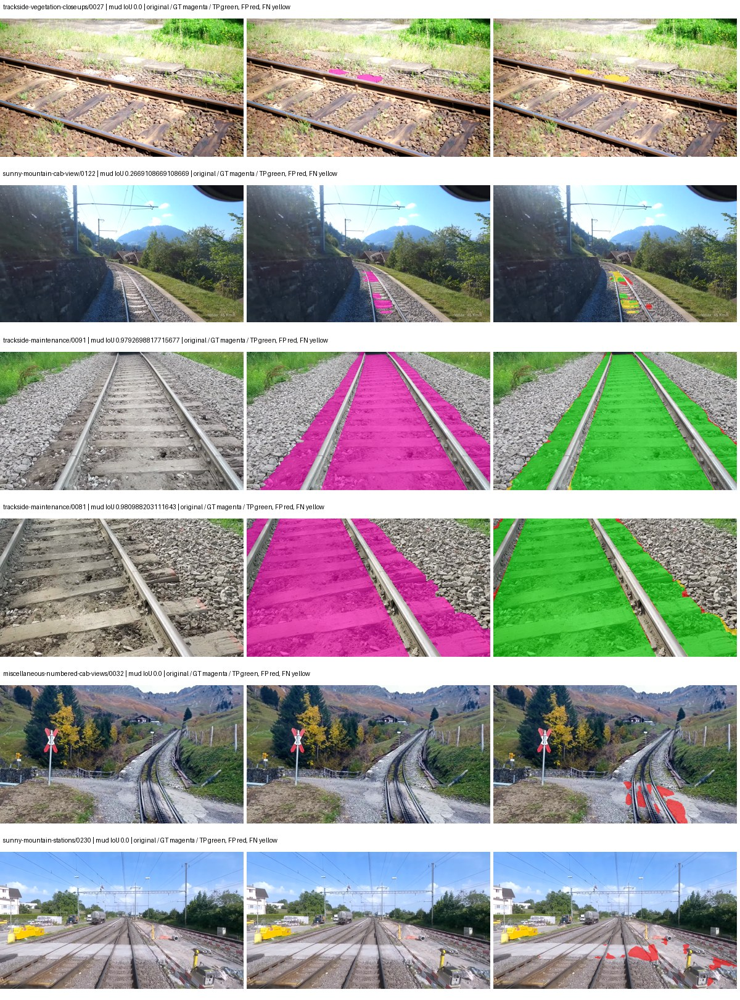
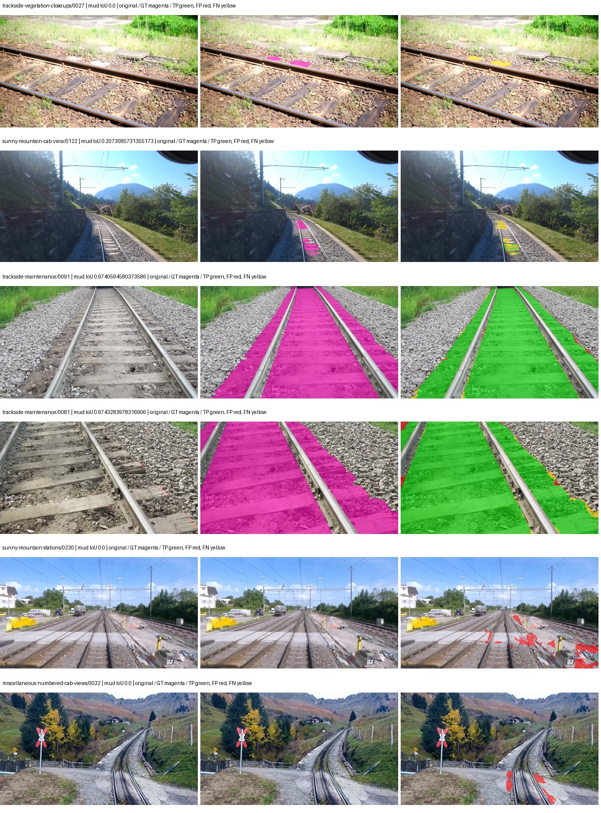
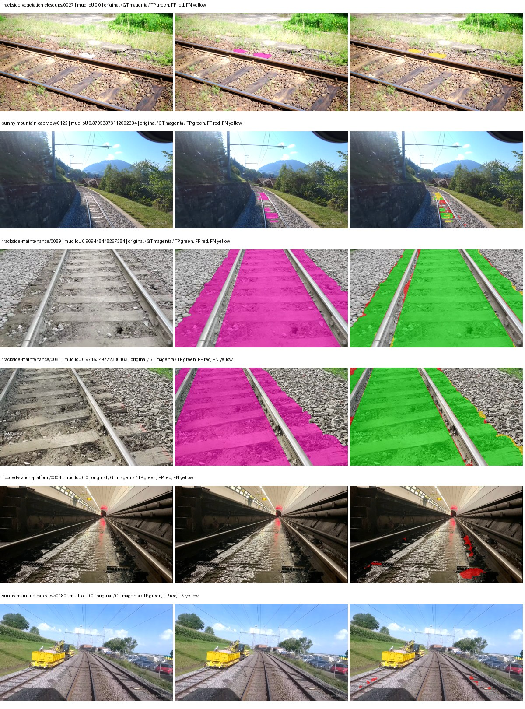
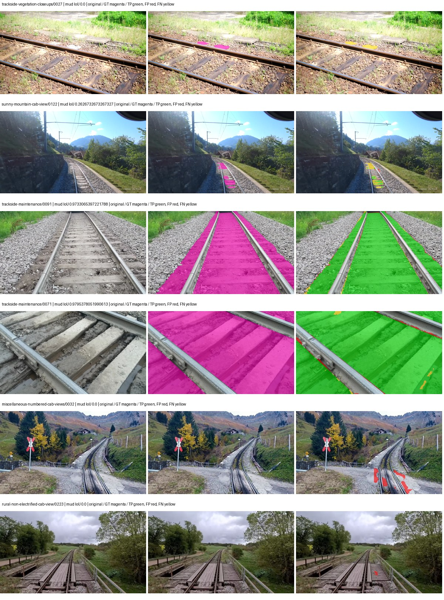

# segformer_b5 — rad_9_24_2026-paul

[RAD 9/24: Paul's split](../../README.md) · [Full model records](record.json)

Primary selection and early stopping: **mud-pumping validation IoU, pixels pooled over all validation images**. A job is complete only after full statistics and isolated profiling are verified.

Study metrics, counting each class only on the validation images that contain it: mud-pumping IoU is the mean per-image IoU over the images with mud-pumping, precision and recall sum pixels over those images, and mIoU averages each class over the images that contain it, then over the classes present.

| Initialization path | Seed | Mud-pumping IoU, train-camera images with mud (%, n=7) | Mud-pumping IoU, all images with mud (%, n=13) | Mud precision, all images with mud (%) | Mud recall, all images with mud (%) | mIoU (each class over images that contain it) (%) |
| --- | --- | --- | --- | --- | --- | --- |
| rtis_only | 0 | 60.00 | 69.33 | 97.02 | 97.10 | 53.09 |
| cityscapes_to_rtis | 0 | 51.87 | 64.59 | 97.00 | 95.51 | 50.77 |
| railsem19_to_rtis | 0 | 50.58 | 63.29 | 94.63 | 95.84 | 58.78 |
| cityscapes_to_railsem19_to_rtis | 0 | 60.04 | 68.40 | 96.94 | 94.37 | 54.73 |

Per-class IoU: IoU (%) of every class, each averaged only over the validation images that contain the class (n = those images); — = no image contains it. mIoU averages the classes with at least one such image.

| Initialization path | Seed | mIoU (each class over images that contain it) | person (n=12) | truck (n=5) | rail-track (n=31) | vegetation-overgrowth (n=14) | car (n=6) | on-rails (n=6) | traffic-sign (n=10) | road (n=12) | sidewalk (n=16) | construction (n=26) | tram-track (n=5) | pole (n=25) | traffic-light (n=8) | mud-pumping (n=13) | fence (n=17) | terrain (n=34) | sky (n=28) | rail-embedded (n=5) | rail-raised (n=36) | trackbed (n=32) | standing-water (n=6) |
| --- | --- | --- | --- | --- | --- | --- | --- | --- | --- | --- | --- | --- | --- | --- | --- | --- | --- | --- | --- | --- | --- | --- | --- |
| rtis_only | 0 | 53.09 | 18.88 | 15.90 | 75.05 | 55.00 | 44.01 | 74.96 | 29.95 | 52.33 | 50.36 | 53.89 | 41.77 | 57.23 | 18.27 | 69.33 | 40.32 | 85.83 | 97.03 | 54.33 | 74.98 | 79.08 | 26.30 |
| cityscapes_to_rtis | 0 | 50.77 | 22.24 | 9.16 | 70.52 | 43.02 | 58.36 | 66.72 | 29.04 | 32.91 | 52.64 | 48.69 | 32.92 | 59.00 | 19.71 | 64.59 | 54.99 | 84.58 | 96.97 | 51.56 | 72.14 | 76.76 | 19.64 |
| railsem19_to_rtis | 0 | 58.78 | 20.71 | 30.08 | 76.73 | 44.16 | 57.57 | 80.46 | 25.44 | 63.68 | 58.97 | 61.88 | 72.12 | 60.50 | 32.65 | 63.29 | 61.02 | 86.44 | 97.25 | 58.28 | 73.52 | 80.76 | 28.91 |
| cityscapes_to_railsem19_to_rtis | 0 | 54.73 | 22.28 | 20.93 | 76.91 | 43.42 | 58.44 | 67.35 | 26.17 | 36.72 | 54.35 | 53.65 | 58.77 | 61.13 | 23.93 | 68.40 | 60.42 | 87.49 | 97.18 | 53.33 | 73.79 | 81.17 | 23.57 |

Everything below is the campaign's own record, with pixels pooled over all validation images (the checkpoint was selected on that pooled mud IoU).

| Model | Initialization path | Seed | Status | Steps | Best step | Mud IoU, pixels pooled (%) | Mud precision, pixels pooled (%) | Mud recall, pixels pooled (%) | Final mud IoU (trainer val, pixels pooled, %) | mIoU, pixels pooled (%) | Fixed GT-class mIoU, pixels pooled (%) |
| --- | --- | --- | --- | --- | --- | --- | --- | --- | --- | --- | --- |
| segformer_b5 | rtis_only | 0 | completed | 3185 | 1857 | 93.08 | 95.74 | 97.10 | 92.54 | 59.13 | 59.13 |
| segformer_b5 | cityscapes_to_rtis | 0 | completed | 3981 | 2919 | 91.35 | 95.44 | 95.51 | 89.86 | 59.12 | 59.12 |
| segformer_b5 | railsem19_to_rtis | 0 | completed | 3185 | 1857 | 90.39 | 94.08 | 95.84 | 89.77 | 69.54 | 69.54 |
| segformer_b5 | cityscapes_to_railsem19_to_rtis | 0 | completed | 4000 | 2919 | 91.25 | 96.50 | 94.37 | 89.81 | 65.09 | 65.09 |

Training: 227 images. Validation: 37 images. Test: 50 held out. Seeds: [0]. Seed variation measures optimization variability, not independent-recording uncertainty. Historical source checkpoints stay fixed across adaptation seeds.

Training code: `d864b72bd90706260965bb1a48398d01167b6d5c`. Split SHA-256: `b16dbbc7c4aa0c5d6e0fb5a20a27b4f3f8a4f3ce535621ed7c9aeaa6e85adb77`.

## rtis_only — seed 0

Status: **completed**. Started: 2026-10-05T06:13:48.004347+00:00. Finished: 2026-10-05T07:38:28.741568+00:00.

Recipe pretrained initializer: `nvidia/mit-b5`.

`rtis_only` uses the recipe initializer, which may include pretrained segmentation components. Transfer paths load the exact historical source checkpoint below and reset the classifier; they do not reset all query/decoder features.

Source checkpoint: `Recipe pretrained initialization`.

Config SHA-256: `3e4a9c0fcd13c3b9ec6a913e163af59715ac52b240f7f8b5531f2e73e9d4f21e`. Weights used for validation: `raw`.

### Mud-pumping and aggregate quality

| Metric | Selected checkpoint | Final training validation |
| --- | --- | --- |
| Mud IoU | 93.08 | 92.54 |
| Mud precision | 95.74 | 95.47 |
| Mud recall | 97.10 | 96.79 |
| Mud Dice/F1 | 96.42 | 96.13 |
| mIoU | 59.13 | 59.77 |
| Mean accuracy | 73.62 | 72.93 |
| Mean precision | 73.72 | 75.50 |
| Mean Dice | 71.74 | 72.25 |
| Mean specificity | 99.40 | 99.41 |
| Pixel accuracy | 88.92 | 89.17 |
| Frequency-weighted IoU | 81.59 | 81.83 |
| Fixed GT-present class mIoU | 59.13 | 59.77 |
| Boundary F1 | 68.65 | 69.43 |

The selected checkpoint has independent evaluation evidence. Final values are the trainer's final validation record, not a new independent evaluation. mIoU averages classes with nonzero union, so false positives on absent classes can change its denominator. The fixed GT-class mean is supplementary and excludes absent classes; their false positives remain in the confusion matrix.

### Resource usage and timing

| Measurement | Value |
| --- | --- |
| Peak training VRAM, retained training invocation (GiB) | 16.31 |
| Peak evaluation VRAM (GiB) | 7.78 |
| Retained training invocation wall time (seconds) | 4753.70 |
| Retained training invocation GPU-hours (one GPU) | 1.32 |
| Evaluation wall time (seconds) | 29.53 |
| Full evaluation pipeline images/second | 1.25 |
| Best full-state checkpoint (MiB) | 1292.96 |
| Final full-state checkpoint (MiB) | 1292.91 |
| Verified periodic checkpoints removed (GiB) | 7.58 |

VRAM uses the recorded allocator high-water mark; it is not total device usage including CUDA context. Resumed jobs' retained training invocation times and peaks are **not whole-campaign totals**. Earlier invocation resource records are not reconstructed here. Evaluation throughput includes loader, sliding-window inference and metrics; it is not model-only latency/FPS. Missing measurements are shown as —, never inferred from another dataset's run.

### Standardized inference performance

Dedicated model-only profiling waits for an idle worker-locked L40S: BF16, batch 1, 1024x1024, 20 warmup and 100 CUDA-event-timed public forwards. It excludes loading, preprocessing, tiling and metrics.

| Status | Parameters | Weight MiB | FPS | p50 ms | p95 ms | Peak reserved GiB |
| --- | --- | --- | --- | --- | --- | --- |
| complete | 84609493 | 322.76 | 27.28 | 36.51 | 37.86 | 2.57 |

```json
{
  "schema_version": 1,
  "model_id": "segformer_b5",
  "measured_at": "2026-10-05T07:38:18+00:00",
  "status": "complete",
  "benchmark_scope": "rtis_selected_checkpoint_model_only",
  "applies_to": [
    "segformer_b5--rtis_only--seed-0"
  ],
  "source": {
    "campaign_git_sha": "d864b72bd90706260965bb1a48398d01167b6d5c",
    "git_dirty": false,
    "config_hash": "a727675f0c29",
    "resolved_config": "/data/izadia1/projects/segmentary-runs/rad_9_24_2026/paul-seed0-20261005-r2/configs/segformer_b5--rtis_only--seed-0.yaml",
    "config_sha256": "3e4a9c0fcd13c3b9ec6a913e163af59715ac52b240f7f8b5531f2e73e9d4f21e",
    "checkpoint_sha256": "8a9f21741ee2f4f4a300e136c924e3ee8e664be9ce762dc7255794479234cfd0",
    "checkpoint_global_step": 1857,
    "checkpoint_bytes": 1355767929,
    "checkpoint_kind": "resume checkpoint with optimizer and EMA state",
    "weights": "raw",
    "measured_checkpoint_job_id": "segformer_b5--rtis_only--seed-0",
    "result_sha256": "26f4fe81661f999dd87cfac1c457227ba76a9f1448c5c78e472b05ba74287781",
    "result_git_sha": "d864b72bd90706260965bb1a48398d01167b6d5c",
    "result_stage": "eval:rad_9_24_2026-paul:val",
    "result_seed": 0
  },
  "hardware": {
    "gpu_name": "NVIDIA L40S",
    "gpu_uuid": "GPU-a5ad49e5-0536-5229-ba8a-f8a902808f53",
    "logical_device": "cuda:0",
    "physical_visibility_token": "7",
    "compute_capability": [
      8,
      9
    ],
    "total_memory_bytes": 47677177856
  },
  "model": {
    "parameter_count": 84609493,
    "trainable_parameter_count": 84609493,
    "resident_parameter_bytes": 338437972,
    "parameter_dtype_counts": {
      "float32": 84609493
    }
  },
  "contract": {
    "backend": "pytorch",
    "precision": "bf16_autocast",
    "batch_size": 1,
    "input_shape_nchw": [
      1,
      3,
      1024,
      1024
    ],
    "warmup_iterations": 20,
    "measured_iterations": 100,
    "timing": "per-forward CUDA events with end-event synchronization",
    "includes_preprocessing": false,
    "includes_data_loader": false,
    "includes_sliding_window": false,
    "input_resident_on_gpu": true,
    "model_only": true,
    "entrypoint": "public model(image) dense-logits forward"
  },
  "measurements": {
    "latency": {
      "p50_ms": 36.51123237609863,
      "p95_ms": 37.856408309936526,
      "mean_ms": 36.65887062072754,
      "minimum_ms": 36.03763198852539,
      "maximum_ms": 38.78297424316406,
      "fps": 27.278527217763855,
      "raw_ms": [
        36.48614501953125,
        38.000640869140625,
        37.41798400878906,
        36.7564811706543,
        38.78297424316406,
        36.810752868652344,
        36.9725456237793,
        37.05036926269531,
        36.285438537597656,
        36.53120040893555,
        36.62131118774414,
        37.44255828857422,
        36.580352783203125,
        37.23980712890625,
        37.05651092529297,
        36.50969696044922,
        36.82304000854492,
        38.157310485839844,
        36.56294250488281,
        36.338687896728516,
        36.81894302368164,
        37.22854232788086,
        36.217857360839844,
        36.09804916381836,
        36.76976013183594,
        36.24448013305664,
        36.3397102355957,
        36.183040618896484,
        36.12160110473633,
        36.64076614379883,
        36.316158294677734,
        36.327423095703125,
        36.62847900390625,
        37.26438522338867,
        36.720638275146484,
        36.519935607910156,
        37.02988815307617,
        36.784095764160156,
        36.72883224487305,
        36.83225631713867,
        37.02988815307617,
        37.06572723388672,
        37.85932922363281,
        37.38313674926758,
        37.40467071533203,
        37.005313873291016,
        36.11750411987305,
        36.371456146240234,
        38.32320022583008,
        36.63564682006836,
        36.36531066894531,
        36.159488677978516,
        36.51276779174805,
        36.96025466918945,
        36.45235061645508,
        36.25062561035156,
        36.14003372192383,
        37.23263931274414,
        36.27724838256836,
        36.3765754699707,
        36.82815933227539,
        36.368385314941406,
        36.5035514831543,
        36.78105545043945,
        36.64486312866211,
        36.24959945678711,
        36.13081741333008,
        36.25471878051758,
        36.2977294921875,
        36.23833465576172,
        36.3243522644043,
        36.82508850097656,
        37.149696350097656,
        36.19635009765625,
        36.292606353759766,
        36.34892654418945,
        36.09292984008789,
        36.23628616333008,
        36.03763198852539,
        36.13798522949219,
        36.329471588134766,
        36.210689544677734,
        36.54451370239258,
        37.13228988647461,
        36.40422439575195,
        36.2608642578125,
        36.30796813964844,
        37.85625457763672,
        36.80767822265625,
        36.27315139770508,
        36.28031921386719,
        36.1973762512207,
        36.5742073059082,
        37.814273834228516,
        36.22809600830078,
        36.161537170410156,
        36.203521728515625,
        36.104190826416016,
        36.044734954833984,
        36.04787063598633
      ],
      "percentile_method": "numpy linear interpolation"
    },
    "peak_reserved_bytes": 2755657728,
    "memory_kind": "pytorch_cuda_allocator_peak_reserved_excluding_context",
    "benchmark_wall_clock_s": 7.614156052470207
  },
  "started_at": "2026-10-05T07:38:10+00:00",
  "finished_at": "2026-10-05T07:38:18+00:00",
  "environment": {
    "hostname": "hdrfs-app-001",
    "python": "3.11.15",
    "platform": "Linux-5.15.0-139-generic-x86_64-with-glibc2.35",
    "torch": "2.11.0+cu128",
    "torch_cuda": "12.8",
    "cudnn": 91900,
    "driver_version": "570.133.20",
    "cuda_available": true,
    "gpu_count": 1,
    "gpu_names": [
      "NVIDIA L40S"
    ],
    "cuda_visible_devices": "7",
    "packages": {
      "segmentary": "0.1.0",
      "torch": "2.11.0+cu128",
      "torchvision": "0.26.0+cu128",
      "transformers": "5.15.0",
      "timm": "1.0.28",
      "segmentation-models-pytorch": "0.5.0",
      "albumentations": "2.0.8",
      "lightning": "2.6.5",
      "numpy": "2.4.4"
    }
  }
}
```

### Per-class validation results

| Class | GT pixels | IoU (%) | Precision (%) | Recall (%) | Dice (%) | Boundary F1 (%) |
| --- | --- | --- | --- | --- | --- | --- |
| car | 75932 | 47.30 | 52.25 | 83.30 | 64.22 | 76.28 |
| construction | 5694760 | 50.38 | 63.43 | 70.99 | 67.00 | 66.57 |
| fence | 3789415 | 34.58 | 92.98 | 35.50 | 51.38 | 57.64 |
| mud-pumping | 7435760 | 93.08 | 95.74 | 97.10 | 96.42 | 79.50 |
| on-rails | 1137952 | 79.82 | 86.12 | 91.60 | 88.78 | 62.75 |
| person | 130659 | 76.24 | 79.43 | 94.99 | 86.52 | 76.55 |
| pole | 1467743 | 62.57 | 76.00 | 77.98 | 76.97 | 85.01 |
| rail-embedded | 74744 | 46.81 | 57.24 | 71.98 | 63.77 | 73.71 |
| rail-raised | 3588713 | 80.51 | 91.64 | 86.88 | 89.20 | 94.29 |
| rail-track | 4270276 | 74.54 | 86.56 | 84.30 | 85.42 | 83.99 |
| road | 1152119 | 38.95 | 47.16 | 69.09 | 56.06 | 55.80 |
| sidewalk | 2164731 | 57.51 | 71.64 | 74.47 | 73.02 | 68.46 |
| sky | 20207617 | 97.77 | 99.01 | 98.73 | 98.87 | 94.29 |
| standing-water | 2006046 | 53.62 | 73.30 | 66.64 | 69.81 | 19.71 |
| terrain | 30442090 | 89.12 | 93.02 | 95.50 | 94.25 | 84.58 |
| trackbed | 9118591 | 82.90 | 90.14 | 91.17 | 90.65 | 85.94 |
| traffic-light | 116825 | 30.76 | 58.34 | 39.42 | 47.05 | 62.42 |
| traffic-sign | 35778 | 30.82 | 37.99 | 62.04 | 47.12 | 52.28 |
| tram-track | 244726 | 40.58 | 70.00 | 49.12 | 57.73 | 51.07 |
| truck | 190997 | 18.41 | 64.65 | 20.47 | 31.09 | 32.28 |
| vegetation-overgrowth | 1534858 | 55.39 | 61.55 | 84.69 | 71.29 | 78.50 |

### Full-run accounting

| Measurement | Value |
| --- | --- |
| Full GPU-reserved wall seconds, all recorded worker attempts | 5088.33 |
| Full reserved GPU-hours | 1.41 |
| Whole-run timing complete | True |

| Phase | Wall seconds including failed attempts |
| --- | --- |
| training | 4761.61 |
| diagnostics | 252.56 |
| performance | 17.59 |

GPU-reserved time includes model loading, training, validation, collection, profiling, checkpoint I/O and orchestration while the worker owns one GPU. It is not GPU kernel-active time. Phase timings and sampled device memory/power/utilization are retained separately; sampled device memory is not the allocator high-water mark.

### Train/validation and raw/EMA diagnostics

| Checkpoint / weights / split | Images | Mud IoU (%) | Mud precision (%) | Mud recall (%) |
| --- | --- | --- | --- | --- |
| best-auto-train / raw | 227 | 96.52 | 97.79 | 98.68 |
| best-auto-val / raw | 37 | 93.08 | 95.74 | 97.10 |
| best-alternate-val / ema | 37 | 92.95 | 96.02 | 96.68 |
| final-auto-val / raw | 37 | 92.54 | 95.47 | 96.79 |

Train uses the evaluation transform without augmentation. Compare mud train/validation metrics for the same selected weights. Alternate EMA on running-stat BatchNorm is explicitly uncalibrated and is diagnostic only. Score-threshold curves use uncalibrated normalized scores and are pixel-level diagnostics, not event detection rates or a selected deployment operating point.

### Downloadable evidence

- best-auto-train: [per-image.csv](rtis_only--seed-0/best-auto-train/per-image.csv) · [per-image-confusion.json.gz](rtis_only--seed-0/best-auto-train/per-image-confusion.json.gz) · [groups.json](rtis_only--seed-0/best-auto-train/groups.json) · [mud-score-curves.json](rtis_only--seed-0/best-auto-train/mud-score-curves.json)
- best-auto-val: [per-image.csv](rtis_only--seed-0/best-auto-val/per-image.csv) · [per-image-confusion.json.gz](rtis_only--seed-0/best-auto-val/per-image-confusion.json.gz) · [groups.json](rtis_only--seed-0/best-auto-val/groups.json) · [mud-score-curves.json](rtis_only--seed-0/best-auto-val/mud-score-curves.json) · [examples.jpg](rtis_only--seed-0/best-auto-val/examples.jpg)
- best-alternate-val: [per-image.csv](rtis_only--seed-0/best-alternate-val/per-image.csv) · [per-image-confusion.json.gz](rtis_only--seed-0/best-alternate-val/per-image-confusion.json.gz) · [groups.json](rtis_only--seed-0/best-alternate-val/groups.json) · [mud-score-curves.json](rtis_only--seed-0/best-alternate-val/mud-score-curves.json)
- final-auto-val: [per-image.csv](rtis_only--seed-0/final-auto-val/per-image.csv) · [per-image-confusion.json.gz](rtis_only--seed-0/final-auto-val/per-image-confusion.json.gz) · [groups.json](rtis_only--seed-0/final-auto-val/groups.json) · [mud-score-curves.json](rtis_only--seed-0/final-auto-val/mud-score-curves.json)
- resources: [telemetry.csv](rtis_only--seed-0/resources/telemetry.csv)



Examples are two lowest and two highest mud-IoU positive images, plus up to two negative images with the most false-positive mud pixels. They are targeted diagnostic examples, not random samples. Green: true positive; red: false positive; yellow: false negative. Full predictions remain on HDRFS.

### Validation tracking

| Logged step | Overall mIoU (%) | Mud IoU (%) |
| --- | --- | --- |
| 264 | 46.46 | 85.44 |
| 530 | 54.73 | 91.20 |
| 796 | 56.73 | 91.44 |
| 1061 | 58.72 | 91.21 |
| 1326 | 58.74 | 90.80 |
| 1592 | 60.06 | 91.55 |
| 1857 | 59.13 | 93.08 |
| 2123 | 60.65 | 92.14 |
| 2389 | 60.45 | 91.15 |
| 2653 | 60.20 | 91.70 |
| 2919 | 59.39 | 92.39 |
| 3185 | 59.77 | 92.54 |

All retained scalar curves, including training loss and per-class IoU, are in record.json. Observed best mud on a curve is not necessarily a retained checkpoint: the pilot saved its selection-metric-best and final checkpoints. Step logging and checkpoint global_step may differ by one.

### Stopping and checkpoint provenance

```json
{
  "stopping": {
    "actual_steps": 3185,
    "maximum_steps": 4000,
    "min_delta": 0.001,
    "monitor": "val_iou/mud-pumping",
    "patience": 5,
    "reason": "validation_plateau"
  },
  "checkpoints": {
    "best": {
      "path": "/data/izadia1/projects/segmentary-runs/rad_9_24_2026/paul-seed0-20261005-r2/future-runs/segformer_b5--rtis_only--seed-0_seed0/rtis/best.ckpt",
      "sha256": "8a9f21741ee2f4f4a300e136c924e3ee8e664be9ce762dc7255794479234cfd0",
      "global_step": 1857,
      "bytes": 1355767929
    },
    "final": {
      "path": "/data/izadia1/projects/segmentary-runs/rad_9_24_2026/paul-seed0-20261005-r2/future-runs/segformer_b5--rtis_only--seed-0_seed0/rtis/last.ckpt",
      "sha256": "9ecc597b071b14c51981db68356cc6ce2156853e2e9c3b8ac434d23c28773f4b",
      "global_step": 3185,
      "bytes": 1355711929
    }
  },
  "cleanup_error": null
}
```

### Resolved training, initialization and evaluation settings

The optimizer block is the base configuration. Stage LR scales are applied at runtime, and stage warmup is capped at min(base warmup, floor(stage budget / 10), stage budget - 1): 400 steps for this 4,000-step pilot. Model-internal native input grids may differ from augmentation crops (EoMT uses its 640 grid).

```json
{
  "name": "segformer_b5--rtis_only--seed-0",
  "model": {
    "arch": "segformer_b5",
    "checkpoint": "nvidia/mit-b5",
    "tuning": "full",
    "head": "unified_head",
    "lora_r": 16,
    "lora_alpha": 32,
    "lora_dropout": 0.05,
    "lora_targets": [],
    "drop_path": null,
    "revision": null,
    "subfolder": null,
    "local_files_only": false,
    "trust_remote_code": false,
    "backbone_path": null,
    "head_paths": [],
    "classifier_path": null,
    "inactive_parameter_paths": [],
    "smp_arch": null,
    "encoder_name": null,
    "encoder_weights": null,
    "native": null,
    "batch_norm_momentum": null
  },
  "space": "paul-test-rtis",
  "taxonomy_root": "/data/izadia1/projects/segmentary-rad-d864b72b/taxonomy",
  "output_root": "/data/izadia1/projects/segmentary-runs/rad_9_24_2026/paul-seed0-20261005-r2/future-runs",
  "optim": {
    "backbone_lr": 6e-05,
    "head_lr_mult": 10.0,
    "weight_decay": 0.05,
    "llrd": 1.0,
    "warmup_iters": 1500,
    "warmup_ratio": 1e-06,
    "poly_power": 0.9,
    "min_lr_ratio": 0.0,
    "betas": [
      0.9,
      0.999
    ],
    "grad_clip": 1.0
  },
  "train": {
    "iters": 4000,
    "batch_size": 2,
    "accum": 8,
    "num_workers": 2,
    "precision": "bf16-mixed",
    "ema_decay": 0.9998,
    "val_every": 250,
    "ckpt_every": 500,
    "selection_metric": "val_iou/mud-pumping",
    "early_stopping_patience": 5,
    "early_stopping_min_delta": 0.001,
    "seed": 0,
    "devices": 1
  },
  "eval": {
    "sliding_window": true,
    "window": [
      1024,
      1024
    ],
    "stride": [
      768,
      768
    ],
    "batch_size": 1,
    "num_workers": 2,
    "tta_scales": [],
    "tta_flip": false,
    "threshold": 0.5,
    "boundary_tolerance_frac": 0.0075,
    "save_confusion": true
  },
  "loss": {
    "task": "multiclass",
    "activation": "auto",
    "terms": [],
    "aux": "none",
    "aux_weight": 0.0,
    "ce_weight": 1.0,
    "label_smoothing": 0.0,
    "class_weights": null,
    "query": null
  },
  "aug": {
    "crop": [
      1024,
      1024
    ],
    "scale_min": 0.5,
    "scale_max": 2.0,
    "hflip_p": 0.5,
    "color_jitter_p": 0.5,
    "brightness": 0.25,
    "contrast": 0.25,
    "saturation": 0.25,
    "hue": 0.05
  },
  "stages": [
    {
      "name": "rtis",
      "data": [
        {
          "name": "rad_9_24_2026-paul",
          "root": "/data/izadia1/datasets/rad_9_24_2026-paul",
          "variant": null,
          "split_file": "splits.json",
          "train_split": "train",
          "val_split": "val",
          "limit": null,
          "loader": "folder",
          "mapping": "paul-test-rtis",
          "loader_options": {
            "require_groups": false
          }
        }
      ],
      "iters": null,
      "lr_scale": 1.0,
      "head_group_lr_scale": 1.0,
      "init_from": "pretrained",
      "reset_head": false,
      "freeze": null,
      "sample_weights": null
    }
  ]
}
```

### Hardware and software provenance

```json
{
  "training": {
    "cuda_available": true,
    "cuda_visible_devices": "7",
    "cudnn": 91900,
    "driver_version": "570.133.20",
    "gpu_count": 1,
    "gpu_names": [
      "NVIDIA L40S"
    ],
    "hostname": "hdrfs-app-001",
    "input_normalization": {
      "channel_order": "rgb",
      "mean": [
        0.485,
        0.456,
        0.406
      ],
      "source": "imagenet",
      "std": [
        0.229,
        0.224,
        0.225
      ]
    },
    "model_origins": [
      {
        "hf_commit": "40357155205b036cf11b61f132d53d2f8861f170",
        "hf_name_or_path": "nvidia/mit-b5",
        "module": "model",
        "timm_pretrained": {}
      },
      {
        "hf_commit": "40357155205b036cf11b61f132d53d2f8861f170",
        "hf_name_or_path": "nvidia/mit-b5",
        "module": "model.segformer",
        "timm_pretrained": {}
      },
      {
        "hf_commit": "40357155205b036cf11b61f132d53d2f8861f170",
        "hf_name_or_path": "nvidia/mit-b5",
        "module": "model.segformer.stages.0.blocks.0.attention",
        "timm_pretrained": {}
      },
      {
        "hf_commit": "40357155205b036cf11b61f132d53d2f8861f170",
        "hf_name_or_path": "nvidia/mit-b5",
        "module": "model.segformer.stages.0.blocks.1.attention",
        "timm_pretrained": {}
      },
      {
        "hf_commit": "40357155205b036cf11b61f132d53d2f8861f170",
        "hf_name_or_path": "nvidia/mit-b5",
        "module": "model.segformer.stages.0.blocks.2.attention",
        "timm_pretrained": {}
      },
      {
        "hf_commit": "40357155205b036cf11b61f132d53d2f8861f170",
        "hf_name_or_path": "nvidia/mit-b5",
        "module": "model.segformer.stages.1.blocks.0.attention",
        "timm_pretrained": {}
      },
      {
        "hf_commit": "40357155205b036cf11b61f132d53d2f8861f170",
        "hf_name_or_path": "nvidia/mit-b5",
        "module": "model.segformer.stages.1.blocks.1.attention",
        "timm_pretrained": {}
      },
      {
        "hf_commit": "40357155205b036cf11b61f132d53d2f8861f170",
        "hf_name_or_path": "nvidia/mit-b5",
        "module": "model.segformer.stages.1.blocks.2.attention",
        "timm_pretrained": {}
      },
      {
        "hf_commit": "40357155205b036cf11b61f132d53d2f8861f170",
        "hf_name_or_path": "nvidia/mit-b5",
        "module": "model.segformer.stages.1.blocks.3.attention",
        "timm_pretrained": {}
      },
      {
        "hf_commit": "40357155205b036cf11b61f132d53d2f8861f170",
        "hf_name_or_path": "nvidia/mit-b5",
        "module": "model.segformer.stages.1.blocks.4.attention",
        "timm_pretrained": {}
      },
      {
        "hf_commit": "40357155205b036cf11b61f132d53d2f8861f170",
        "hf_name_or_path": "nvidia/mit-b5",
        "module": "model.segformer.stages.1.blocks.5.attention",
        "timm_pretrained": {}
      },
      {
        "hf_commit": "40357155205b036cf11b61f132d53d2f8861f170",
        "hf_name_or_path": "nvidia/mit-b5",
        "module": "model.segformer.stages.2.blocks.0.attention",
        "timm_pretrained": {}
      },
      {
        "hf_commit": "40357155205b036cf11b61f132d53d2f8861f170",
        "hf_name_or_path": "nvidia/mit-b5",
        "module": "model.segformer.stages.2.blocks.1.attention",
        "timm_pretrained": {}
      },
      {
        "hf_commit": "40357155205b036cf11b61f132d53d2f8861f170",
        "hf_name_or_path": "nvidia/mit-b5",
        "module": "model.segformer.stages.2.blocks.2.attention",
        "timm_pretrained": {}
      },
      {
        "hf_commit": "40357155205b036cf11b61f132d53d2f8861f170",
        "hf_name_or_path": "nvidia/mit-b5",
        "module": "model.segformer.stages.2.blocks.3.attention",
        "timm_pretrained": {}
      },
      {
        "hf_commit": "40357155205b036cf11b61f132d53d2f8861f170",
        "hf_name_or_path": "nvidia/mit-b5",
        "module": "model.segformer.stages.2.blocks.4.attention",
        "timm_pretrained": {}
      },
      {
        "hf_commit": "40357155205b036cf11b61f132d53d2f8861f170",
        "hf_name_or_path": "nvidia/mit-b5",
        "module": "model.segformer.stages.2.blocks.5.attention",
        "timm_pretrained": {}
      },
      {
        "hf_commit": "40357155205b036cf11b61f132d53d2f8861f170",
        "hf_name_or_path": "nvidia/mit-b5",
        "module": "model.segformer.stages.2.blocks.6.attention",
        "timm_pretrained": {}
      },
      {
        "hf_commit": "40357155205b036cf11b61f132d53d2f8861f170",
        "hf_name_or_path": "nvidia/mit-b5",
        "module": "model.segformer.stages.2.blocks.7.attention",
        "timm_pretrained": {}
      },
      {
        "hf_commit": "40357155205b036cf11b61f132d53d2f8861f170",
        "hf_name_or_path": "nvidia/mit-b5",
        "module": "model.segformer.stages.2.blocks.8.attention",
        "timm_pretrained": {}
      },
      {
        "hf_commit": "40357155205b036cf11b61f132d53d2f8861f170",
        "hf_name_or_path": "nvidia/mit-b5",
        "module": "model.segformer.stages.2.blocks.9.attention",
        "timm_pretrained": {}
      },
      {
        "hf_commit": "40357155205b036cf11b61f132d53d2f8861f170",
        "hf_name_or_path": "nvidia/mit-b5",
        "module": "model.segformer.stages.2.blocks.10.attention",
        "timm_pretrained": {}
      },
      {
        "hf_commit": "40357155205b036cf11b61f132d53d2f8861f170",
        "hf_name_or_path": "nvidia/mit-b5",
        "module": "model.segformer.stages.2.blocks.11.attention",
        "timm_pretrained": {}
      },
      {
        "hf_commit": "40357155205b036cf11b61f132d53d2f8861f170",
        "hf_name_or_path": "nvidia/mit-b5",
        "module": "model.segformer.stages.2.blocks.12.attention",
        "timm_pretrained": {}
      },
      {
        "hf_commit": "40357155205b036cf11b61f132d53d2f8861f170",
        "hf_name_or_path": "nvidia/mit-b5",
        "module": "model.segformer.stages.2.blocks.13.attention",
        "timm_pretrained": {}
      },
      {
        "hf_commit": "40357155205b036cf11b61f132d53d2f8861f170",
        "hf_name_or_path": "nvidia/mit-b5",
        "module": "model.segformer.stages.2.blocks.14.attention",
        "timm_pretrained": {}
      },
      {
        "hf_commit": "40357155205b036cf11b61f132d53d2f8861f170",
        "hf_name_or_path": "nvidia/mit-b5",
        "module": "model.segformer.stages.2.blocks.15.attention",
        "timm_pretrained": {}
      },
      {
        "hf_commit": "40357155205b036cf11b61f132d53d2f8861f170",
        "hf_name_or_path": "nvidia/mit-b5",
        "module": "model.segformer.stages.2.blocks.16.attention",
        "timm_pretrained": {}
      },
      {
        "hf_commit": "40357155205b036cf11b61f132d53d2f8861f170",
        "hf_name_or_path": "nvidia/mit-b5",
        "module": "model.segformer.stages.2.blocks.17.attention",
        "timm_pretrained": {}
      },
      {
        "hf_commit": "40357155205b036cf11b61f132d53d2f8861f170",
        "hf_name_or_path": "nvidia/mit-b5",
        "module": "model.segformer.stages.2.blocks.18.attention",
        "timm_pretrained": {}
      },
      {
        "hf_commit": "40357155205b036cf11b61f132d53d2f8861f170",
        "hf_name_or_path": "nvidia/mit-b5",
        "module": "model.segformer.stages.2.blocks.19.attention",
        "timm_pretrained": {}
      },
      {
        "hf_commit": "40357155205b036cf11b61f132d53d2f8861f170",
        "hf_name_or_path": "nvidia/mit-b5",
        "module": "model.segformer.stages.2.blocks.20.attention",
        "timm_pretrained": {}
      },
      {
        "hf_commit": "40357155205b036cf11b61f132d53d2f8861f170",
        "hf_name_or_path": "nvidia/mit-b5",
        "module": "model.segformer.stages.2.blocks.21.attention",
        "timm_pretrained": {}
      },
      {
        "hf_commit": "40357155205b036cf11b61f132d53d2f8861f170",
        "hf_name_or_path": "nvidia/mit-b5",
        "module": "model.segformer.stages.2.blocks.22.attention",
        "timm_pretrained": {}
      },
      {
        "hf_commit": "40357155205b036cf11b61f132d53d2f8861f170",
        "hf_name_or_path": "nvidia/mit-b5",
        "module": "model.segformer.stages.2.blocks.23.attention",
        "timm_pretrained": {}
      },
      {
        "hf_commit": "40357155205b036cf11b61f132d53d2f8861f170",
        "hf_name_or_path": "nvidia/mit-b5",
        "module": "model.segformer.stages.2.blocks.24.attention",
        "timm_pretrained": {}
      },
      {
        "hf_commit": "40357155205b036cf11b61f132d53d2f8861f170",
        "hf_name_or_path": "nvidia/mit-b5",
        "module": "model.segformer.stages.2.blocks.25.attention",
        "timm_pretrained": {}
      },
      {
        "hf_commit": "40357155205b036cf11b61f132d53d2f8861f170",
        "hf_name_or_path": "nvidia/mit-b5",
        "module": "model.segformer.stages.2.blocks.26.attention",
        "timm_pretrained": {}
      },
      {
        "hf_commit": "40357155205b036cf11b61f132d53d2f8861f170",
        "hf_name_or_path": "nvidia/mit-b5",
        "module": "model.segformer.stages.2.blocks.27.attention",
        "timm_pretrained": {}
      },
      {
        "hf_commit": "40357155205b036cf11b61f132d53d2f8861f170",
        "hf_name_or_path": "nvidia/mit-b5",
        "module": "model.segformer.stages.2.blocks.28.attention",
        "timm_pretrained": {}
      },
      {
        "hf_commit": "40357155205b036cf11b61f132d53d2f8861f170",
        "hf_name_or_path": "nvidia/mit-b5",
        "module": "model.segformer.stages.2.blocks.29.attention",
        "timm_pretrained": {}
      },
      {
        "hf_commit": "40357155205b036cf11b61f132d53d2f8861f170",
        "hf_name_or_path": "nvidia/mit-b5",
        "module": "model.segformer.stages.2.blocks.30.attention",
        "timm_pretrained": {}
      },
      {
        "hf_commit": "40357155205b036cf11b61f132d53d2f8861f170",
        "hf_name_or_path": "nvidia/mit-b5",
        "module": "model.segformer.stages.2.blocks.31.attention",
        "timm_pretrained": {}
      },
      {
        "hf_commit": "40357155205b036cf11b61f132d53d2f8861f170",
        "hf_name_or_path": "nvidia/mit-b5",
        "module": "model.segformer.stages.2.blocks.32.attention",
        "timm_pretrained": {}
      },
      {
        "hf_commit": "40357155205b036cf11b61f132d53d2f8861f170",
        "hf_name_or_path": "nvidia/mit-b5",
        "module": "model.segformer.stages.2.blocks.33.attention",
        "timm_pretrained": {}
      },
      {
        "hf_commit": "40357155205b036cf11b61f132d53d2f8861f170",
        "hf_name_or_path": "nvidia/mit-b5",
        "module": "model.segformer.stages.2.blocks.34.attention",
        "timm_pretrained": {}
      },
      {
        "hf_commit": "40357155205b036cf11b61f132d53d2f8861f170",
        "hf_name_or_path": "nvidia/mit-b5",
        "module": "model.segformer.stages.2.blocks.35.attention",
        "timm_pretrained": {}
      },
      {
        "hf_commit": "40357155205b036cf11b61f132d53d2f8861f170",
        "hf_name_or_path": "nvidia/mit-b5",
        "module": "model.segformer.stages.2.blocks.36.attention",
        "timm_pretrained": {}
      },
      {
        "hf_commit": "40357155205b036cf11b61f132d53d2f8861f170",
        "hf_name_or_path": "nvidia/mit-b5",
        "module": "model.segformer.stages.2.blocks.37.attention",
        "timm_pretrained": {}
      },
      {
        "hf_commit": "40357155205b036cf11b61f132d53d2f8861f170",
        "hf_name_or_path": "nvidia/mit-b5",
        "module": "model.segformer.stages.2.blocks.38.attention",
        "timm_pretrained": {}
      },
      {
        "hf_commit": "40357155205b036cf11b61f132d53d2f8861f170",
        "hf_name_or_path": "nvidia/mit-b5",
        "module": "model.segformer.stages.2.blocks.39.attention",
        "timm_pretrained": {}
      },
      {
        "hf_commit": "40357155205b036cf11b61f132d53d2f8861f170",
        "hf_name_or_path": "nvidia/mit-b5",
        "module": "model.segformer.stages.3.blocks.0.attention",
        "timm_pretrained": {}
      },
      {
        "hf_commit": "40357155205b036cf11b61f132d53d2f8861f170",
        "hf_name_or_path": "nvidia/mit-b5",
        "module": "model.segformer.stages.3.blocks.1.attention",
        "timm_pretrained": {}
      },
      {
        "hf_commit": "40357155205b036cf11b61f132d53d2f8861f170",
        "hf_name_or_path": "nvidia/mit-b5",
        "module": "model.segformer.stages.3.blocks.2.attention",
        "timm_pretrained": {}
      },
      {
        "hf_commit": "40357155205b036cf11b61f132d53d2f8861f170",
        "hf_name_or_path": "nvidia/mit-b5",
        "module": "model.decode_head",
        "timm_pretrained": {}
      }
    ],
    "model_parameter_count": 84609493,
    "packages": {
      "albumentations": "2.0.8",
      "lightning": "2.6.5",
      "numpy": "2.4.4",
      "segmentary": "0.1.0",
      "segmentation-models-pytorch": "0.5.0",
      "timm": "1.0.28",
      "torch": "2.11.0+cu128",
      "torchvision": "0.26.0+cu128",
      "transformers": "5.15.0"
    },
    "platform": "Linux-5.15.0-139-generic-x86_64-with-glibc2.35",
    "python": "3.11.15",
    "torch": "2.11.0+cu128",
    "torch_cuda": "12.8",
    "trainable_parameter_count": 84609493,
    "training_stop": {
      "actual_steps": 3185,
      "maximum_steps": 4000,
      "min_delta": 0.001,
      "monitor": "val_iou/mud-pumping",
      "patience": 5,
      "reason": "validation_plateau"
    },
    "validation_weights": "raw"
  },
  "evaluation": {
    "cuda_available": true,
    "cuda_visible_devices": "7",
    "cudnn": 91900,
    "driver_version": "570.133.20",
    "gpu_count": 1,
    "gpu_names": [
      "NVIDIA L40S"
    ],
    "hostname": "hdrfs-app-001",
    "input_normalization": {
      "channel_order": "rgb",
      "mean": [
        0.485,
        0.456,
        0.406
      ],
      "source": "imagenet",
      "std": [
        0.229,
        0.224,
        0.225
      ]
    },
    "packages": {
      "albumentations": "2.0.8",
      "lightning": "2.6.5",
      "numpy": "2.4.4",
      "segmentary": "0.1.0",
      "segmentation-models-pytorch": "0.5.0",
      "timm": "1.0.28",
      "torch": "2.11.0+cu128",
      "torchvision": "0.26.0+cu128",
      "transformers": "5.15.0"
    },
    "platform": "Linux-5.15.0-139-generic-x86_64-with-glibc2.35",
    "python": "3.11.15",
    "torch": "2.11.0+cu128",
    "torch_cuda": "12.8"
  }
}
```

## cityscapes_to_rtis — seed 0

Status: **completed**. Started: 2026-10-05T06:43:31.153317+00:00. Finished: 2026-10-05T08:28:04.489408+00:00.

Recipe pretrained initializer: `nvidia/mit-b5`.

`rtis_only` uses the recipe initializer, which may include pretrained segmentation components. Transfer paths load the exact historical source checkpoint below and reset the classifier; they do not reset all query/decoder features.

Source checkpoint: `{'name': 'segformer_b5--cityscapes--seed-0', 'model': 'segformer_b5', 'protocol': 'cityscapes', 'config': '/data/izadia1/projects/segmentary-runs/all-model-city-rail-seed0-rail20-b9eb3e1/accepted/segformer_b5--cityscapes--seed-0/resolved-config.yaml', 'checkpoint': '/data/izadia1/projects/segmentary-runs/all-model-city-rail-seed0-a7c0b67/jobs/segformer_b5--cityscapes--seed-0/attempt-001/train/segformer_b5--cityscapes_seed0/cityscapes/last.ckpt', 'recorded_sha256': '303e1dd639de11fd66defadcba0eea5a2179ca0b1a8d768c1dde8f8e1f135b85', 'exists': True}`.

Config SHA-256: `55c9e1b4f5e714e07c4d481878ce5cd1f2262ee9205443d0a570f2bcfce1d4cc`. Weights used for validation: `raw`.

### Mud-pumping and aggregate quality

| Metric | Selected checkpoint | Final training validation |
| --- | --- | --- |
| Mud IoU | 91.35 | 89.86 |
| Mud precision | 95.44 | 93.25 |
| Mud recall | 95.51 | 96.11 |
| Mud Dice/F1 | 95.48 | 94.66 |
| mIoU | 59.12 | 59.74 |
| Mean accuracy | 72.93 | 74.14 |
| Mean precision | 72.26 | 72.07 |
| Mean Dice | 71.82 | 72.42 |
| Mean specificity | 99.38 | 99.39 |
| Pixel accuracy | 88.51 | 88.59 |
| Frequency-weighted IoU | 81.07 | 81.09 |
| Fixed GT-present class mIoU | 59.12 | 59.74 |
| Boundary F1 | 68.27 | 68.67 |

The selected checkpoint has independent evaluation evidence. Final values are the trainer's final validation record, not a new independent evaluation. mIoU averages classes with nonzero union, so false positives on absent classes can change its denominator. The fixed GT-class mean is supplementary and excludes absent classes; their false positives remain in the confusion matrix.

### Resource usage and timing

| Measurement | Value |
| --- | --- |
| Peak training VRAM, retained training invocation (GiB) | 16.31 |
| Peak evaluation VRAM (GiB) | 7.78 |
| Retained training invocation wall time (seconds) | 5944.48 |
| Retained training invocation GPU-hours (one GPU) | 1.65 |
| Evaluation wall time (seconds) | 29.36 |
| Full evaluation pipeline images/second | 1.26 |
| Best full-state checkpoint (MiB) | 1292.96 |
| Final full-state checkpoint (MiB) | 1292.91 |
| Verified periodic checkpoints removed (GiB) | 8.84 |

VRAM uses the recorded allocator high-water mark; it is not total device usage including CUDA context. Resumed jobs' retained training invocation times and peaks are **not whole-campaign totals**. Earlier invocation resource records are not reconstructed here. Evaluation throughput includes loader, sliding-window inference and metrics; it is not model-only latency/FPS. Missing measurements are shown as —, never inferred from another dataset's run.

### Standardized inference performance

Dedicated model-only profiling waits for an idle worker-locked L40S: BF16, batch 1, 1024x1024, 20 warmup and 100 CUDA-event-timed public forwards. It excludes loading, preprocessing, tiling and metrics.

| Status | Parameters | Weight MiB | FPS | p50 ms | p95 ms | Peak reserved GiB |
| --- | --- | --- | --- | --- | --- | --- |
| complete | 84609493 | 322.76 | 27.73 | 35.97 | 36.75 | 2.57 |

```json
{
  "schema_version": 1,
  "model_id": "segformer_b5",
  "measured_at": "2026-10-05T08:27:52+00:00",
  "status": "complete",
  "benchmark_scope": "rtis_selected_checkpoint_model_only",
  "applies_to": [
    "segformer_b5--cityscapes_to_rtis--seed-0"
  ],
  "source": {
    "campaign_git_sha": "d864b72bd90706260965bb1a48398d01167b6d5c",
    "git_dirty": false,
    "config_hash": "49c3003965e0",
    "resolved_config": "/data/izadia1/projects/segmentary-runs/rad_9_24_2026/paul-seed0-20261005-r2/configs/segformer_b5--cityscapes_to_rtis--seed-0.yaml",
    "config_sha256": "55c9e1b4f5e714e07c4d481878ce5cd1f2262ee9205443d0a570f2bcfce1d4cc",
    "checkpoint_sha256": "56996e6b78358d35f54783cdb0ea1bca46dd54cfef1c33ecce9b2935eb714750",
    "checkpoint_global_step": 2919,
    "checkpoint_bytes": 1355767993,
    "checkpoint_kind": "resume checkpoint with optimizer and EMA state",
    "weights": "raw",
    "measured_checkpoint_job_id": "segformer_b5--cityscapes_to_rtis--seed-0",
    "result_sha256": "c293ef2957b4f205b6c94d6e4b81a18830edc273398c5fcf9a822b7e7fc64b3c",
    "result_git_sha": "d864b72bd90706260965bb1a48398d01167b6d5c",
    "result_stage": "eval:rad_9_24_2026-paul:val",
    "result_seed": 0
  },
  "hardware": {
    "gpu_name": "NVIDIA L40S",
    "gpu_uuid": "GPU-c76642eb-64c1-b0ac-b051-d2efd47b32c4",
    "logical_device": "cuda:0",
    "physical_visibility_token": "9",
    "compute_capability": [
      8,
      9
    ],
    "total_memory_bytes": 47677177856
  },
  "model": {
    "parameter_count": 84609493,
    "trainable_parameter_count": 84609493,
    "resident_parameter_bytes": 338437972,
    "parameter_dtype_counts": {
      "float32": 84609493
    }
  },
  "contract": {
    "backend": "pytorch",
    "precision": "bf16_autocast",
    "batch_size": 1,
    "input_shape_nchw": [
      1,
      3,
      1024,
      1024
    ],
    "warmup_iterations": 20,
    "measured_iterations": 100,
    "timing": "per-forward CUDA events with end-event synchronization",
    "includes_preprocessing": false,
    "includes_data_loader": false,
    "includes_sliding_window": false,
    "input_resident_on_gpu": true,
    "model_only": true,
    "entrypoint": "public model(image) dense-logits forward"
  },
  "measurements": {
    "latency": {
      "p50_ms": 35.97465705871582,
      "p95_ms": 36.74971981048584,
      "mean_ms": 36.066218528747555,
      "minimum_ms": 35.762176513671875,
      "maximum_ms": 39.49055862426758,
      "fps": 27.726777044921494,
      "raw_ms": [
        36.02534484863281,
        35.94035339355469,
        35.96796798706055,
        35.78675079345703,
        36.078590393066406,
        35.82156753540039,
        36.03251266479492,
        35.81439971923828,
        35.82463836669922,
        35.98329544067383,
        35.785728454589844,
        36.05503845214844,
        36.136959075927734,
        36.127742767333984,
        35.99052810668945,
        35.920894622802734,
        35.99871826171875,
        35.89324951171875,
        35.904510498046875,
        35.762176513671875,
        35.796993255615234,
        35.9997444152832,
        35.86969757080078,
        36.27110290527344,
        35.96700668334961,
        35.94950485229492,
        36.02534484863281,
        35.9536018371582,
        36.087806701660156,
        35.88608169555664,
        35.943424224853516,
        36.09395217895508,
        36.13798522949219,
        36.155391693115234,
        36.12160110473633,
        36.085758209228516,
        36.04889678955078,
        35.88505554199219,
        35.787776947021484,
        35.943424224853516,
        35.90963363647461,
        35.946495056152344,
        35.97926330566406,
        35.96083068847656,
        36.0079345703125,
        35.86969757080078,
        36.005889892578125,
        35.99871826171875,
        35.948543548583984,
        35.994625091552734,
        35.84102249145508,
        35.93830490112305,
        35.91475296020508,
        36.03251266479492,
        35.918846130371094,
        35.87788772583008,
        36.11443328857422,
        35.924991607666016,
        35.973121643066406,
        35.976192474365234,
        35.989505767822266,
        36.086753845214844,
        35.98643112182617,
        36.042686462402344,
        36.03353500366211,
        35.9024658203125,
        36.18918228149414,
        36.28339385986328,
        36.85478210449219,
        36.74419021606445,
        36.530174255371094,
        37.193729400634766,
        36.99913787841797,
        37.169151306152344,
        36.48204803466797,
        35.899391174316406,
        35.957759857177734,
        35.98847961425781,
        35.99052810668945,
        35.90652847290039,
        36.02329635620117,
        35.888126373291016,
        35.83180618286133,
        35.90348815917969,
        35.86048126220703,
        36.10111999511719,
        35.985408782958984,
        36.029441833496094,
        35.943424224853516,
        35.9106559753418,
        35.871742248535156,
        36.0714225769043,
        35.980289459228516,
        35.95878219604492,
        35.85945510864258,
        39.49055862426758,
        35.90963363647461,
        35.94035339355469,
        35.936256408691406,
        35.90143966674805
      ],
      "percentile_method": "numpy linear interpolation"
    },
    "peak_reserved_bytes": 2755657728,
    "memory_kind": "pytorch_cuda_allocator_peak_reserved_excluding_context",
    "benchmark_wall_clock_s": 7.441606543958187
  },
  "started_at": "2026-10-05T08:27:45+00:00",
  "finished_at": "2026-10-05T08:27:52+00:00",
  "environment": {
    "hostname": "hdrfs-app-001",
    "python": "3.11.15",
    "platform": "Linux-5.15.0-139-generic-x86_64-with-glibc2.35",
    "torch": "2.11.0+cu128",
    "torch_cuda": "12.8",
    "cudnn": 91900,
    "driver_version": "570.133.20",
    "cuda_available": true,
    "gpu_count": 1,
    "gpu_names": [
      "NVIDIA L40S"
    ],
    "cuda_visible_devices": "9",
    "packages": {
      "segmentary": "0.1.0",
      "torch": "2.11.0+cu128",
      "torchvision": "0.26.0+cu128",
      "transformers": "5.15.0",
      "timm": "1.0.28",
      "segmentation-models-pytorch": "0.5.0",
      "albumentations": "2.0.8",
      "lightning": "2.6.5",
      "numpy": "2.4.4"
    }
  }
}
```

### Per-class validation results

| Class | GT pixels | IoU (%) | Precision (%) | Recall (%) | Dice (%) | Boundary F1 (%) |
| --- | --- | --- | --- | --- | --- | --- |
| car | 75932 | 51.73 | 54.40 | 91.34 | 68.19 | 80.05 |
| construction | 5694760 | 51.25 | 67.59 | 67.95 | 67.77 | 70.19 |
| fence | 3789415 | 48.93 | 85.10 | 53.52 | 65.71 | 66.92 |
| mud-pumping | 7435760 | 91.35 | 95.44 | 95.51 | 95.48 | 68.01 |
| on-rails | 1137952 | 76.03 | 82.73 | 90.37 | 86.38 | 60.58 |
| person | 130659 | 80.67 | 84.98 | 94.10 | 89.30 | 81.20 |
| pole | 1467743 | 64.10 | 72.05 | 85.32 | 78.12 | 86.83 |
| rail-embedded | 74744 | 45.05 | 64.24 | 60.12 | 62.11 | 67.27 |
| rail-raised | 3588713 | 76.33 | 86.50 | 86.66 | 86.58 | 91.76 |
| rail-track | 4270276 | 71.56 | 84.82 | 82.08 | 83.42 | 78.64 |
| road | 1152119 | 26.74 | 37.95 | 47.52 | 42.20 | 43.93 |
| sidewalk | 2164731 | 60.39 | 69.60 | 82.02 | 75.30 | 67.52 |
| sky | 20207617 | 97.67 | 98.91 | 98.73 | 98.82 | 94.84 |
| standing-water | 2006046 | 51.56 | 76.91 | 61.00 | 68.04 | 20.45 |
| terrain | 30442090 | 87.93 | 93.45 | 93.71 | 93.58 | 82.40 |
| trackbed | 9118591 | 81.58 | 88.17 | 91.60 | 89.86 | 82.19 |
| traffic-light | 116825 | 37.90 | 61.50 | 49.68 | 54.96 | 65.72 |
| traffic-sign | 35778 | 38.94 | 59.15 | 53.27 | 56.06 | 65.64 |
| tram-track | 244726 | 33.63 | 63.68 | 41.61 | 50.33 | 51.82 |
| truck | 190997 | 15.60 | 30.50 | 24.20 | 26.99 | 34.37 |
| vegetation-overgrowth | 1534858 | 52.58 | 59.81 | 81.31 | 68.92 | 73.32 |

### Full-run accounting

| Measurement | Value |
| --- | --- |
| Full GPU-reserved wall seconds, all recorded worker attempts | 6281.60 |
| Full reserved GPU-hours | 1.74 |
| Whole-run timing complete | True |

| Phase | Wall seconds including failed attempts |
| --- | --- |
| training | 5952.47 |
| diagnostics | 253.73 |
| performance | 17.17 |

GPU-reserved time includes model loading, training, validation, collection, profiling, checkpoint I/O and orchestration while the worker owns one GPU. It is not GPU kernel-active time. Phase timings and sampled device memory/power/utilization are retained separately; sampled device memory is not the allocator high-water mark.

### Train/validation and raw/EMA diagnostics

| Checkpoint / weights / split | Images | Mud IoU (%) | Mud precision (%) | Mud recall (%) |
| --- | --- | --- | --- | --- |
| best-auto-train / raw | 227 | 94.52 | 97.33 | 97.04 |
| best-auto-val / raw | 37 | 91.35 | 95.44 | 95.51 |
| best-alternate-val / ema | 37 | 90.35 | 93.75 | 96.14 |
| final-auto-val / raw | 37 | 89.86 | 93.24 | 96.12 |

Train uses the evaluation transform without augmentation. Compare mud train/validation metrics for the same selected weights. Alternate EMA on running-stat BatchNorm is explicitly uncalibrated and is diagnostic only. Score-threshold curves use uncalibrated normalized scores and are pixel-level diagnostics, not event detection rates or a selected deployment operating point.

### Downloadable evidence

- best-auto-train: [per-image.csv](cityscapes_to_rtis--seed-0/best-auto-train/per-image.csv) · [per-image-confusion.json.gz](cityscapes_to_rtis--seed-0/best-auto-train/per-image-confusion.json.gz) · [groups.json](cityscapes_to_rtis--seed-0/best-auto-train/groups.json) · [mud-score-curves.json](cityscapes_to_rtis--seed-0/best-auto-train/mud-score-curves.json)
- best-auto-val: [per-image.csv](cityscapes_to_rtis--seed-0/best-auto-val/per-image.csv) · [per-image-confusion.json.gz](cityscapes_to_rtis--seed-0/best-auto-val/per-image-confusion.json.gz) · [groups.json](cityscapes_to_rtis--seed-0/best-auto-val/groups.json) · [mud-score-curves.json](cityscapes_to_rtis--seed-0/best-auto-val/mud-score-curves.json) · [examples.jpg](cityscapes_to_rtis--seed-0/best-auto-val/examples.jpg)
- best-alternate-val: [per-image.csv](cityscapes_to_rtis--seed-0/best-alternate-val/per-image.csv) · [per-image-confusion.json.gz](cityscapes_to_rtis--seed-0/best-alternate-val/per-image-confusion.json.gz) · [groups.json](cityscapes_to_rtis--seed-0/best-alternate-val/groups.json) · [mud-score-curves.json](cityscapes_to_rtis--seed-0/best-alternate-val/mud-score-curves.json)
- final-auto-val: [per-image.csv](cityscapes_to_rtis--seed-0/final-auto-val/per-image.csv) · [per-image-confusion.json.gz](cityscapes_to_rtis--seed-0/final-auto-val/per-image-confusion.json.gz) · [groups.json](cityscapes_to_rtis--seed-0/final-auto-val/groups.json) · [mud-score-curves.json](cityscapes_to_rtis--seed-0/final-auto-val/mud-score-curves.json)
- resources: [telemetry.csv](cityscapes_to_rtis--seed-0/resources/telemetry.csv)



Examples are two lowest and two highest mud-IoU positive images, plus up to two negative images with the most false-positive mud pixels. They are targeted diagnostic examples, not random samples. Green: true positive; red: false positive; yellow: false negative. Full predictions remain on HDRFS.

### Validation tracking

| Logged step | Overall mIoU (%) | Mud IoU (%) |
| --- | --- | --- |
| 264 | 35.44 | 69.25 |
| 530 | 50.17 | 83.51 |
| 796 | 57.56 | 86.49 |
| 1061 | 58.57 | 87.86 |
| 1326 | 58.55 | 87.51 |
| 1592 | 58.94 | 87.14 |
| 1857 | 58.82 | 89.92 |
| 2123 | 58.18 | 88.73 |
| 2389 | 59.46 | 90.62 |
| 2653 | 59.08 | 91.31 |
| 2919 | 59.12 | 91.34 |
| 3185 | 59.62 | 90.66 |
| 3451 | 59.92 | 90.49 |
| 3716 | 59.70 | 90.74 |
| 3981 | 59.74 | 89.86 |

All retained scalar curves, including training loss and per-class IoU, are in record.json. Observed best mud on a curve is not necessarily a retained checkpoint: the pilot saved its selection-metric-best and final checkpoints. Step logging and checkpoint global_step may differ by one.

### Stopping and checkpoint provenance

```json
{
  "stopping": {
    "actual_steps": 3981,
    "maximum_steps": 4000,
    "min_delta": 0.001,
    "monitor": "val_iou/mud-pumping",
    "patience": 5,
    "reason": "validation_plateau"
  },
  "checkpoints": {
    "best": {
      "path": "/data/izadia1/projects/segmentary-runs/rad_9_24_2026/paul-seed0-20261005-r2/future-runs/segformer_b5--cityscapes_to_rtis--seed-0_seed0/rtis/best.ckpt",
      "sha256": "56996e6b78358d35f54783cdb0ea1bca46dd54cfef1c33ecce9b2935eb714750",
      "global_step": 2919,
      "bytes": 1355767993
    },
    "final": {
      "path": "/data/izadia1/projects/segmentary-runs/rad_9_24_2026/paul-seed0-20261005-r2/future-runs/segformer_b5--cityscapes_to_rtis--seed-0_seed0/rtis/last.ckpt",
      "sha256": "932ec3f8197daed7536d577d74f33de064a468559bddda6ed1be26c3b5bcf4c3",
      "global_step": 3981,
      "bytes": 1355711929
    }
  },
  "cleanup_error": null
}
```

### Resolved training, initialization and evaluation settings

The optimizer block is the base configuration. Stage LR scales are applied at runtime, and stage warmup is capped at min(base warmup, floor(stage budget / 10), stage budget - 1): 400 steps for this 4,000-step pilot. Model-internal native input grids may differ from augmentation crops (EoMT uses its 640 grid).

```json
{
  "name": "segformer_b5--cityscapes_to_rtis--seed-0",
  "model": {
    "arch": "segformer_b5",
    "checkpoint": "nvidia/mit-b5",
    "tuning": "full",
    "head": "unified_head",
    "lora_r": 16,
    "lora_alpha": 32,
    "lora_dropout": 0.05,
    "lora_targets": [],
    "drop_path": null,
    "revision": null,
    "subfolder": null,
    "local_files_only": false,
    "trust_remote_code": false,
    "backbone_path": null,
    "head_paths": [],
    "classifier_path": null,
    "inactive_parameter_paths": [],
    "smp_arch": null,
    "encoder_name": null,
    "encoder_weights": null,
    "native": null,
    "batch_norm_momentum": null
  },
  "space": "paul-test-rtis",
  "taxonomy_root": "/data/izadia1/projects/segmentary-rad-d864b72b/taxonomy",
  "output_root": "/data/izadia1/projects/segmentary-runs/rad_9_24_2026/paul-seed0-20261005-r2/future-runs",
  "optim": {
    "backbone_lr": 6e-05,
    "head_lr_mult": 10.0,
    "weight_decay": 0.05,
    "llrd": 1.0,
    "warmup_iters": 1500,
    "warmup_ratio": 1e-06,
    "poly_power": 0.9,
    "min_lr_ratio": 0.0,
    "betas": [
      0.9,
      0.999
    ],
    "grad_clip": 1.0
  },
  "train": {
    "iters": 4000,
    "batch_size": 2,
    "accum": 8,
    "num_workers": 2,
    "precision": "bf16-mixed",
    "ema_decay": 0.9998,
    "val_every": 250,
    "ckpt_every": 500,
    "selection_metric": "val_iou/mud-pumping",
    "early_stopping_patience": 5,
    "early_stopping_min_delta": 0.001,
    "seed": 0,
    "devices": 1
  },
  "eval": {
    "sliding_window": true,
    "window": [
      1024,
      1024
    ],
    "stride": [
      768,
      768
    ],
    "batch_size": 1,
    "num_workers": 2,
    "tta_scales": [],
    "tta_flip": false,
    "threshold": 0.5,
    "boundary_tolerance_frac": 0.0075,
    "save_confusion": true
  },
  "loss": {
    "task": "multiclass",
    "activation": "auto",
    "terms": [],
    "aux": "none",
    "aux_weight": 0.0,
    "ce_weight": 1.0,
    "label_smoothing": 0.0,
    "class_weights": null,
    "query": null
  },
  "aug": {
    "crop": [
      1024,
      1024
    ],
    "scale_min": 0.5,
    "scale_max": 2.0,
    "hflip_p": 0.5,
    "color_jitter_p": 0.5,
    "brightness": 0.25,
    "contrast": 0.25,
    "saturation": 0.25,
    "hue": 0.05
  },
  "stages": [
    {
      "name": "rtis",
      "data": [
        {
          "name": "rad_9_24_2026-paul",
          "root": "/data/izadia1/datasets/rad_9_24_2026-paul",
          "variant": null,
          "split_file": "splits.json",
          "train_split": "train",
          "val_split": "val",
          "limit": null,
          "loader": "folder",
          "mapping": "paul-test-rtis",
          "loader_options": {
            "require_groups": false
          }
        }
      ],
      "iters": null,
      "lr_scale": 0.1,
      "head_group_lr_scale": 1.0,
      "init_from": "/data/izadia1/projects/segmentary-runs/all-model-city-rail-seed0-a7c0b67/jobs/segformer_b5--cityscapes--seed-0/attempt-001/train/segformer_b5--cityscapes_seed0/cityscapes/last.ckpt",
      "reset_head": true,
      "freeze": null,
      "sample_weights": null
    }
  ]
}
```

### Hardware and software provenance

```json
{
  "training": {
    "cuda_available": true,
    "cuda_visible_devices": "9",
    "cudnn": 91900,
    "driver_version": "570.133.20",
    "gpu_count": 1,
    "gpu_names": [
      "NVIDIA L40S"
    ],
    "hostname": "hdrfs-app-001",
    "input_normalization": {
      "channel_order": "rgb",
      "mean": [
        0.485,
        0.456,
        0.406
      ],
      "source": "imagenet",
      "std": [
        0.229,
        0.224,
        0.225
      ]
    },
    "model_origins": [
      {
        "hf_commit": "40357155205b036cf11b61f132d53d2f8861f170",
        "hf_name_or_path": "nvidia/mit-b5",
        "module": "model",
        "timm_pretrained": {}
      },
      {
        "hf_commit": "40357155205b036cf11b61f132d53d2f8861f170",
        "hf_name_or_path": "nvidia/mit-b5",
        "module": "model.segformer",
        "timm_pretrained": {}
      },
      {
        "hf_commit": "40357155205b036cf11b61f132d53d2f8861f170",
        "hf_name_or_path": "nvidia/mit-b5",
        "module": "model.segformer.stages.0.blocks.0.attention",
        "timm_pretrained": {}
      },
      {
        "hf_commit": "40357155205b036cf11b61f132d53d2f8861f170",
        "hf_name_or_path": "nvidia/mit-b5",
        "module": "model.segformer.stages.0.blocks.1.attention",
        "timm_pretrained": {}
      },
      {
        "hf_commit": "40357155205b036cf11b61f132d53d2f8861f170",
        "hf_name_or_path": "nvidia/mit-b5",
        "module": "model.segformer.stages.0.blocks.2.attention",
        "timm_pretrained": {}
      },
      {
        "hf_commit": "40357155205b036cf11b61f132d53d2f8861f170",
        "hf_name_or_path": "nvidia/mit-b5",
        "module": "model.segformer.stages.1.blocks.0.attention",
        "timm_pretrained": {}
      },
      {
        "hf_commit": "40357155205b036cf11b61f132d53d2f8861f170",
        "hf_name_or_path": "nvidia/mit-b5",
        "module": "model.segformer.stages.1.blocks.1.attention",
        "timm_pretrained": {}
      },
      {
        "hf_commit": "40357155205b036cf11b61f132d53d2f8861f170",
        "hf_name_or_path": "nvidia/mit-b5",
        "module": "model.segformer.stages.1.blocks.2.attention",
        "timm_pretrained": {}
      },
      {
        "hf_commit": "40357155205b036cf11b61f132d53d2f8861f170",
        "hf_name_or_path": "nvidia/mit-b5",
        "module": "model.segformer.stages.1.blocks.3.attention",
        "timm_pretrained": {}
      },
      {
        "hf_commit": "40357155205b036cf11b61f132d53d2f8861f170",
        "hf_name_or_path": "nvidia/mit-b5",
        "module": "model.segformer.stages.1.blocks.4.attention",
        "timm_pretrained": {}
      },
      {
        "hf_commit": "40357155205b036cf11b61f132d53d2f8861f170",
        "hf_name_or_path": "nvidia/mit-b5",
        "module": "model.segformer.stages.1.blocks.5.attention",
        "timm_pretrained": {}
      },
      {
        "hf_commit": "40357155205b036cf11b61f132d53d2f8861f170",
        "hf_name_or_path": "nvidia/mit-b5",
        "module": "model.segformer.stages.2.blocks.0.attention",
        "timm_pretrained": {}
      },
      {
        "hf_commit": "40357155205b036cf11b61f132d53d2f8861f170",
        "hf_name_or_path": "nvidia/mit-b5",
        "module": "model.segformer.stages.2.blocks.1.attention",
        "timm_pretrained": {}
      },
      {
        "hf_commit": "40357155205b036cf11b61f132d53d2f8861f170",
        "hf_name_or_path": "nvidia/mit-b5",
        "module": "model.segformer.stages.2.blocks.2.attention",
        "timm_pretrained": {}
      },
      {
        "hf_commit": "40357155205b036cf11b61f132d53d2f8861f170",
        "hf_name_or_path": "nvidia/mit-b5",
        "module": "model.segformer.stages.2.blocks.3.attention",
        "timm_pretrained": {}
      },
      {
        "hf_commit": "40357155205b036cf11b61f132d53d2f8861f170",
        "hf_name_or_path": "nvidia/mit-b5",
        "module": "model.segformer.stages.2.blocks.4.attention",
        "timm_pretrained": {}
      },
      {
        "hf_commit": "40357155205b036cf11b61f132d53d2f8861f170",
        "hf_name_or_path": "nvidia/mit-b5",
        "module": "model.segformer.stages.2.blocks.5.attention",
        "timm_pretrained": {}
      },
      {
        "hf_commit": "40357155205b036cf11b61f132d53d2f8861f170",
        "hf_name_or_path": "nvidia/mit-b5",
        "module": "model.segformer.stages.2.blocks.6.attention",
        "timm_pretrained": {}
      },
      {
        "hf_commit": "40357155205b036cf11b61f132d53d2f8861f170",
        "hf_name_or_path": "nvidia/mit-b5",
        "module": "model.segformer.stages.2.blocks.7.attention",
        "timm_pretrained": {}
      },
      {
        "hf_commit": "40357155205b036cf11b61f132d53d2f8861f170",
        "hf_name_or_path": "nvidia/mit-b5",
        "module": "model.segformer.stages.2.blocks.8.attention",
        "timm_pretrained": {}
      },
      {
        "hf_commit": "40357155205b036cf11b61f132d53d2f8861f170",
        "hf_name_or_path": "nvidia/mit-b5",
        "module": "model.segformer.stages.2.blocks.9.attention",
        "timm_pretrained": {}
      },
      {
        "hf_commit": "40357155205b036cf11b61f132d53d2f8861f170",
        "hf_name_or_path": "nvidia/mit-b5",
        "module": "model.segformer.stages.2.blocks.10.attention",
        "timm_pretrained": {}
      },
      {
        "hf_commit": "40357155205b036cf11b61f132d53d2f8861f170",
        "hf_name_or_path": "nvidia/mit-b5",
        "module": "model.segformer.stages.2.blocks.11.attention",
        "timm_pretrained": {}
      },
      {
        "hf_commit": "40357155205b036cf11b61f132d53d2f8861f170",
        "hf_name_or_path": "nvidia/mit-b5",
        "module": "model.segformer.stages.2.blocks.12.attention",
        "timm_pretrained": {}
      },
      {
        "hf_commit": "40357155205b036cf11b61f132d53d2f8861f170",
        "hf_name_or_path": "nvidia/mit-b5",
        "module": "model.segformer.stages.2.blocks.13.attention",
        "timm_pretrained": {}
      },
      {
        "hf_commit": "40357155205b036cf11b61f132d53d2f8861f170",
        "hf_name_or_path": "nvidia/mit-b5",
        "module": "model.segformer.stages.2.blocks.14.attention",
        "timm_pretrained": {}
      },
      {
        "hf_commit": "40357155205b036cf11b61f132d53d2f8861f170",
        "hf_name_or_path": "nvidia/mit-b5",
        "module": "model.segformer.stages.2.blocks.15.attention",
        "timm_pretrained": {}
      },
      {
        "hf_commit": "40357155205b036cf11b61f132d53d2f8861f170",
        "hf_name_or_path": "nvidia/mit-b5",
        "module": "model.segformer.stages.2.blocks.16.attention",
        "timm_pretrained": {}
      },
      {
        "hf_commit": "40357155205b036cf11b61f132d53d2f8861f170",
        "hf_name_or_path": "nvidia/mit-b5",
        "module": "model.segformer.stages.2.blocks.17.attention",
        "timm_pretrained": {}
      },
      {
        "hf_commit": "40357155205b036cf11b61f132d53d2f8861f170",
        "hf_name_or_path": "nvidia/mit-b5",
        "module": "model.segformer.stages.2.blocks.18.attention",
        "timm_pretrained": {}
      },
      {
        "hf_commit": "40357155205b036cf11b61f132d53d2f8861f170",
        "hf_name_or_path": "nvidia/mit-b5",
        "module": "model.segformer.stages.2.blocks.19.attention",
        "timm_pretrained": {}
      },
      {
        "hf_commit": "40357155205b036cf11b61f132d53d2f8861f170",
        "hf_name_or_path": "nvidia/mit-b5",
        "module": "model.segformer.stages.2.blocks.20.attention",
        "timm_pretrained": {}
      },
      {
        "hf_commit": "40357155205b036cf11b61f132d53d2f8861f170",
        "hf_name_or_path": "nvidia/mit-b5",
        "module": "model.segformer.stages.2.blocks.21.attention",
        "timm_pretrained": {}
      },
      {
        "hf_commit": "40357155205b036cf11b61f132d53d2f8861f170",
        "hf_name_or_path": "nvidia/mit-b5",
        "module": "model.segformer.stages.2.blocks.22.attention",
        "timm_pretrained": {}
      },
      {
        "hf_commit": "40357155205b036cf11b61f132d53d2f8861f170",
        "hf_name_or_path": "nvidia/mit-b5",
        "module": "model.segformer.stages.2.blocks.23.attention",
        "timm_pretrained": {}
      },
      {
        "hf_commit": "40357155205b036cf11b61f132d53d2f8861f170",
        "hf_name_or_path": "nvidia/mit-b5",
        "module": "model.segformer.stages.2.blocks.24.attention",
        "timm_pretrained": {}
      },
      {
        "hf_commit": "40357155205b036cf11b61f132d53d2f8861f170",
        "hf_name_or_path": "nvidia/mit-b5",
        "module": "model.segformer.stages.2.blocks.25.attention",
        "timm_pretrained": {}
      },
      {
        "hf_commit": "40357155205b036cf11b61f132d53d2f8861f170",
        "hf_name_or_path": "nvidia/mit-b5",
        "module": "model.segformer.stages.2.blocks.26.attention",
        "timm_pretrained": {}
      },
      {
        "hf_commit": "40357155205b036cf11b61f132d53d2f8861f170",
        "hf_name_or_path": "nvidia/mit-b5",
        "module": "model.segformer.stages.2.blocks.27.attention",
        "timm_pretrained": {}
      },
      {
        "hf_commit": "40357155205b036cf11b61f132d53d2f8861f170",
        "hf_name_or_path": "nvidia/mit-b5",
        "module": "model.segformer.stages.2.blocks.28.attention",
        "timm_pretrained": {}
      },
      {
        "hf_commit": "40357155205b036cf11b61f132d53d2f8861f170",
        "hf_name_or_path": "nvidia/mit-b5",
        "module": "model.segformer.stages.2.blocks.29.attention",
        "timm_pretrained": {}
      },
      {
        "hf_commit": "40357155205b036cf11b61f132d53d2f8861f170",
        "hf_name_or_path": "nvidia/mit-b5",
        "module": "model.segformer.stages.2.blocks.30.attention",
        "timm_pretrained": {}
      },
      {
        "hf_commit": "40357155205b036cf11b61f132d53d2f8861f170",
        "hf_name_or_path": "nvidia/mit-b5",
        "module": "model.segformer.stages.2.blocks.31.attention",
        "timm_pretrained": {}
      },
      {
        "hf_commit": "40357155205b036cf11b61f132d53d2f8861f170",
        "hf_name_or_path": "nvidia/mit-b5",
        "module": "model.segformer.stages.2.blocks.32.attention",
        "timm_pretrained": {}
      },
      {
        "hf_commit": "40357155205b036cf11b61f132d53d2f8861f170",
        "hf_name_or_path": "nvidia/mit-b5",
        "module": "model.segformer.stages.2.blocks.33.attention",
        "timm_pretrained": {}
      },
      {
        "hf_commit": "40357155205b036cf11b61f132d53d2f8861f170",
        "hf_name_or_path": "nvidia/mit-b5",
        "module": "model.segformer.stages.2.blocks.34.attention",
        "timm_pretrained": {}
      },
      {
        "hf_commit": "40357155205b036cf11b61f132d53d2f8861f170",
        "hf_name_or_path": "nvidia/mit-b5",
        "module": "model.segformer.stages.2.blocks.35.attention",
        "timm_pretrained": {}
      },
      {
        "hf_commit": "40357155205b036cf11b61f132d53d2f8861f170",
        "hf_name_or_path": "nvidia/mit-b5",
        "module": "model.segformer.stages.2.blocks.36.attention",
        "timm_pretrained": {}
      },
      {
        "hf_commit": "40357155205b036cf11b61f132d53d2f8861f170",
        "hf_name_or_path": "nvidia/mit-b5",
        "module": "model.segformer.stages.2.blocks.37.attention",
        "timm_pretrained": {}
      },
      {
        "hf_commit": "40357155205b036cf11b61f132d53d2f8861f170",
        "hf_name_or_path": "nvidia/mit-b5",
        "module": "model.segformer.stages.2.blocks.38.attention",
        "timm_pretrained": {}
      },
      {
        "hf_commit": "40357155205b036cf11b61f132d53d2f8861f170",
        "hf_name_or_path": "nvidia/mit-b5",
        "module": "model.segformer.stages.2.blocks.39.attention",
        "timm_pretrained": {}
      },
      {
        "hf_commit": "40357155205b036cf11b61f132d53d2f8861f170",
        "hf_name_or_path": "nvidia/mit-b5",
        "module": "model.segformer.stages.3.blocks.0.attention",
        "timm_pretrained": {}
      },
      {
        "hf_commit": "40357155205b036cf11b61f132d53d2f8861f170",
        "hf_name_or_path": "nvidia/mit-b5",
        "module": "model.segformer.stages.3.blocks.1.attention",
        "timm_pretrained": {}
      },
      {
        "hf_commit": "40357155205b036cf11b61f132d53d2f8861f170",
        "hf_name_or_path": "nvidia/mit-b5",
        "module": "model.segformer.stages.3.blocks.2.attention",
        "timm_pretrained": {}
      },
      {
        "hf_commit": "40357155205b036cf11b61f132d53d2f8861f170",
        "hf_name_or_path": "nvidia/mit-b5",
        "module": "model.decode_head",
        "timm_pretrained": {}
      }
    ],
    "model_parameter_count": 84609493,
    "packages": {
      "albumentations": "2.0.8",
      "lightning": "2.6.5",
      "numpy": "2.4.4",
      "segmentary": "0.1.0",
      "segmentation-models-pytorch": "0.5.0",
      "timm": "1.0.28",
      "torch": "2.11.0+cu128",
      "torchvision": "0.26.0+cu128",
      "transformers": "5.15.0"
    },
    "platform": "Linux-5.15.0-139-generic-x86_64-with-glibc2.35",
    "python": "3.11.15",
    "torch": "2.11.0+cu128",
    "torch_cuda": "12.8",
    "trainable_parameter_count": 84609493,
    "training_stop": {
      "actual_steps": 3981,
      "maximum_steps": 4000,
      "min_delta": 0.001,
      "monitor": "val_iou/mud-pumping",
      "patience": 5,
      "reason": "validation_plateau"
    },
    "validation_weights": "raw"
  },
  "evaluation": {
    "cuda_available": true,
    "cuda_visible_devices": "9",
    "cudnn": 91900,
    "driver_version": "570.133.20",
    "gpu_count": 1,
    "gpu_names": [
      "NVIDIA L40S"
    ],
    "hostname": "hdrfs-app-001",
    "input_normalization": {
      "channel_order": "rgb",
      "mean": [
        0.485,
        0.456,
        0.406
      ],
      "source": "imagenet",
      "std": [
        0.229,
        0.224,
        0.225
      ]
    },
    "packages": {
      "albumentations": "2.0.8",
      "lightning": "2.6.5",
      "numpy": "2.4.4",
      "segmentary": "0.1.0",
      "segmentation-models-pytorch": "0.5.0",
      "timm": "1.0.28",
      "torch": "2.11.0+cu128",
      "torchvision": "0.26.0+cu128",
      "transformers": "5.15.0"
    },
    "platform": "Linux-5.15.0-139-generic-x86_64-with-glibc2.35",
    "python": "3.11.15",
    "torch": "2.11.0+cu128",
    "torch_cuda": "12.8"
  }
}
```

## railsem19_to_rtis — seed 0

Status: **completed**. Started: 2026-10-05T06:52:12.351740+00:00. Finished: 2026-10-05T08:17:24.947283+00:00.

Recipe pretrained initializer: `nvidia/mit-b5`.

`rtis_only` uses the recipe initializer, which may include pretrained segmentation components. Transfer paths load the exact historical source checkpoint below and reset the classifier; they do not reset all query/decoder features.

Source checkpoint: `{'name': 'segformer_b5--railsem19--seed-0', 'model': 'segformer_b5', 'protocol': 'railsem19', 'config': '/data/izadia1/projects/segmentary-runs/all-model-city-rail-seed0-rail20-b9eb3e1/accepted/segformer_b5--railsem19--seed-0/resolved-config.yaml', 'checkpoint': '/data/izadia1/projects/segmentary-runs/all-model-city-rail-seed0-a7c0b67/jobs/segformer_b5--railsem19--seed-0/attempt-001/train/segformer_b5--railsem19_seed0/railsem19/last.ckpt', 'recorded_sha256': '7ecee01e5337241e3e2d864a36e5ad717ac57365a8fa50747fd19ff25d7debe1', 'exists': True}`.

Config SHA-256: `1d39fabfe3eda53b9b2b499ab8d6b22a6a71eff1b5ccd1c1b4d66279f52577af`. Weights used for validation: `raw`.

### Mud-pumping and aggregate quality

| Metric | Selected checkpoint | Final training validation |
| --- | --- | --- |
| Mud IoU | 90.39 | 89.77 |
| Mud precision | 94.08 | 92.75 |
| Mud recall | 95.84 | 96.55 |
| Mud Dice/F1 | 94.95 | 94.61 |
| mIoU | 69.54 | 69.64 |
| Mean accuracy | 81.35 | 80.73 |
| Mean precision | 80.97 | 81.56 |
| Mean Dice | 80.83 | 80.75 |
| Mean specificity | 99.53 | 99.55 |
| Pixel accuracy | 91.32 | 91.64 |
| Frequency-weighted IoU | 84.90 | 85.32 |
| Fixed GT-present class mIoU | 69.54 | 69.64 |
| Boundary F1 | 75.13 | 75.79 |

The selected checkpoint has independent evaluation evidence. Final values are the trainer's final validation record, not a new independent evaluation. mIoU averages classes with nonzero union, so false positives on absent classes can change its denominator. The fixed GT-class mean is supplementary and excludes absent classes; their false positives remain in the confusion matrix.

### Resource usage and timing

| Measurement | Value |
| --- | --- |
| Peak training VRAM, retained training invocation (GiB) | 16.31 |
| Peak evaluation VRAM (GiB) | 7.78 |
| Retained training invocation wall time (seconds) | 4787.68 |
| Retained training invocation GPU-hours (one GPU) | 1.33 |
| Evaluation wall time (seconds) | 29.07 |
| Full evaluation pipeline images/second | 1.27 |
| Best full-state checkpoint (MiB) | 1292.96 |
| Final full-state checkpoint (MiB) | 1292.91 |
| Verified periodic checkpoints removed (GiB) | 7.58 |

VRAM uses the recorded allocator high-water mark; it is not total device usage including CUDA context. Resumed jobs' retained training invocation times and peaks are **not whole-campaign totals**. Earlier invocation resource records are not reconstructed here. Evaluation throughput includes loader, sliding-window inference and metrics; it is not model-only latency/FPS. Missing measurements are shown as —, never inferred from another dataset's run.

### Standardized inference performance

Dedicated model-only profiling waits for an idle worker-locked L40S: BF16, batch 1, 1024x1024, 20 warmup and 100 CUDA-event-timed public forwards. It excludes loading, preprocessing, tiling and metrics.

| Status | Parameters | Weight MiB | FPS | p50 ms | p95 ms | Peak reserved GiB |
| --- | --- | --- | --- | --- | --- | --- |
| complete | 84609493 | 322.76 | 27.47 | 36.03 | 37.58 | 2.57 |

```json
{
  "schema_version": 1,
  "model_id": "segformer_b5",
  "measured_at": "2026-10-05T08:17:14+00:00",
  "status": "complete",
  "benchmark_scope": "rtis_selected_checkpoint_model_only",
  "applies_to": [
    "segformer_b5--railsem19_to_rtis--seed-0"
  ],
  "source": {
    "campaign_git_sha": "d864b72bd90706260965bb1a48398d01167b6d5c",
    "git_dirty": false,
    "config_hash": "64876b16f951",
    "resolved_config": "/data/izadia1/projects/segmentary-runs/rad_9_24_2026/paul-seed0-20261005-r2/configs/segformer_b5--railsem19_to_rtis--seed-0.yaml",
    "config_sha256": "1d39fabfe3eda53b9b2b499ab8d6b22a6a71eff1b5ccd1c1b4d66279f52577af",
    "checkpoint_sha256": "b0684e8ddfa91b296a88e65cfc9250dd61a59dab8893f0f67fe90068e1c6739a",
    "checkpoint_global_step": 1857,
    "checkpoint_bytes": 1355767993,
    "checkpoint_kind": "resume checkpoint with optimizer and EMA state",
    "weights": "raw",
    "measured_checkpoint_job_id": "segformer_b5--railsem19_to_rtis--seed-0",
    "result_sha256": "683faf54a242243271b23e465cad05dcccb654b09a0cbf6734cd39d2a30a8228",
    "result_git_sha": "d864b72bd90706260965bb1a48398d01167b6d5c",
    "result_stage": "eval:rad_9_24_2026-paul:val",
    "result_seed": 0
  },
  "hardware": {
    "gpu_name": "NVIDIA L40S",
    "gpu_uuid": "GPU-804aea8b-5f62-423e-72c6-49e1ed15c4e4",
    "logical_device": "cuda:0",
    "physical_visibility_token": "6",
    "compute_capability": [
      8,
      9
    ],
    "total_memory_bytes": 47677177856
  },
  "model": {
    "parameter_count": 84609493,
    "trainable_parameter_count": 84609493,
    "resident_parameter_bytes": 338437972,
    "parameter_dtype_counts": {
      "float32": 84609493
    }
  },
  "contract": {
    "backend": "pytorch",
    "precision": "bf16_autocast",
    "batch_size": 1,
    "input_shape_nchw": [
      1,
      3,
      1024,
      1024
    ],
    "warmup_iterations": 20,
    "measured_iterations": 100,
    "timing": "per-forward CUDA events with end-event synchronization",
    "includes_preprocessing": false,
    "includes_data_loader": false,
    "includes_sliding_window": false,
    "input_resident_on_gpu": true,
    "model_only": true,
    "entrypoint": "public model(image) dense-logits forward"
  },
  "measurements": {
    "latency": {
      "p50_ms": 36.0314884185791,
      "p95_ms": 37.584231567382815,
      "mean_ms": 36.401047973632814,
      "minimum_ms": 35.787776947021484,
      "maximum_ms": 41.034751892089844,
      "fps": 27.471736547924454,
      "raw_ms": [
        37.0145263671875,
        37.44153594970703,
        37.04524612426758,
        37.712894439697266,
        36.02534484863281,
        35.946495056152344,
        35.9106559753418,
        35.98847961425781,
        36.02329635620117,
        36.38681411743164,
        36.06118392944336,
        37.04729461669922,
        36.155391693115234,
        37.28384017944336,
        36.715518951416016,
        36.20454406738281,
        36.020225524902344,
        35.95366287231445,
        35.97209548950195,
        35.996673583984375,
        36.03251266479492,
        36.406272888183594,
        36.959232330322266,
        36.499454498291016,
        41.034751892089844,
        36.92339324951172,
        36.03046417236328,
        35.982303619384766,
        35.98847961425781,
        36.11648178100586,
        35.89936065673828,
        35.890174865722656,
        35.83180618286133,
        37.41081619262695,
        37.19270324707031,
        36.7902717590332,
        35.969024658203125,
        35.96083068847656,
        36.2239990234375,
        36.05196762084961,
        35.957759857177734,
        35.81849670410156,
        35.8922233581543,
        36.33049774169922,
        36.92544174194336,
        36.743167877197266,
        37.324798583984375,
        37.152767181396484,
        36.35200119018555,
        36.357120513916016,
        35.955711364746094,
        36.03968048095703,
        35.936256408691406,
        35.787776947021484,
        35.939327239990234,
        35.957759857177734,
        37.23263931274414,
        36.11443328857422,
        40.2421760559082,
        36.150272369384766,
        35.88300704956055,
        37.62995147705078,
        35.89324951171875,
        36.57727813720703,
        35.81644821166992,
        35.90553665161133,
        36.0181770324707,
        35.88198471069336,
        36.35200119018555,
        35.93830490112305,
        36.325374603271484,
        35.88608169555664,
        37.47328186035156,
        35.91680145263672,
        36.31718444824219,
        36.05503845214844,
        35.92700958251953,
        35.822593688964844,
        35.906558990478516,
        35.9290885925293,
        35.932159423828125,
        36.492286682128906,
        36.08879852294922,
        36.8988151550293,
        35.920894622802734,
        36.759552001953125,
        35.9813117980957,
        35.796993255615234,
        35.9024658203125,
        35.86252975463867,
        35.80825424194336,
        37.581825256347656,
        36.02329635620117,
        35.97516632080078,
        35.934207916259766,
        36.07347106933594,
        39.411712646484375,
        35.83180618286133,
        36.09494400024414,
        35.969024658203125
      ],
      "percentile_method": "numpy linear interpolation"
    },
    "peak_reserved_bytes": 2755657728,
    "memory_kind": "pytorch_cuda_allocator_peak_reserved_excluding_context",
    "benchmark_wall_clock_s": 7.583055637776852
  },
  "started_at": "2026-10-05T08:17:07+00:00",
  "finished_at": "2026-10-05T08:17:14+00:00",
  "environment": {
    "hostname": "hdrfs-app-001",
    "python": "3.11.15",
    "platform": "Linux-5.15.0-139-generic-x86_64-with-glibc2.35",
    "torch": "2.11.0+cu128",
    "torch_cuda": "12.8",
    "cudnn": 91900,
    "driver_version": "570.133.20",
    "cuda_available": true,
    "gpu_count": 1,
    "gpu_names": [
      "NVIDIA L40S"
    ],
    "cuda_visible_devices": "6",
    "packages": {
      "segmentary": "0.1.0",
      "torch": "2.11.0+cu128",
      "torchvision": "0.26.0+cu128",
      "transformers": "5.15.0",
      "timm": "1.0.28",
      "segmentation-models-pytorch": "0.5.0",
      "albumentations": "2.0.8",
      "lightning": "2.6.5",
      "numpy": "2.4.4"
    }
  }
}
```

### Per-class validation results

| Class | GT pixels | IoU (%) | Precision (%) | Recall (%) | Dice (%) | Boundary F1 (%) |
| --- | --- | --- | --- | --- | --- | --- |
| car | 75932 | 71.55 | 80.80 | 86.20 | 83.42 | 90.38 |
| construction | 5694760 | 62.86 | 74.94 | 79.59 | 77.20 | 70.24 |
| fence | 3789415 | 63.01 | 89.18 | 68.23 | 77.31 | 72.17 |
| mud-pumping | 7435760 | 90.39 | 94.08 | 95.84 | 94.95 | 68.48 |
| on-rails | 1137952 | 85.68 | 89.91 | 94.79 | 92.29 | 67.86 |
| person | 130659 | 79.05 | 84.01 | 93.04 | 88.30 | 81.30 |
| pole | 1467743 | 65.87 | 76.43 | 82.65 | 79.42 | 88.48 |
| rail-embedded | 74744 | 57.46 | 74.33 | 71.69 | 72.99 | 91.70 |
| rail-raised | 3588713 | 71.93 | 88.92 | 79.02 | 83.67 | 92.77 |
| rail-track | 4270276 | 73.85 | 85.29 | 84.63 | 84.96 | 80.25 |
| road | 1152119 | 68.05 | 82.70 | 79.34 | 80.99 | 66.03 |
| sidewalk | 2164731 | 70.86 | 81.71 | 84.22 | 82.95 | 75.04 |
| sky | 20207617 | 97.73 | 98.91 | 98.80 | 98.85 | 95.14 |
| standing-water | 2006046 | 75.80 | 78.97 | 94.98 | 86.24 | 17.86 |
| terrain | 30442090 | 90.20 | 94.95 | 94.75 | 94.85 | 84.49 |
| trackbed | 9118591 | 85.12 | 93.61 | 90.37 | 91.96 | 86.92 |
| traffic-light | 116825 | 42.91 | 60.80 | 59.33 | 60.05 | 69.37 |
| traffic-sign | 35778 | 25.69 | 49.49 | 34.82 | 40.88 | 54.49 |
| tram-track | 244726 | 70.04 | 87.01 | 78.21 | 82.38 | 84.93 |
| truck | 190997 | 57.63 | 74.15 | 72.12 | 73.12 | 66.54 |
| vegetation-overgrowth | 1534858 | 54.75 | 60.22 | 85.77 | 70.76 | 73.35 |

### Full-run accounting

| Measurement | Value |
| --- | --- |
| Full GPU-reserved wall seconds, all recorded worker attempts | 5120.91 |
| Full reserved GPU-hours | 1.42 |
| Whole-run timing complete | True |

| Phase | Wall seconds including failed attempts |
| --- | --- |
| training | 4795.67 |
| diagnostics | 251.62 |
| performance | 17.12 |

GPU-reserved time includes model loading, training, validation, collection, profiling, checkpoint I/O and orchestration while the worker owns one GPU. It is not GPU kernel-active time. Phase timings and sampled device memory/power/utilization are retained separately; sampled device memory is not the allocator high-water mark.

### Train/validation and raw/EMA diagnostics

| Checkpoint / weights / split | Images | Mud IoU (%) | Mud precision (%) | Mud recall (%) |
| --- | --- | --- | --- | --- |
| best-auto-train / raw | 227 | 93.54 | 96.58 | 96.74 |
| best-auto-val / raw | 37 | 90.39 | 94.08 | 95.84 |
| best-alternate-val / ema | 37 | 90.52 | 93.91 | 96.17 |
| final-auto-val / raw | 37 | 89.78 | 92.75 | 96.56 |

Train uses the evaluation transform without augmentation. Compare mud train/validation metrics for the same selected weights. Alternate EMA on running-stat BatchNorm is explicitly uncalibrated and is diagnostic only. Score-threshold curves use uncalibrated normalized scores and are pixel-level diagnostics, not event detection rates or a selected deployment operating point.

### Downloadable evidence

- best-auto-train: [per-image.csv](railsem19_to_rtis--seed-0/best-auto-train/per-image.csv) · [per-image-confusion.json.gz](railsem19_to_rtis--seed-0/best-auto-train/per-image-confusion.json.gz) · [groups.json](railsem19_to_rtis--seed-0/best-auto-train/groups.json) · [mud-score-curves.json](railsem19_to_rtis--seed-0/best-auto-train/mud-score-curves.json)
- best-auto-val: [per-image.csv](railsem19_to_rtis--seed-0/best-auto-val/per-image.csv) · [per-image-confusion.json.gz](railsem19_to_rtis--seed-0/best-auto-val/per-image-confusion.json.gz) · [groups.json](railsem19_to_rtis--seed-0/best-auto-val/groups.json) · [mud-score-curves.json](railsem19_to_rtis--seed-0/best-auto-val/mud-score-curves.json) · [examples.jpg](railsem19_to_rtis--seed-0/best-auto-val/examples.jpg)
- best-alternate-val: [per-image.csv](railsem19_to_rtis--seed-0/best-alternate-val/per-image.csv) · [per-image-confusion.json.gz](railsem19_to_rtis--seed-0/best-alternate-val/per-image-confusion.json.gz) · [groups.json](railsem19_to_rtis--seed-0/best-alternate-val/groups.json) · [mud-score-curves.json](railsem19_to_rtis--seed-0/best-alternate-val/mud-score-curves.json)
- final-auto-val: [per-image.csv](railsem19_to_rtis--seed-0/final-auto-val/per-image.csv) · [per-image-confusion.json.gz](railsem19_to_rtis--seed-0/final-auto-val/per-image-confusion.json.gz) · [groups.json](railsem19_to_rtis--seed-0/final-auto-val/groups.json) · [mud-score-curves.json](railsem19_to_rtis--seed-0/final-auto-val/mud-score-curves.json)
- resources: [telemetry.csv](railsem19_to_rtis--seed-0/resources/telemetry.csv)



Examples are two lowest and two highest mud-IoU positive images, plus up to two negative images with the most false-positive mud pixels. They are targeted diagnostic examples, not random samples. Green: true positive; red: false positive; yellow: false negative. Full predictions remain on HDRFS.

### Validation tracking

| Logged step | Overall mIoU (%) | Mud IoU (%) |
| --- | --- | --- |
| 264 | 44.51 | 73.25 |
| 530 | 63.90 | 86.64 |
| 796 | 66.31 | 88.59 |
| 1061 | 67.35 | 89.58 |
| 1326 | 68.72 | 90.21 |
| 1592 | 68.88 | 89.20 |
| 1857 | 69.55 | 90.39 |
| 2123 | 69.09 | 89.27 |
| 2389 | 69.81 | 90.37 |
| 2653 | 69.31 | 90.18 |
| 2919 | 69.86 | 89.68 |
| 3185 | 69.64 | 89.77 |

All retained scalar curves, including training loss and per-class IoU, are in record.json. Observed best mud on a curve is not necessarily a retained checkpoint: the pilot saved its selection-metric-best and final checkpoints. Step logging and checkpoint global_step may differ by one.

### Stopping and checkpoint provenance

```json
{
  "stopping": {
    "actual_steps": 3185,
    "maximum_steps": 4000,
    "min_delta": 0.001,
    "monitor": "val_iou/mud-pumping",
    "patience": 5,
    "reason": "validation_plateau"
  },
  "checkpoints": {
    "best": {
      "path": "/data/izadia1/projects/segmentary-runs/rad_9_24_2026/paul-seed0-20261005-r2/future-runs/segformer_b5--railsem19_to_rtis--seed-0_seed0/rtis/best.ckpt",
      "sha256": "b0684e8ddfa91b296a88e65cfc9250dd61a59dab8893f0f67fe90068e1c6739a",
      "global_step": 1857,
      "bytes": 1355767993
    },
    "final": {
      "path": "/data/izadia1/projects/segmentary-runs/rad_9_24_2026/paul-seed0-20261005-r2/future-runs/segformer_b5--railsem19_to_rtis--seed-0_seed0/rtis/last.ckpt",
      "sha256": "4eb729dea3ada61e9d233a58ffd972dcec4b1b9f8b250ac2e5238f56278aa2cf",
      "global_step": 3185,
      "bytes": 1355711929
    }
  },
  "cleanup_error": null
}
```

### Resolved training, initialization and evaluation settings

The optimizer block is the base configuration. Stage LR scales are applied at runtime, and stage warmup is capped at min(base warmup, floor(stage budget / 10), stage budget - 1): 400 steps for this 4,000-step pilot. Model-internal native input grids may differ from augmentation crops (EoMT uses its 640 grid).

```json
{
  "name": "segformer_b5--railsem19_to_rtis--seed-0",
  "model": {
    "arch": "segformer_b5",
    "checkpoint": "nvidia/mit-b5",
    "tuning": "full",
    "head": "unified_head",
    "lora_r": 16,
    "lora_alpha": 32,
    "lora_dropout": 0.05,
    "lora_targets": [],
    "drop_path": null,
    "revision": null,
    "subfolder": null,
    "local_files_only": false,
    "trust_remote_code": false,
    "backbone_path": null,
    "head_paths": [],
    "classifier_path": null,
    "inactive_parameter_paths": [],
    "smp_arch": null,
    "encoder_name": null,
    "encoder_weights": null,
    "native": null,
    "batch_norm_momentum": null
  },
  "space": "paul-test-rtis",
  "taxonomy_root": "/data/izadia1/projects/segmentary-rad-d864b72b/taxonomy",
  "output_root": "/data/izadia1/projects/segmentary-runs/rad_9_24_2026/paul-seed0-20261005-r2/future-runs",
  "optim": {
    "backbone_lr": 6e-05,
    "head_lr_mult": 10.0,
    "weight_decay": 0.05,
    "llrd": 1.0,
    "warmup_iters": 1500,
    "warmup_ratio": 1e-06,
    "poly_power": 0.9,
    "min_lr_ratio": 0.0,
    "betas": [
      0.9,
      0.999
    ],
    "grad_clip": 1.0
  },
  "train": {
    "iters": 4000,
    "batch_size": 2,
    "accum": 8,
    "num_workers": 2,
    "precision": "bf16-mixed",
    "ema_decay": 0.9998,
    "val_every": 250,
    "ckpt_every": 500,
    "selection_metric": "val_iou/mud-pumping",
    "early_stopping_patience": 5,
    "early_stopping_min_delta": 0.001,
    "seed": 0,
    "devices": 1
  },
  "eval": {
    "sliding_window": true,
    "window": [
      1024,
      1024
    ],
    "stride": [
      768,
      768
    ],
    "batch_size": 1,
    "num_workers": 2,
    "tta_scales": [],
    "tta_flip": false,
    "threshold": 0.5,
    "boundary_tolerance_frac": 0.0075,
    "save_confusion": true
  },
  "loss": {
    "task": "multiclass",
    "activation": "auto",
    "terms": [],
    "aux": "none",
    "aux_weight": 0.0,
    "ce_weight": 1.0,
    "label_smoothing": 0.0,
    "class_weights": null,
    "query": null
  },
  "aug": {
    "crop": [
      1024,
      1024
    ],
    "scale_min": 0.5,
    "scale_max": 2.0,
    "hflip_p": 0.5,
    "color_jitter_p": 0.5,
    "brightness": 0.25,
    "contrast": 0.25,
    "saturation": 0.25,
    "hue": 0.05
  },
  "stages": [
    {
      "name": "rtis",
      "data": [
        {
          "name": "rad_9_24_2026-paul",
          "root": "/data/izadia1/datasets/rad_9_24_2026-paul",
          "variant": null,
          "split_file": "splits.json",
          "train_split": "train",
          "val_split": "val",
          "limit": null,
          "loader": "folder",
          "mapping": "paul-test-rtis",
          "loader_options": {
            "require_groups": false
          }
        }
      ],
      "iters": null,
      "lr_scale": 0.1,
      "head_group_lr_scale": 1.0,
      "init_from": "/data/izadia1/projects/segmentary-runs/all-model-city-rail-seed0-a7c0b67/jobs/segformer_b5--railsem19--seed-0/attempt-001/train/segformer_b5--railsem19_seed0/railsem19/last.ckpt",
      "reset_head": true,
      "freeze": null,
      "sample_weights": null
    }
  ]
}
```

### Hardware and software provenance

```json
{
  "training": {
    "cuda_available": true,
    "cuda_visible_devices": "6",
    "cudnn": 91900,
    "driver_version": "570.133.20",
    "gpu_count": 1,
    "gpu_names": [
      "NVIDIA L40S"
    ],
    "hostname": "hdrfs-app-001",
    "input_normalization": {
      "channel_order": "rgb",
      "mean": [
        0.485,
        0.456,
        0.406
      ],
      "source": "imagenet",
      "std": [
        0.229,
        0.224,
        0.225
      ]
    },
    "model_origins": [
      {
        "hf_commit": "40357155205b036cf11b61f132d53d2f8861f170",
        "hf_name_or_path": "nvidia/mit-b5",
        "module": "model",
        "timm_pretrained": {}
      },
      {
        "hf_commit": "40357155205b036cf11b61f132d53d2f8861f170",
        "hf_name_or_path": "nvidia/mit-b5",
        "module": "model.segformer",
        "timm_pretrained": {}
      },
      {
        "hf_commit": "40357155205b036cf11b61f132d53d2f8861f170",
        "hf_name_or_path": "nvidia/mit-b5",
        "module": "model.segformer.stages.0.blocks.0.attention",
        "timm_pretrained": {}
      },
      {
        "hf_commit": "40357155205b036cf11b61f132d53d2f8861f170",
        "hf_name_or_path": "nvidia/mit-b5",
        "module": "model.segformer.stages.0.blocks.1.attention",
        "timm_pretrained": {}
      },
      {
        "hf_commit": "40357155205b036cf11b61f132d53d2f8861f170",
        "hf_name_or_path": "nvidia/mit-b5",
        "module": "model.segformer.stages.0.blocks.2.attention",
        "timm_pretrained": {}
      },
      {
        "hf_commit": "40357155205b036cf11b61f132d53d2f8861f170",
        "hf_name_or_path": "nvidia/mit-b5",
        "module": "model.segformer.stages.1.blocks.0.attention",
        "timm_pretrained": {}
      },
      {
        "hf_commit": "40357155205b036cf11b61f132d53d2f8861f170",
        "hf_name_or_path": "nvidia/mit-b5",
        "module": "model.segformer.stages.1.blocks.1.attention",
        "timm_pretrained": {}
      },
      {
        "hf_commit": "40357155205b036cf11b61f132d53d2f8861f170",
        "hf_name_or_path": "nvidia/mit-b5",
        "module": "model.segformer.stages.1.blocks.2.attention",
        "timm_pretrained": {}
      },
      {
        "hf_commit": "40357155205b036cf11b61f132d53d2f8861f170",
        "hf_name_or_path": "nvidia/mit-b5",
        "module": "model.segformer.stages.1.blocks.3.attention",
        "timm_pretrained": {}
      },
      {
        "hf_commit": "40357155205b036cf11b61f132d53d2f8861f170",
        "hf_name_or_path": "nvidia/mit-b5",
        "module": "model.segformer.stages.1.blocks.4.attention",
        "timm_pretrained": {}
      },
      {
        "hf_commit": "40357155205b036cf11b61f132d53d2f8861f170",
        "hf_name_or_path": "nvidia/mit-b5",
        "module": "model.segformer.stages.1.blocks.5.attention",
        "timm_pretrained": {}
      },
      {
        "hf_commit": "40357155205b036cf11b61f132d53d2f8861f170",
        "hf_name_or_path": "nvidia/mit-b5",
        "module": "model.segformer.stages.2.blocks.0.attention",
        "timm_pretrained": {}
      },
      {
        "hf_commit": "40357155205b036cf11b61f132d53d2f8861f170",
        "hf_name_or_path": "nvidia/mit-b5",
        "module": "model.segformer.stages.2.blocks.1.attention",
        "timm_pretrained": {}
      },
      {
        "hf_commit": "40357155205b036cf11b61f132d53d2f8861f170",
        "hf_name_or_path": "nvidia/mit-b5",
        "module": "model.segformer.stages.2.blocks.2.attention",
        "timm_pretrained": {}
      },
      {
        "hf_commit": "40357155205b036cf11b61f132d53d2f8861f170",
        "hf_name_or_path": "nvidia/mit-b5",
        "module": "model.segformer.stages.2.blocks.3.attention",
        "timm_pretrained": {}
      },
      {
        "hf_commit": "40357155205b036cf11b61f132d53d2f8861f170",
        "hf_name_or_path": "nvidia/mit-b5",
        "module": "model.segformer.stages.2.blocks.4.attention",
        "timm_pretrained": {}
      },
      {
        "hf_commit": "40357155205b036cf11b61f132d53d2f8861f170",
        "hf_name_or_path": "nvidia/mit-b5",
        "module": "model.segformer.stages.2.blocks.5.attention",
        "timm_pretrained": {}
      },
      {
        "hf_commit": "40357155205b036cf11b61f132d53d2f8861f170",
        "hf_name_or_path": "nvidia/mit-b5",
        "module": "model.segformer.stages.2.blocks.6.attention",
        "timm_pretrained": {}
      },
      {
        "hf_commit": "40357155205b036cf11b61f132d53d2f8861f170",
        "hf_name_or_path": "nvidia/mit-b5",
        "module": "model.segformer.stages.2.blocks.7.attention",
        "timm_pretrained": {}
      },
      {
        "hf_commit": "40357155205b036cf11b61f132d53d2f8861f170",
        "hf_name_or_path": "nvidia/mit-b5",
        "module": "model.segformer.stages.2.blocks.8.attention",
        "timm_pretrained": {}
      },
      {
        "hf_commit": "40357155205b036cf11b61f132d53d2f8861f170",
        "hf_name_or_path": "nvidia/mit-b5",
        "module": "model.segformer.stages.2.blocks.9.attention",
        "timm_pretrained": {}
      },
      {
        "hf_commit": "40357155205b036cf11b61f132d53d2f8861f170",
        "hf_name_or_path": "nvidia/mit-b5",
        "module": "model.segformer.stages.2.blocks.10.attention",
        "timm_pretrained": {}
      },
      {
        "hf_commit": "40357155205b036cf11b61f132d53d2f8861f170",
        "hf_name_or_path": "nvidia/mit-b5",
        "module": "model.segformer.stages.2.blocks.11.attention",
        "timm_pretrained": {}
      },
      {
        "hf_commit": "40357155205b036cf11b61f132d53d2f8861f170",
        "hf_name_or_path": "nvidia/mit-b5",
        "module": "model.segformer.stages.2.blocks.12.attention",
        "timm_pretrained": {}
      },
      {
        "hf_commit": "40357155205b036cf11b61f132d53d2f8861f170",
        "hf_name_or_path": "nvidia/mit-b5",
        "module": "model.segformer.stages.2.blocks.13.attention",
        "timm_pretrained": {}
      },
      {
        "hf_commit": "40357155205b036cf11b61f132d53d2f8861f170",
        "hf_name_or_path": "nvidia/mit-b5",
        "module": "model.segformer.stages.2.blocks.14.attention",
        "timm_pretrained": {}
      },
      {
        "hf_commit": "40357155205b036cf11b61f132d53d2f8861f170",
        "hf_name_or_path": "nvidia/mit-b5",
        "module": "model.segformer.stages.2.blocks.15.attention",
        "timm_pretrained": {}
      },
      {
        "hf_commit": "40357155205b036cf11b61f132d53d2f8861f170",
        "hf_name_or_path": "nvidia/mit-b5",
        "module": "model.segformer.stages.2.blocks.16.attention",
        "timm_pretrained": {}
      },
      {
        "hf_commit": "40357155205b036cf11b61f132d53d2f8861f170",
        "hf_name_or_path": "nvidia/mit-b5",
        "module": "model.segformer.stages.2.blocks.17.attention",
        "timm_pretrained": {}
      },
      {
        "hf_commit": "40357155205b036cf11b61f132d53d2f8861f170",
        "hf_name_or_path": "nvidia/mit-b5",
        "module": "model.segformer.stages.2.blocks.18.attention",
        "timm_pretrained": {}
      },
      {
        "hf_commit": "40357155205b036cf11b61f132d53d2f8861f170",
        "hf_name_or_path": "nvidia/mit-b5",
        "module": "model.segformer.stages.2.blocks.19.attention",
        "timm_pretrained": {}
      },
      {
        "hf_commit": "40357155205b036cf11b61f132d53d2f8861f170",
        "hf_name_or_path": "nvidia/mit-b5",
        "module": "model.segformer.stages.2.blocks.20.attention",
        "timm_pretrained": {}
      },
      {
        "hf_commit": "40357155205b036cf11b61f132d53d2f8861f170",
        "hf_name_or_path": "nvidia/mit-b5",
        "module": "model.segformer.stages.2.blocks.21.attention",
        "timm_pretrained": {}
      },
      {
        "hf_commit": "40357155205b036cf11b61f132d53d2f8861f170",
        "hf_name_or_path": "nvidia/mit-b5",
        "module": "model.segformer.stages.2.blocks.22.attention",
        "timm_pretrained": {}
      },
      {
        "hf_commit": "40357155205b036cf11b61f132d53d2f8861f170",
        "hf_name_or_path": "nvidia/mit-b5",
        "module": "model.segformer.stages.2.blocks.23.attention",
        "timm_pretrained": {}
      },
      {
        "hf_commit": "40357155205b036cf11b61f132d53d2f8861f170",
        "hf_name_or_path": "nvidia/mit-b5",
        "module": "model.segformer.stages.2.blocks.24.attention",
        "timm_pretrained": {}
      },
      {
        "hf_commit": "40357155205b036cf11b61f132d53d2f8861f170",
        "hf_name_or_path": "nvidia/mit-b5",
        "module": "model.segformer.stages.2.blocks.25.attention",
        "timm_pretrained": {}
      },
      {
        "hf_commit": "40357155205b036cf11b61f132d53d2f8861f170",
        "hf_name_or_path": "nvidia/mit-b5",
        "module": "model.segformer.stages.2.blocks.26.attention",
        "timm_pretrained": {}
      },
      {
        "hf_commit": "40357155205b036cf11b61f132d53d2f8861f170",
        "hf_name_or_path": "nvidia/mit-b5",
        "module": "model.segformer.stages.2.blocks.27.attention",
        "timm_pretrained": {}
      },
      {
        "hf_commit": "40357155205b036cf11b61f132d53d2f8861f170",
        "hf_name_or_path": "nvidia/mit-b5",
        "module": "model.segformer.stages.2.blocks.28.attention",
        "timm_pretrained": {}
      },
      {
        "hf_commit": "40357155205b036cf11b61f132d53d2f8861f170",
        "hf_name_or_path": "nvidia/mit-b5",
        "module": "model.segformer.stages.2.blocks.29.attention",
        "timm_pretrained": {}
      },
      {
        "hf_commit": "40357155205b036cf11b61f132d53d2f8861f170",
        "hf_name_or_path": "nvidia/mit-b5",
        "module": "model.segformer.stages.2.blocks.30.attention",
        "timm_pretrained": {}
      },
      {
        "hf_commit": "40357155205b036cf11b61f132d53d2f8861f170",
        "hf_name_or_path": "nvidia/mit-b5",
        "module": "model.segformer.stages.2.blocks.31.attention",
        "timm_pretrained": {}
      },
      {
        "hf_commit": "40357155205b036cf11b61f132d53d2f8861f170",
        "hf_name_or_path": "nvidia/mit-b5",
        "module": "model.segformer.stages.2.blocks.32.attention",
        "timm_pretrained": {}
      },
      {
        "hf_commit": "40357155205b036cf11b61f132d53d2f8861f170",
        "hf_name_or_path": "nvidia/mit-b5",
        "module": "model.segformer.stages.2.blocks.33.attention",
        "timm_pretrained": {}
      },
      {
        "hf_commit": "40357155205b036cf11b61f132d53d2f8861f170",
        "hf_name_or_path": "nvidia/mit-b5",
        "module": "model.segformer.stages.2.blocks.34.attention",
        "timm_pretrained": {}
      },
      {
        "hf_commit": "40357155205b036cf11b61f132d53d2f8861f170",
        "hf_name_or_path": "nvidia/mit-b5",
        "module": "model.segformer.stages.2.blocks.35.attention",
        "timm_pretrained": {}
      },
      {
        "hf_commit": "40357155205b036cf11b61f132d53d2f8861f170",
        "hf_name_or_path": "nvidia/mit-b5",
        "module": "model.segformer.stages.2.blocks.36.attention",
        "timm_pretrained": {}
      },
      {
        "hf_commit": "40357155205b036cf11b61f132d53d2f8861f170",
        "hf_name_or_path": "nvidia/mit-b5",
        "module": "model.segformer.stages.2.blocks.37.attention",
        "timm_pretrained": {}
      },
      {
        "hf_commit": "40357155205b036cf11b61f132d53d2f8861f170",
        "hf_name_or_path": "nvidia/mit-b5",
        "module": "model.segformer.stages.2.blocks.38.attention",
        "timm_pretrained": {}
      },
      {
        "hf_commit": "40357155205b036cf11b61f132d53d2f8861f170",
        "hf_name_or_path": "nvidia/mit-b5",
        "module": "model.segformer.stages.2.blocks.39.attention",
        "timm_pretrained": {}
      },
      {
        "hf_commit": "40357155205b036cf11b61f132d53d2f8861f170",
        "hf_name_or_path": "nvidia/mit-b5",
        "module": "model.segformer.stages.3.blocks.0.attention",
        "timm_pretrained": {}
      },
      {
        "hf_commit": "40357155205b036cf11b61f132d53d2f8861f170",
        "hf_name_or_path": "nvidia/mit-b5",
        "module": "model.segformer.stages.3.blocks.1.attention",
        "timm_pretrained": {}
      },
      {
        "hf_commit": "40357155205b036cf11b61f132d53d2f8861f170",
        "hf_name_or_path": "nvidia/mit-b5",
        "module": "model.segformer.stages.3.blocks.2.attention",
        "timm_pretrained": {}
      },
      {
        "hf_commit": "40357155205b036cf11b61f132d53d2f8861f170",
        "hf_name_or_path": "nvidia/mit-b5",
        "module": "model.decode_head",
        "timm_pretrained": {}
      }
    ],
    "model_parameter_count": 84609493,
    "packages": {
      "albumentations": "2.0.8",
      "lightning": "2.6.5",
      "numpy": "2.4.4",
      "segmentary": "0.1.0",
      "segmentation-models-pytorch": "0.5.0",
      "timm": "1.0.28",
      "torch": "2.11.0+cu128",
      "torchvision": "0.26.0+cu128",
      "transformers": "5.15.0"
    },
    "platform": "Linux-5.15.0-139-generic-x86_64-with-glibc2.35",
    "python": "3.11.15",
    "torch": "2.11.0+cu128",
    "torch_cuda": "12.8",
    "trainable_parameter_count": 84609493,
    "training_stop": {
      "actual_steps": 3185,
      "maximum_steps": 4000,
      "min_delta": 0.001,
      "monitor": "val_iou/mud-pumping",
      "patience": 5,
      "reason": "validation_plateau"
    },
    "validation_weights": "raw"
  },
  "evaluation": {
    "cuda_available": true,
    "cuda_visible_devices": "6",
    "cudnn": 91900,
    "driver_version": "570.133.20",
    "gpu_count": 1,
    "gpu_names": [
      "NVIDIA L40S"
    ],
    "hostname": "hdrfs-app-001",
    "input_normalization": {
      "channel_order": "rgb",
      "mean": [
        0.485,
        0.456,
        0.406
      ],
      "source": "imagenet",
      "std": [
        0.229,
        0.224,
        0.225
      ]
    },
    "packages": {
      "albumentations": "2.0.8",
      "lightning": "2.6.5",
      "numpy": "2.4.4",
      "segmentary": "0.1.0",
      "segmentation-models-pytorch": "0.5.0",
      "timm": "1.0.28",
      "torch": "2.11.0+cu128",
      "torchvision": "0.26.0+cu128",
      "transformers": "5.15.0"
    },
    "platform": "Linux-5.15.0-139-generic-x86_64-with-glibc2.35",
    "python": "3.11.15",
    "torch": "2.11.0+cu128",
    "torch_cuda": "12.8"
  }
}
```

## cityscapes_to_railsem19_to_rtis — seed 0

Status: **completed**. Started: 2026-10-05T06:59:27.890961+00:00. Finished: 2026-10-05T08:44:43.486364+00:00.

Recipe pretrained initializer: `nvidia/mit-b5`.

`rtis_only` uses the recipe initializer, which may include pretrained segmentation components. Transfer paths load the exact historical source checkpoint below and reset the classifier; they do not reset all query/decoder features.

Source checkpoint: `{'name': 'segformer_b5--cityscapes_to_railsem19--seed-0', 'model': 'segformer_b5', 'protocol': 'cityscapes_to_railsem19', 'config': '/data/izadia1/projects/segmentary-runs/all-model-city-rail-seed0-rail20-b9eb3e1/jobs/segformer_b5--cityscapes_to_railsem19--seed-0/attempt-001/resolved-config.yaml', 'checkpoint': '/data/izadia1/projects/segmentary-runs/all-model-city-rail-seed0-rail20-b9eb3e1/jobs/segformer_b5--cityscapes_to_railsem19--seed-0/attempt-001/train/segformer_b5--cityscapes_to_railsem19_seed0/railsem19/last.ckpt', 'recorded_sha256': '1a5f4c144fb89fea0250bbd390739f7e210be0bbb899acc2b64b6c0b2885051b', 'exists': True}`.

Config SHA-256: `1c28bbdb33b84eef8a8cd1cafb131eec7f70851c326c167ce7efdd0dc90bf80d`. Weights used for validation: `raw`.

### Mud-pumping and aggregate quality

| Metric | Selected checkpoint | Final training validation |
| --- | --- | --- |
| Mud IoU | 91.25 | 89.81 |
| Mud precision | 96.50 | 95.92 |
| Mud recall | 94.37 | 93.38 |
| Mud Dice/F1 | 95.42 | 94.63 |
| mIoU | 65.09 | 65.74 |
| Mean accuracy | 78.73 | 79.97 |
| Mean precision | 77.10 | 77.03 |
| Mean Dice | 77.38 | 78.04 |
| Mean specificity | 99.51 | 99.51 |
| Pixel accuracy | 90.91 | 90.81 |
| Frequency-weighted IoU | 84.32 | 84.19 |
| Fixed GT-present class mIoU | 65.09 | 65.74 |
| Boundary F1 | 71.43 | 72.81 |

The selected checkpoint has independent evaluation evidence. Final values are the trainer's final validation record, not a new independent evaluation. mIoU averages classes with nonzero union, so false positives on absent classes can change its denominator. The fixed GT-class mean is supplementary and excludes absent classes; their false positives remain in the confusion matrix.

### Resource usage and timing

| Measurement | Value |
| --- | --- |
| Peak training VRAM, retained training invocation (GiB) | 16.31 |
| Peak evaluation VRAM (GiB) | 7.78 |
| Retained training invocation wall time (seconds) | 5986.46 |
| Retained training invocation GPU-hours (one GPU) | 1.66 |
| Evaluation wall time (seconds) | 29.19 |
| Full evaluation pipeline images/second | 1.27 |
| Best full-state checkpoint (MiB) | 1292.96 |
| Final full-state checkpoint (MiB) | 1292.91 |
| Verified periodic checkpoints removed (GiB) | 10.10 |

VRAM uses the recorded allocator high-water mark; it is not total device usage including CUDA context. Resumed jobs' retained training invocation times and peaks are **not whole-campaign totals**. Earlier invocation resource records are not reconstructed here. Evaluation throughput includes loader, sliding-window inference and metrics; it is not model-only latency/FPS. Missing measurements are shown as —, never inferred from another dataset's run.

### Standardized inference performance

Dedicated model-only profiling waits for an idle worker-locked L40S: BF16, batch 1, 1024x1024, 20 warmup and 100 CUDA-event-timed public forwards. It excludes loading, preprocessing, tiling and metrics.

| Status | Parameters | Weight MiB | FPS | p50 ms | p95 ms | Peak reserved GiB |
| --- | --- | --- | --- | --- | --- | --- |
| complete | 84609493 | 322.76 | 27.60 | 35.87 | 37.62 | 2.57 |

```json
{
  "schema_version": 1,
  "model_id": "segformer_b5",
  "measured_at": "2026-10-05T08:44:31+00:00",
  "status": "complete",
  "benchmark_scope": "rtis_selected_checkpoint_model_only",
  "applies_to": [
    "segformer_b5--cityscapes_to_railsem19_to_rtis--seed-0"
  ],
  "source": {
    "campaign_git_sha": "d864b72bd90706260965bb1a48398d01167b6d5c",
    "git_dirty": false,
    "config_hash": "656d5ecb8c6c",
    "resolved_config": "/data/izadia1/projects/segmentary-runs/rad_9_24_2026/paul-seed0-20261005-r2/configs/segformer_b5--cityscapes_to_railsem19_to_rtis--seed-0.yaml",
    "config_sha256": "1c28bbdb33b84eef8a8cd1cafb131eec7f70851c326c167ce7efdd0dc90bf80d",
    "checkpoint_sha256": "0c9e229ceccbde43fe6aa4f93fabbe930f405fa99605f9c336436461dec56b5f",
    "checkpoint_global_step": 2919,
    "checkpoint_bytes": 1355767993,
    "checkpoint_kind": "resume checkpoint with optimizer and EMA state",
    "weights": "raw",
    "measured_checkpoint_job_id": "segformer_b5--cityscapes_to_railsem19_to_rtis--seed-0",
    "result_sha256": "835757592f1546942285ff48c10f40fc72fba67a4eddf76ff393945e4b7864f2",
    "result_git_sha": "d864b72bd90706260965bb1a48398d01167b6d5c",
    "result_stage": "eval:rad_9_24_2026-paul:val",
    "result_seed": 0
  },
  "hardware": {
    "gpu_name": "NVIDIA L40S",
    "gpu_uuid": "GPU-e2e96741-aec9-e90b-5c46-d0d58be90a56",
    "logical_device": "cuda:0",
    "physical_visibility_token": "8",
    "compute_capability": [
      8,
      9
    ],
    "total_memory_bytes": 47677177856
  },
  "model": {
    "parameter_count": 84609493,
    "trainable_parameter_count": 84609493,
    "resident_parameter_bytes": 338437972,
    "parameter_dtype_counts": {
      "float32": 84609493
    }
  },
  "contract": {
    "backend": "pytorch",
    "precision": "bf16_autocast",
    "batch_size": 1,
    "input_shape_nchw": [
      1,
      3,
      1024,
      1024
    ],
    "warmup_iterations": 20,
    "measured_iterations": 100,
    "timing": "per-forward CUDA events with end-event synchronization",
    "includes_preprocessing": false,
    "includes_data_loader": false,
    "includes_sliding_window": false,
    "input_resident_on_gpu": true,
    "model_only": true,
    "entrypoint": "public model(image) dense-logits forward"
  },
  "measurements": {
    "latency": {
      "p50_ms": 35.8732795715332,
      "p95_ms": 37.61756019592285,
      "mean_ms": 36.22613918304443,
      "minimum_ms": 35.62905502319336,
      "maximum_ms": 38.64064025878906,
      "fps": 27.604376909920557,
      "raw_ms": [
        37.18348693847656,
        36.600833892822266,
        38.1952018737793,
        36.274112701416016,
        35.82156753540039,
        35.84918212890625,
        35.773441314697266,
        36.12470245361328,
        35.69356918334961,
        35.62905502319336,
        38.64064025878906,
        35.85331344604492,
        37.301246643066406,
        38.47065734863281,
        36.43904113769531,
        35.77753448486328,
        35.776512145996094,
        36.25267028808594,
        35.87276840209961,
        35.899391174316406,
        35.75913619995117,
        35.78879928588867,
        37.60230255126953,
        37.90745544433594,
        37.34220886230469,
        36.011009216308594,
        36.46051025390625,
        36.136959075927734,
        35.8287353515625,
        36.08473587036133,
        35.918846130371094,
        35.752960205078125,
        35.82976150512695,
        37.370880126953125,
        36.28134536743164,
        37.301246643066406,
        37.05855941772461,
        35.973121643066406,
        35.82463836669922,
        36.170753479003906,
        35.734527587890625,
        35.79084777832031,
        36.05299377441406,
        35.85843276977539,
        35.74067306518555,
        35.88198471069336,
        35.806209564208984,
        35.9628791809082,
        35.81132888793945,
        35.776512145996094,
        35.77036666870117,
        35.83078384399414,
        35.74476623535156,
        35.822593688964844,
        35.8553581237793,
        35.7130241394043,
        35.86252975463867,
        35.85023880004883,
        38.32012939453125,
        35.871742248535156,
        35.82668685913086,
        35.86969757080078,
        35.81849670410156,
        35.8737907409668,
        35.77446365356445,
        35.82566452026367,
        35.87891387939453,
        35.80928039550781,
        35.782657623291016,
        35.782657623291016,
        35.84102249145508,
        35.937278747558594,
        35.81235122680664,
        35.95366287231445,
        36.30694580078125,
        35.87891387939453,
        35.76831817626953,
        36.01919937133789,
        35.806209564208984,
        35.9444465637207,
        35.86457443237305,
        35.83795166015625,
        35.85945510864258,
        35.83283233642578,
        35.99155044555664,
        35.796993255615234,
        35.85638427734375,
        35.80723190307617,
        35.89120101928711,
        37.573631286621094,
        36.44518280029297,
        36.814849853515625,
        36.85478210449219,
        36.33561706542969,
        37.17427062988281,
        37.18550491333008,
        37.17939376831055,
        36.63052749633789,
        36.76774215698242,
        36.51276779174805
      ],
      "percentile_method": "numpy linear interpolation"
    },
    "peak_reserved_bytes": 2755657728,
    "memory_kind": "pytorch_cuda_allocator_peak_reserved_excluding_context",
    "benchmark_wall_clock_s": 7.606063321232796
  },
  "started_at": "2026-10-05T08:44:23+00:00",
  "finished_at": "2026-10-05T08:44:31+00:00",
  "environment": {
    "hostname": "hdrfs-app-001",
    "python": "3.11.15",
    "platform": "Linux-5.15.0-139-generic-x86_64-with-glibc2.35",
    "torch": "2.11.0+cu128",
    "torch_cuda": "12.8",
    "cudnn": 91900,
    "driver_version": "570.133.20",
    "cuda_available": true,
    "gpu_count": 1,
    "gpu_names": [
      "NVIDIA L40S"
    ],
    "cuda_visible_devices": "8",
    "packages": {
      "segmentary": "0.1.0",
      "torch": "2.11.0+cu128",
      "torchvision": "0.26.0+cu128",
      "transformers": "5.15.0",
      "timm": "1.0.28",
      "segmentation-models-pytorch": "0.5.0",
      "albumentations": "2.0.8",
      "lightning": "2.6.5",
      "numpy": "2.4.4"
    }
  }
}
```

### Per-class validation results

| Class | GT pixels | IoU (%) | Precision (%) | Recall (%) | Dice (%) | Boundary F1 (%) |
| --- | --- | --- | --- | --- | --- | --- |
| car | 75932 | 52.67 | 57.82 | 85.54 | 69.00 | 80.30 |
| construction | 5694760 | 60.90 | 79.77 | 72.02 | 75.70 | 71.86 |
| fence | 3789415 | 67.83 | 89.70 | 73.56 | 80.83 | 70.08 |
| mud-pumping | 7435760 | 91.25 | 96.50 | 94.37 | 95.42 | 73.86 |
| on-rails | 1137952 | 80.50 | 86.47 | 92.10 | 89.19 | 64.99 |
| person | 130659 | 80.51 | 84.62 | 94.31 | 89.20 | 81.78 |
| pole | 1467743 | 66.51 | 75.24 | 85.15 | 79.89 | 88.31 |
| rail-embedded | 74744 | 42.63 | 61.33 | 58.30 | 59.78 | 74.20 |
| rail-raised | 3588713 | 78.44 | 89.54 | 86.35 | 87.92 | 93.75 |
| rail-track | 4270276 | 72.31 | 81.58 | 86.43 | 83.93 | 78.23 |
| road | 1152119 | 40.69 | 67.90 | 50.39 | 57.85 | 50.99 |
| sidewalk | 2164731 | 60.46 | 68.70 | 83.46 | 75.36 | 70.20 |
| sky | 20207617 | 97.75 | 99.03 | 98.69 | 98.86 | 95.53 |
| standing-water | 2006046 | 66.37 | 76.69 | 83.13 | 79.78 | 19.27 |
| terrain | 30442090 | 89.88 | 94.15 | 95.20 | 94.67 | 83.20 |
| trackbed | 9118591 | 85.81 | 92.08 | 92.64 | 92.36 | 87.20 |
| traffic-light | 116825 | 38.94 | 62.98 | 50.50 | 56.05 | 63.94 |
| traffic-sign | 35778 | 35.75 | 57.88 | 48.32 | 52.67 | 58.56 |
| tram-track | 244726 | 54.07 | 76.85 | 64.59 | 70.19 | 63.60 |
| truck | 190997 | 46.14 | 52.75 | 78.63 | 63.14 | 51.01 |
| vegetation-overgrowth | 1534858 | 57.59 | 67.59 | 79.55 | 73.08 | 79.23 |

### Full-run accounting

| Measurement | Value |
| --- | --- |
| Full GPU-reserved wall seconds, all recorded worker attempts | 6324.00 |
| Full reserved GPU-hours | 1.76 |
| Whole-run timing complete | True |

| Phase | Wall seconds including failed attempts |
| --- | --- |
| training | 5994.28 |
| diagnostics | 253.43 |
| performance | 17.40 |

GPU-reserved time includes model loading, training, validation, collection, profiling, checkpoint I/O and orchestration while the worker owns one GPU. It is not GPU kernel-active time. Phase timings and sampled device memory/power/utilization are retained separately; sampled device memory is not the allocator high-water mark.

### Train/validation and raw/EMA diagnostics

| Checkpoint / weights / split | Images | Mud IoU (%) | Mud precision (%) | Mud recall (%) |
| --- | --- | --- | --- | --- |
| best-auto-train / raw | 227 | 94.46 | 97.35 | 96.95 |
| best-auto-val / raw | 37 | 91.25 | 96.50 | 94.37 |
| best-alternate-val / ema | 37 | 89.36 | 96.57 | 92.29 |
| final-auto-val / raw | 37 | 89.80 | 95.91 | 93.37 |

Train uses the evaluation transform without augmentation. Compare mud train/validation metrics for the same selected weights. Alternate EMA on running-stat BatchNorm is explicitly uncalibrated and is diagnostic only. Score-threshold curves use uncalibrated normalized scores and are pixel-level diagnostics, not event detection rates or a selected deployment operating point.

### Downloadable evidence

- best-auto-train: [per-image.csv](cityscapes_to_railsem19_to_rtis--seed-0/best-auto-train/per-image.csv) · [per-image-confusion.json.gz](cityscapes_to_railsem19_to_rtis--seed-0/best-auto-train/per-image-confusion.json.gz) · [groups.json](cityscapes_to_railsem19_to_rtis--seed-0/best-auto-train/groups.json) · [mud-score-curves.json](cityscapes_to_railsem19_to_rtis--seed-0/best-auto-train/mud-score-curves.json)
- best-auto-val: [per-image.csv](cityscapes_to_railsem19_to_rtis--seed-0/best-auto-val/per-image.csv) · [per-image-confusion.json.gz](cityscapes_to_railsem19_to_rtis--seed-0/best-auto-val/per-image-confusion.json.gz) · [groups.json](cityscapes_to_railsem19_to_rtis--seed-0/best-auto-val/groups.json) · [mud-score-curves.json](cityscapes_to_railsem19_to_rtis--seed-0/best-auto-val/mud-score-curves.json) · [examples.jpg](cityscapes_to_railsem19_to_rtis--seed-0/best-auto-val/examples.jpg)
- best-alternate-val: [per-image.csv](cityscapes_to_railsem19_to_rtis--seed-0/best-alternate-val/per-image.csv) · [per-image-confusion.json.gz](cityscapes_to_railsem19_to_rtis--seed-0/best-alternate-val/per-image-confusion.json.gz) · [groups.json](cityscapes_to_railsem19_to_rtis--seed-0/best-alternate-val/groups.json) · [mud-score-curves.json](cityscapes_to_railsem19_to_rtis--seed-0/best-alternate-val/mud-score-curves.json)
- final-auto-val: [per-image.csv](cityscapes_to_railsem19_to_rtis--seed-0/final-auto-val/per-image.csv) · [per-image-confusion.json.gz](cityscapes_to_railsem19_to_rtis--seed-0/final-auto-val/per-image-confusion.json.gz) · [groups.json](cityscapes_to_railsem19_to_rtis--seed-0/final-auto-val/groups.json) · [mud-score-curves.json](cityscapes_to_railsem19_to_rtis--seed-0/final-auto-val/mud-score-curves.json)
- resources: [telemetry.csv](cityscapes_to_railsem19_to_rtis--seed-0/resources/telemetry.csv)



Examples are two lowest and two highest mud-IoU positive images, plus up to two negative images with the most false-positive mud pixels. They are targeted diagnostic examples, not random samples. Green: true positive; red: false positive; yellow: false negative. Full predictions remain on HDRFS.

### Validation tracking

| Logged step | Overall mIoU (%) | Mud IoU (%) |
| --- | --- | --- |
| 264 | 42.79 | 66.26 |
| 530 | 58.22 | 75.64 |
| 796 | 63.56 | 80.04 |
| 1061 | 65.16 | 88.86 |
| 1326 | 64.05 | 85.99 |
| 1592 | 64.51 | 89.41 |
| 1857 | 64.59 | 86.33 |
| 2123 | 64.00 | 90.12 |
| 2389 | 65.42 | 88.57 |
| 2653 | 65.04 | 89.02 |
| 2919 | 65.10 | 91.26 |
| 3185 | 65.98 | 90.73 |
| 3451 | 65.82 | 88.66 |
| 3716 | 65.64 | 88.50 |
| 3981 | 65.69 | 89.27 |
| 4000 | 65.74 | 89.81 |

All retained scalar curves, including training loss and per-class IoU, are in record.json. Observed best mud on a curve is not necessarily a retained checkpoint: the pilot saved its selection-metric-best and final checkpoints. Step logging and checkpoint global_step may differ by one.

### Stopping and checkpoint provenance

```json
{
  "stopping": {
    "actual_steps": 4000,
    "maximum_steps": 4000,
    "min_delta": 0.001,
    "monitor": "val_iou/mud-pumping",
    "patience": 5,
    "reason": "budget_complete"
  },
  "checkpoints": {
    "best": {
      "path": "/data/izadia1/projects/segmentary-runs/rad_9_24_2026/paul-seed0-20261005-r2/future-runs/segformer_b5--cityscapes_to_railsem19_to_rtis--seed-0_seed0/rtis/best.ckpt",
      "sha256": "0c9e229ceccbde43fe6aa4f93fabbe930f405fa99605f9c336436461dec56b5f",
      "global_step": 2919,
      "bytes": 1355767993
    },
    "final": {
      "path": "/data/izadia1/projects/segmentary-runs/rad_9_24_2026/paul-seed0-20261005-r2/future-runs/segformer_b5--cityscapes_to_railsem19_to_rtis--seed-0_seed0/rtis/last.ckpt",
      "sha256": "38113f890bf35aabb16e91634b29d41bd20d0ed506d131aaf29c10bec1e16390",
      "global_step": 4000,
      "bytes": 1355711865
    }
  },
  "cleanup_error": null
}
```

### Resolved training, initialization and evaluation settings

The optimizer block is the base configuration. Stage LR scales are applied at runtime, and stage warmup is capped at min(base warmup, floor(stage budget / 10), stage budget - 1): 400 steps for this 4,000-step pilot. Model-internal native input grids may differ from augmentation crops (EoMT uses its 640 grid).

```json
{
  "name": "segformer_b5--cityscapes_to_railsem19_to_rtis--seed-0",
  "model": {
    "arch": "segformer_b5",
    "checkpoint": "nvidia/mit-b5",
    "tuning": "full",
    "head": "unified_head",
    "lora_r": 16,
    "lora_alpha": 32,
    "lora_dropout": 0.05,
    "lora_targets": [],
    "drop_path": null,
    "revision": null,
    "subfolder": null,
    "local_files_only": false,
    "trust_remote_code": false,
    "backbone_path": null,
    "head_paths": [],
    "classifier_path": null,
    "inactive_parameter_paths": [],
    "smp_arch": null,
    "encoder_name": null,
    "encoder_weights": null,
    "native": null,
    "batch_norm_momentum": null
  },
  "space": "paul-test-rtis",
  "taxonomy_root": "/data/izadia1/projects/segmentary-rad-d864b72b/taxonomy",
  "output_root": "/data/izadia1/projects/segmentary-runs/rad_9_24_2026/paul-seed0-20261005-r2/future-runs",
  "optim": {
    "backbone_lr": 6e-05,
    "head_lr_mult": 10.0,
    "weight_decay": 0.05,
    "llrd": 1.0,
    "warmup_iters": 1500,
    "warmup_ratio": 1e-06,
    "poly_power": 0.9,
    "min_lr_ratio": 0.0,
    "betas": [
      0.9,
      0.999
    ],
    "grad_clip": 1.0
  },
  "train": {
    "iters": 4000,
    "batch_size": 2,
    "accum": 8,
    "num_workers": 2,
    "precision": "bf16-mixed",
    "ema_decay": 0.9998,
    "val_every": 250,
    "ckpt_every": 500,
    "selection_metric": "val_iou/mud-pumping",
    "early_stopping_patience": 5,
    "early_stopping_min_delta": 0.001,
    "seed": 0,
    "devices": 1
  },
  "eval": {
    "sliding_window": true,
    "window": [
      1024,
      1024
    ],
    "stride": [
      768,
      768
    ],
    "batch_size": 1,
    "num_workers": 2,
    "tta_scales": [],
    "tta_flip": false,
    "threshold": 0.5,
    "boundary_tolerance_frac": 0.0075,
    "save_confusion": true
  },
  "loss": {
    "task": "multiclass",
    "activation": "auto",
    "terms": [],
    "aux": "none",
    "aux_weight": 0.0,
    "ce_weight": 1.0,
    "label_smoothing": 0.0,
    "class_weights": null,
    "query": null
  },
  "aug": {
    "crop": [
      1024,
      1024
    ],
    "scale_min": 0.5,
    "scale_max": 2.0,
    "hflip_p": 0.5,
    "color_jitter_p": 0.5,
    "brightness": 0.25,
    "contrast": 0.25,
    "saturation": 0.25,
    "hue": 0.05
  },
  "stages": [
    {
      "name": "rtis",
      "data": [
        {
          "name": "rad_9_24_2026-paul",
          "root": "/data/izadia1/datasets/rad_9_24_2026-paul",
          "variant": null,
          "split_file": "splits.json",
          "train_split": "train",
          "val_split": "val",
          "limit": null,
          "loader": "folder",
          "mapping": "paul-test-rtis",
          "loader_options": {
            "require_groups": false
          }
        }
      ],
      "iters": null,
      "lr_scale": 0.1,
      "head_group_lr_scale": 1.0,
      "init_from": "/data/izadia1/projects/segmentary-runs/all-model-city-rail-seed0-rail20-b9eb3e1/jobs/segformer_b5--cityscapes_to_railsem19--seed-0/attempt-001/train/segformer_b5--cityscapes_to_railsem19_seed0/railsem19/last.ckpt",
      "reset_head": true,
      "freeze": null,
      "sample_weights": null
    }
  ]
}
```

### Hardware and software provenance

```json
{
  "training": {
    "cuda_available": true,
    "cuda_visible_devices": "8",
    "cudnn": 91900,
    "driver_version": "570.133.20",
    "gpu_count": 1,
    "gpu_names": [
      "NVIDIA L40S"
    ],
    "hostname": "hdrfs-app-001",
    "input_normalization": {
      "channel_order": "rgb",
      "mean": [
        0.485,
        0.456,
        0.406
      ],
      "source": "imagenet",
      "std": [
        0.229,
        0.224,
        0.225
      ]
    },
    "model_origins": [
      {
        "hf_commit": "40357155205b036cf11b61f132d53d2f8861f170",
        "hf_name_or_path": "nvidia/mit-b5",
        "module": "model",
        "timm_pretrained": {}
      },
      {
        "hf_commit": "40357155205b036cf11b61f132d53d2f8861f170",
        "hf_name_or_path": "nvidia/mit-b5",
        "module": "model.segformer",
        "timm_pretrained": {}
      },
      {
        "hf_commit": "40357155205b036cf11b61f132d53d2f8861f170",
        "hf_name_or_path": "nvidia/mit-b5",
        "module": "model.segformer.stages.0.blocks.0.attention",
        "timm_pretrained": {}
      },
      {
        "hf_commit": "40357155205b036cf11b61f132d53d2f8861f170",
        "hf_name_or_path": "nvidia/mit-b5",
        "module": "model.segformer.stages.0.blocks.1.attention",
        "timm_pretrained": {}
      },
      {
        "hf_commit": "40357155205b036cf11b61f132d53d2f8861f170",
        "hf_name_or_path": "nvidia/mit-b5",
        "module": "model.segformer.stages.0.blocks.2.attention",
        "timm_pretrained": {}
      },
      {
        "hf_commit": "40357155205b036cf11b61f132d53d2f8861f170",
        "hf_name_or_path": "nvidia/mit-b5",
        "module": "model.segformer.stages.1.blocks.0.attention",
        "timm_pretrained": {}
      },
      {
        "hf_commit": "40357155205b036cf11b61f132d53d2f8861f170",
        "hf_name_or_path": "nvidia/mit-b5",
        "module": "model.segformer.stages.1.blocks.1.attention",
        "timm_pretrained": {}
      },
      {
        "hf_commit": "40357155205b036cf11b61f132d53d2f8861f170",
        "hf_name_or_path": "nvidia/mit-b5",
        "module": "model.segformer.stages.1.blocks.2.attention",
        "timm_pretrained": {}
      },
      {
        "hf_commit": "40357155205b036cf11b61f132d53d2f8861f170",
        "hf_name_or_path": "nvidia/mit-b5",
        "module": "model.segformer.stages.1.blocks.3.attention",
        "timm_pretrained": {}
      },
      {
        "hf_commit": "40357155205b036cf11b61f132d53d2f8861f170",
        "hf_name_or_path": "nvidia/mit-b5",
        "module": "model.segformer.stages.1.blocks.4.attention",
        "timm_pretrained": {}
      },
      {
        "hf_commit": "40357155205b036cf11b61f132d53d2f8861f170",
        "hf_name_or_path": "nvidia/mit-b5",
        "module": "model.segformer.stages.1.blocks.5.attention",
        "timm_pretrained": {}
      },
      {
        "hf_commit": "40357155205b036cf11b61f132d53d2f8861f170",
        "hf_name_or_path": "nvidia/mit-b5",
        "module": "model.segformer.stages.2.blocks.0.attention",
        "timm_pretrained": {}
      },
      {
        "hf_commit": "40357155205b036cf11b61f132d53d2f8861f170",
        "hf_name_or_path": "nvidia/mit-b5",
        "module": "model.segformer.stages.2.blocks.1.attention",
        "timm_pretrained": {}
      },
      {
        "hf_commit": "40357155205b036cf11b61f132d53d2f8861f170",
        "hf_name_or_path": "nvidia/mit-b5",
        "module": "model.segformer.stages.2.blocks.2.attention",
        "timm_pretrained": {}
      },
      {
        "hf_commit": "40357155205b036cf11b61f132d53d2f8861f170",
        "hf_name_or_path": "nvidia/mit-b5",
        "module": "model.segformer.stages.2.blocks.3.attention",
        "timm_pretrained": {}
      },
      {
        "hf_commit": "40357155205b036cf11b61f132d53d2f8861f170",
        "hf_name_or_path": "nvidia/mit-b5",
        "module": "model.segformer.stages.2.blocks.4.attention",
        "timm_pretrained": {}
      },
      {
        "hf_commit": "40357155205b036cf11b61f132d53d2f8861f170",
        "hf_name_or_path": "nvidia/mit-b5",
        "module": "model.segformer.stages.2.blocks.5.attention",
        "timm_pretrained": {}
      },
      {
        "hf_commit": "40357155205b036cf11b61f132d53d2f8861f170",
        "hf_name_or_path": "nvidia/mit-b5",
        "module": "model.segformer.stages.2.blocks.6.attention",
        "timm_pretrained": {}
      },
      {
        "hf_commit": "40357155205b036cf11b61f132d53d2f8861f170",
        "hf_name_or_path": "nvidia/mit-b5",
        "module": "model.segformer.stages.2.blocks.7.attention",
        "timm_pretrained": {}
      },
      {
        "hf_commit": "40357155205b036cf11b61f132d53d2f8861f170",
        "hf_name_or_path": "nvidia/mit-b5",
        "module": "model.segformer.stages.2.blocks.8.attention",
        "timm_pretrained": {}
      },
      {
        "hf_commit": "40357155205b036cf11b61f132d53d2f8861f170",
        "hf_name_or_path": "nvidia/mit-b5",
        "module": "model.segformer.stages.2.blocks.9.attention",
        "timm_pretrained": {}
      },
      {
        "hf_commit": "40357155205b036cf11b61f132d53d2f8861f170",
        "hf_name_or_path": "nvidia/mit-b5",
        "module": "model.segformer.stages.2.blocks.10.attention",
        "timm_pretrained": {}
      },
      {
        "hf_commit": "40357155205b036cf11b61f132d53d2f8861f170",
        "hf_name_or_path": "nvidia/mit-b5",
        "module": "model.segformer.stages.2.blocks.11.attention",
        "timm_pretrained": {}
      },
      {
        "hf_commit": "40357155205b036cf11b61f132d53d2f8861f170",
        "hf_name_or_path": "nvidia/mit-b5",
        "module": "model.segformer.stages.2.blocks.12.attention",
        "timm_pretrained": {}
      },
      {
        "hf_commit": "40357155205b036cf11b61f132d53d2f8861f170",
        "hf_name_or_path": "nvidia/mit-b5",
        "module": "model.segformer.stages.2.blocks.13.attention",
        "timm_pretrained": {}
      },
      {
        "hf_commit": "40357155205b036cf11b61f132d53d2f8861f170",
        "hf_name_or_path": "nvidia/mit-b5",
        "module": "model.segformer.stages.2.blocks.14.attention",
        "timm_pretrained": {}
      },
      {
        "hf_commit": "40357155205b036cf11b61f132d53d2f8861f170",
        "hf_name_or_path": "nvidia/mit-b5",
        "module": "model.segformer.stages.2.blocks.15.attention",
        "timm_pretrained": {}
      },
      {
        "hf_commit": "40357155205b036cf11b61f132d53d2f8861f170",
        "hf_name_or_path": "nvidia/mit-b5",
        "module": "model.segformer.stages.2.blocks.16.attention",
        "timm_pretrained": {}
      },
      {
        "hf_commit": "40357155205b036cf11b61f132d53d2f8861f170",
        "hf_name_or_path": "nvidia/mit-b5",
        "module": "model.segformer.stages.2.blocks.17.attention",
        "timm_pretrained": {}
      },
      {
        "hf_commit": "40357155205b036cf11b61f132d53d2f8861f170",
        "hf_name_or_path": "nvidia/mit-b5",
        "module": "model.segformer.stages.2.blocks.18.attention",
        "timm_pretrained": {}
      },
      {
        "hf_commit": "40357155205b036cf11b61f132d53d2f8861f170",
        "hf_name_or_path": "nvidia/mit-b5",
        "module": "model.segformer.stages.2.blocks.19.attention",
        "timm_pretrained": {}
      },
      {
        "hf_commit": "40357155205b036cf11b61f132d53d2f8861f170",
        "hf_name_or_path": "nvidia/mit-b5",
        "module": "model.segformer.stages.2.blocks.20.attention",
        "timm_pretrained": {}
      },
      {
        "hf_commit": "40357155205b036cf11b61f132d53d2f8861f170",
        "hf_name_or_path": "nvidia/mit-b5",
        "module": "model.segformer.stages.2.blocks.21.attention",
        "timm_pretrained": {}
      },
      {
        "hf_commit": "40357155205b036cf11b61f132d53d2f8861f170",
        "hf_name_or_path": "nvidia/mit-b5",
        "module": "model.segformer.stages.2.blocks.22.attention",
        "timm_pretrained": {}
      },
      {
        "hf_commit": "40357155205b036cf11b61f132d53d2f8861f170",
        "hf_name_or_path": "nvidia/mit-b5",
        "module": "model.segformer.stages.2.blocks.23.attention",
        "timm_pretrained": {}
      },
      {
        "hf_commit": "40357155205b036cf11b61f132d53d2f8861f170",
        "hf_name_or_path": "nvidia/mit-b5",
        "module": "model.segformer.stages.2.blocks.24.attention",
        "timm_pretrained": {}
      },
      {
        "hf_commit": "40357155205b036cf11b61f132d53d2f8861f170",
        "hf_name_or_path": "nvidia/mit-b5",
        "module": "model.segformer.stages.2.blocks.25.attention",
        "timm_pretrained": {}
      },
      {
        "hf_commit": "40357155205b036cf11b61f132d53d2f8861f170",
        "hf_name_or_path": "nvidia/mit-b5",
        "module": "model.segformer.stages.2.blocks.26.attention",
        "timm_pretrained": {}
      },
      {
        "hf_commit": "40357155205b036cf11b61f132d53d2f8861f170",
        "hf_name_or_path": "nvidia/mit-b5",
        "module": "model.segformer.stages.2.blocks.27.attention",
        "timm_pretrained": {}
      },
      {
        "hf_commit": "40357155205b036cf11b61f132d53d2f8861f170",
        "hf_name_or_path": "nvidia/mit-b5",
        "module": "model.segformer.stages.2.blocks.28.attention",
        "timm_pretrained": {}
      },
      {
        "hf_commit": "40357155205b036cf11b61f132d53d2f8861f170",
        "hf_name_or_path": "nvidia/mit-b5",
        "module": "model.segformer.stages.2.blocks.29.attention",
        "timm_pretrained": {}
      },
      {
        "hf_commit": "40357155205b036cf11b61f132d53d2f8861f170",
        "hf_name_or_path": "nvidia/mit-b5",
        "module": "model.segformer.stages.2.blocks.30.attention",
        "timm_pretrained": {}
      },
      {
        "hf_commit": "40357155205b036cf11b61f132d53d2f8861f170",
        "hf_name_or_path": "nvidia/mit-b5",
        "module": "model.segformer.stages.2.blocks.31.attention",
        "timm_pretrained": {}
      },
      {
        "hf_commit": "40357155205b036cf11b61f132d53d2f8861f170",
        "hf_name_or_path": "nvidia/mit-b5",
        "module": "model.segformer.stages.2.blocks.32.attention",
        "timm_pretrained": {}
      },
      {
        "hf_commit": "40357155205b036cf11b61f132d53d2f8861f170",
        "hf_name_or_path": "nvidia/mit-b5",
        "module": "model.segformer.stages.2.blocks.33.attention",
        "timm_pretrained": {}
      },
      {
        "hf_commit": "40357155205b036cf11b61f132d53d2f8861f170",
        "hf_name_or_path": "nvidia/mit-b5",
        "module": "model.segformer.stages.2.blocks.34.attention",
        "timm_pretrained": {}
      },
      {
        "hf_commit": "40357155205b036cf11b61f132d53d2f8861f170",
        "hf_name_or_path": "nvidia/mit-b5",
        "module": "model.segformer.stages.2.blocks.35.attention",
        "timm_pretrained": {}
      },
      {
        "hf_commit": "40357155205b036cf11b61f132d53d2f8861f170",
        "hf_name_or_path": "nvidia/mit-b5",
        "module": "model.segformer.stages.2.blocks.36.attention",
        "timm_pretrained": {}
      },
      {
        "hf_commit": "40357155205b036cf11b61f132d53d2f8861f170",
        "hf_name_or_path": "nvidia/mit-b5",
        "module": "model.segformer.stages.2.blocks.37.attention",
        "timm_pretrained": {}
      },
      {
        "hf_commit": "40357155205b036cf11b61f132d53d2f8861f170",
        "hf_name_or_path": "nvidia/mit-b5",
        "module": "model.segformer.stages.2.blocks.38.attention",
        "timm_pretrained": {}
      },
      {
        "hf_commit": "40357155205b036cf11b61f132d53d2f8861f170",
        "hf_name_or_path": "nvidia/mit-b5",
        "module": "model.segformer.stages.2.blocks.39.attention",
        "timm_pretrained": {}
      },
      {
        "hf_commit": "40357155205b036cf11b61f132d53d2f8861f170",
        "hf_name_or_path": "nvidia/mit-b5",
        "module": "model.segformer.stages.3.blocks.0.attention",
        "timm_pretrained": {}
      },
      {
        "hf_commit": "40357155205b036cf11b61f132d53d2f8861f170",
        "hf_name_or_path": "nvidia/mit-b5",
        "module": "model.segformer.stages.3.blocks.1.attention",
        "timm_pretrained": {}
      },
      {
        "hf_commit": "40357155205b036cf11b61f132d53d2f8861f170",
        "hf_name_or_path": "nvidia/mit-b5",
        "module": "model.segformer.stages.3.blocks.2.attention",
        "timm_pretrained": {}
      },
      {
        "hf_commit": "40357155205b036cf11b61f132d53d2f8861f170",
        "hf_name_or_path": "nvidia/mit-b5",
        "module": "model.decode_head",
        "timm_pretrained": {}
      }
    ],
    "model_parameter_count": 84609493,
    "packages": {
      "albumentations": "2.0.8",
      "lightning": "2.6.5",
      "numpy": "2.4.4",
      "segmentary": "0.1.0",
      "segmentation-models-pytorch": "0.5.0",
      "timm": "1.0.28",
      "torch": "2.11.0+cu128",
      "torchvision": "0.26.0+cu128",
      "transformers": "5.15.0"
    },
    "platform": "Linux-5.15.0-139-generic-x86_64-with-glibc2.35",
    "python": "3.11.15",
    "torch": "2.11.0+cu128",
    "torch_cuda": "12.8",
    "trainable_parameter_count": 84609493,
    "training_stop": {
      "actual_steps": 4000,
      "maximum_steps": 4000,
      "min_delta": 0.001,
      "monitor": "val_iou/mud-pumping",
      "patience": 5,
      "reason": "budget_complete"
    },
    "validation_weights": "raw"
  },
  "evaluation": {
    "cuda_available": true,
    "cuda_visible_devices": "8",
    "cudnn": 91900,
    "driver_version": "570.133.20",
    "gpu_count": 1,
    "gpu_names": [
      "NVIDIA L40S"
    ],
    "hostname": "hdrfs-app-001",
    "input_normalization": {
      "channel_order": "rgb",
      "mean": [
        0.485,
        0.456,
        0.406
      ],
      "source": "imagenet",
      "std": [
        0.229,
        0.224,
        0.225
      ]
    },
    "packages": {
      "albumentations": "2.0.8",
      "lightning": "2.6.5",
      "numpy": "2.4.4",
      "segmentary": "0.1.0",
      "segmentation-models-pytorch": "0.5.0",
      "timm": "1.0.28",
      "torch": "2.11.0+cu128",
      "torchvision": "0.26.0+cu128",
      "transformers": "5.15.0"
    },
    "platform": "Linux-5.15.0-139-generic-x86_64-with-glibc2.35",
    "python": "3.11.15",
    "torch": "2.11.0+cu128",
    "torch_cuda": "12.8"
  }
}
```
