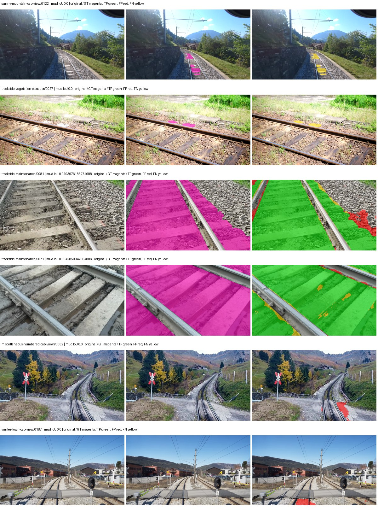
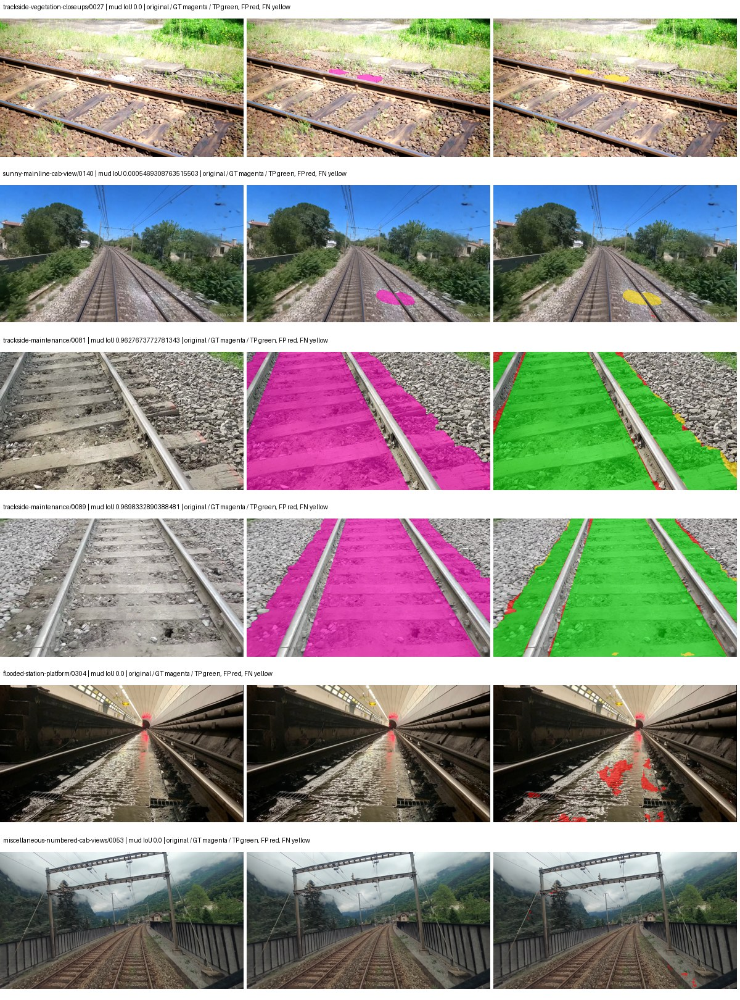
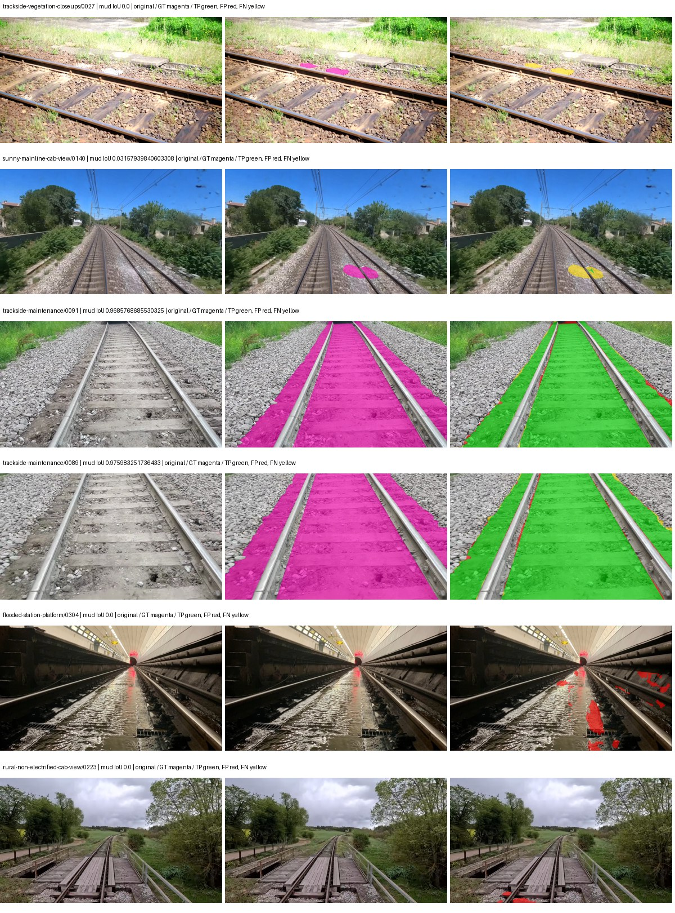
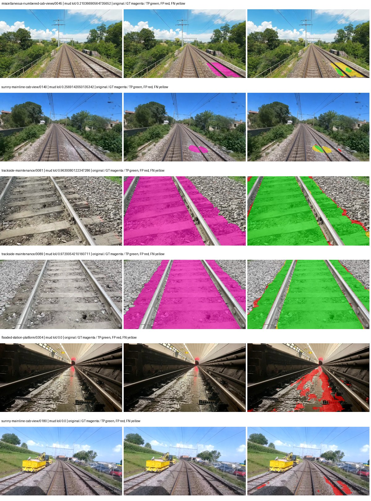

# smp_deeplabv3plus_resnet101 — rad_9_24_2026-paul

[RAD 9/24: Paul's split](../../README.md) · [Full model records](record.json)

Primary selection and early stopping: **mud-pumping validation IoU, pixels pooled over all validation images**. A job is complete only after full statistics and isolated profiling are verified.

Study metrics, counting each class only on the validation images that contain it: mud-pumping IoU is the mean per-image IoU over the images with mud-pumping, precision and recall sum pixels over those images, and mIoU averages each class over the images that contain it, then over the classes present.

| Initialization path | Seed | Mud-pumping IoU, train-camera images with mud (%, n=7) | Mud-pumping IoU, all images with mud (%, n=13) | Mud precision, all images with mud (%) | Mud recall, all images with mud (%) | mIoU (each class over images that contain it) (%) |
| --- | --- | --- | --- | --- | --- | --- |
| rtis_only | 0 | 16.61 | 43.89 | 94.60 | 91.58 | 34.99 |
| cityscapes_to_rtis | 0 | 38.17 | 56.65 | 97.15 | 93.47 | 47.95 |
| railsem19_to_rtis | 0 | 36.30 | 54.88 | 97.76 | 90.55 | 54.58 |
| cityscapes_to_railsem19_to_rtis | 0 | 47.24 | 65.35 | 96.68 | 92.12 | 50.70 |

Per-class IoU: IoU (%) of every class, each averaged only over the validation images that contain the class (n = those images); — = no image contains it. mIoU averages the classes with at least one such image.

| Initialization path | Seed | mIoU (each class over images that contain it) | person (n=12) | truck (n=5) | rail-track (n=31) | vegetation-overgrowth (n=14) | car (n=6) | on-rails (n=6) | traffic-sign (n=10) | road (n=12) | sidewalk (n=16) | construction (n=26) | tram-track (n=5) | pole (n=25) | traffic-light (n=8) | mud-pumping (n=13) | fence (n=17) | terrain (n=34) | sky (n=28) | rail-embedded (n=5) | rail-raised (n=36) | trackbed (n=32) | standing-water (n=6) |
| --- | --- | --- | --- | --- | --- | --- | --- | --- | --- | --- | --- | --- | --- | --- | --- | --- | --- | --- | --- | --- | --- | --- | --- |
| rtis_only | 0 | 34.99 | 9.33 | 2.32 | 62.94 | 36.68 | 3.94 | 62.49 | 0.00 | 33.45 | 32.16 | 36.50 | 33.30 | 32.43 | 0.00 | 43.89 | 26.25 | 72.67 | 94.35 | 0.00 | 61.35 | 68.96 | 21.77 |
| cityscapes_to_rtis | 0 | 47.95 | 17.68 | 14.76 | 68.28 | 39.89 | 40.81 | 63.99 | 17.63 | 43.19 | 44.40 | 48.71 | 51.36 | 53.79 | 17.32 | 56.65 | 40.71 | 83.71 | 96.03 | 44.80 | 68.74 | 74.23 | 20.33 |
| railsem19_to_rtis | 0 | 54.58 | 18.86 | 18.29 | 75.11 | 42.46 | 47.78 | 67.59 | 22.78 | 50.32 | 56.33 | 50.47 | 77.57 | 58.97 | 34.40 | 54.88 | 54.19 | 85.05 | 96.92 | 65.93 | 73.98 | 80.17 | 14.05 |
| cityscapes_to_railsem19_to_rtis | 0 | 50.70 | 18.22 | 25.94 | 71.62 | 36.88 | 49.42 | 73.52 | 33.26 | 32.12 | 48.91 | 48.79 | 45.58 | 58.72 | 28.44 | 65.35 | 47.53 | 84.38 | 96.71 | 43.61 | 70.49 | 76.70 | 8.59 |

Everything below is the campaign's own record, with pixels pooled over all validation images (the checkpoint was selected on that pooled mud IoU).

| Model | Initialization path | Seed | Status | Steps | Best step | Mud IoU, pixels pooled (%) | Mud precision, pixels pooled (%) | Mud recall, pixels pooled (%) | Final mud IoU (trainer val, pixels pooled, %) | mIoU, pixels pooled (%) | Fixed GT-class mIoU, pixels pooled (%) |
| --- | --- | --- | --- | --- | --- | --- | --- | --- | --- | --- | --- |
| smp_deeplabv3plus_resnet101 | rtis_only | 0 | completed | 1857 | 530 | 85.86 | 93.22 | 91.58 | 46.35 | 41.30 | 41.30 |
| smp_deeplabv3plus_resnet101 | cityscapes_to_rtis | 0 | completed | 3981 | 2654 | 89.63 | 95.62 | 93.47 | 89.00 | 55.72 | 55.72 |
| smp_deeplabv3plus_resnet101 | railsem19_to_rtis | 0 | completed | 4000 | 3981 | 87.68 | 96.52 | 90.55 | 83.79 | 62.36 | 62.36 |
| smp_deeplabv3plus_resnet101 | cityscapes_to_railsem19_to_rtis | 0 | completed | 2123 | 1592 | 85.44 | 92.19 | 92.12 | 84.08 | 56.87 | 56.87 |

Training: 227 images. Validation: 37 images. Test: 50 held out. Seeds: [0]. Seed variation measures optimization variability, not independent-recording uncertainty. Historical source checkpoints stay fixed across adaptation seeds.

Training code: `d864b72bd90706260965bb1a48398d01167b6d5c`. Split SHA-256: `b16dbbc7c4aa0c5d6e0fb5a20a27b4f3f8a4f3ce535621ed7c9aeaa6e85adb77`.

## rtis_only — seed 0

Status: **completed**. Started: 2026-10-05T11:44:33.779363+00:00. Finished: 2026-10-05T12:08:54.789794+00:00.

Recipe pretrained initializer: `{"arch": "smp", "backbone_path": null, "batch_norm_momentum": null, "checkpoint": null, "classifier_path": null, "drop_path": null, "encoder_name": "resnet101", "encoder_weights": "imagenet", "head": "unified_head", "head_paths": [], "inactive_parameter_paths": [], "local_files_only": false, "lora_alpha": 32, "lora_dropout": 0.05, "lora_r": 16, "lora_targets": [], "native": null, "revision": null, "smp_arch": "DeepLabV3Plus", "subfolder": null, "trust_remote_code": false, "tuning": "full"}`.

`rtis_only` uses the recipe initializer, which may include pretrained segmentation components. Transfer paths load the exact historical source checkpoint below and reset the classifier; they do not reset all query/decoder features.

Source checkpoint: `Recipe pretrained initialization`.

Config SHA-256: `d97ec552be26b35729f18de41b10c29f28543ddf6deacdc200357373ccf812d1`. Weights used for validation: `raw`.

### Mud-pumping and aggregate quality

| Metric | Selected checkpoint | Final training validation |
| --- | --- | --- |
| Mud IoU | 85.86 | 46.35 |
| Mud precision | 93.22 | 86.89 |
| Mud recall | 91.58 | 49.84 |
| Mud Dice/F1 | 92.39 | 63.34 |
| mIoU | 41.30 | 46.41 |
| Mean accuracy | 53.22 | 59.18 |
| Mean precision | 58.18 | 68.11 |
| Mean Dice | 52.19 | 59.84 |
| Mean specificity | 99.06 | 99.02 |
| Pixel accuracy | 82.62 | 81.55 |
| Frequency-weighted IoU | 72.90 | 72.65 |
| Fixed GT-present class mIoU | 41.30 | 46.41 |
| Boundary F1 | 41.77 | 53.45 |

The selected checkpoint has independent evaluation evidence. Final values are the trainer's final validation record, not a new independent evaluation. mIoU averages classes with nonzero union, so false positives on absent classes can change its denominator. The fixed GT-class mean is supplementary and excludes absent classes; their false positives remain in the confusion matrix.

### Resource usage and timing

| Measurement | Value |
| --- | --- |
| Peak training VRAM, retained training invocation (GiB) | 10.40 |
| Peak evaluation VRAM (GiB) | 7.51 |
| Retained training invocation wall time (seconds) | 1312.91 |
| Retained training invocation GPU-hours (one GPU) | 0.36 |
| Evaluation wall time (seconds) | 11.62 |
| Full evaluation pipeline images/second | 3.18 |
| Best full-state checkpoint (MiB) | 698.52 |
| Final full-state checkpoint (MiB) | 698.50 |
| Verified periodic checkpoints removed (GiB) | 2.05 |

VRAM uses the recorded allocator high-water mark; it is not total device usage including CUDA context. Resumed jobs' retained training invocation times and peaks are **not whole-campaign totals**. Earlier invocation resource records are not reconstructed here. Evaluation throughput includes loader, sliding-window inference and metrics; it is not model-only latency/FPS. Missing measurements are shown as —, never inferred from another dataset's run.

### Standardized inference performance

Dedicated model-only profiling waits for an idle worker-locked L40S: BF16, batch 1, 1024x1024, 20 warmup and 100 CUDA-event-timed public forwards. It excludes loading, preprocessing, tiling and metrics.

| Status | Parameters | Weight MiB | FPS | p50 ms | p95 ms | Peak reserved GiB |
| --- | --- | --- | --- | --- | --- | --- |
| complete | 45674853 | 174.24 | 117.36 | 8.43 | 9.00 | 0.66 |

```json
{
  "schema_version": 1,
  "model_id": "smp_deeplabv3plus_resnet101",
  "measured_at": "2026-10-05T12:08:50+00:00",
  "status": "complete",
  "benchmark_scope": "rtis_selected_checkpoint_model_only",
  "applies_to": [
    "smp_deeplabv3plus_resnet101--rtis_only--seed-0"
  ],
  "source": {
    "campaign_git_sha": "d864b72bd90706260965bb1a48398d01167b6d5c",
    "git_dirty": false,
    "config_hash": "de4f73ef079f",
    "resolved_config": "/data/izadia1/projects/segmentary-runs/rad_9_24_2026/paul-seed0-20261005-r2/configs/smp_deeplabv3plus_resnet101--rtis_only--seed-0.yaml",
    "config_sha256": "d97ec552be26b35729f18de41b10c29f28543ddf6deacdc200357373ccf812d1",
    "checkpoint_sha256": "abb819666c59c5ec5c11d1a5ac92b7defa4663464686a1fe81f9f137953ac5c7",
    "checkpoint_global_step": 530,
    "checkpoint_bytes": 732454060,
    "checkpoint_kind": "resume checkpoint with optimizer and EMA state",
    "weights": "raw",
    "measured_checkpoint_job_id": "smp_deeplabv3plus_resnet101--rtis_only--seed-0",
    "result_sha256": "6bbc1d13c3d471ae01740d3ceb55559695ed2b31c558b7830b0a443a14d42f73",
    "result_git_sha": "d864b72bd90706260965bb1a48398d01167b6d5c",
    "result_stage": "eval:rad_9_24_2026-paul:val",
    "result_seed": 0
  },
  "hardware": {
    "gpu_name": "NVIDIA L40S",
    "gpu_uuid": "GPU-a5ad49e5-0536-5229-ba8a-f8a902808f53",
    "logical_device": "cuda:0",
    "physical_visibility_token": "7",
    "compute_capability": [
      8,
      9
    ],
    "total_memory_bytes": 47677177856
  },
  "model": {
    "parameter_count": 45674853,
    "trainable_parameter_count": 45674853,
    "resident_parameter_bytes": 182699412,
    "parameter_dtype_counts": {
      "float32": 45674853
    }
  },
  "contract": {
    "backend": "pytorch",
    "precision": "bf16_autocast",
    "batch_size": 1,
    "input_shape_nchw": [
      1,
      3,
      1024,
      1024
    ],
    "warmup_iterations": 20,
    "measured_iterations": 100,
    "timing": "per-forward CUDA events with end-event synchronization",
    "includes_preprocessing": false,
    "includes_data_loader": false,
    "includes_sliding_window": false,
    "input_resident_on_gpu": true,
    "model_only": true,
    "entrypoint": "public model(image) dense-logits forward"
  },
  "measurements": {
    "latency": {
      "p50_ms": 8.434175968170166,
      "p95_ms": 8.995839595794678,
      "mean_ms": 8.520816040039062,
      "minimum_ms": 8.349696159362793,
      "maximum_ms": 9.338879585266113,
      "fps": 117.35965138796914,
      "raw_ms": [
        8.508416175842285,
        8.453120231628418,
        8.424448013305664,
        8.391679763793945,
        8.363007545471191,
        8.409088134765625,
        8.407039642333984,
        8.681471824645996,
        8.432640075683594,
        8.475647926330566,
        8.419327735900879,
        8.442879676818848,
        8.435711860656738,
        8.428544044494629,
        8.579071998596191,
        8.38758373260498,
        8.436736106872559,
        8.417280197143555,
        8.543231964111328,
        8.416255950927734,
        8.487936019897461,
        9.168895721435547,
        8.401920318603516,
        8.3886079788208,
        8.464384078979492,
        8.437760353088379,
        8.427519798278809,
        8.369152069091797,
        8.374272346496582,
        8.409088134765625,
        8.425472259521484,
        9.338879585266113,
        8.483839988708496,
        8.459199905395508,
        8.375295639038086,
        8.349696159362793,
        8.425472259521484,
        8.399871826171875,
        8.747008323669434,
        8.539135932922363,
        8.500224113464355,
        9.194496154785156,
        8.929280281066895,
        8.849408149719238,
        8.731648445129395,
        8.648703575134277,
        8.657919883728027,
        8.858624458312988,
        9.194496154785156,
        8.913920402526855,
        8.993791580200195,
        8.5032958984375,
        8.449024200439453,
        8.417280197143555,
        8.40601634979248,
        8.869888305664062,
        8.50432014465332,
        8.483839988708496,
        8.473600387573242,
        8.408063888549805,
        8.424448013305664,
        8.561663627624512,
        8.37939167022705,
        8.477696418762207,
        8.423423767089844,
        8.370176315307617,
        8.375295639038086,
        8.432640075683594,
        8.500224113464355,
        8.454143524169922,
        8.408063888549805,
        8.489983558654785,
        8.389632225036621,
        8.409088134765625,
        8.378368377685547,
        8.392704010009766,
        8.361984252929688,
        9.034751892089844,
        8.90675163269043,
        8.49612808227539,
        8.41215991973877,
        8.41215991973877,
        8.410112380981445,
        8.3886079788208,
        8.382464408874512,
        8.41318416595459,
        8.456192016601562,
        8.473600387573242,
        8.40601634979248,
        8.437760353088379,
        8.82585620880127,
        8.40601634979248,
        8.393728256225586,
        8.41318416595459,
        8.49612808227539,
        8.416255950927734,
        8.427519798278809,
        8.441856384277344,
        8.425472259521484,
        8.462335586547852
      ],
      "percentile_method": "numpy linear interpolation"
    },
    "peak_reserved_bytes": 704643072,
    "memory_kind": "pytorch_cuda_allocator_peak_reserved_excluding_context",
    "benchmark_wall_clock_s": 11.35760959982872
  },
  "started_at": "2026-10-05T12:08:38+00:00",
  "finished_at": "2026-10-05T12:08:50+00:00",
  "environment": {
    "hostname": "hdrfs-app-001",
    "python": "3.11.15",
    "platform": "Linux-5.15.0-139-generic-x86_64-with-glibc2.35",
    "torch": "2.11.0+cu128",
    "torch_cuda": "12.8",
    "cudnn": 91900,
    "driver_version": "570.133.20",
    "cuda_available": true,
    "gpu_count": 1,
    "gpu_names": [
      "NVIDIA L40S"
    ],
    "cuda_visible_devices": "7",
    "packages": {
      "segmentary": "0.1.0",
      "torch": "2.11.0+cu128",
      "torchvision": "0.26.0+cu128",
      "transformers": "5.15.0",
      "timm": "1.0.28",
      "segmentation-models-pytorch": "0.5.0",
      "albumentations": "2.0.8",
      "lightning": "2.6.5",
      "numpy": "2.4.4"
    }
  }
}
```

### Per-class validation results

| Class | GT pixels | IoU (%) | Precision (%) | Recall (%) | Dice (%) | Boundary F1 (%) |
| --- | --- | --- | --- | --- | --- | --- |
| car | 75932 | 12.43 | 88.40 | 12.64 | 22.12 | 23.33 |
| construction | 5694760 | 39.43 | 51.66 | 62.47 | 56.55 | 42.52 |
| fence | 3789415 | 21.73 | 87.39 | 22.44 | 35.71 | 41.23 |
| mud-pumping | 7435760 | 85.86 | 93.22 | 91.58 | 92.39 | 51.65 |
| on-rails | 1137952 | 61.25 | 64.74 | 91.92 | 75.97 | 31.21 |
| person | 130659 | 40.73 | 74.65 | 47.26 | 57.88 | 48.10 |
| pole | 1467743 | 30.77 | 69.29 | 35.63 | 47.06 | 72.83 |
| rail-embedded | 74744 | 0.00 | 0.00 | 0.00 | 0.00 | 0.00 |
| rail-raised | 3588713 | 68.24 | 75.40 | 87.78 | 81.12 | 87.62 |
| rail-track | 4270276 | 64.92 | 80.19 | 77.33 | 78.73 | 70.65 |
| road | 1152119 | 37.25 | 45.97 | 66.25 | 54.28 | 30.57 |
| sidewalk | 2164731 | 34.83 | 40.75 | 70.56 | 51.66 | 35.73 |
| sky | 20207617 | 94.51 | 97.25 | 97.11 | 97.18 | 88.33 |
| standing-water | 2006046 | 51.67 | 67.83 | 68.45 | 68.14 | 11.15 |
| terrain | 30442090 | 80.91 | 89.10 | 89.80 | 89.45 | 67.57 |
| trackbed | 9118591 | 72.64 | 91.02 | 78.25 | 84.15 | 74.56 |
| traffic-light | 116825 | 0.00 | 0.00 | 0.00 | 0.00 | 0.00 |
| traffic-sign | 35778 | 0.00 | 0.00 | 0.00 | 0.00 | 0.00 |
| tram-track | 244726 | 28.14 | 52.12 | 37.95 | 43.92 | 29.68 |
| truck | 190997 | 0.45 | 6.43 | 0.48 | 0.89 | 6.16 |
| vegetation-overgrowth | 1534858 | 41.53 | 46.47 | 79.64 | 58.69 | 64.19 |

### Full-run accounting

| Measurement | Value |
| --- | --- |
| Full GPU-reserved wall seconds, all recorded worker attempts | 1468.50 |
| Full reserved GPU-hours | 0.41 |
| Whole-run timing complete | True |

| Phase | Wall seconds including failed attempts |
| --- | --- |
| training | 1320.20 |
| diagnostics | 97.46 |
| performance | 19.60 |

GPU-reserved time includes model loading, training, validation, collection, profiling, checkpoint I/O and orchestration while the worker owns one GPU. It is not GPU kernel-active time. Phase timings and sampled device memory/power/utilization are retained separately; sampled device memory is not the allocator high-water mark.

### Train/validation and raw/EMA diagnostics

| Checkpoint / weights / split | Images | Mud IoU (%) | Mud precision (%) | Mud recall (%) |
| --- | --- | --- | --- | --- |
| best-auto-train / raw | 227 | 82.45 | 89.12 | 91.68 |
| best-auto-val / raw | 37 | 85.86 | 93.22 | 91.58 |
| best-alternate-val / ema | 37 | 75.97 | 82.61 | 90.44 |
| final-auto-val / raw | 37 | 46.36 | 86.89 | 49.84 |

Train uses the evaluation transform without augmentation. Compare mud train/validation metrics for the same selected weights. Alternate EMA on running-stat BatchNorm is explicitly uncalibrated and is diagnostic only. Score-threshold curves use uncalibrated normalized scores and are pixel-level diagnostics, not event detection rates or a selected deployment operating point.

### Downloadable evidence

- best-auto-train: [per-image.csv](rtis_only--seed-0/best-auto-train/per-image.csv) · [per-image-confusion.json.gz](rtis_only--seed-0/best-auto-train/per-image-confusion.json.gz) · [groups.json](rtis_only--seed-0/best-auto-train/groups.json) · [mud-score-curves.json](rtis_only--seed-0/best-auto-train/mud-score-curves.json)
- best-auto-val: [per-image.csv](rtis_only--seed-0/best-auto-val/per-image.csv) · [per-image-confusion.json.gz](rtis_only--seed-0/best-auto-val/per-image-confusion.json.gz) · [groups.json](rtis_only--seed-0/best-auto-val/groups.json) · [mud-score-curves.json](rtis_only--seed-0/best-auto-val/mud-score-curves.json) · [examples.jpg](rtis_only--seed-0/best-auto-val/examples.jpg)
- best-alternate-val: [per-image.csv](rtis_only--seed-0/best-alternate-val/per-image.csv) · [per-image-confusion.json.gz](rtis_only--seed-0/best-alternate-val/per-image-confusion.json.gz) · [groups.json](rtis_only--seed-0/best-alternate-val/groups.json) · [mud-score-curves.json](rtis_only--seed-0/best-alternate-val/mud-score-curves.json)
- final-auto-val: [per-image.csv](rtis_only--seed-0/final-auto-val/per-image.csv) · [per-image-confusion.json.gz](rtis_only--seed-0/final-auto-val/per-image-confusion.json.gz) · [groups.json](rtis_only--seed-0/final-auto-val/groups.json) · [mud-score-curves.json](rtis_only--seed-0/final-auto-val/mud-score-curves.json)
- resources: [telemetry.csv](rtis_only--seed-0/resources/telemetry.csv)



Examples are two lowest and two highest mud-IoU positive images, plus up to two negative images with the most false-positive mud pixels. They are targeted diagnostic examples, not random samples. Green: true positive; red: false positive; yellow: false negative. Full predictions remain on HDRFS.

### Validation tracking

| Logged step | Overall mIoU (%) | Mud IoU (%) |
| --- | --- | --- |
| 264 | 36.52 | 74.96 |
| 530 | 41.31 | 85.87 |
| 796 | 42.86 | 76.40 |
| 1061 | 48.09 | 67.34 |
| 1326 | 48.89 | 62.04 |
| 1592 | 53.22 | 77.19 |
| 1857 | 46.41 | 46.35 |

All retained scalar curves, including training loss and per-class IoU, are in record.json. Observed best mud on a curve is not necessarily a retained checkpoint: the pilot saved its selection-metric-best and final checkpoints. Step logging and checkpoint global_step may differ by one.

### Stopping and checkpoint provenance

```json
{
  "stopping": {
    "actual_steps": 1857,
    "maximum_steps": 4000,
    "min_delta": 0.001,
    "monitor": "val_iou/mud-pumping",
    "patience": 5,
    "reason": "validation_plateau"
  },
  "checkpoints": {
    "best": {
      "path": "/data/izadia1/projects/segmentary-runs/rad_9_24_2026/paul-seed0-20261005-r2/future-runs/smp_deeplabv3plus_resnet101--rtis_only--seed-0_seed0/rtis/best.ckpt",
      "sha256": "abb819666c59c5ec5c11d1a5ac92b7defa4663464686a1fe81f9f137953ac5c7",
      "global_step": 530,
      "bytes": 732454060
    },
    "final": {
      "path": "/data/izadia1/projects/segmentary-runs/rad_9_24_2026/paul-seed0-20261005-r2/future-runs/smp_deeplabv3plus_resnet101--rtis_only--seed-0_seed0/rtis/last.ckpt",
      "sha256": "e34405fc3784b5e8706e606b92d3d7c6c7b492dbb3345b859fd368d453b64ee3",
      "global_step": 1857,
      "bytes": 732431852
    }
  },
  "cleanup_error": null
}
```

### Resolved training, initialization and evaluation settings

The optimizer block is the base configuration. Stage LR scales are applied at runtime, and stage warmup is capped at min(base warmup, floor(stage budget / 10), stage budget - 1): 400 steps for this 4,000-step pilot. Model-internal native input grids may differ from augmentation crops (EoMT uses its 640 grid).

```json
{
  "name": "smp_deeplabv3plus_resnet101--rtis_only--seed-0",
  "model": {
    "arch": "smp",
    "checkpoint": null,
    "tuning": "full",
    "head": "unified_head",
    "lora_r": 16,
    "lora_alpha": 32,
    "lora_dropout": 0.05,
    "lora_targets": [],
    "drop_path": null,
    "revision": null,
    "subfolder": null,
    "local_files_only": false,
    "trust_remote_code": false,
    "backbone_path": null,
    "head_paths": [],
    "classifier_path": null,
    "inactive_parameter_paths": [],
    "smp_arch": "DeepLabV3Plus",
    "encoder_name": "resnet101",
    "encoder_weights": "imagenet",
    "native": null,
    "batch_norm_momentum": null
  },
  "space": "paul-test-rtis",
  "taxonomy_root": "/data/izadia1/projects/segmentary-rad-d864b72b/taxonomy",
  "output_root": "/data/izadia1/projects/segmentary-runs/rad_9_24_2026/paul-seed0-20261005-r2/future-runs",
  "optim": {
    "backbone_lr": 0.0001,
    "head_lr_mult": 10.0,
    "weight_decay": 0.05,
    "llrd": 1.0,
    "warmup_iters": 1500,
    "warmup_ratio": 1e-06,
    "poly_power": 0.9,
    "min_lr_ratio": 0.0,
    "betas": [
      0.9,
      0.999
    ],
    "grad_clip": 1.0
  },
  "train": {
    "iters": 4000,
    "batch_size": 2,
    "accum": 8,
    "num_workers": 2,
    "precision": "bf16-mixed",
    "ema_decay": 0.9998,
    "val_every": 250,
    "ckpt_every": 500,
    "selection_metric": "val_iou/mud-pumping",
    "early_stopping_patience": 5,
    "early_stopping_min_delta": 0.001,
    "seed": 0,
    "devices": 1
  },
  "eval": {
    "sliding_window": true,
    "window": [
      1024,
      1024
    ],
    "stride": [
      768,
      768
    ],
    "batch_size": 1,
    "num_workers": 2,
    "tta_scales": [],
    "tta_flip": false,
    "threshold": 0.5,
    "boundary_tolerance_frac": 0.0075,
    "save_confusion": true
  },
  "loss": {
    "task": "multiclass",
    "activation": "auto",
    "terms": [],
    "aux": "none",
    "aux_weight": 0.0,
    "ce_weight": 1.0,
    "label_smoothing": 0.0,
    "class_weights": null,
    "query": null
  },
  "aug": {
    "crop": [
      1024,
      1024
    ],
    "scale_min": 0.5,
    "scale_max": 2.0,
    "hflip_p": 0.5,
    "color_jitter_p": 0.5,
    "brightness": 0.25,
    "contrast": 0.25,
    "saturation": 0.25,
    "hue": 0.05
  },
  "stages": [
    {
      "name": "rtis",
      "data": [
        {
          "name": "rad_9_24_2026-paul",
          "root": "/data/izadia1/datasets/rad_9_24_2026-paul",
          "variant": null,
          "split_file": "splits.json",
          "train_split": "train",
          "val_split": "val",
          "limit": null,
          "loader": "folder",
          "mapping": "paul-test-rtis",
          "loader_options": {
            "require_groups": false
          }
        }
      ],
      "iters": null,
      "lr_scale": 1.0,
      "head_group_lr_scale": 1.0,
      "init_from": "pretrained",
      "reset_head": false,
      "freeze": null,
      "sample_weights": null
    }
  ]
}
```

### Hardware and software provenance

```json
{
  "training": {
    "cuda_available": true,
    "cuda_visible_devices": "7",
    "cudnn": 91900,
    "driver_version": "570.133.20",
    "gpu_count": 1,
    "gpu_names": [
      "NVIDIA L40S"
    ],
    "hostname": "hdrfs-app-001",
    "input_normalization": {
      "channel_order": "rgb",
      "mean": [
        0.485,
        0.456,
        0.406
      ],
      "source": "smp_encoder_settings",
      "std": [
        0.229,
        0.224,
        0.225
      ]
    },
    "model_origins": [
      {
        "hf_commit": null,
        "hf_name_or_path": null,
        "module": "model",
        "timm_pretrained": {}
      }
    ],
    "model_parameter_count": 45674853,
    "packages": {
      "albumentations": "2.0.8",
      "lightning": "2.6.5",
      "numpy": "2.4.4",
      "segmentary": "0.1.0",
      "segmentation-models-pytorch": "0.5.0",
      "timm": "1.0.28",
      "torch": "2.11.0+cu128",
      "torchvision": "0.26.0+cu128",
      "transformers": "5.15.0"
    },
    "platform": "Linux-5.15.0-139-generic-x86_64-with-glibc2.35",
    "python": "3.11.15",
    "torch": "2.11.0+cu128",
    "torch_cuda": "12.8",
    "trainable_parameter_count": 45674853,
    "training_stop": {
      "actual_steps": 1857,
      "maximum_steps": 4000,
      "min_delta": 0.001,
      "monitor": "val_iou/mud-pumping",
      "patience": 5,
      "reason": "validation_plateau"
    },
    "validation_weights": "raw"
  },
  "evaluation": {
    "cuda_available": true,
    "cuda_visible_devices": "7",
    "cudnn": 91900,
    "driver_version": "570.133.20",
    "gpu_count": 1,
    "gpu_names": [
      "NVIDIA L40S"
    ],
    "hostname": "hdrfs-app-001",
    "input_normalization": {
      "channel_order": "rgb",
      "mean": [
        0.485,
        0.456,
        0.406
      ],
      "source": "smp_encoder_settings",
      "std": [
        0.229,
        0.224,
        0.225
      ]
    },
    "packages": {
      "albumentations": "2.0.8",
      "lightning": "2.6.5",
      "numpy": "2.4.4",
      "segmentary": "0.1.0",
      "segmentation-models-pytorch": "0.5.0",
      "timm": "1.0.28",
      "torch": "2.11.0+cu128",
      "torchvision": "0.26.0+cu128",
      "transformers": "5.15.0"
    },
    "platform": "Linux-5.15.0-139-generic-x86_64-with-glibc2.35",
    "python": "3.11.15",
    "torch": "2.11.0+cu128",
    "torch_cuda": "12.8"
  }
}
```

## cityscapes_to_rtis — seed 0

Status: **completed**. Started: 2026-10-05T11:52:13.779961+00:00. Finished: 2026-10-05T12:41:30.584322+00:00.

Recipe pretrained initializer: `{"arch": "smp", "backbone_path": null, "batch_norm_momentum": null, "checkpoint": null, "classifier_path": null, "drop_path": null, "encoder_name": "resnet101", "encoder_weights": "imagenet", "head": "unified_head", "head_paths": [], "inactive_parameter_paths": [], "local_files_only": false, "lora_alpha": 32, "lora_dropout": 0.05, "lora_r": 16, "lora_targets": [], "native": null, "revision": null, "smp_arch": "DeepLabV3Plus", "subfolder": null, "trust_remote_code": false, "tuning": "full"}`.

`rtis_only` uses the recipe initializer, which may include pretrained segmentation components. Transfer paths load the exact historical source checkpoint below and reset the classifier; they do not reset all query/decoder features.

Source checkpoint: `{'name': 'smp_deeplabv3plus_resnet101--cityscapes--seed-0', 'model': 'smp_deeplabv3plus_resnet101', 'protocol': 'cityscapes', 'config': '/data/izadia1/projects/segmentary-runs/all-model-city-rail-seed0-rail20-b9eb3e1/accepted/smp_deeplabv3plus_resnet101--cityscapes--seed-0/resolved-config.yaml', 'checkpoint': '/data/izadia1/projects/segmentary-runs/current-main-fill-v2/jobs/smp_deeplabv3plus_resnet101--cityscapes--seed-0/train/smp_deeplabv3plus_resnet101--cityscapes_seed0/cityscapes/last.ckpt', 'recorded_sha256': '01074c9ac3f2b84d122c8a23d07d26a31d2ff58d5d23740b077bdc998d70363b', 'exists': True}`.

Config SHA-256: `270917bd7198f19681a98a46ed1d1de12317e3bae981d6c43528bfcfcb89d6a3`. Weights used for validation: `raw`.

### Mud-pumping and aggregate quality

| Metric | Selected checkpoint | Final training validation |
| --- | --- | --- |
| Mud IoU | 89.63 | 89.00 |
| Mud precision | 95.62 | 95.17 |
| Mud recall | 93.47 | 93.21 |
| Mud Dice/F1 | 94.53 | 94.18 |
| mIoU | 55.72 | 54.79 |
| Mean accuracy | 70.20 | 68.17 |
| Mean precision | 69.81 | 70.37 |
| Mean Dice | 68.62 | 67.56 |
| Mean specificity | 99.33 | 99.31 |
| Pixel accuracy | 87.69 | 87.28 |
| Frequency-weighted IoU | 79.51 | 79.06 |
| Fixed GT-present class mIoU | 55.72 | 54.79 |
| Boundary F1 | 59.79 | 61.13 |

The selected checkpoint has independent evaluation evidence. Final values are the trainer's final validation record, not a new independent evaluation. mIoU averages classes with nonzero union, so false positives on absent classes can change its denominator. The fixed GT-class mean is supplementary and excludes absent classes; their false positives remain in the confusion matrix.

### Resource usage and timing

| Measurement | Value |
| --- | --- |
| Peak training VRAM, retained training invocation (GiB) | 10.40 |
| Peak evaluation VRAM (GiB) | 7.51 |
| Retained training invocation wall time (seconds) | 2806.14 |
| Retained training invocation GPU-hours (one GPU) | 0.78 |
| Evaluation wall time (seconds) | 11.53 |
| Full evaluation pipeline images/second | 3.21 |
| Best full-state checkpoint (MiB) | 698.52 |
| Final full-state checkpoint (MiB) | 698.50 |
| Verified periodic checkpoints removed (GiB) | 4.78 |

VRAM uses the recorded allocator high-water mark; it is not total device usage including CUDA context. Resumed jobs' retained training invocation times and peaks are **not whole-campaign totals**. Earlier invocation resource records are not reconstructed here. Evaluation throughput includes loader, sliding-window inference and metrics; it is not model-only latency/FPS. Missing measurements are shown as —, never inferred from another dataset's run.

### Standardized inference performance

Dedicated model-only profiling waits for an idle worker-locked L40S: BF16, batch 1, 1024x1024, 20 warmup and 100 CUDA-event-timed public forwards. It excludes loading, preprocessing, tiling and metrics.

| Status | Parameters | Weight MiB | FPS | p50 ms | p95 ms | Peak reserved GiB |
| --- | --- | --- | --- | --- | --- | --- |
| complete | 45674853 | 174.24 | 115.85 | 8.44 | 9.41 | 0.66 |

```json
{
  "schema_version": 1,
  "model_id": "smp_deeplabv3plus_resnet101",
  "measured_at": "2026-10-05T12:41:23+00:00",
  "status": "complete",
  "benchmark_scope": "rtis_selected_checkpoint_model_only",
  "applies_to": [
    "smp_deeplabv3plus_resnet101--cityscapes_to_rtis--seed-0"
  ],
  "source": {
    "campaign_git_sha": "d864b72bd90706260965bb1a48398d01167b6d5c",
    "git_dirty": false,
    "config_hash": "df60daf60ffe",
    "resolved_config": "/data/izadia1/projects/segmentary-runs/rad_9_24_2026/paul-seed0-20261005-r2/configs/smp_deeplabv3plus_resnet101--cityscapes_to_rtis--seed-0.yaml",
    "config_sha256": "270917bd7198f19681a98a46ed1d1de12317e3bae981d6c43528bfcfcb89d6a3",
    "checkpoint_sha256": "b1098698bf8b9024be726c5fe417f55ad9ef1a8f98eb594f26969c6fd75ffe62",
    "checkpoint_global_step": 2654,
    "checkpoint_bytes": 732454124,
    "checkpoint_kind": "resume checkpoint with optimizer and EMA state",
    "weights": "raw",
    "measured_checkpoint_job_id": "smp_deeplabv3plus_resnet101--cityscapes_to_rtis--seed-0",
    "result_sha256": "7126822b2e2740e7b82e3e03d9a3a69bee3ce4f591f44ddcaa8f0ffcd5f09209",
    "result_git_sha": "d864b72bd90706260965bb1a48398d01167b6d5c",
    "result_stage": "eval:rad_9_24_2026-paul:val",
    "result_seed": 0
  },
  "hardware": {
    "gpu_name": "NVIDIA L40S",
    "gpu_uuid": "GPU-e2e96741-aec9-e90b-5c46-d0d58be90a56",
    "logical_device": "cuda:0",
    "physical_visibility_token": "8",
    "compute_capability": [
      8,
      9
    ],
    "total_memory_bytes": 47677177856
  },
  "model": {
    "parameter_count": 45674853,
    "trainable_parameter_count": 45674853,
    "resident_parameter_bytes": 182699412,
    "parameter_dtype_counts": {
      "float32": 45674853
    }
  },
  "contract": {
    "backend": "pytorch",
    "precision": "bf16_autocast",
    "batch_size": 1,
    "input_shape_nchw": [
      1,
      3,
      1024,
      1024
    ],
    "warmup_iterations": 20,
    "measured_iterations": 100,
    "timing": "per-forward CUDA events with end-event synchronization",
    "includes_preprocessing": false,
    "includes_data_loader": false,
    "includes_sliding_window": false,
    "input_resident_on_gpu": true,
    "model_only": true,
    "entrypoint": "public model(image) dense-logits forward"
  },
  "measurements": {
    "latency": {
      "p50_ms": 8.438783645629883,
      "p95_ms": 9.407488298416137,
      "mean_ms": 8.631655359268189,
      "minimum_ms": 8.32204818725586,
      "maximum_ms": 13.627391815185547,
      "fps": 115.85263293978204,
      "raw_ms": [
        9.699328422546387,
        9.042943954467773,
        8.483839988708496,
        8.456192016601562,
        8.39782428741455,
        8.364031791687012,
        8.455167770385742,
        8.375295639038086,
        8.42137622833252,
        8.440832138061523,
        8.438783645629883,
        9.081855773925781,
        8.856575965881348,
        8.381440162658691,
        8.404000282287598,
        8.697855949401855,
        8.491007804870605,
        9.596927642822266,
        8.671232223510742,
        8.38758373260498,
        8.41113567352295,
        8.493056297302246,
        8.475647926330566,
        8.51968002319336,
        8.431615829467773,
        8.51251220703125,
        9.39417552947998,
        8.49612808227539,
        8.477696418762207,
        8.438783645629883,
        8.51353645324707,
        8.545280456542969,
        8.438783645629883,
        8.978431701660156,
        8.425472259521484,
        8.452095985412598,
        8.501248359680176,
        8.457216262817383,
        8.427519798278809,
        8.734720230102539,
        8.42137622833252,
        8.93337631225586,
        8.391679763793945,
        8.443903923034668,
        8.434687614440918,
        8.431615829467773,
        13.627391815185547,
        9.242624282836914,
        8.42137622833252,
        8.435711860656738,
        8.415231704711914,
        9.079808235168457,
        9.446399688720703,
        8.367103576660156,
        8.377344131469727,
        8.376319885253906,
        8.338432312011719,
        8.408063888549805,
        8.560640335083008,
        8.816672325134277,
        8.451071739196777,
        8.38758373260498,
        8.373248100280762,
        8.359935760498047,
        8.354816436767578,
        8.32204818725586,
        8.399935722351074,
        8.40601634979248,
        8.455167770385742,
        9.22111988067627,
        8.430591583251953,
        8.41215991973877,
        8.407039642333984,
        8.39475154876709,
        8.42240047454834,
        9.604063987731934,
        8.424448013305664,
        8.398880004882812,
        8.410112380981445,
        8.390656471252441,
        8.937472343444824,
        8.463359832763672,
        8.459263801574707,
        8.482815742492676,
        8.798208236694336,
        9.36137580871582,
        8.40294361114502,
        8.773632049560547,
        8.40294361114502,
        8.415231704711914,
        8.374272346496582,
        8.416255950927734,
        8.374272346496582,
        8.425472259521484,
        9.405440330505371,
        8.447999954223633,
        8.79308795928955,
        8.440832138061523,
        8.377344131469727,
        8.348671913146973
      ],
      "percentile_method": "numpy linear interpolation"
    },
    "peak_reserved_bytes": 704643072,
    "memory_kind": "pytorch_cuda_allocator_peak_reserved_excluding_context",
    "benchmark_wall_clock_s": 11.460200659930706
  },
  "started_at": "2026-10-05T12:41:12+00:00",
  "finished_at": "2026-10-05T12:41:23+00:00",
  "environment": {
    "hostname": "hdrfs-app-001",
    "python": "3.11.15",
    "platform": "Linux-5.15.0-139-generic-x86_64-with-glibc2.35",
    "torch": "2.11.0+cu128",
    "torch_cuda": "12.8",
    "cudnn": 91900,
    "driver_version": "570.133.20",
    "cuda_available": true,
    "gpu_count": 1,
    "gpu_names": [
      "NVIDIA L40S"
    ],
    "cuda_visible_devices": "8",
    "packages": {
      "segmentary": "0.1.0",
      "torch": "2.11.0+cu128",
      "torchvision": "0.26.0+cu128",
      "transformers": "5.15.0",
      "timm": "1.0.28",
      "segmentation-models-pytorch": "0.5.0",
      "albumentations": "2.0.8",
      "lightning": "2.6.5",
      "numpy": "2.4.4"
    }
  }
}
```

### Per-class validation results

| Class | GT pixels | IoU (%) | Precision (%) | Recall (%) | Dice (%) | Boundary F1 (%) |
| --- | --- | --- | --- | --- | --- | --- |
| car | 75932 | 41.87 | 45.65 | 83.46 | 59.02 | 75.35 |
| construction | 5694760 | 51.27 | 68.15 | 67.42 | 67.78 | 59.16 |
| fence | 3789415 | 43.21 | 87.11 | 46.17 | 60.35 | 55.89 |
| mud-pumping | 7435760 | 89.63 | 95.62 | 93.47 | 94.53 | 60.09 |
| on-rails | 1137952 | 72.32 | 80.14 | 88.11 | 83.94 | 49.25 |
| person | 130659 | 68.16 | 70.73 | 94.93 | 81.06 | 65.31 |
| pole | 1467743 | 54.86 | 72.81 | 69.00 | 70.85 | 86.42 |
| rail-embedded | 74744 | 37.55 | 52.23 | 57.19 | 54.60 | 54.94 |
| rail-raised | 3588713 | 74.60 | 85.42 | 85.48 | 85.45 | 88.13 |
| rail-track | 4270276 | 70.66 | 81.80 | 83.84 | 82.81 | 75.40 |
| road | 1152119 | 47.21 | 59.48 | 69.60 | 64.14 | 43.14 |
| sidewalk | 2164731 | 48.07 | 56.24 | 76.80 | 64.93 | 52.11 |
| sky | 20207617 | 96.26 | 98.30 | 97.89 | 98.09 | 91.65 |
| standing-water | 2006046 | 58.81 | 77.19 | 71.17 | 74.06 | 12.45 |
| terrain | 30442090 | 86.88 | 91.93 | 94.05 | 92.98 | 75.66 |
| trackbed | 9118591 | 78.01 | 85.88 | 89.49 | 87.65 | 76.92 |
| traffic-light | 116825 | 34.16 | 78.37 | 37.71 | 50.92 | 55.50 |
| traffic-sign | 35778 | 11.11 | 15.95 | 26.81 | 20.00 | 39.03 |
| tram-track | 244726 | 42.69 | 62.39 | 57.49 | 59.84 | 38.55 |
| truck | 190997 | 10.81 | 34.10 | 13.66 | 19.51 | 29.24 |
| vegetation-overgrowth | 1534858 | 51.99 | 66.50 | 70.44 | 68.41 | 71.45 |

### Full-run accounting

| Measurement | Value |
| --- | --- |
| Full GPU-reserved wall seconds, all recorded worker attempts | 2964.83 |
| Full reserved GPU-hours | 0.82 |
| Whole-run timing complete | True |

| Phase | Wall seconds including failed attempts |
| --- | --- |
| training | 2813.11 |
| diagnostics | 98.16 |
| performance | 19.61 |

GPU-reserved time includes model loading, training, validation, collection, profiling, checkpoint I/O and orchestration while the worker owns one GPU. It is not GPU kernel-active time. Phase timings and sampled device memory/power/utilization are retained separately; sampled device memory is not the allocator high-water mark.

### Train/validation and raw/EMA diagnostics

| Checkpoint / weights / split | Images | Mud IoU (%) | Mud precision (%) | Mud recall (%) |
| --- | --- | --- | --- | --- |
| best-auto-train / raw | 227 | 92.35 | 95.65 | 96.40 |
| best-auto-val / raw | 37 | 89.63 | 95.62 | 93.47 |
| best-alternate-val / ema | 37 | 85.50 | 90.92 | 93.48 |
| final-auto-val / raw | 37 | 89.00 | 95.16 | 93.22 |

Train uses the evaluation transform without augmentation. Compare mud train/validation metrics for the same selected weights. Alternate EMA on running-stat BatchNorm is explicitly uncalibrated and is diagnostic only. Score-threshold curves use uncalibrated normalized scores and are pixel-level diagnostics, not event detection rates or a selected deployment operating point.

### Downloadable evidence

- best-auto-train: [per-image.csv](cityscapes_to_rtis--seed-0/best-auto-train/per-image.csv) · [per-image-confusion.json.gz](cityscapes_to_rtis--seed-0/best-auto-train/per-image-confusion.json.gz) · [groups.json](cityscapes_to_rtis--seed-0/best-auto-train/groups.json) · [mud-score-curves.json](cityscapes_to_rtis--seed-0/best-auto-train/mud-score-curves.json)
- best-auto-val: [per-image.csv](cityscapes_to_rtis--seed-0/best-auto-val/per-image.csv) · [per-image-confusion.json.gz](cityscapes_to_rtis--seed-0/best-auto-val/per-image-confusion.json.gz) · [groups.json](cityscapes_to_rtis--seed-0/best-auto-val/groups.json) · [mud-score-curves.json](cityscapes_to_rtis--seed-0/best-auto-val/mud-score-curves.json) · [examples.jpg](cityscapes_to_rtis--seed-0/best-auto-val/examples.jpg)
- best-alternate-val: [per-image.csv](cityscapes_to_rtis--seed-0/best-alternate-val/per-image.csv) · [per-image-confusion.json.gz](cityscapes_to_rtis--seed-0/best-alternate-val/per-image-confusion.json.gz) · [groups.json](cityscapes_to_rtis--seed-0/best-alternate-val/groups.json) · [mud-score-curves.json](cityscapes_to_rtis--seed-0/best-alternate-val/mud-score-curves.json)
- final-auto-val: [per-image.csv](cityscapes_to_rtis--seed-0/final-auto-val/per-image.csv) · [per-image-confusion.json.gz](cityscapes_to_rtis--seed-0/final-auto-val/per-image-confusion.json.gz) · [groups.json](cityscapes_to_rtis--seed-0/final-auto-val/groups.json) · [mud-score-curves.json](cityscapes_to_rtis--seed-0/final-auto-val/mud-score-curves.json)
- resources: [telemetry.csv](cityscapes_to_rtis--seed-0/resources/telemetry.csv)



Examples are two lowest and two highest mud-IoU positive images, plus up to two negative images with the most false-positive mud pixels. They are targeted diagnostic examples, not random samples. Green: true positive; red: false positive; yellow: false negative. Full predictions remain on HDRFS.

### Validation tracking

| Logged step | Overall mIoU (%) | Mud IoU (%) |
| --- | --- | --- |
| 264 | 29.29 | 54.77 |
| 530 | 42.02 | 71.89 |
| 796 | 49.41 | 78.58 |
| 1061 | 52.07 | 79.74 |
| 1326 | 51.22 | 76.87 |
| 1592 | 52.99 | 86.73 |
| 1857 | 52.36 | 77.77 |
| 2123 | 52.92 | 81.98 |
| 2389 | 54.23 | 85.48 |
| 2653 | 55.72 | 89.63 |
| 2919 | 53.63 | 87.96 |
| 3185 | 54.75 | 86.90 |
| 3451 | 54.81 | 87.11 |
| 3716 | 54.59 | 85.45 |
| 3981 | 54.79 | 89.00 |

All retained scalar curves, including training loss and per-class IoU, are in record.json. Observed best mud on a curve is not necessarily a retained checkpoint: the pilot saved its selection-metric-best and final checkpoints. Step logging and checkpoint global_step may differ by one.

### Stopping and checkpoint provenance

```json
{
  "stopping": {
    "actual_steps": 3981,
    "maximum_steps": 4000,
    "min_delta": 0.001,
    "monitor": "val_iou/mud-pumping",
    "patience": 5,
    "reason": "validation_plateau"
  },
  "checkpoints": {
    "best": {
      "path": "/data/izadia1/projects/segmentary-runs/rad_9_24_2026/paul-seed0-20261005-r2/future-runs/smp_deeplabv3plus_resnet101--cityscapes_to_rtis--seed-0_seed0/rtis/best.ckpt",
      "sha256": "b1098698bf8b9024be726c5fe417f55ad9ef1a8f98eb594f26969c6fd75ffe62",
      "global_step": 2654,
      "bytes": 732454124
    },
    "final": {
      "path": "/data/izadia1/projects/segmentary-runs/rad_9_24_2026/paul-seed0-20261005-r2/future-runs/smp_deeplabv3plus_resnet101--cityscapes_to_rtis--seed-0_seed0/rtis/last.ckpt",
      "sha256": "ae6efc2d99615148b050115879be615163ccf84b26031c0a613835d259835e24",
      "global_step": 3981,
      "bytes": 732431916
    }
  },
  "cleanup_error": null
}
```

### Resolved training, initialization and evaluation settings

The optimizer block is the base configuration. Stage LR scales are applied at runtime, and stage warmup is capped at min(base warmup, floor(stage budget / 10), stage budget - 1): 400 steps for this 4,000-step pilot. Model-internal native input grids may differ from augmentation crops (EoMT uses its 640 grid).

```json
{
  "name": "smp_deeplabv3plus_resnet101--cityscapes_to_rtis--seed-0",
  "model": {
    "arch": "smp",
    "checkpoint": null,
    "tuning": "full",
    "head": "unified_head",
    "lora_r": 16,
    "lora_alpha": 32,
    "lora_dropout": 0.05,
    "lora_targets": [],
    "drop_path": null,
    "revision": null,
    "subfolder": null,
    "local_files_only": false,
    "trust_remote_code": false,
    "backbone_path": null,
    "head_paths": [],
    "classifier_path": null,
    "inactive_parameter_paths": [],
    "smp_arch": "DeepLabV3Plus",
    "encoder_name": "resnet101",
    "encoder_weights": "imagenet",
    "native": null,
    "batch_norm_momentum": null
  },
  "space": "paul-test-rtis",
  "taxonomy_root": "/data/izadia1/projects/segmentary-rad-d864b72b/taxonomy",
  "output_root": "/data/izadia1/projects/segmentary-runs/rad_9_24_2026/paul-seed0-20261005-r2/future-runs",
  "optim": {
    "backbone_lr": 0.0001,
    "head_lr_mult": 10.0,
    "weight_decay": 0.05,
    "llrd": 1.0,
    "warmup_iters": 1500,
    "warmup_ratio": 1e-06,
    "poly_power": 0.9,
    "min_lr_ratio": 0.0,
    "betas": [
      0.9,
      0.999
    ],
    "grad_clip": 1.0
  },
  "train": {
    "iters": 4000,
    "batch_size": 2,
    "accum": 8,
    "num_workers": 2,
    "precision": "bf16-mixed",
    "ema_decay": 0.9998,
    "val_every": 250,
    "ckpt_every": 500,
    "selection_metric": "val_iou/mud-pumping",
    "early_stopping_patience": 5,
    "early_stopping_min_delta": 0.001,
    "seed": 0,
    "devices": 1
  },
  "eval": {
    "sliding_window": true,
    "window": [
      1024,
      1024
    ],
    "stride": [
      768,
      768
    ],
    "batch_size": 1,
    "num_workers": 2,
    "tta_scales": [],
    "tta_flip": false,
    "threshold": 0.5,
    "boundary_tolerance_frac": 0.0075,
    "save_confusion": true
  },
  "loss": {
    "task": "multiclass",
    "activation": "auto",
    "terms": [],
    "aux": "none",
    "aux_weight": 0.0,
    "ce_weight": 1.0,
    "label_smoothing": 0.0,
    "class_weights": null,
    "query": null
  },
  "aug": {
    "crop": [
      1024,
      1024
    ],
    "scale_min": 0.5,
    "scale_max": 2.0,
    "hflip_p": 0.5,
    "color_jitter_p": 0.5,
    "brightness": 0.25,
    "contrast": 0.25,
    "saturation": 0.25,
    "hue": 0.05
  },
  "stages": [
    {
      "name": "rtis",
      "data": [
        {
          "name": "rad_9_24_2026-paul",
          "root": "/data/izadia1/datasets/rad_9_24_2026-paul",
          "variant": null,
          "split_file": "splits.json",
          "train_split": "train",
          "val_split": "val",
          "limit": null,
          "loader": "folder",
          "mapping": "paul-test-rtis",
          "loader_options": {
            "require_groups": false
          }
        }
      ],
      "iters": null,
      "lr_scale": 0.1,
      "head_group_lr_scale": 1.0,
      "init_from": "/data/izadia1/projects/segmentary-runs/current-main-fill-v2/jobs/smp_deeplabv3plus_resnet101--cityscapes--seed-0/train/smp_deeplabv3plus_resnet101--cityscapes_seed0/cityscapes/last.ckpt",
      "reset_head": true,
      "freeze": null,
      "sample_weights": null
    }
  ]
}
```

### Hardware and software provenance

```json
{
  "training": {
    "cuda_available": true,
    "cuda_visible_devices": "8",
    "cudnn": 91900,
    "driver_version": "570.133.20",
    "gpu_count": 1,
    "gpu_names": [
      "NVIDIA L40S"
    ],
    "hostname": "hdrfs-app-001",
    "input_normalization": {
      "channel_order": "rgb",
      "mean": [
        0.485,
        0.456,
        0.406
      ],
      "source": "smp_encoder_settings",
      "std": [
        0.229,
        0.224,
        0.225
      ]
    },
    "model_origins": [
      {
        "hf_commit": null,
        "hf_name_or_path": null,
        "module": "model",
        "timm_pretrained": {}
      }
    ],
    "model_parameter_count": 45674853,
    "packages": {
      "albumentations": "2.0.8",
      "lightning": "2.6.5",
      "numpy": "2.4.4",
      "segmentary": "0.1.0",
      "segmentation-models-pytorch": "0.5.0",
      "timm": "1.0.28",
      "torch": "2.11.0+cu128",
      "torchvision": "0.26.0+cu128",
      "transformers": "5.15.0"
    },
    "platform": "Linux-5.15.0-139-generic-x86_64-with-glibc2.35",
    "python": "3.11.15",
    "torch": "2.11.0+cu128",
    "torch_cuda": "12.8",
    "trainable_parameter_count": 45674853,
    "training_stop": {
      "actual_steps": 3981,
      "maximum_steps": 4000,
      "min_delta": 0.001,
      "monitor": "val_iou/mud-pumping",
      "patience": 5,
      "reason": "validation_plateau"
    },
    "validation_weights": "raw"
  },
  "evaluation": {
    "cuda_available": true,
    "cuda_visible_devices": "8",
    "cudnn": 91900,
    "driver_version": "570.133.20",
    "gpu_count": 1,
    "gpu_names": [
      "NVIDIA L40S"
    ],
    "hostname": "hdrfs-app-001",
    "input_normalization": {
      "channel_order": "rgb",
      "mean": [
        0.485,
        0.456,
        0.406
      ],
      "source": "smp_encoder_settings",
      "std": [
        0.229,
        0.224,
        0.225
      ]
    },
    "packages": {
      "albumentations": "2.0.8",
      "lightning": "2.6.5",
      "numpy": "2.4.4",
      "segmentary": "0.1.0",
      "segmentation-models-pytorch": "0.5.0",
      "timm": "1.0.28",
      "torch": "2.11.0+cu128",
      "torchvision": "0.26.0+cu128",
      "transformers": "5.15.0"
    },
    "platform": "Linux-5.15.0-139-generic-x86_64-with-glibc2.35",
    "python": "3.11.15",
    "torch": "2.11.0+cu128",
    "torch_cuda": "12.8"
  }
}
```

## railsem19_to_rtis — seed 0

Status: **completed**. Started: 2026-10-05T12:02:45.820849+00:00. Finished: 2026-10-05T12:52:27.357324+00:00.

Recipe pretrained initializer: `{"arch": "smp", "backbone_path": null, "batch_norm_momentum": null, "checkpoint": null, "classifier_path": null, "drop_path": null, "encoder_name": "resnet101", "encoder_weights": "imagenet", "head": "unified_head", "head_paths": [], "inactive_parameter_paths": [], "local_files_only": false, "lora_alpha": 32, "lora_dropout": 0.05, "lora_r": 16, "lora_targets": [], "native": null, "revision": null, "smp_arch": "DeepLabV3Plus", "subfolder": null, "trust_remote_code": false, "tuning": "full"}`.

`rtis_only` uses the recipe initializer, which may include pretrained segmentation components. Transfer paths load the exact historical source checkpoint below and reset the classifier; they do not reset all query/decoder features.

Source checkpoint: `{'name': 'smp_deeplabv3plus_resnet101--railsem19--seed-0', 'model': 'smp_deeplabv3plus_resnet101', 'protocol': 'railsem19', 'config': '/data/izadia1/projects/segmentary-runs/all-model-city-rail-seed0-rail20-b9eb3e1/jobs/smp_deeplabv3plus_resnet101--railsem19--seed-0/attempt-001/resolved-config.yaml', 'checkpoint': '/data/izadia1/projects/segmentary-runs/all-model-city-rail-seed0-rail20-b9eb3e1/jobs/smp_deeplabv3plus_resnet101--railsem19--seed-0/attempt-001/train/smp_deeplabv3plus_resnet101--railsem19_seed0/railsem19/last.ckpt', 'recorded_sha256': '0984e2ea375e4355ac7def36d6d5d344a28807e3c0f9bd46a724214d69db0c31', 'exists': True}`.

Config SHA-256: `85758edb354c46dfa462e4358518a2699e26aeddf43f5c90c1639ec5c5bcb562`. Weights used for validation: `raw`.

### Mud-pumping and aggregate quality

| Metric | Selected checkpoint | Final training validation |
| --- | --- | --- |
| Mud IoU | 87.68 | 83.79 |
| Mud precision | 96.52 | 97.39 |
| Mud recall | 90.55 | 85.71 |
| Mud Dice/F1 | 93.44 | 91.18 |
| mIoU | 62.36 | 61.65 |
| Mean accuracy | 74.81 | 74.28 |
| Mean precision | 76.89 | 76.89 |
| Mean Dice | 74.58 | 74.38 |
| Mean specificity | 99.38 | 99.36 |
| Pixel accuracy | 88.72 | 88.26 |
| Frequency-weighted IoU | 81.13 | 80.49 |
| Fixed GT-present class mIoU | 62.36 | 61.65 |
| Boundary F1 | 70.18 | 69.65 |

The selected checkpoint has independent evaluation evidence. Final values are the trainer's final validation record, not a new independent evaluation. mIoU averages classes with nonzero union, so false positives on absent classes can change its denominator. The fixed GT-class mean is supplementary and excludes absent classes; their false positives remain in the confusion matrix.

### Resource usage and timing

| Measurement | Value |
| --- | --- |
| Peak training VRAM, retained training invocation (GiB) | 10.41 |
| Peak evaluation VRAM (GiB) | 7.51 |
| Retained training invocation wall time (seconds) | 2832.16 |
| Retained training invocation GPU-hours (one GPU) | 0.79 |
| Evaluation wall time (seconds) | 11.26 |
| Full evaluation pipeline images/second | 3.29 |
| Best full-state checkpoint (MiB) | 698.52 |
| Final full-state checkpoint (MiB) | 698.50 |
| Verified periodic checkpoints removed (GiB) | 5.46 |

VRAM uses the recorded allocator high-water mark; it is not total device usage including CUDA context. Resumed jobs' retained training invocation times and peaks are **not whole-campaign totals**. Earlier invocation resource records are not reconstructed here. Evaluation throughput includes loader, sliding-window inference and metrics; it is not model-only latency/FPS. Missing measurements are shown as —, never inferred from another dataset's run.

### Standardized inference performance

Dedicated model-only profiling waits for an idle worker-locked L40S: BF16, batch 1, 1024x1024, 20 warmup and 100 CUDA-event-timed public forwards. It excludes loading, preprocessing, tiling and metrics.

| Status | Parameters | Weight MiB | FPS | p50 ms | p95 ms | Peak reserved GiB |
| --- | --- | --- | --- | --- | --- | --- |
| complete | 45674853 | 174.24 | 117.75 | 8.43 | 8.71 | 0.66 |

```json
{
  "schema_version": 1,
  "model_id": "smp_deeplabv3plus_resnet101",
  "measured_at": "2026-10-05T12:52:19+00:00",
  "status": "complete",
  "benchmark_scope": "rtis_selected_checkpoint_model_only",
  "applies_to": [
    "smp_deeplabv3plus_resnet101--railsem19_to_rtis--seed-0"
  ],
  "source": {
    "campaign_git_sha": "d864b72bd90706260965bb1a48398d01167b6d5c",
    "git_dirty": false,
    "config_hash": "91141c59035c",
    "resolved_config": "/data/izadia1/projects/segmentary-runs/rad_9_24_2026/paul-seed0-20261005-r2/configs/smp_deeplabv3plus_resnet101--railsem19_to_rtis--seed-0.yaml",
    "config_sha256": "85758edb354c46dfa462e4358518a2699e26aeddf43f5c90c1639ec5c5bcb562",
    "checkpoint_sha256": "c4705a83247e3a119114c4503e1e820d01c73e962b704f0ca21e7bb08f55bd56",
    "checkpoint_global_step": 3981,
    "checkpoint_bytes": 732454124,
    "checkpoint_kind": "resume checkpoint with optimizer and EMA state",
    "weights": "raw",
    "measured_checkpoint_job_id": "smp_deeplabv3plus_resnet101--railsem19_to_rtis--seed-0",
    "result_sha256": "db48415e0a5e00e7e0a786114258699ff7f9ec841f2cc2e4a8ccdd9e728801de",
    "result_git_sha": "d864b72bd90706260965bb1a48398d01167b6d5c",
    "result_stage": "eval:rad_9_24_2026-paul:val",
    "result_seed": 0
  },
  "hardware": {
    "gpu_name": "NVIDIA L40S",
    "gpu_uuid": "GPU-c76642eb-64c1-b0ac-b051-d2efd47b32c4",
    "logical_device": "cuda:0",
    "physical_visibility_token": "9",
    "compute_capability": [
      8,
      9
    ],
    "total_memory_bytes": 47677177856
  },
  "model": {
    "parameter_count": 45674853,
    "trainable_parameter_count": 45674853,
    "resident_parameter_bytes": 182699412,
    "parameter_dtype_counts": {
      "float32": 45674853
    }
  },
  "contract": {
    "backend": "pytorch",
    "precision": "bf16_autocast",
    "batch_size": 1,
    "input_shape_nchw": [
      1,
      3,
      1024,
      1024
    ],
    "warmup_iterations": 20,
    "measured_iterations": 100,
    "timing": "per-forward CUDA events with end-event synchronization",
    "includes_preprocessing": false,
    "includes_data_loader": false,
    "includes_sliding_window": false,
    "input_resident_on_gpu": true,
    "model_only": true,
    "entrypoint": "public model(image) dense-logits forward"
  },
  "measurements": {
    "latency": {
      "p50_ms": 8.428544044494629,
      "p95_ms": 8.710195636749267,
      "mean_ms": 8.492901468276978,
      "minimum_ms": 8.346624374389648,
      "maximum_ms": 11.18614387512207,
      "fps": 117.74539051644949,
      "raw_ms": [
        8.612863540649414,
        8.436736106872559,
        8.461312294006348,
        8.432640075683594,
        8.455167770385742,
        8.456192016601562,
        8.371199607849121,
        8.42137622833252,
        8.444928169250488,
        8.460288047790527,
        8.407039642333984,
        8.426495552062988,
        8.442879676818848,
        8.385536193847656,
        8.477696418762207,
        8.38758373260498,
        8.42137622833252,
        8.440832138061523,
        8.416255950927734,
        8.438783645629883,
        8.464384078979492,
        8.385536193847656,
        8.451071739196777,
        8.460288047790527,
        8.419327735900879,
        8.385536193847656,
        8.42137622833252,
        8.530943870544434,
        8.41420841217041,
        8.374272346496582,
        8.409088134765625,
        8.400896072387695,
        8.523776054382324,
        8.3886079788208,
        8.361984252929688,
        8.428544044494629,
        8.483839988708496,
        9.336832046508789,
        8.49510383605957,
        11.18614387512207,
        8.3886079788208,
        8.409088134765625,
        9.72697639465332,
        8.39782428741455,
        8.365056037902832,
        8.41318416595459,
        8.346624374389648,
        8.38758373260498,
        8.428544044494629,
        8.892416000366211,
        8.396767616271973,
        8.436736106872559,
        8.4203519821167,
        8.40294361114502,
        8.482815742492676,
        8.441856384277344,
        8.704000473022461,
        8.38758373260498,
        8.363007545471191,
        8.42848014831543,
        8.464384078979492,
        8.460288047790527,
        8.375295639038086,
        8.499199867248535,
        8.827903747558594,
        8.438783645629883,
        8.446975708007812,
        8.477696418762207,
        8.50534439086914,
        8.484864234924316,
        8.424448013305664,
        8.385536193847656,
        8.385536193847656,
        8.426495552062988,
        8.443903923034668,
        8.432640075683594,
        8.40499210357666,
        8.410112380981445,
        8.40601634979248,
        8.417280197143555,
        8.484864234924316,
        8.484864234924316,
        8.459263801574707,
        8.453120231628418,
        8.425439834594727,
        8.41113567352295,
        8.42137622833252,
        8.418368339538574,
        8.481792449951172,
        8.487936019897461,
        8.409088134765625,
        8.409088134765625,
        8.425472259521484,
        8.452095985412598,
        8.393728256225586,
        8.517631530761719,
        8.463359832763672,
        8.428544044494629,
        8.431615829467773,
        8.374272346496582
      ],
      "percentile_method": "numpy linear interpolation"
    },
    "peak_reserved_bytes": 704643072,
    "memory_kind": "pytorch_cuda_allocator_peak_reserved_excluding_context",
    "benchmark_wall_clock_s": 11.431308060884476
  },
  "started_at": "2026-10-05T12:52:08+00:00",
  "finished_at": "2026-10-05T12:52:19+00:00",
  "environment": {
    "hostname": "hdrfs-app-001",
    "python": "3.11.15",
    "platform": "Linux-5.15.0-139-generic-x86_64-with-glibc2.35",
    "torch": "2.11.0+cu128",
    "torch_cuda": "12.8",
    "cudnn": 91900,
    "driver_version": "570.133.20",
    "cuda_available": true,
    "gpu_count": 1,
    "gpu_names": [
      "NVIDIA L40S"
    ],
    "cuda_visible_devices": "9",
    "packages": {
      "segmentary": "0.1.0",
      "torch": "2.11.0+cu128",
      "torchvision": "0.26.0+cu128",
      "transformers": "5.15.0",
      "timm": "1.0.28",
      "segmentation-models-pytorch": "0.5.0",
      "albumentations": "2.0.8",
      "lightning": "2.6.5",
      "numpy": "2.4.4"
    }
  }
}
```

### Per-class validation results

| Class | GT pixels | IoU (%) | Precision (%) | Recall (%) | Dice (%) | Boundary F1 (%) |
| --- | --- | --- | --- | --- | --- | --- |
| car | 75932 | 48.28 | 55.29 | 79.21 | 65.12 | 81.75 |
| construction | 5694760 | 50.91 | 65.17 | 69.95 | 67.47 | 59.94 |
| fence | 3789415 | 52.44 | 91.65 | 55.08 | 68.80 | 68.36 |
| mud-pumping | 7435760 | 87.68 | 96.52 | 90.55 | 93.44 | 60.12 |
| on-rails | 1137952 | 80.54 | 93.12 | 85.63 | 89.22 | 58.04 |
| person | 130659 | 78.29 | 83.42 | 92.72 | 87.82 | 81.00 |
| pole | 1467743 | 61.14 | 73.85 | 78.04 | 75.89 | 87.44 |
| rail-embedded | 74744 | 59.23 | 68.11 | 81.96 | 74.40 | 87.92 |
| rail-raised | 3588713 | 77.82 | 89.62 | 85.53 | 87.53 | 94.09 |
| rail-track | 4270276 | 75.14 | 86.75 | 84.88 | 85.81 | 83.79 |
| road | 1152119 | 36.60 | 42.36 | 72.92 | 53.59 | 51.62 |
| sidewalk | 2164731 | 67.09 | 78.12 | 82.61 | 80.30 | 70.84 |
| sky | 20207617 | 96.81 | 99.04 | 97.73 | 98.38 | 92.59 |
| standing-water | 2006046 | 30.23 | 76.77 | 33.28 | 46.43 | 21.12 |
| terrain | 30442090 | 88.37 | 91.50 | 96.27 | 93.83 | 80.37 |
| trackbed | 9118591 | 81.50 | 87.73 | 91.98 | 89.81 | 81.68 |
| traffic-light | 116825 | 51.63 | 83.98 | 57.27 | 68.10 | 75.74 |
| traffic-sign | 35778 | 14.60 | 36.74 | 19.51 | 25.48 | 44.86 |
| tram-track | 244726 | 75.25 | 90.90 | 81.38 | 85.88 | 84.14 |
| truck | 190997 | 39.60 | 57.02 | 56.45 | 56.73 | 34.99 |
| vegetation-overgrowth | 1534858 | 56.45 | 67.03 | 78.16 | 72.17 | 73.38 |

### Full-run accounting

| Measurement | Value |
| --- | --- |
| Full GPU-reserved wall seconds, all recorded worker attempts | 2989.46 |
| Full reserved GPU-hours | 0.83 |
| Whole-run timing complete | True |

| Phase | Wall seconds including failed attempts |
| --- | --- |
| training | 2839.20 |
| diagnostics | 96.39 |
| performance | 19.83 |

GPU-reserved time includes model loading, training, validation, collection, profiling, checkpoint I/O and orchestration while the worker owns one GPU. It is not GPU kernel-active time. Phase timings and sampled device memory/power/utilization are retained separately; sampled device memory is not the allocator high-water mark.

### Train/validation and raw/EMA diagnostics

| Checkpoint / weights / split | Images | Mud IoU (%) | Mud precision (%) | Mud recall (%) |
| --- | --- | --- | --- | --- |
| best-auto-train / raw | 227 | 93.60 | 97.60 | 95.80 |
| best-auto-val / raw | 37 | 87.68 | 96.52 | 90.55 |
| best-alternate-val / ema | 37 | 80.21 | 97.91 | 81.61 |
| final-auto-val / raw | 37 | 83.81 | 97.39 | 85.73 |

Train uses the evaluation transform without augmentation. Compare mud train/validation metrics for the same selected weights. Alternate EMA on running-stat BatchNorm is explicitly uncalibrated and is diagnostic only. Score-threshold curves use uncalibrated normalized scores and are pixel-level diagnostics, not event detection rates or a selected deployment operating point.

### Downloadable evidence

- best-auto-train: [per-image.csv](railsem19_to_rtis--seed-0/best-auto-train/per-image.csv) · [per-image-confusion.json.gz](railsem19_to_rtis--seed-0/best-auto-train/per-image-confusion.json.gz) · [groups.json](railsem19_to_rtis--seed-0/best-auto-train/groups.json) · [mud-score-curves.json](railsem19_to_rtis--seed-0/best-auto-train/mud-score-curves.json)
- best-auto-val: [per-image.csv](railsem19_to_rtis--seed-0/best-auto-val/per-image.csv) · [per-image-confusion.json.gz](railsem19_to_rtis--seed-0/best-auto-val/per-image-confusion.json.gz) · [groups.json](railsem19_to_rtis--seed-0/best-auto-val/groups.json) · [mud-score-curves.json](railsem19_to_rtis--seed-0/best-auto-val/mud-score-curves.json) · [examples.jpg](railsem19_to_rtis--seed-0/best-auto-val/examples.jpg)
- best-alternate-val: [per-image.csv](railsem19_to_rtis--seed-0/best-alternate-val/per-image.csv) · [per-image-confusion.json.gz](railsem19_to_rtis--seed-0/best-alternate-val/per-image-confusion.json.gz) · [groups.json](railsem19_to_rtis--seed-0/best-alternate-val/groups.json) · [mud-score-curves.json](railsem19_to_rtis--seed-0/best-alternate-val/mud-score-curves.json)
- final-auto-val: [per-image.csv](railsem19_to_rtis--seed-0/final-auto-val/per-image.csv) · [per-image-confusion.json.gz](railsem19_to_rtis--seed-0/final-auto-val/per-image-confusion.json.gz) · [groups.json](railsem19_to_rtis--seed-0/final-auto-val/groups.json) · [mud-score-curves.json](railsem19_to_rtis--seed-0/final-auto-val/mud-score-curves.json)
- resources: [telemetry.csv](railsem19_to_rtis--seed-0/resources/telemetry.csv)



Examples are two lowest and two highest mud-IoU positive images, plus up to two negative images with the most false-positive mud pixels. They are targeted diagnostic examples, not random samples. Green: true positive; red: false positive; yellow: false negative. Full predictions remain on HDRFS.

### Validation tracking

| Logged step | Overall mIoU (%) | Mud IoU (%) |
| --- | --- | --- |
| 264 | 38.77 | 67.27 |
| 530 | 53.67 | 75.20 |
| 796 | 57.33 | 77.93 |
| 1061 | 59.37 | 81.48 |
| 1326 | 59.03 | 76.12 |
| 1592 | 61.02 | 84.96 |
| 1857 | 59.99 | 69.15 |
| 2123 | 61.69 | 83.32 |
| 2389 | 61.24 | 83.95 |
| 2653 | 62.25 | 84.63 |
| 2919 | 62.58 | 87.26 |
| 3185 | 60.50 | 78.27 |
| 3451 | 61.34 | 77.40 |
| 3716 | 62.12 | 85.09 |
| 3981 | 62.36 | 87.69 |
| 4000 | 61.65 | 83.79 |

All retained scalar curves, including training loss and per-class IoU, are in record.json. Observed best mud on a curve is not necessarily a retained checkpoint: the pilot saved its selection-metric-best and final checkpoints. Step logging and checkpoint global_step may differ by one.

### Stopping and checkpoint provenance

```json
{
  "stopping": {
    "actual_steps": 4000,
    "maximum_steps": 4000,
    "min_delta": 0.001,
    "monitor": "val_iou/mud-pumping",
    "patience": 5,
    "reason": "budget_complete"
  },
  "checkpoints": {
    "best": {
      "path": "/data/izadia1/projects/segmentary-runs/rad_9_24_2026/paul-seed0-20261005-r2/future-runs/smp_deeplabv3plus_resnet101--railsem19_to_rtis--seed-0_seed0/rtis/best.ckpt",
      "sha256": "c4705a83247e3a119114c4503e1e820d01c73e962b704f0ca21e7bb08f55bd56",
      "global_step": 3981,
      "bytes": 732454124
    },
    "final": {
      "path": "/data/izadia1/projects/segmentary-runs/rad_9_24_2026/paul-seed0-20261005-r2/future-runs/smp_deeplabv3plus_resnet101--railsem19_to_rtis--seed-0_seed0/rtis/last.ckpt",
      "sha256": "56277aab1a0b20f57602b325281a7c48e3014446ee88cd9d2004da3b5d443ce1",
      "global_step": 4000,
      "bytes": 732431724
    }
  },
  "cleanup_error": null
}
```

### Resolved training, initialization and evaluation settings

The optimizer block is the base configuration. Stage LR scales are applied at runtime, and stage warmup is capped at min(base warmup, floor(stage budget / 10), stage budget - 1): 400 steps for this 4,000-step pilot. Model-internal native input grids may differ from augmentation crops (EoMT uses its 640 grid).

```json
{
  "name": "smp_deeplabv3plus_resnet101--railsem19_to_rtis--seed-0",
  "model": {
    "arch": "smp",
    "checkpoint": null,
    "tuning": "full",
    "head": "unified_head",
    "lora_r": 16,
    "lora_alpha": 32,
    "lora_dropout": 0.05,
    "lora_targets": [],
    "drop_path": null,
    "revision": null,
    "subfolder": null,
    "local_files_only": false,
    "trust_remote_code": false,
    "backbone_path": null,
    "head_paths": [],
    "classifier_path": null,
    "inactive_parameter_paths": [],
    "smp_arch": "DeepLabV3Plus",
    "encoder_name": "resnet101",
    "encoder_weights": "imagenet",
    "native": null,
    "batch_norm_momentum": null
  },
  "space": "paul-test-rtis",
  "taxonomy_root": "/data/izadia1/projects/segmentary-rad-d864b72b/taxonomy",
  "output_root": "/data/izadia1/projects/segmentary-runs/rad_9_24_2026/paul-seed0-20261005-r2/future-runs",
  "optim": {
    "backbone_lr": 0.0001,
    "head_lr_mult": 10.0,
    "weight_decay": 0.05,
    "llrd": 1.0,
    "warmup_iters": 1500,
    "warmup_ratio": 1e-06,
    "poly_power": 0.9,
    "min_lr_ratio": 0.0,
    "betas": [
      0.9,
      0.999
    ],
    "grad_clip": 1.0
  },
  "train": {
    "iters": 4000,
    "batch_size": 2,
    "accum": 8,
    "num_workers": 2,
    "precision": "bf16-mixed",
    "ema_decay": 0.9998,
    "val_every": 250,
    "ckpt_every": 500,
    "selection_metric": "val_iou/mud-pumping",
    "early_stopping_patience": 5,
    "early_stopping_min_delta": 0.001,
    "seed": 0,
    "devices": 1
  },
  "eval": {
    "sliding_window": true,
    "window": [
      1024,
      1024
    ],
    "stride": [
      768,
      768
    ],
    "batch_size": 1,
    "num_workers": 2,
    "tta_scales": [],
    "tta_flip": false,
    "threshold": 0.5,
    "boundary_tolerance_frac": 0.0075,
    "save_confusion": true
  },
  "loss": {
    "task": "multiclass",
    "activation": "auto",
    "terms": [],
    "aux": "none",
    "aux_weight": 0.0,
    "ce_weight": 1.0,
    "label_smoothing": 0.0,
    "class_weights": null,
    "query": null
  },
  "aug": {
    "crop": [
      1024,
      1024
    ],
    "scale_min": 0.5,
    "scale_max": 2.0,
    "hflip_p": 0.5,
    "color_jitter_p": 0.5,
    "brightness": 0.25,
    "contrast": 0.25,
    "saturation": 0.25,
    "hue": 0.05
  },
  "stages": [
    {
      "name": "rtis",
      "data": [
        {
          "name": "rad_9_24_2026-paul",
          "root": "/data/izadia1/datasets/rad_9_24_2026-paul",
          "variant": null,
          "split_file": "splits.json",
          "train_split": "train",
          "val_split": "val",
          "limit": null,
          "loader": "folder",
          "mapping": "paul-test-rtis",
          "loader_options": {
            "require_groups": false
          }
        }
      ],
      "iters": null,
      "lr_scale": 0.1,
      "head_group_lr_scale": 1.0,
      "init_from": "/data/izadia1/projects/segmentary-runs/all-model-city-rail-seed0-rail20-b9eb3e1/jobs/smp_deeplabv3plus_resnet101--railsem19--seed-0/attempt-001/train/smp_deeplabv3plus_resnet101--railsem19_seed0/railsem19/last.ckpt",
      "reset_head": true,
      "freeze": null,
      "sample_weights": null
    }
  ]
}
```

### Hardware and software provenance

```json
{
  "training": {
    "cuda_available": true,
    "cuda_visible_devices": "9",
    "cudnn": 91900,
    "driver_version": "570.133.20",
    "gpu_count": 1,
    "gpu_names": [
      "NVIDIA L40S"
    ],
    "hostname": "hdrfs-app-001",
    "input_normalization": {
      "channel_order": "rgb",
      "mean": [
        0.485,
        0.456,
        0.406
      ],
      "source": "smp_encoder_settings",
      "std": [
        0.229,
        0.224,
        0.225
      ]
    },
    "model_origins": [
      {
        "hf_commit": null,
        "hf_name_or_path": null,
        "module": "model",
        "timm_pretrained": {}
      }
    ],
    "model_parameter_count": 45674853,
    "packages": {
      "albumentations": "2.0.8",
      "lightning": "2.6.5",
      "numpy": "2.4.4",
      "segmentary": "0.1.0",
      "segmentation-models-pytorch": "0.5.0",
      "timm": "1.0.28",
      "torch": "2.11.0+cu128",
      "torchvision": "0.26.0+cu128",
      "transformers": "5.15.0"
    },
    "platform": "Linux-5.15.0-139-generic-x86_64-with-glibc2.35",
    "python": "3.11.15",
    "torch": "2.11.0+cu128",
    "torch_cuda": "12.8",
    "trainable_parameter_count": 45674853,
    "training_stop": {
      "actual_steps": 4000,
      "maximum_steps": 4000,
      "min_delta": 0.001,
      "monitor": "val_iou/mud-pumping",
      "patience": 5,
      "reason": "budget_complete"
    },
    "validation_weights": "raw"
  },
  "evaluation": {
    "cuda_available": true,
    "cuda_visible_devices": "9",
    "cudnn": 91900,
    "driver_version": "570.133.20",
    "gpu_count": 1,
    "gpu_names": [
      "NVIDIA L40S"
    ],
    "hostname": "hdrfs-app-001",
    "input_normalization": {
      "channel_order": "rgb",
      "mean": [
        0.485,
        0.456,
        0.406
      ],
      "source": "smp_encoder_settings",
      "std": [
        0.229,
        0.224,
        0.225
      ]
    },
    "packages": {
      "albumentations": "2.0.8",
      "lightning": "2.6.5",
      "numpy": "2.4.4",
      "segmentary": "0.1.0",
      "segmentation-models-pytorch": "0.5.0",
      "timm": "1.0.28",
      "torch": "2.11.0+cu128",
      "torchvision": "0.26.0+cu128",
      "transformers": "5.15.0"
    },
    "platform": "Linux-5.15.0-139-generic-x86_64-with-glibc2.35",
    "python": "3.11.15",
    "torch": "2.11.0+cu128",
    "torch_cuda": "12.8"
  }
}
```

## cityscapes_to_railsem19_to_rtis — seed 0

Status: **completed**. Started: 2026-10-05T12:09:03.268761+00:00. Finished: 2026-10-05T12:36:53.022032+00:00.

Recipe pretrained initializer: `{"arch": "smp", "backbone_path": null, "batch_norm_momentum": null, "checkpoint": null, "classifier_path": null, "drop_path": null, "encoder_name": "resnet101", "encoder_weights": "imagenet", "head": "unified_head", "head_paths": [], "inactive_parameter_paths": [], "local_files_only": false, "lora_alpha": 32, "lora_dropout": 0.05, "lora_r": 16, "lora_targets": [], "native": null, "revision": null, "smp_arch": "DeepLabV3Plus", "subfolder": null, "trust_remote_code": false, "tuning": "full"}`.

`rtis_only` uses the recipe initializer, which may include pretrained segmentation components. Transfer paths load the exact historical source checkpoint below and reset the classifier; they do not reset all query/decoder features.

Source checkpoint: `{'name': 'smp_deeplabv3plus_resnet101--cityscapes_to_railsem19--seed-0', 'model': 'smp_deeplabv3plus_resnet101', 'protocol': 'cityscapes_to_railsem19', 'config': '/data/izadia1/projects/segmentary-runs/all-model-city-rail-seed0-rail20-b9eb3e1/jobs/smp_deeplabv3plus_resnet101--cityscapes_to_railsem19--seed-0/attempt-001/resolved-config.yaml', 'checkpoint': '/data/izadia1/projects/segmentary-runs/all-model-city-rail-seed0-rail20-b9eb3e1/jobs/smp_deeplabv3plus_resnet101--cityscapes_to_railsem19--seed-0/attempt-001/train/smp_deeplabv3plus_resnet101--cityscapes_to_railsem19_seed0/railsem19/last.ckpt', 'recorded_sha256': 'd7620fd163c6aecb70b2243b119a888adc02a33dc123dc454a41395f235e9654', 'exists': True}`.

Config SHA-256: `a8cbabc8ad62c45b3d7c3c9364e0b93d032c172aeebf3e8942bf1fedbfd75ded`. Weights used for validation: `raw`.

### Mud-pumping and aggregate quality

| Metric | Selected checkpoint | Final training validation |
| --- | --- | --- |
| Mud IoU | 85.44 | 84.08 |
| Mud precision | 92.19 | 93.97 |
| Mud recall | 92.12 | 88.88 |
| Mud Dice/F1 | 92.15 | 91.35 |
| mIoU | 56.87 | 58.42 |
| Mean accuracy | 69.96 | 71.45 |
| Mean precision | 74.73 | 75.69 |
| Mean Dice | 69.90 | 71.78 |
| Mean specificity | 99.29 | 99.31 |
| Pixel accuracy | 86.96 | 87.17 |
| Frequency-weighted IoU | 78.75 | 78.96 |
| Fixed GT-present class mIoU | 56.87 | 58.42 |
| Boundary F1 | 65.56 | 66.97 |

The selected checkpoint has independent evaluation evidence. Final values are the trainer's final validation record, not a new independent evaluation. mIoU averages classes with nonzero union, so false positives on absent classes can change its denominator. The fixed GT-class mean is supplementary and excludes absent classes; their false positives remain in the confusion matrix.

### Resource usage and timing

| Measurement | Value |
| --- | --- |
| Peak training VRAM, retained training invocation (GiB) | 10.40 |
| Peak evaluation VRAM (GiB) | 7.51 |
| Retained training invocation wall time (seconds) | 1521.16 |
| Retained training invocation GPU-hours (one GPU) | 0.42 |
| Evaluation wall time (seconds) | 11.59 |
| Full evaluation pipeline images/second | 3.19 |
| Best full-state checkpoint (MiB) | 698.52 |
| Final full-state checkpoint (MiB) | 698.50 |
| Verified periodic checkpoints removed (GiB) | 2.73 |

VRAM uses the recorded allocator high-water mark; it is not total device usage including CUDA context. Resumed jobs' retained training invocation times and peaks are **not whole-campaign totals**. Earlier invocation resource records are not reconstructed here. Evaluation throughput includes loader, sliding-window inference and metrics; it is not model-only latency/FPS. Missing measurements are shown as —, never inferred from another dataset's run.

### Standardized inference performance

Dedicated model-only profiling waits for an idle worker-locked L40S: BF16, batch 1, 1024x1024, 20 warmup and 100 CUDA-event-timed public forwards. It excludes loading, preprocessing, tiling and metrics.

| Status | Parameters | Weight MiB | FPS | p50 ms | p95 ms | Peak reserved GiB |
| --- | --- | --- | --- | --- | --- | --- |
| complete | 45674853 | 174.24 | 119.53 | 8.27 | 8.97 | 0.66 |

```json
{
  "schema_version": 1,
  "model_id": "smp_deeplabv3plus_resnet101",
  "measured_at": "2026-10-05T12:36:47+00:00",
  "status": "complete",
  "benchmark_scope": "rtis_selected_checkpoint_model_only",
  "applies_to": [
    "smp_deeplabv3plus_resnet101--cityscapes_to_railsem19_to_rtis--seed-0"
  ],
  "source": {
    "campaign_git_sha": "d864b72bd90706260965bb1a48398d01167b6d5c",
    "git_dirty": false,
    "config_hash": "13e59fae9ac5",
    "resolved_config": "/data/izadia1/projects/segmentary-runs/rad_9_24_2026/paul-seed0-20261005-r2/configs/smp_deeplabv3plus_resnet101--cityscapes_to_railsem19_to_rtis--seed-0.yaml",
    "config_sha256": "a8cbabc8ad62c45b3d7c3c9364e0b93d032c172aeebf3e8942bf1fedbfd75ded",
    "checkpoint_sha256": "05aa6e0a0260468eb37272333444fca378afcb93a8f48d9cb8bf9318d02ac527",
    "checkpoint_global_step": 1592,
    "checkpoint_bytes": 732454188,
    "checkpoint_kind": "resume checkpoint with optimizer and EMA state",
    "weights": "raw",
    "measured_checkpoint_job_id": "smp_deeplabv3plus_resnet101--cityscapes_to_railsem19_to_rtis--seed-0",
    "result_sha256": "89f7e02401910d9eb75000494160cbb164c662cca6ad5b44fd963051f0adf095",
    "result_git_sha": "d864b72bd90706260965bb1a48398d01167b6d5c",
    "result_stage": "eval:rad_9_24_2026-paul:val",
    "result_seed": 0
  },
  "hardware": {
    "gpu_name": "NVIDIA L40S",
    "gpu_uuid": "GPU-a5ad49e5-0536-5229-ba8a-f8a902808f53",
    "logical_device": "cuda:0",
    "physical_visibility_token": "7",
    "compute_capability": [
      8,
      9
    ],
    "total_memory_bytes": 47677177856
  },
  "model": {
    "parameter_count": 45674853,
    "trainable_parameter_count": 45674853,
    "resident_parameter_bytes": 182699412,
    "parameter_dtype_counts": {
      "float32": 45674853
    }
  },
  "contract": {
    "backend": "pytorch",
    "precision": "bf16_autocast",
    "batch_size": 1,
    "input_shape_nchw": [
      1,
      3,
      1024,
      1024
    ],
    "warmup_iterations": 20,
    "measured_iterations": 100,
    "timing": "per-forward CUDA events with end-event synchronization",
    "includes_preprocessing": false,
    "includes_data_loader": false,
    "includes_sliding_window": false,
    "input_resident_on_gpu": true,
    "model_only": true,
    "entrypoint": "public model(image) dense-logits forward"
  },
  "measurements": {
    "latency": {
      "p50_ms": 8.269311904907227,
      "p95_ms": 8.972441482543946,
      "mean_ms": 8.366150693893433,
      "minimum_ms": 8.160256385803223,
      "maximum_ms": 9.41158390045166,
      "fps": 119.52928372780968,
      "raw_ms": [
        8.301568031311035,
        8.269824028015137,
        8.160256385803223,
        8.220671653747559,
        8.230912208557129,
        8.21350383758545,
        8.300543785095215,
        8.178688049316406,
        8.779775619506836,
        8.29747200012207,
        8.195072174072266,
        8.210432052612305,
        8.514559745788574,
        8.30463981628418,
        8.18892765045166,
        8.309760093688965,
        8.309760093688965,
        8.257535934448242,
        8.252415657043457,
        8.804351806640625,
        8.220671653747559,
        8.196096420288086,
        8.2227201461792,
        8.23193645477295,
        8.218624114990234,
        8.219648361206055,
        8.228863716125488,
        8.325119972229004,
        8.497152328491211,
        9.070591926574707,
        8.523776054382324,
        8.471551895141602,
        8.376319885253906,
        8.634367942810059,
        8.290304183959961,
        8.415231704711914,
        8.264703750610352,
        8.224767684936523,
        8.295424461364746,
        8.318976402282715,
        8.28825569152832,
        8.2042875289917,
        8.21350383758545,
        8.194047927856445,
        9.117695808410645,
        8.253439903259277,
        8.350720405578613,
        8.208383560180664,
        8.225791931152344,
        9.184255599975586,
        8.302559852600098,
        8.994815826416016,
        8.500224113464355,
        8.389632225036621,
        8.184831619262695,
        8.186880111694336,
        8.230912208557129,
        8.256511688232422,
        8.274944305419922,
        8.736767768859863,
        9.41158390045166,
        8.20736026763916,
        8.208383560180664,
        8.178688049316406,
        8.261631965637207,
        8.164352416992188,
        8.863743782043457,
        8.359935760498047,
        8.321023941040039,
        8.390656471252441,
        8.572928428649902,
        8.357888221740723,
        8.217599868774414,
        8.329216003417969,
        8.226816177368164,
        8.192000389099121,
        8.237055778503418,
        8.332287788391113,
        8.638463973999023,
        8.210432052612305,
        8.212479591369629,
        8.184831619262695,
        8.218624114990234,
        8.216575622558594,
        8.723456382751465,
        8.971263885498047,
        8.772607803344727,
        8.247296333312988,
        8.268799781799316,
        8.31283187866211,
        8.273920059204102,
        8.256511688232422,
        8.270848274230957,
        8.309760093688965,
        8.251392364501953,
        8.22982406616211,
        8.542207717895508,
        8.230912208557129,
        8.260607719421387,
        8.332287788391113
      ],
      "percentile_method": "numpy linear interpolation"
    },
    "peak_reserved_bytes": 704643072,
    "memory_kind": "pytorch_cuda_allocator_peak_reserved_excluding_context",
    "benchmark_wall_clock_s": 11.332164697349072
  },
  "started_at": "2026-10-05T12:36:36+00:00",
  "finished_at": "2026-10-05T12:36:47+00:00",
  "environment": {
    "hostname": "hdrfs-app-001",
    "python": "3.11.15",
    "platform": "Linux-5.15.0-139-generic-x86_64-with-glibc2.35",
    "torch": "2.11.0+cu128",
    "torch_cuda": "12.8",
    "cudnn": 91900,
    "driver_version": "570.133.20",
    "cuda_available": true,
    "gpu_count": 1,
    "gpu_names": [
      "NVIDIA L40S"
    ],
    "cuda_visible_devices": "7",
    "packages": {
      "segmentary": "0.1.0",
      "torch": "2.11.0+cu128",
      "torchvision": "0.26.0+cu128",
      "transformers": "5.15.0",
      "timm": "1.0.28",
      "segmentation-models-pytorch": "0.5.0",
      "albumentations": "2.0.8",
      "lightning": "2.6.5",
      "numpy": "2.4.4"
    }
  }
}
```

### Per-class validation results

| Class | GT pixels | IoU (%) | Precision (%) | Recall (%) | Dice (%) | Boundary F1 (%) |
| --- | --- | --- | --- | --- | --- | --- |
| car | 75932 | 45.19 | 50.69 | 80.64 | 62.25 | 80.46 |
| construction | 5694760 | 46.85 | 60.20 | 67.87 | 63.81 | 56.31 |
| fence | 3789415 | 41.04 | 91.16 | 42.75 | 58.20 | 60.77 |
| mud-pumping | 7435760 | 85.44 | 92.19 | 92.12 | 92.15 | 51.75 |
| on-rails | 1137952 | 80.49 | 84.06 | 94.99 | 89.19 | 55.72 |
| person | 130659 | 75.43 | 81.45 | 91.07 | 85.99 | 81.04 |
| pole | 1467743 | 62.90 | 71.92 | 83.38 | 77.22 | 85.52 |
| rail-embedded | 74744 | 32.43 | 61.58 | 40.65 | 48.97 | 68.31 |
| rail-raised | 3588713 | 74.37 | 83.72 | 86.94 | 85.30 | 89.94 |
| rail-track | 4270276 | 73.50 | 84.97 | 84.48 | 84.72 | 79.84 |
| road | 1152119 | 26.40 | 34.56 | 52.77 | 41.77 | 42.45 |
| sidewalk | 2164731 | 49.06 | 55.16 | 81.61 | 65.83 | 52.62 |
| sky | 20207617 | 96.92 | 98.90 | 97.98 | 98.44 | 91.95 |
| standing-water | 2006046 | 15.39 | 77.57 | 16.11 | 26.67 | 18.27 |
| terrain | 30442090 | 87.84 | 91.78 | 95.33 | 93.52 | 79.70 |
| trackbed | 9118591 | 79.94 | 88.95 | 88.75 | 88.85 | 79.77 |
| traffic-light | 116825 | 51.48 | 82.38 | 57.85 | 67.97 | 73.50 |
| traffic-sign | 35778 | 34.66 | 53.84 | 49.31 | 51.47 | 59.03 |
| tram-track | 244726 | 40.55 | 89.38 | 42.61 | 57.70 | 49.34 |
| truck | 190997 | 42.51 | 65.02 | 55.11 | 59.66 | 50.85 |
| vegetation-overgrowth | 1534858 | 51.81 | 69.82 | 66.77 | 68.26 | 69.67 |

### Full-run accounting

| Measurement | Value |
| --- | --- |
| Full GPU-reserved wall seconds, all recorded worker attempts | 1677.89 |
| Full reserved GPU-hours | 0.47 |
| Whole-run timing complete | True |

| Phase | Wall seconds including failed attempts |
| --- | --- |
| training | 1528.19 |
| diagnostics | 97.26 |
| performance | 19.58 |

GPU-reserved time includes model loading, training, validation, collection, profiling, checkpoint I/O and orchestration while the worker owns one GPU. It is not GPU kernel-active time. Phase timings and sampled device memory/power/utilization are retained separately; sampled device memory is not the allocator high-water mark.

### Train/validation and raw/EMA diagnostics

| Checkpoint / weights / split | Images | Mud IoU (%) | Mud precision (%) | Mud recall (%) |
| --- | --- | --- | --- | --- |
| best-auto-train / raw | 227 | 90.87 | 93.36 | 97.15 |
| best-auto-val / raw | 37 | 85.44 | 92.19 | 92.12 |
| best-alternate-val / ema | 37 | 80.31 | 92.35 | 86.04 |
| final-auto-val / raw | 37 | 84.06 | 93.97 | 88.85 |

Train uses the evaluation transform without augmentation. Compare mud train/validation metrics for the same selected weights. Alternate EMA on running-stat BatchNorm is explicitly uncalibrated and is diagnostic only. Score-threshold curves use uncalibrated normalized scores and are pixel-level diagnostics, not event detection rates or a selected deployment operating point.

### Downloadable evidence

- best-auto-train: [per-image.csv](cityscapes_to_railsem19_to_rtis--seed-0/best-auto-train/per-image.csv) · [per-image-confusion.json.gz](cityscapes_to_railsem19_to_rtis--seed-0/best-auto-train/per-image-confusion.json.gz) · [groups.json](cityscapes_to_railsem19_to_rtis--seed-0/best-auto-train/groups.json) · [mud-score-curves.json](cityscapes_to_railsem19_to_rtis--seed-0/best-auto-train/mud-score-curves.json)
- best-auto-val: [per-image.csv](cityscapes_to_railsem19_to_rtis--seed-0/best-auto-val/per-image.csv) · [per-image-confusion.json.gz](cityscapes_to_railsem19_to_rtis--seed-0/best-auto-val/per-image-confusion.json.gz) · [groups.json](cityscapes_to_railsem19_to_rtis--seed-0/best-auto-val/groups.json) · [mud-score-curves.json](cityscapes_to_railsem19_to_rtis--seed-0/best-auto-val/mud-score-curves.json) · [examples.jpg](cityscapes_to_railsem19_to_rtis--seed-0/best-auto-val/examples.jpg)
- best-alternate-val: [per-image.csv](cityscapes_to_railsem19_to_rtis--seed-0/best-alternate-val/per-image.csv) · [per-image-confusion.json.gz](cityscapes_to_railsem19_to_rtis--seed-0/best-alternate-val/per-image-confusion.json.gz) · [groups.json](cityscapes_to_railsem19_to_rtis--seed-0/best-alternate-val/groups.json) · [mud-score-curves.json](cityscapes_to_railsem19_to_rtis--seed-0/best-alternate-val/mud-score-curves.json)
- final-auto-val: [per-image.csv](cityscapes_to_railsem19_to_rtis--seed-0/final-auto-val/per-image.csv) · [per-image-confusion.json.gz](cityscapes_to_railsem19_to_rtis--seed-0/final-auto-val/per-image-confusion.json.gz) · [groups.json](cityscapes_to_railsem19_to_rtis--seed-0/final-auto-val/groups.json) · [mud-score-curves.json](cityscapes_to_railsem19_to_rtis--seed-0/final-auto-val/mud-score-curves.json)
- resources: [telemetry.csv](cityscapes_to_railsem19_to_rtis--seed-0/resources/telemetry.csv)



Examples are two lowest and two highest mud-IoU positive images, plus up to two negative images with the most false-positive mud pixels. They are targeted diagnostic examples, not random samples. Green: true positive; red: false positive; yellow: false negative. Full predictions remain on HDRFS.

### Validation tracking

| Logged step | Overall mIoU (%) | Mud IoU (%) |
| --- | --- | --- |
| 264 | 38.31 | 67.36 |
| 530 | 49.13 | 78.05 |
| 796 | 54.85 | 85.44 |
| 1061 | 56.88 | 85.34 |
| 1326 | 56.07 | 77.30 |
| 1592 | 56.87 | 85.45 |
| 1857 | 57.39 | 71.30 |
| 2123 | 58.42 | 84.08 |

All retained scalar curves, including training loss and per-class IoU, are in record.json. Observed best mud on a curve is not necessarily a retained checkpoint: the pilot saved its selection-metric-best and final checkpoints. Step logging and checkpoint global_step may differ by one.

### Stopping and checkpoint provenance

```json
{
  "stopping": {
    "actual_steps": 2123,
    "maximum_steps": 4000,
    "min_delta": 0.001,
    "monitor": "val_iou/mud-pumping",
    "patience": 5,
    "reason": "validation_plateau"
  },
  "checkpoints": {
    "best": {
      "path": "/data/izadia1/projects/segmentary-runs/rad_9_24_2026/paul-seed0-20261005-r2/future-runs/smp_deeplabv3plus_resnet101--cityscapes_to_railsem19_to_rtis--seed-0_seed0/rtis/best.ckpt",
      "sha256": "05aa6e0a0260468eb37272333444fca378afcb93a8f48d9cb8bf9318d02ac527",
      "global_step": 1592,
      "bytes": 732454188
    },
    "final": {
      "path": "/data/izadia1/projects/segmentary-runs/rad_9_24_2026/paul-seed0-20261005-r2/future-runs/smp_deeplabv3plus_resnet101--cityscapes_to_railsem19_to_rtis--seed-0_seed0/rtis/last.ckpt",
      "sha256": "5e211328b449243300c1f3366aca61bb6573b8c6c0d52b20f0944ebc9e75ae1f",
      "global_step": 2123,
      "bytes": 732431916
    }
  },
  "cleanup_error": null
}
```

### Resolved training, initialization and evaluation settings

The optimizer block is the base configuration. Stage LR scales are applied at runtime, and stage warmup is capped at min(base warmup, floor(stage budget / 10), stage budget - 1): 400 steps for this 4,000-step pilot. Model-internal native input grids may differ from augmentation crops (EoMT uses its 640 grid).

```json
{
  "name": "smp_deeplabv3plus_resnet101--cityscapes_to_railsem19_to_rtis--seed-0",
  "model": {
    "arch": "smp",
    "checkpoint": null,
    "tuning": "full",
    "head": "unified_head",
    "lora_r": 16,
    "lora_alpha": 32,
    "lora_dropout": 0.05,
    "lora_targets": [],
    "drop_path": null,
    "revision": null,
    "subfolder": null,
    "local_files_only": false,
    "trust_remote_code": false,
    "backbone_path": null,
    "head_paths": [],
    "classifier_path": null,
    "inactive_parameter_paths": [],
    "smp_arch": "DeepLabV3Plus",
    "encoder_name": "resnet101",
    "encoder_weights": "imagenet",
    "native": null,
    "batch_norm_momentum": null
  },
  "space": "paul-test-rtis",
  "taxonomy_root": "/data/izadia1/projects/segmentary-rad-d864b72b/taxonomy",
  "output_root": "/data/izadia1/projects/segmentary-runs/rad_9_24_2026/paul-seed0-20261005-r2/future-runs",
  "optim": {
    "backbone_lr": 0.0001,
    "head_lr_mult": 10.0,
    "weight_decay": 0.05,
    "llrd": 1.0,
    "warmup_iters": 1500,
    "warmup_ratio": 1e-06,
    "poly_power": 0.9,
    "min_lr_ratio": 0.0,
    "betas": [
      0.9,
      0.999
    ],
    "grad_clip": 1.0
  },
  "train": {
    "iters": 4000,
    "batch_size": 2,
    "accum": 8,
    "num_workers": 2,
    "precision": "bf16-mixed",
    "ema_decay": 0.9998,
    "val_every": 250,
    "ckpt_every": 500,
    "selection_metric": "val_iou/mud-pumping",
    "early_stopping_patience": 5,
    "early_stopping_min_delta": 0.001,
    "seed": 0,
    "devices": 1
  },
  "eval": {
    "sliding_window": true,
    "window": [
      1024,
      1024
    ],
    "stride": [
      768,
      768
    ],
    "batch_size": 1,
    "num_workers": 2,
    "tta_scales": [],
    "tta_flip": false,
    "threshold": 0.5,
    "boundary_tolerance_frac": 0.0075,
    "save_confusion": true
  },
  "loss": {
    "task": "multiclass",
    "activation": "auto",
    "terms": [],
    "aux": "none",
    "aux_weight": 0.0,
    "ce_weight": 1.0,
    "label_smoothing": 0.0,
    "class_weights": null,
    "query": null
  },
  "aug": {
    "crop": [
      1024,
      1024
    ],
    "scale_min": 0.5,
    "scale_max": 2.0,
    "hflip_p": 0.5,
    "color_jitter_p": 0.5,
    "brightness": 0.25,
    "contrast": 0.25,
    "saturation": 0.25,
    "hue": 0.05
  },
  "stages": [
    {
      "name": "rtis",
      "data": [
        {
          "name": "rad_9_24_2026-paul",
          "root": "/data/izadia1/datasets/rad_9_24_2026-paul",
          "variant": null,
          "split_file": "splits.json",
          "train_split": "train",
          "val_split": "val",
          "limit": null,
          "loader": "folder",
          "mapping": "paul-test-rtis",
          "loader_options": {
            "require_groups": false
          }
        }
      ],
      "iters": null,
      "lr_scale": 0.1,
      "head_group_lr_scale": 1.0,
      "init_from": "/data/izadia1/projects/segmentary-runs/all-model-city-rail-seed0-rail20-b9eb3e1/jobs/smp_deeplabv3plus_resnet101--cityscapes_to_railsem19--seed-0/attempt-001/train/smp_deeplabv3plus_resnet101--cityscapes_to_railsem19_seed0/railsem19/last.ckpt",
      "reset_head": true,
      "freeze": null,
      "sample_weights": null
    }
  ]
}
```

### Hardware and software provenance

```json
{
  "training": {
    "cuda_available": true,
    "cuda_visible_devices": "7",
    "cudnn": 91900,
    "driver_version": "570.133.20",
    "gpu_count": 1,
    "gpu_names": [
      "NVIDIA L40S"
    ],
    "hostname": "hdrfs-app-001",
    "input_normalization": {
      "channel_order": "rgb",
      "mean": [
        0.485,
        0.456,
        0.406
      ],
      "source": "smp_encoder_settings",
      "std": [
        0.229,
        0.224,
        0.225
      ]
    },
    "model_origins": [
      {
        "hf_commit": null,
        "hf_name_or_path": null,
        "module": "model",
        "timm_pretrained": {}
      }
    ],
    "model_parameter_count": 45674853,
    "packages": {
      "albumentations": "2.0.8",
      "lightning": "2.6.5",
      "numpy": "2.4.4",
      "segmentary": "0.1.0",
      "segmentation-models-pytorch": "0.5.0",
      "timm": "1.0.28",
      "torch": "2.11.0+cu128",
      "torchvision": "0.26.0+cu128",
      "transformers": "5.15.0"
    },
    "platform": "Linux-5.15.0-139-generic-x86_64-with-glibc2.35",
    "python": "3.11.15",
    "torch": "2.11.0+cu128",
    "torch_cuda": "12.8",
    "trainable_parameter_count": 45674853,
    "training_stop": {
      "actual_steps": 2123,
      "maximum_steps": 4000,
      "min_delta": 0.001,
      "monitor": "val_iou/mud-pumping",
      "patience": 5,
      "reason": "validation_plateau"
    },
    "validation_weights": "raw"
  },
  "evaluation": {
    "cuda_available": true,
    "cuda_visible_devices": "7",
    "cudnn": 91900,
    "driver_version": "570.133.20",
    "gpu_count": 1,
    "gpu_names": [
      "NVIDIA L40S"
    ],
    "hostname": "hdrfs-app-001",
    "input_normalization": {
      "channel_order": "rgb",
      "mean": [
        0.485,
        0.456,
        0.406
      ],
      "source": "smp_encoder_settings",
      "std": [
        0.229,
        0.224,
        0.225
      ]
    },
    "packages": {
      "albumentations": "2.0.8",
      "lightning": "2.6.5",
      "numpy": "2.4.4",
      "segmentary": "0.1.0",
      "segmentation-models-pytorch": "0.5.0",
      "timm": "1.0.28",
      "torch": "2.11.0+cu128",
      "torchvision": "0.26.0+cu128",
      "transformers": "5.15.0"
    },
    "platform": "Linux-5.15.0-139-generic-x86_64-with-glibc2.35",
    "python": "3.11.15",
    "torch": "2.11.0+cu128",
    "torch_cuda": "12.8"
  }
}
```
