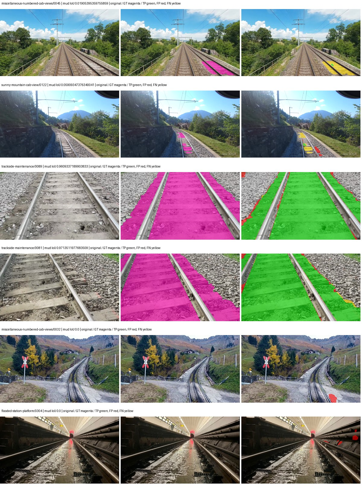
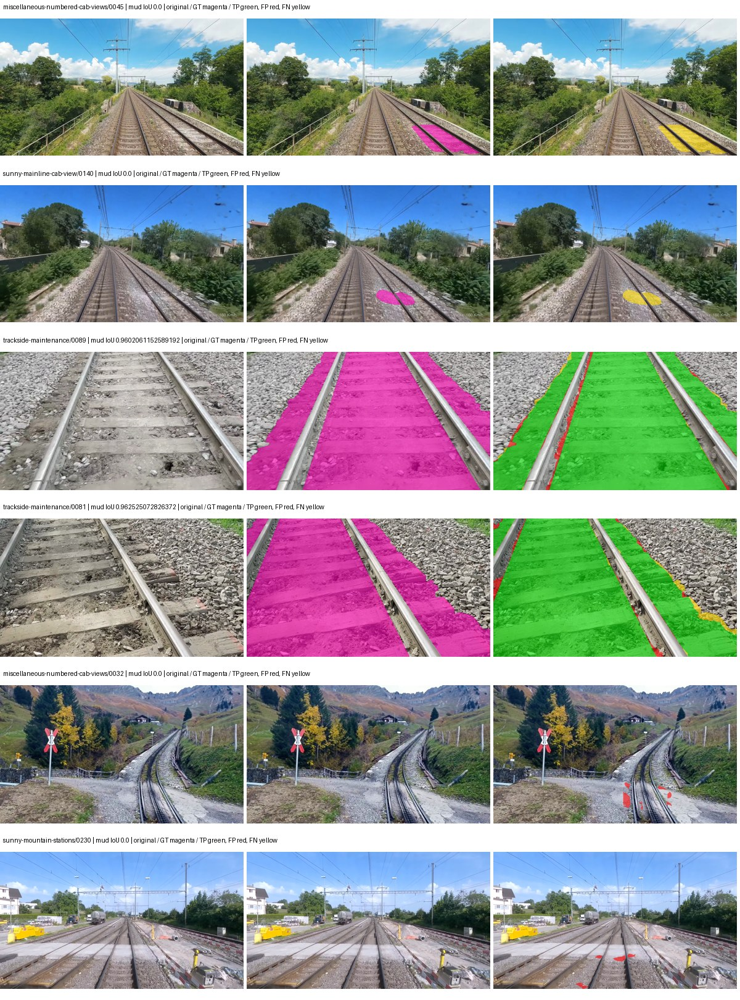
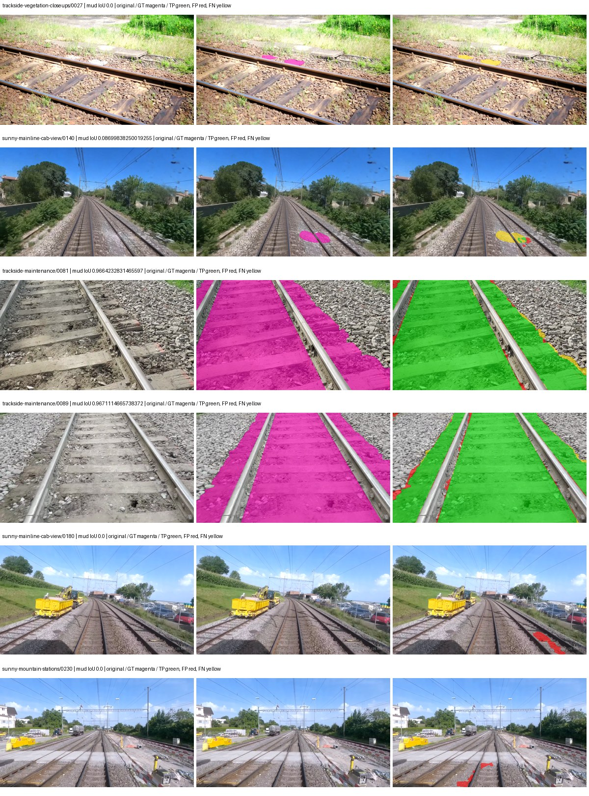
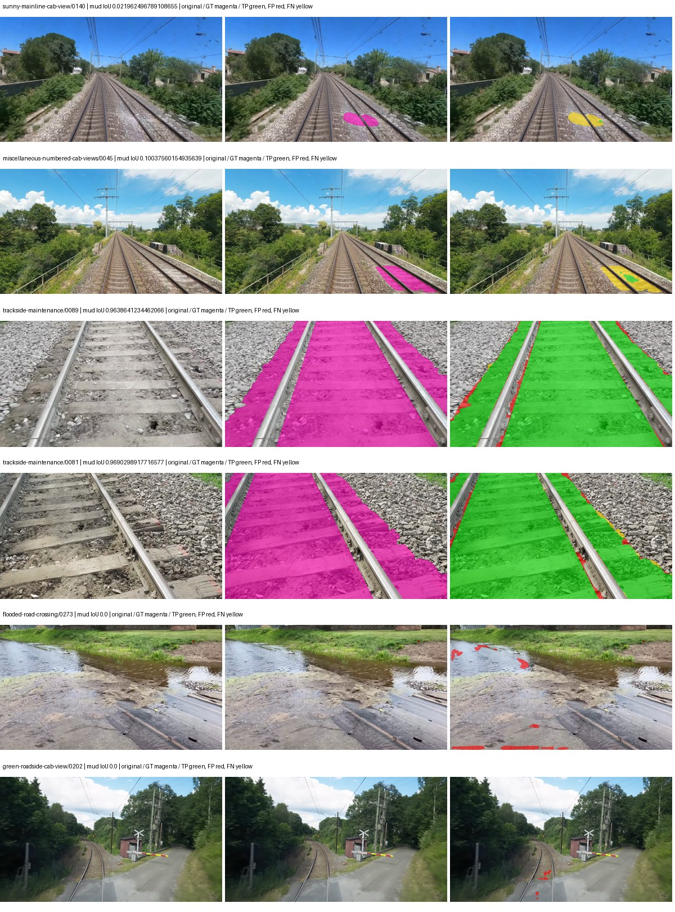

# smp_fpn_resnet50 — rad_9_24_2026-paul

[RAD 9/24: Paul's split](../../README.md) · [Full model records](record.json)

Primary selection and early stopping: **mud-pumping validation IoU, pixels pooled over all validation images**. A job is complete only after full statistics and isolated profiling are verified.

Study metrics, counting each class only on the validation images that contain it: mud-pumping IoU is the mean per-image IoU over the images with mud-pumping, precision and recall sum pixels over those images, and mIoU averages each class over the images that contain it, then over the classes present.

| Initialization path | Seed | Mud-pumping IoU, train-camera images with mud (%, n=7) | Mud-pumping IoU, all images with mud (%, n=13) | Mud precision, all images with mud (%) | Mud recall, all images with mud (%) | mIoU (each class over images that contain it) (%) |
| --- | --- | --- | --- | --- | --- | --- |
| rtis_only | 0 | 31.27 | 53.92 | 96.56 | 92.61 | 43.69 |
| cityscapes_to_rtis | 0 | 14.03 | 42.11 | 97.95 | 87.04 | 46.33 |
| railsem19_to_rtis | 0 | 43.33 | 59.20 | 96.83 | 93.21 | 53.08 |
| cityscapes_to_railsem19_to_rtis | 0 | 34.29 | 50.12 | 97.27 | 76.15 | 49.36 |

Per-class IoU: IoU (%) of every class, each averaged only over the validation images that contain the class (n = those images); — = no image contains it. mIoU averages the classes with at least one such image.

| Initialization path | Seed | mIoU (each class over images that contain it) | person (n=12) | truck (n=5) | rail-track (n=31) | vegetation-overgrowth (n=14) | car (n=6) | on-rails (n=6) | traffic-sign (n=10) | road (n=12) | sidewalk (n=16) | construction (n=26) | tram-track (n=5) | pole (n=25) | traffic-light (n=8) | mud-pumping (n=13) | fence (n=17) | terrain (n=34) | sky (n=28) | rail-embedded (n=5) | rail-raised (n=36) | trackbed (n=32) | standing-water (n=6) |
| --- | --- | --- | --- | --- | --- | --- | --- | --- | --- | --- | --- | --- | --- | --- | --- | --- | --- | --- | --- | --- | --- | --- | --- |
| rtis_only | 0 | 43.69 | 12.00 | 15.14 | 65.03 | 39.53 | 27.49 | 61.24 | 6.18 | 45.26 | 47.39 | 40.05 | 39.64 | 45.45 | 15.73 | 53.92 | 35.35 | 80.80 | 95.37 | 32.40 | 66.71 | 73.66 | 19.17 |
| cityscapes_to_rtis | 0 | 46.33 | 20.68 | 12.49 | 65.35 | 36.34 | 30.89 | 54.75 | 16.65 | 39.66 | 48.72 | 44.61 | 52.81 | 54.28 | 17.83 | 42.11 | 47.24 | 83.62 | 95.82 | 44.02 | 68.04 | 74.35 | 22.71 |
| railsem19_to_rtis | 0 | 53.08 | 19.00 | 6.11 | 74.10 | 43.89 | 51.56 | 70.36 | 19.59 | 44.92 | 58.08 | 50.55 | 60.72 | 58.61 | 26.37 | 59.20 | 52.32 | 81.86 | 96.63 | 64.23 | 72.25 | 77.15 | 27.18 |
| cityscapes_to_railsem19_to_rtis | 0 | 49.36 | 21.37 | 9.03 | 71.88 | 38.99 | 30.49 | 58.20 | 23.81 | 46.40 | 53.16 | 49.91 | 56.44 | 58.09 | 24.09 | 50.12 | 51.26 | 84.12 | 96.41 | 52.73 | 69.12 | 76.05 | 14.90 |

Everything below is the campaign's own record, with pixels pooled over all validation images (the checkpoint was selected on that pooled mud IoU).

| Model | Initialization path | Seed | Status | Steps | Best step | Mud IoU, pixels pooled (%) | Mud precision, pixels pooled (%) | Mud recall, pixels pooled (%) | Final mud IoU (trainer val, pixels pooled, %) | mIoU, pixels pooled (%) | Fixed GT-class mIoU, pixels pooled (%) |
| --- | --- | --- | --- | --- | --- | --- | --- | --- | --- | --- | --- |
| smp_fpn_resnet50 | rtis_only | 0 | completed | 2389 | 1061 | 89.18 | 96.01 | 92.61 | 85.42 | 52.46 | 52.46 |
| smp_fpn_resnet50 | cityscapes_to_rtis | 0 | completed | 3716 | 2389 | 85.25 | 97.64 | 87.04 | 79.54 | 55.53 | 55.53 |
| smp_fpn_resnet50 | railsem19_to_rtis | 0 | completed | 3451 | 2123 | 89.90 | 96.20 | 93.21 | 85.31 | 60.28 | 60.28 |
| smp_fpn_resnet50 | cityscapes_to_railsem19_to_rtis | 0 | completed | 3451 | 2123 | 74.01 | 96.35 | 76.15 | 71.50 | 56.97 | 56.97 |

Training: 227 images. Validation: 37 images. Test: 50 held out. Seeds: [0]. Seed variation measures optimization variability, not independent-recording uncertainty. Historical source checkpoints stay fixed across adaptation seeds.

Training code: `d864b72bd90706260965bb1a48398d01167b6d5c`. Split SHA-256: `b16dbbc7c4aa0c5d6e0fb5a20a27b4f3f8a4f3ce535621ed7c9aeaa6e85adb77`.

## rtis_only — seed 0

Status: **completed**. Started: 2026-10-05T12:30:36.869773+00:00. Finished: 2026-10-05T12:57:29.352759+00:00.

Recipe pretrained initializer: `{"arch": "smp", "backbone_path": null, "batch_norm_momentum": null, "checkpoint": null, "classifier_path": null, "drop_path": null, "encoder_name": "resnet50", "encoder_weights": "imagenet", "head": "unified_head", "head_paths": [], "inactive_parameter_paths": [], "local_files_only": false, "lora_alpha": 32, "lora_dropout": 0.05, "lora_r": 16, "lora_targets": [], "native": null, "revision": null, "smp_arch": "FPN", "subfolder": null, "trust_remote_code": false, "tuning": "full"}`.

`rtis_only` uses the recipe initializer, which may include pretrained segmentation components. Transfer paths load the exact historical source checkpoint below and reset the classifier; they do not reset all query/decoder features.

Source checkpoint: `Recipe pretrained initialization`.

Config SHA-256: `c261d94429e9cd96d3218c27fe265856227f476fde2e306eff19a3d9e2fd8135`. Weights used for validation: `raw`.

### Mud-pumping and aggregate quality

| Metric | Selected checkpoint | Final training validation |
| --- | --- | --- |
| Mud IoU | 89.18 | 85.42 |
| Mud precision | 96.01 | 96.41 |
| Mud recall | 92.61 | 88.23 |
| Mud Dice/F1 | 94.28 | 92.14 |
| mIoU | 52.46 | 52.73 |
| Mean accuracy | 66.44 | 64.28 |
| Mean precision | 69.50 | 72.34 |
| Mean Dice | 65.83 | 65.79 |
| Mean specificity | 99.23 | 99.24 |
| Pixel accuracy | 85.96 | 86.09 |
| Frequency-weighted IoU | 77.26 | 77.51 |
| Fixed GT-present class mIoU | 52.46 | 52.73 |
| Boundary F1 | 58.20 | 61.36 |

The selected checkpoint has independent evaluation evidence. Final values are the trainer's final validation record, not a new independent evaluation. mIoU averages classes with nonzero union, so false positives on absent classes can change its denominator. The fixed GT-class mean is supplementary and excludes absent classes; their false positives remain in the confusion matrix.

### Resource usage and timing

| Measurement | Value |
| --- | --- |
| Peak training VRAM, retained training invocation (GiB) | 9.01 |
| Peak evaluation VRAM (GiB) | 7.34 |
| Retained training invocation wall time (seconds) | 1471.03 |
| Retained training invocation GPU-hours (one GPU) | 0.41 |
| Evaluation wall time (seconds) | 11.48 |
| Full evaluation pipeline images/second | 3.22 |
| Best full-state checkpoint (MiB) | 399.34 |
| Final full-state checkpoint (MiB) | 399.33 |
| Verified periodic checkpoints removed (GiB) | 1.56 |

VRAM uses the recorded allocator high-water mark; it is not total device usage including CUDA context. Resumed jobs' retained training invocation times and peaks are **not whole-campaign totals**. Earlier invocation resource records are not reconstructed here. Evaluation throughput includes loader, sliding-window inference and metrics; it is not model-only latency/FPS. Missing measurements are shown as —, never inferred from another dataset's run.

### Standardized inference performance

Dedicated model-only profiling waits for an idle worker-locked L40S: BF16, batch 1, 1024x1024, 20 warmup and 100 CUDA-event-timed public forwards. It excludes loading, preprocessing, tiling and metrics.

| Status | Parameters | Weight MiB | FPS | p50 ms | p95 ms | Peak reserved GiB |
| --- | --- | --- | --- | --- | --- | --- |
| complete | 26118613 | 99.63 | 159.79 | 6.24 | 6.43 | 0.74 |

```json
{
  "schema_version": 1,
  "model_id": "smp_fpn_resnet50",
  "measured_at": "2026-10-05T12:57:25+00:00",
  "status": "complete",
  "benchmark_scope": "rtis_selected_checkpoint_model_only",
  "applies_to": [
    "smp_fpn_resnet50--rtis_only--seed-0"
  ],
  "source": {
    "campaign_git_sha": "d864b72bd90706260965bb1a48398d01167b6d5c",
    "git_dirty": false,
    "config_hash": "5d374de2575c",
    "resolved_config": "/data/izadia1/projects/segmentary-runs/rad_9_24_2026/paul-seed0-20261005-r2/configs/smp_fpn_resnet50--rtis_only--seed-0.yaml",
    "config_sha256": "c261d94429e9cd96d3218c27fe265856227f476fde2e306eff19a3d9e2fd8135",
    "checkpoint_sha256": "ee16256d3b919ae1d54ba120a5565f89065a635f6add8c4ea7570ad21947024f",
    "checkpoint_global_step": 1061,
    "checkpoint_bytes": 418737568,
    "checkpoint_kind": "resume checkpoint with optimizer and EMA state",
    "weights": "raw",
    "measured_checkpoint_job_id": "smp_fpn_resnet50--rtis_only--seed-0",
    "result_sha256": "3d76a9c713ad00c37913707428cd7cba0ad103d619e087a85fb033a975116fb8",
    "result_git_sha": "d864b72bd90706260965bb1a48398d01167b6d5c",
    "result_stage": "eval:rad_9_24_2026-paul:val",
    "result_seed": 0
  },
  "hardware": {
    "gpu_name": "NVIDIA L40S",
    "gpu_uuid": "GPU-804aea8b-5f62-423e-72c6-49e1ed15c4e4",
    "logical_device": "cuda:0",
    "physical_visibility_token": "6",
    "compute_capability": [
      8,
      9
    ],
    "total_memory_bytes": 47677177856
  },
  "model": {
    "parameter_count": 26118613,
    "trainable_parameter_count": 26118613,
    "resident_parameter_bytes": 104474452,
    "parameter_dtype_counts": {
      "float32": 26118613
    }
  },
  "contract": {
    "backend": "pytorch",
    "precision": "bf16_autocast",
    "batch_size": 1,
    "input_shape_nchw": [
      1,
      3,
      1024,
      1024
    ],
    "warmup_iterations": 20,
    "measured_iterations": 100,
    "timing": "per-forward CUDA events with end-event synchronization",
    "includes_preprocessing": false,
    "includes_data_loader": false,
    "includes_sliding_window": false,
    "input_resident_on_gpu": true,
    "model_only": true,
    "entrypoint": "public model(image) dense-logits forward"
  },
  "measurements": {
    "latency": {
      "p50_ms": 6.240255832672119,
      "p95_ms": 6.428569436073303,
      "mean_ms": 6.258072619438171,
      "minimum_ms": 6.220799922943115,
      "maximum_ms": 6.604800224304199,
      "fps": 159.7936075228505,
      "raw_ms": [
        6.268928050994873,
        6.240255832672119,
        6.220799922943115,
        6.228991985321045,
        6.356991767883301,
        6.240255832672119,
        6.23308801651001,
        6.239232063293457,
        6.236159801483154,
        6.236159801483154,
        6.251520156860352,
        6.240255832672119,
        6.571008205413818,
        6.239232063293457,
        6.240255832672119,
        6.236159801483154,
        6.230016231536865,
        6.240255832672119,
        6.242303848266602,
        6.249472141265869,
        6.2412800788879395,
        6.2412800788879395,
        6.2412800788879395,
        6.222847938537598,
        6.250495910644531,
        6.251520156860352,
        6.234111785888672,
        6.231040000915527,
        6.234111785888672,
        6.237215995788574,
        6.2412800788879395,
        6.244351863861084,
        6.499328136444092,
        6.238207817077637,
        6.245376110076904,
        6.243328094482422,
        6.227968215942383,
        6.230016231536865,
        6.242303848266602,
        6.232096195220947,
        6.237184047698975,
        6.245376110076904,
        6.234111785888672,
        6.465536117553711,
        6.2320637702941895,
        6.231040000915527,
        6.239232063293457,
        6.238207817077637,
        6.2412800788879395,
        6.2412800788879395,
        6.250495910644531,
        6.238207817077637,
        6.234111785888672,
        6.249472141265869,
        6.237184047698975,
        6.228960037231445,
        6.297599792480469,
        6.234111785888672,
        6.239232063293457,
        6.240255832672119,
        6.243328094482422,
        6.230016231536865,
        6.243328094482422,
        6.240255832672119,
        6.240255832672119,
        6.244351863861084,
        6.235136032104492,
        6.234111785888672,
        6.426623821258545,
        6.2412800788879395,
        6.235136032104492,
        6.2412800788879395,
        6.238207817077637,
        6.238207817077637,
        6.2320637702941895,
        6.240255832672119,
        6.494207859039307,
        6.248415946960449,
        6.239232063293457,
        6.235136032104492,
        6.244351863861084,
        6.238207817077637,
        6.240255832672119,
        6.237184047698975,
        6.249472141265869,
        6.243264198303223,
        6.235104084014893,
        6.246399879455566,
        6.279168128967285,
        6.237184047698975,
        6.268928050994873,
        6.227968215942383,
        6.247424125671387,
        6.2269439697265625,
        6.238207817077637,
        6.254591941833496,
        6.235136032104492,
        6.253568172454834,
        6.604800224304199,
        6.252543926239014
      ],
      "percentile_method": "numpy linear interpolation"
    },
    "peak_reserved_bytes": 792723456,
    "memory_kind": "pytorch_cuda_allocator_peak_reserved_excluding_context",
    "benchmark_wall_clock_s": 12.488370552659035
  },
  "started_at": "2026-10-05T12:57:13+00:00",
  "finished_at": "2026-10-05T12:57:25+00:00",
  "environment": {
    "hostname": "hdrfs-app-001",
    "python": "3.11.15",
    "platform": "Linux-5.15.0-139-generic-x86_64-with-glibc2.35",
    "torch": "2.11.0+cu128",
    "torch_cuda": "12.8",
    "cudnn": 91900,
    "driver_version": "570.133.20",
    "cuda_available": true,
    "gpu_count": 1,
    "gpu_names": [
      "NVIDIA L40S"
    ],
    "cuda_visible_devices": "6",
    "packages": {
      "segmentary": "0.1.0",
      "torch": "2.11.0+cu128",
      "torchvision": "0.26.0+cu128",
      "transformers": "5.15.0",
      "timm": "1.0.28",
      "segmentation-models-pytorch": "0.5.0",
      "albumentations": "2.0.8",
      "lightning": "2.6.5",
      "numpy": "2.4.4"
    }
  }
}
```

### Per-class validation results

| Class | GT pixels | IoU (%) | Precision (%) | Recall (%) | Dice (%) | Boundary F1 (%) |
| --- | --- | --- | --- | --- | --- | --- |
| car | 75932 | 37.51 | 41.87 | 78.26 | 54.56 | 65.12 |
| construction | 5694760 | 39.72 | 50.67 | 64.76 | 56.85 | 51.66 |
| fence | 3789415 | 22.53 | 82.51 | 23.66 | 36.77 | 49.74 |
| mud-pumping | 7435760 | 89.18 | 96.01 | 92.61 | 94.28 | 65.95 |
| on-rails | 1137952 | 64.93 | 80.76 | 76.81 | 78.74 | 41.83 |
| person | 130659 | 55.91 | 58.66 | 92.28 | 71.72 | 56.60 |
| pole | 1467743 | 46.20 | 70.25 | 57.43 | 63.20 | 78.59 |
| rail-embedded | 74744 | 28.19 | 51.67 | 38.28 | 43.98 | 51.82 |
| rail-raised | 3588713 | 70.84 | 80.13 | 85.93 | 82.93 | 87.95 |
| rail-track | 4270276 | 66.53 | 78.32 | 81.54 | 79.90 | 76.26 |
| road | 1152119 | 46.42 | 63.34 | 63.47 | 63.40 | 48.78 |
| sidewalk | 2164731 | 49.67 | 66.46 | 66.29 | 66.37 | 56.73 |
| sky | 20207617 | 96.36 | 98.70 | 97.59 | 98.14 | 90.11 |
| standing-water | 2006046 | 61.60 | 89.34 | 66.48 | 76.23 | 19.16 |
| terrain | 30442090 | 86.39 | 90.31 | 95.21 | 92.70 | 77.30 |
| trackbed | 9118591 | 76.87 | 86.05 | 87.81 | 86.92 | 78.74 |
| traffic-light | 116825 | 33.08 | 71.22 | 38.19 | 49.72 | 48.92 |
| traffic-sign | 35778 | 7.68 | 19.39 | 11.29 | 14.27 | 23.32 |
| tram-track | 244726 | 37.25 | 78.43 | 41.50 | 54.28 | 52.94 |
| truck | 190997 | 31.32 | 38.16 | 63.61 | 47.70 | 27.85 |
| vegetation-overgrowth | 1534858 | 53.48 | 67.32 | 72.23 | 69.69 | 72.83 |

### Full-run accounting

| Measurement | Value |
| --- | --- |
| Full GPU-reserved wall seconds, all recorded worker attempts | 1620.06 |
| Full reserved GPU-hours | 0.45 |
| Whole-run timing complete | True |

| Phase | Wall seconds including failed attempts |
| --- | --- |
| training | 1477.41 |
| diagnostics | 93.08 |
| performance | 19.83 |

GPU-reserved time includes model loading, training, validation, collection, profiling, checkpoint I/O and orchestration while the worker owns one GPU. It is not GPU kernel-active time. Phase timings and sampled device memory/power/utilization are retained separately; sampled device memory is not the allocator high-water mark.

### Train/validation and raw/EMA diagnostics

| Checkpoint / weights / split | Images | Mud IoU (%) | Mud precision (%) | Mud recall (%) |
| --- | --- | --- | --- | --- |
| best-auto-train / raw | 227 | 91.08 | 95.29 | 95.37 |
| best-auto-val / raw | 37 | 89.18 | 96.01 | 92.61 |
| best-alternate-val / ema | 37 | 85.34 | 96.68 | 87.91 |
| final-auto-val / raw | 37 | 85.42 | 96.41 | 88.23 |

Train uses the evaluation transform without augmentation. Compare mud train/validation metrics for the same selected weights. Alternate EMA on running-stat BatchNorm is explicitly uncalibrated and is diagnostic only. Score-threshold curves use uncalibrated normalized scores and are pixel-level diagnostics, not event detection rates or a selected deployment operating point.

### Downloadable evidence

- best-auto-train: [per-image.csv](rtis_only--seed-0/best-auto-train/per-image.csv) · [per-image-confusion.json.gz](rtis_only--seed-0/best-auto-train/per-image-confusion.json.gz) · [groups.json](rtis_only--seed-0/best-auto-train/groups.json) · [mud-score-curves.json](rtis_only--seed-0/best-auto-train/mud-score-curves.json)
- best-auto-val: [per-image.csv](rtis_only--seed-0/best-auto-val/per-image.csv) · [per-image-confusion.json.gz](rtis_only--seed-0/best-auto-val/per-image-confusion.json.gz) · [groups.json](rtis_only--seed-0/best-auto-val/groups.json) · [mud-score-curves.json](rtis_only--seed-0/best-auto-val/mud-score-curves.json) · [examples.jpg](rtis_only--seed-0/best-auto-val/examples.jpg)
- best-alternate-val: [per-image.csv](rtis_only--seed-0/best-alternate-val/per-image.csv) · [per-image-confusion.json.gz](rtis_only--seed-0/best-alternate-val/per-image-confusion.json.gz) · [groups.json](rtis_only--seed-0/best-alternate-val/groups.json) · [mud-score-curves.json](rtis_only--seed-0/best-alternate-val/mud-score-curves.json)
- final-auto-val: [per-image.csv](rtis_only--seed-0/final-auto-val/per-image.csv) · [per-image-confusion.json.gz](rtis_only--seed-0/final-auto-val/per-image-confusion.json.gz) · [groups.json](rtis_only--seed-0/final-auto-val/groups.json) · [mud-score-curves.json](rtis_only--seed-0/final-auto-val/mud-score-curves.json)
- resources: [telemetry.csv](rtis_only--seed-0/resources/telemetry.csv)



Examples are two lowest and two highest mud-IoU positive images, plus up to two negative images with the most false-positive mud pixels. They are targeted diagnostic examples, not random samples. Green: true positive; red: false positive; yellow: false negative. Full predictions remain on HDRFS.

### Validation tracking

| Logged step | Overall mIoU (%) | Mud IoU (%) |
| --- | --- | --- |
| 264 | 34.21 | 74.74 |
| 530 | 42.30 | 75.60 |
| 796 | 48.33 | 86.91 |
| 1061 | 52.47 | 89.19 |
| 1326 | 51.36 | 88.69 |
| 1592 | 50.37 | 88.69 |
| 1857 | 50.36 | 81.22 |
| 2123 | 53.05 | 83.22 |
| 2389 | 52.73 | 85.42 |

All retained scalar curves, including training loss and per-class IoU, are in record.json. Observed best mud on a curve is not necessarily a retained checkpoint: the pilot saved its selection-metric-best and final checkpoints. Step logging and checkpoint global_step may differ by one.

### Stopping and checkpoint provenance

```json
{
  "stopping": {
    "actual_steps": 2389,
    "maximum_steps": 4000,
    "min_delta": 0.001,
    "monitor": "val_iou/mud-pumping",
    "patience": 5,
    "reason": "validation_plateau"
  },
  "checkpoints": {
    "best": {
      "path": "/data/izadia1/projects/segmentary-runs/rad_9_24_2026/paul-seed0-20261005-r2/future-runs/smp_fpn_resnet50--rtis_only--seed-0_seed0/rtis/best.ckpt",
      "sha256": "ee16256d3b919ae1d54ba120a5565f89065a635f6add8c4ea7570ad21947024f",
      "global_step": 1061,
      "bytes": 418737568
    },
    "final": {
      "path": "/data/izadia1/projects/segmentary-runs/rad_9_24_2026/paul-seed0-20261005-r2/future-runs/smp_fpn_resnet50--rtis_only--seed-0_seed0/rtis/last.ckpt",
      "sha256": "d4fd0a939846c186f66ebcb2223dc3cb19e32d810cf0dddba3d75b44e1b2de76",
      "global_step": 2389,
      "bytes": 418725856
    }
  },
  "cleanup_error": null
}
```

### Resolved training, initialization and evaluation settings

The optimizer block is the base configuration. Stage LR scales are applied at runtime, and stage warmup is capped at min(base warmup, floor(stage budget / 10), stage budget - 1): 400 steps for this 4,000-step pilot. Model-internal native input grids may differ from augmentation crops (EoMT uses its 640 grid).

```json
{
  "name": "smp_fpn_resnet50--rtis_only--seed-0",
  "model": {
    "arch": "smp",
    "checkpoint": null,
    "tuning": "full",
    "head": "unified_head",
    "lora_r": 16,
    "lora_alpha": 32,
    "lora_dropout": 0.05,
    "lora_targets": [],
    "drop_path": null,
    "revision": null,
    "subfolder": null,
    "local_files_only": false,
    "trust_remote_code": false,
    "backbone_path": null,
    "head_paths": [],
    "classifier_path": null,
    "inactive_parameter_paths": [],
    "smp_arch": "FPN",
    "encoder_name": "resnet50",
    "encoder_weights": "imagenet",
    "native": null,
    "batch_norm_momentum": null
  },
  "space": "paul-test-rtis",
  "taxonomy_root": "/data/izadia1/projects/segmentary-rad-d864b72b/taxonomy",
  "output_root": "/data/izadia1/projects/segmentary-runs/rad_9_24_2026/paul-seed0-20261005-r2/future-runs",
  "optim": {
    "backbone_lr": 0.0001,
    "head_lr_mult": 10.0,
    "weight_decay": 0.05,
    "llrd": 1.0,
    "warmup_iters": 1500,
    "warmup_ratio": 1e-06,
    "poly_power": 0.9,
    "min_lr_ratio": 0.0,
    "betas": [
      0.9,
      0.999
    ],
    "grad_clip": 1.0
  },
  "train": {
    "iters": 4000,
    "batch_size": 2,
    "accum": 8,
    "num_workers": 2,
    "precision": "bf16-mixed",
    "ema_decay": 0.9998,
    "val_every": 250,
    "ckpt_every": 500,
    "selection_metric": "val_iou/mud-pumping",
    "early_stopping_patience": 5,
    "early_stopping_min_delta": 0.001,
    "seed": 0,
    "devices": 1
  },
  "eval": {
    "sliding_window": true,
    "window": [
      1024,
      1024
    ],
    "stride": [
      768,
      768
    ],
    "batch_size": 1,
    "num_workers": 2,
    "tta_scales": [],
    "tta_flip": false,
    "threshold": 0.5,
    "boundary_tolerance_frac": 0.0075,
    "save_confusion": true
  },
  "loss": {
    "task": "multiclass",
    "activation": "auto",
    "terms": [],
    "aux": "none",
    "aux_weight": 0.0,
    "ce_weight": 1.0,
    "label_smoothing": 0.0,
    "class_weights": null,
    "query": null
  },
  "aug": {
    "crop": [
      1024,
      1024
    ],
    "scale_min": 0.5,
    "scale_max": 2.0,
    "hflip_p": 0.5,
    "color_jitter_p": 0.5,
    "brightness": 0.25,
    "contrast": 0.25,
    "saturation": 0.25,
    "hue": 0.05
  },
  "stages": [
    {
      "name": "rtis",
      "data": [
        {
          "name": "rad_9_24_2026-paul",
          "root": "/data/izadia1/datasets/rad_9_24_2026-paul",
          "variant": null,
          "split_file": "splits.json",
          "train_split": "train",
          "val_split": "val",
          "limit": null,
          "loader": "folder",
          "mapping": "paul-test-rtis",
          "loader_options": {
            "require_groups": false
          }
        }
      ],
      "iters": null,
      "lr_scale": 1.0,
      "head_group_lr_scale": 1.0,
      "init_from": "pretrained",
      "reset_head": false,
      "freeze": null,
      "sample_weights": null
    }
  ]
}
```

### Hardware and software provenance

```json
{
  "training": {
    "cuda_available": true,
    "cuda_visible_devices": "6",
    "cudnn": 91900,
    "driver_version": "570.133.20",
    "gpu_count": 1,
    "gpu_names": [
      "NVIDIA L40S"
    ],
    "hostname": "hdrfs-app-001",
    "input_normalization": {
      "channel_order": "rgb",
      "mean": [
        0.485,
        0.456,
        0.406
      ],
      "source": "smp_encoder_settings",
      "std": [
        0.229,
        0.224,
        0.225
      ]
    },
    "model_origins": [
      {
        "hf_commit": null,
        "hf_name_or_path": null,
        "module": "model",
        "timm_pretrained": {}
      }
    ],
    "model_parameter_count": 26118613,
    "packages": {
      "albumentations": "2.0.8",
      "lightning": "2.6.5",
      "numpy": "2.4.4",
      "segmentary": "0.1.0",
      "segmentation-models-pytorch": "0.5.0",
      "timm": "1.0.28",
      "torch": "2.11.0+cu128",
      "torchvision": "0.26.0+cu128",
      "transformers": "5.15.0"
    },
    "platform": "Linux-5.15.0-139-generic-x86_64-with-glibc2.35",
    "python": "3.11.15",
    "torch": "2.11.0+cu128",
    "torch_cuda": "12.8",
    "trainable_parameter_count": 26118613,
    "training_stop": {
      "actual_steps": 2389,
      "maximum_steps": 4000,
      "min_delta": 0.001,
      "monitor": "val_iou/mud-pumping",
      "patience": 5,
      "reason": "validation_plateau"
    },
    "validation_weights": "raw"
  },
  "evaluation": {
    "cuda_available": true,
    "cuda_visible_devices": "6",
    "cudnn": 91900,
    "driver_version": "570.133.20",
    "gpu_count": 1,
    "gpu_names": [
      "NVIDIA L40S"
    ],
    "hostname": "hdrfs-app-001",
    "input_normalization": {
      "channel_order": "rgb",
      "mean": [
        0.485,
        0.456,
        0.406
      ],
      "source": "smp_encoder_settings",
      "std": [
        0.229,
        0.224,
        0.225
      ]
    },
    "packages": {
      "albumentations": "2.0.8",
      "lightning": "2.6.5",
      "numpy": "2.4.4",
      "segmentary": "0.1.0",
      "segmentation-models-pytorch": "0.5.0",
      "timm": "1.0.28",
      "torch": "2.11.0+cu128",
      "torchvision": "0.26.0+cu128",
      "transformers": "5.15.0"
    },
    "platform": "Linux-5.15.0-139-generic-x86_64-with-glibc2.35",
    "python": "3.11.15",
    "torch": "2.11.0+cu128",
    "torch_cuda": "12.8"
  }
}
```

## cityscapes_to_rtis — seed 0

Status: **completed**. Started: 2026-10-05T12:37:01.261225+00:00. Finished: 2026-10-05T13:18:02.977836+00:00.

Recipe pretrained initializer: `{"arch": "smp", "backbone_path": null, "batch_norm_momentum": null, "checkpoint": null, "classifier_path": null, "drop_path": null, "encoder_name": "resnet50", "encoder_weights": "imagenet", "head": "unified_head", "head_paths": [], "inactive_parameter_paths": [], "local_files_only": false, "lora_alpha": 32, "lora_dropout": 0.05, "lora_r": 16, "lora_targets": [], "native": null, "revision": null, "smp_arch": "FPN", "subfolder": null, "trust_remote_code": false, "tuning": "full"}`.

`rtis_only` uses the recipe initializer, which may include pretrained segmentation components. Transfer paths load the exact historical source checkpoint below and reset the classifier; they do not reset all query/decoder features.

Source checkpoint: `{'name': 'smp_fpn_resnet50--cityscapes--seed-0', 'model': 'smp_fpn_resnet50', 'protocol': 'cityscapes', 'config': '/data/izadia1/projects/segmentary-runs/all-model-city-rail-seed0-rail20-b9eb3e1/accepted/smp_fpn_resnet50--cityscapes--seed-0/resolved-config.yaml', 'checkpoint': '/data/izadia1/projects/segmentary-runs/current-main-fill-v2/jobs/smp_fpn_resnet50--cityscapes--seed-0/train/smp_fpn_resnet50--cityscapes_seed0/cityscapes/last.ckpt', 'recorded_sha256': '556c5d27ea6d8d034aa1d6c86a7defd74bcdd36b3e3962cc39034d22d32628d6', 'exists': True}`.

Config SHA-256: `9779604662ad4bee48bea78c147dc8ee6fdf6ac7fb48507354843efb400b82cf`. Weights used for validation: `raw`.

### Mud-pumping and aggregate quality

| Metric | Selected checkpoint | Final training validation |
| --- | --- | --- |
| Mud IoU | 85.25 | 79.54 |
| Mud precision | 97.64 | 97.45 |
| Mud recall | 87.04 | 81.23 |
| Mud Dice/F1 | 92.04 | 88.60 |
| mIoU | 55.53 | 56.09 |
| Mean accuracy | 67.96 | 68.96 |
| Mean precision | 71.21 | 72.34 |
| Mean Dice | 68.58 | 69.50 |
| Mean specificity | 99.27 | 99.25 |
| Pixel accuracy | 86.45 | 85.94 |
| Frequency-weighted IoU | 78.02 | 77.58 |
| Fixed GT-present class mIoU | 55.53 | 56.09 |
| Boundary F1 | 60.81 | 62.90 |

The selected checkpoint has independent evaluation evidence. Final values are the trainer's final validation record, not a new independent evaluation. mIoU averages classes with nonzero union, so false positives on absent classes can change its denominator. The fixed GT-class mean is supplementary and excludes absent classes; their false positives remain in the confusion matrix.

### Resource usage and timing

| Measurement | Value |
| --- | --- |
| Peak training VRAM, retained training invocation (GiB) | 9.02 |
| Peak evaluation VRAM (GiB) | 7.34 |
| Retained training invocation wall time (seconds) | 2319.00 |
| Retained training invocation GPU-hours (one GPU) | 0.64 |
| Evaluation wall time (seconds) | 11.33 |
| Full evaluation pipeline images/second | 3.27 |
| Best full-state checkpoint (MiB) | 399.34 |
| Final full-state checkpoint (MiB) | 399.33 |
| Verified periodic checkpoints removed (GiB) | 2.73 |

VRAM uses the recorded allocator high-water mark; it is not total device usage including CUDA context. Resumed jobs' retained training invocation times and peaks are **not whole-campaign totals**. Earlier invocation resource records are not reconstructed here. Evaluation throughput includes loader, sliding-window inference and metrics; it is not model-only latency/FPS. Missing measurements are shown as —, never inferred from another dataset's run.

### Standardized inference performance

Dedicated model-only profiling waits for an idle worker-locked L40S: BF16, batch 1, 1024x1024, 20 warmup and 100 CUDA-event-timed public forwards. It excludes loading, preprocessing, tiling and metrics.

| Status | Parameters | Weight MiB | FPS | p50 ms | p95 ms | Peak reserved GiB |
| --- | --- | --- | --- | --- | --- | --- |
| complete | 26118613 | 99.63 | 158.64 | 6.25 | 6.61 | 0.73 |

```json
{
  "schema_version": 1,
  "model_id": "smp_fpn_resnet50",
  "measured_at": "2026-10-05T13:17:58+00:00",
  "status": "complete",
  "benchmark_scope": "rtis_selected_checkpoint_model_only",
  "applies_to": [
    "smp_fpn_resnet50--cityscapes_to_rtis--seed-0"
  ],
  "source": {
    "campaign_git_sha": "d864b72bd90706260965bb1a48398d01167b6d5c",
    "git_dirty": false,
    "config_hash": "a3de269781e6",
    "resolved_config": "/data/izadia1/projects/segmentary-runs/rad_9_24_2026/paul-seed0-20261005-r2/configs/smp_fpn_resnet50--cityscapes_to_rtis--seed-0.yaml",
    "config_sha256": "9779604662ad4bee48bea78c147dc8ee6fdf6ac7fb48507354843efb400b82cf",
    "checkpoint_sha256": "3afca6c792c4b09e57722dc3e5760da64c4d3b06a24c1d5b51017ca6b118699b",
    "checkpoint_global_step": 2389,
    "checkpoint_bytes": 418737632,
    "checkpoint_kind": "resume checkpoint with optimizer and EMA state",
    "weights": "raw",
    "measured_checkpoint_job_id": "smp_fpn_resnet50--cityscapes_to_rtis--seed-0",
    "result_sha256": "923194fe8f6be9a1ff7660fb253112d3ad7ecb16d3b495baaa9db0cc94a159ab",
    "result_git_sha": "d864b72bd90706260965bb1a48398d01167b6d5c",
    "result_stage": "eval:rad_9_24_2026-paul:val",
    "result_seed": 0
  },
  "hardware": {
    "gpu_name": "NVIDIA L40S",
    "gpu_uuid": "GPU-a5ad49e5-0536-5229-ba8a-f8a902808f53",
    "logical_device": "cuda:0",
    "physical_visibility_token": "7",
    "compute_capability": [
      8,
      9
    ],
    "total_memory_bytes": 47677177856
  },
  "model": {
    "parameter_count": 26118613,
    "trainable_parameter_count": 26118613,
    "resident_parameter_bytes": 104474452,
    "parameter_dtype_counts": {
      "float32": 26118613
    }
  },
  "contract": {
    "backend": "pytorch",
    "precision": "bf16_autocast",
    "batch_size": 1,
    "input_shape_nchw": [
      1,
      3,
      1024,
      1024
    ],
    "warmup_iterations": 20,
    "measured_iterations": 100,
    "timing": "per-forward CUDA events with end-event synchronization",
    "includes_preprocessing": false,
    "includes_data_loader": false,
    "includes_sliding_window": false,
    "input_resident_on_gpu": true,
    "model_only": true,
    "entrypoint": "public model(image) dense-logits forward"
  },
  "measurements": {
    "latency": {
      "p50_ms": 6.251520156860352,
      "p95_ms": 6.609202980995178,
      "mean_ms": 6.303581104278565,
      "minimum_ms": 6.237184047698975,
      "maximum_ms": 8.054847717285156,
      "fps": 158.6399831234421,
      "raw_ms": [
        6.301695823669434,
        6.608895778656006,
        6.251520156860352,
        6.250495910644531,
        6.252543926239014,
        8.054847717285156,
        6.288383960723877,
        6.245376110076904,
        6.253536224365234,
        6.249472141265869,
        6.273024082183838,
        6.633471965789795,
        6.600704193115234,
        6.238207817077637,
        6.243328094482422,
        6.249472141265869,
        6.244351863861084,
        6.240255832672119,
        6.246399879455566,
        6.249504089355469,
        6.259712219238281,
        6.242303848266602,
        6.259712219238281,
        6.254591941833496,
        6.243328094482422,
        6.250495910644531,
        6.244351863861084,
        6.242303848266602,
        6.243328094482422,
        6.237184047698975,
        6.245376110076904,
        6.918111801147461,
        6.245376110076904,
        6.261760234832764,
        6.255583763122559,
        6.248447895050049,
        6.248447895050049,
        6.253568172454834,
        6.240255832672119,
        6.2505598068237305,
        6.258687973022461,
        6.601696014404297,
        6.247424125671387,
        6.251520156860352,
        6.2566399574279785,
        6.2412800788879395,
        6.2505598068237305,
        6.258687973022461,
        6.243328094482422,
        6.254591941833496,
        6.534143924713135,
        6.240255832672119,
        6.2412800788879395,
        6.262784004211426,
        6.253568172454834,
        6.240255832672119,
        6.246399879455566,
        6.245376110076904,
        6.247424125671387,
        6.248479843139648,
        6.267903804779053,
        6.242303848266602,
        6.251520156860352,
        6.251520156860352,
        6.252543926239014,
        6.615039825439453,
        6.263807773590088,
        6.248447895050049,
        6.260735988616943,
        6.256671905517578,
        6.251520156860352,
        6.252543926239014,
        6.26585578918457,
        6.267903804779053,
        6.261760234832764,
        6.238207817077637,
        6.266880035400391,
        6.250495910644531,
        6.247424125671387,
        6.251520156860352,
        6.242303848266602,
        6.238207817077637,
        6.243328094482422,
        6.262784004211426,
        6.248447895050049,
        6.247424125671387,
        6.245376110076904,
        6.253568172454834,
        6.250495910644531,
        6.246399879455566,
        6.26585578918457,
        6.254591941833496,
        6.416384220123291,
        6.247424125671387,
        6.254591941833496,
        6.251455783843994,
        6.253568172454834,
        6.263807773590088,
        6.251520156860352,
        6.711296081542969
      ],
      "percentile_method": "numpy linear interpolation"
    },
    "peak_reserved_bytes": 782237696,
    "memory_kind": "pytorch_cuda_allocator_peak_reserved_excluding_context",
    "benchmark_wall_clock_s": 12.429568886756897
  },
  "started_at": "2026-10-05T13:17:46+00:00",
  "finished_at": "2026-10-05T13:17:58+00:00",
  "environment": {
    "hostname": "hdrfs-app-001",
    "python": "3.11.15",
    "platform": "Linux-5.15.0-139-generic-x86_64-with-glibc2.35",
    "torch": "2.11.0+cu128",
    "torch_cuda": "12.8",
    "cudnn": 91900,
    "driver_version": "570.133.20",
    "cuda_available": true,
    "gpu_count": 1,
    "gpu_names": [
      "NVIDIA L40S"
    ],
    "cuda_visible_devices": "7",
    "packages": {
      "segmentary": "0.1.0",
      "torch": "2.11.0+cu128",
      "torchvision": "0.26.0+cu128",
      "transformers": "5.15.0",
      "timm": "1.0.28",
      "segmentation-models-pytorch": "0.5.0",
      "albumentations": "2.0.8",
      "lightning": "2.6.5",
      "numpy": "2.4.4"
    }
  }
}
```

### Per-class validation results

| Class | GT pixels | IoU (%) | Precision (%) | Recall (%) | Dice (%) | Boundary F1 (%) |
| --- | --- | --- | --- | --- | --- | --- |
| car | 75932 | 51.72 | 67.36 | 69.01 | 68.18 | 78.77 |
| construction | 5694760 | 44.64 | 57.85 | 66.15 | 61.72 | 52.67 |
| fence | 3789415 | 40.28 | 87.22 | 42.81 | 57.43 | 58.77 |
| mud-pumping | 7435760 | 85.25 | 97.64 | 87.04 | 92.04 | 55.83 |
| on-rails | 1137952 | 68.62 | 75.71 | 88.00 | 81.39 | 43.64 |
| person | 130659 | 74.15 | 83.09 | 87.32 | 85.16 | 78.27 |
| pole | 1467743 | 50.49 | 71.32 | 63.35 | 67.10 | 83.90 |
| rail-embedded | 74744 | 36.56 | 59.09 | 48.95 | 53.54 | 55.29 |
| rail-raised | 3588713 | 71.66 | 84.95 | 82.09 | 83.49 | 88.36 |
| rail-track | 4270276 | 67.23 | 77.63 | 83.39 | 80.40 | 75.43 |
| road | 1152119 | 38.75 | 58.76 | 53.22 | 55.86 | 45.95 |
| sidewalk | 2164731 | 48.17 | 54.00 | 81.68 | 65.02 | 51.08 |
| sky | 20207617 | 95.64 | 98.97 | 96.60 | 97.77 | 88.81 |
| standing-water | 2006046 | 63.29 | 74.16 | 81.19 | 77.52 | 12.92 |
| terrain | 30442090 | 86.94 | 91.76 | 94.30 | 93.02 | 78.61 |
| trackbed | 9118591 | 76.53 | 86.46 | 86.96 | 86.71 | 76.73 |
| traffic-light | 116825 | 40.64 | 82.15 | 44.57 | 57.79 | 62.71 |
| traffic-sign | 35778 | 17.35 | 37.66 | 24.34 | 29.57 | 49.57 |
| tram-track | 244726 | 52.31 | 73.55 | 64.42 | 68.68 | 49.93 |
| truck | 190997 | 5.85 | 14.26 | 9.02 | 11.05 | 20.84 |
| vegetation-overgrowth | 1534858 | 50.09 | 61.72 | 72.66 | 66.75 | 68.82 |

### Full-run accounting

| Measurement | Value |
| --- | --- |
| Full GPU-reserved wall seconds, all recorded worker attempts | 2469.63 |
| Full reserved GPU-hours | 0.69 |
| Whole-run timing complete | True |

| Phase | Wall seconds including failed attempts |
| --- | --- |
| training | 2325.68 |
| diagnostics | 93.91 |
| performance | 19.68 |

GPU-reserved time includes model loading, training, validation, collection, profiling, checkpoint I/O and orchestration while the worker owns one GPU. It is not GPU kernel-active time. Phase timings and sampled device memory/power/utilization are retained separately; sampled device memory is not the allocator high-water mark.

### Train/validation and raw/EMA diagnostics

| Checkpoint / weights / split | Images | Mud IoU (%) | Mud precision (%) | Mud recall (%) |
| --- | --- | --- | --- | --- |
| best-auto-train / raw | 227 | 90.14 | 96.35 | 93.32 |
| best-auto-val / raw | 37 | 85.25 | 97.64 | 87.04 |
| best-alternate-val / ema | 37 | 83.71 | 96.70 | 86.18 |
| final-auto-val / raw | 37 | 79.53 | 97.44 | 81.22 |

Train uses the evaluation transform without augmentation. Compare mud train/validation metrics for the same selected weights. Alternate EMA on running-stat BatchNorm is explicitly uncalibrated and is diagnostic only. Score-threshold curves use uncalibrated normalized scores and are pixel-level diagnostics, not event detection rates or a selected deployment operating point.

### Downloadable evidence

- best-auto-train: [per-image.csv](cityscapes_to_rtis--seed-0/best-auto-train/per-image.csv) · [per-image-confusion.json.gz](cityscapes_to_rtis--seed-0/best-auto-train/per-image-confusion.json.gz) · [groups.json](cityscapes_to_rtis--seed-0/best-auto-train/groups.json) · [mud-score-curves.json](cityscapes_to_rtis--seed-0/best-auto-train/mud-score-curves.json)
- best-auto-val: [per-image.csv](cityscapes_to_rtis--seed-0/best-auto-val/per-image.csv) · [per-image-confusion.json.gz](cityscapes_to_rtis--seed-0/best-auto-val/per-image-confusion.json.gz) · [groups.json](cityscapes_to_rtis--seed-0/best-auto-val/groups.json) · [mud-score-curves.json](cityscapes_to_rtis--seed-0/best-auto-val/mud-score-curves.json) · [examples.jpg](cityscapes_to_rtis--seed-0/best-auto-val/examples.jpg)
- best-alternate-val: [per-image.csv](cityscapes_to_rtis--seed-0/best-alternate-val/per-image.csv) · [per-image-confusion.json.gz](cityscapes_to_rtis--seed-0/best-alternate-val/per-image-confusion.json.gz) · [groups.json](cityscapes_to_rtis--seed-0/best-alternate-val/groups.json) · [mud-score-curves.json](cityscapes_to_rtis--seed-0/best-alternate-val/mud-score-curves.json)
- final-auto-val: [per-image.csv](cityscapes_to_rtis--seed-0/final-auto-val/per-image.csv) · [per-image-confusion.json.gz](cityscapes_to_rtis--seed-0/final-auto-val/per-image-confusion.json.gz) · [groups.json](cityscapes_to_rtis--seed-0/final-auto-val/groups.json) · [mud-score-curves.json](cityscapes_to_rtis--seed-0/final-auto-val/mud-score-curves.json)
- resources: [telemetry.csv](cityscapes_to_rtis--seed-0/resources/telemetry.csv)



Examples are two lowest and two highest mud-IoU positive images, plus up to two negative images with the most false-positive mud pixels. They are targeted diagnostic examples, not random samples. Green: true positive; red: false positive; yellow: false negative. Full predictions remain on HDRFS.

### Validation tracking

| Logged step | Overall mIoU (%) | Mud IoU (%) |
| --- | --- | --- |
| 264 | 25.72 | 60.44 |
| 530 | 36.58 | 66.41 |
| 796 | 44.69 | 79.20 |
| 1061 | 47.67 | 76.85 |
| 1326 | 51.81 | 81.26 |
| 1592 | 52.31 | 82.63 |
| 1857 | 53.87 | 83.53 |
| 2123 | 54.41 | 84.95 |
| 2389 | 55.53 | 85.25 |
| 2653 | 54.48 | 77.75 |
| 2919 | 56.74 | 85.18 |
| 3185 | 55.80 | 84.19 |
| 3451 | 56.76 | 81.26 |
| 3716 | 56.09 | 79.54 |

All retained scalar curves, including training loss and per-class IoU, are in record.json. Observed best mud on a curve is not necessarily a retained checkpoint: the pilot saved its selection-metric-best and final checkpoints. Step logging and checkpoint global_step may differ by one.

### Stopping and checkpoint provenance

```json
{
  "stopping": {
    "actual_steps": 3716,
    "maximum_steps": 4000,
    "min_delta": 0.001,
    "monitor": "val_iou/mud-pumping",
    "patience": 5,
    "reason": "validation_plateau"
  },
  "checkpoints": {
    "best": {
      "path": "/data/izadia1/projects/segmentary-runs/rad_9_24_2026/paul-seed0-20261005-r2/future-runs/smp_fpn_resnet50--cityscapes_to_rtis--seed-0_seed0/rtis/best.ckpt",
      "sha256": "3afca6c792c4b09e57722dc3e5760da64c4d3b06a24c1d5b51017ca6b118699b",
      "global_step": 2389,
      "bytes": 418737632
    },
    "final": {
      "path": "/data/izadia1/projects/segmentary-runs/rad_9_24_2026/paul-seed0-20261005-r2/future-runs/smp_fpn_resnet50--cityscapes_to_rtis--seed-0_seed0/rtis/last.ckpt",
      "sha256": "58f1d760b6ba010dbd5fadb2d3d0c25cc471f8ae95fe712c70bd3e1500988736",
      "global_step": 3716,
      "bytes": 418725920
    }
  },
  "cleanup_error": null
}
```

### Resolved training, initialization and evaluation settings

The optimizer block is the base configuration. Stage LR scales are applied at runtime, and stage warmup is capped at min(base warmup, floor(stage budget / 10), stage budget - 1): 400 steps for this 4,000-step pilot. Model-internal native input grids may differ from augmentation crops (EoMT uses its 640 grid).

```json
{
  "name": "smp_fpn_resnet50--cityscapes_to_rtis--seed-0",
  "model": {
    "arch": "smp",
    "checkpoint": null,
    "tuning": "full",
    "head": "unified_head",
    "lora_r": 16,
    "lora_alpha": 32,
    "lora_dropout": 0.05,
    "lora_targets": [],
    "drop_path": null,
    "revision": null,
    "subfolder": null,
    "local_files_only": false,
    "trust_remote_code": false,
    "backbone_path": null,
    "head_paths": [],
    "classifier_path": null,
    "inactive_parameter_paths": [],
    "smp_arch": "FPN",
    "encoder_name": "resnet50",
    "encoder_weights": "imagenet",
    "native": null,
    "batch_norm_momentum": null
  },
  "space": "paul-test-rtis",
  "taxonomy_root": "/data/izadia1/projects/segmentary-rad-d864b72b/taxonomy",
  "output_root": "/data/izadia1/projects/segmentary-runs/rad_9_24_2026/paul-seed0-20261005-r2/future-runs",
  "optim": {
    "backbone_lr": 0.0001,
    "head_lr_mult": 10.0,
    "weight_decay": 0.05,
    "llrd": 1.0,
    "warmup_iters": 1500,
    "warmup_ratio": 1e-06,
    "poly_power": 0.9,
    "min_lr_ratio": 0.0,
    "betas": [
      0.9,
      0.999
    ],
    "grad_clip": 1.0
  },
  "train": {
    "iters": 4000,
    "batch_size": 2,
    "accum": 8,
    "num_workers": 2,
    "precision": "bf16-mixed",
    "ema_decay": 0.9998,
    "val_every": 250,
    "ckpt_every": 500,
    "selection_metric": "val_iou/mud-pumping",
    "early_stopping_patience": 5,
    "early_stopping_min_delta": 0.001,
    "seed": 0,
    "devices": 1
  },
  "eval": {
    "sliding_window": true,
    "window": [
      1024,
      1024
    ],
    "stride": [
      768,
      768
    ],
    "batch_size": 1,
    "num_workers": 2,
    "tta_scales": [],
    "tta_flip": false,
    "threshold": 0.5,
    "boundary_tolerance_frac": 0.0075,
    "save_confusion": true
  },
  "loss": {
    "task": "multiclass",
    "activation": "auto",
    "terms": [],
    "aux": "none",
    "aux_weight": 0.0,
    "ce_weight": 1.0,
    "label_smoothing": 0.0,
    "class_weights": null,
    "query": null
  },
  "aug": {
    "crop": [
      1024,
      1024
    ],
    "scale_min": 0.5,
    "scale_max": 2.0,
    "hflip_p": 0.5,
    "color_jitter_p": 0.5,
    "brightness": 0.25,
    "contrast": 0.25,
    "saturation": 0.25,
    "hue": 0.05
  },
  "stages": [
    {
      "name": "rtis",
      "data": [
        {
          "name": "rad_9_24_2026-paul",
          "root": "/data/izadia1/datasets/rad_9_24_2026-paul",
          "variant": null,
          "split_file": "splits.json",
          "train_split": "train",
          "val_split": "val",
          "limit": null,
          "loader": "folder",
          "mapping": "paul-test-rtis",
          "loader_options": {
            "require_groups": false
          }
        }
      ],
      "iters": null,
      "lr_scale": 0.1,
      "head_group_lr_scale": 1.0,
      "init_from": "/data/izadia1/projects/segmentary-runs/current-main-fill-v2/jobs/smp_fpn_resnet50--cityscapes--seed-0/train/smp_fpn_resnet50--cityscapes_seed0/cityscapes/last.ckpt",
      "reset_head": true,
      "freeze": null,
      "sample_weights": null
    }
  ]
}
```

### Hardware and software provenance

```json
{
  "training": {
    "cuda_available": true,
    "cuda_visible_devices": "7",
    "cudnn": 91900,
    "driver_version": "570.133.20",
    "gpu_count": 1,
    "gpu_names": [
      "NVIDIA L40S"
    ],
    "hostname": "hdrfs-app-001",
    "input_normalization": {
      "channel_order": "rgb",
      "mean": [
        0.485,
        0.456,
        0.406
      ],
      "source": "smp_encoder_settings",
      "std": [
        0.229,
        0.224,
        0.225
      ]
    },
    "model_origins": [
      {
        "hf_commit": null,
        "hf_name_or_path": null,
        "module": "model",
        "timm_pretrained": {}
      }
    ],
    "model_parameter_count": 26118613,
    "packages": {
      "albumentations": "2.0.8",
      "lightning": "2.6.5",
      "numpy": "2.4.4",
      "segmentary": "0.1.0",
      "segmentation-models-pytorch": "0.5.0",
      "timm": "1.0.28",
      "torch": "2.11.0+cu128",
      "torchvision": "0.26.0+cu128",
      "transformers": "5.15.0"
    },
    "platform": "Linux-5.15.0-139-generic-x86_64-with-glibc2.35",
    "python": "3.11.15",
    "torch": "2.11.0+cu128",
    "torch_cuda": "12.8",
    "trainable_parameter_count": 26118613,
    "training_stop": {
      "actual_steps": 3716,
      "maximum_steps": 4000,
      "min_delta": 0.001,
      "monitor": "val_iou/mud-pumping",
      "patience": 5,
      "reason": "validation_plateau"
    },
    "validation_weights": "raw"
  },
  "evaluation": {
    "cuda_available": true,
    "cuda_visible_devices": "7",
    "cudnn": 91900,
    "driver_version": "570.133.20",
    "gpu_count": 1,
    "gpu_names": [
      "NVIDIA L40S"
    ],
    "hostname": "hdrfs-app-001",
    "input_normalization": {
      "channel_order": "rgb",
      "mean": [
        0.485,
        0.456,
        0.406
      ],
      "source": "smp_encoder_settings",
      "std": [
        0.229,
        0.224,
        0.225
      ]
    },
    "packages": {
      "albumentations": "2.0.8",
      "lightning": "2.6.5",
      "numpy": "2.4.4",
      "segmentary": "0.1.0",
      "segmentation-models-pytorch": "0.5.0",
      "timm": "1.0.28",
      "torch": "2.11.0+cu128",
      "torchvision": "0.26.0+cu128",
      "transformers": "5.15.0"
    },
    "platform": "Linux-5.15.0-139-generic-x86_64-with-glibc2.35",
    "python": "3.11.15",
    "torch": "2.11.0+cu128",
    "torch_cuda": "12.8"
  }
}
```

## railsem19_to_rtis — seed 0

Status: **completed**. Started: 2026-10-05T12:41:38.863194+00:00. Finished: 2026-10-05T13:19:26.181058+00:00.

Recipe pretrained initializer: `{"arch": "smp", "backbone_path": null, "batch_norm_momentum": null, "checkpoint": null, "classifier_path": null, "drop_path": null, "encoder_name": "resnet50", "encoder_weights": "imagenet", "head": "unified_head", "head_paths": [], "inactive_parameter_paths": [], "local_files_only": false, "lora_alpha": 32, "lora_dropout": 0.05, "lora_r": 16, "lora_targets": [], "native": null, "revision": null, "smp_arch": "FPN", "subfolder": null, "trust_remote_code": false, "tuning": "full"}`.

`rtis_only` uses the recipe initializer, which may include pretrained segmentation components. Transfer paths load the exact historical source checkpoint below and reset the classifier; they do not reset all query/decoder features.

Source checkpoint: `{'name': 'smp_fpn_resnet50--railsem19--seed-0', 'model': 'smp_fpn_resnet50', 'protocol': 'railsem19', 'config': '/data/izadia1/projects/segmentary-runs/all-model-city-rail-seed0-rail20-b9eb3e1/jobs/smp_fpn_resnet50--railsem19--seed-0/attempt-001/resolved-config.yaml', 'checkpoint': '/data/izadia1/projects/segmentary-runs/all-model-city-rail-seed0-rail20-b9eb3e1/jobs/smp_fpn_resnet50--railsem19--seed-0/attempt-001/train/smp_fpn_resnet50--railsem19_seed0/railsem19/last.ckpt', 'recorded_sha256': '3937cfdc1cbd07489ea1eaf7771f305d8a2c6ccc6a141373c1d8f2142f0a9248', 'exists': True}`.

Config SHA-256: `083c40e4e41e52f7867979729cfdf326a252432fb45473b19b60db311f3d6127`. Weights used for validation: `raw`.

### Mud-pumping and aggregate quality

| Metric | Selected checkpoint | Final training validation |
| --- | --- | --- |
| Mud IoU | 89.90 | 85.31 |
| Mud precision | 96.20 | 96.75 |
| Mud recall | 93.21 | 87.83 |
| Mud Dice/F1 | 94.68 | 92.07 |
| mIoU | 60.28 | 61.35 |
| Mean accuracy | 72.81 | 73.44 |
| Mean precision | 73.83 | 75.65 |
| Mean Dice | 72.45 | 73.62 |
| Mean specificity | 99.38 | 99.37 |
| Pixel accuracy | 88.42 | 88.44 |
| Frequency-weighted IoU | 80.79 | 80.75 |
| Fixed GT-present class mIoU | 60.28 | 61.35 |
| Boundary F1 | 68.22 | 68.95 |

The selected checkpoint has independent evaluation evidence. Final values are the trainer's final validation record, not a new independent evaluation. mIoU averages classes with nonzero union, so false positives on absent classes can change its denominator. The fixed GT-class mean is supplementary and excludes absent classes; their false positives remain in the confusion matrix.

### Resource usage and timing

| Measurement | Value |
| --- | --- |
| Peak training VRAM, retained training invocation (GiB) | 9.01 |
| Peak evaluation VRAM (GiB) | 7.34 |
| Retained training invocation wall time (seconds) | 2126.39 |
| Retained training invocation GPU-hours (one GPU) | 0.59 |
| Evaluation wall time (seconds) | 11.11 |
| Full evaluation pipeline images/second | 3.33 |
| Best full-state checkpoint (MiB) | 399.34 |
| Final full-state checkpoint (MiB) | 399.33 |
| Verified periodic checkpoints removed (GiB) | 2.34 |

VRAM uses the recorded allocator high-water mark; it is not total device usage including CUDA context. Resumed jobs' retained training invocation times and peaks are **not whole-campaign totals**. Earlier invocation resource records are not reconstructed here. Evaluation throughput includes loader, sliding-window inference and metrics; it is not model-only latency/FPS. Missing measurements are shown as —, never inferred from another dataset's run.

### Standardized inference performance

Dedicated model-only profiling waits for an idle worker-locked L40S: BF16, batch 1, 1024x1024, 20 warmup and 100 CUDA-event-timed public forwards. It excludes loading, preprocessing, tiling and metrics.

| Status | Parameters | Weight MiB | FPS | p50 ms | p95 ms | Peak reserved GiB |
| --- | --- | --- | --- | --- | --- | --- |
| complete | 26118613 | 99.63 | 159.13 | 6.28 | 6.32 | 0.73 |

```json
{
  "schema_version": 1,
  "model_id": "smp_fpn_resnet50",
  "measured_at": "2026-10-05T13:19:21+00:00",
  "status": "complete",
  "benchmark_scope": "rtis_selected_checkpoint_model_only",
  "applies_to": [
    "smp_fpn_resnet50--railsem19_to_rtis--seed-0"
  ],
  "source": {
    "campaign_git_sha": "d864b72bd90706260965bb1a48398d01167b6d5c",
    "git_dirty": false,
    "config_hash": "743f95ef28a2",
    "resolved_config": "/data/izadia1/projects/segmentary-runs/rad_9_24_2026/paul-seed0-20261005-r2/configs/smp_fpn_resnet50--railsem19_to_rtis--seed-0.yaml",
    "config_sha256": "083c40e4e41e52f7867979729cfdf326a252432fb45473b19b60db311f3d6127",
    "checkpoint_sha256": "a61eb4419948514a87df92b3bf4b0a12acfbaa1fe096c3c81beb41ba1893dedd",
    "checkpoint_global_step": 2123,
    "checkpoint_bytes": 418737632,
    "checkpoint_kind": "resume checkpoint with optimizer and EMA state",
    "weights": "raw",
    "measured_checkpoint_job_id": "smp_fpn_resnet50--railsem19_to_rtis--seed-0",
    "result_sha256": "5077c21334df387d6d89274280c16e57f4918e2b21153b24e6bf5841b2af31b3",
    "result_git_sha": "d864b72bd90706260965bb1a48398d01167b6d5c",
    "result_stage": "eval:rad_9_24_2026-paul:val",
    "result_seed": 0
  },
  "hardware": {
    "gpu_name": "NVIDIA L40S",
    "gpu_uuid": "GPU-e2e96741-aec9-e90b-5c46-d0d58be90a56",
    "logical_device": "cuda:0",
    "physical_visibility_token": "8",
    "compute_capability": [
      8,
      9
    ],
    "total_memory_bytes": 47677177856
  },
  "model": {
    "parameter_count": 26118613,
    "trainable_parameter_count": 26118613,
    "resident_parameter_bytes": 104474452,
    "parameter_dtype_counts": {
      "float32": 26118613
    }
  },
  "contract": {
    "backend": "pytorch",
    "precision": "bf16_autocast",
    "batch_size": 1,
    "input_shape_nchw": [
      1,
      3,
      1024,
      1024
    ],
    "warmup_iterations": 20,
    "measured_iterations": 100,
    "timing": "per-forward CUDA events with end-event synchronization",
    "includes_preprocessing": false,
    "includes_data_loader": false,
    "includes_sliding_window": false,
    "input_resident_on_gpu": true,
    "model_only": true,
    "entrypoint": "public model(image) dense-logits forward"
  },
  "measurements": {
    "latency": {
      "p50_ms": 6.276079893112183,
      "p95_ms": 6.322329568862915,
      "mean_ms": 6.284225578308106,
      "minimum_ms": 6.253568172454834,
      "maximum_ms": 6.532095909118652,
      "fps": 159.12859707834178,
      "raw_ms": [
        6.322175979614258,
        6.4194560050964355,
        6.278143882751465,
        6.276063919067383,
        6.2740478515625,
        6.28220796585083,
        6.266880035400391,
        6.267903804779053,
        6.269951820373535,
        6.2709760665893555,
        6.2709760665893555,
        6.253568172454834,
        6.280191898345947,
        6.268928050994873,
        6.284287929534912,
        6.27507209777832,
        6.26585578918457,
        6.271999835968018,
        6.278143882751465,
        6.280191898345947,
        6.2740478515625,
        6.280191898345947,
        6.277120113372803,
        6.284287929534912,
        6.264832019805908,
        6.2709760665893555,
        6.281216144561768,
        6.280223846435547,
        6.270944118499756,
        6.2863359451293945,
        6.2709760665893555,
        6.2709760665893555,
        6.280191898345947,
        6.28326416015625,
        6.532095909118652,
        6.27507209777832,
        6.273024082183838,
        6.2740478515625,
        6.3006720542907715,
        6.276095867156982,
        6.278143882751465,
        6.266880035400391,
        6.269951820373535,
        6.313983917236328,
        6.259712219238281,
        6.28223991394043,
        6.269951820373535,
        6.281216144561768,
        6.269951820373535,
        6.287360191345215,
        6.28326416015625,
        6.266880035400391,
        6.279168128967285,
        6.276095867156982,
        6.2740478515625,
        6.281216144561768,
        6.273024082183838,
        6.285312175750732,
        6.280191898345947,
        6.270944118499756,
        6.281216144561768,
        6.280191898345947,
        6.271999835968018,
        6.270016193389893,
        6.263775825500488,
        6.271999835968018,
        6.2740478515625,
        6.408192157745361,
        6.26585578918457,
        6.267903804779053,
        6.271999835968018,
        6.271999835968018,
        6.264832019805908,
        6.278143882751465,
        6.279168128967285,
        6.273024082183838,
        6.271999835968018,
        6.288383960723877,
        6.2709760665893555,
        6.276095867156982,
        6.280191898345947,
        6.27507209777832,
        6.278143882751465,
        6.285312175750732,
        6.264832019805908,
        6.279168128967285,
        6.276095867156982,
        6.2740478515625,
        6.279168128967285,
        6.325247764587402,
        6.266880035400391,
        6.259712219238281,
        6.278143882751465,
        6.266880035400391,
        6.267903804779053,
        6.2863359451293945,
        6.284287929534912,
        6.28323221206665,
        6.517759799957275,
        6.279168128967285
      ],
      "percentile_method": "numpy linear interpolation"
    },
    "peak_reserved_bytes": 782237696,
    "memory_kind": "pytorch_cuda_allocator_peak_reserved_excluding_context",
    "benchmark_wall_clock_s": 12.623687095940113
  },
  "started_at": "2026-10-05T13:19:09+00:00",
  "finished_at": "2026-10-05T13:19:21+00:00",
  "environment": {
    "hostname": "hdrfs-app-001",
    "python": "3.11.15",
    "platform": "Linux-5.15.0-139-generic-x86_64-with-glibc2.35",
    "torch": "2.11.0+cu128",
    "torch_cuda": "12.8",
    "cudnn": 91900,
    "driver_version": "570.133.20",
    "cuda_available": true,
    "gpu_count": 1,
    "gpu_names": [
      "NVIDIA L40S"
    ],
    "cuda_visible_devices": "8",
    "packages": {
      "segmentary": "0.1.0",
      "torch": "2.11.0+cu128",
      "torchvision": "0.26.0+cu128",
      "transformers": "5.15.0",
      "timm": "1.0.28",
      "segmentation-models-pytorch": "0.5.0",
      "albumentations": "2.0.8",
      "lightning": "2.6.5",
      "numpy": "2.4.4"
    }
  }
}
```

### Per-class validation results

| Class | GT pixels | IoU (%) | Precision (%) | Recall (%) | Dice (%) | Boundary F1 (%) |
| --- | --- | --- | --- | --- | --- | --- |
| car | 75932 | 57.79 | 74.32 | 72.20 | 73.25 | 87.33 |
| construction | 5694760 | 47.83 | 60.57 | 69.46 | 64.71 | 63.76 |
| fence | 3789415 | 39.59 | 88.43 | 41.75 | 56.72 | 62.01 |
| mud-pumping | 7435760 | 89.90 | 96.20 | 93.21 | 94.68 | 65.70 |
| on-rails | 1137952 | 75.66 | 82.40 | 90.25 | 86.15 | 55.13 |
| person | 130659 | 76.45 | 82.55 | 91.18 | 86.65 | 78.33 |
| pole | 1467743 | 62.61 | 73.72 | 80.59 | 77.01 | 87.24 |
| rail-embedded | 74744 | 57.90 | 70.48 | 76.45 | 73.34 | 87.75 |
| rail-raised | 3588713 | 76.53 | 87.29 | 86.13 | 86.70 | 92.19 |
| rail-track | 4270276 | 72.02 | 82.57 | 84.93 | 83.73 | 78.90 |
| road | 1152119 | 44.37 | 54.88 | 69.85 | 61.47 | 54.20 |
| sidewalk | 2164731 | 67.92 | 79.14 | 82.74 | 80.90 | 72.47 |
| sky | 20207617 | 96.71 | 98.89 | 97.77 | 98.33 | 93.27 |
| standing-water | 2006046 | 63.42 | 75.43 | 79.93 | 77.62 | 15.68 |
| terrain | 30442090 | 88.22 | 93.43 | 94.06 | 93.74 | 81.34 |
| trackbed | 9118591 | 80.42 | 87.48 | 90.88 | 89.15 | 81.61 |
| traffic-light | 116825 | 35.68 | 69.34 | 42.36 | 52.59 | 63.48 |
| traffic-sign | 35778 | 18.00 | 27.46 | 34.33 | 30.51 | 39.42 |
| tram-track | 244726 | 56.47 | 81.88 | 64.54 | 72.18 | 73.88 |
| truck | 190997 | 8.34 | 23.98 | 11.34 | 15.40 | 25.21 |
| vegetation-overgrowth | 1534858 | 50.03 | 59.99 | 75.07 | 66.69 | 73.76 |

### Full-run accounting

| Measurement | Value |
| --- | --- |
| Full GPU-reserved wall seconds, all recorded worker attempts | 2275.26 |
| Full reserved GPU-hours | 0.63 |
| Whole-run timing complete | True |

| Phase | Wall seconds including failed attempts |
| --- | --- |
| training | 2132.93 |
| diagnostics | 92.10 |
| performance | 20.50 |

GPU-reserved time includes model loading, training, validation, collection, profiling, checkpoint I/O and orchestration while the worker owns one GPU. It is not GPU kernel-active time. Phase timings and sampled device memory/power/utilization are retained separately; sampled device memory is not the allocator high-water mark.

### Train/validation and raw/EMA diagnostics

| Checkpoint / weights / split | Images | Mud IoU (%) | Mud precision (%) | Mud recall (%) |
| --- | --- | --- | --- | --- |
| best-auto-train / raw | 227 | 91.18 | 94.98 | 95.79 |
| best-auto-val / raw | 37 | 89.90 | 96.20 | 93.21 |
| best-alternate-val / ema | 37 | 89.71 | 96.84 | 92.42 |
| final-auto-val / raw | 37 | 85.33 | 96.75 | 87.85 |

Train uses the evaluation transform without augmentation. Compare mud train/validation metrics for the same selected weights. Alternate EMA on running-stat BatchNorm is explicitly uncalibrated and is diagnostic only. Score-threshold curves use uncalibrated normalized scores and are pixel-level diagnostics, not event detection rates or a selected deployment operating point.

### Downloadable evidence

- best-auto-train: [per-image.csv](railsem19_to_rtis--seed-0/best-auto-train/per-image.csv) · [per-image-confusion.json.gz](railsem19_to_rtis--seed-0/best-auto-train/per-image-confusion.json.gz) · [groups.json](railsem19_to_rtis--seed-0/best-auto-train/groups.json) · [mud-score-curves.json](railsem19_to_rtis--seed-0/best-auto-train/mud-score-curves.json)
- best-auto-val: [per-image.csv](railsem19_to_rtis--seed-0/best-auto-val/per-image.csv) · [per-image-confusion.json.gz](railsem19_to_rtis--seed-0/best-auto-val/per-image-confusion.json.gz) · [groups.json](railsem19_to_rtis--seed-0/best-auto-val/groups.json) · [mud-score-curves.json](railsem19_to_rtis--seed-0/best-auto-val/mud-score-curves.json) · [examples.jpg](railsem19_to_rtis--seed-0/best-auto-val/examples.jpg)
- best-alternate-val: [per-image.csv](railsem19_to_rtis--seed-0/best-alternate-val/per-image.csv) · [per-image-confusion.json.gz](railsem19_to_rtis--seed-0/best-alternate-val/per-image-confusion.json.gz) · [groups.json](railsem19_to_rtis--seed-0/best-alternate-val/groups.json) · [mud-score-curves.json](railsem19_to_rtis--seed-0/best-alternate-val/mud-score-curves.json)
- final-auto-val: [per-image.csv](railsem19_to_rtis--seed-0/final-auto-val/per-image.csv) · [per-image-confusion.json.gz](railsem19_to_rtis--seed-0/final-auto-val/per-image-confusion.json.gz) · [groups.json](railsem19_to_rtis--seed-0/final-auto-val/groups.json) · [mud-score-curves.json](railsem19_to_rtis--seed-0/final-auto-val/mud-score-curves.json)
- resources: [telemetry.csv](railsem19_to_rtis--seed-0/resources/telemetry.csv)



Examples are two lowest and two highest mud-IoU positive images, plus up to two negative images with the most false-positive mud pixels. They are targeted diagnostic examples, not random samples. Green: true positive; red: false positive; yellow: false negative. Full predictions remain on HDRFS.

### Validation tracking

| Logged step | Overall mIoU (%) | Mud IoU (%) |
| --- | --- | --- |
| 264 | 41.63 | 73.53 |
| 530 | 52.36 | 73.80 |
| 796 | 58.35 | 82.37 |
| 1061 | 59.98 | 83.69 |
| 1326 | 60.93 | 88.81 |
| 1592 | 59.67 | 89.05 |
| 1857 | 59.66 | 89.30 |
| 2123 | 60.28 | 89.91 |
| 2389 | 60.98 | 88.51 |
| 2653 | 60.17 | 87.22 |
| 2919 | 60.47 | 86.56 |
| 3185 | 60.86 | 88.34 |
| 3451 | 61.35 | 85.31 |

All retained scalar curves, including training loss and per-class IoU, are in record.json. Observed best mud on a curve is not necessarily a retained checkpoint: the pilot saved its selection-metric-best and final checkpoints. Step logging and checkpoint global_step may differ by one.

### Stopping and checkpoint provenance

```json
{
  "stopping": {
    "actual_steps": 3451,
    "maximum_steps": 4000,
    "min_delta": 0.001,
    "monitor": "val_iou/mud-pumping",
    "patience": 5,
    "reason": "validation_plateau"
  },
  "checkpoints": {
    "best": {
      "path": "/data/izadia1/projects/segmentary-runs/rad_9_24_2026/paul-seed0-20261005-r2/future-runs/smp_fpn_resnet50--railsem19_to_rtis--seed-0_seed0/rtis/best.ckpt",
      "sha256": "a61eb4419948514a87df92b3bf4b0a12acfbaa1fe096c3c81beb41ba1893dedd",
      "global_step": 2123,
      "bytes": 418737632
    },
    "final": {
      "path": "/data/izadia1/projects/segmentary-runs/rad_9_24_2026/paul-seed0-20261005-r2/future-runs/smp_fpn_resnet50--railsem19_to_rtis--seed-0_seed0/rtis/last.ckpt",
      "sha256": "4480b412da50a372b72a3b00e20ff116e6a1ec909ee4d2a411c65f4b2030891d",
      "global_step": 3451,
      "bytes": 418725920
    }
  },
  "cleanup_error": null
}
```

### Resolved training, initialization and evaluation settings

The optimizer block is the base configuration. Stage LR scales are applied at runtime, and stage warmup is capped at min(base warmup, floor(stage budget / 10), stage budget - 1): 400 steps for this 4,000-step pilot. Model-internal native input grids may differ from augmentation crops (EoMT uses its 640 grid).

```json
{
  "name": "smp_fpn_resnet50--railsem19_to_rtis--seed-0",
  "model": {
    "arch": "smp",
    "checkpoint": null,
    "tuning": "full",
    "head": "unified_head",
    "lora_r": 16,
    "lora_alpha": 32,
    "lora_dropout": 0.05,
    "lora_targets": [],
    "drop_path": null,
    "revision": null,
    "subfolder": null,
    "local_files_only": false,
    "trust_remote_code": false,
    "backbone_path": null,
    "head_paths": [],
    "classifier_path": null,
    "inactive_parameter_paths": [],
    "smp_arch": "FPN",
    "encoder_name": "resnet50",
    "encoder_weights": "imagenet",
    "native": null,
    "batch_norm_momentum": null
  },
  "space": "paul-test-rtis",
  "taxonomy_root": "/data/izadia1/projects/segmentary-rad-d864b72b/taxonomy",
  "output_root": "/data/izadia1/projects/segmentary-runs/rad_9_24_2026/paul-seed0-20261005-r2/future-runs",
  "optim": {
    "backbone_lr": 0.0001,
    "head_lr_mult": 10.0,
    "weight_decay": 0.05,
    "llrd": 1.0,
    "warmup_iters": 1500,
    "warmup_ratio": 1e-06,
    "poly_power": 0.9,
    "min_lr_ratio": 0.0,
    "betas": [
      0.9,
      0.999
    ],
    "grad_clip": 1.0
  },
  "train": {
    "iters": 4000,
    "batch_size": 2,
    "accum": 8,
    "num_workers": 2,
    "precision": "bf16-mixed",
    "ema_decay": 0.9998,
    "val_every": 250,
    "ckpt_every": 500,
    "selection_metric": "val_iou/mud-pumping",
    "early_stopping_patience": 5,
    "early_stopping_min_delta": 0.001,
    "seed": 0,
    "devices": 1
  },
  "eval": {
    "sliding_window": true,
    "window": [
      1024,
      1024
    ],
    "stride": [
      768,
      768
    ],
    "batch_size": 1,
    "num_workers": 2,
    "tta_scales": [],
    "tta_flip": false,
    "threshold": 0.5,
    "boundary_tolerance_frac": 0.0075,
    "save_confusion": true
  },
  "loss": {
    "task": "multiclass",
    "activation": "auto",
    "terms": [],
    "aux": "none",
    "aux_weight": 0.0,
    "ce_weight": 1.0,
    "label_smoothing": 0.0,
    "class_weights": null,
    "query": null
  },
  "aug": {
    "crop": [
      1024,
      1024
    ],
    "scale_min": 0.5,
    "scale_max": 2.0,
    "hflip_p": 0.5,
    "color_jitter_p": 0.5,
    "brightness": 0.25,
    "contrast": 0.25,
    "saturation": 0.25,
    "hue": 0.05
  },
  "stages": [
    {
      "name": "rtis",
      "data": [
        {
          "name": "rad_9_24_2026-paul",
          "root": "/data/izadia1/datasets/rad_9_24_2026-paul",
          "variant": null,
          "split_file": "splits.json",
          "train_split": "train",
          "val_split": "val",
          "limit": null,
          "loader": "folder",
          "mapping": "paul-test-rtis",
          "loader_options": {
            "require_groups": false
          }
        }
      ],
      "iters": null,
      "lr_scale": 0.1,
      "head_group_lr_scale": 1.0,
      "init_from": "/data/izadia1/projects/segmentary-runs/all-model-city-rail-seed0-rail20-b9eb3e1/jobs/smp_fpn_resnet50--railsem19--seed-0/attempt-001/train/smp_fpn_resnet50--railsem19_seed0/railsem19/last.ckpt",
      "reset_head": true,
      "freeze": null,
      "sample_weights": null
    }
  ]
}
```

### Hardware and software provenance

```json
{
  "training": {
    "cuda_available": true,
    "cuda_visible_devices": "8",
    "cudnn": 91900,
    "driver_version": "570.133.20",
    "gpu_count": 1,
    "gpu_names": [
      "NVIDIA L40S"
    ],
    "hostname": "hdrfs-app-001",
    "input_normalization": {
      "channel_order": "rgb",
      "mean": [
        0.485,
        0.456,
        0.406
      ],
      "source": "smp_encoder_settings",
      "std": [
        0.229,
        0.224,
        0.225
      ]
    },
    "model_origins": [
      {
        "hf_commit": null,
        "hf_name_or_path": null,
        "module": "model",
        "timm_pretrained": {}
      }
    ],
    "model_parameter_count": 26118613,
    "packages": {
      "albumentations": "2.0.8",
      "lightning": "2.6.5",
      "numpy": "2.4.4",
      "segmentary": "0.1.0",
      "segmentation-models-pytorch": "0.5.0",
      "timm": "1.0.28",
      "torch": "2.11.0+cu128",
      "torchvision": "0.26.0+cu128",
      "transformers": "5.15.0"
    },
    "platform": "Linux-5.15.0-139-generic-x86_64-with-glibc2.35",
    "python": "3.11.15",
    "torch": "2.11.0+cu128",
    "torch_cuda": "12.8",
    "trainable_parameter_count": 26118613,
    "training_stop": {
      "actual_steps": 3451,
      "maximum_steps": 4000,
      "min_delta": 0.001,
      "monitor": "val_iou/mud-pumping",
      "patience": 5,
      "reason": "validation_plateau"
    },
    "validation_weights": "raw"
  },
  "evaluation": {
    "cuda_available": true,
    "cuda_visible_devices": "8",
    "cudnn": 91900,
    "driver_version": "570.133.20",
    "gpu_count": 1,
    "gpu_names": [
      "NVIDIA L40S"
    ],
    "hostname": "hdrfs-app-001",
    "input_normalization": {
      "channel_order": "rgb",
      "mean": [
        0.485,
        0.456,
        0.406
      ],
      "source": "smp_encoder_settings",
      "std": [
        0.229,
        0.224,
        0.225
      ]
    },
    "packages": {
      "albumentations": "2.0.8",
      "lightning": "2.6.5",
      "numpy": "2.4.4",
      "segmentary": "0.1.0",
      "segmentation-models-pytorch": "0.5.0",
      "timm": "1.0.28",
      "torch": "2.11.0+cu128",
      "torchvision": "0.26.0+cu128",
      "transformers": "5.15.0"
    },
    "platform": "Linux-5.15.0-139-generic-x86_64-with-glibc2.35",
    "python": "3.11.15",
    "torch": "2.11.0+cu128",
    "torch_cuda": "12.8"
  }
}
```

## cityscapes_to_railsem19_to_rtis — seed 0

Status: **completed**. Started: 2026-10-05T12:52:35.437227+00:00. Finished: 2026-10-05T13:30:35.262309+00:00.

Recipe pretrained initializer: `{"arch": "smp", "backbone_path": null, "batch_norm_momentum": null, "checkpoint": null, "classifier_path": null, "drop_path": null, "encoder_name": "resnet50", "encoder_weights": "imagenet", "head": "unified_head", "head_paths": [], "inactive_parameter_paths": [], "local_files_only": false, "lora_alpha": 32, "lora_dropout": 0.05, "lora_r": 16, "lora_targets": [], "native": null, "revision": null, "smp_arch": "FPN", "subfolder": null, "trust_remote_code": false, "tuning": "full"}`.

`rtis_only` uses the recipe initializer, which may include pretrained segmentation components. Transfer paths load the exact historical source checkpoint below and reset the classifier; they do not reset all query/decoder features.

Source checkpoint: `{'name': 'smp_fpn_resnet50--cityscapes_to_railsem19--seed-0', 'model': 'smp_fpn_resnet50', 'protocol': 'cityscapes_to_railsem19', 'config': '/data/izadia1/projects/segmentary-runs/all-model-city-rail-seed0-rail20-b9eb3e1/jobs/smp_fpn_resnet50--cityscapes_to_railsem19--seed-0/attempt-001/resolved-config.yaml', 'checkpoint': '/data/izadia1/projects/segmentary-runs/all-model-city-rail-seed0-rail20-b9eb3e1/jobs/smp_fpn_resnet50--cityscapes_to_railsem19--seed-0/attempt-001/train/smp_fpn_resnet50--cityscapes_to_railsem19_seed0/railsem19/last.ckpt', 'recorded_sha256': '985c7a6172c91f8abb1b11d51bfe5522f1ab8168e096f824699e7bcb49c5aa4f', 'exists': True}`.

Config SHA-256: `e0b033adb95370b4621d2deb63ddc6a4ab565ec7304b36f470eb25f5c1f58ab8`. Weights used for validation: `raw`.

### Mud-pumping and aggregate quality

| Metric | Selected checkpoint | Final training validation |
| --- | --- | --- |
| Mud IoU | 74.01 | 71.50 |
| Mud precision | 96.35 | 97.31 |
| Mud recall | 76.15 | 72.94 |
| Mud Dice/F1 | 85.07 | 83.38 |
| mIoU | 56.97 | 58.91 |
| Mean accuracy | 70.10 | 72.74 |
| Mean precision | 72.99 | 74.18 |
| Mean Dice | 70.33 | 72.30 |
| Mean specificity | 99.26 | 99.26 |
| Pixel accuracy | 86.23 | 86.46 |
| Frequency-weighted IoU | 77.86 | 78.14 |
| Fixed GT-present class mIoU | 56.97 | 58.91 |
| Boundary F1 | 66.84 | 67.64 |

The selected checkpoint has independent evaluation evidence. Final values are the trainer's final validation record, not a new independent evaluation. mIoU averages classes with nonzero union, so false positives on absent classes can change its denominator. The fixed GT-class mean is supplementary and excludes absent classes; their false positives remain in the confusion matrix.

### Resource usage and timing

| Measurement | Value |
| --- | --- |
| Peak training VRAM, retained training invocation (GiB) | 9.01 |
| Peak evaluation VRAM (GiB) | 7.34 |
| Retained training invocation wall time (seconds) | 2136.45 |
| Retained training invocation GPU-hours (one GPU) | 0.59 |
| Evaluation wall time (seconds) | 11.47 |
| Full evaluation pipeline images/second | 3.23 |
| Best full-state checkpoint (MiB) | 399.34 |
| Final full-state checkpoint (MiB) | 399.33 |
| Verified periodic checkpoints removed (GiB) | 2.34 |

VRAM uses the recorded allocator high-water mark; it is not total device usage including CUDA context. Resumed jobs' retained training invocation times and peaks are **not whole-campaign totals**. Earlier invocation resource records are not reconstructed here. Evaluation throughput includes loader, sliding-window inference and metrics; it is not model-only latency/FPS. Missing measurements are shown as —, never inferred from another dataset's run.

### Standardized inference performance

Dedicated model-only profiling waits for an idle worker-locked L40S: BF16, batch 1, 1024x1024, 20 warmup and 100 CUDA-event-timed public forwards. It excludes loading, preprocessing, tiling and metrics.

| Status | Parameters | Weight MiB | FPS | p50 ms | p95 ms | Peak reserved GiB |
| --- | --- | --- | --- | --- | --- | --- |
| complete | 26118613 | 99.63 | 159.40 | 6.27 | 6.30 | 0.73 |

```json
{
  "schema_version": 1,
  "model_id": "smp_fpn_resnet50",
  "measured_at": "2026-10-05T13:30:30+00:00",
  "status": "complete",
  "benchmark_scope": "rtis_selected_checkpoint_model_only",
  "applies_to": [
    "smp_fpn_resnet50--cityscapes_to_railsem19_to_rtis--seed-0"
  ],
  "source": {
    "campaign_git_sha": "d864b72bd90706260965bb1a48398d01167b6d5c",
    "git_dirty": false,
    "config_hash": "8c2da6501917",
    "resolved_config": "/data/izadia1/projects/segmentary-runs/rad_9_24_2026/paul-seed0-20261005-r2/configs/smp_fpn_resnet50--cityscapes_to_railsem19_to_rtis--seed-0.yaml",
    "config_sha256": "e0b033adb95370b4621d2deb63ddc6a4ab565ec7304b36f470eb25f5c1f58ab8",
    "checkpoint_sha256": "631eea8debeae085c014164a4f11e86e004c7261f2d85b8ab259ad72449635d2",
    "checkpoint_global_step": 2123,
    "checkpoint_bytes": 418737632,
    "checkpoint_kind": "resume checkpoint with optimizer and EMA state",
    "weights": "raw",
    "measured_checkpoint_job_id": "smp_fpn_resnet50--cityscapes_to_railsem19_to_rtis--seed-0",
    "result_sha256": "811a58dbc67a08057365519895976aaea1946ac5955d66d8018c679d4439f8a5",
    "result_git_sha": "d864b72bd90706260965bb1a48398d01167b6d5c",
    "result_stage": "eval:rad_9_24_2026-paul:val",
    "result_seed": 0
  },
  "hardware": {
    "gpu_name": "NVIDIA L40S",
    "gpu_uuid": "GPU-c76642eb-64c1-b0ac-b051-d2efd47b32c4",
    "logical_device": "cuda:0",
    "physical_visibility_token": "9",
    "compute_capability": [
      8,
      9
    ],
    "total_memory_bytes": 47677177856
  },
  "model": {
    "parameter_count": 26118613,
    "trainable_parameter_count": 26118613,
    "resident_parameter_bytes": 104474452,
    "parameter_dtype_counts": {
      "float32": 26118613
    }
  },
  "contract": {
    "backend": "pytorch",
    "precision": "bf16_autocast",
    "batch_size": 1,
    "input_shape_nchw": [
      1,
      3,
      1024,
      1024
    ],
    "warmup_iterations": 20,
    "measured_iterations": 100,
    "timing": "per-forward CUDA events with end-event synchronization",
    "includes_preprocessing": false,
    "includes_data_loader": false,
    "includes_sliding_window": false,
    "input_resident_on_gpu": true,
    "model_only": true,
    "entrypoint": "public model(image) dense-logits forward"
  },
  "measurements": {
    "latency": {
      "p50_ms": 6.267903804779053,
      "p95_ms": 6.295296001434326,
      "mean_ms": 6.273474559783936,
      "minimum_ms": 6.239168167114258,
      "maximum_ms": 6.53004789352417,
      "fps": 159.4012999447695,
      "raw_ms": [
        6.326272010803223,
        6.264800071716309,
        6.272031784057617,
        6.266880035400391,
        6.267903804779053,
        6.269951820373535,
        6.260735988616943,
        6.267903804779053,
        6.2566399574279785,
        6.267903804779053,
        6.260735988616943,
        6.264832019805908,
        6.257664203643799,
        6.26585578918457,
        6.255616188049316,
        6.261760234832764,
        6.259712219238281,
        6.258687973022461,
        6.518784046173096,
        6.258687973022461,
        6.267903804779053,
        6.266880035400391,
        6.2566399574279785,
        6.257664203643799,
        6.278143882751465,
        6.273024082183838,
        6.255616188049316,
        6.259712219238281,
        6.2863359451293945,
        6.27507209777832,
        6.252543926239014,
        6.262784004211426,
        6.259712219238281,
        6.268928050994873,
        6.251584053039551,
        6.279168128967285,
        6.2709760665893555,
        6.262784004211426,
        6.3160319328308105,
        6.27507209777832,
        6.267903804779053,
        6.26585578918457,
        6.259712219238281,
        6.2566399574279785,
        6.273024082183838,
        6.254591941833496,
        6.273024082183838,
        6.284287929534912,
        6.263807773590088,
        6.271967887878418,
        6.271999835968018,
        6.267903804779053,
        6.267903804779053,
        6.276095867156982,
        6.269951820373535,
        6.268928050994873,
        6.259712219238281,
        6.261760234832764,
        6.260735988616943,
        6.26585578918457,
        6.266880035400391,
        6.268928050994873,
        6.277120113372803,
        6.267903804779053,
        6.53004789352417,
        6.269951820373535,
        6.271999835968018,
        6.261760234832764,
        6.266880035400391,
        6.259712219238281,
        6.264832019805908,
        6.268928050994873,
        6.264832019805908,
        6.239168167114258,
        6.257664203643799,
        6.2709760665893555,
        6.264832019805908,
        6.2740478515625,
        6.273024082183838,
        6.266880035400391,
        6.254591941833496,
        6.273024082183838,
        6.271999835968018,
        6.259712219238281,
        6.27507209777832,
        6.260735988616943,
        6.262784004211426,
        6.257664203643799,
        6.2740478515625,
        6.309887886047363,
        6.294528007507324,
        6.280191898345947,
        6.276095867156982,
        6.2679362297058105,
        6.273024082183838,
        6.278143882751465,
        6.2740478515625,
        6.262784004211426,
        6.278143882751465,
        6.27507209777832
      ],
      "percentile_method": "numpy linear interpolation"
    },
    "peak_reserved_bytes": 782237696,
    "memory_kind": "pytorch_cuda_allocator_peak_reserved_excluding_context",
    "benchmark_wall_clock_s": 12.486870929598808
  },
  "started_at": "2026-10-05T13:30:18+00:00",
  "finished_at": "2026-10-05T13:30:30+00:00",
  "environment": {
    "hostname": "hdrfs-app-001",
    "python": "3.11.15",
    "platform": "Linux-5.15.0-139-generic-x86_64-with-glibc2.35",
    "torch": "2.11.0+cu128",
    "torch_cuda": "12.8",
    "cudnn": 91900,
    "driver_version": "570.133.20",
    "cuda_available": true,
    "gpu_count": 1,
    "gpu_names": [
      "NVIDIA L40S"
    ],
    "cuda_visible_devices": "9",
    "packages": {
      "segmentary": "0.1.0",
      "torch": "2.11.0+cu128",
      "torchvision": "0.26.0+cu128",
      "transformers": "5.15.0",
      "timm": "1.0.28",
      "segmentation-models-pytorch": "0.5.0",
      "albumentations": "2.0.8",
      "lightning": "2.6.5",
      "numpy": "2.4.4"
    }
  }
}
```

### Per-class validation results

| Class | GT pixels | IoU (%) | Precision (%) | Recall (%) | Dice (%) | Boundary F1 (%) |
| --- | --- | --- | --- | --- | --- | --- |
| car | 75932 | 54.92 | 69.27 | 72.62 | 70.90 | 82.28 |
| construction | 5694760 | 46.46 | 57.55 | 70.69 | 63.45 | 59.26 |
| fence | 3789415 | 40.37 | 92.99 | 41.63 | 57.52 | 60.73 |
| mud-pumping | 7435760 | 74.01 | 96.35 | 76.15 | 85.07 | 59.36 |
| on-rails | 1137952 | 76.94 | 88.83 | 85.18 | 86.97 | 57.27 |
| person | 130659 | 78.30 | 84.63 | 91.27 | 87.83 | 81.75 |
| pole | 1467743 | 62.22 | 76.96 | 76.47 | 76.71 | 86.21 |
| rail-embedded | 74744 | 41.43 | 59.78 | 57.43 | 58.59 | 73.69 |
| rail-raised | 3588713 | 72.72 | 85.65 | 82.81 | 84.21 | 90.87 |
| rail-track | 4270276 | 71.86 | 82.89 | 84.38 | 83.63 | 80.96 |
| road | 1152119 | 33.70 | 39.61 | 69.30 | 50.41 | 46.22 |
| sidewalk | 2164731 | 50.68 | 57.01 | 82.02 | 67.27 | 59.70 |
| sky | 20207617 | 97.02 | 98.85 | 98.12 | 98.49 | 92.96 |
| standing-water | 2006046 | 35.95 | 64.84 | 44.66 | 52.89 | 10.03 |
| terrain | 30442090 | 87.92 | 92.52 | 94.64 | 93.57 | 80.44 |
| trackbed | 9118591 | 76.37 | 83.82 | 89.58 | 86.60 | 77.01 |
| traffic-light | 116825 | 47.30 | 84.62 | 51.74 | 64.22 | 71.90 |
| traffic-sign | 35778 | 28.43 | 44.32 | 44.23 | 44.27 | 62.31 |
| tram-track | 244726 | 52.45 | 78.09 | 61.50 | 68.81 | 66.32 |
| truck | 190997 | 16.04 | 30.39 | 25.35 | 27.64 | 33.55 |
| vegetation-overgrowth | 1534858 | 51.34 | 63.85 | 72.38 | 67.85 | 70.90 |

### Full-run accounting

| Measurement | Value |
| --- | --- |
| Full GPU-reserved wall seconds, all recorded worker attempts | 2287.61 |
| Full reserved GPU-hours | 0.64 |
| Whole-run timing complete | True |

| Phase | Wall seconds including failed attempts |
| --- | --- |
| training | 2143.70 |
| diagnostics | 93.49 |
| performance | 20.04 |

GPU-reserved time includes model loading, training, validation, collection, profiling, checkpoint I/O and orchestration while the worker owns one GPU. It is not GPU kernel-active time. Phase timings and sampled device memory/power/utilization are retained separately; sampled device memory is not the allocator high-water mark.

### Train/validation and raw/EMA diagnostics

| Checkpoint / weights / split | Images | Mud IoU (%) | Mud precision (%) | Mud recall (%) |
| --- | --- | --- | --- | --- |
| best-auto-train / raw | 227 | 90.49 | 94.34 | 95.69 |
| best-auto-val / raw | 37 | 74.01 | 96.35 | 76.15 |
| best-alternate-val / ema | 37 | 72.29 | 96.97 | 73.97 |
| final-auto-val / raw | 37 | 71.51 | 97.30 | 72.95 |

Train uses the evaluation transform without augmentation. Compare mud train/validation metrics for the same selected weights. Alternate EMA on running-stat BatchNorm is explicitly uncalibrated and is diagnostic only. Score-threshold curves use uncalibrated normalized scores and are pixel-level diagnostics, not event detection rates or a selected deployment operating point.

### Downloadable evidence

- best-auto-train: [per-image.csv](cityscapes_to_railsem19_to_rtis--seed-0/best-auto-train/per-image.csv) · [per-image-confusion.json.gz](cityscapes_to_railsem19_to_rtis--seed-0/best-auto-train/per-image-confusion.json.gz) · [groups.json](cityscapes_to_railsem19_to_rtis--seed-0/best-auto-train/groups.json) · [mud-score-curves.json](cityscapes_to_railsem19_to_rtis--seed-0/best-auto-train/mud-score-curves.json)
- best-auto-val: [per-image.csv](cityscapes_to_railsem19_to_rtis--seed-0/best-auto-val/per-image.csv) · [per-image-confusion.json.gz](cityscapes_to_railsem19_to_rtis--seed-0/best-auto-val/per-image-confusion.json.gz) · [groups.json](cityscapes_to_railsem19_to_rtis--seed-0/best-auto-val/groups.json) · [mud-score-curves.json](cityscapes_to_railsem19_to_rtis--seed-0/best-auto-val/mud-score-curves.json) · [examples.jpg](cityscapes_to_railsem19_to_rtis--seed-0/best-auto-val/examples.jpg)
- best-alternate-val: [per-image.csv](cityscapes_to_railsem19_to_rtis--seed-0/best-alternate-val/per-image.csv) · [per-image-confusion.json.gz](cityscapes_to_railsem19_to_rtis--seed-0/best-alternate-val/per-image-confusion.json.gz) · [groups.json](cityscapes_to_railsem19_to_rtis--seed-0/best-alternate-val/groups.json) · [mud-score-curves.json](cityscapes_to_railsem19_to_rtis--seed-0/best-alternate-val/mud-score-curves.json)
- final-auto-val: [per-image.csv](cityscapes_to_railsem19_to_rtis--seed-0/final-auto-val/per-image.csv) · [per-image-confusion.json.gz](cityscapes_to_railsem19_to_rtis--seed-0/final-auto-val/per-image-confusion.json.gz) · [groups.json](cityscapes_to_railsem19_to_rtis--seed-0/final-auto-val/groups.json) · [mud-score-curves.json](cityscapes_to_railsem19_to_rtis--seed-0/final-auto-val/mud-score-curves.json)
- resources: [telemetry.csv](cityscapes_to_railsem19_to_rtis--seed-0/resources/telemetry.csv)



Examples are two lowest and two highest mud-IoU positive images, plus up to two negative images with the most false-positive mud pixels. They are targeted diagnostic examples, not random samples. Green: true positive; red: false positive; yellow: false negative. Full predictions remain on HDRFS.

### Validation tracking

| Logged step | Overall mIoU (%) | Mud IoU (%) |
| --- | --- | --- |
| 264 | 35.88 | 52.99 |
| 530 | 48.16 | 64.50 |
| 796 | 53.43 | 65.17 |
| 1061 | 55.92 | 69.32 |
| 1326 | 57.24 | 71.68 |
| 1592 | 56.05 | 72.10 |
| 1857 | 56.44 | 68.83 |
| 2123 | 56.97 | 74.03 |
| 2389 | 57.07 | 68.42 |
| 2653 | 56.75 | 71.99 |
| 2919 | 58.41 | 72.33 |
| 3185 | 58.32 | 71.51 |
| 3451 | 58.91 | 71.50 |

All retained scalar curves, including training loss and per-class IoU, are in record.json. Observed best mud on a curve is not necessarily a retained checkpoint: the pilot saved its selection-metric-best and final checkpoints. Step logging and checkpoint global_step may differ by one.

### Stopping and checkpoint provenance

```json
{
  "stopping": {
    "actual_steps": 3451,
    "maximum_steps": 4000,
    "min_delta": 0.001,
    "monitor": "val_iou/mud-pumping",
    "patience": 5,
    "reason": "validation_plateau"
  },
  "checkpoints": {
    "best": {
      "path": "/data/izadia1/projects/segmentary-runs/rad_9_24_2026/paul-seed0-20261005-r2/future-runs/smp_fpn_resnet50--cityscapes_to_railsem19_to_rtis--seed-0_seed0/rtis/best.ckpt",
      "sha256": "631eea8debeae085c014164a4f11e86e004c7261f2d85b8ab259ad72449635d2",
      "global_step": 2123,
      "bytes": 418737632
    },
    "final": {
      "path": "/data/izadia1/projects/segmentary-runs/rad_9_24_2026/paul-seed0-20261005-r2/future-runs/smp_fpn_resnet50--cityscapes_to_railsem19_to_rtis--seed-0_seed0/rtis/last.ckpt",
      "sha256": "be137949605d186b42d84ffda9ebcf00925932ab39a8fd221265817ffd4faf1b",
      "global_step": 3451,
      "bytes": 418725984
    }
  },
  "cleanup_error": null
}
```

### Resolved training, initialization and evaluation settings

The optimizer block is the base configuration. Stage LR scales are applied at runtime, and stage warmup is capped at min(base warmup, floor(stage budget / 10), stage budget - 1): 400 steps for this 4,000-step pilot. Model-internal native input grids may differ from augmentation crops (EoMT uses its 640 grid).

```json
{
  "name": "smp_fpn_resnet50--cityscapes_to_railsem19_to_rtis--seed-0",
  "model": {
    "arch": "smp",
    "checkpoint": null,
    "tuning": "full",
    "head": "unified_head",
    "lora_r": 16,
    "lora_alpha": 32,
    "lora_dropout": 0.05,
    "lora_targets": [],
    "drop_path": null,
    "revision": null,
    "subfolder": null,
    "local_files_only": false,
    "trust_remote_code": false,
    "backbone_path": null,
    "head_paths": [],
    "classifier_path": null,
    "inactive_parameter_paths": [],
    "smp_arch": "FPN",
    "encoder_name": "resnet50",
    "encoder_weights": "imagenet",
    "native": null,
    "batch_norm_momentum": null
  },
  "space": "paul-test-rtis",
  "taxonomy_root": "/data/izadia1/projects/segmentary-rad-d864b72b/taxonomy",
  "output_root": "/data/izadia1/projects/segmentary-runs/rad_9_24_2026/paul-seed0-20261005-r2/future-runs",
  "optim": {
    "backbone_lr": 0.0001,
    "head_lr_mult": 10.0,
    "weight_decay": 0.05,
    "llrd": 1.0,
    "warmup_iters": 1500,
    "warmup_ratio": 1e-06,
    "poly_power": 0.9,
    "min_lr_ratio": 0.0,
    "betas": [
      0.9,
      0.999
    ],
    "grad_clip": 1.0
  },
  "train": {
    "iters": 4000,
    "batch_size": 2,
    "accum": 8,
    "num_workers": 2,
    "precision": "bf16-mixed",
    "ema_decay": 0.9998,
    "val_every": 250,
    "ckpt_every": 500,
    "selection_metric": "val_iou/mud-pumping",
    "early_stopping_patience": 5,
    "early_stopping_min_delta": 0.001,
    "seed": 0,
    "devices": 1
  },
  "eval": {
    "sliding_window": true,
    "window": [
      1024,
      1024
    ],
    "stride": [
      768,
      768
    ],
    "batch_size": 1,
    "num_workers": 2,
    "tta_scales": [],
    "tta_flip": false,
    "threshold": 0.5,
    "boundary_tolerance_frac": 0.0075,
    "save_confusion": true
  },
  "loss": {
    "task": "multiclass",
    "activation": "auto",
    "terms": [],
    "aux": "none",
    "aux_weight": 0.0,
    "ce_weight": 1.0,
    "label_smoothing": 0.0,
    "class_weights": null,
    "query": null
  },
  "aug": {
    "crop": [
      1024,
      1024
    ],
    "scale_min": 0.5,
    "scale_max": 2.0,
    "hflip_p": 0.5,
    "color_jitter_p": 0.5,
    "brightness": 0.25,
    "contrast": 0.25,
    "saturation": 0.25,
    "hue": 0.05
  },
  "stages": [
    {
      "name": "rtis",
      "data": [
        {
          "name": "rad_9_24_2026-paul",
          "root": "/data/izadia1/datasets/rad_9_24_2026-paul",
          "variant": null,
          "split_file": "splits.json",
          "train_split": "train",
          "val_split": "val",
          "limit": null,
          "loader": "folder",
          "mapping": "paul-test-rtis",
          "loader_options": {
            "require_groups": false
          }
        }
      ],
      "iters": null,
      "lr_scale": 0.1,
      "head_group_lr_scale": 1.0,
      "init_from": "/data/izadia1/projects/segmentary-runs/all-model-city-rail-seed0-rail20-b9eb3e1/jobs/smp_fpn_resnet50--cityscapes_to_railsem19--seed-0/attempt-001/train/smp_fpn_resnet50--cityscapes_to_railsem19_seed0/railsem19/last.ckpt",
      "reset_head": true,
      "freeze": null,
      "sample_weights": null
    }
  ]
}
```

### Hardware and software provenance

```json
{
  "training": {
    "cuda_available": true,
    "cuda_visible_devices": "9",
    "cudnn": 91900,
    "driver_version": "570.133.20",
    "gpu_count": 1,
    "gpu_names": [
      "NVIDIA L40S"
    ],
    "hostname": "hdrfs-app-001",
    "input_normalization": {
      "channel_order": "rgb",
      "mean": [
        0.485,
        0.456,
        0.406
      ],
      "source": "smp_encoder_settings",
      "std": [
        0.229,
        0.224,
        0.225
      ]
    },
    "model_origins": [
      {
        "hf_commit": null,
        "hf_name_or_path": null,
        "module": "model",
        "timm_pretrained": {}
      }
    ],
    "model_parameter_count": 26118613,
    "packages": {
      "albumentations": "2.0.8",
      "lightning": "2.6.5",
      "numpy": "2.4.4",
      "segmentary": "0.1.0",
      "segmentation-models-pytorch": "0.5.0",
      "timm": "1.0.28",
      "torch": "2.11.0+cu128",
      "torchvision": "0.26.0+cu128",
      "transformers": "5.15.0"
    },
    "platform": "Linux-5.15.0-139-generic-x86_64-with-glibc2.35",
    "python": "3.11.15",
    "torch": "2.11.0+cu128",
    "torch_cuda": "12.8",
    "trainable_parameter_count": 26118613,
    "training_stop": {
      "actual_steps": 3451,
      "maximum_steps": 4000,
      "min_delta": 0.001,
      "monitor": "val_iou/mud-pumping",
      "patience": 5,
      "reason": "validation_plateau"
    },
    "validation_weights": "raw"
  },
  "evaluation": {
    "cuda_available": true,
    "cuda_visible_devices": "9",
    "cudnn": 91900,
    "driver_version": "570.133.20",
    "gpu_count": 1,
    "gpu_names": [
      "NVIDIA L40S"
    ],
    "hostname": "hdrfs-app-001",
    "input_normalization": {
      "channel_order": "rgb",
      "mean": [
        0.485,
        0.456,
        0.406
      ],
      "source": "smp_encoder_settings",
      "std": [
        0.229,
        0.224,
        0.225
      ]
    },
    "packages": {
      "albumentations": "2.0.8",
      "lightning": "2.6.5",
      "numpy": "2.4.4",
      "segmentary": "0.1.0",
      "segmentation-models-pytorch": "0.5.0",
      "timm": "1.0.28",
      "torch": "2.11.0+cu128",
      "torchvision": "0.26.0+cu128",
      "transformers": "5.15.0"
    },
    "platform": "Linux-5.15.0-139-generic-x86_64-with-glibc2.35",
    "python": "3.11.15",
    "torch": "2.11.0+cu128",
    "torch_cuda": "12.8"
  }
}
```
