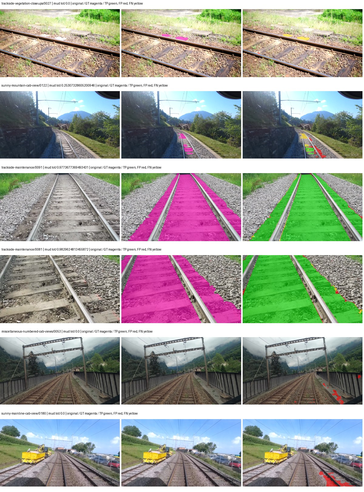
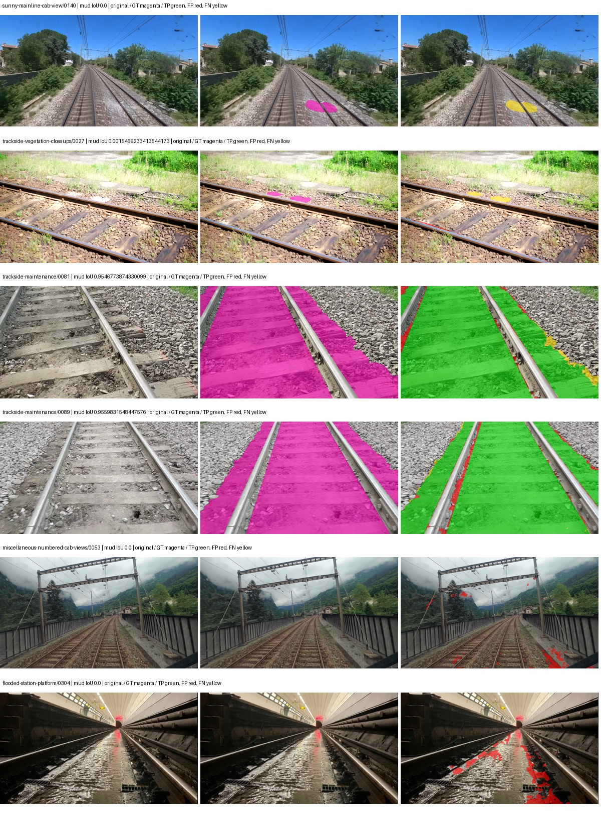
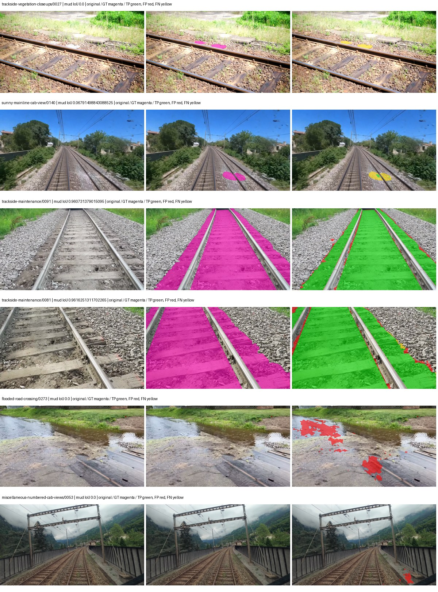
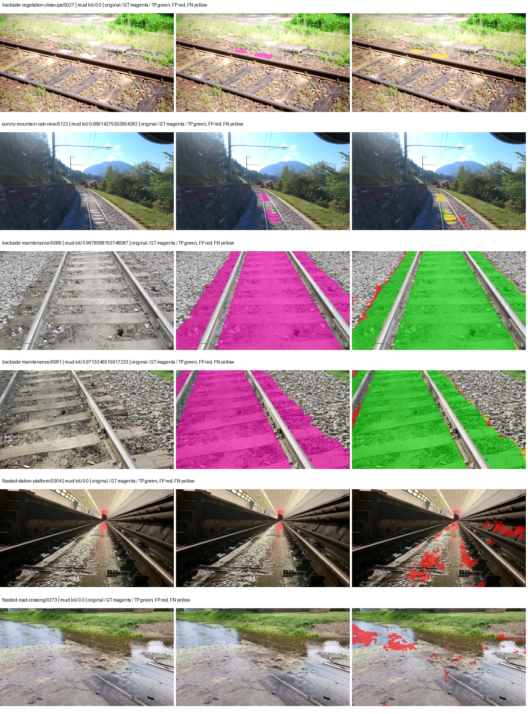

# smp_upernet_resnet101 — rad_9_24_2026-paul

[RAD 9/24: Paul's split](../../README.md) · [Full model records](record.json)

Primary selection and early stopping: **mud-pumping validation IoU**. A job is complete only after full statistics and isolated profiling are verified.

| Model | Initialization path | Seed | Status | Steps | Best step | Mud IoU (%) | Mud precision (%) | Mud recall (%) | Final mud IoU (trainer val, %) | mIoU (%) | Fixed GT-class mIoU (%) |
| --- | --- | --- | --- | --- | --- | --- | --- | --- | --- | --- | --- |
| smp_upernet_resnet101 | rtis_only | 0 | completed | 4000 | 2919 | 87.53 | 93.30 | 93.40 | 88.47 | 54.81 | 54.81 |
| smp_upernet_resnet101 | cityscapes_to_rtis | 0 | completed | 2123 | 796 | 85.16 | 92.77 | 91.22 | 67.10 | 49.42 | 49.42 |
| smp_upernet_resnet101 | railsem19_to_rtis | 0 | completed | 2654 | 1327 | 86.04 | 90.73 | 94.33 | 67.97 | 57.42 | 57.42 |
| smp_upernet_resnet101 | cityscapes_to_railsem19_to_rtis | 0 | completed | 2654 | 1327 | 87.65 | 91.57 | 95.34 | 74.91 | 55.50 | 55.50 |

Training: 227 images. Validation: 37 images. Test: 50 held out. Seeds: [0]. Seed variation measures optimization variability, not independent-recording uncertainty. Historical source checkpoints stay fixed across adaptation seeds.

Training code: `d864b72bd90706260965bb1a48398d01167b6d5c`. Split SHA-256: `b16dbbc7c4aa0c5d6e0fb5a20a27b4f3f8a4f3ce535621ed7c9aeaa6e85adb77`.

## rtis_only — seed 0

Status: **completed**. Started: 2026-10-05T12:57:37.216484+00:00. Finished: 2026-10-05T13:56:05.458580+00:00.

Recipe pretrained initializer: `{"arch": "smp", "backbone_path": null, "batch_norm_momentum": null, "checkpoint": null, "classifier_path": null, "drop_path": null, "encoder_name": "resnet101", "encoder_weights": "imagenet", "head": "unified_head", "head_paths": [], "inactive_parameter_paths": [], "local_files_only": false, "lora_alpha": 32, "lora_dropout": 0.05, "lora_r": 16, "lora_targets": [], "native": null, "revision": null, "smp_arch": "UPerNet", "subfolder": null, "trust_remote_code": false, "tuning": "full"}`.

`rtis_only` uses the recipe initializer, which may include pretrained segmentation components. Transfer paths load the exact historical source checkpoint below and reset the classifier; they do not reset all query/decoder features.

Source checkpoint: `Recipe pretrained initialization`.

Config SHA-256: `ecf3743f11b63c726c22e121d15ca0f86e11439c1b61e98c9dfa4ab35d497c78`. Weights used for validation: `raw`.

### Mud-pumping and aggregate quality

| Metric | Selected checkpoint | Final training validation |
| --- | --- | --- |
| Mud IoU | 87.53 | 88.47 |
| Mud precision | 93.30 | 92.14 |
| Mud recall | 93.40 | 95.69 |
| Mud Dice/F1 | 93.35 | 93.88 |
| mIoU | 54.81 | 55.69 |
| Mean accuracy | 67.76 | 69.56 |
| Mean precision | 72.42 | 71.63 |
| Mean Dice | 67.80 | 68.60 |
| Mean specificity | 99.29 | 99.31 |
| Pixel accuracy | 87.09 | 87.36 |
| Frequency-weighted IoU | 78.65 | 79.21 |
| Fixed GT-present class mIoU | 54.81 | 55.69 |
| Boundary F1 | 63.14 | 64.99 |

The selected checkpoint has independent evaluation evidence. Final values are the trainer's final validation record, not a new independent evaluation. mIoU averages classes with nonzero union, so false positives on absent classes can change its denominator. The fixed GT-class mean is supplementary and excludes absent classes; their false positives remain in the confusion matrix.

### Resource usage and timing

| Measurement | Value |
| --- | --- |
| Peak training VRAM, retained training invocation (GiB) | 11.09 |
| Peak evaluation VRAM (GiB) | 8.02 |
| Retained training invocation wall time (seconds) | 3306.73 |
| Retained training invocation GPU-hours (one GPU) | 0.92 |
| Evaluation wall time (seconds) | 16.12 |
| Full evaluation pipeline images/second | 2.29 |
| Best full-state checkpoint (MiB) | 860.41 |
| Final full-state checkpoint (MiB) | 860.39 |
| Verified periodic checkpoints removed (GiB) | 6.72 |

VRAM uses the recorded allocator high-water mark; it is not total device usage including CUDA context. Resumed jobs' retained training invocation times and peaks are **not whole-campaign totals**. Earlier invocation resource records are not reconstructed here. Evaluation throughput includes loader, sliding-window inference and metrics; it is not model-only latency/FPS. Missing measurements are shown as —, never inferred from another dataset's run.

### Standardized inference performance

Dedicated model-only profiling waits for an idle worker-locked L40S: BF16, batch 1, 1024x1024, 20 warmup and 100 CUDA-event-timed public forwards. It excludes loading, preprocessing, tiling and metrics.

| Status | Parameters | Weight MiB | FPS | p50 ms | p95 ms | Peak reserved GiB |
| --- | --- | --- | --- | --- | --- | --- |
| complete | 56281941 | 214.70 | 73.86 | 13.46 | 14.00 | 1.44 |

```json
{
  "schema_version": 1,
  "model_id": "smp_upernet_resnet101",
  "measured_at": "2026-10-05T13:55:56+00:00",
  "status": "complete",
  "benchmark_scope": "rtis_selected_checkpoint_model_only",
  "applies_to": [
    "smp_upernet_resnet101--rtis_only--seed-0"
  ],
  "source": {
    "campaign_git_sha": "d864b72bd90706260965bb1a48398d01167b6d5c",
    "git_dirty": false,
    "config_hash": "7396437d6e2c",
    "resolved_config": "/data/izadia1/projects/segmentary-runs/rad_9_24_2026/paul-seed0-20261005-r2/configs/smp_upernet_resnet101--rtis_only--seed-0.yaml",
    "config_sha256": "ecf3743f11b63c726c22e121d15ca0f86e11439c1b61e98c9dfa4ab35d497c78",
    "checkpoint_sha256": "035bea547bd7589844011efe3282e5b382ff37c82edb96c42ba7103ded628cc7",
    "checkpoint_global_step": 2919,
    "checkpoint_bytes": 902210142,
    "checkpoint_kind": "resume checkpoint with optimizer and EMA state",
    "weights": "raw",
    "measured_checkpoint_job_id": "smp_upernet_resnet101--rtis_only--seed-0",
    "result_sha256": "4bf383f35ff5dcb2fca89cd10bda462402af3e70df15703f1b05fb5ea2ffbbb3",
    "result_git_sha": "d864b72bd90706260965bb1a48398d01167b6d5c",
    "result_stage": "eval:rad_9_24_2026-paul:val",
    "result_seed": 0
  },
  "hardware": {
    "gpu_name": "NVIDIA L40S",
    "gpu_uuid": "GPU-804aea8b-5f62-423e-72c6-49e1ed15c4e4",
    "logical_device": "cuda:0",
    "physical_visibility_token": "6",
    "compute_capability": [
      8,
      9
    ],
    "total_memory_bytes": 47677177856
  },
  "model": {
    "parameter_count": 56281941,
    "trainable_parameter_count": 56281941,
    "resident_parameter_bytes": 225127764,
    "parameter_dtype_counts": {
      "float32": 56281941
    }
  },
  "contract": {
    "backend": "pytorch",
    "precision": "bf16_autocast",
    "batch_size": 1,
    "input_shape_nchw": [
      1,
      3,
      1024,
      1024
    ],
    "warmup_iterations": 20,
    "measured_iterations": 100,
    "timing": "per-forward CUDA events with end-event synchronization",
    "includes_preprocessing": false,
    "includes_data_loader": false,
    "includes_sliding_window": false,
    "input_resident_on_gpu": true,
    "model_only": true,
    "entrypoint": "public model(image) dense-logits forward"
  },
  "measurements": {
    "latency": {
      "p50_ms": 13.459968090057373,
      "p95_ms": 14.00314836502075,
      "mean_ms": 13.54004385948181,
      "minimum_ms": 13.345791816711426,
      "maximum_ms": 14.56230354309082,
      "fps": 73.85500448728021,
      "raw_ms": [
        13.551615715026855,
        13.55673599243164,
        13.534208297729492,
        13.345791816711426,
        13.453311920166016,
        13.450240135192871,
        13.424639701843262,
        13.413375854492188,
        13.39187240600586,
        13.414400100708008,
        13.388799667358398,
        13.459456443786621,
        13.411328315734863,
        13.451264381408691,
        13.477888107299805,
        13.454336166381836,
        13.387776374816895,
        14.559231758117676,
        13.532159805297852,
        13.395968437194824,
        13.470720291137695,
        13.408255577087402,
        13.431808471679688,
        13.4584321975708,
        13.40719985961914,
        13.560832023620605,
        13.445119857788086,
        13.446144104003906,
        13.570048332214355,
        14.08409595489502,
        13.401087760925293,
        13.55571174621582,
        13.388799667358398,
        13.372415542602539,
        13.390848159790039,
        13.999103546142578,
        13.48198413848877,
        13.431808471679688,
        13.499391555786133,
        13.933568000793457,
        13.419520378112793,
        13.509632110595703,
        13.507552146911621,
        13.442048072814941,
        13.4717435836792,
        13.492223739624023,
        13.450240135192871,
        14.56230354309082,
        13.4584321975708,
        13.510656356811523,
        13.438976287841797,
        13.419520378112793,
        13.356032371520996,
        13.486080169677734,
        13.48198413848877,
        13.416447639465332,
        13.438976287841797,
        13.86188793182373,
        13.433856010437012,
        13.408255577087402,
        13.418496131896973,
        13.507583618164062,
        13.542400360107422,
        13.452287673950195,
        13.469696044921875,
        13.430784225463867,
        13.519871711730957,
        13.513728141784668,
        13.406208038330078,
        13.524991989135742,
        13.948927879333496,
        13.940735816955566,
        13.37548828125,
        13.585408210754395,
        13.532159805297852,
        13.431808471679688,
        13.44819164276123,
        13.713408470153809,
        13.435872077941895,
        13.4399995803833,
        13.776896476745605,
        13.45638370513916,
        13.468671798706055,
        13.638655662536621,
        14.079999923706055,
        13.455360412597656,
        13.593600273132324,
        13.514752388000488,
        13.4717435836792,
        14.172160148620605,
        13.46457576751709,
        13.840383529663086,
        13.855744361877441,
        13.489151954650879,
        13.431808471679688,
        13.452287673950195,
        13.46457576751709,
        13.451264381408691,
        13.469696044921875,
        13.460479736328125
      ],
      "percentile_method": "numpy linear interpolation"
    },
    "peak_reserved_bytes": 1549795328,
    "memory_kind": "pytorch_cuda_allocator_peak_reserved_excluding_context",
    "benchmark_wall_clock_s": 13.96825074404478
  },
  "started_at": "2026-10-05T13:55:42+00:00",
  "finished_at": "2026-10-05T13:55:56+00:00",
  "environment": {
    "hostname": "hdrfs-app-001",
    "python": "3.11.15",
    "platform": "Linux-5.15.0-139-generic-x86_64-with-glibc2.35",
    "torch": "2.11.0+cu128",
    "torch_cuda": "12.8",
    "cudnn": 91900,
    "driver_version": "570.133.20",
    "cuda_available": true,
    "gpu_count": 1,
    "gpu_names": [
      "NVIDIA L40S"
    ],
    "cuda_visible_devices": "6",
    "packages": {
      "segmentary": "0.1.0",
      "torch": "2.11.0+cu128",
      "torchvision": "0.26.0+cu128",
      "transformers": "5.15.0",
      "timm": "1.0.28",
      "segmentation-models-pytorch": "0.5.0",
      "albumentations": "2.0.8",
      "lightning": "2.6.5",
      "numpy": "2.4.4"
    }
  }
}
```

### Per-class validation results

| Class | GT pixels | IoU (%) | Precision (%) | Recall (%) | Dice (%) | Boundary F1 (%) |
| --- | --- | --- | --- | --- | --- | --- |
| car | 75932 | 40.31 | 48.48 | 70.52 | 57.46 | 73.38 |
| construction | 5694760 | 47.07 | 65.87 | 62.25 | 64.01 | 56.43 |
| fence | 3789415 | 32.96 | 83.76 | 35.21 | 49.58 | 53.57 |
| mud-pumping | 7435760 | 87.53 | 93.30 | 93.40 | 93.35 | 59.48 |
| on-rails | 1137952 | 55.42 | 58.41 | 91.53 | 71.32 | 37.25 |
| person | 130659 | 73.27 | 77.83 | 92.58 | 84.57 | 74.95 |
| pole | 1467743 | 59.74 | 71.85 | 77.99 | 74.79 | 85.92 |
| rail-embedded | 74744 | 42.61 | 65.05 | 55.26 | 59.76 | 68.40 |
| rail-raised | 3588713 | 76.56 | 88.55 | 84.98 | 86.73 | 90.17 |
| rail-track | 4270276 | 73.34 | 86.27 | 83.03 | 84.62 | 80.95 |
| road | 1152119 | 42.95 | 59.05 | 61.18 | 60.10 | 53.62 |
| sidewalk | 2164731 | 48.30 | 55.62 | 78.60 | 65.14 | 57.44 |
| sky | 20207617 | 97.32 | 98.89 | 98.40 | 98.64 | 93.11 |
| standing-water | 2006046 | 53.07 | 80.28 | 61.03 | 69.34 | 23.13 |
| terrain | 30442090 | 86.47 | 91.07 | 94.48 | 92.74 | 78.16 |
| trackbed | 9118591 | 78.29 | 85.19 | 90.62 | 87.82 | 79.04 |
| traffic-light | 116825 | 47.49 | 91.94 | 49.56 | 64.40 | 69.76 |
| traffic-sign | 35778 | 23.79 | 50.34 | 31.09 | 38.44 | 43.36 |
| tram-track | 244726 | 31.23 | 74.61 | 34.95 | 47.60 | 58.23 |
| truck | 190997 | 3.60 | 33.19 | 3.89 | 6.96 | 18.14 |
| vegetation-overgrowth | 1534858 | 49.73 | 61.32 | 72.46 | 66.43 | 71.45 |

### Full-run accounting

| Measurement | Value |
| --- | --- |
| Full GPU-reserved wall seconds, all recorded worker attempts | 3515.80 |
| Full reserved GPU-hours | 0.98 |
| Whole-run timing complete | True |

| Phase | Wall seconds including failed attempts |
| --- | --- |
| training | 3313.51 |
| diagnostics | 139.16 |
| performance | 22.71 |

GPU-reserved time includes model loading, training, validation, collection, profiling, checkpoint I/O and orchestration while the worker owns one GPU. It is not GPU kernel-active time. Phase timings and sampled device memory/power/utilization are retained separately; sampled device memory is not the allocator high-water mark.

### Train/validation and raw/EMA diagnostics

| Checkpoint / weights / split | Images | Mud IoU (%) | Mud precision (%) | Mud recall (%) |
| --- | --- | --- | --- | --- |
| best-auto-train / raw | 227 | 93.68 | 95.69 | 97.81 |
| best-auto-val / raw | 37 | 87.53 | 93.30 | 93.40 |
| best-alternate-val / ema | 37 | 75.97 | 87.94 | 84.80 |
| final-auto-val / raw | 37 | 88.47 | 92.14 | 95.69 |

Train uses the evaluation transform without augmentation. Compare mud train/validation metrics for the same selected weights. Alternate EMA on running-stat BatchNorm is explicitly uncalibrated and is diagnostic only. Score-threshold curves use uncalibrated normalized scores and are pixel-level diagnostics, not event detection rates or a selected deployment operating point.

### Downloadable evidence

- best-auto-train: [per-image.csv](rtis_only--seed-0/best-auto-train/per-image.csv) · [per-image-confusion.json.gz](rtis_only--seed-0/best-auto-train/per-image-confusion.json.gz) · [groups.json](rtis_only--seed-0/best-auto-train/groups.json) · [mud-score-curves.json](rtis_only--seed-0/best-auto-train/mud-score-curves.json)
- best-auto-val: [per-image.csv](rtis_only--seed-0/best-auto-val/per-image.csv) · [per-image-confusion.json.gz](rtis_only--seed-0/best-auto-val/per-image-confusion.json.gz) · [groups.json](rtis_only--seed-0/best-auto-val/groups.json) · [mud-score-curves.json](rtis_only--seed-0/best-auto-val/mud-score-curves.json) · [examples.jpg](rtis_only--seed-0/best-auto-val/examples.jpg)
- best-alternate-val: [per-image.csv](rtis_only--seed-0/best-alternate-val/per-image.csv) · [per-image-confusion.json.gz](rtis_only--seed-0/best-alternate-val/per-image-confusion.json.gz) · [groups.json](rtis_only--seed-0/best-alternate-val/groups.json) · [mud-score-curves.json](rtis_only--seed-0/best-alternate-val/mud-score-curves.json)
- final-auto-val: [per-image.csv](rtis_only--seed-0/final-auto-val/per-image.csv) · [per-image-confusion.json.gz](rtis_only--seed-0/final-auto-val/per-image-confusion.json.gz) · [groups.json](rtis_only--seed-0/final-auto-val/groups.json) · [mud-score-curves.json](rtis_only--seed-0/final-auto-val/mud-score-curves.json)
- resources: [telemetry.csv](rtis_only--seed-0/resources/telemetry.csv)



Examples are two lowest and two highest mud-IoU positive images, plus up to two negative images with the most false-positive mud pixels. They are targeted diagnostic examples, not random samples. Green: true positive; red: false positive; yellow: false negative. Full predictions remain on HDRFS.

### Validation tracking

| Logged step | Overall mIoU (%) | Mud IoU (%) |
| --- | --- | --- |
| 264 | 41.20 | 70.41 |
| 530 | 46.42 | 69.16 |
| 796 | 49.39 | 74.08 |
| 1061 | 50.18 | 76.59 |
| 1326 | 51.65 | 72.33 |
| 1592 | 49.35 | 52.47 |
| 1857 | 51.35 | 64.31 |
| 2123 | 54.97 | 80.26 |
| 2389 | 56.32 | 86.10 |
| 2653 | 54.22 | 71.12 |
| 2919 | 54.82 | 87.51 |
| 3185 | 54.15 | 86.80 |
| 3451 | 54.14 | 81.36 |
| 3716 | 55.19 | 81.74 |
| 3981 | 55.21 | 85.86 |
| 4000 | 55.69 | 88.47 |

All retained scalar curves, including training loss and per-class IoU, are in record.json. Observed best mud on a curve is not necessarily a retained checkpoint: the pilot saved its selection-metric-best and final checkpoints. Step logging and checkpoint global_step may differ by one.

### Stopping and checkpoint provenance

```json
{
  "stopping": {
    "actual_steps": 4000,
    "maximum_steps": 4000,
    "min_delta": 0.001,
    "monitor": "val_iou/mud-pumping",
    "patience": 5,
    "reason": "budget_complete"
  },
  "checkpoints": {
    "best": {
      "path": "/data/izadia1/projects/segmentary-runs/rad_9_24_2026/paul-seed0-20261005-r2/future-runs/smp_upernet_resnet101--rtis_only--seed-0_seed0/rtis/best.ckpt",
      "sha256": "035bea547bd7589844011efe3282e5b382ff37c82edb96c42ba7103ded628cc7",
      "global_step": 2919,
      "bytes": 902210142
    },
    "final": {
      "path": "/data/izadia1/projects/segmentary-runs/rad_9_24_2026/paul-seed0-20261005-r2/future-runs/smp_upernet_resnet101--rtis_only--seed-0_seed0/rtis/last.ckpt",
      "sha256": "74168bcba50e6d6e7099f72a8bcce5f1c9b38280799075eb34ae7f72648912cc",
      "global_step": 4000,
      "bytes": 902187038
    }
  },
  "cleanup_error": null
}
```

### Resolved training, initialization and evaluation settings

The optimizer block is the base configuration. Stage LR scales are applied at runtime, and stage warmup is capped at min(base warmup, floor(stage budget / 10), stage budget - 1): 400 steps for this 4,000-step pilot. Model-internal native input grids may differ from augmentation crops (EoMT uses its 640 grid).

```json
{
  "name": "smp_upernet_resnet101--rtis_only--seed-0",
  "model": {
    "arch": "smp",
    "checkpoint": null,
    "tuning": "full",
    "head": "unified_head",
    "lora_r": 16,
    "lora_alpha": 32,
    "lora_dropout": 0.05,
    "lora_targets": [],
    "drop_path": null,
    "revision": null,
    "subfolder": null,
    "local_files_only": false,
    "trust_remote_code": false,
    "backbone_path": null,
    "head_paths": [],
    "classifier_path": null,
    "inactive_parameter_paths": [],
    "smp_arch": "UPerNet",
    "encoder_name": "resnet101",
    "encoder_weights": "imagenet",
    "native": null,
    "batch_norm_momentum": null
  },
  "space": "paul-test-rtis",
  "taxonomy_root": "/data/izadia1/projects/segmentary-rad-d864b72b/taxonomy",
  "output_root": "/data/izadia1/projects/segmentary-runs/rad_9_24_2026/paul-seed0-20261005-r2/future-runs",
  "optim": {
    "backbone_lr": 0.0001,
    "head_lr_mult": 10.0,
    "weight_decay": 0.05,
    "llrd": 1.0,
    "warmup_iters": 1500,
    "warmup_ratio": 1e-06,
    "poly_power": 0.9,
    "min_lr_ratio": 0.0,
    "betas": [
      0.9,
      0.999
    ],
    "grad_clip": 1.0
  },
  "train": {
    "iters": 4000,
    "batch_size": 2,
    "accum": 8,
    "num_workers": 2,
    "precision": "bf16-mixed",
    "ema_decay": 0.9998,
    "val_every": 250,
    "ckpt_every": 500,
    "selection_metric": "val_iou/mud-pumping",
    "early_stopping_patience": 5,
    "early_stopping_min_delta": 0.001,
    "seed": 0,
    "devices": 1
  },
  "eval": {
    "sliding_window": true,
    "window": [
      1024,
      1024
    ],
    "stride": [
      768,
      768
    ],
    "batch_size": 1,
    "num_workers": 2,
    "tta_scales": [],
    "tta_flip": false,
    "threshold": 0.5,
    "boundary_tolerance_frac": 0.0075,
    "save_confusion": true
  },
  "loss": {
    "task": "multiclass",
    "activation": "auto",
    "terms": [],
    "aux": "none",
    "aux_weight": 0.0,
    "ce_weight": 1.0,
    "label_smoothing": 0.0,
    "class_weights": null,
    "query": null
  },
  "aug": {
    "crop": [
      1024,
      1024
    ],
    "scale_min": 0.5,
    "scale_max": 2.0,
    "hflip_p": 0.5,
    "color_jitter_p": 0.5,
    "brightness": 0.25,
    "contrast": 0.25,
    "saturation": 0.25,
    "hue": 0.05
  },
  "stages": [
    {
      "name": "rtis",
      "data": [
        {
          "name": "rad_9_24_2026-paul",
          "root": "/data/izadia1/datasets/rad_9_24_2026-paul",
          "variant": null,
          "split_file": "splits.json",
          "train_split": "train",
          "val_split": "val",
          "limit": null,
          "loader": "folder",
          "mapping": "paul-test-rtis",
          "loader_options": {
            "require_groups": false
          }
        }
      ],
      "iters": null,
      "lr_scale": 1.0,
      "head_group_lr_scale": 1.0,
      "init_from": "pretrained",
      "reset_head": false,
      "freeze": null,
      "sample_weights": null
    }
  ]
}
```

### Hardware and software provenance

```json
{
  "training": {
    "cuda_available": true,
    "cuda_visible_devices": "6",
    "cudnn": 91900,
    "driver_version": "570.133.20",
    "gpu_count": 1,
    "gpu_names": [
      "NVIDIA L40S"
    ],
    "hostname": "hdrfs-app-001",
    "input_normalization": {
      "channel_order": "rgb",
      "mean": [
        0.485,
        0.456,
        0.406
      ],
      "source": "smp_encoder_settings",
      "std": [
        0.229,
        0.224,
        0.225
      ]
    },
    "model_origins": [
      {
        "hf_commit": null,
        "hf_name_or_path": null,
        "module": "model",
        "timm_pretrained": {}
      }
    ],
    "model_parameter_count": 56281941,
    "packages": {
      "albumentations": "2.0.8",
      "lightning": "2.6.5",
      "numpy": "2.4.4",
      "segmentary": "0.1.0",
      "segmentation-models-pytorch": "0.5.0",
      "timm": "1.0.28",
      "torch": "2.11.0+cu128",
      "torchvision": "0.26.0+cu128",
      "transformers": "5.15.0"
    },
    "platform": "Linux-5.15.0-139-generic-x86_64-with-glibc2.35",
    "python": "3.11.15",
    "torch": "2.11.0+cu128",
    "torch_cuda": "12.8",
    "trainable_parameter_count": 56281941,
    "training_stop": {
      "actual_steps": 4000,
      "maximum_steps": 4000,
      "min_delta": 0.001,
      "monitor": "val_iou/mud-pumping",
      "patience": 5,
      "reason": "budget_complete"
    },
    "validation_weights": "raw"
  },
  "evaluation": {
    "cuda_available": true,
    "cuda_visible_devices": "6",
    "cudnn": 91900,
    "driver_version": "570.133.20",
    "gpu_count": 1,
    "gpu_names": [
      "NVIDIA L40S"
    ],
    "hostname": "hdrfs-app-001",
    "input_normalization": {
      "channel_order": "rgb",
      "mean": [
        0.485,
        0.456,
        0.406
      ],
      "source": "smp_encoder_settings",
      "std": [
        0.229,
        0.224,
        0.225
      ]
    },
    "packages": {
      "albumentations": "2.0.8",
      "lightning": "2.6.5",
      "numpy": "2.4.4",
      "segmentary": "0.1.0",
      "segmentation-models-pytorch": "0.5.0",
      "timm": "1.0.28",
      "torch": "2.11.0+cu128",
      "torchvision": "0.26.0+cu128",
      "transformers": "5.15.0"
    },
    "platform": "Linux-5.15.0-139-generic-x86_64-with-glibc2.35",
    "python": "3.11.15",
    "torch": "2.11.0+cu128",
    "torch_cuda": "12.8"
  }
}
```

## cityscapes_to_rtis — seed 0

Status: **completed**. Started: 2026-10-05T13:18:11.428500+00:00. Finished: 2026-10-05T13:50:54.342688+00:00.

Recipe pretrained initializer: `{"arch": "smp", "backbone_path": null, "batch_norm_momentum": null, "checkpoint": null, "classifier_path": null, "drop_path": null, "encoder_name": "resnet101", "encoder_weights": "imagenet", "head": "unified_head", "head_paths": [], "inactive_parameter_paths": [], "local_files_only": false, "lora_alpha": 32, "lora_dropout": 0.05, "lora_r": 16, "lora_targets": [], "native": null, "revision": null, "smp_arch": "UPerNet", "subfolder": null, "trust_remote_code": false, "tuning": "full"}`.

`rtis_only` uses the recipe initializer, which may include pretrained segmentation components. Transfer paths load the exact historical source checkpoint below and reset the classifier; they do not reset all query/decoder features.

Source checkpoint: `{'name': 'smp_upernet_resnet101--cityscapes--seed-0', 'model': 'smp_upernet_resnet101', 'protocol': 'cityscapes', 'config': '/data/izadia1/projects/segmentary-runs/all-model-city-rail-seed0-rail20-b9eb3e1/accepted/smp_upernet_resnet101--cityscapes--seed-0/resolved-config.yaml', 'checkpoint': '/data/izadia1/projects/segmentary-runs/all-model-city-rail-seed0-a7c0b67/jobs/smp_upernet_resnet101--cityscapes--seed-0/attempt-001/train/smp_upernet_resnet101--cityscapes_seed0/cityscapes/last.ckpt', 'recorded_sha256': '18a79d5ff0e4b11842213d5546a334f1e7e30b81c87679fab1659eecb12bcb7a', 'exists': True}`.

Config SHA-256: `e56c6eeffb3cc489419484658e986832d0d19795965ae798174e62944047ff45`. Weights used for validation: `raw`.

### Mud-pumping and aggregate quality

| Metric | Selected checkpoint | Final training validation |
| --- | --- | --- |
| Mud IoU | 85.16 | 67.10 |
| Mud precision | 92.77 | 94.65 |
| Mud recall | 91.22 | 69.74 |
| Mud Dice/F1 | 91.99 | 80.31 |
| mIoU | 49.42 | 54.02 |
| Mean accuracy | 61.53 | 69.58 |
| Mean precision | 64.31 | 69.39 |
| Mean Dice | 61.43 | 68.09 |
| Mean specificity | 99.21 | 99.20 |
| Pixel accuracy | 85.30 | 85.17 |
| Frequency-weighted IoU | 76.44 | 76.08 |
| Fixed GT-present class mIoU | 49.42 | 54.02 |
| Boundary F1 | 52.05 | 59.72 |

The selected checkpoint has independent evaluation evidence. Final values are the trainer's final validation record, not a new independent evaluation. mIoU averages classes with nonzero union, so false positives on absent classes can change its denominator. The fixed GT-class mean is supplementary and excludes absent classes; their false positives remain in the confusion matrix.

### Resource usage and timing

| Measurement | Value |
| --- | --- |
| Peak training VRAM, retained training invocation (GiB) | 11.08 |
| Peak evaluation VRAM (GiB) | 8.02 |
| Retained training invocation wall time (seconds) | 1764.22 |
| Retained training invocation GPU-hours (one GPU) | 0.49 |
| Evaluation wall time (seconds) | 15.84 |
| Full evaluation pipeline images/second | 2.34 |
| Best full-state checkpoint (MiB) | 860.41 |
| Final full-state checkpoint (MiB) | 860.39 |
| Verified periodic checkpoints removed (GiB) | 3.36 |

VRAM uses the recorded allocator high-water mark; it is not total device usage including CUDA context. Resumed jobs' retained training invocation times and peaks are **not whole-campaign totals**. Earlier invocation resource records are not reconstructed here. Evaluation throughput includes loader, sliding-window inference and metrics; it is not model-only latency/FPS. Missing measurements are shown as —, never inferred from another dataset's run.

### Standardized inference performance

Dedicated model-only profiling waits for an idle worker-locked L40S: BF16, batch 1, 1024x1024, 20 warmup and 100 CUDA-event-timed public forwards. It excludes loading, preprocessing, tiling and metrics.

| Status | Parameters | Weight MiB | FPS | p50 ms | p95 ms | Peak reserved GiB |
| --- | --- | --- | --- | --- | --- | --- |
| complete | 56281941 | 214.70 | 69.69 | 13.66 | 18.04 | 1.54 |

```json
{
  "schema_version": 1,
  "model_id": "smp_upernet_resnet101",
  "measured_at": "2026-10-05T13:50:48+00:00",
  "status": "complete",
  "benchmark_scope": "rtis_selected_checkpoint_model_only",
  "applies_to": [
    "smp_upernet_resnet101--cityscapes_to_rtis--seed-0"
  ],
  "source": {
    "campaign_git_sha": "d864b72bd90706260965bb1a48398d01167b6d5c",
    "git_dirty": false,
    "config_hash": "c7393dcd89a2",
    "resolved_config": "/data/izadia1/projects/segmentary-runs/rad_9_24_2026/paul-seed0-20261005-r2/configs/smp_upernet_resnet101--cityscapes_to_rtis--seed-0.yaml",
    "config_sha256": "e56c6eeffb3cc489419484658e986832d0d19795965ae798174e62944047ff45",
    "checkpoint_sha256": "854577b45e3089e46800e6d48760f4409b107722bab09802112214f986227d80",
    "checkpoint_global_step": 796,
    "checkpoint_bytes": 902210142,
    "checkpoint_kind": "resume checkpoint with optimizer and EMA state",
    "weights": "raw",
    "measured_checkpoint_job_id": "smp_upernet_resnet101--cityscapes_to_rtis--seed-0",
    "result_sha256": "9694636f17e310b83dd05267e4bdc61e7aa3e0f9767410307f9e4ce678038b8c",
    "result_git_sha": "d864b72bd90706260965bb1a48398d01167b6d5c",
    "result_stage": "eval:rad_9_24_2026-paul:val",
    "result_seed": 0
  },
  "hardware": {
    "gpu_name": "NVIDIA L40S",
    "gpu_uuid": "GPU-a5ad49e5-0536-5229-ba8a-f8a902808f53",
    "logical_device": "cuda:0",
    "physical_visibility_token": "7",
    "compute_capability": [
      8,
      9
    ],
    "total_memory_bytes": 47677177856
  },
  "model": {
    "parameter_count": 56281941,
    "trainable_parameter_count": 56281941,
    "resident_parameter_bytes": 225127764,
    "parameter_dtype_counts": {
      "float32": 56281941
    }
  },
  "contract": {
    "backend": "pytorch",
    "precision": "bf16_autocast",
    "batch_size": 1,
    "input_shape_nchw": [
      1,
      3,
      1024,
      1024
    ],
    "warmup_iterations": 20,
    "measured_iterations": 100,
    "timing": "per-forward CUDA events with end-event synchronization",
    "includes_preprocessing": false,
    "includes_data_loader": false,
    "includes_sliding_window": false,
    "input_resident_on_gpu": true,
    "model_only": true,
    "entrypoint": "public model(image) dense-logits forward"
  },
  "measurements": {
    "latency": {
      "p50_ms": 13.658623695373535,
      "p95_ms": 18.038219928741455,
      "mean_ms": 14.34837854385376,
      "minimum_ms": 13.421567916870117,
      "maximum_ms": 22.50035285949707,
      "fps": 69.6942861483368,
      "raw_ms": [
        13.740032196044922,
        14.788607597351074,
        13.673439979553223,
        22.06822395324707,
        13.504511833190918,
        13.488127708435059,
        13.509632110595703,
        15.99078369140625,
        20.354015350341797,
        13.542400360107422,
        13.566975593566895,
        13.4901762008667,
        13.48095989227295,
        14.515168190002441,
        18.552831649780273,
        17.557504653930664,
        13.52297592163086,
        14.532608032226562,
        13.639679908752441,
        13.639679908752441,
        21.821439743041992,
        18.01113510131836,
        13.808639526367188,
        13.498368263244629,
        13.609984397888184,
        13.693951606750488,
        22.50035285949707,
        16.40652847290039,
        14.710783958435059,
        13.421567916870117,
        13.539327621459961,
        13.703167915344238,
        13.650943756103516,
        17.797119140625,
        14.700544357299805,
        13.910016059875488,
        14.131199836730957,
        13.55673599243164,
        13.536255836486816,
        13.48095989227295,
        13.529088020324707,
        13.588479995727539,
        14.87667179107666,
        13.693951606750488,
        14.08614444732666,
        14.737407684326172,
        13.58131217956543,
        14.889984130859375,
        13.64684772491455,
        13.594623565673828,
        13.558783531188965,
        13.666303634643555,
        13.838335990905762,
        14.759936332702637,
        14.07487964630127,
        13.794303894042969,
        13.934592247009277,
        13.549568176269531,
        14.476287841796875,
        13.557760238647461,
        13.51375961303711,
        13.629440307617188,
        13.549568176269531,
        13.614080429077148,
        13.584383964538574,
        14.912511825561523,
        13.945856094360352,
        13.566975593566895,
        13.786111831665039,
        14.078975677490234,
        13.509632110595703,
        14.09324836730957,
        14.9749755859375,
        13.719552040100098,
        13.966336250305176,
        13.668352127075195,
        13.606880187988281,
        13.56390380859375,
        13.965312004089355,
        13.543359756469727,
        13.616127967834473,
        13.643775939941406,
        14.125056266784668,
        13.499391555786133,
        13.576191902160645,
        13.98681640625,
        13.560832023620605,
        13.550592422485352,
        13.554688453674316,
        13.543423652648926,
        13.601792335510254,
        13.554688453674316,
        13.899776458740234,
        13.939711570739746,
        13.593600273132324,
        13.570048332214355,
        13.933600425720215,
        13.56492805480957,
        14.025728225708008,
        13.621248245239258
      ],
      "percentile_method": "numpy linear interpolation"
    },
    "peak_reserved_bytes": 1652555776,
    "memory_kind": "pytorch_cuda_allocator_peak_reserved_excluding_context",
    "benchmark_wall_clock_s": 14.087050288915634
  },
  "started_at": "2026-10-05T13:50:34+00:00",
  "finished_at": "2026-10-05T13:50:48+00:00",
  "environment": {
    "hostname": "hdrfs-app-001",
    "python": "3.11.15",
    "platform": "Linux-5.15.0-139-generic-x86_64-with-glibc2.35",
    "torch": "2.11.0+cu128",
    "torch_cuda": "12.8",
    "cudnn": 91900,
    "driver_version": "570.133.20",
    "cuda_available": true,
    "gpu_count": 1,
    "gpu_names": [
      "NVIDIA L40S"
    ],
    "cuda_visible_devices": "7",
    "packages": {
      "segmentary": "0.1.0",
      "torch": "2.11.0+cu128",
      "torchvision": "0.26.0+cu128",
      "transformers": "5.15.0",
      "timm": "1.0.28",
      "segmentation-models-pytorch": "0.5.0",
      "albumentations": "2.0.8",
      "lightning": "2.6.5",
      "numpy": "2.4.4"
    }
  }
}
```

### Per-class validation results

| Class | GT pixels | IoU (%) | Precision (%) | Recall (%) | Dice (%) | Boundary F1 (%) |
| --- | --- | --- | --- | --- | --- | --- |
| car | 75932 | 48.30 | 72.62 | 59.06 | 65.14 | 76.66 |
| construction | 5694760 | 43.80 | 52.76 | 72.07 | 60.92 | 50.06 |
| fence | 3789415 | 36.35 | 85.04 | 38.83 | 53.32 | 51.95 |
| mud-pumping | 7435760 | 85.16 | 92.77 | 91.22 | 91.99 | 47.50 |
| on-rails | 1137952 | 56.25 | 61.15 | 87.52 | 72.00 | 28.77 |
| person | 130659 | 70.36 | 75.90 | 90.60 | 82.60 | 74.47 |
| pole | 1467743 | 44.63 | 65.01 | 58.74 | 61.72 | 82.07 |
| rail-embedded | 74744 | 20.02 | 56.79 | 23.61 | 33.36 | 45.31 |
| rail-raised | 3588713 | 73.09 | 85.83 | 83.11 | 84.45 | 88.18 |
| rail-track | 4270276 | 60.57 | 79.04 | 72.15 | 75.44 | 69.94 |
| road | 1152119 | 49.60 | 62.39 | 70.77 | 66.31 | 48.99 |
| sidewalk | 2164731 | 50.89 | 67.38 | 67.53 | 67.45 | 51.65 |
| sky | 20207617 | 95.37 | 98.24 | 97.03 | 97.63 | 90.70 |
| standing-water | 2006046 | 57.00 | 64.26 | 83.46 | 72.61 | 7.70 |
| terrain | 30442090 | 85.53 | 92.44 | 91.97 | 92.20 | 74.34 |
| trackbed | 9118591 | 73.74 | 85.36 | 84.42 | 84.88 | 73.80 |
| traffic-light | 116825 | 0.00 | 0.00 | 0.00 | 0.00 | 0.00 |
| traffic-sign | 35778 | 0.00 | 0.00 | 0.00 | 0.00 | 0.00 |
| tram-track | 244726 | 30.15 | 71.92 | 34.18 | 46.34 | 36.54 |
| truck | 190997 | 9.50 | 23.47 | 13.76 | 17.35 | 32.42 |
| vegetation-overgrowth | 1534858 | 47.48 | 58.13 | 72.17 | 64.39 | 62.01 |

### Full-run accounting

| Measurement | Value |
| --- | --- |
| Full GPU-reserved wall seconds, all recorded worker attempts | 1971.06 |
| Full reserved GPU-hours | 0.55 |
| Whole-run timing complete | True |

| Phase | Wall seconds including failed attempts |
| --- | --- |
| training | 1771.42 |
| diagnostics | 138.66 |
| performance | 22.96 |

GPU-reserved time includes model loading, training, validation, collection, profiling, checkpoint I/O and orchestration while the worker owns one GPU. It is not GPU kernel-active time. Phase timings and sampled device memory/power/utilization are retained separately; sampled device memory is not the allocator high-water mark.

### Train/validation and raw/EMA diagnostics

| Checkpoint / weights / split | Images | Mud IoU (%) | Mud precision (%) | Mud recall (%) |
| --- | --- | --- | --- | --- |
| best-auto-train / raw | 227 | 85.22 | 91.81 | 92.24 |
| best-auto-val / raw | 37 | 85.16 | 92.77 | 91.22 |
| best-alternate-val / ema | 37 | 79.24 | 93.32 | 84.01 |
| final-auto-val / raw | 37 | 67.10 | 94.65 | 69.75 |

Train uses the evaluation transform without augmentation. Compare mud train/validation metrics for the same selected weights. Alternate EMA on running-stat BatchNorm is explicitly uncalibrated and is diagnostic only. Score-threshold curves use uncalibrated normalized scores and are pixel-level diagnostics, not event detection rates or a selected deployment operating point.

### Downloadable evidence

- best-auto-train: [per-image.csv](cityscapes_to_rtis--seed-0/best-auto-train/per-image.csv) · [per-image-confusion.json.gz](cityscapes_to_rtis--seed-0/best-auto-train/per-image-confusion.json.gz) · [groups.json](cityscapes_to_rtis--seed-0/best-auto-train/groups.json) · [mud-score-curves.json](cityscapes_to_rtis--seed-0/best-auto-train/mud-score-curves.json)
- best-auto-val: [per-image.csv](cityscapes_to_rtis--seed-0/best-auto-val/per-image.csv) · [per-image-confusion.json.gz](cityscapes_to_rtis--seed-0/best-auto-val/per-image-confusion.json.gz) · [groups.json](cityscapes_to_rtis--seed-0/best-auto-val/groups.json) · [mud-score-curves.json](cityscapes_to_rtis--seed-0/best-auto-val/mud-score-curves.json) · [examples.jpg](cityscapes_to_rtis--seed-0/best-auto-val/examples.jpg)
- best-alternate-val: [per-image.csv](cityscapes_to_rtis--seed-0/best-alternate-val/per-image.csv) · [per-image-confusion.json.gz](cityscapes_to_rtis--seed-0/best-alternate-val/per-image-confusion.json.gz) · [groups.json](cityscapes_to_rtis--seed-0/best-alternate-val/groups.json) · [mud-score-curves.json](cityscapes_to_rtis--seed-0/best-alternate-val/mud-score-curves.json)
- final-auto-val: [per-image.csv](cityscapes_to_rtis--seed-0/final-auto-val/per-image.csv) · [per-image-confusion.json.gz](cityscapes_to_rtis--seed-0/final-auto-val/per-image-confusion.json.gz) · [groups.json](cityscapes_to_rtis--seed-0/final-auto-val/groups.json) · [mud-score-curves.json](cityscapes_to_rtis--seed-0/final-auto-val/mud-score-curves.json)
- resources: [telemetry.csv](cityscapes_to_rtis--seed-0/resources/telemetry.csv)



Examples are two lowest and two highest mud-IoU positive images, plus up to two negative images with the most false-positive mud pixels. They are targeted diagnostic examples, not random samples. Green: true positive; red: false positive; yellow: false negative. Full predictions remain on HDRFS.

### Validation tracking

| Logged step | Overall mIoU (%) | Mud IoU (%) |
| --- | --- | --- |
| 264 | 33.29 | 71.46 |
| 530 | 42.20 | 79.62 |
| 796 | 49.42 | 85.18 |
| 1061 | 49.70 | 40.51 |
| 1326 | 52.07 | 80.44 |
| 1592 | 51.75 | 79.97 |
| 1857 | 53.59 | 59.67 |
| 2123 | 54.02 | 67.10 |

All retained scalar curves, including training loss and per-class IoU, are in record.json. Observed best mud on a curve is not necessarily a retained checkpoint: the pilot saved its selection-metric-best and final checkpoints. Step logging and checkpoint global_step may differ by one.

### Stopping and checkpoint provenance

```json
{
  "stopping": {
    "actual_steps": 2123,
    "maximum_steps": 4000,
    "min_delta": 0.001,
    "monitor": "val_iou/mud-pumping",
    "patience": 5,
    "reason": "validation_plateau"
  },
  "checkpoints": {
    "best": {
      "path": "/data/izadia1/projects/segmentary-runs/rad_9_24_2026/paul-seed0-20261005-r2/future-runs/smp_upernet_resnet101--cityscapes_to_rtis--seed-0_seed0/rtis/best.ckpt",
      "sha256": "854577b45e3089e46800e6d48760f4409b107722bab09802112214f986227d80",
      "global_step": 796,
      "bytes": 902210142
    },
    "final": {
      "path": "/data/izadia1/projects/segmentary-runs/rad_9_24_2026/paul-seed0-20261005-r2/future-runs/smp_upernet_resnet101--cityscapes_to_rtis--seed-0_seed0/rtis/last.ckpt",
      "sha256": "1261a8069bbbb1d977526b01403a8ca45d6cabc2c4adffc72bb296ebae7f4245",
      "global_step": 2123,
      "bytes": 902187230
    }
  },
  "cleanup_error": null
}
```

### Resolved training, initialization and evaluation settings

The optimizer block is the base configuration. Stage LR scales are applied at runtime, and stage warmup is capped at min(base warmup, floor(stage budget / 10), stage budget - 1): 400 steps for this 4,000-step pilot. Model-internal native input grids may differ from augmentation crops (EoMT uses its 640 grid).

```json
{
  "name": "smp_upernet_resnet101--cityscapes_to_rtis--seed-0",
  "model": {
    "arch": "smp",
    "checkpoint": null,
    "tuning": "full",
    "head": "unified_head",
    "lora_r": 16,
    "lora_alpha": 32,
    "lora_dropout": 0.05,
    "lora_targets": [],
    "drop_path": null,
    "revision": null,
    "subfolder": null,
    "local_files_only": false,
    "trust_remote_code": false,
    "backbone_path": null,
    "head_paths": [],
    "classifier_path": null,
    "inactive_parameter_paths": [],
    "smp_arch": "UPerNet",
    "encoder_name": "resnet101",
    "encoder_weights": "imagenet",
    "native": null,
    "batch_norm_momentum": null
  },
  "space": "paul-test-rtis",
  "taxonomy_root": "/data/izadia1/projects/segmentary-rad-d864b72b/taxonomy",
  "output_root": "/data/izadia1/projects/segmentary-runs/rad_9_24_2026/paul-seed0-20261005-r2/future-runs",
  "optim": {
    "backbone_lr": 0.0001,
    "head_lr_mult": 10.0,
    "weight_decay": 0.05,
    "llrd": 1.0,
    "warmup_iters": 1500,
    "warmup_ratio": 1e-06,
    "poly_power": 0.9,
    "min_lr_ratio": 0.0,
    "betas": [
      0.9,
      0.999
    ],
    "grad_clip": 1.0
  },
  "train": {
    "iters": 4000,
    "batch_size": 2,
    "accum": 8,
    "num_workers": 2,
    "precision": "bf16-mixed",
    "ema_decay": 0.9998,
    "val_every": 250,
    "ckpt_every": 500,
    "selection_metric": "val_iou/mud-pumping",
    "early_stopping_patience": 5,
    "early_stopping_min_delta": 0.001,
    "seed": 0,
    "devices": 1
  },
  "eval": {
    "sliding_window": true,
    "window": [
      1024,
      1024
    ],
    "stride": [
      768,
      768
    ],
    "batch_size": 1,
    "num_workers": 2,
    "tta_scales": [],
    "tta_flip": false,
    "threshold": 0.5,
    "boundary_tolerance_frac": 0.0075,
    "save_confusion": true
  },
  "loss": {
    "task": "multiclass",
    "activation": "auto",
    "terms": [],
    "aux": "none",
    "aux_weight": 0.0,
    "ce_weight": 1.0,
    "label_smoothing": 0.0,
    "class_weights": null,
    "query": null
  },
  "aug": {
    "crop": [
      1024,
      1024
    ],
    "scale_min": 0.5,
    "scale_max": 2.0,
    "hflip_p": 0.5,
    "color_jitter_p": 0.5,
    "brightness": 0.25,
    "contrast": 0.25,
    "saturation": 0.25,
    "hue": 0.05
  },
  "stages": [
    {
      "name": "rtis",
      "data": [
        {
          "name": "rad_9_24_2026-paul",
          "root": "/data/izadia1/datasets/rad_9_24_2026-paul",
          "variant": null,
          "split_file": "splits.json",
          "train_split": "train",
          "val_split": "val",
          "limit": null,
          "loader": "folder",
          "mapping": "paul-test-rtis",
          "loader_options": {
            "require_groups": false
          }
        }
      ],
      "iters": null,
      "lr_scale": 0.1,
      "head_group_lr_scale": 1.0,
      "init_from": "/data/izadia1/projects/segmentary-runs/all-model-city-rail-seed0-a7c0b67/jobs/smp_upernet_resnet101--cityscapes--seed-0/attempt-001/train/smp_upernet_resnet101--cityscapes_seed0/cityscapes/last.ckpt",
      "reset_head": true,
      "freeze": null,
      "sample_weights": null
    }
  ]
}
```

### Hardware and software provenance

```json
{
  "training": {
    "cuda_available": true,
    "cuda_visible_devices": "7",
    "cudnn": 91900,
    "driver_version": "570.133.20",
    "gpu_count": 1,
    "gpu_names": [
      "NVIDIA L40S"
    ],
    "hostname": "hdrfs-app-001",
    "input_normalization": {
      "channel_order": "rgb",
      "mean": [
        0.485,
        0.456,
        0.406
      ],
      "source": "smp_encoder_settings",
      "std": [
        0.229,
        0.224,
        0.225
      ]
    },
    "model_origins": [
      {
        "hf_commit": null,
        "hf_name_or_path": null,
        "module": "model",
        "timm_pretrained": {}
      }
    ],
    "model_parameter_count": 56281941,
    "packages": {
      "albumentations": "2.0.8",
      "lightning": "2.6.5",
      "numpy": "2.4.4",
      "segmentary": "0.1.0",
      "segmentation-models-pytorch": "0.5.0",
      "timm": "1.0.28",
      "torch": "2.11.0+cu128",
      "torchvision": "0.26.0+cu128",
      "transformers": "5.15.0"
    },
    "platform": "Linux-5.15.0-139-generic-x86_64-with-glibc2.35",
    "python": "3.11.15",
    "torch": "2.11.0+cu128",
    "torch_cuda": "12.8",
    "trainable_parameter_count": 56281941,
    "training_stop": {
      "actual_steps": 2123,
      "maximum_steps": 4000,
      "min_delta": 0.001,
      "monitor": "val_iou/mud-pumping",
      "patience": 5,
      "reason": "validation_plateau"
    },
    "validation_weights": "raw"
  },
  "evaluation": {
    "cuda_available": true,
    "cuda_visible_devices": "7",
    "cudnn": 91900,
    "driver_version": "570.133.20",
    "gpu_count": 1,
    "gpu_names": [
      "NVIDIA L40S"
    ],
    "hostname": "hdrfs-app-001",
    "input_normalization": {
      "channel_order": "rgb",
      "mean": [
        0.485,
        0.456,
        0.406
      ],
      "source": "smp_encoder_settings",
      "std": [
        0.229,
        0.224,
        0.225
      ]
    },
    "packages": {
      "albumentations": "2.0.8",
      "lightning": "2.6.5",
      "numpy": "2.4.4",
      "segmentary": "0.1.0",
      "segmentation-models-pytorch": "0.5.0",
      "timm": "1.0.28",
      "torch": "2.11.0+cu128",
      "torchvision": "0.26.0+cu128",
      "transformers": "5.15.0"
    },
    "platform": "Linux-5.15.0-139-generic-x86_64-with-glibc2.35",
    "python": "3.11.15",
    "torch": "2.11.0+cu128",
    "torch_cuda": "12.8"
  }
}
```

## railsem19_to_rtis — seed 0

Status: **completed**. Started: 2026-10-05T13:19:34.703462+00:00. Finished: 2026-10-05T13:59:24.471452+00:00.

Recipe pretrained initializer: `{"arch": "smp", "backbone_path": null, "batch_norm_momentum": null, "checkpoint": null, "classifier_path": null, "drop_path": null, "encoder_name": "resnet101", "encoder_weights": "imagenet", "head": "unified_head", "head_paths": [], "inactive_parameter_paths": [], "local_files_only": false, "lora_alpha": 32, "lora_dropout": 0.05, "lora_r": 16, "lora_targets": [], "native": null, "revision": null, "smp_arch": "UPerNet", "subfolder": null, "trust_remote_code": false, "tuning": "full"}`.

`rtis_only` uses the recipe initializer, which may include pretrained segmentation components. Transfer paths load the exact historical source checkpoint below and reset the classifier; they do not reset all query/decoder features.

Source checkpoint: `{'name': 'smp_upernet_resnet101--railsem19--seed-0', 'model': 'smp_upernet_resnet101', 'protocol': 'railsem19', 'config': '/data/izadia1/projects/segmentary-runs/all-model-city-rail-seed0-rail20-b9eb3e1/accepted/smp_upernet_resnet101--railsem19--seed-0/resolved-config.yaml', 'checkpoint': '/data/izadia1/projects/segmentary-runs/all-model-city-rail-seed0-a7c0b67/jobs/smp_upernet_resnet101--railsem19--seed-0/attempt-001/train/smp_upernet_resnet101--railsem19_seed0/railsem19/last.ckpt', 'recorded_sha256': '786e3d81df9181457bb198b058bfd34662540be50b92ea3c4a9c4a3f361f8087', 'exists': True}`.

Config SHA-256: `b78f5010d3df1843453fc9ced6e31855843dbca5d29b4d9c177ea7ec1f39a5e8`. Weights used for validation: `raw`.

### Mud-pumping and aggregate quality

| Metric | Selected checkpoint | Final training validation |
| --- | --- | --- |
| Mud IoU | 86.04 | 67.97 |
| Mud precision | 90.73 | 94.47 |
| Mud recall | 94.33 | 70.78 |
| Mud Dice/F1 | 92.49 | 80.93 |
| mIoU | 57.42 | 56.80 |
| Mean accuracy | 72.34 | 71.80 |
| Mean precision | 72.77 | 72.35 |
| Mean Dice | 71.06 | 70.42 |
| Mean specificity | 99.25 | 99.24 |
| Pixel accuracy | 86.50 | 85.94 |
| Frequency-weighted IoU | 77.80 | 77.32 |
| Fixed GT-present class mIoU | 57.42 | 56.80 |
| Boundary F1 | 66.48 | 65.59 |

The selected checkpoint has independent evaluation evidence. Final values are the trainer's final validation record, not a new independent evaluation. mIoU averages classes with nonzero union, so false positives on absent classes can change its denominator. The fixed GT-class mean is supplementary and excludes absent classes; their false positives remain in the confusion matrix.

### Resource usage and timing

| Measurement | Value |
| --- | --- |
| Peak training VRAM, retained training invocation (GiB) | 11.09 |
| Peak evaluation VRAM (GiB) | 8.02 |
| Retained training invocation wall time (seconds) | 2191.53 |
| Retained training invocation GPU-hours (one GPU) | 0.61 |
| Evaluation wall time (seconds) | 15.68 |
| Full evaluation pipeline images/second | 2.36 |
| Best full-state checkpoint (MiB) | 860.41 |
| Final full-state checkpoint (MiB) | 860.39 |
| Verified periodic checkpoints removed (GiB) | 4.20 |

VRAM uses the recorded allocator high-water mark; it is not total device usage including CUDA context. Resumed jobs' retained training invocation times and peaks are **not whole-campaign totals**. Earlier invocation resource records are not reconstructed here. Evaluation throughput includes loader, sliding-window inference and metrics; it is not model-only latency/FPS. Missing measurements are shown as —, never inferred from another dataset's run.

### Standardized inference performance

Dedicated model-only profiling waits for an idle worker-locked L40S: BF16, batch 1, 1024x1024, 20 warmup and 100 CUDA-event-timed public forwards. It excludes loading, preprocessing, tiling and metrics.

| Status | Parameters | Weight MiB | FPS | p50 ms | p95 ms | Peak reserved GiB |
| --- | --- | --- | --- | --- | --- | --- |
| complete | 56281941 | 214.70 | 73.86 | 13.42 | 14.18 | 1.54 |

```json
{
  "schema_version": 1,
  "model_id": "smp_upernet_resnet101",
  "measured_at": "2026-10-05T13:59:17+00:00",
  "status": "complete",
  "benchmark_scope": "rtis_selected_checkpoint_model_only",
  "applies_to": [
    "smp_upernet_resnet101--railsem19_to_rtis--seed-0"
  ],
  "source": {
    "campaign_git_sha": "d864b72bd90706260965bb1a48398d01167b6d5c",
    "git_dirty": false,
    "config_hash": "7e9d02932994",
    "resolved_config": "/data/izadia1/projects/segmentary-runs/rad_9_24_2026/paul-seed0-20261005-r2/configs/smp_upernet_resnet101--railsem19_to_rtis--seed-0.yaml",
    "config_sha256": "b78f5010d3df1843453fc9ced6e31855843dbca5d29b4d9c177ea7ec1f39a5e8",
    "checkpoint_sha256": "95fdc1b2bd40af585b86a2b2a7f89f774e72e9341bf63ae44c68dc5b1242b821",
    "checkpoint_global_step": 1327,
    "checkpoint_bytes": 902210142,
    "checkpoint_kind": "resume checkpoint with optimizer and EMA state",
    "weights": "raw",
    "measured_checkpoint_job_id": "smp_upernet_resnet101--railsem19_to_rtis--seed-0",
    "result_sha256": "dc19b13086a682aaec85a5d019feb729fe8b17b126793b78bc8ef63ef3cf8fb1",
    "result_git_sha": "d864b72bd90706260965bb1a48398d01167b6d5c",
    "result_stage": "eval:rad_9_24_2026-paul:val",
    "result_seed": 0
  },
  "hardware": {
    "gpu_name": "NVIDIA L40S",
    "gpu_uuid": "GPU-e2e96741-aec9-e90b-5c46-d0d58be90a56",
    "logical_device": "cuda:0",
    "physical_visibility_token": "8",
    "compute_capability": [
      8,
      9
    ],
    "total_memory_bytes": 47677177856
  },
  "model": {
    "parameter_count": 56281941,
    "trainable_parameter_count": 56281941,
    "resident_parameter_bytes": 225127764,
    "parameter_dtype_counts": {
      "float32": 56281941
    }
  },
  "contract": {
    "backend": "pytorch",
    "precision": "bf16_autocast",
    "batch_size": 1,
    "input_shape_nchw": [
      1,
      3,
      1024,
      1024
    ],
    "warmup_iterations": 20,
    "measured_iterations": 100,
    "timing": "per-forward CUDA events with end-event synchronization",
    "includes_preprocessing": false,
    "includes_data_loader": false,
    "includes_sliding_window": false,
    "input_resident_on_gpu": true,
    "model_only": true,
    "entrypoint": "public model(image) dense-logits forward"
  },
  "measurements": {
    "latency": {
      "p50_ms": 13.420000076293945,
      "p95_ms": 14.18065915107727,
      "mean_ms": 13.53927580833435,
      "minimum_ms": 13.290495872497559,
      "maximum_ms": 14.815296173095703,
      "fps": 73.8591941072972,
      "raw_ms": [
        13.560799598693848,
        13.36832046508789,
        13.353983879089355,
        13.346816062927246,
        14.29196834564209,
        13.378560066223145,
        13.430784225463867,
        13.381631851196289,
        13.527039527893066,
        13.935615539550781,
        13.429759979248047,
        13.441023826599121,
        13.330431938171387,
        13.4717435836792,
        13.381631851196289,
        13.341695785522461,
        13.378560066223145,
        14.179327964782715,
        13.3569917678833,
        14.209024429321289,
        13.37343978881836,
        13.356032371520996,
        13.408255577087402,
        13.371392250061035,
        13.987839698791504,
        13.352959632873535,
        13.38368034362793,
        13.468671798706055,
        13.432831764221191,
        13.418496131896973,
        13.396991729736328,
        13.444095611572266,
        13.429759979248047,
        13.868032455444336,
        13.389823913574219,
        13.421504020690918,
        13.65503978729248,
        13.336576461791992,
        13.492223739624023,
        13.396991729736328,
        13.407232284545898,
        13.427712440490723,
        13.380607604980469,
        13.459456443786621,
        13.372415542602539,
        13.290495872497559,
        13.336576461791992,
        14.091263771057129,
        13.372415542602539,
        13.447168350219727,
        13.333503723144531,
        13.649920463562012,
        14.09331226348877,
        13.38265609741211,
        13.408255577087402,
        13.446144104003906,
        13.433856010437012,
        13.401087760925293,
        13.34886360168457,
        13.427712440490723,
        13.405183792114258,
        14.815296173095703,
        13.537280082702637,
        13.363167762756348,
        13.521920204162598,
        14.036992073059082,
        13.492223739624023,
        13.381631851196289,
        13.427712440490723,
        13.384703636169434,
        13.36832046508789,
        13.37548828125,
        13.343744277954102,
        13.3570556640625,
        13.896703720092773,
        13.356032371520996,
        13.417535781860352,
        13.393919944763184,
        13.77996826171875,
        13.414400100708008,
        13.409279823303223,
        13.384703636169434,
        13.608991622924805,
        13.37548828125,
        13.341695785522461,
        13.596672058105469,
        13.741056442260742,
        13.615103721618652,
        13.44819164276123,
        13.674495697021484,
        14.205951690673828,
        13.45638370513916,
        14.176192283630371,
        13.422592163085938,
        13.774847984313965,
        13.3570556640625,
        14.689279556274414,
        13.736960411071777,
        13.433856010437012,
        13.418496131896973
      ],
      "percentile_method": "numpy linear interpolation"
    },
    "peak_reserved_bytes": 1652555776,
    "memory_kind": "pytorch_cuda_allocator_peak_reserved_excluding_context",
    "benchmark_wall_clock_s": 13.941680066287518
  },
  "started_at": "2026-10-05T13:59:03+00:00",
  "finished_at": "2026-10-05T13:59:17+00:00",
  "environment": {
    "hostname": "hdrfs-app-001",
    "python": "3.11.15",
    "platform": "Linux-5.15.0-139-generic-x86_64-with-glibc2.35",
    "torch": "2.11.0+cu128",
    "torch_cuda": "12.8",
    "cudnn": 91900,
    "driver_version": "570.133.20",
    "cuda_available": true,
    "gpu_count": 1,
    "gpu_names": [
      "NVIDIA L40S"
    ],
    "cuda_visible_devices": "8",
    "packages": {
      "segmentary": "0.1.0",
      "torch": "2.11.0+cu128",
      "torchvision": "0.26.0+cu128",
      "transformers": "5.15.0",
      "timm": "1.0.28",
      "segmentation-models-pytorch": "0.5.0",
      "albumentations": "2.0.8",
      "lightning": "2.6.5",
      "numpy": "2.4.4"
    }
  }
}
```

### Per-class validation results

| Class | GT pixels | IoU (%) | Precision (%) | Recall (%) | Dice (%) | Boundary F1 (%) |
| --- | --- | --- | --- | --- | --- | --- |
| car | 75932 | 41.08 | 43.91 | 86.42 | 58.23 | 70.73 |
| construction | 5694760 | 45.08 | 58.65 | 66.08 | 62.14 | 51.35 |
| fence | 3789415 | 46.53 | 91.77 | 48.56 | 63.51 | 63.21 |
| mud-pumping | 7435760 | 86.04 | 90.73 | 94.33 | 92.49 | 55.29 |
| on-rails | 1137952 | 46.03 | 86.18 | 49.70 | 63.05 | 40.79 |
| person | 130659 | 74.06 | 77.54 | 94.29 | 85.10 | 76.81 |
| pole | 1467743 | 61.79 | 72.26 | 81.01 | 76.39 | 85.66 |
| rail-embedded | 74744 | 57.17 | 66.75 | 79.92 | 72.75 | 87.74 |
| rail-raised | 3588713 | 71.35 | 90.01 | 77.49 | 83.28 | 91.66 |
| rail-track | 4270276 | 70.16 | 84.67 | 80.37 | 82.47 | 78.78 |
| road | 1152119 | 38.40 | 48.13 | 65.50 | 55.49 | 43.08 |
| sidewalk | 2164731 | 50.78 | 63.08 | 72.27 | 67.36 | 59.33 |
| sky | 20207617 | 95.34 | 99.10 | 96.17 | 97.62 | 90.15 |
| standing-water | 2006046 | 33.58 | 70.29 | 39.13 | 50.28 | 25.21 |
| terrain | 30442090 | 85.64 | 89.52 | 95.19 | 92.27 | 75.98 |
| trackbed | 9118591 | 80.50 | 87.70 | 90.75 | 89.20 | 79.86 |
| traffic-light | 116825 | 37.19 | 63.32 | 47.41 | 54.22 | 65.31 |
| traffic-sign | 35778 | 29.50 | 37.97 | 56.94 | 45.56 | 59.77 |
| tram-track | 244726 | 72.27 | 87.95 | 80.21 | 83.90 | 83.71 |
| truck | 190997 | 34.91 | 58.08 | 46.66 | 51.75 | 42.50 |
| vegetation-overgrowth | 1534858 | 48.44 | 60.65 | 70.65 | 65.27 | 69.22 |

### Full-run accounting

| Measurement | Value |
| --- | --- |
| Full GPU-reserved wall seconds, all recorded worker attempts | 2397.96 |
| Full reserved GPU-hours | 0.67 |
| Whole-run timing complete | True |

| Phase | Wall seconds including failed attempts |
| --- | --- |
| training | 2198.84 |
| diagnostics | 137.69 |
| performance | 22.62 |

GPU-reserved time includes model loading, training, validation, collection, profiling, checkpoint I/O and orchestration while the worker owns one GPU. It is not GPU kernel-active time. Phase timings and sampled device memory/power/utilization are retained separately; sampled device memory is not the allocator high-water mark.

### Train/validation and raw/EMA diagnostics

| Checkpoint / weights / split | Images | Mud IoU (%) | Mud precision (%) | Mud recall (%) |
| --- | --- | --- | --- | --- |
| best-auto-train / raw | 227 | 90.44 | 93.28 | 96.75 |
| best-auto-val / raw | 37 | 86.04 | 90.73 | 94.33 |
| best-alternate-val / ema | 37 | 83.37 | 89.67 | 92.23 |
| final-auto-val / raw | 37 | 67.97 | 94.46 | 70.79 |

Train uses the evaluation transform without augmentation. Compare mud train/validation metrics for the same selected weights. Alternate EMA on running-stat BatchNorm is explicitly uncalibrated and is diagnostic only. Score-threshold curves use uncalibrated normalized scores and are pixel-level diagnostics, not event detection rates or a selected deployment operating point.

### Downloadable evidence

- best-auto-train: [per-image.csv](railsem19_to_rtis--seed-0/best-auto-train/per-image.csv) · [per-image-confusion.json.gz](railsem19_to_rtis--seed-0/best-auto-train/per-image-confusion.json.gz) · [groups.json](railsem19_to_rtis--seed-0/best-auto-train/groups.json) · [mud-score-curves.json](railsem19_to_rtis--seed-0/best-auto-train/mud-score-curves.json)
- best-auto-val: [per-image.csv](railsem19_to_rtis--seed-0/best-auto-val/per-image.csv) · [per-image-confusion.json.gz](railsem19_to_rtis--seed-0/best-auto-val/per-image-confusion.json.gz) · [groups.json](railsem19_to_rtis--seed-0/best-auto-val/groups.json) · [mud-score-curves.json](railsem19_to_rtis--seed-0/best-auto-val/mud-score-curves.json) · [examples.jpg](railsem19_to_rtis--seed-0/best-auto-val/examples.jpg)
- best-alternate-val: [per-image.csv](railsem19_to_rtis--seed-0/best-alternate-val/per-image.csv) · [per-image-confusion.json.gz](railsem19_to_rtis--seed-0/best-alternate-val/per-image-confusion.json.gz) · [groups.json](railsem19_to_rtis--seed-0/best-alternate-val/groups.json) · [mud-score-curves.json](railsem19_to_rtis--seed-0/best-alternate-val/mud-score-curves.json)
- final-auto-val: [per-image.csv](railsem19_to_rtis--seed-0/final-auto-val/per-image.csv) · [per-image-confusion.json.gz](railsem19_to_rtis--seed-0/final-auto-val/per-image-confusion.json.gz) · [groups.json](railsem19_to_rtis--seed-0/final-auto-val/groups.json) · [mud-score-curves.json](railsem19_to_rtis--seed-0/final-auto-val/mud-score-curves.json)
- resources: [telemetry.csv](railsem19_to_rtis--seed-0/resources/telemetry.csv)



Examples are two lowest and two highest mud-IoU positive images, plus up to two negative images with the most false-positive mud pixels. They are targeted diagnostic examples, not random samples. Green: true positive; red: false positive; yellow: false negative. Full predictions remain on HDRFS.

### Validation tracking

| Logged step | Overall mIoU (%) | Mud IoU (%) |
| --- | --- | --- |
| 264 | 41.29 | 72.97 |
| 530 | 56.71 | 80.72 |
| 796 | 58.16 | 82.06 |
| 1061 | 57.88 | 56.01 |
| 1326 | 57.43 | 86.04 |
| 1592 | 60.20 | 85.15 |
| 1857 | 58.57 | 63.61 |
| 2123 | 58.96 | 75.75 |
| 2389 | 56.61 | 79.37 |
| 2653 | 56.80 | 67.97 |

All retained scalar curves, including training loss and per-class IoU, are in record.json. Observed best mud on a curve is not necessarily a retained checkpoint: the pilot saved its selection-metric-best and final checkpoints. Step logging and checkpoint global_step may differ by one.

### Stopping and checkpoint provenance

```json
{
  "stopping": {
    "actual_steps": 2654,
    "maximum_steps": 4000,
    "min_delta": 0.001,
    "monitor": "val_iou/mud-pumping",
    "patience": 5,
    "reason": "validation_plateau"
  },
  "checkpoints": {
    "best": {
      "path": "/data/izadia1/projects/segmentary-runs/rad_9_24_2026/paul-seed0-20261005-r2/future-runs/smp_upernet_resnet101--railsem19_to_rtis--seed-0_seed0/rtis/best.ckpt",
      "sha256": "95fdc1b2bd40af585b86a2b2a7f89f774e72e9341bf63ae44c68dc5b1242b821",
      "global_step": 1327,
      "bytes": 902210142
    },
    "final": {
      "path": "/data/izadia1/projects/segmentary-runs/rad_9_24_2026/paul-seed0-20261005-r2/future-runs/smp_upernet_resnet101--railsem19_to_rtis--seed-0_seed0/rtis/last.ckpt",
      "sha256": "b97b9c6fe11b0479b4df718515e7e7d30af1f7e9c39ff80d59e3f756cc9cc4c2",
      "global_step": 2654,
      "bytes": 902187166
    }
  },
  "cleanup_error": null
}
```

### Resolved training, initialization and evaluation settings

The optimizer block is the base configuration. Stage LR scales are applied at runtime, and stage warmup is capped at min(base warmup, floor(stage budget / 10), stage budget - 1): 400 steps for this 4,000-step pilot. Model-internal native input grids may differ from augmentation crops (EoMT uses its 640 grid).

```json
{
  "name": "smp_upernet_resnet101--railsem19_to_rtis--seed-0",
  "model": {
    "arch": "smp",
    "checkpoint": null,
    "tuning": "full",
    "head": "unified_head",
    "lora_r": 16,
    "lora_alpha": 32,
    "lora_dropout": 0.05,
    "lora_targets": [],
    "drop_path": null,
    "revision": null,
    "subfolder": null,
    "local_files_only": false,
    "trust_remote_code": false,
    "backbone_path": null,
    "head_paths": [],
    "classifier_path": null,
    "inactive_parameter_paths": [],
    "smp_arch": "UPerNet",
    "encoder_name": "resnet101",
    "encoder_weights": "imagenet",
    "native": null,
    "batch_norm_momentum": null
  },
  "space": "paul-test-rtis",
  "taxonomy_root": "/data/izadia1/projects/segmentary-rad-d864b72b/taxonomy",
  "output_root": "/data/izadia1/projects/segmentary-runs/rad_9_24_2026/paul-seed0-20261005-r2/future-runs",
  "optim": {
    "backbone_lr": 0.0001,
    "head_lr_mult": 10.0,
    "weight_decay": 0.05,
    "llrd": 1.0,
    "warmup_iters": 1500,
    "warmup_ratio": 1e-06,
    "poly_power": 0.9,
    "min_lr_ratio": 0.0,
    "betas": [
      0.9,
      0.999
    ],
    "grad_clip": 1.0
  },
  "train": {
    "iters": 4000,
    "batch_size": 2,
    "accum": 8,
    "num_workers": 2,
    "precision": "bf16-mixed",
    "ema_decay": 0.9998,
    "val_every": 250,
    "ckpt_every": 500,
    "selection_metric": "val_iou/mud-pumping",
    "early_stopping_patience": 5,
    "early_stopping_min_delta": 0.001,
    "seed": 0,
    "devices": 1
  },
  "eval": {
    "sliding_window": true,
    "window": [
      1024,
      1024
    ],
    "stride": [
      768,
      768
    ],
    "batch_size": 1,
    "num_workers": 2,
    "tta_scales": [],
    "tta_flip": false,
    "threshold": 0.5,
    "boundary_tolerance_frac": 0.0075,
    "save_confusion": true
  },
  "loss": {
    "task": "multiclass",
    "activation": "auto",
    "terms": [],
    "aux": "none",
    "aux_weight": 0.0,
    "ce_weight": 1.0,
    "label_smoothing": 0.0,
    "class_weights": null,
    "query": null
  },
  "aug": {
    "crop": [
      1024,
      1024
    ],
    "scale_min": 0.5,
    "scale_max": 2.0,
    "hflip_p": 0.5,
    "color_jitter_p": 0.5,
    "brightness": 0.25,
    "contrast": 0.25,
    "saturation": 0.25,
    "hue": 0.05
  },
  "stages": [
    {
      "name": "rtis",
      "data": [
        {
          "name": "rad_9_24_2026-paul",
          "root": "/data/izadia1/datasets/rad_9_24_2026-paul",
          "variant": null,
          "split_file": "splits.json",
          "train_split": "train",
          "val_split": "val",
          "limit": null,
          "loader": "folder",
          "mapping": "paul-test-rtis",
          "loader_options": {
            "require_groups": false
          }
        }
      ],
      "iters": null,
      "lr_scale": 0.1,
      "head_group_lr_scale": 1.0,
      "init_from": "/data/izadia1/projects/segmentary-runs/all-model-city-rail-seed0-a7c0b67/jobs/smp_upernet_resnet101--railsem19--seed-0/attempt-001/train/smp_upernet_resnet101--railsem19_seed0/railsem19/last.ckpt",
      "reset_head": true,
      "freeze": null,
      "sample_weights": null
    }
  ]
}
```

### Hardware and software provenance

```json
{
  "training": {
    "cuda_available": true,
    "cuda_visible_devices": "8",
    "cudnn": 91900,
    "driver_version": "570.133.20",
    "gpu_count": 1,
    "gpu_names": [
      "NVIDIA L40S"
    ],
    "hostname": "hdrfs-app-001",
    "input_normalization": {
      "channel_order": "rgb",
      "mean": [
        0.485,
        0.456,
        0.406
      ],
      "source": "smp_encoder_settings",
      "std": [
        0.229,
        0.224,
        0.225
      ]
    },
    "model_origins": [
      {
        "hf_commit": null,
        "hf_name_or_path": null,
        "module": "model",
        "timm_pretrained": {}
      }
    ],
    "model_parameter_count": 56281941,
    "packages": {
      "albumentations": "2.0.8",
      "lightning": "2.6.5",
      "numpy": "2.4.4",
      "segmentary": "0.1.0",
      "segmentation-models-pytorch": "0.5.0",
      "timm": "1.0.28",
      "torch": "2.11.0+cu128",
      "torchvision": "0.26.0+cu128",
      "transformers": "5.15.0"
    },
    "platform": "Linux-5.15.0-139-generic-x86_64-with-glibc2.35",
    "python": "3.11.15",
    "torch": "2.11.0+cu128",
    "torch_cuda": "12.8",
    "trainable_parameter_count": 56281941,
    "training_stop": {
      "actual_steps": 2654,
      "maximum_steps": 4000,
      "min_delta": 0.001,
      "monitor": "val_iou/mud-pumping",
      "patience": 5,
      "reason": "validation_plateau"
    },
    "validation_weights": "raw"
  },
  "evaluation": {
    "cuda_available": true,
    "cuda_visible_devices": "8",
    "cudnn": 91900,
    "driver_version": "570.133.20",
    "gpu_count": 1,
    "gpu_names": [
      "NVIDIA L40S"
    ],
    "hostname": "hdrfs-app-001",
    "input_normalization": {
      "channel_order": "rgb",
      "mean": [
        0.485,
        0.456,
        0.406
      ],
      "source": "smp_encoder_settings",
      "std": [
        0.229,
        0.224,
        0.225
      ]
    },
    "packages": {
      "albumentations": "2.0.8",
      "lightning": "2.6.5",
      "numpy": "2.4.4",
      "segmentary": "0.1.0",
      "segmentation-models-pytorch": "0.5.0",
      "timm": "1.0.28",
      "torch": "2.11.0+cu128",
      "torchvision": "0.26.0+cu128",
      "transformers": "5.15.0"
    },
    "platform": "Linux-5.15.0-139-generic-x86_64-with-glibc2.35",
    "python": "3.11.15",
    "torch": "2.11.0+cu128",
    "torch_cuda": "12.8"
  }
}
```

## cityscapes_to_railsem19_to_rtis — seed 0

Status: **completed**. Started: 2026-10-05T13:30:43.648255+00:00. Finished: 2026-10-05T14:10:23.156849+00:00.

Recipe pretrained initializer: `{"arch": "smp", "backbone_path": null, "batch_norm_momentum": null, "checkpoint": null, "classifier_path": null, "drop_path": null, "encoder_name": "resnet101", "encoder_weights": "imagenet", "head": "unified_head", "head_paths": [], "inactive_parameter_paths": [], "local_files_only": false, "lora_alpha": 32, "lora_dropout": 0.05, "lora_r": 16, "lora_targets": [], "native": null, "revision": null, "smp_arch": "UPerNet", "subfolder": null, "trust_remote_code": false, "tuning": "full"}`.

`rtis_only` uses the recipe initializer, which may include pretrained segmentation components. Transfer paths load the exact historical source checkpoint below and reset the classifier; they do not reset all query/decoder features.

Source checkpoint: `{'name': 'smp_upernet_resnet101--cityscapes_to_railsem19--seed-0', 'model': 'smp_upernet_resnet101', 'protocol': 'cityscapes_to_railsem19', 'config': '/data/izadia1/projects/segmentary-runs/all-model-city-rail-seed0-rail20-b9eb3e1/accepted/smp_upernet_resnet101--cityscapes_to_railsem19--seed-0/resolved-config.yaml', 'checkpoint': '/data/izadia1/projects/segmentary-runs/city-rail-transfer-rail20/smp_upernet_resnet101/railsem19/last.ckpt', 'recorded_sha256': 'bf38a8644b50069166169dc4cbbf1f86c68fa67b2ee40952131b104c44c9c103', 'exists': True}`.

Config SHA-256: `2a34012a00bcf4057dd8d6470dfaf6a2d9d16b98208cef2635d730024c668569`. Weights used for validation: `raw`.

### Mud-pumping and aggregate quality

| Metric | Selected checkpoint | Final training validation |
| --- | --- | --- |
| Mud IoU | 87.65 | 74.91 |
| Mud precision | 91.57 | 96.46 |
| Mud recall | 95.34 | 77.03 |
| Mud Dice/F1 | 93.42 | 85.66 |
| mIoU | 55.50 | 57.90 |
| Mean accuracy | 69.65 | 71.34 |
| Mean precision | 73.53 | 75.32 |
| Mean Dice | 68.98 | 71.46 |
| Mean specificity | 99.27 | 99.26 |
| Pixel accuracy | 86.58 | 86.39 |
| Frequency-weighted IoU | 78.21 | 78.18 |
| Fixed GT-present class mIoU | 55.50 | 57.90 |
| Boundary F1 | 65.65 | 64.94 |

The selected checkpoint has independent evaluation evidence. Final values are the trainer's final validation record, not a new independent evaluation. mIoU averages classes with nonzero union, so false positives on absent classes can change its denominator. The fixed GT-class mean is supplementary and excludes absent classes; their false positives remain in the confusion matrix.

### Resource usage and timing

| Measurement | Value |
| --- | --- |
| Peak training VRAM, retained training invocation (GiB) | 11.09 |
| Peak evaluation VRAM (GiB) | 8.02 |
| Retained training invocation wall time (seconds) | 2181.03 |
| Retained training invocation GPU-hours (one GPU) | 0.61 |
| Evaluation wall time (seconds) | 15.96 |
| Full evaluation pipeline images/second | 2.32 |
| Best full-state checkpoint (MiB) | 860.41 |
| Final full-state checkpoint (MiB) | 860.39 |
| Verified periodic checkpoints removed (GiB) | 4.20 |

VRAM uses the recorded allocator high-water mark; it is not total device usage including CUDA context. Resumed jobs' retained training invocation times and peaks are **not whole-campaign totals**. Earlier invocation resource records are not reconstructed here. Evaluation throughput includes loader, sliding-window inference and metrics; it is not model-only latency/FPS. Missing measurements are shown as —, never inferred from another dataset's run.

### Standardized inference performance

Dedicated model-only profiling waits for an idle worker-locked L40S: BF16, batch 1, 1024x1024, 20 warmup and 100 CUDA-event-timed public forwards. It excludes loading, preprocessing, tiling and metrics.

| Status | Parameters | Weight MiB | FPS | p50 ms | p95 ms | Peak reserved GiB |
| --- | --- | --- | --- | --- | --- | --- |
| complete | 56281941 | 214.70 | 71.93 | 13.74 | 14.45 | 1.44 |

```json
{
  "schema_version": 1,
  "model_id": "smp_upernet_resnet101",
  "measured_at": "2026-10-05T14:10:16+00:00",
  "status": "complete",
  "benchmark_scope": "rtis_selected_checkpoint_model_only",
  "applies_to": [
    "smp_upernet_resnet101--cityscapes_to_railsem19_to_rtis--seed-0"
  ],
  "source": {
    "campaign_git_sha": "d864b72bd90706260965bb1a48398d01167b6d5c",
    "git_dirty": false,
    "config_hash": "6b5b32877363",
    "resolved_config": "/data/izadia1/projects/segmentary-runs/rad_9_24_2026/paul-seed0-20261005-r2/configs/smp_upernet_resnet101--cityscapes_to_railsem19_to_rtis--seed-0.yaml",
    "config_sha256": "2a34012a00bcf4057dd8d6470dfaf6a2d9d16b98208cef2635d730024c668569",
    "checkpoint_sha256": "d07283919ad77df127e37444f47942797c3db0ee51ee37a26f3927ae9ffc31e6",
    "checkpoint_global_step": 1327,
    "checkpoint_bytes": 902210206,
    "checkpoint_kind": "resume checkpoint with optimizer and EMA state",
    "weights": "raw",
    "measured_checkpoint_job_id": "smp_upernet_resnet101--cityscapes_to_railsem19_to_rtis--seed-0",
    "result_sha256": "1a3fc55161fd740d627d914e329564c26af69db43616107980d99a23340227cd",
    "result_git_sha": "d864b72bd90706260965bb1a48398d01167b6d5c",
    "result_stage": "eval:rad_9_24_2026-paul:val",
    "result_seed": 0
  },
  "hardware": {
    "gpu_name": "NVIDIA L40S",
    "gpu_uuid": "GPU-c76642eb-64c1-b0ac-b051-d2efd47b32c4",
    "logical_device": "cuda:0",
    "physical_visibility_token": "9",
    "compute_capability": [
      8,
      9
    ],
    "total_memory_bytes": 47677177856
  },
  "model": {
    "parameter_count": 56281941,
    "trainable_parameter_count": 56281941,
    "resident_parameter_bytes": 225127764,
    "parameter_dtype_counts": {
      "float32": 56281941
    }
  },
  "contract": {
    "backend": "pytorch",
    "precision": "bf16_autocast",
    "batch_size": 1,
    "input_shape_nchw": [
      1,
      3,
      1024,
      1024
    ],
    "warmup_iterations": 20,
    "measured_iterations": 100,
    "timing": "per-forward CUDA events with end-event synchronization",
    "includes_preprocessing": false,
    "includes_data_loader": false,
    "includes_sliding_window": false,
    "input_resident_on_gpu": true,
    "model_only": true,
    "entrypoint": "public model(image) dense-logits forward"
  },
  "measurements": {
    "latency": {
      "p50_ms": 13.744639873504639,
      "p95_ms": 14.448260354995728,
      "mean_ms": 13.90231517791748,
      "minimum_ms": 13.56595230102539,
      "maximum_ms": 15.688703536987305,
      "fps": 71.9304653363352,
      "raw_ms": [
        14.156831741333008,
        14.202879905700684,
        14.220288276672363,
        13.642751693725586,
        14.324735641479492,
        14.811136245727539,
        14.106623649597168,
        14.114815711975098,
        14.026752471923828,
        13.97657585144043,
        13.98681640625,
        14.087167739868164,
        13.954048156738281,
        14.017536163330078,
        14.37183952331543,
        14.328831672668457,
        13.8536958694458,
        13.6878080368042,
        13.650943756103516,
        13.733887672424316,
        14.445599555969238,
        14.517248153686523,
        13.68064022064209,
        13.635583877563477,
        13.643775939941406,
        13.69702434539795,
        13.630463600158691,
        14.0697603225708,
        13.928447723388672,
        14.056447982788086,
        13.734911918640137,
        13.759488105773926,
        13.87724781036377,
        14.401535987854004,
        14.102527618408203,
        13.65503978729248,
        13.625408172607422,
        13.631487846374512,
        15.688703536987305,
        13.75436782836914,
        13.67244815826416,
        14.256095886230469,
        14.05951976776123,
        13.620223999023438,
        13.617152214050293,
        14.120960235595703,
        14.221311569213867,
        13.86086368560791,
        13.734911918640137,
        13.965312004089355,
        13.56595230102539,
        13.691904067993164,
        13.676544189453125,
        13.608960151672363,
        13.805567741394043,
        14.053376197814941,
        13.65503978729248,
        13.857791900634766,
        13.875200271606445,
        14.17728042602539,
        14.609408378601074,
        13.78816032409668,
        13.606911659240723,
        13.645824432373047,
        13.647871971130371,
        13.66425609588623,
        13.66425609588623,
        13.922304153442383,
        14.071807861328125,
        13.638655662536621,
        13.75436782836914,
        14.341119766235352,
        14.227392196655273,
        13.659135818481445,
        13.65401554107666,
        13.684736251831055,
        13.732864379882812,
        13.703167915344238,
        13.67142391204834,
        13.6878080368042,
        13.641728401184082,
        14.498815536499023,
        13.66323184967041,
        14.323712348937988,
        13.62326431274414,
        13.956095695495605,
        13.617152214050293,
        13.726719856262207,
        13.684736251831055,
        13.718527793884277,
        13.701120376586914,
        13.645824432373047,
        13.623295783996582,
        13.630463600158691,
        13.696991920471191,
        14.120960235595703,
        13.628416061401367,
        13.648896217346191,
        13.632512092590332,
        14.185471534729004
      ],
      "percentile_method": "numpy linear interpolation"
    },
    "peak_reserved_bytes": 1549795328,
    "memory_kind": "pytorch_cuda_allocator_peak_reserved_excluding_context",
    "benchmark_wall_clock_s": 14.008280828595161
  },
  "started_at": "2026-10-05T14:10:02+00:00",
  "finished_at": "2026-10-05T14:10:16+00:00",
  "environment": {
    "hostname": "hdrfs-app-001",
    "python": "3.11.15",
    "platform": "Linux-5.15.0-139-generic-x86_64-with-glibc2.35",
    "torch": "2.11.0+cu128",
    "torch_cuda": "12.8",
    "cudnn": 91900,
    "driver_version": "570.133.20",
    "cuda_available": true,
    "gpu_count": 1,
    "gpu_names": [
      "NVIDIA L40S"
    ],
    "cuda_visible_devices": "9",
    "packages": {
      "segmentary": "0.1.0",
      "torch": "2.11.0+cu128",
      "torchvision": "0.26.0+cu128",
      "transformers": "5.15.0",
      "timm": "1.0.28",
      "segmentation-models-pytorch": "0.5.0",
      "albumentations": "2.0.8",
      "lightning": "2.6.5",
      "numpy": "2.4.4"
    }
  }
}
```

### Per-class validation results

| Class | GT pixels | IoU (%) | Precision (%) | Recall (%) | Dice (%) | Boundary F1 (%) |
| --- | --- | --- | --- | --- | --- | --- |
| car | 75932 | 44.52 | 50.88 | 78.08 | 61.61 | 80.16 |
| construction | 5694760 | 41.67 | 52.03 | 67.66 | 58.82 | 55.20 |
| fence | 3789415 | 25.47 | 87.06 | 26.48 | 40.60 | 57.72 |
| mud-pumping | 7435760 | 87.65 | 91.57 | 95.34 | 93.42 | 53.74 |
| on-rails | 1137952 | 57.39 | 92.51 | 60.19 | 72.93 | 53.74 |
| person | 130659 | 70.89 | 73.19 | 95.75 | 82.96 | 75.80 |
| pole | 1467743 | 59.05 | 70.13 | 78.89 | 74.25 | 85.10 |
| rail-embedded | 74744 | 27.97 | 74.39 | 30.95 | 43.71 | 68.53 |
| rail-raised | 3588713 | 77.15 | 89.10 | 85.19 | 87.10 | 90.41 |
| rail-track | 4270276 | 72.77 | 83.37 | 85.12 | 84.24 | 80.45 |
| road | 1152119 | 40.07 | 48.97 | 68.78 | 57.21 | 56.93 |
| sidewalk | 2164731 | 63.46 | 78.22 | 77.08 | 77.65 | 63.22 |
| sky | 20207617 | 97.21 | 98.89 | 98.28 | 98.58 | 92.26 |
| standing-water | 2006046 | 34.47 | 82.32 | 37.23 | 51.27 | 17.43 |
| terrain | 30442090 | 86.79 | 91.70 | 94.19 | 92.93 | 78.67 |
| trackbed | 9118591 | 79.15 | 86.51 | 90.28 | 88.36 | 77.48 |
| traffic-light | 116825 | 41.10 | 69.95 | 49.91 | 58.25 | 64.80 |
| traffic-sign | 35778 | 28.43 | 42.26 | 46.50 | 44.28 | 48.97 |
| tram-track | 244726 | 47.21 | 82.40 | 52.51 | 64.14 | 65.12 |
| truck | 190997 | 33.19 | 38.95 | 69.16 | 49.83 | 40.95 |
| vegetation-overgrowth | 1534858 | 49.81 | 59.65 | 75.13 | 66.50 | 71.99 |

### Full-run accounting

| Measurement | Value |
| --- | --- |
| Full GPU-reserved wall seconds, all recorded worker attempts | 2387.64 |
| Full reserved GPU-hours | 0.66 |
| Whole-run timing complete | True |

| Phase | Wall seconds including failed attempts |
| --- | --- |
| training | 2188.55 |
| diagnostics | 137.47 |
| performance | 22.94 |

GPU-reserved time includes model loading, training, validation, collection, profiling, checkpoint I/O and orchestration while the worker owns one GPU. It is not GPU kernel-active time. Phase timings and sampled device memory/power/utilization are retained separately; sampled device memory is not the allocator high-water mark.

### Train/validation and raw/EMA diagnostics

| Checkpoint / weights / split | Images | Mud IoU (%) | Mud precision (%) | Mud recall (%) |
| --- | --- | --- | --- | --- |
| best-auto-train / raw | 227 | 91.28 | 94.16 | 96.76 |
| best-auto-val / raw | 37 | 87.65 | 91.57 | 95.34 |
| best-alternate-val / ema | 37 | 80.84 | 85.48 | 93.71 |
| final-auto-val / raw | 37 | 74.87 | 96.46 | 76.99 |

Train uses the evaluation transform without augmentation. Compare mud train/validation metrics for the same selected weights. Alternate EMA on running-stat BatchNorm is explicitly uncalibrated and is diagnostic only. Score-threshold curves use uncalibrated normalized scores and are pixel-level diagnostics, not event detection rates or a selected deployment operating point.

### Downloadable evidence

- best-auto-train: [per-image.csv](cityscapes_to_railsem19_to_rtis--seed-0/best-auto-train/per-image.csv) · [per-image-confusion.json.gz](cityscapes_to_railsem19_to_rtis--seed-0/best-auto-train/per-image-confusion.json.gz) · [groups.json](cityscapes_to_railsem19_to_rtis--seed-0/best-auto-train/groups.json) · [mud-score-curves.json](cityscapes_to_railsem19_to_rtis--seed-0/best-auto-train/mud-score-curves.json)
- best-auto-val: [per-image.csv](cityscapes_to_railsem19_to_rtis--seed-0/best-auto-val/per-image.csv) · [per-image-confusion.json.gz](cityscapes_to_railsem19_to_rtis--seed-0/best-auto-val/per-image-confusion.json.gz) · [groups.json](cityscapes_to_railsem19_to_rtis--seed-0/best-auto-val/groups.json) · [mud-score-curves.json](cityscapes_to_railsem19_to_rtis--seed-0/best-auto-val/mud-score-curves.json) · [examples.jpg](cityscapes_to_railsem19_to_rtis--seed-0/best-auto-val/examples.jpg)
- best-alternate-val: [per-image.csv](cityscapes_to_railsem19_to_rtis--seed-0/best-alternate-val/per-image.csv) · [per-image-confusion.json.gz](cityscapes_to_railsem19_to_rtis--seed-0/best-alternate-val/per-image-confusion.json.gz) · [groups.json](cityscapes_to_railsem19_to_rtis--seed-0/best-alternate-val/groups.json) · [mud-score-curves.json](cityscapes_to_railsem19_to_rtis--seed-0/best-alternate-val/mud-score-curves.json)
- final-auto-val: [per-image.csv](cityscapes_to_railsem19_to_rtis--seed-0/final-auto-val/per-image.csv) · [per-image-confusion.json.gz](cityscapes_to_railsem19_to_rtis--seed-0/final-auto-val/per-image-confusion.json.gz) · [groups.json](cityscapes_to_railsem19_to_rtis--seed-0/final-auto-val/groups.json) · [mud-score-curves.json](cityscapes_to_railsem19_to_rtis--seed-0/final-auto-val/mud-score-curves.json)
- resources: [telemetry.csv](cityscapes_to_railsem19_to_rtis--seed-0/resources/telemetry.csv)



Examples are two lowest and two highest mud-IoU positive images, plus up to two negative images with the most false-positive mud pixels. They are targeted diagnostic examples, not random samples. Green: true positive; red: false positive; yellow: false negative. Full predictions remain on HDRFS.

### Validation tracking

| Logged step | Overall mIoU (%) | Mud IoU (%) |
| --- | --- | --- |
| 264 | 39.28 | 68.75 |
| 530 | 54.23 | 80.04 |
| 796 | 56.82 | 82.47 |
| 1061 | 55.31 | 50.78 |
| 1326 | 55.50 | 87.65 |
| 1592 | 57.37 | 79.67 |
| 1857 | 58.15 | 71.63 |
| 2123 | 58.27 | 78.31 |
| 2389 | 57.00 | 76.63 |
| 2653 | 57.90 | 74.91 |

All retained scalar curves, including training loss and per-class IoU, are in record.json. Observed best mud on a curve is not necessarily a retained checkpoint: the pilot saved its selection-metric-best and final checkpoints. Step logging and checkpoint global_step may differ by one.

### Stopping and checkpoint provenance

```json
{
  "stopping": {
    "actual_steps": 2654,
    "maximum_steps": 4000,
    "min_delta": 0.001,
    "monitor": "val_iou/mud-pumping",
    "patience": 5,
    "reason": "validation_plateau"
  },
  "checkpoints": {
    "best": {
      "path": "/data/izadia1/projects/segmentary-runs/rad_9_24_2026/paul-seed0-20261005-r2/future-runs/smp_upernet_resnet101--cityscapes_to_railsem19_to_rtis--seed-0_seed0/rtis/best.ckpt",
      "sha256": "d07283919ad77df127e37444f47942797c3db0ee51ee37a26f3927ae9ffc31e6",
      "global_step": 1327,
      "bytes": 902210206
    },
    "final": {
      "path": "/data/izadia1/projects/segmentary-runs/rad_9_24_2026/paul-seed0-20261005-r2/future-runs/smp_upernet_resnet101--cityscapes_to_railsem19_to_rtis--seed-0_seed0/rtis/last.ckpt",
      "sha256": "3a9cd8135a4eb5dd3d3506a9db2cda477c44a1d1a7c01778986d2d285f59781f",
      "global_step": 2654,
      "bytes": 902187230
    }
  },
  "cleanup_error": null
}
```

### Resolved training, initialization and evaluation settings

The optimizer block is the base configuration. Stage LR scales are applied at runtime, and stage warmup is capped at min(base warmup, floor(stage budget / 10), stage budget - 1): 400 steps for this 4,000-step pilot. Model-internal native input grids may differ from augmentation crops (EoMT uses its 640 grid).

```json
{
  "name": "smp_upernet_resnet101--cityscapes_to_railsem19_to_rtis--seed-0",
  "model": {
    "arch": "smp",
    "checkpoint": null,
    "tuning": "full",
    "head": "unified_head",
    "lora_r": 16,
    "lora_alpha": 32,
    "lora_dropout": 0.05,
    "lora_targets": [],
    "drop_path": null,
    "revision": null,
    "subfolder": null,
    "local_files_only": false,
    "trust_remote_code": false,
    "backbone_path": null,
    "head_paths": [],
    "classifier_path": null,
    "inactive_parameter_paths": [],
    "smp_arch": "UPerNet",
    "encoder_name": "resnet101",
    "encoder_weights": "imagenet",
    "native": null,
    "batch_norm_momentum": null
  },
  "space": "paul-test-rtis",
  "taxonomy_root": "/data/izadia1/projects/segmentary-rad-d864b72b/taxonomy",
  "output_root": "/data/izadia1/projects/segmentary-runs/rad_9_24_2026/paul-seed0-20261005-r2/future-runs",
  "optim": {
    "backbone_lr": 0.0001,
    "head_lr_mult": 10.0,
    "weight_decay": 0.05,
    "llrd": 1.0,
    "warmup_iters": 1500,
    "warmup_ratio": 1e-06,
    "poly_power": 0.9,
    "min_lr_ratio": 0.0,
    "betas": [
      0.9,
      0.999
    ],
    "grad_clip": 1.0
  },
  "train": {
    "iters": 4000,
    "batch_size": 2,
    "accum": 8,
    "num_workers": 2,
    "precision": "bf16-mixed",
    "ema_decay": 0.9998,
    "val_every": 250,
    "ckpt_every": 500,
    "selection_metric": "val_iou/mud-pumping",
    "early_stopping_patience": 5,
    "early_stopping_min_delta": 0.001,
    "seed": 0,
    "devices": 1
  },
  "eval": {
    "sliding_window": true,
    "window": [
      1024,
      1024
    ],
    "stride": [
      768,
      768
    ],
    "batch_size": 1,
    "num_workers": 2,
    "tta_scales": [],
    "tta_flip": false,
    "threshold": 0.5,
    "boundary_tolerance_frac": 0.0075,
    "save_confusion": true
  },
  "loss": {
    "task": "multiclass",
    "activation": "auto",
    "terms": [],
    "aux": "none",
    "aux_weight": 0.0,
    "ce_weight": 1.0,
    "label_smoothing": 0.0,
    "class_weights": null,
    "query": null
  },
  "aug": {
    "crop": [
      1024,
      1024
    ],
    "scale_min": 0.5,
    "scale_max": 2.0,
    "hflip_p": 0.5,
    "color_jitter_p": 0.5,
    "brightness": 0.25,
    "contrast": 0.25,
    "saturation": 0.25,
    "hue": 0.05
  },
  "stages": [
    {
      "name": "rtis",
      "data": [
        {
          "name": "rad_9_24_2026-paul",
          "root": "/data/izadia1/datasets/rad_9_24_2026-paul",
          "variant": null,
          "split_file": "splits.json",
          "train_split": "train",
          "val_split": "val",
          "limit": null,
          "loader": "folder",
          "mapping": "paul-test-rtis",
          "loader_options": {
            "require_groups": false
          }
        }
      ],
      "iters": null,
      "lr_scale": 0.1,
      "head_group_lr_scale": 1.0,
      "init_from": "/data/izadia1/projects/segmentary-runs/city-rail-transfer-rail20/smp_upernet_resnet101/railsem19/last.ckpt",
      "reset_head": true,
      "freeze": null,
      "sample_weights": null
    }
  ]
}
```

### Hardware and software provenance

```json
{
  "training": {
    "cuda_available": true,
    "cuda_visible_devices": "9",
    "cudnn": 91900,
    "driver_version": "570.133.20",
    "gpu_count": 1,
    "gpu_names": [
      "NVIDIA L40S"
    ],
    "hostname": "hdrfs-app-001",
    "input_normalization": {
      "channel_order": "rgb",
      "mean": [
        0.485,
        0.456,
        0.406
      ],
      "source": "smp_encoder_settings",
      "std": [
        0.229,
        0.224,
        0.225
      ]
    },
    "model_origins": [
      {
        "hf_commit": null,
        "hf_name_or_path": null,
        "module": "model",
        "timm_pretrained": {}
      }
    ],
    "model_parameter_count": 56281941,
    "packages": {
      "albumentations": "2.0.8",
      "lightning": "2.6.5",
      "numpy": "2.4.4",
      "segmentary": "0.1.0",
      "segmentation-models-pytorch": "0.5.0",
      "timm": "1.0.28",
      "torch": "2.11.0+cu128",
      "torchvision": "0.26.0+cu128",
      "transformers": "5.15.0"
    },
    "platform": "Linux-5.15.0-139-generic-x86_64-with-glibc2.35",
    "python": "3.11.15",
    "torch": "2.11.0+cu128",
    "torch_cuda": "12.8",
    "trainable_parameter_count": 56281941,
    "training_stop": {
      "actual_steps": 2654,
      "maximum_steps": 4000,
      "min_delta": 0.001,
      "monitor": "val_iou/mud-pumping",
      "patience": 5,
      "reason": "validation_plateau"
    },
    "validation_weights": "raw"
  },
  "evaluation": {
    "cuda_available": true,
    "cuda_visible_devices": "9",
    "cudnn": 91900,
    "driver_version": "570.133.20",
    "gpu_count": 1,
    "gpu_names": [
      "NVIDIA L40S"
    ],
    "hostname": "hdrfs-app-001",
    "input_normalization": {
      "channel_order": "rgb",
      "mean": [
        0.485,
        0.456,
        0.406
      ],
      "source": "smp_encoder_settings",
      "std": [
        0.229,
        0.224,
        0.225
      ]
    },
    "packages": {
      "albumentations": "2.0.8",
      "lightning": "2.6.5",
      "numpy": "2.4.4",
      "segmentary": "0.1.0",
      "segmentation-models-pytorch": "0.5.0",
      "timm": "1.0.28",
      "torch": "2.11.0+cu128",
      "torchvision": "0.26.0+cu128",
      "transformers": "5.15.0"
    },
    "platform": "Linux-5.15.0-139-generic-x86_64-with-glibc2.35",
    "python": "3.11.15",
    "torch": "2.11.0+cu128",
    "torch_cuda": "12.8"
  }
}
```
