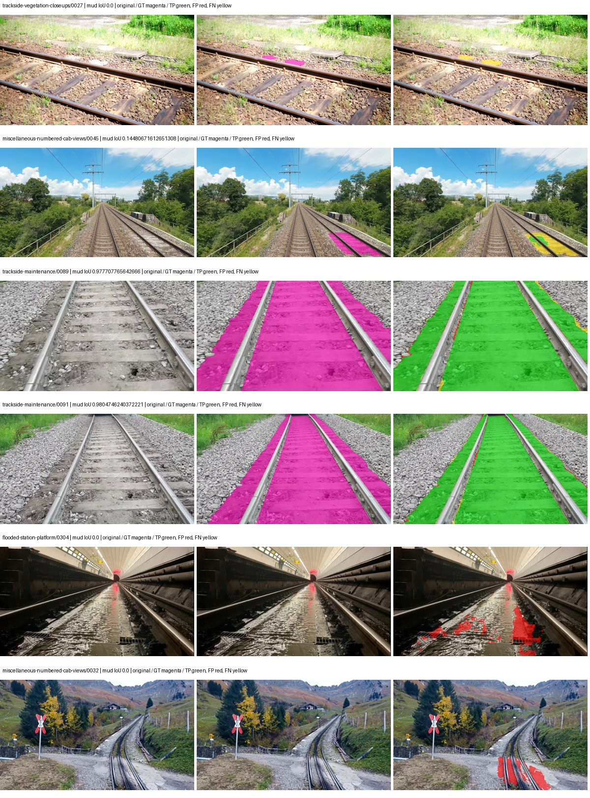
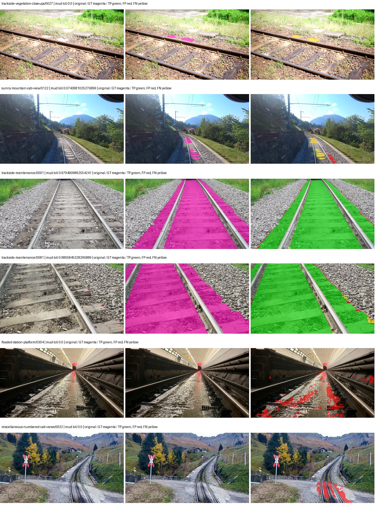
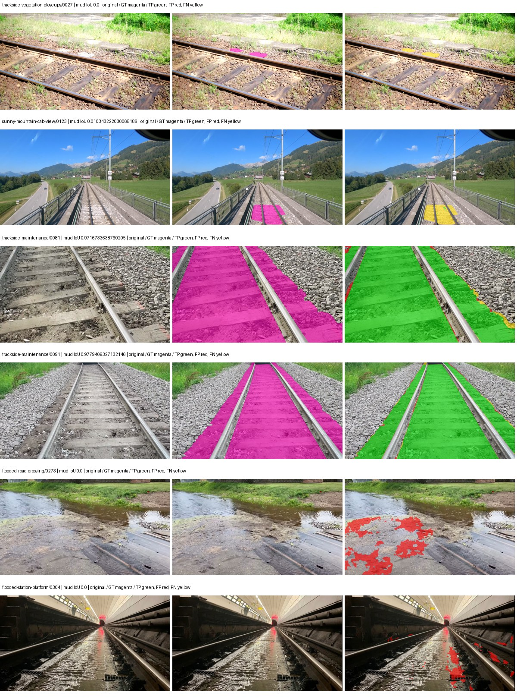
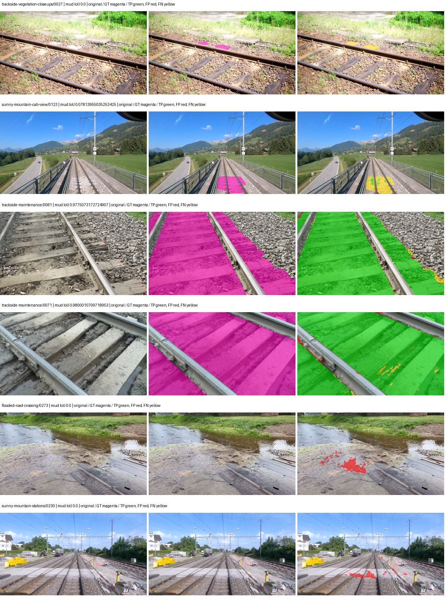

# upernet_convnext — rad_9_24_2026-paul

[RAD 9/24: Paul's split](../../README.md) · [Full model records](record.json)

Primary selection and early stopping: **mud-pumping validation IoU**. A job is complete only after full statistics and isolated profiling are verified.

| Model | Initialization path | Seed | Status | Steps | Best step | Mud IoU (%) | Mud precision (%) | Mud recall (%) | Final mud IoU (trainer val, %) | mIoU (%) | Fixed GT-class mIoU (%) |
| --- | --- | --- | --- | --- | --- | --- | --- | --- | --- | --- | --- |
| upernet_convnext | rtis_only | 0 | completed | 3185 | 1857 | 91.65 | 95.95 | 95.35 | 87.17 | 61.49 | 61.49 |
| upernet_convnext | cityscapes_to_rtis | 0 | completed | 4000 | 3981 | 89.16 | 93.30 | 95.27 | 88.59 | 62.64 | 62.64 |
| upernet_convnext | railsem19_to_rtis | 0 | completed | 2123 | 796 | 88.32 | 93.25 | 94.36 | 85.33 | 66.09 | 66.09 |
| upernet_convnext | cityscapes_to_railsem19_to_rtis | 0 | completed | 3451 | 2123 | 92.59 | 96.44 | 95.87 | 89.90 | 67.21 | 67.21 |

Training: 227 images. Validation: 37 images. Test: 50 held out. Seeds: [0]. Seed variation measures optimization variability, not independent-recording uncertainty. Historical source checkpoints stay fixed across adaptation seeds.

Training code: `d864b72bd90706260965bb1a48398d01167b6d5c`. Split SHA-256: `b16dbbc7c4aa0c5d6e0fb5a20a27b4f3f8a4f3ce535621ed7c9aeaa6e85adb77`.

## rtis_only — seed 0

Status: **completed**. Started: 2026-10-05T10:28:23.502601+00:00. Finished: 2026-10-05T11:44:25.957316+00:00.

Recipe pretrained initializer: `openmmlab/upernet-convnext-small`.

`rtis_only` uses the recipe initializer, which may include pretrained segmentation components. Transfer paths load the exact historical source checkpoint below and reset the classifier; they do not reset all query/decoder features.

Source checkpoint: `Recipe pretrained initialization`.

Config SHA-256: `abc986bbdd3a9b7828d45081eb5f6d8d6c4d08c050ca3abeb1666043168bb174`. Weights used for validation: `raw`.

### Mud-pumping and aggregate quality

| Metric | Selected checkpoint | Final training validation |
| --- | --- | --- |
| Mud IoU | 91.65 | 87.17 |
| Mud precision | 95.95 | 90.07 |
| Mud recall | 95.35 | 96.44 |
| Mud Dice/F1 | 95.65 | 93.15 |
| mIoU | 61.49 | 61.67 |
| Mean accuracy | 74.66 | 73.84 |
| Mean precision | 77.36 | 77.94 |
| Mean Dice | 73.85 | 74.15 |
| Mean specificity | 99.42 | 99.42 |
| Pixel accuracy | 89.39 | 89.43 |
| Frequency-weighted IoU | 82.14 | 81.86 |
| Fixed GT-present class mIoU | 61.49 | 61.67 |
| Boundary F1 | 68.55 | 68.92 |

The selected checkpoint has independent evaluation evidence. Final values are the trainer's final validation record, not a new independent evaluation. mIoU averages classes with nonzero union, so false positives on absent classes can change its denominator. The fixed GT-class mean is supplementary and excludes absent classes; their false positives remain in the confusion matrix.

### Resource usage and timing

| Measurement | Value |
| --- | --- |
| Peak training VRAM, retained training invocation (GiB) | 13.46 |
| Peak evaluation VRAM (GiB) | 8.01 |
| Retained training invocation wall time (seconds) | 4303.65 |
| Retained training invocation GPU-hours (one GPU) | 1.20 |
| Evaluation wall time (seconds) | 22.05 |
| Full evaluation pipeline images/second | 1.68 |
| Best full-state checkpoint (MiB) | 1234.99 |
| Final full-state checkpoint (MiB) | 1234.97 |
| Verified periodic checkpoints removed (GiB) | 7.24 |

VRAM uses the recorded allocator high-water mark; it is not total device usage including CUDA context. Resumed jobs' retained training invocation times and peaks are **not whole-campaign totals**. Earlier invocation resource records are not reconstructed here. Evaluation throughput includes loader, sliding-window inference and metrics; it is not model-only latency/FPS. Missing measurements are shown as —, never inferred from another dataset's run.

### Standardized inference performance

Dedicated model-only profiling waits for an idle worker-locked L40S: BF16, batch 1, 1024x1024, 20 warmup and 100 CUDA-event-timed public forwards. It excludes loading, preprocessing, tiling and metrics.

| Status | Parameters | Weight MiB | FPS | p50 ms | p95 ms | Peak reserved GiB |
| --- | --- | --- | --- | --- | --- | --- |
| complete | 80887221 | 308.56 | 42.55 | 23.49 | 23.65 | 2.48 |

```json
{
  "schema_version": 1,
  "model_id": "upernet_convnext",
  "measured_at": "2026-10-05T11:44:15+00:00",
  "status": "complete",
  "benchmark_scope": "rtis_selected_checkpoint_model_only",
  "applies_to": [
    "upernet_convnext--rtis_only--seed-0"
  ],
  "source": {
    "campaign_git_sha": "d864b72bd90706260965bb1a48398d01167b6d5c",
    "git_dirty": false,
    "config_hash": "61638a8b9538",
    "resolved_config": "/data/izadia1/projects/segmentary-runs/rad_9_24_2026/paul-seed0-20261005-r2/configs/upernet_convnext--rtis_only--seed-0.yaml",
    "config_sha256": "abc986bbdd3a9b7828d45081eb5f6d8d6c4d08c050ca3abeb1666043168bb174",
    "checkpoint_sha256": "e4c6d7e49f29e1ddaa6b0fbc4fab2ee8874da00b62798bcf66ad2b2bd32b8ed0",
    "checkpoint_global_step": 1857,
    "checkpoint_bytes": 1294981954,
    "checkpoint_kind": "resume checkpoint with optimizer and EMA state",
    "weights": "raw",
    "measured_checkpoint_job_id": "upernet_convnext--rtis_only--seed-0",
    "result_sha256": "33cc973daccbcb3e0f58e33f38f6f62ee4286281ac885edd99ae8ceca232a152",
    "result_git_sha": "d864b72bd90706260965bb1a48398d01167b6d5c",
    "result_stage": "eval:rad_9_24_2026-paul:val",
    "result_seed": 0
  },
  "hardware": {
    "gpu_name": "NVIDIA L40S",
    "gpu_uuid": "GPU-a5ad49e5-0536-5229-ba8a-f8a902808f53",
    "logical_device": "cuda:0",
    "physical_visibility_token": "7",
    "compute_capability": [
      8,
      9
    ],
    "total_memory_bytes": 47677177856
  },
  "model": {
    "parameter_count": 80887221,
    "trainable_parameter_count": 80887221,
    "resident_parameter_bytes": 323548884,
    "parameter_dtype_counts": {
      "float32": 80887221
    }
  },
  "contract": {
    "backend": "pytorch",
    "precision": "bf16_autocast",
    "batch_size": 1,
    "input_shape_nchw": [
      1,
      3,
      1024,
      1024
    ],
    "warmup_iterations": 20,
    "measured_iterations": 100,
    "timing": "per-forward CUDA events with end-event synchronization",
    "includes_preprocessing": false,
    "includes_data_loader": false,
    "includes_sliding_window": false,
    "input_resident_on_gpu": true,
    "model_only": true,
    "entrypoint": "public model(image) dense-logits forward"
  },
  "measurements": {
    "latency": {
      "p50_ms": 23.4900484085083,
      "p95_ms": 23.651531982421876,
      "mean_ms": 23.503883094787597,
      "minimum_ms": 23.416831970214844,
      "maximum_ms": 23.755775451660156,
      "fps": 42.546161243533746,
      "raw_ms": [
        23.547903060913086,
        23.49260711669922,
        23.47315216064453,
        23.563264846801758,
        23.49465560913086,
        23.517183303833008,
        23.47724723815918,
        23.450624465942383,
        23.51103973388672,
        23.47929573059082,
        23.47315216064453,
        23.46291160583496,
        23.655424118041992,
        23.548927307128906,
        23.416831970214844,
        23.447551727294922,
        23.49977684020996,
        23.51103973388672,
        23.45574378967285,
        23.48134422302246,
        23.45471954345703,
        23.422975540161133,
        23.51513671875,
        23.443456649780273,
        23.47417640686035,
        23.50284767150879,
        23.48236846923828,
        23.459840774536133,
        23.47724723815918,
        23.469087600708008,
        23.451648712158203,
        23.426048278808594,
        23.44246482849121,
        23.48646354675293,
        23.47212791442871,
        23.459840774536133,
        23.595008850097656,
        23.526399612426758,
        23.625728607177734,
        23.5284481048584,
        23.48953628540039,
        23.48646354675293,
        23.450624465942383,
        23.524351119995117,
        23.49875259399414,
        23.430143356323242,
        23.478271484375,
        23.44550323486328,
        23.47110366821289,
        23.46188735961914,
        23.524351119995117,
        23.48134422302246,
        23.450624465942383,
        23.532543182373047,
        23.45267105102539,
        23.714815139770508,
        23.49977684020996,
        23.451648712158203,
        23.536640167236328,
        23.48646354675293,
        23.46188735961914,
        23.47315216064453,
        23.534591674804688,
        23.49056053161621,
        23.755775451660156,
        23.599103927612305,
        23.52128028869629,
        23.50387191772461,
        23.65132713317871,
        23.468000411987305,
        23.49465560913086,
        23.478271484375,
        23.544832229614258,
        23.51103973388672,
        23.457792282104492,
        23.48543930053711,
        23.50284767150879,
        23.45574378967285,
        23.51923179626465,
        23.52947235107422,
        23.51103973388672,
        23.615488052368164,
        23.426048278808594,
        23.4967041015625,
        23.49363136291504,
        23.50079917907715,
        23.465984344482422,
        23.50489616394043,
        23.516159057617188,
        23.51103973388672,
        23.478271484375,
        23.468032836914062,
        23.588863372802734,
        23.696447372436523,
        23.536640167236328,
        23.69126319885254,
        23.49260711669922,
        23.49977684020996,
        23.46291160583496,
        23.449600219726562
      ],
      "percentile_method": "numpy linear interpolation"
    },
    "peak_reserved_bytes": 2663383040,
    "memory_kind": "pytorch_cuda_allocator_peak_reserved_excluding_context",
    "benchmark_wall_clock_s": 9.850162230432034
  },
  "started_at": "2026-10-05T11:44:06+00:00",
  "finished_at": "2026-10-05T11:44:15+00:00",
  "environment": {
    "hostname": "hdrfs-app-001",
    "python": "3.11.15",
    "platform": "Linux-5.15.0-139-generic-x86_64-with-glibc2.35",
    "torch": "2.11.0+cu128",
    "torch_cuda": "12.8",
    "cudnn": 91900,
    "driver_version": "570.133.20",
    "cuda_available": true,
    "gpu_count": 1,
    "gpu_names": [
      "NVIDIA L40S"
    ],
    "cuda_visible_devices": "7",
    "packages": {
      "segmentary": "0.1.0",
      "torch": "2.11.0+cu128",
      "torchvision": "0.26.0+cu128",
      "transformers": "5.15.0",
      "timm": "1.0.28",
      "segmentation-models-pytorch": "0.5.0",
      "albumentations": "2.0.8",
      "lightning": "2.6.5",
      "numpy": "2.4.4"
    }
  }
}
```

### Per-class validation results

| Class | GT pixels | IoU (%) | Precision (%) | Recall (%) | Dice (%) | Boundary F1 (%) |
| --- | --- | --- | --- | --- | --- | --- |
| car | 75932 | 43.46 | 47.12 | 84.82 | 60.58 | 77.41 |
| construction | 5694760 | 51.21 | 63.32 | 72.80 | 67.73 | 68.45 |
| fence | 3789415 | 38.81 | 91.25 | 40.31 | 55.92 | 63.33 |
| mud-pumping | 7435760 | 91.65 | 95.95 | 95.35 | 95.65 | 70.71 |
| on-rails | 1137952 | 70.23 | 77.26 | 88.52 | 82.51 | 49.78 |
| person | 130659 | 79.63 | 89.49 | 87.85 | 88.66 | 82.55 |
| pole | 1467743 | 65.29 | 81.64 | 76.53 | 79.00 | 88.19 |
| rail-embedded | 74744 | 46.13 | 64.21 | 62.10 | 63.14 | 64.04 |
| rail-raised | 3588713 | 79.80 | 86.52 | 91.14 | 88.77 | 91.69 |
| rail-track | 4270276 | 74.57 | 88.16 | 82.87 | 85.43 | 83.56 |
| road | 1152119 | 50.38 | 74.17 | 61.09 | 67.00 | 59.06 |
| sidewalk | 2164731 | 69.10 | 86.18 | 77.70 | 81.72 | 72.37 |
| sky | 20207617 | 98.09 | 99.15 | 98.92 | 99.04 | 95.45 |
| standing-water | 2006046 | 77.29 | 86.71 | 87.68 | 87.19 | 27.60 |
| terrain | 30442090 | 88.81 | 93.47 | 94.68 | 94.08 | 84.95 |
| trackbed | 9118591 | 80.33 | 86.88 | 91.42 | 89.09 | 81.70 |
| traffic-light | 116825 | 42.46 | 64.92 | 55.11 | 59.61 | 58.82 |
| traffic-sign | 35778 | 39.63 | 55.76 | 57.80 | 56.77 | 62.21 |
| tram-track | 244726 | 40.88 | 56.65 | 59.48 | 58.03 | 47.92 |
| truck | 190997 | 14.24 | 82.49 | 14.68 | 24.93 | 40.53 |
| vegetation-overgrowth | 1534858 | 49.28 | 53.22 | 86.96 | 66.03 | 69.29 |

### Full-run accounting

| Measurement | Value |
| --- | --- |
| Full GPU-reserved wall seconds, all recorded worker attempts | 4569.97 |
| Full reserved GPU-hours | 1.27 |
| Whole-run timing complete | True |

| Phase | Wall seconds including failed attempts |
| --- | --- |
| training | 4310.89 |
| diagnostics | 191.91 |
| performance | 19.15 |

GPU-reserved time includes model loading, training, validation, collection, profiling, checkpoint I/O and orchestration while the worker owns one GPU. It is not GPU kernel-active time. Phase timings and sampled device memory/power/utilization are retained separately; sampled device memory is not the allocator high-water mark.

### Train/validation and raw/EMA diagnostics

| Checkpoint / weights / split | Images | Mud IoU (%) | Mud precision (%) | Mud recall (%) |
| --- | --- | --- | --- | --- |
| best-auto-train / raw | 227 | 96.33 | 97.73 | 98.54 |
| best-auto-val / raw | 37 | 91.65 | 95.95 | 95.35 |
| best-alternate-val / ema | 37 | 91.18 | 95.96 | 94.82 |
| final-auto-val / raw | 37 | 87.17 | 90.06 | 96.45 |

Train uses the evaluation transform without augmentation. Compare mud train/validation metrics for the same selected weights. Alternate EMA on running-stat BatchNorm is explicitly uncalibrated and is diagnostic only. Score-threshold curves use uncalibrated normalized scores and are pixel-level diagnostics, not event detection rates or a selected deployment operating point.

### Downloadable evidence

- best-auto-train: [per-image.csv](rtis_only--seed-0/best-auto-train/per-image.csv) · [per-image-confusion.json.gz](rtis_only--seed-0/best-auto-train/per-image-confusion.json.gz) · [groups.json](rtis_only--seed-0/best-auto-train/groups.json) · [mud-score-curves.json](rtis_only--seed-0/best-auto-train/mud-score-curves.json)
- best-auto-val: [per-image.csv](rtis_only--seed-0/best-auto-val/per-image.csv) · [per-image-confusion.json.gz](rtis_only--seed-0/best-auto-val/per-image-confusion.json.gz) · [groups.json](rtis_only--seed-0/best-auto-val/groups.json) · [mud-score-curves.json](rtis_only--seed-0/best-auto-val/mud-score-curves.json) · [examples.jpg](rtis_only--seed-0/best-auto-val/examples.jpg)
- best-alternate-val: [per-image.csv](rtis_only--seed-0/best-alternate-val/per-image.csv) · [per-image-confusion.json.gz](rtis_only--seed-0/best-alternate-val/per-image-confusion.json.gz) · [groups.json](rtis_only--seed-0/best-alternate-val/groups.json) · [mud-score-curves.json](rtis_only--seed-0/best-alternate-val/mud-score-curves.json)
- final-auto-val: [per-image.csv](rtis_only--seed-0/final-auto-val/per-image.csv) · [per-image-confusion.json.gz](rtis_only--seed-0/final-auto-val/per-image-confusion.json.gz) · [groups.json](rtis_only--seed-0/final-auto-val/groups.json) · [mud-score-curves.json](rtis_only--seed-0/final-auto-val/mud-score-curves.json)
- resources: [telemetry.csv](rtis_only--seed-0/resources/telemetry.csv)



Examples are two lowest and two highest mud-IoU positive images, plus up to two negative images with the most false-positive mud pixels. They are targeted diagnostic examples, not random samples. Green: true positive; red: false positive; yellow: false negative. Full predictions remain on HDRFS.

### Validation tracking

| Logged step | Overall mIoU (%) | Mud IoU (%) |
| --- | --- | --- |
| 264 | 50.50 | 82.70 |
| 530 | 58.38 | 87.84 |
| 796 | 59.71 | 91.28 |
| 1061 | 58.77 | 87.58 |
| 1326 | 60.42 | 91.19 |
| 1592 | 61.20 | 83.64 |
| 1857 | 61.49 | 91.66 |
| 2123 | 63.17 | 90.50 |
| 2389 | 63.21 | 87.87 |
| 2653 | 63.10 | 91.26 |
| 2919 | 61.99 | 88.29 |
| 3185 | 61.67 | 87.17 |

All retained scalar curves, including training loss and per-class IoU, are in record.json. Observed best mud on a curve is not necessarily a retained checkpoint: the pilot saved its selection-metric-best and final checkpoints. Step logging and checkpoint global_step may differ by one.

### Stopping and checkpoint provenance

```json
{
  "stopping": {
    "actual_steps": 3185,
    "maximum_steps": 4000,
    "min_delta": 0.001,
    "monitor": "val_iou/mud-pumping",
    "patience": 5,
    "reason": "validation_plateau"
  },
  "checkpoints": {
    "best": {
      "path": "/data/izadia1/projects/segmentary-runs/rad_9_24_2026/paul-seed0-20261005-r2/future-runs/upernet_convnext--rtis_only--seed-0_seed0/rtis/best.ckpt",
      "sha256": "e4c6d7e49f29e1ddaa6b0fbc4fab2ee8874da00b62798bcf66ad2b2bd32b8ed0",
      "global_step": 1857,
      "bytes": 1294981954
    },
    "final": {
      "path": "/data/izadia1/projects/segmentary-runs/rad_9_24_2026/paul-seed0-20261005-r2/future-runs/upernet_convnext--rtis_only--seed-0_seed0/rtis/last.ckpt",
      "sha256": "21acc38b53a684d4dacf8ccc9c1b39426a501e4048ee765827ff3eeb35e669b5",
      "global_step": 3185,
      "bytes": 1294962946
    }
  },
  "cleanup_error": null
}
```

### Resolved training, initialization and evaluation settings

The optimizer block is the base configuration. Stage LR scales are applied at runtime, and stage warmup is capped at min(base warmup, floor(stage budget / 10), stage budget - 1): 400 steps for this 4,000-step pilot. Model-internal native input grids may differ from augmentation crops (EoMT uses its 640 grid).

```json
{
  "name": "upernet_convnext--rtis_only--seed-0",
  "model": {
    "arch": "upernet_convnext",
    "checkpoint": "openmmlab/upernet-convnext-small",
    "tuning": "full",
    "head": "unified_head",
    "lora_r": 16,
    "lora_alpha": 32,
    "lora_dropout": 0.05,
    "lora_targets": [],
    "drop_path": null,
    "revision": null,
    "subfolder": null,
    "local_files_only": false,
    "trust_remote_code": false,
    "backbone_path": null,
    "head_paths": [],
    "classifier_path": null,
    "inactive_parameter_paths": [],
    "smp_arch": null,
    "encoder_name": null,
    "encoder_weights": null,
    "native": null,
    "batch_norm_momentum": null
  },
  "space": "paul-test-rtis",
  "taxonomy_root": "/data/izadia1/projects/segmentary-rad-d864b72b/taxonomy",
  "output_root": "/data/izadia1/projects/segmentary-runs/rad_9_24_2026/paul-seed0-20261005-r2/future-runs",
  "optim": {
    "backbone_lr": 6e-05,
    "head_lr_mult": 10.0,
    "weight_decay": 0.05,
    "llrd": 1.0,
    "warmup_iters": 1500,
    "warmup_ratio": 1e-06,
    "poly_power": 0.9,
    "min_lr_ratio": 0.0,
    "betas": [
      0.9,
      0.999
    ],
    "grad_clip": 1.0
  },
  "train": {
    "iters": 4000,
    "batch_size": 2,
    "accum": 8,
    "num_workers": 2,
    "precision": "bf16-mixed",
    "ema_decay": 0.9998,
    "val_every": 250,
    "ckpt_every": 500,
    "selection_metric": "val_iou/mud-pumping",
    "early_stopping_patience": 5,
    "early_stopping_min_delta": 0.001,
    "seed": 0,
    "devices": 1
  },
  "eval": {
    "sliding_window": true,
    "window": [
      1024,
      1024
    ],
    "stride": [
      768,
      768
    ],
    "batch_size": 1,
    "num_workers": 2,
    "tta_scales": [],
    "tta_flip": false,
    "threshold": 0.5,
    "boundary_tolerance_frac": 0.0075,
    "save_confusion": true
  },
  "loss": {
    "task": "multiclass",
    "activation": "auto",
    "terms": [],
    "aux": "none",
    "aux_weight": 0.0,
    "ce_weight": 1.0,
    "label_smoothing": 0.0,
    "class_weights": null,
    "query": null
  },
  "aug": {
    "crop": [
      1024,
      1024
    ],
    "scale_min": 0.5,
    "scale_max": 2.0,
    "hflip_p": 0.5,
    "color_jitter_p": 0.5,
    "brightness": 0.25,
    "contrast": 0.25,
    "saturation": 0.25,
    "hue": 0.05
  },
  "stages": [
    {
      "name": "rtis",
      "data": [
        {
          "name": "rad_9_24_2026-paul",
          "root": "/data/izadia1/datasets/rad_9_24_2026-paul",
          "variant": null,
          "split_file": "splits.json",
          "train_split": "train",
          "val_split": "val",
          "limit": null,
          "loader": "folder",
          "mapping": "paul-test-rtis",
          "loader_options": {
            "require_groups": false
          }
        }
      ],
      "iters": null,
      "lr_scale": 1.0,
      "head_group_lr_scale": 1.0,
      "init_from": "pretrained",
      "reset_head": false,
      "freeze": null,
      "sample_weights": null
    }
  ]
}
```

### Hardware and software provenance

```json
{
  "training": {
    "cuda_available": true,
    "cuda_visible_devices": "7",
    "cudnn": 91900,
    "driver_version": "570.133.20",
    "gpu_count": 1,
    "gpu_names": [
      "NVIDIA L40S"
    ],
    "hostname": "hdrfs-app-001",
    "input_normalization": {
      "channel_order": "rgb",
      "mean": [
        0.485,
        0.456,
        0.406
      ],
      "source": "imagenet",
      "std": [
        0.229,
        0.224,
        0.225
      ]
    },
    "model_origins": [
      {
        "hf_commit": "550b68d291f9a7e4874065c6eec0676b2ba821e6",
        "hf_name_or_path": "openmmlab/upernet-convnext-small",
        "module": "model",
        "timm_pretrained": {}
      },
      {
        "hf_commit": null,
        "hf_name_or_path": "",
        "module": "model.backbone",
        "timm_pretrained": {}
      },
      {
        "hf_commit": null,
        "hf_name_or_path": "",
        "module": "model.backbone.encoder",
        "timm_pretrained": {}
      },
      {
        "hf_commit": "550b68d291f9a7e4874065c6eec0676b2ba821e6",
        "hf_name_or_path": "openmmlab/upernet-convnext-small",
        "module": "model.decode_head",
        "timm_pretrained": {}
      }
    ],
    "model_parameter_count": 80887221,
    "packages": {
      "albumentations": "2.0.8",
      "lightning": "2.6.5",
      "numpy": "2.4.4",
      "segmentary": "0.1.0",
      "segmentation-models-pytorch": "0.5.0",
      "timm": "1.0.28",
      "torch": "2.11.0+cu128",
      "torchvision": "0.26.0+cu128",
      "transformers": "5.15.0"
    },
    "platform": "Linux-5.15.0-139-generic-x86_64-with-glibc2.35",
    "python": "3.11.15",
    "torch": "2.11.0+cu128",
    "torch_cuda": "12.8",
    "trainable_parameter_count": 80887221,
    "training_stop": {
      "actual_steps": 3185,
      "maximum_steps": 4000,
      "min_delta": 0.001,
      "monitor": "val_iou/mud-pumping",
      "patience": 5,
      "reason": "validation_plateau"
    },
    "validation_weights": "raw"
  },
  "evaluation": {
    "cuda_available": true,
    "cuda_visible_devices": "7",
    "cudnn": 91900,
    "driver_version": "570.133.20",
    "gpu_count": 1,
    "gpu_names": [
      "NVIDIA L40S"
    ],
    "hostname": "hdrfs-app-001",
    "input_normalization": {
      "channel_order": "rgb",
      "mean": [
        0.485,
        0.456,
        0.406
      ],
      "source": "imagenet",
      "std": [
        0.229,
        0.224,
        0.225
      ]
    },
    "packages": {
      "albumentations": "2.0.8",
      "lightning": "2.6.5",
      "numpy": "2.4.4",
      "segmentary": "0.1.0",
      "segmentation-models-pytorch": "0.5.0",
      "timm": "1.0.28",
      "torch": "2.11.0+cu128",
      "torchvision": "0.26.0+cu128",
      "transformers": "5.15.0"
    },
    "platform": "Linux-5.15.0-139-generic-x86_64-with-glibc2.35",
    "python": "3.11.15",
    "torch": "2.11.0+cu128",
    "torch_cuda": "12.8"
  }
}
```

## cityscapes_to_rtis — seed 0

Status: **completed**. Started: 2026-10-05T10:28:24.984956+00:00. Finished: 2026-10-05T12:02:37.575944+00:00.

Recipe pretrained initializer: `openmmlab/upernet-convnext-small`.

`rtis_only` uses the recipe initializer, which may include pretrained segmentation components. Transfer paths load the exact historical source checkpoint below and reset the classifier; they do not reset all query/decoder features.

Source checkpoint: `{'name': 'upernet_convnext--cityscapes--seed-0', 'model': 'upernet_convnext', 'protocol': 'cityscapes', 'config': '/data/izadia1/projects/segmentary-runs/all-model-city-rail-seed0-rail20-b9eb3e1/accepted/upernet_convnext--cityscapes--seed-0/resolved-config.yaml', 'checkpoint': '/data/izadia1/projects/segmentary-runs/all-model-city-rail-seed0-a7c0b67/jobs/upernet_convnext--cityscapes--seed-0/attempt-001/train/upernet_convnext--cityscapes_seed0/cityscapes/last.ckpt', 'recorded_sha256': 'fb45ace4437433d1713d6afef5ee260284b053b7301e6be003f89249012dc698', 'exists': True}`.

Config SHA-256: `48c84750d255f6a8e3abd452163bbc3495472b5747c0cd99cf8ce9692728dc95`. Weights used for validation: `raw`.

### Mud-pumping and aggregate quality

| Metric | Selected checkpoint | Final training validation |
| --- | --- | --- |
| Mud IoU | 89.16 | 88.59 |
| Mud precision | 93.30 | 91.88 |
| Mud recall | 95.27 | 96.11 |
| Mud Dice/F1 | 94.27 | 93.95 |
| mIoU | 62.64 | 62.70 |
| Mean accuracy | 74.91 | 75.20 |
| Mean precision | 77.38 | 77.29 |
| Mean Dice | 75.34 | 75.39 |
| Mean specificity | 99.40 | 99.40 |
| Pixel accuracy | 89.11 | 89.16 |
| Frequency-weighted IoU | 81.44 | 81.46 |
| Fixed GT-present class mIoU | 62.64 | 62.70 |
| Boundary F1 | 66.98 | 67.12 |

The selected checkpoint has independent evaluation evidence. Final values are the trainer's final validation record, not a new independent evaluation. mIoU averages classes with nonzero union, so false positives on absent classes can change its denominator. The fixed GT-class mean is supplementary and excludes absent classes; their false positives remain in the confusion matrix.

### Resource usage and timing

| Measurement | Value |
| --- | --- |
| Peak training VRAM, retained training invocation (GiB) | 13.46 |
| Peak evaluation VRAM (GiB) | 8.01 |
| Retained training invocation wall time (seconds) | 5391.07 |
| Retained training invocation GPU-hours (one GPU) | 1.50 |
| Evaluation wall time (seconds) | 22.36 |
| Full evaluation pipeline images/second | 1.65 |
| Best full-state checkpoint (MiB) | 1234.99 |
| Final full-state checkpoint (MiB) | 1234.97 |
| Verified periodic checkpoints removed (GiB) | 9.65 |

VRAM uses the recorded allocator high-water mark; it is not total device usage including CUDA context. Resumed jobs' retained training invocation times and peaks are **not whole-campaign totals**. Earlier invocation resource records are not reconstructed here. Evaluation throughput includes loader, sliding-window inference and metrics; it is not model-only latency/FPS. Missing measurements are shown as —, never inferred from another dataset's run.

### Standardized inference performance

Dedicated model-only profiling waits for an idle worker-locked L40S: BF16, batch 1, 1024x1024, 20 warmup and 100 CUDA-event-timed public forwards. It excludes loading, preprocessing, tiling and metrics.

| Status | Parameters | Weight MiB | FPS | p50 ms | p95 ms | Peak reserved GiB |
| --- | --- | --- | --- | --- | --- | --- |
| complete | 80887221 | 308.56 | 42.43 | 23.56 | 23.68 | 2.48 |

```json
{
  "schema_version": 1,
  "model_id": "upernet_convnext",
  "measured_at": "2026-10-05T12:02:25+00:00",
  "status": "complete",
  "benchmark_scope": "rtis_selected_checkpoint_model_only",
  "applies_to": [
    "upernet_convnext--cityscapes_to_rtis--seed-0"
  ],
  "source": {
    "campaign_git_sha": "d864b72bd90706260965bb1a48398d01167b6d5c",
    "git_dirty": false,
    "config_hash": "48f886f19887",
    "resolved_config": "/data/izadia1/projects/segmentary-runs/rad_9_24_2026/paul-seed0-20261005-r2/configs/upernet_convnext--cityscapes_to_rtis--seed-0.yaml",
    "config_sha256": "48c84750d255f6a8e3abd452163bbc3495472b5747c0cd99cf8ce9692728dc95",
    "checkpoint_sha256": "cfb08a1452694ce776281ca4e01dabca526fd9bd44d444e2a5dd0e14d4f58599",
    "checkpoint_global_step": 3981,
    "checkpoint_bytes": 1294982018,
    "checkpoint_kind": "resume checkpoint with optimizer and EMA state",
    "weights": "raw",
    "measured_checkpoint_job_id": "upernet_convnext--cityscapes_to_rtis--seed-0",
    "result_sha256": "9ef95cd88f32a5665869c64109a0aabdf550f89a0abc0e0e1b254443a15157f3",
    "result_git_sha": "d864b72bd90706260965bb1a48398d01167b6d5c",
    "result_stage": "eval:rad_9_24_2026-paul:val",
    "result_seed": 0
  },
  "hardware": {
    "gpu_name": "NVIDIA L40S",
    "gpu_uuid": "GPU-c76642eb-64c1-b0ac-b051-d2efd47b32c4",
    "logical_device": "cuda:0",
    "physical_visibility_token": "9",
    "compute_capability": [
      8,
      9
    ],
    "total_memory_bytes": 47677177856
  },
  "model": {
    "parameter_count": 80887221,
    "trainable_parameter_count": 80887221,
    "resident_parameter_bytes": 323548884,
    "parameter_dtype_counts": {
      "float32": 80887221
    }
  },
  "contract": {
    "backend": "pytorch",
    "precision": "bf16_autocast",
    "batch_size": 1,
    "input_shape_nchw": [
      1,
      3,
      1024,
      1024
    ],
    "warmup_iterations": 20,
    "measured_iterations": 100,
    "timing": "per-forward CUDA events with end-event synchronization",
    "includes_preprocessing": false,
    "includes_data_loader": false,
    "includes_sliding_window": false,
    "input_resident_on_gpu": true,
    "model_only": true,
    "entrypoint": "public model(image) dense-logits forward"
  },
  "measurements": {
    "latency": {
      "p50_ms": 23.56376075744629,
      "p95_ms": 23.677183628082275,
      "mean_ms": 23.56759292602539,
      "minimum_ms": 23.4465274810791,
      "maximum_ms": 23.739391326904297,
      "fps": 42.431147005077165,
      "raw_ms": [
        23.602176666259766,
        23.532543182373047,
        23.478271484375,
        23.457792282104492,
        23.50182342529297,
        23.672832489013672,
        23.50182342529297,
        23.4967041015625,
        23.49567985534668,
        23.589887619018555,
        23.582719802856445,
        23.67692756652832,
        23.591936111450195,
        23.583744049072266,
        23.618560791015625,
        23.592960357666016,
        23.53971290588379,
        23.586816787719727,
        23.647232055664062,
        23.48543930053711,
        23.71891212463379,
        23.524288177490234,
        23.69843292236328,
        23.575551986694336,
        23.50796890258789,
        23.49977684020996,
        23.629823684692383,
        23.589887619018555,
        23.67078399658203,
        23.535615921020508,
        23.621631622314453,
        23.555072784423828,
        23.542783737182617,
        23.54172706604004,
        23.49056053161621,
        23.673856735229492,
        23.48031997680664,
        23.596031188964844,
        23.682048797607422,
        23.52025604248047,
        23.591936111450195,
        23.517183303833008,
        23.557119369506836,
        23.739391326904297,
        23.525375366210938,
        23.51308822631836,
        23.543807983398438,
        23.577600479125977,
        23.525375366210938,
        23.553024291992188,
        23.587839126586914,
        23.572479248046875,
        23.65132713317871,
        23.65545654296875,
        23.526399612426758,
        23.532512664794922,
        23.49977684020996,
        23.48543930053711,
        23.483327865600586,
        23.601152420043945,
        23.564287185668945,
        23.53049659729004,
        23.565311431884766,
        23.640064239501953,
        23.565311431884766,
        23.553024291992188,
        23.534591674804688,
        23.53766441345215,
        23.642112731933594,
        23.656448364257812,
        23.533567428588867,
        23.582719802856445,
        23.50387191772461,
        23.48236846923828,
        23.4465274810791,
        23.48543930053711,
        23.617536544799805,
        23.51308822631836,
        23.559167861938477,
        23.650304794311523,
        23.47212791442871,
        23.567359924316406,
        23.56425666809082,
        23.604223251342773,
        23.563264846801758,
        23.66975975036621,
        23.508991241455078,
        23.581695556640625,
        23.655424118041992,
        23.7076473236084,
        23.596031188964844,
        23.53049659729004,
        23.575551986694336,
        23.606271743774414,
        23.550975799560547,
        23.508991241455078,
        23.518207550048828,
        23.501760482788086,
        23.597055435180664,
        23.584768295288086
      ],
      "percentile_method": "numpy linear interpolation"
    },
    "peak_reserved_bytes": 2663383040,
    "memory_kind": "pytorch_cuda_allocator_peak_reserved_excluding_context",
    "benchmark_wall_clock_s": 9.750949501991272
  },
  "started_at": "2026-10-05T12:02:15+00:00",
  "finished_at": "2026-10-05T12:02:25+00:00",
  "environment": {
    "hostname": "hdrfs-app-001",
    "python": "3.11.15",
    "platform": "Linux-5.15.0-139-generic-x86_64-with-glibc2.35",
    "torch": "2.11.0+cu128",
    "torch_cuda": "12.8",
    "cudnn": 91900,
    "driver_version": "570.133.20",
    "cuda_available": true,
    "gpu_count": 1,
    "gpu_names": [
      "NVIDIA L40S"
    ],
    "cuda_visible_devices": "9",
    "packages": {
      "segmentary": "0.1.0",
      "torch": "2.11.0+cu128",
      "torchvision": "0.26.0+cu128",
      "transformers": "5.15.0",
      "timm": "1.0.28",
      "segmentation-models-pytorch": "0.5.0",
      "albumentations": "2.0.8",
      "lightning": "2.6.5",
      "numpy": "2.4.4"
    }
  }
}
```

### Per-class validation results

| Class | GT pixels | IoU (%) | Precision (%) | Recall (%) | Dice (%) | Boundary F1 (%) |
| --- | --- | --- | --- | --- | --- | --- |
| car | 75932 | 44.38 | 48.99 | 82.49 | 61.47 | 68.85 |
| construction | 5694760 | 50.72 | 67.21 | 67.40 | 67.31 | 59.80 |
| fence | 3789415 | 47.88 | 89.64 | 50.68 | 64.76 | 60.41 |
| mud-pumping | 7435760 | 89.16 | 93.30 | 95.27 | 94.27 | 55.88 |
| on-rails | 1137952 | 86.58 | 91.88 | 93.75 | 92.81 | 60.94 |
| person | 130659 | 81.29 | 86.14 | 93.52 | 89.68 | 81.00 |
| pole | 1467743 | 66.62 | 77.51 | 82.59 | 79.97 | 87.65 |
| rail-embedded | 74744 | 38.19 | 65.78 | 47.66 | 55.27 | 66.39 |
| rail-raised | 3588713 | 80.86 | 89.22 | 89.62 | 89.42 | 90.39 |
| rail-track | 4270276 | 72.63 | 84.04 | 84.25 | 84.15 | 78.70 |
| road | 1152119 | 39.77 | 58.39 | 55.50 | 56.91 | 51.13 |
| sidewalk | 2164731 | 62.46 | 78.30 | 75.54 | 76.89 | 67.63 |
| sky | 20207617 | 97.69 | 99.05 | 98.61 | 98.83 | 94.27 |
| standing-water | 2006046 | 64.12 | 85.86 | 71.69 | 78.14 | 22.36 |
| terrain | 30442090 | 87.99 | 91.89 | 95.40 | 93.61 | 81.42 |
| trackbed | 9118591 | 77.93 | 84.29 | 91.16 | 87.59 | 77.31 |
| traffic-light | 116825 | 43.70 | 76.39 | 50.52 | 60.82 | 67.80 |
| traffic-sign | 35778 | 41.99 | 53.21 | 66.56 | 59.14 | 62.35 |
| tram-track | 244726 | 35.77 | 56.83 | 49.12 | 52.69 | 44.77 |
| truck | 190997 | 52.60 | 78.43 | 61.50 | 68.94 | 52.91 |
| vegetation-overgrowth | 1534858 | 53.14 | 68.55 | 70.27 | 69.40 | 74.53 |

### Full-run accounting

| Measurement | Value |
| --- | --- |
| Full GPU-reserved wall seconds, all recorded worker attempts | 5660.84 |
| Full reserved GPU-hours | 1.57 |
| Whole-run timing complete | True |

| Phase | Wall seconds including failed attempts |
| --- | --- |
| training | 5398.84 |
| diagnostics | 191.80 |
| performance | 19.00 |

GPU-reserved time includes model loading, training, validation, collection, profiling, checkpoint I/O and orchestration while the worker owns one GPU. It is not GPU kernel-active time. Phase timings and sampled device memory/power/utilization are retained separately; sampled device memory is not the allocator high-water mark.

### Train/validation and raw/EMA diagnostics

| Checkpoint / weights / split | Images | Mud IoU (%) | Mud precision (%) | Mud recall (%) |
| --- | --- | --- | --- | --- |
| best-auto-train / raw | 227 | 96.66 | 97.76 | 98.85 |
| best-auto-val / raw | 37 | 89.16 | 93.30 | 95.27 |
| best-alternate-val / ema | 37 | 89.21 | 92.71 | 95.95 |
| final-auto-val / raw | 37 | 88.58 | 91.87 | 96.12 |

Train uses the evaluation transform without augmentation. Compare mud train/validation metrics for the same selected weights. Alternate EMA on running-stat BatchNorm is explicitly uncalibrated and is diagnostic only. Score-threshold curves use uncalibrated normalized scores and are pixel-level diagnostics, not event detection rates or a selected deployment operating point.

### Downloadable evidence

- best-auto-train: [per-image.csv](cityscapes_to_rtis--seed-0/best-auto-train/per-image.csv) · [per-image-confusion.json.gz](cityscapes_to_rtis--seed-0/best-auto-train/per-image-confusion.json.gz) · [groups.json](cityscapes_to_rtis--seed-0/best-auto-train/groups.json) · [mud-score-curves.json](cityscapes_to_rtis--seed-0/best-auto-train/mud-score-curves.json)
- best-auto-val: [per-image.csv](cityscapes_to_rtis--seed-0/best-auto-val/per-image.csv) · [per-image-confusion.json.gz](cityscapes_to_rtis--seed-0/best-auto-val/per-image-confusion.json.gz) · [groups.json](cityscapes_to_rtis--seed-0/best-auto-val/groups.json) · [mud-score-curves.json](cityscapes_to_rtis--seed-0/best-auto-val/mud-score-curves.json) · [examples.jpg](cityscapes_to_rtis--seed-0/best-auto-val/examples.jpg)
- best-alternate-val: [per-image.csv](cityscapes_to_rtis--seed-0/best-alternate-val/per-image.csv) · [per-image-confusion.json.gz](cityscapes_to_rtis--seed-0/best-alternate-val/per-image-confusion.json.gz) · [groups.json](cityscapes_to_rtis--seed-0/best-alternate-val/groups.json) · [mud-score-curves.json](cityscapes_to_rtis--seed-0/best-alternate-val/mud-score-curves.json)
- final-auto-val: [per-image.csv](cityscapes_to_rtis--seed-0/final-auto-val/per-image.csv) · [per-image-confusion.json.gz](cityscapes_to_rtis--seed-0/final-auto-val/per-image-confusion.json.gz) · [groups.json](cityscapes_to_rtis--seed-0/final-auto-val/groups.json) · [mud-score-curves.json](cityscapes_to_rtis--seed-0/final-auto-val/mud-score-curves.json)
- resources: [telemetry.csv](cityscapes_to_rtis--seed-0/resources/telemetry.csv)



Examples are two lowest and two highest mud-IoU positive images, plus up to two negative images with the most false-positive mud pixels. They are targeted diagnostic examples, not random samples. Green: true positive; red: false positive; yellow: false negative. Full predictions remain on HDRFS.

### Validation tracking

| Logged step | Overall mIoU (%) | Mud IoU (%) |
| --- | --- | --- |
| 264 | 41.84 | 66.96 |
| 530 | 57.19 | 84.11 |
| 796 | 61.68 | 83.61 |
| 1061 | 61.03 | 86.94 |
| 1326 | 60.29 | 84.91 |
| 1592 | 62.49 | 83.65 |
| 1857 | 63.34 | 87.48 |
| 2123 | 61.86 | 88.57 |
| 2389 | 63.08 | 86.87 |
| 2653 | 63.30 | 87.02 |
| 2919 | 62.80 | 88.84 |
| 3185 | 62.07 | 88.50 |
| 3451 | 62.74 | 87.93 |
| 3716 | 62.63 | 88.57 |
| 3981 | 62.64 | 89.17 |
| 4000 | 62.70 | 88.59 |

All retained scalar curves, including training loss and per-class IoU, are in record.json. Observed best mud on a curve is not necessarily a retained checkpoint: the pilot saved its selection-metric-best and final checkpoints. Step logging and checkpoint global_step may differ by one.

### Stopping and checkpoint provenance

```json
{
  "stopping": {
    "actual_steps": 4000,
    "maximum_steps": 4000,
    "min_delta": 0.001,
    "monitor": "val_iou/mud-pumping",
    "patience": 5,
    "reason": "budget_complete"
  },
  "checkpoints": {
    "best": {
      "path": "/data/izadia1/projects/segmentary-runs/rad_9_24_2026/paul-seed0-20261005-r2/future-runs/upernet_convnext--cityscapes_to_rtis--seed-0_seed0/rtis/best.ckpt",
      "sha256": "cfb08a1452694ce776281ca4e01dabca526fd9bd44d444e2a5dd0e14d4f58599",
      "global_step": 3981,
      "bytes": 1294982018
    },
    "final": {
      "path": "/data/izadia1/projects/segmentary-runs/rad_9_24_2026/paul-seed0-20261005-r2/future-runs/upernet_convnext--cityscapes_to_rtis--seed-0_seed0/rtis/last.ckpt",
      "sha256": "e674b3c43092bceb8b49f2c2812a3ce1d4dc6853df4ad498a6b1c34fee38e8b7",
      "global_step": 4000,
      "bytes": 1294962882
    }
  },
  "cleanup_error": null
}
```

### Resolved training, initialization and evaluation settings

The optimizer block is the base configuration. Stage LR scales are applied at runtime, and stage warmup is capped at min(base warmup, floor(stage budget / 10), stage budget - 1): 400 steps for this 4,000-step pilot. Model-internal native input grids may differ from augmentation crops (EoMT uses its 640 grid).

```json
{
  "name": "upernet_convnext--cityscapes_to_rtis--seed-0",
  "model": {
    "arch": "upernet_convnext",
    "checkpoint": "openmmlab/upernet-convnext-small",
    "tuning": "full",
    "head": "unified_head",
    "lora_r": 16,
    "lora_alpha": 32,
    "lora_dropout": 0.05,
    "lora_targets": [],
    "drop_path": null,
    "revision": null,
    "subfolder": null,
    "local_files_only": false,
    "trust_remote_code": false,
    "backbone_path": null,
    "head_paths": [],
    "classifier_path": null,
    "inactive_parameter_paths": [],
    "smp_arch": null,
    "encoder_name": null,
    "encoder_weights": null,
    "native": null,
    "batch_norm_momentum": null
  },
  "space": "paul-test-rtis",
  "taxonomy_root": "/data/izadia1/projects/segmentary-rad-d864b72b/taxonomy",
  "output_root": "/data/izadia1/projects/segmentary-runs/rad_9_24_2026/paul-seed0-20261005-r2/future-runs",
  "optim": {
    "backbone_lr": 6e-05,
    "head_lr_mult": 10.0,
    "weight_decay": 0.05,
    "llrd": 1.0,
    "warmup_iters": 1500,
    "warmup_ratio": 1e-06,
    "poly_power": 0.9,
    "min_lr_ratio": 0.0,
    "betas": [
      0.9,
      0.999
    ],
    "grad_clip": 1.0
  },
  "train": {
    "iters": 4000,
    "batch_size": 2,
    "accum": 8,
    "num_workers": 2,
    "precision": "bf16-mixed",
    "ema_decay": 0.9998,
    "val_every": 250,
    "ckpt_every": 500,
    "selection_metric": "val_iou/mud-pumping",
    "early_stopping_patience": 5,
    "early_stopping_min_delta": 0.001,
    "seed": 0,
    "devices": 1
  },
  "eval": {
    "sliding_window": true,
    "window": [
      1024,
      1024
    ],
    "stride": [
      768,
      768
    ],
    "batch_size": 1,
    "num_workers": 2,
    "tta_scales": [],
    "tta_flip": false,
    "threshold": 0.5,
    "boundary_tolerance_frac": 0.0075,
    "save_confusion": true
  },
  "loss": {
    "task": "multiclass",
    "activation": "auto",
    "terms": [],
    "aux": "none",
    "aux_weight": 0.0,
    "ce_weight": 1.0,
    "label_smoothing": 0.0,
    "class_weights": null,
    "query": null
  },
  "aug": {
    "crop": [
      1024,
      1024
    ],
    "scale_min": 0.5,
    "scale_max": 2.0,
    "hflip_p": 0.5,
    "color_jitter_p": 0.5,
    "brightness": 0.25,
    "contrast": 0.25,
    "saturation": 0.25,
    "hue": 0.05
  },
  "stages": [
    {
      "name": "rtis",
      "data": [
        {
          "name": "rad_9_24_2026-paul",
          "root": "/data/izadia1/datasets/rad_9_24_2026-paul",
          "variant": null,
          "split_file": "splits.json",
          "train_split": "train",
          "val_split": "val",
          "limit": null,
          "loader": "folder",
          "mapping": "paul-test-rtis",
          "loader_options": {
            "require_groups": false
          }
        }
      ],
      "iters": null,
      "lr_scale": 0.1,
      "head_group_lr_scale": 1.0,
      "init_from": "/data/izadia1/projects/segmentary-runs/all-model-city-rail-seed0-a7c0b67/jobs/upernet_convnext--cityscapes--seed-0/attempt-001/train/upernet_convnext--cityscapes_seed0/cityscapes/last.ckpt",
      "reset_head": true,
      "freeze": null,
      "sample_weights": null
    }
  ]
}
```

### Hardware and software provenance

```json
{
  "training": {
    "cuda_available": true,
    "cuda_visible_devices": "9",
    "cudnn": 91900,
    "driver_version": "570.133.20",
    "gpu_count": 1,
    "gpu_names": [
      "NVIDIA L40S"
    ],
    "hostname": "hdrfs-app-001",
    "input_normalization": {
      "channel_order": "rgb",
      "mean": [
        0.485,
        0.456,
        0.406
      ],
      "source": "imagenet",
      "std": [
        0.229,
        0.224,
        0.225
      ]
    },
    "model_origins": [
      {
        "hf_commit": "550b68d291f9a7e4874065c6eec0676b2ba821e6",
        "hf_name_or_path": "openmmlab/upernet-convnext-small",
        "module": "model",
        "timm_pretrained": {}
      },
      {
        "hf_commit": null,
        "hf_name_or_path": "",
        "module": "model.backbone",
        "timm_pretrained": {}
      },
      {
        "hf_commit": null,
        "hf_name_or_path": "",
        "module": "model.backbone.encoder",
        "timm_pretrained": {}
      },
      {
        "hf_commit": "550b68d291f9a7e4874065c6eec0676b2ba821e6",
        "hf_name_or_path": "openmmlab/upernet-convnext-small",
        "module": "model.decode_head",
        "timm_pretrained": {}
      }
    ],
    "model_parameter_count": 80887221,
    "packages": {
      "albumentations": "2.0.8",
      "lightning": "2.6.5",
      "numpy": "2.4.4",
      "segmentary": "0.1.0",
      "segmentation-models-pytorch": "0.5.0",
      "timm": "1.0.28",
      "torch": "2.11.0+cu128",
      "torchvision": "0.26.0+cu128",
      "transformers": "5.15.0"
    },
    "platform": "Linux-5.15.0-139-generic-x86_64-with-glibc2.35",
    "python": "3.11.15",
    "torch": "2.11.0+cu128",
    "torch_cuda": "12.8",
    "trainable_parameter_count": 80887221,
    "training_stop": {
      "actual_steps": 4000,
      "maximum_steps": 4000,
      "min_delta": 0.001,
      "monitor": "val_iou/mud-pumping",
      "patience": 5,
      "reason": "budget_complete"
    },
    "validation_weights": "raw"
  },
  "evaluation": {
    "cuda_available": true,
    "cuda_visible_devices": "9",
    "cudnn": 91900,
    "driver_version": "570.133.20",
    "gpu_count": 1,
    "gpu_names": [
      "NVIDIA L40S"
    ],
    "hostname": "hdrfs-app-001",
    "input_normalization": {
      "channel_order": "rgb",
      "mean": [
        0.485,
        0.456,
        0.406
      ],
      "source": "imagenet",
      "std": [
        0.229,
        0.224,
        0.225
      ]
    },
    "packages": {
      "albumentations": "2.0.8",
      "lightning": "2.6.5",
      "numpy": "2.4.4",
      "segmentary": "0.1.0",
      "segmentation-models-pytorch": "0.5.0",
      "timm": "1.0.28",
      "torch": "2.11.0+cu128",
      "torchvision": "0.26.0+cu128",
      "transformers": "5.15.0"
    },
    "platform": "Linux-5.15.0-139-generic-x86_64-with-glibc2.35",
    "python": "3.11.15",
    "torch": "2.11.0+cu128",
    "torch_cuda": "12.8"
  }
}
```

## railsem19_to_rtis — seed 0

Status: **completed**. Started: 2026-10-05T10:59:51.787511+00:00. Finished: 2026-10-05T11:52:05.365353+00:00.

Recipe pretrained initializer: `openmmlab/upernet-convnext-small`.

`rtis_only` uses the recipe initializer, which may include pretrained segmentation components. Transfer paths load the exact historical source checkpoint below and reset the classifier; they do not reset all query/decoder features.

Source checkpoint: `{'name': 'upernet_convnext--railsem19--seed-0', 'model': 'upernet_convnext', 'protocol': 'railsem19', 'config': '/data/izadia1/projects/segmentary-runs/all-model-city-rail-seed0-rail20-b9eb3e1/accepted/upernet_convnext--railsem19--seed-0/resolved-config.yaml', 'checkpoint': '/data/izadia1/projects/segmentary-runs/all-model-city-rail-seed0-a7c0b67/jobs/upernet_convnext--railsem19--seed-0/attempt-001/train/upernet_convnext--railsem19_seed0/railsem19/last.ckpt', 'recorded_sha256': '6e246e8e61f02c4359f944d776168359392cec5c1c750d4ba29c6637f80b9f3a', 'exists': True}`.

Config SHA-256: `675c709a5b85f57cacee70a4a6488f2f15cb3c00c1f7941184b86543858977c9`. Weights used for validation: `raw`.

### Mud-pumping and aggregate quality

| Metric | Selected checkpoint | Final training validation |
| --- | --- | --- |
| Mud IoU | 88.32 | 85.33 |
| Mud precision | 93.25 | 89.51 |
| Mud recall | 94.36 | 94.80 |
| Mud Dice/F1 | 93.80 | 92.08 |
| mIoU | 66.09 | 66.54 |
| Mean accuracy | 81.10 | 78.57 |
| Mean precision | 77.48 | 79.52 |
| Mean Dice | 78.37 | 78.56 |
| Mean specificity | 99.43 | 99.46 |
| Pixel accuracy | 89.57 | 90.09 |
| Frequency-weighted IoU | 82.21 | 82.93 |
| Fixed GT-present class mIoU | 66.09 | 66.54 |
| Boundary F1 | 72.07 | 72.39 |

The selected checkpoint has independent evaluation evidence. Final values are the trainer's final validation record, not a new independent evaluation. mIoU averages classes with nonzero union, so false positives on absent classes can change its denominator. The fixed GT-class mean is supplementary and excludes absent classes; their false positives remain in the confusion matrix.

### Resource usage and timing

| Measurement | Value |
| --- | --- |
| Peak training VRAM, retained training invocation (GiB) | 13.46 |
| Peak evaluation VRAM (GiB) | 8.01 |
| Retained training invocation wall time (seconds) | 2876.71 |
| Retained training invocation GPU-hours (one GPU) | 0.80 |
| Evaluation wall time (seconds) | 22.00 |
| Full evaluation pipeline images/second | 1.68 |
| Best full-state checkpoint (MiB) | 1234.99 |
| Final full-state checkpoint (MiB) | 1234.97 |
| Verified periodic checkpoints removed (GiB) | 4.82 |

VRAM uses the recorded allocator high-water mark; it is not total device usage including CUDA context. Resumed jobs' retained training invocation times and peaks are **not whole-campaign totals**. Earlier invocation resource records are not reconstructed here. Evaluation throughput includes loader, sliding-window inference and metrics; it is not model-only latency/FPS. Missing measurements are shown as —, never inferred from another dataset's run.

### Standardized inference performance

Dedicated model-only profiling waits for an idle worker-locked L40S: BF16, batch 1, 1024x1024, 20 warmup and 100 CUDA-event-timed public forwards. It excludes loading, preprocessing, tiling and metrics.

| Status | Parameters | Weight MiB | FPS | p50 ms | p95 ms | Peak reserved GiB |
| --- | --- | --- | --- | --- | --- | --- |
| complete | 80887221 | 308.56 | 42.56 | 23.48 | 23.64 | 2.48 |

```json
{
  "schema_version": 1,
  "model_id": "upernet_convnext",
  "measured_at": "2026-10-05T11:51:57+00:00",
  "status": "complete",
  "benchmark_scope": "rtis_selected_checkpoint_model_only",
  "applies_to": [
    "upernet_convnext--railsem19_to_rtis--seed-0"
  ],
  "source": {
    "campaign_git_sha": "d864b72bd90706260965bb1a48398d01167b6d5c",
    "git_dirty": false,
    "config_hash": "90ab99717b53",
    "resolved_config": "/data/izadia1/projects/segmentary-runs/rad_9_24_2026/paul-seed0-20261005-r2/configs/upernet_convnext--railsem19_to_rtis--seed-0.yaml",
    "config_sha256": "675c709a5b85f57cacee70a4a6488f2f15cb3c00c1f7941184b86543858977c9",
    "checkpoint_sha256": "ff91e802f64a63dc3e3aaa1cbe4fd20cc7c378a5a6bcbe820c5c0b193e5957f3",
    "checkpoint_global_step": 796,
    "checkpoint_bytes": 1294982018,
    "checkpoint_kind": "resume checkpoint with optimizer and EMA state",
    "weights": "raw",
    "measured_checkpoint_job_id": "upernet_convnext--railsem19_to_rtis--seed-0",
    "result_sha256": "1419903cd5349612c7eb20b5c2a94bec564b89822c708914cabeb31d27a0cb12",
    "result_git_sha": "d864b72bd90706260965bb1a48398d01167b6d5c",
    "result_stage": "eval:rad_9_24_2026-paul:val",
    "result_seed": 0
  },
  "hardware": {
    "gpu_name": "NVIDIA L40S",
    "gpu_uuid": "GPU-e2e96741-aec9-e90b-5c46-d0d58be90a56",
    "logical_device": "cuda:0",
    "physical_visibility_token": "8",
    "compute_capability": [
      8,
      9
    ],
    "total_memory_bytes": 47677177856
  },
  "model": {
    "parameter_count": 80887221,
    "trainable_parameter_count": 80887221,
    "resident_parameter_bytes": 323548884,
    "parameter_dtype_counts": {
      "float32": 80887221
    }
  },
  "contract": {
    "backend": "pytorch",
    "precision": "bf16_autocast",
    "batch_size": 1,
    "input_shape_nchw": [
      1,
      3,
      1024,
      1024
    ],
    "warmup_iterations": 20,
    "measured_iterations": 100,
    "timing": "per-forward CUDA events with end-event synchronization",
    "includes_preprocessing": false,
    "includes_data_loader": false,
    "includes_sliding_window": false,
    "input_resident_on_gpu": true,
    "model_only": true,
    "entrypoint": "public model(image) dense-logits forward"
  },
  "measurements": {
    "latency": {
      "p50_ms": 23.483903884887695,
      "p95_ms": 23.637196350097657,
      "mean_ms": 23.49686845779419,
      "minimum_ms": 23.409664154052734,
      "maximum_ms": 23.74553680419922,
      "fps": 42.55886276063686,
      "raw_ms": [
        23.508991241455078,
        23.441408157348633,
        23.453760147094727,
        23.4649600982666,
        23.47929573059082,
        23.4833927154541,
        23.46188735961914,
        23.48953628540039,
        23.413759231567383,
        23.456768035888672,
        23.47212791442871,
        23.44550323486328,
        23.49875259399414,
        23.50694465637207,
        23.475200653076172,
        23.457792282104492,
        23.50079917907715,
        23.48236846923828,
        23.628799438476562,
        23.430143356323242,
        23.606271743774414,
        23.4465274810791,
        23.459840774536133,
        23.459840774536133,
        23.478271484375,
        23.451648712158203,
        23.51411247253418,
        23.428096771240234,
        23.436288833618164,
        23.4465274810791,
        23.48646354675293,
        23.46393585205078,
        23.416831970214844,
        23.465984344482422,
        23.52128028869629,
        23.47007942199707,
        23.660512924194336,
        23.48441505432129,
        23.508991241455078,
        23.467008590698242,
        23.48748779296875,
        23.50284767150879,
        23.4649600982666,
        23.49158477783203,
        23.48851203918457,
        23.48441505432129,
        23.564287185668945,
        23.536640167236328,
        23.524351119995117,
        23.555072784423828,
        23.444480895996094,
        23.46086311340332,
        23.447551727294922,
        23.409664154052734,
        23.4649600982666,
        23.478271484375,
        23.4465274810791,
        23.641088485717773,
        23.46188735961914,
        23.45471954345703,
        23.49465560913086,
        23.48748779296875,
        23.46396827697754,
        23.516159057617188,
        23.517183303833008,
        23.4967041015625,
        23.47724723815918,
        23.450624465942383,
        23.49465560913086,
        23.4967041015625,
        23.50592041015625,
        23.48953628540039,
        23.526399612426758,
        23.48236846923828,
        23.52947235107422,
        23.715904235839844,
        23.52332878112793,
        23.636991500854492,
        23.49977684020996,
        23.48543930053711,
        23.48953628540039,
        23.4833927154541,
        23.450624465942383,
        23.47007942199707,
        23.534591674804688,
        23.477184295654297,
        23.526399612426758,
        23.46393585205078,
        23.66975975036621,
        23.46291160583496,
        23.586816787719727,
        23.548927307128906,
        23.74553680419922,
        23.45369529724121,
        23.52332878112793,
        23.4833927154541,
        23.48953628540039,
        23.524351119995117,
        23.50489616394043,
        23.47212791442871
      ],
      "percentile_method": "numpy linear interpolation"
    },
    "peak_reserved_bytes": 2663383040,
    "memory_kind": "pytorch_cuda_allocator_peak_reserved_excluding_context",
    "benchmark_wall_clock_s": 9.881765514612198
  },
  "started_at": "2026-10-05T11:51:47+00:00",
  "finished_at": "2026-10-05T11:51:57+00:00",
  "environment": {
    "hostname": "hdrfs-app-001",
    "python": "3.11.15",
    "platform": "Linux-5.15.0-139-generic-x86_64-with-glibc2.35",
    "torch": "2.11.0+cu128",
    "torch_cuda": "12.8",
    "cudnn": 91900,
    "driver_version": "570.133.20",
    "cuda_available": true,
    "gpu_count": 1,
    "gpu_names": [
      "NVIDIA L40S"
    ],
    "cuda_visible_devices": "8",
    "packages": {
      "segmentary": "0.1.0",
      "torch": "2.11.0+cu128",
      "torchvision": "0.26.0+cu128",
      "transformers": "5.15.0",
      "timm": "1.0.28",
      "segmentation-models-pytorch": "0.5.0",
      "albumentations": "2.0.8",
      "lightning": "2.6.5",
      "numpy": "2.4.4"
    }
  }
}
```

### Per-class validation results

| Class | GT pixels | IoU (%) | Precision (%) | Recall (%) | Dice (%) | Boundary F1 (%) |
| --- | --- | --- | --- | --- | --- | --- |
| car | 75932 | 52.68 | 57.45 | 86.40 | 69.01 | 83.62 |
| construction | 5694760 | 51.43 | 67.49 | 68.36 | 67.92 | 68.52 |
| fence | 3789415 | 47.49 | 88.80 | 50.51 | 64.40 | 65.56 |
| mud-pumping | 7435760 | 88.32 | 93.25 | 94.36 | 93.80 | 57.66 |
| on-rails | 1137952 | 80.66 | 90.02 | 88.58 | 89.29 | 55.77 |
| person | 130659 | 78.86 | 82.45 | 94.76 | 88.18 | 80.58 |
| pole | 1467743 | 64.18 | 77.54 | 78.84 | 78.19 | 88.43 |
| rail-embedded | 74744 | 59.05 | 70.53 | 78.38 | 74.25 | 91.05 |
| rail-raised | 3588713 | 79.40 | 86.98 | 90.11 | 88.52 | 92.78 |
| rail-track | 4270276 | 71.86 | 83.18 | 84.08 | 83.63 | 78.33 |
| road | 1152119 | 52.35 | 71.22 | 66.40 | 68.73 | 60.73 |
| sidewalk | 2164731 | 68.98 | 82.71 | 80.61 | 81.65 | 69.71 |
| sky | 20207617 | 97.44 | 98.87 | 98.54 | 98.70 | 94.55 |
| standing-water | 2006046 | 66.22 | 84.90 | 75.07 | 79.68 | 24.17 |
| terrain | 30442090 | 88.57 | 92.62 | 95.30 | 93.94 | 82.05 |
| trackbed | 9118591 | 82.20 | 90.17 | 90.29 | 90.23 | 82.50 |
| traffic-light | 116825 | 45.14 | 66.46 | 58.46 | 62.20 | 71.44 |
| traffic-sign | 35778 | 35.74 | 42.12 | 70.22 | 52.66 | 57.37 |
| tram-track | 244726 | 75.56 | 88.61 | 83.69 | 86.08 | 88.24 |
| truck | 190997 | 48.29 | 52.41 | 85.98 | 65.13 | 51.28 |
| vegetation-overgrowth | 1534858 | 53.39 | 59.33 | 84.22 | 69.62 | 69.01 |

### Full-run accounting

| Measurement | Value |
| --- | --- |
| Full GPU-reserved wall seconds, all recorded worker attempts | 3141.88 |
| Full reserved GPU-hours | 0.87 |
| Whole-run timing complete | True |

| Phase | Wall seconds including failed attempts |
| --- | --- |
| training | 2884.43 |
| diagnostics | 191.94 |
| performance | 19.25 |

GPU-reserved time includes model loading, training, validation, collection, profiling, checkpoint I/O and orchestration while the worker owns one GPU. It is not GPU kernel-active time. Phase timings and sampled device memory/power/utilization are retained separately; sampled device memory is not the allocator high-water mark.

### Train/validation and raw/EMA diagnostics

| Checkpoint / weights / split | Images | Mud IoU (%) | Mud precision (%) | Mud recall (%) |
| --- | --- | --- | --- | --- |
| best-auto-train / raw | 227 | 93.11 | 95.33 | 97.56 |
| best-auto-val / raw | 37 | 88.32 | 93.25 | 94.36 |
| best-alternate-val / ema | 37 | 86.81 | 91.88 | 94.02 |
| final-auto-val / raw | 37 | 85.31 | 89.51 | 94.80 |

Train uses the evaluation transform without augmentation. Compare mud train/validation metrics for the same selected weights. Alternate EMA on running-stat BatchNorm is explicitly uncalibrated and is diagnostic only. Score-threshold curves use uncalibrated normalized scores and are pixel-level diagnostics, not event detection rates or a selected deployment operating point.

### Downloadable evidence

- best-auto-train: [per-image.csv](railsem19_to_rtis--seed-0/best-auto-train/per-image.csv) · [per-image-confusion.json.gz](railsem19_to_rtis--seed-0/best-auto-train/per-image-confusion.json.gz) · [groups.json](railsem19_to_rtis--seed-0/best-auto-train/groups.json) · [mud-score-curves.json](railsem19_to_rtis--seed-0/best-auto-train/mud-score-curves.json)
- best-auto-val: [per-image.csv](railsem19_to_rtis--seed-0/best-auto-val/per-image.csv) · [per-image-confusion.json.gz](railsem19_to_rtis--seed-0/best-auto-val/per-image-confusion.json.gz) · [groups.json](railsem19_to_rtis--seed-0/best-auto-val/groups.json) · [mud-score-curves.json](railsem19_to_rtis--seed-0/best-auto-val/mud-score-curves.json) · [examples.jpg](railsem19_to_rtis--seed-0/best-auto-val/examples.jpg)
- best-alternate-val: [per-image.csv](railsem19_to_rtis--seed-0/best-alternate-val/per-image.csv) · [per-image-confusion.json.gz](railsem19_to_rtis--seed-0/best-alternate-val/per-image-confusion.json.gz) · [groups.json](railsem19_to_rtis--seed-0/best-alternate-val/groups.json) · [mud-score-curves.json](railsem19_to_rtis--seed-0/best-alternate-val/mud-score-curves.json)
- final-auto-val: [per-image.csv](railsem19_to_rtis--seed-0/final-auto-val/per-image.csv) · [per-image-confusion.json.gz](railsem19_to_rtis--seed-0/final-auto-val/per-image-confusion.json.gz) · [groups.json](railsem19_to_rtis--seed-0/final-auto-val/groups.json) · [mud-score-curves.json](railsem19_to_rtis--seed-0/final-auto-val/mud-score-curves.json)
- resources: [telemetry.csv](railsem19_to_rtis--seed-0/resources/telemetry.csv)



Examples are two lowest and two highest mud-IoU positive images, plus up to two negative images with the most false-positive mud pixels. They are targeted diagnostic examples, not random samples. Green: true positive; red: false positive; yellow: false negative. Full predictions remain on HDRFS.

### Validation tracking

| Logged step | Overall mIoU (%) | Mud IoU (%) |
| --- | --- | --- |
| 264 | 53.79 | 77.00 |
| 530 | 63.73 | 81.95 |
| 796 | 66.10 | 88.32 |
| 1061 | 67.30 | 86.78 |
| 1326 | 65.39 | 87.89 |
| 1592 | 67.39 | 83.27 |
| 1857 | 67.12 | 86.12 |
| 2123 | 66.54 | 85.33 |

All retained scalar curves, including training loss and per-class IoU, are in record.json. Observed best mud on a curve is not necessarily a retained checkpoint: the pilot saved its selection-metric-best and final checkpoints. Step logging and checkpoint global_step may differ by one.

### Stopping and checkpoint provenance

```json
{
  "stopping": {
    "actual_steps": 2123,
    "maximum_steps": 4000,
    "min_delta": 0.001,
    "monitor": "val_iou/mud-pumping",
    "patience": 5,
    "reason": "validation_plateau"
  },
  "checkpoints": {
    "best": {
      "path": "/data/izadia1/projects/segmentary-runs/rad_9_24_2026/paul-seed0-20261005-r2/future-runs/upernet_convnext--railsem19_to_rtis--seed-0_seed0/rtis/best.ckpt",
      "sha256": "ff91e802f64a63dc3e3aaa1cbe4fd20cc7c378a5a6bcbe820c5c0b193e5957f3",
      "global_step": 796,
      "bytes": 1294982018
    },
    "final": {
      "path": "/data/izadia1/projects/segmentary-runs/rad_9_24_2026/paul-seed0-20261005-r2/future-runs/upernet_convnext--railsem19_to_rtis--seed-0_seed0/rtis/last.ckpt",
      "sha256": "fc08a0d55e23bb153b9b762c4234b521b68937ea6dc9f5c038a561a4d7f60096",
      "global_step": 2123,
      "bytes": 1294963010
    }
  },
  "cleanup_error": null
}
```

### Resolved training, initialization and evaluation settings

The optimizer block is the base configuration. Stage LR scales are applied at runtime, and stage warmup is capped at min(base warmup, floor(stage budget / 10), stage budget - 1): 400 steps for this 4,000-step pilot. Model-internal native input grids may differ from augmentation crops (EoMT uses its 640 grid).

```json
{
  "name": "upernet_convnext--railsem19_to_rtis--seed-0",
  "model": {
    "arch": "upernet_convnext",
    "checkpoint": "openmmlab/upernet-convnext-small",
    "tuning": "full",
    "head": "unified_head",
    "lora_r": 16,
    "lora_alpha": 32,
    "lora_dropout": 0.05,
    "lora_targets": [],
    "drop_path": null,
    "revision": null,
    "subfolder": null,
    "local_files_only": false,
    "trust_remote_code": false,
    "backbone_path": null,
    "head_paths": [],
    "classifier_path": null,
    "inactive_parameter_paths": [],
    "smp_arch": null,
    "encoder_name": null,
    "encoder_weights": null,
    "native": null,
    "batch_norm_momentum": null
  },
  "space": "paul-test-rtis",
  "taxonomy_root": "/data/izadia1/projects/segmentary-rad-d864b72b/taxonomy",
  "output_root": "/data/izadia1/projects/segmentary-runs/rad_9_24_2026/paul-seed0-20261005-r2/future-runs",
  "optim": {
    "backbone_lr": 6e-05,
    "head_lr_mult": 10.0,
    "weight_decay": 0.05,
    "llrd": 1.0,
    "warmup_iters": 1500,
    "warmup_ratio": 1e-06,
    "poly_power": 0.9,
    "min_lr_ratio": 0.0,
    "betas": [
      0.9,
      0.999
    ],
    "grad_clip": 1.0
  },
  "train": {
    "iters": 4000,
    "batch_size": 2,
    "accum": 8,
    "num_workers": 2,
    "precision": "bf16-mixed",
    "ema_decay": 0.9998,
    "val_every": 250,
    "ckpt_every": 500,
    "selection_metric": "val_iou/mud-pumping",
    "early_stopping_patience": 5,
    "early_stopping_min_delta": 0.001,
    "seed": 0,
    "devices": 1
  },
  "eval": {
    "sliding_window": true,
    "window": [
      1024,
      1024
    ],
    "stride": [
      768,
      768
    ],
    "batch_size": 1,
    "num_workers": 2,
    "tta_scales": [],
    "tta_flip": false,
    "threshold": 0.5,
    "boundary_tolerance_frac": 0.0075,
    "save_confusion": true
  },
  "loss": {
    "task": "multiclass",
    "activation": "auto",
    "terms": [],
    "aux": "none",
    "aux_weight": 0.0,
    "ce_weight": 1.0,
    "label_smoothing": 0.0,
    "class_weights": null,
    "query": null
  },
  "aug": {
    "crop": [
      1024,
      1024
    ],
    "scale_min": 0.5,
    "scale_max": 2.0,
    "hflip_p": 0.5,
    "color_jitter_p": 0.5,
    "brightness": 0.25,
    "contrast": 0.25,
    "saturation": 0.25,
    "hue": 0.05
  },
  "stages": [
    {
      "name": "rtis",
      "data": [
        {
          "name": "rad_9_24_2026-paul",
          "root": "/data/izadia1/datasets/rad_9_24_2026-paul",
          "variant": null,
          "split_file": "splits.json",
          "train_split": "train",
          "val_split": "val",
          "limit": null,
          "loader": "folder",
          "mapping": "paul-test-rtis",
          "loader_options": {
            "require_groups": false
          }
        }
      ],
      "iters": null,
      "lr_scale": 0.1,
      "head_group_lr_scale": 1.0,
      "init_from": "/data/izadia1/projects/segmentary-runs/all-model-city-rail-seed0-a7c0b67/jobs/upernet_convnext--railsem19--seed-0/attempt-001/train/upernet_convnext--railsem19_seed0/railsem19/last.ckpt",
      "reset_head": true,
      "freeze": null,
      "sample_weights": null
    }
  ]
}
```

### Hardware and software provenance

```json
{
  "training": {
    "cuda_available": true,
    "cuda_visible_devices": "8",
    "cudnn": 91900,
    "driver_version": "570.133.20",
    "gpu_count": 1,
    "gpu_names": [
      "NVIDIA L40S"
    ],
    "hostname": "hdrfs-app-001",
    "input_normalization": {
      "channel_order": "rgb",
      "mean": [
        0.485,
        0.456,
        0.406
      ],
      "source": "imagenet",
      "std": [
        0.229,
        0.224,
        0.225
      ]
    },
    "model_origins": [
      {
        "hf_commit": "550b68d291f9a7e4874065c6eec0676b2ba821e6",
        "hf_name_or_path": "openmmlab/upernet-convnext-small",
        "module": "model",
        "timm_pretrained": {}
      },
      {
        "hf_commit": null,
        "hf_name_or_path": "",
        "module": "model.backbone",
        "timm_pretrained": {}
      },
      {
        "hf_commit": null,
        "hf_name_or_path": "",
        "module": "model.backbone.encoder",
        "timm_pretrained": {}
      },
      {
        "hf_commit": "550b68d291f9a7e4874065c6eec0676b2ba821e6",
        "hf_name_or_path": "openmmlab/upernet-convnext-small",
        "module": "model.decode_head",
        "timm_pretrained": {}
      }
    ],
    "model_parameter_count": 80887221,
    "packages": {
      "albumentations": "2.0.8",
      "lightning": "2.6.5",
      "numpy": "2.4.4",
      "segmentary": "0.1.0",
      "segmentation-models-pytorch": "0.5.0",
      "timm": "1.0.28",
      "torch": "2.11.0+cu128",
      "torchvision": "0.26.0+cu128",
      "transformers": "5.15.0"
    },
    "platform": "Linux-5.15.0-139-generic-x86_64-with-glibc2.35",
    "python": "3.11.15",
    "torch": "2.11.0+cu128",
    "torch_cuda": "12.8",
    "trainable_parameter_count": 80887221,
    "training_stop": {
      "actual_steps": 2123,
      "maximum_steps": 4000,
      "min_delta": 0.001,
      "monitor": "val_iou/mud-pumping",
      "patience": 5,
      "reason": "validation_plateau"
    },
    "validation_weights": "raw"
  },
  "evaluation": {
    "cuda_available": true,
    "cuda_visible_devices": "8",
    "cudnn": 91900,
    "driver_version": "570.133.20",
    "gpu_count": 1,
    "gpu_names": [
      "NVIDIA L40S"
    ],
    "hostname": "hdrfs-app-001",
    "input_normalization": {
      "channel_order": "rgb",
      "mean": [
        0.485,
        0.456,
        0.406
      ],
      "source": "imagenet",
      "std": [
        0.229,
        0.224,
        0.225
      ]
    },
    "packages": {
      "albumentations": "2.0.8",
      "lightning": "2.6.5",
      "numpy": "2.4.4",
      "segmentary": "0.1.0",
      "segmentation-models-pytorch": "0.5.0",
      "timm": "1.0.28",
      "torch": "2.11.0+cu128",
      "torchvision": "0.26.0+cu128",
      "transformers": "5.15.0"
    },
    "platform": "Linux-5.15.0-139-generic-x86_64-with-glibc2.35",
    "python": "3.11.15",
    "torch": "2.11.0+cu128",
    "torch_cuda": "12.8"
  }
}
```

## cityscapes_to_railsem19_to_rtis — seed 0

Status: **completed**. Started: 2026-10-05T11:08:32.094896+00:00. Finished: 2026-10-05T12:30:28.932944+00:00.

Recipe pretrained initializer: `openmmlab/upernet-convnext-small`.

`rtis_only` uses the recipe initializer, which may include pretrained segmentation components. Transfer paths load the exact historical source checkpoint below and reset the classifier; they do not reset all query/decoder features.

Source checkpoint: `{'name': 'upernet_convnext--cityscapes_to_railsem19--seed-0', 'model': 'upernet_convnext', 'protocol': 'cityscapes_to_railsem19', 'config': '/data/izadia1/projects/segmentary-runs/all-model-city-rail-seed0-rail20-b9eb3e1/jobs/upernet_convnext--cityscapes_to_railsem19--seed-0/attempt-001/resolved-config.yaml', 'checkpoint': '/data/izadia1/projects/segmentary-runs/all-model-city-rail-seed0-rail20-b9eb3e1/jobs/upernet_convnext--cityscapes_to_railsem19--seed-0/attempt-001/train/upernet_convnext--cityscapes_to_railsem19_seed0/railsem19/last.ckpt', 'recorded_sha256': '34bf26bec67bfd5835de6d65f89d12653539ddf276166dc985cfdf5103bb27eb', 'exists': True}`.

Config SHA-256: `352f17bd310c35fa087d72d6f4501aa6bc9510e070761df67e969c104c75679a`. Weights used for validation: `raw`.

### Mud-pumping and aggregate quality

| Metric | Selected checkpoint | Final training validation |
| --- | --- | --- |
| Mud IoU | 92.59 | 89.90 |
| Mud precision | 96.44 | 93.01 |
| Mud recall | 95.87 | 96.42 |
| Mud Dice/F1 | 96.15 | 94.68 |
| mIoU | 67.21 | 66.61 |
| Mean accuracy | 78.71 | 77.90 |
| Mean precision | 80.28 | 80.84 |
| Mean Dice | 78.78 | 78.58 |
| Mean specificity | 99.49 | 99.47 |
| Pixel accuracy | 90.77 | 90.40 |
| Frequency-weighted IoU | 83.97 | 83.31 |
| Fixed GT-present class mIoU | 67.21 | 66.61 |
| Boundary F1 | 72.31 | 72.42 |

The selected checkpoint has independent evaluation evidence. Final values are the trainer's final validation record, not a new independent evaluation. mIoU averages classes with nonzero union, so false positives on absent classes can change its denominator. The fixed GT-class mean is supplementary and excludes absent classes; their false positives remain in the confusion matrix.

### Resource usage and timing

| Measurement | Value |
| --- | --- |
| Peak training VRAM, retained training invocation (GiB) | 13.46 |
| Peak evaluation VRAM (GiB) | 8.01 |
| Retained training invocation wall time (seconds) | 4655.61 |
| Retained training invocation GPU-hours (one GPU) | 1.29 |
| Evaluation wall time (seconds) | 22.00 |
| Full evaluation pipeline images/second | 1.68 |
| Best full-state checkpoint (MiB) | 1234.99 |
| Final full-state checkpoint (MiB) | 1234.97 |
| Verified periodic checkpoints removed (GiB) | 7.24 |

VRAM uses the recorded allocator high-water mark; it is not total device usage including CUDA context. Resumed jobs' retained training invocation times and peaks are **not whole-campaign totals**. Earlier invocation resource records are not reconstructed here. Evaluation throughput includes loader, sliding-window inference and metrics; it is not model-only latency/FPS. Missing measurements are shown as —, never inferred from another dataset's run.

### Standardized inference performance

Dedicated model-only profiling waits for an idle worker-locked L40S: BF16, batch 1, 1024x1024, 20 warmup and 100 CUDA-event-timed public forwards. It excludes loading, preprocessing, tiling and metrics.

| Status | Parameters | Weight MiB | FPS | p50 ms | p95 ms | Peak reserved GiB |
| --- | --- | --- | --- | --- | --- | --- |
| complete | 80887221 | 308.56 | 41.99 | 23.80 | 23.95 | 2.48 |

```json
{
  "schema_version": 1,
  "model_id": "upernet_convnext",
  "measured_at": "2026-10-05T12:30:18+00:00",
  "status": "complete",
  "benchmark_scope": "rtis_selected_checkpoint_model_only",
  "applies_to": [
    "upernet_convnext--cityscapes_to_railsem19_to_rtis--seed-0"
  ],
  "source": {
    "campaign_git_sha": "d864b72bd90706260965bb1a48398d01167b6d5c",
    "git_dirty": false,
    "config_hash": "7074b51235e8",
    "resolved_config": "/data/izadia1/projects/segmentary-runs/rad_9_24_2026/paul-seed0-20261005-r2/configs/upernet_convnext--cityscapes_to_railsem19_to_rtis--seed-0.yaml",
    "config_sha256": "352f17bd310c35fa087d72d6f4501aa6bc9510e070761df67e969c104c75679a",
    "checkpoint_sha256": "35347616a3dacd9eedc9b32c289b9c7cf2b214161c77866b99e48fe364b49996",
    "checkpoint_global_step": 2123,
    "checkpoint_bytes": 1294982082,
    "checkpoint_kind": "resume checkpoint with optimizer and EMA state",
    "weights": "raw",
    "measured_checkpoint_job_id": "upernet_convnext--cityscapes_to_railsem19_to_rtis--seed-0",
    "result_sha256": "59f4f2f28ee0f479fd36702346a1292c3f3e638b077fe5e76c65ed968650143d",
    "result_git_sha": "d864b72bd90706260965bb1a48398d01167b6d5c",
    "result_stage": "eval:rad_9_24_2026-paul:val",
    "result_seed": 0
  },
  "hardware": {
    "gpu_name": "NVIDIA L40S",
    "gpu_uuid": "GPU-804aea8b-5f62-423e-72c6-49e1ed15c4e4",
    "logical_device": "cuda:0",
    "physical_visibility_token": "6",
    "compute_capability": [
      8,
      9
    ],
    "total_memory_bytes": 47677177856
  },
  "model": {
    "parameter_count": 80887221,
    "trainable_parameter_count": 80887221,
    "resident_parameter_bytes": 323548884,
    "parameter_dtype_counts": {
      "float32": 80887221
    }
  },
  "contract": {
    "backend": "pytorch",
    "precision": "bf16_autocast",
    "batch_size": 1,
    "input_shape_nchw": [
      1,
      3,
      1024,
      1024
    ],
    "warmup_iterations": 20,
    "measured_iterations": 100,
    "timing": "per-forward CUDA events with end-event synchronization",
    "includes_preprocessing": false,
    "includes_data_loader": false,
    "includes_sliding_window": false,
    "input_resident_on_gpu": true,
    "model_only": true,
    "entrypoint": "public model(image) dense-logits forward"
  },
  "measurements": {
    "latency": {
      "p50_ms": 23.80031967163086,
      "p95_ms": 23.953255271911623,
      "mean_ms": 23.81596586227417,
      "minimum_ms": 23.69740867614746,
      "maximum_ms": 24.044544219970703,
      "fps": 41.98863929277193,
      "raw_ms": [
        24.014848709106445,
        23.871488571166992,
        23.88684844970703,
        23.69740867614746,
        23.773183822631836,
        23.840768814086914,
        23.820287704467773,
        23.71891212463379,
        23.70355224609375,
        23.8417911529541,
        23.766016006469727,
        23.92780876159668,
        23.80284881591797,
        23.804927825927734,
        23.798784255981445,
        23.738367080688477,
        23.92678451538086,
        23.791616439819336,
        24.020992279052734,
        23.755775451660156,
        23.843839645385742,
        23.748607635498047,
        23.847936630249023,
        23.72812843322754,
        23.788543701171875,
        23.760896682739258,
        23.812095642089844,
        23.843839645385742,
        23.739391326904297,
        24.019968032836914,
        23.828479766845703,
        23.785472869873047,
        23.798784255981445,
        23.789567947387695,
        23.73529624938965,
        23.769088745117188,
        23.742464065551758,
        23.840768814086914,
        23.95238494873047,
        23.740415573120117,
        23.937023162841797,
        23.90729522705078,
        23.946239471435547,
        23.825408935546875,
        23.732223510742188,
        23.95136070251465,
        23.777280807495117,
        23.91654396057129,
        23.764991760253906,
        23.733280181884766,
        23.969791412353516,
        23.761920928955078,
        23.824384689331055,
        23.90732765197754,
        23.755775451660156,
        23.95136070251465,
        23.7445125579834,
        23.836671829223633,
        24.044544219970703,
        23.762943267822266,
        23.817216873168945,
        23.854080200195312,
        23.88275146484375,
        23.861248016357422,
        23.733247756958008,
        23.863296508789062,
        23.72198486328125,
        23.808000564575195,
        23.808000564575195,
        23.791616439819336,
        23.73219108581543,
        23.803903579711914,
        23.741439819335938,
        23.801855087280273,
        23.782400131225586,
        23.777280807495117,
        23.768064498901367,
        23.70355224609375,
        23.789567947387695,
        23.788543701171875,
        23.72812843322754,
        23.816192626953125,
        23.740415573120117,
        23.90937614440918,
        23.824384689331055,
        23.872512817382812,
        23.780351638793945,
        23.788543701171875,
        23.819263458251953,
        23.842815399169922,
        23.762943267822266,
        23.791616439819336,
        23.732223510742188,
        23.872512817382812,
        23.87660789489746,
        23.740415573120117,
        23.751680374145508,
        23.76905632019043,
        23.845888137817383,
        23.831552505493164
      ],
      "percentile_method": "numpy linear interpolation"
    },
    "peak_reserved_bytes": 2663383040,
    "memory_kind": "pytorch_cuda_allocator_peak_reserved_excluding_context",
    "benchmark_wall_clock_s": 9.924541473388672
  },
  "started_at": "2026-10-05T12:30:09+00:00",
  "finished_at": "2026-10-05T12:30:18+00:00",
  "environment": {
    "hostname": "hdrfs-app-001",
    "python": "3.11.15",
    "platform": "Linux-5.15.0-139-generic-x86_64-with-glibc2.35",
    "torch": "2.11.0+cu128",
    "torch_cuda": "12.8",
    "cudnn": 91900,
    "driver_version": "570.133.20",
    "cuda_available": true,
    "gpu_count": 1,
    "gpu_names": [
      "NVIDIA L40S"
    ],
    "cuda_visible_devices": "6",
    "packages": {
      "segmentary": "0.1.0",
      "torch": "2.11.0+cu128",
      "torchvision": "0.26.0+cu128",
      "transformers": "5.15.0",
      "timm": "1.0.28",
      "segmentation-models-pytorch": "0.5.0",
      "albumentations": "2.0.8",
      "lightning": "2.6.5",
      "numpy": "2.4.4"
    }
  }
}
```

### Per-class validation results

| Class | GT pixels | IoU (%) | Precision (%) | Recall (%) | Dice (%) | Boundary F1 (%) |
| --- | --- | --- | --- | --- | --- | --- |
| car | 75932 | 54.47 | 60.31 | 84.90 | 70.53 | 82.20 |
| construction | 5694760 | 56.32 | 70.62 | 73.56 | 72.06 | 67.65 |
| fence | 3789415 | 52.94 | 89.78 | 56.33 | 69.23 | 68.04 |
| mud-pumping | 7435760 | 92.59 | 96.44 | 95.87 | 96.15 | 70.14 |
| on-rails | 1137952 | 89.89 | 94.92 | 94.44 | 94.68 | 66.32 |
| person | 130659 | 79.98 | 84.88 | 93.26 | 88.88 | 81.76 |
| pole | 1467743 | 66.86 | 76.80 | 83.77 | 80.14 | 88.40 |
| rail-embedded | 74744 | 43.09 | 71.89 | 51.83 | 60.23 | 76.75 |
| rail-raised | 3588713 | 82.85 | 90.36 | 90.89 | 90.62 | 93.55 |
| rail-track | 4270276 | 76.67 | 85.75 | 87.87 | 86.80 | 82.48 |
| road | 1152119 | 50.86 | 78.51 | 59.09 | 67.43 | 62.29 |
| sidewalk | 2164731 | 68.54 | 79.09 | 83.71 | 81.33 | 72.04 |
| sky | 20207617 | 97.69 | 99.06 | 98.61 | 98.83 | 94.31 |
| standing-water | 2006046 | 79.34 | 87.24 | 89.76 | 88.48 | 25.54 |
| terrain | 30442090 | 89.08 | 93.34 | 95.13 | 94.23 | 81.97 |
| trackbed | 9118591 | 82.09 | 87.68 | 92.78 | 90.16 | 82.42 |
| traffic-light | 116825 | 49.95 | 74.80 | 60.05 | 66.62 | 73.33 |
| traffic-sign | 35778 | 25.06 | 33.58 | 49.69 | 40.08 | 47.05 |
| tram-track | 244726 | 47.90 | 82.11 | 53.48 | 64.77 | 65.94 |
| truck | 190997 | 71.92 | 81.29 | 86.19 | 83.67 | 63.42 |
| vegetation-overgrowth | 1534858 | 53.28 | 67.41 | 71.76 | 69.52 | 72.94 |

### Full-run accounting

| Measurement | Value |
| --- | --- |
| Full GPU-reserved wall seconds, all recorded worker attempts | 4925.17 |
| Full reserved GPU-hours | 1.37 |
| Whole-run timing complete | True |

| Phase | Wall seconds including failed attempts |
| --- | --- |
| training | 4663.47 |
| diagnostics | 193.63 |
| performance | 19.40 |

GPU-reserved time includes model loading, training, validation, collection, profiling, checkpoint I/O and orchestration while the worker owns one GPU. It is not GPU kernel-active time. Phase timings and sampled device memory/power/utilization are retained separately; sampled device memory is not the allocator high-water mark.

### Train/validation and raw/EMA diagnostics

| Checkpoint / weights / split | Images | Mud IoU (%) | Mud precision (%) | Mud recall (%) |
| --- | --- | --- | --- | --- |
| best-auto-train / raw | 227 | 96.40 | 98.22 | 98.11 |
| best-auto-val / raw | 37 | 92.59 | 96.44 | 95.87 |
| best-alternate-val / ema | 37 | 89.05 | 91.47 | 97.11 |
| final-auto-val / raw | 37 | 89.90 | 93.00 | 96.42 |

Train uses the evaluation transform without augmentation. Compare mud train/validation metrics for the same selected weights. Alternate EMA on running-stat BatchNorm is explicitly uncalibrated and is diagnostic only. Score-threshold curves use uncalibrated normalized scores and are pixel-level diagnostics, not event detection rates or a selected deployment operating point.

### Downloadable evidence

- best-auto-train: [per-image.csv](cityscapes_to_railsem19_to_rtis--seed-0/best-auto-train/per-image.csv) · [per-image-confusion.json.gz](cityscapes_to_railsem19_to_rtis--seed-0/best-auto-train/per-image-confusion.json.gz) · [groups.json](cityscapes_to_railsem19_to_rtis--seed-0/best-auto-train/groups.json) · [mud-score-curves.json](cityscapes_to_railsem19_to_rtis--seed-0/best-auto-train/mud-score-curves.json)
- best-auto-val: [per-image.csv](cityscapes_to_railsem19_to_rtis--seed-0/best-auto-val/per-image.csv) · [per-image-confusion.json.gz](cityscapes_to_railsem19_to_rtis--seed-0/best-auto-val/per-image-confusion.json.gz) · [groups.json](cityscapes_to_railsem19_to_rtis--seed-0/best-auto-val/groups.json) · [mud-score-curves.json](cityscapes_to_railsem19_to_rtis--seed-0/best-auto-val/mud-score-curves.json) · [examples.jpg](cityscapes_to_railsem19_to_rtis--seed-0/best-auto-val/examples.jpg)
- best-alternate-val: [per-image.csv](cityscapes_to_railsem19_to_rtis--seed-0/best-alternate-val/per-image.csv) · [per-image-confusion.json.gz](cityscapes_to_railsem19_to_rtis--seed-0/best-alternate-val/per-image-confusion.json.gz) · [groups.json](cityscapes_to_railsem19_to_rtis--seed-0/best-alternate-val/groups.json) · [mud-score-curves.json](cityscapes_to_railsem19_to_rtis--seed-0/best-alternate-val/mud-score-curves.json)
- final-auto-val: [per-image.csv](cityscapes_to_railsem19_to_rtis--seed-0/final-auto-val/per-image.csv) · [per-image-confusion.json.gz](cityscapes_to_railsem19_to_rtis--seed-0/final-auto-val/per-image-confusion.json.gz) · [groups.json](cityscapes_to_railsem19_to_rtis--seed-0/final-auto-val/groups.json) · [mud-score-curves.json](cityscapes_to_railsem19_to_rtis--seed-0/final-auto-val/mud-score-curves.json)
- resources: [telemetry.csv](cityscapes_to_railsem19_to_rtis--seed-0/resources/telemetry.csv)



Examples are two lowest and two highest mud-IoU positive images, plus up to two negative images with the most false-positive mud pixels. They are targeted diagnostic examples, not random samples. Green: true positive; red: false positive; yellow: false negative. Full predictions remain on HDRFS.

### Validation tracking

| Logged step | Overall mIoU (%) | Mud IoU (%) |
| --- | --- | --- |
| 264 | 53.07 | 76.23 |
| 530 | 60.98 | 79.65 |
| 796 | 64.08 | 86.46 |
| 1061 | 65.66 | 85.18 |
| 1326 | 64.16 | 83.04 |
| 1592 | 66.40 | 91.28 |
| 1857 | 67.05 | 86.22 |
| 2123 | 67.21 | 92.59 |
| 2389 | 66.25 | 90.32 |
| 2653 | 67.48 | 90.63 |
| 2919 | 68.27 | 91.04 |
| 3185 | 67.19 | 91.02 |
| 3451 | 66.61 | 89.90 |

All retained scalar curves, including training loss and per-class IoU, are in record.json. Observed best mud on a curve is not necessarily a retained checkpoint: the pilot saved its selection-metric-best and final checkpoints. Step logging and checkpoint global_step may differ by one.

### Stopping and checkpoint provenance

```json
{
  "stopping": {
    "actual_steps": 3451,
    "maximum_steps": 4000,
    "min_delta": 0.001,
    "monitor": "val_iou/mud-pumping",
    "patience": 5,
    "reason": "validation_plateau"
  },
  "checkpoints": {
    "best": {
      "path": "/data/izadia1/projects/segmentary-runs/rad_9_24_2026/paul-seed0-20261005-r2/future-runs/upernet_convnext--cityscapes_to_railsem19_to_rtis--seed-0_seed0/rtis/best.ckpt",
      "sha256": "35347616a3dacd9eedc9b32c289b9c7cf2b214161c77866b99e48fe364b49996",
      "global_step": 2123,
      "bytes": 1294982082
    },
    "final": {
      "path": "/data/izadia1/projects/segmentary-runs/rad_9_24_2026/paul-seed0-20261005-r2/future-runs/upernet_convnext--cityscapes_to_railsem19_to_rtis--seed-0_seed0/rtis/last.ckpt",
      "sha256": "d9e6c5d7a462fe2fff6b23cbaa50c8793d94cee1be543946c887a43b5c367f07",
      "global_step": 3451,
      "bytes": 1294963074
    }
  },
  "cleanup_error": null
}
```

### Resolved training, initialization and evaluation settings

The optimizer block is the base configuration. Stage LR scales are applied at runtime, and stage warmup is capped at min(base warmup, floor(stage budget / 10), stage budget - 1): 400 steps for this 4,000-step pilot. Model-internal native input grids may differ from augmentation crops (EoMT uses its 640 grid).

```json
{
  "name": "upernet_convnext--cityscapes_to_railsem19_to_rtis--seed-0",
  "model": {
    "arch": "upernet_convnext",
    "checkpoint": "openmmlab/upernet-convnext-small",
    "tuning": "full",
    "head": "unified_head",
    "lora_r": 16,
    "lora_alpha": 32,
    "lora_dropout": 0.05,
    "lora_targets": [],
    "drop_path": null,
    "revision": null,
    "subfolder": null,
    "local_files_only": false,
    "trust_remote_code": false,
    "backbone_path": null,
    "head_paths": [],
    "classifier_path": null,
    "inactive_parameter_paths": [],
    "smp_arch": null,
    "encoder_name": null,
    "encoder_weights": null,
    "native": null,
    "batch_norm_momentum": null
  },
  "space": "paul-test-rtis",
  "taxonomy_root": "/data/izadia1/projects/segmentary-rad-d864b72b/taxonomy",
  "output_root": "/data/izadia1/projects/segmentary-runs/rad_9_24_2026/paul-seed0-20261005-r2/future-runs",
  "optim": {
    "backbone_lr": 6e-05,
    "head_lr_mult": 10.0,
    "weight_decay": 0.05,
    "llrd": 1.0,
    "warmup_iters": 1500,
    "warmup_ratio": 1e-06,
    "poly_power": 0.9,
    "min_lr_ratio": 0.0,
    "betas": [
      0.9,
      0.999
    ],
    "grad_clip": 1.0
  },
  "train": {
    "iters": 4000,
    "batch_size": 2,
    "accum": 8,
    "num_workers": 2,
    "precision": "bf16-mixed",
    "ema_decay": 0.9998,
    "val_every": 250,
    "ckpt_every": 500,
    "selection_metric": "val_iou/mud-pumping",
    "early_stopping_patience": 5,
    "early_stopping_min_delta": 0.001,
    "seed": 0,
    "devices": 1
  },
  "eval": {
    "sliding_window": true,
    "window": [
      1024,
      1024
    ],
    "stride": [
      768,
      768
    ],
    "batch_size": 1,
    "num_workers": 2,
    "tta_scales": [],
    "tta_flip": false,
    "threshold": 0.5,
    "boundary_tolerance_frac": 0.0075,
    "save_confusion": true
  },
  "loss": {
    "task": "multiclass",
    "activation": "auto",
    "terms": [],
    "aux": "none",
    "aux_weight": 0.0,
    "ce_weight": 1.0,
    "label_smoothing": 0.0,
    "class_weights": null,
    "query": null
  },
  "aug": {
    "crop": [
      1024,
      1024
    ],
    "scale_min": 0.5,
    "scale_max": 2.0,
    "hflip_p": 0.5,
    "color_jitter_p": 0.5,
    "brightness": 0.25,
    "contrast": 0.25,
    "saturation": 0.25,
    "hue": 0.05
  },
  "stages": [
    {
      "name": "rtis",
      "data": [
        {
          "name": "rad_9_24_2026-paul",
          "root": "/data/izadia1/datasets/rad_9_24_2026-paul",
          "variant": null,
          "split_file": "splits.json",
          "train_split": "train",
          "val_split": "val",
          "limit": null,
          "loader": "folder",
          "mapping": "paul-test-rtis",
          "loader_options": {
            "require_groups": false
          }
        }
      ],
      "iters": null,
      "lr_scale": 0.1,
      "head_group_lr_scale": 1.0,
      "init_from": "/data/izadia1/projects/segmentary-runs/all-model-city-rail-seed0-rail20-b9eb3e1/jobs/upernet_convnext--cityscapes_to_railsem19--seed-0/attempt-001/train/upernet_convnext--cityscapes_to_railsem19_seed0/railsem19/last.ckpt",
      "reset_head": true,
      "freeze": null,
      "sample_weights": null
    }
  ]
}
```

### Hardware and software provenance

```json
{
  "training": {
    "cuda_available": true,
    "cuda_visible_devices": "6",
    "cudnn": 91900,
    "driver_version": "570.133.20",
    "gpu_count": 1,
    "gpu_names": [
      "NVIDIA L40S"
    ],
    "hostname": "hdrfs-app-001",
    "input_normalization": {
      "channel_order": "rgb",
      "mean": [
        0.485,
        0.456,
        0.406
      ],
      "source": "imagenet",
      "std": [
        0.229,
        0.224,
        0.225
      ]
    },
    "model_origins": [
      {
        "hf_commit": "550b68d291f9a7e4874065c6eec0676b2ba821e6",
        "hf_name_or_path": "openmmlab/upernet-convnext-small",
        "module": "model",
        "timm_pretrained": {}
      },
      {
        "hf_commit": null,
        "hf_name_or_path": "",
        "module": "model.backbone",
        "timm_pretrained": {}
      },
      {
        "hf_commit": null,
        "hf_name_or_path": "",
        "module": "model.backbone.encoder",
        "timm_pretrained": {}
      },
      {
        "hf_commit": "550b68d291f9a7e4874065c6eec0676b2ba821e6",
        "hf_name_or_path": "openmmlab/upernet-convnext-small",
        "module": "model.decode_head",
        "timm_pretrained": {}
      }
    ],
    "model_parameter_count": 80887221,
    "packages": {
      "albumentations": "2.0.8",
      "lightning": "2.6.5",
      "numpy": "2.4.4",
      "segmentary": "0.1.0",
      "segmentation-models-pytorch": "0.5.0",
      "timm": "1.0.28",
      "torch": "2.11.0+cu128",
      "torchvision": "0.26.0+cu128",
      "transformers": "5.15.0"
    },
    "platform": "Linux-5.15.0-139-generic-x86_64-with-glibc2.35",
    "python": "3.11.15",
    "torch": "2.11.0+cu128",
    "torch_cuda": "12.8",
    "trainable_parameter_count": 80887221,
    "training_stop": {
      "actual_steps": 3451,
      "maximum_steps": 4000,
      "min_delta": 0.001,
      "monitor": "val_iou/mud-pumping",
      "patience": 5,
      "reason": "validation_plateau"
    },
    "validation_weights": "raw"
  },
  "evaluation": {
    "cuda_available": true,
    "cuda_visible_devices": "6",
    "cudnn": 91900,
    "driver_version": "570.133.20",
    "gpu_count": 1,
    "gpu_names": [
      "NVIDIA L40S"
    ],
    "hostname": "hdrfs-app-001",
    "input_normalization": {
      "channel_order": "rgb",
      "mean": [
        0.485,
        0.456,
        0.406
      ],
      "source": "imagenet",
      "std": [
        0.229,
        0.224,
        0.225
      ]
    },
    "packages": {
      "albumentations": "2.0.8",
      "lightning": "2.6.5",
      "numpy": "2.4.4",
      "segmentary": "0.1.0",
      "segmentation-models-pytorch": "0.5.0",
      "timm": "1.0.28",
      "torch": "2.11.0+cu128",
      "torchvision": "0.26.0+cu128",
      "transformers": "5.15.0"
    },
    "platform": "Linux-5.15.0-139-generic-x86_64-with-glibc2.35",
    "python": "3.11.15",
    "torch": "2.11.0+cu128",
    "torch_cuda": "12.8"
  }
}
```
